# 49_d_governance / 生命周期管理域 / Lifecycle Management

> **功能简介 / Overview**: 生命周期管理，负责蓝图/模块/任务的声明周期管理和元数据治理

> **文档作用 / Purpose**: 展示 生命周期管理（D_GOVERNANCE）功能域的域内依赖关系、跨域依赖关系，模块信息（成熟度/中英文名/大白话/文件路径）内嵌于 Mermaid 节点，供架构审查和域治理参考。

> 本文档由 generate_domain_doc.py 从 depgraph (PostgreSQL) 自动生成
> 数据源: depgraph (PostgreSQL) nodes表 + edges表

> **[可缩放 HTML 版 / Zoomable HTML](http://localhost:8765/docs/02_enterprise_architecture/02_domain_architecture_docs/_zoomable_html/49_d_governance.html)** — Ctrl+滚轮缩放 ｜ 双击重置 ｜ Ctrl+Shift+D 切换拖动/选择模式

## 域基本信息 / Domain Overview

| 字段 | 值 | Field | Value |
|------|------|-------|-------|
| 编号 | 49 | Number | 49 |
| 域ID | D_GOVERNANCE | Domain ID | D_GOVERNANCE |
| 域名称 | 生命周期管理 | Domain Name | Lifecycle Management |
| 层级 | L2 业务域层 | Layer | L2 Domain |
| 模块数 | 451 | Module Count | 451 |
| 域内依赖 | 95 | Internal Dependencies | 95 |
| 跨域入边 | 172 | Cross-domain Incoming | 172 |
| 跨域出边 | 488 | Cross-domain Outgoing | 488 |
| 设计态模块 | 0 | Design Modules | 0 |
| 生产态模块 | 451 | Production Modules | 451 |
| 容量 | 451/150 (超容) | Capacity | 451/150 (超容) |
| 描述 | 注册表总索引(registry_of_registries) | Description | 注册表总索引(registry_of_registries) |

## 域内依赖图 / Internal Dependency Diagram

> 依赖图内嵌在本文档中，IDE 可直接渲染；网页版可 Ctrl+滚轮缩放 + 拖动平移查看细节。
>
> **图例说明 / Legend**：
> - 🟦 **蓝色 = 运营态模块**（production，已上线运行）
> - 🟧 **橙色虚线 = 设计态模块**（design，蓝图阶段，代码未写）
> - **实线箭头 = 运营态依赖**（已生效的依赖关系）
> - **虚线箭头 = 非运营态依赖**（计划中/验证中的依赖关系）

### 全景图（全部模块，颜色区分运营态/设计态）

> 展示全部 451 个模块（生产态 451 + 设计态 0），含跨域依赖外部节点。节点含成熟度+名称+大白话/简介+文件路径。

```mermaid
%%{init: {'theme': 'base', 'themeVariables': {'primaryColor': '#eaeaea', 'primaryTextColor': '#333333', 'primaryBorderColor': '#666666', 'lineColor': '#666666', 'secondaryColor': '#eaeaea', 'tertiaryColor': '#eaeaea', 'fontSize': '14px'}}}%%
flowchart TD
    docs_01_policies_and_standards_registry_catalogs_rule_registry_collection_yaml["规则注册表收集<br/>机器学习的注册表，登记和查询已注册的条目（rule<br/>registry collection）<br/>rule_registry_collection<br/>文件: catalogs/rule_registry_collection.yaml<br/>(生产态 / production)"]
    scripts_a2a_full_verification_py["A2Afull验证<br/>A2A Protocol 全链路满分验证脚本<br/>a2a_full_verification<br/>文件: scripts/a2a_full_verification.py<br/>(生产态 / production)"]
    scripts_arch_guard_tools_build_ocp_manifest_py["buildocp清单<br/>从 cross_layer_contracts.yaml 生成 OCP<br/>冻结契约指纹（INV-009）。<br/>build_ocp_manifest<br/>文件: _tools/build_ocp_manifest.py<br/>(生产态 / production)"]
    scripts_arch_guard_tools_inject_idempotency_py["inject幂等性<br/>为所有 P0/P1 契约添加 idempotency_key<br/>字段——状态感知版本。<br/>inject_idempotency<br/>文件: _tools/inject_idempotency.py<br/>(生产态 / production)"]
    scripts_arch_guard_tools_patch_p1_paths_py["补丁p1paths<br/>一次性工具——为 9 个 P1 契约补齐 physical_path<br/>并运行 codegen。<br/>patch_p1_paths<br/>文件: _tools/patch_p1_paths.py<br/>(生产态 / production)"]
    scripts_arch_guard_check_acl_boundary_py["检查aclboundary<br/>执行治理规则与门禁（check acl boundary）<br/>check_acl_boundary<br/>文件: arch_guard/check_acl_boundary.py<br/>(生产态 / production)"]
    scripts_arch_guard_check_cross_plane_communication_py["check跨planecommunication<br/>INV-011 拓扑 + 静态越界 import 嗅探<br/>check_cross_plane_communication<br/>文件: arch_guard<br/>/check_cross_plane_communication.py<br/>(生产态 / production)"]
    scripts_arch_guard_check_fe_acl_boundary_py["检查feaclboundary<br/>INV-006 前端 ACL（仓库内有前端树则启用）<br/>check_fe_acl_boundary<br/>文件: arch_guard/check_fe_acl_boundary.py<br/>(生产态 / production)"]
    scripts_arch_guard_check_hot_path_purity_py["检查hot路径purity<br/>执行治理规则与门禁（check hot path purity）<br/>check_hot_path_purity<br/>文件: arch_guard/check_hot_path_purity.py<br/>(生产态 / production)"]
    scripts_arch_guard_check_scaffold_exit_gates_py["checkscaffold退出门禁<br/>对标 architecture_model/cross_cutting<br/>/invariants.yaml<br/>安全不变量。，执行治理规则与门禁<br/>check_scaffold_exit_gates<br/>文件: arch_guard/check_scaffold_exit_gates.py<br/>(生产态 / production)"]
    scripts_arch_guard_check_schema_consistency_py["检查模式一致性<br/>INV-010 契约物理路径存在性（Schema canonical<br/>基线）<br/>check_schema_consistency<br/>文件: arch_guard/check_schema_consistency.py<br/>(生产态 / production)"]
    scripts_arch_guard_fitness_functions_check_aisg_gateway_py["检查aisg网关<br/>- 验证 AISG 文件/文档存在（结构检查）<br/>check_aisg_gateway<br/>文件: fitness_functions/check_aisg_gateway.py<br/>(生产态 / production)"]
    scripts_arch_guard_fitness_functions_check_audit_log_immutability_py["check审计日志immutability<br/>审计日志不可篡改检查<br/>check_audit_log_immutability<br/>文件: fitness_functions<br/>/check_audit_log_immutability.py<br/>(生产态 / production)"]
    scripts_arch_guard_fitness_functions_check_capacity_slo_ssot_py["check容量slossot<br/>yaml 注册表 + 与 invariants 数字对齐（SSoT<br/>闭环）<br/>check_capacity_slo_ssot<br/>文件: fitness_functions<br/>/check_capacity_slo_ssot.py<br/>(生产态 / production)"]
    scripts_arch_guard_fitness_functions_check_daily_loss_limit_py["checkdaily损失limit<br/>日损失限额自动暂停<br/>check_daily_loss_limit<br/>文件: fitness_functions<br/>/check_daily_loss_limit.py<br/>(生产态 / production)"]
    scripts_arch_guard_fitness_functions_check_hot_warm_ipc_py["检查hotwarmipc<br/>检查 Hot/Warm 平面模块间是否存在直接函数调用<br/>（应通过 IPC）。<br/>check_hot_warm_ipc<br/>文件: fitness_functions/check_hot_warm_ipc.py<br/>(生产态 / production)"]
    scripts_arch_guard_fitness_functions_check_idempotency_key_py["检查幂等性密钥<br/>幂等 Key 字段存在性检查<br/>check_idempotency_key<br/>文件: fitness_functions/check_idempotency_key.py<br/>(生产态 / production)"]
    scripts_arch_guard_fitness_functions_check_log_secret_leak_py["check日志密钥leak<br/>R2 日志不写 secret 适应度函数<br/>check_log_secret_leak<br/>文件: fitness_functions/check_log_secret_leak.py<br/>(生产态 / production)"]
    scripts_arch_guard_fitness_functions_check_no_cross_plane_mutable_state_py["checkno跨planemutable状态<br/>INV-020 跨平面共享可变状态检查<br/>check_no_cross_plane_mutable_state<br/>文件: fitness_functions<br/>/check_no_cross_plane_mutable_state.py<br/>(生产态 / production)"]
    scripts_arch_guard_fitness_functions_check_ocp_signatures_py["检查ocpsignatures<br/>OCP 冻结契约指纹校验<br/>check_ocp_signatures<br/>文件: fitness_functions/check_ocp_signatures.py<br/>(生产态 / production)"]
    scripts_arch_guard_fitness_functions_check_pit_compliance_py["检查pit合规<br/>（Point-in-Time）铁律强制执行<br/>check_pit_compliance<br/>文件: fitness_functions/check_pit_compliance.py<br/>(生产态 / production)"]
    scripts_arch_guard_fitness_functions_check_position_limit_py["检查持仓限制<br/>执行治理规则与门禁（check position limit）<br/>check_position_limit<br/>文件: fitness_functions/check_position_limit.py<br/>(生产态 / production)"]
    scripts_arch_guard_fitness_functions_check_risk_params_consistency_py["check风险paramsconsistency<br/>风控参数真源 (INV-013) + 与 INV-002 声明对齐<br/>check_risk_params_consistency<br/>文件: fitness_functions<br/>/check_risk_params_consistency.py<br/>(生产态 / production)"]
    scripts_arch_guard_fitness_functions_check_survivorship_bias_py["检查survivorshipbias<br/>执行治理规则与门禁（check survivorship bias）<br/>check_survivorship_bias<br/>文件: fitness_functions<br/>/check_survivorship_bias.py<br/>(生产态 / production)"]
    scripts_arch_guard_fitness_functions_check_warm_cold_async_py["checkwarm冷异步<br/>检查 Warm→Cold 调用是否使用异步机制（Parquet<br/>/Redis Streams），而非同步阻塞。<br/>check_warm_cold_async<br/>文件: fitness_functions/check_warm_cold_async.py<br/>(生产态 / production)"]
    scripts_arch_guard_run_all_py["运行all<br/>执行治理规则与门禁（run all）<br/>run_all<br/>文件: arch_guard/run_all.py<br/>(生产态 / production)"]
    scripts_construction_e2e_check_py["端到端检查<br/>construction的检查器，检查某项条件是否满足（e2e<br/>check）<br/>_e2e_check<br/>文件: construction/_e2e_check.py<br/>(生产态 / production)"]
    scripts_construction_e2e_deep_py["端到端deep<br/>依赖检查statuses工作<br/>_e2e_deep<br/>文件: construction/_e2e_deep.py<br/>(生产态 / production)"]
    scripts_construction_check_transition_code_py["检查转换代码<br/>construction的检查器，检查某项条件是否满足<br/>（check transition code）<br/>check_transition_code<br/>文件: construction/check_transition_code.py<br/>(生产态 / production)"]
    scripts_construction_d_init_task_system_py["初始化任务系统数据库 +<br/>创建任务系统自身的施工任务卡（吃狗粮）<br/>施工进度：phase_1_complete → 建立剩余任务的<br/>TaskCard<br/>d_init_task_system<br/>文件: construction/d_init_task_system.py<br/>(生产态 / production)"]
    scripts_construction_demo_a2a_chat_py["A2A 多 Agent 聊天演示 - Alpha 和 Beta<br/>讨论项目评估<br/>demo_a2a_chat<br/>文件: construction/demo_a2a_chat.py<br/>(生产态 / production)"]
    scripts_construction_demo_a2a_coordination_py["A2A 协议协调任务演示<br/>场景：架构师 Agent 需要完成一个完整的功能开发<br/>demo_a2a_coordination<br/>文件: construction/demo_a2a_coordination.py<br/>(生产态 / production)"]
    scripts_construction_demo_e2e_pipeline_py["demoe2e管线<br/>C-track 端到端演示 —— 全流水线一次性运行<br/>demo_e2e_pipeline<br/>文件: construction/demo_e2e_pipeline.py<br/>(生产态 / production)"]
    scripts_construction_finalize_tasks_py["finalize任务<br/>依赖任务repo、sqlite模式、包入口工作<br/>finalize_tasks<br/>文件: construction/finalize_tasks.py<br/>(生产态 / production)"]
    scripts_construction_local_layer_daemon_py["本地层daemon<br/>L2 本地模型层守护进程（薄包装，DEPRECATED）<br/>local_layer_daemon<br/>文件: construction/local_layer_daemon.py<br/>(生产态 / production)"]
    scripts_construction_reset_test_task_py["重置测试任务<br/>依赖sqlite模式工作<br/>reset_test_task<br/>文件: construction/reset_test_task.py<br/>(生产态 / production)"]
    scripts_construction_start_brain_py["启动brain<br/>ZephyrAlpha 系统大脑一键启动<br/>start_brain<br/>文件: construction/start_brain.py<br/>(生产态 / production)"]
    scripts_construction_test_event_hook_py["测试事件钩子<br/>construction的事件，定义和分发事件<br/>test_event_hook<br/>文件: construction/test_event_hook.py<br/>(生产态 / production)"]
    scripts_context_generate_architecture_context_py["生成架构上下文<br/>预编译架构上下文包生成器<br/>generate_architecture_context<br/>文件: context/generate_architecture_context.py<br/>(生产态 / production)"]
    scripts_diagnose_breadth_failed_py["diagnosebreadth失败<br/>对指定能力列表, 各跑 breadth 第1题:<br/>diagnose_breadth_failed<br/>文件: scripts/diagnose_breadth_failed.py<br/>(生产态 / production)"]
    scripts_dm90971_add_test_headers_py["dm90971add测试headers<br/>执行治理规则与门禁（dm90971 add test headers）<br/>文件: scripts/dm90971_add_test_headers.py<br/>(生产态 / production)"]
    scripts_fix_freeze_manifest_py["修复freeze清单<br/>freeze manifest 修复脚本，全面修复<br/>freeze_manifest.yaml 中所有损坏的 desc 字段。<br/>文件: scripts/fix_freeze_manifest.py<br/>(生产态 / production)"]
    scripts_fix_orphan_all_py["修复孤儿all<br/>自动修复 __init__.py __all__ 孤儿模块<br/>fix_orphan_all<br/>文件: scripts/fix_orphan_all.py<br/>(生产态 / production)"]
    scripts_generate_manifest_py["generate清单<br/>双 manifest 体系说明（P1-T4<br/>校正，2026-06-26，执行治理规则与门禁<br/>文件: scripts/generate_manifest.py<br/>(生产态 / production)"]
    scripts_generate_pathway_registry_py["generatepathway注册表<br/>从所有 MOD 蓝图的 §路径索引 章节自动生成<br/>system-pathway-registry.yaml。<br/>generate_pathway_registry<br/>文件: scripts/generate_pathway_registry.py<br/>(生产态 / production)"]
    scripts_governance_d5_architecture_generators_zoomable_html_py["可缩放 Mermaid HTML 生成器（共享模块）。<br/>从 .md 文件的 mermaid 代码块生成自包含 HTML<br/>（浏览器打开可 Ctrl+滚轮无限缩放 +<br/>zoomable_html<br/>文件: generators/zoomable_html.py<br/>(生产态 / production)"]
    scripts_governance_d7_code_check_pure_shim_py["检查pureshim<br/>防止新 AI 创建纯 re-export shim 文件（star<br/>import + 无实质代码），<br/>check_pure_shim<br/>文件: d7_code/check_pure_shim.py<br/>(生产态 / production)"]
    scripts_governance_generators_generate_rule_ai_perception_index_py["generate规则aiperception索引<br/>规则AI感知索引生成器<br/>（#ARCH-GOV-CONVERGENCE-META Phase 3.2a）<br/>generate_rule_ai_perception_index<br/>文件: generators<br/>/generate_rule_ai_perception_index.py<br/>(生产态 / production)"]
    scripts_hooks_auto_handoff_log_py["自动handoff日志<br/>执行 git 命令并返回 stdout（UTF-8 解码）。<br/>auto_handoff_log<br/>文件: hooks/auto_handoff_log.py<br/>(生产态 / production)"]
    scripts_lock_files_py["锁files<br/>— AI 对话文件锁协议（硬规则执行工具）<br/>lock_files<br/>文件: scripts/lock_files.py<br/>(生产态 / production)"]
    scripts_mcp_generate_ide_config_py["生成ide配置<br/>IDE 配置生成器，从 config/mcp.json 生成各 IDE<br/>的 MCP 配置文件，支持多 IDE 格式。<br/>generate_ide_config<br/>文件: mcp/generate_ide_config.py<br/>(生产态 / production)"]
    scripts_mcp_start_all_py["启动all<br/>执行治理规则与门禁（start all）<br/>start_all<br/>文件: mcp/start_all.py<br/>(生产态 / production)"]
    scripts_mcp_status_all_py["状态all<br/>MCP 全 Server 状态检查脚本，批量查询所有 MCP<br/>Server 的运行状态并汇总。<br/>status_all<br/>文件: mcp/status_all.py<br/>(生产态 / production)"]
    scripts_mcp_stop_all_py["停止all<br/>通过 PID 文件精准停止 MCP Server<br/>进程，避免误杀其他 Python 进程。<br/>stop_all<br/>文件: mcp/stop_all.py<br/>(生产态 / production)"]
    scripts_migration_dm314_infra_ops_split_py["dm314基础设施运维拆分<br/>DM-314: infra_ops/ 拆分迁移执行脚本。<br/>dm314_infra_ops_split<br/>文件: migration/dm314_infra_ops_split.py<br/>(生产态 / production)"]
    scripts_migration_governance_root_split_py["治理根拆分<br/>执行治理规则与门禁（governance root split）<br/>文件: migration/governance_root_split.py<br/>(生产态 / production)"]
    scripts_ops_verify_header_completeness_py["文件头部完整性校验（6 格式统一入口）<br/>对标 trae_047 GOV-ENG-002：按扩展名路由到 SSoT<br/>解析器，校验每种格式的必填字段。<br/>verify_header_completeness<br/>文件: ops/verify_header_completeness.py<br/>(生产态 / production)"]
    scripts_post_checkout_guard_py["postcheckout守卫<br/>Post-checkout Guard — 事后检测 checkout<br/>是否覆盖了其他 session 的文件锁。<br/>post_checkout_guard<br/>文件: scripts/post_checkout_guard.py<br/>(生产态 / production)"]
    scripts_pre_commit_verify_dedup_py["verify去重<br/>pre_commit 验证脚本 — 委托给 code-dedup-engine<br/>CLI verify 子命令.<br/>verify_dedup<br/>文件: pre_commit/verify_dedup.py<br/>(生产态 / production)"]
    scripts_rollback_py["回滚<br/>系统 CLI，基于 Git-native 与 SQLite Checkpoint<br/>的操作回滚入口，支持检查点恢复<br/>rollback<br/>文件: scripts/rollback.py<br/>(生产态 / production)"]
    scripts_run_deepseek_v4_exam_py["运行deepseekv4exam<br/>DeepSeek V4 入职考试运行脚本<br/>run_deepseek_v4_exam<br/>文件: scripts/run_deepseek_v4_exam.py<br/>(生产态 / production)"]
    scripts_run_ollama_exam_py["运行ollamaexam<br/>Ollama 入职考试运行脚本<br/>run_ollama_exam<br/>文件: scripts/run_ollama_exam.py<br/>(生产态 / production)"]
    scripts_scaffold_py["scaffold.py — ZephyrAlpha 唯一创建入口（RULE-TW<br/>ZephyrAlpha 唯一创建入口（RULE-TWO 强制执行器）<br/>文件: scripts/scaffold.py<br/>(生产态 / production)"]
    scripts_setup_git_guard_aliases_py["setupGit守卫aliases<br/>将危险 git 命令（reset/checkout/stash/revert<br/>/restore）的 alias 设置为通过 git_guard.py<br/>执行，<br/>setup_git_guard_aliases<br/>文件: scripts/setup_git_guard_aliases.py<br/>(生产态 / production)"]
    src_zephyr_governance_a2a_init_py["governance/a2a 包入口<br/>a2a 包入口，整合a2a相关子模块导出<br/>文件: a2a/__init__.py<br/>(生产态 / production)"]
    src_zephyr_governance_adapters_risk_validation_bridge_py["风险验证桥接<br/>适配外部系统接口（risk validation）<br/>文件: adapters/risk_validation_bridge.py<br/>(生产态 / production)"]
    src_zephyr_governance_agent_spec_init_py["governance/agent-spec 包入口<br/>agent-spec 包入口，整合agent-spec相关子模块导出<br/>文件: agent-spec/__init__.py<br/>(生产态 / production)"]
    src_zephyr_governance_agent_spec_a2a_failure_py["A2A故障<br/>G-CT-008 消费端 — Escalation.on_a2a_failure()<br/>跨 agent 通信失败升级.<br/>文件: agent_spec/a2a_failure.py<br/>(生产态 / production)"]
    src_zephyr_governance_agent_spec_registry_py["注册表<br/>1. 通过 SkillRouter API 查询 agent-spec<br/>/skill-registry.yaml 中注册的技能<br/>文件: agent_spec/registry.py<br/>(生产态 / production)"]
    src_zephyr_governance_architecture_governance_architecture_principles_py["装饰器：为函数标记适用的架构原则。<br/>若 violations 非空，则违反某原则，记录并返回<br/>False。<br/>architecture_principles<br/>文件: architecture_governance<br/>/architecture_principles.py<br/>(生产态 / production)"]
    src_zephyr_governance_architecture_governance_blueprint_bloat_monitor_py["蓝图bloat监控器<br/>蓝图膨胀监控不可禁用;max=100不可修改<br/>blueprint_bloat_monitor<br/>文件: architecture_governance<br/>/blueprint_bloat_monitor.py<br/>(生产态 / production)"]
    src_zephyr_governance_architecture_governance_blueprint_code_consistency_py["蓝图代码一致性<br/>治理管控（blueprint code consistency）<br/>文件: architecture_governance<br/>/blueprint_code_consistency.py<br/>(生产态 / production)"]
    src_zephyr_governance_architecture_governance_blueprint_reconciler_py["蓝图协调器<br/>Blueprint Reconciler — v0.10.0<br/>蓝图实现一致性校验器。<br/>blueprint_reconciler<br/>文件: architecture_governance<br/>/blueprint_reconciler.py<br/>(生产态 / production)"]
    src_zephyr_governance_architecture_governance_construction_verifier_py["construction验证器<br/>Construction Verifier — 施工验证器:<br/>任务卡完成度+蓝图一致性检查。<br/>construction_verifier<br/>文件: architecture_governance<br/>/construction_verifier.py<br/>(生产态 / production)"]
    src_zephyr_governance_architecture_governance_cross_env_consistency_py["跨环境一致性<br/>治理管控（cross env consistency）<br/>cross_env_consistency<br/>文件: architecture_governance<br/>/cross_env_consistency.py<br/>(生产态 / production)"]
    src_zephyr_governance_architecture_governance_dependency_manager_py["依赖管理器<br/>治理子系统的依赖关系管理工具<br/>dependency_manager<br/>文件: architecture_governance<br/>/dependency_manager.py<br/>(生产态 / production)"]
    src_zephyr_governance_architecture_governance_gap_analyzer_py["gap分析器<br/>Gap Analyzer — v0.8.0 间隙分析器:<br/>escalation覆盖缺口扫描+新操作类型识别。<br/>gap_analyzer<br/>文件: architecture_governance/gap_analyzer.py<br/>(生产态 / production)"]
    src_zephyr_governance_architecture_governance_llm_impact_analyzer_py["LLM冲击分析器<br/>执行治理规则与门禁（llm impact）<br/>llm_impact_analyzer<br/>文件: architecture_governance<br/>/llm_impact_analyzer.py<br/>(生产态 / production)"]
    src_zephyr_governance_architecture_governance_local_first_arch_py["本地首架构<br/>治理管控（local first arch）<br/>local_first_arch<br/>文件: architecture_governance<br/>/local_first_arch.py<br/>(生产态 / production)"]
    src_zephyr_governance_architecture_governance_path_resolver_py["路径解析器<br/>解决蓝图路径漂移 + AI 幻觉双重问题<br/>path_resolver<br/>文件: architecture_governance/path_resolver.py<br/>(生产态 / production)"]
    src_zephyr_governance_bridges_spec_auditor_py["spec审计器<br/>执行治理规则与门禁（spec auditor）<br/>spec_auditor<br/>文件: bridges/spec_auditor.py<br/>(生产态 / production)"]
    src_zephyr_governance_context_governance_command_chain_length_gate_py["命令链长度门禁<br/>Command Chain Length Gate — v0.13.0<br/>命令体积Deny退化防御器。<br/>command_chain_length_gate<br/>文件: context_governance<br/>/command_chain_length_gate.py<br/>(生产态 / production)"]
    src_zephyr_governance_context_governance_context_budget_py["上下文预算<br/>— 上下文预算管理与超预算截断（Phase 11 / 盲点<br/>B28）<br/>context_budget<br/>文件: context_governance/context_budget.py<br/>(生产态 / production)"]
    src_zephyr_governance_context_governance_context_manager_py["上下文管理器<br/>治理的管理器，统一管理资源生命周期<br/>context_manager<br/>文件: context_governance/context_manager.py<br/>(生产态 / production)"]
    src_zephyr_governance_context_governance_context_package_py["上下文包<br/>Context Package — D-022-08 委托上下文包:<br/>升级原因+证据链+历史try_trace。<br/>context_package<br/>文件: context_governance/context_package.py<br/>(生产态 / production)"]
    src_zephyr_governance_context_governance_context_recycling_py["上下文recycling<br/>主要提供is验证等功能<br/>context_recycling<br/>文件: context_governance/context_recycling.py<br/>(生产态 / production)"]
    src_zephyr_governance_context_governance_context_switch_governor_py["上下文switchgovernor<br/>Context Switch Governor — v0.11.0<br/>Owner上下文切换预算管理器。<br/>context_switch_governor<br/>文件: context_governance<br/>/context_switch_governor.py<br/>(生产态 / production)"]
    src_zephyr_governance_context_governance_context_waste_detector_py["上下文waste检测器<br/>治理的报告器，汇总数据生成报告<br/>context_waste_detector<br/>文件: context_governance<br/>/context_waste_detector.py<br/>(生产态 / production)"]
    src_zephyr_governance_context_governance_conversation_tax_detector_py["conversationtax检测器<br/>执行治理规则门禁（conversation tax）<br/>conversation_tax_detector<br/>文件: context_governance<br/>/conversation_tax_detector.py<br/>(生产态 / production)"]
    src_zephyr_governance_context_governance_multi_turn_intent_analyzer_py["多turnintent分析器<br/>Multi-Turn Intent Analyzer — v0.13.0<br/>多轮分布式意图分析器。<br/>multi_turn_intent_analyzer<br/>文件: context_governance<br/>/multi_turn_intent_analyzer.py<br/>(生产态 / production)"]
    src_zephyr_governance_context_governance_prompt_lifecycle_py["提示生命周期<br/>治理管控（prompt lifecycle）<br/>prompt_lifecycle<br/>文件: context_governance/prompt_lifecycle.py<br/>(生产态 / production)"]
    src_zephyr_governance_context_governance_think_time_model_py["thinktime模型<br/>执行治理规则门禁（think time model）<br/>think_time_model<br/>文件: context_governance/think_time_model.py<br/>(生产态 / production)"]
    src_zephyr_governance_data_governance_data_classification_py["数据分类<br/>检查 self_level 是否有权限访问 target_level<br/>的数据。<br/>data_classification<br/>文件: data_governance/data_classification.py<br/>(生产态 / production)"]
    src_zephyr_governance_data_governance_data_lifecycle_py["数据生命周期<br/>治理管控（data lifecycle）<br/>data_lifecycle<br/>文件: data_governance/data_lifecycle.py<br/>(生产态 / production)"]
    src_zephyr_governance_data_governance_data_pipeline_guard_py["数据管线守卫<br/>Data Pipeline Guard — v0.10.0<br/>数据管道完整性防护: schema validation+row count<br/>check+checksum verify。<br/>data_pipeline_guard<br/>文件: data_governance/data_pipeline_guard.py<br/>(生产态 / production)"]
    src_zephyr_governance_data_governance_data_quality_py["数据质量<br/>治理管控（data quality）<br/>data_quality<br/>文件: data_governance/data_quality.py<br/>(生产态 / production)"]
    src_zephyr_governance_data_governance_data_source_reliability_py["数据源可靠性<br/>治理管控（data source reliability）<br/>data_source_reliability<br/>文件: data_governance/data_source_reliability.py<br/>(生产态 / production)"]
    src_zephyr_governance_data_governance_miniqmt_provider_py["miniqmt提供器<br/>- 对接国金证券 MiniQMT 终端的 xtdata API，提供<br/>Tick 级行情（含5档盘口）<br/>miniqmt_provider<br/>文件: data_governance/miniqmt_provider.py<br/>(生产态 / production)"]
    src_zephyr_governance_evidence_pack_py["证据包<br/>证据打包器，pack<br/>打包审计证据、验证签名、列出已有证据包，签名后禁<br/>止修改保证不可变性。<br/>evidence_pack<br/>文件: governance/evidence_pack.py<br/>(生产态 / production)"]
    src_zephyr_governance_financial_governance_atomic_transaction_manager_py["atomic交易管理器<br/>AtomicTransactionManager — SQLite +<br/>文件系统的跨介质原子事务管理器 v2.0（ATM）。<br/>atomic_transaction_manager<br/>文件: financial_governance<br/>/atomic_transaction_manager.py<br/>(生产态 / production)"]
    src_zephyr_governance_financial_governance_microstructure_defense_py["microstructure防御<br/>治理的类型，定义数据类型和枚举（microstructure<br/>defense）<br/>microstructure_defense<br/>文件: financial_governance<br/>/microstructure_defense.py<br/>(生产态 / production)"]
    src_zephyr_governance_financial_governance_oms_risk_engine_py["oms风险引擎<br/>治理管控（oms risk）<br/>oms_risk_engine<br/>文件: financial_governance/oms_risk_engine.py<br/>(生产态 / production)"]
    src_zephyr_governance_financial_governance_risk_matrix_py["风险矩阵<br/>定义 OPERATIONAL/DATA/LEGAL_COMPLIANCE<br/>/ISOLATION 四类风险，支持升级裁决与 Kill Switch<br/>risk_matrix<br/>文件: financial_governance/risk_matrix.py<br/>(生产态 / production)"]
    src_zephyr_governance_financial_governance_strategy_portfolio_py["策略组合<br/>治理管控（strategy portfolio）<br/>strategy_portfolio<br/>文件: financial_governance/strategy_portfolio.py<br/>(生产态 / production)"]
    src_zephyr_governance_implementations_default_experiment_pipeline_py["默认实验管线<br/>implementations<br/>包入口，整合implementations相关子模块导出<br/>default_experiment_pipeline<br/>文件: implementations<br/>/default_experiment_pipeline.py<br/>(生产态 / production)"]
    src_zephyr_governance_implementations_default_security_gateway_py["默认安全网关<br/>治理的门禁，在关键节点检查是否放行<br/>default_security_gateway<br/>文件: implementations<br/>/default_security_gateway.py<br/>(生产态 / production)"]
    src_zephyr_governance_intelligence_governance_agent_debate_py["代理debate<br/>治理的核心类，封装DebateVerdict相关逻辑<br/>agent_debate<br/>文件: intelligence_governance/agent_debate.py<br/>(生产态 / production)"]
    src_zephyr_governance_intelligence_governance_ai_self_diagnosis_py["AI自诊断<br/>执行治理规则门禁（ai self diagnosis）<br/>ai_self_diagnosis<br/>文件: intelligence_governance<br/>/ai_self_diagnosis.py<br/>(生产态 / production)"]
    src_zephyr_governance_intelligence_governance_autonomy_dashboard_py["autonomy仪表盘<br/>Autonomy Dashboard — AI 自主感知健康仪表。<br/>autonomy_dashboard<br/>文件: intelligence_governance<br/>/autonomy_dashboard.py<br/>(生产态 / production)"]
    src_zephyr_governance_intelligence_governance_cross_agent_conflict_detector_py["跨代理冲突检测器<br/>两个 AI agent 同时修改同一文件 -> 检测冲突 -><br/>仲裁 -> 串行化。<br/>cross_agent_conflict_detector<br/>文件: intelligence_governance<br/>/cross_agent_conflict_detector.py<br/>(生产态 / production)"]
    src_zephyr_governance_intelligence_governance_cross_assistant_adapter_py["跨assistant适配器<br/>跨助手适配必须统一接口;不可泄露助手间数据<br/>cross_assistant_adapter<br/>文件: intelligence_governance<br/>/cross_assistant_adapter.py<br/>(生产态 / production)"]
    src_zephyr_governance_intelligence_governance_delegation_manager_py["delegation管理器<br/>委托链深度≤3;四级安全约束不可降级<br/>delegation_manager<br/>文件: intelligence_governance<br/>/delegation_manager.py<br/>(生产态 / production)"]
    src_zephyr_governance_intelligence_governance_model_provider_data_py["模型提供器数据<br/>治理的模型，定义数据结构和字段<br/>model_provider_data<br/>文件: intelligence_governance<br/>/model_provider_data.py<br/>(生产态 / production)"]
    src_zephyr_governance_intelligence_governance_model_router_py["模型路由器<br/>依赖预算模型、提供器数据、resultswriter工作<br/>model_router<br/>文件: intelligence_governance/model_router.py<br/>(生产态 / production)"]
    src_zephyr_governance_intelligence_governance_model_version_detector_py["模型版本检测器<br/>Model Version Detector — v0.10.0<br/>模型版本突变检测: model version<br/>change->degraded auto_guard。<br/>model_version_detector<br/>文件: intelligence_governance<br/>/model_version_detector.py<br/>(生产态 / production)"]
    src_zephyr_governance_intelligence_governance_multi_model_consensus_py["多模型共识<br/>治理管控（multi model consensus）<br/>multi_model_consensus<br/>文件: intelligence_governance<br/>/multi_model_consensus.py<br/>(生产态 / production)"]
    src_zephyr_governance_intelligence_governance_mvep_orchestrator_py["mvep编排器<br/>MVEP Phase Gate不可跳过;Phase 0->5顺序不可逆<br/>mvep_orchestrator<br/>文件: intelligence_governance<br/>/mvep_orchestrator.py<br/>(生产态 / production)"]
    src_zephyr_governance_intelligence_governance_self_benchmark_py["自基准<br/>(W3-7) — 5 组已知对自验证 + 引擎退化告警<br/>self_benchmark<br/>文件: intelligence_governance/self_benchmark.py<br/>(生产态 / production)"]
    src_zephyr_governance_intelligence_governance_self_test_py["自测试<br/>升级协议自测试器，验证升级协议的规则匹配与级别判<br/>定是否正常工作。<br/>文件: intelligence_governance/self_test.py<br/>(生产态 / production)"]
    src_zephyr_governance_intelligence_governance_self_validator_py["自校验器<br/>Self Validator — v0.10.0 升级协议自验证器:<br/>protocol自身规则+代码一致性自检。<br/>self_validator<br/>文件: intelligence_governance/self_validator.py<br/>(生产态 / production)"]
    src_zephyr_governance_lifecycle_governance_migration_strategy_py["迁移策略<br/>治理管控（migration strategy）<br/>migration_strategy<br/>文件: lifecycle_governance/migration_strategy.py<br/>(生产态 / production)"]
    src_zephyr_governance_lifecycle_governance_transition_py["转换<br/>transition — 状态机转换 Mixin（从 task_repo.py<br/>拆分，SRC-0066）<br/>文件: lifecycle_governance/transition.py<br/>(生产态 / production)"]
    src_zephyr_governance_observability_governance_analytics_base_py["analytics基类<br/>收敛双源——reporting.analytics_base 为真源（蓝图<br/>MOD-L07-001 submodule_path=src/zephyr<br/>/reporting），<br/>文件: observability_governance/analytics_base.py<br/>(生产态 / production)"]
    src_zephyr_governance_observability_governance_objective_tracker_py["objective追踪器<br/>Objective Tracker — v0.9.0 目标漂移检测器:<br/>agent目标函数稳定性+变更检测+rollback。<br/>objective_tracker<br/>文件: observability_governance<br/>/objective_tracker.py<br/>(生产态 / production)"]
    src_zephyr_governance_persistence_battle_map_reader_py["persistence/battle_map_reader<br/>battle_map_reader.py —<br/>作战地图数据库只读查询工具模块<br/>文件: persistence/battle_map_reader.py<br/>(生产态 / production)"]
    src_zephyr_governance_persistence_dataflowgraph_schema_py["dataflowgraph结构<br/>依据：ARCH-051 裁定（2026-07-06）——建设<br/>dataflowgraph（数据流图）作为与 depgraph<br/>正交的第三维度全景图。<br/>dataflowgraph_schema<br/>文件: persistence/dataflowgraph_schema.py<br/>(生产态 / production)"]
    src_zephyr_governance_persistence_decision_graph_reader_py["决策graph读取器<br/>决策流图数据库只读查询工具模块<br/>decision_graph_reader<br/>文件: persistence/decision_graph_reader.py<br/>(生产态 / production)"]
    src_zephyr_governance_persistence_depgraph_reader_py["depgraph读取器<br/>依赖图数据库查询工具模块<br/>depgraph_reader<br/>文件: persistence/depgraph_reader.py<br/>(生产态 / production)"]
    src_zephyr_governance_services_adapter_py["适配器<br/>升级适配器，升级协议的统一集成入口，把外部事件适<br/>配为升级协议可处理的内部事件。<br/>adapter<br/>文件: services/adapter.py<br/>(生产态 / production)"]
    src_zephyr_governance_services_cross_session_correlator_py["跨会话关联器<br/>Cross-Session Correlator — v0.9.0<br/>跨会话Coreset关联器:<br/>多session行为模式+异常跨session模式检测。<br/>cross_session_correlator<br/>文件: services/cross_session_correlator.py<br/>(生产态 / production)"]
    src_zephyr_governance_services_memory_provenance_py["记忆溯源<br/>Memory Provenance — v0.9.0 记忆溯源追踪:<br/>每条memory record的来源agent+timestamp+hash链。<br/>memory_provenance<br/>文件: services/memory_provenance.py<br/>(生产态 / production)"]
    src_zephyr_governance_strategies_strategy_registry_py["策略注册表<br/>仅从 ``strategy_base`` re-export，使<br/>``registry_path`` 与包内 import 习惯一致。<br/>strategy_registry<br/>文件: strategies/strategy_registry.py<br/>(生产态 / production)"]
    src_zephyr_infrastructure_a2a_protocol_governance_base_server_py["基类服务端<br/>主要提供注册tool、处理请求等功能<br/>_base_server<br/>文件: governance/_base_server.py<br/>(生产态 / production)"]
    src_zephyr_infrastructure_a2a_protocol_governance_audit_logger_py["审计日志器<br/>主要提供日志、查询、数量等功能<br/>audit_logger<br/>文件: governance/audit_logger.py<br/>(生产态 / production)"]
    src_zephyr_infrastructure_a2a_protocol_governance_auditor_py["审计器<br/>执行治理规则与门禁（auditor）<br/>文件: governance/auditor.py<br/>(生产态 / production)"]
    src_zephyr_infrastructure_a2a_protocol_governance_error_codes_py["错误codes<br/>治理的异常，定义本模块的异常类型<br/>error_codes<br/>文件: governance/error_codes.py<br/>(生产态 / production)"]
    src_zephyr_infrastructure_a2a_protocol_governance_governance_adapter_py["治理适配器<br/>触发条件：Phase 4 激活后，A2A 通信需要经过 RBAC<br/>验证 + Escalation 升级。<br/>governance_adapter<br/>文件: governance/governance_adapter.py<br/>(生产态 / production)"]
    src_zephyr_infrastructure_a2a_protocol_governance_phase_hold_py["阶段hold<br/>治理相关功能（phase hold）<br/>phase_hold<br/>文件: governance/phase_hold.py<br/>(生产态 / production)"]
    src_zephyr_infrastructure_a2a_protocol_governance_policy_engine_py["策略引擎<br/>主要提供评估、新增策略、移除策略等功能<br/>policy_engine<br/>文件: governance/policy_engine.py<br/>(生产态 / production)"]
    src_zephyr_infrastructure_a2a_protocol_governance_protocol_py["协议<br/>执行治理规则与门禁（protocol）<br/>文件: governance/protocol.py<br/>(生产态 / production)"]
    src_zephyr_infrastructure_a2a_protocol_governance_rate_limiter_py["速率限制器<br/>Sliding window 速率限制器，支持 per-key 分桶。<br/>rate_limiter<br/>文件: governance/rate_limiter.py<br/>(生产态 / production)"]
    src_zephyr_infrastructure_a2a_protocol_governance_session_manager_py["会话管理器<br/>主要提供创建会话、获取会话、结束会话等功能<br/>session_manager<br/>文件: governance/session_manager.py<br/>(生产态 / production)"]
    src_zephyr_infrastructure_a2a_protocol_layer3_coordination_governance_integration_py["治理集成<br/>执行治理规则与门禁（governance integration）<br/>文件: layer3_coordination<br/>/_governance_integration.py<br/>(生产态 / production)"]
    src_zephyr_infrastructure_capacity_assurance_contracts_batch2_governance_py["batch2治理<br/>Batch2 治理层契约 — 15条 Pydantic v2 Schema<br/>（Provenance/AI审计守卫/TechStackValidator<br/>/Governance Loop/Sandbox资源限制）.<br/>batch2_governance<br/>文件: contracts/batch2_governance.py<br/>(生产态 / production)"]
    src_zephyr_integration_mcp_governance_server_py["治理服务端<br/>执行治理规则与门禁（governance server）<br/>governance_server<br/>文件: mcp/governance_server.py<br/>(生产态 / production)"]
    src_zephyr_shared_capacity_governance_capacity_governance_loop_py["容量治理循环<br/>容量治理loop，容量治理的循环，循环执行的流程。<br/>capacity_governance_loop<br/>文件: capacity_governance<br/>/capacity_governance_loop.py<br/>(生产态 / production)"]
    src_zephyr_shared_protocols_a2a_a2a_governance_py["A2A治理<br/>A2A 治理层共享接口定义，定义 agent<br/>间治理相关的协议接口与数据契约。<br/>文件: a2a/a2a_governance.py<br/>(生产态 / production)"]
    tests_agent_rbac_test_session_aware_stash_red_blue_py["测试会话感知stashredblue<br/>会话 隔离 stash 红蓝对抗极限测试。<br/>test_session_aware_stash_red_blue<br/>文件: agent_rbac<br/>/test_session_aware_stash_red_blue.py<br/>(生产态 / production)"]
    tests_git_test_git_commit_concurrent_py["测试Git提交并发<br/>幽灵提交红蓝对抗测试<br/>test_git_commit_concurrent<br/>文件: git/test_git_commit_concurrent.py<br/>(生产态 / production)"]
    tests_git_test_git_commit_extreme_py["测试Gitcommitextreme<br/>GitCommitGateway 极端故障注入测试<br/>test_git_commit_extreme<br/>文件: git/test_git_commit_extreme.py<br/>(生产态 / production)"]
    tests_git_test_git_commit_gateway_py["测试Git提交网关<br/>1. GlobalCommitLock 获取/释放（跨进程原子锁）<br/>test_git_commit_gateway<br/>文件: git/test_git_commit_gateway.py<br/>(生产态 / production)"]
    tests_git_test_reconciler_verify_autosync_py["测试对账器verifyautosync<br/>治本 2026-07-24 (): --reconciler-verify<br/>模式要求主工作区<br/>test_reconciler_verify_autosync<br/>文件: git/test_reconciler_verify_autosync.py<br/>(生产态 / production)"]
    tests_governance_access_control_test_account_isolator_py["access_control/test_account_isolator<br/>access control包的test_account_isolator模块<br/>文件: access_control/test_account_isolator.py<br/>(生产态 / production)"]
    tests_governance_access_control_test_approval_py["access_control/test_approval<br/>access control包的test_approval模块<br/>文件: access_control/test_approval.py<br/>(生产态 / production)"]
    tests_governance_access_control_test_cbac_matrix_py["access_control/test_cbac_matrix<br/>access control包的test_cbac_matrix模块<br/>文件: access_control/test_cbac_matrix.py<br/>(生产态 / production)"]
    tests_governance_access_control_test_credential_guard_py["access_control/test_credential_guard<br/>access control包的test_credential_guard模块<br/>文件: access_control/test_credential_guard.py<br/>(生产态 / production)"]
    tests_governance_access_control_test_credential_rotation_trigger_py["access_control/test_credential_rotation_trigger<br/>access control包的test_credential_rotation_trigg<br/>er模块<br/>文件: access_control<br/>/test_credential_rotation_trigger.py<br/>(生产态 / production)"]
    tests_governance_access_control_test_rbac_bridge_py["access_control/test_rbac_bridge<br/>access control包的test_rbac_bridge模块<br/>文件: access_control/test_rbac_bridge.py<br/>(生产态 / production)"]
    tests_governance_access_control_test_rbac_bridge_bridge_py["access_control/test_rbac_bridge_bridge<br/>access control包的test_rbac_bridge_bridge模块<br/>文件: access_control/test_rbac_bridge_bridge.py<br/>(生产态 / production)"]
    tests_governance_access_control_test_secret_rotation_aware_py["access_control/test_secret_rotation_aware<br/>access control包的test_secret_rotation_aware模块<br/>文件: access_control<br/>/test_secret_rotation_aware.py<br/>(生产态 / production)"]
    tests_governance_adversarial_test_adversarial_tester_py["adversarial/test_adversarial_tester<br/>adversarial包的test_adversarial_tester模块<br/>文件: adversarial/test_adversarial_tester.py<br/>(生产态 / production)"]
    tests_governance_adversarial_test_anti_automation_bias_py["adversarial/test_anti_automation_bias<br/>adversarial包的test_anti_automation_bias模块<br/>文件: adversarial/test_anti_automation_bias.py<br/>(生产态 / production)"]
    tests_governance_adversarial_test_compositional_safety_tester_py["adversarial/test_compositional_safety_tester<br/>adversarial包的test_compositional_safety_tester<br/>模块<br/>文件: adversarial<br/>/test_compositional_safety_tester.py<br/>(生产态 / production)"]
    tests_governance_adversarial_test_hallucination_guard_py["adversarial/test_hallucination_guard<br/>adversarial包的test_hallucination_guard模块<br/>文件: adversarial/test_hallucination_guard.py<br/>(生产态 / production)"]
    tests_governance_adversarial_test_persuasion_detector_py["adversarial/test_persuasion_detector<br/>adversarial包的test_persuasion_detector模块<br/>文件: adversarial/test_persuasion_detector.py<br/>(生产态 / production)"]
    tests_governance_adversarial_test_poison_cascade_detector_py["adversarial/test_poison_cascade_detector<br/>adversarial包的test_poison_cascade_detector模块<br/>文件: adversarial<br/>/test_poison_cascade_detector.py<br/>(生产态 / production)"]
    tests_governance_adversarial_test_reward_hacking_rebound_detector_py["adversarial/test_reward_hacking_rebound_detector<br/>adversarial包的test_reward_hacking_rebound_detec<br/>tor模块<br/>文件: adversarial<br/>/test_reward_hacking_rebound_detector.py<br/>(生产态 / production)"]
    tests_governance_adversarial_test_shadow_verifier_py["adversarial/test_shadow_verifier<br/>adversarial包的test_shadow_verifier模块<br/>文件: adversarial/test_shadow_verifier.py<br/>(生产态 / production)"]
    tests_governance_adversarial_test_vibe_security_verify_py["adversarial/test_vibe_security_verify<br/>adversarial包的test_vibe_security_verify模块<br/>文件: adversarial/test_vibe_security_verify.py<br/>(生产态 / production)"]
    tests_governance_adversarial_test_vibe_verify_integration_py["adversarial/test_vibe_verify_integration<br/>adversarial包的test_vibe_verify_integration模块<br/>文件: adversarial<br/>/test_vibe_verify_integration.py<br/>(生产态 / production)"]
    tests_governance_adversarial_test_vigil_runtime_py["adversarial/test_vigil_runtime<br/>adversarial包的test_vigil_runtime模块<br/>文件: adversarial/test_vigil_runtime.py<br/>(生产态 / production)"]
    tests_governance_code_quality_test_anti_pattern_guard_unit_py["code_quality/test_anti_pattern_guard_unit<br/>code quality包的test_anti_pattern_guard_unit模块<br/>文件: code_quality<br/>/test_anti_pattern_guard_unit.py<br/>(生产态 / production)"]
    tests_governance_code_quality_test_ast_comparator_py["code_quality/test_ast_comparator<br/>code quality包的test_ast_comparator模块<br/>文件: code_quality/test_ast_comparator.py<br/>(生产态 / production)"]
    tests_governance_code_quality_test_check_frontmatter_metadata_py["code_quality/test_check_frontmatter_metadata<br/>单元测试：scripts/governance/d3_metadata<br/>/check_frontmatter_metadata.py（GATE-...<br/>文件: code_quality<br/>/test_check_frontmatter_metadata.py<br/>(生产态 / production)"]
    tests_governance_code_quality_test_check_naming_convention_dual_track_py["code_quality<br/>/test_check_naming_convention_dual_track<br/>GATE-11 module_id 双轨制单测（裁定#208 R1/R4 +<br/>R2 治本修订）<br/>文件: code_quality<br/>/test_check_naming_convention_dual_track.py<br/>(生产态 / production)"]
    tests_governance_code_quality_test_code_analyzer_runner_py["code_quality/test_code_analyzer_runner<br/>code quality包的test_code_analyzer_runner模块<br/>文件: code_quality/test_code_analyzer_runner.py<br/>(生产态 / production)"]
    tests_governance_code_quality_test_code_dedup_engine_py["code_quality/test_code_dedup_engine<br/>code quality包的test_code_dedup_engine模块<br/>文件: code_quality/test_code_dedup_engine.py<br/>(生产态 / production)"]
    tests_governance_code_quality_test_code_dedup_engine_red_team_py["code_quality/test_code_dedup_engine_red_team<br/>code-dedup-engine 红队对抗测试 — MOD-INF-017.<br/>文件: code_quality<br/>/test_code_dedup_engine_red_team.py<br/>(生产态 / production)"]
    tests_governance_code_quality_test_code_simulator_py["code_quality/test_code_simulator<br/>code quality包的test_code_simulator模块<br/>文件: code_quality/test_code_simulator.py<br/>(生产态 / production)"]
    tests_governance_code_quality_test_detect_forward_reference_py["code_quality/test_detect_forward_reference<br/>code quality包的test_detect_forward_reference模<br/>块<br/>文件: code_quality<br/>/test_detect_forward_reference.py<br/>(生产态 / production)"]
    tests_governance_code_quality_test_eval_harness_unit_py["code_quality/test_eval_harness_unit<br/>test_eval_harness · EvalHarness 单元测试<br/>文件: code_quality/test_eval_harness_unit.py<br/>(生产态 / production)"]
    tests_governance_code_quality_test_evals_unit_py["code_quality/test_evals_unit<br/>Unit tests for evals.py<br/>文件: code_quality/test_evals_unit.py<br/>(生产态 / production)"]
    tests_governance_code_quality_test_fitness_functions_unit_py["code_quality/test_fitness_functions_unit<br/>FitnessFunctionFramework 单元测试<br/>文件: code_quality<br/>/test_fitness_functions_unit.py<br/>(生产态 / production)"]
    tests_governance_code_quality_test_formal_verifier_py["code_quality/test_formal_verifier<br/>code quality包的test_formal_verifier模块<br/>文件: code_quality/test_formal_verifier.py<br/>(生产态 / production)"]
    tests_governance_code_quality_test_fsm_verifier_py["code_quality/test_fsm_verifier<br/>code quality包的test_fsm_verifier模块<br/>文件: code_quality/test_fsm_verifier.py<br/>(生产态 / production)"]
    tests_governance_code_quality_test_function_discovery_py["code_quality/test_function_discovery<br/>code quality包的test_function_discovery模块<br/>文件: code_quality/test_function_discovery.py<br/>(生产态 / production)"]
    tests_governance_code_quality_test_gate11_naming_convention_governance_py["code_quality<br/>/test_gate11_naming_convention_governance<br/>GATE-11 命名规范门禁单测<br/>文件: code_quality<br/>/test_gate11_naming_convention_governance.py<br/>(生产态 / production)"]
    tests_governance_code_quality_test_n16_exemption_loader_py["code_quality/test_n16_exemption_loader<br/>N-16 豁免清单 YAML 加载器单测<br/>（红蓝对抗核心场景永久化）<br/>文件: code_quality/test_n16_exemption_loader.py<br/>(生产态 / production)"]
    tests_governance_code_quality_test_simplicity_auditor_py["code_quality/test_simplicity_auditor<br/>code quality包的test_simplicity_auditor模块<br/>文件: code_quality/test_simplicity_auditor.py<br/>(生产态 / production)"]
    tests_governance_commit_gates_test_tests_coverage_gate_py["commit_gates/test_tests_coverage_gate<br/>test_tests_coverage_gate.py —<br/>META-TESTS-COVERAGE meta-gate 单测<br/>文件: commit_gates/test_tests_coverage_gate.py<br/>(生产态 / production)"]
    tests_governance_compliance_test_compliance_manager_contract_py["compliance/test_compliance_manager_contract<br/>compliance包的test_compliance_manager_contract模<br/>块<br/>文件: compliance<br/>/test_compliance_manager_contract.py<br/>(生产态 / production)"]
    tests_governance_compliance_test_compliance_mapper_py["compliance/test_compliance_mapper<br/>compliance包的test_compliance_mapper模块<br/>文件: compliance/test_compliance_mapper.py<br/>(生产态 / production)"]
    tests_governance_compliance_test_constitutional_update_unit_py["compliance/test_constitutional_update_unit<br/>Unit tests for constitutional_update.py<br/>文件: compliance<br/>/test_constitutional_update_unit.py<br/>(生产态 / production)"]
    tests_governance_compliance_test_financial_compliance_py["compliance/test_financial_compliance<br/>compliance包的test_financial_compliance模块<br/>文件: compliance/test_financial_compliance.py<br/>(生产态 / production)"]
    tests_governance_compliance_test_human_factors_py["compliance/test_human_factors<br/>compliance包的test_human_factors模块<br/>文件: compliance/test_human_factors.py<br/>(生产态 / production)"]
    tests_governance_compliance_test_l10_compliance_py["compliance/test_l10_compliance<br/>compliance包的test_l10_compliance模块<br/>文件: compliance/test_l10_compliance.py<br/>(生产态 / production)"]
    tests_governance_compliance_test_owner_absent_py["compliance/test_owner_absent<br/>compliance包的test_owner_absent模块<br/>文件: compliance/test_owner_absent.py<br/>(生产态 / production)"]
    tests_governance_compliance_test_right_to_be_forgotten_py["compliance/test_right_to_be_forgotten<br/>compliance包的test_right_to_be_forgotten模块<br/>文件: compliance/test_right_to_be_forgotten.py<br/>(生产态 / production)"]
    tests_governance_compliance_test_thematic_clusterer_py["compliance/test_thematic_clusterer<br/>compliance包的test_thematic_clusterer模块<br/>文件: compliance/test_thematic_clusterer.py<br/>(生产态 / production)"]
    tests_governance_conftest_py["governance/conftest<br/>治理脚本测试 — pytest 共享 Fixture<br/>文件: governance/conftest.py<br/>(生产态 / production)"]
    tests_governance_data_layer_test_akshare_real_data_py["data_layer/test_akshare_real_data<br/>Phase E — Akshare 真实数据端到端测试<br/>文件: data_layer/test_akshare_real_data.py<br/>(生产态 / production)"]
    tests_governance_data_layer_test_database_manager_unit_py["data_layer/test_database_manager_unit<br/>data layer包的test_database_manager_unit模块<br/>文件: data_layer/test_database_manager_unit.py<br/>(生产态 / production)"]
    tests_governance_data_layer_test_database_service_py["data_layer/test_database_service<br/>R2-1: DatabaseService 测试 — governance<br/>/depgraph 连接与健康检查<br/>文件: data_layer/test_database_service.py<br/>(生产态 / production)"]
    tests_governance_data_layer_test_dedup_cache_manager_py["data_layer/test_dedup_cache_manager<br/>data layer包的test_dedup_cache_manager模块<br/>文件: data_layer/test_dedup_cache_manager.py<br/>(生产态 / production)"]
    tests_governance_data_layer_test_s3_snapshot_lifecycle_py["data_layer/test_s3_snapshot_lifecycle<br/>data layer包的test_s3_snapshot_lifecycle模块<br/>文件: data_layer/test_s3_snapshot_lifecycle.py<br/>(生产态 / production)"]
    tests_governance_data_layer_test_sqlite_dumper_py["data_layer/test_sqlite_dumper<br/>data layer包的test_sqlite_dumper模块<br/>文件: data_layer/test_sqlite_dumper.py<br/>(生产态 / production)"]
    tests_governance_data_layer_test_sqlite_schema_root_py["data_layer/test_sqlite_schema_root<br/>data layer包的test_sqlite_schema_root模块<br/>文件: data_layer/test_sqlite_schema_root.py<br/>(生产态 / production)"]
    tests_governance_data_layer_test_sqlite_schema_unit_py["data_layer/test_sqlite_schema_unit<br/>单元测试：src/zephyr/db/sqlite_schema.py<br/>（T-1-02）<br/>文件: data_layer/test_sqlite_schema_unit.py<br/>(生产态 / production)"]
    tests_governance_data_layer_test_symbol_index_py["data_layer/test_symbol_index<br/>data layer包的test_symbol_index模块<br/>文件: data_layer/test_symbol_index.py<br/>(生产态 / production)"]
    tests_governance_delegation_test_behavioral_sampler_py["delegation/test_behavioral_sampler<br/>delegation包的test_behavioral_sampler模块<br/>文件: delegation/test_behavioral_sampler.py<br/>(生产态 / production)"]
    tests_governance_delegation_test_behavioral_trust_checker_py["delegation/test_behavioral_trust_checker<br/>delegation包的test_behavioral_trust_checker模块<br/>文件: delegation<br/>/test_behavioral_trust_checker.py<br/>(生产态 / production)"]
    tests_governance_delegation_test_consequence_manager_py["delegation/test_consequence_manager<br/>delegation包的test_consequence_manager模块<br/>文件: delegation/test_consequence_manager.py<br/>(生产态 / production)"]
    tests_governance_delegation_test_consequence_tracker_py["delegation/test_consequence_tracker<br/>delegation包的test_consequence_tracker模块<br/>文件: delegation/test_consequence_tracker.py<br/>(生产态 / production)"]
    tests_governance_delegation_test_continuous_trust_py["delegation/test_continuous_trust<br/>delegation包的test_continuous_trust模块<br/>文件: delegation/test_continuous_trust.py<br/>(生产态 / production)"]
    tests_governance_delegation_test_delegation_engine_py["delegation/test_delegation_engine<br/>delegation包的test_delegation_engine模块<br/>文件: delegation/test_delegation_engine.py<br/>(生产态 / production)"]
    tests_governance_delegation_test_mcp_result_push_py["delegation/test_mcp_result_push<br/>delegation包的test_mcp_result_push模块<br/>文件: delegation/test_mcp_result_push.py<br/>(生产态 / production)"]
    tests_governance_delegation_test_parent_child_attributor_py["delegation/test_parent_child_attributor<br/>delegation包的test_parent_child_attributor模块<br/>文件: delegation/test_parent_child_attributor.py<br/>(生产态 / production)"]
    tests_governance_delegation_test_post_process_root_py["delegation/test_post_process_root<br/>delegation包的test_post_process_root模块<br/>文件: delegation/test_post_process_root.py<br/>(生产态 / production)"]
    tests_governance_delegation_test_post_process_unit_py["delegation/test_post_process_unit<br/>Unit tests for post_process.py<br/>文件: delegation/test_post_process_unit.py<br/>(生产态 / production)"]
    tests_governance_delegation_test_shadow_trust_validator_py["delegation/test_shadow_trust_validator<br/>delegation包的test_shadow_trust_validator模块<br/>文件: delegation/test_shadow_trust_validator.py<br/>(生产态 / production)"]
    tests_governance_delegation_test_trust_ring_manager_py["delegation/test_trust_ring_manager<br/>delegation包的test_trust_ring_manager模块<br/>文件: delegation/test_trust_ring_manager.py<br/>(生产态 / production)"]
    tests_governance_delegation_test_vibe_coding_enforcer_py["delegation/test_vibe_coding_enforcer<br/>delegation包的test_vibe_coding_enforcer模块<br/>文件: delegation/test_vibe_coding_enforcer.py<br/>(生产态 / production)"]
    tests_governance_drift_test_dead_module_detector_py["drift/test_dead_module_detector<br/>drift包的test_dead_module_detector模块<br/>文件: drift/test_dead_module_detector.py<br/>(生产态 / production)"]
    tests_governance_drift_test_diff_detector_py["drift/test_diff_detector<br/>drift包的test_diff_detector模块<br/>文件: drift/test_diff_detector.py<br/>(生产态 / production)"]
    tests_governance_drift_test_gct_005_drift_to_rollback_py["drift/test_gct_005_drift_to_rollback<br/>G-CT-005 — Drift → Rollback 集成测试.<br/>文件: drift/test_gct_005_drift_to_rollback.py<br/>(生产态 / production)"]
    tests_governance_drift_test_gct_integration_py["drift/test_gct_integration<br/>G-CT GCT集成契约测试.<br/>文件: drift/test_gct_integration.py<br/>(生产态 / production)"]
    tests_governance_drift_test_ghost_scan_py["drift/test_ghost_scan<br/>drift包的test_ghost_scan模块<br/>文件: drift/test_ghost_scan.py<br/>(生产态 / production)"]
    tests_governance_drift_test_governance_drift_fix_py["drift/test_governance_drift_fix<br/>drift包的test_governance_drift_fix模块<br/>文件: drift/test_governance_drift_fix.py<br/>(生产态 / production)"]
    tests_governance_drift_test_micro_clone_detector_py["drift/test_micro_clone_detector<br/>drift包的test_micro_clone_detector模块<br/>文件: drift/test_micro_clone_detector.py<br/>(生产态 / production)"]
    tests_governance_drift_test_stale_shared_detector_py["drift/test_stale_shared_detector<br/>drift包的test_stale_shared_detector模块<br/>文件: drift/test_stale_shared_detector.py<br/>(生产态 / production)"]
    tests_governance_escalation_test_alternative_path_blocker_py["escalation/test_alternative_path_blocker<br/>escalation包的test_alternative_path_blocker模块<br/>文件: escalation<br/>/test_alternative_path_blocker.py<br/>(生产态 / production)"]
    tests_governance_escalation_test_result_types_py["escalation/test_result_types<br/>escalation包的test_result_types模块<br/>文件: escalation/test_result_types.py<br/>(生产态 / production)"]
    tests_governance_generators_test_check_gate_inventory_drift_py["测试check门禁inventory漂移<br/>commit_gates 模块清单漂移检测脚本单元测试<br/>test_check_gate_inventory_drift<br/>文件: generators<br/>/test_check_gate_inventory_drift.py<br/>(生产态 / production)"]
    tests_governance_generators_test_generate_gate_registry_py["测试生成门禁注册表<br/>py 单元测试（CommitGate 同步治本 2026-07-17）<br/>test_generate_gate_registry<br/>文件: generators/test_generate_gate_registry.py<br/>(生产态 / production)"]
    tests_governance_governance_e2e_test_can_i_deploy_py["governance_e2e/test_can_i_deploy<br/>governance e2e包的test_can_i_deploy模块<br/>文件: governance_e2e/test_can_i_deploy.py<br/>(生产态 / production)"]
    tests_governance_governance_e2e_test_gct_003_rollback_to_escalation_py["governance_e2e<br/>/test_gct_003_rollback_to_escalation<br/>G-CT-003 — Rollback → Escalation 集成测试.<br/>文件: governance_e2e<br/>/test_gct_003_rollback_to_escalation.py<br/>(生产态 / production)"]
    tests_governance_governance_e2e_test_gov_5system_integration_py["governance_e2e/test_gov_5system_integration<br/>G-CT-009: Five-System Governance Discovery<br/>Integration Test — MOD-INF-021~025<br/>文件: governance_e2e<br/>/test_gov_5system_integration.py<br/>(生产态 / production)"]
    tests_governance_governance_e2e_test_gov_architecture_principles_py["governance_e2e/test_gov_architecture_principles<br/>governance<br/>e2e包的test_gov_architecture_principles模块<br/>文件: governance_e2e<br/>/test_gov_architecture_principles.py<br/>(生产态 / production)"]
    tests_governance_governance_e2e_test_gov_consequence_manager_py["governance_e2e/test_gov_consequence_manager<br/>governance<br/>e2e包的test_gov_consequence_manager模块<br/>文件: governance_e2e<br/>/test_gov_consequence_manager.py<br/>(生产态 / production)"]
    tests_governance_governance_e2e_test_gov_data_source_reliability_py["governance_e2e/test_gov_data_source_reliability<br/>governance<br/>e2e包的test_gov_data_source_reliability模块<br/>文件: governance_e2e<br/>/test_gov_data_source_reliability.py<br/>(生产态 / production)"]
    tests_governance_governance_e2e_test_gov_microstructure_defense_py["governance_e2e/test_gov_microstructure_defense<br/>governance<br/>e2e包的test_gov_microstructure_defense模块<br/>文件: governance_e2e<br/>/test_gov_microstructure_defense.py<br/>(生产态 / production)"]
    tests_governance_governance_e2e_test_gov_session_concurrency_py["governance_e2e/test_gov_session_concurrency<br/>governance<br/>e2e包的test_gov_session_concurrency模块<br/>文件: governance_e2e<br/>/test_gov_session_concurrency.py<br/>(生产态 / production)"]
    tests_governance_governance_e2e_test_naming_e2e_py["governance_e2e/test_naming_e2e<br/>DM-398: 命名规范端到端测试 — 验证完整防护链路。<br/>文件: governance_e2e/test_naming_e2e.py<br/>(生产态 / production)"]
    tests_governance_governance_e2e_test_p0_i1_depends_on_integration_py["governance_e2e/test_p0_i1_depends_on_integration<br/>P0-I1 depends_on 集成测试 — DOM-GOV-001 §8.3.<br/>文件: governance_e2e<br/>/test_p0_i1_depends_on_integration.py<br/>(生产态 / production)"]
    tests_governance_governance_e2e_test_phase1_gate_check_py["governance_e2e/test_phase1_gate_check<br/>Phase 1 Gate 检查测试 — DOM-GOV-001 §7.2<br/>门禁检查.<br/>文件: governance_e2e/test_phase1_gate_check.py<br/>(生产态 / production)"]
    tests_governance_governance_e2e_test_validate_rule_frontmatter_red_blue_py["governance_e2e<br/>/test_validate_rule_frontmatter_red_blue<br/>GATE-RULE-FM 红蓝极端对抗测试。<br/>文件: governance_e2e<br/>/test_validate_rule_frontmatter_red_blue.py<br/>(生产态 / production)"]
    tests_governance_integration_test_all_scripts_py["integration/test_all_scripts<br/>治理脚本分层冒烟测试 — ThreadPoolExecutor<br/>并行执行 + 标签/维度分层<br/>文件: integration/test_all_scripts.py<br/>(生产态 / production)"]
    tests_governance_integration_test_api_response_sanitizer_py["integration/test_api_response_sanitizer<br/>集成包的test_api_response_sanitizer模块<br/>文件: integration/test_api_response_sanitizer.py<br/>(生产态 / production)"]
    tests_governance_integration_test_autopilot_py["integration/test_autopilot<br/>test_autopilot.py — AutoPilot 端到端测试<br/>文件: integration/test_autopilot.py<br/>(生产态 / production)"]
    tests_governance_integration_test_bandwidth_optimizer_py["integration/test_bandwidth_optimizer<br/>集成包的test_bandwidth_optimizer模块<br/>文件: integration/test_bandwidth_optimizer.py<br/>(生产态 / production)"]
    tests_governance_integration_test_cdc_broker_py["integration/test_cdc_broker<br/>集成包的test_cdc_broker模块<br/>文件: integration/test_cdc_broker.py<br/>(生产态 / production)"]
    tests_governance_integration_test_contract_py["integration/test_contract<br/>集成包的test_contract模块<br/>文件: integration/test_contract.py<br/>(生产态 / production)"]
    tests_governance_integration_test_contract_template_manager_unit_py["integration/test_contract_template_manager_unit<br/>集成包的test_contract_template_manager_unit模块<br/>文件: integration<br/>/test_contract_template_manager_unit.py<br/>(生产态 / production)"]
    tests_governance_integration_test_integration_hub_py["integration/test_integration_hub<br/>集成包的test_integration_hub模块<br/>文件: integration/test_integration_hub.py<br/>(生产态 / production)"]
    tests_governance_integration_test_integrations_py["integration/test_integrations<br/>集成包的test_integrations模块<br/>文件: integration/test_integrations.py<br/>(生产态 / production)"]
    tests_governance_integration_test_protocol_self_context_py["integration/test_protocol_self_context<br/>集成包的test_protocol_self_context模块<br/>文件: integration/test_protocol_self_context.py<br/>(生产态 / production)"]
    tests_governance_integration_test_protocol_state_store_py["integration/test_protocol_state_store<br/>集成包的test_protocol_state_store模块<br/>文件: integration/test_protocol_state_store.py<br/>(生产态 / production)"]
    tests_governance_integration_test_provider_base_contract_py["integration/test_provider_base_contract<br/>集成包的test_provider_base_contract模块<br/>文件: integration/test_provider_base_contract.py<br/>(生产态 / production)"]
    tests_governance_integration_test_schema_schema_registry_py["integration/test_schema_schema_registry<br/>集成包的test_schema_schema_registry模块<br/>文件: integration/test_schema_schema_registry.py<br/>(生产态 / production)"]
    tests_governance_integration_test_schema_schemas_py["integration/test_schema_schemas<br/>集成包的test_schema_schemas模块<br/>文件: integration/test_schema_schemas.py<br/>(生产态 / production)"]
    tests_governance_integration_test_slo_contract_py["integration/test_slo_contract<br/>集成包的test_slo_contract模块<br/>文件: integration/test_slo_contract.py<br/>(生产态 / production)"]
    tests_governance_integration_test_subagent_hook_propagator_py["integration/test_subagent_hook_propagator<br/>集成包的test_subagent_hook_propagator模块<br/>文件: integration<br/>/test_subagent_hook_propagator.py<br/>(生产态 / production)"]
    tests_governance_integration_test_submodule_sync_py["integration/test_submodule_sync<br/>集成包的test_submodule_sync模块<br/>文件: integration/test_submodule_sync.py<br/>(生产态 / production)"]
    tests_governance_lifecycle_test_api_lifecycle_py["lifecycle/test_api_lifecycle<br/>lifecycle包的test_api_lifecycle模块<br/>文件: lifecycle/test_api_lifecycle.py<br/>(生产态 / production)"]
    tests_governance_lifecycle_test_bootstrapping_calibrator_py["lifecycle/test_bootstrapping_calibrator<br/>lifecycle包的test_bootstrapping_calibrator模块<br/>文件: lifecycle/test_bootstrapping_calibrator.py<br/>(生产态 / production)"]
    tests_governance_lifecycle_test_checkpoint_gc_py["lifecycle/test_checkpoint_gc<br/>lifecycle包的test_checkpoint_gc模块<br/>文件: lifecycle/test_checkpoint_gc.py<br/>(生产态 / production)"]
    tests_governance_lifecycle_test_coldstart_manager_py["lifecycle/test_coldstart_manager<br/>lifecycle包的test_coldstart_manager模块<br/>文件: lifecycle/test_coldstart_manager.py<br/>(生产态 / production)"]
    tests_governance_lifecycle_test_maintenance_window_adapter_py["lifecycle/test_maintenance_window_adapter<br/>lifecycle包的test_maintenance_window_adapter模块<br/>文件: lifecycle<br/>/test_maintenance_window_adapter.py<br/>(生产态 / production)"]
    tests_governance_lifecycle_test_post_live_verification_py["lifecycle/test_post_live_verification<br/>lifecycle包的test_post_live_verification模块<br/>文件: lifecycle/test_post_live_verification.py<br/>(生产态 / production)"]
    tests_governance_lifecycle_test_startup_shutdown_py["lifecycle/test_startup_shutdown<br/>lifecycle包的test_startup_shutdown模块<br/>文件: lifecycle/test_startup_shutdown.py<br/>(生产态 / production)"]
    tests_governance_lifecycle_test_startup_shutdown_cli_py["lifecycle/test_startup_shutdown_cli<br/>lifecycle包的test_startup_shutdown_cli模块<br/>文件: lifecycle/test_startup_shutdown_cli.py<br/>(生产态 / production)"]
    tests_governance_lifecycle_test_task_completion_gate_unit_py["lifecycle/test_task_completion_gate_unit<br/>lifecycle包的test_task_completion_gate_unit模块<br/>文件: lifecycle<br/>/test_task_completion_gate_unit.py<br/>(生产态 / production)"]
    tests_governance_lifecycle_test_time_sync_py["lifecycle/test_time_sync<br/>lifecycle包的test_time_sync模块<br/>文件: lifecycle/test_time_sync.py<br/>(生产态 / production)"]
    tests_governance_lifecycle_test_venv_sync_py["lifecycle/test_venv_sync<br/>lifecycle包的test_venv_sync模块<br/>文件: lifecycle/test_venv_sync.py<br/>(生产态 / production)"]
    tests_governance_observability_test_confidence_estimator_py["observability/test_confidence_estimator<br/>observability包的test_confidence_estimator模块<br/>文件: observability/test_confidence_estimator.py<br/>(生产态 / production)"]
    tests_governance_observability_test_confidence_quantifier_py["observability/test_confidence_quantifier<br/>observability包的test_confidence_quantifier模块<br/>文件: observability<br/>/test_confidence_quantifier.py<br/>(生产态 / production)"]
    tests_governance_observability_test_hotspot_tracker_py["observability/test_hotspot_tracker<br/>observability包的test_hotspot_tracker模块<br/>文件: observability/test_hotspot_tracker.py<br/>(生产态 / production)"]
    tests_governance_observability_test_instruction_bloat_detector_py["observability/test_instruction_bloat_detector<br/>observability包的test_instruction_bloat_detector<br/>模块<br/>文件: observability<br/>/test_instruction_bloat_detector.py<br/>(生产态 / production)"]
    tests_governance_observability_test_instrument_unit_py["observability/test_instrument_unit<br/>单元测试：src/zephyr/shared/contracts<br/>/instrument.py<br/>文件: observability/test_instrument_unit.py<br/>(生产态 / production)"]
    tests_governance_observability_test_meta_confidence_py["observability/test_meta_confidence<br/>observability包的test_meta_confidence模块<br/>文件: observability/test_meta_confidence.py<br/>(生产态 / production)"]
    tests_governance_observability_test_meta_observability_py["observability/test_meta_observability<br/>observability包的test_meta_observability模块<br/>文件: observability/test_meta_observability.py<br/>(生产态 / production)"]
    tests_governance_observability_test_query_metrics_unit_py["observability/test_query_metrics_unit<br/>observability包的test_query_metrics_unit模块<br/>文件: observability/test_query_metrics_unit.py<br/>(生产态 / production)"]
    tests_governance_observability_test_report_py["observability/test_report<br/>observability包的test_report模块<br/>文件: observability/test_report.py<br/>(生产态 / production)"]
    tests_governance_observability_test_slo_manager_unit_py["observability/test_slo_manager_unit<br/>SLO 管理器单元测试。<br/>文件: observability/test_slo_manager_unit.py<br/>(生产态 / production)"]
    tests_governance_ops_test_clock_guard_py["ops/test_clock_guard<br/>运维包的test_clock_guard模块<br/>文件: ops/test_clock_guard.py<br/>(生产态 / production)"]
    tests_governance_ops_test_daily_ops_py["ops/test_daily_ops<br/>运维包的test_daily_ops模块<br/>文件: ops/test_daily_ops.py<br/>(生产态 / production)"]
    tests_governance_ops_test_env_watcher_py["ops/test_env_watcher<br/>运维包的test_env_watcher模块<br/>文件: ops/test_env_watcher.py<br/>(生产态 / production)"]
    tests_governance_ops_test_exit_codes_py["ops/test_exit_codes<br/>运维包的test_exit_codes模块<br/>文件: ops/test_exit_codes.py<br/>(生产态 / production)"]
    tests_governance_ops_test_health_monitor_py["ops/test_health_monitor<br/>运维包的test_health_monitor模块<br/>文件: ops/test_health_monitor.py<br/>(生产态 / production)"]
    tests_governance_ops_test_incident_response_py["ops/test_incident_response<br/>运维包的test_incident_response模块<br/>文件: ops/test_incident_response.py<br/>(生产态 / production)"]
    tests_governance_ops_test_ops_foundation_py["ops/test_ops_foundation<br/>运维包的test_ops_foundation模块<br/>文件: ops/test_ops_foundation.py<br/>(生产态 / production)"]
    tests_governance_ops_test_runbook_generator_py["ops/test_runbook_generator<br/>运维包的test_runbook_generator模块<br/>文件: ops/test_runbook_generator.py<br/>(生产态 / production)"]
    tests_governance_ops_test_scheduler_act_py["ops/test_scheduler_act<br/>运维包的test_scheduler_act模块<br/>文件: ops/test_scheduler_act.py<br/>(生产态 / production)"]
    tests_governance_ops_test_success_validator_py["ops/test_success_validator<br/>运维包的test_success_validator模块<br/>文件: ops/test_success_validator.py<br/>(生产态 / production)"]
    tests_governance_ops_test_verifier_py["ops/test_verifier<br/>运维包的test_verifier模块<br/>文件: ops/test_verifier.py<br/>(生产态 / production)"]
    tests_governance_persistence_test_base_repo_py["persistence/test_base_repo<br/>persistence包的test_base_repo模块<br/>文件: persistence/test_base_repo.py<br/>(生产态 / production)"]
    tests_governance_persistence_test_decisiongraph_schema_domain_id_py["persistence/test_decisiongraph_schema_domain_id<br/>test_decisiongraph_schema_domain_id.py —<br/>decision_layers/decision_nodes doma...<br/>文件: persistence<br/>/test_decisiongraph_schema_domain_id.py<br/>(生产态 / production)"]
    tests_governance_resilience_test_broker_resilience_py["resilience/test_broker_resilience<br/>resilience包的test_broker_resilience模块<br/>文件: resilience/test_broker_resilience.py<br/>(生产态 / production)"]
    tests_governance_resilience_test_circuit_breaker_unit_py["resilience/test_circuit_breaker_unit<br/>T-V2-005 单元测试 — CircuitBreakerGateway (CBG)<br/>文件: resilience/test_circuit_breaker_unit.py<br/>(生产态 / production)"]
    tests_governance_resilience_test_deadlock_detector_py["resilience/test_deadlock_detector<br/>resilience包的test_deadlock_detector模块<br/>文件: resilience/test_deadlock_detector.py<br/>(生产态 / production)"]
    tests_governance_resilience_test_doom_loop_guard_py["resilience/test_doom_loop_guard<br/>resilience包的test_doom_loop_guard模块<br/>文件: resilience/test_doom_loop_guard.py<br/>(生产态 / production)"]
    tests_governance_resilience_test_durable_execution_unit_py["resilience/test_durable_execution_unit<br/>Unit tests for durable_execution.py<br/>文件: resilience/test_durable_execution_unit.py<br/>(生产态 / production)"]
    tests_governance_resilience_test_fail_mode_manager_py["resilience/test_fail_mode_manager<br/>resilience包的test_fail_mode_manager模块<br/>文件: resilience/test_fail_mode_manager.py<br/>(生产态 / production)"]
    tests_governance_resilience_test_fault_tolerance_py["resilience/test_fault_tolerance<br/>resilience包的test_fault_tolerance模块<br/>文件: resilience/test_fault_tolerance.py<br/>(生产态 / production)"]
    tests_governance_resilience_test_flash_crash_guard_py["resilience/test_flash_crash_guard<br/>resilience包的test_flash_crash_guard模块<br/>文件: resilience/test_flash_crash_guard.py<br/>(生产态 / production)"]
    tests_governance_resilience_test_interrupt_handler_py["resilience/test_interrupt_handler<br/>resilience包的test_interrupt_handler模块<br/>文件: resilience/test_interrupt_handler.py<br/>(生产态 / production)"]
    tests_governance_resilience_test_knowngoodstate_ledger_py["resilience/test_knowngoodstate_ledger<br/>resilience包的test_knowngoodstate_ledger模块<br/>文件: resilience/test_knowngoodstate_ledger.py<br/>(生产态 / production)"]
    tests_governance_resilience_test_last_resort_watchdog_py["resilience/test_last_resort_watchdog<br/>resilience包的test_last_resort_watchdog模块<br/>文件: resilience/test_last_resort_watchdog.py<br/>(生产态 / production)"]
    tests_governance_resilience_test_observation_window_guard_py["resilience/test_observation_window_guard<br/>resilience包的test_observation_window_guard模块<br/>文件: resilience<br/>/test_observation_window_guard.py<br/>(生产态 / production)"]
    tests_governance_resilience_test_policy_sandbox_py["resilience/test_policy_sandbox<br/>resilience包的test_policy_sandbox模块<br/>文件: resilience/test_policy_sandbox.py<br/>(生产态 / production)"]
    tests_governance_resilience_test_process_isolator_py["resilience/test_process_isolator<br/>resilience包的test_process_isolator模块<br/>文件: resilience/test_process_isolator.py<br/>(生产态 / production)"]
    tests_governance_resilience_test_provider_failover_py["resilience/test_provider_failover<br/>resilience包的test_provider_failover模块<br/>文件: resilience/test_provider_failover.py<br/>(生产态 / production)"]
    tests_governance_resilience_test_recovery_manifest_writer_py["resilience/test_recovery_manifest_writer<br/>resilience包的test_recovery_manifest_writer模块<br/>文件: resilience<br/>/test_recovery_manifest_writer.py<br/>(生产态 / production)"]
    tests_governance_resilience_test_silence_detector_py["resilience/test_silence_detector<br/>resilience包的test_silence_detector模块<br/>文件: resilience/test_silence_detector.py<br/>(生产态 / production)"]
    tests_governance_resilience_test_spiral_ews_py["resilience/test_spiral_ews<br/>resilience包的test_spiral_ews模块<br/>文件: resilience/test_spiral_ews.py<br/>(生产态 / production)"]
    tests_governance_resilience_test_spof_checker_py["resilience/test_spof_checker<br/>resilience包的test_spof_checker模块<br/>文件: resilience/test_spof_checker.py<br/>(生产态 / production)"]
    tests_governance_resilience_test_stream_abort_guard_py["resilience/test_stream_abort_guard<br/>resilience包的test_stream_abort_guard模块<br/>文件: resilience/test_stream_abort_guard.py<br/>(生产态 / production)"]
    tests_governance_resilience_test_timeout_guard_py["resilience/test_timeout_guard<br/>resilience包的test_timeout_guard模块<br/>文件: resilience/test_timeout_guard.py<br/>(生产态 / production)"]
    tests_governance_resilience_test_warm_standby_py["resilience/test_warm_standby<br/>resilience包的test_warm_standby模块<br/>文件: resilience/test_warm_standby.py<br/>(生产态 / production)"]
    tests_governance_resilience_test_witness_isolation_py["resilience/test_witness_isolation<br/>resilience包的test_witness_isolation模块<br/>文件: resilience/test_witness_isolation.py<br/>(生产态 / production)"]
    tests_governance_rule_bridge_test_worktree_lifecycle_py["测试worktree生命周期<br/>临时目录隔离；不依赖真实 Zephyr 项目结构<br/>test_worktree_lifecycle<br/>文件: rule_bridge/test_worktree_lifecycle.py<br/>(生产态 / production)"]
    tests_governance_security_test_adversarial_contract_attacks_py["security/test_adversarial_contract_attacks<br/>test_adversarial_contract_attacks.py —<br/>治理域八件套红白对抗测试<br/>文件: security<br/>/test_adversarial_contract_attacks.py<br/>(生产态 / production)"]
    tests_governance_security_test_aisg_sandbox_py["security/test_aisg_sandbox<br/>安全包的test_aisg_sandbox模块<br/>文件: security/test_aisg_sandbox.py<br/>(生产态 / production)"]
    tests_governance_security_test_artifact_scanner_py["security/test_artifact_scanner<br/>安全包的test_artifact_scanner模块<br/>文件: security/test_artifact_scanner.py<br/>(生产态 / production)"]
    tests_governance_security_test_extraction_safety_py["security/test_extraction_safety<br/>安全包的test_extraction_safety模块<br/>文件: security/test_extraction_safety.py<br/>(生产态 / production)"]
    tests_governance_security_test_gct_001_rbac_to_audit_py["security/test_gct_001_rbac_to_audit<br/>G-CT-001 集成测试 — RBAC→Audit 端到端数据流通.<br/>文件: security/test_gct_001_rbac_to_audit.py<br/>(生产态 / production)"]
    tests_governance_security_test_gct_004_escalation_to_rbac_py["security/test_gct_004_escalation_to_rbac<br/>G-CT-004 — Escalation → RBAC 集成测试.<br/>文件: security<br/>/test_gct_004_escalation_to_rbac.py<br/>(生产态 / production)"]
    tests_governance_security_test_github_api_guard_py["security/test_github_api_guard<br/>安全包的test_github_api_guard模块<br/>文件: security/test_github_api_guard.py<br/>(生产态 / production)"]
    tests_governance_security_test_hooks_integrity_guard_py["security/test_hooks_integrity_guard<br/>安全包的test_hooks_integrity_guard模块<br/>文件: security/test_hooks_integrity_guard.py<br/>(生产态 / production)"]
    tests_governance_security_test_import_surface_tracker_py["security/test_import_surface_tracker<br/>安全包的test_import_surface_tracker模块<br/>文件: security/test_import_surface_tracker.py<br/>(生产态 / production)"]
    tests_governance_security_test_ipi_defense_py["security/test_ipi_defense<br/>安全包的test_ipi_defense模块<br/>文件: security/test_ipi_defense.py<br/>(生产态 / production)"]
    tests_governance_security_test_monoculture_guard_py["security/test_monoculture_guard<br/>安全包的test_monoculture_guard模块<br/>文件: security/test_monoculture_guard.py<br/>(生产态 / production)"]
    tests_governance_security_test_p0_u1_contract_smoke_py["security/test_p0_u1_contract_smoke<br/>DOM-GOV-001 P0 测试用例 — P0-U1 冒烟测试 +<br/>P0-U2 输入校验 + P0-I1 集成测试 +...<br/>文件: security/test_p0_u1_contract_smoke.py<br/>(生产态 / production)"]
    tests_governance_security_test_sandbox_enforcer_py["security/test_sandbox_enforcer<br/>安全包的test_sandbox_enforcer模块<br/>文件: security/test_sandbox_enforcer.py<br/>(生产态 / production)"]
    tests_governance_security_test_sbom_guard_py["security/test_sbom_guard<br/>安全包的test_sbom_guard模块<br/>文件: security/test_sbom_guard.py<br/>(生产态 / production)"]
    tests_governance_security_test_security_config_scanner_py["security/test_security_config_scanner<br/>安全包的test_security_config_scanner模块<br/>文件: security/test_security_config_scanner.py<br/>(生产态 / production)"]
    tests_governance_security_test_security_scripts_py["security/test_security_scripts<br/>test_security_scripts.py — D6<br/>安全审计脚本单元测试<br/>文件: security/test_security_scripts.py<br/>(生产态 / production)"]
    tests_governance_security_test_sensitivity_sweeper_py["security/test_sensitivity_sweeper<br/>安全包的test_sensitivity_sweeper模块<br/>文件: security/test_sensitivity_sweeper.py<br/>(生产态 / production)"]
    tests_governance_security_test_signature_matcher_py["security/test_signature_matcher<br/>安全包的test_signature_matcher模块<br/>文件: security/test_signature_matcher.py<br/>(生产态 / production)"]
    tests_governance_security_test_ssot_guard_unit_py["security/test_ssot_guard_unit<br/>单元测试：src/zephyr/hooks/ssot_guard.py<br/>文件: security/test_ssot_guard_unit.py<br/>(生产态 / production)"]
    tests_governance_security_test_supply_chain_security_py["security/test_supply_chain_security<br/>安全包的test_supply_chain_security模块<br/>文件: security/test_supply_chain_security.py<br/>(生产态 / production)"]
    tests_governance_security_test_vulnerability_rescanner_py["security/test_vulnerability_rescanner<br/>安全包的test_vulnerability_rescanner模块<br/>文件: security/test_vulnerability_rescanner.py<br/>(生产态 / production)"]
    tests_governance_shared_test_a2a_phase4_hold_py["shared/test_a2a_phase4_hold<br/>A2A Phase 4 Hold 测试 — Phase 3 未完成时禁止<br/>Phase 4 启动.<br/>文件: shared/test_a2a_phase4_hold.py<br/>(生产态 / production)"]
    tests_governance_shared_test_app_config_yaml_py["shared/test_app_config_yaml<br/>共享层包的test_app_config_yaml模块<br/>文件: shared/test_app_config_yaml.py<br/>(生产态 / production)"]
    tests_governance_shared_test_capability_checker_py["shared/test_capability_checker<br/>共享层包的test_capability_checker模块<br/>文件: shared/test_capability_checker.py<br/>(生产态 / production)"]
    tests_governance_shared_test_drafts_zone_archiver_governance_py["shared/test_drafts_zone_archiver_governance<br/>共享层包的test_drafts_zone_archiver_governance模<br/>块<br/>文件: shared<br/>/test_drafts_zone_archiver_governance.py<br/>(生产态 / production)"]
    tests_governance_shared_test_drafts_zone_archiver_unit_py["shared/test_drafts_zone_archiver_unit<br/>共享层包的test_drafts_zone_archiver_unit模块<br/>文件: shared/test_drafts_zone_archiver_unit.py<br/>(生产态 / production)"]
    tests_governance_shared_test_enforcer_unit_py["shared/test_enforcer_unit<br/>单元测试：src/zephyr/shared/contracts<br/>/enforcer.py<br/>文件: shared/test_enforcer_unit.py<br/>(生产态 / production)"]
    tests_governance_shared_test_execution_tuner_py["shared/test_execution_tuner<br/>共享层包的test_execution_tuner模块<br/>文件: shared/test_execution_tuner.py<br/>(生产态 / production)"]
    tests_governance_shared_test_feedback_collector_unit_py["shared/test_feedback_collector_unit<br/>共享层包的test_feedback_collector_unit模块<br/>文件: shared/test_feedback_collector_unit.py<br/>(生产态 / production)"]
    tests_governance_shared_test_finding_py["shared/test_finding<br/>共享层包的test_finding模块<br/>文件: shared/test_finding.py<br/>(生产态 / production)"]
    tests_governance_shared_test_gct_007_spec_to_rbac_audit_py["shared/test_gct_007_spec_to_rbac_audit<br/>G-CT-007 — Agent Spec → Audit 集成测试.<br/>文件: shared/test_gct_007_spec_to_rbac_audit.py<br/>(生产态 / production)"]
    tests_governance_shared_test_gct_008_a2a_to_rbac_escalation_py["shared/test_gct_008_a2a_to_rbac_escalation<br/>G-CT-008 — A2A → RBAC 集成测试.<br/>文件: shared<br/>/test_gct_008_a2a_to_rbac_escalation.py<br/>(生产态 / production)"]
    tests_governance_shared_test_governance_core_py["shared/test_governance_core<br/>Test suite: governance core (PhaseCheckRegistry<br/>+ architecture_contracts)<br/>文件: shared/test_governance_core.py<br/>(生产态 / production)"]
    tests_governance_shared_test_jsonl_pipeline_py["shared/test_jsonl_pipeline<br/>端到端验证 JSONL 管道 — BaseAuditScript →<br/>stdout → run_all 解析<br/>文件: shared/test_jsonl_pipeline.py<br/>(生产态 / production)"]
    tests_governance_shared_test_p0_u2_input_validation_py["shared/test_p0_u2_input_validation<br/>P0-U2 输入校验测试 — DOM-GOV-001 §8.2.<br/>文件: shared/test_p0_u2_input_validation.py<br/>(生产态 / production)"]
    tests_governance_shared_test_phase4_gate_check_py["shared/test_phase4_gate_check<br/>Phase 4 门禁验证测试 — G-CT-007/008 全部通过.<br/>文件: shared/test_phase4_gate_check.py<br/>(生产态 / production)"]
    tests_governance_shared_test_phase_gates_py["shared/test_phase_gates<br/>Phase Gates + 依赖审计隔离 + A2A Phase 4 Hold<br/>测试.<br/>文件: shared/test_phase_gates.py<br/>(生产态 / production)"]
    tests_governance_shared_test_post_sync_validation_py["shared/test_post_sync_validation<br/>36-scenario permanent regression test for<br/>post_sync_validator (SSoT).<br/>文件: shared/test_post_sync_validation.py<br/>(生产态 / production)"]
    tests_governance_shared_test_shared_evolver_py["shared/test_shared_evolver<br/>共享层包的test_shared_evolver模块<br/>文件: shared/test_shared_evolver.py<br/>(生产态 / production)"]
    tests_governance_shared_test_shared_lifecycle_manager_py["shared/test_shared_lifecycle_manager<br/>共享层包的test_shared_lifecycle_manager模块<br/>文件: shared/test_shared_lifecycle_manager.py<br/>(生产态 / production)"]
    tests_governance_shared_test_triage_unit_py["shared/test_triage_unit<br/>共享层包的test_triage_unit模块<br/>文件: shared/test_triage_unit.py<br/>(生产态 / production)"]
    tests_governance_test_apply_depgraph_transition_sync_py["governance/test_apply_depgraph_transition_sync<br/>test_apply_depgraph_transition_sync.py —<br/>状态转换后四图同步单测（ARCH-056）<br/>文件: governance<br/>/test_apply_depgraph_transition_sync.py<br/>(生产态 / production)"]
    tests_governance_test_architecture_health_dashboard_metrics_py["governance<br/>/test_architecture_health_dashboard_metrics<br/>test_architecture_health_dashboard_metrics.py —<br/>P1 防复发 metric 单测<br/>文件: governance<br/>/test_architecture_health_dashboard_metrics.py<br/>(生产态 / production)"]
    tests_governance_test_architecture_health_dashboard_metrics_p2_py["governance<br/>/test_architecture_health_dashboard_metrics_p2<br/>test_architecture_health_dashboard_metrics_p2.py<br/>— P2 防复发 metric 单测<br/>文件: governance<br/>/test_architecture_health_dashboard_metrics_p2.p<br/>y<br/>(生产态 / production)"]
    tests_governance_test_ast_import_rewriter_py["测试astimportrewriter<br/>执行治理规则与门禁（test ast import rewriter）<br/>文件: governance/test_ast_import_rewriter.py<br/>(生产态 / production)"]
    tests_governance_test_blueprint_frontmatter_reconciler_py["governance/test_blueprint_frontmatter_reconciler<br/>test_blueprint_frontmatter_reconciler.py — 蓝图<br/>frontmatter 对齐单测（ARCH-0...<br/>文件: governance<br/>/test_blueprint_frontmatter_reconciler.py<br/>(生产态 / production)"]
    tests_governance_test_generate_blueprint_panorama_py["governance/test_generate_blueprint_panorama<br/>test_generate_blueprint_panorama.py — 蓝图 §0.6<br/>生成器单测（ARCH-053 + ARCH...<br/>文件: governance<br/>/test_generate_blueprint_panorama.py<br/>(生产态 / production)"]
    tests_governance_test_migrate_sqlite_to_pg_py["governance/test_migrate_sqlite_to_pg<br/>test_migrate_sqlite_to_pg.py — SQLite→PG<br/>迁移脚本测试（5.32.3 治本：零测试）<br/>文件: governance/test_migrate_sqlite_to_pg.py<br/>(生产态 / production)"]
    tests_governance_test_query_module_panorama_py["governance/test_query_module_panorama<br/>test_query_module_panorama.py —<br/>模块全景查询入口单测（四图模块对齐 Step 5）<br/>文件: governance/test_query_module_panorama.py<br/>(生产态 / production)"]
    tests_governance_test_rule_patterns_py["governance/test_rule_patterns<br/>test_rule_patterns.py — 治理规则正则 +<br/>安全审计模式 SSoT 真源验证<br/>文件: governance/test_rule_patterns.py<br/>(生产态 / production)"]
    tests_governance_test_sync_panorama_module_py["governance/test_sync_panorama_module<br/>test_sync_panorama_module.py —<br/>四图模块同步引擎单测（ARCH-056 Phase 2）<br/>文件: governance/test_sync_panorama_module.py<br/>(生产态 / production)"]
    tests_governance_trading_test_arbitrage_asymmetry_detector_py["trading/test_arbitrage_asymmetry_detector<br/>交易包的test_arbitrage_asymmetry_detector模块<br/>文件: trading<br/>/test_arbitrage_asymmetry_detector.py<br/>(生产态 / production)"]
    tests_governance_trading_test_bus_factor_defense_py["trading/test_bus_factor_defense<br/>交易包的test_bus_factor_defense模块<br/>文件: trading/test_bus_factor_defense.py<br/>(生产态 / production)"]
    tests_governance_trading_test_e2e_pipeline_py["trading/test_e2e_pipeline<br/>E2E 集成测试：全流水线贯通测试<br/>文件: trading/test_e2e_pipeline.py<br/>(生产态 / production)"]
    tests_governance_trading_test_exchange_partition_detector_py["trading/test_exchange_partition_detector<br/>交易包的test_exchange_partition_detector模块<br/>文件: trading<br/>/test_exchange_partition_detector.py<br/>(生产态 / production)"]
    tests_governance_trading_test_exchange_reg_monitor_py["trading/test_exchange_reg_monitor<br/>交易包的test_exchange_reg_monitor模块<br/>文件: trading/test_exchange_reg_monitor.py<br/>(生产态 / production)"]
    tests_governance_trading_test_paper_live_transition_py["trading/test_paper_live_transition<br/>交易包的test_paper_live_transition模块<br/>文件: trading/test_paper_live_transition.py<br/>(生产态 / production)"]
    tests_governance_trading_test_phase_e_main_flow_py["trading/test_phase_e_main_flow<br/>Phase E — Main Data Flow End-to-End Test<br/>文件: trading/test_phase_e_main_flow.py<br/>(生产态 / production)"]
    tests_governance_trading_test_pricing_sync_py["trading/test_pricing_sync<br/>交易包的test_pricing_sync模块<br/>文件: trading/test_pricing_sync.py<br/>(生产态 / production)"]
    tests_governance_trading_test_realtime_streaming_py["trading/test_realtime_streaming<br/>交易包的test_realtime_streaming模块<br/>文件: trading/test_realtime_streaming.py<br/>(生产态 / production)"]
    tests_governance_trading_test_strategy_scoper_py["trading/test_strategy_scoper<br/>交易包的test_strategy_scoper模块<br/>文件: trading/test_strategy_scoper.py<br/>(生产态 / production)"]
    tests_io_test_depgraph_schema_py["测试依赖图模式<br/>py DDL 真源与迁移框架单元测试<br/>test_depgraph_schema<br/>文件: io/test_depgraph_schema.py<br/>(生产态 / production)"]
    tests_io_test_verify_schema_health_py["测试校验模式健康<br/>py 门禁可靠性单元测试<br/>test_verify_schema_health<br/>文件: io/test_verify_schema_health.py<br/>(生产态 / production)"]
    tests_rollback_test_concurrency_guard_red_blue_py["测试并发守卫redblue<br/>红蓝对抗极端测试 — git_guard +<br/>concurrency_guard 端到端防护能力验证。<br/>test_concurrency_guard_red_blue<br/>文件: rollback<br/>/test_concurrency_guard_red_blue.py<br/>(生产态 / production)"]
    tests_rollback_test_concurrent_mv_guard_py["并发红蓝极限对抗测试 — 多 AI 并发执行 git mv<br/>时的防护能力验证。<br/>测试目标：模拟多 AI 并发场景，验证 git mv<br/>目录重命名不会导致未跟踪文件丢失，<br/>test_concurrent_mv_guard<br/>文件: rollback/test_concurrent_mv_guard.py<br/>(生产态 / production)"]
    tests_scripts_test_git_guard_self_harm_py["scripts/test_git_guard_self_harm<br/>test_git_guard_self_harm.py — git_guard reset<br/>--hard 自伤检测单测（L1 止血验收）<br/>文件: scripts/test_git_guard_self_harm.py<br/>(生产态 / production)"]
    tests_task_test_task_repo_gateway_e2e_py["测试taskrepogatewaye2e<br/>端到端链路测试——任务COMPLETED→网关→提交→清理；异<br/>常回退；各状态处理<br/>test_task_repo_gateway_e2e<br/>文件: task/test_task_repo_gateway_e2e.py<br/>(生产态 / production)"]
    tests_test_align_panoramas_py["测试alignpanoramas<br/>执行治理规则与门禁（test align panoramas）<br/>test_align_panoramas<br/>文件: tests/test_align_panoramas.py<br/>(生产态 / production)"]
    tests_test_dataflow_design_layout_py["测试dataflowdesignlayout<br/>设计态数据流文档视觉风格测试<br/>test_dataflow_design_layout<br/>文件: tests/test_dataflow_design_layout.py<br/>(生产态 / production)"]
    tests_test_generate_dataflow_diagram_py["测试generatedataflowdiagram<br/>_gen_mermaid 返回值类型（tuple(str, int, int,<br/>int)）—— 修复'日志显示过滤前总数'瑕疵后补充<br/>test_generate_dataflow_diagram<br/>文件: tests/test_generate_dataflow_diagram.py<br/>(生产态 / production)"]
    tests_test_generate_decision_diagram_py["测试generate决策diagram<br/>py 单元测试<br/>test_generate_decision_diagram<br/>文件: tests/test_generate_decision_diagram.py<br/>(生产态 / production)"]
    docs_01_policies_and_standards_registry_catalogs_rule_registry_collection_yaml ~~~ scripts_a2a_full_verification_py
    scripts_a2a_full_verification_py ~~~ scripts_arch_guard_tools_build_ocp_manifest_py
    scripts_arch_guard_tools_build_ocp_manifest_py ~~~ scripts_arch_guard_tools_inject_idempotency_py
    scripts_arch_guard_tools_inject_idempotency_py ~~~ scripts_arch_guard_tools_patch_p1_paths_py
    scripts_arch_guard_tools_patch_p1_paths_py ~~~ scripts_arch_guard_check_acl_boundary_py
    scripts_arch_guard_check_acl_boundary_py ~~~ scripts_arch_guard_check_cross_plane_communication_py
    scripts_arch_guard_check_cross_plane_communication_py ~~~ scripts_arch_guard_check_fe_acl_boundary_py
    scripts_arch_guard_check_fe_acl_boundary_py ~~~ scripts_arch_guard_check_hot_path_purity_py
    scripts_arch_guard_check_hot_path_purity_py ~~~ scripts_arch_guard_check_scaffold_exit_gates_py
    scripts_arch_guard_check_scaffold_exit_gates_py ~~~ scripts_arch_guard_check_schema_consistency_py
    scripts_arch_guard_check_schema_consistency_py ~~~ scripts_arch_guard_fitness_functions_check_aisg_gateway_py
    scripts_arch_guard_fitness_functions_check_aisg_gateway_py ~~~ scripts_arch_guard_fitness_functions_check_audit_log_immutability_py
    scripts_arch_guard_fitness_functions_check_audit_log_immutability_py ~~~ scripts_arch_guard_fitness_functions_check_capacity_slo_ssot_py
    scripts_arch_guard_fitness_functions_check_capacity_slo_ssot_py ~~~ scripts_arch_guard_fitness_functions_check_daily_loss_limit_py
    scripts_arch_guard_fitness_functions_check_daily_loss_limit_py ~~~ scripts_arch_guard_fitness_functions_check_hot_warm_ipc_py
    scripts_arch_guard_fitness_functions_check_hot_warm_ipc_py ~~~ scripts_arch_guard_fitness_functions_check_idempotency_key_py
    scripts_arch_guard_fitness_functions_check_idempotency_key_py ~~~ scripts_arch_guard_fitness_functions_check_log_secret_leak_py
    scripts_arch_guard_fitness_functions_check_log_secret_leak_py ~~~ scripts_arch_guard_fitness_functions_check_no_cross_plane_mutable_state_py
    scripts_arch_guard_fitness_functions_check_no_cross_plane_mutable_state_py ~~~ scripts_arch_guard_fitness_functions_check_ocp_signatures_py
    scripts_arch_guard_fitness_functions_check_ocp_signatures_py ~~~ scripts_arch_guard_fitness_functions_check_pit_compliance_py
    scripts_arch_guard_fitness_functions_check_pit_compliance_py ~~~ scripts_arch_guard_fitness_functions_check_position_limit_py
    scripts_arch_guard_fitness_functions_check_position_limit_py ~~~ scripts_arch_guard_fitness_functions_check_risk_params_consistency_py
    scripts_arch_guard_fitness_functions_check_risk_params_consistency_py ~~~ scripts_arch_guard_fitness_functions_check_survivorship_bias_py
    scripts_arch_guard_fitness_functions_check_survivorship_bias_py ~~~ scripts_arch_guard_fitness_functions_check_warm_cold_async_py
    scripts_arch_guard_fitness_functions_check_warm_cold_async_py ~~~ scripts_arch_guard_run_all_py
    scripts_arch_guard_run_all_py ~~~ scripts_construction_e2e_check_py
    scripts_construction_e2e_check_py ~~~ scripts_construction_e2e_deep_py
    scripts_construction_e2e_deep_py ~~~ scripts_construction_check_transition_code_py
    scripts_construction_check_transition_code_py ~~~ scripts_construction_d_init_task_system_py
    scripts_construction_d_init_task_system_py ~~~ scripts_construction_demo_a2a_chat_py
    scripts_construction_demo_a2a_chat_py ~~~ scripts_construction_demo_a2a_coordination_py
    scripts_construction_demo_a2a_coordination_py ~~~ scripts_construction_demo_e2e_pipeline_py
    scripts_construction_demo_e2e_pipeline_py ~~~ scripts_construction_finalize_tasks_py
    scripts_construction_finalize_tasks_py ~~~ scripts_construction_local_layer_daemon_py
    scripts_construction_local_layer_daemon_py ~~~ scripts_construction_reset_test_task_py
    scripts_construction_reset_test_task_py ~~~ scripts_construction_start_brain_py
    scripts_construction_start_brain_py ~~~ scripts_construction_test_event_hook_py
    scripts_construction_test_event_hook_py ~~~ scripts_context_generate_architecture_context_py
    scripts_context_generate_architecture_context_py ~~~ scripts_diagnose_breadth_failed_py
    scripts_diagnose_breadth_failed_py ~~~ scripts_dm90971_add_test_headers_py
    scripts_dm90971_add_test_headers_py ~~~ scripts_fix_freeze_manifest_py
    scripts_fix_freeze_manifest_py ~~~ scripts_fix_orphan_all_py
    scripts_fix_orphan_all_py ~~~ scripts_generate_manifest_py
    scripts_generate_manifest_py ~~~ scripts_generate_pathway_registry_py
    scripts_generate_pathway_registry_py ~~~ scripts_governance_d5_architecture_generators_zoomable_html_py
    scripts_governance_d5_architecture_generators_zoomable_html_py ~~~ scripts_governance_d7_code_check_pure_shim_py
    scripts_governance_d7_code_check_pure_shim_py ~~~ scripts_governance_generators_generate_rule_ai_perception_index_py
    scripts_governance_generators_generate_rule_ai_perception_index_py ~~~ scripts_hooks_auto_handoff_log_py
    scripts_hooks_auto_handoff_log_py ~~~ scripts_lock_files_py
    scripts_lock_files_py ~~~ scripts_mcp_generate_ide_config_py
    scripts_mcp_generate_ide_config_py ~~~ scripts_mcp_start_all_py
    scripts_mcp_start_all_py ~~~ scripts_mcp_status_all_py
    scripts_mcp_status_all_py ~~~ scripts_mcp_stop_all_py
    scripts_mcp_stop_all_py ~~~ scripts_migration_dm314_infra_ops_split_py
    scripts_migration_dm314_infra_ops_split_py ~~~ scripts_migration_governance_root_split_py
    scripts_migration_governance_root_split_py ~~~ scripts_ops_verify_header_completeness_py
    scripts_ops_verify_header_completeness_py ~~~ scripts_post_checkout_guard_py
    scripts_post_checkout_guard_py ~~~ scripts_pre_commit_verify_dedup_py
    scripts_pre_commit_verify_dedup_py ~~~ scripts_rollback_py
    scripts_rollback_py ~~~ scripts_run_deepseek_v4_exam_py
    scripts_run_deepseek_v4_exam_py ~~~ scripts_run_ollama_exam_py
    scripts_run_ollama_exam_py ~~~ scripts_scaffold_py
    scripts_scaffold_py ~~~ scripts_setup_git_guard_aliases_py
    scripts_setup_git_guard_aliases_py ~~~ src_zephyr_governance_a2a_init_py
    src_zephyr_governance_a2a_init_py ~~~ src_zephyr_governance_adapters_risk_validation_bridge_py
    src_zephyr_governance_adapters_risk_validation_bridge_py ~~~ src_zephyr_governance_agent_spec_init_py
    src_zephyr_governance_agent_spec_init_py ~~~ src_zephyr_governance_agent_spec_a2a_failure_py
    src_zephyr_governance_agent_spec_a2a_failure_py ~~~ src_zephyr_governance_agent_spec_registry_py
    src_zephyr_governance_agent_spec_registry_py ~~~ src_zephyr_governance_architecture_governance_architecture_principles_py
    src_zephyr_governance_architecture_governance_architecture_principles_py ~~~ src_zephyr_governance_architecture_governance_blueprint_bloat_monitor_py
    src_zephyr_governance_architecture_governance_blueprint_bloat_monitor_py ~~~ src_zephyr_governance_architecture_governance_blueprint_code_consistency_py
    src_zephyr_governance_architecture_governance_blueprint_code_consistency_py ~~~ src_zephyr_governance_architecture_governance_blueprint_reconciler_py
    src_zephyr_governance_architecture_governance_blueprint_reconciler_py ~~~ src_zephyr_governance_architecture_governance_construction_verifier_py
    src_zephyr_governance_architecture_governance_construction_verifier_py ~~~ src_zephyr_governance_architecture_governance_cross_env_consistency_py
    src_zephyr_governance_architecture_governance_cross_env_consistency_py ~~~ src_zephyr_governance_architecture_governance_dependency_manager_py
    src_zephyr_governance_architecture_governance_dependency_manager_py ~~~ src_zephyr_governance_architecture_governance_gap_analyzer_py
    src_zephyr_governance_architecture_governance_gap_analyzer_py ~~~ src_zephyr_governance_architecture_governance_llm_impact_analyzer_py
    src_zephyr_governance_architecture_governance_llm_impact_analyzer_py ~~~ src_zephyr_governance_architecture_governance_local_first_arch_py
    src_zephyr_governance_architecture_governance_local_first_arch_py ~~~ src_zephyr_governance_architecture_governance_path_resolver_py
    src_zephyr_governance_architecture_governance_path_resolver_py ~~~ src_zephyr_governance_bridges_spec_auditor_py
    src_zephyr_governance_bridges_spec_auditor_py ~~~ src_zephyr_governance_context_governance_command_chain_length_gate_py
    src_zephyr_governance_context_governance_command_chain_length_gate_py ~~~ src_zephyr_governance_context_governance_context_budget_py
    src_zephyr_governance_context_governance_context_budget_py ~~~ src_zephyr_governance_context_governance_context_manager_py
    src_zephyr_governance_context_governance_context_manager_py ~~~ src_zephyr_governance_context_governance_context_package_py
    src_zephyr_governance_context_governance_context_package_py ~~~ src_zephyr_governance_context_governance_context_recycling_py
    src_zephyr_governance_context_governance_context_recycling_py ~~~ src_zephyr_governance_context_governance_context_switch_governor_py
    src_zephyr_governance_context_governance_context_switch_governor_py ~~~ src_zephyr_governance_context_governance_context_waste_detector_py
    src_zephyr_governance_context_governance_context_waste_detector_py ~~~ src_zephyr_governance_context_governance_conversation_tax_detector_py
    src_zephyr_governance_context_governance_conversation_tax_detector_py ~~~ src_zephyr_governance_context_governance_multi_turn_intent_analyzer_py
    src_zephyr_governance_context_governance_multi_turn_intent_analyzer_py ~~~ src_zephyr_governance_context_governance_prompt_lifecycle_py
    src_zephyr_governance_context_governance_prompt_lifecycle_py ~~~ src_zephyr_governance_context_governance_think_time_model_py
    src_zephyr_governance_context_governance_think_time_model_py ~~~ src_zephyr_governance_data_governance_data_classification_py
    src_zephyr_governance_data_governance_data_classification_py ~~~ src_zephyr_governance_data_governance_data_lifecycle_py
    src_zephyr_governance_data_governance_data_lifecycle_py ~~~ src_zephyr_governance_data_governance_data_pipeline_guard_py
    src_zephyr_governance_data_governance_data_pipeline_guard_py ~~~ src_zephyr_governance_data_governance_data_quality_py
    src_zephyr_governance_data_governance_data_quality_py ~~~ src_zephyr_governance_data_governance_data_source_reliability_py
    src_zephyr_governance_data_governance_data_source_reliability_py ~~~ src_zephyr_governance_data_governance_miniqmt_provider_py
    src_zephyr_governance_data_governance_miniqmt_provider_py ~~~ src_zephyr_governance_evidence_pack_py
    src_zephyr_governance_evidence_pack_py ~~~ src_zephyr_governance_financial_governance_atomic_transaction_manager_py
    src_zephyr_governance_financial_governance_atomic_transaction_manager_py ~~~ src_zephyr_governance_financial_governance_microstructure_defense_py
    src_zephyr_governance_financial_governance_microstructure_defense_py ~~~ src_zephyr_governance_financial_governance_oms_risk_engine_py
    src_zephyr_governance_financial_governance_oms_risk_engine_py ~~~ src_zephyr_governance_financial_governance_risk_matrix_py
    src_zephyr_governance_financial_governance_risk_matrix_py ~~~ src_zephyr_governance_financial_governance_strategy_portfolio_py
    src_zephyr_governance_financial_governance_strategy_portfolio_py ~~~ src_zephyr_governance_implementations_default_experiment_pipeline_py
    src_zephyr_governance_implementations_default_experiment_pipeline_py ~~~ src_zephyr_governance_implementations_default_security_gateway_py
    src_zephyr_governance_implementations_default_security_gateway_py ~~~ src_zephyr_governance_intelligence_governance_agent_debate_py
    src_zephyr_governance_intelligence_governance_agent_debate_py ~~~ src_zephyr_governance_intelligence_governance_ai_self_diagnosis_py
    src_zephyr_governance_intelligence_governance_ai_self_diagnosis_py ~~~ src_zephyr_governance_intelligence_governance_autonomy_dashboard_py
    src_zephyr_governance_intelligence_governance_autonomy_dashboard_py ~~~ src_zephyr_governance_intelligence_governance_cross_agent_conflict_detector_py
    src_zephyr_governance_intelligence_governance_cross_agent_conflict_detector_py ~~~ src_zephyr_governance_intelligence_governance_cross_assistant_adapter_py
    src_zephyr_governance_intelligence_governance_cross_assistant_adapter_py ~~~ src_zephyr_governance_intelligence_governance_delegation_manager_py
    src_zephyr_governance_intelligence_governance_delegation_manager_py ~~~ src_zephyr_governance_intelligence_governance_model_provider_data_py
    src_zephyr_governance_intelligence_governance_model_provider_data_py ~~~ src_zephyr_governance_intelligence_governance_model_router_py
    src_zephyr_governance_intelligence_governance_model_router_py ~~~ src_zephyr_governance_intelligence_governance_model_version_detector_py
    src_zephyr_governance_intelligence_governance_model_version_detector_py ~~~ src_zephyr_governance_intelligence_governance_multi_model_consensus_py
    src_zephyr_governance_intelligence_governance_multi_model_consensus_py ~~~ src_zephyr_governance_intelligence_governance_mvep_orchestrator_py
    src_zephyr_governance_intelligence_governance_mvep_orchestrator_py ~~~ src_zephyr_governance_intelligence_governance_self_benchmark_py
    src_zephyr_governance_intelligence_governance_self_benchmark_py ~~~ src_zephyr_governance_intelligence_governance_self_test_py
    src_zephyr_governance_intelligence_governance_self_test_py ~~~ src_zephyr_governance_intelligence_governance_self_validator_py
    src_zephyr_governance_intelligence_governance_self_validator_py ~~~ src_zephyr_governance_lifecycle_governance_migration_strategy_py
    src_zephyr_governance_lifecycle_governance_migration_strategy_py ~~~ src_zephyr_governance_lifecycle_governance_transition_py
    src_zephyr_governance_lifecycle_governance_transition_py ~~~ src_zephyr_governance_observability_governance_analytics_base_py
    src_zephyr_governance_observability_governance_analytics_base_py ~~~ src_zephyr_governance_observability_governance_objective_tracker_py
    src_zephyr_governance_observability_governance_objective_tracker_py ~~~ src_zephyr_governance_persistence_battle_map_reader_py
    src_zephyr_governance_persistence_battle_map_reader_py ~~~ src_zephyr_governance_persistence_dataflowgraph_schema_py
    src_zephyr_governance_persistence_dataflowgraph_schema_py ~~~ src_zephyr_governance_persistence_decision_graph_reader_py
    src_zephyr_governance_persistence_decision_graph_reader_py ~~~ src_zephyr_governance_persistence_depgraph_reader_py
    src_zephyr_governance_persistence_depgraph_reader_py ~~~ src_zephyr_governance_services_adapter_py
    src_zephyr_governance_services_adapter_py ~~~ src_zephyr_governance_services_cross_session_correlator_py
    src_zephyr_governance_services_cross_session_correlator_py ~~~ src_zephyr_governance_services_memory_provenance_py
    src_zephyr_governance_services_memory_provenance_py ~~~ src_zephyr_governance_strategies_strategy_registry_py
    src_zephyr_governance_strategies_strategy_registry_py ~~~ src_zephyr_infrastructure_a2a_protocol_governance_base_server_py
    src_zephyr_infrastructure_a2a_protocol_governance_base_server_py ~~~ src_zephyr_infrastructure_a2a_protocol_governance_audit_logger_py
    src_zephyr_infrastructure_a2a_protocol_governance_audit_logger_py ~~~ src_zephyr_infrastructure_a2a_protocol_governance_auditor_py
    src_zephyr_infrastructure_a2a_protocol_governance_auditor_py ~~~ src_zephyr_infrastructure_a2a_protocol_governance_error_codes_py
    src_zephyr_infrastructure_a2a_protocol_governance_error_codes_py ~~~ src_zephyr_infrastructure_a2a_protocol_governance_governance_adapter_py
    src_zephyr_infrastructure_a2a_protocol_governance_governance_adapter_py ~~~ src_zephyr_infrastructure_a2a_protocol_governance_phase_hold_py
    src_zephyr_infrastructure_a2a_protocol_governance_phase_hold_py ~~~ src_zephyr_infrastructure_a2a_protocol_governance_policy_engine_py
    src_zephyr_infrastructure_a2a_protocol_governance_policy_engine_py ~~~ src_zephyr_infrastructure_a2a_protocol_governance_protocol_py
    src_zephyr_infrastructure_a2a_protocol_governance_protocol_py ~~~ src_zephyr_infrastructure_a2a_protocol_governance_rate_limiter_py
    src_zephyr_infrastructure_a2a_protocol_governance_rate_limiter_py ~~~ src_zephyr_infrastructure_a2a_protocol_governance_session_manager_py
    src_zephyr_infrastructure_a2a_protocol_governance_session_manager_py ~~~ src_zephyr_infrastructure_a2a_protocol_layer3_coordination_governance_integration_py
    src_zephyr_infrastructure_a2a_protocol_layer3_coordination_governance_integration_py ~~~ src_zephyr_infrastructure_capacity_assurance_contracts_batch2_governance_py
    src_zephyr_infrastructure_capacity_assurance_contracts_batch2_governance_py ~~~ src_zephyr_integration_mcp_governance_server_py
    src_zephyr_integration_mcp_governance_server_py ~~~ src_zephyr_shared_capacity_governance_capacity_governance_loop_py
    src_zephyr_shared_capacity_governance_capacity_governance_loop_py ~~~ src_zephyr_shared_protocols_a2a_a2a_governance_py
    src_zephyr_shared_protocols_a2a_a2a_governance_py ~~~ tests_agent_rbac_test_session_aware_stash_red_blue_py
    tests_agent_rbac_test_session_aware_stash_red_blue_py ~~~ tests_git_test_git_commit_concurrent_py
    tests_git_test_git_commit_concurrent_py ~~~ tests_git_test_git_commit_extreme_py
    tests_git_test_git_commit_extreme_py ~~~ tests_git_test_git_commit_gateway_py
    tests_git_test_git_commit_gateway_py ~~~ tests_git_test_reconciler_verify_autosync_py
    tests_git_test_reconciler_verify_autosync_py ~~~ tests_governance_access_control_test_account_isolator_py
    tests_governance_access_control_test_account_isolator_py ~~~ tests_governance_access_control_test_approval_py
    tests_governance_access_control_test_approval_py ~~~ tests_governance_access_control_test_cbac_matrix_py
    tests_governance_access_control_test_cbac_matrix_py ~~~ tests_governance_access_control_test_credential_guard_py
    tests_governance_access_control_test_credential_guard_py ~~~ tests_governance_access_control_test_credential_rotation_trigger_py
    tests_governance_access_control_test_credential_rotation_trigger_py ~~~ tests_governance_access_control_test_rbac_bridge_py
    tests_governance_access_control_test_rbac_bridge_py ~~~ tests_governance_access_control_test_rbac_bridge_bridge_py
    tests_governance_access_control_test_rbac_bridge_bridge_py ~~~ tests_governance_access_control_test_secret_rotation_aware_py
    tests_governance_access_control_test_secret_rotation_aware_py ~~~ tests_governance_adversarial_test_adversarial_tester_py
    tests_governance_adversarial_test_adversarial_tester_py ~~~ tests_governance_adversarial_test_anti_automation_bias_py
    tests_governance_adversarial_test_anti_automation_bias_py ~~~ tests_governance_adversarial_test_compositional_safety_tester_py
    tests_governance_adversarial_test_compositional_safety_tester_py ~~~ tests_governance_adversarial_test_hallucination_guard_py
    tests_governance_adversarial_test_hallucination_guard_py ~~~ tests_governance_adversarial_test_persuasion_detector_py
    tests_governance_adversarial_test_persuasion_detector_py ~~~ tests_governance_adversarial_test_poison_cascade_detector_py
    tests_governance_adversarial_test_poison_cascade_detector_py ~~~ tests_governance_adversarial_test_reward_hacking_rebound_detector_py
    tests_governance_adversarial_test_reward_hacking_rebound_detector_py ~~~ tests_governance_adversarial_test_shadow_verifier_py
    tests_governance_adversarial_test_shadow_verifier_py ~~~ tests_governance_adversarial_test_vibe_security_verify_py
    tests_governance_adversarial_test_vibe_security_verify_py ~~~ tests_governance_adversarial_test_vibe_verify_integration_py
    tests_governance_adversarial_test_vibe_verify_integration_py ~~~ tests_governance_adversarial_test_vigil_runtime_py
    tests_governance_adversarial_test_vigil_runtime_py ~~~ tests_governance_code_quality_test_anti_pattern_guard_unit_py
    tests_governance_code_quality_test_anti_pattern_guard_unit_py ~~~ tests_governance_code_quality_test_ast_comparator_py
    tests_governance_code_quality_test_ast_comparator_py ~~~ tests_governance_code_quality_test_check_frontmatter_metadata_py
    tests_governance_code_quality_test_check_frontmatter_metadata_py ~~~ tests_governance_code_quality_test_check_naming_convention_dual_track_py
    tests_governance_code_quality_test_check_naming_convention_dual_track_py ~~~ tests_governance_code_quality_test_code_analyzer_runner_py
    tests_governance_code_quality_test_code_analyzer_runner_py ~~~ tests_governance_code_quality_test_code_dedup_engine_py
    tests_governance_code_quality_test_code_dedup_engine_py ~~~ tests_governance_code_quality_test_code_dedup_engine_red_team_py
    tests_governance_code_quality_test_code_dedup_engine_red_team_py ~~~ tests_governance_code_quality_test_code_simulator_py
    tests_governance_code_quality_test_code_simulator_py ~~~ tests_governance_code_quality_test_detect_forward_reference_py
    tests_governance_code_quality_test_detect_forward_reference_py ~~~ tests_governance_code_quality_test_eval_harness_unit_py
    tests_governance_code_quality_test_eval_harness_unit_py ~~~ tests_governance_code_quality_test_evals_unit_py
    tests_governance_code_quality_test_evals_unit_py ~~~ tests_governance_code_quality_test_fitness_functions_unit_py
    tests_governance_code_quality_test_fitness_functions_unit_py ~~~ tests_governance_code_quality_test_formal_verifier_py
    tests_governance_code_quality_test_formal_verifier_py ~~~ tests_governance_code_quality_test_fsm_verifier_py
    tests_governance_code_quality_test_fsm_verifier_py ~~~ tests_governance_code_quality_test_function_discovery_py
    tests_governance_code_quality_test_function_discovery_py ~~~ tests_governance_code_quality_test_gate11_naming_convention_governance_py
    tests_governance_code_quality_test_gate11_naming_convention_governance_py ~~~ tests_governance_code_quality_test_n16_exemption_loader_py
    tests_governance_code_quality_test_n16_exemption_loader_py ~~~ tests_governance_code_quality_test_simplicity_auditor_py
    tests_governance_code_quality_test_simplicity_auditor_py ~~~ tests_governance_commit_gates_test_tests_coverage_gate_py
    tests_governance_commit_gates_test_tests_coverage_gate_py ~~~ tests_governance_compliance_test_compliance_manager_contract_py
    tests_governance_compliance_test_compliance_manager_contract_py ~~~ tests_governance_compliance_test_compliance_mapper_py
    tests_governance_compliance_test_compliance_mapper_py ~~~ tests_governance_compliance_test_constitutional_update_unit_py
    tests_governance_compliance_test_constitutional_update_unit_py ~~~ tests_governance_compliance_test_financial_compliance_py
    tests_governance_compliance_test_financial_compliance_py ~~~ tests_governance_compliance_test_human_factors_py
    tests_governance_compliance_test_human_factors_py ~~~ tests_governance_compliance_test_l10_compliance_py
    tests_governance_compliance_test_l10_compliance_py ~~~ tests_governance_compliance_test_owner_absent_py
    tests_governance_compliance_test_owner_absent_py ~~~ tests_governance_compliance_test_right_to_be_forgotten_py
    tests_governance_compliance_test_right_to_be_forgotten_py ~~~ tests_governance_compliance_test_thematic_clusterer_py
    tests_governance_compliance_test_thematic_clusterer_py ~~~ tests_governance_conftest_py
    tests_governance_conftest_py ~~~ tests_governance_data_layer_test_akshare_real_data_py
    tests_governance_data_layer_test_akshare_real_data_py ~~~ tests_governance_data_layer_test_database_manager_unit_py
    tests_governance_data_layer_test_database_manager_unit_py ~~~ tests_governance_data_layer_test_database_service_py
    tests_governance_data_layer_test_database_service_py ~~~ tests_governance_data_layer_test_dedup_cache_manager_py
    tests_governance_data_layer_test_dedup_cache_manager_py ~~~ tests_governance_data_layer_test_s3_snapshot_lifecycle_py
    tests_governance_data_layer_test_s3_snapshot_lifecycle_py ~~~ tests_governance_data_layer_test_sqlite_dumper_py
    tests_governance_data_layer_test_sqlite_dumper_py ~~~ tests_governance_data_layer_test_sqlite_schema_root_py
    tests_governance_data_layer_test_sqlite_schema_root_py ~~~ tests_governance_data_layer_test_sqlite_schema_unit_py
    tests_governance_data_layer_test_sqlite_schema_unit_py ~~~ tests_governance_data_layer_test_symbol_index_py
    tests_governance_data_layer_test_symbol_index_py ~~~ tests_governance_delegation_test_behavioral_sampler_py
    tests_governance_delegation_test_behavioral_sampler_py ~~~ tests_governance_delegation_test_behavioral_trust_checker_py
    tests_governance_delegation_test_behavioral_trust_checker_py ~~~ tests_governance_delegation_test_consequence_manager_py
    tests_governance_delegation_test_consequence_manager_py ~~~ tests_governance_delegation_test_consequence_tracker_py
    tests_governance_delegation_test_consequence_tracker_py ~~~ tests_governance_delegation_test_continuous_trust_py
    tests_governance_delegation_test_continuous_trust_py ~~~ tests_governance_delegation_test_delegation_engine_py
    tests_governance_delegation_test_delegation_engine_py ~~~ tests_governance_delegation_test_mcp_result_push_py
    tests_governance_delegation_test_mcp_result_push_py ~~~ tests_governance_delegation_test_parent_child_attributor_py
    tests_governance_delegation_test_parent_child_attributor_py ~~~ tests_governance_delegation_test_post_process_root_py
    tests_governance_delegation_test_post_process_root_py ~~~ tests_governance_delegation_test_post_process_unit_py
    tests_governance_delegation_test_post_process_unit_py ~~~ tests_governance_delegation_test_shadow_trust_validator_py
    tests_governance_delegation_test_shadow_trust_validator_py ~~~ tests_governance_delegation_test_trust_ring_manager_py
    tests_governance_delegation_test_trust_ring_manager_py ~~~ tests_governance_delegation_test_vibe_coding_enforcer_py
    tests_governance_delegation_test_vibe_coding_enforcer_py ~~~ tests_governance_drift_test_dead_module_detector_py
    tests_governance_drift_test_dead_module_detector_py ~~~ tests_governance_drift_test_diff_detector_py
    tests_governance_drift_test_diff_detector_py ~~~ tests_governance_drift_test_gct_005_drift_to_rollback_py
    tests_governance_drift_test_gct_005_drift_to_rollback_py ~~~ tests_governance_drift_test_gct_integration_py
    tests_governance_drift_test_gct_integration_py ~~~ tests_governance_drift_test_ghost_scan_py
    tests_governance_drift_test_ghost_scan_py ~~~ tests_governance_drift_test_governance_drift_fix_py
    tests_governance_drift_test_governance_drift_fix_py ~~~ tests_governance_drift_test_micro_clone_detector_py
    tests_governance_drift_test_micro_clone_detector_py ~~~ tests_governance_drift_test_stale_shared_detector_py
    tests_governance_drift_test_stale_shared_detector_py ~~~ tests_governance_escalation_test_alternative_path_blocker_py
    tests_governance_escalation_test_alternative_path_blocker_py ~~~ tests_governance_escalation_test_result_types_py
    tests_governance_escalation_test_result_types_py ~~~ tests_governance_generators_test_check_gate_inventory_drift_py
    tests_governance_generators_test_check_gate_inventory_drift_py ~~~ tests_governance_generators_test_generate_gate_registry_py
    tests_governance_generators_test_generate_gate_registry_py ~~~ tests_governance_governance_e2e_test_can_i_deploy_py
    tests_governance_governance_e2e_test_can_i_deploy_py ~~~ tests_governance_governance_e2e_test_gct_003_rollback_to_escalation_py
    tests_governance_governance_e2e_test_gct_003_rollback_to_escalation_py ~~~ tests_governance_governance_e2e_test_gov_5system_integration_py
    tests_governance_governance_e2e_test_gov_5system_integration_py ~~~ tests_governance_governance_e2e_test_gov_architecture_principles_py
    tests_governance_governance_e2e_test_gov_architecture_principles_py ~~~ tests_governance_governance_e2e_test_gov_consequence_manager_py
    tests_governance_governance_e2e_test_gov_consequence_manager_py ~~~ tests_governance_governance_e2e_test_gov_data_source_reliability_py
    tests_governance_governance_e2e_test_gov_data_source_reliability_py ~~~ tests_governance_governance_e2e_test_gov_microstructure_defense_py
    tests_governance_governance_e2e_test_gov_microstructure_defense_py ~~~ tests_governance_governance_e2e_test_gov_session_concurrency_py
    tests_governance_governance_e2e_test_gov_session_concurrency_py ~~~ tests_governance_governance_e2e_test_naming_e2e_py
    tests_governance_governance_e2e_test_naming_e2e_py ~~~ tests_governance_governance_e2e_test_p0_i1_depends_on_integration_py
    tests_governance_governance_e2e_test_p0_i1_depends_on_integration_py ~~~ tests_governance_governance_e2e_test_phase1_gate_check_py
    tests_governance_governance_e2e_test_phase1_gate_check_py ~~~ tests_governance_governance_e2e_test_validate_rule_frontmatter_red_blue_py
    tests_governance_governance_e2e_test_validate_rule_frontmatter_red_blue_py ~~~ tests_governance_integration_test_all_scripts_py
    tests_governance_integration_test_all_scripts_py ~~~ tests_governance_integration_test_api_response_sanitizer_py
    tests_governance_integration_test_api_response_sanitizer_py ~~~ tests_governance_integration_test_autopilot_py
    tests_governance_integration_test_autopilot_py ~~~ tests_governance_integration_test_bandwidth_optimizer_py
    tests_governance_integration_test_bandwidth_optimizer_py ~~~ tests_governance_integration_test_cdc_broker_py
    tests_governance_integration_test_cdc_broker_py ~~~ tests_governance_integration_test_contract_py
    tests_governance_integration_test_contract_py ~~~ tests_governance_integration_test_contract_template_manager_unit_py
    tests_governance_integration_test_contract_template_manager_unit_py ~~~ tests_governance_integration_test_integration_hub_py
    tests_governance_integration_test_integration_hub_py ~~~ tests_governance_integration_test_integrations_py
    tests_governance_integration_test_integrations_py ~~~ tests_governance_integration_test_protocol_self_context_py
    tests_governance_integration_test_protocol_self_context_py ~~~ tests_governance_integration_test_protocol_state_store_py
    tests_governance_integration_test_protocol_state_store_py ~~~ tests_governance_integration_test_provider_base_contract_py
    tests_governance_integration_test_provider_base_contract_py ~~~ tests_governance_integration_test_schema_schema_registry_py
    tests_governance_integration_test_schema_schema_registry_py ~~~ tests_governance_integration_test_schema_schemas_py
    tests_governance_integration_test_schema_schemas_py ~~~ tests_governance_integration_test_slo_contract_py
    tests_governance_integration_test_slo_contract_py ~~~ tests_governance_integration_test_subagent_hook_propagator_py
    tests_governance_integration_test_subagent_hook_propagator_py ~~~ tests_governance_integration_test_submodule_sync_py
    tests_governance_integration_test_submodule_sync_py ~~~ tests_governance_lifecycle_test_api_lifecycle_py
    tests_governance_lifecycle_test_api_lifecycle_py ~~~ tests_governance_lifecycle_test_bootstrapping_calibrator_py
    tests_governance_lifecycle_test_bootstrapping_calibrator_py ~~~ tests_governance_lifecycle_test_checkpoint_gc_py
    tests_governance_lifecycle_test_checkpoint_gc_py ~~~ tests_governance_lifecycle_test_coldstart_manager_py
    tests_governance_lifecycle_test_coldstart_manager_py ~~~ tests_governance_lifecycle_test_maintenance_window_adapter_py
    tests_governance_lifecycle_test_maintenance_window_adapter_py ~~~ tests_governance_lifecycle_test_post_live_verification_py
    tests_governance_lifecycle_test_post_live_verification_py ~~~ tests_governance_lifecycle_test_startup_shutdown_py
    tests_governance_lifecycle_test_startup_shutdown_py ~~~ tests_governance_lifecycle_test_startup_shutdown_cli_py
    tests_governance_lifecycle_test_startup_shutdown_cli_py ~~~ tests_governance_lifecycle_test_task_completion_gate_unit_py
    tests_governance_lifecycle_test_task_completion_gate_unit_py ~~~ tests_governance_lifecycle_test_time_sync_py
    tests_governance_lifecycle_test_time_sync_py ~~~ tests_governance_lifecycle_test_venv_sync_py
    tests_governance_lifecycle_test_venv_sync_py ~~~ tests_governance_observability_test_confidence_estimator_py
    tests_governance_observability_test_confidence_estimator_py ~~~ tests_governance_observability_test_confidence_quantifier_py
    tests_governance_observability_test_confidence_quantifier_py ~~~ tests_governance_observability_test_hotspot_tracker_py
    tests_governance_observability_test_hotspot_tracker_py ~~~ tests_governance_observability_test_instruction_bloat_detector_py
    tests_governance_observability_test_instruction_bloat_detector_py ~~~ tests_governance_observability_test_instrument_unit_py
    tests_governance_observability_test_instrument_unit_py ~~~ tests_governance_observability_test_meta_confidence_py
    tests_governance_observability_test_meta_confidence_py ~~~ tests_governance_observability_test_meta_observability_py
    tests_governance_observability_test_meta_observability_py ~~~ tests_governance_observability_test_query_metrics_unit_py
    tests_governance_observability_test_query_metrics_unit_py ~~~ tests_governance_observability_test_report_py
    tests_governance_observability_test_report_py ~~~ tests_governance_observability_test_slo_manager_unit_py
    tests_governance_observability_test_slo_manager_unit_py ~~~ tests_governance_ops_test_clock_guard_py
    tests_governance_ops_test_clock_guard_py ~~~ tests_governance_ops_test_daily_ops_py
    tests_governance_ops_test_daily_ops_py ~~~ tests_governance_ops_test_env_watcher_py
    tests_governance_ops_test_env_watcher_py ~~~ tests_governance_ops_test_exit_codes_py
    tests_governance_ops_test_exit_codes_py ~~~ tests_governance_ops_test_health_monitor_py
    tests_governance_ops_test_health_monitor_py ~~~ tests_governance_ops_test_incident_response_py
    tests_governance_ops_test_incident_response_py ~~~ tests_governance_ops_test_ops_foundation_py
    tests_governance_ops_test_ops_foundation_py ~~~ tests_governance_ops_test_runbook_generator_py
    tests_governance_ops_test_runbook_generator_py ~~~ tests_governance_ops_test_scheduler_act_py
    tests_governance_ops_test_scheduler_act_py ~~~ tests_governance_ops_test_success_validator_py
    tests_governance_ops_test_success_validator_py ~~~ tests_governance_ops_test_verifier_py
    tests_governance_ops_test_verifier_py ~~~ tests_governance_persistence_test_base_repo_py
    tests_governance_persistence_test_base_repo_py ~~~ tests_governance_persistence_test_decisiongraph_schema_domain_id_py
    tests_governance_persistence_test_decisiongraph_schema_domain_id_py ~~~ tests_governance_resilience_test_broker_resilience_py
    tests_governance_resilience_test_broker_resilience_py ~~~ tests_governance_resilience_test_circuit_breaker_unit_py
    tests_governance_resilience_test_circuit_breaker_unit_py ~~~ tests_governance_resilience_test_deadlock_detector_py
    tests_governance_resilience_test_deadlock_detector_py ~~~ tests_governance_resilience_test_doom_loop_guard_py
    tests_governance_resilience_test_doom_loop_guard_py ~~~ tests_governance_resilience_test_durable_execution_unit_py
    tests_governance_resilience_test_durable_execution_unit_py ~~~ tests_governance_resilience_test_fail_mode_manager_py
    tests_governance_resilience_test_fail_mode_manager_py ~~~ tests_governance_resilience_test_fault_tolerance_py
    tests_governance_resilience_test_fault_tolerance_py ~~~ tests_governance_resilience_test_flash_crash_guard_py
    tests_governance_resilience_test_flash_crash_guard_py ~~~ tests_governance_resilience_test_interrupt_handler_py
    tests_governance_resilience_test_interrupt_handler_py ~~~ tests_governance_resilience_test_knowngoodstate_ledger_py
    tests_governance_resilience_test_knowngoodstate_ledger_py ~~~ tests_governance_resilience_test_last_resort_watchdog_py
    tests_governance_resilience_test_last_resort_watchdog_py ~~~ tests_governance_resilience_test_observation_window_guard_py
    tests_governance_resilience_test_observation_window_guard_py ~~~ tests_governance_resilience_test_policy_sandbox_py
    tests_governance_resilience_test_policy_sandbox_py ~~~ tests_governance_resilience_test_process_isolator_py
    tests_governance_resilience_test_process_isolator_py ~~~ tests_governance_resilience_test_provider_failover_py
    tests_governance_resilience_test_provider_failover_py ~~~ tests_governance_resilience_test_recovery_manifest_writer_py
    tests_governance_resilience_test_recovery_manifest_writer_py ~~~ tests_governance_resilience_test_silence_detector_py
    tests_governance_resilience_test_silence_detector_py ~~~ tests_governance_resilience_test_spiral_ews_py
    tests_governance_resilience_test_spiral_ews_py ~~~ tests_governance_resilience_test_spof_checker_py
    tests_governance_resilience_test_spof_checker_py ~~~ tests_governance_resilience_test_stream_abort_guard_py
    tests_governance_resilience_test_stream_abort_guard_py ~~~ tests_governance_resilience_test_timeout_guard_py
    tests_governance_resilience_test_timeout_guard_py ~~~ tests_governance_resilience_test_warm_standby_py
    tests_governance_resilience_test_warm_standby_py ~~~ tests_governance_resilience_test_witness_isolation_py
    tests_governance_resilience_test_witness_isolation_py ~~~ tests_governance_rule_bridge_test_worktree_lifecycle_py
    tests_governance_rule_bridge_test_worktree_lifecycle_py ~~~ tests_governance_security_test_adversarial_contract_attacks_py
    tests_governance_security_test_adversarial_contract_attacks_py ~~~ tests_governance_security_test_aisg_sandbox_py
    tests_governance_security_test_aisg_sandbox_py ~~~ tests_governance_security_test_artifact_scanner_py
    tests_governance_security_test_artifact_scanner_py ~~~ tests_governance_security_test_extraction_safety_py
    tests_governance_security_test_extraction_safety_py ~~~ tests_governance_security_test_gct_001_rbac_to_audit_py
    tests_governance_security_test_gct_001_rbac_to_audit_py ~~~ tests_governance_security_test_gct_004_escalation_to_rbac_py
    tests_governance_security_test_gct_004_escalation_to_rbac_py ~~~ tests_governance_security_test_github_api_guard_py
    tests_governance_security_test_github_api_guard_py ~~~ tests_governance_security_test_hooks_integrity_guard_py
    tests_governance_security_test_hooks_integrity_guard_py ~~~ tests_governance_security_test_import_surface_tracker_py
    tests_governance_security_test_import_surface_tracker_py ~~~ tests_governance_security_test_ipi_defense_py
    tests_governance_security_test_ipi_defense_py ~~~ tests_governance_security_test_monoculture_guard_py
    tests_governance_security_test_monoculture_guard_py ~~~ tests_governance_security_test_p0_u1_contract_smoke_py
    tests_governance_security_test_p0_u1_contract_smoke_py ~~~ tests_governance_security_test_sandbox_enforcer_py
    tests_governance_security_test_sandbox_enforcer_py ~~~ tests_governance_security_test_sbom_guard_py
    tests_governance_security_test_sbom_guard_py ~~~ tests_governance_security_test_security_config_scanner_py
    tests_governance_security_test_security_config_scanner_py ~~~ tests_governance_security_test_security_scripts_py
    tests_governance_security_test_security_scripts_py ~~~ tests_governance_security_test_sensitivity_sweeper_py
    tests_governance_security_test_sensitivity_sweeper_py ~~~ tests_governance_security_test_signature_matcher_py
    tests_governance_security_test_signature_matcher_py ~~~ tests_governance_security_test_ssot_guard_unit_py
    tests_governance_security_test_ssot_guard_unit_py ~~~ tests_governance_security_test_supply_chain_security_py
    tests_governance_security_test_supply_chain_security_py ~~~ tests_governance_security_test_vulnerability_rescanner_py
    tests_governance_security_test_vulnerability_rescanner_py ~~~ tests_governance_shared_test_a2a_phase4_hold_py
    tests_governance_shared_test_a2a_phase4_hold_py ~~~ tests_governance_shared_test_app_config_yaml_py
    tests_governance_shared_test_app_config_yaml_py ~~~ tests_governance_shared_test_capability_checker_py
    tests_governance_shared_test_capability_checker_py ~~~ tests_governance_shared_test_drafts_zone_archiver_governance_py
    tests_governance_shared_test_drafts_zone_archiver_governance_py ~~~ tests_governance_shared_test_drafts_zone_archiver_unit_py
    tests_governance_shared_test_drafts_zone_archiver_unit_py ~~~ tests_governance_shared_test_enforcer_unit_py
    tests_governance_shared_test_enforcer_unit_py ~~~ tests_governance_shared_test_execution_tuner_py
    tests_governance_shared_test_execution_tuner_py ~~~ tests_governance_shared_test_feedback_collector_unit_py
    tests_governance_shared_test_feedback_collector_unit_py ~~~ tests_governance_shared_test_finding_py
    tests_governance_shared_test_finding_py ~~~ tests_governance_shared_test_gct_007_spec_to_rbac_audit_py
    tests_governance_shared_test_gct_007_spec_to_rbac_audit_py ~~~ tests_governance_shared_test_gct_008_a2a_to_rbac_escalation_py
    tests_governance_shared_test_gct_008_a2a_to_rbac_escalation_py ~~~ tests_governance_shared_test_governance_core_py
    tests_governance_shared_test_governance_core_py ~~~ tests_governance_shared_test_jsonl_pipeline_py
    tests_governance_shared_test_jsonl_pipeline_py ~~~ tests_governance_shared_test_p0_u2_input_validation_py
    tests_governance_shared_test_p0_u2_input_validation_py ~~~ tests_governance_shared_test_phase4_gate_check_py
    tests_governance_shared_test_phase4_gate_check_py ~~~ tests_governance_shared_test_phase_gates_py
    tests_governance_shared_test_phase_gates_py ~~~ tests_governance_shared_test_post_sync_validation_py
    tests_governance_shared_test_post_sync_validation_py ~~~ tests_governance_shared_test_shared_evolver_py
    tests_governance_shared_test_shared_evolver_py ~~~ tests_governance_shared_test_shared_lifecycle_manager_py
    tests_governance_shared_test_shared_lifecycle_manager_py ~~~ tests_governance_shared_test_triage_unit_py
    tests_governance_shared_test_triage_unit_py ~~~ tests_governance_test_apply_depgraph_transition_sync_py
    tests_governance_test_apply_depgraph_transition_sync_py ~~~ tests_governance_test_architecture_health_dashboard_metrics_py
    tests_governance_test_architecture_health_dashboard_metrics_py ~~~ tests_governance_test_architecture_health_dashboard_metrics_p2_py
    tests_governance_test_architecture_health_dashboard_metrics_p2_py ~~~ tests_governance_test_ast_import_rewriter_py
    tests_governance_test_ast_import_rewriter_py ~~~ tests_governance_test_blueprint_frontmatter_reconciler_py
    tests_governance_test_blueprint_frontmatter_reconciler_py ~~~ tests_governance_test_generate_blueprint_panorama_py
    tests_governance_test_generate_blueprint_panorama_py ~~~ tests_governance_test_migrate_sqlite_to_pg_py
    tests_governance_test_migrate_sqlite_to_pg_py ~~~ tests_governance_test_query_module_panorama_py
    tests_governance_test_query_module_panorama_py ~~~ tests_governance_test_rule_patterns_py
    tests_governance_test_rule_patterns_py ~~~ tests_governance_test_sync_panorama_module_py
    tests_governance_test_sync_panorama_module_py ~~~ tests_governance_trading_test_arbitrage_asymmetry_detector_py
    tests_governance_trading_test_arbitrage_asymmetry_detector_py ~~~ tests_governance_trading_test_bus_factor_defense_py
    tests_governance_trading_test_bus_factor_defense_py ~~~ tests_governance_trading_test_e2e_pipeline_py
    tests_governance_trading_test_e2e_pipeline_py ~~~ tests_governance_trading_test_exchange_partition_detector_py
    tests_governance_trading_test_exchange_partition_detector_py ~~~ tests_governance_trading_test_exchange_reg_monitor_py
    tests_governance_trading_test_exchange_reg_monitor_py ~~~ tests_governance_trading_test_paper_live_transition_py
    tests_governance_trading_test_paper_live_transition_py ~~~ tests_governance_trading_test_phase_e_main_flow_py
    tests_governance_trading_test_phase_e_main_flow_py ~~~ tests_governance_trading_test_pricing_sync_py
    tests_governance_trading_test_pricing_sync_py ~~~ tests_governance_trading_test_realtime_streaming_py
    tests_governance_trading_test_realtime_streaming_py ~~~ tests_governance_trading_test_strategy_scoper_py
    tests_governance_trading_test_strategy_scoper_py ~~~ tests_io_test_depgraph_schema_py
    tests_io_test_depgraph_schema_py ~~~ tests_io_test_verify_schema_health_py
    tests_io_test_verify_schema_health_py ~~~ tests_rollback_test_concurrency_guard_red_blue_py
    tests_rollback_test_concurrency_guard_red_blue_py ~~~ tests_rollback_test_concurrent_mv_guard_py
    tests_rollback_test_concurrent_mv_guard_py ~~~ tests_scripts_test_git_guard_self_harm_py
    tests_scripts_test_git_guard_self_harm_py ~~~ tests_task_test_task_repo_gateway_e2e_py
    tests_task_test_task_repo_gateway_e2e_py ~~~ tests_test_align_panoramas_py
    tests_test_align_panoramas_py ~~~ tests_test_dataflow_design_layout_py
    tests_test_dataflow_design_layout_py ~~~ tests_test_generate_dataflow_diagram_py
    tests_test_generate_dataflow_diagram_py ~~~ tests_test_generate_decision_diagram_py
    scripts_arch_guard_arch_ssot_py["架构ssot<br/>arch_guard 共享：仓库根路径、capacity_slo /<br/>invariants / contracts 装载。<br/>_arch_ssot<br/>文件: arch_guard/_arch_ssot.py<br/>(生产态 / production)"]
    scripts_check_naming_convention_py["检查namingconvention<br/>scripts的检查器，检查某项条件是否满足<br/>check_naming_convention<br/>文件: scripts/check_naming_convention.py<br/>(生产态 / production)"]
    scripts_construction_check_statuses_py["检查statuses<br/>construction的检查器，检查某项条件是否满足<br/>（check statuses）<br/>check_statuses<br/>文件: construction/check_statuses.py<br/>(生产态 / production)"]
    scripts_git_commit_py["Git提交<br/>全项目唯一合法 git commit 命令行入口。封装<br/>GitCommitGateway，串行化所有 commit。<br/>git_commit<br/>文件: scripts/git_commit.py<br/>(生产态 / production)"]
    scripts_git_guard_py["Git守卫<br/>Git Guard — 拦截危险 git 命令，防止破坏其他<br/>session 的文件锁。<br/>git_guard<br/>文件: scripts/git_guard.py<br/>(生产态 / production)"]
    scripts_mcp_launcher_py["MCP DAG 编排启动器（MOD-INF-013 §14 拓扑排序 +<br/>Pro<br/>MCP DAG 编排启动器，按拓扑排序启动 MCP<br/>Server，并通过生命周期网关管理进程启停。<br/>launcher<br/>文件: mcp/launcher.py<br/>(生产态 / production)"]
    scripts_migration_dm311_autonomy_core_split_py["dm311autonomy核心split<br/>DM-311: autonomy_core/ 拆分迁移执行脚本。<br/>dm311_autonomy_core_split<br/>文件: migration/dm311_autonomy_core_split.py<br/>(生产态 / production)"]
    src_zephyr_gov_enforcement_rule_bridge_worktree_lifecycle_py["worktree生命周期<br/>WorktreeLifecycle — worktree 生命周期状态机<br/>（5态 + 8转换）<br/>worktree_lifecycle<br/>文件: rule_bridge/worktree_lifecycle.py<br/>(生产态 / production)"]
    src_zephyr_governance_adapters_simulation_broker_py["仿真经纪人<br/>模拟券商适配器。实现 BrokerInterface<br/>(OCP-003)，用于回测和模拟交易。<br/>文件: adapters/simulation_broker.py<br/>(生产态 / production)"]
    src_zephyr_governance_agent_spec_rbac_bridge_py["RBAC桥接<br/>G-CT-005 契约：Escalation -> RBAC 权限升级 +<br/>Pipeline 前置 RBAC 检查.<br/>rbac_bridge<br/>文件: agent_spec/rbac_bridge.py<br/>(生产态 / production)"]
    src_zephyr_governance_architecture_governance_architecture_contracts_py["架构契约<br/>治理的状态机，管理状态流转（architecture<br/>contracts）<br/>architecture_contracts<br/>文件: architecture_governance<br/>/architecture_contracts.py<br/>(生产态 / production)"]
    src_zephyr_governance_architecture_governance_formal_verifier_py["formal验证器<br/>Formal Verifier — v0.6.0 形式验证器:<br/>升级规则形式化验证->一致性+完备性检测。<br/>formal_verifier<br/>文件: architecture_governance/formal_verifier.py<br/>(生产态 / production)"]
    src_zephyr_governance_bridges_alerts_py["告警<br/>依赖预算告警工作<br/>文件: bridges/alerts.py<br/>(生产态 / production)"]
    src_zephyr_governance_capability_lookup_py["能力lookup<br/>CapabilityLookup —<br/>能力->真源文件反查注册表的查询 API + 扫描<br/>/派生逻辑（合一）<br/>capability_lookup<br/>文件: governance/capability_lookup.py<br/>(生产态 / production)"]
    src_zephyr_governance_compliance_gate_a6_compliance_manager_py["合规管理器<br/>ZephyrAlpha — D_COMPLIANCE Compliance Layer —<br/>合规规则管理器接口<br/>compliance_manager<br/>文件: compliance_gate_a6/compliance_manager.py<br/>(生产态 / production)"]
    src_zephyr_governance_compliance_gate_a6_compliance_mapper_py["合规mapper<br/>Compliance Mapper — D-022-13 合规映射器:<br/>操作->法规(SOX/GDPR/MiFID)映射+审计迹。<br/>compliance_mapper<br/>文件: compliance_gate_a6/compliance_mapper.py<br/>(生产态 / production)"]
    src_zephyr_governance_context_governance_instruction_bloat_detector_py["instructionbloat检测器<br/>蓝图 §2.18 · 检测 AGENTS.md/system_prompt<br/>等指令文件膨胀<br/>instruction_bloat_detector<br/>文件: context_governance<br/>/instruction_bloat_detector.py<br/>(生产态 / production)"]
    src_zephyr_governance_context_governance_protocol_self_context_py["协议自上下文<br/>Protocol Self Context — v0.10.0<br/>协议自维护上下文管理器。<br/>protocol_self_context<br/>文件: context_governance<br/>/protocol_self_context.py<br/>(生产态 / production)"]
    src_zephyr_governance_data_governance_akshare_provider_py["akshare提供器<br/>Akshare 数据源适配器。实现 QuoteProviderBase<br/>(OCP 扩展点)，接入 Akshare 金融数据库。<br/>D_DATA — Akshare Data Provider<br/>文件: data_governance/akshare_provider.py<br/>(生产态 / production)"]
    src_zephyr_governance_data_governance_exchange_partition_detector_py["交易所partition检测器<br/>Exchange Partition Detector — v0.12.0<br/>交易所网络分区检测器。<br/>exchange_partition_detector<br/>文件: data_governance<br/>/exchange_partition_detector.py<br/>(生产态 / production)"]
    src_zephyr_governance_data_governance_exchange_reg_monitor_py["交易所reg监控器<br/>Exchange Reg Monitor — v0.11.0<br/>交易所规则变更监控器。<br/>exchange_reg_monitor<br/>文件: data_governance/exchange_reg_monitor.py<br/>(生产态 / production)"]
    src_zephyr_governance_data_governance_pricing_sync_py["pricing同步<br/>执行治理规则门禁（pricing sync）<br/>pricing_sync<br/>文件: data_governance/pricing_sync.py<br/>(生产态 / production)"]
    src_zephyr_governance_data_governance_realtime_streaming_py["实时流式<br/>治理管控（realtime streaming）<br/>realtime_streaming<br/>文件: data_governance/realtime_streaming.py<br/>(生产态 / production)"]
    src_zephyr_governance_engine_pipeline_base_py["管线基类<br/>engine相关功能（pipeline base）<br/>pipeline_base<br/>文件: engine/pipeline_base.py<br/>(生产态 / production)"]
    src_zephyr_governance_financial_governance_arbitrage_asymmetry_detector_py["arbitrageasymmetry检测器<br/>Arbitrage Asymmetry Detector — v0.11.0<br/>跨交易所套利不对称检测器。<br/>arbitrage_asymmetry_detector<br/>文件: financial_governance<br/>/arbitrage_asymmetry_detector.py<br/>(生产态 / production)"]
    src_zephyr_governance_financial_governance_flash_crash_guard_py["flashcrash守卫<br/>闪崩双轨熔断必须可用;MWCB 7/13/20%阈值不可修改<br/>flash_crash_guard<br/>文件: financial_governance/flash_crash_guard.py<br/>(生产态 / production)"]
    src_zephyr_governance_financial_governance_fsm_verifier_py["fsm验证器<br/>治理的状态机，管理状态流转（fsm verifier）<br/>fsm_verifier<br/>文件: financial_governance/fsm_verifier.py<br/>(生产态 / production)"]
    src_zephyr_governance_financial_governance_instrument_py["financial_governance/instrument<br/>标的合约定义，定义 Stock/ETF/Future/Option<br/>等金融工具类型与属性，是各交易域共享的合约基类。<br/>文件: financial_governance/instrument.py<br/>(生产态 / production)"]
    src_zephyr_governance_financial_governance_strategy_scoper_py["策略scoper<br/>Strategy Scoper — v0.6.0 策略范围隔离器: SIG<br/>/Strat/Capital多层策略隔离。<br/>strategy_scoper<br/>文件: financial_governance/strategy_scoper.py<br/>(生产态 / production)"]
    src_zephyr_governance_intelligence_governance_aisg_sandbox_py["aisg沙箱<br/>从文件存在性检查升级为实际沙箱拦截测试：<br/>aisg_sandbox<br/>文件: intelligence_governance/aisg_sandbox.py<br/>(生产态 / production)"]
    src_zephyr_governance_intelligence_governance_confidence_estimator_py["confidence估算器<br/>Confidence Estimator — D-022-05 置信度评估器:<br/>certainty×evidence×risk三维评估。<br/>confidence_estimator<br/>文件: intelligence_governance<br/>/confidence_estimator.py<br/>(生产态 / production)"]
    src_zephyr_governance_intelligence_governance_confidence_quantifier_py["ConfidenceQuantifier — AI 置信度量化。<br/>对 AI agent 每次操作输出量化置信度 (0.0 ~ 1.0):<br/>confidence_quantifier<br/>文件: intelligence_governance<br/>/confidence_quantifier.py<br/>(生产态 / production)"]
    src_zephyr_governance_intelligence_governance_continuous_trust_py["continuous信任<br/>Continuous Trust Ledger — 持续信任评估引擎。<br/>continuous_trust<br/>文件: intelligence_governance<br/>/continuous_trust.py<br/>(生产态 / production)"]
    src_zephyr_governance_intelligence_governance_delegation_engine_py["delegation引擎<br/>公共只读属性 (reverse hierarchy:<br/>_deadlock_detector 仍为存储)。<br/>Delegation Engine — MOD-INF-022<br/>文件: intelligence_governance<br/>/delegation_engine.py<br/>(生产态 / production)"]
    src_zephyr_governance_intelligence_governance_memory_provider_py["记忆提供器<br/>内存模拟数据源。实现 IngestProviderBase (OCP<br/>扩展点)，用于测试和离线环境。<br/>D_DATA — Memory Provider<br/>文件: intelligence_governance/memory_provider.py<br/>(生产态 / production)"]
    src_zephyr_governance_intelligence_governance_meta_confidence_py["元confidence<br/>Meta-Confidence — D-022-10<br/>Agent对自身判定置信度的自评+历史校准。<br/>meta_confidence<br/>文件: intelligence_governance/meta_confidence.py<br/>(生产态 / production)"]
    src_zephyr_governance_intelligence_governance_provider_failover_py["提供器故障切换<br/>降级链顺序不可逆;ALL_STOP必须可触发<br/>provider_failover<br/>文件: intelligence_governance<br/>/provider_failover.py<br/>(生产态 / production)"]
    src_zephyr_governance_intelligence_governance_subagent_hook_propagator_py["subagent钩子propagator<br/>子Agent Hook传播必须继承;sha256校验不可跳过<br/>subagent_hook_propagator<br/>文件: intelligence_governance<br/>/subagent_hook_propagator.py<br/>(生产态 / production)"]
    src_zephyr_governance_lifecycle_governance_api_lifecycle_py["API生命周期<br/>治理的状态机，管理状态流转（api lifecycle）<br/>api_lifecycle<br/>文件: lifecycle_governance/api_lifecycle.py<br/>(生产态 / production)"]
    src_zephyr_governance_lifecycle_governance_paper_live_transition_py["paper实盘转换<br/>检查是否可跳Phase——不可跳, 只允许顺序next。<br/>paper_live_transition<br/>文件: lifecycle_governance<br/>/paper_live_transition.py<br/>(生产态 / production)"]
    src_zephyr_governance_lifecycle_governance_post_live_verification_py["提交实时验证<br/>治理的检查器，检查某项条件是否满足（post live<br/>verification）<br/>post_live_verification<br/>文件: lifecycle_governance<br/>/post_live_verification.py<br/>(生产态 / production)"]
    src_zephyr_governance_persistence_base_repo_py["基类repo<br/>base_repo — 异常类、状态机常量、工具函数（从<br/>task_repo.py 拆分，SRC-0066）<br/>文件: persistence/base_repo.py<br/>(生产态 / production)"]
    src_zephyr_governance_persistence_battlemap_schema_py["persistence/battlemap_schema<br/>battlemap Schema DDL + 不变量声明<br/>文件: persistence/battlemap_schema.py<br/>(生产态 / production)"]
    src_zephyr_governance_persistence_database_manager_py["数据库管理器<br/>DatabaseManager — 连接池 + 健康检查 + 自动备份<br/>+ WAL checkpoint（SH-DB-001 v2.0）<br/>database_manager<br/>文件: persistence/database_manager.py<br/>(生产态 / production)"]
    src_zephyr_governance_persistence_database_service_py["数据库服务<br/>DatabaseService 真源收敛（AI-14 审计 P1 修复）<br/>database_service<br/>文件: persistence/database_service.py<br/>(生产态 / production)"]
    src_zephyr_governance_persistence_decisiongraph_schema_py["decisiongraph结构<br/>依据：decisiongraph Phase 1 施工（裁定<br/>TRAE-061），决策流图与 depgraph 共享 PostgreSQL<br/>decisiongraph_schema<br/>文件: persistence/decisiongraph_schema.py<br/>(生产态 / production)"]
    src_zephyr_governance_persistence_pg_wrapper_py["pg包装<br/>psycopg2 connection 的 sqlite3 兼容 execute()<br/>包装器（单一规范副本）。<br/>pg_wrapper<br/>文件: persistence/pg_wrapper.py<br/>(生产态 / production)"]
    src_zephyr_governance_persistence_protocol_state_store_py["协议状态存储<br/>Protocol State Store — v0.10.0<br/>协议运行时状态持久化: JSON snapshot+recovery<br/>state+crash恢复。<br/>protocol_state_store<br/>文件: persistence/protocol_state_store.py<br/>(生产态 / production)"]
    src_zephyr_governance_rule_patterns_py["规则模式<br/>治理规则正则 + 安全审计模式唯一真源 (SSoT)<br/>rule_patterns<br/>文件: governance/rule_patterns.py<br/>(生产态 / production)"]
    src_zephyr_governance_strategies_strategy_base_py["策略基类<br/>策略抽象基类（OCP-002 OCP 扩展点）<br/>文件: strategies/strategy_base.py<br/>(生产态 / production)"]
    src_zephyr_infrastructure_a2a_protocol_layer3_coordination_a2a_governance_adapter_py["A2A治理适配器<br/>A2A 治理适配器 — 连接 A2A 协议与 Governance 层<br/>a2a_governance_adapter<br/>文件: layer3_coordination<br/>/a2a_governance_adapter.py<br/>(生产态 / production)"]
    src_zephyr_infrastructure_registry_governance_py["注册表治理<br/>器，管理功能域注册表的加载、查询、重叠检测与注册<br/>Registry Governance — MOD-INF-037<br/>文件: infrastructure/registry_governance.py<br/>(生产态 / production)"]
    scripts_arch_guard_arch_ssot_py ~~~ scripts_check_naming_convention_py
    scripts_check_naming_convention_py ~~~ scripts_construction_check_statuses_py
    scripts_construction_check_statuses_py ~~~ scripts_git_commit_py
    scripts_git_commit_py ~~~ scripts_git_guard_py
    scripts_git_guard_py ~~~ scripts_mcp_launcher_py
    scripts_mcp_launcher_py ~~~ scripts_migration_dm311_autonomy_core_split_py
    scripts_migration_dm311_autonomy_core_split_py ~~~ src_zephyr_gov_enforcement_rule_bridge_worktree_lifecycle_py
    src_zephyr_gov_enforcement_rule_bridge_worktree_lifecycle_py ~~~ src_zephyr_governance_adapters_simulation_broker_py
    src_zephyr_governance_adapters_simulation_broker_py ~~~ src_zephyr_governance_agent_spec_rbac_bridge_py
    src_zephyr_governance_agent_spec_rbac_bridge_py ~~~ src_zephyr_governance_architecture_governance_architecture_contracts_py
    src_zephyr_governance_architecture_governance_architecture_contracts_py ~~~ src_zephyr_governance_architecture_governance_formal_verifier_py
    src_zephyr_governance_architecture_governance_formal_verifier_py ~~~ src_zephyr_governance_bridges_alerts_py
    src_zephyr_governance_bridges_alerts_py ~~~ src_zephyr_governance_capability_lookup_py
    src_zephyr_governance_capability_lookup_py ~~~ src_zephyr_governance_compliance_gate_a6_compliance_manager_py
    src_zephyr_governance_compliance_gate_a6_compliance_manager_py ~~~ src_zephyr_governance_compliance_gate_a6_compliance_mapper_py
    src_zephyr_governance_compliance_gate_a6_compliance_mapper_py ~~~ src_zephyr_governance_context_governance_instruction_bloat_detector_py
    src_zephyr_governance_context_governance_instruction_bloat_detector_py ~~~ src_zephyr_governance_context_governance_protocol_self_context_py
    src_zephyr_governance_context_governance_protocol_self_context_py ~~~ src_zephyr_governance_data_governance_akshare_provider_py
    src_zephyr_governance_data_governance_akshare_provider_py ~~~ src_zephyr_governance_data_governance_exchange_partition_detector_py
    src_zephyr_governance_data_governance_exchange_partition_detector_py ~~~ src_zephyr_governance_data_governance_exchange_reg_monitor_py
    src_zephyr_governance_data_governance_exchange_reg_monitor_py ~~~ src_zephyr_governance_data_governance_pricing_sync_py
    src_zephyr_governance_data_governance_pricing_sync_py ~~~ src_zephyr_governance_data_governance_realtime_streaming_py
    src_zephyr_governance_data_governance_realtime_streaming_py ~~~ src_zephyr_governance_engine_pipeline_base_py
    src_zephyr_governance_engine_pipeline_base_py ~~~ src_zephyr_governance_financial_governance_arbitrage_asymmetry_detector_py
    src_zephyr_governance_financial_governance_arbitrage_asymmetry_detector_py ~~~ src_zephyr_governance_financial_governance_flash_crash_guard_py
    src_zephyr_governance_financial_governance_flash_crash_guard_py ~~~ src_zephyr_governance_financial_governance_fsm_verifier_py
    src_zephyr_governance_financial_governance_fsm_verifier_py ~~~ src_zephyr_governance_financial_governance_instrument_py
    src_zephyr_governance_financial_governance_instrument_py ~~~ src_zephyr_governance_financial_governance_strategy_scoper_py
    src_zephyr_governance_financial_governance_strategy_scoper_py ~~~ src_zephyr_governance_intelligence_governance_aisg_sandbox_py
    src_zephyr_governance_intelligence_governance_aisg_sandbox_py ~~~ src_zephyr_governance_intelligence_governance_confidence_estimator_py
    src_zephyr_governance_intelligence_governance_confidence_estimator_py ~~~ src_zephyr_governance_intelligence_governance_confidence_quantifier_py
    src_zephyr_governance_intelligence_governance_confidence_quantifier_py ~~~ src_zephyr_governance_intelligence_governance_continuous_trust_py
    src_zephyr_governance_intelligence_governance_continuous_trust_py ~~~ src_zephyr_governance_intelligence_governance_delegation_engine_py
    src_zephyr_governance_intelligence_governance_delegation_engine_py ~~~ src_zephyr_governance_intelligence_governance_memory_provider_py
    src_zephyr_governance_intelligence_governance_memory_provider_py ~~~ src_zephyr_governance_intelligence_governance_meta_confidence_py
    src_zephyr_governance_intelligence_governance_meta_confidence_py ~~~ src_zephyr_governance_intelligence_governance_provider_failover_py
    src_zephyr_governance_intelligence_governance_provider_failover_py ~~~ src_zephyr_governance_intelligence_governance_subagent_hook_propagator_py
    src_zephyr_governance_intelligence_governance_subagent_hook_propagator_py ~~~ src_zephyr_governance_lifecycle_governance_api_lifecycle_py
    src_zephyr_governance_lifecycle_governance_api_lifecycle_py ~~~ src_zephyr_governance_lifecycle_governance_paper_live_transition_py
    src_zephyr_governance_lifecycle_governance_paper_live_transition_py ~~~ src_zephyr_governance_lifecycle_governance_post_live_verification_py
    src_zephyr_governance_lifecycle_governance_post_live_verification_py ~~~ src_zephyr_governance_persistence_base_repo_py
    src_zephyr_governance_persistence_base_repo_py ~~~ src_zephyr_governance_persistence_battlemap_schema_py
    src_zephyr_governance_persistence_battlemap_schema_py ~~~ src_zephyr_governance_persistence_database_manager_py
    src_zephyr_governance_persistence_database_manager_py ~~~ src_zephyr_governance_persistence_database_service_py
    src_zephyr_governance_persistence_database_service_py ~~~ src_zephyr_governance_persistence_decisiongraph_schema_py
    src_zephyr_governance_persistence_decisiongraph_schema_py ~~~ src_zephyr_governance_persistence_pg_wrapper_py
    src_zephyr_governance_persistence_pg_wrapper_py ~~~ src_zephyr_governance_persistence_protocol_state_store_py
    src_zephyr_governance_persistence_protocol_state_store_py ~~~ src_zephyr_governance_rule_patterns_py
    src_zephyr_governance_rule_patterns_py ~~~ src_zephyr_governance_strategies_strategy_base_py
    src_zephyr_governance_strategies_strategy_base_py ~~~ src_zephyr_infrastructure_a2a_protocol_layer3_coordination_a2a_governance_adapter_py
    src_zephyr_infrastructure_a2a_protocol_layer3_coordination_a2a_governance_adapter_py ~~~ src_zephyr_infrastructure_registry_governance_py
    src_zephyr_governance_depgraph_schema_py["依赖图模式<br/>依据：数据库合并方案（9库->3库），depgraph<br/>作为依赖图专用数据库（PostgreSQL）<br/>depgraph_schema<br/>文件: governance/depgraph_schema.py<br/>(生产态 / production)"]
    src_zephyr_governance_intelligence_governance_provider_base_py["提供器基类<br/>数据源接入层。负责原始市场数据的获取、标准化和时<br/>间对齐。<br/>D_DATA — Data Source Layer<br/>文件: intelligence_governance/provider_base.py<br/>(生产态 / production)"]
    src_zephyr_governance_observability_governance_query_metrics_py["查询指标<br/>QueryMetrics — SQL 查询性能监控装饰器<br/>（SH-DB-001 v2.0）<br/>query_metrics<br/>文件: observability_governance/query_metrics.py<br/>(生产态 / production)"]
    src_zephyr_governance_persistence_task_repo_py["任务repo<br/>TaskRepository — 任务登记表 CRUD + 状态机<br/>（T-1-04）<br/>task_repo<br/>文件: persistence/task_repo.py<br/>(生产态 / production)"]
    src_zephyr_governance_depgraph_schema_py ~~~ src_zephyr_governance_intelligence_governance_provider_base_py
    src_zephyr_governance_intelligence_governance_provider_base_py ~~~ src_zephyr_governance_observability_governance_query_metrics_py
    src_zephyr_governance_observability_governance_query_metrics_py ~~~ src_zephyr_governance_persistence_task_repo_py
    src_zephyr_governance_architecture_governance_post_sync_validator_py["提交同步校验器<br/>post_sync_validator — post_sync_standard<br/>命令校验逻辑的唯一真源（SSoT）。<br/>文件: architecture_governance<br/>/post_sync_validator.py<br/>(生产态 / production)"]
    src_zephyr_governance_observability_governance_projection_engine_py["projection引擎<br/>ProjectionEngine — 事件折叠为当前状态（DW-0003）<br/>projection_engine<br/>文件: observability_governance<br/>/projection_engine.py<br/>(生产态 / production)"]
    src_zephyr_governance_persistence_sqlite_schema_py["sqlite结构<br/>SQLite 元数据层 Schema DDL + 版本化迁移框架<br/>（T-1-02 + SH-DB-001 v2.0）<br/>sqlite_schema<br/>文件: persistence/sqlite_schema.py<br/>(生产态 / production)"]
    src_zephyr_governance_architecture_governance_post_sync_validator_py ~~~ src_zephyr_governance_observability_governance_projection_engine_py
    src_zephyr_governance_observability_governance_projection_engine_py ~~~ src_zephyr_governance_persistence_sqlite_schema_py
    src_zephyr_governance_data_governance_akshare_provider_py -->|导入依赖 / import_depends| src_zephyr_governance_intelligence_governance_provider_base_py
    src_zephyr_governance_data_governance_miniqmt_provider_py -->|导入依赖 / import_depends| src_zephyr_governance_intelligence_governance_provider_base_py
    src_zephyr_governance_implementations_default_experiment_pipeline_py -->|导入依赖 / import_depends| src_zephyr_governance_engine_pipeline_base_py
    src_zephyr_governance_intelligence_governance_self_test_py -->|导入依赖 / import_depends| src_zephyr_governance_intelligence_governance_delegation_engine_py
    src_zephyr_governance_lifecycle_governance_transition_py -->|导入依赖 / import_depends| src_zephyr_governance_persistence_base_repo_py
    src_zephyr_governance_persistence_decisiongraph_schema_py -->|导入依赖 / import_depends| src_zephyr_governance_depgraph_schema_py
    src_zephyr_governance_persistence_battlemap_schema_py -->|导入依赖 / import_depends| src_zephyr_governance_depgraph_schema_py
    src_zephyr_governance_persistence_dataflowgraph_schema_py -->|导入依赖 / import_depends| src_zephyr_governance_depgraph_schema_py
    src_zephyr_governance_persistence_battle_map_reader_py -->|导入依赖 / import_depends| src_zephyr_governance_persistence_battlemap_schema_py
    src_zephyr_governance_persistence_battle_map_reader_py -->|导入依赖 / import_depends| src_zephyr_governance_persistence_pg_wrapper_py
    src_zephyr_governance_persistence_database_manager_py -->|导入依赖 / import_depends| src_zephyr_governance_observability_governance_query_metrics_py
    src_zephyr_governance_persistence_database_manager_py -->|导入依赖 / import_depends| src_zephyr_governance_persistence_sqlite_schema_py
    src_zephyr_governance_persistence_decision_graph_reader_py -->|导入依赖 / import_depends| src_zephyr_governance_persistence_decisiongraph_schema_py
    src_zephyr_governance_persistence_decision_graph_reader_py -->|导入依赖 / import_depends| src_zephyr_governance_persistence_pg_wrapper_py
    src_zephyr_governance_persistence_depgraph_reader_py -->|导入依赖 / import_depends| src_zephyr_governance_depgraph_schema_py
    src_zephyr_governance_persistence_depgraph_reader_py -->|导入依赖 / import_depends| src_zephyr_governance_persistence_pg_wrapper_py
    src_zephyr_governance_persistence_task_repo_py -->|导入依赖 / import_depends| src_zephyr_governance_architecture_governance_post_sync_validator_py
    src_zephyr_governance_persistence_task_repo_py -->|导入依赖 / import_depends| src_zephyr_governance_observability_governance_projection_engine_py
    src_zephyr_governance_persistence_task_repo_py -->|导入依赖 / import_depends| src_zephyr_governance_persistence_sqlite_schema_py
    src_zephyr_governance_strategies_strategy_registry_py -->|导入依赖 / import_depends| src_zephyr_governance_strategies_strategy_base_py
    src_zephyr_infrastructure_a2a_protocol_layer3_coordination_governance_integration_py -->|导入依赖 / import_depends| src_zephyr_infrastructure_a2a_protocol_layer3_coordination_a2a_governance_adapter_py
    scripts_generate_pathway_registry_py -->|导入依赖 / import_depends| src_zephyr_governance_rule_patterns_py
    scripts_lock_files_py -->|导入依赖 / import_depends| scripts_check_naming_convention_py
    scripts_scaffold_py -->|导入依赖 / import_depends| src_zephyr_governance_capability_lookup_py
    scripts_scaffold_py -->|导入依赖 / import_depends| src_zephyr_infrastructure_registry_governance_py
    scripts_arch_guard_check_cross_plane_communication_py -->|导入依赖 / import_depends| scripts_arch_guard_arch_ssot_py
    scripts_arch_guard_check_hot_path_purity_py -->|导入依赖 / import_depends| scripts_arch_guard_arch_ssot_py
    scripts_arch_guard_check_schema_consistency_py -->|导入依赖 / import_depends| scripts_arch_guard_arch_ssot_py
    scripts_construction_check_statuses_py -->|导入依赖 / import_depends| src_zephyr_governance_persistence_task_repo_py
    scripts_construction_check_statuses_py -->|导入依赖 / import_depends| src_zephyr_governance_persistence_sqlite_schema_py
    scripts_construction_demo_e2e_pipeline_py -->|导入依赖 / import_depends| src_zephyr_governance_data_governance_akshare_provider_py
    scripts_construction_finalize_tasks_py -->|导入依赖 / import_depends| src_zephyr_governance_persistence_task_repo_py
    scripts_construction_finalize_tasks_py -->|导入依赖 / import_depends| src_zephyr_governance_persistence_sqlite_schema_py
    scripts_construction_demo_a2a_chat_py -->|config_depends / config_depends| scripts_construction_check_statuses_py
    scripts_construction_check_transition_code_py -->|导入依赖 / import_depends| src_zephyr_governance_persistence_task_repo_py
    scripts_construction_test_event_hook_py -->|导入依赖 / import_depends| src_zephyr_governance_persistence_task_repo_py
    scripts_construction_test_event_hook_py -->|导入依赖 / import_depends| src_zephyr_governance_persistence_sqlite_schema_py
    scripts_construction_d_init_task_system_py -->|导入依赖 / import_depends| src_zephyr_governance_persistence_task_repo_py
    scripts_construction_d_init_task_system_py -->|导入依赖 / import_depends| src_zephyr_governance_persistence_sqlite_schema_py
    scripts_migration_governance_root_split_py -->|config_depends / config_depends| scripts_migration_dm311_autonomy_core_split_py
    scripts_mcp_status_all_py -->|config_depends / config_depends| scripts_mcp_launcher_py
    tests_git_test_reconciler_verify_autosync_py -->|测试依赖 / test_depends| scripts_git_commit_py
    tests_governance_test_rule_patterns_py -->|测试依赖 / test_depends| src_zephyr_governance_rule_patterns_py
    tests_governance_access_control_test_rbac_bridge_py -->|测试依赖 / test_depends| src_zephyr_governance_agent_spec_rbac_bridge_py
    tests_governance_access_control_test_rbac_bridge_bridge_py -->|测试依赖 / test_depends| src_zephyr_governance_agent_spec_rbac_bridge_py
    tests_governance_code_quality_test_formal_verifier_py -->|测试依赖 / test_depends| src_zephyr_governance_architecture_governance_formal_verifier_py
    tests_governance_code_quality_test_fsm_verifier_py -->|测试依赖 / test_depends| src_zephyr_governance_financial_governance_fsm_verifier_py
    tests_governance_compliance_test_compliance_manager_contract_py -->|测试依赖 / test_depends| src_zephyr_governance_compliance_gate_a6_compliance_manager_py
    tests_governance_compliance_test_compliance_mapper_py -->|测试依赖 / test_depends| src_zephyr_governance_compliance_gate_a6_compliance_mapper_py
    tests_governance_data_layer_test_database_service_py -->|测试依赖 / test_depends| src_zephyr_governance_persistence_database_service_py
    tests_governance_data_layer_test_akshare_real_data_py -->|测试依赖 / test_depends| src_zephyr_governance_data_governance_akshare_provider_py
    tests_governance_data_layer_test_database_manager_unit_py -->|测试依赖 / test_depends| src_zephyr_governance_persistence_database_manager_py
    tests_governance_data_layer_test_sqlite_schema_unit_py -->|测试依赖 / test_depends| src_zephyr_governance_persistence_sqlite_schema_py
    tests_governance_delegation_test_continuous_trust_py -->|测试依赖 / test_depends| src_zephyr_governance_intelligence_governance_continuous_trust_py
    tests_governance_delegation_test_delegation_engine_py -->|测试依赖 / test_depends| src_zephyr_governance_intelligence_governance_delegation_engine_py
    tests_governance_drift_test_gct_integration_py -->|测试依赖 / test_depends| src_zephyr_governance_bridges_alerts_py
    tests_governance_integration_test_protocol_self_context_py -->|测试依赖 / test_depends| src_zephyr_governance_context_governance_protocol_self_context_py
    tests_governance_integration_test_autopilot_py -->|测试依赖 / test_depends| src_zephyr_governance_persistence_task_repo_py
    tests_governance_integration_test_protocol_state_store_py -->|测试依赖 / test_depends| src_zephyr_governance_persistence_protocol_state_store_py
    tests_governance_integration_test_provider_base_contract_py -->|测试依赖 / test_depends| src_zephyr_governance_intelligence_governance_provider_base_py
    tests_governance_integration_test_subagent_hook_propagator_py -->|测试依赖 / test_depends| src_zephyr_governance_intelligence_governance_subagent_hook_propagator_py
    tests_governance_lifecycle_test_api_lifecycle_py -->|测试依赖 / test_depends| src_zephyr_governance_lifecycle_governance_api_lifecycle_py
    tests_governance_lifecycle_test_post_live_verification_py -->|测试依赖 / test_depends| src_zephyr_governance_lifecycle_governance_post_live_verification_py
    tests_governance_observability_test_confidence_quantifier_py -->|测试依赖 / test_depends| src_zephyr_governance_intelligence_governance_confidence_quantifier_py
    tests_governance_observability_test_confidence_estimator_py -->|测试依赖 / test_depends| src_zephyr_governance_intelligence_governance_confidence_estimator_py
    tests_governance_observability_test_meta_confidence_py -->|测试依赖 / test_depends| src_zephyr_governance_intelligence_governance_meta_confidence_py
    tests_governance_observability_test_instruction_bloat_detector_py -->|测试依赖 / test_depends| src_zephyr_governance_context_governance_instruction_bloat_detector_py
    tests_governance_observability_test_instrument_unit_py -->|测试依赖 / test_depends| src_zephyr_governance_financial_governance_instrument_py
    tests_governance_observability_test_query_metrics_unit_py -->|测试依赖 / test_depends| src_zephyr_governance_observability_governance_query_metrics_py
    tests_governance_observability_test_query_metrics_unit_py -->|测试依赖 / test_depends| src_zephyr_governance_persistence_sqlite_schema_py
    tests_governance_persistence_test_decisiongraph_schema_domain_id_py -->|测试依赖 / test_depends| src_zephyr_governance_persistence_decisiongraph_schema_py
    tests_governance_resilience_test_circuit_breaker_unit_py -->|测试依赖 / test_depends| src_zephyr_governance_persistence_sqlite_schema_py
    tests_governance_resilience_test_deadlock_detector_py -->|测试依赖 / test_depends| src_zephyr_governance_intelligence_governance_delegation_engine_py
    tests_governance_resilience_test_flash_crash_guard_py -->|测试依赖 / test_depends| src_zephyr_governance_financial_governance_flash_crash_guard_py
    tests_governance_resilience_test_provider_failover_py -->|测试依赖 / test_depends| src_zephyr_governance_intelligence_governance_provider_failover_py
    tests_governance_rule_bridge_test_worktree_lifecycle_py -->|测试依赖 / test_depends| src_zephyr_gov_enforcement_rule_bridge_worktree_lifecycle_py
    tests_governance_security_test_aisg_sandbox_py -->|测试依赖 / test_depends| src_zephyr_governance_intelligence_governance_aisg_sandbox_py
    tests_governance_security_test_adversarial_contract_attacks_py -->|测试依赖 / test_depends| src_zephyr_governance_agent_spec_rbac_bridge_py
    tests_governance_security_test_p0_u1_contract_smoke_py -->|测试依赖 / test_depends| src_zephyr_governance_bridges_alerts_py
    tests_governance_shared_test_governance_core_py -->|测试依赖 / test_depends| src_zephyr_governance_architecture_governance_architecture_contracts_py
    tests_governance_shared_test_phase_gates_py -->|测试依赖 / test_depends| src_zephyr_governance_bridges_alerts_py
    tests_governance_trading_test_arbitrage_asymmetry_detector_py -->|测试依赖 / test_depends| src_zephyr_governance_financial_governance_arbitrage_asymmetry_detector_py
    tests_governance_trading_test_exchange_reg_monitor_py -->|测试依赖 / test_depends| src_zephyr_governance_data_governance_exchange_reg_monitor_py
    tests_governance_trading_test_exchange_partition_detector_py -->|测试依赖 / test_depends| src_zephyr_governance_data_governance_exchange_partition_detector_py
    tests_governance_trading_test_phase_e_main_flow_py -->|测试依赖 / test_depends| src_zephyr_governance_adapters_simulation_broker_py
    tests_governance_trading_test_phase_e_main_flow_py -->|测试依赖 / test_depends| src_zephyr_governance_intelligence_governance_memory_provider_py
    tests_governance_trading_test_strategy_scoper_py -->|测试依赖 / test_depends| src_zephyr_governance_financial_governance_strategy_scoper_py
    tests_governance_trading_test_pricing_sync_py -->|测试依赖 / test_depends| src_zephyr_governance_data_governance_pricing_sync_py
    tests_governance_trading_test_e2e_pipeline_py -->|测试依赖 / test_depends| src_zephyr_governance_adapters_simulation_broker_py
    tests_governance_trading_test_paper_live_transition_py -->|测试依赖 / test_depends| src_zephyr_governance_lifecycle_governance_paper_live_transition_py
    tests_governance_trading_test_realtime_streaming_py -->|测试依赖 / test_depends| src_zephyr_governance_data_governance_realtime_streaming_py
    tests_io_test_verify_schema_health_py -->|测试依赖 / test_depends| src_zephyr_governance_persistence_decisiongraph_schema_py
    tests_rollback_test_concurrent_mv_guard_py -->|测试依赖 / test_depends| scripts_git_guard_py
    tests_rollback_test_concurrency_guard_red_blue_py -->|测试依赖 / test_depends| scripts_git_guard_py
    tests_task_test_task_repo_gateway_e2e_py -->|测试依赖 / test_depends| src_zephyr_governance_persistence_task_repo_py
    D_SHARED["共享服务<br/>共享服务，负责跨域共享的工具、协议和基础服务<br/>Shared Services<br/>跨域节点 / cross-domain<br/>(生产态 / production)"]
    src_zephyr_governance_architecture_governance_llm_impact_analyzer_py -->|导入依赖 / import_depends| D_SHARED
    src_zephyr_governance_architecture_governance_llm_impact_analyzer_py -->|导入依赖 / import_depends| D_SHARED
    scripts_context_generate_architecture_context_py -->|导入依赖 / import_depends| D_SHARED
    D_GOV_DRIFT["漂移检测<br/>漂移检测，负责架构漂移检测和漂移告警<br/>Drift Detection<br/>跨域节点 / cross-domain<br/>(生产态 / production)"]
    tests_governance_lifecycle_test_bootstrapping_calibrator_py -->|测试依赖 / test_depends| D_GOV_DRIFT
    D_GOV_CODE_QUALITY["代码质量治理<br/>代码质量治理，负责代码去重引擎、函数重复检测、AS<br/>T语义分析和提交门禁引擎<br/>Code Quality Governance<br/>跨域节点 / cross-domain<br/>(生产态 / production)"]
    tests_governance_resilience_test_doom_loop_guard_py -->|测试依赖 / test_depends| D_GOV_CODE_QUALITY
    D_INTEGRATION["管线路由<br/>管线路由，负责跨域数据流路由、管道编排和集成适配<br/>Pipeline Routing<br/>跨域节点 / cross-domain<br/>(生产态 / production)"]
    tests_governance_resilience_test_durable_execution_unit_py -->|测试依赖 / test_depends| D_INTEGRATION
    D_INFRA_RECOVERY["回滚恢复<br/>回滚恢复，负责系统故障时的状态回滚、事务补偿和恢<br/>复编排<br/>Rollback Recovery<br/>跨域节点 / cross-domain<br/>(生产态 / production)"]
    tests_governance_resilience_test_knowngoodstate_ledger_py -->|测试依赖 / test_depends| D_INFRA_RECOVERY
    D_INFRASTRUCTURE["跨层契约基础设施<br/>跨层契约基础设施，负责跨层契约定义、共享契约管理<br/>和契约校验<br/>Cross-Layer Contract Infrastructure<br/>跨域节点 / cross-domain<br/>(生产态 / production)"]
    src_zephyr_governance_adapters_risk_validation_bridge_py -->|导入依赖 / import_depends| D_INFRASTRUCTURE
    src_zephyr_governance_adapters_simulation_broker_py -->|导入依赖 / import_depends| D_INFRASTRUCTURE
    src_zephyr_governance_adapters_simulation_broker_py -->|导入依赖 / import_depends| D_INFRASTRUCTURE
    src_zephyr_governance_adapters_simulation_broker_py -->|导入依赖 / import_depends| D_INFRASTRUCTURE
    D_TRADING["交易运营<br/>交易运营，负责交易生命周期管理、订单状态和成交处<br/>理<br/>Trading Operations<br/>跨域节点 / cross-domain<br/>(生产态 / production)"]
    src_zephyr_governance_adapters_simulation_broker_py -->|导入依赖 / import_depends| D_TRADING
    D_GOV_ENFORCEMENT["规则执行<br/>规则执行，负责治理规则执行和门禁拦截<br/>Rule Enforcement<br/>跨域节点 / cross-domain<br/>(生产态 / production)"]
    src_zephyr_governance_compliance_gate_a6_compliance_manager_py -->|导入依赖 / import_depends| D_GOV_ENFORCEMENT
    src_zephyr_governance_engine_pipeline_base_py -->|导入依赖 / import_depends| D_SHARED
    D_INFRA_RUNTIME["运行时集成<br/>运行时集成，负责组件生命周期编排、启动钩子和运行<br/>时上下文管理<br/>Runtime Integration<br/>跨域节点 / cross-domain<br/>(生产态 / production)"]
    src_zephyr_governance_data_governance_miniqmt_provider_py -->|导入依赖 / import_depends| D_INFRA_RUNTIME
    D_GOV_SCRIPTS["脚本治理<br/>脚本治理，负责脚本生命周期管理和脚本质量门禁<br/>Script Governance<br/>跨域节点 / cross-domain<br/>(生产态 / production)"]
    D_GOV_SCRIPTS -->|导入依赖 / import_depends| src_zephyr_governance_architecture_governance_llm_impact_analyzer_py
    D_GOV_RULE["规则治理<br/>规则治理，负责规则注册、规则版本和规则依赖管理<br/>Rule Governance<br/>跨域节点 / cross-domain<br/>(生产态 / production)"]
    D_GOV_RULE -->|导入依赖 / import_depends| src_zephyr_governance_persistence_pg_wrapper_py
    D_EX_CORE["执行核心<br/>执行核心，负责订单执行引擎、执行策略和执行管理<br/>Execution Core<br/>跨域节点 / cross-domain<br/>(生产态 / production)"]
    D_EX_CORE -->|导入依赖 / import_depends| src_zephyr_governance_adapters_risk_validation_bridge_py
    D_EX_CORE -->|导入依赖 / import_depends| src_zephyr_governance_adapters_risk_validation_bridge_py
    D_EX_CORE -->|导入依赖 / import_depends| src_zephyr_governance_adapters_risk_validation_bridge_py
    D_EX_CORE -->|导入依赖 / import_depends| src_zephyr_governance_adapters_risk_validation_bridge_py
    D_EX_CORE -->|contract / contract| src_zephyr_governance_adapters_risk_validation_bridge_py
    D_EX_CORE -->|导入依赖 / import_depends| src_zephyr_governance_adapters_simulation_broker_py
    D_GOV_ENFORCEMENT -.->|导入依赖 / import_depends| src_zephyr_governance_adapters_simulation_broker_py
    D_GOV_OPS_RESILIENCE["运维弹性治理<br/>运维弹性治理，负责运维治理、安全治理、弹性治理和<br/>升级协议<br/>Ops Resilience Governance<br/>跨域节点 / cross-domain<br/>(生产态 / production)"]
    D_GOV_OPS_RESILIENCE -->|导入依赖 / import_depends| src_zephyr_governance_intelligence_governance_aisg_sandbox_py
    D_PF_CORE["组合核心<br/>组合核心，负责投资组合构建、持仓管理和组合优化<br/>Portfolio Core<br/>跨域节点 / cross-domain<br/>(生产态 / production)"]
    D_PF_CORE -->|导入依赖 / import_depends| src_zephyr_governance_strategies_strategy_base_py
    D_PF_CORE -->|导入依赖 / import_depends| src_zephyr_governance_strategies_strategy_base_py
    D_PF_CORE -->|导入依赖 / import_depends| src_zephyr_governance_strategies_strategy_base_py
    D_EX_CORE -->|导入依赖 / import_depends| src_zephyr_governance_strategies_strategy_base_py
    D_PF_CORE -->|导入依赖 / import_depends| src_zephyr_governance_strategies_strategy_base_py
    classDef production fill:#e1f5fe,stroke:#01579b,stroke-width:2px,color:#000
    classDef design fill:#fff3e0,stroke:#e65100,stroke-width:2px,color:#000,stroke-dasharray: 5 5
    classDef external_prod fill:#e8f4fd,stroke:#0277bd,stroke-width:1px,color:#000
    classDef external_design fill:#fff8e7,stroke:#ef6c00,stroke-width:1px,color:#000,stroke-dasharray: 5 5
    class docs_01_policies_and_standards_registry_catalogs_rule_registry_collection_yaml,scripts_a2a_full_verification_py,scripts_arch_guard_arch_ssot_py,scripts_arch_guard_tools_build_ocp_manifest_py,scripts_arch_guard_tools_inject_idempotency_py,scripts_arch_guard_tools_patch_p1_paths_py,scripts_arch_guard_check_acl_boundary_py,scripts_arch_guard_check_cross_plane_communication_py,scripts_arch_guard_check_fe_acl_boundary_py,scripts_arch_guard_check_hot_path_purity_py,scripts_arch_guard_check_scaffold_exit_gates_py,scripts_arch_guard_check_schema_consistency_py,scripts_arch_guard_fitness_functions_check_aisg_gateway_py,scripts_arch_guard_fitness_functions_check_audit_log_immutability_py,scripts_arch_guard_fitness_functions_check_capacity_slo_ssot_py,scripts_arch_guard_fitness_functions_check_daily_loss_limit_py,scripts_arch_guard_fitness_functions_check_hot_warm_ipc_py,scripts_arch_guard_fitness_functions_check_idempotency_key_py,scripts_arch_guard_fitness_functions_check_log_secret_leak_py,scripts_arch_guard_fitness_functions_check_no_cross_plane_mutable_state_py,scripts_arch_guard_fitness_functions_check_ocp_signatures_py,scripts_arch_guard_fitness_functions_check_pit_compliance_py,scripts_arch_guard_fitness_functions_check_position_limit_py,scripts_arch_guard_fitness_functions_check_risk_params_consistency_py,scripts_arch_guard_fitness_functions_check_survivorship_bias_py,scripts_arch_guard_fitness_functions_check_warm_cold_async_py,scripts_arch_guard_run_all_py,scripts_check_naming_convention_py,scripts_construction_e2e_check_py,scripts_construction_e2e_deep_py,scripts_construction_check_statuses_py,scripts_construction_check_transition_code_py,scripts_construction_d_init_task_system_py,scripts_construction_demo_a2a_chat_py,scripts_construction_demo_a2a_coordination_py,scripts_construction_demo_e2e_pipeline_py,scripts_construction_finalize_tasks_py,scripts_construction_local_layer_daemon_py,scripts_construction_reset_test_task_py,scripts_construction_start_brain_py,scripts_construction_test_event_hook_py,scripts_context_generate_architecture_context_py,scripts_diagnose_breadth_failed_py,scripts_dm90971_add_test_headers_py,scripts_fix_freeze_manifest_py,scripts_fix_orphan_all_py,scripts_generate_manifest_py,scripts_generate_pathway_registry_py,scripts_git_commit_py,scripts_git_guard_py,scripts_governance_d5_architecture_generators_zoomable_html_py,scripts_governance_d7_code_check_pure_shim_py,scripts_governance_generators_generate_rule_ai_perception_index_py,scripts_hooks_auto_handoff_log_py,scripts_lock_files_py,scripts_mcp_generate_ide_config_py,scripts_mcp_launcher_py,scripts_mcp_start_all_py,scripts_mcp_status_all_py,scripts_mcp_stop_all_py,scripts_migration_dm311_autonomy_core_split_py,scripts_migration_dm314_infra_ops_split_py,scripts_migration_governance_root_split_py,scripts_ops_verify_header_completeness_py,scripts_post_checkout_guard_py,scripts_pre_commit_verify_dedup_py,scripts_rollback_py,scripts_run_deepseek_v4_exam_py,scripts_run_ollama_exam_py,scripts_scaffold_py,scripts_setup_git_guard_aliases_py,src_zephyr_gov_enforcement_rule_bridge_worktree_lifecycle_py,src_zephyr_governance_a2a_init_py,src_zephyr_governance_adapters_risk_validation_bridge_py,src_zephyr_governance_adapters_simulation_broker_py,src_zephyr_governance_agent_spec_init_py,src_zephyr_governance_agent_spec_a2a_failure_py,src_zephyr_governance_agent_spec_rbac_bridge_py,src_zephyr_governance_agent_spec_registry_py,src_zephyr_governance_architecture_governance_architecture_contracts_py,src_zephyr_governance_architecture_governance_architecture_principles_py,src_zephyr_governance_architecture_governance_blueprint_bloat_monitor_py,src_zephyr_governance_architecture_governance_blueprint_code_consistency_py,src_zephyr_governance_architecture_governance_blueprint_reconciler_py,src_zephyr_governance_architecture_governance_construction_verifier_py,src_zephyr_governance_architecture_governance_cross_env_consistency_py,src_zephyr_governance_architecture_governance_dependency_manager_py,src_zephyr_governance_architecture_governance_formal_verifier_py,src_zephyr_governance_architecture_governance_gap_analyzer_py,src_zephyr_governance_architecture_governance_llm_impact_analyzer_py,src_zephyr_governance_architecture_governance_local_first_arch_py,src_zephyr_governance_architecture_governance_path_resolver_py,src_zephyr_governance_architecture_governance_post_sync_validator_py,src_zephyr_governance_bridges_alerts_py,src_zephyr_governance_bridges_spec_auditor_py,src_zephyr_governance_capability_lookup_py,src_zephyr_governance_compliance_gate_a6_compliance_manager_py,src_zephyr_governance_compliance_gate_a6_compliance_mapper_py,src_zephyr_governance_context_governance_command_chain_length_gate_py,src_zephyr_governance_context_governance_context_budget_py,src_zephyr_governance_context_governance_context_manager_py,src_zephyr_governance_context_governance_context_package_py,src_zephyr_governance_context_governance_context_recycling_py,src_zephyr_governance_context_governance_context_switch_governor_py,src_zephyr_governance_context_governance_context_waste_detector_py,src_zephyr_governance_context_governance_conversation_tax_detector_py,src_zephyr_governance_context_governance_instruction_bloat_detector_py,src_zephyr_governance_context_governance_multi_turn_intent_analyzer_py,src_zephyr_governance_context_governance_prompt_lifecycle_py,src_zephyr_governance_context_governance_protocol_self_context_py,src_zephyr_governance_context_governance_think_time_model_py,src_zephyr_governance_data_governance_akshare_provider_py,src_zephyr_governance_data_governance_data_classification_py,src_zephyr_governance_data_governance_data_lifecycle_py,src_zephyr_governance_data_governance_data_pipeline_guard_py,src_zephyr_governance_data_governance_data_quality_py,src_zephyr_governance_data_governance_data_source_reliability_py,src_zephyr_governance_data_governance_exchange_partition_detector_py,src_zephyr_governance_data_governance_exchange_reg_monitor_py,src_zephyr_governance_data_governance_miniqmt_provider_py,src_zephyr_governance_data_governance_pricing_sync_py,src_zephyr_governance_data_governance_realtime_streaming_py,src_zephyr_governance_depgraph_schema_py,src_zephyr_governance_engine_pipeline_base_py,src_zephyr_governance_evidence_pack_py,src_zephyr_governance_financial_governance_arbitrage_asymmetry_detector_py,src_zephyr_governance_financial_governance_atomic_transaction_manager_py,src_zephyr_governance_financial_governance_flash_crash_guard_py,src_zephyr_governance_financial_governance_fsm_verifier_py,src_zephyr_governance_financial_governance_instrument_py,src_zephyr_governance_financial_governance_microstructure_defense_py,src_zephyr_governance_financial_governance_oms_risk_engine_py,src_zephyr_governance_financial_governance_risk_matrix_py,src_zephyr_governance_financial_governance_strategy_portfolio_py,src_zephyr_governance_financial_governance_strategy_scoper_py,src_zephyr_governance_implementations_default_experiment_pipeline_py,src_zephyr_governance_implementations_default_security_gateway_py,src_zephyr_governance_intelligence_governance_agent_debate_py,src_zephyr_governance_intelligence_governance_ai_self_diagnosis_py,src_zephyr_governance_intelligence_governance_aisg_sandbox_py,src_zephyr_governance_intelligence_governance_autonomy_dashboard_py,src_zephyr_governance_intelligence_governance_confidence_estimator_py,src_zephyr_governance_intelligence_governance_confidence_quantifier_py,src_zephyr_governance_intelligence_governance_continuous_trust_py,src_zephyr_governance_intelligence_governance_cross_agent_conflict_detector_py,src_zephyr_governance_intelligence_governance_cross_assistant_adapter_py,src_zephyr_governance_intelligence_governance_delegation_engine_py,src_zephyr_governance_intelligence_governance_delegation_manager_py,src_zephyr_governance_intelligence_governance_memory_provider_py,src_zephyr_governance_intelligence_governance_meta_confidence_py,src_zephyr_governance_intelligence_governance_model_provider_data_py,src_zephyr_governance_intelligence_governance_model_router_py,src_zephyr_governance_intelligence_governance_model_version_detector_py,src_zephyr_governance_intelligence_governance_multi_model_consensus_py,src_zephyr_governance_intelligence_governance_mvep_orchestrator_py,src_zephyr_governance_intelligence_governance_provider_base_py,src_zephyr_governance_intelligence_governance_provider_failover_py,src_zephyr_governance_intelligence_governance_self_benchmark_py,src_zephyr_governance_intelligence_governance_self_test_py,src_zephyr_governance_intelligence_governance_self_validator_py,src_zephyr_governance_intelligence_governance_subagent_hook_propagator_py,src_zephyr_governance_lifecycle_governance_api_lifecycle_py,src_zephyr_governance_lifecycle_governance_migration_strategy_py,src_zephyr_governance_lifecycle_governance_paper_live_transition_py,src_zephyr_governance_lifecycle_governance_post_live_verification_py,src_zephyr_governance_lifecycle_governance_transition_py,src_zephyr_governance_observability_governance_analytics_base_py,src_zephyr_governance_observability_governance_objective_tracker_py,src_zephyr_governance_observability_governance_projection_engine_py,src_zephyr_governance_observability_governance_query_metrics_py,src_zephyr_governance_persistence_base_repo_py,src_zephyr_governance_persistence_battle_map_reader_py,src_zephyr_governance_persistence_battlemap_schema_py,src_zephyr_governance_persistence_database_manager_py,src_zephyr_governance_persistence_database_service_py,src_zephyr_governance_persistence_dataflowgraph_schema_py,src_zephyr_governance_persistence_decision_graph_reader_py,src_zephyr_governance_persistence_decisiongraph_schema_py,src_zephyr_governance_persistence_depgraph_reader_py,src_zephyr_governance_persistence_pg_wrapper_py,src_zephyr_governance_persistence_protocol_state_store_py,src_zephyr_governance_persistence_sqlite_schema_py,src_zephyr_governance_persistence_task_repo_py,src_zephyr_governance_rule_patterns_py,src_zephyr_governance_services_adapter_py,src_zephyr_governance_services_cross_session_correlator_py,src_zephyr_governance_services_memory_provenance_py,src_zephyr_governance_strategies_strategy_base_py,src_zephyr_governance_strategies_strategy_registry_py,src_zephyr_infrastructure_a2a_protocol_governance_base_server_py,src_zephyr_infrastructure_a2a_protocol_governance_audit_logger_py,src_zephyr_infrastructure_a2a_protocol_governance_auditor_py,src_zephyr_infrastructure_a2a_protocol_governance_error_codes_py,src_zephyr_infrastructure_a2a_protocol_governance_governance_adapter_py,src_zephyr_infrastructure_a2a_protocol_governance_phase_hold_py,src_zephyr_infrastructure_a2a_protocol_governance_policy_engine_py,src_zephyr_infrastructure_a2a_protocol_governance_protocol_py,src_zephyr_infrastructure_a2a_protocol_governance_rate_limiter_py,src_zephyr_infrastructure_a2a_protocol_governance_session_manager_py,src_zephyr_infrastructure_a2a_protocol_layer3_coordination_governance_integration_py,src_zephyr_infrastructure_a2a_protocol_layer3_coordination_a2a_governance_adapter_py,src_zephyr_infrastructure_capacity_assurance_contracts_batch2_governance_py,src_zephyr_infrastructure_registry_governance_py,src_zephyr_integration_mcp_governance_server_py,src_zephyr_shared_capacity_governance_capacity_governance_loop_py,src_zephyr_shared_protocols_a2a_a2a_governance_py,tests_agent_rbac_test_session_aware_stash_red_blue_py,tests_git_test_git_commit_concurrent_py,tests_git_test_git_commit_extreme_py,tests_git_test_git_commit_gateway_py,tests_git_test_reconciler_verify_autosync_py,tests_governance_access_control_test_account_isolator_py,tests_governance_access_control_test_approval_py,tests_governance_access_control_test_cbac_matrix_py,tests_governance_access_control_test_credential_guard_py,tests_governance_access_control_test_credential_rotation_trigger_py,tests_governance_access_control_test_rbac_bridge_py,tests_governance_access_control_test_rbac_bridge_bridge_py,tests_governance_access_control_test_secret_rotation_aware_py,tests_governance_adversarial_test_adversarial_tester_py,tests_governance_adversarial_test_anti_automation_bias_py,tests_governance_adversarial_test_compositional_safety_tester_py,tests_governance_adversarial_test_hallucination_guard_py,tests_governance_adversarial_test_persuasion_detector_py,tests_governance_adversarial_test_poison_cascade_detector_py,tests_governance_adversarial_test_reward_hacking_rebound_detector_py,tests_governance_adversarial_test_shadow_verifier_py,tests_governance_adversarial_test_vibe_security_verify_py,tests_governance_adversarial_test_vibe_verify_integration_py,tests_governance_adversarial_test_vigil_runtime_py,tests_governance_code_quality_test_anti_pattern_guard_unit_py,tests_governance_code_quality_test_ast_comparator_py,tests_governance_code_quality_test_check_frontmatter_metadata_py,tests_governance_code_quality_test_check_naming_convention_dual_track_py,tests_governance_code_quality_test_code_analyzer_runner_py,tests_governance_code_quality_test_code_dedup_engine_py,tests_governance_code_quality_test_code_dedup_engine_red_team_py,tests_governance_code_quality_test_code_simulator_py,tests_governance_code_quality_test_detect_forward_reference_py,tests_governance_code_quality_test_eval_harness_unit_py,tests_governance_code_quality_test_evals_unit_py,tests_governance_code_quality_test_fitness_functions_unit_py,tests_governance_code_quality_test_formal_verifier_py,tests_governance_code_quality_test_fsm_verifier_py,tests_governance_code_quality_test_function_discovery_py,tests_governance_code_quality_test_gate11_naming_convention_governance_py,tests_governance_code_quality_test_n16_exemption_loader_py,tests_governance_code_quality_test_simplicity_auditor_py,tests_governance_commit_gates_test_tests_coverage_gate_py,tests_governance_compliance_test_compliance_manager_contract_py,tests_governance_compliance_test_compliance_mapper_py,tests_governance_compliance_test_constitutional_update_unit_py,tests_governance_compliance_test_financial_compliance_py,tests_governance_compliance_test_human_factors_py,tests_governance_compliance_test_l10_compliance_py,tests_governance_compliance_test_owner_absent_py,tests_governance_compliance_test_right_to_be_forgotten_py,tests_governance_compliance_test_thematic_clusterer_py,tests_governance_conftest_py,tests_governance_data_layer_test_akshare_real_data_py,tests_governance_data_layer_test_database_manager_unit_py,tests_governance_data_layer_test_database_service_py,tests_governance_data_layer_test_dedup_cache_manager_py,tests_governance_data_layer_test_s3_snapshot_lifecycle_py,tests_governance_data_layer_test_sqlite_dumper_py,tests_governance_data_layer_test_sqlite_schema_root_py,tests_governance_data_layer_test_sqlite_schema_unit_py,tests_governance_data_layer_test_symbol_index_py,tests_governance_delegation_test_behavioral_sampler_py,tests_governance_delegation_test_behavioral_trust_checker_py,tests_governance_delegation_test_consequence_manager_py,tests_governance_delegation_test_consequence_tracker_py,tests_governance_delegation_test_continuous_trust_py,tests_governance_delegation_test_delegation_engine_py,tests_governance_delegation_test_mcp_result_push_py,tests_governance_delegation_test_parent_child_attributor_py,tests_governance_delegation_test_post_process_root_py,tests_governance_delegation_test_post_process_unit_py,tests_governance_delegation_test_shadow_trust_validator_py,tests_governance_delegation_test_trust_ring_manager_py,tests_governance_delegation_test_vibe_coding_enforcer_py,tests_governance_drift_test_dead_module_detector_py,tests_governance_drift_test_diff_detector_py,tests_governance_drift_test_gct_005_drift_to_rollback_py,tests_governance_drift_test_gct_integration_py,tests_governance_drift_test_ghost_scan_py,tests_governance_drift_test_governance_drift_fix_py,tests_governance_drift_test_micro_clone_detector_py,tests_governance_drift_test_stale_shared_detector_py,tests_governance_escalation_test_alternative_path_blocker_py,tests_governance_escalation_test_result_types_py,tests_governance_generators_test_check_gate_inventory_drift_py,tests_governance_generators_test_generate_gate_registry_py,tests_governance_governance_e2e_test_can_i_deploy_py,tests_governance_governance_e2e_test_gct_003_rollback_to_escalation_py,tests_governance_governance_e2e_test_gov_5system_integration_py,tests_governance_governance_e2e_test_gov_architecture_principles_py,tests_governance_governance_e2e_test_gov_consequence_manager_py,tests_governance_governance_e2e_test_gov_data_source_reliability_py,tests_governance_governance_e2e_test_gov_microstructure_defense_py,tests_governance_governance_e2e_test_gov_session_concurrency_py,tests_governance_governance_e2e_test_naming_e2e_py,tests_governance_governance_e2e_test_p0_i1_depends_on_integration_py,tests_governance_governance_e2e_test_phase1_gate_check_py,tests_governance_governance_e2e_test_validate_rule_frontmatter_red_blue_py,tests_governance_integration_test_all_scripts_py,tests_governance_integration_test_api_response_sanitizer_py,tests_governance_integration_test_autopilot_py,tests_governance_integration_test_bandwidth_optimizer_py,tests_governance_integration_test_cdc_broker_py,tests_governance_integration_test_contract_py,tests_governance_integration_test_contract_template_manager_unit_py,tests_governance_integration_test_integration_hub_py,tests_governance_integration_test_integrations_py,tests_governance_integration_test_protocol_self_context_py,tests_governance_integration_test_protocol_state_store_py,tests_governance_integration_test_provider_base_contract_py,tests_governance_integration_test_schema_schema_registry_py,tests_governance_integration_test_schema_schemas_py,tests_governance_integration_test_slo_contract_py,tests_governance_integration_test_subagent_hook_propagator_py,tests_governance_integration_test_submodule_sync_py,tests_governance_lifecycle_test_api_lifecycle_py,tests_governance_lifecycle_test_bootstrapping_calibrator_py,tests_governance_lifecycle_test_checkpoint_gc_py,tests_governance_lifecycle_test_coldstart_manager_py,tests_governance_lifecycle_test_maintenance_window_adapter_py,tests_governance_lifecycle_test_post_live_verification_py,tests_governance_lifecycle_test_startup_shutdown_py,tests_governance_lifecycle_test_startup_shutdown_cli_py,tests_governance_lifecycle_test_task_completion_gate_unit_py,tests_governance_lifecycle_test_time_sync_py,tests_governance_lifecycle_test_venv_sync_py,tests_governance_observability_test_confidence_estimator_py,tests_governance_observability_test_confidence_quantifier_py,tests_governance_observability_test_hotspot_tracker_py,tests_governance_observability_test_instruction_bloat_detector_py,tests_governance_observability_test_instrument_unit_py,tests_governance_observability_test_meta_confidence_py,tests_governance_observability_test_meta_observability_py,tests_governance_observability_test_query_metrics_unit_py,tests_governance_observability_test_report_py,tests_governance_observability_test_slo_manager_unit_py,tests_governance_ops_test_clock_guard_py,tests_governance_ops_test_daily_ops_py,tests_governance_ops_test_env_watcher_py,tests_governance_ops_test_exit_codes_py,tests_governance_ops_test_health_monitor_py,tests_governance_ops_test_incident_response_py,tests_governance_ops_test_ops_foundation_py,tests_governance_ops_test_runbook_generator_py,tests_governance_ops_test_scheduler_act_py,tests_governance_ops_test_success_validator_py,tests_governance_ops_test_verifier_py,tests_governance_persistence_test_base_repo_py,tests_governance_persistence_test_decisiongraph_schema_domain_id_py,tests_governance_resilience_test_broker_resilience_py,tests_governance_resilience_test_circuit_breaker_unit_py,tests_governance_resilience_test_deadlock_detector_py,tests_governance_resilience_test_doom_loop_guard_py,tests_governance_resilience_test_durable_execution_unit_py,tests_governance_resilience_test_fail_mode_manager_py,tests_governance_resilience_test_fault_tolerance_py,tests_governance_resilience_test_flash_crash_guard_py,tests_governance_resilience_test_interrupt_handler_py,tests_governance_resilience_test_knowngoodstate_ledger_py,tests_governance_resilience_test_last_resort_watchdog_py,tests_governance_resilience_test_observation_window_guard_py,tests_governance_resilience_test_policy_sandbox_py,tests_governance_resilience_test_process_isolator_py,tests_governance_resilience_test_provider_failover_py,tests_governance_resilience_test_recovery_manifest_writer_py,tests_governance_resilience_test_silence_detector_py,tests_governance_resilience_test_spiral_ews_py,tests_governance_resilience_test_spof_checker_py,tests_governance_resilience_test_stream_abort_guard_py,tests_governance_resilience_test_timeout_guard_py,tests_governance_resilience_test_warm_standby_py,tests_governance_resilience_test_witness_isolation_py,tests_governance_rule_bridge_test_worktree_lifecycle_py,tests_governance_security_test_adversarial_contract_attacks_py,tests_governance_security_test_aisg_sandbox_py,tests_governance_security_test_artifact_scanner_py,tests_governance_security_test_extraction_safety_py,tests_governance_security_test_gct_001_rbac_to_audit_py,tests_governance_security_test_gct_004_escalation_to_rbac_py,tests_governance_security_test_github_api_guard_py,tests_governance_security_test_hooks_integrity_guard_py,tests_governance_security_test_import_surface_tracker_py,tests_governance_security_test_ipi_defense_py,tests_governance_security_test_monoculture_guard_py,tests_governance_security_test_p0_u1_contract_smoke_py,tests_governance_security_test_sandbox_enforcer_py,tests_governance_security_test_sbom_guard_py,tests_governance_security_test_security_config_scanner_py,tests_governance_security_test_security_scripts_py,tests_governance_security_test_sensitivity_sweeper_py,tests_governance_security_test_signature_matcher_py,tests_governance_security_test_ssot_guard_unit_py,tests_governance_security_test_supply_chain_security_py,tests_governance_security_test_vulnerability_rescanner_py,tests_governance_shared_test_a2a_phase4_hold_py,tests_governance_shared_test_app_config_yaml_py,tests_governance_shared_test_capability_checker_py,tests_governance_shared_test_drafts_zone_archiver_governance_py,tests_governance_shared_test_drafts_zone_archiver_unit_py,tests_governance_shared_test_enforcer_unit_py,tests_governance_shared_test_execution_tuner_py,tests_governance_shared_test_feedback_collector_unit_py,tests_governance_shared_test_finding_py,tests_governance_shared_test_gct_007_spec_to_rbac_audit_py,tests_governance_shared_test_gct_008_a2a_to_rbac_escalation_py,tests_governance_shared_test_governance_core_py,tests_governance_shared_test_jsonl_pipeline_py,tests_governance_shared_test_p0_u2_input_validation_py,tests_governance_shared_test_phase4_gate_check_py,tests_governance_shared_test_phase_gates_py,tests_governance_shared_test_post_sync_validation_py,tests_governance_shared_test_shared_evolver_py,tests_governance_shared_test_shared_lifecycle_manager_py,tests_governance_shared_test_triage_unit_py,tests_governance_test_apply_depgraph_transition_sync_py,tests_governance_test_architecture_health_dashboard_metrics_py,tests_governance_test_architecture_health_dashboard_metrics_p2_py,tests_governance_test_ast_import_rewriter_py,tests_governance_test_blueprint_frontmatter_reconciler_py,tests_governance_test_generate_blueprint_panorama_py,tests_governance_test_migrate_sqlite_to_pg_py,tests_governance_test_query_module_panorama_py,tests_governance_test_rule_patterns_py,tests_governance_test_sync_panorama_module_py,tests_governance_trading_test_arbitrage_asymmetry_detector_py,tests_governance_trading_test_bus_factor_defense_py,tests_governance_trading_test_e2e_pipeline_py,tests_governance_trading_test_exchange_partition_detector_py,tests_governance_trading_test_exchange_reg_monitor_py,tests_governance_trading_test_paper_live_transition_py,tests_governance_trading_test_phase_e_main_flow_py,tests_governance_trading_test_pricing_sync_py,tests_governance_trading_test_realtime_streaming_py,tests_governance_trading_test_strategy_scoper_py,tests_io_test_depgraph_schema_py,tests_io_test_verify_schema_health_py,tests_rollback_test_concurrency_guard_red_blue_py,tests_rollback_test_concurrent_mv_guard_py,tests_scripts_test_git_guard_self_harm_py,tests_task_test_task_repo_gateway_e2e_py,tests_test_align_panoramas_py,tests_test_dataflow_design_layout_py,tests_test_generate_dataflow_diagram_py,tests_test_generate_decision_diagram_py production
    class D_SHARED,D_GOV_DRIFT,D_GOV_CODE_QUALITY,D_INTEGRATION,D_INFRA_RECOVERY,D_INFRASTRUCTURE,D_TRADING,D_GOV_ENFORCEMENT,D_INFRA_RUNTIME,D_GOV_SCRIPTS,D_GOV_RULE,D_EX_CORE,D_GOV_OPS_RESILIENCE,D_PF_CORE external_prod
```

### 运营态的图（仅 design_maturity=production 的模块和域内依赖）

> 仅展示已上线运行的模块（共 451 个），不含跨域外部节点。跨域依赖见下方跨域依赖章节。

```mermaid
%%{init: {'theme': 'base', 'themeVariables': {'primaryColor': '#eaeaea', 'primaryTextColor': '#333333', 'primaryBorderColor': '#666666', 'lineColor': '#666666', 'secondaryColor': '#eaeaea', 'tertiaryColor': '#eaeaea', 'fontSize': '14px'}}}%%
flowchart TD
    docs_01_policies_and_standards_registry_catalogs_rule_registry_collection_yaml["规则注册表收集<br/>机器学习的注册表，登记和查询已注册的条目（rule<br/>registry collection）<br/>rule_registry_collection<br/>文件: catalogs/rule_registry_collection.yaml<br/>(生产态 / production)"]
    scripts_a2a_full_verification_py["A2Afull验证<br/>A2A Protocol 全链路满分验证脚本<br/>a2a_full_verification<br/>文件: scripts/a2a_full_verification.py<br/>(生产态 / production)"]
    scripts_arch_guard_tools_build_ocp_manifest_py["buildocp清单<br/>从 cross_layer_contracts.yaml 生成 OCP<br/>冻结契约指纹（INV-009）。<br/>build_ocp_manifest<br/>文件: _tools/build_ocp_manifest.py<br/>(生产态 / production)"]
    scripts_arch_guard_tools_inject_idempotency_py["inject幂等性<br/>为所有 P0/P1 契约添加 idempotency_key<br/>字段——状态感知版本。<br/>inject_idempotency<br/>文件: _tools/inject_idempotency.py<br/>(生产态 / production)"]
    scripts_arch_guard_tools_patch_p1_paths_py["补丁p1paths<br/>一次性工具——为 9 个 P1 契约补齐 physical_path<br/>并运行 codegen。<br/>patch_p1_paths<br/>文件: _tools/patch_p1_paths.py<br/>(生产态 / production)"]
    scripts_arch_guard_check_acl_boundary_py["检查aclboundary<br/>执行治理规则与门禁（check acl boundary）<br/>check_acl_boundary<br/>文件: arch_guard/check_acl_boundary.py<br/>(生产态 / production)"]
    scripts_arch_guard_check_cross_plane_communication_py["check跨planecommunication<br/>INV-011 拓扑 + 静态越界 import 嗅探<br/>check_cross_plane_communication<br/>文件: arch_guard<br/>/check_cross_plane_communication.py<br/>(生产态 / production)"]
    scripts_arch_guard_check_fe_acl_boundary_py["检查feaclboundary<br/>INV-006 前端 ACL（仓库内有前端树则启用）<br/>check_fe_acl_boundary<br/>文件: arch_guard/check_fe_acl_boundary.py<br/>(生产态 / production)"]
    scripts_arch_guard_check_hot_path_purity_py["检查hot路径purity<br/>执行治理规则与门禁（check hot path purity）<br/>check_hot_path_purity<br/>文件: arch_guard/check_hot_path_purity.py<br/>(生产态 / production)"]
    scripts_arch_guard_check_scaffold_exit_gates_py["checkscaffold退出门禁<br/>对标 architecture_model/cross_cutting<br/>/invariants.yaml<br/>安全不变量。，执行治理规则与门禁<br/>check_scaffold_exit_gates<br/>文件: arch_guard/check_scaffold_exit_gates.py<br/>(生产态 / production)"]
    scripts_arch_guard_check_schema_consistency_py["检查模式一致性<br/>INV-010 契约物理路径存在性（Schema canonical<br/>基线）<br/>check_schema_consistency<br/>文件: arch_guard/check_schema_consistency.py<br/>(生产态 / production)"]
    scripts_arch_guard_fitness_functions_check_aisg_gateway_py["检查aisg网关<br/>- 验证 AISG 文件/文档存在（结构检查）<br/>check_aisg_gateway<br/>文件: fitness_functions/check_aisg_gateway.py<br/>(生产态 / production)"]
    scripts_arch_guard_fitness_functions_check_audit_log_immutability_py["check审计日志immutability<br/>审计日志不可篡改检查<br/>check_audit_log_immutability<br/>文件: fitness_functions<br/>/check_audit_log_immutability.py<br/>(生产态 / production)"]
    scripts_arch_guard_fitness_functions_check_capacity_slo_ssot_py["check容量slossot<br/>yaml 注册表 + 与 invariants 数字对齐（SSoT<br/>闭环）<br/>check_capacity_slo_ssot<br/>文件: fitness_functions<br/>/check_capacity_slo_ssot.py<br/>(生产态 / production)"]
    scripts_arch_guard_fitness_functions_check_daily_loss_limit_py["checkdaily损失limit<br/>日损失限额自动暂停<br/>check_daily_loss_limit<br/>文件: fitness_functions<br/>/check_daily_loss_limit.py<br/>(生产态 / production)"]
    scripts_arch_guard_fitness_functions_check_hot_warm_ipc_py["检查hotwarmipc<br/>检查 Hot/Warm 平面模块间是否存在直接函数调用<br/>（应通过 IPC）。<br/>check_hot_warm_ipc<br/>文件: fitness_functions/check_hot_warm_ipc.py<br/>(生产态 / production)"]
    scripts_arch_guard_fitness_functions_check_idempotency_key_py["检查幂等性密钥<br/>幂等 Key 字段存在性检查<br/>check_idempotency_key<br/>文件: fitness_functions/check_idempotency_key.py<br/>(生产态 / production)"]
    scripts_arch_guard_fitness_functions_check_log_secret_leak_py["check日志密钥leak<br/>R2 日志不写 secret 适应度函数<br/>check_log_secret_leak<br/>文件: fitness_functions/check_log_secret_leak.py<br/>(生产态 / production)"]
    scripts_arch_guard_fitness_functions_check_no_cross_plane_mutable_state_py["checkno跨planemutable状态<br/>INV-020 跨平面共享可变状态检查<br/>check_no_cross_plane_mutable_state<br/>文件: fitness_functions<br/>/check_no_cross_plane_mutable_state.py<br/>(生产态 / production)"]
    scripts_arch_guard_fitness_functions_check_ocp_signatures_py["检查ocpsignatures<br/>OCP 冻结契约指纹校验<br/>check_ocp_signatures<br/>文件: fitness_functions/check_ocp_signatures.py<br/>(生产态 / production)"]
    scripts_arch_guard_fitness_functions_check_pit_compliance_py["检查pit合规<br/>（Point-in-Time）铁律强制执行<br/>check_pit_compliance<br/>文件: fitness_functions/check_pit_compliance.py<br/>(生产态 / production)"]
    scripts_arch_guard_fitness_functions_check_position_limit_py["检查持仓限制<br/>执行治理规则与门禁（check position limit）<br/>check_position_limit<br/>文件: fitness_functions/check_position_limit.py<br/>(生产态 / production)"]
    scripts_arch_guard_fitness_functions_check_risk_params_consistency_py["check风险paramsconsistency<br/>风控参数真源 (INV-013) + 与 INV-002 声明对齐<br/>check_risk_params_consistency<br/>文件: fitness_functions<br/>/check_risk_params_consistency.py<br/>(生产态 / production)"]
    scripts_arch_guard_fitness_functions_check_survivorship_bias_py["检查survivorshipbias<br/>执行治理规则与门禁（check survivorship bias）<br/>check_survivorship_bias<br/>文件: fitness_functions<br/>/check_survivorship_bias.py<br/>(生产态 / production)"]
    scripts_arch_guard_fitness_functions_check_warm_cold_async_py["checkwarm冷异步<br/>检查 Warm→Cold 调用是否使用异步机制（Parquet<br/>/Redis Streams），而非同步阻塞。<br/>check_warm_cold_async<br/>文件: fitness_functions/check_warm_cold_async.py<br/>(生产态 / production)"]
    scripts_arch_guard_run_all_py["运行all<br/>执行治理规则与门禁（run all）<br/>run_all<br/>文件: arch_guard/run_all.py<br/>(生产态 / production)"]
    scripts_construction_e2e_check_py["端到端检查<br/>construction的检查器，检查某项条件是否满足（e2e<br/>check）<br/>_e2e_check<br/>文件: construction/_e2e_check.py<br/>(生产态 / production)"]
    scripts_construction_e2e_deep_py["端到端deep<br/>依赖检查statuses工作<br/>_e2e_deep<br/>文件: construction/_e2e_deep.py<br/>(生产态 / production)"]
    scripts_construction_check_transition_code_py["检查转换代码<br/>construction的检查器，检查某项条件是否满足<br/>（check transition code）<br/>check_transition_code<br/>文件: construction/check_transition_code.py<br/>(生产态 / production)"]
    scripts_construction_d_init_task_system_py["初始化任务系统数据库 +<br/>创建任务系统自身的施工任务卡（吃狗粮）<br/>施工进度：phase_1_complete → 建立剩余任务的<br/>TaskCard<br/>d_init_task_system<br/>文件: construction/d_init_task_system.py<br/>(生产态 / production)"]
    scripts_construction_demo_a2a_chat_py["A2A 多 Agent 聊天演示 - Alpha 和 Beta<br/>讨论项目评估<br/>demo_a2a_chat<br/>文件: construction/demo_a2a_chat.py<br/>(生产态 / production)"]
    scripts_construction_demo_a2a_coordination_py["A2A 协议协调任务演示<br/>场景：架构师 Agent 需要完成一个完整的功能开发<br/>demo_a2a_coordination<br/>文件: construction/demo_a2a_coordination.py<br/>(生产态 / production)"]
    scripts_construction_demo_e2e_pipeline_py["demoe2e管线<br/>C-track 端到端演示 —— 全流水线一次性运行<br/>demo_e2e_pipeline<br/>文件: construction/demo_e2e_pipeline.py<br/>(生产态 / production)"]
    scripts_construction_finalize_tasks_py["finalize任务<br/>依赖任务repo、sqlite模式、包入口工作<br/>finalize_tasks<br/>文件: construction/finalize_tasks.py<br/>(生产态 / production)"]
    scripts_construction_local_layer_daemon_py["本地层daemon<br/>L2 本地模型层守护进程（薄包装，DEPRECATED）<br/>local_layer_daemon<br/>文件: construction/local_layer_daemon.py<br/>(生产态 / production)"]
    scripts_construction_reset_test_task_py["重置测试任务<br/>依赖sqlite模式工作<br/>reset_test_task<br/>文件: construction/reset_test_task.py<br/>(生产态 / production)"]
    scripts_construction_start_brain_py["启动brain<br/>ZephyrAlpha 系统大脑一键启动<br/>start_brain<br/>文件: construction/start_brain.py<br/>(生产态 / production)"]
    scripts_construction_test_event_hook_py["测试事件钩子<br/>construction的事件，定义和分发事件<br/>test_event_hook<br/>文件: construction/test_event_hook.py<br/>(生产态 / production)"]
    scripts_context_generate_architecture_context_py["生成架构上下文<br/>预编译架构上下文包生成器<br/>generate_architecture_context<br/>文件: context/generate_architecture_context.py<br/>(生产态 / production)"]
    scripts_diagnose_breadth_failed_py["diagnosebreadth失败<br/>对指定能力列表, 各跑 breadth 第1题:<br/>diagnose_breadth_failed<br/>文件: scripts/diagnose_breadth_failed.py<br/>(生产态 / production)"]
    scripts_dm90971_add_test_headers_py["dm90971add测试headers<br/>执行治理规则与门禁（dm90971 add test headers）<br/>文件: scripts/dm90971_add_test_headers.py<br/>(生产态 / production)"]
    scripts_fix_freeze_manifest_py["修复freeze清单<br/>freeze manifest 修复脚本，全面修复<br/>freeze_manifest.yaml 中所有损坏的 desc 字段。<br/>文件: scripts/fix_freeze_manifest.py<br/>(生产态 / production)"]
    scripts_fix_orphan_all_py["修复孤儿all<br/>自动修复 __init__.py __all__ 孤儿模块<br/>fix_orphan_all<br/>文件: scripts/fix_orphan_all.py<br/>(生产态 / production)"]
    scripts_generate_manifest_py["generate清单<br/>双 manifest 体系说明（P1-T4<br/>校正，2026-06-26，执行治理规则与门禁<br/>文件: scripts/generate_manifest.py<br/>(生产态 / production)"]
    scripts_generate_pathway_registry_py["generatepathway注册表<br/>从所有 MOD 蓝图的 §路径索引 章节自动生成<br/>system-pathway-registry.yaml。<br/>generate_pathway_registry<br/>文件: scripts/generate_pathway_registry.py<br/>(生产态 / production)"]
    scripts_governance_d5_architecture_generators_zoomable_html_py["可缩放 Mermaid HTML 生成器（共享模块）。<br/>从 .md 文件的 mermaid 代码块生成自包含 HTML<br/>（浏览器打开可 Ctrl+滚轮无限缩放 +<br/>zoomable_html<br/>文件: generators/zoomable_html.py<br/>(生产态 / production)"]
    scripts_governance_d7_code_check_pure_shim_py["检查pureshim<br/>防止新 AI 创建纯 re-export shim 文件（star<br/>import + 无实质代码），<br/>check_pure_shim<br/>文件: d7_code/check_pure_shim.py<br/>(生产态 / production)"]
    scripts_governance_generators_generate_rule_ai_perception_index_py["generate规则aiperception索引<br/>规则AI感知索引生成器<br/>（#ARCH-GOV-CONVERGENCE-META Phase 3.2a）<br/>generate_rule_ai_perception_index<br/>文件: generators<br/>/generate_rule_ai_perception_index.py<br/>(生产态 / production)"]
    scripts_hooks_auto_handoff_log_py["自动handoff日志<br/>执行 git 命令并返回 stdout（UTF-8 解码）。<br/>auto_handoff_log<br/>文件: hooks/auto_handoff_log.py<br/>(生产态 / production)"]
    scripts_lock_files_py["锁files<br/>— AI 对话文件锁协议（硬规则执行工具）<br/>lock_files<br/>文件: scripts/lock_files.py<br/>(生产态 / production)"]
    scripts_mcp_generate_ide_config_py["生成ide配置<br/>IDE 配置生成器，从 config/mcp.json 生成各 IDE<br/>的 MCP 配置文件，支持多 IDE 格式。<br/>generate_ide_config<br/>文件: mcp/generate_ide_config.py<br/>(生产态 / production)"]
    scripts_mcp_start_all_py["启动all<br/>执行治理规则与门禁（start all）<br/>start_all<br/>文件: mcp/start_all.py<br/>(生产态 / production)"]
    scripts_mcp_status_all_py["状态all<br/>MCP 全 Server 状态检查脚本，批量查询所有 MCP<br/>Server 的运行状态并汇总。<br/>status_all<br/>文件: mcp/status_all.py<br/>(生产态 / production)"]
    scripts_mcp_stop_all_py["停止all<br/>通过 PID 文件精准停止 MCP Server<br/>进程，避免误杀其他 Python 进程。<br/>stop_all<br/>文件: mcp/stop_all.py<br/>(生产态 / production)"]
    scripts_migration_dm314_infra_ops_split_py["dm314基础设施运维拆分<br/>DM-314: infra_ops/ 拆分迁移执行脚本。<br/>dm314_infra_ops_split<br/>文件: migration/dm314_infra_ops_split.py<br/>(生产态 / production)"]
    scripts_migration_governance_root_split_py["治理根拆分<br/>执行治理规则与门禁（governance root split）<br/>文件: migration/governance_root_split.py<br/>(生产态 / production)"]
    scripts_ops_verify_header_completeness_py["文件头部完整性校验（6 格式统一入口）<br/>对标 trae_047 GOV-ENG-002：按扩展名路由到 SSoT<br/>解析器，校验每种格式的必填字段。<br/>verify_header_completeness<br/>文件: ops/verify_header_completeness.py<br/>(生产态 / production)"]
    scripts_post_checkout_guard_py["postcheckout守卫<br/>Post-checkout Guard — 事后检测 checkout<br/>是否覆盖了其他 session 的文件锁。<br/>post_checkout_guard<br/>文件: scripts/post_checkout_guard.py<br/>(生产态 / production)"]
    scripts_pre_commit_verify_dedup_py["verify去重<br/>pre_commit 验证脚本 — 委托给 code-dedup-engine<br/>CLI verify 子命令.<br/>verify_dedup<br/>文件: pre_commit/verify_dedup.py<br/>(生产态 / production)"]
    scripts_rollback_py["回滚<br/>系统 CLI，基于 Git-native 与 SQLite Checkpoint<br/>的操作回滚入口，支持检查点恢复<br/>rollback<br/>文件: scripts/rollback.py<br/>(生产态 / production)"]
    scripts_run_deepseek_v4_exam_py["运行deepseekv4exam<br/>DeepSeek V4 入职考试运行脚本<br/>run_deepseek_v4_exam<br/>文件: scripts/run_deepseek_v4_exam.py<br/>(生产态 / production)"]
    scripts_run_ollama_exam_py["运行ollamaexam<br/>Ollama 入职考试运行脚本<br/>run_ollama_exam<br/>文件: scripts/run_ollama_exam.py<br/>(生产态 / production)"]
    scripts_scaffold_py["scaffold.py — ZephyrAlpha 唯一创建入口（RULE-TW<br/>ZephyrAlpha 唯一创建入口（RULE-TWO 强制执行器）<br/>文件: scripts/scaffold.py<br/>(生产态 / production)"]
    scripts_setup_git_guard_aliases_py["setupGit守卫aliases<br/>将危险 git 命令（reset/checkout/stash/revert<br/>/restore）的 alias 设置为通过 git_guard.py<br/>执行，<br/>setup_git_guard_aliases<br/>文件: scripts/setup_git_guard_aliases.py<br/>(生产态 / production)"]
    src_zephyr_governance_a2a_init_py["governance/a2a 包入口<br/>a2a 包入口，整合a2a相关子模块导出<br/>文件: a2a/__init__.py<br/>(生产态 / production)"]
    src_zephyr_governance_adapters_risk_validation_bridge_py["风险验证桥接<br/>适配外部系统接口（risk validation）<br/>文件: adapters/risk_validation_bridge.py<br/>(生产态 / production)"]
    src_zephyr_governance_agent_spec_init_py["governance/agent-spec 包入口<br/>agent-spec 包入口，整合agent-spec相关子模块导出<br/>文件: agent-spec/__init__.py<br/>(生产态 / production)"]
    src_zephyr_governance_agent_spec_a2a_failure_py["A2A故障<br/>G-CT-008 消费端 — Escalation.on_a2a_failure()<br/>跨 agent 通信失败升级.<br/>文件: agent_spec/a2a_failure.py<br/>(生产态 / production)"]
    src_zephyr_governance_agent_spec_registry_py["注册表<br/>1. 通过 SkillRouter API 查询 agent-spec<br/>/skill-registry.yaml 中注册的技能<br/>文件: agent_spec/registry.py<br/>(生产态 / production)"]
    src_zephyr_governance_architecture_governance_architecture_principles_py["装饰器：为函数标记适用的架构原则。<br/>若 violations 非空，则违反某原则，记录并返回<br/>False。<br/>architecture_principles<br/>文件: architecture_governance<br/>/architecture_principles.py<br/>(生产态 / production)"]
    src_zephyr_governance_architecture_governance_blueprint_bloat_monitor_py["蓝图bloat监控器<br/>蓝图膨胀监控不可禁用;max=100不可修改<br/>blueprint_bloat_monitor<br/>文件: architecture_governance<br/>/blueprint_bloat_monitor.py<br/>(生产态 / production)"]
    src_zephyr_governance_architecture_governance_blueprint_code_consistency_py["蓝图代码一致性<br/>治理管控（blueprint code consistency）<br/>文件: architecture_governance<br/>/blueprint_code_consistency.py<br/>(生产态 / production)"]
    src_zephyr_governance_architecture_governance_blueprint_reconciler_py["蓝图协调器<br/>Blueprint Reconciler — v0.10.0<br/>蓝图实现一致性校验器。<br/>blueprint_reconciler<br/>文件: architecture_governance<br/>/blueprint_reconciler.py<br/>(生产态 / production)"]
    src_zephyr_governance_architecture_governance_construction_verifier_py["construction验证器<br/>Construction Verifier — 施工验证器:<br/>任务卡完成度+蓝图一致性检查。<br/>construction_verifier<br/>文件: architecture_governance<br/>/construction_verifier.py<br/>(生产态 / production)"]
    src_zephyr_governance_architecture_governance_cross_env_consistency_py["跨环境一致性<br/>治理管控（cross env consistency）<br/>cross_env_consistency<br/>文件: architecture_governance<br/>/cross_env_consistency.py<br/>(生产态 / production)"]
    src_zephyr_governance_architecture_governance_dependency_manager_py["依赖管理器<br/>治理子系统的依赖关系管理工具<br/>dependency_manager<br/>文件: architecture_governance<br/>/dependency_manager.py<br/>(生产态 / production)"]
    src_zephyr_governance_architecture_governance_gap_analyzer_py["gap分析器<br/>Gap Analyzer — v0.8.0 间隙分析器:<br/>escalation覆盖缺口扫描+新操作类型识别。<br/>gap_analyzer<br/>文件: architecture_governance/gap_analyzer.py<br/>(生产态 / production)"]
    src_zephyr_governance_architecture_governance_llm_impact_analyzer_py["LLM冲击分析器<br/>执行治理规则与门禁（llm impact）<br/>llm_impact_analyzer<br/>文件: architecture_governance<br/>/llm_impact_analyzer.py<br/>(生产态 / production)"]
    src_zephyr_governance_architecture_governance_local_first_arch_py["本地首架构<br/>治理管控（local first arch）<br/>local_first_arch<br/>文件: architecture_governance<br/>/local_first_arch.py<br/>(生产态 / production)"]
    src_zephyr_governance_architecture_governance_path_resolver_py["路径解析器<br/>解决蓝图路径漂移 + AI 幻觉双重问题<br/>path_resolver<br/>文件: architecture_governance/path_resolver.py<br/>(生产态 / production)"]
    src_zephyr_governance_bridges_spec_auditor_py["spec审计器<br/>执行治理规则与门禁（spec auditor）<br/>spec_auditor<br/>文件: bridges/spec_auditor.py<br/>(生产态 / production)"]
    src_zephyr_governance_context_governance_command_chain_length_gate_py["命令链长度门禁<br/>Command Chain Length Gate — v0.13.0<br/>命令体积Deny退化防御器。<br/>command_chain_length_gate<br/>文件: context_governance<br/>/command_chain_length_gate.py<br/>(生产态 / production)"]
    src_zephyr_governance_context_governance_context_budget_py["上下文预算<br/>— 上下文预算管理与超预算截断（Phase 11 / 盲点<br/>B28）<br/>context_budget<br/>文件: context_governance/context_budget.py<br/>(生产态 / production)"]
    src_zephyr_governance_context_governance_context_manager_py["上下文管理器<br/>治理的管理器，统一管理资源生命周期<br/>context_manager<br/>文件: context_governance/context_manager.py<br/>(生产态 / production)"]
    src_zephyr_governance_context_governance_context_package_py["上下文包<br/>Context Package — D-022-08 委托上下文包:<br/>升级原因+证据链+历史try_trace。<br/>context_package<br/>文件: context_governance/context_package.py<br/>(生产态 / production)"]
    src_zephyr_governance_context_governance_context_recycling_py["上下文recycling<br/>主要提供is验证等功能<br/>context_recycling<br/>文件: context_governance/context_recycling.py<br/>(生产态 / production)"]
    src_zephyr_governance_context_governance_context_switch_governor_py["上下文switchgovernor<br/>Context Switch Governor — v0.11.0<br/>Owner上下文切换预算管理器。<br/>context_switch_governor<br/>文件: context_governance<br/>/context_switch_governor.py<br/>(生产态 / production)"]
    src_zephyr_governance_context_governance_context_waste_detector_py["上下文waste检测器<br/>治理的报告器，汇总数据生成报告<br/>context_waste_detector<br/>文件: context_governance<br/>/context_waste_detector.py<br/>(生产态 / production)"]
    src_zephyr_governance_context_governance_conversation_tax_detector_py["conversationtax检测器<br/>执行治理规则门禁（conversation tax）<br/>conversation_tax_detector<br/>文件: context_governance<br/>/conversation_tax_detector.py<br/>(生产态 / production)"]
    src_zephyr_governance_context_governance_multi_turn_intent_analyzer_py["多turnintent分析器<br/>Multi-Turn Intent Analyzer — v0.13.0<br/>多轮分布式意图分析器。<br/>multi_turn_intent_analyzer<br/>文件: context_governance<br/>/multi_turn_intent_analyzer.py<br/>(生产态 / production)"]
    src_zephyr_governance_context_governance_prompt_lifecycle_py["提示生命周期<br/>治理管控（prompt lifecycle）<br/>prompt_lifecycle<br/>文件: context_governance/prompt_lifecycle.py<br/>(生产态 / production)"]
    src_zephyr_governance_context_governance_think_time_model_py["thinktime模型<br/>执行治理规则门禁（think time model）<br/>think_time_model<br/>文件: context_governance/think_time_model.py<br/>(生产态 / production)"]
    src_zephyr_governance_data_governance_data_classification_py["数据分类<br/>检查 self_level 是否有权限访问 target_level<br/>的数据。<br/>data_classification<br/>文件: data_governance/data_classification.py<br/>(生产态 / production)"]
    src_zephyr_governance_data_governance_data_lifecycle_py["数据生命周期<br/>治理管控（data lifecycle）<br/>data_lifecycle<br/>文件: data_governance/data_lifecycle.py<br/>(生产态 / production)"]
    src_zephyr_governance_data_governance_data_pipeline_guard_py["数据管线守卫<br/>Data Pipeline Guard — v0.10.0<br/>数据管道完整性防护: schema validation+row count<br/>check+checksum verify。<br/>data_pipeline_guard<br/>文件: data_governance/data_pipeline_guard.py<br/>(生产态 / production)"]
    src_zephyr_governance_data_governance_data_quality_py["数据质量<br/>治理管控（data quality）<br/>data_quality<br/>文件: data_governance/data_quality.py<br/>(生产态 / production)"]
    src_zephyr_governance_data_governance_data_source_reliability_py["数据源可靠性<br/>治理管控（data source reliability）<br/>data_source_reliability<br/>文件: data_governance/data_source_reliability.py<br/>(生产态 / production)"]
    src_zephyr_governance_data_governance_miniqmt_provider_py["miniqmt提供器<br/>- 对接国金证券 MiniQMT 终端的 xtdata API，提供<br/>Tick 级行情（含5档盘口）<br/>miniqmt_provider<br/>文件: data_governance/miniqmt_provider.py<br/>(生产态 / production)"]
    src_zephyr_governance_evidence_pack_py["证据包<br/>证据打包器，pack<br/>打包审计证据、验证签名、列出已有证据包，签名后禁<br/>止修改保证不可变性。<br/>evidence_pack<br/>文件: governance/evidence_pack.py<br/>(生产态 / production)"]
    src_zephyr_governance_financial_governance_atomic_transaction_manager_py["atomic交易管理器<br/>AtomicTransactionManager — SQLite +<br/>文件系统的跨介质原子事务管理器 v2.0（ATM）。<br/>atomic_transaction_manager<br/>文件: financial_governance<br/>/atomic_transaction_manager.py<br/>(生产态 / production)"]
    src_zephyr_governance_financial_governance_microstructure_defense_py["microstructure防御<br/>治理的类型，定义数据类型和枚举（microstructure<br/>defense）<br/>microstructure_defense<br/>文件: financial_governance<br/>/microstructure_defense.py<br/>(生产态 / production)"]
    src_zephyr_governance_financial_governance_oms_risk_engine_py["oms风险引擎<br/>治理管控（oms risk）<br/>oms_risk_engine<br/>文件: financial_governance/oms_risk_engine.py<br/>(生产态 / production)"]
    src_zephyr_governance_financial_governance_risk_matrix_py["风险矩阵<br/>定义 OPERATIONAL/DATA/LEGAL_COMPLIANCE<br/>/ISOLATION 四类风险，支持升级裁决与 Kill Switch<br/>risk_matrix<br/>文件: financial_governance/risk_matrix.py<br/>(生产态 / production)"]
    src_zephyr_governance_financial_governance_strategy_portfolio_py["策略组合<br/>治理管控（strategy portfolio）<br/>strategy_portfolio<br/>文件: financial_governance/strategy_portfolio.py<br/>(生产态 / production)"]
    src_zephyr_governance_implementations_default_experiment_pipeline_py["默认实验管线<br/>implementations<br/>包入口，整合implementations相关子模块导出<br/>default_experiment_pipeline<br/>文件: implementations<br/>/default_experiment_pipeline.py<br/>(生产态 / production)"]
    src_zephyr_governance_implementations_default_security_gateway_py["默认安全网关<br/>治理的门禁，在关键节点检查是否放行<br/>default_security_gateway<br/>文件: implementations<br/>/default_security_gateway.py<br/>(生产态 / production)"]
    src_zephyr_governance_intelligence_governance_agent_debate_py["代理debate<br/>治理的核心类，封装DebateVerdict相关逻辑<br/>agent_debate<br/>文件: intelligence_governance/agent_debate.py<br/>(生产态 / production)"]
    src_zephyr_governance_intelligence_governance_ai_self_diagnosis_py["AI自诊断<br/>执行治理规则门禁（ai self diagnosis）<br/>ai_self_diagnosis<br/>文件: intelligence_governance<br/>/ai_self_diagnosis.py<br/>(生产态 / production)"]
    src_zephyr_governance_intelligence_governance_autonomy_dashboard_py["autonomy仪表盘<br/>Autonomy Dashboard — AI 自主感知健康仪表。<br/>autonomy_dashboard<br/>文件: intelligence_governance<br/>/autonomy_dashboard.py<br/>(生产态 / production)"]
    src_zephyr_governance_intelligence_governance_cross_agent_conflict_detector_py["跨代理冲突检测器<br/>两个 AI agent 同时修改同一文件 -> 检测冲突 -><br/>仲裁 -> 串行化。<br/>cross_agent_conflict_detector<br/>文件: intelligence_governance<br/>/cross_agent_conflict_detector.py<br/>(生产态 / production)"]
    src_zephyr_governance_intelligence_governance_cross_assistant_adapter_py["跨assistant适配器<br/>跨助手适配必须统一接口;不可泄露助手间数据<br/>cross_assistant_adapter<br/>文件: intelligence_governance<br/>/cross_assistant_adapter.py<br/>(生产态 / production)"]
    src_zephyr_governance_intelligence_governance_delegation_manager_py["delegation管理器<br/>委托链深度≤3;四级安全约束不可降级<br/>delegation_manager<br/>文件: intelligence_governance<br/>/delegation_manager.py<br/>(生产态 / production)"]
    src_zephyr_governance_intelligence_governance_model_provider_data_py["模型提供器数据<br/>治理的模型，定义数据结构和字段<br/>model_provider_data<br/>文件: intelligence_governance<br/>/model_provider_data.py<br/>(生产态 / production)"]
    src_zephyr_governance_intelligence_governance_model_router_py["模型路由器<br/>依赖预算模型、提供器数据、resultswriter工作<br/>model_router<br/>文件: intelligence_governance/model_router.py<br/>(生产态 / production)"]
    src_zephyr_governance_intelligence_governance_model_version_detector_py["模型版本检测器<br/>Model Version Detector — v0.10.0<br/>模型版本突变检测: model version<br/>change->degraded auto_guard。<br/>model_version_detector<br/>文件: intelligence_governance<br/>/model_version_detector.py<br/>(生产态 / production)"]
    src_zephyr_governance_intelligence_governance_multi_model_consensus_py["多模型共识<br/>治理管控（multi model consensus）<br/>multi_model_consensus<br/>文件: intelligence_governance<br/>/multi_model_consensus.py<br/>(生产态 / production)"]
    src_zephyr_governance_intelligence_governance_mvep_orchestrator_py["mvep编排器<br/>MVEP Phase Gate不可跳过;Phase 0->5顺序不可逆<br/>mvep_orchestrator<br/>文件: intelligence_governance<br/>/mvep_orchestrator.py<br/>(生产态 / production)"]
    src_zephyr_governance_intelligence_governance_self_benchmark_py["自基准<br/>(W3-7) — 5 组已知对自验证 + 引擎退化告警<br/>self_benchmark<br/>文件: intelligence_governance/self_benchmark.py<br/>(生产态 / production)"]
    src_zephyr_governance_intelligence_governance_self_test_py["自测试<br/>升级协议自测试器，验证升级协议的规则匹配与级别判<br/>定是否正常工作。<br/>文件: intelligence_governance/self_test.py<br/>(生产态 / production)"]
    src_zephyr_governance_intelligence_governance_self_validator_py["自校验器<br/>Self Validator — v0.10.0 升级协议自验证器:<br/>protocol自身规则+代码一致性自检。<br/>self_validator<br/>文件: intelligence_governance/self_validator.py<br/>(生产态 / production)"]
    src_zephyr_governance_lifecycle_governance_migration_strategy_py["迁移策略<br/>治理管控（migration strategy）<br/>migration_strategy<br/>文件: lifecycle_governance/migration_strategy.py<br/>(生产态 / production)"]
    src_zephyr_governance_lifecycle_governance_transition_py["转换<br/>transition — 状态机转换 Mixin（从 task_repo.py<br/>拆分，SRC-0066）<br/>文件: lifecycle_governance/transition.py<br/>(生产态 / production)"]
    src_zephyr_governance_observability_governance_analytics_base_py["analytics基类<br/>收敛双源——reporting.analytics_base 为真源（蓝图<br/>MOD-L07-001 submodule_path=src/zephyr<br/>/reporting），<br/>文件: observability_governance/analytics_base.py<br/>(生产态 / production)"]
    src_zephyr_governance_observability_governance_objective_tracker_py["objective追踪器<br/>Objective Tracker — v0.9.0 目标漂移检测器:<br/>agent目标函数稳定性+变更检测+rollback。<br/>objective_tracker<br/>文件: observability_governance<br/>/objective_tracker.py<br/>(生产态 / production)"]
    src_zephyr_governance_persistence_battle_map_reader_py["persistence/battle_map_reader<br/>battle_map_reader.py —<br/>作战地图数据库只读查询工具模块<br/>文件: persistence/battle_map_reader.py<br/>(生产态 / production)"]
    src_zephyr_governance_persistence_dataflowgraph_schema_py["dataflowgraph结构<br/>依据：ARCH-051 裁定（2026-07-06）——建设<br/>dataflowgraph（数据流图）作为与 depgraph<br/>正交的第三维度全景图。<br/>dataflowgraph_schema<br/>文件: persistence/dataflowgraph_schema.py<br/>(生产态 / production)"]
    src_zephyr_governance_persistence_decision_graph_reader_py["决策graph读取器<br/>决策流图数据库只读查询工具模块<br/>decision_graph_reader<br/>文件: persistence/decision_graph_reader.py<br/>(生产态 / production)"]
    src_zephyr_governance_persistence_depgraph_reader_py["depgraph读取器<br/>依赖图数据库查询工具模块<br/>depgraph_reader<br/>文件: persistence/depgraph_reader.py<br/>(生产态 / production)"]
    src_zephyr_governance_services_adapter_py["适配器<br/>升级适配器，升级协议的统一集成入口，把外部事件适<br/>配为升级协议可处理的内部事件。<br/>adapter<br/>文件: services/adapter.py<br/>(生产态 / production)"]
    src_zephyr_governance_services_cross_session_correlator_py["跨会话关联器<br/>Cross-Session Correlator — v0.9.0<br/>跨会话Coreset关联器:<br/>多session行为模式+异常跨session模式检测。<br/>cross_session_correlator<br/>文件: services/cross_session_correlator.py<br/>(生产态 / production)"]
    src_zephyr_governance_services_memory_provenance_py["记忆溯源<br/>Memory Provenance — v0.9.0 记忆溯源追踪:<br/>每条memory record的来源agent+timestamp+hash链。<br/>memory_provenance<br/>文件: services/memory_provenance.py<br/>(生产态 / production)"]
    src_zephyr_governance_strategies_strategy_registry_py["策略注册表<br/>仅从 ``strategy_base`` re-export，使<br/>``registry_path`` 与包内 import 习惯一致。<br/>strategy_registry<br/>文件: strategies/strategy_registry.py<br/>(生产态 / production)"]
    src_zephyr_infrastructure_a2a_protocol_governance_base_server_py["基类服务端<br/>主要提供注册tool、处理请求等功能<br/>_base_server<br/>文件: governance/_base_server.py<br/>(生产态 / production)"]
    src_zephyr_infrastructure_a2a_protocol_governance_audit_logger_py["审计日志器<br/>主要提供日志、查询、数量等功能<br/>audit_logger<br/>文件: governance/audit_logger.py<br/>(生产态 / production)"]
    src_zephyr_infrastructure_a2a_protocol_governance_auditor_py["审计器<br/>执行治理规则与门禁（auditor）<br/>文件: governance/auditor.py<br/>(生产态 / production)"]
    src_zephyr_infrastructure_a2a_protocol_governance_error_codes_py["错误codes<br/>治理的异常，定义本模块的异常类型<br/>error_codes<br/>文件: governance/error_codes.py<br/>(生产态 / production)"]
    src_zephyr_infrastructure_a2a_protocol_governance_governance_adapter_py["治理适配器<br/>触发条件：Phase 4 激活后，A2A 通信需要经过 RBAC<br/>验证 + Escalation 升级。<br/>governance_adapter<br/>文件: governance/governance_adapter.py<br/>(生产态 / production)"]
    src_zephyr_infrastructure_a2a_protocol_governance_phase_hold_py["阶段hold<br/>治理相关功能（phase hold）<br/>phase_hold<br/>文件: governance/phase_hold.py<br/>(生产态 / production)"]
    src_zephyr_infrastructure_a2a_protocol_governance_policy_engine_py["策略引擎<br/>主要提供评估、新增策略、移除策略等功能<br/>policy_engine<br/>文件: governance/policy_engine.py<br/>(生产态 / production)"]
    src_zephyr_infrastructure_a2a_protocol_governance_protocol_py["协议<br/>执行治理规则与门禁（protocol）<br/>文件: governance/protocol.py<br/>(生产态 / production)"]
    src_zephyr_infrastructure_a2a_protocol_governance_rate_limiter_py["速率限制器<br/>Sliding window 速率限制器，支持 per-key 分桶。<br/>rate_limiter<br/>文件: governance/rate_limiter.py<br/>(生产态 / production)"]
    src_zephyr_infrastructure_a2a_protocol_governance_session_manager_py["会话管理器<br/>主要提供创建会话、获取会话、结束会话等功能<br/>session_manager<br/>文件: governance/session_manager.py<br/>(生产态 / production)"]
    src_zephyr_infrastructure_a2a_protocol_layer3_coordination_governance_integration_py["治理集成<br/>执行治理规则与门禁（governance integration）<br/>文件: layer3_coordination<br/>/_governance_integration.py<br/>(生产态 / production)"]
    src_zephyr_infrastructure_capacity_assurance_contracts_batch2_governance_py["batch2治理<br/>Batch2 治理层契约 — 15条 Pydantic v2 Schema<br/>（Provenance/AI审计守卫/TechStackValidator<br/>/Governance Loop/Sandbox资源限制）.<br/>batch2_governance<br/>文件: contracts/batch2_governance.py<br/>(生产态 / production)"]
    src_zephyr_integration_mcp_governance_server_py["治理服务端<br/>执行治理规则与门禁（governance server）<br/>governance_server<br/>文件: mcp/governance_server.py<br/>(生产态 / production)"]
    src_zephyr_shared_capacity_governance_capacity_governance_loop_py["容量治理循环<br/>容量治理loop，容量治理的循环，循环执行的流程。<br/>capacity_governance_loop<br/>文件: capacity_governance<br/>/capacity_governance_loop.py<br/>(生产态 / production)"]
    src_zephyr_shared_protocols_a2a_a2a_governance_py["A2A治理<br/>A2A 治理层共享接口定义，定义 agent<br/>间治理相关的协议接口与数据契约。<br/>文件: a2a/a2a_governance.py<br/>(生产态 / production)"]
    tests_agent_rbac_test_session_aware_stash_red_blue_py["测试会话感知stashredblue<br/>会话 隔离 stash 红蓝对抗极限测试。<br/>test_session_aware_stash_red_blue<br/>文件: agent_rbac<br/>/test_session_aware_stash_red_blue.py<br/>(生产态 / production)"]
    tests_git_test_git_commit_concurrent_py["测试Git提交并发<br/>幽灵提交红蓝对抗测试<br/>test_git_commit_concurrent<br/>文件: git/test_git_commit_concurrent.py<br/>(生产态 / production)"]
    tests_git_test_git_commit_extreme_py["测试Gitcommitextreme<br/>GitCommitGateway 极端故障注入测试<br/>test_git_commit_extreme<br/>文件: git/test_git_commit_extreme.py<br/>(生产态 / production)"]
    tests_git_test_git_commit_gateway_py["测试Git提交网关<br/>1. GlobalCommitLock 获取/释放（跨进程原子锁）<br/>test_git_commit_gateway<br/>文件: git/test_git_commit_gateway.py<br/>(生产态 / production)"]
    tests_git_test_reconciler_verify_autosync_py["测试对账器verifyautosync<br/>治本 2026-07-24 (): --reconciler-verify<br/>模式要求主工作区<br/>test_reconciler_verify_autosync<br/>文件: git/test_reconciler_verify_autosync.py<br/>(生产态 / production)"]
    tests_governance_access_control_test_account_isolator_py["access_control/test_account_isolator<br/>access control包的test_account_isolator模块<br/>文件: access_control/test_account_isolator.py<br/>(生产态 / production)"]
    tests_governance_access_control_test_approval_py["access_control/test_approval<br/>access control包的test_approval模块<br/>文件: access_control/test_approval.py<br/>(生产态 / production)"]
    tests_governance_access_control_test_cbac_matrix_py["access_control/test_cbac_matrix<br/>access control包的test_cbac_matrix模块<br/>文件: access_control/test_cbac_matrix.py<br/>(生产态 / production)"]
    tests_governance_access_control_test_credential_guard_py["access_control/test_credential_guard<br/>access control包的test_credential_guard模块<br/>文件: access_control/test_credential_guard.py<br/>(生产态 / production)"]
    tests_governance_access_control_test_credential_rotation_trigger_py["access_control/test_credential_rotation_trigger<br/>access control包的test_credential_rotation_trigg<br/>er模块<br/>文件: access_control<br/>/test_credential_rotation_trigger.py<br/>(生产态 / production)"]
    tests_governance_access_control_test_rbac_bridge_py["access_control/test_rbac_bridge<br/>access control包的test_rbac_bridge模块<br/>文件: access_control/test_rbac_bridge.py<br/>(生产态 / production)"]
    tests_governance_access_control_test_rbac_bridge_bridge_py["access_control/test_rbac_bridge_bridge<br/>access control包的test_rbac_bridge_bridge模块<br/>文件: access_control/test_rbac_bridge_bridge.py<br/>(生产态 / production)"]
    tests_governance_access_control_test_secret_rotation_aware_py["access_control/test_secret_rotation_aware<br/>access control包的test_secret_rotation_aware模块<br/>文件: access_control<br/>/test_secret_rotation_aware.py<br/>(生产态 / production)"]
    tests_governance_adversarial_test_adversarial_tester_py["adversarial/test_adversarial_tester<br/>adversarial包的test_adversarial_tester模块<br/>文件: adversarial/test_adversarial_tester.py<br/>(生产态 / production)"]
    tests_governance_adversarial_test_anti_automation_bias_py["adversarial/test_anti_automation_bias<br/>adversarial包的test_anti_automation_bias模块<br/>文件: adversarial/test_anti_automation_bias.py<br/>(生产态 / production)"]
    tests_governance_adversarial_test_compositional_safety_tester_py["adversarial/test_compositional_safety_tester<br/>adversarial包的test_compositional_safety_tester<br/>模块<br/>文件: adversarial<br/>/test_compositional_safety_tester.py<br/>(生产态 / production)"]
    tests_governance_adversarial_test_hallucination_guard_py["adversarial/test_hallucination_guard<br/>adversarial包的test_hallucination_guard模块<br/>文件: adversarial/test_hallucination_guard.py<br/>(生产态 / production)"]
    tests_governance_adversarial_test_persuasion_detector_py["adversarial/test_persuasion_detector<br/>adversarial包的test_persuasion_detector模块<br/>文件: adversarial/test_persuasion_detector.py<br/>(生产态 / production)"]
    tests_governance_adversarial_test_poison_cascade_detector_py["adversarial/test_poison_cascade_detector<br/>adversarial包的test_poison_cascade_detector模块<br/>文件: adversarial<br/>/test_poison_cascade_detector.py<br/>(生产态 / production)"]
    tests_governance_adversarial_test_reward_hacking_rebound_detector_py["adversarial/test_reward_hacking_rebound_detector<br/>adversarial包的test_reward_hacking_rebound_detec<br/>tor模块<br/>文件: adversarial<br/>/test_reward_hacking_rebound_detector.py<br/>(生产态 / production)"]
    tests_governance_adversarial_test_shadow_verifier_py["adversarial/test_shadow_verifier<br/>adversarial包的test_shadow_verifier模块<br/>文件: adversarial/test_shadow_verifier.py<br/>(生产态 / production)"]
    tests_governance_adversarial_test_vibe_security_verify_py["adversarial/test_vibe_security_verify<br/>adversarial包的test_vibe_security_verify模块<br/>文件: adversarial/test_vibe_security_verify.py<br/>(生产态 / production)"]
    tests_governance_adversarial_test_vibe_verify_integration_py["adversarial/test_vibe_verify_integration<br/>adversarial包的test_vibe_verify_integration模块<br/>文件: adversarial<br/>/test_vibe_verify_integration.py<br/>(生产态 / production)"]
    tests_governance_adversarial_test_vigil_runtime_py["adversarial/test_vigil_runtime<br/>adversarial包的test_vigil_runtime模块<br/>文件: adversarial/test_vigil_runtime.py<br/>(生产态 / production)"]
    tests_governance_code_quality_test_anti_pattern_guard_unit_py["code_quality/test_anti_pattern_guard_unit<br/>code quality包的test_anti_pattern_guard_unit模块<br/>文件: code_quality<br/>/test_anti_pattern_guard_unit.py<br/>(生产态 / production)"]
    tests_governance_code_quality_test_ast_comparator_py["code_quality/test_ast_comparator<br/>code quality包的test_ast_comparator模块<br/>文件: code_quality/test_ast_comparator.py<br/>(生产态 / production)"]
    tests_governance_code_quality_test_check_frontmatter_metadata_py["code_quality/test_check_frontmatter_metadata<br/>单元测试：scripts/governance/d3_metadata<br/>/check_frontmatter_metadata.py（GATE-...<br/>文件: code_quality<br/>/test_check_frontmatter_metadata.py<br/>(生产态 / production)"]
    tests_governance_code_quality_test_check_naming_convention_dual_track_py["code_quality<br/>/test_check_naming_convention_dual_track<br/>GATE-11 module_id 双轨制单测（裁定#208 R1/R4 +<br/>R2 治本修订）<br/>文件: code_quality<br/>/test_check_naming_convention_dual_track.py<br/>(生产态 / production)"]
    tests_governance_code_quality_test_code_analyzer_runner_py["code_quality/test_code_analyzer_runner<br/>code quality包的test_code_analyzer_runner模块<br/>文件: code_quality/test_code_analyzer_runner.py<br/>(生产态 / production)"]
    tests_governance_code_quality_test_code_dedup_engine_py["code_quality/test_code_dedup_engine<br/>code quality包的test_code_dedup_engine模块<br/>文件: code_quality/test_code_dedup_engine.py<br/>(生产态 / production)"]
    tests_governance_code_quality_test_code_dedup_engine_red_team_py["code_quality/test_code_dedup_engine_red_team<br/>code-dedup-engine 红队对抗测试 — MOD-INF-017.<br/>文件: code_quality<br/>/test_code_dedup_engine_red_team.py<br/>(生产态 / production)"]
    tests_governance_code_quality_test_code_simulator_py["code_quality/test_code_simulator<br/>code quality包的test_code_simulator模块<br/>文件: code_quality/test_code_simulator.py<br/>(生产态 / production)"]
    tests_governance_code_quality_test_detect_forward_reference_py["code_quality/test_detect_forward_reference<br/>code quality包的test_detect_forward_reference模<br/>块<br/>文件: code_quality<br/>/test_detect_forward_reference.py<br/>(生产态 / production)"]
    tests_governance_code_quality_test_eval_harness_unit_py["code_quality/test_eval_harness_unit<br/>test_eval_harness · EvalHarness 单元测试<br/>文件: code_quality/test_eval_harness_unit.py<br/>(生产态 / production)"]
    tests_governance_code_quality_test_evals_unit_py["code_quality/test_evals_unit<br/>Unit tests for evals.py<br/>文件: code_quality/test_evals_unit.py<br/>(生产态 / production)"]
    tests_governance_code_quality_test_fitness_functions_unit_py["code_quality/test_fitness_functions_unit<br/>FitnessFunctionFramework 单元测试<br/>文件: code_quality<br/>/test_fitness_functions_unit.py<br/>(生产态 / production)"]
    tests_governance_code_quality_test_formal_verifier_py["code_quality/test_formal_verifier<br/>code quality包的test_formal_verifier模块<br/>文件: code_quality/test_formal_verifier.py<br/>(生产态 / production)"]
    tests_governance_code_quality_test_fsm_verifier_py["code_quality/test_fsm_verifier<br/>code quality包的test_fsm_verifier模块<br/>文件: code_quality/test_fsm_verifier.py<br/>(生产态 / production)"]
    tests_governance_code_quality_test_function_discovery_py["code_quality/test_function_discovery<br/>code quality包的test_function_discovery模块<br/>文件: code_quality/test_function_discovery.py<br/>(生产态 / production)"]
    tests_governance_code_quality_test_gate11_naming_convention_governance_py["code_quality<br/>/test_gate11_naming_convention_governance<br/>GATE-11 命名规范门禁单测<br/>文件: code_quality<br/>/test_gate11_naming_convention_governance.py<br/>(生产态 / production)"]
    tests_governance_code_quality_test_n16_exemption_loader_py["code_quality/test_n16_exemption_loader<br/>N-16 豁免清单 YAML 加载器单测<br/>（红蓝对抗核心场景永久化）<br/>文件: code_quality/test_n16_exemption_loader.py<br/>(生产态 / production)"]
    tests_governance_code_quality_test_simplicity_auditor_py["code_quality/test_simplicity_auditor<br/>code quality包的test_simplicity_auditor模块<br/>文件: code_quality/test_simplicity_auditor.py<br/>(生产态 / production)"]
    tests_governance_commit_gates_test_tests_coverage_gate_py["commit_gates/test_tests_coverage_gate<br/>test_tests_coverage_gate.py —<br/>META-TESTS-COVERAGE meta-gate 单测<br/>文件: commit_gates/test_tests_coverage_gate.py<br/>(生产态 / production)"]
    tests_governance_compliance_test_compliance_manager_contract_py["compliance/test_compliance_manager_contract<br/>compliance包的test_compliance_manager_contract模<br/>块<br/>文件: compliance<br/>/test_compliance_manager_contract.py<br/>(生产态 / production)"]
    tests_governance_compliance_test_compliance_mapper_py["compliance/test_compliance_mapper<br/>compliance包的test_compliance_mapper模块<br/>文件: compliance/test_compliance_mapper.py<br/>(生产态 / production)"]
    tests_governance_compliance_test_constitutional_update_unit_py["compliance/test_constitutional_update_unit<br/>Unit tests for constitutional_update.py<br/>文件: compliance<br/>/test_constitutional_update_unit.py<br/>(生产态 / production)"]
    tests_governance_compliance_test_financial_compliance_py["compliance/test_financial_compliance<br/>compliance包的test_financial_compliance模块<br/>文件: compliance/test_financial_compliance.py<br/>(生产态 / production)"]
    tests_governance_compliance_test_human_factors_py["compliance/test_human_factors<br/>compliance包的test_human_factors模块<br/>文件: compliance/test_human_factors.py<br/>(生产态 / production)"]
    tests_governance_compliance_test_l10_compliance_py["compliance/test_l10_compliance<br/>compliance包的test_l10_compliance模块<br/>文件: compliance/test_l10_compliance.py<br/>(生产态 / production)"]
    tests_governance_compliance_test_owner_absent_py["compliance/test_owner_absent<br/>compliance包的test_owner_absent模块<br/>文件: compliance/test_owner_absent.py<br/>(生产态 / production)"]
    tests_governance_compliance_test_right_to_be_forgotten_py["compliance/test_right_to_be_forgotten<br/>compliance包的test_right_to_be_forgotten模块<br/>文件: compliance/test_right_to_be_forgotten.py<br/>(生产态 / production)"]
    tests_governance_compliance_test_thematic_clusterer_py["compliance/test_thematic_clusterer<br/>compliance包的test_thematic_clusterer模块<br/>文件: compliance/test_thematic_clusterer.py<br/>(生产态 / production)"]
    tests_governance_conftest_py["governance/conftest<br/>治理脚本测试 — pytest 共享 Fixture<br/>文件: governance/conftest.py<br/>(生产态 / production)"]
    tests_governance_data_layer_test_akshare_real_data_py["data_layer/test_akshare_real_data<br/>Phase E — Akshare 真实数据端到端测试<br/>文件: data_layer/test_akshare_real_data.py<br/>(生产态 / production)"]
    tests_governance_data_layer_test_database_manager_unit_py["data_layer/test_database_manager_unit<br/>data layer包的test_database_manager_unit模块<br/>文件: data_layer/test_database_manager_unit.py<br/>(生产态 / production)"]
    tests_governance_data_layer_test_database_service_py["data_layer/test_database_service<br/>R2-1: DatabaseService 测试 — governance<br/>/depgraph 连接与健康检查<br/>文件: data_layer/test_database_service.py<br/>(生产态 / production)"]
    tests_governance_data_layer_test_dedup_cache_manager_py["data_layer/test_dedup_cache_manager<br/>data layer包的test_dedup_cache_manager模块<br/>文件: data_layer/test_dedup_cache_manager.py<br/>(生产态 / production)"]
    tests_governance_data_layer_test_s3_snapshot_lifecycle_py["data_layer/test_s3_snapshot_lifecycle<br/>data layer包的test_s3_snapshot_lifecycle模块<br/>文件: data_layer/test_s3_snapshot_lifecycle.py<br/>(生产态 / production)"]
    tests_governance_data_layer_test_sqlite_dumper_py["data_layer/test_sqlite_dumper<br/>data layer包的test_sqlite_dumper模块<br/>文件: data_layer/test_sqlite_dumper.py<br/>(生产态 / production)"]
    tests_governance_data_layer_test_sqlite_schema_root_py["data_layer/test_sqlite_schema_root<br/>data layer包的test_sqlite_schema_root模块<br/>文件: data_layer/test_sqlite_schema_root.py<br/>(生产态 / production)"]
    tests_governance_data_layer_test_sqlite_schema_unit_py["data_layer/test_sqlite_schema_unit<br/>单元测试：src/zephyr/db/sqlite_schema.py<br/>（T-1-02）<br/>文件: data_layer/test_sqlite_schema_unit.py<br/>(生产态 / production)"]
    tests_governance_data_layer_test_symbol_index_py["data_layer/test_symbol_index<br/>data layer包的test_symbol_index模块<br/>文件: data_layer/test_symbol_index.py<br/>(生产态 / production)"]
    tests_governance_delegation_test_behavioral_sampler_py["delegation/test_behavioral_sampler<br/>delegation包的test_behavioral_sampler模块<br/>文件: delegation/test_behavioral_sampler.py<br/>(生产态 / production)"]
    tests_governance_delegation_test_behavioral_trust_checker_py["delegation/test_behavioral_trust_checker<br/>delegation包的test_behavioral_trust_checker模块<br/>文件: delegation<br/>/test_behavioral_trust_checker.py<br/>(生产态 / production)"]
    tests_governance_delegation_test_consequence_manager_py["delegation/test_consequence_manager<br/>delegation包的test_consequence_manager模块<br/>文件: delegation/test_consequence_manager.py<br/>(生产态 / production)"]
    tests_governance_delegation_test_consequence_tracker_py["delegation/test_consequence_tracker<br/>delegation包的test_consequence_tracker模块<br/>文件: delegation/test_consequence_tracker.py<br/>(生产态 / production)"]
    tests_governance_delegation_test_continuous_trust_py["delegation/test_continuous_trust<br/>delegation包的test_continuous_trust模块<br/>文件: delegation/test_continuous_trust.py<br/>(生产态 / production)"]
    tests_governance_delegation_test_delegation_engine_py["delegation/test_delegation_engine<br/>delegation包的test_delegation_engine模块<br/>文件: delegation/test_delegation_engine.py<br/>(生产态 / production)"]
    tests_governance_delegation_test_mcp_result_push_py["delegation/test_mcp_result_push<br/>delegation包的test_mcp_result_push模块<br/>文件: delegation/test_mcp_result_push.py<br/>(生产态 / production)"]
    tests_governance_delegation_test_parent_child_attributor_py["delegation/test_parent_child_attributor<br/>delegation包的test_parent_child_attributor模块<br/>文件: delegation/test_parent_child_attributor.py<br/>(生产态 / production)"]
    tests_governance_delegation_test_post_process_root_py["delegation/test_post_process_root<br/>delegation包的test_post_process_root模块<br/>文件: delegation/test_post_process_root.py<br/>(生产态 / production)"]
    tests_governance_delegation_test_post_process_unit_py["delegation/test_post_process_unit<br/>Unit tests for post_process.py<br/>文件: delegation/test_post_process_unit.py<br/>(生产态 / production)"]
    tests_governance_delegation_test_shadow_trust_validator_py["delegation/test_shadow_trust_validator<br/>delegation包的test_shadow_trust_validator模块<br/>文件: delegation/test_shadow_trust_validator.py<br/>(生产态 / production)"]
    tests_governance_delegation_test_trust_ring_manager_py["delegation/test_trust_ring_manager<br/>delegation包的test_trust_ring_manager模块<br/>文件: delegation/test_trust_ring_manager.py<br/>(生产态 / production)"]
    tests_governance_delegation_test_vibe_coding_enforcer_py["delegation/test_vibe_coding_enforcer<br/>delegation包的test_vibe_coding_enforcer模块<br/>文件: delegation/test_vibe_coding_enforcer.py<br/>(生产态 / production)"]
    tests_governance_drift_test_dead_module_detector_py["drift/test_dead_module_detector<br/>drift包的test_dead_module_detector模块<br/>文件: drift/test_dead_module_detector.py<br/>(生产态 / production)"]
    tests_governance_drift_test_diff_detector_py["drift/test_diff_detector<br/>drift包的test_diff_detector模块<br/>文件: drift/test_diff_detector.py<br/>(生产态 / production)"]
    tests_governance_drift_test_gct_005_drift_to_rollback_py["drift/test_gct_005_drift_to_rollback<br/>G-CT-005 — Drift → Rollback 集成测试.<br/>文件: drift/test_gct_005_drift_to_rollback.py<br/>(生产态 / production)"]
    tests_governance_drift_test_gct_integration_py["drift/test_gct_integration<br/>G-CT GCT集成契约测试.<br/>文件: drift/test_gct_integration.py<br/>(生产态 / production)"]
    tests_governance_drift_test_ghost_scan_py["drift/test_ghost_scan<br/>drift包的test_ghost_scan模块<br/>文件: drift/test_ghost_scan.py<br/>(生产态 / production)"]
    tests_governance_drift_test_governance_drift_fix_py["drift/test_governance_drift_fix<br/>drift包的test_governance_drift_fix模块<br/>文件: drift/test_governance_drift_fix.py<br/>(生产态 / production)"]
    tests_governance_drift_test_micro_clone_detector_py["drift/test_micro_clone_detector<br/>drift包的test_micro_clone_detector模块<br/>文件: drift/test_micro_clone_detector.py<br/>(生产态 / production)"]
    tests_governance_drift_test_stale_shared_detector_py["drift/test_stale_shared_detector<br/>drift包的test_stale_shared_detector模块<br/>文件: drift/test_stale_shared_detector.py<br/>(生产态 / production)"]
    tests_governance_escalation_test_alternative_path_blocker_py["escalation/test_alternative_path_blocker<br/>escalation包的test_alternative_path_blocker模块<br/>文件: escalation<br/>/test_alternative_path_blocker.py<br/>(生产态 / production)"]
    tests_governance_escalation_test_result_types_py["escalation/test_result_types<br/>escalation包的test_result_types模块<br/>文件: escalation/test_result_types.py<br/>(生产态 / production)"]
    tests_governance_generators_test_check_gate_inventory_drift_py["测试check门禁inventory漂移<br/>commit_gates 模块清单漂移检测脚本单元测试<br/>test_check_gate_inventory_drift<br/>文件: generators<br/>/test_check_gate_inventory_drift.py<br/>(生产态 / production)"]
    tests_governance_generators_test_generate_gate_registry_py["测试生成门禁注册表<br/>py 单元测试（CommitGate 同步治本 2026-07-17）<br/>test_generate_gate_registry<br/>文件: generators/test_generate_gate_registry.py<br/>(生产态 / production)"]
    tests_governance_governance_e2e_test_can_i_deploy_py["governance_e2e/test_can_i_deploy<br/>governance e2e包的test_can_i_deploy模块<br/>文件: governance_e2e/test_can_i_deploy.py<br/>(生产态 / production)"]
    tests_governance_governance_e2e_test_gct_003_rollback_to_escalation_py["governance_e2e<br/>/test_gct_003_rollback_to_escalation<br/>G-CT-003 — Rollback → Escalation 集成测试.<br/>文件: governance_e2e<br/>/test_gct_003_rollback_to_escalation.py<br/>(生产态 / production)"]
    tests_governance_governance_e2e_test_gov_5system_integration_py["governance_e2e/test_gov_5system_integration<br/>G-CT-009: Five-System Governance Discovery<br/>Integration Test — MOD-INF-021~025<br/>文件: governance_e2e<br/>/test_gov_5system_integration.py<br/>(生产态 / production)"]
    tests_governance_governance_e2e_test_gov_architecture_principles_py["governance_e2e/test_gov_architecture_principles<br/>governance<br/>e2e包的test_gov_architecture_principles模块<br/>文件: governance_e2e<br/>/test_gov_architecture_principles.py<br/>(生产态 / production)"]
    tests_governance_governance_e2e_test_gov_consequence_manager_py["governance_e2e/test_gov_consequence_manager<br/>governance<br/>e2e包的test_gov_consequence_manager模块<br/>文件: governance_e2e<br/>/test_gov_consequence_manager.py<br/>(生产态 / production)"]
    tests_governance_governance_e2e_test_gov_data_source_reliability_py["governance_e2e/test_gov_data_source_reliability<br/>governance<br/>e2e包的test_gov_data_source_reliability模块<br/>文件: governance_e2e<br/>/test_gov_data_source_reliability.py<br/>(生产态 / production)"]
    tests_governance_governance_e2e_test_gov_microstructure_defense_py["governance_e2e/test_gov_microstructure_defense<br/>governance<br/>e2e包的test_gov_microstructure_defense模块<br/>文件: governance_e2e<br/>/test_gov_microstructure_defense.py<br/>(生产态 / production)"]
    tests_governance_governance_e2e_test_gov_session_concurrency_py["governance_e2e/test_gov_session_concurrency<br/>governance<br/>e2e包的test_gov_session_concurrency模块<br/>文件: governance_e2e<br/>/test_gov_session_concurrency.py<br/>(生产态 / production)"]
    tests_governance_governance_e2e_test_naming_e2e_py["governance_e2e/test_naming_e2e<br/>DM-398: 命名规范端到端测试 — 验证完整防护链路。<br/>文件: governance_e2e/test_naming_e2e.py<br/>(生产态 / production)"]
    tests_governance_governance_e2e_test_p0_i1_depends_on_integration_py["governance_e2e/test_p0_i1_depends_on_integration<br/>P0-I1 depends_on 集成测试 — DOM-GOV-001 §8.3.<br/>文件: governance_e2e<br/>/test_p0_i1_depends_on_integration.py<br/>(生产态 / production)"]
    tests_governance_governance_e2e_test_phase1_gate_check_py["governance_e2e/test_phase1_gate_check<br/>Phase 1 Gate 检查测试 — DOM-GOV-001 §7.2<br/>门禁检查.<br/>文件: governance_e2e/test_phase1_gate_check.py<br/>(生产态 / production)"]
    tests_governance_governance_e2e_test_validate_rule_frontmatter_red_blue_py["governance_e2e<br/>/test_validate_rule_frontmatter_red_blue<br/>GATE-RULE-FM 红蓝极端对抗测试。<br/>文件: governance_e2e<br/>/test_validate_rule_frontmatter_red_blue.py<br/>(生产态 / production)"]
    tests_governance_integration_test_all_scripts_py["integration/test_all_scripts<br/>治理脚本分层冒烟测试 — ThreadPoolExecutor<br/>并行执行 + 标签/维度分层<br/>文件: integration/test_all_scripts.py<br/>(生产态 / production)"]
    tests_governance_integration_test_api_response_sanitizer_py["integration/test_api_response_sanitizer<br/>集成包的test_api_response_sanitizer模块<br/>文件: integration/test_api_response_sanitizer.py<br/>(生产态 / production)"]
    tests_governance_integration_test_autopilot_py["integration/test_autopilot<br/>test_autopilot.py — AutoPilot 端到端测试<br/>文件: integration/test_autopilot.py<br/>(生产态 / production)"]
    tests_governance_integration_test_bandwidth_optimizer_py["integration/test_bandwidth_optimizer<br/>集成包的test_bandwidth_optimizer模块<br/>文件: integration/test_bandwidth_optimizer.py<br/>(生产态 / production)"]
    tests_governance_integration_test_cdc_broker_py["integration/test_cdc_broker<br/>集成包的test_cdc_broker模块<br/>文件: integration/test_cdc_broker.py<br/>(生产态 / production)"]
    tests_governance_integration_test_contract_py["integration/test_contract<br/>集成包的test_contract模块<br/>文件: integration/test_contract.py<br/>(生产态 / production)"]
    tests_governance_integration_test_contract_template_manager_unit_py["integration/test_contract_template_manager_unit<br/>集成包的test_contract_template_manager_unit模块<br/>文件: integration<br/>/test_contract_template_manager_unit.py<br/>(生产态 / production)"]
    tests_governance_integration_test_integration_hub_py["integration/test_integration_hub<br/>集成包的test_integration_hub模块<br/>文件: integration/test_integration_hub.py<br/>(生产态 / production)"]
    tests_governance_integration_test_integrations_py["integration/test_integrations<br/>集成包的test_integrations模块<br/>文件: integration/test_integrations.py<br/>(生产态 / production)"]
    tests_governance_integration_test_protocol_self_context_py["integration/test_protocol_self_context<br/>集成包的test_protocol_self_context模块<br/>文件: integration/test_protocol_self_context.py<br/>(生产态 / production)"]
    tests_governance_integration_test_protocol_state_store_py["integration/test_protocol_state_store<br/>集成包的test_protocol_state_store模块<br/>文件: integration/test_protocol_state_store.py<br/>(生产态 / production)"]
    tests_governance_integration_test_provider_base_contract_py["integration/test_provider_base_contract<br/>集成包的test_provider_base_contract模块<br/>文件: integration/test_provider_base_contract.py<br/>(生产态 / production)"]
    tests_governance_integration_test_schema_schema_registry_py["integration/test_schema_schema_registry<br/>集成包的test_schema_schema_registry模块<br/>文件: integration/test_schema_schema_registry.py<br/>(生产态 / production)"]
    tests_governance_integration_test_schema_schemas_py["integration/test_schema_schemas<br/>集成包的test_schema_schemas模块<br/>文件: integration/test_schema_schemas.py<br/>(生产态 / production)"]
    tests_governance_integration_test_slo_contract_py["integration/test_slo_contract<br/>集成包的test_slo_contract模块<br/>文件: integration/test_slo_contract.py<br/>(生产态 / production)"]
    tests_governance_integration_test_subagent_hook_propagator_py["integration/test_subagent_hook_propagator<br/>集成包的test_subagent_hook_propagator模块<br/>文件: integration<br/>/test_subagent_hook_propagator.py<br/>(生产态 / production)"]
    tests_governance_integration_test_submodule_sync_py["integration/test_submodule_sync<br/>集成包的test_submodule_sync模块<br/>文件: integration/test_submodule_sync.py<br/>(生产态 / production)"]
    tests_governance_lifecycle_test_api_lifecycle_py["lifecycle/test_api_lifecycle<br/>lifecycle包的test_api_lifecycle模块<br/>文件: lifecycle/test_api_lifecycle.py<br/>(生产态 / production)"]
    tests_governance_lifecycle_test_bootstrapping_calibrator_py["lifecycle/test_bootstrapping_calibrator<br/>lifecycle包的test_bootstrapping_calibrator模块<br/>文件: lifecycle/test_bootstrapping_calibrator.py<br/>(生产态 / production)"]
    tests_governance_lifecycle_test_checkpoint_gc_py["lifecycle/test_checkpoint_gc<br/>lifecycle包的test_checkpoint_gc模块<br/>文件: lifecycle/test_checkpoint_gc.py<br/>(生产态 / production)"]
    tests_governance_lifecycle_test_coldstart_manager_py["lifecycle/test_coldstart_manager<br/>lifecycle包的test_coldstart_manager模块<br/>文件: lifecycle/test_coldstart_manager.py<br/>(生产态 / production)"]
    tests_governance_lifecycle_test_maintenance_window_adapter_py["lifecycle/test_maintenance_window_adapter<br/>lifecycle包的test_maintenance_window_adapter模块<br/>文件: lifecycle<br/>/test_maintenance_window_adapter.py<br/>(生产态 / production)"]
    tests_governance_lifecycle_test_post_live_verification_py["lifecycle/test_post_live_verification<br/>lifecycle包的test_post_live_verification模块<br/>文件: lifecycle/test_post_live_verification.py<br/>(生产态 / production)"]
    tests_governance_lifecycle_test_startup_shutdown_py["lifecycle/test_startup_shutdown<br/>lifecycle包的test_startup_shutdown模块<br/>文件: lifecycle/test_startup_shutdown.py<br/>(生产态 / production)"]
    tests_governance_lifecycle_test_startup_shutdown_cli_py["lifecycle/test_startup_shutdown_cli<br/>lifecycle包的test_startup_shutdown_cli模块<br/>文件: lifecycle/test_startup_shutdown_cli.py<br/>(生产态 / production)"]
    tests_governance_lifecycle_test_task_completion_gate_unit_py["lifecycle/test_task_completion_gate_unit<br/>lifecycle包的test_task_completion_gate_unit模块<br/>文件: lifecycle<br/>/test_task_completion_gate_unit.py<br/>(生产态 / production)"]
    tests_governance_lifecycle_test_time_sync_py["lifecycle/test_time_sync<br/>lifecycle包的test_time_sync模块<br/>文件: lifecycle/test_time_sync.py<br/>(生产态 / production)"]
    tests_governance_lifecycle_test_venv_sync_py["lifecycle/test_venv_sync<br/>lifecycle包的test_venv_sync模块<br/>文件: lifecycle/test_venv_sync.py<br/>(生产态 / production)"]
    tests_governance_observability_test_confidence_estimator_py["observability/test_confidence_estimator<br/>observability包的test_confidence_estimator模块<br/>文件: observability/test_confidence_estimator.py<br/>(生产态 / production)"]
    tests_governance_observability_test_confidence_quantifier_py["observability/test_confidence_quantifier<br/>observability包的test_confidence_quantifier模块<br/>文件: observability<br/>/test_confidence_quantifier.py<br/>(生产态 / production)"]
    tests_governance_observability_test_hotspot_tracker_py["observability/test_hotspot_tracker<br/>observability包的test_hotspot_tracker模块<br/>文件: observability/test_hotspot_tracker.py<br/>(生产态 / production)"]
    tests_governance_observability_test_instruction_bloat_detector_py["observability/test_instruction_bloat_detector<br/>observability包的test_instruction_bloat_detector<br/>模块<br/>文件: observability<br/>/test_instruction_bloat_detector.py<br/>(生产态 / production)"]
    tests_governance_observability_test_instrument_unit_py["observability/test_instrument_unit<br/>单元测试：src/zephyr/shared/contracts<br/>/instrument.py<br/>文件: observability/test_instrument_unit.py<br/>(生产态 / production)"]
    tests_governance_observability_test_meta_confidence_py["observability/test_meta_confidence<br/>observability包的test_meta_confidence模块<br/>文件: observability/test_meta_confidence.py<br/>(生产态 / production)"]
    tests_governance_observability_test_meta_observability_py["observability/test_meta_observability<br/>observability包的test_meta_observability模块<br/>文件: observability/test_meta_observability.py<br/>(生产态 / production)"]
    tests_governance_observability_test_query_metrics_unit_py["observability/test_query_metrics_unit<br/>observability包的test_query_metrics_unit模块<br/>文件: observability/test_query_metrics_unit.py<br/>(生产态 / production)"]
    tests_governance_observability_test_report_py["observability/test_report<br/>observability包的test_report模块<br/>文件: observability/test_report.py<br/>(生产态 / production)"]
    tests_governance_observability_test_slo_manager_unit_py["observability/test_slo_manager_unit<br/>SLO 管理器单元测试。<br/>文件: observability/test_slo_manager_unit.py<br/>(生产态 / production)"]
    tests_governance_ops_test_clock_guard_py["ops/test_clock_guard<br/>运维包的test_clock_guard模块<br/>文件: ops/test_clock_guard.py<br/>(生产态 / production)"]
    tests_governance_ops_test_daily_ops_py["ops/test_daily_ops<br/>运维包的test_daily_ops模块<br/>文件: ops/test_daily_ops.py<br/>(生产态 / production)"]
    tests_governance_ops_test_env_watcher_py["ops/test_env_watcher<br/>运维包的test_env_watcher模块<br/>文件: ops/test_env_watcher.py<br/>(生产态 / production)"]
    tests_governance_ops_test_exit_codes_py["ops/test_exit_codes<br/>运维包的test_exit_codes模块<br/>文件: ops/test_exit_codes.py<br/>(生产态 / production)"]
    tests_governance_ops_test_health_monitor_py["ops/test_health_monitor<br/>运维包的test_health_monitor模块<br/>文件: ops/test_health_monitor.py<br/>(生产态 / production)"]
    tests_governance_ops_test_incident_response_py["ops/test_incident_response<br/>运维包的test_incident_response模块<br/>文件: ops/test_incident_response.py<br/>(生产态 / production)"]
    tests_governance_ops_test_ops_foundation_py["ops/test_ops_foundation<br/>运维包的test_ops_foundation模块<br/>文件: ops/test_ops_foundation.py<br/>(生产态 / production)"]
    tests_governance_ops_test_runbook_generator_py["ops/test_runbook_generator<br/>运维包的test_runbook_generator模块<br/>文件: ops/test_runbook_generator.py<br/>(生产态 / production)"]
    tests_governance_ops_test_scheduler_act_py["ops/test_scheduler_act<br/>运维包的test_scheduler_act模块<br/>文件: ops/test_scheduler_act.py<br/>(生产态 / production)"]
    tests_governance_ops_test_success_validator_py["ops/test_success_validator<br/>运维包的test_success_validator模块<br/>文件: ops/test_success_validator.py<br/>(生产态 / production)"]
    tests_governance_ops_test_verifier_py["ops/test_verifier<br/>运维包的test_verifier模块<br/>文件: ops/test_verifier.py<br/>(生产态 / production)"]
    tests_governance_persistence_test_base_repo_py["persistence/test_base_repo<br/>persistence包的test_base_repo模块<br/>文件: persistence/test_base_repo.py<br/>(生产态 / production)"]
    tests_governance_persistence_test_decisiongraph_schema_domain_id_py["persistence/test_decisiongraph_schema_domain_id<br/>test_decisiongraph_schema_domain_id.py —<br/>decision_layers/decision_nodes doma...<br/>文件: persistence<br/>/test_decisiongraph_schema_domain_id.py<br/>(生产态 / production)"]
    tests_governance_resilience_test_broker_resilience_py["resilience/test_broker_resilience<br/>resilience包的test_broker_resilience模块<br/>文件: resilience/test_broker_resilience.py<br/>(生产态 / production)"]
    tests_governance_resilience_test_circuit_breaker_unit_py["resilience/test_circuit_breaker_unit<br/>T-V2-005 单元测试 — CircuitBreakerGateway (CBG)<br/>文件: resilience/test_circuit_breaker_unit.py<br/>(生产态 / production)"]
    tests_governance_resilience_test_deadlock_detector_py["resilience/test_deadlock_detector<br/>resilience包的test_deadlock_detector模块<br/>文件: resilience/test_deadlock_detector.py<br/>(生产态 / production)"]
    tests_governance_resilience_test_doom_loop_guard_py["resilience/test_doom_loop_guard<br/>resilience包的test_doom_loop_guard模块<br/>文件: resilience/test_doom_loop_guard.py<br/>(生产态 / production)"]
    tests_governance_resilience_test_durable_execution_unit_py["resilience/test_durable_execution_unit<br/>Unit tests for durable_execution.py<br/>文件: resilience/test_durable_execution_unit.py<br/>(生产态 / production)"]
    tests_governance_resilience_test_fail_mode_manager_py["resilience/test_fail_mode_manager<br/>resilience包的test_fail_mode_manager模块<br/>文件: resilience/test_fail_mode_manager.py<br/>(生产态 / production)"]
    tests_governance_resilience_test_fault_tolerance_py["resilience/test_fault_tolerance<br/>resilience包的test_fault_tolerance模块<br/>文件: resilience/test_fault_tolerance.py<br/>(生产态 / production)"]
    tests_governance_resilience_test_flash_crash_guard_py["resilience/test_flash_crash_guard<br/>resilience包的test_flash_crash_guard模块<br/>文件: resilience/test_flash_crash_guard.py<br/>(生产态 / production)"]
    tests_governance_resilience_test_interrupt_handler_py["resilience/test_interrupt_handler<br/>resilience包的test_interrupt_handler模块<br/>文件: resilience/test_interrupt_handler.py<br/>(生产态 / production)"]
    tests_governance_resilience_test_knowngoodstate_ledger_py["resilience/test_knowngoodstate_ledger<br/>resilience包的test_knowngoodstate_ledger模块<br/>文件: resilience/test_knowngoodstate_ledger.py<br/>(生产态 / production)"]
    tests_governance_resilience_test_last_resort_watchdog_py["resilience/test_last_resort_watchdog<br/>resilience包的test_last_resort_watchdog模块<br/>文件: resilience/test_last_resort_watchdog.py<br/>(生产态 / production)"]
    tests_governance_resilience_test_observation_window_guard_py["resilience/test_observation_window_guard<br/>resilience包的test_observation_window_guard模块<br/>文件: resilience<br/>/test_observation_window_guard.py<br/>(生产态 / production)"]
    tests_governance_resilience_test_policy_sandbox_py["resilience/test_policy_sandbox<br/>resilience包的test_policy_sandbox模块<br/>文件: resilience/test_policy_sandbox.py<br/>(生产态 / production)"]
    tests_governance_resilience_test_process_isolator_py["resilience/test_process_isolator<br/>resilience包的test_process_isolator模块<br/>文件: resilience/test_process_isolator.py<br/>(生产态 / production)"]
    tests_governance_resilience_test_provider_failover_py["resilience/test_provider_failover<br/>resilience包的test_provider_failover模块<br/>文件: resilience/test_provider_failover.py<br/>(生产态 / production)"]
    tests_governance_resilience_test_recovery_manifest_writer_py["resilience/test_recovery_manifest_writer<br/>resilience包的test_recovery_manifest_writer模块<br/>文件: resilience<br/>/test_recovery_manifest_writer.py<br/>(生产态 / production)"]
    tests_governance_resilience_test_silence_detector_py["resilience/test_silence_detector<br/>resilience包的test_silence_detector模块<br/>文件: resilience/test_silence_detector.py<br/>(生产态 / production)"]
    tests_governance_resilience_test_spiral_ews_py["resilience/test_spiral_ews<br/>resilience包的test_spiral_ews模块<br/>文件: resilience/test_spiral_ews.py<br/>(生产态 / production)"]
    tests_governance_resilience_test_spof_checker_py["resilience/test_spof_checker<br/>resilience包的test_spof_checker模块<br/>文件: resilience/test_spof_checker.py<br/>(生产态 / production)"]
    tests_governance_resilience_test_stream_abort_guard_py["resilience/test_stream_abort_guard<br/>resilience包的test_stream_abort_guard模块<br/>文件: resilience/test_stream_abort_guard.py<br/>(生产态 / production)"]
    tests_governance_resilience_test_timeout_guard_py["resilience/test_timeout_guard<br/>resilience包的test_timeout_guard模块<br/>文件: resilience/test_timeout_guard.py<br/>(生产态 / production)"]
    tests_governance_resilience_test_warm_standby_py["resilience/test_warm_standby<br/>resilience包的test_warm_standby模块<br/>文件: resilience/test_warm_standby.py<br/>(生产态 / production)"]
    tests_governance_resilience_test_witness_isolation_py["resilience/test_witness_isolation<br/>resilience包的test_witness_isolation模块<br/>文件: resilience/test_witness_isolation.py<br/>(生产态 / production)"]
    tests_governance_rule_bridge_test_worktree_lifecycle_py["测试worktree生命周期<br/>临时目录隔离；不依赖真实 Zephyr 项目结构<br/>test_worktree_lifecycle<br/>文件: rule_bridge/test_worktree_lifecycle.py<br/>(生产态 / production)"]
    tests_governance_security_test_adversarial_contract_attacks_py["security/test_adversarial_contract_attacks<br/>test_adversarial_contract_attacks.py —<br/>治理域八件套红白对抗测试<br/>文件: security<br/>/test_adversarial_contract_attacks.py<br/>(生产态 / production)"]
    tests_governance_security_test_aisg_sandbox_py["security/test_aisg_sandbox<br/>安全包的test_aisg_sandbox模块<br/>文件: security/test_aisg_sandbox.py<br/>(生产态 / production)"]
    tests_governance_security_test_artifact_scanner_py["security/test_artifact_scanner<br/>安全包的test_artifact_scanner模块<br/>文件: security/test_artifact_scanner.py<br/>(生产态 / production)"]
    tests_governance_security_test_extraction_safety_py["security/test_extraction_safety<br/>安全包的test_extraction_safety模块<br/>文件: security/test_extraction_safety.py<br/>(生产态 / production)"]
    tests_governance_security_test_gct_001_rbac_to_audit_py["security/test_gct_001_rbac_to_audit<br/>G-CT-001 集成测试 — RBAC→Audit 端到端数据流通.<br/>文件: security/test_gct_001_rbac_to_audit.py<br/>(生产态 / production)"]
    tests_governance_security_test_gct_004_escalation_to_rbac_py["security/test_gct_004_escalation_to_rbac<br/>G-CT-004 — Escalation → RBAC 集成测试.<br/>文件: security<br/>/test_gct_004_escalation_to_rbac.py<br/>(生产态 / production)"]
    tests_governance_security_test_github_api_guard_py["security/test_github_api_guard<br/>安全包的test_github_api_guard模块<br/>文件: security/test_github_api_guard.py<br/>(生产态 / production)"]
    tests_governance_security_test_hooks_integrity_guard_py["security/test_hooks_integrity_guard<br/>安全包的test_hooks_integrity_guard模块<br/>文件: security/test_hooks_integrity_guard.py<br/>(生产态 / production)"]
    tests_governance_security_test_import_surface_tracker_py["security/test_import_surface_tracker<br/>安全包的test_import_surface_tracker模块<br/>文件: security/test_import_surface_tracker.py<br/>(生产态 / production)"]
    tests_governance_security_test_ipi_defense_py["security/test_ipi_defense<br/>安全包的test_ipi_defense模块<br/>文件: security/test_ipi_defense.py<br/>(生产态 / production)"]
    tests_governance_security_test_monoculture_guard_py["security/test_monoculture_guard<br/>安全包的test_monoculture_guard模块<br/>文件: security/test_monoculture_guard.py<br/>(生产态 / production)"]
    tests_governance_security_test_p0_u1_contract_smoke_py["security/test_p0_u1_contract_smoke<br/>DOM-GOV-001 P0 测试用例 — P0-U1 冒烟测试 +<br/>P0-U2 输入校验 + P0-I1 集成测试 +...<br/>文件: security/test_p0_u1_contract_smoke.py<br/>(生产态 / production)"]
    tests_governance_security_test_sandbox_enforcer_py["security/test_sandbox_enforcer<br/>安全包的test_sandbox_enforcer模块<br/>文件: security/test_sandbox_enforcer.py<br/>(生产态 / production)"]
    tests_governance_security_test_sbom_guard_py["security/test_sbom_guard<br/>安全包的test_sbom_guard模块<br/>文件: security/test_sbom_guard.py<br/>(生产态 / production)"]
    tests_governance_security_test_security_config_scanner_py["security/test_security_config_scanner<br/>安全包的test_security_config_scanner模块<br/>文件: security/test_security_config_scanner.py<br/>(生产态 / production)"]
    tests_governance_security_test_security_scripts_py["security/test_security_scripts<br/>test_security_scripts.py — D6<br/>安全审计脚本单元测试<br/>文件: security/test_security_scripts.py<br/>(生产态 / production)"]
    tests_governance_security_test_sensitivity_sweeper_py["security/test_sensitivity_sweeper<br/>安全包的test_sensitivity_sweeper模块<br/>文件: security/test_sensitivity_sweeper.py<br/>(生产态 / production)"]
    tests_governance_security_test_signature_matcher_py["security/test_signature_matcher<br/>安全包的test_signature_matcher模块<br/>文件: security/test_signature_matcher.py<br/>(生产态 / production)"]
    tests_governance_security_test_ssot_guard_unit_py["security/test_ssot_guard_unit<br/>单元测试：src/zephyr/hooks/ssot_guard.py<br/>文件: security/test_ssot_guard_unit.py<br/>(生产态 / production)"]
    tests_governance_security_test_supply_chain_security_py["security/test_supply_chain_security<br/>安全包的test_supply_chain_security模块<br/>文件: security/test_supply_chain_security.py<br/>(生产态 / production)"]
    tests_governance_security_test_vulnerability_rescanner_py["security/test_vulnerability_rescanner<br/>安全包的test_vulnerability_rescanner模块<br/>文件: security/test_vulnerability_rescanner.py<br/>(生产态 / production)"]
    tests_governance_shared_test_a2a_phase4_hold_py["shared/test_a2a_phase4_hold<br/>A2A Phase 4 Hold 测试 — Phase 3 未完成时禁止<br/>Phase 4 启动.<br/>文件: shared/test_a2a_phase4_hold.py<br/>(生产态 / production)"]
    tests_governance_shared_test_app_config_yaml_py["shared/test_app_config_yaml<br/>共享层包的test_app_config_yaml模块<br/>文件: shared/test_app_config_yaml.py<br/>(生产态 / production)"]
    tests_governance_shared_test_capability_checker_py["shared/test_capability_checker<br/>共享层包的test_capability_checker模块<br/>文件: shared/test_capability_checker.py<br/>(生产态 / production)"]
    tests_governance_shared_test_drafts_zone_archiver_governance_py["shared/test_drafts_zone_archiver_governance<br/>共享层包的test_drafts_zone_archiver_governance模<br/>块<br/>文件: shared<br/>/test_drafts_zone_archiver_governance.py<br/>(生产态 / production)"]
    tests_governance_shared_test_drafts_zone_archiver_unit_py["shared/test_drafts_zone_archiver_unit<br/>共享层包的test_drafts_zone_archiver_unit模块<br/>文件: shared/test_drafts_zone_archiver_unit.py<br/>(生产态 / production)"]
    tests_governance_shared_test_enforcer_unit_py["shared/test_enforcer_unit<br/>单元测试：src/zephyr/shared/contracts<br/>/enforcer.py<br/>文件: shared/test_enforcer_unit.py<br/>(生产态 / production)"]
    tests_governance_shared_test_execution_tuner_py["shared/test_execution_tuner<br/>共享层包的test_execution_tuner模块<br/>文件: shared/test_execution_tuner.py<br/>(生产态 / production)"]
    tests_governance_shared_test_feedback_collector_unit_py["shared/test_feedback_collector_unit<br/>共享层包的test_feedback_collector_unit模块<br/>文件: shared/test_feedback_collector_unit.py<br/>(生产态 / production)"]
    tests_governance_shared_test_finding_py["shared/test_finding<br/>共享层包的test_finding模块<br/>文件: shared/test_finding.py<br/>(生产态 / production)"]
    tests_governance_shared_test_gct_007_spec_to_rbac_audit_py["shared/test_gct_007_spec_to_rbac_audit<br/>G-CT-007 — Agent Spec → Audit 集成测试.<br/>文件: shared/test_gct_007_spec_to_rbac_audit.py<br/>(生产态 / production)"]
    tests_governance_shared_test_gct_008_a2a_to_rbac_escalation_py["shared/test_gct_008_a2a_to_rbac_escalation<br/>G-CT-008 — A2A → RBAC 集成测试.<br/>文件: shared<br/>/test_gct_008_a2a_to_rbac_escalation.py<br/>(生产态 / production)"]
    tests_governance_shared_test_governance_core_py["shared/test_governance_core<br/>Test suite: governance core (PhaseCheckRegistry<br/>+ architecture_contracts)<br/>文件: shared/test_governance_core.py<br/>(生产态 / production)"]
    tests_governance_shared_test_jsonl_pipeline_py["shared/test_jsonl_pipeline<br/>端到端验证 JSONL 管道 — BaseAuditScript →<br/>stdout → run_all 解析<br/>文件: shared/test_jsonl_pipeline.py<br/>(生产态 / production)"]
    tests_governance_shared_test_p0_u2_input_validation_py["shared/test_p0_u2_input_validation<br/>P0-U2 输入校验测试 — DOM-GOV-001 §8.2.<br/>文件: shared/test_p0_u2_input_validation.py<br/>(生产态 / production)"]
    tests_governance_shared_test_phase4_gate_check_py["shared/test_phase4_gate_check<br/>Phase 4 门禁验证测试 — G-CT-007/008 全部通过.<br/>文件: shared/test_phase4_gate_check.py<br/>(生产态 / production)"]
    tests_governance_shared_test_phase_gates_py["shared/test_phase_gates<br/>Phase Gates + 依赖审计隔离 + A2A Phase 4 Hold<br/>测试.<br/>文件: shared/test_phase_gates.py<br/>(生产态 / production)"]
    tests_governance_shared_test_post_sync_validation_py["shared/test_post_sync_validation<br/>36-scenario permanent regression test for<br/>post_sync_validator (SSoT).<br/>文件: shared/test_post_sync_validation.py<br/>(生产态 / production)"]
    tests_governance_shared_test_shared_evolver_py["shared/test_shared_evolver<br/>共享层包的test_shared_evolver模块<br/>文件: shared/test_shared_evolver.py<br/>(生产态 / production)"]
    tests_governance_shared_test_shared_lifecycle_manager_py["shared/test_shared_lifecycle_manager<br/>共享层包的test_shared_lifecycle_manager模块<br/>文件: shared/test_shared_lifecycle_manager.py<br/>(生产态 / production)"]
    tests_governance_shared_test_triage_unit_py["shared/test_triage_unit<br/>共享层包的test_triage_unit模块<br/>文件: shared/test_triage_unit.py<br/>(生产态 / production)"]
    tests_governance_test_apply_depgraph_transition_sync_py["governance/test_apply_depgraph_transition_sync<br/>test_apply_depgraph_transition_sync.py —<br/>状态转换后四图同步单测（ARCH-056）<br/>文件: governance<br/>/test_apply_depgraph_transition_sync.py<br/>(生产态 / production)"]
    tests_governance_test_architecture_health_dashboard_metrics_py["governance<br/>/test_architecture_health_dashboard_metrics<br/>test_architecture_health_dashboard_metrics.py —<br/>P1 防复发 metric 单测<br/>文件: governance<br/>/test_architecture_health_dashboard_metrics.py<br/>(生产态 / production)"]
    tests_governance_test_architecture_health_dashboard_metrics_p2_py["governance<br/>/test_architecture_health_dashboard_metrics_p2<br/>test_architecture_health_dashboard_metrics_p2.py<br/>— P2 防复发 metric 单测<br/>文件: governance<br/>/test_architecture_health_dashboard_metrics_p2.p<br/>y<br/>(生产态 / production)"]
    tests_governance_test_ast_import_rewriter_py["测试astimportrewriter<br/>执行治理规则与门禁（test ast import rewriter）<br/>文件: governance/test_ast_import_rewriter.py<br/>(生产态 / production)"]
    tests_governance_test_blueprint_frontmatter_reconciler_py["governance/test_blueprint_frontmatter_reconciler<br/>test_blueprint_frontmatter_reconciler.py — 蓝图<br/>frontmatter 对齐单测（ARCH-0...<br/>文件: governance<br/>/test_blueprint_frontmatter_reconciler.py<br/>(生产态 / production)"]
    tests_governance_test_generate_blueprint_panorama_py["governance/test_generate_blueprint_panorama<br/>test_generate_blueprint_panorama.py — 蓝图 §0.6<br/>生成器单测（ARCH-053 + ARCH...<br/>文件: governance<br/>/test_generate_blueprint_panorama.py<br/>(生产态 / production)"]
    tests_governance_test_migrate_sqlite_to_pg_py["governance/test_migrate_sqlite_to_pg<br/>test_migrate_sqlite_to_pg.py — SQLite→PG<br/>迁移脚本测试（5.32.3 治本：零测试）<br/>文件: governance/test_migrate_sqlite_to_pg.py<br/>(生产态 / production)"]
    tests_governance_test_query_module_panorama_py["governance/test_query_module_panorama<br/>test_query_module_panorama.py —<br/>模块全景查询入口单测（四图模块对齐 Step 5）<br/>文件: governance/test_query_module_panorama.py<br/>(生产态 / production)"]
    tests_governance_test_rule_patterns_py["governance/test_rule_patterns<br/>test_rule_patterns.py — 治理规则正则 +<br/>安全审计模式 SSoT 真源验证<br/>文件: governance/test_rule_patterns.py<br/>(生产态 / production)"]
    tests_governance_test_sync_panorama_module_py["governance/test_sync_panorama_module<br/>test_sync_panorama_module.py —<br/>四图模块同步引擎单测（ARCH-056 Phase 2）<br/>文件: governance/test_sync_panorama_module.py<br/>(生产态 / production)"]
    tests_governance_trading_test_arbitrage_asymmetry_detector_py["trading/test_arbitrage_asymmetry_detector<br/>交易包的test_arbitrage_asymmetry_detector模块<br/>文件: trading<br/>/test_arbitrage_asymmetry_detector.py<br/>(生产态 / production)"]
    tests_governance_trading_test_bus_factor_defense_py["trading/test_bus_factor_defense<br/>交易包的test_bus_factor_defense模块<br/>文件: trading/test_bus_factor_defense.py<br/>(生产态 / production)"]
    tests_governance_trading_test_e2e_pipeline_py["trading/test_e2e_pipeline<br/>E2E 集成测试：全流水线贯通测试<br/>文件: trading/test_e2e_pipeline.py<br/>(生产态 / production)"]
    tests_governance_trading_test_exchange_partition_detector_py["trading/test_exchange_partition_detector<br/>交易包的test_exchange_partition_detector模块<br/>文件: trading<br/>/test_exchange_partition_detector.py<br/>(生产态 / production)"]
    tests_governance_trading_test_exchange_reg_monitor_py["trading/test_exchange_reg_monitor<br/>交易包的test_exchange_reg_monitor模块<br/>文件: trading/test_exchange_reg_monitor.py<br/>(生产态 / production)"]
    tests_governance_trading_test_paper_live_transition_py["trading/test_paper_live_transition<br/>交易包的test_paper_live_transition模块<br/>文件: trading/test_paper_live_transition.py<br/>(生产态 / production)"]
    tests_governance_trading_test_phase_e_main_flow_py["trading/test_phase_e_main_flow<br/>Phase E — Main Data Flow End-to-End Test<br/>文件: trading/test_phase_e_main_flow.py<br/>(生产态 / production)"]
    tests_governance_trading_test_pricing_sync_py["trading/test_pricing_sync<br/>交易包的test_pricing_sync模块<br/>文件: trading/test_pricing_sync.py<br/>(生产态 / production)"]
    tests_governance_trading_test_realtime_streaming_py["trading/test_realtime_streaming<br/>交易包的test_realtime_streaming模块<br/>文件: trading/test_realtime_streaming.py<br/>(生产态 / production)"]
    tests_governance_trading_test_strategy_scoper_py["trading/test_strategy_scoper<br/>交易包的test_strategy_scoper模块<br/>文件: trading/test_strategy_scoper.py<br/>(生产态 / production)"]
    tests_io_test_depgraph_schema_py["测试依赖图模式<br/>py DDL 真源与迁移框架单元测试<br/>test_depgraph_schema<br/>文件: io/test_depgraph_schema.py<br/>(生产态 / production)"]
    tests_io_test_verify_schema_health_py["测试校验模式健康<br/>py 门禁可靠性单元测试<br/>test_verify_schema_health<br/>文件: io/test_verify_schema_health.py<br/>(生产态 / production)"]
    tests_rollback_test_concurrency_guard_red_blue_py["测试并发守卫redblue<br/>红蓝对抗极端测试 — git_guard +<br/>concurrency_guard 端到端防护能力验证。<br/>test_concurrency_guard_red_blue<br/>文件: rollback<br/>/test_concurrency_guard_red_blue.py<br/>(生产态 / production)"]
    tests_rollback_test_concurrent_mv_guard_py["并发红蓝极限对抗测试 — 多 AI 并发执行 git mv<br/>时的防护能力验证。<br/>测试目标：模拟多 AI 并发场景，验证 git mv<br/>目录重命名不会导致未跟踪文件丢失，<br/>test_concurrent_mv_guard<br/>文件: rollback/test_concurrent_mv_guard.py<br/>(生产态 / production)"]
    tests_scripts_test_git_guard_self_harm_py["scripts/test_git_guard_self_harm<br/>test_git_guard_self_harm.py — git_guard reset<br/>--hard 自伤检测单测（L1 止血验收）<br/>文件: scripts/test_git_guard_self_harm.py<br/>(生产态 / production)"]
    tests_task_test_task_repo_gateway_e2e_py["测试taskrepogatewaye2e<br/>端到端链路测试——任务COMPLETED→网关→提交→清理；异<br/>常回退；各状态处理<br/>test_task_repo_gateway_e2e<br/>文件: task/test_task_repo_gateway_e2e.py<br/>(生产态 / production)"]
    tests_test_align_panoramas_py["测试alignpanoramas<br/>执行治理规则与门禁（test align panoramas）<br/>test_align_panoramas<br/>文件: tests/test_align_panoramas.py<br/>(生产态 / production)"]
    tests_test_dataflow_design_layout_py["测试dataflowdesignlayout<br/>设计态数据流文档视觉风格测试<br/>test_dataflow_design_layout<br/>文件: tests/test_dataflow_design_layout.py<br/>(生产态 / production)"]
    tests_test_generate_dataflow_diagram_py["测试generatedataflowdiagram<br/>_gen_mermaid 返回值类型（tuple(str, int, int,<br/>int)）—— 修复'日志显示过滤前总数'瑕疵后补充<br/>test_generate_dataflow_diagram<br/>文件: tests/test_generate_dataflow_diagram.py<br/>(生产态 / production)"]
    tests_test_generate_decision_diagram_py["测试generate决策diagram<br/>py 单元测试<br/>test_generate_decision_diagram<br/>文件: tests/test_generate_decision_diagram.py<br/>(生产态 / production)"]
    docs_01_policies_and_standards_registry_catalogs_rule_registry_collection_yaml ~~~ scripts_a2a_full_verification_py
    scripts_a2a_full_verification_py ~~~ scripts_arch_guard_tools_build_ocp_manifest_py
    scripts_arch_guard_tools_build_ocp_manifest_py ~~~ scripts_arch_guard_tools_inject_idempotency_py
    scripts_arch_guard_tools_inject_idempotency_py ~~~ scripts_arch_guard_tools_patch_p1_paths_py
    scripts_arch_guard_tools_patch_p1_paths_py ~~~ scripts_arch_guard_check_acl_boundary_py
    scripts_arch_guard_check_acl_boundary_py ~~~ scripts_arch_guard_check_cross_plane_communication_py
    scripts_arch_guard_check_cross_plane_communication_py ~~~ scripts_arch_guard_check_fe_acl_boundary_py
    scripts_arch_guard_check_fe_acl_boundary_py ~~~ scripts_arch_guard_check_hot_path_purity_py
    scripts_arch_guard_check_hot_path_purity_py ~~~ scripts_arch_guard_check_scaffold_exit_gates_py
    scripts_arch_guard_check_scaffold_exit_gates_py ~~~ scripts_arch_guard_check_schema_consistency_py
    scripts_arch_guard_check_schema_consistency_py ~~~ scripts_arch_guard_fitness_functions_check_aisg_gateway_py
    scripts_arch_guard_fitness_functions_check_aisg_gateway_py ~~~ scripts_arch_guard_fitness_functions_check_audit_log_immutability_py
    scripts_arch_guard_fitness_functions_check_audit_log_immutability_py ~~~ scripts_arch_guard_fitness_functions_check_capacity_slo_ssot_py
    scripts_arch_guard_fitness_functions_check_capacity_slo_ssot_py ~~~ scripts_arch_guard_fitness_functions_check_daily_loss_limit_py
    scripts_arch_guard_fitness_functions_check_daily_loss_limit_py ~~~ scripts_arch_guard_fitness_functions_check_hot_warm_ipc_py
    scripts_arch_guard_fitness_functions_check_hot_warm_ipc_py ~~~ scripts_arch_guard_fitness_functions_check_idempotency_key_py
    scripts_arch_guard_fitness_functions_check_idempotency_key_py ~~~ scripts_arch_guard_fitness_functions_check_log_secret_leak_py
    scripts_arch_guard_fitness_functions_check_log_secret_leak_py ~~~ scripts_arch_guard_fitness_functions_check_no_cross_plane_mutable_state_py
    scripts_arch_guard_fitness_functions_check_no_cross_plane_mutable_state_py ~~~ scripts_arch_guard_fitness_functions_check_ocp_signatures_py
    scripts_arch_guard_fitness_functions_check_ocp_signatures_py ~~~ scripts_arch_guard_fitness_functions_check_pit_compliance_py
    scripts_arch_guard_fitness_functions_check_pit_compliance_py ~~~ scripts_arch_guard_fitness_functions_check_position_limit_py
    scripts_arch_guard_fitness_functions_check_position_limit_py ~~~ scripts_arch_guard_fitness_functions_check_risk_params_consistency_py
    scripts_arch_guard_fitness_functions_check_risk_params_consistency_py ~~~ scripts_arch_guard_fitness_functions_check_survivorship_bias_py
    scripts_arch_guard_fitness_functions_check_survivorship_bias_py ~~~ scripts_arch_guard_fitness_functions_check_warm_cold_async_py
    scripts_arch_guard_fitness_functions_check_warm_cold_async_py ~~~ scripts_arch_guard_run_all_py
    scripts_arch_guard_run_all_py ~~~ scripts_construction_e2e_check_py
    scripts_construction_e2e_check_py ~~~ scripts_construction_e2e_deep_py
    scripts_construction_e2e_deep_py ~~~ scripts_construction_check_transition_code_py
    scripts_construction_check_transition_code_py ~~~ scripts_construction_d_init_task_system_py
    scripts_construction_d_init_task_system_py ~~~ scripts_construction_demo_a2a_chat_py
    scripts_construction_demo_a2a_chat_py ~~~ scripts_construction_demo_a2a_coordination_py
    scripts_construction_demo_a2a_coordination_py ~~~ scripts_construction_demo_e2e_pipeline_py
    scripts_construction_demo_e2e_pipeline_py ~~~ scripts_construction_finalize_tasks_py
    scripts_construction_finalize_tasks_py ~~~ scripts_construction_local_layer_daemon_py
    scripts_construction_local_layer_daemon_py ~~~ scripts_construction_reset_test_task_py
    scripts_construction_reset_test_task_py ~~~ scripts_construction_start_brain_py
    scripts_construction_start_brain_py ~~~ scripts_construction_test_event_hook_py
    scripts_construction_test_event_hook_py ~~~ scripts_context_generate_architecture_context_py
    scripts_context_generate_architecture_context_py ~~~ scripts_diagnose_breadth_failed_py
    scripts_diagnose_breadth_failed_py ~~~ scripts_dm90971_add_test_headers_py
    scripts_dm90971_add_test_headers_py ~~~ scripts_fix_freeze_manifest_py
    scripts_fix_freeze_manifest_py ~~~ scripts_fix_orphan_all_py
    scripts_fix_orphan_all_py ~~~ scripts_generate_manifest_py
    scripts_generate_manifest_py ~~~ scripts_generate_pathway_registry_py
    scripts_generate_pathway_registry_py ~~~ scripts_governance_d5_architecture_generators_zoomable_html_py
    scripts_governance_d5_architecture_generators_zoomable_html_py ~~~ scripts_governance_d7_code_check_pure_shim_py
    scripts_governance_d7_code_check_pure_shim_py ~~~ scripts_governance_generators_generate_rule_ai_perception_index_py
    scripts_governance_generators_generate_rule_ai_perception_index_py ~~~ scripts_hooks_auto_handoff_log_py
    scripts_hooks_auto_handoff_log_py ~~~ scripts_lock_files_py
    scripts_lock_files_py ~~~ scripts_mcp_generate_ide_config_py
    scripts_mcp_generate_ide_config_py ~~~ scripts_mcp_start_all_py
    scripts_mcp_start_all_py ~~~ scripts_mcp_status_all_py
    scripts_mcp_status_all_py ~~~ scripts_mcp_stop_all_py
    scripts_mcp_stop_all_py ~~~ scripts_migration_dm314_infra_ops_split_py
    scripts_migration_dm314_infra_ops_split_py ~~~ scripts_migration_governance_root_split_py
    scripts_migration_governance_root_split_py ~~~ scripts_ops_verify_header_completeness_py
    scripts_ops_verify_header_completeness_py ~~~ scripts_post_checkout_guard_py
    scripts_post_checkout_guard_py ~~~ scripts_pre_commit_verify_dedup_py
    scripts_pre_commit_verify_dedup_py ~~~ scripts_rollback_py
    scripts_rollback_py ~~~ scripts_run_deepseek_v4_exam_py
    scripts_run_deepseek_v4_exam_py ~~~ scripts_run_ollama_exam_py
    scripts_run_ollama_exam_py ~~~ scripts_scaffold_py
    scripts_scaffold_py ~~~ scripts_setup_git_guard_aliases_py
    scripts_setup_git_guard_aliases_py ~~~ src_zephyr_governance_a2a_init_py
    src_zephyr_governance_a2a_init_py ~~~ src_zephyr_governance_adapters_risk_validation_bridge_py
    src_zephyr_governance_adapters_risk_validation_bridge_py ~~~ src_zephyr_governance_agent_spec_init_py
    src_zephyr_governance_agent_spec_init_py ~~~ src_zephyr_governance_agent_spec_a2a_failure_py
    src_zephyr_governance_agent_spec_a2a_failure_py ~~~ src_zephyr_governance_agent_spec_registry_py
    src_zephyr_governance_agent_spec_registry_py ~~~ src_zephyr_governance_architecture_governance_architecture_principles_py
    src_zephyr_governance_architecture_governance_architecture_principles_py ~~~ src_zephyr_governance_architecture_governance_blueprint_bloat_monitor_py
    src_zephyr_governance_architecture_governance_blueprint_bloat_monitor_py ~~~ src_zephyr_governance_architecture_governance_blueprint_code_consistency_py
    src_zephyr_governance_architecture_governance_blueprint_code_consistency_py ~~~ src_zephyr_governance_architecture_governance_blueprint_reconciler_py
    src_zephyr_governance_architecture_governance_blueprint_reconciler_py ~~~ src_zephyr_governance_architecture_governance_construction_verifier_py
    src_zephyr_governance_architecture_governance_construction_verifier_py ~~~ src_zephyr_governance_architecture_governance_cross_env_consistency_py
    src_zephyr_governance_architecture_governance_cross_env_consistency_py ~~~ src_zephyr_governance_architecture_governance_dependency_manager_py
    src_zephyr_governance_architecture_governance_dependency_manager_py ~~~ src_zephyr_governance_architecture_governance_gap_analyzer_py
    src_zephyr_governance_architecture_governance_gap_analyzer_py ~~~ src_zephyr_governance_architecture_governance_llm_impact_analyzer_py
    src_zephyr_governance_architecture_governance_llm_impact_analyzer_py ~~~ src_zephyr_governance_architecture_governance_local_first_arch_py
    src_zephyr_governance_architecture_governance_local_first_arch_py ~~~ src_zephyr_governance_architecture_governance_path_resolver_py
    src_zephyr_governance_architecture_governance_path_resolver_py ~~~ src_zephyr_governance_bridges_spec_auditor_py
    src_zephyr_governance_bridges_spec_auditor_py ~~~ src_zephyr_governance_context_governance_command_chain_length_gate_py
    src_zephyr_governance_context_governance_command_chain_length_gate_py ~~~ src_zephyr_governance_context_governance_context_budget_py
    src_zephyr_governance_context_governance_context_budget_py ~~~ src_zephyr_governance_context_governance_context_manager_py
    src_zephyr_governance_context_governance_context_manager_py ~~~ src_zephyr_governance_context_governance_context_package_py
    src_zephyr_governance_context_governance_context_package_py ~~~ src_zephyr_governance_context_governance_context_recycling_py
    src_zephyr_governance_context_governance_context_recycling_py ~~~ src_zephyr_governance_context_governance_context_switch_governor_py
    src_zephyr_governance_context_governance_context_switch_governor_py ~~~ src_zephyr_governance_context_governance_context_waste_detector_py
    src_zephyr_governance_context_governance_context_waste_detector_py ~~~ src_zephyr_governance_context_governance_conversation_tax_detector_py
    src_zephyr_governance_context_governance_conversation_tax_detector_py ~~~ src_zephyr_governance_context_governance_multi_turn_intent_analyzer_py
    src_zephyr_governance_context_governance_multi_turn_intent_analyzer_py ~~~ src_zephyr_governance_context_governance_prompt_lifecycle_py
    src_zephyr_governance_context_governance_prompt_lifecycle_py ~~~ src_zephyr_governance_context_governance_think_time_model_py
    src_zephyr_governance_context_governance_think_time_model_py ~~~ src_zephyr_governance_data_governance_data_classification_py
    src_zephyr_governance_data_governance_data_classification_py ~~~ src_zephyr_governance_data_governance_data_lifecycle_py
    src_zephyr_governance_data_governance_data_lifecycle_py ~~~ src_zephyr_governance_data_governance_data_pipeline_guard_py
    src_zephyr_governance_data_governance_data_pipeline_guard_py ~~~ src_zephyr_governance_data_governance_data_quality_py
    src_zephyr_governance_data_governance_data_quality_py ~~~ src_zephyr_governance_data_governance_data_source_reliability_py
    src_zephyr_governance_data_governance_data_source_reliability_py ~~~ src_zephyr_governance_data_governance_miniqmt_provider_py
    src_zephyr_governance_data_governance_miniqmt_provider_py ~~~ src_zephyr_governance_evidence_pack_py
    src_zephyr_governance_evidence_pack_py ~~~ src_zephyr_governance_financial_governance_atomic_transaction_manager_py
    src_zephyr_governance_financial_governance_atomic_transaction_manager_py ~~~ src_zephyr_governance_financial_governance_microstructure_defense_py
    src_zephyr_governance_financial_governance_microstructure_defense_py ~~~ src_zephyr_governance_financial_governance_oms_risk_engine_py
    src_zephyr_governance_financial_governance_oms_risk_engine_py ~~~ src_zephyr_governance_financial_governance_risk_matrix_py
    src_zephyr_governance_financial_governance_risk_matrix_py ~~~ src_zephyr_governance_financial_governance_strategy_portfolio_py
    src_zephyr_governance_financial_governance_strategy_portfolio_py ~~~ src_zephyr_governance_implementations_default_experiment_pipeline_py
    src_zephyr_governance_implementations_default_experiment_pipeline_py ~~~ src_zephyr_governance_implementations_default_security_gateway_py
    src_zephyr_governance_implementations_default_security_gateway_py ~~~ src_zephyr_governance_intelligence_governance_agent_debate_py
    src_zephyr_governance_intelligence_governance_agent_debate_py ~~~ src_zephyr_governance_intelligence_governance_ai_self_diagnosis_py
    src_zephyr_governance_intelligence_governance_ai_self_diagnosis_py ~~~ src_zephyr_governance_intelligence_governance_autonomy_dashboard_py
    src_zephyr_governance_intelligence_governance_autonomy_dashboard_py ~~~ src_zephyr_governance_intelligence_governance_cross_agent_conflict_detector_py
    src_zephyr_governance_intelligence_governance_cross_agent_conflict_detector_py ~~~ src_zephyr_governance_intelligence_governance_cross_assistant_adapter_py
    src_zephyr_governance_intelligence_governance_cross_assistant_adapter_py ~~~ src_zephyr_governance_intelligence_governance_delegation_manager_py
    src_zephyr_governance_intelligence_governance_delegation_manager_py ~~~ src_zephyr_governance_intelligence_governance_model_provider_data_py
    src_zephyr_governance_intelligence_governance_model_provider_data_py ~~~ src_zephyr_governance_intelligence_governance_model_router_py
    src_zephyr_governance_intelligence_governance_model_router_py ~~~ src_zephyr_governance_intelligence_governance_model_version_detector_py
    src_zephyr_governance_intelligence_governance_model_version_detector_py ~~~ src_zephyr_governance_intelligence_governance_multi_model_consensus_py
    src_zephyr_governance_intelligence_governance_multi_model_consensus_py ~~~ src_zephyr_governance_intelligence_governance_mvep_orchestrator_py
    src_zephyr_governance_intelligence_governance_mvep_orchestrator_py ~~~ src_zephyr_governance_intelligence_governance_self_benchmark_py
    src_zephyr_governance_intelligence_governance_self_benchmark_py ~~~ src_zephyr_governance_intelligence_governance_self_test_py
    src_zephyr_governance_intelligence_governance_self_test_py ~~~ src_zephyr_governance_intelligence_governance_self_validator_py
    src_zephyr_governance_intelligence_governance_self_validator_py ~~~ src_zephyr_governance_lifecycle_governance_migration_strategy_py
    src_zephyr_governance_lifecycle_governance_migration_strategy_py ~~~ src_zephyr_governance_lifecycle_governance_transition_py
    src_zephyr_governance_lifecycle_governance_transition_py ~~~ src_zephyr_governance_observability_governance_analytics_base_py
    src_zephyr_governance_observability_governance_analytics_base_py ~~~ src_zephyr_governance_observability_governance_objective_tracker_py
    src_zephyr_governance_observability_governance_objective_tracker_py ~~~ src_zephyr_governance_persistence_battle_map_reader_py
    src_zephyr_governance_persistence_battle_map_reader_py ~~~ src_zephyr_governance_persistence_dataflowgraph_schema_py
    src_zephyr_governance_persistence_dataflowgraph_schema_py ~~~ src_zephyr_governance_persistence_decision_graph_reader_py
    src_zephyr_governance_persistence_decision_graph_reader_py ~~~ src_zephyr_governance_persistence_depgraph_reader_py
    src_zephyr_governance_persistence_depgraph_reader_py ~~~ src_zephyr_governance_services_adapter_py
    src_zephyr_governance_services_adapter_py ~~~ src_zephyr_governance_services_cross_session_correlator_py
    src_zephyr_governance_services_cross_session_correlator_py ~~~ src_zephyr_governance_services_memory_provenance_py
    src_zephyr_governance_services_memory_provenance_py ~~~ src_zephyr_governance_strategies_strategy_registry_py
    src_zephyr_governance_strategies_strategy_registry_py ~~~ src_zephyr_infrastructure_a2a_protocol_governance_base_server_py
    src_zephyr_infrastructure_a2a_protocol_governance_base_server_py ~~~ src_zephyr_infrastructure_a2a_protocol_governance_audit_logger_py
    src_zephyr_infrastructure_a2a_protocol_governance_audit_logger_py ~~~ src_zephyr_infrastructure_a2a_protocol_governance_auditor_py
    src_zephyr_infrastructure_a2a_protocol_governance_auditor_py ~~~ src_zephyr_infrastructure_a2a_protocol_governance_error_codes_py
    src_zephyr_infrastructure_a2a_protocol_governance_error_codes_py ~~~ src_zephyr_infrastructure_a2a_protocol_governance_governance_adapter_py
    src_zephyr_infrastructure_a2a_protocol_governance_governance_adapter_py ~~~ src_zephyr_infrastructure_a2a_protocol_governance_phase_hold_py
    src_zephyr_infrastructure_a2a_protocol_governance_phase_hold_py ~~~ src_zephyr_infrastructure_a2a_protocol_governance_policy_engine_py
    src_zephyr_infrastructure_a2a_protocol_governance_policy_engine_py ~~~ src_zephyr_infrastructure_a2a_protocol_governance_protocol_py
    src_zephyr_infrastructure_a2a_protocol_governance_protocol_py ~~~ src_zephyr_infrastructure_a2a_protocol_governance_rate_limiter_py
    src_zephyr_infrastructure_a2a_protocol_governance_rate_limiter_py ~~~ src_zephyr_infrastructure_a2a_protocol_governance_session_manager_py
    src_zephyr_infrastructure_a2a_protocol_governance_session_manager_py ~~~ src_zephyr_infrastructure_a2a_protocol_layer3_coordination_governance_integration_py
    src_zephyr_infrastructure_a2a_protocol_layer3_coordination_governance_integration_py ~~~ src_zephyr_infrastructure_capacity_assurance_contracts_batch2_governance_py
    src_zephyr_infrastructure_capacity_assurance_contracts_batch2_governance_py ~~~ src_zephyr_integration_mcp_governance_server_py
    src_zephyr_integration_mcp_governance_server_py ~~~ src_zephyr_shared_capacity_governance_capacity_governance_loop_py
    src_zephyr_shared_capacity_governance_capacity_governance_loop_py ~~~ src_zephyr_shared_protocols_a2a_a2a_governance_py
    src_zephyr_shared_protocols_a2a_a2a_governance_py ~~~ tests_agent_rbac_test_session_aware_stash_red_blue_py
    tests_agent_rbac_test_session_aware_stash_red_blue_py ~~~ tests_git_test_git_commit_concurrent_py
    tests_git_test_git_commit_concurrent_py ~~~ tests_git_test_git_commit_extreme_py
    tests_git_test_git_commit_extreme_py ~~~ tests_git_test_git_commit_gateway_py
    tests_git_test_git_commit_gateway_py ~~~ tests_git_test_reconciler_verify_autosync_py
    tests_git_test_reconciler_verify_autosync_py ~~~ tests_governance_access_control_test_account_isolator_py
    tests_governance_access_control_test_account_isolator_py ~~~ tests_governance_access_control_test_approval_py
    tests_governance_access_control_test_approval_py ~~~ tests_governance_access_control_test_cbac_matrix_py
    tests_governance_access_control_test_cbac_matrix_py ~~~ tests_governance_access_control_test_credential_guard_py
    tests_governance_access_control_test_credential_guard_py ~~~ tests_governance_access_control_test_credential_rotation_trigger_py
    tests_governance_access_control_test_credential_rotation_trigger_py ~~~ tests_governance_access_control_test_rbac_bridge_py
    tests_governance_access_control_test_rbac_bridge_py ~~~ tests_governance_access_control_test_rbac_bridge_bridge_py
    tests_governance_access_control_test_rbac_bridge_bridge_py ~~~ tests_governance_access_control_test_secret_rotation_aware_py
    tests_governance_access_control_test_secret_rotation_aware_py ~~~ tests_governance_adversarial_test_adversarial_tester_py
    tests_governance_adversarial_test_adversarial_tester_py ~~~ tests_governance_adversarial_test_anti_automation_bias_py
    tests_governance_adversarial_test_anti_automation_bias_py ~~~ tests_governance_adversarial_test_compositional_safety_tester_py
    tests_governance_adversarial_test_compositional_safety_tester_py ~~~ tests_governance_adversarial_test_hallucination_guard_py
    tests_governance_adversarial_test_hallucination_guard_py ~~~ tests_governance_adversarial_test_persuasion_detector_py
    tests_governance_adversarial_test_persuasion_detector_py ~~~ tests_governance_adversarial_test_poison_cascade_detector_py
    tests_governance_adversarial_test_poison_cascade_detector_py ~~~ tests_governance_adversarial_test_reward_hacking_rebound_detector_py
    tests_governance_adversarial_test_reward_hacking_rebound_detector_py ~~~ tests_governance_adversarial_test_shadow_verifier_py
    tests_governance_adversarial_test_shadow_verifier_py ~~~ tests_governance_adversarial_test_vibe_security_verify_py
    tests_governance_adversarial_test_vibe_security_verify_py ~~~ tests_governance_adversarial_test_vibe_verify_integration_py
    tests_governance_adversarial_test_vibe_verify_integration_py ~~~ tests_governance_adversarial_test_vigil_runtime_py
    tests_governance_adversarial_test_vigil_runtime_py ~~~ tests_governance_code_quality_test_anti_pattern_guard_unit_py
    tests_governance_code_quality_test_anti_pattern_guard_unit_py ~~~ tests_governance_code_quality_test_ast_comparator_py
    tests_governance_code_quality_test_ast_comparator_py ~~~ tests_governance_code_quality_test_check_frontmatter_metadata_py
    tests_governance_code_quality_test_check_frontmatter_metadata_py ~~~ tests_governance_code_quality_test_check_naming_convention_dual_track_py
    tests_governance_code_quality_test_check_naming_convention_dual_track_py ~~~ tests_governance_code_quality_test_code_analyzer_runner_py
    tests_governance_code_quality_test_code_analyzer_runner_py ~~~ tests_governance_code_quality_test_code_dedup_engine_py
    tests_governance_code_quality_test_code_dedup_engine_py ~~~ tests_governance_code_quality_test_code_dedup_engine_red_team_py
    tests_governance_code_quality_test_code_dedup_engine_red_team_py ~~~ tests_governance_code_quality_test_code_simulator_py
    tests_governance_code_quality_test_code_simulator_py ~~~ tests_governance_code_quality_test_detect_forward_reference_py
    tests_governance_code_quality_test_detect_forward_reference_py ~~~ tests_governance_code_quality_test_eval_harness_unit_py
    tests_governance_code_quality_test_eval_harness_unit_py ~~~ tests_governance_code_quality_test_evals_unit_py
    tests_governance_code_quality_test_evals_unit_py ~~~ tests_governance_code_quality_test_fitness_functions_unit_py
    tests_governance_code_quality_test_fitness_functions_unit_py ~~~ tests_governance_code_quality_test_formal_verifier_py
    tests_governance_code_quality_test_formal_verifier_py ~~~ tests_governance_code_quality_test_fsm_verifier_py
    tests_governance_code_quality_test_fsm_verifier_py ~~~ tests_governance_code_quality_test_function_discovery_py
    tests_governance_code_quality_test_function_discovery_py ~~~ tests_governance_code_quality_test_gate11_naming_convention_governance_py
    tests_governance_code_quality_test_gate11_naming_convention_governance_py ~~~ tests_governance_code_quality_test_n16_exemption_loader_py
    tests_governance_code_quality_test_n16_exemption_loader_py ~~~ tests_governance_code_quality_test_simplicity_auditor_py
    tests_governance_code_quality_test_simplicity_auditor_py ~~~ tests_governance_commit_gates_test_tests_coverage_gate_py
    tests_governance_commit_gates_test_tests_coverage_gate_py ~~~ tests_governance_compliance_test_compliance_manager_contract_py
    tests_governance_compliance_test_compliance_manager_contract_py ~~~ tests_governance_compliance_test_compliance_mapper_py
    tests_governance_compliance_test_compliance_mapper_py ~~~ tests_governance_compliance_test_constitutional_update_unit_py
    tests_governance_compliance_test_constitutional_update_unit_py ~~~ tests_governance_compliance_test_financial_compliance_py
    tests_governance_compliance_test_financial_compliance_py ~~~ tests_governance_compliance_test_human_factors_py
    tests_governance_compliance_test_human_factors_py ~~~ tests_governance_compliance_test_l10_compliance_py
    tests_governance_compliance_test_l10_compliance_py ~~~ tests_governance_compliance_test_owner_absent_py
    tests_governance_compliance_test_owner_absent_py ~~~ tests_governance_compliance_test_right_to_be_forgotten_py
    tests_governance_compliance_test_right_to_be_forgotten_py ~~~ tests_governance_compliance_test_thematic_clusterer_py
    tests_governance_compliance_test_thematic_clusterer_py ~~~ tests_governance_conftest_py
    tests_governance_conftest_py ~~~ tests_governance_data_layer_test_akshare_real_data_py
    tests_governance_data_layer_test_akshare_real_data_py ~~~ tests_governance_data_layer_test_database_manager_unit_py
    tests_governance_data_layer_test_database_manager_unit_py ~~~ tests_governance_data_layer_test_database_service_py
    tests_governance_data_layer_test_database_service_py ~~~ tests_governance_data_layer_test_dedup_cache_manager_py
    tests_governance_data_layer_test_dedup_cache_manager_py ~~~ tests_governance_data_layer_test_s3_snapshot_lifecycle_py
    tests_governance_data_layer_test_s3_snapshot_lifecycle_py ~~~ tests_governance_data_layer_test_sqlite_dumper_py
    tests_governance_data_layer_test_sqlite_dumper_py ~~~ tests_governance_data_layer_test_sqlite_schema_root_py
    tests_governance_data_layer_test_sqlite_schema_root_py ~~~ tests_governance_data_layer_test_sqlite_schema_unit_py
    tests_governance_data_layer_test_sqlite_schema_unit_py ~~~ tests_governance_data_layer_test_symbol_index_py
    tests_governance_data_layer_test_symbol_index_py ~~~ tests_governance_delegation_test_behavioral_sampler_py
    tests_governance_delegation_test_behavioral_sampler_py ~~~ tests_governance_delegation_test_behavioral_trust_checker_py
    tests_governance_delegation_test_behavioral_trust_checker_py ~~~ tests_governance_delegation_test_consequence_manager_py
    tests_governance_delegation_test_consequence_manager_py ~~~ tests_governance_delegation_test_consequence_tracker_py
    tests_governance_delegation_test_consequence_tracker_py ~~~ tests_governance_delegation_test_continuous_trust_py
    tests_governance_delegation_test_continuous_trust_py ~~~ tests_governance_delegation_test_delegation_engine_py
    tests_governance_delegation_test_delegation_engine_py ~~~ tests_governance_delegation_test_mcp_result_push_py
    tests_governance_delegation_test_mcp_result_push_py ~~~ tests_governance_delegation_test_parent_child_attributor_py
    tests_governance_delegation_test_parent_child_attributor_py ~~~ tests_governance_delegation_test_post_process_root_py
    tests_governance_delegation_test_post_process_root_py ~~~ tests_governance_delegation_test_post_process_unit_py
    tests_governance_delegation_test_post_process_unit_py ~~~ tests_governance_delegation_test_shadow_trust_validator_py
    tests_governance_delegation_test_shadow_trust_validator_py ~~~ tests_governance_delegation_test_trust_ring_manager_py
    tests_governance_delegation_test_trust_ring_manager_py ~~~ tests_governance_delegation_test_vibe_coding_enforcer_py
    tests_governance_delegation_test_vibe_coding_enforcer_py ~~~ tests_governance_drift_test_dead_module_detector_py
    tests_governance_drift_test_dead_module_detector_py ~~~ tests_governance_drift_test_diff_detector_py
    tests_governance_drift_test_diff_detector_py ~~~ tests_governance_drift_test_gct_005_drift_to_rollback_py
    tests_governance_drift_test_gct_005_drift_to_rollback_py ~~~ tests_governance_drift_test_gct_integration_py
    tests_governance_drift_test_gct_integration_py ~~~ tests_governance_drift_test_ghost_scan_py
    tests_governance_drift_test_ghost_scan_py ~~~ tests_governance_drift_test_governance_drift_fix_py
    tests_governance_drift_test_governance_drift_fix_py ~~~ tests_governance_drift_test_micro_clone_detector_py
    tests_governance_drift_test_micro_clone_detector_py ~~~ tests_governance_drift_test_stale_shared_detector_py
    tests_governance_drift_test_stale_shared_detector_py ~~~ tests_governance_escalation_test_alternative_path_blocker_py
    tests_governance_escalation_test_alternative_path_blocker_py ~~~ tests_governance_escalation_test_result_types_py
    tests_governance_escalation_test_result_types_py ~~~ tests_governance_generators_test_check_gate_inventory_drift_py
    tests_governance_generators_test_check_gate_inventory_drift_py ~~~ tests_governance_generators_test_generate_gate_registry_py
    tests_governance_generators_test_generate_gate_registry_py ~~~ tests_governance_governance_e2e_test_can_i_deploy_py
    tests_governance_governance_e2e_test_can_i_deploy_py ~~~ tests_governance_governance_e2e_test_gct_003_rollback_to_escalation_py
    tests_governance_governance_e2e_test_gct_003_rollback_to_escalation_py ~~~ tests_governance_governance_e2e_test_gov_5system_integration_py
    tests_governance_governance_e2e_test_gov_5system_integration_py ~~~ tests_governance_governance_e2e_test_gov_architecture_principles_py
    tests_governance_governance_e2e_test_gov_architecture_principles_py ~~~ tests_governance_governance_e2e_test_gov_consequence_manager_py
    tests_governance_governance_e2e_test_gov_consequence_manager_py ~~~ tests_governance_governance_e2e_test_gov_data_source_reliability_py
    tests_governance_governance_e2e_test_gov_data_source_reliability_py ~~~ tests_governance_governance_e2e_test_gov_microstructure_defense_py
    tests_governance_governance_e2e_test_gov_microstructure_defense_py ~~~ tests_governance_governance_e2e_test_gov_session_concurrency_py
    tests_governance_governance_e2e_test_gov_session_concurrency_py ~~~ tests_governance_governance_e2e_test_naming_e2e_py
    tests_governance_governance_e2e_test_naming_e2e_py ~~~ tests_governance_governance_e2e_test_p0_i1_depends_on_integration_py
    tests_governance_governance_e2e_test_p0_i1_depends_on_integration_py ~~~ tests_governance_governance_e2e_test_phase1_gate_check_py
    tests_governance_governance_e2e_test_phase1_gate_check_py ~~~ tests_governance_governance_e2e_test_validate_rule_frontmatter_red_blue_py
    tests_governance_governance_e2e_test_validate_rule_frontmatter_red_blue_py ~~~ tests_governance_integration_test_all_scripts_py
    tests_governance_integration_test_all_scripts_py ~~~ tests_governance_integration_test_api_response_sanitizer_py
    tests_governance_integration_test_api_response_sanitizer_py ~~~ tests_governance_integration_test_autopilot_py
    tests_governance_integration_test_autopilot_py ~~~ tests_governance_integration_test_bandwidth_optimizer_py
    tests_governance_integration_test_bandwidth_optimizer_py ~~~ tests_governance_integration_test_cdc_broker_py
    tests_governance_integration_test_cdc_broker_py ~~~ tests_governance_integration_test_contract_py
    tests_governance_integration_test_contract_py ~~~ tests_governance_integration_test_contract_template_manager_unit_py
    tests_governance_integration_test_contract_template_manager_unit_py ~~~ tests_governance_integration_test_integration_hub_py
    tests_governance_integration_test_integration_hub_py ~~~ tests_governance_integration_test_integrations_py
    tests_governance_integration_test_integrations_py ~~~ tests_governance_integration_test_protocol_self_context_py
    tests_governance_integration_test_protocol_self_context_py ~~~ tests_governance_integration_test_protocol_state_store_py
    tests_governance_integration_test_protocol_state_store_py ~~~ tests_governance_integration_test_provider_base_contract_py
    tests_governance_integration_test_provider_base_contract_py ~~~ tests_governance_integration_test_schema_schema_registry_py
    tests_governance_integration_test_schema_schema_registry_py ~~~ tests_governance_integration_test_schema_schemas_py
    tests_governance_integration_test_schema_schemas_py ~~~ tests_governance_integration_test_slo_contract_py
    tests_governance_integration_test_slo_contract_py ~~~ tests_governance_integration_test_subagent_hook_propagator_py
    tests_governance_integration_test_subagent_hook_propagator_py ~~~ tests_governance_integration_test_submodule_sync_py
    tests_governance_integration_test_submodule_sync_py ~~~ tests_governance_lifecycle_test_api_lifecycle_py
    tests_governance_lifecycle_test_api_lifecycle_py ~~~ tests_governance_lifecycle_test_bootstrapping_calibrator_py
    tests_governance_lifecycle_test_bootstrapping_calibrator_py ~~~ tests_governance_lifecycle_test_checkpoint_gc_py
    tests_governance_lifecycle_test_checkpoint_gc_py ~~~ tests_governance_lifecycle_test_coldstart_manager_py
    tests_governance_lifecycle_test_coldstart_manager_py ~~~ tests_governance_lifecycle_test_maintenance_window_adapter_py
    tests_governance_lifecycle_test_maintenance_window_adapter_py ~~~ tests_governance_lifecycle_test_post_live_verification_py
    tests_governance_lifecycle_test_post_live_verification_py ~~~ tests_governance_lifecycle_test_startup_shutdown_py
    tests_governance_lifecycle_test_startup_shutdown_py ~~~ tests_governance_lifecycle_test_startup_shutdown_cli_py
    tests_governance_lifecycle_test_startup_shutdown_cli_py ~~~ tests_governance_lifecycle_test_task_completion_gate_unit_py
    tests_governance_lifecycle_test_task_completion_gate_unit_py ~~~ tests_governance_lifecycle_test_time_sync_py
    tests_governance_lifecycle_test_time_sync_py ~~~ tests_governance_lifecycle_test_venv_sync_py
    tests_governance_lifecycle_test_venv_sync_py ~~~ tests_governance_observability_test_confidence_estimator_py
    tests_governance_observability_test_confidence_estimator_py ~~~ tests_governance_observability_test_confidence_quantifier_py
    tests_governance_observability_test_confidence_quantifier_py ~~~ tests_governance_observability_test_hotspot_tracker_py
    tests_governance_observability_test_hotspot_tracker_py ~~~ tests_governance_observability_test_instruction_bloat_detector_py
    tests_governance_observability_test_instruction_bloat_detector_py ~~~ tests_governance_observability_test_instrument_unit_py
    tests_governance_observability_test_instrument_unit_py ~~~ tests_governance_observability_test_meta_confidence_py
    tests_governance_observability_test_meta_confidence_py ~~~ tests_governance_observability_test_meta_observability_py
    tests_governance_observability_test_meta_observability_py ~~~ tests_governance_observability_test_query_metrics_unit_py
    tests_governance_observability_test_query_metrics_unit_py ~~~ tests_governance_observability_test_report_py
    tests_governance_observability_test_report_py ~~~ tests_governance_observability_test_slo_manager_unit_py
    tests_governance_observability_test_slo_manager_unit_py ~~~ tests_governance_ops_test_clock_guard_py
    tests_governance_ops_test_clock_guard_py ~~~ tests_governance_ops_test_daily_ops_py
    tests_governance_ops_test_daily_ops_py ~~~ tests_governance_ops_test_env_watcher_py
    tests_governance_ops_test_env_watcher_py ~~~ tests_governance_ops_test_exit_codes_py
    tests_governance_ops_test_exit_codes_py ~~~ tests_governance_ops_test_health_monitor_py
    tests_governance_ops_test_health_monitor_py ~~~ tests_governance_ops_test_incident_response_py
    tests_governance_ops_test_incident_response_py ~~~ tests_governance_ops_test_ops_foundation_py
    tests_governance_ops_test_ops_foundation_py ~~~ tests_governance_ops_test_runbook_generator_py
    tests_governance_ops_test_runbook_generator_py ~~~ tests_governance_ops_test_scheduler_act_py
    tests_governance_ops_test_scheduler_act_py ~~~ tests_governance_ops_test_success_validator_py
    tests_governance_ops_test_success_validator_py ~~~ tests_governance_ops_test_verifier_py
    tests_governance_ops_test_verifier_py ~~~ tests_governance_persistence_test_base_repo_py
    tests_governance_persistence_test_base_repo_py ~~~ tests_governance_persistence_test_decisiongraph_schema_domain_id_py
    tests_governance_persistence_test_decisiongraph_schema_domain_id_py ~~~ tests_governance_resilience_test_broker_resilience_py
    tests_governance_resilience_test_broker_resilience_py ~~~ tests_governance_resilience_test_circuit_breaker_unit_py
    tests_governance_resilience_test_circuit_breaker_unit_py ~~~ tests_governance_resilience_test_deadlock_detector_py
    tests_governance_resilience_test_deadlock_detector_py ~~~ tests_governance_resilience_test_doom_loop_guard_py
    tests_governance_resilience_test_doom_loop_guard_py ~~~ tests_governance_resilience_test_durable_execution_unit_py
    tests_governance_resilience_test_durable_execution_unit_py ~~~ tests_governance_resilience_test_fail_mode_manager_py
    tests_governance_resilience_test_fail_mode_manager_py ~~~ tests_governance_resilience_test_fault_tolerance_py
    tests_governance_resilience_test_fault_tolerance_py ~~~ tests_governance_resilience_test_flash_crash_guard_py
    tests_governance_resilience_test_flash_crash_guard_py ~~~ tests_governance_resilience_test_interrupt_handler_py
    tests_governance_resilience_test_interrupt_handler_py ~~~ tests_governance_resilience_test_knowngoodstate_ledger_py
    tests_governance_resilience_test_knowngoodstate_ledger_py ~~~ tests_governance_resilience_test_last_resort_watchdog_py
    tests_governance_resilience_test_last_resort_watchdog_py ~~~ tests_governance_resilience_test_observation_window_guard_py
    tests_governance_resilience_test_observation_window_guard_py ~~~ tests_governance_resilience_test_policy_sandbox_py
    tests_governance_resilience_test_policy_sandbox_py ~~~ tests_governance_resilience_test_process_isolator_py
    tests_governance_resilience_test_process_isolator_py ~~~ tests_governance_resilience_test_provider_failover_py
    tests_governance_resilience_test_provider_failover_py ~~~ tests_governance_resilience_test_recovery_manifest_writer_py
    tests_governance_resilience_test_recovery_manifest_writer_py ~~~ tests_governance_resilience_test_silence_detector_py
    tests_governance_resilience_test_silence_detector_py ~~~ tests_governance_resilience_test_spiral_ews_py
    tests_governance_resilience_test_spiral_ews_py ~~~ tests_governance_resilience_test_spof_checker_py
    tests_governance_resilience_test_spof_checker_py ~~~ tests_governance_resilience_test_stream_abort_guard_py
    tests_governance_resilience_test_stream_abort_guard_py ~~~ tests_governance_resilience_test_timeout_guard_py
    tests_governance_resilience_test_timeout_guard_py ~~~ tests_governance_resilience_test_warm_standby_py
    tests_governance_resilience_test_warm_standby_py ~~~ tests_governance_resilience_test_witness_isolation_py
    tests_governance_resilience_test_witness_isolation_py ~~~ tests_governance_rule_bridge_test_worktree_lifecycle_py
    tests_governance_rule_bridge_test_worktree_lifecycle_py ~~~ tests_governance_security_test_adversarial_contract_attacks_py
    tests_governance_security_test_adversarial_contract_attacks_py ~~~ tests_governance_security_test_aisg_sandbox_py
    tests_governance_security_test_aisg_sandbox_py ~~~ tests_governance_security_test_artifact_scanner_py
    tests_governance_security_test_artifact_scanner_py ~~~ tests_governance_security_test_extraction_safety_py
    tests_governance_security_test_extraction_safety_py ~~~ tests_governance_security_test_gct_001_rbac_to_audit_py
    tests_governance_security_test_gct_001_rbac_to_audit_py ~~~ tests_governance_security_test_gct_004_escalation_to_rbac_py
    tests_governance_security_test_gct_004_escalation_to_rbac_py ~~~ tests_governance_security_test_github_api_guard_py
    tests_governance_security_test_github_api_guard_py ~~~ tests_governance_security_test_hooks_integrity_guard_py
    tests_governance_security_test_hooks_integrity_guard_py ~~~ tests_governance_security_test_import_surface_tracker_py
    tests_governance_security_test_import_surface_tracker_py ~~~ tests_governance_security_test_ipi_defense_py
    tests_governance_security_test_ipi_defense_py ~~~ tests_governance_security_test_monoculture_guard_py
    tests_governance_security_test_monoculture_guard_py ~~~ tests_governance_security_test_p0_u1_contract_smoke_py
    tests_governance_security_test_p0_u1_contract_smoke_py ~~~ tests_governance_security_test_sandbox_enforcer_py
    tests_governance_security_test_sandbox_enforcer_py ~~~ tests_governance_security_test_sbom_guard_py
    tests_governance_security_test_sbom_guard_py ~~~ tests_governance_security_test_security_config_scanner_py
    tests_governance_security_test_security_config_scanner_py ~~~ tests_governance_security_test_security_scripts_py
    tests_governance_security_test_security_scripts_py ~~~ tests_governance_security_test_sensitivity_sweeper_py
    tests_governance_security_test_sensitivity_sweeper_py ~~~ tests_governance_security_test_signature_matcher_py
    tests_governance_security_test_signature_matcher_py ~~~ tests_governance_security_test_ssot_guard_unit_py
    tests_governance_security_test_ssot_guard_unit_py ~~~ tests_governance_security_test_supply_chain_security_py
    tests_governance_security_test_supply_chain_security_py ~~~ tests_governance_security_test_vulnerability_rescanner_py
    tests_governance_security_test_vulnerability_rescanner_py ~~~ tests_governance_shared_test_a2a_phase4_hold_py
    tests_governance_shared_test_a2a_phase4_hold_py ~~~ tests_governance_shared_test_app_config_yaml_py
    tests_governance_shared_test_app_config_yaml_py ~~~ tests_governance_shared_test_capability_checker_py
    tests_governance_shared_test_capability_checker_py ~~~ tests_governance_shared_test_drafts_zone_archiver_governance_py
    tests_governance_shared_test_drafts_zone_archiver_governance_py ~~~ tests_governance_shared_test_drafts_zone_archiver_unit_py
    tests_governance_shared_test_drafts_zone_archiver_unit_py ~~~ tests_governance_shared_test_enforcer_unit_py
    tests_governance_shared_test_enforcer_unit_py ~~~ tests_governance_shared_test_execution_tuner_py
    tests_governance_shared_test_execution_tuner_py ~~~ tests_governance_shared_test_feedback_collector_unit_py
    tests_governance_shared_test_feedback_collector_unit_py ~~~ tests_governance_shared_test_finding_py
    tests_governance_shared_test_finding_py ~~~ tests_governance_shared_test_gct_007_spec_to_rbac_audit_py
    tests_governance_shared_test_gct_007_spec_to_rbac_audit_py ~~~ tests_governance_shared_test_gct_008_a2a_to_rbac_escalation_py
    tests_governance_shared_test_gct_008_a2a_to_rbac_escalation_py ~~~ tests_governance_shared_test_governance_core_py
    tests_governance_shared_test_governance_core_py ~~~ tests_governance_shared_test_jsonl_pipeline_py
    tests_governance_shared_test_jsonl_pipeline_py ~~~ tests_governance_shared_test_p0_u2_input_validation_py
    tests_governance_shared_test_p0_u2_input_validation_py ~~~ tests_governance_shared_test_phase4_gate_check_py
    tests_governance_shared_test_phase4_gate_check_py ~~~ tests_governance_shared_test_phase_gates_py
    tests_governance_shared_test_phase_gates_py ~~~ tests_governance_shared_test_post_sync_validation_py
    tests_governance_shared_test_post_sync_validation_py ~~~ tests_governance_shared_test_shared_evolver_py
    tests_governance_shared_test_shared_evolver_py ~~~ tests_governance_shared_test_shared_lifecycle_manager_py
    tests_governance_shared_test_shared_lifecycle_manager_py ~~~ tests_governance_shared_test_triage_unit_py
    tests_governance_shared_test_triage_unit_py ~~~ tests_governance_test_apply_depgraph_transition_sync_py
    tests_governance_test_apply_depgraph_transition_sync_py ~~~ tests_governance_test_architecture_health_dashboard_metrics_py
    tests_governance_test_architecture_health_dashboard_metrics_py ~~~ tests_governance_test_architecture_health_dashboard_metrics_p2_py
    tests_governance_test_architecture_health_dashboard_metrics_p2_py ~~~ tests_governance_test_ast_import_rewriter_py
    tests_governance_test_ast_import_rewriter_py ~~~ tests_governance_test_blueprint_frontmatter_reconciler_py
    tests_governance_test_blueprint_frontmatter_reconciler_py ~~~ tests_governance_test_generate_blueprint_panorama_py
    tests_governance_test_generate_blueprint_panorama_py ~~~ tests_governance_test_migrate_sqlite_to_pg_py
    tests_governance_test_migrate_sqlite_to_pg_py ~~~ tests_governance_test_query_module_panorama_py
    tests_governance_test_query_module_panorama_py ~~~ tests_governance_test_rule_patterns_py
    tests_governance_test_rule_patterns_py ~~~ tests_governance_test_sync_panorama_module_py
    tests_governance_test_sync_panorama_module_py ~~~ tests_governance_trading_test_arbitrage_asymmetry_detector_py
    tests_governance_trading_test_arbitrage_asymmetry_detector_py ~~~ tests_governance_trading_test_bus_factor_defense_py
    tests_governance_trading_test_bus_factor_defense_py ~~~ tests_governance_trading_test_e2e_pipeline_py
    tests_governance_trading_test_e2e_pipeline_py ~~~ tests_governance_trading_test_exchange_partition_detector_py
    tests_governance_trading_test_exchange_partition_detector_py ~~~ tests_governance_trading_test_exchange_reg_monitor_py
    tests_governance_trading_test_exchange_reg_monitor_py ~~~ tests_governance_trading_test_paper_live_transition_py
    tests_governance_trading_test_paper_live_transition_py ~~~ tests_governance_trading_test_phase_e_main_flow_py
    tests_governance_trading_test_phase_e_main_flow_py ~~~ tests_governance_trading_test_pricing_sync_py
    tests_governance_trading_test_pricing_sync_py ~~~ tests_governance_trading_test_realtime_streaming_py
    tests_governance_trading_test_realtime_streaming_py ~~~ tests_governance_trading_test_strategy_scoper_py
    tests_governance_trading_test_strategy_scoper_py ~~~ tests_io_test_depgraph_schema_py
    tests_io_test_depgraph_schema_py ~~~ tests_io_test_verify_schema_health_py
    tests_io_test_verify_schema_health_py ~~~ tests_rollback_test_concurrency_guard_red_blue_py
    tests_rollback_test_concurrency_guard_red_blue_py ~~~ tests_rollback_test_concurrent_mv_guard_py
    tests_rollback_test_concurrent_mv_guard_py ~~~ tests_scripts_test_git_guard_self_harm_py
    tests_scripts_test_git_guard_self_harm_py ~~~ tests_task_test_task_repo_gateway_e2e_py
    tests_task_test_task_repo_gateway_e2e_py ~~~ tests_test_align_panoramas_py
    tests_test_align_panoramas_py ~~~ tests_test_dataflow_design_layout_py
    tests_test_dataflow_design_layout_py ~~~ tests_test_generate_dataflow_diagram_py
    tests_test_generate_dataflow_diagram_py ~~~ tests_test_generate_decision_diagram_py
    scripts_arch_guard_arch_ssot_py["架构ssot<br/>arch_guard 共享：仓库根路径、capacity_slo /<br/>invariants / contracts 装载。<br/>_arch_ssot<br/>文件: arch_guard/_arch_ssot.py<br/>(生产态 / production)"]
    scripts_check_naming_convention_py["检查namingconvention<br/>scripts的检查器，检查某项条件是否满足<br/>check_naming_convention<br/>文件: scripts/check_naming_convention.py<br/>(生产态 / production)"]
    scripts_construction_check_statuses_py["检查statuses<br/>construction的检查器，检查某项条件是否满足<br/>（check statuses）<br/>check_statuses<br/>文件: construction/check_statuses.py<br/>(生产态 / production)"]
    scripts_git_commit_py["Git提交<br/>全项目唯一合法 git commit 命令行入口。封装<br/>GitCommitGateway，串行化所有 commit。<br/>git_commit<br/>文件: scripts/git_commit.py<br/>(生产态 / production)"]
    scripts_git_guard_py["Git守卫<br/>Git Guard — 拦截危险 git 命令，防止破坏其他<br/>session 的文件锁。<br/>git_guard<br/>文件: scripts/git_guard.py<br/>(生产态 / production)"]
    scripts_mcp_launcher_py["MCP DAG 编排启动器（MOD-INF-013 §14 拓扑排序 +<br/>Pro<br/>MCP DAG 编排启动器，按拓扑排序启动 MCP<br/>Server，并通过生命周期网关管理进程启停。<br/>launcher<br/>文件: mcp/launcher.py<br/>(生产态 / production)"]
    scripts_migration_dm311_autonomy_core_split_py["dm311autonomy核心split<br/>DM-311: autonomy_core/ 拆分迁移执行脚本。<br/>dm311_autonomy_core_split<br/>文件: migration/dm311_autonomy_core_split.py<br/>(生产态 / production)"]
    src_zephyr_gov_enforcement_rule_bridge_worktree_lifecycle_py["worktree生命周期<br/>WorktreeLifecycle — worktree 生命周期状态机<br/>（5态 + 8转换）<br/>worktree_lifecycle<br/>文件: rule_bridge/worktree_lifecycle.py<br/>(生产态 / production)"]
    src_zephyr_governance_adapters_simulation_broker_py["仿真经纪人<br/>模拟券商适配器。实现 BrokerInterface<br/>(OCP-003)，用于回测和模拟交易。<br/>文件: adapters/simulation_broker.py<br/>(生产态 / production)"]
    src_zephyr_governance_agent_spec_rbac_bridge_py["RBAC桥接<br/>G-CT-005 契约：Escalation -> RBAC 权限升级 +<br/>Pipeline 前置 RBAC 检查.<br/>rbac_bridge<br/>文件: agent_spec/rbac_bridge.py<br/>(生产态 / production)"]
    src_zephyr_governance_architecture_governance_architecture_contracts_py["架构契约<br/>治理的状态机，管理状态流转（architecture<br/>contracts）<br/>architecture_contracts<br/>文件: architecture_governance<br/>/architecture_contracts.py<br/>(生产态 / production)"]
    src_zephyr_governance_architecture_governance_formal_verifier_py["formal验证器<br/>Formal Verifier — v0.6.0 形式验证器:<br/>升级规则形式化验证->一致性+完备性检测。<br/>formal_verifier<br/>文件: architecture_governance/formal_verifier.py<br/>(生产态 / production)"]
    src_zephyr_governance_bridges_alerts_py["告警<br/>依赖预算告警工作<br/>文件: bridges/alerts.py<br/>(生产态 / production)"]
    src_zephyr_governance_capability_lookup_py["能力lookup<br/>CapabilityLookup —<br/>能力->真源文件反查注册表的查询 API + 扫描<br/>/派生逻辑（合一）<br/>capability_lookup<br/>文件: governance/capability_lookup.py<br/>(生产态 / production)"]
    src_zephyr_governance_compliance_gate_a6_compliance_manager_py["合规管理器<br/>ZephyrAlpha — D_COMPLIANCE Compliance Layer —<br/>合规规则管理器接口<br/>compliance_manager<br/>文件: compliance_gate_a6/compliance_manager.py<br/>(生产态 / production)"]
    src_zephyr_governance_compliance_gate_a6_compliance_mapper_py["合规mapper<br/>Compliance Mapper — D-022-13 合规映射器:<br/>操作->法规(SOX/GDPR/MiFID)映射+审计迹。<br/>compliance_mapper<br/>文件: compliance_gate_a6/compliance_mapper.py<br/>(生产态 / production)"]
    src_zephyr_governance_context_governance_instruction_bloat_detector_py["instructionbloat检测器<br/>蓝图 §2.18 · 检测 AGENTS.md/system_prompt<br/>等指令文件膨胀<br/>instruction_bloat_detector<br/>文件: context_governance<br/>/instruction_bloat_detector.py<br/>(生产态 / production)"]
    src_zephyr_governance_context_governance_protocol_self_context_py["协议自上下文<br/>Protocol Self Context — v0.10.0<br/>协议自维护上下文管理器。<br/>protocol_self_context<br/>文件: context_governance<br/>/protocol_self_context.py<br/>(生产态 / production)"]
    src_zephyr_governance_data_governance_akshare_provider_py["akshare提供器<br/>Akshare 数据源适配器。实现 QuoteProviderBase<br/>(OCP 扩展点)，接入 Akshare 金融数据库。<br/>D_DATA — Akshare Data Provider<br/>文件: data_governance/akshare_provider.py<br/>(生产态 / production)"]
    src_zephyr_governance_data_governance_exchange_partition_detector_py["交易所partition检测器<br/>Exchange Partition Detector — v0.12.0<br/>交易所网络分区检测器。<br/>exchange_partition_detector<br/>文件: data_governance<br/>/exchange_partition_detector.py<br/>(生产态 / production)"]
    src_zephyr_governance_data_governance_exchange_reg_monitor_py["交易所reg监控器<br/>Exchange Reg Monitor — v0.11.0<br/>交易所规则变更监控器。<br/>exchange_reg_monitor<br/>文件: data_governance/exchange_reg_monitor.py<br/>(生产态 / production)"]
    src_zephyr_governance_data_governance_pricing_sync_py["pricing同步<br/>执行治理规则门禁（pricing sync）<br/>pricing_sync<br/>文件: data_governance/pricing_sync.py<br/>(生产态 / production)"]
    src_zephyr_governance_data_governance_realtime_streaming_py["实时流式<br/>治理管控（realtime streaming）<br/>realtime_streaming<br/>文件: data_governance/realtime_streaming.py<br/>(生产态 / production)"]
    src_zephyr_governance_engine_pipeline_base_py["管线基类<br/>engine相关功能（pipeline base）<br/>pipeline_base<br/>文件: engine/pipeline_base.py<br/>(生产态 / production)"]
    src_zephyr_governance_financial_governance_arbitrage_asymmetry_detector_py["arbitrageasymmetry检测器<br/>Arbitrage Asymmetry Detector — v0.11.0<br/>跨交易所套利不对称检测器。<br/>arbitrage_asymmetry_detector<br/>文件: financial_governance<br/>/arbitrage_asymmetry_detector.py<br/>(生产态 / production)"]
    src_zephyr_governance_financial_governance_flash_crash_guard_py["flashcrash守卫<br/>闪崩双轨熔断必须可用;MWCB 7/13/20%阈值不可修改<br/>flash_crash_guard<br/>文件: financial_governance/flash_crash_guard.py<br/>(生产态 / production)"]
    src_zephyr_governance_financial_governance_fsm_verifier_py["fsm验证器<br/>治理的状态机，管理状态流转（fsm verifier）<br/>fsm_verifier<br/>文件: financial_governance/fsm_verifier.py<br/>(生产态 / production)"]
    src_zephyr_governance_financial_governance_instrument_py["financial_governance/instrument<br/>标的合约定义，定义 Stock/ETF/Future/Option<br/>等金融工具类型与属性，是各交易域共享的合约基类。<br/>文件: financial_governance/instrument.py<br/>(生产态 / production)"]
    src_zephyr_governance_financial_governance_strategy_scoper_py["策略scoper<br/>Strategy Scoper — v0.6.0 策略范围隔离器: SIG<br/>/Strat/Capital多层策略隔离。<br/>strategy_scoper<br/>文件: financial_governance/strategy_scoper.py<br/>(生产态 / production)"]
    src_zephyr_governance_intelligence_governance_aisg_sandbox_py["aisg沙箱<br/>从文件存在性检查升级为实际沙箱拦截测试：<br/>aisg_sandbox<br/>文件: intelligence_governance/aisg_sandbox.py<br/>(生产态 / production)"]
    src_zephyr_governance_intelligence_governance_confidence_estimator_py["confidence估算器<br/>Confidence Estimator — D-022-05 置信度评估器:<br/>certainty×evidence×risk三维评估。<br/>confidence_estimator<br/>文件: intelligence_governance<br/>/confidence_estimator.py<br/>(生产态 / production)"]
    src_zephyr_governance_intelligence_governance_confidence_quantifier_py["ConfidenceQuantifier — AI 置信度量化。<br/>对 AI agent 每次操作输出量化置信度 (0.0 ~ 1.0):<br/>confidence_quantifier<br/>文件: intelligence_governance<br/>/confidence_quantifier.py<br/>(生产态 / production)"]
    src_zephyr_governance_intelligence_governance_continuous_trust_py["continuous信任<br/>Continuous Trust Ledger — 持续信任评估引擎。<br/>continuous_trust<br/>文件: intelligence_governance<br/>/continuous_trust.py<br/>(生产态 / production)"]
    src_zephyr_governance_intelligence_governance_delegation_engine_py["delegation引擎<br/>公共只读属性 (reverse hierarchy:<br/>_deadlock_detector 仍为存储)。<br/>Delegation Engine — MOD-INF-022<br/>文件: intelligence_governance<br/>/delegation_engine.py<br/>(生产态 / production)"]
    src_zephyr_governance_intelligence_governance_memory_provider_py["记忆提供器<br/>内存模拟数据源。实现 IngestProviderBase (OCP<br/>扩展点)，用于测试和离线环境。<br/>D_DATA — Memory Provider<br/>文件: intelligence_governance/memory_provider.py<br/>(生产态 / production)"]
    src_zephyr_governance_intelligence_governance_meta_confidence_py["元confidence<br/>Meta-Confidence — D-022-10<br/>Agent对自身判定置信度的自评+历史校准。<br/>meta_confidence<br/>文件: intelligence_governance/meta_confidence.py<br/>(生产态 / production)"]
    src_zephyr_governance_intelligence_governance_provider_failover_py["提供器故障切换<br/>降级链顺序不可逆;ALL_STOP必须可触发<br/>provider_failover<br/>文件: intelligence_governance<br/>/provider_failover.py<br/>(生产态 / production)"]
    src_zephyr_governance_intelligence_governance_subagent_hook_propagator_py["subagent钩子propagator<br/>子Agent Hook传播必须继承;sha256校验不可跳过<br/>subagent_hook_propagator<br/>文件: intelligence_governance<br/>/subagent_hook_propagator.py<br/>(生产态 / production)"]
    src_zephyr_governance_lifecycle_governance_api_lifecycle_py["API生命周期<br/>治理的状态机，管理状态流转（api lifecycle）<br/>api_lifecycle<br/>文件: lifecycle_governance/api_lifecycle.py<br/>(生产态 / production)"]
    src_zephyr_governance_lifecycle_governance_paper_live_transition_py["paper实盘转换<br/>检查是否可跳Phase——不可跳, 只允许顺序next。<br/>paper_live_transition<br/>文件: lifecycle_governance<br/>/paper_live_transition.py<br/>(生产态 / production)"]
    src_zephyr_governance_lifecycle_governance_post_live_verification_py["提交实时验证<br/>治理的检查器，检查某项条件是否满足（post live<br/>verification）<br/>post_live_verification<br/>文件: lifecycle_governance<br/>/post_live_verification.py<br/>(生产态 / production)"]
    src_zephyr_governance_persistence_base_repo_py["基类repo<br/>base_repo — 异常类、状态机常量、工具函数（从<br/>task_repo.py 拆分，SRC-0066）<br/>文件: persistence/base_repo.py<br/>(生产态 / production)"]
    src_zephyr_governance_persistence_battlemap_schema_py["persistence/battlemap_schema<br/>battlemap Schema DDL + 不变量声明<br/>文件: persistence/battlemap_schema.py<br/>(生产态 / production)"]
    src_zephyr_governance_persistence_database_manager_py["数据库管理器<br/>DatabaseManager — 连接池 + 健康检查 + 自动备份<br/>+ WAL checkpoint（SH-DB-001 v2.0）<br/>database_manager<br/>文件: persistence/database_manager.py<br/>(生产态 / production)"]
    src_zephyr_governance_persistence_database_service_py["数据库服务<br/>DatabaseService 真源收敛（AI-14 审计 P1 修复）<br/>database_service<br/>文件: persistence/database_service.py<br/>(生产态 / production)"]
    src_zephyr_governance_persistence_decisiongraph_schema_py["decisiongraph结构<br/>依据：decisiongraph Phase 1 施工（裁定<br/>TRAE-061），决策流图与 depgraph 共享 PostgreSQL<br/>decisiongraph_schema<br/>文件: persistence/decisiongraph_schema.py<br/>(生产态 / production)"]
    src_zephyr_governance_persistence_pg_wrapper_py["pg包装<br/>psycopg2 connection 的 sqlite3 兼容 execute()<br/>包装器（单一规范副本）。<br/>pg_wrapper<br/>文件: persistence/pg_wrapper.py<br/>(生产态 / production)"]
    src_zephyr_governance_persistence_protocol_state_store_py["协议状态存储<br/>Protocol State Store — v0.10.0<br/>协议运行时状态持久化: JSON snapshot+recovery<br/>state+crash恢复。<br/>protocol_state_store<br/>文件: persistence/protocol_state_store.py<br/>(生产态 / production)"]
    src_zephyr_governance_rule_patterns_py["规则模式<br/>治理规则正则 + 安全审计模式唯一真源 (SSoT)<br/>rule_patterns<br/>文件: governance/rule_patterns.py<br/>(生产态 / production)"]
    src_zephyr_governance_strategies_strategy_base_py["策略基类<br/>策略抽象基类（OCP-002 OCP 扩展点）<br/>文件: strategies/strategy_base.py<br/>(生产态 / production)"]
    src_zephyr_infrastructure_a2a_protocol_layer3_coordination_a2a_governance_adapter_py["A2A治理适配器<br/>A2A 治理适配器 — 连接 A2A 协议与 Governance 层<br/>a2a_governance_adapter<br/>文件: layer3_coordination<br/>/a2a_governance_adapter.py<br/>(生产态 / production)"]
    src_zephyr_infrastructure_registry_governance_py["注册表治理<br/>器，管理功能域注册表的加载、查询、重叠检测与注册<br/>Registry Governance — MOD-INF-037<br/>文件: infrastructure/registry_governance.py<br/>(生产态 / production)"]
    scripts_arch_guard_arch_ssot_py ~~~ scripts_check_naming_convention_py
    scripts_check_naming_convention_py ~~~ scripts_construction_check_statuses_py
    scripts_construction_check_statuses_py ~~~ scripts_git_commit_py
    scripts_git_commit_py ~~~ scripts_git_guard_py
    scripts_git_guard_py ~~~ scripts_mcp_launcher_py
    scripts_mcp_launcher_py ~~~ scripts_migration_dm311_autonomy_core_split_py
    scripts_migration_dm311_autonomy_core_split_py ~~~ src_zephyr_gov_enforcement_rule_bridge_worktree_lifecycle_py
    src_zephyr_gov_enforcement_rule_bridge_worktree_lifecycle_py ~~~ src_zephyr_governance_adapters_simulation_broker_py
    src_zephyr_governance_adapters_simulation_broker_py ~~~ src_zephyr_governance_agent_spec_rbac_bridge_py
    src_zephyr_governance_agent_spec_rbac_bridge_py ~~~ src_zephyr_governance_architecture_governance_architecture_contracts_py
    src_zephyr_governance_architecture_governance_architecture_contracts_py ~~~ src_zephyr_governance_architecture_governance_formal_verifier_py
    src_zephyr_governance_architecture_governance_formal_verifier_py ~~~ src_zephyr_governance_bridges_alerts_py
    src_zephyr_governance_bridges_alerts_py ~~~ src_zephyr_governance_capability_lookup_py
    src_zephyr_governance_capability_lookup_py ~~~ src_zephyr_governance_compliance_gate_a6_compliance_manager_py
    src_zephyr_governance_compliance_gate_a6_compliance_manager_py ~~~ src_zephyr_governance_compliance_gate_a6_compliance_mapper_py
    src_zephyr_governance_compliance_gate_a6_compliance_mapper_py ~~~ src_zephyr_governance_context_governance_instruction_bloat_detector_py
    src_zephyr_governance_context_governance_instruction_bloat_detector_py ~~~ src_zephyr_governance_context_governance_protocol_self_context_py
    src_zephyr_governance_context_governance_protocol_self_context_py ~~~ src_zephyr_governance_data_governance_akshare_provider_py
    src_zephyr_governance_data_governance_akshare_provider_py ~~~ src_zephyr_governance_data_governance_exchange_partition_detector_py
    src_zephyr_governance_data_governance_exchange_partition_detector_py ~~~ src_zephyr_governance_data_governance_exchange_reg_monitor_py
    src_zephyr_governance_data_governance_exchange_reg_monitor_py ~~~ src_zephyr_governance_data_governance_pricing_sync_py
    src_zephyr_governance_data_governance_pricing_sync_py ~~~ src_zephyr_governance_data_governance_realtime_streaming_py
    src_zephyr_governance_data_governance_realtime_streaming_py ~~~ src_zephyr_governance_engine_pipeline_base_py
    src_zephyr_governance_engine_pipeline_base_py ~~~ src_zephyr_governance_financial_governance_arbitrage_asymmetry_detector_py
    src_zephyr_governance_financial_governance_arbitrage_asymmetry_detector_py ~~~ src_zephyr_governance_financial_governance_flash_crash_guard_py
    src_zephyr_governance_financial_governance_flash_crash_guard_py ~~~ src_zephyr_governance_financial_governance_fsm_verifier_py
    src_zephyr_governance_financial_governance_fsm_verifier_py ~~~ src_zephyr_governance_financial_governance_instrument_py
    src_zephyr_governance_financial_governance_instrument_py ~~~ src_zephyr_governance_financial_governance_strategy_scoper_py
    src_zephyr_governance_financial_governance_strategy_scoper_py ~~~ src_zephyr_governance_intelligence_governance_aisg_sandbox_py
    src_zephyr_governance_intelligence_governance_aisg_sandbox_py ~~~ src_zephyr_governance_intelligence_governance_confidence_estimator_py
    src_zephyr_governance_intelligence_governance_confidence_estimator_py ~~~ src_zephyr_governance_intelligence_governance_confidence_quantifier_py
    src_zephyr_governance_intelligence_governance_confidence_quantifier_py ~~~ src_zephyr_governance_intelligence_governance_continuous_trust_py
    src_zephyr_governance_intelligence_governance_continuous_trust_py ~~~ src_zephyr_governance_intelligence_governance_delegation_engine_py
    src_zephyr_governance_intelligence_governance_delegation_engine_py ~~~ src_zephyr_governance_intelligence_governance_memory_provider_py
    src_zephyr_governance_intelligence_governance_memory_provider_py ~~~ src_zephyr_governance_intelligence_governance_meta_confidence_py
    src_zephyr_governance_intelligence_governance_meta_confidence_py ~~~ src_zephyr_governance_intelligence_governance_provider_failover_py
    src_zephyr_governance_intelligence_governance_provider_failover_py ~~~ src_zephyr_governance_intelligence_governance_subagent_hook_propagator_py
    src_zephyr_governance_intelligence_governance_subagent_hook_propagator_py ~~~ src_zephyr_governance_lifecycle_governance_api_lifecycle_py
    src_zephyr_governance_lifecycle_governance_api_lifecycle_py ~~~ src_zephyr_governance_lifecycle_governance_paper_live_transition_py
    src_zephyr_governance_lifecycle_governance_paper_live_transition_py ~~~ src_zephyr_governance_lifecycle_governance_post_live_verification_py
    src_zephyr_governance_lifecycle_governance_post_live_verification_py ~~~ src_zephyr_governance_persistence_base_repo_py
    src_zephyr_governance_persistence_base_repo_py ~~~ src_zephyr_governance_persistence_battlemap_schema_py
    src_zephyr_governance_persistence_battlemap_schema_py ~~~ src_zephyr_governance_persistence_database_manager_py
    src_zephyr_governance_persistence_database_manager_py ~~~ src_zephyr_governance_persistence_database_service_py
    src_zephyr_governance_persistence_database_service_py ~~~ src_zephyr_governance_persistence_decisiongraph_schema_py
    src_zephyr_governance_persistence_decisiongraph_schema_py ~~~ src_zephyr_governance_persistence_pg_wrapper_py
    src_zephyr_governance_persistence_pg_wrapper_py ~~~ src_zephyr_governance_persistence_protocol_state_store_py
    src_zephyr_governance_persistence_protocol_state_store_py ~~~ src_zephyr_governance_rule_patterns_py
    src_zephyr_governance_rule_patterns_py ~~~ src_zephyr_governance_strategies_strategy_base_py
    src_zephyr_governance_strategies_strategy_base_py ~~~ src_zephyr_infrastructure_a2a_protocol_layer3_coordination_a2a_governance_adapter_py
    src_zephyr_infrastructure_a2a_protocol_layer3_coordination_a2a_governance_adapter_py ~~~ src_zephyr_infrastructure_registry_governance_py
    src_zephyr_governance_depgraph_schema_py["依赖图模式<br/>依据：数据库合并方案（9库->3库），depgraph<br/>作为依赖图专用数据库（PostgreSQL）<br/>depgraph_schema<br/>文件: governance/depgraph_schema.py<br/>(生产态 / production)"]
    src_zephyr_governance_intelligence_governance_provider_base_py["提供器基类<br/>数据源接入层。负责原始市场数据的获取、标准化和时<br/>间对齐。<br/>D_DATA — Data Source Layer<br/>文件: intelligence_governance/provider_base.py<br/>(生产态 / production)"]
    src_zephyr_governance_observability_governance_query_metrics_py["查询指标<br/>QueryMetrics — SQL 查询性能监控装饰器<br/>（SH-DB-001 v2.0）<br/>query_metrics<br/>文件: observability_governance/query_metrics.py<br/>(生产态 / production)"]
    src_zephyr_governance_persistence_task_repo_py["任务repo<br/>TaskRepository — 任务登记表 CRUD + 状态机<br/>（T-1-04）<br/>task_repo<br/>文件: persistence/task_repo.py<br/>(生产态 / production)"]
    src_zephyr_governance_depgraph_schema_py ~~~ src_zephyr_governance_intelligence_governance_provider_base_py
    src_zephyr_governance_intelligence_governance_provider_base_py ~~~ src_zephyr_governance_observability_governance_query_metrics_py
    src_zephyr_governance_observability_governance_query_metrics_py ~~~ src_zephyr_governance_persistence_task_repo_py
    src_zephyr_governance_architecture_governance_post_sync_validator_py["提交同步校验器<br/>post_sync_validator — post_sync_standard<br/>命令校验逻辑的唯一真源（SSoT）。<br/>文件: architecture_governance<br/>/post_sync_validator.py<br/>(生产态 / production)"]
    src_zephyr_governance_observability_governance_projection_engine_py["projection引擎<br/>ProjectionEngine — 事件折叠为当前状态（DW-0003）<br/>projection_engine<br/>文件: observability_governance<br/>/projection_engine.py<br/>(生产态 / production)"]
    src_zephyr_governance_persistence_sqlite_schema_py["sqlite结构<br/>SQLite 元数据层 Schema DDL + 版本化迁移框架<br/>（T-1-02 + SH-DB-001 v2.0）<br/>sqlite_schema<br/>文件: persistence/sqlite_schema.py<br/>(生产态 / production)"]
    src_zephyr_governance_architecture_governance_post_sync_validator_py ~~~ src_zephyr_governance_observability_governance_projection_engine_py
    src_zephyr_governance_observability_governance_projection_engine_py ~~~ src_zephyr_governance_persistence_sqlite_schema_py
    src_zephyr_governance_data_governance_akshare_provider_py -->|导入依赖 / import_depends| src_zephyr_governance_intelligence_governance_provider_base_py
    src_zephyr_governance_data_governance_miniqmt_provider_py -->|导入依赖 / import_depends| src_zephyr_governance_intelligence_governance_provider_base_py
    src_zephyr_governance_implementations_default_experiment_pipeline_py -->|导入依赖 / import_depends| src_zephyr_governance_engine_pipeline_base_py
    src_zephyr_governance_intelligence_governance_self_test_py -->|导入依赖 / import_depends| src_zephyr_governance_intelligence_governance_delegation_engine_py
    src_zephyr_governance_lifecycle_governance_transition_py -->|导入依赖 / import_depends| src_zephyr_governance_persistence_base_repo_py
    src_zephyr_governance_persistence_decisiongraph_schema_py -->|导入依赖 / import_depends| src_zephyr_governance_depgraph_schema_py
    src_zephyr_governance_persistence_battlemap_schema_py -->|导入依赖 / import_depends| src_zephyr_governance_depgraph_schema_py
    src_zephyr_governance_persistence_dataflowgraph_schema_py -->|导入依赖 / import_depends| src_zephyr_governance_depgraph_schema_py
    src_zephyr_governance_persistence_battle_map_reader_py -->|导入依赖 / import_depends| src_zephyr_governance_persistence_battlemap_schema_py
    src_zephyr_governance_persistence_battle_map_reader_py -->|导入依赖 / import_depends| src_zephyr_governance_persistence_pg_wrapper_py
    src_zephyr_governance_persistence_database_manager_py -->|导入依赖 / import_depends| src_zephyr_governance_observability_governance_query_metrics_py
    src_zephyr_governance_persistence_database_manager_py -->|导入依赖 / import_depends| src_zephyr_governance_persistence_sqlite_schema_py
    src_zephyr_governance_persistence_decision_graph_reader_py -->|导入依赖 / import_depends| src_zephyr_governance_persistence_decisiongraph_schema_py
    src_zephyr_governance_persistence_decision_graph_reader_py -->|导入依赖 / import_depends| src_zephyr_governance_persistence_pg_wrapper_py
    src_zephyr_governance_persistence_depgraph_reader_py -->|导入依赖 / import_depends| src_zephyr_governance_depgraph_schema_py
    src_zephyr_governance_persistence_depgraph_reader_py -->|导入依赖 / import_depends| src_zephyr_governance_persistence_pg_wrapper_py
    src_zephyr_governance_persistence_task_repo_py -->|导入依赖 / import_depends| src_zephyr_governance_architecture_governance_post_sync_validator_py
    src_zephyr_governance_persistence_task_repo_py -->|导入依赖 / import_depends| src_zephyr_governance_observability_governance_projection_engine_py
    src_zephyr_governance_persistence_task_repo_py -->|导入依赖 / import_depends| src_zephyr_governance_persistence_sqlite_schema_py
    src_zephyr_governance_strategies_strategy_registry_py -->|导入依赖 / import_depends| src_zephyr_governance_strategies_strategy_base_py
    src_zephyr_infrastructure_a2a_protocol_layer3_coordination_governance_integration_py -->|导入依赖 / import_depends| src_zephyr_infrastructure_a2a_protocol_layer3_coordination_a2a_governance_adapter_py
    scripts_generate_pathway_registry_py -->|导入依赖 / import_depends| src_zephyr_governance_rule_patterns_py
    scripts_lock_files_py -->|导入依赖 / import_depends| scripts_check_naming_convention_py
    scripts_scaffold_py -->|导入依赖 / import_depends| src_zephyr_governance_capability_lookup_py
    scripts_scaffold_py -->|导入依赖 / import_depends| src_zephyr_infrastructure_registry_governance_py
    scripts_arch_guard_check_cross_plane_communication_py -->|导入依赖 / import_depends| scripts_arch_guard_arch_ssot_py
    scripts_arch_guard_check_hot_path_purity_py -->|导入依赖 / import_depends| scripts_arch_guard_arch_ssot_py
    scripts_arch_guard_check_schema_consistency_py -->|导入依赖 / import_depends| scripts_arch_guard_arch_ssot_py
    scripts_construction_check_statuses_py -->|导入依赖 / import_depends| src_zephyr_governance_persistence_task_repo_py
    scripts_construction_check_statuses_py -->|导入依赖 / import_depends| src_zephyr_governance_persistence_sqlite_schema_py
    scripts_construction_demo_e2e_pipeline_py -->|导入依赖 / import_depends| src_zephyr_governance_data_governance_akshare_provider_py
    scripts_construction_finalize_tasks_py -->|导入依赖 / import_depends| src_zephyr_governance_persistence_task_repo_py
    scripts_construction_finalize_tasks_py -->|导入依赖 / import_depends| src_zephyr_governance_persistence_sqlite_schema_py
    scripts_construction_demo_a2a_chat_py -->|config_depends / config_depends| scripts_construction_check_statuses_py
    scripts_construction_check_transition_code_py -->|导入依赖 / import_depends| src_zephyr_governance_persistence_task_repo_py
    scripts_construction_test_event_hook_py -->|导入依赖 / import_depends| src_zephyr_governance_persistence_task_repo_py
    scripts_construction_test_event_hook_py -->|导入依赖 / import_depends| src_zephyr_governance_persistence_sqlite_schema_py
    scripts_construction_d_init_task_system_py -->|导入依赖 / import_depends| src_zephyr_governance_persistence_task_repo_py
    scripts_construction_d_init_task_system_py -->|导入依赖 / import_depends| src_zephyr_governance_persistence_sqlite_schema_py
    scripts_migration_governance_root_split_py -->|config_depends / config_depends| scripts_migration_dm311_autonomy_core_split_py
    scripts_mcp_status_all_py -->|config_depends / config_depends| scripts_mcp_launcher_py
    tests_git_test_reconciler_verify_autosync_py -->|测试依赖 / test_depends| scripts_git_commit_py
    tests_governance_test_rule_patterns_py -->|测试依赖 / test_depends| src_zephyr_governance_rule_patterns_py
    tests_governance_access_control_test_rbac_bridge_py -->|测试依赖 / test_depends| src_zephyr_governance_agent_spec_rbac_bridge_py
    tests_governance_access_control_test_rbac_bridge_bridge_py -->|测试依赖 / test_depends| src_zephyr_governance_agent_spec_rbac_bridge_py
    tests_governance_code_quality_test_formal_verifier_py -->|测试依赖 / test_depends| src_zephyr_governance_architecture_governance_formal_verifier_py
    tests_governance_code_quality_test_fsm_verifier_py -->|测试依赖 / test_depends| src_zephyr_governance_financial_governance_fsm_verifier_py
    tests_governance_compliance_test_compliance_manager_contract_py -->|测试依赖 / test_depends| src_zephyr_governance_compliance_gate_a6_compliance_manager_py
    tests_governance_compliance_test_compliance_mapper_py -->|测试依赖 / test_depends| src_zephyr_governance_compliance_gate_a6_compliance_mapper_py
    tests_governance_data_layer_test_database_service_py -->|测试依赖 / test_depends| src_zephyr_governance_persistence_database_service_py
    tests_governance_data_layer_test_akshare_real_data_py -->|测试依赖 / test_depends| src_zephyr_governance_data_governance_akshare_provider_py
    tests_governance_data_layer_test_database_manager_unit_py -->|测试依赖 / test_depends| src_zephyr_governance_persistence_database_manager_py
    tests_governance_data_layer_test_sqlite_schema_unit_py -->|测试依赖 / test_depends| src_zephyr_governance_persistence_sqlite_schema_py
    tests_governance_delegation_test_continuous_trust_py -->|测试依赖 / test_depends| src_zephyr_governance_intelligence_governance_continuous_trust_py
    tests_governance_delegation_test_delegation_engine_py -->|测试依赖 / test_depends| src_zephyr_governance_intelligence_governance_delegation_engine_py
    tests_governance_drift_test_gct_integration_py -->|测试依赖 / test_depends| src_zephyr_governance_bridges_alerts_py
    tests_governance_integration_test_protocol_self_context_py -->|测试依赖 / test_depends| src_zephyr_governance_context_governance_protocol_self_context_py
    tests_governance_integration_test_autopilot_py -->|测试依赖 / test_depends| src_zephyr_governance_persistence_task_repo_py
    tests_governance_integration_test_protocol_state_store_py -->|测试依赖 / test_depends| src_zephyr_governance_persistence_protocol_state_store_py
    tests_governance_integration_test_provider_base_contract_py -->|测试依赖 / test_depends| src_zephyr_governance_intelligence_governance_provider_base_py
    tests_governance_integration_test_subagent_hook_propagator_py -->|测试依赖 / test_depends| src_zephyr_governance_intelligence_governance_subagent_hook_propagator_py
    tests_governance_lifecycle_test_api_lifecycle_py -->|测试依赖 / test_depends| src_zephyr_governance_lifecycle_governance_api_lifecycle_py
    tests_governance_lifecycle_test_post_live_verification_py -->|测试依赖 / test_depends| src_zephyr_governance_lifecycle_governance_post_live_verification_py
    tests_governance_observability_test_confidence_quantifier_py -->|测试依赖 / test_depends| src_zephyr_governance_intelligence_governance_confidence_quantifier_py
    tests_governance_observability_test_confidence_estimator_py -->|测试依赖 / test_depends| src_zephyr_governance_intelligence_governance_confidence_estimator_py
    tests_governance_observability_test_meta_confidence_py -->|测试依赖 / test_depends| src_zephyr_governance_intelligence_governance_meta_confidence_py
    tests_governance_observability_test_instruction_bloat_detector_py -->|测试依赖 / test_depends| src_zephyr_governance_context_governance_instruction_bloat_detector_py
    tests_governance_observability_test_instrument_unit_py -->|测试依赖 / test_depends| src_zephyr_governance_financial_governance_instrument_py
    tests_governance_observability_test_query_metrics_unit_py -->|测试依赖 / test_depends| src_zephyr_governance_observability_governance_query_metrics_py
    tests_governance_observability_test_query_metrics_unit_py -->|测试依赖 / test_depends| src_zephyr_governance_persistence_sqlite_schema_py
    tests_governance_persistence_test_decisiongraph_schema_domain_id_py -->|测试依赖 / test_depends| src_zephyr_governance_persistence_decisiongraph_schema_py
    tests_governance_resilience_test_circuit_breaker_unit_py -->|测试依赖 / test_depends| src_zephyr_governance_persistence_sqlite_schema_py
    tests_governance_resilience_test_deadlock_detector_py -->|测试依赖 / test_depends| src_zephyr_governance_intelligence_governance_delegation_engine_py
    tests_governance_resilience_test_flash_crash_guard_py -->|测试依赖 / test_depends| src_zephyr_governance_financial_governance_flash_crash_guard_py
    tests_governance_resilience_test_provider_failover_py -->|测试依赖 / test_depends| src_zephyr_governance_intelligence_governance_provider_failover_py
    tests_governance_rule_bridge_test_worktree_lifecycle_py -->|测试依赖 / test_depends| src_zephyr_gov_enforcement_rule_bridge_worktree_lifecycle_py
    tests_governance_security_test_aisg_sandbox_py -->|测试依赖 / test_depends| src_zephyr_governance_intelligence_governance_aisg_sandbox_py
    tests_governance_security_test_adversarial_contract_attacks_py -->|测试依赖 / test_depends| src_zephyr_governance_agent_spec_rbac_bridge_py
    tests_governance_security_test_p0_u1_contract_smoke_py -->|测试依赖 / test_depends| src_zephyr_governance_bridges_alerts_py
    tests_governance_shared_test_governance_core_py -->|测试依赖 / test_depends| src_zephyr_governance_architecture_governance_architecture_contracts_py
    tests_governance_shared_test_phase_gates_py -->|测试依赖 / test_depends| src_zephyr_governance_bridges_alerts_py
    tests_governance_trading_test_arbitrage_asymmetry_detector_py -->|测试依赖 / test_depends| src_zephyr_governance_financial_governance_arbitrage_asymmetry_detector_py
    tests_governance_trading_test_exchange_reg_monitor_py -->|测试依赖 / test_depends| src_zephyr_governance_data_governance_exchange_reg_monitor_py
    tests_governance_trading_test_exchange_partition_detector_py -->|测试依赖 / test_depends| src_zephyr_governance_data_governance_exchange_partition_detector_py
    tests_governance_trading_test_phase_e_main_flow_py -->|测试依赖 / test_depends| src_zephyr_governance_adapters_simulation_broker_py
    tests_governance_trading_test_phase_e_main_flow_py -->|测试依赖 / test_depends| src_zephyr_governance_intelligence_governance_memory_provider_py
    tests_governance_trading_test_strategy_scoper_py -->|测试依赖 / test_depends| src_zephyr_governance_financial_governance_strategy_scoper_py
    tests_governance_trading_test_pricing_sync_py -->|测试依赖 / test_depends| src_zephyr_governance_data_governance_pricing_sync_py
    tests_governance_trading_test_e2e_pipeline_py -->|测试依赖 / test_depends| src_zephyr_governance_adapters_simulation_broker_py
    tests_governance_trading_test_paper_live_transition_py -->|测试依赖 / test_depends| src_zephyr_governance_lifecycle_governance_paper_live_transition_py
    tests_governance_trading_test_realtime_streaming_py -->|测试依赖 / test_depends| src_zephyr_governance_data_governance_realtime_streaming_py
    tests_io_test_verify_schema_health_py -->|测试依赖 / test_depends| src_zephyr_governance_persistence_decisiongraph_schema_py
    tests_rollback_test_concurrent_mv_guard_py -->|测试依赖 / test_depends| scripts_git_guard_py
    tests_rollback_test_concurrency_guard_red_blue_py -->|测试依赖 / test_depends| scripts_git_guard_py
    tests_task_test_task_repo_gateway_e2e_py -->|测试依赖 / test_depends| src_zephyr_governance_persistence_task_repo_py
    classDef production fill:#e1f5fe,stroke:#01579b,stroke-width:2px,color:#000
    classDef design fill:#fff3e0,stroke:#e65100,stroke-width:2px,color:#000,stroke-dasharray: 5 5
    classDef external_prod fill:#e8f4fd,stroke:#0277bd,stroke-width:1px,color:#000
    classDef external_design fill:#fff8e7,stroke:#ef6c00,stroke-width:1px,color:#000,stroke-dasharray: 5 5
    class docs_01_policies_and_standards_registry_catalogs_rule_registry_collection_yaml,scripts_a2a_full_verification_py,scripts_arch_guard_arch_ssot_py,scripts_arch_guard_tools_build_ocp_manifest_py,scripts_arch_guard_tools_inject_idempotency_py,scripts_arch_guard_tools_patch_p1_paths_py,scripts_arch_guard_check_acl_boundary_py,scripts_arch_guard_check_cross_plane_communication_py,scripts_arch_guard_check_fe_acl_boundary_py,scripts_arch_guard_check_hot_path_purity_py,scripts_arch_guard_check_scaffold_exit_gates_py,scripts_arch_guard_check_schema_consistency_py,scripts_arch_guard_fitness_functions_check_aisg_gateway_py,scripts_arch_guard_fitness_functions_check_audit_log_immutability_py,scripts_arch_guard_fitness_functions_check_capacity_slo_ssot_py,scripts_arch_guard_fitness_functions_check_daily_loss_limit_py,scripts_arch_guard_fitness_functions_check_hot_warm_ipc_py,scripts_arch_guard_fitness_functions_check_idempotency_key_py,scripts_arch_guard_fitness_functions_check_log_secret_leak_py,scripts_arch_guard_fitness_functions_check_no_cross_plane_mutable_state_py,scripts_arch_guard_fitness_functions_check_ocp_signatures_py,scripts_arch_guard_fitness_functions_check_pit_compliance_py,scripts_arch_guard_fitness_functions_check_position_limit_py,scripts_arch_guard_fitness_functions_check_risk_params_consistency_py,scripts_arch_guard_fitness_functions_check_survivorship_bias_py,scripts_arch_guard_fitness_functions_check_warm_cold_async_py,scripts_arch_guard_run_all_py,scripts_check_naming_convention_py,scripts_construction_e2e_check_py,scripts_construction_e2e_deep_py,scripts_construction_check_statuses_py,scripts_construction_check_transition_code_py,scripts_construction_d_init_task_system_py,scripts_construction_demo_a2a_chat_py,scripts_construction_demo_a2a_coordination_py,scripts_construction_demo_e2e_pipeline_py,scripts_construction_finalize_tasks_py,scripts_construction_local_layer_daemon_py,scripts_construction_reset_test_task_py,scripts_construction_start_brain_py,scripts_construction_test_event_hook_py,scripts_context_generate_architecture_context_py,scripts_diagnose_breadth_failed_py,scripts_dm90971_add_test_headers_py,scripts_fix_freeze_manifest_py,scripts_fix_orphan_all_py,scripts_generate_manifest_py,scripts_generate_pathway_registry_py,scripts_git_commit_py,scripts_git_guard_py,scripts_governance_d5_architecture_generators_zoomable_html_py,scripts_governance_d7_code_check_pure_shim_py,scripts_governance_generators_generate_rule_ai_perception_index_py,scripts_hooks_auto_handoff_log_py,scripts_lock_files_py,scripts_mcp_generate_ide_config_py,scripts_mcp_launcher_py,scripts_mcp_start_all_py,scripts_mcp_status_all_py,scripts_mcp_stop_all_py,scripts_migration_dm311_autonomy_core_split_py,scripts_migration_dm314_infra_ops_split_py,scripts_migration_governance_root_split_py,scripts_ops_verify_header_completeness_py,scripts_post_checkout_guard_py,scripts_pre_commit_verify_dedup_py,scripts_rollback_py,scripts_run_deepseek_v4_exam_py,scripts_run_ollama_exam_py,scripts_scaffold_py,scripts_setup_git_guard_aliases_py,src_zephyr_gov_enforcement_rule_bridge_worktree_lifecycle_py,src_zephyr_governance_a2a_init_py,src_zephyr_governance_adapters_risk_validation_bridge_py,src_zephyr_governance_adapters_simulation_broker_py,src_zephyr_governance_agent_spec_init_py,src_zephyr_governance_agent_spec_a2a_failure_py,src_zephyr_governance_agent_spec_rbac_bridge_py,src_zephyr_governance_agent_spec_registry_py,src_zephyr_governance_architecture_governance_architecture_contracts_py,src_zephyr_governance_architecture_governance_architecture_principles_py,src_zephyr_governance_architecture_governance_blueprint_bloat_monitor_py,src_zephyr_governance_architecture_governance_blueprint_code_consistency_py,src_zephyr_governance_architecture_governance_blueprint_reconciler_py,src_zephyr_governance_architecture_governance_construction_verifier_py,src_zephyr_governance_architecture_governance_cross_env_consistency_py,src_zephyr_governance_architecture_governance_dependency_manager_py,src_zephyr_governance_architecture_governance_formal_verifier_py,src_zephyr_governance_architecture_governance_gap_analyzer_py,src_zephyr_governance_architecture_governance_llm_impact_analyzer_py,src_zephyr_governance_architecture_governance_local_first_arch_py,src_zephyr_governance_architecture_governance_path_resolver_py,src_zephyr_governance_architecture_governance_post_sync_validator_py,src_zephyr_governance_bridges_alerts_py,src_zephyr_governance_bridges_spec_auditor_py,src_zephyr_governance_capability_lookup_py,src_zephyr_governance_compliance_gate_a6_compliance_manager_py,src_zephyr_governance_compliance_gate_a6_compliance_mapper_py,src_zephyr_governance_context_governance_command_chain_length_gate_py,src_zephyr_governance_context_governance_context_budget_py,src_zephyr_governance_context_governance_context_manager_py,src_zephyr_governance_context_governance_context_package_py,src_zephyr_governance_context_governance_context_recycling_py,src_zephyr_governance_context_governance_context_switch_governor_py,src_zephyr_governance_context_governance_context_waste_detector_py,src_zephyr_governance_context_governance_conversation_tax_detector_py,src_zephyr_governance_context_governance_instruction_bloat_detector_py,src_zephyr_governance_context_governance_multi_turn_intent_analyzer_py,src_zephyr_governance_context_governance_prompt_lifecycle_py,src_zephyr_governance_context_governance_protocol_self_context_py,src_zephyr_governance_context_governance_think_time_model_py,src_zephyr_governance_data_governance_akshare_provider_py,src_zephyr_governance_data_governance_data_classification_py,src_zephyr_governance_data_governance_data_lifecycle_py,src_zephyr_governance_data_governance_data_pipeline_guard_py,src_zephyr_governance_data_governance_data_quality_py,src_zephyr_governance_data_governance_data_source_reliability_py,src_zephyr_governance_data_governance_exchange_partition_detector_py,src_zephyr_governance_data_governance_exchange_reg_monitor_py,src_zephyr_governance_data_governance_miniqmt_provider_py,src_zephyr_governance_data_governance_pricing_sync_py,src_zephyr_governance_data_governance_realtime_streaming_py,src_zephyr_governance_depgraph_schema_py,src_zephyr_governance_engine_pipeline_base_py,src_zephyr_governance_evidence_pack_py,src_zephyr_governance_financial_governance_arbitrage_asymmetry_detector_py,src_zephyr_governance_financial_governance_atomic_transaction_manager_py,src_zephyr_governance_financial_governance_flash_crash_guard_py,src_zephyr_governance_financial_governance_fsm_verifier_py,src_zephyr_governance_financial_governance_instrument_py,src_zephyr_governance_financial_governance_microstructure_defense_py,src_zephyr_governance_financial_governance_oms_risk_engine_py,src_zephyr_governance_financial_governance_risk_matrix_py,src_zephyr_governance_financial_governance_strategy_portfolio_py,src_zephyr_governance_financial_governance_strategy_scoper_py,src_zephyr_governance_implementations_default_experiment_pipeline_py,src_zephyr_governance_implementations_default_security_gateway_py,src_zephyr_governance_intelligence_governance_agent_debate_py,src_zephyr_governance_intelligence_governance_ai_self_diagnosis_py,src_zephyr_governance_intelligence_governance_aisg_sandbox_py,src_zephyr_governance_intelligence_governance_autonomy_dashboard_py,src_zephyr_governance_intelligence_governance_confidence_estimator_py,src_zephyr_governance_intelligence_governance_confidence_quantifier_py,src_zephyr_governance_intelligence_governance_continuous_trust_py,src_zephyr_governance_intelligence_governance_cross_agent_conflict_detector_py,src_zephyr_governance_intelligence_governance_cross_assistant_adapter_py,src_zephyr_governance_intelligence_governance_delegation_engine_py,src_zephyr_governance_intelligence_governance_delegation_manager_py,src_zephyr_governance_intelligence_governance_memory_provider_py,src_zephyr_governance_intelligence_governance_meta_confidence_py,src_zephyr_governance_intelligence_governance_model_provider_data_py,src_zephyr_governance_intelligence_governance_model_router_py,src_zephyr_governance_intelligence_governance_model_version_detector_py,src_zephyr_governance_intelligence_governance_multi_model_consensus_py,src_zephyr_governance_intelligence_governance_mvep_orchestrator_py,src_zephyr_governance_intelligence_governance_provider_base_py,src_zephyr_governance_intelligence_governance_provider_failover_py,src_zephyr_governance_intelligence_governance_self_benchmark_py,src_zephyr_governance_intelligence_governance_self_test_py,src_zephyr_governance_intelligence_governance_self_validator_py,src_zephyr_governance_intelligence_governance_subagent_hook_propagator_py,src_zephyr_governance_lifecycle_governance_api_lifecycle_py,src_zephyr_governance_lifecycle_governance_migration_strategy_py,src_zephyr_governance_lifecycle_governance_paper_live_transition_py,src_zephyr_governance_lifecycle_governance_post_live_verification_py,src_zephyr_governance_lifecycle_governance_transition_py,src_zephyr_governance_observability_governance_analytics_base_py,src_zephyr_governance_observability_governance_objective_tracker_py,src_zephyr_governance_observability_governance_projection_engine_py,src_zephyr_governance_observability_governance_query_metrics_py,src_zephyr_governance_persistence_base_repo_py,src_zephyr_governance_persistence_battle_map_reader_py,src_zephyr_governance_persistence_battlemap_schema_py,src_zephyr_governance_persistence_database_manager_py,src_zephyr_governance_persistence_database_service_py,src_zephyr_governance_persistence_dataflowgraph_schema_py,src_zephyr_governance_persistence_decision_graph_reader_py,src_zephyr_governance_persistence_decisiongraph_schema_py,src_zephyr_governance_persistence_depgraph_reader_py,src_zephyr_governance_persistence_pg_wrapper_py,src_zephyr_governance_persistence_protocol_state_store_py,src_zephyr_governance_persistence_sqlite_schema_py,src_zephyr_governance_persistence_task_repo_py,src_zephyr_governance_rule_patterns_py,src_zephyr_governance_services_adapter_py,src_zephyr_governance_services_cross_session_correlator_py,src_zephyr_governance_services_memory_provenance_py,src_zephyr_governance_strategies_strategy_base_py,src_zephyr_governance_strategies_strategy_registry_py,src_zephyr_infrastructure_a2a_protocol_governance_base_server_py,src_zephyr_infrastructure_a2a_protocol_governance_audit_logger_py,src_zephyr_infrastructure_a2a_protocol_governance_auditor_py,src_zephyr_infrastructure_a2a_protocol_governance_error_codes_py,src_zephyr_infrastructure_a2a_protocol_governance_governance_adapter_py,src_zephyr_infrastructure_a2a_protocol_governance_phase_hold_py,src_zephyr_infrastructure_a2a_protocol_governance_policy_engine_py,src_zephyr_infrastructure_a2a_protocol_governance_protocol_py,src_zephyr_infrastructure_a2a_protocol_governance_rate_limiter_py,src_zephyr_infrastructure_a2a_protocol_governance_session_manager_py,src_zephyr_infrastructure_a2a_protocol_layer3_coordination_governance_integration_py,src_zephyr_infrastructure_a2a_protocol_layer3_coordination_a2a_governance_adapter_py,src_zephyr_infrastructure_capacity_assurance_contracts_batch2_governance_py,src_zephyr_infrastructure_registry_governance_py,src_zephyr_integration_mcp_governance_server_py,src_zephyr_shared_capacity_governance_capacity_governance_loop_py,src_zephyr_shared_protocols_a2a_a2a_governance_py,tests_agent_rbac_test_session_aware_stash_red_blue_py,tests_git_test_git_commit_concurrent_py,tests_git_test_git_commit_extreme_py,tests_git_test_git_commit_gateway_py,tests_git_test_reconciler_verify_autosync_py,tests_governance_access_control_test_account_isolator_py,tests_governance_access_control_test_approval_py,tests_governance_access_control_test_cbac_matrix_py,tests_governance_access_control_test_credential_guard_py,tests_governance_access_control_test_credential_rotation_trigger_py,tests_governance_access_control_test_rbac_bridge_py,tests_governance_access_control_test_rbac_bridge_bridge_py,tests_governance_access_control_test_secret_rotation_aware_py,tests_governance_adversarial_test_adversarial_tester_py,tests_governance_adversarial_test_anti_automation_bias_py,tests_governance_adversarial_test_compositional_safety_tester_py,tests_governance_adversarial_test_hallucination_guard_py,tests_governance_adversarial_test_persuasion_detector_py,tests_governance_adversarial_test_poison_cascade_detector_py,tests_governance_adversarial_test_reward_hacking_rebound_detector_py,tests_governance_adversarial_test_shadow_verifier_py,tests_governance_adversarial_test_vibe_security_verify_py,tests_governance_adversarial_test_vibe_verify_integration_py,tests_governance_adversarial_test_vigil_runtime_py,tests_governance_code_quality_test_anti_pattern_guard_unit_py,tests_governance_code_quality_test_ast_comparator_py,tests_governance_code_quality_test_check_frontmatter_metadata_py,tests_governance_code_quality_test_check_naming_convention_dual_track_py,tests_governance_code_quality_test_code_analyzer_runner_py,tests_governance_code_quality_test_code_dedup_engine_py,tests_governance_code_quality_test_code_dedup_engine_red_team_py,tests_governance_code_quality_test_code_simulator_py,tests_governance_code_quality_test_detect_forward_reference_py,tests_governance_code_quality_test_eval_harness_unit_py,tests_governance_code_quality_test_evals_unit_py,tests_governance_code_quality_test_fitness_functions_unit_py,tests_governance_code_quality_test_formal_verifier_py,tests_governance_code_quality_test_fsm_verifier_py,tests_governance_code_quality_test_function_discovery_py,tests_governance_code_quality_test_gate11_naming_convention_governance_py,tests_governance_code_quality_test_n16_exemption_loader_py,tests_governance_code_quality_test_simplicity_auditor_py,tests_governance_commit_gates_test_tests_coverage_gate_py,tests_governance_compliance_test_compliance_manager_contract_py,tests_governance_compliance_test_compliance_mapper_py,tests_governance_compliance_test_constitutional_update_unit_py,tests_governance_compliance_test_financial_compliance_py,tests_governance_compliance_test_human_factors_py,tests_governance_compliance_test_l10_compliance_py,tests_governance_compliance_test_owner_absent_py,tests_governance_compliance_test_right_to_be_forgotten_py,tests_governance_compliance_test_thematic_clusterer_py,tests_governance_conftest_py,tests_governance_data_layer_test_akshare_real_data_py,tests_governance_data_layer_test_database_manager_unit_py,tests_governance_data_layer_test_database_service_py,tests_governance_data_layer_test_dedup_cache_manager_py,tests_governance_data_layer_test_s3_snapshot_lifecycle_py,tests_governance_data_layer_test_sqlite_dumper_py,tests_governance_data_layer_test_sqlite_schema_root_py,tests_governance_data_layer_test_sqlite_schema_unit_py,tests_governance_data_layer_test_symbol_index_py,tests_governance_delegation_test_behavioral_sampler_py,tests_governance_delegation_test_behavioral_trust_checker_py,tests_governance_delegation_test_consequence_manager_py,tests_governance_delegation_test_consequence_tracker_py,tests_governance_delegation_test_continuous_trust_py,tests_governance_delegation_test_delegation_engine_py,tests_governance_delegation_test_mcp_result_push_py,tests_governance_delegation_test_parent_child_attributor_py,tests_governance_delegation_test_post_process_root_py,tests_governance_delegation_test_post_process_unit_py,tests_governance_delegation_test_shadow_trust_validator_py,tests_governance_delegation_test_trust_ring_manager_py,tests_governance_delegation_test_vibe_coding_enforcer_py,tests_governance_drift_test_dead_module_detector_py,tests_governance_drift_test_diff_detector_py,tests_governance_drift_test_gct_005_drift_to_rollback_py,tests_governance_drift_test_gct_integration_py,tests_governance_drift_test_ghost_scan_py,tests_governance_drift_test_governance_drift_fix_py,tests_governance_drift_test_micro_clone_detector_py,tests_governance_drift_test_stale_shared_detector_py,tests_governance_escalation_test_alternative_path_blocker_py,tests_governance_escalation_test_result_types_py,tests_governance_generators_test_check_gate_inventory_drift_py,tests_governance_generators_test_generate_gate_registry_py,tests_governance_governance_e2e_test_can_i_deploy_py,tests_governance_governance_e2e_test_gct_003_rollback_to_escalation_py,tests_governance_governance_e2e_test_gov_5system_integration_py,tests_governance_governance_e2e_test_gov_architecture_principles_py,tests_governance_governance_e2e_test_gov_consequence_manager_py,tests_governance_governance_e2e_test_gov_data_source_reliability_py,tests_governance_governance_e2e_test_gov_microstructure_defense_py,tests_governance_governance_e2e_test_gov_session_concurrency_py,tests_governance_governance_e2e_test_naming_e2e_py,tests_governance_governance_e2e_test_p0_i1_depends_on_integration_py,tests_governance_governance_e2e_test_phase1_gate_check_py,tests_governance_governance_e2e_test_validate_rule_frontmatter_red_blue_py,tests_governance_integration_test_all_scripts_py,tests_governance_integration_test_api_response_sanitizer_py,tests_governance_integration_test_autopilot_py,tests_governance_integration_test_bandwidth_optimizer_py,tests_governance_integration_test_cdc_broker_py,tests_governance_integration_test_contract_py,tests_governance_integration_test_contract_template_manager_unit_py,tests_governance_integration_test_integration_hub_py,tests_governance_integration_test_integrations_py,tests_governance_integration_test_protocol_self_context_py,tests_governance_integration_test_protocol_state_store_py,tests_governance_integration_test_provider_base_contract_py,tests_governance_integration_test_schema_schema_registry_py,tests_governance_integration_test_schema_schemas_py,tests_governance_integration_test_slo_contract_py,tests_governance_integration_test_subagent_hook_propagator_py,tests_governance_integration_test_submodule_sync_py,tests_governance_lifecycle_test_api_lifecycle_py,tests_governance_lifecycle_test_bootstrapping_calibrator_py,tests_governance_lifecycle_test_checkpoint_gc_py,tests_governance_lifecycle_test_coldstart_manager_py,tests_governance_lifecycle_test_maintenance_window_adapter_py,tests_governance_lifecycle_test_post_live_verification_py,tests_governance_lifecycle_test_startup_shutdown_py,tests_governance_lifecycle_test_startup_shutdown_cli_py,tests_governance_lifecycle_test_task_completion_gate_unit_py,tests_governance_lifecycle_test_time_sync_py,tests_governance_lifecycle_test_venv_sync_py,tests_governance_observability_test_confidence_estimator_py,tests_governance_observability_test_confidence_quantifier_py,tests_governance_observability_test_hotspot_tracker_py,tests_governance_observability_test_instruction_bloat_detector_py,tests_governance_observability_test_instrument_unit_py,tests_governance_observability_test_meta_confidence_py,tests_governance_observability_test_meta_observability_py,tests_governance_observability_test_query_metrics_unit_py,tests_governance_observability_test_report_py,tests_governance_observability_test_slo_manager_unit_py,tests_governance_ops_test_clock_guard_py,tests_governance_ops_test_daily_ops_py,tests_governance_ops_test_env_watcher_py,tests_governance_ops_test_exit_codes_py,tests_governance_ops_test_health_monitor_py,tests_governance_ops_test_incident_response_py,tests_governance_ops_test_ops_foundation_py,tests_governance_ops_test_runbook_generator_py,tests_governance_ops_test_scheduler_act_py,tests_governance_ops_test_success_validator_py,tests_governance_ops_test_verifier_py,tests_governance_persistence_test_base_repo_py,tests_governance_persistence_test_decisiongraph_schema_domain_id_py,tests_governance_resilience_test_broker_resilience_py,tests_governance_resilience_test_circuit_breaker_unit_py,tests_governance_resilience_test_deadlock_detector_py,tests_governance_resilience_test_doom_loop_guard_py,tests_governance_resilience_test_durable_execution_unit_py,tests_governance_resilience_test_fail_mode_manager_py,tests_governance_resilience_test_fault_tolerance_py,tests_governance_resilience_test_flash_crash_guard_py,tests_governance_resilience_test_interrupt_handler_py,tests_governance_resilience_test_knowngoodstate_ledger_py,tests_governance_resilience_test_last_resort_watchdog_py,tests_governance_resilience_test_observation_window_guard_py,tests_governance_resilience_test_policy_sandbox_py,tests_governance_resilience_test_process_isolator_py,tests_governance_resilience_test_provider_failover_py,tests_governance_resilience_test_recovery_manifest_writer_py,tests_governance_resilience_test_silence_detector_py,tests_governance_resilience_test_spiral_ews_py,tests_governance_resilience_test_spof_checker_py,tests_governance_resilience_test_stream_abort_guard_py,tests_governance_resilience_test_timeout_guard_py,tests_governance_resilience_test_warm_standby_py,tests_governance_resilience_test_witness_isolation_py,tests_governance_rule_bridge_test_worktree_lifecycle_py,tests_governance_security_test_adversarial_contract_attacks_py,tests_governance_security_test_aisg_sandbox_py,tests_governance_security_test_artifact_scanner_py,tests_governance_security_test_extraction_safety_py,tests_governance_security_test_gct_001_rbac_to_audit_py,tests_governance_security_test_gct_004_escalation_to_rbac_py,tests_governance_security_test_github_api_guard_py,tests_governance_security_test_hooks_integrity_guard_py,tests_governance_security_test_import_surface_tracker_py,tests_governance_security_test_ipi_defense_py,tests_governance_security_test_monoculture_guard_py,tests_governance_security_test_p0_u1_contract_smoke_py,tests_governance_security_test_sandbox_enforcer_py,tests_governance_security_test_sbom_guard_py,tests_governance_security_test_security_config_scanner_py,tests_governance_security_test_security_scripts_py,tests_governance_security_test_sensitivity_sweeper_py,tests_governance_security_test_signature_matcher_py,tests_governance_security_test_ssot_guard_unit_py,tests_governance_security_test_supply_chain_security_py,tests_governance_security_test_vulnerability_rescanner_py,tests_governance_shared_test_a2a_phase4_hold_py,tests_governance_shared_test_app_config_yaml_py,tests_governance_shared_test_capability_checker_py,tests_governance_shared_test_drafts_zone_archiver_governance_py,tests_governance_shared_test_drafts_zone_archiver_unit_py,tests_governance_shared_test_enforcer_unit_py,tests_governance_shared_test_execution_tuner_py,tests_governance_shared_test_feedback_collector_unit_py,tests_governance_shared_test_finding_py,tests_governance_shared_test_gct_007_spec_to_rbac_audit_py,tests_governance_shared_test_gct_008_a2a_to_rbac_escalation_py,tests_governance_shared_test_governance_core_py,tests_governance_shared_test_jsonl_pipeline_py,tests_governance_shared_test_p0_u2_input_validation_py,tests_governance_shared_test_phase4_gate_check_py,tests_governance_shared_test_phase_gates_py,tests_governance_shared_test_post_sync_validation_py,tests_governance_shared_test_shared_evolver_py,tests_governance_shared_test_shared_lifecycle_manager_py,tests_governance_shared_test_triage_unit_py,tests_governance_test_apply_depgraph_transition_sync_py,tests_governance_test_architecture_health_dashboard_metrics_py,tests_governance_test_architecture_health_dashboard_metrics_p2_py,tests_governance_test_ast_import_rewriter_py,tests_governance_test_blueprint_frontmatter_reconciler_py,tests_governance_test_generate_blueprint_panorama_py,tests_governance_test_migrate_sqlite_to_pg_py,tests_governance_test_query_module_panorama_py,tests_governance_test_rule_patterns_py,tests_governance_test_sync_panorama_module_py,tests_governance_trading_test_arbitrage_asymmetry_detector_py,tests_governance_trading_test_bus_factor_defense_py,tests_governance_trading_test_e2e_pipeline_py,tests_governance_trading_test_exchange_partition_detector_py,tests_governance_trading_test_exchange_reg_monitor_py,tests_governance_trading_test_paper_live_transition_py,tests_governance_trading_test_phase_e_main_flow_py,tests_governance_trading_test_pricing_sync_py,tests_governance_trading_test_realtime_streaming_py,tests_governance_trading_test_strategy_scoper_py,tests_io_test_depgraph_schema_py,tests_io_test_verify_schema_health_py,tests_rollback_test_concurrency_guard_red_blue_py,tests_rollback_test_concurrent_mv_guard_py,tests_scripts_test_git_guard_self_harm_py,tests_task_test_task_repo_gateway_e2e_py,tests_test_align_panoramas_py,tests_test_dataflow_design_layout_py,tests_test_generate_dataflow_diagram_py,tests_test_generate_decision_diagram_py production
```

### 设计态的图（仅 design_maturity=design 的模块和域内依赖）

> 仅展示蓝图阶段、代码未写的设计态模块（共 0 个），不含跨域外部节点。

> （无模块 / No modules）

## 跨域依赖 / Cross-domain Dependencies

### 本域依赖的其他域（出边）/ Depends On

| # | 本域模块 / Source Module | → | 外部域-目标模块 / Target Module | 依赖类型 / Type |
|:--:|---------|:--:|---------|---------|
| 1 | G-CT GCT集成契约测试. (drift/test_gct_integration.py) | → | D_AUTONOMY_CORE 自治核心: skillRBAC注册表 / G-CT-003: Agent Spec -> RBAC capability... | 测试依赖 / test_depends |
| 2 | test_adversarial_contract_attacks.py — 治理域八件套红白... | → | D_AUTONOMY_CORE 自治核心: skillRBAC注册表 / G-CT-003: Agent Spec -> RBAC capability... | 测试依赖 / test_depends |
| 3 | DOM-GOV-001 P0 测试用例 — P0-U1 冒烟测试 + P0-U2 输入校... | → | D_AUTONOMY_CORE 自治核心: skillRBAC注册表 / G-CT-003: Agent Spec -> RBAC capability... | 测试依赖 / test_depends |
| 4 | G-CT-007 — Agent Spec → Audit 集成测试. (shared/test_gc... | → | D_AUTONOMY_CORE 自治核心: skillRBAC注册表 / G-CT-003: Agent Spec -> RBAC capability... | 测试依赖 / test_depends |
| 5 | P0-U2 输入校验测试 — DOM-GOV-001 §8.2. (shared/test_p0_... | → | D_AUTONOMY_CORE 自治核心: skillRBAC注册表 / G-CT-003: Agent Spec -> RBAC capability... | 测试依赖 / test_depends |
| 6 | Phase 4 门禁验证测试 — G-CT-007/008 全部通过. (shared/te... | → | D_AUTONOMY_CORE 自治核心: skillRBAC注册表 / G-CT-003: Agent Spec -> RBAC capability... | 测试依赖 / test_depends |
| 7 | Phase Gates + 依赖审计隔离 + A2A Phase 4 Hold 测试. (shar... | → | D_AUTONOMY_CORE 自治核心: skillRBAC注册表 / G-CT-003: Agent Spec -> RBAC capability... | 测试依赖 / test_depends |
| 8 | E2E 集成测试：全流水线贯通测试 (trading/test_e2e_pipeline... | → | D_BACKTEST 回测: vectorized引擎 / L_BACKTEST — Vectorized Backtest Engine... | 测试依赖 / test_depends |
| 9 | demoe2e管线 / demo_e2e_pipeline (construction/demo_e2e_pi... | → | D_DATA 数据接入层: 包入口 / __init__ (data/__init__.py) | 导入依赖 / import_depends |
| 10 | 记忆提供器 / D_DATA — Memory Provider (intelligence_gove... | → | D_DATA 数据接入层: 策略注册表 / policy_registry (data/policy_registry.py) | 导入依赖 / import_depends |
| 11 | 记忆提供器 / D_DATA — Memory Provider (intelligence_gove... | → | D_DATA 数据接入层: 提供器基类 / provider_base (data/provider_base.py) | 导入依赖 / import_depends |
| 12 | E2E 集成测试：全流水线贯通测试 (trading/test_e2e_pipeline... | → | D_DATA 数据接入层: 质量门禁 / quality_gate (data/quality_gate.py) | 测试依赖 / test_depends |
| 13 | E2E 集成测试：全流水线贯通测试 (trading/test_e2e_pipeline... | → | D_EX_CORE 执行核心: 执行引擎 / D_EXECUTION_CORE — Execution Engine (ex_core/... | 测试依赖 / test_depends |
| 14 | E2E 集成测试：全流水线贯通测试 (trading/test_e2e_pipeline... | → | D_EX_CORE 执行核心: 订单管理器 / D_EXECUTION_CORE — Order Manager (ex_core/o... | 测试依赖 / test_depends |
| 15 | Phase E — Main Data Flow End-to-End Test (trading/test_p... | → | D_EX_CORE 执行核心: 订单管理器 / D_EXECUTION_CORE — Order Manager (ex_core/o... | 测试依赖 / test_depends |
| 16 | trading/test_bus_factor_defense.py | → | D_FACTOR 因子: 总线因子防御 / bus_factor_defense (factor/bus_factor_defe... | 测试依赖 / test_depends |
| 17 | Phase E — Main Data Flow End-to-End Test (trading/test_p... | → | D_FACTOR 因子: 因子基类 / ZephyrAlpha — D_FACTOR Alpha Factor Layer (fa... | 测试依赖 / test_depends |
| 18 | ops/test_scheduler_act.py | → | D_FBL_DETECTORS 反馈检测器: 守卫振荡检测器 / R519: GuardOscillationDetector (guard/gu... | 测试依赖 / test_depends |
| 19 | ops/test_scheduler_act.py | → | D_FBL_DIAGNOSERS 反馈诊断器: selfbottleneck检测器 / Self-Bottleneck Detector — v0.38.... | 测试依赖 / test_depends |
| 20 | ops/test_scheduler_act.py | → | D_FBL_DIAGNOSERS 反馈诊断器: 上下文windowpressure管理器 / R506: ContextWindowPressureM... | 测试依赖 / test_depends |
| 21 | test_eval_harness · EvalHarness 单元测试 (code_quality/t... | → | D_FEEDBACK_LOOP 反馈循环引擎: 评估harness / eval_harness (feedback_loop/eval_harness.py) | 测试依赖 / test_depends |
| 22 | FitnessFunctionFramework 单元测试 (code_quality/test_fitn... | → | D_FEEDBACK_LOOP 反馈循环引擎: 适应度functions / fitness_functions (feedback_loop/fitnes... | 测试依赖 / test_depends |
| 23 | SLO 管理器单元测试。 (observability/test_slo_manager_unit... | → | D_FEEDBACK_LOOP 反馈循环引擎: SLO管理器 / slo_manager (feedback_loop/slo_manager.py) | 测试依赖 / test_depends |
| 24 | ops/test_scheduler_act.py | → | D_FEEDBACK_LOOP 反馈循环引擎: selfmodification速率限制器 / R522: SelfModificationRateLi... | 测试依赖 / test_depends |
| 25 | ops/test_scheduler_act.py | → | D_FEEDBACK_LOOP 反馈循环引擎: gracefuldegradation规划器 / Graceful Degradation Planner ... | 测试依赖 / test_depends |
| 26 | ops/test_scheduler_act.py | → | D_FEEDBACK_LOOP 反馈循环引擎: 自API限流器防御 / Self API Throttle Defense — v0.39.0 R4... | 测试依赖 / test_depends |
| 27 | ops/test_scheduler_act.py | → | D_FEEDBACK_LOOP 反馈循环引擎: 调度器act / scheduler_act (feedback_loop/scheduler_act.py) | 测试依赖 / test_depends |
| 28 | shared/test_feedback_collector_unit.py | → | D_FEEDBACK_LOOP 反馈循环引擎: 反馈收集器 / FeedbackCollector: collect task execution fe... | 测试依赖 / test_depends |
| 29 | demoe2e管线 / demo_e2e_pipeline (construction/demo_e2e_pi... | → | D_FUNDAMENTAL_SIGNAL 基本面信号: 基本面信号域包 / Fundamental Signal Domain Package (signa... | 导入依赖 / import_depends |
| 30 | E2E 集成测试：全流水线贯通测试 (trading/test_e2e_pipeline... | → | D_FUNDAMENTAL_SIGNAL 基本面信号: 默认信号聚合器 / Default Signal Aggregator (implementatio... | 测试依赖 / test_depends |
| 31 | E2E 集成测试：全流水线贯通测试 (trading/test_e2e_pipeline... | → | D_FUNDAMENTAL_SIGNAL 基本面信号: 策略默认资本分配器 / Strategy Default Capital Allocator (... | 测试依赖 / test_depends |
| 32 | Phase E — Main Data Flow End-to-End Test (trading/test_p... | → | D_FUNDAMENTAL_SIGNAL 基本面信号: 默认信号聚合器 / Default Signal Aggregator (implementatio... | 测试依赖 / test_depends |
| 33 | Git提交 / git_commit (scripts/git_commit.py) | → | D_GOV_AUDIT 审计追踪: 工作区hygiene对账器 / workspace_hygiene_reconciler (audit... | 导入依赖 / import_depends |
| 34 | projection引擎 / projection_engine (observability_governa... | → | D_GOV_AUDIT 审计追踪: 事件存储 / event_store (gov_audit/event_store.py) | 导入依赖 / import_depends |
| 35 | 数据库管理器 / database_manager (persistence/database_man... | → | D_GOV_AUDIT 审计追踪: 审计模式 / audit_schema (gov_audit/audit_schema.py) | 导入依赖 / import_depends |
| 36 | 治理服务端 / governance_server (mcp/governance_server.py) | → | D_GOV_AUDIT 审计追踪: 不可变审计写入器——JSONL 追加 + SHA-256 哈 / writer (gov... | 导入依赖 / import_depends |
| 37 | compliance/test_financial_compliance.py | → | D_GOV_AUDIT 审计追踪: 金融合规 / financial_compliance (financial_governance/fin... | 测试依赖 / test_depends |
| 38 | delegation/test_mcp_result_push.py | → | D_GOV_AUDIT 审计追踪: MCP结果推送 / mcp_result_push (behavioral_admission/mcp_r... | 测试依赖 / test_depends |
| 39 | delegation/test_post_process_root.py | → | D_GOV_AUDIT 审计追踪: 提交进程 / post_process (behavioral_admission/post_proces... | 测试依赖 / test_depends |
| 40 | Unit tests for post_process.py (delegation/test_post_proc... | → | D_GOV_AUDIT 审计追踪: 提交进程 / post_process (behavioral_admission/post_proces... | 测试依赖 / test_depends |
| 41 | delegation/test_trust_ring_manager.py | → | D_GOV_AUDIT 审计追踪: trustring管理器 / trust_ring_manager (gov_audit/trust_rin... | 测试依赖 / test_depends |
| 42 | delegation/test_vibe_coding_enforcer.py | → | D_GOV_AUDIT 审计追踪: vibecoding执行器 / vibe_coding_enforcer (behavioral_admis... | 测试依赖 / test_depends |
| 43 | test_adversarial_contract_attacks.py — 治理域八件套红白... | → | D_GOV_AUDIT 审计追踪: 异常 / anomaly (gov_audit/anomaly.py) | 测试依赖 / test_depends |
| 44 | G-CT-001 集成测试 — RBAC→Audit 端到端数据流通. (securit... | → | D_GOV_AUDIT 审计追踪: 契约 / contracts (gov_audit/contracts.py) | 测试依赖 / test_depends |
| 45 | DOM-GOV-001 P0 测试用例 — P0-U1 冒烟测试 + P0-U2 输入校... | → | D_GOV_AUDIT 审计追踪: 异常 / anomaly (gov_audit/anomaly.py) | 测试依赖 / test_depends |
| 46 | DOM-GOV-001 P0 测试用例 — P0-U1 冒烟测试 + P0-U2 输入校... | → | D_GOV_AUDIT 审计追踪: spec审计器 / spec_auditor (gov_audit/spec_auditor.py) | 测试依赖 / test_depends |
| 47 | security/test_supply_chain_security.py | → | D_GOV_AUDIT 审计追踪: supplychain安全 / supply_chain_security (gov_audit/supply... | 测试依赖 / test_depends |
| 48 | G-CT-007 — Agent Spec → Audit 集成测试. (shared/test_gc... | → | D_GOV_AUDIT 审计追踪: spec审计器 / spec_auditor (gov_audit/spec_auditor.py) | 测试依赖 / test_depends |
| 49 | P0-U2 输入校验测试 — DOM-GOV-001 §8.2. (shared/test_p0_... | → | D_GOV_AUDIT 审计追踪: spec审计器 / spec_auditor (gov_audit/spec_auditor.py) | 测试依赖 / test_depends |
| 50 | E2E 集成测试：全流水线贯通测试 (trading/test_e2e_pipeline... | → | D_GOV_AUDIT 审计追踪: 默认tca引擎 / Re-export wrapper: default_tca_engine canon... | 测试依赖 / test_depends |
| 51 | Phase E — Main Data Flow End-to-End Test (trading/test_p... | → | D_GOV_AUDIT 审计追踪: 默认tca引擎 / Re-export wrapper: default_tca_engine canon... | 测试依赖 / test_depends |
| 52 | 自基准 / self_benchmark (intelligence_governance/self_ben... | → | D_GOV_CODE_QUALITY 代码质量治理: ast比较器 / ast_comparator (code_dedup/ast_comparator.py) | 导入依赖 / import_depends |
| 53 | 自基准 / self_benchmark (intelligence_governance/self_ben... | → | D_GOV_CODE_QUALITY 代码质量治理: behavioral采样器 / behavioral_sampler (code_dedup/behavio... | 导入依赖 / import_depends |
| 54 | 自基准 / self_benchmark (intelligence_governance/self_ben... | → | D_GOV_CODE_QUALITY 代码质量治理: microclone检测器 / micro_clone_detector (code_dedup/micro... | 导入依赖 / import_depends |
| 55 | adversarial/test_shadow_verifier.py | → | D_GOV_CODE_QUALITY 代码质量治理: 影子验证器 / shadow_verifier (code_dedup/shadow_verifier.py) | 测试依赖 / test_depends |
| 56 | code_quality/test_ast_comparator.py | → | D_GOV_CODE_QUALITY 代码质量治理: ast比较器 / ast_comparator (code_dedup/ast_comparator.py) | 测试依赖 / test_depends |
| 57 | code_quality/test_code_analyzer_runner.py | → | D_GOV_CODE_QUALITY 代码质量治理: 代码分析器运行器 / code_analyzer_runner (code_dedup/code_... | 测试依赖 / test_depends |
| 58 | code_quality/test_code_dedup_engine.py | → | D_GOV_CODE_QUALITY 代码质量治理: 安全自动修复引擎——五直接开关+五间接约束. / auto_fixer (... | 测试依赖 / test_depends |
| 59 | code_quality/test_code_dedup_engine.py | → | D_GOV_CODE_QUALITY 代码质量治理: monoculture守卫 / monoculture_guard (code_dedup/monocultu... | 测试依赖 / test_depends |
| 60 | code-dedup-engine 红队对抗测试 — MOD-INF-017. (code_qual... | → | D_GOV_CODE_QUALITY 代码质量治理: 决策审计器 / decision_auditor (code_dedup/decision_audito... | 测试依赖 / test_depends |
| 61 | code-dedup-engine 红队对抗测试 — MOD-INF-017. (code_qual... | → | D_GOV_CODE_QUALITY 代码质量治理: 退出codes / exit_codes (code_dedup/exit_codes.py) | 测试依赖 / test_depends |
| 62 | code-dedup-engine 红队对抗测试 — MOD-INF-017. (code_qual... | → | D_GOV_CODE_QUALITY 代码质量治理: 集成hub / integration_hub (code_dedup/integration_hub.py) | 测试依赖 / test_depends |
| 63 | code-dedup-engine 红队对抗测试 — MOD-INF-017. (code_qual... | → | D_GOV_CODE_QUALITY 代码质量治理: monoculture守卫 / monoculture_guard (code_dedup/monocultu... | 测试依赖 / test_depends |
| 64 | code-dedup-engine 红队对抗测试 — MOD-INF-017. (code_qual... | → | D_GOV_CODE_QUALITY 代码质量治理: 自扫描器 / self_scanner (code_dedup/self_scanner.py) | 测试依赖 / test_depends |
| 65 | code_quality/test_code_simulator.py | → | D_GOV_CODE_QUALITY 代码质量治理: 代码模拟器 / code_simulator (code_dedup/code_simulator.py) | 测试依赖 / test_depends |
| 66 | code_quality/test_function_discovery.py | → | D_GOV_CODE_QUALITY 代码质量治理: 共享函数主动发现 — 签名+语义双通道从被动到主动. / functi... | 测试依赖 / test_depends |
| 67 | code_quality/test_simplicity_auditor.py | → | D_GOV_CODE_QUALITY 代码质量治理: 引擎成本效益自审计器 — SAS 0-100 月度审计 + Tax 报告. / ... | 测试依赖 / test_depends |
| 68 | test_tests_coverage_gate.py — META-TESTS-COVERAGE meta-g... | → | D_GOV_CODE_QUALITY 代码质量治理: tests_coverage_gate.py — Gate 测试覆盖率校验 meta-gate（... | 测试依赖 / test_depends |
| 69 | compliance/test_thematic_clusterer.py | → | D_GOV_CODE_QUALITY 代码质量治理: 主题聚类器 — 噪声信号比·告警疲劳缓解. / thematic_cluste... | 测试依赖 / test_depends |
| 70 | data_layer/test_dedup_cache_manager.py | → | D_GOV_CODE_QUALITY 代码质量治理: 缓存管理器 / cache_manager (code_dedup/cache_manager.py) | 测试依赖 / test_depends |
| 71 | data_layer/test_symbol_index.py | → | D_GOV_CODE_QUALITY 代码质量治理: symbol索引 / symbol_index (code_dedup/symbol_index.py) | 测试依赖 / test_depends |
| 72 | delegation/test_behavioral_sampler.py | → | D_GOV_CODE_QUALITY 代码质量治理: behavioral采样器 / behavioral_sampler (code_dedup/behavio... | 测试依赖 / test_depends |
| 73 | delegation/test_behavioral_trust_checker.py | → | D_GOV_CODE_QUALITY 代码质量治理: 行为信任检查器 — 行为漂移DIVERGED检测. / behavioral_trus... | 测试依赖 / test_depends |
| 74 | delegation/test_consequence_tracker.py | → | D_GOV_CODE_QUALITY 代码质量治理: 后果追踪——记录每次修复操作对依赖方的影响. / consequence... | 测试依赖 / test_depends |
| 75 | delegation/test_shadow_trust_validator.py | → | D_GOV_CODE_QUALITY 代码质量治理: 影子信任校验器 / shadow_trust_validator (code_dedup/shado... | 测试依赖 / test_depends |
| 76 | drift/test_dead_module_detector.py | → | D_GOV_CODE_QUALITY 代码质量治理: deadmodule检测器 / dead_module_detector (code_dedup/dead_... | 测试依赖 / test_depends |
| 77 | drift/test_diff_detector.py | → | D_GOV_CODE_QUALITY 代码质量治理: 差异检测器 / diff_detector (code_dedup/diff_detector.py) | 测试依赖 / test_depends |
| 78 | drift/test_micro_clone_detector.py | → | D_GOV_CODE_QUALITY 代码质量治理: microclone检测器 / micro_clone_detector (code_dedup/micro... | 测试依赖 / test_depends |
| 79 | drift/test_stale_shared_detector.py | → | D_GOV_CODE_QUALITY 代码质量治理: stale共享检测器 / stale_shared_detector (code_dedup/stale... | 测试依赖 / test_depends |
| 80 | integration/test_integration_hub.py | → | D_GOV_CODE_QUALITY 代码质量治理: 集成hub / integration_hub (code_dedup/integration_hub.py) | 测试依赖 / test_depends |
| 81 | integration/test_integrations.py | → | D_GOV_CODE_QUALITY 代码质量治理: 集成管理——预提交钩子+CI-only 扫描+超时边界. / integrati... | 测试依赖 / test_depends |
| 82 | observability/test_hotspot_tracker.py | → | D_GOV_CODE_QUALITY 代码质量治理: 热点追踪器 — 90天滑动窗口 + 高频变动检测 + 新项目预热清... | 测试依赖 / test_depends |
| 83 | observability/test_report.py | → | D_GOV_CODE_QUALITY 代码质量治理: 报告 / report (code_dedup/report.py) | 测试依赖 / test_depends |
| 84 | ops/test_exit_codes.py | → | D_GOV_CODE_QUALITY 代码质量治理: 退出codes / exit_codes (code_dedup/exit_codes.py) | 测试依赖 / test_depends |
| 85 | ops/test_health_monitor.py | → | D_GOV_CODE_QUALITY 代码质量治理: 健康监控 / health_monitor (code_dedup/health_monitor.py) | 测试依赖 / test_depends |
| 86 | ops/test_success_validator.py | → | D_GOV_CODE_QUALITY 代码质量治理: 成功验证——判断一次去重操作是否真正消灭了克隆. / success... | 测试依赖 / test_depends |
| 87 | ops/test_verifier.py | → | D_GOV_CODE_QUALITY 代码质量治理: 验证器 / verifier (code_dedup/verifier.py) | 测试依赖 / test_depends |
| 88 | resilience/test_doom_loop_guard.py | → | D_GOV_CODE_QUALITY 代码质量治理: doom循环守卫 / doom_loop_guard (code_dedup/doom_loop_guar... | 测试依赖 / test_depends |
| 89 | resilience/test_observation_window_guard.py | → | D_GOV_CODE_QUALITY 代码质量治理: 提取后稳定观察期守护 — 对标SDP 14天观察. / observation_w... | 测试依赖 / test_depends |
| 90 | resilience/test_recovery_manifest_writer.py | → | D_GOV_CODE_QUALITY 代码质量治理: 恢复清单写入器 / recovery_manifest_writer (code_dedup/rec... | 测试依赖 / test_depends |
| 91 | security/test_extraction_safety.py | → | D_GOV_CODE_QUALITY 代码质量治理: extraction安全 / extraction_safety (code_dedup/extraction... | 测试依赖 / test_depends |
| 92 | security/test_import_surface_tracker.py | → | D_GOV_CODE_QUALITY 代码质量治理: importsurface追踪器 / import_surface_tracker (trackers/im... | 测试依赖 / test_depends |
| 93 | security/test_monoculture_guard.py | → | D_GOV_CODE_QUALITY 代码质量治理: monoculture守卫 / monoculture_guard (code_dedup/monocultu... | 测试依赖 / test_depends |
| 94 | security/test_sensitivity_sweeper.py | → | D_GOV_CODE_QUALITY 代码质量治理: sensitivity清扫器 / sensitivity_sweeper (code_dedup/sensi... | 测试依赖 / test_depends |
| 95 | security/test_signature_matcher.py | → | D_GOV_CODE_QUALITY 代码质量治理: signature匹配器 / signature_matcher (code_dedup/signature... | 测试依赖 / test_depends |
| 96 | shared/test_app_config_yaml.py | → | D_GOV_CODE_QUALITY 代码质量治理: 配置 / config (code_dedup/config.py) | 测试依赖 / test_depends |
| 97 | shared/test_shared_evolver.py | → | D_GOV_CODE_QUALITY 代码质量治理: 共享函数自我进化引擎 — 自动升降级 + 行为漂移锁定. / shar... | 测试依赖 / test_depends |
| 98 | shared/test_shared_lifecycle_manager.py | → | D_GOV_CODE_QUALITY 代码质量治理: 共享生命周期管理器 / shared_lifecycle_manager (code_dedup... | 测试依赖 / test_depends |
| 99 | 治理服务端 / governance_server (mcp/governance_server.py) | → | D_GOV_DRIFT 漂移检测: Drift Engine — 编排器核心 (SRC-0030 精简后) (gov_drift/d... | 导入依赖 / import_depends |
| 100 | 治理服务端 / governance_server (mcp/governance_server.py) | → | D_GOV_DRIFT 漂移检测: Drift Detector 基础设施 — drift_infrastructure.py (gov_d... | 导入依赖 / import_depends |
| 101 | 治理服务端 / governance_server (mcp/governance_server.py) | → | D_GOV_DRIFT 漂移检测: Drift Detector 数据模型 — drift_models.py (gov_drift/dri... | 导入依赖 / import_depends |
| 102 | adversarial/test_reward_hacking_rebound_detector.py | → | D_GOV_DRIFT 漂移检测: Reward Hacking Rebound Detector — v0.14.0 §2.37-D. (gov... | 测试依赖 / test_depends |
| 103 | adversarial/test_vigil_runtime.py | → | D_GOV_DRIFT 漂移检测: Vigil Runtime — v0.6.0 VIGIL维护运行时: 运维token预算+手... | 测试依赖 / test_depends |
| 104 | lifecycle/test_bootstrapping_calibrator.py | → | D_GOV_DRIFT 漂移检测: gov_drift/bootstrapping_calibrator.py | 测试依赖 / test_depends |
| 105 | resilience/test_silence_detector.py | → | D_GOV_DRIFT 漂移检测: Silence Detector — v0.8.0 静默窗口检测器: agent无响应超... | 测试依赖 / test_depends |
| 106 | resilience/test_spiral_ews.py | → | D_GOV_DRIFT 漂移检测: gov_drift/spiral_ews.py | 测试依赖 / test_depends |
| 107 | security/test_artifact_scanner.py | → | D_GOV_DRIFT 漂移检测: ArtifactScanner — SSRF / Path Traversal / Credential / T... | 测试依赖 / test_depends |
| 108 | Git提交 / git_commit (scripts/git_commit.py) | → | D_GOV_ENFORCEMENT 规则执行: GitCommitGateway — 全项目唯一合法 git commit 入口（OPS-2... | 导入依赖 / import_depends |
| 109 | 合规管理器 / compliance_manager (compliance_gate_a6/compl... | → | D_GOV_ENFORCEMENT 规则执行: Re-export shim — ComplianceRule 真源已合并至 zephyr.shar... | 导入依赖 / import_depends |
| 110 | 任务repo / task_repo (persistence/task_repo.py) | → | D_GOV_ENFORCEMENT 规则执行: GitCommitGateway — 全项目唯一合法 git commit 入口（OPS-2... | 导入依赖 / import_depends |
| 111 | 测试会话感知stashredblue / test_session_aware_stash_red_b... | → | D_GOV_ENFORCEMENT 规则执行: GitCommitGateway — 全项目唯一合法 git commit 入口（OPS-2... | 测试依赖 / test_depends |
| 112 | 测试Git提交并发 / test_git_commit_concurrent (git/test_gi... | → | D_GOV_ENFORCEMENT 规则执行: commit_gate_registry.py — GitCommitGateway pre-commit 门... | 测试依赖 / test_depends |
| 113 | 测试Git提交并发 / test_git_commit_concurrent (git/test_gi... | → | D_GOV_ENFORCEMENT 规则执行: GitCommitGateway — 全项目唯一合法 git commit 入口（OPS-2... | 测试依赖 / test_depends |
| 114 | 测试Gitcommitextreme / test_git_commit_extreme (git/test_... | → | D_GOV_ENFORCEMENT 规则执行: GitCommitGateway — 全项目唯一合法 git commit 入口（OPS-2... | 测试依赖 / test_depends |
| 115 | 测试Git提交网关 / test_git_commit_gateway (git/test_git_c... | → | D_GOV_ENFORCEMENT 规则执行: GitCommitGateway — 全项目唯一合法 git commit 入口（OPS-2... | 测试依赖 / test_depends |
| 116 | access_control/test_approval.py | → | D_GOV_ENFORCEMENT 规则执行: G-CT-004 — Backward-compat re-export of ApprovalRequest ... | 测试依赖 / test_depends |
| 117 | test_tests_coverage_gate.py — META-TESTS-COVERAGE meta-g... | → | D_GOV_ENFORCEMENT 规则执行: commit_gate_registry.py — GitCommitGateway pre-commit 门... | 测试依赖 / test_depends |
| 118 | Phase E — Akshare 真实数据端到端测试 (data_layer/test_ak... | → | D_GOV_ENFORCEMENT 规则执行: D_DATA — Default Data Quality Gate (rule_enforcement/def... | 测试依赖 / test_depends |
| 119 | integration/test_slo_contract.py | → | D_GOV_ENFORCEMENT 规则执行: SLO-Driven Escalation Contract — D-022-12. (rule_enforce... | 测试依赖 / test_depends |
| 120 | G-CT-004 — Escalation → RBAC 集成测试. (security/test_g... | → | D_GOV_ENFORCEMENT 规则执行: G-CT-004 — Backward-compat re-export of ApprovalRequest ... | 测试依赖 / test_depends |
| 121 | DOM-GOV-001 P0 测试用例 — P0-U1 冒烟测试 + P0-U2 输入校... | → | D_GOV_ENFORCEMENT 规则执行: G-CT-004 — Backward-compat re-export of ApprovalRequest ... | 测试依赖 / test_depends |
| 122 | E2E 集成测试：全流水线贯通测试 (trading/test_e2e_pipeline... | → | D_GOV_ENFORCEMENT 规则执行: D_DATA — Default Data Quality Gate (rule_enforcement/def... | 测试依赖 / test_depends |
| 123 | 测试taskrepogatewaye2e / test_task_repo_gateway_e2e (task... | → | D_GOV_ENFORCEMENT 规则执行: GitCommitGateway — 全项目唯一合法 git commit 入口（OPS-2... | 测试依赖 / test_depends |
| 124 | A2A故障 / a2a_failure (agent_spec/a2a_failure.py) | → | D_GOV_OPS_RESILIENCE 运维弹性治理: G-CT-003 消费端 — Escalation.on_rollback_failure() + G-C... | 导入依赖 / import_depends |
| 125 | 默认安全网关 / default_security_gateway (implementations/... | → | D_GOV_OPS_RESILIENCE 运维弹性治理: DefaultSecurityGateway — SecurityGateway 三层防御 OCP-00... | 导入依赖 / import_depends |
| 126 | delegation引擎 / Delegation Engine — MOD-INF-022 (intell... | → | D_GOV_OPS_RESILIENCE 运维弹性治理: Escalation Protocol data models — MOD-INF-022 (escalatio... | 导入依赖 / import_depends |
| 127 | 自测试 / Escalation Protocol Self-Test — MOD-INF-022. (i... | → | D_GOV_OPS_RESILIENCE 运维弹性治理: Escalation Engine — MOD-INF-022 (escalation/escalation_e... | 导入依赖 / import_depends |
| 128 | 自测试 / Escalation Protocol Self-Test — MOD-INF-022. (i... | → | D_GOV_OPS_RESILIENCE 运维弹性治理: Escalation Protocol data models — MOD-INF-022 (escalatio... | 导入依赖 / import_depends |
| 129 | 自测试 / Escalation Protocol Self-Test — MOD-INF-022. (i... | → | D_GOV_OPS_RESILIENCE 运维弹性治理: Circuit Breaker — MOD-INF-022 (resilience_governance/cir... | 导入依赖 / import_depends |
| 130 | 转换 / transition (lifecycle_governance/transition.py) | → | D_GOV_OPS_RESILIENCE 运维弹性治理: EventHook — 声明式任务系统事件订阅 (ops_governance/event... | 导入依赖 / import_depends |
| 131 | 任务repo / task_repo (persistence/task_repo.py) | → | D_GOV_OPS_RESILIENCE 运维弹性治理: EventHook — 声明式任务系统事件订阅 (ops_governance/event... | 导入依赖 / import_depends |
| 132 | 适配器 / adapter (services/adapter.py) | → | D_GOV_OPS_RESILIENCE 运维弹性治理: Escalation Engine — MOD-INF-022 (escalation/escalation_e... | 导入依赖 / import_depends |
| 133 | 适配器 / adapter (services/adapter.py) | → | D_GOV_OPS_RESILIENCE 运维弹性治理: Escalation Protocol data models — MOD-INF-022 (escalatio... | 导入依赖 / import_depends |
| 134 | 治理服务端 / governance_server (mcp/governance_server.py) | → | D_GOV_OPS_RESILIENCE 运维弹性治理: Escalation Engine — MOD-INF-022 (escalation/escalation_e... | 导入依赖 / import_depends |
| 135 | 治理服务端 / governance_server (mcp/governance_server.py) | → | D_GOV_OPS_RESILIENCE 运维弹性治理: Escalation Protocol data models — MOD-INF-022 (escalatio... | 导入依赖 / import_depends |
| 136 | access_control/test_account_isolator.py | → | D_GOV_OPS_RESILIENCE 运维弹性治理: Account Isolator — v0.10.0 多账户升级隔离器。 (resilienc... | 测试依赖 / test_depends |
| 137 | access_control/test_credential_guard.py | → | D_GOV_OPS_RESILIENCE 运维弹性治理: Credential Guard — v0.7.0 密钥泄露防护: env检测+git log... | 测试依赖 / test_depends |
| 138 | adversarial/test_adversarial_tester.py | → | D_GOV_OPS_RESILIENCE 运维弹性治理: security_governance/adversarial_tester.py | 测试依赖 / test_depends |
| 139 | adversarial/test_anti_automation_bias.py | → | D_GOV_OPS_RESILIENCE 运维弹性治理: Anti-Automation Bias — D-022-09 mandatory human oversigh... | 测试依赖 / test_depends |
| 140 | adversarial/test_compositional_safety_tester.py | → | D_GOV_OPS_RESILIENCE 运维弹性治理: Compositional Safety Tester — v0.14.0 组合性不安全测试器... | 测试依赖 / test_depends |
| 141 | adversarial/test_persuasion_detector.py | → | D_GOV_OPS_RESILIENCE 运维弹性治理: Persuasion Detector — D-022-09 心理说服检测: 对抗语气+恳... | 测试依赖 / test_depends |
| 142 | adversarial/test_poison_cascade_detector.py | → | D_GOV_OPS_RESILIENCE 运维弹性治理: security_governance/poison_cascade_detector.py | 测试依赖 / test_depends |
| 143 | adversarial/test_vibe_security_verify.py | → | D_GOV_OPS_RESILIENCE 运维弹性治理: Vibe Security Verifier — v0.9.0 Vibe Coding安全验证器: A... | 测试依赖 / test_depends |
| 144 | adversarial/test_vibe_verify_integration.py | → | D_GOV_OPS_RESILIENCE 运维弹性治理: VibeVerify Integration — v0.9.0 VibeVerify集成器: auto_g... | 测试依赖 / test_depends |
| 145 | compliance/test_human_factors.py | → | D_GOV_OPS_RESILIENCE 运维弹性治理: Human Factors — v0.7.0 人因工程: 通知疲劳管理+上下文简洁... | 测试依赖 / test_depends |
| 146 | compliance/test_owner_absent.py | → | D_GOV_OPS_RESILIENCE 运维弹性治理: Owner Absent — 人力缺席分级处置。 (escalation/owner_abse... | 测试依赖 / test_depends |
| 147 | delegation/test_consequence_manager.py | → | D_GOV_OPS_RESILIENCE 运维弹性治理: escalation/consequence_manager.py | 测试依赖 / test_depends |
| 148 | delegation/test_delegation_engine.py | → | D_GOV_OPS_RESILIENCE 运维弹性治理: Escalation Protocol data models — MOD-INF-022 (escalatio... | 测试依赖 / test_depends |
| 149 | delegation/test_parent_child_attributor.py | → | D_GOV_OPS_RESILIENCE 运维弹性治理: ops_governance/parent_child_attributor.py | 测试依赖 / test_depends |
| 150 | G-CT GCT集成契约测试. (drift/test_gct_integration.py) | → | D_GOV_OPS_RESILIENCE 运维弹性治理: G-CT-003 消费端 — Escalation.on_rollback_failure() + G-C... | 测试依赖 / test_depends |
| 151 | G-CT GCT集成契约测试. (drift/test_gct_integration.py) | → | D_GOV_OPS_RESILIENCE 运维弹性治理: G-CT-003 — RollbackResult backward-compat re-export faca... | 测试依赖 / test_depends |
| 152 | drift/test_ghost_scan.py | → | D_GOV_OPS_RESILIENCE 运维弹性治理: Ghost Scan — v0.8.0 幽灵进程检测: lingering process扫描+... | 测试依赖 / test_depends |
| 153 | escalation/test_alternative_path_blocker.py | → | D_GOV_OPS_RESILIENCE 运维弹性治理: Alternative Path Blocker — v0.13.0 替代工具路径拦截器。 ... | 测试依赖 / test_depends |
| 154 | escalation/test_result_types.py | → | D_GOV_OPS_RESILIENCE 运维弹性治理: G-CT-003 — RollbackResult backward-compat re-export faca... | 测试依赖 / test_depends |
| 155 | G-CT-003 — Rollback → Escalation 集成测试. (governance_... | → | D_GOV_OPS_RESILIENCE 运维弹性治理: G-CT-003 消费端 — Escalation.on_rollback_failure() + G-C... | 测试依赖 / test_depends |
| 156 | G-CT-003 — Rollback → Escalation 集成测试. (governance_... | → | D_GOV_OPS_RESILIENCE 运维弹性治理: G-CT-003 — RollbackResult backward-compat re-export faca... | 测试依赖 / test_depends |
| 157 | G-CT-009: Five-System Governance Discovery Integration Te... | → | D_GOV_OPS_RESILIENCE 运维弹性治理: Escalation Engine — MOD-INF-022 (escalation/escalation_e... | 测试依赖 / test_depends |
| 158 | integration/test_api_response_sanitizer.py | → | D_GOV_OPS_RESILIENCE 运维弹性治理: API Response Sanitizer — v0.9.0 API响应清洗器: 外部API返... | 测试依赖 / test_depends |
| 159 | integration/test_bandwidth_optimizer.py | → | D_GOV_OPS_RESILIENCE 运维弹性治理: ops_governance/bandwidth_optimizer.py | 测试依赖 / test_depends |
| 160 | lifecycle/test_coldstart_manager.py | → | D_GOV_OPS_RESILIENCE 运维弹性治理: Coldstart Manager — v0.7.0 冷启动管理器: escalation rule... | 测试依赖 / test_depends |
| 161 | lifecycle/test_maintenance_window_adapter.py | → | D_GOV_OPS_RESILIENCE 运维弹性治理: Maintenance Window Adapter — v0.10.0 计划维护窗口适配器... | 测试依赖 / test_depends |
| 162 | lifecycle/test_startup_shutdown_cli.py | → | D_GOV_OPS_RESILIENCE 运维弹性治理: ops_governance/startup_shutdown_cli.py | 测试依赖 / test_depends |
| 163 | lifecycle/test_time_sync.py | → | D_GOV_OPS_RESILIENCE 运维弹性治理: ops_governance/time_sync.py | 测试依赖 / test_depends |
| 164 | ops/test_clock_guard.py | → | D_GOV_OPS_RESILIENCE 运维弹性治理: Clock Guard — v0.8.0 时钟完整性防御: NTP漂移检测+wall cl... | 测试依赖 / test_depends |
| 165 | ops/test_daily_ops.py | → | D_GOV_OPS_RESILIENCE 运维弹性治理: ops_governance/daily_ops.py | 测试依赖 / test_depends |
| 166 | ops/test_incident_response.py | → | D_GOV_OPS_RESILIENCE 运维弹性治理: escalation/incident_response.py | 测试依赖 / test_depends |
| 167 | ops/test_ops_foundation.py | → | D_GOV_OPS_RESILIENCE 运维弹性治理: ops_governance/ops_foundation.py | 测试依赖 / test_depends |
| 168 | resilience/test_broker_resilience.py | → | D_GOV_OPS_RESILIENCE 运维弹性治理: resilience_governance/broker_resilience.py | 测试依赖 / test_depends |
| 169 | resilience/test_deadlock_detector.py | → | D_GOV_OPS_RESILIENCE 运维弹性治理: Escalation Protocol data models — MOD-INF-022 (escalatio... | 测试依赖 / test_depends |
| 170 | resilience/test_deadlock_detector.py | → | D_GOV_OPS_RESILIENCE 运维弹性治理: Deadlock Detector — D-022-04 多Agent死锁+循环依赖检测+超... | 测试依赖 / test_depends |
| 171 | resilience/test_fail_mode_manager.py | → | D_GOV_OPS_RESILIENCE 运维弹性治理: resilience_governance/fail_mode_manager.py | 测试依赖 / test_depends |
| 172 | resilience/test_fault_tolerance.py | → | D_GOV_OPS_RESILIENCE 运维弹性治理: resilience_governance/fault_tolerance.py | 测试依赖 / test_depends |
| 173 | resilience/test_interrupt_handler.py | → | D_GOV_OPS_RESILIENCE 运维弹性治理: Interrupt Handler — D-022-06 硬中断处理器: Owner紧急中断... | 测试依赖 / test_depends |
| 174 | resilience/test_last_resort_watchdog.py | → | D_GOV_OPS_RESILIENCE 运维弹性治理: Last Resort Watchdog — v0.8.0 终极逃生舱: 所有escalation... | 测试依赖 / test_depends |
| 175 | resilience/test_policy_sandbox.py | → | D_GOV_OPS_RESILIENCE 运维弹性治理: resilience_governance/policy_sandbox.py | 测试依赖 / test_depends |
| 176 | resilience/test_process_isolator.py | → | D_GOV_OPS_RESILIENCE 运维弹性治理: Process Isolator — v0.6.0 进程隔离器: engine运行在独立进... | 测试依赖 / test_depends |
| 177 | resilience/test_spof_checker.py | → | D_GOV_OPS_RESILIENCE 运维弹性治理: escalation/spof_checker.py | 测试依赖 / test_depends |
| 178 | resilience/test_stream_abort_guard.py | → | D_GOV_OPS_RESILIENCE 运维弹性治理: StreamAbortGuard — 流式中断守卫 (ops_governance/stream_a... | 测试依赖 / test_depends |
| 179 | resilience/test_timeout_guard.py | → | D_GOV_OPS_RESILIENCE 运维弹性治理: ops_governance/timeout_guard.py | 测试依赖 / test_depends |
| 180 | resilience/test_witness_isolation.py | → | D_GOV_OPS_RESILIENCE 运维弹性治理: Witness Isolation — v0.8.0 Witness隔离: N版本decision验... | 测试依赖 / test_depends |
| 181 | security/test_github_api_guard.py | → | D_GOV_OPS_RESILIENCE 运维弹性治理: GitHub API Guard — v0.9.0 Comment and Control防御: PR评... | 测试依赖 / test_depends |
| 182 | security/test_hooks_integrity_guard.py | → | D_GOV_OPS_RESILIENCE 运维弹性治理: Hooks Integrity Guard — v0.11.0 Hooks自编辑防护器。 (sec... | 测试依赖 / test_depends |
| 183 | security/test_ipi_defense.py | → | D_GOV_OPS_RESILIENCE 运维弹性治理: security_governance/ipi_defense.py | 测试依赖 / test_depends |
| 184 | DOM-GOV-001 P0 测试用例 — P0-U1 冒烟测试 + P0-U2 输入校... | → | D_GOV_OPS_RESILIENCE 运维弹性治理: G-CT-003 消费端 — Escalation.on_rollback_failure() + G-C... | 测试依赖 / test_depends |
| 185 | DOM-GOV-001 P0 测试用例 — P0-U1 冒烟测试 + P0-U2 输入校... | → | D_GOV_OPS_RESILIENCE 运维弹性治理: G-CT-003 — RollbackResult backward-compat re-export faca... | 测试依赖 / test_depends |
| 186 | security/test_sbom_guard.py | → | D_GOV_OPS_RESILIENCE 运维弹性治理: SBOM Guard — v0.8.0 SBOM供应链防护: 依赖版本锁定+脆弱性... | 测试依赖 / test_depends |
| 187 | security/test_security_config_scanner.py | → | D_GOV_OPS_RESILIENCE 运维弹性治理: Security Config Scanner — v0.13.0 缺失安全配置扫描器。 (... | 测试依赖 / test_depends |
| 188 | Test suite: governance core (PhaseCheckRegistry + archite... | → | D_GOV_OPS_RESILIENCE 运维弹性治理: PhaseManager->GateEngine 检查注册表桥梁 — 44 个阶段门控... | 测试依赖 / test_depends |
| 189 | Phase Gates + 依赖审计隔离 + A2A Phase 4 Hold 测试. (shar... | → | D_GOV_OPS_RESILIENCE 运维弹性治理: G-CT-003 消费端 — Escalation.on_rollback_failure() + G-C... | 测试依赖 / test_depends |
| 190 | Phase Gates + 依赖审计隔离 + A2A Phase 4 Hold 测试. (shar... | → | D_GOV_OPS_RESILIENCE 运维弹性治理: G-CT-003 — RollbackResult backward-compat re-export faca... | 测试依赖 / test_depends |
| 191 | shared/test_triage_unit.py | → | D_GOV_OPS_RESILIENCE 运维弹性治理: G2 Triage 门禁 — 知识分类评分（T-2-13-B） (escalation/tr... | 测试依赖 / test_depends |
| 192 | E2E 集成测试：全流水线贯通测试 (trading/test_e2e_pipeline... | → | D_GOV_OPS_RESILIENCE 运维弹性治理: DefaultSecurityGateway — SecurityGateway 三层防御 OCP-00... | 测试依赖 / test_depends |
| 193 | 转换 / transition (lifecycle_governance/transition.py) | → | D_GOV_RULE 规则治理: 门禁类型定义 / Gate Types (rule_enforcement/gate_types.py) | 导入依赖 / import_depends |
| 194 | 转换 / transition (lifecycle_governance/transition.py) | → | D_GOV_RULE 规则治理: 任务类型定义 / Task Types (rule_enforcement/task_types.py) | 导入依赖 / import_depends |
| 195 | 任务repo / task_repo (persistence/task_repo.py) | → | D_GOV_RULE 规则治理: 门禁裁决引擎 / Gate Engine (gate_engine/gate_engine.py) | 导入依赖 / import_depends |
| 196 | 任务repo / task_repo (persistence/task_repo.py) | → | D_GOV_RULE 规则治理: 门禁类型定义 / Gate Types (rule_enforcement/gate_types.py) | 导入依赖 / import_depends |
| 197 | access_control/test_cbac_matrix.py | → | D_GOV_RULE 规则治理: 能力检查器 / Capability Checker (rule_enforcement/capabil... | 测试依赖 / test_depends |
| 198 | access_control/test_cbac_matrix.py | → | D_GOV_RULE 规则治理: CBAC 能力矩阵 / CBAC Matrix (rule_enforcement/cbac_matrix... | 测试依赖 / test_depends |
| 199 | code_quality/test_anti_pattern_guard_unit.py | → | D_GOV_RULE 规则治理: 反模式防护引擎 / Anti-Pattern Guard (rule_enforcement/ant... | 测试依赖 / test_depends |
| 200 | Unit tests for constitutional_update.py (compliance/test_... | → | D_GOV_RULE 规则治理: 宪法自愈 / Constitutional Update (constitutional_update/c... | 测试依赖 / test_depends |
| 201 | governance_e2e/test_can_i_deploy.py | → | D_GOV_RULE 规则治理: 预部署门禁 / Can-I-Deploy (rule_enforcement/can_i_deploy.py) | 测试依赖 / test_depends |
| 202 | test_autopilot.py — AutoPilot 端到端测试 (integration/te... | → | D_GOV_RULE 规则治理: 任务类型定义 / Task Types (rule_enforcement/task_types.py) | 测试依赖 / test_depends |
| 203 | integration/test_cdc_broker.py | → | D_GOV_RULE 规则治理: CDC 契约经纪人 / CDC Broker (rule_enforcement/cdc_broker.py) | 测试依赖 / test_depends |
| 204 | integration/test_contract_template_manager_unit.py | → | D_GOV_RULE 规则治理: 契约模板管理器 / Contract Template Manager (rule_enforcem... | 测试依赖 / test_depends |
| 205 | lifecycle/test_task_completion_gate_unit.py | → | D_GOV_RULE 规则治理: 任务完成门禁 / Task Completion Gate (rule_enforcement/tas... | 测试依赖 / test_depends |
| 206 | persistence/test_base_repo.py | → | D_GOV_RULE 规则治理: 任务类型定义 / Task Types (rule_enforcement/task_types.py) | 测试依赖 / test_depends |
| 207 | T-V2-005 单元测试 — CircuitBreakerGateway (CBG) (resilie... | → | D_GOV_RULE 规则治理: 单向熔断器 / Circuit Breaker (rule_enforcement/circuit_br... | 测试依赖 / test_depends |
| 208 | shared/test_capability_checker.py | → | D_GOV_RULE 规则治理: 能力检查器 / Capability Checker (rule_enforcement/capabil... | 测试依赖 / test_depends |
| 209 | shared/test_capability_checker.py | → | D_GOV_RULE 规则治理: CBAC 能力矩阵 / CBAC Matrix (rule_enforcement/cbac_matrix... | 测试依赖 / test_depends |
| 210 | 架构ssot / _arch_ssot (arch_guard/_arch_ssot.py) | → | D_GOV_SCRIPTS 脚本治理: constants.py — 审计脚本共享常量 (_shared/constants.py) | 导入依赖 / import_depends |
| 211 | buildocp清单 / build_ocp_manifest (_tools/build_ocp_manif... | → | D_GOV_SCRIPTS 脚本治理: constants.py — 审计脚本共享常量 (_shared/constants.py) | 导入依赖 / import_depends |
| 212 | inject幂等性 / inject_idempotency (_tools/inject_idempote... | → | D_GOV_SCRIPTS 脚本治理: constants.py — 审计脚本共享常量 (_shared/constants.py) | 导入依赖 / import_depends |
| 213 | 补丁p1paths / patch_p1_paths (_tools/patch_p1_paths.py) | → | D_GOV_SCRIPTS 脚本治理: constants.py — 审计脚本共享常量 (_shared/constants.py) | 导入依赖 / import_depends |
| 214 | 检查aclboundary / check_acl_boundary (arch_guard/check_ac... | → | D_GOV_SCRIPTS 脚本治理: constants.py — 审计脚本共享常量 (_shared/constants.py) | 导入依赖 / import_depends |
| 215 | check跨planecommunication / check_cross_plane_communicati... | → | D_GOV_SCRIPTS 脚本治理: constants.py — 审计脚本共享常量 (_shared/constants.py) | 导入依赖 / import_depends |
| 216 | 检查feaclboundary / check_fe_acl_boundary (arch_guard/che... | → | D_GOV_SCRIPTS 脚本治理: constants.py — 审计脚本共享常量 (_shared/constants.py) | 导入依赖 / import_depends |
| 217 | 检查hot路径purity / check_hot_path_purity (arch_guard/che... | → | D_GOV_SCRIPTS 脚本治理: constants.py — 审计脚本共享常量 (_shared/constants.py) | 导入依赖 / import_depends |
| 218 | checkscaffold退出门禁 / check_scaffold_exit_gates (arch_g... | → | D_GOV_SCRIPTS 脚本治理: constants.py — 审计脚本共享常量 (_shared/constants.py) | 导入依赖 / import_depends |
| 219 | checkscaffold退出门禁 / check_scaffold_exit_gates (arch_g... | → | D_GOV_SCRIPTS 脚本治理: _shared/yaml_utils.py — YAML 文件加载共享工具 (_shared/y... | 导入依赖 / import_depends |
| 220 | 检查模式一致性 / check_schema_consistency (arch_guard/che... | → | D_GOV_SCRIPTS 脚本治理: constants.py — 审计脚本共享常量 (_shared/constants.py) | 导入依赖 / import_depends |
| 221 | 检查aisg网关 / check_aisg_gateway (fitness_functions/chec... | → | D_GOV_SCRIPTS 脚本治理: constants.py — 审计脚本共享常量 (_shared/constants.py) | 导入依赖 / import_depends |
| 222 | check审计日志immutability / check_audit_log_immutability ... | → | D_GOV_SCRIPTS 脚本治理: constants.py — 审计脚本共享常量 (_shared/constants.py) | 导入依赖 / import_depends |
| 223 | checkdaily损失limit / check_daily_loss_limit (fitness_fun... | → | D_GOV_SCRIPTS 脚本治理: constants.py — 审计脚本共享常量 (_shared/constants.py) | 导入依赖 / import_depends |
| 224 | 检查hotwarmipc / check_hot_warm_ipc (fitness_functions/ch... | → | D_GOV_SCRIPTS 脚本治理: constants.py — 审计脚本共享常量 (_shared/constants.py) | 导入依赖 / import_depends |
| 225 | 检查幂等性密钥 / check_idempotency_key (fitness_functions... | → | D_GOV_SCRIPTS 脚本治理: constants.py — 审计脚本共享常量 (_shared/constants.py) | 导入依赖 / import_depends |
| 226 | check日志密钥leak / check_log_secret_leak (fitness_functi... | → | D_GOV_SCRIPTS 脚本治理: constants.py — 审计脚本共享常量 (_shared/constants.py) | 导入依赖 / import_depends |
| 227 | checkno跨planemutable状态 / check_no_cross_plane_mutable_... | → | D_GOV_SCRIPTS 脚本治理: constants.py — 审计脚本共享常量 (_shared/constants.py) | 导入依赖 / import_depends |
| 228 | 检查ocpsignatures / check_ocp_signatures (fitness_functio... | → | D_GOV_SCRIPTS 脚本治理: constants.py — 审计脚本共享常量 (_shared/constants.py) | 导入依赖 / import_depends |
| 229 | 检查pit合规 / check_pit_compliance (fitness_functions/che... | → | D_GOV_SCRIPTS 脚本治理: constants.py — 审计脚本共享常量 (_shared/constants.py) | 导入依赖 / import_depends |
| 230 | 检查持仓限制 / check_position_limit (fitness_functions/ch... | → | D_GOV_SCRIPTS 脚本治理: constants.py — 审计脚本共享常量 (_shared/constants.py) | 导入依赖 / import_depends |
| 231 | check风险paramsconsistency / check_risk_params_consistenc... | → | D_GOV_SCRIPTS 脚本治理: constants.py — 审计脚本共享常量 (_shared/constants.py) | 导入依赖 / import_depends |
| 232 | checkwarm冷异步 / check_warm_cold_async (fitness_function... | → | D_GOV_SCRIPTS 脚本治理: constants.py — 审计脚本共享常量 (_shared/constants.py) | 导入依赖 / import_depends |
| 233 | 重置测试任务 / reset_test_task (construction/reset_test_t... | → | D_GOV_SCRIPTS 脚本治理: constants.py — 审计脚本共享常量 (_shared/constants.py) | 导入依赖 / import_depends |
| 234 | 启动brain / start_brain (construction/start_brain.py) | → | D_GOV_SCRIPTS 脚本治理: constants.py — 审计脚本共享常量 (_shared/constants.py) | 导入依赖 / import_depends |
| 235 | dm90971add测试headers / DM-90971: Batch add module_id sco... | → | D_GOV_SCRIPTS 脚本治理: constants.py — 审计脚本共享常量 (_shared/constants.py) | 导入依赖 / import_depends |
| 236 | 修复孤儿all / fix_orphan_all (scripts/fix_orphan_all.py) | → | D_GOV_SCRIPTS 脚本治理: constants.py — 审计脚本共享常量 (_shared/constants.py) | 导入依赖 / import_depends |
| 237 | 修复孤儿all / fix_orphan_all (scripts/fix_orphan_all.py) | → | D_GOV_SCRIPTS 脚本治理: _shared/file_utils.py — 原子写入共享工具（ARCH-036 P1-1... | 导入依赖 / import_depends |
| 238 | generatepathway注册表 / generate_pathway_registry (script... | → | D_GOV_SCRIPTS 脚本治理: constants.py — 审计脚本共享常量 (_shared/constants.py) | 导入依赖 / import_depends |
| 239 | 检查pureshim / check_pure_shim (d7_code/check_pure_shim.py) | → | D_GOV_SCRIPTS 脚本治理: constants.py — 审计脚本共享常量 (_shared/constants.py) | 导入依赖 / import_depends |
| 240 | 检查pureshim / check_pure_shim (d7_code/check_pure_shim.py) | → | D_GOV_SCRIPTS 脚本治理: encoding.py — UTF-8 编码安全工具 (_shared/encoding.py) | 导入依赖 / import_depends |
| 241 | 检查pureshim / check_pure_shim (d7_code/check_pure_shim.py) | → | D_GOV_SCRIPTS 脚本治理: walk.py — 目录遍历共享工具 (_shared/walk.py) | 导入依赖 / import_depends |
| 242 | generate规则aiperception索引 / generate_rule_ai_perceptio... | → | D_GOV_SCRIPTS 脚本治理: constants.py — 审计脚本共享常量 (_shared/constants.py) | 导入依赖 / import_depends |
| 243 | 自动handoff日志 / auto_handoff_log (hooks/auto_handoff_lo... | → | D_GOV_SCRIPTS 脚本治理: constants.py — 审计脚本共享常量 (_shared/constants.py) | 导入依赖 / import_depends |
| 244 | 生成ide配置 / generate_ide_config (mcp/generate_ide_confi... | → | D_GOV_SCRIPTS 脚本治理: constants.py — 审计脚本共享常量 (_shared/constants.py) | 导入依赖 / import_depends |
| 245 | MCP DAG 编排启动器（MOD-INF-013 §14 拓扑排序 + Pro / lau... | → | D_GOV_SCRIPTS 脚本治理: constants.py — 审计脚本共享常量 (_shared/constants.py) | 导入依赖 / import_depends |
| 246 | 启动all / start_all (mcp/start_all.py) | → | D_GOV_SCRIPTS 脚本治理: constants.py — 审计脚本共享常量 (_shared/constants.py) | 导入依赖 / import_depends |
| 247 | 停止all / stop_all (mcp/stop_all.py) | → | D_GOV_SCRIPTS 脚本治理: constants.py — 审计脚本共享常量 (_shared/constants.py) | 导入依赖 / import_depends |
| 248 | dm311autonomy核心split / dm311_autonomy_core_split (migra... | → | D_GOV_SCRIPTS 脚本治理: constants.py — 审计脚本共享常量 (_shared/constants.py) | 导入依赖 / import_depends |
| 249 | dm314基础设施运维拆分 / dm314_infra_ops_split (migration/... | → | D_GOV_SCRIPTS 脚本治理: constants.py — 审计脚本共享常量 (_shared/constants.py) | 导入依赖 / import_depends |
| 250 | 文件头部完整性校验（6 格式统一入口） / verify_header_comp... | → | D_GOV_SCRIPTS 脚本治理: 文件头部格式解析 SSoT（Single Source of Truth） (_shared/... | 导入依赖 / import_depends |
| 251 | verify去重 / verify_dedup (pre_commit/verify_dedup.py) | → | D_GOV_SCRIPTS 脚本治理: constants.py — 审计脚本共享常量 (_shared/constants.py) | 导入依赖 / import_depends |
| 252 | scaffold.py — ZephyrAlpha 唯一创建入口（RULE-TW / scaffo... | → | D_GOV_SCRIPTS 脚本治理: constants.py — 审计脚本共享常量 (_shared/constants.py) | 导入依赖 / import_depends |
| 253 | scaffold.py — ZephyrAlpha 唯一创建入口（RULE-TW / scaffo... | → | D_GOV_SCRIPTS 脚本治理: _shared/yaml_utils.py — YAML 文件加载共享工具 (_shared/y... | 导入依赖 / import_depends |
| 254 | scaffold.py — ZephyrAlpha 唯一创建入口（RULE-TW / scaffo... | → | D_GOV_SCRIPTS 脚本治理: GATE-11 命名规范门禁 — 全类型命名检测。 (d3_metadata/che... | 导入依赖 / import_depends |
| 255 | 单元测试：scripts/governance/d3_metadata/check_frontmatte... | → | D_GOV_SCRIPTS 脚本治理: GATE-15: Frontmatter metadata validation（ttl + doc_type ... | 测试依赖 / test_depends |
| 256 | 测试生成门禁注册表 / test_generate_gate_registry (generat... | → | D_GOV_SCRIPTS 脚本治理: generate_gate_registry.py — 门禁登记表自动生成器 (genera... | 测试依赖 / test_depends |
| 257 | shared/test_drafts_zone_archiver_governance.py | → | D_GOV_SCRIPTS 脚本治理: 草稿区生命周期归档器——扫描 arbitrated 草稿，按 age 判定... | 测试依赖 / test_depends |
| 258 | shared/test_drafts_zone_archiver_unit.py | → | D_GOV_SCRIPTS 脚本治理: 草稿区生命周期归档器——扫描 arbitrated 草稿，按 age 判定... | 测试依赖 / test_depends |
| 259 | 端到端验证 JSONL 管道 — BaseAuditScript → stdout → run... | → | D_GOV_SCRIPTS 脚本治理: run_all.py — 脚本系统统一入口脚本 (governance/run_all.py) | 测试依赖 / test_depends |
| 260 | test_architecture_health_dashboard_metrics.py — P1 防复... | → | D_GOV_SCRIPTS 脚本治理: architecture_health_dashboard.py — 架构健康度仪表盘（自... | 测试依赖 / test_depends |
| 261 | test_architecture_health_dashboard_metrics_p2.py — P2 防... | → | D_GOV_SCRIPTS 脚本治理: architecture_health_dashboard.py — 架构健康度仪表盘（自... | 测试依赖 / test_depends |
| 262 | test_blueprint_frontmatter_reconciler.py — 蓝图 frontmat... | → | D_GOV_SCRIPTS 脚本治理: blueprint_frontmatter_reconciler.py — 蓝图 frontmatter ... | 测试依赖 / test_depends |
| 263 | test_generate_blueprint_panorama.py — 蓝图 §0.6 生成器... | → | D_GOV_SCRIPTS 脚本治理: G-panorama-gen: 蓝图 §0.6 四图对齐视图生成器（ARCH-053 +... | 测试依赖 / test_depends |
| 264 | test_sync_panorama_module.py — 四图模块同步引擎单测（ARC... | → | D_GOV_SCRIPTS 脚本治理: sync_panorama_module.py — 四图模块同步引擎（ARCH-056） (... | 测试依赖 / test_depends |
| 265 | A2Afull验证 / a2a_full_verification (scripts/a2a_full_ver... | → | D_INFRASTRUCTURE 跨层契约基础设施: ZephyrAlpha — 基础设施 Infrastructure Layer — Configura... | 导入依赖 / import_depends |
| 266 | 本地层daemon / local_layer_daemon (construction/local_lay... | → | D_INFRASTRUCTURE 跨层契约基础设施: ZephyrAlpha — 基础设施 Infrastructure Layer — Configura... | 导入依赖 / import_depends |
| 267 | 风险验证桥接 / D_EXECUTION_CORE — Risk Validation Bridge... | → | D_INFRASTRUCTURE 跨层契约基础设施: contracts/risk_limits.py | 导入依赖 / import_depends |
| 268 | 仿真经纪人 / D_EXECUTION_CORE — Simulation Broker Adapte... | → | D_INFRASTRUCTURE 跨层契约基础设施: contracts/fill.py | 导入依赖 / import_depends |
| 269 | 仿真经纪人 / D_EXECUTION_CORE — Simulation Broker Adapte... | → | D_INFRASTRUCTURE 跨层契约基础设施: contracts/order.py | 导入依赖 / import_depends |
| 270 | 仿真经纪人 / D_EXECUTION_CORE — Simulation Broker Adapte... | → | D_INFRASTRUCTURE 跨层契约基础设施: contracts/position.py | 导入依赖 / import_depends |
| 271 | E2E 集成测试：全流水线贯通测试 (trading/test_e2e_pipeline... | → | D_INFRASTRUCTURE 跨层契约基础设施: contracts/synthesized_signal.py | 测试依赖 / test_depends |
| 272 | Phase E — Main Data Flow End-to-End Test (trading/test_p... | → | D_INFRASTRUCTURE 跨层契约基础设施: contracts/factor_signal.py | 测试依赖 / test_depends |
| 273 | Phase E — Main Data Flow End-to-End Test (trading/test_p... | → | D_INFRASTRUCTURE 跨层契约基础设施: contracts/market_data.py | 测试依赖 / test_depends |
| 274 | Phase E — Main Data Flow End-to-End Test (trading/test_p... | → | D_INFRASTRUCTURE 跨层契约基础设施: contracts/synthesized_signal.py | 测试依赖 / test_depends |
| 275 | 治理集成 / Re-export bridge for layer3_coordination gover... | → | D_INFRA_A2A A2A通信: A2A 监控仪表盘 — Agent 集群运行状态可视化面板 (layer3_co... | 导入依赖 / import_depends |
| 276 | 治理集成 / Re-export bridge for layer3_coordination gover... | → | D_INFRA_A2A A2A通信: A2A 形式化验证 — 协议属性模型检查 (layer3_coordination/a... | 导入依赖 / import_depends |
| 277 | 治理集成 / Re-export bridge for layer3_coordination gover... | → | D_INFRA_A2A A2A通信: A2A ANP 帧协商协议 — Agent Negotiation Protocol 帧层协商... | 导入依赖 / import_depends |
| 278 | 治理集成 / Re-export bridge for layer3_coordination gover... | → | D_INFRA_A2A A2A通信: A2A 协议网关 — Agent 间请求分发与协议转换 (layer3_coordi... | 导入依赖 / import_depends |
| 279 | 治理集成 / Re-export bridge for layer3_coordination gover... | → | D_INFRA_A2A A2A通信: A2A 分布式追踪 — 跨 Agent 请求链追踪 (Span-based) (layer... | 导入依赖 / import_depends |
| 280 | 治理集成 / Re-export bridge for layer3_coordination gover... | → | D_INFRA_A2A A2A通信: A2A Living Spec 同步 — 蓝图与实现的双向漂移管理 (layer3_... | 导入依赖 / import_depends |
| 281 | A2A Phase 4 Hold 测试 — Phase 3 未完成时禁止 Phase 4 启... | → | D_INFRA_A2A A2A通信: Phase 4 Hold — A2A Phase 4 锁定标记模块 与其他 Phase 3 ... | 测试依赖 / test_depends |
| 282 | Phase Gates + 依赖审计隔离 + A2A Phase 4 Hold 测试. (shar... | → | D_INFRA_A2A A2A通信: Phase 4 Hold — A2A Phase 4 锁定标记模块 与其他 Phase 3 ... | 测试依赖 / test_depends |
| 283 | 回滚 / rollback (scripts/rollback.py) | → | D_INFRA_RECOVERY 回滚恢复: RollbackExecutor — 回滚执行器核心封装。 (rollback/rollba... | 导入依赖 / import_depends |
| 284 | 回滚 / rollback (scripts/rollback.py) | → | D_INFRA_RECOVERY 回滚恢复: RollbackVerifier — 回滚后验证器。 (rollback/rollback_ver... | 导入依赖 / import_depends |
| 285 | 治理服务端 / governance_server (mcp/governance_server.py) | → | D_INFRA_RECOVERY 回滚恢复: RollbackExecutor — 回滚执行器核心封装。 (rollback/rollba... | 导入依赖 / import_depends |
| 286 | access_control/test_credential_rotation_trigger.py | → | D_INFRA_RECOVERY 回滚恢复: CredentialRotationDetector — 回滚后凭据泄露检测（仅检测... | 测试依赖 / test_depends |
| 287 | access_control/test_secret_rotation_aware.py | → | D_INFRA_RECOVERY 回滚恢复: SecretRotationAware — 密钥轮替感知器。 (rollback/secret_... | 测试依赖 / test_depends |
| 288 | adversarial/test_hallucination_guard.py | → | D_INFRA_RECOVERY 回滚恢复: HallucinationGuard — AI 幻觉防护：回滚后强制状态验证。 (... | 测试依赖 / test_depends |
| 289 | compliance/test_right_to_be_forgotten.py | → | D_INFRA_RECOVERY 回滚恢复: Right to be Forgotten — GDPR 遗忘权合规检查器。 (rollbac... | 测试依赖 / test_depends |
| 290 | data_layer/test_s3_snapshot_lifecycle.py | → | D_INFRA_RECOVERY 回滚恢复: S3 Snapshot Lifecycle Manager — 快照防生命周期过期。 (ro... | 测试依赖 / test_depends |
| 291 | data_layer/test_sqlite_dumper.py | → | D_INFRA_RECOVERY 回滚恢复: SqliteDumper — SQLite 双轨 Checkpoint 的 DB 层：dump / r... | 测试依赖 / test_depends |
| 292 | drift/test_governance_drift_fix.py | → | D_INFRA_RECOVERY 回滚恢复: rollback/drift_fix.py | 测试依赖 / test_depends |
| 293 | integration/test_contract.py | → | D_INFRA_RECOVERY 回滚恢复: CT-RBK-GATE-001 集成契约落地——Rollback System Exit Code... | 测试依赖 / test_depends |
| 294 | integration/test_submodule_sync.py | → | D_INFRA_RECOVERY 回滚恢复: Submodule Sync — Submodule/Monorepo 多仓库同步回滚。 (ro... | 测试依赖 / test_depends |
| 295 | lifecycle/test_checkpoint_gc.py | → | D_INFRA_RECOVERY 回滚恢复: CheckpointGC — Checkpoint 垃圾回收。 (rollback/checkpoin... | 测试依赖 / test_depends |
| 296 | lifecycle/test_venv_sync.py | → | D_INFRA_RECOVERY 回滚恢复: VenvSync — venv/conda 版本同步保障。 (rollback/venv_sync.py) | 测试依赖 / test_depends |
| 297 | ops/test_env_watcher.py | → | D_INFRA_RECOVERY 回滚恢复: EnvWatcher — 环境变量热重载监控器。 (rollback/env_watche... | 测试依赖 / test_depends |
| 298 | ops/test_runbook_generator.py | → | D_INFRA_RECOVERY 回滚恢复: RunbookGenerator — 回滚操作 Runbook 自动生成。 (rollback... | 测试依赖 / test_depends |
| 299 | resilience/test_knowngoodstate_ledger.py | → | D_INFRA_RECOVERY 回滚恢复: KnowngoodstateLedger — 已验证正确状态收据。 (rollback/kn... | 测试依赖 / test_depends |
| 300 | resilience/test_warm_standby.py | → | D_INFRA_RECOVERY 回滚恢复: WarmStandby — 温备热切（git worktree 副本维护）。 (rollb... | 测试依赖 / test_depends |
| 301 | test_adversarial_contract_attacks.py — 治理域八件套红白... | → | D_INFRA_RECOVERY 回滚恢复: rollback/drift_fix.py | 测试依赖 / test_depends |
| 302 | DOM-GOV-001 P0 测试用例 — P0-U1 冒烟测试 + P0-U2 输入校... | → | D_INFRA_RECOVERY 回滚恢复: rollback/drift_fix.py | 测试依赖 / test_depends |
| 303 | security/test_vulnerability_rescanner.py | → | D_INFRA_RECOVERY 回滚恢复: VulnerabilityRescanner — 依赖漏洞复扫。 (rollback/vulner... | 测试依赖 / test_depends |
| 304 | 启动brain / start_brain (construction/start_brain.py) | → | D_INFRA_RUNTIME 运行时集成: AutoRuntimeCore — 三层运行时运营中心（系统大脑） (tradin... | 导入依赖 / import_depends |
| 305 | 启动brain / start_brain (construction/start_brain.py) | → | D_INFRA_RUNTIME 运行时集成: AutoTaskGenerator — 自动任务生成器 (trading/auto_task_ge... | 导入依赖 / import_depends |
| 306 | Git守卫 / git_guard (scripts/git_guard.py) | → | D_INFRA_RUNTIME 运行时集成: concurrency_guard — 回滚操作并发安全守卫。 (runtime/conc... | 导入依赖 / import_depends |
| 307 | postcheckout守卫 / post_checkout_guard (scripts/post_chec... | → | D_INFRA_RUNTIME 运行时集成: concurrency_guard — 回滚操作并发安全守卫。 (runtime/conc... | 导入依赖 / import_depends |
| 308 | 上下文预算 / context_budget (context_governance/context_b... | → | D_INFRA_RUNTIME 运行时集成: token_budget.py — Token 估算工具 SSoT (capacity_assuranc... | 导入依赖 / import_depends |
| 309 | miniqmt提供器 / miniqmt_provider (data_governance/miniqmt... | → | D_INFRA_RUNTIME 运行时集成: DatabaseService: 统一管理数据库的连接池、生命周期、健康检... | 导入依赖 / import_depends |
| 310 | 自基准 / self_benchmark (intelligence_governance/self_ben... | → | D_INFRA_RUNTIME 运行时集成: AssetDiscoveryScanner — MOD-INF-026 L1 全量文件系统扫描... | 导入依赖 / import_depends |
| 311 | 数据库服务 / database_service (persistence/database_servi... | → | D_INFRA_RUNTIME 运行时集成: DatabaseService: 统一管理数据库的连接池、生命周期、健康检... | 导入依赖 / import_depends |
| 312 | code_quality/test_code_dedup_engine.py | → | D_INFRA_RUNTIME 运行时集成: AssetInventoryModels — MOD-INF-026 Pydantic V2 共享数据... | 测试依赖 / test_depends |
| 313 | code_quality/test_code_dedup_engine.py | → | D_INFRA_RUNTIME 运行时集成: AssetDiscoveryScanner — MOD-INF-026 L1 全量文件系统扫描... | 测试依赖 / test_depends |
| 314 | code-dedup-engine 红队对抗测试 — MOD-INF-017. (code_qual... | → | D_INFRA_RUNTIME 运行时集成: AssetDiscoveryScanner — MOD-INF-026 L1 全量文件系统扫描... | 测试依赖 / test_depends |
| 315 | lifecycle/test_startup_shutdown.py | → | D_INFRA_RUNTIME 运行时集成: runtime/startup_shutdown.py | 测试依赖 / test_depends |
| 316 | security/test_sandbox_enforcer.py | → | D_INFRA_RUNTIME 运行时集成: SandboxEnforcer — Agent 沙盒隔离。 (runtime/sandbox_enfo... | 测试依赖 / test_depends |
| 317 | 测试并发守卫redblue / test_concurrency_guard_red_blue (ro... | → | D_INFRA_RUNTIME 运行时集成: concurrency_guard — 回滚操作并发安全守卫。 (runtime/conc... | 测试依赖 / test_depends |
| 318 | 本地层daemon / local_layer_daemon (construction/local_lay... | → | D_INTEGRATION 管线路由: LocalModelScheduler — L2 本地模型 24/7 调度循环 (local_m... | 导入依赖 / import_depends |
| 319 | 启动brain / start_brain (construction/start_brain.py) | → | D_INTEGRATION 管线路由: contracts/runtime_types.py | 导入依赖 / import_depends |
| 320 | 运行ollamaexam / run_ollama_exam (scripts/run_ollama_exam... | → | D_INTEGRATION 管线路由: OllamaChat — 通过 Ollama HTTP API 进行本地 LLM 推理 (loc... | 导入依赖 / import_depends |
| 321 | spec审计器 / spec_auditor (bridges/spec_auditor.py) | → | D_INTEGRATION 管线路由: Structural Protocol interfaces for cross-module contracts... | 导入依赖 / import_depends |
| 322 | 治理服务端 / governance_server (mcp/governance_server.py) | → | D_INTEGRATION 管线路由: BaseMCPServer: stdio 传输 + JSON-RPC 2.0 协议基类 (mcp/_b... | 导入依赖 / import_depends |
| 323 | access_control/test_approval.py | → | D_INTEGRATION 管线路由: G-CT-004 — ApprovalRequest Pydantic V2 BaseModel 审批请... | 测试依赖 / test_depends |
| 324 | Unit tests for evals.py (code_quality/test_evals_unit.py) | → | D_INTEGRATION 管线路由: evaluation/evals.py | 测试依赖 / test_depends |
| 325 | Unit tests for durable_execution.py (resilience/test_dura... | → | D_INTEGRATION 管线路由: resilience/durable_execution.py | 测试依赖 / test_depends |
| 326 | demoe2e管线 / demo_e2e_pipeline (construction/demo_e2e_pi... | → | D_INTELLIGENCE 上下文管理: D_ML_TRAIN — Default Inference Engine (implementations/d... | 导入依赖 / import_depends |
| 327 | diagnosebreadth失败 / diagnose_breadth_failed (scripts/di... | → | D_INTELLIGENCE 上下文管理: DeepSeekV4Chat --- DeepSeek V4 系列模型 API 客户端 (model... | 导入依赖 / import_depends |
| 328 | diagnosebreadth失败 / diagnose_breadth_failed (scripts/di... | → | D_INTELLIGENCE 上下文管理: ExamOrchestrator --- 五轴入职考试主控 (model_profiling/ex... | 导入依赖 / import_depends |
| 329 | diagnosebreadth失败 / diagnose_breadth_failed (scripts/di... | → | D_INTELLIGENCE 上下文管理: ExamTestCases --- v3.0.5 扩展考试题库（96 题 / 29 能力 / ... | 导入依赖 / import_depends |
| 330 | 运行deepseekv4exam / run_deepseek_v4_exam (scripts/run_de... | → | D_INTELLIGENCE 上下文管理: DeepSeekV4Chat --- DeepSeek V4 系列模型 API 客户端 (model... | 导入依赖 / import_depends |
| 331 | 运行deepseekv4exam / run_deepseek_v4_exam (scripts/run_de... | → | D_INTELLIGENCE 上下文管理: ExamOrchestrator --- 五轴入职考试主控 (model_profiling/ex... | 导入依赖 / import_depends |
| 332 | 运行ollamaexam / run_ollama_exam (scripts/run_ollama_exam... | → | D_INTELLIGENCE 上下文管理: ExamOrchestrator --- 五轴入职考试主控 (model_profiling/ex... | 导入依赖 / import_depends |
| 333 | 模型路由器 / model_router (intelligence_governance/model_... | → | D_INTELLIGENCE 上下文管理: model_profiling/provider_data.py | 导入依赖 / import_depends |
| 334 | 模型路由器 / model_router (intelligence_governance/model_... | → | D_INTELLIGENCE 上下文管理: Results Writer — 持久化 benchmark 结果，支持历史对比（漂... | 导入依赖 / import_depends |
| 335 | E2E 集成测试：全流水线贯通测试 (trading/test_e2e_pipeline... | → | D_INTELLIGENCE 上下文管理: D_ML_TRAIN — Default Inference Engine (implementations/d... | 测试依赖 / test_depends |
| 336 | 模型提供器数据 / model_provider_data (intelligence_govern... | → | D_OPS 反馈循环: Budget Enforcer data models — MOD-INF-024 (ops_governanc... | 导入依赖 / import_depends |
| 337 | 模型路由器 / model_router (intelligence_governance/model_... | → | D_OPS 反馈循环: Budget Enforcer data models — MOD-INF-024 (ops_governanc... | 导入依赖 / import_depends |
| 338 | 治理服务端 / governance_server (mcp/governance_server.py) | → | D_OPS 反馈循环: Budget Enforcer core engine — MOD-INF-024 (ops_governanc... | 导入依赖 / import_depends |
| 339 | 治理服务端 / governance_server (mcp/governance_server.py) | → | D_OPS 反馈循环: Budget Enforcer data models — MOD-INF-024 (ops_governanc... | 导入依赖 / import_depends |
| 340 | G-CT-009: Five-System Governance Discovery Integration Te... | → | D_OPS 反馈循环: Budget Enforcer core engine — MOD-INF-024 (ops_governanc... | 测试依赖 / test_depends |
| 341 | observability/test_meta_observability.py | → | D_OPS 反馈循环: Meta Observability — v0.10.0 协议自身可观测性: self loop... | 测试依赖 / test_depends |
| 342 | DOM-GOV-001 P0 测试用例 — P0-U1 冒烟测试 + P0-U2 输入校... | → | D_OPS 反馈循环: G-CT-006 消费端 — Escalation.on_budget_alert() 预算告急... | 测试依赖 / test_depends |
| 343 | E2E 集成测试：全流水线贯通测试 (trading/test_e2e_pipeline... | → | D_PF_ALLOC 组合分配: D_PORTFOLIO_CORE — Default Equity Long-Only Strategy (pf... | 测试依赖 / test_depends |
| 344 | Phase E — Main Data Flow End-to-End Test (trading/test_p... | → | D_PF_ALLOC 组合分配: D_PORTFOLIO_CORE — Default Equity Long-Only Strategy (pf... | 测试依赖 / test_depends |
| 345 | analytics基类 / Re-export wrapper: analytics_base canonic... | → | D_REPORTING 报告: D_REPORTING — Post-Trade Analytics Layer (reporting/anal... | 导入依赖 / import_depends |
| 346 | demoe2e管线 / demo_e2e_pipeline (construction/demo_e2e_pi... | → | D_RISK 风控: ZephyrAlpha — D_RISK Risk Management Layer — 风控管理器... | 导入依赖 / import_depends |
| 347 | demoe2e管线 / demo_e2e_pipeline (construction/demo_e2e_pi... | → | D_RISK 风控: D_RISK — Stop-Loss & Kill Switch 兼容层 (risk/stop_loss.py) | 导入依赖 / import_depends |
| 348 | Phase E — Akshare 真实数据端到端测试 (data_layer/test_ak... | → | D_RISK 风控: D_RISK — Default Risk Validator (implementations/default... | 测试依赖 / test_depends |
| 349 | Phase E — Akshare 真实数据端到端测试 (data_layer/test_ak... | → | D_RISK 风控: ZephyrAlpha — D_RISK Risk Management Layer — 风控管理器... | 测试依赖 / test_depends |
| 350 | E2E 集成测试：全流水线贯通测试 (trading/test_e2e_pipeline... | → | D_RISK 风控: D_RISK — Default Risk Limits Calculator (implementations... | 测试依赖 / test_depends |
| 351 | E2E 集成测试：全流水线贯通测试 (trading/test_e2e_pipeline... | → | D_RISK 风控: D_RISK — Default Risk Manager Orchestrator (implementati... | 测试依赖 / test_depends |
| 352 | E2E 集成测试：全流水线贯通测试 (trading/test_e2e_pipeline... | → | D_RISK 风控: D_RISK — Default Risk Validator (implementations/default... | 测试依赖 / test_depends |
| 353 | E2E 集成测试：全流水线贯通测试 (trading/test_e2e_pipeline... | → | D_RISK 风控: ZephyrAlpha — D_RISK Risk Management Layer — 风控管理器... | 测试依赖 / test_depends |
| 354 | E2E 集成测试：全流水线贯通测试 (trading/test_e2e_pipeline... | → | D_RISK 风控: D_RISK — Stop-Loss & Kill Switch 兼容层 (risk/stop_loss.py) | 测试依赖 / test_depends |
| 355 | Phase E — Main Data Flow End-to-End Test (trading/test_p... | → | D_RISK 风控: D_RISK — Default Risk Validator (implementations/default... | 测试依赖 / test_depends |
| 356 | Phase E — Main Data Flow End-to-End Test (trading/test_p... | → | D_RISK 风控: ZephyrAlpha — D_RISK Risk Management Layer — 风控管理器... | 测试依赖 / test_depends |
| 357 | Git提交 / git_commit (scripts/git_commit.py) | → | D_SECURITY 对抗验证: Session 级并发协调模块（P2-SES 落地）。 (access_control/s... | 导入依赖 / import_depends |
| 358 | RBAC桥接 / rbac_bridge (agent_spec/rbac_bridge.py) | → | D_SECURITY 对抗验证: PermissionGuard — 七层权限编排器. (guards/permission_gua... | 导入依赖 / import_depends |
| 359 | delegation引擎 / Delegation Engine — MOD-INF-022 (intell... | → | D_SECURITY 对抗验证: llm_security/gateway.py | 导入依赖 / import_depends |
| 360 | 治理服务端 / governance_server (mcp/governance_server.py) | → | D_SECURITY 对抗验证: Cold Start Bootstrapper — 冷启动引导 §6.31。 (gov_drift... | 导入依赖 / import_depends |
| 361 | 治理服务端 / governance_server (mcp/governance_server.py) | → | D_SECURITY 对抗验证: PermissionGuard — 七层权限编排器. (guards/permission_gua... | 导入依赖 / import_depends |
| 362 | 测试会话感知stashredblue / test_session_aware_stash_red_b... | → | D_SECURITY 对抗验证: Session 级并发协调模块（P2-SES 落地）。 (access_control/s... | 测试依赖 / test_depends |
| 363 | G-CT-005 — Drift → Rollback 集成测试. (drift/test_gct_0... | → | D_SECURITY 对抗验证: G-CT-005 — ManagedDriftEvent Pydantic V2 BaseModel 漂移... | 测试依赖 / test_depends |
| 364 | G-CT GCT集成契约测试. (drift/test_gct_integration.py) | → | D_SECURITY 对抗验证: G-CT-005 — ManagedDriftEvent Pydantic V2 BaseModel 漂移... | 测试依赖 / test_depends |
| 365 | G-CT GCT集成契约测试. (drift/test_gct_integration.py) | → | D_SECURITY 对抗验证: A2A 通信对验证——校验两个 agent 之间是否允许通信。 (acce... | 测试依赖 / test_depends |
| 366 | G-CT GCT集成契约测试. (drift/test_gct_integration.py) | → | D_SECURITY 对抗验证: Agent capability scope verification — 拒绝受限能力声明、... | 测试依赖 / test_depends |
| 367 | drift/test_governance_drift_fix.py | → | D_SECURITY 对抗验证: G-CT-005 — ManagedDriftEvent Pydantic V2 BaseModel 漂移... | 测试依赖 / test_depends |
| 368 | test_adversarial_contract_attacks.py — 治理域八件套红白... | → | D_SECURITY 对抗验证: G-CT-005 — ManagedDriftEvent Pydantic V2 BaseModel 漂移... | 测试依赖 / test_depends |
| 369 | test_adversarial_contract_attacks.py — 治理域八件套红白... | → | D_SECURITY 对抗验证: A2A 通信对验证——校验两个 agent 之间是否允许通信。 (acce... | 测试依赖 / test_depends |
| 370 | test_adversarial_contract_attacks.py — 治理域八件套红白... | → | D_SECURITY 对抗验证: Approver authorization verifier — 校验审批人是否有权执行... | 测试依赖 / test_depends |
| 371 | test_adversarial_contract_attacks.py — 治理域八件套红白... | → | D_SECURITY 对抗验证: Agent capability scope verification — 拒绝受限能力声明、... | 测试依赖 / test_depends |
| 372 | test_adversarial_contract_attacks.py — 治理域八件套红白... | → | D_SECURITY 对抗验证: G-CT-001 RBAC->Audit 桥接契约 - RBACAuditBridge. (access_... | 测试依赖 / test_depends |
| 373 | G-CT-001 集成测试 — RBAC→Audit 端到端数据流通. (securit... | → | D_SECURITY 对抗验证: G-CT-001 RBAC->Audit 桥接契约 - RBACAuditBridge. (access_... | 测试依赖 / test_depends |
| 374 | G-CT-004 — Escalation → RBAC 集成测试. (security/test_g... | → | D_SECURITY 对抗验证: Approver authorization verifier — 校验审批人是否有权执行... | 测试依赖 / test_depends |
| 375 | DOM-GOV-001 P0 测试用例 — P0-U1 冒烟测试 + P0-U2 输入校... | → | D_SECURITY 对抗验证: G-CT-005 — ManagedDriftEvent Pydantic V2 BaseModel 漂移... | 测试依赖 / test_depends |
| 376 | DOM-GOV-001 P0 测试用例 — P0-U1 冒烟测试 + P0-U2 输入校... | → | D_SECURITY 对抗验证: A2A 通信对验证——校验两个 agent 之间是否允许通信。 (acce... | 测试依赖 / test_depends |
| 377 | DOM-GOV-001 P0 测试用例 — P0-U1 冒烟测试 + P0-U2 输入校... | → | D_SECURITY 对抗验证: Approver authorization verifier — 校验审批人是否有权执行... | 测试依赖 / test_depends |
| 378 | DOM-GOV-001 P0 测试用例 — P0-U1 冒烟测试 + P0-U2 输入校... | → | D_SECURITY 对抗验证: Agent capability scope verification — 拒绝受限能力声明、... | 测试依赖 / test_depends |
| 379 | DOM-GOV-001 P0 测试用例 — P0-U1 冒烟测试 + P0-U2 输入校... | → | D_SECURITY 对抗验证: G-CT-001 RBAC->Audit 桥接契约 - RBACAuditBridge. (access_... | 测试依赖 / test_depends |
| 380 | G-CT-008 — A2A → RBAC 集成测试. (shared/test_gct_008_a2... | → | D_SECURITY 对抗验证: A2A 通信对验证——校验两个 agent 之间是否允许通信。 (acce... | 测试依赖 / test_depends |
| 381 | P0-U2 输入校验测试 — DOM-GOV-001 §8.2. (shared/test_p0_... | → | D_SECURITY 对抗验证: Agent capability scope verification — 拒绝受限能力声明、... | 测试依赖 / test_depends |
| 382 | Phase Gates + 依赖审计隔离 + A2A Phase 4 Hold 测试. (shar... | → | D_SECURITY 对抗验证: G-CT-005 — ManagedDriftEvent Pydantic V2 BaseModel 漂移... | 测试依赖 / test_depends |
| 383 | Phase Gates + 依赖审计隔离 + A2A Phase 4 Hold 测试. (shar... | → | D_SECURITY 对抗验证: BootstrapSuperadmin — Superadmin 账户启动器. (access_con... | 测试依赖 / test_depends |
| 384 | 端到端检查 / _e2e_check (construction/_e2e_check.py) | → | D_SHARED 共享服务: paths.py — 项目路径常量 SSoT（Single Source of Truth） (... | 导入依赖 / import_depends |
| 385 | 端到端deep / _e2e_deep (construction/_e2e_deep.py) | → | D_SHARED 共享服务: paths.py — 项目路径常量 SSoT（Single Source of Truth） (... | 导入依赖 / import_depends |
| 386 | 初始化任务系统数据库 + 创建任务系统自身的施工任务卡（吃狗... | → | D_SHARED 共享服务: ZephyrAlpha 任务系统核心数据模型 (foundation/models.py) | 导入依赖 / import_depends |
| 387 | 重置测试任务 / reset_test_task (construction/reset_test_t... | → | D_SHARED 共享服务: paths.py — 项目路径常量 SSoT（Single Source of Truth） (... | 导入依赖 / import_depends |
| 388 | 生成架构上下文 / generate_architecture_context (context/g... | → | D_SHARED 共享服务: paths.py — 项目路径常量 SSoT（Single Source of Truth） (... | 导入依赖 / import_depends |
| 389 | diagnosebreadth失败 / diagnose_breadth_failed (scripts/di... | → | D_SHARED 共享服务: secrets.py —— Secrets 管理抽象（Phase 7 新增 | 盲点 B12... | 导入依赖 / import_depends |
| 390 | 锁files / lock_files (scripts/lock_files.py) | → | D_SHARED 共享服务: process_pool.py - Shared process pool for MCP servers and... | 导入依赖 / import_depends |
| 391 | 锁files / lock_files (scripts/lock_files.py) | → | D_SHARED 共享服务: paths.py — 项目路径常量 SSoT（Single Source of Truth） (... | 导入依赖 / import_depends |
| 392 | MCP DAG 编排启动器（MOD-INF-013 §14 拓扑排序 + Pro / lau... | → | D_SHARED 共享服务: ProcessLifecycleGateway — 进程生命周期统一入口 (infra/pr... | 导入依赖 / import_depends |
| 393 | 文件头部完整性校验（6 格式统一入口） / verify_header_comp... | → | D_SHARED 共享服务: paths.py — 项目路径常量 SSoT（Single Source of Truth） (... | 导入依赖 / import_depends |
| 394 | 运行deepseekv4exam / run_deepseek_v4_exam (scripts/run_de... | → | D_SHARED 共享服务: secrets.py —— Secrets 管理抽象（Phase 7 新增 | 盲点 B12... | 导入依赖 / import_depends |
| 395 | worktree生命周期 / worktree_lifecycle (rule_bridge/worktr... | → | D_SHARED 共享服务: errors.py —— ZephyrAlpha 统一错误层次（Traditional Exce... | 导入依赖 / import_depends |
| 396 | worktree生命周期 / worktree_lifecycle (rule_bridge/worktr... | → | D_SHARED 共享服务: paths.py — 项目路径常量 SSoT（Single Source of Truth） (... | 导入依赖 / import_depends |
| 397 | worktree生命周期 / worktree_lifecycle (rule_bridge/worktr... | → | D_SHARED 共享服务: time_utils.py —— 时间/日期工具（Phase 9 新增 | 盲点 B19... | 导入依赖 / import_depends |
| 398 | RBAC桥接 / rbac_bridge (agent_spec/rbac_bridge.py) | → | D_SHARED 共享服务: identity/agent_identity.py | 导入依赖 / import_depends |
| 399 | 注册表 / registry (agent_spec/registry.py) | → | D_SHARED 共享服务: contracts/skill_protocol.py | 导入依赖 / import_depends |
| 400 | LLM冲击分析器 / llm_impact_analyzer (architecture_governa... | → | D_SHARED 共享服务: process_pool.py - Shared process pool for MCP servers and... | 导入依赖 / import_depends |
| 401 | LLM冲击分析器 / llm_impact_analyzer (architecture_governa... | → | D_SHARED 共享服务: async_utils.py — async/sync 边界桥接（5.12.8 修复） (uti... | 导入依赖 / import_depends |
| 402 | 路径解析器 / path_resolver (architecture_governance/path_... | → | D_SHARED 共享服务: paths.py — 项目路径常量 SSoT（Single Source of Truth） (... | 导入依赖 / import_depends |
| 403 | 提交同步校验器 / post_sync_validator (architecture_govern... | → | D_SHARED 共享服务: process_pool.py - Shared process pool for MCP servers and... | 导入依赖 / import_depends |
| 404 | 告警 / G-CT-006 — BudgetAlert re-exported from shared.co... | → | D_SHARED 共享服务: escalation/budget_alert.py | 导入依赖 / import_depends |
| 405 | 能力lookup / capability_lookup (governance/capability_loo... | → | D_SHARED 共享服务: process_pool.py - Shared process pool for MCP servers and... | 导入依赖 / import_depends |
| 406 | 能力lookup / capability_lookup (governance/capability_loo... | → | D_SHARED 共享服务: paths.py — 项目路径常量 SSoT（Single Source of Truth） (... | 导入依赖 / import_depends |
| 407 | 上下文包 / context_package (context_governance/context_pa... | → | D_SHARED 共享服务: A2A data structure contracts — Message, Task, and StateM... | 导入依赖 / import_depends |
| 408 | miniqmt提供器 / miniqmt_provider (data_governance/miniqmt... | → | D_SHARED 共享服务: time_utils.py —— 时间/日期工具（Phase 9 新增 | 盲点 B19... | 导入依赖 / import_depends |
| 409 | pricing同步 / pricing_sync (data_governance/pricing_sync.py) | → | D_SHARED 共享服务: paths.py — 项目路径常量 SSoT（Single Source of Truth） (... | 导入依赖 / import_depends |
| 410 | 依赖图模式 / depgraph_schema (governance/depgraph_schema.py) | → | D_SHARED 共享服务: process_pool.py - Shared process pool for MCP servers and... | 导入依赖 / import_depends |
| 411 | 依赖图模式 / depgraph_schema (governance/depgraph_schema.py) | → | D_SHARED 共享服务: paths.py — 项目路径常量 SSoT（Single Source of Truth） (... | 导入依赖 / import_depends |
| 412 | 依赖图模式 / depgraph_schema (governance/depgraph_schema.py) | → | D_SHARED 共享服务: secrets.py —— Secrets 管理抽象（Phase 7 新增 | 盲点 B12... | 导入依赖 / import_depends |
| 413 | 管线基类 / pipeline_base (engine/pipeline_base.py) | → | D_SHARED 共享服务: experiment/experiment_result.py | 导入依赖 / import_depends |
| 414 | 证据包 / evidence_pack (governance/evidence_pack.py) | → | D_SHARED 共享服务: serialization.py —— 统一序列化/反序列化基础设施（Phase ... | 导入依赖 / import_depends |
| 415 | atomic交易管理器 / atomic_transaction_manager (financial_... | → | D_SHARED 共享服务: paths.py — 项目路径常量 SSoT（Single Source of Truth） (... | 导入依赖 / import_depends |
| 416 | atomic交易管理器 / atomic_transaction_manager (financial_... | → | D_SHARED 共享服务: time_utils.py —— 时间/日期工具（Phase 9 新增 | 盲点 B19... | 导入依赖 / import_depends |
| 417 | aisg沙箱 / aisg_sandbox (intelligence_governance/aisg_san... | → | D_SHARED 共享服务: paths.py — 项目路径常量 SSoT（Single Source of Truth） (... | 导入依赖 / import_depends |
| 418 | 跨代理冲突检测器 / cross_agent_conflict_detector (intelli... | → | D_SHARED 共享服务: process_pool.py - Shared process pool for MCP servers and... | 导入依赖 / import_depends |
| 419 | delegation引擎 / Delegation Engine — MOD-INF-022 (intell... | → | D_SHARED 共享服务: async_utils.py — async/sync 边界桥接（5.12.8 修复） (uti... | 导入依赖 / import_depends |
| 420 | 自基准 / self_benchmark (intelligence_governance/self_ben... | → | D_SHARED 共享服务: errors.py —— ZephyrAlpha 统一错误层次（Traditional Exce... | 导入依赖 / import_depends |
| 421 | projection引擎 / projection_engine (observability_governa... | → | D_SHARED 共享服务: paths.py — 项目路径常量 SSoT（Single Source of Truth） (... | 导入依赖 / import_depends |
| 422 | 查询指标 / query_metrics (observability_governance/query_... | → | D_SHARED 共享服务: paths.py — 项目路径常量 SSoT（Single Source of Truth） (... | 导入依赖 / import_depends |
| 423 | 查询指标 / query_metrics (observability_governance/query_... | → | D_SHARED 共享服务: serialization.py —— 统一序列化/反序列化基础设施（Phase ... | 导入依赖 / import_depends |
| 424 | 查询指标 / query_metrics (observability_governance/query_... | → | D_SHARED 共享服务: SQLite 连接工厂真源（SSoT） (io/sqlite_factory.py) | 导入依赖 / import_depends |
| 425 | 基类repo / base_repo (persistence/base_repo.py) | → | D_SHARED 共享服务: SQLite 连接工厂真源（SSoT） (io/sqlite_factory.py) | 导入依赖 / import_depends |
| 426 | 基类repo / base_repo (persistence/base_repo.py) | → | D_SHARED 共享服务: task_types — 任务系统核心类型 re-export 层 (schema/task_... | 导入依赖 / import_depends |
| 427 | 基类repo / base_repo (persistence/base_repo.py) | → | D_SHARED 共享服务: time_utils.py —— 时间/日期工具（Phase 9 新增 | 盲点 B19... | 导入依赖 / import_depends |
| 428 | 数据库管理器 / database_manager (persistence/database_man... | → | D_SHARED 共享服务: errors.py —— ZephyrAlpha 统一错误层次（Traditional Exce... | 导入依赖 / import_depends |
| 429 | 数据库管理器 / database_manager (persistence/database_man... | → | D_SHARED 共享服务: paths.py — 项目路径常量 SSoT（Single Source of Truth） (... | 导入依赖 / import_depends |
| 430 | 数据库管理器 / database_manager (persistence/database_man... | → | D_SHARED 共享服务: time_utils.py —— 时间/日期工具（Phase 9 新增 | 盲点 B19... | 导入依赖 / import_depends |
| 431 | decisiongraph结构 / decisiongraph_schema (persistence/dec... | → | D_SHARED 共享服务: paths.py — 项目路径常量 SSoT（Single Source of Truth） (... | 导入依赖 / import_depends |
| 432 | decisiongraph结构 / decisiongraph_schema (persistence/dec... | → | D_SHARED 共享服务: yaml_utils.py — vocabulary YAML 加载公共工具（SSoT 真源... | 导入依赖 / import_depends |
| 433 | sqlite结构 / sqlite_schema (persistence/sqlite_schema.py) | → | D_SHARED 共享服务: paths.py — 项目路径常量 SSoT（Single Source of Truth） (... | 导入依赖 / import_depends |
| 434 | sqlite结构 / sqlite_schema (persistence/sqlite_schema.py) | → | D_SHARED 共享服务: SQLite 连接工厂真源（SSoT） (io/sqlite_factory.py) | 导入依赖 / import_depends |
| 435 | 任务repo / task_repo (persistence/task_repo.py) | → | D_SHARED 共享服务: process_pool.py - Shared process pool for MCP servers and... | 导入依赖 / import_depends |
| 436 | 任务repo / task_repo (persistence/task_repo.py) | → | D_SHARED 共享服务: paths.py — 项目路径常量 SSoT（Single Source of Truth） (... | 导入依赖 / import_depends |
| 437 | 任务repo / task_repo (persistence/task_repo.py) | → | D_SHARED 共享服务: schema/severity_types.py | 导入依赖 / import_depends |
| 438 | 任务repo / task_repo (persistence/task_repo.py) | → | D_SHARED 共享服务: task_types — 任务系统核心类型 re-export 层 (schema/task_... | 导入依赖 / import_depends |
| 439 | 任务repo / task_repo (persistence/task_repo.py) | → | D_SHARED 共享服务: time_utils.py —— 时间/日期工具（Phase 9 新增 | 盲点 B19... | 导入依赖 / import_depends |
| 440 | 适配器 / adapter (services/adapter.py) | → | D_SHARED 共享服务: EventBus — 事件总线（带背压控制）(M-07) (shared/event_bu... | 导入依赖 / import_depends |
| 441 | 治理适配器 / governance_adapter (governance/governance_ad... | → | D_SHARED 共享服务: security/security_decision.py | 导入依赖 / import_depends |
| 442 | 治理适配器 / governance_adapter (governance/governance_ad... | → | D_SHARED 共享服务: async_utils.py — async/sync 边界桥接（5.12.8 修复） (uti... | 导入依赖 / import_depends |
| 443 | 协议 / protocol (governance/protocol.py) | → | D_SHARED 共享服务: Core A2A Protocol interface and governance data contracts... | 导入依赖 / import_depends |
| 444 | A2A治理适配器 / a2a_governance_adapter (layer3_coordinati... | → | D_SHARED 共享服务: security/security_decision.py | 导入依赖 / import_depends |
| 445 | A2A治理适配器 / a2a_governance_adapter (layer3_coordinati... | → | D_SHARED 共享服务: async_utils.py — async/sync 边界桥接（5.12.8 修复） (uti... | 导入依赖 / import_depends |
| 446 | 注册表治理 / Registry Governance — MOD-INF-037 (infrastr... | → | D_SHARED 共享服务: paths.py — 项目路径常量 SSoT（Single Source of Truth） (... | 导入依赖 / import_depends |
| 447 | 治理服务端 / governance_server (mcp/governance_server.py) | → | D_SHARED 共享服务: identity/agent_identity.py | 导入依赖 / import_depends |
| 448 | 治理服务端 / governance_server (mcp/governance_server.py) | → | D_SHARED 共享服务: contracts/skill_protocol.py | 导入依赖 / import_depends |
| 449 | 治理服务端 / governance_server (mcp/governance_server.py) | → | D_SHARED 共享服务: process_pool.py - Shared process pool for MCP servers and... | 导入依赖 / import_depends |
| 450 | 治理服务端 / governance_server (mcp/governance_server.py) | → | D_SHARED 共享服务: paths.py — 项目路径常量 SSoT（Single Source of Truth） (... | 导入依赖 / import_depends |
| 451 | 治理服务端 / governance_server (mcp/governance_server.py) | → | D_SHARED 共享服务: async_utils.py — async/sync 边界桥接（5.12.8 修复） (uti... | 导入依赖 / import_depends |
| 452 | 测试Gitcommitextreme / test_git_commit_extreme (git/test_... | → | D_SHARED 共享服务: paths.py — 项目路径常量 SSoT（Single Source of Truth） (... | 测试依赖 / test_depends |
| 453 | code_quality/test_detect_forward_reference.py | → | D_SHARED 共享服务: paths.py — 项目路径常量 SSoT（Single Source of Truth） (... | 测试依赖 / test_depends |
| 454 | 治理脚本测试 — pytest 共享 Fixture (governance/conftest.py) | → | D_SHARED 共享服务: paths.py — 项目路径常量 SSoT（Single Source of Truth） (... | 测试依赖 / test_depends |
| 455 | R2-1: DatabaseService 测试 — governance/depgraph 连接与... | → | D_SHARED 共享服务: paths.py — 项目路径常量 SSoT（Single Source of Truth） (... | 测试依赖 / test_depends |
| 456 | data_layer/test_sqlite_dumper.py | → | D_SHARED 共享服务: paths.py — 项目路径常量 SSoT（Single Source of Truth） (... | 测试依赖 / test_depends |
| 457 | DM-398: 命名规范端到端测试 — 验证完整防护链路。 (governa... | → | D_SHARED 共享服务: paths.py — 项目路径常量 SSoT（Single Source of Truth） (... | 测试依赖 / test_depends |
| 458 | P0-I1 depends_on 集成测试 — DOM-GOV-001 §8.3. (governan... | → | D_SHARED 共享服务: paths.py — 项目路径常量 SSoT（Single Source of Truth） (... | 测试依赖 / test_depends |
| 459 | Phase 1 Gate 检查测试 — DOM-GOV-001 §7.2 门禁检查. (gov... | → | D_SHARED 共享服务: paths.py — 项目路径常量 SSoT（Single Source of Truth） (... | 测试依赖 / test_depends |
| 460 | test_autopilot.py — AutoPilot 端到端测试 (integration/te... | → | D_SHARED 共享服务: ZephyrAlpha 任务系统核心数据模型 (foundation/models.py) | 测试依赖 / test_depends |
| 461 | test_autopilot.py — AutoPilot 端到端测试 (integration/te... | → | D_SHARED 共享服务: schema/base_config.py | 测试依赖 / test_depends |
| 462 | test_autopilot.py — AutoPilot 端到端测试 (integration/te... | → | D_SHARED 共享服务: schema/execution_model.py | 测试依赖 / test_depends |
| 463 | test_autopilot.py — AutoPilot 端到端测试 (integration/te... | → | D_SHARED 共享服务: schema/severity_types.py | 测试依赖 / test_depends |
| 464 | integration/test_schema_schema_registry.py | → | D_SHARED 共享服务: errors.py —— ZephyrAlpha 统一错误层次（Traditional Exce... | 测试依赖 / test_depends |
| 465 | integration/test_schema_schema_registry.py | → | D_SHARED 共享服务: schema/schema_registry.py | 测试依赖 / test_depends |
| 466 | integration/test_schema_schemas.py | → | D_SHARED 共享服务: schema/schemas.py | 测试依赖 / test_depends |
| 467 | integration/test_schema_schemas.py | → | D_SHARED 共享服务: schema/severity_types.py | 测试依赖 / test_depends |
| 468 | test_security_scripts.py — D6 安全审计脚本单元测试 (secu... | → | D_SHARED 共享服务: paths.py — 项目路径常量 SSoT（Single Source of Truth） (... | 测试依赖 / test_depends |
| 469 | 单元测试：src/zephyr/hooks/ssot_guard.py (security/test_s... | → | D_SHARED 共享服务: security/ssot_guard.py | 测试依赖 / test_depends |
| 470 | 单元测试：src/zephyr/shared/contracts/enforcer.py (shared... | → | D_SHARED 共享服务: ZephyrAlpha — shared/contracts/enforcer.py (core/enforce... | 测试依赖 / test_depends |
| 471 | shared/test_execution_tuner.py | → | D_SHARED 共享服务: Execution Tuner — 执行调谐器（token/timeout 自适应）。 (... | 测试依赖 / test_depends |
| 472 | 端到端验证 JSONL 管道 — BaseAuditScript → stdout → run... | → | D_SHARED 共享服务: paths.py — 项目路径常量 SSoT（Single Source of Truth） (... | 测试依赖 / test_depends |
| 473 | 36-scenario permanent regression test for post_sync_valid... | → | D_SHARED 共享服务: paths.py — 项目路径常量 SSoT（Single Source of Truth） (... | 测试依赖 / test_depends |
| 474 | Phase E — Main Data Flow End-to-End Test (trading/test_p... | → | D_SHARED 共享服务: core/trace_context.py | 测试依赖 / test_depends |
| 475 | 测试依赖图模式 / test_depgraph_schema (io/test_depgraph_s... | → | D_SHARED 共享服务: paths.py — 项目路径常量 SSoT（Single Source of Truth） (... | 测试依赖 / test_depends |
| 476 | 测试校验模式健康 / test_verify_schema_health (io/test_ver... | → | D_SHARED 共享服务: paths.py — 项目路径常量 SSoT（Single Source of Truth） (... | 测试依赖 / test_depends |
| 477 | E2E 集成测试：全流水线贯通测试 (trading/test_e2e_pipeline... | → | D_SIMULATION 仿真: 实验 — Default Experiment Pipeline (implementations/defa... | 测试依赖 / test_depends |
| 478 | E2E 集成测试：全流水线贯通测试 (trading/test_e2e_pipeline... | → | D_SIMULATION 仿真: 实验 — Experimentation Pipeline Layer (simulation/pipeli... | 测试依赖 / test_depends |
| 479 | 仿真经纪人 / D_EXECUTION_CORE — Simulation Broker Adapte... | → | D_TRADING 交易运营: D_EXECUTION_CORE — BrokerInterface (trading_contracts/br... | 导入依赖 / import_depends |
| 480 | test_autopilot.py — AutoPilot 端到端测试 (integration/te... | → | D_TRADING 交易运营: AutoPilot — AI session 自动找活干、认领任务。 (trading/a... | 测试依赖 / test_depends |
| 481 | E2E 集成测试：全流水线贯通测试 (trading/test_e2e_pipeline... | → | D_TRADING 交易运营: execution/capital_allocation_result.py | 测试依赖 / test_depends |
| 482 | E2E 集成测试：全流水线贯通测试 (trading/test_e2e_pipeline... | → | D_TRADING 交易运营: Re-export wrapper: Fill 真源在 zephyr.shared.contracts.fi... | 测试依赖 / test_depends |
| 483 | E2E 集成测试：全流水线贯通测试 (trading/test_e2e_pipeline... | → | D_TRADING 交易运营: execution/model_serving_request.py | 测试依赖 / test_depends |
| 484 | E2E 集成测试：全流水线贯通测试 (trading/test_e2e_pipeline... | → | D_TRADING 交易运营: Re-export wrapper: Order 真源在 zephyr.shared.contracts.o... | 测试依赖 / test_depends |
| 485 | Phase E — Main Data Flow End-to-End Test (trading/test_p... | → | D_TRADING 交易运营: Re-export wrapper: ExecutionReport 真源在 zephyr.shared.c... | 测试依赖 / test_depends |
| 486 | Phase E — Main Data Flow End-to-End Test (trading/test_p... | → | D_TRADING 交易运营: Re-export wrapper: Fill 真源在 zephyr.shared.contracts.fi... | 测试依赖 / test_depends |
| 487 | Phase E — Main Data Flow End-to-End Test (trading/test_p... | → | D_TRADING 交易运营: Re-export wrapper: Order 真源在 zephyr.shared.contracts.o... | 测试依赖 / test_depends |
| 488 | Phase E — Main Data Flow End-to-End Test (trading/test_p... | → | D_TRADING 交易运营: Re-export wrapper: PositionSnapshot 真源在 zephyr.shared.... | 测试依赖 / test_depends |

### 依赖本域的其他域（入边）/ Depended By

| # | 外部域-源模块 / Source Module | → | 本域模块 / Target Module | 依赖类型 / Type |
|:--:|---------|:--:|---------|---------|
| 1 | D_BACKTEST 回测: decisiongraph适配器 / decisiongraph_adapter (io/decisiong... | → | decisiongraph结构 / decisiongraph_schema (persistence/dec... | 导入依赖 / import_depends |
| 2 | D_EX_CORE 执行核心: 包入口 / __init__ (adapters/__init__.py) | → | 风险验证桥接 / D_EXECUTION_CORE — Risk Validation Bridge... | 导入依赖 / import_depends |
| 3 | D_EX_CORE 执行核心: 包入口 / __init__ (adapters/__init__.py) | → | 仿真经纪人 / D_EXECUTION_CORE — Simulation Broker Adapte... | 导入依赖 / import_depends |
| 4 | D_EX_CORE 执行核心: 执行引擎 / D_EXECUTION_CORE — Execution Engine (ex_core/... | → | 风险验证桥接 / D_EXECUTION_CORE — Risk Validation Bridge... | 导入依赖 / import_depends |
| 5 | D_EX_CORE 执行核心: Order Execution Saga — 下单执行 Saga 编排器 (MOD-EX-057 ... | → | 风险验证桥接 / D_EXECUTION_CORE — Risk Validation Bridge... | 导入依赖 / import_depends |
| 6 | D_EX_CORE 执行核心: 交易会话 / trading_session (ex_core/trading_session.py) | → | 风险验证桥接 / D_EXECUTION_CORE — Risk Validation Bridge... | contract / contract |
| 7 | D_EX_CORE 执行核心: 交易会话 / trading_session (ex_core/trading_session.py) | → | 风险验证桥接 / D_EXECUTION_CORE — Risk Validation Bridge... | 导入依赖 / import_depends |
| 8 | D_EX_CORE 执行核心: 交易会话 / trading_session (ex_core/trading_session.py) | → | 策略基类 / D_PORTFOLIO_CORE — StrategyBase + StrategyMet... | 导入依赖 / import_depends |
| 9 | D_EX_CORE 执行核心: 交易会话 / trading_session (ex_core/trading_session.py) | → | 策略基类 / D_PORTFOLIO_CORE — StrategyBase + StrategyMet... | contract / contract |
| 10 | D_FEEDBACK_LOOP 反馈循环引擎: alert分发器 / alert_dispatcher (feedback_loop/alert_dispa... | → | sqlite结构 / sqlite_schema (persistence/sqlite_schema.py) | 导入依赖 / import_depends |
| 11 | D_FEEDBACK_LOOP 反馈循环引擎: 数据库桥接 / db_bridge (feedback_loop/db_bridge.py) | → | sqlite结构 / sqlite_schema (persistence/sqlite_schema.py) | 导入依赖 / import_depends |
| 12 | D_FEEDBACK_LOOP 反馈循环引擎: db写入器 / db_writer (feedback_loop/db_writer.py) | → | sqlite结构 / sqlite_schema (persistence/sqlite_schema.py) | 导入依赖 / import_depends |
| 13 | D_FEEDBACK_LOOP 反馈循环引擎: 指标收集器 / MetricsCollector: append-only metrics record... | → | sqlite结构 / sqlite_schema (persistence/sqlite_schema.py) | 导入依赖 / import_depends |
| 14 | D_FRONTEND 前端: 应用面板 / app_panel (dashboard/app_panel.py) | → | sqlite结构 / sqlite_schema (persistence/sqlite_schema.py) | 导入依赖 / import_depends |
| 15 | D_FRONTEND 前端: 应用面板 / app_panel (dashboard/app_panel.py) | → | 任务repo / task_repo (persistence/task_repo.py) | 导入依赖 / import_depends |
| 16 | D_GOV_AUDIT 审计追踪: 审计模式 / audit_schema (gov_audit/audit_schema.py) | → | sqlite结构 / sqlite_schema (persistence/sqlite_schema.py) | 导入依赖 / import_depends |
| 17 | D_GOV_AUDIT 审计追踪: 审计信任桥接 / audit_trust_bridge (bridges/audit_trust_br... | → | continuous信任 / continuous_trust (intelligence_governanc... | 导入依赖 / import_depends |
| 18 | D_GOV_AUDIT 审计追踪: 事件存储 / event_store (gov_audit/event_store.py) | → | sqlite结构 / sqlite_schema (persistence/sqlite_schema.py) | 导入依赖 / import_depends |
| 19 | D_GOV_AUDIT 审计追踪: 证据包 / evidence_pack (gov_audit/evidence_pack.py) | → | 证据包 / evidence_pack (governance/evidence_pack.py) | 导入依赖 / import_depends |
| 20 | D_GOV_AUDIT 审计追踪: 知识库门禁 / kb_gate (gov_audit/kb_gate.py) | → | 规则模式 / rule_patterns (governance/rule_patterns.py) | 导入依赖 / import_depends |
| 21 | D_GOV_AUDIT 审计追踪: 审计轨迹·隐私模块 / privacy (gov_audit/privacy.py) | → | 规则模式 / rule_patterns (governance/rule_patterns.py) | 导入依赖 / import_depends |
| 22 | D_GOV_AUDIT 审计追踪: spec审计器 / spec_auditor (gov_audit/spec_auditor.py) | → | 注册表 / registry (agent_spec/registry.py) | 导入依赖 / import_depends |
| 23 | D_GOV_AUDIT 审计追踪: 对账注册表 / reconciliation_registry (audit/reconciliatio... | → | 依赖图模式 / depgraph_schema (governance/depgraph_schema.py) | 导入依赖 / import_depends |
| 24 | D_GOV_AUDIT 审计追踪: 快照管理器 / snapshot_manager (audit/snapshot_manager.py) | → | sqlite结构 / sqlite_schema (persistence/sqlite_schema.py) | 导入依赖 / import_depends |
| 25 | D_GOV_AUDIT 审计追踪: translation_coverage_reconciler.py — 翻译覆盖率存量对账 ... | → | 依赖图模式 / depgraph_schema (governance/depgraph_schema.py) | 导入依赖 / import_depends |
| 26 | D_GOV_AUDIT 审计追踪: 知识库门禁 / kb_gate (semantic_audit/kb_gate.py) | → | 规则模式 / rule_patterns (governance/rule_patterns.py) | 导入依赖 / import_depends |
| 27 | D_GOV_AUDIT 审计追踪: 审计轨迹·隐私模块 / privacy (semantic_audit/privacy.py) | → | 规则模式 / rule_patterns (governance/rule_patterns.py) | 导入依赖 / import_depends |
| 28 | D_GOV_AUDIT 审计追踪: audit/test_alerts.py | → | 告警 / G-CT-006 — BudgetAlert re-exported from shared.co... | 测试依赖 / test_depends |
| 29 | D_GOV_AUDIT 审计追踪: audit/test_audit_schema_unit.py | → | sqlite结构 / sqlite_schema (persistence/sqlite_schema.py) | 测试依赖 / test_depends |
| 30 | D_GOV_AUDIT 审计追踪: audit/test_gap_analyzer.py | → | gap分析器 / gap_analyzer (architecture_governance/gap_ana... | 测试依赖 / test_depends |
| 31 | D_GOV_AUDIT 审计追踪: G-CT-006 — Budget → Escalation 集成测试. (audit/test_gc... | → | 告警 / G-CT-006 — BudgetAlert re-exported from shared.co... | 测试依赖 / test_depends |
| 32 | D_GOV_CODE_QUALITY 代码质量治理: 命令行 / cli (code_dedup/cli.py) | → | 自基准 / self_benchmark (intelligence_governance/self_ben... | 导入依赖 / import_depends |
| 33 | D_GOV_CODE_QUALITY 代码质量治理: capabilityoverlap门禁 / capability_overlap_gate (commit_g... | → | 能力lookup / capability_lookup (governance/capability_loo... | 导入依赖 / import_depends |
| 34 | D_GOV_CODE_QUALITY 代码质量治理: 创建守卫 / create_guard (commit_gates/create_guard.py) | → | 能力lookup / capability_lookup (governance/capability_loo... | 导入依赖 / import_depends |
| 35 | D_GOV_CODE_QUALITY 代码质量治理: 创建守卫 / create_guard (commit_gates/create_guard.py) | → | 规则模式 / rule_patterns (governance/rule_patterns.py) | 导入依赖 / import_depends |
| 36 | D_GOV_CODE_QUALITY 代码质量治理: depgraph_pre_registration_gate.py — depgraph planned→pr... | → | 依赖图模式 / depgraph_schema (governance/depgraph_schema.py) | 导入依赖 / import_depends |
| 37 | D_GOV_CODE_QUALITY 代码质量治理: 新文件依赖图门禁 / new_file_depgraph_gate (commit_gates/n... | → | 依赖图模式 / depgraph_schema (governance/depgraph_schema.py) | 导入依赖 / import_depends |
| 38 | D_GOV_CODE_QUALITY 代码质量治理: rename_depgraph_sync_gate.py — 文件重命名后 depgraph 未... | → | 依赖图模式 / depgraph_schema (governance/depgraph_schema.py) | 导入依赖 / import_depends |
| 39 | D_GOV_CODE_QUALITY 代码质量治理: ssot_redefinition_gate.py — SSoT 符号重复定义硬阻断门禁 ... | → | 能力lookup / capability_lookup (governance/capability_loo... | 导入依赖 / import_depends |
| 40 | D_GOV_CODE_QUALITY 代码质量治理: 单元测试：src/zephyr/db/atomic_transaction_manager.py（T-... | → | atomic交易管理器 / atomic_transaction_manager (financial_... | 测试依赖 / test_depends |
| 41 | D_GOV_CODE_QUALITY 代码质量治理: test_battle_map_execution_flow.py — 执行阶段 6 环节数据... | → | battle_map_reader.py — 作战地图数据库只读查询工具模块 (p... | 测试依赖 / test_depends |
| 42 | D_GOV_CODE_QUALITY 代码质量治理: test_battle_map_research_incubation.py — 研究孵化阶段 25... | → | battle_map_reader.py — 作战地图数据库只读查询工具模块 (p... | 测试依赖 / test_depends |
| 43 | D_GOV_CODE_QUALITY 代码质量治理: test_battle_map_simulation_validation.py — 仿真验证阶段 ... | → | battle_map_reader.py — 作战地图数据库只读查询工具模块 (p... | 测试依赖 / test_depends |
| 44 | D_GOV_CODE_QUALITY 代码质量治理: test_battle_map_simulation_validation.py — 仿真验证阶段 ... | → | depgraph读取器 / depgraph_reader (persistence/depgraph_re... | 测试依赖 / test_depends |
| 45 | D_GOV_CODE_QUALITY 代码质量治理: test_sync_yaml_to_depgraph_smoke.py — sync_yaml_to_depgr... | → | 依赖图模式 / depgraph_schema (governance/depgraph_schema.py) | 测试依赖 / test_depends |
| 46 | D_GOV_DRIFT 漂移检测: Correlation Engine — correlation_engine.py (gov_drift/co... | → | sqlite结构 / sqlite_schema (persistence/sqlite_schema.py) | 导入依赖 / import_depends |
| 47 | D_GOV_DRIFT 漂移检测: Coverage Dashboard — dashboard.py (gov_drift/dashboard.py) | → | sqlite结构 / sqlite_schema (persistence/sqlite_schema.py) | 导入依赖 / import_depends |
| 48 | D_GOV_DRIFT 漂移检测: Drift Engine — 编排器核心 (SRC-0030 精简后) (gov_drift/d... | → | sqlite结构 / sqlite_schema (persistence/sqlite_schema.py) | 导入依赖 / import_depends |
| 49 | D_GOV_DRIFT 漂移检测: Drift Detector 结果类型 + 专项检测函数 — drift_result_ty... | → | sqlite结构 / sqlite_schema (persistence/sqlite_schema.py) | 导入依赖 / import_depends |
| 50 | D_GOV_DRIFT 漂移检测: Gate Persistence — gate_persistence.py (gov_drift/gate_p... | → | sqlite结构 / sqlite_schema (persistence/sqlite_schema.py) | 导入依赖 / import_depends |
| 51 | D_GOV_DRIFT 漂移检测: Tamper-Proof Audit — 防篡改审计 D-023-37 · §6.26。 (go... | → | sqlite结构 / sqlite_schema (persistence/sqlite_schema.py) | 导入依赖 / import_depends |
| 52 | D_GOV_DRIFT 漂移检测: Trend Analyzer — trend_analyzer.py (gov_drift/trend_anal... | → | sqlite结构 / sqlite_schema (persistence/sqlite_schema.py) | 导入依赖 / import_depends |
| 53 | D_GOV_ENFORCEMENT 规则执行: 影子金丝雀部署运行器 / Shadow Canary Deploy Runner (ops/s... | → | 仿真经纪人 / D_EXECUTION_CORE — Simulation Broker Adapte... | 导入依赖 / import_depends |
| 54 | D_GOV_ENFORCEMENT 规则执行: behavioral_admission/__init__.py | → | worktree生命周期 / worktree_lifecycle (rule_bridge/worktr... | 导入依赖 / import_depends |
| 55 | D_GOV_ENFORCEMENT 规则执行: GitCommitGateway — 全项目唯一合法 git commit 入口（OPS-2... | → | 能力lookup / capability_lookup (governance/capability_loo... | 导入依赖 / import_depends |
| 56 | D_GOV_ENFORCEMENT 规则执行: session_worktree.py — AI 对话 worktree 物理隔离 helper（... | → | 能力lookup / capability_lookup (governance/capability_loo... | 导入依赖 / import_depends |
| 57 | D_GOV_ENFORCEMENT 规则执行: test_capability_lookup_audit_log.py — capability_lookup ... | → | 能力lookup / capability_lookup (governance/capability_loo... | 测试依赖 / test_depends |
| 58 | D_GOV_ENFORCEMENT 规则执行: test_capability_overlap_gate.py — CAPABILITY-OVERLAP 门... | → | 能力lookup / capability_lookup (governance/capability_loo... | 测试依赖 / test_depends |
| 59 | D_GOV_ENFORCEMENT 规则执行: test_new_file_depgraph_gate.py — NEW-FILE-DEPGRAPH-ENFOR... | → | 依赖图模式 / depgraph_schema (governance/depgraph_schema.py) | 测试依赖 / test_depends |
| 60 | D_GOV_ENFORCEMENT 规则执行: test_ssot_redefinition_gate.py — SSoT 符号重复定义硬阻断... | → | 能力lookup / capability_lookup (governance/capability_loo... | 测试依赖 / test_depends |
| 61 | D_GOV_OPS_RESILIENCE 运维弹性治理: GovernanceAutoRunner — 治理脚本自动运行/自动关闭调度器. ... | → | 依赖图模式 / depgraph_schema (governance/depgraph_schema.py) | 导入依赖 / import_depends |
| 62 | D_GOV_OPS_RESILIENCE 运维弹性治理: PhaseManager->GateEngine 检查注册表桥梁 — 44 个阶段门控... | → | 自测试 / Escalation Protocol Self-Test — MOD-INF-022. (i... | 导入依赖 / import_depends |
| 63 | D_GOV_OPS_RESILIENCE 运维弹性治理: D-DATA -> ServiceRegistry 注册模块 (ops_governance/servic... | → | sqlite结构 / sqlite_schema (persistence/sqlite_schema.py) | 导入依赖 / import_depends |
| 64 | D_GOV_OPS_RESILIENCE 运维弹性治理: D-DATA -> ServiceRegistry 注册模块 (ops_governance/servic... | → | 任务repo / task_repo (persistence/task_repo.py) | 导入依赖 / import_depends |
| 65 | D_GOV_OPS_RESILIENCE 运维弹性治理: F5BootIntegration — F5 自动启动/关闭集成 (MOD-INF-022 §... | → | delegation引擎 / Delegation Engine — MOD-INF-022 (intell... | 导入依赖 / import_depends |
| 66 | D_GOV_OPS_RESILIENCE 运维弹性治理: F5EventSubscriber — F5 事件启动机制 (MOD-INF-022 §3). (... | → | 适配器 / adapter (services/adapter.py) | 导入依赖 / import_depends |
| 67 | D_GOV_OPS_RESILIENCE 运维弹性治理: F5ShutdownManager — F5 自动关闭/状态持久化/信号处理 (MOD... | → | sqlite结构 / sqlite_schema (persistence/sqlite_schema.py) | 导入依赖 / import_depends |
| 68 | D_GOV_OPS_RESILIENCE 运维弹性治理: DefaultSecurityGateway — SecurityGateway 三层防御 OCP-00... | → | aisg沙箱 / aisg_sandbox (intelligence_governance/aisg_san... | 导入依赖 / import_depends |
| 69 | D_GOV_OPS_RESILIENCE 运维弹性治理: budget/test_budget_enforcer_smoke.py | → | 模型路由器 / model_router (intelligence_governance/model_... | 测试依赖 / test_depends |
| 70 | D_GOV_OPS_RESILIENCE 运维弹性治理: budget/test_conversation_tax_detector.py | → | conversationtax检测器 / conversation_tax_detector (contex... | 测试依赖 / test_depends |
| 71 | D_GOV_OPS_RESILIENCE 运维弹性治理: budget/test_gct_024_hard_checks.py | → | RBAC桥接 / rbac_bridge (agent_spec/rbac_bridge.py) | 测试依赖 / test_depends |
| 72 | D_GOV_OPS_RESILIENCE 运维弹性治理: budget/test_gct_024_hard_checks.py | → | 告警 / G-CT-006 — BudgetAlert re-exported from shared.co... | 测试依赖 / test_depends |
| 73 | D_GOV_OPS_RESILIENCE 运维弹性治理: context_governance/test_command_chain_length_gate.py | → | 命令链长度门禁 / command_chain_length_gate (context_gover... | 测试依赖 / test_depends |
| 74 | D_GOV_OPS_RESILIENCE 运维弹性治理: 测试套件：GateEngine + TaskRepository 门禁集成（T-2-19） ... | → | 任务repo / task_repo (persistence/task_repo.py) | 测试依赖 / test_depends |
| 75 | D_GOV_OPS_RESILIENCE 运维弹性治理: orchestrator/test_mvep_orchestrator.py | → | mvep编排器 / mvep_orchestrator (intelligence_governance/m... | 测试依赖 / test_depends |
| 76 | D_GOV_OPS_RESILIENCE 运维弹性治理: orchestrator/test_objective_tracker.py | → | objective追踪器 / objective_tracker (observability_govern... | 测试依赖 / test_depends |
| 77 | D_GOV_OPS_RESILIENCE 运维弹性治理: orchestrator/test_think_time_model.py | → | thinktime模型 / think_time_model (context_governance/thin... | 测试依赖 / test_depends |
| 78 | D_GOV_OPS_RESILIENCE 运维弹性治理: Deeper integration test: P0 inflation guard + block_sessi... | → | 任务repo / task_repo (persistence/task_repo.py) | 测试依赖 / test_depends |
| 79 | D_GOV_REPAIR 治理修复: financial_governance/budget_enforcement.py | → | 模型路由器 / model_router (intelligence_governance/model_... | 导入依赖 / import_depends |
| 80 | D_GOV_RULE 规则治理: 规则加载器 / Rule Loader (rule_engine/rule_engine.py) | → | 依赖图模式 / depgraph_schema (governance/depgraph_schema.py) | 导入依赖 / import_depends |
| 81 | D_GOV_RULE 规则治理: 规则加载器 / Rule Loader (rule_engine/rule_engine.py) | → | pg包装 / pg_wrapper (persistence/pg_wrapper.py) | 导入依赖 / import_depends |
| 82 | D_GOV_RULE 规则治理: 三方对齐门禁 / Triple Alignment (rule_enforcement/triple_... | → | 依赖图模式 / depgraph_schema (governance/depgraph_schema.py) | 导入依赖 / import_depends |
| 83 | D_GOV_SCRIPTS 脚本治理: audit_post_sync_commands.py — post_sync_standard 命令可... | → | 提交同步校验器 / post_sync_validator (architecture_govern... | 导入依赖 / import_depends |
| 84 | D_GOV_SCRIPTS 脚本治理: # [BLUEPRINT] MOD-INF-005 | scripts/governance/create_ali... | → | 任务repo / task_repo (persistence/task_repo.py) | 导入依赖 / import_depends |
| 85 | D_GOV_SCRIPTS 脚本治理: fix_broken_post_sync.py — 批量修复历史 broken post_sync_... | → | 任务repo / task_repo (persistence/task_repo.py) | 导入依赖 / import_depends |
| 86 | D_GOV_SCRIPTS 脚本治理: Construction Gate — 施工前路径校验门禁 (prototype/constr... | → | 路径解析器 / path_resolver (architecture_governance/path_... | 导入依赖 / import_depends |
| 87 | D_GOV_SCRIPTS 脚本治理: constants.py — 审计脚本共享常量 (_shared/constants.py) | → | 依赖图模式 / depgraph_schema (governance/depgraph_schema.py) | 导入依赖 / import_depends |
| 88 | D_GOV_SCRIPTS 脚本治理: governance/task_show 脚本 — 任务卡详情查询 CLI。 (_tasks... | → | sqlite结构 / sqlite_schema (persistence/sqlite_schema.py) | 导入依赖 / import_depends |
| 89 | D_GOV_SCRIPTS 脚本治理: governance/task_show 脚本 — 任务卡详情查询 CLI。 (_tasks... | → | 任务repo / task_repo (persistence/task_repo.py) | 导入依赖 / import_depends |
| 90 | D_GOV_SCRIPTS 脚本治理: task_summary.py — 任务系统全局摘要 CLI (_tasks/task_summ... | → | sqlite结构 / sqlite_schema (persistence/sqlite_schema.py) | 导入依赖 / import_depends |
| 91 | D_GOV_SCRIPTS 脚本治理: task_summary.py — 任务系统全局摘要 CLI (_tasks/task_summ... | → | 任务repo / task_repo (persistence/task_repo.py) | 导入依赖 / import_depends |
| 92 | D_GOV_SCRIPTS 脚本治理: 为暂缓模块添加设计态依赖边（dep_maturity='design'）。 (go... | → | 依赖图模式 / depgraph_schema (governance/depgraph_schema.py) | 导入依赖 / import_depends |
| 93 | D_GOV_SCRIPTS 脚本治理: G-battle-map-align: 作战地图对齐检测器（battle_map_positi... | → | 依赖图模式 / depgraph_schema (governance/depgraph_schema.py) | 导入依赖 / import_depends |
| 94 | D_GOV_SCRIPTS 脚本治理: G-battle-map-align: 作战地图对齐检测器（battle_map_positi... | → | battle_map_reader.py — 作战地图数据库只读查询工具模块 (p... | 导入依赖 / import_depends |
| 95 | D_GOV_SCRIPTS 脚本治理: G-battle-map-align: 作战地图对齐检测器（battle_map_positi... | → | dataflowgraph结构 / dataflowgraph_schema (persistence/dat... | 导入依赖 / import_depends |
| 96 | D_GOV_SCRIPTS 脚本治理: G-battle-map-align: 作战地图对齐检测器（battle_map_positi... | → | decisiongraph结构 / decisiongraph_schema (persistence/dec... | 导入依赖 / import_depends |
| 97 | D_GOV_SCRIPTS 脚本治理: [INVARIANTS] pg_advisory_lock 写锁; BM-INV-001~002 校验; ... | → | battlemap Schema DDL + 不变量声明 (persistence/battlemap_... | 导入依赖 / import_depends |
| 98 | D_GOV_SCRIPTS 脚本治理: apply_dataflowgraph.py — dataflowgraph 变更写入工具（CLI... | → | dataflowgraph结构 / dataflowgraph_schema (persistence/dat... | 导入依赖 / import_depends |
| 99 | D_GOV_SCRIPTS 脚本治理: [INVARIANTS] pg_advisory_lock 写锁; build_status 单调推进... | → | decisiongraph结构 / decisiongraph_schema (persistence/dec... | 导入依赖 / import_depends |
| 100 | D_GOV_SCRIPTS 脚本治理: GATE-SSOT: SSoT 创建门禁（pre-commit hook 双保险）。 (gov... | → | 能力lookup / capability_lookup (governance/capability_loo... | 导入依赖 / import_depends |
| 101 | D_GOV_SCRIPTS 脚本治理: task_self_check.py — 任务系统自身健康检查 (d11_complianc... | → | sqlite结构 / sqlite_schema (persistence/sqlite_schema.py) | 导入依赖 / import_depends |
| 102 | D_GOV_SCRIPTS 脚本治理: task_self_check.py — 任务系统自身健康检查 (d11_complianc... | → | 任务repo / task_repo (persistence/task_repo.py) | 导入依赖 / import_depends |
| 103 | D_GOV_SCRIPTS 脚本治理: verify_schema_health.py — depgraph (PostgreSQL) Schema ... | → | 依赖图模式 / depgraph_schema (governance/depgraph_schema.py) | 导入依赖 / import_depends |
| 104 | D_GOV_SCRIPTS 脚本治理: verify_schema_health.py — depgraph (PostgreSQL) Schema ... | → | decisiongraph结构 / decisiongraph_schema (persistence/dec... | 导入依赖 / import_depends |
| 105 | D_GOV_SCRIPTS 脚本治理: G_TRAE_059 验证脚本：_schema_version 写入保护 + 版本一致... | → | 依赖图模式 / depgraph_schema (governance/depgraph_schema.py) | 导入依赖 / import_depends |
| 106 | D_GOV_SCRIPTS 脚本治理: Module docstring — see module-level docstring for detail... | → | LLM冲击分析器 / llm_impact_analyzer (architecture_governa... | 导入依赖 / import_depends |
| 107 | D_GOV_SCRIPTS 脚本治理: G-panorama-align: 四图对齐检测器（ARCH-053 + ARCH-056 四... | → | 依赖图模式 / depgraph_schema (governance/depgraph_schema.py) | 导入依赖 / import_depends |
| 108 | D_GOV_SCRIPTS 脚本治理: G-panorama-align: 四图对齐检测器（ARCH-053 + ARCH-056 四... | → | dataflowgraph结构 / dataflowgraph_schema (persistence/dat... | 导入依赖 / import_depends |
| 109 | D_GOV_SCRIPTS 脚本治理: G-panorama-align: 四图对齐检测器（ARCH-053 + ARCH-056 四... | → | decisiongraph结构 / decisiongraph_schema (persistence/dec... | 导入依赖 / import_depends |
| 110 | D_GOV_SCRIPTS 脚本治理: generate_battle_map_diagram.py — 交易决策作战地图可视化... | → | 可缩放 Mermaid HTML 生成器（共享模块）。 / zoomable_html ... | 导入依赖 / import_depends |
| 111 | D_GOV_SCRIPTS 脚本治理: generate_battle_map_diagram.py — 交易决策作战地图可视化... | → | battle_map_reader.py — 作战地图数据库只读查询工具模块 (p... | 导入依赖 / import_depends |
| 112 | D_GOV_SCRIPTS 脚本治理: generate_battle_map_diagram.py — 交易决策作战地图可视化... | → | depgraph读取器 / depgraph_reader (persistence/depgraph_re... | 导入依赖 / import_depends |
| 113 | D_GOV_SCRIPTS 脚本治理: G-panorama-gen: 蓝图 §0.6 四图对齐视图生成器（ARCH-053 +... | → | 依赖图模式 / depgraph_schema (governance/depgraph_schema.py) | 导入依赖 / import_depends |
| 114 | D_GOV_SCRIPTS 脚本治理: G-panorama-gen: 蓝图 §0.6 四图对齐视图生成器（ARCH-053 +... | → | dataflowgraph结构 / dataflowgraph_schema (persistence/dat... | 导入依赖 / import_depends |
| 115 | D_GOV_SCRIPTS 脚本治理: G-panorama-gen: 蓝图 §0.6 四图对齐视图生成器（ARCH-053 +... | → | decisiongraph结构 / decisiongraph_schema (persistence/dec... | 导入依赖 / import_depends |
| 116 | D_GOV_SCRIPTS 脚本治理: G-acqflow: 从 tasks.yaml 生成业务数据采集流图 MD + 可缩放... | → | 可缩放 Mermaid HTML 生成器（共享模块）。 / zoomable_html ... | 导入依赖 / import_depends |
| 117 | D_GOV_SCRIPTS 脚本治理: G-dataflow: 从 dataflowgraph (PostgreSQL) 生成数据流图 Ma... | → | 可缩放 Mermaid HTML 生成器（共享模块）。 / zoomable_html ... | 导入依赖 / import_depends |
| 118 | D_GOV_SCRIPTS 脚本治理: G-dataflow: 从 dataflowgraph (PostgreSQL) 生成数据流图 Ma... | → | dataflowgraph结构 / dataflowgraph_schema (persistence/dat... | 导入依赖 / import_depends |
| 119 | D_GOV_SCRIPTS 脚本治理: G-decision: 从 decisiongraph (PostgreSQL) 生成决策流图(.m... | → | 可缩放 Mermaid HTML 生成器（共享模块）。 / zoomable_html ... | 导入依赖 / import_depends |
| 120 | D_GOV_SCRIPTS 脚本治理: G-decision: 从 decisiongraph (PostgreSQL) 生成决策流图(.m... | → | decisiongraph结构 / decisiongraph_schema (persistence/dec... | 导入依赖 / import_depends |
| 121 | D_GOV_SCRIPTS 脚本治理: blueprint_frontmatter_reconciler.py — 蓝图 frontmatter ... | → | 依赖图模式 / depgraph_schema (governance/depgraph_schema.py) | 导入依赖 / import_depends |
| 122 | D_GOV_SCRIPTS 脚本治理: [INVARIANTS] YAML→DB单向同步; 27项同步; try/finally恢复... | → | dataflowgraph结构 / dataflowgraph_schema (persistence/dat... | 导入依赖 / import_depends |
| 123 | D_GOV_SCRIPTS 脚本治理: decision_node_plain_zh_backfill.py — 一次性补齐 213 决策... | → | decisiongraph结构 / decisiongraph_schema (persistence/dec... | 导入依赖 / import_depends |
| 124 | D_GOV_SCRIPTS 脚本治理: extract_decisiongraph - decisiongraph on-demand extractio... | → | 决策graph读取器 / decision_graph_reader (persistence/deci... | 导入依赖 / import_depends |
| 125 | D_GOV_SCRIPTS 脚本治理: extract_decisiongraph - decisiongraph on-demand extractio... | → | decisiongraph结构 / decisiongraph_schema (persistence/dec... | 导入依赖 / import_depends |
| 126 | D_GOV_SCRIPTS 脚本治理: [INVARIANTS] YAML 是唯一真源; DB 为只读缓存; 同步单向 YAM... | → | decisiongraph结构 / decisiongraph_schema (persistence/dec... | 导入依赖 / import_depends |
| 127 | D_GOV_SCRIPTS 脚本治理: # [BLUEPRINT] MOD-INF-005 | scripts/governance/generate_p... | → | 依赖图模式 / depgraph_schema (governance/depgraph_schema.py) | 导入依赖 / import_depends |
| 128 | D_GOV_SCRIPTS 脚本治理: 从蓝图§0.1聚合生成 path_ownership_map.yaml 路径归属声明... | → | 依赖图模式 / depgraph_schema (governance/depgraph_schema.py) | 导入依赖 / import_depends |
| 129 | D_GOV_SCRIPTS 脚本治理: 从蓝图§0.1聚合生成 path_ownership_map.yaml 路径归属声明... | → | 规则模式 / rule_patterns (governance/rule_patterns.py) | 导入依赖 / import_depends |
| 130 | D_GOV_SCRIPTS 脚本治理: backup_runtime_state.py — 运行时状态备份（蓝图 §33 灾备... | → | 依赖图模式 / depgraph_schema (governance/depgraph_schema.py) | 导入依赖 / import_depends |
| 131 | D_GOV_SCRIPTS 脚本治理: create_task_from_finding.py — Finding → 任务卡自动创建... | → | sqlite结构 / sqlite_schema (persistence/sqlite_schema.py) | 导入依赖 / import_depends |
| 132 | D_GOV_SCRIPTS 脚本治理: create_task_from_finding.py — Finding → 任务卡自动创建... | → | 任务repo / task_repo (persistence/task_repo.py) | 导入依赖 / import_depends |
| 133 | D_GOV_SCRIPTS 脚本治理: migrate_to_metadata_tables.py — 裁定#209 Stage 2 一次性... | → | 依赖图模式 / depgraph_schema (governance/depgraph_schema.py) | 导入依赖 / import_depends |
| 134 | D_GOV_SCRIPTS 脚本治理: 数据域设计态排查 - DB 现状查询（Phase 2，只读不写）。 (on... | → | 依赖图模式 / depgraph_schema (governance/depgraph_schema.py) | 导入依赖 / import_depends |
| 135 | D_GOV_SCRIPTS 脚本治理: 数据域四图设计态补全——一次性执行脚本。 (oneoff/data_dom... | → | 依赖图模式 / depgraph_schema (governance/depgraph_schema.py) | 导入依赖 / import_depends |
| 136 | D_GOV_SCRIPTS 脚本治理: query_module_panorama.py — 模块全景查询入口（四图模块对... | → | 依赖图模式 / depgraph_schema (governance/depgraph_schema.py) | 导入依赖 / import_depends |
| 137 | D_GOV_SCRIPTS 脚本治理: query_module_panorama.py — 模块全景查询入口（四图模块对... | → | dataflowgraph结构 / dataflowgraph_schema (persistence/dat... | 导入依赖 / import_depends |
| 138 | D_GOV_SCRIPTS 脚本治理: query_module_panorama.py — 模块全景查询入口（四图模块对... | → | decisiongraph结构 / decisiongraph_schema (persistence/dec... | 导入依赖 / import_depends |
| 139 | D_GOV_SCRIPTS 脚本治理: 将42项暂缓模块写入 depgraph 设计态，含3图对齐设计。 (gove... | → | 依赖图模式 / depgraph_schema (governance/depgraph_schema.py) | 导入依赖 / import_depends |
| 140 | D_GOV_SCRIPTS 脚本治理: sync_panorama_module.py — 四图模块同步引擎（ARCH-056） (... | → | 依赖图模式 / depgraph_schema (governance/depgraph_schema.py) | 导入依赖 / import_depends |
| 141 | D_GOV_SCRIPTS 脚本治理: sync_panorama_module.py — 四图模块同步引擎（ARCH-056） (... | → | dataflowgraph结构 / dataflowgraph_schema (persistence/dat... | 导入依赖 / import_depends |
| 142 | D_GOV_SCRIPTS 脚本治理: sync_panorama_module.py — 四图模块同步引擎（ARCH-056） (... | → | decisiongraph结构 / decisiongraph_schema (persistence/dec... | 导入依赖 / import_depends |
| 143 | D_INFRA_RUNTIME 运行时集成: AssetDashboard — MOD-INF-026 资产健康仪表盘生成器 (asset... | → | 依赖图模式 / depgraph_schema (governance/depgraph_schema.py) | 导入依赖 / import_depends |
| 144 | D_INFRA_RUNTIME 运行时集成: auto_fix_engine/escalation_bridge.py | → | 适配器 / adapter (services/adapter.py) | 导入依赖 / import_depends |
| 145 | D_INFRA_RUNTIME 运行时集成: budget_enforcement.rbac_bridge — 基础设施层 RBAC 桥接适... | → | RBAC桥接 / rbac_bridge (agent_spec/rbac_bridge.py) | 导入依赖 / import_depends |
| 146 | D_INFRA_RUNTIME 运行时集成: ContractBus loader — 加载全部44条容量保障契约的Pydantic ... | → | batch2治理 / batch2_governance (contracts/batch2_governan... | 导入依赖 / import_depends |
| 147 | D_INFRA_RUNTIME 运行时集成: DatabaseService: 统一管理数据库的连接池、生命周期、健康检... | → | 依赖图模式 / depgraph_schema (governance/depgraph_schema.py) | 导入依赖 / import_depends |
| 148 | D_INFRA_RUNTIME 运行时集成: DatabaseService: 统一管理数据库的连接池、生命周期、健康检... | → | sqlite结构 / sqlite_schema (persistence/sqlite_schema.py) | 导入依赖 / import_depends |
| 149 | D_INFRA_RUNTIME 运行时集成: PreemptionManager -- 优先级抢占管理器 (pipeline/preemptio... | → | 任务repo / task_repo (persistence/task_repo.py) | 导入依赖 / import_depends |
| 150 | D_INFRA_RUNTIME 运行时集成: AutoRuntimeCore — 三层运行时运营中心（系统大脑） (tradin... | → | 模型路由器 / model_router (intelligence_governance/model_... | 导入依赖 / import_depends |
| 151 | D_INFRA_RUNTIME 运行时集成: AutoRuntimeCore — 三层运行时运营中心（系统大脑） (tradin... | → | 任务repo / task_repo (persistence/task_repo.py) | 导入依赖 / import_depends |
| 152 | D_INFRA_RUNTIME 运行时集成: AutoRuntimeCore — 三层运行时运营中心（系统大脑） (tradin... | → | 适配器 / adapter (services/adapter.py) | 导入依赖 / import_depends |
| 153 | D_INFRA_RUNTIME 运行时集成: trading/boot_hooks.py | → | 任务repo / task_repo (persistence/task_repo.py) | 导入依赖 / import_depends |
| 154 | D_INFRA_RUNTIME 运行时集成: resource_optimization.py - MAPE-K autonomic resource opti... | → | 容量治理循环 / capacity_governance_loop (capacity_governa... | 导入依赖 / import_depends |
| 155 | D_INTEGRATION 管线路由: BaseMCPServer: stdio 传输 + JSON-RPC 2.0 协议基类 (mcp/_b... | → | RBAC桥接 / rbac_bridge (agent_spec/rbac_bridge.py) | 导入依赖 / import_depends |
| 156 | D_INTEGRATION 管线路由: MCP Gateway 集中式治理节点（MOD-INF-013 §12 Phase 5）。 ... | → | 治理服务端 / governance_server (mcp/governance_server.py) | 导入依赖 / import_depends |
| 157 | D_INTEGRATION 管线路由: ZephyrAlpha MCP Task Manager Server (mcp/task_manager_ser... | → | 路径解析器 / path_resolver (architecture_governance/path_... | 导入依赖 / import_depends |
| 158 | D_INTEGRATION 管线路由: PipelineOrchestrator — M1-M11 管线协调器 (integration/pi... | → | RBAC桥接 / rbac_bridge (agent_spec/rbac_bridge.py) | 导入依赖 / import_depends |
| 159 | D_OPS 反馈循环: G-CT-006 消费端 — Escalation.on_budget_alert() 预算告急... | → | 适配器 / adapter (services/adapter.py) | 导入依赖 / import_depends |
| 160 | D_ORCHESTRATOR 代理编排器: Orc 告警接收器 — handle_alert() 消费者 (contracts/alert_... | → | sqlite结构 / sqlite_schema (persistence/sqlite_schema.py) | 导入依赖 / import_depends |
| 161 | D_ORCHESTRATOR 代理编排器: Orc 告警接收器 — handle_alert() 消费者 (contracts/alert_... | → | 任务repo / task_repo (persistence/task_repo.py) | 导入依赖 / import_depends |
| 162 | D_ORCHESTRATOR 代理编排器: CT-ORC-SCRIPT-001 运行时桥接 (contracts/finding_bridge.py) | → | 任务repo / task_repo (persistence/task_repo.py) | 导入依赖 / import_depends |
| 163 | D_PF_ALLOC 组合分配: D_PORTFOLIO_CORE — Default Equity Long-Only Strategy (pf... | → | 策略基类 / D_PORTFOLIO_CORE — StrategyBase + StrategyMet... | 导入依赖 / import_depends |
| 164 | D_PF_CORE 组合核心: Strategy Engine — 策略引擎 (MOD-PF-001) (core/strategy_e... | → | 策略基类 / D_PORTFOLIO_CORE — StrategyBase + StrategyMet... | 导入依赖 / import_depends |
| 165 | D_PF_CORE 组合核心: Strategy Engine — 策略引擎 (MOD-PF-001) (core/strategy_e... | → | 策略基类 / D_PORTFOLIO_CORE — StrategyBase + StrategyMet... | 导入依赖 / import_depends |
| 166 | D_PF_CORE 组合核心: D_PORTFOLIO_CORE — StrategyRunner 策略运行器（胶水层） (... | → | 策略基类 / D_PORTFOLIO_CORE — StrategyBase + StrategyMet... | 导入依赖 / import_depends |
| 167 | D_PF_CORE 组合核心: D_PORTFOLIO_CORE — TopN 动量等权策略 (pf_core/topn_momen... | → | 策略基类 / D_PORTFOLIO_CORE — StrategyBase + StrategyMet... | 导入依赖 / import_depends |
| 168 | D_SECURITY 对抗验证: orphan_judge/db.py | → | sqlite结构 / sqlite_schema (persistence/sqlite_schema.py) | 导入依赖 / import_depends |
| 169 | D_TRADING 交易运营: AutoDispatcher — 守护进程内的轻量 PipelineDispatcher (tr... | → | 任务repo / task_repo (persistence/task_repo.py) | 导入依赖 / import_depends |
| 170 | D_TRADING 交易运营: AutoPilot — AI session 自动找活干、认领任务。 (trading/a... | → | 任务repo / task_repo (persistence/task_repo.py) | 导入依赖 / import_depends |
| 171 | D_TRADING 交易运营: Conductor — AI session 全自动指挥官。 (trading/conductor.py) | → | 任务repo / task_repo (persistence/task_repo.py) | 导入依赖 / import_depends |
| 172 | D_TRADING 交易运营: ide_health_daemon.py — TRAE IDE 幽灵窗口守护线程 (tradin... | → | 任务repo / task_repo (persistence/task_repo.py) | 导入依赖 / import_depends |

### 跨域依赖图 / Cross-domain Dependency Diagram

> 本域与 34 个外部域直接连接（出边 488 条 + 入边 172 条 = 660 条）。只显示直接连接的域，不展开具体节点。

```mermaid
%%{init: {'theme': 'base', 'themeVariables': {'primaryColor': '#eaeaea', 'primaryTextColor': '#333333', 'primaryBorderColor': '#666666', 'lineColor': '#666666', 'secondaryColor': '#eaeaea', 'tertiaryColor': '#eaeaea', 'fontSize': '14px'}}}%%
graph LR
    D_GOVERNANCE["D_GOVERNANCE<br/>生命周期管理"]
    D_SHARED["D_SHARED<br/>共享服务"]
    D_GOV_OPS_RESILIENCE["D_GOV_OPS_RESILIENCE<br/>运维弹性治理"]
    D_GOV_SCRIPTS["D_GOV_SCRIPTS<br/>脚本治理"]
    D_GOV_CODE_QUALITY["D_GOV_CODE_QUALITY<br/>代码质量治理"]
    D_SECURITY["D_SECURITY<br/>对抗验证"]
    D_INFRA_RECOVERY["D_INFRA_RECOVERY<br/>回滚恢复"]
    D_GOV_AUDIT["D_GOV_AUDIT<br/>审计追踪"]
    D_GOV_RULE["D_GOV_RULE<br/>规则治理"]
    D_GOV_ENFORCEMENT["D_GOV_ENFORCEMENT<br/>规则执行"]
    D_INFRA_RUNTIME["D_INFRA_RUNTIME<br/>运行时集成"]
    D_RISK["D_RISK<br/>风控"]
    D_TRADING["D_TRADING<br/>交易运营"]
    D_INFRASTRUCTURE["D_INFRASTRUCTURE<br/>跨层契约基础设施"]
    D_INTELLIGENCE["D_INTELLIGENCE<br/>上下文管理"]
    D_GOV_DRIFT["D_GOV_DRIFT<br/>漂移检测"]
    D_INTEGRATION["D_INTEGRATION<br/>管线路由"]
    D_FEEDBACK_LOOP["D_FEEDBACK_LOOP<br/>反馈循环引擎"]
    D_INFRA_A2A["D_INFRA_A2A<br/>A2A通信"]
    D_OPS["D_OPS<br/>反馈循环"]
    D_AUTONOMY_CORE["D_AUTONOMY_CORE<br/>自治核心"]
    D_FUNDAMENTAL_SIGNAL["D_FUNDAMENTAL_SIGNAL<br/>基本面信号"]
    D_DATA["D_DATA<br/>数据接入层"]
    D_EX_CORE["D_EX_CORE<br/>执行核心"]
    D_FACTOR["D_FACTOR<br/>因子"]
    D_SIMULATION["D_SIMULATION<br/>仿真"]
    D_PF_ALLOC["D_PF_ALLOC<br/>组合分配"]
    D_FBL_DIAGNOSERS["D_FBL_DIAGNOSERS<br/>反馈诊断器"]
    D_BACKTEST["D_BACKTEST<br/>回测"]
    D_FBL_DETECTORS["D_FBL_DETECTORS<br/>反馈检测器"]
    D_REPORTING["D_REPORTING<br/>报告"]
    D_PF_CORE["D_PF_CORE<br/>组合核心"]
    D_ORCHESTRATOR["D_ORCHESTRATOR<br/>代理编排器"]
    D_FRONTEND["D_FRONTEND<br/>前端"]
    D_GOV_REPAIR["D_GOV_REPAIR<br/>治理修复"]
    D_GOVERNANCE -->|93条 导入依赖 / import_depends, 测试依赖 / test_depends| D_SHARED
    D_GOVERNANCE -->|69条 导入依赖 / import_depends, 测试依赖 / test_depends| D_GOV_OPS_RESILIENCE
    D_GOVERNANCE -->|55条 导入依赖 / import_depends, 测试依赖 / test_depends| D_GOV_SCRIPTS
    D_GOVERNANCE -->|47条 导入依赖 / import_depends, 测试依赖 / test_depends| D_GOV_CODE_QUALITY
    D_GOVERNANCE -->|27条 导入依赖 / import_depends, 测试依赖 / test_depends| D_SECURITY
    D_GOVERNANCE -->|21条 导入依赖 / import_depends, 测试依赖 / test_depends| D_INFRA_RECOVERY
    D_GOVERNANCE -->|19条 导入依赖 / import_depends, 测试依赖 / test_depends| D_GOV_AUDIT
    D_GOVERNANCE -->|17条 导入依赖 / import_depends, 测试依赖 / test_depends| D_GOV_RULE
    D_GOVERNANCE -->|16条 导入依赖 / import_depends, 测试依赖 / test_depends| D_GOV_ENFORCEMENT
    D_GOVERNANCE -->|14条 导入依赖 / import_depends, 测试依赖 / test_depends| D_INFRA_RUNTIME
    D_GOVERNANCE -->|11条 导入依赖 / import_depends, 测试依赖 / test_depends| D_RISK
    D_GOVERNANCE -->|10条 导入依赖 / import_depends, 测试依赖 / test_depends| D_TRADING
    D_GOVERNANCE -->|10条 导入依赖 / import_depends, 测试依赖 / test_depends| D_INFRASTRUCTURE
    D_GOVERNANCE -->|10条 导入依赖 / import_depends, 测试依赖 / test_depends| D_INTELLIGENCE
    D_GOVERNANCE -->|9条 导入依赖 / import_depends, 测试依赖 / test_depends| D_GOV_DRIFT
    D_GOVERNANCE -->|8条 导入依赖 / import_depends, 测试依赖 / test_depends| D_INTEGRATION
    D_GOVERNANCE -->|8条 测试依赖 / test_depends| D_FEEDBACK_LOOP
    D_GOVERNANCE -->|8条 导入依赖 / import_depends, 测试依赖 / test_depends| D_INFRA_A2A
    D_GOVERNANCE -->|7条 导入依赖 / import_depends, 测试依赖 / test_depends| D_OPS
    D_GOVERNANCE -->|7条 测试依赖 / test_depends| D_AUTONOMY_CORE
    D_GOVERNANCE -->|4条 导入依赖 / import_depends, 测试依赖 / test_depends| D_FUNDAMENTAL_SIGNAL
    D_GOVERNANCE -->|4条 导入依赖 / import_depends, 测试依赖 / test_depends| D_DATA
    D_GOVERNANCE -->|3条 测试依赖 / test_depends| D_EX_CORE
    D_GOVERNANCE -->|2条 测试依赖 / test_depends| D_FACTOR
    D_GOVERNANCE -->|2条 测试依赖 / test_depends| D_SIMULATION
    D_GOVERNANCE -->|2条 测试依赖 / test_depends| D_PF_ALLOC
    D_GOVERNANCE -->|2条 测试依赖 / test_depends| D_FBL_DIAGNOSERS
    D_GOVERNANCE -->|1条 测试依赖 / test_depends| D_BACKTEST
    D_GOVERNANCE -->|1条 测试依赖 / test_depends| D_FBL_DETECTORS
    D_GOVERNANCE -->|1条 导入依赖 / import_depends| D_REPORTING
    D_GOV_SCRIPTS -->|60条 导入依赖 / import_depends| D_GOVERNANCE
    D_GOV_OPS_RESILIENCE -->|18条 导入依赖 / import_depends, 测试依赖 / test_depends| D_GOVERNANCE
    D_GOV_AUDIT -->|16条 导入依赖 / import_depends, 测试依赖 / test_depends| D_GOVERNANCE
    D_GOV_CODE_QUALITY -->|14条 导入依赖 / import_depends, 测试依赖 / test_depends| D_GOVERNANCE
    D_INFRA_RUNTIME -->|12条 导入依赖 / import_depends| D_GOVERNANCE
    D_GOV_ENFORCEMENT -->|8条 导入依赖 / import_depends, 测试依赖 / test_depends| D_GOVERNANCE
    D_EX_CORE -->|8条 contract / contract, 导入依赖 / import_depends| D_GOVERNANCE
    D_GOV_DRIFT -->|7条 导入依赖 / import_depends| D_GOVERNANCE
    D_INTEGRATION -->|4条 导入依赖 / import_depends| D_GOVERNANCE
    D_FEEDBACK_LOOP -->|4条 导入依赖 / import_depends| D_GOVERNANCE
    D_TRADING -->|4条 导入依赖 / import_depends| D_GOVERNANCE
    D_PF_CORE -->|4条 导入依赖 / import_depends| D_GOVERNANCE
    D_GOV_RULE -->|3条 导入依赖 / import_depends| D_GOVERNANCE
    D_ORCHESTRATOR -->|3条 导入依赖 / import_depends| D_GOVERNANCE
    D_FRONTEND -->|2条 导入依赖 / import_depends| D_GOVERNANCE
    D_OPS -->|1条 导入依赖 / import_depends| D_GOVERNANCE
    D_PF_ALLOC -->|1条 导入依赖 / import_depends| D_GOVERNANCE
    D_GOV_REPAIR -->|1条 导入依赖 / import_depends| D_GOVERNANCE
    D_SECURITY -->|1条 导入依赖 / import_depends| D_GOVERNANCE
    D_BACKTEST -->|1条 导入依赖 / import_depends| D_GOVERNANCE
```



## 说明 / Notes

- **数据源 / Data Source**: `depgraph (PostgreSQL)` 的 `nodes`、`edges`、`domains` 表
- **生成器 / Generator**: `generate_domain_doc.py`（G2+G10 合并）
- **维护方式 / Maintenance**: 自动生成，全景图更新时刷新
- **文件名规则 / File Naming**: `{编号:02d}_{域ID小写}.md`，如 `16_d_trading.md`
- **图例说明 / Legend**: `[production]`=已上线 / `[design]`=设计中 / `[unknown]`=未知
