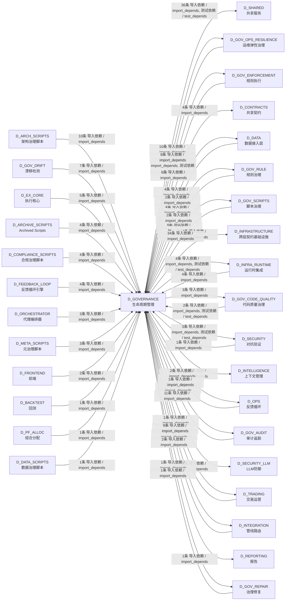

# 49_d_governance / 生命周期管理 / Lifecycle Management

> **功能简介 / Overview**: 生命周期管理，负责蓝图/模块/任务的声明周期管理和元数据治理

> **文档作用 / Purpose**: 展示 生命周期管理（D_GOVERNANCE）功能域的模块清单、域内依赖关系、跨域依赖关系、架构分层视图，供架构审查和域治理参考。

> 本文档由 generate_domain_doc.py 从 depgraph (PostgreSQL) 自动生成
> 数据源: depgraph (PostgreSQL) nodes表 + edges表

## 域基本信息 / Domain Overview

| 字段 | 值 | Field | Value |
|------|------|-------|-------|
| 编号 | 49 | Number | 49 |
| 域ID | D_GOVERNANCE | Domain ID | D_GOVERNANCE |
| 域名称 | 生命周期管理 | Domain Name | Lifecycle Management |
| 层级 | L2 业务域层 | Layer | L2 Domain |
| 模块数 | 133 | Module Count | 133 |
| 域内依赖 | 17 | Internal Dependencies | 17 |
| 跨域入边 | 130 | Cross-domain Incoming | 130 |
| 跨域出边 | 96 | Cross-domain Outgoing | 96 |
| 设计态模块 | 0 | Design Modules | 0 |
| 生产态模块 | 133 | Production Modules | 133 |
| 容量 | 219/150 (超容) | Capacity | 219/150 (超容) |
| 描述 | 注册表总索引(registry_of_registries) | Description | 注册表总索引(registry_of_registries) |

## 模块分层清单 / Module Layered List

> 按 architecture_layer 分组的模块清单（共 133 个模块 / 133 modules）。

### L0 基础设施层 / Infrastructure Layer (10 modules)

| # | 模块路径 / Module Path | 模块名称 / Module Name (功能简介 / Description) | 成熟度 / Maturity | 蓝图 / Blueprint |
|:--:|---------|---------|:---:|:---:|
| 1 | src/zephyr/governance/adapters/risk_validation_bridge.py | D_EXECUTION_CORE — Risk Validation Bridge (DW-239) | 生产态 / production |  |
| 2 | src/zephyr/governance/adapters/simulation_broker.py | D_EXECUTION_CORE — Simulation Broker Adapter | 生产态 / production |  |
| 3 | src/zephyr/governance/data_governance/akshare_provider.py | D_DATA — Akshare Data Provider | 生产态 / production |  |
| 4 | src/zephyr/governance/data_governance/miniqmt_provider.py | MiniQMT 实盘行情 Provider（Tick + 5档盘口） | 生产态 / production |  |
| 5 | src/zephyr/governance/intelligence_governance/memory_prov... | D_DATA — Memory Provider | 生产态 / production |  |
| 6 | src/zephyr/governance/intelligence_governance/provider_ba... | D_DATA — Data Source Layer | 生产态 / production |  |
| 7 | src/zephyr/governance/observability_governance/analytics_... | Re-export wrapper: analytics_base canonical at ... | 生产态 / production |  |
| 8 | src/zephyr/governance/strategies/strategy_base.py | D_PORTFOLIO_CORE — StrategyBase + StrategyMeta... | 生产态 / production |  |
| 9 | src/zephyr/governance/strategies/strategy_registry.py | StrategyRegistry 卫星模块（OCP-002） | 生产态 / production |  |
| 10 | src/zephyr/infrastructure/budget_enforcement/__init__.py | budget_enforcement 包聚合层。 | 生产态 / production |  |

### L1 基础层 / Foundation Layer (6 modules)

| # | 模块路径 / Module Path | 模块名称 / Module Name (功能简介 / Description) | 成熟度 / Maturity | 蓝图 / Blueprint |
|:--:|---------|---------|:---:|:---:|
| 1 | src/zephyr/governance/agent-rbac/contracts.py | agent-rbac/contracts.py — G-CT-001 RBAC 契约（... | 生产态 / production |  |
| 2 | src/zephyr/governance/compliance_gate_a6/compliance_manag... | ZephyrAlpha — D_COMPLIANCE Compliance Layer —... | 生产态 / production |  |
| 3 | src/zephyr/governance/engine/pipeline_base.py | 实验 — Experimentation Pipeline Layer | 生产态 / production |  |
| 4 | src/zephyr/governance/implementations/default_experiment_... | 实验 — Default Experiment Pipeline | 生产态 / production |  |
| 5 | src/zephyr/governance/implementations/default_security_ga... | default_security_gateway.py | 生产态 / production |  |
| 6 | src/zephyr/governance/intelligence_governance/aisg_sandbo... | AISG Sandbox Testing — AI Security Gateway 沙... | 生产态 / production |  |

### L2 领域层 / Domain Layer (117 modules)

| # | 模块路径 / Module Path | 模块名称 / Module Name (功能简介 / Description) | 成熟度 / Maturity | 蓝图 / Blueprint |
|:--:|---------|---------|:---:|:---:|
| 1 | src/zephyr/governance/a2a/__init__.py | __init__.py | 生产态 / production |  |
| 2 | src/zephyr/governance/agent-spec/__init__.py | __init__.py | 生产态 / production |  |
| 3 | src/zephyr/governance/agent_spec/a2a_failure.py | G-CT-008 消费端 — Escalation.on_a2a_failure() ... | 生产态 / production |  |
| 4 | src/zephyr/governance/agent_spec/rbac_bridge.py | G-CT-007 契约：Budget -> RBAC 配额限制. | 生产态 / production |  |
| 5 | src/zephyr/governance/agent_spec/registry.py | G-CT-003 契约：Agent Spec -> RBAC 能力检查. | 生产态 / production |  |
| 6 | src/zephyr/governance/architecture_governance/architectur... | architecture_contracts.py | 生产态 / production |  |
| 7 | src/zephyr/governance/architecture_governance/architectur... | architecture_principles.py | 生产态 / production |  |
| 8 | src/zephyr/governance/architecture_governance/blueprint_b... | Blueprint Bloat Monitor — v0.11.0 蓝图膨胀监控器。 | 生产态 / production |  |
| 9 | src/zephyr/governance/architecture_governance/blueprint_c... | Blueprint-Code Consistency Gate — MOD-INF-022. | 生产态 / production |  |
| 10 | src/zephyr/governance/architecture_governance/blueprint_r... | Blueprint Reconciler — v0.10.0 蓝图实现一致性... | 生产态 / production |  |
| 11 | src/zephyr/governance/architecture_governance/constructio... | Construction Verifier — 施工验证器: 任务卡完成... | 生产态 / production |  |
| 12 | src/zephyr/governance/architecture_governance/cross_env_c... | cross_env_consistency.py | 生产态 / production |  |
| 13 | src/zephyr/governance/architecture_governance/dependency_... | dependency_manager.py | 生产态 / production |  |
| 14 | src/zephyr/governance/architecture_governance/formal_veri... | Formal Verifier — v0.6.0 形式验证器: 升级规则... | 生产态 / production |  |
| 15 | src/zephyr/governance/architecture_governance/gap_analyze... | Gap Analyzer — v0.8.0 间隙分析器: escalation覆... | 生产态 / production |  |
| 16 | src/zephyr/governance/architecture_governance/llm_impact_... | LLMImpactAnalyzer — LLM-based commit 语义影响... | 生产态 / production |  |
| 17 | src/zephyr/governance/architecture_governance/local_first... | local_first_arch.py | 生产态 / production |  |
| 18 | src/zephyr/governance/architecture_governance/path_resolv... | PathResolver — 模块路径解析器 | 生产态 / production |  |
| 19 | src/zephyr/governance/architecture_governance/post_sync_v... | post_sync_validator — post_sync_standard 命令... | 生产态 / production |  |
| 20 | src/zephyr/governance/bridges/alerts.py | G-CT-006 — BudgetAlert re-exported from shared... | 生产态 / production |  |
| 21 | src/zephyr/governance/bridges/spec_auditor.py | G-CT-007 — Audit.record_agent_spec() 记录 Agen... | 生产态 / production |  |
| 22 | src/zephyr/governance/capability_lookup.py | CapabilityLookup — 能力->真源文件反查注册表的... | 生产态 / production |  |
| 23 | src/zephyr/governance/compliance_gate_a6/compliance_mappe... | Compliance Mapper — D-022-13 合规映射器: 操作-... | 生产态 / production |  |
| 24 | src/zephyr/governance/context_governance/command_chain_le... | Command Chain Length Gate — v0.13.0 命令体积De... | 生产态 / production |  |
| 25 | src/zephyr/governance/context_governance/context_budget.py | context_budget.py —— 上下文预算管理与超预算截... | 生产态 / production |  |
| 26 | src/zephyr/governance/context_governance/context_manager.py | context_manager.py | 生产态 / production |  |
| 27 | src/zephyr/governance/context_governance/context_package.py | Context Package — D-022-08 委托上下文包: 升级... | 生产态 / production |  |
| 28 | src/zephyr/governance/context_governance/context_recyclin... | context_recycling.py | 生产态 / production |  |
| 29 | src/zephyr/governance/context_governance/context_switch_g... | Context Switch Governor — v0.11.0 Owner上下文... | 生产态 / production |  |
| 30 | src/zephyr/governance/context_governance/context_waste_de... | context_waste_detector.py | 生产态 / production |  |
| 31 | src/zephyr/governance/context_governance/conversation_tax... | conversation_tax_detector.py | 生产态 / production |  |
| 32 | src/zephyr/governance/context_governance/instruction_bloa... | InstructionBloatDetector — 指令膨胀检测 | 生产态 / production |  |
| 33 | src/zephyr/governance/context_governance/multi_turn_inten... | Multi-Turn Intent Analyzer — v0.13.0 多轮分布... | 生产态 / production |  |
| 34 | src/zephyr/governance/context_governance/prompt_lifecycle.py | prompt_lifecycle.py | 生产态 / production |  |
| 35 | src/zephyr/governance/context_governance/protocol_self_co... | Protocol Self Context — v0.10.0 协议自维护上下... | 生产态 / production |  |
| 36 | src/zephyr/governance/context_governance/think_time_model.py | think_time_model.py | 生产态 / production |  |
| 37 | src/zephyr/governance/data_governance/data_classification.py | data_classification.py | 生产态 / production |  |
| 38 | src/zephyr/governance/data_governance/data_lifecycle.py | data_lifecycle.py | 生产态 / production |  |
| 39 | src/zephyr/governance/data_governance/data_pipeline_guard.py | Data Pipeline Guard — v0.10.0 数据管道完整性防... | 生产态 / production |  |
| 40 | src/zephyr/governance/data_governance/data_quality.py | data_quality.py | 生产态 / production |  |
| 41 | src/zephyr/governance/data_governance/data_source_reliabi... | data_source_reliability.py | 生产态 / production |  |
| 42 | src/zephyr/governance/data_governance/exchange_partition_... | Exchange Partition Detector — v0.12.0 交易所网... | 生产态 / production |  |
| 43 | src/zephyr/governance/data_governance/exchange_reg_monito... | Exchange Reg Monitor — v0.11.0 交易所规则变更... | 生产态 / production |  |
| 44 | src/zephyr/governance/data_governance/pricing_sync.py | pricing_sync.py | 生产态 / production |  |
| 45 | src/zephyr/governance/data_governance/realtime_streaming.py | realtime_streaming.py | 生产态 / production |  |
| 46 | src/zephyr/governance/depgraph_schema.py | depgraph Schema DDL + 版本化迁移框架 | 生产态 / production |  |
| 47 | src/zephyr/governance/evidence_pack.py | evidence_pack.py | 生产态 / production |  |
| 48 | src/zephyr/governance/financial_governance/arbitrage_asym... | Arbitrage Asymmetry Detector — v0.11.0 跨交易... | 生产态 / production |  |
| 49 | src/zephyr/governance/financial_governance/atomic_transac... | AtomicTransactionManager — SQLite + 文件系统的... | 生产态 / production |  |
| 50 | src/zephyr/governance/financial_governance/flash_crash_gu... | Flash Crash Guard — v0.12.0 闪崩双轨熔断器。 | 生产态 / production |  |
| 51 | src/zephyr/governance/financial_governance/fsm_verifier.py | fsm_verifier.py | 生产态 / production |  |
| 52 | src/zephyr/governance/financial_governance/instrument.py | instrument.py | 生产态 / production |  |
| 53 | src/zephyr/governance/financial_governance/microstructure... | microstructure_defense.py | 生产态 / production |  |
| 54 | src/zephyr/governance/financial_governance/oms_risk_engin... | oms_risk_engine.py | 生产态 / production |  |
| 55 | src/zephyr/governance/financial_governance/risk_matrix.py | risk_matrix.py | 生产态 / production |  |
| 56 | src/zephyr/governance/financial_governance/strategy_portf... | strategy_portfolio.py | 生产态 / production |  |
| 57 | src/zephyr/governance/financial_governance/strategy_scope... | Strategy Scoper — v0.6.0 策略范围隔离器: SIG/S... | 生产态 / production |  |
| 58 | src/zephyr/governance/intelligence_governance/agent_debat... | agent_debate.py | 生产态 / production |  |
| 59 | src/zephyr/governance/intelligence_governance/ai_self_dia... | ai_self_diagnosis.py | 生产态 / production |  |
| 60 | src/zephyr/governance/intelligence_governance/autonomy_da... | Autonomy Dashboard — AI 自主感知健康仪表。 | 生产态 / production |  |
| 61 | src/zephyr/governance/intelligence_governance/confidence_... | Confidence Estimator — D-022-05 置信度评估器: ... | 生产态 / production |  |
| 62 | src/zephyr/governance/intelligence_governance/confidence_... | ConfidenceQuantifier — AI 置信度量化。 | 生产态 / production |  |
| 63 | src/zephyr/governance/intelligence_governance/continuous_... | Continuous Trust Ledger — 持续信任评估引擎。 | 生产态 / production |  |
| 64 | src/zephyr/governance/intelligence_governance/cross_agent... | CrossAgentConflictDetector — 多 Agent 并发冲突... | 生产态 / production |  |
| 65 | src/zephyr/governance/intelligence_governance/cross_assis... | Cross-Assistant Adapter — v0.6.0 Trae/Cursor/W... | 生产态 / production |  |
| 66 | src/zephyr/governance/intelligence_governance/delegation_... | Delegation Engine — MOD-INF-022 | 生产态 / production |  |
| 67 | src/zephyr/governance/intelligence_governance/delegation_... | Delegation Manager — D-022-02 自动委托协议。 | 生产态 / production |  |
| 68 | src/zephyr/governance/intelligence_governance/meta_confid... | Meta-Confidence — D-022-10 Agent对自身判定置信... | 生产态 / production |  |
| 69 | src/zephyr/governance/intelligence_governance/model_provi... | model_provider_data.py | 生产态 / production |  |
| 70 | src/zephyr/governance/intelligence_governance/model_route... | model_router.py | 生产态 / production |  |
| 71 | src/zephyr/governance/intelligence_governance/model_versi... | Model Version Detector — v0.10.0 模型版本突变... | 生产态 / production |  |
| 72 | src/zephyr/governance/intelligence_governance/multi_model... | multi_model_consensus.py | 生产态 / production |  |
| 73 | src/zephyr/governance/intelligence_governance/mvep_orches... | MVEP Orchestrator — v0.11.0 Minimum Viable Esc... | 生产态 / production |  |
| 74 | src/zephyr/governance/intelligence_governance/provider_fa... | Provider Failover — v0.7.0 多LLM Provider容灾:... | 生产态 / production |  |
| 75 | src/zephyr/governance/intelligence_governance/self_benchm... | Self-Benchmark (W3-7) — 5 组已知对自验证 + 引... | 生产态 / production |  |
| 76 | src/zephyr/governance/intelligence_governance/self_test.py | Escalation Protocol Self-Test — MOD-INF-022. | 生产态 / production |  |
| 77 | src/zephyr/governance/intelligence_governance/self_valida... | Self Validator — v0.10.0 升级协议自验证器: pro... | 生产态 / production |  |
| 78 | src/zephyr/governance/intelligence_governance/subagent_ho... | Subagent Hook Propagator — v0.13.0 子Agent Hoo... | 生产态 / production |  |
| 79 | src/zephyr/governance/lifecycle_governance/api_lifecycle.py | api_lifecycle.py | 生产态 / production |  |
| 80 | src/zephyr/governance/lifecycle_governance/migration_stra... | migration_strategy.py | 生产态 / production |  |
| 81 | src/zephyr/governance/lifecycle_governance/paper_live_tra... | paper_live_transition.py | 生产态 / production |  |
| 82 | src/zephyr/governance/lifecycle_governance/post_live_veri... | post_live_verification.py | 生产态 / production |  |
| 83 | src/zephyr/governance/lifecycle_governance/transition.py | transition — 状态机转换 Mixin（从 task_repo.py... | 生产态 / production |  |
| 84 | src/zephyr/governance/observability_governance/objective_... | Objective Tracker — v0.9.0 目标漂移检测器: age... | 生产态 / production |  |
| 85 | src/zephyr/governance/observability_governance/projection... | ProjectionEngine — 事件折叠为当前状态（DW-0003） | 生产态 / production |  |
| 86 | src/zephyr/governance/observability_governance/query_metr... | QueryMetrics — SQL 查询性能监控装饰器（SH-DB-0... | 生产态 / production |  |
| 87 | src/zephyr/governance/persistence/base_repo.py | base_repo — 异常类、状态机常量、工具函数（从 t... | 生产态 / production |  |
| 88 | src/zephyr/governance/persistence/database_manager.py | DatabaseManager — 连接池 + 健康检查 + 自动备份... | 生产态 / production |  |
| 89 | src/zephyr/governance/persistence/database_service.py | DatabaseService 真源收敛（AI-14 审计 P1 修复） | 生产态 / production |  |
| 90 | src/zephyr/governance/persistence/dataflowgraph_schema.py | dataflowgraph Schema DDL + 连接入口 | 生产态 / production |  |
| 91 | src/zephyr/governance/persistence/decision_graph_reader.py | decision_graph_reader.py — 决策流图数据库只读... | 生产态 / production |  |
| 92 | src/zephyr/governance/persistence/decisiongraph_schema.py | decisiongraph Schema DDL + 不变量声明 | 生产态 / production |  |
| 93 | src/zephyr/governance/persistence/depgraph_reader.py | depgraph_reader.py — 依赖图数据库查询工具模块 | 生产态 / production |  |
| 94 | src/zephyr/governance/persistence/protocol_state_store.py | Protocol State Store — v0.10.0 协议运行时状态... | 生产态 / production |  |
| 95 | src/zephyr/governance/persistence/sqlite_schema.py | SQLite 元数据层 Schema DDL + 版本化迁移框架（T-... | 生产态 / production |  |
| 96 | src/zephyr/governance/persistence/task_repo.py | TaskRepository — 任务登记表 CRUD + 状态机（T-1... | 生产态 / production |  |
| 97 | src/zephyr/governance/rule_patterns.py | rule_patterns.py — 治理规则正则 + 安全审计模式... | 生产态 / production |  |
| 98 | src/zephyr/governance/services/adapter.py | Escalation Adapter — MOD-INF-022 统一集成入口. | 生产态 / production |  |
| 99 | src/zephyr/governance/services/cross_session_correlator.py | Cross-Session Correlator — v0.9.0 跨会话Corese... | 生产态 / production |  |
| 100 | src/zephyr/governance/services/memory_provenance.py | Memory Provenance — v0.9.0 记忆溯源追踪: 每条m... | 生产态 / production |  |
| 101 | tests/agent_rbac/test_session_aware_stash_red_blue.py | session 隔离 stash 红蓝对抗极限测试。 | 生产态 / production |  |
| 102 | tests/git/test_git_commit_concurrent.py | test_git_commit_concurrent.py — 幽灵提交红蓝对... | 生产态 / production |  |
| 103 | tests/git/test_git_commit_extreme.py | test_git_commit_extreme.py — GitCommitGateway ... | 生产态 / production |  |
| 104 | tests/git/test_git_commit_gateway.py | test_git_commit_gateway.py — GitCommitGateway ... | 生产态 / production |  |
| 105 | tests/git/test_reconciler_verify_autosync.py | test_reconciler_verify_autosync.py — --reconci... | 生产态 / production |  |
| 106 | tests/governance/generators/test_check_gate_inventory_dri... | test_check_gate_inventory_drift.py — commit_ga... | 生产态 / production |  |
| 107 | tests/governance/generators/test_generate_gate_registry.py | test_generate_gate_registry.py — generate_gate... | 生产态 / production |  |
| 108 | tests/governance/rule_bridge/test_worktree_lifecycle.py | test_worktree_lifecycle.py —... | 生产态 / production |  |
| 109 | tests/governance/test_ast_import_rewriter.py | Tests for scripts/governance/ast_import_rewrite... | 生产态 / production |  |
| 110 | tests/io/test_depgraph_schema.py | test_depgraph_schema.py — depgraph_schema.py D... | 生产态 / production |  |
| 111 | tests/io/test_verify_schema_health.py | test_verify_schema_health.py — verify_schema_h... | 生产态 / production |  |
| 112 | tests/rollback/test_concurrency_guard_red_blue.py | 红蓝对抗极端测试 — git_guard + concurrency_gua... | 生产态 / production |  |
| 113 | tests/rollback/test_concurrent_mv_guard.py | 并发红蓝极限对抗测试 — 多 AI 并发执行 git mv ... | 生产态 / production |  |
| 114 | tests/task/test_task_repo_gateway_e2e.py | test_task_repo_gateway_e2e.py — 端到端链路测试... | 生产态 / production |  |
| 115 | tests/test_align_panoramas.py | test_align_panoramas.py — align_panoramas.py ... | 生产态 / production |  |
| 116 | tests/test_generate_dataflow_diagram.py | test_generate_dataflow_diagram.py — generate_d... | 生产态 / production |  |
| 117 | tests/test_generate_decision_diagram.py | test_generate_decision_diagram.py — generate_d... | 生产态 / production |  |

## 域内依赖图 / Internal Dependency Diagram

> 依赖图内嵌在本文档中，IDE 可直接渲染显示。参考 decision_index.md 设计，分三个视图：合并全景图、运营态子图、设计态子图（按 design_maturity 实际值拆分）。
>
> **图例说明 / Legend**：
> - **实线边框 = 运营态模块**（production，已上线运行）
> - **虚线边框 = 设计态模块**（design，蓝图阶段，代码未写）
> - **实线箭头 = 运营态依赖**（已生效的依赖关系）
> - **虚线箭头 = 非运营态依赖**（计划中/验证中的依赖关系）

### 合并全景图（全部模块，标签标注成熟度）

> 展示全部 133 个模块（生产态 133 + 设计态 0），标签标注成熟度。

#### 第 1 页 / 共 5 页

```mermaid
graph TD
    subgraph D_GOVERNANCE["D_GOVERNANCE 生命周期管理"]
        src_zephyr_governance_a2a_init_py["(生产态 / production) __init__.py"]
        src_zephyr_governance_adapters_risk_validation_bridge_py["(生产态 / production) D_EXECUTION_CORE — Risk Validation Bridge (DW-239)<br/>文件: risk_validation_bridge.py"]
        src_zephyr_governance_adapters_simulation_broker_py["(生产态 / production) D_EXECUTION_CORE — Simulation Broker Adapter<br/>文件: simulation_broker.py"]
        src_zephyr_governance_agent_rbac_contracts_py["(生产态 / production) agent-rbac/contracts.py — G-CT-001 RBAC 契约（...<br/>文件: contracts.py"]
        src_zephyr_governance_agent_spec_init_py["(生产态 / production) __init__.py"]
        src_zephyr_governance_agent_spec_a2a_failure_py["(生产态 / production) G-CT-008 消费端 — Escalation.on_a2a_failure() ...<br/>文件: a2a_failure.py"]
        src_zephyr_governance_agent_spec_rbac_bridge_py["(生产态 / production) G-CT-007 契约：Budget -> RBAC 配额限制.<br/>文件: rbac_bridge.py"]
        src_zephyr_governance_agent_spec_registry_py["(生产态 / production) G-CT-003 契约：Agent Spec -> RBAC 能力检查.<br/>文件: registry.py"]
        src_zephyr_governance_architecture_governance_architecture_contracts_py["(生产态 / production) architecture_contracts.py"]
        src_zephyr_governance_architecture_governance_architecture_principles_py["(生产态 / production) architecture_principles.py"]
        src_zephyr_governance_architecture_governance_blueprint_bloat_monitor_py["(生产态 / production) Blueprint Bloat Monitor — v0.11.0 蓝图膨胀监控器。<br/>文件: blueprint_bloat_monitor.py"]
        src_zephyr_governance_architecture_governance_blueprint_code_consistency_py["(生产态 / production) Blueprint-Code Consistency Gate — MOD-INF-022.<br/>文件: blueprint_code_consistency.py"]
        src_zephyr_governance_architecture_governance_blueprint_reconciler_py["(生产态 / production) Blueprint Reconciler — v0.10.0 蓝图实现一致性...<br/>文件: blueprint_reconciler.py"]
        src_zephyr_governance_architecture_governance_construction_verifier_py["(生产态 / production) Construction Verifier — 施工验证器: 任务卡完成...<br/>文件: construction_verifier.py"]
        src_zephyr_governance_architecture_governance_cross_env_consistency_py["(生产态 / production) cross_env_consistency.py"]
        src_zephyr_governance_architecture_governance_dependency_manager_py["(生产态 / production) dependency_manager.py"]
        src_zephyr_governance_architecture_governance_formal_verifier_py["(生产态 / production) Formal Verifier — v0.6.0 形式验证器: 升级规则...<br/>文件: formal_verifier.py"]
        src_zephyr_governance_architecture_governance_gap_analyzer_py["(生产态 / production) Gap Analyzer — v0.8.0 间隙分析器: escalation覆...<br/>文件: gap_analyzer.py"]
        src_zephyr_governance_architecture_governance_llm_impact_analyzer_py["(生产态 / production) LLMImpactAnalyzer — LLM-based commit 语义影响...<br/>文件: llm_impact_analyzer.py"]
        src_zephyr_governance_architecture_governance_local_first_arch_py["(生产态 / production) local_first_arch.py"]
        src_zephyr_governance_architecture_governance_path_resolver_py["(生产态 / production) PathResolver — 模块路径解析器<br/>文件: path_resolver.py"]
        src_zephyr_governance_architecture_governance_post_sync_validator_py["(生产态 / production) post_sync_validator — post_sync_standard 命令...<br/>文件: post_sync_validator.py"]
        src_zephyr_governance_bridges_alerts_py["(生产态 / production) G-CT-006 — BudgetAlert re-exported from shared...<br/>文件: alerts.py"]
        src_zephyr_governance_bridges_spec_auditor_py["(生产态 / production) G-CT-007 — Audit.record_agent_spec() 记录 Agen...<br/>文件: spec_auditor.py"]
        src_zephyr_governance_capability_lookup_py["(生产态 / production) CapabilityLookup — 能力->真源文件反查注册表的...<br/>文件: capability_lookup.py"]
        src_zephyr_governance_compliance_gate_a6_compliance_manager_py["(生产态 / production) ZephyrAlpha — D_COMPLIANCE Compliance Layer —...<br/>文件: compliance_manager.py"]
        src_zephyr_governance_compliance_gate_a6_compliance_mapper_py["(生产态 / production) Compliance Mapper — D-022-13 合规映射器: 操作-...<br/>文件: compliance_mapper.py"]
        src_zephyr_governance_context_governance_command_chain_length_gate_py["(生产态 / production) Command Chain Length Gate — v0.13.0 命令体积De...<br/>文件: command_chain_length_gate.py"]
        src_zephyr_governance_context_governance_context_budget_py["(生产态 / production) context_budget.py —— 上下文预算管理与超预算截...<br/>文件: context_budget.py"]
        src_zephyr_governance_context_governance_context_manager_py["(生产态 / production) context_manager.py"]
    end
    D_TRADING["(生产态 / production) D_TRADING"]
    src_zephyr_governance_adapters_simulation_broker_py -->|导入依赖 / import_depends| D_TRADING
    D_CONTRACTS["(生产态 / production) D_CONTRACTS"]
    src_zephyr_governance_agent_spec_registry_py -->|导入依赖 / import_depends| D_CONTRACTS
    D_SECURITY["(生产态 / production) D_SECURITY"]
    src_zephyr_governance_agent_rbac_contracts_py -->|导入依赖 / import_depends| D_SECURITY
    D_INFRASTRUCTURE["(生产态 / production) D_INFRASTRUCTURE"]
    src_zephyr_governance_adapters_simulation_broker_py -->|导入依赖 / import_depends| D_INFRASTRUCTURE
    D_INFRA_RUNTIME["(生产态 / production) D_INFRA_RUNTIME"]
    src_zephyr_governance_context_governance_context_budget_py -->|导入依赖 / import_depends| D_INFRA_RUNTIME
    D_SHARED["(生产态 / production) D_SHARED"]
    src_zephyr_governance_capability_lookup_py -->|导入依赖 / import_depends| D_SHARED
    D_GOV_ENFORCEMENT["(生产态 / production) D_GOV_ENFORCEMENT"]
    src_zephyr_governance_compliance_gate_a6_compliance_manager_py -->|导入依赖 / import_depends| D_GOV_ENFORCEMENT
    src_zephyr_governance_adapters_simulation_broker_py -->|导入依赖 / import_depends| D_INFRASTRUCTURE
    D_INTEGRATION["(生产态 / production) D_INTEGRATION"]
    src_zephyr_governance_bridges_spec_auditor_py -->|导入依赖 / import_depends| D_INTEGRATION
    src_zephyr_governance_adapters_simulation_broker_py -->|导入依赖 / import_depends| D_INFRASTRUCTURE
    src_zephyr_governance_agent_spec_rbac_bridge_py -->|导入依赖 / import_depends| D_SECURITY
    src_zephyr_governance_adapters_risk_validation_bridge_py -->|导入依赖 / import_depends| D_INFRASTRUCTURE
    D_GOV_OPS_RESILIENCE["(生产态 / production) D_GOV_OPS_RESILIENCE"]
    src_zephyr_governance_agent_spec_a2a_failure_py -->|导入依赖 / import_depends| D_GOV_OPS_RESILIENCE
    src_zephyr_governance_architecture_governance_path_resolver_py -->|导入依赖 / import_depends| D_SHARED
    src_zephyr_governance_architecture_governance_llm_impact_analyzer_py -->|导入依赖 / import_depends| D_SHARED
    D_GOV_ENFORCEMENT -->|导入依赖 / import_depends| src_zephyr_governance_capability_lookup_py
    D_EX_CORE["(生产态 / production) D_EX_CORE"]
    D_EX_CORE -->|导入依赖 / import_depends| src_zephyr_governance_adapters_risk_validation_bridge_py
    D_ARCHIVE_SCRIPTS["(生产态 / production) D_ARCHIVE_SCRIPTS"]
    D_ARCHIVE_SCRIPTS -->|导入依赖 / import_depends| src_zephyr_governance_architecture_governance_post_sync_validator_py
    D_ARCH_SCRIPTS["(生产态 / production) D_ARCH_SCRIPTS"]
    D_ARCH_SCRIPTS -->|导入依赖 / import_depends| src_zephyr_governance_architecture_governance_llm_impact_analyzer_py
    D_TRADING -->|导入依赖 / import_depends| src_zephyr_governance_agent_spec_rbac_bridge_py
    D_INTEGRATION -->|导入依赖 / import_depends| src_zephyr_governance_architecture_governance_path_resolver_py
    D_EX_CORE -->|导入依赖 / import_depends| src_zephyr_governance_adapters_risk_validation_bridge_py
    D_GOV_AUDIT["(生产态 / production) D_GOV_AUDIT"]
    D_GOV_AUDIT -->|导入依赖 / import_depends| src_zephyr_governance_agent_spec_registry_py
    D_EX_CORE -->|导入依赖 / import_depends| src_zephyr_governance_adapters_risk_validation_bridge_py
    D_GOV_ENFORCEMENT -->|导入依赖 / import_depends| src_zephyr_governance_capability_lookup_py
    D_GOV_ENFORCEMENT -->|导入依赖 / import_depends| src_zephyr_governance_capability_lookup_py
    D_GOV_ENFORCEMENT -->|导入依赖 / import_depends| src_zephyr_governance_capability_lookup_py
    D_GOV_SCRIPTS["(生产态 / production) D_GOV_SCRIPTS"]
    D_GOV_SCRIPTS -->|导入依赖 / import_depends| src_zephyr_governance_capability_lookup_py
    D_ARCHIVE_SCRIPTS -->|导入依赖 / import_depends| src_zephyr_governance_architecture_governance_path_resolver_py
    D_INTEGRATION -->|导入依赖 / import_depends| src_zephyr_governance_agent_spec_rbac_bridge_py
    classDef production fill:#e1f5fe,stroke:#01579b,stroke-width:2px,color:#000
    classDef design fill:#fff3e0,stroke:#e65100,stroke-width:2px,color:#000,stroke-dasharray: 5 5
    classDef external_prod fill:#e8f5e9,stroke:#1b5e20,stroke-width:1px,color:#000
    classDef external_design fill:#fce4ec,stroke:#880e4f,stroke-width:1px,color:#000,stroke-dasharray: 5 5
    class src_zephyr_governance_a2a_init_py,src_zephyr_governance_adapters_risk_validation_bridge_py,src_zephyr_governance_adapters_simulation_broker_py,src_zephyr_governance_agent_rbac_contracts_py,src_zephyr_governance_agent_spec_init_py,src_zephyr_governance_agent_spec_a2a_failure_py,src_zephyr_governance_agent_spec_rbac_bridge_py,src_zephyr_governance_agent_spec_registry_py,src_zephyr_governance_architecture_governance_architecture_contracts_py,src_zephyr_governance_architecture_governance_architecture_principles_py,src_zephyr_governance_architecture_governance_blueprint_bloat_monitor_py,src_zephyr_governance_architecture_governance_blueprint_code_consistency_py,src_zephyr_governance_architecture_governance_blueprint_reconciler_py,src_zephyr_governance_architecture_governance_construction_verifier_py,src_zephyr_governance_architecture_governance_cross_env_consistency_py,src_zephyr_governance_architecture_governance_dependency_manager_py,src_zephyr_governance_architecture_governance_formal_verifier_py,src_zephyr_governance_architecture_governance_gap_analyzer_py,src_zephyr_governance_architecture_governance_llm_impact_analyzer_py,src_zephyr_governance_architecture_governance_local_first_arch_py,src_zephyr_governance_architecture_governance_path_resolver_py,src_zephyr_governance_architecture_governance_post_sync_validator_py,src_zephyr_governance_bridges_alerts_py,src_zephyr_governance_bridges_spec_auditor_py,src_zephyr_governance_capability_lookup_py,src_zephyr_governance_compliance_gate_a6_compliance_manager_py,src_zephyr_governance_compliance_gate_a6_compliance_mapper_py,src_zephyr_governance_context_governance_command_chain_length_gate_py,src_zephyr_governance_context_governance_context_budget_py,src_zephyr_governance_context_governance_context_manager_py production
    class D_TRADING,D_CONTRACTS,D_SECURITY,D_INFRASTRUCTURE,D_INFRA_RUNTIME,D_SHARED,D_GOV_ENFORCEMENT,D_INTEGRATION,D_GOV_OPS_RESILIENCE,D_EX_CORE,D_ARCHIVE_SCRIPTS,D_ARCH_SCRIPTS,D_GOV_AUDIT,D_GOV_SCRIPTS external_prod
```



#### 第 2 页 / 共 5 页

```mermaid
graph TD
    subgraph D_GOVERNANCE["D_GOVERNANCE 生命周期管理"]
        src_zephyr_governance_context_governance_context_package_py["(生产态 / production) Context Package — D-022-08 委托上下文包: 升级...<br/>文件: context_package.py"]
        src_zephyr_governance_context_governance_context_recycling_py["(生产态 / production) context_recycling.py"]
        src_zephyr_governance_context_governance_context_switch_governor_py["(生产态 / production) Context Switch Governor — v0.11.0 Owner上下文...<br/>文件: context_switch_governor.py"]
        src_zephyr_governance_context_governance_context_waste_detector_py["(生产态 / production) context_waste_detector.py"]
        src_zephyr_governance_context_governance_conversation_tax_detector_py["(生产态 / production) conversation_tax_detector.py"]
        src_zephyr_governance_context_governance_instruction_bloat_detector_py["(生产态 / production) InstructionBloatDetector — 指令膨胀检测<br/>文件: instruction_bloat_detector.py"]
        src_zephyr_governance_context_governance_multi_turn_intent_analyzer_py["(生产态 / production) Multi-Turn Intent Analyzer — v0.13.0 多轮分布...<br/>文件: multi_turn_intent_analyzer.py"]
        src_zephyr_governance_context_governance_prompt_lifecycle_py["(生产态 / production) prompt_lifecycle.py"]
        src_zephyr_governance_context_governance_protocol_self_context_py["(生产态 / production) Protocol Self Context — v0.10.0 协议自维护上下...<br/>文件: protocol_self_context.py"]
        src_zephyr_governance_context_governance_think_time_model_py["(生产态 / production) think_time_model.py"]
        src_zephyr_governance_data_governance_akshare_provider_py["(生产态 / production) D_DATA — Akshare Data Provider<br/>文件: akshare_provider.py"]
        src_zephyr_governance_data_governance_data_classification_py["(生产态 / production) data_classification.py"]
        src_zephyr_governance_data_governance_data_lifecycle_py["(生产态 / production) data_lifecycle.py"]
        src_zephyr_governance_data_governance_data_pipeline_guard_py["(生产态 / production) Data Pipeline Guard — v0.10.0 数据管道完整性防...<br/>文件: data_pipeline_guard.py"]
        src_zephyr_governance_data_governance_data_quality_py["(生产态 / production) data_quality.py"]
        src_zephyr_governance_data_governance_data_source_reliability_py["(生产态 / production) data_source_reliability.py"]
        src_zephyr_governance_data_governance_exchange_partition_detector_py["(生产态 / production) Exchange Partition Detector — v0.12.0 交易所网...<br/>文件: exchange_partition_detector.py"]
        src_zephyr_governance_data_governance_exchange_reg_monitor_py["(生产态 / production) Exchange Reg Monitor — v0.11.0 交易所规则变更...<br/>文件: exchange_reg_monitor.py"]
        src_zephyr_governance_data_governance_miniqmt_provider_py["(生产态 / production) MiniQMT 实盘行情 Provider（Tick + 5档盘口）<br/>文件: miniqmt_provider.py"]
        src_zephyr_governance_data_governance_pricing_sync_py["(生产态 / production) pricing_sync.py"]
        src_zephyr_governance_data_governance_realtime_streaming_py["(生产态 / production) realtime_streaming.py"]
        src_zephyr_governance_depgraph_schema_py["(生产态 / production) depgraph Schema DDL + 版本化迁移框架<br/>文件: depgraph_schema.py"]
        src_zephyr_governance_engine_pipeline_base_py["(生产态 / production) 实验 — Experimentation Pipeline Layer<br/>文件: pipeline_base.py"]
        src_zephyr_governance_evidence_pack_py["(生产态 / production) evidence_pack.py"]
        src_zephyr_governance_financial_governance_arbitrage_asymmetry_detector_py["(生产态 / production) Arbitrage Asymmetry Detector — v0.11.0 跨交易...<br/>文件: arbitrage_asymmetry_detector.py"]
        src_zephyr_governance_financial_governance_atomic_transaction_manager_py["(生产态 / production) AtomicTransactionManager — SQLite + 文件系统的...<br/>文件: atomic_transaction_manager.py"]
        src_zephyr_governance_financial_governance_flash_crash_guard_py["(生产态 / production) Flash Crash Guard — v0.12.0 闪崩双轨熔断器。<br/>文件: flash_crash_guard.py"]
        src_zephyr_governance_financial_governance_fsm_verifier_py["(生产态 / production) fsm_verifier.py"]
        src_zephyr_governance_financial_governance_instrument_py["(生产态 / production) instrument.py"]
        src_zephyr_governance_financial_governance_microstructure_defense_py["(生产态 / production) microstructure_defense.py"]
    end
    D_DATA["(生产态 / production) D_DATA"]
    src_zephyr_governance_data_governance_miniqmt_provider_py -->|导入依赖 / import_depends| D_DATA
    D_SHARED["(生产态 / production) D_SHARED"]
    src_zephyr_governance_data_governance_pricing_sync_py -->|导入依赖 / import_depends| D_SHARED
    src_zephyr_governance_data_governance_miniqmt_provider_py -->|导入依赖 / import_depends| D_SHARED
    src_zephyr_governance_financial_governance_atomic_transaction_manager_py -->|导入依赖 / import_depends| D_SHARED
    D_CONTRACTS["(生产态 / production) D_CONTRACTS"]
    src_zephyr_governance_engine_pipeline_base_py -->|导入依赖 / import_depends| D_CONTRACTS
    src_zephyr_governance_context_governance_context_package_py -->|导入依赖 / import_depends| D_SHARED
    src_zephyr_governance_financial_governance_atomic_transaction_manager_py -->|导入依赖 / import_depends| D_SHARED
    src_zephyr_governance_depgraph_schema_py -->|导入依赖 / import_depends| D_SHARED
    src_zephyr_governance_evidence_pack_py -->|导入依赖 / import_depends| D_SHARED
    src_zephyr_governance_depgraph_schema_py -->|导入依赖 / import_depends| D_SHARED
    D_DATA -->|导入依赖 / import_depends| src_zephyr_governance_depgraph_schema_py
    D_GOV_ENFORCEMENT["(生产态 / production) D_GOV_ENFORCEMENT"]
    D_GOV_ENFORCEMENT -->|导入依赖 / import_depends| src_zephyr_governance_depgraph_schema_py
    D_GOV_ENFORCEMENT -->|导入依赖 / import_depends| src_zephyr_governance_depgraph_schema_py
    D_GOV_SCRIPTS["(生产态 / production) D_GOV_SCRIPTS"]
    D_GOV_SCRIPTS -->|导入依赖 / import_depends| src_zephyr_governance_depgraph_schema_py
    D_GOV_SCRIPTS -->|导入依赖 / import_depends| src_zephyr_governance_depgraph_schema_py
    D_ARCH_SCRIPTS["(生产态 / production) D_ARCH_SCRIPTS"]
    D_ARCH_SCRIPTS -->|导入依赖 / import_depends| src_zephyr_governance_depgraph_schema_py
    D_GOV_SCRIPTS -->|导入依赖 / import_depends| src_zephyr_governance_depgraph_schema_py
    D_META_SCRIPTS["(生产态 / production) D_META_SCRIPTS"]
    D_META_SCRIPTS -->|导入依赖 / import_depends| src_zephyr_governance_depgraph_schema_py
    D_GOV_AUDIT["(生产态 / production) D_GOV_AUDIT"]
    D_GOV_AUDIT -->|导入依赖 / import_depends| src_zephyr_governance_depgraph_schema_py
    D_COMPLIANCE_SCRIPTS["(生产态 / production) D_COMPLIANCE_SCRIPTS"]
    D_COMPLIANCE_SCRIPTS -->|导入依赖 / import_depends| src_zephyr_governance_depgraph_schema_py
    D_GOV_SCRIPTS -->|导入依赖 / import_depends| src_zephyr_governance_depgraph_schema_py
    D_DATA_SCRIPTS["(生产态 / production) D_DATA_SCRIPTS"]
    D_DATA_SCRIPTS -->|导入依赖 / import_depends| src_zephyr_governance_depgraph_schema_py
    D_GOV_SCRIPTS -->|导入依赖 / import_depends| src_zephyr_governance_depgraph_schema_py
    D_ARCH_SCRIPTS -->|导入依赖 / import_depends| src_zephyr_governance_depgraph_schema_py
    D_ARCH_SCRIPTS -->|导入依赖 / import_depends| src_zephyr_governance_depgraph_schema_py
    classDef production fill:#e1f5fe,stroke:#01579b,stroke-width:2px,color:#000
    classDef design fill:#fff3e0,stroke:#e65100,stroke-width:2px,color:#000,stroke-dasharray: 5 5
    classDef external_prod fill:#e8f5e9,stroke:#1b5e20,stroke-width:1px,color:#000
    classDef external_design fill:#fce4ec,stroke:#880e4f,stroke-width:1px,color:#000,stroke-dasharray: 5 5
    class src_zephyr_governance_context_governance_context_package_py,src_zephyr_governance_context_governance_context_recycling_py,src_zephyr_governance_context_governance_context_switch_governor_py,src_zephyr_governance_context_governance_context_waste_detector_py,src_zephyr_governance_context_governance_conversation_tax_detector_py,src_zephyr_governance_context_governance_instruction_bloat_detector_py,src_zephyr_governance_context_governance_multi_turn_intent_analyzer_py,src_zephyr_governance_context_governance_prompt_lifecycle_py,src_zephyr_governance_context_governance_protocol_self_context_py,src_zephyr_governance_context_governance_think_time_model_py,src_zephyr_governance_data_governance_akshare_provider_py,src_zephyr_governance_data_governance_data_classification_py,src_zephyr_governance_data_governance_data_lifecycle_py,src_zephyr_governance_data_governance_data_pipeline_guard_py,src_zephyr_governance_data_governance_data_quality_py,src_zephyr_governance_data_governance_data_source_reliability_py,src_zephyr_governance_data_governance_exchange_partition_detector_py,src_zephyr_governance_data_governance_exchange_reg_monitor_py,src_zephyr_governance_data_governance_miniqmt_provider_py,src_zephyr_governance_data_governance_pricing_sync_py,src_zephyr_governance_data_governance_realtime_streaming_py,src_zephyr_governance_depgraph_schema_py,src_zephyr_governance_engine_pipeline_base_py,src_zephyr_governance_evidence_pack_py,src_zephyr_governance_financial_governance_arbitrage_asymmetry_detector_py,src_zephyr_governance_financial_governance_atomic_transaction_manager_py,src_zephyr_governance_financial_governance_flash_crash_guard_py,src_zephyr_governance_financial_governance_fsm_verifier_py,src_zephyr_governance_financial_governance_instrument_py,src_zephyr_governance_financial_governance_microstructure_defense_py production
    class D_DATA,D_SHARED,D_CONTRACTS,D_GOV_ENFORCEMENT,D_GOV_SCRIPTS,D_ARCH_SCRIPTS,D_META_SCRIPTS,D_GOV_AUDIT,D_COMPLIANCE_SCRIPTS,D_DATA_SCRIPTS external_prod
```



#### 第 3 页 / 共 5 页

```mermaid
graph TD
    subgraph D_GOVERNANCE["D_GOVERNANCE 生命周期管理"]
        src_zephyr_governance_financial_governance_oms_risk_engine_py["(生产态 / production) oms_risk_engine.py"]
        src_zephyr_governance_financial_governance_risk_matrix_py["(生产态 / production) risk_matrix.py"]
        src_zephyr_governance_financial_governance_strategy_portfolio_py["(生产态 / production) strategy_portfolio.py"]
        src_zephyr_governance_financial_governance_strategy_scoper_py["(生产态 / production) Strategy Scoper — v0.6.0 策略范围隔离器: SIG/S...<br/>文件: strategy_scoper.py"]
        src_zephyr_governance_implementations_default_experiment_pipeline_py["(生产态 / production) 实验 — Default Experiment Pipeline<br/>文件: default_experiment_pipeline.py"]
        src_zephyr_governance_implementations_default_security_gateway_py["(生产态 / production) default_security_gateway.py"]
        src_zephyr_governance_intelligence_governance_agent_debate_py["(生产态 / production) agent_debate.py"]
        src_zephyr_governance_intelligence_governance_ai_self_diagnosis_py["(生产态 / production) ai_self_diagnosis.py"]
        src_zephyr_governance_intelligence_governance_aisg_sandbox_py["(生产态 / production) AISG Sandbox Testing — AI Security Gateway 沙...<br/>文件: aisg_sandbox.py"]
        src_zephyr_governance_intelligence_governance_autonomy_dashboard_py["(生产态 / production) Autonomy Dashboard — AI 自主感知健康仪表。<br/>文件: autonomy_dashboard.py"]
        src_zephyr_governance_intelligence_governance_confidence_estimator_py["(生产态 / production) Confidence Estimator — D-022-05 置信度评估器: ...<br/>文件: confidence_estimator.py"]
        src_zephyr_governance_intelligence_governance_confidence_quantifier_py["(生产态 / production) ConfidenceQuantifier — AI 置信度量化。<br/>文件: confidence_quantifier.py"]
        src_zephyr_governance_intelligence_governance_continuous_trust_py["(生产态 / production) Continuous Trust Ledger — 持续信任评估引擎。<br/>文件: continuous_trust.py"]
        src_zephyr_governance_intelligence_governance_cross_agent_conflict_detector_py["(生产态 / production) CrossAgentConflictDetector — 多 Agent 并发冲突...<br/>文件: cross_agent_conflict_detector.py"]
        src_zephyr_governance_intelligence_governance_cross_assistant_adapter_py["(生产态 / production) Cross-Assistant Adapter — v0.6.0 Trae/Cursor/W...<br/>文件: cross_assistant_adapter.py"]
        src_zephyr_governance_intelligence_governance_delegation_engine_py["(生产态 / production) Delegation Engine — MOD-INF-022<br/>文件: delegation_engine.py"]
        src_zephyr_governance_intelligence_governance_delegation_manager_py["(生产态 / production) Delegation Manager — D-022-02 自动委托协议。<br/>文件: delegation_manager.py"]
        src_zephyr_governance_intelligence_governance_memory_provider_py["(生产态 / production) D_DATA — Memory Provider<br/>文件: memory_provider.py"]
        src_zephyr_governance_intelligence_governance_meta_confidence_py["(生产态 / production) Meta-Confidence — D-022-10 Agent对自身判定置信...<br/>文件: meta_confidence.py"]
        src_zephyr_governance_intelligence_governance_model_provider_data_py["(生产态 / production) model_provider_data.py"]
        src_zephyr_governance_intelligence_governance_model_router_py["(生产态 / production) model_router.py"]
        src_zephyr_governance_intelligence_governance_model_version_detector_py["(生产态 / production) Model Version Detector — v0.10.0 模型版本突变...<br/>文件: model_version_detector.py"]
        src_zephyr_governance_intelligence_governance_multi_model_consensus_py["(生产态 / production) multi_model_consensus.py"]
        src_zephyr_governance_intelligence_governance_mvep_orchestrator_py["(生产态 / production) MVEP Orchestrator — v0.11.0 Minimum Viable Esc...<br/>文件: mvep_orchestrator.py"]
        src_zephyr_governance_intelligence_governance_provider_base_py["(生产态 / production) D_DATA — Data Source Layer<br/>文件: provider_base.py"]
        src_zephyr_governance_intelligence_governance_provider_failover_py["(生产态 / production) Provider Failover — v0.7.0 多LLM Provider容灾:...<br/>文件: provider_failover.py"]
        src_zephyr_governance_intelligence_governance_self_benchmark_py["(生产态 / production) Self-Benchmark (W3-7) — 5 组已知对自验证 + 引...<br/>文件: self_benchmark.py"]
        src_zephyr_governance_intelligence_governance_self_test_py["(生产态 / production) Escalation Protocol Self-Test — MOD-INF-022.<br/>文件: self_test.py"]
        src_zephyr_governance_intelligence_governance_self_validator_py["(生产态 / production) Self Validator — v0.10.0 升级协议自验证器: pro...<br/>文件: self_validator.py"]
        src_zephyr_governance_intelligence_governance_subagent_hook_propagator_py["(生产态 / production) Subagent Hook Propagator — v0.13.0 子Agent Hoo...<br/>文件: subagent_hook_propagator.py"]
    end
    src_zephyr_governance_intelligence_governance_self_test_py -->|导入依赖 / import_depends| src_zephyr_governance_intelligence_governance_delegation_engine_py
    D_SECURITY_LLM["(生产态 / production) D_SECURITY_LLM"]
    src_zephyr_governance_intelligence_governance_delegation_engine_py -->|导入依赖 / import_depends| D_SECURITY_LLM
    D_SHARED["(生产态 / production) D_SHARED"]
    src_zephyr_governance_intelligence_governance_self_benchmark_py -->|导入依赖 / import_depends| D_SHARED
    src_zephyr_governance_intelligence_governance_aisg_sandbox_py -->|导入依赖 / import_depends| D_SHARED
    D_GOV_CODE_QUALITY["(生产态 / production) D_GOV_CODE_QUALITY"]
    src_zephyr_governance_intelligence_governance_self_benchmark_py -->|导入依赖 / import_depends| D_GOV_CODE_QUALITY
    D_DATA["(生产态 / production) D_DATA"]
    src_zephyr_governance_intelligence_governance_memory_provider_py -->|导入依赖 / import_depends| D_DATA
    src_zephyr_governance_intelligence_governance_self_benchmark_py -->|导入依赖 / import_depends| D_GOV_CODE_QUALITY
    D_GOV_OPS_RESILIENCE["(生产态 / production) D_GOV_OPS_RESILIENCE"]
    src_zephyr_governance_intelligence_governance_self_test_py -->|导入依赖 / import_depends| D_GOV_OPS_RESILIENCE
    src_zephyr_governance_intelligence_governance_memory_provider_py -->|导入依赖 / import_depends| D_DATA
    D_INTELLIGENCE["(生产态 / production) D_INTELLIGENCE"]
    src_zephyr_governance_intelligence_governance_model_router_py -->|导入依赖 / import_depends| D_INTELLIGENCE
    D_OPS["(生产态 / production) D_OPS"]
    src_zephyr_governance_intelligence_governance_model_router_py -->|导入依赖 / import_depends| D_OPS
    src_zephyr_governance_implementations_default_security_gateway_py -->|导入依赖 / import_depends| D_GOV_OPS_RESILIENCE
    src_zephyr_governance_intelligence_governance_self_benchmark_py -->|导入依赖 / import_depends| D_GOV_CODE_QUALITY
    src_zephyr_governance_intelligence_governance_model_router_py -->|导入依赖 / import_depends| D_INTELLIGENCE
    src_zephyr_governance_intelligence_governance_self_test_py -->|导入依赖 / import_depends| D_GOV_OPS_RESILIENCE
    src_zephyr_governance_intelligence_governance_delegation_engine_py -->|导入依赖 / import_depends| D_GOV_OPS_RESILIENCE
    D_TRADING["(生产态 / production) D_TRADING"]
    D_TRADING -->|导入依赖 / import_depends| src_zephyr_governance_intelligence_governance_model_router_py
    D_GOV_OPS_RESILIENCE -->|导入依赖 / import_depends| src_zephyr_governance_intelligence_governance_aisg_sandbox_py
    D_GOV_AUDIT["(生产态 / production) D_GOV_AUDIT"]
    D_GOV_AUDIT -->|导入依赖 / import_depends| src_zephyr_governance_intelligence_governance_continuous_trust_py
    D_GOV_OPS_RESILIENCE -->|导入依赖 / import_depends| src_zephyr_governance_intelligence_governance_self_test_py
    D_GOV_CODE_QUALITY -->|导入依赖 / import_depends| src_zephyr_governance_intelligence_governance_self_benchmark_py
    D_GOV_OPS_RESILIENCE -->|导入依赖 / import_depends| src_zephyr_governance_intelligence_governance_delegation_engine_py
    D_GOV_REPAIR["(生产态 / production) D_GOV_REPAIR"]
    D_GOV_REPAIR -->|导入依赖 / import_depends| src_zephyr_governance_intelligence_governance_model_router_py
    classDef production fill:#e1f5fe,stroke:#01579b,stroke-width:2px,color:#000
    classDef design fill:#fff3e0,stroke:#e65100,stroke-width:2px,color:#000,stroke-dasharray: 5 5
    classDef external_prod fill:#e8f5e9,stroke:#1b5e20,stroke-width:1px,color:#000
    classDef external_design fill:#fce4ec,stroke:#880e4f,stroke-width:1px,color:#000,stroke-dasharray: 5 5
    class src_zephyr_governance_financial_governance_oms_risk_engine_py,src_zephyr_governance_financial_governance_risk_matrix_py,src_zephyr_governance_financial_governance_strategy_portfolio_py,src_zephyr_governance_financial_governance_strategy_scoper_py,src_zephyr_governance_implementations_default_experiment_pipeline_py,src_zephyr_governance_implementations_default_security_gateway_py,src_zephyr_governance_intelligence_governance_agent_debate_py,src_zephyr_governance_intelligence_governance_ai_self_diagnosis_py,src_zephyr_governance_intelligence_governance_aisg_sandbox_py,src_zephyr_governance_intelligence_governance_autonomy_dashboard_py,src_zephyr_governance_intelligence_governance_confidence_estimator_py,src_zephyr_governance_intelligence_governance_confidence_quantifier_py,src_zephyr_governance_intelligence_governance_continuous_trust_py,src_zephyr_governance_intelligence_governance_cross_agent_conflict_detector_py,src_zephyr_governance_intelligence_governance_cross_assistant_adapter_py,src_zephyr_governance_intelligence_governance_delegation_engine_py,src_zephyr_governance_intelligence_governance_delegation_manager_py,src_zephyr_governance_intelligence_governance_memory_provider_py,src_zephyr_governance_intelligence_governance_meta_confidence_py,src_zephyr_governance_intelligence_governance_model_provider_data_py,src_zephyr_governance_intelligence_governance_model_router_py,src_zephyr_governance_intelligence_governance_model_version_detector_py,src_zephyr_governance_intelligence_governance_multi_model_consensus_py,src_zephyr_governance_intelligence_governance_mvep_orchestrator_py,src_zephyr_governance_intelligence_governance_provider_base_py,src_zephyr_governance_intelligence_governance_provider_failover_py,src_zephyr_governance_intelligence_governance_self_benchmark_py,src_zephyr_governance_intelligence_governance_self_test_py,src_zephyr_governance_intelligence_governance_self_validator_py,src_zephyr_governance_intelligence_governance_subagent_hook_propagator_py production
    class D_SECURITY_LLM,D_SHARED,D_GOV_CODE_QUALITY,D_DATA,D_GOV_OPS_RESILIENCE,D_INTELLIGENCE,D_OPS,D_TRADING,D_GOV_AUDIT,D_GOV_REPAIR external_prod
```



#### 第 4 页 / 共 5 页

```mermaid
graph TD
    subgraph D_GOVERNANCE["D_GOVERNANCE 生命周期管理"]
        src_zephyr_governance_lifecycle_governance_api_lifecycle_py["(生产态 / production) api_lifecycle.py"]
        src_zephyr_governance_lifecycle_governance_migration_strategy_py["(生产态 / production) migration_strategy.py"]
        src_zephyr_governance_lifecycle_governance_paper_live_transition_py["(生产态 / production) paper_live_transition.py"]
        src_zephyr_governance_lifecycle_governance_post_live_verification_py["(生产态 / production) post_live_verification.py"]
        src_zephyr_governance_lifecycle_governance_transition_py["(生产态 / production) transition — 状态机转换 Mixin（从 task_repo.py...<br/>文件: transition.py"]
        src_zephyr_governance_observability_governance_analytics_base_py["(生产态 / production) Re-export wrapper: analytics_base canonical at ...<br/>文件: analytics_base.py"]
        src_zephyr_governance_observability_governance_objective_tracker_py["(生产态 / production) Objective Tracker — v0.9.0 目标漂移检测器: age...<br/>文件: objective_tracker.py"]
        src_zephyr_governance_observability_governance_projection_engine_py["(生产态 / production) ProjectionEngine — 事件折叠为当前状态（DW-0003）<br/>文件: projection_engine.py"]
        src_zephyr_governance_observability_governance_query_metrics_py["(生产态 / production) QueryMetrics — SQL 查询性能监控装饰器（SH-DB-0...<br/>文件: query_metrics.py"]
        src_zephyr_governance_persistence_base_repo_py["(生产态 / production) base_repo — 异常类、状态机常量、工具函数（从 t...<br/>文件: base_repo.py"]
        src_zephyr_governance_persistence_database_manager_py["(生产态 / production) DatabaseManager — 连接池 + 健康检查 + 自动备份...<br/>文件: database_manager.py"]
        src_zephyr_governance_persistence_database_service_py["(生产态 / production) DatabaseService 真源收敛（AI-14 审计 P1 修复）<br/>文件: database_service.py"]
        src_zephyr_governance_persistence_dataflowgraph_schema_py["(生产态 / production) dataflowgraph Schema DDL + 连接入口<br/>文件: dataflowgraph_schema.py"]
        src_zephyr_governance_persistence_decision_graph_reader_py["(生产态 / production) decision_graph_reader.py — 决策流图数据库只读...<br/>文件: decision_graph_reader.py"]
        src_zephyr_governance_persistence_decisiongraph_schema_py["(生产态 / production) decisiongraph Schema DDL + 不变量声明<br/>文件: decisiongraph_schema.py"]
        src_zephyr_governance_persistence_depgraph_reader_py["(生产态 / production) depgraph_reader.py — 依赖图数据库查询工具模块<br/>文件: depgraph_reader.py"]
        src_zephyr_governance_persistence_protocol_state_store_py["(生产态 / production) Protocol State Store — v0.10.0 协议运行时状态...<br/>文件: protocol_state_store.py"]
        src_zephyr_governance_persistence_sqlite_schema_py["(生产态 / production) SQLite 元数据层 Schema DDL + 版本化迁移框架（T-...<br/>文件: sqlite_schema.py"]
        src_zephyr_governance_persistence_task_repo_py["(生产态 / production) TaskRepository — 任务登记表 CRUD + 状态机（T-1...<br/>文件: task_repo.py"]
        src_zephyr_governance_rule_patterns_py["(生产态 / production) rule_patterns.py — 治理规则正则 + 安全审计模式...<br/>文件: rule_patterns.py"]
        src_zephyr_governance_services_adapter_py["(生产态 / production) Escalation Adapter — MOD-INF-022 统一集成入口.<br/>文件: adapter.py"]
        src_zephyr_governance_services_cross_session_correlator_py["(生产态 / production) Cross-Session Correlator — v0.9.0 跨会话Corese...<br/>文件: cross_session_correlator.py"]
        src_zephyr_governance_services_memory_provenance_py["(生产态 / production) Memory Provenance — v0.9.0 记忆溯源追踪: 每条m...<br/>文件: memory_provenance.py"]
        src_zephyr_governance_strategies_strategy_base_py["(生产态 / production) D_PORTFOLIO_CORE — StrategyBase + StrategyMeta...<br/>文件: strategy_base.py"]
        src_zephyr_governance_strategies_strategy_registry_py["(生产态 / production) StrategyRegistry 卫星模块（OCP-002）<br/>文件: strategy_registry.py"]
        src_zephyr_infrastructure_budget_enforcement_init_py["(生产态 / production) budget_enforcement 包聚合层。<br/>文件: __init__.py"]
        tests_agent_rbac_test_session_aware_stash_red_blue_py["(生产态 / production) session 隔离 stash 红蓝对抗极限测试。<br/>文件: test_session_aware_stash_red_blue.py"]
        tests_git_test_git_commit_concurrent_py["(生产态 / production) test_git_commit_concurrent.py — 幽灵提交红蓝对...<br/>文件: test_git_commit_concurrent.py"]
        tests_git_test_git_commit_extreme_py["(生产态 / production) test_git_commit_extreme.py — GitCommitGateway ...<br/>文件: test_git_commit_extreme.py"]
        tests_git_test_git_commit_gateway_py["(生产态 / production) test_git_commit_gateway.py — GitCommitGateway ...<br/>文件: test_git_commit_gateway.py"]
    end
    src_zephyr_governance_lifecycle_governance_transition_py -->|导入依赖 / import_depends| src_zephyr_governance_persistence_base_repo_py
    src_zephyr_governance_persistence_database_manager_py -->|导入依赖 / import_depends| src_zephyr_governance_observability_governance_query_metrics_py
    src_zephyr_governance_persistence_database_manager_py -->|导入依赖 / import_depends| src_zephyr_governance_persistence_sqlite_schema_py
    src_zephyr_governance_persistence_decision_graph_reader_py -->|导入依赖 / import_depends| src_zephyr_governance_persistence_decisiongraph_schema_py
    src_zephyr_governance_persistence_task_repo_py -->|导入依赖 / import_depends| src_zephyr_governance_observability_governance_projection_engine_py
    src_zephyr_governance_persistence_task_repo_py -->|导入依赖 / import_depends| src_zephyr_governance_persistence_sqlite_schema_py
    src_zephyr_governance_strategies_strategy_registry_py -->|导入依赖 / import_depends| src_zephyr_governance_strategies_strategy_base_py
    D_DATA["(生产态 / production) D_DATA"]
    src_zephyr_governance_persistence_database_service_py -->|导入依赖 / import_depends| D_DATA
    D_INFRA_RUNTIME["(生产态 / production) D_INFRA_RUNTIME"]
    src_zephyr_infrastructure_budget_enforcement_init_py -->|导入依赖 / import_depends| D_INFRA_RUNTIME
    D_GOV_REPAIR["(生产态 / production) D_GOV_REPAIR"]
    src_zephyr_infrastructure_budget_enforcement_init_py -->|导入依赖 / import_depends| D_GOV_REPAIR
    D_SHARED["(生产态 / production) D_SHARED"]
    src_zephyr_governance_persistence_sqlite_schema_py -->|导入依赖 / import_depends| D_SHARED
    D_SECURITY["(生产态 / production) D_SECURITY"]
    tests_agent_rbac_test_session_aware_stash_red_blue_py -->|测试依赖 / test_depends| D_SECURITY
    src_zephyr_governance_persistence_task_repo_py -->|导入依赖 / import_depends| D_SHARED
    D_GOV_ENFORCEMENT["(生产态 / production) D_GOV_ENFORCEMENT"]
    tests_git_test_git_commit_concurrent_py -->|测试依赖 / test_depends| D_GOV_ENFORCEMENT
    src_zephyr_governance_persistence_sqlite_schema_py -->|导入依赖 / import_depends| D_SHARED
    tests_git_test_git_commit_gateway_py -->|测试依赖 / test_depends| D_GOV_ENFORCEMENT
    src_zephyr_governance_persistence_database_manager_py -->|导入依赖 / import_depends| D_SHARED
    tests_git_test_git_commit_concurrent_py -->|测试依赖 / test_depends| D_GOV_ENFORCEMENT
    src_zephyr_governance_persistence_task_repo_py -->|导入依赖 / import_depends| D_GOV_ENFORCEMENT
    src_zephyr_governance_services_adapter_py -->|导入依赖 / import_depends| D_SHARED
    src_zephyr_governance_observability_governance_query_metrics_py -->|导入依赖 / import_depends| D_SHARED
    src_zephyr_governance_persistence_task_repo_py -->|导入依赖 / import_depends| D_SHARED
    D_TRADING["(生产态 / production) D_TRADING"]
    D_TRADING -->|导入依赖 / import_depends| src_zephyr_governance_persistence_task_repo_py
    D_ARCH_SCRIPTS["(生产态 / production) D_ARCH_SCRIPTS"]
    D_ARCH_SCRIPTS -->|导入依赖 / import_depends| src_zephyr_governance_persistence_dataflowgraph_schema_py
    D_GOV_SCRIPTS["(生产态 / production) D_GOV_SCRIPTS"]
    D_GOV_SCRIPTS -->|导入依赖 / import_depends| src_zephyr_governance_persistence_decision_graph_reader_py
    D_GOV_SCRIPTS -->|导入依赖 / import_depends| src_zephyr_governance_persistence_decisiongraph_schema_py
    D_GOV_SCRIPTS -->|导入依赖 / import_depends| src_zephyr_governance_persistence_dataflowgraph_schema_py
    D_GOV_SCRIPTS -->|导入依赖 / import_depends| src_zephyr_governance_persistence_sqlite_schema_py
    D_ORCHESTRATOR["(生产态 / production) D_ORCHESTRATOR"]
    D_ORCHESTRATOR -->|导入依赖 / import_depends| src_zephyr_governance_persistence_task_repo_py
    D_GOV_SCRIPTS -->|导入依赖 / import_depends| src_zephyr_governance_persistence_decisiongraph_schema_py
    D_GOV_SCRIPTS -->|导入依赖 / import_depends| src_zephyr_governance_persistence_dataflowgraph_schema_py
    D_GOV_SCRIPTS -->|导入依赖 / import_depends| src_zephyr_governance_persistence_dataflowgraph_schema_py
    D_GOV_SCRIPTS -->|导入依赖 / import_depends| src_zephyr_governance_rule_patterns_py
    D_GOV_ENFORCEMENT -->|导入依赖 / import_depends| src_zephyr_governance_rule_patterns_py
    D_TRADING -->|导入依赖 / import_depends| src_zephyr_governance_persistence_task_repo_py
    D_ORCHESTRATOR -->|导入依赖 / import_depends| src_zephyr_governance_persistence_task_repo_py
    D_GOV_SCRIPTS -->|导入依赖 / import_depends| src_zephyr_governance_persistence_task_repo_py
    classDef production fill:#e1f5fe,stroke:#01579b,stroke-width:2px,color:#000
    classDef design fill:#fff3e0,stroke:#e65100,stroke-width:2px,color:#000,stroke-dasharray: 5 5
    classDef external_prod fill:#e8f5e9,stroke:#1b5e20,stroke-width:1px,color:#000
    classDef external_design fill:#fce4ec,stroke:#880e4f,stroke-width:1px,color:#000,stroke-dasharray: 5 5
    class src_zephyr_governance_lifecycle_governance_api_lifecycle_py,src_zephyr_governance_lifecycle_governance_migration_strategy_py,src_zephyr_governance_lifecycle_governance_paper_live_transition_py,src_zephyr_governance_lifecycle_governance_post_live_verification_py,src_zephyr_governance_lifecycle_governance_transition_py,src_zephyr_governance_observability_governance_analytics_base_py,src_zephyr_governance_observability_governance_objective_tracker_py,src_zephyr_governance_observability_governance_projection_engine_py,src_zephyr_governance_observability_governance_query_metrics_py,src_zephyr_governance_persistence_base_repo_py,src_zephyr_governance_persistence_database_manager_py,src_zephyr_governance_persistence_database_service_py,src_zephyr_governance_persistence_dataflowgraph_schema_py,src_zephyr_governance_persistence_decision_graph_reader_py,src_zephyr_governance_persistence_decisiongraph_schema_py,src_zephyr_governance_persistence_depgraph_reader_py,src_zephyr_governance_persistence_protocol_state_store_py,src_zephyr_governance_persistence_sqlite_schema_py,src_zephyr_governance_persistence_task_repo_py,src_zephyr_governance_rule_patterns_py,src_zephyr_governance_services_adapter_py,src_zephyr_governance_services_cross_session_correlator_py,src_zephyr_governance_services_memory_provenance_py,src_zephyr_governance_strategies_strategy_base_py,src_zephyr_governance_strategies_strategy_registry_py,src_zephyr_infrastructure_budget_enforcement_init_py,tests_agent_rbac_test_session_aware_stash_red_blue_py,tests_git_test_git_commit_concurrent_py,tests_git_test_git_commit_extreme_py,tests_git_test_git_commit_gateway_py production
    class D_DATA,D_INFRA_RUNTIME,D_GOV_REPAIR,D_SHARED,D_SECURITY,D_GOV_ENFORCEMENT,D_TRADING,D_ARCH_SCRIPTS,D_GOV_SCRIPTS,D_ORCHESTRATOR external_prod
```



#### 第 5 页 / 共 5 页

```mermaid
graph TD
    subgraph D_GOVERNANCE["D_GOVERNANCE 生命周期管理"]
        tests_git_test_reconciler_verify_autosync_py["(生产态 / production) test_reconciler_verify_autosync.py — --reconci...<br/>文件: test_reconciler_verify_autosync.py"]
        tests_governance_generators_test_check_gate_inventory_drift_py["(生产态 / production) test_check_gate_inventory_drift.py — commit_ga...<br/>文件: test_check_gate_inventory_drift.py"]
        tests_governance_generators_test_generate_gate_registry_py["(生产态 / production) test_generate_gate_registry.py — generate_gate...<br/>文件: test_generate_gate_registry.py"]
        tests_governance_rule_bridge_test_worktree_lifecycle_py["(生产态 / production) test_worktree_lifecycle.py —...<br/>文件: test_worktree_lifecycle.py"]
        tests_governance_test_ast_import_rewriter_py["(生产态 / production) Tests for scripts/governance/ast_import_rewrite...<br/>文件: test_ast_import_rewriter.py"]
        tests_io_test_depgraph_schema_py["(生产态 / production) test_depgraph_schema.py — depgraph_schema.py D...<br/>文件: test_depgraph_schema.py"]
        tests_io_test_verify_schema_health_py["(生产态 / production) test_verify_schema_health.py — verify_schema_h...<br/>文件: test_verify_schema_health.py"]
        tests_rollback_test_concurrency_guard_red_blue_py["(生产态 / production) 红蓝对抗极端测试 — git_guard + concurrency_gua...<br/>文件: test_concurrency_guard_red_blue.py"]
        tests_rollback_test_concurrent_mv_guard_py["(生产态 / production) 并发红蓝极限对抗测试 — 多 AI 并发执行 git mv ...<br/>文件: test_concurrent_mv_guard.py"]
        tests_task_test_task_repo_gateway_e2e_py["(生产态 / production) test_task_repo_gateway_e2e.py — 端到端链路测试...<br/>文件: test_task_repo_gateway_e2e.py"]
        tests_test_align_panoramas_py["(生产态 / production) test_align_panoramas.py — align_panoramas.py ...<br/>文件: test_align_panoramas.py"]
        tests_test_generate_dataflow_diagram_py["(生产态 / production) test_generate_dataflow_diagram.py — generate_d...<br/>文件: test_generate_dataflow_diagram.py"]
        tests_test_generate_decision_diagram_py["(生产态 / production) test_generate_decision_diagram.py — generate_d...<br/>文件: test_generate_decision_diagram.py"]
    end
    D_GOV_SCRIPTS["(生产态 / production) D_GOV_SCRIPTS"]
    tests_rollback_test_concurrent_mv_guard_py -->|测试依赖 / test_depends| D_GOV_SCRIPTS
    tests_git_test_reconciler_verify_autosync_py -->|测试依赖 / test_depends| D_GOV_SCRIPTS
    D_GOV_ENFORCEMENT["(生产态 / production) D_GOV_ENFORCEMENT"]
    tests_governance_rule_bridge_test_worktree_lifecycle_py -->|测试依赖 / test_depends| D_GOV_ENFORCEMENT
    tests_governance_generators_test_generate_gate_registry_py -->|测试依赖 / test_depends| D_GOV_SCRIPTS
    D_INFRA_RUNTIME["(生产态 / production) D_INFRA_RUNTIME"]
    tests_rollback_test_concurrency_guard_red_blue_py -->|测试依赖 / test_depends| D_INFRA_RUNTIME
    D_SHARED["(生产态 / production) D_SHARED"]
    tests_io_test_verify_schema_health_py -->|测试依赖 / test_depends| D_SHARED
    tests_io_test_depgraph_schema_py -->|测试依赖 / test_depends| D_SHARED
    tests_task_test_task_repo_gateway_e2e_py -->|测试依赖 / test_depends| D_GOV_ENFORCEMENT
    tests_rollback_test_concurrency_guard_red_blue_py -->|测试依赖 / test_depends| D_GOV_SCRIPTS
    classDef production fill:#e1f5fe,stroke:#01579b,stroke-width:2px,color:#000
    classDef design fill:#fff3e0,stroke:#e65100,stroke-width:2px,color:#000,stroke-dasharray: 5 5
    classDef external_prod fill:#e8f5e9,stroke:#1b5e20,stroke-width:1px,color:#000
    classDef external_design fill:#fce4ec,stroke:#880e4f,stroke-width:1px,color:#000,stroke-dasharray: 5 5
    class tests_git_test_reconciler_verify_autosync_py,tests_governance_generators_test_check_gate_inventory_drift_py,tests_governance_generators_test_generate_gate_registry_py,tests_governance_rule_bridge_test_worktree_lifecycle_py,tests_governance_test_ast_import_rewriter_py,tests_io_test_depgraph_schema_py,tests_io_test_verify_schema_health_py,tests_rollback_test_concurrency_guard_red_blue_py,tests_rollback_test_concurrent_mv_guard_py,tests_task_test_task_repo_gateway_e2e_py,tests_test_align_panoramas_py,tests_test_generate_dataflow_diagram_py,tests_test_generate_decision_diagram_py production
    class D_GOV_SCRIPTS,D_GOV_ENFORCEMENT,D_INFRA_RUNTIME,D_SHARED external_prod
```



### 运营态子图（仅 design_maturity=production 的模块和依赖）

> 仅展示已上线运行的模块（共 133 个，17 条域内依赖）。

```mermaid
graph TD
    subgraph D_GOVERNANCE["D_GOVERNANCE 生命周期管理"]
        src_zephyr_governance_a2a_init_py["(生产态 / production) __init__.py"]
        src_zephyr_governance_adapters_risk_validation_bridge_py["(生产态 / production) D_EXECUTION_CORE — Risk Validation Bridge (DW-239)<br/>文件: risk_validation_bridge.py"]
        src_zephyr_governance_adapters_simulation_broker_py["(生产态 / production) D_EXECUTION_CORE — Simulation Broker Adapter<br/>文件: simulation_broker.py"]
        src_zephyr_governance_agent_rbac_contracts_py["(生产态 / production) agent-rbac/contracts.py — G-CT-001 RBAC 契约（...<br/>文件: contracts.py"]
        src_zephyr_governance_agent_spec_init_py["(生产态 / production) __init__.py"]
        src_zephyr_governance_agent_spec_a2a_failure_py["(生产态 / production) G-CT-008 消费端 — Escalation.on_a2a_failure() ...<br/>文件: a2a_failure.py"]
        src_zephyr_governance_agent_spec_rbac_bridge_py["(生产态 / production) G-CT-007 契约：Budget -> RBAC 配额限制.<br/>文件: rbac_bridge.py"]
        src_zephyr_governance_agent_spec_registry_py["(生产态 / production) G-CT-003 契约：Agent Spec -> RBAC 能力检查.<br/>文件: registry.py"]
        src_zephyr_governance_architecture_governance_architecture_contracts_py["(生产态 / production) architecture_contracts.py"]
        src_zephyr_governance_architecture_governance_architecture_principles_py["(生产态 / production) architecture_principles.py"]
        src_zephyr_governance_architecture_governance_blueprint_bloat_monitor_py["(生产态 / production) Blueprint Bloat Monitor — v0.11.0 蓝图膨胀监控器。<br/>文件: blueprint_bloat_monitor.py"]
        src_zephyr_governance_architecture_governance_blueprint_code_consistency_py["(生产态 / production) Blueprint-Code Consistency Gate — MOD-INF-022.<br/>文件: blueprint_code_consistency.py"]
        src_zephyr_governance_architecture_governance_blueprint_reconciler_py["(生产态 / production) Blueprint Reconciler — v0.10.0 蓝图实现一致性...<br/>文件: blueprint_reconciler.py"]
        src_zephyr_governance_architecture_governance_construction_verifier_py["(生产态 / production) Construction Verifier — 施工验证器: 任务卡完成...<br/>文件: construction_verifier.py"]
        src_zephyr_governance_architecture_governance_cross_env_consistency_py["(生产态 / production) cross_env_consistency.py"]
        src_zephyr_governance_architecture_governance_dependency_manager_py["(生产态 / production) dependency_manager.py"]
        src_zephyr_governance_architecture_governance_formal_verifier_py["(生产态 / production) Formal Verifier — v0.6.0 形式验证器: 升级规则...<br/>文件: formal_verifier.py"]
        src_zephyr_governance_architecture_governance_gap_analyzer_py["(生产态 / production) Gap Analyzer — v0.8.0 间隙分析器: escalation覆...<br/>文件: gap_analyzer.py"]
        src_zephyr_governance_architecture_governance_llm_impact_analyzer_py["(生产态 / production) LLMImpactAnalyzer — LLM-based commit 语义影响...<br/>文件: llm_impact_analyzer.py"]
        src_zephyr_governance_architecture_governance_local_first_arch_py["(生产态 / production) local_first_arch.py"]
        src_zephyr_governance_architecture_governance_path_resolver_py["(生产态 / production) PathResolver — 模块路径解析器<br/>文件: path_resolver.py"]
        src_zephyr_governance_architecture_governance_post_sync_validator_py["(生产态 / production) post_sync_validator — post_sync_standard 命令...<br/>文件: post_sync_validator.py"]
        src_zephyr_governance_bridges_alerts_py["(生产态 / production) G-CT-006 — BudgetAlert re-exported from shared...<br/>文件: alerts.py"]
        src_zephyr_governance_bridges_spec_auditor_py["(生产态 / production) G-CT-007 — Audit.record_agent_spec() 记录 Agen...<br/>文件: spec_auditor.py"]
        src_zephyr_governance_capability_lookup_py["(生产态 / production) CapabilityLookup — 能力->真源文件反查注册表的...<br/>文件: capability_lookup.py"]
        src_zephyr_governance_compliance_gate_a6_compliance_manager_py["(生产态 / production) ZephyrAlpha — D_COMPLIANCE Compliance Layer —...<br/>文件: compliance_manager.py"]
        src_zephyr_governance_compliance_gate_a6_compliance_mapper_py["(生产态 / production) Compliance Mapper — D-022-13 合规映射器: 操作-...<br/>文件: compliance_mapper.py"]
        src_zephyr_governance_context_governance_command_chain_length_gate_py["(生产态 / production) Command Chain Length Gate — v0.13.0 命令体积De...<br/>文件: command_chain_length_gate.py"]
        src_zephyr_governance_context_governance_context_budget_py["(生产态 / production) context_budget.py —— 上下文预算管理与超预算截...<br/>文件: context_budget.py"]
        src_zephyr_governance_context_governance_context_manager_py["(生产态 / production) context_manager.py"]
        src_zephyr_governance_context_governance_context_package_py["(生产态 / production) Context Package — D-022-08 委托上下文包: 升级...<br/>文件: context_package.py"]
        src_zephyr_governance_context_governance_context_recycling_py["(生产态 / production) context_recycling.py"]
        src_zephyr_governance_context_governance_context_switch_governor_py["(生产态 / production) Context Switch Governor — v0.11.0 Owner上下文...<br/>文件: context_switch_governor.py"]
        src_zephyr_governance_context_governance_context_waste_detector_py["(生产态 / production) context_waste_detector.py"]
        src_zephyr_governance_context_governance_conversation_tax_detector_py["(生产态 / production) conversation_tax_detector.py"]
        src_zephyr_governance_context_governance_instruction_bloat_detector_py["(生产态 / production) InstructionBloatDetector — 指令膨胀检测<br/>文件: instruction_bloat_detector.py"]
        src_zephyr_governance_context_governance_multi_turn_intent_analyzer_py["(生产态 / production) Multi-Turn Intent Analyzer — v0.13.0 多轮分布...<br/>文件: multi_turn_intent_analyzer.py"]
        src_zephyr_governance_context_governance_prompt_lifecycle_py["(生产态 / production) prompt_lifecycle.py"]
        src_zephyr_governance_context_governance_protocol_self_context_py["(生产态 / production) Protocol Self Context — v0.10.0 协议自维护上下...<br/>文件: protocol_self_context.py"]
        src_zephyr_governance_context_governance_think_time_model_py["(生产态 / production) think_time_model.py"]
        src_zephyr_governance_data_governance_akshare_provider_py["(生产态 / production) D_DATA — Akshare Data Provider<br/>文件: akshare_provider.py"]
        src_zephyr_governance_data_governance_data_classification_py["(生产态 / production) data_classification.py"]
        src_zephyr_governance_data_governance_data_lifecycle_py["(生产态 / production) data_lifecycle.py"]
        src_zephyr_governance_data_governance_data_pipeline_guard_py["(生产态 / production) Data Pipeline Guard — v0.10.0 数据管道完整性防...<br/>文件: data_pipeline_guard.py"]
        src_zephyr_governance_data_governance_data_quality_py["(生产态 / production) data_quality.py"]
        src_zephyr_governance_data_governance_data_source_reliability_py["(生产态 / production) data_source_reliability.py"]
        src_zephyr_governance_data_governance_exchange_partition_detector_py["(生产态 / production) Exchange Partition Detector — v0.12.0 交易所网...<br/>文件: exchange_partition_detector.py"]
        src_zephyr_governance_data_governance_exchange_reg_monitor_py["(生产态 / production) Exchange Reg Monitor — v0.11.0 交易所规则变更...<br/>文件: exchange_reg_monitor.py"]
        src_zephyr_governance_data_governance_miniqmt_provider_py["(生产态 / production) MiniQMT 实盘行情 Provider（Tick + 5档盘口）<br/>文件: miniqmt_provider.py"]
        src_zephyr_governance_data_governance_pricing_sync_py["(生产态 / production) pricing_sync.py"]
        src_zephyr_governance_data_governance_realtime_streaming_py["(生产态 / production) realtime_streaming.py"]
        src_zephyr_governance_depgraph_schema_py["(生产态 / production) depgraph Schema DDL + 版本化迁移框架<br/>文件: depgraph_schema.py"]
        src_zephyr_governance_engine_pipeline_base_py["(生产态 / production) 实验 — Experimentation Pipeline Layer<br/>文件: pipeline_base.py"]
        src_zephyr_governance_evidence_pack_py["(生产态 / production) evidence_pack.py"]
        src_zephyr_governance_financial_governance_arbitrage_asymmetry_detector_py["(生产态 / production) Arbitrage Asymmetry Detector — v0.11.0 跨交易...<br/>文件: arbitrage_asymmetry_detector.py"]
        src_zephyr_governance_financial_governance_atomic_transaction_manager_py["(生产态 / production) AtomicTransactionManager — SQLite + 文件系统的...<br/>文件: atomic_transaction_manager.py"]
        src_zephyr_governance_financial_governance_flash_crash_guard_py["(生产态 / production) Flash Crash Guard — v0.12.0 闪崩双轨熔断器。<br/>文件: flash_crash_guard.py"]
        src_zephyr_governance_financial_governance_fsm_verifier_py["(生产态 / production) fsm_verifier.py"]
        src_zephyr_governance_financial_governance_instrument_py["(生产态 / production) instrument.py"]
        src_zephyr_governance_financial_governance_microstructure_defense_py["(生产态 / production) microstructure_defense.py"]
        src_zephyr_governance_financial_governance_oms_risk_engine_py["(生产态 / production) oms_risk_engine.py"]
        src_zephyr_governance_financial_governance_risk_matrix_py["(生产态 / production) risk_matrix.py"]
        src_zephyr_governance_financial_governance_strategy_portfolio_py["(生产态 / production) strategy_portfolio.py"]
        src_zephyr_governance_financial_governance_strategy_scoper_py["(生产态 / production) Strategy Scoper — v0.6.0 策略范围隔离器: SIG/S...<br/>文件: strategy_scoper.py"]
        src_zephyr_governance_implementations_default_experiment_pipeline_py["(生产态 / production) 实验 — Default Experiment Pipeline<br/>文件: default_experiment_pipeline.py"]
        src_zephyr_governance_implementations_default_security_gateway_py["(生产态 / production) default_security_gateway.py"]
        src_zephyr_governance_intelligence_governance_agent_debate_py["(生产态 / production) agent_debate.py"]
        src_zephyr_governance_intelligence_governance_ai_self_diagnosis_py["(生产态 / production) ai_self_diagnosis.py"]
        src_zephyr_governance_intelligence_governance_aisg_sandbox_py["(生产态 / production) AISG Sandbox Testing — AI Security Gateway 沙...<br/>文件: aisg_sandbox.py"]
        src_zephyr_governance_intelligence_governance_autonomy_dashboard_py["(生产态 / production) Autonomy Dashboard — AI 自主感知健康仪表。<br/>文件: autonomy_dashboard.py"]
        src_zephyr_governance_intelligence_governance_confidence_estimator_py["(生产态 / production) Confidence Estimator — D-022-05 置信度评估器: ...<br/>文件: confidence_estimator.py"]
        src_zephyr_governance_intelligence_governance_confidence_quantifier_py["(生产态 / production) ConfidenceQuantifier — AI 置信度量化。<br/>文件: confidence_quantifier.py"]
        src_zephyr_governance_intelligence_governance_continuous_trust_py["(生产态 / production) Continuous Trust Ledger — 持续信任评估引擎。<br/>文件: continuous_trust.py"]
        src_zephyr_governance_intelligence_governance_cross_agent_conflict_detector_py["(生产态 / production) CrossAgentConflictDetector — 多 Agent 并发冲突...<br/>文件: cross_agent_conflict_detector.py"]
        src_zephyr_governance_intelligence_governance_cross_assistant_adapter_py["(生产态 / production) Cross-Assistant Adapter — v0.6.0 Trae/Cursor/W...<br/>文件: cross_assistant_adapter.py"]
        src_zephyr_governance_intelligence_governance_delegation_engine_py["(生产态 / production) Delegation Engine — MOD-INF-022<br/>文件: delegation_engine.py"]
        src_zephyr_governance_intelligence_governance_delegation_manager_py["(生产态 / production) Delegation Manager — D-022-02 自动委托协议。<br/>文件: delegation_manager.py"]
        src_zephyr_governance_intelligence_governance_memory_provider_py["(生产态 / production) D_DATA — Memory Provider<br/>文件: memory_provider.py"]
        src_zephyr_governance_intelligence_governance_meta_confidence_py["(生产态 / production) Meta-Confidence — D-022-10 Agent对自身判定置信...<br/>文件: meta_confidence.py"]
        src_zephyr_governance_intelligence_governance_model_provider_data_py["(生产态 / production) model_provider_data.py"]
        src_zephyr_governance_intelligence_governance_model_router_py["(生产态 / production) model_router.py"]
        src_zephyr_governance_intelligence_governance_model_version_detector_py["(生产态 / production) Model Version Detector — v0.10.0 模型版本突变...<br/>文件: model_version_detector.py"]
        src_zephyr_governance_intelligence_governance_multi_model_consensus_py["(生产态 / production) multi_model_consensus.py"]
        src_zephyr_governance_intelligence_governance_mvep_orchestrator_py["(生产态 / production) MVEP Orchestrator — v0.11.0 Minimum Viable Esc...<br/>文件: mvep_orchestrator.py"]
        src_zephyr_governance_intelligence_governance_provider_base_py["(生产态 / production) D_DATA — Data Source Layer<br/>文件: provider_base.py"]
        src_zephyr_governance_intelligence_governance_provider_failover_py["(生产态 / production) Provider Failover — v0.7.0 多LLM Provider容灾:...<br/>文件: provider_failover.py"]
        src_zephyr_governance_intelligence_governance_self_benchmark_py["(生产态 / production) Self-Benchmark (W3-7) — 5 组已知对自验证 + 引...<br/>文件: self_benchmark.py"]
        src_zephyr_governance_intelligence_governance_self_test_py["(生产态 / production) Escalation Protocol Self-Test — MOD-INF-022.<br/>文件: self_test.py"]
        src_zephyr_governance_intelligence_governance_self_validator_py["(生产态 / production) Self Validator — v0.10.0 升级协议自验证器: pro...<br/>文件: self_validator.py"]
        src_zephyr_governance_intelligence_governance_subagent_hook_propagator_py["(生产态 / production) Subagent Hook Propagator — v0.13.0 子Agent Hoo...<br/>文件: subagent_hook_propagator.py"]
        src_zephyr_governance_lifecycle_governance_api_lifecycle_py["(生产态 / production) api_lifecycle.py"]
        src_zephyr_governance_lifecycle_governance_migration_strategy_py["(生产态 / production) migration_strategy.py"]
        src_zephyr_governance_lifecycle_governance_paper_live_transition_py["(生产态 / production) paper_live_transition.py"]
        src_zephyr_governance_lifecycle_governance_post_live_verification_py["(生产态 / production) post_live_verification.py"]
        src_zephyr_governance_lifecycle_governance_transition_py["(生产态 / production) transition — 状态机转换 Mixin（从 task_repo.py...<br/>文件: transition.py"]
        src_zephyr_governance_observability_governance_analytics_base_py["(生产态 / production) Re-export wrapper: analytics_base canonical at ...<br/>文件: analytics_base.py"]
        src_zephyr_governance_observability_governance_objective_tracker_py["(生产态 / production) Objective Tracker — v0.9.0 目标漂移检测器: age...<br/>文件: objective_tracker.py"]
        src_zephyr_governance_observability_governance_projection_engine_py["(生产态 / production) ProjectionEngine — 事件折叠为当前状态（DW-0003）<br/>文件: projection_engine.py"]
        src_zephyr_governance_observability_governance_query_metrics_py["(生产态 / production) QueryMetrics — SQL 查询性能监控装饰器（SH-DB-0...<br/>文件: query_metrics.py"]
        src_zephyr_governance_persistence_base_repo_py["(生产态 / production) base_repo — 异常类、状态机常量、工具函数（从 t...<br/>文件: base_repo.py"]
        src_zephyr_governance_persistence_database_manager_py["(生产态 / production) DatabaseManager — 连接池 + 健康检查 + 自动备份...<br/>文件: database_manager.py"]
        src_zephyr_governance_persistence_database_service_py["(生产态 / production) DatabaseService 真源收敛（AI-14 审计 P1 修复）<br/>文件: database_service.py"]
        src_zephyr_governance_persistence_dataflowgraph_schema_py["(生产态 / production) dataflowgraph Schema DDL + 连接入口<br/>文件: dataflowgraph_schema.py"]
        src_zephyr_governance_persistence_decision_graph_reader_py["(生产态 / production) decision_graph_reader.py — 决策流图数据库只读...<br/>文件: decision_graph_reader.py"]
        src_zephyr_governance_persistence_decisiongraph_schema_py["(生产态 / production) decisiongraph Schema DDL + 不变量声明<br/>文件: decisiongraph_schema.py"]
        src_zephyr_governance_persistence_depgraph_reader_py["(生产态 / production) depgraph_reader.py — 依赖图数据库查询工具模块<br/>文件: depgraph_reader.py"]
        src_zephyr_governance_persistence_protocol_state_store_py["(生产态 / production) Protocol State Store — v0.10.0 协议运行时状态...<br/>文件: protocol_state_store.py"]
        src_zephyr_governance_persistence_sqlite_schema_py["(生产态 / production) SQLite 元数据层 Schema DDL + 版本化迁移框架（T-...<br/>文件: sqlite_schema.py"]
        src_zephyr_governance_persistence_task_repo_py["(生产态 / production) TaskRepository — 任务登记表 CRUD + 状态机（T-1...<br/>文件: task_repo.py"]
        src_zephyr_governance_rule_patterns_py["(生产态 / production) rule_patterns.py — 治理规则正则 + 安全审计模式...<br/>文件: rule_patterns.py"]
        src_zephyr_governance_services_adapter_py["(生产态 / production) Escalation Adapter — MOD-INF-022 统一集成入口.<br/>文件: adapter.py"]
        src_zephyr_governance_services_cross_session_correlator_py["(生产态 / production) Cross-Session Correlator — v0.9.0 跨会话Corese...<br/>文件: cross_session_correlator.py"]
        src_zephyr_governance_services_memory_provenance_py["(生产态 / production) Memory Provenance — v0.9.0 记忆溯源追踪: 每条m...<br/>文件: memory_provenance.py"]
        src_zephyr_governance_strategies_strategy_base_py["(生产态 / production) D_PORTFOLIO_CORE — StrategyBase + StrategyMeta...<br/>文件: strategy_base.py"]
        src_zephyr_governance_strategies_strategy_registry_py["(生产态 / production) StrategyRegistry 卫星模块（OCP-002）<br/>文件: strategy_registry.py"]
        src_zephyr_infrastructure_budget_enforcement_init_py["(生产态 / production) budget_enforcement 包聚合层。<br/>文件: __init__.py"]
        tests_agent_rbac_test_session_aware_stash_red_blue_py["(生产态 / production) session 隔离 stash 红蓝对抗极限测试。<br/>文件: test_session_aware_stash_red_blue.py"]
        tests_git_test_git_commit_concurrent_py["(生产态 / production) test_git_commit_concurrent.py — 幽灵提交红蓝对...<br/>文件: test_git_commit_concurrent.py"]
        tests_git_test_git_commit_extreme_py["(生产态 / production) test_git_commit_extreme.py — GitCommitGateway ...<br/>文件: test_git_commit_extreme.py"]
        tests_git_test_git_commit_gateway_py["(生产态 / production) test_git_commit_gateway.py — GitCommitGateway ...<br/>文件: test_git_commit_gateway.py"]
        tests_git_test_reconciler_verify_autosync_py["(生产态 / production) test_reconciler_verify_autosync.py — --reconci...<br/>文件: test_reconciler_verify_autosync.py"]
        tests_governance_generators_test_check_gate_inventory_drift_py["(生产态 / production) test_check_gate_inventory_drift.py — commit_ga...<br/>文件: test_check_gate_inventory_drift.py"]
        tests_governance_generators_test_generate_gate_registry_py["(生产态 / production) test_generate_gate_registry.py — generate_gate...<br/>文件: test_generate_gate_registry.py"]
        tests_governance_rule_bridge_test_worktree_lifecycle_py["(生产态 / production) test_worktree_lifecycle.py —...<br/>文件: test_worktree_lifecycle.py"]
        tests_governance_test_ast_import_rewriter_py["(生产态 / production) Tests for scripts/governance/ast_import_rewrite...<br/>文件: test_ast_import_rewriter.py"]
        tests_io_test_depgraph_schema_py["(生产态 / production) test_depgraph_schema.py — depgraph_schema.py D...<br/>文件: test_depgraph_schema.py"]
        tests_io_test_verify_schema_health_py["(生产态 / production) test_verify_schema_health.py — verify_schema_h...<br/>文件: test_verify_schema_health.py"]
        tests_rollback_test_concurrency_guard_red_blue_py["(生产态 / production) 红蓝对抗极端测试 — git_guard + concurrency_gua...<br/>文件: test_concurrency_guard_red_blue.py"]
        tests_rollback_test_concurrent_mv_guard_py["(生产态 / production) 并发红蓝极限对抗测试 — 多 AI 并发执行 git mv ...<br/>文件: test_concurrent_mv_guard.py"]
        tests_task_test_task_repo_gateway_e2e_py["(生产态 / production) test_task_repo_gateway_e2e.py — 端到端链路测试...<br/>文件: test_task_repo_gateway_e2e.py"]
        tests_test_align_panoramas_py["(生产态 / production) test_align_panoramas.py — align_panoramas.py ...<br/>文件: test_align_panoramas.py"]
        tests_test_generate_dataflow_diagram_py["(生产态 / production) test_generate_dataflow_diagram.py — generate_d...<br/>文件: test_generate_dataflow_diagram.py"]
        tests_test_generate_decision_diagram_py["(生产态 / production) test_generate_decision_diagram.py — generate_d...<br/>文件: test_generate_decision_diagram.py"]
    end
    src_zephyr_governance_data_governance_akshare_provider_py -->|导入依赖 / import_depends| src_zephyr_governance_intelligence_governance_provider_base_py
    src_zephyr_governance_data_governance_miniqmt_provider_py -->|导入依赖 / import_depends| src_zephyr_governance_intelligence_governance_provider_base_py
    src_zephyr_governance_implementations_default_experiment_pipeline_py -->|导入依赖 / import_depends| src_zephyr_governance_engine_pipeline_base_py
    src_zephyr_governance_intelligence_governance_self_test_py -->|导入依赖 / import_depends| src_zephyr_governance_intelligence_governance_delegation_engine_py
    src_zephyr_governance_lifecycle_governance_transition_py -->|导入依赖 / import_depends| src_zephyr_governance_persistence_base_repo_py
    src_zephyr_governance_persistence_database_manager_py -->|导入依赖 / import_depends| src_zephyr_governance_observability_governance_query_metrics_py
    src_zephyr_governance_persistence_database_manager_py -->|导入依赖 / import_depends| src_zephyr_governance_persistence_sqlite_schema_py
    src_zephyr_governance_persistence_decisiongraph_schema_py -->|导入依赖 / import_depends| src_zephyr_governance_depgraph_schema_py
    src_zephyr_governance_persistence_dataflowgraph_schema_py -->|导入依赖 / import_depends| src_zephyr_governance_depgraph_schema_py
    src_zephyr_governance_persistence_decision_graph_reader_py -->|导入依赖 / import_depends| src_zephyr_governance_persistence_decisiongraph_schema_py
    src_zephyr_governance_persistence_depgraph_reader_py -->|导入依赖 / import_depends| src_zephyr_governance_depgraph_schema_py
    src_zephyr_governance_persistence_task_repo_py -->|导入依赖 / import_depends| src_zephyr_governance_architecture_governance_post_sync_validator_py
    src_zephyr_governance_persistence_task_repo_py -->|导入依赖 / import_depends| src_zephyr_governance_observability_governance_projection_engine_py
    src_zephyr_governance_persistence_task_repo_py -->|导入依赖 / import_depends| src_zephyr_governance_persistence_sqlite_schema_py
    src_zephyr_governance_strategies_strategy_registry_py -->|导入依赖 / import_depends| src_zephyr_governance_strategies_strategy_base_py
    tests_io_test_verify_schema_health_py -->|测试依赖 / test_depends| src_zephyr_governance_persistence_decisiongraph_schema_py
    tests_task_test_task_repo_gateway_e2e_py -->|测试依赖 / test_depends| src_zephyr_governance_persistence_task_repo_py
    D_DATA["(生产态 / production) D_DATA"]
    src_zephyr_governance_data_governance_miniqmt_provider_py -->|导入依赖 / import_depends| D_DATA
    src_zephyr_governance_persistence_database_service_py -->|导入依赖 / import_depends| D_DATA
    D_INFRA_RUNTIME["(生产态 / production) D_INFRA_RUNTIME"]
    src_zephyr_infrastructure_budget_enforcement_init_py -->|导入依赖 / import_depends| D_INFRA_RUNTIME
    D_GOV_REPAIR["(生产态 / production) D_GOV_REPAIR"]
    src_zephyr_infrastructure_budget_enforcement_init_py -->|导入依赖 / import_depends| D_GOV_REPAIR
    D_SECURITY_LLM["(生产态 / production) D_SECURITY_LLM"]
    src_zephyr_governance_intelligence_governance_delegation_engine_py -->|导入依赖 / import_depends| D_SECURITY_LLM
    D_GOV_SCRIPTS["(生产态 / production) D_GOV_SCRIPTS"]
    tests_rollback_test_concurrent_mv_guard_py -->|测试依赖 / test_depends| D_GOV_SCRIPTS
    D_SHARED["(生产态 / production) D_SHARED"]
    src_zephyr_governance_persistence_sqlite_schema_py -->|导入依赖 / import_depends| D_SHARED
    D_SECURITY["(生产态 / production) D_SECURITY"]
    tests_agent_rbac_test_session_aware_stash_red_blue_py -->|测试依赖 / test_depends| D_SECURITY
    tests_git_test_reconciler_verify_autosync_py -->|测试依赖 / test_depends| D_GOV_SCRIPTS
    D_GOV_ENFORCEMENT["(生产态 / production) D_GOV_ENFORCEMENT"]
    tests_governance_rule_bridge_test_worktree_lifecycle_py -->|测试依赖 / test_depends| D_GOV_ENFORCEMENT
    src_zephyr_governance_persistence_task_repo_py -->|导入依赖 / import_depends| D_SHARED
    tests_git_test_git_commit_concurrent_py -->|测试依赖 / test_depends| D_GOV_ENFORCEMENT
    src_zephyr_governance_persistence_sqlite_schema_py -->|导入依赖 / import_depends| D_SHARED
    tests_git_test_git_commit_gateway_py -->|测试依赖 / test_depends| D_GOV_ENFORCEMENT
    src_zephyr_governance_persistence_database_manager_py -->|导入依赖 / import_depends| D_SHARED
    D_DATA -->|导入依赖 / import_depends| src_zephyr_governance_depgraph_schema_py
    D_GOV_ENFORCEMENT -->|导入依赖 / import_depends| src_zephyr_governance_capability_lookup_py
    D_GOV_ENFORCEMENT -->|导入依赖 / import_depends| src_zephyr_governance_depgraph_schema_py
    D_GOV_ENFORCEMENT -->|导入依赖 / import_depends| src_zephyr_governance_depgraph_schema_py
    D_TRADING["(生产态 / production) D_TRADING"]
    D_TRADING -->|导入依赖 / import_depends| src_zephyr_governance_intelligence_governance_model_router_py
    D_TRADING -->|导入依赖 / import_depends| src_zephyr_governance_persistence_task_repo_py
    D_ARCH_SCRIPTS["(生产态 / production) D_ARCH_SCRIPTS"]
    D_ARCH_SCRIPTS -->|导入依赖 / import_depends| src_zephyr_governance_persistence_dataflowgraph_schema_py
    D_GOV_SCRIPTS -->|导入依赖 / import_depends| src_zephyr_governance_depgraph_schema_py
    D_GOV_SCRIPTS -->|导入依赖 / import_depends| src_zephyr_governance_persistence_decision_graph_reader_py
    D_GOV_SCRIPTS -->|导入依赖 / import_depends| src_zephyr_governance_persistence_decisiongraph_schema_py
    D_EX_CORE["(生产态 / production) D_EX_CORE"]
    D_EX_CORE -->|导入依赖 / import_depends| src_zephyr_governance_adapters_risk_validation_bridge_py
    D_GOV_SCRIPTS -->|导入依赖 / import_depends| src_zephyr_governance_persistence_dataflowgraph_schema_py
    D_GOV_SCRIPTS -->|导入依赖 / import_depends| src_zephyr_governance_persistence_sqlite_schema_py
    D_GOV_SCRIPTS -->|导入依赖 / import_depends| src_zephyr_governance_depgraph_schema_py
    D_ARCHIVE_SCRIPTS["(生产态 / production) D_ARCHIVE_SCRIPTS"]
    D_ARCHIVE_SCRIPTS -->|导入依赖 / import_depends| src_zephyr_governance_architecture_governance_post_sync_validator_py
    classDef production fill:#e1f5fe,stroke:#01579b,stroke-width:2px,color:#000
    classDef design fill:#fff3e0,stroke:#e65100,stroke-width:2px,color:#000,stroke-dasharray: 5 5
    classDef external_prod fill:#e8f5e9,stroke:#1b5e20,stroke-width:1px,color:#000
    classDef external_design fill:#fce4ec,stroke:#880e4f,stroke-width:1px,color:#000,stroke-dasharray: 5 5
    class src_zephyr_governance_a2a_init_py,src_zephyr_governance_adapters_risk_validation_bridge_py,src_zephyr_governance_adapters_simulation_broker_py,src_zephyr_governance_agent_rbac_contracts_py,src_zephyr_governance_agent_spec_init_py,src_zephyr_governance_agent_spec_a2a_failure_py,src_zephyr_governance_agent_spec_rbac_bridge_py,src_zephyr_governance_agent_spec_registry_py,src_zephyr_governance_architecture_governance_architecture_contracts_py,src_zephyr_governance_architecture_governance_architecture_principles_py,src_zephyr_governance_architecture_governance_blueprint_bloat_monitor_py,src_zephyr_governance_architecture_governance_blueprint_code_consistency_py,src_zephyr_governance_architecture_governance_blueprint_reconciler_py,src_zephyr_governance_architecture_governance_construction_verifier_py,src_zephyr_governance_architecture_governance_cross_env_consistency_py,src_zephyr_governance_architecture_governance_dependency_manager_py,src_zephyr_governance_architecture_governance_formal_verifier_py,src_zephyr_governance_architecture_governance_gap_analyzer_py,src_zephyr_governance_architecture_governance_llm_impact_analyzer_py,src_zephyr_governance_architecture_governance_local_first_arch_py,src_zephyr_governance_architecture_governance_path_resolver_py,src_zephyr_governance_architecture_governance_post_sync_validator_py,src_zephyr_governance_bridges_alerts_py,src_zephyr_governance_bridges_spec_auditor_py,src_zephyr_governance_capability_lookup_py,src_zephyr_governance_compliance_gate_a6_compliance_manager_py,src_zephyr_governance_compliance_gate_a6_compliance_mapper_py,src_zephyr_governance_context_governance_command_chain_length_gate_py,src_zephyr_governance_context_governance_context_budget_py,src_zephyr_governance_context_governance_context_manager_py,src_zephyr_governance_context_governance_context_package_py,src_zephyr_governance_context_governance_context_recycling_py,src_zephyr_governance_context_governance_context_switch_governor_py,src_zephyr_governance_context_governance_context_waste_detector_py,src_zephyr_governance_context_governance_conversation_tax_detector_py,src_zephyr_governance_context_governance_instruction_bloat_detector_py,src_zephyr_governance_context_governance_multi_turn_intent_analyzer_py,src_zephyr_governance_context_governance_prompt_lifecycle_py,src_zephyr_governance_context_governance_protocol_self_context_py,src_zephyr_governance_context_governance_think_time_model_py,src_zephyr_governance_data_governance_akshare_provider_py,src_zephyr_governance_data_governance_data_classification_py,src_zephyr_governance_data_governance_data_lifecycle_py,src_zephyr_governance_data_governance_data_pipeline_guard_py,src_zephyr_governance_data_governance_data_quality_py,src_zephyr_governance_data_governance_data_source_reliability_py,src_zephyr_governance_data_governance_exchange_partition_detector_py,src_zephyr_governance_data_governance_exchange_reg_monitor_py,src_zephyr_governance_data_governance_miniqmt_provider_py,src_zephyr_governance_data_governance_pricing_sync_py,src_zephyr_governance_data_governance_realtime_streaming_py,src_zephyr_governance_depgraph_schema_py,src_zephyr_governance_engine_pipeline_base_py,src_zephyr_governance_evidence_pack_py,src_zephyr_governance_financial_governance_arbitrage_asymmetry_detector_py,src_zephyr_governance_financial_governance_atomic_transaction_manager_py,src_zephyr_governance_financial_governance_flash_crash_guard_py,src_zephyr_governance_financial_governance_fsm_verifier_py,src_zephyr_governance_financial_governance_instrument_py,src_zephyr_governance_financial_governance_microstructure_defense_py,src_zephyr_governance_financial_governance_oms_risk_engine_py,src_zephyr_governance_financial_governance_risk_matrix_py,src_zephyr_governance_financial_governance_strategy_portfolio_py,src_zephyr_governance_financial_governance_strategy_scoper_py,src_zephyr_governance_implementations_default_experiment_pipeline_py,src_zephyr_governance_implementations_default_security_gateway_py,src_zephyr_governance_intelligence_governance_agent_debate_py,src_zephyr_governance_intelligence_governance_ai_self_diagnosis_py,src_zephyr_governance_intelligence_governance_aisg_sandbox_py,src_zephyr_governance_intelligence_governance_autonomy_dashboard_py,src_zephyr_governance_intelligence_governance_confidence_estimator_py,src_zephyr_governance_intelligence_governance_confidence_quantifier_py,src_zephyr_governance_intelligence_governance_continuous_trust_py,src_zephyr_governance_intelligence_governance_cross_agent_conflict_detector_py,src_zephyr_governance_intelligence_governance_cross_assistant_adapter_py,src_zephyr_governance_intelligence_governance_delegation_engine_py,src_zephyr_governance_intelligence_governance_delegation_manager_py,src_zephyr_governance_intelligence_governance_memory_provider_py,src_zephyr_governance_intelligence_governance_meta_confidence_py,src_zephyr_governance_intelligence_governance_model_provider_data_py,src_zephyr_governance_intelligence_governance_model_router_py,src_zephyr_governance_intelligence_governance_model_version_detector_py,src_zephyr_governance_intelligence_governance_multi_model_consensus_py,src_zephyr_governance_intelligence_governance_mvep_orchestrator_py,src_zephyr_governance_intelligence_governance_provider_base_py,src_zephyr_governance_intelligence_governance_provider_failover_py,src_zephyr_governance_intelligence_governance_self_benchmark_py,src_zephyr_governance_intelligence_governance_self_test_py,src_zephyr_governance_intelligence_governance_self_validator_py,src_zephyr_governance_intelligence_governance_subagent_hook_propagator_py,src_zephyr_governance_lifecycle_governance_api_lifecycle_py,src_zephyr_governance_lifecycle_governance_migration_strategy_py,src_zephyr_governance_lifecycle_governance_paper_live_transition_py,src_zephyr_governance_lifecycle_governance_post_live_verification_py,src_zephyr_governance_lifecycle_governance_transition_py,src_zephyr_governance_observability_governance_analytics_base_py,src_zephyr_governance_observability_governance_objective_tracker_py,src_zephyr_governance_observability_governance_projection_engine_py,src_zephyr_governance_observability_governance_query_metrics_py,src_zephyr_governance_persistence_base_repo_py,src_zephyr_governance_persistence_database_manager_py,src_zephyr_governance_persistence_database_service_py,src_zephyr_governance_persistence_dataflowgraph_schema_py,src_zephyr_governance_persistence_decision_graph_reader_py,src_zephyr_governance_persistence_decisiongraph_schema_py,src_zephyr_governance_persistence_depgraph_reader_py,src_zephyr_governance_persistence_protocol_state_store_py,src_zephyr_governance_persistence_sqlite_schema_py,src_zephyr_governance_persistence_task_repo_py,src_zephyr_governance_rule_patterns_py,src_zephyr_governance_services_adapter_py,src_zephyr_governance_services_cross_session_correlator_py,src_zephyr_governance_services_memory_provenance_py,src_zephyr_governance_strategies_strategy_base_py,src_zephyr_governance_strategies_strategy_registry_py,src_zephyr_infrastructure_budget_enforcement_init_py,tests_agent_rbac_test_session_aware_stash_red_blue_py,tests_git_test_git_commit_concurrent_py,tests_git_test_git_commit_extreme_py,tests_git_test_git_commit_gateway_py,tests_git_test_reconciler_verify_autosync_py,tests_governance_generators_test_check_gate_inventory_drift_py,tests_governance_generators_test_generate_gate_registry_py,tests_governance_rule_bridge_test_worktree_lifecycle_py,tests_governance_test_ast_import_rewriter_py,tests_io_test_depgraph_schema_py,tests_io_test_verify_schema_health_py,tests_rollback_test_concurrency_guard_red_blue_py,tests_rollback_test_concurrent_mv_guard_py,tests_task_test_task_repo_gateway_e2e_py,tests_test_align_panoramas_py,tests_test_generate_dataflow_diagram_py,tests_test_generate_decision_diagram_py production
    class D_DATA,D_INFRA_RUNTIME,D_GOV_REPAIR,D_SECURITY_LLM,D_GOV_SCRIPTS,D_SHARED,D_SECURITY,D_GOV_ENFORCEMENT,D_TRADING,D_ARCH_SCRIPTS,D_EX_CORE,D_ARCHIVE_SCRIPTS external_prod
```

### 设计态子图（仅 design_maturity=design 的模块和依赖）

> 仅展示蓝图阶段、代码未写的设计态模块（共 0 个，0 条域内依赖）。

> （无设计态模块 / No design modules）

## 跨域依赖 / Cross-domain Dependencies

### 本域依赖的其他域（出边）/ Depends On

| # | 本域模块 / Source Module | → | 外部域-目标模块 / Target Module | 依赖类型 / Type |
|:--:|---------|:--:|---------|---------|
| 1 | G-CT-007 契约：Budget -> RBAC 配额限制. (rbac_b... | → | D_CONTRACTS 共享契约: agent_identity.py | 导入依赖 / import_depends |
| 2 | G-CT-003 契约：Agent Spec -> RBAC 能力检查. (re... | → | D_CONTRACTS 共享契约: skill_protocol.py | 导入依赖 / import_depends |
| 3 | G-CT-006 — BudgetAlert re-exported from shared... | → | D_CONTRACTS 共享契约: budget_alert.py | 导入依赖 / import_depends |
| 4 | 实验 — Experimentation Pipeline Layer (pipelin... | → | D_CONTRACTS 共享契约: experiment_result.py | 导入依赖 / import_depends |
| 5 | MiniQMT 实盘行情 Provider（Tick + 5档盘口） (mi... | → | D_DATA 数据接入层: DatabaseService: 统一管理数据库的连接池、生命周... | 导入依赖 / import_depends |
| 6 | D_DATA — Memory Provider (memory_provider.py) | → | D_DATA 数据接入层: per-source 调用策略注册表（MOD-L00-004 §5）。 ... | 导入依赖 / import_depends |
| 7 | D_DATA — Memory Provider (memory_provider.py) | → | D_DATA 数据接入层: 数据源 Provider 抽象基类（MOD-L00-004 §4）。 (... | 导入依赖 / import_depends |
| 8 | DatabaseService 真源收敛（AI-14 审计 P1 修复） ... | → | D_DATA 数据接入层: DatabaseService: 统一管理数据库的连接池、生命周... | 导入依赖 / import_depends |
| 9 | ProjectionEngine — 事件折叠为当前状态（DW-0003... | → | D_GOV_AUDIT 审计追踪: EventStore — Event Sourcing 事件追加与回放（DW... | 导入依赖 / import_depends |
| 10 | DatabaseManager — 连接池 + 健康检查 + 自动备份... | → | D_GOV_AUDIT 审计追踪: audit_schema — 审计视图与查询入口（SH-DB-001 v... | 导入依赖 / import_depends |
| 11 | Self-Benchmark (W3-7) — 5 组已知对自验证 + 引.... | → | D_GOV_CODE_QUALITY 代码质量治理: Stage 2: AST 级精确比对器. (ast_comparator.py) | 导入依赖 / import_depends |
| 12 | Self-Benchmark (W3-7) — 5 组已知对自验证 + 引.... | → | D_GOV_CODE_QUALITY 代码质量治理: 行为采样验证器 — Stage 0.25 低成本快速验证. (b... | 导入依赖 / import_depends |
| 13 | Self-Benchmark (W3-7) — 5 组已知对自验证 + 引.... | → | D_GOV_CODE_QUALITY 代码质量治理: 微型克隆检测器 — n-gram频率计数, 1-2行高频模式... | 导入依赖 / import_depends |
| 14 | ZephyrAlpha — D_COMPLIANCE Compliance Layer —... | → | D_GOV_ENFORCEMENT 规则执行: Re-export shim — ComplianceRule 真源已合并至 z... | 导入依赖 / import_depends |
| 15 | TaskRepository — 任务登记表 CRUD + 状态机（T-1... | → | D_GOV_ENFORCEMENT 规则执行: GitCommitGateway — 全项目唯一合法 git commit .... | 导入依赖 / import_depends |
| 16 | session 隔离 stash 红蓝对抗极限测试。 (test_ses... | → | D_GOV_ENFORCEMENT 规则执行: GitCommitGateway — 全项目唯一合法 git commit .... | 测试依赖 / test_depends |
| 17 | test_git_commit_concurrent.py — 幽灵提交红蓝对... | → | D_GOV_ENFORCEMENT 规则执行: commit_gate_registry.py — GitCommitGateway pre... | 测试依赖 / test_depends |
| 18 | test_git_commit_concurrent.py — 幽灵提交红蓝对... | → | D_GOV_ENFORCEMENT 规则执行: GitCommitGateway — 全项目唯一合法 git commit .... | 测试依赖 / test_depends |
| 19 | test_git_commit_extreme.py — GitCommitGateway ... | → | D_GOV_ENFORCEMENT 规则执行: GitCommitGateway — 全项目唯一合法 git commit .... | 测试依赖 / test_depends |
| 20 | test_git_commit_gateway.py — GitCommitGateway ... | → | D_GOV_ENFORCEMENT 规则执行: GitCommitGateway — 全项目唯一合法 git commit .... | 测试依赖 / test_depends |
| 21 | test_worktree_lifecycle.py —... (test_worktree... | → | D_GOV_ENFORCEMENT 规则执行: WorktreeLifecycle — worktree 生命周期状态机（5... | 测试依赖 / test_depends |
| 22 | test_task_repo_gateway_e2e.py — 端到端链路测试... | → | D_GOV_ENFORCEMENT 规则执行: GitCommitGateway — 全项目唯一合法 git commit .... | 测试依赖 / test_depends |
| 23 | G-CT-008 消费端 — Escalation.on_a2a_failure() ... | → | D_GOV_OPS_RESILIENCE 运维弹性治理: G-CT-003 消费端 — Escalation.on_rollback_failu... | 导入依赖 / import_depends |
| 24 | default_security_gateway.py | → | D_GOV_OPS_RESILIENCE 运维弹性治理: DefaultSecurityGateway — SecurityGateway 三层.... | 导入依赖 / import_depends |
| 25 | Delegation Engine — MOD-INF-022 (delegation_en... | → | D_GOV_OPS_RESILIENCE 运维弹性治理: Escalation Protocol data models — MOD-INF-022 ... | 导入依赖 / import_depends |
| 26 | Escalation Protocol Self-Test — MOD-INF-022. (... | → | D_GOV_OPS_RESILIENCE 运维弹性治理: Escalation Engine — MOD-INF-022 (escalation_en... | 导入依赖 / import_depends |
| 27 | Escalation Protocol Self-Test — MOD-INF-022. (... | → | D_GOV_OPS_RESILIENCE 运维弹性治理: Escalation Protocol data models — MOD-INF-022 ... | 导入依赖 / import_depends |
| 28 | Escalation Protocol Self-Test — MOD-INF-022. (... | → | D_GOV_OPS_RESILIENCE 运维弹性治理: Circuit Breaker — MOD-INF-022 (circuit_breaker.py) | 导入依赖 / import_depends |
| 29 | transition — 状态机转换 Mixin（从 task_repo.py... | → | D_GOV_OPS_RESILIENCE 运维弹性治理: EventHook — 声明式任务系统事件订阅 (event_hook.py) | 导入依赖 / import_depends |
| 30 | TaskRepository — 任务登记表 CRUD + 状态机（T-1... | → | D_GOV_OPS_RESILIENCE 运维弹性治理: EventHook — 声明式任务系统事件订阅 (event_hook.py) | 导入依赖 / import_depends |
| 31 | Escalation Adapter — MOD-INF-022 统一集成入口.... | → | D_GOV_OPS_RESILIENCE 运维弹性治理: Escalation Engine — MOD-INF-022 (escalation_en... | 导入依赖 / import_depends |
| 32 | Escalation Adapter — MOD-INF-022 统一集成入口.... | → | D_GOV_OPS_RESILIENCE 运维弹性治理: Escalation Protocol data models — MOD-INF-022 ... | 导入依赖 / import_depends |
| 33 | budget_enforcement 包聚合层。 (__init__.py) | → | D_GOV_REPAIR 治理修复: budget_enforcement.py | 导入依赖 / import_depends |
| 34 | transition — 状态机转换 Mixin（从 task_repo.py... | → | D_GOV_RULE 规则治理: gate_types.py | 导入依赖 / import_depends |
| 35 | transition — 状态机转换 Mixin（从 task_repo.py... | → | D_GOV_RULE 规则治理: task_types.py | 导入依赖 / import_depends |
| 36 | TaskRepository — 任务登记表 CRUD + 状态机（T-1... | → | D_GOV_RULE 规则治理: GateEngine — KMS G1-G6 + Orc G0/G7 + 交易 G10-... | 导入依赖 / import_depends |
| 37 | TaskRepository — 任务登记表 CRUD + 状态机（T-1... | → | D_GOV_RULE 规则治理: gate_types.py | 导入依赖 / import_depends |
| 38 | test_reconciler_verify_autosync.py — --reconci... | → | D_GOV_SCRIPTS 脚本治理: git_commit.py — GitCommitGateway CLI 封装（OPS... | 测试依赖 / test_depends |
| 39 | test_generate_gate_registry.py — generate_gate... | → | D_GOV_SCRIPTS 脚本治理: generate_gate_registry.py — 门禁登记表自动生成... | 测试依赖 / test_depends |
| 40 | 红蓝对抗极端测试 — git_guard + concurrency_gua... | → | D_GOV_SCRIPTS 脚本治理: Git Guard — 拦截危险 git 命令，防止破坏其他 se... | 测试依赖 / test_depends |
| 41 | 并发红蓝极限对抗测试 — 多 AI 并发执行 git mv .... | → | D_GOV_SCRIPTS 脚本治理: Git Guard — 拦截危险 git 命令，防止破坏其他 se... | 测试依赖 / test_depends |
| 42 | D_EXECUTION_CORE — Risk Validation Bridge (DW-... | → | D_INFRASTRUCTURE 跨层契约基础设施: risk_limits.py | 导入依赖 / import_depends |
| 43 | D_EXECUTION_CORE — Simulation Broker Adapter (... | → | D_INFRASTRUCTURE 跨层契约基础设施: fill.py | 导入依赖 / import_depends |
| 44 | D_EXECUTION_CORE — Simulation Broker Adapter (... | → | D_INFRASTRUCTURE 跨层契约基础设施: order.py | 导入依赖 / import_depends |
| 45 | D_EXECUTION_CORE — Simulation Broker Adapter (... | → | D_INFRASTRUCTURE 跨层契约基础设施: position.py | 导入依赖 / import_depends |
| 46 | context_budget.py —— 上下文预算管理与超预算截... | → | D_INFRA_RUNTIME 运行时集成: token_budget.py — Token 估算工具 SSoT (token_b... | 导入依赖 / import_depends |
| 47 | Self-Benchmark (W3-7) — 5 组已知对自验证 + 引.... | → | D_INFRA_RUNTIME 运行时集成: AssetDiscoveryScanner — MOD-INF-026 L1 全量文.... | 导入依赖 / import_depends |
| 48 | budget_enforcement 包聚合层。 (__init__.py) | → | D_INFRA_RUNTIME 运行时集成: budget_enforcement.rbac_bridge — 基础设施层 RB... | 导入依赖 / import_depends |
| 49 | 红蓝对抗极端测试 — git_guard + concurrency_gua... | → | D_INFRA_RUNTIME 运行时集成: concurrency_guard — 回滚操作并发安全守卫。 (co... | 测试依赖 / test_depends |
| 50 | G-CT-007 — Audit.record_agent_spec() 记录 Agen... | → | D_INTEGRATION 管线路由: Structural Protocol interfaces for cross-module... | 导入依赖 / import_depends |
| 51 | model_router.py | → | D_INTELLIGENCE 上下文管理: provider_data.py | 导入依赖 / import_depends |
| 52 | model_router.py | → | D_INTELLIGENCE 上下文管理: Results Writer — 持久化 benchmark 结果，支持历... | 导入依赖 / import_depends |
| 53 | model_provider_data.py | → | D_OPS 反馈循环: Budget Enforcer data models — MOD-INF-024 (bud... | 导入依赖 / import_depends |
| 54 | model_router.py | → | D_OPS 反馈循环: Budget Enforcer data models — MOD-INF-024 (bud... | 导入依赖 / import_depends |
| 55 | Re-export wrapper: analytics_base canonical at ... | → | D_REPORTING 报告: D_REPORTING — Post-Trade Analytics Layer (anal... | 导入依赖 / import_depends |
| 56 | agent-rbac/contracts.py — G-CT-001 RBAC 契约（... | → | D_SECURITY 对抗验证: G-CT-001 RBAC->Audit 桥接契约 - RBACAuditBridge... | 导入依赖 / import_depends |
| 57 | G-CT-007 契约：Budget -> RBAC 配额限制. (rbac_b... | → | D_SECURITY 对抗验证: PermissionGuard — 七层权限编排器. (permission_... | 导入依赖 / import_depends |
| 58 | session 隔离 stash 红蓝对抗极限测试。 (test_ses... | → | D_SECURITY 对抗验证: Session 级并发协调模块（P2-SES 落地）。 (sessio... | 测试依赖 / test_depends |
| 59 | Delegation Engine — MOD-INF-022 (delegation_en... | → | D_SECURITY_LLM LLM防御: gateway.py | 导入依赖 / import_depends |
| 60 | LLMImpactAnalyzer — LLM-based commit 语义影响.... | → | D_SHARED 共享服务: async_utils.py — async/sync 边界桥接（5.12.8 .... | 导入依赖 / import_depends |
| 61 | PathResolver — 模块路径解析器 (path_resolver.py) | → | D_SHARED 共享服务: paths.py — 项目路径常量 SSoT（Single Source of... | 导入依赖 / import_depends |
| 62 | CapabilityLookup — 能力->真源文件反查注册表的.... | → | D_SHARED 共享服务: paths.py — 项目路径常量 SSoT（Single Source of... | 导入依赖 / import_depends |
| 63 | Context Package — D-022-08 委托上下文包: 升级.... | → | D_SHARED 共享服务: A2A data structure contracts — Message, Task, ... | 导入依赖 / import_depends |
| 64 | MiniQMT 实盘行情 Provider（Tick + 5档盘口） (mi... | → | D_SHARED 共享服务: time_utils.py —— 时间/日期工具（Phase 9 新增 ... | 导入依赖 / import_depends |
| 65 | pricing_sync.py | → | D_SHARED 共享服务: paths.py — 项目路径常量 SSoT（Single Source of... | 导入依赖 / import_depends |
| 66 | depgraph Schema DDL + 版本化迁移框架 (depgraph_... | → | D_SHARED 共享服务: paths.py — 项目路径常量 SSoT（Single Source of... | 导入依赖 / import_depends |
| 67 | depgraph Schema DDL + 版本化迁移框架 (depgraph_... | → | D_SHARED 共享服务: secrets.py —— Secrets 管理抽象（Phase 7 新增 ... | 导入依赖 / import_depends |
| 68 | evidence_pack.py | → | D_SHARED 共享服务: serialization.py —— 统一序列化/反序列化基础设... | 导入依赖 / import_depends |
| 69 | AtomicTransactionManager — SQLite + 文件系统的... | → | D_SHARED 共享服务: paths.py — 项目路径常量 SSoT（Single Source of... | 导入依赖 / import_depends |
| 70 | AtomicTransactionManager — SQLite + 文件系统的... | → | D_SHARED 共享服务: time_utils.py —— 时间/日期工具（Phase 9 新增 ... | 导入依赖 / import_depends |
| 71 | AISG Sandbox Testing — AI Security Gateway 沙.... | → | D_SHARED 共享服务: paths.py — 项目路径常量 SSoT（Single Source of... | 导入依赖 / import_depends |
| 72 | Delegation Engine — MOD-INF-022 (delegation_en... | → | D_SHARED 共享服务: async_utils.py — async/sync 边界桥接（5.12.8 .... | 导入依赖 / import_depends |
| 73 | Self-Benchmark (W3-7) — 5 组已知对自验证 + 引.... | → | D_SHARED 共享服务: errors.py —— ZephyrAlpha 统一错误层次（Tradit... | 导入依赖 / import_depends |
| 74 | ProjectionEngine — 事件折叠为当前状态（DW-0003... | → | D_SHARED 共享服务: paths.py — 项目路径常量 SSoT（Single Source of... | 导入依赖 / import_depends |
| 75 | QueryMetrics — SQL 查询性能监控装饰器（SH-DB-0... | → | D_SHARED 共享服务: paths.py — 项目路径常量 SSoT（Single Source of... | 导入依赖 / import_depends |
| 76 | QueryMetrics — SQL 查询性能监控装饰器（SH-DB-0... | → | D_SHARED 共享服务: serialization.py —— 统一序列化/反序列化基础设... | 导入依赖 / import_depends |
| 77 | QueryMetrics — SQL 查询性能监控装饰器（SH-DB-0... | → | D_SHARED 共享服务: SQLite 连接工厂真源（SSoT） (sqlite_factory.py) | 导入依赖 / import_depends |
| 78 | base_repo — 异常类、状态机常量、工具函数（从 t... | → | D_SHARED 共享服务: SQLite 连接工厂真源（SSoT） (sqlite_factory.py) | 导入依赖 / import_depends |
| 79 | base_repo — 异常类、状态机常量、工具函数（从 t... | → | D_SHARED 共享服务: task_types — 任务系统核心类型 re-export 层 (ta... | 导入依赖 / import_depends |
| 80 | base_repo — 异常类、状态机常量、工具函数（从 t... | → | D_SHARED 共享服务: time_utils.py —— 时间/日期工具（Phase 9 新增 ... | 导入依赖 / import_depends |
| 81 | DatabaseManager — 连接池 + 健康检查 + 自动备份... | → | D_SHARED 共享服务: errors.py —— ZephyrAlpha 统一错误层次（Tradit... | 导入依赖 / import_depends |
| 82 | DatabaseManager — 连接池 + 健康检查 + 自动备份... | → | D_SHARED 共享服务: paths.py — 项目路径常量 SSoT（Single Source of... | 导入依赖 / import_depends |
| 83 | DatabaseManager — 连接池 + 健康检查 + 自动备份... | → | D_SHARED 共享服务: time_utils.py —— 时间/日期工具（Phase 9 新增 ... | 导入依赖 / import_depends |
| 84 | decisiongraph Schema DDL + 不变量声明 (decision... | → | D_SHARED 共享服务: paths.py — 项目路径常量 SSoT（Single Source of... | 导入依赖 / import_depends |
| 85 | decisiongraph Schema DDL + 不变量声明 (decision... | → | D_SHARED 共享服务: yaml_utils.py — vocabulary YAML 加载公共工具（... | 导入依赖 / import_depends |
| 86 | SQLite 元数据层 Schema DDL + 版本化迁移框架（T-... | → | D_SHARED 共享服务: paths.py — 项目路径常量 SSoT（Single Source of... | 导入依赖 / import_depends |
| 87 | SQLite 元数据层 Schema DDL + 版本化迁移框架（T-... | → | D_SHARED 共享服务: SQLite 连接工厂真源（SSoT） (sqlite_factory.py) | 导入依赖 / import_depends |
| 88 | TaskRepository — 任务登记表 CRUD + 状态机（T-1... | → | D_SHARED 共享服务: paths.py — 项目路径常量 SSoT（Single Source of... | 导入依赖 / import_depends |
| 89 | TaskRepository — 任务登记表 CRUD + 状态机（T-1... | → | D_SHARED 共享服务: severity_types.py | 导入依赖 / import_depends |
| 90 | TaskRepository — 任务登记表 CRUD + 状态机（T-1... | → | D_SHARED 共享服务: task_types — 任务系统核心类型 re-export 层 (ta... | 导入依赖 / import_depends |
| 91 | TaskRepository — 任务登记表 CRUD + 状态机（T-1... | → | D_SHARED 共享服务: time_utils.py —— 时间/日期工具（Phase 9 新增 ... | 导入依赖 / import_depends |
| 92 | Escalation Adapter — MOD-INF-022 统一集成入口.... | → | D_SHARED 共享服务: EventBus — 事件总线（带背压控制）(M-07) (event... | 导入依赖 / import_depends |
| 93 | test_git_commit_extreme.py — GitCommitGateway ... | → | D_SHARED 共享服务: paths.py — 项目路径常量 SSoT（Single Source of... | 测试依赖 / test_depends |
| 94 | test_depgraph_schema.py — depgraph_schema.py D... | → | D_SHARED 共享服务: paths.py — 项目路径常量 SSoT（Single Source of... | 测试依赖 / test_depends |
| 95 | test_verify_schema_health.py — verify_schema_h... | → | D_SHARED 共享服务: paths.py — 项目路径常量 SSoT（Single Source of... | 测试依赖 / test_depends |
| 96 | D_EXECUTION_CORE — Simulation Broker Adapter (... | → | D_TRADING 交易运营: D_EXECUTION_CORE — BrokerInterface (broker_int... | 导入依赖 / import_depends |

### 依赖本域的其他域（入边）/ Depended By

| # | 外部域-源模块 / Source Module | → | 本域模块 / Target Module | 依赖类型 / Type |
|:--:|---------|:--:|---------|---------|
| 1 | D_ARCHIVE_SCRIPTS Archived Scripts: audit_post_sync_commands.py — post_sync_standa... | → | post_sync_validator — post_sync_standard 命令.... | 导入依赖 / import_depends |
| 2 | D_ARCHIVE_SCRIPTS Archived Scripts: # [BLUEPRINT] MOD-INF-005 | scripts/governance/... | → | TaskRepository — 任务登记表 CRUD + 状态机（T-1... | 导入依赖 / import_depends |
| 3 | D_ARCHIVE_SCRIPTS Archived Scripts: fix_broken_post_sync.py — 批量修复历史 broken ... | → | TaskRepository — 任务登记表 CRUD + 状态机（T-1... | 导入依赖 / import_depends |
| 4 | D_ARCHIVE_SCRIPTS Archived Scripts: Construction Gate — 施工前路径校验门禁 (constr... | → | PathResolver — 模块路径解析器 (path_resolver.py) | 导入依赖 / import_depends |
| 5 | D_ARCH_SCRIPTS 架构治理脚本: Module docstring — see module-level docstring ... | → | LLMImpactAnalyzer — LLM-based commit 语义影响.... | 导入依赖 / import_depends |
| 6 | D_ARCH_SCRIPTS 架构治理脚本: G-panorama-align: 四图对齐检测器（ARCH-053 + AR... | → | depgraph Schema DDL + 版本化迁移框架 (depgraph_... | 导入依赖 / import_depends |
| 7 | D_ARCH_SCRIPTS 架构治理脚本: G-panorama-align: 四图对齐检测器（ARCH-053 + AR... | → | dataflowgraph Schema DDL + 连接入口 (dataflowgr... | 导入依赖 / import_depends |
| 8 | D_ARCH_SCRIPTS 架构治理脚本: G-panorama-align: 四图对齐检测器（ARCH-053 + AR... | → | decisiongraph Schema DDL + 不变量声明 (decision... | 导入依赖 / import_depends |
| 9 | D_ARCH_SCRIPTS 架构治理脚本: G-panorama-gen: 蓝图 §0.6 四图对齐视图生成器（... | → | depgraph Schema DDL + 版本化迁移框架 (depgraph_... | 导入依赖 / import_depends |
| 10 | D_ARCH_SCRIPTS 架构治理脚本: G-panorama-gen: 蓝图 §0.6 四图对齐视图生成器（... | → | dataflowgraph Schema DDL + 连接入口 (dataflowgr... | 导入依赖 / import_depends |
| 11 | D_ARCH_SCRIPTS 架构治理脚本: G-panorama-gen: 蓝图 §0.6 四图对齐视图生成器（... | → | decisiongraph Schema DDL + 不变量声明 (decision... | 导入依赖 / import_depends |
| 12 | D_ARCH_SCRIPTS 架构治理脚本: G-dataflow: 从 dataflowgraph (PostgreSQL) 生成.... | → | dataflowgraph Schema DDL + 连接入口 (dataflowgr... | 导入依赖 / import_depends |
| 13 | D_ARCH_SCRIPTS 架构治理脚本: G-decision: 从 decisiongraph (PostgreSQL) 生成.... | → | decisiongraph Schema DDL + 不变量声明 (decision... | 导入依赖 / import_depends |
| 14 | D_ARCH_SCRIPTS 架构治理脚本: blueprint_frontmatter_reconciler.py — 蓝图 fro... | → | depgraph Schema DDL + 版本化迁移框架 (depgraph_... | 导入依赖 / import_depends |
| 15 | D_BACKTEST 回测: BacktestResult -> decisiongraph 适配器（TRAE-06... | → | decisiongraph Schema DDL + 不变量声明 (decision... | 导入依赖 / import_depends |
| 16 | D_COMPLIANCE_SCRIPTS 合规治理脚本: task_self_check.py — 任务系统自身健康检查 (tas... | → | SQLite 元数据层 Schema DDL + 版本化迁移框架（T-... | 导入依赖 / import_depends |
| 17 | D_COMPLIANCE_SCRIPTS 合规治理脚本: task_self_check.py — 任务系统自身健康检查 (tas... | → | TaskRepository — 任务登记表 CRUD + 状态机（T-1... | 导入依赖 / import_depends |
| 18 | D_COMPLIANCE_SCRIPTS 合规治理脚本: verify_schema_health.py — depgraph (PostgreSQL... | → | depgraph Schema DDL + 版本化迁移框架 (depgraph_... | 导入依赖 / import_depends |
| 19 | D_COMPLIANCE_SCRIPTS 合规治理脚本: verify_schema_health.py — depgraph (PostgreSQL... | → | decisiongraph Schema DDL + 不变量声明 (decision... | 导入依赖 / import_depends |
| 20 | D_DATA 数据接入层: DatabaseService: 统一管理数据库的连接池、生命周... | → | depgraph Schema DDL + 版本化迁移框架 (depgraph_... | 导入依赖 / import_depends |
| 21 | D_DATA 数据接入层: DatabaseService: 统一管理数据库的连接池、生命周... | → | SQLite 元数据层 Schema DDL + 版本化迁移框架（T-... | 导入依赖 / import_depends |
| 22 | D_DATA_SCRIPTS 数据治理脚本: G_TRAE_059 验证脚本：_schema_version 写入保护 +... | → | depgraph Schema DDL + 版本化迁移框架 (depgraph_... | 导入依赖 / import_depends |
| 23 | D_EX_CORE 执行核心: D_EX_CORE adapters — 券商/风控适配器 re-export... | → | D_EXECUTION_CORE — Risk Validation Bridge (DW-... | 导入依赖 / import_depends |
| 24 | D_EX_CORE 执行核心: D_EX_CORE adapters — 券商/风控适配器 re-export... | → | D_EXECUTION_CORE — Simulation Broker Adapter (... | 导入依赖 / import_depends |
| 25 | D_EX_CORE 执行核心: Re-export wrapper: risk_validation_bridge 真源.... | → | D_EXECUTION_CORE — Risk Validation Bridge (DW-... | 导入依赖 / import_depends |
| 26 | D_EX_CORE 执行核心: Re-export wrapper: simulation_broker 真源在 zep... | → | D_EXECUTION_CORE — Simulation Broker Adapter (... | 导入依赖 / import_depends |
| 27 | D_EX_CORE 执行核心: D_EXECUTION_CORE — Execution Engine (execution... | → | D_EXECUTION_CORE — Risk Validation Bridge (DW-... | 导入依赖 / import_depends |
| 28 | D_FEEDBACK_LOOP 反馈循环引擎: FLE->Orc 告警分派器 — dispatch() 生产者 (alert... | → | SQLite 元数据层 Schema DDL + 版本化迁移框架（T-... | 导入依赖 / import_depends |
| 29 | D_FEEDBACK_LOOP 反馈循环引擎: FLE DB契约适配器 — 通过规范zephyr.governance.s... | → | SQLite 元数据层 Schema DDL + 版本化迁移框架（T-... | 导入依赖 / import_depends |
| 30 | D_FEEDBACK_LOOP 反馈循环引擎: FLE 持久化写入器 — 写 metrics/alerts/dispatch_... | → | SQLite 元数据层 Schema DDL + 版本化迁移框架（T-... | 导入依赖 / import_depends |
| 31 | D_FEEDBACK_LOOP 反馈循环引擎: MetricsCollector: append-only metrics recording... | → | SQLite 元数据层 Schema DDL + 版本化迁移框架（T-... | 导入依赖 / import_depends |
| 32 | D_FRONTEND 前端: app_panel · Panel 仪表盘主应用入口（v3.1.0, #A... | → | SQLite 元数据层 Schema DDL + 版本化迁移框架（T-... | 导入依赖 / import_depends |
| 33 | D_FRONTEND 前端: app_panel · Panel 仪表盘主应用入口（v3.1.0, #A... | → | TaskRepository — 任务登记表 CRUD + 状态机（T-1... | 导入依赖 / import_depends |
| 34 | D_GOV_AUDIT 审计追踪: audit_schema — 审计视图与查询入口（SH-DB-001 v... | → | SQLite 元数据层 Schema DDL + 版本化迁移框架（T-... | 导入依赖 / import_depends |
| 35 | D_GOV_AUDIT 审计追踪: Audit ↔ ContinuousTrust 信任分数桥接. (audit_t... | → | Continuous Trust Ledger — 持续信任评估引擎。 (... | 导入依赖 / import_depends |
| 36 | D_GOV_AUDIT 审计追踪: EventStore — Event Sourcing 事件追加与回放（DW... | → | SQLite 元数据层 Schema DDL + 版本化迁移框架（T-... | 导入依赖 / import_depends |
| 37 | D_GOV_AUDIT 审计追踪: audit-trail.evidence_pack — MOD-INF-020 · 证.... | → | evidence_pack.py | 导入依赖 / import_depends |
| 38 | D_GOV_AUDIT 审计追踪: audit-trail.kb_gate — MOD-INF-020 · KB 审计门... | → | rule_patterns.py — 治理规则正则 + 安全审计模式... | 导入依赖 / import_depends |
| 39 | D_GOV_AUDIT 审计追踪: audit-trail.privacy — MOD-INF-020 · PII 检测... | → | rule_patterns.py — 治理规则正则 + 安全审计模式... | 导入依赖 / import_depends |
| 40 | D_GOV_AUDIT 审计追踪: spec_auditor.py | → | G-CT-003 契约：Agent Spec -> RBAC 能力检查. (re... | 导入依赖 / import_depends |
| 41 | D_GOV_AUDIT 审计追踪: reconciliation_registry.py — GitCommitGateway ... | → | depgraph Schema DDL + 版本化迁移框架 (depgraph_... | 导入依赖 / import_depends |
| 42 | D_GOV_AUDIT 审计追踪: SnapshotManager — Event Sourcing 快照管理（DW-... | → | SQLite 元数据层 Schema DDL + 版本化迁移框架（T-... | 导入依赖 / import_depends |
| 43 | D_GOV_AUDIT 审计追踪: audit-trail.kb_gate — MOD-INF-020 · KB 审计门... | → | rule_patterns.py — 治理规则正则 + 安全审计模式... | 导入依赖 / import_depends |
| 44 | D_GOV_AUDIT 审计追踪: audit-trail.privacy — MOD-INF-020 · PII 检测... | → | rule_patterns.py — 治理规则正则 + 安全审计模式... | 导入依赖 / import_depends |
| 45 | D_GOV_CODE_QUALITY 代码质量治理: code-dedup-engine CLI——子命令映射+退出码+扫描... | → | Self-Benchmark (W3-7) — 5 组已知对自验证 + 引.... | 导入依赖 / import_depends |
| 46 | D_GOV_CODE_QUALITY 代码质量治理: test_sync_yaml_to_depgraph_smoke.py — sync_yam... | → | depgraph Schema DDL + 版本化迁移框架 (depgraph_... | 测试依赖 / test_depends |
| 47 | D_GOV_DRIFT 漂移检测: Correlation Engine — correlation_engine.py (co... | → | SQLite 元数据层 Schema DDL + 版本化迁移框架（T-... | 导入依赖 / import_depends |
| 48 | D_GOV_DRIFT 漂移检测: Coverage Dashboard — dashboard.py (dashboard.py) | → | SQLite 元数据层 Schema DDL + 版本化迁移框架（T-... | 导入依赖 / import_depends |
| 49 | D_GOV_DRIFT 漂移检测: Drift Engine — 编排器核心 (SRC-0030 精简后) (d... | → | SQLite 元数据层 Schema DDL + 版本化迁移框架（T-... | 导入依赖 / import_depends |
| 50 | D_GOV_DRIFT 漂移检测: Drift Detector 结果类型 + 专项检测函数 — drift... | → | SQLite 元数据层 Schema DDL + 版本化迁移框架（T-... | 导入依赖 / import_depends |
| 51 | D_GOV_DRIFT 漂移检测: Gate Persistence — gate_persistence.py (gate_p... | → | SQLite 元数据层 Schema DDL + 版本化迁移框架（T-... | 导入依赖 / import_depends |
| 52 | D_GOV_DRIFT 漂移检测: Tamper-Proof Audit — 防篡改审计 D-023-37 · §... | → | SQLite 元数据层 Schema DDL + 版本化迁移框架（T-... | 导入依赖 / import_depends |
| 53 | D_GOV_DRIFT 漂移检测: Trend Analyzer — trend_analyzer.py (trend_anal... | → | SQLite 元数据层 Schema DDL + 版本化迁移框架（T-... | 导入依赖 / import_depends |
| 54 | D_GOV_ENFORCEMENT 规则执行: capability_overlap_gate.py — 新建 .py 文件 Cap... | → | CapabilityLookup — 能力->真源文件反查注册表的.... | 导入依赖 / import_depends |
| 55 | D_GOV_ENFORCEMENT 规则执行: create_guard.py — 新建 .py / 非 rules/ .yaml .... | → | CapabilityLookup — 能力->真源文件反查注册表的.... | 导入依赖 / import_depends |
| 56 | D_GOV_ENFORCEMENT 规则执行: create_guard.py — 新建 .py / 非 rules/ .yaml .... | → | rule_patterns.py — 治理规则正则 + 安全审计模式... | 导入依赖 / import_depends |
| 57 | D_GOV_ENFORCEMENT 规则执行: new_file_depgraph_gate.py — 新建 .py 文件 depg... | → | depgraph Schema DDL + 版本化迁移框架 (depgraph_... | 导入依赖 / import_depends |
| 58 | D_GOV_ENFORCEMENT 规则执行: rename_depgraph_sync_gate.py — 文件重命名后 de... | → | depgraph Schema DDL + 版本化迁移框架 (depgraph_... | 导入依赖 / import_depends |
| 59 | D_GOV_ENFORCEMENT 规则执行: ssot_redefinition_gate.py — SSoT 符号重复定义.... | → | CapabilityLookup — 能力->真源文件反查注册表的.... | 导入依赖 / import_depends |
| 60 | D_GOV_ENFORCEMENT 规则执行: GitCommitGateway — 全项目唯一合法 git commit .... | → | CapabilityLookup — 能力->真源文件反查注册表的.... | 导入依赖 / import_depends |
| 61 | D_GOV_ENFORCEMENT 规则执行: session_worktree.py — AI 对话 worktree 物理隔.... | → | CapabilityLookup — 能力->真源文件反查注册表的.... | 导入依赖 / import_depends |
| 62 | D_GOV_OPS_RESILIENCE 运维弹性治理: GovernanceAutoRunner — 治理脚本自动运行/自动关... | → | depgraph Schema DDL + 版本化迁移框架 (depgraph_... | 导入依赖 / import_depends |
| 63 | D_GOV_OPS_RESILIENCE 运维弹性治理: PhaseManager->GateEngine 检查注册表桥梁 — 44 .... | → | Escalation Protocol Self-Test — MOD-INF-022. (... | 导入依赖 / import_depends |
| 64 | D_GOV_OPS_RESILIENCE 运维弹性治理: D-DATA -> ServiceRegistry 注册模块 (service_reg... | → | SQLite 元数据层 Schema DDL + 版本化迁移框架（T-... | 导入依赖 / import_depends |
| 65 | D_GOV_OPS_RESILIENCE 运维弹性治理: D-DATA -> ServiceRegistry 注册模块 (service_reg... | → | TaskRepository — 任务登记表 CRUD + 状态机（T-1... | 导入依赖 / import_depends |
| 66 | D_GOV_OPS_RESILIENCE 运维弹性治理: F5BootIntegration — F5 自动启动/关闭集成 (MOD-... | → | Delegation Engine — MOD-INF-022 (delegation_en... | 导入依赖 / import_depends |
| 67 | D_GOV_OPS_RESILIENCE 运维弹性治理: F5EventSubscriber — F5 事件启动机制 (MOD-INF-0... | → | Escalation Adapter — MOD-INF-022 统一集成入口.... | 导入依赖 / import_depends |
| 68 | D_GOV_OPS_RESILIENCE 运维弹性治理: F5ShutdownManager — F5 自动关闭/状态持久化/信.... | → | SQLite 元数据层 Schema DDL + 版本化迁移框架（T-... | 导入依赖 / import_depends |
| 69 | D_GOV_OPS_RESILIENCE 运维弹性治理: DefaultSecurityGateway — SecurityGateway 三层.... | → | AISG Sandbox Testing — AI Security Gateway 沙.... | 导入依赖 / import_depends |
| 70 | D_GOV_REPAIR 治理修复: budget_enforcement.py | → | model_router.py | 导入依赖 / import_depends |
| 71 | D_GOV_RULE 规则治理: RuleLoader — 规则加载核心 API (rule_engine.py) | → | depgraph Schema DDL + 版本化迁移框架 (depgraph_... | 导入依赖 / import_depends |
| 72 | D_GOV_RULE 规则治理: G-TRIPLE-ALIGN: 蓝图↔代码↔依赖图三方对齐门禁 ... | → | depgraph Schema DDL + 版本化迁移框架 (depgraph_... | 导入依赖 / import_depends |
| 73 | D_GOV_SCRIPTS 脚本治理: check_statuses.py | → | SQLite 元数据层 Schema DDL + 版本化迁移框架（T-... | 导入依赖 / import_depends |
| 74 | D_GOV_SCRIPTS 脚本治理: check_statuses.py | → | TaskRepository — 任务登记表 CRUD + 状态机（T-1... | 导入依赖 / import_depends |
| 75 | D_GOV_SCRIPTS 脚本治理: check_transition_code.py | → | TaskRepository — 任务登记表 CRUD + 状态机（T-1... | 导入依赖 / import_depends |
| 76 | D_GOV_SCRIPTS 脚本治理: 初始化任务系统数据库 + 创建任务系统自身的施工任... | → | SQLite 元数据层 Schema DDL + 版本化迁移框架（T-... | 导入依赖 / import_depends |
| 77 | D_GOV_SCRIPTS 脚本治理: 初始化任务系统数据库 + 创建任务系统自身的施工任... | → | TaskRepository — 任务登记表 CRUD + 状态机（T-1... | 导入依赖 / import_depends |
| 78 | D_GOV_SCRIPTS 脚本治理: finalize_tasks.py | → | SQLite 元数据层 Schema DDL + 版本化迁移框架（T-... | 导入依赖 / import_depends |
| 79 | D_GOV_SCRIPTS 脚本治理: finalize_tasks.py | → | TaskRepository — 任务登记表 CRUD + 状态机（T-1... | 导入依赖 / import_depends |
| 80 | D_GOV_SCRIPTS 脚本治理: test_event_hook.py | → | SQLite 元数据层 Schema DDL + 版本化迁移框架（T-... | 导入依赖 / import_depends |
| 81 | D_GOV_SCRIPTS 脚本治理: test_event_hook.py | → | TaskRepository — 任务登记表 CRUD + 状态机（T-1... | 导入依赖 / import_depends |
| 82 | D_GOV_SCRIPTS 脚本治理: 从所有 MOD 蓝图的 §路径索引 章节自动生成 syste... | → | rule_patterns.py — 治理规则正则 + 安全审计模式... | 导入依赖 / import_depends |
| 83 | D_GOV_SCRIPTS 脚本治理: constants.py — 审计脚本共享常量 (constants.py) | → | depgraph Schema DDL + 版本化迁移框架 (depgraph_... | 导入依赖 / import_depends |
| 84 | D_GOV_SCRIPTS 脚本治理: governance/task_show 脚本 — 任务卡详情查询 CLI... | → | SQLite 元数据层 Schema DDL + 版本化迁移框架（T-... | 导入依赖 / import_depends |
| 85 | D_GOV_SCRIPTS 脚本治理: governance/task_show 脚本 — 任务卡详情查询 CLI... | → | TaskRepository — 任务登记表 CRUD + 状态机（T-1... | 导入依赖 / import_depends |
| 86 | D_GOV_SCRIPTS 脚本治理: task_summary.py — 任务系统全局摘要 CLI (task_s... | → | SQLite 元数据层 Schema DDL + 版本化迁移框架（T-... | 导入依赖 / import_depends |
| 87 | D_GOV_SCRIPTS 脚本治理: task_summary.py — 任务系统全局摘要 CLI (task_s... | → | TaskRepository — 任务登记表 CRUD + 状态机（T-1... | 导入依赖 / import_depends |
| 88 | D_GOV_SCRIPTS 脚本治理: apply_dataflowgraph.py — dataflowgraph 变更写.... | → | dataflowgraph Schema DDL + 连接入口 (dataflowgr... | 导入依赖 / import_depends |
| 89 | D_GOV_SCRIPTS 脚本治理: [INVARIANTS] pg_advisory_lock 写锁; build_statu... | → | decisiongraph Schema DDL + 不变量声明 (decision... | 导入依赖 / import_depends |
| 90 | D_GOV_SCRIPTS 脚本治理: GATE-SSOT: SSoT 创建门禁（pre-commit hook 双保.... | → | CapabilityLookup — 能力->真源文件反查注册表的.... | 导入依赖 / import_depends |
| 91 | D_GOV_SCRIPTS 脚本治理: [INVARIANTS] YAML→DB单向同步; 27项同步; try/fi... | → | dataflowgraph Schema DDL + 连接入口 (dataflowgr... | 导入依赖 / import_depends |
| 92 | D_GOV_SCRIPTS 脚本治理: extract_decisiongraph - decisiongraph on-demand... | → | decision_graph_reader.py — 决策流图数据库只读.... | 导入依赖 / import_depends |
| 93 | D_GOV_SCRIPTS 脚本治理: extract_decisiongraph - decisiongraph on-demand... | → | decisiongraph Schema DDL + 不变量声明 (decision... | 导入依赖 / import_depends |
| 94 | D_GOV_SCRIPTS 脚本治理: [INVARIANTS] YAML 是唯一真源; DB 为只读缓存; 同... | → | decisiongraph Schema DDL + 不变量声明 (decision... | 导入依赖 / import_depends |
| 95 | D_GOV_SCRIPTS 脚本治理: # [BLUEPRINT] MOD-INF-005 | scripts/governance/... | → | depgraph Schema DDL + 版本化迁移框架 (depgraph_... | 导入依赖 / import_depends |
| 96 | D_GOV_SCRIPTS 脚本治理: 从蓝图§0.1聚合生成 path_ownership_map.yaml 路.... | → | depgraph Schema DDL + 版本化迁移框架 (depgraph_... | 导入依赖 / import_depends |
| 97 | D_GOV_SCRIPTS 脚本治理: 从蓝图§0.1聚合生成 path_ownership_map.yaml 路.... | → | rule_patterns.py — 治理规则正则 + 安全审计模式... | 导入依赖 / import_depends |
| 98 | D_GOV_SCRIPTS 脚本治理: migrate_to_metadata_tables.py — 裁定#209 Stage... | → | depgraph Schema DDL + 版本化迁移框架 (depgraph_... | 导入依赖 / import_depends |
| 99 | D_GOV_SCRIPTS 脚本治理: 数据域设计态排查 - DB 现状查询（Phase 2，只读不... | → | depgraph Schema DDL + 版本化迁移框架 (depgraph_... | 导入依赖 / import_depends |
| 100 | D_GOV_SCRIPTS 脚本治理: query_module_panorama.py — 模块全景查询入口（.... | → | depgraph Schema DDL + 版本化迁移框架 (depgraph_... | 导入依赖 / import_depends |
| 101 | D_GOV_SCRIPTS 脚本治理: query_module_panorama.py — 模块全景查询入口（.... | → | dataflowgraph Schema DDL + 连接入口 (dataflowgr... | 导入依赖 / import_depends |
| 102 | D_GOV_SCRIPTS 脚本治理: query_module_panorama.py — 模块全景查询入口（.... | → | decisiongraph Schema DDL + 不变量声明 (decision... | 导入依赖 / import_depends |
| 103 | D_GOV_SCRIPTS 脚本治理: sync_panorama_module.py — 四图模块同步引擎（AR... | → | depgraph Schema DDL + 版本化迁移框架 (depgraph_... | 导入依赖 / import_depends |
| 104 | D_GOV_SCRIPTS 脚本治理: sync_panorama_module.py — 四图模块同步引擎（AR... | → | dataflowgraph Schema DDL + 连接入口 (dataflowgr... | 导入依赖 / import_depends |
| 105 | D_GOV_SCRIPTS 脚本治理: sync_panorama_module.py — 四图模块同步引擎（AR... | → | decisiongraph Schema DDL + 不变量声明 (decision... | 导入依赖 / import_depends |
| 106 | D_GOV_SCRIPTS 脚本治理: scaffold.py — ZephyrAlpha 唯一创建入口（RULE-T... | → | CapabilityLookup — 能力->真源文件反查注册表的.... | 导入依赖 / import_depends |
| 107 | D_INFRA_RUNTIME 运行时集成: AssetDashboard — MOD-INF-026 资产健康仪表盘生... | → | depgraph Schema DDL + 版本化迁移框架 (depgraph_... | 导入依赖 / import_depends |
| 108 | D_INFRA_RUNTIME 运行时集成: escalation_bridge.py | → | Escalation Adapter — MOD-INF-022 统一集成入口.... | 导入依赖 / import_depends |
| 109 | D_INFRA_RUNTIME 运行时集成: budget_enforcement.rbac_bridge — 基础设施层 RB... | → | G-CT-007 契约：Budget -> RBAC 配额限制. (rbac_b... | 导入依赖 / import_depends |
| 110 | D_INFRA_RUNTIME 运行时集成: PreemptionManager -- 优先级抢占管理器 (preempti... | → | TaskRepository — 任务登记表 CRUD + 状态机（T-1... | 导入依赖 / import_depends |
| 111 | D_INTEGRATION 管线路由: BaseMCPServer: stdio 传输 + JSON-RPC 2.0 协议基... | → | G-CT-007 契约：Budget -> RBAC 配额限制. (rbac_b... | 导入依赖 / import_depends |
| 112 | D_INTEGRATION 管线路由: ZephyrAlpha MCP Task Manager Server (task_manag... | → | PathResolver — 模块路径解析器 (path_resolver.py) | 导入依赖 / import_depends |
| 113 | D_META_SCRIPTS 元治理脚本: backup_runtime_state.py — 运行时状态备份（蓝图... | → | depgraph Schema DDL + 版本化迁移框架 (depgraph_... | 导入依赖 / import_depends |
| 114 | D_META_SCRIPTS 元治理脚本: create_task_from_finding.py — Finding → 任务.... | → | SQLite 元数据层 Schema DDL + 版本化迁移框架（T-... | 导入依赖 / import_depends |
| 115 | D_META_SCRIPTS 元治理脚本: create_task_from_finding.py — Finding → 任务.... | → | TaskRepository — 任务登记表 CRUD + 状态机（T-1... | 导入依赖 / import_depends |
| 116 | D_OPS 反馈循环: G-CT-006 消费端 — Escalation.on_budget_alert()... | → | Escalation Adapter — MOD-INF-022 统一集成入口.... | 导入依赖 / import_depends |
| 117 | D_ORCHESTRATOR 代理编排器: Orc 告警接收器 — handle_alert() 消费者 (alert_... | → | SQLite 元数据层 Schema DDL + 版本化迁移框架（T-... | 导入依赖 / import_depends |
| 118 | D_ORCHESTRATOR 代理编排器: Orc 告警接收器 — handle_alert() 消费者 (alert_... | → | TaskRepository — 任务登记表 CRUD + 状态机（T-1... | 导入依赖 / import_depends |
| 119 | D_ORCHESTRATOR 代理编排器: CT-ORC-SCRIPT-001 运行时桥接 (finding_bridge.py) | → | TaskRepository — 任务登记表 CRUD + 状态机（T-1... | 导入依赖 / import_depends |
| 120 | D_PF_ALLOC 组合分配: D_PORTFOLIO_CORE — Default Equity Long-Only St... | → | D_PORTFOLIO_CORE — StrategyBase + StrategyMeta... | 导入依赖 / import_depends |
| 121 | D_SECURITY 对抗验证: db.py | → | SQLite 元数据层 Schema DDL + 版本化迁移框架（T-... | 导入依赖 / import_depends |
| 122 | D_TRADING 交易运营: PipelineOrchestrator — M1-M11 管线协调器 (pipe... | → | G-CT-007 契约：Budget -> RBAC 配额限制. (rbac_b... | 导入依赖 / import_depends |
| 123 | D_TRADING 交易运营: AutoDispatcher — 守护进程内的轻量 PipelineDisp... | → | TaskRepository — 任务登记表 CRUD + 状态机（T-1... | 导入依赖 / import_depends |
| 124 | D_TRADING 交易运营: AutoRuntimeCore — 三层运行时运营中心（系统大脑... | → | model_router.py | 导入依赖 / import_depends |
| 125 | D_TRADING 交易运营: AutoRuntimeCore — 三层运行时运营中心（系统大脑... | → | TaskRepository — 任务登记表 CRUD + 状态机（T-1... | 导入依赖 / import_depends |
| 126 | D_TRADING 交易运营: AutoRuntimeCore — 三层运行时运营中心（系统大脑... | → | Escalation Adapter — MOD-INF-022 统一集成入口.... | 导入依赖 / import_depends |
| 127 | D_TRADING 交易运营: AutoPilot — AI session 自动找活干、认领任务。 ... | → | TaskRepository — 任务登记表 CRUD + 状态机（T-1... | 导入依赖 / import_depends |
| 128 | D_TRADING 交易运营: boot_hooks.py | → | TaskRepository — 任务登记表 CRUD + 状态机（T-1... | 导入依赖 / import_depends |
| 129 | D_TRADING 交易运营: Conductor — AI session 全自动指挥官。 (conduct... | → | TaskRepository — 任务登记表 CRUD + 状态机（T-1... | 导入依赖 / import_depends |
| 130 | D_TRADING 交易运营: ide_health_daemon.py — TRAE IDE 幽灵窗口守护线... | → | TaskRepository — 任务登记表 CRUD + 状态机（T-1... | 导入依赖 / import_depends |

### 跨域依赖图 / Cross-domain Dependency Diagram

> 本域与 31 个外部域直接连接（出边 96 条 + 入边 130 条 = 226 条）。只显示直接连接的域，不展开具体节点。



## 说明 / Notes

- **数据源 / Data Source**: `depgraph (PostgreSQL)` 的 `nodes`、`edges`、`domains` 表
- **生成器 / Generator**: `generate_domain_doc.py`（G2+G10 合并）
- **维护方式 / Maintenance**: 自动生成，全景图更新时刷新
- **文件名规则 / File Naming**: `{编号:02d}_{域ID小写}.md`，如 `16_d_trading.md`
- **图例说明 / Legend**: `[production]`=已上线 / `[design]`=设计中 / `[unknown]`=未知
