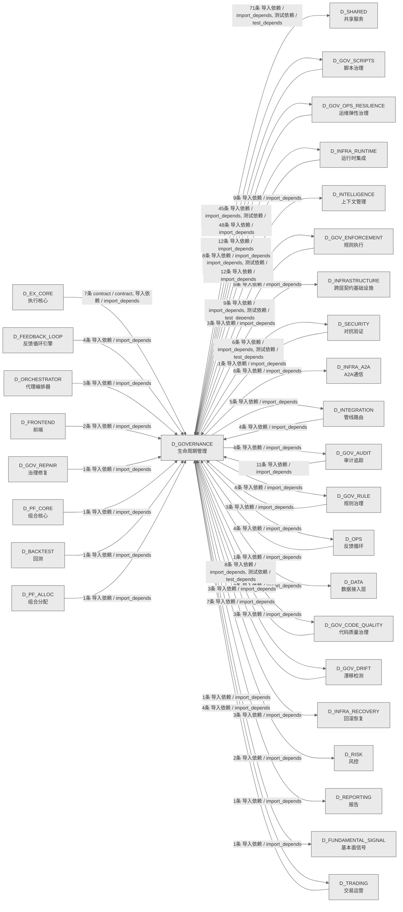

# 49_d_governance / 生命周期管理域 / Lifecycle Management

> **功能简介 / Overview**: 生命周期管理，负责蓝图/模块/任务的声明周期管理和元数据治理

> **文档作用 / Purpose**: 展示 生命周期管理（D_GOVERNANCE）功能域的域内依赖关系、跨域依赖关系，模块信息（成熟度/中英文名/大白话/文件路径）内嵌于 Mermaid 节点，供架构审查和域治理参考。

> 本文档由 generate_domain_doc.py 从 depgraph (PostgreSQL) 自动生成
> 数据源: depgraph (PostgreSQL) nodes表 + edges表

> **[可缩放 HTML 版 / Zoomable HTML](http://localhost:8765/docs/02_enterprise_architecture/02_domain_architecture_docs/_zoomable_html/49_d_governance.html)** — Ctrl+滚轮缩放 ｜ 双击重置 ｜ Ctrl+Shift+D 切换拖动/选择模式

## 域基本信息 / Domain Overview

| 字段 | 值 | Field | Value |
|------|------|-------|-------|
| 编号 | 49 | Number | 49 |
| 域ID | D_GOVERNANCE | Domain ID | D_GOVERNANCE |
| 域名称 | 生命周期管理 | Domain Name | Lifecycle Management |
| 层级 | L2 业务域层 | Layer | L2 Domain |
| 模块数 | 222 | Module Count | 222 |
| 域内依赖 | 44 | Internal Dependencies | 44 |
| 跨域入边 | 130 | Cross-domain Incoming | 130 |
| 跨域出边 | 207 | Cross-domain Outgoing | 207 |
| 设计态模块 | 0 | Design Modules | 0 |
| 生产态模块 | 222 | Production Modules | 222 |
| 容量 | 222/150 (超容) | Capacity | 222/150 (超容) |
| 描述 | 注册表总索引(registry_of_registries) | Description | 注册表总索引(registry_of_registries) |

## 域内依赖图 / Internal Dependency Diagram

> 依赖图内嵌在本文档中，IDE 可直接渲染；网页版可 Ctrl+滚轮缩放 + 拖动平移查看细节。全景图用颜色区分运营态/设计态，不再分页/拆子图。
>
> **图例说明 / Legend**：
> - 🟦 **蓝色 = 运营态模块**（production，已上线运行）
> - 🟧 **橙色虚线 = 设计态模块**（design，蓝图阶段，代码未写）
> - **实线箭头 = 运营态依赖**（已生效的依赖关系）
> - **虚线箭头 = 非运营态依赖**（计划中/验证中的依赖关系）

### 全景依赖图（全部模块，颜色区分运营态/设计态）

> 展示全部 222 个模块（生产态 222 + 设计态 0），节点含成熟度+中英文名+大白话+文件路径。

```mermaid
%%{init: {'theme': 'base', 'themeVariables': {'primaryColor': '#eaeaea', 'primaryTextColor': '#333333', 'primaryBorderColor': '#666666', 'lineColor': '#666666', 'secondaryColor': '#eaeaea', 'tertiaryColor': '#eaeaea', 'fontSize': '14px'}}}%%
flowchart TD
    docs_01_policies_and_standards_registry_catalogs_rule_registry_collection_yaml["(生产态 / production)<br/>文件: catalogs/rule_registry_collection.yaml"]
    scripts_a2a_full_verification_py["(生产态 / production) a2afull验证 / A2a Full Verification<br/>A2A Protocol 全链路满分验证脚本<br/>文件: scripts/a2a_full_verification.py"]
    scripts_arch_guard_tools_build_ocp_manifest_py["(生产态 / production) buildocp清单 / Build Ocp Manifest<br/>从 cross_layer_contracts.yaml 生成 OCP 冻结契约指纹（INV-009）。<br/>文件: _tools/build_ocp_manifest.py"]
    scripts_arch_guard_tools_inject_idempotency_py["(生产态 / production) injectidempotency / Inject Idempotency<br/>为所有 P0/P1 契约添加 idempotency_key 字段——状态感知版本。<br/>文件: _tools/inject_idempotency.py"]
    scripts_arch_guard_tools_patch_p1_paths_py["(生产态 / production) patchp1paths / Patch P1 Paths<br/>一次性工具——为 9 个 P1 契约补齐 physical_path 并运行 codegen。<br/>文件: _tools/patch_p1_paths.py"]
    scripts_arch_guard_check_acl_boundary_py["(生产态 / production) 检查aclboundary / Check Acl Boundary<br/>check_acl_boundary.py — Broker ACL 边界强制执行 (INV-005)<br/>文件: arch_guard/check_acl_boundary.py"]
    scripts_arch_guard_check_cross_plane_communication_py["(生产态 / production) 检查跨planecommunication / Check Cross Plane Communication<br/>check_cross_plane_communication.py — INV-011 拓扑 + 静态越界 import 嗅探<br/>文件: arch_guard/check_cross_plane_communication.py"]
    scripts_arch_guard_check_fe_acl_boundary_py["(生产态 / production) 检查feaclboundary / Check Fe Acl Boundary<br/>check_fe_acl_boundary.py — INV-006 前端 ACL（仓库内有前端树则启用）<br/>文件: arch_guard/check_fe_acl_boundary.py"]
    scripts_arch_guard_check_hot_path_purity_py["(生产态 / production) 检查hot路径purity / Check Hot Path Purity<br/>check_hot_path_purity.py — INV-012 Hot 路径 Python 禁 asyncio（配置驱动）<br/>文件: arch_guard/check_hot_path_purity.py"]
    scripts_arch_guard_check_scaffold_exit_gates_py["(生产态 / production) 检查scaffoldexit门禁 / Check Scaffold Exit Gates<br/>check_scaffold_exit_gates.py — scaffold→experimental 安全门禁检查<br/>文件: arch_guard/check_scaffold_exit_gates.py"]
    scripts_arch_guard_check_schema_consistency_py["(生产态 / production) 检查schema一致性 / Check Schema Consistency<br/>check_schema_consistency.py — INV-010 契约物理路径存在性（Schema canonical ...<br/>文件: arch_guard/check_schema_consistency.py"]
    scripts_arch_guard_fitness_functions_check_aisg_gateway_py["(生产态 / production) 检查aisggateway / Check Aisg Gateway<br/>check_aisg_gateway.py — AISG 拦截门禁 (INV-015) Phase B 升级<br/>文件: fitness_functions/check_aisg_gateway.py"]
    scripts_arch_guard_fitness_functions_check_audit_log_immutability_py["(生产态 / production) 检查审计logimmutability / Check Audit Log Immutability<br/>check_audit_log_immutability.py — 审计日志不可篡改检查 (INV-016)<br/>文件: fitness_functions/check_audit_log_immutability.py"]
    scripts_arch_guard_fitness_functions_check_capacity_slo_ssot_py["(生产态 / production) 检查容量SLOssot / Check Capacity SLO Ssot<br/>check_capacity_slo_ssot.py — capacity_slo.yaml 注册表 + 与 invariants 数字对...<br/>文件: fitness_functions/check_capacity_slo_ssot.py"]
    scripts_arch_guard_fitness_functions_check_daily_loss_limit_py["(生产态 / production) 检查日常loss限制 / Check Daily Loss Limit<br/>check_daily_loss_limit.py — 日损失限额自动暂停 (INV-003)<br/>文件: fitness_functions/check_daily_loss_limit.py"]
    scripts_arch_guard_fitness_functions_check_hot_warm_ipc_py["(生产态 / production) 检查hotwarmipc / Check Hot Warm Ipc<br/>check_hot_warm_ipc.py — INV-018 Hot↔Warm IPC 协议检查<br/>文件: fitness_functions/check_hot_warm_ipc.py"]
    scripts_arch_guard_fitness_functions_check_idempotency_key_py["(生产态 / production) 检查idempotencykey / Check Idempotency Key<br/>check_idempotency_key.py — 幂等 Key 字段存在性检查 (INV-007)<br/>文件: fitness_functions/check_idempotency_key.py"]
    scripts_arch_guard_fitness_functions_check_log_secret_leak_py["(生产态 / production) 检查logsecretleak / Check Log Secret Leak<br/>check_log_secret_leak.py — R2 日志不写 secret 适应度函数<br/>文件: fitness_functions/check_log_secret_leak.py"]
    scripts_arch_guard_fitness_functions_check_no_cross_plane_mutable_state_py["(生产态 / production) 检查no跨planemutable状态 / Check No Cross Plane Mutable State<br/>check_no_cross_plane_mutable_state.py — INV-020 跨平面共享可变状态检查<br/>文件: fitness_functions/check_no_cross_plane_mutable_state.py"]
    scripts_arch_guard_fitness_functions_check_ocp_signatures_py["(生产态 / production) 检查ocpsignatures / Check Ocp Signatures<br/>check_ocp_signatures.py — OCP 冻结契约指纹校验 (INV-009)<br/>文件: fitness_functions/check_ocp_signatures.py"]
    scripts_arch_guard_fitness_functions_check_pit_compliance_py["(生产态 / production) 检查pit合规 / Check Pit Compliance<br/>check_pit_compliance.py — PIT（Point-in-Time）铁律强制执行 (INV-004)<br/>文件: fitness_functions/check_pit_compliance.py"]
    scripts_arch_guard_fitness_functions_check_position_limit_py["(生产态 / production) 检查position限制 / Check Position Limit<br/>check_position_limit.py — 单一持仓限制 ≤ 5% NAV (INV-002)<br/>文件: fitness_functions/check_position_limit.py"]
    scripts_arch_guard_fitness_functions_check_risk_params_consistency_py["(生产态 / production) 检查风险params一致性 / Check Risk Params Consistency<br/>check_risk_params_consistency.py — 风控参数真源 (INV-013) + 与 INV-002 声明对齐<br/>文件: fitness_functions/check_risk_params_consistency.py"]
    scripts_arch_guard_fitness_functions_check_survivorship_bias_py["(生产态 / production) 检查survivorshipbias / Check Survivorship Bias<br/>check_survivorship_bias.py — Survivorship 策略门禁 (INV-014)<br/>文件: fitness_functions/check_survivorship_bias.py"]
    scripts_arch_guard_fitness_functions_check_warm_cold_async_py["(生产态 / production) 检查warm冷异步 / Check Warm Cold Async<br/>check_warm_cold_async.py — INV-019 Warm→Cold 异步通信检查<br/>文件: fitness_functions/check_warm_cold_async.py"]
    scripts_arch_guard_run_all_py["(生产态 / production) run全量 / Run All<br/>Architecture Guard 编排器<br/>文件: arch_guard/run_all.py"]
    scripts_construction_e2e_check_py["(生产态 / production) 端到端检查 / E2E Check<br/>端到端检查模块。<br/>文件: construction/_e2e_check.py"]
    scripts_construction_e2e_deep_py["(生产态 / production) 端到端深度 / E2E Deep<br/>端到端深度模块。<br/>文件: construction/_e2e_deep.py"]
    scripts_construction_check_statuses_py["(生产态 / production) 检查状态 / Check Statuses<br/>检查状态模块。<br/>文件: construction/check_statuses.py"]
    scripts_construction_check_transition_code_py["(生产态 / production) 检查过渡代码 / Check Transition Code<br/>检查过渡代码模块。<br/>文件: construction/check_transition_code.py"]
    scripts_construction_demo_a2a_chat_py["(生产态 / production) demoa2achat / Demo A2a Chat<br/>A2A 多 Agent 聊天演示 - Alpha 和 Beta 讨论项目评估<br/>文件: construction/demo_a2a_chat.py"]
    scripts_construction_demo_a2a_coordination_py["(生产态 / production) demoa2acoordination / Demo A2a Coordination<br/>A2A 协议协调任务演示<br/>文件: construction/demo_a2a_coordination.py"]
    scripts_construction_demo_e2e_pipeline_py["(生产态 / production) demo端到端流水线 / Demo E2E Pipeline<br/>C-track 端到端演示 —— 全流水线一次性运行<br/>文件: construction/demo_e2e_pipeline.py"]
    scripts_construction_finalize_tasks_py["(生产态 / production) 收尾任务 / Finalize Tasks<br/>定义 safe_transition 等类型。<br/>文件: construction/finalize_tasks.py"]
    scripts_construction_local_layer_daemon_py["(生产态 / production) 本地层daemon / Local Layer Daemon<br/>local_layer_daemon.py — L2 本地模型层守护进程（薄包装，DEPRECATED）<br/>文件: construction/local_layer_daemon.py"]
    scripts_construction_reset_test_task_py["(生产态 / production) 重置测试任务 / Reset Test Task<br/>重置测试任务模块。<br/>文件: construction/reset_test_task.py"]
    scripts_construction_start_brain_py["(生产态 / production) 启动brain / Start Brain<br/>start_brain.py — ZephyrAlpha 系统大脑一键启动<br/>文件: construction/start_brain.py"]
    scripts_construction_test_event_hook_py["(生产态 / production) 测试事件钩子 / Test Event Hook<br/>定义 log 等类型。<br/>文件: construction/test_event_hook.py"]
    scripts_context_generate_architecture_context_py["(生产态 / production) generate架构上下文 / Generate Architecture Context<br/>generate_architecture_context.py — 预编译架构上下文包生成器<br/>文件: context/generate_architecture_context.py"]
    scripts_diagnose_breadth_failed_py["(生产态 / production) diagnosebreadthfailed / Diagnose Breadth Failed<br/>诊断 breadth_failed 能力的根因。<br/>文件: scripts/diagnose_breadth_failed.py"]
    scripts_dm90971_add_test_headers_py["(生产态 / production) dm90971add测试headers / Dm90971 Add Test Headers<br/>DM-90971: Batch add module_id scope prefix + governance anchor headers to tes...<br/>文件: scripts/dm90971_add_test_headers.py"]
    scripts_fix_freeze_manifest_py["(生产态 / production) 修复freeze清单 / Fix Freeze Manifest<br/>Fix freezemanifest.yaml - comprehensive repair of all corrupted desc fields.<br/>文件: scripts/fix_freeze_manifest.py"]
    scripts_fix_orphan_all_py["(生产态 / production) 修复orphan全量 / Fix Orphan All<br/>fix_orphan_all.py — 自动修复 __init__.py __all__ 孤儿模块<br/>文件: scripts/fix_orphan_all.py"]
    scripts_generate_manifest_py["(生产态 / production) generate清单 / Generate Manifest<br/>Generate complete script_manifest.yaml from scripts/ tree scan.<br/>文件: scripts/generate_manifest.py"]
    scripts_generate_pathway_registry_py["(生产态 / production) generatepathway注册表 / Generate Pathway Registry<br/>从所有 MOD 蓝图的 §路径索引 章节自动生成 system-pathway-registry.yaml。<br/>文件: scripts/generate_pathway_registry.py"]
    scripts_governance_d5_architecture_generators_zoomable_html_py["(生产态 / production) zoomablehtml / Zoomable Html<br/>可缩放 Mermaid HTML 生成器（共享模块）。<br/>文件: generators/zoomable_html.py"]
    scripts_governance_d7_code_check_pure_shim_py["(生产态 / production) 检查pureshim / Check Pure Shim<br/>check_pure_shim.py — GATE-NO-PURE-SHIM 检测器（治本漏洞1 2026-06-29）<br/>文件: d7_code/check_pure_shim.py"]
    scripts_governance_generators_generate_rule_ai_perception_index_py["(生产态 / production) generate规则AIperception索引 / Generate Rule AI Perception Index<br/>generate_rule_ai_perception_index.py — 规则AI感知索引生成器（...<br/>文件: generators/generate_rule_ai_perception_index.py"]
    scripts_hooks_auto_handoff_log_py["(生产态 / production) 自动handofflog / Auto Handoff Log<br/>执行 git 命令并返回 stdout（UTF-8 解码）。<br/>文件: hooks/auto_handoff_log.py"]
    scripts_lock_files_py["(生产态 / production) lockfiles / Lock Files<br/>lock_files.py —— AI 对话文件锁协议（硬规则执行工具）<br/>文件: scripts/lock_files.py"]
    scripts_mcp_launcher_py["(生产态 / production) launcher / Launcher<br/>MCP DAG 编排启动器（MOD-INF-013 §14 拓扑排序 + ProcessLifecycleGateway 管理）。<br/>文件: mcp/launcher.py"]
    scripts_mcp_start_all_py["(生产态 / production) 启动全量 / Start All<br/>MCP 全 Server 启动脚本 — DEPRECATED.<br/>文件: mcp/start_all.py"]
    scripts_mcp_status_all_py["(生产态 / production) status全量 / Status All<br/>MCP 全 Server 状态检查脚本（MOD-INF-013 §14）。<br/>文件: mcp/status_all.py"]
    scripts_mcp_stop_all_py["(生产态 / production) stop全量 / Stop All<br/>MCP 全 Server 停止脚本（MOD-INF-013 §14）。<br/>文件: mcp/stop_all.py"]
    scripts_migration_dm314_infra_ops_split_py["(生产态 / production) dm314infra运维split / Dm314 Infra Ops Split<br/>DM-314: infra_ops/ 拆分迁移执行脚本。<br/>文件: migration/dm314_infra_ops_split.py"]
    scripts_migration_governance_root_split_py["(生产态 / production) 治理rootsplit / Governance Root Split<br/>ARCH-031: governance/ root flat-files split migration orchestrator.<br/>文件: migration/governance_root_split.py"]
    scripts_ops_verify_header_completeness_py["(生产态 / production) verifyheadercompleteness / Verify Header Completeness<br/>文件头部完整性校验（6 格式统一入口）<br/>文件: ops/verify_header_completeness.py"]
    scripts_post_checkout_guard_py["(生产态 / production) 后checkout守卫 / Post Checkout Guard<br/>Post-checkout Guard — 事后检测 checkout 是否覆盖了其他 session 的文件锁。<br/>文件: scripts/post_checkout_guard.py"]
    scripts_pre_commit_verify_dedup_py["(生产态 / production) verifydedup / Verify Dedup<br/>pre_commit 验证脚本 — 委托给 code-dedup-engine CLI verify 子命令.<br/>文件: pre_commit/verify_dedup.py"]
    scripts_rollback_py["(生产态 / production) rollback / Rollback<br/>Rollback System CLI — MOD-INF-021 v0.10.0 Git-native+SQLite Checkpoint 操作...<br/>文件: scripts/rollback.py"]
    scripts_run_deepseek_v4_exam_py["(生产态 / production) rundeepseekv4exam / Run Deepseek V4 Exam<br/>DeepSeek V4 入职考试运行脚本<br/>文件: scripts/run_deepseek_v4_exam.py"]
    scripts_run_ollama_exam_py["(生产态 / production) runOllamaexam / Run Ollama Exam<br/>Ollama 入职考试运行脚本<br/>文件: scripts/run_ollama_exam.py"]
    scripts_scaffold_py["(生产态 / production) scaffold / Scaffold<br/>scaffold.py — ZephyrAlpha 唯一创建入口（RULE-TWO 强制执行器）<br/>文件: scripts/scaffold.py"]
    scripts_setup_git_guard_aliases_py["(生产态 / production) setupgit守卫aliases / Setup Git Guard Aliases<br/>Setup/Remove Git Aliases for Git Guard — 自动化集成入口。<br/>文件: scripts/setup_git_guard_aliases.py"]
    src_zephyr_governance_a2a_init_py["(生产态 / production) 治理修复A2a包 / Governance A2a Package<br/>治理修复域下 a2a 子包，归集该方向的模块。本身不含业务逻辑，只是组织归属。<br/>文件: a2a/__init__.py"]
    src_zephyr_governance_adapters_risk_validation_bridge_py["(生产态 / production) 风险validation桥接 / Risk Validation Bridge<br/>D_EXECUTION_CORE — Risk Validation Bridge (DW-239)<br/>文件: adapters/risk_validation_bridge.py"]
    src_zephyr_governance_adapters_simulation_broker_py["(生产态 / production) simulation券商 / Simulation Broker<br/>D_EXECUTION_CORE — Simulation Broker Adapter<br/>文件: adapters/simulation_broker.py"]
    src_zephyr_governance_agent_spec_init_py["(生产态 / production) 治理修复Agent-spec包 / Governance Agent-spec Package<br/>治理修复域下 agent-spec 子包，归集该方向的模块。本身不含业务逻辑，只是组织归属。<br/>文件: agent-spec/__init__.py"]
    src_zephyr_governance_agent_spec_a2a_failure_py["(生产态 / production) a2afailure / A2a Failure<br/>G-CT-008 消费端 — Escalation.on_a2a_failure() 跨 agent 通信失败升级.<br/>文件: agent_spec/a2a_failure.py"]
    src_zephyr_governance_agent_spec_rbac_bridge_py["(生产态 / production) RBAC桥接 / RBAC Bridge<br/>G-CT-007 契约：Budget -> RBAC 配额限制.<br/>文件: agent_spec/rbac_bridge.py"]
    src_zephyr_governance_agent_spec_registry_py["(生产态 / production) 注册表 / Registry<br/>G-CT-003 契约：Agent Spec -> RBAC 能力检查.<br/>文件: agent_spec/registry.py"]
    src_zephyr_governance_architecture_governance_architecture_contracts_py["(生产态 / production) 架构契约 / Architecture Contracts<br/>定义 CircuitBreakerState、Contract、CircuitBreaker 等类型。<br/>文件: architecture_governance/architecture_contracts.py"]
    src_zephyr_governance_architecture_governance_architecture_principles_py["(生产态 / production) 架构原则 / Architecture Principles<br/>装饰器：为函数标记适用的架构原则。<br/>文件: architecture_governance/architecture_principles.py"]
    src_zephyr_governance_architecture_governance_blueprint_bloat_monitor_py["(生产态 / production) 蓝图bloat监控器 / Blueprint Bloat Monitor<br/>Blueprint Bloat Monitor — v0.11.0 蓝图膨胀监控器。<br/>文件: architecture_governance/blueprint_bloat_monitor.py"]
    src_zephyr_governance_architecture_governance_blueprint_code_consistency_py["(生产态 / production) 蓝图代码一致性 / Blueprint Code Consistency<br/>Blueprint-Code Consistency Gate — MOD-INF-022.<br/>文件: architecture_governance/blueprint_code_consistency.py"]
    src_zephyr_governance_architecture_governance_blueprint_reconciler_py["(生产态 / production) 蓝图reconciler / Blueprint Reconciler<br/>Blueprint Reconciler — v0.10.0 蓝图实现一致性校验器。<br/>文件: architecture_governance/blueprint_reconciler.py"]
    src_zephyr_governance_architecture_governance_construction_verifier_py["(生产态 / production) construction验证器 / Construction Verifier<br/>Construction Verifier — 施工验证器: 任务卡完成度+蓝图一致性检查。<br/>文件: architecture_governance/construction_verifier.py"]
    src_zephyr_governance_architecture_governance_cross_env_consistency_py["(生产态 / production) 跨环境一致性 / Cross Env Consistency<br/>定义 ConsistencyDim 等类型。<br/>文件: architecture_governance/cross_env_consistency.py"]
    src_zephyr_governance_architecture_governance_dependency_manager_py["(生产态 / production) 依赖管理器 / Dependency Manager<br/>定义 DependencyTier、ManagedDependency、get_by_tier 等类型。<br/>文件: architecture_governance/dependency_manager.py"]
    src_zephyr_governance_architecture_governance_formal_verifier_py["(生产态 / production) formal验证器 / Formal Verifier<br/>Formal Verifier — v0.6.0 形式验证器: 升级规则形式化验证->一致性+完备性检测。<br/>文件: architecture_governance/formal_verifier.py"]
    src_zephyr_governance_architecture_governance_gap_analyzer_py["(生产态 / production) gap分析器 / Gap Analyzer<br/>Gap Analyzer — v0.8.0 间隙分析器: escalation覆盖缺口扫描+新操作类型识别。<br/>文件: architecture_governance/gap_analyzer.py"]
    src_zephyr_governance_architecture_governance_llm_impact_analyzer_py["(生产态 / production) LLMimpact分析器 / LLM Impact Analyzer<br/>LLMImpactAnalyzer — LLM-based commit 语义影响分析器。<br/>文件: architecture_governance/llm_impact_analyzer.py"]
    src_zephyr_governance_architecture_governance_local_first_arch_py["(生产态 / production) 本地优先架构 / Local First Arch<br/>定义 ComputeLocation、LocalFirstPolicy 等类型。<br/>文件: architecture_governance/local_first_arch.py"]
    src_zephyr_governance_architecture_governance_path_resolver_py["(生产态 / production) 路径resolver / Path Resolver<br/>PathResolver — 模块路径解析器<br/>文件: architecture_governance/path_resolver.py"]
    src_zephyr_governance_bridges_alerts_py["(生产态 / production) alerts / Alerts<br/>G-CT-006 — BudgetAlert re-exported from shared.contracts.escalation.<br/>文件: bridges/alerts.py"]
    src_zephyr_governance_bridges_spec_auditor_py["(生产态 / production) 规格审计器 / Spec Auditor<br/>G-CT-007 — Audit.record_agent_spec() 记录 Agent Spec 注册与变更.<br/>文件: bridges/spec_auditor.py"]
    src_zephyr_governance_compliance_gate_a6_compliance_manager_py["(生产态 / production) 合规管理器 / Compliance Manager<br/>ZephyrAlpha — D_COMPLIANCE Compliance Layer — 合规规则管理器接口<br/>文件: compliance_gate_a6/compliance_manager.py"]
    src_zephyr_governance_compliance_gate_a6_compliance_mapper_py["(生产态 / production) 合规mapper / Compliance Mapper<br/>Compliance Mapper — D-022-13 合规映射器: 操作->法规(SOX/GDPR/MiFID)映射+审计迹。<br/>文件: compliance_gate_a6/compliance_mapper.py"]
    src_zephyr_governance_context_governance_command_chain_length_gate_py["(生产态 / production) command链length门禁 / Command Chain Length Gate<br/>Command Chain Length Gate — v0.13.0 命令体积Deny退化防御器。<br/>文件: context_governance/command_chain_length_gate.py"]
    src_zephyr_governance_context_governance_context_budget_py["(生产态 / production) 上下文预算 / Context Budget<br/>context_budget.py —— 上下文预算管理与超预算截断（Phase 11 / 盲点 B28）<br/>文件: context_governance/context_budget.py"]
    src_zephyr_governance_context_governance_context_manager_py["(生产态 / production) 上下文管理器 / Context Manager<br/>BudgetExceededError;CostLimitError<br/>文件: context_governance/context_manager.py"]
    src_zephyr_governance_context_governance_context_package_py["(生产态 / production) 上下文package / Context Package<br/>Context Package — D-022-08 委托上下文包: 升级原因+证据链+历史try_trace。<br/>文件: context_governance/context_package.py"]
    src_zephyr_governance_context_governance_context_recycling_py["(生产态 / production) 上下文回收 / Context Recycling<br/>BudgetExceededError;CostLimitError<br/>文件: context_governance/context_recycling.py"]
    src_zephyr_governance_context_governance_context_switch_governor_py["(生产态 / production) 上下文switchgovernor / Context Switch Governor<br/>Context Switch Governor — v0.11.0 Owner上下文切换预算管理器。<br/>文件: context_governance/context_switch_governor.py"]
    src_zephyr_governance_context_governance_context_waste_detector_py["(生产态 / production) 上下文浪费检测器 / Context Waste Detector<br/>定义 WasteReport、ContextWasteDetector 等类型。<br/>文件: context_governance/context_waste_detector.py"]
    src_zephyr_governance_context_governance_conversation_tax_detector_py["(生产态 / production) 对话税检测器 / Conversation Tax Detector<br/>定义 TaxAssessment、ConversationTaxDetector 等类型。<br/>文件: context_governance/conversation_tax_detector.py"]
    src_zephyr_governance_context_governance_instruction_bloat_detector_py["(生产态 / production) instructionbloat检测器 / Instruction Bloat Detector<br/>InstructionBloatDetector — 指令膨胀检测<br/>文件: context_governance/instruction_bloat_detector.py"]
    src_zephyr_governance_context_governance_multi_turn_intent_analyzer_py["(生产态 / production) 多turnintent分析器 / Multi Turn Intent Analyzer<br/>Multi-Turn Intent Analyzer — v0.13.0 多轮分布式意图分析器。<br/>文件: context_governance/multi_turn_intent_analyzer.py"]
    src_zephyr_governance_context_governance_prompt_lifecycle_py["(生产态 / production) 提示词生命周期 / Prompt Lifecycle<br/>定义 PromptVersion 等类型。<br/>文件: context_governance/prompt_lifecycle.py"]
    src_zephyr_governance_context_governance_protocol_self_context_py["(生产态 / production) 协议自我上下文 / Protocol Self Context<br/>Protocol Self Context — v0.10.0 协议自维护上下文管理器。<br/>文件: context_governance/protocol_self_context.py"]
    src_zephyr_governance_context_governance_think_time_model_py["(生产态 / production) 思考时间模型 / Think Time Model<br/>定义 ThinkTimeSnapshot、ThinkTimeModel 等类型。<br/>文件: context_governance/think_time_model.py"]
    src_zephyr_governance_data_governance_data_classification_py["(生产态 / production) 数据classification / Data Classification<br/>检查 self_level 是否有权限访问 target_level 的数据。<br/>文件: data_governance/data_classification.py"]
    src_zephyr_governance_data_governance_data_lifecycle_py["(生产态 / production) 数据生命周期 / Data Lifecycle<br/>定义 DataStage、forget_pii 等类型。<br/>文件: data_governance/data_lifecycle.py"]
    src_zephyr_governance_data_governance_data_pipeline_guard_py["(生产态 / production) 数据流水线守卫 / Data Pipeline Guard<br/>Data Pipeline Guard — v0.10.0 数据管道完整性防护: schema validation+row coun...<br/>文件: data_governance/data_pipeline_guard.py"]
    src_zephyr_governance_data_governance_data_quality_py["(生产态 / production) 数据质量 / Data Quality<br/>ARCH-031: migrated from governance/governance/data_quality.py to root (canoni...<br/>文件: data_governance/data_quality.py"]
    src_zephyr_governance_data_governance_data_source_reliability_py["(生产态 / production) 数据源可靠性 / Data Source Reliability<br/>定义 ReliabilityDimension、ReliabilityScore、score_source 等类型。<br/>文件: data_governance/data_source_reliability.py"]
    src_zephyr_governance_data_governance_exchange_partition_detector_py["(生产态 / production) exchangepartition检测器 / Exchange Partition Detector<br/>Exchange Partition Detector — v0.12.0 交易所网络分区检测器。<br/>文件: data_governance/exchange_partition_detector.py"]
    src_zephyr_governance_data_governance_exchange_reg_monitor_py["(生产态 / production) exchangereg监控器 / Exchange Reg Monitor<br/>Exchange Reg Monitor — v0.11.0 交易所规则变更监控器。<br/>文件: data_governance/exchange_reg_monitor.py"]
    src_zephyr_governance_data_governance_miniqmt_provider_py["(生产态 / production) miniqmt提供者 / Miniqmt Provider<br/>MiniQMT 实盘行情 Provider（Tick + 5档盘口）<br/>文件: data_governance/miniqmt_provider.py"]
    src_zephyr_governance_data_governance_pricing_sync_py["(生产态 / production) 定价同步 / Pricing Sync<br/>定义 PriceEntry、PricingSync 等类型。<br/>文件: data_governance/pricing_sync.py"]
    src_zephyr_governance_data_governance_realtime_streaming_py["(生产态 / production) 实时流式 / Realtime Streaming<br/>定义 PipelineMode 等类型。<br/>文件: data_governance/realtime_streaming.py"]
    src_zephyr_governance_evidence_pack_py["(生产态 / production) 证据包 / Evidence Pack<br/>打包失败返回None<br/>文件: governance/evidence_pack.py"]
    src_zephyr_governance_financial_governance_arbitrage_asymmetry_detector_py["(生产态 / production) arbitrageasymmetry检测器 / Arbitrage Asymmetry Detector<br/>Arbitrage Asymmetry Detector — v0.11.0 跨交易所套利不对称检测器。<br/>文件: financial_governance/arbitrage_asymmetry_detector.py"]
    src_zephyr_governance_financial_governance_atomic_transaction_manager_py["(生产态 / production) atomictransaction管理器 / Atomic Transaction Manager<br/>AtomicTransactionManager — SQLite + 文件系统的跨介质原子事务管理器 v2.0（ATM）。<br/>文件: financial_governance/atomic_transaction_manager.py"]
    src_zephyr_governance_financial_governance_flash_crash_guard_py["(生产态 / production) flashcrash守卫 / Flash Crash Guard<br/>Flash Crash Guard — v0.12.0 闪崩双轨熔断器。<br/>文件: financial_governance/flash_crash_guard.py"]
    src_zephyr_governance_financial_governance_fsm_verifier_py["(生产态 / production) 有限状态机验证器 / FSM Verifier<br/>定义 FSMState、FSMTransition、FSMInstance 等类型。<br/>文件: financial_governance/fsm_verifier.py"]
    src_zephyr_governance_financial_governance_instrument_py["(生产态 / production) 金融工具 / Instrument<br/>定义 Instrument、Stock、ETF 等类型。<br/>文件: financial_governance/instrument.py"]
    src_zephyr_governance_financial_governance_microstructure_defense_py["(生产态 / production) 微观结构防御 / Microstructure Defense<br/>定义 DefenseType、DefenseStrategy、FidelityFactor 等类型。<br/>文件: financial_governance/microstructure_defense.py"]
    src_zephyr_governance_financial_governance_oms_risk_engine_py["(生产态 / production) 订单管理风险引擎 / OMS Risk Engine<br/>定义 RiskLayer、OrderState、RiskCheckResult 等类型。<br/>文件: financial_governance/oms_risk_engine.py"]
    src_zephyr_governance_financial_governance_risk_matrix_py["(生产态 / production) 风险矩阵 / Risk Matrix<br/>EscalationError;TimeoutError<br/>文件: financial_governance/risk_matrix.py"]
    src_zephyr_governance_financial_governance_strategy_portfolio_py["(生产态 / production) 策略投资组合 / Strategy Portfolio<br/>定义 StrategyMethod、RetirementTrigger、estimate_capacity 等类型。<br/>文件: financial_governance/strategy_portfolio.py"]
    src_zephyr_governance_financial_governance_strategy_scoper_py["(生产态 / production) 策略scoper / Strategy Scoper<br/>Strategy Scoper — v0.6.0 策略范围隔离器: SIG/Strat/Capital多层策略隔离。<br/>文件: financial_governance/strategy_scoper.py"]
    src_zephyr_governance_implementations_default_experiment_pipeline_py["(生产态 / production) default实验流水线 / Default Experiment Pipeline<br/>实验 — Default Experiment Pipeline<br/>文件: implementations/default_experiment_pipeline.py"]
    src_zephyr_governance_implementations_default_security_gateway_py["(生产态 / production) default安全gateway / Default Security Gateway<br/>Re-export shim: canonical source = zephyr.governance.security_governance.defa...<br/>文件: implementations/default_security_gateway.py"]
    src_zephyr_governance_intelligence_governance_agent_debate_py["(生产态 / production) 代理debate / Agent Debate<br/>noqa: m03-duplicate  M03豁免: AI趋同演化(不同模块为相似问题生成相似代码),非复...<br/>文件: intelligence_governance/agent_debate.py"]
    src_zephyr_governance_intelligence_governance_ai_self_diagnosis_py["(生产态 / production) AI自我诊断 / AI Self Diagnosis<br/>定义 AutoFixLayer、auto_fix_known_pattern 等类型。<br/>文件: intelligence_governance/ai_self_diagnosis.py"]
    src_zephyr_governance_intelligence_governance_aisg_sandbox_py["(生产态 / production) aisg沙箱 / Aisg Sandbox<br/>AISG Sandbox Testing — AI Security Gateway 沙箱验证 (INV-015 升级)<br/>文件: intelligence_governance/aisg_sandbox.py"]
    src_zephyr_governance_intelligence_governance_autonomy_dashboard_py["(生产态 / production) autonomy仪表板 / Autonomy Dashboard<br/>Autonomy Dashboard — AI 自主感知健康仪表。<br/>文件: intelligence_governance/autonomy_dashboard.py"]
    src_zephyr_governance_intelligence_governance_confidence_estimator_py["(生产态 / production) confidence估计器 / Confidence Estimator<br/>Confidence Estimator — D-022-05 置信度评估器: certainty×evidence×risk三维评估。<br/>文件: intelligence_governance/confidence_estimator.py"]
    src_zephyr_governance_intelligence_governance_confidence_quantifier_py["(生产态 / production) confidencequantifier / Confidence Quantifier<br/>ConfidenceQuantifier — AI 置信度量化。<br/>文件: intelligence_governance/confidence_quantifier.py"]
    src_zephyr_governance_intelligence_governance_continuous_trust_py["(生产态 / production) continuous信任 / Continuous Trust<br/>Continuous Trust Ledger — 持续信任评估引擎。<br/>文件: intelligence_governance/continuous_trust.py"]
    src_zephyr_governance_intelligence_governance_cross_agent_conflict_detector_py["(生产态 / production) 跨代理conflict检测器 / Cross Agent Conflict Detector<br/>CrossAgentConflictDetector — 多 Agent 并发冲突检测。<br/>文件: intelligence_governance/cross_agent_conflict_detector.py"]
    src_zephyr_governance_intelligence_governance_cross_assistant_adapter_py["(生产态 / production) 跨助手适配器 / Cross Assistant Adapter<br/>Cross-Assistant Adapter — v0.6.0 Trae/Cursor/Windsurf/Codex/Wedata统一升级接口。<br/>文件: intelligence_governance/cross_assistant_adapter.py"]
    src_zephyr_governance_intelligence_governance_delegation_manager_py["(生产态 / production) delegation管理器 / Delegation Manager<br/>Delegation Manager — D-022-02 自动委托协议。<br/>文件: intelligence_governance/delegation_manager.py"]
    src_zephyr_governance_intelligence_governance_memory_provider_py["(生产态 / production) memory提供者 / Memory Provider<br/>D_DATA — Memory Provider<br/>文件: intelligence_governance/memory_provider.py"]
    src_zephyr_governance_intelligence_governance_meta_confidence_py["(生产态 / production) metaconfidence / Meta Confidence<br/>Meta-Confidence — D-022-10 Agent对自身判定置信度的自评+历史校准。<br/>文件: intelligence_governance/meta_confidence.py"]
    src_zephyr_governance_intelligence_governance_model_provider_data_py["(生产态 / production) 模型提供者数据 / Model Provider Data<br/>模型提供者数据模块。<br/>文件: intelligence_governance/model_provider_data.py"]
    src_zephyr_governance_intelligence_governance_model_router_py["(生产态 / production) 模型路由器 / Model Router<br/>定义 TaskComplexity、RoutingDecision、ModelRouter 等类型。<br/>文件: intelligence_governance/model_router.py"]
    src_zephyr_governance_intelligence_governance_model_version_detector_py["(生产态 / production) 模型版本检测器 / Model Version Detector<br/>Model Version Detector — v0.10.0 模型版本突变检测: model version change->deg...<br/>文件: intelligence_governance/model_version_detector.py"]
    src_zephyr_governance_intelligence_governance_multi_model_consensus_py["(生产态 / production) 多模型共识 / Multi Model Consensus<br/>定义 ConsensusProtocol、DebateRound、escalate_to_owner 等类型。<br/>文件: intelligence_governance/multi_model_consensus.py"]
    src_zephyr_governance_intelligence_governance_mvep_orchestrator_py["(生产态 / production) mveporchestrator / Mvep Orchestrator<br/>MVEP Orchestrator — v0.11.0 Minimum Viable Escalation Protocol调度器。<br/>文件: intelligence_governance/mvep_orchestrator.py"]
    src_zephyr_governance_intelligence_governance_provider_failover_py["(生产态 / production) 提供者failover / Provider Failover<br/>Provider Failover — v0.7.0 多LLM Provider容灾: deepseek->claude->gpt fallbac...<br/>文件: intelligence_governance/provider_failover.py"]
    src_zephyr_governance_intelligence_governance_self_benchmark_py["(生产态 / production) 自我基准 / Self Benchmark<br/>Self-Benchmark (W3-7) — 5 组已知对自验证 + 引擎退化告警.<br/>文件: intelligence_governance/self_benchmark.py"]
    src_zephyr_governance_intelligence_governance_self_test_py["(生产态 / production) 自我测试 / Self Test<br/>Escalation Protocol Self-Test — MOD-INF-022.<br/>文件: intelligence_governance/self_test.py"]
    src_zephyr_governance_intelligence_governance_self_validator_py["(生产态 / production) 自我校验器 / Self Validator<br/>Self Validator — v0.10.0 升级协议自验证器: protocol自身规则+代码一致性自检。<br/>文件: intelligence_governance/self_validator.py"]
    src_zephyr_governance_intelligence_governance_subagent_hook_propagator_py["(生产态 / production) subagent钩子propagator / Subagent Hook Propagator<br/>Subagent Hook Propagator — v0.13.0 子Agent Hook旁路防护器。<br/>文件: intelligence_governance/subagent_hook_propagator.py"]
    src_zephyr_governance_lifecycle_governance_api_lifecycle_py["(生产态 / production) API生命周期 / API Lifecycle<br/>定义 APIState、DeprecationNotice、APIEndpoint 等类型。<br/>文件: lifecycle_governance/api_lifecycle.py"]
    src_zephyr_governance_lifecycle_governance_migration_strategy_py["(生产态 / production) 迁移策略 / Migration Strategy<br/>定义 MigrationPhase、PhaseDef、get_phase_def 等类型。<br/>文件: lifecycle_governance/migration_strategy.py"]
    src_zephyr_governance_lifecycle_governance_paper_live_transition_py["(生产态 / production) paper实时过渡 / Paper Live Transition<br/>检查是否可跳Phase——不可跳, 只允许顺序next。<br/>文件: lifecycle_governance/paper_live_transition.py"]
    src_zephyr_governance_lifecycle_governance_post_live_verification_py["(生产态 / production) 后实时验证 / Post Live Verification<br/>定义 PLVCheck、PLVSpec、get_plv_spec 等类型。<br/>文件: lifecycle_governance/post_live_verification.py"]
    src_zephyr_governance_lifecycle_governance_transition_py["(生产态 / production) 过渡 / Transition<br/>transition — 状态机转换 Mixin（从 task_repo.py 拆分，SRC-0066）<br/>文件: lifecycle_governance/transition.py"]
    src_zephyr_governance_observability_governance_analytics_base_py["(生产态 / production) analytics基础 / Analytics Base<br/>Re-export wrapper: analytics_base canonical at zephyr.reporting.analytics_base.<br/>文件: observability_governance/analytics_base.py"]
    src_zephyr_governance_observability_governance_objective_tracker_py["(生产态 / production) objective追踪器 / Objective Tracker<br/>Objective Tracker — v0.9.0 目标漂移检测器: agent目标函数稳定性+变更检测+roll...<br/>文件: observability_governance/objective_tracker.py"]
    src_zephyr_governance_persistence_database_manager_py["(生产态 / production) database管理器 / Database Manager<br/>DatabaseManager — 连接池 + 健康检查 + 自动备份 + WAL checkpoint（SH-DB-001 v...<br/>文件: persistence/database_manager.py"]
    src_zephyr_governance_persistence_database_service_py["(生产态 / production) database服务 / Database Service<br/>DatabaseService 真源收敛（AI-14 审计 P1 修复）<br/>文件: persistence/database_service.py"]
    src_zephyr_governance_persistence_dataflowgraph_schema_py["(生产态 / production) dataflowgraphschema / Dataflowgraph Schema<br/>dataflowgraph Schema DDL + 连接入口<br/>文件: persistence/dataflowgraph_schema.py"]
    src_zephyr_governance_persistence_decision_graph_reader_py["(生产态 / production) 决策graphreader / Decision Graph Reader<br/>decision_graph_reader.py — 决策流图数据库只读查询工具模块<br/>文件: persistence/decision_graph_reader.py"]
    src_zephyr_governance_persistence_depgraph_reader_py["(生产态 / production) depgraphreader / Depgraph Reader<br/>depgraph_reader.py — 依赖图数据库查询工具模块<br/>文件: persistence/depgraph_reader.py"]
    src_zephyr_governance_persistence_protocol_state_store_py["(生产态 / production) 协议状态store / Protocol State Store<br/>Protocol State Store — v0.10.0 协议运行时状态持久化: JSON snapshot+recovery ...<br/>文件: persistence/protocol_state_store.py"]
    src_zephyr_governance_services_adapter_py["(生产态 / production) 适配器 / Adapter<br/>Escalation Adapter — MOD-INF-022 统一集成入口.<br/>文件: services/adapter.py"]
    src_zephyr_governance_services_cross_session_correlator_py["(生产态 / production) 跨会话correlator / Cross Session Correlator<br/>Cross-Session Correlator — v0.9.0 跨会话Coreset关联器: 多session行为模式+异...<br/>文件: services/cross_session_correlator.py"]
    src_zephyr_governance_services_memory_provenance_py["(生产态 / production) memory溯源 / Memory Provenance<br/>Memory Provenance — v0.9.0 记忆溯源追踪: 每条memory record的来源agent+timest...<br/>文件: services/memory_provenance.py"]
    src_zephyr_governance_strategies_strategy_registry_py["(生产态 / production) 策略注册表 / Strategy Registry<br/>StrategyRegistry 卫星模块（OCP-002）<br/>文件: strategies/strategy_registry.py"]
    src_zephyr_infrastructure_a2a_protocol_governance_base_server_py["(生产态 / production) 基础服务端 / Base Server<br/>定义 BaseMCPServer、MCPError 等类型。<br/>文件: governance/_base_server.py"]
    src_zephyr_infrastructure_a2a_protocol_governance_audit_logger_py["(生产态 / production) 审计日志器 / Audit Logger<br/>noqa: m03-duplicate  M03豁免: AI趋同演化(不同模块为相似问题生成相似代码),非复...<br/>文件: governance/audit_logger.py"]
    src_zephyr_infrastructure_a2a_protocol_governance_auditor_py["(生产态 / production) 审计器 / Auditor<br/>G-CT-008 契约：A2A -> Audit 审计 Agent 间通信.<br/>文件: governance/auditor.py"]
    src_zephyr_infrastructure_a2a_protocol_governance_error_codes_py["(生产态 / production) 错误代码 / Error Codes<br/>定义 ErrorCode、ErrorSeverity、GovernanceError 等类型。<br/>文件: governance/error_codes.py"]
    src_zephyr_infrastructure_a2a_protocol_governance_governance_adapter_py["(生产态 / production) 治理适配器 / Governance Adapter<br/>A2A GovernanceAdapter — Phase 4 治理集成桥接器<br/>文件: governance/governance_adapter.py"]
    src_zephyr_infrastructure_a2a_protocol_governance_phase_hold_py["(生产态 / production) phasehold / Phase Hold<br/>Phase 4 Hold — A2A Phase 4 锁定标记模块 与其他 Phase 3 模块不可并发施工.<br/>文件: governance/phase_hold.py"]
    src_zephyr_infrastructure_a2a_protocol_governance_policy_engine_py["(生产态 / production) 策略引擎 / Policy Engine<br/>定义 PolicyEngine 等类型。<br/>文件: governance/policy_engine.py"]
    src_zephyr_infrastructure_a2a_protocol_governance_protocol_py["(生产态 / production) 协议 / Protocol<br/>G-CT-008 — A2ACommunication Pydantic V2 BaseModel agent-to-agent 通信数据结构.<br/>文件: governance/protocol.py"]
    src_zephyr_infrastructure_a2a_protocol_governance_rate_limiter_py["(生产态 / production) ratelimiter / Rate Limiter<br/>Sliding window 速率限制器，支持 per-key 分桶。<br/>文件: governance/rate_limiter.py"]
    src_zephyr_infrastructure_a2a_protocol_governance_session_manager_py["(生产态 / production) 会话管理器 / Session Manager<br/>定义 SessionManager 等类型。<br/>文件: governance/session_manager.py"]
    src_zephyr_infrastructure_a2a_protocol_layer3_coordination_governance_integration_py["(生产态 / production) 治理集成 / Governance Integration<br/>Re-export bridge for layer3_coordination governance integration symbols.<br/>文件: layer3_coordination/_governance_integration.py"]
    src_zephyr_infrastructure_capacity_assurance_contracts_batch2_governance_py["(生产态 / production) batch2治理 / Batch2 Governance<br/>Batch2 治理层契约 — 15条 Pydantic v2 Schema（Provenance/AI审计守卫/TechStack...<br/>文件: contracts/batch2_governance.py"]
    src_zephyr_integration_mcp_governance_server_py["(生产态 / production) 治理服务端 / Governance Server<br/>GovernanceServer: 治理域统一MCP入口<br/>文件: mcp/governance_server.py"]
    src_zephyr_shared_capacity_governance_capacity_governance_loop_py["(生产态 / production) 容量治理环路 / Capacity Governance Loop<br/>定义 GovernanceAction、GovernanceDecision、CapacityGovernanceLoop 等类型。<br/>文件: capacity_governance/capacity_governance_loop.py"]
    src_zephyr_shared_protocols_a2a_a2a_governance_py["(生产态 / production) a2a治理 / A2a Governance<br/>A2A Governance — shared interface definitions for governance layer.<br/>文件: a2a/a2a_governance.py"]
    tests_agent_rbac_test_session_aware_stash_red_blue_py["(生产态 / production) 测试会话感知stashredblue / Test Session Aware Stash Red Blue<br/>session 隔离 stash 红蓝对抗极限测试。<br/>文件: agent_rbac/test_session_aware_stash_red_blue.py"]
    tests_git_test_git_commit_concurrent_py["(生产态 / production) 测试gitcommitconcurrent / Test Git Commit Concurrent<br/>test_git_commit_concurrent.py — 幽灵提交红蓝对抗测试（OPS-2026062514）<br/>文件: git/test_git_commit_concurrent.py"]
    tests_git_test_git_commit_extreme_py["(生产态 / production) 测试gitcommitextreme / Test Git Commit Extreme<br/>test_git_commit_extreme.py — GitCommitGateway 极端故障注入测试（OPS-2026062515）<br/>文件: git/test_git_commit_extreme.py"]
    tests_git_test_git_commit_gateway_py["(生产态 / production) 测试gitcommitgateway / Test Git Commit Gateway<br/>test_git_commit_gateway.py — GitCommitGateway 单元测试（OPS-2026062512 验收）<br/>文件: git/test_git_commit_gateway.py"]
    tests_git_test_reconciler_verify_autosync_py["(生产态 / production) 测试reconcilerverifyautosync / Test Reconciler Verify Autosync<br/>test_reconciler_verify_autosync.py — --reconciler-verify auto-sync 产物豁免...<br/>文件: git/test_reconciler_verify_autosync.py"]
    tests_governance_generators_test_check_gate_inventory_drift_py["(生产态 / production) 测试检查门禁inventory漂移 / Test Check Gate Inventory Drift<br/>test_check_gate_inventory_drift.py — commit_gates 模块清单漂移检测脚本单元测...<br/>文件: generators/test_check_gate_inventory_drift.py"]
    tests_governance_generators_test_generate_gate_registry_py["(生产态 / production) 测试generate门禁注册表 / Test Generate Gate Registry<br/>test_generate_gate_registry.py — generate_gate_registry.py 单元测试（CommitG...<br/>文件: generators/test_generate_gate_registry.py"]
    tests_governance_rule_bridge_test_worktree_lifecycle_py["(生产态 / production) 测试worktree生命周期 / Test Worktree Lifecycle<br/>test_worktree_lifecycle.py — #ARCH-WORKTREE-LIFECYCLE-001 状态机测试<br/>文件: rule_bridge/test_worktree_lifecycle.py"]
    tests_governance_test_ast_import_rewriter_py["(生产态 / production) 测试ast导入rewriter / Test Ast Import Rewriter<br/>Tests for scripts/governance/ast_import_rewriter.py.<br/>文件: governance/test_ast_import_rewriter.py"]
    tests_io_test_depgraph_schema_py["(生产态 / production) 测试depgraphschema / Test Depgraph Schema<br/>test_depgraph_schema.py — depgraph_schema.py DDL 真源与迁移框架单元测试<br/>文件: io/test_depgraph_schema.py"]
    tests_io_test_verify_schema_health_py["(生产态 / production) 测试verifyschema健康 / Test Verify Schema Health<br/>test_verify_schema_health.py — verify_schema_health.py 门禁可靠性单元测试<br/>文件: io/test_verify_schema_health.py"]
    tests_rollback_test_concurrency_guard_red_blue_py["(生产态 / production) 测试concurrency守卫redblue / Test Concurrency Guard Red Blue<br/>红蓝对抗极端测试 — git_guard + concurrency_guard 端到端防护能力验证。<br/>文件: rollback/test_concurrency_guard_red_blue.py"]
    tests_rollback_test_concurrent_mv_guard_py["(生产态 / production) 测试concurrentmv守卫 / Test Concurrent Mv Guard<br/>并发红蓝极限对抗测试 — 多 AI 并发执行 git mv 时的防护能力验证。<br/>文件: rollback/test_concurrent_mv_guard.py"]
    tests_task_test_task_repo_gateway_e2e_py["(生产态 / production) 测试任务repogateway端到端 / Test Task Repo Gateway E2E<br/>test_task_repo_gateway_e2e.py — 端到端链路测试（OPS-2026062516）<br/>文件: task/test_task_repo_gateway_e2e.py"]
    tests_test_align_panoramas_py["(生产态 / production) 测试alignpanoramas / Test Align Panoramas<br/>test_align_panoramas.py — align_panoramas.py 单元测试<br/>文件: tests/test_align_panoramas.py"]
    tests_test_dataflow_design_layout_py["(生产态 / production) 测试dataflow设计layout / Test Dataflow Design Layout<br/>test_dataflow_design_layout.py — 设计态数据流文档视觉风格测试<br/>文件: tests/test_dataflow_design_layout.py"]
    tests_test_generate_dataflow_diagram_py["(生产态 / production) 测试generatedataflowdiagram / Test Generate Dataflow Diagram<br/>test_generate_dataflow_diagram.py — generate_dataflow_diagram.py 单元测试<br/>文件: tests/test_generate_dataflow_diagram.py"]
    tests_test_generate_decision_diagram_py["(生产态 / production) 测试generate决策diagram / Test Generate Decision Diagram<br/>test_generate_decision_diagram.py — generate_decision_diagram.py 单元测试<br/>文件: tests/test_generate_decision_diagram.py"]
    docs_01_policies_and_standards_registry_catalogs_rule_registry_collection_yaml ~~~ scripts_a2a_full_verification_py
    scripts_a2a_full_verification_py ~~~ scripts_arch_guard_tools_build_ocp_manifest_py
    scripts_arch_guard_tools_build_ocp_manifest_py ~~~ scripts_arch_guard_tools_inject_idempotency_py
    scripts_arch_guard_tools_inject_idempotency_py ~~~ scripts_arch_guard_tools_patch_p1_paths_py
    scripts_arch_guard_tools_patch_p1_paths_py ~~~ scripts_arch_guard_check_acl_boundary_py
    scripts_arch_guard_check_acl_boundary_py ~~~ scripts_arch_guard_check_cross_plane_communication_py
    scripts_arch_guard_check_cross_plane_communication_py ~~~ scripts_arch_guard_check_fe_acl_boundary_py
    scripts_arch_guard_check_fe_acl_boundary_py ~~~ scripts_arch_guard_check_hot_path_purity_py
    scripts_arch_guard_check_hot_path_purity_py ~~~ scripts_arch_guard_check_scaffold_exit_gates_py
    scripts_arch_guard_check_scaffold_exit_gates_py ~~~ scripts_arch_guard_check_schema_consistency_py
    scripts_arch_guard_check_schema_consistency_py ~~~ scripts_arch_guard_fitness_functions_check_aisg_gateway_py
    scripts_arch_guard_fitness_functions_check_aisg_gateway_py ~~~ scripts_arch_guard_fitness_functions_check_audit_log_immutability_py
    scripts_arch_guard_fitness_functions_check_audit_log_immutability_py ~~~ scripts_arch_guard_fitness_functions_check_capacity_slo_ssot_py
    scripts_arch_guard_fitness_functions_check_capacity_slo_ssot_py ~~~ scripts_arch_guard_fitness_functions_check_daily_loss_limit_py
    scripts_arch_guard_fitness_functions_check_daily_loss_limit_py ~~~ scripts_arch_guard_fitness_functions_check_hot_warm_ipc_py
    scripts_arch_guard_fitness_functions_check_hot_warm_ipc_py ~~~ scripts_arch_guard_fitness_functions_check_idempotency_key_py
    scripts_arch_guard_fitness_functions_check_idempotency_key_py ~~~ scripts_arch_guard_fitness_functions_check_log_secret_leak_py
    scripts_arch_guard_fitness_functions_check_log_secret_leak_py ~~~ scripts_arch_guard_fitness_functions_check_no_cross_plane_mutable_state_py
    scripts_arch_guard_fitness_functions_check_no_cross_plane_mutable_state_py ~~~ scripts_arch_guard_fitness_functions_check_ocp_signatures_py
    scripts_arch_guard_fitness_functions_check_ocp_signatures_py ~~~ scripts_arch_guard_fitness_functions_check_pit_compliance_py
    scripts_arch_guard_fitness_functions_check_pit_compliance_py ~~~ scripts_arch_guard_fitness_functions_check_position_limit_py
    scripts_arch_guard_fitness_functions_check_position_limit_py ~~~ scripts_arch_guard_fitness_functions_check_risk_params_consistency_py
    scripts_arch_guard_fitness_functions_check_risk_params_consistency_py ~~~ scripts_arch_guard_fitness_functions_check_survivorship_bias_py
    scripts_arch_guard_fitness_functions_check_survivorship_bias_py ~~~ scripts_arch_guard_fitness_functions_check_warm_cold_async_py
    scripts_arch_guard_fitness_functions_check_warm_cold_async_py ~~~ scripts_arch_guard_run_all_py
    scripts_arch_guard_run_all_py ~~~ scripts_construction_e2e_check_py
    scripts_construction_e2e_check_py ~~~ scripts_construction_e2e_deep_py
    scripts_construction_e2e_deep_py ~~~ scripts_construction_check_statuses_py
    scripts_construction_check_statuses_py ~~~ scripts_construction_check_transition_code_py
    scripts_construction_check_transition_code_py ~~~ scripts_construction_demo_a2a_chat_py
    scripts_construction_demo_a2a_chat_py ~~~ scripts_construction_demo_a2a_coordination_py
    scripts_construction_demo_a2a_coordination_py ~~~ scripts_construction_demo_e2e_pipeline_py
    scripts_construction_demo_e2e_pipeline_py ~~~ scripts_construction_finalize_tasks_py
    scripts_construction_finalize_tasks_py ~~~ scripts_construction_local_layer_daemon_py
    scripts_construction_local_layer_daemon_py ~~~ scripts_construction_reset_test_task_py
    scripts_construction_reset_test_task_py ~~~ scripts_construction_start_brain_py
    scripts_construction_start_brain_py ~~~ scripts_construction_test_event_hook_py
    scripts_construction_test_event_hook_py ~~~ scripts_context_generate_architecture_context_py
    scripts_context_generate_architecture_context_py ~~~ scripts_diagnose_breadth_failed_py
    scripts_diagnose_breadth_failed_py ~~~ scripts_dm90971_add_test_headers_py
    scripts_dm90971_add_test_headers_py ~~~ scripts_fix_freeze_manifest_py
    scripts_fix_freeze_manifest_py ~~~ scripts_fix_orphan_all_py
    scripts_fix_orphan_all_py ~~~ scripts_generate_manifest_py
    scripts_generate_manifest_py ~~~ scripts_generate_pathway_registry_py
    scripts_generate_pathway_registry_py ~~~ scripts_governance_d5_architecture_generators_zoomable_html_py
    scripts_governance_d5_architecture_generators_zoomable_html_py ~~~ scripts_governance_d7_code_check_pure_shim_py
    scripts_governance_d7_code_check_pure_shim_py ~~~ scripts_governance_generators_generate_rule_ai_perception_index_py
    scripts_governance_generators_generate_rule_ai_perception_index_py ~~~ scripts_hooks_auto_handoff_log_py
    scripts_hooks_auto_handoff_log_py ~~~ scripts_lock_files_py
    scripts_lock_files_py ~~~ scripts_mcp_launcher_py
    scripts_mcp_launcher_py ~~~ scripts_mcp_start_all_py
    scripts_mcp_start_all_py ~~~ scripts_mcp_status_all_py
    scripts_mcp_status_all_py ~~~ scripts_mcp_stop_all_py
    scripts_mcp_stop_all_py ~~~ scripts_migration_dm314_infra_ops_split_py
    scripts_migration_dm314_infra_ops_split_py ~~~ scripts_migration_governance_root_split_py
    scripts_migration_governance_root_split_py ~~~ scripts_ops_verify_header_completeness_py
    scripts_ops_verify_header_completeness_py ~~~ scripts_post_checkout_guard_py
    scripts_post_checkout_guard_py ~~~ scripts_pre_commit_verify_dedup_py
    scripts_pre_commit_verify_dedup_py ~~~ scripts_rollback_py
    scripts_rollback_py ~~~ scripts_run_deepseek_v4_exam_py
    scripts_run_deepseek_v4_exam_py ~~~ scripts_run_ollama_exam_py
    scripts_run_ollama_exam_py ~~~ scripts_scaffold_py
    scripts_scaffold_py ~~~ scripts_setup_git_guard_aliases_py
    scripts_setup_git_guard_aliases_py ~~~ src_zephyr_governance_a2a_init_py
    src_zephyr_governance_a2a_init_py ~~~ src_zephyr_governance_adapters_risk_validation_bridge_py
    src_zephyr_governance_adapters_risk_validation_bridge_py ~~~ src_zephyr_governance_adapters_simulation_broker_py
    src_zephyr_governance_adapters_simulation_broker_py ~~~ src_zephyr_governance_agent_spec_init_py
    src_zephyr_governance_agent_spec_init_py ~~~ src_zephyr_governance_agent_spec_a2a_failure_py
    src_zephyr_governance_agent_spec_a2a_failure_py ~~~ src_zephyr_governance_agent_spec_rbac_bridge_py
    src_zephyr_governance_agent_spec_rbac_bridge_py ~~~ src_zephyr_governance_agent_spec_registry_py
    src_zephyr_governance_agent_spec_registry_py ~~~ src_zephyr_governance_architecture_governance_architecture_contracts_py
    src_zephyr_governance_architecture_governance_architecture_contracts_py ~~~ src_zephyr_governance_architecture_governance_architecture_principles_py
    src_zephyr_governance_architecture_governance_architecture_principles_py ~~~ src_zephyr_governance_architecture_governance_blueprint_bloat_monitor_py
    src_zephyr_governance_architecture_governance_blueprint_bloat_monitor_py ~~~ src_zephyr_governance_architecture_governance_blueprint_code_consistency_py
    src_zephyr_governance_architecture_governance_blueprint_code_consistency_py ~~~ src_zephyr_governance_architecture_governance_blueprint_reconciler_py
    src_zephyr_governance_architecture_governance_blueprint_reconciler_py ~~~ src_zephyr_governance_architecture_governance_construction_verifier_py
    src_zephyr_governance_architecture_governance_construction_verifier_py ~~~ src_zephyr_governance_architecture_governance_cross_env_consistency_py
    src_zephyr_governance_architecture_governance_cross_env_consistency_py ~~~ src_zephyr_governance_architecture_governance_dependency_manager_py
    src_zephyr_governance_architecture_governance_dependency_manager_py ~~~ src_zephyr_governance_architecture_governance_formal_verifier_py
    src_zephyr_governance_architecture_governance_formal_verifier_py ~~~ src_zephyr_governance_architecture_governance_gap_analyzer_py
    src_zephyr_governance_architecture_governance_gap_analyzer_py ~~~ src_zephyr_governance_architecture_governance_llm_impact_analyzer_py
    src_zephyr_governance_architecture_governance_llm_impact_analyzer_py ~~~ src_zephyr_governance_architecture_governance_local_first_arch_py
    src_zephyr_governance_architecture_governance_local_first_arch_py ~~~ src_zephyr_governance_architecture_governance_path_resolver_py
    src_zephyr_governance_architecture_governance_path_resolver_py ~~~ src_zephyr_governance_bridges_alerts_py
    src_zephyr_governance_bridges_alerts_py ~~~ src_zephyr_governance_bridges_spec_auditor_py
    src_zephyr_governance_bridges_spec_auditor_py ~~~ src_zephyr_governance_compliance_gate_a6_compliance_manager_py
    src_zephyr_governance_compliance_gate_a6_compliance_manager_py ~~~ src_zephyr_governance_compliance_gate_a6_compliance_mapper_py
    src_zephyr_governance_compliance_gate_a6_compliance_mapper_py ~~~ src_zephyr_governance_context_governance_command_chain_length_gate_py
    src_zephyr_governance_context_governance_command_chain_length_gate_py ~~~ src_zephyr_governance_context_governance_context_budget_py
    src_zephyr_governance_context_governance_context_budget_py ~~~ src_zephyr_governance_context_governance_context_manager_py
    src_zephyr_governance_context_governance_context_manager_py ~~~ src_zephyr_governance_context_governance_context_package_py
    src_zephyr_governance_context_governance_context_package_py ~~~ src_zephyr_governance_context_governance_context_recycling_py
    src_zephyr_governance_context_governance_context_recycling_py ~~~ src_zephyr_governance_context_governance_context_switch_governor_py
    src_zephyr_governance_context_governance_context_switch_governor_py ~~~ src_zephyr_governance_context_governance_context_waste_detector_py
    src_zephyr_governance_context_governance_context_waste_detector_py ~~~ src_zephyr_governance_context_governance_conversation_tax_detector_py
    src_zephyr_governance_context_governance_conversation_tax_detector_py ~~~ src_zephyr_governance_context_governance_instruction_bloat_detector_py
    src_zephyr_governance_context_governance_instruction_bloat_detector_py ~~~ src_zephyr_governance_context_governance_multi_turn_intent_analyzer_py
    src_zephyr_governance_context_governance_multi_turn_intent_analyzer_py ~~~ src_zephyr_governance_context_governance_prompt_lifecycle_py
    src_zephyr_governance_context_governance_prompt_lifecycle_py ~~~ src_zephyr_governance_context_governance_protocol_self_context_py
    src_zephyr_governance_context_governance_protocol_self_context_py ~~~ src_zephyr_governance_context_governance_think_time_model_py
    src_zephyr_governance_context_governance_think_time_model_py ~~~ src_zephyr_governance_data_governance_data_classification_py
    src_zephyr_governance_data_governance_data_classification_py ~~~ src_zephyr_governance_data_governance_data_lifecycle_py
    src_zephyr_governance_data_governance_data_lifecycle_py ~~~ src_zephyr_governance_data_governance_data_pipeline_guard_py
    src_zephyr_governance_data_governance_data_pipeline_guard_py ~~~ src_zephyr_governance_data_governance_data_quality_py
    src_zephyr_governance_data_governance_data_quality_py ~~~ src_zephyr_governance_data_governance_data_source_reliability_py
    src_zephyr_governance_data_governance_data_source_reliability_py ~~~ src_zephyr_governance_data_governance_exchange_partition_detector_py
    src_zephyr_governance_data_governance_exchange_partition_detector_py ~~~ src_zephyr_governance_data_governance_exchange_reg_monitor_py
    src_zephyr_governance_data_governance_exchange_reg_monitor_py ~~~ src_zephyr_governance_data_governance_miniqmt_provider_py
    src_zephyr_governance_data_governance_miniqmt_provider_py ~~~ src_zephyr_governance_data_governance_pricing_sync_py
    src_zephyr_governance_data_governance_pricing_sync_py ~~~ src_zephyr_governance_data_governance_realtime_streaming_py
    src_zephyr_governance_data_governance_realtime_streaming_py ~~~ src_zephyr_governance_evidence_pack_py
    src_zephyr_governance_evidence_pack_py ~~~ src_zephyr_governance_financial_governance_arbitrage_asymmetry_detector_py
    src_zephyr_governance_financial_governance_arbitrage_asymmetry_detector_py ~~~ src_zephyr_governance_financial_governance_atomic_transaction_manager_py
    src_zephyr_governance_financial_governance_atomic_transaction_manager_py ~~~ src_zephyr_governance_financial_governance_flash_crash_guard_py
    src_zephyr_governance_financial_governance_flash_crash_guard_py ~~~ src_zephyr_governance_financial_governance_fsm_verifier_py
    src_zephyr_governance_financial_governance_fsm_verifier_py ~~~ src_zephyr_governance_financial_governance_instrument_py
    src_zephyr_governance_financial_governance_instrument_py ~~~ src_zephyr_governance_financial_governance_microstructure_defense_py
    src_zephyr_governance_financial_governance_microstructure_defense_py ~~~ src_zephyr_governance_financial_governance_oms_risk_engine_py
    src_zephyr_governance_financial_governance_oms_risk_engine_py ~~~ src_zephyr_governance_financial_governance_risk_matrix_py
    src_zephyr_governance_financial_governance_risk_matrix_py ~~~ src_zephyr_governance_financial_governance_strategy_portfolio_py
    src_zephyr_governance_financial_governance_strategy_portfolio_py ~~~ src_zephyr_governance_financial_governance_strategy_scoper_py
    src_zephyr_governance_financial_governance_strategy_scoper_py ~~~ src_zephyr_governance_implementations_default_experiment_pipeline_py
    src_zephyr_governance_implementations_default_experiment_pipeline_py ~~~ src_zephyr_governance_implementations_default_security_gateway_py
    src_zephyr_governance_implementations_default_security_gateway_py ~~~ src_zephyr_governance_intelligence_governance_agent_debate_py
    src_zephyr_governance_intelligence_governance_agent_debate_py ~~~ src_zephyr_governance_intelligence_governance_ai_self_diagnosis_py
    src_zephyr_governance_intelligence_governance_ai_self_diagnosis_py ~~~ src_zephyr_governance_intelligence_governance_aisg_sandbox_py
    src_zephyr_governance_intelligence_governance_aisg_sandbox_py ~~~ src_zephyr_governance_intelligence_governance_autonomy_dashboard_py
    src_zephyr_governance_intelligence_governance_autonomy_dashboard_py ~~~ src_zephyr_governance_intelligence_governance_confidence_estimator_py
    src_zephyr_governance_intelligence_governance_confidence_estimator_py ~~~ src_zephyr_governance_intelligence_governance_confidence_quantifier_py
    src_zephyr_governance_intelligence_governance_confidence_quantifier_py ~~~ src_zephyr_governance_intelligence_governance_continuous_trust_py
    src_zephyr_governance_intelligence_governance_continuous_trust_py ~~~ src_zephyr_governance_intelligence_governance_cross_agent_conflict_detector_py
    src_zephyr_governance_intelligence_governance_cross_agent_conflict_detector_py ~~~ src_zephyr_governance_intelligence_governance_cross_assistant_adapter_py
    src_zephyr_governance_intelligence_governance_cross_assistant_adapter_py ~~~ src_zephyr_governance_intelligence_governance_delegation_manager_py
    src_zephyr_governance_intelligence_governance_delegation_manager_py ~~~ src_zephyr_governance_intelligence_governance_memory_provider_py
    src_zephyr_governance_intelligence_governance_memory_provider_py ~~~ src_zephyr_governance_intelligence_governance_meta_confidence_py
    src_zephyr_governance_intelligence_governance_meta_confidence_py ~~~ src_zephyr_governance_intelligence_governance_model_provider_data_py
    src_zephyr_governance_intelligence_governance_model_provider_data_py ~~~ src_zephyr_governance_intelligence_governance_model_router_py
    src_zephyr_governance_intelligence_governance_model_router_py ~~~ src_zephyr_governance_intelligence_governance_model_version_detector_py
    src_zephyr_governance_intelligence_governance_model_version_detector_py ~~~ src_zephyr_governance_intelligence_governance_multi_model_consensus_py
    src_zephyr_governance_intelligence_governance_multi_model_consensus_py ~~~ src_zephyr_governance_intelligence_governance_mvep_orchestrator_py
    src_zephyr_governance_intelligence_governance_mvep_orchestrator_py ~~~ src_zephyr_governance_intelligence_governance_provider_failover_py
    src_zephyr_governance_intelligence_governance_provider_failover_py ~~~ src_zephyr_governance_intelligence_governance_self_benchmark_py
    src_zephyr_governance_intelligence_governance_self_benchmark_py ~~~ src_zephyr_governance_intelligence_governance_self_test_py
    src_zephyr_governance_intelligence_governance_self_test_py ~~~ src_zephyr_governance_intelligence_governance_self_validator_py
    src_zephyr_governance_intelligence_governance_self_validator_py ~~~ src_zephyr_governance_intelligence_governance_subagent_hook_propagator_py
    src_zephyr_governance_intelligence_governance_subagent_hook_propagator_py ~~~ src_zephyr_governance_lifecycle_governance_api_lifecycle_py
    src_zephyr_governance_lifecycle_governance_api_lifecycle_py ~~~ src_zephyr_governance_lifecycle_governance_migration_strategy_py
    src_zephyr_governance_lifecycle_governance_migration_strategy_py ~~~ src_zephyr_governance_lifecycle_governance_paper_live_transition_py
    src_zephyr_governance_lifecycle_governance_paper_live_transition_py ~~~ src_zephyr_governance_lifecycle_governance_post_live_verification_py
    src_zephyr_governance_lifecycle_governance_post_live_verification_py ~~~ src_zephyr_governance_lifecycle_governance_transition_py
    src_zephyr_governance_lifecycle_governance_transition_py ~~~ src_zephyr_governance_observability_governance_analytics_base_py
    src_zephyr_governance_observability_governance_analytics_base_py ~~~ src_zephyr_governance_observability_governance_objective_tracker_py
    src_zephyr_governance_observability_governance_objective_tracker_py ~~~ src_zephyr_governance_persistence_database_manager_py
    src_zephyr_governance_persistence_database_manager_py ~~~ src_zephyr_governance_persistence_database_service_py
    src_zephyr_governance_persistence_database_service_py ~~~ src_zephyr_governance_persistence_dataflowgraph_schema_py
    src_zephyr_governance_persistence_dataflowgraph_schema_py ~~~ src_zephyr_governance_persistence_decision_graph_reader_py
    src_zephyr_governance_persistence_decision_graph_reader_py ~~~ src_zephyr_governance_persistence_depgraph_reader_py
    src_zephyr_governance_persistence_depgraph_reader_py ~~~ src_zephyr_governance_persistence_protocol_state_store_py
    src_zephyr_governance_persistence_protocol_state_store_py ~~~ src_zephyr_governance_services_adapter_py
    src_zephyr_governance_services_adapter_py ~~~ src_zephyr_governance_services_cross_session_correlator_py
    src_zephyr_governance_services_cross_session_correlator_py ~~~ src_zephyr_governance_services_memory_provenance_py
    src_zephyr_governance_services_memory_provenance_py ~~~ src_zephyr_governance_strategies_strategy_registry_py
    src_zephyr_governance_strategies_strategy_registry_py ~~~ src_zephyr_infrastructure_a2a_protocol_governance_base_server_py
    src_zephyr_infrastructure_a2a_protocol_governance_base_server_py ~~~ src_zephyr_infrastructure_a2a_protocol_governance_audit_logger_py
    src_zephyr_infrastructure_a2a_protocol_governance_audit_logger_py ~~~ src_zephyr_infrastructure_a2a_protocol_governance_auditor_py
    src_zephyr_infrastructure_a2a_protocol_governance_auditor_py ~~~ src_zephyr_infrastructure_a2a_protocol_governance_error_codes_py
    src_zephyr_infrastructure_a2a_protocol_governance_error_codes_py ~~~ src_zephyr_infrastructure_a2a_protocol_governance_governance_adapter_py
    src_zephyr_infrastructure_a2a_protocol_governance_governance_adapter_py ~~~ src_zephyr_infrastructure_a2a_protocol_governance_phase_hold_py
    src_zephyr_infrastructure_a2a_protocol_governance_phase_hold_py ~~~ src_zephyr_infrastructure_a2a_protocol_governance_policy_engine_py
    src_zephyr_infrastructure_a2a_protocol_governance_policy_engine_py ~~~ src_zephyr_infrastructure_a2a_protocol_governance_protocol_py
    src_zephyr_infrastructure_a2a_protocol_governance_protocol_py ~~~ src_zephyr_infrastructure_a2a_protocol_governance_rate_limiter_py
    src_zephyr_infrastructure_a2a_protocol_governance_rate_limiter_py ~~~ src_zephyr_infrastructure_a2a_protocol_governance_session_manager_py
    src_zephyr_infrastructure_a2a_protocol_governance_session_manager_py ~~~ src_zephyr_infrastructure_a2a_protocol_layer3_coordination_governance_integration_py
    src_zephyr_infrastructure_a2a_protocol_layer3_coordination_governance_integration_py ~~~ src_zephyr_infrastructure_capacity_assurance_contracts_batch2_governance_py
    src_zephyr_infrastructure_capacity_assurance_contracts_batch2_governance_py ~~~ src_zephyr_integration_mcp_governance_server_py
    src_zephyr_integration_mcp_governance_server_py ~~~ src_zephyr_shared_capacity_governance_capacity_governance_loop_py
    src_zephyr_shared_capacity_governance_capacity_governance_loop_py ~~~ src_zephyr_shared_protocols_a2a_a2a_governance_py
    src_zephyr_shared_protocols_a2a_a2a_governance_py ~~~ tests_agent_rbac_test_session_aware_stash_red_blue_py
    tests_agent_rbac_test_session_aware_stash_red_blue_py ~~~ tests_git_test_git_commit_concurrent_py
    tests_git_test_git_commit_concurrent_py ~~~ tests_git_test_git_commit_extreme_py
    tests_git_test_git_commit_extreme_py ~~~ tests_git_test_git_commit_gateway_py
    tests_git_test_git_commit_gateway_py ~~~ tests_git_test_reconciler_verify_autosync_py
    tests_git_test_reconciler_verify_autosync_py ~~~ tests_governance_generators_test_check_gate_inventory_drift_py
    tests_governance_generators_test_check_gate_inventory_drift_py ~~~ tests_governance_generators_test_generate_gate_registry_py
    tests_governance_generators_test_generate_gate_registry_py ~~~ tests_governance_rule_bridge_test_worktree_lifecycle_py
    tests_governance_rule_bridge_test_worktree_lifecycle_py ~~~ tests_governance_test_ast_import_rewriter_py
    tests_governance_test_ast_import_rewriter_py ~~~ tests_io_test_depgraph_schema_py
    tests_io_test_depgraph_schema_py ~~~ tests_io_test_verify_schema_health_py
    tests_io_test_verify_schema_health_py ~~~ tests_rollback_test_concurrency_guard_red_blue_py
    tests_rollback_test_concurrency_guard_red_blue_py ~~~ tests_rollback_test_concurrent_mv_guard_py
    tests_rollback_test_concurrent_mv_guard_py ~~~ tests_task_test_task_repo_gateway_e2e_py
    tests_task_test_task_repo_gateway_e2e_py ~~~ tests_test_align_panoramas_py
    tests_test_align_panoramas_py ~~~ tests_test_dataflow_design_layout_py
    tests_test_dataflow_design_layout_py ~~~ tests_test_generate_dataflow_diagram_py
    tests_test_generate_dataflow_diagram_py ~~~ tests_test_generate_decision_diagram_py
    scripts_arch_guard_arch_ssot_py["(生产态 / production) 架构ssot / Arch Ssot<br/>arch_guard 共享：仓库根路径、capacity_slo / invariants / contracts 装载。<br/>文件: arch_guard/_arch_ssot.py"]
    scripts_check_naming_convention_py["(生产态 / production) 检查命名约定 / Check Naming Convention<br/>定义 check_filename 等类型。<br/>文件: scripts/check_naming_convention.py"]
    scripts_construction_d_init_task_system_py["(生产态 / production) dinit任务系统 / D Init Task System<br/>初始化任务系统数据库 + 创建任务系统自身的施工任务卡（吃狗粮）<br/>文件: construction/d_init_task_system.py"]
    scripts_git_commit_py["(生产态 / production) gitcommit / Git Commit<br/>git_commit.py — GitCommitGateway CLI 封装（OPS-2026062512）<br/>文件: scripts/git_commit.py"]
    scripts_git_guard_py["(生产态 / production) git守卫 / Git Guard<br/>Git Guard — 拦截危险 git 命令，防止破坏其他 session 的文件锁。<br/>文件: scripts/git_guard.py"]
    scripts_mcp_generate_ide_config_py["(生产态 / production) generateide配置 / Generate Ide Config<br/>从 config/mcp.json 生成各 IDE MCP 配置文件（MOD-INF-013 §5.3 Step 2）。<br/>文件: mcp/generate_ide_config.py"]
    scripts_migration_dm311_autonomy_core_split_py["(生产态 / production) dm311autonomy核心split / Dm311 Autonomy Core Split<br/>DM-311: autonomy_core/ 拆分迁移执行脚本。<br/>文件: migration/dm311_autonomy_core_split.py"]
    src_zephyr_gov_enforcement_rule_bridge_worktree_lifecycle_py["(生产态 / production) worktree生命周期 / Worktree Lifecycle<br/>WorktreeLifecycle — worktree 生命周期状态机（5态 + 8转换）<br/>文件: rule_bridge/worktree_lifecycle.py"]
    src_zephyr_governance_capability_lookup_py["(生产态 / production) 能力lookup / Capability Lookup<br/>CapabilityLookup — 能力->真源文件反查注册表的查询 API + 扫描/派生逻辑（合一）<br/>文件: governance/capability_lookup.py"]
    src_zephyr_governance_data_governance_akshare_provider_py["(生产态 / production) akshare提供者 / Akshare Provider<br/>D_DATA — Akshare Data Provider<br/>文件: data_governance/akshare_provider.py"]
    src_zephyr_governance_engine_pipeline_base_py["(生产态 / production) 流水线基础 / Pipeline Base<br/>实验 — Experimentation Pipeline Layer<br/>文件: engine/pipeline_base.py"]
    src_zephyr_governance_intelligence_governance_delegation_engine_py["(生产态 / production) delegation引擎 / Delegation Engine<br/>Delegation Engine — MOD-INF-022<br/>文件: intelligence_governance/delegation_engine.py"]
    src_zephyr_governance_observability_governance_query_metrics_py["(生产态 / production) query指标 / Query Metrics<br/>QueryMetrics — SQL 查询性能监控装饰器（SH-DB-001 v2.0）<br/>文件: observability_governance/query_metrics.py"]
    src_zephyr_governance_persistence_base_repo_py["(生产态 / production) 基础repo / Base Repo<br/>base_repo — 异常类、状态机常量、工具函数（从 task_repo.py 拆分，SRC-0066）<br/>文件: persistence/base_repo.py"]
    src_zephyr_governance_persistence_decisiongraph_schema_py["(生产态 / production) decisiongraphschema / Decisiongraph Schema<br/>decisiongraph Schema DDL + 不变量声明<br/>文件: persistence/decisiongraph_schema.py"]
    src_zephyr_governance_persistence_pg_wrapper_py["(生产态 / production) pgwrapper / Pg Wrapper<br/>pg_wrapper.py — psycopg2 connection 的 sqlite3 兼容 execute() 包装器（单一规...<br/>文件: persistence/pg_wrapper.py"]
    src_zephyr_governance_rule_patterns_py["(生产态 / production) 规则patterns / Rule Patterns<br/>rule_patterns.py — 治理规则正则 + 安全审计模式唯一真源 (SSoT)<br/>文件: governance/rule_patterns.py"]
    src_zephyr_governance_strategies_strategy_base_py["(生产态 / production) 策略基础 / Strategy Base<br/>D_PORTFOLIO_CORE — StrategyBase + StrategyMeta + StrategyRegistry<br/>文件: strategies/strategy_base.py"]
    src_zephyr_infrastructure_a2a_protocol_layer3_coordination_a2a_governance_adapter_py["(生产态 / production) a2a治理适配器 / A2a Governance Adapter<br/>A2A 治理适配器 — 连接 A2A 协议与 Governance 层<br/>文件: layer3_coordination/a2a_governance_adapter.py"]
    src_zephyr_infrastructure_registry_governance_py["(生产态 / production) 注册表治理 / Registry Governance<br/>Registry Governance — MOD-INF-037<br/>文件: infrastructure/registry_governance.py"]
    scripts_arch_guard_arch_ssot_py ~~~ scripts_check_naming_convention_py
    scripts_check_naming_convention_py ~~~ scripts_construction_d_init_task_system_py
    scripts_construction_d_init_task_system_py ~~~ scripts_git_commit_py
    scripts_git_commit_py ~~~ scripts_git_guard_py
    scripts_git_guard_py ~~~ scripts_mcp_generate_ide_config_py
    scripts_mcp_generate_ide_config_py ~~~ scripts_migration_dm311_autonomy_core_split_py
    scripts_migration_dm311_autonomy_core_split_py ~~~ src_zephyr_gov_enforcement_rule_bridge_worktree_lifecycle_py
    src_zephyr_gov_enforcement_rule_bridge_worktree_lifecycle_py ~~~ src_zephyr_governance_capability_lookup_py
    src_zephyr_governance_capability_lookup_py ~~~ src_zephyr_governance_data_governance_akshare_provider_py
    src_zephyr_governance_data_governance_akshare_provider_py ~~~ src_zephyr_governance_engine_pipeline_base_py
    src_zephyr_governance_engine_pipeline_base_py ~~~ src_zephyr_governance_intelligence_governance_delegation_engine_py
    src_zephyr_governance_intelligence_governance_delegation_engine_py ~~~ src_zephyr_governance_observability_governance_query_metrics_py
    src_zephyr_governance_observability_governance_query_metrics_py ~~~ src_zephyr_governance_persistence_base_repo_py
    src_zephyr_governance_persistence_base_repo_py ~~~ src_zephyr_governance_persistence_decisiongraph_schema_py
    src_zephyr_governance_persistence_decisiongraph_schema_py ~~~ src_zephyr_governance_persistence_pg_wrapper_py
    src_zephyr_governance_persistence_pg_wrapper_py ~~~ src_zephyr_governance_rule_patterns_py
    src_zephyr_governance_rule_patterns_py ~~~ src_zephyr_governance_strategies_strategy_base_py
    src_zephyr_governance_strategies_strategy_base_py ~~~ src_zephyr_infrastructure_a2a_protocol_layer3_coordination_a2a_governance_adapter_py
    src_zephyr_infrastructure_a2a_protocol_layer3_coordination_a2a_governance_adapter_py ~~~ src_zephyr_infrastructure_registry_governance_py
    src_zephyr_governance_depgraph_schema_py["(生产态 / production) depgraphschema / Depgraph Schema<br/>depgraph Schema DDL + 版本化迁移框架<br/>文件: governance/depgraph_schema.py"]
    src_zephyr_governance_intelligence_governance_provider_base_py["(生产态 / production) 提供者基础 / Provider Base<br/>D_DATA — Data Source Layer<br/>文件: intelligence_governance/provider_base.py"]
    src_zephyr_governance_persistence_task_repo_py["(生产态 / production) 任务repo / Task Repo<br/>TaskRepository — 任务登记表 CRUD + 状态机（T-1-04）<br/>文件: persistence/task_repo.py"]
    src_zephyr_governance_depgraph_schema_py ~~~ src_zephyr_governance_intelligence_governance_provider_base_py
    src_zephyr_governance_intelligence_governance_provider_base_py ~~~ src_zephyr_governance_persistence_task_repo_py
    src_zephyr_governance_architecture_governance_post_sync_validator_py["(生产态 / production) 后同步校验器 / Post Sync Validator<br/>post_sync_validator — post_sync_standard 命令校验逻辑的唯一真源（SSoT）。<br/>文件: architecture_governance/post_sync_validator.py"]
    src_zephyr_governance_observability_governance_projection_engine_py["(生产态 / production) projection引擎 / Projection Engine<br/>ProjectionEngine — 事件折叠为当前状态（DW-0003）<br/>文件: observability_governance/projection_engine.py"]
    src_zephyr_governance_persistence_sqlite_schema_py["(生产态 / production) sqliteschema / Sqlite Schema<br/>SQLite 元数据层 Schema DDL + 版本化迁移框架（T-1-02 + SH-DB-001 v2.0）<br/>文件: persistence/sqlite_schema.py"]
    src_zephyr_governance_architecture_governance_post_sync_validator_py ~~~ src_zephyr_governance_observability_governance_projection_engine_py
    src_zephyr_governance_observability_governance_projection_engine_py ~~~ src_zephyr_governance_persistence_sqlite_schema_py
    src_zephyr_governance_data_governance_akshare_provider_py -->|导入依赖 / import_depends| src_zephyr_governance_intelligence_governance_provider_base_py
    src_zephyr_governance_data_governance_miniqmt_provider_py -->|导入依赖 / import_depends| src_zephyr_governance_intelligence_governance_provider_base_py
    src_zephyr_governance_implementations_default_experiment_pipeline_py -->|导入依赖 / import_depends| src_zephyr_governance_engine_pipeline_base_py
    src_zephyr_governance_intelligence_governance_self_test_py -->|导入依赖 / import_depends| src_zephyr_governance_intelligence_governance_delegation_engine_py
    src_zephyr_governance_lifecycle_governance_transition_py -->|导入依赖 / import_depends| src_zephyr_governance_persistence_base_repo_py
    src_zephyr_governance_persistence_database_manager_py -->|导入依赖 / import_depends| src_zephyr_governance_observability_governance_query_metrics_py
    src_zephyr_governance_persistence_database_manager_py -->|导入依赖 / import_depends| src_zephyr_governance_persistence_sqlite_schema_py
    src_zephyr_governance_persistence_dataflowgraph_schema_py -->|导入依赖 / import_depends| src_zephyr_governance_depgraph_schema_py
    src_zephyr_governance_persistence_depgraph_reader_py -->|导入依赖 / import_depends| src_zephyr_governance_depgraph_schema_py
    src_zephyr_governance_persistence_depgraph_reader_py -->|导入依赖 / import_depends| src_zephyr_governance_persistence_pg_wrapper_py
    src_zephyr_governance_persistence_decisiongraph_schema_py -->|导入依赖 / import_depends| src_zephyr_governance_depgraph_schema_py
    src_zephyr_governance_persistence_decision_graph_reader_py -->|导入依赖 / import_depends| src_zephyr_governance_persistence_decisiongraph_schema_py
    src_zephyr_governance_persistence_decision_graph_reader_py -->|导入依赖 / import_depends| src_zephyr_governance_persistence_pg_wrapper_py
    src_zephyr_governance_persistence_task_repo_py -->|导入依赖 / import_depends| src_zephyr_governance_architecture_governance_post_sync_validator_py
    src_zephyr_governance_persistence_task_repo_py -->|导入依赖 / import_depends| src_zephyr_governance_observability_governance_projection_engine_py
    src_zephyr_governance_persistence_task_repo_py -->|导入依赖 / import_depends| src_zephyr_governance_persistence_sqlite_schema_py
    src_zephyr_governance_strategies_strategy_registry_py -->|导入依赖 / import_depends| src_zephyr_governance_strategies_strategy_base_py
    src_zephyr_infrastructure_a2a_protocol_layer3_coordination_governance_integration_py -->|导入依赖 / import_depends| src_zephyr_infrastructure_a2a_protocol_layer3_coordination_a2a_governance_adapter_py
    scripts_lock_files_py -->|导入依赖 / import_depends| scripts_check_naming_convention_py
    scripts_generate_pathway_registry_py -->|导入依赖 / import_depends| src_zephyr_governance_rule_patterns_py
    scripts_scaffold_py -->|导入依赖 / import_depends| src_zephyr_governance_capability_lookup_py
    scripts_scaffold_py -->|导入依赖 / import_depends| src_zephyr_infrastructure_registry_governance_py
    scripts_arch_guard_check_schema_consistency_py -->|导入依赖 / import_depends| scripts_arch_guard_arch_ssot_py
    scripts_arch_guard_check_hot_path_purity_py -->|导入依赖 / import_depends| scripts_arch_guard_arch_ssot_py
    scripts_arch_guard_check_cross_plane_communication_py -->|导入依赖 / import_depends| scripts_arch_guard_arch_ssot_py
    scripts_construction_d_init_task_system_py -->|导入依赖 / import_depends| src_zephyr_governance_persistence_sqlite_schema_py
    scripts_construction_d_init_task_system_py -->|导入依赖 / import_depends| src_zephyr_governance_persistence_task_repo_py
    scripts_construction_check_statuses_py -->|导入依赖 / import_depends| src_zephyr_governance_persistence_sqlite_schema_py
    scripts_construction_check_statuses_py -->|导入依赖 / import_depends| src_zephyr_governance_persistence_task_repo_py
    scripts_construction_check_transition_code_py -->|导入依赖 / import_depends| src_zephyr_governance_persistence_task_repo_py
    scripts_construction_demo_a2a_chat_py -->|config_depends / config_depends| scripts_construction_d_init_task_system_py
    scripts_construction_finalize_tasks_py -->|导入依赖 / import_depends| src_zephyr_governance_persistence_sqlite_schema_py
    scripts_construction_finalize_tasks_py -->|导入依赖 / import_depends| src_zephyr_governance_persistence_task_repo_py
    scripts_construction_test_event_hook_py -->|导入依赖 / import_depends| src_zephyr_governance_persistence_sqlite_schema_py
    scripts_construction_test_event_hook_py -->|导入依赖 / import_depends| src_zephyr_governance_persistence_task_repo_py
    scripts_construction_demo_e2e_pipeline_py -->|导入依赖 / import_depends| src_zephyr_governance_data_governance_akshare_provider_py
    scripts_mcp_status_all_py -->|config_depends / config_depends| scripts_mcp_generate_ide_config_py
    scripts_migration_governance_root_split_py -->|config_depends / config_depends| scripts_migration_dm311_autonomy_core_split_py
    tests_git_test_reconciler_verify_autosync_py -->|测试依赖 / test_depends| scripts_git_commit_py
    tests_governance_rule_bridge_test_worktree_lifecycle_py -->|测试依赖 / test_depends| src_zephyr_gov_enforcement_rule_bridge_worktree_lifecycle_py
    tests_io_test_verify_schema_health_py -->|测试依赖 / test_depends| src_zephyr_governance_persistence_decisiongraph_schema_py
    tests_rollback_test_concurrency_guard_red_blue_py -->|测试依赖 / test_depends| scripts_git_guard_py
    tests_rollback_test_concurrent_mv_guard_py -->|测试依赖 / test_depends| scripts_git_guard_py
    tests_task_test_task_repo_gateway_e2e_py -->|测试依赖 / test_depends| src_zephyr_governance_persistence_task_repo_py
    D_SHARED["(生产态 / production) 共享服务 / Shared Services<br/>共享服务，负责跨域共享的工具、协议和基础服务<br/>跨域节点 / cross-domain"]
    tests_io_test_depgraph_schema_py -->|测试依赖 / test_depends| D_SHARED
    D_SECURITY["(生产态 / production) 对抗验证 / Adversarial Validation<br/>对抗验证，负责系统安全对抗测试、漏洞扫描和攻防验证<br/>跨域节点 / cross-domain"]
    src_zephyr_integration_mcp_governance_server_py -->|导入依赖 / import_depends| D_SECURITY
    src_zephyr_governance_persistence_base_repo_py -->|导入依赖 / import_depends| D_SHARED
    src_zephyr_governance_data_governance_miniqmt_provider_py -->|导入依赖 / import_depends| D_SHARED
    src_zephyr_integration_mcp_governance_server_py -->|导入依赖 / import_depends| D_SHARED
    D_INFRA_A2A["(生产态 / production) A2A通信 / A2A Communication<br/>Agent 与 Agent 之间的通信协议层，负责 AI 代理间的消息传递、请求路由和协议适配<br/>跨域节点 / cross-domain"]
    src_zephyr_infrastructure_a2a_protocol_layer3_coordination_governance_integration_py -->|导入依赖 / import_depends| D_INFRA_A2A
    src_zephyr_governance_context_governance_context_package_py -->|导入依赖 / import_depends| D_SHARED
    D_GOV_RULE["(生产态 / production) 规则治理 / Rule Governance<br/>规则治理，负责规则注册、规则版本和规则依赖管理<br/>跨域节点 / cross-domain"]
    src_zephyr_governance_persistence_task_repo_py -->|导入依赖 / import_depends| D_GOV_RULE
    src_zephyr_governance_persistence_decisiongraph_schema_py -->|导入依赖 / import_depends| D_SHARED
    D_OPS["(生产态 / production) 反馈循环 / Feedback Loop<br/>反馈循环，负责系统运行反馈、性能监控和自动调优闭环<br/>跨域节点 / cross-domain"]
    src_zephyr_governance_intelligence_governance_model_provider_data_py -->|导入依赖 / import_depends| D_OPS
    src_zephyr_governance_observability_governance_query_metrics_py -->|导入依赖 / import_depends| D_SHARED
    D_INTELLIGENCE["(生产态 / production) 上下文管理 / Context Management<br/>上下文管理，负责 AI 上下文窗口管理、记忆检索和上下文压缩<br/>跨域节点 / cross-domain"]
    src_zephyr_governance_intelligence_governance_model_router_py -->|导入依赖 / import_depends| D_INTELLIGENCE
    D_RISK["(生产态 / production) 风控 / Risk Control<br/>风控，负责风险指标计算、风险限额管理和风险预警<br/>跨域节点 / cross-domain"]
    scripts_construction_demo_e2e_pipeline_py -->|导入依赖 / import_depends| D_RISK
    src_zephyr_infrastructure_a2a_protocol_governance_protocol_py -->|导入依赖 / import_depends| D_SHARED
    D_GOV_SCRIPTS["(生产态 / production) 脚本治理 / Script Governance<br/>脚本治理，负责脚本生命周期管理和脚本质量门禁<br/>跨域节点 / cross-domain"]
    scripts_arch_guard_check_fe_acl_boundary_py -->|导入依赖 / import_depends| D_GOV_SCRIPTS
    D_FEEDBACK_LOOP["(生产态 / production) 反馈循环引擎 / Feedback Loop Engine<br/>反馈循环引擎，负责系统自我改进闭环：异常检测、根因诊断、自动修复和自我进化<br/>跨域节点 / cross-domain"]
    D_FEEDBACK_LOOP -->|导入依赖 / import_depends| src_zephyr_governance_persistence_sqlite_schema_py
    D_GOV_OPS_RESILIENCE["(生产态 / production) 运维弹性治理 / Ops Resilience Governance<br/>运维弹性治理，负责运维治理、安全治理、弹性治理和升级协议<br/>跨域节点 / cross-domain"]
    D_GOV_OPS_RESILIENCE -->|导入依赖 / import_depends| src_zephyr_governance_persistence_sqlite_schema_py
    D_EX_CORE["(设计态 / design) 执行核心 / Execution Core<br/>执行核心，负责订单执行引擎、执行策略和执行管理<br/>跨域节点 / cross-domain"]
    D_EX_CORE -.->|contract / contract| src_zephyr_governance_adapters_risk_validation_bridge_py
    D_EX_CORE -.->|contract / contract| src_zephyr_governance_strategies_strategy_base_py
    D_TRADING["(生产态 / production) 交易运营 / Trading Operations<br/>交易运营，负责交易生命周期管理、订单状态和成交处理<br/>跨域节点 / cross-domain"]
    D_TRADING -->|导入依赖 / import_depends| src_zephyr_governance_persistence_task_repo_py
    D_GOV_SCRIPTS -->|导入依赖 / import_depends| src_zephyr_governance_persistence_decisiongraph_schema_py
    D_GOV_AUDIT["(生产态 / production) 审计追踪 / Audit Trail<br/>审计追踪，负责变更审计追踪和操作日志管理<br/>跨域节点 / cross-domain"]
    D_GOV_AUDIT -->|导入依赖 / import_depends| src_zephyr_governance_intelligence_governance_continuous_trust_py
    D_GOV_ENFORCEMENT["(生产态 / production) 规则执行 / Rule Enforcement<br/>规则执行，负责治理规则执行和门禁拦截<br/>跨域节点 / cross-domain"]
    D_GOV_ENFORCEMENT -->|导入依赖 / import_depends| src_zephyr_governance_capability_lookup_py
    D_GOV_AUDIT -->|导入依赖 / import_depends| src_zephyr_governance_agent_spec_registry_py
    D_GOV_OPS_RESILIENCE -->|导入依赖 / import_depends| src_zephyr_governance_depgraph_schema_py
    D_GOV_SCRIPTS -->|导入依赖 / import_depends| src_zephyr_governance_depgraph_schema_py
    D_GOV_SCRIPTS -->|导入依赖 / import_depends| src_zephyr_governance_persistence_task_repo_py
    D_GOV_SCRIPTS -->|导入依赖 / import_depends| src_zephyr_governance_architecture_governance_llm_impact_analyzer_py
    D_GOV_SCRIPTS -->|导入依赖 / import_depends| src_zephyr_governance_persistence_dataflowgraph_schema_py
    D_PF_CORE["(生产态 / production) 组合核心 / Portfolio Core<br/>组合核心，负责投资组合构建、持仓管理和组合优化<br/>跨域节点 / cross-domain"]
    D_PF_CORE -->|导入依赖 / import_depends| src_zephyr_governance_strategies_strategy_base_py
    classDef production fill:#e1f5fe,stroke:#01579b,stroke-width:2px,color:#000
    classDef design fill:#fff3e0,stroke:#e65100,stroke-width:2px,color:#000,stroke-dasharray: 5 5
    classDef external_prod fill:#e8f4fd,stroke:#0277bd,stroke-width:1px,color:#000
    classDef external_design fill:#fff8e7,stroke:#ef6c00,stroke-width:1px,color:#000,stroke-dasharray: 5 5
    class docs_01_policies_and_standards_registry_catalogs_rule_registry_collection_yaml,scripts_a2a_full_verification_py,scripts_arch_guard_arch_ssot_py,scripts_arch_guard_tools_build_ocp_manifest_py,scripts_arch_guard_tools_inject_idempotency_py,scripts_arch_guard_tools_patch_p1_paths_py,scripts_arch_guard_check_acl_boundary_py,scripts_arch_guard_check_cross_plane_communication_py,scripts_arch_guard_check_fe_acl_boundary_py,scripts_arch_guard_check_hot_path_purity_py,scripts_arch_guard_check_scaffold_exit_gates_py,scripts_arch_guard_check_schema_consistency_py,scripts_arch_guard_fitness_functions_check_aisg_gateway_py,scripts_arch_guard_fitness_functions_check_audit_log_immutability_py,scripts_arch_guard_fitness_functions_check_capacity_slo_ssot_py,scripts_arch_guard_fitness_functions_check_daily_loss_limit_py,scripts_arch_guard_fitness_functions_check_hot_warm_ipc_py,scripts_arch_guard_fitness_functions_check_idempotency_key_py,scripts_arch_guard_fitness_functions_check_log_secret_leak_py,scripts_arch_guard_fitness_functions_check_no_cross_plane_mutable_state_py,scripts_arch_guard_fitness_functions_check_ocp_signatures_py,scripts_arch_guard_fitness_functions_check_pit_compliance_py,scripts_arch_guard_fitness_functions_check_position_limit_py,scripts_arch_guard_fitness_functions_check_risk_params_consistency_py,scripts_arch_guard_fitness_functions_check_survivorship_bias_py,scripts_arch_guard_fitness_functions_check_warm_cold_async_py,scripts_arch_guard_run_all_py,scripts_check_naming_convention_py,scripts_construction_e2e_check_py,scripts_construction_e2e_deep_py,scripts_construction_check_statuses_py,scripts_construction_check_transition_code_py,scripts_construction_d_init_task_system_py,scripts_construction_demo_a2a_chat_py,scripts_construction_demo_a2a_coordination_py,scripts_construction_demo_e2e_pipeline_py,scripts_construction_finalize_tasks_py,scripts_construction_local_layer_daemon_py,scripts_construction_reset_test_task_py,scripts_construction_start_brain_py,scripts_construction_test_event_hook_py,scripts_context_generate_architecture_context_py,scripts_diagnose_breadth_failed_py,scripts_dm90971_add_test_headers_py,scripts_fix_freeze_manifest_py,scripts_fix_orphan_all_py,scripts_generate_manifest_py,scripts_generate_pathway_registry_py,scripts_git_commit_py,scripts_git_guard_py,scripts_governance_d5_architecture_generators_zoomable_html_py,scripts_governance_d7_code_check_pure_shim_py,scripts_governance_generators_generate_rule_ai_perception_index_py,scripts_hooks_auto_handoff_log_py,scripts_lock_files_py,scripts_mcp_generate_ide_config_py,scripts_mcp_launcher_py,scripts_mcp_start_all_py,scripts_mcp_status_all_py,scripts_mcp_stop_all_py,scripts_migration_dm311_autonomy_core_split_py,scripts_migration_dm314_infra_ops_split_py,scripts_migration_governance_root_split_py,scripts_ops_verify_header_completeness_py,scripts_post_checkout_guard_py,scripts_pre_commit_verify_dedup_py,scripts_rollback_py,scripts_run_deepseek_v4_exam_py,scripts_run_ollama_exam_py,scripts_scaffold_py,scripts_setup_git_guard_aliases_py,src_zephyr_gov_enforcement_rule_bridge_worktree_lifecycle_py,src_zephyr_governance_a2a_init_py,src_zephyr_governance_adapters_risk_validation_bridge_py,src_zephyr_governance_adapters_simulation_broker_py,src_zephyr_governance_agent_spec_init_py,src_zephyr_governance_agent_spec_a2a_failure_py,src_zephyr_governance_agent_spec_rbac_bridge_py,src_zephyr_governance_agent_spec_registry_py,src_zephyr_governance_architecture_governance_architecture_contracts_py,src_zephyr_governance_architecture_governance_architecture_principles_py,src_zephyr_governance_architecture_governance_blueprint_bloat_monitor_py,src_zephyr_governance_architecture_governance_blueprint_code_consistency_py,src_zephyr_governance_architecture_governance_blueprint_reconciler_py,src_zephyr_governance_architecture_governance_construction_verifier_py,src_zephyr_governance_architecture_governance_cross_env_consistency_py,src_zephyr_governance_architecture_governance_dependency_manager_py,src_zephyr_governance_architecture_governance_formal_verifier_py,src_zephyr_governance_architecture_governance_gap_analyzer_py,src_zephyr_governance_architecture_governance_llm_impact_analyzer_py,src_zephyr_governance_architecture_governance_local_first_arch_py,src_zephyr_governance_architecture_governance_path_resolver_py,src_zephyr_governance_architecture_governance_post_sync_validator_py,src_zephyr_governance_bridges_alerts_py,src_zephyr_governance_bridges_spec_auditor_py,src_zephyr_governance_capability_lookup_py,src_zephyr_governance_compliance_gate_a6_compliance_manager_py,src_zephyr_governance_compliance_gate_a6_compliance_mapper_py,src_zephyr_governance_context_governance_command_chain_length_gate_py,src_zephyr_governance_context_governance_context_budget_py,src_zephyr_governance_context_governance_context_manager_py,src_zephyr_governance_context_governance_context_package_py,src_zephyr_governance_context_governance_context_recycling_py,src_zephyr_governance_context_governance_context_switch_governor_py,src_zephyr_governance_context_governance_context_waste_detector_py,src_zephyr_governance_context_governance_conversation_tax_detector_py,src_zephyr_governance_context_governance_instruction_bloat_detector_py,src_zephyr_governance_context_governance_multi_turn_intent_analyzer_py,src_zephyr_governance_context_governance_prompt_lifecycle_py,src_zephyr_governance_context_governance_protocol_self_context_py,src_zephyr_governance_context_governance_think_time_model_py,src_zephyr_governance_data_governance_akshare_provider_py,src_zephyr_governance_data_governance_data_classification_py,src_zephyr_governance_data_governance_data_lifecycle_py,src_zephyr_governance_data_governance_data_pipeline_guard_py,src_zephyr_governance_data_governance_data_quality_py,src_zephyr_governance_data_governance_data_source_reliability_py,src_zephyr_governance_data_governance_exchange_partition_detector_py,src_zephyr_governance_data_governance_exchange_reg_monitor_py,src_zephyr_governance_data_governance_miniqmt_provider_py,src_zephyr_governance_data_governance_pricing_sync_py,src_zephyr_governance_data_governance_realtime_streaming_py,src_zephyr_governance_depgraph_schema_py,src_zephyr_governance_engine_pipeline_base_py,src_zephyr_governance_evidence_pack_py,src_zephyr_governance_financial_governance_arbitrage_asymmetry_detector_py,src_zephyr_governance_financial_governance_atomic_transaction_manager_py,src_zephyr_governance_financial_governance_flash_crash_guard_py,src_zephyr_governance_financial_governance_fsm_verifier_py,src_zephyr_governance_financial_governance_instrument_py,src_zephyr_governance_financial_governance_microstructure_defense_py,src_zephyr_governance_financial_governance_oms_risk_engine_py,src_zephyr_governance_financial_governance_risk_matrix_py,src_zephyr_governance_financial_governance_strategy_portfolio_py,src_zephyr_governance_financial_governance_strategy_scoper_py,src_zephyr_governance_implementations_default_experiment_pipeline_py,src_zephyr_governance_implementations_default_security_gateway_py,src_zephyr_governance_intelligence_governance_agent_debate_py,src_zephyr_governance_intelligence_governance_ai_self_diagnosis_py,src_zephyr_governance_intelligence_governance_aisg_sandbox_py,src_zephyr_governance_intelligence_governance_autonomy_dashboard_py,src_zephyr_governance_intelligence_governance_confidence_estimator_py,src_zephyr_governance_intelligence_governance_confidence_quantifier_py,src_zephyr_governance_intelligence_governance_continuous_trust_py,src_zephyr_governance_intelligence_governance_cross_agent_conflict_detector_py,src_zephyr_governance_intelligence_governance_cross_assistant_adapter_py,src_zephyr_governance_intelligence_governance_delegation_engine_py,src_zephyr_governance_intelligence_governance_delegation_manager_py,src_zephyr_governance_intelligence_governance_memory_provider_py,src_zephyr_governance_intelligence_governance_meta_confidence_py,src_zephyr_governance_intelligence_governance_model_provider_data_py,src_zephyr_governance_intelligence_governance_model_router_py,src_zephyr_governance_intelligence_governance_model_version_detector_py,src_zephyr_governance_intelligence_governance_multi_model_consensus_py,src_zephyr_governance_intelligence_governance_mvep_orchestrator_py,src_zephyr_governance_intelligence_governance_provider_base_py,src_zephyr_governance_intelligence_governance_provider_failover_py,src_zephyr_governance_intelligence_governance_self_benchmark_py,src_zephyr_governance_intelligence_governance_self_test_py,src_zephyr_governance_intelligence_governance_self_validator_py,src_zephyr_governance_intelligence_governance_subagent_hook_propagator_py,src_zephyr_governance_lifecycle_governance_api_lifecycle_py,src_zephyr_governance_lifecycle_governance_migration_strategy_py,src_zephyr_governance_lifecycle_governance_paper_live_transition_py,src_zephyr_governance_lifecycle_governance_post_live_verification_py,src_zephyr_governance_lifecycle_governance_transition_py,src_zephyr_governance_observability_governance_analytics_base_py,src_zephyr_governance_observability_governance_objective_tracker_py,src_zephyr_governance_observability_governance_projection_engine_py,src_zephyr_governance_observability_governance_query_metrics_py,src_zephyr_governance_persistence_base_repo_py,src_zephyr_governance_persistence_database_manager_py,src_zephyr_governance_persistence_database_service_py,src_zephyr_governance_persistence_dataflowgraph_schema_py,src_zephyr_governance_persistence_decision_graph_reader_py,src_zephyr_governance_persistence_decisiongraph_schema_py,src_zephyr_governance_persistence_depgraph_reader_py,src_zephyr_governance_persistence_pg_wrapper_py,src_zephyr_governance_persistence_protocol_state_store_py,src_zephyr_governance_persistence_sqlite_schema_py,src_zephyr_governance_persistence_task_repo_py,src_zephyr_governance_rule_patterns_py,src_zephyr_governance_services_adapter_py,src_zephyr_governance_services_cross_session_correlator_py,src_zephyr_governance_services_memory_provenance_py,src_zephyr_governance_strategies_strategy_base_py,src_zephyr_governance_strategies_strategy_registry_py,src_zephyr_infrastructure_a2a_protocol_governance_base_server_py,src_zephyr_infrastructure_a2a_protocol_governance_audit_logger_py,src_zephyr_infrastructure_a2a_protocol_governance_auditor_py,src_zephyr_infrastructure_a2a_protocol_governance_error_codes_py,src_zephyr_infrastructure_a2a_protocol_governance_governance_adapter_py,src_zephyr_infrastructure_a2a_protocol_governance_phase_hold_py,src_zephyr_infrastructure_a2a_protocol_governance_policy_engine_py,src_zephyr_infrastructure_a2a_protocol_governance_protocol_py,src_zephyr_infrastructure_a2a_protocol_governance_rate_limiter_py,src_zephyr_infrastructure_a2a_protocol_governance_session_manager_py,src_zephyr_infrastructure_a2a_protocol_layer3_coordination_governance_integration_py,src_zephyr_infrastructure_a2a_protocol_layer3_coordination_a2a_governance_adapter_py,src_zephyr_infrastructure_capacity_assurance_contracts_batch2_governance_py,src_zephyr_infrastructure_registry_governance_py,src_zephyr_integration_mcp_governance_server_py,src_zephyr_shared_capacity_governance_capacity_governance_loop_py,src_zephyr_shared_protocols_a2a_a2a_governance_py,tests_agent_rbac_test_session_aware_stash_red_blue_py,tests_git_test_git_commit_concurrent_py,tests_git_test_git_commit_extreme_py,tests_git_test_git_commit_gateway_py,tests_git_test_reconciler_verify_autosync_py,tests_governance_generators_test_check_gate_inventory_drift_py,tests_governance_generators_test_generate_gate_registry_py,tests_governance_rule_bridge_test_worktree_lifecycle_py,tests_governance_test_ast_import_rewriter_py,tests_io_test_depgraph_schema_py,tests_io_test_verify_schema_health_py,tests_rollback_test_concurrency_guard_red_blue_py,tests_rollback_test_concurrent_mv_guard_py,tests_task_test_task_repo_gateway_e2e_py,tests_test_align_panoramas_py,tests_test_dataflow_design_layout_py,tests_test_generate_dataflow_diagram_py,tests_test_generate_decision_diagram_py production
    class D_SHARED,D_SECURITY,D_INFRA_A2A,D_GOV_RULE,D_OPS,D_INTELLIGENCE,D_RISK,D_GOV_SCRIPTS,D_FEEDBACK_LOOP,D_GOV_OPS_RESILIENCE,D_TRADING,D_GOV_AUDIT,D_GOV_ENFORCEMENT,D_PF_CORE external_prod
    class D_EX_CORE external_design
```

## 跨域依赖 / Cross-domain Dependencies

### 本域依赖的其他域（出边）/ Depends On

| # | 本域模块 / Source Module | → | 外部域-目标模块 / Target Module | 依赖类型 / Type |
|:--:|---------|:--:|---------|---------|
| 1 | demo端到端流水线 / Demo E2E Pipeline (construction/demo_e... | → | D_DATA 数据接入层: 数据接入层域包 / Data Domain Package (data/__init__.py) | 导入依赖 / import_depends |
| 2 | memory提供者 / Memory Provider (intelligence_governance/m... | → | D_DATA 数据接入层: 策略注册表 / Policy Registry (data/policy_registry.py) | 导入依赖 / import_depends |
| 3 | memory提供者 / Memory Provider (intelligence_governance/m... | → | D_DATA 数据接入层: 提供者基础 / Provider Base (data/provider_base.py) | 导入依赖 / import_depends |
| 4 | demo端到端流水线 / Demo E2E Pipeline (construction/demo_e... | → | D_FUNDAMENTAL_SIGNAL 基本面信号: 基本面信号域包 / Signal Fundamental Domain Package (signa... | 导入依赖 / import_depends |
| 5 | gitcommit / Git Commit (scripts/git_commit.py) | → | D_GOV_AUDIT 审计追踪: workspacehygienereconciler / Workspace Hygiene Reconciler... | 导入依赖 / import_depends |
| 6 | projection引擎 / Projection Engine (observability_governa... | → | D_GOV_AUDIT 审计追踪: 事件store / Event Store (gov_audit/event_store.py) | 导入依赖 / import_depends |
| 7 | database管理器 / Database Manager (persistence/database_m... | → | D_GOV_AUDIT 审计追踪: 审计schema / Audit Schema (gov_audit/audit_schema.py) | 导入依赖 / import_depends |
| 8 | 治理服务端 / Governance Server (mcp/governance_server.py) | → | D_GOV_AUDIT 审计追踪: writer / Writer (gov_audit/writer.py) | 导入依赖 / import_depends |
| 9 | 自我基准 / Self Benchmark (intelligence_governance/self_b... | → | D_GOV_CODE_QUALITY 代码质量治理: astcomparator / Ast Comparator (code_dedup/ast_comparator... | 导入依赖 / import_depends |
| 10 | 自我基准 / Self Benchmark (intelligence_governance/self_b... | → | D_GOV_CODE_QUALITY 代码质量治理: behavioral采样器 / Behavioral Sampler (code_dedup/behavio... | 导入依赖 / import_depends |
| 11 | 自我基准 / Self Benchmark (intelligence_governance/self_b... | → | D_GOV_CODE_QUALITY 代码质量治理: microclone检测器 / Micro Clone Detector (code_dedup/micro... | 导入依赖 / import_depends |
| 12 | 治理服务端 / Governance Server (mcp/governance_server.py) | → | D_GOV_DRIFT 漂移检测: 漂移引擎 / Drift Engine (gov_drift/drift_engine.py) | 导入依赖 / import_depends |
| 13 | 治理服务端 / Governance Server (mcp/governance_server.py) | → | D_GOV_DRIFT 漂移检测: 漂移infrastructure / Drift Infrastructure (gov_drift/drif... | 导入依赖 / import_depends |
| 14 | 治理服务端 / Governance Server (mcp/governance_server.py) | → | D_GOV_DRIFT 漂移检测: 漂移模型 / Drift Models (gov_drift/drift_models.py) | 导入依赖 / import_depends |
| 15 | gitcommit / Git Commit (scripts/git_commit.py) | → | D_GOV_ENFORCEMENT 规则执行: gitcommitgateway / Git Commit Gateway (rule_bridge/git_co... | 导入依赖 / import_depends |
| 16 | 合规管理器 / Compliance Manager (compliance_gate_a6/compl... | → | D_GOV_ENFORCEMENT 规则执行: 合规规则 / Compliance Rule (rule_enforcement/compliance_r... | 导入依赖 / import_depends |
| 17 | 任务repo / Task Repo (persistence/task_repo.py) | → | D_GOV_ENFORCEMENT 规则执行: gitcommitgateway / Git Commit Gateway (rule_bridge/git_co... | 导入依赖 / import_depends |
| 18 | 测试会话感知stashredblue / Test Session Aware Stash Red B... | → | D_GOV_ENFORCEMENT 规则执行: gitcommitgateway / Git Commit Gateway (rule_bridge/git_co... | 测试依赖 / test_depends |
| 19 | 测试gitcommitconcurrent / Test Git Commit Concurrent (git... | → | D_GOV_ENFORCEMENT 规则执行: commit门禁注册表 / Commit Gate Registry (rule_bridge/comm... | 测试依赖 / test_depends |
| 20 | 测试gitcommitconcurrent / Test Git Commit Concurrent (git... | → | D_GOV_ENFORCEMENT 规则执行: gitcommitgateway / Git Commit Gateway (rule_bridge/git_co... | 测试依赖 / test_depends |
| 21 | 测试gitcommitextreme / Test Git Commit Extreme (git/test_... | → | D_GOV_ENFORCEMENT 规则执行: gitcommitgateway / Git Commit Gateway (rule_bridge/git_co... | 测试依赖 / test_depends |
| 22 | 测试gitcommitgateway / Test Git Commit Gateway (git/test_... | → | D_GOV_ENFORCEMENT 规则执行: gitcommitgateway / Git Commit Gateway (rule_bridge/git_co... | 测试依赖 / test_depends |
| 23 | 测试任务repogateway端到端 / Test Task Repo Gateway E2E (t... | → | D_GOV_ENFORCEMENT 规则执行: gitcommitgateway / Git Commit Gateway (rule_bridge/git_co... | 测试依赖 / test_depends |
| 24 | a2afailure / A2a Failure (agent_spec/a2a_failure.py) | → | D_GOV_OPS_RESILIENCE 运维弹性治理: 契约 / Contracts (escalation/contracts.py) | 导入依赖 / import_depends |
| 25 | default安全gateway / Default Security Gateway (implementa... | → | D_GOV_OPS_RESILIENCE 运维弹性治理: default安全gateway / Default Security Gateway (security_g... | 导入依赖 / import_depends |
| 26 | delegation引擎 / Delegation Engine (intelligence_governan... | → | D_GOV_OPS_RESILIENCE 运维弹性治理: 升级模型 / Escalation Models (escalation/escalation_model... | 导入依赖 / import_depends |
| 27 | 自我测试 / Self Test (intelligence_governance/self_test.py) | → | D_GOV_OPS_RESILIENCE 运维弹性治理: 升级引擎 / Escalation Engine (escalation/escalation_engin... | 导入依赖 / import_depends |
| 28 | 自我测试 / Self Test (intelligence_governance/self_test.py) | → | D_GOV_OPS_RESILIENCE 运维弹性治理: 升级模型 / Escalation Models (escalation/escalation_model... | 导入依赖 / import_depends |
| 29 | 自我测试 / Self Test (intelligence_governance/self_test.py) | → | D_GOV_OPS_RESILIENCE 运维弹性治理: 断路熔断器 / Circuit Breaker (resilience_governance/circu... | 导入依赖 / import_depends |
| 30 | 过渡 / Transition (lifecycle_governance/transition.py) | → | D_GOV_OPS_RESILIENCE 运维弹性治理: 事件钩子 / Event Hook (ops_governance/event_hook.py) | 导入依赖 / import_depends |
| 31 | 任务repo / Task Repo (persistence/task_repo.py) | → | D_GOV_OPS_RESILIENCE 运维弹性治理: 事件钩子 / Event Hook (ops_governance/event_hook.py) | 导入依赖 / import_depends |
| 32 | 适配器 / Adapter (services/adapter.py) | → | D_GOV_OPS_RESILIENCE 运维弹性治理: 升级引擎 / Escalation Engine (escalation/escalation_engin... | 导入依赖 / import_depends |
| 33 | 适配器 / Adapter (services/adapter.py) | → | D_GOV_OPS_RESILIENCE 运维弹性治理: 升级模型 / Escalation Models (escalation/escalation_model... | 导入依赖 / import_depends |
| 34 | 治理服务端 / Governance Server (mcp/governance_server.py) | → | D_GOV_OPS_RESILIENCE 运维弹性治理: 升级引擎 / Escalation Engine (escalation/escalation_engin... | 导入依赖 / import_depends |
| 35 | 治理服务端 / Governance Server (mcp/governance_server.py) | → | D_GOV_OPS_RESILIENCE 运维弹性治理: 升级模型 / Escalation Models (escalation/escalation_model... | 导入依赖 / import_depends |
| 36 | 过渡 / Transition (lifecycle_governance/transition.py) | → | D_GOV_RULE 规则治理: 门禁类型定义 / Gate Types (rule_enforcement/gate_types.py) | 导入依赖 / import_depends |
| 37 | 过渡 / Transition (lifecycle_governance/transition.py) | → | D_GOV_RULE 规则治理: 任务类型定义 / Task Types (rule_enforcement/task_types.py) | 导入依赖 / import_depends |
| 38 | 任务repo / Task Repo (persistence/task_repo.py) | → | D_GOV_RULE 规则治理: 门禁裁决引擎 / Gate Engine (gate_engine/gate_engine.py) | 导入依赖 / import_depends |
| 39 | 任务repo / Task Repo (persistence/task_repo.py) | → | D_GOV_RULE 规则治理: 门禁类型定义 / Gate Types (rule_enforcement/gate_types.py) | 导入依赖 / import_depends |
| 40 | 架构ssot / Arch Ssot (arch_guard/_arch_ssot.py) | → | D_GOV_SCRIPTS 脚本治理: constants / Constants (_shared/constants.py) | 导入依赖 / import_depends |
| 41 | buildocp清单 / Build Ocp Manifest (_tools/build_ocp_manif... | → | D_GOV_SCRIPTS 脚本治理: constants / Constants (_shared/constants.py) | 导入依赖 / import_depends |
| 42 | injectidempotency / Inject Idempotency (_tools/inject_ide... | → | D_GOV_SCRIPTS 脚本治理: constants / Constants (_shared/constants.py) | 导入依赖 / import_depends |
| 43 | patchp1paths / Patch P1 Paths (_tools/patch_p1_paths.py) | → | D_GOV_SCRIPTS 脚本治理: constants / Constants (_shared/constants.py) | 导入依赖 / import_depends |
| 44 | 检查aclboundary / Check Acl Boundary (arch_guard/check_ac... | → | D_GOV_SCRIPTS 脚本治理: constants / Constants (_shared/constants.py) | 导入依赖 / import_depends |
| 45 | 检查跨planecommunication / Check Cross Plane Communicatio... | → | D_GOV_SCRIPTS 脚本治理: constants / Constants (_shared/constants.py) | 导入依赖 / import_depends |
| 46 | 检查feaclboundary / Check Fe Acl Boundary (arch_guard/che... | → | D_GOV_SCRIPTS 脚本治理: constants / Constants (_shared/constants.py) | 导入依赖 / import_depends |
| 47 | 检查hot路径purity / Check Hot Path Purity (arch_guard/che... | → | D_GOV_SCRIPTS 脚本治理: constants / Constants (_shared/constants.py) | 导入依赖 / import_depends |
| 48 | 检查scaffoldexit门禁 / Check Scaffold Exit Gates (arch_gu... | → | D_GOV_SCRIPTS 脚本治理: constants / Constants (_shared/constants.py) | 导入依赖 / import_depends |
| 49 | 检查scaffoldexit门禁 / Check Scaffold Exit Gates (arch_gu... | → | D_GOV_SCRIPTS 脚本治理: yamlutils / Yaml Utils (_shared/yaml_utils.py) | 导入依赖 / import_depends |
| 50 | 检查schema一致性 / Check Schema Consistency (arch_guard/c... | → | D_GOV_SCRIPTS 脚本治理: constants / Constants (_shared/constants.py) | 导入依赖 / import_depends |
| 51 | 检查aisggateway / Check Aisg Gateway (fitness_functions/c... | → | D_GOV_SCRIPTS 脚本治理: constants / Constants (_shared/constants.py) | 导入依赖 / import_depends |
| 52 | 检查审计logimmutability / Check Audit Log Immutability (f... | → | D_GOV_SCRIPTS 脚本治理: constants / Constants (_shared/constants.py) | 导入依赖 / import_depends |
| 53 | 检查日常loss限制 / Check Daily Loss Limit (fitness_functi... | → | D_GOV_SCRIPTS 脚本治理: constants / Constants (_shared/constants.py) | 导入依赖 / import_depends |
| 54 | 检查hotwarmipc / Check Hot Warm Ipc (fitness_functions/ch... | → | D_GOV_SCRIPTS 脚本治理: constants / Constants (_shared/constants.py) | 导入依赖 / import_depends |
| 55 | 检查idempotencykey / Check Idempotency Key (fitness_funct... | → | D_GOV_SCRIPTS 脚本治理: constants / Constants (_shared/constants.py) | 导入依赖 / import_depends |
| 56 | 检查logsecretleak / Check Log Secret Leak (fitness_functi... | → | D_GOV_SCRIPTS 脚本治理: constants / Constants (_shared/constants.py) | 导入依赖 / import_depends |
| 57 | 检查no跨planemutable状态 / Check No Cross Plane Mutable S... | → | D_GOV_SCRIPTS 脚本治理: constants / Constants (_shared/constants.py) | 导入依赖 / import_depends |
| 58 | 检查ocpsignatures / Check Ocp Signatures (fitness_functio... | → | D_GOV_SCRIPTS 脚本治理: constants / Constants (_shared/constants.py) | 导入依赖 / import_depends |
| 59 | 检查pit合规 / Check Pit Compliance (fitness_functions/che... | → | D_GOV_SCRIPTS 脚本治理: constants / Constants (_shared/constants.py) | 导入依赖 / import_depends |
| 60 | 检查position限制 / Check Position Limit (fitness_function... | → | D_GOV_SCRIPTS 脚本治理: constants / Constants (_shared/constants.py) | 导入依赖 / import_depends |
| 61 | 检查风险params一致性 / Check Risk Params Consistency (fit... | → | D_GOV_SCRIPTS 脚本治理: constants / Constants (_shared/constants.py) | 导入依赖 / import_depends |
| 62 | 检查warm冷异步 / Check Warm Cold Async (fitness_functions... | → | D_GOV_SCRIPTS 脚本治理: constants / Constants (_shared/constants.py) | 导入依赖 / import_depends |
| 63 | 重置测试任务 / Reset Test Task (construction/reset_test_t... | → | D_GOV_SCRIPTS 脚本治理: constants / Constants (_shared/constants.py) | 导入依赖 / import_depends |
| 64 | 启动brain / Start Brain (construction/start_brain.py) | → | D_GOV_SCRIPTS 脚本治理: constants / Constants (_shared/constants.py) | 导入依赖 / import_depends |
| 65 | dm90971add测试headers / Dm90971 Add Test Headers (scripts... | → | D_GOV_SCRIPTS 脚本治理: constants / Constants (_shared/constants.py) | 导入依赖 / import_depends |
| 66 | 修复orphan全量 / Fix Orphan All (scripts/fix_orphan_all.py) | → | D_GOV_SCRIPTS 脚本治理: constants / Constants (_shared/constants.py) | 导入依赖 / import_depends |
| 67 | 修复orphan全量 / Fix Orphan All (scripts/fix_orphan_all.py) | → | D_GOV_SCRIPTS 脚本治理: 文件utils / File Utils (_shared/file_utils.py) | 导入依赖 / import_depends |
| 68 | generatepathway注册表 / Generate Pathway Registry (script... | → | D_GOV_SCRIPTS 脚本治理: constants / Constants (_shared/constants.py) | 导入依赖 / import_depends |
| 69 | 检查pureshim / Check Pure Shim (d7_code/check_pure_shim.py) | → | D_GOV_SCRIPTS 脚本治理: constants / Constants (_shared/constants.py) | 导入依赖 / import_depends |
| 70 | 检查pureshim / Check Pure Shim (d7_code/check_pure_shim.py) | → | D_GOV_SCRIPTS 脚本治理: encoding / Encoding (_shared/encoding.py) | 导入依赖 / import_depends |
| 71 | generate规则AIperception索引 / Generate Rule AI Perceptio... | → | D_GOV_SCRIPTS 脚本治理: constants / Constants (_shared/constants.py) | 导入依赖 / import_depends |
| 72 | 自动handofflog / Auto Handoff Log (hooks/auto_handoff_log... | → | D_GOV_SCRIPTS 脚本治理: constants / Constants (_shared/constants.py) | 导入依赖 / import_depends |
| 73 | generateide配置 / Generate Ide Config (mcp/generate_ide_c... | → | D_GOV_SCRIPTS 脚本治理: constants / Constants (_shared/constants.py) | 导入依赖 / import_depends |
| 74 | launcher / Launcher (mcp/launcher.py) | → | D_GOV_SCRIPTS 脚本治理: constants / Constants (_shared/constants.py) | 导入依赖 / import_depends |
| 75 | 启动全量 / Start All (mcp/start_all.py) | → | D_GOV_SCRIPTS 脚本治理: constants / Constants (_shared/constants.py) | 导入依赖 / import_depends |
| 76 | stop全量 / Stop All (mcp/stop_all.py) | → | D_GOV_SCRIPTS 脚本治理: constants / Constants (_shared/constants.py) | 导入依赖 / import_depends |
| 77 | dm311autonomy核心split / Dm311 Autonomy Core Split (migra... | → | D_GOV_SCRIPTS 脚本治理: constants / Constants (_shared/constants.py) | 导入依赖 / import_depends |
| 78 | dm314infra运维split / Dm314 Infra Ops Split (migration/dm... | → | D_GOV_SCRIPTS 脚本治理: constants / Constants (_shared/constants.py) | 导入依赖 / import_depends |
| 79 | verifyheadercompleteness / Verify Header Completeness (op... | → | D_GOV_SCRIPTS 脚本治理: frontmatter / Frontmatter (_shared/frontmatter.py) | 导入依赖 / import_depends |
| 80 | verifydedup / Verify Dedup (pre_commit/verify_dedup.py) | → | D_GOV_SCRIPTS 脚本治理: constants / Constants (_shared/constants.py) | 导入依赖 / import_depends |
| 81 | scaffold / Scaffold (scripts/scaffold.py) | → | D_GOV_SCRIPTS 脚本治理: constants / Constants (_shared/constants.py) | 导入依赖 / import_depends |
| 82 | scaffold / Scaffold (scripts/scaffold.py) | → | D_GOV_SCRIPTS 脚本治理: yamlutils / Yaml Utils (_shared/yaml_utils.py) | 导入依赖 / import_depends |
| 83 | scaffold / Scaffold (scripts/scaffold.py) | → | D_GOV_SCRIPTS 脚本治理: 检查命名约定 / Check Naming Convention (d3_metadata/check... | 导入依赖 / import_depends |
| 84 | 测试generate门禁注册表 / Test Generate Gate Registry (gen... | → | D_GOV_SCRIPTS 脚本治理: generate门禁注册表 / Generate Gate Registry (generators/g... | 测试依赖 / test_depends |
| 85 | a2afull验证 / A2a Full Verification (scripts/a2a_full_ver... | → | D_INFRASTRUCTURE 跨层契约基础设施: 反馈循环配置包 / Infrastructure Config Package (config/__... | 导入依赖 / import_depends |
| 86 | 本地层daemon / Local Layer Daemon (construction/local_lay... | → | D_INFRASTRUCTURE 跨层契约基础设施: 反馈循环配置包 / Infrastructure Config Package (config/__... | 导入依赖 / import_depends |
| 87 | 风险validation桥接 / Risk Validation Bridge (adapters/ris... | → | D_INFRASTRUCTURE 跨层契约基础设施: 风险limits / Risk Limits (contracts/risk_limits.py) | 导入依赖 / import_depends |
| 88 | simulation券商 / Simulation Broker (adapters/simulation_b... | → | D_INFRASTRUCTURE 跨层契约基础设施: fill / Fill (contracts/fill.py) | 导入依赖 / import_depends |
| 89 | simulation券商 / Simulation Broker (adapters/simulation_b... | → | D_INFRASTRUCTURE 跨层契约基础设施: order / Order (contracts/order.py) | 导入依赖 / import_depends |
| 90 | simulation券商 / Simulation Broker (adapters/simulation_b... | → | D_INFRASTRUCTURE 跨层契约基础设施: position / Position (contracts/position.py) | 导入依赖 / import_depends |
| 91 | 治理集成 / Governance Integration (layer3_coordination/_g... | → | D_INFRA_A2A A2A通信: a2a仪表板 / A2a Dashboard (layer3_coordination/a2a_dashbo... | 导入依赖 / import_depends |
| 92 | 治理集成 / Governance Integration (layer3_coordination/_g... | → | D_INFRA_A2A A2A通信: a2aformal验证 / A2a Formal Verification (layer3_coordinat... | 导入依赖 / import_depends |
| 93 | 治理集成 / Governance Integration (layer3_coordination/_g... | → | D_INFRA_A2A A2A通信: a2aframe协商 / A2a Frame Negotiation (layer3_coordination... | 导入依赖 / import_depends |
| 94 | 治理集成 / Governance Integration (layer3_coordination/_g... | → | D_INFRA_A2A A2A通信: a2a协议gateway / A2a Protocol Gateway (layer3_coordinatio... | 导入依赖 / import_depends |
| 95 | 治理集成 / Governance Integration (layer3_coordination/_g... | → | D_INFRA_A2A A2A通信: a2atracing / A2a Tracing (layer3_coordination/a2a_tracing... | 导入依赖 / import_depends |
| 96 | 治理集成 / Governance Integration (layer3_coordination/_g... | → | D_INFRA_A2A A2A通信: 规格同步 / Spec Sync (layer3_coordination/spec_sync.py) | 导入依赖 / import_depends |
| 97 | rollback / Rollback (scripts/rollback.py) | → | D_INFRA_RECOVERY 回滚恢复: rollbackexecutor / Rollback Executor (rollback/rollback_e... | 导入依赖 / import_depends |
| 98 | rollback / Rollback (scripts/rollback.py) | → | D_INFRA_RECOVERY 回滚恢复: rollback验证器 / Rollback Verifier (rollback/rollback_ver... | 导入依赖 / import_depends |
| 99 | 治理服务端 / Governance Server (mcp/governance_server.py) | → | D_INFRA_RECOVERY 回滚恢复: rollbackexecutor / Rollback Executor (rollback/rollback_e... | 导入依赖 / import_depends |
| 100 | 启动brain / Start Brain (construction/start_brain.py) | → | D_INFRA_RUNTIME 运行时集成: 自动运行时核心 / Auto Runtime Core (trading/auto_runtime_... | 导入依赖 / import_depends |
| 101 | 启动brain / Start Brain (construction/start_brain.py) | → | D_INFRA_RUNTIME 运行时集成: 自动任务生成器 / Auto Task Generator (trading/auto_task_g... | 导入依赖 / import_depends |
| 102 | git守卫 / Git Guard (scripts/git_guard.py) | → | D_INFRA_RUNTIME 运行时集成: concurrency守卫 / Concurrency Guard (runtime/concurrency_... | 导入依赖 / import_depends |
| 103 | 后checkout守卫 / Post Checkout Guard (scripts/post_checko... | → | D_INFRA_RUNTIME 运行时集成: concurrency守卫 / Concurrency Guard (runtime/concurrency_... | 导入依赖 / import_depends |
| 104 | 上下文预算 / Context Budget (context_governance/context_b... | → | D_INFRA_RUNTIME 运行时集成: token预算 / Token Budget (capacity_assurance/token_budget... | 导入依赖 / import_depends |
| 105 | miniqmt提供者 / Miniqmt Provider (data_governance/miniqmt... | → | D_INFRA_RUNTIME 运行时集成: database服务 / Database Service (infrastructure/database_... | 导入依赖 / import_depends |
| 106 | 自我基准 / Self Benchmark (intelligence_governance/self_b... | → | D_INFRA_RUNTIME 运行时集成: scanner / Scanner (asset_inventory/scanner.py) | 导入依赖 / import_depends |
| 107 | database服务 / Database Service (persistence/database_ser... | → | D_INFRA_RUNTIME 运行时集成: database服务 / Database Service (infrastructure/database_... | 导入依赖 / import_depends |
| 108 | 测试concurrency守卫redblue / Test Concurrency Guard Red B... | → | D_INFRA_RUNTIME 运行时集成: concurrency守卫 / Concurrency Guard (runtime/concurrency_... | 测试依赖 / test_depends |
| 109 | 本地层daemon / Local Layer Daemon (construction/local_lay... | → | D_INTEGRATION 管线路由: 本地模型调度器 / Local Model Scheduler (local_model/local... | 导入依赖 / import_depends |
| 110 | 启动brain / Start Brain (construction/start_brain.py) | → | D_INTEGRATION 管线路由: 运行时类型 / Runtime Types (contracts/runtime_types.py) | 导入依赖 / import_depends |
| 111 | runOllamaexam / Run Ollama Exam (scripts/run_ollama_exam.py) | → | D_INTEGRATION 管线路由: Ollamachat / Ollama Chat (local_model/ollama_chat.py) | 导入依赖 / import_depends |
| 112 | 规格审计器 / Spec Auditor (bridges/spec_auditor.py) | → | D_INTEGRATION 管线路由: 协议 / Protocols (contracts/protocols.py) | 导入依赖 / import_depends |
| 113 | 治理服务端 / Governance Server (mcp/governance_server.py) | → | D_INTEGRATION 管线路由: 基础服务端 / Base Server (mcp/_base_server.py) | 导入依赖 / import_depends |
| 114 | demo端到端流水线 / Demo E2E Pipeline (construction/demo_e... | → | D_INTELLIGENCE 上下文管理: defaultinference引擎 / Default Inference Engine (implemen... | 导入依赖 / import_depends |
| 115 | diagnosebreadthfailed / Diagnose Breadth Failed (scripts/... | → | D_INTELLIGENCE 上下文管理: deepseekv4chat / Deepseek V4 Chat (model_profiling/deepse... | 导入依赖 / import_depends |
| 116 | diagnosebreadthfailed / Diagnose Breadth Failed (scripts/... | → | D_INTELLIGENCE 上下文管理: examorchestrator / Exam Orchestrator (model_profiling/exa... | 导入依赖 / import_depends |
| 117 | diagnosebreadthfailed / Diagnose Breadth Failed (scripts/... | → | D_INTELLIGENCE 上下文管理: exam测试cases / Exam Test Cases (model_profiling/exam_tes... | 导入依赖 / import_depends |
| 118 | rundeepseekv4exam / Run Deepseek V4 Exam (scripts/run_dee... | → | D_INTELLIGENCE 上下文管理: deepseekv4chat / Deepseek V4 Chat (model_profiling/deepse... | 导入依赖 / import_depends |
| 119 | rundeepseekv4exam / Run Deepseek V4 Exam (scripts/run_dee... | → | D_INTELLIGENCE 上下文管理: examorchestrator / Exam Orchestrator (model_profiling/exa... | 导入依赖 / import_depends |
| 120 | runOllamaexam / Run Ollama Exam (scripts/run_ollama_exam.py) | → | D_INTELLIGENCE 上下文管理: examorchestrator / Exam Orchestrator (model_profiling/exa... | 导入依赖 / import_depends |
| 121 | 模型路由器 / Model Router (intelligence_governance/model_... | → | D_INTELLIGENCE 上下文管理: 提供者数据 / Provider Data (model_profiling/provider_data... | 导入依赖 / import_depends |
| 122 | 模型路由器 / Model Router (intelligence_governance/model_... | → | D_INTELLIGENCE 上下文管理: resultswriter / Results Writer (model_profiling/results_w... | 导入依赖 / import_depends |
| 123 | 模型提供者数据 / Model Provider Data (intelligence_govern... | → | D_OPS 反馈循环: 预算模型 / Budget Models (ops_governance/budget_models.py) | 导入依赖 / import_depends |
| 124 | 模型路由器 / Model Router (intelligence_governance/model_... | → | D_OPS 反馈循环: 预算模型 / Budget Models (ops_governance/budget_models.py) | 导入依赖 / import_depends |
| 125 | 治理服务端 / Governance Server (mcp/governance_server.py) | → | D_OPS 反馈循环: 预算引擎 / Budget Engine (ops_governance/budget_engine.py) | 导入依赖 / import_depends |
| 126 | 治理服务端 / Governance Server (mcp/governance_server.py) | → | D_OPS 反馈循环: 预算模型 / Budget Models (ops_governance/budget_models.py) | 导入依赖 / import_depends |
| 127 | analytics基础 / Analytics Base (observability_governance/... | → | D_REPORTING 报告: analytics基础 / Analytics Base (reporting/analytics_base.py) | 导入依赖 / import_depends |
| 128 | demo端到端流水线 / Demo E2E Pipeline (construction/demo_e... | → | D_RISK 风控: 风险管理器 / Risk Manager (risk/risk_manager.py) | 导入依赖 / import_depends |
| 129 | demo端到端流水线 / Demo E2E Pipeline (construction/demo_e... | → | D_RISK 风控: stoploss / Stop Loss (risk/stop_loss.py) | 导入依赖 / import_depends |
| 130 | gitcommit / Git Commit (scripts/git_commit.py) | → | D_SECURITY 对抗验证: 会话concurrency / Session Concurrency (access_control/ses... | 导入依赖 / import_depends |
| 131 | RBAC桥接 / RBAC Bridge (agent_spec/rbac_bridge.py) | → | D_SECURITY 对抗验证: 权限守卫 / Permission Guard (guards/permission_guard.py) | 导入依赖 / import_depends |
| 132 | delegation引擎 / Delegation Engine (intelligence_governan... | → | D_SECURITY 对抗验证: gateway / Gateway (llm_security/gateway.py) | 导入依赖 / import_depends |
| 133 | 治理服务端 / Governance Server (mcp/governance_server.py) | → | D_SECURITY 对抗验证: 冷启动 / Cold Start (gov_drift/cold_start.py) | 导入依赖 / import_depends |
| 134 | 治理服务端 / Governance Server (mcp/governance_server.py) | → | D_SECURITY 对抗验证: 权限守卫 / Permission Guard (guards/permission_guard.py) | 导入依赖 / import_depends |
| 135 | 测试会话感知stashredblue / Test Session Aware Stash Red B... | → | D_SECURITY 对抗验证: 会话concurrency / Session Concurrency (access_control/ses... | 测试依赖 / test_depends |
| 136 | 端到端检查 / E2E Check (construction/_e2e_check.py) | → | D_SHARED 共享服务: paths / Paths (io/paths.py) | 导入依赖 / import_depends |
| 137 | 端到端深度 / E2E Deep (construction/_e2e_deep.py) | → | D_SHARED 共享服务: paths / Paths (io/paths.py) | 导入依赖 / import_depends |
| 138 | dinit任务系统 / D Init Task System (construction/d_init_t... | → | D_SHARED 共享服务: 模型 / Models (foundation/models.py) | 导入依赖 / import_depends |
| 139 | 重置测试任务 / Reset Test Task (construction/reset_test_t... | → | D_SHARED 共享服务: paths / Paths (io/paths.py) | 导入依赖 / import_depends |
| 140 | generate架构上下文 / Generate Architecture Context (conte... | → | D_SHARED 共享服务: paths / Paths (io/paths.py) | 导入依赖 / import_depends |
| 141 | diagnosebreadthfailed / Diagnose Breadth Failed (scripts/... | → | D_SHARED 共享服务: 密钥 / Secrets (security/secrets.py) | 导入依赖 / import_depends |
| 142 | lockfiles / Lock Files (scripts/lock_files.py) | → | D_SHARED 共享服务: process池 / Process Pool (infra/process_pool.py) | 导入依赖 / import_depends |
| 143 | lockfiles / Lock Files (scripts/lock_files.py) | → | D_SHARED 共享服务: paths / Paths (io/paths.py) | 导入依赖 / import_depends |
| 144 | launcher / Launcher (mcp/launcher.py) | → | D_SHARED 共享服务: process生命周期gateway / Process Lifecycle Gateway (infra... | 导入依赖 / import_depends |
| 145 | verifyheadercompleteness / Verify Header Completeness (op... | → | D_SHARED 共享服务: paths / Paths (io/paths.py) | 导入依赖 / import_depends |
| 146 | rundeepseekv4exam / Run Deepseek V4 Exam (scripts/run_dee... | → | D_SHARED 共享服务: 密钥 / Secrets (security/secrets.py) | 导入依赖 / import_depends |
| 147 | worktree生命周期 / Worktree Lifecycle (rule_bridge/worktr... | → | D_SHARED 共享服务: 错误 / Errors (foundation/errors.py) | 导入依赖 / import_depends |
| 148 | worktree生命周期 / Worktree Lifecycle (rule_bridge/worktr... | → | D_SHARED 共享服务: paths / Paths (io/paths.py) | 导入依赖 / import_depends |
| 149 | worktree生命周期 / Worktree Lifecycle (rule_bridge/worktr... | → | D_SHARED 共享服务: 时间utils / Time Utils (utils/time_utils.py) | 导入依赖 / import_depends |
| 150 | RBAC桥接 / RBAC Bridge (agent_spec/rbac_bridge.py) | → | D_SHARED 共享服务: 代理身份 / Agent Identity (identity/agent_identity.py) | 导入依赖 / import_depends |
| 151 | 注册表 / Registry (agent_spec/registry.py) | → | D_SHARED 共享服务: 技能协议 / Skill Protocol (contracts/skill_protocol.py) | 导入依赖 / import_depends |
| 152 | LLMimpact分析器 / LLM Impact Analyzer (architecture_gover... | → | D_SHARED 共享服务: process池 / Process Pool (infra/process_pool.py) | 导入依赖 / import_depends |
| 153 | LLMimpact分析器 / LLM Impact Analyzer (architecture_gover... | → | D_SHARED 共享服务: 异步utils / Async Utils (utils/async_utils.py) | 导入依赖 / import_depends |
| 154 | 路径resolver / Path Resolver (architecture_governance/pat... | → | D_SHARED 共享服务: paths / Paths (io/paths.py) | 导入依赖 / import_depends |
| 155 | 后同步校验器 / Post Sync Validator (architecture_governan... | → | D_SHARED 共享服务: process池 / Process Pool (infra/process_pool.py) | 导入依赖 / import_depends |
| 156 | alerts / Alerts (bridges/alerts.py) | → | D_SHARED 共享服务: 预算告警 / Budget Alert (escalation/budget_alert.py) | 导入依赖 / import_depends |
| 157 | 能力lookup / Capability Lookup (governance/capability_loo... | → | D_SHARED 共享服务: process池 / Process Pool (infra/process_pool.py) | 导入依赖 / import_depends |
| 158 | 能力lookup / Capability Lookup (governance/capability_loo... | → | D_SHARED 共享服务: paths / Paths (io/paths.py) | 导入依赖 / import_depends |
| 159 | 上下文package / Context Package (context_governance/conte... | → | D_SHARED 共享服务: a2a模式 / A2a Schemas (a2a/a2a_schemas.py) | 导入依赖 / import_depends |
| 160 | miniqmt提供者 / Miniqmt Provider (data_governance/miniqmt... | → | D_SHARED 共享服务: 时间utils / Time Utils (utils/time_utils.py) | 导入依赖 / import_depends |
| 161 | 定价同步 / Pricing Sync (data_governance/pricing_sync.py) | → | D_SHARED 共享服务: paths / Paths (io/paths.py) | 导入依赖 / import_depends |
| 162 | depgraphschema / Depgraph Schema (governance/depgraph_sch... | → | D_SHARED 共享服务: process池 / Process Pool (infra/process_pool.py) | 导入依赖 / import_depends |
| 163 | depgraphschema / Depgraph Schema (governance/depgraph_sch... | → | D_SHARED 共享服务: paths / Paths (io/paths.py) | 导入依赖 / import_depends |
| 164 | depgraphschema / Depgraph Schema (governance/depgraph_sch... | → | D_SHARED 共享服务: 密钥 / Secrets (security/secrets.py) | 导入依赖 / import_depends |
| 165 | 流水线基础 / Pipeline Base (engine/pipeline_base.py) | → | D_SHARED 共享服务: 实验结果 / Experiment Result (experiment/experiment_resul... | 导入依赖 / import_depends |
| 166 | 证据包 / Evidence Pack (governance/evidence_pack.py) | → | D_SHARED 共享服务: serialization / Serialization (io/serialization.py) | 导入依赖 / import_depends |
| 167 | atomictransaction管理器 / Atomic Transaction Manager (fin... | → | D_SHARED 共享服务: paths / Paths (io/paths.py) | 导入依赖 / import_depends |
| 168 | atomictransaction管理器 / Atomic Transaction Manager (fin... | → | D_SHARED 共享服务: 时间utils / Time Utils (utils/time_utils.py) | 导入依赖 / import_depends |
| 169 | aisg沙箱 / Aisg Sandbox (intelligence_governance/aisg_san... | → | D_SHARED 共享服务: paths / Paths (io/paths.py) | 导入依赖 / import_depends |
| 170 | 跨代理conflict检测器 / Cross Agent Conflict Detector (int... | → | D_SHARED 共享服务: process池 / Process Pool (infra/process_pool.py) | 导入依赖 / import_depends |
| 171 | delegation引擎 / Delegation Engine (intelligence_governan... | → | D_SHARED 共享服务: 异步utils / Async Utils (utils/async_utils.py) | 导入依赖 / import_depends |
| 172 | 自我基准 / Self Benchmark (intelligence_governance/self_b... | → | D_SHARED 共享服务: 错误 / Errors (foundation/errors.py) | 导入依赖 / import_depends |
| 173 | projection引擎 / Projection Engine (observability_governa... | → | D_SHARED 共享服务: paths / Paths (io/paths.py) | 导入依赖 / import_depends |
| 174 | query指标 / Query Metrics (observability_governance/query... | → | D_SHARED 共享服务: paths / Paths (io/paths.py) | 导入依赖 / import_depends |
| 175 | query指标 / Query Metrics (observability_governance/query... | → | D_SHARED 共享服务: serialization / Serialization (io/serialization.py) | 导入依赖 / import_depends |
| 176 | query指标 / Query Metrics (observability_governance/query... | → | D_SHARED 共享服务: sqlite工厂 / Sqlite Factory (io/sqlite_factory.py) | 导入依赖 / import_depends |
| 177 | 基础repo / Base Repo (persistence/base_repo.py) | → | D_SHARED 共享服务: sqlite工厂 / Sqlite Factory (io/sqlite_factory.py) | 导入依赖 / import_depends |
| 178 | 基础repo / Base Repo (persistence/base_repo.py) | → | D_SHARED 共享服务: 任务类型 / Task Types (schema/task_types.py) | 导入依赖 / import_depends |
| 179 | 基础repo / Base Repo (persistence/base_repo.py) | → | D_SHARED 共享服务: 时间utils / Time Utils (utils/time_utils.py) | 导入依赖 / import_depends |
| 180 | database管理器 / Database Manager (persistence/database_m... | → | D_SHARED 共享服务: 错误 / Errors (foundation/errors.py) | 导入依赖 / import_depends |
| 181 | database管理器 / Database Manager (persistence/database_m... | → | D_SHARED 共享服务: paths / Paths (io/paths.py) | 导入依赖 / import_depends |
| 182 | database管理器 / Database Manager (persistence/database_m... | → | D_SHARED 共享服务: 时间utils / Time Utils (utils/time_utils.py) | 导入依赖 / import_depends |
| 183 | decisiongraphschema / Decisiongraph Schema (persistence/d... | → | D_SHARED 共享服务: paths / Paths (io/paths.py) | 导入依赖 / import_depends |
| 184 | decisiongraphschema / Decisiongraph Schema (persistence/d... | → | D_SHARED 共享服务: yamlutils / Yaml Utils (io/yaml_utils.py) | 导入依赖 / import_depends |
| 185 | sqliteschema / Sqlite Schema (persistence/sqlite_schema.py) | → | D_SHARED 共享服务: paths / Paths (io/paths.py) | 导入依赖 / import_depends |
| 186 | sqliteschema / Sqlite Schema (persistence/sqlite_schema.py) | → | D_SHARED 共享服务: sqlite工厂 / Sqlite Factory (io/sqlite_factory.py) | 导入依赖 / import_depends |
| 187 | 任务repo / Task Repo (persistence/task_repo.py) | → | D_SHARED 共享服务: process池 / Process Pool (infra/process_pool.py) | 导入依赖 / import_depends |
| 188 | 任务repo / Task Repo (persistence/task_repo.py) | → | D_SHARED 共享服务: paths / Paths (io/paths.py) | 导入依赖 / import_depends |
| 189 | 任务repo / Task Repo (persistence/task_repo.py) | → | D_SHARED 共享服务: severity类型 / Severity Types (schema/severity_types.py) | 导入依赖 / import_depends |
| 190 | 任务repo / Task Repo (persistence/task_repo.py) | → | D_SHARED 共享服务: 任务类型 / Task Types (schema/task_types.py) | 导入依赖 / import_depends |
| 191 | 任务repo / Task Repo (persistence/task_repo.py) | → | D_SHARED 共享服务: 时间utils / Time Utils (utils/time_utils.py) | 导入依赖 / import_depends |
| 192 | 适配器 / Adapter (services/adapter.py) | → | D_SHARED 共享服务: 事件总线 / Event Bus (shared/event_bus.py) | 导入依赖 / import_depends |
| 193 | 治理适配器 / Governance Adapter (governance/governance_ad... | → | D_SHARED 共享服务: 安全决策 / Security Decision (security/security_decision.py) | 导入依赖 / import_depends |
| 194 | 治理适配器 / Governance Adapter (governance/governance_ad... | → | D_SHARED 共享服务: 异步utils / Async Utils (utils/async_utils.py) | 导入依赖 / import_depends |
| 195 | 协议 / Protocol (governance/protocol.py) | → | D_SHARED 共享服务: a2a协议 / A2a Protocol (a2a/a2a_protocol.py) | 导入依赖 / import_depends |
| 196 | a2a治理适配器 / A2a Governance Adapter (layer3_coordinati... | → | D_SHARED 共享服务: 安全决策 / Security Decision (security/security_decision.py) | 导入依赖 / import_depends |
| 197 | a2a治理适配器 / A2a Governance Adapter (layer3_coordinati... | → | D_SHARED 共享服务: 异步utils / Async Utils (utils/async_utils.py) | 导入依赖 / import_depends |
| 198 | 注册表治理 / Registry Governance (infrastructure/registry... | → | D_SHARED 共享服务: paths / Paths (io/paths.py) | 导入依赖 / import_depends |
| 199 | 治理服务端 / Governance Server (mcp/governance_server.py) | → | D_SHARED 共享服务: 代理身份 / Agent Identity (identity/agent_identity.py) | 导入依赖 / import_depends |
| 200 | 治理服务端 / Governance Server (mcp/governance_server.py) | → | D_SHARED 共享服务: 技能协议 / Skill Protocol (contracts/skill_protocol.py) | 导入依赖 / import_depends |
| 201 | 治理服务端 / Governance Server (mcp/governance_server.py) | → | D_SHARED 共享服务: process池 / Process Pool (infra/process_pool.py) | 导入依赖 / import_depends |
| 202 | 治理服务端 / Governance Server (mcp/governance_server.py) | → | D_SHARED 共享服务: paths / Paths (io/paths.py) | 导入依赖 / import_depends |
| 203 | 治理服务端 / Governance Server (mcp/governance_server.py) | → | D_SHARED 共享服务: 异步utils / Async Utils (utils/async_utils.py) | 导入依赖 / import_depends |
| 204 | 测试gitcommitextreme / Test Git Commit Extreme (git/test_... | → | D_SHARED 共享服务: paths / Paths (io/paths.py) | 测试依赖 / test_depends |
| 205 | 测试depgraphschema / Test Depgraph Schema (io/test_depgra... | → | D_SHARED 共享服务: paths / Paths (io/paths.py) | 测试依赖 / test_depends |
| 206 | 测试verifyschema健康 / Test Verify Schema Health (io/test... | → | D_SHARED 共享服务: paths / Paths (io/paths.py) | 测试依赖 / test_depends |
| 207 | simulation券商 / Simulation Broker (adapters/simulation_b... | → | D_TRADING 交易运营: 券商interface / Broker Interface (trading_contracts/broke... | 导入依赖 / import_depends |

### 依赖本域的其他域（入边）/ Depended By

| # | 外部域-源模块 / Source Module | → | 本域模块 / Target Module | 依赖类型 / Type |
|:--:|---------|:--:|---------|---------|
| 1 | D_BACKTEST 回测: decisiongraph适配器 / Decisiongraph Adapter (io/decisiong... | → | decisiongraphschema / Decisiongraph Schema (persistence/d... | 导入依赖 / import_depends |
| 2 | D_EX_CORE 执行核心: 执行核心适配器包 / Ex Core Adapters Package (adapters/__i... | → | 风险validation桥接 / Risk Validation Bridge (adapters/ris... | 导入依赖 / import_depends |
| 3 | D_EX_CORE 执行核心: 执行核心适配器包 / Ex Core Adapters Package (adapters/__i... | → | simulation券商 / Simulation Broker (adapters/simulation_b... | 导入依赖 / import_depends |
| 4 | D_EX_CORE 执行核心: 风险validation桥接 / Risk Validation Bridge (adapters/ris... | → | 风险validation桥接 / Risk Validation Bridge (adapters/ris... | 导入依赖 / import_depends |
| 5 | D_EX_CORE 执行核心: simulation券商 / Simulation Broker (adapters/simulation_b... | → | simulation券商 / Simulation Broker (adapters/simulation_b... | 导入依赖 / import_depends |
| 6 | D_EX_CORE 执行核心: 执行引擎 / Execution Engine (ex_core/execution_engine.py) | → | 风险validation桥接 / Risk Validation Bridge (adapters/ris... | 导入依赖 / import_depends |
| 7 | D_EX_CORE 执行核心: trading会话 / Trading Session (ex_core/trading_session.py) | → | 风险validation桥接 / Risk Validation Bridge (adapters/ris... | contract / contract |
| 8 | D_EX_CORE 执行核心: trading会话 / Trading Session (ex_core/trading_session.py) | → | 策略基础 / Strategy Base (strategies/strategy_base.py) | contract / contract |
| 9 | D_FEEDBACK_LOOP 反馈循环引擎: 告警dispatcher / Alert Dispatcher (feedback_loop/alert_di... | → | sqliteschema / Sqlite Schema (persistence/sqlite_schema.py) | 导入依赖 / import_depends |
| 10 | D_FEEDBACK_LOOP 反馈循环引擎: 数据库桥接 / DB Bridge (feedback_loop/db_bridge.py) | → | sqliteschema / Sqlite Schema (persistence/sqlite_schema.py) | 导入依赖 / import_depends |
| 11 | D_FEEDBACK_LOOP 反馈循环引擎: 数据库writer / DB Writer (feedback_loop/db_writer.py) | → | sqliteschema / Sqlite Schema (persistence/sqlite_schema.py) | 导入依赖 / import_depends |
| 12 | D_FEEDBACK_LOOP 反馈循环引擎: 指标收集器 / Metrics Collector (feedback_loop/metrics_col... | → | sqliteschema / Sqlite Schema (persistence/sqlite_schema.py) | 导入依赖 / import_depends |
| 13 | D_FRONTEND 前端: apppanel / App Panel (dashboard/app_panel.py) | → | sqliteschema / Sqlite Schema (persistence/sqlite_schema.py) | 导入依赖 / import_depends |
| 14 | D_FRONTEND 前端: apppanel / App Panel (dashboard/app_panel.py) | → | 任务repo / Task Repo (persistence/task_repo.py) | 导入依赖 / import_depends |
| 15 | D_GOV_AUDIT 审计追踪: 审计schema / Audit Schema (gov_audit/audit_schema.py) | → | sqliteschema / Sqlite Schema (persistence/sqlite_schema.py) | 导入依赖 / import_depends |
| 16 | D_GOV_AUDIT 审计追踪: 审计信任桥接 / Audit Trust Bridge (bridges/audit_trust_br... | → | continuous信任 / Continuous Trust (intelligence_governanc... | 导入依赖 / import_depends |
| 17 | D_GOV_AUDIT 审计追踪: 事件store / Event Store (gov_audit/event_store.py) | → | sqliteschema / Sqlite Schema (persistence/sqlite_schema.py) | 导入依赖 / import_depends |
| 18 | D_GOV_AUDIT 审计追踪: 证据包 / Evidence Pack (gov_audit/evidence_pack.py) | → | 证据包 / Evidence Pack (governance/evidence_pack.py) | 导入依赖 / import_depends |
| 19 | D_GOV_AUDIT 审计追踪: 知识库门禁 / KB Gate (gov_audit/kb_gate.py) | → | 规则patterns / Rule Patterns (governance/rule_patterns.py) | 导入依赖 / import_depends |
| 20 | D_GOV_AUDIT 审计追踪: privacy / Privacy (gov_audit/privacy.py) | → | 规则patterns / Rule Patterns (governance/rule_patterns.py) | 导入依赖 / import_depends |
| 21 | D_GOV_AUDIT 审计追踪: 规格审计器 / Spec Auditor (gov_audit/spec_auditor.py) | → | 注册表 / Registry (agent_spec/registry.py) | 导入依赖 / import_depends |
| 22 | D_GOV_AUDIT 审计追踪: 对账注册表 / Reconciliation Registry (audit/reconciliatio... | → | depgraphschema / Depgraph Schema (governance/depgraph_sch... | 导入依赖 / import_depends |
| 23 | D_GOV_AUDIT 审计追踪: snapshot管理器 / Snapshot Manager (audit/snapshot_manager... | → | sqliteschema / Sqlite Schema (persistence/sqlite_schema.py) | 导入依赖 / import_depends |
| 24 | D_GOV_AUDIT 审计追踪: 知识库门禁 / KB Gate (semantic_audit/kb_gate.py) | → | 规则patterns / Rule Patterns (governance/rule_patterns.py) | 导入依赖 / import_depends |
| 25 | D_GOV_AUDIT 审计追踪: privacy / Privacy (semantic_audit/privacy.py) | → | 规则patterns / Rule Patterns (governance/rule_patterns.py) | 导入依赖 / import_depends |
| 26 | D_GOV_CODE_QUALITY 代码质量治理: 命令行 / CLI (code_dedup/cli.py) | → | 自我基准 / Self Benchmark (intelligence_governance/self_b... | 导入依赖 / import_depends |
| 27 | D_GOV_CODE_QUALITY 代码质量治理: 能力overlap门禁 / Capability Overlap Gate (commit_gates/c... | → | 能力lookup / Capability Lookup (governance/capability_loo... | 导入依赖 / import_depends |
| 28 | D_GOV_CODE_QUALITY 代码质量治理: create守卫 / Create Guard (commit_gates/create_guard.py) | → | 能力lookup / Capability Lookup (governance/capability_loo... | 导入依赖 / import_depends |
| 29 | D_GOV_CODE_QUALITY 代码质量治理: create守卫 / Create Guard (commit_gates/create_guard.py) | → | 规则patterns / Rule Patterns (governance/rule_patterns.py) | 导入依赖 / import_depends |
| 30 | D_GOV_CODE_QUALITY 代码质量治理: new文件depgraph门禁 / New File Depgraph Gate (commit_gate... | → | depgraphschema / Depgraph Schema (governance/depgraph_sch... | 导入依赖 / import_depends |
| 31 | D_GOV_CODE_QUALITY 代码质量治理: renamedepgraph同步门禁 / Rename Depgraph Sync Gate (commi... | → | depgraphschema / Depgraph Schema (governance/depgraph_sch... | 导入依赖 / import_depends |
| 32 | D_GOV_CODE_QUALITY 代码质量治理: ssotredefinition门禁 / Ssot Redefinition Gate (commit_gat... | → | 能力lookup / Capability Lookup (governance/capability_loo... | 导入依赖 / import_depends |
| 33 | D_GOV_CODE_QUALITY 代码质量治理: 测试同步yaml转depgraphsmoke / Test Sync Yaml To Depgraph ... | → | depgraphschema / Depgraph Schema (governance/depgraph_sch... | 测试依赖 / test_depends |
| 34 | D_GOV_DRIFT 漂移检测: correlation引擎 / Correlation Engine (gov_drift/correlati... | → | sqliteschema / Sqlite Schema (persistence/sqlite_schema.py) | 导入依赖 / import_depends |
| 35 | D_GOV_DRIFT 漂移检测: 仪表板 / Dashboard (gov_drift/dashboard.py) | → | sqliteschema / Sqlite Schema (persistence/sqlite_schema.py) | 导入依赖 / import_depends |
| 36 | D_GOV_DRIFT 漂移检测: 漂移引擎 / Drift Engine (gov_drift/drift_engine.py) | → | sqliteschema / Sqlite Schema (persistence/sqlite_schema.py) | 导入依赖 / import_depends |
| 37 | D_GOV_DRIFT 漂移检测: 漂移结果类型 / Drift Result Types (gov_drift/drift_result... | → | sqliteschema / Sqlite Schema (persistence/sqlite_schema.py) | 导入依赖 / import_depends |
| 38 | D_GOV_DRIFT 漂移检测: 门禁persistence / Gate Persistence (gov_drift/gate_persis... | → | sqliteschema / Sqlite Schema (persistence/sqlite_schema.py) | 导入依赖 / import_depends |
| 39 | D_GOV_DRIFT 漂移检测: tamperproof审计 / Tamper Proof Audit (gov_drift/tamper_pr... | → | sqliteschema / Sqlite Schema (persistence/sqlite_schema.py) | 导入依赖 / import_depends |
| 40 | D_GOV_DRIFT 漂移检测: trend分析器 / Trend Analyzer (gov_drift/trend_analyzer.py) | → | sqliteschema / Sqlite Schema (persistence/sqlite_schema.py) | 导入依赖 / import_depends |
| 41 | D_GOV_ENFORCEMENT 规则执行: 规则执行Behavioral Admission包 / Gov Enforcement Behavior... | → | worktree生命周期 / Worktree Lifecycle (rule_bridge/worktr... | 导入依赖 / import_depends |
| 42 | D_GOV_ENFORCEMENT 规则执行: gitcommitgateway / Git Commit Gateway (rule_bridge/git_co... | → | 能力lookup / Capability Lookup (governance/capability_loo... | 导入依赖 / import_depends |
| 43 | D_GOV_ENFORCEMENT 规则执行: 会话worktree / Session Worktree (rule_bridge/session_work... | → | 能力lookup / Capability Lookup (governance/capability_loo... | 导入依赖 / import_depends |
| 44 | D_GOV_OPS_RESILIENCE 运维弹性治理: 自动运行器 / Auto Runner (ops_governance/auto_runner.py) | → | depgraphschema / Depgraph Schema (governance/depgraph_sch... | 导入依赖 / import_depends |
| 45 | D_GOV_OPS_RESILIENCE 运维弹性治理: phase检查注册表 / Phase Check Registry (ops_governance/ph... | → | 自我测试 / Self Test (intelligence_governance/self_test.py) | 导入依赖 / import_depends |
| 46 | D_GOV_OPS_RESILIENCE 运维弹性治理: 服务registration / Service Registration (ops_governance/s... | → | sqliteschema / Sqlite Schema (persistence/sqlite_schema.py) | 导入依赖 / import_depends |
| 47 | D_GOV_OPS_RESILIENCE 运维弹性治理: 服务registration / Service Registration (ops_governance/s... | → | 任务repo / Task Repo (persistence/task_repo.py) | 导入依赖 / import_depends |
| 48 | D_GOV_OPS_RESILIENCE 运维弹性治理: f5boot集成 / F5 Boot Integration (resilience_governance/f... | → | delegation引擎 / Delegation Engine (intelligence_governan... | 导入依赖 / import_depends |
| 49 | D_GOV_OPS_RESILIENCE 运维弹性治理: f5事件subscriber / F5 Event Subscriber (resilience_govern... | → | 适配器 / Adapter (services/adapter.py) | 导入依赖 / import_depends |
| 50 | D_GOV_OPS_RESILIENCE 运维弹性治理: f5关闭管理器 / F5 Shutdown Manager (resilience_governance... | → | sqliteschema / Sqlite Schema (persistence/sqlite_schema.py) | 导入依赖 / import_depends |
| 51 | D_GOV_OPS_RESILIENCE 运维弹性治理: default安全gateway / Default Security Gateway (security_g... | → | aisg沙箱 / Aisg Sandbox (intelligence_governance/aisg_san... | 导入依赖 / import_depends |
| 52 | D_GOV_REPAIR 治理修复: 预算enforcement / Budget Enforcement (financial_governanc... | → | 模型路由器 / Model Router (intelligence_governance/model_... | 导入依赖 / import_depends |
| 53 | D_GOV_RULE 规则治理: 规则加载器 / Rule Loader (rule_engine/rule_engine.py) | → | depgraphschema / Depgraph Schema (governance/depgraph_sch... | 导入依赖 / import_depends |
| 54 | D_GOV_RULE 规则治理: 规则加载器 / Rule Loader (rule_engine/rule_engine.py) | → | pgwrapper / Pg Wrapper (persistence/pg_wrapper.py) | 导入依赖 / import_depends |
| 55 | D_GOV_RULE 规则治理: 三方对齐门禁 / Triple Alignment (rule_enforcement/triple_... | → | depgraphschema / Depgraph Schema (governance/depgraph_sch... | 导入依赖 / import_depends |
| 56 | D_GOV_SCRIPTS 脚本治理: 审计后同步commands / Audit Post Sync Commands (one_off/au... | → | 后同步校验器 / Post Sync Validator (architecture_governan... | 导入依赖 / import_depends |
| 57 | D_GOV_SCRIPTS 脚本治理: create对齐任务 / Create Alignment Tasks (one_off/create_a... | → | 任务repo / Task Repo (persistence/task_repo.py) | 导入依赖 / import_depends |
| 58 | D_GOV_SCRIPTS 脚本治理: 修复broken后同步 / Fix Broken Post Sync (one_off/fix_brok... | → | 任务repo / Task Repo (persistence/task_repo.py) | 导入依赖 / import_depends |
| 59 | D_GOV_SCRIPTS 脚本治理: construction门禁 / Construction Gate (prototype/construct... | → | 路径resolver / Path Resolver (architecture_governance/pat... | 导入依赖 / import_depends |
| 60 | D_GOV_SCRIPTS 脚本治理: constants / Constants (_shared/constants.py) | → | depgraphschema / Depgraph Schema (governance/depgraph_sch... | 导入依赖 / import_depends |
| 61 | D_GOV_SCRIPTS 脚本治理: 任务show / Task Show (_tasks/task_show.py) | → | sqliteschema / Sqlite Schema (persistence/sqlite_schema.py) | 导入依赖 / import_depends |
| 62 | D_GOV_SCRIPTS 脚本治理: 任务show / Task Show (_tasks/task_show.py) | → | 任务repo / Task Repo (persistence/task_repo.py) | 导入依赖 / import_depends |
| 63 | D_GOV_SCRIPTS 脚本治理: 任务summary / Task Summary (_tasks/task_summary.py) | → | sqliteschema / Sqlite Schema (persistence/sqlite_schema.py) | 导入依赖 / import_depends |
| 64 | D_GOV_SCRIPTS 脚本治理: 任务summary / Task Summary (_tasks/task_summary.py) | → | 任务repo / Task Repo (persistence/task_repo.py) | 导入依赖 / import_depends |
| 65 | D_GOV_SCRIPTS 脚本治理: adddeferred设计edges / Add Deferred Design Edges (governa... | → | depgraphschema / Depgraph Schema (governance/depgraph_sch... | 导入依赖 / import_depends |
| 66 | D_GOV_SCRIPTS 脚本治理: applydataflowgraph / Apply Dataflowgraph (governance/appl... | → | dataflowgraphschema / Dataflowgraph Schema (persistence/d... | 导入依赖 / import_depends |
| 67 | D_GOV_SCRIPTS 脚本治理: applydecisiongraph / Apply Decisiongraph (governance/appl... | → | decisiongraphschema / Decisiongraph Schema (persistence/d... | 导入依赖 / import_depends |
| 68 | D_GOV_SCRIPTS 脚本治理: 检查ssot门禁 / Check Ssot Gate (governance/check_ssot_gat... | → | 能力lookup / Capability Lookup (governance/capability_loo... | 导入依赖 / import_depends |
| 69 | D_GOV_SCRIPTS 脚本治理: 任务自我检查 / Task Self Check (d11_compliance/task_self_... | → | sqliteschema / Sqlite Schema (persistence/sqlite_schema.py) | 导入依赖 / import_depends |
| 70 | D_GOV_SCRIPTS 脚本治理: 任务自我检查 / Task Self Check (d11_compliance/task_self_... | → | 任务repo / Task Repo (persistence/task_repo.py) | 导入依赖 / import_depends |
| 71 | D_GOV_SCRIPTS 脚本治理: verifyschema健康 / Verify Schema Health (d11_compliance/v... | → | depgraphschema / Depgraph Schema (governance/depgraph_sch... | 导入依赖 / import_depends |
| 72 | D_GOV_SCRIPTS 脚本治理: verifyschema健康 / Verify Schema Health (d11_compliance/v... | → | decisiongraphschema / Decisiongraph Schema (persistence/d... | 导入依赖 / import_depends |
| 73 | D_GOV_SCRIPTS 脚本治理: 检查schema版本writes / Check Schema Version Writes (d3_me... | → | depgraphschema / Depgraph Schema (governance/depgraph_sch... | 导入依赖 / import_depends |
| 74 | D_GOV_SCRIPTS 脚本治理: analyzechangeimpact / Analyze Change Impact (d5_architect... | → | LLMimpact分析器 / LLM Impact Analyzer (architecture_gover... | 导入依赖 / import_depends |
| 75 | D_GOV_SCRIPTS 脚本治理: alignpanoramas / Align Panoramas (generators/align_panora... | → | depgraphschema / Depgraph Schema (governance/depgraph_sch... | 导入依赖 / import_depends |
| 76 | D_GOV_SCRIPTS 脚本治理: alignpanoramas / Align Panoramas (generators/align_panora... | → | dataflowgraphschema / Dataflowgraph Schema (persistence/d... | 导入依赖 / import_depends |
| 77 | D_GOV_SCRIPTS 脚本治理: alignpanoramas / Align Panoramas (generators/align_panora... | → | decisiongraphschema / Decisiongraph Schema (persistence/d... | 导入依赖 / import_depends |
| 78 | D_GOV_SCRIPTS 脚本治理: generate蓝图panorama / Generate Blueprint Panorama (gener... | → | depgraphschema / Depgraph Schema (governance/depgraph_sch... | 导入依赖 / import_depends |
| 79 | D_GOV_SCRIPTS 脚本治理: generate蓝图panorama / Generate Blueprint Panorama (gener... | → | dataflowgraphschema / Dataflowgraph Schema (persistence/d... | 导入依赖 / import_depends |
| 80 | D_GOV_SCRIPTS 脚本治理: generate蓝图panorama / Generate Blueprint Panorama (gener... | → | decisiongraphschema / Decisiongraph Schema (persistence/d... | 导入依赖 / import_depends |
| 81 | D_GOV_SCRIPTS 脚本治理: generatedataflowdiagram / Generate Dataflow Diagram (gene... | → | dataflowgraphschema / Dataflowgraph Schema (persistence/d... | 导入依赖 / import_depends |
| 82 | D_GOV_SCRIPTS 脚本治理: generate决策diagram / Generate Decision Diagram (generato... | → | decisiongraphschema / Decisiongraph Schema (persistence/d... | 导入依赖 / import_depends |
| 83 | D_GOV_SCRIPTS 脚本治理: generatetrading流diagram / Generate Trading Flow Diagram ... | → | 决策graphreader / Decision Graph Reader (persistence/deci... | 导入依赖 / import_depends |
| 84 | D_GOV_SCRIPTS 脚本治理: 蓝图frontmatterreconciler / Blueprint Frontmatter Reconci... | → | depgraphschema / Depgraph Schema (governance/depgraph_sch... | 导入依赖 / import_depends |
| 85 | D_GOV_SCRIPTS 脚本治理: 同步yaml转depgraph / Sync Yaml To Depgraph (d8_doc_sync/s... | → | dataflowgraphschema / Dataflowgraph Schema (persistence/d... | 导入依赖 / import_depends |
| 86 | D_GOV_SCRIPTS 脚本治理: extractdecisiongraph / Extract Decisiongraph (governance/... | → | 决策graphreader / Decision Graph Reader (persistence/deci... | 导入依赖 / import_depends |
| 87 | D_GOV_SCRIPTS 脚本治理: extractdecisiongraph / Extract Decisiongraph (governance/... | → | decisiongraphschema / Decisiongraph Schema (persistence/d... | 导入依赖 / import_depends |
| 88 | D_GOV_SCRIPTS 脚本治理: generate决策graph / Generate Decision Graph (governance/g... | → | decisiongraphschema / Decisiongraph Schema (persistence/d... | 导入依赖 / import_depends |
| 89 | D_GOV_SCRIPTS 脚本治理: generateprojectdepgraph / Generate Project Depgraph (gove... | → | depgraphschema / Depgraph Schema (governance/depgraph_sch... | 导入依赖 / import_depends |
| 90 | D_GOV_SCRIPTS 脚本治理: generate路径ownershipmap / Generate Path Ownership Map (g... | → | depgraphschema / Depgraph Schema (governance/depgraph_sch... | 导入依赖 / import_depends |
| 91 | D_GOV_SCRIPTS 脚本治理: generate路径ownershipmap / Generate Path Ownership Map (g... | → | 规则patterns / Rule Patterns (governance/rule_patterns.py) | 导入依赖 / import_depends |
| 92 | D_GOV_SCRIPTS 脚本治理: backup运行时状态 / Backup Runtime State (meta/backup_runt... | → | depgraphschema / Depgraph Schema (governance/depgraph_sch... | 导入依赖 / import_depends |
| 93 | D_GOV_SCRIPTS 脚本治理: create任务from发现 / Create Task From Finding (meta/creat... | → | sqliteschema / Sqlite Schema (persistence/sqlite_schema.py) | 导入依赖 / import_depends |
| 94 | D_GOV_SCRIPTS 脚本治理: create任务from发现 / Create Task From Finding (meta/creat... | → | 任务repo / Task Repo (persistence/task_repo.py) | 导入依赖 / import_depends |
| 95 | D_GOV_SCRIPTS 脚本治理: migrate转metadatatables / Migrate To Metadata Tables (gov... | → | depgraphschema / Depgraph Schema (governance/depgraph_sch... | 导入依赖 / import_depends |
| 96 | D_GOV_SCRIPTS 脚本治理: 数据domain审计query / Data Domain Audit Query (oneoff/dat... | → | depgraphschema / Depgraph Schema (governance/depgraph_sch... | 导入依赖 / import_depends |
| 97 | D_GOV_SCRIPTS 脚本治理: query模块panorama / Query Module Panorama (governance/que... | → | depgraphschema / Depgraph Schema (governance/depgraph_sch... | 导入依赖 / import_depends |
| 98 | D_GOV_SCRIPTS 脚本治理: query模块panorama / Query Module Panorama (governance/que... | → | dataflowgraphschema / Dataflowgraph Schema (persistence/d... | 导入依赖 / import_depends |
| 99 | D_GOV_SCRIPTS 脚本治理: query模块panorama / Query Module Panorama (governance/que... | → | decisiongraphschema / Decisiongraph Schema (persistence/d... | 导入依赖 / import_depends |
| 100 | D_GOV_SCRIPTS 脚本治理: registerdeferredmodules / Register Deferred Modules (gove... | → | depgraphschema / Depgraph Schema (governance/depgraph_sch... | 导入依赖 / import_depends |
| 101 | D_GOV_SCRIPTS 脚本治理: 同步panorama模块 / Sync Panorama Module (governance/sync_... | → | depgraphschema / Depgraph Schema (governance/depgraph_sch... | 导入依赖 / import_depends |
| 102 | D_GOV_SCRIPTS 脚本治理: 同步panorama模块 / Sync Panorama Module (governance/sync_... | → | dataflowgraphschema / Dataflowgraph Schema (persistence/d... | 导入依赖 / import_depends |
| 103 | D_GOV_SCRIPTS 脚本治理: 同步panorama模块 / Sync Panorama Module (governance/sync_... | → | decisiongraphschema / Decisiongraph Schema (persistence/d... | 导入依赖 / import_depends |
| 104 | D_INFRA_RUNTIME 运行时集成: 仪表板 / Dashboard (asset_inventory/dashboard.py) | → | depgraphschema / Depgraph Schema (governance/depgraph_sch... | 导入依赖 / import_depends |
| 105 | D_INFRA_RUNTIME 运行时集成: 升级桥接 / Escalation Bridge (auto_fix_engine/escalation_... | → | 适配器 / Adapter (services/adapter.py) | 导入依赖 / import_depends |
| 106 | D_INFRA_RUNTIME 运行时集成: RBAC桥接 / RBAC Bridge (budget_enforcement/rbac_bridge.py) | → | RBAC桥接 / RBAC Bridge (agent_spec/rbac_bridge.py) | 导入依赖 / import_depends |
| 107 | D_INFRA_RUNTIME 运行时集成: contract总线 / Contract Bus (contracts/contract_bus.py) | → | batch2治理 / Batch2 Governance (contracts/batch2_governan... | 导入依赖 / import_depends |
| 108 | D_INFRA_RUNTIME 运行时集成: database服务 / Database Service (infrastructure/database_... | → | depgraphschema / Depgraph Schema (governance/depgraph_sch... | 导入依赖 / import_depends |
| 109 | D_INFRA_RUNTIME 运行时集成: database服务 / Database Service (infrastructure/database_... | → | sqliteschema / Sqlite Schema (persistence/sqlite_schema.py) | 导入依赖 / import_depends |
| 110 | D_INFRA_RUNTIME 运行时集成: preemption管理器 / Preemption Manager (pipeline/preemptio... | → | 任务repo / Task Repo (persistence/task_repo.py) | 导入依赖 / import_depends |
| 111 | D_INFRA_RUNTIME 运行时集成: 自动运行时核心 / Auto Runtime Core (trading/auto_runtime_... | → | 模型路由器 / Model Router (intelligence_governance/model_... | 导入依赖 / import_depends |
| 112 | D_INFRA_RUNTIME 运行时集成: 自动运行时核心 / Auto Runtime Core (trading/auto_runtime_... | → | 任务repo / Task Repo (persistence/task_repo.py) | 导入依赖 / import_depends |
| 113 | D_INFRA_RUNTIME 运行时集成: 自动运行时核心 / Auto Runtime Core (trading/auto_runtime_... | → | 适配器 / Adapter (services/adapter.py) | 导入依赖 / import_depends |
| 114 | D_INFRA_RUNTIME 运行时集成: boothooks / Boot Hooks (trading/boot_hooks.py) | → | 任务repo / Task Repo (persistence/task_repo.py) | 导入依赖 / import_depends |
| 115 | D_INFRA_RUNTIME 运行时集成: 资源optimization / Resource Optimization (trading/resourc... | → | 容量治理环路 / Capacity Governance Loop (capacity_governa... | 导入依赖 / import_depends |
| 116 | D_INTEGRATION 管线路由: 基础服务端 / Base Server (mcp/_base_server.py) | → | RBAC桥接 / RBAC Bridge (agent_spec/rbac_bridge.py) | 导入依赖 / import_depends |
| 117 | D_INTEGRATION 管线路由: gateway服务端 / Gateway Server (mcp/gateway_server.py) | → | 治理服务端 / Governance Server (mcp/governance_server.py) | 导入依赖 / import_depends |
| 118 | D_INTEGRATION 管线路由: 任务管理器服务端 / Task Manager Server (mcp/task_manager_... | → | 路径resolver / Path Resolver (architecture_governance/pat... | 导入依赖 / import_depends |
| 119 | D_INTEGRATION 管线路由: 流水线orchestrator / Pipeline Orchestrator (integration/p... | → | RBAC桥接 / RBAC Bridge (agent_spec/rbac_bridge.py) | 导入依赖 / import_depends |
| 120 | D_OPS 反馈循环: 预算handler / Budget Handler (ops_governance/budget_handl... | → | 适配器 / Adapter (services/adapter.py) | 导入依赖 / import_depends |
| 121 | D_ORCHESTRATOR 代理编排器: 告警handler / Alert Handler (contracts/alert_handler.py) | → | sqliteschema / Sqlite Schema (persistence/sqlite_schema.py) | 导入依赖 / import_depends |
| 122 | D_ORCHESTRATOR 代理编排器: 告警handler / Alert Handler (contracts/alert_handler.py) | → | 任务repo / Task Repo (persistence/task_repo.py) | 导入依赖 / import_depends |
| 123 | D_ORCHESTRATOR 代理编排器: 发现桥接 / Finding Bridge (contracts/finding_bridge.py) | → | 任务repo / Task Repo (persistence/task_repo.py) | 导入依赖 / import_depends |
| 124 | D_PF_ALLOC 组合分配: defaultequity策略 / Default Equity Strategy (pf_core/defa... | → | 策略基础 / Strategy Base (strategies/strategy_base.py) | 导入依赖 / import_depends |
| 125 | D_PF_CORE 组合核心: 策略运行器 / Strategy Runner (strategy_engine/strategy_ru... | → | 策略基础 / Strategy Base (strategies/strategy_base.py) | 导入依赖 / import_depends |
| 126 | D_SECURITY 对抗验证: 数据库 / DB (orphan_judge/db.py) | → | sqliteschema / Sqlite Schema (persistence/sqlite_schema.py) | 导入依赖 / import_depends |
| 127 | D_TRADING 交易运营: 自动dispatcher / Auto Dispatcher (trading/auto_dispatcher... | → | 任务repo / Task Repo (persistence/task_repo.py) | 导入依赖 / import_depends |
| 128 | D_TRADING 交易运营: autopilot / Autopilot (trading/autopilot.py) | → | 任务repo / Task Repo (persistence/task_repo.py) | 导入依赖 / import_depends |
| 129 | D_TRADING 交易运营: conductor / Conductor (trading/conductor.py) | → | 任务repo / Task Repo (persistence/task_repo.py) | 导入依赖 / import_depends |
| 130 | D_TRADING 交易运营: ide健康daemon / Ide Health Daemon (trading/ide_health_dae... | → | 任务repo / Task Repo (persistence/task_repo.py) | 导入依赖 / import_depends |

### 跨域依赖图 / Cross-domain Dependency Diagram

> 本域与 29 个外部域直接连接（出边 207 条 + 入边 130 条 = 337 条）。只显示直接连接的域，不展开具体节点。



## 说明 / Notes

- **数据源 / Data Source**: `depgraph (PostgreSQL)` 的 `nodes`、`edges`、`domains` 表
- **生成器 / Generator**: `generate_domain_doc.py`（G2+G10 合并）
- **维护方式 / Maintenance**: 自动生成，全景图更新时刷新
- **文件名规则 / File Naming**: `{编号:02d}_{域ID小写}.md`，如 `16_d_trading.md`
- **图例说明 / Legend**: `[production]`=已上线 / `[design]`=设计中 / `[unknown]`=未知
