# 49_d_governance / 生命周期管理域 / Lifecycle Management

> **功能简介 / Overview**: 生命周期管理，负责蓝图/模块/任务的声明周期管理和元数据治理

> **文档作用 / Purpose**: 展示 生命周期管理（D_GOVERNANCE）功能域的域内依赖关系、跨域依赖关系，模块信息（成熟度/中英文名/大白话/文件路径）内嵌于 Mermaid 节点，供架构审查和域治理参考。

> 本文档由 generate_domain_doc.py 从 depgraph (PostgreSQL) 自动生成
> 数据源: depgraph (PostgreSQL) nodes表 + edges表

> **[可缩放 HTML 版 / Zoomable HTML](http://localhost:8765/docs/02_enterprise_architecture/02_domain_architecture_docs/_zoomable_html/49_d_governance.html)** — Ctrl+滚轮缩放 ｜ 双击重置 ｜ Ctrl+Shift+D 切换拖动/选择模式

## 域基本信息 / Domain Overview

| 字段 | 值 | Field | Value |
|------|------|-------|-------|
| 编号 | 49 | Number | 49 |
| 域ID | D_GOVERNANCE | Domain ID | D_GOVERNANCE |
| 域名称 | 生命周期管理 | Domain Name | Lifecycle Management |
| 层级 | L2 业务域层 | Layer | L2 Domain |
| 模块数 | 451 | Module Count | 451 |
| 域内依赖 | 95 | Internal Dependencies | 95 |
| 跨域入边 | 172 | Cross-domain Incoming | 172 |
| 跨域出边 | 488 | Cross-domain Outgoing | 488 |
| 设计态模块 | 0 | Design Modules | 0 |
| 生产态模块 | 451 | Production Modules | 451 |
| 容量 | 451/150 (超容) | Capacity | 451/150 (超容) |
| 描述 | 注册表总索引(registry_of_registries) | Description | 注册表总索引(registry_of_registries) |

## 域内依赖图 / Internal Dependency Diagram

> 依赖图内嵌在本文档中，IDE 可直接渲染；网页版可 Ctrl+滚轮缩放 + 拖动平移查看细节。
>
> **图例说明 / Legend**：
> - 🟦 **蓝色 = 运营态模块**（production，已上线运行）
> - 🟧 **橙色虚线 = 设计态模块**（design，蓝图阶段，代码未写）
> - **实线箭头 = 运营态依赖**（已生效的依赖关系）
> - **虚线箭头 = 非运营态依赖**（计划中/验证中的依赖关系）

### 全景图（全部模块，颜色区分运营态/设计态）

> 展示全部 451 个模块（生产态 451 + 设计态 0），含跨域依赖外部节点。节点含成熟度+名称+大白话/简介+文件路径。

```mermaid
%%{init: {'theme': 'base', 'themeVariables': {'primaryColor': '#eaeaea', 'primaryTextColor': '#333333', 'primaryBorderColor': '#666666', 'lineColor': '#666666', 'secondaryColor': '#eaeaea', 'tertiaryColor': '#eaeaea', 'fontSize': '14px'}}}%%
flowchart TD
    docs_01_policies_and_standards_registry_catalogs_rule_registry_collection_yaml["规则注册表收集<br/>机器学习的注册表，登记和查询已注册的条目（rule<br/>registry collection）<br/>rule_registry_collection<br/>文件: catalogs/rule_registry_collection.yaml<br/>(生产态 / production)"]
    scripts_a2a_full_verification_py["A2Afull验证<br/>A2A Protocol 全链路满分验证脚本<br/>a2a_full_verification<br/>文件: scripts/a2a_full_verification.py<br/>(生产态 / production)"]
    scripts_arch_guard_tools_build_ocp_manifest_py["buildocp清单<br/>从 cross_layer_contracts.yaml 生成 OCP<br/>冻结契约指纹（INV-009）。<br/>build_ocp_manifest<br/>文件: _tools/build_ocp_manifest.py<br/>(生产态 / production)"]
    scripts_arch_guard_tools_inject_idempotency_py["inject幂等性<br/>为所有 P0/P1 契约添加 idempotency_key<br/>字段——状态感知版本。<br/>inject_idempotency<br/>文件: _tools/inject_idempotency.py<br/>(生产态 / production)"]
    scripts_arch_guard_tools_patch_p1_paths_py["补丁p1paths<br/>一次性工具——为 9 个 P1 契约补齐 physical_path<br/>并运行 codegen。<br/>patch_p1_paths<br/>文件: _tools/patch_p1_paths.py<br/>(生产态 / production)"]
    scripts_arch_guard_check_acl_boundary_py["检查aclboundary<br/>执行治理规则与门禁（check acl boundary）<br/>check_acl_boundary<br/>文件: arch_guard/check_acl_boundary.py<br/>(生产态 / production)"]
    scripts_arch_guard_check_cross_plane_communication_py["check跨planecommunication<br/>INV-011 拓扑 + 静态越界 import 嗅探<br/>check_cross_plane_communication<br/>文件: arch_guard<br/>/check_cross_plane_communication.py<br/>(生产态 / production)"]
    scripts_arch_guard_check_fe_acl_boundary_py["检查feaclboundary<br/>INV-006 前端 ACL（仓库内有前端树则启用）<br/>check_fe_acl_boundary<br/>文件: arch_guard/check_fe_acl_boundary.py<br/>(生产态 / production)"]
    scripts_arch_guard_check_hot_path_purity_py["检查hot路径purity<br/>执行治理规则与门禁（check hot path purity）<br/>check_hot_path_purity<br/>文件: arch_guard/check_hot_path_purity.py<br/>(生产态 / production)"]
    scripts_arch_guard_check_scaffold_exit_gates_py["checkscaffold退出门禁<br/>对标 architecture_model/cross_cutting<br/>/invariants.yaml<br/>安全不变量。，执行治理规则与门禁<br/>check_scaffold_exit_gates<br/>文件: arch_guard/check_scaffold_exit_gates.py<br/>(生产态 / production)"]
    scripts_arch_guard_check_schema_consistency_py["检查模式一致性<br/>INV-010 契约物理路径存在性（Schema canonical<br/>基线）<br/>check_schema_consistency<br/>文件: arch_guard/check_schema_consistency.py<br/>(生产态 / production)"]
    scripts_arch_guard_fitness_functions_check_aisg_gateway_py["检查aisg网关<br/>- 验证 AISG 文件/文档存在（结构检查）<br/>check_aisg_gateway<br/>文件: fitness_functions/check_aisg_gateway.py<br/>(生产态 / production)"]
    scripts_arch_guard_fitness_functions_check_audit_log_immutability_py["check审计日志immutability<br/>审计日志不可篡改检查<br/>check_audit_log_immutability<br/>文件: fitness_functions<br/>/check_audit_log_immutability.py<br/>(生产态 / production)"]
    scripts_arch_guard_fitness_functions_check_capacity_slo_ssot_py["check容量slossot<br/>yaml 注册表 + 与 invariants 数字对齐（SSoT<br/>闭环）<br/>check_capacity_slo_ssot<br/>文件: fitness_functions<br/>/check_capacity_slo_ssot.py<br/>(生产态 / production)"]
    scripts_arch_guard_fitness_functions_check_daily_loss_limit_py["checkdaily损失limit<br/>日损失限额自动暂停<br/>check_daily_loss_limit<br/>文件: fitness_functions<br/>/check_daily_loss_limit.py<br/>(生产态 / production)"]
    scripts_arch_guard_fitness_functions_check_hot_warm_ipc_py["检查hotwarmipc<br/>检查 Hot/Warm 平面模块间是否存在直接函数调用<br/>（应通过 IPC）。<br/>check_hot_warm_ipc<br/>文件: fitness_functions/check_hot_warm_ipc.py<br/>(生产态 / production)"]
    scripts_arch_guard_fitness_functions_check_idempotency_key_py["检查幂等性密钥<br/>幂等 Key 字段存在性检查<br/>check_idempotency_key<br/>文件: fitness_functions/check_idempotency_key.py<br/>(生产态 / production)"]
    scripts_arch_guard_fitness_functions_check_log_secret_leak_py["check日志密钥leak<br/>R2 日志不写 secret 适应度函数<br/>check_log_secret_leak<br/>文件: fitness_functions/check_log_secret_leak.py<br/>(生产态 / production)"]
    scripts_arch_guard_fitness_functions_check_no_cross_plane_mutable_state_py["checkno跨planemutable状态<br/>INV-020 跨平面共享可变状态检查<br/>check_no_cross_plane_mutable_state<br/>文件: fitness_functions<br/>/check_no_cross_plane_mutable_state.py<br/>(生产态 / production)"]
    scripts_arch_guard_fitness_functions_check_ocp_signatures_py["检查ocpsignatures<br/>OCP 冻结契约指纹校验<br/>check_ocp_signatures<br/>文件: fitness_functions/check_ocp_signatures.py<br/>(生产态 / production)"]
    scripts_arch_guard_fitness_functions_check_pit_compliance_py["检查pit合规<br/>（Point-in-Time）铁律强制执行<br/>check_pit_compliance<br/>文件: fitness_functions/check_pit_compliance.py<br/>(生产态 / production)"]
    scripts_arch_guard_fitness_functions_check_position_limit_py["检查持仓限制<br/>执行治理规则与门禁（check position limit）<br/>check_position_limit<br/>文件: fitness_functions/check_position_limit.py<br/>(生产态 / production)"]
    scripts_arch_guard_fitness_functions_check_risk_params_consistency_py["check风险paramsconsistency<br/>风控参数真源 (INV-013) + 与 INV-002 声明对齐<br/>check_risk_params_consistency<br/>文件: fitness_functions<br/>/check_risk_params_consistency.py<br/>(生产态 / production)"]
    scripts_arch_guard_fitness_functions_check_survivorship_bias_py["检查survivorshipbias<br/>执行治理规则与门禁（check survivorship bias）<br/>check_survivorship_bias<br/>文件: fitness_functions<br/>/check_survivorship_bias.py<br/>(生产态 / production)"]
    scripts_arch_guard_fitness_functions_check_warm_cold_async_py["checkwarm冷异步<br/>检查 Warm→Cold 调用是否使用异步机制（Parquet<br/>/Redis Streams），而非同步阻塞。<br/>check_warm_cold_async<br/>文件: fitness_functions/check_warm_cold_async.py<br/>(生产态 / production)"]
    scripts_arch_guard_run_all_py["运行all<br/>执行治理规则与门禁（run all）<br/>run_all<br/>文件: arch_guard/run_all.py<br/>(生产态 / production)"]
    scripts_construction_e2e_check_py["端到端检查<br/>construction的检查器，检查某项条件是否满足（e2e<br/>check）<br/>_e2e_check<br/>文件: construction/_e2e_check.py<br/>(生产态 / production)"]
    scripts_construction_e2e_deep_py["端到端deep<br/>依赖检查statuses工作<br/>_e2e_deep<br/>文件: construction/_e2e_deep.py<br/>(生产态 / production)"]
    scripts_construction_check_statuses_py["检查statuses<br/>construction的检查器，检查某项条件是否满足<br/>（check statuses）<br/>check_statuses<br/>文件: construction/check_statuses.py<br/>(生产态 / production)"]
    scripts_construction_d_init_task_system_py["初始化任务系统数据库 +<br/>创建任务系统自身的施工任务卡（吃狗粮）<br/>施工进度：phase_1_complete → 建立剩余任务的<br/>TaskCard<br/>d_init_task_system<br/>文件: construction/d_init_task_system.py<br/>(生产态 / production)"]
    scripts_construction_demo_a2a_chat_py["A2A 多 Agent 聊天演示 - Alpha 和 Beta<br/>讨论项目评估<br/>demo_a2a_chat<br/>文件: construction/demo_a2a_chat.py<br/>(生产态 / production)"]
    scripts_construction_demo_a2a_coordination_py["A2A 协议协调任务演示<br/>场景：架构师 Agent 需要完成一个完整的功能开发<br/>demo_a2a_coordination<br/>文件: construction/demo_a2a_coordination.py<br/>(生产态 / production)"]
    scripts_construction_demo_e2e_pipeline_py["demoe2e管线<br/>C-track 端到端演示 —— 全流水线一次性运行<br/>demo_e2e_pipeline<br/>文件: construction/demo_e2e_pipeline.py<br/>(生产态 / production)"]
    scripts_construction_finalize_tasks_py["finalize任务<br/>依赖任务repo、sqlite模式、包入口工作<br/>finalize_tasks<br/>文件: construction/finalize_tasks.py<br/>(生产态 / production)"]
    scripts_construction_local_layer_daemon_py["本地层daemon<br/>L2 本地模型层守护进程（薄包装，DEPRECATED）<br/>local_layer_daemon<br/>文件: construction/local_layer_daemon.py<br/>(生产态 / production)"]
    scripts_construction_reset_test_task_py["重置测试任务<br/>依赖sqlite模式工作<br/>reset_test_task<br/>文件: construction/reset_test_task.py<br/>(生产态 / production)"]
    scripts_construction_start_brain_py["启动brain<br/>ZephyrAlpha 系统大脑一键启动<br/>start_brain<br/>文件: construction/start_brain.py<br/>(生产态 / production)"]
    scripts_construction_test_event_hook_py["测试事件钩子<br/>construction的事件，定义和分发事件<br/>test_event_hook<br/>文件: construction/test_event_hook.py<br/>(生产态 / production)"]
    scripts_context_generate_architecture_context_py["生成架构上下文<br/>预编译架构上下文包生成器<br/>generate_architecture_context<br/>文件: context/generate_architecture_context.py<br/>(生产态 / production)"]
    scripts_diagnose_breadth_failed_py["diagnosebreadth失败<br/>对指定能力列表, 各跑 breadth 第1题:<br/>diagnose_breadth_failed<br/>文件: scripts/diagnose_breadth_failed.py<br/>(生产态 / production)"]
    scripts_dm90971_add_test_headers_py["dm90971add测试headers<br/>执行治理规则与门禁（dm90971 add test headers）<br/>文件: scripts/dm90971_add_test_headers.py<br/>(生产态 / production)"]
    scripts_fix_freeze_manifest_py["修复freeze清单<br/>freeze manifest 修复脚本，全面修复<br/>freeze_manifest.yaml 中所有损坏的 desc 字段。<br/>文件: scripts/fix_freeze_manifest.py<br/>(生产态 / production)"]
    scripts_fix_orphan_all_py["修复孤儿all<br/>自动修复 __init__.py __all__ 孤儿模块<br/>fix_orphan_all<br/>文件: scripts/fix_orphan_all.py<br/>(生产态 / production)"]
    scripts_generate_manifest_py["generate清单<br/>双 manifest 体系说明（P1-T4<br/>校正，2026-06-26，执行治理规则与门禁<br/>文件: scripts/generate_manifest.py<br/>(生产态 / production)"]
    scripts_generate_pathway_registry_py["generatepathway注册表<br/>从所有 MOD 蓝图的 §路径索引 章节自动生成<br/>system-pathway-registry.yaml。<br/>generate_pathway_registry<br/>文件: scripts/generate_pathway_registry.py<br/>(生产态 / production)"]
    scripts_governance_d5_architecture_generators_zoomable_html_py["可缩放 Mermaid HTML 生成器（共享模块）。<br/>从 .md 文件的 mermaid 代码块生成自包含 HTML<br/>（浏览器打开可 Ctrl+滚轮无限缩放 +<br/>zoomable_html<br/>文件: generators/zoomable_html.py<br/>(生产态 / production)"]
    scripts_governance_d7_code_check_pure_shim_py["检查pureshim<br/>防止新 AI 创建纯 re-export shim 文件（star<br/>import + 无实质代码），<br/>check_pure_shim<br/>文件: d7_code/check_pure_shim.py<br/>(生产态 / production)"]
    scripts_governance_generators_generate_rule_ai_perception_index_py["generate规则aiperception索引<br/>规则AI感知索引生成器<br/>（#ARCH-GOV-CONVERGENCE-META Phase 3.2a）<br/>generate_rule_ai_perception_index<br/>文件: generators<br/>/generate_rule_ai_perception_index.py<br/>(生产态 / production)"]
    scripts_hooks_auto_handoff_log_py["自动handoff日志<br/>执行 git 命令并返回 stdout（UTF-8 解码）。<br/>auto_handoff_log<br/>文件: hooks/auto_handoff_log.py<br/>(生产态 / production)"]
    scripts_lock_files_py["锁files<br/>— AI 对话文件锁协议（硬规则执行工具）<br/>lock_files<br/>文件: scripts/lock_files.py<br/>(生产态 / production)"]
    scripts_mcp_generate_ide_config_py["生成ide配置<br/>IDE 配置生成器，从 config/mcp.json 生成各 IDE<br/>的 MCP 配置文件，支持多 IDE 格式。<br/>generate_ide_config<br/>文件: mcp/generate_ide_config.py<br/>(生产态 / production)"]
    scripts_mcp_start_all_py["启动all<br/>执行治理规则与门禁（start all）<br/>start_all<br/>文件: mcp/start_all.py<br/>(生产态 / production)"]
    scripts_mcp_status_all_py["状态all<br/>MCP 全 Server 状态检查脚本，批量查询所有 MCP<br/>Server 的运行状态并汇总。<br/>status_all<br/>文件: mcp/status_all.py<br/>(生产态 / production)"]
    scripts_mcp_stop_all_py["停止all<br/>通过 PID 文件精准停止 MCP Server<br/>进程，避免误杀其他 Python 进程。<br/>stop_all<br/>文件: mcp/stop_all.py<br/>(生产态 / production)"]
    scripts_migration_dm311_autonomy_core_split_py["dm311autonomy核心split<br/>DM-311: autonomy_core/ 拆分迁移执行脚本。<br/>dm311_autonomy_core_split<br/>文件: migration/dm311_autonomy_core_split.py<br/>(生产态 / production)"]
    scripts_migration_governance_root_split_py["治理根拆分<br/>执行治理规则与门禁（governance root split）<br/>文件: migration/governance_root_split.py<br/>(生产态 / production)"]
    scripts_ops_verify_header_completeness_py["文件头部完整性校验（6 格式统一入口）<br/>对标 trae_047 GOV-ENG-002：按扩展名路由到 SSoT<br/>解析器，校验每种格式的必填字段。<br/>verify_header_completeness<br/>文件: ops/verify_header_completeness.py<br/>(生产态 / production)"]
    scripts_post_checkout_guard_py["postcheckout守卫<br/>Post-checkout Guard — 事后检测 checkout<br/>是否覆盖了其他 session 的文件锁。<br/>post_checkout_guard<br/>文件: scripts/post_checkout_guard.py<br/>(生产态 / production)"]
    scripts_pre_commit_verify_dedup_py["verify去重<br/>pre_commit 验证脚本 — 委托给 code-dedup-engine<br/>CLI verify 子命令.<br/>verify_dedup<br/>文件: pre_commit/verify_dedup.py<br/>(生产态 / production)"]
    scripts_rollback_py["回滚<br/>系统 CLI，基于 Git-native 与 SQLite Checkpoint<br/>的操作回滚入口，支持检查点恢复<br/>rollback<br/>文件: scripts/rollback.py<br/>(生产态 / production)"]
    scripts_run_deepseek_v4_exam_py["运行deepseekv4exam<br/>DeepSeek V4 入职考试运行脚本<br/>run_deepseek_v4_exam<br/>文件: scripts/run_deepseek_v4_exam.py<br/>(生产态 / production)"]
    scripts_run_ollama_exam_py["运行ollamaexam<br/>Ollama 入职考试运行脚本<br/>run_ollama_exam<br/>文件: scripts/run_ollama_exam.py<br/>(生产态 / production)"]
    scripts_scaffold_py["scaffold.py — ZephyrAlpha 唯一创建入口（RULE-TW<br/>ZephyrAlpha 唯一创建入口（RULE-TWO 强制执行器）<br/>文件: scripts/scaffold.py<br/>(生产态 / production)"]
    scripts_setup_git_guard_aliases_py["setupGit守卫aliases<br/>将危险 git 命令（reset/checkout/stash/revert<br/>/restore）的 alias 设置为通过 git_guard.py<br/>执行，<br/>setup_git_guard_aliases<br/>文件: scripts/setup_git_guard_aliases.py<br/>(生产态 / production)"]
    src_zephyr_governance_a2a_init_py["governance/a2a 包入口<br/>a2a 包入口，整合a2a相关子模块导出<br/>文件: a2a/__init__.py<br/>(生产态 / production)"]
    src_zephyr_governance_adapters_risk_validation_bridge_py["风险验证桥接<br/>适配外部系统接口（risk validation）<br/>文件: adapters/risk_validation_bridge.py<br/>(生产态 / production)"]
    src_zephyr_governance_agent_spec_init_py["governance/agent-spec 包入口<br/>agent-spec 包入口，整合agent-spec相关子模块导出<br/>文件: agent-spec/__init__.py<br/>(生产态 / production)"]
    src_zephyr_governance_agent_spec_a2a_failure_py["A2A故障<br/>G-CT-008 消费端 — Escalation.on_a2a_failure()<br/>跨 agent 通信失败升级.<br/>文件: agent_spec/a2a_failure.py<br/>(生产态 / production)"]
    src_zephyr_governance_agent_spec_registry_py["注册表<br/>1. 通过 SkillRouter API 查询 agent-spec<br/>/skill-registry.yaml 中注册的技能<br/>文件: agent_spec/registry.py<br/>(生产态 / production)"]
    src_zephyr_governance_architecture_governance_architecture_principles_py["装饰器：为函数标记适用的架构原则。<br/>若 violations 非空，则违反某原则，记录并返回<br/>False。<br/>architecture_principles<br/>文件: architecture_governance<br/>/architecture_principles.py<br/>(生产态 / production)"]
    src_zephyr_governance_architecture_governance_blueprint_bloat_monitor_py["蓝图bloat监控器<br/>蓝图膨胀监控不可禁用;max=100不可修改<br/>blueprint_bloat_monitor<br/>文件: architecture_governance<br/>/blueprint_bloat_monitor.py<br/>(生产态 / production)"]
    src_zephyr_governance_architecture_governance_blueprint_code_consistency_py["蓝图代码一致性<br/>治理管控（blueprint code consistency）<br/>文件: architecture_governance<br/>/blueprint_code_consistency.py<br/>(生产态 / production)"]
    src_zephyr_governance_architecture_governance_blueprint_reconciler_py["蓝图协调器<br/>Blueprint Reconciler — v0.10.0<br/>蓝图实现一致性校验器。<br/>blueprint_reconciler<br/>文件: architecture_governance<br/>/blueprint_reconciler.py<br/>(生产态 / production)"]
    src_zephyr_governance_architecture_governance_construction_verifier_py["construction验证器<br/>Construction Verifier — 施工验证器:<br/>任务卡完成度+蓝图一致性检查。<br/>construction_verifier<br/>文件: architecture_governance<br/>/construction_verifier.py<br/>(生产态 / production)"]
    src_zephyr_governance_architecture_governance_cross_env_consistency_py["跨环境一致性<br/>治理管控（cross env consistency）<br/>cross_env_consistency<br/>文件: architecture_governance<br/>/cross_env_consistency.py<br/>(生产态 / production)"]
    src_zephyr_governance_architecture_governance_dependency_manager_py["依赖管理器<br/>治理子系统的依赖关系管理工具<br/>dependency_manager<br/>文件: architecture_governance<br/>/dependency_manager.py<br/>(生产态 / production)"]
    src_zephyr_governance_architecture_governance_gap_analyzer_py["gap分析器<br/>Gap Analyzer — v0.8.0 间隙分析器:<br/>escalation覆盖缺口扫描+新操作类型识别。<br/>gap_analyzer<br/>文件: architecture_governance/gap_analyzer.py<br/>(生产态 / production)"]
    src_zephyr_governance_architecture_governance_llm_impact_analyzer_py["LLM冲击分析器<br/>执行治理规则与门禁（llm impact）<br/>llm_impact_analyzer<br/>文件: architecture_governance<br/>/llm_impact_analyzer.py<br/>(生产态 / production)"]
    src_zephyr_governance_architecture_governance_local_first_arch_py["本地首架构<br/>治理管控（local first arch）<br/>local_first_arch<br/>文件: architecture_governance<br/>/local_first_arch.py<br/>(生产态 / production)"]
    src_zephyr_governance_architecture_governance_path_resolver_py["路径解析器<br/>解决蓝图路径漂移 + AI 幻觉双重问题<br/>path_resolver<br/>文件: architecture_governance/path_resolver.py<br/>(生产态 / production)"]
    src_zephyr_governance_bridges_spec_auditor_py["spec审计器<br/>执行治理规则与门禁（spec auditor）<br/>spec_auditor<br/>文件: bridges/spec_auditor.py<br/>(生产态 / production)"]
    src_zephyr_governance_context_governance_command_chain_length_gate_py["命令链长度门禁<br/>Command Chain Length Gate — v0.13.0<br/>命令体积Deny退化防御器。<br/>command_chain_length_gate<br/>文件: context_governance<br/>/command_chain_length_gate.py<br/>(生产态 / production)"]
    src_zephyr_governance_context_governance_context_budget_py["上下文预算<br/>— 上下文预算管理与超预算截断（Phase 11 / 盲点<br/>B28）<br/>context_budget<br/>文件: context_governance/context_budget.py<br/>(生产态 / production)"]
    src_zephyr_governance_context_governance_context_manager_py["上下文管理器<br/>治理的管理器，统一管理资源生命周期<br/>context_manager<br/>文件: context_governance/context_manager.py<br/>(生产态 / production)"]
    src_zephyr_governance_context_governance_context_package_py["上下文包<br/>Context Package — D-022-08 委托上下文包:<br/>升级原因+证据链+历史try_trace。<br/>context_package<br/>文件: context_governance/context_package.py<br/>(生产态 / production)"]
    src_zephyr_governance_context_governance_context_recycling_py["上下文recycling<br/>主要提供is验证等功能<br/>context_recycling<br/>文件: context_governance/context_recycling.py<br/>(生产态 / production)"]
    src_zephyr_governance_context_governance_context_switch_governor_py["上下文switchgovernor<br/>Context Switch Governor — v0.11.0<br/>Owner上下文切换预算管理器。<br/>context_switch_governor<br/>文件: context_governance<br/>/context_switch_governor.py<br/>(生产态 / production)"]
    src_zephyr_governance_context_governance_context_waste_detector_py["上下文waste检测器<br/>治理的报告器，汇总数据生成报告<br/>context_waste_detector<br/>文件: context_governance<br/>/context_waste_detector.py<br/>(生产态 / production)"]
    src_zephyr_governance_context_governance_conversation_tax_detector_py["conversationtax检测器<br/>执行治理规则门禁（conversation tax）<br/>conversation_tax_detector<br/>文件: context_governance<br/>/conversation_tax_detector.py<br/>(生产态 / production)"]
    src_zephyr_governance_context_governance_multi_turn_intent_analyzer_py["多turnintent分析器<br/>Multi-Turn Intent Analyzer — v0.13.0<br/>多轮分布式意图分析器。<br/>multi_turn_intent_analyzer<br/>文件: context_governance<br/>/multi_turn_intent_analyzer.py<br/>(生产态 / production)"]
    src_zephyr_governance_context_governance_prompt_lifecycle_py["提示生命周期<br/>治理管控（prompt lifecycle）<br/>prompt_lifecycle<br/>文件: context_governance/prompt_lifecycle.py<br/>(生产态 / production)"]
    src_zephyr_governance_context_governance_think_time_model_py["thinktime模型<br/>执行治理规则门禁（think time model）<br/>think_time_model<br/>文件: context_governance/think_time_model.py<br/>(生产态 / production)"]
    src_zephyr_governance_data_governance_data_classification_py["数据分类<br/>检查 self_level 是否有权限访问 target_level<br/>的数据。<br/>data_classification<br/>文件: data_governance/data_classification.py<br/>(生产态 / production)"]
    src_zephyr_governance_data_governance_data_lifecycle_py["数据生命周期<br/>治理管控（data lifecycle）<br/>data_lifecycle<br/>文件: data_governance/data_lifecycle.py<br/>(生产态 / production)"]
    src_zephyr_governance_data_governance_data_pipeline_guard_py["数据管线守卫<br/>Data Pipeline Guard — v0.10.0<br/>数据管道完整性防护: schema validation+row count<br/>check+checksum verify。<br/>data_pipeline_guard<br/>文件: data_governance/data_pipeline_guard.py<br/>(生产态 / production)"]
    src_zephyr_governance_data_governance_data_quality_py["数据质量<br/>治理管控（data quality）<br/>data_quality<br/>文件: data_governance/data_quality.py<br/>(生产态 / production)"]
    src_zephyr_governance_data_governance_data_source_reliability_py["数据源可靠性<br/>治理管控（data source reliability）<br/>data_source_reliability<br/>文件: data_governance/data_source_reliability.py<br/>(生产态 / production)"]
    src_zephyr_governance_data_governance_miniqmt_provider_py["miniqmt提供器<br/>- 对接国金证券 MiniQMT 终端的 xtdata API，提供<br/>Tick 级行情（含5档盘口）<br/>miniqmt_provider<br/>文件: data_governance/miniqmt_provider.py<br/>(生产态 / production)"]
    src_zephyr_governance_evidence_pack_py["证据包<br/>证据打包器，pack<br/>打包审计证据、验证签名、列出已有证据包，签名后禁<br/>止修改保证不可变性。<br/>evidence_pack<br/>文件: governance/evidence_pack.py<br/>(生产态 / production)"]
    src_zephyr_governance_financial_governance_atomic_transaction_manager_py["atomic交易管理器<br/>AtomicTransactionManager — SQLite +<br/>文件系统的跨介质原子事务管理器 v2.0（ATM）。<br/>atomic_transaction_manager<br/>文件: financial_governance<br/>/atomic_transaction_manager.py<br/>(生产态 / production)"]
    src_zephyr_governance_financial_governance_microstructure_defense_py["microstructure防御<br/>治理的类型，定义数据类型和枚举（microstructure<br/>defense）<br/>microstructure_defense<br/>文件: financial_governance<br/>/microstructure_defense.py<br/>(生产态 / production)"]
    src_zephyr_governance_financial_governance_oms_risk_engine_py["oms风险引擎<br/>治理管控（oms risk）<br/>oms_risk_engine<br/>文件: financial_governance/oms_risk_engine.py<br/>(生产态 / production)"]
    src_zephyr_governance_financial_governance_risk_matrix_py["风险矩阵<br/>定义 OPERATIONAL/DATA/LEGAL_COMPLIANCE<br/>/ISOLATION 四类风险，支持升级裁决与 Kill Switch<br/>risk_matrix<br/>文件: financial_governance/risk_matrix.py<br/>(生产态 / production)"]
    src_zephyr_governance_financial_governance_strategy_portfolio_py["策略组合<br/>治理管控（strategy portfolio）<br/>strategy_portfolio<br/>文件: financial_governance/strategy_portfolio.py<br/>(生产态 / production)"]
    src_zephyr_governance_implementations_default_experiment_pipeline_py["默认实验管线<br/>implementations<br/>包入口，整合implementations相关子模块导出<br/>default_experiment_pipeline<br/>文件: implementations<br/>/default_experiment_pipeline.py<br/>(生产态 / production)"]
    src_zephyr_governance_implementations_default_security_gateway_py["默认安全网关<br/>治理的门禁，在关键节点检查是否放行<br/>default_security_gateway<br/>文件: implementations<br/>/default_security_gateway.py<br/>(生产态 / production)"]
    src_zephyr_governance_intelligence_governance_agent_debate_py["代理debate<br/>治理的核心类，封装DebateVerdict相关逻辑<br/>agent_debate<br/>文件: intelligence_governance/agent_debate.py<br/>(生产态 / production)"]
    src_zephyr_governance_intelligence_governance_ai_self_diagnosis_py["AI自诊断<br/>执行治理规则门禁（ai self diagnosis）<br/>ai_self_diagnosis<br/>文件: intelligence_governance<br/>/ai_self_diagnosis.py<br/>(生产态 / production)"]
    src_zephyr_governance_intelligence_governance_autonomy_dashboard_py["autonomy仪表盘<br/>Autonomy Dashboard — AI 自主感知健康仪表。<br/>autonomy_dashboard<br/>文件: intelligence_governance<br/>/autonomy_dashboard.py<br/>(生产态 / production)"]
    src_zephyr_governance_intelligence_governance_cross_agent_conflict_detector_py["跨代理冲突检测器<br/>两个 AI agent 同时修改同一文件 -> 检测冲突 -><br/>仲裁 -> 串行化。<br/>cross_agent_conflict_detector<br/>文件: intelligence_governance<br/>/cross_agent_conflict_detector.py<br/>(生产态 / production)"]
    src_zephyr_governance_intelligence_governance_cross_assistant_adapter_py["跨assistant适配器<br/>跨助手适配必须统一接口;不可泄露助手间数据<br/>cross_assistant_adapter<br/>文件: intelligence_governance<br/>/cross_assistant_adapter.py<br/>(生产态 / production)"]
    src_zephyr_governance_intelligence_governance_delegation_manager_py["delegation管理器<br/>委托链深度≤3;四级安全约束不可降级<br/>delegation_manager<br/>文件: intelligence_governance<br/>/delegation_manager.py<br/>(生产态 / production)"]
    src_zephyr_governance_intelligence_governance_model_provider_data_py["模型提供器数据<br/>治理的模型，定义数据结构和字段<br/>model_provider_data<br/>文件: intelligence_governance<br/>/model_provider_data.py<br/>(生产态 / production)"]
    src_zephyr_governance_intelligence_governance_model_router_py["模型路由器<br/>依赖预算模型、提供器数据、resultswriter工作<br/>model_router<br/>文件: intelligence_governance/model_router.py<br/>(生产态 / production)"]
    src_zephyr_governance_intelligence_governance_model_version_detector_py["模型版本检测器<br/>Model Version Detector — v0.10.0<br/>模型版本突变检测: model version<br/>change->degraded auto_guard。<br/>model_version_detector<br/>文件: intelligence_governance<br/>/model_version_detector.py<br/>(生产态 / production)"]
    src_zephyr_governance_intelligence_governance_multi_model_consensus_py["多模型共识<br/>治理管控（multi model consensus）<br/>multi_model_consensus<br/>文件: intelligence_governance<br/>/multi_model_consensus.py<br/>(生产态 / production)"]
    src_zephyr_governance_intelligence_governance_mvep_orchestrator_py["mvep编排器<br/>MVEP Phase Gate不可跳过;Phase 0->5顺序不可逆<br/>mvep_orchestrator<br/>文件: intelligence_governance<br/>/mvep_orchestrator.py<br/>(生产态 / production)"]
    src_zephyr_governance_intelligence_governance_self_benchmark_py["自基准<br/>(W3-7) — 5 组已知对自验证 + 引擎退化告警<br/>self_benchmark<br/>文件: intelligence_governance/self_benchmark.py<br/>(生产态 / production)"]
    src_zephyr_governance_intelligence_governance_self_test_py["自测试<br/>升级协议自测试器，验证升级协议的规则匹配与级别判<br/>定是否正常工作。<br/>文件: intelligence_governance/self_test.py<br/>(生产态 / production)"]
    src_zephyr_governance_intelligence_governance_self_validator_py["自校验器<br/>Self Validator — v0.10.0 升级协议自验证器:<br/>protocol自身规则+代码一致性自检。<br/>self_validator<br/>文件: intelligence_governance/self_validator.py<br/>(生产态 / production)"]
    src_zephyr_governance_lifecycle_governance_migration_strategy_py["迁移策略<br/>治理管控（migration strategy）<br/>migration_strategy<br/>文件: lifecycle_governance/migration_strategy.py<br/>(生产态 / production)"]
    src_zephyr_governance_lifecycle_governance_transition_py["转换<br/>transition — 状态机转换 Mixin（从 task_repo.py<br/>拆分，SRC-0066）<br/>文件: lifecycle_governance/transition.py<br/>(生产态 / production)"]
    src_zephyr_governance_observability_governance_analytics_base_py["analytics基类<br/>收敛双源——reporting.analytics_base 为真源（蓝图<br/>MOD-L07-001 submodule_path=src/zephyr<br/>/reporting），<br/>文件: observability_governance/analytics_base.py<br/>(生产态 / production)"]
    src_zephyr_governance_observability_governance_objective_tracker_py["objective追踪器<br/>Objective Tracker — v0.9.0 目标漂移检测器:<br/>agent目标函数稳定性+变更检测+rollback。<br/>objective_tracker<br/>文件: observability_governance<br/>/objective_tracker.py<br/>(生产态 / production)"]
    src_zephyr_governance_persistence_battle_map_reader_py["将 JSONB 字段从字符串解析为 Python 对象<br/>battle_map_reader.py —<br/>作战地图数据库只读查询工具模块<br/>Battle Map Reader<br/>文件: persistence/battle_map_reader.py<br/>(生产态 / production)"]
    src_zephyr_governance_persistence_dataflowgraph_schema_py["dataflowgraph结构<br/>依据：ARCH-051 裁定（2026-07-06）——建设<br/>dataflowgraph（数据流图）作为与 depgraph<br/>正交的第三维度全景图。<br/>dataflowgraph_schema<br/>文件: persistence/dataflowgraph_schema.py<br/>(生产态 / production)"]
    src_zephyr_governance_persistence_decision_graph_reader_py["决策graph读取器<br/>决策流图数据库只读查询工具模块<br/>decision_graph_reader<br/>文件: persistence/decision_graph_reader.py<br/>(生产态 / production)"]
    src_zephyr_governance_persistence_depgraph_reader_py["depgraph读取器<br/>依赖图数据库查询工具模块<br/>depgraph_reader<br/>文件: persistence/depgraph_reader.py<br/>(生产态 / production)"]
    src_zephyr_governance_services_adapter_py["适配器<br/>升级适配器，升级协议的统一集成入口，把外部事件适<br/>配为升级协议可处理的内部事件。<br/>adapter<br/>文件: services/adapter.py<br/>(生产态 / production)"]
    src_zephyr_governance_services_cross_session_correlator_py["跨会话关联器<br/>Cross-Session Correlator — v0.9.0<br/>跨会话Coreset关联器:<br/>多session行为模式+异常跨session模式检测。<br/>cross_session_correlator<br/>文件: services/cross_session_correlator.py<br/>(生产态 / production)"]
    src_zephyr_governance_services_memory_provenance_py["记忆溯源<br/>Memory Provenance — v0.9.0 记忆溯源追踪:<br/>每条memory record的来源agent+timestamp+hash链。<br/>memory_provenance<br/>文件: services/memory_provenance.py<br/>(生产态 / production)"]
    src_zephyr_governance_strategies_strategy_registry_py["策略注册表<br/>仅从 ``strategy_base`` re-export，使<br/>``registry_path`` 与包内 import 习惯一致。<br/>strategy_registry<br/>文件: strategies/strategy_registry.py<br/>(生产态 / production)"]
    src_zephyr_infrastructure_a2a_protocol_governance_base_server_py["基类服务端<br/>主要提供注册tool、处理请求等功能<br/>_base_server<br/>文件: governance/_base_server.py<br/>(生产态 / production)"]
    src_zephyr_infrastructure_a2a_protocol_governance_audit_logger_py["审计日志器<br/>主要提供日志、查询、数量等功能<br/>audit_logger<br/>文件: governance/audit_logger.py<br/>(生产态 / production)"]
    src_zephyr_infrastructure_a2a_protocol_governance_auditor_py["审计器<br/>执行治理规则与门禁（auditor）<br/>文件: governance/auditor.py<br/>(生产态 / production)"]
    src_zephyr_infrastructure_a2a_protocol_governance_error_codes_py["错误codes<br/>治理的异常，定义本模块的异常类型<br/>error_codes<br/>文件: governance/error_codes.py<br/>(生产态 / production)"]
    src_zephyr_infrastructure_a2a_protocol_governance_governance_adapter_py["治理适配器<br/>触发条件：Phase 4 激活后，A2A 通信需要经过 RBAC<br/>验证 + Escalation 升级。<br/>governance_adapter<br/>文件: governance/governance_adapter.py<br/>(生产态 / production)"]
    src_zephyr_infrastructure_a2a_protocol_governance_phase_hold_py["阶段hold<br/>治理相关功能（phase hold）<br/>phase_hold<br/>文件: governance/phase_hold.py<br/>(生产态 / production)"]
    src_zephyr_infrastructure_a2a_protocol_governance_policy_engine_py["策略引擎<br/>主要提供评估、新增策略、移除策略等功能<br/>policy_engine<br/>文件: governance/policy_engine.py<br/>(生产态 / production)"]
    src_zephyr_infrastructure_a2a_protocol_governance_protocol_py["协议<br/>执行治理规则与门禁（protocol）<br/>文件: governance/protocol.py<br/>(生产态 / production)"]
    src_zephyr_infrastructure_a2a_protocol_governance_rate_limiter_py["速率限制器<br/>Sliding window 速率限制器，支持 per-key 分桶。<br/>rate_limiter<br/>文件: governance/rate_limiter.py<br/>(生产态 / production)"]
    src_zephyr_infrastructure_a2a_protocol_governance_session_manager_py["会话管理器<br/>主要提供创建会话、获取会话、结束会话等功能<br/>session_manager<br/>文件: governance/session_manager.py<br/>(生产态 / production)"]
    src_zephyr_infrastructure_a2a_protocol_layer3_coordination_governance_integration_py["治理集成<br/>执行治理规则与门禁（governance integration）<br/>文件: layer3_coordination<br/>/_governance_integration.py<br/>(生产态 / production)"]
    src_zephyr_infrastructure_capacity_assurance_contracts_batch2_governance_py["batch2治理<br/>Batch2 治理层契约 — 15条 Pydantic v2 Schema<br/>（Provenance/AI审计守卫/TechStackValidator<br/>/Governance Loop/Sandbox资源限制）.<br/>batch2_governance<br/>文件: contracts/batch2_governance.py<br/>(生产态 / production)"]
    src_zephyr_integration_mcp_governance_server_py["治理服务端<br/>执行治理规则与门禁（governance server）<br/>governance_server<br/>文件: mcp/governance_server.py<br/>(生产态 / production)"]
    src_zephyr_shared_capacity_governance_capacity_governance_loop_py["容量治理循环<br/>容量治理loop，容量治理的循环，循环执行的流程。<br/>capacity_governance_loop<br/>文件: capacity_governance<br/>/capacity_governance_loop.py<br/>(生产态 / production)"]
    src_zephyr_shared_protocols_a2a_a2a_governance_py["A2A治理<br/>A2A 治理层共享接口定义，定义 agent<br/>间治理相关的协议接口与数据契约。<br/>文件: a2a/a2a_governance.py<br/>(生产态 / production)"]
    tests_agent_rbac_test_session_aware_stash_red_blue_py["测试会话感知stashredblue<br/>会话 隔离 stash 红蓝对抗极限测试。<br/>test_session_aware_stash_red_blue<br/>文件: agent_rbac<br/>/test_session_aware_stash_red_blue.py<br/>(生产态 / production)"]
    tests_git_test_git_commit_concurrent_py["测试Git提交并发<br/>幽灵提交红蓝对抗测试<br/>test_git_commit_concurrent<br/>文件: git/test_git_commit_concurrent.py<br/>(生产态 / production)"]
    tests_git_test_git_commit_extreme_py["测试Gitcommitextreme<br/>GitCommitGateway 极端故障注入测试<br/>test_git_commit_extreme<br/>文件: git/test_git_commit_extreme.py<br/>(生产态 / production)"]
    tests_git_test_git_commit_gateway_py["测试Git提交网关<br/>1. GlobalCommitLock 获取/释放（跨进程原子锁）<br/>test_git_commit_gateway<br/>文件: git/test_git_commit_gateway.py<br/>(生产态 / production)"]
    tests_git_test_reconciler_verify_autosync_py["测试对账器verifyautosync<br/>治本 2026-07-24 (): --reconciler-verify<br/>模式要求主工作区<br/>test_reconciler_verify_autosync<br/>文件: git/test_reconciler_verify_autosync.py<br/>(生产态 / production)"]
    tests_governance_access_control_test_account_isolator_py["Account Isolator测试<br/>access control包的test_account_isolator模块<br/>Test Account Isolator<br/>文件: access_control/test_account_isolator.py<br/>(生产态 / production)"]
    tests_governance_access_control_test_approval_py["Approval测试<br/>access control包的test_approval模块<br/>Test Approval<br/>文件: access_control/test_approval.py<br/>(生产态 / production)"]
    tests_governance_access_control_test_cbac_matrix_py["—15条capability + checksum防篡改<br/>access control包的test_cbac_matrix模块<br/>Test Cbac Matrix<br/>文件: access_control/test_cbac_matrix.py<br/>(生产态 / production)"]
    tests_governance_access_control_test_credential_guard_py["Credential守卫测试<br/>access control包的test_credential_guard模块<br/>Test Credential Guard<br/>文件: access_control/test_credential_guard.py<br/>(生产态 / production)"]
    tests_governance_access_control_test_credential_rotation_trigger_py["CredentialRotation触发器测试<br/>access control包的test_credential_rotation_trigg<br/>er模块<br/>Test Credential Rotation Trigger<br/>文件: access_control<br/>/test_credential_rotation_trigger.py<br/>(生产态 / production)"]
    tests_governance_access_control_test_rbac_bridge_py["Rbac桥接器测试<br/>access control包的test_rbac_bridge模块<br/>Test Rbac Bridge<br/>文件: access_control/test_rbac_bridge.py<br/>(生产态 / production)"]
    tests_governance_access_control_test_rbac_bridge_bridge_py["Rbac桥接器桥接器测试<br/>access control包的test_rbac_bridge_bridge模块<br/>Test Rbac Bridge Bridge<br/>文件: access_control/test_rbac_bridge_bridge.py<br/>(生产态 / production)"]
    tests_governance_access_control_test_secret_rotation_aware_py["密钥RotationAware测试<br/>access control包的test_secret_rotation_aware模块<br/>Test Secret Rotation Aware<br/>文件: access_control<br/>/test_secret_rotation_aware.py<br/>(生产态 / production)"]
    tests_governance_adversarial_test_adversarial_tester_py["对抗测试器测试<br/>adversarial包的test_adversarial_tester模块<br/>Test Adversarial Tester<br/>文件: adversarial/test_adversarial_tester.py<br/>(生产态 / production)"]
    tests_governance_adversarial_test_anti_automation_bias_py["反自动化偏见测试<br/>adversarial包的test_anti_automation_bias模块<br/>Test Anti Automation Bias<br/>文件: adversarial/test_anti_automation_bias.py<br/>(生产态 / production)"]
    tests_governance_adversarial_test_compositional_safety_tester_py["Compositional安全测试器测试<br/>adversarial包的test_compositional_safety_tester<br/>模块<br/>Test Compositional Safety Tester<br/>文件: adversarial<br/>/test_compositional_safety_tester.py<br/>(生产态 / production)"]
    tests_governance_adversarial_test_hallucination_guard_py["Hallucination守卫测试<br/>adversarial包的test_hallucination_guard模块<br/>Test Hallucination Guard<br/>文件: adversarial/test_hallucination_guard.py<br/>(生产态 / production)"]
    tests_governance_adversarial_test_persuasion_detector_py["Persuasion检测器测试<br/>adversarial包的test_persuasion_detector模块<br/>Test Persuasion Detector<br/>文件: adversarial/test_persuasion_detector.py<br/>(生产态 / production)"]
    tests_governance_adversarial_test_poison_cascade_detector_py["Poison级联检测器测试<br/>adversarial包的test_poison_cascade_detector模块<br/>Test Poison Cascade Detector<br/>文件: adversarial<br/>/test_poison_cascade_detector.py<br/>(生产态 / production)"]
    tests_governance_adversarial_test_reward_hacking_rebound_detector_py["RewardHackingRebound检测器测试<br/>adversarial包的test_reward_hacking_rebound_detec<br/>tor模块<br/>Test Reward Hacking Rebound Detector<br/>文件: adversarial<br/>/test_reward_hacking_rebound_detector.py<br/>(生产态 / production)"]
    tests_governance_adversarial_test_shadow_verifier_py["影子验证器测试<br/>adversarial包的test_shadow_verifier模块<br/>Test Shadow Verifier<br/>文件: adversarial/test_shadow_verifier.py<br/>(生产态 / production)"]
    tests_governance_adversarial_test_vibe_security_verify_py["Vibe安全Verify测试<br/>adversarial包的test_vibe_security_verify模块<br/>Test Vibe Security Verify<br/>文件: adversarial/test_vibe_security_verify.py<br/>(生产态 / production)"]
    tests_governance_adversarial_test_vibe_verify_integration_py["VibeVerify集成测试<br/>adversarial包的test_vibe_verify_integration模块<br/>Test Vibe Verify Integration<br/>文件: adversarial<br/>/test_vibe_verify_integration.py<br/>(生产态 / production)"]
    tests_governance_adversarial_test_vigil_runtime_py["Vigil运行时测试<br/>adversarial包的test_vigil_runtime模块<br/>Test Vigil Runtime<br/>文件: adversarial/test_vigil_runtime.py<br/>(生产态 / production)"]
    tests_governance_code_quality_test_anti_pattern_guard_unit_py["—逐条验证 AP1~AP8<br/>code quality包的test_anti_pattern_guard_unit模块<br/>Test Anti Pattern Guard Unit<br/>文件: code_quality<br/>/test_anti_pattern_guard_unit.py<br/>(生产态 / production)"]
    tests_governance_code_quality_test_ast_comparator_py["Ast Comparator测试<br/>code quality包的test_ast_comparator模块<br/>Test Ast Comparator<br/>文件: code_quality/test_ast_comparator.py<br/>(生产态 / production)"]
    tests_governance_code_quality_test_check_frontmatter_metadata_py["预加载所有字段的词表缓存<br/>单元测试：scripts/governance/d3_metadata<br/>/check_frontmatter_metadata.py（GATE-...<br/>Test Check Frontmatter Metadata<br/>文件: code_quality<br/>/test_check_frontmatter_metadata.py<br/>(生产态 / production)"]
    tests_governance_code_quality_test_check_naming_convention_dual_track_py["裁定#208 R1/R4 + R2 治本修订：双轨正则<br/>MOD-{LAYER}-{SEQ} + MOD-{DOMAIN_FRAGMENT}(-NNN)<br/>+ SH-{ABBR}-{NNN}<br/>GATE-11 module_id 双轨制单测（裁定#208 R1/R4 +<br/>R2 治本修订）<br/>Test Check Naming Convention Dual Track<br/>文件: code_quality<br/>/test_check_naming_convention_dual_track.py<br/>(生产态 / production)"]
    tests_governance_code_quality_test_code_analyzer_runner_py["代码分析器运行器测试<br/>code quality包的test_code_analyzer_runner模块<br/>Test Code Analyzer Runner<br/>文件: code_quality/test_code_analyzer_runner.py<br/>(生产态 / production)"]
    tests_governance_code_quality_test_code_dedup_engine_py["代码去重引擎测试<br/>code quality包的test_code_dedup_engine模块<br/>Test Code Dedup Engine<br/>文件: code_quality/test_code_dedup_engine.py<br/>(生产态 / production)"]
    tests_governance_code_quality_test_code_dedup_engine_red_team_py["代码去重引擎RedTeam测试<br/>code-dedup-engine 红队对抗测试 — MOD-INF-017.<br/>Test Code Dedup Engine Red Team<br/>文件: code_quality<br/>/test_code_dedup_engine_red_team.py<br/>(生产态 / production)"]
    tests_governance_code_quality_test_code_simulator_py["代码Simulator测试<br/>code quality包的test_code_simulator模块<br/>Test Code Simulator<br/>文件: code_quality/test_code_simulator.py<br/>(生产态 / production)"]
    tests_governance_code_quality_test_detect_forward_reference_py["测试 has_future_annotations 函数<br/>code quality包的test_detect_forward_reference模<br/>块<br/>Test Detect Forward Reference<br/>文件: code_quality<br/>/test_detect_forward_reference.py<br/>(生产态 / production)"]
    tests_governance_code_quality_test_eval_harness_unit_py["EvalHarness单元测试<br/>test_eval_harness · EvalHarness 单元测试<br/>Test Eval Harness Unit<br/>文件: code_quality/test_eval_harness_unit.py<br/>(生产态 / production)"]
    tests_governance_code_quality_test_evals_unit_py["Evals单元测试<br/>Unit tests for evals.py<br/>Test Evals Unit<br/>文件: code_quality/test_evals_unit.py<br/>(生产态 / production)"]
    tests_governance_code_quality_test_fitness_functions_unit_py["使用默认阈值的框架实例<br/>FitnessFunctionFramework 单元测试<br/>Test Fitness Functions Unit<br/>文件: code_quality<br/>/test_fitness_functions_unit.py<br/>(生产态 / production)"]
    tests_governance_code_quality_test_formal_verifier_py["Formal验证器测试<br/>code quality包的test_formal_verifier模块<br/>Test Formal Verifier<br/>文件: code_quality/test_formal_verifier.py<br/>(生产态 / production)"]
    tests_governance_code_quality_test_fsm_verifier_py["Fsm验证器测试<br/>code quality包的test_fsm_verifier模块<br/>Test Fsm Verifier<br/>文件: code_quality/test_fsm_verifier.py<br/>(生产态 / production)"]
    tests_governance_code_quality_test_function_discovery_py["Function发现测试<br/>code quality包的test_function_discovery模块<br/>Test Function Discovery<br/>文件: code_quality/test_function_discovery.py<br/>(生产态 / production)"]
    tests_governance_code_quality_test_gate11_naming_convention_governance_py["Gate11NamingConvention治理测试<br/>GATE-11 命名规范门禁单测<br/>Test Gate11 Naming Convention Governance<br/>文件: code_quality<br/>/test_gate11_naming_convention_governance.py<br/>(生产态 / production)"]
    tests_governance_code_quality_test_n16_exemption_loader_py["写入 content 到临时 YAML，monkeypatch<br/>_N16_YAML_PATH，调用加载函数<br/>N-16 豁免清单 YAML 加载器单测<br/>（红蓝对抗核心场景永久化）<br/>Test N16 Exemption Loader<br/>文件: code_quality/test_n16_exemption_loader.py<br/>(生产态 / production)"]
    tests_governance_code_quality_test_simplicity_auditor_py["Simplicity审计器测试<br/>code quality包的test_simplicity_auditor模块<br/>Test Simplicity Auditor<br/>文件: code_quality/test_simplicity_auditor.py<br/>(生产态 / production)"]
    tests_governance_commit_gates_test_tests_coverage_gate_py["META-TESTS-COVERAGE meta-gate 单测<br/>test_tests_coverage_gate.py —<br/>META-TESTS-COVERAGE meta-gate 单测<br/>Test Tests Coverage Gate<br/>文件: commit_gates/test_tests_coverage_gate.py<br/>(生产态 / production)"]
    tests_governance_compliance_test_compliance_manager_contract_py["抽象接口形状校验<br/>compliance包的test_compliance_manager_contract模<br/>块<br/>Test Compliance Manager Contract<br/>文件: compliance<br/>/test_compliance_manager_contract.py<br/>(生产态 / production)"]
    tests_governance_compliance_test_compliance_mapper_py["合规Mapper测试<br/>compliance包的test_compliance_mapper模块<br/>Test Compliance Mapper<br/>文件: compliance/test_compliance_mapper.py<br/>(生产态 / production)"]
    tests_governance_compliance_test_constitutional_update_unit_py["ConstitutionalUpdate单元测试<br/>Unit tests for constitutional_update.py<br/>Test Constitutional Update Unit<br/>文件: compliance<br/>/test_constitutional_update_unit.py<br/>(生产态 / production)"]
    tests_governance_compliance_test_financial_compliance_py["Financial合规测试<br/>compliance包的test_financial_compliance模块<br/>Test Financial Compliance<br/>文件: compliance/test_financial_compliance.py<br/>(生产态 / production)"]
    tests_governance_compliance_test_human_factors_py["Human Factors测试<br/>compliance包的test_human_factors模块<br/>Test Human Factors<br/>文件: compliance/test_human_factors.py<br/>(生产态 / production)"]
    tests_governance_compliance_test_l10_compliance_py["L10合规测试<br/>compliance包的test_l10_compliance模块<br/>Test L10 Compliance<br/>文件: compliance/test_l10_compliance.py<br/>(生产态 / production)"]
    tests_governance_compliance_test_owner_absent_py["Owner Absent测试<br/>compliance包的test_owner_absent模块<br/>Test Owner Absent<br/>文件: compliance/test_owner_absent.py<br/>(生产态 / production)"]
    tests_governance_compliance_test_right_to_be_forgotten_py["Right To Be Forgotten测试<br/>compliance包的test_right_to_be_forgotten模块<br/>Test Right To Be Forgotten<br/>文件: compliance/test_right_to_be_forgotten.py<br/>(生产态 / production)"]
    tests_governance_compliance_test_thematic_clusterer_py["Thematic Clusterer测试<br/>compliance包的test_thematic_clusterer模块<br/>Test Thematic Clusterer<br/>文件: compliance/test_thematic_clusterer.py<br/>(生产态 / production)"]
    tests_governance_conftest_py["pytest 共享 Fixture'''<br/>治理脚本测试 — pytest 共享 Fixture<br/>Conftest<br/>文件: governance/conftest.py<br/>(生产态 / production)"]
    tests_governance_data_layer_test_akshare_real_data_py["Akshare 真实数据端到端测试<br/>Phase E — Akshare 真实数据端到端测试<br/>Test Akshare Real Data<br/>文件: data_layer/test_akshare_real_data.py<br/>(生产态 / production)"]
    tests_governance_data_layer_test_database_manager_unit_py["test_database_manager.py — DatabaseManager<br/>单元测试<br/>data layer包的test_database_manager_unit模块<br/>Test Database Manager Unit<br/>文件: data_layer/test_database_manager_unit.py<br/>(生产态 / production)"]
    tests_governance_data_layer_test_database_service_py["DatabaseService 实例 fixture<br/>R2-1: DatabaseService 测试 — governance<br/>/depgraph 连接与健康检查<br/>Test Database Service<br/>文件: data_layer/test_database_service.py<br/>(生产态 / production)"]
    tests_governance_data_layer_test_dedup_cache_manager_py["去重缓存管理器测试<br/>data layer包的test_dedup_cache_manager模块<br/>Test Dedup Cache Manager<br/>文件: data_layer/test_dedup_cache_manager.py<br/>(生产态 / production)"]
    tests_governance_data_layer_test_s3_snapshot_lifecycle_py["S3快照生命周期测试<br/>data layer包的test_s3_snapshot_lifecycle模块<br/>Test S3 Snapshot Lifecycle<br/>文件: data_layer/test_s3_snapshot_lifecycle.py<br/>(生产态 / production)"]
    tests_governance_data_layer_test_sqlite_dumper_py["Sqlite Dumper测试<br/>data layer包的test_sqlite_dumper模块<br/>Test Sqlite Dumper<br/>文件: data_layer/test_sqlite_dumper.py<br/>(生产态 / production)"]
    tests_governance_data_layer_test_sqlite_schema_root_py["Sqlite模式根入口测试<br/>data layer包的test_sqlite_schema_root模块<br/>Test Sqlite Schema Root<br/>文件: data_layer/test_sqlite_schema_root.py<br/>(生产态 / production)"]
    tests_governance_data_layer_test_sqlite_schema_unit_py["Sqlite模式单元测试<br/>单元测试：src/zephyr/db/sqlite_schema.py<br/>（T-1-02）<br/>Test Sqlite Schema Unit<br/>文件: data_layer/test_sqlite_schema_unit.py<br/>(生产态 / production)"]
    tests_governance_data_layer_test_symbol_index_py["Symbol索引测试<br/>data layer包的test_symbol_index模块<br/>Test Symbol Index<br/>文件: data_layer/test_symbol_index.py<br/>(生产态 / production)"]
    tests_governance_delegation_test_behavioral_sampler_py["Behavioral采样器测试<br/>delegation包的test_behavioral_sampler模块<br/>Test Behavioral Sampler<br/>文件: delegation/test_behavioral_sampler.py<br/>(生产态 / production)"]
    tests_governance_delegation_test_behavioral_trust_checker_py["BehavioralTrust检查器测试<br/>delegation包的test_behavioral_trust_checker模块<br/>Test Behavioral Trust Checker<br/>文件: delegation<br/>/test_behavioral_trust_checker.py<br/>(生产态 / production)"]
    tests_governance_delegation_test_consequence_manager_py["Consequence管理器测试<br/>delegation包的test_consequence_manager模块<br/>Test Consequence Manager<br/>文件: delegation/test_consequence_manager.py<br/>(生产态 / production)"]
    tests_governance_delegation_test_consequence_tracker_py["Consequence跟踪器测试<br/>delegation包的test_consequence_tracker模块<br/>Test Consequence Tracker<br/>文件: delegation/test_consequence_tracker.py<br/>(生产态 / production)"]
    tests_governance_delegation_test_continuous_trust_py["Continuous Trust测试<br/>delegation包的test_continuous_trust模块<br/>Test Continuous Trust<br/>文件: delegation/test_continuous_trust.py<br/>(生产态 / production)"]
    tests_governance_delegation_test_delegation_engine_py["Delegation引擎测试<br/>delegation包的test_delegation_engine模块<br/>Test Delegation Engine<br/>文件: delegation/test_delegation_engine.py<br/>(生产态 / production)"]
    tests_governance_delegation_test_mcp_result_push_py["MCP结果Push测试<br/>delegation包的test_mcp_result_push模块<br/>Test Mcp Result Push<br/>文件: delegation/test_mcp_result_push.py<br/>(生产态 / production)"]
    tests_governance_delegation_test_parent_child_attributor_py["Parent Child Attributor测试<br/>delegation包的test_parent_child_attributor模块<br/>Test Parent Child Attributor<br/>文件: delegation/test_parent_child_attributor.py<br/>(生产态 / production)"]
    tests_governance_delegation_test_post_process_root_py["事后流程根入口测试<br/>delegation包的test_post_process_root模块<br/>Test Post Process Root<br/>文件: delegation/test_post_process_root.py<br/>(生产态 / production)"]
    tests_governance_delegation_test_post_process_unit_py["事后流程单元测试<br/>Unit tests for post_process.py<br/>Test Post Process Unit<br/>文件: delegation/test_post_process_unit.py<br/>(生产态 / production)"]
    tests_governance_delegation_test_shadow_trust_validator_py["影子Trust验证器测试<br/>delegation包的test_shadow_trust_validator模块<br/>Test Shadow Trust Validator<br/>文件: delegation/test_shadow_trust_validator.py<br/>(生产态 / production)"]
    tests_governance_delegation_test_trust_ring_manager_py["TrustRing管理器测试<br/>delegation包的test_trust_ring_manager模块<br/>Test Trust Ring Manager<br/>文件: delegation/test_trust_ring_manager.py<br/>(生产态 / production)"]
    tests_governance_delegation_test_vibe_coding_enforcer_py["Vibe Coding Enforcer测试<br/>delegation包的test_vibe_coding_enforcer模块<br/>Test Vibe Coding Enforcer<br/>文件: delegation/test_vibe_coding_enforcer.py<br/>(生产态 / production)"]
    tests_governance_drift_test_dead_module_detector_py["死Module检测器测试<br/>drift包的test_dead_module_detector模块<br/>Test Dead Module Detector<br/>文件: drift/test_dead_module_detector.py<br/>(生产态 / production)"]
    tests_governance_drift_test_diff_detector_py["差异检测器测试<br/>drift包的test_diff_detector模块<br/>Test Diff Detector<br/>文件: drift/test_diff_detector.py<br/>(生产态 / production)"]
    tests_governance_drift_test_gct_005_drift_to_rollback_py["Drift → Rollback 集成测试.'''<br/>G-CT-005 — Drift → Rollback 集成测试.<br/>Test Gct 005 Drift To Rollback<br/>文件: drift/test_gct_005_drift_to_rollback.py<br/>(生产态 / production)"]
    tests_governance_drift_test_gct_integration_py["G-CT GCT集成契约测试.'''<br/>drift包的test_gct_integration模块<br/>Test Gct Integration<br/>文件: drift/test_gct_integration.py<br/>(生产态 / production)"]
    tests_governance_drift_test_ghost_scan_py["幽灵扫描测试<br/>drift包的test_ghost_scan模块<br/>Test Ghost Scan<br/>文件: drift/test_ghost_scan.py<br/>(生产态 / production)"]
    tests_governance_drift_test_governance_drift_fix_py["治理漂移修复测试<br/>drift包的test_governance_drift_fix模块<br/>Test Governance Drift Fix<br/>文件: drift/test_governance_drift_fix.py<br/>(生产态 / production)"]
    tests_governance_drift_test_micro_clone_detector_py["MicroClone检测器测试<br/>drift包的test_micro_clone_detector模块<br/>Test Micro Clone Detector<br/>文件: drift/test_micro_clone_detector.py<br/>(生产态 / production)"]
    tests_governance_drift_test_stale_shared_detector_py["Stale共享检测器测试<br/>drift包的test_stale_shared_detector模块<br/>Test Stale Shared Detector<br/>文件: drift/test_stale_shared_detector.py<br/>(生产态 / production)"]
    tests_governance_escalation_test_alternative_path_blocker_py["Alternative路径Blocker测试<br/>escalation包的test_alternative_path_blocker模块<br/>Test Alternative Path Blocker<br/>文件: escalation<br/>/test_alternative_path_blocker.py<br/>(生产态 / production)"]
    tests_governance_escalation_test_result_types_py["结果类型定义测试<br/>escalation包的test_result_types模块<br/>Test Result Types<br/>文件: escalation/test_result_types.py<br/>(生产态 / production)"]
    tests_governance_generators_test_check_gate_inventory_drift_py["测试check门禁inventory漂移<br/>commit_gates 模块清单漂移检测脚本单元测试<br/>test_check_gate_inventory_drift<br/>文件: generators<br/>/test_check_gate_inventory_drift.py<br/>(生产态 / production)"]
    tests_governance_generators_test_generate_gate_registry_py["测试生成门禁注册表<br/>py 单元测试（CommitGate 同步治本 2026-07-17）<br/>test_generate_gate_registry<br/>文件: generators/test_generate_gate_registry.py<br/>(生产态 / production)"]
    tests_governance_governance_e2e_test_can_i_deploy_py["Can-I-Deploy 预部署门禁单元测试<br/>governance e2e包的test_can_i_deploy模块<br/>Test Can I Deploy<br/>文件: governance_e2e/test_can_i_deploy.py<br/>(生产态 / production)"]
    tests_governance_governance_e2e_test_gct_003_rollback_to_escalation_py["Rollback → Escalation 集成测试.'''<br/>G-CT-003 — Rollback → Escalation 集成测试.<br/>Test Gct 003 Rollback To Escalation<br/>文件: governance_e2e<br/>/test_gct_003_rollback_to_escalation.py<br/>(生产态 / production)"]
    tests_governance_governance_e2e_test_gov_5system_integration_py["治理5系统集成测试<br/>G-CT-009: Five-System Governance Discovery<br/>Integration Test — MOD-INF-021~025<br/>Test Gov 5system Integration<br/>文件: governance_e2e<br/>/test_gov_5system_integration.py<br/>(生产态 / production)"]
    tests_governance_governance_e2e_test_gov_architecture_principles_py["治理架构Principles测试<br/>governance<br/>e2e包的test_gov_architecture_principles模块<br/>Test Gov Architecture Principles<br/>文件: governance_e2e<br/>/test_gov_architecture_principles.py<br/>(生产态 / production)"]
    tests_governance_governance_e2e_test_gov_consequence_manager_py["治理Consequence管理器测试<br/>governance<br/>e2e包的test_gov_consequence_manager模块<br/>Test Gov Consequence Manager<br/>文件: governance_e2e<br/>/test_gov_consequence_manager.py<br/>(生产态 / production)"]
    tests_governance_governance_e2e_test_gov_data_source_reliability_py["治理数据源可靠性测试<br/>governance<br/>e2e包的test_gov_data_source_reliability模块<br/>Test Gov Data Source Reliability<br/>文件: governance_e2e<br/>/test_gov_data_source_reliability.py<br/>(生产态 / production)"]
    tests_governance_governance_e2e_test_gov_microstructure_defense_py["治理MicrostructureDefense测试<br/>governance<br/>e2e包的test_gov_microstructure_defense模块<br/>Test Gov Microstructure Defense<br/>文件: governance_e2e<br/>/test_gov_microstructure_defense.py<br/>(生产态 / production)"]
    tests_governance_governance_e2e_test_gov_session_concurrency_py["治理会话Concurrency测试<br/>governance<br/>e2e包的test_gov_session_concurrency模块<br/>Test Gov Session Concurrency<br/>文件: governance_e2e<br/>/test_gov_session_concurrency.py<br/>(生产态 / production)"]
    tests_governance_governance_e2e_test_naming_e2e_py["命名规范端到端测试 — 验证完整防护链路<br/>DM-398: 命名规范端到端测试 — 验证完整防护链路。<br/>Test Naming E2e<br/>文件: governance_e2e/test_naming_e2e.py<br/>(生产态 / production)"]
    tests_governance_governance_e2e_test_p0_i1_depends_on_integration_py["P0I1DependsOn集成测试<br/>P0-I1 depends_on 集成测试 — DOM-GOV-001 §8.3.<br/>Test P0 I1 Depends On Integration<br/>文件: governance_e2e<br/>/test_p0_i1_depends_on_integration.py<br/>(生产态 / production)"]
    tests_governance_governance_e2e_test_phase1_gate_check_py["DOM-GOV-001 §7.2 门禁检查.'''<br/>Phase 1 Gate 检查测试 — DOM-GOV-001 §7.2<br/>门禁检查.<br/>Test Phase1 Gate Check<br/>文件: governance_e2e/test_phase1_gate_check.py<br/>(生产态 / production)"]
    tests_governance_governance_e2e_test_validate_rule_frontmatter_red_blue_py["验证规则FrontmatterRedBlue测试<br/>GATE-RULE-FM 红蓝极端对抗测试。<br/>Test Validate Rule Frontmatter Red Blue<br/>文件: governance_e2e<br/>/test_validate_rule_frontmatter_red_blue.py<br/>(生产态 / production)"]
    tests_governance_integration_test_all_scripts_py["ThreadPoolExecutor 并行执行 + 标签/维度分层<br/>治理脚本分层冒烟测试 — ThreadPoolExecutor<br/>并行执行 + 标签/维度分层<br/>Test All Scripts<br/>文件: integration/test_all_scripts.py<br/>(生产态 / production)"]
    tests_governance_integration_test_api_response_sanitizer_py["API响应Sanitizer测试<br/>集成包的test_api_response_sanitizer模块<br/>Test Api Response Sanitizer<br/>文件: integration/test_api_response_sanitizer.py<br/>(生产态 / production)"]
    tests_governance_integration_test_autopilot_py["AutoPilot 端到端测试<br/>test_autopilot.py — AutoPilot 端到端测试<br/>Test Autopilot<br/>文件: integration/test_autopilot.py<br/>(生产态 / production)"]
    tests_governance_integration_test_bandwidth_optimizer_py["Bandwidth优化器测试<br/>集成包的test_bandwidth_optimizer模块<br/>Test Bandwidth Optimizer<br/>文件: integration/test_bandwidth_optimizer.py<br/>(生产态 / production)"]
    tests_governance_integration_test_cdc_broker_py["CDC 经纪人单元测试<br/>集成包的test_cdc_broker模块<br/>Test Cdc Broker<br/>文件: integration/test_cdc_broker.py<br/>(生产态 / production)"]
    tests_governance_integration_test_contract_py["契约测试<br/>集成包的test_contract模块<br/>Test Contract<br/>文件: integration/test_contract.py<br/>(生产态 / production)"]
    tests_governance_integration_test_contract_template_manager_unit_py["契约Template管理器单元测试<br/>集成包的test_contract_template_manager_unit模块<br/>Test Contract Template Manager Unit<br/>文件: integration<br/>/test_contract_template_manager_unit.py<br/>(生产态 / production)"]
    tests_governance_integration_test_integration_hub_py["集成Hub测试<br/>集成包的test_integration_hub模块<br/>Test Integration Hub<br/>文件: integration/test_integration_hub.py<br/>(生产态 / production)"]
    tests_governance_integration_test_integrations_py["Integrations测试<br/>集成包的test_integrations模块<br/>Test Integrations<br/>文件: integration/test_integrations.py<br/>(生产态 / production)"]
    tests_governance_integration_test_protocol_self_context_py["ProtocolSelf上下文测试<br/>集成包的test_protocol_self_context模块<br/>Test Protocol Self Context<br/>文件: integration/test_protocol_self_context.py<br/>(生产态 / production)"]
    tests_governance_integration_test_protocol_state_store_py["Protocol状态存储测试<br/>集成包的test_protocol_state_store模块<br/>Test Protocol State Store<br/>文件: integration/test_protocol_state_store.py<br/>(生产态 / production)"]
    tests_governance_integration_test_provider_base_contract_py["QuoteProviderBase 最小可实例化桩与注册<br/>集成包的test_provider_base_contract模块<br/>Test Provider Base Contract<br/>文件: integration/test_provider_base_contract.py<br/>(生产态 / production)"]
    tests_governance_integration_test_schema_schema_registry_py["模式模式注册表测试<br/>集成包的test_schema_schema_registry模块<br/>Test Schema Schema Registry<br/>文件: integration/test_schema_schema_registry.py<br/>(生产态 / production)"]
    tests_governance_integration_test_schema_schemas_py["模式Schemas测试<br/>集成包的test_schema_schemas模块<br/>Test Schema Schemas<br/>文件: integration/test_schema_schemas.py<br/>(生产态 / production)"]
    tests_governance_integration_test_slo_contract_py["Slo契约测试<br/>集成包的test_slo_contract模块<br/>Test Slo Contract<br/>文件: integration/test_slo_contract.py<br/>(生产态 / production)"]
    tests_governance_integration_test_subagent_hook_propagator_py["Subagent Hook Propagator测试<br/>集成包的test_subagent_hook_propagator模块<br/>Test Subagent Hook Propagator<br/>文件: integration<br/>/test_subagent_hook_propagator.py<br/>(生产态 / production)"]
    tests_governance_integration_test_submodule_sync_py["Submodule同步测试<br/>集成包的test_submodule_sync模块<br/>Test Submodule Sync<br/>文件: integration/test_submodule_sync.py<br/>(生产态 / production)"]
    tests_governance_lifecycle_test_api_lifecycle_py["API生命周期测试<br/>lifecycle包的test_api_lifecycle模块<br/>Test Api Lifecycle<br/>文件: lifecycle/test_api_lifecycle.py<br/>(生产态 / production)"]
    tests_governance_lifecycle_test_bootstrapping_calibrator_py["Bootstrapping Calibrator测试<br/>lifecycle包的test_bootstrapping_calibrator模块<br/>Test Bootstrapping Calibrator<br/>文件: lifecycle/test_bootstrapping_calibrator.py<br/>(生产态 / production)"]
    tests_governance_lifecycle_test_checkpoint_gc_py["Checkpoint Gc测试<br/>lifecycle包的test_checkpoint_gc模块<br/>Test Checkpoint Gc<br/>文件: lifecycle/test_checkpoint_gc.py<br/>(生产态 / production)"]
    tests_governance_lifecycle_test_coldstart_manager_py["Coldstart管理器测试<br/>lifecycle包的test_coldstart_manager模块<br/>Test Coldstart Manager<br/>文件: lifecycle/test_coldstart_manager.py<br/>(生产态 / production)"]
    tests_governance_lifecycle_test_maintenance_window_adapter_py["MaintenanceWindow适配器测试<br/>lifecycle包的test_maintenance_window_adapter模块<br/>Test Maintenance Window Adapter<br/>文件: lifecycle<br/>/test_maintenance_window_adapter.py<br/>(生产态 / production)"]
    tests_governance_lifecycle_test_post_live_verification_py["事后实盘Verification测试<br/>lifecycle包的test_post_live_verification模块<br/>Test Post Live Verification<br/>文件: lifecycle/test_post_live_verification.py<br/>(生产态 / production)"]
    tests_governance_lifecycle_test_startup_shutdown_py["Startup Shutdown测试<br/>lifecycle包的test_startup_shutdown模块<br/>Test Startup Shutdown<br/>文件: lifecycle/test_startup_shutdown.py<br/>(生产态 / production)"]
    tests_governance_lifecycle_test_startup_shutdown_cli_py["Startup Shutdown Cli测试<br/>lifecycle包的test_startup_shutdown_cli模块<br/>Test Startup Shutdown Cli<br/>文件: lifecycle/test_startup_shutdown_cli.py<br/>(生产态 / production)"]
    tests_governance_lifecycle_test_task_completion_gate_unit_py["任务Completion门禁单元测试<br/>lifecycle包的test_task_completion_gate_unit模块<br/>Test Task Completion Gate Unit<br/>文件: lifecycle<br/>/test_task_completion_gate_unit.py<br/>(生产态 / production)"]
    tests_governance_lifecycle_test_time_sync_py["时间同步测试<br/>lifecycle包的test_time_sync模块<br/>Test Time Sync<br/>文件: lifecycle/test_time_sync.py<br/>(生产态 / production)"]
    tests_governance_lifecycle_test_venv_sync_py["Venv同步测试<br/>lifecycle包的test_venv_sync模块<br/>Test Venv Sync<br/>文件: lifecycle/test_venv_sync.py<br/>(生产态 / production)"]
    tests_governance_observability_test_confidence_estimator_py["Confidence估计器测试<br/>observability包的test_confidence_estimator模块<br/>Test Confidence Estimator<br/>文件: observability/test_confidence_estimator.py<br/>(生产态 / production)"]
    tests_governance_observability_test_confidence_quantifier_py["Confidence Quantifier测试<br/>observability包的test_confidence_quantifier模块<br/>Test Confidence Quantifier<br/>文件: observability<br/>/test_confidence_quantifier.py<br/>(生产态 / production)"]
    tests_governance_observability_test_hotspot_tracker_py["Hotspot跟踪器测试<br/>observability包的test_hotspot_tracker模块<br/>Test Hotspot Tracker<br/>文件: observability/test_hotspot_tracker.py<br/>(生产态 / production)"]
    tests_governance_observability_test_instruction_bloat_detector_py["InstructionBloat检测器测试<br/>observability包的test_instruction_bloat_detector<br/>模块<br/>Test Instruction Bloat Detector<br/>文件: observability<br/>/test_instruction_bloat_detector.py<br/>(生产态 / production)"]
    tests_governance_observability_test_instrument_unit_py["Instrument单元测试<br/>单元测试：src/zephyr/shared/contracts<br/>/instrument.py<br/>Test Instrument Unit<br/>文件: observability/test_instrument_unit.py<br/>(生产态 / production)"]
    tests_governance_observability_test_meta_confidence_py["Meta Confidence测试<br/>observability包的test_meta_confidence模块<br/>Test Meta Confidence<br/>文件: observability/test_meta_confidence.py<br/>(生产态 / production)"]
    tests_governance_observability_test_meta_observability_py["Meta Observability测试<br/>observability包的test_meta_observability模块<br/>Test Meta Observability<br/>文件: observability/test_meta_observability.py<br/>(生产态 / production)"]
    tests_governance_observability_test_query_metrics_unit_py["test_query_metrics.py — QueryMetrics 单元测试<br/>observability包的test_query_metrics_unit模块<br/>Test Query Metrics Unit<br/>文件: observability/test_query_metrics_unit.py<br/>(生产态 / production)"]
    tests_governance_observability_test_report_py["报告测试<br/>observability包的test_report模块<br/>Test Report<br/>文件: observability/test_report.py<br/>(生产态 / production)"]
    tests_governance_observability_test_slo_manager_unit_py["SLO 管理器单元测试<br/>observability包的test_slo_manager_unit模块<br/>Test Slo Manager Unit<br/>文件: observability/test_slo_manager_unit.py<br/>(生产态 / production)"]
    tests_governance_ops_test_clock_guard_py["Clock守卫测试<br/>运维包的test_clock_guard模块<br/>Test Clock Guard<br/>文件: ops/test_clock_guard.py<br/>(生产态 / production)"]
    tests_governance_ops_test_daily_ops_py["Daily Ops测试<br/>运维包的test_daily_ops模块<br/>Test Daily Ops<br/>文件: ops/test_daily_ops.py<br/>(生产态 / production)"]
    tests_governance_ops_test_env_watcher_py["Env Watcher测试<br/>运维包的test_env_watcher模块<br/>Test Env Watcher<br/>文件: ops/test_env_watcher.py<br/>(生产态 / production)"]
    tests_governance_ops_test_exit_codes_py["Exit Codes测试<br/>运维包的test_exit_codes模块<br/>Test Exit Codes<br/>文件: ops/test_exit_codes.py<br/>(生产态 / production)"]
    tests_governance_ops_test_health_monitor_py["Health监控器测试<br/>运维包的test_health_monitor模块<br/>Test Health Monitor<br/>文件: ops/test_health_monitor.py<br/>(生产态 / production)"]
    tests_governance_ops_test_incident_response_py["Incident响应测试<br/>运维包的test_incident_response模块<br/>Test Incident Response<br/>文件: ops/test_incident_response.py<br/>(生产态 / production)"]
    tests_governance_ops_test_ops_foundation_py["Ops基础测试<br/>运维包的test_ops_foundation模块<br/>Test Ops Foundation<br/>文件: ops/test_ops_foundation.py<br/>(生产态 / production)"]
    tests_governance_ops_test_runbook_generator_py["Runbook生成器测试<br/>运维包的test_runbook_generator模块<br/>Test Runbook Generator<br/>文件: ops/test_runbook_generator.py<br/>(生产态 / production)"]
    tests_governance_ops_test_scheduler_act_py["调度器Act测试<br/>运维包的test_scheduler_act模块<br/>Test Scheduler Act<br/>文件: ops/test_scheduler_act.py<br/>(生产态 / production)"]
    tests_governance_ops_test_success_validator_py["Success验证器测试<br/>运维包的test_success_validator模块<br/>Test Success Validator<br/>文件: ops/test_success_validator.py<br/>(生产态 / production)"]
    tests_governance_ops_test_verifier_py["验证器测试<br/>运维包的test_verifier模块<br/>Test Verifier<br/>文件: ops/test_verifier.py<br/>(生产态 / production)"]
    tests_governance_persistence_test_base_repo_py["基础Repo测试<br/>persistence包的test_base_repo模块<br/>Test Base Repo<br/>文件: persistence/test_base_repo.py<br/>(生产态 / production)"]
    tests_governance_persistence_test_decisiongraph_schema_domain_id_py["decision_layers/decision_nodes domain_id<br/>字段测试<br/>test_decisiongraph_schema_domain_id.py —<br/>decision_layers/decision_nodes doma...<br/>Test Decisiongraph Schema Domain Id<br/>文件: persistence<br/>/test_decisiongraph_schema_domain_id.py<br/>(生产态 / production)"]
    tests_governance_resilience_test_broker_resilience_py["经纪商Resilience测试<br/>resilience包的test_broker_resilience模块<br/>Test Broker Resilience<br/>文件: resilience/test_broker_resilience.py<br/>(生产态 / production)"]
    tests_governance_resilience_test_circuit_breaker_unit_py["返回已初始化的 SQLite 数据库路径<br/>T-V2-005 单元测试 — CircuitBreakerGateway (CBG)<br/>Test Circuit Breaker Unit<br/>文件: resilience/test_circuit_breaker_unit.py<br/>(生产态 / production)"]
    tests_governance_resilience_test_deadlock_detector_py["Deadlock检测器测试<br/>resilience包的test_deadlock_detector模块<br/>Test Deadlock Detector<br/>文件: resilience/test_deadlock_detector.py<br/>(生产态 / production)"]
    tests_governance_resilience_test_doom_loop_guard_py["DoomLoop守卫测试<br/>resilience包的test_doom_loop_guard模块<br/>Test Doom Loop Guard<br/>文件: resilience/test_doom_loop_guard.py<br/>(生产态 / production)"]
    tests_governance_resilience_test_durable_execution_unit_py["Durable执行单元测试<br/>Unit tests for durable_execution.py<br/>Test Durable Execution Unit<br/>文件: resilience/test_durable_execution_unit.py<br/>(生产态 / production)"]
    tests_governance_resilience_test_fail_mode_manager_py["Fail模式管理器测试<br/>resilience包的test_fail_mode_manager模块<br/>Test Fail Mode Manager<br/>文件: resilience/test_fail_mode_manager.py<br/>(生产态 / production)"]
    tests_governance_resilience_test_fault_tolerance_py["Fault Tolerance测试<br/>resilience包的test_fault_tolerance模块<br/>Test Fault Tolerance<br/>文件: resilience/test_fault_tolerance.py<br/>(生产态 / production)"]
    tests_governance_resilience_test_flash_crash_guard_py["FlashCrash守卫测试<br/>resilience包的test_flash_crash_guard模块<br/>Test Flash Crash Guard<br/>文件: resilience/test_flash_crash_guard.py<br/>(生产态 / production)"]
    tests_governance_resilience_test_interrupt_handler_py["Interrupt处理器测试<br/>resilience包的test_interrupt_handler模块<br/>Test Interrupt Handler<br/>文件: resilience/test_interrupt_handler.py<br/>(生产态 / production)"]
    tests_governance_resilience_test_knowngoodstate_ledger_py["Knowngoodstate Ledger测试<br/>resilience包的test_knowngoodstate_ledger模块<br/>Test Knowngoodstate Ledger<br/>文件: resilience/test_knowngoodstate_ledger.py<br/>(生产态 / production)"]
    tests_governance_resilience_test_last_resort_watchdog_py["Last Resort Watchdog测试<br/>resilience包的test_last_resort_watchdog模块<br/>Test Last Resort Watchdog<br/>文件: resilience/test_last_resort_watchdog.py<br/>(生产态 / production)"]
    tests_governance_resilience_test_observation_window_guard_py["ObservationWindow守卫测试<br/>resilience包的test_observation_window_guard模块<br/>Test Observation Window Guard<br/>文件: resilience<br/>/test_observation_window_guard.py<br/>(生产态 / production)"]
    tests_governance_resilience_test_policy_sandbox_py["策略Sandbox测试<br/>resilience包的test_policy_sandbox模块<br/>Test Policy Sandbox<br/>文件: resilience/test_policy_sandbox.py<br/>(生产态 / production)"]
    tests_governance_resilience_test_process_isolator_py["流程Isolator测试<br/>resilience包的test_process_isolator模块<br/>Test Process Isolator<br/>文件: resilience/test_process_isolator.py<br/>(生产态 / production)"]
    tests_governance_resilience_test_provider_failover_py["提供者Failover测试<br/>resilience包的test_provider_failover模块<br/>Test Provider Failover<br/>文件: resilience/test_provider_failover.py<br/>(生产态 / production)"]
    tests_governance_resilience_test_recovery_manifest_writer_py["Recovery清单写入器测试<br/>resilience包的test_recovery_manifest_writer模块<br/>Test Recovery Manifest Writer<br/>文件: resilience<br/>/test_recovery_manifest_writer.py<br/>(生产态 / production)"]
    tests_governance_resilience_test_silence_detector_py["静默检测器测试<br/>resilience包的test_silence_detector模块<br/>Test Silence Detector<br/>文件: resilience/test_silence_detector.py<br/>(生产态 / production)"]
    tests_governance_resilience_test_spiral_ews_py["Spiral Ews测试<br/>resilience包的test_spiral_ews模块<br/>Test Spiral Ews<br/>文件: resilience/test_spiral_ews.py<br/>(生产态 / production)"]
    tests_governance_resilience_test_spof_checker_py["Spof检查器测试<br/>resilience包的test_spof_checker模块<br/>Test Spof Checker<br/>文件: resilience/test_spof_checker.py<br/>(生产态 / production)"]
    tests_governance_resilience_test_stream_abort_guard_py["流Abort守卫测试<br/>resilience包的test_stream_abort_guard模块<br/>Test Stream Abort Guard<br/>文件: resilience/test_stream_abort_guard.py<br/>(生产态 / production)"]
    tests_governance_resilience_test_timeout_guard_py["Timeout守卫测试<br/>resilience包的test_timeout_guard模块<br/>Test Timeout Guard<br/>文件: resilience/test_timeout_guard.py<br/>(生产态 / production)"]
    tests_governance_resilience_test_warm_standby_py["Warm Standby测试<br/>resilience包的test_warm_standby模块<br/>Test Warm Standby<br/>文件: resilience/test_warm_standby.py<br/>(生产态 / production)"]
    tests_governance_resilience_test_witness_isolation_py["Witness Isolation测试<br/>resilience包的test_witness_isolation模块<br/>Test Witness Isolation<br/>文件: resilience/test_witness_isolation.py<br/>(生产态 / production)"]
    tests_governance_rule_bridge_test_worktree_lifecycle_py["测试worktree生命周期<br/>临时目录隔离；不依赖真实 Zephyr 项目结构<br/>test_worktree_lifecycle<br/>文件: rule_bridge/test_worktree_lifecycle.py<br/>(生产态 / production)"]
    tests_governance_security_test_adversarial_contract_attacks_py["治理域八件套红白对抗测试<br/>test_adversarial_contract_attacks.py —<br/>治理域八件套红白对抗测试<br/>Test Adversarial Contract Attacks<br/>文件: security<br/>/test_adversarial_contract_attacks.py<br/>(生产态 / production)"]
    tests_governance_security_test_aisg_sandbox_py["危险模式拦截与安全样本放行<br/>安全包的test_aisg_sandbox模块<br/>Test Aisg Sandbox<br/>文件: security/test_aisg_sandbox.py<br/>(生产态 / production)"]
    tests_governance_security_test_artifact_scanner_py["SSRF / 凭据等规则冒烟测试<br/>安全包的test_artifact_scanner模块<br/>Test Artifact Scanner<br/>文件: security/test_artifact_scanner.py<br/>(生产态 / production)"]
    tests_governance_security_test_extraction_safety_py["Extraction安全测试<br/>安全包的test_extraction_safety模块<br/>Test Extraction Safety<br/>文件: security/test_extraction_safety.py<br/>(生产态 / production)"]
    tests_governance_security_test_gct_001_rbac_to_audit_py["RBAC→Audit 端到端数据流通.'''<br/>G-CT-001 集成测试 — RBAC→Audit 端到端数据流通.<br/>Test Gct 001 Rbac To Audit<br/>文件: security/test_gct_001_rbac_to_audit.py<br/>(生产态 / production)"]
    tests_governance_security_test_gct_004_escalation_to_rbac_py["Escalation → RBAC 集成测试.'''<br/>G-CT-004 — Escalation → RBAC 集成测试.<br/>Test Gct 004 Escalation To Rbac<br/>文件: security<br/>/test_gct_004_escalation_to_rbac.py<br/>(生产态 / production)"]
    tests_governance_security_test_github_api_guard_py["GithubAPI守卫测试<br/>安全包的test_github_api_guard模块<br/>Test Github Api Guard<br/>文件: security/test_github_api_guard.py<br/>(生产态 / production)"]
    tests_governance_security_test_hooks_integrity_guard_py["Hooks完整性守卫测试<br/>安全包的test_hooks_integrity_guard模块<br/>Test Hooks Integrity Guard<br/>文件: security/test_hooks_integrity_guard.py<br/>(生产态 / production)"]
    tests_governance_security_test_import_surface_tracker_py["ImportSurface跟踪器测试<br/>安全包的test_import_surface_tracker模块<br/>Test Import Surface Tracker<br/>文件: security/test_import_surface_tracker.py<br/>(生产态 / production)"]
    tests_governance_security_test_ipi_defense_py["Ipi Defense测试<br/>安全包的test_ipi_defense模块<br/>Test Ipi Defense<br/>文件: security/test_ipi_defense.py<br/>(生产态 / production)"]
    tests_governance_security_test_monoculture_guard_py["Monoculture守卫测试<br/>安全包的test_monoculture_guard模块<br/>Test Monoculture Guard<br/>文件: security/test_monoculture_guard.py<br/>(生产态 / production)"]
    tests_governance_security_test_p0_u1_contract_smoke_py["G-CT-001~008 每条契约的端到端数据流通断言'''<br/>DOM-GOV-001 P0 测试用例 — P0-U1 冒烟测试 +<br/>P0-U2 输入校验 + P0-I1 集成测试 +...<br/>Test P0 U1 Contract Smoke<br/>文件: security/test_p0_u1_contract_smoke.py<br/>(生产态 / production)"]
    tests_governance_security_test_sandbox_enforcer_py["Sandbox Enforcer测试<br/>安全包的test_sandbox_enforcer模块<br/>Test Sandbox Enforcer<br/>文件: security/test_sandbox_enforcer.py<br/>(生产态 / production)"]
    tests_governance_security_test_sbom_guard_py["Sbom守卫测试<br/>安全包的test_sbom_guard模块<br/>Test Sbom Guard<br/>文件: security/test_sbom_guard.py<br/>(生产态 / production)"]
    tests_governance_security_test_security_config_scanner_py["安全配置扫描器测试<br/>安全包的test_security_config_scanner模块<br/>Test Security Config Scanner<br/>文件: security/test_security_config_scanner.py<br/>(生产态 / production)"]
    tests_governance_security_test_security_scripts_py["D6 安全审计脚本单元测试<br/>test_security_scripts.py — D6<br/>安全审计脚本单元测试<br/>Test Security Scripts<br/>文件: security/test_security_scripts.py<br/>(生产态 / production)"]
    tests_governance_security_test_sensitivity_sweeper_py["Sensitivity Sweeper测试<br/>安全包的test_sensitivity_sweeper模块<br/>Test Sensitivity Sweeper<br/>文件: security/test_sensitivity_sweeper.py<br/>(生产态 / production)"]
    tests_governance_security_test_signature_matcher_py["Signature Matcher测试<br/>安全包的test_signature_matcher模块<br/>Test Signature Matcher<br/>文件: security/test_signature_matcher.py<br/>(生产态 / production)"]
    tests_governance_security_test_ssot_guard_unit_py["创建一个最小化的伪 git 仓库目录结构<br/>单元测试：src/zephyr/hooks/ssot_guard.py<br/>Test Ssot Guard Unit<br/>文件: security/test_ssot_guard_unit.py<br/>(生产态 / production)"]
    tests_governance_security_test_supply_chain_security_py["Supply链安全测试<br/>安全包的test_supply_chain_security模块<br/>Test Supply Chain Security<br/>文件: security/test_supply_chain_security.py<br/>(生产态 / production)"]
    tests_governance_security_test_vulnerability_rescanner_py["Vulnerability Rescanner测试<br/>安全包的test_vulnerability_rescanner模块<br/>Test Vulnerability Rescanner<br/>文件: security/test_vulnerability_rescanner.py<br/>(生产态 / production)"]
    tests_governance_shared_test_a2a_phase4_hold_py["Phase 3 未完成时禁止 Phase 4 启动.'''<br/>A2A Phase 4 Hold 测试 — Phase 3 未完成时禁止<br/>Phase 4 启动.<br/>Test A2a Phase4 Hold<br/>文件: shared/test_a2a_phase4_hold.py<br/>(生产态 / production)"]
    tests_governance_shared_test_app_config_yaml_py["YAML + 环境变量覆盖<br/>共享层包的test_app_config_yaml模块<br/>Test App Config Yaml<br/>文件: shared/test_app_config_yaml.py<br/>(生产态 / production)"]
    tests_governance_shared_test_capability_checker_py["—capability_check + checksum校验 + 离线更新 T<br/>共享层包的test_capability_checker模块<br/>Test Capability Checker<br/>文件: shared/test_capability_checker.py<br/>(生产态 / production)"]
    tests_governance_shared_test_drafts_zone_archiver_governance_py["DraftsZoneArchiver治理测试<br/>共享层包的test_drafts_zone_archiver_governance模<br/>块<br/>Test Drafts Zone Archiver Governance<br/>文件: shared<br/>/test_drafts_zone_archiver_governance.py<br/>(生产态 / production)"]
    tests_governance_shared_test_drafts_zone_archiver_unit_py["DraftsZoneArchiver单元测试<br/>共享层包的test_drafts_zone_archiver_unit模块<br/>Test Drafts Zone Archiver Unit<br/>文件: shared/test_drafts_zone_archiver_unit.py<br/>(生产态 / production)"]
    tests_governance_shared_test_enforcer_unit_py["Enforcer单元测试<br/>单元测试：src/zephyr/shared/contracts<br/>/enforcer.py<br/>Test Enforcer Unit<br/>文件: shared/test_enforcer_unit.py<br/>(生产态 / production)"]
    tests_governance_shared_test_execution_tuner_py["执行Tuner测试<br/>共享层包的test_execution_tuner模块<br/>Test Execution Tuner<br/>文件: shared/test_execution_tuner.py<br/>(生产态 / production)"]
    tests_governance_shared_test_feedback_collector_unit_py["反馈收集器单元测试<br/>共享层包的test_feedback_collector_unit模块<br/>Test Feedback Collector Unit<br/>文件: shared/test_feedback_collector_unit.py<br/>(生产态 / production)"]
    tests_governance_shared_test_finding_py["Finding测试<br/>共享层包的test_finding模块<br/>Test Finding<br/>文件: shared/test_finding.py<br/>(生产态 / production)"]
    tests_governance_shared_test_gct_007_spec_to_rbac_audit_py["Agent Spec → Audit 集成测试.'''<br/>G-CT-007 — Agent Spec → Audit 集成测试.<br/>Test Gct 007 Spec To Rbac Audit<br/>文件: shared/test_gct_007_spec_to_rbac_audit.py<br/>(生产态 / production)"]
    tests_governance_shared_test_gct_008_a2a_to_rbac_escalation_py["A2A → RBAC 集成测试.'''<br/>G-CT-008 — A2A → RBAC 集成测试.<br/>Test Gct 008 A2a To Rbac Escalation<br/>文件: shared<br/>/test_gct_008_a2a_to_rbac_escalation.py<br/>(生产态 / production)"]
    tests_governance_shared_test_governance_core_py["治理核心测试<br/>Test suite: governance core (PhaseCheckRegistry<br/>+ architecture_contracts)<br/>Test Governance Core<br/>文件: shared/test_governance_core.py<br/>(生产态 / production)"]
    tests_governance_shared_test_jsonl_pipeline_py["BaseAuditScript → stdout → run_all 解析'''<br/>端到端验证 JSONL 管道 — BaseAuditScript →<br/>stdout → run_all 解析<br/>Test Jsonl Pipeline<br/>文件: shared/test_jsonl_pipeline.py<br/>(生产态 / production)"]
    tests_governance_shared_test_p0_u2_input_validation_py["P0U2Input验证测试<br/>P0-U2 输入校验测试 — DOM-GOV-001 §8.2.<br/>Test P0 U2 Input Validation<br/>文件: shared/test_p0_u2_input_validation.py<br/>(生产态 / production)"]
    tests_governance_shared_test_phase4_gate_check_py["G-CT-007/008 全部通过.'''<br/>Phase 4 门禁验证测试 — G-CT-007/008 全部通过.<br/>Test Phase4 Gate Check<br/>文件: shared/test_phase4_gate_check.py<br/>(生产态 / production)"]
    tests_governance_shared_test_phase_gates_py["Phase Gates + 依赖审计隔离 + A2A Phase 4 Hold<br/>测试.'''<br/>共享层包的test_phase_gates模块<br/>Test Phase Gates<br/>文件: shared/test_phase_gates.py<br/>(生产态 / production)"]
    tests_governance_shared_test_post_sync_validation_py["事后同步验证测试<br/>36-scenario permanent regression test for<br/>post_sync_validator (SSoT).<br/>Test Post Sync Validation<br/>文件: shared/test_post_sync_validation.py<br/>(生产态 / production)"]
    tests_governance_shared_test_shared_evolver_py["共享Evolver测试<br/>共享层包的test_shared_evolver模块<br/>Test Shared Evolver<br/>文件: shared/test_shared_evolver.py<br/>(生产态 / production)"]
    tests_governance_shared_test_shared_lifecycle_manager_py["共享生命周期管理器测试<br/>共享层包的test_shared_lifecycle_manager模块<br/>Test Shared Lifecycle Manager<br/>文件: shared/test_shared_lifecycle_manager.py<br/>(生产态 / production)"]
    tests_governance_shared_test_triage_unit_py["Triage单元测试<br/>共享层包的test_triage_unit模块<br/>Test Triage Unit<br/>文件: shared/test_triage_unit.py<br/>(生产态 / production)"]
    tests_governance_test_apply_depgraph_transition_sync_py["状态转换后四图同步单测<br/>test_apply_depgraph_transition_sync.py —<br/>状态转换后四图同步单测（ARCH-056）<br/>Test Apply Depgraph Transition Sync<br/>文件: governance<br/>/test_apply_depgraph_transition_sync.py<br/>(生产态 / production)"]
    tests_governance_test_architecture_health_dashboard_metrics_py["P1 防复发 metric 单测<br/>test_architecture_health_dashboard_metrics.py —<br/>P1 防复发 metric 单测<br/>文件: governance<br/>/test_architecture_health_dashboard_metrics.py<br/>(生产态 / production)"]
    tests_governance_test_architecture_health_dashboard_metrics_p2_py["P2 防复发 metric 单测<br/>test_architecture_health_dashboard_metrics_p2.py<br/>— P2 防复发 metric 单测<br/>文件: governance<br/>/test_architecture_health_dashboard_metrics_p2.p<br/>y<br/>(生产态 / production)"]
    tests_governance_test_ast_import_rewriter_py["测试astimportrewriter<br/>执行治理规则与门禁（test ast import rewriter）<br/>文件: governance/test_ast_import_rewriter.py<br/>(生产态 / production)"]
    tests_governance_test_blueprint_frontmatter_reconciler_py["蓝图 frontmatter 对齐单测<br/>test_blueprint_frontmatter_reconciler.py — 蓝图<br/>frontmatter 对齐单测（ARCH-0...<br/>Test Blueprint Frontmatter Reconciler<br/>文件: governance<br/>/test_blueprint_frontmatter_reconciler.py<br/>(生产态 / production)"]
    tests_governance_test_generate_blueprint_panorama_py["蓝图 §0.6 生成器单测<br/>test_generate_blueprint_panorama.py — 蓝图 §0.6<br/>生成器单测（ARCH-053 + ARCH...<br/>Test Generate Blueprint Panorama<br/>文件: governance<br/>/test_generate_blueprint_panorama.py<br/>(生产态 / production)"]
    tests_governance_test_migrate_sqlite_to_pg_py["SQLite→PG 迁移脚本测试<br/>test_migrate_sqlite_to_pg.py — SQLite→PG<br/>迁移脚本测试（5.32.3 治本：零测试）<br/>Test Migrate Sqlite To Pg<br/>文件: governance/test_migrate_sqlite_to_pg.py<br/>(生产态 / production)"]
    tests_governance_test_query_module_panorama_py["模块全景查询入口单测<br/>test_query_module_panorama.py —<br/>模块全景查询入口单测（四图模块对齐 Step 5）<br/>Test Query Module Panorama<br/>文件: governance/test_query_module_panorama.py<br/>(生产态 / production)"]
    tests_governance_test_rule_patterns_py["治理规则正则 + 安全审计模式 SSoT 真源验证<br/>test_rule_patterns.py — 治理规则正则 +<br/>安全审计模式 SSoT 真源验证<br/>Test Rule Patterns<br/>文件: governance/test_rule_patterns.py<br/>(生产态 / production)"]
    tests_governance_test_sync_panorama_module_py["四图模块同步引擎单测<br/>test_sync_panorama_module.py —<br/>四图模块同步引擎单测（ARCH-056 Phase 2）<br/>Test Sync Panorama Module<br/>文件: governance/test_sync_panorama_module.py<br/>(生产态 / production)"]
    tests_governance_trading_test_arbitrage_asymmetry_detector_py["ArbitrageAsymmetry检测器测试<br/>交易包的test_arbitrage_asymmetry_detector模块<br/>Test Arbitrage Asymmetry Detector<br/>文件: trading<br/>/test_arbitrage_asymmetry_detector.py<br/>(生产态 / production)"]
    tests_governance_trading_test_bus_factor_defense_py["Bus因子Defense测试<br/>交易包的test_bus_factor_defense模块<br/>Test Bus Factor Defense<br/>文件: trading/test_bus_factor_defense.py<br/>(生产态 / production)"]
    tests_governance_trading_test_e2e_pipeline_py["端到端管道测试<br/>E2E 集成测试：全流水线贯通测试<br/>Test E2e Pipeline<br/>文件: trading/test_e2e_pipeline.py<br/>(生产态 / production)"]
    tests_governance_trading_test_exchange_partition_detector_py["ExchangePartition检测器测试<br/>交易包的test_exchange_partition_detector模块<br/>Test Exchange Partition Detector<br/>文件: trading<br/>/test_exchange_partition_detector.py<br/>(生产态 / production)"]
    tests_governance_trading_test_exchange_reg_monitor_py["ExchangeReg监控器测试<br/>交易包的test_exchange_reg_monitor模块<br/>Test Exchange Reg Monitor<br/>文件: trading/test_exchange_reg_monitor.py<br/>(生产态 / production)"]
    tests_governance_trading_test_paper_live_transition_py["Paper实盘Transition测试<br/>交易包的test_paper_live_transition模块<br/>Test Paper Live Transition<br/>文件: trading/test_paper_live_transition.py<br/>(生产态 / production)"]
    tests_governance_trading_test_phase_e_main_flow_py["阶段EMain流测试<br/>Phase E — Main Data Flow End-to-End Test<br/>Test Phase E Main Flow<br/>文件: trading/test_phase_e_main_flow.py<br/>(生产态 / production)"]
    tests_governance_trading_test_pricing_sync_py["Pricing同步测试<br/>交易包的test_pricing_sync模块<br/>Test Pricing Sync<br/>文件: trading/test_pricing_sync.py<br/>(生产态 / production)"]
    tests_governance_trading_test_realtime_streaming_py["Realtime Streaming测试<br/>交易包的test_realtime_streaming模块<br/>Test Realtime Streaming<br/>文件: trading/test_realtime_streaming.py<br/>(生产态 / production)"]
    tests_governance_trading_test_strategy_scoper_py["策略Scoper测试<br/>交易包的test_strategy_scoper模块<br/>Test Strategy Scoper<br/>文件: trading/test_strategy_scoper.py<br/>(生产态 / production)"]
    tests_io_test_depgraph_schema_py["测试依赖图模式<br/>py DDL 真源与迁移框架单元测试<br/>test_depgraph_schema<br/>文件: io/test_depgraph_schema.py<br/>(生产态 / production)"]
    tests_io_test_verify_schema_health_py["测试校验模式健康<br/>py 门禁可靠性单元测试<br/>test_verify_schema_health<br/>文件: io/test_verify_schema_health.py<br/>(生产态 / production)"]
    tests_rollback_test_concurrency_guard_red_blue_py["测试并发守卫redblue<br/>红蓝对抗极端测试 — git_guard +<br/>concurrency_guard 端到端防护能力验证。<br/>test_concurrency_guard_red_blue<br/>文件: rollback<br/>/test_concurrency_guard_red_blue.py<br/>(生产态 / production)"]
    tests_rollback_test_concurrent_mv_guard_py["并发红蓝极限对抗测试 — 多 AI 并发执行 git mv<br/>时的防护能力验证。<br/>测试目标：模拟多 AI 并发场景，验证 git mv<br/>目录重命名不会导致未跟踪文件丢失，<br/>test_concurrent_mv_guard<br/>文件: rollback/test_concurrent_mv_guard.py<br/>(生产态 / production)"]
    tests_scripts_test_git_guard_self_harm_py["git_guard reset --hard 自伤检测单测<br/>test_git_guard_self_harm.py — git_guard reset<br/>--hard 自伤检测单测（L1 止血验收）<br/>Test Git Guard Self Harm<br/>文件: scripts/test_git_guard_self_harm.py<br/>(生产态 / production)"]
    tests_task_test_task_repo_gateway_e2e_py["测试taskrepogatewaye2e<br/>端到端链路测试——任务COMPLETED→网关→提交→清理；异<br/>常回退；各状态处理<br/>test_task_repo_gateway_e2e<br/>文件: task/test_task_repo_gateway_e2e.py<br/>(生产态 / production)"]
    tests_test_align_panoramas_py["测试alignpanoramas<br/>执行治理规则与门禁（test align panoramas）<br/>test_align_panoramas<br/>文件: tests/test_align_panoramas.py<br/>(生产态 / production)"]
    tests_test_dataflow_design_layout_py["测试dataflowdesignlayout<br/>设计态数据流文档视觉风格测试<br/>test_dataflow_design_layout<br/>文件: tests/test_dataflow_design_layout.py<br/>(生产态 / production)"]
    tests_test_generate_dataflow_diagram_py["测试generatedataflowdiagram<br/>_gen_mermaid 返回值类型（tuple(str, int, int,<br/>int)）—— 修复'日志显示过滤前总数'瑕疵后补充<br/>test_generate_dataflow_diagram<br/>文件: tests/test_generate_dataflow_diagram.py<br/>(生产态 / production)"]
    tests_test_generate_decision_diagram_py["测试generate决策diagram<br/>py 单元测试<br/>test_generate_decision_diagram<br/>文件: tests/test_generate_decision_diagram.py<br/>(生产态 / production)"]
    docs_01_policies_and_standards_registry_catalogs_rule_registry_collection_yaml ~~~ scripts_a2a_full_verification_py
    scripts_a2a_full_verification_py ~~~ scripts_arch_guard_tools_build_ocp_manifest_py
    scripts_arch_guard_tools_build_ocp_manifest_py ~~~ scripts_arch_guard_tools_inject_idempotency_py
    scripts_arch_guard_tools_inject_idempotency_py ~~~ scripts_arch_guard_tools_patch_p1_paths_py
    scripts_arch_guard_tools_patch_p1_paths_py ~~~ scripts_arch_guard_check_acl_boundary_py
    scripts_arch_guard_check_acl_boundary_py ~~~ scripts_arch_guard_check_cross_plane_communication_py
    scripts_arch_guard_check_cross_plane_communication_py ~~~ scripts_arch_guard_check_fe_acl_boundary_py
    scripts_arch_guard_check_fe_acl_boundary_py ~~~ scripts_arch_guard_check_hot_path_purity_py
    scripts_arch_guard_check_hot_path_purity_py ~~~ scripts_arch_guard_check_scaffold_exit_gates_py
    scripts_arch_guard_check_scaffold_exit_gates_py ~~~ scripts_arch_guard_check_schema_consistency_py
    scripts_arch_guard_check_schema_consistency_py ~~~ scripts_arch_guard_fitness_functions_check_aisg_gateway_py
    scripts_arch_guard_fitness_functions_check_aisg_gateway_py ~~~ scripts_arch_guard_fitness_functions_check_audit_log_immutability_py
    scripts_arch_guard_fitness_functions_check_audit_log_immutability_py ~~~ scripts_arch_guard_fitness_functions_check_capacity_slo_ssot_py
    scripts_arch_guard_fitness_functions_check_capacity_slo_ssot_py ~~~ scripts_arch_guard_fitness_functions_check_daily_loss_limit_py
    scripts_arch_guard_fitness_functions_check_daily_loss_limit_py ~~~ scripts_arch_guard_fitness_functions_check_hot_warm_ipc_py
    scripts_arch_guard_fitness_functions_check_hot_warm_ipc_py ~~~ scripts_arch_guard_fitness_functions_check_idempotency_key_py
    scripts_arch_guard_fitness_functions_check_idempotency_key_py ~~~ scripts_arch_guard_fitness_functions_check_log_secret_leak_py
    scripts_arch_guard_fitness_functions_check_log_secret_leak_py ~~~ scripts_arch_guard_fitness_functions_check_no_cross_plane_mutable_state_py
    scripts_arch_guard_fitness_functions_check_no_cross_plane_mutable_state_py ~~~ scripts_arch_guard_fitness_functions_check_ocp_signatures_py
    scripts_arch_guard_fitness_functions_check_ocp_signatures_py ~~~ scripts_arch_guard_fitness_functions_check_pit_compliance_py
    scripts_arch_guard_fitness_functions_check_pit_compliance_py ~~~ scripts_arch_guard_fitness_functions_check_position_limit_py
    scripts_arch_guard_fitness_functions_check_position_limit_py ~~~ scripts_arch_guard_fitness_functions_check_risk_params_consistency_py
    scripts_arch_guard_fitness_functions_check_risk_params_consistency_py ~~~ scripts_arch_guard_fitness_functions_check_survivorship_bias_py
    scripts_arch_guard_fitness_functions_check_survivorship_bias_py ~~~ scripts_arch_guard_fitness_functions_check_warm_cold_async_py
    scripts_arch_guard_fitness_functions_check_warm_cold_async_py ~~~ scripts_arch_guard_run_all_py
    scripts_arch_guard_run_all_py ~~~ scripts_construction_e2e_check_py
    scripts_construction_e2e_check_py ~~~ scripts_construction_e2e_deep_py
    scripts_construction_e2e_deep_py ~~~ scripts_construction_check_statuses_py
    scripts_construction_check_statuses_py ~~~ scripts_construction_d_init_task_system_py
    scripts_construction_d_init_task_system_py ~~~ scripts_construction_demo_a2a_chat_py
    scripts_construction_demo_a2a_chat_py ~~~ scripts_construction_demo_a2a_coordination_py
    scripts_construction_demo_a2a_coordination_py ~~~ scripts_construction_demo_e2e_pipeline_py
    scripts_construction_demo_e2e_pipeline_py ~~~ scripts_construction_finalize_tasks_py
    scripts_construction_finalize_tasks_py ~~~ scripts_construction_local_layer_daemon_py
    scripts_construction_local_layer_daemon_py ~~~ scripts_construction_reset_test_task_py
    scripts_construction_reset_test_task_py ~~~ scripts_construction_start_brain_py
    scripts_construction_start_brain_py ~~~ scripts_construction_test_event_hook_py
    scripts_construction_test_event_hook_py ~~~ scripts_context_generate_architecture_context_py
    scripts_context_generate_architecture_context_py ~~~ scripts_diagnose_breadth_failed_py
    scripts_diagnose_breadth_failed_py ~~~ scripts_dm90971_add_test_headers_py
    scripts_dm90971_add_test_headers_py ~~~ scripts_fix_freeze_manifest_py
    scripts_fix_freeze_manifest_py ~~~ scripts_fix_orphan_all_py
    scripts_fix_orphan_all_py ~~~ scripts_generate_manifest_py
    scripts_generate_manifest_py ~~~ scripts_generate_pathway_registry_py
    scripts_generate_pathway_registry_py ~~~ scripts_governance_d5_architecture_generators_zoomable_html_py
    scripts_governance_d5_architecture_generators_zoomable_html_py ~~~ scripts_governance_d7_code_check_pure_shim_py
    scripts_governance_d7_code_check_pure_shim_py ~~~ scripts_governance_generators_generate_rule_ai_perception_index_py
    scripts_governance_generators_generate_rule_ai_perception_index_py ~~~ scripts_hooks_auto_handoff_log_py
    scripts_hooks_auto_handoff_log_py ~~~ scripts_lock_files_py
    scripts_lock_files_py ~~~ scripts_mcp_generate_ide_config_py
    scripts_mcp_generate_ide_config_py ~~~ scripts_mcp_start_all_py
    scripts_mcp_start_all_py ~~~ scripts_mcp_status_all_py
    scripts_mcp_status_all_py ~~~ scripts_mcp_stop_all_py
    scripts_mcp_stop_all_py ~~~ scripts_migration_dm311_autonomy_core_split_py
    scripts_migration_dm311_autonomy_core_split_py ~~~ scripts_migration_governance_root_split_py
    scripts_migration_governance_root_split_py ~~~ scripts_ops_verify_header_completeness_py
    scripts_ops_verify_header_completeness_py ~~~ scripts_post_checkout_guard_py
    scripts_post_checkout_guard_py ~~~ scripts_pre_commit_verify_dedup_py
    scripts_pre_commit_verify_dedup_py ~~~ scripts_rollback_py
    scripts_rollback_py ~~~ scripts_run_deepseek_v4_exam_py
    scripts_run_deepseek_v4_exam_py ~~~ scripts_run_ollama_exam_py
    scripts_run_ollama_exam_py ~~~ scripts_scaffold_py
    scripts_scaffold_py ~~~ scripts_setup_git_guard_aliases_py
    scripts_setup_git_guard_aliases_py ~~~ src_zephyr_governance_a2a_init_py
    src_zephyr_governance_a2a_init_py ~~~ src_zephyr_governance_adapters_risk_validation_bridge_py
    src_zephyr_governance_adapters_risk_validation_bridge_py ~~~ src_zephyr_governance_agent_spec_init_py
    src_zephyr_governance_agent_spec_init_py ~~~ src_zephyr_governance_agent_spec_a2a_failure_py
    src_zephyr_governance_agent_spec_a2a_failure_py ~~~ src_zephyr_governance_agent_spec_registry_py
    src_zephyr_governance_agent_spec_registry_py ~~~ src_zephyr_governance_architecture_governance_architecture_principles_py
    src_zephyr_governance_architecture_governance_architecture_principles_py ~~~ src_zephyr_governance_architecture_governance_blueprint_bloat_monitor_py
    src_zephyr_governance_architecture_governance_blueprint_bloat_monitor_py ~~~ src_zephyr_governance_architecture_governance_blueprint_code_consistency_py
    src_zephyr_governance_architecture_governance_blueprint_code_consistency_py ~~~ src_zephyr_governance_architecture_governance_blueprint_reconciler_py
    src_zephyr_governance_architecture_governance_blueprint_reconciler_py ~~~ src_zephyr_governance_architecture_governance_construction_verifier_py
    src_zephyr_governance_architecture_governance_construction_verifier_py ~~~ src_zephyr_governance_architecture_governance_cross_env_consistency_py
    src_zephyr_governance_architecture_governance_cross_env_consistency_py ~~~ src_zephyr_governance_architecture_governance_dependency_manager_py
    src_zephyr_governance_architecture_governance_dependency_manager_py ~~~ src_zephyr_governance_architecture_governance_gap_analyzer_py
    src_zephyr_governance_architecture_governance_gap_analyzer_py ~~~ src_zephyr_governance_architecture_governance_llm_impact_analyzer_py
    src_zephyr_governance_architecture_governance_llm_impact_analyzer_py ~~~ src_zephyr_governance_architecture_governance_local_first_arch_py
    src_zephyr_governance_architecture_governance_local_first_arch_py ~~~ src_zephyr_governance_architecture_governance_path_resolver_py
    src_zephyr_governance_architecture_governance_path_resolver_py ~~~ src_zephyr_governance_bridges_spec_auditor_py
    src_zephyr_governance_bridges_spec_auditor_py ~~~ src_zephyr_governance_context_governance_command_chain_length_gate_py
    src_zephyr_governance_context_governance_command_chain_length_gate_py ~~~ src_zephyr_governance_context_governance_context_budget_py
    src_zephyr_governance_context_governance_context_budget_py ~~~ src_zephyr_governance_context_governance_context_manager_py
    src_zephyr_governance_context_governance_context_manager_py ~~~ src_zephyr_governance_context_governance_context_package_py
    src_zephyr_governance_context_governance_context_package_py ~~~ src_zephyr_governance_context_governance_context_recycling_py
    src_zephyr_governance_context_governance_context_recycling_py ~~~ src_zephyr_governance_context_governance_context_switch_governor_py
    src_zephyr_governance_context_governance_context_switch_governor_py ~~~ src_zephyr_governance_context_governance_context_waste_detector_py
    src_zephyr_governance_context_governance_context_waste_detector_py ~~~ src_zephyr_governance_context_governance_conversation_tax_detector_py
    src_zephyr_governance_context_governance_conversation_tax_detector_py ~~~ src_zephyr_governance_context_governance_multi_turn_intent_analyzer_py
    src_zephyr_governance_context_governance_multi_turn_intent_analyzer_py ~~~ src_zephyr_governance_context_governance_prompt_lifecycle_py
    src_zephyr_governance_context_governance_prompt_lifecycle_py ~~~ src_zephyr_governance_context_governance_think_time_model_py
    src_zephyr_governance_context_governance_think_time_model_py ~~~ src_zephyr_governance_data_governance_data_classification_py
    src_zephyr_governance_data_governance_data_classification_py ~~~ src_zephyr_governance_data_governance_data_lifecycle_py
    src_zephyr_governance_data_governance_data_lifecycle_py ~~~ src_zephyr_governance_data_governance_data_pipeline_guard_py
    src_zephyr_governance_data_governance_data_pipeline_guard_py ~~~ src_zephyr_governance_data_governance_data_quality_py
    src_zephyr_governance_data_governance_data_quality_py ~~~ src_zephyr_governance_data_governance_data_source_reliability_py
    src_zephyr_governance_data_governance_data_source_reliability_py ~~~ src_zephyr_governance_data_governance_miniqmt_provider_py
    src_zephyr_governance_data_governance_miniqmt_provider_py ~~~ src_zephyr_governance_evidence_pack_py
    src_zephyr_governance_evidence_pack_py ~~~ src_zephyr_governance_financial_governance_atomic_transaction_manager_py
    src_zephyr_governance_financial_governance_atomic_transaction_manager_py ~~~ src_zephyr_governance_financial_governance_microstructure_defense_py
    src_zephyr_governance_financial_governance_microstructure_defense_py ~~~ src_zephyr_governance_financial_governance_oms_risk_engine_py
    src_zephyr_governance_financial_governance_oms_risk_engine_py ~~~ src_zephyr_governance_financial_governance_risk_matrix_py
    src_zephyr_governance_financial_governance_risk_matrix_py ~~~ src_zephyr_governance_financial_governance_strategy_portfolio_py
    src_zephyr_governance_financial_governance_strategy_portfolio_py ~~~ src_zephyr_governance_implementations_default_experiment_pipeline_py
    src_zephyr_governance_implementations_default_experiment_pipeline_py ~~~ src_zephyr_governance_implementations_default_security_gateway_py
    src_zephyr_governance_implementations_default_security_gateway_py ~~~ src_zephyr_governance_intelligence_governance_agent_debate_py
    src_zephyr_governance_intelligence_governance_agent_debate_py ~~~ src_zephyr_governance_intelligence_governance_ai_self_diagnosis_py
    src_zephyr_governance_intelligence_governance_ai_self_diagnosis_py ~~~ src_zephyr_governance_intelligence_governance_autonomy_dashboard_py
    src_zephyr_governance_intelligence_governance_autonomy_dashboard_py ~~~ src_zephyr_governance_intelligence_governance_cross_agent_conflict_detector_py
    src_zephyr_governance_intelligence_governance_cross_agent_conflict_detector_py ~~~ src_zephyr_governance_intelligence_governance_cross_assistant_adapter_py
    src_zephyr_governance_intelligence_governance_cross_assistant_adapter_py ~~~ src_zephyr_governance_intelligence_governance_delegation_manager_py
    src_zephyr_governance_intelligence_governance_delegation_manager_py ~~~ src_zephyr_governance_intelligence_governance_model_provider_data_py
    src_zephyr_governance_intelligence_governance_model_provider_data_py ~~~ src_zephyr_governance_intelligence_governance_model_router_py
    src_zephyr_governance_intelligence_governance_model_router_py ~~~ src_zephyr_governance_intelligence_governance_model_version_detector_py
    src_zephyr_governance_intelligence_governance_model_version_detector_py ~~~ src_zephyr_governance_intelligence_governance_multi_model_consensus_py
    src_zephyr_governance_intelligence_governance_multi_model_consensus_py ~~~ src_zephyr_governance_intelligence_governance_mvep_orchestrator_py
    src_zephyr_governance_intelligence_governance_mvep_orchestrator_py ~~~ src_zephyr_governance_intelligence_governance_self_benchmark_py
    src_zephyr_governance_intelligence_governance_self_benchmark_py ~~~ src_zephyr_governance_intelligence_governance_self_test_py
    src_zephyr_governance_intelligence_governance_self_test_py ~~~ src_zephyr_governance_intelligence_governance_self_validator_py
    src_zephyr_governance_intelligence_governance_self_validator_py ~~~ src_zephyr_governance_lifecycle_governance_migration_strategy_py
    src_zephyr_governance_lifecycle_governance_migration_strategy_py ~~~ src_zephyr_governance_lifecycle_governance_transition_py
    src_zephyr_governance_lifecycle_governance_transition_py ~~~ src_zephyr_governance_observability_governance_analytics_base_py
    src_zephyr_governance_observability_governance_analytics_base_py ~~~ src_zephyr_governance_observability_governance_objective_tracker_py
    src_zephyr_governance_observability_governance_objective_tracker_py ~~~ src_zephyr_governance_persistence_battle_map_reader_py
    src_zephyr_governance_persistence_battle_map_reader_py ~~~ src_zephyr_governance_persistence_dataflowgraph_schema_py
    src_zephyr_governance_persistence_dataflowgraph_schema_py ~~~ src_zephyr_governance_persistence_decision_graph_reader_py
    src_zephyr_governance_persistence_decision_graph_reader_py ~~~ src_zephyr_governance_persistence_depgraph_reader_py
    src_zephyr_governance_persistence_depgraph_reader_py ~~~ src_zephyr_governance_services_adapter_py
    src_zephyr_governance_services_adapter_py ~~~ src_zephyr_governance_services_cross_session_correlator_py
    src_zephyr_governance_services_cross_session_correlator_py ~~~ src_zephyr_governance_services_memory_provenance_py
    src_zephyr_governance_services_memory_provenance_py ~~~ src_zephyr_governance_strategies_strategy_registry_py
    src_zephyr_governance_strategies_strategy_registry_py ~~~ src_zephyr_infrastructure_a2a_protocol_governance_base_server_py
    src_zephyr_infrastructure_a2a_protocol_governance_base_server_py ~~~ src_zephyr_infrastructure_a2a_protocol_governance_audit_logger_py
    src_zephyr_infrastructure_a2a_protocol_governance_audit_logger_py ~~~ src_zephyr_infrastructure_a2a_protocol_governance_auditor_py
    src_zephyr_infrastructure_a2a_protocol_governance_auditor_py ~~~ src_zephyr_infrastructure_a2a_protocol_governance_error_codes_py
    src_zephyr_infrastructure_a2a_protocol_governance_error_codes_py ~~~ src_zephyr_infrastructure_a2a_protocol_governance_governance_adapter_py
    src_zephyr_infrastructure_a2a_protocol_governance_governance_adapter_py ~~~ src_zephyr_infrastructure_a2a_protocol_governance_phase_hold_py
    src_zephyr_infrastructure_a2a_protocol_governance_phase_hold_py ~~~ src_zephyr_infrastructure_a2a_protocol_governance_policy_engine_py
    src_zephyr_infrastructure_a2a_protocol_governance_policy_engine_py ~~~ src_zephyr_infrastructure_a2a_protocol_governance_protocol_py
    src_zephyr_infrastructure_a2a_protocol_governance_protocol_py ~~~ src_zephyr_infrastructure_a2a_protocol_governance_rate_limiter_py
    src_zephyr_infrastructure_a2a_protocol_governance_rate_limiter_py ~~~ src_zephyr_infrastructure_a2a_protocol_governance_session_manager_py
    src_zephyr_infrastructure_a2a_protocol_governance_session_manager_py ~~~ src_zephyr_infrastructure_a2a_protocol_layer3_coordination_governance_integration_py
    src_zephyr_infrastructure_a2a_protocol_layer3_coordination_governance_integration_py ~~~ src_zephyr_infrastructure_capacity_assurance_contracts_batch2_governance_py
    src_zephyr_infrastructure_capacity_assurance_contracts_batch2_governance_py ~~~ src_zephyr_integration_mcp_governance_server_py
    src_zephyr_integration_mcp_governance_server_py ~~~ src_zephyr_shared_capacity_governance_capacity_governance_loop_py
    src_zephyr_shared_capacity_governance_capacity_governance_loop_py ~~~ src_zephyr_shared_protocols_a2a_a2a_governance_py
    src_zephyr_shared_protocols_a2a_a2a_governance_py ~~~ tests_agent_rbac_test_session_aware_stash_red_blue_py
    tests_agent_rbac_test_session_aware_stash_red_blue_py ~~~ tests_git_test_git_commit_concurrent_py
    tests_git_test_git_commit_concurrent_py ~~~ tests_git_test_git_commit_extreme_py
    tests_git_test_git_commit_extreme_py ~~~ tests_git_test_git_commit_gateway_py
    tests_git_test_git_commit_gateway_py ~~~ tests_git_test_reconciler_verify_autosync_py
    tests_git_test_reconciler_verify_autosync_py ~~~ tests_governance_access_control_test_account_isolator_py
    tests_governance_access_control_test_account_isolator_py ~~~ tests_governance_access_control_test_approval_py
    tests_governance_access_control_test_approval_py ~~~ tests_governance_access_control_test_cbac_matrix_py
    tests_governance_access_control_test_cbac_matrix_py ~~~ tests_governance_access_control_test_credential_guard_py
    tests_governance_access_control_test_credential_guard_py ~~~ tests_governance_access_control_test_credential_rotation_trigger_py
    tests_governance_access_control_test_credential_rotation_trigger_py ~~~ tests_governance_access_control_test_rbac_bridge_py
    tests_governance_access_control_test_rbac_bridge_py ~~~ tests_governance_access_control_test_rbac_bridge_bridge_py
    tests_governance_access_control_test_rbac_bridge_bridge_py ~~~ tests_governance_access_control_test_secret_rotation_aware_py
    tests_governance_access_control_test_secret_rotation_aware_py ~~~ tests_governance_adversarial_test_adversarial_tester_py
    tests_governance_adversarial_test_adversarial_tester_py ~~~ tests_governance_adversarial_test_anti_automation_bias_py
    tests_governance_adversarial_test_anti_automation_bias_py ~~~ tests_governance_adversarial_test_compositional_safety_tester_py
    tests_governance_adversarial_test_compositional_safety_tester_py ~~~ tests_governance_adversarial_test_hallucination_guard_py
    tests_governance_adversarial_test_hallucination_guard_py ~~~ tests_governance_adversarial_test_persuasion_detector_py
    tests_governance_adversarial_test_persuasion_detector_py ~~~ tests_governance_adversarial_test_poison_cascade_detector_py
    tests_governance_adversarial_test_poison_cascade_detector_py ~~~ tests_governance_adversarial_test_reward_hacking_rebound_detector_py
    tests_governance_adversarial_test_reward_hacking_rebound_detector_py ~~~ tests_governance_adversarial_test_shadow_verifier_py
    tests_governance_adversarial_test_shadow_verifier_py ~~~ tests_governance_adversarial_test_vibe_security_verify_py
    tests_governance_adversarial_test_vibe_security_verify_py ~~~ tests_governance_adversarial_test_vibe_verify_integration_py
    tests_governance_adversarial_test_vibe_verify_integration_py ~~~ tests_governance_adversarial_test_vigil_runtime_py
    tests_governance_adversarial_test_vigil_runtime_py ~~~ tests_governance_code_quality_test_anti_pattern_guard_unit_py
    tests_governance_code_quality_test_anti_pattern_guard_unit_py ~~~ tests_governance_code_quality_test_ast_comparator_py
    tests_governance_code_quality_test_ast_comparator_py ~~~ tests_governance_code_quality_test_check_frontmatter_metadata_py
    tests_governance_code_quality_test_check_frontmatter_metadata_py ~~~ tests_governance_code_quality_test_check_naming_convention_dual_track_py
    tests_governance_code_quality_test_check_naming_convention_dual_track_py ~~~ tests_governance_code_quality_test_code_analyzer_runner_py
    tests_governance_code_quality_test_code_analyzer_runner_py ~~~ tests_governance_code_quality_test_code_dedup_engine_py
    tests_governance_code_quality_test_code_dedup_engine_py ~~~ tests_governance_code_quality_test_code_dedup_engine_red_team_py
    tests_governance_code_quality_test_code_dedup_engine_red_team_py ~~~ tests_governance_code_quality_test_code_simulator_py
    tests_governance_code_quality_test_code_simulator_py ~~~ tests_governance_code_quality_test_detect_forward_reference_py
    tests_governance_code_quality_test_detect_forward_reference_py ~~~ tests_governance_code_quality_test_eval_harness_unit_py
    tests_governance_code_quality_test_eval_harness_unit_py ~~~ tests_governance_code_quality_test_evals_unit_py
    tests_governance_code_quality_test_evals_unit_py ~~~ tests_governance_code_quality_test_fitness_functions_unit_py
    tests_governance_code_quality_test_fitness_functions_unit_py ~~~ tests_governance_code_quality_test_formal_verifier_py
    tests_governance_code_quality_test_formal_verifier_py ~~~ tests_governance_code_quality_test_fsm_verifier_py
    tests_governance_code_quality_test_fsm_verifier_py ~~~ tests_governance_code_quality_test_function_discovery_py
    tests_governance_code_quality_test_function_discovery_py ~~~ tests_governance_code_quality_test_gate11_naming_convention_governance_py
    tests_governance_code_quality_test_gate11_naming_convention_governance_py ~~~ tests_governance_code_quality_test_n16_exemption_loader_py
    tests_governance_code_quality_test_n16_exemption_loader_py ~~~ tests_governance_code_quality_test_simplicity_auditor_py
    tests_governance_code_quality_test_simplicity_auditor_py ~~~ tests_governance_commit_gates_test_tests_coverage_gate_py
    tests_governance_commit_gates_test_tests_coverage_gate_py ~~~ tests_governance_compliance_test_compliance_manager_contract_py
    tests_governance_compliance_test_compliance_manager_contract_py ~~~ tests_governance_compliance_test_compliance_mapper_py
    tests_governance_compliance_test_compliance_mapper_py ~~~ tests_governance_compliance_test_constitutional_update_unit_py
    tests_governance_compliance_test_constitutional_update_unit_py ~~~ tests_governance_compliance_test_financial_compliance_py
    tests_governance_compliance_test_financial_compliance_py ~~~ tests_governance_compliance_test_human_factors_py
    tests_governance_compliance_test_human_factors_py ~~~ tests_governance_compliance_test_l10_compliance_py
    tests_governance_compliance_test_l10_compliance_py ~~~ tests_governance_compliance_test_owner_absent_py
    tests_governance_compliance_test_owner_absent_py ~~~ tests_governance_compliance_test_right_to_be_forgotten_py
    tests_governance_compliance_test_right_to_be_forgotten_py ~~~ tests_governance_compliance_test_thematic_clusterer_py
    tests_governance_compliance_test_thematic_clusterer_py ~~~ tests_governance_conftest_py
    tests_governance_conftest_py ~~~ tests_governance_data_layer_test_akshare_real_data_py
    tests_governance_data_layer_test_akshare_real_data_py ~~~ tests_governance_data_layer_test_database_manager_unit_py
    tests_governance_data_layer_test_database_manager_unit_py ~~~ tests_governance_data_layer_test_database_service_py
    tests_governance_data_layer_test_database_service_py ~~~ tests_governance_data_layer_test_dedup_cache_manager_py
    tests_governance_data_layer_test_dedup_cache_manager_py ~~~ tests_governance_data_layer_test_s3_snapshot_lifecycle_py
    tests_governance_data_layer_test_s3_snapshot_lifecycle_py ~~~ tests_governance_data_layer_test_sqlite_dumper_py
    tests_governance_data_layer_test_sqlite_dumper_py ~~~ tests_governance_data_layer_test_sqlite_schema_root_py
    tests_governance_data_layer_test_sqlite_schema_root_py ~~~ tests_governance_data_layer_test_sqlite_schema_unit_py
    tests_governance_data_layer_test_sqlite_schema_unit_py ~~~ tests_governance_data_layer_test_symbol_index_py
    tests_governance_data_layer_test_symbol_index_py ~~~ tests_governance_delegation_test_behavioral_sampler_py
    tests_governance_delegation_test_behavioral_sampler_py ~~~ tests_governance_delegation_test_behavioral_trust_checker_py
    tests_governance_delegation_test_behavioral_trust_checker_py ~~~ tests_governance_delegation_test_consequence_manager_py
    tests_governance_delegation_test_consequence_manager_py ~~~ tests_governance_delegation_test_consequence_tracker_py
    tests_governance_delegation_test_consequence_tracker_py ~~~ tests_governance_delegation_test_continuous_trust_py
    tests_governance_delegation_test_continuous_trust_py ~~~ tests_governance_delegation_test_delegation_engine_py
    tests_governance_delegation_test_delegation_engine_py ~~~ tests_governance_delegation_test_mcp_result_push_py
    tests_governance_delegation_test_mcp_result_push_py ~~~ tests_governance_delegation_test_parent_child_attributor_py
    tests_governance_delegation_test_parent_child_attributor_py ~~~ tests_governance_delegation_test_post_process_root_py
    tests_governance_delegation_test_post_process_root_py ~~~ tests_governance_delegation_test_post_process_unit_py
    tests_governance_delegation_test_post_process_unit_py ~~~ tests_governance_delegation_test_shadow_trust_validator_py
    tests_governance_delegation_test_shadow_trust_validator_py ~~~ tests_governance_delegation_test_trust_ring_manager_py
    tests_governance_delegation_test_trust_ring_manager_py ~~~ tests_governance_delegation_test_vibe_coding_enforcer_py
    tests_governance_delegation_test_vibe_coding_enforcer_py ~~~ tests_governance_drift_test_dead_module_detector_py
    tests_governance_drift_test_dead_module_detector_py ~~~ tests_governance_drift_test_diff_detector_py
    tests_governance_drift_test_diff_detector_py ~~~ tests_governance_drift_test_gct_005_drift_to_rollback_py
    tests_governance_drift_test_gct_005_drift_to_rollback_py ~~~ tests_governance_drift_test_gct_integration_py
    tests_governance_drift_test_gct_integration_py ~~~ tests_governance_drift_test_ghost_scan_py
    tests_governance_drift_test_ghost_scan_py ~~~ tests_governance_drift_test_governance_drift_fix_py
    tests_governance_drift_test_governance_drift_fix_py ~~~ tests_governance_drift_test_micro_clone_detector_py
    tests_governance_drift_test_micro_clone_detector_py ~~~ tests_governance_drift_test_stale_shared_detector_py
    tests_governance_drift_test_stale_shared_detector_py ~~~ tests_governance_escalation_test_alternative_path_blocker_py
    tests_governance_escalation_test_alternative_path_blocker_py ~~~ tests_governance_escalation_test_result_types_py
    tests_governance_escalation_test_result_types_py ~~~ tests_governance_generators_test_check_gate_inventory_drift_py
    tests_governance_generators_test_check_gate_inventory_drift_py ~~~ tests_governance_generators_test_generate_gate_registry_py
    tests_governance_generators_test_generate_gate_registry_py ~~~ tests_governance_governance_e2e_test_can_i_deploy_py
    tests_governance_governance_e2e_test_can_i_deploy_py ~~~ tests_governance_governance_e2e_test_gct_003_rollback_to_escalation_py
    tests_governance_governance_e2e_test_gct_003_rollback_to_escalation_py ~~~ tests_governance_governance_e2e_test_gov_5system_integration_py
    tests_governance_governance_e2e_test_gov_5system_integration_py ~~~ tests_governance_governance_e2e_test_gov_architecture_principles_py
    tests_governance_governance_e2e_test_gov_architecture_principles_py ~~~ tests_governance_governance_e2e_test_gov_consequence_manager_py
    tests_governance_governance_e2e_test_gov_consequence_manager_py ~~~ tests_governance_governance_e2e_test_gov_data_source_reliability_py
    tests_governance_governance_e2e_test_gov_data_source_reliability_py ~~~ tests_governance_governance_e2e_test_gov_microstructure_defense_py
    tests_governance_governance_e2e_test_gov_microstructure_defense_py ~~~ tests_governance_governance_e2e_test_gov_session_concurrency_py
    tests_governance_governance_e2e_test_gov_session_concurrency_py ~~~ tests_governance_governance_e2e_test_naming_e2e_py
    tests_governance_governance_e2e_test_naming_e2e_py ~~~ tests_governance_governance_e2e_test_p0_i1_depends_on_integration_py
    tests_governance_governance_e2e_test_p0_i1_depends_on_integration_py ~~~ tests_governance_governance_e2e_test_phase1_gate_check_py
    tests_governance_governance_e2e_test_phase1_gate_check_py ~~~ tests_governance_governance_e2e_test_validate_rule_frontmatter_red_blue_py
    tests_governance_governance_e2e_test_validate_rule_frontmatter_red_blue_py ~~~ tests_governance_integration_test_all_scripts_py
    tests_governance_integration_test_all_scripts_py ~~~ tests_governance_integration_test_api_response_sanitizer_py
    tests_governance_integration_test_api_response_sanitizer_py ~~~ tests_governance_integration_test_autopilot_py
    tests_governance_integration_test_autopilot_py ~~~ tests_governance_integration_test_bandwidth_optimizer_py
    tests_governance_integration_test_bandwidth_optimizer_py ~~~ tests_governance_integration_test_cdc_broker_py
    tests_governance_integration_test_cdc_broker_py ~~~ tests_governance_integration_test_contract_py
    tests_governance_integration_test_contract_py ~~~ tests_governance_integration_test_contract_template_manager_unit_py
    tests_governance_integration_test_contract_template_manager_unit_py ~~~ tests_governance_integration_test_integration_hub_py
    tests_governance_integration_test_integration_hub_py ~~~ tests_governance_integration_test_integrations_py
    tests_governance_integration_test_integrations_py ~~~ tests_governance_integration_test_protocol_self_context_py
    tests_governance_integration_test_protocol_self_context_py ~~~ tests_governance_integration_test_protocol_state_store_py
    tests_governance_integration_test_protocol_state_store_py ~~~ tests_governance_integration_test_provider_base_contract_py
    tests_governance_integration_test_provider_base_contract_py ~~~ tests_governance_integration_test_schema_schema_registry_py
    tests_governance_integration_test_schema_schema_registry_py ~~~ tests_governance_integration_test_schema_schemas_py
    tests_governance_integration_test_schema_schemas_py ~~~ tests_governance_integration_test_slo_contract_py
    tests_governance_integration_test_slo_contract_py ~~~ tests_governance_integration_test_subagent_hook_propagator_py
    tests_governance_integration_test_subagent_hook_propagator_py ~~~ tests_governance_integration_test_submodule_sync_py
    tests_governance_integration_test_submodule_sync_py ~~~ tests_governance_lifecycle_test_api_lifecycle_py
    tests_governance_lifecycle_test_api_lifecycle_py ~~~ tests_governance_lifecycle_test_bootstrapping_calibrator_py
    tests_governance_lifecycle_test_bootstrapping_calibrator_py ~~~ tests_governance_lifecycle_test_checkpoint_gc_py
    tests_governance_lifecycle_test_checkpoint_gc_py ~~~ tests_governance_lifecycle_test_coldstart_manager_py
    tests_governance_lifecycle_test_coldstart_manager_py ~~~ tests_governance_lifecycle_test_maintenance_window_adapter_py
    tests_governance_lifecycle_test_maintenance_window_adapter_py ~~~ tests_governance_lifecycle_test_post_live_verification_py
    tests_governance_lifecycle_test_post_live_verification_py ~~~ tests_governance_lifecycle_test_startup_shutdown_py
    tests_governance_lifecycle_test_startup_shutdown_py ~~~ tests_governance_lifecycle_test_startup_shutdown_cli_py
    tests_governance_lifecycle_test_startup_shutdown_cli_py ~~~ tests_governance_lifecycle_test_task_completion_gate_unit_py
    tests_governance_lifecycle_test_task_completion_gate_unit_py ~~~ tests_governance_lifecycle_test_time_sync_py
    tests_governance_lifecycle_test_time_sync_py ~~~ tests_governance_lifecycle_test_venv_sync_py
    tests_governance_lifecycle_test_venv_sync_py ~~~ tests_governance_observability_test_confidence_estimator_py
    tests_governance_observability_test_confidence_estimator_py ~~~ tests_governance_observability_test_confidence_quantifier_py
    tests_governance_observability_test_confidence_quantifier_py ~~~ tests_governance_observability_test_hotspot_tracker_py
    tests_governance_observability_test_hotspot_tracker_py ~~~ tests_governance_observability_test_instruction_bloat_detector_py
    tests_governance_observability_test_instruction_bloat_detector_py ~~~ tests_governance_observability_test_instrument_unit_py
    tests_governance_observability_test_instrument_unit_py ~~~ tests_governance_observability_test_meta_confidence_py
    tests_governance_observability_test_meta_confidence_py ~~~ tests_governance_observability_test_meta_observability_py
    tests_governance_observability_test_meta_observability_py ~~~ tests_governance_observability_test_query_metrics_unit_py
    tests_governance_observability_test_query_metrics_unit_py ~~~ tests_governance_observability_test_report_py
    tests_governance_observability_test_report_py ~~~ tests_governance_observability_test_slo_manager_unit_py
    tests_governance_observability_test_slo_manager_unit_py ~~~ tests_governance_ops_test_clock_guard_py
    tests_governance_ops_test_clock_guard_py ~~~ tests_governance_ops_test_daily_ops_py
    tests_governance_ops_test_daily_ops_py ~~~ tests_governance_ops_test_env_watcher_py
    tests_governance_ops_test_env_watcher_py ~~~ tests_governance_ops_test_exit_codes_py
    tests_governance_ops_test_exit_codes_py ~~~ tests_governance_ops_test_health_monitor_py
    tests_governance_ops_test_health_monitor_py ~~~ tests_governance_ops_test_incident_response_py
    tests_governance_ops_test_incident_response_py ~~~ tests_governance_ops_test_ops_foundation_py
    tests_governance_ops_test_ops_foundation_py ~~~ tests_governance_ops_test_runbook_generator_py
    tests_governance_ops_test_runbook_generator_py ~~~ tests_governance_ops_test_scheduler_act_py
    tests_governance_ops_test_scheduler_act_py ~~~ tests_governance_ops_test_success_validator_py
    tests_governance_ops_test_success_validator_py ~~~ tests_governance_ops_test_verifier_py
    tests_governance_ops_test_verifier_py ~~~ tests_governance_persistence_test_base_repo_py
    tests_governance_persistence_test_base_repo_py ~~~ tests_governance_persistence_test_decisiongraph_schema_domain_id_py
    tests_governance_persistence_test_decisiongraph_schema_domain_id_py ~~~ tests_governance_resilience_test_broker_resilience_py
    tests_governance_resilience_test_broker_resilience_py ~~~ tests_governance_resilience_test_circuit_breaker_unit_py
    tests_governance_resilience_test_circuit_breaker_unit_py ~~~ tests_governance_resilience_test_deadlock_detector_py
    tests_governance_resilience_test_deadlock_detector_py ~~~ tests_governance_resilience_test_doom_loop_guard_py
    tests_governance_resilience_test_doom_loop_guard_py ~~~ tests_governance_resilience_test_durable_execution_unit_py
    tests_governance_resilience_test_durable_execution_unit_py ~~~ tests_governance_resilience_test_fail_mode_manager_py
    tests_governance_resilience_test_fail_mode_manager_py ~~~ tests_governance_resilience_test_fault_tolerance_py
    tests_governance_resilience_test_fault_tolerance_py ~~~ tests_governance_resilience_test_flash_crash_guard_py
    tests_governance_resilience_test_flash_crash_guard_py ~~~ tests_governance_resilience_test_interrupt_handler_py
    tests_governance_resilience_test_interrupt_handler_py ~~~ tests_governance_resilience_test_knowngoodstate_ledger_py
    tests_governance_resilience_test_knowngoodstate_ledger_py ~~~ tests_governance_resilience_test_last_resort_watchdog_py
    tests_governance_resilience_test_last_resort_watchdog_py ~~~ tests_governance_resilience_test_observation_window_guard_py
    tests_governance_resilience_test_observation_window_guard_py ~~~ tests_governance_resilience_test_policy_sandbox_py
    tests_governance_resilience_test_policy_sandbox_py ~~~ tests_governance_resilience_test_process_isolator_py
    tests_governance_resilience_test_process_isolator_py ~~~ tests_governance_resilience_test_provider_failover_py
    tests_governance_resilience_test_provider_failover_py ~~~ tests_governance_resilience_test_recovery_manifest_writer_py
    tests_governance_resilience_test_recovery_manifest_writer_py ~~~ tests_governance_resilience_test_silence_detector_py
    tests_governance_resilience_test_silence_detector_py ~~~ tests_governance_resilience_test_spiral_ews_py
    tests_governance_resilience_test_spiral_ews_py ~~~ tests_governance_resilience_test_spof_checker_py
    tests_governance_resilience_test_spof_checker_py ~~~ tests_governance_resilience_test_stream_abort_guard_py
    tests_governance_resilience_test_stream_abort_guard_py ~~~ tests_governance_resilience_test_timeout_guard_py
    tests_governance_resilience_test_timeout_guard_py ~~~ tests_governance_resilience_test_warm_standby_py
    tests_governance_resilience_test_warm_standby_py ~~~ tests_governance_resilience_test_witness_isolation_py
    tests_governance_resilience_test_witness_isolation_py ~~~ tests_governance_rule_bridge_test_worktree_lifecycle_py
    tests_governance_rule_bridge_test_worktree_lifecycle_py ~~~ tests_governance_security_test_adversarial_contract_attacks_py
    tests_governance_security_test_adversarial_contract_attacks_py ~~~ tests_governance_security_test_aisg_sandbox_py
    tests_governance_security_test_aisg_sandbox_py ~~~ tests_governance_security_test_artifact_scanner_py
    tests_governance_security_test_artifact_scanner_py ~~~ tests_governance_security_test_extraction_safety_py
    tests_governance_security_test_extraction_safety_py ~~~ tests_governance_security_test_gct_001_rbac_to_audit_py
    tests_governance_security_test_gct_001_rbac_to_audit_py ~~~ tests_governance_security_test_gct_004_escalation_to_rbac_py
    tests_governance_security_test_gct_004_escalation_to_rbac_py ~~~ tests_governance_security_test_github_api_guard_py
    tests_governance_security_test_github_api_guard_py ~~~ tests_governance_security_test_hooks_integrity_guard_py
    tests_governance_security_test_hooks_integrity_guard_py ~~~ tests_governance_security_test_import_surface_tracker_py
    tests_governance_security_test_import_surface_tracker_py ~~~ tests_governance_security_test_ipi_defense_py
    tests_governance_security_test_ipi_defense_py ~~~ tests_governance_security_test_monoculture_guard_py
    tests_governance_security_test_monoculture_guard_py ~~~ tests_governance_security_test_p0_u1_contract_smoke_py
    tests_governance_security_test_p0_u1_contract_smoke_py ~~~ tests_governance_security_test_sandbox_enforcer_py
    tests_governance_security_test_sandbox_enforcer_py ~~~ tests_governance_security_test_sbom_guard_py
    tests_governance_security_test_sbom_guard_py ~~~ tests_governance_security_test_security_config_scanner_py
    tests_governance_security_test_security_config_scanner_py ~~~ tests_governance_security_test_security_scripts_py
    tests_governance_security_test_security_scripts_py ~~~ tests_governance_security_test_sensitivity_sweeper_py
    tests_governance_security_test_sensitivity_sweeper_py ~~~ tests_governance_security_test_signature_matcher_py
    tests_governance_security_test_signature_matcher_py ~~~ tests_governance_security_test_ssot_guard_unit_py
    tests_governance_security_test_ssot_guard_unit_py ~~~ tests_governance_security_test_supply_chain_security_py
    tests_governance_security_test_supply_chain_security_py ~~~ tests_governance_security_test_vulnerability_rescanner_py
    tests_governance_security_test_vulnerability_rescanner_py ~~~ tests_governance_shared_test_a2a_phase4_hold_py
    tests_governance_shared_test_a2a_phase4_hold_py ~~~ tests_governance_shared_test_app_config_yaml_py
    tests_governance_shared_test_app_config_yaml_py ~~~ tests_governance_shared_test_capability_checker_py
    tests_governance_shared_test_capability_checker_py ~~~ tests_governance_shared_test_drafts_zone_archiver_governance_py
    tests_governance_shared_test_drafts_zone_archiver_governance_py ~~~ tests_governance_shared_test_drafts_zone_archiver_unit_py
    tests_governance_shared_test_drafts_zone_archiver_unit_py ~~~ tests_governance_shared_test_enforcer_unit_py
    tests_governance_shared_test_enforcer_unit_py ~~~ tests_governance_shared_test_execution_tuner_py
    tests_governance_shared_test_execution_tuner_py ~~~ tests_governance_shared_test_feedback_collector_unit_py
    tests_governance_shared_test_feedback_collector_unit_py ~~~ tests_governance_shared_test_finding_py
    tests_governance_shared_test_finding_py ~~~ tests_governance_shared_test_gct_007_spec_to_rbac_audit_py
    tests_governance_shared_test_gct_007_spec_to_rbac_audit_py ~~~ tests_governance_shared_test_gct_008_a2a_to_rbac_escalation_py
    tests_governance_shared_test_gct_008_a2a_to_rbac_escalation_py ~~~ tests_governance_shared_test_governance_core_py
    tests_governance_shared_test_governance_core_py ~~~ tests_governance_shared_test_jsonl_pipeline_py
    tests_governance_shared_test_jsonl_pipeline_py ~~~ tests_governance_shared_test_p0_u2_input_validation_py
    tests_governance_shared_test_p0_u2_input_validation_py ~~~ tests_governance_shared_test_phase4_gate_check_py
    tests_governance_shared_test_phase4_gate_check_py ~~~ tests_governance_shared_test_phase_gates_py
    tests_governance_shared_test_phase_gates_py ~~~ tests_governance_shared_test_post_sync_validation_py
    tests_governance_shared_test_post_sync_validation_py ~~~ tests_governance_shared_test_shared_evolver_py
    tests_governance_shared_test_shared_evolver_py ~~~ tests_governance_shared_test_shared_lifecycle_manager_py
    tests_governance_shared_test_shared_lifecycle_manager_py ~~~ tests_governance_shared_test_triage_unit_py
    tests_governance_shared_test_triage_unit_py ~~~ tests_governance_test_apply_depgraph_transition_sync_py
    tests_governance_test_apply_depgraph_transition_sync_py ~~~ tests_governance_test_architecture_health_dashboard_metrics_py
    tests_governance_test_architecture_health_dashboard_metrics_py ~~~ tests_governance_test_architecture_health_dashboard_metrics_p2_py
    tests_governance_test_architecture_health_dashboard_metrics_p2_py ~~~ tests_governance_test_ast_import_rewriter_py
    tests_governance_test_ast_import_rewriter_py ~~~ tests_governance_test_blueprint_frontmatter_reconciler_py
    tests_governance_test_blueprint_frontmatter_reconciler_py ~~~ tests_governance_test_generate_blueprint_panorama_py
    tests_governance_test_generate_blueprint_panorama_py ~~~ tests_governance_test_migrate_sqlite_to_pg_py
    tests_governance_test_migrate_sqlite_to_pg_py ~~~ tests_governance_test_query_module_panorama_py
    tests_governance_test_query_module_panorama_py ~~~ tests_governance_test_rule_patterns_py
    tests_governance_test_rule_patterns_py ~~~ tests_governance_test_sync_panorama_module_py
    tests_governance_test_sync_panorama_module_py ~~~ tests_governance_trading_test_arbitrage_asymmetry_detector_py
    tests_governance_trading_test_arbitrage_asymmetry_detector_py ~~~ tests_governance_trading_test_bus_factor_defense_py
    tests_governance_trading_test_bus_factor_defense_py ~~~ tests_governance_trading_test_e2e_pipeline_py
    tests_governance_trading_test_e2e_pipeline_py ~~~ tests_governance_trading_test_exchange_partition_detector_py
    tests_governance_trading_test_exchange_partition_detector_py ~~~ tests_governance_trading_test_exchange_reg_monitor_py
    tests_governance_trading_test_exchange_reg_monitor_py ~~~ tests_governance_trading_test_paper_live_transition_py
    tests_governance_trading_test_paper_live_transition_py ~~~ tests_governance_trading_test_phase_e_main_flow_py
    tests_governance_trading_test_phase_e_main_flow_py ~~~ tests_governance_trading_test_pricing_sync_py
    tests_governance_trading_test_pricing_sync_py ~~~ tests_governance_trading_test_realtime_streaming_py
    tests_governance_trading_test_realtime_streaming_py ~~~ tests_governance_trading_test_strategy_scoper_py
    tests_governance_trading_test_strategy_scoper_py ~~~ tests_io_test_depgraph_schema_py
    tests_io_test_depgraph_schema_py ~~~ tests_io_test_verify_schema_health_py
    tests_io_test_verify_schema_health_py ~~~ tests_rollback_test_concurrency_guard_red_blue_py
    tests_rollback_test_concurrency_guard_red_blue_py ~~~ tests_rollback_test_concurrent_mv_guard_py
    tests_rollback_test_concurrent_mv_guard_py ~~~ tests_scripts_test_git_guard_self_harm_py
    tests_scripts_test_git_guard_self_harm_py ~~~ tests_task_test_task_repo_gateway_e2e_py
    tests_task_test_task_repo_gateway_e2e_py ~~~ tests_test_align_panoramas_py
    tests_test_align_panoramas_py ~~~ tests_test_dataflow_design_layout_py
    tests_test_dataflow_design_layout_py ~~~ tests_test_generate_dataflow_diagram_py
    tests_test_generate_dataflow_diagram_py ~~~ tests_test_generate_decision_diagram_py
    scripts_arch_guard_arch_ssot_py["架构ssot<br/>arch_guard 共享：仓库根路径、capacity_slo /<br/>invariants / contracts 装载。<br/>_arch_ssot<br/>文件: arch_guard/_arch_ssot.py<br/>(生产态 / production)"]
    scripts_check_naming_convention_py["检查namingconvention<br/>scripts的检查器，检查某项条件是否满足<br/>check_naming_convention<br/>文件: scripts/check_naming_convention.py<br/>(生产态 / production)"]
    scripts_construction_check_transition_code_py["检查转换代码<br/>construction的检查器，检查某项条件是否满足<br/>（check transition code）<br/>check_transition_code<br/>文件: construction/check_transition_code.py<br/>(生产态 / production)"]
    scripts_git_commit_py["Git提交<br/>全项目唯一合法 git commit 命令行入口。封装<br/>GitCommitGateway，串行化所有 commit。<br/>git_commit<br/>文件: scripts/git_commit.py<br/>(生产态 / production)"]
    scripts_git_guard_py["Git守卫<br/>Git Guard — 拦截危险 git 命令，防止破坏其他<br/>session 的文件锁。<br/>git_guard<br/>文件: scripts/git_guard.py<br/>(生产态 / production)"]
    scripts_mcp_launcher_py["MCP DAG 编排启动器（MOD-INF-013 §14 拓扑排序 +<br/>Pro<br/>MCP DAG 编排启动器，按拓扑排序启动 MCP<br/>Server，并通过生命周期网关管理进程启停。<br/>launcher<br/>文件: mcp/launcher.py<br/>(生产态 / production)"]
    scripts_migration_dm314_infra_ops_split_py["dm314基础设施运维拆分<br/>DM-314: infra_ops/ 拆分迁移执行脚本。<br/>dm314_infra_ops_split<br/>文件: migration/dm314_infra_ops_split.py<br/>(生产态 / production)"]
    src_zephyr_gov_enforcement_rule_bridge_worktree_lifecycle_py["worktree生命周期<br/>WorktreeLifecycle — worktree 生命周期状态机<br/>（5态 + 8转换）<br/>worktree_lifecycle<br/>文件: rule_bridge/worktree_lifecycle.py<br/>(生产态 / production)"]
    src_zephyr_governance_adapters_simulation_broker_py["仿真经纪人<br/>模拟券商适配器。实现 BrokerInterface<br/>(OCP-003)，用于回测和模拟交易。<br/>文件: adapters/simulation_broker.py<br/>(生产态 / production)"]
    src_zephyr_governance_agent_spec_rbac_bridge_py["RBAC桥接<br/>G-CT-005 契约：Escalation -> RBAC 权限升级 +<br/>Pipeline 前置 RBAC 检查.<br/>rbac_bridge<br/>文件: agent_spec/rbac_bridge.py<br/>(生产态 / production)"]
    src_zephyr_governance_architecture_governance_architecture_contracts_py["架构契约<br/>治理的状态机，管理状态流转（architecture<br/>contracts）<br/>architecture_contracts<br/>文件: architecture_governance<br/>/architecture_contracts.py<br/>(生产态 / production)"]
    src_zephyr_governance_architecture_governance_formal_verifier_py["formal验证器<br/>Formal Verifier — v0.6.0 形式验证器:<br/>升级规则形式化验证->一致性+完备性检测。<br/>formal_verifier<br/>文件: architecture_governance/formal_verifier.py<br/>(生产态 / production)"]
    src_zephyr_governance_bridges_alerts_py["告警<br/>依赖预算告警工作<br/>文件: bridges/alerts.py<br/>(生产态 / production)"]
    src_zephyr_governance_capability_lookup_py["能力lookup<br/>CapabilityLookup —<br/>能力->真源文件反查注册表的查询 API + 扫描<br/>/派生逻辑（合一）<br/>capability_lookup<br/>文件: governance/capability_lookup.py<br/>(生产态 / production)"]
    src_zephyr_governance_compliance_gate_a6_compliance_manager_py["合规管理器<br/>ZephyrAlpha — D_COMPLIANCE Compliance Layer —<br/>合规规则管理器接口<br/>compliance_manager<br/>文件: compliance_gate_a6/compliance_manager.py<br/>(生产态 / production)"]
    src_zephyr_governance_compliance_gate_a6_compliance_mapper_py["合规mapper<br/>Compliance Mapper — D-022-13 合规映射器:<br/>操作->法规(SOX/GDPR/MiFID)映射+审计迹。<br/>compliance_mapper<br/>文件: compliance_gate_a6/compliance_mapper.py<br/>(生产态 / production)"]
    src_zephyr_governance_context_governance_instruction_bloat_detector_py["instructionbloat检测器<br/>蓝图 §2.18 · 检测 AGENTS.md/system_prompt<br/>等指令文件膨胀<br/>instruction_bloat_detector<br/>文件: context_governance<br/>/instruction_bloat_detector.py<br/>(生产态 / production)"]
    src_zephyr_governance_context_governance_protocol_self_context_py["协议自上下文<br/>Protocol Self Context — v0.10.0<br/>协议自维护上下文管理器。<br/>protocol_self_context<br/>文件: context_governance<br/>/protocol_self_context.py<br/>(生产态 / production)"]
    src_zephyr_governance_data_governance_akshare_provider_py["akshare提供器<br/>Akshare 数据源适配器。实现 QuoteProviderBase<br/>(OCP 扩展点)，接入 Akshare 金融数据库。<br/>D_DATA — Akshare Data Provider<br/>文件: data_governance/akshare_provider.py<br/>(生产态 / production)"]
    src_zephyr_governance_data_governance_exchange_partition_detector_py["交易所partition检测器<br/>Exchange Partition Detector — v0.12.0<br/>交易所网络分区检测器。<br/>exchange_partition_detector<br/>文件: data_governance<br/>/exchange_partition_detector.py<br/>(生产态 / production)"]
    src_zephyr_governance_data_governance_exchange_reg_monitor_py["交易所reg监控器<br/>Exchange Reg Monitor — v0.11.0<br/>交易所规则变更监控器。<br/>exchange_reg_monitor<br/>文件: data_governance/exchange_reg_monitor.py<br/>(生产态 / production)"]
    src_zephyr_governance_data_governance_pricing_sync_py["pricing同步<br/>执行治理规则门禁（pricing sync）<br/>pricing_sync<br/>文件: data_governance/pricing_sync.py<br/>(生产态 / production)"]
    src_zephyr_governance_data_governance_realtime_streaming_py["实时流式<br/>治理管控（realtime streaming）<br/>realtime_streaming<br/>文件: data_governance/realtime_streaming.py<br/>(生产态 / production)"]
    src_zephyr_governance_engine_pipeline_base_py["管线基类<br/>engine相关功能（pipeline base）<br/>pipeline_base<br/>文件: engine/pipeline_base.py<br/>(生产态 / production)"]
    src_zephyr_governance_financial_governance_arbitrage_asymmetry_detector_py["arbitrageasymmetry检测器<br/>Arbitrage Asymmetry Detector — v0.11.0<br/>跨交易所套利不对称检测器。<br/>arbitrage_asymmetry_detector<br/>文件: financial_governance<br/>/arbitrage_asymmetry_detector.py<br/>(生产态 / production)"]
    src_zephyr_governance_financial_governance_flash_crash_guard_py["flashcrash守卫<br/>闪崩双轨熔断必须可用;MWCB 7/13/20%阈值不可修改<br/>flash_crash_guard<br/>文件: financial_governance/flash_crash_guard.py<br/>(生产态 / production)"]
    src_zephyr_governance_financial_governance_fsm_verifier_py["fsm验证器<br/>治理的状态机，管理状态流转（fsm verifier）<br/>fsm_verifier<br/>文件: financial_governance/fsm_verifier.py<br/>(生产态 / production)"]
    src_zephyr_governance_financial_governance_instrument_py["financial_governance/instrument<br/>标的合约定义，定义 Stock/ETF/Future/Option<br/>等金融工具类型与属性，是各交易域共享的合约基类。<br/>文件: financial_governance/instrument.py<br/>(生产态 / production)"]
    src_zephyr_governance_financial_governance_strategy_scoper_py["策略scoper<br/>Strategy Scoper — v0.6.0 策略范围隔离器: SIG<br/>/Strat/Capital多层策略隔离。<br/>strategy_scoper<br/>文件: financial_governance/strategy_scoper.py<br/>(生产态 / production)"]
    src_zephyr_governance_intelligence_governance_aisg_sandbox_py["aisg沙箱<br/>从文件存在性检查升级为实际沙箱拦截测试：<br/>aisg_sandbox<br/>文件: intelligence_governance/aisg_sandbox.py<br/>(生产态 / production)"]
    src_zephyr_governance_intelligence_governance_confidence_estimator_py["confidence估算器<br/>Confidence Estimator — D-022-05 置信度评估器:<br/>certainty×evidence×risk三维评估。<br/>confidence_estimator<br/>文件: intelligence_governance<br/>/confidence_estimator.py<br/>(生产态 / production)"]
    src_zephyr_governance_intelligence_governance_confidence_quantifier_py["ConfidenceQuantifier — AI 置信度量化。<br/>对 AI agent 每次操作输出量化置信度 (0.0 ~ 1.0):<br/>confidence_quantifier<br/>文件: intelligence_governance<br/>/confidence_quantifier.py<br/>(生产态 / production)"]
    src_zephyr_governance_intelligence_governance_continuous_trust_py["continuous信任<br/>Continuous Trust Ledger — 持续信任评估引擎。<br/>continuous_trust<br/>文件: intelligence_governance<br/>/continuous_trust.py<br/>(生产态 / production)"]
    src_zephyr_governance_intelligence_governance_delegation_engine_py["delegation引擎<br/>公共只读属性 (reverse hierarchy:<br/>_deadlock_detector 仍为存储)。<br/>Delegation Engine — MOD-INF-022<br/>文件: intelligence_governance<br/>/delegation_engine.py<br/>(生产态 / production)"]
    src_zephyr_governance_intelligence_governance_memory_provider_py["记忆提供器<br/>内存模拟数据源。实现 IngestProviderBase (OCP<br/>扩展点)，用于测试和离线环境。<br/>D_DATA — Memory Provider<br/>文件: intelligence_governance/memory_provider.py<br/>(生产态 / production)"]
    src_zephyr_governance_intelligence_governance_meta_confidence_py["元confidence<br/>Meta-Confidence — D-022-10<br/>Agent对自身判定置信度的自评+历史校准。<br/>meta_confidence<br/>文件: intelligence_governance/meta_confidence.py<br/>(生产态 / production)"]
    src_zephyr_governance_intelligence_governance_provider_failover_py["提供器故障切换<br/>降级链顺序不可逆;ALL_STOP必须可触发<br/>provider_failover<br/>文件: intelligence_governance<br/>/provider_failover.py<br/>(生产态 / production)"]
    src_zephyr_governance_intelligence_governance_subagent_hook_propagator_py["subagent钩子propagator<br/>子Agent Hook传播必须继承;sha256校验不可跳过<br/>subagent_hook_propagator<br/>文件: intelligence_governance<br/>/subagent_hook_propagator.py<br/>(生产态 / production)"]
    src_zephyr_governance_lifecycle_governance_api_lifecycle_py["API生命周期<br/>治理的状态机，管理状态流转（api lifecycle）<br/>api_lifecycle<br/>文件: lifecycle_governance/api_lifecycle.py<br/>(生产态 / production)"]
    src_zephyr_governance_lifecycle_governance_paper_live_transition_py["paper实盘转换<br/>检查是否可跳Phase——不可跳, 只允许顺序next。<br/>paper_live_transition<br/>文件: lifecycle_governance<br/>/paper_live_transition.py<br/>(生产态 / production)"]
    src_zephyr_governance_lifecycle_governance_post_live_verification_py["提交实时验证<br/>治理的检查器，检查某项条件是否满足（post live<br/>verification）<br/>post_live_verification<br/>文件: lifecycle_governance<br/>/post_live_verification.py<br/>(生产态 / production)"]
    src_zephyr_governance_persistence_base_repo_py["基类repo<br/>base_repo — 异常类、状态机常量、工具函数（从<br/>task_repo.py 拆分，SRC-0066）<br/>文件: persistence/base_repo.py<br/>(生产态 / production)"]
    src_zephyr_governance_persistence_battlemap_schema_py["Battlemap模式<br/>battlemap Schema DDL + 不变量声明<br/>文件: persistence/battlemap_schema.py<br/>(生产态 / production)"]
    src_zephyr_governance_persistence_database_manager_py["数据库管理器<br/>DatabaseManager — 连接池 + 健康检查 + 自动备份<br/>+ WAL checkpoint（SH-DB-001 v2.0）<br/>database_manager<br/>文件: persistence/database_manager.py<br/>(生产态 / production)"]
    src_zephyr_governance_persistence_database_service_py["数据库服务<br/>DatabaseService 真源收敛（AI-14 审计 P1 修复）<br/>database_service<br/>文件: persistence/database_service.py<br/>(生产态 / production)"]
    src_zephyr_governance_persistence_decisiongraph_schema_py["decisiongraph结构<br/>依据：decisiongraph Phase 1 施工（裁定<br/>TRAE-061），决策流图与 depgraph 共享 PostgreSQL<br/>decisiongraph_schema<br/>文件: persistence/decisiongraph_schema.py<br/>(生产态 / production)"]
    src_zephyr_governance_persistence_pg_wrapper_py["pg包装<br/>psycopg2 connection 的 sqlite3 兼容 execute()<br/>包装器（单一规范副本）。<br/>pg_wrapper<br/>文件: persistence/pg_wrapper.py<br/>(生产态 / production)"]
    src_zephyr_governance_persistence_protocol_state_store_py["协议状态存储<br/>Protocol State Store — v0.10.0<br/>协议运行时状态持久化: JSON snapshot+recovery<br/>state+crash恢复。<br/>protocol_state_store<br/>文件: persistence/protocol_state_store.py<br/>(生产态 / production)"]
    src_zephyr_governance_rule_patterns_py["规则模式<br/>治理规则正则 + 安全审计模式唯一真源 (SSoT)<br/>rule_patterns<br/>文件: governance/rule_patterns.py<br/>(生产态 / production)"]
    src_zephyr_governance_strategies_strategy_base_py["策略基类<br/>策略抽象基类（OCP-002 OCP 扩展点）<br/>文件: strategies/strategy_base.py<br/>(生产态 / production)"]
    src_zephyr_infrastructure_a2a_protocol_layer3_coordination_a2a_governance_adapter_py["A2A治理适配器<br/>A2A 治理适配器 — 连接 A2A 协议与 Governance 层<br/>a2a_governance_adapter<br/>文件: layer3_coordination<br/>/a2a_governance_adapter.py<br/>(生产态 / production)"]
    src_zephyr_infrastructure_registry_governance_py["注册表治理<br/>器，管理功能域注册表的加载、查询、重叠检测与注册<br/>Registry Governance — MOD-INF-037<br/>文件: infrastructure/registry_governance.py<br/>(生产态 / production)"]
    scripts_arch_guard_arch_ssot_py ~~~ scripts_check_naming_convention_py
    scripts_check_naming_convention_py ~~~ scripts_construction_check_transition_code_py
    scripts_construction_check_transition_code_py ~~~ scripts_git_commit_py
    scripts_git_commit_py ~~~ scripts_git_guard_py
    scripts_git_guard_py ~~~ scripts_mcp_launcher_py
    scripts_mcp_launcher_py ~~~ scripts_migration_dm314_infra_ops_split_py
    scripts_migration_dm314_infra_ops_split_py ~~~ src_zephyr_gov_enforcement_rule_bridge_worktree_lifecycle_py
    src_zephyr_gov_enforcement_rule_bridge_worktree_lifecycle_py ~~~ src_zephyr_governance_adapters_simulation_broker_py
    src_zephyr_governance_adapters_simulation_broker_py ~~~ src_zephyr_governance_agent_spec_rbac_bridge_py
    src_zephyr_governance_agent_spec_rbac_bridge_py ~~~ src_zephyr_governance_architecture_governance_architecture_contracts_py
    src_zephyr_governance_architecture_governance_architecture_contracts_py ~~~ src_zephyr_governance_architecture_governance_formal_verifier_py
    src_zephyr_governance_architecture_governance_formal_verifier_py ~~~ src_zephyr_governance_bridges_alerts_py
    src_zephyr_governance_bridges_alerts_py ~~~ src_zephyr_governance_capability_lookup_py
    src_zephyr_governance_capability_lookup_py ~~~ src_zephyr_governance_compliance_gate_a6_compliance_manager_py
    src_zephyr_governance_compliance_gate_a6_compliance_manager_py ~~~ src_zephyr_governance_compliance_gate_a6_compliance_mapper_py
    src_zephyr_governance_compliance_gate_a6_compliance_mapper_py ~~~ src_zephyr_governance_context_governance_instruction_bloat_detector_py
    src_zephyr_governance_context_governance_instruction_bloat_detector_py ~~~ src_zephyr_governance_context_governance_protocol_self_context_py
    src_zephyr_governance_context_governance_protocol_self_context_py ~~~ src_zephyr_governance_data_governance_akshare_provider_py
    src_zephyr_governance_data_governance_akshare_provider_py ~~~ src_zephyr_governance_data_governance_exchange_partition_detector_py
    src_zephyr_governance_data_governance_exchange_partition_detector_py ~~~ src_zephyr_governance_data_governance_exchange_reg_monitor_py
    src_zephyr_governance_data_governance_exchange_reg_monitor_py ~~~ src_zephyr_governance_data_governance_pricing_sync_py
    src_zephyr_governance_data_governance_pricing_sync_py ~~~ src_zephyr_governance_data_governance_realtime_streaming_py
    src_zephyr_governance_data_governance_realtime_streaming_py ~~~ src_zephyr_governance_engine_pipeline_base_py
    src_zephyr_governance_engine_pipeline_base_py ~~~ src_zephyr_governance_financial_governance_arbitrage_asymmetry_detector_py
    src_zephyr_governance_financial_governance_arbitrage_asymmetry_detector_py ~~~ src_zephyr_governance_financial_governance_flash_crash_guard_py
    src_zephyr_governance_financial_governance_flash_crash_guard_py ~~~ src_zephyr_governance_financial_governance_fsm_verifier_py
    src_zephyr_governance_financial_governance_fsm_verifier_py ~~~ src_zephyr_governance_financial_governance_instrument_py
    src_zephyr_governance_financial_governance_instrument_py ~~~ src_zephyr_governance_financial_governance_strategy_scoper_py
    src_zephyr_governance_financial_governance_strategy_scoper_py ~~~ src_zephyr_governance_intelligence_governance_aisg_sandbox_py
    src_zephyr_governance_intelligence_governance_aisg_sandbox_py ~~~ src_zephyr_governance_intelligence_governance_confidence_estimator_py
    src_zephyr_governance_intelligence_governance_confidence_estimator_py ~~~ src_zephyr_governance_intelligence_governance_confidence_quantifier_py
    src_zephyr_governance_intelligence_governance_confidence_quantifier_py ~~~ src_zephyr_governance_intelligence_governance_continuous_trust_py
    src_zephyr_governance_intelligence_governance_continuous_trust_py ~~~ src_zephyr_governance_intelligence_governance_delegation_engine_py
    src_zephyr_governance_intelligence_governance_delegation_engine_py ~~~ src_zephyr_governance_intelligence_governance_memory_provider_py
    src_zephyr_governance_intelligence_governance_memory_provider_py ~~~ src_zephyr_governance_intelligence_governance_meta_confidence_py
    src_zephyr_governance_intelligence_governance_meta_confidence_py ~~~ src_zephyr_governance_intelligence_governance_provider_failover_py
    src_zephyr_governance_intelligence_governance_provider_failover_py ~~~ src_zephyr_governance_intelligence_governance_subagent_hook_propagator_py
    src_zephyr_governance_intelligence_governance_subagent_hook_propagator_py ~~~ src_zephyr_governance_lifecycle_governance_api_lifecycle_py
    src_zephyr_governance_lifecycle_governance_api_lifecycle_py ~~~ src_zephyr_governance_lifecycle_governance_paper_live_transition_py
    src_zephyr_governance_lifecycle_governance_paper_live_transition_py ~~~ src_zephyr_governance_lifecycle_governance_post_live_verification_py
    src_zephyr_governance_lifecycle_governance_post_live_verification_py ~~~ src_zephyr_governance_persistence_base_repo_py
    src_zephyr_governance_persistence_base_repo_py ~~~ src_zephyr_governance_persistence_battlemap_schema_py
    src_zephyr_governance_persistence_battlemap_schema_py ~~~ src_zephyr_governance_persistence_database_manager_py
    src_zephyr_governance_persistence_database_manager_py ~~~ src_zephyr_governance_persistence_database_service_py
    src_zephyr_governance_persistence_database_service_py ~~~ src_zephyr_governance_persistence_decisiongraph_schema_py
    src_zephyr_governance_persistence_decisiongraph_schema_py ~~~ src_zephyr_governance_persistence_pg_wrapper_py
    src_zephyr_governance_persistence_pg_wrapper_py ~~~ src_zephyr_governance_persistence_protocol_state_store_py
    src_zephyr_governance_persistence_protocol_state_store_py ~~~ src_zephyr_governance_rule_patterns_py
    src_zephyr_governance_rule_patterns_py ~~~ src_zephyr_governance_strategies_strategy_base_py
    src_zephyr_governance_strategies_strategy_base_py ~~~ src_zephyr_infrastructure_a2a_protocol_layer3_coordination_a2a_governance_adapter_py
    src_zephyr_infrastructure_a2a_protocol_layer3_coordination_a2a_governance_adapter_py ~~~ src_zephyr_infrastructure_registry_governance_py
    src_zephyr_governance_depgraph_schema_py["依赖图模式<br/>依据：数据库合并方案（9库->3库），depgraph<br/>作为依赖图专用数据库（PostgreSQL）<br/>depgraph_schema<br/>文件: governance/depgraph_schema.py<br/>(生产态 / production)"]
    src_zephyr_governance_intelligence_governance_provider_base_py["提供器基类<br/>数据源接入层。负责原始市场数据的获取、标准化和时<br/>间对齐。<br/>D_DATA — Data Source Layer<br/>文件: intelligence_governance/provider_base.py<br/>(生产态 / production)"]
    src_zephyr_governance_observability_governance_query_metrics_py["查询指标<br/>QueryMetrics — SQL 查询性能监控装饰器<br/>（SH-DB-001 v2.0）<br/>query_metrics<br/>文件: observability_governance/query_metrics.py<br/>(生产态 / production)"]
    src_zephyr_governance_persistence_task_repo_py["任务repo<br/>TaskRepository — 任务登记表 CRUD + 状态机<br/>（T-1-04）<br/>task_repo<br/>文件: persistence/task_repo.py<br/>(生产态 / production)"]
    src_zephyr_governance_depgraph_schema_py ~~~ src_zephyr_governance_intelligence_governance_provider_base_py
    src_zephyr_governance_intelligence_governance_provider_base_py ~~~ src_zephyr_governance_observability_governance_query_metrics_py
    src_zephyr_governance_observability_governance_query_metrics_py ~~~ src_zephyr_governance_persistence_task_repo_py
    src_zephyr_governance_architecture_governance_post_sync_validator_py["提交同步校验器<br/>post_sync_validator — post_sync_standard<br/>命令校验逻辑的唯一真源（SSoT）。<br/>文件: architecture_governance<br/>/post_sync_validator.py<br/>(生产态 / production)"]
    src_zephyr_governance_observability_governance_projection_engine_py["projection引擎<br/>ProjectionEngine — 事件折叠为当前状态（DW-0003）<br/>projection_engine<br/>文件: observability_governance<br/>/projection_engine.py<br/>(生产态 / production)"]
    src_zephyr_governance_persistence_sqlite_schema_py["sqlite结构<br/>SQLite 元数据层 Schema DDL + 版本化迁移框架<br/>（T-1-02 + SH-DB-001 v2.0）<br/>sqlite_schema<br/>文件: persistence/sqlite_schema.py<br/>(生产态 / production)"]
    src_zephyr_governance_architecture_governance_post_sync_validator_py ~~~ src_zephyr_governance_observability_governance_projection_engine_py
    src_zephyr_governance_observability_governance_projection_engine_py ~~~ src_zephyr_governance_persistence_sqlite_schema_py
    src_zephyr_governance_data_governance_akshare_provider_py -->|导入依赖 / import_depends| src_zephyr_governance_intelligence_governance_provider_base_py
    src_zephyr_governance_data_governance_miniqmt_provider_py -->|导入依赖 / import_depends| src_zephyr_governance_intelligence_governance_provider_base_py
    src_zephyr_governance_implementations_default_experiment_pipeline_py -->|导入依赖 / import_depends| src_zephyr_governance_engine_pipeline_base_py
    src_zephyr_governance_intelligence_governance_self_test_py -->|导入依赖 / import_depends| src_zephyr_governance_intelligence_governance_delegation_engine_py
    src_zephyr_governance_lifecycle_governance_transition_py -->|导入依赖 / import_depends| src_zephyr_governance_persistence_base_repo_py
    src_zephyr_governance_persistence_database_manager_py -->|导入依赖 / import_depends| src_zephyr_governance_observability_governance_query_metrics_py
    src_zephyr_governance_persistence_database_manager_py -->|导入依赖 / import_depends| src_zephyr_governance_persistence_sqlite_schema_py
    src_zephyr_governance_persistence_battlemap_schema_py -->|导入依赖 / import_depends| src_zephyr_governance_depgraph_schema_py
    src_zephyr_governance_persistence_dataflowgraph_schema_py -->|导入依赖 / import_depends| src_zephyr_governance_depgraph_schema_py
    src_zephyr_governance_persistence_battle_map_reader_py -->|导入依赖 / import_depends| src_zephyr_governance_persistence_battlemap_schema_py
    src_zephyr_governance_persistence_battle_map_reader_py -->|导入依赖 / import_depends| src_zephyr_governance_persistence_pg_wrapper_py
    src_zephyr_governance_persistence_depgraph_reader_py -->|导入依赖 / import_depends| src_zephyr_governance_depgraph_schema_py
    src_zephyr_governance_persistence_depgraph_reader_py -->|导入依赖 / import_depends| src_zephyr_governance_persistence_pg_wrapper_py
    src_zephyr_governance_persistence_decisiongraph_schema_py -->|导入依赖 / import_depends| src_zephyr_governance_depgraph_schema_py
    src_zephyr_governance_persistence_decision_graph_reader_py -->|导入依赖 / import_depends| src_zephyr_governance_persistence_decisiongraph_schema_py
    src_zephyr_governance_persistence_decision_graph_reader_py -->|导入依赖 / import_depends| src_zephyr_governance_persistence_pg_wrapper_py
    src_zephyr_governance_persistence_task_repo_py -->|导入依赖 / import_depends| src_zephyr_governance_architecture_governance_post_sync_validator_py
    src_zephyr_governance_persistence_task_repo_py -->|导入依赖 / import_depends| src_zephyr_governance_observability_governance_projection_engine_py
    src_zephyr_governance_persistence_task_repo_py -->|导入依赖 / import_depends| src_zephyr_governance_persistence_sqlite_schema_py
    src_zephyr_governance_strategies_strategy_registry_py -->|导入依赖 / import_depends| src_zephyr_governance_strategies_strategy_base_py
    src_zephyr_infrastructure_a2a_protocol_layer3_coordination_governance_integration_py -->|导入依赖 / import_depends| src_zephyr_infrastructure_a2a_protocol_layer3_coordination_a2a_governance_adapter_py
    scripts_generate_pathway_registry_py -->|导入依赖 / import_depends| src_zephyr_governance_rule_patterns_py
    scripts_lock_files_py -->|导入依赖 / import_depends| scripts_check_naming_convention_py
    scripts_scaffold_py -->|导入依赖 / import_depends| src_zephyr_governance_capability_lookup_py
    scripts_scaffold_py -->|导入依赖 / import_depends| src_zephyr_infrastructure_registry_governance_py
    scripts_arch_guard_check_cross_plane_communication_py -->|导入依赖 / import_depends| scripts_arch_guard_arch_ssot_py
    scripts_arch_guard_check_schema_consistency_py -->|导入依赖 / import_depends| scripts_arch_guard_arch_ssot_py
    scripts_arch_guard_check_hot_path_purity_py -->|导入依赖 / import_depends| scripts_arch_guard_arch_ssot_py
    scripts_construction_check_transition_code_py -->|导入依赖 / import_depends| src_zephyr_governance_persistence_task_repo_py
    scripts_construction_check_statuses_py -->|导入依赖 / import_depends| src_zephyr_governance_persistence_sqlite_schema_py
    scripts_construction_check_statuses_py -->|导入依赖 / import_depends| src_zephyr_governance_persistence_task_repo_py
    scripts_construction_demo_e2e_pipeline_py -->|导入依赖 / import_depends| src_zephyr_governance_data_governance_akshare_provider_py
    scripts_construction_d_init_task_system_py -->|导入依赖 / import_depends| src_zephyr_governance_persistence_sqlite_schema_py
    scripts_construction_d_init_task_system_py -->|导入依赖 / import_depends| src_zephyr_governance_persistence_task_repo_py
    scripts_construction_demo_a2a_chat_py -->|config_depends / config_depends| scripts_construction_check_transition_code_py
    scripts_construction_finalize_tasks_py -->|导入依赖 / import_depends| src_zephyr_governance_persistence_sqlite_schema_py
    scripts_construction_finalize_tasks_py -->|导入依赖 / import_depends| src_zephyr_governance_persistence_task_repo_py
    scripts_construction_test_event_hook_py -->|导入依赖 / import_depends| src_zephyr_governance_persistence_sqlite_schema_py
    scripts_construction_test_event_hook_py -->|导入依赖 / import_depends| src_zephyr_governance_persistence_task_repo_py
    scripts_mcp_status_all_py -->|config_depends / config_depends| scripts_mcp_launcher_py
    scripts_migration_governance_root_split_py -->|config_depends / config_depends| scripts_migration_dm314_infra_ops_split_py
    tests_git_test_reconciler_verify_autosync_py -->|测试依赖 / test_depends| scripts_git_commit_py
    tests_governance_test_rule_patterns_py -->|测试依赖 / test_depends| src_zephyr_governance_rule_patterns_py
    tests_governance_access_control_test_rbac_bridge_py -->|测试依赖 / test_depends| src_zephyr_governance_agent_spec_rbac_bridge_py
    tests_governance_access_control_test_rbac_bridge_bridge_py -->|测试依赖 / test_depends| src_zephyr_governance_agent_spec_rbac_bridge_py
    tests_governance_code_quality_test_fsm_verifier_py -->|测试依赖 / test_depends| src_zephyr_governance_financial_governance_fsm_verifier_py
    tests_governance_code_quality_test_formal_verifier_py -->|测试依赖 / test_depends| src_zephyr_governance_architecture_governance_formal_verifier_py
    tests_governance_compliance_test_compliance_manager_contract_py -->|测试依赖 / test_depends| src_zephyr_governance_compliance_gate_a6_compliance_manager_py
    tests_governance_compliance_test_compliance_mapper_py -->|测试依赖 / test_depends| src_zephyr_governance_compliance_gate_a6_compliance_mapper_py
    tests_governance_data_layer_test_database_service_py -->|测试依赖 / test_depends| src_zephyr_governance_persistence_database_service_py
    tests_governance_data_layer_test_akshare_real_data_py -->|测试依赖 / test_depends| src_zephyr_governance_data_governance_akshare_provider_py
    tests_governance_data_layer_test_database_manager_unit_py -->|测试依赖 / test_depends| src_zephyr_governance_persistence_database_manager_py
    tests_governance_data_layer_test_sqlite_schema_unit_py -->|测试依赖 / test_depends| src_zephyr_governance_persistence_sqlite_schema_py
    tests_governance_delegation_test_continuous_trust_py -->|测试依赖 / test_depends| src_zephyr_governance_intelligence_governance_continuous_trust_py
    tests_governance_delegation_test_delegation_engine_py -->|测试依赖 / test_depends| src_zephyr_governance_intelligence_governance_delegation_engine_py
    tests_governance_drift_test_gct_integration_py -->|测试依赖 / test_depends| src_zephyr_governance_bridges_alerts_py
    tests_governance_integration_test_autopilot_py -->|测试依赖 / test_depends| src_zephyr_governance_persistence_task_repo_py
    tests_governance_integration_test_protocol_state_store_py -->|测试依赖 / test_depends| src_zephyr_governance_persistence_protocol_state_store_py
    tests_governance_integration_test_protocol_self_context_py -->|测试依赖 / test_depends| src_zephyr_governance_context_governance_protocol_self_context_py
    tests_governance_integration_test_subagent_hook_propagator_py -->|测试依赖 / test_depends| src_zephyr_governance_intelligence_governance_subagent_hook_propagator_py
    tests_governance_lifecycle_test_api_lifecycle_py -->|测试依赖 / test_depends| src_zephyr_governance_lifecycle_governance_api_lifecycle_py
    tests_governance_integration_test_provider_base_contract_py -->|测试依赖 / test_depends| src_zephyr_governance_intelligence_governance_provider_base_py
    tests_governance_lifecycle_test_post_live_verification_py -->|测试依赖 / test_depends| src_zephyr_governance_lifecycle_governance_post_live_verification_py
    tests_governance_observability_test_confidence_estimator_py -->|测试依赖 / test_depends| src_zephyr_governance_intelligence_governance_confidence_estimator_py
    tests_governance_observability_test_confidence_quantifier_py -->|测试依赖 / test_depends| src_zephyr_governance_intelligence_governance_confidence_quantifier_py
    tests_governance_observability_test_instruction_bloat_detector_py -->|测试依赖 / test_depends| src_zephyr_governance_context_governance_instruction_bloat_detector_py
    tests_governance_observability_test_meta_confidence_py -->|测试依赖 / test_depends| src_zephyr_governance_intelligence_governance_meta_confidence_py
    tests_governance_observability_test_instrument_unit_py -->|测试依赖 / test_depends| src_zephyr_governance_financial_governance_instrument_py
    tests_governance_observability_test_query_metrics_unit_py -->|测试依赖 / test_depends| src_zephyr_governance_observability_governance_query_metrics_py
    tests_governance_observability_test_query_metrics_unit_py -->|测试依赖 / test_depends| src_zephyr_governance_persistence_sqlite_schema_py
    tests_governance_resilience_test_deadlock_detector_py -->|测试依赖 / test_depends| src_zephyr_governance_intelligence_governance_delegation_engine_py
    tests_governance_persistence_test_decisiongraph_schema_domain_id_py -->|测试依赖 / test_depends| src_zephyr_governance_persistence_decisiongraph_schema_py
    tests_governance_resilience_test_circuit_breaker_unit_py -->|测试依赖 / test_depends| src_zephyr_governance_persistence_sqlite_schema_py
    tests_governance_resilience_test_flash_crash_guard_py -->|测试依赖 / test_depends| src_zephyr_governance_financial_governance_flash_crash_guard_py
    tests_governance_resilience_test_provider_failover_py -->|测试依赖 / test_depends| src_zephyr_governance_intelligence_governance_provider_failover_py
    tests_governance_rule_bridge_test_worktree_lifecycle_py -->|测试依赖 / test_depends| src_zephyr_gov_enforcement_rule_bridge_worktree_lifecycle_py
    tests_governance_security_test_adversarial_contract_attacks_py -->|测试依赖 / test_depends| src_zephyr_governance_agent_spec_rbac_bridge_py
    tests_governance_security_test_aisg_sandbox_py -->|测试依赖 / test_depends| src_zephyr_governance_intelligence_governance_aisg_sandbox_py
    tests_governance_security_test_p0_u1_contract_smoke_py -->|测试依赖 / test_depends| src_zephyr_governance_bridges_alerts_py
    tests_governance_shared_test_governance_core_py -->|测试依赖 / test_depends| src_zephyr_governance_architecture_governance_architecture_contracts_py
    tests_governance_trading_test_arbitrage_asymmetry_detector_py -->|测试依赖 / test_depends| src_zephyr_governance_financial_governance_arbitrage_asymmetry_detector_py
    tests_governance_shared_test_phase_gates_py -->|测试依赖 / test_depends| src_zephyr_governance_bridges_alerts_py
    tests_governance_trading_test_exchange_partition_detector_py -->|测试依赖 / test_depends| src_zephyr_governance_data_governance_exchange_partition_detector_py
    tests_governance_trading_test_paper_live_transition_py -->|测试依赖 / test_depends| src_zephyr_governance_lifecycle_governance_paper_live_transition_py
    tests_governance_trading_test_e2e_pipeline_py -->|测试依赖 / test_depends| src_zephyr_governance_adapters_simulation_broker_py
    tests_governance_trading_test_realtime_streaming_py -->|测试依赖 / test_depends| src_zephyr_governance_data_governance_realtime_streaming_py
    tests_governance_trading_test_exchange_reg_monitor_py -->|测试依赖 / test_depends| src_zephyr_governance_data_governance_exchange_reg_monitor_py
    tests_governance_trading_test_strategy_scoper_py -->|测试依赖 / test_depends| src_zephyr_governance_financial_governance_strategy_scoper_py
    tests_governance_trading_test_phase_e_main_flow_py -->|测试依赖 / test_depends| src_zephyr_governance_adapters_simulation_broker_py
    tests_governance_trading_test_phase_e_main_flow_py -->|测试依赖 / test_depends| src_zephyr_governance_intelligence_governance_memory_provider_py
    tests_governance_trading_test_pricing_sync_py -->|测试依赖 / test_depends| src_zephyr_governance_data_governance_pricing_sync_py
    tests_io_test_verify_schema_health_py -->|测试依赖 / test_depends| src_zephyr_governance_persistence_decisiongraph_schema_py
    tests_rollback_test_concurrent_mv_guard_py -->|测试依赖 / test_depends| scripts_git_guard_py
    tests_rollback_test_concurrency_guard_red_blue_py -->|测试依赖 / test_depends| scripts_git_guard_py
    tests_task_test_task_repo_gateway_e2e_py -->|测试依赖 / test_depends| src_zephyr_governance_persistence_task_repo_py
    D_SHARED["共享服务<br/>共享服务，负责跨域共享的工具、协议和基础服务<br/>Shared Services<br/>跨域节点 / cross-domain<br/>(生产态 / production)"]
    scripts_construction_e2e_check_py -->|导入依赖 / import_depends| D_SHARED
    D_GOV_DRIFT["漂移检测<br/>漂移检测，负责架构漂移检测和漂移告警<br/>Drift Detection<br/>跨域节点 / cross-domain<br/>(生产态 / production)"]
    tests_governance_adversarial_test_vigil_runtime_py -->|测试依赖 / test_depends| D_GOV_DRIFT
    D_GOV_CODE_QUALITY["代码质量治理<br/>代码质量治理，负责代码去重引擎、函数重复检测、AS<br/>T语义分析和提交门禁引擎<br/>Code Quality Governance<br/>跨域节点 / cross-domain<br/>(生产态 / production)"]
    tests_governance_data_layer_test_symbol_index_py -->|测试依赖 / test_depends| D_GOV_CODE_QUALITY
    D_GOV_OPS_RESILIENCE["运维弹性治理<br/>运维弹性治理，负责运维治理、安全治理、弹性治理和<br/>升级协议<br/>Ops Resilience Governance<br/>跨域节点 / cross-domain<br/>(生产态 / production)"]
    tests_governance_integration_test_bandwidth_optimizer_py -->|测试依赖 / test_depends| D_GOV_OPS_RESILIENCE
    D_INFRA_RECOVERY["回滚恢复<br/>回滚恢复，负责系统故障时的状态回滚、事务补偿和恢<br/>复编排<br/>Rollback Recovery<br/>跨域节点 / cross-domain<br/>(生产态 / production)"]
    tests_governance_resilience_test_knowngoodstate_ledger_py -->|测试依赖 / test_depends| D_INFRA_RECOVERY
    tests_governance_resilience_test_spof_checker_py -->|测试依赖 / test_depends| D_GOV_OPS_RESILIENCE
    D_INFRASTRUCTURE["跨层契约基础设施<br/>跨层契约基础设施，负责跨层契约定义、共享契约管理<br/>和契约校验<br/>Cross-Layer Contract Infrastructure<br/>跨域节点 / cross-domain<br/>(生产态 / production)"]
    src_zephyr_governance_adapters_risk_validation_bridge_py -->|导入依赖 / import_depends| D_INFRASTRUCTURE
    src_zephyr_governance_adapters_simulation_broker_py -->|导入依赖 / import_depends| D_INFRASTRUCTURE
    D_TRADING["交易运营<br/>交易运营，负责交易生命周期管理、订单状态和成交处<br/>理<br/>Trading Operations<br/>跨域节点 / cross-domain<br/>(生产态 / production)"]
    src_zephyr_governance_adapters_simulation_broker_py -->|导入依赖 / import_depends| D_TRADING
    src_zephyr_governance_adapters_simulation_broker_py -->|导入依赖 / import_depends| D_INFRASTRUCTURE
    src_zephyr_governance_adapters_simulation_broker_py -->|导入依赖 / import_depends| D_INFRASTRUCTURE
    D_GOV_ENFORCEMENT["规则执行<br/>规则执行，负责治理规则执行和门禁拦截<br/>Rule Enforcement<br/>跨域节点 / cross-domain<br/>(生产态 / production)"]
    src_zephyr_governance_compliance_gate_a6_compliance_manager_py -->|导入依赖 / import_depends| D_GOV_ENFORCEMENT
    D_INFRA_RUNTIME["运行时集成<br/>运行时集成，负责组件生命周期编排、启动钩子和运行<br/>时上下文管理<br/>Runtime Integration<br/>跨域节点 / cross-domain<br/>(生产态 / production)"]
    src_zephyr_governance_data_governance_miniqmt_provider_py -->|导入依赖 / import_depends| D_INFRA_RUNTIME
    src_zephyr_governance_data_governance_miniqmt_provider_py -->|导入依赖 / import_depends| D_SHARED
    src_zephyr_governance_engine_pipeline_base_py -->|导入依赖 / import_depends| D_SHARED
    D_EX_CORE["执行核心<br/>执行核心，负责订单执行引擎、执行策略和执行管理<br/>Execution Core<br/>跨域节点 / cross-domain<br/>(生产态 / production)"]
    D_EX_CORE -->|导入依赖 / import_depends| src_zephyr_governance_adapters_risk_validation_bridge_py
    D_EX_CORE -->|导入依赖 / import_depends| src_zephyr_governance_adapters_risk_validation_bridge_py
    D_EX_CORE -->|导入依赖 / import_depends| src_zephyr_governance_adapters_risk_validation_bridge_py
    D_EX_CORE -->|导入依赖 / import_depends| src_zephyr_governance_adapters_risk_validation_bridge_py
    D_EX_CORE -->|contract / contract| src_zephyr_governance_adapters_risk_validation_bridge_py
    D_EX_CORE -->|导入依赖 / import_depends| src_zephyr_governance_adapters_simulation_broker_py
    D_GOV_ENFORCEMENT -.->|导入依赖 / import_depends| src_zephyr_governance_adapters_simulation_broker_py
    D_GOV_OPS_RESILIENCE -->|导入依赖 / import_depends| src_zephyr_governance_intelligence_governance_aisg_sandbox_py
    D_PF_CORE["组合核心<br/>组合核心，负责投资组合构建、持仓管理和组合优化<br/>Portfolio Core<br/>跨域节点 / cross-domain<br/>(生产态 / production)"]
    D_PF_CORE -->|导入依赖 / import_depends| src_zephyr_governance_strategies_strategy_base_py
    D_PF_CORE -->|导入依赖 / import_depends| src_zephyr_governance_strategies_strategy_base_py
    D_PF_CORE -->|导入依赖 / import_depends| src_zephyr_governance_strategies_strategy_base_py
    D_PF_ALLOC["组合分配<br/>组合分配，负责资产配置、权重分配和再平衡<br/>Portfolio Allocation<br/>跨域节点 / cross-domain<br/>(生产态 / production)"]
    D_PF_ALLOC -->|导入依赖 / import_depends| src_zephyr_governance_strategies_strategy_base_py
    D_PF_CORE -->|导入依赖 / import_depends| src_zephyr_governance_strategies_strategy_base_py
    D_EX_CORE -->|导入依赖 / import_depends| src_zephyr_governance_strategies_strategy_base_py
    D_EX_CORE -->|contract / contract| src_zephyr_governance_strategies_strategy_base_py
    classDef production fill:#e1f5fe,stroke:#01579b,stroke-width:2px,color:#000
    classDef design fill:#fff3e0,stroke:#e65100,stroke-width:2px,color:#000,stroke-dasharray: 5 5
    classDef external_prod fill:#e8f4fd,stroke:#0277bd,stroke-width:1px,color:#000
    classDef external_design fill:#fff8e7,stroke:#ef6c00,stroke-width:1px,color:#000,stroke-dasharray: 5 5
    class docs_01_policies_and_standards_registry_catalogs_rule_registry_collection_yaml,scripts_a2a_full_verification_py,scripts_arch_guard_arch_ssot_py,scripts_arch_guard_tools_build_ocp_manifest_py,scripts_arch_guard_tools_inject_idempotency_py,scripts_arch_guard_tools_patch_p1_paths_py,scripts_arch_guard_check_acl_boundary_py,scripts_arch_guard_check_cross_plane_communication_py,scripts_arch_guard_check_fe_acl_boundary_py,scripts_arch_guard_check_hot_path_purity_py,scripts_arch_guard_check_scaffold_exit_gates_py,scripts_arch_guard_check_schema_consistency_py,scripts_arch_guard_fitness_functions_check_aisg_gateway_py,scripts_arch_guard_fitness_functions_check_audit_log_immutability_py,scripts_arch_guard_fitness_functions_check_capacity_slo_ssot_py,scripts_arch_guard_fitness_functions_check_daily_loss_limit_py,scripts_arch_guard_fitness_functions_check_hot_warm_ipc_py,scripts_arch_guard_fitness_functions_check_idempotency_key_py,scripts_arch_guard_fitness_functions_check_log_secret_leak_py,scripts_arch_guard_fitness_functions_check_no_cross_plane_mutable_state_py,scripts_arch_guard_fitness_functions_check_ocp_signatures_py,scripts_arch_guard_fitness_functions_check_pit_compliance_py,scripts_arch_guard_fitness_functions_check_position_limit_py,scripts_arch_guard_fitness_functions_check_risk_params_consistency_py,scripts_arch_guard_fitness_functions_check_survivorship_bias_py,scripts_arch_guard_fitness_functions_check_warm_cold_async_py,scripts_arch_guard_run_all_py,scripts_check_naming_convention_py,scripts_construction_e2e_check_py,scripts_construction_e2e_deep_py,scripts_construction_check_statuses_py,scripts_construction_check_transition_code_py,scripts_construction_d_init_task_system_py,scripts_construction_demo_a2a_chat_py,scripts_construction_demo_a2a_coordination_py,scripts_construction_demo_e2e_pipeline_py,scripts_construction_finalize_tasks_py,scripts_construction_local_layer_daemon_py,scripts_construction_reset_test_task_py,scripts_construction_start_brain_py,scripts_construction_test_event_hook_py,scripts_context_generate_architecture_context_py,scripts_diagnose_breadth_failed_py,scripts_dm90971_add_test_headers_py,scripts_fix_freeze_manifest_py,scripts_fix_orphan_all_py,scripts_generate_manifest_py,scripts_generate_pathway_registry_py,scripts_git_commit_py,scripts_git_guard_py,scripts_governance_d5_architecture_generators_zoomable_html_py,scripts_governance_d7_code_check_pure_shim_py,scripts_governance_generators_generate_rule_ai_perception_index_py,scripts_hooks_auto_handoff_log_py,scripts_lock_files_py,scripts_mcp_generate_ide_config_py,scripts_mcp_launcher_py,scripts_mcp_start_all_py,scripts_mcp_status_all_py,scripts_mcp_stop_all_py,scripts_migration_dm311_autonomy_core_split_py,scripts_migration_dm314_infra_ops_split_py,scripts_migration_governance_root_split_py,scripts_ops_verify_header_completeness_py,scripts_post_checkout_guard_py,scripts_pre_commit_verify_dedup_py,scripts_rollback_py,scripts_run_deepseek_v4_exam_py,scripts_run_ollama_exam_py,scripts_scaffold_py,scripts_setup_git_guard_aliases_py,src_zephyr_gov_enforcement_rule_bridge_worktree_lifecycle_py,src_zephyr_governance_a2a_init_py,src_zephyr_governance_adapters_risk_validation_bridge_py,src_zephyr_governance_adapters_simulation_broker_py,src_zephyr_governance_agent_spec_init_py,src_zephyr_governance_agent_spec_a2a_failure_py,src_zephyr_governance_agent_spec_rbac_bridge_py,src_zephyr_governance_agent_spec_registry_py,src_zephyr_governance_architecture_governance_architecture_contracts_py,src_zephyr_governance_architecture_governance_architecture_principles_py,src_zephyr_governance_architecture_governance_blueprint_bloat_monitor_py,src_zephyr_governance_architecture_governance_blueprint_code_consistency_py,src_zephyr_governance_architecture_governance_blueprint_reconciler_py,src_zephyr_governance_architecture_governance_construction_verifier_py,src_zephyr_governance_architecture_governance_cross_env_consistency_py,src_zephyr_governance_architecture_governance_dependency_manager_py,src_zephyr_governance_architecture_governance_formal_verifier_py,src_zephyr_governance_architecture_governance_gap_analyzer_py,src_zephyr_governance_architecture_governance_llm_impact_analyzer_py,src_zephyr_governance_architecture_governance_local_first_arch_py,src_zephyr_governance_architecture_governance_path_resolver_py,src_zephyr_governance_architecture_governance_post_sync_validator_py,src_zephyr_governance_bridges_alerts_py,src_zephyr_governance_bridges_spec_auditor_py,src_zephyr_governance_capability_lookup_py,src_zephyr_governance_compliance_gate_a6_compliance_manager_py,src_zephyr_governance_compliance_gate_a6_compliance_mapper_py,src_zephyr_governance_context_governance_command_chain_length_gate_py,src_zephyr_governance_context_governance_context_budget_py,src_zephyr_governance_context_governance_context_manager_py,src_zephyr_governance_context_governance_context_package_py,src_zephyr_governance_context_governance_context_recycling_py,src_zephyr_governance_context_governance_context_switch_governor_py,src_zephyr_governance_context_governance_context_waste_detector_py,src_zephyr_governance_context_governance_conversation_tax_detector_py,src_zephyr_governance_context_governance_instruction_bloat_detector_py,src_zephyr_governance_context_governance_multi_turn_intent_analyzer_py,src_zephyr_governance_context_governance_prompt_lifecycle_py,src_zephyr_governance_context_governance_protocol_self_context_py,src_zephyr_governance_context_governance_think_time_model_py,src_zephyr_governance_data_governance_akshare_provider_py,src_zephyr_governance_data_governance_data_classification_py,src_zephyr_governance_data_governance_data_lifecycle_py,src_zephyr_governance_data_governance_data_pipeline_guard_py,src_zephyr_governance_data_governance_data_quality_py,src_zephyr_governance_data_governance_data_source_reliability_py,src_zephyr_governance_data_governance_exchange_partition_detector_py,src_zephyr_governance_data_governance_exchange_reg_monitor_py,src_zephyr_governance_data_governance_miniqmt_provider_py,src_zephyr_governance_data_governance_pricing_sync_py,src_zephyr_governance_data_governance_realtime_streaming_py,src_zephyr_governance_depgraph_schema_py,src_zephyr_governance_engine_pipeline_base_py,src_zephyr_governance_evidence_pack_py,src_zephyr_governance_financial_governance_arbitrage_asymmetry_detector_py,src_zephyr_governance_financial_governance_atomic_transaction_manager_py,src_zephyr_governance_financial_governance_flash_crash_guard_py,src_zephyr_governance_financial_governance_fsm_verifier_py,src_zephyr_governance_financial_governance_instrument_py,src_zephyr_governance_financial_governance_microstructure_defense_py,src_zephyr_governance_financial_governance_oms_risk_engine_py,src_zephyr_governance_financial_governance_risk_matrix_py,src_zephyr_governance_financial_governance_strategy_portfolio_py,src_zephyr_governance_financial_governance_strategy_scoper_py,src_zephyr_governance_implementations_default_experiment_pipeline_py,src_zephyr_governance_implementations_default_security_gateway_py,src_zephyr_governance_intelligence_governance_agent_debate_py,src_zephyr_governance_intelligence_governance_ai_self_diagnosis_py,src_zephyr_governance_intelligence_governance_aisg_sandbox_py,src_zephyr_governance_intelligence_governance_autonomy_dashboard_py,src_zephyr_governance_intelligence_governance_confidence_estimator_py,src_zephyr_governance_intelligence_governance_confidence_quantifier_py,src_zephyr_governance_intelligence_governance_continuous_trust_py,src_zephyr_governance_intelligence_governance_cross_agent_conflict_detector_py,src_zephyr_governance_intelligence_governance_cross_assistant_adapter_py,src_zephyr_governance_intelligence_governance_delegation_engine_py,src_zephyr_governance_intelligence_governance_delegation_manager_py,src_zephyr_governance_intelligence_governance_memory_provider_py,src_zephyr_governance_intelligence_governance_meta_confidence_py,src_zephyr_governance_intelligence_governance_model_provider_data_py,src_zephyr_governance_intelligence_governance_model_router_py,src_zephyr_governance_intelligence_governance_model_version_detector_py,src_zephyr_governance_intelligence_governance_multi_model_consensus_py,src_zephyr_governance_intelligence_governance_mvep_orchestrator_py,src_zephyr_governance_intelligence_governance_provider_base_py,src_zephyr_governance_intelligence_governance_provider_failover_py,src_zephyr_governance_intelligence_governance_self_benchmark_py,src_zephyr_governance_intelligence_governance_self_test_py,src_zephyr_governance_intelligence_governance_self_validator_py,src_zephyr_governance_intelligence_governance_subagent_hook_propagator_py,src_zephyr_governance_lifecycle_governance_api_lifecycle_py,src_zephyr_governance_lifecycle_governance_migration_strategy_py,src_zephyr_governance_lifecycle_governance_paper_live_transition_py,src_zephyr_governance_lifecycle_governance_post_live_verification_py,src_zephyr_governance_lifecycle_governance_transition_py,src_zephyr_governance_observability_governance_analytics_base_py,src_zephyr_governance_observability_governance_objective_tracker_py,src_zephyr_governance_observability_governance_projection_engine_py,src_zephyr_governance_observability_governance_query_metrics_py,src_zephyr_governance_persistence_base_repo_py,src_zephyr_governance_persistence_battle_map_reader_py,src_zephyr_governance_persistence_battlemap_schema_py,src_zephyr_governance_persistence_database_manager_py,src_zephyr_governance_persistence_database_service_py,src_zephyr_governance_persistence_dataflowgraph_schema_py,src_zephyr_governance_persistence_decision_graph_reader_py,src_zephyr_governance_persistence_decisiongraph_schema_py,src_zephyr_governance_persistence_depgraph_reader_py,src_zephyr_governance_persistence_pg_wrapper_py,src_zephyr_governance_persistence_protocol_state_store_py,src_zephyr_governance_persistence_sqlite_schema_py,src_zephyr_governance_persistence_task_repo_py,src_zephyr_governance_rule_patterns_py,src_zephyr_governance_services_adapter_py,src_zephyr_governance_services_cross_session_correlator_py,src_zephyr_governance_services_memory_provenance_py,src_zephyr_governance_strategies_strategy_base_py,src_zephyr_governance_strategies_strategy_registry_py,src_zephyr_infrastructure_a2a_protocol_governance_base_server_py,src_zephyr_infrastructure_a2a_protocol_governance_audit_logger_py,src_zephyr_infrastructure_a2a_protocol_governance_auditor_py,src_zephyr_infrastructure_a2a_protocol_governance_error_codes_py,src_zephyr_infrastructure_a2a_protocol_governance_governance_adapter_py,src_zephyr_infrastructure_a2a_protocol_governance_phase_hold_py,src_zephyr_infrastructure_a2a_protocol_governance_policy_engine_py,src_zephyr_infrastructure_a2a_protocol_governance_protocol_py,src_zephyr_infrastructure_a2a_protocol_governance_rate_limiter_py,src_zephyr_infrastructure_a2a_protocol_governance_session_manager_py,src_zephyr_infrastructure_a2a_protocol_layer3_coordination_governance_integration_py,src_zephyr_infrastructure_a2a_protocol_layer3_coordination_a2a_governance_adapter_py,src_zephyr_infrastructure_capacity_assurance_contracts_batch2_governance_py,src_zephyr_infrastructure_registry_governance_py,src_zephyr_integration_mcp_governance_server_py,src_zephyr_shared_capacity_governance_capacity_governance_loop_py,src_zephyr_shared_protocols_a2a_a2a_governance_py,tests_agent_rbac_test_session_aware_stash_red_blue_py,tests_git_test_git_commit_concurrent_py,tests_git_test_git_commit_extreme_py,tests_git_test_git_commit_gateway_py,tests_git_test_reconciler_verify_autosync_py,tests_governance_access_control_test_account_isolator_py,tests_governance_access_control_test_approval_py,tests_governance_access_control_test_cbac_matrix_py,tests_governance_access_control_test_credential_guard_py,tests_governance_access_control_test_credential_rotation_trigger_py,tests_governance_access_control_test_rbac_bridge_py,tests_governance_access_control_test_rbac_bridge_bridge_py,tests_governance_access_control_test_secret_rotation_aware_py,tests_governance_adversarial_test_adversarial_tester_py,tests_governance_adversarial_test_anti_automation_bias_py,tests_governance_adversarial_test_compositional_safety_tester_py,tests_governance_adversarial_test_hallucination_guard_py,tests_governance_adversarial_test_persuasion_detector_py,tests_governance_adversarial_test_poison_cascade_detector_py,tests_governance_adversarial_test_reward_hacking_rebound_detector_py,tests_governance_adversarial_test_shadow_verifier_py,tests_governance_adversarial_test_vibe_security_verify_py,tests_governance_adversarial_test_vibe_verify_integration_py,tests_governance_adversarial_test_vigil_runtime_py,tests_governance_code_quality_test_anti_pattern_guard_unit_py,tests_governance_code_quality_test_ast_comparator_py,tests_governance_code_quality_test_check_frontmatter_metadata_py,tests_governance_code_quality_test_check_naming_convention_dual_track_py,tests_governance_code_quality_test_code_analyzer_runner_py,tests_governance_code_quality_test_code_dedup_engine_py,tests_governance_code_quality_test_code_dedup_engine_red_team_py,tests_governance_code_quality_test_code_simulator_py,tests_governance_code_quality_test_detect_forward_reference_py,tests_governance_code_quality_test_eval_harness_unit_py,tests_governance_code_quality_test_evals_unit_py,tests_governance_code_quality_test_fitness_functions_unit_py,tests_governance_code_quality_test_formal_verifier_py,tests_governance_code_quality_test_fsm_verifier_py,tests_governance_code_quality_test_function_discovery_py,tests_governance_code_quality_test_gate11_naming_convention_governance_py,tests_governance_code_quality_test_n16_exemption_loader_py,tests_governance_code_quality_test_simplicity_auditor_py,tests_governance_commit_gates_test_tests_coverage_gate_py,tests_governance_compliance_test_compliance_manager_contract_py,tests_governance_compliance_test_compliance_mapper_py,tests_governance_compliance_test_constitutional_update_unit_py,tests_governance_compliance_test_financial_compliance_py,tests_governance_compliance_test_human_factors_py,tests_governance_compliance_test_l10_compliance_py,tests_governance_compliance_test_owner_absent_py,tests_governance_compliance_test_right_to_be_forgotten_py,tests_governance_compliance_test_thematic_clusterer_py,tests_governance_conftest_py,tests_governance_data_layer_test_akshare_real_data_py,tests_governance_data_layer_test_database_manager_unit_py,tests_governance_data_layer_test_database_service_py,tests_governance_data_layer_test_dedup_cache_manager_py,tests_governance_data_layer_test_s3_snapshot_lifecycle_py,tests_governance_data_layer_test_sqlite_dumper_py,tests_governance_data_layer_test_sqlite_schema_root_py,tests_governance_data_layer_test_sqlite_schema_unit_py,tests_governance_data_layer_test_symbol_index_py,tests_governance_delegation_test_behavioral_sampler_py,tests_governance_delegation_test_behavioral_trust_checker_py,tests_governance_delegation_test_consequence_manager_py,tests_governance_delegation_test_consequence_tracker_py,tests_governance_delegation_test_continuous_trust_py,tests_governance_delegation_test_delegation_engine_py,tests_governance_delegation_test_mcp_result_push_py,tests_governance_delegation_test_parent_child_attributor_py,tests_governance_delegation_test_post_process_root_py,tests_governance_delegation_test_post_process_unit_py,tests_governance_delegation_test_shadow_trust_validator_py,tests_governance_delegation_test_trust_ring_manager_py,tests_governance_delegation_test_vibe_coding_enforcer_py,tests_governance_drift_test_dead_module_detector_py,tests_governance_drift_test_diff_detector_py,tests_governance_drift_test_gct_005_drift_to_rollback_py,tests_governance_drift_test_gct_integration_py,tests_governance_drift_test_ghost_scan_py,tests_governance_drift_test_governance_drift_fix_py,tests_governance_drift_test_micro_clone_detector_py,tests_governance_drift_test_stale_shared_detector_py,tests_governance_escalation_test_alternative_path_blocker_py,tests_governance_escalation_test_result_types_py,tests_governance_generators_test_check_gate_inventory_drift_py,tests_governance_generators_test_generate_gate_registry_py,tests_governance_governance_e2e_test_can_i_deploy_py,tests_governance_governance_e2e_test_gct_003_rollback_to_escalation_py,tests_governance_governance_e2e_test_gov_5system_integration_py,tests_governance_governance_e2e_test_gov_architecture_principles_py,tests_governance_governance_e2e_test_gov_consequence_manager_py,tests_governance_governance_e2e_test_gov_data_source_reliability_py,tests_governance_governance_e2e_test_gov_microstructure_defense_py,tests_governance_governance_e2e_test_gov_session_concurrency_py,tests_governance_governance_e2e_test_naming_e2e_py,tests_governance_governance_e2e_test_p0_i1_depends_on_integration_py,tests_governance_governance_e2e_test_phase1_gate_check_py,tests_governance_governance_e2e_test_validate_rule_frontmatter_red_blue_py,tests_governance_integration_test_all_scripts_py,tests_governance_integration_test_api_response_sanitizer_py,tests_governance_integration_test_autopilot_py,tests_governance_integration_test_bandwidth_optimizer_py,tests_governance_integration_test_cdc_broker_py,tests_governance_integration_test_contract_py,tests_governance_integration_test_contract_template_manager_unit_py,tests_governance_integration_test_integration_hub_py,tests_governance_integration_test_integrations_py,tests_governance_integration_test_protocol_self_context_py,tests_governance_integration_test_protocol_state_store_py,tests_governance_integration_test_provider_base_contract_py,tests_governance_integration_test_schema_schema_registry_py,tests_governance_integration_test_schema_schemas_py,tests_governance_integration_test_slo_contract_py,tests_governance_integration_test_subagent_hook_propagator_py,tests_governance_integration_test_submodule_sync_py,tests_governance_lifecycle_test_api_lifecycle_py,tests_governance_lifecycle_test_bootstrapping_calibrator_py,tests_governance_lifecycle_test_checkpoint_gc_py,tests_governance_lifecycle_test_coldstart_manager_py,tests_governance_lifecycle_test_maintenance_window_adapter_py,tests_governance_lifecycle_test_post_live_verification_py,tests_governance_lifecycle_test_startup_shutdown_py,tests_governance_lifecycle_test_startup_shutdown_cli_py,tests_governance_lifecycle_test_task_completion_gate_unit_py,tests_governance_lifecycle_test_time_sync_py,tests_governance_lifecycle_test_venv_sync_py,tests_governance_observability_test_confidence_estimator_py,tests_governance_observability_test_confidence_quantifier_py,tests_governance_observability_test_hotspot_tracker_py,tests_governance_observability_test_instruction_bloat_detector_py,tests_governance_observability_test_instrument_unit_py,tests_governance_observability_test_meta_confidence_py,tests_governance_observability_test_meta_observability_py,tests_governance_observability_test_query_metrics_unit_py,tests_governance_observability_test_report_py,tests_governance_observability_test_slo_manager_unit_py,tests_governance_ops_test_clock_guard_py,tests_governance_ops_test_daily_ops_py,tests_governance_ops_test_env_watcher_py,tests_governance_ops_test_exit_codes_py,tests_governance_ops_test_health_monitor_py,tests_governance_ops_test_incident_response_py,tests_governance_ops_test_ops_foundation_py,tests_governance_ops_test_runbook_generator_py,tests_governance_ops_test_scheduler_act_py,tests_governance_ops_test_success_validator_py,tests_governance_ops_test_verifier_py,tests_governance_persistence_test_base_repo_py,tests_governance_persistence_test_decisiongraph_schema_domain_id_py,tests_governance_resilience_test_broker_resilience_py,tests_governance_resilience_test_circuit_breaker_unit_py,tests_governance_resilience_test_deadlock_detector_py,tests_governance_resilience_test_doom_loop_guard_py,tests_governance_resilience_test_durable_execution_unit_py,tests_governance_resilience_test_fail_mode_manager_py,tests_governance_resilience_test_fault_tolerance_py,tests_governance_resilience_test_flash_crash_guard_py,tests_governance_resilience_test_interrupt_handler_py,tests_governance_resilience_test_knowngoodstate_ledger_py,tests_governance_resilience_test_last_resort_watchdog_py,tests_governance_resilience_test_observation_window_guard_py,tests_governance_resilience_test_policy_sandbox_py,tests_governance_resilience_test_process_isolator_py,tests_governance_resilience_test_provider_failover_py,tests_governance_resilience_test_recovery_manifest_writer_py,tests_governance_resilience_test_silence_detector_py,tests_governance_resilience_test_spiral_ews_py,tests_governance_resilience_test_spof_checker_py,tests_governance_resilience_test_stream_abort_guard_py,tests_governance_resilience_test_timeout_guard_py,tests_governance_resilience_test_warm_standby_py,tests_governance_resilience_test_witness_isolation_py,tests_governance_rule_bridge_test_worktree_lifecycle_py,tests_governance_security_test_adversarial_contract_attacks_py,tests_governance_security_test_aisg_sandbox_py,tests_governance_security_test_artifact_scanner_py,tests_governance_security_test_extraction_safety_py,tests_governance_security_test_gct_001_rbac_to_audit_py,tests_governance_security_test_gct_004_escalation_to_rbac_py,tests_governance_security_test_github_api_guard_py,tests_governance_security_test_hooks_integrity_guard_py,tests_governance_security_test_import_surface_tracker_py,tests_governance_security_test_ipi_defense_py,tests_governance_security_test_monoculture_guard_py,tests_governance_security_test_p0_u1_contract_smoke_py,tests_governance_security_test_sandbox_enforcer_py,tests_governance_security_test_sbom_guard_py,tests_governance_security_test_security_config_scanner_py,tests_governance_security_test_security_scripts_py,tests_governance_security_test_sensitivity_sweeper_py,tests_governance_security_test_signature_matcher_py,tests_governance_security_test_ssot_guard_unit_py,tests_governance_security_test_supply_chain_security_py,tests_governance_security_test_vulnerability_rescanner_py,tests_governance_shared_test_a2a_phase4_hold_py,tests_governance_shared_test_app_config_yaml_py,tests_governance_shared_test_capability_checker_py,tests_governance_shared_test_drafts_zone_archiver_governance_py,tests_governance_shared_test_drafts_zone_archiver_unit_py,tests_governance_shared_test_enforcer_unit_py,tests_governance_shared_test_execution_tuner_py,tests_governance_shared_test_feedback_collector_unit_py,tests_governance_shared_test_finding_py,tests_governance_shared_test_gct_007_spec_to_rbac_audit_py,tests_governance_shared_test_gct_008_a2a_to_rbac_escalation_py,tests_governance_shared_test_governance_core_py,tests_governance_shared_test_jsonl_pipeline_py,tests_governance_shared_test_p0_u2_input_validation_py,tests_governance_shared_test_phase4_gate_check_py,tests_governance_shared_test_phase_gates_py,tests_governance_shared_test_post_sync_validation_py,tests_governance_shared_test_shared_evolver_py,tests_governance_shared_test_shared_lifecycle_manager_py,tests_governance_shared_test_triage_unit_py,tests_governance_test_apply_depgraph_transition_sync_py,tests_governance_test_architecture_health_dashboard_metrics_py,tests_governance_test_architecture_health_dashboard_metrics_p2_py,tests_governance_test_ast_import_rewriter_py,tests_governance_test_blueprint_frontmatter_reconciler_py,tests_governance_test_generate_blueprint_panorama_py,tests_governance_test_migrate_sqlite_to_pg_py,tests_governance_test_query_module_panorama_py,tests_governance_test_rule_patterns_py,tests_governance_test_sync_panorama_module_py,tests_governance_trading_test_arbitrage_asymmetry_detector_py,tests_governance_trading_test_bus_factor_defense_py,tests_governance_trading_test_e2e_pipeline_py,tests_governance_trading_test_exchange_partition_detector_py,tests_governance_trading_test_exchange_reg_monitor_py,tests_governance_trading_test_paper_live_transition_py,tests_governance_trading_test_phase_e_main_flow_py,tests_governance_trading_test_pricing_sync_py,tests_governance_trading_test_realtime_streaming_py,tests_governance_trading_test_strategy_scoper_py,tests_io_test_depgraph_schema_py,tests_io_test_verify_schema_health_py,tests_rollback_test_concurrency_guard_red_blue_py,tests_rollback_test_concurrent_mv_guard_py,tests_scripts_test_git_guard_self_harm_py,tests_task_test_task_repo_gateway_e2e_py,tests_test_align_panoramas_py,tests_test_dataflow_design_layout_py,tests_test_generate_dataflow_diagram_py,tests_test_generate_decision_diagram_py production
    class D_SHARED,D_GOV_DRIFT,D_GOV_CODE_QUALITY,D_GOV_OPS_RESILIENCE,D_INFRA_RECOVERY,D_INFRASTRUCTURE,D_TRADING,D_GOV_ENFORCEMENT,D_INFRA_RUNTIME,D_EX_CORE,D_PF_CORE,D_PF_ALLOC external_prod
```

### 运营态的图（仅 design_maturity=production 的模块和域内依赖）

> 仅展示已上线运行的模块（共 451 个），不含跨域外部节点。跨域依赖见下方跨域依赖章节。

```mermaid
%%{init: {'theme': 'base', 'themeVariables': {'primaryColor': '#eaeaea', 'primaryTextColor': '#333333', 'primaryBorderColor': '#666666', 'lineColor': '#666666', 'secondaryColor': '#eaeaea', 'tertiaryColor': '#eaeaea', 'fontSize': '14px'}}}%%
flowchart TD
    docs_01_policies_and_standards_registry_catalogs_rule_registry_collection_yaml["规则注册表收集<br/>机器学习的注册表，登记和查询已注册的条目（rule<br/>registry collection）<br/>rule_registry_collection<br/>文件: catalogs/rule_registry_collection.yaml<br/>(生产态 / production)"]
    scripts_a2a_full_verification_py["A2Afull验证<br/>A2A Protocol 全链路满分验证脚本<br/>a2a_full_verification<br/>文件: scripts/a2a_full_verification.py<br/>(生产态 / production)"]
    scripts_arch_guard_tools_build_ocp_manifest_py["buildocp清单<br/>从 cross_layer_contracts.yaml 生成 OCP<br/>冻结契约指纹（INV-009）。<br/>build_ocp_manifest<br/>文件: _tools/build_ocp_manifest.py<br/>(生产态 / production)"]
    scripts_arch_guard_tools_inject_idempotency_py["inject幂等性<br/>为所有 P0/P1 契约添加 idempotency_key<br/>字段——状态感知版本。<br/>inject_idempotency<br/>文件: _tools/inject_idempotency.py<br/>(生产态 / production)"]
    scripts_arch_guard_tools_patch_p1_paths_py["补丁p1paths<br/>一次性工具——为 9 个 P1 契约补齐 physical_path<br/>并运行 codegen。<br/>patch_p1_paths<br/>文件: _tools/patch_p1_paths.py<br/>(生产态 / production)"]
    scripts_arch_guard_check_acl_boundary_py["检查aclboundary<br/>执行治理规则与门禁（check acl boundary）<br/>check_acl_boundary<br/>文件: arch_guard/check_acl_boundary.py<br/>(生产态 / production)"]
    scripts_arch_guard_check_cross_plane_communication_py["check跨planecommunication<br/>INV-011 拓扑 + 静态越界 import 嗅探<br/>check_cross_plane_communication<br/>文件: arch_guard<br/>/check_cross_plane_communication.py<br/>(生产态 / production)"]
    scripts_arch_guard_check_fe_acl_boundary_py["检查feaclboundary<br/>INV-006 前端 ACL（仓库内有前端树则启用）<br/>check_fe_acl_boundary<br/>文件: arch_guard/check_fe_acl_boundary.py<br/>(生产态 / production)"]
    scripts_arch_guard_check_hot_path_purity_py["检查hot路径purity<br/>执行治理规则与门禁（check hot path purity）<br/>check_hot_path_purity<br/>文件: arch_guard/check_hot_path_purity.py<br/>(生产态 / production)"]
    scripts_arch_guard_check_scaffold_exit_gates_py["checkscaffold退出门禁<br/>对标 architecture_model/cross_cutting<br/>/invariants.yaml<br/>安全不变量。，执行治理规则与门禁<br/>check_scaffold_exit_gates<br/>文件: arch_guard/check_scaffold_exit_gates.py<br/>(生产态 / production)"]
    scripts_arch_guard_check_schema_consistency_py["检查模式一致性<br/>INV-010 契约物理路径存在性（Schema canonical<br/>基线）<br/>check_schema_consistency<br/>文件: arch_guard/check_schema_consistency.py<br/>(生产态 / production)"]
    scripts_arch_guard_fitness_functions_check_aisg_gateway_py["检查aisg网关<br/>- 验证 AISG 文件/文档存在（结构检查）<br/>check_aisg_gateway<br/>文件: fitness_functions/check_aisg_gateway.py<br/>(生产态 / production)"]
    scripts_arch_guard_fitness_functions_check_audit_log_immutability_py["check审计日志immutability<br/>审计日志不可篡改检查<br/>check_audit_log_immutability<br/>文件: fitness_functions<br/>/check_audit_log_immutability.py<br/>(生产态 / production)"]
    scripts_arch_guard_fitness_functions_check_capacity_slo_ssot_py["check容量slossot<br/>yaml 注册表 + 与 invariants 数字对齐（SSoT<br/>闭环）<br/>check_capacity_slo_ssot<br/>文件: fitness_functions<br/>/check_capacity_slo_ssot.py<br/>(生产态 / production)"]
    scripts_arch_guard_fitness_functions_check_daily_loss_limit_py["checkdaily损失limit<br/>日损失限额自动暂停<br/>check_daily_loss_limit<br/>文件: fitness_functions<br/>/check_daily_loss_limit.py<br/>(生产态 / production)"]
    scripts_arch_guard_fitness_functions_check_hot_warm_ipc_py["检查hotwarmipc<br/>检查 Hot/Warm 平面模块间是否存在直接函数调用<br/>（应通过 IPC）。<br/>check_hot_warm_ipc<br/>文件: fitness_functions/check_hot_warm_ipc.py<br/>(生产态 / production)"]
    scripts_arch_guard_fitness_functions_check_idempotency_key_py["检查幂等性密钥<br/>幂等 Key 字段存在性检查<br/>check_idempotency_key<br/>文件: fitness_functions/check_idempotency_key.py<br/>(生产态 / production)"]
    scripts_arch_guard_fitness_functions_check_log_secret_leak_py["check日志密钥leak<br/>R2 日志不写 secret 适应度函数<br/>check_log_secret_leak<br/>文件: fitness_functions/check_log_secret_leak.py<br/>(生产态 / production)"]
    scripts_arch_guard_fitness_functions_check_no_cross_plane_mutable_state_py["checkno跨planemutable状态<br/>INV-020 跨平面共享可变状态检查<br/>check_no_cross_plane_mutable_state<br/>文件: fitness_functions<br/>/check_no_cross_plane_mutable_state.py<br/>(生产态 / production)"]
    scripts_arch_guard_fitness_functions_check_ocp_signatures_py["检查ocpsignatures<br/>OCP 冻结契约指纹校验<br/>check_ocp_signatures<br/>文件: fitness_functions/check_ocp_signatures.py<br/>(生产态 / production)"]
    scripts_arch_guard_fitness_functions_check_pit_compliance_py["检查pit合规<br/>（Point-in-Time）铁律强制执行<br/>check_pit_compliance<br/>文件: fitness_functions/check_pit_compliance.py<br/>(生产态 / production)"]
    scripts_arch_guard_fitness_functions_check_position_limit_py["检查持仓限制<br/>执行治理规则与门禁（check position limit）<br/>check_position_limit<br/>文件: fitness_functions/check_position_limit.py<br/>(生产态 / production)"]
    scripts_arch_guard_fitness_functions_check_risk_params_consistency_py["check风险paramsconsistency<br/>风控参数真源 (INV-013) + 与 INV-002 声明对齐<br/>check_risk_params_consistency<br/>文件: fitness_functions<br/>/check_risk_params_consistency.py<br/>(生产态 / production)"]
    scripts_arch_guard_fitness_functions_check_survivorship_bias_py["检查survivorshipbias<br/>执行治理规则与门禁（check survivorship bias）<br/>check_survivorship_bias<br/>文件: fitness_functions<br/>/check_survivorship_bias.py<br/>(生产态 / production)"]
    scripts_arch_guard_fitness_functions_check_warm_cold_async_py["checkwarm冷异步<br/>检查 Warm→Cold 调用是否使用异步机制（Parquet<br/>/Redis Streams），而非同步阻塞。<br/>check_warm_cold_async<br/>文件: fitness_functions/check_warm_cold_async.py<br/>(生产态 / production)"]
    scripts_arch_guard_run_all_py["运行all<br/>执行治理规则与门禁（run all）<br/>run_all<br/>文件: arch_guard/run_all.py<br/>(生产态 / production)"]
    scripts_construction_e2e_check_py["端到端检查<br/>construction的检查器，检查某项条件是否满足（e2e<br/>check）<br/>_e2e_check<br/>文件: construction/_e2e_check.py<br/>(生产态 / production)"]
    scripts_construction_e2e_deep_py["端到端deep<br/>依赖检查statuses工作<br/>_e2e_deep<br/>文件: construction/_e2e_deep.py<br/>(生产态 / production)"]
    scripts_construction_check_statuses_py["检查statuses<br/>construction的检查器，检查某项条件是否满足<br/>（check statuses）<br/>check_statuses<br/>文件: construction/check_statuses.py<br/>(生产态 / production)"]
    scripts_construction_d_init_task_system_py["初始化任务系统数据库 +<br/>创建任务系统自身的施工任务卡（吃狗粮）<br/>施工进度：phase_1_complete → 建立剩余任务的<br/>TaskCard<br/>d_init_task_system<br/>文件: construction/d_init_task_system.py<br/>(生产态 / production)"]
    scripts_construction_demo_a2a_chat_py["A2A 多 Agent 聊天演示 - Alpha 和 Beta<br/>讨论项目评估<br/>demo_a2a_chat<br/>文件: construction/demo_a2a_chat.py<br/>(生产态 / production)"]
    scripts_construction_demo_a2a_coordination_py["A2A 协议协调任务演示<br/>场景：架构师 Agent 需要完成一个完整的功能开发<br/>demo_a2a_coordination<br/>文件: construction/demo_a2a_coordination.py<br/>(生产态 / production)"]
    scripts_construction_demo_e2e_pipeline_py["demoe2e管线<br/>C-track 端到端演示 —— 全流水线一次性运行<br/>demo_e2e_pipeline<br/>文件: construction/demo_e2e_pipeline.py<br/>(生产态 / production)"]
    scripts_construction_finalize_tasks_py["finalize任务<br/>依赖任务repo、sqlite模式、包入口工作<br/>finalize_tasks<br/>文件: construction/finalize_tasks.py<br/>(生产态 / production)"]
    scripts_construction_local_layer_daemon_py["本地层daemon<br/>L2 本地模型层守护进程（薄包装，DEPRECATED）<br/>local_layer_daemon<br/>文件: construction/local_layer_daemon.py<br/>(生产态 / production)"]
    scripts_construction_reset_test_task_py["重置测试任务<br/>依赖sqlite模式工作<br/>reset_test_task<br/>文件: construction/reset_test_task.py<br/>(生产态 / production)"]
    scripts_construction_start_brain_py["启动brain<br/>ZephyrAlpha 系统大脑一键启动<br/>start_brain<br/>文件: construction/start_brain.py<br/>(生产态 / production)"]
    scripts_construction_test_event_hook_py["测试事件钩子<br/>construction的事件，定义和分发事件<br/>test_event_hook<br/>文件: construction/test_event_hook.py<br/>(生产态 / production)"]
    scripts_context_generate_architecture_context_py["生成架构上下文<br/>预编译架构上下文包生成器<br/>generate_architecture_context<br/>文件: context/generate_architecture_context.py<br/>(生产态 / production)"]
    scripts_diagnose_breadth_failed_py["diagnosebreadth失败<br/>对指定能力列表, 各跑 breadth 第1题:<br/>diagnose_breadth_failed<br/>文件: scripts/diagnose_breadth_failed.py<br/>(生产态 / production)"]
    scripts_dm90971_add_test_headers_py["dm90971add测试headers<br/>执行治理规则与门禁（dm90971 add test headers）<br/>文件: scripts/dm90971_add_test_headers.py<br/>(生产态 / production)"]
    scripts_fix_freeze_manifest_py["修复freeze清单<br/>freeze manifest 修复脚本，全面修复<br/>freeze_manifest.yaml 中所有损坏的 desc 字段。<br/>文件: scripts/fix_freeze_manifest.py<br/>(生产态 / production)"]
    scripts_fix_orphan_all_py["修复孤儿all<br/>自动修复 __init__.py __all__ 孤儿模块<br/>fix_orphan_all<br/>文件: scripts/fix_orphan_all.py<br/>(生产态 / production)"]
    scripts_generate_manifest_py["generate清单<br/>双 manifest 体系说明（P1-T4<br/>校正，2026-06-26，执行治理规则与门禁<br/>文件: scripts/generate_manifest.py<br/>(生产态 / production)"]
    scripts_generate_pathway_registry_py["generatepathway注册表<br/>从所有 MOD 蓝图的 §路径索引 章节自动生成<br/>system-pathway-registry.yaml。<br/>generate_pathway_registry<br/>文件: scripts/generate_pathway_registry.py<br/>(生产态 / production)"]
    scripts_governance_d5_architecture_generators_zoomable_html_py["可缩放 Mermaid HTML 生成器（共享模块）。<br/>从 .md 文件的 mermaid 代码块生成自包含 HTML<br/>（浏览器打开可 Ctrl+滚轮无限缩放 +<br/>zoomable_html<br/>文件: generators/zoomable_html.py<br/>(生产态 / production)"]
    scripts_governance_d7_code_check_pure_shim_py["检查pureshim<br/>防止新 AI 创建纯 re-export shim 文件（star<br/>import + 无实质代码），<br/>check_pure_shim<br/>文件: d7_code/check_pure_shim.py<br/>(生产态 / production)"]
    scripts_governance_generators_generate_rule_ai_perception_index_py["generate规则aiperception索引<br/>规则AI感知索引生成器<br/>（#ARCH-GOV-CONVERGENCE-META Phase 3.2a）<br/>generate_rule_ai_perception_index<br/>文件: generators<br/>/generate_rule_ai_perception_index.py<br/>(生产态 / production)"]
    scripts_hooks_auto_handoff_log_py["自动handoff日志<br/>执行 git 命令并返回 stdout（UTF-8 解码）。<br/>auto_handoff_log<br/>文件: hooks/auto_handoff_log.py<br/>(生产态 / production)"]
    scripts_lock_files_py["锁files<br/>— AI 对话文件锁协议（硬规则执行工具）<br/>lock_files<br/>文件: scripts/lock_files.py<br/>(生产态 / production)"]
    scripts_mcp_generate_ide_config_py["生成ide配置<br/>IDE 配置生成器，从 config/mcp.json 生成各 IDE<br/>的 MCP 配置文件，支持多 IDE 格式。<br/>generate_ide_config<br/>文件: mcp/generate_ide_config.py<br/>(生产态 / production)"]
    scripts_mcp_start_all_py["启动all<br/>执行治理规则与门禁（start all）<br/>start_all<br/>文件: mcp/start_all.py<br/>(生产态 / production)"]
    scripts_mcp_status_all_py["状态all<br/>MCP 全 Server 状态检查脚本，批量查询所有 MCP<br/>Server 的运行状态并汇总。<br/>status_all<br/>文件: mcp/status_all.py<br/>(生产态 / production)"]
    scripts_mcp_stop_all_py["停止all<br/>通过 PID 文件精准停止 MCP Server<br/>进程，避免误杀其他 Python 进程。<br/>stop_all<br/>文件: mcp/stop_all.py<br/>(生产态 / production)"]
    scripts_migration_dm311_autonomy_core_split_py["dm311autonomy核心split<br/>DM-311: autonomy_core/ 拆分迁移执行脚本。<br/>dm311_autonomy_core_split<br/>文件: migration/dm311_autonomy_core_split.py<br/>(生产态 / production)"]
    scripts_migration_governance_root_split_py["治理根拆分<br/>执行治理规则与门禁（governance root split）<br/>文件: migration/governance_root_split.py<br/>(生产态 / production)"]
    scripts_ops_verify_header_completeness_py["文件头部完整性校验（6 格式统一入口）<br/>对标 trae_047 GOV-ENG-002：按扩展名路由到 SSoT<br/>解析器，校验每种格式的必填字段。<br/>verify_header_completeness<br/>文件: ops/verify_header_completeness.py<br/>(生产态 / production)"]
    scripts_post_checkout_guard_py["postcheckout守卫<br/>Post-checkout Guard — 事后检测 checkout<br/>是否覆盖了其他 session 的文件锁。<br/>post_checkout_guard<br/>文件: scripts/post_checkout_guard.py<br/>(生产态 / production)"]
    scripts_pre_commit_verify_dedup_py["verify去重<br/>pre_commit 验证脚本 — 委托给 code-dedup-engine<br/>CLI verify 子命令.<br/>verify_dedup<br/>文件: pre_commit/verify_dedup.py<br/>(生产态 / production)"]
    scripts_rollback_py["回滚<br/>系统 CLI，基于 Git-native 与 SQLite Checkpoint<br/>的操作回滚入口，支持检查点恢复<br/>rollback<br/>文件: scripts/rollback.py<br/>(生产态 / production)"]
    scripts_run_deepseek_v4_exam_py["运行deepseekv4exam<br/>DeepSeek V4 入职考试运行脚本<br/>run_deepseek_v4_exam<br/>文件: scripts/run_deepseek_v4_exam.py<br/>(生产态 / production)"]
    scripts_run_ollama_exam_py["运行ollamaexam<br/>Ollama 入职考试运行脚本<br/>run_ollama_exam<br/>文件: scripts/run_ollama_exam.py<br/>(生产态 / production)"]
    scripts_scaffold_py["scaffold.py — ZephyrAlpha 唯一创建入口（RULE-TW<br/>ZephyrAlpha 唯一创建入口（RULE-TWO 强制执行器）<br/>文件: scripts/scaffold.py<br/>(生产态 / production)"]
    scripts_setup_git_guard_aliases_py["setupGit守卫aliases<br/>将危险 git 命令（reset/checkout/stash/revert<br/>/restore）的 alias 设置为通过 git_guard.py<br/>执行，<br/>setup_git_guard_aliases<br/>文件: scripts/setup_git_guard_aliases.py<br/>(生产态 / production)"]
    src_zephyr_governance_a2a_init_py["governance/a2a 包入口<br/>a2a 包入口，整合a2a相关子模块导出<br/>文件: a2a/__init__.py<br/>(生产态 / production)"]
    src_zephyr_governance_adapters_risk_validation_bridge_py["风险验证桥接<br/>适配外部系统接口（risk validation）<br/>文件: adapters/risk_validation_bridge.py<br/>(生产态 / production)"]
    src_zephyr_governance_agent_spec_init_py["governance/agent-spec 包入口<br/>agent-spec 包入口，整合agent-spec相关子模块导出<br/>文件: agent-spec/__init__.py<br/>(生产态 / production)"]
    src_zephyr_governance_agent_spec_a2a_failure_py["A2A故障<br/>G-CT-008 消费端 — Escalation.on_a2a_failure()<br/>跨 agent 通信失败升级.<br/>文件: agent_spec/a2a_failure.py<br/>(生产态 / production)"]
    src_zephyr_governance_agent_spec_registry_py["注册表<br/>1. 通过 SkillRouter API 查询 agent-spec<br/>/skill-registry.yaml 中注册的技能<br/>文件: agent_spec/registry.py<br/>(生产态 / production)"]
    src_zephyr_governance_architecture_governance_architecture_principles_py["装饰器：为函数标记适用的架构原则。<br/>若 violations 非空，则违反某原则，记录并返回<br/>False。<br/>architecture_principles<br/>文件: architecture_governance<br/>/architecture_principles.py<br/>(生产态 / production)"]
    src_zephyr_governance_architecture_governance_blueprint_bloat_monitor_py["蓝图bloat监控器<br/>蓝图膨胀监控不可禁用;max=100不可修改<br/>blueprint_bloat_monitor<br/>文件: architecture_governance<br/>/blueprint_bloat_monitor.py<br/>(生产态 / production)"]
    src_zephyr_governance_architecture_governance_blueprint_code_consistency_py["蓝图代码一致性<br/>治理管控（blueprint code consistency）<br/>文件: architecture_governance<br/>/blueprint_code_consistency.py<br/>(生产态 / production)"]
    src_zephyr_governance_architecture_governance_blueprint_reconciler_py["蓝图协调器<br/>Blueprint Reconciler — v0.10.0<br/>蓝图实现一致性校验器。<br/>blueprint_reconciler<br/>文件: architecture_governance<br/>/blueprint_reconciler.py<br/>(生产态 / production)"]
    src_zephyr_governance_architecture_governance_construction_verifier_py["construction验证器<br/>Construction Verifier — 施工验证器:<br/>任务卡完成度+蓝图一致性检查。<br/>construction_verifier<br/>文件: architecture_governance<br/>/construction_verifier.py<br/>(生产态 / production)"]
    src_zephyr_governance_architecture_governance_cross_env_consistency_py["跨环境一致性<br/>治理管控（cross env consistency）<br/>cross_env_consistency<br/>文件: architecture_governance<br/>/cross_env_consistency.py<br/>(生产态 / production)"]
    src_zephyr_governance_architecture_governance_dependency_manager_py["依赖管理器<br/>治理子系统的依赖关系管理工具<br/>dependency_manager<br/>文件: architecture_governance<br/>/dependency_manager.py<br/>(生产态 / production)"]
    src_zephyr_governance_architecture_governance_gap_analyzer_py["gap分析器<br/>Gap Analyzer — v0.8.0 间隙分析器:<br/>escalation覆盖缺口扫描+新操作类型识别。<br/>gap_analyzer<br/>文件: architecture_governance/gap_analyzer.py<br/>(生产态 / production)"]
    src_zephyr_governance_architecture_governance_llm_impact_analyzer_py["LLM冲击分析器<br/>执行治理规则与门禁（llm impact）<br/>llm_impact_analyzer<br/>文件: architecture_governance<br/>/llm_impact_analyzer.py<br/>(生产态 / production)"]
    src_zephyr_governance_architecture_governance_local_first_arch_py["本地首架构<br/>治理管控（local first arch）<br/>local_first_arch<br/>文件: architecture_governance<br/>/local_first_arch.py<br/>(生产态 / production)"]
    src_zephyr_governance_architecture_governance_path_resolver_py["路径解析器<br/>解决蓝图路径漂移 + AI 幻觉双重问题<br/>path_resolver<br/>文件: architecture_governance/path_resolver.py<br/>(生产态 / production)"]
    src_zephyr_governance_bridges_spec_auditor_py["spec审计器<br/>执行治理规则与门禁（spec auditor）<br/>spec_auditor<br/>文件: bridges/spec_auditor.py<br/>(生产态 / production)"]
    src_zephyr_governance_context_governance_command_chain_length_gate_py["命令链长度门禁<br/>Command Chain Length Gate — v0.13.0<br/>命令体积Deny退化防御器。<br/>command_chain_length_gate<br/>文件: context_governance<br/>/command_chain_length_gate.py<br/>(生产态 / production)"]
    src_zephyr_governance_context_governance_context_budget_py["上下文预算<br/>— 上下文预算管理与超预算截断（Phase 11 / 盲点<br/>B28）<br/>context_budget<br/>文件: context_governance/context_budget.py<br/>(生产态 / production)"]
    src_zephyr_governance_context_governance_context_manager_py["上下文管理器<br/>治理的管理器，统一管理资源生命周期<br/>context_manager<br/>文件: context_governance/context_manager.py<br/>(生产态 / production)"]
    src_zephyr_governance_context_governance_context_package_py["上下文包<br/>Context Package — D-022-08 委托上下文包:<br/>升级原因+证据链+历史try_trace。<br/>context_package<br/>文件: context_governance/context_package.py<br/>(生产态 / production)"]
    src_zephyr_governance_context_governance_context_recycling_py["上下文recycling<br/>主要提供is验证等功能<br/>context_recycling<br/>文件: context_governance/context_recycling.py<br/>(生产态 / production)"]
    src_zephyr_governance_context_governance_context_switch_governor_py["上下文switchgovernor<br/>Context Switch Governor — v0.11.0<br/>Owner上下文切换预算管理器。<br/>context_switch_governor<br/>文件: context_governance<br/>/context_switch_governor.py<br/>(生产态 / production)"]
    src_zephyr_governance_context_governance_context_waste_detector_py["上下文waste检测器<br/>治理的报告器，汇总数据生成报告<br/>context_waste_detector<br/>文件: context_governance<br/>/context_waste_detector.py<br/>(生产态 / production)"]
    src_zephyr_governance_context_governance_conversation_tax_detector_py["conversationtax检测器<br/>执行治理规则门禁（conversation tax）<br/>conversation_tax_detector<br/>文件: context_governance<br/>/conversation_tax_detector.py<br/>(生产态 / production)"]
    src_zephyr_governance_context_governance_multi_turn_intent_analyzer_py["多turnintent分析器<br/>Multi-Turn Intent Analyzer — v0.13.0<br/>多轮分布式意图分析器。<br/>multi_turn_intent_analyzer<br/>文件: context_governance<br/>/multi_turn_intent_analyzer.py<br/>(生产态 / production)"]
    src_zephyr_governance_context_governance_prompt_lifecycle_py["提示生命周期<br/>治理管控（prompt lifecycle）<br/>prompt_lifecycle<br/>文件: context_governance/prompt_lifecycle.py<br/>(生产态 / production)"]
    src_zephyr_governance_context_governance_think_time_model_py["thinktime模型<br/>执行治理规则门禁（think time model）<br/>think_time_model<br/>文件: context_governance/think_time_model.py<br/>(生产态 / production)"]
    src_zephyr_governance_data_governance_data_classification_py["数据分类<br/>检查 self_level 是否有权限访问 target_level<br/>的数据。<br/>data_classification<br/>文件: data_governance/data_classification.py<br/>(生产态 / production)"]
    src_zephyr_governance_data_governance_data_lifecycle_py["数据生命周期<br/>治理管控（data lifecycle）<br/>data_lifecycle<br/>文件: data_governance/data_lifecycle.py<br/>(生产态 / production)"]
    src_zephyr_governance_data_governance_data_pipeline_guard_py["数据管线守卫<br/>Data Pipeline Guard — v0.10.0<br/>数据管道完整性防护: schema validation+row count<br/>check+checksum verify。<br/>data_pipeline_guard<br/>文件: data_governance/data_pipeline_guard.py<br/>(生产态 / production)"]
    src_zephyr_governance_data_governance_data_quality_py["数据质量<br/>治理管控（data quality）<br/>data_quality<br/>文件: data_governance/data_quality.py<br/>(生产态 / production)"]
    src_zephyr_governance_data_governance_data_source_reliability_py["数据源可靠性<br/>治理管控（data source reliability）<br/>data_source_reliability<br/>文件: data_governance/data_source_reliability.py<br/>(生产态 / production)"]
    src_zephyr_governance_data_governance_miniqmt_provider_py["miniqmt提供器<br/>- 对接国金证券 MiniQMT 终端的 xtdata API，提供<br/>Tick 级行情（含5档盘口）<br/>miniqmt_provider<br/>文件: data_governance/miniqmt_provider.py<br/>(生产态 / production)"]
    src_zephyr_governance_evidence_pack_py["证据包<br/>证据打包器，pack<br/>打包审计证据、验证签名、列出已有证据包，签名后禁<br/>止修改保证不可变性。<br/>evidence_pack<br/>文件: governance/evidence_pack.py<br/>(生产态 / production)"]
    src_zephyr_governance_financial_governance_atomic_transaction_manager_py["atomic交易管理器<br/>AtomicTransactionManager — SQLite +<br/>文件系统的跨介质原子事务管理器 v2.0（ATM）。<br/>atomic_transaction_manager<br/>文件: financial_governance<br/>/atomic_transaction_manager.py<br/>(生产态 / production)"]
    src_zephyr_governance_financial_governance_microstructure_defense_py["microstructure防御<br/>治理的类型，定义数据类型和枚举（microstructure<br/>defense）<br/>microstructure_defense<br/>文件: financial_governance<br/>/microstructure_defense.py<br/>(生产态 / production)"]
    src_zephyr_governance_financial_governance_oms_risk_engine_py["oms风险引擎<br/>治理管控（oms risk）<br/>oms_risk_engine<br/>文件: financial_governance/oms_risk_engine.py<br/>(生产态 / production)"]
    src_zephyr_governance_financial_governance_risk_matrix_py["风险矩阵<br/>定义 OPERATIONAL/DATA/LEGAL_COMPLIANCE<br/>/ISOLATION 四类风险，支持升级裁决与 Kill Switch<br/>risk_matrix<br/>文件: financial_governance/risk_matrix.py<br/>(生产态 / production)"]
    src_zephyr_governance_financial_governance_strategy_portfolio_py["策略组合<br/>治理管控（strategy portfolio）<br/>strategy_portfolio<br/>文件: financial_governance/strategy_portfolio.py<br/>(生产态 / production)"]
    src_zephyr_governance_implementations_default_experiment_pipeline_py["默认实验管线<br/>implementations<br/>包入口，整合implementations相关子模块导出<br/>default_experiment_pipeline<br/>文件: implementations<br/>/default_experiment_pipeline.py<br/>(生产态 / production)"]
    src_zephyr_governance_implementations_default_security_gateway_py["默认安全网关<br/>治理的门禁，在关键节点检查是否放行<br/>default_security_gateway<br/>文件: implementations<br/>/default_security_gateway.py<br/>(生产态 / production)"]
    src_zephyr_governance_intelligence_governance_agent_debate_py["代理debate<br/>治理的核心类，封装DebateVerdict相关逻辑<br/>agent_debate<br/>文件: intelligence_governance/agent_debate.py<br/>(生产态 / production)"]
    src_zephyr_governance_intelligence_governance_ai_self_diagnosis_py["AI自诊断<br/>执行治理规则门禁（ai self diagnosis）<br/>ai_self_diagnosis<br/>文件: intelligence_governance<br/>/ai_self_diagnosis.py<br/>(生产态 / production)"]
    src_zephyr_governance_intelligence_governance_autonomy_dashboard_py["autonomy仪表盘<br/>Autonomy Dashboard — AI 自主感知健康仪表。<br/>autonomy_dashboard<br/>文件: intelligence_governance<br/>/autonomy_dashboard.py<br/>(生产态 / production)"]
    src_zephyr_governance_intelligence_governance_cross_agent_conflict_detector_py["跨代理冲突检测器<br/>两个 AI agent 同时修改同一文件 -> 检测冲突 -><br/>仲裁 -> 串行化。<br/>cross_agent_conflict_detector<br/>文件: intelligence_governance<br/>/cross_agent_conflict_detector.py<br/>(生产态 / production)"]
    src_zephyr_governance_intelligence_governance_cross_assistant_adapter_py["跨assistant适配器<br/>跨助手适配必须统一接口;不可泄露助手间数据<br/>cross_assistant_adapter<br/>文件: intelligence_governance<br/>/cross_assistant_adapter.py<br/>(生产态 / production)"]
    src_zephyr_governance_intelligence_governance_delegation_manager_py["delegation管理器<br/>委托链深度≤3;四级安全约束不可降级<br/>delegation_manager<br/>文件: intelligence_governance<br/>/delegation_manager.py<br/>(生产态 / production)"]
    src_zephyr_governance_intelligence_governance_model_provider_data_py["模型提供器数据<br/>治理的模型，定义数据结构和字段<br/>model_provider_data<br/>文件: intelligence_governance<br/>/model_provider_data.py<br/>(生产态 / production)"]
    src_zephyr_governance_intelligence_governance_model_router_py["模型路由器<br/>依赖预算模型、提供器数据、resultswriter工作<br/>model_router<br/>文件: intelligence_governance/model_router.py<br/>(生产态 / production)"]
    src_zephyr_governance_intelligence_governance_model_version_detector_py["模型版本检测器<br/>Model Version Detector — v0.10.0<br/>模型版本突变检测: model version<br/>change->degraded auto_guard。<br/>model_version_detector<br/>文件: intelligence_governance<br/>/model_version_detector.py<br/>(生产态 / production)"]
    src_zephyr_governance_intelligence_governance_multi_model_consensus_py["多模型共识<br/>治理管控（multi model consensus）<br/>multi_model_consensus<br/>文件: intelligence_governance<br/>/multi_model_consensus.py<br/>(生产态 / production)"]
    src_zephyr_governance_intelligence_governance_mvep_orchestrator_py["mvep编排器<br/>MVEP Phase Gate不可跳过;Phase 0->5顺序不可逆<br/>mvep_orchestrator<br/>文件: intelligence_governance<br/>/mvep_orchestrator.py<br/>(生产态 / production)"]
    src_zephyr_governance_intelligence_governance_self_benchmark_py["自基准<br/>(W3-7) — 5 组已知对自验证 + 引擎退化告警<br/>self_benchmark<br/>文件: intelligence_governance/self_benchmark.py<br/>(生产态 / production)"]
    src_zephyr_governance_intelligence_governance_self_test_py["自测试<br/>升级协议自测试器，验证升级协议的规则匹配与级别判<br/>定是否正常工作。<br/>文件: intelligence_governance/self_test.py<br/>(生产态 / production)"]
    src_zephyr_governance_intelligence_governance_self_validator_py["自校验器<br/>Self Validator — v0.10.0 升级协议自验证器:<br/>protocol自身规则+代码一致性自检。<br/>self_validator<br/>文件: intelligence_governance/self_validator.py<br/>(生产态 / production)"]
    src_zephyr_governance_lifecycle_governance_migration_strategy_py["迁移策略<br/>治理管控（migration strategy）<br/>migration_strategy<br/>文件: lifecycle_governance/migration_strategy.py<br/>(生产态 / production)"]
    src_zephyr_governance_lifecycle_governance_transition_py["转换<br/>transition — 状态机转换 Mixin（从 task_repo.py<br/>拆分，SRC-0066）<br/>文件: lifecycle_governance/transition.py<br/>(生产态 / production)"]
    src_zephyr_governance_observability_governance_analytics_base_py["analytics基类<br/>收敛双源——reporting.analytics_base 为真源（蓝图<br/>MOD-L07-001 submodule_path=src/zephyr<br/>/reporting），<br/>文件: observability_governance/analytics_base.py<br/>(生产态 / production)"]
    src_zephyr_governance_observability_governance_objective_tracker_py["objective追踪器<br/>Objective Tracker — v0.9.0 目标漂移检测器:<br/>agent目标函数稳定性+变更检测+rollback。<br/>objective_tracker<br/>文件: observability_governance<br/>/objective_tracker.py<br/>(生产态 / production)"]
    src_zephyr_governance_persistence_battle_map_reader_py["将 JSONB 字段从字符串解析为 Python 对象<br/>battle_map_reader.py —<br/>作战地图数据库只读查询工具模块<br/>Battle Map Reader<br/>文件: persistence/battle_map_reader.py<br/>(生产态 / production)"]
    src_zephyr_governance_persistence_dataflowgraph_schema_py["dataflowgraph结构<br/>依据：ARCH-051 裁定（2026-07-06）——建设<br/>dataflowgraph（数据流图）作为与 depgraph<br/>正交的第三维度全景图。<br/>dataflowgraph_schema<br/>文件: persistence/dataflowgraph_schema.py<br/>(生产态 / production)"]
    src_zephyr_governance_persistence_decision_graph_reader_py["决策graph读取器<br/>决策流图数据库只读查询工具模块<br/>decision_graph_reader<br/>文件: persistence/decision_graph_reader.py<br/>(生产态 / production)"]
    src_zephyr_governance_persistence_depgraph_reader_py["depgraph读取器<br/>依赖图数据库查询工具模块<br/>depgraph_reader<br/>文件: persistence/depgraph_reader.py<br/>(生产态 / production)"]
    src_zephyr_governance_services_adapter_py["适配器<br/>升级适配器，升级协议的统一集成入口，把外部事件适<br/>配为升级协议可处理的内部事件。<br/>adapter<br/>文件: services/adapter.py<br/>(生产态 / production)"]
    src_zephyr_governance_services_cross_session_correlator_py["跨会话关联器<br/>Cross-Session Correlator — v0.9.0<br/>跨会话Coreset关联器:<br/>多session行为模式+异常跨session模式检测。<br/>cross_session_correlator<br/>文件: services/cross_session_correlator.py<br/>(生产态 / production)"]
    src_zephyr_governance_services_memory_provenance_py["记忆溯源<br/>Memory Provenance — v0.9.0 记忆溯源追踪:<br/>每条memory record的来源agent+timestamp+hash链。<br/>memory_provenance<br/>文件: services/memory_provenance.py<br/>(生产态 / production)"]
    src_zephyr_governance_strategies_strategy_registry_py["策略注册表<br/>仅从 ``strategy_base`` re-export，使<br/>``registry_path`` 与包内 import 习惯一致。<br/>strategy_registry<br/>文件: strategies/strategy_registry.py<br/>(生产态 / production)"]
    src_zephyr_infrastructure_a2a_protocol_governance_base_server_py["基类服务端<br/>主要提供注册tool、处理请求等功能<br/>_base_server<br/>文件: governance/_base_server.py<br/>(生产态 / production)"]
    src_zephyr_infrastructure_a2a_protocol_governance_audit_logger_py["审计日志器<br/>主要提供日志、查询、数量等功能<br/>audit_logger<br/>文件: governance/audit_logger.py<br/>(生产态 / production)"]
    src_zephyr_infrastructure_a2a_protocol_governance_auditor_py["审计器<br/>执行治理规则与门禁（auditor）<br/>文件: governance/auditor.py<br/>(生产态 / production)"]
    src_zephyr_infrastructure_a2a_protocol_governance_error_codes_py["错误codes<br/>治理的异常，定义本模块的异常类型<br/>error_codes<br/>文件: governance/error_codes.py<br/>(生产态 / production)"]
    src_zephyr_infrastructure_a2a_protocol_governance_governance_adapter_py["治理适配器<br/>触发条件：Phase 4 激活后，A2A 通信需要经过 RBAC<br/>验证 + Escalation 升级。<br/>governance_adapter<br/>文件: governance/governance_adapter.py<br/>(生产态 / production)"]
    src_zephyr_infrastructure_a2a_protocol_governance_phase_hold_py["阶段hold<br/>治理相关功能（phase hold）<br/>phase_hold<br/>文件: governance/phase_hold.py<br/>(生产态 / production)"]
    src_zephyr_infrastructure_a2a_protocol_governance_policy_engine_py["策略引擎<br/>主要提供评估、新增策略、移除策略等功能<br/>policy_engine<br/>文件: governance/policy_engine.py<br/>(生产态 / production)"]
    src_zephyr_infrastructure_a2a_protocol_governance_protocol_py["协议<br/>执行治理规则与门禁（protocol）<br/>文件: governance/protocol.py<br/>(生产态 / production)"]
    src_zephyr_infrastructure_a2a_protocol_governance_rate_limiter_py["速率限制器<br/>Sliding window 速率限制器，支持 per-key 分桶。<br/>rate_limiter<br/>文件: governance/rate_limiter.py<br/>(生产态 / production)"]
    src_zephyr_infrastructure_a2a_protocol_governance_session_manager_py["会话管理器<br/>主要提供创建会话、获取会话、结束会话等功能<br/>session_manager<br/>文件: governance/session_manager.py<br/>(生产态 / production)"]
    src_zephyr_infrastructure_a2a_protocol_layer3_coordination_governance_integration_py["治理集成<br/>执行治理规则与门禁（governance integration）<br/>文件: layer3_coordination<br/>/_governance_integration.py<br/>(生产态 / production)"]
    src_zephyr_infrastructure_capacity_assurance_contracts_batch2_governance_py["batch2治理<br/>Batch2 治理层契约 — 15条 Pydantic v2 Schema<br/>（Provenance/AI审计守卫/TechStackValidator<br/>/Governance Loop/Sandbox资源限制）.<br/>batch2_governance<br/>文件: contracts/batch2_governance.py<br/>(生产态 / production)"]
    src_zephyr_integration_mcp_governance_server_py["治理服务端<br/>执行治理规则与门禁（governance server）<br/>governance_server<br/>文件: mcp/governance_server.py<br/>(生产态 / production)"]
    src_zephyr_shared_capacity_governance_capacity_governance_loop_py["容量治理循环<br/>容量治理loop，容量治理的循环，循环执行的流程。<br/>capacity_governance_loop<br/>文件: capacity_governance<br/>/capacity_governance_loop.py<br/>(生产态 / production)"]
    src_zephyr_shared_protocols_a2a_a2a_governance_py["A2A治理<br/>A2A 治理层共享接口定义，定义 agent<br/>间治理相关的协议接口与数据契约。<br/>文件: a2a/a2a_governance.py<br/>(生产态 / production)"]
    tests_agent_rbac_test_session_aware_stash_red_blue_py["测试会话感知stashredblue<br/>会话 隔离 stash 红蓝对抗极限测试。<br/>test_session_aware_stash_red_blue<br/>文件: agent_rbac<br/>/test_session_aware_stash_red_blue.py<br/>(生产态 / production)"]
    tests_git_test_git_commit_concurrent_py["测试Git提交并发<br/>幽灵提交红蓝对抗测试<br/>test_git_commit_concurrent<br/>文件: git/test_git_commit_concurrent.py<br/>(生产态 / production)"]
    tests_git_test_git_commit_extreme_py["测试Gitcommitextreme<br/>GitCommitGateway 极端故障注入测试<br/>test_git_commit_extreme<br/>文件: git/test_git_commit_extreme.py<br/>(生产态 / production)"]
    tests_git_test_git_commit_gateway_py["测试Git提交网关<br/>1. GlobalCommitLock 获取/释放（跨进程原子锁）<br/>test_git_commit_gateway<br/>文件: git/test_git_commit_gateway.py<br/>(生产态 / production)"]
    tests_git_test_reconciler_verify_autosync_py["测试对账器verifyautosync<br/>治本 2026-07-24 (): --reconciler-verify<br/>模式要求主工作区<br/>test_reconciler_verify_autosync<br/>文件: git/test_reconciler_verify_autosync.py<br/>(生产态 / production)"]
    tests_governance_access_control_test_account_isolator_py["Account Isolator测试<br/>access control包的test_account_isolator模块<br/>Test Account Isolator<br/>文件: access_control/test_account_isolator.py<br/>(生产态 / production)"]
    tests_governance_access_control_test_approval_py["Approval测试<br/>access control包的test_approval模块<br/>Test Approval<br/>文件: access_control/test_approval.py<br/>(生产态 / production)"]
    tests_governance_access_control_test_cbac_matrix_py["—15条capability + checksum防篡改<br/>access control包的test_cbac_matrix模块<br/>Test Cbac Matrix<br/>文件: access_control/test_cbac_matrix.py<br/>(生产态 / production)"]
    tests_governance_access_control_test_credential_guard_py["Credential守卫测试<br/>access control包的test_credential_guard模块<br/>Test Credential Guard<br/>文件: access_control/test_credential_guard.py<br/>(生产态 / production)"]
    tests_governance_access_control_test_credential_rotation_trigger_py["CredentialRotation触发器测试<br/>access control包的test_credential_rotation_trigg<br/>er模块<br/>Test Credential Rotation Trigger<br/>文件: access_control<br/>/test_credential_rotation_trigger.py<br/>(生产态 / production)"]
    tests_governance_access_control_test_rbac_bridge_py["Rbac桥接器测试<br/>access control包的test_rbac_bridge模块<br/>Test Rbac Bridge<br/>文件: access_control/test_rbac_bridge.py<br/>(生产态 / production)"]
    tests_governance_access_control_test_rbac_bridge_bridge_py["Rbac桥接器桥接器测试<br/>access control包的test_rbac_bridge_bridge模块<br/>Test Rbac Bridge Bridge<br/>文件: access_control/test_rbac_bridge_bridge.py<br/>(生产态 / production)"]
    tests_governance_access_control_test_secret_rotation_aware_py["密钥RotationAware测试<br/>access control包的test_secret_rotation_aware模块<br/>Test Secret Rotation Aware<br/>文件: access_control<br/>/test_secret_rotation_aware.py<br/>(生产态 / production)"]
    tests_governance_adversarial_test_adversarial_tester_py["对抗测试器测试<br/>adversarial包的test_adversarial_tester模块<br/>Test Adversarial Tester<br/>文件: adversarial/test_adversarial_tester.py<br/>(生产态 / production)"]
    tests_governance_adversarial_test_anti_automation_bias_py["反自动化偏见测试<br/>adversarial包的test_anti_automation_bias模块<br/>Test Anti Automation Bias<br/>文件: adversarial/test_anti_automation_bias.py<br/>(生产态 / production)"]
    tests_governance_adversarial_test_compositional_safety_tester_py["Compositional安全测试器测试<br/>adversarial包的test_compositional_safety_tester<br/>模块<br/>Test Compositional Safety Tester<br/>文件: adversarial<br/>/test_compositional_safety_tester.py<br/>(生产态 / production)"]
    tests_governance_adversarial_test_hallucination_guard_py["Hallucination守卫测试<br/>adversarial包的test_hallucination_guard模块<br/>Test Hallucination Guard<br/>文件: adversarial/test_hallucination_guard.py<br/>(生产态 / production)"]
    tests_governance_adversarial_test_persuasion_detector_py["Persuasion检测器测试<br/>adversarial包的test_persuasion_detector模块<br/>Test Persuasion Detector<br/>文件: adversarial/test_persuasion_detector.py<br/>(生产态 / production)"]
    tests_governance_adversarial_test_poison_cascade_detector_py["Poison级联检测器测试<br/>adversarial包的test_poison_cascade_detector模块<br/>Test Poison Cascade Detector<br/>文件: adversarial<br/>/test_poison_cascade_detector.py<br/>(生产态 / production)"]
    tests_governance_adversarial_test_reward_hacking_rebound_detector_py["RewardHackingRebound检测器测试<br/>adversarial包的test_reward_hacking_rebound_detec<br/>tor模块<br/>Test Reward Hacking Rebound Detector<br/>文件: adversarial<br/>/test_reward_hacking_rebound_detector.py<br/>(生产态 / production)"]
    tests_governance_adversarial_test_shadow_verifier_py["影子验证器测试<br/>adversarial包的test_shadow_verifier模块<br/>Test Shadow Verifier<br/>文件: adversarial/test_shadow_verifier.py<br/>(生产态 / production)"]
    tests_governance_adversarial_test_vibe_security_verify_py["Vibe安全Verify测试<br/>adversarial包的test_vibe_security_verify模块<br/>Test Vibe Security Verify<br/>文件: adversarial/test_vibe_security_verify.py<br/>(生产态 / production)"]
    tests_governance_adversarial_test_vibe_verify_integration_py["VibeVerify集成测试<br/>adversarial包的test_vibe_verify_integration模块<br/>Test Vibe Verify Integration<br/>文件: adversarial<br/>/test_vibe_verify_integration.py<br/>(生产态 / production)"]
    tests_governance_adversarial_test_vigil_runtime_py["Vigil运行时测试<br/>adversarial包的test_vigil_runtime模块<br/>Test Vigil Runtime<br/>文件: adversarial/test_vigil_runtime.py<br/>(生产态 / production)"]
    tests_governance_code_quality_test_anti_pattern_guard_unit_py["—逐条验证 AP1~AP8<br/>code quality包的test_anti_pattern_guard_unit模块<br/>Test Anti Pattern Guard Unit<br/>文件: code_quality<br/>/test_anti_pattern_guard_unit.py<br/>(生产态 / production)"]
    tests_governance_code_quality_test_ast_comparator_py["Ast Comparator测试<br/>code quality包的test_ast_comparator模块<br/>Test Ast Comparator<br/>文件: code_quality/test_ast_comparator.py<br/>(生产态 / production)"]
    tests_governance_code_quality_test_check_frontmatter_metadata_py["预加载所有字段的词表缓存<br/>单元测试：scripts/governance/d3_metadata<br/>/check_frontmatter_metadata.py（GATE-...<br/>Test Check Frontmatter Metadata<br/>文件: code_quality<br/>/test_check_frontmatter_metadata.py<br/>(生产态 / production)"]
    tests_governance_code_quality_test_check_naming_convention_dual_track_py["裁定#208 R1/R4 + R2 治本修订：双轨正则<br/>MOD-{LAYER}-{SEQ} + MOD-{DOMAIN_FRAGMENT}(-NNN)<br/>+ SH-{ABBR}-{NNN}<br/>GATE-11 module_id 双轨制单测（裁定#208 R1/R4 +<br/>R2 治本修订）<br/>Test Check Naming Convention Dual Track<br/>文件: code_quality<br/>/test_check_naming_convention_dual_track.py<br/>(生产态 / production)"]
    tests_governance_code_quality_test_code_analyzer_runner_py["代码分析器运行器测试<br/>code quality包的test_code_analyzer_runner模块<br/>Test Code Analyzer Runner<br/>文件: code_quality/test_code_analyzer_runner.py<br/>(生产态 / production)"]
    tests_governance_code_quality_test_code_dedup_engine_py["代码去重引擎测试<br/>code quality包的test_code_dedup_engine模块<br/>Test Code Dedup Engine<br/>文件: code_quality/test_code_dedup_engine.py<br/>(生产态 / production)"]
    tests_governance_code_quality_test_code_dedup_engine_red_team_py["代码去重引擎RedTeam测试<br/>code-dedup-engine 红队对抗测试 — MOD-INF-017.<br/>Test Code Dedup Engine Red Team<br/>文件: code_quality<br/>/test_code_dedup_engine_red_team.py<br/>(生产态 / production)"]
    tests_governance_code_quality_test_code_simulator_py["代码Simulator测试<br/>code quality包的test_code_simulator模块<br/>Test Code Simulator<br/>文件: code_quality/test_code_simulator.py<br/>(生产态 / production)"]
    tests_governance_code_quality_test_detect_forward_reference_py["测试 has_future_annotations 函数<br/>code quality包的test_detect_forward_reference模<br/>块<br/>Test Detect Forward Reference<br/>文件: code_quality<br/>/test_detect_forward_reference.py<br/>(生产态 / production)"]
    tests_governance_code_quality_test_eval_harness_unit_py["EvalHarness单元测试<br/>test_eval_harness · EvalHarness 单元测试<br/>Test Eval Harness Unit<br/>文件: code_quality/test_eval_harness_unit.py<br/>(生产态 / production)"]
    tests_governance_code_quality_test_evals_unit_py["Evals单元测试<br/>Unit tests for evals.py<br/>Test Evals Unit<br/>文件: code_quality/test_evals_unit.py<br/>(生产态 / production)"]
    tests_governance_code_quality_test_fitness_functions_unit_py["使用默认阈值的框架实例<br/>FitnessFunctionFramework 单元测试<br/>Test Fitness Functions Unit<br/>文件: code_quality<br/>/test_fitness_functions_unit.py<br/>(生产态 / production)"]
    tests_governance_code_quality_test_formal_verifier_py["Formal验证器测试<br/>code quality包的test_formal_verifier模块<br/>Test Formal Verifier<br/>文件: code_quality/test_formal_verifier.py<br/>(生产态 / production)"]
    tests_governance_code_quality_test_fsm_verifier_py["Fsm验证器测试<br/>code quality包的test_fsm_verifier模块<br/>Test Fsm Verifier<br/>文件: code_quality/test_fsm_verifier.py<br/>(生产态 / production)"]
    tests_governance_code_quality_test_function_discovery_py["Function发现测试<br/>code quality包的test_function_discovery模块<br/>Test Function Discovery<br/>文件: code_quality/test_function_discovery.py<br/>(生产态 / production)"]
    tests_governance_code_quality_test_gate11_naming_convention_governance_py["Gate11NamingConvention治理测试<br/>GATE-11 命名规范门禁单测<br/>Test Gate11 Naming Convention Governance<br/>文件: code_quality<br/>/test_gate11_naming_convention_governance.py<br/>(生产态 / production)"]
    tests_governance_code_quality_test_n16_exemption_loader_py["写入 content 到临时 YAML，monkeypatch<br/>_N16_YAML_PATH，调用加载函数<br/>N-16 豁免清单 YAML 加载器单测<br/>（红蓝对抗核心场景永久化）<br/>Test N16 Exemption Loader<br/>文件: code_quality/test_n16_exemption_loader.py<br/>(生产态 / production)"]
    tests_governance_code_quality_test_simplicity_auditor_py["Simplicity审计器测试<br/>code quality包的test_simplicity_auditor模块<br/>Test Simplicity Auditor<br/>文件: code_quality/test_simplicity_auditor.py<br/>(生产态 / production)"]
    tests_governance_commit_gates_test_tests_coverage_gate_py["META-TESTS-COVERAGE meta-gate 单测<br/>test_tests_coverage_gate.py —<br/>META-TESTS-COVERAGE meta-gate 单测<br/>Test Tests Coverage Gate<br/>文件: commit_gates/test_tests_coverage_gate.py<br/>(生产态 / production)"]
    tests_governance_compliance_test_compliance_manager_contract_py["抽象接口形状校验<br/>compliance包的test_compliance_manager_contract模<br/>块<br/>Test Compliance Manager Contract<br/>文件: compliance<br/>/test_compliance_manager_contract.py<br/>(生产态 / production)"]
    tests_governance_compliance_test_compliance_mapper_py["合规Mapper测试<br/>compliance包的test_compliance_mapper模块<br/>Test Compliance Mapper<br/>文件: compliance/test_compliance_mapper.py<br/>(生产态 / production)"]
    tests_governance_compliance_test_constitutional_update_unit_py["ConstitutionalUpdate单元测试<br/>Unit tests for constitutional_update.py<br/>Test Constitutional Update Unit<br/>文件: compliance<br/>/test_constitutional_update_unit.py<br/>(生产态 / production)"]
    tests_governance_compliance_test_financial_compliance_py["Financial合规测试<br/>compliance包的test_financial_compliance模块<br/>Test Financial Compliance<br/>文件: compliance/test_financial_compliance.py<br/>(生产态 / production)"]
    tests_governance_compliance_test_human_factors_py["Human Factors测试<br/>compliance包的test_human_factors模块<br/>Test Human Factors<br/>文件: compliance/test_human_factors.py<br/>(生产态 / production)"]
    tests_governance_compliance_test_l10_compliance_py["L10合规测试<br/>compliance包的test_l10_compliance模块<br/>Test L10 Compliance<br/>文件: compliance/test_l10_compliance.py<br/>(生产态 / production)"]
    tests_governance_compliance_test_owner_absent_py["Owner Absent测试<br/>compliance包的test_owner_absent模块<br/>Test Owner Absent<br/>文件: compliance/test_owner_absent.py<br/>(生产态 / production)"]
    tests_governance_compliance_test_right_to_be_forgotten_py["Right To Be Forgotten测试<br/>compliance包的test_right_to_be_forgotten模块<br/>Test Right To Be Forgotten<br/>文件: compliance/test_right_to_be_forgotten.py<br/>(生产态 / production)"]
    tests_governance_compliance_test_thematic_clusterer_py["Thematic Clusterer测试<br/>compliance包的test_thematic_clusterer模块<br/>Test Thematic Clusterer<br/>文件: compliance/test_thematic_clusterer.py<br/>(生产态 / production)"]
    tests_governance_conftest_py["pytest 共享 Fixture'''<br/>治理脚本测试 — pytest 共享 Fixture<br/>Conftest<br/>文件: governance/conftest.py<br/>(生产态 / production)"]
    tests_governance_data_layer_test_akshare_real_data_py["Akshare 真实数据端到端测试<br/>Phase E — Akshare 真实数据端到端测试<br/>Test Akshare Real Data<br/>文件: data_layer/test_akshare_real_data.py<br/>(生产态 / production)"]
    tests_governance_data_layer_test_database_manager_unit_py["test_database_manager.py — DatabaseManager<br/>单元测试<br/>data layer包的test_database_manager_unit模块<br/>Test Database Manager Unit<br/>文件: data_layer/test_database_manager_unit.py<br/>(生产态 / production)"]
    tests_governance_data_layer_test_database_service_py["DatabaseService 实例 fixture<br/>R2-1: DatabaseService 测试 — governance<br/>/depgraph 连接与健康检查<br/>Test Database Service<br/>文件: data_layer/test_database_service.py<br/>(生产态 / production)"]
    tests_governance_data_layer_test_dedup_cache_manager_py["去重缓存管理器测试<br/>data layer包的test_dedup_cache_manager模块<br/>Test Dedup Cache Manager<br/>文件: data_layer/test_dedup_cache_manager.py<br/>(生产态 / production)"]
    tests_governance_data_layer_test_s3_snapshot_lifecycle_py["S3快照生命周期测试<br/>data layer包的test_s3_snapshot_lifecycle模块<br/>Test S3 Snapshot Lifecycle<br/>文件: data_layer/test_s3_snapshot_lifecycle.py<br/>(生产态 / production)"]
    tests_governance_data_layer_test_sqlite_dumper_py["Sqlite Dumper测试<br/>data layer包的test_sqlite_dumper模块<br/>Test Sqlite Dumper<br/>文件: data_layer/test_sqlite_dumper.py<br/>(生产态 / production)"]
    tests_governance_data_layer_test_sqlite_schema_root_py["Sqlite模式根入口测试<br/>data layer包的test_sqlite_schema_root模块<br/>Test Sqlite Schema Root<br/>文件: data_layer/test_sqlite_schema_root.py<br/>(生产态 / production)"]
    tests_governance_data_layer_test_sqlite_schema_unit_py["Sqlite模式单元测试<br/>单元测试：src/zephyr/db/sqlite_schema.py<br/>（T-1-02）<br/>Test Sqlite Schema Unit<br/>文件: data_layer/test_sqlite_schema_unit.py<br/>(生产态 / production)"]
    tests_governance_data_layer_test_symbol_index_py["Symbol索引测试<br/>data layer包的test_symbol_index模块<br/>Test Symbol Index<br/>文件: data_layer/test_symbol_index.py<br/>(生产态 / production)"]
    tests_governance_delegation_test_behavioral_sampler_py["Behavioral采样器测试<br/>delegation包的test_behavioral_sampler模块<br/>Test Behavioral Sampler<br/>文件: delegation/test_behavioral_sampler.py<br/>(生产态 / production)"]
    tests_governance_delegation_test_behavioral_trust_checker_py["BehavioralTrust检查器测试<br/>delegation包的test_behavioral_trust_checker模块<br/>Test Behavioral Trust Checker<br/>文件: delegation<br/>/test_behavioral_trust_checker.py<br/>(生产态 / production)"]
    tests_governance_delegation_test_consequence_manager_py["Consequence管理器测试<br/>delegation包的test_consequence_manager模块<br/>Test Consequence Manager<br/>文件: delegation/test_consequence_manager.py<br/>(生产态 / production)"]
    tests_governance_delegation_test_consequence_tracker_py["Consequence跟踪器测试<br/>delegation包的test_consequence_tracker模块<br/>Test Consequence Tracker<br/>文件: delegation/test_consequence_tracker.py<br/>(生产态 / production)"]
    tests_governance_delegation_test_continuous_trust_py["Continuous Trust测试<br/>delegation包的test_continuous_trust模块<br/>Test Continuous Trust<br/>文件: delegation/test_continuous_trust.py<br/>(生产态 / production)"]
    tests_governance_delegation_test_delegation_engine_py["Delegation引擎测试<br/>delegation包的test_delegation_engine模块<br/>Test Delegation Engine<br/>文件: delegation/test_delegation_engine.py<br/>(生产态 / production)"]
    tests_governance_delegation_test_mcp_result_push_py["MCP结果Push测试<br/>delegation包的test_mcp_result_push模块<br/>Test Mcp Result Push<br/>文件: delegation/test_mcp_result_push.py<br/>(生产态 / production)"]
    tests_governance_delegation_test_parent_child_attributor_py["Parent Child Attributor测试<br/>delegation包的test_parent_child_attributor模块<br/>Test Parent Child Attributor<br/>文件: delegation/test_parent_child_attributor.py<br/>(生产态 / production)"]
    tests_governance_delegation_test_post_process_root_py["事后流程根入口测试<br/>delegation包的test_post_process_root模块<br/>Test Post Process Root<br/>文件: delegation/test_post_process_root.py<br/>(生产态 / production)"]
    tests_governance_delegation_test_post_process_unit_py["事后流程单元测试<br/>Unit tests for post_process.py<br/>Test Post Process Unit<br/>文件: delegation/test_post_process_unit.py<br/>(生产态 / production)"]
    tests_governance_delegation_test_shadow_trust_validator_py["影子Trust验证器测试<br/>delegation包的test_shadow_trust_validator模块<br/>Test Shadow Trust Validator<br/>文件: delegation/test_shadow_trust_validator.py<br/>(生产态 / production)"]
    tests_governance_delegation_test_trust_ring_manager_py["TrustRing管理器测试<br/>delegation包的test_trust_ring_manager模块<br/>Test Trust Ring Manager<br/>文件: delegation/test_trust_ring_manager.py<br/>(生产态 / production)"]
    tests_governance_delegation_test_vibe_coding_enforcer_py["Vibe Coding Enforcer测试<br/>delegation包的test_vibe_coding_enforcer模块<br/>Test Vibe Coding Enforcer<br/>文件: delegation/test_vibe_coding_enforcer.py<br/>(生产态 / production)"]
    tests_governance_drift_test_dead_module_detector_py["死Module检测器测试<br/>drift包的test_dead_module_detector模块<br/>Test Dead Module Detector<br/>文件: drift/test_dead_module_detector.py<br/>(生产态 / production)"]
    tests_governance_drift_test_diff_detector_py["差异检测器测试<br/>drift包的test_diff_detector模块<br/>Test Diff Detector<br/>文件: drift/test_diff_detector.py<br/>(生产态 / production)"]
    tests_governance_drift_test_gct_005_drift_to_rollback_py["Drift → Rollback 集成测试.'''<br/>G-CT-005 — Drift → Rollback 集成测试.<br/>Test Gct 005 Drift To Rollback<br/>文件: drift/test_gct_005_drift_to_rollback.py<br/>(生产态 / production)"]
    tests_governance_drift_test_gct_integration_py["G-CT GCT集成契约测试.'''<br/>drift包的test_gct_integration模块<br/>Test Gct Integration<br/>文件: drift/test_gct_integration.py<br/>(生产态 / production)"]
    tests_governance_drift_test_ghost_scan_py["幽灵扫描测试<br/>drift包的test_ghost_scan模块<br/>Test Ghost Scan<br/>文件: drift/test_ghost_scan.py<br/>(生产态 / production)"]
    tests_governance_drift_test_governance_drift_fix_py["治理漂移修复测试<br/>drift包的test_governance_drift_fix模块<br/>Test Governance Drift Fix<br/>文件: drift/test_governance_drift_fix.py<br/>(生产态 / production)"]
    tests_governance_drift_test_micro_clone_detector_py["MicroClone检测器测试<br/>drift包的test_micro_clone_detector模块<br/>Test Micro Clone Detector<br/>文件: drift/test_micro_clone_detector.py<br/>(生产态 / production)"]
    tests_governance_drift_test_stale_shared_detector_py["Stale共享检测器测试<br/>drift包的test_stale_shared_detector模块<br/>Test Stale Shared Detector<br/>文件: drift/test_stale_shared_detector.py<br/>(生产态 / production)"]
    tests_governance_escalation_test_alternative_path_blocker_py["Alternative路径Blocker测试<br/>escalation包的test_alternative_path_blocker模块<br/>Test Alternative Path Blocker<br/>文件: escalation<br/>/test_alternative_path_blocker.py<br/>(生产态 / production)"]
    tests_governance_escalation_test_result_types_py["结果类型定义测试<br/>escalation包的test_result_types模块<br/>Test Result Types<br/>文件: escalation/test_result_types.py<br/>(生产态 / production)"]
    tests_governance_generators_test_check_gate_inventory_drift_py["测试check门禁inventory漂移<br/>commit_gates 模块清单漂移检测脚本单元测试<br/>test_check_gate_inventory_drift<br/>文件: generators<br/>/test_check_gate_inventory_drift.py<br/>(生产态 / production)"]
    tests_governance_generators_test_generate_gate_registry_py["测试生成门禁注册表<br/>py 单元测试（CommitGate 同步治本 2026-07-17）<br/>test_generate_gate_registry<br/>文件: generators/test_generate_gate_registry.py<br/>(生产态 / production)"]
    tests_governance_governance_e2e_test_can_i_deploy_py["Can-I-Deploy 预部署门禁单元测试<br/>governance e2e包的test_can_i_deploy模块<br/>Test Can I Deploy<br/>文件: governance_e2e/test_can_i_deploy.py<br/>(生产态 / production)"]
    tests_governance_governance_e2e_test_gct_003_rollback_to_escalation_py["Rollback → Escalation 集成测试.'''<br/>G-CT-003 — Rollback → Escalation 集成测试.<br/>Test Gct 003 Rollback To Escalation<br/>文件: governance_e2e<br/>/test_gct_003_rollback_to_escalation.py<br/>(生产态 / production)"]
    tests_governance_governance_e2e_test_gov_5system_integration_py["治理5系统集成测试<br/>G-CT-009: Five-System Governance Discovery<br/>Integration Test — MOD-INF-021~025<br/>Test Gov 5system Integration<br/>文件: governance_e2e<br/>/test_gov_5system_integration.py<br/>(生产态 / production)"]
    tests_governance_governance_e2e_test_gov_architecture_principles_py["治理架构Principles测试<br/>governance<br/>e2e包的test_gov_architecture_principles模块<br/>Test Gov Architecture Principles<br/>文件: governance_e2e<br/>/test_gov_architecture_principles.py<br/>(生产态 / production)"]
    tests_governance_governance_e2e_test_gov_consequence_manager_py["治理Consequence管理器测试<br/>governance<br/>e2e包的test_gov_consequence_manager模块<br/>Test Gov Consequence Manager<br/>文件: governance_e2e<br/>/test_gov_consequence_manager.py<br/>(生产态 / production)"]
    tests_governance_governance_e2e_test_gov_data_source_reliability_py["治理数据源可靠性测试<br/>governance<br/>e2e包的test_gov_data_source_reliability模块<br/>Test Gov Data Source Reliability<br/>文件: governance_e2e<br/>/test_gov_data_source_reliability.py<br/>(生产态 / production)"]
    tests_governance_governance_e2e_test_gov_microstructure_defense_py["治理MicrostructureDefense测试<br/>governance<br/>e2e包的test_gov_microstructure_defense模块<br/>Test Gov Microstructure Defense<br/>文件: governance_e2e<br/>/test_gov_microstructure_defense.py<br/>(生产态 / production)"]
    tests_governance_governance_e2e_test_gov_session_concurrency_py["治理会话Concurrency测试<br/>governance<br/>e2e包的test_gov_session_concurrency模块<br/>Test Gov Session Concurrency<br/>文件: governance_e2e<br/>/test_gov_session_concurrency.py<br/>(生产态 / production)"]
    tests_governance_governance_e2e_test_naming_e2e_py["命名规范端到端测试 — 验证完整防护链路<br/>DM-398: 命名规范端到端测试 — 验证完整防护链路。<br/>Test Naming E2e<br/>文件: governance_e2e/test_naming_e2e.py<br/>(生产态 / production)"]
    tests_governance_governance_e2e_test_p0_i1_depends_on_integration_py["P0I1DependsOn集成测试<br/>P0-I1 depends_on 集成测试 — DOM-GOV-001 §8.3.<br/>Test P0 I1 Depends On Integration<br/>文件: governance_e2e<br/>/test_p0_i1_depends_on_integration.py<br/>(生产态 / production)"]
    tests_governance_governance_e2e_test_phase1_gate_check_py["DOM-GOV-001 §7.2 门禁检查.'''<br/>Phase 1 Gate 检查测试 — DOM-GOV-001 §7.2<br/>门禁检查.<br/>Test Phase1 Gate Check<br/>文件: governance_e2e/test_phase1_gate_check.py<br/>(生产态 / production)"]
    tests_governance_governance_e2e_test_validate_rule_frontmatter_red_blue_py["验证规则FrontmatterRedBlue测试<br/>GATE-RULE-FM 红蓝极端对抗测试。<br/>Test Validate Rule Frontmatter Red Blue<br/>文件: governance_e2e<br/>/test_validate_rule_frontmatter_red_blue.py<br/>(生产态 / production)"]
    tests_governance_integration_test_all_scripts_py["ThreadPoolExecutor 并行执行 + 标签/维度分层<br/>治理脚本分层冒烟测试 — ThreadPoolExecutor<br/>并行执行 + 标签/维度分层<br/>Test All Scripts<br/>文件: integration/test_all_scripts.py<br/>(生产态 / production)"]
    tests_governance_integration_test_api_response_sanitizer_py["API响应Sanitizer测试<br/>集成包的test_api_response_sanitizer模块<br/>Test Api Response Sanitizer<br/>文件: integration/test_api_response_sanitizer.py<br/>(生产态 / production)"]
    tests_governance_integration_test_autopilot_py["AutoPilot 端到端测试<br/>test_autopilot.py — AutoPilot 端到端测试<br/>Test Autopilot<br/>文件: integration/test_autopilot.py<br/>(生产态 / production)"]
    tests_governance_integration_test_bandwidth_optimizer_py["Bandwidth优化器测试<br/>集成包的test_bandwidth_optimizer模块<br/>Test Bandwidth Optimizer<br/>文件: integration/test_bandwidth_optimizer.py<br/>(生产态 / production)"]
    tests_governance_integration_test_cdc_broker_py["CDC 经纪人单元测试<br/>集成包的test_cdc_broker模块<br/>Test Cdc Broker<br/>文件: integration/test_cdc_broker.py<br/>(生产态 / production)"]
    tests_governance_integration_test_contract_py["契约测试<br/>集成包的test_contract模块<br/>Test Contract<br/>文件: integration/test_contract.py<br/>(生产态 / production)"]
    tests_governance_integration_test_contract_template_manager_unit_py["契约Template管理器单元测试<br/>集成包的test_contract_template_manager_unit模块<br/>Test Contract Template Manager Unit<br/>文件: integration<br/>/test_contract_template_manager_unit.py<br/>(生产态 / production)"]
    tests_governance_integration_test_integration_hub_py["集成Hub测试<br/>集成包的test_integration_hub模块<br/>Test Integration Hub<br/>文件: integration/test_integration_hub.py<br/>(生产态 / production)"]
    tests_governance_integration_test_integrations_py["Integrations测试<br/>集成包的test_integrations模块<br/>Test Integrations<br/>文件: integration/test_integrations.py<br/>(生产态 / production)"]
    tests_governance_integration_test_protocol_self_context_py["ProtocolSelf上下文测试<br/>集成包的test_protocol_self_context模块<br/>Test Protocol Self Context<br/>文件: integration/test_protocol_self_context.py<br/>(生产态 / production)"]
    tests_governance_integration_test_protocol_state_store_py["Protocol状态存储测试<br/>集成包的test_protocol_state_store模块<br/>Test Protocol State Store<br/>文件: integration/test_protocol_state_store.py<br/>(生产态 / production)"]
    tests_governance_integration_test_provider_base_contract_py["QuoteProviderBase 最小可实例化桩与注册<br/>集成包的test_provider_base_contract模块<br/>Test Provider Base Contract<br/>文件: integration/test_provider_base_contract.py<br/>(生产态 / production)"]
    tests_governance_integration_test_schema_schema_registry_py["模式模式注册表测试<br/>集成包的test_schema_schema_registry模块<br/>Test Schema Schema Registry<br/>文件: integration/test_schema_schema_registry.py<br/>(生产态 / production)"]
    tests_governance_integration_test_schema_schemas_py["模式Schemas测试<br/>集成包的test_schema_schemas模块<br/>Test Schema Schemas<br/>文件: integration/test_schema_schemas.py<br/>(生产态 / production)"]
    tests_governance_integration_test_slo_contract_py["Slo契约测试<br/>集成包的test_slo_contract模块<br/>Test Slo Contract<br/>文件: integration/test_slo_contract.py<br/>(生产态 / production)"]
    tests_governance_integration_test_subagent_hook_propagator_py["Subagent Hook Propagator测试<br/>集成包的test_subagent_hook_propagator模块<br/>Test Subagent Hook Propagator<br/>文件: integration<br/>/test_subagent_hook_propagator.py<br/>(生产态 / production)"]
    tests_governance_integration_test_submodule_sync_py["Submodule同步测试<br/>集成包的test_submodule_sync模块<br/>Test Submodule Sync<br/>文件: integration/test_submodule_sync.py<br/>(生产态 / production)"]
    tests_governance_lifecycle_test_api_lifecycle_py["API生命周期测试<br/>lifecycle包的test_api_lifecycle模块<br/>Test Api Lifecycle<br/>文件: lifecycle/test_api_lifecycle.py<br/>(生产态 / production)"]
    tests_governance_lifecycle_test_bootstrapping_calibrator_py["Bootstrapping Calibrator测试<br/>lifecycle包的test_bootstrapping_calibrator模块<br/>Test Bootstrapping Calibrator<br/>文件: lifecycle/test_bootstrapping_calibrator.py<br/>(生产态 / production)"]
    tests_governance_lifecycle_test_checkpoint_gc_py["Checkpoint Gc测试<br/>lifecycle包的test_checkpoint_gc模块<br/>Test Checkpoint Gc<br/>文件: lifecycle/test_checkpoint_gc.py<br/>(生产态 / production)"]
    tests_governance_lifecycle_test_coldstart_manager_py["Coldstart管理器测试<br/>lifecycle包的test_coldstart_manager模块<br/>Test Coldstart Manager<br/>文件: lifecycle/test_coldstart_manager.py<br/>(生产态 / production)"]
    tests_governance_lifecycle_test_maintenance_window_adapter_py["MaintenanceWindow适配器测试<br/>lifecycle包的test_maintenance_window_adapter模块<br/>Test Maintenance Window Adapter<br/>文件: lifecycle<br/>/test_maintenance_window_adapter.py<br/>(生产态 / production)"]
    tests_governance_lifecycle_test_post_live_verification_py["事后实盘Verification测试<br/>lifecycle包的test_post_live_verification模块<br/>Test Post Live Verification<br/>文件: lifecycle/test_post_live_verification.py<br/>(生产态 / production)"]
    tests_governance_lifecycle_test_startup_shutdown_py["Startup Shutdown测试<br/>lifecycle包的test_startup_shutdown模块<br/>Test Startup Shutdown<br/>文件: lifecycle/test_startup_shutdown.py<br/>(生产态 / production)"]
    tests_governance_lifecycle_test_startup_shutdown_cli_py["Startup Shutdown Cli测试<br/>lifecycle包的test_startup_shutdown_cli模块<br/>Test Startup Shutdown Cli<br/>文件: lifecycle/test_startup_shutdown_cli.py<br/>(生产态 / production)"]
    tests_governance_lifecycle_test_task_completion_gate_unit_py["任务Completion门禁单元测试<br/>lifecycle包的test_task_completion_gate_unit模块<br/>Test Task Completion Gate Unit<br/>文件: lifecycle<br/>/test_task_completion_gate_unit.py<br/>(生产态 / production)"]
    tests_governance_lifecycle_test_time_sync_py["时间同步测试<br/>lifecycle包的test_time_sync模块<br/>Test Time Sync<br/>文件: lifecycle/test_time_sync.py<br/>(生产态 / production)"]
    tests_governance_lifecycle_test_venv_sync_py["Venv同步测试<br/>lifecycle包的test_venv_sync模块<br/>Test Venv Sync<br/>文件: lifecycle/test_venv_sync.py<br/>(生产态 / production)"]
    tests_governance_observability_test_confidence_estimator_py["Confidence估计器测试<br/>observability包的test_confidence_estimator模块<br/>Test Confidence Estimator<br/>文件: observability/test_confidence_estimator.py<br/>(生产态 / production)"]
    tests_governance_observability_test_confidence_quantifier_py["Confidence Quantifier测试<br/>observability包的test_confidence_quantifier模块<br/>Test Confidence Quantifier<br/>文件: observability<br/>/test_confidence_quantifier.py<br/>(生产态 / production)"]
    tests_governance_observability_test_hotspot_tracker_py["Hotspot跟踪器测试<br/>observability包的test_hotspot_tracker模块<br/>Test Hotspot Tracker<br/>文件: observability/test_hotspot_tracker.py<br/>(生产态 / production)"]
    tests_governance_observability_test_instruction_bloat_detector_py["InstructionBloat检测器测试<br/>observability包的test_instruction_bloat_detector<br/>模块<br/>Test Instruction Bloat Detector<br/>文件: observability<br/>/test_instruction_bloat_detector.py<br/>(生产态 / production)"]
    tests_governance_observability_test_instrument_unit_py["Instrument单元测试<br/>单元测试：src/zephyr/shared/contracts<br/>/instrument.py<br/>Test Instrument Unit<br/>文件: observability/test_instrument_unit.py<br/>(生产态 / production)"]
    tests_governance_observability_test_meta_confidence_py["Meta Confidence测试<br/>observability包的test_meta_confidence模块<br/>Test Meta Confidence<br/>文件: observability/test_meta_confidence.py<br/>(生产态 / production)"]
    tests_governance_observability_test_meta_observability_py["Meta Observability测试<br/>observability包的test_meta_observability模块<br/>Test Meta Observability<br/>文件: observability/test_meta_observability.py<br/>(生产态 / production)"]
    tests_governance_observability_test_query_metrics_unit_py["test_query_metrics.py — QueryMetrics 单元测试<br/>observability包的test_query_metrics_unit模块<br/>Test Query Metrics Unit<br/>文件: observability/test_query_metrics_unit.py<br/>(生产态 / production)"]
    tests_governance_observability_test_report_py["报告测试<br/>observability包的test_report模块<br/>Test Report<br/>文件: observability/test_report.py<br/>(生产态 / production)"]
    tests_governance_observability_test_slo_manager_unit_py["SLO 管理器单元测试<br/>observability包的test_slo_manager_unit模块<br/>Test Slo Manager Unit<br/>文件: observability/test_slo_manager_unit.py<br/>(生产态 / production)"]
    tests_governance_ops_test_clock_guard_py["Clock守卫测试<br/>运维包的test_clock_guard模块<br/>Test Clock Guard<br/>文件: ops/test_clock_guard.py<br/>(生产态 / production)"]
    tests_governance_ops_test_daily_ops_py["Daily Ops测试<br/>运维包的test_daily_ops模块<br/>Test Daily Ops<br/>文件: ops/test_daily_ops.py<br/>(生产态 / production)"]
    tests_governance_ops_test_env_watcher_py["Env Watcher测试<br/>运维包的test_env_watcher模块<br/>Test Env Watcher<br/>文件: ops/test_env_watcher.py<br/>(生产态 / production)"]
    tests_governance_ops_test_exit_codes_py["Exit Codes测试<br/>运维包的test_exit_codes模块<br/>Test Exit Codes<br/>文件: ops/test_exit_codes.py<br/>(生产态 / production)"]
    tests_governance_ops_test_health_monitor_py["Health监控器测试<br/>运维包的test_health_monitor模块<br/>Test Health Monitor<br/>文件: ops/test_health_monitor.py<br/>(生产态 / production)"]
    tests_governance_ops_test_incident_response_py["Incident响应测试<br/>运维包的test_incident_response模块<br/>Test Incident Response<br/>文件: ops/test_incident_response.py<br/>(生产态 / production)"]
    tests_governance_ops_test_ops_foundation_py["Ops基础测试<br/>运维包的test_ops_foundation模块<br/>Test Ops Foundation<br/>文件: ops/test_ops_foundation.py<br/>(生产态 / production)"]
    tests_governance_ops_test_runbook_generator_py["Runbook生成器测试<br/>运维包的test_runbook_generator模块<br/>Test Runbook Generator<br/>文件: ops/test_runbook_generator.py<br/>(生产态 / production)"]
    tests_governance_ops_test_scheduler_act_py["调度器Act测试<br/>运维包的test_scheduler_act模块<br/>Test Scheduler Act<br/>文件: ops/test_scheduler_act.py<br/>(生产态 / production)"]
    tests_governance_ops_test_success_validator_py["Success验证器测试<br/>运维包的test_success_validator模块<br/>Test Success Validator<br/>文件: ops/test_success_validator.py<br/>(生产态 / production)"]
    tests_governance_ops_test_verifier_py["验证器测试<br/>运维包的test_verifier模块<br/>Test Verifier<br/>文件: ops/test_verifier.py<br/>(生产态 / production)"]
    tests_governance_persistence_test_base_repo_py["基础Repo测试<br/>persistence包的test_base_repo模块<br/>Test Base Repo<br/>文件: persistence/test_base_repo.py<br/>(生产态 / production)"]
    tests_governance_persistence_test_decisiongraph_schema_domain_id_py["decision_layers/decision_nodes domain_id<br/>字段测试<br/>test_decisiongraph_schema_domain_id.py —<br/>decision_layers/decision_nodes doma...<br/>Test Decisiongraph Schema Domain Id<br/>文件: persistence<br/>/test_decisiongraph_schema_domain_id.py<br/>(生产态 / production)"]
    tests_governance_resilience_test_broker_resilience_py["经纪商Resilience测试<br/>resilience包的test_broker_resilience模块<br/>Test Broker Resilience<br/>文件: resilience/test_broker_resilience.py<br/>(生产态 / production)"]
    tests_governance_resilience_test_circuit_breaker_unit_py["返回已初始化的 SQLite 数据库路径<br/>T-V2-005 单元测试 — CircuitBreakerGateway (CBG)<br/>Test Circuit Breaker Unit<br/>文件: resilience/test_circuit_breaker_unit.py<br/>(生产态 / production)"]
    tests_governance_resilience_test_deadlock_detector_py["Deadlock检测器测试<br/>resilience包的test_deadlock_detector模块<br/>Test Deadlock Detector<br/>文件: resilience/test_deadlock_detector.py<br/>(生产态 / production)"]
    tests_governance_resilience_test_doom_loop_guard_py["DoomLoop守卫测试<br/>resilience包的test_doom_loop_guard模块<br/>Test Doom Loop Guard<br/>文件: resilience/test_doom_loop_guard.py<br/>(生产态 / production)"]
    tests_governance_resilience_test_durable_execution_unit_py["Durable执行单元测试<br/>Unit tests for durable_execution.py<br/>Test Durable Execution Unit<br/>文件: resilience/test_durable_execution_unit.py<br/>(生产态 / production)"]
    tests_governance_resilience_test_fail_mode_manager_py["Fail模式管理器测试<br/>resilience包的test_fail_mode_manager模块<br/>Test Fail Mode Manager<br/>文件: resilience/test_fail_mode_manager.py<br/>(生产态 / production)"]
    tests_governance_resilience_test_fault_tolerance_py["Fault Tolerance测试<br/>resilience包的test_fault_tolerance模块<br/>Test Fault Tolerance<br/>文件: resilience/test_fault_tolerance.py<br/>(生产态 / production)"]
    tests_governance_resilience_test_flash_crash_guard_py["FlashCrash守卫测试<br/>resilience包的test_flash_crash_guard模块<br/>Test Flash Crash Guard<br/>文件: resilience/test_flash_crash_guard.py<br/>(生产态 / production)"]
    tests_governance_resilience_test_interrupt_handler_py["Interrupt处理器测试<br/>resilience包的test_interrupt_handler模块<br/>Test Interrupt Handler<br/>文件: resilience/test_interrupt_handler.py<br/>(生产态 / production)"]
    tests_governance_resilience_test_knowngoodstate_ledger_py["Knowngoodstate Ledger测试<br/>resilience包的test_knowngoodstate_ledger模块<br/>Test Knowngoodstate Ledger<br/>文件: resilience/test_knowngoodstate_ledger.py<br/>(生产态 / production)"]
    tests_governance_resilience_test_last_resort_watchdog_py["Last Resort Watchdog测试<br/>resilience包的test_last_resort_watchdog模块<br/>Test Last Resort Watchdog<br/>文件: resilience/test_last_resort_watchdog.py<br/>(生产态 / production)"]
    tests_governance_resilience_test_observation_window_guard_py["ObservationWindow守卫测试<br/>resilience包的test_observation_window_guard模块<br/>Test Observation Window Guard<br/>文件: resilience<br/>/test_observation_window_guard.py<br/>(生产态 / production)"]
    tests_governance_resilience_test_policy_sandbox_py["策略Sandbox测试<br/>resilience包的test_policy_sandbox模块<br/>Test Policy Sandbox<br/>文件: resilience/test_policy_sandbox.py<br/>(生产态 / production)"]
    tests_governance_resilience_test_process_isolator_py["流程Isolator测试<br/>resilience包的test_process_isolator模块<br/>Test Process Isolator<br/>文件: resilience/test_process_isolator.py<br/>(生产态 / production)"]
    tests_governance_resilience_test_provider_failover_py["提供者Failover测试<br/>resilience包的test_provider_failover模块<br/>Test Provider Failover<br/>文件: resilience/test_provider_failover.py<br/>(生产态 / production)"]
    tests_governance_resilience_test_recovery_manifest_writer_py["Recovery清单写入器测试<br/>resilience包的test_recovery_manifest_writer模块<br/>Test Recovery Manifest Writer<br/>文件: resilience<br/>/test_recovery_manifest_writer.py<br/>(生产态 / production)"]
    tests_governance_resilience_test_silence_detector_py["静默检测器测试<br/>resilience包的test_silence_detector模块<br/>Test Silence Detector<br/>文件: resilience/test_silence_detector.py<br/>(生产态 / production)"]
    tests_governance_resilience_test_spiral_ews_py["Spiral Ews测试<br/>resilience包的test_spiral_ews模块<br/>Test Spiral Ews<br/>文件: resilience/test_spiral_ews.py<br/>(生产态 / production)"]
    tests_governance_resilience_test_spof_checker_py["Spof检查器测试<br/>resilience包的test_spof_checker模块<br/>Test Spof Checker<br/>文件: resilience/test_spof_checker.py<br/>(生产态 / production)"]
    tests_governance_resilience_test_stream_abort_guard_py["流Abort守卫测试<br/>resilience包的test_stream_abort_guard模块<br/>Test Stream Abort Guard<br/>文件: resilience/test_stream_abort_guard.py<br/>(生产态 / production)"]
    tests_governance_resilience_test_timeout_guard_py["Timeout守卫测试<br/>resilience包的test_timeout_guard模块<br/>Test Timeout Guard<br/>文件: resilience/test_timeout_guard.py<br/>(生产态 / production)"]
    tests_governance_resilience_test_warm_standby_py["Warm Standby测试<br/>resilience包的test_warm_standby模块<br/>Test Warm Standby<br/>文件: resilience/test_warm_standby.py<br/>(生产态 / production)"]
    tests_governance_resilience_test_witness_isolation_py["Witness Isolation测试<br/>resilience包的test_witness_isolation模块<br/>Test Witness Isolation<br/>文件: resilience/test_witness_isolation.py<br/>(生产态 / production)"]
    tests_governance_rule_bridge_test_worktree_lifecycle_py["测试worktree生命周期<br/>临时目录隔离；不依赖真实 Zephyr 项目结构<br/>test_worktree_lifecycle<br/>文件: rule_bridge/test_worktree_lifecycle.py<br/>(生产态 / production)"]
    tests_governance_security_test_adversarial_contract_attacks_py["治理域八件套红白对抗测试<br/>test_adversarial_contract_attacks.py —<br/>治理域八件套红白对抗测试<br/>Test Adversarial Contract Attacks<br/>文件: security<br/>/test_adversarial_contract_attacks.py<br/>(生产态 / production)"]
    tests_governance_security_test_aisg_sandbox_py["危险模式拦截与安全样本放行<br/>安全包的test_aisg_sandbox模块<br/>Test Aisg Sandbox<br/>文件: security/test_aisg_sandbox.py<br/>(生产态 / production)"]
    tests_governance_security_test_artifact_scanner_py["SSRF / 凭据等规则冒烟测试<br/>安全包的test_artifact_scanner模块<br/>Test Artifact Scanner<br/>文件: security/test_artifact_scanner.py<br/>(生产态 / production)"]
    tests_governance_security_test_extraction_safety_py["Extraction安全测试<br/>安全包的test_extraction_safety模块<br/>Test Extraction Safety<br/>文件: security/test_extraction_safety.py<br/>(生产态 / production)"]
    tests_governance_security_test_gct_001_rbac_to_audit_py["RBAC→Audit 端到端数据流通.'''<br/>G-CT-001 集成测试 — RBAC→Audit 端到端数据流通.<br/>Test Gct 001 Rbac To Audit<br/>文件: security/test_gct_001_rbac_to_audit.py<br/>(生产态 / production)"]
    tests_governance_security_test_gct_004_escalation_to_rbac_py["Escalation → RBAC 集成测试.'''<br/>G-CT-004 — Escalation → RBAC 集成测试.<br/>Test Gct 004 Escalation To Rbac<br/>文件: security<br/>/test_gct_004_escalation_to_rbac.py<br/>(生产态 / production)"]
    tests_governance_security_test_github_api_guard_py["GithubAPI守卫测试<br/>安全包的test_github_api_guard模块<br/>Test Github Api Guard<br/>文件: security/test_github_api_guard.py<br/>(生产态 / production)"]
    tests_governance_security_test_hooks_integrity_guard_py["Hooks完整性守卫测试<br/>安全包的test_hooks_integrity_guard模块<br/>Test Hooks Integrity Guard<br/>文件: security/test_hooks_integrity_guard.py<br/>(生产态 / production)"]
    tests_governance_security_test_import_surface_tracker_py["ImportSurface跟踪器测试<br/>安全包的test_import_surface_tracker模块<br/>Test Import Surface Tracker<br/>文件: security/test_import_surface_tracker.py<br/>(生产态 / production)"]
    tests_governance_security_test_ipi_defense_py["Ipi Defense测试<br/>安全包的test_ipi_defense模块<br/>Test Ipi Defense<br/>文件: security/test_ipi_defense.py<br/>(生产态 / production)"]
    tests_governance_security_test_monoculture_guard_py["Monoculture守卫测试<br/>安全包的test_monoculture_guard模块<br/>Test Monoculture Guard<br/>文件: security/test_monoculture_guard.py<br/>(生产态 / production)"]
    tests_governance_security_test_p0_u1_contract_smoke_py["G-CT-001~008 每条契约的端到端数据流通断言'''<br/>DOM-GOV-001 P0 测试用例 — P0-U1 冒烟测试 +<br/>P0-U2 输入校验 + P0-I1 集成测试 +...<br/>Test P0 U1 Contract Smoke<br/>文件: security/test_p0_u1_contract_smoke.py<br/>(生产态 / production)"]
    tests_governance_security_test_sandbox_enforcer_py["Sandbox Enforcer测试<br/>安全包的test_sandbox_enforcer模块<br/>Test Sandbox Enforcer<br/>文件: security/test_sandbox_enforcer.py<br/>(生产态 / production)"]
    tests_governance_security_test_sbom_guard_py["Sbom守卫测试<br/>安全包的test_sbom_guard模块<br/>Test Sbom Guard<br/>文件: security/test_sbom_guard.py<br/>(生产态 / production)"]
    tests_governance_security_test_security_config_scanner_py["安全配置扫描器测试<br/>安全包的test_security_config_scanner模块<br/>Test Security Config Scanner<br/>文件: security/test_security_config_scanner.py<br/>(生产态 / production)"]
    tests_governance_security_test_security_scripts_py["D6 安全审计脚本单元测试<br/>test_security_scripts.py — D6<br/>安全审计脚本单元测试<br/>Test Security Scripts<br/>文件: security/test_security_scripts.py<br/>(生产态 / production)"]
    tests_governance_security_test_sensitivity_sweeper_py["Sensitivity Sweeper测试<br/>安全包的test_sensitivity_sweeper模块<br/>Test Sensitivity Sweeper<br/>文件: security/test_sensitivity_sweeper.py<br/>(生产态 / production)"]
    tests_governance_security_test_signature_matcher_py["Signature Matcher测试<br/>安全包的test_signature_matcher模块<br/>Test Signature Matcher<br/>文件: security/test_signature_matcher.py<br/>(生产态 / production)"]
    tests_governance_security_test_ssot_guard_unit_py["创建一个最小化的伪 git 仓库目录结构<br/>单元测试：src/zephyr/hooks/ssot_guard.py<br/>Test Ssot Guard Unit<br/>文件: security/test_ssot_guard_unit.py<br/>(生产态 / production)"]
    tests_governance_security_test_supply_chain_security_py["Supply链安全测试<br/>安全包的test_supply_chain_security模块<br/>Test Supply Chain Security<br/>文件: security/test_supply_chain_security.py<br/>(生产态 / production)"]
    tests_governance_security_test_vulnerability_rescanner_py["Vulnerability Rescanner测试<br/>安全包的test_vulnerability_rescanner模块<br/>Test Vulnerability Rescanner<br/>文件: security/test_vulnerability_rescanner.py<br/>(生产态 / production)"]
    tests_governance_shared_test_a2a_phase4_hold_py["Phase 3 未完成时禁止 Phase 4 启动.'''<br/>A2A Phase 4 Hold 测试 — Phase 3 未完成时禁止<br/>Phase 4 启动.<br/>Test A2a Phase4 Hold<br/>文件: shared/test_a2a_phase4_hold.py<br/>(生产态 / production)"]
    tests_governance_shared_test_app_config_yaml_py["YAML + 环境变量覆盖<br/>共享层包的test_app_config_yaml模块<br/>Test App Config Yaml<br/>文件: shared/test_app_config_yaml.py<br/>(生产态 / production)"]
    tests_governance_shared_test_capability_checker_py["—capability_check + checksum校验 + 离线更新 T<br/>共享层包的test_capability_checker模块<br/>Test Capability Checker<br/>文件: shared/test_capability_checker.py<br/>(生产态 / production)"]
    tests_governance_shared_test_drafts_zone_archiver_governance_py["DraftsZoneArchiver治理测试<br/>共享层包的test_drafts_zone_archiver_governance模<br/>块<br/>Test Drafts Zone Archiver Governance<br/>文件: shared<br/>/test_drafts_zone_archiver_governance.py<br/>(生产态 / production)"]
    tests_governance_shared_test_drafts_zone_archiver_unit_py["DraftsZoneArchiver单元测试<br/>共享层包的test_drafts_zone_archiver_unit模块<br/>Test Drafts Zone Archiver Unit<br/>文件: shared/test_drafts_zone_archiver_unit.py<br/>(生产态 / production)"]
    tests_governance_shared_test_enforcer_unit_py["Enforcer单元测试<br/>单元测试：src/zephyr/shared/contracts<br/>/enforcer.py<br/>Test Enforcer Unit<br/>文件: shared/test_enforcer_unit.py<br/>(生产态 / production)"]
    tests_governance_shared_test_execution_tuner_py["执行Tuner测试<br/>共享层包的test_execution_tuner模块<br/>Test Execution Tuner<br/>文件: shared/test_execution_tuner.py<br/>(生产态 / production)"]
    tests_governance_shared_test_feedback_collector_unit_py["反馈收集器单元测试<br/>共享层包的test_feedback_collector_unit模块<br/>Test Feedback Collector Unit<br/>文件: shared/test_feedback_collector_unit.py<br/>(生产态 / production)"]
    tests_governance_shared_test_finding_py["Finding测试<br/>共享层包的test_finding模块<br/>Test Finding<br/>文件: shared/test_finding.py<br/>(生产态 / production)"]
    tests_governance_shared_test_gct_007_spec_to_rbac_audit_py["Agent Spec → Audit 集成测试.'''<br/>G-CT-007 — Agent Spec → Audit 集成测试.<br/>Test Gct 007 Spec To Rbac Audit<br/>文件: shared/test_gct_007_spec_to_rbac_audit.py<br/>(生产态 / production)"]
    tests_governance_shared_test_gct_008_a2a_to_rbac_escalation_py["A2A → RBAC 集成测试.'''<br/>G-CT-008 — A2A → RBAC 集成测试.<br/>Test Gct 008 A2a To Rbac Escalation<br/>文件: shared<br/>/test_gct_008_a2a_to_rbac_escalation.py<br/>(生产态 / production)"]
    tests_governance_shared_test_governance_core_py["治理核心测试<br/>Test suite: governance core (PhaseCheckRegistry<br/>+ architecture_contracts)<br/>Test Governance Core<br/>文件: shared/test_governance_core.py<br/>(生产态 / production)"]
    tests_governance_shared_test_jsonl_pipeline_py["BaseAuditScript → stdout → run_all 解析'''<br/>端到端验证 JSONL 管道 — BaseAuditScript →<br/>stdout → run_all 解析<br/>Test Jsonl Pipeline<br/>文件: shared/test_jsonl_pipeline.py<br/>(生产态 / production)"]
    tests_governance_shared_test_p0_u2_input_validation_py["P0U2Input验证测试<br/>P0-U2 输入校验测试 — DOM-GOV-001 §8.2.<br/>Test P0 U2 Input Validation<br/>文件: shared/test_p0_u2_input_validation.py<br/>(生产态 / production)"]
    tests_governance_shared_test_phase4_gate_check_py["G-CT-007/008 全部通过.'''<br/>Phase 4 门禁验证测试 — G-CT-007/008 全部通过.<br/>Test Phase4 Gate Check<br/>文件: shared/test_phase4_gate_check.py<br/>(生产态 / production)"]
    tests_governance_shared_test_phase_gates_py["Phase Gates + 依赖审计隔离 + A2A Phase 4 Hold<br/>测试.'''<br/>共享层包的test_phase_gates模块<br/>Test Phase Gates<br/>文件: shared/test_phase_gates.py<br/>(生产态 / production)"]
    tests_governance_shared_test_post_sync_validation_py["事后同步验证测试<br/>36-scenario permanent regression test for<br/>post_sync_validator (SSoT).<br/>Test Post Sync Validation<br/>文件: shared/test_post_sync_validation.py<br/>(生产态 / production)"]
    tests_governance_shared_test_shared_evolver_py["共享Evolver测试<br/>共享层包的test_shared_evolver模块<br/>Test Shared Evolver<br/>文件: shared/test_shared_evolver.py<br/>(生产态 / production)"]
    tests_governance_shared_test_shared_lifecycle_manager_py["共享生命周期管理器测试<br/>共享层包的test_shared_lifecycle_manager模块<br/>Test Shared Lifecycle Manager<br/>文件: shared/test_shared_lifecycle_manager.py<br/>(生产态 / production)"]
    tests_governance_shared_test_triage_unit_py["Triage单元测试<br/>共享层包的test_triage_unit模块<br/>Test Triage Unit<br/>文件: shared/test_triage_unit.py<br/>(生产态 / production)"]
    tests_governance_test_apply_depgraph_transition_sync_py["状态转换后四图同步单测<br/>test_apply_depgraph_transition_sync.py —<br/>状态转换后四图同步单测（ARCH-056）<br/>Test Apply Depgraph Transition Sync<br/>文件: governance<br/>/test_apply_depgraph_transition_sync.py<br/>(生产态 / production)"]
    tests_governance_test_architecture_health_dashboard_metrics_py["P1 防复发 metric 单测<br/>test_architecture_health_dashboard_metrics.py —<br/>P1 防复发 metric 单测<br/>文件: governance<br/>/test_architecture_health_dashboard_metrics.py<br/>(生产态 / production)"]
    tests_governance_test_architecture_health_dashboard_metrics_p2_py["P2 防复发 metric 单测<br/>test_architecture_health_dashboard_metrics_p2.py<br/>— P2 防复发 metric 单测<br/>文件: governance<br/>/test_architecture_health_dashboard_metrics_p2.p<br/>y<br/>(生产态 / production)"]
    tests_governance_test_ast_import_rewriter_py["测试astimportrewriter<br/>执行治理规则与门禁（test ast import rewriter）<br/>文件: governance/test_ast_import_rewriter.py<br/>(生产态 / production)"]
    tests_governance_test_blueprint_frontmatter_reconciler_py["蓝图 frontmatter 对齐单测<br/>test_blueprint_frontmatter_reconciler.py — 蓝图<br/>frontmatter 对齐单测（ARCH-0...<br/>Test Blueprint Frontmatter Reconciler<br/>文件: governance<br/>/test_blueprint_frontmatter_reconciler.py<br/>(生产态 / production)"]
    tests_governance_test_generate_blueprint_panorama_py["蓝图 §0.6 生成器单测<br/>test_generate_blueprint_panorama.py — 蓝图 §0.6<br/>生成器单测（ARCH-053 + ARCH...<br/>Test Generate Blueprint Panorama<br/>文件: governance<br/>/test_generate_blueprint_panorama.py<br/>(生产态 / production)"]
    tests_governance_test_migrate_sqlite_to_pg_py["SQLite→PG 迁移脚本测试<br/>test_migrate_sqlite_to_pg.py — SQLite→PG<br/>迁移脚本测试（5.32.3 治本：零测试）<br/>Test Migrate Sqlite To Pg<br/>文件: governance/test_migrate_sqlite_to_pg.py<br/>(生产态 / production)"]
    tests_governance_test_query_module_panorama_py["模块全景查询入口单测<br/>test_query_module_panorama.py —<br/>模块全景查询入口单测（四图模块对齐 Step 5）<br/>Test Query Module Panorama<br/>文件: governance/test_query_module_panorama.py<br/>(生产态 / production)"]
    tests_governance_test_rule_patterns_py["治理规则正则 + 安全审计模式 SSoT 真源验证<br/>test_rule_patterns.py — 治理规则正则 +<br/>安全审计模式 SSoT 真源验证<br/>Test Rule Patterns<br/>文件: governance/test_rule_patterns.py<br/>(生产态 / production)"]
    tests_governance_test_sync_panorama_module_py["四图模块同步引擎单测<br/>test_sync_panorama_module.py —<br/>四图模块同步引擎单测（ARCH-056 Phase 2）<br/>Test Sync Panorama Module<br/>文件: governance/test_sync_panorama_module.py<br/>(生产态 / production)"]
    tests_governance_trading_test_arbitrage_asymmetry_detector_py["ArbitrageAsymmetry检测器测试<br/>交易包的test_arbitrage_asymmetry_detector模块<br/>Test Arbitrage Asymmetry Detector<br/>文件: trading<br/>/test_arbitrage_asymmetry_detector.py<br/>(生产态 / production)"]
    tests_governance_trading_test_bus_factor_defense_py["Bus因子Defense测试<br/>交易包的test_bus_factor_defense模块<br/>Test Bus Factor Defense<br/>文件: trading/test_bus_factor_defense.py<br/>(生产态 / production)"]
    tests_governance_trading_test_e2e_pipeline_py["端到端管道测试<br/>E2E 集成测试：全流水线贯通测试<br/>Test E2e Pipeline<br/>文件: trading/test_e2e_pipeline.py<br/>(生产态 / production)"]
    tests_governance_trading_test_exchange_partition_detector_py["ExchangePartition检测器测试<br/>交易包的test_exchange_partition_detector模块<br/>Test Exchange Partition Detector<br/>文件: trading<br/>/test_exchange_partition_detector.py<br/>(生产态 / production)"]
    tests_governance_trading_test_exchange_reg_monitor_py["ExchangeReg监控器测试<br/>交易包的test_exchange_reg_monitor模块<br/>Test Exchange Reg Monitor<br/>文件: trading/test_exchange_reg_monitor.py<br/>(生产态 / production)"]
    tests_governance_trading_test_paper_live_transition_py["Paper实盘Transition测试<br/>交易包的test_paper_live_transition模块<br/>Test Paper Live Transition<br/>文件: trading/test_paper_live_transition.py<br/>(生产态 / production)"]
    tests_governance_trading_test_phase_e_main_flow_py["阶段EMain流测试<br/>Phase E — Main Data Flow End-to-End Test<br/>Test Phase E Main Flow<br/>文件: trading/test_phase_e_main_flow.py<br/>(生产态 / production)"]
    tests_governance_trading_test_pricing_sync_py["Pricing同步测试<br/>交易包的test_pricing_sync模块<br/>Test Pricing Sync<br/>文件: trading/test_pricing_sync.py<br/>(生产态 / production)"]
    tests_governance_trading_test_realtime_streaming_py["Realtime Streaming测试<br/>交易包的test_realtime_streaming模块<br/>Test Realtime Streaming<br/>文件: trading/test_realtime_streaming.py<br/>(生产态 / production)"]
    tests_governance_trading_test_strategy_scoper_py["策略Scoper测试<br/>交易包的test_strategy_scoper模块<br/>Test Strategy Scoper<br/>文件: trading/test_strategy_scoper.py<br/>(生产态 / production)"]
    tests_io_test_depgraph_schema_py["测试依赖图模式<br/>py DDL 真源与迁移框架单元测试<br/>test_depgraph_schema<br/>文件: io/test_depgraph_schema.py<br/>(生产态 / production)"]
    tests_io_test_verify_schema_health_py["测试校验模式健康<br/>py 门禁可靠性单元测试<br/>test_verify_schema_health<br/>文件: io/test_verify_schema_health.py<br/>(生产态 / production)"]
    tests_rollback_test_concurrency_guard_red_blue_py["测试并发守卫redblue<br/>红蓝对抗极端测试 — git_guard +<br/>concurrency_guard 端到端防护能力验证。<br/>test_concurrency_guard_red_blue<br/>文件: rollback<br/>/test_concurrency_guard_red_blue.py<br/>(生产态 / production)"]
    tests_rollback_test_concurrent_mv_guard_py["并发红蓝极限对抗测试 — 多 AI 并发执行 git mv<br/>时的防护能力验证。<br/>测试目标：模拟多 AI 并发场景，验证 git mv<br/>目录重命名不会导致未跟踪文件丢失，<br/>test_concurrent_mv_guard<br/>文件: rollback/test_concurrent_mv_guard.py<br/>(生产态 / production)"]
    tests_scripts_test_git_guard_self_harm_py["git_guard reset --hard 自伤检测单测<br/>test_git_guard_self_harm.py — git_guard reset<br/>--hard 自伤检测单测（L1 止血验收）<br/>Test Git Guard Self Harm<br/>文件: scripts/test_git_guard_self_harm.py<br/>(生产态 / production)"]
    tests_task_test_task_repo_gateway_e2e_py["测试taskrepogatewaye2e<br/>端到端链路测试——任务COMPLETED→网关→提交→清理；异<br/>常回退；各状态处理<br/>test_task_repo_gateway_e2e<br/>文件: task/test_task_repo_gateway_e2e.py<br/>(生产态 / production)"]
    tests_test_align_panoramas_py["测试alignpanoramas<br/>执行治理规则与门禁（test align panoramas）<br/>test_align_panoramas<br/>文件: tests/test_align_panoramas.py<br/>(生产态 / production)"]
    tests_test_dataflow_design_layout_py["测试dataflowdesignlayout<br/>设计态数据流文档视觉风格测试<br/>test_dataflow_design_layout<br/>文件: tests/test_dataflow_design_layout.py<br/>(生产态 / production)"]
    tests_test_generate_dataflow_diagram_py["测试generatedataflowdiagram<br/>_gen_mermaid 返回值类型（tuple(str, int, int,<br/>int)）—— 修复'日志显示过滤前总数'瑕疵后补充<br/>test_generate_dataflow_diagram<br/>文件: tests/test_generate_dataflow_diagram.py<br/>(生产态 / production)"]
    tests_test_generate_decision_diagram_py["测试generate决策diagram<br/>py 单元测试<br/>test_generate_decision_diagram<br/>文件: tests/test_generate_decision_diagram.py<br/>(生产态 / production)"]
    docs_01_policies_and_standards_registry_catalogs_rule_registry_collection_yaml ~~~ scripts_a2a_full_verification_py
    scripts_a2a_full_verification_py ~~~ scripts_arch_guard_tools_build_ocp_manifest_py
    scripts_arch_guard_tools_build_ocp_manifest_py ~~~ scripts_arch_guard_tools_inject_idempotency_py
    scripts_arch_guard_tools_inject_idempotency_py ~~~ scripts_arch_guard_tools_patch_p1_paths_py
    scripts_arch_guard_tools_patch_p1_paths_py ~~~ scripts_arch_guard_check_acl_boundary_py
    scripts_arch_guard_check_acl_boundary_py ~~~ scripts_arch_guard_check_cross_plane_communication_py
    scripts_arch_guard_check_cross_plane_communication_py ~~~ scripts_arch_guard_check_fe_acl_boundary_py
    scripts_arch_guard_check_fe_acl_boundary_py ~~~ scripts_arch_guard_check_hot_path_purity_py
    scripts_arch_guard_check_hot_path_purity_py ~~~ scripts_arch_guard_check_scaffold_exit_gates_py
    scripts_arch_guard_check_scaffold_exit_gates_py ~~~ scripts_arch_guard_check_schema_consistency_py
    scripts_arch_guard_check_schema_consistency_py ~~~ scripts_arch_guard_fitness_functions_check_aisg_gateway_py
    scripts_arch_guard_fitness_functions_check_aisg_gateway_py ~~~ scripts_arch_guard_fitness_functions_check_audit_log_immutability_py
    scripts_arch_guard_fitness_functions_check_audit_log_immutability_py ~~~ scripts_arch_guard_fitness_functions_check_capacity_slo_ssot_py
    scripts_arch_guard_fitness_functions_check_capacity_slo_ssot_py ~~~ scripts_arch_guard_fitness_functions_check_daily_loss_limit_py
    scripts_arch_guard_fitness_functions_check_daily_loss_limit_py ~~~ scripts_arch_guard_fitness_functions_check_hot_warm_ipc_py
    scripts_arch_guard_fitness_functions_check_hot_warm_ipc_py ~~~ scripts_arch_guard_fitness_functions_check_idempotency_key_py
    scripts_arch_guard_fitness_functions_check_idempotency_key_py ~~~ scripts_arch_guard_fitness_functions_check_log_secret_leak_py
    scripts_arch_guard_fitness_functions_check_log_secret_leak_py ~~~ scripts_arch_guard_fitness_functions_check_no_cross_plane_mutable_state_py
    scripts_arch_guard_fitness_functions_check_no_cross_plane_mutable_state_py ~~~ scripts_arch_guard_fitness_functions_check_ocp_signatures_py
    scripts_arch_guard_fitness_functions_check_ocp_signatures_py ~~~ scripts_arch_guard_fitness_functions_check_pit_compliance_py
    scripts_arch_guard_fitness_functions_check_pit_compliance_py ~~~ scripts_arch_guard_fitness_functions_check_position_limit_py
    scripts_arch_guard_fitness_functions_check_position_limit_py ~~~ scripts_arch_guard_fitness_functions_check_risk_params_consistency_py
    scripts_arch_guard_fitness_functions_check_risk_params_consistency_py ~~~ scripts_arch_guard_fitness_functions_check_survivorship_bias_py
    scripts_arch_guard_fitness_functions_check_survivorship_bias_py ~~~ scripts_arch_guard_fitness_functions_check_warm_cold_async_py
    scripts_arch_guard_fitness_functions_check_warm_cold_async_py ~~~ scripts_arch_guard_run_all_py
    scripts_arch_guard_run_all_py ~~~ scripts_construction_e2e_check_py
    scripts_construction_e2e_check_py ~~~ scripts_construction_e2e_deep_py
    scripts_construction_e2e_deep_py ~~~ scripts_construction_check_statuses_py
    scripts_construction_check_statuses_py ~~~ scripts_construction_d_init_task_system_py
    scripts_construction_d_init_task_system_py ~~~ scripts_construction_demo_a2a_chat_py
    scripts_construction_demo_a2a_chat_py ~~~ scripts_construction_demo_a2a_coordination_py
    scripts_construction_demo_a2a_coordination_py ~~~ scripts_construction_demo_e2e_pipeline_py
    scripts_construction_demo_e2e_pipeline_py ~~~ scripts_construction_finalize_tasks_py
    scripts_construction_finalize_tasks_py ~~~ scripts_construction_local_layer_daemon_py
    scripts_construction_local_layer_daemon_py ~~~ scripts_construction_reset_test_task_py
    scripts_construction_reset_test_task_py ~~~ scripts_construction_start_brain_py
    scripts_construction_start_brain_py ~~~ scripts_construction_test_event_hook_py
    scripts_construction_test_event_hook_py ~~~ scripts_context_generate_architecture_context_py
    scripts_context_generate_architecture_context_py ~~~ scripts_diagnose_breadth_failed_py
    scripts_diagnose_breadth_failed_py ~~~ scripts_dm90971_add_test_headers_py
    scripts_dm90971_add_test_headers_py ~~~ scripts_fix_freeze_manifest_py
    scripts_fix_freeze_manifest_py ~~~ scripts_fix_orphan_all_py
    scripts_fix_orphan_all_py ~~~ scripts_generate_manifest_py
    scripts_generate_manifest_py ~~~ scripts_generate_pathway_registry_py
    scripts_generate_pathway_registry_py ~~~ scripts_governance_d5_architecture_generators_zoomable_html_py
    scripts_governance_d5_architecture_generators_zoomable_html_py ~~~ scripts_governance_d7_code_check_pure_shim_py
    scripts_governance_d7_code_check_pure_shim_py ~~~ scripts_governance_generators_generate_rule_ai_perception_index_py
    scripts_governance_generators_generate_rule_ai_perception_index_py ~~~ scripts_hooks_auto_handoff_log_py
    scripts_hooks_auto_handoff_log_py ~~~ scripts_lock_files_py
    scripts_lock_files_py ~~~ scripts_mcp_generate_ide_config_py
    scripts_mcp_generate_ide_config_py ~~~ scripts_mcp_start_all_py
    scripts_mcp_start_all_py ~~~ scripts_mcp_status_all_py
    scripts_mcp_status_all_py ~~~ scripts_mcp_stop_all_py
    scripts_mcp_stop_all_py ~~~ scripts_migration_dm311_autonomy_core_split_py
    scripts_migration_dm311_autonomy_core_split_py ~~~ scripts_migration_governance_root_split_py
    scripts_migration_governance_root_split_py ~~~ scripts_ops_verify_header_completeness_py
    scripts_ops_verify_header_completeness_py ~~~ scripts_post_checkout_guard_py
    scripts_post_checkout_guard_py ~~~ scripts_pre_commit_verify_dedup_py
    scripts_pre_commit_verify_dedup_py ~~~ scripts_rollback_py
    scripts_rollback_py ~~~ scripts_run_deepseek_v4_exam_py
    scripts_run_deepseek_v4_exam_py ~~~ scripts_run_ollama_exam_py
    scripts_run_ollama_exam_py ~~~ scripts_scaffold_py
    scripts_scaffold_py ~~~ scripts_setup_git_guard_aliases_py
    scripts_setup_git_guard_aliases_py ~~~ src_zephyr_governance_a2a_init_py
    src_zephyr_governance_a2a_init_py ~~~ src_zephyr_governance_adapters_risk_validation_bridge_py
    src_zephyr_governance_adapters_risk_validation_bridge_py ~~~ src_zephyr_governance_agent_spec_init_py
    src_zephyr_governance_agent_spec_init_py ~~~ src_zephyr_governance_agent_spec_a2a_failure_py
    src_zephyr_governance_agent_spec_a2a_failure_py ~~~ src_zephyr_governance_agent_spec_registry_py
    src_zephyr_governance_agent_spec_registry_py ~~~ src_zephyr_governance_architecture_governance_architecture_principles_py
    src_zephyr_governance_architecture_governance_architecture_principles_py ~~~ src_zephyr_governance_architecture_governance_blueprint_bloat_monitor_py
    src_zephyr_governance_architecture_governance_blueprint_bloat_monitor_py ~~~ src_zephyr_governance_architecture_governance_blueprint_code_consistency_py
    src_zephyr_governance_architecture_governance_blueprint_code_consistency_py ~~~ src_zephyr_governance_architecture_governance_blueprint_reconciler_py
    src_zephyr_governance_architecture_governance_blueprint_reconciler_py ~~~ src_zephyr_governance_architecture_governance_construction_verifier_py
    src_zephyr_governance_architecture_governance_construction_verifier_py ~~~ src_zephyr_governance_architecture_governance_cross_env_consistency_py
    src_zephyr_governance_architecture_governance_cross_env_consistency_py ~~~ src_zephyr_governance_architecture_governance_dependency_manager_py
    src_zephyr_governance_architecture_governance_dependency_manager_py ~~~ src_zephyr_governance_architecture_governance_gap_analyzer_py
    src_zephyr_governance_architecture_governance_gap_analyzer_py ~~~ src_zephyr_governance_architecture_governance_llm_impact_analyzer_py
    src_zephyr_governance_architecture_governance_llm_impact_analyzer_py ~~~ src_zephyr_governance_architecture_governance_local_first_arch_py
    src_zephyr_governance_architecture_governance_local_first_arch_py ~~~ src_zephyr_governance_architecture_governance_path_resolver_py
    src_zephyr_governance_architecture_governance_path_resolver_py ~~~ src_zephyr_governance_bridges_spec_auditor_py
    src_zephyr_governance_bridges_spec_auditor_py ~~~ src_zephyr_governance_context_governance_command_chain_length_gate_py
    src_zephyr_governance_context_governance_command_chain_length_gate_py ~~~ src_zephyr_governance_context_governance_context_budget_py
    src_zephyr_governance_context_governance_context_budget_py ~~~ src_zephyr_governance_context_governance_context_manager_py
    src_zephyr_governance_context_governance_context_manager_py ~~~ src_zephyr_governance_context_governance_context_package_py
    src_zephyr_governance_context_governance_context_package_py ~~~ src_zephyr_governance_context_governance_context_recycling_py
    src_zephyr_governance_context_governance_context_recycling_py ~~~ src_zephyr_governance_context_governance_context_switch_governor_py
    src_zephyr_governance_context_governance_context_switch_governor_py ~~~ src_zephyr_governance_context_governance_context_waste_detector_py
    src_zephyr_governance_context_governance_context_waste_detector_py ~~~ src_zephyr_governance_context_governance_conversation_tax_detector_py
    src_zephyr_governance_context_governance_conversation_tax_detector_py ~~~ src_zephyr_governance_context_governance_multi_turn_intent_analyzer_py
    src_zephyr_governance_context_governance_multi_turn_intent_analyzer_py ~~~ src_zephyr_governance_context_governance_prompt_lifecycle_py
    src_zephyr_governance_context_governance_prompt_lifecycle_py ~~~ src_zephyr_governance_context_governance_think_time_model_py
    src_zephyr_governance_context_governance_think_time_model_py ~~~ src_zephyr_governance_data_governance_data_classification_py
    src_zephyr_governance_data_governance_data_classification_py ~~~ src_zephyr_governance_data_governance_data_lifecycle_py
    src_zephyr_governance_data_governance_data_lifecycle_py ~~~ src_zephyr_governance_data_governance_data_pipeline_guard_py
    src_zephyr_governance_data_governance_data_pipeline_guard_py ~~~ src_zephyr_governance_data_governance_data_quality_py
    src_zephyr_governance_data_governance_data_quality_py ~~~ src_zephyr_governance_data_governance_data_source_reliability_py
    src_zephyr_governance_data_governance_data_source_reliability_py ~~~ src_zephyr_governance_data_governance_miniqmt_provider_py
    src_zephyr_governance_data_governance_miniqmt_provider_py ~~~ src_zephyr_governance_evidence_pack_py
    src_zephyr_governance_evidence_pack_py ~~~ src_zephyr_governance_financial_governance_atomic_transaction_manager_py
    src_zephyr_governance_financial_governance_atomic_transaction_manager_py ~~~ src_zephyr_governance_financial_governance_microstructure_defense_py
    src_zephyr_governance_financial_governance_microstructure_defense_py ~~~ src_zephyr_governance_financial_governance_oms_risk_engine_py
    src_zephyr_governance_financial_governance_oms_risk_engine_py ~~~ src_zephyr_governance_financial_governance_risk_matrix_py
    src_zephyr_governance_financial_governance_risk_matrix_py ~~~ src_zephyr_governance_financial_governance_strategy_portfolio_py
    src_zephyr_governance_financial_governance_strategy_portfolio_py ~~~ src_zephyr_governance_implementations_default_experiment_pipeline_py
    src_zephyr_governance_implementations_default_experiment_pipeline_py ~~~ src_zephyr_governance_implementations_default_security_gateway_py
    src_zephyr_governance_implementations_default_security_gateway_py ~~~ src_zephyr_governance_intelligence_governance_agent_debate_py
    src_zephyr_governance_intelligence_governance_agent_debate_py ~~~ src_zephyr_governance_intelligence_governance_ai_self_diagnosis_py
    src_zephyr_governance_intelligence_governance_ai_self_diagnosis_py ~~~ src_zephyr_governance_intelligence_governance_autonomy_dashboard_py
    src_zephyr_governance_intelligence_governance_autonomy_dashboard_py ~~~ src_zephyr_governance_intelligence_governance_cross_agent_conflict_detector_py
    src_zephyr_governance_intelligence_governance_cross_agent_conflict_detector_py ~~~ src_zephyr_governance_intelligence_governance_cross_assistant_adapter_py
    src_zephyr_governance_intelligence_governance_cross_assistant_adapter_py ~~~ src_zephyr_governance_intelligence_governance_delegation_manager_py
    src_zephyr_governance_intelligence_governance_delegation_manager_py ~~~ src_zephyr_governance_intelligence_governance_model_provider_data_py
    src_zephyr_governance_intelligence_governance_model_provider_data_py ~~~ src_zephyr_governance_intelligence_governance_model_router_py
    src_zephyr_governance_intelligence_governance_model_router_py ~~~ src_zephyr_governance_intelligence_governance_model_version_detector_py
    src_zephyr_governance_intelligence_governance_model_version_detector_py ~~~ src_zephyr_governance_intelligence_governance_multi_model_consensus_py
    src_zephyr_governance_intelligence_governance_multi_model_consensus_py ~~~ src_zephyr_governance_intelligence_governance_mvep_orchestrator_py
    src_zephyr_governance_intelligence_governance_mvep_orchestrator_py ~~~ src_zephyr_governance_intelligence_governance_self_benchmark_py
    src_zephyr_governance_intelligence_governance_self_benchmark_py ~~~ src_zephyr_governance_intelligence_governance_self_test_py
    src_zephyr_governance_intelligence_governance_self_test_py ~~~ src_zephyr_governance_intelligence_governance_self_validator_py
    src_zephyr_governance_intelligence_governance_self_validator_py ~~~ src_zephyr_governance_lifecycle_governance_migration_strategy_py
    src_zephyr_governance_lifecycle_governance_migration_strategy_py ~~~ src_zephyr_governance_lifecycle_governance_transition_py
    src_zephyr_governance_lifecycle_governance_transition_py ~~~ src_zephyr_governance_observability_governance_analytics_base_py
    src_zephyr_governance_observability_governance_analytics_base_py ~~~ src_zephyr_governance_observability_governance_objective_tracker_py
    src_zephyr_governance_observability_governance_objective_tracker_py ~~~ src_zephyr_governance_persistence_battle_map_reader_py
    src_zephyr_governance_persistence_battle_map_reader_py ~~~ src_zephyr_governance_persistence_dataflowgraph_schema_py
    src_zephyr_governance_persistence_dataflowgraph_schema_py ~~~ src_zephyr_governance_persistence_decision_graph_reader_py
    src_zephyr_governance_persistence_decision_graph_reader_py ~~~ src_zephyr_governance_persistence_depgraph_reader_py
    src_zephyr_governance_persistence_depgraph_reader_py ~~~ src_zephyr_governance_services_adapter_py
    src_zephyr_governance_services_adapter_py ~~~ src_zephyr_governance_services_cross_session_correlator_py
    src_zephyr_governance_services_cross_session_correlator_py ~~~ src_zephyr_governance_services_memory_provenance_py
    src_zephyr_governance_services_memory_provenance_py ~~~ src_zephyr_governance_strategies_strategy_registry_py
    src_zephyr_governance_strategies_strategy_registry_py ~~~ src_zephyr_infrastructure_a2a_protocol_governance_base_server_py
    src_zephyr_infrastructure_a2a_protocol_governance_base_server_py ~~~ src_zephyr_infrastructure_a2a_protocol_governance_audit_logger_py
    src_zephyr_infrastructure_a2a_protocol_governance_audit_logger_py ~~~ src_zephyr_infrastructure_a2a_protocol_governance_auditor_py
    src_zephyr_infrastructure_a2a_protocol_governance_auditor_py ~~~ src_zephyr_infrastructure_a2a_protocol_governance_error_codes_py
    src_zephyr_infrastructure_a2a_protocol_governance_error_codes_py ~~~ src_zephyr_infrastructure_a2a_protocol_governance_governance_adapter_py
    src_zephyr_infrastructure_a2a_protocol_governance_governance_adapter_py ~~~ src_zephyr_infrastructure_a2a_protocol_governance_phase_hold_py
    src_zephyr_infrastructure_a2a_protocol_governance_phase_hold_py ~~~ src_zephyr_infrastructure_a2a_protocol_governance_policy_engine_py
    src_zephyr_infrastructure_a2a_protocol_governance_policy_engine_py ~~~ src_zephyr_infrastructure_a2a_protocol_governance_protocol_py
    src_zephyr_infrastructure_a2a_protocol_governance_protocol_py ~~~ src_zephyr_infrastructure_a2a_protocol_governance_rate_limiter_py
    src_zephyr_infrastructure_a2a_protocol_governance_rate_limiter_py ~~~ src_zephyr_infrastructure_a2a_protocol_governance_session_manager_py
    src_zephyr_infrastructure_a2a_protocol_governance_session_manager_py ~~~ src_zephyr_infrastructure_a2a_protocol_layer3_coordination_governance_integration_py
    src_zephyr_infrastructure_a2a_protocol_layer3_coordination_governance_integration_py ~~~ src_zephyr_infrastructure_capacity_assurance_contracts_batch2_governance_py
    src_zephyr_infrastructure_capacity_assurance_contracts_batch2_governance_py ~~~ src_zephyr_integration_mcp_governance_server_py
    src_zephyr_integration_mcp_governance_server_py ~~~ src_zephyr_shared_capacity_governance_capacity_governance_loop_py
    src_zephyr_shared_capacity_governance_capacity_governance_loop_py ~~~ src_zephyr_shared_protocols_a2a_a2a_governance_py
    src_zephyr_shared_protocols_a2a_a2a_governance_py ~~~ tests_agent_rbac_test_session_aware_stash_red_blue_py
    tests_agent_rbac_test_session_aware_stash_red_blue_py ~~~ tests_git_test_git_commit_concurrent_py
    tests_git_test_git_commit_concurrent_py ~~~ tests_git_test_git_commit_extreme_py
    tests_git_test_git_commit_extreme_py ~~~ tests_git_test_git_commit_gateway_py
    tests_git_test_git_commit_gateway_py ~~~ tests_git_test_reconciler_verify_autosync_py
    tests_git_test_reconciler_verify_autosync_py ~~~ tests_governance_access_control_test_account_isolator_py
    tests_governance_access_control_test_account_isolator_py ~~~ tests_governance_access_control_test_approval_py
    tests_governance_access_control_test_approval_py ~~~ tests_governance_access_control_test_cbac_matrix_py
    tests_governance_access_control_test_cbac_matrix_py ~~~ tests_governance_access_control_test_credential_guard_py
    tests_governance_access_control_test_credential_guard_py ~~~ tests_governance_access_control_test_credential_rotation_trigger_py
    tests_governance_access_control_test_credential_rotation_trigger_py ~~~ tests_governance_access_control_test_rbac_bridge_py
    tests_governance_access_control_test_rbac_bridge_py ~~~ tests_governance_access_control_test_rbac_bridge_bridge_py
    tests_governance_access_control_test_rbac_bridge_bridge_py ~~~ tests_governance_access_control_test_secret_rotation_aware_py
    tests_governance_access_control_test_secret_rotation_aware_py ~~~ tests_governance_adversarial_test_adversarial_tester_py
    tests_governance_adversarial_test_adversarial_tester_py ~~~ tests_governance_adversarial_test_anti_automation_bias_py
    tests_governance_adversarial_test_anti_automation_bias_py ~~~ tests_governance_adversarial_test_compositional_safety_tester_py
    tests_governance_adversarial_test_compositional_safety_tester_py ~~~ tests_governance_adversarial_test_hallucination_guard_py
    tests_governance_adversarial_test_hallucination_guard_py ~~~ tests_governance_adversarial_test_persuasion_detector_py
    tests_governance_adversarial_test_persuasion_detector_py ~~~ tests_governance_adversarial_test_poison_cascade_detector_py
    tests_governance_adversarial_test_poison_cascade_detector_py ~~~ tests_governance_adversarial_test_reward_hacking_rebound_detector_py
    tests_governance_adversarial_test_reward_hacking_rebound_detector_py ~~~ tests_governance_adversarial_test_shadow_verifier_py
    tests_governance_adversarial_test_shadow_verifier_py ~~~ tests_governance_adversarial_test_vibe_security_verify_py
    tests_governance_adversarial_test_vibe_security_verify_py ~~~ tests_governance_adversarial_test_vibe_verify_integration_py
    tests_governance_adversarial_test_vibe_verify_integration_py ~~~ tests_governance_adversarial_test_vigil_runtime_py
    tests_governance_adversarial_test_vigil_runtime_py ~~~ tests_governance_code_quality_test_anti_pattern_guard_unit_py
    tests_governance_code_quality_test_anti_pattern_guard_unit_py ~~~ tests_governance_code_quality_test_ast_comparator_py
    tests_governance_code_quality_test_ast_comparator_py ~~~ tests_governance_code_quality_test_check_frontmatter_metadata_py
    tests_governance_code_quality_test_check_frontmatter_metadata_py ~~~ tests_governance_code_quality_test_check_naming_convention_dual_track_py
    tests_governance_code_quality_test_check_naming_convention_dual_track_py ~~~ tests_governance_code_quality_test_code_analyzer_runner_py
    tests_governance_code_quality_test_code_analyzer_runner_py ~~~ tests_governance_code_quality_test_code_dedup_engine_py
    tests_governance_code_quality_test_code_dedup_engine_py ~~~ tests_governance_code_quality_test_code_dedup_engine_red_team_py
    tests_governance_code_quality_test_code_dedup_engine_red_team_py ~~~ tests_governance_code_quality_test_code_simulator_py
    tests_governance_code_quality_test_code_simulator_py ~~~ tests_governance_code_quality_test_detect_forward_reference_py
    tests_governance_code_quality_test_detect_forward_reference_py ~~~ tests_governance_code_quality_test_eval_harness_unit_py
    tests_governance_code_quality_test_eval_harness_unit_py ~~~ tests_governance_code_quality_test_evals_unit_py
    tests_governance_code_quality_test_evals_unit_py ~~~ tests_governance_code_quality_test_fitness_functions_unit_py
    tests_governance_code_quality_test_fitness_functions_unit_py ~~~ tests_governance_code_quality_test_formal_verifier_py
    tests_governance_code_quality_test_formal_verifier_py ~~~ tests_governance_code_quality_test_fsm_verifier_py
    tests_governance_code_quality_test_fsm_verifier_py ~~~ tests_governance_code_quality_test_function_discovery_py
    tests_governance_code_quality_test_function_discovery_py ~~~ tests_governance_code_quality_test_gate11_naming_convention_governance_py
    tests_governance_code_quality_test_gate11_naming_convention_governance_py ~~~ tests_governance_code_quality_test_n16_exemption_loader_py
    tests_governance_code_quality_test_n16_exemption_loader_py ~~~ tests_governance_code_quality_test_simplicity_auditor_py
    tests_governance_code_quality_test_simplicity_auditor_py ~~~ tests_governance_commit_gates_test_tests_coverage_gate_py
    tests_governance_commit_gates_test_tests_coverage_gate_py ~~~ tests_governance_compliance_test_compliance_manager_contract_py
    tests_governance_compliance_test_compliance_manager_contract_py ~~~ tests_governance_compliance_test_compliance_mapper_py
    tests_governance_compliance_test_compliance_mapper_py ~~~ tests_governance_compliance_test_constitutional_update_unit_py
    tests_governance_compliance_test_constitutional_update_unit_py ~~~ tests_governance_compliance_test_financial_compliance_py
    tests_governance_compliance_test_financial_compliance_py ~~~ tests_governance_compliance_test_human_factors_py
    tests_governance_compliance_test_human_factors_py ~~~ tests_governance_compliance_test_l10_compliance_py
    tests_governance_compliance_test_l10_compliance_py ~~~ tests_governance_compliance_test_owner_absent_py
    tests_governance_compliance_test_owner_absent_py ~~~ tests_governance_compliance_test_right_to_be_forgotten_py
    tests_governance_compliance_test_right_to_be_forgotten_py ~~~ tests_governance_compliance_test_thematic_clusterer_py
    tests_governance_compliance_test_thematic_clusterer_py ~~~ tests_governance_conftest_py
    tests_governance_conftest_py ~~~ tests_governance_data_layer_test_akshare_real_data_py
    tests_governance_data_layer_test_akshare_real_data_py ~~~ tests_governance_data_layer_test_database_manager_unit_py
    tests_governance_data_layer_test_database_manager_unit_py ~~~ tests_governance_data_layer_test_database_service_py
    tests_governance_data_layer_test_database_service_py ~~~ tests_governance_data_layer_test_dedup_cache_manager_py
    tests_governance_data_layer_test_dedup_cache_manager_py ~~~ tests_governance_data_layer_test_s3_snapshot_lifecycle_py
    tests_governance_data_layer_test_s3_snapshot_lifecycle_py ~~~ tests_governance_data_layer_test_sqlite_dumper_py
    tests_governance_data_layer_test_sqlite_dumper_py ~~~ tests_governance_data_layer_test_sqlite_schema_root_py
    tests_governance_data_layer_test_sqlite_schema_root_py ~~~ tests_governance_data_layer_test_sqlite_schema_unit_py
    tests_governance_data_layer_test_sqlite_schema_unit_py ~~~ tests_governance_data_layer_test_symbol_index_py
    tests_governance_data_layer_test_symbol_index_py ~~~ tests_governance_delegation_test_behavioral_sampler_py
    tests_governance_delegation_test_behavioral_sampler_py ~~~ tests_governance_delegation_test_behavioral_trust_checker_py
    tests_governance_delegation_test_behavioral_trust_checker_py ~~~ tests_governance_delegation_test_consequence_manager_py
    tests_governance_delegation_test_consequence_manager_py ~~~ tests_governance_delegation_test_consequence_tracker_py
    tests_governance_delegation_test_consequence_tracker_py ~~~ tests_governance_delegation_test_continuous_trust_py
    tests_governance_delegation_test_continuous_trust_py ~~~ tests_governance_delegation_test_delegation_engine_py
    tests_governance_delegation_test_delegation_engine_py ~~~ tests_governance_delegation_test_mcp_result_push_py
    tests_governance_delegation_test_mcp_result_push_py ~~~ tests_governance_delegation_test_parent_child_attributor_py
    tests_governance_delegation_test_parent_child_attributor_py ~~~ tests_governance_delegation_test_post_process_root_py
    tests_governance_delegation_test_post_process_root_py ~~~ tests_governance_delegation_test_post_process_unit_py
    tests_governance_delegation_test_post_process_unit_py ~~~ tests_governance_delegation_test_shadow_trust_validator_py
    tests_governance_delegation_test_shadow_trust_validator_py ~~~ tests_governance_delegation_test_trust_ring_manager_py
    tests_governance_delegation_test_trust_ring_manager_py ~~~ tests_governance_delegation_test_vibe_coding_enforcer_py
    tests_governance_delegation_test_vibe_coding_enforcer_py ~~~ tests_governance_drift_test_dead_module_detector_py
    tests_governance_drift_test_dead_module_detector_py ~~~ tests_governance_drift_test_diff_detector_py
    tests_governance_drift_test_diff_detector_py ~~~ tests_governance_drift_test_gct_005_drift_to_rollback_py
    tests_governance_drift_test_gct_005_drift_to_rollback_py ~~~ tests_governance_drift_test_gct_integration_py
    tests_governance_drift_test_gct_integration_py ~~~ tests_governance_drift_test_ghost_scan_py
    tests_governance_drift_test_ghost_scan_py ~~~ tests_governance_drift_test_governance_drift_fix_py
    tests_governance_drift_test_governance_drift_fix_py ~~~ tests_governance_drift_test_micro_clone_detector_py
    tests_governance_drift_test_micro_clone_detector_py ~~~ tests_governance_drift_test_stale_shared_detector_py
    tests_governance_drift_test_stale_shared_detector_py ~~~ tests_governance_escalation_test_alternative_path_blocker_py
    tests_governance_escalation_test_alternative_path_blocker_py ~~~ tests_governance_escalation_test_result_types_py
    tests_governance_escalation_test_result_types_py ~~~ tests_governance_generators_test_check_gate_inventory_drift_py
    tests_governance_generators_test_check_gate_inventory_drift_py ~~~ tests_governance_generators_test_generate_gate_registry_py
    tests_governance_generators_test_generate_gate_registry_py ~~~ tests_governance_governance_e2e_test_can_i_deploy_py
    tests_governance_governance_e2e_test_can_i_deploy_py ~~~ tests_governance_governance_e2e_test_gct_003_rollback_to_escalation_py
    tests_governance_governance_e2e_test_gct_003_rollback_to_escalation_py ~~~ tests_governance_governance_e2e_test_gov_5system_integration_py
    tests_governance_governance_e2e_test_gov_5system_integration_py ~~~ tests_governance_governance_e2e_test_gov_architecture_principles_py
    tests_governance_governance_e2e_test_gov_architecture_principles_py ~~~ tests_governance_governance_e2e_test_gov_consequence_manager_py
    tests_governance_governance_e2e_test_gov_consequence_manager_py ~~~ tests_governance_governance_e2e_test_gov_data_source_reliability_py
    tests_governance_governance_e2e_test_gov_data_source_reliability_py ~~~ tests_governance_governance_e2e_test_gov_microstructure_defense_py
    tests_governance_governance_e2e_test_gov_microstructure_defense_py ~~~ tests_governance_governance_e2e_test_gov_session_concurrency_py
    tests_governance_governance_e2e_test_gov_session_concurrency_py ~~~ tests_governance_governance_e2e_test_naming_e2e_py
    tests_governance_governance_e2e_test_naming_e2e_py ~~~ tests_governance_governance_e2e_test_p0_i1_depends_on_integration_py
    tests_governance_governance_e2e_test_p0_i1_depends_on_integration_py ~~~ tests_governance_governance_e2e_test_phase1_gate_check_py
    tests_governance_governance_e2e_test_phase1_gate_check_py ~~~ tests_governance_governance_e2e_test_validate_rule_frontmatter_red_blue_py
    tests_governance_governance_e2e_test_validate_rule_frontmatter_red_blue_py ~~~ tests_governance_integration_test_all_scripts_py
    tests_governance_integration_test_all_scripts_py ~~~ tests_governance_integration_test_api_response_sanitizer_py
    tests_governance_integration_test_api_response_sanitizer_py ~~~ tests_governance_integration_test_autopilot_py
    tests_governance_integration_test_autopilot_py ~~~ tests_governance_integration_test_bandwidth_optimizer_py
    tests_governance_integration_test_bandwidth_optimizer_py ~~~ tests_governance_integration_test_cdc_broker_py
    tests_governance_integration_test_cdc_broker_py ~~~ tests_governance_integration_test_contract_py
    tests_governance_integration_test_contract_py ~~~ tests_governance_integration_test_contract_template_manager_unit_py
    tests_governance_integration_test_contract_template_manager_unit_py ~~~ tests_governance_integration_test_integration_hub_py
    tests_governance_integration_test_integration_hub_py ~~~ tests_governance_integration_test_integrations_py
    tests_governance_integration_test_integrations_py ~~~ tests_governance_integration_test_protocol_self_context_py
    tests_governance_integration_test_protocol_self_context_py ~~~ tests_governance_integration_test_protocol_state_store_py
    tests_governance_integration_test_protocol_state_store_py ~~~ tests_governance_integration_test_provider_base_contract_py
    tests_governance_integration_test_provider_base_contract_py ~~~ tests_governance_integration_test_schema_schema_registry_py
    tests_governance_integration_test_schema_schema_registry_py ~~~ tests_governance_integration_test_schema_schemas_py
    tests_governance_integration_test_schema_schemas_py ~~~ tests_governance_integration_test_slo_contract_py
    tests_governance_integration_test_slo_contract_py ~~~ tests_governance_integration_test_subagent_hook_propagator_py
    tests_governance_integration_test_subagent_hook_propagator_py ~~~ tests_governance_integration_test_submodule_sync_py
    tests_governance_integration_test_submodule_sync_py ~~~ tests_governance_lifecycle_test_api_lifecycle_py
    tests_governance_lifecycle_test_api_lifecycle_py ~~~ tests_governance_lifecycle_test_bootstrapping_calibrator_py
    tests_governance_lifecycle_test_bootstrapping_calibrator_py ~~~ tests_governance_lifecycle_test_checkpoint_gc_py
    tests_governance_lifecycle_test_checkpoint_gc_py ~~~ tests_governance_lifecycle_test_coldstart_manager_py
    tests_governance_lifecycle_test_coldstart_manager_py ~~~ tests_governance_lifecycle_test_maintenance_window_adapter_py
    tests_governance_lifecycle_test_maintenance_window_adapter_py ~~~ tests_governance_lifecycle_test_post_live_verification_py
    tests_governance_lifecycle_test_post_live_verification_py ~~~ tests_governance_lifecycle_test_startup_shutdown_py
    tests_governance_lifecycle_test_startup_shutdown_py ~~~ tests_governance_lifecycle_test_startup_shutdown_cli_py
    tests_governance_lifecycle_test_startup_shutdown_cli_py ~~~ tests_governance_lifecycle_test_task_completion_gate_unit_py
    tests_governance_lifecycle_test_task_completion_gate_unit_py ~~~ tests_governance_lifecycle_test_time_sync_py
    tests_governance_lifecycle_test_time_sync_py ~~~ tests_governance_lifecycle_test_venv_sync_py
    tests_governance_lifecycle_test_venv_sync_py ~~~ tests_governance_observability_test_confidence_estimator_py
    tests_governance_observability_test_confidence_estimator_py ~~~ tests_governance_observability_test_confidence_quantifier_py
    tests_governance_observability_test_confidence_quantifier_py ~~~ tests_governance_observability_test_hotspot_tracker_py
    tests_governance_observability_test_hotspot_tracker_py ~~~ tests_governance_observability_test_instruction_bloat_detector_py
    tests_governance_observability_test_instruction_bloat_detector_py ~~~ tests_governance_observability_test_instrument_unit_py
    tests_governance_observability_test_instrument_unit_py ~~~ tests_governance_observability_test_meta_confidence_py
    tests_governance_observability_test_meta_confidence_py ~~~ tests_governance_observability_test_meta_observability_py
    tests_governance_observability_test_meta_observability_py ~~~ tests_governance_observability_test_query_metrics_unit_py
    tests_governance_observability_test_query_metrics_unit_py ~~~ tests_governance_observability_test_report_py
    tests_governance_observability_test_report_py ~~~ tests_governance_observability_test_slo_manager_unit_py
    tests_governance_observability_test_slo_manager_unit_py ~~~ tests_governance_ops_test_clock_guard_py
    tests_governance_ops_test_clock_guard_py ~~~ tests_governance_ops_test_daily_ops_py
    tests_governance_ops_test_daily_ops_py ~~~ tests_governance_ops_test_env_watcher_py
    tests_governance_ops_test_env_watcher_py ~~~ tests_governance_ops_test_exit_codes_py
    tests_governance_ops_test_exit_codes_py ~~~ tests_governance_ops_test_health_monitor_py
    tests_governance_ops_test_health_monitor_py ~~~ tests_governance_ops_test_incident_response_py
    tests_governance_ops_test_incident_response_py ~~~ tests_governance_ops_test_ops_foundation_py
    tests_governance_ops_test_ops_foundation_py ~~~ tests_governance_ops_test_runbook_generator_py
    tests_governance_ops_test_runbook_generator_py ~~~ tests_governance_ops_test_scheduler_act_py
    tests_governance_ops_test_scheduler_act_py ~~~ tests_governance_ops_test_success_validator_py
    tests_governance_ops_test_success_validator_py ~~~ tests_governance_ops_test_verifier_py
    tests_governance_ops_test_verifier_py ~~~ tests_governance_persistence_test_base_repo_py
    tests_governance_persistence_test_base_repo_py ~~~ tests_governance_persistence_test_decisiongraph_schema_domain_id_py
    tests_governance_persistence_test_decisiongraph_schema_domain_id_py ~~~ tests_governance_resilience_test_broker_resilience_py
    tests_governance_resilience_test_broker_resilience_py ~~~ tests_governance_resilience_test_circuit_breaker_unit_py
    tests_governance_resilience_test_circuit_breaker_unit_py ~~~ tests_governance_resilience_test_deadlock_detector_py
    tests_governance_resilience_test_deadlock_detector_py ~~~ tests_governance_resilience_test_doom_loop_guard_py
    tests_governance_resilience_test_doom_loop_guard_py ~~~ tests_governance_resilience_test_durable_execution_unit_py
    tests_governance_resilience_test_durable_execution_unit_py ~~~ tests_governance_resilience_test_fail_mode_manager_py
    tests_governance_resilience_test_fail_mode_manager_py ~~~ tests_governance_resilience_test_fault_tolerance_py
    tests_governance_resilience_test_fault_tolerance_py ~~~ tests_governance_resilience_test_flash_crash_guard_py
    tests_governance_resilience_test_flash_crash_guard_py ~~~ tests_governance_resilience_test_interrupt_handler_py
    tests_governance_resilience_test_interrupt_handler_py ~~~ tests_governance_resilience_test_knowngoodstate_ledger_py
    tests_governance_resilience_test_knowngoodstate_ledger_py ~~~ tests_governance_resilience_test_last_resort_watchdog_py
    tests_governance_resilience_test_last_resort_watchdog_py ~~~ tests_governance_resilience_test_observation_window_guard_py
    tests_governance_resilience_test_observation_window_guard_py ~~~ tests_governance_resilience_test_policy_sandbox_py
    tests_governance_resilience_test_policy_sandbox_py ~~~ tests_governance_resilience_test_process_isolator_py
    tests_governance_resilience_test_process_isolator_py ~~~ tests_governance_resilience_test_provider_failover_py
    tests_governance_resilience_test_provider_failover_py ~~~ tests_governance_resilience_test_recovery_manifest_writer_py
    tests_governance_resilience_test_recovery_manifest_writer_py ~~~ tests_governance_resilience_test_silence_detector_py
    tests_governance_resilience_test_silence_detector_py ~~~ tests_governance_resilience_test_spiral_ews_py
    tests_governance_resilience_test_spiral_ews_py ~~~ tests_governance_resilience_test_spof_checker_py
    tests_governance_resilience_test_spof_checker_py ~~~ tests_governance_resilience_test_stream_abort_guard_py
    tests_governance_resilience_test_stream_abort_guard_py ~~~ tests_governance_resilience_test_timeout_guard_py
    tests_governance_resilience_test_timeout_guard_py ~~~ tests_governance_resilience_test_warm_standby_py
    tests_governance_resilience_test_warm_standby_py ~~~ tests_governance_resilience_test_witness_isolation_py
    tests_governance_resilience_test_witness_isolation_py ~~~ tests_governance_rule_bridge_test_worktree_lifecycle_py
    tests_governance_rule_bridge_test_worktree_lifecycle_py ~~~ tests_governance_security_test_adversarial_contract_attacks_py
    tests_governance_security_test_adversarial_contract_attacks_py ~~~ tests_governance_security_test_aisg_sandbox_py
    tests_governance_security_test_aisg_sandbox_py ~~~ tests_governance_security_test_artifact_scanner_py
    tests_governance_security_test_artifact_scanner_py ~~~ tests_governance_security_test_extraction_safety_py
    tests_governance_security_test_extraction_safety_py ~~~ tests_governance_security_test_gct_001_rbac_to_audit_py
    tests_governance_security_test_gct_001_rbac_to_audit_py ~~~ tests_governance_security_test_gct_004_escalation_to_rbac_py
    tests_governance_security_test_gct_004_escalation_to_rbac_py ~~~ tests_governance_security_test_github_api_guard_py
    tests_governance_security_test_github_api_guard_py ~~~ tests_governance_security_test_hooks_integrity_guard_py
    tests_governance_security_test_hooks_integrity_guard_py ~~~ tests_governance_security_test_import_surface_tracker_py
    tests_governance_security_test_import_surface_tracker_py ~~~ tests_governance_security_test_ipi_defense_py
    tests_governance_security_test_ipi_defense_py ~~~ tests_governance_security_test_monoculture_guard_py
    tests_governance_security_test_monoculture_guard_py ~~~ tests_governance_security_test_p0_u1_contract_smoke_py
    tests_governance_security_test_p0_u1_contract_smoke_py ~~~ tests_governance_security_test_sandbox_enforcer_py
    tests_governance_security_test_sandbox_enforcer_py ~~~ tests_governance_security_test_sbom_guard_py
    tests_governance_security_test_sbom_guard_py ~~~ tests_governance_security_test_security_config_scanner_py
    tests_governance_security_test_security_config_scanner_py ~~~ tests_governance_security_test_security_scripts_py
    tests_governance_security_test_security_scripts_py ~~~ tests_governance_security_test_sensitivity_sweeper_py
    tests_governance_security_test_sensitivity_sweeper_py ~~~ tests_governance_security_test_signature_matcher_py
    tests_governance_security_test_signature_matcher_py ~~~ tests_governance_security_test_ssot_guard_unit_py
    tests_governance_security_test_ssot_guard_unit_py ~~~ tests_governance_security_test_supply_chain_security_py
    tests_governance_security_test_supply_chain_security_py ~~~ tests_governance_security_test_vulnerability_rescanner_py
    tests_governance_security_test_vulnerability_rescanner_py ~~~ tests_governance_shared_test_a2a_phase4_hold_py
    tests_governance_shared_test_a2a_phase4_hold_py ~~~ tests_governance_shared_test_app_config_yaml_py
    tests_governance_shared_test_app_config_yaml_py ~~~ tests_governance_shared_test_capability_checker_py
    tests_governance_shared_test_capability_checker_py ~~~ tests_governance_shared_test_drafts_zone_archiver_governance_py
    tests_governance_shared_test_drafts_zone_archiver_governance_py ~~~ tests_governance_shared_test_drafts_zone_archiver_unit_py
    tests_governance_shared_test_drafts_zone_archiver_unit_py ~~~ tests_governance_shared_test_enforcer_unit_py
    tests_governance_shared_test_enforcer_unit_py ~~~ tests_governance_shared_test_execution_tuner_py
    tests_governance_shared_test_execution_tuner_py ~~~ tests_governance_shared_test_feedback_collector_unit_py
    tests_governance_shared_test_feedback_collector_unit_py ~~~ tests_governance_shared_test_finding_py
    tests_governance_shared_test_finding_py ~~~ tests_governance_shared_test_gct_007_spec_to_rbac_audit_py
    tests_governance_shared_test_gct_007_spec_to_rbac_audit_py ~~~ tests_governance_shared_test_gct_008_a2a_to_rbac_escalation_py
    tests_governance_shared_test_gct_008_a2a_to_rbac_escalation_py ~~~ tests_governance_shared_test_governance_core_py
    tests_governance_shared_test_governance_core_py ~~~ tests_governance_shared_test_jsonl_pipeline_py
    tests_governance_shared_test_jsonl_pipeline_py ~~~ tests_governance_shared_test_p0_u2_input_validation_py
    tests_governance_shared_test_p0_u2_input_validation_py ~~~ tests_governance_shared_test_phase4_gate_check_py
    tests_governance_shared_test_phase4_gate_check_py ~~~ tests_governance_shared_test_phase_gates_py
    tests_governance_shared_test_phase_gates_py ~~~ tests_governance_shared_test_post_sync_validation_py
    tests_governance_shared_test_post_sync_validation_py ~~~ tests_governance_shared_test_shared_evolver_py
    tests_governance_shared_test_shared_evolver_py ~~~ tests_governance_shared_test_shared_lifecycle_manager_py
    tests_governance_shared_test_shared_lifecycle_manager_py ~~~ tests_governance_shared_test_triage_unit_py
    tests_governance_shared_test_triage_unit_py ~~~ tests_governance_test_apply_depgraph_transition_sync_py
    tests_governance_test_apply_depgraph_transition_sync_py ~~~ tests_governance_test_architecture_health_dashboard_metrics_py
    tests_governance_test_architecture_health_dashboard_metrics_py ~~~ tests_governance_test_architecture_health_dashboard_metrics_p2_py
    tests_governance_test_architecture_health_dashboard_metrics_p2_py ~~~ tests_governance_test_ast_import_rewriter_py
    tests_governance_test_ast_import_rewriter_py ~~~ tests_governance_test_blueprint_frontmatter_reconciler_py
    tests_governance_test_blueprint_frontmatter_reconciler_py ~~~ tests_governance_test_generate_blueprint_panorama_py
    tests_governance_test_generate_blueprint_panorama_py ~~~ tests_governance_test_migrate_sqlite_to_pg_py
    tests_governance_test_migrate_sqlite_to_pg_py ~~~ tests_governance_test_query_module_panorama_py
    tests_governance_test_query_module_panorama_py ~~~ tests_governance_test_rule_patterns_py
    tests_governance_test_rule_patterns_py ~~~ tests_governance_test_sync_panorama_module_py
    tests_governance_test_sync_panorama_module_py ~~~ tests_governance_trading_test_arbitrage_asymmetry_detector_py
    tests_governance_trading_test_arbitrage_asymmetry_detector_py ~~~ tests_governance_trading_test_bus_factor_defense_py
    tests_governance_trading_test_bus_factor_defense_py ~~~ tests_governance_trading_test_e2e_pipeline_py
    tests_governance_trading_test_e2e_pipeline_py ~~~ tests_governance_trading_test_exchange_partition_detector_py
    tests_governance_trading_test_exchange_partition_detector_py ~~~ tests_governance_trading_test_exchange_reg_monitor_py
    tests_governance_trading_test_exchange_reg_monitor_py ~~~ tests_governance_trading_test_paper_live_transition_py
    tests_governance_trading_test_paper_live_transition_py ~~~ tests_governance_trading_test_phase_e_main_flow_py
    tests_governance_trading_test_phase_e_main_flow_py ~~~ tests_governance_trading_test_pricing_sync_py
    tests_governance_trading_test_pricing_sync_py ~~~ tests_governance_trading_test_realtime_streaming_py
    tests_governance_trading_test_realtime_streaming_py ~~~ tests_governance_trading_test_strategy_scoper_py
    tests_governance_trading_test_strategy_scoper_py ~~~ tests_io_test_depgraph_schema_py
    tests_io_test_depgraph_schema_py ~~~ tests_io_test_verify_schema_health_py
    tests_io_test_verify_schema_health_py ~~~ tests_rollback_test_concurrency_guard_red_blue_py
    tests_rollback_test_concurrency_guard_red_blue_py ~~~ tests_rollback_test_concurrent_mv_guard_py
    tests_rollback_test_concurrent_mv_guard_py ~~~ tests_scripts_test_git_guard_self_harm_py
    tests_scripts_test_git_guard_self_harm_py ~~~ tests_task_test_task_repo_gateway_e2e_py
    tests_task_test_task_repo_gateway_e2e_py ~~~ tests_test_align_panoramas_py
    tests_test_align_panoramas_py ~~~ tests_test_dataflow_design_layout_py
    tests_test_dataflow_design_layout_py ~~~ tests_test_generate_dataflow_diagram_py
    tests_test_generate_dataflow_diagram_py ~~~ tests_test_generate_decision_diagram_py
    scripts_arch_guard_arch_ssot_py["架构ssot<br/>arch_guard 共享：仓库根路径、capacity_slo /<br/>invariants / contracts 装载。<br/>_arch_ssot<br/>文件: arch_guard/_arch_ssot.py<br/>(生产态 / production)"]
    scripts_check_naming_convention_py["检查namingconvention<br/>scripts的检查器，检查某项条件是否满足<br/>check_naming_convention<br/>文件: scripts/check_naming_convention.py<br/>(生产态 / production)"]
    scripts_construction_check_transition_code_py["检查转换代码<br/>construction的检查器，检查某项条件是否满足<br/>（check transition code）<br/>check_transition_code<br/>文件: construction/check_transition_code.py<br/>(生产态 / production)"]
    scripts_git_commit_py["Git提交<br/>全项目唯一合法 git commit 命令行入口。封装<br/>GitCommitGateway，串行化所有 commit。<br/>git_commit<br/>文件: scripts/git_commit.py<br/>(生产态 / production)"]
    scripts_git_guard_py["Git守卫<br/>Git Guard — 拦截危险 git 命令，防止破坏其他<br/>session 的文件锁。<br/>git_guard<br/>文件: scripts/git_guard.py<br/>(生产态 / production)"]
    scripts_mcp_launcher_py["MCP DAG 编排启动器（MOD-INF-013 §14 拓扑排序 +<br/>Pro<br/>MCP DAG 编排启动器，按拓扑排序启动 MCP<br/>Server，并通过生命周期网关管理进程启停。<br/>launcher<br/>文件: mcp/launcher.py<br/>(生产态 / production)"]
    scripts_migration_dm314_infra_ops_split_py["dm314基础设施运维拆分<br/>DM-314: infra_ops/ 拆分迁移执行脚本。<br/>dm314_infra_ops_split<br/>文件: migration/dm314_infra_ops_split.py<br/>(生产态 / production)"]
    src_zephyr_gov_enforcement_rule_bridge_worktree_lifecycle_py["worktree生命周期<br/>WorktreeLifecycle — worktree 生命周期状态机<br/>（5态 + 8转换）<br/>worktree_lifecycle<br/>文件: rule_bridge/worktree_lifecycle.py<br/>(生产态 / production)"]
    src_zephyr_governance_adapters_simulation_broker_py["仿真经纪人<br/>模拟券商适配器。实现 BrokerInterface<br/>(OCP-003)，用于回测和模拟交易。<br/>文件: adapters/simulation_broker.py<br/>(生产态 / production)"]
    src_zephyr_governance_agent_spec_rbac_bridge_py["RBAC桥接<br/>G-CT-005 契约：Escalation -> RBAC 权限升级 +<br/>Pipeline 前置 RBAC 检查.<br/>rbac_bridge<br/>文件: agent_spec/rbac_bridge.py<br/>(生产态 / production)"]
    src_zephyr_governance_architecture_governance_architecture_contracts_py["架构契约<br/>治理的状态机，管理状态流转（architecture<br/>contracts）<br/>architecture_contracts<br/>文件: architecture_governance<br/>/architecture_contracts.py<br/>(生产态 / production)"]
    src_zephyr_governance_architecture_governance_formal_verifier_py["formal验证器<br/>Formal Verifier — v0.6.0 形式验证器:<br/>升级规则形式化验证->一致性+完备性检测。<br/>formal_verifier<br/>文件: architecture_governance/formal_verifier.py<br/>(生产态 / production)"]
    src_zephyr_governance_bridges_alerts_py["告警<br/>依赖预算告警工作<br/>文件: bridges/alerts.py<br/>(生产态 / production)"]
    src_zephyr_governance_capability_lookup_py["能力lookup<br/>CapabilityLookup —<br/>能力->真源文件反查注册表的查询 API + 扫描<br/>/派生逻辑（合一）<br/>capability_lookup<br/>文件: governance/capability_lookup.py<br/>(生产态 / production)"]
    src_zephyr_governance_compliance_gate_a6_compliance_manager_py["合规管理器<br/>ZephyrAlpha — D_COMPLIANCE Compliance Layer —<br/>合规规则管理器接口<br/>compliance_manager<br/>文件: compliance_gate_a6/compliance_manager.py<br/>(生产态 / production)"]
    src_zephyr_governance_compliance_gate_a6_compliance_mapper_py["合规mapper<br/>Compliance Mapper — D-022-13 合规映射器:<br/>操作->法规(SOX/GDPR/MiFID)映射+审计迹。<br/>compliance_mapper<br/>文件: compliance_gate_a6/compliance_mapper.py<br/>(生产态 / production)"]
    src_zephyr_governance_context_governance_instruction_bloat_detector_py["instructionbloat检测器<br/>蓝图 §2.18 · 检测 AGENTS.md/system_prompt<br/>等指令文件膨胀<br/>instruction_bloat_detector<br/>文件: context_governance<br/>/instruction_bloat_detector.py<br/>(生产态 / production)"]
    src_zephyr_governance_context_governance_protocol_self_context_py["协议自上下文<br/>Protocol Self Context — v0.10.0<br/>协议自维护上下文管理器。<br/>protocol_self_context<br/>文件: context_governance<br/>/protocol_self_context.py<br/>(生产态 / production)"]
    src_zephyr_governance_data_governance_akshare_provider_py["akshare提供器<br/>Akshare 数据源适配器。实现 QuoteProviderBase<br/>(OCP 扩展点)，接入 Akshare 金融数据库。<br/>D_DATA — Akshare Data Provider<br/>文件: data_governance/akshare_provider.py<br/>(生产态 / production)"]
    src_zephyr_governance_data_governance_exchange_partition_detector_py["交易所partition检测器<br/>Exchange Partition Detector — v0.12.0<br/>交易所网络分区检测器。<br/>exchange_partition_detector<br/>文件: data_governance<br/>/exchange_partition_detector.py<br/>(生产态 / production)"]
    src_zephyr_governance_data_governance_exchange_reg_monitor_py["交易所reg监控器<br/>Exchange Reg Monitor — v0.11.0<br/>交易所规则变更监控器。<br/>exchange_reg_monitor<br/>文件: data_governance/exchange_reg_monitor.py<br/>(生产态 / production)"]
    src_zephyr_governance_data_governance_pricing_sync_py["pricing同步<br/>执行治理规则门禁（pricing sync）<br/>pricing_sync<br/>文件: data_governance/pricing_sync.py<br/>(生产态 / production)"]
    src_zephyr_governance_data_governance_realtime_streaming_py["实时流式<br/>治理管控（realtime streaming）<br/>realtime_streaming<br/>文件: data_governance/realtime_streaming.py<br/>(生产态 / production)"]
    src_zephyr_governance_engine_pipeline_base_py["管线基类<br/>engine相关功能（pipeline base）<br/>pipeline_base<br/>文件: engine/pipeline_base.py<br/>(生产态 / production)"]
    src_zephyr_governance_financial_governance_arbitrage_asymmetry_detector_py["arbitrageasymmetry检测器<br/>Arbitrage Asymmetry Detector — v0.11.0<br/>跨交易所套利不对称检测器。<br/>arbitrage_asymmetry_detector<br/>文件: financial_governance<br/>/arbitrage_asymmetry_detector.py<br/>(生产态 / production)"]
    src_zephyr_governance_financial_governance_flash_crash_guard_py["flashcrash守卫<br/>闪崩双轨熔断必须可用;MWCB 7/13/20%阈值不可修改<br/>flash_crash_guard<br/>文件: financial_governance/flash_crash_guard.py<br/>(生产态 / production)"]
    src_zephyr_governance_financial_governance_fsm_verifier_py["fsm验证器<br/>治理的状态机，管理状态流转（fsm verifier）<br/>fsm_verifier<br/>文件: financial_governance/fsm_verifier.py<br/>(生产态 / production)"]
    src_zephyr_governance_financial_governance_instrument_py["financial_governance/instrument<br/>标的合约定义，定义 Stock/ETF/Future/Option<br/>等金融工具类型与属性，是各交易域共享的合约基类。<br/>文件: financial_governance/instrument.py<br/>(生产态 / production)"]
    src_zephyr_governance_financial_governance_strategy_scoper_py["策略scoper<br/>Strategy Scoper — v0.6.0 策略范围隔离器: SIG<br/>/Strat/Capital多层策略隔离。<br/>strategy_scoper<br/>文件: financial_governance/strategy_scoper.py<br/>(生产态 / production)"]
    src_zephyr_governance_intelligence_governance_aisg_sandbox_py["aisg沙箱<br/>从文件存在性检查升级为实际沙箱拦截测试：<br/>aisg_sandbox<br/>文件: intelligence_governance/aisg_sandbox.py<br/>(生产态 / production)"]
    src_zephyr_governance_intelligence_governance_confidence_estimator_py["confidence估算器<br/>Confidence Estimator — D-022-05 置信度评估器:<br/>certainty×evidence×risk三维评估。<br/>confidence_estimator<br/>文件: intelligence_governance<br/>/confidence_estimator.py<br/>(生产态 / production)"]
    src_zephyr_governance_intelligence_governance_confidence_quantifier_py["ConfidenceQuantifier — AI 置信度量化。<br/>对 AI agent 每次操作输出量化置信度 (0.0 ~ 1.0):<br/>confidence_quantifier<br/>文件: intelligence_governance<br/>/confidence_quantifier.py<br/>(生产态 / production)"]
    src_zephyr_governance_intelligence_governance_continuous_trust_py["continuous信任<br/>Continuous Trust Ledger — 持续信任评估引擎。<br/>continuous_trust<br/>文件: intelligence_governance<br/>/continuous_trust.py<br/>(生产态 / production)"]
    src_zephyr_governance_intelligence_governance_delegation_engine_py["delegation引擎<br/>公共只读属性 (reverse hierarchy:<br/>_deadlock_detector 仍为存储)。<br/>Delegation Engine — MOD-INF-022<br/>文件: intelligence_governance<br/>/delegation_engine.py<br/>(生产态 / production)"]
    src_zephyr_governance_intelligence_governance_memory_provider_py["记忆提供器<br/>内存模拟数据源。实现 IngestProviderBase (OCP<br/>扩展点)，用于测试和离线环境。<br/>D_DATA — Memory Provider<br/>文件: intelligence_governance/memory_provider.py<br/>(生产态 / production)"]
    src_zephyr_governance_intelligence_governance_meta_confidence_py["元confidence<br/>Meta-Confidence — D-022-10<br/>Agent对自身判定置信度的自评+历史校准。<br/>meta_confidence<br/>文件: intelligence_governance/meta_confidence.py<br/>(生产态 / production)"]
    src_zephyr_governance_intelligence_governance_provider_failover_py["提供器故障切换<br/>降级链顺序不可逆;ALL_STOP必须可触发<br/>provider_failover<br/>文件: intelligence_governance<br/>/provider_failover.py<br/>(生产态 / production)"]
    src_zephyr_governance_intelligence_governance_subagent_hook_propagator_py["subagent钩子propagator<br/>子Agent Hook传播必须继承;sha256校验不可跳过<br/>subagent_hook_propagator<br/>文件: intelligence_governance<br/>/subagent_hook_propagator.py<br/>(生产态 / production)"]
    src_zephyr_governance_lifecycle_governance_api_lifecycle_py["API生命周期<br/>治理的状态机，管理状态流转（api lifecycle）<br/>api_lifecycle<br/>文件: lifecycle_governance/api_lifecycle.py<br/>(生产态 / production)"]
    src_zephyr_governance_lifecycle_governance_paper_live_transition_py["paper实盘转换<br/>检查是否可跳Phase——不可跳, 只允许顺序next。<br/>paper_live_transition<br/>文件: lifecycle_governance<br/>/paper_live_transition.py<br/>(生产态 / production)"]
    src_zephyr_governance_lifecycle_governance_post_live_verification_py["提交实时验证<br/>治理的检查器，检查某项条件是否满足（post live<br/>verification）<br/>post_live_verification<br/>文件: lifecycle_governance<br/>/post_live_verification.py<br/>(生产态 / production)"]
    src_zephyr_governance_persistence_base_repo_py["基类repo<br/>base_repo — 异常类、状态机常量、工具函数（从<br/>task_repo.py 拆分，SRC-0066）<br/>文件: persistence/base_repo.py<br/>(生产态 / production)"]
    src_zephyr_governance_persistence_battlemap_schema_py["Battlemap模式<br/>battlemap Schema DDL + 不变量声明<br/>文件: persistence/battlemap_schema.py<br/>(生产态 / production)"]
    src_zephyr_governance_persistence_database_manager_py["数据库管理器<br/>DatabaseManager — 连接池 + 健康检查 + 自动备份<br/>+ WAL checkpoint（SH-DB-001 v2.0）<br/>database_manager<br/>文件: persistence/database_manager.py<br/>(生产态 / production)"]
    src_zephyr_governance_persistence_database_service_py["数据库服务<br/>DatabaseService 真源收敛（AI-14 审计 P1 修复）<br/>database_service<br/>文件: persistence/database_service.py<br/>(生产态 / production)"]
    src_zephyr_governance_persistence_decisiongraph_schema_py["decisiongraph结构<br/>依据：decisiongraph Phase 1 施工（裁定<br/>TRAE-061），决策流图与 depgraph 共享 PostgreSQL<br/>decisiongraph_schema<br/>文件: persistence/decisiongraph_schema.py<br/>(生产态 / production)"]
    src_zephyr_governance_persistence_pg_wrapper_py["pg包装<br/>psycopg2 connection 的 sqlite3 兼容 execute()<br/>包装器（单一规范副本）。<br/>pg_wrapper<br/>文件: persistence/pg_wrapper.py<br/>(生产态 / production)"]
    src_zephyr_governance_persistence_protocol_state_store_py["协议状态存储<br/>Protocol State Store — v0.10.0<br/>协议运行时状态持久化: JSON snapshot+recovery<br/>state+crash恢复。<br/>protocol_state_store<br/>文件: persistence/protocol_state_store.py<br/>(生产态 / production)"]
    src_zephyr_governance_rule_patterns_py["规则模式<br/>治理规则正则 + 安全审计模式唯一真源 (SSoT)<br/>rule_patterns<br/>文件: governance/rule_patterns.py<br/>(生产态 / production)"]
    src_zephyr_governance_strategies_strategy_base_py["策略基类<br/>策略抽象基类（OCP-002 OCP 扩展点）<br/>文件: strategies/strategy_base.py<br/>(生产态 / production)"]
    src_zephyr_infrastructure_a2a_protocol_layer3_coordination_a2a_governance_adapter_py["A2A治理适配器<br/>A2A 治理适配器 — 连接 A2A 协议与 Governance 层<br/>a2a_governance_adapter<br/>文件: layer3_coordination<br/>/a2a_governance_adapter.py<br/>(生产态 / production)"]
    src_zephyr_infrastructure_registry_governance_py["注册表治理<br/>器，管理功能域注册表的加载、查询、重叠检测与注册<br/>Registry Governance — MOD-INF-037<br/>文件: infrastructure/registry_governance.py<br/>(生产态 / production)"]
    scripts_arch_guard_arch_ssot_py ~~~ scripts_check_naming_convention_py
    scripts_check_naming_convention_py ~~~ scripts_construction_check_transition_code_py
    scripts_construction_check_transition_code_py ~~~ scripts_git_commit_py
    scripts_git_commit_py ~~~ scripts_git_guard_py
    scripts_git_guard_py ~~~ scripts_mcp_launcher_py
    scripts_mcp_launcher_py ~~~ scripts_migration_dm314_infra_ops_split_py
    scripts_migration_dm314_infra_ops_split_py ~~~ src_zephyr_gov_enforcement_rule_bridge_worktree_lifecycle_py
    src_zephyr_gov_enforcement_rule_bridge_worktree_lifecycle_py ~~~ src_zephyr_governance_adapters_simulation_broker_py
    src_zephyr_governance_adapters_simulation_broker_py ~~~ src_zephyr_governance_agent_spec_rbac_bridge_py
    src_zephyr_governance_agent_spec_rbac_bridge_py ~~~ src_zephyr_governance_architecture_governance_architecture_contracts_py
    src_zephyr_governance_architecture_governance_architecture_contracts_py ~~~ src_zephyr_governance_architecture_governance_formal_verifier_py
    src_zephyr_governance_architecture_governance_formal_verifier_py ~~~ src_zephyr_governance_bridges_alerts_py
    src_zephyr_governance_bridges_alerts_py ~~~ src_zephyr_governance_capability_lookup_py
    src_zephyr_governance_capability_lookup_py ~~~ src_zephyr_governance_compliance_gate_a6_compliance_manager_py
    src_zephyr_governance_compliance_gate_a6_compliance_manager_py ~~~ src_zephyr_governance_compliance_gate_a6_compliance_mapper_py
    src_zephyr_governance_compliance_gate_a6_compliance_mapper_py ~~~ src_zephyr_governance_context_governance_instruction_bloat_detector_py
    src_zephyr_governance_context_governance_instruction_bloat_detector_py ~~~ src_zephyr_governance_context_governance_protocol_self_context_py
    src_zephyr_governance_context_governance_protocol_self_context_py ~~~ src_zephyr_governance_data_governance_akshare_provider_py
    src_zephyr_governance_data_governance_akshare_provider_py ~~~ src_zephyr_governance_data_governance_exchange_partition_detector_py
    src_zephyr_governance_data_governance_exchange_partition_detector_py ~~~ src_zephyr_governance_data_governance_exchange_reg_monitor_py
    src_zephyr_governance_data_governance_exchange_reg_monitor_py ~~~ src_zephyr_governance_data_governance_pricing_sync_py
    src_zephyr_governance_data_governance_pricing_sync_py ~~~ src_zephyr_governance_data_governance_realtime_streaming_py
    src_zephyr_governance_data_governance_realtime_streaming_py ~~~ src_zephyr_governance_engine_pipeline_base_py
    src_zephyr_governance_engine_pipeline_base_py ~~~ src_zephyr_governance_financial_governance_arbitrage_asymmetry_detector_py
    src_zephyr_governance_financial_governance_arbitrage_asymmetry_detector_py ~~~ src_zephyr_governance_financial_governance_flash_crash_guard_py
    src_zephyr_governance_financial_governance_flash_crash_guard_py ~~~ src_zephyr_governance_financial_governance_fsm_verifier_py
    src_zephyr_governance_financial_governance_fsm_verifier_py ~~~ src_zephyr_governance_financial_governance_instrument_py
    src_zephyr_governance_financial_governance_instrument_py ~~~ src_zephyr_governance_financial_governance_strategy_scoper_py
    src_zephyr_governance_financial_governance_strategy_scoper_py ~~~ src_zephyr_governance_intelligence_governance_aisg_sandbox_py
    src_zephyr_governance_intelligence_governance_aisg_sandbox_py ~~~ src_zephyr_governance_intelligence_governance_confidence_estimator_py
    src_zephyr_governance_intelligence_governance_confidence_estimator_py ~~~ src_zephyr_governance_intelligence_governance_confidence_quantifier_py
    src_zephyr_governance_intelligence_governance_confidence_quantifier_py ~~~ src_zephyr_governance_intelligence_governance_continuous_trust_py
    src_zephyr_governance_intelligence_governance_continuous_trust_py ~~~ src_zephyr_governance_intelligence_governance_delegation_engine_py
    src_zephyr_governance_intelligence_governance_delegation_engine_py ~~~ src_zephyr_governance_intelligence_governance_memory_provider_py
    src_zephyr_governance_intelligence_governance_memory_provider_py ~~~ src_zephyr_governance_intelligence_governance_meta_confidence_py
    src_zephyr_governance_intelligence_governance_meta_confidence_py ~~~ src_zephyr_governance_intelligence_governance_provider_failover_py
    src_zephyr_governance_intelligence_governance_provider_failover_py ~~~ src_zephyr_governance_intelligence_governance_subagent_hook_propagator_py
    src_zephyr_governance_intelligence_governance_subagent_hook_propagator_py ~~~ src_zephyr_governance_lifecycle_governance_api_lifecycle_py
    src_zephyr_governance_lifecycle_governance_api_lifecycle_py ~~~ src_zephyr_governance_lifecycle_governance_paper_live_transition_py
    src_zephyr_governance_lifecycle_governance_paper_live_transition_py ~~~ src_zephyr_governance_lifecycle_governance_post_live_verification_py
    src_zephyr_governance_lifecycle_governance_post_live_verification_py ~~~ src_zephyr_governance_persistence_base_repo_py
    src_zephyr_governance_persistence_base_repo_py ~~~ src_zephyr_governance_persistence_battlemap_schema_py
    src_zephyr_governance_persistence_battlemap_schema_py ~~~ src_zephyr_governance_persistence_database_manager_py
    src_zephyr_governance_persistence_database_manager_py ~~~ src_zephyr_governance_persistence_database_service_py
    src_zephyr_governance_persistence_database_service_py ~~~ src_zephyr_governance_persistence_decisiongraph_schema_py
    src_zephyr_governance_persistence_decisiongraph_schema_py ~~~ src_zephyr_governance_persistence_pg_wrapper_py
    src_zephyr_governance_persistence_pg_wrapper_py ~~~ src_zephyr_governance_persistence_protocol_state_store_py
    src_zephyr_governance_persistence_protocol_state_store_py ~~~ src_zephyr_governance_rule_patterns_py
    src_zephyr_governance_rule_patterns_py ~~~ src_zephyr_governance_strategies_strategy_base_py
    src_zephyr_governance_strategies_strategy_base_py ~~~ src_zephyr_infrastructure_a2a_protocol_layer3_coordination_a2a_governance_adapter_py
    src_zephyr_infrastructure_a2a_protocol_layer3_coordination_a2a_governance_adapter_py ~~~ src_zephyr_infrastructure_registry_governance_py
    src_zephyr_governance_depgraph_schema_py["依赖图模式<br/>依据：数据库合并方案（9库->3库），depgraph<br/>作为依赖图专用数据库（PostgreSQL）<br/>depgraph_schema<br/>文件: governance/depgraph_schema.py<br/>(生产态 / production)"]
    src_zephyr_governance_intelligence_governance_provider_base_py["提供器基类<br/>数据源接入层。负责原始市场数据的获取、标准化和时<br/>间对齐。<br/>D_DATA — Data Source Layer<br/>文件: intelligence_governance/provider_base.py<br/>(生产态 / production)"]
    src_zephyr_governance_observability_governance_query_metrics_py["查询指标<br/>QueryMetrics — SQL 查询性能监控装饰器<br/>（SH-DB-001 v2.0）<br/>query_metrics<br/>文件: observability_governance/query_metrics.py<br/>(生产态 / production)"]
    src_zephyr_governance_persistence_task_repo_py["任务repo<br/>TaskRepository — 任务登记表 CRUD + 状态机<br/>（T-1-04）<br/>task_repo<br/>文件: persistence/task_repo.py<br/>(生产态 / production)"]
    src_zephyr_governance_depgraph_schema_py ~~~ src_zephyr_governance_intelligence_governance_provider_base_py
    src_zephyr_governance_intelligence_governance_provider_base_py ~~~ src_zephyr_governance_observability_governance_query_metrics_py
    src_zephyr_governance_observability_governance_query_metrics_py ~~~ src_zephyr_governance_persistence_task_repo_py
    src_zephyr_governance_architecture_governance_post_sync_validator_py["提交同步校验器<br/>post_sync_validator — post_sync_standard<br/>命令校验逻辑的唯一真源（SSoT）。<br/>文件: architecture_governance<br/>/post_sync_validator.py<br/>(生产态 / production)"]
    src_zephyr_governance_observability_governance_projection_engine_py["projection引擎<br/>ProjectionEngine — 事件折叠为当前状态（DW-0003）<br/>projection_engine<br/>文件: observability_governance<br/>/projection_engine.py<br/>(生产态 / production)"]
    src_zephyr_governance_persistence_sqlite_schema_py["sqlite结构<br/>SQLite 元数据层 Schema DDL + 版本化迁移框架<br/>（T-1-02 + SH-DB-001 v2.0）<br/>sqlite_schema<br/>文件: persistence/sqlite_schema.py<br/>(生产态 / production)"]
    src_zephyr_governance_architecture_governance_post_sync_validator_py ~~~ src_zephyr_governance_observability_governance_projection_engine_py
    src_zephyr_governance_observability_governance_projection_engine_py ~~~ src_zephyr_governance_persistence_sqlite_schema_py
    src_zephyr_governance_data_governance_akshare_provider_py -->|导入依赖 / import_depends| src_zephyr_governance_intelligence_governance_provider_base_py
    src_zephyr_governance_data_governance_miniqmt_provider_py -->|导入依赖 / import_depends| src_zephyr_governance_intelligence_governance_provider_base_py
    src_zephyr_governance_implementations_default_experiment_pipeline_py -->|导入依赖 / import_depends| src_zephyr_governance_engine_pipeline_base_py
    src_zephyr_governance_intelligence_governance_self_test_py -->|导入依赖 / import_depends| src_zephyr_governance_intelligence_governance_delegation_engine_py
    src_zephyr_governance_lifecycle_governance_transition_py -->|导入依赖 / import_depends| src_zephyr_governance_persistence_base_repo_py
    src_zephyr_governance_persistence_database_manager_py -->|导入依赖 / import_depends| src_zephyr_governance_observability_governance_query_metrics_py
    src_zephyr_governance_persistence_database_manager_py -->|导入依赖 / import_depends| src_zephyr_governance_persistence_sqlite_schema_py
    src_zephyr_governance_persistence_battlemap_schema_py -->|导入依赖 / import_depends| src_zephyr_governance_depgraph_schema_py
    src_zephyr_governance_persistence_dataflowgraph_schema_py -->|导入依赖 / import_depends| src_zephyr_governance_depgraph_schema_py
    src_zephyr_governance_persistence_battle_map_reader_py -->|导入依赖 / import_depends| src_zephyr_governance_persistence_battlemap_schema_py
    src_zephyr_governance_persistence_battle_map_reader_py -->|导入依赖 / import_depends| src_zephyr_governance_persistence_pg_wrapper_py
    src_zephyr_governance_persistence_depgraph_reader_py -->|导入依赖 / import_depends| src_zephyr_governance_depgraph_schema_py
    src_zephyr_governance_persistence_depgraph_reader_py -->|导入依赖 / import_depends| src_zephyr_governance_persistence_pg_wrapper_py
    src_zephyr_governance_persistence_decisiongraph_schema_py -->|导入依赖 / import_depends| src_zephyr_governance_depgraph_schema_py
    src_zephyr_governance_persistence_decision_graph_reader_py -->|导入依赖 / import_depends| src_zephyr_governance_persistence_decisiongraph_schema_py
    src_zephyr_governance_persistence_decision_graph_reader_py -->|导入依赖 / import_depends| src_zephyr_governance_persistence_pg_wrapper_py
    src_zephyr_governance_persistence_task_repo_py -->|导入依赖 / import_depends| src_zephyr_governance_architecture_governance_post_sync_validator_py
    src_zephyr_governance_persistence_task_repo_py -->|导入依赖 / import_depends| src_zephyr_governance_observability_governance_projection_engine_py
    src_zephyr_governance_persistence_task_repo_py -->|导入依赖 / import_depends| src_zephyr_governance_persistence_sqlite_schema_py
    src_zephyr_governance_strategies_strategy_registry_py -->|导入依赖 / import_depends| src_zephyr_governance_strategies_strategy_base_py
    src_zephyr_infrastructure_a2a_protocol_layer3_coordination_governance_integration_py -->|导入依赖 / import_depends| src_zephyr_infrastructure_a2a_protocol_layer3_coordination_a2a_governance_adapter_py
    scripts_generate_pathway_registry_py -->|导入依赖 / import_depends| src_zephyr_governance_rule_patterns_py
    scripts_lock_files_py -->|导入依赖 / import_depends| scripts_check_naming_convention_py
    scripts_scaffold_py -->|导入依赖 / import_depends| src_zephyr_governance_capability_lookup_py
    scripts_scaffold_py -->|导入依赖 / import_depends| src_zephyr_infrastructure_registry_governance_py
    scripts_arch_guard_check_cross_plane_communication_py -->|导入依赖 / import_depends| scripts_arch_guard_arch_ssot_py
    scripts_arch_guard_check_schema_consistency_py -->|导入依赖 / import_depends| scripts_arch_guard_arch_ssot_py
    scripts_arch_guard_check_hot_path_purity_py -->|导入依赖 / import_depends| scripts_arch_guard_arch_ssot_py
    scripts_construction_check_transition_code_py -->|导入依赖 / import_depends| src_zephyr_governance_persistence_task_repo_py
    scripts_construction_check_statuses_py -->|导入依赖 / import_depends| src_zephyr_governance_persistence_sqlite_schema_py
    scripts_construction_check_statuses_py -->|导入依赖 / import_depends| src_zephyr_governance_persistence_task_repo_py
    scripts_construction_demo_e2e_pipeline_py -->|导入依赖 / import_depends| src_zephyr_governance_data_governance_akshare_provider_py
    scripts_construction_d_init_task_system_py -->|导入依赖 / import_depends| src_zephyr_governance_persistence_sqlite_schema_py
    scripts_construction_d_init_task_system_py -->|导入依赖 / import_depends| src_zephyr_governance_persistence_task_repo_py
    scripts_construction_demo_a2a_chat_py -->|config_depends / config_depends| scripts_construction_check_transition_code_py
    scripts_construction_finalize_tasks_py -->|导入依赖 / import_depends| src_zephyr_governance_persistence_sqlite_schema_py
    scripts_construction_finalize_tasks_py -->|导入依赖 / import_depends| src_zephyr_governance_persistence_task_repo_py
    scripts_construction_test_event_hook_py -->|导入依赖 / import_depends| src_zephyr_governance_persistence_sqlite_schema_py
    scripts_construction_test_event_hook_py -->|导入依赖 / import_depends| src_zephyr_governance_persistence_task_repo_py
    scripts_mcp_status_all_py -->|config_depends / config_depends| scripts_mcp_launcher_py
    scripts_migration_governance_root_split_py -->|config_depends / config_depends| scripts_migration_dm314_infra_ops_split_py
    tests_git_test_reconciler_verify_autosync_py -->|测试依赖 / test_depends| scripts_git_commit_py
    tests_governance_test_rule_patterns_py -->|测试依赖 / test_depends| src_zephyr_governance_rule_patterns_py
    tests_governance_access_control_test_rbac_bridge_py -->|测试依赖 / test_depends| src_zephyr_governance_agent_spec_rbac_bridge_py
    tests_governance_access_control_test_rbac_bridge_bridge_py -->|测试依赖 / test_depends| src_zephyr_governance_agent_spec_rbac_bridge_py
    tests_governance_code_quality_test_fsm_verifier_py -->|测试依赖 / test_depends| src_zephyr_governance_financial_governance_fsm_verifier_py
    tests_governance_code_quality_test_formal_verifier_py -->|测试依赖 / test_depends| src_zephyr_governance_architecture_governance_formal_verifier_py
    tests_governance_compliance_test_compliance_manager_contract_py -->|测试依赖 / test_depends| src_zephyr_governance_compliance_gate_a6_compliance_manager_py
    tests_governance_compliance_test_compliance_mapper_py -->|测试依赖 / test_depends| src_zephyr_governance_compliance_gate_a6_compliance_mapper_py
    tests_governance_data_layer_test_database_service_py -->|测试依赖 / test_depends| src_zephyr_governance_persistence_database_service_py
    tests_governance_data_layer_test_akshare_real_data_py -->|测试依赖 / test_depends| src_zephyr_governance_data_governance_akshare_provider_py
    tests_governance_data_layer_test_database_manager_unit_py -->|测试依赖 / test_depends| src_zephyr_governance_persistence_database_manager_py
    tests_governance_data_layer_test_sqlite_schema_unit_py -->|测试依赖 / test_depends| src_zephyr_governance_persistence_sqlite_schema_py
    tests_governance_delegation_test_continuous_trust_py -->|测试依赖 / test_depends| src_zephyr_governance_intelligence_governance_continuous_trust_py
    tests_governance_delegation_test_delegation_engine_py -->|测试依赖 / test_depends| src_zephyr_governance_intelligence_governance_delegation_engine_py
    tests_governance_drift_test_gct_integration_py -->|测试依赖 / test_depends| src_zephyr_governance_bridges_alerts_py
    tests_governance_integration_test_autopilot_py -->|测试依赖 / test_depends| src_zephyr_governance_persistence_task_repo_py
    tests_governance_integration_test_protocol_state_store_py -->|测试依赖 / test_depends| src_zephyr_governance_persistence_protocol_state_store_py
    tests_governance_integration_test_protocol_self_context_py -->|测试依赖 / test_depends| src_zephyr_governance_context_governance_protocol_self_context_py
    tests_governance_integration_test_subagent_hook_propagator_py -->|测试依赖 / test_depends| src_zephyr_governance_intelligence_governance_subagent_hook_propagator_py
    tests_governance_lifecycle_test_api_lifecycle_py -->|测试依赖 / test_depends| src_zephyr_governance_lifecycle_governance_api_lifecycle_py
    tests_governance_integration_test_provider_base_contract_py -->|测试依赖 / test_depends| src_zephyr_governance_intelligence_governance_provider_base_py
    tests_governance_lifecycle_test_post_live_verification_py -->|测试依赖 / test_depends| src_zephyr_governance_lifecycle_governance_post_live_verification_py
    tests_governance_observability_test_confidence_estimator_py -->|测试依赖 / test_depends| src_zephyr_governance_intelligence_governance_confidence_estimator_py
    tests_governance_observability_test_confidence_quantifier_py -->|测试依赖 / test_depends| src_zephyr_governance_intelligence_governance_confidence_quantifier_py
    tests_governance_observability_test_instruction_bloat_detector_py -->|测试依赖 / test_depends| src_zephyr_governance_context_governance_instruction_bloat_detector_py
    tests_governance_observability_test_meta_confidence_py -->|测试依赖 / test_depends| src_zephyr_governance_intelligence_governance_meta_confidence_py
    tests_governance_observability_test_instrument_unit_py -->|测试依赖 / test_depends| src_zephyr_governance_financial_governance_instrument_py
    tests_governance_observability_test_query_metrics_unit_py -->|测试依赖 / test_depends| src_zephyr_governance_observability_governance_query_metrics_py
    tests_governance_observability_test_query_metrics_unit_py -->|测试依赖 / test_depends| src_zephyr_governance_persistence_sqlite_schema_py
    tests_governance_resilience_test_deadlock_detector_py -->|测试依赖 / test_depends| src_zephyr_governance_intelligence_governance_delegation_engine_py
    tests_governance_persistence_test_decisiongraph_schema_domain_id_py -->|测试依赖 / test_depends| src_zephyr_governance_persistence_decisiongraph_schema_py
    tests_governance_resilience_test_circuit_breaker_unit_py -->|测试依赖 / test_depends| src_zephyr_governance_persistence_sqlite_schema_py
    tests_governance_resilience_test_flash_crash_guard_py -->|测试依赖 / test_depends| src_zephyr_governance_financial_governance_flash_crash_guard_py
    tests_governance_resilience_test_provider_failover_py -->|测试依赖 / test_depends| src_zephyr_governance_intelligence_governance_provider_failover_py
    tests_governance_rule_bridge_test_worktree_lifecycle_py -->|测试依赖 / test_depends| src_zephyr_gov_enforcement_rule_bridge_worktree_lifecycle_py
    tests_governance_security_test_adversarial_contract_attacks_py -->|测试依赖 / test_depends| src_zephyr_governance_agent_spec_rbac_bridge_py
    tests_governance_security_test_aisg_sandbox_py -->|测试依赖 / test_depends| src_zephyr_governance_intelligence_governance_aisg_sandbox_py
    tests_governance_security_test_p0_u1_contract_smoke_py -->|测试依赖 / test_depends| src_zephyr_governance_bridges_alerts_py
    tests_governance_shared_test_governance_core_py -->|测试依赖 / test_depends| src_zephyr_governance_architecture_governance_architecture_contracts_py
    tests_governance_trading_test_arbitrage_asymmetry_detector_py -->|测试依赖 / test_depends| src_zephyr_governance_financial_governance_arbitrage_asymmetry_detector_py
    tests_governance_shared_test_phase_gates_py -->|测试依赖 / test_depends| src_zephyr_governance_bridges_alerts_py
    tests_governance_trading_test_exchange_partition_detector_py -->|测试依赖 / test_depends| src_zephyr_governance_data_governance_exchange_partition_detector_py
    tests_governance_trading_test_paper_live_transition_py -->|测试依赖 / test_depends| src_zephyr_governance_lifecycle_governance_paper_live_transition_py
    tests_governance_trading_test_e2e_pipeline_py -->|测试依赖 / test_depends| src_zephyr_governance_adapters_simulation_broker_py
    tests_governance_trading_test_realtime_streaming_py -->|测试依赖 / test_depends| src_zephyr_governance_data_governance_realtime_streaming_py
    tests_governance_trading_test_exchange_reg_monitor_py -->|测试依赖 / test_depends| src_zephyr_governance_data_governance_exchange_reg_monitor_py
    tests_governance_trading_test_strategy_scoper_py -->|测试依赖 / test_depends| src_zephyr_governance_financial_governance_strategy_scoper_py
    tests_governance_trading_test_phase_e_main_flow_py -->|测试依赖 / test_depends| src_zephyr_governance_adapters_simulation_broker_py
    tests_governance_trading_test_phase_e_main_flow_py -->|测试依赖 / test_depends| src_zephyr_governance_intelligence_governance_memory_provider_py
    tests_governance_trading_test_pricing_sync_py -->|测试依赖 / test_depends| src_zephyr_governance_data_governance_pricing_sync_py
    tests_io_test_verify_schema_health_py -->|测试依赖 / test_depends| src_zephyr_governance_persistence_decisiongraph_schema_py
    tests_rollback_test_concurrent_mv_guard_py -->|测试依赖 / test_depends| scripts_git_guard_py
    tests_rollback_test_concurrency_guard_red_blue_py -->|测试依赖 / test_depends| scripts_git_guard_py
    tests_task_test_task_repo_gateway_e2e_py -->|测试依赖 / test_depends| src_zephyr_governance_persistence_task_repo_py
    classDef production fill:#e1f5fe,stroke:#01579b,stroke-width:2px,color:#000
    classDef design fill:#fff3e0,stroke:#e65100,stroke-width:2px,color:#000,stroke-dasharray: 5 5
    classDef external_prod fill:#e8f4fd,stroke:#0277bd,stroke-width:1px,color:#000
    classDef external_design fill:#fff8e7,stroke:#ef6c00,stroke-width:1px,color:#000,stroke-dasharray: 5 5
    class docs_01_policies_and_standards_registry_catalogs_rule_registry_collection_yaml,scripts_a2a_full_verification_py,scripts_arch_guard_arch_ssot_py,scripts_arch_guard_tools_build_ocp_manifest_py,scripts_arch_guard_tools_inject_idempotency_py,scripts_arch_guard_tools_patch_p1_paths_py,scripts_arch_guard_check_acl_boundary_py,scripts_arch_guard_check_cross_plane_communication_py,scripts_arch_guard_check_fe_acl_boundary_py,scripts_arch_guard_check_hot_path_purity_py,scripts_arch_guard_check_scaffold_exit_gates_py,scripts_arch_guard_check_schema_consistency_py,scripts_arch_guard_fitness_functions_check_aisg_gateway_py,scripts_arch_guard_fitness_functions_check_audit_log_immutability_py,scripts_arch_guard_fitness_functions_check_capacity_slo_ssot_py,scripts_arch_guard_fitness_functions_check_daily_loss_limit_py,scripts_arch_guard_fitness_functions_check_hot_warm_ipc_py,scripts_arch_guard_fitness_functions_check_idempotency_key_py,scripts_arch_guard_fitness_functions_check_log_secret_leak_py,scripts_arch_guard_fitness_functions_check_no_cross_plane_mutable_state_py,scripts_arch_guard_fitness_functions_check_ocp_signatures_py,scripts_arch_guard_fitness_functions_check_pit_compliance_py,scripts_arch_guard_fitness_functions_check_position_limit_py,scripts_arch_guard_fitness_functions_check_risk_params_consistency_py,scripts_arch_guard_fitness_functions_check_survivorship_bias_py,scripts_arch_guard_fitness_functions_check_warm_cold_async_py,scripts_arch_guard_run_all_py,scripts_check_naming_convention_py,scripts_construction_e2e_check_py,scripts_construction_e2e_deep_py,scripts_construction_check_statuses_py,scripts_construction_check_transition_code_py,scripts_construction_d_init_task_system_py,scripts_construction_demo_a2a_chat_py,scripts_construction_demo_a2a_coordination_py,scripts_construction_demo_e2e_pipeline_py,scripts_construction_finalize_tasks_py,scripts_construction_local_layer_daemon_py,scripts_construction_reset_test_task_py,scripts_construction_start_brain_py,scripts_construction_test_event_hook_py,scripts_context_generate_architecture_context_py,scripts_diagnose_breadth_failed_py,scripts_dm90971_add_test_headers_py,scripts_fix_freeze_manifest_py,scripts_fix_orphan_all_py,scripts_generate_manifest_py,scripts_generate_pathway_registry_py,scripts_git_commit_py,scripts_git_guard_py,scripts_governance_d5_architecture_generators_zoomable_html_py,scripts_governance_d7_code_check_pure_shim_py,scripts_governance_generators_generate_rule_ai_perception_index_py,scripts_hooks_auto_handoff_log_py,scripts_lock_files_py,scripts_mcp_generate_ide_config_py,scripts_mcp_launcher_py,scripts_mcp_start_all_py,scripts_mcp_status_all_py,scripts_mcp_stop_all_py,scripts_migration_dm311_autonomy_core_split_py,scripts_migration_dm314_infra_ops_split_py,scripts_migration_governance_root_split_py,scripts_ops_verify_header_completeness_py,scripts_post_checkout_guard_py,scripts_pre_commit_verify_dedup_py,scripts_rollback_py,scripts_run_deepseek_v4_exam_py,scripts_run_ollama_exam_py,scripts_scaffold_py,scripts_setup_git_guard_aliases_py,src_zephyr_gov_enforcement_rule_bridge_worktree_lifecycle_py,src_zephyr_governance_a2a_init_py,src_zephyr_governance_adapters_risk_validation_bridge_py,src_zephyr_governance_adapters_simulation_broker_py,src_zephyr_governance_agent_spec_init_py,src_zephyr_governance_agent_spec_a2a_failure_py,src_zephyr_governance_agent_spec_rbac_bridge_py,src_zephyr_governance_agent_spec_registry_py,src_zephyr_governance_architecture_governance_architecture_contracts_py,src_zephyr_governance_architecture_governance_architecture_principles_py,src_zephyr_governance_architecture_governance_blueprint_bloat_monitor_py,src_zephyr_governance_architecture_governance_blueprint_code_consistency_py,src_zephyr_governance_architecture_governance_blueprint_reconciler_py,src_zephyr_governance_architecture_governance_construction_verifier_py,src_zephyr_governance_architecture_governance_cross_env_consistency_py,src_zephyr_governance_architecture_governance_dependency_manager_py,src_zephyr_governance_architecture_governance_formal_verifier_py,src_zephyr_governance_architecture_governance_gap_analyzer_py,src_zephyr_governance_architecture_governance_llm_impact_analyzer_py,src_zephyr_governance_architecture_governance_local_first_arch_py,src_zephyr_governance_architecture_governance_path_resolver_py,src_zephyr_governance_architecture_governance_post_sync_validator_py,src_zephyr_governance_bridges_alerts_py,src_zephyr_governance_bridges_spec_auditor_py,src_zephyr_governance_capability_lookup_py,src_zephyr_governance_compliance_gate_a6_compliance_manager_py,src_zephyr_governance_compliance_gate_a6_compliance_mapper_py,src_zephyr_governance_context_governance_command_chain_length_gate_py,src_zephyr_governance_context_governance_context_budget_py,src_zephyr_governance_context_governance_context_manager_py,src_zephyr_governance_context_governance_context_package_py,src_zephyr_governance_context_governance_context_recycling_py,src_zephyr_governance_context_governance_context_switch_governor_py,src_zephyr_governance_context_governance_context_waste_detector_py,src_zephyr_governance_context_governance_conversation_tax_detector_py,src_zephyr_governance_context_governance_instruction_bloat_detector_py,src_zephyr_governance_context_governance_multi_turn_intent_analyzer_py,src_zephyr_governance_context_governance_prompt_lifecycle_py,src_zephyr_governance_context_governance_protocol_self_context_py,src_zephyr_governance_context_governance_think_time_model_py,src_zephyr_governance_data_governance_akshare_provider_py,src_zephyr_governance_data_governance_data_classification_py,src_zephyr_governance_data_governance_data_lifecycle_py,src_zephyr_governance_data_governance_data_pipeline_guard_py,src_zephyr_governance_data_governance_data_quality_py,src_zephyr_governance_data_governance_data_source_reliability_py,src_zephyr_governance_data_governance_exchange_partition_detector_py,src_zephyr_governance_data_governance_exchange_reg_monitor_py,src_zephyr_governance_data_governance_miniqmt_provider_py,src_zephyr_governance_data_governance_pricing_sync_py,src_zephyr_governance_data_governance_realtime_streaming_py,src_zephyr_governance_depgraph_schema_py,src_zephyr_governance_engine_pipeline_base_py,src_zephyr_governance_evidence_pack_py,src_zephyr_governance_financial_governance_arbitrage_asymmetry_detector_py,src_zephyr_governance_financial_governance_atomic_transaction_manager_py,src_zephyr_governance_financial_governance_flash_crash_guard_py,src_zephyr_governance_financial_governance_fsm_verifier_py,src_zephyr_governance_financial_governance_instrument_py,src_zephyr_governance_financial_governance_microstructure_defense_py,src_zephyr_governance_financial_governance_oms_risk_engine_py,src_zephyr_governance_financial_governance_risk_matrix_py,src_zephyr_governance_financial_governance_strategy_portfolio_py,src_zephyr_governance_financial_governance_strategy_scoper_py,src_zephyr_governance_implementations_default_experiment_pipeline_py,src_zephyr_governance_implementations_default_security_gateway_py,src_zephyr_governance_intelligence_governance_agent_debate_py,src_zephyr_governance_intelligence_governance_ai_self_diagnosis_py,src_zephyr_governance_intelligence_governance_aisg_sandbox_py,src_zephyr_governance_intelligence_governance_autonomy_dashboard_py,src_zephyr_governance_intelligence_governance_confidence_estimator_py,src_zephyr_governance_intelligence_governance_confidence_quantifier_py,src_zephyr_governance_intelligence_governance_continuous_trust_py,src_zephyr_governance_intelligence_governance_cross_agent_conflict_detector_py,src_zephyr_governance_intelligence_governance_cross_assistant_adapter_py,src_zephyr_governance_intelligence_governance_delegation_engine_py,src_zephyr_governance_intelligence_governance_delegation_manager_py,src_zephyr_governance_intelligence_governance_memory_provider_py,src_zephyr_governance_intelligence_governance_meta_confidence_py,src_zephyr_governance_intelligence_governance_model_provider_data_py,src_zephyr_governance_intelligence_governance_model_router_py,src_zephyr_governance_intelligence_governance_model_version_detector_py,src_zephyr_governance_intelligence_governance_multi_model_consensus_py,src_zephyr_governance_intelligence_governance_mvep_orchestrator_py,src_zephyr_governance_intelligence_governance_provider_base_py,src_zephyr_governance_intelligence_governance_provider_failover_py,src_zephyr_governance_intelligence_governance_self_benchmark_py,src_zephyr_governance_intelligence_governance_self_test_py,src_zephyr_governance_intelligence_governance_self_validator_py,src_zephyr_governance_intelligence_governance_subagent_hook_propagator_py,src_zephyr_governance_lifecycle_governance_api_lifecycle_py,src_zephyr_governance_lifecycle_governance_migration_strategy_py,src_zephyr_governance_lifecycle_governance_paper_live_transition_py,src_zephyr_governance_lifecycle_governance_post_live_verification_py,src_zephyr_governance_lifecycle_governance_transition_py,src_zephyr_governance_observability_governance_analytics_base_py,src_zephyr_governance_observability_governance_objective_tracker_py,src_zephyr_governance_observability_governance_projection_engine_py,src_zephyr_governance_observability_governance_query_metrics_py,src_zephyr_governance_persistence_base_repo_py,src_zephyr_governance_persistence_battle_map_reader_py,src_zephyr_governance_persistence_battlemap_schema_py,src_zephyr_governance_persistence_database_manager_py,src_zephyr_governance_persistence_database_service_py,src_zephyr_governance_persistence_dataflowgraph_schema_py,src_zephyr_governance_persistence_decision_graph_reader_py,src_zephyr_governance_persistence_decisiongraph_schema_py,src_zephyr_governance_persistence_depgraph_reader_py,src_zephyr_governance_persistence_pg_wrapper_py,src_zephyr_governance_persistence_protocol_state_store_py,src_zephyr_governance_persistence_sqlite_schema_py,src_zephyr_governance_persistence_task_repo_py,src_zephyr_governance_rule_patterns_py,src_zephyr_governance_services_adapter_py,src_zephyr_governance_services_cross_session_correlator_py,src_zephyr_governance_services_memory_provenance_py,src_zephyr_governance_strategies_strategy_base_py,src_zephyr_governance_strategies_strategy_registry_py,src_zephyr_infrastructure_a2a_protocol_governance_base_server_py,src_zephyr_infrastructure_a2a_protocol_governance_audit_logger_py,src_zephyr_infrastructure_a2a_protocol_governance_auditor_py,src_zephyr_infrastructure_a2a_protocol_governance_error_codes_py,src_zephyr_infrastructure_a2a_protocol_governance_governance_adapter_py,src_zephyr_infrastructure_a2a_protocol_governance_phase_hold_py,src_zephyr_infrastructure_a2a_protocol_governance_policy_engine_py,src_zephyr_infrastructure_a2a_protocol_governance_protocol_py,src_zephyr_infrastructure_a2a_protocol_governance_rate_limiter_py,src_zephyr_infrastructure_a2a_protocol_governance_session_manager_py,src_zephyr_infrastructure_a2a_protocol_layer3_coordination_governance_integration_py,src_zephyr_infrastructure_a2a_protocol_layer3_coordination_a2a_governance_adapter_py,src_zephyr_infrastructure_capacity_assurance_contracts_batch2_governance_py,src_zephyr_infrastructure_registry_governance_py,src_zephyr_integration_mcp_governance_server_py,src_zephyr_shared_capacity_governance_capacity_governance_loop_py,src_zephyr_shared_protocols_a2a_a2a_governance_py,tests_agent_rbac_test_session_aware_stash_red_blue_py,tests_git_test_git_commit_concurrent_py,tests_git_test_git_commit_extreme_py,tests_git_test_git_commit_gateway_py,tests_git_test_reconciler_verify_autosync_py,tests_governance_access_control_test_account_isolator_py,tests_governance_access_control_test_approval_py,tests_governance_access_control_test_cbac_matrix_py,tests_governance_access_control_test_credential_guard_py,tests_governance_access_control_test_credential_rotation_trigger_py,tests_governance_access_control_test_rbac_bridge_py,tests_governance_access_control_test_rbac_bridge_bridge_py,tests_governance_access_control_test_secret_rotation_aware_py,tests_governance_adversarial_test_adversarial_tester_py,tests_governance_adversarial_test_anti_automation_bias_py,tests_governance_adversarial_test_compositional_safety_tester_py,tests_governance_adversarial_test_hallucination_guard_py,tests_governance_adversarial_test_persuasion_detector_py,tests_governance_adversarial_test_poison_cascade_detector_py,tests_governance_adversarial_test_reward_hacking_rebound_detector_py,tests_governance_adversarial_test_shadow_verifier_py,tests_governance_adversarial_test_vibe_security_verify_py,tests_governance_adversarial_test_vibe_verify_integration_py,tests_governance_adversarial_test_vigil_runtime_py,tests_governance_code_quality_test_anti_pattern_guard_unit_py,tests_governance_code_quality_test_ast_comparator_py,tests_governance_code_quality_test_check_frontmatter_metadata_py,tests_governance_code_quality_test_check_naming_convention_dual_track_py,tests_governance_code_quality_test_code_analyzer_runner_py,tests_governance_code_quality_test_code_dedup_engine_py,tests_governance_code_quality_test_code_dedup_engine_red_team_py,tests_governance_code_quality_test_code_simulator_py,tests_governance_code_quality_test_detect_forward_reference_py,tests_governance_code_quality_test_eval_harness_unit_py,tests_governance_code_quality_test_evals_unit_py,tests_governance_code_quality_test_fitness_functions_unit_py,tests_governance_code_quality_test_formal_verifier_py,tests_governance_code_quality_test_fsm_verifier_py,tests_governance_code_quality_test_function_discovery_py,tests_governance_code_quality_test_gate11_naming_convention_governance_py,tests_governance_code_quality_test_n16_exemption_loader_py,tests_governance_code_quality_test_simplicity_auditor_py,tests_governance_commit_gates_test_tests_coverage_gate_py,tests_governance_compliance_test_compliance_manager_contract_py,tests_governance_compliance_test_compliance_mapper_py,tests_governance_compliance_test_constitutional_update_unit_py,tests_governance_compliance_test_financial_compliance_py,tests_governance_compliance_test_human_factors_py,tests_governance_compliance_test_l10_compliance_py,tests_governance_compliance_test_owner_absent_py,tests_governance_compliance_test_right_to_be_forgotten_py,tests_governance_compliance_test_thematic_clusterer_py,tests_governance_conftest_py,tests_governance_data_layer_test_akshare_real_data_py,tests_governance_data_layer_test_database_manager_unit_py,tests_governance_data_layer_test_database_service_py,tests_governance_data_layer_test_dedup_cache_manager_py,tests_governance_data_layer_test_s3_snapshot_lifecycle_py,tests_governance_data_layer_test_sqlite_dumper_py,tests_governance_data_layer_test_sqlite_schema_root_py,tests_governance_data_layer_test_sqlite_schema_unit_py,tests_governance_data_layer_test_symbol_index_py,tests_governance_delegation_test_behavioral_sampler_py,tests_governance_delegation_test_behavioral_trust_checker_py,tests_governance_delegation_test_consequence_manager_py,tests_governance_delegation_test_consequence_tracker_py,tests_governance_delegation_test_continuous_trust_py,tests_governance_delegation_test_delegation_engine_py,tests_governance_delegation_test_mcp_result_push_py,tests_governance_delegation_test_parent_child_attributor_py,tests_governance_delegation_test_post_process_root_py,tests_governance_delegation_test_post_process_unit_py,tests_governance_delegation_test_shadow_trust_validator_py,tests_governance_delegation_test_trust_ring_manager_py,tests_governance_delegation_test_vibe_coding_enforcer_py,tests_governance_drift_test_dead_module_detector_py,tests_governance_drift_test_diff_detector_py,tests_governance_drift_test_gct_005_drift_to_rollback_py,tests_governance_drift_test_gct_integration_py,tests_governance_drift_test_ghost_scan_py,tests_governance_drift_test_governance_drift_fix_py,tests_governance_drift_test_micro_clone_detector_py,tests_governance_drift_test_stale_shared_detector_py,tests_governance_escalation_test_alternative_path_blocker_py,tests_governance_escalation_test_result_types_py,tests_governance_generators_test_check_gate_inventory_drift_py,tests_governance_generators_test_generate_gate_registry_py,tests_governance_governance_e2e_test_can_i_deploy_py,tests_governance_governance_e2e_test_gct_003_rollback_to_escalation_py,tests_governance_governance_e2e_test_gov_5system_integration_py,tests_governance_governance_e2e_test_gov_architecture_principles_py,tests_governance_governance_e2e_test_gov_consequence_manager_py,tests_governance_governance_e2e_test_gov_data_source_reliability_py,tests_governance_governance_e2e_test_gov_microstructure_defense_py,tests_governance_governance_e2e_test_gov_session_concurrency_py,tests_governance_governance_e2e_test_naming_e2e_py,tests_governance_governance_e2e_test_p0_i1_depends_on_integration_py,tests_governance_governance_e2e_test_phase1_gate_check_py,tests_governance_governance_e2e_test_validate_rule_frontmatter_red_blue_py,tests_governance_integration_test_all_scripts_py,tests_governance_integration_test_api_response_sanitizer_py,tests_governance_integration_test_autopilot_py,tests_governance_integration_test_bandwidth_optimizer_py,tests_governance_integration_test_cdc_broker_py,tests_governance_integration_test_contract_py,tests_governance_integration_test_contract_template_manager_unit_py,tests_governance_integration_test_integration_hub_py,tests_governance_integration_test_integrations_py,tests_governance_integration_test_protocol_self_context_py,tests_governance_integration_test_protocol_state_store_py,tests_governance_integration_test_provider_base_contract_py,tests_governance_integration_test_schema_schema_registry_py,tests_governance_integration_test_schema_schemas_py,tests_governance_integration_test_slo_contract_py,tests_governance_integration_test_subagent_hook_propagator_py,tests_governance_integration_test_submodule_sync_py,tests_governance_lifecycle_test_api_lifecycle_py,tests_governance_lifecycle_test_bootstrapping_calibrator_py,tests_governance_lifecycle_test_checkpoint_gc_py,tests_governance_lifecycle_test_coldstart_manager_py,tests_governance_lifecycle_test_maintenance_window_adapter_py,tests_governance_lifecycle_test_post_live_verification_py,tests_governance_lifecycle_test_startup_shutdown_py,tests_governance_lifecycle_test_startup_shutdown_cli_py,tests_governance_lifecycle_test_task_completion_gate_unit_py,tests_governance_lifecycle_test_time_sync_py,tests_governance_lifecycle_test_venv_sync_py,tests_governance_observability_test_confidence_estimator_py,tests_governance_observability_test_confidence_quantifier_py,tests_governance_observability_test_hotspot_tracker_py,tests_governance_observability_test_instruction_bloat_detector_py,tests_governance_observability_test_instrument_unit_py,tests_governance_observability_test_meta_confidence_py,tests_governance_observability_test_meta_observability_py,tests_governance_observability_test_query_metrics_unit_py,tests_governance_observability_test_report_py,tests_governance_observability_test_slo_manager_unit_py,tests_governance_ops_test_clock_guard_py,tests_governance_ops_test_daily_ops_py,tests_governance_ops_test_env_watcher_py,tests_governance_ops_test_exit_codes_py,tests_governance_ops_test_health_monitor_py,tests_governance_ops_test_incident_response_py,tests_governance_ops_test_ops_foundation_py,tests_governance_ops_test_runbook_generator_py,tests_governance_ops_test_scheduler_act_py,tests_governance_ops_test_success_validator_py,tests_governance_ops_test_verifier_py,tests_governance_persistence_test_base_repo_py,tests_governance_persistence_test_decisiongraph_schema_domain_id_py,tests_governance_resilience_test_broker_resilience_py,tests_governance_resilience_test_circuit_breaker_unit_py,tests_governance_resilience_test_deadlock_detector_py,tests_governance_resilience_test_doom_loop_guard_py,tests_governance_resilience_test_durable_execution_unit_py,tests_governance_resilience_test_fail_mode_manager_py,tests_governance_resilience_test_fault_tolerance_py,tests_governance_resilience_test_flash_crash_guard_py,tests_governance_resilience_test_interrupt_handler_py,tests_governance_resilience_test_knowngoodstate_ledger_py,tests_governance_resilience_test_last_resort_watchdog_py,tests_governance_resilience_test_observation_window_guard_py,tests_governance_resilience_test_policy_sandbox_py,tests_governance_resilience_test_process_isolator_py,tests_governance_resilience_test_provider_failover_py,tests_governance_resilience_test_recovery_manifest_writer_py,tests_governance_resilience_test_silence_detector_py,tests_governance_resilience_test_spiral_ews_py,tests_governance_resilience_test_spof_checker_py,tests_governance_resilience_test_stream_abort_guard_py,tests_governance_resilience_test_timeout_guard_py,tests_governance_resilience_test_warm_standby_py,tests_governance_resilience_test_witness_isolation_py,tests_governance_rule_bridge_test_worktree_lifecycle_py,tests_governance_security_test_adversarial_contract_attacks_py,tests_governance_security_test_aisg_sandbox_py,tests_governance_security_test_artifact_scanner_py,tests_governance_security_test_extraction_safety_py,tests_governance_security_test_gct_001_rbac_to_audit_py,tests_governance_security_test_gct_004_escalation_to_rbac_py,tests_governance_security_test_github_api_guard_py,tests_governance_security_test_hooks_integrity_guard_py,tests_governance_security_test_import_surface_tracker_py,tests_governance_security_test_ipi_defense_py,tests_governance_security_test_monoculture_guard_py,tests_governance_security_test_p0_u1_contract_smoke_py,tests_governance_security_test_sandbox_enforcer_py,tests_governance_security_test_sbom_guard_py,tests_governance_security_test_security_config_scanner_py,tests_governance_security_test_security_scripts_py,tests_governance_security_test_sensitivity_sweeper_py,tests_governance_security_test_signature_matcher_py,tests_governance_security_test_ssot_guard_unit_py,tests_governance_security_test_supply_chain_security_py,tests_governance_security_test_vulnerability_rescanner_py,tests_governance_shared_test_a2a_phase4_hold_py,tests_governance_shared_test_app_config_yaml_py,tests_governance_shared_test_capability_checker_py,tests_governance_shared_test_drafts_zone_archiver_governance_py,tests_governance_shared_test_drafts_zone_archiver_unit_py,tests_governance_shared_test_enforcer_unit_py,tests_governance_shared_test_execution_tuner_py,tests_governance_shared_test_feedback_collector_unit_py,tests_governance_shared_test_finding_py,tests_governance_shared_test_gct_007_spec_to_rbac_audit_py,tests_governance_shared_test_gct_008_a2a_to_rbac_escalation_py,tests_governance_shared_test_governance_core_py,tests_governance_shared_test_jsonl_pipeline_py,tests_governance_shared_test_p0_u2_input_validation_py,tests_governance_shared_test_phase4_gate_check_py,tests_governance_shared_test_phase_gates_py,tests_governance_shared_test_post_sync_validation_py,tests_governance_shared_test_shared_evolver_py,tests_governance_shared_test_shared_lifecycle_manager_py,tests_governance_shared_test_triage_unit_py,tests_governance_test_apply_depgraph_transition_sync_py,tests_governance_test_architecture_health_dashboard_metrics_py,tests_governance_test_architecture_health_dashboard_metrics_p2_py,tests_governance_test_ast_import_rewriter_py,tests_governance_test_blueprint_frontmatter_reconciler_py,tests_governance_test_generate_blueprint_panorama_py,tests_governance_test_migrate_sqlite_to_pg_py,tests_governance_test_query_module_panorama_py,tests_governance_test_rule_patterns_py,tests_governance_test_sync_panorama_module_py,tests_governance_trading_test_arbitrage_asymmetry_detector_py,tests_governance_trading_test_bus_factor_defense_py,tests_governance_trading_test_e2e_pipeline_py,tests_governance_trading_test_exchange_partition_detector_py,tests_governance_trading_test_exchange_reg_monitor_py,tests_governance_trading_test_paper_live_transition_py,tests_governance_trading_test_phase_e_main_flow_py,tests_governance_trading_test_pricing_sync_py,tests_governance_trading_test_realtime_streaming_py,tests_governance_trading_test_strategy_scoper_py,tests_io_test_depgraph_schema_py,tests_io_test_verify_schema_health_py,tests_rollback_test_concurrency_guard_red_blue_py,tests_rollback_test_concurrent_mv_guard_py,tests_scripts_test_git_guard_self_harm_py,tests_task_test_task_repo_gateway_e2e_py,tests_test_align_panoramas_py,tests_test_dataflow_design_layout_py,tests_test_generate_dataflow_diagram_py,tests_test_generate_decision_diagram_py production
```

### 设计态的图（仅 design_maturity=design 的模块和域内依赖）

> 仅展示蓝图阶段、代码未写的设计态模块（共 0 个），不含跨域外部节点。

> （无模块 / No modules）

## 跨域依赖 / Cross-domain Dependencies

### 本域依赖的其他域（出边）/ Depends On

| # | 本域模块 / Source Module | → | 外部域-目标模块 / Target Module | 依赖类型 / Type |
|:--:|---------|:--:|---------|---------|
| 1 | G-CT GCT集成契约测试. / Test Gct Integration (drift/test_... | → | D_AUTONOMY_CORE 自治核心: skillRBAC注册表 / G-CT-003: Agent Spec -> RBAC capability... | 测试依赖 / test_depends |
| 2 | 治理域八件套红白对抗测试 / Test Adversarial Contract Atta... | → | D_AUTONOMY_CORE 自治核心: skillRBAC注册表 / G-CT-003: Agent Spec -> RBAC capability... | 测试依赖 / test_depends |
| 3 | G-CT-001~008 每条契约的端到端数据流通断言 / Test P0 U1 Co... | → | D_AUTONOMY_CORE 自治核心: skillRBAC注册表 / G-CT-003: Agent Spec -> RBAC capability... | 测试依赖 / test_depends |
| 4 | Agent Spec → Audit 集成测试. / Test Gct 007 Spec To Rbac... | → | D_AUTONOMY_CORE 自治核心: skillRBAC注册表 / G-CT-003: Agent Spec -> RBAC capability... | 测试依赖 / test_depends |
| 5 | P0U2Input验证测试 / Test P0 U2 Input Validation (shared/t... | → | D_AUTONOMY_CORE 自治核心: skillRBAC注册表 / G-CT-003: Agent Spec -> RBAC capability... | 测试依赖 / test_depends |
| 6 | G-CT-007/008 全部通过. / Test Phase4 Gate Check (shared/t... | → | D_AUTONOMY_CORE 自治核心: skillRBAC注册表 / G-CT-003: Agent Spec -> RBAC capability... | 测试依赖 / test_depends |
| 7 | Phase Gates + 依赖审计隔离 + A2A Phase 4 Hold 测试. / Tes... | → | D_AUTONOMY_CORE 自治核心: skillRBAC注册表 / G-CT-003: Agent Spec -> RBAC capability... | 测试依赖 / test_depends |
| 8 | 端到端管道测试 / Test E2e Pipeline (trading/test_e2e_pipe... | → | D_BACKTEST 回测: vectorized引擎 / L_BACKTEST — Vectorized Backtest Engine... | 测试依赖 / test_depends |
| 9 | demoe2e管线 / demo_e2e_pipeline (construction/demo_e2e_pi... | → | D_DATA 数据接入层: 包入口 / __init__ (data/__init__.py) | 导入依赖 / import_depends |
| 10 | 记忆提供器 / D_DATA — Memory Provider (intelligence_gove... | → | D_DATA 数据接入层: 策略注册表 / policy_registry (data/policy_registry.py) | 导入依赖 / import_depends |
| 11 | 记忆提供器 / D_DATA — Memory Provider (intelligence_gove... | → | D_DATA 数据接入层: 提供器基类 / provider_base (data/provider_base.py) | 导入依赖 / import_depends |
| 12 | 端到端管道测试 / Test E2e Pipeline (trading/test_e2e_pipe... | → | D_DATA 数据接入层: 质量门禁 / quality_gate (data/quality_gate.py) | 测试依赖 / test_depends |
| 13 | 端到端管道测试 / Test E2e Pipeline (trading/test_e2e_pipe... | → | D_EX_CORE 执行核心: 执行引擎 / D_EXECUTION_CORE — Execution Engine (ex_core/... | 测试依赖 / test_depends |
| 14 | 端到端管道测试 / Test E2e Pipeline (trading/test_e2e_pipe... | → | D_EX_CORE 执行核心: 订单管理器 / D_EXECUTION_CORE — Order Manager (ex_core/o... | 测试依赖 / test_depends |
| 15 | 阶段EMain流测试 / Test Phase E Main Flow (trading/test_ph... | → | D_EX_CORE 执行核心: 订单管理器 / D_EXECUTION_CORE — Order Manager (ex_core/o... | 测试依赖 / test_depends |
| 16 | Bus因子Defense测试 / Test Bus Factor Defense (trading/tes... | → | D_FACTOR 因子: 总线因子防御 / bus_factor_defense (factor/bus_factor_defe... | 测试依赖 / test_depends |
| 17 | 阶段EMain流测试 / Test Phase E Main Flow (trading/test_ph... | → | D_FACTOR 因子: 因子基类 / ZephyrAlpha — D_FACTOR Alpha Factor Layer (fa... | 测试依赖 / test_depends |
| 18 | 调度器Act测试 / Test Scheduler Act (ops/test_scheduler_ac... | → | D_FBL_DETECTORS 反馈检测器: 守卫振荡检测器 / R519: GuardOscillationDetector (guard/gu... | 测试依赖 / test_depends |
| 19 | 调度器Act测试 / Test Scheduler Act (ops/test_scheduler_ac... | → | D_FBL_DIAGNOSERS 反馈诊断器: selfbottleneck检测器 / Self-Bottleneck Detector — v0.38.... | 测试依赖 / test_depends |
| 20 | 调度器Act测试 / Test Scheduler Act (ops/test_scheduler_ac... | → | D_FBL_DIAGNOSERS 反馈诊断器: 上下文windowpressure管理器 / R506: ContextWindowPressureM... | 测试依赖 / test_depends |
| 21 | EvalHarness单元测试 / Test Eval Harness Unit (code_qualit... | → | D_FEEDBACK_LOOP 反馈循环引擎: 评估harness / eval_harness (feedback_loop/eval_harness.py) | 测试依赖 / test_depends |
| 22 | 使用默认阈值的框架实例 / Test Fitness Functions Unit (cod... | → | D_FEEDBACK_LOOP 反馈循环引擎: 适应度functions / fitness_functions (feedback_loop/fitnes... | 测试依赖 / test_depends |
| 23 | SLO 管理器单元测试 / Test Slo Manager Unit (observability... | → | D_FEEDBACK_LOOP 反馈循环引擎: SLO管理器 / slo_manager (feedback_loop/slo_manager.py) | 测试依赖 / test_depends |
| 24 | 调度器Act测试 / Test Scheduler Act (ops/test_scheduler_ac... | → | D_FEEDBACK_LOOP 反馈循环引擎: selfmodification速率限制器 / R522: SelfModificationRateLi... | 测试依赖 / test_depends |
| 25 | 调度器Act测试 / Test Scheduler Act (ops/test_scheduler_ac... | → | D_FEEDBACK_LOOP 反馈循环引擎: gracefuldegradation规划器 / Graceful Degradation Planner ... | 测试依赖 / test_depends |
| 26 | 调度器Act测试 / Test Scheduler Act (ops/test_scheduler_ac... | → | D_FEEDBACK_LOOP 反馈循环引擎: 自API限流器防御 / Self API Throttle Defense — v0.39.0 R4... | 测试依赖 / test_depends |
| 27 | 调度器Act测试 / Test Scheduler Act (ops/test_scheduler_ac... | → | D_FEEDBACK_LOOP 反馈循环引擎: 调度器act / scheduler_act (feedback_loop/scheduler_act.py) | 测试依赖 / test_depends |
| 28 | 反馈收集器单元测试 / Test Feedback Collector Unit (shared... | → | D_FEEDBACK_LOOP 反馈循环引擎: 反馈收集器 / FeedbackCollector: collect task execution fe... | 测试依赖 / test_depends |
| 29 | demoe2e管线 / demo_e2e_pipeline (construction/demo_e2e_pi... | → | D_FUNDAMENTAL_SIGNAL 基本面信号: 基本面信号域包 / Fundamental Signal Domain Package (signa... | 导入依赖 / import_depends |
| 30 | 端到端管道测试 / Test E2e Pipeline (trading/test_e2e_pipe... | → | D_FUNDAMENTAL_SIGNAL 基本面信号: 默认信号聚合器 / Default Signal Aggregator (implementatio... | 测试依赖 / test_depends |
| 31 | 端到端管道测试 / Test E2e Pipeline (trading/test_e2e_pipe... | → | D_FUNDAMENTAL_SIGNAL 基本面信号: 策略默认资本分配器 / Strategy Default Capital Allocator (... | 测试依赖 / test_depends |
| 32 | 阶段EMain流测试 / Test Phase E Main Flow (trading/test_ph... | → | D_FUNDAMENTAL_SIGNAL 基本面信号: 默认信号聚合器 / Default Signal Aggregator (implementatio... | 测试依赖 / test_depends |
| 33 | Git提交 / git_commit (scripts/git_commit.py) | → | D_GOV_AUDIT 审计追踪: 工作区hygiene对账器 / workspace_hygiene_reconciler (audit... | 导入依赖 / import_depends |
| 34 | projection引擎 / projection_engine (observability_governa... | → | D_GOV_AUDIT 审计追踪: 事件存储 / event_store (gov_audit/event_store.py) | 导入依赖 / import_depends |
| 35 | 数据库管理器 / database_manager (persistence/database_man... | → | D_GOV_AUDIT 审计追踪: 审计模式 / audit_schema (gov_audit/audit_schema.py) | 导入依赖 / import_depends |
| 36 | 治理服务端 / governance_server (mcp/governance_server.py) | → | D_GOV_AUDIT 审计追踪: 不可变审计写入器——JSONL 追加 + SHA-256 哈 / writer (gov... | 导入依赖 / import_depends |
| 37 | Financial合规测试 / Test Financial Compliance (compliance... | → | D_GOV_AUDIT 审计追踪: 金融合规 / financial_compliance (financial_governance/fin... | 测试依赖 / test_depends |
| 38 | MCP结果Push测试 / Test Mcp Result Push (delegation/test_m... | → | D_GOV_AUDIT 审计追踪: MCP结果推送 / mcp_result_push (behavioral_admission/mcp_r... | 测试依赖 / test_depends |
| 39 | 事后流程根入口测试 / Test Post Process Root (delegation/t... | → | D_GOV_AUDIT 审计追踪: 提交进程 / post_process (behavioral_admission/post_proces... | 测试依赖 / test_depends |
| 40 | 事后流程单元测试 / Test Post Process Unit (delegation/tes... | → | D_GOV_AUDIT 审计追踪: 提交进程 / post_process (behavioral_admission/post_proces... | 测试依赖 / test_depends |
| 41 | TrustRing管理器测试 / Test Trust Ring Manager (delegation... | → | D_GOV_AUDIT 审计追踪: trustring管理器 / trust_ring_manager (gov_audit/trust_rin... | 测试依赖 / test_depends |
| 42 | Vibe Coding Enforcer测试 / Test Vibe Coding Enforcer (del... | → | D_GOV_AUDIT 审计追踪: vibecoding执行器 / vibe_coding_enforcer (behavioral_admis... | 测试依赖 / test_depends |
| 43 | 治理域八件套红白对抗测试 / Test Adversarial Contract Atta... | → | D_GOV_AUDIT 审计追踪: 异常 / anomaly (gov_audit/anomaly.py) | 测试依赖 / test_depends |
| 44 | RBAC→Audit 端到端数据流通. / Test Gct 001 Rbac To Audit ... | → | D_GOV_AUDIT 审计追踪: 契约 / contracts (gov_audit/contracts.py) | 测试依赖 / test_depends |
| 45 | G-CT-001~008 每条契约的端到端数据流通断言 / Test P0 U1 Co... | → | D_GOV_AUDIT 审计追踪: 异常 / anomaly (gov_audit/anomaly.py) | 测试依赖 / test_depends |
| 46 | G-CT-001~008 每条契约的端到端数据流通断言 / Test P0 U1 Co... | → | D_GOV_AUDIT 审计追踪: spec审计器 / spec_auditor (gov_audit/spec_auditor.py) | 测试依赖 / test_depends |
| 47 | Supply链安全测试 / Test Supply Chain Security (security/t... | → | D_GOV_AUDIT 审计追踪: supplychain安全 / supply_chain_security (gov_audit/supply... | 测试依赖 / test_depends |
| 48 | Agent Spec → Audit 集成测试. / Test Gct 007 Spec To Rbac... | → | D_GOV_AUDIT 审计追踪: spec审计器 / spec_auditor (gov_audit/spec_auditor.py) | 测试依赖 / test_depends |
| 49 | P0U2Input验证测试 / Test P0 U2 Input Validation (shared/t... | → | D_GOV_AUDIT 审计追踪: spec审计器 / spec_auditor (gov_audit/spec_auditor.py) | 测试依赖 / test_depends |
| 50 | 端到端管道测试 / Test E2e Pipeline (trading/test_e2e_pipe... | → | D_GOV_AUDIT 审计追踪: 默认tca引擎 / Re-export wrapper: default_tca_engine canon... | 测试依赖 / test_depends |
| 51 | 阶段EMain流测试 / Test Phase E Main Flow (trading/test_ph... | → | D_GOV_AUDIT 审计追踪: 默认tca引擎 / Re-export wrapper: default_tca_engine canon... | 测试依赖 / test_depends |
| 52 | 自基准 / self_benchmark (intelligence_governance/self_ben... | → | D_GOV_CODE_QUALITY 代码质量治理: ast比较器 / ast_comparator (code_dedup/ast_comparator.py) | 导入依赖 / import_depends |
| 53 | 自基准 / self_benchmark (intelligence_governance/self_ben... | → | D_GOV_CODE_QUALITY 代码质量治理: behavioral采样器 / behavioral_sampler (code_dedup/behavio... | 导入依赖 / import_depends |
| 54 | 自基准 / self_benchmark (intelligence_governance/self_ben... | → | D_GOV_CODE_QUALITY 代码质量治理: microclone检测器 / micro_clone_detector (code_dedup/micro... | 导入依赖 / import_depends |
| 55 | 影子验证器测试 / Test Shadow Verifier (adversarial/test_s... | → | D_GOV_CODE_QUALITY 代码质量治理: 影子验证器 / shadow_verifier (code_dedup/shadow_verifier.py) | 测试依赖 / test_depends |
| 56 | Ast Comparator测试 / Test Ast Comparator (code_quality/te... | → | D_GOV_CODE_QUALITY 代码质量治理: ast比较器 / ast_comparator (code_dedup/ast_comparator.py) | 测试依赖 / test_depends |
| 57 | 代码分析器运行器测试 / Test Code Analyzer Runner (code_qu... | → | D_GOV_CODE_QUALITY 代码质量治理: 代码分析器运行器 / code_analyzer_runner (code_dedup/code_... | 测试依赖 / test_depends |
| 58 | 代码去重引擎测试 / Test Code Dedup Engine (code_quality/t... | → | D_GOV_CODE_QUALITY 代码质量治理: 安全自动修复引擎——五直接开关+五间接约束. / auto_fixer (... | 测试依赖 / test_depends |
| 59 | 代码去重引擎测试 / Test Code Dedup Engine (code_quality/t... | → | D_GOV_CODE_QUALITY 代码质量治理: monoculture守卫 / monoculture_guard (code_dedup/monocultu... | 测试依赖 / test_depends |
| 60 | 代码去重引擎RedTeam测试 / Test Code Dedup Engine Red Team... | → | D_GOV_CODE_QUALITY 代码质量治理: 决策审计器 / decision_auditor (code_dedup/decision_audito... | 测试依赖 / test_depends |
| 61 | 代码去重引擎RedTeam测试 / Test Code Dedup Engine Red Team... | → | D_GOV_CODE_QUALITY 代码质量治理: 退出codes / exit_codes (code_dedup/exit_codes.py) | 测试依赖 / test_depends |
| 62 | 代码去重引擎RedTeam测试 / Test Code Dedup Engine Red Team... | → | D_GOV_CODE_QUALITY 代码质量治理: 集成hub / integration_hub (code_dedup/integration_hub.py) | 测试依赖 / test_depends |
| 63 | 代码去重引擎RedTeam测试 / Test Code Dedup Engine Red Team... | → | D_GOV_CODE_QUALITY 代码质量治理: monoculture守卫 / monoculture_guard (code_dedup/monocultu... | 测试依赖 / test_depends |
| 64 | 代码去重引擎RedTeam测试 / Test Code Dedup Engine Red Team... | → | D_GOV_CODE_QUALITY 代码质量治理: 自扫描器 / self_scanner (code_dedup/self_scanner.py) | 测试依赖 / test_depends |
| 65 | 代码Simulator测试 / Test Code Simulator (code_quality/tes... | → | D_GOV_CODE_QUALITY 代码质量治理: 代码模拟器 / code_simulator (code_dedup/code_simulator.py) | 测试依赖 / test_depends |
| 66 | Function发现测试 / Test Function Discovery (code_quality/... | → | D_GOV_CODE_QUALITY 代码质量治理: 共享函数主动发现 — 签名+语义双通道从被动到主动. / functi... | 测试依赖 / test_depends |
| 67 | Simplicity审计器测试 / Test Simplicity Auditor (code_qual... | → | D_GOV_CODE_QUALITY 代码质量治理: 引擎成本效益自审计器 — SAS 0-100 月度审计 + Tax 报告. / ... | 测试依赖 / test_depends |
| 68 | META-TESTS-COVERAGE meta-gate 单测 / Test Tests Coverage ... | → | D_GOV_CODE_QUALITY 代码质量治理: Gate 测试覆盖率校验 meta-gate / Tests Coverage Gate (comm... | 测试依赖 / test_depends |
| 69 | Thematic Clusterer测试 / Test Thematic Clusterer (complia... | → | D_GOV_CODE_QUALITY 代码质量治理: 主题聚类器 — 噪声信号比·告警疲劳缓解. / thematic_cluste... | 测试依赖 / test_depends |
| 70 | 去重缓存管理器测试 / Test Dedup Cache Manager (data_layer... | → | D_GOV_CODE_QUALITY 代码质量治理: 缓存管理器 / cache_manager (code_dedup/cache_manager.py) | 测试依赖 / test_depends |
| 71 | Symbol索引测试 / Test Symbol Index (data_layer/test_symbo... | → | D_GOV_CODE_QUALITY 代码质量治理: symbol索引 / symbol_index (code_dedup/symbol_index.py) | 测试依赖 / test_depends |
| 72 | Behavioral采样器测试 / Test Behavioral Sampler (delegatio... | → | D_GOV_CODE_QUALITY 代码质量治理: behavioral采样器 / behavioral_sampler (code_dedup/behavio... | 测试依赖 / test_depends |
| 73 | BehavioralTrust检查器测试 / Test Behavioral Trust Checker... | → | D_GOV_CODE_QUALITY 代码质量治理: 行为信任检查器 — 行为漂移DIVERGED检测. / behavioral_trus... | 测试依赖 / test_depends |
| 74 | Consequence跟踪器测试 / Test Consequence Tracker (delegat... | → | D_GOV_CODE_QUALITY 代码质量治理: 后果追踪——记录每次修复操作对依赖方的影响. / consequence... | 测试依赖 / test_depends |
| 75 | 影子Trust验证器测试 / Test Shadow Trust Validator (delega... | → | D_GOV_CODE_QUALITY 代码质量治理: 影子信任校验器 / shadow_trust_validator (code_dedup/shado... | 测试依赖 / test_depends |
| 76 | 死Module检测器测试 / Test Dead Module Detector (drift/tes... | → | D_GOV_CODE_QUALITY 代码质量治理: deadmodule检测器 / dead_module_detector (code_dedup/dead_... | 测试依赖 / test_depends |
| 77 | 差异检测器测试 / Test Diff Detector (drift/test_diff_dete... | → | D_GOV_CODE_QUALITY 代码质量治理: 差异检测器 / diff_detector (code_dedup/diff_detector.py) | 测试依赖 / test_depends |
| 78 | MicroClone检测器测试 / Test Micro Clone Detector (drift/t... | → | D_GOV_CODE_QUALITY 代码质量治理: microclone检测器 / micro_clone_detector (code_dedup/micro... | 测试依赖 / test_depends |
| 79 | Stale共享检测器测试 / Test Stale Shared Detector (drift/t... | → | D_GOV_CODE_QUALITY 代码质量治理: stale共享检测器 / stale_shared_detector (code_dedup/stale... | 测试依赖 / test_depends |
| 80 | 集成Hub测试 / Test Integration Hub (integration/test_inte... | → | D_GOV_CODE_QUALITY 代码质量治理: 集成hub / integration_hub (code_dedup/integration_hub.py) | 测试依赖 / test_depends |
| 81 | Integrations测试 / Test Integrations (integration/test_in... | → | D_GOV_CODE_QUALITY 代码质量治理: 集成管理——预提交钩子+CI-only 扫描+超时边界. / integrati... | 测试依赖 / test_depends |
| 82 | Hotspot跟踪器测试 / Test Hotspot Tracker (observability/t... | → | D_GOV_CODE_QUALITY 代码质量治理: 热点追踪器 — 90天滑动窗口 + 高频变动检测 + 新项目预热清... | 测试依赖 / test_depends |
| 83 | 报告测试 / Test Report (observability/test_report.py) | → | D_GOV_CODE_QUALITY 代码质量治理: 报告 / report (code_dedup/report.py) | 测试依赖 / test_depends |
| 84 | Exit Codes测试 / Test Exit Codes (ops/test_exit_codes.py) | → | D_GOV_CODE_QUALITY 代码质量治理: 退出codes / exit_codes (code_dedup/exit_codes.py) | 测试依赖 / test_depends |
| 85 | Health监控器测试 / Test Health Monitor (ops/test_health_m... | → | D_GOV_CODE_QUALITY 代码质量治理: 健康监控 / health_monitor (code_dedup/health_monitor.py) | 测试依赖 / test_depends |
| 86 | Success验证器测试 / Test Success Validator (ops/test_succ... | → | D_GOV_CODE_QUALITY 代码质量治理: 成功验证——判断一次去重操作是否真正消灭了克隆. / success... | 测试依赖 / test_depends |
| 87 | 验证器测试 / Test Verifier (ops/test_verifier.py) | → | D_GOV_CODE_QUALITY 代码质量治理: 验证器 / verifier (code_dedup/verifier.py) | 测试依赖 / test_depends |
| 88 | DoomLoop守卫测试 / Test Doom Loop Guard (resilience/test_... | → | D_GOV_CODE_QUALITY 代码质量治理: doom循环守卫 / doom_loop_guard (code_dedup/doom_loop_guar... | 测试依赖 / test_depends |
| 89 | ObservationWindow守卫测试 / Test Observation Window Guard... | → | D_GOV_CODE_QUALITY 代码质量治理: 提取后稳定观察期守护 — 对标SDP 14天观察. / observation_w... | 测试依赖 / test_depends |
| 90 | Recovery清单写入器测试 / Test Recovery Manifest Writer (r... | → | D_GOV_CODE_QUALITY 代码质量治理: 恢复清单写入器 / recovery_manifest_writer (code_dedup/rec... | 测试依赖 / test_depends |
| 91 | Extraction安全测试 / Test Extraction Safety (security/tes... | → | D_GOV_CODE_QUALITY 代码质量治理: extraction安全 / extraction_safety (code_dedup/extraction... | 测试依赖 / test_depends |
| 92 | ImportSurface跟踪器测试 / Test Import Surface Tracker (se... | → | D_GOV_CODE_QUALITY 代码质量治理: importsurface追踪器 / import_surface_tracker (trackers/im... | 测试依赖 / test_depends |
| 93 | Monoculture守卫测试 / Test Monoculture Guard (security/te... | → | D_GOV_CODE_QUALITY 代码质量治理: monoculture守卫 / monoculture_guard (code_dedup/monocultu... | 测试依赖 / test_depends |
| 94 | Sensitivity Sweeper测试 / Test Sensitivity Sweeper (secur... | → | D_GOV_CODE_QUALITY 代码质量治理: sensitivity清扫器 / sensitivity_sweeper (code_dedup/sensi... | 测试依赖 / test_depends |
| 95 | Signature Matcher测试 / Test Signature Matcher (security/... | → | D_GOV_CODE_QUALITY 代码质量治理: signature匹配器 / signature_matcher (code_dedup/signature... | 测试依赖 / test_depends |
| 96 | YAML + 环境变量覆盖 / Test App Config Yaml (shared/test_a... | → | D_GOV_CODE_QUALITY 代码质量治理: 配置 / config (code_dedup/config.py) | 测试依赖 / test_depends |
| 97 | 共享Evolver测试 / Test Shared Evolver (shared/test_shared... | → | D_GOV_CODE_QUALITY 代码质量治理: 共享函数自我进化引擎 — 自动升降级 + 行为漂移锁定. / shar... | 测试依赖 / test_depends |
| 98 | 共享生命周期管理器测试 / Test Shared Lifecycle Manager (s... | → | D_GOV_CODE_QUALITY 代码质量治理: 共享生命周期管理器 / shared_lifecycle_manager (code_dedup... | 测试依赖 / test_depends |
| 99 | 治理服务端 / governance_server (mcp/governance_server.py) | → | D_GOV_DRIFT 漂移检测: 漂移引擎 / Drift Engine (gov_drift/drift_engine.py) | 导入依赖 / import_depends |
| 100 | 治理服务端 / governance_server (mcp/governance_server.py) | → | D_GOV_DRIFT 漂移检测: 漂移基础设施 / Drift Infrastructure (gov_drift/drift_infr... | 导入依赖 / import_depends |
| 101 | 治理服务端 / governance_server (mcp/governance_server.py) | → | D_GOV_DRIFT 漂移检测: 漂移模型 / Drift Models (gov_drift/drift_models.py) | 导入依赖 / import_depends |
| 102 | RewardHackingRebound检测器测试 / Test Reward Hacking Rebo... | → | D_GOV_DRIFT 漂移检测: RewardHackingRebound检测器 / Reward Hacking Rebound Detec... | 测试依赖 / test_depends |
| 103 | Vigil运行时测试 / Test Vigil Runtime (adversarial/test_vi... | → | D_GOV_DRIFT 漂移检测: 只读：override_expiry / Vigil Runtime (gov_drift/vigil_ru... | 测试依赖 / test_depends |
| 104 | Bootstrapping Calibrator测试 / Test Bootstrapping Calibra... | → | D_GOV_DRIFT 漂移检测: Bootstrapping Calibrator (gov_drift/bootstrapping_calibra... | 测试依赖 / test_depends |
| 105 | 静默检测器测试 / Test Silence Detector (resilience/test_s... | → | D_GOV_DRIFT 漂移检测: 只读：last_activity / Silence Detector (gov_drift/silence... | 测试依赖 / test_depends |
| 106 | Spiral Ews测试 / Test Spiral Ews (resilience/test_spiral_... | → | D_GOV_DRIFT 漂移检测: Spiral Ews (gov_drift/spiral_ews.py) | 测试依赖 / test_depends |
| 107 | SSRF / 凭据等规则冒烟测试 / Test Artifact Scanner (securi... | → | D_GOV_DRIFT 漂移检测: 多类别 artifact 安全扫描器 / Artifact Scanner (gov_drift/... | 测试依赖 / test_depends |
| 108 | Git提交 / git_commit (scripts/git_commit.py) | → | D_GOV_ENFORCEMENT 规则执行: 全项目唯一合法 git commit 入口 / Git Commit Gateway (rule... | 导入依赖 / import_depends |
| 109 | 合规管理器 / compliance_manager (compliance_gate_a6/compl... | → | D_GOV_ENFORCEMENT 规则执行: ComplianceRule 真源已合并至 zephyr.shared.contracts.compl... | 导入依赖 / import_depends |
| 110 | 任务repo / task_repo (persistence/task_repo.py) | → | D_GOV_ENFORCEMENT 规则执行: 全项目唯一合法 git commit 入口 / Git Commit Gateway (rule... | 导入依赖 / import_depends |
| 111 | 测试会话感知stashredblue / test_session_aware_stash_red_b... | → | D_GOV_ENFORCEMENT 规则执行: 全项目唯一合法 git commit 入口 / Git Commit Gateway (rule... | 测试依赖 / test_depends |
| 112 | 测试Git提交并发 / test_git_commit_concurrent (git/test_gi... | → | D_GOV_ENFORCEMENT 规则执行: GitCommitGateway pre-commit 门禁注册表 / Commit Gate Regi... | 测试依赖 / test_depends |
| 113 | 测试Git提交并发 / test_git_commit_concurrent (git/test_gi... | → | D_GOV_ENFORCEMENT 规则执行: 全项目唯一合法 git commit 入口 / Git Commit Gateway (rule... | 测试依赖 / test_depends |
| 114 | 测试Gitcommitextreme / test_git_commit_extreme (git/test_... | → | D_GOV_ENFORCEMENT 规则执行: 全项目唯一合法 git commit 入口 / Git Commit Gateway (rule... | 测试依赖 / test_depends |
| 115 | 测试Git提交网关 / test_git_commit_gateway (git/test_git_c... | → | D_GOV_ENFORCEMENT 规则执行: 全项目唯一合法 git commit 入口 / Git Commit Gateway (rule... | 测试依赖 / test_depends |
| 116 | Approval测试 / Test Approval (access_control/test_approva... | → | D_GOV_ENFORCEMENT 规则执行: Approval (rule_enforcement/approval.py) | 测试依赖 / test_depends |
| 117 | META-TESTS-COVERAGE meta-gate 单测 / Test Tests Coverage ... | → | D_GOV_ENFORCEMENT 规则执行: GitCommitGateway pre-commit 门禁注册表 / Commit Gate Regi... | 测试依赖 / test_depends |
| 118 | Akshare 真实数据端到端测试 / Test Akshare Real Data (data... | → | D_GOV_ENFORCEMENT 规则执行: 默认Quality门禁 / Default Quality Gate (rule_enforcement/... | 测试依赖 / test_depends |
| 119 | Slo契约测试 / Test Slo Contract (integration/test_slo_con... | → | D_GOV_ENFORCEMENT 规则执行: Slo契约 / Slo Contract (rule_enforcement/slo_contract.py) | 测试依赖 / test_depends |
| 120 | Escalation → RBAC 集成测试. / Test Gct 004 Escalation To... | → | D_GOV_ENFORCEMENT 规则执行: Approval (rule_enforcement/approval.py) | 测试依赖 / test_depends |
| 121 | G-CT-001~008 每条契约的端到端数据流通断言 / Test P0 U1 Co... | → | D_GOV_ENFORCEMENT 规则执行: Approval (rule_enforcement/approval.py) | 测试依赖 / test_depends |
| 122 | 端到端管道测试 / Test E2e Pipeline (trading/test_e2e_pipe... | → | D_GOV_ENFORCEMENT 规则执行: 默认Quality门禁 / Default Quality Gate (rule_enforcement/... | 测试依赖 / test_depends |
| 123 | 测试taskrepogatewaye2e / test_task_repo_gateway_e2e (task... | → | D_GOV_ENFORCEMENT 规则执行: 全项目唯一合法 git commit 入口 / Git Commit Gateway (rule... | 测试依赖 / test_depends |
| 124 | A2A故障 / a2a_failure (agent_spec/a2a_failure.py) | → | D_GOV_OPS_RESILIENCE 运维弹性治理: G-CT-003/004/006/008 消费端. / Contracts (escalation/cont... | 导入依赖 / import_depends |
| 125 | 默认安全网关 / default_security_gateway (implementations/... | → | D_GOV_OPS_RESILIENCE 运维弹性治理: " in finding` 语法 / Default Security Gateway (security_g... | 导入依赖 / import_depends |
| 126 | delegation引擎 / Delegation Engine — MOD-INF-022 (intell... | → | D_GOV_OPS_RESILIENCE 运维弹性治理: Escalation模型 / Escalation Models (escalation/escalation... | 导入依赖 / import_depends |
| 127 | 自测试 / Escalation Protocol Self-Test — MOD-INF-022. (i... | → | D_GOV_OPS_RESILIENCE 运维弹性治理: 空 Protocol 作为 12 个异构 detector 类的鸭子类型标记 / Es... | 导入依赖 / import_depends |
| 128 | 自测试 / Escalation Protocol Self-Test — MOD-INF-022. (i... | → | D_GOV_OPS_RESILIENCE 运维弹性治理: Escalation模型 / Escalation Models (escalation/escalation... | 导入依赖 / import_depends |
| 129 | 自测试 / Escalation Protocol Self-Test — MOD-INF-022. (i... | → | D_GOV_OPS_RESILIENCE 运维弹性治理: 只读：failure_count / Circuit Breaker (resilience_governa... | 导入依赖 / import_depends |
| 130 | 转换 / transition (lifecycle_governance/transition.py) | → | D_GOV_OPS_RESILIENCE 运维弹性治理: 声明式事件钩子注册表 / Event Hook (ops_governance/event_h... | 导入依赖 / import_depends |
| 131 | 任务repo / task_repo (persistence/task_repo.py) | → | D_GOV_OPS_RESILIENCE 运维弹性治理: 声明式事件钩子注册表 / Event Hook (ops_governance/event_h... | 导入依赖 / import_depends |
| 132 | 适配器 / adapter (services/adapter.py) | → | D_GOV_OPS_RESILIENCE 运维弹性治理: 空 Protocol 作为 12 个异构 detector 类的鸭子类型标记 / Es... | 导入依赖 / import_depends |
| 133 | 适配器 / adapter (services/adapter.py) | → | D_GOV_OPS_RESILIENCE 运维弹性治理: Escalation模型 / Escalation Models (escalation/escalation... | 导入依赖 / import_depends |
| 134 | 治理服务端 / governance_server (mcp/governance_server.py) | → | D_GOV_OPS_RESILIENCE 运维弹性治理: 空 Protocol 作为 12 个异构 detector 类的鸭子类型标记 / Es... | 导入依赖 / import_depends |
| 135 | 治理服务端 / governance_server (mcp/governance_server.py) | → | D_GOV_OPS_RESILIENCE 运维弹性治理: Escalation模型 / Escalation Models (escalation/escalation... | 导入依赖 / import_depends |
| 136 | Account Isolator测试 / Test Account Isolator (access_cont... | → | D_GOV_OPS_RESILIENCE 运维弹性治理: Account Isolator (resilience_governance/account_isolator.py) | 测试依赖 / test_depends |
| 137 | Credential守卫测试 / Test Credential Guard (access_contro... | → | D_GOV_OPS_RESILIENCE 运维弹性治理: Credential守卫 / Credential Guard (security_governance/cr... | 测试依赖 / test_depends |
| 138 | 对抗测试器测试 / Test Adversarial Tester (adversarial/tes... | → | D_GOV_OPS_RESILIENCE 运维弹性治理: 对抗测试器 / Adversarial Tester (security_governance/adve... | 测试依赖 / test_depends |
| 139 | 反自动化偏见测试 / Test Anti Automation Bias (adversarial... | → | D_GOV_OPS_RESILIENCE 运维弹性治理: 反自动化偏见 / Anti Automation Bias (security_governance/... | 测试依赖 / test_depends |
| 140 | Compositional安全测试器测试 / Test Compositional Safety T... | → | D_GOV_OPS_RESILIENCE 运维弹性治理: Compositional安全测试器 / Compositional Safety Tester (se... | 测试依赖 / test_depends |
| 141 | Persuasion检测器测试 / Test Persuasion Detector (adversar... | → | D_GOV_OPS_RESILIENCE 运维弹性治理: Persuasion检测器 / Persuasion Detector (security_governan... | 测试依赖 / test_depends |
| 142 | Poison级联检测器测试 / Test Poison Cascade Detector (adve... | → | D_GOV_OPS_RESILIENCE 运维弹性治理: 只读：suspicion_threshold / Poison Cascade Detector (secu... | 测试依赖 / test_depends |
| 143 | Vibe安全Verify测试 / Test Vibe Security Verify (adversari... | → | D_GOV_OPS_RESILIENCE 运维弹性治理: Vibe安全Verify / Vibe Security Verify (security_governanc... | 测试依赖 / test_depends |
| 144 | VibeVerify集成测试 / Test Vibe Verify Integration (advers... | → | D_GOV_OPS_RESILIENCE 运维弹性治理: 只读：scan_count / Vibe Verify Integration (security_gove... | 测试依赖 / test_depends |
| 145 | Human Factors测试 / Test Human Factors (compliance/test_h... | → | D_GOV_OPS_RESILIENCE 运维弹性治理: 每 owner 通知计数 / Human Factors (escalation/human_facto... | 测试依赖 / test_depends |
| 146 | Owner Absent测试 / Test Owner Absent (compliance/test_own... | → | D_GOV_OPS_RESILIENCE 运维弹性治理: 只读：data_dir / Owner Absent (escalation/owner_absent.py) | 测试依赖 / test_depends |
| 147 | Consequence管理器测试 / Test Consequence Manager (delegat... | → | D_GOV_OPS_RESILIENCE 运维弹性治理: Consequence管理器 / Consequence Manager (escalation/conse... | 测试依赖 / test_depends |
| 148 | Delegation引擎测试 / Test Delegation Engine (delegation/t... | → | D_GOV_OPS_RESILIENCE 运维弹性治理: Escalation模型 / Escalation Models (escalation/escalation... | 测试依赖 / test_depends |
| 149 | Parent Child Attributor测试 / Test Parent Child Attributo... | → | D_GOV_OPS_RESILIENCE 运维弹性治理: 只读：max_depth / Parent Child Attributor (ops_governance... | 测试依赖 / test_depends |
| 150 | G-CT GCT集成契约测试. / Test Gct Integration (drift/test_... | → | D_GOV_OPS_RESILIENCE 运维弹性治理: G-CT-003/004/006/008 消费端. / Contracts (escalation/cont... | 测试依赖 / test_depends |
| 151 | G-CT GCT集成契约测试. / Test Gct Integration (drift/test_... | → | D_GOV_OPS_RESILIENCE 运维弹性治理: 结果类型定义 / Result Types (escalation/result_types.py) | 测试依赖 / test_depends |
| 152 | 幽灵扫描测试 / Test Ghost Scan (drift/test_ghost_scan.py) | → | D_GOV_OPS_RESILIENCE 运维弹性治理: 只读：registered_pids / Ghost Scan (security_governance/g... | 测试依赖 / test_depends |
| 153 | Alternative路径Blocker测试 / Test Alternative Path Blocke... | → | D_GOV_OPS_RESILIENCE 运维弹性治理: Alternative路径Blocker / Alternative Path Blocker (escala... | 测试依赖 / test_depends |
| 154 | 结果类型定义测试 / Test Result Types (escalation/test_res... | → | D_GOV_OPS_RESILIENCE 运维弹性治理: 结果类型定义 / Result Types (escalation/result_types.py) | 测试依赖 / test_depends |
| 155 | Rollback → Escalation 集成测试. / Test Gct 003 Rollback ... | → | D_GOV_OPS_RESILIENCE 运维弹性治理: G-CT-003/004/006/008 消费端. / Contracts (escalation/cont... | 测试依赖 / test_depends |
| 156 | Rollback → Escalation 集成测试. / Test Gct 003 Rollback ... | → | D_GOV_OPS_RESILIENCE 运维弹性治理: 结果类型定义 / Result Types (escalation/result_types.py) | 测试依赖 / test_depends |
| 157 | 治理5系统集成测试 / Test Gov 5system Integration (governa... | → | D_GOV_OPS_RESILIENCE 运维弹性治理: 空 Protocol 作为 12 个异构 detector 类的鸭子类型标记 / Es... | 测试依赖 / test_depends |
| 158 | API响应Sanitizer测试 / Test Api Response Sanitizer (integ... | → | D_GOV_OPS_RESILIENCE 运维弹性治理: API响应Sanitizer / Api Response Sanitizer (security_gover... | 测试依赖 / test_depends |
| 159 | Bandwidth优化器测试 / Test Bandwidth Optimizer (integrati... | → | D_GOV_OPS_RESILIENCE 运维弹性治理: 每维度 self-normalize 到 [0,1] 范围 / Bandwidth Optimizer... | 测试依赖 / test_depends |
| 160 | Coldstart管理器测试 / Test Coldstart Manager (lifecycle/t... | → | D_GOV_OPS_RESILIENCE 运维弹性治理: Coldstart管理器 / Coldstart Manager (ops_governance/colds... | 测试依赖 / test_depends |
| 161 | MaintenanceWindow适配器测试 / Test Maintenance Window Ada... | → | D_GOV_OPS_RESILIENCE 运维弹性治理: MaintenanceWindow适配器 / Maintenance Window Adapter (ops... | 测试依赖 / test_depends |
| 162 | Startup Shutdown Cli测试 / Test Startup Shutdown Cli (lif... | → | D_GOV_OPS_RESILIENCE 运维弹性治理: Startup Shutdown Cli (ops_governance/startup_shutdown_cli... | 测试依赖 / test_depends |
| 163 | 时间同步测试 / Test Time Sync (lifecycle/test_time_sync.py) | → | D_GOV_OPS_RESILIENCE 运维弹性治理: 时间同步 / Time Sync (ops_governance/time_sync.py) | 测试依赖 / test_depends |
| 164 | Clock守卫测试 / Test Clock Guard (ops/test_clock_guard.py) | → | D_GOV_OPS_RESILIENCE 运维弹性治理: 只读：monotonic_start / Clock Guard (ops_governance/clock... | 测试依赖 / test_depends |
| 165 | Daily Ops测试 / Test Daily Ops (ops/test_daily_ops.py) | → | D_GOV_OPS_RESILIENCE 运维弹性治理: Daily Ops (ops_governance/daily_ops.py) | 测试依赖 / test_depends |
| 166 | Incident响应测试 / Test Incident Response (ops/test_incid... | → | D_GOV_OPS_RESILIENCE 运维弹性治理: Incident响应 / Incident Response (escalation/incident_res... | 测试依赖 / test_depends |
| 167 | Ops基础测试 / Test Ops Foundation (ops/test_ops_foundatio... | → | D_GOV_OPS_RESILIENCE 运维弹性治理: Ops基础 / Ops Foundation (ops_governance/ops_foundation.py) | 测试依赖 / test_depends |
| 168 | 经纪商Resilience测试 / Test Broker Resilience (resilience... | → | D_GOV_OPS_RESILIENCE 运维弹性治理: 经纪商Resilience / Broker Resilience (resilience_governan... | 测试依赖 / test_depends |
| 169 | Deadlock检测器测试 / Test Deadlock Detector (resilience/t... | → | D_GOV_OPS_RESILIENCE 运维弹性治理: Escalation模型 / Escalation Models (escalation/escalation... | 测试依赖 / test_depends |
| 170 | Deadlock检测器测试 / Test Deadlock Detector (resilience/t... | → | D_GOV_OPS_RESILIENCE 运维弹性治理: Deadlock检测器 / Deadlock Detector (resilience_governance... | 测试依赖 / test_depends |
| 171 | Fail模式管理器测试 / Test Fail Mode Manager (resilience/t... | → | D_GOV_OPS_RESILIENCE 运维弹性治理: 只读：state / Fail Mode Manager (resilience_governance/fa... | 测试依赖 / test_depends |
| 172 | Fault Tolerance测试 / Test Fault Tolerance (resilience/te... | → | D_GOV_OPS_RESILIENCE 运维弹性治理: Fault Tolerance (resilience_governance/fault_tolerance.py) | 测试依赖 / test_depends |
| 173 | Interrupt处理器测试 / Test Interrupt Handler (resilience/... | → | D_GOV_OPS_RESILIENCE 运维弹性治理: 只读：signal / Interrupt Handler (ops_governance/interrup... | 测试依赖 / test_depends |
| 174 | Last Resort Watchdog测试 / Test Last Resort Watchdog (res... | → | D_GOV_OPS_RESILIENCE 运维弹性治理: 只读：activated / Last Resort Watchdog (resilience_govern... | 测试依赖 / test_depends |
| 175 | 策略Sandbox测试 / Test Policy Sandbox (resilience/test_po... | → | D_GOV_OPS_RESILIENCE 运维弹性治理: 初始化 PolicySandbox / Policy Sandbox (resilience_governa... | 测试依赖 / test_depends |
| 176 | 流程Isolator测试 / Test Process Isolator (resilience/test... | → | D_GOV_OPS_RESILIENCE 运维弹性治理: 只读：processes / Process Isolator (resilience_governance... | 测试依赖 / test_depends |
| 177 | Spof检查器测试 / Test Spof Checker (resilience/test_spof_... | → | D_GOV_OPS_RESILIENCE 运维弹性治理: Spof检查器 / Spof Checker (escalation/spof_checker.py) | 测试依赖 / test_depends |
| 178 | 流Abort守卫测试 / Test Stream Abort Guard (resilience/tes... | → | D_GOV_OPS_RESILIENCE 运维弹性治理: 流式中断守卫 / Stream Abort Guard (ops_governance/stream_... | 测试依赖 / test_depends |
| 179 | Timeout守卫测试 / Test Timeout Guard (resilience/test_tim... | → | D_GOV_OPS_RESILIENCE 运维弹性治理: 只读：timeouts / Timeout Guard (ops_governance/timeout_gu... | 测试依赖 / test_depends |
| 180 | Witness Isolation测试 / Test Witness Isolation (resilienc... | → | D_GOV_OPS_RESILIENCE 运维弹性治理: 只读：witnesses / Witness Isolation (resilience_governanc... | 测试依赖 / test_depends |
| 181 | GithubAPI守卫测试 / Test Github Api Guard (security/test_... | → | D_GOV_OPS_RESILIENCE 运维弹性治理: 只读：allowed_commands / Github Api Guard (security_gover... | 测试依赖 / test_depends |
| 182 | Hooks完整性守卫测试 / Test Hooks Integrity Guard (securit... | → | D_GOV_OPS_RESILIENCE 运维弹性治理: 只读：hooks_hashes / Hooks Integrity Guard (security_gove... | 测试依赖 / test_depends |
| 183 | Ipi Defense测试 / Test Ipi Defense (security/test_ipi_def... | → | D_GOV_OPS_RESILIENCE 运维弹性治理: 只读：block_threshold / Ipi Defense (security_governance/... | 测试依赖 / test_depends |
| 184 | G-CT-001~008 每条契约的端到端数据流通断言 / Test P0 U1 Co... | → | D_GOV_OPS_RESILIENCE 运维弹性治理: G-CT-003/004/006/008 消费端. / Contracts (escalation/cont... | 测试依赖 / test_depends |
| 185 | G-CT-001~008 每条契约的端到端数据流通断言 / Test P0 U1 Co... | → | D_GOV_OPS_RESILIENCE 运维弹性治理: 结果类型定义 / Result Types (escalation/result_types.py) | 测试依赖 / test_depends |
| 186 | Sbom守卫测试 / Test Sbom Guard (security/test_sbom_guard.py) | → | D_GOV_OPS_RESILIENCE 运维弹性治理: 只读：sbom / Sbom Guard (security_governance/sbom_guard.py) | 测试依赖 / test_depends |
| 187 | 安全配置扫描器测试 / Test Security Config Scanner (securi... | → | D_GOV_OPS_RESILIENCE 运维弹性治理: 安全配置扫描器 / Security Config Scanner (security_govern... | 测试依赖 / test_depends |
| 188 | 治理核心测试 / Test Governance Core (shared/test_governan... | → | D_GOV_OPS_RESILIENCE 运维弹性治理: 44 个阶段门控检查映射. / Phase Check Registry (ops_govern... | 测试依赖 / test_depends |
| 189 | Phase Gates + 依赖审计隔离 + A2A Phase 4 Hold 测试. / Tes... | → | D_GOV_OPS_RESILIENCE 运维弹性治理: G-CT-003/004/006/008 消费端. / Contracts (escalation/cont... | 测试依赖 / test_depends |
| 190 | Phase Gates + 依赖审计隔离 + A2A Phase 4 Hold 测试. / Tes... | → | D_GOV_OPS_RESILIENCE 运维弹性治理: 结果类型定义 / Result Types (escalation/result_types.py) | 测试依赖 / test_depends |
| 191 | Triage单元测试 / Test Triage Unit (shared/test_triage_uni... | → | D_GOV_OPS_RESILIENCE 运维弹性治理: Triage (escalation/triage.py) | 测试依赖 / test_depends |
| 192 | 端到端管道测试 / Test E2e Pipeline (trading/test_e2e_pipe... | → | D_GOV_OPS_RESILIENCE 运维弹性治理: " in finding` 语法 / Default Security Gateway (security_g... | 测试依赖 / test_depends |
| 193 | 转换 / transition (lifecycle_governance/transition.py) | → | D_GOV_RULE 规则治理: 门禁类型定义 / Gate Types (rule_enforcement/gate_types.py) | 导入依赖 / import_depends |
| 194 | 转换 / transition (lifecycle_governance/transition.py) | → | D_GOV_RULE 规则治理: 任务类型定义 / Task Types (rule_enforcement/task_types.py) | 导入依赖 / import_depends |
| 195 | 任务repo / task_repo (persistence/task_repo.py) | → | D_GOV_RULE 规则治理: 门禁裁决引擎 / Gate Engine (gate_engine/gate_engine.py) | 导入依赖 / import_depends |
| 196 | 任务repo / task_repo (persistence/task_repo.py) | → | D_GOV_RULE 规则治理: 门禁类型定义 / Gate Types (rule_enforcement/gate_types.py) | 导入依赖 / import_depends |
| 197 | 15条capability + checksum防篡改 / Test Cbac Matrix (acces... | → | D_GOV_RULE 规则治理: 能力检查器 / Capability Checker (rule_enforcement/capabil... | 测试依赖 / test_depends |
| 198 | 15条capability + checksum防篡改 / Test Cbac Matrix (acces... | → | D_GOV_RULE 规则治理: CBAC 能力矩阵 / CBAC Matrix (rule_enforcement/cbac_matrix... | 测试依赖 / test_depends |
| 199 | 逐条验证 AP1~AP8 / Test Anti Pattern Guard Unit (code_qua... | → | D_GOV_RULE 规则治理: 反模式防护引擎 / Anti-Pattern Guard (rule_enforcement/ant... | 测试依赖 / test_depends |
| 200 | ConstitutionalUpdate单元测试 / Test Constitutional Update... | → | D_GOV_RULE 规则治理: 宪法自愈 / Constitutional Update (constitutional_update/c... | 测试依赖 / test_depends |
| 201 | Can-I-Deploy 预部署门禁单元测试 / Test Can I Deploy (gove... | → | D_GOV_RULE 规则治理: 预部署门禁 / Can-I-Deploy (rule_enforcement/can_i_deploy.py) | 测试依赖 / test_depends |
| 202 | AutoPilot 端到端测试 / Test Autopilot (integration/test_a... | → | D_GOV_RULE 规则治理: 任务类型定义 / Task Types (rule_enforcement/task_types.py) | 测试依赖 / test_depends |
| 203 | CDC 经纪人单元测试 / Test Cdc Broker (integration/test_cd... | → | D_GOV_RULE 规则治理: CDC 契约经纪人 / CDC Broker (rule_enforcement/cdc_broker.py) | 测试依赖 / test_depends |
| 204 | 契约Template管理器单元测试 / Test Contract Template Manag... | → | D_GOV_RULE 规则治理: 契约模板管理器 / Contract Template Manager (rule_enforcem... | 测试依赖 / test_depends |
| 205 | 任务Completion门禁单元测试 / Test Task Completion Gate Un... | → | D_GOV_RULE 规则治理: 任务完成门禁 / Task Completion Gate (rule_enforcement/tas... | 测试依赖 / test_depends |
| 206 | 基础Repo测试 / Test Base Repo (persistence/test_base_repo... | → | D_GOV_RULE 规则治理: 任务类型定义 / Task Types (rule_enforcement/task_types.py) | 测试依赖 / test_depends |
| 207 | 返回已初始化的 SQLite 数据库路径 / Test Circuit Breaker U... | → | D_GOV_RULE 规则治理: 单向熔断器 / Circuit Breaker (rule_enforcement/circuit_br... | 测试依赖 / test_depends |
| 208 | capability_check + checksum校验 + 离线更新 T / Test Capab... | → | D_GOV_RULE 规则治理: 能力检查器 / Capability Checker (rule_enforcement/capabil... | 测试依赖 / test_depends |
| 209 | capability_check + checksum校验 + 离线更新 T / Test Capab... | → | D_GOV_RULE 规则治理: CBAC 能力矩阵 / CBAC Matrix (rule_enforcement/cbac_matrix... | 测试依赖 / test_depends |
| 210 | 架构ssot / _arch_ssot (arch_guard/_arch_ssot.py) | → | D_GOV_SCRIPTS 脚本治理: 标记 depgraph / Constants (_shared/constants.py) | 导入依赖 / import_depends |
| 211 | buildocp清单 / build_ocp_manifest (_tools/build_ocp_manif... | → | D_GOV_SCRIPTS 脚本治理: 标记 depgraph / Constants (_shared/constants.py) | 导入依赖 / import_depends |
| 212 | inject幂等性 / inject_idempotency (_tools/inject_idempote... | → | D_GOV_SCRIPTS 脚本治理: 标记 depgraph / Constants (_shared/constants.py) | 导入依赖 / import_depends |
| 213 | 补丁p1paths / patch_p1_paths (_tools/patch_p1_paths.py) | → | D_GOV_SCRIPTS 脚本治理: 标记 depgraph / Constants (_shared/constants.py) | 导入依赖 / import_depends |
| 214 | 检查aclboundary / check_acl_boundary (arch_guard/check_ac... | → | D_GOV_SCRIPTS 脚本治理: 标记 depgraph / Constants (_shared/constants.py) | 导入依赖 / import_depends |
| 215 | check跨planecommunication / check_cross_plane_communicati... | → | D_GOV_SCRIPTS 脚本治理: 标记 depgraph / Constants (_shared/constants.py) | 导入依赖 / import_depends |
| 216 | 检查feaclboundary / check_fe_acl_boundary (arch_guard/che... | → | D_GOV_SCRIPTS 脚本治理: 标记 depgraph / Constants (_shared/constants.py) | 导入依赖 / import_depends |
| 217 | 检查hot路径purity / check_hot_path_purity (arch_guard/che... | → | D_GOV_SCRIPTS 脚本治理: 标记 depgraph / Constants (_shared/constants.py) | 导入依赖 / import_depends |
| 218 | checkscaffold退出门禁 / check_scaffold_exit_gates (arch_g... | → | D_GOV_SCRIPTS 脚本治理: 标记 depgraph / Constants (_shared/constants.py) | 导入依赖 / import_depends |
| 219 | checkscaffold退出门禁 / check_scaffold_exit_gates (arch_g... | → | D_GOV_SCRIPTS 脚本治理: 加载 YAML 文件，返回解析后的任意类型对象 / Yaml Utils (_s... | 导入依赖 / import_depends |
| 220 | 检查模式一致性 / check_schema_consistency (arch_guard/che... | → | D_GOV_SCRIPTS 脚本治理: 标记 depgraph / Constants (_shared/constants.py) | 导入依赖 / import_depends |
| 221 | 检查aisg网关 / check_aisg_gateway (fitness_functions/chec... | → | D_GOV_SCRIPTS 脚本治理: 标记 depgraph / Constants (_shared/constants.py) | 导入依赖 / import_depends |
| 222 | check审计日志immutability / check_audit_log_immutability ... | → | D_GOV_SCRIPTS 脚本治理: 标记 depgraph / Constants (_shared/constants.py) | 导入依赖 / import_depends |
| 223 | checkdaily损失limit / check_daily_loss_limit (fitness_fun... | → | D_GOV_SCRIPTS 脚本治理: 标记 depgraph / Constants (_shared/constants.py) | 导入依赖 / import_depends |
| 224 | 检查hotwarmipc / check_hot_warm_ipc (fitness_functions/ch... | → | D_GOV_SCRIPTS 脚本治理: 标记 depgraph / Constants (_shared/constants.py) | 导入依赖 / import_depends |
| 225 | 检查幂等性密钥 / check_idempotency_key (fitness_functions... | → | D_GOV_SCRIPTS 脚本治理: 标记 depgraph / Constants (_shared/constants.py) | 导入依赖 / import_depends |
| 226 | check日志密钥leak / check_log_secret_leak (fitness_functi... | → | D_GOV_SCRIPTS 脚本治理: 标记 depgraph / Constants (_shared/constants.py) | 导入依赖 / import_depends |
| 227 | checkno跨planemutable状态 / check_no_cross_plane_mutable_... | → | D_GOV_SCRIPTS 脚本治理: 标记 depgraph / Constants (_shared/constants.py) | 导入依赖 / import_depends |
| 228 | 检查ocpsignatures / check_ocp_signatures (fitness_functio... | → | D_GOV_SCRIPTS 脚本治理: 标记 depgraph / Constants (_shared/constants.py) | 导入依赖 / import_depends |
| 229 | 检查pit合规 / check_pit_compliance (fitness_functions/che... | → | D_GOV_SCRIPTS 脚本治理: 标记 depgraph / Constants (_shared/constants.py) | 导入依赖 / import_depends |
| 230 | 检查持仓限制 / check_position_limit (fitness_functions/ch... | → | D_GOV_SCRIPTS 脚本治理: 标记 depgraph / Constants (_shared/constants.py) | 导入依赖 / import_depends |
| 231 | check风险paramsconsistency / check_risk_params_consistenc... | → | D_GOV_SCRIPTS 脚本治理: 标记 depgraph / Constants (_shared/constants.py) | 导入依赖 / import_depends |
| 232 | checkwarm冷异步 / check_warm_cold_async (fitness_function... | → | D_GOV_SCRIPTS 脚本治理: 标记 depgraph / Constants (_shared/constants.py) | 导入依赖 / import_depends |
| 233 | 重置测试任务 / reset_test_task (construction/reset_test_t... | → | D_GOV_SCRIPTS 脚本治理: 标记 depgraph / Constants (_shared/constants.py) | 导入依赖 / import_depends |
| 234 | 启动brain / start_brain (construction/start_brain.py) | → | D_GOV_SCRIPTS 脚本治理: 标记 depgraph / Constants (_shared/constants.py) | 导入依赖 / import_depends |
| 235 | dm90971add测试headers / DM-90971: Batch add module_id sco... | → | D_GOV_SCRIPTS 脚本治理: 标记 depgraph / Constants (_shared/constants.py) | 导入依赖 / import_depends |
| 236 | 修复孤儿all / fix_orphan_all (scripts/fix_orphan_all.py) | → | D_GOV_SCRIPTS 脚本治理: 标记 depgraph / Constants (_shared/constants.py) | 导入依赖 / import_depends |
| 237 | 修复孤儿all / fix_orphan_all (scripts/fix_orphan_all.py) | → | D_GOV_SCRIPTS 脚本治理: graceful 变体：写入失败时返回 False 而非 raise / File Uti... | 导入依赖 / import_depends |
| 238 | generatepathway注册表 / generate_pathway_registry (script... | → | D_GOV_SCRIPTS 脚本治理: 标记 depgraph / Constants (_shared/constants.py) | 导入依赖 / import_depends |
| 239 | 检查pureshim / check_pure_shim (d7_code/check_pure_shim.py) | → | D_GOV_SCRIPTS 脚本治理: 标记 depgraph / Constants (_shared/constants.py) | 导入依赖 / import_depends |
| 240 | 检查pureshim / check_pure_shim (d7_code/check_pure_shim.py) | → | D_GOV_SCRIPTS 脚本治理: 强制 stdout/stderr 使用 UTF-8 编码 / Encoding (_shared/en... | 导入依赖 / import_depends |
| 241 | 检查pureshim / check_pure_shim (d7_code/check_pure_shim.py) | → | D_GOV_SCRIPTS 脚本治理: 递归遍历目录，返回符合条件的文件路径列表 / Walk (_shared/... | 导入依赖 / import_depends |
| 242 | generate规则aiperception索引 / generate_rule_ai_perceptio... | → | D_GOV_SCRIPTS 脚本治理: 标记 depgraph / Constants (_shared/constants.py) | 导入依赖 / import_depends |
| 243 | 自动handoff日志 / auto_handoff_log (hooks/auto_handoff_lo... | → | D_GOV_SCRIPTS 脚本治理: 标记 depgraph / Constants (_shared/constants.py) | 导入依赖 / import_depends |
| 244 | 生成ide配置 / generate_ide_config (mcp/generate_ide_confi... | → | D_GOV_SCRIPTS 脚本治理: 标记 depgraph / Constants (_shared/constants.py) | 导入依赖 / import_depends |
| 245 | MCP DAG 编排启动器（MOD-INF-013 §14 拓扑排序 + Pro / lau... | → | D_GOV_SCRIPTS 脚本治理: 标记 depgraph / Constants (_shared/constants.py) | 导入依赖 / import_depends |
| 246 | 启动all / start_all (mcp/start_all.py) | → | D_GOV_SCRIPTS 脚本治理: 标记 depgraph / Constants (_shared/constants.py) | 导入依赖 / import_depends |
| 247 | 停止all / stop_all (mcp/stop_all.py) | → | D_GOV_SCRIPTS 脚本治理: 标记 depgraph / Constants (_shared/constants.py) | 导入依赖 / import_depends |
| 248 | dm311autonomy核心split / dm311_autonomy_core_split (migra... | → | D_GOV_SCRIPTS 脚本治理: 标记 depgraph / Constants (_shared/constants.py) | 导入依赖 / import_depends |
| 249 | dm314基础设施运维拆分 / dm314_infra_ops_split (migration/... | → | D_GOV_SCRIPTS 脚本治理: 标记 depgraph / Constants (_shared/constants.py) | 导入依赖 / import_depends |
| 250 | 文件头部完整性校验（6 格式统一入口） / verify_header_comp... | → | D_GOV_SCRIPTS 脚本治理: 文件头部格式解析 SSoT / Frontmatter (_shared/frontmatter.py) | 导入依赖 / import_depends |
| 251 | verify去重 / verify_dedup (pre_commit/verify_dedup.py) | → | D_GOV_SCRIPTS 脚本治理: 标记 depgraph / Constants (_shared/constants.py) | 导入依赖 / import_depends |
| 252 | scaffold.py — ZephyrAlpha 唯一创建入口（RULE-TW / scaffo... | → | D_GOV_SCRIPTS 脚本治理: 标记 depgraph / Constants (_shared/constants.py) | 导入依赖 / import_depends |
| 253 | scaffold.py — ZephyrAlpha 唯一创建入口（RULE-TW / scaffo... | → | D_GOV_SCRIPTS 脚本治理: 加载 YAML 文件，返回解析后的任意类型对象 / Yaml Utils (_s... | 导入依赖 / import_depends |
| 254 | scaffold.py — ZephyrAlpha 唯一创建入口（RULE-TW / scaffo... | → | D_GOV_SCRIPTS 脚本治理: 全类型命名检测 / Check Naming Convention (d3_metadata/che... | 导入依赖 / import_depends |
| 255 | 预加载所有字段的词表缓存 / Test Check Frontmatter Metadat... | → | D_GOV_SCRIPTS 脚本治理: 检查Frontmatter元数据 / Check Frontmatter Metadata (d3_me... | 测试依赖 / test_depends |
| 256 | 测试生成门禁注册表 / test_generate_gate_registry (generat... | → | D_GOV_SCRIPTS 脚本治理: 生成门禁注册表 / Generate Gate Registry (generators/gener... | 测试依赖 / test_depends |
| 257 | DraftsZoneArchiver治理测试 / Test Drafts Zone Archiver Go... | → | D_GOV_SCRIPTS 脚本治理: 扫描 arbitrated 草稿，按 age 判定 warn/archive/skip / Arc... | 测试依赖 / test_depends |
| 258 | DraftsZoneArchiver单元测试 / Test Drafts Zone Archiver Un... | → | D_GOV_SCRIPTS 脚本治理: 扫描 arbitrated 草稿，按 age 判定 warn/archive/skip / Arc... | 测试依赖 / test_depends |
| 259 | BaseAuditScript → stdout → run_all 解析 / Test Jsonl Pi... | → | D_GOV_SCRIPTS 脚本治理: 运行All / Run All (governance/run_all.py) | 测试依赖 / test_depends |
| 260 | P1 防复发 metric 单测 / Test Architecture Health Dashboar... | → | D_GOV_SCRIPTS 脚本治理: 架构健康度仪表盘 / Architecture Health Dashboard (governa... | 测试依赖 / test_depends |
| 261 | P2 防复发 metric 单测 / Test Architecture Health Dashboar... | → | D_GOV_SCRIPTS 脚本治理: 架构健康度仪表盘 / Architecture Health Dashboard (governa... | 测试依赖 / test_depends |
| 262 | 蓝图 frontmatter 对齐单测 / Test Blueprint Frontmatter Re... | → | D_GOV_SCRIPTS 脚本治理: 蓝图 frontmatter 核心字段对齐 / Blueprint Frontmatter Rec... | 测试依赖 / test_depends |
| 263 | 蓝图 §0.6 生成器单测 / Test Generate Blueprint Panorama ... | → | D_GOV_SCRIPTS 脚本治理: 蓝图 §0.6 四图对齐视图生成器 / Generate Blueprint Panora... | 测试依赖 / test_depends |
| 264 | 四图模块同步引擎单测 / Test Sync Panorama Module (governa... | → | D_GOV_SCRIPTS 脚本治理: 四图模块同步引擎 / Sync Panorama Module (governance/sync_... | 测试依赖 / test_depends |
| 265 | A2Afull验证 / a2a_full_verification (scripts/a2a_full_ver... | → | D_INFRASTRUCTURE 跨层契约基础设施: 包入口 / Init (config/__init__.py) | 导入依赖 / import_depends |
| 266 | 本地层daemon / local_layer_daemon (construction/local_lay... | → | D_INFRASTRUCTURE 跨层契约基础设施: 包入口 / Init (config/__init__.py) | 导入依赖 / import_depends |
| 267 | 风险验证桥接 / D_EXECUTION_CORE — Risk Validation Bridge... | → | D_INFRASTRUCTURE 跨层契约基础设施: 风险Limits / Risk Limits (contracts/risk_limits.py) | 导入依赖 / import_depends |
| 268 | 仿真经纪人 / D_EXECUTION_CORE — Simulation Broker Adapte... | → | D_INFRASTRUCTURE 跨层契约基础设施: Fill (contracts/fill.py) | 导入依赖 / import_depends |
| 269 | 仿真经纪人 / D_EXECUTION_CORE — Simulation Broker Adapte... | → | D_INFRASTRUCTURE 跨层契约基础设施: 订单 / Order (contracts/order.py) | 导入依赖 / import_depends |
| 270 | 仿真经纪人 / D_EXECUTION_CORE — Simulation Broker Adapte... | → | D_INFRASTRUCTURE 跨层契约基础设施: 持仓 / Position (contracts/position.py) | 导入依赖 / import_depends |
| 271 | 端到端管道测试 / Test E2e Pipeline (trading/test_e2e_pipe... | → | D_INFRASTRUCTURE 跨层契约基础设施: Synthesized信号 / Synthesized Signal (contracts/synthesiz... | 测试依赖 / test_depends |
| 272 | 阶段EMain流测试 / Test Phase E Main Flow (trading/test_ph... | → | D_INFRASTRUCTURE 跨层契约基础设施: 因子信号 / Factor Signal (contracts/factor_signal.py) | 测试依赖 / test_depends |
| 273 | 阶段EMain流测试 / Test Phase E Main Flow (trading/test_ph... | → | D_INFRASTRUCTURE 跨层契约基础设施: 市场数据 / Market Data (contracts/market_data.py) | 测试依赖 / test_depends |
| 274 | 阶段EMain流测试 / Test Phase E Main Flow (trading/test_ph... | → | D_INFRASTRUCTURE 跨层契约基础设施: Synthesized信号 / Synthesized Signal (contracts/synthesiz... | 测试依赖 / test_depends |
| 275 | 治理集成 / Re-export bridge for layer3_coordination gover... | → | D_INFRA_A2A A2A通信: Agent 集群运行状态可视化面板 / A2a Dashboard (layer3_coor... | 导入依赖 / import_depends |
| 276 | 治理集成 / Re-export bridge for layer3_coordination gover... | → | D_INFRA_A2A A2A通信: 协议属性模型检查 / A2a Formal Verification (layer3_coordi... | 导入依赖 / import_depends |
| 277 | 治理集成 / Re-export bridge for layer3_coordination gover... | → | D_INFRA_A2A A2A通信: Agent Negotiation Protocol 帧层协商 / A2a Frame Negotiati... | 导入依赖 / import_depends |
| 278 | 治理集成 / Re-export bridge for layer3_coordination gover... | → | D_INFRA_A2A A2A通信: Agent 间请求分发与协议转换 / A2a Protocol Gateway (layer3... | 导入依赖 / import_depends |
| 279 | 治理集成 / Re-export bridge for layer3_coordination gover... | → | D_INFRA_A2A A2A通信: 跨 Agent 请求链追踪 / A2a Tracing (layer3_coordination/a2... | 导入依赖 / import_depends |
| 280 | 治理集成 / Re-export bridge for layer3_coordination gover... | → | D_INFRA_A2A A2A通信: 蓝图与实现的双向漂移管理 / Spec Sync (layer3_coordination... | 导入依赖 / import_depends |
| 281 | Phase 3 未完成时禁止 Phase 4 启动. / Test A2a Phase4 Hold... | → | D_INFRA_A2A A2A通信: 阶段Hold / Phase Hold (a2a_protocol/phase_hold.py) | 测试依赖 / test_depends |
| 282 | Phase Gates + 依赖审计隔离 + A2A Phase 4 Hold 测试. / Tes... | → | D_INFRA_A2A A2A通信: 阶段Hold / Phase Hold (a2a_protocol/phase_hold.py) | 测试依赖 / test_depends |
| 283 | 回滚 / rollback (scripts/rollback.py) | → | D_INFRA_RECOVERY 回滚恢复: 回滚执行器 / Rollback Executor (rollback/rollback_executo... | 导入依赖 / import_depends |
| 284 | 回滚 / rollback (scripts/rollback.py) | → | D_INFRA_RECOVERY 回滚恢复: 回滚验证器 / Rollback Verifier (rollback/rollback_verifie... | 导入依赖 / import_depends |
| 285 | 治理服务端 / governance_server (mcp/governance_server.py) | → | D_INFRA_RECOVERY 回滚恢复: 回滚执行器 / Rollback Executor (rollback/rollback_executo... | 导入依赖 / import_depends |
| 286 | CredentialRotation触发器测试 / Test Credential Rotation T... | → | D_INFRA_RECOVERY 回滚恢复: 5.62.5 治本名实分离） / Credential Rotation Trigger (roll... | 测试依赖 / test_depends |
| 287 | 密钥RotationAware测试 / Test Secret Rotation Aware (acces... | → | D_INFRA_RECOVERY 回滚恢复: 只读：project_root / Secret Rotation Aware (rollback/secr... | 测试依赖 / test_depends |
| 288 | Hallucination守卫测试 / Test Hallucination Guard (adversa... | → | D_INFRA_RECOVERY 回滚恢复: 只读：project_root / Hallucination Guard (rollback/halluc... | 测试依赖 / test_depends |
| 289 | Right To Be Forgotten测试 / Test Right To Be Forgotten (c... | → | D_INFRA_RECOVERY 回滚恢复: 只读：registry_dir / Right To Be Forgotten (rollback/righ... | 测试依赖 / test_depends |
| 290 | S3快照生命周期测试 / Test S3 Snapshot Lifecycle (data_lay... | → | D_INFRA_RECOVERY 回滚恢复: 只读：snapshot_dir / S3 Snapshot Lifecycle (rollback/s3_s... | 测试依赖 / test_depends |
| 291 | Sqlite Dumper测试 / Test Sqlite Dumper (data_layer/test_s... | → | D_INFRA_RECOVERY 回滚恢复: 表名无法参数化，用白名单替代） / Sqlite Dumper (rollback/... | 测试依赖 / test_depends |
| 292 | 治理漂移修复测试 / Test Governance Drift Fix (drift/test_... | → | D_INFRA_RECOVERY 回滚恢复: G-CT-005 消费端. / Drift Fix (rollback/drift_fix.py) | 测试依赖 / test_depends |
| 293 | 契约测试 / Test Contract (integration/test_contract.py) | → | D_INFRA_RECOVERY 回滚恢复: 契约 / Contract (rollback/contract.py) | 测试依赖 / test_depends |
| 294 | Submodule同步测试 / Test Submodule Sync (integration/test... | → | D_INFRA_RECOVERY 回滚恢复: 只读：project_root / Submodule Sync (rollback/submodule_s... | 测试依赖 / test_depends |
| 295 | Checkpoint Gc测试 / Test Checkpoint Gc (lifecycle/test_ch... | → | D_INFRA_RECOVERY 回滚恢复: Checkpoint Gc (rollback/checkpoint_gc.py) | 测试依赖 / test_depends |
| 296 | Venv同步测试 / Test Venv Sync (lifecycle/test_venv_sync.py) | → | D_INFRA_RECOVERY 回滚恢复: 公共接口：compute_diff / Venv Sync (rollback/venv_sync.py) | 测试依赖 / test_depends |
| 297 | Env Watcher测试 / Test Env Watcher (ops/test_env_watcher.py) | → | D_INFRA_RECOVERY 回滚恢复: 只读：project_root / Env Watcher (rollback/env_watcher.py) | 测试依赖 / test_depends |
| 298 | Runbook生成器测试 / Test Runbook Generator (ops/test_runb... | → | D_INFRA_RECOVERY 回滚恢复: Runbook生成器 / Runbook Generator (rollback/runbook_gener... | 测试依赖 / test_depends |
| 299 | Knowngoodstate Ledger测试 / Test Knowngoodstate Ledger (r... | → | D_INFRA_RECOVERY 回滚恢复: 只读：ledger_path / Knowngoodstate Ledger (rollback/known... | 测试依赖 / test_depends |
| 300 | Warm Standby测试 / Test Warm Standby (resilience/test_war... | → | D_INFRA_RECOVERY 回滚恢复: 公共接口：read_state / Warm Standby (rollback/warm_standb... | 测试依赖 / test_depends |
| 301 | 治理域八件套红白对抗测试 / Test Adversarial Contract Atta... | → | D_INFRA_RECOVERY 回滚恢复: G-CT-005 消费端. / Drift Fix (rollback/drift_fix.py) | 测试依赖 / test_depends |
| 302 | G-CT-001~008 每条契约的端到端数据流通断言 / Test P0 U1 Co... | → | D_INFRA_RECOVERY 回滚恢复: G-CT-005 消费端. / Drift Fix (rollback/drift_fix.py) | 测试依赖 / test_depends |
| 303 | Vulnerability Rescanner测试 / Test Vulnerability Rescanne... | → | D_INFRA_RECOVERY 回滚恢复: 公共接口：try_upgrade / Vulnerability Rescanner (rollback... | 测试依赖 / test_depends |
| 304 | 启动brain / start_brain (construction/start_brain.py) | → | D_INFRA_RUNTIME 运行时集成: 自动运行时核心 / Auto Runtime Core (trading/auto_runtime_... | 导入依赖 / import_depends |
| 305 | 启动brain / start_brain (construction/start_brain.py) | → | D_INFRA_RUNTIME 运行时集成: 扫描项目 -> 生成推理任务 -> 送入调度器 / Auto Task Genera... | 导入依赖 / import_depends |
| 306 | Git守卫 / git_guard (scripts/git_guard.py) | → | D_INFRA_RUNTIME 运行时集成: 单个文件锁信息 / Concurrency Guard (runtime/concurrency_g... | 导入依赖 / import_depends |
| 307 | postcheckout守卫 / post_checkout_guard (scripts/post_chec... | → | D_INFRA_RUNTIME 运行时集成: 单个文件锁信息 / Concurrency Guard (runtime/concurrency_g... | 导入依赖 / import_depends |
| 308 | 上下文预算 / context_budget (context_governance/context_b... | → | D_INFRA_RUNTIME 运行时集成: Token预算 / Token Budget (capacity_assurance/token_budget... | 导入依赖 / import_depends |
| 309 | miniqmt提供器 / miniqmt_provider (data_governance/miniqmt... | → | D_INFRA_RUNTIME 运行时集成: 从 config/.env.clickhouse 加载 ClickHouse 只读连接参数 / ... | 导入依赖 / import_depends |
| 310 | 自基准 / self_benchmark (intelligence_governance/self_ben... | → | D_INFRA_RUNTIME 运行时集成: MOD-INF-026 L1 全量文件系统扫描器 / Scanner (asset_invent... | 导入依赖 / import_depends |
| 311 | 数据库服务 / database_service (persistence/database_servi... | → | D_INFRA_RUNTIME 运行时集成: 从 config/.env.clickhouse 加载 ClickHouse 只读连接参数 / ... | 导入依赖 / import_depends |
| 312 | 代码去重引擎测试 / Test Code Dedup Engine (code_quality/t... | → | D_INFRA_RUNTIME 运行时集成: MOD-INF-026 Pydantic V2 共享数据模型 / Models (asset_inve... | 测试依赖 / test_depends |
| 313 | 代码去重引擎测试 / Test Code Dedup Engine (code_quality/t... | → | D_INFRA_RUNTIME 运行时集成: MOD-INF-026 L1 全量文件系统扫描器 / Scanner (asset_invent... | 测试依赖 / test_depends |
| 314 | 代码去重引擎RedTeam测试 / Test Code Dedup Engine Red Team... | → | D_INFRA_RUNTIME 运行时集成: MOD-INF-026 L1 全量文件系统扫描器 / Scanner (asset_invent... | 测试依赖 / test_depends |
| 315 | Startup Shutdown测试 / Test Startup Shutdown (lifecycle/t... | → | D_INFRA_RUNTIME 运行时集成: 启动关闭 / Startup Shutdown (runtime/startup_shutdown.py) | 测试依赖 / test_depends |
| 316 | Sandbox Enforcer测试 / Test Sandbox Enforcer (security/te... | → | D_INFRA_RUNTIME 运行时集成: 只读：project_root / Sandbox Enforcer (runtime/sandbox_en... | 测试依赖 / test_depends |
| 317 | 测试并发守卫redblue / test_concurrency_guard_red_blue (ro... | → | D_INFRA_RUNTIME 运行时集成: 单个文件锁信息 / Concurrency Guard (runtime/concurrency_g... | 测试依赖 / test_depends |
| 318 | 本地层daemon / local_layer_daemon (construction/local_lay... | → | D_INTEGRATION 管线路由: Local模型调度器 / Local Model Scheduler (local_model/loca... | 导入依赖 / import_depends |
| 319 | 启动brain / start_brain (construction/start_brain.py) | → | D_INTEGRATION 管线路由: 运行时类型定义 / Runtime Types (contracts/runtime_types.py) | 导入依赖 / import_depends |
| 320 | 运行ollamaexam / run_ollama_exam (scripts/run_ollama_exam... | → | D_INTEGRATION 管线路由: Ollama聊天 / Ollama Chat (local_model/ollama_chat.py) | 导入依赖 / import_depends |
| 321 | spec审计器 / spec_auditor (bridges/spec_auditor.py) | → | D_INTEGRATION 管线路由: 协议 / Protocols (contracts/protocols.py) | 导入依赖 / import_depends |
| 322 | 治理服务端 / governance_server (mcp/governance_server.py) | → | D_INTEGRATION 管线路由: 基础服务端 / Base Server (mcp/_base_server.py) | 导入依赖 / import_depends |
| 323 | Approval测试 / Test Approval (access_control/test_approva... | → | D_INTEGRATION 管线路由: Approval类型定义 / Approval Types (contracts/approval_typ... | 测试依赖 / test_depends |
| 324 | Evals单元测试 / Test Evals Unit (code_quality/test_evals_... | → | D_INTEGRATION 管线路由: 评估 / Evals (evaluation/evals.py) | 测试依赖 / test_depends |
| 325 | Durable执行单元测试 / Test Durable Execution Unit (resili... | → | D_INTEGRATION 管线路由: Durable执行 / Durable Execution (resilience/durable_execu... | 测试依赖 / test_depends |
| 326 | demoe2e管线 / demo_e2e_pipeline (construction/demo_e2e_pi... | → | D_INTELLIGENCE 上下文管理: 默认推理引擎 / Default Inference Engine (implementations/... | 导入依赖 / import_depends |
| 327 | diagnosebreadth失败 / diagnose_breadth_failed (scripts/di... | → | D_INTELLIGENCE 上下文管理: DeepseekV4聊天 / Deepseek V4 Chat (model_profiling/deepse... | 导入依赖 / import_depends |
| 328 | diagnosebreadth失败 / diagnose_breadth_failed (scripts/di... | → | D_INTELLIGENCE 上下文管理: 考试编排器 / Exam Orchestrator (model_profiling/exam_orch... | 导入依赖 / import_depends |
| 329 | diagnosebreadth失败 / diagnose_breadth_failed (scripts/di... | → | D_INTELLIGENCE 上下文管理: 考试测试用例 / Exam Test Cases (model_profiling/exam_test... | 导入依赖 / import_depends |
| 330 | 运行deepseekv4exam / run_deepseek_v4_exam (scripts/run_de... | → | D_INTELLIGENCE 上下文管理: DeepseekV4聊天 / Deepseek V4 Chat (model_profiling/deepse... | 导入依赖 / import_depends |
| 331 | 运行deepseekv4exam / run_deepseek_v4_exam (scripts/run_de... | → | D_INTELLIGENCE 上下文管理: 考试编排器 / Exam Orchestrator (model_profiling/exam_orch... | 导入依赖 / import_depends |
| 332 | 运行ollamaexam / run_ollama_exam (scripts/run_ollama_exam... | → | D_INTELLIGENCE 上下文管理: 考试编排器 / Exam Orchestrator (model_profiling/exam_orch... | 导入依赖 / import_depends |
| 333 | 模型路由器 / model_router (intelligence_governance/model_... | → | D_INTELLIGENCE 上下文管理: 提供者数据 / Provider Data (model_profiling/provider_data... | 导入依赖 / import_depends |
| 334 | 模型路由器 / model_router (intelligence_governance/model_... | → | D_INTELLIGENCE 上下文管理: 将 benchmark 结果写入 JSONL 文件 / Results Writer (model_... | 导入依赖 / import_depends |
| 335 | 端到端管道测试 / Test E2e Pipeline (trading/test_e2e_pipe... | → | D_INTELLIGENCE 上下文管理: 默认推理引擎 / Default Inference Engine (implementations/... | 测试依赖 / test_depends |
| 336 | 模型提供器数据 / model_provider_data (intelligence_govern... | → | D_OPS 反馈循环: 预算模型 / Budget Models (ops_governance/budget_models.py) | 导入依赖 / import_depends |
| 337 | 模型路由器 / model_router (intelligence_governance/model_... | → | D_OPS 反馈循环: 预算模型 / Budget Models (ops_governance/budget_models.py) | 导入依赖 / import_depends |
| 338 | 治理服务端 / governance_server (mcp/governance_server.py) | → | D_OPS 反馈循环: 5.133.2 DI 注入契约 / Budget Engine (ops_governance/budge... | 导入依赖 / import_depends |
| 339 | 治理服务端 / governance_server (mcp/governance_server.py) | → | D_OPS 反馈循环: 预算模型 / Budget Models (ops_governance/budget_models.py) | 导入依赖 / import_depends |
| 340 | 治理5系统集成测试 / Test Gov 5system Integration (governa... | → | D_OPS 反馈循环: 5.133.2 DI 注入契约 / Budget Engine (ops_governance/budge... | 测试依赖 / test_depends |
| 341 | Meta Observability测试 / Test Meta Observability (observa... | → | D_OPS 反馈循环: 只读：edge_cases / Meta Observability (ops_governance/met... | 测试依赖 / test_depends |
| 342 | G-CT-001~008 每条契约的端到端数据流通断言 / Test P0 U1 Co... | → | D_OPS 反馈循环: 预算处理器 / Budget Handler (ops_governance/budget_handle... | 测试依赖 / test_depends |
| 343 | 端到端管道测试 / Test E2e Pipeline (trading/test_e2e_pipe... | → | D_PF_ALLOC 组合分配: 默认Equity策略 / Default Equity Strategy (pf_core/default... | 测试依赖 / test_depends |
| 344 | 阶段EMain流测试 / Test Phase E Main Flow (trading/test_ph... | → | D_PF_ALLOC 组合分配: 默认Equity策略 / Default Equity Strategy (pf_core/default... | 测试依赖 / test_depends |
| 345 | analytics基类 / Re-export wrapper: analytics_base canonic... | → | D_REPORTING 报告: 单笔成交的 TCA 分析，返回执行报告 / Analytics Base (repor... | 导入依赖 / import_depends |
| 346 | demoe2e管线 / demo_e2e_pipeline (construction/demo_e2e_pi... | → | D_RISK 风控: 校验单标的权重是否合规 / Risk Manager (risk/risk_manager.py) | 导入依赖 / import_depends |
| 347 | demoe2e管线 / demo_e2e_pipeline (construction/demo_e2e_pi... | → | D_RISK 风控: Stop-Loss & Kill Switch 兼容层 / Stop Loss (risk/stop_los... | 导入依赖 / import_depends |
| 348 | Akshare 真实数据端到端测试 / Test Akshare Real Data (data... | → | D_RISK 风控: 默认风险验证器 / Default Risk Validator (implementations/... | 测试依赖 / test_depends |
| 349 | Akshare 真实数据端到端测试 / Test Akshare Real Data (data... | → | D_RISK 风控: 校验单标的权重是否合规 / Risk Manager (risk/risk_manager.py) | 测试依赖 / test_depends |
| 350 | 端到端管道测试 / Test E2e Pipeline (trading/test_e2e_pipe... | → | D_RISK 风控: 默认风险Limits计算器 / Default Risk Limits Calculator (im... | 测试依赖 / test_depends |
| 351 | 端到端管道测试 / Test E2e Pipeline (trading/test_e2e_pipe... | → | D_RISK 风控: 默认风险管理器编排器 / Default Risk Manager Orchestrator ... | 测试依赖 / test_depends |
| 352 | 端到端管道测试 / Test E2e Pipeline (trading/test_e2e_pipe... | → | D_RISK 风控: 默认风险验证器 / Default Risk Validator (implementations/... | 测试依赖 / test_depends |
| 353 | 端到端管道测试 / Test E2e Pipeline (trading/test_e2e_pipe... | → | D_RISK 风控: 校验单标的权重是否合规 / Risk Manager (risk/risk_manager.py) | 测试依赖 / test_depends |
| 354 | 端到端管道测试 / Test E2e Pipeline (trading/test_e2e_pipe... | → | D_RISK 风控: Stop-Loss & Kill Switch 兼容层 / Stop Loss (risk/stop_los... | 测试依赖 / test_depends |
| 355 | 阶段EMain流测试 / Test Phase E Main Flow (trading/test_ph... | → | D_RISK 风控: 默认风险验证器 / Default Risk Validator (implementations/... | 测试依赖 / test_depends |
| 356 | 阶段EMain流测试 / Test Phase E Main Flow (trading/test_ph... | → | D_RISK 风控: 校验单标的权重是否合规 / Risk Manager (risk/risk_manager.py) | 测试依赖 / test_depends |
| 357 | Git提交 / git_commit (scripts/git_commit.py) | → | D_SECURITY 对抗验证: Session 级并发协调模块 / Session Concurrency (access_cont... | 导入依赖 / import_depends |
| 358 | RBAC桥接 / rbac_bridge (agent_spec/rbac_bridge.py) | → | D_SECURITY 对抗验证: 七层权限编排器. / Permission Guard (guards/permission_gua... | 导入依赖 / import_depends |
| 359 | delegation引擎 / Delegation Engine — MOD-INF-022 (intell... | → | D_SECURITY 对抗验证: 网关 / Gateway (llm_security/gateway.py) | 导入依赖 / import_depends |
| 360 | 治理服务端 / governance_server (mcp/governance_server.py) | → | D_SECURITY 对抗验证: 冷启动 / Cold Start (gov_drift/cold_start.py) | 导入依赖 / import_depends |
| 361 | 治理服务端 / governance_server (mcp/governance_server.py) | → | D_SECURITY 对抗验证: 七层权限编排器. / Permission Guard (guards/permission_gua... | 导入依赖 / import_depends |
| 362 | 测试会话感知stashredblue / test_session_aware_stash_red_b... | → | D_SECURITY 对抗验证: Session 级并发协调模块 / Session Concurrency (access_cont... | 测试依赖 / test_depends |
| 363 | Drift → Rollback 集成测试. / Test Gct 005 Drift To Rollb... | → | D_SECURITY 对抗验证: ManagedDriftEvent Pydantic V2 BaseModel 漂移事件定义. / E... | 测试依赖 / test_depends |
| 364 | G-CT GCT集成契约测试. / Test Gct Integration (drift/test_... | → | D_SECURITY 对抗验证: ManagedDriftEvent Pydantic V2 BaseModel 漂移事件定义. / E... | 测试依赖 / test_depends |
| 365 | G-CT GCT集成契约测试. / Test Gct Integration (drift/test_... | → | D_SECURITY 对抗验证: 校验两个 agent 之间是否允许通信 / A2a Check (access_contr... | 测试依赖 / test_depends |
| 366 | G-CT GCT集成契约测试. / Test Gct Integration (drift/test_... | → | D_SECURITY 对抗验证: 拒绝受限能力声明、空能力声明及能力数量超限 / Capability C... | 测试依赖 / test_depends |
| 367 | 治理漂移修复测试 / Test Governance Drift Fix (drift/test_... | → | D_SECURITY 对抗验证: ManagedDriftEvent Pydantic V2 BaseModel 漂移事件定义. / E... | 测试依赖 / test_depends |
| 368 | 治理域八件套红白对抗测试 / Test Adversarial Contract Atta... | → | D_SECURITY 对抗验证: ManagedDriftEvent Pydantic V2 BaseModel 漂移事件定义. / E... | 测试依赖 / test_depends |
| 369 | 治理域八件套红白对抗测试 / Test Adversarial Contract Atta... | → | D_SECURITY 对抗验证: 校验两个 agent 之间是否允许通信 / A2a Check (access_contr... | 测试依赖 / test_depends |
| 370 | 治理域八件套红白对抗测试 / Test Adversarial Contract Atta... | → | D_SECURITY 对抗验证: 校验审批人是否有权执行请求的动作 / Approver Check (access... | 测试依赖 / test_depends |
| 371 | 治理域八件套红白对抗测试 / Test Adversarial Contract Atta... | → | D_SECURITY 对抗验证: 拒绝受限能力声明、空能力声明及能力数量超限 / Capability C... | 测试依赖 / test_depends |
| 372 | 治理域八件套红白对抗测试 / Test Adversarial Contract Atta... | → | D_SECURITY 对抗验证: G-CT-001 RBAC->Audit 桥接契约 - RBACAuditBridge. / Contra... | 测试依赖 / test_depends |
| 373 | RBAC→Audit 端到端数据流通. / Test Gct 001 Rbac To Audit ... | → | D_SECURITY 对抗验证: G-CT-001 RBAC->Audit 桥接契约 - RBACAuditBridge. / Contra... | 测试依赖 / test_depends |
| 374 | Escalation → RBAC 集成测试. / Test Gct 004 Escalation To... | → | D_SECURITY 对抗验证: 校验审批人是否有权执行请求的动作 / Approver Check (access... | 测试依赖 / test_depends |
| 375 | G-CT-001~008 每条契约的端到端数据流通断言 / Test P0 U1 Co... | → | D_SECURITY 对抗验证: ManagedDriftEvent Pydantic V2 BaseModel 漂移事件定义. / E... | 测试依赖 / test_depends |
| 376 | G-CT-001~008 每条契约的端到端数据流通断言 / Test P0 U1 Co... | → | D_SECURITY 对抗验证: 校验两个 agent 之间是否允许通信 / A2a Check (access_contr... | 测试依赖 / test_depends |
| 377 | G-CT-001~008 每条契约的端到端数据流通断言 / Test P0 U1 Co... | → | D_SECURITY 对抗验证: 校验审批人是否有权执行请求的动作 / Approver Check (access... | 测试依赖 / test_depends |
| 378 | G-CT-001~008 每条契约的端到端数据流通断言 / Test P0 U1 Co... | → | D_SECURITY 对抗验证: 拒绝受限能力声明、空能力声明及能力数量超限 / Capability C... | 测试依赖 / test_depends |
| 379 | G-CT-001~008 每条契约的端到端数据流通断言 / Test P0 U1 Co... | → | D_SECURITY 对抗验证: G-CT-001 RBAC->Audit 桥接契约 - RBACAuditBridge. / Contra... | 测试依赖 / test_depends |
| 380 | A2A → RBAC 集成测试. / Test Gct 008 A2a To Rbac Escalati... | → | D_SECURITY 对抗验证: 校验两个 agent 之间是否允许通信 / A2a Check (access_contr... | 测试依赖 / test_depends |
| 381 | P0U2Input验证测试 / Test P0 U2 Input Validation (shared/t... | → | D_SECURITY 对抗验证: 拒绝受限能力声明、空能力声明及能力数量超限 / Capability C... | 测试依赖 / test_depends |
| 382 | Phase Gates + 依赖审计隔离 + A2A Phase 4 Hold 测试. / Tes... | → | D_SECURITY 对抗验证: ManagedDriftEvent Pydantic V2 BaseModel 漂移事件定义. / E... | 测试依赖 / test_depends |
| 383 | Phase Gates + 依赖审计隔离 + A2A Phase 4 Hold 测试. / Tes... | → | D_SECURITY 对抗验证: Superadmin 账户启动器. / Bootstrap Superadmin (access_con... | 测试依赖 / test_depends |
| 384 | 端到端检查 / _e2e_check (construction/_e2e_check.py) | → | D_SHARED 共享服务: 从当前文件向上查找项目根目录 / Paths (io/paths.py) | 导入依赖 / import_depends |
| 385 | 端到端deep / _e2e_deep (construction/_e2e_deep.py) | → | D_SHARED 共享服务: 从当前文件向上查找项目根目录 / Paths (io/paths.py) | 导入依赖 / import_depends |
| 386 | 初始化任务系统数据库 + 创建任务系统自身的施工任务卡（吃狗... | → | D_SHARED 共享服务: 蓝图 MOD-TASK_SYSTEM §3.2.2 / Models (foundation/models.py) | 导入依赖 / import_depends |
| 387 | 重置测试任务 / reset_test_task (construction/reset_test_t... | → | D_SHARED 共享服务: 从当前文件向上查找项目根目录 / Paths (io/paths.py) | 导入依赖 / import_depends |
| 388 | 生成架构上下文 / generate_architecture_context (context/g... | → | D_SHARED 共享服务: 从当前文件向上查找项目根目录 / Paths (io/paths.py) | 导入依赖 / import_depends |
| 389 | diagnosebreadth失败 / diagnose_breadth_failed (scripts/di... | → | D_SHARED 共享服务: 密钥 / Secrets (security/secrets.py) | 导入依赖 / import_depends |
| 390 | 锁files / lock_files (scripts/lock_files.py) | → | D_SHARED 共享服务: 返回 Windows 无窗口 creationflags；POSIX 返回 0 / Process... | 导入依赖 / import_depends |
| 391 | 锁files / lock_files (scripts/lock_files.py) | → | D_SHARED 共享服务: 从当前文件向上查找项目根目录 / Paths (io/paths.py) | 导入依赖 / import_depends |
| 392 | MCP DAG 编排启动器（MOD-INF-013 §14 拓扑排序 + Pro / lau... | → | D_SHARED 共享服务: 进程生命周期统一入口 / Process Lifecycle Gateway (infra/p... | 导入依赖 / import_depends |
| 393 | 文件头部完整性校验（6 格式统一入口） / verify_header_comp... | → | D_SHARED 共享服务: 从当前文件向上查找项目根目录 / Paths (io/paths.py) | 导入依赖 / import_depends |
| 394 | 运行deepseekv4exam / run_deepseek_v4_exam (scripts/run_de... | → | D_SHARED 共享服务: 密钥 / Secrets (security/secrets.py) | 导入依赖 / import_depends |
| 395 | worktree生命周期 / worktree_lifecycle (rule_bridge/worktr... | → | D_SHARED 共享服务: ZephyrAlpha 所有业务异常的根 / Errors (foundation/errors.py) | 导入依赖 / import_depends |
| 396 | worktree生命周期 / worktree_lifecycle (rule_bridge/worktr... | → | D_SHARED 共享服务: 从当前文件向上查找项目根目录 / Paths (io/paths.py) | 导入依赖 / import_depends |
| 397 | worktree生命周期 / worktree_lifecycle (rule_bridge/worktr... | → | D_SHARED 共享服务: 注册 datetime/date→sqlite3 str 适配器 / Time Utils (util... | 导入依赖 / import_depends |
| 398 | RBAC桥接 / rbac_bridge (agent_spec/rbac_bridge.py) | → | D_SHARED 共享服务: 代理Identity / Agent Identity (identity/agent_identity.py) | 导入依赖 / import_depends |
| 399 | 注册表 / registry (agent_spec/registry.py) | → | D_SHARED 共享服务: 解耦D-INFRA/D-GOV对D-ORCH的直接依赖 / Skill Protocol (con... | 导入依赖 / import_depends |
| 400 | LLM冲击分析器 / llm_impact_analyzer (architecture_governa... | → | D_SHARED 共享服务: 返回 Windows 无窗口 creationflags；POSIX 返回 0 / Process... | 导入依赖 / import_depends |
| 401 | LLM冲击分析器 / llm_impact_analyzer (architecture_governa... | → | D_SHARED 共享服务: async/sync 边界桥接 / Async Utils (utils/async_utils.py) | 导入依赖 / import_depends |
| 402 | 路径解析器 / path_resolver (architecture_governance/path_... | → | D_SHARED 共享服务: 从当前文件向上查找项目根目录 / Paths (io/paths.py) | 导入依赖 / import_depends |
| 403 | 提交同步校验器 / post_sync_validator (architecture_govern... | → | D_SHARED 共享服务: 返回 Windows 无窗口 creationflags；POSIX 返回 0 / Process... | 导入依赖 / import_depends |
| 404 | 告警 / G-CT-006 — BudgetAlert re-exported from shared.co... | → | D_SHARED 共享服务: 预算Alert / Budget Alert (escalation/budget_alert.py) | 导入依赖 / import_depends |
| 405 | 能力lookup / capability_lookup (governance/capability_loo... | → | D_SHARED 共享服务: 返回 Windows 无窗口 creationflags；POSIX 返回 0 / Process... | 导入依赖 / import_depends |
| 406 | 能力lookup / capability_lookup (governance/capability_loo... | → | D_SHARED 共享服务: 从当前文件向上查找项目根目录 / Paths (io/paths.py) | 导入依赖 / import_depends |
| 407 | 上下文包 / context_package (context_governance/context_pa... | → | D_SHARED 共享服务: A2A模式定义 / A2a Schemas (a2a/a2a_schemas.py) | 导入依赖 / import_depends |
| 408 | miniqmt提供器 / miniqmt_provider (data_governance/miniqmt... | → | D_SHARED 共享服务: 注册 datetime/date→sqlite3 str 适配器 / Time Utils (util... | 导入依赖 / import_depends |
| 409 | pricing同步 / pricing_sync (data_governance/pricing_sync.py) | → | D_SHARED 共享服务: 从当前文件向上查找项目根目录 / Paths (io/paths.py) | 导入依赖 / import_depends |
| 410 | 依赖图模式 / depgraph_schema (governance/depgraph_schema.py) | → | D_SHARED 共享服务: 返回 Windows 无窗口 creationflags；POSIX 返回 0 / Process... | 导入依赖 / import_depends |
| 411 | 依赖图模式 / depgraph_schema (governance/depgraph_schema.py) | → | D_SHARED 共享服务: 从当前文件向上查找项目根目录 / Paths (io/paths.py) | 导入依赖 / import_depends |
| 412 | 依赖图模式 / depgraph_schema (governance/depgraph_schema.py) | → | D_SHARED 共享服务: 密钥 / Secrets (security/secrets.py) | 导入依赖 / import_depends |
| 413 | 管线基类 / pipeline_base (engine/pipeline_base.py) | → | D_SHARED 共享服务: 实验结果 / Experiment Result (experiment/experiment_resul... | 导入依赖 / import_depends |
| 414 | 证据包 / evidence_pack (governance/evidence_pack.py) | → | D_SHARED 共享服务: 序列化/反序列化过程中类型不兼容或格式错误 / Serialization... | 导入依赖 / import_depends |
| 415 | atomic交易管理器 / atomic_transaction_manager (financial_... | → | D_SHARED 共享服务: 从当前文件向上查找项目根目录 / Paths (io/paths.py) | 导入依赖 / import_depends |
| 416 | atomic交易管理器 / atomic_transaction_manager (financial_... | → | D_SHARED 共享服务: 注册 datetime/date→sqlite3 str 适配器 / Time Utils (util... | 导入依赖 / import_depends |
| 417 | aisg沙箱 / aisg_sandbox (intelligence_governance/aisg_san... | → | D_SHARED 共享服务: 从当前文件向上查找项目根目录 / Paths (io/paths.py) | 导入依赖 / import_depends |
| 418 | 跨代理冲突检测器 / cross_agent_conflict_detector (intelli... | → | D_SHARED 共享服务: 返回 Windows 无窗口 creationflags；POSIX 返回 0 / Process... | 导入依赖 / import_depends |
| 419 | delegation引擎 / Delegation Engine — MOD-INF-022 (intell... | → | D_SHARED 共享服务: async/sync 边界桥接 / Async Utils (utils/async_utils.py) | 导入依赖 / import_depends |
| 420 | 自基准 / self_benchmark (intelligence_governance/self_ben... | → | D_SHARED 共享服务: ZephyrAlpha 所有业务异常的根 / Errors (foundation/errors.py) | 导入依赖 / import_depends |
| 421 | projection引擎 / projection_engine (observability_governa... | → | D_SHARED 共享服务: 从当前文件向上查找项目根目录 / Paths (io/paths.py) | 导入依赖 / import_depends |
| 422 | 查询指标 / query_metrics (observability_governance/query_... | → | D_SHARED 共享服务: 从当前文件向上查找项目根目录 / Paths (io/paths.py) | 导入依赖 / import_depends |
| 423 | 查询指标 / query_metrics (observability_governance/query_... | → | D_SHARED 共享服务: 序列化/反序列化过程中类型不兼容或格式错误 / Serialization... | 导入依赖 / import_depends |
| 424 | 查询指标 / query_metrics (observability_governance/query_... | → | D_SHARED 共享服务: 对连接应用 KBG-0030 §4.3 PRAGMA 基线 / Sqlite Factory (i... | 导入依赖 / import_depends |
| 425 | 基类repo / base_repo (persistence/base_repo.py) | → | D_SHARED 共享服务: 对连接应用 KBG-0030 §4.3 PRAGMA 基线 / Sqlite Factory (i... | 导入依赖 / import_depends |
| 426 | 基类repo / base_repo (persistence/base_repo.py) | → | D_SHARED 共享服务: 任务类型定义 / Task Types (schema/task_types.py) | 导入依赖 / import_depends |
| 427 | 基类repo / base_repo (persistence/base_repo.py) | → | D_SHARED 共享服务: 注册 datetime/date→sqlite3 str 适配器 / Time Utils (util... | 导入依赖 / import_depends |
| 428 | 数据库管理器 / database_manager (persistence/database_man... | → | D_SHARED 共享服务: ZephyrAlpha 所有业务异常的根 / Errors (foundation/errors.py) | 导入依赖 / import_depends |
| 429 | 数据库管理器 / database_manager (persistence/database_man... | → | D_SHARED 共享服务: 从当前文件向上查找项目根目录 / Paths (io/paths.py) | 导入依赖 / import_depends |
| 430 | 数据库管理器 / database_manager (persistence/database_man... | → | D_SHARED 共享服务: 注册 datetime/date→sqlite3 str 适配器 / Time Utils (util... | 导入依赖 / import_depends |
| 431 | decisiongraph结构 / decisiongraph_schema (persistence/dec... | → | D_SHARED 共享服务: 从当前文件向上查找项目根目录 / Paths (io/paths.py) | 导入依赖 / import_depends |
| 432 | decisiongraph结构 / decisiongraph_schema (persistence/dec... | → | D_SHARED 共享服务: vocabulary YAML 加载公共工具 / Yaml Utils (io/yaml_utils.py) | 导入依赖 / import_depends |
| 433 | sqlite结构 / sqlite_schema (persistence/sqlite_schema.py) | → | D_SHARED 共享服务: 从当前文件向上查找项目根目录 / Paths (io/paths.py) | 导入依赖 / import_depends |
| 434 | sqlite结构 / sqlite_schema (persistence/sqlite_schema.py) | → | D_SHARED 共享服务: 对连接应用 KBG-0030 §4.3 PRAGMA 基线 / Sqlite Factory (i... | 导入依赖 / import_depends |
| 435 | 任务repo / task_repo (persistence/task_repo.py) | → | D_SHARED 共享服务: 返回 Windows 无窗口 creationflags；POSIX 返回 0 / Process... | 导入依赖 / import_depends |
| 436 | 任务repo / task_repo (persistence/task_repo.py) | → | D_SHARED 共享服务: 从当前文件向上查找项目根目录 / Paths (io/paths.py) | 导入依赖 / import_depends |
| 437 | 任务repo / task_repo (persistence/task_repo.py) | → | D_SHARED 共享服务: Severity类型定义 / Severity Types (schema/severity_types.py) | 导入依赖 / import_depends |
| 438 | 任务repo / task_repo (persistence/task_repo.py) | → | D_SHARED 共享服务: 任务类型定义 / Task Types (schema/task_types.py) | 导入依赖 / import_depends |
| 439 | 任务repo / task_repo (persistence/task_repo.py) | → | D_SHARED 共享服务: 注册 datetime/date→sqlite3 str 适配器 / Time Utils (util... | 导入依赖 / import_depends |
| 440 | 适配器 / adapter (services/adapter.py) | → | D_SHARED 共享服务: 任务生命周期事件类型 / Event Bus (shared/event_bus.py) | 导入依赖 / import_depends |
| 441 | 治理适配器 / governance_adapter (governance/governance_ad... | → | D_SHARED 共享服务: 安全决策 / Security Decision (security/security_decision.py) | 导入依赖 / import_depends |
| 442 | 治理适配器 / governance_adapter (governance/governance_ad... | → | D_SHARED 共享服务: async/sync 边界桥接 / Async Utils (utils/async_utils.py) | 导入依赖 / import_depends |
| 443 | 协议 / protocol (governance/protocol.py) | → | D_SHARED 共享服务: A2A协议 / A2a Protocol (a2a/a2a_protocol.py) | 导入依赖 / import_depends |
| 444 | A2A治理适配器 / a2a_governance_adapter (layer3_coordinati... | → | D_SHARED 共享服务: 安全决策 / Security Decision (security/security_decision.py) | 导入依赖 / import_depends |
| 445 | A2A治理适配器 / a2a_governance_adapter (layer3_coordinati... | → | D_SHARED 共享服务: async/sync 边界桥接 / Async Utils (utils/async_utils.py) | 导入依赖 / import_depends |
| 446 | 注册表治理 / Registry Governance — MOD-INF-037 (infrastr... | → | D_SHARED 共享服务: 从当前文件向上查找项目根目录 / Paths (io/paths.py) | 导入依赖 / import_depends |
| 447 | 治理服务端 / governance_server (mcp/governance_server.py) | → | D_SHARED 共享服务: 代理Identity / Agent Identity (identity/agent_identity.py) | 导入依赖 / import_depends |
| 448 | 治理服务端 / governance_server (mcp/governance_server.py) | → | D_SHARED 共享服务: 解耦D-INFRA/D-GOV对D-ORCH的直接依赖 / Skill Protocol (con... | 导入依赖 / import_depends |
| 449 | 治理服务端 / governance_server (mcp/governance_server.py) | → | D_SHARED 共享服务: 返回 Windows 无窗口 creationflags；POSIX 返回 0 / Process... | 导入依赖 / import_depends |
| 450 | 治理服务端 / governance_server (mcp/governance_server.py) | → | D_SHARED 共享服务: 从当前文件向上查找项目根目录 / Paths (io/paths.py) | 导入依赖 / import_depends |
| 451 | 治理服务端 / governance_server (mcp/governance_server.py) | → | D_SHARED 共享服务: async/sync 边界桥接 / Async Utils (utils/async_utils.py) | 导入依赖 / import_depends |
| 452 | 测试Gitcommitextreme / test_git_commit_extreme (git/test_... | → | D_SHARED 共享服务: 从当前文件向上查找项目根目录 / Paths (io/paths.py) | 测试依赖 / test_depends |
| 453 | 测试 has_future_annotations 函数 / Test Detect Forward Re... | → | D_SHARED 共享服务: 从当前文件向上查找项目根目录 / Paths (io/paths.py) | 测试依赖 / test_depends |
| 454 | pytest 共享 Fixture / Conftest (governance/conftest.py) | → | D_SHARED 共享服务: 从当前文件向上查找项目根目录 / Paths (io/paths.py) | 测试依赖 / test_depends |
| 455 | DatabaseService 实例 fixture / Test Database Service (dat... | → | D_SHARED 共享服务: 从当前文件向上查找项目根目录 / Paths (io/paths.py) | 测试依赖 / test_depends |
| 456 | Sqlite Dumper测试 / Test Sqlite Dumper (data_layer/test_s... | → | D_SHARED 共享服务: 从当前文件向上查找项目根目录 / Paths (io/paths.py) | 测试依赖 / test_depends |
| 457 | 命名规范端到端测试 — 验证完整防护链路 / Test Naming E2e ... | → | D_SHARED 共享服务: 从当前文件向上查找项目根目录 / Paths (io/paths.py) | 测试依赖 / test_depends |
| 458 | P0I1DependsOn集成测试 / Test P0 I1 Depends On Integration... | → | D_SHARED 共享服务: 从当前文件向上查找项目根目录 / Paths (io/paths.py) | 测试依赖 / test_depends |
| 459 | DOM-GOV-001 §7.2 门禁检查. / Test Phase1 Gate Check (gov... | → | D_SHARED 共享服务: 从当前文件向上查找项目根目录 / Paths (io/paths.py) | 测试依赖 / test_depends |
| 460 | AutoPilot 端到端测试 / Test Autopilot (integration/test_a... | → | D_SHARED 共享服务: 蓝图 MOD-TASK_SYSTEM §3.2.2 / Models (foundation/models.py) | 测试依赖 / test_depends |
| 461 | AutoPilot 端到端测试 / Test Autopilot (integration/test_a... | → | D_SHARED 共享服务: 基础配置 / Base Config (schema/base_config.py) | 测试依赖 / test_depends |
| 462 | AutoPilot 端到端测试 / Test Autopilot (integration/test_a... | → | D_SHARED 共享服务: 执行模型 / Execution Model (schema/execution_model.py) | 测试依赖 / test_depends |
| 463 | AutoPilot 端到端测试 / Test Autopilot (integration/test_a... | → | D_SHARED 共享服务: Severity类型定义 / Severity Types (schema/severity_types.py) | 测试依赖 / test_depends |
| 464 | 模式模式注册表测试 / Test Schema Schema Registry (integra... | → | D_SHARED 共享服务: ZephyrAlpha 所有业务异常的根 / Errors (foundation/errors.py) | 测试依赖 / test_depends |
| 465 | 模式模式注册表测试 / Test Schema Schema Registry (integra... | → | D_SHARED 共享服务: schema 不存在、版本冲突、兼容性违规 / Schema Registry (sc... | 测试依赖 / test_depends |
| 466 | 模式Schemas测试 / Test Schema Schemas (integration/test_s... | → | D_SHARED 共享服务: 模式定义 / Schemas (schema/schemas.py) | 测试依赖 / test_depends |
| 467 | 模式Schemas测试 / Test Schema Schemas (integration/test_s... | → | D_SHARED 共享服务: Severity类型定义 / Severity Types (schema/severity_types.py) | 测试依赖 / test_depends |
| 468 | D6 安全审计脚本单元测试 / Test Security Scripts (security... | → | D_SHARED 共享服务: 从当前文件向上查找项目根目录 / Paths (io/paths.py) | 测试依赖 / test_depends |
| 469 | 创建一个最小化的伪 git 仓库目录结构 / Test Ssot Guard Uni... | → | D_SHARED 共享服务: 将 Windows 控制台 stdout/stderr 设置为 UTF-8，仅在脚本直... | 测试依赖 / test_depends |
| 470 | Enforcer单元测试 / Test Enforcer Unit (shared/test_enforc... | → | D_SHARED 共享服务: 运行时跨层数据契约校验失败 / Enforcer (core/enforcer.py) | 测试依赖 / test_depends |
| 471 | 执行Tuner测试 / Test Execution Tuner (shared/test_executi... | → | D_SHARED 共享服务: 只读：default_params / Execution Tuner (adaptation/execut... | 测试依赖 / test_depends |
| 472 | BaseAuditScript → stdout → run_all 解析 / Test Jsonl Pi... | → | D_SHARED 共享服务: 从当前文件向上查找项目根目录 / Paths (io/paths.py) | 测试依赖 / test_depends |
| 473 | 事后同步验证测试 / Test Post Sync Validation (shared/test... | → | D_SHARED 共享服务: 从当前文件向上查找项目根目录 / Paths (io/paths.py) | 测试依赖 / test_depends |
| 474 | 阶段EMain流测试 / Test Phase E Main Flow (trading/test_ph... | → | D_SHARED 共享服务: 链路上下文 / Trace Context (core/trace_context.py) | 测试依赖 / test_depends |
| 475 | 测试依赖图模式 / test_depgraph_schema (io/test_depgraph_s... | → | D_SHARED 共享服务: 从当前文件向上查找项目根目录 / Paths (io/paths.py) | 测试依赖 / test_depends |
| 476 | 测试校验模式健康 / test_verify_schema_health (io/test_ver... | → | D_SHARED 共享服务: 从当前文件向上查找项目根目录 / Paths (io/paths.py) | 测试依赖 / test_depends |
| 477 | 端到端管道测试 / Test E2e Pipeline (trading/test_e2e_pipe... | → | D_SIMULATION 仿真: 默认实验管道 / Default Experiment Pipeline (implementatio... | 测试依赖 / test_depends |
| 478 | 端到端管道测试 / Test E2e Pipeline (trading/test_e2e_pipe... | → | D_SIMULATION 仿真: 当前 UTC 时间 / Pipeline Base (simulation/pipeline_base.py) | 测试依赖 / test_depends |
| 479 | 仿真经纪人 / D_EXECUTION_CORE — Simulation Broker Adapte... | → | D_TRADING 交易运营: 经纪商接口 / Broker Interface (trading_contracts/broker_i... | 导入依赖 / import_depends |
| 480 | AutoPilot 端到端测试 / Test Autopilot (integration/test_a... | → | D_TRADING 交易运营: AI session 自动找活干、认领任务 / Autopilot (trading/auto... | 测试依赖 / test_depends |
| 481 | 端到端管道测试 / Test E2e Pipeline (trading/test_e2e_pipe... | → | D_TRADING 交易运营: 资金Allocation结果 / Capital Allocation Result (execution... | 测试依赖 / test_depends |
| 482 | 端到端管道测试 / Test E2e Pipeline (trading/test_e2e_pipe... | → | D_TRADING 交易运营: Fill 真源在 zephyr.shared.contracts.fill / Fill (executio... | 测试依赖 / test_depends |
| 483 | 端到端管道测试 / Test E2e Pipeline (trading/test_e2e_pipe... | → | D_TRADING 交易运营: 模型ServingRequest / Model Serving Request (execution/mod... | 测试依赖 / test_depends |
| 484 | 端到端管道测试 / Test E2e Pipeline (trading/test_e2e_pipe... | → | D_TRADING 交易运营: Order 真源在 zephyr.shared.contracts.order / Order (execu... | 测试依赖 / test_depends |
| 485 | 阶段EMain流测试 / Test Phase E Main Flow (trading/test_ph... | → | D_TRADING 交易运营: ExecutionReport 真源在 zephyr.shared.contracts.execution_... | 测试依赖 / test_depends |
| 486 | 阶段EMain流测试 / Test Phase E Main Flow (trading/test_ph... | → | D_TRADING 交易运营: Fill 真源在 zephyr.shared.contracts.fill / Fill (executio... | 测试依赖 / test_depends |
| 487 | 阶段EMain流测试 / Test Phase E Main Flow (trading/test_ph... | → | D_TRADING 交易运营: Order 真源在 zephyr.shared.contracts.order / Order (execu... | 测试依赖 / test_depends |
| 488 | 阶段EMain流测试 / Test Phase E Main Flow (trading/test_ph... | → | D_TRADING 交易运营: PositionSnapshot 真源在 zephyr.shared.contracts.position ... | 测试依赖 / test_depends |

### 依赖本域的其他域（入边）/ Depended By

| # | 外部域-源模块 / Source Module | → | 本域模块 / Target Module | 依赖类型 / Type |
|:--:|---------|:--:|---------|---------|
| 1 | D_BACKTEST 回测: decisiongraph适配器 / decisiongraph_adapter (io/decisiong... | → | decisiongraph结构 / decisiongraph_schema (persistence/dec... | 导入依赖 / import_depends |
| 2 | D_EX_CORE 执行核心: 包入口 / __init__ (adapters/__init__.py) | → | 风险验证桥接 / D_EXECUTION_CORE — Risk Validation Bridge... | 导入依赖 / import_depends |
| 3 | D_EX_CORE 执行核心: 包入口 / __init__ (adapters/__init__.py) | → | 仿真经纪人 / D_EXECUTION_CORE — Simulation Broker Adapte... | 导入依赖 / import_depends |
| 4 | D_EX_CORE 执行核心: 执行引擎 / D_EXECUTION_CORE — Execution Engine (ex_core/... | → | 风险验证桥接 / D_EXECUTION_CORE — Risk Validation Bridge... | 导入依赖 / import_depends |
| 5 | D_EX_CORE 执行核心: 下单执行 Saga 编排器 / Order Execution Saga (ex_core/orde... | → | 风险验证桥接 / D_EXECUTION_CORE — Risk Validation Bridge... | 导入依赖 / import_depends |
| 6 | D_EX_CORE 执行核心: 交易会话 / trading_session (ex_core/trading_session.py) | → | 风险验证桥接 / D_EXECUTION_CORE — Risk Validation Bridge... | contract / contract |
| 7 | D_EX_CORE 执行核心: 交易会话 / trading_session (ex_core/trading_session.py) | → | 风险验证桥接 / D_EXECUTION_CORE — Risk Validation Bridge... | 导入依赖 / import_depends |
| 8 | D_EX_CORE 执行核心: 交易会话 / trading_session (ex_core/trading_session.py) | → | 策略基类 / D_PORTFOLIO_CORE — StrategyBase + StrategyMet... | 导入依赖 / import_depends |
| 9 | D_EX_CORE 执行核心: 交易会话 / trading_session (ex_core/trading_session.py) | → | 策略基类 / D_PORTFOLIO_CORE — StrategyBase + StrategyMet... | contract / contract |
| 10 | D_FEEDBACK_LOOP 反馈循环引擎: alert分发器 / alert_dispatcher (feedback_loop/alert_dispa... | → | sqlite结构 / sqlite_schema (persistence/sqlite_schema.py) | 导入依赖 / import_depends |
| 11 | D_FEEDBACK_LOOP 反馈循环引擎: 数据库桥接 / db_bridge (feedback_loop/db_bridge.py) | → | sqlite结构 / sqlite_schema (persistence/sqlite_schema.py) | 导入依赖 / import_depends |
| 12 | D_FEEDBACK_LOOP 反馈循环引擎: db写入器 / db_writer (feedback_loop/db_writer.py) | → | sqlite结构 / sqlite_schema (persistence/sqlite_schema.py) | 导入依赖 / import_depends |
| 13 | D_FEEDBACK_LOOP 反馈循环引擎: 指标收集器 / MetricsCollector: append-only metrics record... | → | sqlite结构 / sqlite_schema (persistence/sqlite_schema.py) | 导入依赖 / import_depends |
| 14 | D_FRONTEND 前端: 应用面板 / app_panel (dashboard/app_panel.py) | → | sqlite结构 / sqlite_schema (persistence/sqlite_schema.py) | 导入依赖 / import_depends |
| 15 | D_FRONTEND 前端: 应用面板 / app_panel (dashboard/app_panel.py) | → | 任务repo / task_repo (persistence/task_repo.py) | 导入依赖 / import_depends |
| 16 | D_GOV_AUDIT 审计追踪: 审计模式 / audit_schema (gov_audit/audit_schema.py) | → | sqlite结构 / sqlite_schema (persistence/sqlite_schema.py) | 导入依赖 / import_depends |
| 17 | D_GOV_AUDIT 审计追踪: 审计信任桥接 / audit_trust_bridge (bridges/audit_trust_br... | → | continuous信任 / continuous_trust (intelligence_governanc... | 导入依赖 / import_depends |
| 18 | D_GOV_AUDIT 审计追踪: 事件存储 / event_store (gov_audit/event_store.py) | → | sqlite结构 / sqlite_schema (persistence/sqlite_schema.py) | 导入依赖 / import_depends |
| 19 | D_GOV_AUDIT 审计追踪: 证据包 / evidence_pack (gov_audit/evidence_pack.py) | → | 证据包 / evidence_pack (governance/evidence_pack.py) | 导入依赖 / import_depends |
| 20 | D_GOV_AUDIT 审计追踪: 知识库门禁 / kb_gate (gov_audit/kb_gate.py) | → | 规则模式 / rule_patterns (governance/rule_patterns.py) | 导入依赖 / import_depends |
| 21 | D_GOV_AUDIT 审计追踪: 审计轨迹·隐私模块 / privacy (gov_audit/privacy.py) | → | 规则模式 / rule_patterns (governance/rule_patterns.py) | 导入依赖 / import_depends |
| 22 | D_GOV_AUDIT 审计追踪: spec审计器 / spec_auditor (gov_audit/spec_auditor.py) | → | 注册表 / registry (agent_spec/registry.py) | 导入依赖 / import_depends |
| 23 | D_GOV_AUDIT 审计追踪: 对账注册表 / reconciliation_registry (audit/reconciliatio... | → | 依赖图模式 / depgraph_schema (governance/depgraph_schema.py) | 导入依赖 / import_depends |
| 24 | D_GOV_AUDIT 审计追踪: 快照管理器 / snapshot_manager (audit/snapshot_manager.py) | → | sqlite结构 / sqlite_schema (persistence/sqlite_schema.py) | 导入依赖 / import_depends |
| 25 | D_GOV_AUDIT 审计追踪: 翻译覆盖率存量对账 reconciler. / Translation Coverage Rec... | → | 依赖图模式 / depgraph_schema (governance/depgraph_schema.py) | 导入依赖 / import_depends |
| 26 | D_GOV_AUDIT 审计追踪: 知识库门禁 / kb_gate (semantic_audit/kb_gate.py) | → | 规则模式 / rule_patterns (governance/rule_patterns.py) | 导入依赖 / import_depends |
| 27 | D_GOV_AUDIT 审计追踪: 审计轨迹·隐私模块 / privacy (semantic_audit/privacy.py) | → | 规则模式 / rule_patterns (governance/rule_patterns.py) | 导入依赖 / import_depends |
| 28 | D_GOV_AUDIT 审计追踪: Alerts测试 / Test Alerts (audit/test_alerts.py) | → | 告警 / G-CT-006 — BudgetAlert re-exported from shared.co... | 测试依赖 / test_depends |
| 29 | D_GOV_AUDIT 审计追踪: test_audit_schema.py — AuditQuery 单元测试 / Test Audit ... | → | sqlite结构 / sqlite_schema (persistence/sqlite_schema.py) | 测试依赖 / test_depends |
| 30 | D_GOV_AUDIT 审计追踪: Gap分析器测试 / Test Gap Analyzer (audit/test_gap_analyze... | → | gap分析器 / gap_analyzer (architecture_governance/gap_ana... | 测试依赖 / test_depends |
| 31 | D_GOV_AUDIT 审计追踪: Budget → Escalation 集成测试. / Test Gct 006 Budget To E... | → | 告警 / G-CT-006 — BudgetAlert re-exported from shared.co... | 测试依赖 / test_depends |
| 32 | D_GOV_CODE_QUALITY 代码质量治理: 命令行 / cli (code_dedup/cli.py) | → | 自基准 / self_benchmark (intelligence_governance/self_ben... | 导入依赖 / import_depends |
| 33 | D_GOV_CODE_QUALITY 代码质量治理: capabilityoverlap门禁 / capability_overlap_gate (commit_g... | → | 能力lookup / capability_lookup (governance/capability_loo... | 导入依赖 / import_depends |
| 34 | D_GOV_CODE_QUALITY 代码质量治理: 创建守卫 / create_guard (commit_gates/create_guard.py) | → | 能力lookup / capability_lookup (governance/capability_loo... | 导入依赖 / import_depends |
| 35 | D_GOV_CODE_QUALITY 代码质量治理: 创建守卫 / create_guard (commit_gates/create_guard.py) | → | 规则模式 / rule_patterns (governance/rule_patterns.py) | 导入依赖 / import_depends |
| 36 | D_GOV_CODE_QUALITY 代码质量治理: depgraph planned→production 流转强制门禁 / Depgraph Pre ... | → | 依赖图模式 / depgraph_schema (governance/depgraph_schema.py) | 导入依赖 / import_depends |
| 37 | D_GOV_CODE_QUALITY 代码质量治理: 新文件依赖图门禁 / new_file_depgraph_gate (commit_gates/n... | → | 依赖图模式 / depgraph_schema (governance/depgraph_schema.py) | 导入依赖 / import_depends |
| 38 | D_GOV_CODE_QUALITY 代码质量治理: 文件重命名后 depgraph 未同步阻断门禁 / Rename Depgraph Sy... | → | 依赖图模式 / depgraph_schema (governance/depgraph_schema.py) | 导入依赖 / import_depends |
| 39 | D_GOV_CODE_QUALITY 代码质量治理: SSoT 符号重复定义硬阻断门禁 / Ssot Redefinition Gate (com... | → | 能力lookup / capability_lookup (governance/capability_loo... | 导入依赖 / import_depends |
| 40 | D_GOV_CODE_QUALITY 代码质量治理: AtomicTransaction管理器单元测试 / Test Atomic Transaction... | → | atomic交易管理器 / atomic_transaction_manager (financial_... | 测试依赖 / test_depends |
| 41 | D_GOV_CODE_QUALITY 代码质量治理: 执行阶段 6 环节数据流转闭环验证 / Test Battle Map Executi... | → | 将 JSONB 字段从字符串解析为 Python 对象 / Battle Map Read... | 测试依赖 / test_depends |
| 42 | D_GOV_CODE_QUALITY 代码质量治理: 研究孵化阶段 25 环节逻辑全覆盖验证 / Test Battle Map Rese... | → | 将 JSONB 字段从字符串解析为 Python 对象 / Battle Map Read... | 测试依赖 / test_depends |
| 43 | D_GOV_CODE_QUALITY 代码质量治理: 仿真验证阶段 7 环节逻辑全覆盖验证 / Test Battle Map Simul... | → | 将 JSONB 字段从字符串解析为 Python 对象 / Battle Map Read... | 测试依赖 / test_depends |
| 44 | D_GOV_CODE_QUALITY 代码质量治理: 仿真验证阶段 7 环节逻辑全覆盖验证 / Test Battle Map Simul... | → | depgraph读取器 / depgraph_reader (persistence/depgraph_re... | 测试依赖 / test_depends |
| 45 | D_GOV_CODE_QUALITY 代码质量治理: 同步YamlTo依赖图Smoke测试 / Test Sync Yaml To Depgraph Sm... | → | 依赖图模式 / depgraph_schema (governance/depgraph_schema.py) | 测试依赖 / test_depends |
| 46 | D_GOV_DRIFT 漂移检测: 只读：db_path / Correlation Engine (gov_drift/correlation... | → | sqlite结构 / sqlite_schema (persistence/sqlite_schema.py) | 导入依赖 / import_depends |
| 47 | D_GOV_DRIFT 漂移检测: 仪表盘 / Dashboard (gov_drift/dashboard.py) | → | sqlite结构 / sqlite_schema (persistence/sqlite_schema.py) | 导入依赖 / import_depends |
| 48 | D_GOV_DRIFT 漂移检测: 漂移引擎 / Drift Engine (gov_drift/drift_engine.py) | → | sqlite结构 / sqlite_schema (persistence/sqlite_schema.py) | 导入依赖 / import_depends |
| 49 | D_GOV_DRIFT 漂移检测: 语义漂移检测结果 / Drift Result Types (gov_drift/drift_re... | → | sqlite结构 / sqlite_schema (persistence/sqlite_schema.py) | 导入依赖 / import_depends |
| 50 | D_GOV_DRIFT 漂移检测: 只读：project_root / Gate Persistence (gov_drift/gate_per... | → | sqlite结构 / sqlite_schema (persistence/sqlite_schema.py) | 导入依赖 / import_depends |
| 51 | D_GOV_DRIFT 漂移检测: TamperProof审计 / Tamper Proof Audit (gov_drift/tamper_pr... | → | sqlite结构 / sqlite_schema (persistence/sqlite_schema.py) | 导入依赖 / import_depends |
| 52 | D_GOV_DRIFT 漂移检测: 只读：archive_dir / Trend Analyzer (gov_drift/trend_analy... | → | sqlite结构 / sqlite_schema (persistence/sqlite_schema.py) | 导入依赖 / import_depends |
| 53 | D_GOV_ENFORCEMENT 规则执行: 影子金丝雀部署运行器 / Shadow Canary Deploy Runner (ops/s... | → | 仿真经纪人 / D_EXECUTION_CORE — Simulation Broker Adapte... | 导入依赖 / import_depends |
| 54 | D_GOV_ENFORCEMENT 规则执行: 包入口 / Init (behavioral_admission/__init__.py) | → | worktree生命周期 / worktree_lifecycle (rule_bridge/worktr... | 导入依赖 / import_depends |
| 55 | D_GOV_ENFORCEMENT 规则执行: 全项目唯一合法 git commit 入口 / Git Commit Gateway (rule... | → | 能力lookup / capability_lookup (governance/capability_loo... | 导入依赖 / import_depends |
| 56 | D_GOV_ENFORCEMENT 规则执行: 会话Worktree / Session Worktree (rule_bridge/session_work... | → | 能力lookup / capability_lookup (governance/capability_loo... | 导入依赖 / import_depends |
| 57 | D_GOV_ENFORCEMENT 规则执行: capability_lookup audit log 落盘 e2e smoke test / Test Ca... | → | 能力lookup / capability_lookup (governance/capability_loo... | 测试依赖 / test_depends |
| 58 | D_GOV_ENFORCEMENT 规则执行: CAPABILITY-OVERLAP 门禁单测 / Test Capability Overlap Gat... | → | 能力lookup / capability_lookup (governance/capability_loo... | 测试依赖 / test_depends |
| 59 | D_GOV_ENFORCEMENT 规则执行: NEW-FILE-DEPGRAPH-ENFORCEMENT 门禁单测 / Test New File De... | → | 依赖图模式 / depgraph_schema (governance/depgraph_schema.py) | 测试依赖 / test_depends |
| 60 | D_GOV_ENFORCEMENT 规则执行: SSoT 符号重复定义硬阻断门禁单测 / Test Ssot Redefinition ... | → | 能力lookup / capability_lookup (governance/capability_loo... | 测试依赖 / test_depends |
| 61 | D_GOV_OPS_RESILIENCE 运维弹性治理: 治理脚本自动运行/自动关闭调度器. / Auto Runner (ops_gover... | → | 依赖图模式 / depgraph_schema (governance/depgraph_schema.py) | 导入依赖 / import_depends |
| 62 | D_GOV_OPS_RESILIENCE 运维弹性治理: 44 个阶段门控检查映射. / Phase Check Registry (ops_govern... | → | 自测试 / Escalation Protocol Self-Test — MOD-INF-022. (i... | 导入依赖 / import_depends |
| 63 | D_GOV_OPS_RESILIENCE 运维弹性治理: 将 D-DATA 实现注册到 ServiceRegistry / Service Registrati... | → | sqlite结构 / sqlite_schema (persistence/sqlite_schema.py) | 导入依赖 / import_depends |
| 64 | D_GOV_OPS_RESILIENCE 运维弹性治理: 将 D-DATA 实现注册到 ServiceRegistry / Service Registrati... | → | 任务repo / task_repo (persistence/task_repo.py) | 导入依赖 / import_depends |
| 65 | D_GOV_OPS_RESILIENCE 运维弹性治理: 启动/关闭结果 / F5 Boot Integration (resilience_governanc... | → | delegation引擎 / Delegation Engine — MOD-INF-022 (intell... | 导入依赖 / import_depends |
| 66 | D_GOV_OPS_RESILIENCE 运维弹性治理: 订阅操作结果 / F5 Event Subscriber (resilience_governance... | → | 适配器 / adapter (services/adapter.py) | 导入依赖 / import_depends |
| 67 | D_GOV_OPS_RESILIENCE 运维弹性治理: 5.66.6 修复：白名单校验表名，仅允许已知表名用于 SQL 拼接 ... | → | sqlite结构 / sqlite_schema (persistence/sqlite_schema.py) | 导入依赖 / import_depends |
| 68 | D_GOV_OPS_RESILIENCE 运维弹性治理: " in finding` 语法 / Default Security Gateway (security_g... | → | aisg沙箱 / aisg_sandbox (intelligence_governance/aisg_san... | 导入依赖 / import_depends |
| 69 | D_GOV_OPS_RESILIENCE 运维弹性治理: 预算EnforcerSmoke测试 / Test Budget Enforcer Smoke (budge... | → | 模型路由器 / model_router (intelligence_governance/model_... | 测试依赖 / test_depends |
| 70 | D_GOV_OPS_RESILIENCE 运维弹性治理: ConversationTax检测器测试 / Test Conversation Tax Detecto... | → | conversationtax检测器 / conversation_tax_detector (contex... | 测试依赖 / test_depends |
| 71 | D_GOV_OPS_RESILIENCE 运维弹性治理: GCT-024 硬检查：验证 BudgetEngine 实例化、三维覆盖、策略... | → | RBAC桥接 / rbac_bridge (agent_spec/rbac_bridge.py) | 测试依赖 / test_depends |
| 72 | D_GOV_OPS_RESILIENCE 运维弹性治理: GCT-024 硬检查：验证 BudgetEngine 实例化、三维覆盖、策略... | → | 告警 / G-CT-006 — BudgetAlert re-exported from shared.co... | 测试依赖 / test_depends |
| 73 | D_GOV_OPS_RESILIENCE 运维弹性治理: Command链Length门禁测试 / Test Command Chain Length Gate ... | → | 命令链长度门禁 / command_chain_length_gate (context_gover... | 测试依赖 / test_depends |
| 74 | D_GOV_OPS_RESILIENCE 运维弹性治理: 从 _registry.yaml 动态计算期望的 gate_id 集合 / Test Gate... | → | 任务repo / task_repo (persistence/task_repo.py) | 测试依赖 / test_depends |
| 75 | D_GOV_OPS_RESILIENCE 运维弹性治理: Mvep编排器测试 / Test Mvep Orchestrator (orchestrator/tes... | → | mvep编排器 / mvep_orchestrator (intelligence_governance/m... | 测试依赖 / test_depends |
| 76 | D_GOV_OPS_RESILIENCE 运维弹性治理: 目标跟踪器测试 / Test Objective Tracker (orchestrator/tes... | → | objective追踪器 / objective_tracker (observability_govern... | 测试依赖 / test_depends |
| 77 | D_GOV_OPS_RESILIENCE 运维弹性治理: Think时间模型测试 / Test Think Time Model (orchestrator/t... | → | thinktime模型 / think_time_model (context_governance/thin... | 测试依赖 / test_depends |
| 78 | D_GOV_OPS_RESILIENCE 运维弹性治理: Verify B54 B56 B59 Deep测试 / Test Verify B54 B56 B59 Dee... | → | 任务repo / task_repo (persistence/task_repo.py) | 测试依赖 / test_depends |
| 79 | D_GOV_REPAIR 治理修复: 延迟导入 BudgetEngine 避免循环依赖. / Budget Enforcement ... | → | 模型路由器 / model_router (intelligence_governance/model_... | 导入依赖 / import_depends |
| 80 | D_GOV_RULE 规则治理: 规则加载器 / Rule Loader (rule_engine/rule_engine.py) | → | 依赖图模式 / depgraph_schema (governance/depgraph_schema.py) | 导入依赖 / import_depends |
| 81 | D_GOV_RULE 规则治理: 规则加载器 / Rule Loader (rule_engine/rule_engine.py) | → | pg包装 / pg_wrapper (persistence/pg_wrapper.py) | 导入依赖 / import_depends |
| 82 | D_GOV_RULE 规则治理: 三方对齐门禁 / Triple Alignment (rule_enforcement/triple_... | → | 依赖图模式 / depgraph_schema (governance/depgraph_schema.py) | 导入依赖 / import_depends |
| 83 | D_GOV_SCRIPTS 脚本治理: post_sync_standard 命令可执行性巡检 / Audit Post Sync Com... | → | 提交同步校验器 / post_sync_validator (architecture_govern... | 导入依赖 / import_depends |
| 84 | D_GOV_SCRIPTS 脚本治理: Create对齐Tasks / Create Alignment Tasks (one_off/create_... | → | 任务repo / task_repo (persistence/task_repo.py) | 导入依赖 / import_depends |
| 85 | D_GOV_SCRIPTS 脚本治理: 批量修复历史 broken post_sync_standard 命令 / Fix Broken ... | → | 任务repo / task_repo (persistence/task_repo.py) | 导入依赖 / import_depends |
| 86 | D_GOV_SCRIPTS 脚本治理: Construction门禁 / Construction Gate (prototype/construct... | → | 路径解析器 / path_resolver (architecture_governance/path_... | 导入依赖 / import_depends |
| 87 | D_GOV_SCRIPTS 脚本治理: 标记 depgraph / Constants (_shared/constants.py) | → | 依赖图模式 / depgraph_schema (governance/depgraph_schema.py) | 导入依赖 / import_depends |
| 88 | D_GOV_SCRIPTS 脚本治理: 任务卡详情查询 CLI / Task Show (_tasks/task_show.py) | → | sqlite结构 / sqlite_schema (persistence/sqlite_schema.py) | 导入依赖 / import_depends |
| 89 | D_GOV_SCRIPTS 脚本治理: 任务卡详情查询 CLI / Task Show (_tasks/task_show.py) | → | 任务repo / task_repo (persistence/task_repo.py) | 导入依赖 / import_depends |
| 90 | D_GOV_SCRIPTS 脚本治理: 任务Summary / Task Summary (_tasks/task_summary.py) | → | sqlite结构 / sqlite_schema (persistence/sqlite_schema.py) | 导入依赖 / import_depends |
| 91 | D_GOV_SCRIPTS 脚本治理: 任务Summary / Task Summary (_tasks/task_summary.py) | → | 任务repo / task_repo (persistence/task_repo.py) | 导入依赖 / import_depends |
| 92 | D_GOV_SCRIPTS 脚本治理: Add Deferred Design Edges (governance/add_deferred_design... | → | 依赖图模式 / depgraph_schema (governance/depgraph_schema.py) | 导入依赖 / import_depends |
| 93 | D_GOV_SCRIPTS 脚本治理: 作战地图对齐检测器 / Align Battle Map (governance/align_b... | → | 依赖图模式 / depgraph_schema (governance/depgraph_schema.py) | 导入依赖 / import_depends |
| 94 | D_GOV_SCRIPTS 脚本治理: 作战地图对齐检测器 / Align Battle Map (governance/align_b... | → | 将 JSONB 字段从字符串解析为 Python 对象 / Battle Map Read... | 导入依赖 / import_depends |
| 95 | D_GOV_SCRIPTS 脚本治理: 作战地图对齐检测器 / Align Battle Map (governance/align_b... | → | dataflowgraph结构 / dataflowgraph_schema (persistence/dat... | 导入依赖 / import_depends |
| 96 | D_GOV_SCRIPTS 脚本治理: 作战地图对齐检测器 / Align Battle Map (governance/align_b... | → | decisiongraph结构 / decisiongraph_schema (persistence/dec... | 导入依赖 / import_depends |
| 97 | D_GOV_SCRIPTS 脚本治理: Apply作战地图 / Apply Battle Map (governance/apply_battle... | → | Battlemap模式 / Battlemap Schema (persistence/battlemap_s... | 导入依赖 / import_depends |
| 98 | D_GOV_SCRIPTS 脚本治理: Apply Dataflowgraph (governance/apply_dataflowgraph.py) | → | dataflowgraph结构 / dataflowgraph_schema (persistence/dat... | 导入依赖 / import_depends |
| 99 | D_GOV_SCRIPTS 脚本治理: Apply Decisiongraph (governance/apply_decisiongraph.py) | → | decisiongraph结构 / decisiongraph_schema (persistence/dec... | 导入依赖 / import_depends |
| 100 | D_GOV_SCRIPTS 脚本治理: SSoT 创建门禁 / Check Ssot Gate (governance/check_ssot_ga... | → | 能力lookup / capability_lookup (governance/capability_loo... | 导入依赖 / import_depends |
| 101 | D_GOV_SCRIPTS 脚本治理: 装饰器风格注册检查项 / Task Self Check (d11_compliance/ta... | → | sqlite结构 / sqlite_schema (persistence/sqlite_schema.py) | 导入依赖 / import_depends |
| 102 | D_GOV_SCRIPTS 脚本治理: 装饰器风格注册检查项 / Task Self Check (d11_compliance/ta... | → | 任务repo / task_repo (persistence/task_repo.py) | 导入依赖 / import_depends |
| 103 | D_GOV_SCRIPTS 脚本治理: 从 CREATE TABLE DDL 文本中解析列名列表 / Verify Schema He... | → | 依赖图模式 / depgraph_schema (governance/depgraph_schema.py) | 导入依赖 / import_depends |
| 104 | D_GOV_SCRIPTS 脚本治理: 从 CREATE TABLE DDL 文本中解析列名列表 / Verify Schema He... | → | decisiongraph结构 / decisiongraph_schema (persistence/dec... | 导入依赖 / import_depends |
| 105 | D_GOV_SCRIPTS 脚本治理: 检查模式版本Writes / Check Schema Version Writes (d3_meta... | → | 依赖图模式 / depgraph_schema (governance/depgraph_schema.py) | 导入依赖 / import_depends |
| 106 | D_GOV_SCRIPTS 脚本治理: Analyze Change Impact (d5_architecture/analyze_change_imp... | → | LLM冲击分析器 / llm_impact_analyzer (architecture_governa... | 导入依赖 / import_depends |
| 107 | D_GOV_SCRIPTS 脚本治理: 四图对齐检测器 / Align Panoramas (generators/align_panora... | → | 依赖图模式 / depgraph_schema (governance/depgraph_schema.py) | 导入依赖 / import_depends |
| 108 | D_GOV_SCRIPTS 脚本治理: 四图对齐检测器 / Align Panoramas (generators/align_panora... | → | dataflowgraph结构 / dataflowgraph_schema (persistence/dat... | 导入依赖 / import_depends |
| 109 | D_GOV_SCRIPTS 脚本治理: 四图对齐检测器 / Align Panoramas (generators/align_panora... | → | decisiongraph结构 / decisiongraph_schema (persistence/dec... | 导入依赖 / import_depends |
| 110 | D_GOV_SCRIPTS 脚本治理: 生成作战地图Diagram / Generate Battle Map Diagram (genera... | → | 可缩放 Mermaid HTML 生成器（共享模块）。 / zoomable_html ... | 导入依赖 / import_depends |
| 111 | D_GOV_SCRIPTS 脚本治理: 生成作战地图Diagram / Generate Battle Map Diagram (genera... | → | 将 JSONB 字段从字符串解析为 Python 对象 / Battle Map Read... | 导入依赖 / import_depends |
| 112 | D_GOV_SCRIPTS 脚本治理: 生成作战地图Diagram / Generate Battle Map Diagram (genera... | → | depgraph读取器 / depgraph_reader (persistence/depgraph_re... | 导入依赖 / import_depends |
| 113 | D_GOV_SCRIPTS 脚本治理: 蓝图 §0.6 四图对齐视图生成器 / Generate Blueprint Panora... | → | 依赖图模式 / depgraph_schema (governance/depgraph_schema.py) | 导入依赖 / import_depends |
| 114 | D_GOV_SCRIPTS 脚本治理: 蓝图 §0.6 四图对齐视图生成器 / Generate Blueprint Panora... | → | dataflowgraph结构 / dataflowgraph_schema (persistence/dat... | 导入依赖 / import_depends |
| 115 | D_GOV_SCRIPTS 脚本治理: 蓝图 §0.6 四图对齐视图生成器 / Generate Blueprint Panora... | → | decisiongraph结构 / decisiongraph_schema (persistence/dec... | 导入依赖 / import_depends |
| 116 | D_GOV_SCRIPTS 脚本治理: 从 tasks.yaml 生成业务数据采集流图 MD + 可缩放 HTML / Gen... | → | 可缩放 Mermaid HTML 生成器（共享模块）。 / zoomable_html ... | 导入依赖 / import_depends |
| 117 | D_GOV_SCRIPTS 脚本治理: 从 dataflowgraph / Generate Dataflow Diagram (generators/... | → | 可缩放 Mermaid HTML 生成器（共享模块）。 / zoomable_html ... | 导入依赖 / import_depends |
| 118 | D_GOV_SCRIPTS 脚本治理: 从 dataflowgraph / Generate Dataflow Diagram (generators/... | → | dataflowgraph结构 / dataflowgraph_schema (persistence/dat... | 导入依赖 / import_depends |
| 119 | D_GOV_SCRIPTS 脚本治理: 从 decisiongraph / Generate Decision Diagram (generators/... | → | 可缩放 Mermaid HTML 生成器（共享模块）。 / zoomable_html ... | 导入依赖 / import_depends |
| 120 | D_GOV_SCRIPTS 脚本治理: 从 decisiongraph / Generate Decision Diagram (generators/... | → | decisiongraph结构 / decisiongraph_schema (persistence/dec... | 导入依赖 / import_depends |
| 121 | D_GOV_SCRIPTS 脚本治理: 蓝图 frontmatter 核心字段对齐 / Blueprint Frontmatter Rec... | → | 依赖图模式 / depgraph_schema (governance/depgraph_schema.py) | 导入依赖 / import_depends |
| 122 | D_GOV_SCRIPTS 脚本治理: 同步YamlTo依赖图 / Sync Yaml To Depgraph (d8_doc_sync/syn... | → | dataflowgraph结构 / dataflowgraph_schema (persistence/dat... | 导入依赖 / import_depends |
| 123 | D_GOV_SCRIPTS 脚本治理: 决策NodePlainZhBackfill / Decision Node Plain Zh Backfill... | → | decisiongraph结构 / decisiongraph_schema (persistence/dec... | 导入依赖 / import_depends |
| 124 | D_GOV_SCRIPTS 脚本治理: Extract Decisiongraph (governance/extract_decisiongraph.py) | → | 决策graph读取器 / decision_graph_reader (persistence/deci... | 导入依赖 / import_depends |
| 125 | D_GOV_SCRIPTS 脚本治理: Extract Decisiongraph (governance/extract_decisiongraph.py) | → | decisiongraph结构 / decisiongraph_schema (persistence/dec... | 导入依赖 / import_depends |
| 126 | D_GOV_SCRIPTS 脚本治理: 生成决策Graph / Generate Decision Graph (governance/gener... | → | decisiongraph结构 / decisiongraph_schema (persistence/dec... | 导入依赖 / import_depends |
| 127 | D_GOV_SCRIPTS 脚本治理: 生成Project依赖图 / Generate Project Depgraph (governance... | → | 依赖图模式 / depgraph_schema (governance/depgraph_schema.py) | 导入依赖 / import_depends |
| 128 | D_GOV_SCRIPTS 脚本治理: 从蓝图§0.1聚合生成 path_ownership_map.yaml 路径归属声明 ... | → | 依赖图模式 / depgraph_schema (governance/depgraph_schema.py) | 导入依赖 / import_depends |
| 129 | D_GOV_SCRIPTS 脚本治理: 从蓝图§0.1聚合生成 path_ownership_map.yaml 路径归属声明 ... | → | 规则模式 / rule_patterns (governance/rule_patterns.py) | 导入依赖 / import_depends |
| 130 | D_GOV_SCRIPTS 脚本治理: 备份运行时状态 / Backup Runtime State (meta/backup_runtim... | → | 依赖图模式 / depgraph_schema (governance/depgraph_schema.py) | 导入依赖 / import_depends |
| 131 | D_GOV_SCRIPTS 脚本治理: Create任务FromFinding / Create Task From Finding (meta/cr... | → | sqlite结构 / sqlite_schema (persistence/sqlite_schema.py) | 导入依赖 / import_depends |
| 132 | D_GOV_SCRIPTS 脚本治理: Create任务FromFinding / Create Task From Finding (meta/cr... | → | 任务repo / task_repo (persistence/task_repo.py) | 导入依赖 / import_depends |
| 133 | D_GOV_SCRIPTS 脚本治理: 裁定#209 Stage 2 一次性迁移脚本 / Migrate To Metadata Tab... | → | 依赖图模式 / depgraph_schema (governance/depgraph_schema.py) | 导入依赖 / import_depends |
| 134 | D_GOV_SCRIPTS 脚本治理: 数据域设计态排查 - DB 现状查询 / Data Domain Audit Query ... | → | 依赖图模式 / depgraph_schema (governance/depgraph_schema.py) | 导入依赖 / import_depends |
| 135 | D_GOV_SCRIPTS 脚本治理: 一次性执行脚本 / Data Domain Design State Complete (oneof... | → | 依赖图模式 / depgraph_schema (governance/depgraph_schema.py) | 导入依赖 / import_depends |
| 136 | D_GOV_SCRIPTS 脚本治理: 模块全景查询入口 / Query Module Panorama (governance/quer... | → | 依赖图模式 / depgraph_schema (governance/depgraph_schema.py) | 导入依赖 / import_depends |
| 137 | D_GOV_SCRIPTS 脚本治理: 模块全景查询入口 / Query Module Panorama (governance/quer... | → | dataflowgraph结构 / dataflowgraph_schema (persistence/dat... | 导入依赖 / import_depends |
| 138 | D_GOV_SCRIPTS 脚本治理: 模块全景查询入口 / Query Module Panorama (governance/quer... | → | decisiongraph结构 / decisiongraph_schema (persistence/dec... | 导入依赖 / import_depends |
| 139 | D_GOV_SCRIPTS 脚本治理: Register Deferred Modules (governance/register_deferred_m... | → | 依赖图模式 / depgraph_schema (governance/depgraph_schema.py) | 导入依赖 / import_depends |
| 140 | D_GOV_SCRIPTS 脚本治理: 四图模块同步引擎 / Sync Panorama Module (governance/sync_... | → | 依赖图模式 / depgraph_schema (governance/depgraph_schema.py) | 导入依赖 / import_depends |
| 141 | D_GOV_SCRIPTS 脚本治理: 四图模块同步引擎 / Sync Panorama Module (governance/sync_... | → | dataflowgraph结构 / dataflowgraph_schema (persistence/dat... | 导入依赖 / import_depends |
| 142 | D_GOV_SCRIPTS 脚本治理: 四图模块同步引擎 / Sync Panorama Module (governance/sync_... | → | decisiongraph结构 / decisiongraph_schema (persistence/dec... | 导入依赖 / import_depends |
| 143 | D_INFRA_RUNTIME 运行时集成: MOD-INF-026 资产健康仪表盘生成器 / Dashboard (asset_inven... | → | 依赖图模式 / depgraph_schema (governance/depgraph_schema.py) | 导入依赖 / import_depends |
| 144 | D_INFRA_RUNTIME 运行时集成: Escalation桥接器 / Escalation Bridge (auto_fix_engine/esc... | → | 适配器 / adapter (services/adapter.py) | 导入依赖 / import_depends |
| 145 | D_INFRA_RUNTIME 运行时集成: 基础设施层 RBAC 桥接适配器 / Rbac Bridge (budget_enforcem... | → | RBAC桥接 / rbac_bridge (agent_spec/rbac_bridge.py) | 导入依赖 / import_depends |
| 146 | D_INFRA_RUNTIME 运行时集成: 加载全部44条容量保障契约的Pydantic v2 Schema / Contract B... | → | batch2治理 / batch2_governance (contracts/batch2_governan... | 导入依赖 / import_depends |
| 147 | D_INFRA_RUNTIME 运行时集成: 从 config/.env.clickhouse 加载 ClickHouse 只读连接参数 / ... | → | 依赖图模式 / depgraph_schema (governance/depgraph_schema.py) | 导入依赖 / import_depends |
| 148 | D_INFRA_RUNTIME 运行时集成: 从 config/.env.clickhouse 加载 ClickHouse 只读连接参数 / ... | → | sqlite结构 / sqlite_schema (persistence/sqlite_schema.py) | 导入依赖 / import_depends |
| 149 | D_INFRA_RUNTIME 运行时集成: 优先级抢占管理器. / Preemption Manager (pipeline/preempti... | → | 任务repo / task_repo (persistence/task_repo.py) | 导入依赖 / import_depends |
| 150 | D_INFRA_RUNTIME 运行时集成: 自动运行时核心 / Auto Runtime Core (trading/auto_runtime_... | → | 模型路由器 / model_router (intelligence_governance/model_... | 导入依赖 / import_depends |
| 151 | D_INFRA_RUNTIME 运行时集成: 自动运行时核心 / Auto Runtime Core (trading/auto_runtime_... | → | 任务repo / task_repo (persistence/task_repo.py) | 导入依赖 / import_depends |
| 152 | D_INFRA_RUNTIME 运行时集成: 自动运行时核心 / Auto Runtime Core (trading/auto_runtime_... | → | 适配器 / adapter (services/adapter.py) | 导入依赖 / import_depends |
| 153 | D_INFRA_RUNTIME 运行时集成: 从 TaskRepository 查询 task 的 source_blueprint，失败返回... | → | 任务repo / task_repo (persistence/task_repo.py) | 导入依赖 / import_depends |
| 154 | D_INFRA_RUNTIME 运行时集成: 资源优化 / Resource Optimization (trading/resource_optimi... | → | 容量治理循环 / capacity_governance_loop (capacity_governa... | 导入依赖 / import_depends |
| 155 | D_INTEGRATION 管线路由: 基础服务端 / Base Server (mcp/_base_server.py) | → | RBAC桥接 / rbac_bridge (agent_spec/rbac_bridge.py) | 导入依赖 / import_depends |
| 156 | D_INTEGRATION 管线路由: MCP Gateway 集中式治理节点 / Gateway Server (mcp/gateway_... | → | 治理服务端 / governance_server (mcp/governance_server.py) | 导入依赖 / import_depends |
| 157 | D_INTEGRATION 管线路由: 任务管理器服务端 / Task Manager Server (mcp/task_manager_... | → | 路径解析器 / path_resolver (architecture_governance/path_... | 导入依赖 / import_depends |
| 158 | D_INTEGRATION 管线路由: 管道编排器 / Pipeline Orchestrator (integration/pipeline_... | → | RBAC桥接 / rbac_bridge (agent_spec/rbac_bridge.py) | 导入依赖 / import_depends |
| 159 | D_OPS 反馈循环: 预算处理器 / Budget Handler (ops_governance/budget_handle... | → | 适配器 / adapter (services/adapter.py) | 导入依赖 / import_depends |
| 160 | D_ORCHESTRATOR 代理编排器: Alert处理器 / Alert Handler (contracts/alert_handler.py) | → | sqlite结构 / sqlite_schema (persistence/sqlite_schema.py) | 导入依赖 / import_depends |
| 161 | D_ORCHESTRATOR 代理编排器: Alert处理器 / Alert Handler (contracts/alert_handler.py) | → | 任务repo / task_repo (persistence/task_repo.py) | 导入依赖 / import_depends |
| 162 | D_ORCHESTRATOR 代理编排器: Finding桥接器 / Finding Bridge (contracts/finding_bridge.py) | → | 任务repo / task_repo (persistence/task_repo.py) | 导入依赖 / import_depends |
| 163 | D_PF_ALLOC 组合分配: 默认Equity策略 / Default Equity Strategy (pf_core/default... | → | 策略基类 / D_PORTFOLIO_CORE — StrategyBase + StrategyMet... | 导入依赖 / import_depends |
| 164 | D_PF_CORE 组合核心: 策略生命周期状态 / Strategy Engine (core/strategy_engine.py) | → | 策略基类 / D_PORTFOLIO_CORE — StrategyBase + StrategyMet... | 导入依赖 / import_depends |
| 165 | D_PF_CORE 组合核心: 策略生命周期状态 / Strategy Engine (core/strategy_engine.py) | → | 策略基类 / D_PORTFOLIO_CORE — StrategyBase + StrategyMet... | 导入依赖 / import_depends |
| 166 | D_PF_CORE 组合核心: StrategyRunner 策略运行器 / Strategy Runner (strategy_eng... | → | 策略基类 / D_PORTFOLIO_CORE — StrategyBase + StrategyMet... | 导入依赖 / import_depends |
| 167 | D_PF_CORE 组合核心: TopN 动量等权策略 / Topn Momentum Strategy (pf_core/topn_... | → | 策略基类 / D_PORTFOLIO_CORE — StrategyBase + StrategyMet... | 导入依赖 / import_depends |
| 168 | D_SECURITY 对抗验证: 数据库 / Db (orphan_judge/db.py) | → | sqlite结构 / sqlite_schema (persistence/sqlite_schema.py) | 导入依赖 / import_depends |
| 169 | D_TRADING 交易运营: 执行 TaskCard 并触发整条基础设施管道 / Auto Dispatcher (t... | → | 任务repo / task_repo (persistence/task_repo.py) | 导入依赖 / import_depends |
| 170 | D_TRADING 交易运营: AI session 自动找活干、认领任务 / Autopilot (trading/auto... | → | 任务repo / task_repo (persistence/task_repo.py) | 导入依赖 / import_depends |
| 171 | D_TRADING 交易运营: 认领 + 冲突检测 + 并行分组 + 状态管理 / Conductor (tradin... | → | 任务repo / task_repo (persistence/task_repo.py) | 导入依赖 / import_depends |
| 172 | D_TRADING 交易运营: 无窗口 subprocess.run wrapper / Ide Health Daemon (tradin... | → | 任务repo / task_repo (persistence/task_repo.py) | 导入依赖 / import_depends |

### 跨域依赖图 / Cross-domain Dependency Diagram

> 本域与 34 个外部域直接连接（出边 488 条 + 入边 172 条 = 660 条）。只显示直接连接的域，不展开具体节点。

```mermaid
%%{init: {'theme': 'base', 'themeVariables': {'primaryColor': '#eaeaea', 'primaryTextColor': '#333333', 'primaryBorderColor': '#666666', 'lineColor': '#666666', 'secondaryColor': '#eaeaea', 'tertiaryColor': '#eaeaea', 'fontSize': '14px'}}}%%
graph LR
    D_GOVERNANCE["D_GOVERNANCE<br/>生命周期管理"]
    D_SHARED["D_SHARED<br/>共享服务"]
    D_GOV_OPS_RESILIENCE["D_GOV_OPS_RESILIENCE<br/>运维弹性治理"]
    D_GOV_SCRIPTS["D_GOV_SCRIPTS<br/>脚本治理"]
    D_GOV_CODE_QUALITY["D_GOV_CODE_QUALITY<br/>代码质量治理"]
    D_SECURITY["D_SECURITY<br/>对抗验证"]
    D_INFRA_RECOVERY["D_INFRA_RECOVERY<br/>回滚恢复"]
    D_GOV_AUDIT["D_GOV_AUDIT<br/>审计追踪"]
    D_GOV_RULE["D_GOV_RULE<br/>规则治理"]
    D_GOV_ENFORCEMENT["D_GOV_ENFORCEMENT<br/>规则执行"]
    D_INFRA_RUNTIME["D_INFRA_RUNTIME<br/>运行时集成"]
    D_RISK["D_RISK<br/>风控"]
    D_TRADING["D_TRADING<br/>交易运营"]
    D_INFRASTRUCTURE["D_INFRASTRUCTURE<br/>跨层契约基础设施"]
    D_INTELLIGENCE["D_INTELLIGENCE<br/>上下文管理"]
    D_GOV_DRIFT["D_GOV_DRIFT<br/>漂移检测"]
    D_INTEGRATION["D_INTEGRATION<br/>管线路由"]
    D_FEEDBACK_LOOP["D_FEEDBACK_LOOP<br/>反馈循环引擎"]
    D_INFRA_A2A["D_INFRA_A2A<br/>A2A通信"]
    D_OPS["D_OPS<br/>反馈循环"]
    D_AUTONOMY_CORE["D_AUTONOMY_CORE<br/>自治核心"]
    D_FUNDAMENTAL_SIGNAL["D_FUNDAMENTAL_SIGNAL<br/>基本面信号"]
    D_DATA["D_DATA<br/>数据接入层"]
    D_EX_CORE["D_EX_CORE<br/>执行核心"]
    D_FACTOR["D_FACTOR<br/>因子"]
    D_SIMULATION["D_SIMULATION<br/>仿真"]
    D_PF_ALLOC["D_PF_ALLOC<br/>组合分配"]
    D_FBL_DIAGNOSERS["D_FBL_DIAGNOSERS<br/>反馈诊断器"]
    D_BACKTEST["D_BACKTEST<br/>回测"]
    D_FBL_DETECTORS["D_FBL_DETECTORS<br/>反馈检测器"]
    D_REPORTING["D_REPORTING<br/>报告"]
    D_PF_CORE["D_PF_CORE<br/>组合核心"]
    D_ORCHESTRATOR["D_ORCHESTRATOR<br/>代理编排器"]
    D_FRONTEND["D_FRONTEND<br/>前端"]
    D_GOV_REPAIR["D_GOV_REPAIR<br/>治理修复"]
    D_GOVERNANCE -->|93条 导入依赖 / import_depends, 测试依赖 / test_depends| D_SHARED
    D_GOVERNANCE -->|69条 导入依赖 / import_depends, 测试依赖 / test_depends| D_GOV_OPS_RESILIENCE
    D_GOVERNANCE -->|55条 导入依赖 / import_depends, 测试依赖 / test_depends| D_GOV_SCRIPTS
    D_GOVERNANCE -->|47条 导入依赖 / import_depends, 测试依赖 / test_depends| D_GOV_CODE_QUALITY
    D_GOVERNANCE -->|27条 导入依赖 / import_depends, 测试依赖 / test_depends| D_SECURITY
    D_GOVERNANCE -->|21条 导入依赖 / import_depends, 测试依赖 / test_depends| D_INFRA_RECOVERY
    D_GOVERNANCE -->|19条 导入依赖 / import_depends, 测试依赖 / test_depends| D_GOV_AUDIT
    D_GOVERNANCE -->|17条 导入依赖 / import_depends, 测试依赖 / test_depends| D_GOV_RULE
    D_GOVERNANCE -->|16条 导入依赖 / import_depends, 测试依赖 / test_depends| D_GOV_ENFORCEMENT
    D_GOVERNANCE -->|14条 导入依赖 / import_depends, 测试依赖 / test_depends| D_INFRA_RUNTIME
    D_GOVERNANCE -->|11条 导入依赖 / import_depends, 测试依赖 / test_depends| D_RISK
    D_GOVERNANCE -->|10条 导入依赖 / import_depends, 测试依赖 / test_depends| D_TRADING
    D_GOVERNANCE -->|10条 导入依赖 / import_depends, 测试依赖 / test_depends| D_INFRASTRUCTURE
    D_GOVERNANCE -->|10条 导入依赖 / import_depends, 测试依赖 / test_depends| D_INTELLIGENCE
    D_GOVERNANCE -->|9条 导入依赖 / import_depends, 测试依赖 / test_depends| D_GOV_DRIFT
    D_GOVERNANCE -->|8条 导入依赖 / import_depends, 测试依赖 / test_depends| D_INTEGRATION
    D_GOVERNANCE -->|8条 测试依赖 / test_depends| D_FEEDBACK_LOOP
    D_GOVERNANCE -->|8条 导入依赖 / import_depends, 测试依赖 / test_depends| D_INFRA_A2A
    D_GOVERNANCE -->|7条 导入依赖 / import_depends, 测试依赖 / test_depends| D_OPS
    D_GOVERNANCE -->|7条 测试依赖 / test_depends| D_AUTONOMY_CORE
    D_GOVERNANCE -->|4条 导入依赖 / import_depends, 测试依赖 / test_depends| D_FUNDAMENTAL_SIGNAL
    D_GOVERNANCE -->|4条 导入依赖 / import_depends, 测试依赖 / test_depends| D_DATA
    D_GOVERNANCE -->|3条 测试依赖 / test_depends| D_EX_CORE
    D_GOVERNANCE -->|2条 测试依赖 / test_depends| D_FACTOR
    D_GOVERNANCE -->|2条 测试依赖 / test_depends| D_SIMULATION
    D_GOVERNANCE -->|2条 测试依赖 / test_depends| D_PF_ALLOC
    D_GOVERNANCE -->|2条 测试依赖 / test_depends| D_FBL_DIAGNOSERS
    D_GOVERNANCE -->|1条 测试依赖 / test_depends| D_BACKTEST
    D_GOVERNANCE -->|1条 测试依赖 / test_depends| D_FBL_DETECTORS
    D_GOVERNANCE -->|1条 导入依赖 / import_depends| D_REPORTING
    D_GOV_SCRIPTS -->|60条 导入依赖 / import_depends| D_GOVERNANCE
    D_GOV_OPS_RESILIENCE -->|18条 导入依赖 / import_depends, 测试依赖 / test_depends| D_GOVERNANCE
    D_GOV_AUDIT -->|16条 导入依赖 / import_depends, 测试依赖 / test_depends| D_GOVERNANCE
    D_GOV_CODE_QUALITY -->|14条 导入依赖 / import_depends, 测试依赖 / test_depends| D_GOVERNANCE
    D_INFRA_RUNTIME -->|12条 导入依赖 / import_depends| D_GOVERNANCE
    D_GOV_ENFORCEMENT -->|8条 导入依赖 / import_depends, 测试依赖 / test_depends| D_GOVERNANCE
    D_EX_CORE -->|8条 contract / contract, 导入依赖 / import_depends| D_GOVERNANCE
    D_GOV_DRIFT -->|7条 导入依赖 / import_depends| D_GOVERNANCE
    D_INTEGRATION -->|4条 导入依赖 / import_depends| D_GOVERNANCE
    D_FEEDBACK_LOOP -->|4条 导入依赖 / import_depends| D_GOVERNANCE
    D_TRADING -->|4条 导入依赖 / import_depends| D_GOVERNANCE
    D_PF_CORE -->|4条 导入依赖 / import_depends| D_GOVERNANCE
    D_GOV_RULE -->|3条 导入依赖 / import_depends| D_GOVERNANCE
    D_ORCHESTRATOR -->|3条 导入依赖 / import_depends| D_GOVERNANCE
    D_FRONTEND -->|2条 导入依赖 / import_depends| D_GOVERNANCE
    D_OPS -->|1条 导入依赖 / import_depends| D_GOVERNANCE
    D_PF_ALLOC -->|1条 导入依赖 / import_depends| D_GOVERNANCE
    D_GOV_REPAIR -->|1条 导入依赖 / import_depends| D_GOVERNANCE
    D_SECURITY -->|1条 导入依赖 / import_depends| D_GOVERNANCE
    D_BACKTEST -->|1条 导入依赖 / import_depends| D_GOVERNANCE
```



## 说明 / Notes

- **数据源 / Data Source**: `depgraph (PostgreSQL)` 的 `nodes`、`edges`、`domains` 表
- **生成器 / Generator**: `generate_domain_doc.py`（G2+G10 合并）
- **维护方式 / Maintenance**: 自动生成，全景图更新时刷新
- **文件名规则 / File Naming**: `{编号:02d}_{域ID小写}.md`，如 `16_d_trading.md`
- **图例说明 / Legend**: `[production]`=已上线 / `[design]`=设计中 / `[unknown]`=未知
