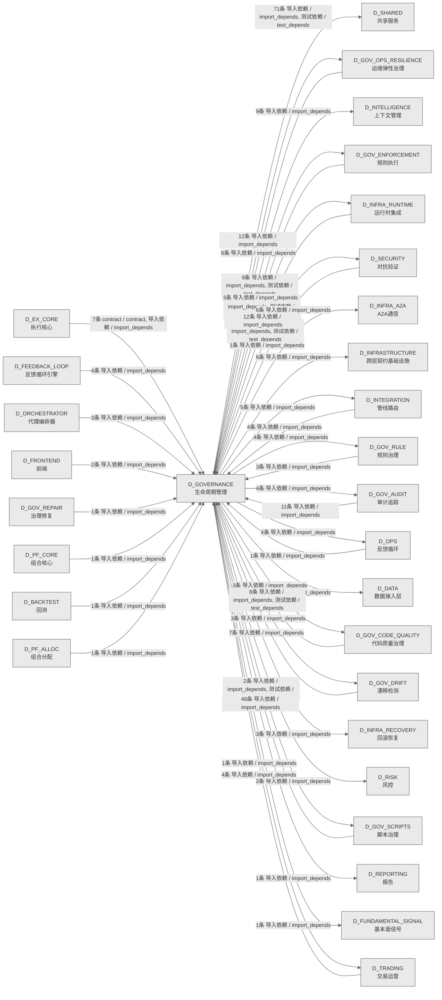

# 49_d_governance / 生命周期管理 / Lifecycle Management

> **功能简介 / Overview**: 生命周期管理，负责蓝图/模块/任务的声明周期管理和元数据治理

> **文档作用 / Purpose**: 展示 生命周期管理（D_GOVERNANCE）功能域的模块清单、域内依赖关系、跨域依赖关系、架构分层视图，供架构审查和域治理参考。

> 本文档由 generate_domain_doc.py 从 depgraph (PostgreSQL) 自动生成
> 数据源: depgraph (PostgreSQL) nodes表 + edges表

> **[可缩放 HTML 版 / Zoomable HTML](http://localhost:8765/docs/02_enterprise_architecture/02_domain_architecture_docs/49_d_governance.html)** — Ctrl+滚轮缩放 ｜ 双击重置 ｜ Ctrl+Shift+D 切换拖动/选择模式

## 域基本信息 / Domain Overview

| 字段 | 值 | Field | Value |
|------|------|-------|-------|
| 编号 | 49 | Number | 49 |
| 域ID | D_GOVERNANCE | Domain ID | D_GOVERNANCE |
| 域名称 | 生命周期管理 | Domain Name | Lifecycle Management |
| 层级 | L2 业务域层 | Layer | L2 Domain |
| 模块数 | 221 | Module Count | 221 |
| 域内依赖 | 45 | Internal Dependencies | 45 |
| 跨域入边 | 130 | Cross-domain Incoming | 130 |
| 跨域出边 | 164 | Cross-domain Outgoing | 164 |
| 设计态模块 | 0 | Design Modules | 0 |
| 生产态模块 | 221 | Production Modules | 221 |
| 容量 | 221/150 (超容) | Capacity | 221/150 (超容) |
| 描述 | 注册表总索引(registry_of_registries) | Description | 注册表总索引(registry_of_registries) |

## 模块分层清单 / Module Layered List

> 按 architecture_layer 分组的模块清单（共 221 个模块 / 221 modules）。

### L0 基础设施层 / Infrastructure Layer (9 modules)

| # | 模块路径 / Module Path | 模块名称 / Module Name (功能简介 / Description) | 成熟度 / Maturity | 蓝图 / Blueprint |
|:--:|---------|---------|:---:|:---:|
| 1 | src/zephyr/governance/adapters/risk_validation_bridge.py | D_EXECUTION_CORE — Risk Validation Bridge (DW-239) | 生产态 / production |  |
| 2 | src/zephyr/governance/adapters/simulation_broker.py | D_EXECUTION_CORE — Simulation Broker Adapter | 生产态 / production |  |
| 3 | src/zephyr/governance/data_governance/akshare_provider.py | D_DATA — Akshare Data Provider | 生产态 / production |  |
| 4 | src/zephyr/governance/data_governance/miniqmt_provider.py | MiniQMT 实盘行情 Provider（Tick + 5档盘口） | 生产态 / production |  |
| 5 | src/zephyr/governance/intelligence_governance/memory_prov... | D_DATA — Memory Provider | 生产态 / production |  |
| 6 | src/zephyr/governance/intelligence_governance/provider_ba... | D_DATA — Data Source Layer | 生产态 / production |  |
| 7 | src/zephyr/governance/observability_governance/analytics_... | Re-export wrapper: analytics_base canonical at zephyr.reporting.analytics_base. | 生产态 / production |  |
| 8 | src/zephyr/governance/strategies/strategy_base.py | D_PORTFOLIO_CORE — StrategyBase + StrategyMeta + StrategyRegistry | 生产态 / production |  |
| 9 | src/zephyr/governance/strategies/strategy_registry.py | StrategyRegistry 卫星模块（OCP-002） | 生产态 / production |  |

### L1 基础层 / Foundation Layer (6 modules)

| # | 模块路径 / Module Path | 模块名称 / Module Name (功能简介 / Description) | 成熟度 / Maturity | 蓝图 / Blueprint |
|:--:|---------|---------|:---:|:---:|
| 1 | docs/01_policies_and_standards/_registry/catalogs/rule_re... | [聚合节点 / Aggregated] 规则注册表集 / Rule Registry Collection (244 items) | 生产态 / production |  |
| ↳1 |   ↳ config/ai_capability_matrix.yaml |  | - | - |
| ↳2 |   ↳ config/auto_fix_cron.yaml |  | - | - |
| ↳3 |   ↳ config/blueprint_routing.yaml |  | - | - |
| ↳4 |   ↳ config/budget_policy.yaml |  | - | - |
| ↳5 |   ↳ config/capabilities.yaml |  | - | - |
| ↳6 |   ↳ config/capacity_params.yaml |  | - | - |
| ↳7 |   ↳ config/context_rules.yaml |  | - | - |
| ↳8 |   ↳ config/flags.yaml |  | - | - |
| ↳9 |   ↳ config/infra/grafana/dashboards/provider.yml |  | - | - |
| ↳10 |   ↳ config/infra/grafana/datasources/prometheus.yml |  | - | - |
| ↳11 |   ↳ config/infra/prometheus/prometheus.yml |  | - | - |
| ↳12 |   ↳ config/kb_parameters.yaml |  | - | - |
| ↳13 |   ↳ config/model_pricing.yaml |  | - | - |
| ↳14 |   ↳ config/nav_table_mapping.yaml |  | - | - |
| ↳15 |   ↳ config/rbac_roles.yaml |  | - | - |
| ↳16 |   ↳ config/resource_optimization.yaml |  | - | - |
| ↳17 |   ↳ config/risk_params.yaml |  | - | - |
| ↳18 |   ↳ config/runtime/burn_rate_acceleration.yaml |  | - | - |
| ↳19 |   ↳ config/runtime/error_budget_state.yaml |  | - | - |
| ↳20 |   ↳ config/runtime/kill_switch_state.yaml |  | - | - |
| ↳21 |   ↳ config/runtime/script_retirement_state.yaml |  | - | - |
| ↳22 |   ↳ config/runtime/shadow_mode_state.yaml |  | - | - |
| ↳23 |   ↳ config/session_state_machine.yaml |  | - | - |
| ↳24 |   ↳ config/trigger_router.yaml |  | - | - |
| ↳25 |   ↳ docs/01_policies_and_standards/_registry/schemas/ses... |  | - | - |
| ↳26 |   ↳ docs/01_policies_and_standards/rules/trae_001_file_o... |  | - | - |
| ↳27 |   ↳ docs/01_policies_and_standards/rules/trae_002_anti_o... |  | - | - |
| ↳28 |   ↳ docs/01_policies_and_standards/rules/trae_003_task_g... |  | - | - |
| ↳29 |   ↳ docs/01_policies_and_standards/rules/trae_004_parall... |  | - | - |
| ↳30 |   ↳ docs/01_policies_and_standards/rules/trae_005_modifi... |  | - | - |
| ↳31 |   ↳ docs/01_policies_and_standards/rules/trae_006_anti_h... |  | - | - |
| ↳32 |   ↳ docs/01_policies_and_standards/rules/trae_007_anti_h... |  | - | - |
| ↳33 |   ↳ docs/01_policies_and_standards/rules/trae_008_anti_h... |  | - | - |
| ↳34 |   ↳ docs/01_policies_and_standards/rules/trae_009_anti_h... |  | - | - |
| ↳35 |   ↳ docs/01_policies_and_standards/rules/trae_010_code_n... |  | - | - |
| ↳36 |   ↳ docs/01_policies_and_standards/rules/trae_011_code_t... |  | - | - |
| ↳37 |   ↳ docs/01_policies_and_standards/rules/trae_012_code_t... |  | - | - |
| ↳38 |   ↳ docs/01_policies_and_standards/rules/trae_013_arch_c... |  | - | - |
| ↳39 |   ↳ docs/01_policies_and_standards/rules/trae_014_arch_b... |  | - | - |
| ↳40 |   ↳ docs/01_policies_and_standards/rules/trae_015_arch_p... |  | - | - |
| ↳41 |   ↳ docs/01_policies_and_standards/rules/trae_016_arch_d... |  | - | - |
| ↳42 |   ↳ docs/01_policies_and_standards/rules/trae_017_arch_g... |  | - | - |
| ↳43 |   ↳ docs/01_policies_and_standards/rules/trae_018_behavi... |  | - | - |
| ↳44 |   ↳ docs/01_policies_and_standards/rules/trae_019_behavi... |  | - | - |
| ↳45 |   ↳ docs/01_policies_and_standards/rules/trae_020_behavi... |  | - | - |
| ↳46 |   ↳ docs/01_policies_and_standards/rules/trae_021_behavi... |  | - | - |
| ↳47 |   ↳ docs/01_policies_and_standards/rules/trae_022_behavi... |  | - | - |
| ↳48 |   ↳ docs/01_policies_and_standards/rules/trae_023_behavi... |  | - | - |
| ↳49 |   ↳ docs/01_policies_and_standards/rules/trae_024_method... |  | - | - |
| ↳50 |   ↳ docs/01_policies_and_standards/rules/trae_025_method... |  | - | - |
| ↳51 |   ↳ docs/01_policies_and_standards/rules/trae_026_method... |  | - | - |
| ↳52 |   ↳ docs/01_policies_and_standards/rules/trae_027_method... |  | - | - |
| ↳53 |   ↳ docs/01_policies_and_standards/rules/trae_028_doc_st... |  | - | - |
| ↳54 |   ↳ docs/01_policies_and_standards/rules/trae_029_doc_op... |  | - | - |
| ↳55 |   ↳ docs/01_policies_and_standards/rules/trae_030_doc_nu... |  | - | - |
| ↳56 |   ↳ docs/01_policies_and_standards/rules/trae_031_securi... |  | - | - |
| ↳57 |   ↳ docs/01_policies_and_standards/rules/trae_032_module... |  | - | - |
| ↳58 |   ↳ docs/01_policies_and_standards/rules/trae_033_module... |  | - | - |
| ↳59 |   ↳ docs/01_policies_and_standards/rules/trae_034_task_c... |  | - | - |
| ↳60 |   ↳ docs/01_policies_and_standards/rules/trae_035_task_c... |  | - | - |
| ↳61 |   ↳ docs/01_policies_and_standards/rules/trae_036_arch_g... |  | - | - |
| ↳62 |   ↳ docs/01_policies_and_standards/rules/trae_037_arch_q... |  | - | - |
| ↳63 |   ↳ docs/01_policies_and_standards/rules/trae_038_arch_c... |  | - | - |
| ↳64 |   ↳ docs/01_policies_and_standards/rules/trae_039_ai_hal... |  | - | - |
| ↳65 |   ↳ docs/01_policies_and_standards/rules/trae_040_ai_mod... |  | - | - |
| ↳66 |   ↳ docs/01_policies_and_standards/rules/trae_041_meta_r... |  | - | - |
| ↳67 |   ↳ docs/01_policies_and_standards/rules/trae_042_meta_r... |  | - | - |
| ↳68 |   ↳ docs/01_policies_and_standards/rules/trae_043_meta_r... |  | - | - |
| ↳69 |   ↳ docs/01_policies_and_standards/rules/trae_044_compli... |  | - | - |
| ↳70 |   ↳ docs/01_policies_and_standards/rules/trae_045_data_q... |  | - | - |
| ↳71 |   ↳ docs/01_policies_and_standards/rules/trae_046_engine... |  | - | - |
| ↳72 |   ↳ docs/01_policies_and_standards/rules/trae_047_engine... |  | - | - |
| ↳73 |   ↳ docs/01_policies_and_standards/rules/trae_048_ops_vi... |  | - | - |
| ↳74 |   ↳ docs/01_policies_and_standards/rules/trae_049_ops_do... |  | - | - |
| ↳75 |   ↳ docs/01_policies_and_standards/rules/trae_050_domain... |  | - | - |
| ↳76 |   ↳ docs/01_policies_and_standards/rules/trae_051_domain... |  | - | - |
| ↳77 |   ↳ docs/01_policies_and_standards/rules/trae_052_cross_... |  | - | - |
| ↳78 |   ↳ docs/01_policies_and_standards/rules/trae_053_automa... |  | - | - |
| ↳79 |   ↳ docs/01_policies_and_standards/rules/trae_054_depgra... |  | - | - |
| ↳80 |   ↳ docs/01_policies_and_standards/rules/trae_055_arch_d... |  | - | - |
| ↳81 |   ↳ docs/01_policies_and_standards/rules/trae_056_module... |  | - | - |
| ↳82 |   ↳ docs/01_policies_and_standards/rules/trae_057_ai_con... |  | - | - |
| ↳83 |   ↳ docs/01_policies_and_standards/rules/trae_058_depgra... |  | - | - |
| ↳84 |   ↳ docs/01_policies_and_standards/rules/trae_059_schema... |  | - | - |
| ↳85 |   ↳ docs/01_policies_and_standards/rules/trae_060_inward... |  | - | - |
| ↳86 |   ↳ docs/01_policies_and_standards/rules/trae_061_decisi... |  | - | - |
| ↳87 |   ↳ docs/01_policies_and_standards/rules/trae_062_ssot_c... |  | - | - |
| ↳88 |   ↳ docs/03_modules/_domain_infrastructure_operations/ag... |  | - | - |
| ↳89 |   ↳ docs/03_modules/_domain_infrastructure_operations/ag... |  | - | - |
| ↳90 |   ↳ docs/03_modules/path_ownership_map.yaml |  | - | - |
| ↳91 |   ↳ scripts/__init__.py |  | - | - |
| ↳92 |   ↳ scripts/_archive/construction/create_db_alignment_ta... |  | - | - |
| ↳93 |   ↳ scripts/_archive/construction/create_dm_phase9_tasks.py |  | - | - |
| ↳94 |   ↳ scripts/_archive/construction/dm014_orphan_edge_repa... |  | - | - |
| ↳95 |   ↳ scripts/_archive/governance/compare_ba_copies.py |  | - | - |
| ↳96 |   ↳ scripts/_archive/governance/create_depgraph_task_car... |  | - | - |
| ↳97 |   ↳ scripts/_archive/governance/d11_compliance/batch_rem... |  | - | - |
| ↳98 |   ↳ scripts/_archive/governance/d3_metadata/assign_modul... |  | - | - |
| ↳99 |   ↳ scripts/_archive/governance/d3_metadata/check_frontm... |  | - | - |
| ↳100 |   ↳ scripts/_archive/governance/d3_metadata/check_templa... |  | - | - |
| | | > (仅显示前 100 个 items，共 244 个) | | |
| 2 | src/zephyr/governance/compliance_gate_a6/compliance_manag... | ZephyrAlpha — D_COMPLIANCE Compliance Layer — 合规规则管理器接口 | 生产态 / production |  |
| 3 | src/zephyr/governance/engine/pipeline_base.py | 实验 — Experimentation Pipeline Layer | 生产态 / production |  |
| 4 | src/zephyr/governance/implementations/default_experiment_... | 实验 — Default Experiment Pipeline | 生产态 / production |  |
| 5 | src/zephyr/governance/implementations/default_security_ga... | implementations/default_security_gateway.py | 生产态 / production |  |
| 6 | src/zephyr/governance/intelligence_governance/aisg_sandbo... | AISG Sandbox Testing — AI Security Gateway 沙箱验证 (INV-015 升级) | 生产态 / production |  |

### L2 领域层 / Domain Layer (206 modules)

| # | 模块路径 / Module Path | 模块名称 / Module Name (功能简介 / Description) | 成熟度 / Maturity | 蓝图 / Blueprint |
|:--:|---------|---------|:---:|:---:|
| 1 | scripts/a2a_full_verification.py | A2A Protocol 全链路满分验证脚本 | 生产态 / production |  |
| 2 | scripts/arch_guard/_arch_ssot.py | arch_guard 共享：仓库根路径、capacity_slo / invariants / contracts 装载。 | 生产态 / production |  |
| 3 | scripts/arch_guard/_tools/build_ocp_manifest.py | 从 cross_layer_contracts.yaml 生成 OCP 冻结契约指纹（INV-009）。 | 生产态 / production |  |
| 4 | scripts/arch_guard/_tools/inject_idempotency.py | 为所有 P0/P1 契约添加 idempotency_key 字段——状态感知版本。 | 生产态 / production |  |
| 5 | scripts/arch_guard/_tools/patch_p1_paths.py | 一次性工具——为 9 个 P1 契约补齐 physical_path 并运行 codegen。 | 生产态 / production |  |
| 6 | scripts/arch_guard/check_acl_boundary.py | check_acl_boundary.py — Broker ACL 边界强制执行 (INV-005) | 生产态 / production |  |
| 7 | scripts/arch_guard/check_cross_plane_communication.py | check_cross_plane_communication.py — INV-011 拓扑 + 静态越界 import 嗅探 | 生产态 / production |  |
| 8 | scripts/arch_guard/check_fe_acl_boundary.py | check_fe_acl_boundary.py — INV-006 前端 ACL（仓库内有前端树则启用） | 生产态 / production |  |
| 9 | scripts/arch_guard/check_hot_path_purity.py | check_hot_path_purity.py — INV-012 Hot 路径 Python 禁 asyncio（配置驱动） | 生产态 / production |  |
| 10 | scripts/arch_guard/check_scaffold_exit_gates.py | check_scaffold_exit_gates.py — scaffold→experimental 安全门禁检查 | 生产态 / production |  |
| 11 | scripts/arch_guard/check_schema_consistency.py | check_schema_consistency.py — INV-010 契约物理路径存在性（Schema canonical ... | 生产态 / production |  |
| 12 | scripts/arch_guard/fitness_functions/check_aisg_gateway.py | check_aisg_gateway.py — AISG 拦截门禁 (INV-015) Phase B 升级 | 生产态 / production |  |
| 13 | scripts/arch_guard/fitness_functions/check_audit_log_immu... | check_audit_log_immutability.py — 审计日志不可篡改检查 (INV-016) | 生产态 / production |  |
| 14 | scripts/arch_guard/fitness_functions/check_capacity_slo_s... | check_capacity_slo_ssot.py — capacity_slo.yaml 注册表 + 与 invariants 数字对... | 生产态 / production |  |
| 15 | scripts/arch_guard/fitness_functions/check_daily_loss_lim... | check_daily_loss_limit.py — 日损失限额自动暂停 (INV-003) | 生产态 / production |  |
| 16 | scripts/arch_guard/fitness_functions/check_hot_warm_ipc.py | check_hot_warm_ipc.py — INV-018 Hot↔Warm IPC 协议检查 | 生产态 / production |  |
| 17 | scripts/arch_guard/fitness_functions/check_idempotency_ke... | check_idempotency_key.py — 幂等 Key 字段存在性检查 (INV-007) | 生产态 / production |  |
| 18 | scripts/arch_guard/fitness_functions/check_log_secret_lea... | check_log_secret_leak.py — R2 日志不写 secret 适应度函数 | 生产态 / production |  |
| 19 | scripts/arch_guard/fitness_functions/check_no_cross_plane... | check_no_cross_plane_mutable_state.py — INV-020 跨平面共享可变状态检查 | 生产态 / production |  |
| 20 | scripts/arch_guard/fitness_functions/check_ocp_signatures.py | check_ocp_signatures.py — OCP 冻结契约指纹校验 (INV-009) | 生产态 / production |  |
| 21 | scripts/arch_guard/fitness_functions/check_pit_compliance.py | check_pit_compliance.py — PIT（Point-in-Time）铁律强制执行 (INV-004) | 生产态 / production |  |
| 22 | scripts/arch_guard/fitness_functions/check_position_limit.py | check_position_limit.py — 单一持仓限制 ≤ 5% NAV (INV-002) | 生产态 / production |  |
| 23 | scripts/arch_guard/fitness_functions/check_risk_params_co... | check_risk_params_consistency.py — 风控参数真源 (INV-013) + 与 INV-002 声明对齐 | 生产态 / production |  |
| 24 | scripts/arch_guard/fitness_functions/check_survivorship_b... | check_survivorship_bias.py — Survivorship 策略门禁 (INV-014) | 生产态 / production |  |
| 25 | scripts/arch_guard/fitness_functions/check_warm_cold_asyn... | check_warm_cold_async.py — INV-019 Warm→Cold 异步通信检查 | 生产态 / production |  |
| 26 | scripts/arch_guard/run_all.py | Architecture Guard 编排器 | 生产态 / production |  |
| 27 | scripts/check_naming_convention.py | scripts/check_naming_convention.py | 生产态 / production |  |
| 28 | scripts/construction/_e2e_check.py | construction/_e2e_check.py | 生产态 / production |  |
| 29 | scripts/construction/_e2e_deep.py | construction/_e2e_deep.py | 生产态 / production |  |
| 30 | scripts/construction/check_statuses.py | construction/check_statuses.py | 生产态 / production |  |
| 31 | scripts/construction/check_transition_code.py | construction/check_transition_code.py | 生产态 / production |  |
| 32 | scripts/construction/d_init_task_system.py | 初始化任务系统数据库 + 创建任务系统自身的施工任务卡（吃狗粮） | 生产态 / production |  |
| 33 | scripts/construction/demo_a2a_chat.py | A2A 多 Agent 聊天演示 - Alpha 和 Beta 讨论项目评估 | 生产态 / production |  |
| 34 | scripts/construction/demo_a2a_coordination.py | A2A 协议协调任务演示 | 生产态 / production |  |
| 35 | scripts/construction/demo_e2e_pipeline.py | C-track 端到端演示 —— 全流水线一次性运行 | 生产态 / production |  |
| 36 | scripts/construction/finalize_tasks.py | construction/finalize_tasks.py | 生产态 / production |  |
| 37 | scripts/construction/local_layer_daemon.py | local_layer_daemon.py — L2 本地模型层守护进程（薄包装，DEPRECATED） | 生产态 / production |  |
| 38 | scripts/construction/reset_test_task.py | construction/reset_test_task.py | 生产态 / production |  |
| 39 | scripts/construction/start_brain.py | start_brain.py — ZephyrAlpha 系统大脑一键启动 | 生产态 / production |  |
| 40 | scripts/construction/test_event_hook.py | construction/test_event_hook.py | 生产态 / production |  |
| 41 | scripts/context/generate_architecture_context.py | generate_architecture_context.py — 预编译架构上下文包生成器 | 生产态 / production |  |
| 42 | scripts/diagnose_breadth_failed.py | 诊断 breadth_failed 能力的根因。 | 生产态 / production |  |
| 43 | scripts/dm90971_add_test_headers.py | DM-90971: Batch add module_id scope prefix + governance anchor headers to tes... | 生产态 / production |  |
| 44 | scripts/fix_freeze_manifest.py | Fix freezemanifest.yaml - comprehensive repair of all corrupted desc fields. | 生产态 / production |  |
| 45 | scripts/fix_orphan_all.py | fix_orphan_all.py — 自动修复 __init__.py __all__ 孤儿模块 | 生产态 / production |  |
| 46 | scripts/generate_manifest.py | Generate complete script_manifest.yaml from scripts/ tree scan. | 生产态 / production |  |
| 47 | scripts/generate_pathway_registry.py | 从所有 MOD 蓝图的 §路径索引 章节自动生成 system-pathway-registry.yaml。 | 生产态 / production |  |
| 48 | scripts/git_commit.py | git_commit.py — GitCommitGateway CLI 封装（OPS-2026062512） | 生产态 / production |  |
| 49 | scripts/git_guard.py | Git Guard — 拦截危险 git 命令，防止破坏其他 session 的文件锁。 | 生产态 / production |  |
| 50 | scripts/governance/d7_code/check_pure_shim.py | check_pure_shim.py — GATE-NO-PURE-SHIM 检测器（治本漏洞1 2026-06-29） | 生产态 / production |  |
| 51 | scripts/governance/generators/generate_rule_ai_perception... | generate_rule_ai_perception_index.py — 规则AI感知索引生成器（... | 生产态 / production |  |
| 52 | scripts/hooks/auto_handoff_log.py | hooks/auto_handoff_log.py | 生产态 / production |  |
| 53 | scripts/lock_files.py | lock_files.py —— AI 对话文件锁协议（硬规则执行工具） | 生产态 / production |  |
| 54 | scripts/mcp/generate_ide_config.py | 从 config/mcp.json 生成各 IDE MCP 配置文件（MOD-INF-013 §5.3 Step 2）。 | 生产态 / production |  |
| 55 | scripts/mcp/launcher.py | MCP DAG 编排启动器（MOD-INF-013 §14 拓扑排序 + ProcessLifecycleGateway 管理）。 | 生产态 / production |  |
| 56 | scripts/mcp/start_all.py | MCP 全 Server 启动脚本 — DEPRECATED. | 生产态 / production |  |
| 57 | scripts/mcp/status_all.py | MCP 全 Server 状态检查脚本（MOD-INF-013 §14）。 | 生产态 / production |  |
| 58 | scripts/mcp/stop_all.py | MCP 全 Server 停止脚本（MOD-INF-013 §14）。 | 生产态 / production |  |
| 59 | scripts/migration/dm311_autonomy_core_split.py | DM-311: autonomy_core/ 拆分迁移执行脚本。 | 生产态 / production |  |
| 60 | scripts/migration/dm314_infra_ops_split.py | DM-314: infra_ops/ 拆分迁移执行脚本。 | 生产态 / production |  |
| 61 | scripts/migration/governance_root_split.py | ARCH-031: governance/ root flat-files split migration orchestrator. | 生产态 / production |  |
| 62 | scripts/ops/verify_header_completeness.py | 文件头部完整性校验（6 格式统一入口） | 生产态 / production |  |
| 63 | scripts/post_checkout_guard.py | Post-checkout Guard — 事后检测 checkout 是否覆盖了其他 session 的文件锁。 | 生产态 / production |  |
| 64 | scripts/pre_commit/verify_dedup.py | pre_commit 验证脚本 — 委托给 code-dedup-engine CLI verify 子命令. | 生产态 / production |  |
| 65 | scripts/rollback.py | Rollback System CLI — MOD-INF-021 v0.10.0 Git-native+SQLite Checkpoint 操作... | 生产态 / production |  |
| 66 | scripts/run_deepseek_v4_exam.py | DeepSeek V4 入职考试运行脚本 | 生产态 / production |  |
| 67 | scripts/run_ollama_exam.py | Ollama 入职考试运行脚本 | 生产态 / production |  |
| 68 | scripts/scaffold.py | scaffold.py — ZephyrAlpha 唯一创建入口（RULE-TWO 强制执行器） | 生产态 / production |  |
| 69 | scripts/setup_git_guard_aliases.py | Setup/Remove Git Aliases for Git Guard — 自动化集成入口。 | 生产态 / production |  |
| 70 | src/zephyr/gov_enforcement/rule_bridge/worktree_lifecycle.py | WorktreeLifecycle — worktree 生命周期状态机（5态 + 8转换） | 生产态 / production |  |
| 71 | src/zephyr/governance/a2a/__init__.py | a2a/__init__.py | 生产态 / production |  |
| 72 | src/zephyr/governance/agent-spec/__init__.py | agent-spec/__init__.py | 生产态 / production |  |
| 73 | src/zephyr/governance/agent_spec/a2a_failure.py | G-CT-008 消费端 — Escalation.on_a2a_failure() 跨 agent 通信失败升级. | 生产态 / production |  |
| 74 | src/zephyr/governance/agent_spec/rbac_bridge.py | G-CT-007 契约：Budget -> RBAC 配额限制. | 生产态 / production |  |
| 75 | src/zephyr/governance/agent_spec/registry.py | G-CT-003 契约：Agent Spec -> RBAC 能力检查. | 生产态 / production |  |
| 76 | src/zephyr/governance/architecture_governance/architectur... | architecture_governance/architecture_contracts.py | 生产态 / production |  |
| 77 | src/zephyr/governance/architecture_governance/architectur... | architecture_governance/architecture_principles.py | 生产态 / production |  |
| 78 | src/zephyr/governance/architecture_governance/blueprint_b... | Blueprint Bloat Monitor — v0.11.0 蓝图膨胀监控器。 | 生产态 / production |  |
| 79 | src/zephyr/governance/architecture_governance/blueprint_c... | Blueprint-Code Consistency Gate — MOD-INF-022. | 生产态 / production |  |
| 80 | src/zephyr/governance/architecture_governance/blueprint_r... | Blueprint Reconciler — v0.10.0 蓝图实现一致性校验器。 | 生产态 / production |  |
| 81 | src/zephyr/governance/architecture_governance/constructio... | Construction Verifier — 施工验证器: 任务卡完成度+蓝图一致性检查。 | 生产态 / production |  |
| 82 | src/zephyr/governance/architecture_governance/cross_env_c... | architecture_governance/cross_env_consistency.py | 生产态 / production |  |
| 83 | src/zephyr/governance/architecture_governance/dependency_... | architecture_governance/dependency_manager.py | 生产态 / production |  |
| 84 | src/zephyr/governance/architecture_governance/formal_veri... | Formal Verifier — v0.6.0 形式验证器: 升级规则形式化验证->一致性+完备性检测。 | 生产态 / production |  |
| 85 | src/zephyr/governance/architecture_governance/gap_analyze... | Gap Analyzer — v0.8.0 间隙分析器: escalation覆盖缺口扫描+新操作类型识别。 | 生产态 / production |  |
| 86 | src/zephyr/governance/architecture_governance/llm_impact_... | LLMImpactAnalyzer — LLM-based commit 语义影响分析器。 | 生产态 / production |  |
| 87 | src/zephyr/governance/architecture_governance/local_first... | architecture_governance/local_first_arch.py | 生产态 / production |  |
| 88 | src/zephyr/governance/architecture_governance/path_resolv... | PathResolver — 模块路径解析器 | 生产态 / production |  |
| 89 | src/zephyr/governance/architecture_governance/post_sync_v... | post_sync_validator — post_sync_standard 命令校验逻辑的唯一真源（SSoT）。 | 生产态 / production |  |
| 90 | src/zephyr/governance/bridges/alerts.py | G-CT-006 — BudgetAlert re-exported from shared.contracts.escalation. | 生产态 / production |  |
| 91 | src/zephyr/governance/bridges/spec_auditor.py | G-CT-007 — Audit.record_agent_spec() 记录 Agent Spec 注册与变更. | 生产态 / production |  |
| 92 | src/zephyr/governance/capability_lookup.py | CapabilityLookup — 能力->真源文件反查注册表的查询 API + 扫描/派生逻辑（合一） | 生产态 / production |  |
| 93 | src/zephyr/governance/compliance_gate_a6/compliance_mappe... | Compliance Mapper — D-022-13 合规映射器: 操作->法规(SOX/GDPR/MiFID)映射+审计迹。 | 生产态 / production |  |
| 94 | src/zephyr/governance/context_governance/command_chain_le... | Command Chain Length Gate — v0.13.0 命令体积Deny退化防御器。 | 生产态 / production |  |
| 95 | src/zephyr/governance/context_governance/context_budget.py | context_budget.py —— 上下文预算管理与超预算截断（Phase 11 | 盲点 B28） | 生产态 / production |  |
| 96 | src/zephyr/governance/context_governance/context_manager.py | context_governance/context_manager.py | 生产态 / production |  |
| 97 | src/zephyr/governance/context_governance/context_package.py | Context Package — D-022-08 委托上下文包: 升级原因+证据链+历史try_trace。 | 生产态 / production |  |
| 98 | src/zephyr/governance/context_governance/context_recyclin... | context_governance/context_recycling.py | 生产态 / production |  |
| 99 | src/zephyr/governance/context_governance/context_switch_g... | Context Switch Governor — v0.11.0 Owner上下文切换预算管理器。 | 生产态 / production |  |
| 100 | src/zephyr/governance/context_governance/context_waste_de... | context_governance/context_waste_detector.py | 生产态 / production |  |
| 101 | src/zephyr/governance/context_governance/conversation_tax... | context_governance/conversation_tax_detector.py | 生产态 / production |  |
| 102 | src/zephyr/governance/context_governance/instruction_bloa... | InstructionBloatDetector — 指令膨胀检测 | 生产态 / production |  |
| 103 | src/zephyr/governance/context_governance/multi_turn_inten... | Multi-Turn Intent Analyzer — v0.13.0 多轮分布式意图分析器。 | 生产态 / production |  |
| 104 | src/zephyr/governance/context_governance/prompt_lifecycle.py | context_governance/prompt_lifecycle.py | 生产态 / production |  |
| 105 | src/zephyr/governance/context_governance/protocol_self_co... | Protocol Self Context — v0.10.0 协议自维护上下文管理器。 | 生产态 / production |  |
| 106 | src/zephyr/governance/context_governance/think_time_model.py | context_governance/think_time_model.py | 生产态 / production |  |
| 107 | src/zephyr/governance/data_governance/data_classification.py | data_governance/data_classification.py | 生产态 / production |  |
| 108 | src/zephyr/governance/data_governance/data_lifecycle.py | data_governance/data_lifecycle.py | 生产态 / production |  |
| 109 | src/zephyr/governance/data_governance/data_pipeline_guard.py | Data Pipeline Guard — v0.10.0 数据管道完整性防护: schema validation+row coun... | 生产态 / production |  |
| 110 | src/zephyr/governance/data_governance/data_quality.py | data_governance/data_quality.py | 生产态 / production |  |
| 111 | src/zephyr/governance/data_governance/data_source_reliabi... | data_governance/data_source_reliability.py | 生产态 / production |  |
| 112 | src/zephyr/governance/data_governance/exchange_partition_... | Exchange Partition Detector — v0.12.0 交易所网络分区检测器。 | 生产态 / production |  |
| 113 | src/zephyr/governance/data_governance/exchange_reg_monito... | Exchange Reg Monitor — v0.11.0 交易所规则变更监控器。 | 生产态 / production |  |
| 114 | src/zephyr/governance/data_governance/pricing_sync.py | data_governance/pricing_sync.py | 生产态 / production |  |
| 115 | src/zephyr/governance/data_governance/realtime_streaming.py | data_governance/realtime_streaming.py | 生产态 / production |  |
| 116 | src/zephyr/governance/depgraph_schema.py | depgraph Schema DDL + 版本化迁移框架 | 生产态 / production |  |
| 117 | src/zephyr/governance/evidence_pack.py | governance/evidence_pack.py | 生产态 / production |  |
| 118 | src/zephyr/governance/financial_governance/arbitrage_asym... | Arbitrage Asymmetry Detector — v0.11.0 跨交易所套利不对称检测器。 | 生产态 / production |  |
| 119 | src/zephyr/governance/financial_governance/atomic_transac... | AtomicTransactionManager — SQLite + 文件系统的跨介质原子事务管理器 v2.0（ATM）。 | 生产态 / production |  |
| 120 | src/zephyr/governance/financial_governance/flash_crash_gu... | Flash Crash Guard — v0.12.0 闪崩双轨熔断器。 | 生产态 / production |  |
| 121 | src/zephyr/governance/financial_governance/fsm_verifier.py | financial_governance/fsm_verifier.py | 生产态 / production |  |
| 122 | src/zephyr/governance/financial_governance/instrument.py | financial_governance/instrument.py | 生产态 / production |  |
| 123 | src/zephyr/governance/financial_governance/microstructure... | financial_governance/microstructure_defense.py | 生产态 / production |  |
| 124 | src/zephyr/governance/financial_governance/oms_risk_engin... | financial_governance/oms_risk_engine.py | 生产态 / production |  |
| 125 | src/zephyr/governance/financial_governance/risk_matrix.py | financial_governance/risk_matrix.py | 生产态 / production |  |
| 126 | src/zephyr/governance/financial_governance/strategy_portf... | financial_governance/strategy_portfolio.py | 生产态 / production |  |
| 127 | src/zephyr/governance/financial_governance/strategy_scope... | Strategy Scoper — v0.6.0 策略范围隔离器: SIG/Strat/Capital多层策略隔离。 | 生产态 / production |  |
| 128 | src/zephyr/governance/intelligence_governance/agent_debat... | intelligence_governance/agent_debate.py | 生产态 / production |  |
| 129 | src/zephyr/governance/intelligence_governance/ai_self_dia... | intelligence_governance/ai_self_diagnosis.py | 生产态 / production |  |
| 130 | src/zephyr/governance/intelligence_governance/autonomy_da... | Autonomy Dashboard — AI 自主感知健康仪表。 | 生产态 / production |  |
| 131 | src/zephyr/governance/intelligence_governance/confidence_... | Confidence Estimator — D-022-05 置信度评估器: certainty×evidence×risk三维评估。 | 生产态 / production |  |
| 132 | src/zephyr/governance/intelligence_governance/confidence_... | ConfidenceQuantifier — AI 置信度量化。 | 生产态 / production |  |
| 133 | src/zephyr/governance/intelligence_governance/continuous_... | Continuous Trust Ledger — 持续信任评估引擎。 | 生产态 / production |  |
| 134 | src/zephyr/governance/intelligence_governance/cross_agent... | CrossAgentConflictDetector — 多 Agent 并发冲突检测。 | 生产态 / production |  |
| 135 | src/zephyr/governance/intelligence_governance/cross_assis... | Cross-Assistant Adapter — v0.6.0 Trae/Cursor/Windsurf/Codex/Wedata统一升级接口。 | 生产态 / production |  |
| 136 | src/zephyr/governance/intelligence_governance/delegation_... | Delegation Engine — MOD-INF-022 | 生产态 / production |  |
| 137 | src/zephyr/governance/intelligence_governance/delegation_... | Delegation Manager — D-022-02 自动委托协议。 | 生产态 / production |  |
| 138 | src/zephyr/governance/intelligence_governance/meta_confid... | Meta-Confidence — D-022-10 Agent对自身判定置信度的自评+历史校准。 | 生产态 / production |  |
| 139 | src/zephyr/governance/intelligence_governance/model_provi... | intelligence_governance/model_provider_data.py | 生产态 / production |  |
| 140 | src/zephyr/governance/intelligence_governance/model_route... | intelligence_governance/model_router.py | 生产态 / production |  |
| 141 | src/zephyr/governance/intelligence_governance/model_versi... | Model Version Detector — v0.10.0 模型版本突变检测: model version change->deg... | 生产态 / production |  |
| 142 | src/zephyr/governance/intelligence_governance/multi_model... | intelligence_governance/multi_model_consensus.py | 生产态 / production |  |
| 143 | src/zephyr/governance/intelligence_governance/mvep_orches... | MVEP Orchestrator — v0.11.0 Minimum Viable Escalation Protocol调度器。 | 生产态 / production |  |
| 144 | src/zephyr/governance/intelligence_governance/provider_fa... | Provider Failover — v0.7.0 多LLM Provider容灾: deepseek->claude->gpt fallbac... | 生产态 / production |  |
| 145 | src/zephyr/governance/intelligence_governance/self_benchm... | Self-Benchmark (W3-7) — 5 组已知对自验证 + 引擎退化告警. | 生产态 / production |  |
| 146 | src/zephyr/governance/intelligence_governance/self_test.py | Escalation Protocol Self-Test — MOD-INF-022. | 生产态 / production |  |
| 147 | src/zephyr/governance/intelligence_governance/self_valida... | Self Validator — v0.10.0 升级协议自验证器: protocol自身规则+代码一致性自检。 | 生产态 / production |  |
| 148 | src/zephyr/governance/intelligence_governance/subagent_ho... | Subagent Hook Propagator — v0.13.0 子Agent Hook旁路防护器。 | 生产态 / production |  |
| 149 | src/zephyr/governance/lifecycle_governance/api_lifecycle.py | lifecycle_governance/api_lifecycle.py | 生产态 / production |  |
| 150 | src/zephyr/governance/lifecycle_governance/migration_stra... | lifecycle_governance/migration_strategy.py | 生产态 / production |  |
| 151 | src/zephyr/governance/lifecycle_governance/paper_live_tra... | lifecycle_governance/paper_live_transition.py | 生产态 / production |  |
| 152 | src/zephyr/governance/lifecycle_governance/post_live_veri... | lifecycle_governance/post_live_verification.py | 生产态 / production |  |
| 153 | src/zephyr/governance/lifecycle_governance/transition.py | transition — 状态机转换 Mixin（从 task_repo.py 拆分，SRC-0066） | 生产态 / production |  |
| 154 | src/zephyr/governance/observability_governance/objective_... | Objective Tracker — v0.9.0 目标漂移检测器: agent目标函数稳定性+变更检测+roll... | 生产态 / production |  |
| 155 | src/zephyr/governance/observability_governance/projection... | ProjectionEngine — 事件折叠为当前状态（DW-0003） | 生产态 / production |  |
| 156 | src/zephyr/governance/observability_governance/query_metr... | QueryMetrics — SQL 查询性能监控装饰器（SH-DB-001 v2.0） | 生产态 / production |  |
| 157 | src/zephyr/governance/persistence/base_repo.py | base_repo — 异常类、状态机常量、工具函数（从 task_repo.py 拆分，SRC-0066） | 生产态 / production |  |
| 158 | src/zephyr/governance/persistence/database_manager.py | DatabaseManager — 连接池 + 健康检查 + 自动备份 + WAL checkpoint（SH-DB-001 v... | 生产态 / production |  |
| 159 | src/zephyr/governance/persistence/database_service.py | DatabaseService 真源收敛（AI-14 审计 P1 修复） | 生产态 / production |  |
| 160 | src/zephyr/governance/persistence/dataflowgraph_schema.py | dataflowgraph Schema DDL + 连接入口 | 生产态 / production |  |
| 161 | src/zephyr/governance/persistence/decision_graph_reader.py | decision_graph_reader.py — 决策流图数据库只读查询工具模块 | 生产态 / production |  |
| 162 | src/zephyr/governance/persistence/decisiongraph_schema.py | decisiongraph Schema DDL + 不变量声明 | 生产态 / production |  |
| 163 | src/zephyr/governance/persistence/depgraph_reader.py | depgraph_reader.py — 依赖图数据库查询工具模块 | 生产态 / production |  |
| 164 | src/zephyr/governance/persistence/pg_wrapper.py | pg_wrapper.py — psycopg2 connection 的 sqlite3 兼容 execute() 包装器（单一规... | 生产态 / production |  |
| 165 | src/zephyr/governance/persistence/protocol_state_store.py | Protocol State Store — v0.10.0 协议运行时状态持久化: JSON snapshot+recovery ... | 生产态 / production |  |
| 166 | src/zephyr/governance/persistence/sqlite_schema.py | SQLite 元数据层 Schema DDL + 版本化迁移框架（T-1-02 + SH-DB-001 v2.0） | 生产态 / production |  |
| 167 | src/zephyr/governance/persistence/task_repo.py | TaskRepository — 任务登记表 CRUD + 状态机（T-1-04） | 生产态 / production |  |
| 168 | src/zephyr/governance/rule_patterns.py | rule_patterns.py — 治理规则正则 + 安全审计模式唯一真源 (SSoT) | 生产态 / production |  |
| 169 | src/zephyr/governance/services/adapter.py | Escalation Adapter — MOD-INF-022 统一集成入口. | 生产态 / production |  |
| 170 | src/zephyr/governance/services/cross_session_correlator.py | Cross-Session Correlator — v0.9.0 跨会话Coreset关联器: 多session行为模式+异... | 生产态 / production |  |
| 171 | src/zephyr/governance/services/memory_provenance.py | Memory Provenance — v0.9.0 记忆溯源追踪: 每条memory record的来源agent+timest... | 生产态 / production |  |
| 172 | src/zephyr/infrastructure/a2a_protocol/governance/_base_s... | governance/_base_server.py | 生产态 / production |  |
| 173 | src/zephyr/infrastructure/a2a_protocol/governance/audit_l... | governance/audit_logger.py | 生产态 / production |  |
| 174 | src/zephyr/infrastructure/a2a_protocol/governance/auditor.py | G-CT-008 契约：A2A -> Audit 审计 Agent 间通信. | 生产态 / production |  |
| 175 | src/zephyr/infrastructure/a2a_protocol/governance/error_c... | governance/error_codes.py | 生产态 / production |  |
| 176 | src/zephyr/infrastructure/a2a_protocol/governance/governa... | A2A GovernanceAdapter — Phase 4 治理集成桥接器 | 生产态 / production |  |
| 177 | src/zephyr/infrastructure/a2a_protocol/governance/phase_h... | Phase 4 Hold — A2A Phase 4 锁定标记模块 与其他 Phase 3 模块不可并发施工. | 生产态 / production |  |
| 178 | src/zephyr/infrastructure/a2a_protocol/governance/policy_... | governance/policy_engine.py | 生产态 / production |  |
| 179 | src/zephyr/infrastructure/a2a_protocol/governance/protoco... | G-CT-008 — A2ACommunication Pydantic V2 BaseModel agent-to-agent 通信数据结构. | 生产态 / production |  |
| 180 | src/zephyr/infrastructure/a2a_protocol/governance/rate_li... | governance/rate_limiter.py | 生产态 / production |  |
| 181 | src/zephyr/infrastructure/a2a_protocol/governance/session... | governance/session_manager.py | 生产态 / production |  |
| 182 | src/zephyr/infrastructure/a2a_protocol/layer3_coordinatio... | Re-export bridge for layer3_coordination governance integration symbols. | 生产态 / production |  |
| 183 | src/zephyr/infrastructure/a2a_protocol/layer3_coordinatio... | A2A 治理适配器 — 连接 A2A 协议与 Governance 层 | 生产态 / production |  |
| 184 | src/zephyr/infrastructure/capacity_assurance/contracts/ba... | Batch2 治理层契约 — 15条 Pydantic v2 Schema（Provenance/AI审计守卫/TechStack... | 生产态 / production |  |
| 185 | src/zephyr/infrastructure/registry_governance.py | Registry Governance — MOD-INF-037 | 生产态 / production |  |
| 186 | src/zephyr/integration/mcp/governance_server.py | GovernanceServer: 治理域统一MCP入口 | 生产态 / production |  |
| 187 | src/zephyr/shared/capacity_governance/capacity_governance... | capacity_governance/capacity_governance_loop.py | 生产态 / production |  |
| 188 | src/zephyr/shared/protocols/a2a/a2a_governance.py | A2A Governance — shared interface definitions for governance layer. | 生产态 / production |  |
| 189 | tests/agent_rbac/test_session_aware_stash_red_blue.py | session 隔离 stash 红蓝对抗极限测试。 | 生产态 / production |  |
| 190 | tests/git/test_git_commit_concurrent.py | test_git_commit_concurrent.py — 幽灵提交红蓝对抗测试（OPS-2026062514） | 生产态 / production |  |
| 191 | tests/git/test_git_commit_extreme.py | test_git_commit_extreme.py — GitCommitGateway 极端故障注入测试（OPS-2026062515） | 生产态 / production |  |
| 192 | tests/git/test_git_commit_gateway.py | test_git_commit_gateway.py — GitCommitGateway 单元测试（OPS-2026062512 验收） | 生产态 / production |  |
| 193 | tests/git/test_reconciler_verify_autosync.py | test_reconciler_verify_autosync.py — --reconciler-verify auto-sync 产物豁免... | 生产态 / production |  |
| 194 | tests/governance/generators/test_check_gate_inventory_dri... | test_check_gate_inventory_drift.py — commit_gates 模块清单漂移检测脚本单元测... | 生产态 / production |  |
| 195 | tests/governance/generators/test_generate_gate_registry.py | test_generate_gate_registry.py — generate_gate_registry.py 单元测试（CommitG... | 生产态 / production |  |
| 196 | tests/governance/rule_bridge/test_worktree_lifecycle.py | test_worktree_lifecycle.py — #ARCH-WORKTREE-LIFECYCLE-001 状态机测试 | 生产态 / production |  |
| 197 | tests/governance/test_ast_import_rewriter.py | Tests for scripts/governance/ast_import_rewriter.py. | 生产态 / production |  |
| 198 | tests/io/test_depgraph_schema.py | test_depgraph_schema.py — depgraph_schema.py DDL 真源与迁移框架单元测试 | 生产态 / production |  |
| 199 | tests/io/test_verify_schema_health.py | test_verify_schema_health.py — verify_schema_health.py 门禁可靠性单元测试 | 生产态 / production |  |
| 200 | tests/rollback/test_concurrency_guard_red_blue.py | 红蓝对抗极端测试 — git_guard + concurrency_guard 端到端防护能力验证。 | 生产态 / production |  |

> (仅显示前 200 个模块，共 206 个)

## 域内依赖图 / Internal Dependency Diagram

> 依赖图内嵌在本文档中，IDE 可直接渲染显示。参考 decision_index.md 设计，分三个视图：合并全景图、运营态子图、设计态子图（按 design_maturity 实际值拆分）。
>
> **图例说明 / Legend**：
> - **实线边框 = 运营态模块**（production，已上线运行）
> - **虚线边框 = 设计态模块**（design，蓝图阶段，代码未写）
> - **实线箭头 = 运营态依赖**（已生效的依赖关系）
> - **虚线箭头 = 非运营态依赖**（计划中/验证中的依赖关系）

### 合并全景图（全部模块，标签标注成熟度）

> 展示全部 221 个模块（生产态 221 + 设计态 0），标签标注成熟度。

#### 第 1 页 / 共 8 页

```mermaid
%%{init: {'theme': 'base', 'themeVariables': {'primaryColor': '#eaeaea', 'primaryTextColor': '#333333', 'primaryBorderColor': '#666666', 'lineColor': '#666666', 'secondaryColor': '#eaeaea', 'tertiaryColor': '#eaeaea', 'fontSize': '14px'}}}%%
flowchart TD
    docs_01_policies_and_standards_registry_catalogs_rule_registry_collection_yaml["(生产态 / production) catalogs/rule_registry_collection.yaml"]
    scripts_a2a_full_verification_py["(生产态 / production) A2A Protocol 全链路满分验证脚本<br/>A2A Protocol 全链路满分验证脚本<br/>文件: scripts/a2a_full_verification.py"]
    scripts_arch_guard_arch_ssot_py["(生产态 / production) arch_guard 共享：仓库根路径、capacity_slo / invariants / contracts 装载。<br/>arch_guard 共享：仓库根路径、capacity_slo / invariants / contracts 装载。<br/>文件: arch_guard/_arch_ssot.py"]
    scripts_arch_guard_tools_inject_idempotency_py["(生产态 / production) 为所有 P0/P1 契约添加 idempotency_key 字段——状态感知版本。<br/>为所有 P0/P1 契约添加 idempotency_key 字段——状态感知版本。<br/>文件: _tools/inject_idempotency.py"]
    scripts_arch_guard_check_acl_boundary_py["(生产态 / production) check_acl_boundary.py — Broker ACL 边界强制执行 (INV-005)<br/>check_acl_boundary.py — Broker ACL 边界强制执行 (INV-005)<br/>文件: arch_guard/check_acl_boundary.py"]
    scripts_arch_guard_check_cross_plane_communication_py["(生产态 / production) check_cross_plane_communication.py — INV-011 拓扑 + 静态越界 import 嗅探<br/>check_cross_plane_communication.py — INV-011 拓扑 + 静态越界 import 嗅探<br/>文件: arch_guard/check_cross_plane_communication.py"]
    scripts_arch_guard_check_fe_acl_boundary_py["(生产态 / production) check_fe_acl_boundary.py — INV-006 前端 ACL（仓库内有前端树则启用）<br/>check_fe_acl_boundary.py — INV-006 前端 ACL（仓库内有前端树则启用）<br/>文件: arch_guard/check_fe_acl_boundary.py"]
    scripts_arch_guard_check_hot_path_purity_py["(生产态 / production) check_hot_path_purity.py — INV-012 Hot 路径 Python 禁 asyncio（配置驱动）<br/>check_hot_path_purity.py — INV-012 Hot 路径 Python 禁 asyncio（配置驱动）<br/>文件: arch_guard/check_hot_path_purity.py"]
    scripts_arch_guard_check_scaffold_exit_gates_py["(生产态 / production) check_scaffold_exit_gates.py — scaffold→experimental 安全门禁检查<br/>check_scaffold_exit_gates.py — scaffold→experimental 安全门禁检查<br/>文件: arch_guard/check_scaffold_exit_gates.py"]
    scripts_arch_guard_check_schema_consistency_py["(生产态 / production) check_schema_consistency.py — INV-010 契约物理路径存在性（Schema canonical ...<br/>check_schema_consistency.py — INV-010 契约物理路径存在性（Schema canonical ...<br/>文件: arch_guard/check_schema_consistency.py"]
    scripts_arch_guard_fitness_functions_check_aisg_gateway_py["(生产态 / production) check_aisg_gateway.py — AISG 拦截门禁 (INV-015) Phase B 升级<br/>check_aisg_gateway.py — AISG 拦截门禁 (INV-015) Phase B 升级<br/>文件: fitness_functions/check_aisg_gateway.py"]
    scripts_arch_guard_fitness_functions_check_audit_log_immutability_py["(生产态 / production) check_audit_log_immutability.py — 审计日志不可篡改检查 (INV-016)<br/>check_audit_log_immutability.py — 审计日志不可篡改检查 (INV-016)<br/>文件: fitness_functions/check_audit_log_immutability.py"]
    scripts_arch_guard_fitness_functions_check_capacity_slo_ssot_py["(生产态 / production) check_capacity_slo_ssot.py — capacity_slo.yaml 注册表 + 与 invariants 数字对...<br/>check_capacity_slo_ssot.py — capacity_slo.yaml 注册表 + 与 invariants 数字对...<br/>文件: fitness_functions/check_capacity_slo_ssot.py"]
    scripts_arch_guard_fitness_functions_check_daily_loss_limit_py["(生产态 / production) check_daily_loss_limit.py — 日损失限额自动暂停 (INV-003)<br/>check_daily_loss_limit.py — 日损失限额自动暂停 (INV-003)<br/>文件: fitness_functions/check_daily_loss_limit.py"]
    scripts_arch_guard_fitness_functions_check_hot_warm_ipc_py["(生产态 / production) check_hot_warm_ipc.py — INV-018 Hot↔Warm IPC 协议检查<br/>check_hot_warm_ipc.py — INV-018 Hot↔Warm IPC 协议检查<br/>文件: fitness_functions/check_hot_warm_ipc.py"]
    scripts_arch_guard_fitness_functions_check_idempotency_key_py["(生产态 / production) check_idempotency_key.py — 幂等 Key 字段存在性检查 (INV-007)<br/>check_idempotency_key.py — 幂等 Key 字段存在性检查 (INV-007)<br/>文件: fitness_functions/check_idempotency_key.py"]
    scripts_arch_guard_fitness_functions_check_log_secret_leak_py["(生产态 / production) check_log_secret_leak.py — R2 日志不写 secret 适应度函数<br/>check_log_secret_leak.py — R2 日志不写 secret 适应度函数<br/>文件: fitness_functions/check_log_secret_leak.py"]
    scripts_arch_guard_fitness_functions_check_no_cross_plane_mutable_state_py["(生产态 / production) check_no_cross_plane_mutable_state.py — INV-020 跨平面共享可变状态检查<br/>check_no_cross_plane_mutable_state.py — INV-020 跨平面共享可变状态检查<br/>文件: fitness_functions/check_no_cross_plane_mutable_state.py"]
    scripts_arch_guard_fitness_functions_check_ocp_signatures_py["(生产态 / production) check_ocp_signatures.py — OCP 冻结契约指纹校验 (INV-009)<br/>check_ocp_signatures.py — OCP 冻结契约指纹校验 (INV-009)<br/>文件: fitness_functions/check_ocp_signatures.py"]
    scripts_arch_guard_fitness_functions_check_pit_compliance_py["(生产态 / production) check_pit_compliance.py — PIT（Point-in-Time）铁律强制执行 (INV-004)<br/>check_pit_compliance.py — PIT（Point-in-Time）铁律强制执行 (INV-004)<br/>文件: fitness_functions/check_pit_compliance.py"]
    scripts_arch_guard_fitness_functions_check_position_limit_py["(生产态 / production) check_position_limit.py — 单一持仓限制 ≤ 5% NAV (INV-002)<br/>check_position_limit.py — 单一持仓限制 ≤ 5% NAV (INV-002)<br/>文件: fitness_functions/check_position_limit.py"]
    scripts_arch_guard_fitness_functions_check_risk_params_consistency_py["(生产态 / production) check_risk_params_consistency.py — 风控参数真源 (INV-013) + 与 INV-002 声明对齐<br/>check_risk_params_consistency.py — 风控参数真源 (INV-013) + 与 INV-002 声明对齐<br/>文件: fitness_functions/check_risk_params_consistency.py"]
    scripts_arch_guard_fitness_functions_check_survivorship_bias_py["(生产态 / production) check_survivorship_bias.py — Survivorship 策略门禁 (INV-014)<br/>check_survivorship_bias.py — Survivorship 策略门禁 (INV-014)<br/>文件: fitness_functions/check_survivorship_bias.py"]
    scripts_arch_guard_fitness_functions_check_warm_cold_async_py["(生产态 / production) check_warm_cold_async.py — INV-019 Warm→Cold 异步通信检查<br/>check_warm_cold_async.py — INV-019 Warm→Cold 异步通信检查<br/>文件: fitness_functions/check_warm_cold_async.py"]
    scripts_arch_guard_run_all_py["(生产态 / production) Architecture Guard 编排器<br/>Architecture Guard 编排器<br/>文件: arch_guard/run_all.py"]
    scripts_check_naming_convention_py["(生产态 / production) scripts/check_naming_convention.py"]
    scripts_construction_e2e_check_py["(生产态 / production) construction/_e2e_check.py"]
    scripts_construction_e2e_deep_py["(生产态 / production) construction/_e2e_deep.py"]
    docs_01_policies_and_standards_registry_catalogs_rule_registry_collection_yaml ~~~ scripts_a2a_full_verification_py
    scripts_a2a_full_verification_py ~~~ scripts_arch_guard_arch_ssot_py
    scripts_arch_guard_arch_ssot_py ~~~ scripts_arch_guard_tools_inject_idempotency_py
    scripts_arch_guard_tools_inject_idempotency_py ~~~ scripts_arch_guard_check_acl_boundary_py
    scripts_arch_guard_check_acl_boundary_py ~~~ scripts_arch_guard_check_cross_plane_communication_py
    scripts_arch_guard_check_cross_plane_communication_py ~~~ scripts_arch_guard_check_fe_acl_boundary_py
    scripts_arch_guard_check_fe_acl_boundary_py ~~~ scripts_arch_guard_check_hot_path_purity_py
    scripts_arch_guard_check_hot_path_purity_py ~~~ scripts_arch_guard_check_scaffold_exit_gates_py
    scripts_arch_guard_check_scaffold_exit_gates_py ~~~ scripts_arch_guard_check_schema_consistency_py
    scripts_arch_guard_check_schema_consistency_py ~~~ scripts_arch_guard_fitness_functions_check_aisg_gateway_py
    scripts_arch_guard_fitness_functions_check_aisg_gateway_py ~~~ scripts_arch_guard_fitness_functions_check_audit_log_immutability_py
    scripts_arch_guard_fitness_functions_check_audit_log_immutability_py ~~~ scripts_arch_guard_fitness_functions_check_capacity_slo_ssot_py
    scripts_arch_guard_fitness_functions_check_capacity_slo_ssot_py ~~~ scripts_arch_guard_fitness_functions_check_daily_loss_limit_py
    scripts_arch_guard_fitness_functions_check_daily_loss_limit_py ~~~ scripts_arch_guard_fitness_functions_check_hot_warm_ipc_py
    scripts_arch_guard_fitness_functions_check_hot_warm_ipc_py ~~~ scripts_arch_guard_fitness_functions_check_idempotency_key_py
    scripts_arch_guard_fitness_functions_check_idempotency_key_py ~~~ scripts_arch_guard_fitness_functions_check_log_secret_leak_py
    scripts_arch_guard_fitness_functions_check_log_secret_leak_py ~~~ scripts_arch_guard_fitness_functions_check_no_cross_plane_mutable_state_py
    scripts_arch_guard_fitness_functions_check_no_cross_plane_mutable_state_py ~~~ scripts_arch_guard_fitness_functions_check_ocp_signatures_py
    scripts_arch_guard_fitness_functions_check_ocp_signatures_py ~~~ scripts_arch_guard_fitness_functions_check_pit_compliance_py
    scripts_arch_guard_fitness_functions_check_pit_compliance_py ~~~ scripts_arch_guard_fitness_functions_check_position_limit_py
    scripts_arch_guard_fitness_functions_check_position_limit_py ~~~ scripts_arch_guard_fitness_functions_check_risk_params_consistency_py
    scripts_arch_guard_fitness_functions_check_risk_params_consistency_py ~~~ scripts_arch_guard_fitness_functions_check_survivorship_bias_py
    scripts_arch_guard_fitness_functions_check_survivorship_bias_py ~~~ scripts_arch_guard_fitness_functions_check_warm_cold_async_py
    scripts_arch_guard_fitness_functions_check_warm_cold_async_py ~~~ scripts_arch_guard_run_all_py
    scripts_arch_guard_run_all_py ~~~ scripts_check_naming_convention_py
    scripts_check_naming_convention_py ~~~ scripts_construction_e2e_check_py
    scripts_construction_e2e_check_py ~~~ scripts_construction_e2e_deep_py
    scripts_arch_guard_tools_build_ocp_manifest_py["(生产态 / production) 从 cross_layer_contracts.yaml 生成 OCP 冻结契约指纹（INV-009）。<br/>从 cross_layer_contracts.yaml 生成 OCP 冻结契约指纹（INV-009）。<br/>文件: _tools/build_ocp_manifest.py"]
    scripts_arch_guard_tools_patch_p1_paths_py["(生产态 / production) 一次性工具——为 9 个 P1 契约补齐 physical_path 并运行 codegen。<br/>一次性工具——为 9 个 P1 契约补齐 physical_path 并运行 codegen。<br/>文件: _tools/patch_p1_paths.py"]
    scripts_arch_guard_tools_build_ocp_manifest_py -->|config_depends / config_depends| scripts_arch_guard_tools_patch_p1_paths_py
    scripts_arch_guard_tools_inject_idempotency_py -->|config_depends / config_depends| scripts_arch_guard_tools_build_ocp_manifest_py
    D_SHARED["(生产态 / production) D_SHARED 共享服务"]
    scripts_construction_e2e_deep_py -->|导入依赖 / import_depends| D_SHARED
    scripts_construction_e2e_check_py -->|导入依赖 / import_depends| D_SHARED
    D_INFRASTRUCTURE["(生产态 / production) D_INFRASTRUCTURE 跨层契约基础设施"]
    scripts_a2a_full_verification_py -->|导入依赖 / import_depends| D_INFRASTRUCTURE
    classDef production fill:#e8edf2,stroke:#0277bd,stroke-width:2px,color:#1a1a1a
    classDef design fill:#f0ebe3,stroke:#bf360c,stroke-width:2px,color:#1a1a1a,stroke-dasharray: 5 5
    classDef external_prod fill:#e8efe9,stroke:#1b5e20,stroke-width:1px,color:#1a1a1a
    classDef external_design fill:#efe5ea,stroke:#880e4f,stroke-width:1px,color:#1a1a1a,stroke-dasharray: 5 5
    class docs_01_policies_and_standards_registry_catalogs_rule_registry_collection_yaml,scripts_a2a_full_verification_py,scripts_arch_guard_arch_ssot_py,scripts_arch_guard_tools_build_ocp_manifest_py,scripts_arch_guard_tools_inject_idempotency_py,scripts_arch_guard_tools_patch_p1_paths_py,scripts_arch_guard_check_acl_boundary_py,scripts_arch_guard_check_cross_plane_communication_py,scripts_arch_guard_check_fe_acl_boundary_py,scripts_arch_guard_check_hot_path_purity_py,scripts_arch_guard_check_scaffold_exit_gates_py,scripts_arch_guard_check_schema_consistency_py,scripts_arch_guard_fitness_functions_check_aisg_gateway_py,scripts_arch_guard_fitness_functions_check_audit_log_immutability_py,scripts_arch_guard_fitness_functions_check_capacity_slo_ssot_py,scripts_arch_guard_fitness_functions_check_daily_loss_limit_py,scripts_arch_guard_fitness_functions_check_hot_warm_ipc_py,scripts_arch_guard_fitness_functions_check_idempotency_key_py,scripts_arch_guard_fitness_functions_check_log_secret_leak_py,scripts_arch_guard_fitness_functions_check_no_cross_plane_mutable_state_py,scripts_arch_guard_fitness_functions_check_ocp_signatures_py,scripts_arch_guard_fitness_functions_check_pit_compliance_py,scripts_arch_guard_fitness_functions_check_position_limit_py,scripts_arch_guard_fitness_functions_check_risk_params_consistency_py,scripts_arch_guard_fitness_functions_check_survivorship_bias_py,scripts_arch_guard_fitness_functions_check_warm_cold_async_py,scripts_arch_guard_run_all_py,scripts_check_naming_convention_py,scripts_construction_e2e_check_py,scripts_construction_e2e_deep_py production
    class D_SHARED,D_INFRASTRUCTURE external_prod
```



#### 第 2 页 / 共 8 页

```mermaid
%%{init: {'theme': 'base', 'themeVariables': {'primaryColor': '#eaeaea', 'primaryTextColor': '#333333', 'primaryBorderColor': '#666666', 'lineColor': '#666666', 'secondaryColor': '#eaeaea', 'tertiaryColor': '#eaeaea', 'fontSize': '14px'}}}%%
flowchart TD
    scripts_construction_check_statuses_py["(生产态 / production) construction/check_statuses.py"]
    scripts_construction_check_transition_code_py["(生产态 / production) construction/check_transition_code.py"]
    scripts_construction_d_init_task_system_py["(生产态 / production) 初始化任务系统数据库 + 创建任务系统自身的施工任务卡（吃狗粮）<br/>初始化任务系统数据库 + 创建任务系统自身的施工任务卡（吃狗粮）<br/>文件: construction/d_init_task_system.py"]
    scripts_construction_demo_a2a_chat_py["(生产态 / production) A2A 多 Agent 聊天演示 - Alpha 和 Beta 讨论项目评估<br/>A2A 多 Agent 聊天演示 - Alpha 和 Beta 讨论项目评估<br/>文件: construction/demo_a2a_chat.py"]
    scripts_construction_demo_e2e_pipeline_py["(生产态 / production) C-track 端到端演示 —— 全流水线一次性运行<br/>C-track 端到端演示 —— 全流水线一次性运行<br/>文件: construction/demo_e2e_pipeline.py"]
    scripts_construction_finalize_tasks_py["(生产态 / production) construction/finalize_tasks.py"]
    scripts_construction_local_layer_daemon_py["(生产态 / production) local_layer_daemon.py — L2 本地模型层守护进程（薄包装，DEPRECATED）<br/>local_layer_daemon.py — L2 本地模型层守护进程（薄包装，DEPRECATED）<br/>文件: construction/local_layer_daemon.py"]
    scripts_construction_reset_test_task_py["(生产态 / production) construction/reset_test_task.py"]
    scripts_construction_start_brain_py["(生产态 / production) start_brain.py — ZephyrAlpha 系统大脑一键启动<br/>start_brain.py — ZephyrAlpha 系统大脑一键启动<br/>文件: construction/start_brain.py"]
    scripts_construction_test_event_hook_py["(生产态 / production) construction/test_event_hook.py"]
    scripts_context_generate_architecture_context_py["(生产态 / production) generate_architecture_context.py — 预编译架构上下文包生成器<br/>generate_architecture_context.py — 预编译架构上下文包生成器<br/>文件: context/generate_architecture_context.py"]
    scripts_diagnose_breadth_failed_py["(生产态 / production) 诊断 breadth_failed 能力的根因。<br/>诊断 breadth_failed 能力的根因。<br/>文件: scripts/diagnose_breadth_failed.py"]
    scripts_dm90971_add_test_headers_py["(生产态 / production) DM-90971: Batch add module_id scope prefix + governance anchor headers to tes...<br/>DM-90971: Batch add module_id scope prefix + governance anchor headers to tes...<br/>文件: scripts/dm90971_add_test_headers.py"]
    scripts_fix_freeze_manifest_py["(生产态 / production) Fix freezemanifest.yaml - comprehensive repair of all corrupted desc fields.<br/>Fix freezemanifest.yaml - comprehensive repair of all corrupted desc fields.<br/>文件: scripts/fix_freeze_manifest.py"]
    scripts_fix_orphan_all_py["(生产态 / production) fix_orphan_all.py — 自动修复 __init__.py __all__ 孤儿模块<br/>fix_orphan_all.py — 自动修复 __init__.py __all__ 孤儿模块<br/>文件: scripts/fix_orphan_all.py"]
    scripts_generate_manifest_py["(生产态 / production) Generate complete script_manifest.yaml from scripts/ tree scan.<br/>Generate complete script_manifest.yaml from scripts/ tree scan.<br/>文件: scripts/generate_manifest.py"]
    scripts_generate_pathway_registry_py["(生产态 / production) 从所有 MOD 蓝图的 §路径索引 章节自动生成 system-pathway-registry.yaml。<br/>从所有 MOD 蓝图的 §路径索引 章节自动生成 system-pathway-registry.yaml。<br/>文件: scripts/generate_pathway_registry.py"]
    scripts_git_commit_py["(生产态 / production) git_commit.py — GitCommitGateway CLI 封装（OPS-2026062512）<br/>git_commit.py — GitCommitGateway CLI 封装（OPS-2026062512）<br/>文件: scripts/git_commit.py"]
    scripts_git_guard_py["(生产态 / production) Git Guard — 拦截危险 git 命令，防止破坏其他 session 的文件锁。<br/>Git Guard — 拦截危险 git 命令，防止破坏其他 session 的文件锁。<br/>文件: scripts/git_guard.py"]
    scripts_governance_d7_code_check_pure_shim_py["(生产态 / production) check_pure_shim.py — GATE-NO-PURE-SHIM 检测器（治本漏洞1 2026-06-29）<br/>check_pure_shim.py — GATE-NO-PURE-SHIM 检测器（治本漏洞1 2026-06-29）<br/>文件: d7_code/check_pure_shim.py"]
    scripts_governance_generators_generate_rule_ai_perception_index_py["(生产态 / production) generate_rule_ai_perception_index.py — 规则AI感知索引生成器（...<br/>generate_rule_ai_perception_index.py — 规则AI感知索引生成器（...<br/>文件: generators/generate_rule_ai_perception_index.py"]
    scripts_hooks_auto_handoff_log_py["(生产态 / production) hooks/auto_handoff_log.py"]
    scripts_lock_files_py["(生产态 / production) lock_files.py —— AI 对话文件锁协议（硬规则执行工具）<br/>lock_files.py —— AI 对话文件锁协议（硬规则执行工具）<br/>文件: scripts/lock_files.py"]
    scripts_mcp_launcher_py["(生产态 / production) MCP DAG 编排启动器（MOD-INF-013 §14 拓扑排序 + ProcessLifecycleGateway 管理）。<br/>MCP DAG 编排启动器（MOD-INF-013 §14 拓扑排序 + ProcessLifecycleGateway 管理）。<br/>文件: mcp/launcher.py"]
    scripts_mcp_start_all_py["(生产态 / production) MCP 全 Server 启动脚本 — DEPRECATED.<br/>MCP 全 Server 启动脚本 — DEPRECATED.<br/>文件: mcp/start_all.py"]
    scripts_mcp_stop_all_py["(生产态 / production) MCP 全 Server 停止脚本（MOD-INF-013 §14）。<br/>MCP 全 Server 停止脚本（MOD-INF-013 §14）。<br/>文件: mcp/stop_all.py"]
    scripts_migration_dm311_autonomy_core_split_py["(生产态 / production) DM-311: autonomy_core/ 拆分迁移执行脚本。<br/>DM-311: autonomy_core/ 拆分迁移执行脚本。<br/>文件: migration/dm311_autonomy_core_split.py"]
    scripts_construction_check_statuses_py ~~~ scripts_construction_check_transition_code_py
    scripts_construction_check_transition_code_py ~~~ scripts_construction_d_init_task_system_py
    scripts_construction_d_init_task_system_py ~~~ scripts_construction_demo_a2a_chat_py
    scripts_construction_demo_a2a_chat_py ~~~ scripts_construction_demo_e2e_pipeline_py
    scripts_construction_demo_e2e_pipeline_py ~~~ scripts_construction_finalize_tasks_py
    scripts_construction_finalize_tasks_py ~~~ scripts_construction_local_layer_daemon_py
    scripts_construction_local_layer_daemon_py ~~~ scripts_construction_reset_test_task_py
    scripts_construction_reset_test_task_py ~~~ scripts_construction_start_brain_py
    scripts_construction_start_brain_py ~~~ scripts_construction_test_event_hook_py
    scripts_construction_test_event_hook_py ~~~ scripts_context_generate_architecture_context_py
    scripts_context_generate_architecture_context_py ~~~ scripts_diagnose_breadth_failed_py
    scripts_diagnose_breadth_failed_py ~~~ scripts_dm90971_add_test_headers_py
    scripts_dm90971_add_test_headers_py ~~~ scripts_fix_freeze_manifest_py
    scripts_fix_freeze_manifest_py ~~~ scripts_fix_orphan_all_py
    scripts_fix_orphan_all_py ~~~ scripts_generate_manifest_py
    scripts_generate_manifest_py ~~~ scripts_generate_pathway_registry_py
    scripts_generate_pathway_registry_py ~~~ scripts_git_commit_py
    scripts_git_commit_py ~~~ scripts_git_guard_py
    scripts_git_guard_py ~~~ scripts_governance_d7_code_check_pure_shim_py
    scripts_governance_d7_code_check_pure_shim_py ~~~ scripts_governance_generators_generate_rule_ai_perception_index_py
    scripts_governance_generators_generate_rule_ai_perception_index_py ~~~ scripts_hooks_auto_handoff_log_py
    scripts_hooks_auto_handoff_log_py ~~~ scripts_lock_files_py
    scripts_lock_files_py ~~~ scripts_mcp_launcher_py
    scripts_mcp_launcher_py ~~~ scripts_mcp_start_all_py
    scripts_mcp_start_all_py ~~~ scripts_mcp_stop_all_py
    scripts_mcp_stop_all_py ~~~ scripts_migration_dm311_autonomy_core_split_py
    scripts_construction_demo_a2a_coordination_py["(生产态 / production) A2A 协议协调任务演示<br/>A2A 协议协调任务演示<br/>文件: construction/demo_a2a_coordination.py"]
    scripts_mcp_generate_ide_config_py["(生产态 / production) 从 config/mcp.json 生成各 IDE MCP 配置文件（MOD-INF-013 §5.3 Step 2）。<br/>从 config/mcp.json 生成各 IDE MCP 配置文件（MOD-INF-013 §5.3 Step 2）。<br/>文件: mcp/generate_ide_config.py"]
    scripts_construction_demo_a2a_coordination_py ~~~ scripts_mcp_generate_ide_config_py
    scripts_mcp_status_all_py["(生产态 / production) MCP 全 Server 状态检查脚本（MOD-INF-013 §14）。<br/>MCP 全 Server 状态检查脚本（MOD-INF-013 §14）。<br/>文件: mcp/status_all.py"]
    scripts_construction_demo_a2a_chat_py -->|config_depends / config_depends| scripts_construction_demo_a2a_coordination_py
    scripts_mcp_generate_ide_config_py -->|config_depends / config_depends| scripts_mcp_status_all_py
    scripts_mcp_stop_all_py -->|config_depends / config_depends| scripts_mcp_generate_ide_config_py
    scripts_mcp_start_all_py -->|config_depends / config_depends| scripts_mcp_generate_ide_config_py
    D_SHARED["(生产态 / production) D_SHARED 共享服务"]
    scripts_lock_files_py -->|导入依赖 / import_depends| D_SHARED
    D_GOV_ENFORCEMENT["(生产态 / production) D_GOV_ENFORCEMENT 规则执行"]
    scripts_git_commit_py -->|导入依赖 / import_depends| D_GOV_ENFORCEMENT
    scripts_lock_files_py -->|导入依赖 / import_depends| D_SHARED
    D_RISK["(生产态 / production) D_RISK 风控"]
    scripts_construction_demo_e2e_pipeline_py -->|导入依赖 / import_depends| D_RISK
    D_INFRASTRUCTURE["(生产态 / production) D_INFRASTRUCTURE 跨层契约基础设施"]
    scripts_construction_local_layer_daemon_py -->|导入依赖 / import_depends| D_INFRASTRUCTURE
    D_INFRA_RUNTIME["(生产态 / production) D_INFRA_RUNTIME 运行时集成"]
    scripts_construction_start_brain_py -->|导入依赖 / import_depends| D_INFRA_RUNTIME
    D_INTELLIGENCE["(生产态 / production) D_INTELLIGENCE 上下文管理"]
    scripts_diagnose_breadth_failed_py -->|导入依赖 / import_depends| D_INTELLIGENCE
    D_GOV_AUDIT["(生产态 / production) D_GOV_AUDIT 审计追踪"]
    scripts_git_commit_py -->|导入依赖 / import_depends| D_GOV_AUDIT
    scripts_mcp_launcher_py -->|导入依赖 / import_depends| D_SHARED
    scripts_construction_start_brain_py -->|导入依赖 / import_depends| D_INFRA_RUNTIME
    scripts_git_guard_py -->|导入依赖 / import_depends| D_INFRA_RUNTIME
    D_FUNDAMENTAL_SIGNAL["(生产态 / production) D_FUNDAMENTAL_SIGNAL 基本面信号"]
    scripts_construction_demo_e2e_pipeline_py -->|导入依赖 / import_depends| D_FUNDAMENTAL_SIGNAL
    D_INTEGRATION["(生产态 / production) D_INTEGRATION 管线路由"]
    scripts_construction_start_brain_py -->|导入依赖 / import_depends| D_INTEGRATION
    D_SECURITY["(生产态 / production) D_SECURITY 对抗验证"]
    scripts_git_commit_py -->|导入依赖 / import_depends| D_SECURITY
    scripts_construction_local_layer_daemon_py -->|导入依赖 / import_depends| D_INTEGRATION
    classDef production fill:#e8edf2,stroke:#0277bd,stroke-width:2px,color:#1a1a1a
    classDef design fill:#f0ebe3,stroke:#bf360c,stroke-width:2px,color:#1a1a1a,stroke-dasharray: 5 5
    classDef external_prod fill:#e8efe9,stroke:#1b5e20,stroke-width:1px,color:#1a1a1a
    classDef external_design fill:#efe5ea,stroke:#880e4f,stroke-width:1px,color:#1a1a1a,stroke-dasharray: 5 5
    class scripts_construction_check_statuses_py,scripts_construction_check_transition_code_py,scripts_construction_d_init_task_system_py,scripts_construction_demo_a2a_chat_py,scripts_construction_demo_a2a_coordination_py,scripts_construction_demo_e2e_pipeline_py,scripts_construction_finalize_tasks_py,scripts_construction_local_layer_daemon_py,scripts_construction_reset_test_task_py,scripts_construction_start_brain_py,scripts_construction_test_event_hook_py,scripts_context_generate_architecture_context_py,scripts_diagnose_breadth_failed_py,scripts_dm90971_add_test_headers_py,scripts_fix_freeze_manifest_py,scripts_fix_orphan_all_py,scripts_generate_manifest_py,scripts_generate_pathway_registry_py,scripts_git_commit_py,scripts_git_guard_py,scripts_governance_d7_code_check_pure_shim_py,scripts_governance_generators_generate_rule_ai_perception_index_py,scripts_hooks_auto_handoff_log_py,scripts_lock_files_py,scripts_mcp_generate_ide_config_py,scripts_mcp_launcher_py,scripts_mcp_start_all_py,scripts_mcp_status_all_py,scripts_mcp_stop_all_py,scripts_migration_dm311_autonomy_core_split_py production
    class D_SHARED,D_GOV_ENFORCEMENT,D_RISK,D_INFRASTRUCTURE,D_INFRA_RUNTIME,D_INTELLIGENCE,D_GOV_AUDIT,D_FUNDAMENTAL_SIGNAL,D_INTEGRATION,D_SECURITY external_prod
```



#### 第 3 页 / 共 8 页

```mermaid
%%{init: {'theme': 'base', 'themeVariables': {'primaryColor': '#eaeaea', 'primaryTextColor': '#333333', 'primaryBorderColor': '#666666', 'lineColor': '#666666', 'secondaryColor': '#eaeaea', 'tertiaryColor': '#eaeaea', 'fontSize': '14px'}}}%%
flowchart TD
    scripts_migration_governance_root_split_py["(生产态 / production) ARCH-031: governance/ root flat-files split migration orchestrator.<br/>ARCH-031: governance/ root flat-files split migration orchestrator.<br/>文件: migration/governance_root_split.py"]
    scripts_ops_verify_header_completeness_py["(生产态 / production) 文件头部完整性校验（6 格式统一入口）<br/>文件头部完整性校验（6 格式统一入口）<br/>文件: ops/verify_header_completeness.py"]
    scripts_post_checkout_guard_py["(生产态 / production) Post-checkout Guard — 事后检测 checkout 是否覆盖了其他 session 的文件锁。<br/>Post-checkout Guard — 事后检测 checkout 是否覆盖了其他 session 的文件锁。<br/>文件: scripts/post_checkout_guard.py"]
    scripts_pre_commit_verify_dedup_py["(生产态 / production) pre_commit 验证脚本 — 委托给 code-dedup-engine CLI verify 子命令.<br/>pre_commit 验证脚本 — 委托给 code-dedup-engine CLI verify 子命令.<br/>文件: pre_commit/verify_dedup.py"]
    scripts_rollback_py["(生产态 / production) Rollback System CLI — MOD-INF-021 v0.10.0 Git-native+SQLite Checkpoint 操作...<br/>Rollback System CLI — MOD-INF-021 v0.10.0 Git-native+SQLite Checkpoint 操作...<br/>文件: scripts/rollback.py"]
    scripts_run_deepseek_v4_exam_py["(生产态 / production) DeepSeek V4 入职考试运行脚本<br/>DeepSeek V4 入职考试运行脚本<br/>文件: scripts/run_deepseek_v4_exam.py"]
    scripts_run_ollama_exam_py["(生产态 / production) Ollama 入职考试运行脚本<br/>Ollama 入职考试运行脚本<br/>文件: scripts/run_ollama_exam.py"]
    scripts_scaffold_py["(生产态 / production) scaffold.py — ZephyrAlpha 唯一创建入口（RULE-TWO 强制执行器）<br/>scaffold.py — ZephyrAlpha 唯一创建入口（RULE-TWO 强制执行器）<br/>文件: scripts/scaffold.py"]
    scripts_setup_git_guard_aliases_py["(生产态 / production) Setup/Remove Git Aliases for Git Guard — 自动化集成入口。<br/>Setup/Remove Git Aliases for Git Guard — 自动化集成入口。<br/>文件: scripts/setup_git_guard_aliases.py"]
    src_zephyr_gov_enforcement_rule_bridge_worktree_lifecycle_py["(生产态 / production) WorktreeLifecycle — worktree 生命周期状态机（5态 + 8转换）<br/>WorktreeLifecycle — worktree 生命周期状态机（5态 + 8转换）<br/>文件: rule_bridge/worktree_lifecycle.py"]
    src_zephyr_governance_a2a_init_py["(生产态 / production) a2a/__init__.py"]
    src_zephyr_governance_adapters_risk_validation_bridge_py["(生产态 / production) D_EXECUTION_CORE — Risk Validation Bridge (DW-239)<br/>D_EXECUTION_CORE — Risk Validation Bridge (DW-239)<br/>文件: adapters/risk_validation_bridge.py"]
    src_zephyr_governance_adapters_simulation_broker_py["(生产态 / production) D_EXECUTION_CORE — Simulation Broker Adapter<br/>D_EXECUTION_CORE — Simulation Broker Adapter<br/>文件: adapters/simulation_broker.py"]
    src_zephyr_governance_agent_spec_init_py["(生产态 / production) agent-spec/__init__.py"]
    src_zephyr_governance_agent_spec_a2a_failure_py["(生产态 / production) G-CT-008 消费端 — Escalation.on_a2a_failure() 跨 agent 通信失败升级.<br/>G-CT-008 消费端 — Escalation.on_a2a_failure() 跨 agent 通信失败升级.<br/>文件: agent_spec/a2a_failure.py"]
    src_zephyr_governance_agent_spec_rbac_bridge_py["(生产态 / production) G-CT-007 契约：Budget -> RBAC 配额限制.<br/>G-CT-007 契约：Budget -> RBAC 配额限制.<br/>文件: agent_spec/rbac_bridge.py"]
    src_zephyr_governance_agent_spec_registry_py["(生产态 / production) G-CT-003 契约：Agent Spec -> RBAC 能力检查.<br/>G-CT-003 契约：Agent Spec -> RBAC 能力检查.<br/>文件: agent_spec/registry.py"]
    src_zephyr_governance_architecture_governance_architecture_contracts_py["(生产态 / production) architecture_governance/architecture_contracts.py"]
    src_zephyr_governance_architecture_governance_architecture_principles_py["(生产态 / production) architecture_governance/architecture_principles.py"]
    src_zephyr_governance_architecture_governance_blueprint_bloat_monitor_py["(生产态 / production) Blueprint Bloat Monitor — v0.11.0 蓝图膨胀监控器。<br/>Blueprint Bloat Monitor — v0.11.0 蓝图膨胀监控器。<br/>文件: architecture_governance/blueprint_bloat_monitor.py"]
    src_zephyr_governance_architecture_governance_blueprint_code_consistency_py["(生产态 / production) Blueprint-Code Consistency Gate — MOD-INF-022.<br/>Blueprint-Code Consistency Gate — MOD-INF-022.<br/>文件: architecture_governance/blueprint_code_consistency.py"]
    src_zephyr_governance_architecture_governance_blueprint_reconciler_py["(生产态 / production) Blueprint Reconciler — v0.10.0 蓝图实现一致性校验器。<br/>Blueprint Reconciler — v0.10.0 蓝图实现一致性校验器。<br/>文件: architecture_governance/blueprint_reconciler.py"]
    src_zephyr_governance_architecture_governance_construction_verifier_py["(生产态 / production) Construction Verifier — 施工验证器: 任务卡完成度+蓝图一致性检查。<br/>Construction Verifier — 施工验证器: 任务卡完成度+蓝图一致性检查。<br/>文件: architecture_governance/construction_verifier.py"]
    src_zephyr_governance_architecture_governance_cross_env_consistency_py["(生产态 / production) architecture_governance/cross_env_consistency.py"]
    src_zephyr_governance_architecture_governance_dependency_manager_py["(生产态 / production) architecture_governance/dependency_manager.py"]
    src_zephyr_governance_architecture_governance_formal_verifier_py["(生产态 / production) Formal Verifier — v0.6.0 形式验证器: 升级规则形式化验证->一致性+完备性检测。<br/>Formal Verifier — v0.6.0 形式验证器: 升级规则形式化验证->一致性+完备性检测。<br/>文件: architecture_governance/formal_verifier.py"]
    src_zephyr_governance_architecture_governance_gap_analyzer_py["(生产态 / production) Gap Analyzer — v0.8.0 间隙分析器: escalation覆盖缺口扫描+新操作类型识别。<br/>Gap Analyzer — v0.8.0 间隙分析器: escalation覆盖缺口扫描+新操作类型识别。<br/>文件: architecture_governance/gap_analyzer.py"]
    src_zephyr_governance_architecture_governance_llm_impact_analyzer_py["(生产态 / production) LLMImpactAnalyzer — LLM-based commit 语义影响分析器。<br/>LLMImpactAnalyzer — LLM-based commit 语义影响分析器。<br/>文件: architecture_governance/llm_impact_analyzer.py"]
    src_zephyr_governance_architecture_governance_local_first_arch_py["(生产态 / production) architecture_governance/local_first_arch.py"]
    scripts_migration_governance_root_split_py ~~~ scripts_ops_verify_header_completeness_py
    scripts_ops_verify_header_completeness_py ~~~ scripts_post_checkout_guard_py
    scripts_post_checkout_guard_py ~~~ scripts_pre_commit_verify_dedup_py
    scripts_pre_commit_verify_dedup_py ~~~ scripts_rollback_py
    scripts_rollback_py ~~~ scripts_run_deepseek_v4_exam_py
    scripts_run_deepseek_v4_exam_py ~~~ scripts_run_ollama_exam_py
    scripts_run_ollama_exam_py ~~~ scripts_scaffold_py
    scripts_scaffold_py ~~~ scripts_setup_git_guard_aliases_py
    scripts_setup_git_guard_aliases_py ~~~ src_zephyr_gov_enforcement_rule_bridge_worktree_lifecycle_py
    src_zephyr_gov_enforcement_rule_bridge_worktree_lifecycle_py ~~~ src_zephyr_governance_a2a_init_py
    src_zephyr_governance_a2a_init_py ~~~ src_zephyr_governance_adapters_risk_validation_bridge_py
    src_zephyr_governance_adapters_risk_validation_bridge_py ~~~ src_zephyr_governance_adapters_simulation_broker_py
    src_zephyr_governance_adapters_simulation_broker_py ~~~ src_zephyr_governance_agent_spec_init_py
    src_zephyr_governance_agent_spec_init_py ~~~ src_zephyr_governance_agent_spec_a2a_failure_py
    src_zephyr_governance_agent_spec_a2a_failure_py ~~~ src_zephyr_governance_agent_spec_rbac_bridge_py
    src_zephyr_governance_agent_spec_rbac_bridge_py ~~~ src_zephyr_governance_agent_spec_registry_py
    src_zephyr_governance_agent_spec_registry_py ~~~ src_zephyr_governance_architecture_governance_architecture_contracts_py
    src_zephyr_governance_architecture_governance_architecture_contracts_py ~~~ src_zephyr_governance_architecture_governance_architecture_principles_py
    src_zephyr_governance_architecture_governance_architecture_principles_py ~~~ src_zephyr_governance_architecture_governance_blueprint_bloat_monitor_py
    src_zephyr_governance_architecture_governance_blueprint_bloat_monitor_py ~~~ src_zephyr_governance_architecture_governance_blueprint_code_consistency_py
    src_zephyr_governance_architecture_governance_blueprint_code_consistency_py ~~~ src_zephyr_governance_architecture_governance_blueprint_reconciler_py
    src_zephyr_governance_architecture_governance_blueprint_reconciler_py ~~~ src_zephyr_governance_architecture_governance_construction_verifier_py
    src_zephyr_governance_architecture_governance_construction_verifier_py ~~~ src_zephyr_governance_architecture_governance_cross_env_consistency_py
    src_zephyr_governance_architecture_governance_cross_env_consistency_py ~~~ src_zephyr_governance_architecture_governance_dependency_manager_py
    src_zephyr_governance_architecture_governance_dependency_manager_py ~~~ src_zephyr_governance_architecture_governance_formal_verifier_py
    src_zephyr_governance_architecture_governance_formal_verifier_py ~~~ src_zephyr_governance_architecture_governance_gap_analyzer_py
    src_zephyr_governance_architecture_governance_gap_analyzer_py ~~~ src_zephyr_governance_architecture_governance_llm_impact_analyzer_py
    src_zephyr_governance_architecture_governance_llm_impact_analyzer_py ~~~ src_zephyr_governance_architecture_governance_local_first_arch_py
    scripts_migration_dm314_infra_ops_split_py["(生产态 / production) DM-314: infra_ops/ 拆分迁移执行脚本。<br/>DM-314: infra_ops/ 拆分迁移执行脚本。<br/>文件: migration/dm314_infra_ops_split.py"]
    scripts_migration_governance_root_split_py -->|config_depends / config_depends| scripts_migration_dm314_infra_ops_split_py
    D_SHARED["(生产态 / production) D_SHARED 共享服务"]
    src_zephyr_gov_enforcement_rule_bridge_worktree_lifecycle_py -->|导入依赖 / import_depends| D_SHARED
    D_INFRA_RECOVERY["(生产态 / production) D_INFRA_RECOVERY 回滚恢复"]
    scripts_rollback_py -->|导入依赖 / import_depends| D_INFRA_RECOVERY
    src_zephyr_governance_architecture_governance_llm_impact_analyzer_py -->|导入依赖 / import_depends| D_SHARED
    src_zephyr_gov_enforcement_rule_bridge_worktree_lifecycle_py -->|导入依赖 / import_depends| D_SHARED
    D_INTELLIGENCE["(生产态 / production) D_INTELLIGENCE 上下文管理"]
    scripts_run_deepseek_v4_exam_py -->|导入依赖 / import_depends| D_INTELLIGENCE
    D_TRADING["(生产态 / production) D_TRADING 交易运营"]
    src_zephyr_governance_adapters_simulation_broker_py -->|导入依赖 / import_depends| D_TRADING
    scripts_rollback_py -->|导入依赖 / import_depends| D_INFRA_RECOVERY
    scripts_run_ollama_exam_py -->|导入依赖 / import_depends| D_INTELLIGENCE
    src_zephyr_gov_enforcement_rule_bridge_worktree_lifecycle_py -->|导入依赖 / import_depends| D_SHARED
    src_zephyr_governance_agent_spec_registry_py -->|导入依赖 / import_depends| D_SHARED
    scripts_run_deepseek_v4_exam_py -->|导入依赖 / import_depends| D_SHARED
    D_INFRA_RUNTIME["(生产态 / production) D_INFRA_RUNTIME 运行时集成"]
    scripts_post_checkout_guard_py -->|导入依赖 / import_depends| D_INFRA_RUNTIME
    D_INFRASTRUCTURE["(生产态 / production) D_INFRASTRUCTURE 跨层契约基础设施"]
    src_zephyr_governance_adapters_simulation_broker_py -->|导入依赖 / import_depends| D_INFRASTRUCTURE
    scripts_run_deepseek_v4_exam_py -->|导入依赖 / import_depends| D_INTELLIGENCE
    src_zephyr_governance_adapters_simulation_broker_py -->|导入依赖 / import_depends| D_INFRASTRUCTURE
    D_EX_CORE["(设计态 / design) D_EX_CORE 执行核心"]
    D_EX_CORE -.->|contract / contract| src_zephyr_governance_adapters_risk_validation_bridge_py
    D_EX_CORE -->|导入依赖 / import_depends| src_zephyr_governance_adapters_risk_validation_bridge_py
    D_GOV_ENFORCEMENT["(生产态 / production) D_GOV_ENFORCEMENT 规则执行"]
    D_GOV_ENFORCEMENT -->|导入依赖 / import_depends| src_zephyr_gov_enforcement_rule_bridge_worktree_lifecycle_py
    D_EX_CORE -->|导入依赖 / import_depends| src_zephyr_governance_adapters_risk_validation_bridge_py
    D_EX_CORE -->|导入依赖 / import_depends| src_zephyr_governance_adapters_simulation_broker_py
    D_INTEGRATION["(生产态 / production) D_INTEGRATION 管线路由"]
    D_INTEGRATION -->|导入依赖 / import_depends| src_zephyr_governance_agent_spec_rbac_bridge_py
    D_INFRA_RUNTIME -->|导入依赖 / import_depends| src_zephyr_governance_agent_spec_rbac_bridge_py
    D_GOV_AUDIT["(生产态 / production) D_GOV_AUDIT 审计追踪"]
    D_GOV_AUDIT -->|导入依赖 / import_depends| src_zephyr_governance_agent_spec_registry_py
    D_EX_CORE -->|导入依赖 / import_depends| src_zephyr_governance_adapters_risk_validation_bridge_py
    D_GOV_SCRIPTS["(生产态 / production) D_GOV_SCRIPTS 脚本治理"]
    D_GOV_SCRIPTS -->|导入依赖 / import_depends| src_zephyr_governance_architecture_governance_llm_impact_analyzer_py
    D_EX_CORE -->|导入依赖 / import_depends| src_zephyr_governance_adapters_simulation_broker_py
    D_INTEGRATION -->|导入依赖 / import_depends| src_zephyr_governance_agent_spec_rbac_bridge_py
    classDef production fill:#e8edf2,stroke:#0277bd,stroke-width:2px,color:#1a1a1a
    classDef design fill:#f0ebe3,stroke:#bf360c,stroke-width:2px,color:#1a1a1a,stroke-dasharray: 5 5
    classDef external_prod fill:#e8efe9,stroke:#1b5e20,stroke-width:1px,color:#1a1a1a
    classDef external_design fill:#efe5ea,stroke:#880e4f,stroke-width:1px,color:#1a1a1a,stroke-dasharray: 5 5
    class scripts_migration_dm314_infra_ops_split_py,scripts_migration_governance_root_split_py,scripts_ops_verify_header_completeness_py,scripts_post_checkout_guard_py,scripts_pre_commit_verify_dedup_py,scripts_rollback_py,scripts_run_deepseek_v4_exam_py,scripts_run_ollama_exam_py,scripts_scaffold_py,scripts_setup_git_guard_aliases_py,src_zephyr_gov_enforcement_rule_bridge_worktree_lifecycle_py,src_zephyr_governance_a2a_init_py,src_zephyr_governance_adapters_risk_validation_bridge_py,src_zephyr_governance_adapters_simulation_broker_py,src_zephyr_governance_agent_spec_init_py,src_zephyr_governance_agent_spec_a2a_failure_py,src_zephyr_governance_agent_spec_rbac_bridge_py,src_zephyr_governance_agent_spec_registry_py,src_zephyr_governance_architecture_governance_architecture_contracts_py,src_zephyr_governance_architecture_governance_architecture_principles_py,src_zephyr_governance_architecture_governance_blueprint_bloat_monitor_py,src_zephyr_governance_architecture_governance_blueprint_code_consistency_py,src_zephyr_governance_architecture_governance_blueprint_reconciler_py,src_zephyr_governance_architecture_governance_construction_verifier_py,src_zephyr_governance_architecture_governance_cross_env_consistency_py,src_zephyr_governance_architecture_governance_dependency_manager_py,src_zephyr_governance_architecture_governance_formal_verifier_py,src_zephyr_governance_architecture_governance_gap_analyzer_py,src_zephyr_governance_architecture_governance_llm_impact_analyzer_py,src_zephyr_governance_architecture_governance_local_first_arch_py production
    class D_SHARED,D_INFRA_RECOVERY,D_INTELLIGENCE,D_TRADING,D_INFRA_RUNTIME,D_INFRASTRUCTURE,D_GOV_ENFORCEMENT,D_INTEGRATION,D_GOV_AUDIT,D_GOV_SCRIPTS external_prod
    class D_EX_CORE external_design
```



#### 第 4 页 / 共 8 页

```mermaid
%%{init: {'theme': 'base', 'themeVariables': {'primaryColor': '#eaeaea', 'primaryTextColor': '#333333', 'primaryBorderColor': '#666666', 'lineColor': '#666666', 'secondaryColor': '#eaeaea', 'tertiaryColor': '#eaeaea', 'fontSize': '14px'}}}%%
flowchart TD
    src_zephyr_governance_architecture_governance_path_resolver_py["(生产态 / production) PathResolver — 模块路径解析器<br/>PathResolver — 模块路径解析器<br/>文件: architecture_governance/path_resolver.py"]
    src_zephyr_governance_architecture_governance_post_sync_validator_py["(生产态 / production) post_sync_validator — post_sync_standard 命令校验逻辑的唯一真源（SSoT）。<br/>post_sync_validator — post_sync_standard 命令校验逻辑的唯一真源（SSoT）。<br/>文件: architecture_governance/post_sync_validator.py"]
    src_zephyr_governance_bridges_alerts_py["(生产态 / production) G-CT-006 — BudgetAlert re-exported from shared.contracts.escalation.<br/>G-CT-006 — BudgetAlert re-exported from shared.contracts.escalation.<br/>文件: bridges/alerts.py"]
    src_zephyr_governance_bridges_spec_auditor_py["(生产态 / production) G-CT-007 — Audit.record_agent_spec() 记录 Agent Spec 注册与变更.<br/>G-CT-007 — Audit.record_agent_spec() 记录 Agent Spec 注册与变更.<br/>文件: bridges/spec_auditor.py"]
    src_zephyr_governance_capability_lookup_py["(生产态 / production) CapabilityLookup — 能力->真源文件反查注册表的查询 API + 扫描/派生逻辑（合一）<br/>CapabilityLookup — 能力->真源文件反查注册表的查询 API + 扫描/派生逻辑（合一）<br/>文件: governance/capability_lookup.py"]
    src_zephyr_governance_compliance_gate_a6_compliance_manager_py["(生产态 / production) ZephyrAlpha — D_COMPLIANCE Compliance Layer — 合规规则管理器接口<br/>ZephyrAlpha — D_COMPLIANCE Compliance Layer — 合规规则管理器接口<br/>文件: compliance_gate_a6/compliance_manager.py"]
    src_zephyr_governance_compliance_gate_a6_compliance_mapper_py["(生产态 / production) Compliance Mapper — D-022-13 合规映射器: 操作->法规(SOX/GDPR/MiFID)映射+审计迹。<br/>Compliance Mapper — D-022-13 合规映射器: 操作->法规(SOX/GDPR/MiFID)映射+审计迹。<br/>文件: compliance_gate_a6/compliance_mapper.py"]
    src_zephyr_governance_context_governance_command_chain_length_gate_py["(生产态 / production) Command Chain Length Gate — v0.13.0 命令体积Deny退化防御器。<br/>Command Chain Length Gate — v0.13.0 命令体积Deny退化防御器。<br/>文件: context_governance/command_chain_length_gate.py"]
    src_zephyr_governance_context_governance_context_budget_py["(生产态 / production) context_budget.py —— 上下文预算管理与超预算截断（Phase 11 / 盲点 B28）<br/>context_budget.py —— 上下文预算管理与超预算截断（Phase 11 / 盲点 B28）<br/>文件: context_governance/context_budget.py"]
    src_zephyr_governance_context_governance_context_manager_py["(生产态 / production) context_governance/context_manager.py"]
    src_zephyr_governance_context_governance_context_package_py["(生产态 / production) Context Package — D-022-08 委托上下文包: 升级原因+证据链+历史try_trace。<br/>Context Package — D-022-08 委托上下文包: 升级原因+证据链+历史try_trace。<br/>文件: context_governance/context_package.py"]
    src_zephyr_governance_context_governance_context_recycling_py["(生产态 / production) context_governance/context_recycling.py"]
    src_zephyr_governance_context_governance_context_switch_governor_py["(生产态 / production) Context Switch Governor — v0.11.0 Owner上下文切换预算管理器。<br/>Context Switch Governor — v0.11.0 Owner上下文切换预算管理器。<br/>文件: context_governance/context_switch_governor.py"]
    src_zephyr_governance_context_governance_context_waste_detector_py["(生产态 / production) context_governance/context_waste_detector.py"]
    src_zephyr_governance_context_governance_conversation_tax_detector_py["(生产态 / production) context_governance/conversation_tax_detector.py"]
    src_zephyr_governance_context_governance_instruction_bloat_detector_py["(生产态 / production) InstructionBloatDetector — 指令膨胀检测<br/>InstructionBloatDetector — 指令膨胀检测<br/>文件: context_governance/instruction_bloat_detector.py"]
    src_zephyr_governance_context_governance_multi_turn_intent_analyzer_py["(生产态 / production) Multi-Turn Intent Analyzer — v0.13.0 多轮分布式意图分析器。<br/>Multi-Turn Intent Analyzer — v0.13.0 多轮分布式意图分析器。<br/>文件: context_governance/multi_turn_intent_analyzer.py"]
    src_zephyr_governance_context_governance_prompt_lifecycle_py["(生产态 / production) context_governance/prompt_lifecycle.py"]
    src_zephyr_governance_context_governance_protocol_self_context_py["(生产态 / production) Protocol Self Context — v0.10.0 协议自维护上下文管理器。<br/>Protocol Self Context — v0.10.0 协议自维护上下文管理器。<br/>文件: context_governance/protocol_self_context.py"]
    src_zephyr_governance_context_governance_think_time_model_py["(生产态 / production) context_governance/think_time_model.py"]
    src_zephyr_governance_data_governance_akshare_provider_py["(生产态 / production) D_DATA — Akshare Data Provider<br/>D_DATA — Akshare Data Provider<br/>文件: data_governance/akshare_provider.py"]
    src_zephyr_governance_data_governance_data_classification_py["(生产态 / production) data_governance/data_classification.py"]
    src_zephyr_governance_data_governance_data_lifecycle_py["(生产态 / production) data_governance/data_lifecycle.py"]
    src_zephyr_governance_data_governance_data_pipeline_guard_py["(生产态 / production) Data Pipeline Guard — v0.10.0 数据管道完整性防护: schema validation+row coun...<br/>Data Pipeline Guard — v0.10.0 数据管道完整性防护: schema validation+row coun...<br/>文件: data_governance/data_pipeline_guard.py"]
    src_zephyr_governance_data_governance_data_quality_py["(生产态 / production) data_governance/data_quality.py"]
    src_zephyr_governance_data_governance_data_source_reliability_py["(生产态 / production) data_governance/data_source_reliability.py"]
    src_zephyr_governance_data_governance_exchange_partition_detector_py["(生产态 / production) Exchange Partition Detector — v0.12.0 交易所网络分区检测器。<br/>Exchange Partition Detector — v0.12.0 交易所网络分区检测器。<br/>文件: data_governance/exchange_partition_detector.py"]
    src_zephyr_governance_data_governance_exchange_reg_monitor_py["(生产态 / production) Exchange Reg Monitor — v0.11.0 交易所规则变更监控器。<br/>Exchange Reg Monitor — v0.11.0 交易所规则变更监控器。<br/>文件: data_governance/exchange_reg_monitor.py"]
    src_zephyr_governance_data_governance_miniqmt_provider_py["(生产态 / production) MiniQMT 实盘行情 Provider（Tick + 5档盘口）<br/>MiniQMT 实盘行情 Provider（Tick + 5档盘口）<br/>文件: data_governance/miniqmt_provider.py"]
    src_zephyr_governance_data_governance_pricing_sync_py["(生产态 / production) data_governance/pricing_sync.py"]
    src_zephyr_governance_architecture_governance_path_resolver_py ~~~ src_zephyr_governance_architecture_governance_post_sync_validator_py
    src_zephyr_governance_architecture_governance_post_sync_validator_py ~~~ src_zephyr_governance_bridges_alerts_py
    src_zephyr_governance_bridges_alerts_py ~~~ src_zephyr_governance_bridges_spec_auditor_py
    src_zephyr_governance_bridges_spec_auditor_py ~~~ src_zephyr_governance_capability_lookup_py
    src_zephyr_governance_capability_lookup_py ~~~ src_zephyr_governance_compliance_gate_a6_compliance_manager_py
    src_zephyr_governance_compliance_gate_a6_compliance_manager_py ~~~ src_zephyr_governance_compliance_gate_a6_compliance_mapper_py
    src_zephyr_governance_compliance_gate_a6_compliance_mapper_py ~~~ src_zephyr_governance_context_governance_command_chain_length_gate_py
    src_zephyr_governance_context_governance_command_chain_length_gate_py ~~~ src_zephyr_governance_context_governance_context_budget_py
    src_zephyr_governance_context_governance_context_budget_py ~~~ src_zephyr_governance_context_governance_context_manager_py
    src_zephyr_governance_context_governance_context_manager_py ~~~ src_zephyr_governance_context_governance_context_package_py
    src_zephyr_governance_context_governance_context_package_py ~~~ src_zephyr_governance_context_governance_context_recycling_py
    src_zephyr_governance_context_governance_context_recycling_py ~~~ src_zephyr_governance_context_governance_context_switch_governor_py
    src_zephyr_governance_context_governance_context_switch_governor_py ~~~ src_zephyr_governance_context_governance_context_waste_detector_py
    src_zephyr_governance_context_governance_context_waste_detector_py ~~~ src_zephyr_governance_context_governance_conversation_tax_detector_py
    src_zephyr_governance_context_governance_conversation_tax_detector_py ~~~ src_zephyr_governance_context_governance_instruction_bloat_detector_py
    src_zephyr_governance_context_governance_instruction_bloat_detector_py ~~~ src_zephyr_governance_context_governance_multi_turn_intent_analyzer_py
    src_zephyr_governance_context_governance_multi_turn_intent_analyzer_py ~~~ src_zephyr_governance_context_governance_prompt_lifecycle_py
    src_zephyr_governance_context_governance_prompt_lifecycle_py ~~~ src_zephyr_governance_context_governance_protocol_self_context_py
    src_zephyr_governance_context_governance_protocol_self_context_py ~~~ src_zephyr_governance_context_governance_think_time_model_py
    src_zephyr_governance_context_governance_think_time_model_py ~~~ src_zephyr_governance_data_governance_akshare_provider_py
    src_zephyr_governance_data_governance_akshare_provider_py ~~~ src_zephyr_governance_data_governance_data_classification_py
    src_zephyr_governance_data_governance_data_classification_py ~~~ src_zephyr_governance_data_governance_data_lifecycle_py
    src_zephyr_governance_data_governance_data_lifecycle_py ~~~ src_zephyr_governance_data_governance_data_pipeline_guard_py
    src_zephyr_governance_data_governance_data_pipeline_guard_py ~~~ src_zephyr_governance_data_governance_data_quality_py
    src_zephyr_governance_data_governance_data_quality_py ~~~ src_zephyr_governance_data_governance_data_source_reliability_py
    src_zephyr_governance_data_governance_data_source_reliability_py ~~~ src_zephyr_governance_data_governance_exchange_partition_detector_py
    src_zephyr_governance_data_governance_exchange_partition_detector_py ~~~ src_zephyr_governance_data_governance_exchange_reg_monitor_py
    src_zephyr_governance_data_governance_exchange_reg_monitor_py ~~~ src_zephyr_governance_data_governance_miniqmt_provider_py
    src_zephyr_governance_data_governance_miniqmt_provider_py ~~~ src_zephyr_governance_data_governance_pricing_sync_py
    D_SHARED["(生产态 / production) D_SHARED 共享服务"]
    src_zephyr_governance_capability_lookup_py -->|导入依赖 / import_depends| D_SHARED
    src_zephyr_governance_architecture_governance_post_sync_validator_py -->|导入依赖 / import_depends| D_SHARED
    src_zephyr_governance_data_governance_pricing_sync_py -->|导入依赖 / import_depends| D_SHARED
    D_INFRA_RUNTIME["(生产态 / production) D_INFRA_RUNTIME 运行时集成"]
    src_zephyr_governance_data_governance_miniqmt_provider_py -->|导入依赖 / import_depends| D_INFRA_RUNTIME
    src_zephyr_governance_bridges_alerts_py -->|导入依赖 / import_depends| D_SHARED
    src_zephyr_governance_context_governance_context_budget_py -->|导入依赖 / import_depends| D_INFRA_RUNTIME
    src_zephyr_governance_capability_lookup_py -->|导入依赖 / import_depends| D_SHARED
    src_zephyr_governance_context_governance_context_package_py -->|导入依赖 / import_depends| D_SHARED
    D_GOV_ENFORCEMENT["(生产态 / production) D_GOV_ENFORCEMENT 规则执行"]
    src_zephyr_governance_compliance_gate_a6_compliance_manager_py -->|导入依赖 / import_depends| D_GOV_ENFORCEMENT
    src_zephyr_governance_data_governance_miniqmt_provider_py -->|导入依赖 / import_depends| D_SHARED
    D_INTEGRATION["(生产态 / production) D_INTEGRATION 管线路由"]
    src_zephyr_governance_bridges_spec_auditor_py -->|导入依赖 / import_depends| D_INTEGRATION
    src_zephyr_governance_architecture_governance_path_resolver_py -->|导入依赖 / import_depends| D_SHARED
    D_GOV_SCRIPTS["(生产态 / production) D_GOV_SCRIPTS 脚本治理"]
    D_GOV_SCRIPTS -->|导入依赖 / import_depends| src_zephyr_governance_architecture_governance_post_sync_validator_py
    D_INTEGRATION -->|导入依赖 / import_depends| src_zephyr_governance_architecture_governance_path_resolver_py
    D_GOV_SCRIPTS -->|导入依赖 / import_depends| src_zephyr_governance_capability_lookup_py
    D_GOV_CODE_QUALITY["(生产态 / production) D_GOV_CODE_QUALITY 代码质量治理"]
    D_GOV_CODE_QUALITY -->|导入依赖 / import_depends| src_zephyr_governance_capability_lookup_py
    D_GOV_ENFORCEMENT -->|导入依赖 / import_depends| src_zephyr_governance_capability_lookup_py
    D_GOV_CODE_QUALITY -->|导入依赖 / import_depends| src_zephyr_governance_capability_lookup_py
    D_GOV_SCRIPTS -->|导入依赖 / import_depends| src_zephyr_governance_architecture_governance_path_resolver_py
    D_GOV_ENFORCEMENT -->|导入依赖 / import_depends| src_zephyr_governance_capability_lookup_py
    D_GOV_CODE_QUALITY -->|导入依赖 / import_depends| src_zephyr_governance_capability_lookup_py
    classDef production fill:#e8edf2,stroke:#0277bd,stroke-width:2px,color:#1a1a1a
    classDef design fill:#f0ebe3,stroke:#bf360c,stroke-width:2px,color:#1a1a1a,stroke-dasharray: 5 5
    classDef external_prod fill:#e8efe9,stroke:#1b5e20,stroke-width:1px,color:#1a1a1a
    classDef external_design fill:#efe5ea,stroke:#880e4f,stroke-width:1px,color:#1a1a1a,stroke-dasharray: 5 5
    class src_zephyr_governance_architecture_governance_path_resolver_py,src_zephyr_governance_architecture_governance_post_sync_validator_py,src_zephyr_governance_bridges_alerts_py,src_zephyr_governance_bridges_spec_auditor_py,src_zephyr_governance_capability_lookup_py,src_zephyr_governance_compliance_gate_a6_compliance_manager_py,src_zephyr_governance_compliance_gate_a6_compliance_mapper_py,src_zephyr_governance_context_governance_command_chain_length_gate_py,src_zephyr_governance_context_governance_context_budget_py,src_zephyr_governance_context_governance_context_manager_py,src_zephyr_governance_context_governance_context_package_py,src_zephyr_governance_context_governance_context_recycling_py,src_zephyr_governance_context_governance_context_switch_governor_py,src_zephyr_governance_context_governance_context_waste_detector_py,src_zephyr_governance_context_governance_conversation_tax_detector_py,src_zephyr_governance_context_governance_instruction_bloat_detector_py,src_zephyr_governance_context_governance_multi_turn_intent_analyzer_py,src_zephyr_governance_context_governance_prompt_lifecycle_py,src_zephyr_governance_context_governance_protocol_self_context_py,src_zephyr_governance_context_governance_think_time_model_py,src_zephyr_governance_data_governance_akshare_provider_py,src_zephyr_governance_data_governance_data_classification_py,src_zephyr_governance_data_governance_data_lifecycle_py,src_zephyr_governance_data_governance_data_pipeline_guard_py,src_zephyr_governance_data_governance_data_quality_py,src_zephyr_governance_data_governance_data_source_reliability_py,src_zephyr_governance_data_governance_exchange_partition_detector_py,src_zephyr_governance_data_governance_exchange_reg_monitor_py,src_zephyr_governance_data_governance_miniqmt_provider_py,src_zephyr_governance_data_governance_pricing_sync_py production
    class D_SHARED,D_INFRA_RUNTIME,D_GOV_ENFORCEMENT,D_INTEGRATION,D_GOV_SCRIPTS,D_GOV_CODE_QUALITY external_prod
```



#### 第 5 页 / 共 8 页

```mermaid
%%{init: {'theme': 'base', 'themeVariables': {'primaryColor': '#eaeaea', 'primaryTextColor': '#333333', 'primaryBorderColor': '#666666', 'lineColor': '#666666', 'secondaryColor': '#eaeaea', 'tertiaryColor': '#eaeaea', 'fontSize': '14px'}}}%%
flowchart TD
    src_zephyr_governance_data_governance_realtime_streaming_py["(生产态 / production) data_governance/realtime_streaming.py"]
    src_zephyr_governance_depgraph_schema_py["(生产态 / production) depgraph Schema DDL + 版本化迁移框架<br/>depgraph Schema DDL + 版本化迁移框架<br/>文件: governance/depgraph_schema.py"]
    src_zephyr_governance_evidence_pack_py["(生产态 / production) governance/evidence_pack.py"]
    src_zephyr_governance_financial_governance_arbitrage_asymmetry_detector_py["(生产态 / production) Arbitrage Asymmetry Detector — v0.11.0 跨交易所套利不对称检测器。<br/>Arbitrage Asymmetry Detector — v0.11.0 跨交易所套利不对称检测器。<br/>文件: financial_governance/arbitrage_asymmetry_detector.py"]
    src_zephyr_governance_financial_governance_atomic_transaction_manager_py["(生产态 / production) AtomicTransactionManager — SQLite + 文件系统的跨介质原子事务管理器 v2.0（ATM）。<br/>AtomicTransactionManager — SQLite + 文件系统的跨介质原子事务管理器 v2.0（ATM）。<br/>文件: financial_governance/atomic_transaction_manager.py"]
    src_zephyr_governance_financial_governance_flash_crash_guard_py["(生产态 / production) Flash Crash Guard — v0.12.0 闪崩双轨熔断器。<br/>Flash Crash Guard — v0.12.0 闪崩双轨熔断器。<br/>文件: financial_governance/flash_crash_guard.py"]
    src_zephyr_governance_financial_governance_fsm_verifier_py["(生产态 / production) financial_governance/fsm_verifier.py"]
    src_zephyr_governance_financial_governance_instrument_py["(生产态 / production) financial_governance/instrument.py"]
    src_zephyr_governance_financial_governance_microstructure_defense_py["(生产态 / production) financial_governance/microstructure_defense.py"]
    src_zephyr_governance_financial_governance_oms_risk_engine_py["(生产态 / production) financial_governance/oms_risk_engine.py"]
    src_zephyr_governance_financial_governance_risk_matrix_py["(生产态 / production) financial_governance/risk_matrix.py"]
    src_zephyr_governance_financial_governance_strategy_portfolio_py["(生产态 / production) financial_governance/strategy_portfolio.py"]
    src_zephyr_governance_financial_governance_strategy_scoper_py["(生产态 / production) Strategy Scoper — v0.6.0 策略范围隔离器: SIG/Strat/Capital多层策略隔离。<br/>Strategy Scoper — v0.6.0 策略范围隔离器: SIG/Strat/Capital多层策略隔离。<br/>文件: financial_governance/strategy_scoper.py"]
    src_zephyr_governance_implementations_default_experiment_pipeline_py["(生产态 / production) 实验 — Default Experiment Pipeline<br/>实验 — Default Experiment Pipeline<br/>文件: implementations/default_experiment_pipeline.py"]
    src_zephyr_governance_implementations_default_security_gateway_py["(生产态 / production) implementations/default_security_gateway.py"]
    src_zephyr_governance_intelligence_governance_agent_debate_py["(生产态 / production) intelligence_governance/agent_debate.py"]
    src_zephyr_governance_intelligence_governance_ai_self_diagnosis_py["(生产态 / production) intelligence_governance/ai_self_diagnosis.py"]
    src_zephyr_governance_intelligence_governance_aisg_sandbox_py["(生产态 / production) AISG Sandbox Testing — AI Security Gateway 沙箱验证 (INV-015 升级)<br/>AISG Sandbox Testing — AI Security Gateway 沙箱验证 (INV-015 升级)<br/>文件: intelligence_governance/aisg_sandbox.py"]
    src_zephyr_governance_intelligence_governance_autonomy_dashboard_py["(生产态 / production) Autonomy Dashboard — AI 自主感知健康仪表。<br/>Autonomy Dashboard — AI 自主感知健康仪表。<br/>文件: intelligence_governance/autonomy_dashboard.py"]
    src_zephyr_governance_intelligence_governance_confidence_estimator_py["(生产态 / production) Confidence Estimator — D-022-05 置信度评估器: certainty×evidence×risk三维评估。<br/>Confidence Estimator — D-022-05 置信度评估器: certainty×evidence×risk三维评估。<br/>文件: intelligence_governance/confidence_estimator.py"]
    src_zephyr_governance_intelligence_governance_confidence_quantifier_py["(生产态 / production) ConfidenceQuantifier — AI 置信度量化。<br/>ConfidenceQuantifier — AI 置信度量化。<br/>文件: intelligence_governance/confidence_quantifier.py"]
    src_zephyr_governance_intelligence_governance_continuous_trust_py["(生产态 / production) Continuous Trust Ledger — 持续信任评估引擎。<br/>Continuous Trust Ledger — 持续信任评估引擎。<br/>文件: intelligence_governance/continuous_trust.py"]
    src_zephyr_governance_intelligence_governance_cross_agent_conflict_detector_py["(生产态 / production) CrossAgentConflictDetector — 多 Agent 并发冲突检测。<br/>CrossAgentConflictDetector — 多 Agent 并发冲突检测。<br/>文件: intelligence_governance/cross_agent_conflict_detector.py"]
    src_zephyr_governance_intelligence_governance_cross_assistant_adapter_py["(生产态 / production) Cross-Assistant Adapter — v0.6.0 Trae/Cursor/Windsurf/Codex/Wedata统一升级接口。<br/>Cross-Assistant Adapter — v0.6.0 Trae/Cursor/Windsurf/Codex/Wedata统一升级接口。<br/>文件: intelligence_governance/cross_assistant_adapter.py"]
    src_zephyr_governance_intelligence_governance_delegation_engine_py["(生产态 / production) Delegation Engine — MOD-INF-022<br/>Delegation Engine — MOD-INF-022<br/>文件: intelligence_governance/delegation_engine.py"]
    src_zephyr_governance_intelligence_governance_delegation_manager_py["(生产态 / production) Delegation Manager — D-022-02 自动委托协议。<br/>Delegation Manager — D-022-02 自动委托协议。<br/>文件: intelligence_governance/delegation_manager.py"]
    src_zephyr_governance_intelligence_governance_memory_provider_py["(生产态 / production) D_DATA — Memory Provider<br/>D_DATA — Memory Provider<br/>文件: intelligence_governance/memory_provider.py"]
    src_zephyr_governance_intelligence_governance_meta_confidence_py["(生产态 / production) Meta-Confidence — D-022-10 Agent对自身判定置信度的自评+历史校准。<br/>Meta-Confidence — D-022-10 Agent对自身判定置信度的自评+历史校准。<br/>文件: intelligence_governance/meta_confidence.py"]
    src_zephyr_governance_intelligence_governance_model_provider_data_py["(生产态 / production) intelligence_governance/model_provider_data.py"]
    src_zephyr_governance_data_governance_realtime_streaming_py ~~~ src_zephyr_governance_depgraph_schema_py
    src_zephyr_governance_depgraph_schema_py ~~~ src_zephyr_governance_evidence_pack_py
    src_zephyr_governance_evidence_pack_py ~~~ src_zephyr_governance_financial_governance_arbitrage_asymmetry_detector_py
    src_zephyr_governance_financial_governance_arbitrage_asymmetry_detector_py ~~~ src_zephyr_governance_financial_governance_atomic_transaction_manager_py
    src_zephyr_governance_financial_governance_atomic_transaction_manager_py ~~~ src_zephyr_governance_financial_governance_flash_crash_guard_py
    src_zephyr_governance_financial_governance_flash_crash_guard_py ~~~ src_zephyr_governance_financial_governance_fsm_verifier_py
    src_zephyr_governance_financial_governance_fsm_verifier_py ~~~ src_zephyr_governance_financial_governance_instrument_py
    src_zephyr_governance_financial_governance_instrument_py ~~~ src_zephyr_governance_financial_governance_microstructure_defense_py
    src_zephyr_governance_financial_governance_microstructure_defense_py ~~~ src_zephyr_governance_financial_governance_oms_risk_engine_py
    src_zephyr_governance_financial_governance_oms_risk_engine_py ~~~ src_zephyr_governance_financial_governance_risk_matrix_py
    src_zephyr_governance_financial_governance_risk_matrix_py ~~~ src_zephyr_governance_financial_governance_strategy_portfolio_py
    src_zephyr_governance_financial_governance_strategy_portfolio_py ~~~ src_zephyr_governance_financial_governance_strategy_scoper_py
    src_zephyr_governance_financial_governance_strategy_scoper_py ~~~ src_zephyr_governance_implementations_default_experiment_pipeline_py
    src_zephyr_governance_implementations_default_experiment_pipeline_py ~~~ src_zephyr_governance_implementations_default_security_gateway_py
    src_zephyr_governance_implementations_default_security_gateway_py ~~~ src_zephyr_governance_intelligence_governance_agent_debate_py
    src_zephyr_governance_intelligence_governance_agent_debate_py ~~~ src_zephyr_governance_intelligence_governance_ai_self_diagnosis_py
    src_zephyr_governance_intelligence_governance_ai_self_diagnosis_py ~~~ src_zephyr_governance_intelligence_governance_aisg_sandbox_py
    src_zephyr_governance_intelligence_governance_aisg_sandbox_py ~~~ src_zephyr_governance_intelligence_governance_autonomy_dashboard_py
    src_zephyr_governance_intelligence_governance_autonomy_dashboard_py ~~~ src_zephyr_governance_intelligence_governance_confidence_estimator_py
    src_zephyr_governance_intelligence_governance_confidence_estimator_py ~~~ src_zephyr_governance_intelligence_governance_confidence_quantifier_py
    src_zephyr_governance_intelligence_governance_confidence_quantifier_py ~~~ src_zephyr_governance_intelligence_governance_continuous_trust_py
    src_zephyr_governance_intelligence_governance_continuous_trust_py ~~~ src_zephyr_governance_intelligence_governance_cross_agent_conflict_detector_py
    src_zephyr_governance_intelligence_governance_cross_agent_conflict_detector_py ~~~ src_zephyr_governance_intelligence_governance_cross_assistant_adapter_py
    src_zephyr_governance_intelligence_governance_cross_assistant_adapter_py ~~~ src_zephyr_governance_intelligence_governance_delegation_engine_py
    src_zephyr_governance_intelligence_governance_delegation_engine_py ~~~ src_zephyr_governance_intelligence_governance_delegation_manager_py
    src_zephyr_governance_intelligence_governance_delegation_manager_py ~~~ src_zephyr_governance_intelligence_governance_memory_provider_py
    src_zephyr_governance_intelligence_governance_memory_provider_py ~~~ src_zephyr_governance_intelligence_governance_meta_confidence_py
    src_zephyr_governance_intelligence_governance_meta_confidence_py ~~~ src_zephyr_governance_intelligence_governance_model_provider_data_py
    src_zephyr_governance_engine_pipeline_base_py["(生产态 / production) 实验 — Experimentation Pipeline Layer<br/>实验 — Experimentation Pipeline Layer<br/>文件: engine/pipeline_base.py"]
    src_zephyr_governance_implementations_default_experiment_pipeline_py -->|导入依赖 / import_depends| src_zephyr_governance_engine_pipeline_base_py
    D_SHARED["(生产态 / production) D_SHARED 共享服务"]
    src_zephyr_governance_depgraph_schema_py -->|导入依赖 / import_depends| D_SHARED
    src_zephyr_governance_intelligence_governance_cross_agent_conflict_detector_py -->|导入依赖 / import_depends| D_SHARED
    src_zephyr_governance_intelligence_governance_delegation_engine_py -->|导入依赖 / import_depends| D_SHARED
    src_zephyr_governance_intelligence_governance_aisg_sandbox_py -->|导入依赖 / import_depends| D_SHARED
    D_DATA["(生产态 / production) D_DATA 数据接入层"]
    src_zephyr_governance_intelligence_governance_memory_provider_py -->|导入依赖 / import_depends| D_DATA
    D_SECURITY["(生产态 / production) D_SECURITY 对抗验证"]
    src_zephyr_governance_intelligence_governance_delegation_engine_py -->|导入依赖 / import_depends| D_SECURITY
    src_zephyr_governance_intelligence_governance_memory_provider_py -->|导入依赖 / import_depends| D_DATA
    src_zephyr_governance_financial_governance_atomic_transaction_manager_py -->|导入依赖 / import_depends| D_SHARED
    D_OPS["(生产态 / production) D_OPS 反馈循环"]
    src_zephyr_governance_intelligence_governance_model_provider_data_py -->|导入依赖 / import_depends| D_OPS
    src_zephyr_governance_engine_pipeline_base_py -->|导入依赖 / import_depends| D_SHARED
    D_GOV_OPS_RESILIENCE["(生产态 / production) D_GOV_OPS_RESILIENCE 运维弹性治理"]
    src_zephyr_governance_implementations_default_security_gateway_py -->|导入依赖 / import_depends| D_GOV_OPS_RESILIENCE
    src_zephyr_governance_financial_governance_atomic_transaction_manager_py -->|导入依赖 / import_depends| D_SHARED
    src_zephyr_governance_depgraph_schema_py -->|导入依赖 / import_depends| D_SHARED
    src_zephyr_governance_intelligence_governance_delegation_engine_py -->|导入依赖 / import_depends| D_GOV_OPS_RESILIENCE
    src_zephyr_governance_evidence_pack_py -->|导入依赖 / import_depends| D_SHARED
    D_GOV_SCRIPTS["(生产态 / production) D_GOV_SCRIPTS 脚本治理"]
    D_GOV_SCRIPTS -->|导入依赖 / import_depends| src_zephyr_governance_depgraph_schema_py
    D_GOV_OPS_RESILIENCE -->|导入依赖 / import_depends| src_zephyr_governance_intelligence_governance_aisg_sandbox_py
    D_GOV_SCRIPTS -->|导入依赖 / import_depends| src_zephyr_governance_depgraph_schema_py
    D_GOV_SCRIPTS -->|导入依赖 / import_depends| src_zephyr_governance_depgraph_schema_py
    D_GOV_SCRIPTS -->|导入依赖 / import_depends| src_zephyr_governance_depgraph_schema_py
    D_GOV_SCRIPTS -->|导入依赖 / import_depends| src_zephyr_governance_depgraph_schema_py
    D_GOV_SCRIPTS -->|导入依赖 / import_depends| src_zephyr_governance_depgraph_schema_py
    D_GOV_OPS_RESILIENCE -->|导入依赖 / import_depends| src_zephyr_governance_intelligence_governance_delegation_engine_py
    D_GOV_SCRIPTS -->|导入依赖 / import_depends| src_zephyr_governance_depgraph_schema_py
    D_GOV_CODE_QUALITY["(生产态 / production) D_GOV_CODE_QUALITY 代码质量治理"]
    D_GOV_CODE_QUALITY -->|导入依赖 / import_depends| src_zephyr_governance_depgraph_schema_py
    D_GOV_CODE_QUALITY -->|导入依赖 / import_depends| src_zephyr_governance_depgraph_schema_py
    D_GOV_SCRIPTS -->|导入依赖 / import_depends| src_zephyr_governance_depgraph_schema_py
    D_GOV_SCRIPTS -->|导入依赖 / import_depends| src_zephyr_governance_depgraph_schema_py
    D_GOV_AUDIT["(生产态 / production) D_GOV_AUDIT 审计追踪"]
    D_GOV_AUDIT -->|导入依赖 / import_depends| src_zephyr_governance_depgraph_schema_py
    D_GOV_SCRIPTS -->|导入依赖 / import_depends| src_zephyr_governance_depgraph_schema_py
    classDef production fill:#e8edf2,stroke:#0277bd,stroke-width:2px,color:#1a1a1a
    classDef design fill:#f0ebe3,stroke:#bf360c,stroke-width:2px,color:#1a1a1a,stroke-dasharray: 5 5
    classDef external_prod fill:#e8efe9,stroke:#1b5e20,stroke-width:1px,color:#1a1a1a
    classDef external_design fill:#efe5ea,stroke:#880e4f,stroke-width:1px,color:#1a1a1a,stroke-dasharray: 5 5
    class src_zephyr_governance_data_governance_realtime_streaming_py,src_zephyr_governance_depgraph_schema_py,src_zephyr_governance_engine_pipeline_base_py,src_zephyr_governance_evidence_pack_py,src_zephyr_governance_financial_governance_arbitrage_asymmetry_detector_py,src_zephyr_governance_financial_governance_atomic_transaction_manager_py,src_zephyr_governance_financial_governance_flash_crash_guard_py,src_zephyr_governance_financial_governance_fsm_verifier_py,src_zephyr_governance_financial_governance_instrument_py,src_zephyr_governance_financial_governance_microstructure_defense_py,src_zephyr_governance_financial_governance_oms_risk_engine_py,src_zephyr_governance_financial_governance_risk_matrix_py,src_zephyr_governance_financial_governance_strategy_portfolio_py,src_zephyr_governance_financial_governance_strategy_scoper_py,src_zephyr_governance_implementations_default_experiment_pipeline_py,src_zephyr_governance_implementations_default_security_gateway_py,src_zephyr_governance_intelligence_governance_agent_debate_py,src_zephyr_governance_intelligence_governance_ai_self_diagnosis_py,src_zephyr_governance_intelligence_governance_aisg_sandbox_py,src_zephyr_governance_intelligence_governance_autonomy_dashboard_py,src_zephyr_governance_intelligence_governance_confidence_estimator_py,src_zephyr_governance_intelligence_governance_confidence_quantifier_py,src_zephyr_governance_intelligence_governance_continuous_trust_py,src_zephyr_governance_intelligence_governance_cross_agent_conflict_detector_py,src_zephyr_governance_intelligence_governance_cross_assistant_adapter_py,src_zephyr_governance_intelligence_governance_delegation_engine_py,src_zephyr_governance_intelligence_governance_delegation_manager_py,src_zephyr_governance_intelligence_governance_memory_provider_py,src_zephyr_governance_intelligence_governance_meta_confidence_py,src_zephyr_governance_intelligence_governance_model_provider_data_py production
    class D_SHARED,D_DATA,D_SECURITY,D_OPS,D_GOV_OPS_RESILIENCE,D_GOV_SCRIPTS,D_GOV_CODE_QUALITY,D_GOV_AUDIT external_prod
```



#### 第 6 页 / 共 8 页

```mermaid
%%{init: {'theme': 'base', 'themeVariables': {'primaryColor': '#eaeaea', 'primaryTextColor': '#333333', 'primaryBorderColor': '#666666', 'lineColor': '#666666', 'secondaryColor': '#eaeaea', 'tertiaryColor': '#eaeaea', 'fontSize': '14px'}}}%%
flowchart TD
    src_zephyr_governance_intelligence_governance_model_router_py["(生产态 / production) intelligence_governance/model_router.py"]
    src_zephyr_governance_intelligence_governance_model_version_detector_py["(生产态 / production) Model Version Detector — v0.10.0 模型版本突变检测: model version change->deg...<br/>Model Version Detector — v0.10.0 模型版本突变检测: model version change->deg...<br/>文件: intelligence_governance/model_version_detector.py"]
    src_zephyr_governance_intelligence_governance_multi_model_consensus_py["(生产态 / production) intelligence_governance/multi_model_consensus.py"]
    src_zephyr_governance_intelligence_governance_mvep_orchestrator_py["(生产态 / production) MVEP Orchestrator — v0.11.0 Minimum Viable Escalation Protocol调度器。<br/>MVEP Orchestrator — v0.11.0 Minimum Viable Escalation Protocol调度器。<br/>文件: intelligence_governance/mvep_orchestrator.py"]
    src_zephyr_governance_intelligence_governance_provider_base_py["(生产态 / production) D_DATA — Data Source Layer<br/>D_DATA — Data Source Layer<br/>文件: intelligence_governance/provider_base.py"]
    src_zephyr_governance_intelligence_governance_provider_failover_py["(生产态 / production) Provider Failover — v0.7.0 多LLM Provider容灾: deepseek->claude->gpt fallbac...<br/>Provider Failover — v0.7.0 多LLM Provider容灾: deepseek->claude->gpt fallbac...<br/>文件: intelligence_governance/provider_failover.py"]
    src_zephyr_governance_intelligence_governance_self_benchmark_py["(生产态 / production) Self-Benchmark (W3-7) — 5 组已知对自验证 + 引擎退化告警.<br/>Self-Benchmark (W3-7) — 5 组已知对自验证 + 引擎退化告警.<br/>文件: intelligence_governance/self_benchmark.py"]
    src_zephyr_governance_intelligence_governance_self_test_py["(生产态 / production) Escalation Protocol Self-Test — MOD-INF-022.<br/>Escalation Protocol Self-Test — MOD-INF-022.<br/>文件: intelligence_governance/self_test.py"]
    src_zephyr_governance_intelligence_governance_self_validator_py["(生产态 / production) Self Validator — v0.10.0 升级协议自验证器: protocol自身规则+代码一致性自检。<br/>Self Validator — v0.10.0 升级协议自验证器: protocol自身规则+代码一致性自检。<br/>文件: intelligence_governance/self_validator.py"]
    src_zephyr_governance_intelligence_governance_subagent_hook_propagator_py["(生产态 / production) Subagent Hook Propagator — v0.13.0 子Agent Hook旁路防护器。<br/>Subagent Hook Propagator — v0.13.0 子Agent Hook旁路防护器。<br/>文件: intelligence_governance/subagent_hook_propagator.py"]
    src_zephyr_governance_lifecycle_governance_api_lifecycle_py["(生产态 / production) lifecycle_governance/api_lifecycle.py"]
    src_zephyr_governance_lifecycle_governance_migration_strategy_py["(生产态 / production) lifecycle_governance/migration_strategy.py"]
    src_zephyr_governance_lifecycle_governance_paper_live_transition_py["(生产态 / production) lifecycle_governance/paper_live_transition.py"]
    src_zephyr_governance_lifecycle_governance_post_live_verification_py["(生产态 / production) lifecycle_governance/post_live_verification.py"]
    src_zephyr_governance_lifecycle_governance_transition_py["(生产态 / production) transition — 状态机转换 Mixin（从 task_repo.py 拆分，SRC-0066）<br/>transition — 状态机转换 Mixin（从 task_repo.py 拆分，SRC-0066）<br/>文件: lifecycle_governance/transition.py"]
    src_zephyr_governance_observability_governance_analytics_base_py["(生产态 / production) Re-export wrapper: analytics_base canonical at zephyr.reporting.analytics_base.<br/>Re-export wrapper: analytics_base canonical at zephyr.reporting.analytics_base.<br/>文件: observability_governance/analytics_base.py"]
    src_zephyr_governance_observability_governance_objective_tracker_py["(生产态 / production) Objective Tracker — v0.9.0 目标漂移检测器: agent目标函数稳定性+变更检测+roll...<br/>Objective Tracker — v0.9.0 目标漂移检测器: agent目标函数稳定性+变更检测+roll...<br/>文件: observability_governance/objective_tracker.py"]
    src_zephyr_governance_persistence_database_manager_py["(生产态 / production) DatabaseManager — 连接池 + 健康检查 + 自动备份 + WAL checkpoint（SH-DB-001 v...<br/>DatabaseManager — 连接池 + 健康检查 + 自动备份 + WAL checkpoint（SH-DB-001 v...<br/>文件: persistence/database_manager.py"]
    src_zephyr_governance_persistence_database_service_py["(生产态 / production) DatabaseService 真源收敛（AI-14 审计 P1 修复）<br/>DatabaseService 真源收敛（AI-14 审计 P1 修复）<br/>文件: persistence/database_service.py"]
    src_zephyr_governance_persistence_dataflowgraph_schema_py["(生产态 / production) dataflowgraph Schema DDL + 连接入口<br/>dataflowgraph Schema DDL + 连接入口<br/>文件: persistence/dataflowgraph_schema.py"]
    src_zephyr_governance_persistence_decision_graph_reader_py["(生产态 / production) decision_graph_reader.py — 决策流图数据库只读查询工具模块<br/>decision_graph_reader.py — 决策流图数据库只读查询工具模块<br/>文件: persistence/decision_graph_reader.py"]
    src_zephyr_governance_persistence_depgraph_reader_py["(生产态 / production) depgraph_reader.py — 依赖图数据库查询工具模块<br/>depgraph_reader.py — 依赖图数据库查询工具模块<br/>文件: persistence/depgraph_reader.py"]
    src_zephyr_governance_persistence_protocol_state_store_py["(生产态 / production) Protocol State Store — v0.10.0 协议运行时状态持久化: JSON snapshot+recovery ...<br/>Protocol State Store — v0.10.0 协议运行时状态持久化: JSON snapshot+recovery ...<br/>文件: persistence/protocol_state_store.py"]
    src_zephyr_governance_persistence_task_repo_py["(生产态 / production) TaskRepository — 任务登记表 CRUD + 状态机（T-1-04）<br/>TaskRepository — 任务登记表 CRUD + 状态机（T-1-04）<br/>文件: persistence/task_repo.py"]
    src_zephyr_governance_intelligence_governance_model_router_py ~~~ src_zephyr_governance_intelligence_governance_model_version_detector_py
    src_zephyr_governance_intelligence_governance_model_version_detector_py ~~~ src_zephyr_governance_intelligence_governance_multi_model_consensus_py
    src_zephyr_governance_intelligence_governance_multi_model_consensus_py ~~~ src_zephyr_governance_intelligence_governance_mvep_orchestrator_py
    src_zephyr_governance_intelligence_governance_mvep_orchestrator_py ~~~ src_zephyr_governance_intelligence_governance_provider_base_py
    src_zephyr_governance_intelligence_governance_provider_base_py ~~~ src_zephyr_governance_intelligence_governance_provider_failover_py
    src_zephyr_governance_intelligence_governance_provider_failover_py ~~~ src_zephyr_governance_intelligence_governance_self_benchmark_py
    src_zephyr_governance_intelligence_governance_self_benchmark_py ~~~ src_zephyr_governance_intelligence_governance_self_test_py
    src_zephyr_governance_intelligence_governance_self_test_py ~~~ src_zephyr_governance_intelligence_governance_self_validator_py
    src_zephyr_governance_intelligence_governance_self_validator_py ~~~ src_zephyr_governance_intelligence_governance_subagent_hook_propagator_py
    src_zephyr_governance_intelligence_governance_subagent_hook_propagator_py ~~~ src_zephyr_governance_lifecycle_governance_api_lifecycle_py
    src_zephyr_governance_lifecycle_governance_api_lifecycle_py ~~~ src_zephyr_governance_lifecycle_governance_migration_strategy_py
    src_zephyr_governance_lifecycle_governance_migration_strategy_py ~~~ src_zephyr_governance_lifecycle_governance_paper_live_transition_py
    src_zephyr_governance_lifecycle_governance_paper_live_transition_py ~~~ src_zephyr_governance_lifecycle_governance_post_live_verification_py
    src_zephyr_governance_lifecycle_governance_post_live_verification_py ~~~ src_zephyr_governance_lifecycle_governance_transition_py
    src_zephyr_governance_lifecycle_governance_transition_py ~~~ src_zephyr_governance_observability_governance_analytics_base_py
    src_zephyr_governance_observability_governance_analytics_base_py ~~~ src_zephyr_governance_observability_governance_objective_tracker_py
    src_zephyr_governance_observability_governance_objective_tracker_py ~~~ src_zephyr_governance_persistence_database_manager_py
    src_zephyr_governance_persistence_database_manager_py ~~~ src_zephyr_governance_persistence_database_service_py
    src_zephyr_governance_persistence_database_service_py ~~~ src_zephyr_governance_persistence_dataflowgraph_schema_py
    src_zephyr_governance_persistence_dataflowgraph_schema_py ~~~ src_zephyr_governance_persistence_decision_graph_reader_py
    src_zephyr_governance_persistence_decision_graph_reader_py ~~~ src_zephyr_governance_persistence_depgraph_reader_py
    src_zephyr_governance_persistence_depgraph_reader_py ~~~ src_zephyr_governance_persistence_protocol_state_store_py
    src_zephyr_governance_persistence_protocol_state_store_py ~~~ src_zephyr_governance_persistence_task_repo_py
    src_zephyr_governance_observability_governance_projection_engine_py["(生产态 / production) ProjectionEngine — 事件折叠为当前状态（DW-0003）<br/>ProjectionEngine — 事件折叠为当前状态（DW-0003）<br/>文件: observability_governance/projection_engine.py"]
    src_zephyr_governance_observability_governance_query_metrics_py["(生产态 / production) QueryMetrics — SQL 查询性能监控装饰器（SH-DB-001 v2.0）<br/>QueryMetrics — SQL 查询性能监控装饰器（SH-DB-001 v2.0）<br/>文件: observability_governance/query_metrics.py"]
    src_zephyr_governance_persistence_base_repo_py["(生产态 / production) base_repo — 异常类、状态机常量、工具函数（从 task_repo.py 拆分，SRC-0066）<br/>base_repo — 异常类、状态机常量、工具函数（从 task_repo.py 拆分，SRC-0066）<br/>文件: persistence/base_repo.py"]
    src_zephyr_governance_persistence_decisiongraph_schema_py["(生产态 / production) decisiongraph Schema DDL + 不变量声明<br/>decisiongraph Schema DDL + 不变量声明<br/>文件: persistence/decisiongraph_schema.py"]
    src_zephyr_governance_persistence_pg_wrapper_py["(生产态 / production) pg_wrapper.py — psycopg2 connection 的 sqlite3 兼容 execute() 包装器（单一规...<br/>pg_wrapper.py — psycopg2 connection 的 sqlite3 兼容 execute() 包装器（单一规...<br/>文件: persistence/pg_wrapper.py"]
    src_zephyr_governance_persistence_sqlite_schema_py["(生产态 / production) SQLite 元数据层 Schema DDL + 版本化迁移框架（T-1-02 + SH-DB-001 v2.0）<br/>SQLite 元数据层 Schema DDL + 版本化迁移框架（T-1-02 + SH-DB-001 v2.0）<br/>文件: persistence/sqlite_schema.py"]
    src_zephyr_governance_observability_governance_projection_engine_py ~~~ src_zephyr_governance_observability_governance_query_metrics_py
    src_zephyr_governance_observability_governance_query_metrics_py ~~~ src_zephyr_governance_persistence_base_repo_py
    src_zephyr_governance_persistence_base_repo_py ~~~ src_zephyr_governance_persistence_decisiongraph_schema_py
    src_zephyr_governance_persistence_decisiongraph_schema_py ~~~ src_zephyr_governance_persistence_pg_wrapper_py
    src_zephyr_governance_persistence_pg_wrapper_py ~~~ src_zephyr_governance_persistence_sqlite_schema_py
    src_zephyr_governance_lifecycle_governance_transition_py -->|导入依赖 / import_depends| src_zephyr_governance_persistence_base_repo_py
    src_zephyr_governance_persistence_database_manager_py -->|导入依赖 / import_depends| src_zephyr_governance_observability_governance_query_metrics_py
    src_zephyr_governance_persistence_database_manager_py -->|导入依赖 / import_depends| src_zephyr_governance_persistence_sqlite_schema_py
    src_zephyr_governance_persistence_depgraph_reader_py -->|导入依赖 / import_depends| src_zephyr_governance_persistence_pg_wrapper_py
    src_zephyr_governance_persistence_decision_graph_reader_py -->|导入依赖 / import_depends| src_zephyr_governance_persistence_decisiongraph_schema_py
    src_zephyr_governance_persistence_decision_graph_reader_py -->|导入依赖 / import_depends| src_zephyr_governance_persistence_pg_wrapper_py
    src_zephyr_governance_persistence_task_repo_py -->|导入依赖 / import_depends| src_zephyr_governance_observability_governance_projection_engine_py
    src_zephyr_governance_persistence_task_repo_py -->|导入依赖 / import_depends| src_zephyr_governance_persistence_sqlite_schema_py
    D_SHARED["(生产态 / production) D_SHARED 共享服务"]
    src_zephyr_governance_persistence_database_manager_py -->|导入依赖 / import_depends| D_SHARED
    src_zephyr_governance_persistence_sqlite_schema_py -->|导入依赖 / import_depends| D_SHARED
    src_zephyr_governance_persistence_task_repo_py -->|导入依赖 / import_depends| D_SHARED
    D_GOV_RULE["(生产态 / production) D_GOV_RULE 规则治理"]
    src_zephyr_governance_lifecycle_governance_transition_py -->|导入依赖 / import_depends| D_GOV_RULE
    src_zephyr_governance_persistence_task_repo_py -->|导入依赖 / import_depends| D_SHARED
    src_zephyr_governance_persistence_sqlite_schema_py -->|导入依赖 / import_depends| D_SHARED
    src_zephyr_governance_observability_governance_query_metrics_py -->|导入依赖 / import_depends| D_SHARED
    src_zephyr_governance_persistence_base_repo_py -->|导入依赖 / import_depends| D_SHARED
    src_zephyr_governance_persistence_task_repo_py -->|导入依赖 / import_depends| D_SHARED
    src_zephyr_governance_intelligence_governance_self_benchmark_py -->|导入依赖 / import_depends| D_SHARED
    D_GOV_OPS_RESILIENCE["(生产态 / production) D_GOV_OPS_RESILIENCE 运维弹性治理"]
    src_zephyr_governance_intelligence_governance_self_test_py -->|导入依赖 / import_depends| D_GOV_OPS_RESILIENCE
    src_zephyr_governance_persistence_database_manager_py -->|导入依赖 / import_depends| D_SHARED
    D_GOV_ENFORCEMENT["(生产态 / production) D_GOV_ENFORCEMENT 规则执行"]
    src_zephyr_governance_persistence_task_repo_py -->|导入依赖 / import_depends| D_GOV_ENFORCEMENT
    D_INFRA_RUNTIME["(生产态 / production) D_INFRA_RUNTIME 运行时集成"]
    src_zephyr_governance_persistence_database_service_py -->|导入依赖 / import_depends| D_INFRA_RUNTIME
    src_zephyr_governance_intelligence_governance_self_test_py -->|导入依赖 / import_depends| D_GOV_OPS_RESILIENCE
    D_GOV_SCRIPTS["(生产态 / production) D_GOV_SCRIPTS 脚本治理"]
    D_GOV_SCRIPTS -->|导入依赖 / import_depends| src_zephyr_governance_persistence_decision_graph_reader_py
    D_GOV_SCRIPTS -->|导入依赖 / import_depends| src_zephyr_governance_persistence_dataflowgraph_schema_py
    D_GOV_SCRIPTS -->|导入依赖 / import_depends| src_zephyr_governance_persistence_decisiongraph_schema_py
    D_GOV_SCRIPTS -->|导入依赖 / import_depends| src_zephyr_governance_persistence_task_repo_py
    D_GOV_RULE -->|导入依赖 / import_depends| src_zephyr_governance_persistence_pg_wrapper_py
    D_GOV_SCRIPTS -->|导入依赖 / import_depends| src_zephyr_governance_persistence_dataflowgraph_schema_py
    D_GOV_SCRIPTS -->|导入依赖 / import_depends| src_zephyr_governance_persistence_task_repo_py
    D_GOV_SCRIPTS -->|导入依赖 / import_depends| src_zephyr_governance_persistence_decisiongraph_schema_py
    D_GOV_SCRIPTS -->|导入依赖 / import_depends| src_zephyr_governance_persistence_sqlite_schema_py
    D_GOV_SCRIPTS -->|导入依赖 / import_depends| src_zephyr_governance_persistence_dataflowgraph_schema_py
    D_ORCHESTRATOR["(生产态 / production) D_ORCHESTRATOR 代理编排器"]
    D_ORCHESTRATOR -->|导入依赖 / import_depends| src_zephyr_governance_persistence_task_repo_py
    D_GOV_SCRIPTS -->|导入依赖 / import_depends| src_zephyr_governance_persistence_dataflowgraph_schema_py
    D_GOV_OPS_RESILIENCE -->|导入依赖 / import_depends| src_zephyr_governance_persistence_sqlite_schema_py
    D_TRADING["(生产态 / production) D_TRADING 交易运营"]
    D_TRADING -->|导入依赖 / import_depends| src_zephyr_governance_persistence_task_repo_py
    D_ORCHESTRATOR -->|导入依赖 / import_depends| src_zephyr_governance_persistence_task_repo_py
    classDef production fill:#e8edf2,stroke:#0277bd,stroke-width:2px,color:#1a1a1a
    classDef design fill:#f0ebe3,stroke:#bf360c,stroke-width:2px,color:#1a1a1a,stroke-dasharray: 5 5
    classDef external_prod fill:#e8efe9,stroke:#1b5e20,stroke-width:1px,color:#1a1a1a
    classDef external_design fill:#efe5ea,stroke:#880e4f,stroke-width:1px,color:#1a1a1a,stroke-dasharray: 5 5
    class src_zephyr_governance_intelligence_governance_model_router_py,src_zephyr_governance_intelligence_governance_model_version_detector_py,src_zephyr_governance_intelligence_governance_multi_model_consensus_py,src_zephyr_governance_intelligence_governance_mvep_orchestrator_py,src_zephyr_governance_intelligence_governance_provider_base_py,src_zephyr_governance_intelligence_governance_provider_failover_py,src_zephyr_governance_intelligence_governance_self_benchmark_py,src_zephyr_governance_intelligence_governance_self_test_py,src_zephyr_governance_intelligence_governance_self_validator_py,src_zephyr_governance_intelligence_governance_subagent_hook_propagator_py,src_zephyr_governance_lifecycle_governance_api_lifecycle_py,src_zephyr_governance_lifecycle_governance_migration_strategy_py,src_zephyr_governance_lifecycle_governance_paper_live_transition_py,src_zephyr_governance_lifecycle_governance_post_live_verification_py,src_zephyr_governance_lifecycle_governance_transition_py,src_zephyr_governance_observability_governance_analytics_base_py,src_zephyr_governance_observability_governance_objective_tracker_py,src_zephyr_governance_observability_governance_projection_engine_py,src_zephyr_governance_observability_governance_query_metrics_py,src_zephyr_governance_persistence_base_repo_py,src_zephyr_governance_persistence_database_manager_py,src_zephyr_governance_persistence_database_service_py,src_zephyr_governance_persistence_dataflowgraph_schema_py,src_zephyr_governance_persistence_decision_graph_reader_py,src_zephyr_governance_persistence_decisiongraph_schema_py,src_zephyr_governance_persistence_depgraph_reader_py,src_zephyr_governance_persistence_pg_wrapper_py,src_zephyr_governance_persistence_protocol_state_store_py,src_zephyr_governance_persistence_sqlite_schema_py,src_zephyr_governance_persistence_task_repo_py production
    class D_SHARED,D_GOV_RULE,D_GOV_OPS_RESILIENCE,D_GOV_ENFORCEMENT,D_INFRA_RUNTIME,D_GOV_SCRIPTS,D_ORCHESTRATOR,D_TRADING external_prod
```

#### 第 7 页 / 共 8 页

```mermaid
%%{init: {'theme': 'base', 'themeVariables': {'primaryColor': '#eaeaea', 'primaryTextColor': '#333333', 'primaryBorderColor': '#666666', 'lineColor': '#666666', 'secondaryColor': '#eaeaea', 'tertiaryColor': '#eaeaea', 'fontSize': '14px'}}}%%
flowchart TD
    src_zephyr_governance_rule_patterns_py["(生产态 / production) rule_patterns.py — 治理规则正则 + 安全审计模式唯一真源 (SSoT)<br/>rule_patterns.py — 治理规则正则 + 安全审计模式唯一真源 (SSoT)<br/>文件: governance/rule_patterns.py"]
    src_zephyr_governance_services_adapter_py["(生产态 / production) Escalation Adapter — MOD-INF-022 统一集成入口.<br/>Escalation Adapter — MOD-INF-022 统一集成入口.<br/>文件: services/adapter.py"]
    src_zephyr_governance_services_cross_session_correlator_py["(生产态 / production) Cross-Session Correlator — v0.9.0 跨会话Coreset关联器: 多session行为模式+异...<br/>Cross-Session Correlator — v0.9.0 跨会话Coreset关联器: 多session行为模式+异...<br/>文件: services/cross_session_correlator.py"]
    src_zephyr_governance_services_memory_provenance_py["(生产态 / production) Memory Provenance — v0.9.0 记忆溯源追踪: 每条memory record的来源agent+timest...<br/>Memory Provenance — v0.9.0 记忆溯源追踪: 每条memory record的来源agent+timest...<br/>文件: services/memory_provenance.py"]
    src_zephyr_governance_strategies_strategy_registry_py["(生产态 / production) StrategyRegistry 卫星模块（OCP-002）<br/>StrategyRegistry 卫星模块（OCP-002）<br/>文件: strategies/strategy_registry.py"]
    src_zephyr_infrastructure_a2a_protocol_governance_base_server_py["(生产态 / production) governance/_base_server.py"]
    src_zephyr_infrastructure_a2a_protocol_governance_audit_logger_py["(生产态 / production) governance/audit_logger.py"]
    src_zephyr_infrastructure_a2a_protocol_governance_auditor_py["(生产态 / production) G-CT-008 契约：A2A -> Audit 审计 Agent 间通信.<br/>G-CT-008 契约：A2A -> Audit 审计 Agent 间通信.<br/>文件: governance/auditor.py"]
    src_zephyr_infrastructure_a2a_protocol_governance_error_codes_py["(生产态 / production) governance/error_codes.py"]
    src_zephyr_infrastructure_a2a_protocol_governance_governance_adapter_py["(生产态 / production) A2A GovernanceAdapter — Phase 4 治理集成桥接器<br/>A2A GovernanceAdapter — Phase 4 治理集成桥接器<br/>文件: governance/governance_adapter.py"]
    src_zephyr_infrastructure_a2a_protocol_governance_phase_hold_py["(生产态 / production) Phase 4 Hold — A2A Phase 4 锁定标记模块 与其他 Phase 3 模块不可并发施工.<br/>Phase 4 Hold — A2A Phase 4 锁定标记模块 与其他 Phase 3 模块不可并发施工.<br/>文件: governance/phase_hold.py"]
    src_zephyr_infrastructure_a2a_protocol_governance_policy_engine_py["(生产态 / production) governance/policy_engine.py"]
    src_zephyr_infrastructure_a2a_protocol_governance_protocol_py["(生产态 / production) G-CT-008 — A2ACommunication Pydantic V2 BaseModel agent-to-agent 通信数据结构.<br/>G-CT-008 — A2ACommunication Pydantic V2 BaseModel agent-to-agent 通信数据结构.<br/>文件: governance/protocol.py"]
    src_zephyr_infrastructure_a2a_protocol_governance_rate_limiter_py["(生产态 / production) governance/rate_limiter.py"]
    src_zephyr_infrastructure_a2a_protocol_governance_session_manager_py["(生产态 / production) governance/session_manager.py"]
    src_zephyr_infrastructure_a2a_protocol_layer3_coordination_governance_integration_py["(生产态 / production) Re-export bridge for layer3_coordination governance integration symbols.<br/>Re-export bridge for layer3_coordination governance integration symbols.<br/>文件: layer3_coordination/_governance_integration.py"]
    src_zephyr_infrastructure_capacity_assurance_contracts_batch2_governance_py["(生产态 / production) Batch2 治理层契约 — 15条 Pydantic v2 Schema（Provenance/AI审计守卫/TechStack...<br/>Batch2 治理层契约 — 15条 Pydantic v2 Schema（Provenance/AI审计守卫/TechStack...<br/>文件: contracts/batch2_governance.py"]
    src_zephyr_infrastructure_registry_governance_py["(生产态 / production) Registry Governance — MOD-INF-037<br/>Registry Governance — MOD-INF-037<br/>文件: infrastructure/registry_governance.py"]
    src_zephyr_integration_mcp_governance_server_py["(生产态 / production) GovernanceServer: 治理域统一MCP入口<br/>GovernanceServer: 治理域统一MCP入口<br/>文件: mcp/governance_server.py"]
    src_zephyr_shared_capacity_governance_capacity_governance_loop_py["(生产态 / production) capacity_governance/capacity_governance_loop.py"]
    src_zephyr_shared_protocols_a2a_a2a_governance_py["(生产态 / production) A2A Governance — shared interface definitions for governance layer.<br/>A2A Governance — shared interface definitions for governance layer.<br/>文件: a2a/a2a_governance.py"]
    tests_agent_rbac_test_session_aware_stash_red_blue_py["(生产态 / production) session 隔离 stash 红蓝对抗极限测试。<br/>session 隔离 stash 红蓝对抗极限测试。<br/>文件: agent_rbac/test_session_aware_stash_red_blue.py"]
    tests_git_test_git_commit_concurrent_py["(生产态 / production) test_git_commit_concurrent.py — 幽灵提交红蓝对抗测试（OPS-2026062514）<br/>test_git_commit_concurrent.py — 幽灵提交红蓝对抗测试（OPS-2026062514）<br/>文件: git/test_git_commit_concurrent.py"]
    tests_git_test_git_commit_extreme_py["(生产态 / production) test_git_commit_extreme.py — GitCommitGateway 极端故障注入测试（OPS-2026062515）<br/>test_git_commit_extreme.py — GitCommitGateway 极端故障注入测试（OPS-2026062515）<br/>文件: git/test_git_commit_extreme.py"]
    tests_git_test_git_commit_gateway_py["(生产态 / production) test_git_commit_gateway.py — GitCommitGateway 单元测试（OPS-2026062512 验收）<br/>test_git_commit_gateway.py — GitCommitGateway 单元测试（OPS-2026062512 验收）<br/>文件: git/test_git_commit_gateway.py"]
    tests_git_test_reconciler_verify_autosync_py["(生产态 / production) test_reconciler_verify_autosync.py — --reconciler-verify auto-sync 产物豁免...<br/>test_reconciler_verify_autosync.py — --reconciler-verify auto-sync 产物豁免...<br/>文件: git/test_reconciler_verify_autosync.py"]
    tests_governance_generators_test_check_gate_inventory_drift_py["(生产态 / production) test_check_gate_inventory_drift.py — commit_gates 模块清单漂移检测脚本单元测...<br/>test_check_gate_inventory_drift.py — commit_gates 模块清单漂移检测脚本单元测...<br/>文件: generators/test_check_gate_inventory_drift.py"]
    tests_governance_generators_test_generate_gate_registry_py["(生产态 / production) test_generate_gate_registry.py — generate_gate_registry.py 单元测试（CommitG...<br/>test_generate_gate_registry.py — generate_gate_registry.py 单元测试（CommitG...<br/>文件: generators/test_generate_gate_registry.py"]
    src_zephyr_governance_rule_patterns_py ~~~ src_zephyr_governance_services_adapter_py
    src_zephyr_governance_services_adapter_py ~~~ src_zephyr_governance_services_cross_session_correlator_py
    src_zephyr_governance_services_cross_session_correlator_py ~~~ src_zephyr_governance_services_memory_provenance_py
    src_zephyr_governance_services_memory_provenance_py ~~~ src_zephyr_governance_strategies_strategy_registry_py
    src_zephyr_governance_strategies_strategy_registry_py ~~~ src_zephyr_infrastructure_a2a_protocol_governance_base_server_py
    src_zephyr_infrastructure_a2a_protocol_governance_base_server_py ~~~ src_zephyr_infrastructure_a2a_protocol_governance_audit_logger_py
    src_zephyr_infrastructure_a2a_protocol_governance_audit_logger_py ~~~ src_zephyr_infrastructure_a2a_protocol_governance_auditor_py
    src_zephyr_infrastructure_a2a_protocol_governance_auditor_py ~~~ src_zephyr_infrastructure_a2a_protocol_governance_error_codes_py
    src_zephyr_infrastructure_a2a_protocol_governance_error_codes_py ~~~ src_zephyr_infrastructure_a2a_protocol_governance_governance_adapter_py
    src_zephyr_infrastructure_a2a_protocol_governance_governance_adapter_py ~~~ src_zephyr_infrastructure_a2a_protocol_governance_phase_hold_py
    src_zephyr_infrastructure_a2a_protocol_governance_phase_hold_py ~~~ src_zephyr_infrastructure_a2a_protocol_governance_policy_engine_py
    src_zephyr_infrastructure_a2a_protocol_governance_policy_engine_py ~~~ src_zephyr_infrastructure_a2a_protocol_governance_protocol_py
    src_zephyr_infrastructure_a2a_protocol_governance_protocol_py ~~~ src_zephyr_infrastructure_a2a_protocol_governance_rate_limiter_py
    src_zephyr_infrastructure_a2a_protocol_governance_rate_limiter_py ~~~ src_zephyr_infrastructure_a2a_protocol_governance_session_manager_py
    src_zephyr_infrastructure_a2a_protocol_governance_session_manager_py ~~~ src_zephyr_infrastructure_a2a_protocol_layer3_coordination_governance_integration_py
    src_zephyr_infrastructure_a2a_protocol_layer3_coordination_governance_integration_py ~~~ src_zephyr_infrastructure_capacity_assurance_contracts_batch2_governance_py
    src_zephyr_infrastructure_capacity_assurance_contracts_batch2_governance_py ~~~ src_zephyr_infrastructure_registry_governance_py
    src_zephyr_infrastructure_registry_governance_py ~~~ src_zephyr_integration_mcp_governance_server_py
    src_zephyr_integration_mcp_governance_server_py ~~~ src_zephyr_shared_capacity_governance_capacity_governance_loop_py
    src_zephyr_shared_capacity_governance_capacity_governance_loop_py ~~~ src_zephyr_shared_protocols_a2a_a2a_governance_py
    src_zephyr_shared_protocols_a2a_a2a_governance_py ~~~ tests_agent_rbac_test_session_aware_stash_red_blue_py
    tests_agent_rbac_test_session_aware_stash_red_blue_py ~~~ tests_git_test_git_commit_concurrent_py
    tests_git_test_git_commit_concurrent_py ~~~ tests_git_test_git_commit_extreme_py
    tests_git_test_git_commit_extreme_py ~~~ tests_git_test_git_commit_gateway_py
    tests_git_test_git_commit_gateway_py ~~~ tests_git_test_reconciler_verify_autosync_py
    tests_git_test_reconciler_verify_autosync_py ~~~ tests_governance_generators_test_check_gate_inventory_drift_py
    tests_governance_generators_test_check_gate_inventory_drift_py ~~~ tests_governance_generators_test_generate_gate_registry_py
    src_zephyr_governance_strategies_strategy_base_py["(生产态 / production) D_PORTFOLIO_CORE — StrategyBase + StrategyMeta + StrategyRegistry<br/>D_PORTFOLIO_CORE — StrategyBase + StrategyMeta + StrategyRegistry<br/>文件: strategies/strategy_base.py"]
    src_zephyr_infrastructure_a2a_protocol_layer3_coordination_a2a_governance_adapter_py["(生产态 / production) A2A 治理适配器 — 连接 A2A 协议与 Governance 层<br/>A2A 治理适配器 — 连接 A2A 协议与 Governance 层<br/>文件: layer3_coordination/a2a_governance_adapter.py"]
    src_zephyr_governance_strategies_strategy_base_py ~~~ src_zephyr_infrastructure_a2a_protocol_layer3_coordination_a2a_governance_adapter_py
    src_zephyr_governance_strategies_strategy_registry_py -->|导入依赖 / import_depends| src_zephyr_governance_strategies_strategy_base_py
    src_zephyr_infrastructure_a2a_protocol_layer3_coordination_governance_integration_py -->|导入依赖 / import_depends| src_zephyr_infrastructure_a2a_protocol_layer3_coordination_a2a_governance_adapter_py
    D_INFRA_A2A["(生产态 / production) D_INFRA_A2A A2A通信"]
    src_zephyr_infrastructure_a2a_protocol_layer3_coordination_governance_integration_py -->|导入依赖 / import_depends| D_INFRA_A2A
    src_zephyr_infrastructure_a2a_protocol_layer3_coordination_governance_integration_py -->|导入依赖 / import_depends| D_INFRA_A2A
    D_SHARED["(生产态 / production) D_SHARED 共享服务"]
    src_zephyr_integration_mcp_governance_server_py -->|导入依赖 / import_depends| D_SHARED
    D_INTEGRATION["(生产态 / production) D_INTEGRATION 管线路由"]
    src_zephyr_integration_mcp_governance_server_py -->|导入依赖 / import_depends| D_INTEGRATION
    D_GOV_ENFORCEMENT["(生产态 / production) D_GOV_ENFORCEMENT 规则执行"]
    tests_git_test_git_commit_concurrent_py -->|测试依赖 / test_depends| D_GOV_ENFORCEMENT
    D_OPS["(生产态 / production) D_OPS 反馈循环"]
    src_zephyr_integration_mcp_governance_server_py -->|导入依赖 / import_depends| D_OPS
    D_GOV_DRIFT["(生产态 / production) D_GOV_DRIFT 漂移检测"]
    src_zephyr_integration_mcp_governance_server_py -->|导入依赖 / import_depends| D_GOV_DRIFT
    src_zephyr_integration_mcp_governance_server_py -->|导入依赖 / import_depends| D_GOV_DRIFT
    D_GOV_AUDIT["(生产态 / production) D_GOV_AUDIT 审计追踪"]
    src_zephyr_integration_mcp_governance_server_py -->|导入依赖 / import_depends| D_GOV_AUDIT
    src_zephyr_infrastructure_a2a_protocol_governance_governance_adapter_py -->|导入依赖 / import_depends| D_SHARED
    D_GOV_OPS_RESILIENCE["(生产态 / production) D_GOV_OPS_RESILIENCE 运维弹性治理"]
    src_zephyr_integration_mcp_governance_server_py -->|导入依赖 / import_depends| D_GOV_OPS_RESILIENCE
    src_zephyr_integration_mcp_governance_server_py -->|导入依赖 / import_depends| D_GOV_OPS_RESILIENCE
    D_GOV_SCRIPTS["(生产态 / production) D_GOV_SCRIPTS 脚本治理"]
    tests_governance_generators_test_generate_gate_registry_py -->|测试依赖 / test_depends| D_GOV_SCRIPTS
    D_SECURITY["(生产态 / production) D_SECURITY 对抗验证"]
    tests_agent_rbac_test_session_aware_stash_red_blue_py -->|测试依赖 / test_depends| D_SECURITY
    src_zephyr_infrastructure_a2a_protocol_layer3_coordination_governance_integration_py -->|导入依赖 / import_depends| D_INFRA_A2A
    D_EX_CORE["(设计态 / design) D_EX_CORE 执行核心"]
    D_EX_CORE -.->|contract / contract| src_zephyr_governance_strategies_strategy_base_py
    D_PF_CORE["(生产态 / production) D_PF_CORE 组合核心"]
    D_PF_CORE -->|导入依赖 / import_depends| src_zephyr_governance_strategies_strategy_base_py
    D_GOV_SCRIPTS -->|导入依赖 / import_depends| src_zephyr_governance_rule_patterns_py
    D_GOV_CODE_QUALITY["(生产态 / production) D_GOV_CODE_QUALITY 代码质量治理"]
    D_GOV_CODE_QUALITY -->|导入依赖 / import_depends| src_zephyr_governance_rule_patterns_py
    D_INFRA_RUNTIME["(生产态 / production) D_INFRA_RUNTIME 运行时集成"]
    D_INFRA_RUNTIME -->|导入依赖 / import_depends| src_zephyr_shared_capacity_governance_capacity_governance_loop_py
    D_OPS -->|导入依赖 / import_depends| src_zephyr_governance_services_adapter_py
    D_INTEGRATION -->|导入依赖 / import_depends| src_zephyr_integration_mcp_governance_server_py
    D_INFRA_RUNTIME -->|导入依赖 / import_depends| src_zephyr_infrastructure_capacity_assurance_contracts_batch2_governance_py
    D_GOV_AUDIT -->|导入依赖 / import_depends| src_zephyr_governance_rule_patterns_py
    D_GOV_AUDIT -->|导入依赖 / import_depends| src_zephyr_governance_rule_patterns_py
    D_INFRA_RUNTIME -->|导入依赖 / import_depends| src_zephyr_governance_services_adapter_py
    D_PF_ALLOC["(生产态 / production) D_PF_ALLOC 组合分配"]
    D_PF_ALLOC -->|导入依赖 / import_depends| src_zephyr_governance_strategies_strategy_base_py
    D_GOV_OPS_RESILIENCE -->|导入依赖 / import_depends| src_zephyr_governance_services_adapter_py
    D_GOV_AUDIT -->|导入依赖 / import_depends| src_zephyr_governance_rule_patterns_py
    D_GOV_AUDIT -->|导入依赖 / import_depends| src_zephyr_governance_rule_patterns_py
    classDef production fill:#e8edf2,stroke:#0277bd,stroke-width:2px,color:#1a1a1a
    classDef design fill:#f0ebe3,stroke:#bf360c,stroke-width:2px,color:#1a1a1a,stroke-dasharray: 5 5
    classDef external_prod fill:#e8efe9,stroke:#1b5e20,stroke-width:1px,color:#1a1a1a
    classDef external_design fill:#efe5ea,stroke:#880e4f,stroke-width:1px,color:#1a1a1a,stroke-dasharray: 5 5
    class src_zephyr_governance_rule_patterns_py,src_zephyr_governance_services_adapter_py,src_zephyr_governance_services_cross_session_correlator_py,src_zephyr_governance_services_memory_provenance_py,src_zephyr_governance_strategies_strategy_base_py,src_zephyr_governance_strategies_strategy_registry_py,src_zephyr_infrastructure_a2a_protocol_governance_base_server_py,src_zephyr_infrastructure_a2a_protocol_governance_audit_logger_py,src_zephyr_infrastructure_a2a_protocol_governance_auditor_py,src_zephyr_infrastructure_a2a_protocol_governance_error_codes_py,src_zephyr_infrastructure_a2a_protocol_governance_governance_adapter_py,src_zephyr_infrastructure_a2a_protocol_governance_phase_hold_py,src_zephyr_infrastructure_a2a_protocol_governance_policy_engine_py,src_zephyr_infrastructure_a2a_protocol_governance_protocol_py,src_zephyr_infrastructure_a2a_protocol_governance_rate_limiter_py,src_zephyr_infrastructure_a2a_protocol_governance_session_manager_py,src_zephyr_infrastructure_a2a_protocol_layer3_coordination_governance_integration_py,src_zephyr_infrastructure_a2a_protocol_layer3_coordination_a2a_governance_adapter_py,src_zephyr_infrastructure_capacity_assurance_contracts_batch2_governance_py,src_zephyr_infrastructure_registry_governance_py,src_zephyr_integration_mcp_governance_server_py,src_zephyr_shared_capacity_governance_capacity_governance_loop_py,src_zephyr_shared_protocols_a2a_a2a_governance_py,tests_agent_rbac_test_session_aware_stash_red_blue_py,tests_git_test_git_commit_concurrent_py,tests_git_test_git_commit_extreme_py,tests_git_test_git_commit_gateway_py,tests_git_test_reconciler_verify_autosync_py,tests_governance_generators_test_check_gate_inventory_drift_py,tests_governance_generators_test_generate_gate_registry_py production
    class D_INFRA_A2A,D_SHARED,D_INTEGRATION,D_GOV_ENFORCEMENT,D_OPS,D_GOV_DRIFT,D_GOV_AUDIT,D_GOV_OPS_RESILIENCE,D_GOV_SCRIPTS,D_SECURITY,D_PF_CORE,D_GOV_CODE_QUALITY,D_INFRA_RUNTIME,D_PF_ALLOC external_prod
    class D_EX_CORE external_design
```

#### 第 8 页 / 共 8 页

```mermaid
%%{init: {'theme': 'base', 'themeVariables': {'primaryColor': '#eaeaea', 'primaryTextColor': '#333333', 'primaryBorderColor': '#666666', 'lineColor': '#666666', 'secondaryColor': '#eaeaea', 'tertiaryColor': '#eaeaea', 'fontSize': '14px'}}}%%
flowchart TD
    tests_governance_rule_bridge_test_worktree_lifecycle_py["(生产态 / production) test_worktree_lifecycle.py — #ARCH-WORKTREE-LIFECYCLE-001 状态机测试<br/>test_worktree_lifecycle.py — #ARCH-WORKTREE-LIFECYCLE-001 状态机测试<br/>文件: rule_bridge/test_worktree_lifecycle.py"]
    tests_governance_test_ast_import_rewriter_py["(生产态 / production) Tests for scripts/governance/ast_import_rewriter.py.<br/>Tests for scripts/governance/ast_import_rewriter.py.<br/>文件: governance/test_ast_import_rewriter.py"]
    tests_io_test_depgraph_schema_py["(生产态 / production) test_depgraph_schema.py — depgraph_schema.py DDL 真源与迁移框架单元测试<br/>test_depgraph_schema.py — depgraph_schema.py DDL 真源与迁移框架单元测试<br/>文件: io/test_depgraph_schema.py"]
    tests_io_test_verify_schema_health_py["(生产态 / production) test_verify_schema_health.py — verify_schema_health.py 门禁可靠性单元测试<br/>test_verify_schema_health.py — verify_schema_health.py 门禁可靠性单元测试<br/>文件: io/test_verify_schema_health.py"]
    tests_rollback_test_concurrency_guard_red_blue_py["(生产态 / production) 红蓝对抗极端测试 — git_guard + concurrency_guard 端到端防护能力验证。<br/>红蓝对抗极端测试 — git_guard + concurrency_guard 端到端防护能力验证。<br/>文件: rollback/test_concurrency_guard_red_blue.py"]
    tests_rollback_test_concurrent_mv_guard_py["(生产态 / production) 并发红蓝极限对抗测试 — 多 AI 并发执行 git mv 时的防护能力验证。<br/>并发红蓝极限对抗测试 — 多 AI 并发执行 git mv 时的防护能力验证。<br/>文件: rollback/test_concurrent_mv_guard.py"]
    tests_task_test_task_repo_gateway_e2e_py["(生产态 / production) test_task_repo_gateway_e2e.py — 端到端链路测试（OPS-2026062516）<br/>test_task_repo_gateway_e2e.py — 端到端链路测试（OPS-2026062516）<br/>文件: task/test_task_repo_gateway_e2e.py"]
    tests_test_align_panoramas_py["(生产态 / production) test_align_panoramas.py — align_panoramas.py 单元测试<br/>test_align_panoramas.py — align_panoramas.py 单元测试<br/>文件: tests/test_align_panoramas.py"]
    tests_test_dataflow_design_layout_py["(生产态 / production) test_dataflow_design_layout.py — 设计态数据流文档视觉风格测试<br/>test_dataflow_design_layout.py — 设计态数据流文档视觉风格测试<br/>文件: tests/test_dataflow_design_layout.py"]
    tests_test_generate_dataflow_diagram_py["(生产态 / production) test_generate_dataflow_diagram.py — generate_dataflow_diagram.py 单元测试<br/>test_generate_dataflow_diagram.py — generate_dataflow_diagram.py 单元测试<br/>文件: tests/test_generate_dataflow_diagram.py"]
    tests_test_generate_decision_diagram_py["(生产态 / production) test_generate_decision_diagram.py — generate_decision_diagram.py 单元测试<br/>test_generate_decision_diagram.py — generate_decision_diagram.py 单元测试<br/>文件: tests/test_generate_decision_diagram.py"]
    tests_governance_rule_bridge_test_worktree_lifecycle_py ~~~ tests_governance_test_ast_import_rewriter_py
    tests_governance_test_ast_import_rewriter_py ~~~ tests_io_test_depgraph_schema_py
    tests_io_test_depgraph_schema_py ~~~ tests_io_test_verify_schema_health_py
    tests_io_test_verify_schema_health_py ~~~ tests_rollback_test_concurrency_guard_red_blue_py
    tests_rollback_test_concurrency_guard_red_blue_py ~~~ tests_rollback_test_concurrent_mv_guard_py
    tests_rollback_test_concurrent_mv_guard_py ~~~ tests_task_test_task_repo_gateway_e2e_py
    tests_task_test_task_repo_gateway_e2e_py ~~~ tests_test_align_panoramas_py
    tests_test_align_panoramas_py ~~~ tests_test_dataflow_design_layout_py
    tests_test_dataflow_design_layout_py ~~~ tests_test_generate_dataflow_diagram_py
    tests_test_generate_dataflow_diagram_py ~~~ tests_test_generate_decision_diagram_py
    D_SHARED["(生产态 / production) D_SHARED 共享服务"]
    tests_io_test_depgraph_schema_py -->|测试依赖 / test_depends| D_SHARED
    D_GOV_ENFORCEMENT["(生产态 / production) D_GOV_ENFORCEMENT 规则执行"]
    tests_task_test_task_repo_gateway_e2e_py -->|测试依赖 / test_depends| D_GOV_ENFORCEMENT
    tests_io_test_verify_schema_health_py -->|测试依赖 / test_depends| D_SHARED
    D_INFRA_RUNTIME["(生产态 / production) D_INFRA_RUNTIME 运行时集成"]
    tests_rollback_test_concurrency_guard_red_blue_py -->|测试依赖 / test_depends| D_INFRA_RUNTIME
    classDef production fill:#e8edf2,stroke:#0277bd,stroke-width:2px,color:#1a1a1a
    classDef design fill:#f0ebe3,stroke:#bf360c,stroke-width:2px,color:#1a1a1a,stroke-dasharray: 5 5
    classDef external_prod fill:#e8efe9,stroke:#1b5e20,stroke-width:1px,color:#1a1a1a
    classDef external_design fill:#efe5ea,stroke:#880e4f,stroke-width:1px,color:#1a1a1a,stroke-dasharray: 5 5
    class tests_governance_rule_bridge_test_worktree_lifecycle_py,tests_governance_test_ast_import_rewriter_py,tests_io_test_depgraph_schema_py,tests_io_test_verify_schema_health_py,tests_rollback_test_concurrency_guard_red_blue_py,tests_rollback_test_concurrent_mv_guard_py,tests_task_test_task_repo_gateway_e2e_py,tests_test_align_panoramas_py,tests_test_dataflow_design_layout_py,tests_test_generate_dataflow_diagram_py,tests_test_generate_decision_diagram_py production
    class D_SHARED,D_GOV_ENFORCEMENT,D_INFRA_RUNTIME external_prod
```



### 运营态子图（仅 design_maturity=production 的模块和依赖）

> 仅展示已上线运行的模块（共 221 个，45 条域内依赖）。

```mermaid
%%{init: {'theme': 'base', 'themeVariables': {'primaryColor': '#eaeaea', 'primaryTextColor': '#333333', 'primaryBorderColor': '#666666', 'lineColor': '#666666', 'secondaryColor': '#eaeaea', 'tertiaryColor': '#eaeaea', 'fontSize': '14px'}}}%%
flowchart TD
    docs_01_policies_and_standards_registry_catalogs_rule_registry_collection_yaml["(生产态 / production) catalogs/rule_registry_collection.yaml"]
    scripts_a2a_full_verification_py["(生产态 / production) A2A Protocol 全链路满分验证脚本<br/>A2A Protocol 全链路满分验证脚本<br/>文件: scripts/a2a_full_verification.py"]
    scripts_arch_guard_arch_ssot_py["(生产态 / production) arch_guard 共享：仓库根路径、capacity_slo / invariants / contracts 装载。<br/>arch_guard 共享：仓库根路径、capacity_slo / invariants / contracts 装载。<br/>文件: arch_guard/_arch_ssot.py"]
    scripts_arch_guard_tools_inject_idempotency_py["(生产态 / production) 为所有 P0/P1 契约添加 idempotency_key 字段——状态感知版本。<br/>为所有 P0/P1 契约添加 idempotency_key 字段——状态感知版本。<br/>文件: _tools/inject_idempotency.py"]
    scripts_arch_guard_check_acl_boundary_py["(生产态 / production) check_acl_boundary.py — Broker ACL 边界强制执行 (INV-005)<br/>check_acl_boundary.py — Broker ACL 边界强制执行 (INV-005)<br/>文件: arch_guard/check_acl_boundary.py"]
    scripts_arch_guard_check_cross_plane_communication_py["(生产态 / production) check_cross_plane_communication.py — INV-011 拓扑 + 静态越界 import 嗅探<br/>check_cross_plane_communication.py — INV-011 拓扑 + 静态越界 import 嗅探<br/>文件: arch_guard/check_cross_plane_communication.py"]
    scripts_arch_guard_check_fe_acl_boundary_py["(生产态 / production) check_fe_acl_boundary.py — INV-006 前端 ACL（仓库内有前端树则启用）<br/>check_fe_acl_boundary.py — INV-006 前端 ACL（仓库内有前端树则启用）<br/>文件: arch_guard/check_fe_acl_boundary.py"]
    scripts_arch_guard_check_hot_path_purity_py["(生产态 / production) check_hot_path_purity.py — INV-012 Hot 路径 Python 禁 asyncio（配置驱动）<br/>check_hot_path_purity.py — INV-012 Hot 路径 Python 禁 asyncio（配置驱动）<br/>文件: arch_guard/check_hot_path_purity.py"]
    scripts_arch_guard_check_scaffold_exit_gates_py["(生产态 / production) check_scaffold_exit_gates.py — scaffold→experimental 安全门禁检查<br/>check_scaffold_exit_gates.py — scaffold→experimental 安全门禁检查<br/>文件: arch_guard/check_scaffold_exit_gates.py"]
    scripts_arch_guard_check_schema_consistency_py["(生产态 / production) check_schema_consistency.py — INV-010 契约物理路径存在性（Schema canonical ...<br/>check_schema_consistency.py — INV-010 契约物理路径存在性（Schema canonical ...<br/>文件: arch_guard/check_schema_consistency.py"]
    scripts_arch_guard_fitness_functions_check_aisg_gateway_py["(生产态 / production) check_aisg_gateway.py — AISG 拦截门禁 (INV-015) Phase B 升级<br/>check_aisg_gateway.py — AISG 拦截门禁 (INV-015) Phase B 升级<br/>文件: fitness_functions/check_aisg_gateway.py"]
    scripts_arch_guard_fitness_functions_check_audit_log_immutability_py["(生产态 / production) check_audit_log_immutability.py — 审计日志不可篡改检查 (INV-016)<br/>check_audit_log_immutability.py — 审计日志不可篡改检查 (INV-016)<br/>文件: fitness_functions/check_audit_log_immutability.py"]
    scripts_arch_guard_fitness_functions_check_capacity_slo_ssot_py["(生产态 / production) check_capacity_slo_ssot.py — capacity_slo.yaml 注册表 + 与 invariants 数字对...<br/>check_capacity_slo_ssot.py — capacity_slo.yaml 注册表 + 与 invariants 数字对...<br/>文件: fitness_functions/check_capacity_slo_ssot.py"]
    scripts_arch_guard_fitness_functions_check_daily_loss_limit_py["(生产态 / production) check_daily_loss_limit.py — 日损失限额自动暂停 (INV-003)<br/>check_daily_loss_limit.py — 日损失限额自动暂停 (INV-003)<br/>文件: fitness_functions/check_daily_loss_limit.py"]
    scripts_arch_guard_fitness_functions_check_hot_warm_ipc_py["(生产态 / production) check_hot_warm_ipc.py — INV-018 Hot↔Warm IPC 协议检查<br/>check_hot_warm_ipc.py — INV-018 Hot↔Warm IPC 协议检查<br/>文件: fitness_functions/check_hot_warm_ipc.py"]
    scripts_arch_guard_fitness_functions_check_idempotency_key_py["(生产态 / production) check_idempotency_key.py — 幂等 Key 字段存在性检查 (INV-007)<br/>check_idempotency_key.py — 幂等 Key 字段存在性检查 (INV-007)<br/>文件: fitness_functions/check_idempotency_key.py"]
    scripts_arch_guard_fitness_functions_check_log_secret_leak_py["(生产态 / production) check_log_secret_leak.py — R2 日志不写 secret 适应度函数<br/>check_log_secret_leak.py — R2 日志不写 secret 适应度函数<br/>文件: fitness_functions/check_log_secret_leak.py"]
    scripts_arch_guard_fitness_functions_check_no_cross_plane_mutable_state_py["(生产态 / production) check_no_cross_plane_mutable_state.py — INV-020 跨平面共享可变状态检查<br/>check_no_cross_plane_mutable_state.py — INV-020 跨平面共享可变状态检查<br/>文件: fitness_functions/check_no_cross_plane_mutable_state.py"]
    scripts_arch_guard_fitness_functions_check_ocp_signatures_py["(生产态 / production) check_ocp_signatures.py — OCP 冻结契约指纹校验 (INV-009)<br/>check_ocp_signatures.py — OCP 冻结契约指纹校验 (INV-009)<br/>文件: fitness_functions/check_ocp_signatures.py"]
    scripts_arch_guard_fitness_functions_check_pit_compliance_py["(生产态 / production) check_pit_compliance.py — PIT（Point-in-Time）铁律强制执行 (INV-004)<br/>check_pit_compliance.py — PIT（Point-in-Time）铁律强制执行 (INV-004)<br/>文件: fitness_functions/check_pit_compliance.py"]
    scripts_arch_guard_fitness_functions_check_position_limit_py["(生产态 / production) check_position_limit.py — 单一持仓限制 ≤ 5% NAV (INV-002)<br/>check_position_limit.py — 单一持仓限制 ≤ 5% NAV (INV-002)<br/>文件: fitness_functions/check_position_limit.py"]
    scripts_arch_guard_fitness_functions_check_risk_params_consistency_py["(生产态 / production) check_risk_params_consistency.py — 风控参数真源 (INV-013) + 与 INV-002 声明对齐<br/>check_risk_params_consistency.py — 风控参数真源 (INV-013) + 与 INV-002 声明对齐<br/>文件: fitness_functions/check_risk_params_consistency.py"]
    scripts_arch_guard_fitness_functions_check_survivorship_bias_py["(生产态 / production) check_survivorship_bias.py — Survivorship 策略门禁 (INV-014)<br/>check_survivorship_bias.py — Survivorship 策略门禁 (INV-014)<br/>文件: fitness_functions/check_survivorship_bias.py"]
    scripts_arch_guard_fitness_functions_check_warm_cold_async_py["(生产态 / production) check_warm_cold_async.py — INV-019 Warm→Cold 异步通信检查<br/>check_warm_cold_async.py — INV-019 Warm→Cold 异步通信检查<br/>文件: fitness_functions/check_warm_cold_async.py"]
    scripts_arch_guard_run_all_py["(生产态 / production) Architecture Guard 编排器<br/>Architecture Guard 编排器<br/>文件: arch_guard/run_all.py"]
    scripts_check_naming_convention_py["(生产态 / production) scripts/check_naming_convention.py"]
    scripts_construction_e2e_check_py["(生产态 / production) construction/_e2e_check.py"]
    scripts_construction_e2e_deep_py["(生产态 / production) construction/_e2e_deep.py"]
    scripts_construction_check_statuses_py["(生产态 / production) construction/check_statuses.py"]
    scripts_construction_check_transition_code_py["(生产态 / production) construction/check_transition_code.py"]
    scripts_construction_d_init_task_system_py["(生产态 / production) 初始化任务系统数据库 + 创建任务系统自身的施工任务卡（吃狗粮）<br/>初始化任务系统数据库 + 创建任务系统自身的施工任务卡（吃狗粮）<br/>文件: construction/d_init_task_system.py"]
    scripts_construction_demo_a2a_chat_py["(生产态 / production) A2A 多 Agent 聊天演示 - Alpha 和 Beta 讨论项目评估<br/>A2A 多 Agent 聊天演示 - Alpha 和 Beta 讨论项目评估<br/>文件: construction/demo_a2a_chat.py"]
    scripts_construction_demo_e2e_pipeline_py["(生产态 / production) C-track 端到端演示 —— 全流水线一次性运行<br/>C-track 端到端演示 —— 全流水线一次性运行<br/>文件: construction/demo_e2e_pipeline.py"]
    scripts_construction_finalize_tasks_py["(生产态 / production) construction/finalize_tasks.py"]
    scripts_construction_local_layer_daemon_py["(生产态 / production) local_layer_daemon.py — L2 本地模型层守护进程（薄包装，DEPRECATED）<br/>local_layer_daemon.py — L2 本地模型层守护进程（薄包装，DEPRECATED）<br/>文件: construction/local_layer_daemon.py"]
    scripts_construction_reset_test_task_py["(生产态 / production) construction/reset_test_task.py"]
    scripts_construction_start_brain_py["(生产态 / production) start_brain.py — ZephyrAlpha 系统大脑一键启动<br/>start_brain.py — ZephyrAlpha 系统大脑一键启动<br/>文件: construction/start_brain.py"]
    scripts_construction_test_event_hook_py["(生产态 / production) construction/test_event_hook.py"]
    scripts_context_generate_architecture_context_py["(生产态 / production) generate_architecture_context.py — 预编译架构上下文包生成器<br/>generate_architecture_context.py — 预编译架构上下文包生成器<br/>文件: context/generate_architecture_context.py"]
    scripts_diagnose_breadth_failed_py["(生产态 / production) 诊断 breadth_failed 能力的根因。<br/>诊断 breadth_failed 能力的根因。<br/>文件: scripts/diagnose_breadth_failed.py"]
    scripts_dm90971_add_test_headers_py["(生产态 / production) DM-90971: Batch add module_id scope prefix + governance anchor headers to tes...<br/>DM-90971: Batch add module_id scope prefix + governance anchor headers to tes...<br/>文件: scripts/dm90971_add_test_headers.py"]
    scripts_fix_freeze_manifest_py["(生产态 / production) Fix freezemanifest.yaml - comprehensive repair of all corrupted desc fields.<br/>Fix freezemanifest.yaml - comprehensive repair of all corrupted desc fields.<br/>文件: scripts/fix_freeze_manifest.py"]
    scripts_fix_orphan_all_py["(生产态 / production) fix_orphan_all.py — 自动修复 __init__.py __all__ 孤儿模块<br/>fix_orphan_all.py — 自动修复 __init__.py __all__ 孤儿模块<br/>文件: scripts/fix_orphan_all.py"]
    scripts_generate_manifest_py["(生产态 / production) Generate complete script_manifest.yaml from scripts/ tree scan.<br/>Generate complete script_manifest.yaml from scripts/ tree scan.<br/>文件: scripts/generate_manifest.py"]
    scripts_generate_pathway_registry_py["(生产态 / production) 从所有 MOD 蓝图的 §路径索引 章节自动生成 system-pathway-registry.yaml。<br/>从所有 MOD 蓝图的 §路径索引 章节自动生成 system-pathway-registry.yaml。<br/>文件: scripts/generate_pathway_registry.py"]
    scripts_governance_d7_code_check_pure_shim_py["(生产态 / production) check_pure_shim.py — GATE-NO-PURE-SHIM 检测器（治本漏洞1 2026-06-29）<br/>check_pure_shim.py — GATE-NO-PURE-SHIM 检测器（治本漏洞1 2026-06-29）<br/>文件: d7_code/check_pure_shim.py"]
    scripts_governance_generators_generate_rule_ai_perception_index_py["(生产态 / production) generate_rule_ai_perception_index.py — 规则AI感知索引生成器（...<br/>generate_rule_ai_perception_index.py — 规则AI感知索引生成器（...<br/>文件: generators/generate_rule_ai_perception_index.py"]
    scripts_hooks_auto_handoff_log_py["(生产态 / production) hooks/auto_handoff_log.py"]
    scripts_lock_files_py["(生产态 / production) lock_files.py —— AI 对话文件锁协议（硬规则执行工具）<br/>lock_files.py —— AI 对话文件锁协议（硬规则执行工具）<br/>文件: scripts/lock_files.py"]
    scripts_mcp_launcher_py["(生产态 / production) MCP DAG 编排启动器（MOD-INF-013 §14 拓扑排序 + ProcessLifecycleGateway 管理）。<br/>MCP DAG 编排启动器（MOD-INF-013 §14 拓扑排序 + ProcessLifecycleGateway 管理）。<br/>文件: mcp/launcher.py"]
    scripts_mcp_start_all_py["(生产态 / production) MCP 全 Server 启动脚本 — DEPRECATED.<br/>MCP 全 Server 启动脚本 — DEPRECATED.<br/>文件: mcp/start_all.py"]
    scripts_mcp_stop_all_py["(生产态 / production) MCP 全 Server 停止脚本（MOD-INF-013 §14）。<br/>MCP 全 Server 停止脚本（MOD-INF-013 §14）。<br/>文件: mcp/stop_all.py"]
    scripts_migration_governance_root_split_py["(生产态 / production) ARCH-031: governance/ root flat-files split migration orchestrator.<br/>ARCH-031: governance/ root flat-files split migration orchestrator.<br/>文件: migration/governance_root_split.py"]
    scripts_ops_verify_header_completeness_py["(生产态 / production) 文件头部完整性校验（6 格式统一入口）<br/>文件头部完整性校验（6 格式统一入口）<br/>文件: ops/verify_header_completeness.py"]
    scripts_post_checkout_guard_py["(生产态 / production) Post-checkout Guard — 事后检测 checkout 是否覆盖了其他 session 的文件锁。<br/>Post-checkout Guard — 事后检测 checkout 是否覆盖了其他 session 的文件锁。<br/>文件: scripts/post_checkout_guard.py"]
    scripts_pre_commit_verify_dedup_py["(生产态 / production) pre_commit 验证脚本 — 委托给 code-dedup-engine CLI verify 子命令.<br/>pre_commit 验证脚本 — 委托给 code-dedup-engine CLI verify 子命令.<br/>文件: pre_commit/verify_dedup.py"]
    scripts_rollback_py["(生产态 / production) Rollback System CLI — MOD-INF-021 v0.10.0 Git-native+SQLite Checkpoint 操作...<br/>Rollback System CLI — MOD-INF-021 v0.10.0 Git-native+SQLite Checkpoint 操作...<br/>文件: scripts/rollback.py"]
    scripts_run_deepseek_v4_exam_py["(生产态 / production) DeepSeek V4 入职考试运行脚本<br/>DeepSeek V4 入职考试运行脚本<br/>文件: scripts/run_deepseek_v4_exam.py"]
    scripts_run_ollama_exam_py["(生产态 / production) Ollama 入职考试运行脚本<br/>Ollama 入职考试运行脚本<br/>文件: scripts/run_ollama_exam.py"]
    scripts_scaffold_py["(生产态 / production) scaffold.py — ZephyrAlpha 唯一创建入口（RULE-TWO 强制执行器）<br/>scaffold.py — ZephyrAlpha 唯一创建入口（RULE-TWO 强制执行器）<br/>文件: scripts/scaffold.py"]
    scripts_setup_git_guard_aliases_py["(生产态 / production) Setup/Remove Git Aliases for Git Guard — 自动化集成入口。<br/>Setup/Remove Git Aliases for Git Guard — 自动化集成入口。<br/>文件: scripts/setup_git_guard_aliases.py"]
    src_zephyr_governance_a2a_init_py["(生产态 / production) a2a/__init__.py"]
    src_zephyr_governance_adapters_risk_validation_bridge_py["(生产态 / production) D_EXECUTION_CORE — Risk Validation Bridge (DW-239)<br/>D_EXECUTION_CORE — Risk Validation Bridge (DW-239)<br/>文件: adapters/risk_validation_bridge.py"]
    src_zephyr_governance_adapters_simulation_broker_py["(生产态 / production) D_EXECUTION_CORE — Simulation Broker Adapter<br/>D_EXECUTION_CORE — Simulation Broker Adapter<br/>文件: adapters/simulation_broker.py"]
    src_zephyr_governance_agent_spec_init_py["(生产态 / production) agent-spec/__init__.py"]
    src_zephyr_governance_agent_spec_a2a_failure_py["(生产态 / production) G-CT-008 消费端 — Escalation.on_a2a_failure() 跨 agent 通信失败升级.<br/>G-CT-008 消费端 — Escalation.on_a2a_failure() 跨 agent 通信失败升级.<br/>文件: agent_spec/a2a_failure.py"]
    src_zephyr_governance_agent_spec_rbac_bridge_py["(生产态 / production) G-CT-007 契约：Budget -> RBAC 配额限制.<br/>G-CT-007 契约：Budget -> RBAC 配额限制.<br/>文件: agent_spec/rbac_bridge.py"]
    src_zephyr_governance_agent_spec_registry_py["(生产态 / production) G-CT-003 契约：Agent Spec -> RBAC 能力检查.<br/>G-CT-003 契约：Agent Spec -> RBAC 能力检查.<br/>文件: agent_spec/registry.py"]
    src_zephyr_governance_architecture_governance_architecture_contracts_py["(生产态 / production) architecture_governance/architecture_contracts.py"]
    src_zephyr_governance_architecture_governance_architecture_principles_py["(生产态 / production) architecture_governance/architecture_principles.py"]
    src_zephyr_governance_architecture_governance_blueprint_bloat_monitor_py["(生产态 / production) Blueprint Bloat Monitor — v0.11.0 蓝图膨胀监控器。<br/>Blueprint Bloat Monitor — v0.11.0 蓝图膨胀监控器。<br/>文件: architecture_governance/blueprint_bloat_monitor.py"]
    src_zephyr_governance_architecture_governance_blueprint_code_consistency_py["(生产态 / production) Blueprint-Code Consistency Gate — MOD-INF-022.<br/>Blueprint-Code Consistency Gate — MOD-INF-022.<br/>文件: architecture_governance/blueprint_code_consistency.py"]
    src_zephyr_governance_architecture_governance_blueprint_reconciler_py["(生产态 / production) Blueprint Reconciler — v0.10.0 蓝图实现一致性校验器。<br/>Blueprint Reconciler — v0.10.0 蓝图实现一致性校验器。<br/>文件: architecture_governance/blueprint_reconciler.py"]
    src_zephyr_governance_architecture_governance_construction_verifier_py["(生产态 / production) Construction Verifier — 施工验证器: 任务卡完成度+蓝图一致性检查。<br/>Construction Verifier — 施工验证器: 任务卡完成度+蓝图一致性检查。<br/>文件: architecture_governance/construction_verifier.py"]
    src_zephyr_governance_architecture_governance_cross_env_consistency_py["(生产态 / production) architecture_governance/cross_env_consistency.py"]
    src_zephyr_governance_architecture_governance_dependency_manager_py["(生产态 / production) architecture_governance/dependency_manager.py"]
    src_zephyr_governance_architecture_governance_formal_verifier_py["(生产态 / production) Formal Verifier — v0.6.0 形式验证器: 升级规则形式化验证->一致性+完备性检测。<br/>Formal Verifier — v0.6.0 形式验证器: 升级规则形式化验证->一致性+完备性检测。<br/>文件: architecture_governance/formal_verifier.py"]
    src_zephyr_governance_architecture_governance_gap_analyzer_py["(生产态 / production) Gap Analyzer — v0.8.0 间隙分析器: escalation覆盖缺口扫描+新操作类型识别。<br/>Gap Analyzer — v0.8.0 间隙分析器: escalation覆盖缺口扫描+新操作类型识别。<br/>文件: architecture_governance/gap_analyzer.py"]
    src_zephyr_governance_architecture_governance_llm_impact_analyzer_py["(生产态 / production) LLMImpactAnalyzer — LLM-based commit 语义影响分析器。<br/>LLMImpactAnalyzer — LLM-based commit 语义影响分析器。<br/>文件: architecture_governance/llm_impact_analyzer.py"]
    src_zephyr_governance_architecture_governance_local_first_arch_py["(生产态 / production) architecture_governance/local_first_arch.py"]
    src_zephyr_governance_architecture_governance_path_resolver_py["(生产态 / production) PathResolver — 模块路径解析器<br/>PathResolver — 模块路径解析器<br/>文件: architecture_governance/path_resolver.py"]
    src_zephyr_governance_bridges_alerts_py["(生产态 / production) G-CT-006 — BudgetAlert re-exported from shared.contracts.escalation.<br/>G-CT-006 — BudgetAlert re-exported from shared.contracts.escalation.<br/>文件: bridges/alerts.py"]
    src_zephyr_governance_bridges_spec_auditor_py["(生产态 / production) G-CT-007 — Audit.record_agent_spec() 记录 Agent Spec 注册与变更.<br/>G-CT-007 — Audit.record_agent_spec() 记录 Agent Spec 注册与变更.<br/>文件: bridges/spec_auditor.py"]
    src_zephyr_governance_compliance_gate_a6_compliance_manager_py["(生产态 / production) ZephyrAlpha — D_COMPLIANCE Compliance Layer — 合规规则管理器接口<br/>ZephyrAlpha — D_COMPLIANCE Compliance Layer — 合规规则管理器接口<br/>文件: compliance_gate_a6/compliance_manager.py"]
    src_zephyr_governance_compliance_gate_a6_compliance_mapper_py["(生产态 / production) Compliance Mapper — D-022-13 合规映射器: 操作->法规(SOX/GDPR/MiFID)映射+审计迹。<br/>Compliance Mapper — D-022-13 合规映射器: 操作->法规(SOX/GDPR/MiFID)映射+审计迹。<br/>文件: compliance_gate_a6/compliance_mapper.py"]
    src_zephyr_governance_context_governance_command_chain_length_gate_py["(生产态 / production) Command Chain Length Gate — v0.13.0 命令体积Deny退化防御器。<br/>Command Chain Length Gate — v0.13.0 命令体积Deny退化防御器。<br/>文件: context_governance/command_chain_length_gate.py"]
    src_zephyr_governance_context_governance_context_budget_py["(生产态 / production) context_budget.py —— 上下文预算管理与超预算截断（Phase 11 / 盲点 B28）<br/>context_budget.py —— 上下文预算管理与超预算截断（Phase 11 / 盲点 B28）<br/>文件: context_governance/context_budget.py"]
    src_zephyr_governance_context_governance_context_manager_py["(生产态 / production) context_governance/context_manager.py"]
    src_zephyr_governance_context_governance_context_package_py["(生产态 / production) Context Package — D-022-08 委托上下文包: 升级原因+证据链+历史try_trace。<br/>Context Package — D-022-08 委托上下文包: 升级原因+证据链+历史try_trace。<br/>文件: context_governance/context_package.py"]
    src_zephyr_governance_context_governance_context_recycling_py["(生产态 / production) context_governance/context_recycling.py"]
    src_zephyr_governance_context_governance_context_switch_governor_py["(生产态 / production) Context Switch Governor — v0.11.0 Owner上下文切换预算管理器。<br/>Context Switch Governor — v0.11.0 Owner上下文切换预算管理器。<br/>文件: context_governance/context_switch_governor.py"]
    src_zephyr_governance_context_governance_context_waste_detector_py["(生产态 / production) context_governance/context_waste_detector.py"]
    src_zephyr_governance_context_governance_conversation_tax_detector_py["(生产态 / production) context_governance/conversation_tax_detector.py"]
    src_zephyr_governance_context_governance_instruction_bloat_detector_py["(生产态 / production) InstructionBloatDetector — 指令膨胀检测<br/>InstructionBloatDetector — 指令膨胀检测<br/>文件: context_governance/instruction_bloat_detector.py"]
    src_zephyr_governance_context_governance_multi_turn_intent_analyzer_py["(生产态 / production) Multi-Turn Intent Analyzer — v0.13.0 多轮分布式意图分析器。<br/>Multi-Turn Intent Analyzer — v0.13.0 多轮分布式意图分析器。<br/>文件: context_governance/multi_turn_intent_analyzer.py"]
    src_zephyr_governance_context_governance_prompt_lifecycle_py["(生产态 / production) context_governance/prompt_lifecycle.py"]
    src_zephyr_governance_context_governance_protocol_self_context_py["(生产态 / production) Protocol Self Context — v0.10.0 协议自维护上下文管理器。<br/>Protocol Self Context — v0.10.0 协议自维护上下文管理器。<br/>文件: context_governance/protocol_self_context.py"]
    src_zephyr_governance_context_governance_think_time_model_py["(生产态 / production) context_governance/think_time_model.py"]
    src_zephyr_governance_data_governance_data_classification_py["(生产态 / production) data_governance/data_classification.py"]
    src_zephyr_governance_data_governance_data_lifecycle_py["(生产态 / production) data_governance/data_lifecycle.py"]
    src_zephyr_governance_data_governance_data_pipeline_guard_py["(生产态 / production) Data Pipeline Guard — v0.10.0 数据管道完整性防护: schema validation+row coun...<br/>Data Pipeline Guard — v0.10.0 数据管道完整性防护: schema validation+row coun...<br/>文件: data_governance/data_pipeline_guard.py"]
    src_zephyr_governance_data_governance_data_quality_py["(生产态 / production) data_governance/data_quality.py"]
    src_zephyr_governance_data_governance_data_source_reliability_py["(生产态 / production) data_governance/data_source_reliability.py"]
    src_zephyr_governance_data_governance_exchange_partition_detector_py["(生产态 / production) Exchange Partition Detector — v0.12.0 交易所网络分区检测器。<br/>Exchange Partition Detector — v0.12.0 交易所网络分区检测器。<br/>文件: data_governance/exchange_partition_detector.py"]
    src_zephyr_governance_data_governance_exchange_reg_monitor_py["(生产态 / production) Exchange Reg Monitor — v0.11.0 交易所规则变更监控器。<br/>Exchange Reg Monitor — v0.11.0 交易所规则变更监控器。<br/>文件: data_governance/exchange_reg_monitor.py"]
    src_zephyr_governance_data_governance_miniqmt_provider_py["(生产态 / production) MiniQMT 实盘行情 Provider（Tick + 5档盘口）<br/>MiniQMT 实盘行情 Provider（Tick + 5档盘口）<br/>文件: data_governance/miniqmt_provider.py"]
    src_zephyr_governance_data_governance_pricing_sync_py["(生产态 / production) data_governance/pricing_sync.py"]
    src_zephyr_governance_data_governance_realtime_streaming_py["(生产态 / production) data_governance/realtime_streaming.py"]
    src_zephyr_governance_evidence_pack_py["(生产态 / production) governance/evidence_pack.py"]
    src_zephyr_governance_financial_governance_arbitrage_asymmetry_detector_py["(生产态 / production) Arbitrage Asymmetry Detector — v0.11.0 跨交易所套利不对称检测器。<br/>Arbitrage Asymmetry Detector — v0.11.0 跨交易所套利不对称检测器。<br/>文件: financial_governance/arbitrage_asymmetry_detector.py"]
    src_zephyr_governance_financial_governance_atomic_transaction_manager_py["(生产态 / production) AtomicTransactionManager — SQLite + 文件系统的跨介质原子事务管理器 v2.0（ATM）。<br/>AtomicTransactionManager — SQLite + 文件系统的跨介质原子事务管理器 v2.0（ATM）。<br/>文件: financial_governance/atomic_transaction_manager.py"]
    src_zephyr_governance_financial_governance_flash_crash_guard_py["(生产态 / production) Flash Crash Guard — v0.12.0 闪崩双轨熔断器。<br/>Flash Crash Guard — v0.12.0 闪崩双轨熔断器。<br/>文件: financial_governance/flash_crash_guard.py"]
    src_zephyr_governance_financial_governance_fsm_verifier_py["(生产态 / production) financial_governance/fsm_verifier.py"]
    src_zephyr_governance_financial_governance_instrument_py["(生产态 / production) financial_governance/instrument.py"]
    src_zephyr_governance_financial_governance_microstructure_defense_py["(生产态 / production) financial_governance/microstructure_defense.py"]
    src_zephyr_governance_financial_governance_oms_risk_engine_py["(生产态 / production) financial_governance/oms_risk_engine.py"]
    src_zephyr_governance_financial_governance_risk_matrix_py["(生产态 / production) financial_governance/risk_matrix.py"]
    src_zephyr_governance_financial_governance_strategy_portfolio_py["(生产态 / production) financial_governance/strategy_portfolio.py"]
    src_zephyr_governance_financial_governance_strategy_scoper_py["(生产态 / production) Strategy Scoper — v0.6.0 策略范围隔离器: SIG/Strat/Capital多层策略隔离。<br/>Strategy Scoper — v0.6.0 策略范围隔离器: SIG/Strat/Capital多层策略隔离。<br/>文件: financial_governance/strategy_scoper.py"]
    src_zephyr_governance_implementations_default_experiment_pipeline_py["(生产态 / production) 实验 — Default Experiment Pipeline<br/>实验 — Default Experiment Pipeline<br/>文件: implementations/default_experiment_pipeline.py"]
    src_zephyr_governance_implementations_default_security_gateway_py["(生产态 / production) implementations/default_security_gateway.py"]
    src_zephyr_governance_intelligence_governance_agent_debate_py["(生产态 / production) intelligence_governance/agent_debate.py"]
    src_zephyr_governance_intelligence_governance_ai_self_diagnosis_py["(生产态 / production) intelligence_governance/ai_self_diagnosis.py"]
    src_zephyr_governance_intelligence_governance_aisg_sandbox_py["(生产态 / production) AISG Sandbox Testing — AI Security Gateway 沙箱验证 (INV-015 升级)<br/>AISG Sandbox Testing — AI Security Gateway 沙箱验证 (INV-015 升级)<br/>文件: intelligence_governance/aisg_sandbox.py"]
    src_zephyr_governance_intelligence_governance_autonomy_dashboard_py["(生产态 / production) Autonomy Dashboard — AI 自主感知健康仪表。<br/>Autonomy Dashboard — AI 自主感知健康仪表。<br/>文件: intelligence_governance/autonomy_dashboard.py"]
    src_zephyr_governance_intelligence_governance_confidence_estimator_py["(生产态 / production) Confidence Estimator — D-022-05 置信度评估器: certainty×evidence×risk三维评估。<br/>Confidence Estimator — D-022-05 置信度评估器: certainty×evidence×risk三维评估。<br/>文件: intelligence_governance/confidence_estimator.py"]
    src_zephyr_governance_intelligence_governance_confidence_quantifier_py["(生产态 / production) ConfidenceQuantifier — AI 置信度量化。<br/>ConfidenceQuantifier — AI 置信度量化。<br/>文件: intelligence_governance/confidence_quantifier.py"]
    src_zephyr_governance_intelligence_governance_continuous_trust_py["(生产态 / production) Continuous Trust Ledger — 持续信任评估引擎。<br/>Continuous Trust Ledger — 持续信任评估引擎。<br/>文件: intelligence_governance/continuous_trust.py"]
    src_zephyr_governance_intelligence_governance_cross_agent_conflict_detector_py["(生产态 / production) CrossAgentConflictDetector — 多 Agent 并发冲突检测。<br/>CrossAgentConflictDetector — 多 Agent 并发冲突检测。<br/>文件: intelligence_governance/cross_agent_conflict_detector.py"]
    src_zephyr_governance_intelligence_governance_cross_assistant_adapter_py["(生产态 / production) Cross-Assistant Adapter — v0.6.0 Trae/Cursor/Windsurf/Codex/Wedata统一升级接口。<br/>Cross-Assistant Adapter — v0.6.0 Trae/Cursor/Windsurf/Codex/Wedata统一升级接口。<br/>文件: intelligence_governance/cross_assistant_adapter.py"]
    src_zephyr_governance_intelligence_governance_delegation_manager_py["(生产态 / production) Delegation Manager — D-022-02 自动委托协议。<br/>Delegation Manager — D-022-02 自动委托协议。<br/>文件: intelligence_governance/delegation_manager.py"]
    src_zephyr_governance_intelligence_governance_memory_provider_py["(生产态 / production) D_DATA — Memory Provider<br/>D_DATA — Memory Provider<br/>文件: intelligence_governance/memory_provider.py"]
    src_zephyr_governance_intelligence_governance_meta_confidence_py["(生产态 / production) Meta-Confidence — D-022-10 Agent对自身判定置信度的自评+历史校准。<br/>Meta-Confidence — D-022-10 Agent对自身判定置信度的自评+历史校准。<br/>文件: intelligence_governance/meta_confidence.py"]
    src_zephyr_governance_intelligence_governance_model_provider_data_py["(生产态 / production) intelligence_governance/model_provider_data.py"]
    src_zephyr_governance_intelligence_governance_model_router_py["(生产态 / production) intelligence_governance/model_router.py"]
    src_zephyr_governance_intelligence_governance_model_version_detector_py["(生产态 / production) Model Version Detector — v0.10.0 模型版本突变检测: model version change->deg...<br/>Model Version Detector — v0.10.0 模型版本突变检测: model version change->deg...<br/>文件: intelligence_governance/model_version_detector.py"]
    src_zephyr_governance_intelligence_governance_multi_model_consensus_py["(生产态 / production) intelligence_governance/multi_model_consensus.py"]
    src_zephyr_governance_intelligence_governance_mvep_orchestrator_py["(生产态 / production) MVEP Orchestrator — v0.11.0 Minimum Viable Escalation Protocol调度器。<br/>MVEP Orchestrator — v0.11.0 Minimum Viable Escalation Protocol调度器。<br/>文件: intelligence_governance/mvep_orchestrator.py"]
    src_zephyr_governance_intelligence_governance_provider_failover_py["(生产态 / production) Provider Failover — v0.7.0 多LLM Provider容灾: deepseek->claude->gpt fallbac...<br/>Provider Failover — v0.7.0 多LLM Provider容灾: deepseek->claude->gpt fallbac...<br/>文件: intelligence_governance/provider_failover.py"]
    src_zephyr_governance_intelligence_governance_self_benchmark_py["(生产态 / production) Self-Benchmark (W3-7) — 5 组已知对自验证 + 引擎退化告警.<br/>Self-Benchmark (W3-7) — 5 组已知对自验证 + 引擎退化告警.<br/>文件: intelligence_governance/self_benchmark.py"]
    src_zephyr_governance_intelligence_governance_self_test_py["(生产态 / production) Escalation Protocol Self-Test — MOD-INF-022.<br/>Escalation Protocol Self-Test — MOD-INF-022.<br/>文件: intelligence_governance/self_test.py"]
    src_zephyr_governance_intelligence_governance_self_validator_py["(生产态 / production) Self Validator — v0.10.0 升级协议自验证器: protocol自身规则+代码一致性自检。<br/>Self Validator — v0.10.0 升级协议自验证器: protocol自身规则+代码一致性自检。<br/>文件: intelligence_governance/self_validator.py"]
    src_zephyr_governance_intelligence_governance_subagent_hook_propagator_py["(生产态 / production) Subagent Hook Propagator — v0.13.0 子Agent Hook旁路防护器。<br/>Subagent Hook Propagator — v0.13.0 子Agent Hook旁路防护器。<br/>文件: intelligence_governance/subagent_hook_propagator.py"]
    src_zephyr_governance_lifecycle_governance_api_lifecycle_py["(生产态 / production) lifecycle_governance/api_lifecycle.py"]
    src_zephyr_governance_lifecycle_governance_migration_strategy_py["(生产态 / production) lifecycle_governance/migration_strategy.py"]
    src_zephyr_governance_lifecycle_governance_paper_live_transition_py["(生产态 / production) lifecycle_governance/paper_live_transition.py"]
    src_zephyr_governance_lifecycle_governance_post_live_verification_py["(生产态 / production) lifecycle_governance/post_live_verification.py"]
    src_zephyr_governance_lifecycle_governance_transition_py["(生产态 / production) transition — 状态机转换 Mixin（从 task_repo.py 拆分，SRC-0066）<br/>transition — 状态机转换 Mixin（从 task_repo.py 拆分，SRC-0066）<br/>文件: lifecycle_governance/transition.py"]
    src_zephyr_governance_observability_governance_analytics_base_py["(生产态 / production) Re-export wrapper: analytics_base canonical at zephyr.reporting.analytics_base.<br/>Re-export wrapper: analytics_base canonical at zephyr.reporting.analytics_base.<br/>文件: observability_governance/analytics_base.py"]
    src_zephyr_governance_observability_governance_objective_tracker_py["(生产态 / production) Objective Tracker — v0.9.0 目标漂移检测器: agent目标函数稳定性+变更检测+roll...<br/>Objective Tracker — v0.9.0 目标漂移检测器: agent目标函数稳定性+变更检测+roll...<br/>文件: observability_governance/objective_tracker.py"]
    src_zephyr_governance_persistence_database_manager_py["(生产态 / production) DatabaseManager — 连接池 + 健康检查 + 自动备份 + WAL checkpoint（SH-DB-001 v...<br/>DatabaseManager — 连接池 + 健康检查 + 自动备份 + WAL checkpoint（SH-DB-001 v...<br/>文件: persistence/database_manager.py"]
    src_zephyr_governance_persistence_database_service_py["(生产态 / production) DatabaseService 真源收敛（AI-14 审计 P1 修复）<br/>DatabaseService 真源收敛（AI-14 审计 P1 修复）<br/>文件: persistence/database_service.py"]
    src_zephyr_governance_persistence_dataflowgraph_schema_py["(生产态 / production) dataflowgraph Schema DDL + 连接入口<br/>dataflowgraph Schema DDL + 连接入口<br/>文件: persistence/dataflowgraph_schema.py"]
    src_zephyr_governance_persistence_decision_graph_reader_py["(生产态 / production) decision_graph_reader.py — 决策流图数据库只读查询工具模块<br/>decision_graph_reader.py — 决策流图数据库只读查询工具模块<br/>文件: persistence/decision_graph_reader.py"]
    src_zephyr_governance_persistence_depgraph_reader_py["(生产态 / production) depgraph_reader.py — 依赖图数据库查询工具模块<br/>depgraph_reader.py — 依赖图数据库查询工具模块<br/>文件: persistence/depgraph_reader.py"]
    src_zephyr_governance_persistence_protocol_state_store_py["(生产态 / production) Protocol State Store — v0.10.0 协议运行时状态持久化: JSON snapshot+recovery ...<br/>Protocol State Store — v0.10.0 协议运行时状态持久化: JSON snapshot+recovery ...<br/>文件: persistence/protocol_state_store.py"]
    src_zephyr_governance_services_adapter_py["(生产态 / production) Escalation Adapter — MOD-INF-022 统一集成入口.<br/>Escalation Adapter — MOD-INF-022 统一集成入口.<br/>文件: services/adapter.py"]
    src_zephyr_governance_services_cross_session_correlator_py["(生产态 / production) Cross-Session Correlator — v0.9.0 跨会话Coreset关联器: 多session行为模式+异...<br/>Cross-Session Correlator — v0.9.0 跨会话Coreset关联器: 多session行为模式+异...<br/>文件: services/cross_session_correlator.py"]
    src_zephyr_governance_services_memory_provenance_py["(生产态 / production) Memory Provenance — v0.9.0 记忆溯源追踪: 每条memory record的来源agent+timest...<br/>Memory Provenance — v0.9.0 记忆溯源追踪: 每条memory record的来源agent+timest...<br/>文件: services/memory_provenance.py"]
    src_zephyr_governance_strategies_strategy_registry_py["(生产态 / production) StrategyRegistry 卫星模块（OCP-002）<br/>StrategyRegistry 卫星模块（OCP-002）<br/>文件: strategies/strategy_registry.py"]
    src_zephyr_infrastructure_a2a_protocol_governance_base_server_py["(生产态 / production) governance/_base_server.py"]
    src_zephyr_infrastructure_a2a_protocol_governance_audit_logger_py["(生产态 / production) governance/audit_logger.py"]
    src_zephyr_infrastructure_a2a_protocol_governance_auditor_py["(生产态 / production) G-CT-008 契约：A2A -> Audit 审计 Agent 间通信.<br/>G-CT-008 契约：A2A -> Audit 审计 Agent 间通信.<br/>文件: governance/auditor.py"]
    src_zephyr_infrastructure_a2a_protocol_governance_error_codes_py["(生产态 / production) governance/error_codes.py"]
    src_zephyr_infrastructure_a2a_protocol_governance_governance_adapter_py["(生产态 / production) A2A GovernanceAdapter — Phase 4 治理集成桥接器<br/>A2A GovernanceAdapter — Phase 4 治理集成桥接器<br/>文件: governance/governance_adapter.py"]
    src_zephyr_infrastructure_a2a_protocol_governance_phase_hold_py["(生产态 / production) Phase 4 Hold — A2A Phase 4 锁定标记模块 与其他 Phase 3 模块不可并发施工.<br/>Phase 4 Hold — A2A Phase 4 锁定标记模块 与其他 Phase 3 模块不可并发施工.<br/>文件: governance/phase_hold.py"]
    src_zephyr_infrastructure_a2a_protocol_governance_policy_engine_py["(生产态 / production) governance/policy_engine.py"]
    src_zephyr_infrastructure_a2a_protocol_governance_protocol_py["(生产态 / production) G-CT-008 — A2ACommunication Pydantic V2 BaseModel agent-to-agent 通信数据结构.<br/>G-CT-008 — A2ACommunication Pydantic V2 BaseModel agent-to-agent 通信数据结构.<br/>文件: governance/protocol.py"]
    src_zephyr_infrastructure_a2a_protocol_governance_rate_limiter_py["(生产态 / production) governance/rate_limiter.py"]
    src_zephyr_infrastructure_a2a_protocol_governance_session_manager_py["(生产态 / production) governance/session_manager.py"]
    src_zephyr_infrastructure_a2a_protocol_layer3_coordination_governance_integration_py["(生产态 / production) Re-export bridge for layer3_coordination governance integration symbols.<br/>Re-export bridge for layer3_coordination governance integration symbols.<br/>文件: layer3_coordination/_governance_integration.py"]
    src_zephyr_infrastructure_capacity_assurance_contracts_batch2_governance_py["(生产态 / production) Batch2 治理层契约 — 15条 Pydantic v2 Schema（Provenance/AI审计守卫/TechStack...<br/>Batch2 治理层契约 — 15条 Pydantic v2 Schema（Provenance/AI审计守卫/TechStack...<br/>文件: contracts/batch2_governance.py"]
    src_zephyr_integration_mcp_governance_server_py["(生产态 / production) GovernanceServer: 治理域统一MCP入口<br/>GovernanceServer: 治理域统一MCP入口<br/>文件: mcp/governance_server.py"]
    src_zephyr_shared_capacity_governance_capacity_governance_loop_py["(生产态 / production) capacity_governance/capacity_governance_loop.py"]
    src_zephyr_shared_protocols_a2a_a2a_governance_py["(生产态 / production) A2A Governance — shared interface definitions for governance layer.<br/>A2A Governance — shared interface definitions for governance layer.<br/>文件: a2a/a2a_governance.py"]
    tests_agent_rbac_test_session_aware_stash_red_blue_py["(生产态 / production) session 隔离 stash 红蓝对抗极限测试。<br/>session 隔离 stash 红蓝对抗极限测试。<br/>文件: agent_rbac/test_session_aware_stash_red_blue.py"]
    tests_git_test_git_commit_concurrent_py["(生产态 / production) test_git_commit_concurrent.py — 幽灵提交红蓝对抗测试（OPS-2026062514）<br/>test_git_commit_concurrent.py — 幽灵提交红蓝对抗测试（OPS-2026062514）<br/>文件: git/test_git_commit_concurrent.py"]
    tests_git_test_git_commit_extreme_py["(生产态 / production) test_git_commit_extreme.py — GitCommitGateway 极端故障注入测试（OPS-2026062515）<br/>test_git_commit_extreme.py — GitCommitGateway 极端故障注入测试（OPS-2026062515）<br/>文件: git/test_git_commit_extreme.py"]
    tests_git_test_git_commit_gateway_py["(生产态 / production) test_git_commit_gateway.py — GitCommitGateway 单元测试（OPS-2026062512 验收）<br/>test_git_commit_gateway.py — GitCommitGateway 单元测试（OPS-2026062512 验收）<br/>文件: git/test_git_commit_gateway.py"]
    tests_git_test_reconciler_verify_autosync_py["(生产态 / production) test_reconciler_verify_autosync.py — --reconciler-verify auto-sync 产物豁免...<br/>test_reconciler_verify_autosync.py — --reconciler-verify auto-sync 产物豁免...<br/>文件: git/test_reconciler_verify_autosync.py"]
    tests_governance_generators_test_check_gate_inventory_drift_py["(生产态 / production) test_check_gate_inventory_drift.py — commit_gates 模块清单漂移检测脚本单元测...<br/>test_check_gate_inventory_drift.py — commit_gates 模块清单漂移检测脚本单元测...<br/>文件: generators/test_check_gate_inventory_drift.py"]
    tests_governance_generators_test_generate_gate_registry_py["(生产态 / production) test_generate_gate_registry.py — generate_gate_registry.py 单元测试（CommitG...<br/>test_generate_gate_registry.py — generate_gate_registry.py 单元测试（CommitG...<br/>文件: generators/test_generate_gate_registry.py"]
    tests_governance_rule_bridge_test_worktree_lifecycle_py["(生产态 / production) test_worktree_lifecycle.py — #ARCH-WORKTREE-LIFECYCLE-001 状态机测试<br/>test_worktree_lifecycle.py — #ARCH-WORKTREE-LIFECYCLE-001 状态机测试<br/>文件: rule_bridge/test_worktree_lifecycle.py"]
    tests_governance_test_ast_import_rewriter_py["(生产态 / production) Tests for scripts/governance/ast_import_rewriter.py.<br/>Tests for scripts/governance/ast_import_rewriter.py.<br/>文件: governance/test_ast_import_rewriter.py"]
    tests_io_test_depgraph_schema_py["(生产态 / production) test_depgraph_schema.py — depgraph_schema.py DDL 真源与迁移框架单元测试<br/>test_depgraph_schema.py — depgraph_schema.py DDL 真源与迁移框架单元测试<br/>文件: io/test_depgraph_schema.py"]
    tests_io_test_verify_schema_health_py["(生产态 / production) test_verify_schema_health.py — verify_schema_health.py 门禁可靠性单元测试<br/>test_verify_schema_health.py — verify_schema_health.py 门禁可靠性单元测试<br/>文件: io/test_verify_schema_health.py"]
    tests_rollback_test_concurrency_guard_red_blue_py["(生产态 / production) 红蓝对抗极端测试 — git_guard + concurrency_guard 端到端防护能力验证。<br/>红蓝对抗极端测试 — git_guard + concurrency_guard 端到端防护能力验证。<br/>文件: rollback/test_concurrency_guard_red_blue.py"]
    tests_rollback_test_concurrent_mv_guard_py["(生产态 / production) 并发红蓝极限对抗测试 — 多 AI 并发执行 git mv 时的防护能力验证。<br/>并发红蓝极限对抗测试 — 多 AI 并发执行 git mv 时的防护能力验证。<br/>文件: rollback/test_concurrent_mv_guard.py"]
    tests_task_test_task_repo_gateway_e2e_py["(生产态 / production) test_task_repo_gateway_e2e.py — 端到端链路测试（OPS-2026062516）<br/>test_task_repo_gateway_e2e.py — 端到端链路测试（OPS-2026062516）<br/>文件: task/test_task_repo_gateway_e2e.py"]
    tests_test_align_panoramas_py["(生产态 / production) test_align_panoramas.py — align_panoramas.py 单元测试<br/>test_align_panoramas.py — align_panoramas.py 单元测试<br/>文件: tests/test_align_panoramas.py"]
    tests_test_dataflow_design_layout_py["(生产态 / production) test_dataflow_design_layout.py — 设计态数据流文档视觉风格测试<br/>test_dataflow_design_layout.py — 设计态数据流文档视觉风格测试<br/>文件: tests/test_dataflow_design_layout.py"]
    tests_test_generate_dataflow_diagram_py["(生产态 / production) test_generate_dataflow_diagram.py — generate_dataflow_diagram.py 单元测试<br/>test_generate_dataflow_diagram.py — generate_dataflow_diagram.py 单元测试<br/>文件: tests/test_generate_dataflow_diagram.py"]
    tests_test_generate_decision_diagram_py["(生产态 / production) test_generate_decision_diagram.py — generate_decision_diagram.py 单元测试<br/>test_generate_decision_diagram.py — generate_decision_diagram.py 单元测试<br/>文件: tests/test_generate_decision_diagram.py"]
    docs_01_policies_and_standards_registry_catalogs_rule_registry_collection_yaml ~~~ scripts_a2a_full_verification_py
    scripts_a2a_full_verification_py ~~~ scripts_arch_guard_arch_ssot_py
    scripts_arch_guard_arch_ssot_py ~~~ scripts_arch_guard_tools_inject_idempotency_py
    scripts_arch_guard_tools_inject_idempotency_py ~~~ scripts_arch_guard_check_acl_boundary_py
    scripts_arch_guard_check_acl_boundary_py ~~~ scripts_arch_guard_check_cross_plane_communication_py
    scripts_arch_guard_check_cross_plane_communication_py ~~~ scripts_arch_guard_check_fe_acl_boundary_py
    scripts_arch_guard_check_fe_acl_boundary_py ~~~ scripts_arch_guard_check_hot_path_purity_py
    scripts_arch_guard_check_hot_path_purity_py ~~~ scripts_arch_guard_check_scaffold_exit_gates_py
    scripts_arch_guard_check_scaffold_exit_gates_py ~~~ scripts_arch_guard_check_schema_consistency_py
    scripts_arch_guard_check_schema_consistency_py ~~~ scripts_arch_guard_fitness_functions_check_aisg_gateway_py
    scripts_arch_guard_fitness_functions_check_aisg_gateway_py ~~~ scripts_arch_guard_fitness_functions_check_audit_log_immutability_py
    scripts_arch_guard_fitness_functions_check_audit_log_immutability_py ~~~ scripts_arch_guard_fitness_functions_check_capacity_slo_ssot_py
    scripts_arch_guard_fitness_functions_check_capacity_slo_ssot_py ~~~ scripts_arch_guard_fitness_functions_check_daily_loss_limit_py
    scripts_arch_guard_fitness_functions_check_daily_loss_limit_py ~~~ scripts_arch_guard_fitness_functions_check_hot_warm_ipc_py
    scripts_arch_guard_fitness_functions_check_hot_warm_ipc_py ~~~ scripts_arch_guard_fitness_functions_check_idempotency_key_py
    scripts_arch_guard_fitness_functions_check_idempotency_key_py ~~~ scripts_arch_guard_fitness_functions_check_log_secret_leak_py
    scripts_arch_guard_fitness_functions_check_log_secret_leak_py ~~~ scripts_arch_guard_fitness_functions_check_no_cross_plane_mutable_state_py
    scripts_arch_guard_fitness_functions_check_no_cross_plane_mutable_state_py ~~~ scripts_arch_guard_fitness_functions_check_ocp_signatures_py
    scripts_arch_guard_fitness_functions_check_ocp_signatures_py ~~~ scripts_arch_guard_fitness_functions_check_pit_compliance_py
    scripts_arch_guard_fitness_functions_check_pit_compliance_py ~~~ scripts_arch_guard_fitness_functions_check_position_limit_py
    scripts_arch_guard_fitness_functions_check_position_limit_py ~~~ scripts_arch_guard_fitness_functions_check_risk_params_consistency_py
    scripts_arch_guard_fitness_functions_check_risk_params_consistency_py ~~~ scripts_arch_guard_fitness_functions_check_survivorship_bias_py
    scripts_arch_guard_fitness_functions_check_survivorship_bias_py ~~~ scripts_arch_guard_fitness_functions_check_warm_cold_async_py
    scripts_arch_guard_fitness_functions_check_warm_cold_async_py ~~~ scripts_arch_guard_run_all_py
    scripts_arch_guard_run_all_py ~~~ scripts_check_naming_convention_py
    scripts_check_naming_convention_py ~~~ scripts_construction_e2e_check_py
    scripts_construction_e2e_check_py ~~~ scripts_construction_e2e_deep_py
    scripts_construction_e2e_deep_py ~~~ scripts_construction_check_statuses_py
    scripts_construction_check_statuses_py ~~~ scripts_construction_check_transition_code_py
    scripts_construction_check_transition_code_py ~~~ scripts_construction_d_init_task_system_py
    scripts_construction_d_init_task_system_py ~~~ scripts_construction_demo_a2a_chat_py
    scripts_construction_demo_a2a_chat_py ~~~ scripts_construction_demo_e2e_pipeline_py
    scripts_construction_demo_e2e_pipeline_py ~~~ scripts_construction_finalize_tasks_py
    scripts_construction_finalize_tasks_py ~~~ scripts_construction_local_layer_daemon_py
    scripts_construction_local_layer_daemon_py ~~~ scripts_construction_reset_test_task_py
    scripts_construction_reset_test_task_py ~~~ scripts_construction_start_brain_py
    scripts_construction_start_brain_py ~~~ scripts_construction_test_event_hook_py
    scripts_construction_test_event_hook_py ~~~ scripts_context_generate_architecture_context_py
    scripts_context_generate_architecture_context_py ~~~ scripts_diagnose_breadth_failed_py
    scripts_diagnose_breadth_failed_py ~~~ scripts_dm90971_add_test_headers_py
    scripts_dm90971_add_test_headers_py ~~~ scripts_fix_freeze_manifest_py
    scripts_fix_freeze_manifest_py ~~~ scripts_fix_orphan_all_py
    scripts_fix_orphan_all_py ~~~ scripts_generate_manifest_py
    scripts_generate_manifest_py ~~~ scripts_generate_pathway_registry_py
    scripts_generate_pathway_registry_py ~~~ scripts_governance_d7_code_check_pure_shim_py
    scripts_governance_d7_code_check_pure_shim_py ~~~ scripts_governance_generators_generate_rule_ai_perception_index_py
    scripts_governance_generators_generate_rule_ai_perception_index_py ~~~ scripts_hooks_auto_handoff_log_py
    scripts_hooks_auto_handoff_log_py ~~~ scripts_lock_files_py
    scripts_lock_files_py ~~~ scripts_mcp_launcher_py
    scripts_mcp_launcher_py ~~~ scripts_mcp_start_all_py
    scripts_mcp_start_all_py ~~~ scripts_mcp_stop_all_py
    scripts_mcp_stop_all_py ~~~ scripts_migration_governance_root_split_py
    scripts_migration_governance_root_split_py ~~~ scripts_ops_verify_header_completeness_py
    scripts_ops_verify_header_completeness_py ~~~ scripts_post_checkout_guard_py
    scripts_post_checkout_guard_py ~~~ scripts_pre_commit_verify_dedup_py
    scripts_pre_commit_verify_dedup_py ~~~ scripts_rollback_py
    scripts_rollback_py ~~~ scripts_run_deepseek_v4_exam_py
    scripts_run_deepseek_v4_exam_py ~~~ scripts_run_ollama_exam_py
    scripts_run_ollama_exam_py ~~~ scripts_scaffold_py
    scripts_scaffold_py ~~~ scripts_setup_git_guard_aliases_py
    scripts_setup_git_guard_aliases_py ~~~ src_zephyr_governance_a2a_init_py
    src_zephyr_governance_a2a_init_py ~~~ src_zephyr_governance_adapters_risk_validation_bridge_py
    src_zephyr_governance_adapters_risk_validation_bridge_py ~~~ src_zephyr_governance_adapters_simulation_broker_py
    src_zephyr_governance_adapters_simulation_broker_py ~~~ src_zephyr_governance_agent_spec_init_py
    src_zephyr_governance_agent_spec_init_py ~~~ src_zephyr_governance_agent_spec_a2a_failure_py
    src_zephyr_governance_agent_spec_a2a_failure_py ~~~ src_zephyr_governance_agent_spec_rbac_bridge_py
    src_zephyr_governance_agent_spec_rbac_bridge_py ~~~ src_zephyr_governance_agent_spec_registry_py
    src_zephyr_governance_agent_spec_registry_py ~~~ src_zephyr_governance_architecture_governance_architecture_contracts_py
    src_zephyr_governance_architecture_governance_architecture_contracts_py ~~~ src_zephyr_governance_architecture_governance_architecture_principles_py
    src_zephyr_governance_architecture_governance_architecture_principles_py ~~~ src_zephyr_governance_architecture_governance_blueprint_bloat_monitor_py
    src_zephyr_governance_architecture_governance_blueprint_bloat_monitor_py ~~~ src_zephyr_governance_architecture_governance_blueprint_code_consistency_py
    src_zephyr_governance_architecture_governance_blueprint_code_consistency_py ~~~ src_zephyr_governance_architecture_governance_blueprint_reconciler_py
    src_zephyr_governance_architecture_governance_blueprint_reconciler_py ~~~ src_zephyr_governance_architecture_governance_construction_verifier_py
    src_zephyr_governance_architecture_governance_construction_verifier_py ~~~ src_zephyr_governance_architecture_governance_cross_env_consistency_py
    src_zephyr_governance_architecture_governance_cross_env_consistency_py ~~~ src_zephyr_governance_architecture_governance_dependency_manager_py
    src_zephyr_governance_architecture_governance_dependency_manager_py ~~~ src_zephyr_governance_architecture_governance_formal_verifier_py
    src_zephyr_governance_architecture_governance_formal_verifier_py ~~~ src_zephyr_governance_architecture_governance_gap_analyzer_py
    src_zephyr_governance_architecture_governance_gap_analyzer_py ~~~ src_zephyr_governance_architecture_governance_llm_impact_analyzer_py
    src_zephyr_governance_architecture_governance_llm_impact_analyzer_py ~~~ src_zephyr_governance_architecture_governance_local_first_arch_py
    src_zephyr_governance_architecture_governance_local_first_arch_py ~~~ src_zephyr_governance_architecture_governance_path_resolver_py
    src_zephyr_governance_architecture_governance_path_resolver_py ~~~ src_zephyr_governance_bridges_alerts_py
    src_zephyr_governance_bridges_alerts_py ~~~ src_zephyr_governance_bridges_spec_auditor_py
    src_zephyr_governance_bridges_spec_auditor_py ~~~ src_zephyr_governance_compliance_gate_a6_compliance_manager_py
    src_zephyr_governance_compliance_gate_a6_compliance_manager_py ~~~ src_zephyr_governance_compliance_gate_a6_compliance_mapper_py
    src_zephyr_governance_compliance_gate_a6_compliance_mapper_py ~~~ src_zephyr_governance_context_governance_command_chain_length_gate_py
    src_zephyr_governance_context_governance_command_chain_length_gate_py ~~~ src_zephyr_governance_context_governance_context_budget_py
    src_zephyr_governance_context_governance_context_budget_py ~~~ src_zephyr_governance_context_governance_context_manager_py
    src_zephyr_governance_context_governance_context_manager_py ~~~ src_zephyr_governance_context_governance_context_package_py
    src_zephyr_governance_context_governance_context_package_py ~~~ src_zephyr_governance_context_governance_context_recycling_py
    src_zephyr_governance_context_governance_context_recycling_py ~~~ src_zephyr_governance_context_governance_context_switch_governor_py
    src_zephyr_governance_context_governance_context_switch_governor_py ~~~ src_zephyr_governance_context_governance_context_waste_detector_py
    src_zephyr_governance_context_governance_context_waste_detector_py ~~~ src_zephyr_governance_context_governance_conversation_tax_detector_py
    src_zephyr_governance_context_governance_conversation_tax_detector_py ~~~ src_zephyr_governance_context_governance_instruction_bloat_detector_py
    src_zephyr_governance_context_governance_instruction_bloat_detector_py ~~~ src_zephyr_governance_context_governance_multi_turn_intent_analyzer_py
    src_zephyr_governance_context_governance_multi_turn_intent_analyzer_py ~~~ src_zephyr_governance_context_governance_prompt_lifecycle_py
    src_zephyr_governance_context_governance_prompt_lifecycle_py ~~~ src_zephyr_governance_context_governance_protocol_self_context_py
    src_zephyr_governance_context_governance_protocol_self_context_py ~~~ src_zephyr_governance_context_governance_think_time_model_py
    src_zephyr_governance_context_governance_think_time_model_py ~~~ src_zephyr_governance_data_governance_data_classification_py
    src_zephyr_governance_data_governance_data_classification_py ~~~ src_zephyr_governance_data_governance_data_lifecycle_py
    src_zephyr_governance_data_governance_data_lifecycle_py ~~~ src_zephyr_governance_data_governance_data_pipeline_guard_py
    src_zephyr_governance_data_governance_data_pipeline_guard_py ~~~ src_zephyr_governance_data_governance_data_quality_py
    src_zephyr_governance_data_governance_data_quality_py ~~~ src_zephyr_governance_data_governance_data_source_reliability_py
    src_zephyr_governance_data_governance_data_source_reliability_py ~~~ src_zephyr_governance_data_governance_exchange_partition_detector_py
    src_zephyr_governance_data_governance_exchange_partition_detector_py ~~~ src_zephyr_governance_data_governance_exchange_reg_monitor_py
    src_zephyr_governance_data_governance_exchange_reg_monitor_py ~~~ src_zephyr_governance_data_governance_miniqmt_provider_py
    src_zephyr_governance_data_governance_miniqmt_provider_py ~~~ src_zephyr_governance_data_governance_pricing_sync_py
    src_zephyr_governance_data_governance_pricing_sync_py ~~~ src_zephyr_governance_data_governance_realtime_streaming_py
    src_zephyr_governance_data_governance_realtime_streaming_py ~~~ src_zephyr_governance_evidence_pack_py
    src_zephyr_governance_evidence_pack_py ~~~ src_zephyr_governance_financial_governance_arbitrage_asymmetry_detector_py
    src_zephyr_governance_financial_governance_arbitrage_asymmetry_detector_py ~~~ src_zephyr_governance_financial_governance_atomic_transaction_manager_py
    src_zephyr_governance_financial_governance_atomic_transaction_manager_py ~~~ src_zephyr_governance_financial_governance_flash_crash_guard_py
    src_zephyr_governance_financial_governance_flash_crash_guard_py ~~~ src_zephyr_governance_financial_governance_fsm_verifier_py
    src_zephyr_governance_financial_governance_fsm_verifier_py ~~~ src_zephyr_governance_financial_governance_instrument_py
    src_zephyr_governance_financial_governance_instrument_py ~~~ src_zephyr_governance_financial_governance_microstructure_defense_py
    src_zephyr_governance_financial_governance_microstructure_defense_py ~~~ src_zephyr_governance_financial_governance_oms_risk_engine_py
    src_zephyr_governance_financial_governance_oms_risk_engine_py ~~~ src_zephyr_governance_financial_governance_risk_matrix_py
    src_zephyr_governance_financial_governance_risk_matrix_py ~~~ src_zephyr_governance_financial_governance_strategy_portfolio_py
    src_zephyr_governance_financial_governance_strategy_portfolio_py ~~~ src_zephyr_governance_financial_governance_strategy_scoper_py
    src_zephyr_governance_financial_governance_strategy_scoper_py ~~~ src_zephyr_governance_implementations_default_experiment_pipeline_py
    src_zephyr_governance_implementations_default_experiment_pipeline_py ~~~ src_zephyr_governance_implementations_default_security_gateway_py
    src_zephyr_governance_implementations_default_security_gateway_py ~~~ src_zephyr_governance_intelligence_governance_agent_debate_py
    src_zephyr_governance_intelligence_governance_agent_debate_py ~~~ src_zephyr_governance_intelligence_governance_ai_self_diagnosis_py
    src_zephyr_governance_intelligence_governance_ai_self_diagnosis_py ~~~ src_zephyr_governance_intelligence_governance_aisg_sandbox_py
    src_zephyr_governance_intelligence_governance_aisg_sandbox_py ~~~ src_zephyr_governance_intelligence_governance_autonomy_dashboard_py
    src_zephyr_governance_intelligence_governance_autonomy_dashboard_py ~~~ src_zephyr_governance_intelligence_governance_confidence_estimator_py
    src_zephyr_governance_intelligence_governance_confidence_estimator_py ~~~ src_zephyr_governance_intelligence_governance_confidence_quantifier_py
    src_zephyr_governance_intelligence_governance_confidence_quantifier_py ~~~ src_zephyr_governance_intelligence_governance_continuous_trust_py
    src_zephyr_governance_intelligence_governance_continuous_trust_py ~~~ src_zephyr_governance_intelligence_governance_cross_agent_conflict_detector_py
    src_zephyr_governance_intelligence_governance_cross_agent_conflict_detector_py ~~~ src_zephyr_governance_intelligence_governance_cross_assistant_adapter_py
    src_zephyr_governance_intelligence_governance_cross_assistant_adapter_py ~~~ src_zephyr_governance_intelligence_governance_delegation_manager_py
    src_zephyr_governance_intelligence_governance_delegation_manager_py ~~~ src_zephyr_governance_intelligence_governance_memory_provider_py
    src_zephyr_governance_intelligence_governance_memory_provider_py ~~~ src_zephyr_governance_intelligence_governance_meta_confidence_py
    src_zephyr_governance_intelligence_governance_meta_confidence_py ~~~ src_zephyr_governance_intelligence_governance_model_provider_data_py
    src_zephyr_governance_intelligence_governance_model_provider_data_py ~~~ src_zephyr_governance_intelligence_governance_model_router_py
    src_zephyr_governance_intelligence_governance_model_router_py ~~~ src_zephyr_governance_intelligence_governance_model_version_detector_py
    src_zephyr_governance_intelligence_governance_model_version_detector_py ~~~ src_zephyr_governance_intelligence_governance_multi_model_consensus_py
    src_zephyr_governance_intelligence_governance_multi_model_consensus_py ~~~ src_zephyr_governance_intelligence_governance_mvep_orchestrator_py
    src_zephyr_governance_intelligence_governance_mvep_orchestrator_py ~~~ src_zephyr_governance_intelligence_governance_provider_failover_py
    src_zephyr_governance_intelligence_governance_provider_failover_py ~~~ src_zephyr_governance_intelligence_governance_self_benchmark_py
    src_zephyr_governance_intelligence_governance_self_benchmark_py ~~~ src_zephyr_governance_intelligence_governance_self_test_py
    src_zephyr_governance_intelligence_governance_self_test_py ~~~ src_zephyr_governance_intelligence_governance_self_validator_py
    src_zephyr_governance_intelligence_governance_self_validator_py ~~~ src_zephyr_governance_intelligence_governance_subagent_hook_propagator_py
    src_zephyr_governance_intelligence_governance_subagent_hook_propagator_py ~~~ src_zephyr_governance_lifecycle_governance_api_lifecycle_py
    src_zephyr_governance_lifecycle_governance_api_lifecycle_py ~~~ src_zephyr_governance_lifecycle_governance_migration_strategy_py
    src_zephyr_governance_lifecycle_governance_migration_strategy_py ~~~ src_zephyr_governance_lifecycle_governance_paper_live_transition_py
    src_zephyr_governance_lifecycle_governance_paper_live_transition_py ~~~ src_zephyr_governance_lifecycle_governance_post_live_verification_py
    src_zephyr_governance_lifecycle_governance_post_live_verification_py ~~~ src_zephyr_governance_lifecycle_governance_transition_py
    src_zephyr_governance_lifecycle_governance_transition_py ~~~ src_zephyr_governance_observability_governance_analytics_base_py
    src_zephyr_governance_observability_governance_analytics_base_py ~~~ src_zephyr_governance_observability_governance_objective_tracker_py
    src_zephyr_governance_observability_governance_objective_tracker_py ~~~ src_zephyr_governance_persistence_database_manager_py
    src_zephyr_governance_persistence_database_manager_py ~~~ src_zephyr_governance_persistence_database_service_py
    src_zephyr_governance_persistence_database_service_py ~~~ src_zephyr_governance_persistence_dataflowgraph_schema_py
    src_zephyr_governance_persistence_dataflowgraph_schema_py ~~~ src_zephyr_governance_persistence_decision_graph_reader_py
    src_zephyr_governance_persistence_decision_graph_reader_py ~~~ src_zephyr_governance_persistence_depgraph_reader_py
    src_zephyr_governance_persistence_depgraph_reader_py ~~~ src_zephyr_governance_persistence_protocol_state_store_py
    src_zephyr_governance_persistence_protocol_state_store_py ~~~ src_zephyr_governance_services_adapter_py
    src_zephyr_governance_services_adapter_py ~~~ src_zephyr_governance_services_cross_session_correlator_py
    src_zephyr_governance_services_cross_session_correlator_py ~~~ src_zephyr_governance_services_memory_provenance_py
    src_zephyr_governance_services_memory_provenance_py ~~~ src_zephyr_governance_strategies_strategy_registry_py
    src_zephyr_governance_strategies_strategy_registry_py ~~~ src_zephyr_infrastructure_a2a_protocol_governance_base_server_py
    src_zephyr_infrastructure_a2a_protocol_governance_base_server_py ~~~ src_zephyr_infrastructure_a2a_protocol_governance_audit_logger_py
    src_zephyr_infrastructure_a2a_protocol_governance_audit_logger_py ~~~ src_zephyr_infrastructure_a2a_protocol_governance_auditor_py
    src_zephyr_infrastructure_a2a_protocol_governance_auditor_py ~~~ src_zephyr_infrastructure_a2a_protocol_governance_error_codes_py
    src_zephyr_infrastructure_a2a_protocol_governance_error_codes_py ~~~ src_zephyr_infrastructure_a2a_protocol_governance_governance_adapter_py
    src_zephyr_infrastructure_a2a_protocol_governance_governance_adapter_py ~~~ src_zephyr_infrastructure_a2a_protocol_governance_phase_hold_py
    src_zephyr_infrastructure_a2a_protocol_governance_phase_hold_py ~~~ src_zephyr_infrastructure_a2a_protocol_governance_policy_engine_py
    src_zephyr_infrastructure_a2a_protocol_governance_policy_engine_py ~~~ src_zephyr_infrastructure_a2a_protocol_governance_protocol_py
    src_zephyr_infrastructure_a2a_protocol_governance_protocol_py ~~~ src_zephyr_infrastructure_a2a_protocol_governance_rate_limiter_py
    src_zephyr_infrastructure_a2a_protocol_governance_rate_limiter_py ~~~ src_zephyr_infrastructure_a2a_protocol_governance_session_manager_py
    src_zephyr_infrastructure_a2a_protocol_governance_session_manager_py ~~~ src_zephyr_infrastructure_a2a_protocol_layer3_coordination_governance_integration_py
    src_zephyr_infrastructure_a2a_protocol_layer3_coordination_governance_integration_py ~~~ src_zephyr_infrastructure_capacity_assurance_contracts_batch2_governance_py
    src_zephyr_infrastructure_capacity_assurance_contracts_batch2_governance_py ~~~ src_zephyr_integration_mcp_governance_server_py
    src_zephyr_integration_mcp_governance_server_py ~~~ src_zephyr_shared_capacity_governance_capacity_governance_loop_py
    src_zephyr_shared_capacity_governance_capacity_governance_loop_py ~~~ src_zephyr_shared_protocols_a2a_a2a_governance_py
    src_zephyr_shared_protocols_a2a_a2a_governance_py ~~~ tests_agent_rbac_test_session_aware_stash_red_blue_py
    tests_agent_rbac_test_session_aware_stash_red_blue_py ~~~ tests_git_test_git_commit_concurrent_py
    tests_git_test_git_commit_concurrent_py ~~~ tests_git_test_git_commit_extreme_py
    tests_git_test_git_commit_extreme_py ~~~ tests_git_test_git_commit_gateway_py
    tests_git_test_git_commit_gateway_py ~~~ tests_git_test_reconciler_verify_autosync_py
    tests_git_test_reconciler_verify_autosync_py ~~~ tests_governance_generators_test_check_gate_inventory_drift_py
    tests_governance_generators_test_check_gate_inventory_drift_py ~~~ tests_governance_generators_test_generate_gate_registry_py
    tests_governance_generators_test_generate_gate_registry_py ~~~ tests_governance_rule_bridge_test_worktree_lifecycle_py
    tests_governance_rule_bridge_test_worktree_lifecycle_py ~~~ tests_governance_test_ast_import_rewriter_py
    tests_governance_test_ast_import_rewriter_py ~~~ tests_io_test_depgraph_schema_py
    tests_io_test_depgraph_schema_py ~~~ tests_io_test_verify_schema_health_py
    tests_io_test_verify_schema_health_py ~~~ tests_rollback_test_concurrency_guard_red_blue_py
    tests_rollback_test_concurrency_guard_red_blue_py ~~~ tests_rollback_test_concurrent_mv_guard_py
    tests_rollback_test_concurrent_mv_guard_py ~~~ tests_task_test_task_repo_gateway_e2e_py
    tests_task_test_task_repo_gateway_e2e_py ~~~ tests_test_align_panoramas_py
    tests_test_align_panoramas_py ~~~ tests_test_dataflow_design_layout_py
    tests_test_dataflow_design_layout_py ~~~ tests_test_generate_dataflow_diagram_py
    tests_test_generate_dataflow_diagram_py ~~~ tests_test_generate_decision_diagram_py
    scripts_arch_guard_tools_build_ocp_manifest_py["(生产态 / production) 从 cross_layer_contracts.yaml 生成 OCP 冻结契约指纹（INV-009）。<br/>从 cross_layer_contracts.yaml 生成 OCP 冻结契约指纹（INV-009）。<br/>文件: _tools/build_ocp_manifest.py"]
    scripts_construction_demo_a2a_coordination_py["(生产态 / production) A2A 协议协调任务演示<br/>A2A 协议协调任务演示<br/>文件: construction/demo_a2a_coordination.py"]
    scripts_git_commit_py["(生产态 / production) git_commit.py — GitCommitGateway CLI 封装（OPS-2026062512）<br/>git_commit.py — GitCommitGateway CLI 封装（OPS-2026062512）<br/>文件: scripts/git_commit.py"]
    scripts_git_guard_py["(生产态 / production) Git Guard — 拦截危险 git 命令，防止破坏其他 session 的文件锁。<br/>Git Guard — 拦截危险 git 命令，防止破坏其他 session 的文件锁。<br/>文件: scripts/git_guard.py"]
    scripts_mcp_generate_ide_config_py["(生产态 / production) 从 config/mcp.json 生成各 IDE MCP 配置文件（MOD-INF-013 §5.3 Step 2）。<br/>从 config/mcp.json 生成各 IDE MCP 配置文件（MOD-INF-013 §5.3 Step 2）。<br/>文件: mcp/generate_ide_config.py"]
    scripts_migration_dm314_infra_ops_split_py["(生产态 / production) DM-314: infra_ops/ 拆分迁移执行脚本。<br/>DM-314: infra_ops/ 拆分迁移执行脚本。<br/>文件: migration/dm314_infra_ops_split.py"]
    src_zephyr_gov_enforcement_rule_bridge_worktree_lifecycle_py["(生产态 / production) WorktreeLifecycle — worktree 生命周期状态机（5态 + 8转换）<br/>WorktreeLifecycle — worktree 生命周期状态机（5态 + 8转换）<br/>文件: rule_bridge/worktree_lifecycle.py"]
    src_zephyr_governance_capability_lookup_py["(生产态 / production) CapabilityLookup — 能力->真源文件反查注册表的查询 API + 扫描/派生逻辑（合一）<br/>CapabilityLookup — 能力->真源文件反查注册表的查询 API + 扫描/派生逻辑（合一）<br/>文件: governance/capability_lookup.py"]
    src_zephyr_governance_data_governance_akshare_provider_py["(生产态 / production) D_DATA — Akshare Data Provider<br/>D_DATA — Akshare Data Provider<br/>文件: data_governance/akshare_provider.py"]
    src_zephyr_governance_engine_pipeline_base_py["(生产态 / production) 实验 — Experimentation Pipeline Layer<br/>实验 — Experimentation Pipeline Layer<br/>文件: engine/pipeline_base.py"]
    src_zephyr_governance_intelligence_governance_delegation_engine_py["(生产态 / production) Delegation Engine — MOD-INF-022<br/>Delegation Engine — MOD-INF-022<br/>文件: intelligence_governance/delegation_engine.py"]
    src_zephyr_governance_observability_governance_query_metrics_py["(生产态 / production) QueryMetrics — SQL 查询性能监控装饰器（SH-DB-001 v2.0）<br/>QueryMetrics — SQL 查询性能监控装饰器（SH-DB-001 v2.0）<br/>文件: observability_governance/query_metrics.py"]
    src_zephyr_governance_persistence_base_repo_py["(生产态 / production) base_repo — 异常类、状态机常量、工具函数（从 task_repo.py 拆分，SRC-0066）<br/>base_repo — 异常类、状态机常量、工具函数（从 task_repo.py 拆分，SRC-0066）<br/>文件: persistence/base_repo.py"]
    src_zephyr_governance_persistence_decisiongraph_schema_py["(生产态 / production) decisiongraph Schema DDL + 不变量声明<br/>decisiongraph Schema DDL + 不变量声明<br/>文件: persistence/decisiongraph_schema.py"]
    src_zephyr_governance_persistence_pg_wrapper_py["(生产态 / production) pg_wrapper.py — psycopg2 connection 的 sqlite3 兼容 execute() 包装器（单一规...<br/>pg_wrapper.py — psycopg2 connection 的 sqlite3 兼容 execute() 包装器（单一规...<br/>文件: persistence/pg_wrapper.py"]
    src_zephyr_governance_persistence_task_repo_py["(生产态 / production) TaskRepository — 任务登记表 CRUD + 状态机（T-1-04）<br/>TaskRepository — 任务登记表 CRUD + 状态机（T-1-04）<br/>文件: persistence/task_repo.py"]
    src_zephyr_governance_rule_patterns_py["(生产态 / production) rule_patterns.py — 治理规则正则 + 安全审计模式唯一真源 (SSoT)<br/>rule_patterns.py — 治理规则正则 + 安全审计模式唯一真源 (SSoT)<br/>文件: governance/rule_patterns.py"]
    src_zephyr_governance_strategies_strategy_base_py["(生产态 / production) D_PORTFOLIO_CORE — StrategyBase + StrategyMeta + StrategyRegistry<br/>D_PORTFOLIO_CORE — StrategyBase + StrategyMeta + StrategyRegistry<br/>文件: strategies/strategy_base.py"]
    src_zephyr_infrastructure_a2a_protocol_layer3_coordination_a2a_governance_adapter_py["(生产态 / production) A2A 治理适配器 — 连接 A2A 协议与 Governance 层<br/>A2A 治理适配器 — 连接 A2A 协议与 Governance 层<br/>文件: layer3_coordination/a2a_governance_adapter.py"]
    src_zephyr_infrastructure_registry_governance_py["(生产态 / production) Registry Governance — MOD-INF-037<br/>Registry Governance — MOD-INF-037<br/>文件: infrastructure/registry_governance.py"]
    scripts_arch_guard_tools_build_ocp_manifest_py ~~~ scripts_construction_demo_a2a_coordination_py
    scripts_construction_demo_a2a_coordination_py ~~~ scripts_git_commit_py
    scripts_git_commit_py ~~~ scripts_git_guard_py
    scripts_git_guard_py ~~~ scripts_mcp_generate_ide_config_py
    scripts_mcp_generate_ide_config_py ~~~ scripts_migration_dm314_infra_ops_split_py
    scripts_migration_dm314_infra_ops_split_py ~~~ src_zephyr_gov_enforcement_rule_bridge_worktree_lifecycle_py
    src_zephyr_gov_enforcement_rule_bridge_worktree_lifecycle_py ~~~ src_zephyr_governance_capability_lookup_py
    src_zephyr_governance_capability_lookup_py ~~~ src_zephyr_governance_data_governance_akshare_provider_py
    src_zephyr_governance_data_governance_akshare_provider_py ~~~ src_zephyr_governance_engine_pipeline_base_py
    src_zephyr_governance_engine_pipeline_base_py ~~~ src_zephyr_governance_intelligence_governance_delegation_engine_py
    src_zephyr_governance_intelligence_governance_delegation_engine_py ~~~ src_zephyr_governance_observability_governance_query_metrics_py
    src_zephyr_governance_observability_governance_query_metrics_py ~~~ src_zephyr_governance_persistence_base_repo_py
    src_zephyr_governance_persistence_base_repo_py ~~~ src_zephyr_governance_persistence_decisiongraph_schema_py
    src_zephyr_governance_persistence_decisiongraph_schema_py ~~~ src_zephyr_governance_persistence_pg_wrapper_py
    src_zephyr_governance_persistence_pg_wrapper_py ~~~ src_zephyr_governance_persistence_task_repo_py
    src_zephyr_governance_persistence_task_repo_py ~~~ src_zephyr_governance_rule_patterns_py
    src_zephyr_governance_rule_patterns_py ~~~ src_zephyr_governance_strategies_strategy_base_py
    src_zephyr_governance_strategies_strategy_base_py ~~~ src_zephyr_infrastructure_a2a_protocol_layer3_coordination_a2a_governance_adapter_py
    src_zephyr_infrastructure_a2a_protocol_layer3_coordination_a2a_governance_adapter_py ~~~ src_zephyr_infrastructure_registry_governance_py
    scripts_arch_guard_tools_patch_p1_paths_py["(生产态 / production) 一次性工具——为 9 个 P1 契约补齐 physical_path 并运行 codegen。<br/>一次性工具——为 9 个 P1 契约补齐 physical_path 并运行 codegen。<br/>文件: _tools/patch_p1_paths.py"]
    scripts_mcp_status_all_py["(生产态 / production) MCP 全 Server 状态检查脚本（MOD-INF-013 §14）。<br/>MCP 全 Server 状态检查脚本（MOD-INF-013 §14）。<br/>文件: mcp/status_all.py"]
    scripts_migration_dm311_autonomy_core_split_py["(生产态 / production) DM-311: autonomy_core/ 拆分迁移执行脚本。<br/>DM-311: autonomy_core/ 拆分迁移执行脚本。<br/>文件: migration/dm311_autonomy_core_split.py"]
    src_zephyr_governance_architecture_governance_post_sync_validator_py["(生产态 / production) post_sync_validator — post_sync_standard 命令校验逻辑的唯一真源（SSoT）。<br/>post_sync_validator — post_sync_standard 命令校验逻辑的唯一真源（SSoT）。<br/>文件: architecture_governance/post_sync_validator.py"]
    src_zephyr_governance_depgraph_schema_py["(生产态 / production) depgraph Schema DDL + 版本化迁移框架<br/>depgraph Schema DDL + 版本化迁移框架<br/>文件: governance/depgraph_schema.py"]
    src_zephyr_governance_intelligence_governance_provider_base_py["(生产态 / production) D_DATA — Data Source Layer<br/>D_DATA — Data Source Layer<br/>文件: intelligence_governance/provider_base.py"]
    src_zephyr_governance_observability_governance_projection_engine_py["(生产态 / production) ProjectionEngine — 事件折叠为当前状态（DW-0003）<br/>ProjectionEngine — 事件折叠为当前状态（DW-0003）<br/>文件: observability_governance/projection_engine.py"]
    src_zephyr_governance_persistence_sqlite_schema_py["(生产态 / production) SQLite 元数据层 Schema DDL + 版本化迁移框架（T-1-02 + SH-DB-001 v2.0）<br/>SQLite 元数据层 Schema DDL + 版本化迁移框架（T-1-02 + SH-DB-001 v2.0）<br/>文件: persistence/sqlite_schema.py"]
    scripts_arch_guard_tools_patch_p1_paths_py ~~~ scripts_mcp_status_all_py
    scripts_mcp_status_all_py ~~~ scripts_migration_dm311_autonomy_core_split_py
    scripts_migration_dm311_autonomy_core_split_py ~~~ src_zephyr_governance_architecture_governance_post_sync_validator_py
    src_zephyr_governance_architecture_governance_post_sync_validator_py ~~~ src_zephyr_governance_depgraph_schema_py
    src_zephyr_governance_depgraph_schema_py ~~~ src_zephyr_governance_intelligence_governance_provider_base_py
    src_zephyr_governance_intelligence_governance_provider_base_py ~~~ src_zephyr_governance_observability_governance_projection_engine_py
    src_zephyr_governance_observability_governance_projection_engine_py ~~~ src_zephyr_governance_persistence_sqlite_schema_py
    src_zephyr_governance_data_governance_akshare_provider_py -->|导入依赖 / import_depends| src_zephyr_governance_intelligence_governance_provider_base_py
    src_zephyr_governance_data_governance_miniqmt_provider_py -->|导入依赖 / import_depends| src_zephyr_governance_intelligence_governance_provider_base_py
    src_zephyr_governance_implementations_default_experiment_pipeline_py -->|导入依赖 / import_depends| src_zephyr_governance_engine_pipeline_base_py
    src_zephyr_governance_intelligence_governance_self_test_py -->|导入依赖 / import_depends| src_zephyr_governance_intelligence_governance_delegation_engine_py
    src_zephyr_governance_lifecycle_governance_transition_py -->|导入依赖 / import_depends| src_zephyr_governance_persistence_base_repo_py
    src_zephyr_governance_persistence_dataflowgraph_schema_py -->|导入依赖 / import_depends| src_zephyr_governance_depgraph_schema_py
    src_zephyr_governance_persistence_database_manager_py -->|导入依赖 / import_depends| src_zephyr_governance_observability_governance_query_metrics_py
    src_zephyr_governance_persistence_database_manager_py -->|导入依赖 / import_depends| src_zephyr_governance_persistence_sqlite_schema_py
    src_zephyr_governance_persistence_decisiongraph_schema_py -->|导入依赖 / import_depends| src_zephyr_governance_depgraph_schema_py
    src_zephyr_governance_persistence_depgraph_reader_py -->|导入依赖 / import_depends| src_zephyr_governance_depgraph_schema_py
    src_zephyr_governance_persistence_depgraph_reader_py -->|导入依赖 / import_depends| src_zephyr_governance_persistence_pg_wrapper_py
    src_zephyr_governance_persistence_decision_graph_reader_py -->|导入依赖 / import_depends| src_zephyr_governance_persistence_decisiongraph_schema_py
    src_zephyr_governance_persistence_decision_graph_reader_py -->|导入依赖 / import_depends| src_zephyr_governance_persistence_pg_wrapper_py
    src_zephyr_governance_persistence_task_repo_py -->|导入依赖 / import_depends| src_zephyr_governance_architecture_governance_post_sync_validator_py
    src_zephyr_governance_persistence_task_repo_py -->|导入依赖 / import_depends| src_zephyr_governance_observability_governance_projection_engine_py
    src_zephyr_governance_persistence_task_repo_py -->|导入依赖 / import_depends| src_zephyr_governance_persistence_sqlite_schema_py
    src_zephyr_governance_strategies_strategy_registry_py -->|导入依赖 / import_depends| src_zephyr_governance_strategies_strategy_base_py
    src_zephyr_infrastructure_a2a_protocol_layer3_coordination_governance_integration_py -->|导入依赖 / import_depends| src_zephyr_infrastructure_a2a_protocol_layer3_coordination_a2a_governance_adapter_py
    scripts_generate_pathway_registry_py -->|导入依赖 / import_depends| src_zephyr_governance_rule_patterns_py
    scripts_scaffold_py -->|导入依赖 / import_depends| src_zephyr_governance_capability_lookup_py
    scripts_scaffold_py -->|导入依赖 / import_depends| src_zephyr_infrastructure_registry_governance_py
    scripts_arch_guard_tools_build_ocp_manifest_py -->|config_depends / config_depends| scripts_arch_guard_tools_patch_p1_paths_py
    scripts_arch_guard_tools_inject_idempotency_py -->|config_depends / config_depends| scripts_arch_guard_tools_build_ocp_manifest_py
    scripts_construction_check_statuses_py -->|导入依赖 / import_depends| src_zephyr_governance_persistence_sqlite_schema_py
    scripts_construction_check_statuses_py -->|导入依赖 / import_depends| src_zephyr_governance_persistence_task_repo_py
    scripts_construction_check_transition_code_py -->|导入依赖 / import_depends| src_zephyr_governance_persistence_task_repo_py
    scripts_construction_finalize_tasks_py -->|导入依赖 / import_depends| src_zephyr_governance_persistence_sqlite_schema_py
    scripts_construction_finalize_tasks_py -->|导入依赖 / import_depends| src_zephyr_governance_persistence_task_repo_py
    scripts_construction_demo_a2a_chat_py -->|config_depends / config_depends| scripts_construction_demo_a2a_coordination_py
    scripts_construction_d_init_task_system_py -->|导入依赖 / import_depends| src_zephyr_governance_persistence_sqlite_schema_py
    scripts_construction_d_init_task_system_py -->|导入依赖 / import_depends| src_zephyr_governance_persistence_task_repo_py
    scripts_construction_demo_e2e_pipeline_py -->|导入依赖 / import_depends| src_zephyr_governance_data_governance_akshare_provider_py
    scripts_construction_test_event_hook_py -->|导入依赖 / import_depends| src_zephyr_governance_persistence_sqlite_schema_py
    scripts_construction_test_event_hook_py -->|导入依赖 / import_depends| src_zephyr_governance_persistence_task_repo_py
    scripts_mcp_generate_ide_config_py -->|config_depends / config_depends| scripts_mcp_status_all_py
    scripts_mcp_stop_all_py -->|config_depends / config_depends| scripts_mcp_generate_ide_config_py
    scripts_mcp_start_all_py -->|config_depends / config_depends| scripts_mcp_generate_ide_config_py
    scripts_migration_dm314_infra_ops_split_py -->|config_depends / config_depends| scripts_migration_dm311_autonomy_core_split_py
    scripts_migration_governance_root_split_py -->|config_depends / config_depends| scripts_migration_dm314_infra_ops_split_py
    tests_git_test_reconciler_verify_autosync_py -->|测试依赖 / test_depends| scripts_git_commit_py
    tests_governance_rule_bridge_test_worktree_lifecycle_py -->|测试依赖 / test_depends| src_zephyr_gov_enforcement_rule_bridge_worktree_lifecycle_py
    tests_io_test_verify_schema_health_py -->|测试依赖 / test_depends| src_zephyr_governance_persistence_decisiongraph_schema_py
    tests_rollback_test_concurrency_guard_red_blue_py -->|测试依赖 / test_depends| scripts_git_guard_py
    tests_rollback_test_concurrent_mv_guard_py -->|测试依赖 / test_depends| scripts_git_guard_py
    tests_task_test_task_repo_gateway_e2e_py -->|测试依赖 / test_depends| src_zephyr_governance_persistence_task_repo_py
    D_SHARED["(生产态 / production) D_SHARED 共享服务"]
    tests_io_test_depgraph_schema_py -->|测试依赖 / test_depends| D_SHARED
    src_zephyr_governance_depgraph_schema_py -->|导入依赖 / import_depends| D_SHARED
    scripts_lock_files_py -->|导入依赖 / import_depends| D_SHARED
    scripts_construction_e2e_deep_py -->|导入依赖 / import_depends| D_SHARED
    src_zephyr_governance_intelligence_governance_cross_agent_conflict_detector_py -->|导入依赖 / import_depends| D_SHARED
    D_INFRA_A2A["(生产态 / production) D_INFRA_A2A A2A通信"]
    src_zephyr_infrastructure_a2a_protocol_layer3_coordination_governance_integration_py -->|导入依赖 / import_depends| D_INFRA_A2A
    src_zephyr_infrastructure_a2a_protocol_layer3_coordination_governance_integration_py -->|导入依赖 / import_depends| D_INFRA_A2A
    src_zephyr_gov_enforcement_rule_bridge_worktree_lifecycle_py -->|导入依赖 / import_depends| D_SHARED
    src_zephyr_governance_persistence_database_manager_py -->|导入依赖 / import_depends| D_SHARED
    D_INFRA_RECOVERY["(生产态 / production) D_INFRA_RECOVERY 回滚恢复"]
    scripts_rollback_py -->|导入依赖 / import_depends| D_INFRA_RECOVERY
    src_zephyr_governance_capability_lookup_py -->|导入依赖 / import_depends| D_SHARED
    src_zephyr_governance_persistence_sqlite_schema_py -->|导入依赖 / import_depends| D_SHARED
    src_zephyr_governance_persistence_task_repo_py -->|导入依赖 / import_depends| D_SHARED
    src_zephyr_integration_mcp_governance_server_py -->|导入依赖 / import_depends| D_SHARED
    src_zephyr_governance_architecture_governance_llm_impact_analyzer_py -->|导入依赖 / import_depends| D_SHARED
    D_EX_CORE["(设计态 / design) D_EX_CORE 执行核心"]
    D_EX_CORE -.->|contract / contract| src_zephyr_governance_adapters_risk_validation_bridge_py
    D_EX_CORE -.->|contract / contract| src_zephyr_governance_strategies_strategy_base_py
    D_GOV_SCRIPTS["(生产态 / production) D_GOV_SCRIPTS 脚本治理"]
    D_GOV_SCRIPTS -->|导入依赖 / import_depends| src_zephyr_governance_persistence_decision_graph_reader_py
    D_GOV_SCRIPTS -->|导入依赖 / import_depends| src_zephyr_governance_persistence_dataflowgraph_schema_py
    D_GOV_SCRIPTS -->|导入依赖 / import_depends| src_zephyr_governance_depgraph_schema_py
    D_GOV_SCRIPTS -->|导入依赖 / import_depends| src_zephyr_governance_persistence_decisiongraph_schema_py
    D_PF_CORE["(生产态 / production) D_PF_CORE 组合核心"]
    D_PF_CORE -->|导入依赖 / import_depends| src_zephyr_governance_strategies_strategy_base_py
    D_GOV_SCRIPTS -->|导入依赖 / import_depends| src_zephyr_governance_persistence_task_repo_py
    D_GOV_RULE["(生产态 / production) D_GOV_RULE 规则治理"]
    D_GOV_RULE -->|导入依赖 / import_depends| src_zephyr_governance_persistence_pg_wrapper_py
    D_GOV_SCRIPTS -->|导入依赖 / import_depends| src_zephyr_governance_persistence_dataflowgraph_schema_py
    D_GOV_SCRIPTS -->|导入依赖 / import_depends| src_zephyr_governance_persistence_task_repo_py
    D_EX_CORE -->|导入依赖 / import_depends| src_zephyr_governance_adapters_risk_validation_bridge_py
    D_GOV_SCRIPTS -->|导入依赖 / import_depends| src_zephyr_governance_architecture_governance_post_sync_validator_py
    D_GOV_OPS_RESILIENCE["(生产态 / production) D_GOV_OPS_RESILIENCE 运维弹性治理"]
    D_GOV_OPS_RESILIENCE -->|导入依赖 / import_depends| src_zephyr_governance_intelligence_governance_aisg_sandbox_py
    D_GOV_ENFORCEMENT["(生产态 / production) D_GOV_ENFORCEMENT 规则执行"]
    D_GOV_ENFORCEMENT -->|导入依赖 / import_depends| src_zephyr_gov_enforcement_rule_bridge_worktree_lifecycle_py
    classDef production fill:#e8edf2,stroke:#0277bd,stroke-width:2px,color:#1a1a1a
    classDef design fill:#f0ebe3,stroke:#bf360c,stroke-width:2px,color:#1a1a1a,stroke-dasharray: 5 5
    classDef external_prod fill:#e8efe9,stroke:#1b5e20,stroke-width:1px,color:#1a1a1a
    classDef external_design fill:#efe5ea,stroke:#880e4f,stroke-width:1px,color:#1a1a1a,stroke-dasharray: 5 5
    class docs_01_policies_and_standards_registry_catalogs_rule_registry_collection_yaml,scripts_a2a_full_verification_py,scripts_arch_guard_arch_ssot_py,scripts_arch_guard_tools_build_ocp_manifest_py,scripts_arch_guard_tools_inject_idempotency_py,scripts_arch_guard_tools_patch_p1_paths_py,scripts_arch_guard_check_acl_boundary_py,scripts_arch_guard_check_cross_plane_communication_py,scripts_arch_guard_check_fe_acl_boundary_py,scripts_arch_guard_check_hot_path_purity_py,scripts_arch_guard_check_scaffold_exit_gates_py,scripts_arch_guard_check_schema_consistency_py,scripts_arch_guard_fitness_functions_check_aisg_gateway_py,scripts_arch_guard_fitness_functions_check_audit_log_immutability_py,scripts_arch_guard_fitness_functions_check_capacity_slo_ssot_py,scripts_arch_guard_fitness_functions_check_daily_loss_limit_py,scripts_arch_guard_fitness_functions_check_hot_warm_ipc_py,scripts_arch_guard_fitness_functions_check_idempotency_key_py,scripts_arch_guard_fitness_functions_check_log_secret_leak_py,scripts_arch_guard_fitness_functions_check_no_cross_plane_mutable_state_py,scripts_arch_guard_fitness_functions_check_ocp_signatures_py,scripts_arch_guard_fitness_functions_check_pit_compliance_py,scripts_arch_guard_fitness_functions_check_position_limit_py,scripts_arch_guard_fitness_functions_check_risk_params_consistency_py,scripts_arch_guard_fitness_functions_check_survivorship_bias_py,scripts_arch_guard_fitness_functions_check_warm_cold_async_py,scripts_arch_guard_run_all_py,scripts_check_naming_convention_py,scripts_construction_e2e_check_py,scripts_construction_e2e_deep_py,scripts_construction_check_statuses_py,scripts_construction_check_transition_code_py,scripts_construction_d_init_task_system_py,scripts_construction_demo_a2a_chat_py,scripts_construction_demo_a2a_coordination_py,scripts_construction_demo_e2e_pipeline_py,scripts_construction_finalize_tasks_py,scripts_construction_local_layer_daemon_py,scripts_construction_reset_test_task_py,scripts_construction_start_brain_py,scripts_construction_test_event_hook_py,scripts_context_generate_architecture_context_py,scripts_diagnose_breadth_failed_py,scripts_dm90971_add_test_headers_py,scripts_fix_freeze_manifest_py,scripts_fix_orphan_all_py,scripts_generate_manifest_py,scripts_generate_pathway_registry_py,scripts_git_commit_py,scripts_git_guard_py,scripts_governance_d7_code_check_pure_shim_py,scripts_governance_generators_generate_rule_ai_perception_index_py,scripts_hooks_auto_handoff_log_py,scripts_lock_files_py,scripts_mcp_generate_ide_config_py,scripts_mcp_launcher_py,scripts_mcp_start_all_py,scripts_mcp_status_all_py,scripts_mcp_stop_all_py,scripts_migration_dm311_autonomy_core_split_py,scripts_migration_dm314_infra_ops_split_py,scripts_migration_governance_root_split_py,scripts_ops_verify_header_completeness_py,scripts_post_checkout_guard_py,scripts_pre_commit_verify_dedup_py,scripts_rollback_py,scripts_run_deepseek_v4_exam_py,scripts_run_ollama_exam_py,scripts_scaffold_py,scripts_setup_git_guard_aliases_py,src_zephyr_gov_enforcement_rule_bridge_worktree_lifecycle_py,src_zephyr_governance_a2a_init_py,src_zephyr_governance_adapters_risk_validation_bridge_py,src_zephyr_governance_adapters_simulation_broker_py,src_zephyr_governance_agent_spec_init_py,src_zephyr_governance_agent_spec_a2a_failure_py,src_zephyr_governance_agent_spec_rbac_bridge_py,src_zephyr_governance_agent_spec_registry_py,src_zephyr_governance_architecture_governance_architecture_contracts_py,src_zephyr_governance_architecture_governance_architecture_principles_py,src_zephyr_governance_architecture_governance_blueprint_bloat_monitor_py,src_zephyr_governance_architecture_governance_blueprint_code_consistency_py,src_zephyr_governance_architecture_governance_blueprint_reconciler_py,src_zephyr_governance_architecture_governance_construction_verifier_py,src_zephyr_governance_architecture_governance_cross_env_consistency_py,src_zephyr_governance_architecture_governance_dependency_manager_py,src_zephyr_governance_architecture_governance_formal_verifier_py,src_zephyr_governance_architecture_governance_gap_analyzer_py,src_zephyr_governance_architecture_governance_llm_impact_analyzer_py,src_zephyr_governance_architecture_governance_local_first_arch_py,src_zephyr_governance_architecture_governance_path_resolver_py,src_zephyr_governance_architecture_governance_post_sync_validator_py,src_zephyr_governance_bridges_alerts_py,src_zephyr_governance_bridges_spec_auditor_py,src_zephyr_governance_capability_lookup_py,src_zephyr_governance_compliance_gate_a6_compliance_manager_py,src_zephyr_governance_compliance_gate_a6_compliance_mapper_py,src_zephyr_governance_context_governance_command_chain_length_gate_py,src_zephyr_governance_context_governance_context_budget_py,src_zephyr_governance_context_governance_context_manager_py,src_zephyr_governance_context_governance_context_package_py,src_zephyr_governance_context_governance_context_recycling_py,src_zephyr_governance_context_governance_context_switch_governor_py,src_zephyr_governance_context_governance_context_waste_detector_py,src_zephyr_governance_context_governance_conversation_tax_detector_py,src_zephyr_governance_context_governance_instruction_bloat_detector_py,src_zephyr_governance_context_governance_multi_turn_intent_analyzer_py,src_zephyr_governance_context_governance_prompt_lifecycle_py,src_zephyr_governance_context_governance_protocol_self_context_py,src_zephyr_governance_context_governance_think_time_model_py,src_zephyr_governance_data_governance_akshare_provider_py,src_zephyr_governance_data_governance_data_classification_py,src_zephyr_governance_data_governance_data_lifecycle_py,src_zephyr_governance_data_governance_data_pipeline_guard_py,src_zephyr_governance_data_governance_data_quality_py,src_zephyr_governance_data_governance_data_source_reliability_py,src_zephyr_governance_data_governance_exchange_partition_detector_py,src_zephyr_governance_data_governance_exchange_reg_monitor_py,src_zephyr_governance_data_governance_miniqmt_provider_py,src_zephyr_governance_data_governance_pricing_sync_py,src_zephyr_governance_data_governance_realtime_streaming_py,src_zephyr_governance_depgraph_schema_py,src_zephyr_governance_engine_pipeline_base_py,src_zephyr_governance_evidence_pack_py,src_zephyr_governance_financial_governance_arbitrage_asymmetry_detector_py,src_zephyr_governance_financial_governance_atomic_transaction_manager_py,src_zephyr_governance_financial_governance_flash_crash_guard_py,src_zephyr_governance_financial_governance_fsm_verifier_py,src_zephyr_governance_financial_governance_instrument_py,src_zephyr_governance_financial_governance_microstructure_defense_py,src_zephyr_governance_financial_governance_oms_risk_engine_py,src_zephyr_governance_financial_governance_risk_matrix_py,src_zephyr_governance_financial_governance_strategy_portfolio_py,src_zephyr_governance_financial_governance_strategy_scoper_py,src_zephyr_governance_implementations_default_experiment_pipeline_py,src_zephyr_governance_implementations_default_security_gateway_py,src_zephyr_governance_intelligence_governance_agent_debate_py,src_zephyr_governance_intelligence_governance_ai_self_diagnosis_py,src_zephyr_governance_intelligence_governance_aisg_sandbox_py,src_zephyr_governance_intelligence_governance_autonomy_dashboard_py,src_zephyr_governance_intelligence_governance_confidence_estimator_py,src_zephyr_governance_intelligence_governance_confidence_quantifier_py,src_zephyr_governance_intelligence_governance_continuous_trust_py,src_zephyr_governance_intelligence_governance_cross_agent_conflict_detector_py,src_zephyr_governance_intelligence_governance_cross_assistant_adapter_py,src_zephyr_governance_intelligence_governance_delegation_engine_py,src_zephyr_governance_intelligence_governance_delegation_manager_py,src_zephyr_governance_intelligence_governance_memory_provider_py,src_zephyr_governance_intelligence_governance_meta_confidence_py,src_zephyr_governance_intelligence_governance_model_provider_data_py,src_zephyr_governance_intelligence_governance_model_router_py,src_zephyr_governance_intelligence_governance_model_version_detector_py,src_zephyr_governance_intelligence_governance_multi_model_consensus_py,src_zephyr_governance_intelligence_governance_mvep_orchestrator_py,src_zephyr_governance_intelligence_governance_provider_base_py,src_zephyr_governance_intelligence_governance_provider_failover_py,src_zephyr_governance_intelligence_governance_self_benchmark_py,src_zephyr_governance_intelligence_governance_self_test_py,src_zephyr_governance_intelligence_governance_self_validator_py,src_zephyr_governance_intelligence_governance_subagent_hook_propagator_py,src_zephyr_governance_lifecycle_governance_api_lifecycle_py,src_zephyr_governance_lifecycle_governance_migration_strategy_py,src_zephyr_governance_lifecycle_governance_paper_live_transition_py,src_zephyr_governance_lifecycle_governance_post_live_verification_py,src_zephyr_governance_lifecycle_governance_transition_py,src_zephyr_governance_observability_governance_analytics_base_py,src_zephyr_governance_observability_governance_objective_tracker_py,src_zephyr_governance_observability_governance_projection_engine_py,src_zephyr_governance_observability_governance_query_metrics_py,src_zephyr_governance_persistence_base_repo_py,src_zephyr_governance_persistence_database_manager_py,src_zephyr_governance_persistence_database_service_py,src_zephyr_governance_persistence_dataflowgraph_schema_py,src_zephyr_governance_persistence_decision_graph_reader_py,src_zephyr_governance_persistence_decisiongraph_schema_py,src_zephyr_governance_persistence_depgraph_reader_py,src_zephyr_governance_persistence_pg_wrapper_py,src_zephyr_governance_persistence_protocol_state_store_py,src_zephyr_governance_persistence_sqlite_schema_py,src_zephyr_governance_persistence_task_repo_py,src_zephyr_governance_rule_patterns_py,src_zephyr_governance_services_adapter_py,src_zephyr_governance_services_cross_session_correlator_py,src_zephyr_governance_services_memory_provenance_py,src_zephyr_governance_strategies_strategy_base_py,src_zephyr_governance_strategies_strategy_registry_py,src_zephyr_infrastructure_a2a_protocol_governance_base_server_py,src_zephyr_infrastructure_a2a_protocol_governance_audit_logger_py,src_zephyr_infrastructure_a2a_protocol_governance_auditor_py,src_zephyr_infrastructure_a2a_protocol_governance_error_codes_py,src_zephyr_infrastructure_a2a_protocol_governance_governance_adapter_py,src_zephyr_infrastructure_a2a_protocol_governance_phase_hold_py,src_zephyr_infrastructure_a2a_protocol_governance_policy_engine_py,src_zephyr_infrastructure_a2a_protocol_governance_protocol_py,src_zephyr_infrastructure_a2a_protocol_governance_rate_limiter_py,src_zephyr_infrastructure_a2a_protocol_governance_session_manager_py,src_zephyr_infrastructure_a2a_protocol_layer3_coordination_governance_integration_py,src_zephyr_infrastructure_a2a_protocol_layer3_coordination_a2a_governance_adapter_py,src_zephyr_infrastructure_capacity_assurance_contracts_batch2_governance_py,src_zephyr_infrastructure_registry_governance_py,src_zephyr_integration_mcp_governance_server_py,src_zephyr_shared_capacity_governance_capacity_governance_loop_py,src_zephyr_shared_protocols_a2a_a2a_governance_py,tests_agent_rbac_test_session_aware_stash_red_blue_py,tests_git_test_git_commit_concurrent_py,tests_git_test_git_commit_extreme_py,tests_git_test_git_commit_gateway_py,tests_git_test_reconciler_verify_autosync_py,tests_governance_generators_test_check_gate_inventory_drift_py,tests_governance_generators_test_generate_gate_registry_py,tests_governance_rule_bridge_test_worktree_lifecycle_py,tests_governance_test_ast_import_rewriter_py,tests_io_test_depgraph_schema_py,tests_io_test_verify_schema_health_py,tests_rollback_test_concurrency_guard_red_blue_py,tests_rollback_test_concurrent_mv_guard_py,tests_task_test_task_repo_gateway_e2e_py,tests_test_align_panoramas_py,tests_test_dataflow_design_layout_py,tests_test_generate_dataflow_diagram_py,tests_test_generate_decision_diagram_py production
    class D_SHARED,D_INFRA_A2A,D_INFRA_RECOVERY,D_GOV_SCRIPTS,D_PF_CORE,D_GOV_RULE,D_GOV_OPS_RESILIENCE,D_GOV_ENFORCEMENT external_prod
    class D_EX_CORE external_design
```

### 设计态子图（仅 design_maturity=design 的模块和依赖）

> 仅展示蓝图阶段、代码未写的设计态模块（共 0 个，0 条域内依赖）。

> （无设计态模块 / No design modules）

## 跨域依赖 / Cross-domain Dependencies

### 本域依赖的其他域（出边）/ Depends On

| # | 本域模块 / Source Module | → | 外部域-目标模块 / Target Module | 依赖类型 / Type |
|:--:|---------|:--:|---------|---------|
| 1 | C-track 端到端演示 —— 全流水线一次性运行 (construction/... | → | D_DATA 数据接入层: zephyr.data — 数据源集成器（MOD-L00-004）。 (data/__init... | 导入依赖 / import_depends |
| 2 | D_DATA — Memory Provider (intelligence_governance/memory... | → | D_DATA 数据接入层: per-source 调用策略注册表（MOD-L00-004 §5）。 (data/poli... | 导入依赖 / import_depends |
| 3 | D_DATA — Memory Provider (intelligence_governance/memory... | → | D_DATA 数据接入层: 数据源 Provider 抽象基类（MOD-L00-004 §4）。 (data/provi... | 导入依赖 / import_depends |
| 4 | C-track 端到端演示 —— 全流水线一次性运行 (construction/... | → | D_FUNDAMENTAL_SIGNAL 基本面信号: D_SIGNAL Signal Domain (signal_fundamental/__init__.py) | 导入依赖 / import_depends |
| 5 | git_commit.py — GitCommitGateway CLI 封装（OPS-202606251... | → | D_GOV_AUDIT 审计追踪: workspace_hygiene_reconciler.py — 工作区卫生自动清理 rec... | 导入依赖 / import_depends |
| 6 | ProjectionEngine — 事件折叠为当前状态（DW-0003） (observ... | → | D_GOV_AUDIT 审计追踪: EventStore — Event Sourcing 事件追加与回放（DW-0002） (g... | 导入依赖 / import_depends |
| 7 | DatabaseManager — 连接池 + 健康检查 + 自动备份 + WAL che... | → | D_GOV_AUDIT 审计追踪: audit_schema — 审计视图与查询入口（SH-DB-001 v2.0） (gov... | 导入依赖 / import_depends |
| 8 | GovernanceServer: 治理域统一MCP入口 (mcp/governance_serve... | → | D_GOV_AUDIT 审计追踪: gov_audit/writer.py | 导入依赖 / import_depends |
| 9 | Self-Benchmark (W3-7) — 5 组已知对自验证 + 引擎退化告警.... | → | D_GOV_CODE_QUALITY 代码质量治理: Stage 2: AST 级精确比对器. (code_dedup/ast_comparator.py) | 导入依赖 / import_depends |
| 10 | Self-Benchmark (W3-7) — 5 组已知对自验证 + 引擎退化告警.... | → | D_GOV_CODE_QUALITY 代码质量治理: 行为采样验证器 — Stage 0.25 低成本快速验证. (code_dedup/... | 导入依赖 / import_depends |
| 11 | Self-Benchmark (W3-7) — 5 组已知对自验证 + 引擎退化告警.... | → | D_GOV_CODE_QUALITY 代码质量治理: 微型克隆检测器 — n-gram频率计数, 1-2行高频模式聚合. (cod... | 导入依赖 / import_depends |
| 12 | GovernanceServer: 治理域统一MCP入口 (mcp/governance_serve... | → | D_GOV_DRIFT 漂移检测: Drift Engine — 编排器核心 (SRC-0030 精简后) (gov_drift/d... | 导入依赖 / import_depends |
| 13 | GovernanceServer: 治理域统一MCP入口 (mcp/governance_serve... | → | D_GOV_DRIFT 漂移检测: Drift Detector 基础设施 — drift_infrastructure.py (gov_d... | 导入依赖 / import_depends |
| 14 | GovernanceServer: 治理域统一MCP入口 (mcp/governance_serve... | → | D_GOV_DRIFT 漂移检测: Drift Detector 数据模型 — drift_models.py (gov_drift/dri... | 导入依赖 / import_depends |
| 15 | git_commit.py — GitCommitGateway CLI 封装（OPS-202606251... | → | D_GOV_ENFORCEMENT 规则执行: GitCommitGateway — 全项目唯一合法 git commit 入口（OPS-2... | 导入依赖 / import_depends |
| 16 | ZephyrAlpha — D_COMPLIANCE Compliance Layer — 合规规则... | → | D_GOV_ENFORCEMENT 规则执行: Re-export shim — ComplianceRule 真源已合并至 zephyr.shar... | 导入依赖 / import_depends |
| 17 | TaskRepository — 任务登记表 CRUD + 状态机（T-1-04） (per... | → | D_GOV_ENFORCEMENT 规则执行: GitCommitGateway — 全项目唯一合法 git commit 入口（OPS-2... | 导入依赖 / import_depends |
| 18 | session 隔离 stash 红蓝对抗极限测试。 (agent_rbac/test_se... | → | D_GOV_ENFORCEMENT 规则执行: GitCommitGateway — 全项目唯一合法 git commit 入口（OPS-2... | 测试依赖 / test_depends |
| 19 | test_git_commit_concurrent.py — 幽灵提交红蓝对抗测试（OP... | → | D_GOV_ENFORCEMENT 规则执行: commit_gate_registry.py — GitCommitGateway pre-commit 门... | 测试依赖 / test_depends |
| 20 | test_git_commit_concurrent.py — 幽灵提交红蓝对抗测试（OP... | → | D_GOV_ENFORCEMENT 规则执行: GitCommitGateway — 全项目唯一合法 git commit 入口（OPS-2... | 测试依赖 / test_depends |
| 21 | test_git_commit_extreme.py — GitCommitGateway 极端故障注... | → | D_GOV_ENFORCEMENT 规则执行: GitCommitGateway — 全项目唯一合法 git commit 入口（OPS-2... | 测试依赖 / test_depends |
| 22 | test_git_commit_gateway.py — GitCommitGateway 单元测试（... | → | D_GOV_ENFORCEMENT 规则执行: GitCommitGateway — 全项目唯一合法 git commit 入口（OPS-2... | 测试依赖 / test_depends |
| 23 | test_task_repo_gateway_e2e.py — 端到端链路测试（OPS-2026... | → | D_GOV_ENFORCEMENT 规则执行: GitCommitGateway — 全项目唯一合法 git commit 入口（OPS-2... | 测试依赖 / test_depends |
| 24 | G-CT-008 消费端 — Escalation.on_a2a_failure() 跨 agent ... | → | D_GOV_OPS_RESILIENCE 运维弹性治理: G-CT-003 消费端 — Escalation.on_rollback_failure() + G-C... | 导入依赖 / import_depends |
| 25 | implementations/default_security_gateway.py | → | D_GOV_OPS_RESILIENCE 运维弹性治理: DefaultSecurityGateway — SecurityGateway 三层防御 OCP-00... | 导入依赖 / import_depends |
| 26 | Delegation Engine — MOD-INF-022 (intelligence_governance... | → | D_GOV_OPS_RESILIENCE 运维弹性治理: Escalation Protocol data models — MOD-INF-022 (escalatio... | 导入依赖 / import_depends |
| 27 | Escalation Protocol Self-Test — MOD-INF-022. (intelligen... | → | D_GOV_OPS_RESILIENCE 运维弹性治理: Escalation Engine — MOD-INF-022 (escalation/escalation_e... | 导入依赖 / import_depends |
| 28 | Escalation Protocol Self-Test — MOD-INF-022. (intelligen... | → | D_GOV_OPS_RESILIENCE 运维弹性治理: Escalation Protocol data models — MOD-INF-022 (escalatio... | 导入依赖 / import_depends |
| 29 | Escalation Protocol Self-Test — MOD-INF-022. (intelligen... | → | D_GOV_OPS_RESILIENCE 运维弹性治理: Circuit Breaker — MOD-INF-022 (resilience_governance/cir... | 导入依赖 / import_depends |
| 30 | transition — 状态机转换 Mixin（从 task_repo.py 拆分，SRC... | → | D_GOV_OPS_RESILIENCE 运维弹性治理: EventHook — 声明式任务系统事件订阅 (ops_governance/event... | 导入依赖 / import_depends |
| 31 | TaskRepository — 任务登记表 CRUD + 状态机（T-1-04） (per... | → | D_GOV_OPS_RESILIENCE 运维弹性治理: EventHook — 声明式任务系统事件订阅 (ops_governance/event... | 导入依赖 / import_depends |
| 32 | Escalation Adapter — MOD-INF-022 统一集成入口. (services... | → | D_GOV_OPS_RESILIENCE 运维弹性治理: Escalation Engine — MOD-INF-022 (escalation/escalation_e... | 导入依赖 / import_depends |
| 33 | Escalation Adapter — MOD-INF-022 统一集成入口. (services... | → | D_GOV_OPS_RESILIENCE 运维弹性治理: Escalation Protocol data models — MOD-INF-022 (escalatio... | 导入依赖 / import_depends |
| 34 | GovernanceServer: 治理域统一MCP入口 (mcp/governance_serve... | → | D_GOV_OPS_RESILIENCE 运维弹性治理: Escalation Engine — MOD-INF-022 (escalation/escalation_e... | 导入依赖 / import_depends |
| 35 | GovernanceServer: 治理域统一MCP入口 (mcp/governance_serve... | → | D_GOV_OPS_RESILIENCE 运维弹性治理: Escalation Protocol data models — MOD-INF-022 (escalatio... | 导入依赖 / import_depends |
| 36 | transition — 状态机转换 Mixin（从 task_repo.py 拆分，SRC... | → | D_GOV_RULE 规则治理: 门禁类型定义 / Gate Types (rule_enforcement/gate_types.py) | 导入依赖 / import_depends |
| 37 | transition — 状态机转换 Mixin（从 task_repo.py 拆分，SRC... | → | D_GOV_RULE 规则治理: 任务类型定义 / Task Types (rule_enforcement/task_types.py) | 导入依赖 / import_depends |
| 38 | TaskRepository — 任务登记表 CRUD + 状态机（T-1-04） (per... | → | D_GOV_RULE 规则治理: 门禁裁决引擎 / Gate Engine (gate_engine/gate_engine.py) | 导入依赖 / import_depends |
| 39 | TaskRepository — 任务登记表 CRUD + 状态机（T-1-04） (per... | → | D_GOV_RULE 规则治理: 门禁类型定义 / Gate Types (rule_enforcement/gate_types.py) | 导入依赖 / import_depends |
| 40 | scaffold.py — ZephyrAlpha 唯一创建入口（RULE-TWO 强制执... | → | D_GOV_SCRIPTS 脚本治理: GATE-11 命名规范门禁 — 全类型命名检测。 (d3_metadata/che... | 导入依赖 / import_depends |
| 41 | test_generate_gate_registry.py — generate_gate_registry.... | → | D_GOV_SCRIPTS 脚本治理: generate_gate_registry.py — 门禁登记表自动生成器 (genera... | 测试依赖 / test_depends |
| 42 | A2A Protocol 全链路满分验证脚本 (scripts/a2a_full_verific... | → | D_INFRASTRUCTURE 跨层契约基础设施: ZephyrAlpha — 基础设施 Infrastructure Layer — Configura... | 导入依赖 / import_depends |
| 43 | local_layer_daemon.py — L2 本地模型层守护进程（薄包装，D... | → | D_INFRASTRUCTURE 跨层契约基础设施: ZephyrAlpha — 基础设施 Infrastructure Layer — Configura... | 导入依赖 / import_depends |
| 44 | D_EXECUTION_CORE — Risk Validation Bridge (DW-239) (adap... | → | D_INFRASTRUCTURE 跨层契约基础设施: contracts/risk_limits.py | 导入依赖 / import_depends |
| 45 | D_EXECUTION_CORE — Simulation Broker Adapter (adapters/s... | → | D_INFRASTRUCTURE 跨层契约基础设施: contracts/fill.py | 导入依赖 / import_depends |
| 46 | D_EXECUTION_CORE — Simulation Broker Adapter (adapters/s... | → | D_INFRASTRUCTURE 跨层契约基础设施: contracts/order.py | 导入依赖 / import_depends |
| 47 | D_EXECUTION_CORE — Simulation Broker Adapter (adapters/s... | → | D_INFRASTRUCTURE 跨层契约基础设施: contracts/position.py | 导入依赖 / import_depends |
| 48 | Re-export bridge for layer3_coordination governance integ... | → | D_INFRA_A2A A2A通信: A2A 监控仪表盘 — Agent 集群运行状态可视化面板 (layer3_co... | 导入依赖 / import_depends |
| 49 | Re-export bridge for layer3_coordination governance integ... | → | D_INFRA_A2A A2A通信: A2A 形式化验证 — 协议属性模型检查 (layer3_coordination/a... | 导入依赖 / import_depends |
| 50 | Re-export bridge for layer3_coordination governance integ... | → | D_INFRA_A2A A2A通信: A2A ANP 帧协商协议 — Agent Negotiation Protocol 帧层协商... | 导入依赖 / import_depends |
| 51 | Re-export bridge for layer3_coordination governance integ... | → | D_INFRA_A2A A2A通信: A2A 协议网关 — Agent 间请求分发与协议转换 (layer3_coordi... | 导入依赖 / import_depends |
| 52 | Re-export bridge for layer3_coordination governance integ... | → | D_INFRA_A2A A2A通信: A2A 分布式追踪 — 跨 Agent 请求链追踪 (Span-based) (layer... | 导入依赖 / import_depends |
| 53 | Re-export bridge for layer3_coordination governance integ... | → | D_INFRA_A2A A2A通信: A2A Living Spec 同步 — 蓝图与实现的双向漂移管理 (layer3_... | 导入依赖 / import_depends |
| 54 | Rollback System CLI — MOD-INF-021 v0.10.0 Git-native+SQL... | → | D_INFRA_RECOVERY 回滚恢复: RollbackExecutor — 回滚执行器核心封装。 (rollback/rollba... | 导入依赖 / import_depends |
| 55 | Rollback System CLI — MOD-INF-021 v0.10.0 Git-native+SQL... | → | D_INFRA_RECOVERY 回滚恢复: RollbackVerifier — 回滚后验证器。 (rollback/rollback_ver... | 导入依赖 / import_depends |
| 56 | GovernanceServer: 治理域统一MCP入口 (mcp/governance_serve... | → | D_INFRA_RECOVERY 回滚恢复: RollbackExecutor — 回滚执行器核心封装。 (rollback/rollba... | 导入依赖 / import_depends |
| 57 | start_brain.py — ZephyrAlpha 系统大脑一键启动 (construct... | → | D_INFRA_RUNTIME 运行时集成: AutoRuntimeCore — 三层运行时运营中心（系统大脑） (tradin... | 导入依赖 / import_depends |
| 58 | start_brain.py — ZephyrAlpha 系统大脑一键启动 (construct... | → | D_INFRA_RUNTIME 运行时集成: AutoTaskGenerator — 自动任务生成器 (trading/auto_task_ge... | 导入依赖 / import_depends |
| 59 | Git Guard — 拦截危险 git 命令，防止破坏其他 session 的文... | → | D_INFRA_RUNTIME 运行时集成: concurrency_guard — 回滚操作并发安全守卫。 (runtime/conc... | 导入依赖 / import_depends |
| 60 | Post-checkout Guard — 事后检测 checkout 是否覆盖了其他 s... | → | D_INFRA_RUNTIME 运行时集成: concurrency_guard — 回滚操作并发安全守卫。 (runtime/conc... | 导入依赖 / import_depends |
| 61 | context_budget.py —— 上下文预算管理与超预算截断（Phase ... | → | D_INFRA_RUNTIME 运行时集成: token_budget.py — Token 估算工具 SSoT (capacity_assuranc... | 导入依赖 / import_depends |
| 62 | MiniQMT 实盘行情 Provider（Tick + 5档盘口） (data_governa... | → | D_INFRA_RUNTIME 运行时集成: DatabaseService: 统一管理数据库的连接池、生命周期、健康检... | 导入依赖 / import_depends |
| 63 | Self-Benchmark (W3-7) — 5 组已知对自验证 + 引擎退化告警.... | → | D_INFRA_RUNTIME 运行时集成: AssetDiscoveryScanner — MOD-INF-026 L1 全量文件系统扫描... | 导入依赖 / import_depends |
| 64 | DatabaseService 真源收敛（AI-14 审计 P1 修复） (persisten... | → | D_INFRA_RUNTIME 运行时集成: DatabaseService: 统一管理数据库的连接池、生命周期、健康检... | 导入依赖 / import_depends |
| 65 | 红蓝对抗极端测试 — git_guard + concurrency_guard 端到端... | → | D_INFRA_RUNTIME 运行时集成: concurrency_guard — 回滚操作并发安全守卫。 (runtime/conc... | 测试依赖 / test_depends |
| 66 | local_layer_daemon.py — L2 本地模型层守护进程（薄包装，D... | → | D_INTEGRATION 管线路由: LocalModelScheduler — L2 本地模型 24/7 调度循环 (local_m... | 导入依赖 / import_depends |
| 67 | start_brain.py — ZephyrAlpha 系统大脑一键启动 (construct... | → | D_INTEGRATION 管线路由: contracts/runtime_types.py | 导入依赖 / import_depends |
| 68 | Ollama 入职考试运行脚本 (scripts/run_ollama_exam.py) | → | D_INTEGRATION 管线路由: OllamaChat — 通过 Ollama HTTP API 进行本地 LLM 推理 (loc... | 导入依赖 / import_depends |
| 69 | G-CT-007 — Audit.record_agent_spec() 记录 Agent Spec 注... | → | D_INTEGRATION 管线路由: Structural Protocol interfaces for cross-module contracts... | 导入依赖 / import_depends |
| 70 | GovernanceServer: 治理域统一MCP入口 (mcp/governance_serve... | → | D_INTEGRATION 管线路由: BaseMCPServer: stdio 传输 + JSON-RPC 2.0 协议基类 (mcp/_b... | 导入依赖 / import_depends |
| 71 | C-track 端到端演示 —— 全流水线一次性运行 (construction/... | → | D_INTELLIGENCE 上下文管理: D_ML_TRAIN — Default Inference Engine (implementations/d... | 导入依赖 / import_depends |
| 72 | 诊断 breadth_failed 能力的根因。 (scripts/diagnose_breadt... | → | D_INTELLIGENCE 上下文管理: DeepSeekV4Chat --- DeepSeek V4 系列模型 API 客户端 (model... | 导入依赖 / import_depends |
| 73 | 诊断 breadth_failed 能力的根因。 (scripts/diagnose_breadt... | → | D_INTELLIGENCE 上下文管理: ExamOrchestrator --- 五轴入职考试主控 (model_profiling/ex... | 导入依赖 / import_depends |
| 74 | 诊断 breadth_failed 能力的根因。 (scripts/diagnose_breadt... | → | D_INTELLIGENCE 上下文管理: ExamTestCases --- v3.0.5 扩展考试题库（96 题 / 29 能力 / ... | 导入依赖 / import_depends |
| 75 | DeepSeek V4 入职考试运行脚本 (scripts/run_deepseek_v4_exa... | → | D_INTELLIGENCE 上下文管理: DeepSeekV4Chat --- DeepSeek V4 系列模型 API 客户端 (model... | 导入依赖 / import_depends |
| 76 | DeepSeek V4 入职考试运行脚本 (scripts/run_deepseek_v4_exa... | → | D_INTELLIGENCE 上下文管理: ExamOrchestrator --- 五轴入职考试主控 (model_profiling/ex... | 导入依赖 / import_depends |
| 77 | Ollama 入职考试运行脚本 (scripts/run_ollama_exam.py) | → | D_INTELLIGENCE 上下文管理: ExamOrchestrator --- 五轴入职考试主控 (model_profiling/ex... | 导入依赖 / import_depends |
| 78 | intelligence_governance/model_router.py | → | D_INTELLIGENCE 上下文管理: model_profiling/provider_data.py | 导入依赖 / import_depends |
| 79 | intelligence_governance/model_router.py | → | D_INTELLIGENCE 上下文管理: Results Writer — 持久化 benchmark 结果，支持历史对比（漂... | 导入依赖 / import_depends |
| 80 | intelligence_governance/model_provider_data.py | → | D_OPS 反馈循环: Budget Enforcer data models — MOD-INF-024 (ops_governanc... | 导入依赖 / import_depends |
| 81 | intelligence_governance/model_router.py | → | D_OPS 反馈循环: Budget Enforcer data models — MOD-INF-024 (ops_governanc... | 导入依赖 / import_depends |
| 82 | GovernanceServer: 治理域统一MCP入口 (mcp/governance_serve... | → | D_OPS 反馈循环: Budget Enforcer core engine — MOD-INF-024 (ops_governanc... | 导入依赖 / import_depends |
| 83 | GovernanceServer: 治理域统一MCP入口 (mcp/governance_serve... | → | D_OPS 反馈循环: Budget Enforcer data models — MOD-INF-024 (ops_governanc... | 导入依赖 / import_depends |
| 84 | Re-export wrapper: analytics_base canonical at zephyr.rep... | → | D_REPORTING 报告: D_REPORTING — Post-Trade Analytics Layer (reporting/anal... | 导入依赖 / import_depends |
| 85 | C-track 端到端演示 —— 全流水线一次性运行 (construction/... | → | D_RISK 风控: ZephyrAlpha — D_RISK Risk Management Layer — 风控管理器... | 导入依赖 / import_depends |
| 86 | C-track 端到端演示 —— 全流水线一次性运行 (construction/... | → | D_RISK 风控: D_RISK — Stop-Loss & Kill Switch 兼容层 (risk/stop_loss.py) | 导入依赖 / import_depends |
| 87 | git_commit.py — GitCommitGateway CLI 封装（OPS-202606251... | → | D_SECURITY 对抗验证: Session 级并发协调模块（P2-SES 落地）。 (access_control/s... | 导入依赖 / import_depends |
| 88 | G-CT-007 契约：Budget -> RBAC 配额限制. (agent_spec/rbac_... | → | D_SECURITY 对抗验证: PermissionGuard — 七层权限编排器. (guards/permission_gua... | 导入依赖 / import_depends |
| 89 | Delegation Engine — MOD-INF-022 (intelligence_governance... | → | D_SECURITY 对抗验证: llm_security/gateway.py | 导入依赖 / import_depends |
| 90 | GovernanceServer: 治理域统一MCP入口 (mcp/governance_serve... | → | D_SECURITY 对抗验证: Cold Start Bootstrapper — 冷启动引导 §6.31。 (gov_drift... | 导入依赖 / import_depends |
| 91 | GovernanceServer: 治理域统一MCP入口 (mcp/governance_serve... | → | D_SECURITY 对抗验证: PermissionGuard — 七层权限编排器. (guards/permission_gua... | 导入依赖 / import_depends |
| 92 | session 隔离 stash 红蓝对抗极限测试。 (agent_rbac/test_se... | → | D_SECURITY 对抗验证: Session 级并发协调模块（P2-SES 落地）。 (access_control/s... | 测试依赖 / test_depends |
| 93 | construction/_e2e_check.py | → | D_SHARED 共享服务: paths.py — 项目路径常量 SSoT（Single Source of Truth） (... | 导入依赖 / import_depends |
| 94 | construction/_e2e_deep.py | → | D_SHARED 共享服务: paths.py — 项目路径常量 SSoT（Single Source of Truth） (... | 导入依赖 / import_depends |
| 95 | 初始化任务系统数据库 + 创建任务系统自身的施工任务卡（吃狗... | → | D_SHARED 共享服务: ZephyrAlpha 任务系统核心数据模型 (foundation/models.py) | 导入依赖 / import_depends |
| 96 | construction/reset_test_task.py | → | D_SHARED 共享服务: paths.py — 项目路径常量 SSoT（Single Source of Truth） (... | 导入依赖 / import_depends |
| 97 | generate_architecture_context.py — 预编译架构上下文包生... | → | D_SHARED 共享服务: paths.py — 项目路径常量 SSoT（Single Source of Truth） (... | 导入依赖 / import_depends |
| 98 | 诊断 breadth_failed 能力的根因。 (scripts/diagnose_breadt... | → | D_SHARED 共享服务: secrets.py —— Secrets 管理抽象（Phase 7 新增 | 盲点 B12... | 导入依赖 / import_depends |
| 99 | lock_files.py —— AI 对话文件锁协议（硬规则执行工具） (s... | → | D_SHARED 共享服务: process_pool.py - Shared process pool for MCP servers and... | 导入依赖 / import_depends |
| 100 | lock_files.py —— AI 对话文件锁协议（硬规则执行工具） (s... | → | D_SHARED 共享服务: paths.py — 项目路径常量 SSoT（Single Source of Truth） (... | 导入依赖 / import_depends |
| 101 | MCP DAG 编排启动器（MOD-INF-013 §14 拓扑排序 + ProcessLi... | → | D_SHARED 共享服务: ProcessLifecycleGateway — 进程生命周期统一入口 (infra/pr... | 导入依赖 / import_depends |
| 102 | 文件头部完整性校验（6 格式统一入口） (ops/verify_header_c... | → | D_SHARED 共享服务: paths.py — 项目路径常量 SSoT（Single Source of Truth） (... | 导入依赖 / import_depends |
| 103 | DeepSeek V4 入职考试运行脚本 (scripts/run_deepseek_v4_exa... | → | D_SHARED 共享服务: secrets.py —— Secrets 管理抽象（Phase 7 新增 | 盲点 B12... | 导入依赖 / import_depends |
| 104 | WorktreeLifecycle — worktree 生命周期状态机（5态 + 8转换... | → | D_SHARED 共享服务: errors.py —— ZephyrAlpha 统一错误层次（Traditional Exce... | 导入依赖 / import_depends |
| 105 | WorktreeLifecycle — worktree 生命周期状态机（5态 + 8转换... | → | D_SHARED 共享服务: paths.py — 项目路径常量 SSoT（Single Source of Truth） (... | 导入依赖 / import_depends |
| 106 | WorktreeLifecycle — worktree 生命周期状态机（5态 + 8转换... | → | D_SHARED 共享服务: time_utils.py —— 时间/日期工具（Phase 9 新增 | 盲点 B19... | 导入依赖 / import_depends |
| 107 | G-CT-007 契约：Budget -> RBAC 配额限制. (agent_spec/rbac_... | → | D_SHARED 共享服务: identity/agent_identity.py | 导入依赖 / import_depends |
| 108 | G-CT-003 契约：Agent Spec -> RBAC 能力检查. (agent_spec/r... | → | D_SHARED 共享服务: contracts/skill_protocol.py | 导入依赖 / import_depends |
| 109 | LLMImpactAnalyzer — LLM-based commit 语义影响分析器。 (a... | → | D_SHARED 共享服务: process_pool.py - Shared process pool for MCP servers and... | 导入依赖 / import_depends |
| 110 | LLMImpactAnalyzer — LLM-based commit 语义影响分析器。 (a... | → | D_SHARED 共享服务: async_utils.py — async/sync 边界桥接（5.12.8 修复） (uti... | 导入依赖 / import_depends |
| 111 | PathResolver — 模块路径解析器 (architecture_governance/p... | → | D_SHARED 共享服务: paths.py — 项目路径常量 SSoT（Single Source of Truth） (... | 导入依赖 / import_depends |
| 112 | post_sync_validator — post_sync_standard 命令校验逻辑的... | → | D_SHARED 共享服务: process_pool.py - Shared process pool for MCP servers and... | 导入依赖 / import_depends |
| 113 | G-CT-006 — BudgetAlert re-exported from shared.contracts... | → | D_SHARED 共享服务: escalation/budget_alert.py | 导入依赖 / import_depends |
| 114 | CapabilityLookup — 能力->真源文件反查注册表的查询 API + ... | → | D_SHARED 共享服务: process_pool.py - Shared process pool for MCP servers and... | 导入依赖 / import_depends |
| 115 | CapabilityLookup — 能力->真源文件反查注册表的查询 API + ... | → | D_SHARED 共享服务: paths.py — 项目路径常量 SSoT（Single Source of Truth） (... | 导入依赖 / import_depends |
| 116 | Context Package — D-022-08 委托上下文包: 升级原因+证据链... | → | D_SHARED 共享服务: A2A data structure contracts — Message, Task, and StateM... | 导入依赖 / import_depends |
| 117 | MiniQMT 实盘行情 Provider（Tick + 5档盘口） (data_governa... | → | D_SHARED 共享服务: time_utils.py —— 时间/日期工具（Phase 9 新增 | 盲点 B19... | 导入依赖 / import_depends |
| 118 | data_governance/pricing_sync.py | → | D_SHARED 共享服务: paths.py — 项目路径常量 SSoT（Single Source of Truth） (... | 导入依赖 / import_depends |
| 119 | depgraph Schema DDL + 版本化迁移框架 (governance/depgraph... | → | D_SHARED 共享服务: process_pool.py - Shared process pool for MCP servers and... | 导入依赖 / import_depends |
| 120 | depgraph Schema DDL + 版本化迁移框架 (governance/depgraph... | → | D_SHARED 共享服务: paths.py — 项目路径常量 SSoT（Single Source of Truth） (... | 导入依赖 / import_depends |
| 121 | depgraph Schema DDL + 版本化迁移框架 (governance/depgraph... | → | D_SHARED 共享服务: secrets.py —— Secrets 管理抽象（Phase 7 新增 | 盲点 B12... | 导入依赖 / import_depends |
| 122 | 实验 — Experimentation Pipeline Layer (engine/pipeline_b... | → | D_SHARED 共享服务: experiment/experiment_result.py | 导入依赖 / import_depends |
| 123 | governance/evidence_pack.py | → | D_SHARED 共享服务: serialization.py —— 统一序列化/反序列化基础设施（Phase ... | 导入依赖 / import_depends |
| 124 | AtomicTransactionManager — SQLite + 文件系统的跨介质原子... | → | D_SHARED 共享服务: paths.py — 项目路径常量 SSoT（Single Source of Truth） (... | 导入依赖 / import_depends |
| 125 | AtomicTransactionManager — SQLite + 文件系统的跨介质原子... | → | D_SHARED 共享服务: time_utils.py —— 时间/日期工具（Phase 9 新增 | 盲点 B19... | 导入依赖 / import_depends |
| 126 | AISG Sandbox Testing — AI Security Gateway 沙箱验证 (INV... | → | D_SHARED 共享服务: paths.py — 项目路径常量 SSoT（Single Source of Truth） (... | 导入依赖 / import_depends |
| 127 | CrossAgentConflictDetector — 多 Agent 并发冲突检测。 (in... | → | D_SHARED 共享服务: process_pool.py - Shared process pool for MCP servers and... | 导入依赖 / import_depends |
| 128 | Delegation Engine — MOD-INF-022 (intelligence_governance... | → | D_SHARED 共享服务: async_utils.py — async/sync 边界桥接（5.12.8 修复） (uti... | 导入依赖 / import_depends |
| 129 | Self-Benchmark (W3-7) — 5 组已知对自验证 + 引擎退化告警.... | → | D_SHARED 共享服务: errors.py —— ZephyrAlpha 统一错误层次（Traditional Exce... | 导入依赖 / import_depends |
| 130 | ProjectionEngine — 事件折叠为当前状态（DW-0003） (observ... | → | D_SHARED 共享服务: paths.py — 项目路径常量 SSoT（Single Source of Truth） (... | 导入依赖 / import_depends |
| 131 | QueryMetrics — SQL 查询性能监控装饰器（SH-DB-001 v2.0） ... | → | D_SHARED 共享服务: paths.py — 项目路径常量 SSoT（Single Source of Truth） (... | 导入依赖 / import_depends |
| 132 | QueryMetrics — SQL 查询性能监控装饰器（SH-DB-001 v2.0） ... | → | D_SHARED 共享服务: serialization.py —— 统一序列化/反序列化基础设施（Phase ... | 导入依赖 / import_depends |
| 133 | QueryMetrics — SQL 查询性能监控装饰器（SH-DB-001 v2.0） ... | → | D_SHARED 共享服务: SQLite 连接工厂真源（SSoT） (io/sqlite_factory.py) | 导入依赖 / import_depends |
| 134 | base_repo — 异常类、状态机常量、工具函数（从 task_repo.p... | → | D_SHARED 共享服务: SQLite 连接工厂真源（SSoT） (io/sqlite_factory.py) | 导入依赖 / import_depends |
| 135 | base_repo — 异常类、状态机常量、工具函数（从 task_repo.p... | → | D_SHARED 共享服务: task_types — 任务系统核心类型 re-export 层 (schema/task_... | 导入依赖 / import_depends |
| 136 | base_repo — 异常类、状态机常量、工具函数（从 task_repo.p... | → | D_SHARED 共享服务: time_utils.py —— 时间/日期工具（Phase 9 新增 | 盲点 B19... | 导入依赖 / import_depends |
| 137 | DatabaseManager — 连接池 + 健康检查 + 自动备份 + WAL che... | → | D_SHARED 共享服务: errors.py —— ZephyrAlpha 统一错误层次（Traditional Exce... | 导入依赖 / import_depends |
| 138 | DatabaseManager — 连接池 + 健康检查 + 自动备份 + WAL che... | → | D_SHARED 共享服务: paths.py — 项目路径常量 SSoT（Single Source of Truth） (... | 导入依赖 / import_depends |
| 139 | DatabaseManager — 连接池 + 健康检查 + 自动备份 + WAL che... | → | D_SHARED 共享服务: time_utils.py —— 时间/日期工具（Phase 9 新增 | 盲点 B19... | 导入依赖 / import_depends |
| 140 | decisiongraph Schema DDL + 不变量声明 (persistence/decisi... | → | D_SHARED 共享服务: paths.py — 项目路径常量 SSoT（Single Source of Truth） (... | 导入依赖 / import_depends |
| 141 | decisiongraph Schema DDL + 不变量声明 (persistence/decisi... | → | D_SHARED 共享服务: yaml_utils.py — vocabulary YAML 加载公共工具（SSoT 真源... | 导入依赖 / import_depends |
| 142 | SQLite 元数据层 Schema DDL + 版本化迁移框架（T-1-02 + SH-... | → | D_SHARED 共享服务: paths.py — 项目路径常量 SSoT（Single Source of Truth） (... | 导入依赖 / import_depends |
| 143 | SQLite 元数据层 Schema DDL + 版本化迁移框架（T-1-02 + SH-... | → | D_SHARED 共享服务: SQLite 连接工厂真源（SSoT） (io/sqlite_factory.py) | 导入依赖 / import_depends |
| 144 | TaskRepository — 任务登记表 CRUD + 状态机（T-1-04） (per... | → | D_SHARED 共享服务: process_pool.py - Shared process pool for MCP servers and... | 导入依赖 / import_depends |
| 145 | TaskRepository — 任务登记表 CRUD + 状态机（T-1-04） (per... | → | D_SHARED 共享服务: paths.py — 项目路径常量 SSoT（Single Source of Truth） (... | 导入依赖 / import_depends |
| 146 | TaskRepository — 任务登记表 CRUD + 状态机（T-1-04） (per... | → | D_SHARED 共享服务: schema/severity_types.py | 导入依赖 / import_depends |
| 147 | TaskRepository — 任务登记表 CRUD + 状态机（T-1-04） (per... | → | D_SHARED 共享服务: task_types — 任务系统核心类型 re-export 层 (schema/task_... | 导入依赖 / import_depends |
| 148 | TaskRepository — 任务登记表 CRUD + 状态机（T-1-04） (per... | → | D_SHARED 共享服务: time_utils.py —— 时间/日期工具（Phase 9 新增 | 盲点 B19... | 导入依赖 / import_depends |
| 149 | Escalation Adapter — MOD-INF-022 统一集成入口. (services... | → | D_SHARED 共享服务: EventBus — 事件总线（带背压控制）(M-07) (shared/event_bu... | 导入依赖 / import_depends |
| 150 | A2A GovernanceAdapter — Phase 4 治理集成桥接器 (governan... | → | D_SHARED 共享服务: security/security_decision.py | 导入依赖 / import_depends |
| 151 | A2A GovernanceAdapter — Phase 4 治理集成桥接器 (governan... | → | D_SHARED 共享服务: async_utils.py — async/sync 边界桥接（5.12.8 修复） (uti... | 导入依赖 / import_depends |
| 152 | G-CT-008 — A2ACommunication Pydantic V2 BaseModel agent-... | → | D_SHARED 共享服务: Core A2A Protocol interface and governance data contracts... | 导入依赖 / import_depends |
| 153 | A2A 治理适配器 — 连接 A2A 协议与 Governance 层 (layer3_c... | → | D_SHARED 共享服务: security/security_decision.py | 导入依赖 / import_depends |
| 154 | A2A 治理适配器 — 连接 A2A 协议与 Governance 层 (layer3_c... | → | D_SHARED 共享服务: async_utils.py — async/sync 边界桥接（5.12.8 修复） (uti... | 导入依赖 / import_depends |
| 155 | Registry Governance — MOD-INF-037 (infrastructure/regist... | → | D_SHARED 共享服务: paths.py — 项目路径常量 SSoT（Single Source of Truth） (... | 导入依赖 / import_depends |
| 156 | GovernanceServer: 治理域统一MCP入口 (mcp/governance_serve... | → | D_SHARED 共享服务: identity/agent_identity.py | 导入依赖 / import_depends |
| 157 | GovernanceServer: 治理域统一MCP入口 (mcp/governance_serve... | → | D_SHARED 共享服务: contracts/skill_protocol.py | 导入依赖 / import_depends |
| 158 | GovernanceServer: 治理域统一MCP入口 (mcp/governance_serve... | → | D_SHARED 共享服务: process_pool.py - Shared process pool for MCP servers and... | 导入依赖 / import_depends |
| 159 | GovernanceServer: 治理域统一MCP入口 (mcp/governance_serve... | → | D_SHARED 共享服务: paths.py — 项目路径常量 SSoT（Single Source of Truth） (... | 导入依赖 / import_depends |
| 160 | GovernanceServer: 治理域统一MCP入口 (mcp/governance_serve... | → | D_SHARED 共享服务: async_utils.py — async/sync 边界桥接（5.12.8 修复） (uti... | 导入依赖 / import_depends |
| 161 | test_git_commit_extreme.py — GitCommitGateway 极端故障注... | → | D_SHARED 共享服务: paths.py — 项目路径常量 SSoT（Single Source of Truth） (... | 测试依赖 / test_depends |
| 162 | test_depgraph_schema.py — depgraph_schema.py DDL 真源与... | → | D_SHARED 共享服务: paths.py — 项目路径常量 SSoT（Single Source of Truth） (... | 测试依赖 / test_depends |
| 163 | test_verify_schema_health.py — verify_schema_health.py ... | → | D_SHARED 共享服务: paths.py — 项目路径常量 SSoT（Single Source of Truth） (... | 测试依赖 / test_depends |
| 164 | D_EXECUTION_CORE — Simulation Broker Adapter (adapters/s... | → | D_TRADING 交易运营: D_EXECUTION_CORE — BrokerInterface (trading_contracts/br... | 导入依赖 / import_depends |

### 依赖本域的其他域（入边）/ Depended By

| # | 外部域-源模块 / Source Module | → | 本域模块 / Target Module | 依赖类型 / Type |
|:--:|---------|:--:|---------|---------|
| 1 | D_BACKTEST 回测: BacktestResult -> decisiongraph 适配器（TRAE-061 Phase 5... | → | decisiongraph Schema DDL + 不变量声明 (persistence/decisi... | 导入依赖 / import_depends |
| 2 | D_EX_CORE 执行核心: D_EX_CORE adapters — 券商/风控适配器 re-export wrapper (... | → | D_EXECUTION_CORE — Risk Validation Bridge (DW-239) (adap... | 导入依赖 / import_depends |
| 3 | D_EX_CORE 执行核心: D_EX_CORE adapters — 券商/风控适配器 re-export wrapper (... | → | D_EXECUTION_CORE — Simulation Broker Adapter (adapters/s... | 导入依赖 / import_depends |
| 4 | D_EX_CORE 执行核心: Re-export wrapper: risk_validation_bridge 真源在 zephyr.g... | → | D_EXECUTION_CORE — Risk Validation Bridge (DW-239) (adap... | 导入依赖 / import_depends |
| 5 | D_EX_CORE 执行核心: Re-export wrapper: simulation_broker 真源在 zephyr.govern... | → | D_EXECUTION_CORE — Simulation Broker Adapter (adapters/s... | 导入依赖 / import_depends |
| 6 | D_EX_CORE 执行核心: D_EXECUTION_CORE — Execution Engine (ex_core/execution_e... | → | D_EXECUTION_CORE — Risk Validation Bridge (DW-239) (adap... | 导入依赖 / import_depends |
| 7 | D_EX_CORE 执行核心: D_EXECUTION_CORE — TradingSession 盘中实时调仓编排器 (ex... | → | D_EXECUTION_CORE — Risk Validation Bridge (DW-239) (adap... | contract / contract |
| 8 | D_EX_CORE 执行核心: D_EXECUTION_CORE — TradingSession 盘中实时调仓编排器 (ex... | → | D_PORTFOLIO_CORE — StrategyBase + StrategyMeta + Strateg... | contract / contract |
| 9 | D_FEEDBACK_LOOP 反馈循环引擎: FLE->Orc 告警分派器 — dispatch() 生产者 (feedback_loop/a... | → | SQLite 元数据层 Schema DDL + 版本化迁移框架（T-1-02 + SH-... | 导入依赖 / import_depends |
| 10 | D_FEEDBACK_LOOP 反馈循环引擎: FLE DB契约适配器 — 通过规范zephyr.governance.sqlite_sche... | → | SQLite 元数据层 Schema DDL + 版本化迁移框架（T-1-02 + SH-... | 导入依赖 / import_depends |
| 11 | D_FEEDBACK_LOOP 反馈循环引擎: FLE 持久化写入器 — 写 metrics/alerts/dispatch_log 到 SQL... | → | SQLite 元数据层 Schema DDL + 版本化迁移框架（T-1-02 + SH-... | 导入依赖 / import_depends |
| 12 | D_FEEDBACK_LOOP 反馈循环引擎: MetricsCollector: append-only metrics recording. (feedbac... | → | SQLite 元数据层 Schema DDL + 版本化迁移框架（T-1-02 + SH-... | 导入依赖 / import_depends |
| 13 | D_FRONTEND 前端: app_panel · Panel 仪表盘主应用入口（v3.1.0, #ARCH-047） ... | → | SQLite 元数据层 Schema DDL + 版本化迁移框架（T-1-02 + SH-... | 导入依赖 / import_depends |
| 14 | D_FRONTEND 前端: app_panel · Panel 仪表盘主应用入口（v3.1.0, #ARCH-047） ... | → | TaskRepository — 任务登记表 CRUD + 状态机（T-1-04） (per... | 导入依赖 / import_depends |
| 15 | D_GOV_AUDIT 审计追踪: audit_schema — 审计视图与查询入口（SH-DB-001 v2.0） (gov... | → | SQLite 元数据层 Schema DDL + 版本化迁移框架（T-1-02 + SH-... | 导入依赖 / import_depends |
| 16 | D_GOV_AUDIT 审计追踪: Audit ↔ ContinuousTrust 信任分数桥接. (bridges/audit_tru... | → | Continuous Trust Ledger — 持续信任评估引擎。 (intelligen... | 导入依赖 / import_depends |
| 17 | D_GOV_AUDIT 审计追踪: EventStore — Event Sourcing 事件追加与回放（DW-0002） (g... | → | SQLite 元数据层 Schema DDL + 版本化迁移框架（T-1-02 + SH-... | 导入依赖 / import_depends |
| 18 | D_GOV_AUDIT 审计追踪: audit-trail.evidence_pack — MOD-INF-020 · 证据包导出器 ... | → | governance/evidence_pack.py | 导入依赖 / import_depends |
| 19 | D_GOV_AUDIT 审计追踪: audit-trail.kb_gate — MOD-INF-020 · KB 审计门控 (gov_au... | → | rule_patterns.py — 治理规则正则 + 安全审计模式唯一真源 (... | 导入依赖 / import_depends |
| 20 | D_GOV_AUDIT 审计追踪: audit-trail.privacy — MOD-INF-020 · PII 检测与脱敏 (gov... | → | rule_patterns.py — 治理规则正则 + 安全审计模式唯一真源 (... | 导入依赖 / import_depends |
| 21 | D_GOV_AUDIT 审计追踪: gov_audit/spec_auditor.py | → | G-CT-003 契约：Agent Spec -> RBAC 能力检查. (agent_spec/r... | 导入依赖 / import_depends |
| 22 | D_GOV_AUDIT 审计追踪: reconciliation_registry.py — GitCommitGateway post-commi... | → | depgraph Schema DDL + 版本化迁移框架 (governance/depgraph... | 导入依赖 / import_depends |
| 23 | D_GOV_AUDIT 审计追踪: SnapshotManager — Event Sourcing 快照管理（DW-0005） (au... | → | SQLite 元数据层 Schema DDL + 版本化迁移框架（T-1-02 + SH-... | 导入依赖 / import_depends |
| 24 | D_GOV_AUDIT 审计追踪: audit-trail.kb_gate — MOD-INF-020 · KB 审计门控 (semant... | → | rule_patterns.py — 治理规则正则 + 安全审计模式唯一真源 (... | 导入依赖 / import_depends |
| 25 | D_GOV_AUDIT 审计追踪: audit-trail.privacy — MOD-INF-020 · PII 检测与脱敏 (sem... | → | rule_patterns.py — 治理规则正则 + 安全审计模式唯一真源 (... | 导入依赖 / import_depends |
| 26 | D_GOV_CODE_QUALITY 代码质量治理: code-dedup-engine CLI——子命令映射+退出码+扫描入口. (cod... | → | Self-Benchmark (W3-7) — 5 组已知对自验证 + 引擎退化告警.... | 导入依赖 / import_depends |
| 27 | D_GOV_CODE_QUALITY 代码质量治理: capability_overlap_gate.py — 新建 .py 文件 CapabilityLoo... | → | CapabilityLookup — 能力->真源文件反查注册表的查询 API + ... | 导入依赖 / import_depends |
| 28 | D_GOV_CODE_QUALITY 代码质量治理: create_guard.py — 新建 .py / 非 rules/ .yaml 文件 creati... | → | CapabilityLookup — 能力->真源文件反查注册表的查询 API + ... | 导入依赖 / import_depends |
| 29 | D_GOV_CODE_QUALITY 代码质量治理: create_guard.py — 新建 .py / 非 rules/ .yaml 文件 creati... | → | rule_patterns.py — 治理规则正则 + 安全审计模式唯一真源 (... | 导入依赖 / import_depends |
| 30 | D_GOV_CODE_QUALITY 代码质量治理: new_file_depgraph_gate.py — 新建 .py 文件 depgraph 未登... | → | depgraph Schema DDL + 版本化迁移框架 (governance/depgraph... | 导入依赖 / import_depends |
| 31 | D_GOV_CODE_QUALITY 代码质量治理: rename_depgraph_sync_gate.py — 文件重命名后 depgraph 未... | → | depgraph Schema DDL + 版本化迁移框架 (governance/depgraph... | 导入依赖 / import_depends |
| 32 | D_GOV_CODE_QUALITY 代码质量治理: ssot_redefinition_gate.py — SSoT 符号重复定义硬阻断门禁 ... | → | CapabilityLookup — 能力->真源文件反查注册表的查询 API + ... | 导入依赖 / import_depends |
| 33 | D_GOV_CODE_QUALITY 代码质量治理: test_sync_yaml_to_depgraph_smoke.py — sync_yaml_to_depgr... | → | depgraph Schema DDL + 版本化迁移框架 (governance/depgraph... | 测试依赖 / test_depends |
| 34 | D_GOV_DRIFT 漂移检测: Correlation Engine — correlation_engine.py (gov_drift/co... | → | SQLite 元数据层 Schema DDL + 版本化迁移框架（T-1-02 + SH-... | 导入依赖 / import_depends |
| 35 | D_GOV_DRIFT 漂移检测: Coverage Dashboard — dashboard.py (gov_drift/dashboard.py) | → | SQLite 元数据层 Schema DDL + 版本化迁移框架（T-1-02 + SH-... | 导入依赖 / import_depends |
| 36 | D_GOV_DRIFT 漂移检测: Drift Engine — 编排器核心 (SRC-0030 精简后) (gov_drift/d... | → | SQLite 元数据层 Schema DDL + 版本化迁移框架（T-1-02 + SH-... | 导入依赖 / import_depends |
| 37 | D_GOV_DRIFT 漂移检测: Drift Detector 结果类型 + 专项检测函数 — drift_result_ty... | → | SQLite 元数据层 Schema DDL + 版本化迁移框架（T-1-02 + SH-... | 导入依赖 / import_depends |
| 38 | D_GOV_DRIFT 漂移检测: Gate Persistence — gate_persistence.py (gov_drift/gate_p... | → | SQLite 元数据层 Schema DDL + 版本化迁移框架（T-1-02 + SH-... | 导入依赖 / import_depends |
| 39 | D_GOV_DRIFT 漂移检测: Tamper-Proof Audit — 防篡改审计 D-023-37 · §6.26。 (go... | → | SQLite 元数据层 Schema DDL + 版本化迁移框架（T-1-02 + SH-... | 导入依赖 / import_depends |
| 40 | D_GOV_DRIFT 漂移检测: Trend Analyzer — trend_analyzer.py (gov_drift/trend_anal... | → | SQLite 元数据层 Schema DDL + 版本化迁移框架（T-1-02 + SH-... | 导入依赖 / import_depends |
| 41 | D_GOV_ENFORCEMENT 规则执行: behavioral_admission/__init__.py | → | WorktreeLifecycle — worktree 生命周期状态机（5态 + 8转换... | 导入依赖 / import_depends |
| 42 | D_GOV_ENFORCEMENT 规则执行: GitCommitGateway — 全项目唯一合法 git commit 入口（OPS-2... | → | CapabilityLookup — 能力->真源文件反查注册表的查询 API + ... | 导入依赖 / import_depends |
| 43 | D_GOV_ENFORCEMENT 规则执行: session_worktree.py — AI 对话 worktree 物理隔离 helper（... | → | CapabilityLookup — 能力->真源文件反查注册表的查询 API + ... | 导入依赖 / import_depends |
| 44 | D_GOV_OPS_RESILIENCE 运维弹性治理: GovernanceAutoRunner — 治理脚本自动运行/自动关闭调度器. ... | → | depgraph Schema DDL + 版本化迁移框架 (governance/depgraph... | 导入依赖 / import_depends |
| 45 | D_GOV_OPS_RESILIENCE 运维弹性治理: PhaseManager->GateEngine 检查注册表桥梁 — 44 个阶段门控... | → | Escalation Protocol Self-Test — MOD-INF-022. (intelligen... | 导入依赖 / import_depends |
| 46 | D_GOV_OPS_RESILIENCE 运维弹性治理: D-DATA -> ServiceRegistry 注册模块 (ops_governance/servic... | → | SQLite 元数据层 Schema DDL + 版本化迁移框架（T-1-02 + SH-... | 导入依赖 / import_depends |
| 47 | D_GOV_OPS_RESILIENCE 运维弹性治理: D-DATA -> ServiceRegistry 注册模块 (ops_governance/servic... | → | TaskRepository — 任务登记表 CRUD + 状态机（T-1-04） (per... | 导入依赖 / import_depends |
| 48 | D_GOV_OPS_RESILIENCE 运维弹性治理: F5BootIntegration — F5 自动启动/关闭集成 (MOD-INF-022 §... | → | Delegation Engine — MOD-INF-022 (intelligence_governance... | 导入依赖 / import_depends |
| 49 | D_GOV_OPS_RESILIENCE 运维弹性治理: F5EventSubscriber — F5 事件启动机制 (MOD-INF-022 §3). (... | → | Escalation Adapter — MOD-INF-022 统一集成入口. (services... | 导入依赖 / import_depends |
| 50 | D_GOV_OPS_RESILIENCE 运维弹性治理: F5ShutdownManager — F5 自动关闭/状态持久化/信号处理 (MOD... | → | SQLite 元数据层 Schema DDL + 版本化迁移框架（T-1-02 + SH-... | 导入依赖 / import_depends |
| 51 | D_GOV_OPS_RESILIENCE 运维弹性治理: DefaultSecurityGateway — SecurityGateway 三层防御 OCP-00... | → | AISG Sandbox Testing — AI Security Gateway 沙箱验证 (INV... | 导入依赖 / import_depends |
| 52 | D_GOV_REPAIR 治理修复: financial_governance/budget_enforcement.py | → | intelligence_governance/model_router.py | 导入依赖 / import_depends |
| 53 | D_GOV_RULE 规则治理: 规则加载器 / Rule Loader (rule_engine/rule_engine.py) | → | depgraph Schema DDL + 版本化迁移框架 (governance/depgraph... | 导入依赖 / import_depends |
| 54 | D_GOV_RULE 规则治理: 规则加载器 / Rule Loader (rule_engine/rule_engine.py) | → | pg_wrapper.py — psycopg2 connection 的 sqlite3 兼容 exec... | 导入依赖 / import_depends |
| 55 | D_GOV_RULE 规则治理: 三方对齐门禁 / Triple Alignment (rule_enforcement/triple_... | → | depgraph Schema DDL + 版本化迁移框架 (governance/depgraph... | 导入依赖 / import_depends |
| 56 | D_GOV_SCRIPTS 脚本治理: audit_post_sync_commands.py — post_sync_standard 命令可... | → | post_sync_validator — post_sync_standard 命令校验逻辑的... | 导入依赖 / import_depends |
| 57 | D_GOV_SCRIPTS 脚本治理: # [BLUEPRINT] MOD-INF-005 | scripts/governance/create_ali... | → | TaskRepository — 任务登记表 CRUD + 状态机（T-1-04） (per... | 导入依赖 / import_depends |
| 58 | D_GOV_SCRIPTS 脚本治理: fix_broken_post_sync.py — 批量修复历史 broken post_sync_... | → | TaskRepository — 任务登记表 CRUD + 状态机（T-1-04） (per... | 导入依赖 / import_depends |
| 59 | D_GOV_SCRIPTS 脚本治理: Construction Gate — 施工前路径校验门禁 (prototype/constr... | → | PathResolver — 模块路径解析器 (architecture_governance/p... | 导入依赖 / import_depends |
| 60 | D_GOV_SCRIPTS 脚本治理: constants.py — 审计脚本共享常量 (_shared/constants.py) | → | depgraph Schema DDL + 版本化迁移框架 (governance/depgraph... | 导入依赖 / import_depends |
| 61 | D_GOV_SCRIPTS 脚本治理: governance/task_show 脚本 — 任务卡详情查询 CLI。 (_tasks... | → | SQLite 元数据层 Schema DDL + 版本化迁移框架（T-1-02 + SH-... | 导入依赖 / import_depends |
| 62 | D_GOV_SCRIPTS 脚本治理: governance/task_show 脚本 — 任务卡详情查询 CLI。 (_tasks... | → | TaskRepository — 任务登记表 CRUD + 状态机（T-1-04） (per... | 导入依赖 / import_depends |
| 63 | D_GOV_SCRIPTS 脚本治理: task_summary.py — 任务系统全局摘要 CLI (_tasks/task_summ... | → | SQLite 元数据层 Schema DDL + 版本化迁移框架（T-1-02 + SH-... | 导入依赖 / import_depends |
| 64 | D_GOV_SCRIPTS 脚本治理: task_summary.py — 任务系统全局摘要 CLI (_tasks/task_summ... | → | TaskRepository — 任务登记表 CRUD + 状态机（T-1-04） (per... | 导入依赖 / import_depends |
| 65 | D_GOV_SCRIPTS 脚本治理: 为暂缓模块添加设计态依赖边（dep_maturity='design'）。 (go... | → | depgraph Schema DDL + 版本化迁移框架 (governance/depgraph... | 导入依赖 / import_depends |
| 66 | D_GOV_SCRIPTS 脚本治理: apply_dataflowgraph.py — dataflowgraph 变更写入工具（CLI... | → | dataflowgraph Schema DDL + 连接入口 (persistence/dataflow... | 导入依赖 / import_depends |
| 67 | D_GOV_SCRIPTS 脚本治理: [INVARIANTS] pg_advisory_lock 写锁; build_status 单调推进... | → | decisiongraph Schema DDL + 不变量声明 (persistence/decisi... | 导入依赖 / import_depends |
| 68 | D_GOV_SCRIPTS 脚本治理: GATE-SSOT: SSoT 创建门禁（pre-commit hook 双保险）。 (gov... | → | CapabilityLookup — 能力->真源文件反查注册表的查询 API + ... | 导入依赖 / import_depends |
| 69 | D_GOV_SCRIPTS 脚本治理: task_self_check.py — 任务系统自身健康检查 (d11_complianc... | → | SQLite 元数据层 Schema DDL + 版本化迁移框架（T-1-02 + SH-... | 导入依赖 / import_depends |
| 70 | D_GOV_SCRIPTS 脚本治理: task_self_check.py — 任务系统自身健康检查 (d11_complianc... | → | TaskRepository — 任务登记表 CRUD + 状态机（T-1-04） (per... | 导入依赖 / import_depends |
| 71 | D_GOV_SCRIPTS 脚本治理: verify_schema_health.py — depgraph (PostgreSQL) Schema ... | → | depgraph Schema DDL + 版本化迁移框架 (governance/depgraph... | 导入依赖 / import_depends |
| 72 | D_GOV_SCRIPTS 脚本治理: verify_schema_health.py — depgraph (PostgreSQL) Schema ... | → | decisiongraph Schema DDL + 不变量声明 (persistence/decisi... | 导入依赖 / import_depends |
| 73 | D_GOV_SCRIPTS 脚本治理: G_TRAE_059 验证脚本：_schema_version 写入保护 + 版本一致... | → | depgraph Schema DDL + 版本化迁移框架 (governance/depgraph... | 导入依赖 / import_depends |
| 74 | D_GOV_SCRIPTS 脚本治理: Module docstring — see module-level docstring for detail... | → | LLMImpactAnalyzer — LLM-based commit 语义影响分析器。 (a... | 导入依赖 / import_depends |
| 75 | D_GOV_SCRIPTS 脚本治理: G-panorama-align: 四图对齐检测器（ARCH-053 + ARCH-056 四... | → | depgraph Schema DDL + 版本化迁移框架 (governance/depgraph... | 导入依赖 / import_depends |
| 76 | D_GOV_SCRIPTS 脚本治理: G-panorama-align: 四图对齐检测器（ARCH-053 + ARCH-056 四... | → | dataflowgraph Schema DDL + 连接入口 (persistence/dataflow... | 导入依赖 / import_depends |
| 77 | D_GOV_SCRIPTS 脚本治理: G-panorama-align: 四图对齐检测器（ARCH-053 + ARCH-056 四... | → | decisiongraph Schema DDL + 不变量声明 (persistence/decisi... | 导入依赖 / import_depends |
| 78 | D_GOV_SCRIPTS 脚本治理: G-panorama-gen: 蓝图 §0.6 四图对齐视图生成器（ARCH-053 +... | → | depgraph Schema DDL + 版本化迁移框架 (governance/depgraph... | 导入依赖 / import_depends |
| 79 | D_GOV_SCRIPTS 脚本治理: G-panorama-gen: 蓝图 §0.6 四图对齐视图生成器（ARCH-053 +... | → | dataflowgraph Schema DDL + 连接入口 (persistence/dataflow... | 导入依赖 / import_depends |
| 80 | D_GOV_SCRIPTS 脚本治理: G-panorama-gen: 蓝图 §0.6 四图对齐视图生成器（ARCH-053 +... | → | decisiongraph Schema DDL + 不变量声明 (persistence/decisi... | 导入依赖 / import_depends |
| 81 | D_GOV_SCRIPTS 脚本治理: G-dataflow: 从 dataflowgraph (PostgreSQL) 生成数据流图 Ma... | → | dataflowgraph Schema DDL + 连接入口 (persistence/dataflow... | 导入依赖 / import_depends |
| 82 | D_GOV_SCRIPTS 脚本治理: G-decision: 从 decisiongraph (PostgreSQL) 生成决策流图(.m... | → | decisiongraph Schema DDL + 不变量声明 (persistence/decisi... | 导入依赖 / import_depends |
| 83 | D_GOV_SCRIPTS 脚本治理: G-trading-flow: 从 decisiongraph + 叙事YAML + 候选库 生成... | → | decision_graph_reader.py — 决策流图数据库只读查询工具模... | 导入依赖 / import_depends |
| 84 | D_GOV_SCRIPTS 脚本治理: blueprint_frontmatter_reconciler.py — 蓝图 frontmatter ... | → | depgraph Schema DDL + 版本化迁移框架 (governance/depgraph... | 导入依赖 / import_depends |
| 85 | D_GOV_SCRIPTS 脚本治理: [INVARIANTS] YAML→DB单向同步; 27项同步; try/finally恢复... | → | dataflowgraph Schema DDL + 连接入口 (persistence/dataflow... | 导入依赖 / import_depends |
| 86 | D_GOV_SCRIPTS 脚本治理: extract_decisiongraph - decisiongraph on-demand extractio... | → | decision_graph_reader.py — 决策流图数据库只读查询工具模... | 导入依赖 / import_depends |
| 87 | D_GOV_SCRIPTS 脚本治理: extract_decisiongraph - decisiongraph on-demand extractio... | → | decisiongraph Schema DDL + 不变量声明 (persistence/decisi... | 导入依赖 / import_depends |
| 88 | D_GOV_SCRIPTS 脚本治理: [INVARIANTS] YAML 是唯一真源; DB 为只读缓存; 同步单向 YAM... | → | decisiongraph Schema DDL + 不变量声明 (persistence/decisi... | 导入依赖 / import_depends |
| 89 | D_GOV_SCRIPTS 脚本治理: # [BLUEPRINT] MOD-INF-005 | scripts/governance/generate_p... | → | depgraph Schema DDL + 版本化迁移框架 (governance/depgraph... | 导入依赖 / import_depends |
| 90 | D_GOV_SCRIPTS 脚本治理: 从蓝图§0.1聚合生成 path_ownership_map.yaml 路径归属声明... | → | depgraph Schema DDL + 版本化迁移框架 (governance/depgraph... | 导入依赖 / import_depends |
| 91 | D_GOV_SCRIPTS 脚本治理: 从蓝图§0.1聚合生成 path_ownership_map.yaml 路径归属声明... | → | rule_patterns.py — 治理规则正则 + 安全审计模式唯一真源 (... | 导入依赖 / import_depends |
| 92 | D_GOV_SCRIPTS 脚本治理: backup_runtime_state.py — 运行时状态备份（蓝图 §33 灾备... | → | depgraph Schema DDL + 版本化迁移框架 (governance/depgraph... | 导入依赖 / import_depends |
| 93 | D_GOV_SCRIPTS 脚本治理: create_task_from_finding.py — Finding → 任务卡自动创建... | → | SQLite 元数据层 Schema DDL + 版本化迁移框架（T-1-02 + SH-... | 导入依赖 / import_depends |
| 94 | D_GOV_SCRIPTS 脚本治理: create_task_from_finding.py — Finding → 任务卡自动创建... | → | TaskRepository — 任务登记表 CRUD + 状态机（T-1-04） (per... | 导入依赖 / import_depends |
| 95 | D_GOV_SCRIPTS 脚本治理: migrate_to_metadata_tables.py — 裁定#209 Stage 2 一次性... | → | depgraph Schema DDL + 版本化迁移框架 (governance/depgraph... | 导入依赖 / import_depends |
| 96 | D_GOV_SCRIPTS 脚本治理: 数据域设计态排查 - DB 现状查询（Phase 2，只读不写）。 (on... | → | depgraph Schema DDL + 版本化迁移框架 (governance/depgraph... | 导入依赖 / import_depends |
| 97 | D_GOV_SCRIPTS 脚本治理: query_module_panorama.py — 模块全景查询入口（四图模块对... | → | depgraph Schema DDL + 版本化迁移框架 (governance/depgraph... | 导入依赖 / import_depends |
| 98 | D_GOV_SCRIPTS 脚本治理: query_module_panorama.py — 模块全景查询入口（四图模块对... | → | dataflowgraph Schema DDL + 连接入口 (persistence/dataflow... | 导入依赖 / import_depends |
| 99 | D_GOV_SCRIPTS 脚本治理: query_module_panorama.py — 模块全景查询入口（四图模块对... | → | decisiongraph Schema DDL + 不变量声明 (persistence/decisi... | 导入依赖 / import_depends |
| 100 | D_GOV_SCRIPTS 脚本治理: 将42项暂缓模块写入 depgraph 设计态，含3图对齐设计。 (gove... | → | depgraph Schema DDL + 版本化迁移框架 (governance/depgraph... | 导入依赖 / import_depends |
| 101 | D_GOV_SCRIPTS 脚本治理: sync_panorama_module.py — 四图模块同步引擎（ARCH-056） (... | → | depgraph Schema DDL + 版本化迁移框架 (governance/depgraph... | 导入依赖 / import_depends |
| 102 | D_GOV_SCRIPTS 脚本治理: sync_panorama_module.py — 四图模块同步引擎（ARCH-056） (... | → | dataflowgraph Schema DDL + 连接入口 (persistence/dataflow... | 导入依赖 / import_depends |
| 103 | D_GOV_SCRIPTS 脚本治理: sync_panorama_module.py — 四图模块同步引擎（ARCH-056） (... | → | decisiongraph Schema DDL + 不变量声明 (persistence/decisi... | 导入依赖 / import_depends |
| 104 | D_INFRA_RUNTIME 运行时集成: AssetDashboard — MOD-INF-026 资产健康仪表盘生成器 (asset... | → | depgraph Schema DDL + 版本化迁移框架 (governance/depgraph... | 导入依赖 / import_depends |
| 105 | D_INFRA_RUNTIME 运行时集成: auto_fix_engine/escalation_bridge.py | → | Escalation Adapter — MOD-INF-022 统一集成入口. (services... | 导入依赖 / import_depends |
| 106 | D_INFRA_RUNTIME 运行时集成: budget_enforcement.rbac_bridge — 基础设施层 RBAC 桥接适... | → | G-CT-007 契约：Budget -> RBAC 配额限制. (agent_spec/rbac_... | 导入依赖 / import_depends |
| 107 | D_INFRA_RUNTIME 运行时集成: ContractBus loader — 加载全部44条容量保障契约的Pydantic ... | → | Batch2 治理层契约 — 15条 Pydantic v2 Schema（Provenance/... | 导入依赖 / import_depends |
| 108 | D_INFRA_RUNTIME 运行时集成: DatabaseService: 统一管理数据库的连接池、生命周期、健康检... | → | depgraph Schema DDL + 版本化迁移框架 (governance/depgraph... | 导入依赖 / import_depends |
| 109 | D_INFRA_RUNTIME 运行时集成: DatabaseService: 统一管理数据库的连接池、生命周期、健康检... | → | SQLite 元数据层 Schema DDL + 版本化迁移框架（T-1-02 + SH-... | 导入依赖 / import_depends |
| 110 | D_INFRA_RUNTIME 运行时集成: PreemptionManager -- 优先级抢占管理器 (pipeline/preemptio... | → | TaskRepository — 任务登记表 CRUD + 状态机（T-1-04） (per... | 导入依赖 / import_depends |
| 111 | D_INFRA_RUNTIME 运行时集成: AutoRuntimeCore — 三层运行时运营中心（系统大脑） (tradin... | → | intelligence_governance/model_router.py | 导入依赖 / import_depends |
| 112 | D_INFRA_RUNTIME 运行时集成: AutoRuntimeCore — 三层运行时运营中心（系统大脑） (tradin... | → | TaskRepository — 任务登记表 CRUD + 状态机（T-1-04） (per... | 导入依赖 / import_depends |
| 113 | D_INFRA_RUNTIME 运行时集成: AutoRuntimeCore — 三层运行时运营中心（系统大脑） (tradin... | → | Escalation Adapter — MOD-INF-022 统一集成入口. (services... | 导入依赖 / import_depends |
| 114 | D_INFRA_RUNTIME 运行时集成: trading/boot_hooks.py | → | TaskRepository — 任务登记表 CRUD + 状态机（T-1-04） (per... | 导入依赖 / import_depends |
| 115 | D_INFRA_RUNTIME 运行时集成: resource_optimization.py - MAPE-K autonomic resource opti... | → | capacity_governance/capacity_governance_loop.py | 导入依赖 / import_depends |
| 116 | D_INTEGRATION 管线路由: BaseMCPServer: stdio 传输 + JSON-RPC 2.0 协议基类 (mcp/_b... | → | G-CT-007 契约：Budget -> RBAC 配额限制. (agent_spec/rbac_... | 导入依赖 / import_depends |
| 117 | D_INTEGRATION 管线路由: MCP Gateway 集中式治理节点（MOD-INF-013 §12 Phase 5）。 ... | → | GovernanceServer: 治理域统一MCP入口 (mcp/governance_serve... | 导入依赖 / import_depends |
| 118 | D_INTEGRATION 管线路由: ZephyrAlpha MCP Task Manager Server (mcp/task_manager_ser... | → | PathResolver — 模块路径解析器 (architecture_governance/p... | 导入依赖 / import_depends |
| 119 | D_INTEGRATION 管线路由: PipelineOrchestrator — M1-M11 管线协调器 (integration/pi... | → | G-CT-007 契约：Budget -> RBAC 配额限制. (agent_spec/rbac_... | 导入依赖 / import_depends |
| 120 | D_OPS 反馈循环: G-CT-006 消费端 — Escalation.on_budget_alert() 预算告急... | → | Escalation Adapter — MOD-INF-022 统一集成入口. (services... | 导入依赖 / import_depends |
| 121 | D_ORCHESTRATOR 代理编排器: Orc 告警接收器 — handle_alert() 消费者 (contracts/alert_... | → | SQLite 元数据层 Schema DDL + 版本化迁移框架（T-1-02 + SH-... | 导入依赖 / import_depends |
| 122 | D_ORCHESTRATOR 代理编排器: Orc 告警接收器 — handle_alert() 消费者 (contracts/alert_... | → | TaskRepository — 任务登记表 CRUD + 状态机（T-1-04） (per... | 导入依赖 / import_depends |
| 123 | D_ORCHESTRATOR 代理编排器: CT-ORC-SCRIPT-001 运行时桥接 (contracts/finding_bridge.py) | → | TaskRepository — 任务登记表 CRUD + 状态机（T-1-04） (per... | 导入依赖 / import_depends |
| 124 | D_PF_ALLOC 组合分配: D_PORTFOLIO_CORE — Default Equity Long-Only Strategy (pf... | → | D_PORTFOLIO_CORE — StrategyBase + StrategyMeta + Strateg... | 导入依赖 / import_depends |
| 125 | D_PF_CORE 组合核心: D_PORTFOLIO_CORE — StrategyRunner 策略运行器（胶水层） (... | → | D_PORTFOLIO_CORE — StrategyBase + StrategyMeta + Strateg... | 导入依赖 / import_depends |
| 126 | D_SECURITY 对抗验证: orphan_judge/db.py | → | SQLite 元数据层 Schema DDL + 版本化迁移框架（T-1-02 + SH-... | 导入依赖 / import_depends |
| 127 | D_TRADING 交易运营: AutoDispatcher — 守护进程内的轻量 PipelineDispatcher (tr... | → | TaskRepository — 任务登记表 CRUD + 状态机（T-1-04） (per... | 导入依赖 / import_depends |
| 128 | D_TRADING 交易运营: AutoPilot — AI session 自动找活干、认领任务。 (trading/a... | → | TaskRepository — 任务登记表 CRUD + 状态机（T-1-04） (per... | 导入依赖 / import_depends |
| 129 | D_TRADING 交易运营: Conductor — AI session 全自动指挥官。 (trading/conductor.py) | → | TaskRepository — 任务登记表 CRUD + 状态机（T-1-04） (per... | 导入依赖 / import_depends |
| 130 | D_TRADING 交易运营: ide_health_daemon.py — TRAE IDE 幽灵窗口守护线程 (tradin... | → | TaskRepository — 任务登记表 CRUD + 状态机（T-1-04） (per... | 导入依赖 / import_depends |

### 跨域依赖图 / Cross-domain Dependency Diagram

> 本域与 29 个外部域直接连接（出边 164 条 + 入边 130 条 = 294 条）。只显示直接连接的域，不展开具体节点。



## 说明 / Notes

- **数据源 / Data Source**: `depgraph (PostgreSQL)` 的 `nodes`、`edges`、`domains` 表
- **生成器 / Generator**: `generate_domain_doc.py`（G2+G10 合并）
- **维护方式 / Maintenance**: 自动生成，全景图更新时刷新
- **文件名规则 / File Naming**: `{编号:02d}_{域ID小写}.md`，如 `16_d_trading.md`
- **图例说明 / Legend**: `[production]`=已上线 / `[design]`=设计中 / `[unknown]`=未知
