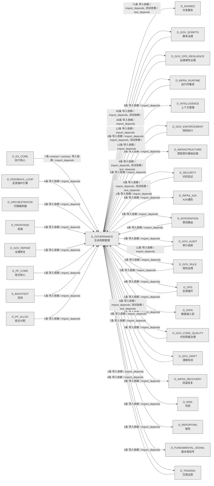

# 49_d_governance / 生命周期管理域 / Lifecycle Management

> **功能简介 / Overview**: 生命周期管理，负责蓝图/模块/任务的声明周期管理和元数据治理

> **文档作用 / Purpose**: 展示 生命周期管理（D_GOVERNANCE）功能域的域内依赖关系、跨域依赖关系，模块信息（成熟度/中英文名/大白话/文件路径）内嵌于 Mermaid 节点，供架构审查和域治理参考。

> 本文档由 generate_domain_doc.py 从 depgraph (PostgreSQL) 自动生成
> 数据源: depgraph (PostgreSQL) nodes表 + edges表

> **[可缩放 HTML 版 / Zoomable HTML](http://localhost:8765/docs/02_enterprise_architecture/02_domain_architecture_docs/_zoomable_html/49_d_governance.html)** — Ctrl+滚轮缩放 ｜ 双击重置 ｜ Ctrl+Shift+D 切换拖动/选择模式

## 域基本信息 / Domain Overview

| 字段 | 值 | Field | Value |
|------|------|-------|-------|
| 编号 | 49 | Number | 49 |
| 域ID | D_GOVERNANCE | Domain ID | D_GOVERNANCE |
| 域名称 | 生命周期管理 | Domain Name | Lifecycle Management |
| 层级 | L2 业务域层 | Layer | L2 Domain |
| 模块数 | 222 | Module Count | 222 |
| 域内依赖 | 44 | Internal Dependencies | 44 |
| 跨域入边 | 130 | Cross-domain Incoming | 130 |
| 跨域出边 | 207 | Cross-domain Outgoing | 207 |
| 设计态模块 | 0 | Design Modules | 0 |
| 生产态模块 | 222 | Production Modules | 222 |
| 容量 | 222/150 (超容) | Capacity | 222/150 (超容) |
| 描述 | 注册表总索引(registry_of_registries) | Description | 注册表总索引(registry_of_registries) |

## 域内依赖图 / Internal Dependency Diagram

> 依赖图内嵌在本文档中，IDE 可直接渲染；网页版可 Ctrl+滚轮缩放 + 拖动平移查看细节。
>
> **图例说明 / Legend**：
> - 🟦 **蓝色 = 运营态模块**（production，已上线运行）
> - 🟧 **橙色虚线 = 设计态模块**（design，蓝图阶段，代码未写）
> - **实线箭头 = 运营态依赖**（已生效的依赖关系）
> - **虚线箭头 = 非运营态依赖**（计划中/验证中的依赖关系）

### 全景图（全部模块，颜色区分运营态/设计态）

> 展示全部 222 个模块（生产态 222 + 设计态 0），含跨域依赖外部节点。节点含成熟度+名称+大白话/简介+文件路径。

```mermaid
%%{init: {'theme': 'base', 'themeVariables': {'primaryColor': '#eaeaea', 'primaryTextColor': '#333333', 'primaryBorderColor': '#666666', 'lineColor': '#666666', 'secondaryColor': '#eaeaea', 'tertiaryColor': '#eaeaea', 'fontSize': '14px'}}}%%
flowchart TD
    docs_01_policies_and_standards_registry_catalogs_rule_registry_collection_yaml["(生产态 / production) 规则注册表收集 / rule_registry_collection<br/>规则注册表收集，机器学习的注册表，登记和查询已注册的条目。<br/>文件: catalogs/rule_registry_collection.yaml"]
    scripts_a2a_full_verification_py["(生产态 / production) A2A Protocol 全链路满分验证脚本 / a2a_full_verification<br/>A2A Protocol 全链路满分验证脚本<br/>文件: scripts/a2a_full_verification.py"]
    scripts_arch_guard_tools_build_ocp_manifest_py["(生产态 / production) 从 cross层contracts.yaml 生成 OCP 冻结契约 / build_ocp_manifest<br/>从 cross_layer_contracts.yaml 生成 OCP 冻结契约指纹（INV-009）。<br/>文件: _tools/build_ocp_manifest.py"]
    scripts_arch_guard_tools_inject_idempotency_py["(生产态 / production) 为所有 P0/P1 契约添加 idempotencykey 字段——状态感知版 / inject_idempotency<br/>为所有 P0/P1 契约添加 idempotency_key 字段——状态感知版本。<br/>文件: _tools/inject_idempotency.py"]
    scripts_arch_guard_tools_patch_p1_paths_py["(生产态 / production) 一次性工具——为 9 个 P1 契约补齐 physicalpath 并运行 c / patch_p1_paths<br/>一次性工具——为 9 个 P1 契约补齐 physical_path 并运行 codegen。<br/>文件: _tools/patch_p1_paths.py"]
    scripts_arch_guard_check_acl_boundary_py["(生产态 / production) 检查aclboundary.py — Broker ACL 边界强制执 / check_acl_boundary<br/>Broker ACL 边界强制执行<br/>文件: arch_guard/check_acl_boundary.py"]
    scripts_arch_guard_check_cross_plane_communication_py["(生产态 / production) 检查跨planecommunication.py — INV / check_cross_plane_communication<br/>INV-011 拓扑 + 静态越界 import 嗅探<br/>文件: arch_guard/check_cross_plane_communication.py"]
    scripts_arch_guard_check_fe_acl_boundary_py["(生产态 / production) 检查feaclboundary.py — INV-006 前端 AC / check_fe_acl_boundary<br/>INV-006 前端 ACL（仓库内有前端树则启用）<br/>文件: arch_guard/check_fe_acl_boundary.py"]
    scripts_arch_guard_check_hot_path_purity_py["(生产态 / production) 检查hot路径purity.py — INV-012 Hot 路 / check_hot_path_purity<br/>INV-012 Hot 路径 Python 禁 asyncio（配置驱动）<br/>文件: arch_guard/check_hot_path_purity.py"]
    scripts_arch_guard_check_scaffold_exit_gates_py["(生产态 / production) 检查scaffold出口gates.py — scaffold→ / check_scaffold_exit_gates<br/>scaffold→experimental 安全门禁检查<br/>文件: arch_guard/check_scaffold_exit_gates.py"]
    scripts_arch_guard_check_schema_consistency_py["(生产态 / production) 检查结构consistency.py — INV-010 契约 / check_schema_consistency<br/>INV-010 契约物理路径存在性（Schema canonical 基线）<br/>文件: arch_guard/check_schema_consistency.py"]
    scripts_arch_guard_fitness_functions_check_aisg_gateway_py["(生产态 / production) 检查aisggateway.py — AISG 拦截门禁 (INV-0 / check_aisg_gateway<br/>AISG 拦截门禁 (INV-015) Phase B 升级<br/>文件: fitness_functions/check_aisg_gateway.py"]
    scripts_arch_guard_fitness_functions_check_audit_log_immutability_py["(生产态 / production) 检查审计日志immutability.py — 审计日志不可 / check_audit_log_immutability<br/>审计日志不可篡改检查<br/>文件: fitness_functions/check_audit_log_immutability.py"]
    scripts_arch_guard_fitness_functions_check_capacity_slo_ssot_py["(生产态 / production) 检查容量SLOssot.py — capacitysl / check_capacity_slo_ssot<br/>capacity_slo.yaml 注册表 + 与 invariants 数字对齐（SSoT 闭环）<br/>文件: fitness_functions/check_capacity_slo_ssot.py"]
    scripts_arch_guard_fitness_functions_check_daily_loss_limit_py["(生产态 / production) 检查daily亏损limit.py — 日损失限额自动暂停 (I / check_daily_loss_limit<br/>日损失限额自动暂停<br/>文件: fitness_functions/check_daily_loss_limit.py"]
    scripts_arch_guard_fitness_functions_check_hot_warm_ipc_py["(生产态 / production) 检查hotwarmipc.py — INV-018 Hot↔Warm / check_hot_warm_ipc<br/>INV-018 Hot↔Warm IPC 协议检查<br/>文件: fitness_functions/check_hot_warm_ipc.py"]
    scripts_arch_guard_fitness_functions_check_idempotency_key_py["(生产态 / production) 检查idempotencykey.py — 幂等 Key 字段存在性检 / check_idempotency_key<br/>幂等 Key 字段存在性检查<br/>文件: fitness_functions/check_idempotency_key.py"]
    scripts_arch_guard_fitness_functions_check_log_secret_leak_py["(生产态 / production) 检查日志密钥leak.py — R2 日志不写 secre / check_log_secret_leak<br/>R2 日志不写 secret 适应度函数<br/>文件: fitness_functions/check_log_secret_leak.py"]
    scripts_arch_guard_fitness_functions_check_no_cross_plane_mutable_state_py["(生产态 / production) 检查no跨plane可变state.py —  / check_no_cross_plane_mutable_state<br/>INV-020 跨平面共享可变状态检查<br/>文件: fitness_functions/check_no_cross_plane_mutable_state.py"]
    scripts_arch_guard_fitness_functions_check_ocp_signatures_py["(生产态 / production) 检查ocpsignatures.py — OCP 冻结契约指纹校验 ( / check_ocp_signatures<br/>OCP 冻结契约指纹校验<br/>文件: fitness_functions/check_ocp_signatures.py"]
    scripts_arch_guard_fitness_functions_check_pit_compliance_py["(生产态 / production) 检查pitcompliance.py — PIT（Point-in-T / check_pit_compliance<br/>PIT（Point-in-Time）铁律强制执行<br/>文件: fitness_functions/check_pit_compliance.py"]
    scripts_arch_guard_fitness_functions_check_position_limit_py["(生产态 / production) 检查持仓limit.py — 单一持仓限制 ≤ 5% NA / check_position_limit<br/>单一持仓限制 ≤ 5% NAV<br/>文件: fitness_functions/check_position_limit.py"]
    scripts_arch_guard_fitness_functions_check_risk_params_consistency_py["(生产态 / production) 检查风险paramsconsistency.py — 风控参数真 / check_risk_params_consistency<br/>风控参数真源 (INV-013) + 与 INV-002 声明对齐<br/>文件: fitness_functions/check_risk_params_consistency.py"]
    scripts_arch_guard_fitness_functions_check_survivorship_bias_py["(生产态 / production) 检查survivorshipbias.py — Survivorshi / check_survivorship_bias<br/>Survivorship 策略门禁<br/>文件: fitness_functions/check_survivorship_bias.py"]
    scripts_arch_guard_fitness_functions_check_warm_cold_async_py["(生产态 / production) 检查warm冷async.py — INV-019 Warm→ / check_warm_cold_async<br/>INV-019 Warm→Cold 异步通信检查<br/>文件: fitness_functions/check_warm_cold_async.py"]
    scripts_arch_guard_run_all_py["(生产态 / production) Architecture Guard 编排器 / run_all<br/>Architecture Guard 编排器<br/>文件: arch_guard/run_all.py"]
    scripts_construction_e2e_check_py["(生产态 / production) 端到端检查 / _e2e_check<br/>端到端检查，construction的检查器，检查某项条件是否满足。<br/>文件: construction/_e2e_check.py"]
    scripts_construction_e2e_deep_py["(生产态 / production) 端到端deep / _e2e_deep<br/>端到端deep，construction的组成部分，依赖检查statuses工作。<br/>文件: construction/_e2e_deep.py"]
    scripts_construction_check_transition_code_py["(生产态 / production) 检查转换代码 / check_transition_code<br/>检查转换代码，construction的检查器，检查某项条件是否满足。<br/>文件: construction/check_transition_code.py"]
    scripts_construction_d_init_task_system_py["(生产态 / production) 初始化任务系统数据库 + 创建任务系统自身的施工任务卡（吃狗粮） / d_init_task_system<br/>初始化任务系统数据库 + 创建任务系统自身的施工任务卡（吃狗粮）<br/>文件: construction/d_init_task_system.py"]
    scripts_construction_demo_a2a_chat_py["(生产态 / production) A2A 多 Agent 聊天演示 - Alpha 和 Beta 讨论项目评估 / demo_a2a_chat<br/>A2A 多 Agent 聊天演示 - Alpha 和 Beta 讨论项目评估<br/>文件: construction/demo_a2a_chat.py"]
    scripts_construction_demo_a2a_coordination_py["(生产态 / production) A2A 协议协调任务演示 / demo_a2a_coordination<br/>A2A 协议协调任务演示<br/>文件: construction/demo_a2a_coordination.py"]
    scripts_construction_demo_e2e_pipeline_py["(生产态 / production) C-track 端到端演示 —— 全流水线一次性运行 / demo_e2e_pipeline<br/>C-track 端到端演示 —— 全流水线一次性运行<br/>文件: construction/demo_e2e_pipeline.py"]
    scripts_construction_finalize_tasks_py["(生产态 / production) finalize任务 / finalize_tasks<br/>finalize任务，construction的组成部分，依赖任务repo、sqlite模式、包入口工作。<br/>文件: construction/finalize_tasks.py"]
    scripts_construction_local_layer_daemon_py["(生产态 / production) 本地层daemon.py — L2 本地模型层守护进程（薄包装 / local_layer_daemon<br/>L2 本地模型层守护进程（薄包装，DEPRECATED）<br/>文件: construction/local_layer_daemon.py"]
    scripts_construction_reset_test_task_py["(生产态 / production) 重置测试任务 / reset_test_task<br/>重置测试任务，construction的组成部分，依赖sqlite模式工作。<br/>文件: construction/reset_test_task.py"]
    scripts_construction_start_brain_py["(生产态 / production) 启动brain.py — ZephyrAlpha 系统大脑一键启动 / start_brain<br/>ZephyrAlpha 系统大脑一键启动<br/>文件: construction/start_brain.py"]
    scripts_construction_test_event_hook_py["(生产态 / production) 测试事件钩子 / test_event_hook<br/>测试事件钩子，construction的事件，定义和分发事件。<br/>文件: construction/test_event_hook.py"]
    scripts_context_generate_architecture_context_py["(生产态 / production) 生成架构context.py — 预编译架构 / generate_architecture_context<br/>预编译架构上下文包生成器<br/>文件: context/generate_architecture_context.py"]
    scripts_diagnose_breadth_failed_py["(生产态 / production) 诊断 breadthfailed 能力的根因。 / diagnose_breadth_failed<br/>诊断 breadth_failed 能力的根因。<br/>文件: scripts/diagnose_breadth_failed.py"]
    scripts_dm90971_add_test_headers_py["(生产态 / production) dm90971新增测试headers / DM-90971: Batch add module_id scope prefix + governance anch<br/>dm90971新增测试headers。DM-90971: Batch add module_id scope prefix + governance anchor headers to test files.<br/>文件: scripts/dm90971_add_test_headers.py"]
    scripts_fix_freeze_manifest_py["(生产态 / production) 修复freezemanifest / Fix freezemanifest.yaml - comprehensive repair of all corrup<br/>修复freezemanifest。Fix freezemanifest.yaml - comprehensive repair of all corrupted desc fields.<br/>文件: scripts/fix_freeze_manifest.py"]
    scripts_fix_orphan_all_py["(生产态 / production) 修复orphanall.py — 自动修复 初始化.py a / fix_orphan_all<br/>自动修复 __init__.py __all__ 孤儿模块<br/>文件: scripts/fix_orphan_all.py"]
    scripts_generate_manifest_py["(生产态 / production) 生成manifest / Generate complete script_manifest.yaml from scripts/ tree sc<br/>生成manifest。Generate complete script_manifest.yaml from scripts/ tree scan.<br/>文件: scripts/generate_manifest.py"]
    scripts_generate_pathway_registry_py["(生产态 / production) 从所有 MOD 蓝图的 §路径索引 章节自动生成 system-pathway- / generate_pathway_registry<br/>从所有 MOD 蓝图的 §路径索引 章节自动生成 system-pathway-registry.yaml。<br/>文件: scripts/generate_pathway_registry.py"]
    scripts_governance_d5_architecture_generators_zoomable_html_py["(生产态 / production) 可缩放 Mermaid HTML 生成器（共享模块）。 / zoomable_html<br/>可缩放 Mermaid HTML 生成器（共享模块）。<br/>文件: generators/zoomable_html.py"]
    scripts_governance_d7_code_check_pure_shim_py["(生产态 / production) 检查pureshim.py — GATE-NO-PURE-SHIM 检 / check_pure_shim<br/>GATE-NO-PURE-SHIM 检测器（治本漏洞1 2026-06-29）<br/>文件: d7_code/check_pure_shim.py"]
    scripts_governance_generators_generate_rule_ai_perception_index_py["(生产态 / production) 生成规则AIperceptionindex.py — 规 / generate_rule_ai_perception_index<br/>规则AI感知索引生成器（#ARCH-GOV-CONVERGENCE-META Phase 3.2a）<br/>文件: generators/generate_rule_ai_perception_index.py"]
    scripts_hooks_auto_handoff_log_py["(生产态 / production) 执行 git 命令并返回 stdout（UTF-8 解码）。 / auto_handoff_log<br/>执行 git 命令并返回 stdout（UTF-8 解码）。<br/>文件: hooks/auto_handoff_log.py"]
    scripts_lock_files_py["(生产态 / production) 锁files.py —— AI 对话文件锁协议（硬规则执行工具） / lock_files<br/>— AI 对话文件锁协议（硬规则执行工具）<br/>文件: scripts/lock_files.py"]
    scripts_mcp_generate_ide_config_py["(生产态 / production) 从 config/mcp.json 生成各 IDE MCP 配置文件（MOD-I / generate_ide_config<br/>从 config/mcp.json 生成各 IDE MCP 配置文件（MOD-INF-013 §5.3 Step 2）。<br/>文件: mcp/generate_ide_config.py"]
    scripts_mcp_start_all_py["(生产态 / production) MCP 全 Server 启动脚本 — DEPRECATED. / start_all<br/>MCP 全 Server 启动脚本 — DEPRECATED.<br/>文件: mcp/start_all.py"]
    scripts_mcp_status_all_py["(生产态 / production) MCP 全 Server 状态检查脚本（MOD-INF-013 §14）。 / status_all<br/>MCP 全 Server 状态检查脚本（MOD-INF-013 §14）。<br/>文件: mcp/status_all.py"]
    scripts_mcp_stop_all_py["(生产态 / production) MCP 全 Server 停止脚本（MOD-INF-013 §14）。 / stop_all<br/>MCP 全 Server 停止脚本（MOD-INF-013 §14）。<br/>文件: mcp/stop_all.py"]
    scripts_migration_dm314_infra_ops_split_py["(生产态 / production) DM-314: infraops/ 拆分迁移执行脚本。 / dm314_infra_ops_split<br/>DM-314: infra_ops/ 拆分迁移执行脚本。<br/>文件: migration/dm314_infra_ops_split.py"]
    scripts_migration_governance_root_split_py["(生产态 / production) 治理根拆分 / ARCH-031: governance/ root flat-files split migration orches<br/>治理根拆分。ARCH-031: governance/ root flat-files split migration orchestrator.<br/>文件: migration/governance_root_split.py"]
    scripts_ops_verify_header_completeness_py["(生产态 / production) 文件头部完整性校验（6 格式统一入口） / verify_header_completeness<br/>文件头部完整性校验（6 格式统一入口）<br/>文件: ops/verify_header_completeness.py"]
    scripts_post_checkout_guard_py["(生产态 / production) Post-checkout Guard — 事后检测 checkout 是否覆盖 / post_checkout_guard<br/>Post-checkout Guard — 事后检测 checkout 是否覆盖了其他 session 的文件锁。<br/>文件: scripts/post_checkout_guard.py"]
    scripts_pre_commit_verify_dedup_py["(生产态 / production) 预commit 验证脚本 — 委托给 code-dedup-engine  / verify_dedup<br/>pre_commit 验证脚本 — 委托给 code-dedup-engine CLI verify 子命令.<br/>文件: pre_commit/verify_dedup.py"]
    scripts_rollback_py["(生产态 / production) Rollback System CLI — MOD-INF-021 v0.10. / rollback<br/>Rollback System CLI — MOD-INF-021 v0.10.0 Git-native+SQLite Checkpoint 操作入口。<br/>文件: scripts/rollback.py"]
    scripts_run_deepseek_v4_exam_py["(生产态 / production) DeepSeek V4 入职考试运行脚本 / run_deepseek_v4_exam<br/>DeepSeek V4 入职考试运行脚本<br/>文件: scripts/run_deepseek_v4_exam.py"]
    scripts_run_ollama_exam_py["(生产态 / production) Ollama 入职考试运行脚本 / run_ollama_exam<br/>Ollama 入职考试运行脚本<br/>文件: scripts/run_ollama_exam.py"]
    scripts_scaffold_py["(生产态 / production) scaffold.py — ZephyrAlpha 唯一创建入口（RULE-TW / scaffold<br/>ZephyrAlpha 唯一创建入口（RULE-TWO 强制执行器）<br/>文件: scripts/scaffold.py"]
    scripts_setup_git_guard_aliases_py["(生产态 / production) Setup/Remove Git Aliases for Git Guard — / setup_git_guard_aliases<br/>Setup/Remove Git Aliases for Git Guard — 自动化集成入口。<br/>文件: scripts/setup_git_guard_aliases.py"]
    src_zephyr_governance_a2a_init_py["(生产态 / production) 包入口 / __init__<br/>治理的包入口，把这一层的子模块归到一起统一管理，用到谁才加载谁，避免一次性全加载拖慢启动。<br/>文件: a2a/__init__.py"]
    src_zephyr_governance_adapters_risk_validation_bridge_py["(生产态 / production) 风险验证桥接 / D_EXECUTION_CORE — Risk Validation Bridge (DW-239)<br/>风险验证桥接。D_EXECUTION_CORE — Risk Validation Bridge (DW-239)<br/>文件: adapters/risk_validation_bridge.py"]
    src_zephyr_governance_adapters_simulation_broker_py["(生产态 / production) 仿真经纪人 / D_EXECUTION_CORE — Simulation Broker Adapter<br/>仿真经纪人。D_EXECUTION_CORE — Simulation Broker Adapter<br/>文件: adapters/simulation_broker.py"]
    src_zephyr_governance_agent_spec_init_py["(生产态 / production) 包入口 / __init__<br/>治理的包入口，把这一层的子模块归到一起统一管理，用到谁才加载谁，避免一次性全加载拖慢启动。<br/>文件: agent-spec/__init__.py"]
    src_zephyr_governance_agent_spec_a2a_failure_py["(生产态 / production) G-CT-008 消费端 — Escalation.onA2Afailure / a2a_failure<br/>G-CT-008 消费端 — Escalation.on_a2a_failure() 跨 agent 通信失败升级.<br/>文件: agent_spec/a2a_failure.py"]
    src_zephyr_governance_agent_spec_rbac_bridge_py["(生产态 / production) G-CT-007 契约：Budget -> RBAC 配额限制. / rbac_bridge<br/>G-CT-007 契约：Budget -> RBAC 配额限制.<br/>文件: agent_spec/rbac_bridge.py"]
    src_zephyr_governance_agent_spec_registry_py["(生产态 / production) G-CT-003 契约：Agent Spec -> RBAC 能力检查. / registry<br/>G-CT-003 契约：Agent Spec -> RBAC 能力检查.<br/>文件: agent_spec/registry.py"]
    src_zephyr_governance_architecture_governance_architecture_contracts_py["(生产态 / production) 架构契约 / architecture_contracts<br/>架构契约，治理的状态机，管理状态流转。<br/>文件: architecture_governance/architecture_contracts.py"]
    src_zephyr_governance_architecture_governance_architecture_principles_py["(生产态 / production) 装饰器：为函数标记适用的架构原则。 / architecture_principles<br/>装饰器：为函数标记适用的架构原则。<br/>文件: architecture_governance/architecture_principles.py"]
    src_zephyr_governance_architecture_governance_blueprint_bloat_monitor_py["(生产态 / production) Blueprint Bloat Monitor — v0.11.0 蓝图膨胀监控 / blueprint_bloat_monitor<br/>Blueprint Bloat Monitor — v0.11.0 蓝图膨胀监控器。<br/>文件: architecture_governance/blueprint_bloat_monitor.py"]
    src_zephyr_governance_architecture_governance_blueprint_code_consistency_py["(生产态 / production) 蓝图代码一致性 / Blueprint-Code Consistency Gate — MOD-INF-022.<br/>蓝图代码一致性。Blueprint-Code Consistency Gate — MOD-INF-022.<br/>文件: architecture_governance/blueprint_code_consistency.py"]
    src_zephyr_governance_architecture_governance_blueprint_reconciler_py["(生产态 / production) Blueprint Reconciler — v0.10.0 蓝图实现一致性校验 / blueprint_reconciler<br/>Blueprint Reconciler — v0.10.0 蓝图实现一致性校验器。<br/>文件: architecture_governance/blueprint_reconciler.py"]
    src_zephyr_governance_architecture_governance_construction_verifier_py["(生产态 / production) Construction Verifier — 施工验证器: 任务卡完成度+蓝图 / construction_verifier<br/>Construction Verifier — 施工验证器: 任务卡完成度+蓝图一致性检查。<br/>文件: architecture_governance/construction_verifier.py"]
    src_zephyr_governance_architecture_governance_cross_env_consistency_py["(生产态 / production) 跨环境一致性 / cross_env_consistency<br/>跨环境一致性，治理的组成部分，依赖包入口工作。<br/>文件: architecture_governance/cross_env_consistency.py"]
    src_zephyr_governance_architecture_governance_dependency_manager_py["(生产态 / production) 依赖管理器 / dependency_manager<br/>依赖管理器，治理的组成部分，依赖包入口工作。<br/>文件: architecture_governance/dependency_manager.py"]
    src_zephyr_governance_architecture_governance_formal_verifier_py["(生产态 / production) Formal Verifier — v0.6.0 形式验证器: 升级规则形式化验 / formal_verifier<br/>Formal Verifier — v0.6.0 形式验证器: 升级规则形式化验证->一致性+完备性检测。<br/>文件: architecture_governance/formal_verifier.py"]
    src_zephyr_governance_architecture_governance_gap_analyzer_py["(生产态 / production) Gap Analyzer — v0.8.0 间隙分析器: escalation覆 / gap_analyzer<br/>Gap Analyzer — v0.8.0 间隙分析器: escalation覆盖缺口扫描+新操作类型识别。<br/>文件: architecture_governance/gap_analyzer.py"]
    src_zephyr_governance_architecture_governance_llm_impact_analyzer_py["(生产态 / production) LLMImpactAnalyzer — LLM-based commit 语义影 / llm_impact_analyzer<br/>LLMImpactAnalyzer — LLM-based commit 语义影响分析器。<br/>文件: architecture_governance/llm_impact_analyzer.py"]
    src_zephyr_governance_architecture_governance_local_first_arch_py["(生产态 / production) 本地首架构 / local_first_arch<br/>本地首架构，治理的组成部分，依赖包入口工作。<br/>文件: architecture_governance/local_first_arch.py"]
    src_zephyr_governance_architecture_governance_path_resolver_py["(生产态 / production) PathResolver — 模块路径解析器 / path_resolver<br/>PathResolver — 模块路径解析器<br/>文件: architecture_governance/path_resolver.py"]
    src_zephyr_governance_bridges_alerts_py["(生产态 / production) alerts / G-CT-006 — BudgetAlert re-exported from shared.contracts.esc<br/>alerts，桥接的功能模块。<br/>文件: bridges/alerts.py"]
    src_zephyr_governance_bridges_spec_auditor_py["(生产态 / production) G-CT-007 — Audit.record代理spec() 记录  / spec_auditor<br/>G-CT-007 — Audit.record_agent_spec() 记录 Agent Spec 注册与变更.<br/>文件: bridges/spec_auditor.py"]
    src_zephyr_governance_compliance_gate_a6_compliance_manager_py["(生产态 / production) ZephyrAlpha — D_COMPLIANCE Compliance La / compliance_manager<br/>ZephyrAlpha — D_COMPLIANCE Compliance Layer — 合规规则管理器接口<br/>文件: compliance_gate_a6/compliance_manager.py"]
    src_zephyr_governance_compliance_gate_a6_compliance_mapper_py["(生产态 / production) Compliance Mapper — D-022-13 合规映射器: 操作-> / compliance_mapper<br/>Compliance Mapper — D-022-13 合规映射器: 操作->法规(SOX/GDPR/MiFID)映射+审计迹。<br/>文件: compliance_gate_a6/compliance_mapper.py"]
    src_zephyr_governance_context_governance_command_chain_length_gate_py["(生产态 / production) Command Chain Length Gate — v0.13.0 命令体积 / command_chain_length_gate<br/>Command Chain Length Gate — v0.13.0 命令体积Deny退化防御器。<br/>文件: context_governance/command_chain_length_gate.py"]
    src_zephyr_governance_context_governance_context_budget_py["(生产态 / production) 上下文budget.py —— 上下文预算管理与超预算截断（Phase / context_budget<br/>— 上下文预算管理与超预算截断（Phase 11 / 盲点 B28）<br/>文件: context_governance/context_budget.py"]
    src_zephyr_governance_context_governance_context_manager_py["(生产态 / production) 上下文管理器 / context_manager<br/>上下文管理器，治理的功能模块。<br/>文件: context_governance/context_manager.py"]
    src_zephyr_governance_context_governance_context_package_py["(生产态 / production) Context Package — D-022-08 委托上下文包: 升级原因+ / context_package<br/>Context Package — D-022-08 委托上下文包: 升级原因+证据链+历史try_trace。<br/>文件: context_governance/context_package.py"]
    src_zephyr_governance_context_governance_context_recycling_py["(生产态 / production) 上下文recycling / context_recycling<br/>上下文recycling，主要提供is验证等功能<br/>文件: context_governance/context_recycling.py"]
    src_zephyr_governance_context_governance_context_switch_governor_py["(生产态 / production) Context Switch Governor — v0.11.0 Owner上 / context_switch_governor<br/>Context Switch Governor — v0.11.0 Owner上下文切换预算管理器。<br/>文件: context_governance/context_switch_governor.py"]
    src_zephyr_governance_context_governance_context_waste_detector_py["(生产态 / production) 上下文waste检测器 / context_waste_detector<br/>上下文waste检测器，治理的报告器，汇总数据生成报告。<br/>文件: context_governance/context_waste_detector.py"]
    src_zephyr_governance_context_governance_conversation_tax_detector_py["(生产态 / production) conversation税检测器 / conversation_tax_detector<br/>conversation税检测器，治理的组成部分，依赖包入口工作。<br/>文件: context_governance/conversation_tax_detector.py"]
    src_zephyr_governance_context_governance_instruction_bloat_detector_py["(生产态 / production) InstructionBloatDetector — 指令膨胀检测 / instruction_bloat_detector<br/>InstructionBloatDetector — 指令膨胀检测<br/>文件: context_governance/instruction_bloat_detector.py"]
    src_zephyr_governance_context_governance_multi_turn_intent_analyzer_py["(生产态 / production) Multi-Turn Intent Analyzer — v0.13.0 多轮分 / multi_turn_intent_analyzer<br/>Multi-Turn Intent Analyzer — v0.13.0 多轮分布式意图分析器。<br/>文件: context_governance/multi_turn_intent_analyzer.py"]
    src_zephyr_governance_context_governance_prompt_lifecycle_py["(生产态 / production) 提示生命周期 / prompt_lifecycle<br/>提示生命周期，治理的组成部分，依赖包入口工作。<br/>文件: context_governance/prompt_lifecycle.py"]
    src_zephyr_governance_context_governance_protocol_self_context_py["(生产态 / production) Protocol Self Context — v0.10.0 协议自维护上下文 / protocol_self_context<br/>Protocol Self Context — v0.10.0 协议自维护上下文管理器。<br/>文件: context_governance/protocol_self_context.py"]
    src_zephyr_governance_context_governance_think_time_model_py["(生产态 / production) think时间模型 / think_time_model<br/>think时间模型，治理的组成部分，依赖包入口工作。<br/>文件: context_governance/think_time_model.py"]
    src_zephyr_governance_data_governance_data_classification_py["(生产态 / production) 检查 selflevel 是否有权限访问 targetl / data_classification<br/>检查 self_level 是否有权限访问 target_level 的数据。<br/>文件: data_governance/data_classification.py"]
    src_zephyr_governance_data_governance_data_lifecycle_py["(生产态 / production) 数据生命周期 / data_lifecycle<br/>数据生命周期，治理的组成部分，依赖包入口工作。<br/>文件: data_governance/data_lifecycle.py"]
    src_zephyr_governance_data_governance_data_pipeline_guard_py["(生产态 / production) Data Pipeline Guard — v0.10.0 数据管道完整性防护: / data_pipeline_guard<br/>Data Pipeline Guard — v0.10.0 数据管道完整性防护: schema validation+row count check+checksum verify。<br/>文件: data_governance/data_pipeline_guard.py"]
    src_zephyr_governance_data_governance_data_quality_py["(生产态 / production) 数据质量 / data_quality<br/>数据质量，治理的组成部分，依赖包入口工作。<br/>文件: data_governance/data_quality.py"]
    src_zephyr_governance_data_governance_data_source_reliability_py["(生产态 / production) 数据源可靠性 / data_source_reliability<br/>数据源可靠性，治理的组成部分，依赖包入口工作。<br/>文件: data_governance/data_source_reliability.py"]
    src_zephyr_governance_data_governance_exchange_partition_detector_py["(生产态 / production) Exchange Partition Detector — v0.12.0 交易 / exchange_partition_detector<br/>Exchange Partition Detector — v0.12.0 交易所网络分区检测器。<br/>文件: data_governance/exchange_partition_detector.py"]
    src_zephyr_governance_data_governance_exchange_reg_monitor_py["(生产态 / production) Exchange Reg Monitor — v0.11.0 交易所规则变更监控 / exchange_reg_monitor<br/>Exchange Reg Monitor — v0.11.0 交易所规则变更监控器。<br/>文件: data_governance/exchange_reg_monitor.py"]
    src_zephyr_governance_data_governance_miniqmt_provider_py["(生产态 / production) MiniQMT 实盘行情 Provider（Tick + 5档盘口） / miniqmt_provider<br/>MiniQMT 实盘行情 Provider（Tick + 5档盘口）<br/>文件: data_governance/miniqmt_provider.py"]
    src_zephyr_governance_data_governance_pricing_sync_py["(生产态 / production) pricing同步 / pricing_sync<br/>pricing同步，治理的组成部分，依赖包入口工作。<br/>文件: data_governance/pricing_sync.py"]
    src_zephyr_governance_data_governance_realtime_streaming_py["(生产态 / production) 实时流式 / realtime_streaming<br/>实时流式，治理的组成部分，依赖包入口工作。<br/>文件: data_governance/realtime_streaming.py"]
    src_zephyr_governance_evidence_pack_py["(生产态 / production) evidencepack / evidence_pack<br/>evidencepack，主要提供pack、验证、列表packs等功能，供audit-orchestrator.integrity; 使用<br/>文件: governance/evidence_pack.py"]
    src_zephyr_governance_financial_governance_arbitrage_asymmetry_detector_py["(生产态 / production) Arbitrage Asymmetry Detector — v0.11.0 跨 / arbitrage_asymmetry_detector<br/>Arbitrage Asymmetry Detector — v0.11.0 跨交易所套利不对称检测器。<br/>文件: financial_governance/arbitrage_asymmetry_detector.py"]
    src_zephyr_governance_financial_governance_atomic_transaction_manager_py["(生产态 / production) AtomicTransactionManager — SQLite + 文件系统 / atomic_transaction_manager<br/>AtomicTransactionManager — SQLite + 文件系统的跨介质原子事务管理器 v2.0（ATM）。<br/>文件: financial_governance/atomic_transaction_manager.py"]
    src_zephyr_governance_financial_governance_flash_crash_guard_py["(生产态 / production) Flash Crash Guard — v0.12.0 闪崩双轨熔断器。 / flash_crash_guard<br/>Flash Crash Guard — v0.12.0 闪崩双轨熔断器。<br/>文件: financial_governance/flash_crash_guard.py"]
    src_zephyr_governance_financial_governance_fsm_verifier_py["(生产态 / production) fsm验证器 / fsm_verifier<br/>fsm验证器，治理的状态机，管理状态流转。<br/>文件: financial_governance/fsm_verifier.py"]
    src_zephyr_governance_financial_governance_instrument_py["(生产态 / production) instrument / instrument<br/>instrument，治理的功能模块。<br/>文件: financial_governance/instrument.py"]
    src_zephyr_governance_financial_governance_microstructure_defense_py["(生产态 / production) microstructure防御 / microstructure_defense<br/>microstructure防御，治理的类型，定义数据类型和枚举。<br/>文件: financial_governance/microstructure_defense.py"]
    src_zephyr_governance_financial_governance_oms_risk_engine_py["(生产态 / production) oms风险引擎 / oms_risk_engine<br/>oms风险引擎，治理的组成部分，依赖包入口工作。<br/>文件: financial_governance/oms_risk_engine.py"]
    src_zephyr_governance_financial_governance_risk_matrix_py["(生产态 / production) 风险矩阵 / risk_matrix<br/>风险矩阵，治理的功能模块。<br/>文件: financial_governance/risk_matrix.py"]
    src_zephyr_governance_financial_governance_strategy_portfolio_py["(生产态 / production) 策略组合 / strategy_portfolio<br/>策略组合，治理的组成部分，依赖包入口工作。<br/>文件: financial_governance/strategy_portfolio.py"]
    src_zephyr_governance_financial_governance_strategy_scoper_py["(生产态 / production) Strategy Scoper — v0.6.0 策略范围隔离器: SIG/St / strategy_scoper<br/>Strategy Scoper — v0.6.0 策略范围隔离器: SIG/Strat/Capital多层策略隔离。<br/>文件: financial_governance/strategy_scoper.py"]
    src_zephyr_governance_implementations_default_experiment_pipeline_py["(生产态 / production) 实验 — Default Experiment Pipeline / default_experiment_pipeline<br/>实验 — Default Experiment Pipeline<br/>文件: implementations/default_experiment_pipeline.py"]
    src_zephyr_governance_implementations_default_security_gateway_py["(生产态 / production) 默认安全网关 / default_security_gateway<br/>默认安全网关，治理的门禁，在关键节点检查是否放行。<br/>文件: implementations/default_security_gateway.py"]
    src_zephyr_governance_intelligence_governance_agent_debate_py["(生产态 / production) 代理debate / agent_debate<br/>代理debate，治理的核心类，封装DebateVerdict相关逻辑。<br/>文件: intelligence_governance/agent_debate.py"]
    src_zephyr_governance_intelligence_governance_ai_self_diagnosis_py["(生产态 / production) AI自诊断 / ai_self_diagnosis<br/>AI自诊断，治理的组成部分，依赖包入口工作。<br/>文件: intelligence_governance/ai_self_diagnosis.py"]
    src_zephyr_governance_intelligence_governance_aisg_sandbox_py["(生产态 / production) AISG Sandbox Testing — AI Security Gatew / aisg_sandbox<br/>AISG Sandbox Testing — AI Security Gateway 沙箱验证 (INV-015 升级)<br/>文件: intelligence_governance/aisg_sandbox.py"]
    src_zephyr_governance_intelligence_governance_autonomy_dashboard_py["(生产态 / production) Autonomy Dashboard — AI 自主感知健康仪表。 / autonomy_dashboard<br/>Autonomy Dashboard — AI 自主感知健康仪表。<br/>文件: intelligence_governance/autonomy_dashboard.py"]
    src_zephyr_governance_intelligence_governance_confidence_estimator_py["(生产态 / production) Confidence Estimator — D-022-05 置信度评估器:  / confidence_estimator<br/>Confidence Estimator — D-022-05 置信度评估器: certainty×evidence×risk三维评估。<br/>文件: intelligence_governance/confidence_estimator.py"]
    src_zephyr_governance_intelligence_governance_confidence_quantifier_py["(生产态 / production) ConfidenceQuantifier — AI 置信度量化。 / confidence_quantifier<br/>ConfidenceQuantifier — AI 置信度量化。<br/>文件: intelligence_governance/confidence_quantifier.py"]
    src_zephyr_governance_intelligence_governance_continuous_trust_py["(生产态 / production) Continuous Trust Ledger — 持续信任评估引擎。 / continuous_trust<br/>Continuous Trust Ledger — 持续信任评估引擎。<br/>文件: intelligence_governance/continuous_trust.py"]
    src_zephyr_governance_intelligence_governance_cross_agent_conflict_detector_py["(生产态 / production) CrossAgentConflictDetector — 多 Agent 并发冲 / cross_agent_conflict_detector<br/>CrossAgentConflictDetector — 多 Agent 并发冲突检测。<br/>文件: intelligence_governance/cross_agent_conflict_detector.py"]
    src_zephyr_governance_intelligence_governance_cross_assistant_adapter_py["(生产态 / production) Cross-Assistant Adapter — v0.6.0 Trae/Cu / cross_assistant_adapter<br/>Cross-Assistant Adapter — v0.6.0 Trae/Cursor/Windsurf/Codex/Wedata统一升级接口。<br/>文件: intelligence_governance/cross_assistant_adapter.py"]
    src_zephyr_governance_intelligence_governance_delegation_manager_py["(生产态 / production) Delegation Manager — D-022-02 自动委托协议。 / delegation_manager<br/>Delegation Manager — D-022-02 自动委托协议。<br/>文件: intelligence_governance/delegation_manager.py"]
    src_zephyr_governance_intelligence_governance_memory_provider_py["(生产态 / production) 记忆提供器 / D_DATA — Memory Provider<br/>记忆提供器。D_DATA — Memory Provider<br/>文件: intelligence_governance/memory_provider.py"]
    src_zephyr_governance_intelligence_governance_meta_confidence_py["(生产态 / production) Meta-Confidence — D-022-10 Agent对自身判定置信度 / meta_confidence<br/>Meta-Confidence — D-022-10 Agent对自身判定置信度的自评+历史校准。<br/>文件: intelligence_governance/meta_confidence.py"]
    src_zephyr_governance_intelligence_governance_model_provider_data_py["(生产态 / production) 模型提供器数据 / model_provider_data<br/>模型提供器数据，治理的模型，定义数据结构和字段。<br/>文件: intelligence_governance/model_provider_data.py"]
    src_zephyr_governance_intelligence_governance_model_router_py["(生产态 / production) 模型路由器 / model_router<br/>模型路由器，治理的组成部分，依赖预算模型、提供器数据、resultswriter工作。<br/>文件: intelligence_governance/model_router.py"]
    src_zephyr_governance_intelligence_governance_model_version_detector_py["(生产态 / production) Model Version Detector — v0.10.0 模型版本突变检 / model_version_detector<br/>Model Version Detector — v0.10.0 模型版本突变检测: model version change->degraded auto_guard。<br/>文件: intelligence_governance/model_version_detector.py"]
    src_zephyr_governance_intelligence_governance_multi_model_consensus_py["(生产态 / production) 多模型共识 / multi_model_consensus<br/>多模型共识，治理的组成部分，依赖包入口工作。<br/>文件: intelligence_governance/multi_model_consensus.py"]
    src_zephyr_governance_intelligence_governance_mvep_orchestrator_py["(生产态 / production) MVEP Orchestrator — v0.11.0 Minimum Viab / mvep_orchestrator<br/>MVEP Orchestrator — v0.11.0 Minimum Viable Escalation Protocol调度器。<br/>文件: intelligence_governance/mvep_orchestrator.py"]
    src_zephyr_governance_intelligence_governance_provider_failover_py["(生产态 / production) Provider Failover — v0.7.0 多LLM Provider / provider_failover<br/>Provider Failover — v0.7.0 多LLM Provider容灾: deepseek->claude->gpt fallback链。<br/>文件: intelligence_governance/provider_failover.py"]
    src_zephyr_governance_intelligence_governance_self_benchmark_py["(生产态 / production) Self-Benchmark (W3-7) — 5 组已知对自验证 + 引擎退化 / self_benchmark<br/>Self-Benchmark (W3-7) — 5 组已知对自验证 + 引擎退化告警.<br/>文件: intelligence_governance/self_benchmark.py"]
    src_zephyr_governance_intelligence_governance_self_test_py["(生产态 / production) 自测试 / Escalation Protocol Self-Test — MOD-INF-022.<br/>自测试。Escalation Protocol Self-Test — MOD-INF-022.<br/>文件: intelligence_governance/self_test.py"]
    src_zephyr_governance_intelligence_governance_self_validator_py["(生产态 / production) Self Validator — v0.10.0 升级协议自验证器: proto / self_validator<br/>Self Validator — v0.10.0 升级协议自验证器: protocol自身规则+代码一致性自检。<br/>文件: intelligence_governance/self_validator.py"]
    src_zephyr_governance_intelligence_governance_subagent_hook_propagator_py["(生产态 / production) Subagent Hook Propagator — v0.13.0 子Agen / subagent_hook_propagator<br/>Subagent Hook Propagator — v0.13.0 子Agent Hook旁路防护器。<br/>文件: intelligence_governance/subagent_hook_propagator.py"]
    src_zephyr_governance_lifecycle_governance_api_lifecycle_py["(生产态 / production) API生命周期 / api_lifecycle<br/>API生命周期，治理的状态机，管理状态流转。<br/>文件: lifecycle_governance/api_lifecycle.py"]
    src_zephyr_governance_lifecycle_governance_migration_strategy_py["(生产态 / production) 迁移策略 / migration_strategy<br/>迁移策略，治理的组成部分，依赖包入口工作。<br/>文件: lifecycle_governance/migration_strategy.py"]
    src_zephyr_governance_lifecycle_governance_paper_live_transition_py["(生产态 / production) 检查是否可跳Phase——不可跳, 只允许顺序next。 / paper_live_transition<br/>检查是否可跳Phase——不可跳, 只允许顺序next。<br/>文件: lifecycle_governance/paper_live_transition.py"]
    src_zephyr_governance_lifecycle_governance_post_live_verification_py["(生产态 / production) 提交实时验证 / post_live_verification<br/>提交实时验证，治理的检查器，检查某项条件是否满足。<br/>文件: lifecycle_governance/post_live_verification.py"]
    src_zephyr_governance_lifecycle_governance_transition_py["(生产态 / production) transition — 状态机转换 Mixin（从 taskrepo.py  / transition<br/>transition — 状态机转换 Mixin（从 task_repo.py 拆分，SRC-0066）<br/>文件: lifecycle_governance/transition.py"]
    src_zephyr_governance_observability_governance_analytics_base_py["(生产态 / production) analytics基类 / Re-export wrapper: analytics_base canonical at zephyr.report<br/>analytics基类。Re-export wrapper: analytics_base canonical at zephyr.reporting.analytics_base.<br/>文件: observability_governance/analytics_base.py"]
    src_zephyr_governance_observability_governance_objective_tracker_py["(生产态 / production) Objective Tracker — v0.9.0 目标漂移检测器: agen / objective_tracker<br/>Objective Tracker — v0.9.0 目标漂移检测器: agent目标函数稳定性+变更检测+rollback。<br/>文件: observability_governance/objective_tracker.py"]
    src_zephyr_governance_persistence_database_manager_py["(生产态 / production) DatabaseManager — 连接池 + 健康检查 + 自动备份 + WA / database_manager<br/>DatabaseManager — 连接池 + 健康检查 + 自动备份 + WAL checkpoint（SH-DB-001 v2.0）<br/>文件: persistence/database_manager.py"]
    src_zephyr_governance_persistence_database_service_py["(生产态 / production) DatabaseService 真源收敛（AI-14 审计 P1 修复） / database_service<br/>DatabaseService 真源收敛（AI-14 审计 P1 修复）<br/>文件: persistence/database_service.py"]
    src_zephyr_governance_persistence_dataflowgraph_schema_py["(生产态 / production) dataflowgraph Schema DDL + 连接入口 / dataflowgraph_schema<br/>dataflowgraph Schema DDL + 连接入口<br/>文件: persistence/dataflowgraph_schema.py"]
    src_zephyr_governance_persistence_decision_graph_reader_py["(生产态 / production) 决策图reader.py — 决策流图数据库只读查询工具 / decision_graph_reader<br/>决策流图数据库只读查询工具模块<br/>文件: persistence/decision_graph_reader.py"]
    src_zephyr_governance_persistence_depgraph_reader_py["(生产态 / production) 依赖图reader.py — 依赖图数据库查询工具模块 / depgraph_reader<br/>依赖图数据库查询工具模块<br/>文件: persistence/depgraph_reader.py"]
    src_zephyr_governance_persistence_protocol_state_store_py["(生产态 / production) Protocol State Store — v0.10.0 协议运行时状态持久 / protocol_state_store<br/>Protocol State Store — v0.10.0 协议运行时状态持久化: JSON snapshot+recovery state+crash恢复。<br/>文件: persistence/protocol_state_store.py"]
    src_zephyr_governance_services_adapter_py["(生产态 / production) Escalation Adapter — MOD-INF-022 统一集成入口. / adapter<br/>Escalation Adapter — MOD-INF-022 统一集成入口.<br/>文件: services/adapter.py"]
    src_zephyr_governance_services_cross_session_correlator_py["(生产态 / production) Cross-Session Correlator — v0.9.0 跨会话Cor / cross_session_correlator<br/>Cross-Session Correlator — v0.9.0 跨会话Coreset关联器: 多session行为模式+异常跨session模式检测。<br/>文件: services/cross_session_correlator.py"]
    src_zephyr_governance_services_memory_provenance_py["(生产态 / production) Memory Provenance — v0.9.0 记忆溯源追踪: 每条mem / memory_provenance<br/>Memory Provenance — v0.9.0 记忆溯源追踪: 每条memory record的来源agent+timestamp+hash链。<br/>文件: services/memory_provenance.py"]
    src_zephyr_governance_strategies_strategy_registry_py["(生产态 / production) StrategyRegistry 卫星模块（OCP-002） / strategy_registry<br/>StrategyRegistry 卫星模块（OCP-002）<br/>文件: strategies/strategy_registry.py"]
    src_zephyr_infrastructure_a2a_protocol_governance_base_server_py["(生产态 / production) 基类服务端 / _base_server<br/>基类服务端，主要提供注册tool、处理请求等功能<br/>文件: governance/_base_server.py"]
    src_zephyr_infrastructure_a2a_protocol_governance_audit_logger_py["(生产态 / production) 审计日志器 / audit_logger<br/>审计日志器，主要提供日志、查询、数量等功能<br/>文件: governance/audit_logger.py"]
    src_zephyr_infrastructure_a2a_protocol_governance_auditor_py["(生产态 / production) G-CT-008 契约：A2A -> Audit 审计 Agent 间通信. / auditor<br/>G-CT-008 契约：A2A -> Audit 审计 Agent 间通信.<br/>文件: governance/auditor.py"]
    src_zephyr_infrastructure_a2a_protocol_governance_error_codes_py["(生产态 / production) 错误codes / error_codes<br/>错误codes，治理的异常，定义本模块的异常类型。<br/>文件: governance/error_codes.py"]
    src_zephyr_infrastructure_a2a_protocol_governance_governance_adapter_py["(生产态 / production) A2A GovernanceAdapter — Phase 4 治理集成桥接器 / governance_adapter<br/>A2A GovernanceAdapter — Phase 4 治理集成桥接器<br/>文件: governance/governance_adapter.py"]
    src_zephyr_infrastructure_a2a_protocol_governance_phase_hold_py["(生产态 / production) Phase 4 Hold — A2A Phase 4 锁定标记模块 与其他 Ph / phase_hold<br/>Phase 4 Hold — A2A Phase 4 锁定标记模块 与其他 Phase 3 模块不可并发施工.<br/>文件: governance/phase_hold.py"]
    src_zephyr_infrastructure_a2a_protocol_governance_policy_engine_py["(生产态 / production) 策略引擎 / policy_engine<br/>策略引擎，主要提供评估、新增策略、移除策略等功能<br/>文件: governance/policy_engine.py"]
    src_zephyr_infrastructure_a2a_protocol_governance_protocol_py["(生产态 / production) G-CT-008 — A2ACommunication Pydantic V2  / protocol<br/>G-CT-008 — A2ACommunication Pydantic V2 BaseModel agent-to-agent 通信数据结构.<br/>文件: governance/protocol.py"]
    src_zephyr_infrastructure_a2a_protocol_governance_rate_limiter_py["(生产态 / production) Sliding window 速率限制器，支持 per-ke / rate_limiter<br/>Sliding window 速率限制器，支持 per-key 分桶。<br/>文件: governance/rate_limiter.py"]
    src_zephyr_infrastructure_a2a_protocol_governance_session_manager_py["(生产态 / production) 会话管理器 / session_manager<br/>会话管理器，主要提供创建会话、获取会话、结束会话等功能<br/>文件: governance/session_manager.py"]
    src_zephyr_infrastructure_a2a_protocol_layer3_coordination_governance_integration_py["(生产态 / production) 治理集成 / Re-export bridge for layer3_coordination governance integrat<br/>治理集成。Re-export bridge for layer3_coordination governance integration symbols.<br/>文件: layer3_coordination/_governance_integration.py"]
    src_zephyr_infrastructure_capacity_assurance_contracts_batch2_governance_py["(生产态 / production) Batch2 治理层契约 — 15条 Pydantic v2 Schema（Pr / batch2_governance<br/>Batch2 治理层契约 — 15条 Pydantic v2 Schema（Provenance/AI审计守卫/TechStackValidator/Governance Loop/Sandbox资源限制）.<br/>文件: contracts/batch2_governance.py"]
    src_zephyr_integration_mcp_governance_server_py["(生产态 / production) GovernanceServer: 治理域统一MCP入口 / governance_server<br/>GovernanceServer: 治理域统一MCP入口<br/>文件: mcp/governance_server.py"]
    src_zephyr_shared_capacity_governance_capacity_governance_loop_py["(生产态 / production) 容量治理loop / capacity_governance_loop<br/>容量治理loop，治理的功能模块。<br/>文件: capacity_governance/capacity_governance_loop.py"]
    src_zephyr_shared_protocols_a2a_a2a_governance_py["(生产态 / production) A2A治理 / A2A Governance — shared interface definitions for governance<br/>A2A治理。A2A Governance — shared interface definitions for governance layer.<br/>文件: a2a/a2a_governance.py"]
    tests_agent_rbac_test_session_aware_stash_red_blue_py["(生产态 / production) session 隔离 stash 红蓝对抗极限测试。 / test_session_aware_stash_red_blue<br/>session 隔离 stash 红蓝对抗极限测试。<br/>文件: agent_rbac/test_session_aware_stash_red_blue.py"]
    tests_git_test_git_commit_concurrent_py["(生产态 / production) 测试git提交concurrent.py — 幽灵提交红蓝对抗 / test_git_commit_concurrent<br/>幽灵提交红蓝对抗测试<br/>文件: git/test_git_commit_concurrent.py"]
    tests_git_test_git_commit_extreme_py["(生产态 / production) 测试git提交extreme.py — GitCommitGa / test_git_commit_extreme<br/>GitCommitGateway 极端故障注入测试<br/>文件: git/test_git_commit_extreme.py"]
    tests_git_test_git_commit_gateway_py["(生产态 / production) 测试git提交gateway.py — GitCommitGa / test_git_commit_gateway<br/>GitCommitGateway 单元测试（OPS-2026062512 验收）<br/>文件: git/test_git_commit_gateway.py"]
    tests_git_test_reconciler_verify_autosync_py["(生产态 / production) 测试协调器验证autosync.py — --r / test_reconciler_verify_autosync<br/>--reconciler-verify auto-sync 产物豁免测试。<br/>文件: git/test_reconciler_verify_autosync.py"]
    tests_governance_generators_test_check_gate_inventory_drift_py["(生产态 / production) 测试检查门禁inventorydrift.py — com / test_check_gate_inventory_drift<br/>commit_gates 模块清单漂移检测脚本单元测试<br/>文件: generators/test_check_gate_inventory_drift.py"]
    tests_governance_generators_test_generate_gate_registry_py["(生产态 / production) 测试生成门禁registry.py — generat / test_generate_gate_registry<br/>generate_gate_registry.py 单元测试（CommitGate 同步治本 2026-07-17）<br/>文件: generators/test_generate_gate_registry.py"]
    tests_governance_rule_bridge_test_worktree_lifecycle_py["(生产态 / production) 测试worktreelifecycle.py — #ARCH-WORKT / test_worktree_lifecycle<br/>#ARCH-WORKTREE-LIFECYCLE-001 状态机测试<br/>文件: rule_bridge/test_worktree_lifecycle.py"]
    tests_governance_test_ast_import_rewriter_py["(生产态 / production) 测试ast导入rewriter / Tests for scripts/governance/ast_import_rewriter.py.<br/>测试ast导入rewriter，提供测试exactmatch、测试nomatch、测试prefixmatch、测试idempotentalready新等功能，是治理的组成部分<br/>文件: governance/test_ast_import_rewriter.py"]
    tests_io_test_depgraph_schema_py["(生产态 / production) 测试依赖图schema.py — depgraphschem / test_depgraph_schema<br/>depgraph_schema.py DDL 真源与迁移框架单元测试<br/>文件: io/test_depgraph_schema.py"]
    tests_io_test_verify_schema_health_py["(生产态 / production) 测试验证结构health.py — verifysc / test_verify_schema_health<br/>verify_schema_health.py 门禁可靠性单元测试<br/>文件: io/test_verify_schema_health.py"]
    tests_rollback_test_concurrency_guard_red_blue_py["(生产态 / production) 红蓝对抗极端测试 — gitguard + concurrency守卫 / test_concurrency_guard_red_blue<br/>红蓝对抗极端测试 — git_guard + concurrency_guard 端到端防护能力验证。<br/>文件: rollback/test_concurrency_guard_red_blue.py"]
    tests_rollback_test_concurrent_mv_guard_py["(生产态 / production) 并发红蓝极限对抗测试 — 多 AI 并发执行 git mv 时的防护能力验证。 / test_concurrent_mv_guard<br/>并发红蓝极限对抗测试 — 多 AI 并发执行 git mv 时的防护能力验证。<br/>文件: rollback/test_concurrent_mv_guard.py"]
    tests_task_test_task_repo_gateway_e2e_py["(生产态 / production) 测试任务repo网关e2e.py — 端到端链路测试（ / test_task_repo_gateway_e2e<br/>端到端链路测试<br/>文件: task/test_task_repo_gateway_e2e.py"]
    tests_test_align_panoramas_py["(生产态 / production) 测试alignpanoramas.py — alignpanorama / test_align_panoramas<br/>align_panoramas.py 单元测试<br/>文件: tests/test_align_panoramas.py"]
    tests_test_dataflow_design_layout_py["(生产态 / production) 测试dataflow设计layout.py — 设计态数据流文 / test_dataflow_design_layout<br/>设计态数据流文档视觉风格测试<br/>文件: tests/test_dataflow_design_layout.py"]
    tests_test_generate_dataflow_diagram_py["(生产态 / production) 测试生成dataflowdiagram.py — gene / test_generate_dataflow_diagram<br/>generate_dataflow_diagram.py 单元测试<br/>文件: tests/test_generate_dataflow_diagram.py"]
    tests_test_generate_decision_diagram_py["(生产态 / production) 测试生成决策diagram.py — gene / test_generate_decision_diagram<br/>generate_decision_diagram.py 单元测试<br/>文件: tests/test_generate_decision_diagram.py"]
    docs_01_policies_and_standards_registry_catalogs_rule_registry_collection_yaml ~~~ scripts_a2a_full_verification_py
    scripts_a2a_full_verification_py ~~~ scripts_arch_guard_tools_build_ocp_manifest_py
    scripts_arch_guard_tools_build_ocp_manifest_py ~~~ scripts_arch_guard_tools_inject_idempotency_py
    scripts_arch_guard_tools_inject_idempotency_py ~~~ scripts_arch_guard_tools_patch_p1_paths_py
    scripts_arch_guard_tools_patch_p1_paths_py ~~~ scripts_arch_guard_check_acl_boundary_py
    scripts_arch_guard_check_acl_boundary_py ~~~ scripts_arch_guard_check_cross_plane_communication_py
    scripts_arch_guard_check_cross_plane_communication_py ~~~ scripts_arch_guard_check_fe_acl_boundary_py
    scripts_arch_guard_check_fe_acl_boundary_py ~~~ scripts_arch_guard_check_hot_path_purity_py
    scripts_arch_guard_check_hot_path_purity_py ~~~ scripts_arch_guard_check_scaffold_exit_gates_py
    scripts_arch_guard_check_scaffold_exit_gates_py ~~~ scripts_arch_guard_check_schema_consistency_py
    scripts_arch_guard_check_schema_consistency_py ~~~ scripts_arch_guard_fitness_functions_check_aisg_gateway_py
    scripts_arch_guard_fitness_functions_check_aisg_gateway_py ~~~ scripts_arch_guard_fitness_functions_check_audit_log_immutability_py
    scripts_arch_guard_fitness_functions_check_audit_log_immutability_py ~~~ scripts_arch_guard_fitness_functions_check_capacity_slo_ssot_py
    scripts_arch_guard_fitness_functions_check_capacity_slo_ssot_py ~~~ scripts_arch_guard_fitness_functions_check_daily_loss_limit_py
    scripts_arch_guard_fitness_functions_check_daily_loss_limit_py ~~~ scripts_arch_guard_fitness_functions_check_hot_warm_ipc_py
    scripts_arch_guard_fitness_functions_check_hot_warm_ipc_py ~~~ scripts_arch_guard_fitness_functions_check_idempotency_key_py
    scripts_arch_guard_fitness_functions_check_idempotency_key_py ~~~ scripts_arch_guard_fitness_functions_check_log_secret_leak_py
    scripts_arch_guard_fitness_functions_check_log_secret_leak_py ~~~ scripts_arch_guard_fitness_functions_check_no_cross_plane_mutable_state_py
    scripts_arch_guard_fitness_functions_check_no_cross_plane_mutable_state_py ~~~ scripts_arch_guard_fitness_functions_check_ocp_signatures_py
    scripts_arch_guard_fitness_functions_check_ocp_signatures_py ~~~ scripts_arch_guard_fitness_functions_check_pit_compliance_py
    scripts_arch_guard_fitness_functions_check_pit_compliance_py ~~~ scripts_arch_guard_fitness_functions_check_position_limit_py
    scripts_arch_guard_fitness_functions_check_position_limit_py ~~~ scripts_arch_guard_fitness_functions_check_risk_params_consistency_py
    scripts_arch_guard_fitness_functions_check_risk_params_consistency_py ~~~ scripts_arch_guard_fitness_functions_check_survivorship_bias_py
    scripts_arch_guard_fitness_functions_check_survivorship_bias_py ~~~ scripts_arch_guard_fitness_functions_check_warm_cold_async_py
    scripts_arch_guard_fitness_functions_check_warm_cold_async_py ~~~ scripts_arch_guard_run_all_py
    scripts_arch_guard_run_all_py ~~~ scripts_construction_e2e_check_py
    scripts_construction_e2e_check_py ~~~ scripts_construction_e2e_deep_py
    scripts_construction_e2e_deep_py ~~~ scripts_construction_check_transition_code_py
    scripts_construction_check_transition_code_py ~~~ scripts_construction_d_init_task_system_py
    scripts_construction_d_init_task_system_py ~~~ scripts_construction_demo_a2a_chat_py
    scripts_construction_demo_a2a_chat_py ~~~ scripts_construction_demo_a2a_coordination_py
    scripts_construction_demo_a2a_coordination_py ~~~ scripts_construction_demo_e2e_pipeline_py
    scripts_construction_demo_e2e_pipeline_py ~~~ scripts_construction_finalize_tasks_py
    scripts_construction_finalize_tasks_py ~~~ scripts_construction_local_layer_daemon_py
    scripts_construction_local_layer_daemon_py ~~~ scripts_construction_reset_test_task_py
    scripts_construction_reset_test_task_py ~~~ scripts_construction_start_brain_py
    scripts_construction_start_brain_py ~~~ scripts_construction_test_event_hook_py
    scripts_construction_test_event_hook_py ~~~ scripts_context_generate_architecture_context_py
    scripts_context_generate_architecture_context_py ~~~ scripts_diagnose_breadth_failed_py
    scripts_diagnose_breadth_failed_py ~~~ scripts_dm90971_add_test_headers_py
    scripts_dm90971_add_test_headers_py ~~~ scripts_fix_freeze_manifest_py
    scripts_fix_freeze_manifest_py ~~~ scripts_fix_orphan_all_py
    scripts_fix_orphan_all_py ~~~ scripts_generate_manifest_py
    scripts_generate_manifest_py ~~~ scripts_generate_pathway_registry_py
    scripts_generate_pathway_registry_py ~~~ scripts_governance_d5_architecture_generators_zoomable_html_py
    scripts_governance_d5_architecture_generators_zoomable_html_py ~~~ scripts_governance_d7_code_check_pure_shim_py
    scripts_governance_d7_code_check_pure_shim_py ~~~ scripts_governance_generators_generate_rule_ai_perception_index_py
    scripts_governance_generators_generate_rule_ai_perception_index_py ~~~ scripts_hooks_auto_handoff_log_py
    scripts_hooks_auto_handoff_log_py ~~~ scripts_lock_files_py
    scripts_lock_files_py ~~~ scripts_mcp_generate_ide_config_py
    scripts_mcp_generate_ide_config_py ~~~ scripts_mcp_start_all_py
    scripts_mcp_start_all_py ~~~ scripts_mcp_status_all_py
    scripts_mcp_status_all_py ~~~ scripts_mcp_stop_all_py
    scripts_mcp_stop_all_py ~~~ scripts_migration_dm314_infra_ops_split_py
    scripts_migration_dm314_infra_ops_split_py ~~~ scripts_migration_governance_root_split_py
    scripts_migration_governance_root_split_py ~~~ scripts_ops_verify_header_completeness_py
    scripts_ops_verify_header_completeness_py ~~~ scripts_post_checkout_guard_py
    scripts_post_checkout_guard_py ~~~ scripts_pre_commit_verify_dedup_py
    scripts_pre_commit_verify_dedup_py ~~~ scripts_rollback_py
    scripts_rollback_py ~~~ scripts_run_deepseek_v4_exam_py
    scripts_run_deepseek_v4_exam_py ~~~ scripts_run_ollama_exam_py
    scripts_run_ollama_exam_py ~~~ scripts_scaffold_py
    scripts_scaffold_py ~~~ scripts_setup_git_guard_aliases_py
    scripts_setup_git_guard_aliases_py ~~~ src_zephyr_governance_a2a_init_py
    src_zephyr_governance_a2a_init_py ~~~ src_zephyr_governance_adapters_risk_validation_bridge_py
    src_zephyr_governance_adapters_risk_validation_bridge_py ~~~ src_zephyr_governance_adapters_simulation_broker_py
    src_zephyr_governance_adapters_simulation_broker_py ~~~ src_zephyr_governance_agent_spec_init_py
    src_zephyr_governance_agent_spec_init_py ~~~ src_zephyr_governance_agent_spec_a2a_failure_py
    src_zephyr_governance_agent_spec_a2a_failure_py ~~~ src_zephyr_governance_agent_spec_rbac_bridge_py
    src_zephyr_governance_agent_spec_rbac_bridge_py ~~~ src_zephyr_governance_agent_spec_registry_py
    src_zephyr_governance_agent_spec_registry_py ~~~ src_zephyr_governance_architecture_governance_architecture_contracts_py
    src_zephyr_governance_architecture_governance_architecture_contracts_py ~~~ src_zephyr_governance_architecture_governance_architecture_principles_py
    src_zephyr_governance_architecture_governance_architecture_principles_py ~~~ src_zephyr_governance_architecture_governance_blueprint_bloat_monitor_py
    src_zephyr_governance_architecture_governance_blueprint_bloat_monitor_py ~~~ src_zephyr_governance_architecture_governance_blueprint_code_consistency_py
    src_zephyr_governance_architecture_governance_blueprint_code_consistency_py ~~~ src_zephyr_governance_architecture_governance_blueprint_reconciler_py
    src_zephyr_governance_architecture_governance_blueprint_reconciler_py ~~~ src_zephyr_governance_architecture_governance_construction_verifier_py
    src_zephyr_governance_architecture_governance_construction_verifier_py ~~~ src_zephyr_governance_architecture_governance_cross_env_consistency_py
    src_zephyr_governance_architecture_governance_cross_env_consistency_py ~~~ src_zephyr_governance_architecture_governance_dependency_manager_py
    src_zephyr_governance_architecture_governance_dependency_manager_py ~~~ src_zephyr_governance_architecture_governance_formal_verifier_py
    src_zephyr_governance_architecture_governance_formal_verifier_py ~~~ src_zephyr_governance_architecture_governance_gap_analyzer_py
    src_zephyr_governance_architecture_governance_gap_analyzer_py ~~~ src_zephyr_governance_architecture_governance_llm_impact_analyzer_py
    src_zephyr_governance_architecture_governance_llm_impact_analyzer_py ~~~ src_zephyr_governance_architecture_governance_local_first_arch_py
    src_zephyr_governance_architecture_governance_local_first_arch_py ~~~ src_zephyr_governance_architecture_governance_path_resolver_py
    src_zephyr_governance_architecture_governance_path_resolver_py ~~~ src_zephyr_governance_bridges_alerts_py
    src_zephyr_governance_bridges_alerts_py ~~~ src_zephyr_governance_bridges_spec_auditor_py
    src_zephyr_governance_bridges_spec_auditor_py ~~~ src_zephyr_governance_compliance_gate_a6_compliance_manager_py
    src_zephyr_governance_compliance_gate_a6_compliance_manager_py ~~~ src_zephyr_governance_compliance_gate_a6_compliance_mapper_py
    src_zephyr_governance_compliance_gate_a6_compliance_mapper_py ~~~ src_zephyr_governance_context_governance_command_chain_length_gate_py
    src_zephyr_governance_context_governance_command_chain_length_gate_py ~~~ src_zephyr_governance_context_governance_context_budget_py
    src_zephyr_governance_context_governance_context_budget_py ~~~ src_zephyr_governance_context_governance_context_manager_py
    src_zephyr_governance_context_governance_context_manager_py ~~~ src_zephyr_governance_context_governance_context_package_py
    src_zephyr_governance_context_governance_context_package_py ~~~ src_zephyr_governance_context_governance_context_recycling_py
    src_zephyr_governance_context_governance_context_recycling_py ~~~ src_zephyr_governance_context_governance_context_switch_governor_py
    src_zephyr_governance_context_governance_context_switch_governor_py ~~~ src_zephyr_governance_context_governance_context_waste_detector_py
    src_zephyr_governance_context_governance_context_waste_detector_py ~~~ src_zephyr_governance_context_governance_conversation_tax_detector_py
    src_zephyr_governance_context_governance_conversation_tax_detector_py ~~~ src_zephyr_governance_context_governance_instruction_bloat_detector_py
    src_zephyr_governance_context_governance_instruction_bloat_detector_py ~~~ src_zephyr_governance_context_governance_multi_turn_intent_analyzer_py
    src_zephyr_governance_context_governance_multi_turn_intent_analyzer_py ~~~ src_zephyr_governance_context_governance_prompt_lifecycle_py
    src_zephyr_governance_context_governance_prompt_lifecycle_py ~~~ src_zephyr_governance_context_governance_protocol_self_context_py
    src_zephyr_governance_context_governance_protocol_self_context_py ~~~ src_zephyr_governance_context_governance_think_time_model_py
    src_zephyr_governance_context_governance_think_time_model_py ~~~ src_zephyr_governance_data_governance_data_classification_py
    src_zephyr_governance_data_governance_data_classification_py ~~~ src_zephyr_governance_data_governance_data_lifecycle_py
    src_zephyr_governance_data_governance_data_lifecycle_py ~~~ src_zephyr_governance_data_governance_data_pipeline_guard_py
    src_zephyr_governance_data_governance_data_pipeline_guard_py ~~~ src_zephyr_governance_data_governance_data_quality_py
    src_zephyr_governance_data_governance_data_quality_py ~~~ src_zephyr_governance_data_governance_data_source_reliability_py
    src_zephyr_governance_data_governance_data_source_reliability_py ~~~ src_zephyr_governance_data_governance_exchange_partition_detector_py
    src_zephyr_governance_data_governance_exchange_partition_detector_py ~~~ src_zephyr_governance_data_governance_exchange_reg_monitor_py
    src_zephyr_governance_data_governance_exchange_reg_monitor_py ~~~ src_zephyr_governance_data_governance_miniqmt_provider_py
    src_zephyr_governance_data_governance_miniqmt_provider_py ~~~ src_zephyr_governance_data_governance_pricing_sync_py
    src_zephyr_governance_data_governance_pricing_sync_py ~~~ src_zephyr_governance_data_governance_realtime_streaming_py
    src_zephyr_governance_data_governance_realtime_streaming_py ~~~ src_zephyr_governance_evidence_pack_py
    src_zephyr_governance_evidence_pack_py ~~~ src_zephyr_governance_financial_governance_arbitrage_asymmetry_detector_py
    src_zephyr_governance_financial_governance_arbitrage_asymmetry_detector_py ~~~ src_zephyr_governance_financial_governance_atomic_transaction_manager_py
    src_zephyr_governance_financial_governance_atomic_transaction_manager_py ~~~ src_zephyr_governance_financial_governance_flash_crash_guard_py
    src_zephyr_governance_financial_governance_flash_crash_guard_py ~~~ src_zephyr_governance_financial_governance_fsm_verifier_py
    src_zephyr_governance_financial_governance_fsm_verifier_py ~~~ src_zephyr_governance_financial_governance_instrument_py
    src_zephyr_governance_financial_governance_instrument_py ~~~ src_zephyr_governance_financial_governance_microstructure_defense_py
    src_zephyr_governance_financial_governance_microstructure_defense_py ~~~ src_zephyr_governance_financial_governance_oms_risk_engine_py
    src_zephyr_governance_financial_governance_oms_risk_engine_py ~~~ src_zephyr_governance_financial_governance_risk_matrix_py
    src_zephyr_governance_financial_governance_risk_matrix_py ~~~ src_zephyr_governance_financial_governance_strategy_portfolio_py
    src_zephyr_governance_financial_governance_strategy_portfolio_py ~~~ src_zephyr_governance_financial_governance_strategy_scoper_py
    src_zephyr_governance_financial_governance_strategy_scoper_py ~~~ src_zephyr_governance_implementations_default_experiment_pipeline_py
    src_zephyr_governance_implementations_default_experiment_pipeline_py ~~~ src_zephyr_governance_implementations_default_security_gateway_py
    src_zephyr_governance_implementations_default_security_gateway_py ~~~ src_zephyr_governance_intelligence_governance_agent_debate_py
    src_zephyr_governance_intelligence_governance_agent_debate_py ~~~ src_zephyr_governance_intelligence_governance_ai_self_diagnosis_py
    src_zephyr_governance_intelligence_governance_ai_self_diagnosis_py ~~~ src_zephyr_governance_intelligence_governance_aisg_sandbox_py
    src_zephyr_governance_intelligence_governance_aisg_sandbox_py ~~~ src_zephyr_governance_intelligence_governance_autonomy_dashboard_py
    src_zephyr_governance_intelligence_governance_autonomy_dashboard_py ~~~ src_zephyr_governance_intelligence_governance_confidence_estimator_py
    src_zephyr_governance_intelligence_governance_confidence_estimator_py ~~~ src_zephyr_governance_intelligence_governance_confidence_quantifier_py
    src_zephyr_governance_intelligence_governance_confidence_quantifier_py ~~~ src_zephyr_governance_intelligence_governance_continuous_trust_py
    src_zephyr_governance_intelligence_governance_continuous_trust_py ~~~ src_zephyr_governance_intelligence_governance_cross_agent_conflict_detector_py
    src_zephyr_governance_intelligence_governance_cross_agent_conflict_detector_py ~~~ src_zephyr_governance_intelligence_governance_cross_assistant_adapter_py
    src_zephyr_governance_intelligence_governance_cross_assistant_adapter_py ~~~ src_zephyr_governance_intelligence_governance_delegation_manager_py
    src_zephyr_governance_intelligence_governance_delegation_manager_py ~~~ src_zephyr_governance_intelligence_governance_memory_provider_py
    src_zephyr_governance_intelligence_governance_memory_provider_py ~~~ src_zephyr_governance_intelligence_governance_meta_confidence_py
    src_zephyr_governance_intelligence_governance_meta_confidence_py ~~~ src_zephyr_governance_intelligence_governance_model_provider_data_py
    src_zephyr_governance_intelligence_governance_model_provider_data_py ~~~ src_zephyr_governance_intelligence_governance_model_router_py
    src_zephyr_governance_intelligence_governance_model_router_py ~~~ src_zephyr_governance_intelligence_governance_model_version_detector_py
    src_zephyr_governance_intelligence_governance_model_version_detector_py ~~~ src_zephyr_governance_intelligence_governance_multi_model_consensus_py
    src_zephyr_governance_intelligence_governance_multi_model_consensus_py ~~~ src_zephyr_governance_intelligence_governance_mvep_orchestrator_py
    src_zephyr_governance_intelligence_governance_mvep_orchestrator_py ~~~ src_zephyr_governance_intelligence_governance_provider_failover_py
    src_zephyr_governance_intelligence_governance_provider_failover_py ~~~ src_zephyr_governance_intelligence_governance_self_benchmark_py
    src_zephyr_governance_intelligence_governance_self_benchmark_py ~~~ src_zephyr_governance_intelligence_governance_self_test_py
    src_zephyr_governance_intelligence_governance_self_test_py ~~~ src_zephyr_governance_intelligence_governance_self_validator_py
    src_zephyr_governance_intelligence_governance_self_validator_py ~~~ src_zephyr_governance_intelligence_governance_subagent_hook_propagator_py
    src_zephyr_governance_intelligence_governance_subagent_hook_propagator_py ~~~ src_zephyr_governance_lifecycle_governance_api_lifecycle_py
    src_zephyr_governance_lifecycle_governance_api_lifecycle_py ~~~ src_zephyr_governance_lifecycle_governance_migration_strategy_py
    src_zephyr_governance_lifecycle_governance_migration_strategy_py ~~~ src_zephyr_governance_lifecycle_governance_paper_live_transition_py
    src_zephyr_governance_lifecycle_governance_paper_live_transition_py ~~~ src_zephyr_governance_lifecycle_governance_post_live_verification_py
    src_zephyr_governance_lifecycle_governance_post_live_verification_py ~~~ src_zephyr_governance_lifecycle_governance_transition_py
    src_zephyr_governance_lifecycle_governance_transition_py ~~~ src_zephyr_governance_observability_governance_analytics_base_py
    src_zephyr_governance_observability_governance_analytics_base_py ~~~ src_zephyr_governance_observability_governance_objective_tracker_py
    src_zephyr_governance_observability_governance_objective_tracker_py ~~~ src_zephyr_governance_persistence_database_manager_py
    src_zephyr_governance_persistence_database_manager_py ~~~ src_zephyr_governance_persistence_database_service_py
    src_zephyr_governance_persistence_database_service_py ~~~ src_zephyr_governance_persistence_dataflowgraph_schema_py
    src_zephyr_governance_persistence_dataflowgraph_schema_py ~~~ src_zephyr_governance_persistence_decision_graph_reader_py
    src_zephyr_governance_persistence_decision_graph_reader_py ~~~ src_zephyr_governance_persistence_depgraph_reader_py
    src_zephyr_governance_persistence_depgraph_reader_py ~~~ src_zephyr_governance_persistence_protocol_state_store_py
    src_zephyr_governance_persistence_protocol_state_store_py ~~~ src_zephyr_governance_services_adapter_py
    src_zephyr_governance_services_adapter_py ~~~ src_zephyr_governance_services_cross_session_correlator_py
    src_zephyr_governance_services_cross_session_correlator_py ~~~ src_zephyr_governance_services_memory_provenance_py
    src_zephyr_governance_services_memory_provenance_py ~~~ src_zephyr_governance_strategies_strategy_registry_py
    src_zephyr_governance_strategies_strategy_registry_py ~~~ src_zephyr_infrastructure_a2a_protocol_governance_base_server_py
    src_zephyr_infrastructure_a2a_protocol_governance_base_server_py ~~~ src_zephyr_infrastructure_a2a_protocol_governance_audit_logger_py
    src_zephyr_infrastructure_a2a_protocol_governance_audit_logger_py ~~~ src_zephyr_infrastructure_a2a_protocol_governance_auditor_py
    src_zephyr_infrastructure_a2a_protocol_governance_auditor_py ~~~ src_zephyr_infrastructure_a2a_protocol_governance_error_codes_py
    src_zephyr_infrastructure_a2a_protocol_governance_error_codes_py ~~~ src_zephyr_infrastructure_a2a_protocol_governance_governance_adapter_py
    src_zephyr_infrastructure_a2a_protocol_governance_governance_adapter_py ~~~ src_zephyr_infrastructure_a2a_protocol_governance_phase_hold_py
    src_zephyr_infrastructure_a2a_protocol_governance_phase_hold_py ~~~ src_zephyr_infrastructure_a2a_protocol_governance_policy_engine_py
    src_zephyr_infrastructure_a2a_protocol_governance_policy_engine_py ~~~ src_zephyr_infrastructure_a2a_protocol_governance_protocol_py
    src_zephyr_infrastructure_a2a_protocol_governance_protocol_py ~~~ src_zephyr_infrastructure_a2a_protocol_governance_rate_limiter_py
    src_zephyr_infrastructure_a2a_protocol_governance_rate_limiter_py ~~~ src_zephyr_infrastructure_a2a_protocol_governance_session_manager_py
    src_zephyr_infrastructure_a2a_protocol_governance_session_manager_py ~~~ src_zephyr_infrastructure_a2a_protocol_layer3_coordination_governance_integration_py
    src_zephyr_infrastructure_a2a_protocol_layer3_coordination_governance_integration_py ~~~ src_zephyr_infrastructure_capacity_assurance_contracts_batch2_governance_py
    src_zephyr_infrastructure_capacity_assurance_contracts_batch2_governance_py ~~~ src_zephyr_integration_mcp_governance_server_py
    src_zephyr_integration_mcp_governance_server_py ~~~ src_zephyr_shared_capacity_governance_capacity_governance_loop_py
    src_zephyr_shared_capacity_governance_capacity_governance_loop_py ~~~ src_zephyr_shared_protocols_a2a_a2a_governance_py
    src_zephyr_shared_protocols_a2a_a2a_governance_py ~~~ tests_agent_rbac_test_session_aware_stash_red_blue_py
    tests_agent_rbac_test_session_aware_stash_red_blue_py ~~~ tests_git_test_git_commit_concurrent_py
    tests_git_test_git_commit_concurrent_py ~~~ tests_git_test_git_commit_extreme_py
    tests_git_test_git_commit_extreme_py ~~~ tests_git_test_git_commit_gateway_py
    tests_git_test_git_commit_gateway_py ~~~ tests_git_test_reconciler_verify_autosync_py
    tests_git_test_reconciler_verify_autosync_py ~~~ tests_governance_generators_test_check_gate_inventory_drift_py
    tests_governance_generators_test_check_gate_inventory_drift_py ~~~ tests_governance_generators_test_generate_gate_registry_py
    tests_governance_generators_test_generate_gate_registry_py ~~~ tests_governance_rule_bridge_test_worktree_lifecycle_py
    tests_governance_rule_bridge_test_worktree_lifecycle_py ~~~ tests_governance_test_ast_import_rewriter_py
    tests_governance_test_ast_import_rewriter_py ~~~ tests_io_test_depgraph_schema_py
    tests_io_test_depgraph_schema_py ~~~ tests_io_test_verify_schema_health_py
    tests_io_test_verify_schema_health_py ~~~ tests_rollback_test_concurrency_guard_red_blue_py
    tests_rollback_test_concurrency_guard_red_blue_py ~~~ tests_rollback_test_concurrent_mv_guard_py
    tests_rollback_test_concurrent_mv_guard_py ~~~ tests_task_test_task_repo_gateway_e2e_py
    tests_task_test_task_repo_gateway_e2e_py ~~~ tests_test_align_panoramas_py
    tests_test_align_panoramas_py ~~~ tests_test_dataflow_design_layout_py
    tests_test_dataflow_design_layout_py ~~~ tests_test_generate_dataflow_diagram_py
    tests_test_generate_dataflow_diagram_py ~~~ tests_test_generate_decision_diagram_py
    scripts_arch_guard_arch_ssot_py["(生产态 / production) 架构guard 共享：仓库根路径、capacityslo / invar / _arch_ssot<br/>arch_guard 共享：仓库根路径、capacity_slo / invariants / contracts 装载。<br/>文件: arch_guard/_arch_ssot.py"]
    scripts_check_naming_convention_py["(生产态 / production) 检查namingconvention / check_naming_convention<br/>检查namingconvention，scripts的检查器，检查某项条件是否满足。<br/>文件: scripts/check_naming_convention.py"]
    scripts_construction_check_statuses_py["(生产态 / production) 检查statuses / check_statuses<br/>检查statuses，construction的检查器，检查某项条件是否满足。<br/>文件: construction/check_statuses.py"]
    scripts_git_commit_py["(生产态 / production) gitcommit.py — GitCommitGateway CLI 封装（ / git_commit<br/>GitCommitGateway CLI 封装<br/>文件: scripts/git_commit.py"]
    scripts_git_guard_py["(生产态 / production) Git Guard — 拦截危险 git 命令，防止破坏其他 session 的 / git_guard<br/>Git Guard — 拦截危险 git 命令，防止破坏其他 session 的文件锁。<br/>文件: scripts/git_guard.py"]
    scripts_mcp_launcher_py["(生产态 / production) MCP DAG 编排启动器（MOD-INF-013 §14 拓扑排序 + Pro / launcher<br/>MCP DAG 编排启动器（MOD-INF-013 §14 拓扑排序 + ProcessLifecycleGateway 管理）。<br/>文件: mcp/launcher.py"]
    scripts_migration_dm311_autonomy_core_split_py["(生产态 / production) DM-311: autonomycore/ 拆分迁移执行脚本。 / dm311_autonomy_core_split<br/>DM-311: autonomy_core/ 拆分迁移执行脚本。<br/>文件: migration/dm311_autonomy_core_split.py"]
    src_zephyr_gov_enforcement_rule_bridge_worktree_lifecycle_py["(生产态 / production) WorktreeLifecycle — worktree 生命周期状态机（5态  / worktree_lifecycle<br/>WorktreeLifecycle — worktree 生命周期状态机（5态 + 8转换）<br/>文件: rule_bridge/worktree_lifecycle.py"]
    src_zephyr_governance_capability_lookup_py["(生产态 / production) CapabilityLookup — 能力->真源文件反查注册表的查询 API  / capability_lookup<br/>CapabilityLookup — 能力->真源文件反查注册表的查询 API + 扫描/派生逻辑（合一）<br/>文件: governance/capability_lookup.py"]
    src_zephyr_governance_data_governance_akshare_provider_py["(生产态 / production) akshare提供器 / D_DATA — Akshare Data Provider<br/>akshare提供器。D_DATA — Akshare Data Provider<br/>文件: data_governance/akshare_provider.py"]
    src_zephyr_governance_engine_pipeline_base_py["(生产态 / production) 实验 — Experimentation Pipeline Layer / pipeline_base<br/>实验 — Experimentation Pipeline Layer<br/>文件: engine/pipeline_base.py"]
    src_zephyr_governance_intelligence_governance_delegation_engine_py["(生产态 / production) delegation引擎 / Delegation Engine — MOD-INF-022<br/>delegation引擎。Delegation Engine — MOD-INF-022<br/>文件: intelligence_governance/delegation_engine.py"]
    src_zephyr_governance_observability_governance_query_metrics_py["(生产态 / production) QueryMetrics — SQL 查询性能监控装饰器（SH-DB-001 v / query_metrics<br/>QueryMetrics — SQL 查询性能监控装饰器（SH-DB-001 v2.0）<br/>文件: observability_governance/query_metrics.py"]
    src_zephyr_governance_persistence_base_repo_py["(生产态 / production) 基类repo — 异常类、状态机常量、工具函数（从 taskrepo.p / base_repo<br/>base_repo — 异常类、状态机常量、工具函数（从 task_repo.py 拆分，SRC-0066）<br/>文件: persistence/base_repo.py"]
    src_zephyr_governance_persistence_decisiongraph_schema_py["(生产态 / production) decisiongraph Schema DDL + 不变量声明 / decisiongraph_schema<br/>decisiongraph Schema DDL + 不变量声明<br/>文件: persistence/decisiongraph_schema.py"]
    src_zephyr_governance_persistence_pg_wrapper_py["(生产态 / production) pgwrapper.py — psycopg2 connection 的 sq / pg_wrapper<br/>psycopg2 connection 的 sqlite3 兼容 execute() 包装器（单一规范副本）。<br/>文件: persistence/pg_wrapper.py"]
    src_zephyr_governance_rule_patterns_py["(生产态 / production) 规则patterns.py — 治理规则正则 + 安全审计模式唯一真源 ( / rule_patterns<br/>治理规则正则 + 安全审计模式唯一真源 (SSoT)<br/>文件: governance/rule_patterns.py"]
    src_zephyr_governance_strategies_strategy_base_py["(生产态 / production) 策略基类 / D_PORTFOLIO_CORE — StrategyBase + StrategyMeta + StrategyReg<br/>策略基类。D_PORTFOLIO_CORE — StrategyBase + StrategyMeta + StrategyRegistry<br/>文件: strategies/strategy_base.py"]
    src_zephyr_infrastructure_a2a_protocol_layer3_coordination_a2a_governance_adapter_py["(生产态 / production) A2A 治理适配器 — 连接 A2A 协议与 Governance 层 / a2a_governance_adapter<br/>A2A 治理适配器 — 连接 A2A 协议与 Governance 层<br/>文件: layer3_coordination/a2a_governance_adapter.py"]
    src_zephyr_infrastructure_registry_governance_py["(生产态 / production) 注册表治理 / Registry Governance — MOD-INF-037<br/>注册表治理。Registry Governance — MOD-INF-037<br/>文件: infrastructure/registry_governance.py"]
    scripts_arch_guard_arch_ssot_py ~~~ scripts_check_naming_convention_py
    scripts_check_naming_convention_py ~~~ scripts_construction_check_statuses_py
    scripts_construction_check_statuses_py ~~~ scripts_git_commit_py
    scripts_git_commit_py ~~~ scripts_git_guard_py
    scripts_git_guard_py ~~~ scripts_mcp_launcher_py
    scripts_mcp_launcher_py ~~~ scripts_migration_dm311_autonomy_core_split_py
    scripts_migration_dm311_autonomy_core_split_py ~~~ src_zephyr_gov_enforcement_rule_bridge_worktree_lifecycle_py
    src_zephyr_gov_enforcement_rule_bridge_worktree_lifecycle_py ~~~ src_zephyr_governance_capability_lookup_py
    src_zephyr_governance_capability_lookup_py ~~~ src_zephyr_governance_data_governance_akshare_provider_py
    src_zephyr_governance_data_governance_akshare_provider_py ~~~ src_zephyr_governance_engine_pipeline_base_py
    src_zephyr_governance_engine_pipeline_base_py ~~~ src_zephyr_governance_intelligence_governance_delegation_engine_py
    src_zephyr_governance_intelligence_governance_delegation_engine_py ~~~ src_zephyr_governance_observability_governance_query_metrics_py
    src_zephyr_governance_observability_governance_query_metrics_py ~~~ src_zephyr_governance_persistence_base_repo_py
    src_zephyr_governance_persistence_base_repo_py ~~~ src_zephyr_governance_persistence_decisiongraph_schema_py
    src_zephyr_governance_persistence_decisiongraph_schema_py ~~~ src_zephyr_governance_persistence_pg_wrapper_py
    src_zephyr_governance_persistence_pg_wrapper_py ~~~ src_zephyr_governance_rule_patterns_py
    src_zephyr_governance_rule_patterns_py ~~~ src_zephyr_governance_strategies_strategy_base_py
    src_zephyr_governance_strategies_strategy_base_py ~~~ src_zephyr_infrastructure_a2a_protocol_layer3_coordination_a2a_governance_adapter_py
    src_zephyr_infrastructure_a2a_protocol_layer3_coordination_a2a_governance_adapter_py ~~~ src_zephyr_infrastructure_registry_governance_py
    src_zephyr_governance_depgraph_schema_py["(生产态 / production) depgraph Schema DDL + 版本化迁移框架 / depgraph_schema<br/>depgraph Schema DDL + 版本化迁移框架<br/>文件: governance/depgraph_schema.py"]
    src_zephyr_governance_intelligence_governance_provider_base_py["(生产态 / production) 提供器基类 / D_DATA — Data Source Layer<br/>提供器基类。D_DATA — Data Source Layer<br/>文件: intelligence_governance/provider_base.py"]
    src_zephyr_governance_persistence_task_repo_py["(生产态 / production) TaskRepository — 任务登记表 CRUD + 状态机（T-1-04 / task_repo<br/>TaskRepository — 任务登记表 CRUD + 状态机（T-1-04）<br/>文件: persistence/task_repo.py"]
    src_zephyr_governance_depgraph_schema_py ~~~ src_zephyr_governance_intelligence_governance_provider_base_py
    src_zephyr_governance_intelligence_governance_provider_base_py ~~~ src_zephyr_governance_persistence_task_repo_py
    src_zephyr_governance_architecture_governance_post_sync_validator_py["(生产态 / production) 提交同步validator — post同步标准 / post_sync_validator<br/>post_sync_validator — post_sync_standard 命令校验逻辑的唯一真源（SSoT）。<br/>文件: architecture_governance/post_sync_validator.py"]
    src_zephyr_governance_observability_governance_projection_engine_py["(生产态 / production) ProjectionEngine — 事件折叠为当前状态（DW-0003） / projection_engine<br/>ProjectionEngine — 事件折叠为当前状态（DW-0003）<br/>文件: observability_governance/projection_engine.py"]
    src_zephyr_governance_persistence_sqlite_schema_py["(生产态 / production) SQLite 元数据层 Schema DDL + 版本化迁移框架（T-1-02  / sqlite_schema<br/>SQLite 元数据层 Schema DDL + 版本化迁移框架（T-1-02 + SH-DB-001 v2.0）<br/>文件: persistence/sqlite_schema.py"]
    src_zephyr_governance_architecture_governance_post_sync_validator_py ~~~ src_zephyr_governance_observability_governance_projection_engine_py
    src_zephyr_governance_observability_governance_projection_engine_py ~~~ src_zephyr_governance_persistence_sqlite_schema_py
    src_zephyr_governance_data_governance_akshare_provider_py -->|导入依赖 / import_depends| src_zephyr_governance_intelligence_governance_provider_base_py
    src_zephyr_governance_data_governance_miniqmt_provider_py -->|导入依赖 / import_depends| src_zephyr_governance_intelligence_governance_provider_base_py
    src_zephyr_governance_implementations_default_experiment_pipeline_py -->|导入依赖 / import_depends| src_zephyr_governance_engine_pipeline_base_py
    src_zephyr_governance_intelligence_governance_self_test_py -->|导入依赖 / import_depends| src_zephyr_governance_intelligence_governance_delegation_engine_py
    src_zephyr_governance_lifecycle_governance_transition_py -->|导入依赖 / import_depends| src_zephyr_governance_persistence_base_repo_py
    src_zephyr_governance_persistence_database_manager_py -->|导入依赖 / import_depends| src_zephyr_governance_observability_governance_query_metrics_py
    src_zephyr_governance_persistence_database_manager_py -->|导入依赖 / import_depends| src_zephyr_governance_persistence_sqlite_schema_py
    src_zephyr_governance_persistence_decisiongraph_schema_py -->|导入依赖 / import_depends| src_zephyr_governance_depgraph_schema_py
    src_zephyr_governance_persistence_depgraph_reader_py -->|导入依赖 / import_depends| src_zephyr_governance_depgraph_schema_py
    src_zephyr_governance_persistence_depgraph_reader_py -->|导入依赖 / import_depends| src_zephyr_governance_persistence_pg_wrapper_py
    src_zephyr_governance_persistence_decision_graph_reader_py -->|导入依赖 / import_depends| src_zephyr_governance_persistence_decisiongraph_schema_py
    src_zephyr_governance_persistence_decision_graph_reader_py -->|导入依赖 / import_depends| src_zephyr_governance_persistence_pg_wrapper_py
    src_zephyr_governance_persistence_dataflowgraph_schema_py -->|导入依赖 / import_depends| src_zephyr_governance_depgraph_schema_py
    src_zephyr_governance_persistence_task_repo_py -->|导入依赖 / import_depends| src_zephyr_governance_architecture_governance_post_sync_validator_py
    src_zephyr_governance_persistence_task_repo_py -->|导入依赖 / import_depends| src_zephyr_governance_observability_governance_projection_engine_py
    src_zephyr_governance_persistence_task_repo_py -->|导入依赖 / import_depends| src_zephyr_governance_persistence_sqlite_schema_py
    src_zephyr_governance_strategies_strategy_registry_py -->|导入依赖 / import_depends| src_zephyr_governance_strategies_strategy_base_py
    src_zephyr_infrastructure_a2a_protocol_layer3_coordination_governance_integration_py -->|导入依赖 / import_depends| src_zephyr_infrastructure_a2a_protocol_layer3_coordination_a2a_governance_adapter_py
    scripts_generate_pathway_registry_py -->|导入依赖 / import_depends| src_zephyr_governance_rule_patterns_py
    scripts_lock_files_py -->|导入依赖 / import_depends| scripts_check_naming_convention_py
    scripts_scaffold_py -->|导入依赖 / import_depends| src_zephyr_governance_capability_lookup_py
    scripts_scaffold_py -->|导入依赖 / import_depends| src_zephyr_infrastructure_registry_governance_py
    scripts_arch_guard_check_cross_plane_communication_py -->|导入依赖 / import_depends| scripts_arch_guard_arch_ssot_py
    scripts_arch_guard_check_hot_path_purity_py -->|导入依赖 / import_depends| scripts_arch_guard_arch_ssot_py
    scripts_arch_guard_check_schema_consistency_py -->|导入依赖 / import_depends| scripts_arch_guard_arch_ssot_py
    scripts_construction_check_statuses_py -->|导入依赖 / import_depends| src_zephyr_governance_persistence_sqlite_schema_py
    scripts_construction_check_statuses_py -->|导入依赖 / import_depends| src_zephyr_governance_persistence_task_repo_py
    scripts_construction_check_transition_code_py -->|导入依赖 / import_depends| src_zephyr_governance_persistence_task_repo_py
    scripts_construction_demo_a2a_chat_py -->|config_depends / config_depends| scripts_construction_check_statuses_py
    scripts_construction_finalize_tasks_py -->|导入依赖 / import_depends| src_zephyr_governance_persistence_sqlite_schema_py
    scripts_construction_finalize_tasks_py -->|导入依赖 / import_depends| src_zephyr_governance_persistence_task_repo_py
    scripts_construction_demo_e2e_pipeline_py -->|导入依赖 / import_depends| src_zephyr_governance_data_governance_akshare_provider_py
    scripts_construction_d_init_task_system_py -->|导入依赖 / import_depends| src_zephyr_governance_persistence_sqlite_schema_py
    scripts_construction_d_init_task_system_py -->|导入依赖 / import_depends| src_zephyr_governance_persistence_task_repo_py
    scripts_construction_test_event_hook_py -->|导入依赖 / import_depends| src_zephyr_governance_persistence_sqlite_schema_py
    scripts_construction_test_event_hook_py -->|导入依赖 / import_depends| src_zephyr_governance_persistence_task_repo_py
    scripts_mcp_status_all_py -->|config_depends / config_depends| scripts_mcp_launcher_py
    scripts_migration_governance_root_split_py -->|config_depends / config_depends| scripts_migration_dm311_autonomy_core_split_py
    tests_git_test_reconciler_verify_autosync_py -->|测试依赖 / test_depends| scripts_git_commit_py
    tests_governance_rule_bridge_test_worktree_lifecycle_py -->|测试依赖 / test_depends| src_zephyr_gov_enforcement_rule_bridge_worktree_lifecycle_py
    tests_io_test_verify_schema_health_py -->|测试依赖 / test_depends| src_zephyr_governance_persistence_decisiongraph_schema_py
    tests_rollback_test_concurrent_mv_guard_py -->|测试依赖 / test_depends| scripts_git_guard_py
    tests_rollback_test_concurrency_guard_red_blue_py -->|测试依赖 / test_depends| scripts_git_guard_py
    tests_task_test_task_repo_gateway_e2e_py -->|测试依赖 / test_depends| src_zephyr_governance_persistence_task_repo_py
    D_SECURITY["(生产态 / production) 对抗验证 / Adversarial Validation<br/>对抗验证，负责系统安全对抗测试、漏洞扫描和攻防验证<br/>跨域节点 / cross-domain"]
    src_zephyr_integration_mcp_governance_server_py -->|导入依赖 / import_depends| D_SECURITY
    D_SHARED["(生产态 / production) 共享服务 / Shared Services<br/>共享服务，负责跨域共享的工具、协议和基础服务<br/>跨域节点 / cross-domain"]
    src_zephyr_governance_persistence_base_repo_py -->|导入依赖 / import_depends| D_SHARED
    src_zephyr_integration_mcp_governance_server_py -->|导入依赖 / import_depends| D_SHARED
    src_zephyr_governance_data_governance_miniqmt_provider_py -->|导入依赖 / import_depends| D_SHARED
    D_INFRA_A2A["(生产态 / production) A2A通信 / A2A Communication<br/>Agent 与 Agent 之间的通信协议层，负责 AI 代理间的消息传递、请求路由和协议适配<br/>跨域节点 / cross-domain"]
    src_zephyr_infrastructure_a2a_protocol_layer3_coordination_governance_integration_py -->|导入依赖 / import_depends| D_INFRA_A2A
    src_zephyr_governance_context_governance_context_package_py -->|导入依赖 / import_depends| D_SHARED
    D_GOV_RULE["(生产态 / production) 规则治理 / Rule Governance<br/>规则治理，负责规则注册、规则版本和规则依赖管理<br/>跨域节点 / cross-domain"]
    src_zephyr_governance_persistence_task_repo_py -->|导入依赖 / import_depends| D_GOV_RULE
    src_zephyr_governance_persistence_decisiongraph_schema_py -->|导入依赖 / import_depends| D_SHARED
    D_OPS["(生产态 / production) 反馈循环 / Feedback Loop<br/>反馈循环，负责系统运行反馈、性能监控和自动调优闭环<br/>跨域节点 / cross-domain"]
    src_zephyr_governance_intelligence_governance_model_provider_data_py -->|导入依赖 / import_depends| D_OPS
    src_zephyr_governance_persistence_task_repo_py -->|导入依赖 / import_depends| D_SHARED
    src_zephyr_governance_observability_governance_query_metrics_py -->|导入依赖 / import_depends| D_SHARED
    D_INTELLIGENCE["(生产态 / production) 上下文管理 / Context Management<br/>上下文管理，负责 AI 上下文窗口管理、记忆检索和上下文压缩<br/>跨域节点 / cross-domain"]
    src_zephyr_governance_intelligence_governance_model_router_py -->|导入依赖 / import_depends| D_INTELLIGENCE
    D_RISK["(生产态 / production) 风控 / Risk Control<br/>风控，负责风险指标计算、风险限额管理和风险预警<br/>跨域节点 / cross-domain"]
    scripts_construction_demo_e2e_pipeline_py -->|导入依赖 / import_depends| D_RISK
    src_zephyr_infrastructure_a2a_protocol_governance_protocol_py -->|导入依赖 / import_depends| D_SHARED
    D_GOV_SCRIPTS["(生产态 / production) 脚本治理 / Script Governance<br/>脚本治理，负责脚本生命周期管理和脚本质量门禁<br/>跨域节点 / cross-domain"]
    scripts_arch_guard_check_fe_acl_boundary_py -->|导入依赖 / import_depends| D_GOV_SCRIPTS
    D_EX_CORE["(设计态 / design) 执行核心 / Execution Core<br/>执行核心，负责订单执行引擎、执行策略和执行管理<br/>跨域节点 / cross-domain"]
    D_EX_CORE -.->|contract / contract| src_zephyr_governance_adapters_risk_validation_bridge_py
    D_EX_CORE -.->|contract / contract| src_zephyr_governance_strategies_strategy_base_py
    D_TRADING["(生产态 / production) 交易运营 / Trading Operations<br/>交易运营，负责交易生命周期管理、订单状态和成交处理<br/>跨域节点 / cross-domain"]
    D_TRADING -->|导入依赖 / import_depends| src_zephyr_governance_persistence_task_repo_py
    D_GOV_SCRIPTS -->|导入依赖 / import_depends| src_zephyr_governance_persistence_decisiongraph_schema_py
    D_GOV_AUDIT["(生产态 / production) 审计追踪 / Audit Trail<br/>审计追踪，负责变更审计追踪和操作日志管理<br/>跨域节点 / cross-domain"]
    D_GOV_AUDIT -->|导入依赖 / import_depends| src_zephyr_governance_intelligence_governance_continuous_trust_py
    D_GOV_ENFORCEMENT["(生产态 / production) 规则执行 / Rule Enforcement<br/>规则执行，负责治理规则执行和门禁拦截<br/>跨域节点 / cross-domain"]
    D_GOV_ENFORCEMENT -->|导入依赖 / import_depends| src_zephyr_governance_capability_lookup_py
    D_GOV_AUDIT -->|导入依赖 / import_depends| src_zephyr_governance_agent_spec_registry_py
    D_GOV_OPS_RESILIENCE["(生产态 / production) 运维弹性治理 / Ops Resilience Governance<br/>运维弹性治理，负责运维治理、安全治理、弹性治理和升级协议<br/>跨域节点 / cross-domain"]
    D_GOV_OPS_RESILIENCE -->|导入依赖 / import_depends| src_zephyr_governance_depgraph_schema_py
    D_GOV_SCRIPTS -->|导入依赖 / import_depends| src_zephyr_governance_depgraph_schema_py
    D_GOV_SCRIPTS -->|导入依赖 / import_depends| src_zephyr_governance_depgraph_schema_py
    D_GOV_SCRIPTS -->|导入依赖 / import_depends| src_zephyr_governance_persistence_task_repo_py
    D_GOV_SCRIPTS -->|导入依赖 / import_depends| src_zephyr_governance_architecture_governance_llm_impact_analyzer_py
    D_GOV_SCRIPTS -->|导入依赖 / import_depends| src_zephyr_governance_persistence_dataflowgraph_schema_py
    D_PF_CORE["(生产态 / production) 组合核心 / Portfolio Core<br/>组合核心，负责投资组合构建、持仓管理和组合优化<br/>跨域节点 / cross-domain"]
    D_PF_CORE -->|导入依赖 / import_depends| src_zephyr_governance_strategies_strategy_base_py
    D_GOV_AUDIT -->|导入依赖 / import_depends| src_zephyr_governance_rule_patterns_py
    classDef production fill:#e1f5fe,stroke:#01579b,stroke-width:2px,color:#000
    classDef design fill:#fff3e0,stroke:#e65100,stroke-width:2px,color:#000,stroke-dasharray: 5 5
    classDef external_prod fill:#e8f4fd,stroke:#0277bd,stroke-width:1px,color:#000
    classDef external_design fill:#fff8e7,stroke:#ef6c00,stroke-width:1px,color:#000,stroke-dasharray: 5 5
    class docs_01_policies_and_standards_registry_catalogs_rule_registry_collection_yaml,scripts_a2a_full_verification_py,scripts_arch_guard_arch_ssot_py,scripts_arch_guard_tools_build_ocp_manifest_py,scripts_arch_guard_tools_inject_idempotency_py,scripts_arch_guard_tools_patch_p1_paths_py,scripts_arch_guard_check_acl_boundary_py,scripts_arch_guard_check_cross_plane_communication_py,scripts_arch_guard_check_fe_acl_boundary_py,scripts_arch_guard_check_hot_path_purity_py,scripts_arch_guard_check_scaffold_exit_gates_py,scripts_arch_guard_check_schema_consistency_py,scripts_arch_guard_fitness_functions_check_aisg_gateway_py,scripts_arch_guard_fitness_functions_check_audit_log_immutability_py,scripts_arch_guard_fitness_functions_check_capacity_slo_ssot_py,scripts_arch_guard_fitness_functions_check_daily_loss_limit_py,scripts_arch_guard_fitness_functions_check_hot_warm_ipc_py,scripts_arch_guard_fitness_functions_check_idempotency_key_py,scripts_arch_guard_fitness_functions_check_log_secret_leak_py,scripts_arch_guard_fitness_functions_check_no_cross_plane_mutable_state_py,scripts_arch_guard_fitness_functions_check_ocp_signatures_py,scripts_arch_guard_fitness_functions_check_pit_compliance_py,scripts_arch_guard_fitness_functions_check_position_limit_py,scripts_arch_guard_fitness_functions_check_risk_params_consistency_py,scripts_arch_guard_fitness_functions_check_survivorship_bias_py,scripts_arch_guard_fitness_functions_check_warm_cold_async_py,scripts_arch_guard_run_all_py,scripts_check_naming_convention_py,scripts_construction_e2e_check_py,scripts_construction_e2e_deep_py,scripts_construction_check_statuses_py,scripts_construction_check_transition_code_py,scripts_construction_d_init_task_system_py,scripts_construction_demo_a2a_chat_py,scripts_construction_demo_a2a_coordination_py,scripts_construction_demo_e2e_pipeline_py,scripts_construction_finalize_tasks_py,scripts_construction_local_layer_daemon_py,scripts_construction_reset_test_task_py,scripts_construction_start_brain_py,scripts_construction_test_event_hook_py,scripts_context_generate_architecture_context_py,scripts_diagnose_breadth_failed_py,scripts_dm90971_add_test_headers_py,scripts_fix_freeze_manifest_py,scripts_fix_orphan_all_py,scripts_generate_manifest_py,scripts_generate_pathway_registry_py,scripts_git_commit_py,scripts_git_guard_py,scripts_governance_d5_architecture_generators_zoomable_html_py,scripts_governance_d7_code_check_pure_shim_py,scripts_governance_generators_generate_rule_ai_perception_index_py,scripts_hooks_auto_handoff_log_py,scripts_lock_files_py,scripts_mcp_generate_ide_config_py,scripts_mcp_launcher_py,scripts_mcp_start_all_py,scripts_mcp_status_all_py,scripts_mcp_stop_all_py,scripts_migration_dm311_autonomy_core_split_py,scripts_migration_dm314_infra_ops_split_py,scripts_migration_governance_root_split_py,scripts_ops_verify_header_completeness_py,scripts_post_checkout_guard_py,scripts_pre_commit_verify_dedup_py,scripts_rollback_py,scripts_run_deepseek_v4_exam_py,scripts_run_ollama_exam_py,scripts_scaffold_py,scripts_setup_git_guard_aliases_py,src_zephyr_gov_enforcement_rule_bridge_worktree_lifecycle_py,src_zephyr_governance_a2a_init_py,src_zephyr_governance_adapters_risk_validation_bridge_py,src_zephyr_governance_adapters_simulation_broker_py,src_zephyr_governance_agent_spec_init_py,src_zephyr_governance_agent_spec_a2a_failure_py,src_zephyr_governance_agent_spec_rbac_bridge_py,src_zephyr_governance_agent_spec_registry_py,src_zephyr_governance_architecture_governance_architecture_contracts_py,src_zephyr_governance_architecture_governance_architecture_principles_py,src_zephyr_governance_architecture_governance_blueprint_bloat_monitor_py,src_zephyr_governance_architecture_governance_blueprint_code_consistency_py,src_zephyr_governance_architecture_governance_blueprint_reconciler_py,src_zephyr_governance_architecture_governance_construction_verifier_py,src_zephyr_governance_architecture_governance_cross_env_consistency_py,src_zephyr_governance_architecture_governance_dependency_manager_py,src_zephyr_governance_architecture_governance_formal_verifier_py,src_zephyr_governance_architecture_governance_gap_analyzer_py,src_zephyr_governance_architecture_governance_llm_impact_analyzer_py,src_zephyr_governance_architecture_governance_local_first_arch_py,src_zephyr_governance_architecture_governance_path_resolver_py,src_zephyr_governance_architecture_governance_post_sync_validator_py,src_zephyr_governance_bridges_alerts_py,src_zephyr_governance_bridges_spec_auditor_py,src_zephyr_governance_capability_lookup_py,src_zephyr_governance_compliance_gate_a6_compliance_manager_py,src_zephyr_governance_compliance_gate_a6_compliance_mapper_py,src_zephyr_governance_context_governance_command_chain_length_gate_py,src_zephyr_governance_context_governance_context_budget_py,src_zephyr_governance_context_governance_context_manager_py,src_zephyr_governance_context_governance_context_package_py,src_zephyr_governance_context_governance_context_recycling_py,src_zephyr_governance_context_governance_context_switch_governor_py,src_zephyr_governance_context_governance_context_waste_detector_py,src_zephyr_governance_context_governance_conversation_tax_detector_py,src_zephyr_governance_context_governance_instruction_bloat_detector_py,src_zephyr_governance_context_governance_multi_turn_intent_analyzer_py,src_zephyr_governance_context_governance_prompt_lifecycle_py,src_zephyr_governance_context_governance_protocol_self_context_py,src_zephyr_governance_context_governance_think_time_model_py,src_zephyr_governance_data_governance_akshare_provider_py,src_zephyr_governance_data_governance_data_classification_py,src_zephyr_governance_data_governance_data_lifecycle_py,src_zephyr_governance_data_governance_data_pipeline_guard_py,src_zephyr_governance_data_governance_data_quality_py,src_zephyr_governance_data_governance_data_source_reliability_py,src_zephyr_governance_data_governance_exchange_partition_detector_py,src_zephyr_governance_data_governance_exchange_reg_monitor_py,src_zephyr_governance_data_governance_miniqmt_provider_py,src_zephyr_governance_data_governance_pricing_sync_py,src_zephyr_governance_data_governance_realtime_streaming_py,src_zephyr_governance_depgraph_schema_py,src_zephyr_governance_engine_pipeline_base_py,src_zephyr_governance_evidence_pack_py,src_zephyr_governance_financial_governance_arbitrage_asymmetry_detector_py,src_zephyr_governance_financial_governance_atomic_transaction_manager_py,src_zephyr_governance_financial_governance_flash_crash_guard_py,src_zephyr_governance_financial_governance_fsm_verifier_py,src_zephyr_governance_financial_governance_instrument_py,src_zephyr_governance_financial_governance_microstructure_defense_py,src_zephyr_governance_financial_governance_oms_risk_engine_py,src_zephyr_governance_financial_governance_risk_matrix_py,src_zephyr_governance_financial_governance_strategy_portfolio_py,src_zephyr_governance_financial_governance_strategy_scoper_py,src_zephyr_governance_implementations_default_experiment_pipeline_py,src_zephyr_governance_implementations_default_security_gateway_py,src_zephyr_governance_intelligence_governance_agent_debate_py,src_zephyr_governance_intelligence_governance_ai_self_diagnosis_py,src_zephyr_governance_intelligence_governance_aisg_sandbox_py,src_zephyr_governance_intelligence_governance_autonomy_dashboard_py,src_zephyr_governance_intelligence_governance_confidence_estimator_py,src_zephyr_governance_intelligence_governance_confidence_quantifier_py,src_zephyr_governance_intelligence_governance_continuous_trust_py,src_zephyr_governance_intelligence_governance_cross_agent_conflict_detector_py,src_zephyr_governance_intelligence_governance_cross_assistant_adapter_py,src_zephyr_governance_intelligence_governance_delegation_engine_py,src_zephyr_governance_intelligence_governance_delegation_manager_py,src_zephyr_governance_intelligence_governance_memory_provider_py,src_zephyr_governance_intelligence_governance_meta_confidence_py,src_zephyr_governance_intelligence_governance_model_provider_data_py,src_zephyr_governance_intelligence_governance_model_router_py,src_zephyr_governance_intelligence_governance_model_version_detector_py,src_zephyr_governance_intelligence_governance_multi_model_consensus_py,src_zephyr_governance_intelligence_governance_mvep_orchestrator_py,src_zephyr_governance_intelligence_governance_provider_base_py,src_zephyr_governance_intelligence_governance_provider_failover_py,src_zephyr_governance_intelligence_governance_self_benchmark_py,src_zephyr_governance_intelligence_governance_self_test_py,src_zephyr_governance_intelligence_governance_self_validator_py,src_zephyr_governance_intelligence_governance_subagent_hook_propagator_py,src_zephyr_governance_lifecycle_governance_api_lifecycle_py,src_zephyr_governance_lifecycle_governance_migration_strategy_py,src_zephyr_governance_lifecycle_governance_paper_live_transition_py,src_zephyr_governance_lifecycle_governance_post_live_verification_py,src_zephyr_governance_lifecycle_governance_transition_py,src_zephyr_governance_observability_governance_analytics_base_py,src_zephyr_governance_observability_governance_objective_tracker_py,src_zephyr_governance_observability_governance_projection_engine_py,src_zephyr_governance_observability_governance_query_metrics_py,src_zephyr_governance_persistence_base_repo_py,src_zephyr_governance_persistence_database_manager_py,src_zephyr_governance_persistence_database_service_py,src_zephyr_governance_persistence_dataflowgraph_schema_py,src_zephyr_governance_persistence_decision_graph_reader_py,src_zephyr_governance_persistence_decisiongraph_schema_py,src_zephyr_governance_persistence_depgraph_reader_py,src_zephyr_governance_persistence_pg_wrapper_py,src_zephyr_governance_persistence_protocol_state_store_py,src_zephyr_governance_persistence_sqlite_schema_py,src_zephyr_governance_persistence_task_repo_py,src_zephyr_governance_rule_patterns_py,src_zephyr_governance_services_adapter_py,src_zephyr_governance_services_cross_session_correlator_py,src_zephyr_governance_services_memory_provenance_py,src_zephyr_governance_strategies_strategy_base_py,src_zephyr_governance_strategies_strategy_registry_py,src_zephyr_infrastructure_a2a_protocol_governance_base_server_py,src_zephyr_infrastructure_a2a_protocol_governance_audit_logger_py,src_zephyr_infrastructure_a2a_protocol_governance_auditor_py,src_zephyr_infrastructure_a2a_protocol_governance_error_codes_py,src_zephyr_infrastructure_a2a_protocol_governance_governance_adapter_py,src_zephyr_infrastructure_a2a_protocol_governance_phase_hold_py,src_zephyr_infrastructure_a2a_protocol_governance_policy_engine_py,src_zephyr_infrastructure_a2a_protocol_governance_protocol_py,src_zephyr_infrastructure_a2a_protocol_governance_rate_limiter_py,src_zephyr_infrastructure_a2a_protocol_governance_session_manager_py,src_zephyr_infrastructure_a2a_protocol_layer3_coordination_governance_integration_py,src_zephyr_infrastructure_a2a_protocol_layer3_coordination_a2a_governance_adapter_py,src_zephyr_infrastructure_capacity_assurance_contracts_batch2_governance_py,src_zephyr_infrastructure_registry_governance_py,src_zephyr_integration_mcp_governance_server_py,src_zephyr_shared_capacity_governance_capacity_governance_loop_py,src_zephyr_shared_protocols_a2a_a2a_governance_py,tests_agent_rbac_test_session_aware_stash_red_blue_py,tests_git_test_git_commit_concurrent_py,tests_git_test_git_commit_extreme_py,tests_git_test_git_commit_gateway_py,tests_git_test_reconciler_verify_autosync_py,tests_governance_generators_test_check_gate_inventory_drift_py,tests_governance_generators_test_generate_gate_registry_py,tests_governance_rule_bridge_test_worktree_lifecycle_py,tests_governance_test_ast_import_rewriter_py,tests_io_test_depgraph_schema_py,tests_io_test_verify_schema_health_py,tests_rollback_test_concurrency_guard_red_blue_py,tests_rollback_test_concurrent_mv_guard_py,tests_task_test_task_repo_gateway_e2e_py,tests_test_align_panoramas_py,tests_test_dataflow_design_layout_py,tests_test_generate_dataflow_diagram_py,tests_test_generate_decision_diagram_py production
    class D_SECURITY,D_SHARED,D_INFRA_A2A,D_GOV_RULE,D_OPS,D_INTELLIGENCE,D_RISK,D_GOV_SCRIPTS,D_TRADING,D_GOV_AUDIT,D_GOV_ENFORCEMENT,D_GOV_OPS_RESILIENCE,D_PF_CORE external_prod
    class D_EX_CORE external_design
```

### 运营态的图（仅 design_maturity=production 的模块和域内依赖）

> 仅展示已上线运行的模块（共 222 个），不含跨域外部节点。跨域依赖见下方跨域依赖章节。

```mermaid
%%{init: {'theme': 'base', 'themeVariables': {'primaryColor': '#eaeaea', 'primaryTextColor': '#333333', 'primaryBorderColor': '#666666', 'lineColor': '#666666', 'secondaryColor': '#eaeaea', 'tertiaryColor': '#eaeaea', 'fontSize': '14px'}}}%%
flowchart TD
    docs_01_policies_and_standards_registry_catalogs_rule_registry_collection_yaml["(生产态 / production) 规则注册表收集 / rule_registry_collection<br/>规则注册表收集，机器学习的注册表，登记和查询已注册的条目。<br/>文件: catalogs/rule_registry_collection.yaml"]
    scripts_a2a_full_verification_py["(生产态 / production) A2A Protocol 全链路满分验证脚本 / a2a_full_verification<br/>A2A Protocol 全链路满分验证脚本<br/>文件: scripts/a2a_full_verification.py"]
    scripts_arch_guard_tools_build_ocp_manifest_py["(生产态 / production) 从 cross层contracts.yaml 生成 OCP 冻结契约 / build_ocp_manifest<br/>从 cross_layer_contracts.yaml 生成 OCP 冻结契约指纹（INV-009）。<br/>文件: _tools/build_ocp_manifest.py"]
    scripts_arch_guard_tools_inject_idempotency_py["(生产态 / production) 为所有 P0/P1 契约添加 idempotencykey 字段——状态感知版 / inject_idempotency<br/>为所有 P0/P1 契约添加 idempotency_key 字段——状态感知版本。<br/>文件: _tools/inject_idempotency.py"]
    scripts_arch_guard_tools_patch_p1_paths_py["(生产态 / production) 一次性工具——为 9 个 P1 契约补齐 physicalpath 并运行 c / patch_p1_paths<br/>一次性工具——为 9 个 P1 契约补齐 physical_path 并运行 codegen。<br/>文件: _tools/patch_p1_paths.py"]
    scripts_arch_guard_check_acl_boundary_py["(生产态 / production) 检查aclboundary.py — Broker ACL 边界强制执 / check_acl_boundary<br/>Broker ACL 边界强制执行<br/>文件: arch_guard/check_acl_boundary.py"]
    scripts_arch_guard_check_cross_plane_communication_py["(生产态 / production) 检查跨planecommunication.py — INV / check_cross_plane_communication<br/>INV-011 拓扑 + 静态越界 import 嗅探<br/>文件: arch_guard/check_cross_plane_communication.py"]
    scripts_arch_guard_check_fe_acl_boundary_py["(生产态 / production) 检查feaclboundary.py — INV-006 前端 AC / check_fe_acl_boundary<br/>INV-006 前端 ACL（仓库内有前端树则启用）<br/>文件: arch_guard/check_fe_acl_boundary.py"]
    scripts_arch_guard_check_hot_path_purity_py["(生产态 / production) 检查hot路径purity.py — INV-012 Hot 路 / check_hot_path_purity<br/>INV-012 Hot 路径 Python 禁 asyncio（配置驱动）<br/>文件: arch_guard/check_hot_path_purity.py"]
    scripts_arch_guard_check_scaffold_exit_gates_py["(生产态 / production) 检查scaffold出口gates.py — scaffold→ / check_scaffold_exit_gates<br/>scaffold→experimental 安全门禁检查<br/>文件: arch_guard/check_scaffold_exit_gates.py"]
    scripts_arch_guard_check_schema_consistency_py["(生产态 / production) 检查结构consistency.py — INV-010 契约 / check_schema_consistency<br/>INV-010 契约物理路径存在性（Schema canonical 基线）<br/>文件: arch_guard/check_schema_consistency.py"]
    scripts_arch_guard_fitness_functions_check_aisg_gateway_py["(生产态 / production) 检查aisggateway.py — AISG 拦截门禁 (INV-0 / check_aisg_gateway<br/>AISG 拦截门禁 (INV-015) Phase B 升级<br/>文件: fitness_functions/check_aisg_gateway.py"]
    scripts_arch_guard_fitness_functions_check_audit_log_immutability_py["(生产态 / production) 检查审计日志immutability.py — 审计日志不可 / check_audit_log_immutability<br/>审计日志不可篡改检查<br/>文件: fitness_functions/check_audit_log_immutability.py"]
    scripts_arch_guard_fitness_functions_check_capacity_slo_ssot_py["(生产态 / production) 检查容量SLOssot.py — capacitysl / check_capacity_slo_ssot<br/>capacity_slo.yaml 注册表 + 与 invariants 数字对齐（SSoT 闭环）<br/>文件: fitness_functions/check_capacity_slo_ssot.py"]
    scripts_arch_guard_fitness_functions_check_daily_loss_limit_py["(生产态 / production) 检查daily亏损limit.py — 日损失限额自动暂停 (I / check_daily_loss_limit<br/>日损失限额自动暂停<br/>文件: fitness_functions/check_daily_loss_limit.py"]
    scripts_arch_guard_fitness_functions_check_hot_warm_ipc_py["(生产态 / production) 检查hotwarmipc.py — INV-018 Hot↔Warm / check_hot_warm_ipc<br/>INV-018 Hot↔Warm IPC 协议检查<br/>文件: fitness_functions/check_hot_warm_ipc.py"]
    scripts_arch_guard_fitness_functions_check_idempotency_key_py["(生产态 / production) 检查idempotencykey.py — 幂等 Key 字段存在性检 / check_idempotency_key<br/>幂等 Key 字段存在性检查<br/>文件: fitness_functions/check_idempotency_key.py"]
    scripts_arch_guard_fitness_functions_check_log_secret_leak_py["(生产态 / production) 检查日志密钥leak.py — R2 日志不写 secre / check_log_secret_leak<br/>R2 日志不写 secret 适应度函数<br/>文件: fitness_functions/check_log_secret_leak.py"]
    scripts_arch_guard_fitness_functions_check_no_cross_plane_mutable_state_py["(生产态 / production) 检查no跨plane可变state.py —  / check_no_cross_plane_mutable_state<br/>INV-020 跨平面共享可变状态检查<br/>文件: fitness_functions/check_no_cross_plane_mutable_state.py"]
    scripts_arch_guard_fitness_functions_check_ocp_signatures_py["(生产态 / production) 检查ocpsignatures.py — OCP 冻结契约指纹校验 ( / check_ocp_signatures<br/>OCP 冻结契约指纹校验<br/>文件: fitness_functions/check_ocp_signatures.py"]
    scripts_arch_guard_fitness_functions_check_pit_compliance_py["(生产态 / production) 检查pitcompliance.py — PIT（Point-in-T / check_pit_compliance<br/>PIT（Point-in-Time）铁律强制执行<br/>文件: fitness_functions/check_pit_compliance.py"]
    scripts_arch_guard_fitness_functions_check_position_limit_py["(生产态 / production) 检查持仓limit.py — 单一持仓限制 ≤ 5% NA / check_position_limit<br/>单一持仓限制 ≤ 5% NAV<br/>文件: fitness_functions/check_position_limit.py"]
    scripts_arch_guard_fitness_functions_check_risk_params_consistency_py["(生产态 / production) 检查风险paramsconsistency.py — 风控参数真 / check_risk_params_consistency<br/>风控参数真源 (INV-013) + 与 INV-002 声明对齐<br/>文件: fitness_functions/check_risk_params_consistency.py"]
    scripts_arch_guard_fitness_functions_check_survivorship_bias_py["(生产态 / production) 检查survivorshipbias.py — Survivorshi / check_survivorship_bias<br/>Survivorship 策略门禁<br/>文件: fitness_functions/check_survivorship_bias.py"]
    scripts_arch_guard_fitness_functions_check_warm_cold_async_py["(生产态 / production) 检查warm冷async.py — INV-019 Warm→ / check_warm_cold_async<br/>INV-019 Warm→Cold 异步通信检查<br/>文件: fitness_functions/check_warm_cold_async.py"]
    scripts_arch_guard_run_all_py["(生产态 / production) Architecture Guard 编排器 / run_all<br/>Architecture Guard 编排器<br/>文件: arch_guard/run_all.py"]
    scripts_construction_e2e_check_py["(生产态 / production) 端到端检查 / _e2e_check<br/>端到端检查，construction的检查器，检查某项条件是否满足。<br/>文件: construction/_e2e_check.py"]
    scripts_construction_e2e_deep_py["(生产态 / production) 端到端deep / _e2e_deep<br/>端到端deep，construction的组成部分，依赖检查statuses工作。<br/>文件: construction/_e2e_deep.py"]
    scripts_construction_check_transition_code_py["(生产态 / production) 检查转换代码 / check_transition_code<br/>检查转换代码，construction的检查器，检查某项条件是否满足。<br/>文件: construction/check_transition_code.py"]
    scripts_construction_d_init_task_system_py["(生产态 / production) 初始化任务系统数据库 + 创建任务系统自身的施工任务卡（吃狗粮） / d_init_task_system<br/>初始化任务系统数据库 + 创建任务系统自身的施工任务卡（吃狗粮）<br/>文件: construction/d_init_task_system.py"]
    scripts_construction_demo_a2a_chat_py["(生产态 / production) A2A 多 Agent 聊天演示 - Alpha 和 Beta 讨论项目评估 / demo_a2a_chat<br/>A2A 多 Agent 聊天演示 - Alpha 和 Beta 讨论项目评估<br/>文件: construction/demo_a2a_chat.py"]
    scripts_construction_demo_a2a_coordination_py["(生产态 / production) A2A 协议协调任务演示 / demo_a2a_coordination<br/>A2A 协议协调任务演示<br/>文件: construction/demo_a2a_coordination.py"]
    scripts_construction_demo_e2e_pipeline_py["(生产态 / production) C-track 端到端演示 —— 全流水线一次性运行 / demo_e2e_pipeline<br/>C-track 端到端演示 —— 全流水线一次性运行<br/>文件: construction/demo_e2e_pipeline.py"]
    scripts_construction_finalize_tasks_py["(生产态 / production) finalize任务 / finalize_tasks<br/>finalize任务，construction的组成部分，依赖任务repo、sqlite模式、包入口工作。<br/>文件: construction/finalize_tasks.py"]
    scripts_construction_local_layer_daemon_py["(生产态 / production) 本地层daemon.py — L2 本地模型层守护进程（薄包装 / local_layer_daemon<br/>L2 本地模型层守护进程（薄包装，DEPRECATED）<br/>文件: construction/local_layer_daemon.py"]
    scripts_construction_reset_test_task_py["(生产态 / production) 重置测试任务 / reset_test_task<br/>重置测试任务，construction的组成部分，依赖sqlite模式工作。<br/>文件: construction/reset_test_task.py"]
    scripts_construction_start_brain_py["(生产态 / production) 启动brain.py — ZephyrAlpha 系统大脑一键启动 / start_brain<br/>ZephyrAlpha 系统大脑一键启动<br/>文件: construction/start_brain.py"]
    scripts_construction_test_event_hook_py["(生产态 / production) 测试事件钩子 / test_event_hook<br/>测试事件钩子，construction的事件，定义和分发事件。<br/>文件: construction/test_event_hook.py"]
    scripts_context_generate_architecture_context_py["(生产态 / production) 生成架构context.py — 预编译架构 / generate_architecture_context<br/>预编译架构上下文包生成器<br/>文件: context/generate_architecture_context.py"]
    scripts_diagnose_breadth_failed_py["(生产态 / production) 诊断 breadthfailed 能力的根因。 / diagnose_breadth_failed<br/>诊断 breadth_failed 能力的根因。<br/>文件: scripts/diagnose_breadth_failed.py"]
    scripts_dm90971_add_test_headers_py["(生产态 / production) dm90971新增测试headers / DM-90971: Batch add module_id scope prefix + governance anch<br/>dm90971新增测试headers。DM-90971: Batch add module_id scope prefix + governance anchor headers to test files.<br/>文件: scripts/dm90971_add_test_headers.py"]
    scripts_fix_freeze_manifest_py["(生产态 / production) 修复freezemanifest / Fix freezemanifest.yaml - comprehensive repair of all corrup<br/>修复freezemanifest。Fix freezemanifest.yaml - comprehensive repair of all corrupted desc fields.<br/>文件: scripts/fix_freeze_manifest.py"]
    scripts_fix_orphan_all_py["(生产态 / production) 修复orphanall.py — 自动修复 初始化.py a / fix_orphan_all<br/>自动修复 __init__.py __all__ 孤儿模块<br/>文件: scripts/fix_orphan_all.py"]
    scripts_generate_manifest_py["(生产态 / production) 生成manifest / Generate complete script_manifest.yaml from scripts/ tree sc<br/>生成manifest。Generate complete script_manifest.yaml from scripts/ tree scan.<br/>文件: scripts/generate_manifest.py"]
    scripts_generate_pathway_registry_py["(生产态 / production) 从所有 MOD 蓝图的 §路径索引 章节自动生成 system-pathway- / generate_pathway_registry<br/>从所有 MOD 蓝图的 §路径索引 章节自动生成 system-pathway-registry.yaml。<br/>文件: scripts/generate_pathway_registry.py"]
    scripts_governance_d5_architecture_generators_zoomable_html_py["(生产态 / production) 可缩放 Mermaid HTML 生成器（共享模块）。 / zoomable_html<br/>可缩放 Mermaid HTML 生成器（共享模块）。<br/>文件: generators/zoomable_html.py"]
    scripts_governance_d7_code_check_pure_shim_py["(生产态 / production) 检查pureshim.py — GATE-NO-PURE-SHIM 检 / check_pure_shim<br/>GATE-NO-PURE-SHIM 检测器（治本漏洞1 2026-06-29）<br/>文件: d7_code/check_pure_shim.py"]
    scripts_governance_generators_generate_rule_ai_perception_index_py["(生产态 / production) 生成规则AIperceptionindex.py — 规 / generate_rule_ai_perception_index<br/>规则AI感知索引生成器（#ARCH-GOV-CONVERGENCE-META Phase 3.2a）<br/>文件: generators/generate_rule_ai_perception_index.py"]
    scripts_hooks_auto_handoff_log_py["(生产态 / production) 执行 git 命令并返回 stdout（UTF-8 解码）。 / auto_handoff_log<br/>执行 git 命令并返回 stdout（UTF-8 解码）。<br/>文件: hooks/auto_handoff_log.py"]
    scripts_lock_files_py["(生产态 / production) 锁files.py —— AI 对话文件锁协议（硬规则执行工具） / lock_files<br/>— AI 对话文件锁协议（硬规则执行工具）<br/>文件: scripts/lock_files.py"]
    scripts_mcp_generate_ide_config_py["(生产态 / production) 从 config/mcp.json 生成各 IDE MCP 配置文件（MOD-I / generate_ide_config<br/>从 config/mcp.json 生成各 IDE MCP 配置文件（MOD-INF-013 §5.3 Step 2）。<br/>文件: mcp/generate_ide_config.py"]
    scripts_mcp_start_all_py["(生产态 / production) MCP 全 Server 启动脚本 — DEPRECATED. / start_all<br/>MCP 全 Server 启动脚本 — DEPRECATED.<br/>文件: mcp/start_all.py"]
    scripts_mcp_status_all_py["(生产态 / production) MCP 全 Server 状态检查脚本（MOD-INF-013 §14）。 / status_all<br/>MCP 全 Server 状态检查脚本（MOD-INF-013 §14）。<br/>文件: mcp/status_all.py"]
    scripts_mcp_stop_all_py["(生产态 / production) MCP 全 Server 停止脚本（MOD-INF-013 §14）。 / stop_all<br/>MCP 全 Server 停止脚本（MOD-INF-013 §14）。<br/>文件: mcp/stop_all.py"]
    scripts_migration_dm314_infra_ops_split_py["(生产态 / production) DM-314: infraops/ 拆分迁移执行脚本。 / dm314_infra_ops_split<br/>DM-314: infra_ops/ 拆分迁移执行脚本。<br/>文件: migration/dm314_infra_ops_split.py"]
    scripts_migration_governance_root_split_py["(生产态 / production) 治理根拆分 / ARCH-031: governance/ root flat-files split migration orches<br/>治理根拆分。ARCH-031: governance/ root flat-files split migration orchestrator.<br/>文件: migration/governance_root_split.py"]
    scripts_ops_verify_header_completeness_py["(生产态 / production) 文件头部完整性校验（6 格式统一入口） / verify_header_completeness<br/>文件头部完整性校验（6 格式统一入口）<br/>文件: ops/verify_header_completeness.py"]
    scripts_post_checkout_guard_py["(生产态 / production) Post-checkout Guard — 事后检测 checkout 是否覆盖 / post_checkout_guard<br/>Post-checkout Guard — 事后检测 checkout 是否覆盖了其他 session 的文件锁。<br/>文件: scripts/post_checkout_guard.py"]
    scripts_pre_commit_verify_dedup_py["(生产态 / production) 预commit 验证脚本 — 委托给 code-dedup-engine  / verify_dedup<br/>pre_commit 验证脚本 — 委托给 code-dedup-engine CLI verify 子命令.<br/>文件: pre_commit/verify_dedup.py"]
    scripts_rollback_py["(生产态 / production) Rollback System CLI — MOD-INF-021 v0.10. / rollback<br/>Rollback System CLI — MOD-INF-021 v0.10.0 Git-native+SQLite Checkpoint 操作入口。<br/>文件: scripts/rollback.py"]
    scripts_run_deepseek_v4_exam_py["(生产态 / production) DeepSeek V4 入职考试运行脚本 / run_deepseek_v4_exam<br/>DeepSeek V4 入职考试运行脚本<br/>文件: scripts/run_deepseek_v4_exam.py"]
    scripts_run_ollama_exam_py["(生产态 / production) Ollama 入职考试运行脚本 / run_ollama_exam<br/>Ollama 入职考试运行脚本<br/>文件: scripts/run_ollama_exam.py"]
    scripts_scaffold_py["(生产态 / production) scaffold.py — ZephyrAlpha 唯一创建入口（RULE-TW / scaffold<br/>ZephyrAlpha 唯一创建入口（RULE-TWO 强制执行器）<br/>文件: scripts/scaffold.py"]
    scripts_setup_git_guard_aliases_py["(生产态 / production) Setup/Remove Git Aliases for Git Guard — / setup_git_guard_aliases<br/>Setup/Remove Git Aliases for Git Guard — 自动化集成入口。<br/>文件: scripts/setup_git_guard_aliases.py"]
    src_zephyr_governance_a2a_init_py["(生产态 / production) 包入口 / __init__<br/>治理的包入口，把这一层的子模块归到一起统一管理，用到谁才加载谁，避免一次性全加载拖慢启动。<br/>文件: a2a/__init__.py"]
    src_zephyr_governance_adapters_risk_validation_bridge_py["(生产态 / production) 风险验证桥接 / D_EXECUTION_CORE — Risk Validation Bridge (DW-239)<br/>风险验证桥接。D_EXECUTION_CORE — Risk Validation Bridge (DW-239)<br/>文件: adapters/risk_validation_bridge.py"]
    src_zephyr_governance_adapters_simulation_broker_py["(生产态 / production) 仿真经纪人 / D_EXECUTION_CORE — Simulation Broker Adapter<br/>仿真经纪人。D_EXECUTION_CORE — Simulation Broker Adapter<br/>文件: adapters/simulation_broker.py"]
    src_zephyr_governance_agent_spec_init_py["(生产态 / production) 包入口 / __init__<br/>治理的包入口，把这一层的子模块归到一起统一管理，用到谁才加载谁，避免一次性全加载拖慢启动。<br/>文件: agent-spec/__init__.py"]
    src_zephyr_governance_agent_spec_a2a_failure_py["(生产态 / production) G-CT-008 消费端 — Escalation.onA2Afailure / a2a_failure<br/>G-CT-008 消费端 — Escalation.on_a2a_failure() 跨 agent 通信失败升级.<br/>文件: agent_spec/a2a_failure.py"]
    src_zephyr_governance_agent_spec_rbac_bridge_py["(生产态 / production) G-CT-007 契约：Budget -> RBAC 配额限制. / rbac_bridge<br/>G-CT-007 契约：Budget -> RBAC 配额限制.<br/>文件: agent_spec/rbac_bridge.py"]
    src_zephyr_governance_agent_spec_registry_py["(生产态 / production) G-CT-003 契约：Agent Spec -> RBAC 能力检查. / registry<br/>G-CT-003 契约：Agent Spec -> RBAC 能力检查.<br/>文件: agent_spec/registry.py"]
    src_zephyr_governance_architecture_governance_architecture_contracts_py["(生产态 / production) 架构契约 / architecture_contracts<br/>架构契约，治理的状态机，管理状态流转。<br/>文件: architecture_governance/architecture_contracts.py"]
    src_zephyr_governance_architecture_governance_architecture_principles_py["(生产态 / production) 装饰器：为函数标记适用的架构原则。 / architecture_principles<br/>装饰器：为函数标记适用的架构原则。<br/>文件: architecture_governance/architecture_principles.py"]
    src_zephyr_governance_architecture_governance_blueprint_bloat_monitor_py["(生产态 / production) Blueprint Bloat Monitor — v0.11.0 蓝图膨胀监控 / blueprint_bloat_monitor<br/>Blueprint Bloat Monitor — v0.11.0 蓝图膨胀监控器。<br/>文件: architecture_governance/blueprint_bloat_monitor.py"]
    src_zephyr_governance_architecture_governance_blueprint_code_consistency_py["(生产态 / production) 蓝图代码一致性 / Blueprint-Code Consistency Gate — MOD-INF-022.<br/>蓝图代码一致性。Blueprint-Code Consistency Gate — MOD-INF-022.<br/>文件: architecture_governance/blueprint_code_consistency.py"]
    src_zephyr_governance_architecture_governance_blueprint_reconciler_py["(生产态 / production) Blueprint Reconciler — v0.10.0 蓝图实现一致性校验 / blueprint_reconciler<br/>Blueprint Reconciler — v0.10.0 蓝图实现一致性校验器。<br/>文件: architecture_governance/blueprint_reconciler.py"]
    src_zephyr_governance_architecture_governance_construction_verifier_py["(生产态 / production) Construction Verifier — 施工验证器: 任务卡完成度+蓝图 / construction_verifier<br/>Construction Verifier — 施工验证器: 任务卡完成度+蓝图一致性检查。<br/>文件: architecture_governance/construction_verifier.py"]
    src_zephyr_governance_architecture_governance_cross_env_consistency_py["(生产态 / production) 跨环境一致性 / cross_env_consistency<br/>跨环境一致性，治理的组成部分，依赖包入口工作。<br/>文件: architecture_governance/cross_env_consistency.py"]
    src_zephyr_governance_architecture_governance_dependency_manager_py["(生产态 / production) 依赖管理器 / dependency_manager<br/>依赖管理器，治理的组成部分，依赖包入口工作。<br/>文件: architecture_governance/dependency_manager.py"]
    src_zephyr_governance_architecture_governance_formal_verifier_py["(生产态 / production) Formal Verifier — v0.6.0 形式验证器: 升级规则形式化验 / formal_verifier<br/>Formal Verifier — v0.6.0 形式验证器: 升级规则形式化验证->一致性+完备性检测。<br/>文件: architecture_governance/formal_verifier.py"]
    src_zephyr_governance_architecture_governance_gap_analyzer_py["(生产态 / production) Gap Analyzer — v0.8.0 间隙分析器: escalation覆 / gap_analyzer<br/>Gap Analyzer — v0.8.0 间隙分析器: escalation覆盖缺口扫描+新操作类型识别。<br/>文件: architecture_governance/gap_analyzer.py"]
    src_zephyr_governance_architecture_governance_llm_impact_analyzer_py["(生产态 / production) LLMImpactAnalyzer — LLM-based commit 语义影 / llm_impact_analyzer<br/>LLMImpactAnalyzer — LLM-based commit 语义影响分析器。<br/>文件: architecture_governance/llm_impact_analyzer.py"]
    src_zephyr_governance_architecture_governance_local_first_arch_py["(生产态 / production) 本地首架构 / local_first_arch<br/>本地首架构，治理的组成部分，依赖包入口工作。<br/>文件: architecture_governance/local_first_arch.py"]
    src_zephyr_governance_architecture_governance_path_resolver_py["(生产态 / production) PathResolver — 模块路径解析器 / path_resolver<br/>PathResolver — 模块路径解析器<br/>文件: architecture_governance/path_resolver.py"]
    src_zephyr_governance_bridges_alerts_py["(生产态 / production) alerts / G-CT-006 — BudgetAlert re-exported from shared.contracts.esc<br/>alerts，桥接的功能模块。<br/>文件: bridges/alerts.py"]
    src_zephyr_governance_bridges_spec_auditor_py["(生产态 / production) G-CT-007 — Audit.record代理spec() 记录  / spec_auditor<br/>G-CT-007 — Audit.record_agent_spec() 记录 Agent Spec 注册与变更.<br/>文件: bridges/spec_auditor.py"]
    src_zephyr_governance_compliance_gate_a6_compliance_manager_py["(生产态 / production) ZephyrAlpha — D_COMPLIANCE Compliance La / compliance_manager<br/>ZephyrAlpha — D_COMPLIANCE Compliance Layer — 合规规则管理器接口<br/>文件: compliance_gate_a6/compliance_manager.py"]
    src_zephyr_governance_compliance_gate_a6_compliance_mapper_py["(生产态 / production) Compliance Mapper — D-022-13 合规映射器: 操作-> / compliance_mapper<br/>Compliance Mapper — D-022-13 合规映射器: 操作->法规(SOX/GDPR/MiFID)映射+审计迹。<br/>文件: compliance_gate_a6/compliance_mapper.py"]
    src_zephyr_governance_context_governance_command_chain_length_gate_py["(生产态 / production) Command Chain Length Gate — v0.13.0 命令体积 / command_chain_length_gate<br/>Command Chain Length Gate — v0.13.0 命令体积Deny退化防御器。<br/>文件: context_governance/command_chain_length_gate.py"]
    src_zephyr_governance_context_governance_context_budget_py["(生产态 / production) 上下文budget.py —— 上下文预算管理与超预算截断（Phase / context_budget<br/>— 上下文预算管理与超预算截断（Phase 11 / 盲点 B28）<br/>文件: context_governance/context_budget.py"]
    src_zephyr_governance_context_governance_context_manager_py["(生产态 / production) 上下文管理器 / context_manager<br/>上下文管理器，治理的功能模块。<br/>文件: context_governance/context_manager.py"]
    src_zephyr_governance_context_governance_context_package_py["(生产态 / production) Context Package — D-022-08 委托上下文包: 升级原因+ / context_package<br/>Context Package — D-022-08 委托上下文包: 升级原因+证据链+历史try_trace。<br/>文件: context_governance/context_package.py"]
    src_zephyr_governance_context_governance_context_recycling_py["(生产态 / production) 上下文recycling / context_recycling<br/>上下文recycling，主要提供is验证等功能<br/>文件: context_governance/context_recycling.py"]
    src_zephyr_governance_context_governance_context_switch_governor_py["(生产态 / production) Context Switch Governor — v0.11.0 Owner上 / context_switch_governor<br/>Context Switch Governor — v0.11.0 Owner上下文切换预算管理器。<br/>文件: context_governance/context_switch_governor.py"]
    src_zephyr_governance_context_governance_context_waste_detector_py["(生产态 / production) 上下文waste检测器 / context_waste_detector<br/>上下文waste检测器，治理的报告器，汇总数据生成报告。<br/>文件: context_governance/context_waste_detector.py"]
    src_zephyr_governance_context_governance_conversation_tax_detector_py["(生产态 / production) conversation税检测器 / conversation_tax_detector<br/>conversation税检测器，治理的组成部分，依赖包入口工作。<br/>文件: context_governance/conversation_tax_detector.py"]
    src_zephyr_governance_context_governance_instruction_bloat_detector_py["(生产态 / production) InstructionBloatDetector — 指令膨胀检测 / instruction_bloat_detector<br/>InstructionBloatDetector — 指令膨胀检测<br/>文件: context_governance/instruction_bloat_detector.py"]
    src_zephyr_governance_context_governance_multi_turn_intent_analyzer_py["(生产态 / production) Multi-Turn Intent Analyzer — v0.13.0 多轮分 / multi_turn_intent_analyzer<br/>Multi-Turn Intent Analyzer — v0.13.0 多轮分布式意图分析器。<br/>文件: context_governance/multi_turn_intent_analyzer.py"]
    src_zephyr_governance_context_governance_prompt_lifecycle_py["(生产态 / production) 提示生命周期 / prompt_lifecycle<br/>提示生命周期，治理的组成部分，依赖包入口工作。<br/>文件: context_governance/prompt_lifecycle.py"]
    src_zephyr_governance_context_governance_protocol_self_context_py["(生产态 / production) Protocol Self Context — v0.10.0 协议自维护上下文 / protocol_self_context<br/>Protocol Self Context — v0.10.0 协议自维护上下文管理器。<br/>文件: context_governance/protocol_self_context.py"]
    src_zephyr_governance_context_governance_think_time_model_py["(生产态 / production) think时间模型 / think_time_model<br/>think时间模型，治理的组成部分，依赖包入口工作。<br/>文件: context_governance/think_time_model.py"]
    src_zephyr_governance_data_governance_data_classification_py["(生产态 / production) 检查 selflevel 是否有权限访问 targetl / data_classification<br/>检查 self_level 是否有权限访问 target_level 的数据。<br/>文件: data_governance/data_classification.py"]
    src_zephyr_governance_data_governance_data_lifecycle_py["(生产态 / production) 数据生命周期 / data_lifecycle<br/>数据生命周期，治理的组成部分，依赖包入口工作。<br/>文件: data_governance/data_lifecycle.py"]
    src_zephyr_governance_data_governance_data_pipeline_guard_py["(生产态 / production) Data Pipeline Guard — v0.10.0 数据管道完整性防护: / data_pipeline_guard<br/>Data Pipeline Guard — v0.10.0 数据管道完整性防护: schema validation+row count check+checksum verify。<br/>文件: data_governance/data_pipeline_guard.py"]
    src_zephyr_governance_data_governance_data_quality_py["(生产态 / production) 数据质量 / data_quality<br/>数据质量，治理的组成部分，依赖包入口工作。<br/>文件: data_governance/data_quality.py"]
    src_zephyr_governance_data_governance_data_source_reliability_py["(生产态 / production) 数据源可靠性 / data_source_reliability<br/>数据源可靠性，治理的组成部分，依赖包入口工作。<br/>文件: data_governance/data_source_reliability.py"]
    src_zephyr_governance_data_governance_exchange_partition_detector_py["(生产态 / production) Exchange Partition Detector — v0.12.0 交易 / exchange_partition_detector<br/>Exchange Partition Detector — v0.12.0 交易所网络分区检测器。<br/>文件: data_governance/exchange_partition_detector.py"]
    src_zephyr_governance_data_governance_exchange_reg_monitor_py["(生产态 / production) Exchange Reg Monitor — v0.11.0 交易所规则变更监控 / exchange_reg_monitor<br/>Exchange Reg Monitor — v0.11.0 交易所规则变更监控器。<br/>文件: data_governance/exchange_reg_monitor.py"]
    src_zephyr_governance_data_governance_miniqmt_provider_py["(生产态 / production) MiniQMT 实盘行情 Provider（Tick + 5档盘口） / miniqmt_provider<br/>MiniQMT 实盘行情 Provider（Tick + 5档盘口）<br/>文件: data_governance/miniqmt_provider.py"]
    src_zephyr_governance_data_governance_pricing_sync_py["(生产态 / production) pricing同步 / pricing_sync<br/>pricing同步，治理的组成部分，依赖包入口工作。<br/>文件: data_governance/pricing_sync.py"]
    src_zephyr_governance_data_governance_realtime_streaming_py["(生产态 / production) 实时流式 / realtime_streaming<br/>实时流式，治理的组成部分，依赖包入口工作。<br/>文件: data_governance/realtime_streaming.py"]
    src_zephyr_governance_evidence_pack_py["(生产态 / production) evidencepack / evidence_pack<br/>evidencepack，主要提供pack、验证、列表packs等功能，供audit-orchestrator.integrity; 使用<br/>文件: governance/evidence_pack.py"]
    src_zephyr_governance_financial_governance_arbitrage_asymmetry_detector_py["(生产态 / production) Arbitrage Asymmetry Detector — v0.11.0 跨 / arbitrage_asymmetry_detector<br/>Arbitrage Asymmetry Detector — v0.11.0 跨交易所套利不对称检测器。<br/>文件: financial_governance/arbitrage_asymmetry_detector.py"]
    src_zephyr_governance_financial_governance_atomic_transaction_manager_py["(生产态 / production) AtomicTransactionManager — SQLite + 文件系统 / atomic_transaction_manager<br/>AtomicTransactionManager — SQLite + 文件系统的跨介质原子事务管理器 v2.0（ATM）。<br/>文件: financial_governance/atomic_transaction_manager.py"]
    src_zephyr_governance_financial_governance_flash_crash_guard_py["(生产态 / production) Flash Crash Guard — v0.12.0 闪崩双轨熔断器。 / flash_crash_guard<br/>Flash Crash Guard — v0.12.0 闪崩双轨熔断器。<br/>文件: financial_governance/flash_crash_guard.py"]
    src_zephyr_governance_financial_governance_fsm_verifier_py["(生产态 / production) fsm验证器 / fsm_verifier<br/>fsm验证器，治理的状态机，管理状态流转。<br/>文件: financial_governance/fsm_verifier.py"]
    src_zephyr_governance_financial_governance_instrument_py["(生产态 / production) instrument / instrument<br/>instrument，治理的功能模块。<br/>文件: financial_governance/instrument.py"]
    src_zephyr_governance_financial_governance_microstructure_defense_py["(生产态 / production) microstructure防御 / microstructure_defense<br/>microstructure防御，治理的类型，定义数据类型和枚举。<br/>文件: financial_governance/microstructure_defense.py"]
    src_zephyr_governance_financial_governance_oms_risk_engine_py["(生产态 / production) oms风险引擎 / oms_risk_engine<br/>oms风险引擎，治理的组成部分，依赖包入口工作。<br/>文件: financial_governance/oms_risk_engine.py"]
    src_zephyr_governance_financial_governance_risk_matrix_py["(生产态 / production) 风险矩阵 / risk_matrix<br/>风险矩阵，治理的功能模块。<br/>文件: financial_governance/risk_matrix.py"]
    src_zephyr_governance_financial_governance_strategy_portfolio_py["(生产态 / production) 策略组合 / strategy_portfolio<br/>策略组合，治理的组成部分，依赖包入口工作。<br/>文件: financial_governance/strategy_portfolio.py"]
    src_zephyr_governance_financial_governance_strategy_scoper_py["(生产态 / production) Strategy Scoper — v0.6.0 策略范围隔离器: SIG/St / strategy_scoper<br/>Strategy Scoper — v0.6.0 策略范围隔离器: SIG/Strat/Capital多层策略隔离。<br/>文件: financial_governance/strategy_scoper.py"]
    src_zephyr_governance_implementations_default_experiment_pipeline_py["(生产态 / production) 实验 — Default Experiment Pipeline / default_experiment_pipeline<br/>实验 — Default Experiment Pipeline<br/>文件: implementations/default_experiment_pipeline.py"]
    src_zephyr_governance_implementations_default_security_gateway_py["(生产态 / production) 默认安全网关 / default_security_gateway<br/>默认安全网关，治理的门禁，在关键节点检查是否放行。<br/>文件: implementations/default_security_gateway.py"]
    src_zephyr_governance_intelligence_governance_agent_debate_py["(生产态 / production) 代理debate / agent_debate<br/>代理debate，治理的核心类，封装DebateVerdict相关逻辑。<br/>文件: intelligence_governance/agent_debate.py"]
    src_zephyr_governance_intelligence_governance_ai_self_diagnosis_py["(生产态 / production) AI自诊断 / ai_self_diagnosis<br/>AI自诊断，治理的组成部分，依赖包入口工作。<br/>文件: intelligence_governance/ai_self_diagnosis.py"]
    src_zephyr_governance_intelligence_governance_aisg_sandbox_py["(生产态 / production) AISG Sandbox Testing — AI Security Gatew / aisg_sandbox<br/>AISG Sandbox Testing — AI Security Gateway 沙箱验证 (INV-015 升级)<br/>文件: intelligence_governance/aisg_sandbox.py"]
    src_zephyr_governance_intelligence_governance_autonomy_dashboard_py["(生产态 / production) Autonomy Dashboard — AI 自主感知健康仪表。 / autonomy_dashboard<br/>Autonomy Dashboard — AI 自主感知健康仪表。<br/>文件: intelligence_governance/autonomy_dashboard.py"]
    src_zephyr_governance_intelligence_governance_confidence_estimator_py["(生产态 / production) Confidence Estimator — D-022-05 置信度评估器:  / confidence_estimator<br/>Confidence Estimator — D-022-05 置信度评估器: certainty×evidence×risk三维评估。<br/>文件: intelligence_governance/confidence_estimator.py"]
    src_zephyr_governance_intelligence_governance_confidence_quantifier_py["(生产态 / production) ConfidenceQuantifier — AI 置信度量化。 / confidence_quantifier<br/>ConfidenceQuantifier — AI 置信度量化。<br/>文件: intelligence_governance/confidence_quantifier.py"]
    src_zephyr_governance_intelligence_governance_continuous_trust_py["(生产态 / production) Continuous Trust Ledger — 持续信任评估引擎。 / continuous_trust<br/>Continuous Trust Ledger — 持续信任评估引擎。<br/>文件: intelligence_governance/continuous_trust.py"]
    src_zephyr_governance_intelligence_governance_cross_agent_conflict_detector_py["(生产态 / production) CrossAgentConflictDetector — 多 Agent 并发冲 / cross_agent_conflict_detector<br/>CrossAgentConflictDetector — 多 Agent 并发冲突检测。<br/>文件: intelligence_governance/cross_agent_conflict_detector.py"]
    src_zephyr_governance_intelligence_governance_cross_assistant_adapter_py["(生产态 / production) Cross-Assistant Adapter — v0.6.0 Trae/Cu / cross_assistant_adapter<br/>Cross-Assistant Adapter — v0.6.0 Trae/Cursor/Windsurf/Codex/Wedata统一升级接口。<br/>文件: intelligence_governance/cross_assistant_adapter.py"]
    src_zephyr_governance_intelligence_governance_delegation_manager_py["(生产态 / production) Delegation Manager — D-022-02 自动委托协议。 / delegation_manager<br/>Delegation Manager — D-022-02 自动委托协议。<br/>文件: intelligence_governance/delegation_manager.py"]
    src_zephyr_governance_intelligence_governance_memory_provider_py["(生产态 / production) 记忆提供器 / D_DATA — Memory Provider<br/>记忆提供器。D_DATA — Memory Provider<br/>文件: intelligence_governance/memory_provider.py"]
    src_zephyr_governance_intelligence_governance_meta_confidence_py["(生产态 / production) Meta-Confidence — D-022-10 Agent对自身判定置信度 / meta_confidence<br/>Meta-Confidence — D-022-10 Agent对自身判定置信度的自评+历史校准。<br/>文件: intelligence_governance/meta_confidence.py"]
    src_zephyr_governance_intelligence_governance_model_provider_data_py["(生产态 / production) 模型提供器数据 / model_provider_data<br/>模型提供器数据，治理的模型，定义数据结构和字段。<br/>文件: intelligence_governance/model_provider_data.py"]
    src_zephyr_governance_intelligence_governance_model_router_py["(生产态 / production) 模型路由器 / model_router<br/>模型路由器，治理的组成部分，依赖预算模型、提供器数据、resultswriter工作。<br/>文件: intelligence_governance/model_router.py"]
    src_zephyr_governance_intelligence_governance_model_version_detector_py["(生产态 / production) Model Version Detector — v0.10.0 模型版本突变检 / model_version_detector<br/>Model Version Detector — v0.10.0 模型版本突变检测: model version change->degraded auto_guard。<br/>文件: intelligence_governance/model_version_detector.py"]
    src_zephyr_governance_intelligence_governance_multi_model_consensus_py["(生产态 / production) 多模型共识 / multi_model_consensus<br/>多模型共识，治理的组成部分，依赖包入口工作。<br/>文件: intelligence_governance/multi_model_consensus.py"]
    src_zephyr_governance_intelligence_governance_mvep_orchestrator_py["(生产态 / production) MVEP Orchestrator — v0.11.0 Minimum Viab / mvep_orchestrator<br/>MVEP Orchestrator — v0.11.0 Minimum Viable Escalation Protocol调度器。<br/>文件: intelligence_governance/mvep_orchestrator.py"]
    src_zephyr_governance_intelligence_governance_provider_failover_py["(生产态 / production) Provider Failover — v0.7.0 多LLM Provider / provider_failover<br/>Provider Failover — v0.7.0 多LLM Provider容灾: deepseek->claude->gpt fallback链。<br/>文件: intelligence_governance/provider_failover.py"]
    src_zephyr_governance_intelligence_governance_self_benchmark_py["(生产态 / production) Self-Benchmark (W3-7) — 5 组已知对自验证 + 引擎退化 / self_benchmark<br/>Self-Benchmark (W3-7) — 5 组已知对自验证 + 引擎退化告警.<br/>文件: intelligence_governance/self_benchmark.py"]
    src_zephyr_governance_intelligence_governance_self_test_py["(生产态 / production) 自测试 / Escalation Protocol Self-Test — MOD-INF-022.<br/>自测试。Escalation Protocol Self-Test — MOD-INF-022.<br/>文件: intelligence_governance/self_test.py"]
    src_zephyr_governance_intelligence_governance_self_validator_py["(生产态 / production) Self Validator — v0.10.0 升级协议自验证器: proto / self_validator<br/>Self Validator — v0.10.0 升级协议自验证器: protocol自身规则+代码一致性自检。<br/>文件: intelligence_governance/self_validator.py"]
    src_zephyr_governance_intelligence_governance_subagent_hook_propagator_py["(生产态 / production) Subagent Hook Propagator — v0.13.0 子Agen / subagent_hook_propagator<br/>Subagent Hook Propagator — v0.13.0 子Agent Hook旁路防护器。<br/>文件: intelligence_governance/subagent_hook_propagator.py"]
    src_zephyr_governance_lifecycle_governance_api_lifecycle_py["(生产态 / production) API生命周期 / api_lifecycle<br/>API生命周期，治理的状态机，管理状态流转。<br/>文件: lifecycle_governance/api_lifecycle.py"]
    src_zephyr_governance_lifecycle_governance_migration_strategy_py["(生产态 / production) 迁移策略 / migration_strategy<br/>迁移策略，治理的组成部分，依赖包入口工作。<br/>文件: lifecycle_governance/migration_strategy.py"]
    src_zephyr_governance_lifecycle_governance_paper_live_transition_py["(生产态 / production) 检查是否可跳Phase——不可跳, 只允许顺序next。 / paper_live_transition<br/>检查是否可跳Phase——不可跳, 只允许顺序next。<br/>文件: lifecycle_governance/paper_live_transition.py"]
    src_zephyr_governance_lifecycle_governance_post_live_verification_py["(生产态 / production) 提交实时验证 / post_live_verification<br/>提交实时验证，治理的检查器，检查某项条件是否满足。<br/>文件: lifecycle_governance/post_live_verification.py"]
    src_zephyr_governance_lifecycle_governance_transition_py["(生产态 / production) transition — 状态机转换 Mixin（从 taskrepo.py  / transition<br/>transition — 状态机转换 Mixin（从 task_repo.py 拆分，SRC-0066）<br/>文件: lifecycle_governance/transition.py"]
    src_zephyr_governance_observability_governance_analytics_base_py["(生产态 / production) analytics基类 / Re-export wrapper: analytics_base canonical at zephyr.report<br/>analytics基类。Re-export wrapper: analytics_base canonical at zephyr.reporting.analytics_base.<br/>文件: observability_governance/analytics_base.py"]
    src_zephyr_governance_observability_governance_objective_tracker_py["(生产态 / production) Objective Tracker — v0.9.0 目标漂移检测器: agen / objective_tracker<br/>Objective Tracker — v0.9.0 目标漂移检测器: agent目标函数稳定性+变更检测+rollback。<br/>文件: observability_governance/objective_tracker.py"]
    src_zephyr_governance_persistence_database_manager_py["(生产态 / production) DatabaseManager — 连接池 + 健康检查 + 自动备份 + WA / database_manager<br/>DatabaseManager — 连接池 + 健康检查 + 自动备份 + WAL checkpoint（SH-DB-001 v2.0）<br/>文件: persistence/database_manager.py"]
    src_zephyr_governance_persistence_database_service_py["(生产态 / production) DatabaseService 真源收敛（AI-14 审计 P1 修复） / database_service<br/>DatabaseService 真源收敛（AI-14 审计 P1 修复）<br/>文件: persistence/database_service.py"]
    src_zephyr_governance_persistence_dataflowgraph_schema_py["(生产态 / production) dataflowgraph Schema DDL + 连接入口 / dataflowgraph_schema<br/>dataflowgraph Schema DDL + 连接入口<br/>文件: persistence/dataflowgraph_schema.py"]
    src_zephyr_governance_persistence_decision_graph_reader_py["(生产态 / production) 决策图reader.py — 决策流图数据库只读查询工具 / decision_graph_reader<br/>决策流图数据库只读查询工具模块<br/>文件: persistence/decision_graph_reader.py"]
    src_zephyr_governance_persistence_depgraph_reader_py["(生产态 / production) 依赖图reader.py — 依赖图数据库查询工具模块 / depgraph_reader<br/>依赖图数据库查询工具模块<br/>文件: persistence/depgraph_reader.py"]
    src_zephyr_governance_persistence_protocol_state_store_py["(生产态 / production) Protocol State Store — v0.10.0 协议运行时状态持久 / protocol_state_store<br/>Protocol State Store — v0.10.0 协议运行时状态持久化: JSON snapshot+recovery state+crash恢复。<br/>文件: persistence/protocol_state_store.py"]
    src_zephyr_governance_services_adapter_py["(生产态 / production) Escalation Adapter — MOD-INF-022 统一集成入口. / adapter<br/>Escalation Adapter — MOD-INF-022 统一集成入口.<br/>文件: services/adapter.py"]
    src_zephyr_governance_services_cross_session_correlator_py["(生产态 / production) Cross-Session Correlator — v0.9.0 跨会话Cor / cross_session_correlator<br/>Cross-Session Correlator — v0.9.0 跨会话Coreset关联器: 多session行为模式+异常跨session模式检测。<br/>文件: services/cross_session_correlator.py"]
    src_zephyr_governance_services_memory_provenance_py["(生产态 / production) Memory Provenance — v0.9.0 记忆溯源追踪: 每条mem / memory_provenance<br/>Memory Provenance — v0.9.0 记忆溯源追踪: 每条memory record的来源agent+timestamp+hash链。<br/>文件: services/memory_provenance.py"]
    src_zephyr_governance_strategies_strategy_registry_py["(生产态 / production) StrategyRegistry 卫星模块（OCP-002） / strategy_registry<br/>StrategyRegistry 卫星模块（OCP-002）<br/>文件: strategies/strategy_registry.py"]
    src_zephyr_infrastructure_a2a_protocol_governance_base_server_py["(生产态 / production) 基类服务端 / _base_server<br/>基类服务端，主要提供注册tool、处理请求等功能<br/>文件: governance/_base_server.py"]
    src_zephyr_infrastructure_a2a_protocol_governance_audit_logger_py["(生产态 / production) 审计日志器 / audit_logger<br/>审计日志器，主要提供日志、查询、数量等功能<br/>文件: governance/audit_logger.py"]
    src_zephyr_infrastructure_a2a_protocol_governance_auditor_py["(生产态 / production) G-CT-008 契约：A2A -> Audit 审计 Agent 间通信. / auditor<br/>G-CT-008 契约：A2A -> Audit 审计 Agent 间通信.<br/>文件: governance/auditor.py"]
    src_zephyr_infrastructure_a2a_protocol_governance_error_codes_py["(生产态 / production) 错误codes / error_codes<br/>错误codes，治理的异常，定义本模块的异常类型。<br/>文件: governance/error_codes.py"]
    src_zephyr_infrastructure_a2a_protocol_governance_governance_adapter_py["(生产态 / production) A2A GovernanceAdapter — Phase 4 治理集成桥接器 / governance_adapter<br/>A2A GovernanceAdapter — Phase 4 治理集成桥接器<br/>文件: governance/governance_adapter.py"]
    src_zephyr_infrastructure_a2a_protocol_governance_phase_hold_py["(生产态 / production) Phase 4 Hold — A2A Phase 4 锁定标记模块 与其他 Ph / phase_hold<br/>Phase 4 Hold — A2A Phase 4 锁定标记模块 与其他 Phase 3 模块不可并发施工.<br/>文件: governance/phase_hold.py"]
    src_zephyr_infrastructure_a2a_protocol_governance_policy_engine_py["(生产态 / production) 策略引擎 / policy_engine<br/>策略引擎，主要提供评估、新增策略、移除策略等功能<br/>文件: governance/policy_engine.py"]
    src_zephyr_infrastructure_a2a_protocol_governance_protocol_py["(生产态 / production) G-CT-008 — A2ACommunication Pydantic V2  / protocol<br/>G-CT-008 — A2ACommunication Pydantic V2 BaseModel agent-to-agent 通信数据结构.<br/>文件: governance/protocol.py"]
    src_zephyr_infrastructure_a2a_protocol_governance_rate_limiter_py["(生产态 / production) Sliding window 速率限制器，支持 per-ke / rate_limiter<br/>Sliding window 速率限制器，支持 per-key 分桶。<br/>文件: governance/rate_limiter.py"]
    src_zephyr_infrastructure_a2a_protocol_governance_session_manager_py["(生产态 / production) 会话管理器 / session_manager<br/>会话管理器，主要提供创建会话、获取会话、结束会话等功能<br/>文件: governance/session_manager.py"]
    src_zephyr_infrastructure_a2a_protocol_layer3_coordination_governance_integration_py["(生产态 / production) 治理集成 / Re-export bridge for layer3_coordination governance integrat<br/>治理集成。Re-export bridge for layer3_coordination governance integration symbols.<br/>文件: layer3_coordination/_governance_integration.py"]
    src_zephyr_infrastructure_capacity_assurance_contracts_batch2_governance_py["(生产态 / production) Batch2 治理层契约 — 15条 Pydantic v2 Schema（Pr / batch2_governance<br/>Batch2 治理层契约 — 15条 Pydantic v2 Schema（Provenance/AI审计守卫/TechStackValidator/Governance Loop/Sandbox资源限制）.<br/>文件: contracts/batch2_governance.py"]
    src_zephyr_integration_mcp_governance_server_py["(生产态 / production) GovernanceServer: 治理域统一MCP入口 / governance_server<br/>GovernanceServer: 治理域统一MCP入口<br/>文件: mcp/governance_server.py"]
    src_zephyr_shared_capacity_governance_capacity_governance_loop_py["(生产态 / production) 容量治理loop / capacity_governance_loop<br/>容量治理loop，治理的功能模块。<br/>文件: capacity_governance/capacity_governance_loop.py"]
    src_zephyr_shared_protocols_a2a_a2a_governance_py["(生产态 / production) A2A治理 / A2A Governance — shared interface definitions for governance<br/>A2A治理。A2A Governance — shared interface definitions for governance layer.<br/>文件: a2a/a2a_governance.py"]
    tests_agent_rbac_test_session_aware_stash_red_blue_py["(生产态 / production) session 隔离 stash 红蓝对抗极限测试。 / test_session_aware_stash_red_blue<br/>session 隔离 stash 红蓝对抗极限测试。<br/>文件: agent_rbac/test_session_aware_stash_red_blue.py"]
    tests_git_test_git_commit_concurrent_py["(生产态 / production) 测试git提交concurrent.py — 幽灵提交红蓝对抗 / test_git_commit_concurrent<br/>幽灵提交红蓝对抗测试<br/>文件: git/test_git_commit_concurrent.py"]
    tests_git_test_git_commit_extreme_py["(生产态 / production) 测试git提交extreme.py — GitCommitGa / test_git_commit_extreme<br/>GitCommitGateway 极端故障注入测试<br/>文件: git/test_git_commit_extreme.py"]
    tests_git_test_git_commit_gateway_py["(生产态 / production) 测试git提交gateway.py — GitCommitGa / test_git_commit_gateway<br/>GitCommitGateway 单元测试（OPS-2026062512 验收）<br/>文件: git/test_git_commit_gateway.py"]
    tests_git_test_reconciler_verify_autosync_py["(生产态 / production) 测试协调器验证autosync.py — --r / test_reconciler_verify_autosync<br/>--reconciler-verify auto-sync 产物豁免测试。<br/>文件: git/test_reconciler_verify_autosync.py"]
    tests_governance_generators_test_check_gate_inventory_drift_py["(生产态 / production) 测试检查门禁inventorydrift.py — com / test_check_gate_inventory_drift<br/>commit_gates 模块清单漂移检测脚本单元测试<br/>文件: generators/test_check_gate_inventory_drift.py"]
    tests_governance_generators_test_generate_gate_registry_py["(生产态 / production) 测试生成门禁registry.py — generat / test_generate_gate_registry<br/>generate_gate_registry.py 单元测试（CommitGate 同步治本 2026-07-17）<br/>文件: generators/test_generate_gate_registry.py"]
    tests_governance_rule_bridge_test_worktree_lifecycle_py["(生产态 / production) 测试worktreelifecycle.py — #ARCH-WORKT / test_worktree_lifecycle<br/>#ARCH-WORKTREE-LIFECYCLE-001 状态机测试<br/>文件: rule_bridge/test_worktree_lifecycle.py"]
    tests_governance_test_ast_import_rewriter_py["(生产态 / production) 测试ast导入rewriter / Tests for scripts/governance/ast_import_rewriter.py.<br/>测试ast导入rewriter，提供测试exactmatch、测试nomatch、测试prefixmatch、测试idempotentalready新等功能，是治理的组成部分<br/>文件: governance/test_ast_import_rewriter.py"]
    tests_io_test_depgraph_schema_py["(生产态 / production) 测试依赖图schema.py — depgraphschem / test_depgraph_schema<br/>depgraph_schema.py DDL 真源与迁移框架单元测试<br/>文件: io/test_depgraph_schema.py"]
    tests_io_test_verify_schema_health_py["(生产态 / production) 测试验证结构health.py — verifysc / test_verify_schema_health<br/>verify_schema_health.py 门禁可靠性单元测试<br/>文件: io/test_verify_schema_health.py"]
    tests_rollback_test_concurrency_guard_red_blue_py["(生产态 / production) 红蓝对抗极端测试 — gitguard + concurrency守卫 / test_concurrency_guard_red_blue<br/>红蓝对抗极端测试 — git_guard + concurrency_guard 端到端防护能力验证。<br/>文件: rollback/test_concurrency_guard_red_blue.py"]
    tests_rollback_test_concurrent_mv_guard_py["(生产态 / production) 并发红蓝极限对抗测试 — 多 AI 并发执行 git mv 时的防护能力验证。 / test_concurrent_mv_guard<br/>并发红蓝极限对抗测试 — 多 AI 并发执行 git mv 时的防护能力验证。<br/>文件: rollback/test_concurrent_mv_guard.py"]
    tests_task_test_task_repo_gateway_e2e_py["(生产态 / production) 测试任务repo网关e2e.py — 端到端链路测试（ / test_task_repo_gateway_e2e<br/>端到端链路测试<br/>文件: task/test_task_repo_gateway_e2e.py"]
    tests_test_align_panoramas_py["(生产态 / production) 测试alignpanoramas.py — alignpanorama / test_align_panoramas<br/>align_panoramas.py 单元测试<br/>文件: tests/test_align_panoramas.py"]
    tests_test_dataflow_design_layout_py["(生产态 / production) 测试dataflow设计layout.py — 设计态数据流文 / test_dataflow_design_layout<br/>设计态数据流文档视觉风格测试<br/>文件: tests/test_dataflow_design_layout.py"]
    tests_test_generate_dataflow_diagram_py["(生产态 / production) 测试生成dataflowdiagram.py — gene / test_generate_dataflow_diagram<br/>generate_dataflow_diagram.py 单元测试<br/>文件: tests/test_generate_dataflow_diagram.py"]
    tests_test_generate_decision_diagram_py["(生产态 / production) 测试生成决策diagram.py — gene / test_generate_decision_diagram<br/>generate_decision_diagram.py 单元测试<br/>文件: tests/test_generate_decision_diagram.py"]
    docs_01_policies_and_standards_registry_catalogs_rule_registry_collection_yaml ~~~ scripts_a2a_full_verification_py
    scripts_a2a_full_verification_py ~~~ scripts_arch_guard_tools_build_ocp_manifest_py
    scripts_arch_guard_tools_build_ocp_manifest_py ~~~ scripts_arch_guard_tools_inject_idempotency_py
    scripts_arch_guard_tools_inject_idempotency_py ~~~ scripts_arch_guard_tools_patch_p1_paths_py
    scripts_arch_guard_tools_patch_p1_paths_py ~~~ scripts_arch_guard_check_acl_boundary_py
    scripts_arch_guard_check_acl_boundary_py ~~~ scripts_arch_guard_check_cross_plane_communication_py
    scripts_arch_guard_check_cross_plane_communication_py ~~~ scripts_arch_guard_check_fe_acl_boundary_py
    scripts_arch_guard_check_fe_acl_boundary_py ~~~ scripts_arch_guard_check_hot_path_purity_py
    scripts_arch_guard_check_hot_path_purity_py ~~~ scripts_arch_guard_check_scaffold_exit_gates_py
    scripts_arch_guard_check_scaffold_exit_gates_py ~~~ scripts_arch_guard_check_schema_consistency_py
    scripts_arch_guard_check_schema_consistency_py ~~~ scripts_arch_guard_fitness_functions_check_aisg_gateway_py
    scripts_arch_guard_fitness_functions_check_aisg_gateway_py ~~~ scripts_arch_guard_fitness_functions_check_audit_log_immutability_py
    scripts_arch_guard_fitness_functions_check_audit_log_immutability_py ~~~ scripts_arch_guard_fitness_functions_check_capacity_slo_ssot_py
    scripts_arch_guard_fitness_functions_check_capacity_slo_ssot_py ~~~ scripts_arch_guard_fitness_functions_check_daily_loss_limit_py
    scripts_arch_guard_fitness_functions_check_daily_loss_limit_py ~~~ scripts_arch_guard_fitness_functions_check_hot_warm_ipc_py
    scripts_arch_guard_fitness_functions_check_hot_warm_ipc_py ~~~ scripts_arch_guard_fitness_functions_check_idempotency_key_py
    scripts_arch_guard_fitness_functions_check_idempotency_key_py ~~~ scripts_arch_guard_fitness_functions_check_log_secret_leak_py
    scripts_arch_guard_fitness_functions_check_log_secret_leak_py ~~~ scripts_arch_guard_fitness_functions_check_no_cross_plane_mutable_state_py
    scripts_arch_guard_fitness_functions_check_no_cross_plane_mutable_state_py ~~~ scripts_arch_guard_fitness_functions_check_ocp_signatures_py
    scripts_arch_guard_fitness_functions_check_ocp_signatures_py ~~~ scripts_arch_guard_fitness_functions_check_pit_compliance_py
    scripts_arch_guard_fitness_functions_check_pit_compliance_py ~~~ scripts_arch_guard_fitness_functions_check_position_limit_py
    scripts_arch_guard_fitness_functions_check_position_limit_py ~~~ scripts_arch_guard_fitness_functions_check_risk_params_consistency_py
    scripts_arch_guard_fitness_functions_check_risk_params_consistency_py ~~~ scripts_arch_guard_fitness_functions_check_survivorship_bias_py
    scripts_arch_guard_fitness_functions_check_survivorship_bias_py ~~~ scripts_arch_guard_fitness_functions_check_warm_cold_async_py
    scripts_arch_guard_fitness_functions_check_warm_cold_async_py ~~~ scripts_arch_guard_run_all_py
    scripts_arch_guard_run_all_py ~~~ scripts_construction_e2e_check_py
    scripts_construction_e2e_check_py ~~~ scripts_construction_e2e_deep_py
    scripts_construction_e2e_deep_py ~~~ scripts_construction_check_transition_code_py
    scripts_construction_check_transition_code_py ~~~ scripts_construction_d_init_task_system_py
    scripts_construction_d_init_task_system_py ~~~ scripts_construction_demo_a2a_chat_py
    scripts_construction_demo_a2a_chat_py ~~~ scripts_construction_demo_a2a_coordination_py
    scripts_construction_demo_a2a_coordination_py ~~~ scripts_construction_demo_e2e_pipeline_py
    scripts_construction_demo_e2e_pipeline_py ~~~ scripts_construction_finalize_tasks_py
    scripts_construction_finalize_tasks_py ~~~ scripts_construction_local_layer_daemon_py
    scripts_construction_local_layer_daemon_py ~~~ scripts_construction_reset_test_task_py
    scripts_construction_reset_test_task_py ~~~ scripts_construction_start_brain_py
    scripts_construction_start_brain_py ~~~ scripts_construction_test_event_hook_py
    scripts_construction_test_event_hook_py ~~~ scripts_context_generate_architecture_context_py
    scripts_context_generate_architecture_context_py ~~~ scripts_diagnose_breadth_failed_py
    scripts_diagnose_breadth_failed_py ~~~ scripts_dm90971_add_test_headers_py
    scripts_dm90971_add_test_headers_py ~~~ scripts_fix_freeze_manifest_py
    scripts_fix_freeze_manifest_py ~~~ scripts_fix_orphan_all_py
    scripts_fix_orphan_all_py ~~~ scripts_generate_manifest_py
    scripts_generate_manifest_py ~~~ scripts_generate_pathway_registry_py
    scripts_generate_pathway_registry_py ~~~ scripts_governance_d5_architecture_generators_zoomable_html_py
    scripts_governance_d5_architecture_generators_zoomable_html_py ~~~ scripts_governance_d7_code_check_pure_shim_py
    scripts_governance_d7_code_check_pure_shim_py ~~~ scripts_governance_generators_generate_rule_ai_perception_index_py
    scripts_governance_generators_generate_rule_ai_perception_index_py ~~~ scripts_hooks_auto_handoff_log_py
    scripts_hooks_auto_handoff_log_py ~~~ scripts_lock_files_py
    scripts_lock_files_py ~~~ scripts_mcp_generate_ide_config_py
    scripts_mcp_generate_ide_config_py ~~~ scripts_mcp_start_all_py
    scripts_mcp_start_all_py ~~~ scripts_mcp_status_all_py
    scripts_mcp_status_all_py ~~~ scripts_mcp_stop_all_py
    scripts_mcp_stop_all_py ~~~ scripts_migration_dm314_infra_ops_split_py
    scripts_migration_dm314_infra_ops_split_py ~~~ scripts_migration_governance_root_split_py
    scripts_migration_governance_root_split_py ~~~ scripts_ops_verify_header_completeness_py
    scripts_ops_verify_header_completeness_py ~~~ scripts_post_checkout_guard_py
    scripts_post_checkout_guard_py ~~~ scripts_pre_commit_verify_dedup_py
    scripts_pre_commit_verify_dedup_py ~~~ scripts_rollback_py
    scripts_rollback_py ~~~ scripts_run_deepseek_v4_exam_py
    scripts_run_deepseek_v4_exam_py ~~~ scripts_run_ollama_exam_py
    scripts_run_ollama_exam_py ~~~ scripts_scaffold_py
    scripts_scaffold_py ~~~ scripts_setup_git_guard_aliases_py
    scripts_setup_git_guard_aliases_py ~~~ src_zephyr_governance_a2a_init_py
    src_zephyr_governance_a2a_init_py ~~~ src_zephyr_governance_adapters_risk_validation_bridge_py
    src_zephyr_governance_adapters_risk_validation_bridge_py ~~~ src_zephyr_governance_adapters_simulation_broker_py
    src_zephyr_governance_adapters_simulation_broker_py ~~~ src_zephyr_governance_agent_spec_init_py
    src_zephyr_governance_agent_spec_init_py ~~~ src_zephyr_governance_agent_spec_a2a_failure_py
    src_zephyr_governance_agent_spec_a2a_failure_py ~~~ src_zephyr_governance_agent_spec_rbac_bridge_py
    src_zephyr_governance_agent_spec_rbac_bridge_py ~~~ src_zephyr_governance_agent_spec_registry_py
    src_zephyr_governance_agent_spec_registry_py ~~~ src_zephyr_governance_architecture_governance_architecture_contracts_py
    src_zephyr_governance_architecture_governance_architecture_contracts_py ~~~ src_zephyr_governance_architecture_governance_architecture_principles_py
    src_zephyr_governance_architecture_governance_architecture_principles_py ~~~ src_zephyr_governance_architecture_governance_blueprint_bloat_monitor_py
    src_zephyr_governance_architecture_governance_blueprint_bloat_monitor_py ~~~ src_zephyr_governance_architecture_governance_blueprint_code_consistency_py
    src_zephyr_governance_architecture_governance_blueprint_code_consistency_py ~~~ src_zephyr_governance_architecture_governance_blueprint_reconciler_py
    src_zephyr_governance_architecture_governance_blueprint_reconciler_py ~~~ src_zephyr_governance_architecture_governance_construction_verifier_py
    src_zephyr_governance_architecture_governance_construction_verifier_py ~~~ src_zephyr_governance_architecture_governance_cross_env_consistency_py
    src_zephyr_governance_architecture_governance_cross_env_consistency_py ~~~ src_zephyr_governance_architecture_governance_dependency_manager_py
    src_zephyr_governance_architecture_governance_dependency_manager_py ~~~ src_zephyr_governance_architecture_governance_formal_verifier_py
    src_zephyr_governance_architecture_governance_formal_verifier_py ~~~ src_zephyr_governance_architecture_governance_gap_analyzer_py
    src_zephyr_governance_architecture_governance_gap_analyzer_py ~~~ src_zephyr_governance_architecture_governance_llm_impact_analyzer_py
    src_zephyr_governance_architecture_governance_llm_impact_analyzer_py ~~~ src_zephyr_governance_architecture_governance_local_first_arch_py
    src_zephyr_governance_architecture_governance_local_first_arch_py ~~~ src_zephyr_governance_architecture_governance_path_resolver_py
    src_zephyr_governance_architecture_governance_path_resolver_py ~~~ src_zephyr_governance_bridges_alerts_py
    src_zephyr_governance_bridges_alerts_py ~~~ src_zephyr_governance_bridges_spec_auditor_py
    src_zephyr_governance_bridges_spec_auditor_py ~~~ src_zephyr_governance_compliance_gate_a6_compliance_manager_py
    src_zephyr_governance_compliance_gate_a6_compliance_manager_py ~~~ src_zephyr_governance_compliance_gate_a6_compliance_mapper_py
    src_zephyr_governance_compliance_gate_a6_compliance_mapper_py ~~~ src_zephyr_governance_context_governance_command_chain_length_gate_py
    src_zephyr_governance_context_governance_command_chain_length_gate_py ~~~ src_zephyr_governance_context_governance_context_budget_py
    src_zephyr_governance_context_governance_context_budget_py ~~~ src_zephyr_governance_context_governance_context_manager_py
    src_zephyr_governance_context_governance_context_manager_py ~~~ src_zephyr_governance_context_governance_context_package_py
    src_zephyr_governance_context_governance_context_package_py ~~~ src_zephyr_governance_context_governance_context_recycling_py
    src_zephyr_governance_context_governance_context_recycling_py ~~~ src_zephyr_governance_context_governance_context_switch_governor_py
    src_zephyr_governance_context_governance_context_switch_governor_py ~~~ src_zephyr_governance_context_governance_context_waste_detector_py
    src_zephyr_governance_context_governance_context_waste_detector_py ~~~ src_zephyr_governance_context_governance_conversation_tax_detector_py
    src_zephyr_governance_context_governance_conversation_tax_detector_py ~~~ src_zephyr_governance_context_governance_instruction_bloat_detector_py
    src_zephyr_governance_context_governance_instruction_bloat_detector_py ~~~ src_zephyr_governance_context_governance_multi_turn_intent_analyzer_py
    src_zephyr_governance_context_governance_multi_turn_intent_analyzer_py ~~~ src_zephyr_governance_context_governance_prompt_lifecycle_py
    src_zephyr_governance_context_governance_prompt_lifecycle_py ~~~ src_zephyr_governance_context_governance_protocol_self_context_py
    src_zephyr_governance_context_governance_protocol_self_context_py ~~~ src_zephyr_governance_context_governance_think_time_model_py
    src_zephyr_governance_context_governance_think_time_model_py ~~~ src_zephyr_governance_data_governance_data_classification_py
    src_zephyr_governance_data_governance_data_classification_py ~~~ src_zephyr_governance_data_governance_data_lifecycle_py
    src_zephyr_governance_data_governance_data_lifecycle_py ~~~ src_zephyr_governance_data_governance_data_pipeline_guard_py
    src_zephyr_governance_data_governance_data_pipeline_guard_py ~~~ src_zephyr_governance_data_governance_data_quality_py
    src_zephyr_governance_data_governance_data_quality_py ~~~ src_zephyr_governance_data_governance_data_source_reliability_py
    src_zephyr_governance_data_governance_data_source_reliability_py ~~~ src_zephyr_governance_data_governance_exchange_partition_detector_py
    src_zephyr_governance_data_governance_exchange_partition_detector_py ~~~ src_zephyr_governance_data_governance_exchange_reg_monitor_py
    src_zephyr_governance_data_governance_exchange_reg_monitor_py ~~~ src_zephyr_governance_data_governance_miniqmt_provider_py
    src_zephyr_governance_data_governance_miniqmt_provider_py ~~~ src_zephyr_governance_data_governance_pricing_sync_py
    src_zephyr_governance_data_governance_pricing_sync_py ~~~ src_zephyr_governance_data_governance_realtime_streaming_py
    src_zephyr_governance_data_governance_realtime_streaming_py ~~~ src_zephyr_governance_evidence_pack_py
    src_zephyr_governance_evidence_pack_py ~~~ src_zephyr_governance_financial_governance_arbitrage_asymmetry_detector_py
    src_zephyr_governance_financial_governance_arbitrage_asymmetry_detector_py ~~~ src_zephyr_governance_financial_governance_atomic_transaction_manager_py
    src_zephyr_governance_financial_governance_atomic_transaction_manager_py ~~~ src_zephyr_governance_financial_governance_flash_crash_guard_py
    src_zephyr_governance_financial_governance_flash_crash_guard_py ~~~ src_zephyr_governance_financial_governance_fsm_verifier_py
    src_zephyr_governance_financial_governance_fsm_verifier_py ~~~ src_zephyr_governance_financial_governance_instrument_py
    src_zephyr_governance_financial_governance_instrument_py ~~~ src_zephyr_governance_financial_governance_microstructure_defense_py
    src_zephyr_governance_financial_governance_microstructure_defense_py ~~~ src_zephyr_governance_financial_governance_oms_risk_engine_py
    src_zephyr_governance_financial_governance_oms_risk_engine_py ~~~ src_zephyr_governance_financial_governance_risk_matrix_py
    src_zephyr_governance_financial_governance_risk_matrix_py ~~~ src_zephyr_governance_financial_governance_strategy_portfolio_py
    src_zephyr_governance_financial_governance_strategy_portfolio_py ~~~ src_zephyr_governance_financial_governance_strategy_scoper_py
    src_zephyr_governance_financial_governance_strategy_scoper_py ~~~ src_zephyr_governance_implementations_default_experiment_pipeline_py
    src_zephyr_governance_implementations_default_experiment_pipeline_py ~~~ src_zephyr_governance_implementations_default_security_gateway_py
    src_zephyr_governance_implementations_default_security_gateway_py ~~~ src_zephyr_governance_intelligence_governance_agent_debate_py
    src_zephyr_governance_intelligence_governance_agent_debate_py ~~~ src_zephyr_governance_intelligence_governance_ai_self_diagnosis_py
    src_zephyr_governance_intelligence_governance_ai_self_diagnosis_py ~~~ src_zephyr_governance_intelligence_governance_aisg_sandbox_py
    src_zephyr_governance_intelligence_governance_aisg_sandbox_py ~~~ src_zephyr_governance_intelligence_governance_autonomy_dashboard_py
    src_zephyr_governance_intelligence_governance_autonomy_dashboard_py ~~~ src_zephyr_governance_intelligence_governance_confidence_estimator_py
    src_zephyr_governance_intelligence_governance_confidence_estimator_py ~~~ src_zephyr_governance_intelligence_governance_confidence_quantifier_py
    src_zephyr_governance_intelligence_governance_confidence_quantifier_py ~~~ src_zephyr_governance_intelligence_governance_continuous_trust_py
    src_zephyr_governance_intelligence_governance_continuous_trust_py ~~~ src_zephyr_governance_intelligence_governance_cross_agent_conflict_detector_py
    src_zephyr_governance_intelligence_governance_cross_agent_conflict_detector_py ~~~ src_zephyr_governance_intelligence_governance_cross_assistant_adapter_py
    src_zephyr_governance_intelligence_governance_cross_assistant_adapter_py ~~~ src_zephyr_governance_intelligence_governance_delegation_manager_py
    src_zephyr_governance_intelligence_governance_delegation_manager_py ~~~ src_zephyr_governance_intelligence_governance_memory_provider_py
    src_zephyr_governance_intelligence_governance_memory_provider_py ~~~ src_zephyr_governance_intelligence_governance_meta_confidence_py
    src_zephyr_governance_intelligence_governance_meta_confidence_py ~~~ src_zephyr_governance_intelligence_governance_model_provider_data_py
    src_zephyr_governance_intelligence_governance_model_provider_data_py ~~~ src_zephyr_governance_intelligence_governance_model_router_py
    src_zephyr_governance_intelligence_governance_model_router_py ~~~ src_zephyr_governance_intelligence_governance_model_version_detector_py
    src_zephyr_governance_intelligence_governance_model_version_detector_py ~~~ src_zephyr_governance_intelligence_governance_multi_model_consensus_py
    src_zephyr_governance_intelligence_governance_multi_model_consensus_py ~~~ src_zephyr_governance_intelligence_governance_mvep_orchestrator_py
    src_zephyr_governance_intelligence_governance_mvep_orchestrator_py ~~~ src_zephyr_governance_intelligence_governance_provider_failover_py
    src_zephyr_governance_intelligence_governance_provider_failover_py ~~~ src_zephyr_governance_intelligence_governance_self_benchmark_py
    src_zephyr_governance_intelligence_governance_self_benchmark_py ~~~ src_zephyr_governance_intelligence_governance_self_test_py
    src_zephyr_governance_intelligence_governance_self_test_py ~~~ src_zephyr_governance_intelligence_governance_self_validator_py
    src_zephyr_governance_intelligence_governance_self_validator_py ~~~ src_zephyr_governance_intelligence_governance_subagent_hook_propagator_py
    src_zephyr_governance_intelligence_governance_subagent_hook_propagator_py ~~~ src_zephyr_governance_lifecycle_governance_api_lifecycle_py
    src_zephyr_governance_lifecycle_governance_api_lifecycle_py ~~~ src_zephyr_governance_lifecycle_governance_migration_strategy_py
    src_zephyr_governance_lifecycle_governance_migration_strategy_py ~~~ src_zephyr_governance_lifecycle_governance_paper_live_transition_py
    src_zephyr_governance_lifecycle_governance_paper_live_transition_py ~~~ src_zephyr_governance_lifecycle_governance_post_live_verification_py
    src_zephyr_governance_lifecycle_governance_post_live_verification_py ~~~ src_zephyr_governance_lifecycle_governance_transition_py
    src_zephyr_governance_lifecycle_governance_transition_py ~~~ src_zephyr_governance_observability_governance_analytics_base_py
    src_zephyr_governance_observability_governance_analytics_base_py ~~~ src_zephyr_governance_observability_governance_objective_tracker_py
    src_zephyr_governance_observability_governance_objective_tracker_py ~~~ src_zephyr_governance_persistence_database_manager_py
    src_zephyr_governance_persistence_database_manager_py ~~~ src_zephyr_governance_persistence_database_service_py
    src_zephyr_governance_persistence_database_service_py ~~~ src_zephyr_governance_persistence_dataflowgraph_schema_py
    src_zephyr_governance_persistence_dataflowgraph_schema_py ~~~ src_zephyr_governance_persistence_decision_graph_reader_py
    src_zephyr_governance_persistence_decision_graph_reader_py ~~~ src_zephyr_governance_persistence_depgraph_reader_py
    src_zephyr_governance_persistence_depgraph_reader_py ~~~ src_zephyr_governance_persistence_protocol_state_store_py
    src_zephyr_governance_persistence_protocol_state_store_py ~~~ src_zephyr_governance_services_adapter_py
    src_zephyr_governance_services_adapter_py ~~~ src_zephyr_governance_services_cross_session_correlator_py
    src_zephyr_governance_services_cross_session_correlator_py ~~~ src_zephyr_governance_services_memory_provenance_py
    src_zephyr_governance_services_memory_provenance_py ~~~ src_zephyr_governance_strategies_strategy_registry_py
    src_zephyr_governance_strategies_strategy_registry_py ~~~ src_zephyr_infrastructure_a2a_protocol_governance_base_server_py
    src_zephyr_infrastructure_a2a_protocol_governance_base_server_py ~~~ src_zephyr_infrastructure_a2a_protocol_governance_audit_logger_py
    src_zephyr_infrastructure_a2a_protocol_governance_audit_logger_py ~~~ src_zephyr_infrastructure_a2a_protocol_governance_auditor_py
    src_zephyr_infrastructure_a2a_protocol_governance_auditor_py ~~~ src_zephyr_infrastructure_a2a_protocol_governance_error_codes_py
    src_zephyr_infrastructure_a2a_protocol_governance_error_codes_py ~~~ src_zephyr_infrastructure_a2a_protocol_governance_governance_adapter_py
    src_zephyr_infrastructure_a2a_protocol_governance_governance_adapter_py ~~~ src_zephyr_infrastructure_a2a_protocol_governance_phase_hold_py
    src_zephyr_infrastructure_a2a_protocol_governance_phase_hold_py ~~~ src_zephyr_infrastructure_a2a_protocol_governance_policy_engine_py
    src_zephyr_infrastructure_a2a_protocol_governance_policy_engine_py ~~~ src_zephyr_infrastructure_a2a_protocol_governance_protocol_py
    src_zephyr_infrastructure_a2a_protocol_governance_protocol_py ~~~ src_zephyr_infrastructure_a2a_protocol_governance_rate_limiter_py
    src_zephyr_infrastructure_a2a_protocol_governance_rate_limiter_py ~~~ src_zephyr_infrastructure_a2a_protocol_governance_session_manager_py
    src_zephyr_infrastructure_a2a_protocol_governance_session_manager_py ~~~ src_zephyr_infrastructure_a2a_protocol_layer3_coordination_governance_integration_py
    src_zephyr_infrastructure_a2a_protocol_layer3_coordination_governance_integration_py ~~~ src_zephyr_infrastructure_capacity_assurance_contracts_batch2_governance_py
    src_zephyr_infrastructure_capacity_assurance_contracts_batch2_governance_py ~~~ src_zephyr_integration_mcp_governance_server_py
    src_zephyr_integration_mcp_governance_server_py ~~~ src_zephyr_shared_capacity_governance_capacity_governance_loop_py
    src_zephyr_shared_capacity_governance_capacity_governance_loop_py ~~~ src_zephyr_shared_protocols_a2a_a2a_governance_py
    src_zephyr_shared_protocols_a2a_a2a_governance_py ~~~ tests_agent_rbac_test_session_aware_stash_red_blue_py
    tests_agent_rbac_test_session_aware_stash_red_blue_py ~~~ tests_git_test_git_commit_concurrent_py
    tests_git_test_git_commit_concurrent_py ~~~ tests_git_test_git_commit_extreme_py
    tests_git_test_git_commit_extreme_py ~~~ tests_git_test_git_commit_gateway_py
    tests_git_test_git_commit_gateway_py ~~~ tests_git_test_reconciler_verify_autosync_py
    tests_git_test_reconciler_verify_autosync_py ~~~ tests_governance_generators_test_check_gate_inventory_drift_py
    tests_governance_generators_test_check_gate_inventory_drift_py ~~~ tests_governance_generators_test_generate_gate_registry_py
    tests_governance_generators_test_generate_gate_registry_py ~~~ tests_governance_rule_bridge_test_worktree_lifecycle_py
    tests_governance_rule_bridge_test_worktree_lifecycle_py ~~~ tests_governance_test_ast_import_rewriter_py
    tests_governance_test_ast_import_rewriter_py ~~~ tests_io_test_depgraph_schema_py
    tests_io_test_depgraph_schema_py ~~~ tests_io_test_verify_schema_health_py
    tests_io_test_verify_schema_health_py ~~~ tests_rollback_test_concurrency_guard_red_blue_py
    tests_rollback_test_concurrency_guard_red_blue_py ~~~ tests_rollback_test_concurrent_mv_guard_py
    tests_rollback_test_concurrent_mv_guard_py ~~~ tests_task_test_task_repo_gateway_e2e_py
    tests_task_test_task_repo_gateway_e2e_py ~~~ tests_test_align_panoramas_py
    tests_test_align_panoramas_py ~~~ tests_test_dataflow_design_layout_py
    tests_test_dataflow_design_layout_py ~~~ tests_test_generate_dataflow_diagram_py
    tests_test_generate_dataflow_diagram_py ~~~ tests_test_generate_decision_diagram_py
    scripts_arch_guard_arch_ssot_py["(生产态 / production) 架构guard 共享：仓库根路径、capacityslo / invar / _arch_ssot<br/>arch_guard 共享：仓库根路径、capacity_slo / invariants / contracts 装载。<br/>文件: arch_guard/_arch_ssot.py"]
    scripts_check_naming_convention_py["(生产态 / production) 检查namingconvention / check_naming_convention<br/>检查namingconvention，scripts的检查器，检查某项条件是否满足。<br/>文件: scripts/check_naming_convention.py"]
    scripts_construction_check_statuses_py["(生产态 / production) 检查statuses / check_statuses<br/>检查statuses，construction的检查器，检查某项条件是否满足。<br/>文件: construction/check_statuses.py"]
    scripts_git_commit_py["(生产态 / production) gitcommit.py — GitCommitGateway CLI 封装（ / git_commit<br/>GitCommitGateway CLI 封装<br/>文件: scripts/git_commit.py"]
    scripts_git_guard_py["(生产态 / production) Git Guard — 拦截危险 git 命令，防止破坏其他 session 的 / git_guard<br/>Git Guard — 拦截危险 git 命令，防止破坏其他 session 的文件锁。<br/>文件: scripts/git_guard.py"]
    scripts_mcp_launcher_py["(生产态 / production) MCP DAG 编排启动器（MOD-INF-013 §14 拓扑排序 + Pro / launcher<br/>MCP DAG 编排启动器（MOD-INF-013 §14 拓扑排序 + ProcessLifecycleGateway 管理）。<br/>文件: mcp/launcher.py"]
    scripts_migration_dm311_autonomy_core_split_py["(生产态 / production) DM-311: autonomycore/ 拆分迁移执行脚本。 / dm311_autonomy_core_split<br/>DM-311: autonomy_core/ 拆分迁移执行脚本。<br/>文件: migration/dm311_autonomy_core_split.py"]
    src_zephyr_gov_enforcement_rule_bridge_worktree_lifecycle_py["(生产态 / production) WorktreeLifecycle — worktree 生命周期状态机（5态  / worktree_lifecycle<br/>WorktreeLifecycle — worktree 生命周期状态机（5态 + 8转换）<br/>文件: rule_bridge/worktree_lifecycle.py"]
    src_zephyr_governance_capability_lookup_py["(生产态 / production) CapabilityLookup — 能力->真源文件反查注册表的查询 API  / capability_lookup<br/>CapabilityLookup — 能力->真源文件反查注册表的查询 API + 扫描/派生逻辑（合一）<br/>文件: governance/capability_lookup.py"]
    src_zephyr_governance_data_governance_akshare_provider_py["(生产态 / production) akshare提供器 / D_DATA — Akshare Data Provider<br/>akshare提供器。D_DATA — Akshare Data Provider<br/>文件: data_governance/akshare_provider.py"]
    src_zephyr_governance_engine_pipeline_base_py["(生产态 / production) 实验 — Experimentation Pipeline Layer / pipeline_base<br/>实验 — Experimentation Pipeline Layer<br/>文件: engine/pipeline_base.py"]
    src_zephyr_governance_intelligence_governance_delegation_engine_py["(生产态 / production) delegation引擎 / Delegation Engine — MOD-INF-022<br/>delegation引擎。Delegation Engine — MOD-INF-022<br/>文件: intelligence_governance/delegation_engine.py"]
    src_zephyr_governance_observability_governance_query_metrics_py["(生产态 / production) QueryMetrics — SQL 查询性能监控装饰器（SH-DB-001 v / query_metrics<br/>QueryMetrics — SQL 查询性能监控装饰器（SH-DB-001 v2.0）<br/>文件: observability_governance/query_metrics.py"]
    src_zephyr_governance_persistence_base_repo_py["(生产态 / production) 基类repo — 异常类、状态机常量、工具函数（从 taskrepo.p / base_repo<br/>base_repo — 异常类、状态机常量、工具函数（从 task_repo.py 拆分，SRC-0066）<br/>文件: persistence/base_repo.py"]
    src_zephyr_governance_persistence_decisiongraph_schema_py["(生产态 / production) decisiongraph Schema DDL + 不变量声明 / decisiongraph_schema<br/>decisiongraph Schema DDL + 不变量声明<br/>文件: persistence/decisiongraph_schema.py"]
    src_zephyr_governance_persistence_pg_wrapper_py["(生产态 / production) pgwrapper.py — psycopg2 connection 的 sq / pg_wrapper<br/>psycopg2 connection 的 sqlite3 兼容 execute() 包装器（单一规范副本）。<br/>文件: persistence/pg_wrapper.py"]
    src_zephyr_governance_rule_patterns_py["(生产态 / production) 规则patterns.py — 治理规则正则 + 安全审计模式唯一真源 ( / rule_patterns<br/>治理规则正则 + 安全审计模式唯一真源 (SSoT)<br/>文件: governance/rule_patterns.py"]
    src_zephyr_governance_strategies_strategy_base_py["(生产态 / production) 策略基类 / D_PORTFOLIO_CORE — StrategyBase + StrategyMeta + StrategyReg<br/>策略基类。D_PORTFOLIO_CORE — StrategyBase + StrategyMeta + StrategyRegistry<br/>文件: strategies/strategy_base.py"]
    src_zephyr_infrastructure_a2a_protocol_layer3_coordination_a2a_governance_adapter_py["(生产态 / production) A2A 治理适配器 — 连接 A2A 协议与 Governance 层 / a2a_governance_adapter<br/>A2A 治理适配器 — 连接 A2A 协议与 Governance 层<br/>文件: layer3_coordination/a2a_governance_adapter.py"]
    src_zephyr_infrastructure_registry_governance_py["(生产态 / production) 注册表治理 / Registry Governance — MOD-INF-037<br/>注册表治理。Registry Governance — MOD-INF-037<br/>文件: infrastructure/registry_governance.py"]
    scripts_arch_guard_arch_ssot_py ~~~ scripts_check_naming_convention_py
    scripts_check_naming_convention_py ~~~ scripts_construction_check_statuses_py
    scripts_construction_check_statuses_py ~~~ scripts_git_commit_py
    scripts_git_commit_py ~~~ scripts_git_guard_py
    scripts_git_guard_py ~~~ scripts_mcp_launcher_py
    scripts_mcp_launcher_py ~~~ scripts_migration_dm311_autonomy_core_split_py
    scripts_migration_dm311_autonomy_core_split_py ~~~ src_zephyr_gov_enforcement_rule_bridge_worktree_lifecycle_py
    src_zephyr_gov_enforcement_rule_bridge_worktree_lifecycle_py ~~~ src_zephyr_governance_capability_lookup_py
    src_zephyr_governance_capability_lookup_py ~~~ src_zephyr_governance_data_governance_akshare_provider_py
    src_zephyr_governance_data_governance_akshare_provider_py ~~~ src_zephyr_governance_engine_pipeline_base_py
    src_zephyr_governance_engine_pipeline_base_py ~~~ src_zephyr_governance_intelligence_governance_delegation_engine_py
    src_zephyr_governance_intelligence_governance_delegation_engine_py ~~~ src_zephyr_governance_observability_governance_query_metrics_py
    src_zephyr_governance_observability_governance_query_metrics_py ~~~ src_zephyr_governance_persistence_base_repo_py
    src_zephyr_governance_persistence_base_repo_py ~~~ src_zephyr_governance_persistence_decisiongraph_schema_py
    src_zephyr_governance_persistence_decisiongraph_schema_py ~~~ src_zephyr_governance_persistence_pg_wrapper_py
    src_zephyr_governance_persistence_pg_wrapper_py ~~~ src_zephyr_governance_rule_patterns_py
    src_zephyr_governance_rule_patterns_py ~~~ src_zephyr_governance_strategies_strategy_base_py
    src_zephyr_governance_strategies_strategy_base_py ~~~ src_zephyr_infrastructure_a2a_protocol_layer3_coordination_a2a_governance_adapter_py
    src_zephyr_infrastructure_a2a_protocol_layer3_coordination_a2a_governance_adapter_py ~~~ src_zephyr_infrastructure_registry_governance_py
    src_zephyr_governance_depgraph_schema_py["(生产态 / production) depgraph Schema DDL + 版本化迁移框架 / depgraph_schema<br/>depgraph Schema DDL + 版本化迁移框架<br/>文件: governance/depgraph_schema.py"]
    src_zephyr_governance_intelligence_governance_provider_base_py["(生产态 / production) 提供器基类 / D_DATA — Data Source Layer<br/>提供器基类。D_DATA — Data Source Layer<br/>文件: intelligence_governance/provider_base.py"]
    src_zephyr_governance_persistence_task_repo_py["(生产态 / production) TaskRepository — 任务登记表 CRUD + 状态机（T-1-04 / task_repo<br/>TaskRepository — 任务登记表 CRUD + 状态机（T-1-04）<br/>文件: persistence/task_repo.py"]
    src_zephyr_governance_depgraph_schema_py ~~~ src_zephyr_governance_intelligence_governance_provider_base_py
    src_zephyr_governance_intelligence_governance_provider_base_py ~~~ src_zephyr_governance_persistence_task_repo_py
    src_zephyr_governance_architecture_governance_post_sync_validator_py["(生产态 / production) 提交同步validator — post同步标准 / post_sync_validator<br/>post_sync_validator — post_sync_standard 命令校验逻辑的唯一真源（SSoT）。<br/>文件: architecture_governance/post_sync_validator.py"]
    src_zephyr_governance_observability_governance_projection_engine_py["(生产态 / production) ProjectionEngine — 事件折叠为当前状态（DW-0003） / projection_engine<br/>ProjectionEngine — 事件折叠为当前状态（DW-0003）<br/>文件: observability_governance/projection_engine.py"]
    src_zephyr_governance_persistence_sqlite_schema_py["(生产态 / production) SQLite 元数据层 Schema DDL + 版本化迁移框架（T-1-02  / sqlite_schema<br/>SQLite 元数据层 Schema DDL + 版本化迁移框架（T-1-02 + SH-DB-001 v2.0）<br/>文件: persistence/sqlite_schema.py"]
    src_zephyr_governance_architecture_governance_post_sync_validator_py ~~~ src_zephyr_governance_observability_governance_projection_engine_py
    src_zephyr_governance_observability_governance_projection_engine_py ~~~ src_zephyr_governance_persistence_sqlite_schema_py
    src_zephyr_governance_data_governance_akshare_provider_py -->|导入依赖 / import_depends| src_zephyr_governance_intelligence_governance_provider_base_py
    src_zephyr_governance_data_governance_miniqmt_provider_py -->|导入依赖 / import_depends| src_zephyr_governance_intelligence_governance_provider_base_py
    src_zephyr_governance_implementations_default_experiment_pipeline_py -->|导入依赖 / import_depends| src_zephyr_governance_engine_pipeline_base_py
    src_zephyr_governance_intelligence_governance_self_test_py -->|导入依赖 / import_depends| src_zephyr_governance_intelligence_governance_delegation_engine_py
    src_zephyr_governance_lifecycle_governance_transition_py -->|导入依赖 / import_depends| src_zephyr_governance_persistence_base_repo_py
    src_zephyr_governance_persistence_database_manager_py -->|导入依赖 / import_depends| src_zephyr_governance_observability_governance_query_metrics_py
    src_zephyr_governance_persistence_database_manager_py -->|导入依赖 / import_depends| src_zephyr_governance_persistence_sqlite_schema_py
    src_zephyr_governance_persistence_decisiongraph_schema_py -->|导入依赖 / import_depends| src_zephyr_governance_depgraph_schema_py
    src_zephyr_governance_persistence_depgraph_reader_py -->|导入依赖 / import_depends| src_zephyr_governance_depgraph_schema_py
    src_zephyr_governance_persistence_depgraph_reader_py -->|导入依赖 / import_depends| src_zephyr_governance_persistence_pg_wrapper_py
    src_zephyr_governance_persistence_decision_graph_reader_py -->|导入依赖 / import_depends| src_zephyr_governance_persistence_decisiongraph_schema_py
    src_zephyr_governance_persistence_decision_graph_reader_py -->|导入依赖 / import_depends| src_zephyr_governance_persistence_pg_wrapper_py
    src_zephyr_governance_persistence_dataflowgraph_schema_py -->|导入依赖 / import_depends| src_zephyr_governance_depgraph_schema_py
    src_zephyr_governance_persistence_task_repo_py -->|导入依赖 / import_depends| src_zephyr_governance_architecture_governance_post_sync_validator_py
    src_zephyr_governance_persistence_task_repo_py -->|导入依赖 / import_depends| src_zephyr_governance_observability_governance_projection_engine_py
    src_zephyr_governance_persistence_task_repo_py -->|导入依赖 / import_depends| src_zephyr_governance_persistence_sqlite_schema_py
    src_zephyr_governance_strategies_strategy_registry_py -->|导入依赖 / import_depends| src_zephyr_governance_strategies_strategy_base_py
    src_zephyr_infrastructure_a2a_protocol_layer3_coordination_governance_integration_py -->|导入依赖 / import_depends| src_zephyr_infrastructure_a2a_protocol_layer3_coordination_a2a_governance_adapter_py
    scripts_generate_pathway_registry_py -->|导入依赖 / import_depends| src_zephyr_governance_rule_patterns_py
    scripts_lock_files_py -->|导入依赖 / import_depends| scripts_check_naming_convention_py
    scripts_scaffold_py -->|导入依赖 / import_depends| src_zephyr_governance_capability_lookup_py
    scripts_scaffold_py -->|导入依赖 / import_depends| src_zephyr_infrastructure_registry_governance_py
    scripts_arch_guard_check_cross_plane_communication_py -->|导入依赖 / import_depends| scripts_arch_guard_arch_ssot_py
    scripts_arch_guard_check_hot_path_purity_py -->|导入依赖 / import_depends| scripts_arch_guard_arch_ssot_py
    scripts_arch_guard_check_schema_consistency_py -->|导入依赖 / import_depends| scripts_arch_guard_arch_ssot_py
    scripts_construction_check_statuses_py -->|导入依赖 / import_depends| src_zephyr_governance_persistence_sqlite_schema_py
    scripts_construction_check_statuses_py -->|导入依赖 / import_depends| src_zephyr_governance_persistence_task_repo_py
    scripts_construction_check_transition_code_py -->|导入依赖 / import_depends| src_zephyr_governance_persistence_task_repo_py
    scripts_construction_demo_a2a_chat_py -->|config_depends / config_depends| scripts_construction_check_statuses_py
    scripts_construction_finalize_tasks_py -->|导入依赖 / import_depends| src_zephyr_governance_persistence_sqlite_schema_py
    scripts_construction_finalize_tasks_py -->|导入依赖 / import_depends| src_zephyr_governance_persistence_task_repo_py
    scripts_construction_demo_e2e_pipeline_py -->|导入依赖 / import_depends| src_zephyr_governance_data_governance_akshare_provider_py
    scripts_construction_d_init_task_system_py -->|导入依赖 / import_depends| src_zephyr_governance_persistence_sqlite_schema_py
    scripts_construction_d_init_task_system_py -->|导入依赖 / import_depends| src_zephyr_governance_persistence_task_repo_py
    scripts_construction_test_event_hook_py -->|导入依赖 / import_depends| src_zephyr_governance_persistence_sqlite_schema_py
    scripts_construction_test_event_hook_py -->|导入依赖 / import_depends| src_zephyr_governance_persistence_task_repo_py
    scripts_mcp_status_all_py -->|config_depends / config_depends| scripts_mcp_launcher_py
    scripts_migration_governance_root_split_py -->|config_depends / config_depends| scripts_migration_dm311_autonomy_core_split_py
    tests_git_test_reconciler_verify_autosync_py -->|测试依赖 / test_depends| scripts_git_commit_py
    tests_governance_rule_bridge_test_worktree_lifecycle_py -->|测试依赖 / test_depends| src_zephyr_gov_enforcement_rule_bridge_worktree_lifecycle_py
    tests_io_test_verify_schema_health_py -->|测试依赖 / test_depends| src_zephyr_governance_persistence_decisiongraph_schema_py
    tests_rollback_test_concurrent_mv_guard_py -->|测试依赖 / test_depends| scripts_git_guard_py
    tests_rollback_test_concurrency_guard_red_blue_py -->|测试依赖 / test_depends| scripts_git_guard_py
    tests_task_test_task_repo_gateway_e2e_py -->|测试依赖 / test_depends| src_zephyr_governance_persistence_task_repo_py
    classDef production fill:#e1f5fe,stroke:#01579b,stroke-width:2px,color:#000
    classDef design fill:#fff3e0,stroke:#e65100,stroke-width:2px,color:#000,stroke-dasharray: 5 5
    classDef external_prod fill:#e8f4fd,stroke:#0277bd,stroke-width:1px,color:#000
    classDef external_design fill:#fff8e7,stroke:#ef6c00,stroke-width:1px,color:#000,stroke-dasharray: 5 5
    class docs_01_policies_and_standards_registry_catalogs_rule_registry_collection_yaml,scripts_a2a_full_verification_py,scripts_arch_guard_arch_ssot_py,scripts_arch_guard_tools_build_ocp_manifest_py,scripts_arch_guard_tools_inject_idempotency_py,scripts_arch_guard_tools_patch_p1_paths_py,scripts_arch_guard_check_acl_boundary_py,scripts_arch_guard_check_cross_plane_communication_py,scripts_arch_guard_check_fe_acl_boundary_py,scripts_arch_guard_check_hot_path_purity_py,scripts_arch_guard_check_scaffold_exit_gates_py,scripts_arch_guard_check_schema_consistency_py,scripts_arch_guard_fitness_functions_check_aisg_gateway_py,scripts_arch_guard_fitness_functions_check_audit_log_immutability_py,scripts_arch_guard_fitness_functions_check_capacity_slo_ssot_py,scripts_arch_guard_fitness_functions_check_daily_loss_limit_py,scripts_arch_guard_fitness_functions_check_hot_warm_ipc_py,scripts_arch_guard_fitness_functions_check_idempotency_key_py,scripts_arch_guard_fitness_functions_check_log_secret_leak_py,scripts_arch_guard_fitness_functions_check_no_cross_plane_mutable_state_py,scripts_arch_guard_fitness_functions_check_ocp_signatures_py,scripts_arch_guard_fitness_functions_check_pit_compliance_py,scripts_arch_guard_fitness_functions_check_position_limit_py,scripts_arch_guard_fitness_functions_check_risk_params_consistency_py,scripts_arch_guard_fitness_functions_check_survivorship_bias_py,scripts_arch_guard_fitness_functions_check_warm_cold_async_py,scripts_arch_guard_run_all_py,scripts_check_naming_convention_py,scripts_construction_e2e_check_py,scripts_construction_e2e_deep_py,scripts_construction_check_statuses_py,scripts_construction_check_transition_code_py,scripts_construction_d_init_task_system_py,scripts_construction_demo_a2a_chat_py,scripts_construction_demo_a2a_coordination_py,scripts_construction_demo_e2e_pipeline_py,scripts_construction_finalize_tasks_py,scripts_construction_local_layer_daemon_py,scripts_construction_reset_test_task_py,scripts_construction_start_brain_py,scripts_construction_test_event_hook_py,scripts_context_generate_architecture_context_py,scripts_diagnose_breadth_failed_py,scripts_dm90971_add_test_headers_py,scripts_fix_freeze_manifest_py,scripts_fix_orphan_all_py,scripts_generate_manifest_py,scripts_generate_pathway_registry_py,scripts_git_commit_py,scripts_git_guard_py,scripts_governance_d5_architecture_generators_zoomable_html_py,scripts_governance_d7_code_check_pure_shim_py,scripts_governance_generators_generate_rule_ai_perception_index_py,scripts_hooks_auto_handoff_log_py,scripts_lock_files_py,scripts_mcp_generate_ide_config_py,scripts_mcp_launcher_py,scripts_mcp_start_all_py,scripts_mcp_status_all_py,scripts_mcp_stop_all_py,scripts_migration_dm311_autonomy_core_split_py,scripts_migration_dm314_infra_ops_split_py,scripts_migration_governance_root_split_py,scripts_ops_verify_header_completeness_py,scripts_post_checkout_guard_py,scripts_pre_commit_verify_dedup_py,scripts_rollback_py,scripts_run_deepseek_v4_exam_py,scripts_run_ollama_exam_py,scripts_scaffold_py,scripts_setup_git_guard_aliases_py,src_zephyr_gov_enforcement_rule_bridge_worktree_lifecycle_py,src_zephyr_governance_a2a_init_py,src_zephyr_governance_adapters_risk_validation_bridge_py,src_zephyr_governance_adapters_simulation_broker_py,src_zephyr_governance_agent_spec_init_py,src_zephyr_governance_agent_spec_a2a_failure_py,src_zephyr_governance_agent_spec_rbac_bridge_py,src_zephyr_governance_agent_spec_registry_py,src_zephyr_governance_architecture_governance_architecture_contracts_py,src_zephyr_governance_architecture_governance_architecture_principles_py,src_zephyr_governance_architecture_governance_blueprint_bloat_monitor_py,src_zephyr_governance_architecture_governance_blueprint_code_consistency_py,src_zephyr_governance_architecture_governance_blueprint_reconciler_py,src_zephyr_governance_architecture_governance_construction_verifier_py,src_zephyr_governance_architecture_governance_cross_env_consistency_py,src_zephyr_governance_architecture_governance_dependency_manager_py,src_zephyr_governance_architecture_governance_formal_verifier_py,src_zephyr_governance_architecture_governance_gap_analyzer_py,src_zephyr_governance_architecture_governance_llm_impact_analyzer_py,src_zephyr_governance_architecture_governance_local_first_arch_py,src_zephyr_governance_architecture_governance_path_resolver_py,src_zephyr_governance_architecture_governance_post_sync_validator_py,src_zephyr_governance_bridges_alerts_py,src_zephyr_governance_bridges_spec_auditor_py,src_zephyr_governance_capability_lookup_py,src_zephyr_governance_compliance_gate_a6_compliance_manager_py,src_zephyr_governance_compliance_gate_a6_compliance_mapper_py,src_zephyr_governance_context_governance_command_chain_length_gate_py,src_zephyr_governance_context_governance_context_budget_py,src_zephyr_governance_context_governance_context_manager_py,src_zephyr_governance_context_governance_context_package_py,src_zephyr_governance_context_governance_context_recycling_py,src_zephyr_governance_context_governance_context_switch_governor_py,src_zephyr_governance_context_governance_context_waste_detector_py,src_zephyr_governance_context_governance_conversation_tax_detector_py,src_zephyr_governance_context_governance_instruction_bloat_detector_py,src_zephyr_governance_context_governance_multi_turn_intent_analyzer_py,src_zephyr_governance_context_governance_prompt_lifecycle_py,src_zephyr_governance_context_governance_protocol_self_context_py,src_zephyr_governance_context_governance_think_time_model_py,src_zephyr_governance_data_governance_akshare_provider_py,src_zephyr_governance_data_governance_data_classification_py,src_zephyr_governance_data_governance_data_lifecycle_py,src_zephyr_governance_data_governance_data_pipeline_guard_py,src_zephyr_governance_data_governance_data_quality_py,src_zephyr_governance_data_governance_data_source_reliability_py,src_zephyr_governance_data_governance_exchange_partition_detector_py,src_zephyr_governance_data_governance_exchange_reg_monitor_py,src_zephyr_governance_data_governance_miniqmt_provider_py,src_zephyr_governance_data_governance_pricing_sync_py,src_zephyr_governance_data_governance_realtime_streaming_py,src_zephyr_governance_depgraph_schema_py,src_zephyr_governance_engine_pipeline_base_py,src_zephyr_governance_evidence_pack_py,src_zephyr_governance_financial_governance_arbitrage_asymmetry_detector_py,src_zephyr_governance_financial_governance_atomic_transaction_manager_py,src_zephyr_governance_financial_governance_flash_crash_guard_py,src_zephyr_governance_financial_governance_fsm_verifier_py,src_zephyr_governance_financial_governance_instrument_py,src_zephyr_governance_financial_governance_microstructure_defense_py,src_zephyr_governance_financial_governance_oms_risk_engine_py,src_zephyr_governance_financial_governance_risk_matrix_py,src_zephyr_governance_financial_governance_strategy_portfolio_py,src_zephyr_governance_financial_governance_strategy_scoper_py,src_zephyr_governance_implementations_default_experiment_pipeline_py,src_zephyr_governance_implementations_default_security_gateway_py,src_zephyr_governance_intelligence_governance_agent_debate_py,src_zephyr_governance_intelligence_governance_ai_self_diagnosis_py,src_zephyr_governance_intelligence_governance_aisg_sandbox_py,src_zephyr_governance_intelligence_governance_autonomy_dashboard_py,src_zephyr_governance_intelligence_governance_confidence_estimator_py,src_zephyr_governance_intelligence_governance_confidence_quantifier_py,src_zephyr_governance_intelligence_governance_continuous_trust_py,src_zephyr_governance_intelligence_governance_cross_agent_conflict_detector_py,src_zephyr_governance_intelligence_governance_cross_assistant_adapter_py,src_zephyr_governance_intelligence_governance_delegation_engine_py,src_zephyr_governance_intelligence_governance_delegation_manager_py,src_zephyr_governance_intelligence_governance_memory_provider_py,src_zephyr_governance_intelligence_governance_meta_confidence_py,src_zephyr_governance_intelligence_governance_model_provider_data_py,src_zephyr_governance_intelligence_governance_model_router_py,src_zephyr_governance_intelligence_governance_model_version_detector_py,src_zephyr_governance_intelligence_governance_multi_model_consensus_py,src_zephyr_governance_intelligence_governance_mvep_orchestrator_py,src_zephyr_governance_intelligence_governance_provider_base_py,src_zephyr_governance_intelligence_governance_provider_failover_py,src_zephyr_governance_intelligence_governance_self_benchmark_py,src_zephyr_governance_intelligence_governance_self_test_py,src_zephyr_governance_intelligence_governance_self_validator_py,src_zephyr_governance_intelligence_governance_subagent_hook_propagator_py,src_zephyr_governance_lifecycle_governance_api_lifecycle_py,src_zephyr_governance_lifecycle_governance_migration_strategy_py,src_zephyr_governance_lifecycle_governance_paper_live_transition_py,src_zephyr_governance_lifecycle_governance_post_live_verification_py,src_zephyr_governance_lifecycle_governance_transition_py,src_zephyr_governance_observability_governance_analytics_base_py,src_zephyr_governance_observability_governance_objective_tracker_py,src_zephyr_governance_observability_governance_projection_engine_py,src_zephyr_governance_observability_governance_query_metrics_py,src_zephyr_governance_persistence_base_repo_py,src_zephyr_governance_persistence_database_manager_py,src_zephyr_governance_persistence_database_service_py,src_zephyr_governance_persistence_dataflowgraph_schema_py,src_zephyr_governance_persistence_decision_graph_reader_py,src_zephyr_governance_persistence_decisiongraph_schema_py,src_zephyr_governance_persistence_depgraph_reader_py,src_zephyr_governance_persistence_pg_wrapper_py,src_zephyr_governance_persistence_protocol_state_store_py,src_zephyr_governance_persistence_sqlite_schema_py,src_zephyr_governance_persistence_task_repo_py,src_zephyr_governance_rule_patterns_py,src_zephyr_governance_services_adapter_py,src_zephyr_governance_services_cross_session_correlator_py,src_zephyr_governance_services_memory_provenance_py,src_zephyr_governance_strategies_strategy_base_py,src_zephyr_governance_strategies_strategy_registry_py,src_zephyr_infrastructure_a2a_protocol_governance_base_server_py,src_zephyr_infrastructure_a2a_protocol_governance_audit_logger_py,src_zephyr_infrastructure_a2a_protocol_governance_auditor_py,src_zephyr_infrastructure_a2a_protocol_governance_error_codes_py,src_zephyr_infrastructure_a2a_protocol_governance_governance_adapter_py,src_zephyr_infrastructure_a2a_protocol_governance_phase_hold_py,src_zephyr_infrastructure_a2a_protocol_governance_policy_engine_py,src_zephyr_infrastructure_a2a_protocol_governance_protocol_py,src_zephyr_infrastructure_a2a_protocol_governance_rate_limiter_py,src_zephyr_infrastructure_a2a_protocol_governance_session_manager_py,src_zephyr_infrastructure_a2a_protocol_layer3_coordination_governance_integration_py,src_zephyr_infrastructure_a2a_protocol_layer3_coordination_a2a_governance_adapter_py,src_zephyr_infrastructure_capacity_assurance_contracts_batch2_governance_py,src_zephyr_infrastructure_registry_governance_py,src_zephyr_integration_mcp_governance_server_py,src_zephyr_shared_capacity_governance_capacity_governance_loop_py,src_zephyr_shared_protocols_a2a_a2a_governance_py,tests_agent_rbac_test_session_aware_stash_red_blue_py,tests_git_test_git_commit_concurrent_py,tests_git_test_git_commit_extreme_py,tests_git_test_git_commit_gateway_py,tests_git_test_reconciler_verify_autosync_py,tests_governance_generators_test_check_gate_inventory_drift_py,tests_governance_generators_test_generate_gate_registry_py,tests_governance_rule_bridge_test_worktree_lifecycle_py,tests_governance_test_ast_import_rewriter_py,tests_io_test_depgraph_schema_py,tests_io_test_verify_schema_health_py,tests_rollback_test_concurrency_guard_red_blue_py,tests_rollback_test_concurrent_mv_guard_py,tests_task_test_task_repo_gateway_e2e_py,tests_test_align_panoramas_py,tests_test_dataflow_design_layout_py,tests_test_generate_dataflow_diagram_py,tests_test_generate_decision_diagram_py production
```

### 设计态的图（仅 design_maturity=design 的模块和域内依赖）

> 仅展示蓝图阶段、代码未写的设计态模块（共 0 个），不含跨域外部节点。

> （无模块 / No modules）

## 跨域依赖 / Cross-domain Dependencies

### 本域依赖的其他域（出边）/ Depends On

| # | 本域模块 / Source Module | → | 外部域-目标模块 / Target Module | 依赖类型 / Type |
|:--:|---------|:--:|---------|---------|
| 1 | C-track 端到端演示 —— 全流水线一次性运行 / demo_e2e_pip... | → | D_DATA 数据接入层: zephyr.data — 数据源集成器（MOD-L00-004）。 / __init__ (... | 导入依赖 / import_depends |
| 2 | 记忆提供器 / D_DATA — Memory Provider (intelligence_gove... | → | D_DATA 数据接入层: per-source 调用策略注册表（MOD-L00-004 §5）。 / policy_r... | 导入依赖 / import_depends |
| 3 | 记忆提供器 / D_DATA — Memory Provider (intelligence_gove... | → | D_DATA 数据接入层: 数据源 Provider 抽象基类（MOD-L00-004 §4）。 / provider_... | 导入依赖 / import_depends |
| 4 | C-track 端到端演示 —— 全流水线一次性运行 / demo_e2e_pip... | → | D_FUNDAMENTAL_SIGNAL 基本面信号: 基本面信号域包 / Fundamental Signal Domain Package (signa... | 导入依赖 / import_depends |
| 5 | gitcommit.py — GitCommitGateway CLI 封装（ / git_commit ... | → | D_GOV_AUDIT 审计追踪: workspacehygienereconciler.py — 工作区卫生自 / workspace... | 导入依赖 / import_depends |
| 6 | ProjectionEngine — 事件折叠为当前状态（DW-0003） / proje... | → | D_GOV_AUDIT 审计追踪: EventStore — Event Sourcing 事件追加与回放（DW-0 / event... | 导入依赖 / import_depends |
| 7 | DatabaseManager — 连接池 + 健康检查 + 自动备份 + WA / da... | → | D_GOV_AUDIT 审计追踪: 审计schema — 审计视图与查询入口（SH-DB-001 v2.0） / audi... | 导入依赖 / import_depends |
| 8 | GovernanceServer: 治理域统一MCP入口 / governance_server (... | → | D_GOV_AUDIT 审计追踪: 不可变审计写入器——JSONL 追加 + SHA-256 哈 / writer (gov... | 导入依赖 / import_depends |
| 9 | Self-Benchmark (W3-7) — 5 组已知对自验证 + 引擎退化 / se... | → | D_GOV_CODE_QUALITY 代码质量治理: Stage 2: AST 级精确比对器. / ast_comparator (code_dedup/a... | 导入依赖 / import_depends |
| 10 | Self-Benchmark (W3-7) — 5 组已知对自验证 + 引擎退化 / se... | → | D_GOV_CODE_QUALITY 代码质量治理: 行为采样验证器 — Stage 0.25 低成本快速验证. / behavioral... | 导入依赖 / import_depends |
| 11 | Self-Benchmark (W3-7) — 5 组已知对自验证 + 引擎退化 / se... | → | D_GOV_CODE_QUALITY 代码质量治理: 微型克隆检测器 — n-gram频率计数, 1-2行高频模式聚合. / mi... | 导入依赖 / import_depends |
| 12 | GovernanceServer: 治理域统一MCP入口 / governance_server (... | → | D_GOV_DRIFT 漂移检测: Drift Engine — 编排器核心 (SRC-0030 精简后) / drift_engi... | 导入依赖 / import_depends |
| 13 | GovernanceServer: 治理域统一MCP入口 / governance_server (... | → | D_GOV_DRIFT 漂移检测: Drift Detector 基础设施 — driftinfrastructu / drift_infr... | 导入依赖 / import_depends |
| 14 | GovernanceServer: 治理域统一MCP入口 / governance_server (... | → | D_GOV_DRIFT 漂移检测: Drift Detector 数据模型 — driftmodels.py / drift_models ... | 导入依赖 / import_depends |
| 15 | gitcommit.py — GitCommitGateway CLI 封装（ / git_commit ... | → | D_GOV_ENFORCEMENT 规则执行: GitCommitGateway — 全项目唯一合法 git commit 入口 / git_... | 导入依赖 / import_depends |
| 16 | ZephyrAlpha — D_COMPLIANCE Compliance La / compliance_ma... | → | D_GOV_ENFORCEMENT 规则执行: Re-export shim — ComplianceRule 真源已合并至 z / complia... | 导入依赖 / import_depends |
| 17 | TaskRepository — 任务登记表 CRUD + 状态机（T-1-04 / task... | → | D_GOV_ENFORCEMENT 规则执行: GitCommitGateway — 全项目唯一合法 git commit 入口 / git_... | 导入依赖 / import_depends |
| 18 | session 隔离 stash 红蓝对抗极限测试。 / test_session_awar... | → | D_GOV_ENFORCEMENT 规则执行: GitCommitGateway — 全项目唯一合法 git commit 入口 / git_... | 测试依赖 / test_depends |
| 19 | 测试git提交concurrent.py — 幽灵提交红蓝对抗 / test_git_c... | → | D_GOV_ENFORCEMENT 规则执行: 提交门禁registry.py — GitCommitGatew / commit_gate_regis... | 测试依赖 / test_depends |
| 20 | 测试git提交concurrent.py — 幽灵提交红蓝对抗 / test_git_c... | → | D_GOV_ENFORCEMENT 规则执行: GitCommitGateway — 全项目唯一合法 git commit 入口 / git_... | 测试依赖 / test_depends |
| 21 | 测试git提交extreme.py — GitCommitGa / test_git_commit_ex... | → | D_GOV_ENFORCEMENT 规则执行: GitCommitGateway — 全项目唯一合法 git commit 入口 / git_... | 测试依赖 / test_depends |
| 22 | 测试git提交gateway.py — GitCommitGa / test_git_commit_ga... | → | D_GOV_ENFORCEMENT 规则执行: GitCommitGateway — 全项目唯一合法 git commit 入口 / git_... | 测试依赖 / test_depends |
| 23 | 测试任务repo网关e2e.py — 端到端链路测试（ / test_task_re... | → | D_GOV_ENFORCEMENT 规则执行: GitCommitGateway — 全项目唯一合法 git commit 入口 / git_... | 测试依赖 / test_depends |
| 24 | G-CT-008 消费端 — Escalation.onA2Afailure / a2a_failure ... | → | D_GOV_OPS_RESILIENCE 运维弹性治理: G-CT-003 消费端 — Escalation.on回滚fa / contracts (escal... | 导入依赖 / import_depends |
| 25 | 默认安全网关 / default_security_gateway (implementations/... | → | D_GOV_OPS_RESILIENCE 运维弹性治理: DefaultSecurityGateway — SecurityGateway / default_secur... | 导入依赖 / import_depends |
| 26 | delegation引擎 / Delegation Engine — MOD-INF-022 (intell... | → | D_GOV_OPS_RESILIENCE 运维弹性治理: escalation模型 / Escalation Protocol data models — MOD-I... | 导入依赖 / import_depends |
| 27 | 自测试 / Escalation Protocol Self-Test — MOD-INF-022. (i... | → | D_GOV_OPS_RESILIENCE 运维弹性治理: escalation引擎 / Escalation Engine — MOD-INF-022 (escala... | 导入依赖 / import_depends |
| 28 | 自测试 / Escalation Protocol Self-Test — MOD-INF-022. (i... | → | D_GOV_OPS_RESILIENCE 运维弹性治理: escalation模型 / Escalation Protocol data models — MOD-I... | 导入依赖 / import_depends |
| 29 | 自测试 / Escalation Protocol Self-Test — MOD-INF-022. (i... | → | D_GOV_OPS_RESILIENCE 运维弹性治理: 熔断断路器 / Circuit Breaker — MOD-INF-022 (resilience_g... | 导入依赖 / import_depends |
| 30 | transition — 状态机转换 Mixin（从 taskrepo.py  / transit... | → | D_GOV_OPS_RESILIENCE 运维弹性治理: EventHook — 声明式任务系统事件订阅 / event_hook (ops_gov... | 导入依赖 / import_depends |
| 31 | TaskRepository — 任务登记表 CRUD + 状态机（T-1-04 / task... | → | D_GOV_OPS_RESILIENCE 运维弹性治理: EventHook — 声明式任务系统事件订阅 / event_hook (ops_gov... | 导入依赖 / import_depends |
| 32 | Escalation Adapter — MOD-INF-022 统一集成入口. / adapter... | → | D_GOV_OPS_RESILIENCE 运维弹性治理: escalation引擎 / Escalation Engine — MOD-INF-022 (escala... | 导入依赖 / import_depends |
| 33 | Escalation Adapter — MOD-INF-022 统一集成入口. / adapter... | → | D_GOV_OPS_RESILIENCE 运维弹性治理: escalation模型 / Escalation Protocol data models — MOD-I... | 导入依赖 / import_depends |
| 34 | GovernanceServer: 治理域统一MCP入口 / governance_server (... | → | D_GOV_OPS_RESILIENCE 运维弹性治理: escalation引擎 / Escalation Engine — MOD-INF-022 (escala... | 导入依赖 / import_depends |
| 35 | GovernanceServer: 治理域统一MCP入口 / governance_server (... | → | D_GOV_OPS_RESILIENCE 运维弹性治理: escalation模型 / Escalation Protocol data models — MOD-I... | 导入依赖 / import_depends |
| 36 | transition — 状态机转换 Mixin（从 taskrepo.py  / transit... | → | D_GOV_RULE 规则治理: 门禁类型定义 / Gate Types (rule_enforcement/gate_types.py) | 导入依赖 / import_depends |
| 37 | transition — 状态机转换 Mixin（从 taskrepo.py  / transit... | → | D_GOV_RULE 规则治理: 任务类型定义 / Task Types (rule_enforcement/task_types.py) | 导入依赖 / import_depends |
| 38 | TaskRepository — 任务登记表 CRUD + 状态机（T-1-04 / task... | → | D_GOV_RULE 规则治理: 门禁裁决引擎 / Gate Engine (gate_engine/gate_engine.py) | 导入依赖 / import_depends |
| 39 | TaskRepository — 任务登记表 CRUD + 状态机（T-1-04 / task... | → | D_GOV_RULE 规则治理: 门禁类型定义 / Gate Types (rule_enforcement/gate_types.py) | 导入依赖 / import_depends |
| 40 | 架构guard 共享：仓库根路径、capacityslo / invar / _arch_s... | → | D_GOV_SCRIPTS 脚本治理: constants.py — 审计脚本共享常量 / constants (_shared/con... | 导入依赖 / import_depends |
| 41 | 从 cross层contracts.yaml 生成 OCP 冻结契约 / build_ocp_ma... | → | D_GOV_SCRIPTS 脚本治理: constants.py — 审计脚本共享常量 / constants (_shared/con... | 导入依赖 / import_depends |
| 42 | 为所有 P0/P1 契约添加 idempotencykey 字段——状态感知版 /... | → | D_GOV_SCRIPTS 脚本治理: constants.py — 审计脚本共享常量 / constants (_shared/con... | 导入依赖 / import_depends |
| 43 | 一次性工具——为 9 个 P1 契约补齐 physicalpath 并运行 c /... | → | D_GOV_SCRIPTS 脚本治理: constants.py — 审计脚本共享常量 / constants (_shared/con... | 导入依赖 / import_depends |
| 44 | 检查aclboundary.py — Broker ACL 边界强制执 / check_acl_b... | → | D_GOV_SCRIPTS 脚本治理: constants.py — 审计脚本共享常量 / constants (_shared/con... | 导入依赖 / import_depends |
| 45 | 检查跨planecommunication.py — INV / check_cross_plane_co... | → | D_GOV_SCRIPTS 脚本治理: constants.py — 审计脚本共享常量 / constants (_shared/con... | 导入依赖 / import_depends |
| 46 | 检查feaclboundary.py — INV-006 前端 AC / check_fe_acl_bo... | → | D_GOV_SCRIPTS 脚本治理: constants.py — 审计脚本共享常量 / constants (_shared/con... | 导入依赖 / import_depends |
| 47 | 检查hot路径purity.py — INV-012 Hot 路 / check_hot_path_p... | → | D_GOV_SCRIPTS 脚本治理: constants.py — 审计脚本共享常量 / constants (_shared/con... | 导入依赖 / import_depends |
| 48 | 检查scaffold出口gates.py — scaffold→ / check_scaffold_e... | → | D_GOV_SCRIPTS 脚本治理: constants.py — 审计脚本共享常量 / constants (_shared/con... | 导入依赖 / import_depends |
| 49 | 检查scaffold出口gates.py — scaffold→ / check_scaffold_e... | → | D_GOV_SCRIPTS 脚本治理: shared/yamlutils.py — YAML 文件加载共享工具 / yaml_utils... | 导入依赖 / import_depends |
| 50 | 检查结构consistency.py — INV-010 契约 / check_schema_con... | → | D_GOV_SCRIPTS 脚本治理: constants.py — 审计脚本共享常量 / constants (_shared/con... | 导入依赖 / import_depends |
| 51 | 检查aisggateway.py — AISG 拦截门禁 (INV-0 / check_aisg_g... | → | D_GOV_SCRIPTS 脚本治理: constants.py — 审计脚本共享常量 / constants (_shared/con... | 导入依赖 / import_depends |
| 52 | 检查审计日志immutability.py — 审计日志不可 / check_audit... | → | D_GOV_SCRIPTS 脚本治理: constants.py — 审计脚本共享常量 / constants (_shared/con... | 导入依赖 / import_depends |
| 53 | 检查daily亏损limit.py — 日损失限额自动暂停 (I / check_da... | → | D_GOV_SCRIPTS 脚本治理: constants.py — 审计脚本共享常量 / constants (_shared/con... | 导入依赖 / import_depends |
| 54 | 检查hotwarmipc.py — INV-018 Hot↔Warm / check_hot_warm_i... | → | D_GOV_SCRIPTS 脚本治理: constants.py — 审计脚本共享常量 / constants (_shared/con... | 导入依赖 / import_depends |
| 55 | 检查idempotencykey.py — 幂等 Key 字段存在性检 / check_id... | → | D_GOV_SCRIPTS 脚本治理: constants.py — 审计脚本共享常量 / constants (_shared/con... | 导入依赖 / import_depends |
| 56 | 检查日志密钥leak.py — R2 日志不写 secre / check_log_secr... | → | D_GOV_SCRIPTS 脚本治理: constants.py — 审计脚本共享常量 / constants (_shared/con... | 导入依赖 / import_depends |
| 57 | 检查no跨plane可变state.py —  / check_no_cross_plane_muta... | → | D_GOV_SCRIPTS 脚本治理: constants.py — 审计脚本共享常量 / constants (_shared/con... | 导入依赖 / import_depends |
| 58 | 检查ocpsignatures.py — OCP 冻结契约指纹校验 ( / check_oc... | → | D_GOV_SCRIPTS 脚本治理: constants.py — 审计脚本共享常量 / constants (_shared/con... | 导入依赖 / import_depends |
| 59 | 检查pitcompliance.py — PIT（Point-in-T / check_pit_compl... | → | D_GOV_SCRIPTS 脚本治理: constants.py — 审计脚本共享常量 / constants (_shared/con... | 导入依赖 / import_depends |
| 60 | 检查持仓limit.py — 单一持仓限制 ≤ 5% NA / check_positio... | → | D_GOV_SCRIPTS 脚本治理: constants.py — 审计脚本共享常量 / constants (_shared/con... | 导入依赖 / import_depends |
| 61 | 检查风险paramsconsistency.py — 风控参数真 / check_risk_p... | → | D_GOV_SCRIPTS 脚本治理: constants.py — 审计脚本共享常量 / constants (_shared/con... | 导入依赖 / import_depends |
| 62 | 检查warm冷async.py — INV-019 Warm→ / check_warm_cold_as... | → | D_GOV_SCRIPTS 脚本治理: constants.py — 审计脚本共享常量 / constants (_shared/con... | 导入依赖 / import_depends |
| 63 | 重置测试任务 / reset_test_task (construction/reset_test_t... | → | D_GOV_SCRIPTS 脚本治理: constants.py — 审计脚本共享常量 / constants (_shared/con... | 导入依赖 / import_depends |
| 64 | 启动brain.py — ZephyrAlpha 系统大脑一键启动 / start_brai... | → | D_GOV_SCRIPTS 脚本治理: constants.py — 审计脚本共享常量 / constants (_shared/con... | 导入依赖 / import_depends |
| 65 | dm90971新增测试headers / DM-90971: Batch add module_id sc... | → | D_GOV_SCRIPTS 脚本治理: constants.py — 审计脚本共享常量 / constants (_shared/con... | 导入依赖 / import_depends |
| 66 | 修复orphanall.py — 自动修复 初始化.py a / fix_orphan_all... | → | D_GOV_SCRIPTS 脚本治理: constants.py — 审计脚本共享常量 / constants (_shared/con... | 导入依赖 / import_depends |
| 67 | 修复orphanall.py — 自动修复 初始化.py a / fix_orphan_all... | → | D_GOV_SCRIPTS 脚本治理: shared/fileutils.py — 原子写入共享工具（ARCH-03 / file_u... | 导入依赖 / import_depends |
| 68 | 从所有 MOD 蓝图的 §路径索引 章节自动生成 system-pathway-... | → | D_GOV_SCRIPTS 脚本治理: constants.py — 审计脚本共享常量 / constants (_shared/con... | 导入依赖 / import_depends |
| 69 | 检查pureshim.py — GATE-NO-PURE-SHIM 检 / check_pure_shim... | → | D_GOV_SCRIPTS 脚本治理: constants.py — 审计脚本共享常量 / constants (_shared/con... | 导入依赖 / import_depends |
| 70 | 检查pureshim.py — GATE-NO-PURE-SHIM 检 / check_pure_shim... | → | D_GOV_SCRIPTS 脚本治理: encoding.py — UTF-8 编码安全工具 / encoding (_shared/enc... | 导入依赖 / import_depends |
| 71 | 生成规则AIperceptionindex.py — 规 / generate_rule_ai_per... | → | D_GOV_SCRIPTS 脚本治理: constants.py — 审计脚本共享常量 / constants (_shared/con... | 导入依赖 / import_depends |
| 72 | 执行 git 命令并返回 stdout（UTF-8 解码）。 / auto_handoff... | → | D_GOV_SCRIPTS 脚本治理: constants.py — 审计脚本共享常量 / constants (_shared/con... | 导入依赖 / import_depends |
| 73 | 从 config/mcp.json 生成各 IDE MCP 配置文件（MOD-I / gener... | → | D_GOV_SCRIPTS 脚本治理: constants.py — 审计脚本共享常量 / constants (_shared/con... | 导入依赖 / import_depends |
| 74 | MCP DAG 编排启动器（MOD-INF-013 §14 拓扑排序 + Pro / lau... | → | D_GOV_SCRIPTS 脚本治理: constants.py — 审计脚本共享常量 / constants (_shared/con... | 导入依赖 / import_depends |
| 75 | MCP 全 Server 启动脚本 — DEPRECATED. / start_all (mcp/st... | → | D_GOV_SCRIPTS 脚本治理: constants.py — 审计脚本共享常量 / constants (_shared/con... | 导入依赖 / import_depends |
| 76 | MCP 全 Server 停止脚本（MOD-INF-013 §14）。 / stop_all (... | → | D_GOV_SCRIPTS 脚本治理: constants.py — 审计脚本共享常量 / constants (_shared/con... | 导入依赖 / import_depends |
| 77 | DM-311: autonomycore/ 拆分迁移执行脚本。 / dm311_autonomy... | → | D_GOV_SCRIPTS 脚本治理: constants.py — 审计脚本共享常量 / constants (_shared/con... | 导入依赖 / import_depends |
| 78 | DM-314: infraops/ 拆分迁移执行脚本。 / dm314_infra_ops_sp... | → | D_GOV_SCRIPTS 脚本治理: constants.py — 审计脚本共享常量 / constants (_shared/con... | 导入依赖 / import_depends |
| 79 | 文件头部完整性校验（6 格式统一入口） / verify_header_comp... | → | D_GOV_SCRIPTS 脚本治理: 文件头部格式解析 SSoT（Single Source of Truth） / frontma... | 导入依赖 / import_depends |
| 80 | 预commit 验证脚本 — 委托给 code-dedup-engine  / verify_d... | → | D_GOV_SCRIPTS 脚本治理: constants.py — 审计脚本共享常量 / constants (_shared/con... | 导入依赖 / import_depends |
| 81 | scaffold.py — ZephyrAlpha 唯一创建入口（RULE-TW / scaffo... | → | D_GOV_SCRIPTS 脚本治理: constants.py — 审计脚本共享常量 / constants (_shared/con... | 导入依赖 / import_depends |
| 82 | scaffold.py — ZephyrAlpha 唯一创建入口（RULE-TW / scaffo... | → | D_GOV_SCRIPTS 脚本治理: shared/yamlutils.py — YAML 文件加载共享工具 / yaml_utils... | 导入依赖 / import_depends |
| 83 | scaffold.py — ZephyrAlpha 唯一创建入口（RULE-TW / scaffo... | → | D_GOV_SCRIPTS 脚本治理: GATE-11 命名规范门禁 — 全类型命名检测。 / check_naming_c... | 导入依赖 / import_depends |
| 84 | 测试生成门禁registry.py — generat / test_generate_gate_r... | → | D_GOV_SCRIPTS 脚本治理: 生成门禁registry.py — 门禁登记表自动生成器 / generate_ga... | 测试依赖 / test_depends |
| 85 | A2A Protocol 全链路满分验证脚本 / a2a_full_verification (... | → | D_INFRASTRUCTURE 跨层契约基础设施: ZephyrAlpha — 基础设施 Infrastructure Layer  / __init__ ... | 导入依赖 / import_depends |
| 86 | 本地层daemon.py — L2 本地模型层守护进程（薄包装 / local_... | → | D_INFRASTRUCTURE 跨层契约基础设施: ZephyrAlpha — 基础设施 Infrastructure Layer  / __init__ ... | 导入依赖 / import_depends |
| 87 | 风险验证桥接 / D_EXECUTION_CORE — Risk Validation Bridge... | → | D_INFRASTRUCTURE 跨层契约基础设施: 风险limits / risk_limits (contracts/risk_limits.py) | 导入依赖 / import_depends |
| 88 | 仿真经纪人 / D_EXECUTION_CORE — Simulation Broker Adapte... | → | D_INFRASTRUCTURE 跨层契约基础设施: 成交 / fill (contracts/fill.py) | 导入依赖 / import_depends |
| 89 | 仿真经纪人 / D_EXECUTION_CORE — Simulation Broker Adapte... | → | D_INFRASTRUCTURE 跨层契约基础设施: 订单 / order (contracts/order.py) | 导入依赖 / import_depends |
| 90 | 仿真经纪人 / D_EXECUTION_CORE — Simulation Broker Adapte... | → | D_INFRASTRUCTURE 跨层契约基础设施: 持仓 / position (contracts/position.py) | 导入依赖 / import_depends |
| 91 | 治理集成 / Re-export bridge for layer3_coordination gover... | → | D_INFRA_A2A A2A通信: A2A 监控仪表盘 — Agent 集群运行状态可视化面板 / a2a_dash... | 导入依赖 / import_depends |
| 92 | 治理集成 / Re-export bridge for layer3_coordination gover... | → | D_INFRA_A2A A2A通信: A2A 形式化验证 — 协议属性模型检查 / a2a_formal_verificat... | 导入依赖 / import_depends |
| 93 | 治理集成 / Re-export bridge for layer3_coordination gover... | → | D_INFRA_A2A A2A通信: A2A ANP 帧协商协议 — Agent Negotiation Protoc / a2a_fram... | 导入依赖 / import_depends |
| 94 | 治理集成 / Re-export bridge for layer3_coordination gover... | → | D_INFRA_A2A A2A通信: A2A 协议网关 — Agent 间请求分发与协议转换 / a2a_protocol... | 导入依赖 / import_depends |
| 95 | 治理集成 / Re-export bridge for layer3_coordination gover... | → | D_INFRA_A2A A2A通信: A2A 分布式追踪 — 跨 Agent 请求链追踪 (Span-based) / a2a_... | 导入依赖 / import_depends |
| 96 | 治理集成 / Re-export bridge for layer3_coordination gover... | → | D_INFRA_A2A A2A通信: A2A Living Spec 同步 — 蓝图与实现的双向漂移管理 / spec_s... | 导入依赖 / import_depends |
| 97 | Rollback System CLI — MOD-INF-021 v0.10. / rollback (scr... | → | D_INFRA_RECOVERY 回滚恢复: RollbackExecutor — 回滚执行器核心封装。 / rollback_execu... | 导入依赖 / import_depends |
| 98 | Rollback System CLI — MOD-INF-021 v0.10. / rollback (scr... | → | D_INFRA_RECOVERY 回滚恢复: RollbackVerifier — 回滚后验证器。 / rollback_verifier (r... | 导入依赖 / import_depends |
| 99 | GovernanceServer: 治理域统一MCP入口 / governance_server (... | → | D_INFRA_RECOVERY 回滚恢复: RollbackExecutor — 回滚执行器核心封装。 / rollback_execu... | 导入依赖 / import_depends |
| 100 | 启动brain.py — ZephyrAlpha 系统大脑一键启动 / start_brai... | → | D_INFRA_RUNTIME 运行时集成: AutoRuntimeCore — 三层运行时运营中心（系统大脑） / auto_... | 导入依赖 / import_depends |
| 101 | 启动brain.py — ZephyrAlpha 系统大脑一键启动 / start_brai... | → | D_INFRA_RUNTIME 运行时集成: AutoTaskGenerator — 自动任务生成器 / auto_task_generator... | 导入依赖 / import_depends |
| 102 | Git Guard — 拦截危险 git 命令，防止破坏其他 session 的 /... | → | D_INFRA_RUNTIME 运行时集成: concurrencyguard — 回滚操作并发安全守卫。 / concurrency_... | 导入依赖 / import_depends |
| 103 | Post-checkout Guard — 事后检测 checkout 是否覆盖 / post_... | → | D_INFRA_RUNTIME 运行时集成: concurrencyguard — 回滚操作并发安全守卫。 / concurrency_... | 导入依赖 / import_depends |
| 104 | 上下文budget.py —— 上下文预算管理与超预算截断（Phase / ... | → | D_INFRA_RUNTIME 运行时集成: 令牌budget.py — Token 估算工具 SSoT / token_budget (capa... | 导入依赖 / import_depends |
| 105 | MiniQMT 实盘行情 Provider（Tick + 5档盘口） / miniqmt_pro... | → | D_INFRA_RUNTIME 运行时集成: DatabaseService: 统一管理数据库的连接池、生命周期、健康检... | 导入依赖 / import_depends |
| 106 | Self-Benchmark (W3-7) — 5 组已知对自验证 + 引擎退化 / se... | → | D_INFRA_RUNTIME 运行时集成: AssetDiscoveryScanner — MOD-INF-026 L1 全 / scanner (ass... | 导入依赖 / import_depends |
| 107 | DatabaseService 真源收敛（AI-14 审计 P1 修复） / database... | → | D_INFRA_RUNTIME 运行时集成: DatabaseService: 统一管理数据库的连接池、生命周期、健康检... | 导入依赖 / import_depends |
| 108 | 红蓝对抗极端测试 — gitguard + concurrency守卫 / test_con... | → | D_INFRA_RUNTIME 运行时集成: concurrencyguard — 回滚操作并发安全守卫。 / concurrency_... | 测试依赖 / test_depends |
| 109 | 本地层daemon.py — L2 本地模型层守护进程（薄包装 / local_... | → | D_INTEGRATION 管线路由: LocalModelScheduler — L2 本地模型 24/7 调度循环 / local_... | 导入依赖 / import_depends |
| 110 | 启动brain.py — ZephyrAlpha 系统大脑一键启动 / start_brai... | → | D_INTEGRATION 管线路由: 运行时类型定义 / runtime_types (contracts/runtime_types.py) | 导入依赖 / import_depends |
| 111 | Ollama 入职考试运行脚本 / run_ollama_exam (scripts/run_ol... | → | D_INTEGRATION 管线路由: OllamaChat — 通过 Ollama HTTP API 进行本地 LLM / ollama_... | 导入依赖 / import_depends |
| 112 | G-CT-007 — Audit.record代理spec() 记录  / spec_auditor (... | → | D_INTEGRATION 管线路由: 协议 / Structural Protocol interfaces for cross-module co... | 导入依赖 / import_depends |
| 113 | GovernanceServer: 治理域统一MCP入口 / governance_server (... | → | D_INTEGRATION 管线路由: BaseMCPServer: stdio 传输 + JSON-RPC 2.0 协 / _base_serve... | 导入依赖 / import_depends |
| 114 | C-track 端到端演示 —— 全流水线一次性运行 / demo_e2e_pip... | → | D_INTELLIGENCE 上下文管理: 默认推理引擎 / D_ML_TRAIN — Default Inference Engine (im... | 导入依赖 / import_depends |
| 115 | 诊断 breadthfailed 能力的根因。 / diagnose_breadth_failed... | → | D_INTELLIGENCE 上下文管理: DeepSeekV4Chat --- DeepSeek V4 系列模型 API  / deepseek_v... | 导入依赖 / import_depends |
| 116 | 诊断 breadthfailed 能力的根因。 / diagnose_breadth_failed... | → | D_INTELLIGENCE 上下文管理: ExamOrchestrator --- 五轴入职考试主控 / exam_orchestrator... | 导入依赖 / import_depends |
| 117 | 诊断 breadthfailed 能力的根因。 / diagnose_breadth_failed... | → | D_INTELLIGENCE 上下文管理: ExamTestCases --- v3.0.5 扩展考试题库（96 题 / 2 / exam_t... | 导入依赖 / import_depends |
| 118 | DeepSeek V4 入职考试运行脚本 / run_deepseek_v4_exam (scri... | → | D_INTELLIGENCE 上下文管理: DeepSeekV4Chat --- DeepSeek V4 系列模型 API  / deepseek_v... | 导入依赖 / import_depends |
| 119 | DeepSeek V4 入职考试运行脚本 / run_deepseek_v4_exam (scri... | → | D_INTELLIGENCE 上下文管理: ExamOrchestrator --- 五轴入职考试主控 / exam_orchestrator... | 导入依赖 / import_depends |
| 120 | Ollama 入职考试运行脚本 / run_ollama_exam (scripts/run_ol... | → | D_INTELLIGENCE 上下文管理: ExamOrchestrator --- 五轴入职考试主控 / exam_orchestrator... | 导入依赖 / import_depends |
| 121 | 模型路由器 / model_router (intelligence_governance/model_... | → | D_INTELLIGENCE 上下文管理: 提供器数据 / provider_data (model_profiling/provider_data... | 导入依赖 / import_depends |
| 122 | 模型路由器 / model_router (intelligence_governance/model_... | → | D_INTELLIGENCE 上下文管理: Results Writer — 持久化 benchmark 结果，支持历史对比 / r... | 导入依赖 / import_depends |
| 123 | 模型提供器数据 / model_provider_data (intelligence_govern... | → | D_OPS 反馈循环: 预算模型 / Budget Enforcer data models — MOD-INF-024 (op... | 导入依赖 / import_depends |
| 124 | 模型路由器 / model_router (intelligence_governance/model_... | → | D_OPS 反馈循环: 预算模型 / Budget Enforcer data models — MOD-INF-024 (op... | 导入依赖 / import_depends |
| 125 | GovernanceServer: 治理域统一MCP入口 / governance_server (... | → | D_OPS 反馈循环: 预算引擎 / Budget Enforcer core engine — MOD-INF-024 (op... | 导入依赖 / import_depends |
| 126 | GovernanceServer: 治理域统一MCP入口 / governance_server (... | → | D_OPS 反馈循环: 预算模型 / Budget Enforcer data models — MOD-INF-024 (op... | 导入依赖 / import_depends |
| 127 | analytics基类 / Re-export wrapper: analytics_base canonic... | → | D_REPORTING 报告: analytics基类 / D_REPORTING — Post-Trade Analytics Layer... | 导入依赖 / import_depends |
| 128 | C-track 端到端演示 —— 全流水线一次性运行 / demo_e2e_pip... | → | D_RISK 风控: ZephyrAlpha — D_RISK Risk Management Lay / risk_manager ... | 导入依赖 / import_depends |
| 129 | C-track 端到端演示 —— 全流水线一次性运行 / demo_e2e_pip... | → | D_RISK 风控: DRISK — Stop-Loss & Kill Switch 兼容层 / stop_loss (risk... | 导入依赖 / import_depends |
| 130 | gitcommit.py — GitCommitGateway CLI 封装（ / git_commit ... | → | D_SECURITY 对抗验证: Session 级并发协调模块（P2-SES 落地）。 / session_concurr... | 导入依赖 / import_depends |
| 131 | G-CT-007 契约：Budget -> RBAC 配额限制. / rbac_bridge (ag... | → | D_SECURITY 对抗验证: PermissionGuard — 七层权限编排器. / permission_guard (gu... | 导入依赖 / import_depends |
| 132 | delegation引擎 / Delegation Engine — MOD-INF-022 (intell... | → | D_SECURITY 对抗验证: LLM Security Gateway — L0-L8 九 / gateway (llm_security/... | 导入依赖 / import_depends |
| 133 | GovernanceServer: 治理域统一MCP入口 / governance_server (... | → | D_SECURITY 对抗验证: Cold Start Bootstrapper — 冷启动引导 §6.31。 / cold_sta... | 导入依赖 / import_depends |
| 134 | GovernanceServer: 治理域统一MCP入口 / governance_server (... | → | D_SECURITY 对抗验证: PermissionGuard — 七层权限编排器. / permission_guard (gu... | 导入依赖 / import_depends |
| 135 | session 隔离 stash 红蓝对抗极限测试。 / test_session_awar... | → | D_SECURITY 对抗验证: Session 级并发协调模块（P2-SES 落地）。 / session_concurr... | 测试依赖 / test_depends |
| 136 | 端到端检查 / _e2e_check (construction/_e2e_check.py) | → | D_SHARED 共享服务: paths.py — 项目路径常量 SSoT（Single Source of  / paths ... | 导入依赖 / import_depends |
| 137 | 端到端deep / _e2e_deep (construction/_e2e_deep.py) | → | D_SHARED 共享服务: paths.py — 项目路径常量 SSoT（Single Source of  / paths ... | 导入依赖 / import_depends |
| 138 | 初始化任务系统数据库 + 创建任务系统自身的施工任务卡（吃狗... | → | D_SHARED 共享服务: ZephyrAlpha 任务系统核心数据模型 / models (foundation/mod... | 导入依赖 / import_depends |
| 139 | 重置测试任务 / reset_test_task (construction/reset_test_t... | → | D_SHARED 共享服务: paths.py — 项目路径常量 SSoT（Single Source of  / paths ... | 导入依赖 / import_depends |
| 140 | 生成架构context.py — 预编译架构 / generate_architecture_... | → | D_SHARED 共享服务: paths.py — 项目路径常量 SSoT（Single Source of  / paths ... | 导入依赖 / import_depends |
| 141 | 诊断 breadthfailed 能力的根因。 / diagnose_breadth_failed... | → | D_SHARED 共享服务: secrets.py —— Secrets 管理抽象（Phase 7 新增 |  / secre... | 导入依赖 / import_depends |
| 142 | 锁files.py —— AI 对话文件锁协议（硬规则执行工具） / loc... | → | D_SHARED 共享服务: 进程池 / process_pool.py - Shared process pool for MCP se... | 导入依赖 / import_depends |
| 143 | 锁files.py —— AI 对话文件锁协议（硬规则执行工具） / loc... | → | D_SHARED 共享服务: paths.py — 项目路径常量 SSoT（Single Source of  / paths ... | 导入依赖 / import_depends |
| 144 | MCP DAG 编排启动器（MOD-INF-013 §14 拓扑排序 + Pro / lau... | → | D_SHARED 共享服务: ProcessLifecycleGateway — 进程生命周期统一入口 / process... | 导入依赖 / import_depends |
| 145 | 文件头部完整性校验（6 格式统一入口） / verify_header_comp... | → | D_SHARED 共享服务: paths.py — 项目路径常量 SSoT（Single Source of  / paths ... | 导入依赖 / import_depends |
| 146 | DeepSeek V4 入职考试运行脚本 / run_deepseek_v4_exam (scri... | → | D_SHARED 共享服务: secrets.py —— Secrets 管理抽象（Phase 7 新增 |  / secre... | 导入依赖 / import_depends |
| 147 | WorktreeLifecycle — worktree 生命周期状态机（5态  / work... | → | D_SHARED 共享服务: errors.py —— ZephyrAlpha 统一错误层次（Traditio / error... | 导入依赖 / import_depends |
| 148 | WorktreeLifecycle — worktree 生命周期状态机（5态  / work... | → | D_SHARED 共享服务: paths.py — 项目路径常量 SSoT（Single Source of  / paths ... | 导入依赖 / import_depends |
| 149 | WorktreeLifecycle — worktree 生命周期状态机（5态  / work... | → | D_SHARED 共享服务: 时间utils.py —— 时间/日期工具（Phase 9 新增 | 盲点 / ti... | 导入依赖 / import_depends |
| 150 | G-CT-007 契约：Budget -> RBAC 配额限制. / rbac_bridge (ag... | → | D_SHARED 共享服务: 代理identity / agent_identity (identity/agent_identity.py) | 导入依赖 / import_depends |
| 151 | G-CT-003 契约：Agent Spec -> RBAC 能力检查. / registry (a... | → | D_SHARED 共享服务: Skill加载器协议——解耦D-INFRA/D-GOV对D- / skill_protocol... | 导入依赖 / import_depends |
| 152 | LLMImpactAnalyzer — LLM-based commit 语义影 / llm_impact... | → | D_SHARED 共享服务: 进程池 / process_pool.py - Shared process pool for MCP se... | 导入依赖 / import_depends |
| 153 | LLMImpactAnalyzer — LLM-based commit 语义影 / llm_impact... | → | D_SHARED 共享服务: 异步utils.py — async/sync 边界桥接（5.12.8  / async_util... | 导入依赖 / import_depends |
| 154 | PathResolver — 模块路径解析器 / path_resolver (architect... | → | D_SHARED 共享服务: paths.py — 项目路径常量 SSoT（Single Source of  / paths ... | 导入依赖 / import_depends |
| 155 | 提交同步validator — post同步标准 / post_sync_validator (... | → | D_SHARED 共享服务: 进程池 / process_pool.py - Shared process pool for MCP se... | 导入依赖 / import_depends |
| 156 | alerts / G-CT-006 — BudgetAlert re-exported from shared.... | → | D_SHARED 共享服务: 预算告警 / budget_alert (escalation/budget_alert.py) | 导入依赖 / import_depends |
| 157 | CapabilityLookup — 能力->真源文件反查注册表的查询 API  /... | → | D_SHARED 共享服务: 进程池 / process_pool.py - Shared process pool for MCP se... | 导入依赖 / import_depends |
| 158 | CapabilityLookup — 能力->真源文件反查注册表的查询 API  /... | → | D_SHARED 共享服务: paths.py — 项目路径常量 SSoT（Single Source of  / paths ... | 导入依赖 / import_depends |
| 159 | Context Package — D-022-08 委托上下文包: 升级原因+ / con... | → | D_SHARED 共享服务: A2A模式 / A2A data structure contracts — Message, Task, ... | 导入依赖 / import_depends |
| 160 | MiniQMT 实盘行情 Provider（Tick + 5档盘口） / miniqmt_pro... | → | D_SHARED 共享服务: 时间utils.py —— 时间/日期工具（Phase 9 新增 | 盲点 / ti... | 导入依赖 / import_depends |
| 161 | pricing同步 / pricing_sync (data_governance/pricing_sync.py) | → | D_SHARED 共享服务: paths.py — 项目路径常量 SSoT（Single Source of  / paths ... | 导入依赖 / import_depends |
| 162 | depgraph Schema DDL + 版本化迁移框架 / depgraph_schema (g... | → | D_SHARED 共享服务: 进程池 / process_pool.py - Shared process pool for MCP se... | 导入依赖 / import_depends |
| 163 | depgraph Schema DDL + 版本化迁移框架 / depgraph_schema (g... | → | D_SHARED 共享服务: paths.py — 项目路径常量 SSoT（Single Source of  / paths ... | 导入依赖 / import_depends |
| 164 | depgraph Schema DDL + 版本化迁移框架 / depgraph_schema (g... | → | D_SHARED 共享服务: secrets.py —— Secrets 管理抽象（Phase 7 新增 |  / secre... | 导入依赖 / import_depends |
| 165 | 实验 — Experimentation Pipeline Layer / pipeline_base (e... | → | D_SHARED 共享服务: 实验结果 / experiment_result (experiment/experiment_resul... | 导入依赖 / import_depends |
| 166 | evidencepack / evidence_pack (governance/evidence_pack.py) | → | D_SHARED 共享服务: serialization.py —— 统一序列化/反序列化基础设施（Phase ... | 导入依赖 / import_depends |
| 167 | AtomicTransactionManager — SQLite + 文件系统 / atomic_tr... | → | D_SHARED 共享服务: paths.py — 项目路径常量 SSoT（Single Source of  / paths ... | 导入依赖 / import_depends |
| 168 | AtomicTransactionManager — SQLite + 文件系统 / atomic_tr... | → | D_SHARED 共享服务: 时间utils.py —— 时间/日期工具（Phase 9 新增 | 盲点 / ti... | 导入依赖 / import_depends |
| 169 | AISG Sandbox Testing — AI Security Gatew / aisg_sandbox ... | → | D_SHARED 共享服务: paths.py — 项目路径常量 SSoT（Single Source of  / paths ... | 导入依赖 / import_depends |
| 170 | CrossAgentConflictDetector — 多 Agent 并发冲 / cross_age... | → | D_SHARED 共享服务: 进程池 / process_pool.py - Shared process pool for MCP se... | 导入依赖 / import_depends |
| 171 | delegation引擎 / Delegation Engine — MOD-INF-022 (intell... | → | D_SHARED 共享服务: 异步utils.py — async/sync 边界桥接（5.12.8  / async_util... | 导入依赖 / import_depends |
| 172 | Self-Benchmark (W3-7) — 5 组已知对自验证 + 引擎退化 / se... | → | D_SHARED 共享服务: errors.py —— ZephyrAlpha 统一错误层次（Traditio / error... | 导入依赖 / import_depends |
| 173 | ProjectionEngine — 事件折叠为当前状态（DW-0003） / proje... | → | D_SHARED 共享服务: paths.py — 项目路径常量 SSoT（Single Source of  / paths ... | 导入依赖 / import_depends |
| 174 | QueryMetrics — SQL 查询性能监控装饰器（SH-DB-001 v / que... | → | D_SHARED 共享服务: paths.py — 项目路径常量 SSoT（Single Source of  / paths ... | 导入依赖 / import_depends |
| 175 | QueryMetrics — SQL 查询性能监控装饰器（SH-DB-001 v / que... | → | D_SHARED 共享服务: serialization.py —— 统一序列化/反序列化基础设施（Phase ... | 导入依赖 / import_depends |
| 176 | QueryMetrics — SQL 查询性能监控装饰器（SH-DB-001 v / que... | → | D_SHARED 共享服务: SQLite 连接工厂真源（SSoT） / sqlite_factory (io/sqlite_f... | 导入依赖 / import_depends |
| 177 | 基类repo — 异常类、状态机常量、工具函数（从 taskrepo.p /... | → | D_SHARED 共享服务: SQLite 连接工厂真源（SSoT） / sqlite_factory (io/sqlite_f... | 导入依赖 / import_depends |
| 178 | 基类repo — 异常类、状态机常量、工具函数（从 taskrepo.p /... | → | D_SHARED 共享服务: 任务types — 任务系统核心类型 re-export 层 / task_types (... | 导入依赖 / import_depends |
| 179 | 基类repo — 异常类、状态机常量、工具函数（从 taskrepo.p /... | → | D_SHARED 共享服务: 时间utils.py —— 时间/日期工具（Phase 9 新增 | 盲点 / ti... | 导入依赖 / import_depends |
| 180 | DatabaseManager — 连接池 + 健康检查 + 自动备份 + WA / da... | → | D_SHARED 共享服务: errors.py —— ZephyrAlpha 统一错误层次（Traditio / error... | 导入依赖 / import_depends |
| 181 | DatabaseManager — 连接池 + 健康检查 + 自动备份 + WA / da... | → | D_SHARED 共享服务: paths.py — 项目路径常量 SSoT（Single Source of  / paths ... | 导入依赖 / import_depends |
| 182 | DatabaseManager — 连接池 + 健康检查 + 自动备份 + WA / da... | → | D_SHARED 共享服务: 时间utils.py —— 时间/日期工具（Phase 9 新增 | 盲点 / ti... | 导入依赖 / import_depends |
| 183 | decisiongraph Schema DDL + 不变量声明 / decisiongraph_sch... | → | D_SHARED 共享服务: paths.py — 项目路径常量 SSoT（Single Source of  / paths ... | 导入依赖 / import_depends |
| 184 | decisiongraph Schema DDL + 不变量声明 / decisiongraph_sch... | → | D_SHARED 共享服务: yamlutils.py — vocabulary YAML 加载公共工具（S / yaml_ut... | 导入依赖 / import_depends |
| 185 | SQLite 元数据层 Schema DDL + 版本化迁移框架（T-1-02  / sq... | → | D_SHARED 共享服务: paths.py — 项目路径常量 SSoT（Single Source of  / paths ... | 导入依赖 / import_depends |
| 186 | SQLite 元数据层 Schema DDL + 版本化迁移框架（T-1-02  / sq... | → | D_SHARED 共享服务: SQLite 连接工厂真源（SSoT） / sqlite_factory (io/sqlite_f... | 导入依赖 / import_depends |
| 187 | TaskRepository — 任务登记表 CRUD + 状态机（T-1-04 / task... | → | D_SHARED 共享服务: 进程池 / process_pool.py - Shared process pool for MCP se... | 导入依赖 / import_depends |
| 188 | TaskRepository — 任务登记表 CRUD + 状态机（T-1-04 / task... | → | D_SHARED 共享服务: paths.py — 项目路径常量 SSoT（Single Source of  / paths ... | 导入依赖 / import_depends |
| 189 | TaskRepository — 任务登记表 CRUD + 状态机（T-1-04 / task... | → | D_SHARED 共享服务: severity类型定义 / severity_types (schema/severity_types.py) | 导入依赖 / import_depends |
| 190 | TaskRepository — 任务登记表 CRUD + 状态机（T-1-04 / task... | → | D_SHARED 共享服务: 任务types — 任务系统核心类型 re-export 层 / task_types (... | 导入依赖 / import_depends |
| 191 | TaskRepository — 任务登记表 CRUD + 状态机（T-1-04 / task... | → | D_SHARED 共享服务: 时间utils.py —— 时间/日期工具（Phase 9 新增 | 盲点 / ti... | 导入依赖 / import_depends |
| 192 | Escalation Adapter — MOD-INF-022 统一集成入口. / adapter... | → | D_SHARED 共享服务: EventBus — 事件总线（带背压控制）(M-07) / event_bus (sha... | 导入依赖 / import_depends |
| 193 | A2A GovernanceAdapter — Phase 4 治理集成桥接器 / governa... | → | D_SHARED 共享服务: 安全决策 / security_decision (security/security_decision.py) | 导入依赖 / import_depends |
| 194 | A2A GovernanceAdapter — Phase 4 治理集成桥接器 / governa... | → | D_SHARED 共享服务: 异步utils.py — async/sync 边界桥接（5.12.8  / async_util... | 导入依赖 / import_depends |
| 195 | G-CT-008 — A2ACommunication Pydantic V2  / protocol (gov... | → | D_SHARED 共享服务: A2A协议 / Core A2A Protocol interface and governance data... | 导入依赖 / import_depends |
| 196 | A2A 治理适配器 — 连接 A2A 协议与 Governance 层 / a2a_gov... | → | D_SHARED 共享服务: 安全决策 / security_decision (security/security_decision.py) | 导入依赖 / import_depends |
| 197 | A2A 治理适配器 — 连接 A2A 协议与 Governance 层 / a2a_gov... | → | D_SHARED 共享服务: 异步utils.py — async/sync 边界桥接（5.12.8  / async_util... | 导入依赖 / import_depends |
| 198 | 注册表治理 / Registry Governance — MOD-INF-037 (infrastr... | → | D_SHARED 共享服务: paths.py — 项目路径常量 SSoT（Single Source of  / paths ... | 导入依赖 / import_depends |
| 199 | GovernanceServer: 治理域统一MCP入口 / governance_server (... | → | D_SHARED 共享服务: 代理identity / agent_identity (identity/agent_identity.py) | 导入依赖 / import_depends |
| 200 | GovernanceServer: 治理域统一MCP入口 / governance_server (... | → | D_SHARED 共享服务: Skill加载器协议——解耦D-INFRA/D-GOV对D- / skill_protocol... | 导入依赖 / import_depends |
| 201 | GovernanceServer: 治理域统一MCP入口 / governance_server (... | → | D_SHARED 共享服务: 进程池 / process_pool.py - Shared process pool for MCP se... | 导入依赖 / import_depends |
| 202 | GovernanceServer: 治理域统一MCP入口 / governance_server (... | → | D_SHARED 共享服务: paths.py — 项目路径常量 SSoT（Single Source of  / paths ... | 导入依赖 / import_depends |
| 203 | GovernanceServer: 治理域统一MCP入口 / governance_server (... | → | D_SHARED 共享服务: 异步utils.py — async/sync 边界桥接（5.12.8  / async_util... | 导入依赖 / import_depends |
| 204 | 测试git提交extreme.py — GitCommitGa / test_git_commit_ex... | → | D_SHARED 共享服务: paths.py — 项目路径常量 SSoT（Single Source of  / paths ... | 测试依赖 / test_depends |
| 205 | 测试依赖图schema.py — depgraphschem / test_depgraph_sche... | → | D_SHARED 共享服务: paths.py — 项目路径常量 SSoT（Single Source of  / paths ... | 测试依赖 / test_depends |
| 206 | 测试验证结构health.py — verifysc / test_verify_schema_he... | → | D_SHARED 共享服务: paths.py — 项目路径常量 SSoT（Single Source of  / paths ... | 测试依赖 / test_depends |
| 207 | 仿真经纪人 / D_EXECUTION_CORE — Simulation Broker Adapte... | → | D_TRADING 交易运营: 经纪人接口 / D_EXECUTION_CORE — BrokerInterface (trading... | 导入依赖 / import_depends |

### 依赖本域的其他域（入边）/ Depended By

| # | 外部域-源模块 / Source Module | → | 本域模块 / Target Module | 依赖类型 / Type |
|:--:|---------|:--:|---------|---------|
| 1 | D_BACKTEST 回测: BacktestResult -> decisiongraph 适配器（TRAE / decisiongr... | → | decisiongraph Schema DDL + 不变量声明 / decisiongraph_sch... | 导入依赖 / import_depends |
| 2 | D_EX_CORE 执行核心: DEXCORE adapters — 券商/风控适配器 re-export  / __init__... | → | 风险验证桥接 / D_EXECUTION_CORE — Risk Validation Bridge... | 导入依赖 / import_depends |
| 3 | D_EX_CORE 执行核心: DEXCORE adapters — 券商/风控适配器 re-export  / __init__... | → | 仿真经纪人 / D_EXECUTION_CORE — Simulation Broker Adapte... | 导入依赖 / import_depends |
| 4 | D_EX_CORE 执行核心: Re-export wrapper: risk验证bridg / risk_validation_bridge... | → | 风险验证桥接 / D_EXECUTION_CORE — Risk Validation Bridge... | 导入依赖 / import_depends |
| 5 | D_EX_CORE 执行核心: Re-export wrapper: simulationbroker 真源在 / simulation_b... | → | 仿真经纪人 / D_EXECUTION_CORE — Simulation Broker Adapte... | 导入依赖 / import_depends |
| 6 | D_EX_CORE 执行核心: 执行引擎 / D_EXECUTION_CORE — Execution Engine (ex_core/... | → | 风险验证桥接 / D_EXECUTION_CORE — Risk Validation Bridge... | 导入依赖 / import_depends |
| 7 | D_EX_CORE 执行核心: DCORE — TradingSession 盘中实时调仓 / trading_session (e... | → | 风险验证桥接 / D_EXECUTION_CORE — Risk Validation Bridge... | contract / contract |
| 8 | D_EX_CORE 执行核心: DCORE — TradingSession 盘中实时调仓 / trading_session (e... | → | 策略基类 / D_PORTFOLIO_CORE — StrategyBase + StrategyMet... | contract / contract |
| 9 | D_FEEDBACK_LOOP 反馈循环引擎: FLE->Orc 告警分派器 — dispatch() 生产者 / alert_dispatch... | → | SQLite 元数据层 Schema DDL + 版本化迁移框架（T-1-02  / sq... | 导入依赖 / import_depends |
| 10 | D_FEEDBACK_LOOP 反馈循环引擎: FLE DB契约适配器 — 通过规范zephyr.governance.sqli / db_b... | → | SQLite 元数据层 Schema DDL + 版本化迁移框架（T-1-02  / sq... | 导入依赖 / import_depends |
| 11 | D_FEEDBACK_LOOP 反馈循环引擎: FLE 持久化写入器 — 写 metrics/alerts/dispatchl / db_writ... | → | SQLite 元数据层 Schema DDL + 版本化迁移框架（T-1-02  / sq... | 导入依赖 / import_depends |
| 12 | D_FEEDBACK_LOOP 反馈循环引擎: 指标收集器 / MetricsCollector: append-only metrics record... | → | SQLite 元数据层 Schema DDL + 版本化迁移框架（T-1-02  / sq... | 导入依赖 / import_depends |
| 13 | D_FRONTEND 前端: apppanel · Panel 仪表盘主应用入口（v3.1.0, #ARCH / app_p... | → | SQLite 元数据层 Schema DDL + 版本化迁移框架（T-1-02  / sq... | 导入依赖 / import_depends |
| 14 | D_FRONTEND 前端: apppanel · Panel 仪表盘主应用入口（v3.1.0, #ARCH / app_p... | → | TaskRepository — 任务登记表 CRUD + 状态机（T-1-04 / task... | 导入依赖 / import_depends |
| 15 | D_GOV_AUDIT 审计追踪: 审计schema — 审计视图与查询入口（SH-DB-001 v2.0） / audi... | → | SQLite 元数据层 Schema DDL + 版本化迁移框架（T-1-02  / sq... | 导入依赖 / import_depends |
| 16 | D_GOV_AUDIT 审计追踪: Audit ↔ ContinuousTrust 信任分数桥接. / audit_trust_brid... | → | Continuous Trust Ledger — 持续信任评估引擎。 / continuou... | 导入依赖 / import_depends |
| 17 | D_GOV_AUDIT 审计追踪: EventStore — Event Sourcing 事件追加与回放（DW-0 / event... | → | SQLite 元数据层 Schema DDL + 版本化迁移框架（T-1-02  / sq... | 导入依赖 / import_depends |
| 18 | D_GOV_AUDIT 审计追踪: audit-trail.evidence_pack — MOD-INF-020  / evidence_pack... | → | evidencepack / evidence_pack (governance/evidence_pack.py) | 导入依赖 / import_depends |
| 19 | D_GOV_AUDIT 审计追踪: audit-trail.kbgate — MOD-INF-020 · KB 审 / kb_gate (gov... | → | 规则patterns.py — 治理规则正则 + 安全审计模式唯一真源 ( ... | 导入依赖 / import_depends |
| 20 | D_GOV_AUDIT 审计追踪: audit-trail.privacy — MOD-INF-020 · PII  / privacy (gov... | → | 规则patterns.py — 治理规则正则 + 安全审计模式唯一真源 ( ... | 导入依赖 / import_depends |
| 21 | D_GOV_AUDIT 审计追踪: spec审计器 / spec_auditor (gov_audit/spec_auditor.py) | → | G-CT-003 契约：Agent Spec -> RBAC 能力检查. / registry (a... | 导入依赖 / import_depends |
| 22 | D_GOV_AUDIT 审计追踪: reconciliation_registry.py — GitCommitGa / reconciliatio... | → | depgraph Schema DDL + 版本化迁移框架 / depgraph_schema (g... | 导入依赖 / import_depends |
| 23 | D_GOV_AUDIT 审计追踪: SnapshotManager — Event Sourcing 快照管理（DW / snapshot... | → | SQLite 元数据层 Schema DDL + 版本化迁移框架（T-1-02  / sq... | 导入依赖 / import_depends |
| 24 | D_GOV_AUDIT 审计追踪: audit-trail.kbgate — MOD-INF-020 · KB 审 / kb_gate (sem... | → | 规则patterns.py — 治理规则正则 + 安全审计模式唯一真源 ( ... | 导入依赖 / import_depends |
| 25 | D_GOV_AUDIT 审计追踪: audit-trail.privacy — MOD-INF-020 · PII  / privacy (sem... | → | 规则patterns.py — 治理规则正则 + 安全审计模式唯一真源 ( ... | 导入依赖 / import_depends |
| 26 | D_GOV_CODE_QUALITY 代码质量治理: code-dedup-engine CLI——子命令映射+退出码+扫描入口. / cl... | → | Self-Benchmark (W3-7) — 5 组已知对自验证 + 引擎退化 / se... | 导入依赖 / import_depends |
| 27 | D_GOV_CODE_QUALITY 代码质量治理: 能力overlapgate.py — 新建 .py 文件 C / capability_overla... | → | CapabilityLookup — 能力->真源文件反查注册表的查询 API  /... | 导入依赖 / import_depends |
| 28 | D_GOV_CODE_QUALITY 代码质量治理: 创建guard.py — 新建 .py / 非 rules/ .yam / create_guard ... | → | CapabilityLookup — 能力->真源文件反查注册表的查询 API  /... | 导入依赖 / import_depends |
| 29 | D_GOV_CODE_QUALITY 代码质量治理: 创建guard.py — 新建 .py / 非 rules/ .yam / create_guard ... | → | 规则patterns.py — 治理规则正则 + 安全审计模式唯一真源 ( ... | 导入依赖 / import_depends |
| 30 | D_GOV_CODE_QUALITY 代码质量治理: 新文件依赖图gate.py — 新建 .py 文件 de / new_file_depgra... | → | depgraph Schema DDL + 版本化迁移框架 / depgraph_schema (g... | 导入依赖 / import_depends |
| 31 | D_GOV_CODE_QUALITY 代码质量治理: rename依赖图同步gate.py — 文件重命名后 de / rename_depgr... | → | depgraph Schema DDL + 版本化迁移框架 / depgraph_schema (g... | 导入依赖 / import_depends |
| 32 | D_GOV_CODE_QUALITY 代码质量治理: ssotredefinitiongate.py — SSoT 符号重复定义硬 / ssot_red... | → | CapabilityLookup — 能力->真源文件反查注册表的查询 API  /... | 导入依赖 / import_depends |
| 33 | D_GOV_CODE_QUALITY 代码质量治理: 测试同步yamlto依赖图smoke / test_sync_yaml_to_depgraph_sm... | → | depgraph Schema DDL + 版本化迁移框架 / depgraph_schema (g... | 测试依赖 / test_depends |
| 34 | D_GOV_DRIFT 漂移检测: 相关性引擎 / Correlation Engine — correlation_engine.py ... | → | SQLite 元数据层 Schema DDL + 版本化迁移框架（T-1-02  / sq... | 导入依赖 / import_depends |
| 35 | D_GOV_DRIFT 漂移检测: 仪表盘 / Coverage Dashboard — dashboard.py (gov_drift/da... | → | SQLite 元数据层 Schema DDL + 版本化迁移框架（T-1-02  / sq... | 导入依赖 / import_depends |
| 36 | D_GOV_DRIFT 漂移检测: Drift Engine — 编排器核心 (SRC-0030 精简后) / drift_engi... | → | SQLite 元数据层 Schema DDL + 版本化迁移框架（T-1-02  / sq... | 导入依赖 / import_depends |
| 37 | D_GOV_DRIFT 漂移检测: Drift Detector 结果类型 + 专项检测函数 — driftres / drif... | → | SQLite 元数据层 Schema DDL + 版本化迁移框架（T-1-02  / sq... | 导入依赖 / import_depends |
| 38 | D_GOV_DRIFT 漂移检测: 门禁persistence / Gate Persistence — gate_persistence.py... | → | SQLite 元数据层 Schema DDL + 版本化迁移框架（T-1-02  / sq... | 导入依赖 / import_depends |
| 39 | D_GOV_DRIFT 漂移检测: Tamper-Proof Audit — 防篡改审计 D-023-37 · §6 / tamper... | → | SQLite 元数据层 Schema DDL + 版本化迁移框架（T-1-02  / sq... | 导入依赖 / import_depends |
| 40 | D_GOV_DRIFT 漂移检测: 趋势分析器 / Trend Analyzer — trend_analyzer.py (gov_dri... | → | SQLite 元数据层 Schema DDL + 版本化迁移框架（T-1-02  / sq... | 导入依赖 / import_depends |
| 41 | D_GOV_ENFORCEMENT 规则执行: 包入口 / __init__ (behavioral_admission/__init__.py) | → | WorktreeLifecycle — worktree 生命周期状态机（5态  / work... | 导入依赖 / import_depends |
| 42 | D_GOV_ENFORCEMENT 规则执行: GitCommitGateway — 全项目唯一合法 git commit 入口 / git_... | → | CapabilityLookup — 能力->真源文件反查注册表的查询 API  /... | 导入依赖 / import_depends |
| 43 | D_GOV_ENFORCEMENT 规则执行: 会话worktree.py — AI 对话 worktree 物理隔 / session_work... | → | CapabilityLookup — 能力->真源文件反查注册表的查询 API  /... | 导入依赖 / import_depends |
| 44 | D_GOV_OPS_RESILIENCE 运维弹性治理: GovernanceAutoRunner — 治理脚本自动运行/自动关闭调度器. ... | → | depgraph Schema DDL + 版本化迁移框架 / depgraph_schema (g... | 导入依赖 / import_depends |
| 45 | D_GOV_OPS_RESILIENCE 运维弹性治理: PhaseManager->GateEngine 检查注册表桥梁 — 44 个阶 / phas... | → | 自测试 / Escalation Protocol Self-Test — MOD-INF-022. (i... | 导入依赖 / import_depends |
| 46 | D_GOV_OPS_RESILIENCE 运维弹性治理: D-DATA -> ServiceRegistry 注册模块 / service_registration... | → | SQLite 元数据层 Schema DDL + 版本化迁移框架（T-1-02  / sq... | 导入依赖 / import_depends |
| 47 | D_GOV_OPS_RESILIENCE 运维弹性治理: D-DATA -> ServiceRegistry 注册模块 / service_registration... | → | TaskRepository — 任务登记表 CRUD + 状态机（T-1-04 / task... | 导入依赖 / import_depends |
| 48 | D_GOV_OPS_RESILIENCE 运维弹性治理: F5BootIntegration — F5 自动启动/关闭集成 (MOD-IN / f5_bo... | → | delegation引擎 / Delegation Engine — MOD-INF-022 (intell... | 导入依赖 / import_depends |
| 49 | D_GOV_OPS_RESILIENCE 运维弹性治理: F5EventSubscriber — F5 事件启动机制 (MOD-INF-0 / f5_even... | → | Escalation Adapter — MOD-INF-022 统一集成入口. / adapter... | 导入依赖 / import_depends |
| 50 | D_GOV_OPS_RESILIENCE 运维弹性治理: F5ShutdownManager — F5 自动关闭/状态持久化/信号处理 ( / ... | → | SQLite 元数据层 Schema DDL + 版本化迁移框架（T-1-02  / sq... | 导入依赖 / import_depends |
| 51 | D_GOV_OPS_RESILIENCE 运维弹性治理: DefaultSecurityGateway — SecurityGateway / default_secur... | → | AISG Sandbox Testing — AI Security Gatew / aisg_sandbox ... | 导入依赖 / import_depends |
| 52 | D_GOV_REPAIR 治理修复: 延迟导入 BudgetEngine 避免循环依赖. / budget_enforcement ... | → | 模型路由器 / model_router (intelligence_governance/model_... | 导入依赖 / import_depends |
| 53 | D_GOV_RULE 规则治理: 规则加载器 / Rule Loader (rule_engine/rule_engine.py) | → | depgraph Schema DDL + 版本化迁移框架 / depgraph_schema (g... | 导入依赖 / import_depends |
| 54 | D_GOV_RULE 规则治理: 规则加载器 / Rule Loader (rule_engine/rule_engine.py) | → | pgwrapper.py — psycopg2 connection 的 sq / pg_wrapper (p... | 导入依赖 / import_depends |
| 55 | D_GOV_RULE 规则治理: 三方对齐门禁 / Triple Alignment (rule_enforcement/triple_... | → | depgraph Schema DDL + 版本化迁移框架 / depgraph_schema (g... | 导入依赖 / import_depends |
| 56 | D_GOV_SCRIPTS 脚本治理: 审计提交同步commands.py — post同步 / audit_post_sync_com... | → | 提交同步validator — post同步标准 / post_sync_validator (... | 导入依赖 / import_depends |
| 57 | D_GOV_SCRIPTS 脚本治理: 创建alignment任务 / # [BLUEPRINT] MOD-INF-005 | scripts/g... | → | TaskRepository — 任务登记表 CRUD + 状态机（T-1-04 / task... | 导入依赖 / import_depends |
| 58 | D_GOV_SCRIPTS 脚本治理: 修复broken提交sync.py — 批量修复历史 broken  / fix_broke... | → | TaskRepository — 任务登记表 CRUD + 状态机（T-1-04 / task... | 导入依赖 / import_depends |
| 59 | D_GOV_SCRIPTS 脚本治理: Construction Gate — 施工前路径校验门禁 / construction_ga... | → | PathResolver — 模块路径解析器 / path_resolver (architect... | 导入依赖 / import_depends |
| 60 | D_GOV_SCRIPTS 脚本治理: constants.py — 审计脚本共享常量 / constants (_shared/con... | → | depgraph Schema DDL + 版本化迁移框架 / depgraph_schema (g... | 导入依赖 / import_depends |
| 61 | D_GOV_SCRIPTS 脚本治理: governance/taskshow 脚本 — 任务卡详情查询 CLI。 / task_s... | → | SQLite 元数据层 Schema DDL + 版本化迁移框架（T-1-02  / sq... | 导入依赖 / import_depends |
| 62 | D_GOV_SCRIPTS 脚本治理: governance/taskshow 脚本 — 任务卡详情查询 CLI。 / task_s... | → | TaskRepository — 任务登记表 CRUD + 状态机（T-1-04 / task... | 导入依赖 / import_depends |
| 63 | D_GOV_SCRIPTS 脚本治理: 任务summary.py — 任务系统全局摘要 CLI / task_summary (_t... | → | SQLite 元数据层 Schema DDL + 版本化迁移框架（T-1-02  / sq... | 导入依赖 / import_depends |
| 64 | D_GOV_SCRIPTS 脚本治理: 任务summary.py — 任务系统全局摘要 CLI / task_summary (_t... | → | TaskRepository — 任务登记表 CRUD + 状态机（T-1-04 / task... | 导入依赖 / import_depends |
| 65 | D_GOV_SCRIPTS 脚本治理: 为暂缓模块添加设计态依赖边（depmaturity='design'）。 / ad... | → | depgraph Schema DDL + 版本化迁移框架 / depgraph_schema (g... | 导入依赖 / import_depends |
| 66 | D_GOV_SCRIPTS 脚本治理: 应用dataflowgraph.py — dataflowgraph 变 / apply_dataflow... | → | dataflowgraph Schema DDL + 连接入口 / dataflowgraph_schem... | 导入依赖 / import_depends |
| 67 | D_GOV_SCRIPTS 脚本治理: [INVARIANTS] pgadvisorylock 写锁; build / apply_decisiong... | → | decisiongraph Schema DDL + 不变量声明 / decisiongraph_sch... | 导入依赖 / import_depends |
| 68 | D_GOV_SCRIPTS 脚本治理: GATE-SSOT: SSoT 创建门禁（pre-commit hook 双保险 / check_... | → | CapabilityLookup — 能力->真源文件反查注册表的查询 API  /... | 导入依赖 / import_depends |
| 69 | D_GOV_SCRIPTS 脚本治理: 任务自check.py — 任务系统自身健康检查 / task_self_check ... | → | SQLite 元数据层 Schema DDL + 版本化迁移框架（T-1-02  / sq... | 导入依赖 / import_depends |
| 70 | D_GOV_SCRIPTS 脚本治理: 任务自check.py — 任务系统自身健康检查 / task_self_check ... | → | TaskRepository — 任务登记表 CRUD + 状态机（T-1-04 / task... | 导入依赖 / import_depends |
| 71 | D_GOV_SCRIPTS 脚本治理: 验证结构health.py — depgraph (Post / verify_schema_healt... | → | depgraph Schema DDL + 版本化迁移框架 / depgraph_schema (g... | 导入依赖 / import_depends |
| 72 | D_GOV_SCRIPTS 脚本治理: 验证结构health.py — depgraph (Post / verify_schema_healt... | → | decisiongraph Schema DDL + 不变量声明 / decisiongraph_sch... | 导入依赖 / import_depends |
| 73 | D_GOV_SCRIPTS 脚本治理: GTRAE059 验证脚本：结构version 写入保护 + 版 / check_sche... | → | depgraph Schema DDL + 版本化迁移框架 / depgraph_schema (g... | 导入依赖 / import_depends |
| 74 | D_GOV_SCRIPTS 脚本治理: analyze变更冲击 / Module docstring — see module-level do... | → | LLMImpactAnalyzer — LLM-based commit 语义影 / llm_impact... | 导入依赖 / import_depends |
| 75 | D_GOV_SCRIPTS 脚本治理: G-panorama-align: 四图对齐检测器（ARCH-053 + ARC / align_... | → | depgraph Schema DDL + 版本化迁移框架 / depgraph_schema (g... | 导入依赖 / import_depends |
| 76 | D_GOV_SCRIPTS 脚本治理: G-panorama-align: 四图对齐检测器（ARCH-053 + ARC / align_... | → | dataflowgraph Schema DDL + 连接入口 / dataflowgraph_schem... | 导入依赖 / import_depends |
| 77 | D_GOV_SCRIPTS 脚本治理: G-panorama-align: 四图对齐检测器（ARCH-053 + ARC / align_... | → | decisiongraph Schema DDL + 不变量声明 / decisiongraph_sch... | 导入依赖 / import_depends |
| 78 | D_GOV_SCRIPTS 脚本治理: G-panorama-gen: 蓝图 §0.6 四图对齐视图生成器（ARCH-0 / g... | → | depgraph Schema DDL + 版本化迁移框架 / depgraph_schema (g... | 导入依赖 / import_depends |
| 79 | D_GOV_SCRIPTS 脚本治理: G-panorama-gen: 蓝图 §0.6 四图对齐视图生成器（ARCH-0 / g... | → | dataflowgraph Schema DDL + 连接入口 / dataflowgraph_schem... | 导入依赖 / import_depends |
| 80 | D_GOV_SCRIPTS 脚本治理: G-panorama-gen: 蓝图 §0.6 四图对齐视图生成器（ARCH-0 / g... | → | decisiongraph Schema DDL + 不变量声明 / decisiongraph_sch... | 导入依赖 / import_depends |
| 81 | D_GOV_SCRIPTS 脚本治理: G-dataflow: 从 dataflowgraph (PostgreSQL) / generate_data... | → | dataflowgraph Schema DDL + 连接入口 / dataflowgraph_schem... | 导入依赖 / import_depends |
| 82 | D_GOV_SCRIPTS 脚本治理: G-decision: 从 decisiongraph (PostgreSQL) / generate_deci... | → | decisiongraph Schema DDL + 不变量声明 / decisiongraph_sch... | 导入依赖 / import_depends |
| 83 | D_GOV_SCRIPTS 脚本治理: G-trading-flow: 从 decisiongraph + 叙事YAML / generate_tr... | → | 决策图reader.py — 决策流图数据库只读查询工具 / decision_... | 导入依赖 / import_depends |
| 84 | D_GOV_SCRIPTS 脚本治理: 蓝图frontmatterreconciler.py — 蓝图 / blueprint_frontmat... | → | depgraph Schema DDL + 版本化迁移框架 / depgraph_schema (g... | 导入依赖 / import_depends |
| 85 | D_GOV_SCRIPTS 脚本治理: [INVARIANTS] YAML→DB单向同步; 27项同步; try/fin / sync_y... | → | dataflowgraph Schema DDL + 连接入口 / dataflowgraph_schem... | 导入依赖 / import_depends |
| 86 | D_GOV_SCRIPTS 脚本治理: 提取decisiongraph / extract_decisiongraph - decisiongraph... | → | 决策图reader.py — 决策流图数据库只读查询工具 / decision_... | 导入依赖 / import_depends |
| 87 | D_GOV_SCRIPTS 脚本治理: 提取decisiongraph / extract_decisiongraph - decisiongraph... | → | decisiongraph Schema DDL + 不变量声明 / decisiongraph_sch... | 导入依赖 / import_depends |
| 88 | D_GOV_SCRIPTS 脚本治理: [INVARIANTS] YAML 是唯一真源; DB 为只读缓存; 同步单向  / ... | → | decisiongraph Schema DDL + 不变量声明 / decisiongraph_sch... | 导入依赖 / import_depends |
| 89 | D_GOV_SCRIPTS 脚本治理: 生成project依赖图 / # [BLUEPRINT] MOD-INF-005 | scripts/g... | → | depgraph Schema DDL + 版本化迁移框架 / depgraph_schema (g... | 导入依赖 / import_depends |
| 90 | D_GOV_SCRIPTS 脚本治理: 从蓝图§0.1聚合生成 pathownershipmap.yaml 路径归属 / gene... | → | depgraph Schema DDL + 版本化迁移框架 / depgraph_schema (g... | 导入依赖 / import_depends |
| 91 | D_GOV_SCRIPTS 脚本治理: 从蓝图§0.1聚合生成 pathownershipmap.yaml 路径归属 / gene... | → | 规则patterns.py — 治理规则正则 + 安全审计模式唯一真源 ( ... | 导入依赖 / import_depends |
| 92 | D_GOV_SCRIPTS 脚本治理: 备份运行时state.py — 运行时状态备份（蓝图 §33 / backup_... | → | depgraph Schema DDL + 版本化迁移框架 / depgraph_schema (g... | 导入依赖 / import_depends |
| 93 | D_GOV_SCRIPTS 脚本治理: 创建任务fromfinding.py — Finding →  / create_task_from_... | → | SQLite 元数据层 Schema DDL + 版本化迁移框架（T-1-02  / sq... | 导入依赖 / import_depends |
| 94 | D_GOV_SCRIPTS 脚本治理: 创建任务fromfinding.py — Finding →  / create_task_from_... | → | TaskRepository — 任务登记表 CRUD + 状态机（T-1-04 / task... | 导入依赖 / import_depends |
| 95 | D_GOV_SCRIPTS 脚本治理: migrateto元数据tables.py — 裁定#209 S / migrate_to_metad... | → | depgraph Schema DDL + 版本化迁移框架 / depgraph_schema (g... | 导入依赖 / import_depends |
| 96 | D_GOV_SCRIPTS 脚本治理: 数据域设计态排查 - DB 现状查询（Phase 2，只读不写）。 / d... | → | depgraph Schema DDL + 版本化迁移框架 / depgraph_schema (g... | 导入依赖 / import_depends |
| 97 | D_GOV_SCRIPTS 脚本治理: 查询模块panorama.py — 模块全景查询入口（四图模块 / query... | → | depgraph Schema DDL + 版本化迁移框架 / depgraph_schema (g... | 导入依赖 / import_depends |
| 98 | D_GOV_SCRIPTS 脚本治理: 查询模块panorama.py — 模块全景查询入口（四图模块 / query... | → | dataflowgraph Schema DDL + 连接入口 / dataflowgraph_schem... | 导入依赖 / import_depends |
| 99 | D_GOV_SCRIPTS 脚本治理: 查询模块panorama.py — 模块全景查询入口（四图模块 / query... | → | decisiongraph Schema DDL + 不变量声明 / decisiongraph_sch... | 导入依赖 / import_depends |
| 100 | D_GOV_SCRIPTS 脚本治理: 将42项暂缓模块写入 depgraph 设计态，含3图对齐设计。 / reg... | → | depgraph Schema DDL + 版本化迁移框架 / depgraph_schema (g... | 导入依赖 / import_depends |
| 101 | D_GOV_SCRIPTS 脚本治理: 同步panoramamodule.py — 四图模块同步引擎（ARCH- / sync_p... | → | depgraph Schema DDL + 版本化迁移框架 / depgraph_schema (g... | 导入依赖 / import_depends |
| 102 | D_GOV_SCRIPTS 脚本治理: 同步panoramamodule.py — 四图模块同步引擎（ARCH- / sync_p... | → | dataflowgraph Schema DDL + 连接入口 / dataflowgraph_schem... | 导入依赖 / import_depends |
| 103 | D_GOV_SCRIPTS 脚本治理: 同步panoramamodule.py — 四图模块同步引擎（ARCH- / sync_p... | → | decisiongraph Schema DDL + 不变量声明 / decisiongraph_sch... | 导入依赖 / import_depends |
| 104 | D_INFRA_RUNTIME 运行时集成: AssetDashboard — MOD-INF-026 资产健康仪表盘生成器 / dash... | → | depgraph Schema DDL + 版本化迁移框架 / depgraph_schema (g... | 导入依赖 / import_depends |
| 105 | D_INFRA_RUNTIME 运行时集成: escalation桥接 / escalation_bridge (auto_fix_engine/escal... | → | Escalation Adapter — MOD-INF-022 统一集成入口. / adapter... | 导入依赖 / import_depends |
| 106 | D_INFRA_RUNTIME 运行时集成: 预算enforcement.rbacbridge — 基础设施层 R / rbac_bridge ... | → | G-CT-007 契约：Budget -> RBAC 配额限制. / rbac_bridge (ag... | 导入依赖 / import_depends |
| 107 | D_INFRA_RUNTIME 运行时集成: ContractBus loader — 加载全部44条容量保障契约的Pydan / c... | → | Batch2 治理层契约 — 15条 Pydantic v2 Schema（Pr / batch2... | 导入依赖 / import_depends |
| 108 | D_INFRA_RUNTIME 运行时集成: DatabaseService: 统一管理数据库的连接池、生命周期、健康检... | → | depgraph Schema DDL + 版本化迁移框架 / depgraph_schema (g... | 导入依赖 / import_depends |
| 109 | D_INFRA_RUNTIME 运行时集成: DatabaseService: 统一管理数据库的连接池、生命周期、健康检... | → | SQLite 元数据层 Schema DDL + 版本化迁移框架（T-1-02  / sq... | 导入依赖 / import_depends |
| 110 | D_INFRA_RUNTIME 运行时集成: PreemptionManager -- 优先级抢占管理器 / preemption_manage... | → | TaskRepository — 任务登记表 CRUD + 状态机（T-1-04 / task... | 导入依赖 / import_depends |
| 111 | D_INFRA_RUNTIME 运行时集成: AutoRuntimeCore — 三层运行时运营中心（系统大脑） / auto_... | → | 模型路由器 / model_router (intelligence_governance/model_... | 导入依赖 / import_depends |
| 112 | D_INFRA_RUNTIME 运行时集成: AutoRuntimeCore — 三层运行时运营中心（系统大脑） / auto_... | → | TaskRepository — 任务登记表 CRUD + 状态机（T-1-04 / task... | 导入依赖 / import_depends |
| 113 | D_INFRA_RUNTIME 运行时集成: AutoRuntimeCore — 三层运行时运营中心（系统大脑） / auto_... | → | Escalation Adapter — MOD-INF-022 统一集成入口. / adapter... | 导入依赖 / import_depends |
| 114 | D_INFRA_RUNTIME 运行时集成: 从 TaskRepository 查询 task 的 sou / boot_hooks (trading/... | → | TaskRepository — 任务登记表 CRUD + 状态机（T-1-04 / task... | 导入依赖 / import_depends |
| 115 | D_INFRA_RUNTIME 运行时集成: resourceoptimization / resource_optimization.py - MAPE-K ... | → | 容量治理loop / capacity_governance_loop (capacity_governa... | 导入依赖 / import_depends |
| 116 | D_INTEGRATION 管线路由: BaseMCPServer: stdio 传输 + JSON-RPC 2.0 协 / _base_serve... | → | G-CT-007 契约：Budget -> RBAC 配额限制. / rbac_bridge (ag... | 导入依赖 / import_depends |
| 117 | D_INTEGRATION 管线路由: MCP Gateway 集中式治理节点（MOD-INF-013 §12 Phas / gatew... | → | GovernanceServer: 治理域统一MCP入口 / governance_server (... | 导入依赖 / import_depends |
| 118 | D_INTEGRATION 管线路由: 任务管理器服务端 / ZephyrAlpha MCP Task Manager Server (m... | → | PathResolver — 模块路径解析器 / path_resolver (architect... | 导入依赖 / import_depends |
| 119 | D_INTEGRATION 管线路由: PipelineOrchestrator — M1-M11 管线协调器 / pipeline_orch... | → | G-CT-007 契约：Budget -> RBAC 配额限制. / rbac_bridge (ag... | 导入依赖 / import_depends |
| 120 | D_OPS 反馈循环: G-CT-006 消费端 — Escalation.on预算aler / budget_handler... | → | Escalation Adapter — MOD-INF-022 统一集成入口. / adapter... | 导入依赖 / import_depends |
| 121 | D_ORCHESTRATOR 代理编排器: Orc 告警接收器 — handlealert() 消费者 / alert_handler (c... | → | SQLite 元数据层 Schema DDL + 版本化迁移框架（T-1-02  / sq... | 导入依赖 / import_depends |
| 122 | D_ORCHESTRATOR 代理编排器: Orc 告警接收器 — handlealert() 消费者 / alert_handler (c... | → | TaskRepository — 任务登记表 CRUD + 状态机（T-1-04 / task... | 导入依赖 / import_depends |
| 123 | D_ORCHESTRATOR 代理编排器: CT-ORC-SCRIPT-001 运行时桥接 / finding_bridge (contracts/... | → | TaskRepository — 任务登记表 CRUD + 状态机（T-1-04 / task... | 导入依赖 / import_depends |
| 124 | D_PF_ALLOC 组合分配: 默认权益策略 / D_PORTFOLIO_CORE — Default Equity Long-On... | → | 策略基类 / D_PORTFOLIO_CORE — StrategyBase + StrategyMet... | 导入依赖 / import_depends |
| 125 | D_PF_CORE 组合核心: DCORE — StrategyRunner 策略运行器（ / strategy_runner (s... | → | 策略基类 / D_PORTFOLIO_CORE — StrategyBase + StrategyMet... | 导入依赖 / import_depends |
| 126 | D_SECURITY 对抗验证: 数据库 / db (orphan_judge/db.py) | → | SQLite 元数据层 Schema DDL + 版本化迁移框架（T-1-02  / sq... | 导入依赖 / import_depends |
| 127 | D_TRADING 交易运营: AutoDispatcher — 守护进程内的轻量 PipelineDispat / auto_... | → | TaskRepository — 任务登记表 CRUD + 状态机（T-1-04 / task... | 导入依赖 / import_depends |
| 128 | D_TRADING 交易运营: AutoPilot — AI session 自动找活干、认领任务。 / autopilo... | → | TaskRepository — 任务登记表 CRUD + 状态机（T-1-04 / task... | 导入依赖 / import_depends |
| 129 | D_TRADING 交易运营: Conductor — AI session 全自动指挥官。 / conductor (tradi... | → | TaskRepository — 任务登记表 CRUD + 状态机（T-1-04 / task... | 导入依赖 / import_depends |
| 130 | D_TRADING 交易运营: ide健康daemon.py — TRAE IDE 幽灵窗口守护线程 / ide_healt... | → | TaskRepository — 任务登记表 CRUD + 状态机（T-1-04 / task... | 导入依赖 / import_depends |

### 跨域依赖图 / Cross-domain Dependency Diagram

> 本域与 29 个外部域直接连接（出边 207 条 + 入边 130 条 = 337 条）。只显示直接连接的域，不展开具体节点。



## 说明 / Notes

- **数据源 / Data Source**: `depgraph (PostgreSQL)` 的 `nodes`、`edges`、`domains` 表
- **生成器 / Generator**: `generate_domain_doc.py`（G2+G10 合并）
- **维护方式 / Maintenance**: 自动生成，全景图更新时刷新
- **文件名规则 / File Naming**: `{编号:02d}_{域ID小写}.md`，如 `16_d_trading.md`
- **图例说明 / Legend**: `[production]`=已上线 / `[design]`=设计中 / `[unknown]`=未知
