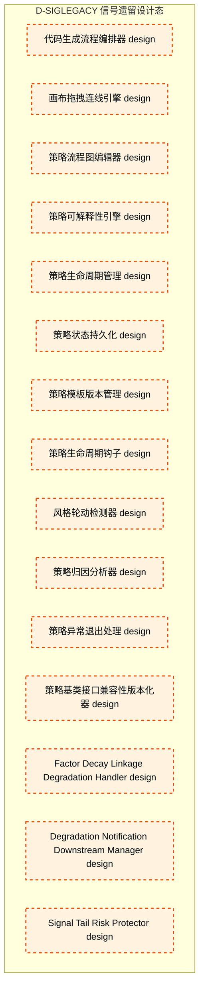

# 49_d_siglegacy / 信号遗留设计态

> **文档作用 / Purpose**: 展示 信号遗留设计态（D-SIGLEGACY）功能域的模块清单、域内依赖关系和跨域依赖关系，供架构审查和域治理参考。

> 本文档由 generate_domain_doc.py 从 depgraph.db 自动生成
> 最后更新: 2026-06-25 18:42:45
> 数据源: depgraph.db nodes表 + edges表

## 域基本信息 / Domain Overview

| 字段 | 值 | Field | Value |
|------|------|-------|-------|
| 编号 | 49 | Number | 49 |
| 域ID | D-SIGLEGACY | Domain ID | D-SIGLEGACY |
| 域名称 | 信号遗留设计态 | Domain Name | 信号遗留设计态 |
| 层级 | L2_domain | Layer | L2_domain |
| 模块数 | 45 | Module Count | 45 |
| 域内依赖 | 0 | Internal Dependencies | 0 |
| 跨域入边 | 1 | Cross-domain Incoming | 1 |
| 跨域出边 | 1 | Cross-domain Outgoing | 1 |
| 设计态模块 | 45 | Design Modules | 45 |
| 原型态模块 | 0 | Prototype Modules | 0 |
| 生产态模块 | 0 | Production Modules | 0 |
| 容量 | 0/150 (正常) | Capacity | 0/150 (正常) |
| 描述 | 信号生成、信号组合、信号过滤、信号优先级。交易信号引擎。 | Description | 信号生成、信号组合、信号过滤、信号优先级。交易信号引擎。 |

## 模块清单 / Module List

共 45 个模块（按路径排序，全部显示）

| 模块路径 / Module Path | 模块名称 / Module Name | 设计成熟度 / Maturity | 构建状态 / Build Status |
|---------|---------|-----------|---------|
| 信号域-DDD契约/D-SIGNAL-160 | 信号域仓储接口 | design | planned |
| 信号域-DDD契约/D-SIGNAL-162 | 策略框架升级迁移适配器 | design | planned |
| 信号域-Regime/D-SIGNAL-65 | Regime Sample Size Adequacy Checker | design | planned |
| 信号域-Regime/D-SIGNAL-67 | Regime Signal Contextualizer | design | planned |
| 信号域-Regime/D-SIGNAL-74 | Regime Failure Mode Diagnoser | design | planned |
| 信号域-Regime/D-SIGNAL-76 | Regime Macro Indicator Driver | design | planned |
| 信号域-事件追踪/D-SIGNAL-101 | Strategy Shared Kernel Synchronizer | design | planned |
| 信号域-事件追踪/D-SIGNAL-103 | Strategy Historical Performance Data ... | design | planned |
| 信号域-事件追踪/D-SIGNAL-99 | Risk Event E-RK-01 Consumer Handler | design | planned |
| 信号域-冲突融合/D-SIGNAL-134 | 策略引擎信号聚合 | design | planned |
| 信号域-合成分配/D-SIGNAL-85 | Capital Allocation Constraint Validator | design | planned |
| 信号域-合成分配/D-SIGNAL-87 | Regime-Aware Market State Adaptive Sy... | design | planned |
| 信号域-合成分配/D-SIGNAL-90 | ML Weight Synthesis Strategist | design | planned |
| 信号域-合成分配/D-SIGNAL-94 | SynthesizedSignal Event Publisher | design | planned |
| 信号域-合成分配/D-SIGNAL-96 | Sharpe Ratio Allocation Strategist | design | planned |
| 信号域-契约/D-SIGNAL-100 | CTR-TRACE-001 TraceContext传播器 | design | planned |
| 信号域-契约/D-SIGNAL-158 | 因子计算结果消费桥接器 | design | planned |
| 信号域-审计/D-SIGNAL-06 | Signal Audit Logger | design | planned |
| 信号域-技术指标/D-SIGNAL-114 | 技术指标信号生成器 | design | planned |
| 信号域-技术指标/D-SIGNAL-116 | 策略逻辑流程图生成器 | design | planned |
| 信号域-技术指标/D-SIGNAL-120 | 统一策略接口定义器 | design | planned |
| 信号域-技术指标/D-SIGNAL-122 | TA-Lib技术指标信号计算器 | design | planned |
| 信号域-技术指标/D-SIGNAL-124 | 图形形态识别算法库 | design | planned |
| 信号域-技术指标/D-SIGNAL-126 | 蜡烛图模式识别器 | design | planned |
| 信号域-技术指标/D-SIGNAL-128 | 缺口形态识别器 | design | planned |
| 信号域-核心基础设施/D-SIGNAL-12 | Signal Version Manager | design | planned |
| 信号域-核心基础设施/D-SIGNAL-14 | Strategy Lifecycle Manager | design | planned |
| 信号域-核心基础设施/D-SIGNAL-16 | Signal Conflict Resolution Engine | design | planned |
| 信号域-核心基础设施/D-SIGNAL-18 | Signal Out-of-Sample Validator | design | planned |
| 信号域-策略发布/D-SIGNAL-140 | 策略灰度发布 | design | planned |
| 信号域-策略可视化/D-SIGNAL-105 | 代码生成流程编排器 | design | planned |
| 信号域-策略可视化/D-SIGNAL-107 | 画布拖拽连线引擎 | design | planned |
| 信号域-策略可视化/D-SIGNAL-109 | 策略流程图编辑器 | design | planned |
| 信号域-策略可视化/D-SIGNAL-111 | 策略可解释性引擎 | design | planned |
| 信号域-策略管理/D-SIGNAL-137 | 策略生命周期管理 | design | planned |
| 信号域-策略管理/D-SIGNAL-139 | 策略状态持久化 | design | planned |
| 信号域-策略管理/D-SIGNAL-141 | 策略模板版本管理 | design | planned |
| 信号域-策略管理/D-SIGNAL-143 | 策略生命周期钩子 | design | planned |
| 信号域-策略质量/D-SIGNAL-145 | 风格轮动检测器 | design | planned |
| 信号域-策略质量/D-SIGNAL-147 | 策略归因分析器 | design | planned |
| 信号域-策略运行时/D-SIGNAL-150 | 策略异常退出处理 | design | planned |
| 信号域-策略运行时/D-SIGNAL-152 | 策略基类接口兼容性版本化器 | design | planned |
| 信号域-质量降级/D-SIGNAL-79 | Factor Decay Linkage Degradation Handler | design | planned |
| 信号域-降级/D-SIGNAL-80 | Degradation Notification Downstream M... | design | planned |
| 信号域/D-SIGNAL-20 | Signal Tail Risk Protector | design | planned |

## 域内依赖图 / Internal Dependency Diagram

> 依赖图内嵌在本文档中，IDE 可直接渲染显示。每30个节点一组分页显示。
>
> **图例说明 / Legend**：
> - **实线边框 = 运营态模块**（production，已上线运行）
> - **虚线边框 = 设计态模块**（design，还在设计中）
> - **实线箭头 = 运营态依赖**（已生效的依赖关系）
> - **虚线箭头 = 设计态依赖**（计划中的依赖关系）

### 第 1 页 / 共 2 页 / Page 1 of 2

```mermaid
graph TD
    subgraph D_SIGLEGACY["D-SIGLEGACY 信号遗留设计态"]
        DDD_D_SIGNAL_160["信号域仓储接口 design"]
        DDD_D_SIGNAL_162["策略框架升级迁移适配器 design"]
        Regime_D_SIGNAL_65["Regime Sample Size Adequacy Checker design"]
        Regime_D_SIGNAL_67["Regime Signal Contextualizer design"]
        Regime_D_SIGNAL_74["Regime Failure Mode Diagnoser design"]
        Regime_D_SIGNAL_76["Regime Macro Indicator Driver design"]
        D_SIGNAL_101["Strategy Shared Kernel Synchronizer design"]
        D_SIGNAL_103["Strategy Historical Performance Data Provider design"]
        D_SIGNAL_99["Risk Event E-RK-01 Consumer Handler design"]
        D_SIGNAL_134["策略引擎信号聚合 design"]
        D_SIGNAL_85["Capital Allocation Constraint Validator design"]
        D_SIGNAL_87["Regime-Aware Market State Adaptive Synthesizer design"]
        D_SIGNAL_90["ML Weight Synthesis Strategist design"]
        D_SIGNAL_94["SynthesizedSignal Event Publisher design"]
        D_SIGNAL_96["Sharpe Ratio Allocation Strategist design"]
        D_SIGNAL_100["CTR-TRACE-001 TraceContext传播器 design"]
        D_SIGNAL_158["因子计算结果消费桥接器 design"]
        D_SIGNAL_06["Signal Audit Logger design"]
        D_SIGNAL_114["技术指标信号生成器 design"]
        D_SIGNAL_116["策略逻辑流程图生成器 design"]
        D_SIGNAL_120["统一策略接口定义器 design"]
        D_SIGNAL_122["TA-Lib技术指标信号计算器 design"]
        D_SIGNAL_124["图形形态识别算法库 design"]
        D_SIGNAL_126["蜡烛图模式识别器 design"]
        D_SIGNAL_128["缺口形态识别器 design"]
        D_SIGNAL_12["Signal Version Manager design"]
        D_SIGNAL_14["Strategy Lifecycle Manager design"]
        D_SIGNAL_16["Signal Conflict Resolution Engine design"]
        D_SIGNAL_18["Signal Out-of-Sample Validator design"]
        D_SIGNAL_140["策略灰度发布 design"]
    end
    D_GOVERNANCE["D-GOVERNANCE design"]
    D_SIGNAL_06 -.->|contract| D_GOVERNANCE
    D_FACTOR["D-FACTOR prototype"]
    D_FACTOR -.->|contract| D_SIGNAL_06
    classDef production fill:#e1f5fe,stroke:#01579b,stroke-width:2px,color:#000
    classDef design fill:#fff3e0,stroke:#e65100,stroke-width:2px,color:#000,stroke-dasharray: 5 5
    classDef external_prod fill:#e8f5e9,stroke:#1b5e20,stroke-width:1px,color:#000
    classDef external_design fill:#fce4ec,stroke:#880e4f,stroke-width:1px,color:#000,stroke-dasharray: 5 5
    class DDD_D_SIGNAL_160,DDD_D_SIGNAL_162,Regime_D_SIGNAL_65,Regime_D_SIGNAL_67,Regime_D_SIGNAL_74,Regime_D_SIGNAL_76,D_SIGNAL_101,D_SIGNAL_103,D_SIGNAL_99,D_SIGNAL_134,D_SIGNAL_85,D_SIGNAL_87,D_SIGNAL_90,D_SIGNAL_94,D_SIGNAL_96,D_SIGNAL_100,D_SIGNAL_158,D_SIGNAL_06,D_SIGNAL_114,D_SIGNAL_116,D_SIGNAL_120,D_SIGNAL_122,D_SIGNAL_124,D_SIGNAL_126,D_SIGNAL_128,D_SIGNAL_12,D_SIGNAL_14,D_SIGNAL_16,D_SIGNAL_18,D_SIGNAL_140 design
    class D_GOVERNANCE,D_FACTOR external_design
```

### 第 2 页 / 共 2 页 / Page 2 of 2

## 跨域依赖 / Cross-domain Dependencies

### 本域依赖的其他域（出边）/ Depends On

| 目标域 / Target Domain | 依赖数 / Count | 依赖类型 / Type |
|--------|:---:|---------|
| D-GOVERNANCE | 1 | contract |

### 依赖本域的其他域（入边）/ Depended By

| 源域 / Source Domain | 依赖数 / Count | 依赖类型 / Type |
|------|:---:|---------|
| D-FACTOR | 1 | contract |

## 说明 / Notes

- **数据源 / Data Source**: `depgraph.db` 的 `nodes`、`edges`、`domains` 表
- **生成器 / Generator**: `generate_domain_doc.py`
- **维护方式 / Maintenance**: 自动生成，全景图更新时刷新
- **文件名规则 / File Naming**: `{编号:02d}_{域ID小写}.md`，如 `16_d_trading.md`
