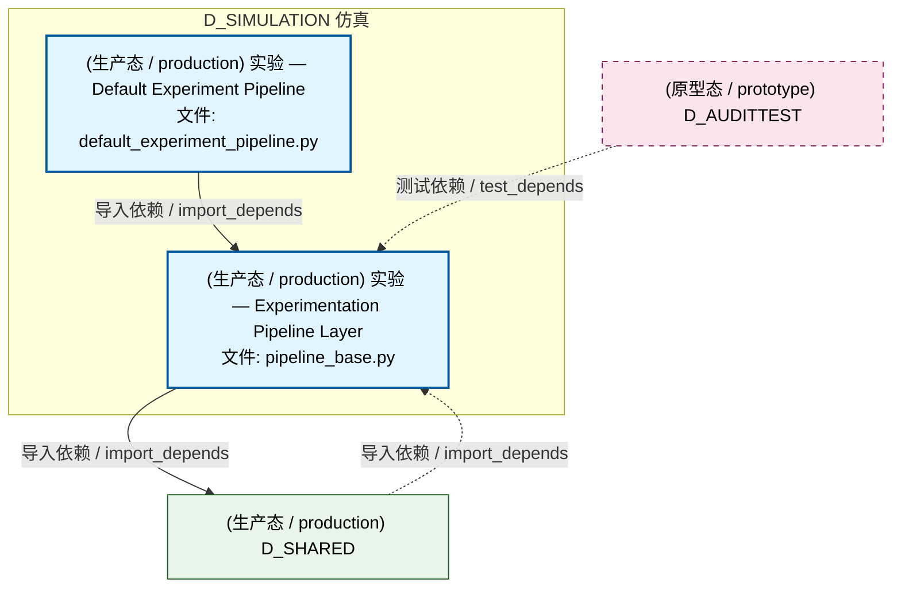
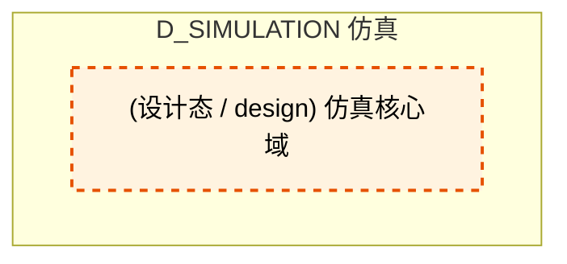
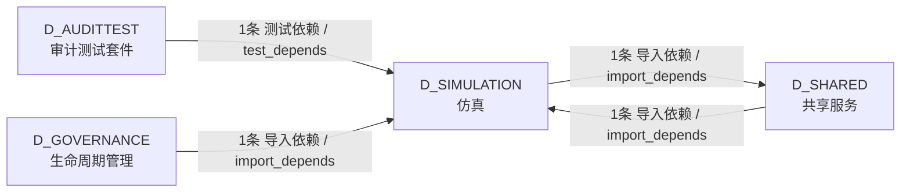

# 49_d_simulation / 仿真 / 仿真 / Simulation

> **功能简介 / Overview**: 仿真，负责市场仿真、模拟撮合和仿真环境管理

> **文档作用 / Purpose**: 展示 仿真（D_SIMULATION）功能域的模块清单、域内依赖关系、跨域依赖关系、架构分层视图，供架构审查和域治理参考。

> 本文档由 generate_domain_doc.py 从 depgraph (PostgreSQL) 自动生成
> 最后更新: 2026-07-09 17:34:53
> 数据源: depgraph (PostgreSQL) nodes表 + edges表

## 域基本信息 / Domain Overview

| 字段 | 值 | Field | Value |
|------|------|-------|-------|
| 编号 | 49 | Number | 49 |
| 域ID | D_SIMULATION | Domain ID | D_SIMULATION |
| 域名称 | 仿真 | Domain Name | Simulation |
| 层级 | L2 业务域层 | Layer | L2 Domain |
| 模块数 | 11 | Module Count | 11 |
| 域内依赖 | 2 | Internal Dependencies | 2 |
| 跨域入边 | 3 | Cross-domain Incoming | 3 |
| 跨域出边 | 1 | Cross-domain Outgoing | 1 |
| 设计态模块 | 1 | Design Modules | 1 |
| 原型态模块 | 8 | Prototype Modules | 8 |
| 生产态模块 | 2 | Production Modules | 2 |
| 容量 | 2/150 (正常) | Capacity | 2/150 (正常) |
| 描述 | 仿真引擎、场景生成、蒙特卡洛、回测模拟。策略验证沙箱。 | Description | 仿真引擎、场景生成、蒙特卡洛、回测模拟。策略验证沙箱。 |

## 模块分层清单 / Module Layered List

> 按 architecture_layer 分组的模块清单（共 11 个模块 / 11 modules）。

### L2 领域层 / Domain Layer (11 modules)

| # | 模块路径 / Module Path | 模块名称 / Module Name (功能简介 / Description) | 成熟度 / Maturity | 蓝图 / Blueprint |
|:--:|---------|---------|:---:|:---:|
| 1 | src/zephyr/simulation/ | 仿真核心域 | 设计态 / design |  |
| 2 | src/zephyr/simulation/__init__.py | 实验 Experimentation | 原型态 / prototype | [MOD-L13-001](../../03_modules/_domain_simulation/blueprint.md) |
| 3 | src/zephyr/simulation/_extensions/__init__.py | __init__.py | 原型态 / prototype |  |
| 4 | src/zephyr/simulation/api/__init__.py | __init__.py | 原型态 / prototype |  |
| 5 | src/zephyr/simulation/core/__init__.py | __init__.py | 原型态 / prototype |  |
| 6 | src/zephyr/simulation/implementations/__init__.py | 实验 — Experimentation Concrete Implementations | 原型态 / prototype | [MOD-L13-001](../../03_modules/_domain_simulation/blueprint.md) |
| 7 | src/zephyr/simulation/implementations/default_experiment_... | 实验 — Default Experiment Pipeline | 生产态 / production | [MOD-L13-001](../../03_modules/_domain_simulation/blueprint.md) |
| 8 | src/zephyr/simulation/infrastructure/__init__.py | __init__.py | 原型态 / prototype |  |
| 9 | src/zephyr/simulation/models/__init__.py | __init__.py | 原型态 / prototype |  |
| 10 | src/zephyr/simulation/pipeline_base.py | 实验 — Experimentation Pipeline Layer | 生产态 / production | [MOD-L13-001](../../03_modules/_domain_simulation/blueprint.md) |
| 11 | src/zephyr/simulation/services/__init__.py | __init__.py | 原型态 / prototype |  |

## 域内依赖图 / Internal Dependency Diagram

> 依赖图内嵌在本文档中，IDE 可直接渲染显示。参考 decision_index.md 设计，分四个视图：合并全景图、运营态子图、设计态子图、原型态子图（按 design_maturity 实际值拆分）。
>
> **图例说明 / Legend**：
> - **实线边框 = 运营态模块**（production，已上线运行）
> - **虚线边框 = 设计态模块**（design，蓝图阶段，代码未写）
> - **虚线边框 = 原型态模块**（prototype，代码已写，验证中未稳定上线）
> - **实线箭头 = 运营态依赖**（已生效的依赖关系）
> - **虚线箭头 = 非运营态依赖**（计划中/验证中的依赖关系）

### 合并全景图（全部模块，标签标注成熟度）

> 展示全部 11 个模块（生产态 2 + 设计态 1 + 原型态 8），标签标注成熟度。

```mermaid
graph TD
    subgraph D_SIMULATION["D_SIMULATION 仿真"]
        src_zephyr_simulation["(设计态 / design) 仿真核心域"]
        src_zephyr_simulation_init_py["(原型态 / prototype) 实验 Experimentation<br/>文件: __init__.py"]
        src_zephyr_simulation_extensions_init_py["(原型态 / prototype) __init__.py"]
        src_zephyr_simulation_api_init_py["(原型态 / prototype) __init__.py"]
        src_zephyr_simulation_core_init_py["(原型态 / prototype) __init__.py"]
        src_zephyr_simulation_implementations_init_py["(原型态 / prototype) 实验 — Experimentation Concrete Implementations<br/>文件: __init__.py"]
        src_zephyr_simulation_implementations_default_experiment_pipeline_py["(生产态 / production) 实验 — Default Experiment Pipeline<br/>文件: default_experiment_pipeline.py"]
        src_zephyr_simulation_infrastructure_init_py["(原型态 / prototype) __init__.py"]
        src_zephyr_simulation_models_init_py["(原型态 / prototype) __init__.py"]
        src_zephyr_simulation_pipeline_base_py["(生产态 / production) 实验 — Experimentation Pipeline Layer<br/>文件: pipeline_base.py"]
        src_zephyr_simulation_services_init_py["(原型态 / prototype) __init__.py"]
    end
    src_zephyr_simulation_implementations_default_experiment_pipeline_py -->|导入依赖 / import_depends| src_zephyr_simulation_pipeline_base_py
    src_zephyr_simulation_implementations_init_py -.->|config_depends / config_depends| src_zephyr_simulation_implementations_default_experiment_pipeline_py
    D_SHARED["(生产态 / production) D_SHARED"]
    src_zephyr_simulation_pipeline_base_py -->|导入依赖 / import_depends| D_SHARED
    D_SHARED -.->|导入依赖 / import_depends| src_zephyr_simulation_pipeline_base_py
    D_GOVERNANCE["(原型态 / prototype) D_GOVERNANCE"]
    D_GOVERNANCE -.->|导入依赖 / import_depends| src_zephyr_simulation_init_py
    D_AUDITTEST["(原型态 / prototype) D_AUDITTEST"]
    D_AUDITTEST -.->|测试依赖 / test_depends| src_zephyr_simulation_pipeline_base_py
    classDef production fill:#e1f5fe,stroke:#01579b,stroke-width:2px,color:#000
    classDef design fill:#fff3e0,stroke:#e65100,stroke-width:2px,color:#000,stroke-dasharray: 5 5
    classDef external_prod fill:#e8f5e9,stroke:#1b5e20,stroke-width:1px,color:#000
    classDef external_design fill:#fce4ec,stroke:#880e4f,stroke-width:1px,color:#000,stroke-dasharray: 5 5
    class src_zephyr_simulation_implementations_default_experiment_pipeline_py,src_zephyr_simulation_pipeline_base_py production
    class src_zephyr_simulation,src_zephyr_simulation_init_py,src_zephyr_simulation_extensions_init_py,src_zephyr_simulation_api_init_py,src_zephyr_simulation_core_init_py,src_zephyr_simulation_implementations_init_py,src_zephyr_simulation_infrastructure_init_py,src_zephyr_simulation_models_init_py,src_zephyr_simulation_services_init_py design
    class D_SHARED external_prod
    class D_GOVERNANCE,D_AUDITTEST external_design
```

### 运营态子图（仅 design_maturity=production 的模块和依赖）

> 仅展示已上线运行的模块（共 2 个，1 条域内依赖）。

### 设计态子图（仅 design_maturity=design 的模块和依赖）

> 仅展示蓝图阶段、代码未写的设计态模块（共 1 个，0 条域内依赖）。

### 原型态子图（仅 design_maturity=prototype 的模块和依赖）

> 仅展示代码已写、验证中未稳定上线的原型态模块（共 8 个，0 条域内依赖）。

```mermaid
graph TD
    subgraph D_SIMULATION["D_SIMULATION 仿真"]
        src_zephyr_simulation_init_py["(原型态 / prototype) 实验 Experimentation<br/>文件: __init__.py"]
        src_zephyr_simulation_extensions_init_py["(原型态 / prototype) __init__.py"]
        src_zephyr_simulation_api_init_py["(原型态 / prototype) __init__.py"]
        src_zephyr_simulation_core_init_py["(原型态 / prototype) __init__.py"]
        src_zephyr_simulation_implementations_init_py["(原型态 / prototype) 实验 — Experimentation Concrete Implementations<br/>文件: __init__.py"]
        src_zephyr_simulation_infrastructure_init_py["(原型态 / prototype) __init__.py"]
        src_zephyr_simulation_models_init_py["(原型态 / prototype) __init__.py"]
        src_zephyr_simulation_services_init_py["(原型态 / prototype) __init__.py"]
    end
    D_GOVERNANCE["(原型态 / prototype) D_GOVERNANCE"]
    D_GOVERNANCE -.->|导入依赖 / import_depends| src_zephyr_simulation_init_py
    classDef production fill:#e1f5fe,stroke:#01579b,stroke-width:2px,color:#000
    classDef design fill:#fff3e0,stroke:#e65100,stroke-width:2px,color:#000,stroke-dasharray: 5 5
    classDef external_prod fill:#e8f5e9,stroke:#1b5e20,stroke-width:1px,color:#000
    classDef external_design fill:#fce4ec,stroke:#880e4f,stroke-width:1px,color:#000,stroke-dasharray: 5 5
    class src_zephyr_simulation_init_py,src_zephyr_simulation_extensions_init_py,src_zephyr_simulation_api_init_py,src_zephyr_simulation_core_init_py,src_zephyr_simulation_implementations_init_py,src_zephyr_simulation_infrastructure_init_py,src_zephyr_simulation_models_init_py,src_zephyr_simulation_services_init_py design
    class D_GOVERNANCE external_design
```

## 跨域依赖 / Cross-domain Dependencies

### 本域依赖的其他域（出边）/ Depends On

| # | 本域模块 / Source Module | → | 外部域-目标模块 / Target Module | 依赖类型 / Type |
|:--:|---------|:--:|---------|---------|
| 1 | 实验 — Experimentation Pipeline Layer (pipelin... | → | D_SHARED 共享服务: experiment_result.py | 导入依赖 / import_depends |

### 依赖本域的其他域（入边）/ Depended By

| # | 外部域-源模块 / Source Module | → | 本域模块 / Target Module | 依赖类型 / Type |
|:--:|---------|:--:|---------|---------|
| 1 | D_AUDITTEST 审计测试套件: test_cross_layer.py | → | 实验 — Experimentation Pipeline Layer (pipelin... | 测试依赖 / test_depends |
| 2 | D_GOVERNANCE 生命周期管理: C-track 端到端演示 —— 全流水线一次性运行 (dem... | → | 实验 Experimentation (__init__.py) | 导入依赖 / import_depends |
| 3 | D_SHARED 共享服务: MLExperimentPipeline D_ML_TRAIN->实验跨层集成管... | → | 实验 — Experimentation Pipeline Layer (pipelin... | 导入依赖 / import_depends |

### 跨域依赖图 / Cross-domain Dependency Diagram

> 本域与 3 个外部域直接连接（出边 1 条 + 入边 3 条 = 4 条）。只显示直接连接的域，不展开具体节点。

## 说明 / Notes

- **数据源 / Data Source**: `depgraph (PostgreSQL)` 的 `nodes`、`edges`、`domains` 表
- **生成器 / Generator**: `generate_domain_doc.py`（G2+G10 合并）
- **维护方式 / Maintenance**: 自动生成，全景图更新时刷新
- **文件名规则 / File Naming**: `{编号:02d}_{域ID小写}.md`，如 `16_d_trading.md`
- **图例说明 / Legend**: `[production]`=已上线 / `[design]`=设计中 / `[prototype]`=原型 / `[unknown]`=未知
