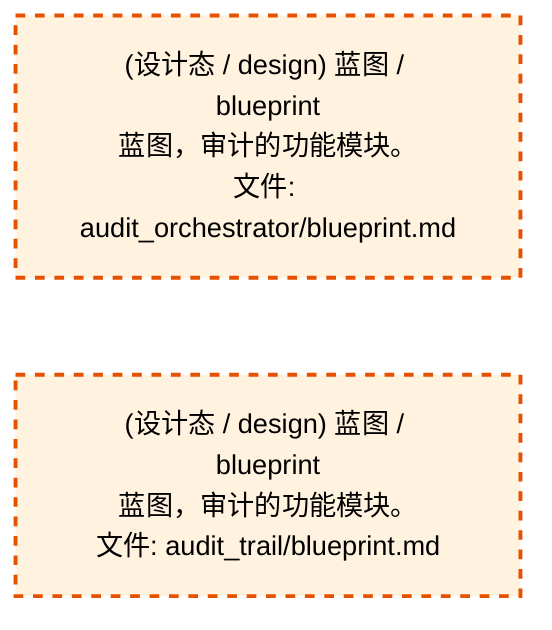
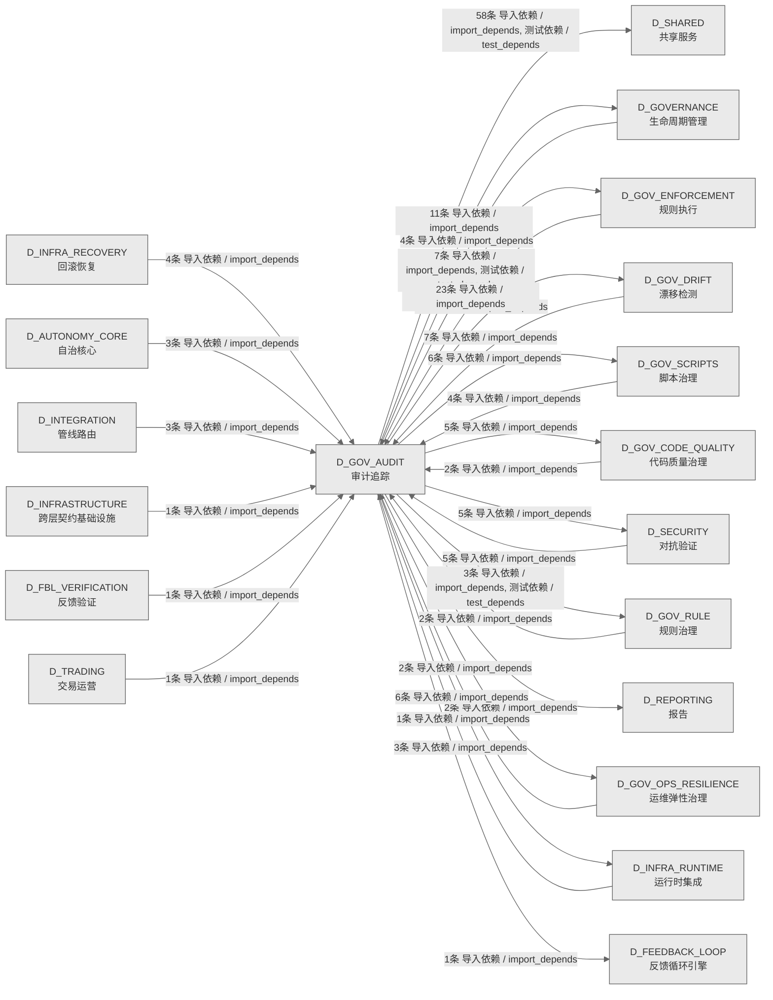

# 50_d_gov_audit / 审计追踪域 / Audit Trail

> **功能简介 / Overview**: 审计追踪，负责变更审计追踪和操作日志管理

> **文档作用 / Purpose**: 展示 审计追踪（D_GOV_AUDIT）功能域的域内依赖关系、跨域依赖关系，模块信息（成熟度/中英文名/大白话/文件路径）内嵌于 Mermaid 节点，供架构审查和域治理参考。

> 本文档由 generate_domain_doc.py 从 depgraph (PostgreSQL) 自动生成
> 数据源: depgraph (PostgreSQL) nodes表 + edges表

> **[可缩放 HTML 版 / Zoomable HTML](http://localhost:8765/docs/02_enterprise_architecture/02_domain_architecture_docs/_zoomable_html/50_d_gov_audit.html)** — Ctrl+滚轮缩放 ｜ 双击重置 ｜ Ctrl+Shift+D 切换拖动/选择模式

## 域基本信息 / Domain Overview

| 字段 | 值 | Field | Value |
|------|------|-------|-------|
| 编号 | 50 | Number | 50 |
| 域ID | D_GOV_AUDIT | Domain ID | D_GOV_AUDIT |
| 域名称 | 审计追踪 | Domain Name | Audit Trail |
| 层级 | L2 业务域层 | Layer | L2 Domain |
| 模块数 | 123 | Module Count | 123 |
| 域内依赖 | 102 | Internal Dependencies | 102 |
| 跨域入边 | 69 | Cross-domain Incoming | 69 |
| 跨域出边 | 107 | Cross-domain Outgoing | 107 |
| 设计态模块 | 2 | Design Modules | 2 |
| 生产态模块 | 121 | Production Modules | 121 |
| 容量 | 121/150 (正常) | Capacity | 121/150 (正常) |
| 描述 | 审计管线编排 | Description | 审计管线编排 |

## 域内依赖图 / Internal Dependency Diagram

> 依赖图内嵌在本文档中，IDE 可直接渲染；网页版可 Ctrl+滚轮缩放 + 拖动平移查看细节。
>
> **图例说明 / Legend**：
> - 🟦 **蓝色 = 运营态模块**（production，已上线运行）
> - 🟧 **橙色虚线 = 设计态模块**（design，蓝图阶段，代码未写）
> - **实线箭头 = 运营态依赖**（已生效的依赖关系）
> - **虚线箭头 = 非运营态依赖**（计划中/验证中的依赖关系）

### 全景图（全部模块，颜色区分运营态/设计态）

> 展示全部 123 个模块（生产态 121 + 设计态 2），含跨域依赖外部节点。节点含成熟度+名称+大白话/简介+文件路径。

```mermaid
%%{init: {'theme': 'base', 'themeVariables': {'primaryColor': '#eaeaea', 'primaryTextColor': '#333333', 'primaryBorderColor': '#666666', 'lineColor': '#666666', 'secondaryColor': '#eaeaea', 'tertiaryColor': '#eaeaea', 'fontSize': '14px'}}}%%
flowchart TD
    docs_03_modules_cross_layer_audit_orchestrator_blueprint_md["(设计态 / design) 蓝图 / blueprint<br/>蓝图，审计的功能模块。<br/>文件: audit_orchestrator/blueprint.md"]
    docs_03_modules_domain_governance_audit_trail_blueprint_md["(设计态 / design) 蓝图 / blueprint<br/>蓝图，审计的功能模块。<br/>文件: audit_trail/blueprint.md"]
    scripts_governance_repair_audit_design_completeness_py["(生产态 / production) (INVARIANTS) 按path精确匹配+按功能名模糊匹配; 输出差距报告; / audit_design_completeness<br/>(INVARIANTS) 按path精确匹配+按功能名模糊匹配; 输出差距报告; 提取所有ID格式<br/>文件: repair/audit_design_completeness.py"]
    scripts_governance_repair_red_blue_test_py["(生产态 / production) (INVARIANTS) 20项红蓝对抗测试 / red_blue_test<br/>(INVARIANTS) 20项红蓝对抗测试<br/>文件: repair/red_blue_test.py"]
    scripts_governance_repair_rollback_depgraph_py["(生产态 / production) (INVARIANTS) 仅接受depgraph.backup.*路径; 回滚前 / rollback_depgraph<br/>(INVARIANTS) 仅接受depgraph.backup.*路径; 回滚前自动备份当前depgraph<br/>文件: repair/rollback_depgraph.py"]
    scripts_governance_test_remediation_progress_smoke_py["(生产态 / production) 测试remediationprogresssmoke.py — Pha / test_remediation_progress_smoke<br/>Phase 3.1 治本进度 reconciler end-to-end smoke test。<br/>文件: governance/test_remediation_progress_smoke.py"]
    src_zephyr_gov_audit_orchestrator_compat_py["(生产态 / production) audit-orchestrator 兼容重导出层（ARCH-042 阶段4 修 / _orchestrator_compat<br/>audit-orchestrator 兼容重导出层（ARCH-042 阶段4 修复双 MODULE，ARCH-043 Risk3 改名）<br/>文件: gov_audit/_orchestrator_compat.py"]
    src_zephyr_gov_audit_action_history_py["(生产态 / production) ActionHistory — 操作历史持久化审计 + 去重 + 循环检测 / action_history<br/>ActionHistory — 操作历史持久化审计 + 去重 + 循环检测<br/>文件: gov_audit/action_history.py"]
    src_zephyr_gov_audit_api_lifecycle_py["(生产态 / production) API生命周期 / api_lifecycle<br/>API生命周期，审计的状态机，管理状态流转。<br/>文件: gov_audit/api_lifecycle.py"]
    src_zephyr_gov_audit_audit_schema_py["(生产态 / production) 审计schema — 审计视图与查询入口（SH-DB-001 v2.0） / audit_schema<br/>audit_schema — 审计视图与查询入口（SH-DB-001 v2.0）<br/>文件: gov_audit/audit_schema.py"]
    src_zephyr_gov_audit_audit_write_failure_protector_py["(生产态 / production) Audit Write Failure Protector — v0.13.0  / audit_write_failure_protector<br/>Audit Write Failure Protector — v0.13.0 审计写入失败保护器。<br/>文件: gov_audit/audit_write_failure_protector.py"]
    src_zephyr_gov_audit_bridges_audit_anomaly_py["(生产态 / production) G-CT-002 Audit 异常检测器 — AnomalyEvent Pyda / audit_anomaly<br/>G-CT-002 Audit 异常检测器 — AnomalyEvent Pydantic V2 BaseModel.<br/>文件: bridges/audit_anomaly.py"]
    src_zephyr_gov_audit_bridges_audit_contracts_py["(生产态 / production) G-CT-001 契约消费端 — Audit.write() 公共接口. / audit_contracts<br/>G-CT-001 契约消费端 — Audit.write() 公共接口.<br/>文件: bridges/audit_contracts.py"]
    src_zephyr_gov_audit_bridges_audit_delegation_bridge_py["(生产态 / production) Audit ↔ DelegationManager 委托链审计桥接. / audit_delegation_bridge<br/>Audit ↔ DelegationManager 委托链审计桥接.<br/>文件: bridges/audit_delegation_bridge.py"]
    src_zephyr_gov_audit_bridges_audit_drift_bridge_py["(生产态 / production) G-CT-007 Audit ↔ Drift 双向桥接 — MOD-INF-02 / audit_drift_bridge<br/>G-CT-007 Audit ↔ Drift 双向桥接 — MOD-INF-020 ↔ MOD-INF-023<br/>文件: bridges/audit_drift_bridge.py"]
    src_zephyr_gov_audit_bridges_audit_feedback_bridge_py["(生产态 / production) Audit ↔ Feedback Loop 三角闭环桥接. / audit_feedback_bridge<br/>Audit ↔ Feedback Loop 三角闭环桥接.<br/>文件: bridges/audit_feedback_bridge.py"]
    src_zephyr_gov_audit_bridges_audit_tiered_storage_bridge_py["(生产态 / production) Audit ↔ WarmHotGate 三层存储桥接. / audit_tiered_storage_bridge<br/>Audit ↔ WarmHotGate 三层存储桥接.<br/>文件: bridges/audit_tiered_storage_bridge.py"]
    src_zephyr_gov_audit_bridges_audit_trust_bridge_py["(生产态 / production) Audit ↔ ContinuousTrust 信任分数桥接. / audit_trust_bridge<br/>Audit ↔ ContinuousTrust 信任分数桥接.<br/>文件: bridges/audit_trust_bridge.py"]
    src_zephyr_gov_audit_changelog_manager_py["(生产态 / production) changelog管理器 / changelog_manager<br/>changelog管理器，审计的功能模块。<br/>文件: gov_audit/changelog_manager.py"]
    src_zephyr_gov_audit_cli_py["(生产态 / production) 命令行 / cli<br/>命令行，审计的功能模块。<br/>文件: gov_audit/cli.py"]
    src_zephyr_gov_audit_code_archaeology_py["(生产态 / production) 代码archaeology / code_archaeology<br/>代码archaeology，审计的记录器，把发生的事件/结果记下来留档。<br/>文件: gov_audit/code_archaeology.py"]
    src_zephyr_gov_audit_cold_start_py["(生产态 / production) BootstrapCache — 审计冷启动共享单例缓存。 / cold_start<br/>BootstrapCache — 审计冷启动共享单例缓存。<br/>文件: gov_audit/cold_start.py"]
    src_zephyr_gov_audit_compliance_map_py["(生产态 / production) audit-trail.compliance_map — MOD-INF-020 / compliance_map<br/>audit-trail.compliance_map — MOD-INF-020 · 合规框架映射<br/>文件: gov_audit/compliance_map.py"]
    src_zephyr_gov_audit_corporate_actions_py["(生产态 / production) corporateactions / corporate_actions<br/>corporateactions，审计的类型，定义数据类型和枚举。<br/>文件: gov_audit/corporate_actions.py"]
    src_zephyr_gov_audit_delegation_auditor_py["(生产态 / production) 委托链升级类型 -- str+Enum 使 == 'stri / delegation_auditor<br/>委托链升级类型 -- str+Enum 使 == 'string_value' 可用.<br/>文件: gov_audit/delegation_auditor.py"]
    src_zephyr_gov_audit_dora_metrics_py["(生产态 / production) dora指标 / dora_metrics<br/>dora指标，审计的功能模块。<br/>文件: gov_audit/dora_metrics.py"]
    src_zephyr_gov_audit_evidence_pack_py["(生产态 / production) audit-trail.evidence_pack — MOD-INF-020  / evidence_pack<br/>audit-trail.evidence_pack — MOD-INF-020 · 证据包导出器<br/>文件: gov_audit/evidence_pack.py"]
    src_zephyr_gov_audit_external_tool_audit_py["(生产态 / production) 外部tool审计 / external_tool_audit<br/>外部tool审计，主要提供审计tool、审计模块、摘要等功能，供audit-orchestrator.pipeline_ru使用<br/>文件: gov_audit/external_tool_audit.py"]
    src_zephyr_gov_audit_feedback_policy_py["(生产态 / production) 反馈策略 / feedback_policy.py — Audit-findings → policy recommendation <br/>反馈策略，审计的策略，定义决策规则。<br/>文件: gov_audit/feedback_policy.py"]
    src_zephyr_gov_audit_feedback_self_audit_py["(生产态 / production) audit-trail.feedback自audit — MOD-IN / feedback_self_audit<br/>audit-trail.feedback_self_audit — MOD-INF-020 · 反馈自审计<br/>文件: gov_audit/feedback_self_audit.py"]
    src_zephyr_gov_audit_forensic_package_py["(生产态 / production) Forensic Package — v0.8.0 取证就绪: escalati / forensic_package<br/>Forensic Package — v0.8.0 取证就绪: escalation event bundle+hash chain+timestamp。<br/>文件: gov_audit/forensic_package.py"]
    src_zephyr_gov_audit_genesis_py["(生产态 / production) audit-trail.genesis — MOD-INF-020 · 创世块管 / genesis<br/>audit-trail.genesis — MOD-INF-020 · 创世块管理<br/>文件: gov_audit/genesis.py"]
    src_zephyr_gov_audit_glossary_matrix_py["(生产态 / production) 词汇表矩阵 / glossary_matrix<br/>词汇表矩阵，审计的功能模块。<br/>文件: gov_audit/glossary_matrix.py"]
    src_zephyr_gov_audit_incremental_review_py["(生产态 / production) incremental审查 / incremental_review<br/>incremental审查，审计的功能模块。<br/>文件: gov_audit/incremental_review.py"]
    src_zephyr_gov_audit_integrity_verifier_py["(生产态 / production) Integrity Verifier — v0.8.0 代码完整性验证器: ha / integrity_verifier<br/>Integrity Verifier — v0.8.0 代码完整性验证器: hash校验+diff detection+rollback。<br/>文件: gov_audit/integrity_verifier.py"]
    src_zephyr_gov_audit_kb_gate_py["(生产态 / production) audit-trail.kbgate — MOD-INF-020 · KB 审 / kb_gate<br/>audit-trail.kb_gate — MOD-INF-020 · KB 审计门控<br/>文件: gov_audit/kb_gate.py"]
    src_zephyr_gov_audit_log_rotation_py["(生产态 / production) 审计日志轮转管理器——按天轮转 events.jsonl，支 / log_rotation<br/>审计日志轮转管理器——按天轮转 events.jsonl，支持压缩和过期清理。<br/>文件: gov_audit/log_rotation.py"]
    src_zephyr_gov_audit_merkle_audit_py["(生产态 / production) Merkle Audit — 兼容别名，SSoT已迁移至 zephyr.gov / merkle_audit<br/>Merkle Audit — 兼容别名，SSoT已迁移至 zephyr.gov_audit (MOD-INF-020).<br/>文件: gov_audit/merkle_audit.py"]
    src_zephyr_gov_audit_observability_dashboard_py["(生产态 / production) observability仪表盘 / observability_dashboard<br/>observability仪表盘，审计的功能模块。<br/>文件: gov_audit/observability_dashboard.py"]
    src_zephyr_gov_audit_pipeline_runner_py["(生产态 / production) 管线运行器 / pipeline_runner<br/>管线运行器，审计的结果，封装操作结果的数据结构。<br/>文件: gov_audit/pipeline_runner.py"]
    src_zephyr_gov_audit_privacy_py["(生产态 / production) audit-trail.privacy — MOD-INF-020 · PII  / privacy<br/>audit-trail.privacy — MOD-INF-020 · PII 检测与脱敏<br/>文件: gov_audit/privacy.py"]
    src_zephyr_gov_audit_provenance_tracker_py["(生产态 / production) provenance追踪器 / provenance_tracker<br/>provenance追踪器，审计的记录器，把发生的事件/结果记下来留档。<br/>文件: gov_audit/provenance_tracker.py"]
    src_zephyr_gov_audit_replay_engine_py["(生产态 / production) 重放快照（补全测试期望接口）。 / replay_engine<br/>重放快照（补全测试期望接口）。<br/>文件: gov_audit/replay_engine.py"]
    src_zephyr_gov_audit_retention_py["(生产态 / production) 保留策略（补全测试期望接口）。 / retention<br/>保留策略（补全测试期望接口）。<br/>文件: gov_audit/retention.py"]
    src_zephyr_gov_audit_sbom_generator_py["(生产态 / production) LicenseType 枚举——许可证类型定义（P3 价值审判退役残留）。 / sbom_generator<br/>LicenseType 枚举——许可证类型定义（P3 价值审判退役残留）。<br/>文件: gov_audit/sbom_generator.py"]
    src_zephyr_gov_audit_spec_auditor_py["(生产态 / production) spec审计器 / spec_auditor<br/>spec审计器，审计的功能模块。<br/>文件: gov_audit/spec_auditor.py"]
    src_zephyr_gov_audit_supply_chain_py["(生产态 / production) audit-trail.supply_chain — MOD-INF-020 · / supply_chain<br/>audit-trail.supply_chain — MOD-INF-020 · 供应链审计<br/>文件: gov_audit/supply_chain.py"]
    src_zephyr_gov_audit_supply_chain_security_py["(生产态 / production) supply链安全 / supply_chain_security<br/>supply链安全，审计的功能模块。<br/>文件: gov_audit/supply_chain_security.py"]
    src_zephyr_gov_audit_trust_ring_manager_py["(生产态 / production) 信任ring管理器 / trust_ring_manager<br/>信任ring管理器，审计的组成部分，依赖包入口工作。<br/>文件: gov_audit/trust_ring_manager.py"]
    src_zephyr_gov_audit_wqa_scorer_py["(生产态 / production) wqa评分器 / wqa_scorer<br/>wqa评分器，主要提供composite、rating等功能<br/>文件: gov_audit/wqa_scorer.py"]
    src_zephyr_gov_enforcement_behavioral_admission_ai_code_standards_py["(生产态 / production) AI代码standards / ai_code_standards<br/>AI代码standards，治理执行的功能模块。<br/>文件: behavioral_admission/ai_code_standards.py"]
    src_zephyr_gov_enforcement_behavioral_admission_mcp_result_push_py["(生产态 / production) MCP结果推送 / mcp_result_push<br/>MCP结果推送，治理执行的异常，定义本模块的异常类型。<br/>文件: behavioral_admission/mcp_result_push.py"]
    src_zephyr_gov_enforcement_behavioral_admission_post_process_py["(生产态 / production) 提交process.py —— AI 生成代码后处理管道（Phase 13 / post_process<br/>— AI 生成代码后处理管道（Phase 13 / 盲点 B31）<br/>文件: behavioral_admission/post_process.py"]
    src_zephyr_gov_enforcement_behavioral_admission_vibe_coding_enforcer_py["(生产态 / production) vibecoding执行器 / vibe_coding_enforcer<br/>vibecoding执行器，治理执行的核心类，封装VibeRuleLevel相关逻辑。<br/>文件: behavioral_admission/vibe_coding_enforcer.py"]
    src_zephyr_gov_enforcement_rule_enforcement_audit_chain_verifier_py["(生产态 / production) 审计链验证工具——独立重放门禁判定+Hash链完整性校验（beta） / audit_chain_verifier<br/>审计链验证工具——独立重放门禁判定+Hash链完整性校验（beta）<br/>文件: rule_enforcement/audit_chain_verifier.py"]
    src_zephyr_gov_enforcement_rule_enforcement_sys_master_compliance_py["(生产态 / production) sys主合规 / SYS-MASTER-001 Compliance Checker<br/>sys主合规。SYS-MASTER-001 Compliance Checker<br/>文件: rule_enforcement/sys_master_compliance.py"]
    src_zephyr_governance_audit_trail_contracts_py["(生产态 / production) audit-trail/contracts.py — G-CT-002 Audi / contracts<br/>audit-trail/contracts.py — G-CT-002 Audit 契约（re-export）。<br/>文件: audit-trail/contracts.py"]
    src_zephyr_governance_audit_ai_error_pattern_library_py["(生产态 / production) AI错误模式library.py — AI 错误模式库（只 / ai_error_pattern_library<br/>AI 错误模式库（只读查询接口）。<br/>文件: audit/ai_error_pattern_library.py"]
    src_zephyr_governance_audit_blueprint_status_transition_reconciler_py["(生产态 / production) 蓝图状态转换reconciler.p / blueprint_status_transition_reconciler<br/>蓝图状态单调推进 reconciler（P1-d，2026-07-21）。<br/>文件: audit/blueprint_status_transition_reconciler.py"]
    src_zephyr_governance_audit_cross_layer_contract_signature_reconciler_py["(生产态 / production) 跨层契约signature对账 / cross_layer_contract_signature_reconciler<br/>跨层契约签名漂移检测 reconciler（P1-b，2026-07-21）。<br/>文件: audit/cross_layer_contract_signature_reconciler.py"]
    src_zephyr_governance_audit_default_attribution_engine_py["(生产态 / production) 默认attribution引擎 / Re-export wrapper: default_attribution_engine canonical at z<br/>默认attribution引擎。Re-export wrapper: default_attribution_engine canonical at zephyr.reporting.default_attribution_engi<br/>文件: audit/default_attribution_engine.py"]
    src_zephyr_governance_audit_default_tca_engine_py["(生产态 / production) 默认tca引擎 / Re-export wrapper: default_tca_engine canonical at zephyr.re<br/>默认tca引擎。Re-export wrapper: default_tca_engine canonical at zephyr.reporting.default_tca_engine.<br/>文件: audit/default_tca_engine.py"]
    src_zephyr_governance_audit_git_performance_monitor_reconciler_py["(生产态 / production) git绩效监控器reconciler.py —  / git_performance_monitor_reconciler<br/>git 性能持续监控 + 早期预警（ARCH-GIT-CALL-BUDGET P3.5，2026-07-19）。<br/>文件: audit/git_performance_monitor_reconciler.py"]
    src_zephyr_governance_audit_runtime_violation_snapshot_reconciler_py["(生产态 / production) 运行时违规快照reconciler.py / runtime_violation_snapshot_reconciler<br/>trae_060 §5 evidence 运行时快照 post-commit reconciler。<br/>文件: audit/runtime_violation_snapshot_reconciler.py"]
    src_zephyr_governance_audit_snapshot_manager_py["(生产态 / production) SnapshotManager — Event Sourcing 快照管理（DW / snapshot_manager<br/>SnapshotManager — Event Sourcing 快照管理（DW-0005）<br/>文件: audit/snapshot_manager.py"]
    src_zephyr_governance_audit_workspace_hygiene_reconciler_py["(生产态 / production) workspacehygienereconciler.py — 工作区卫生自 / workspace_hygiene_reconciler<br/>工作区卫生自动清理 reconciler（DEBT-WORKSPACE-001/002 消除，2026-07-20）。<br/>文件: audit/workspace_hygiene_reconciler.py"]
    src_zephyr_governance_financial_governance_financial_compliance_py["(生产态 / production) financial合规 / financial_compliance<br/>financial合规，治理的核心类，封装ComplianceLayer相关逻辑。<br/>文件: financial_governance/financial_compliance.py"]
    src_zephyr_governance_semantic_audit_compliance_map_py["(生产态 / production) audit-trail.compliance_map — MOD-INF-020 / compliance_map<br/>audit-trail.compliance_map — MOD-INF-020 · 合规框架映射<br/>文件: semantic_audit/compliance_map.py"]
    src_zephyr_governance_semantic_audit_feedback_self_audit_py["(生产态 / production) audit-trail.feedback自audit — MOD-IN / feedback_self_audit<br/>audit-trail.feedback_self_audit — MOD-INF-020 · 反馈自审计<br/>文件: semantic_audit/feedback_self_audit.py"]
    src_zephyr_governance_semantic_audit_fix_result_prioritizer_py["(生产态 / production) 修复结果prioritizer / fix_prioritizer — MOD-INF-028 §3.1 Stage 8<br/>修复结果prioritizer。fix_prioritizer — MOD-INF-028 §3.1 Stage 8<br/>文件: semantic_audit/fix_result_prioritizer.py"]
    src_zephyr_governance_semantic_audit_orchestrator_py["(生产态 / production) SemanticAuditor 编排器——9阶段管道统一调度. / orchestrator<br/>SemanticAuditor 编排器——9阶段管道统一调度.<br/>文件: semantic_audit/orchestrator.py"]
    src_zephyr_governance_semantic_audit_privacy_py["(生产态 / production) audit-trail.privacy — MOD-INF-020 · PII  / privacy<br/>audit-trail.privacy — MOD-INF-020 · PII 检测与脱敏<br/>文件: semantic_audit/privacy.py"]
    src_zephyr_governance_semantic_audit_semantic_cache_py["(生产态 / production) semantic缓存 / semantic_cache<br/>semantic缓存，审计的缓存，暂存常用数据加速访问。<br/>文件: semantic_audit/semantic_cache.py"]
    src_zephyr_governance_semantic_audit_spec_auditor_py["(生产态 / production) G-CT-007 — Audit.record代理spec() 记录  / spec_auditor<br/>G-CT-007 — Audit.record_agent_spec() 记录 Agent Spec 注册与变更.<br/>文件: semantic_audit/spec_auditor.py"]
    tests_governance_audit_test_error_pattern_id_column_py["(生产态 / production) 测试错误模式idcolumn.py — reconc / test_error_pattern_id_column<br/>reconcile_execution_log.error_pattern_id 列幂等迁移单测（P4-1a）<br/>文件: audit/test_error_pattern_id_column.py"]
    tests_governance_audit_test_p3_integration_smoke_py["(生产态 / production) 测试p3集成smoke.py — Phase 3 全 / test_p3_integration_smoke<br/>Phase 3 全链路集成 smoke test<br/>文件: audit/test_p3_integration_smoke.py"]
    tests_governance_audit_test_reconcile_async_py["(生产态 / production) 测试对账async.py — P2-3 reconcile / test_reconcile_async<br/>P2-3 reconciler 链路异步化测试<br/>文件: audit/test_reconcile_async.py"]
    tests_governance_audit_test_reconcile_worker_selfheal_py["(生产态 / production) 测试对账工作器selfheal.py — #ARC / test_reconcile_worker_selfheal<br/>#ARCH-RECONCILER-ALERT-SELFHEAL-001 Phase 1 测试<br/>文件: audit/test_reconcile_worker_selfheal.py"]
    tests_governance_audit_test_trae_069_threshold_sync_smoke_py["(生产态 / production) 测试trae069阈值同步smoke.py —  / test_trae_069_threshold_sync_smoke<br/>trae_069 YAML 真源→代码常量同步 smoke test<br/>文件: audit/test_trae_069_threshold_sync_smoke.py"]
    tests_governance_rule_bridge_test_session_worktree_async_reconcile_py["(生产态 / production) 测试会话worktree异步reconcile.py / test_session_worktree_async_reconcile<br/>_run_reconcilers_after_merge 异步化测试。<br/>文件: rule_bridge/test_session_worktree_async_reconcile.py"]
    tests_governance_test_workspace_telemetry_shared_py["(生产态 / production) 测试workspace遥测shared.py — sha / test_workspace_telemetry_shared<br/>shared workspace_telemetry 公共 API 单测<br/>文件: governance/test_workspace_telemetry_shared.py"]
    docs_03_modules_cross_layer_audit_orchestrator_blueprint_md ~~~ docs_03_modules_domain_governance_audit_trail_blueprint_md
    docs_03_modules_domain_governance_audit_trail_blueprint_md ~~~ scripts_governance_repair_audit_design_completeness_py
    scripts_governance_repair_audit_design_completeness_py ~~~ scripts_governance_repair_red_blue_test_py
    scripts_governance_repair_red_blue_test_py ~~~ scripts_governance_repair_rollback_depgraph_py
    scripts_governance_repair_rollback_depgraph_py ~~~ scripts_governance_test_remediation_progress_smoke_py
    scripts_governance_test_remediation_progress_smoke_py ~~~ src_zephyr_gov_audit_orchestrator_compat_py
    src_zephyr_gov_audit_orchestrator_compat_py ~~~ src_zephyr_gov_audit_action_history_py
    src_zephyr_gov_audit_action_history_py ~~~ src_zephyr_gov_audit_api_lifecycle_py
    src_zephyr_gov_audit_api_lifecycle_py ~~~ src_zephyr_gov_audit_audit_schema_py
    src_zephyr_gov_audit_audit_schema_py ~~~ src_zephyr_gov_audit_audit_write_failure_protector_py
    src_zephyr_gov_audit_audit_write_failure_protector_py ~~~ src_zephyr_gov_audit_bridges_audit_anomaly_py
    src_zephyr_gov_audit_bridges_audit_anomaly_py ~~~ src_zephyr_gov_audit_bridges_audit_contracts_py
    src_zephyr_gov_audit_bridges_audit_contracts_py ~~~ src_zephyr_gov_audit_bridges_audit_delegation_bridge_py
    src_zephyr_gov_audit_bridges_audit_delegation_bridge_py ~~~ src_zephyr_gov_audit_bridges_audit_drift_bridge_py
    src_zephyr_gov_audit_bridges_audit_drift_bridge_py ~~~ src_zephyr_gov_audit_bridges_audit_feedback_bridge_py
    src_zephyr_gov_audit_bridges_audit_feedback_bridge_py ~~~ src_zephyr_gov_audit_bridges_audit_tiered_storage_bridge_py
    src_zephyr_gov_audit_bridges_audit_tiered_storage_bridge_py ~~~ src_zephyr_gov_audit_bridges_audit_trust_bridge_py
    src_zephyr_gov_audit_bridges_audit_trust_bridge_py ~~~ src_zephyr_gov_audit_changelog_manager_py
    src_zephyr_gov_audit_changelog_manager_py ~~~ src_zephyr_gov_audit_cli_py
    src_zephyr_gov_audit_cli_py ~~~ src_zephyr_gov_audit_code_archaeology_py
    src_zephyr_gov_audit_code_archaeology_py ~~~ src_zephyr_gov_audit_cold_start_py
    src_zephyr_gov_audit_cold_start_py ~~~ src_zephyr_gov_audit_compliance_map_py
    src_zephyr_gov_audit_compliance_map_py ~~~ src_zephyr_gov_audit_corporate_actions_py
    src_zephyr_gov_audit_corporate_actions_py ~~~ src_zephyr_gov_audit_delegation_auditor_py
    src_zephyr_gov_audit_delegation_auditor_py ~~~ src_zephyr_gov_audit_dora_metrics_py
    src_zephyr_gov_audit_dora_metrics_py ~~~ src_zephyr_gov_audit_evidence_pack_py
    src_zephyr_gov_audit_evidence_pack_py ~~~ src_zephyr_gov_audit_external_tool_audit_py
    src_zephyr_gov_audit_external_tool_audit_py ~~~ src_zephyr_gov_audit_feedback_policy_py
    src_zephyr_gov_audit_feedback_policy_py ~~~ src_zephyr_gov_audit_feedback_self_audit_py
    src_zephyr_gov_audit_feedback_self_audit_py ~~~ src_zephyr_gov_audit_forensic_package_py
    src_zephyr_gov_audit_forensic_package_py ~~~ src_zephyr_gov_audit_genesis_py
    src_zephyr_gov_audit_genesis_py ~~~ src_zephyr_gov_audit_glossary_matrix_py
    src_zephyr_gov_audit_glossary_matrix_py ~~~ src_zephyr_gov_audit_incremental_review_py
    src_zephyr_gov_audit_incremental_review_py ~~~ src_zephyr_gov_audit_integrity_verifier_py
    src_zephyr_gov_audit_integrity_verifier_py ~~~ src_zephyr_gov_audit_kb_gate_py
    src_zephyr_gov_audit_kb_gate_py ~~~ src_zephyr_gov_audit_log_rotation_py
    src_zephyr_gov_audit_log_rotation_py ~~~ src_zephyr_gov_audit_merkle_audit_py
    src_zephyr_gov_audit_merkle_audit_py ~~~ src_zephyr_gov_audit_observability_dashboard_py
    src_zephyr_gov_audit_observability_dashboard_py ~~~ src_zephyr_gov_audit_pipeline_runner_py
    src_zephyr_gov_audit_pipeline_runner_py ~~~ src_zephyr_gov_audit_privacy_py
    src_zephyr_gov_audit_privacy_py ~~~ src_zephyr_gov_audit_provenance_tracker_py
    src_zephyr_gov_audit_provenance_tracker_py ~~~ src_zephyr_gov_audit_replay_engine_py
    src_zephyr_gov_audit_replay_engine_py ~~~ src_zephyr_gov_audit_retention_py
    src_zephyr_gov_audit_retention_py ~~~ src_zephyr_gov_audit_sbom_generator_py
    src_zephyr_gov_audit_sbom_generator_py ~~~ src_zephyr_gov_audit_spec_auditor_py
    src_zephyr_gov_audit_spec_auditor_py ~~~ src_zephyr_gov_audit_supply_chain_py
    src_zephyr_gov_audit_supply_chain_py ~~~ src_zephyr_gov_audit_supply_chain_security_py
    src_zephyr_gov_audit_supply_chain_security_py ~~~ src_zephyr_gov_audit_trust_ring_manager_py
    src_zephyr_gov_audit_trust_ring_manager_py ~~~ src_zephyr_gov_audit_wqa_scorer_py
    src_zephyr_gov_audit_wqa_scorer_py ~~~ src_zephyr_gov_enforcement_behavioral_admission_ai_code_standards_py
    src_zephyr_gov_enforcement_behavioral_admission_ai_code_standards_py ~~~ src_zephyr_gov_enforcement_behavioral_admission_mcp_result_push_py
    src_zephyr_gov_enforcement_behavioral_admission_mcp_result_push_py ~~~ src_zephyr_gov_enforcement_behavioral_admission_post_process_py
    src_zephyr_gov_enforcement_behavioral_admission_post_process_py ~~~ src_zephyr_gov_enforcement_behavioral_admission_vibe_coding_enforcer_py
    src_zephyr_gov_enforcement_behavioral_admission_vibe_coding_enforcer_py ~~~ src_zephyr_gov_enforcement_rule_enforcement_audit_chain_verifier_py
    src_zephyr_gov_enforcement_rule_enforcement_audit_chain_verifier_py ~~~ src_zephyr_gov_enforcement_rule_enforcement_sys_master_compliance_py
    src_zephyr_gov_enforcement_rule_enforcement_sys_master_compliance_py ~~~ src_zephyr_governance_audit_trail_contracts_py
    src_zephyr_governance_audit_trail_contracts_py ~~~ src_zephyr_governance_audit_ai_error_pattern_library_py
    src_zephyr_governance_audit_ai_error_pattern_library_py ~~~ src_zephyr_governance_audit_blueprint_status_transition_reconciler_py
    src_zephyr_governance_audit_blueprint_status_transition_reconciler_py ~~~ src_zephyr_governance_audit_cross_layer_contract_signature_reconciler_py
    src_zephyr_governance_audit_cross_layer_contract_signature_reconciler_py ~~~ src_zephyr_governance_audit_default_attribution_engine_py
    src_zephyr_governance_audit_default_attribution_engine_py ~~~ src_zephyr_governance_audit_default_tca_engine_py
    src_zephyr_governance_audit_default_tca_engine_py ~~~ src_zephyr_governance_audit_git_performance_monitor_reconciler_py
    src_zephyr_governance_audit_git_performance_monitor_reconciler_py ~~~ src_zephyr_governance_audit_runtime_violation_snapshot_reconciler_py
    src_zephyr_governance_audit_runtime_violation_snapshot_reconciler_py ~~~ src_zephyr_governance_audit_snapshot_manager_py
    src_zephyr_governance_audit_snapshot_manager_py ~~~ src_zephyr_governance_audit_workspace_hygiene_reconciler_py
    src_zephyr_governance_audit_workspace_hygiene_reconciler_py ~~~ src_zephyr_governance_financial_governance_financial_compliance_py
    src_zephyr_governance_financial_governance_financial_compliance_py ~~~ src_zephyr_governance_semantic_audit_compliance_map_py
    src_zephyr_governance_semantic_audit_compliance_map_py ~~~ src_zephyr_governance_semantic_audit_feedback_self_audit_py
    src_zephyr_governance_semantic_audit_feedback_self_audit_py ~~~ src_zephyr_governance_semantic_audit_fix_result_prioritizer_py
    src_zephyr_governance_semantic_audit_fix_result_prioritizer_py ~~~ src_zephyr_governance_semantic_audit_orchestrator_py
    src_zephyr_governance_semantic_audit_orchestrator_py ~~~ src_zephyr_governance_semantic_audit_privacy_py
    src_zephyr_governance_semantic_audit_privacy_py ~~~ src_zephyr_governance_semantic_audit_semantic_cache_py
    src_zephyr_governance_semantic_audit_semantic_cache_py ~~~ src_zephyr_governance_semantic_audit_spec_auditor_py
    src_zephyr_governance_semantic_audit_spec_auditor_py ~~~ tests_governance_audit_test_error_pattern_id_column_py
    tests_governance_audit_test_error_pattern_id_column_py ~~~ tests_governance_audit_test_p3_integration_smoke_py
    tests_governance_audit_test_p3_integration_smoke_py ~~~ tests_governance_audit_test_reconcile_async_py
    tests_governance_audit_test_reconcile_async_py ~~~ tests_governance_audit_test_reconcile_worker_selfheal_py
    tests_governance_audit_test_reconcile_worker_selfheal_py ~~~ tests_governance_audit_test_trae_069_threshold_sync_smoke_py
    tests_governance_audit_test_trae_069_threshold_sync_smoke_py ~~~ tests_governance_rule_bridge_test_session_worktree_async_reconcile_py
    tests_governance_rule_bridge_test_session_worktree_async_reconcile_py ~~~ tests_governance_test_workspace_telemetry_shared_py
    src_zephyr_gov_audit_anomaly_py["(生产态 / production) 异常签名枚举——治本（裁定#18 G3）：转为真 Enum  / anomaly<br/>异常签名枚举——治本（裁定#18 G3）：转为真 Enum 对齐 test_audit_anomaly.py 契约。<br/>文件: gov_audit/anomaly.py"]
    src_zephyr_gov_audit_audit_admission_controller_py["(生产态 / production) 审计准入控制器 / audit_admission_controller<br/>审计准入控制器，审计的结果，封装操作结果的数据结构。<br/>文件: gov_audit/audit_admission_controller.py"]
    src_zephyr_gov_audit_bridge_py["(生产态 / production) 写入核心审计链——治本（裁定#18 G7 + 5.37.1） / bridge<br/>写入核心审计链——治本（裁定#18 G7 + 5.37.1）：真实落盘 events.jsonl。<br/>文件: gov_audit/bridge.py"]
    src_zephyr_gov_audit_event_store_py["(生产态 / production) EventStore — Event Sourcing 事件追加与回放（DW-0 / event_store<br/>EventStore — Event Sourcing 事件追加与回放（DW-0002）<br/>文件: gov_audit/event_store.py"]
    src_zephyr_gov_audit_query_py["(生产态 / production) 旧版查询引擎（保留以兼容现有调用方）。 / query<br/>旧版查询引擎（保留以兼容现有调用方）。<br/>文件: gov_audit/query.py"]
    src_zephyr_gov_audit_resource_aware_pool_py["(生产态 / production) resourceaware池 / resource_aware_pool<br/>resourceaware池，审计的功能模块。<br/>文件: gov_audit/resource_aware_pool.py"]
    src_zephyr_gov_audit_text_to_finding_adapter_py["(生产态 / production) textto发现适配器 / text_to_finding_adapter<br/>textto发现适配器，审计的解析器，把文本/数据解析成结构化对象。<br/>文件: gov_audit/text_to_finding_adapter.py"]
    src_zephyr_governance_audit_git_helpers_py["(生产态 / production) githelpers.py — audit reconciler 共享 gi / _git_helpers<br/>audit reconciler 共享 git 工具模块<br/>文件: audit/_git_helpers.py"]
    src_zephyr_governance_audit_commit_gateway_abuse_monitor_reconciler_py["(生产态 / production) 提交网关abuse监控器reconciler. / commit_gateway_abuse_monitor_reconciler<br/>commit gateway 持续滥用监控（ARCH-TOOL-HEALTH-V1 Phase 5b，2026-07-19）。<br/>文件: audit/commit_gateway_abuse_monitor_reconciler.py"]
    src_zephyr_governance_audit_error_pattern_consumer_reconciler_py["(生产态 / production) 错误模式消费者reconciler.py — A / error_pattern_consumer_reconciler<br/>AI 行为遥测 JSONL 错误事件聚合 consumer。<br/>文件: audit/error_pattern_consumer_reconciler.py"]
    src_zephyr_governance_audit_reconcile_worker_py["(生产态 / production) 对账worker.py — 异步 reconciler work / reconcile_worker<br/>异步 reconciler worker（Ruling:100PCT-AI-GOVERNANCE P2-3，2026-07-19）<br/>文件: audit/reconcile_worker.py"]
    src_zephyr_governance_audit_remediation_progress_reconciler_py["(生产态 / production) remediationprogressreconciler.py — 治本进 / remediation_progress_reconciler<br/>治本进度持久化 + 新鲜度对账（#ARCH-GOV-CONVERGENCE-META Phase 3.1）。<br/>文件: audit/remediation_progress_reconciler.py"]
    src_zephyr_governance_audit_runtime_violation_snapshot_py["(生产态 / production) 运行时违规snapshot.py — trae060 / runtime_violation_snapshot<br/>trae_060 §5 evidence 运行时快照（#ARCH-GOV-CONVERGENCE-META Phase 3.4b）。<br/>文件: audit/runtime_violation_snapshot.py"]
    src_zephyr_governance_semantic_audit_alignment_engine_py["(生产态 / production) 三元对齐检测：蓝图声明清单 vs 磁盘实际文件 vs import 引用链。 / alignment_engine<br/>三元对齐检测：蓝图声明清单 vs 磁盘实际文件 vs import 引用链。<br/>文件: semantic_audit/alignment_engine.py"]
    src_zephyr_governance_semantic_audit_fix_prioritizer_py["(生产态 / production) 按 severity -> certainty -> blastradius  / fix_prioritizer<br/>按 severity -> certainty -> blast_radius 三级排序,分组输出批次。<br/>文件: semantic_audit/fix_prioritizer.py"]
    src_zephyr_governance_semantic_audit_issue_aggregator_py["(生产态 / production) 收集各阶段审计结果，去重合并排序输出。 / issue_aggregator<br/>收集各阶段审计结果，去重合并排序输出。<br/>文件: semantic_audit/issue_aggregator.py"]
    src_zephyr_governance_semantic_audit_kb_gate_py["(生产态 / production) audit-trail.kbgate — MOD-INF-020 · KB 审 / kb_gate<br/>audit-trail.kb_gate — MOD-INF-020 · KB 审计门控<br/>文件: semantic_audit/kb_gate.py"]
    src_zephyr_governance_semantic_audit_llm_bridge_py["(生产态 / production) 接收 RED 问题,生成修复文本。LLM 只润色不做判断。不可用时降级为模板生成 / llm_bridge<br/>接收 RED 问题,生成修复文本。LLM 只润色不做判断。不可用时降级为模板生成。<br/>文件: semantic_audit/llm_bridge.py"]
    src_zephyr_governance_semantic_audit_safety_boundary_py["(生产态 / production) 禁碰规则过滤 + 置信度阈值。输入 TriggerResult 列表,输出 Sa / safety_boundary<br/>禁碰规则过滤 + 置信度阈值。输入 TriggerResult 列表,输出 SafetyDecision 分类。<br/>文件: semantic_audit/safety_boundary.py"]
    src_zephyr_governance_semantic_audit_self_healer_py["(生产态 / production) Stage 7 自愈闭环 — 修复->自测->回滚. / self_healer<br/>Stage 7 自愈闭环 — 修复->自测->回滚.<br/>文件: semantic_audit/self_healer.py"]
    src_zephyr_governance_semantic_audit_self_health_py["(生产态 / production) 7 SLI + 5 容量 SLI + 退化检测。定时自检,输出 HEALTHY/ / self_health<br/>7 SLI + 5 容量 SLI + 退化检测。定时自检,输出 HEALTHY/DEGRADED/CRITICAL。<br/>文件: semantic_audit/self_health.py"]
    src_zephyr_governance_semantic_audit_trigger_engine_py["(生产态 / production) 监听文件变更，判定是否触发语义审计。 / trigger_engine<br/>监听文件变更，判定是否触发语义审计。<br/>文件: semantic_audit/trigger_engine.py"]
    src_zephyr_gov_audit_anomaly_py ~~~ src_zephyr_gov_audit_audit_admission_controller_py
    src_zephyr_gov_audit_audit_admission_controller_py ~~~ src_zephyr_gov_audit_bridge_py
    src_zephyr_gov_audit_bridge_py ~~~ src_zephyr_gov_audit_event_store_py
    src_zephyr_gov_audit_event_store_py ~~~ src_zephyr_gov_audit_query_py
    src_zephyr_gov_audit_query_py ~~~ src_zephyr_gov_audit_resource_aware_pool_py
    src_zephyr_gov_audit_resource_aware_pool_py ~~~ src_zephyr_gov_audit_text_to_finding_adapter_py
    src_zephyr_gov_audit_text_to_finding_adapter_py ~~~ src_zephyr_governance_audit_git_helpers_py
    src_zephyr_governance_audit_git_helpers_py ~~~ src_zephyr_governance_audit_commit_gateway_abuse_monitor_reconciler_py
    src_zephyr_governance_audit_commit_gateway_abuse_monitor_reconciler_py ~~~ src_zephyr_governance_audit_error_pattern_consumer_reconciler_py
    src_zephyr_governance_audit_error_pattern_consumer_reconciler_py ~~~ src_zephyr_governance_audit_reconcile_worker_py
    src_zephyr_governance_audit_reconcile_worker_py ~~~ src_zephyr_governance_audit_remediation_progress_reconciler_py
    src_zephyr_governance_audit_remediation_progress_reconciler_py ~~~ src_zephyr_governance_audit_runtime_violation_snapshot_py
    src_zephyr_governance_audit_runtime_violation_snapshot_py ~~~ src_zephyr_governance_semantic_audit_alignment_engine_py
    src_zephyr_governance_semantic_audit_alignment_engine_py ~~~ src_zephyr_governance_semantic_audit_fix_prioritizer_py
    src_zephyr_governance_semantic_audit_fix_prioritizer_py ~~~ src_zephyr_governance_semantic_audit_issue_aggregator_py
    src_zephyr_governance_semantic_audit_issue_aggregator_py ~~~ src_zephyr_governance_semantic_audit_kb_gate_py
    src_zephyr_governance_semantic_audit_kb_gate_py ~~~ src_zephyr_governance_semantic_audit_llm_bridge_py
    src_zephyr_governance_semantic_audit_llm_bridge_py ~~~ src_zephyr_governance_semantic_audit_safety_boundary_py
    src_zephyr_governance_semantic_audit_safety_boundary_py ~~~ src_zephyr_governance_semantic_audit_self_healer_py
    src_zephyr_governance_semantic_audit_self_healer_py ~~~ src_zephyr_governance_semantic_audit_self_health_py
    src_zephyr_governance_semantic_audit_self_health_py ~~~ src_zephyr_governance_semantic_audit_trigger_engine_py
    src_zephyr_gov_audit_delegation_bridge_py["(生产态 / production) delegation桥接 / delegation_bridge<br/>delegation桥接，主要提供报告delegationfailure、报告delegation超时、isavailable等功能，供audit-orchestrator.delegation_使用<br/>文件: gov_audit/delegation_bridge.py"]
    src_zephyr_gov_audit_feedback_bridge_py["(生产态 / production) 反馈桥接 / feedback_bridge<br/>反馈桥接。Bridge between audit-trail anomaly findings and the Feedback Loop Engine.<br/>文件: gov_audit/feedback_bridge.py"]
    src_zephyr_gov_audit_finding_ingest_py["(生产态 / production) 发现ingest / finding_ingest<br/>发现ingest，审计的结果，封装操作结果的数据结构。<br/>文件: gov_audit/finding_ingest.py"]
    src_zephyr_gov_audit_indexer_py["(生产态 / production) 索引重建结果——治本（裁定#18 G5）：对齐 testa / indexer<br/>索引重建结果——治本（裁定#18 G5）：对齐 test_audit_indexer.py 契约。<br/>文件: gov_audit/indexer.py"]
    src_zephyr_gov_audit_merkle_hourly_py["(生产态 / production) audit-trail.merkle_hourly — MOD-INF-020  / merkle_hourly<br/>audit-trail.merkle_hourly — MOD-INF-020 · 每小时 Merkle 聚合<br/>文件: gov_audit/merkle_hourly.py"]
    src_zephyr_gov_audit_models_py["(生产态 / production) 审计事件类型枚举——治本（裁定#18 G2）：转为真 Enu / models<br/>审计事件类型枚举——治本（裁定#18 G2）：转为真 Enum，values 全部小写。<br/>文件: gov_audit/models.py"]
    src_zephyr_gov_audit_tiered_storage_bridge_py["(生产态 / production) tieredstorage桥接 / tiered_storage_bridge<br/>tieredstorage桥接，主要提供find报告、migrate、stats等功能，供audit-orchestrator.bridge; ret使用<br/>文件: gov_audit/tiered_storage_bridge.py"]
    src_zephyr_gov_audit_trust_bridge_py["(生产态 / production) 信任桥接 / trust_bridge<br/>信任桥接，主要提供评估、记录、获取趋势等功能，供audit-orchestrator.bridge; int使用<br/>文件: gov_audit/trust_bridge.py"]
    src_zephyr_governance_audit_health_score_calculator_py["(生产态 / production) 健康评分calculator.py — commit gate / health_score_calculator<br/>commit gateway 滥用 6 维加权健康度评分（P3-2，#ARCH-PREVENTABILITY-LAYER-001 Phase 3）。<br/>文件: audit/health_score_calculator.py"]
    src_zephyr_governance_audit_reconcile_runner_py["(生产态 / production) 对账runner.py — Reconciler 链路异步化（R / reconcile_runner<br/>Reconciler 链路异步化（Ruling:100PCT-AI-GOVERNANCE P2-3，2026-07-19）<br/>文件: audit/reconcile_runner.py"]
    src_zephyr_governance_semantic_audit_reference_extractor_py["(生产态 / production) AST 解析文件，提取 9 个维度的引用信息。 / reference_extractor<br/>AST 解析文件，提取 9 个维度的引用信息。<br/>文件: semantic_audit/reference_extractor.py"]
    src_zephyr_gov_audit_delegation_bridge_py ~~~ src_zephyr_gov_audit_feedback_bridge_py
    src_zephyr_gov_audit_feedback_bridge_py ~~~ src_zephyr_gov_audit_finding_ingest_py
    src_zephyr_gov_audit_finding_ingest_py ~~~ src_zephyr_gov_audit_indexer_py
    src_zephyr_gov_audit_indexer_py ~~~ src_zephyr_gov_audit_merkle_hourly_py
    src_zephyr_gov_audit_merkle_hourly_py ~~~ src_zephyr_gov_audit_models_py
    src_zephyr_gov_audit_models_py ~~~ src_zephyr_gov_audit_tiered_storage_bridge_py
    src_zephyr_gov_audit_tiered_storage_bridge_py ~~~ src_zephyr_gov_audit_trust_bridge_py
    src_zephyr_gov_audit_trust_bridge_py ~~~ src_zephyr_governance_audit_health_score_calculator_py
    src_zephyr_governance_audit_health_score_calculator_py ~~~ src_zephyr_governance_audit_reconcile_runner_py
    src_zephyr_governance_audit_reconcile_runner_py ~~~ src_zephyr_governance_semantic_audit_reference_extractor_py
    src_zephyr_gov_audit_contracts_py["(生产态 / production) 核心审计链写入器——桥接 contracts 层到 writ / contracts<br/>核心审计链写入器——桥接 contracts 层到 writer 实现。<br/>文件: gov_audit/contracts.py"]
    src_zephyr_gov_audit_finding_model_py["(生产态 / production) 发现模型 / finding_model<br/>发现模型，审计的功能模块。<br/>文件: gov_audit/finding_model.py"]
    src_zephyr_gov_audit_integrity_py["(生产态 / production) audit-trail.integrity — MOD-INF-020 · 密码 / integrity<br/>audit-trail.integrity — MOD-INF-020 · 密码学完整性验证器<br/>文件: gov_audit/integrity.py"]
    src_zephyr_gov_audit_tiered_storage_py["(生产态 / production) 旧版分层存储（保留以兼容现有调用方）。 / tiered_storage<br/>旧版分层存储（保留以兼容现有调用方）。<br/>文件: gov_audit/tiered_storage.py"]
    src_zephyr_gov_audit_trust_engine_py["(生产态 / production) 信任评分调整记录（补全测试期望接口）。 / trust_engine<br/>信任评分调整记录（补全测试期望接口）。<br/>文件: gov_audit/trust_engine.py"]
    src_zephyr_gov_audit_writer_py["(生产态 / production) 不可变审计写入器——JSONL 追加 + SHA-256 哈 / writer<br/>不可变审计写入器——JSONL 追加 + SHA-256 哈希链 + HMAC-SHA256 签名 + Lamport 时钟。<br/>文件: gov_audit/writer.py"]
    src_zephyr_governance_audit_reconciliation_registry_py["(生产态 / production) reconciliation_registry.py — GitCommitGa / reconciliation_registry<br/>GitCommitGateway post-commit 漂移对账注册表<br/>文件: audit/reconciliation_registry.py"]
    src_zephyr_governance_semantic_audit_models_py["(生产态 / production) 语义审计管线数据模型 — MOD-INF-028 §4.2 / models<br/>语义审计管线数据模型 — MOD-INF-028 §4.2<br/>文件: semantic_audit/models.py"]
    src_zephyr_gov_audit_contracts_py ~~~ src_zephyr_gov_audit_finding_model_py
    src_zephyr_gov_audit_finding_model_py ~~~ src_zephyr_gov_audit_integrity_py
    src_zephyr_gov_audit_integrity_py ~~~ src_zephyr_gov_audit_tiered_storage_py
    src_zephyr_gov_audit_tiered_storage_py ~~~ src_zephyr_gov_audit_trust_engine_py
    src_zephyr_gov_audit_trust_engine_py ~~~ src_zephyr_gov_audit_writer_py
    src_zephyr_gov_audit_writer_py ~~~ src_zephyr_governance_audit_reconciliation_registry_py
    src_zephyr_governance_audit_reconciliation_registry_py ~~~ src_zephyr_governance_semantic_audit_models_py
    src_zephyr_gov_audit_agent_signer_py["(生产态 / production) audit-trail.agent_signer — MOD-INF-020 · / agent_signer<br/>audit-trail.agent_signer — MOD-INF-020 · Agent Ed25519 签名器<br/>文件: gov_audit/agent_signer.py"]
    src_zephyr_governance_audit_ai_error_pattern_library_py -->|导入依赖 / import_depends| src_zephyr_governance_audit_error_pattern_consumer_reconciler_py
    src_zephyr_governance_audit_blueprint_status_transition_reconciler_py -->|导入依赖 / import_depends| src_zephyr_governance_audit_reconciliation_registry_py
    src_zephyr_governance_audit_blueprint_status_transition_reconciler_py -->|导入依赖 / import_depends| src_zephyr_governance_audit_git_helpers_py
    src_zephyr_governance_audit_cross_layer_contract_signature_reconciler_py -->|导入依赖 / import_depends| src_zephyr_governance_audit_reconciliation_registry_py
    src_zephyr_governance_audit_cross_layer_contract_signature_reconciler_py -->|导入依赖 / import_depends| src_zephyr_governance_audit_git_helpers_py
    src_zephyr_governance_audit_git_performance_monitor_reconciler_py -->|导入依赖 / import_depends| src_zephyr_governance_audit_reconciliation_registry_py
    src_zephyr_governance_audit_commit_gateway_abuse_monitor_reconciler_py -->|导入依赖 / import_depends| src_zephyr_governance_audit_health_score_calculator_py
    src_zephyr_governance_audit_commit_gateway_abuse_monitor_reconciler_py -->|导入依赖 / import_depends| src_zephyr_governance_audit_reconciliation_registry_py
    src_zephyr_governance_audit_error_pattern_consumer_reconciler_py -->|导入依赖 / import_depends| src_zephyr_governance_audit_reconciliation_registry_py
    src_zephyr_governance_audit_reconcile_worker_py -->|导入依赖 / import_depends| src_zephyr_governance_audit_reconcile_runner_py
    src_zephyr_governance_audit_reconcile_worker_py -->|导入依赖 / import_depends| src_zephyr_governance_audit_reconciliation_registry_py
    src_zephyr_governance_audit_reconcile_runner_py -->|导入依赖 / import_depends| src_zephyr_governance_audit_reconciliation_registry_py
    src_zephyr_governance_audit_remediation_progress_reconciler_py -->|导入依赖 / import_depends| src_zephyr_governance_audit_reconciliation_registry_py
    src_zephyr_governance_audit_runtime_violation_snapshot_reconciler_py -->|导入依赖 / import_depends| src_zephyr_governance_audit_runtime_violation_snapshot_py
    src_zephyr_governance_audit_runtime_violation_snapshot_reconciler_py -->|导入依赖 / import_depends| src_zephyr_governance_audit_reconciliation_registry_py
    src_zephyr_governance_audit_snapshot_manager_py -->|导入依赖 / import_depends| src_zephyr_gov_audit_event_store_py
    src_zephyr_governance_audit_trail_contracts_py -->|导入依赖 / import_depends| src_zephyr_gov_audit_contracts_py
    src_zephyr_governance_audit_workspace_hygiene_reconciler_py -->|导入依赖 / import_depends| src_zephyr_governance_audit_reconciliation_registry_py
    src_zephyr_governance_semantic_audit_compliance_map_py -->|导入依赖 / import_depends| src_zephyr_gov_audit_models_py
    src_zephyr_governance_semantic_audit_fix_prioritizer_py -->|导入依赖 / import_depends| src_zephyr_governance_semantic_audit_models_py
    src_zephyr_governance_semantic_audit_issue_aggregator_py -->|导入依赖 / import_depends| src_zephyr_governance_semantic_audit_models_py
    src_zephyr_governance_semantic_audit_llm_bridge_py -->|导入依赖 / import_depends| src_zephyr_governance_semantic_audit_models_py
    src_zephyr_governance_semantic_audit_alignment_engine_py -->|导入依赖 / import_depends| src_zephyr_governance_semantic_audit_models_py
    src_zephyr_governance_semantic_audit_alignment_engine_py -->|导入依赖 / import_depends| src_zephyr_governance_semantic_audit_reference_extractor_py
    src_zephyr_governance_semantic_audit_orchestrator_py -->|导入依赖 / import_depends| src_zephyr_governance_semantic_audit_fix_prioritizer_py
    src_zephyr_governance_semantic_audit_orchestrator_py -->|导入依赖 / import_depends| src_zephyr_governance_semantic_audit_issue_aggregator_py
    src_zephyr_governance_semantic_audit_orchestrator_py -->|导入依赖 / import_depends| src_zephyr_governance_semantic_audit_llm_bridge_py
    src_zephyr_governance_semantic_audit_orchestrator_py -->|导入依赖 / import_depends| src_zephyr_governance_semantic_audit_alignment_engine_py
    src_zephyr_governance_semantic_audit_orchestrator_py -->|导入依赖 / import_depends| src_zephyr_governance_semantic_audit_models_py
    src_zephyr_governance_semantic_audit_orchestrator_py -->|导入依赖 / import_depends| src_zephyr_governance_semantic_audit_self_healer_py
    src_zephyr_governance_semantic_audit_orchestrator_py -->|导入依赖 / import_depends| src_zephyr_governance_semantic_audit_reference_extractor_py
    src_zephyr_governance_semantic_audit_orchestrator_py -->|导入依赖 / import_depends| src_zephyr_governance_semantic_audit_safety_boundary_py
    src_zephyr_governance_semantic_audit_orchestrator_py -->|导入依赖 / import_depends| src_zephyr_governance_semantic_audit_self_health_py
    src_zephyr_governance_semantic_audit_orchestrator_py -->|导入依赖 / import_depends| src_zephyr_governance_semantic_audit_trigger_engine_py
    src_zephyr_governance_semantic_audit_fix_result_prioritizer_py -->|导入依赖 / import_depends| src_zephyr_governance_semantic_audit_models_py
    src_zephyr_governance_semantic_audit_reference_extractor_py -->|导入依赖 / import_depends| src_zephyr_governance_semantic_audit_models_py
    src_zephyr_governance_semantic_audit_safety_boundary_py -->|导入依赖 / import_depends| src_zephyr_governance_semantic_audit_models_py
    src_zephyr_governance_semantic_audit_trigger_engine_py -->|导入依赖 / import_depends| src_zephyr_governance_semantic_audit_models_py
    src_zephyr_governance_semantic_audit_trigger_engine_py -->|导入依赖 / import_depends| src_zephyr_governance_semantic_audit_reference_extractor_py
    src_zephyr_gov_audit_audit_admission_controller_py -->|导入依赖 / import_depends| src_zephyr_gov_audit_finding_ingest_py
    src_zephyr_gov_audit_audit_admission_controller_py -->|导入依赖 / import_depends| src_zephyr_gov_audit_finding_model_py
    src_zephyr_gov_audit_audit_write_failure_protector_py -->|导入依赖 / import_depends| src_zephyr_gov_audit_writer_py
    src_zephyr_gov_audit_bridge_py -->|导入依赖 / import_depends| src_zephyr_gov_audit_delegation_bridge_py
    src_zephyr_gov_audit_bridge_py -->|导入依赖 / import_depends| src_zephyr_gov_audit_feedback_bridge_py
    src_zephyr_gov_audit_bridge_py -->|导入依赖 / import_depends| src_zephyr_gov_audit_merkle_hourly_py
    src_zephyr_gov_audit_bridge_py -->|导入依赖 / import_depends| src_zephyr_gov_audit_tiered_storage_bridge_py
    src_zephyr_gov_audit_bridge_py -->|导入依赖 / import_depends| src_zephyr_gov_audit_trust_bridge_py
    src_zephyr_gov_audit_bridge_py -->|导入依赖 / import_depends| src_zephyr_gov_audit_writer_py
    src_zephyr_gov_audit_cli_py -->|导入依赖 / import_depends| src_zephyr_governance_semantic_audit_kb_gate_py
    src_zephyr_gov_audit_cli_py -->|导入依赖 / import_depends| src_zephyr_gov_audit_audit_admission_controller_py
    src_zephyr_gov_audit_cli_py -->|导入依赖 / import_depends| src_zephyr_gov_audit_resource_aware_pool_py
    src_zephyr_gov_audit_contracts_py -->|导入依赖 / import_depends| src_zephyr_gov_audit_models_py
    src_zephyr_gov_audit_contracts_py -->|导入依赖 / import_depends| src_zephyr_gov_audit_writer_py
    src_zephyr_gov_audit_delegation_auditor_py -->|导入依赖 / import_depends| src_zephyr_gov_audit_delegation_bridge_py
    src_zephyr_gov_audit_compliance_map_py -->|导入依赖 / import_depends| src_zephyr_gov_audit_models_py
    src_zephyr_gov_audit_delegation_bridge_py -->|导入依赖 / import_depends| src_zephyr_gov_audit_writer_py
    src_zephyr_gov_audit_finding_ingest_py -->|导入依赖 / import_depends| src_zephyr_gov_audit_finding_model_py
    src_zephyr_gov_audit_finding_ingest_py -->|导入依赖 / import_depends| src_zephyr_gov_audit_writer_py
    src_zephyr_gov_audit_feedback_policy_py -->|导入依赖 / import_depends| src_zephyr_gov_audit_feedback_bridge_py
    src_zephyr_gov_audit_indexer_py -->|导入依赖 / import_depends| src_zephyr_gov_audit_contracts_py
    src_zephyr_gov_audit_integrity_py -->|导入依赖 / import_depends| src_zephyr_gov_audit_agent_signer_py
    src_zephyr_gov_audit_integrity_py -->|导入依赖 / import_depends| src_zephyr_gov_audit_writer_py
    src_zephyr_gov_audit_merkle_hourly_py -->|导入依赖 / import_depends| src_zephyr_gov_audit_integrity_py
    src_zephyr_gov_audit_merkle_audit_py -->|导入依赖 / import_depends| src_zephyr_gov_audit_integrity_py
    src_zephyr_gov_audit_query_py -->|导入依赖 / import_depends| src_zephyr_gov_audit_contracts_py
    src_zephyr_gov_audit_query_py -->|导入依赖 / import_depends| src_zephyr_gov_audit_indexer_py
    src_zephyr_gov_audit_query_py -->|导入依赖 / import_depends| src_zephyr_gov_audit_integrity_py
    src_zephyr_gov_audit_query_py -->|导入依赖 / import_depends| src_zephyr_gov_audit_models_py
    src_zephyr_gov_audit_pipeline_runner_py -->|导入依赖 / import_depends| src_zephyr_gov_audit_finding_model_py
    src_zephyr_gov_audit_pipeline_runner_py -->|导入依赖 / import_depends| src_zephyr_gov_audit_text_to_finding_adapter_py
    src_zephyr_gov_audit_tiered_storage_bridge_py -->|导入依赖 / import_depends| src_zephyr_gov_audit_tiered_storage_py
    src_zephyr_gov_audit_trust_bridge_py -->|导入依赖 / import_depends| src_zephyr_gov_audit_trust_engine_py
    src_zephyr_gov_audit_text_to_finding_adapter_py -->|导入依赖 / import_depends| src_zephyr_gov_audit_finding_model_py
    src_zephyr_gov_audit_writer_py -->|导入依赖 / import_depends| src_zephyr_gov_audit_contracts_py
    src_zephyr_gov_audit_writer_py -->|导入依赖 / import_depends| src_zephyr_gov_audit_integrity_py
    src_zephyr_gov_audit_writer_py -->|导入依赖 / import_depends| src_zephyr_gov_audit_models_py
    src_zephyr_gov_audit_orchestrator_compat_py -->|导入依赖 / import_depends| src_zephyr_gov_audit_anomaly_py
    src_zephyr_gov_audit_orchestrator_compat_py -->|导入依赖 / import_depends| src_zephyr_gov_audit_bridge_py
    src_zephyr_gov_audit_orchestrator_compat_py -->|导入依赖 / import_depends| src_zephyr_gov_audit_contracts_py
    src_zephyr_gov_audit_orchestrator_compat_py -->|导入依赖 / import_depends| src_zephyr_gov_audit_indexer_py
    src_zephyr_gov_audit_orchestrator_compat_py -->|导入依赖 / import_depends| src_zephyr_gov_audit_integrity_py
    src_zephyr_gov_audit_orchestrator_compat_py -->|导入依赖 / import_depends| src_zephyr_gov_audit_models_py
    src_zephyr_gov_audit_orchestrator_compat_py -->|导入依赖 / import_depends| src_zephyr_gov_audit_query_py
    src_zephyr_gov_audit_orchestrator_compat_py -->|导入依赖 / import_depends| src_zephyr_gov_audit_writer_py
    src_zephyr_gov_audit_bridges_audit_contracts_py -->|导入依赖 / import_depends| src_zephyr_gov_audit_writer_py
    src_zephyr_gov_audit_bridges_audit_drift_bridge_py -->|导入依赖 / import_depends| src_zephyr_gov_audit_anomaly_py
    src_zephyr_gov_audit_bridges_audit_delegation_bridge_py -->|导入依赖 / import_depends| src_zephyr_gov_audit_delegation_bridge_py
    src_zephyr_gov_audit_bridges_audit_feedback_bridge_py -->|导入依赖 / import_depends| src_zephyr_gov_audit_anomaly_py
    src_zephyr_gov_audit_bridges_audit_feedback_bridge_py -->|导入依赖 / import_depends| src_zephyr_gov_audit_query_py
    src_zephyr_gov_enforcement_rule_enforcement_audit_chain_verifier_py -->|导入依赖 / import_depends| src_zephyr_gov_audit_writer_py
    scripts_governance_test_remediation_progress_smoke_py -->|导入依赖 / import_depends| src_zephyr_governance_audit_reconciliation_registry_py
    scripts_governance_test_remediation_progress_smoke_py -->|导入依赖 / import_depends| src_zephyr_governance_audit_remediation_progress_reconciler_py
    tests_governance_audit_test_error_pattern_id_column_py -->|测试依赖 / test_depends| src_zephyr_governance_audit_reconciliation_registry_py
    tests_governance_audit_test_p3_integration_smoke_py -->|测试依赖 / test_depends| src_zephyr_governance_audit_commit_gateway_abuse_monitor_reconciler_py
    tests_governance_audit_test_p3_integration_smoke_py -->|测试依赖 / test_depends| src_zephyr_governance_audit_health_score_calculator_py
    tests_governance_audit_test_reconcile_worker_selfheal_py -->|测试依赖 / test_depends| src_zephyr_governance_audit_reconcile_worker_py
    tests_governance_audit_test_reconcile_worker_selfheal_py -->|测试依赖 / test_depends| src_zephyr_governance_audit_reconcile_runner_py
    tests_governance_audit_test_reconcile_worker_selfheal_py -->|测试依赖 / test_depends| src_zephyr_governance_audit_reconciliation_registry_py
    tests_governance_audit_test_reconcile_async_py -->|测试依赖 / test_depends| src_zephyr_governance_audit_reconcile_worker_py
    tests_governance_audit_test_reconcile_async_py -->|测试依赖 / test_depends| src_zephyr_governance_audit_reconcile_runner_py
    tests_governance_audit_test_trae_069_threshold_sync_smoke_py -->|测试依赖 / test_depends| src_zephyr_governance_audit_commit_gateway_abuse_monitor_reconciler_py
    tests_governance_audit_test_trae_069_threshold_sync_smoke_py -->|测试依赖 / test_depends| src_zephyr_governance_audit_health_score_calculator_py
    D_GOV_SCRIPTS["(生产态 / production) 脚本治理 / Script Governance<br/>脚本治理，负责脚本生命周期管理和脚本质量门禁<br/>跨域节点 / cross-domain"]
    src_zephyr_governance_audit_reconciliation_registry_py -->|导入依赖 / import_depends| D_GOV_SCRIPTS
    D_SHARED["(生产态 / production) 共享服务 / Shared Services<br/>共享服务，负责跨域共享的工具、协议和基础服务<br/>跨域节点 / cross-domain"]
    scripts_governance_repair_red_blue_test_py -->|导入依赖 / import_depends| D_SHARED
    D_SECURITY["(生产态 / production) 对抗验证 / Adversarial Validation<br/>对抗验证，负责系统安全对抗测试、漏洞扫描和攻防验证<br/>跨域节点 / cross-domain"]
    src_zephyr_gov_audit_cli_py -->|导入依赖 / import_depends| D_SECURITY
    D_GOVERNANCE["(生产态 / production) 生命周期管理 / Lifecycle Management<br/>生命周期管理，负责蓝图/模块/任务的声明周期管理和元数据治理<br/>跨域节点 / cross-domain"]
    src_zephyr_gov_audit_bridges_audit_trust_bridge_py -->|导入依赖 / import_depends| D_GOVERNANCE
    D_GOV_DRIFT["(生产态 / production) 漂移检测 / Drift Detection<br/>漂移检测，负责架构漂移检测和漂移告警<br/>跨域节点 / cross-domain"]
    src_zephyr_gov_audit_bridges_audit_drift_bridge_py -->|导入依赖 / import_depends| D_GOV_DRIFT
    scripts_governance_repair_rollback_depgraph_py -->|导入依赖 / import_depends| D_SHARED
    src_zephyr_gov_audit_spec_auditor_py -->|导入依赖 / import_depends| D_GOVERNANCE
    src_zephyr_gov_audit_finding_ingest_py -->|导入依赖 / import_depends| D_SHARED
    src_zephyr_gov_audit_writer_py -->|导入依赖 / import_depends| D_SHARED
    src_zephyr_governance_audit_reconcile_runner_py -->|导入依赖 / import_depends| D_SHARED
    src_zephyr_governance_semantic_audit_kb_gate_py -->|导入依赖 / import_depends| D_GOVERNANCE
    src_zephyr_gov_audit_cli_py -->|导入依赖 / import_depends| D_SHARED
    src_zephyr_gov_audit_cli_py -->|导入依赖 / import_depends| D_SECURITY
    src_zephyr_governance_audit_blueprint_status_transition_reconciler_py -->|导入依赖 / import_depends| D_SHARED
    src_zephyr_governance_audit_reconciliation_registry_py -->|导入依赖 / import_depends| D_SHARED
    D_GOV_ENFORCEMENT["(生产态 / production) 规则执行 / Rule Enforcement<br/>规则执行，负责治理规则执行和门禁拦截<br/>跨域节点 / cross-domain"]
    D_GOV_ENFORCEMENT -->|导入依赖 / import_depends| src_zephyr_governance_audit_reconciliation_registry_py
    D_GOV_SCRIPTS -->|导入依赖 / import_depends| src_zephyr_governance_audit_reconciliation_registry_py
    D_GOV_ENFORCEMENT -->|导入依赖 / import_depends| src_zephyr_gov_audit_models_py
    D_TRADING["(生产态 / production) 交易运营 / Trading Operations<br/>交易运营，负责交易生命周期管理、订单状态和成交处理<br/>跨域节点 / cross-domain"]
    D_TRADING -->|导入依赖 / import_depends| src_zephyr_gov_audit_models_py
    D_GOV_ENFORCEMENT -->|导入依赖 / import_depends| src_zephyr_governance_audit_ai_error_pattern_library_py
    D_GOV_OPS_RESILIENCE["(生产态 / production) 运维弹性治理 / Ops Resilience Governance<br/>运维弹性治理，负责运维治理、安全治理、弹性治理和升级协议<br/>跨域节点 / cross-domain"]
    D_GOV_OPS_RESILIENCE -->|导入依赖 / import_depends| src_zephyr_gov_audit_writer_py
    D_GOV_OPS_RESILIENCE -->|导入依赖 / import_depends| src_zephyr_gov_audit_writer_py
    D_GOV_ENFORCEMENT -->|导入依赖 / import_depends| src_zephyr_governance_audit_reconciliation_registry_py
    D_INTEGRATION["(生产态 / production) 管线路由 / Pipeline Routing<br/>管线路由，负责跨域数据流路由、管道编排和集成适配<br/>跨域节点 / cross-domain"]
    D_INTEGRATION -->|导入依赖 / import_depends| src_zephyr_governance_semantic_audit_models_py
    D_GOV_OPS_RESILIENCE -->|导入依赖 / import_depends| src_zephyr_gov_audit_query_py
    D_GOV_OPS_RESILIENCE -->|导入依赖 / import_depends| src_zephyr_governance_semantic_audit_models_py
    D_GOV_ENFORCEMENT -->|导入依赖 / import_depends| src_zephyr_gov_enforcement_behavioral_admission_vibe_coding_enforcer_py
    D_GOV_SCRIPTS -->|导入依赖 / import_depends| src_zephyr_gov_audit_indexer_py
    D_GOV_OPS_RESILIENCE -->|导入依赖 / import_depends| src_zephyr_gov_enforcement_rule_enforcement_sys_master_compliance_py
    D_GOV_DRIFT -->|导入依赖 / import_depends| src_zephyr_gov_audit_anomaly_py
    classDef production fill:#e1f5fe,stroke:#01579b,stroke-width:2px,color:#000
    classDef design fill:#fff3e0,stroke:#e65100,stroke-width:2px,color:#000,stroke-dasharray: 5 5
    classDef external_prod fill:#e8f4fd,stroke:#0277bd,stroke-width:1px,color:#000
    classDef external_design fill:#fff8e7,stroke:#ef6c00,stroke-width:1px,color:#000,stroke-dasharray: 5 5
    class scripts_governance_repair_audit_design_completeness_py,scripts_governance_repair_red_blue_test_py,scripts_governance_repair_rollback_depgraph_py,scripts_governance_test_remediation_progress_smoke_py,src_zephyr_gov_audit_orchestrator_compat_py,src_zephyr_gov_audit_action_history_py,src_zephyr_gov_audit_agent_signer_py,src_zephyr_gov_audit_anomaly_py,src_zephyr_gov_audit_api_lifecycle_py,src_zephyr_gov_audit_audit_admission_controller_py,src_zephyr_gov_audit_audit_schema_py,src_zephyr_gov_audit_audit_write_failure_protector_py,src_zephyr_gov_audit_bridge_py,src_zephyr_gov_audit_bridges_audit_anomaly_py,src_zephyr_gov_audit_bridges_audit_contracts_py,src_zephyr_gov_audit_bridges_audit_delegation_bridge_py,src_zephyr_gov_audit_bridges_audit_drift_bridge_py,src_zephyr_gov_audit_bridges_audit_feedback_bridge_py,src_zephyr_gov_audit_bridges_audit_tiered_storage_bridge_py,src_zephyr_gov_audit_bridges_audit_trust_bridge_py,src_zephyr_gov_audit_changelog_manager_py,src_zephyr_gov_audit_cli_py,src_zephyr_gov_audit_code_archaeology_py,src_zephyr_gov_audit_cold_start_py,src_zephyr_gov_audit_compliance_map_py,src_zephyr_gov_audit_contracts_py,src_zephyr_gov_audit_corporate_actions_py,src_zephyr_gov_audit_delegation_auditor_py,src_zephyr_gov_audit_delegation_bridge_py,src_zephyr_gov_audit_dora_metrics_py,src_zephyr_gov_audit_event_store_py,src_zephyr_gov_audit_evidence_pack_py,src_zephyr_gov_audit_external_tool_audit_py,src_zephyr_gov_audit_feedback_bridge_py,src_zephyr_gov_audit_feedback_policy_py,src_zephyr_gov_audit_feedback_self_audit_py,src_zephyr_gov_audit_finding_ingest_py,src_zephyr_gov_audit_finding_model_py,src_zephyr_gov_audit_forensic_package_py,src_zephyr_gov_audit_genesis_py,src_zephyr_gov_audit_glossary_matrix_py,src_zephyr_gov_audit_incremental_review_py,src_zephyr_gov_audit_indexer_py,src_zephyr_gov_audit_integrity_py,src_zephyr_gov_audit_integrity_verifier_py,src_zephyr_gov_audit_kb_gate_py,src_zephyr_gov_audit_log_rotation_py,src_zephyr_gov_audit_merkle_audit_py,src_zephyr_gov_audit_merkle_hourly_py,src_zephyr_gov_audit_models_py,src_zephyr_gov_audit_observability_dashboard_py,src_zephyr_gov_audit_pipeline_runner_py,src_zephyr_gov_audit_privacy_py,src_zephyr_gov_audit_provenance_tracker_py,src_zephyr_gov_audit_query_py,src_zephyr_gov_audit_replay_engine_py,src_zephyr_gov_audit_resource_aware_pool_py,src_zephyr_gov_audit_retention_py,src_zephyr_gov_audit_sbom_generator_py,src_zephyr_gov_audit_spec_auditor_py,src_zephyr_gov_audit_supply_chain_py,src_zephyr_gov_audit_supply_chain_security_py,src_zephyr_gov_audit_text_to_finding_adapter_py,src_zephyr_gov_audit_tiered_storage_py,src_zephyr_gov_audit_tiered_storage_bridge_py,src_zephyr_gov_audit_trust_bridge_py,src_zephyr_gov_audit_trust_engine_py,src_zephyr_gov_audit_trust_ring_manager_py,src_zephyr_gov_audit_wqa_scorer_py,src_zephyr_gov_audit_writer_py,src_zephyr_gov_enforcement_behavioral_admission_ai_code_standards_py,src_zephyr_gov_enforcement_behavioral_admission_mcp_result_push_py,src_zephyr_gov_enforcement_behavioral_admission_post_process_py,src_zephyr_gov_enforcement_behavioral_admission_vibe_coding_enforcer_py,src_zephyr_gov_enforcement_rule_enforcement_audit_chain_verifier_py,src_zephyr_gov_enforcement_rule_enforcement_sys_master_compliance_py,src_zephyr_governance_audit_trail_contracts_py,src_zephyr_governance_audit_git_helpers_py,src_zephyr_governance_audit_ai_error_pattern_library_py,src_zephyr_governance_audit_blueprint_status_transition_reconciler_py,src_zephyr_governance_audit_commit_gateway_abuse_monitor_reconciler_py,src_zephyr_governance_audit_cross_layer_contract_signature_reconciler_py,src_zephyr_governance_audit_default_attribution_engine_py,src_zephyr_governance_audit_default_tca_engine_py,src_zephyr_governance_audit_error_pattern_consumer_reconciler_py,src_zephyr_governance_audit_git_performance_monitor_reconciler_py,src_zephyr_governance_audit_health_score_calculator_py,src_zephyr_governance_audit_reconcile_runner_py,src_zephyr_governance_audit_reconcile_worker_py,src_zephyr_governance_audit_reconciliation_registry_py,src_zephyr_governance_audit_remediation_progress_reconciler_py,src_zephyr_governance_audit_runtime_violation_snapshot_py,src_zephyr_governance_audit_runtime_violation_snapshot_reconciler_py,src_zephyr_governance_audit_snapshot_manager_py,src_zephyr_governance_audit_workspace_hygiene_reconciler_py,src_zephyr_governance_financial_governance_financial_compliance_py,src_zephyr_governance_semantic_audit_alignment_engine_py,src_zephyr_governance_semantic_audit_compliance_map_py,src_zephyr_governance_semantic_audit_feedback_self_audit_py,src_zephyr_governance_semantic_audit_fix_prioritizer_py,src_zephyr_governance_semantic_audit_fix_result_prioritizer_py,src_zephyr_governance_semantic_audit_issue_aggregator_py,src_zephyr_governance_semantic_audit_kb_gate_py,src_zephyr_governance_semantic_audit_llm_bridge_py,src_zephyr_governance_semantic_audit_models_py,src_zephyr_governance_semantic_audit_orchestrator_py,src_zephyr_governance_semantic_audit_privacy_py,src_zephyr_governance_semantic_audit_reference_extractor_py,src_zephyr_governance_semantic_audit_safety_boundary_py,src_zephyr_governance_semantic_audit_self_healer_py,src_zephyr_governance_semantic_audit_self_health_py,src_zephyr_governance_semantic_audit_semantic_cache_py,src_zephyr_governance_semantic_audit_spec_auditor_py,src_zephyr_governance_semantic_audit_trigger_engine_py,tests_governance_audit_test_error_pattern_id_column_py,tests_governance_audit_test_p3_integration_smoke_py,tests_governance_audit_test_reconcile_async_py,tests_governance_audit_test_reconcile_worker_selfheal_py,tests_governance_audit_test_trae_069_threshold_sync_smoke_py,tests_governance_rule_bridge_test_session_worktree_async_reconcile_py,tests_governance_test_workspace_telemetry_shared_py production
    class docs_03_modules_cross_layer_audit_orchestrator_blueprint_md,docs_03_modules_domain_governance_audit_trail_blueprint_md design
    class D_GOV_SCRIPTS,D_SHARED,D_SECURITY,D_GOVERNANCE,D_GOV_DRIFT,D_GOV_ENFORCEMENT,D_TRADING,D_GOV_OPS_RESILIENCE,D_INTEGRATION external_prod
```

### 运营态的图（仅 design_maturity=production 的模块和域内依赖）

> 仅展示已上线运行的模块（共 121 个），不含跨域外部节点。跨域依赖见下方跨域依赖章节。

```mermaid
%%{init: {'theme': 'base', 'themeVariables': {'primaryColor': '#eaeaea', 'primaryTextColor': '#333333', 'primaryBorderColor': '#666666', 'lineColor': '#666666', 'secondaryColor': '#eaeaea', 'tertiaryColor': '#eaeaea', 'fontSize': '14px'}}}%%
flowchart TD
    scripts_governance_repair_audit_design_completeness_py["(生产态 / production) (INVARIANTS) 按path精确匹配+按功能名模糊匹配; 输出差距报告; / audit_design_completeness<br/>(INVARIANTS) 按path精确匹配+按功能名模糊匹配; 输出差距报告; 提取所有ID格式<br/>文件: repair/audit_design_completeness.py"]
    scripts_governance_repair_red_blue_test_py["(生产态 / production) (INVARIANTS) 20项红蓝对抗测试 / red_blue_test<br/>(INVARIANTS) 20项红蓝对抗测试<br/>文件: repair/red_blue_test.py"]
    scripts_governance_repair_rollback_depgraph_py["(生产态 / production) (INVARIANTS) 仅接受depgraph.backup.*路径; 回滚前 / rollback_depgraph<br/>(INVARIANTS) 仅接受depgraph.backup.*路径; 回滚前自动备份当前depgraph<br/>文件: repair/rollback_depgraph.py"]
    scripts_governance_test_remediation_progress_smoke_py["(生产态 / production) 测试remediationprogresssmoke.py — Pha / test_remediation_progress_smoke<br/>Phase 3.1 治本进度 reconciler end-to-end smoke test。<br/>文件: governance/test_remediation_progress_smoke.py"]
    src_zephyr_gov_audit_orchestrator_compat_py["(生产态 / production) audit-orchestrator 兼容重导出层（ARCH-042 阶段4 修 / _orchestrator_compat<br/>audit-orchestrator 兼容重导出层（ARCH-042 阶段4 修复双 MODULE，ARCH-043 Risk3 改名）<br/>文件: gov_audit/_orchestrator_compat.py"]
    src_zephyr_gov_audit_action_history_py["(生产态 / production) ActionHistory — 操作历史持久化审计 + 去重 + 循环检测 / action_history<br/>ActionHistory — 操作历史持久化审计 + 去重 + 循环检测<br/>文件: gov_audit/action_history.py"]
    src_zephyr_gov_audit_api_lifecycle_py["(生产态 / production) API生命周期 / api_lifecycle<br/>API生命周期，审计的状态机，管理状态流转。<br/>文件: gov_audit/api_lifecycle.py"]
    src_zephyr_gov_audit_audit_schema_py["(生产态 / production) 审计schema — 审计视图与查询入口（SH-DB-001 v2.0） / audit_schema<br/>audit_schema — 审计视图与查询入口（SH-DB-001 v2.0）<br/>文件: gov_audit/audit_schema.py"]
    src_zephyr_gov_audit_audit_write_failure_protector_py["(生产态 / production) Audit Write Failure Protector — v0.13.0  / audit_write_failure_protector<br/>Audit Write Failure Protector — v0.13.0 审计写入失败保护器。<br/>文件: gov_audit/audit_write_failure_protector.py"]
    src_zephyr_gov_audit_bridges_audit_anomaly_py["(生产态 / production) G-CT-002 Audit 异常检测器 — AnomalyEvent Pyda / audit_anomaly<br/>G-CT-002 Audit 异常检测器 — AnomalyEvent Pydantic V2 BaseModel.<br/>文件: bridges/audit_anomaly.py"]
    src_zephyr_gov_audit_bridges_audit_contracts_py["(生产态 / production) G-CT-001 契约消费端 — Audit.write() 公共接口. / audit_contracts<br/>G-CT-001 契约消费端 — Audit.write() 公共接口.<br/>文件: bridges/audit_contracts.py"]
    src_zephyr_gov_audit_bridges_audit_delegation_bridge_py["(生产态 / production) Audit ↔ DelegationManager 委托链审计桥接. / audit_delegation_bridge<br/>Audit ↔ DelegationManager 委托链审计桥接.<br/>文件: bridges/audit_delegation_bridge.py"]
    src_zephyr_gov_audit_bridges_audit_drift_bridge_py["(生产态 / production) G-CT-007 Audit ↔ Drift 双向桥接 — MOD-INF-02 / audit_drift_bridge<br/>G-CT-007 Audit ↔ Drift 双向桥接 — MOD-INF-020 ↔ MOD-INF-023<br/>文件: bridges/audit_drift_bridge.py"]
    src_zephyr_gov_audit_bridges_audit_feedback_bridge_py["(生产态 / production) Audit ↔ Feedback Loop 三角闭环桥接. / audit_feedback_bridge<br/>Audit ↔ Feedback Loop 三角闭环桥接.<br/>文件: bridges/audit_feedback_bridge.py"]
    src_zephyr_gov_audit_bridges_audit_tiered_storage_bridge_py["(生产态 / production) Audit ↔ WarmHotGate 三层存储桥接. / audit_tiered_storage_bridge<br/>Audit ↔ WarmHotGate 三层存储桥接.<br/>文件: bridges/audit_tiered_storage_bridge.py"]
    src_zephyr_gov_audit_bridges_audit_trust_bridge_py["(生产态 / production) Audit ↔ ContinuousTrust 信任分数桥接. / audit_trust_bridge<br/>Audit ↔ ContinuousTrust 信任分数桥接.<br/>文件: bridges/audit_trust_bridge.py"]
    src_zephyr_gov_audit_changelog_manager_py["(生产态 / production) changelog管理器 / changelog_manager<br/>changelog管理器，审计的功能模块。<br/>文件: gov_audit/changelog_manager.py"]
    src_zephyr_gov_audit_cli_py["(生产态 / production) 命令行 / cli<br/>命令行，审计的功能模块。<br/>文件: gov_audit/cli.py"]
    src_zephyr_gov_audit_code_archaeology_py["(生产态 / production) 代码archaeology / code_archaeology<br/>代码archaeology，审计的记录器，把发生的事件/结果记下来留档。<br/>文件: gov_audit/code_archaeology.py"]
    src_zephyr_gov_audit_cold_start_py["(生产态 / production) BootstrapCache — 审计冷启动共享单例缓存。 / cold_start<br/>BootstrapCache — 审计冷启动共享单例缓存。<br/>文件: gov_audit/cold_start.py"]
    src_zephyr_gov_audit_compliance_map_py["(生产态 / production) audit-trail.compliance_map — MOD-INF-020 / compliance_map<br/>audit-trail.compliance_map — MOD-INF-020 · 合规框架映射<br/>文件: gov_audit/compliance_map.py"]
    src_zephyr_gov_audit_corporate_actions_py["(生产态 / production) corporateactions / corporate_actions<br/>corporateactions，审计的类型，定义数据类型和枚举。<br/>文件: gov_audit/corporate_actions.py"]
    src_zephyr_gov_audit_delegation_auditor_py["(生产态 / production) 委托链升级类型 -- str+Enum 使 == 'stri / delegation_auditor<br/>委托链升级类型 -- str+Enum 使 == 'string_value' 可用.<br/>文件: gov_audit/delegation_auditor.py"]
    src_zephyr_gov_audit_dora_metrics_py["(生产态 / production) dora指标 / dora_metrics<br/>dora指标，审计的功能模块。<br/>文件: gov_audit/dora_metrics.py"]
    src_zephyr_gov_audit_evidence_pack_py["(生产态 / production) audit-trail.evidence_pack — MOD-INF-020  / evidence_pack<br/>audit-trail.evidence_pack — MOD-INF-020 · 证据包导出器<br/>文件: gov_audit/evidence_pack.py"]
    src_zephyr_gov_audit_external_tool_audit_py["(生产态 / production) 外部tool审计 / external_tool_audit<br/>外部tool审计，主要提供审计tool、审计模块、摘要等功能，供audit-orchestrator.pipeline_ru使用<br/>文件: gov_audit/external_tool_audit.py"]
    src_zephyr_gov_audit_feedback_policy_py["(生产态 / production) 反馈策略 / feedback_policy.py — Audit-findings → policy recommendation <br/>反馈策略，审计的策略，定义决策规则。<br/>文件: gov_audit/feedback_policy.py"]
    src_zephyr_gov_audit_feedback_self_audit_py["(生产态 / production) audit-trail.feedback自audit — MOD-IN / feedback_self_audit<br/>audit-trail.feedback_self_audit — MOD-INF-020 · 反馈自审计<br/>文件: gov_audit/feedback_self_audit.py"]
    src_zephyr_gov_audit_forensic_package_py["(生产态 / production) Forensic Package — v0.8.0 取证就绪: escalati / forensic_package<br/>Forensic Package — v0.8.0 取证就绪: escalation event bundle+hash chain+timestamp。<br/>文件: gov_audit/forensic_package.py"]
    src_zephyr_gov_audit_genesis_py["(生产态 / production) audit-trail.genesis — MOD-INF-020 · 创世块管 / genesis<br/>audit-trail.genesis — MOD-INF-020 · 创世块管理<br/>文件: gov_audit/genesis.py"]
    src_zephyr_gov_audit_glossary_matrix_py["(生产态 / production) 词汇表矩阵 / glossary_matrix<br/>词汇表矩阵，审计的功能模块。<br/>文件: gov_audit/glossary_matrix.py"]
    src_zephyr_gov_audit_incremental_review_py["(生产态 / production) incremental审查 / incremental_review<br/>incremental审查，审计的功能模块。<br/>文件: gov_audit/incremental_review.py"]
    src_zephyr_gov_audit_integrity_verifier_py["(生产态 / production) Integrity Verifier — v0.8.0 代码完整性验证器: ha / integrity_verifier<br/>Integrity Verifier — v0.8.0 代码完整性验证器: hash校验+diff detection+rollback。<br/>文件: gov_audit/integrity_verifier.py"]
    src_zephyr_gov_audit_kb_gate_py["(生产态 / production) audit-trail.kbgate — MOD-INF-020 · KB 审 / kb_gate<br/>audit-trail.kb_gate — MOD-INF-020 · KB 审计门控<br/>文件: gov_audit/kb_gate.py"]
    src_zephyr_gov_audit_log_rotation_py["(生产态 / production) 审计日志轮转管理器——按天轮转 events.jsonl，支 / log_rotation<br/>审计日志轮转管理器——按天轮转 events.jsonl，支持压缩和过期清理。<br/>文件: gov_audit/log_rotation.py"]
    src_zephyr_gov_audit_merkle_audit_py["(生产态 / production) Merkle Audit — 兼容别名，SSoT已迁移至 zephyr.gov / merkle_audit<br/>Merkle Audit — 兼容别名，SSoT已迁移至 zephyr.gov_audit (MOD-INF-020).<br/>文件: gov_audit/merkle_audit.py"]
    src_zephyr_gov_audit_observability_dashboard_py["(生产态 / production) observability仪表盘 / observability_dashboard<br/>observability仪表盘，审计的功能模块。<br/>文件: gov_audit/observability_dashboard.py"]
    src_zephyr_gov_audit_pipeline_runner_py["(生产态 / production) 管线运行器 / pipeline_runner<br/>管线运行器，审计的结果，封装操作结果的数据结构。<br/>文件: gov_audit/pipeline_runner.py"]
    src_zephyr_gov_audit_privacy_py["(生产态 / production) audit-trail.privacy — MOD-INF-020 · PII  / privacy<br/>audit-trail.privacy — MOD-INF-020 · PII 检测与脱敏<br/>文件: gov_audit/privacy.py"]
    src_zephyr_gov_audit_provenance_tracker_py["(生产态 / production) provenance追踪器 / provenance_tracker<br/>provenance追踪器，审计的记录器，把发生的事件/结果记下来留档。<br/>文件: gov_audit/provenance_tracker.py"]
    src_zephyr_gov_audit_replay_engine_py["(生产态 / production) 重放快照（补全测试期望接口）。 / replay_engine<br/>重放快照（补全测试期望接口）。<br/>文件: gov_audit/replay_engine.py"]
    src_zephyr_gov_audit_retention_py["(生产态 / production) 保留策略（补全测试期望接口）。 / retention<br/>保留策略（补全测试期望接口）。<br/>文件: gov_audit/retention.py"]
    src_zephyr_gov_audit_sbom_generator_py["(生产态 / production) LicenseType 枚举——许可证类型定义（P3 价值审判退役残留）。 / sbom_generator<br/>LicenseType 枚举——许可证类型定义（P3 价值审判退役残留）。<br/>文件: gov_audit/sbom_generator.py"]
    src_zephyr_gov_audit_spec_auditor_py["(生产态 / production) spec审计器 / spec_auditor<br/>spec审计器，审计的功能模块。<br/>文件: gov_audit/spec_auditor.py"]
    src_zephyr_gov_audit_supply_chain_py["(生产态 / production) audit-trail.supply_chain — MOD-INF-020 · / supply_chain<br/>audit-trail.supply_chain — MOD-INF-020 · 供应链审计<br/>文件: gov_audit/supply_chain.py"]
    src_zephyr_gov_audit_supply_chain_security_py["(生产态 / production) supply链安全 / supply_chain_security<br/>supply链安全，审计的功能模块。<br/>文件: gov_audit/supply_chain_security.py"]
    src_zephyr_gov_audit_trust_ring_manager_py["(生产态 / production) 信任ring管理器 / trust_ring_manager<br/>信任ring管理器，审计的组成部分，依赖包入口工作。<br/>文件: gov_audit/trust_ring_manager.py"]
    src_zephyr_gov_audit_wqa_scorer_py["(生产态 / production) wqa评分器 / wqa_scorer<br/>wqa评分器，主要提供composite、rating等功能<br/>文件: gov_audit/wqa_scorer.py"]
    src_zephyr_gov_enforcement_behavioral_admission_ai_code_standards_py["(生产态 / production) AI代码standards / ai_code_standards<br/>AI代码standards，治理执行的功能模块。<br/>文件: behavioral_admission/ai_code_standards.py"]
    src_zephyr_gov_enforcement_behavioral_admission_mcp_result_push_py["(生产态 / production) MCP结果推送 / mcp_result_push<br/>MCP结果推送，治理执行的异常，定义本模块的异常类型。<br/>文件: behavioral_admission/mcp_result_push.py"]
    src_zephyr_gov_enforcement_behavioral_admission_post_process_py["(生产态 / production) 提交process.py —— AI 生成代码后处理管道（Phase 13 / post_process<br/>— AI 生成代码后处理管道（Phase 13 / 盲点 B31）<br/>文件: behavioral_admission/post_process.py"]
    src_zephyr_gov_enforcement_behavioral_admission_vibe_coding_enforcer_py["(生产态 / production) vibecoding执行器 / vibe_coding_enforcer<br/>vibecoding执行器，治理执行的核心类，封装VibeRuleLevel相关逻辑。<br/>文件: behavioral_admission/vibe_coding_enforcer.py"]
    src_zephyr_gov_enforcement_rule_enforcement_audit_chain_verifier_py["(生产态 / production) 审计链验证工具——独立重放门禁判定+Hash链完整性校验（beta） / audit_chain_verifier<br/>审计链验证工具——独立重放门禁判定+Hash链完整性校验（beta）<br/>文件: rule_enforcement/audit_chain_verifier.py"]
    src_zephyr_gov_enforcement_rule_enforcement_sys_master_compliance_py["(生产态 / production) sys主合规 / SYS-MASTER-001 Compliance Checker<br/>sys主合规。SYS-MASTER-001 Compliance Checker<br/>文件: rule_enforcement/sys_master_compliance.py"]
    src_zephyr_governance_audit_trail_contracts_py["(生产态 / production) audit-trail/contracts.py — G-CT-002 Audi / contracts<br/>audit-trail/contracts.py — G-CT-002 Audit 契约（re-export）。<br/>文件: audit-trail/contracts.py"]
    src_zephyr_governance_audit_ai_error_pattern_library_py["(生产态 / production) AI错误模式library.py — AI 错误模式库（只 / ai_error_pattern_library<br/>AI 错误模式库（只读查询接口）。<br/>文件: audit/ai_error_pattern_library.py"]
    src_zephyr_governance_audit_blueprint_status_transition_reconciler_py["(生产态 / production) 蓝图状态转换reconciler.p / blueprint_status_transition_reconciler<br/>蓝图状态单调推进 reconciler（P1-d，2026-07-21）。<br/>文件: audit/blueprint_status_transition_reconciler.py"]
    src_zephyr_governance_audit_cross_layer_contract_signature_reconciler_py["(生产态 / production) 跨层契约signature对账 / cross_layer_contract_signature_reconciler<br/>跨层契约签名漂移检测 reconciler（P1-b，2026-07-21）。<br/>文件: audit/cross_layer_contract_signature_reconciler.py"]
    src_zephyr_governance_audit_default_attribution_engine_py["(生产态 / production) 默认attribution引擎 / Re-export wrapper: default_attribution_engine canonical at z<br/>默认attribution引擎。Re-export wrapper: default_attribution_engine canonical at zephyr.reporting.default_attribution_engi<br/>文件: audit/default_attribution_engine.py"]
    src_zephyr_governance_audit_default_tca_engine_py["(生产态 / production) 默认tca引擎 / Re-export wrapper: default_tca_engine canonical at zephyr.re<br/>默认tca引擎。Re-export wrapper: default_tca_engine canonical at zephyr.reporting.default_tca_engine.<br/>文件: audit/default_tca_engine.py"]
    src_zephyr_governance_audit_git_performance_monitor_reconciler_py["(生产态 / production) git绩效监控器reconciler.py —  / git_performance_monitor_reconciler<br/>git 性能持续监控 + 早期预警（ARCH-GIT-CALL-BUDGET P3.5，2026-07-19）。<br/>文件: audit/git_performance_monitor_reconciler.py"]
    src_zephyr_governance_audit_runtime_violation_snapshot_reconciler_py["(生产态 / production) 运行时违规快照reconciler.py / runtime_violation_snapshot_reconciler<br/>trae_060 §5 evidence 运行时快照 post-commit reconciler。<br/>文件: audit/runtime_violation_snapshot_reconciler.py"]
    src_zephyr_governance_audit_snapshot_manager_py["(生产态 / production) SnapshotManager — Event Sourcing 快照管理（DW / snapshot_manager<br/>SnapshotManager — Event Sourcing 快照管理（DW-0005）<br/>文件: audit/snapshot_manager.py"]
    src_zephyr_governance_audit_workspace_hygiene_reconciler_py["(生产态 / production) workspacehygienereconciler.py — 工作区卫生自 / workspace_hygiene_reconciler<br/>工作区卫生自动清理 reconciler（DEBT-WORKSPACE-001/002 消除，2026-07-20）。<br/>文件: audit/workspace_hygiene_reconciler.py"]
    src_zephyr_governance_financial_governance_financial_compliance_py["(生产态 / production) financial合规 / financial_compliance<br/>financial合规，治理的核心类，封装ComplianceLayer相关逻辑。<br/>文件: financial_governance/financial_compliance.py"]
    src_zephyr_governance_semantic_audit_compliance_map_py["(生产态 / production) audit-trail.compliance_map — MOD-INF-020 / compliance_map<br/>audit-trail.compliance_map — MOD-INF-020 · 合规框架映射<br/>文件: semantic_audit/compliance_map.py"]
    src_zephyr_governance_semantic_audit_feedback_self_audit_py["(生产态 / production) audit-trail.feedback自audit — MOD-IN / feedback_self_audit<br/>audit-trail.feedback_self_audit — MOD-INF-020 · 反馈自审计<br/>文件: semantic_audit/feedback_self_audit.py"]
    src_zephyr_governance_semantic_audit_fix_result_prioritizer_py["(生产态 / production) 修复结果prioritizer / fix_prioritizer — MOD-INF-028 §3.1 Stage 8<br/>修复结果prioritizer。fix_prioritizer — MOD-INF-028 §3.1 Stage 8<br/>文件: semantic_audit/fix_result_prioritizer.py"]
    src_zephyr_governance_semantic_audit_orchestrator_py["(生产态 / production) SemanticAuditor 编排器——9阶段管道统一调度. / orchestrator<br/>SemanticAuditor 编排器——9阶段管道统一调度.<br/>文件: semantic_audit/orchestrator.py"]
    src_zephyr_governance_semantic_audit_privacy_py["(生产态 / production) audit-trail.privacy — MOD-INF-020 · PII  / privacy<br/>audit-trail.privacy — MOD-INF-020 · PII 检测与脱敏<br/>文件: semantic_audit/privacy.py"]
    src_zephyr_governance_semantic_audit_semantic_cache_py["(生产态 / production) semantic缓存 / semantic_cache<br/>semantic缓存，审计的缓存，暂存常用数据加速访问。<br/>文件: semantic_audit/semantic_cache.py"]
    src_zephyr_governance_semantic_audit_spec_auditor_py["(生产态 / production) G-CT-007 — Audit.record代理spec() 记录  / spec_auditor<br/>G-CT-007 — Audit.record_agent_spec() 记录 Agent Spec 注册与变更.<br/>文件: semantic_audit/spec_auditor.py"]
    tests_governance_audit_test_error_pattern_id_column_py["(生产态 / production) 测试错误模式idcolumn.py — reconc / test_error_pattern_id_column<br/>reconcile_execution_log.error_pattern_id 列幂等迁移单测（P4-1a）<br/>文件: audit/test_error_pattern_id_column.py"]
    tests_governance_audit_test_p3_integration_smoke_py["(生产态 / production) 测试p3集成smoke.py — Phase 3 全 / test_p3_integration_smoke<br/>Phase 3 全链路集成 smoke test<br/>文件: audit/test_p3_integration_smoke.py"]
    tests_governance_audit_test_reconcile_async_py["(生产态 / production) 测试对账async.py — P2-3 reconcile / test_reconcile_async<br/>P2-3 reconciler 链路异步化测试<br/>文件: audit/test_reconcile_async.py"]
    tests_governance_audit_test_reconcile_worker_selfheal_py["(生产态 / production) 测试对账工作器selfheal.py — #ARC / test_reconcile_worker_selfheal<br/>#ARCH-RECONCILER-ALERT-SELFHEAL-001 Phase 1 测试<br/>文件: audit/test_reconcile_worker_selfheal.py"]
    tests_governance_audit_test_trae_069_threshold_sync_smoke_py["(生产态 / production) 测试trae069阈值同步smoke.py —  / test_trae_069_threshold_sync_smoke<br/>trae_069 YAML 真源→代码常量同步 smoke test<br/>文件: audit/test_trae_069_threshold_sync_smoke.py"]
    tests_governance_rule_bridge_test_session_worktree_async_reconcile_py["(生产态 / production) 测试会话worktree异步reconcile.py / test_session_worktree_async_reconcile<br/>_run_reconcilers_after_merge 异步化测试。<br/>文件: rule_bridge/test_session_worktree_async_reconcile.py"]
    tests_governance_test_workspace_telemetry_shared_py["(生产态 / production) 测试workspace遥测shared.py — sha / test_workspace_telemetry_shared<br/>shared workspace_telemetry 公共 API 单测<br/>文件: governance/test_workspace_telemetry_shared.py"]
    scripts_governance_repair_audit_design_completeness_py ~~~ scripts_governance_repair_red_blue_test_py
    scripts_governance_repair_red_blue_test_py ~~~ scripts_governance_repair_rollback_depgraph_py
    scripts_governance_repair_rollback_depgraph_py ~~~ scripts_governance_test_remediation_progress_smoke_py
    scripts_governance_test_remediation_progress_smoke_py ~~~ src_zephyr_gov_audit_orchestrator_compat_py
    src_zephyr_gov_audit_orchestrator_compat_py ~~~ src_zephyr_gov_audit_action_history_py
    src_zephyr_gov_audit_action_history_py ~~~ src_zephyr_gov_audit_api_lifecycle_py
    src_zephyr_gov_audit_api_lifecycle_py ~~~ src_zephyr_gov_audit_audit_schema_py
    src_zephyr_gov_audit_audit_schema_py ~~~ src_zephyr_gov_audit_audit_write_failure_protector_py
    src_zephyr_gov_audit_audit_write_failure_protector_py ~~~ src_zephyr_gov_audit_bridges_audit_anomaly_py
    src_zephyr_gov_audit_bridges_audit_anomaly_py ~~~ src_zephyr_gov_audit_bridges_audit_contracts_py
    src_zephyr_gov_audit_bridges_audit_contracts_py ~~~ src_zephyr_gov_audit_bridges_audit_delegation_bridge_py
    src_zephyr_gov_audit_bridges_audit_delegation_bridge_py ~~~ src_zephyr_gov_audit_bridges_audit_drift_bridge_py
    src_zephyr_gov_audit_bridges_audit_drift_bridge_py ~~~ src_zephyr_gov_audit_bridges_audit_feedback_bridge_py
    src_zephyr_gov_audit_bridges_audit_feedback_bridge_py ~~~ src_zephyr_gov_audit_bridges_audit_tiered_storage_bridge_py
    src_zephyr_gov_audit_bridges_audit_tiered_storage_bridge_py ~~~ src_zephyr_gov_audit_bridges_audit_trust_bridge_py
    src_zephyr_gov_audit_bridges_audit_trust_bridge_py ~~~ src_zephyr_gov_audit_changelog_manager_py
    src_zephyr_gov_audit_changelog_manager_py ~~~ src_zephyr_gov_audit_cli_py
    src_zephyr_gov_audit_cli_py ~~~ src_zephyr_gov_audit_code_archaeology_py
    src_zephyr_gov_audit_code_archaeology_py ~~~ src_zephyr_gov_audit_cold_start_py
    src_zephyr_gov_audit_cold_start_py ~~~ src_zephyr_gov_audit_compliance_map_py
    src_zephyr_gov_audit_compliance_map_py ~~~ src_zephyr_gov_audit_corporate_actions_py
    src_zephyr_gov_audit_corporate_actions_py ~~~ src_zephyr_gov_audit_delegation_auditor_py
    src_zephyr_gov_audit_delegation_auditor_py ~~~ src_zephyr_gov_audit_dora_metrics_py
    src_zephyr_gov_audit_dora_metrics_py ~~~ src_zephyr_gov_audit_evidence_pack_py
    src_zephyr_gov_audit_evidence_pack_py ~~~ src_zephyr_gov_audit_external_tool_audit_py
    src_zephyr_gov_audit_external_tool_audit_py ~~~ src_zephyr_gov_audit_feedback_policy_py
    src_zephyr_gov_audit_feedback_policy_py ~~~ src_zephyr_gov_audit_feedback_self_audit_py
    src_zephyr_gov_audit_feedback_self_audit_py ~~~ src_zephyr_gov_audit_forensic_package_py
    src_zephyr_gov_audit_forensic_package_py ~~~ src_zephyr_gov_audit_genesis_py
    src_zephyr_gov_audit_genesis_py ~~~ src_zephyr_gov_audit_glossary_matrix_py
    src_zephyr_gov_audit_glossary_matrix_py ~~~ src_zephyr_gov_audit_incremental_review_py
    src_zephyr_gov_audit_incremental_review_py ~~~ src_zephyr_gov_audit_integrity_verifier_py
    src_zephyr_gov_audit_integrity_verifier_py ~~~ src_zephyr_gov_audit_kb_gate_py
    src_zephyr_gov_audit_kb_gate_py ~~~ src_zephyr_gov_audit_log_rotation_py
    src_zephyr_gov_audit_log_rotation_py ~~~ src_zephyr_gov_audit_merkle_audit_py
    src_zephyr_gov_audit_merkle_audit_py ~~~ src_zephyr_gov_audit_observability_dashboard_py
    src_zephyr_gov_audit_observability_dashboard_py ~~~ src_zephyr_gov_audit_pipeline_runner_py
    src_zephyr_gov_audit_pipeline_runner_py ~~~ src_zephyr_gov_audit_privacy_py
    src_zephyr_gov_audit_privacy_py ~~~ src_zephyr_gov_audit_provenance_tracker_py
    src_zephyr_gov_audit_provenance_tracker_py ~~~ src_zephyr_gov_audit_replay_engine_py
    src_zephyr_gov_audit_replay_engine_py ~~~ src_zephyr_gov_audit_retention_py
    src_zephyr_gov_audit_retention_py ~~~ src_zephyr_gov_audit_sbom_generator_py
    src_zephyr_gov_audit_sbom_generator_py ~~~ src_zephyr_gov_audit_spec_auditor_py
    src_zephyr_gov_audit_spec_auditor_py ~~~ src_zephyr_gov_audit_supply_chain_py
    src_zephyr_gov_audit_supply_chain_py ~~~ src_zephyr_gov_audit_supply_chain_security_py
    src_zephyr_gov_audit_supply_chain_security_py ~~~ src_zephyr_gov_audit_trust_ring_manager_py
    src_zephyr_gov_audit_trust_ring_manager_py ~~~ src_zephyr_gov_audit_wqa_scorer_py
    src_zephyr_gov_audit_wqa_scorer_py ~~~ src_zephyr_gov_enforcement_behavioral_admission_ai_code_standards_py
    src_zephyr_gov_enforcement_behavioral_admission_ai_code_standards_py ~~~ src_zephyr_gov_enforcement_behavioral_admission_mcp_result_push_py
    src_zephyr_gov_enforcement_behavioral_admission_mcp_result_push_py ~~~ src_zephyr_gov_enforcement_behavioral_admission_post_process_py
    src_zephyr_gov_enforcement_behavioral_admission_post_process_py ~~~ src_zephyr_gov_enforcement_behavioral_admission_vibe_coding_enforcer_py
    src_zephyr_gov_enforcement_behavioral_admission_vibe_coding_enforcer_py ~~~ src_zephyr_gov_enforcement_rule_enforcement_audit_chain_verifier_py
    src_zephyr_gov_enforcement_rule_enforcement_audit_chain_verifier_py ~~~ src_zephyr_gov_enforcement_rule_enforcement_sys_master_compliance_py
    src_zephyr_gov_enforcement_rule_enforcement_sys_master_compliance_py ~~~ src_zephyr_governance_audit_trail_contracts_py
    src_zephyr_governance_audit_trail_contracts_py ~~~ src_zephyr_governance_audit_ai_error_pattern_library_py
    src_zephyr_governance_audit_ai_error_pattern_library_py ~~~ src_zephyr_governance_audit_blueprint_status_transition_reconciler_py
    src_zephyr_governance_audit_blueprint_status_transition_reconciler_py ~~~ src_zephyr_governance_audit_cross_layer_contract_signature_reconciler_py
    src_zephyr_governance_audit_cross_layer_contract_signature_reconciler_py ~~~ src_zephyr_governance_audit_default_attribution_engine_py
    src_zephyr_governance_audit_default_attribution_engine_py ~~~ src_zephyr_governance_audit_default_tca_engine_py
    src_zephyr_governance_audit_default_tca_engine_py ~~~ src_zephyr_governance_audit_git_performance_monitor_reconciler_py
    src_zephyr_governance_audit_git_performance_monitor_reconciler_py ~~~ src_zephyr_governance_audit_runtime_violation_snapshot_reconciler_py
    src_zephyr_governance_audit_runtime_violation_snapshot_reconciler_py ~~~ src_zephyr_governance_audit_snapshot_manager_py
    src_zephyr_governance_audit_snapshot_manager_py ~~~ src_zephyr_governance_audit_workspace_hygiene_reconciler_py
    src_zephyr_governance_audit_workspace_hygiene_reconciler_py ~~~ src_zephyr_governance_financial_governance_financial_compliance_py
    src_zephyr_governance_financial_governance_financial_compliance_py ~~~ src_zephyr_governance_semantic_audit_compliance_map_py
    src_zephyr_governance_semantic_audit_compliance_map_py ~~~ src_zephyr_governance_semantic_audit_feedback_self_audit_py
    src_zephyr_governance_semantic_audit_feedback_self_audit_py ~~~ src_zephyr_governance_semantic_audit_fix_result_prioritizer_py
    src_zephyr_governance_semantic_audit_fix_result_prioritizer_py ~~~ src_zephyr_governance_semantic_audit_orchestrator_py
    src_zephyr_governance_semantic_audit_orchestrator_py ~~~ src_zephyr_governance_semantic_audit_privacy_py
    src_zephyr_governance_semantic_audit_privacy_py ~~~ src_zephyr_governance_semantic_audit_semantic_cache_py
    src_zephyr_governance_semantic_audit_semantic_cache_py ~~~ src_zephyr_governance_semantic_audit_spec_auditor_py
    src_zephyr_governance_semantic_audit_spec_auditor_py ~~~ tests_governance_audit_test_error_pattern_id_column_py
    tests_governance_audit_test_error_pattern_id_column_py ~~~ tests_governance_audit_test_p3_integration_smoke_py
    tests_governance_audit_test_p3_integration_smoke_py ~~~ tests_governance_audit_test_reconcile_async_py
    tests_governance_audit_test_reconcile_async_py ~~~ tests_governance_audit_test_reconcile_worker_selfheal_py
    tests_governance_audit_test_reconcile_worker_selfheal_py ~~~ tests_governance_audit_test_trae_069_threshold_sync_smoke_py
    tests_governance_audit_test_trae_069_threshold_sync_smoke_py ~~~ tests_governance_rule_bridge_test_session_worktree_async_reconcile_py
    tests_governance_rule_bridge_test_session_worktree_async_reconcile_py ~~~ tests_governance_test_workspace_telemetry_shared_py
    src_zephyr_gov_audit_anomaly_py["(生产态 / production) 异常签名枚举——治本（裁定#18 G3）：转为真 Enum  / anomaly<br/>异常签名枚举——治本（裁定#18 G3）：转为真 Enum 对齐 test_audit_anomaly.py 契约。<br/>文件: gov_audit/anomaly.py"]
    src_zephyr_gov_audit_audit_admission_controller_py["(生产态 / production) 审计准入控制器 / audit_admission_controller<br/>审计准入控制器，审计的结果，封装操作结果的数据结构。<br/>文件: gov_audit/audit_admission_controller.py"]
    src_zephyr_gov_audit_bridge_py["(生产态 / production) 写入核心审计链——治本（裁定#18 G7 + 5.37.1） / bridge<br/>写入核心审计链——治本（裁定#18 G7 + 5.37.1）：真实落盘 events.jsonl。<br/>文件: gov_audit/bridge.py"]
    src_zephyr_gov_audit_event_store_py["(生产态 / production) EventStore — Event Sourcing 事件追加与回放（DW-0 / event_store<br/>EventStore — Event Sourcing 事件追加与回放（DW-0002）<br/>文件: gov_audit/event_store.py"]
    src_zephyr_gov_audit_query_py["(生产态 / production) 旧版查询引擎（保留以兼容现有调用方）。 / query<br/>旧版查询引擎（保留以兼容现有调用方）。<br/>文件: gov_audit/query.py"]
    src_zephyr_gov_audit_resource_aware_pool_py["(生产态 / production) resourceaware池 / resource_aware_pool<br/>resourceaware池，审计的功能模块。<br/>文件: gov_audit/resource_aware_pool.py"]
    src_zephyr_gov_audit_text_to_finding_adapter_py["(生产态 / production) textto发现适配器 / text_to_finding_adapter<br/>textto发现适配器，审计的解析器，把文本/数据解析成结构化对象。<br/>文件: gov_audit/text_to_finding_adapter.py"]
    src_zephyr_governance_audit_git_helpers_py["(生产态 / production) githelpers.py — audit reconciler 共享 gi / _git_helpers<br/>audit reconciler 共享 git 工具模块<br/>文件: audit/_git_helpers.py"]
    src_zephyr_governance_audit_commit_gateway_abuse_monitor_reconciler_py["(生产态 / production) 提交网关abuse监控器reconciler. / commit_gateway_abuse_monitor_reconciler<br/>commit gateway 持续滥用监控（ARCH-TOOL-HEALTH-V1 Phase 5b，2026-07-19）。<br/>文件: audit/commit_gateway_abuse_monitor_reconciler.py"]
    src_zephyr_governance_audit_error_pattern_consumer_reconciler_py["(生产态 / production) 错误模式消费者reconciler.py — A / error_pattern_consumer_reconciler<br/>AI 行为遥测 JSONL 错误事件聚合 consumer。<br/>文件: audit/error_pattern_consumer_reconciler.py"]
    src_zephyr_governance_audit_reconcile_worker_py["(生产态 / production) 对账worker.py — 异步 reconciler work / reconcile_worker<br/>异步 reconciler worker（Ruling:100PCT-AI-GOVERNANCE P2-3，2026-07-19）<br/>文件: audit/reconcile_worker.py"]
    src_zephyr_governance_audit_remediation_progress_reconciler_py["(生产态 / production) remediationprogressreconciler.py — 治本进 / remediation_progress_reconciler<br/>治本进度持久化 + 新鲜度对账（#ARCH-GOV-CONVERGENCE-META Phase 3.1）。<br/>文件: audit/remediation_progress_reconciler.py"]
    src_zephyr_governance_audit_runtime_violation_snapshot_py["(生产态 / production) 运行时违规snapshot.py — trae060 / runtime_violation_snapshot<br/>trae_060 §5 evidence 运行时快照（#ARCH-GOV-CONVERGENCE-META Phase 3.4b）。<br/>文件: audit/runtime_violation_snapshot.py"]
    src_zephyr_governance_semantic_audit_alignment_engine_py["(生产态 / production) 三元对齐检测：蓝图声明清单 vs 磁盘实际文件 vs import 引用链。 / alignment_engine<br/>三元对齐检测：蓝图声明清单 vs 磁盘实际文件 vs import 引用链。<br/>文件: semantic_audit/alignment_engine.py"]
    src_zephyr_governance_semantic_audit_fix_prioritizer_py["(生产态 / production) 按 severity -> certainty -> blastradius  / fix_prioritizer<br/>按 severity -> certainty -> blast_radius 三级排序,分组输出批次。<br/>文件: semantic_audit/fix_prioritizer.py"]
    src_zephyr_governance_semantic_audit_issue_aggregator_py["(生产态 / production) 收集各阶段审计结果，去重合并排序输出。 / issue_aggregator<br/>收集各阶段审计结果，去重合并排序输出。<br/>文件: semantic_audit/issue_aggregator.py"]
    src_zephyr_governance_semantic_audit_kb_gate_py["(生产态 / production) audit-trail.kbgate — MOD-INF-020 · KB 审 / kb_gate<br/>audit-trail.kb_gate — MOD-INF-020 · KB 审计门控<br/>文件: semantic_audit/kb_gate.py"]
    src_zephyr_governance_semantic_audit_llm_bridge_py["(生产态 / production) 接收 RED 问题,生成修复文本。LLM 只润色不做判断。不可用时降级为模板生成 / llm_bridge<br/>接收 RED 问题,生成修复文本。LLM 只润色不做判断。不可用时降级为模板生成。<br/>文件: semantic_audit/llm_bridge.py"]
    src_zephyr_governance_semantic_audit_safety_boundary_py["(生产态 / production) 禁碰规则过滤 + 置信度阈值。输入 TriggerResult 列表,输出 Sa / safety_boundary<br/>禁碰规则过滤 + 置信度阈值。输入 TriggerResult 列表,输出 SafetyDecision 分类。<br/>文件: semantic_audit/safety_boundary.py"]
    src_zephyr_governance_semantic_audit_self_healer_py["(生产态 / production) Stage 7 自愈闭环 — 修复->自测->回滚. / self_healer<br/>Stage 7 自愈闭环 — 修复->自测->回滚.<br/>文件: semantic_audit/self_healer.py"]
    src_zephyr_governance_semantic_audit_self_health_py["(生产态 / production) 7 SLI + 5 容量 SLI + 退化检测。定时自检,输出 HEALTHY/ / self_health<br/>7 SLI + 5 容量 SLI + 退化检测。定时自检,输出 HEALTHY/DEGRADED/CRITICAL。<br/>文件: semantic_audit/self_health.py"]
    src_zephyr_governance_semantic_audit_trigger_engine_py["(生产态 / production) 监听文件变更，判定是否触发语义审计。 / trigger_engine<br/>监听文件变更，判定是否触发语义审计。<br/>文件: semantic_audit/trigger_engine.py"]
    src_zephyr_gov_audit_anomaly_py ~~~ src_zephyr_gov_audit_audit_admission_controller_py
    src_zephyr_gov_audit_audit_admission_controller_py ~~~ src_zephyr_gov_audit_bridge_py
    src_zephyr_gov_audit_bridge_py ~~~ src_zephyr_gov_audit_event_store_py
    src_zephyr_gov_audit_event_store_py ~~~ src_zephyr_gov_audit_query_py
    src_zephyr_gov_audit_query_py ~~~ src_zephyr_gov_audit_resource_aware_pool_py
    src_zephyr_gov_audit_resource_aware_pool_py ~~~ src_zephyr_gov_audit_text_to_finding_adapter_py
    src_zephyr_gov_audit_text_to_finding_adapter_py ~~~ src_zephyr_governance_audit_git_helpers_py
    src_zephyr_governance_audit_git_helpers_py ~~~ src_zephyr_governance_audit_commit_gateway_abuse_monitor_reconciler_py
    src_zephyr_governance_audit_commit_gateway_abuse_monitor_reconciler_py ~~~ src_zephyr_governance_audit_error_pattern_consumer_reconciler_py
    src_zephyr_governance_audit_error_pattern_consumer_reconciler_py ~~~ src_zephyr_governance_audit_reconcile_worker_py
    src_zephyr_governance_audit_reconcile_worker_py ~~~ src_zephyr_governance_audit_remediation_progress_reconciler_py
    src_zephyr_governance_audit_remediation_progress_reconciler_py ~~~ src_zephyr_governance_audit_runtime_violation_snapshot_py
    src_zephyr_governance_audit_runtime_violation_snapshot_py ~~~ src_zephyr_governance_semantic_audit_alignment_engine_py
    src_zephyr_governance_semantic_audit_alignment_engine_py ~~~ src_zephyr_governance_semantic_audit_fix_prioritizer_py
    src_zephyr_governance_semantic_audit_fix_prioritizer_py ~~~ src_zephyr_governance_semantic_audit_issue_aggregator_py
    src_zephyr_governance_semantic_audit_issue_aggregator_py ~~~ src_zephyr_governance_semantic_audit_kb_gate_py
    src_zephyr_governance_semantic_audit_kb_gate_py ~~~ src_zephyr_governance_semantic_audit_llm_bridge_py
    src_zephyr_governance_semantic_audit_llm_bridge_py ~~~ src_zephyr_governance_semantic_audit_safety_boundary_py
    src_zephyr_governance_semantic_audit_safety_boundary_py ~~~ src_zephyr_governance_semantic_audit_self_healer_py
    src_zephyr_governance_semantic_audit_self_healer_py ~~~ src_zephyr_governance_semantic_audit_self_health_py
    src_zephyr_governance_semantic_audit_self_health_py ~~~ src_zephyr_governance_semantic_audit_trigger_engine_py
    src_zephyr_gov_audit_delegation_bridge_py["(生产态 / production) delegation桥接 / delegation_bridge<br/>delegation桥接，主要提供报告delegationfailure、报告delegation超时、isavailable等功能，供audit-orchestrator.delegation_使用<br/>文件: gov_audit/delegation_bridge.py"]
    src_zephyr_gov_audit_feedback_bridge_py["(生产态 / production) 反馈桥接 / feedback_bridge<br/>反馈桥接。Bridge between audit-trail anomaly findings and the Feedback Loop Engine.<br/>文件: gov_audit/feedback_bridge.py"]
    src_zephyr_gov_audit_finding_ingest_py["(生产态 / production) 发现ingest / finding_ingest<br/>发现ingest，审计的结果，封装操作结果的数据结构。<br/>文件: gov_audit/finding_ingest.py"]
    src_zephyr_gov_audit_indexer_py["(生产态 / production) 索引重建结果——治本（裁定#18 G5）：对齐 testa / indexer<br/>索引重建结果——治本（裁定#18 G5）：对齐 test_audit_indexer.py 契约。<br/>文件: gov_audit/indexer.py"]
    src_zephyr_gov_audit_merkle_hourly_py["(生产态 / production) audit-trail.merkle_hourly — MOD-INF-020  / merkle_hourly<br/>audit-trail.merkle_hourly — MOD-INF-020 · 每小时 Merkle 聚合<br/>文件: gov_audit/merkle_hourly.py"]
    src_zephyr_gov_audit_models_py["(生产态 / production) 审计事件类型枚举——治本（裁定#18 G2）：转为真 Enu / models<br/>审计事件类型枚举——治本（裁定#18 G2）：转为真 Enum，values 全部小写。<br/>文件: gov_audit/models.py"]
    src_zephyr_gov_audit_tiered_storage_bridge_py["(生产态 / production) tieredstorage桥接 / tiered_storage_bridge<br/>tieredstorage桥接，主要提供find报告、migrate、stats等功能，供audit-orchestrator.bridge; ret使用<br/>文件: gov_audit/tiered_storage_bridge.py"]
    src_zephyr_gov_audit_trust_bridge_py["(生产态 / production) 信任桥接 / trust_bridge<br/>信任桥接，主要提供评估、记录、获取趋势等功能，供audit-orchestrator.bridge; int使用<br/>文件: gov_audit/trust_bridge.py"]
    src_zephyr_governance_audit_health_score_calculator_py["(生产态 / production) 健康评分calculator.py — commit gate / health_score_calculator<br/>commit gateway 滥用 6 维加权健康度评分（P3-2，#ARCH-PREVENTABILITY-LAYER-001 Phase 3）。<br/>文件: audit/health_score_calculator.py"]
    src_zephyr_governance_audit_reconcile_runner_py["(生产态 / production) 对账runner.py — Reconciler 链路异步化（R / reconcile_runner<br/>Reconciler 链路异步化（Ruling:100PCT-AI-GOVERNANCE P2-3，2026-07-19）<br/>文件: audit/reconcile_runner.py"]
    src_zephyr_governance_semantic_audit_reference_extractor_py["(生产态 / production) AST 解析文件，提取 9 个维度的引用信息。 / reference_extractor<br/>AST 解析文件，提取 9 个维度的引用信息。<br/>文件: semantic_audit/reference_extractor.py"]
    src_zephyr_gov_audit_delegation_bridge_py ~~~ src_zephyr_gov_audit_feedback_bridge_py
    src_zephyr_gov_audit_feedback_bridge_py ~~~ src_zephyr_gov_audit_finding_ingest_py
    src_zephyr_gov_audit_finding_ingest_py ~~~ src_zephyr_gov_audit_indexer_py
    src_zephyr_gov_audit_indexer_py ~~~ src_zephyr_gov_audit_merkle_hourly_py
    src_zephyr_gov_audit_merkle_hourly_py ~~~ src_zephyr_gov_audit_models_py
    src_zephyr_gov_audit_models_py ~~~ src_zephyr_gov_audit_tiered_storage_bridge_py
    src_zephyr_gov_audit_tiered_storage_bridge_py ~~~ src_zephyr_gov_audit_trust_bridge_py
    src_zephyr_gov_audit_trust_bridge_py ~~~ src_zephyr_governance_audit_health_score_calculator_py
    src_zephyr_governance_audit_health_score_calculator_py ~~~ src_zephyr_governance_audit_reconcile_runner_py
    src_zephyr_governance_audit_reconcile_runner_py ~~~ src_zephyr_governance_semantic_audit_reference_extractor_py
    src_zephyr_gov_audit_contracts_py["(生产态 / production) 核心审计链写入器——桥接 contracts 层到 writ / contracts<br/>核心审计链写入器——桥接 contracts 层到 writer 实现。<br/>文件: gov_audit/contracts.py"]
    src_zephyr_gov_audit_finding_model_py["(生产态 / production) 发现模型 / finding_model<br/>发现模型，审计的功能模块。<br/>文件: gov_audit/finding_model.py"]
    src_zephyr_gov_audit_integrity_py["(生产态 / production) audit-trail.integrity — MOD-INF-020 · 密码 / integrity<br/>audit-trail.integrity — MOD-INF-020 · 密码学完整性验证器<br/>文件: gov_audit/integrity.py"]
    src_zephyr_gov_audit_tiered_storage_py["(生产态 / production) 旧版分层存储（保留以兼容现有调用方）。 / tiered_storage<br/>旧版分层存储（保留以兼容现有调用方）。<br/>文件: gov_audit/tiered_storage.py"]
    src_zephyr_gov_audit_trust_engine_py["(生产态 / production) 信任评分调整记录（补全测试期望接口）。 / trust_engine<br/>信任评分调整记录（补全测试期望接口）。<br/>文件: gov_audit/trust_engine.py"]
    src_zephyr_gov_audit_writer_py["(生产态 / production) 不可变审计写入器——JSONL 追加 + SHA-256 哈 / writer<br/>不可变审计写入器——JSONL 追加 + SHA-256 哈希链 + HMAC-SHA256 签名 + Lamport 时钟。<br/>文件: gov_audit/writer.py"]
    src_zephyr_governance_audit_reconciliation_registry_py["(生产态 / production) reconciliation_registry.py — GitCommitGa / reconciliation_registry<br/>GitCommitGateway post-commit 漂移对账注册表<br/>文件: audit/reconciliation_registry.py"]
    src_zephyr_governance_semantic_audit_models_py["(生产态 / production) 语义审计管线数据模型 — MOD-INF-028 §4.2 / models<br/>语义审计管线数据模型 — MOD-INF-028 §4.2<br/>文件: semantic_audit/models.py"]
    src_zephyr_gov_audit_contracts_py ~~~ src_zephyr_gov_audit_finding_model_py
    src_zephyr_gov_audit_finding_model_py ~~~ src_zephyr_gov_audit_integrity_py
    src_zephyr_gov_audit_integrity_py ~~~ src_zephyr_gov_audit_tiered_storage_py
    src_zephyr_gov_audit_tiered_storage_py ~~~ src_zephyr_gov_audit_trust_engine_py
    src_zephyr_gov_audit_trust_engine_py ~~~ src_zephyr_gov_audit_writer_py
    src_zephyr_gov_audit_writer_py ~~~ src_zephyr_governance_audit_reconciliation_registry_py
    src_zephyr_governance_audit_reconciliation_registry_py ~~~ src_zephyr_governance_semantic_audit_models_py
    src_zephyr_gov_audit_agent_signer_py["(生产态 / production) audit-trail.agent_signer — MOD-INF-020 · / agent_signer<br/>audit-trail.agent_signer — MOD-INF-020 · Agent Ed25519 签名器<br/>文件: gov_audit/agent_signer.py"]
    src_zephyr_governance_audit_ai_error_pattern_library_py -->|导入依赖 / import_depends| src_zephyr_governance_audit_error_pattern_consumer_reconciler_py
    src_zephyr_governance_audit_blueprint_status_transition_reconciler_py -->|导入依赖 / import_depends| src_zephyr_governance_audit_reconciliation_registry_py
    src_zephyr_governance_audit_blueprint_status_transition_reconciler_py -->|导入依赖 / import_depends| src_zephyr_governance_audit_git_helpers_py
    src_zephyr_governance_audit_cross_layer_contract_signature_reconciler_py -->|导入依赖 / import_depends| src_zephyr_governance_audit_reconciliation_registry_py
    src_zephyr_governance_audit_cross_layer_contract_signature_reconciler_py -->|导入依赖 / import_depends| src_zephyr_governance_audit_git_helpers_py
    src_zephyr_governance_audit_git_performance_monitor_reconciler_py -->|导入依赖 / import_depends| src_zephyr_governance_audit_reconciliation_registry_py
    src_zephyr_governance_audit_commit_gateway_abuse_monitor_reconciler_py -->|导入依赖 / import_depends| src_zephyr_governance_audit_health_score_calculator_py
    src_zephyr_governance_audit_commit_gateway_abuse_monitor_reconciler_py -->|导入依赖 / import_depends| src_zephyr_governance_audit_reconciliation_registry_py
    src_zephyr_governance_audit_error_pattern_consumer_reconciler_py -->|导入依赖 / import_depends| src_zephyr_governance_audit_reconciliation_registry_py
    src_zephyr_governance_audit_reconcile_worker_py -->|导入依赖 / import_depends| src_zephyr_governance_audit_reconcile_runner_py
    src_zephyr_governance_audit_reconcile_worker_py -->|导入依赖 / import_depends| src_zephyr_governance_audit_reconciliation_registry_py
    src_zephyr_governance_audit_reconcile_runner_py -->|导入依赖 / import_depends| src_zephyr_governance_audit_reconciliation_registry_py
    src_zephyr_governance_audit_remediation_progress_reconciler_py -->|导入依赖 / import_depends| src_zephyr_governance_audit_reconciliation_registry_py
    src_zephyr_governance_audit_runtime_violation_snapshot_reconciler_py -->|导入依赖 / import_depends| src_zephyr_governance_audit_runtime_violation_snapshot_py
    src_zephyr_governance_audit_runtime_violation_snapshot_reconciler_py -->|导入依赖 / import_depends| src_zephyr_governance_audit_reconciliation_registry_py
    src_zephyr_governance_audit_snapshot_manager_py -->|导入依赖 / import_depends| src_zephyr_gov_audit_event_store_py
    src_zephyr_governance_audit_trail_contracts_py -->|导入依赖 / import_depends| src_zephyr_gov_audit_contracts_py
    src_zephyr_governance_audit_workspace_hygiene_reconciler_py -->|导入依赖 / import_depends| src_zephyr_governance_audit_reconciliation_registry_py
    src_zephyr_governance_semantic_audit_compliance_map_py -->|导入依赖 / import_depends| src_zephyr_gov_audit_models_py
    src_zephyr_governance_semantic_audit_fix_prioritizer_py -->|导入依赖 / import_depends| src_zephyr_governance_semantic_audit_models_py
    src_zephyr_governance_semantic_audit_issue_aggregator_py -->|导入依赖 / import_depends| src_zephyr_governance_semantic_audit_models_py
    src_zephyr_governance_semantic_audit_llm_bridge_py -->|导入依赖 / import_depends| src_zephyr_governance_semantic_audit_models_py
    src_zephyr_governance_semantic_audit_alignment_engine_py -->|导入依赖 / import_depends| src_zephyr_governance_semantic_audit_models_py
    src_zephyr_governance_semantic_audit_alignment_engine_py -->|导入依赖 / import_depends| src_zephyr_governance_semantic_audit_reference_extractor_py
    src_zephyr_governance_semantic_audit_orchestrator_py -->|导入依赖 / import_depends| src_zephyr_governance_semantic_audit_fix_prioritizer_py
    src_zephyr_governance_semantic_audit_orchestrator_py -->|导入依赖 / import_depends| src_zephyr_governance_semantic_audit_issue_aggregator_py
    src_zephyr_governance_semantic_audit_orchestrator_py -->|导入依赖 / import_depends| src_zephyr_governance_semantic_audit_llm_bridge_py
    src_zephyr_governance_semantic_audit_orchestrator_py -->|导入依赖 / import_depends| src_zephyr_governance_semantic_audit_alignment_engine_py
    src_zephyr_governance_semantic_audit_orchestrator_py -->|导入依赖 / import_depends| src_zephyr_governance_semantic_audit_models_py
    src_zephyr_governance_semantic_audit_orchestrator_py -->|导入依赖 / import_depends| src_zephyr_governance_semantic_audit_self_healer_py
    src_zephyr_governance_semantic_audit_orchestrator_py -->|导入依赖 / import_depends| src_zephyr_governance_semantic_audit_reference_extractor_py
    src_zephyr_governance_semantic_audit_orchestrator_py -->|导入依赖 / import_depends| src_zephyr_governance_semantic_audit_safety_boundary_py
    src_zephyr_governance_semantic_audit_orchestrator_py -->|导入依赖 / import_depends| src_zephyr_governance_semantic_audit_self_health_py
    src_zephyr_governance_semantic_audit_orchestrator_py -->|导入依赖 / import_depends| src_zephyr_governance_semantic_audit_trigger_engine_py
    src_zephyr_governance_semantic_audit_fix_result_prioritizer_py -->|导入依赖 / import_depends| src_zephyr_governance_semantic_audit_models_py
    src_zephyr_governance_semantic_audit_reference_extractor_py -->|导入依赖 / import_depends| src_zephyr_governance_semantic_audit_models_py
    src_zephyr_governance_semantic_audit_safety_boundary_py -->|导入依赖 / import_depends| src_zephyr_governance_semantic_audit_models_py
    src_zephyr_governance_semantic_audit_trigger_engine_py -->|导入依赖 / import_depends| src_zephyr_governance_semantic_audit_models_py
    src_zephyr_governance_semantic_audit_trigger_engine_py -->|导入依赖 / import_depends| src_zephyr_governance_semantic_audit_reference_extractor_py
    src_zephyr_gov_audit_audit_admission_controller_py -->|导入依赖 / import_depends| src_zephyr_gov_audit_finding_ingest_py
    src_zephyr_gov_audit_audit_admission_controller_py -->|导入依赖 / import_depends| src_zephyr_gov_audit_finding_model_py
    src_zephyr_gov_audit_audit_write_failure_protector_py -->|导入依赖 / import_depends| src_zephyr_gov_audit_writer_py
    src_zephyr_gov_audit_bridge_py -->|导入依赖 / import_depends| src_zephyr_gov_audit_delegation_bridge_py
    src_zephyr_gov_audit_bridge_py -->|导入依赖 / import_depends| src_zephyr_gov_audit_feedback_bridge_py
    src_zephyr_gov_audit_bridge_py -->|导入依赖 / import_depends| src_zephyr_gov_audit_merkle_hourly_py
    src_zephyr_gov_audit_bridge_py -->|导入依赖 / import_depends| src_zephyr_gov_audit_tiered_storage_bridge_py
    src_zephyr_gov_audit_bridge_py -->|导入依赖 / import_depends| src_zephyr_gov_audit_trust_bridge_py
    src_zephyr_gov_audit_bridge_py -->|导入依赖 / import_depends| src_zephyr_gov_audit_writer_py
    src_zephyr_gov_audit_cli_py -->|导入依赖 / import_depends| src_zephyr_governance_semantic_audit_kb_gate_py
    src_zephyr_gov_audit_cli_py -->|导入依赖 / import_depends| src_zephyr_gov_audit_audit_admission_controller_py
    src_zephyr_gov_audit_cli_py -->|导入依赖 / import_depends| src_zephyr_gov_audit_resource_aware_pool_py
    src_zephyr_gov_audit_contracts_py -->|导入依赖 / import_depends| src_zephyr_gov_audit_models_py
    src_zephyr_gov_audit_contracts_py -->|导入依赖 / import_depends| src_zephyr_gov_audit_writer_py
    src_zephyr_gov_audit_delegation_auditor_py -->|导入依赖 / import_depends| src_zephyr_gov_audit_delegation_bridge_py
    src_zephyr_gov_audit_compliance_map_py -->|导入依赖 / import_depends| src_zephyr_gov_audit_models_py
    src_zephyr_gov_audit_delegation_bridge_py -->|导入依赖 / import_depends| src_zephyr_gov_audit_writer_py
    src_zephyr_gov_audit_finding_ingest_py -->|导入依赖 / import_depends| src_zephyr_gov_audit_finding_model_py
    src_zephyr_gov_audit_finding_ingest_py -->|导入依赖 / import_depends| src_zephyr_gov_audit_writer_py
    src_zephyr_gov_audit_feedback_policy_py -->|导入依赖 / import_depends| src_zephyr_gov_audit_feedback_bridge_py
    src_zephyr_gov_audit_indexer_py -->|导入依赖 / import_depends| src_zephyr_gov_audit_contracts_py
    src_zephyr_gov_audit_integrity_py -->|导入依赖 / import_depends| src_zephyr_gov_audit_agent_signer_py
    src_zephyr_gov_audit_integrity_py -->|导入依赖 / import_depends| src_zephyr_gov_audit_writer_py
    src_zephyr_gov_audit_merkle_hourly_py -->|导入依赖 / import_depends| src_zephyr_gov_audit_integrity_py
    src_zephyr_gov_audit_merkle_audit_py -->|导入依赖 / import_depends| src_zephyr_gov_audit_integrity_py
    src_zephyr_gov_audit_query_py -->|导入依赖 / import_depends| src_zephyr_gov_audit_contracts_py
    src_zephyr_gov_audit_query_py -->|导入依赖 / import_depends| src_zephyr_gov_audit_indexer_py
    src_zephyr_gov_audit_query_py -->|导入依赖 / import_depends| src_zephyr_gov_audit_integrity_py
    src_zephyr_gov_audit_query_py -->|导入依赖 / import_depends| src_zephyr_gov_audit_models_py
    src_zephyr_gov_audit_pipeline_runner_py -->|导入依赖 / import_depends| src_zephyr_gov_audit_finding_model_py
    src_zephyr_gov_audit_pipeline_runner_py -->|导入依赖 / import_depends| src_zephyr_gov_audit_text_to_finding_adapter_py
    src_zephyr_gov_audit_tiered_storage_bridge_py -->|导入依赖 / import_depends| src_zephyr_gov_audit_tiered_storage_py
    src_zephyr_gov_audit_trust_bridge_py -->|导入依赖 / import_depends| src_zephyr_gov_audit_trust_engine_py
    src_zephyr_gov_audit_text_to_finding_adapter_py -->|导入依赖 / import_depends| src_zephyr_gov_audit_finding_model_py
    src_zephyr_gov_audit_writer_py -->|导入依赖 / import_depends| src_zephyr_gov_audit_contracts_py
    src_zephyr_gov_audit_writer_py -->|导入依赖 / import_depends| src_zephyr_gov_audit_integrity_py
    src_zephyr_gov_audit_writer_py -->|导入依赖 / import_depends| src_zephyr_gov_audit_models_py
    src_zephyr_gov_audit_orchestrator_compat_py -->|导入依赖 / import_depends| src_zephyr_gov_audit_anomaly_py
    src_zephyr_gov_audit_orchestrator_compat_py -->|导入依赖 / import_depends| src_zephyr_gov_audit_bridge_py
    src_zephyr_gov_audit_orchestrator_compat_py -->|导入依赖 / import_depends| src_zephyr_gov_audit_contracts_py
    src_zephyr_gov_audit_orchestrator_compat_py -->|导入依赖 / import_depends| src_zephyr_gov_audit_indexer_py
    src_zephyr_gov_audit_orchestrator_compat_py -->|导入依赖 / import_depends| src_zephyr_gov_audit_integrity_py
    src_zephyr_gov_audit_orchestrator_compat_py -->|导入依赖 / import_depends| src_zephyr_gov_audit_models_py
    src_zephyr_gov_audit_orchestrator_compat_py -->|导入依赖 / import_depends| src_zephyr_gov_audit_query_py
    src_zephyr_gov_audit_orchestrator_compat_py -->|导入依赖 / import_depends| src_zephyr_gov_audit_writer_py
    src_zephyr_gov_audit_bridges_audit_contracts_py -->|导入依赖 / import_depends| src_zephyr_gov_audit_writer_py
    src_zephyr_gov_audit_bridges_audit_drift_bridge_py -->|导入依赖 / import_depends| src_zephyr_gov_audit_anomaly_py
    src_zephyr_gov_audit_bridges_audit_delegation_bridge_py -->|导入依赖 / import_depends| src_zephyr_gov_audit_delegation_bridge_py
    src_zephyr_gov_audit_bridges_audit_feedback_bridge_py -->|导入依赖 / import_depends| src_zephyr_gov_audit_anomaly_py
    src_zephyr_gov_audit_bridges_audit_feedback_bridge_py -->|导入依赖 / import_depends| src_zephyr_gov_audit_query_py
    src_zephyr_gov_enforcement_rule_enforcement_audit_chain_verifier_py -->|导入依赖 / import_depends| src_zephyr_gov_audit_writer_py
    scripts_governance_test_remediation_progress_smoke_py -->|导入依赖 / import_depends| src_zephyr_governance_audit_reconciliation_registry_py
    scripts_governance_test_remediation_progress_smoke_py -->|导入依赖 / import_depends| src_zephyr_governance_audit_remediation_progress_reconciler_py
    tests_governance_audit_test_error_pattern_id_column_py -->|测试依赖 / test_depends| src_zephyr_governance_audit_reconciliation_registry_py
    tests_governance_audit_test_p3_integration_smoke_py -->|测试依赖 / test_depends| src_zephyr_governance_audit_commit_gateway_abuse_monitor_reconciler_py
    tests_governance_audit_test_p3_integration_smoke_py -->|测试依赖 / test_depends| src_zephyr_governance_audit_health_score_calculator_py
    tests_governance_audit_test_reconcile_worker_selfheal_py -->|测试依赖 / test_depends| src_zephyr_governance_audit_reconcile_worker_py
    tests_governance_audit_test_reconcile_worker_selfheal_py -->|测试依赖 / test_depends| src_zephyr_governance_audit_reconcile_runner_py
    tests_governance_audit_test_reconcile_worker_selfheal_py -->|测试依赖 / test_depends| src_zephyr_governance_audit_reconciliation_registry_py
    tests_governance_audit_test_reconcile_async_py -->|测试依赖 / test_depends| src_zephyr_governance_audit_reconcile_worker_py
    tests_governance_audit_test_reconcile_async_py -->|测试依赖 / test_depends| src_zephyr_governance_audit_reconcile_runner_py
    tests_governance_audit_test_trae_069_threshold_sync_smoke_py -->|测试依赖 / test_depends| src_zephyr_governance_audit_commit_gateway_abuse_monitor_reconciler_py
    tests_governance_audit_test_trae_069_threshold_sync_smoke_py -->|测试依赖 / test_depends| src_zephyr_governance_audit_health_score_calculator_py
    classDef production fill:#e1f5fe,stroke:#01579b,stroke-width:2px,color:#000
    classDef design fill:#fff3e0,stroke:#e65100,stroke-width:2px,color:#000,stroke-dasharray: 5 5
    classDef external_prod fill:#e8f4fd,stroke:#0277bd,stroke-width:1px,color:#000
    classDef external_design fill:#fff8e7,stroke:#ef6c00,stroke-width:1px,color:#000,stroke-dasharray: 5 5
    class scripts_governance_repair_audit_design_completeness_py,scripts_governance_repair_red_blue_test_py,scripts_governance_repair_rollback_depgraph_py,scripts_governance_test_remediation_progress_smoke_py,src_zephyr_gov_audit_orchestrator_compat_py,src_zephyr_gov_audit_action_history_py,src_zephyr_gov_audit_agent_signer_py,src_zephyr_gov_audit_anomaly_py,src_zephyr_gov_audit_api_lifecycle_py,src_zephyr_gov_audit_audit_admission_controller_py,src_zephyr_gov_audit_audit_schema_py,src_zephyr_gov_audit_audit_write_failure_protector_py,src_zephyr_gov_audit_bridge_py,src_zephyr_gov_audit_bridges_audit_anomaly_py,src_zephyr_gov_audit_bridges_audit_contracts_py,src_zephyr_gov_audit_bridges_audit_delegation_bridge_py,src_zephyr_gov_audit_bridges_audit_drift_bridge_py,src_zephyr_gov_audit_bridges_audit_feedback_bridge_py,src_zephyr_gov_audit_bridges_audit_tiered_storage_bridge_py,src_zephyr_gov_audit_bridges_audit_trust_bridge_py,src_zephyr_gov_audit_changelog_manager_py,src_zephyr_gov_audit_cli_py,src_zephyr_gov_audit_code_archaeology_py,src_zephyr_gov_audit_cold_start_py,src_zephyr_gov_audit_compliance_map_py,src_zephyr_gov_audit_contracts_py,src_zephyr_gov_audit_corporate_actions_py,src_zephyr_gov_audit_delegation_auditor_py,src_zephyr_gov_audit_delegation_bridge_py,src_zephyr_gov_audit_dora_metrics_py,src_zephyr_gov_audit_event_store_py,src_zephyr_gov_audit_evidence_pack_py,src_zephyr_gov_audit_external_tool_audit_py,src_zephyr_gov_audit_feedback_bridge_py,src_zephyr_gov_audit_feedback_policy_py,src_zephyr_gov_audit_feedback_self_audit_py,src_zephyr_gov_audit_finding_ingest_py,src_zephyr_gov_audit_finding_model_py,src_zephyr_gov_audit_forensic_package_py,src_zephyr_gov_audit_genesis_py,src_zephyr_gov_audit_glossary_matrix_py,src_zephyr_gov_audit_incremental_review_py,src_zephyr_gov_audit_indexer_py,src_zephyr_gov_audit_integrity_py,src_zephyr_gov_audit_integrity_verifier_py,src_zephyr_gov_audit_kb_gate_py,src_zephyr_gov_audit_log_rotation_py,src_zephyr_gov_audit_merkle_audit_py,src_zephyr_gov_audit_merkle_hourly_py,src_zephyr_gov_audit_models_py,src_zephyr_gov_audit_observability_dashboard_py,src_zephyr_gov_audit_pipeline_runner_py,src_zephyr_gov_audit_privacy_py,src_zephyr_gov_audit_provenance_tracker_py,src_zephyr_gov_audit_query_py,src_zephyr_gov_audit_replay_engine_py,src_zephyr_gov_audit_resource_aware_pool_py,src_zephyr_gov_audit_retention_py,src_zephyr_gov_audit_sbom_generator_py,src_zephyr_gov_audit_spec_auditor_py,src_zephyr_gov_audit_supply_chain_py,src_zephyr_gov_audit_supply_chain_security_py,src_zephyr_gov_audit_text_to_finding_adapter_py,src_zephyr_gov_audit_tiered_storage_py,src_zephyr_gov_audit_tiered_storage_bridge_py,src_zephyr_gov_audit_trust_bridge_py,src_zephyr_gov_audit_trust_engine_py,src_zephyr_gov_audit_trust_ring_manager_py,src_zephyr_gov_audit_wqa_scorer_py,src_zephyr_gov_audit_writer_py,src_zephyr_gov_enforcement_behavioral_admission_ai_code_standards_py,src_zephyr_gov_enforcement_behavioral_admission_mcp_result_push_py,src_zephyr_gov_enforcement_behavioral_admission_post_process_py,src_zephyr_gov_enforcement_behavioral_admission_vibe_coding_enforcer_py,src_zephyr_gov_enforcement_rule_enforcement_audit_chain_verifier_py,src_zephyr_gov_enforcement_rule_enforcement_sys_master_compliance_py,src_zephyr_governance_audit_trail_contracts_py,src_zephyr_governance_audit_git_helpers_py,src_zephyr_governance_audit_ai_error_pattern_library_py,src_zephyr_governance_audit_blueprint_status_transition_reconciler_py,src_zephyr_governance_audit_commit_gateway_abuse_monitor_reconciler_py,src_zephyr_governance_audit_cross_layer_contract_signature_reconciler_py,src_zephyr_governance_audit_default_attribution_engine_py,src_zephyr_governance_audit_default_tca_engine_py,src_zephyr_governance_audit_error_pattern_consumer_reconciler_py,src_zephyr_governance_audit_git_performance_monitor_reconciler_py,src_zephyr_governance_audit_health_score_calculator_py,src_zephyr_governance_audit_reconcile_runner_py,src_zephyr_governance_audit_reconcile_worker_py,src_zephyr_governance_audit_reconciliation_registry_py,src_zephyr_governance_audit_remediation_progress_reconciler_py,src_zephyr_governance_audit_runtime_violation_snapshot_py,src_zephyr_governance_audit_runtime_violation_snapshot_reconciler_py,src_zephyr_governance_audit_snapshot_manager_py,src_zephyr_governance_audit_workspace_hygiene_reconciler_py,src_zephyr_governance_financial_governance_financial_compliance_py,src_zephyr_governance_semantic_audit_alignment_engine_py,src_zephyr_governance_semantic_audit_compliance_map_py,src_zephyr_governance_semantic_audit_feedback_self_audit_py,src_zephyr_governance_semantic_audit_fix_prioritizer_py,src_zephyr_governance_semantic_audit_fix_result_prioritizer_py,src_zephyr_governance_semantic_audit_issue_aggregator_py,src_zephyr_governance_semantic_audit_kb_gate_py,src_zephyr_governance_semantic_audit_llm_bridge_py,src_zephyr_governance_semantic_audit_models_py,src_zephyr_governance_semantic_audit_orchestrator_py,src_zephyr_governance_semantic_audit_privacy_py,src_zephyr_governance_semantic_audit_reference_extractor_py,src_zephyr_governance_semantic_audit_safety_boundary_py,src_zephyr_governance_semantic_audit_self_healer_py,src_zephyr_governance_semantic_audit_self_health_py,src_zephyr_governance_semantic_audit_semantic_cache_py,src_zephyr_governance_semantic_audit_spec_auditor_py,src_zephyr_governance_semantic_audit_trigger_engine_py,tests_governance_audit_test_error_pattern_id_column_py,tests_governance_audit_test_p3_integration_smoke_py,tests_governance_audit_test_reconcile_async_py,tests_governance_audit_test_reconcile_worker_selfheal_py,tests_governance_audit_test_trae_069_threshold_sync_smoke_py,tests_governance_rule_bridge_test_session_worktree_async_reconcile_py,tests_governance_test_workspace_telemetry_shared_py production
```

### 设计态的图（仅 design_maturity=design 的模块和域内依赖）

> 仅展示蓝图阶段、代码未写的设计态模块（共 2 个），不含跨域外部节点。



## 跨域依赖 / Cross-domain Dependencies

### 本域依赖的其他域（出边）/ Depends On

| # | 本域模块 / Source Module | → | 外部域-目标模块 / Target Module | 依赖类型 / Type |
|:--:|---------|:--:|---------|---------|
| 1 | 反馈桥接 / feedback_bridge (gov_audit/feedback_bridge.py) | → | D_FEEDBACK_LOOP 反馈循环引擎: 包入口 / Feedback Loop Engine — MOD-FEEDBACK_LOOP. (feed... | 导入依赖 / import_depends |
| 2 | 审计schema — 审计视图与查询入口（SH-DB-001 v2.0） / audi... | → | D_GOVERNANCE 生命周期管理: SQLite 元数据层 Schema DDL + 版本化迁移框架（T-1-02  / sq... | 导入依赖 / import_depends |
| 3 | Audit ↔ ContinuousTrust 信任分数桥接. / audit_trust_brid... | → | D_GOVERNANCE 生命周期管理: Continuous Trust Ledger — 持续信任评估引擎。 / continuou... | 导入依赖 / import_depends |
| 4 | EventStore — Event Sourcing 事件追加与回放（DW-0 / event... | → | D_GOVERNANCE 生命周期管理: SQLite 元数据层 Schema DDL + 版本化迁移框架（T-1-02  / sq... | 导入依赖 / import_depends |
| 5 | audit-trail.evidence_pack — MOD-INF-020  / evidence_pack... | → | D_GOVERNANCE 生命周期管理: evidencepack / evidence_pack (governance/evidence_pack.py) | 导入依赖 / import_depends |
| 6 | audit-trail.kbgate — MOD-INF-020 · KB 审 / kb_gate (gov... | → | D_GOVERNANCE 生命周期管理: 规则patterns.py — 治理规则正则 + 安全审计模式唯一真源 ( ... | 导入依赖 / import_depends |
| 7 | audit-trail.privacy — MOD-INF-020 · PII  / privacy (gov... | → | D_GOVERNANCE 生命周期管理: 规则patterns.py — 治理规则正则 + 安全审计模式唯一真源 ( ... | 导入依赖 / import_depends |
| 8 | spec审计器 / spec_auditor (gov_audit/spec_auditor.py) | → | D_GOVERNANCE 生命周期管理: G-CT-003 契约：Agent Spec -> RBAC 能力检查. / registry (a... | 导入依赖 / import_depends |
| 9 | reconciliation_registry.py — GitCommitGa / reconciliatio... | → | D_GOVERNANCE 生命周期管理: depgraph Schema DDL + 版本化迁移框架 / depgraph_schema (g... | 导入依赖 / import_depends |
| 10 | SnapshotManager — Event Sourcing 快照管理（DW / snapshot... | → | D_GOVERNANCE 生命周期管理: SQLite 元数据层 Schema DDL + 版本化迁移框架（T-1-02  / sq... | 导入依赖 / import_depends |
| 11 | audit-trail.kbgate — MOD-INF-020 · KB 审 / kb_gate (sem... | → | D_GOVERNANCE 生命周期管理: 规则patterns.py — 治理规则正则 + 安全审计模式唯一真源 ( ... | 导入依赖 / import_depends |
| 12 | audit-trail.privacy — MOD-INF-020 · PII  / privacy (sem... | → | D_GOVERNANCE 生命周期管理: 规则patterns.py — 治理规则正则 + 安全审计模式唯一真源 ( ... | 导入依赖 / import_depends |
| 13 | reconciliation_registry.py — GitCommitGa / reconciliatio... | → | D_GOV_CODE_QUALITY 代码质量治理: 能力lookupbypasspolicy.py — CAP / capability_lookup_bypa... | 导入依赖 / import_depends |
| 14 | reconciliation_registry.py — GitCommitGa / reconciliatio... | → | D_GOV_CODE_QUALITY 代码质量治理: 消费者accuracygate.py — CONSUMERS 字 / consumers_accurac... | 导入依赖 / import_depends |
| 15 | reconciliation_registry.py — GitCommitGa / reconciliatio... | → | D_GOV_CODE_QUALITY 代码质量治理: scripts导入完整性gate.py — shar / scripts_import_integri... | 导入依赖 / import_depends |
| 16 | reconciliation_registry.py — GitCommitGa / reconciliatio... | → | D_GOV_CODE_QUALITY 代码质量治理: undefined_name_gate.py — UNDEFINED-NAME  / undefined_nam... | 导入依赖 / import_depends |
| 17 | reconciliation_registry.py — GitCommitGa / reconciliatio... | → | D_GOV_CODE_QUALITY 代码质量治理: 门禁自动registrar.py — YAML 驱动的 in-pro / gate_auto_re... | 导入依赖 / import_depends |
| 18 | audit-orchestrator 兼容重导出层（ARCH-042 阶段4 修 / _orc... | → | D_GOV_DRIFT 漂移检测: 自监控 / self_monitor (gov_audit/self_monitor.py) | 导入依赖 / import_depends |
| 19 | 写入核心审计链——治本（裁定#18 G7 + 5.37.1） / bridge (g... | → | D_GOV_DRIFT 漂移检测: drift bridge sync result -- 对齐 / drift_bridge (gov_audi... | 导入依赖 / import_depends |
| 20 | G-CT-007 Audit ↔ Drift 双向桥接 — MOD-INF-02 / audit_dr... | → | D_GOV_DRIFT 漂移检测: Drift Engine — 编排器核心 (SRC-0030 精简后) / drift_engi... | 导入依赖 / import_depends |
| 21 | G-CT-007 Audit ↔ Drift 双向桥接 — MOD-INF-02 / audit_dr... | → | D_GOV_DRIFT 漂移检测: Drift Detector 数据模型 — driftmodels.py / drift_models ... | 导入依赖 / import_depends |
| 22 | 命令行 / cli (gov_audit/cli.py) | → | D_GOV_DRIFT 漂移检测: Drift Engine — 编排器核心 (SRC-0030 精简后) / drift_engi... | 导入依赖 / import_depends |
| 23 | 命令行 / cli (gov_audit/cli.py) | → | D_GOV_DRIFT 漂移检测: 完整性 / integrity (governance/integrity.py) | 导入依赖 / import_depends |
| 24 | git绩效监控器reconciler.py —  / git_performance_monitor_... | → | D_GOV_ENFORCEMENT 规则执行: 会话worktree.py — AI 对话 worktree 物理隔 / session_work... | 导入依赖 / import_depends |
| 25 | 对账worker.py — 异步 reconciler work / reconcile_worker ... | → | D_GOV_ENFORCEMENT 规则执行: GitCommitGateway — 全项目唯一合法 git commit 入口 / git_... | 导入依赖 / import_depends |
| 26 | reconciliation_registry.py — GitCommitGa / reconciliatio... | → | D_GOV_ENFORCEMENT 规则执行: 提交门禁registry.py — GitCommitGatew / commit_gate_regis... | 导入依赖 / import_depends |
| 27 | reconciliation_registry.py — GitCommitGa / reconciliatio... | → | D_GOV_ENFORCEMENT 规则执行: 会话worktree.py — AI 对话 worktree 物理隔 / session_work... | 导入依赖 / import_depends |
| 28 | 测试对账async.py — P2-3 reconcile / test_reconcile_async... | → | D_GOV_ENFORCEMENT 规则执行: GitCommitGateway — 全项目唯一合法 git commit 入口 / git_... | 测试依赖 / test_depends |
| 29 | 测试对账工作器selfheal.py — #ARC / test_reconcile_worker... | → | D_GOV_ENFORCEMENT 规则执行: GitCommitGateway — 全项目唯一合法 git commit 入口 / git_... | 测试依赖 / test_depends |
| 30 | 测试会话worktree异步reconcile.py / test_session_worktree_... | → | D_GOV_ENFORCEMENT 规则执行: 会话worktree.py — AI 对话 worktree 物理隔 / session_work... | 测试依赖 / test_depends |
| 31 | delegation桥接 / delegation_bridge (gov_audit/delegation_... | → | D_GOV_OPS_RESILIENCE 运维弹性治理: escalation引擎 / Escalation Engine — MOD-INF-022 (escala... | 导入依赖 / import_depends |
| 32 | 管线运行器 / pipeline_runner (gov_audit/pipeline_runner.py) | → | D_GOV_OPS_RESILIENCE 运维弹性治理: PhaseManager->GateEngine 检查注册表桥梁 — 44 个阶 / phas... | 导入依赖 / import_depends |
| 33 | 审计链验证工具——独立重放门禁判定+Hash链完整性校验（beta... | → | D_GOV_RULE 规则治理: 门禁上下文传播 / Gate Context (gate_engine/gate_context.py) | 导入依赖 / import_depends |
| 34 | 提交网关abuse监控器reconciler. / commit_gateway_abuse_mon... | → | D_GOV_RULE 规则治理: 自适应阈值 / Adaptive Threshold (rule_enforcement/adaptiv... | 导入依赖 / import_depends |
| 35 | 测试p3集成smoke.py — Phase 3 全 / test_p3_integration_sm... | → | D_GOV_RULE 规则治理: 自适应阈值 / Adaptive Threshold (rule_enforcement/adaptiv... | 测试依赖 / test_depends |
| 36 | [INVARIANTS] 按path精确匹配+按功能名模糊匹配; 输出差距报... | → | D_GOV_SCRIPTS 脚本治理: constants.py — 审计脚本共享常量 / constants (_shared/con... | 导入依赖 / import_depends |
| 37 | [INVARIANTS] 20项红蓝对抗测试 / red_blue_test (repair/red... | → | D_GOV_SCRIPTS 脚本治理: constants.py — 审计脚本共享常量 / constants (_shared/con... | 导入依赖 / import_depends |
| 38 | [INVARIANTS] 仅接受depgraph.backup.*路径; 回滚前 / rollba... | → | D_GOV_SCRIPTS 脚本治理: constants.py — 审计脚本共享常量 / constants (_shared/con... | 导入依赖 / import_depends |
| 39 | 测试remediationprogresssmoke.py — Pha / test_remediation... | → | D_GOV_SCRIPTS 脚本治理: constants.py — 审计脚本共享常量 / constants (_shared/con... | 导入依赖 / import_depends |
| 40 | reconciliation_registry.py — GitCommitGa / reconciliatio... | → | D_GOV_SCRIPTS 脚本治理: 模块id / domainid / submoduleid 格式校 / validate_module_... | 导入依赖 / import_depends |
| 41 | reconciliation_registry.py — GitCommitGa / reconciliatio... | → | D_GOV_SCRIPTS 脚本治理: 检查门禁inventorydrift.py — commitg / check_gate_invento... | 导入依赖 / import_depends |
| 42 | workspacehygienereconciler.py — 工作区卫生自 / workspace... | → | D_INFRA_RUNTIME 运行时集成: gitbatcher.py — Git 命令批量化工具（ARCH-GIT-CA / git_ba... | 导入依赖 / import_depends |
| 43 | 默认attribution引擎 / Re-export wrapper: default_attribut... | → | D_REPORTING 报告: 默认attribution引擎 / D_REPORTING — Default Attribution ... | 导入依赖 / import_depends |
| 44 | 默认tca引擎 / Re-export wrapper: default_tca_engine canon... | → | D_REPORTING 报告: 默认tca引擎 / D_REPORTING — Default TCA Engine (reportin... | 导入依赖 / import_depends |
| 45 | 命令行 / cli (gov_audit/cli.py) | → | D_SECURITY 对抗验证: OrphanJudge 模块基础异常 / judge (orphan_judge/judge.py) | 导入依赖 / import_depends |
| 46 | 命令行 / cli (gov_audit/cli.py) | → | D_SECURITY 对抗验证: 校验器 / validator (adversarial_validation/validator.py) | 导入依赖 / import_depends |
| 47 | 对账runner.py — Reconciler 链路异步化（R / reconcile_run... | → | D_SECURITY 对抗验证: Session 级并发协调模块（P2-SES 落地）。 / session_concurr... | 导入依赖 / import_depends |
| 48 | 对账worker.py — 异步 reconciler work / reconcile_worker ... | → | D_SECURITY 对抗验证: Session 级并发协调模块（P2-SES 落地）。 / session_concurr... | 导入依赖 / import_depends |
| 49 | reconciliation_registry.py — GitCommitGa / reconciliatio... | → | D_SECURITY 对抗验证: Session 级并发协调模块（P2-SES 落地）。 / session_concurr... | 导入依赖 / import_depends |
| 50 | [INVARIANTS] 20项红蓝对抗测试 / red_blue_test (repair/red... | → | D_SHARED 共享服务: paths.py — 项目路径常量 SSoT（Single Source of  / paths ... | 导入依赖 / import_depends |
| 51 | [INVARIANTS] 仅接受depgraph.backup.*路径; 回滚前 / rollba... | → | D_SHARED 共享服务: paths.py — 项目路径常量 SSoT（Single Source of  / paths ... | 导入依赖 / import_depends |
| 52 | audit-trail.agent_signer — MOD-INF-020 · / agent_signer... | → | D_SHARED 共享服务: serialization.py —— 统一序列化/反序列化基础设施（Phase ... | 导入依赖 / import_depends |
| 53 | 审计schema — 审计视图与查询入口（SH-DB-001 v2.0） / audi... | → | D_SHARED 共享服务: paths.py — 项目路径常量 SSoT（Single Source of  / paths ... | 导入依赖 / import_depends |
| 54 | 审计schema — 审计视图与查询入口（SH-DB-001 v2.0） / audi... | → | D_SHARED 共享服务: SQLite 连接工厂真源（SSoT） / sqlite_factory (io/sqlite_f... | 导入依赖 / import_depends |
| 55 | G-CT-007 Audit ↔ Drift 双向桥接 — MOD-INF-02 / audit_dr... | → | D_SHARED 共享服务: 模式 / schemas (schema/schemas.py) | 导入依赖 / import_depends |
| 56 | 命令行 / cli (gov_audit/cli.py) | → | D_SHARED 共享服务: serialization.py —— 统一序列化/反序列化基础设施（Phase ... | 导入依赖 / import_depends |
| 57 | 命令行 / cli (gov_audit/cli.py) | → | D_SHARED 共享服务: 异步utils.py — async/sync 边界桥接（5.12.8  / async_util... | 导入依赖 / import_depends |
| 58 | BootstrapCache — 审计冷启动共享单例缓存。 / cold_start (... | → | D_SHARED 共享服务: serialization.py —— 统一序列化/反序列化基础设施（Phase ... | 导入依赖 / import_depends |
| 59 | BootstrapCache — 审计冷启动共享单例缓存。 / cold_start (... | → | D_SHARED 共享服务: 时间utils.py —— 时间/日期工具（Phase 9 新增 | 盲点 / ti... | 导入依赖 / import_depends |
| 60 | EventStore — Event Sourcing 事件追加与回放（DW-0 / event... | → | D_SHARED 共享服务: paths.py — 项目路径常量 SSoT（Single Source of  / paths ... | 导入依赖 / import_depends |
| 61 | audit-trail.evidence_pack — MOD-INF-020  / evidence_pack... | → | D_SHARED 共享服务: serialization.py —— 统一序列化/反序列化基础设施（Phase ... | 导入依赖 / import_depends |
| 62 | 外部tool审计 / external_tool_audit (gov_audit/external_to... | → | D_SHARED 共享服务: 进程池 / process_pool.py - Shared process pool for MCP se... | 导入依赖 / import_depends |
| 63 | 反馈桥接 / feedback_bridge (gov_audit/feedback_bridge.py) | → | D_SHARED 共享服务: paths.py — 项目路径常量 SSoT（Single Source of  / paths ... | 导入依赖 / import_depends |
| 64 | 发现ingest / finding_ingest (gov_audit/finding_ingest.py) | → | D_SHARED 共享服务: EventBus — 事件总线（带背压控制）(M-07) / event_bus (sha... | 导入依赖 / import_depends |
| 65 | 发现模型 / finding_model (gov_audit/finding_model.py) | → | D_SHARED 共享服务: 基类配置 / base_config (schema/base_config.py) | 导入依赖 / import_depends |
| 66 | Forensic Package — v0.8.0 取证就绪: escalati / forensic_... | → | D_SHARED 共享服务: serialization.py —— 统一序列化/反序列化基础设施（Phase ... | 导入依赖 / import_depends |
| 67 | 索引重建结果——治本（裁定#18 G5）：对齐 testa / indexer ... | → | D_SHARED 共享服务: serialization.py —— 统一序列化/反序列化基础设施（Phase ... | 导入依赖 / import_depends |
| 68 | 索引重建结果——治本（裁定#18 G5）：对齐 testa / indexer ... | → | D_SHARED 共享服务: 时间utils.py —— 时间/日期工具（Phase 9 新增 | 盲点 / ti... | 导入依赖 / import_depends |
| 69 | audit-trail.integrity — MOD-INF-020 · 密码 / integrity ... | → | D_SHARED 共享服务: paths.py — 项目路径常量 SSoT（Single Source of  / paths ... | 导入依赖 / import_depends |
| 70 | audit-trail.integrity — MOD-INF-020 · 密码 / integrity ... | → | D_SHARED 共享服务: serialization.py —— 统一序列化/反序列化基础设施（Phase ... | 导入依赖 / import_depends |
| 71 | 审计日志轮转管理器——按天轮转 events.jsonl，支 / log_rot... | → | D_SHARED 共享服务: 时间utils.py —— 时间/日期工具（Phase 9 新增 | 盲点 / ti... | 导入依赖 / import_depends |
| 72 | audit-trail.merkle_hourly — MOD-INF-020  / merkle_hourly... | → | D_SHARED 共享服务: serialization.py —— 统一序列化/反序列化基础设施（Phase ... | 导入依赖 / import_depends |
| 73 | 管线运行器 / pipeline_runner (gov_audit/pipeline_runner.py) | → | D_SHARED 共享服务: 进程池 / process_pool.py - Shared process pool for MCP se... | 导入依赖 / import_depends |
| 74 | 管线运行器 / pipeline_runner (gov_audit/pipeline_runner.py) | → | D_SHARED 共享服务: 基类配置 / base_config (schema/base_config.py) | 导入依赖 / import_depends |
| 75 | 旧版查询引擎（保留以兼容现有调用方）。 / query (gov_audit... | → | D_SHARED 共享服务: 时间utils.py —— 时间/日期工具（Phase 9 新增 | 盲点 / ti... | 导入依赖 / import_depends |
| 76 | 保留策略（补全测试期望接口）。 / retention (gov_audit/ret... | → | D_SHARED 共享服务: 时间utils.py —— 时间/日期工具（Phase 9 新增 | 盲点 / ti... | 导入依赖 / import_depends |
| 77 | audit-trail.supply_chain — MOD-INF-020 · / supply_chain... | → | D_SHARED 共享服务: 进程池 / process_pool.py - Shared process pool for MCP se... | 导入依赖 / import_depends |
| 78 | textto发现适配器 / text_to_finding_adapter (gov_audit/tex... | → | D_SHARED 共享服务: 基类配置 / base_config (schema/base_config.py) | 导入依赖 / import_depends |
| 79 | 旧版分层存储（保留以兼容现有调用方）。 / tiered_storage (... | → | D_SHARED 共享服务: 时间utils.py —— 时间/日期工具（Phase 9 新增 | 盲点 / ti... | 导入依赖 / import_depends |
| 80 | 不可变审计写入器——JSONL 追加 + SHA-256 哈 / writer (gov... | → | D_SHARED 共享服务: serialization.py —— 统一序列化/反序列化基础设施（Phase ... | 导入依赖 / import_depends |
| 81 | 不可变审计写入器——JSONL 追加 + SHA-256 哈 / writer (gov... | → | D_SHARED 共享服务: 会话audit.py —— Session 审计轨迹（Phase 1 / session_aud... | 导入依赖 / import_depends |
| 82 | 不可变审计写入器——JSONL 追加 + SHA-256 哈 / writer (gov... | → | D_SHARED 共享服务: 时间utils.py —— 时间/日期工具（Phase 9 新增 | 盲点 / ti... | 导入依赖 / import_depends |
| 83 | MCP结果推送 / mcp_result_push (behavioral_admission/mcp_r... | → | D_SHARED 共享服务: paths.py — 项目路径常量 SSoT（Single Source of  / paths ... | 导入依赖 / import_depends |
| 84 | 提交process.py —— AI 生成代码后处理管道（Phase 13 / pos... | → | D_SHARED 共享服务: 进程池 / process_pool.py - Shared process pool for MCP se... | 导入依赖 / import_depends |
| 85 | 审计链验证工具——独立重放门禁判定+Hash链完整性校验（beta... | → | D_SHARED 共享服务: serialization.py —— 统一序列化/反序列化基础设施（Phase ... | 导入依赖 / import_depends |
| 86 | sys主合规 / SYS-MASTER-001 Compliance Checker (rule_enfor... | → | D_SHARED 共享服务: 进程池 / process_pool.py - Shared process pool for MCP se... | 导入依赖 / import_depends |
| 87 | sys主合规 / SYS-MASTER-001 Compliance Checker (rule_enfor... | → | D_SHARED 共享服务: paths.py — 项目路径常量 SSoT（Single Source of  / paths ... | 导入依赖 / import_depends |
| 88 | githelpers.py — audit reconciler 共享 gi / _git_helpers ... | → | D_SHARED 共享服务: 进程池 / process_pool.py - Shared process pool for MCP se... | 导入依赖 / import_depends |
| 89 | 蓝图状态转换reconciler.p / blueprint_status_transition_re... | → | D_SHARED 共享服务: 时间utils.py —— 时间/日期工具（Phase 9 新增 | 盲点 / ti... | 导入依赖 / import_depends |
| 90 | 提交网关abuse监控器reconciler. / commit_gateway_abuse_mon... | → | D_SHARED 共享服务: 进程池 / process_pool.py - Shared process pool for MCP se... | 导入依赖 / import_depends |
| 91 | 跨层契约signature对账 / cross_layer_contract_signature_re... | → | D_SHARED 共享服务: 时间utils.py —— 时间/日期工具（Phase 9 新增 | 盲点 / ti... | 导入依赖 / import_depends |
| 92 | git绩效监控器reconciler.py —  / git_performance_monitor_... | → | D_SHARED 共享服务: 进程池 / process_pool.py - Shared process pool for MCP se... | 导入依赖 / import_depends |
| 93 | 对账runner.py — Reconciler 链路异步化（R / reconcile_run... | → | D_SHARED 共享服务: 进程池 / process_pool.py - Shared process pool for MCP se... | 导入依赖 / import_depends |
| 94 | 对账runner.py — Reconciler 链路异步化（R / reconcile_run... | → | D_SHARED 共享服务: paths.py — 项目路径常量 SSoT（Single Source of  / paths ... | 导入依赖 / import_depends |
| 95 | reconciliation_registry.py — GitCommitGa / reconciliatio... | → | D_SHARED 共享服务: 进程池 / process_pool.py - Shared process pool for MCP se... | 导入依赖 / import_depends |
| 96 | reconciliation_registry.py — GitCommitGa / reconciliatio... | → | D_SHARED 共享服务: paths.py — 项目路径常量 SSoT（Single Source of  / paths ... | 导入依赖 / import_depends |
| 97 | reconciliation_registry.py — GitCommitGa / reconciliatio... | → | D_SHARED 共享服务: 时间utils.py —— 时间/日期工具（Phase 9 新增 | 盲点 / ti... | 导入依赖 / import_depends |
| 98 | remediationprogressreconciler.py — 治本进 / remediation_... | → | D_SHARED 共享服务: 时间utils.py —— 时间/日期工具（Phase 9 新增 | 盲点 / ti... | 导入依赖 / import_depends |
| 99 | 运行时违规snapshot.py — trae060 / runtime_violation_snap... | → | D_SHARED 共享服务: 进程池 / process_pool.py - Shared process pool for MCP se... | 导入依赖 / import_depends |
| 100 | SnapshotManager — Event Sourcing 快照管理（DW / snapshot... | → | D_SHARED 共享服务: paths.py — 项目路径常量 SSoT（Single Source of  / paths ... | 导入依赖 / import_depends |
| 101 | SnapshotManager — Event Sourcing 快照管理（DW / snapshot... | → | D_SHARED 共享服务: serialization.py —— 统一序列化/反序列化基础设施（Phase ... | 导入依赖 / import_depends |
| 102 | workspacehygienereconciler.py — 工作区卫生自 / workspace... | → | D_SHARED 共享服务: 进程池 / process_pool.py - Shared process pool for MCP se... | 导入依赖 / import_depends |
| 103 | 收集各阶段审计结果，去重合并排序输出。 / issue_aggregator... | → | D_SHARED 共享服务: 时间utils.py —— 时间/日期工具（Phase 9 新增 | 盲点 / ti... | 导入依赖 / import_depends |
| 104 | Stage 7 自愈闭环 — 修复->自测->回滚. / self_healer (sema... | → | D_SHARED 共享服务: 进程池 / process_pool.py - Shared process pool for MCP se... | 导入依赖 / import_depends |
| 105 | Stage 7 自愈闭环 — 修复->自测->回滚. / self_healer (sema... | → | D_SHARED 共享服务: yamlutils.py — vocabulary YAML 加载公共工具（S / yaml_ut... | 导入依赖 / import_depends |
| 106 | 测试workspace遥测shared.py — sha / test_workspace_teleme... | → | D_SHARED 共享服务: paths.py — 项目路径常量 SSoT（Single Source of  / paths ... | 测试依赖 / test_depends |
| 107 | 测试workspace遥测shared.py — sha / test_workspace_teleme... | → | D_SHARED 共享服务: workspacetelemetry.py — 主工作区文件操作遥测公共 AP / wo... | 测试依赖 / test_depends |

### 依赖本域的其他域（入边）/ Depended By

| # | 外部域-源模块 / Source Module | → | 本域模块 / Target Module | 依赖类型 / Type |
|:--:|---------|:--:|---------|---------|
| 1 | D_AUTONOMY_CORE 自治核心: Skill 加载前创建回滚检查点 / skill_executor (skills/skill... | → | 不可变审计写入器——JSONL 追加 + SHA-256 哈 / writer (gov... | 导入依赖 / import_depends |
| 2 | D_AUTONOMY_CORE 自治核心: 技能sandbox / MOD-INF-019: Agent Spec — Skill Sandbox (s... | → | 写入核心审计链——治本（裁定#18 G7 + 5.37.1） / bridge (g... | 导入依赖 / import_depends |
| 3 | D_AUTONOMY_CORE 自治核心: MOD-INF-019: Agent Spec — SpecEngine 蓝图- / spec_engine... | → | 不可变审计写入器——JSONL 追加 + SHA-256 哈 / writer (gov... | 导入依赖 / import_depends |
| 4 | D_FBL_VERIFICATION 反馈验证: 安全门禁l66l67 / Safety Gates L66-L67 — Financial Pruden... | → | 写入核心审计链——治本（裁定#18 G7 + 5.37.1） / bridge (g... | 导入依赖 / import_depends |
| 5 | D_GOVERNANCE 生命周期管理: gitcommit.py — GitCommitGateway CLI 封装（ / git_commit ... | → | workspacehygienereconciler.py — 工作区卫生自 / workspace... | 导入依赖 / import_depends |
| 6 | D_GOVERNANCE 生命周期管理: ProjectionEngine — 事件折叠为当前状态（DW-0003） / proje... | → | EventStore — Event Sourcing 事件追加与回放（DW-0 / event... | 导入依赖 / import_depends |
| 7 | D_GOVERNANCE 生命周期管理: DatabaseManager — 连接池 + 健康检查 + 自动备份 + WA / da... | → | 审计schema — 审计视图与查询入口（SH-DB-001 v2.0） / audi... | 导入依赖 / import_depends |
| 8 | D_GOVERNANCE 生命周期管理: GovernanceServer: 治理域统一MCP入口 / governance_server (... | → | 不可变审计写入器——JSONL 追加 + SHA-256 哈 / writer (gov... | 导入依赖 / import_depends |
| 9 | D_GOV_CODE_QUALITY 代码质量治理: panoramaalignmentgate.py — 三图模块对齐门禁（四图 / pano... | → | reconciliation_registry.py — GitCommitGa / reconciliatio... | 导入依赖 / import_depends |
| 10 | D_GOV_CODE_QUALITY 代码质量治理: 协调器健康gate.py — reconciler 健 / reconciler_health_ga... | → | reconciliation_registry.py — GitCommitGa / reconciliatio... | 导入依赖 / import_depends |
| 11 | D_GOV_DRIFT 漂移检测: drift bridge sync result -- 对齐 / drift_bridge (gov_audi... | → | 异常签名枚举——治本（裁定#18 G3）：转为真 Enum  / anomal... | 导入依赖 / import_depends |
| 12 | D_GOV_DRIFT 漂移检测: Drift Engine — 编排器核心 (SRC-0030 精简后) / drift_engi... | → | 发现ingest / finding_ingest (gov_audit/finding_ingest.py) | 导入依赖 / import_depends |
| 13 | D_GOV_DRIFT 漂移检测: Drift Engine — 编排器核心 (SRC-0030 精简后) / drift_engi... | → | 发现模型 / finding_model (gov_audit/finding_model.py) | 导入依赖 / import_depends |
| 14 | D_GOV_DRIFT 漂移检测: 真源优先级裁决器（Truth Source Validator） / truth_source... | → | 写入核心审计链——治本（裁定#18 G7 + 5.37.1） / bridge (g... | 导入依赖 / import_depends |
| 15 | D_GOV_DRIFT 漂移检测: 完整性 / integrity (governance/integrity.py) | → | audit-trail.merkle_hourly — MOD-INF-020  / merkle_hourly... | 导入依赖 / import_depends |
| 16 | D_GOV_DRIFT 漂移检测: 完整性 / integrity (governance/integrity.py) | → | 审计事件类型枚举——治本（裁定#18 G2）：转为真 Enu / mode... | 导入依赖 / import_depends |
| 17 | D_GOV_DRIFT 漂移检测: 完整性 / integrity (governance/integrity.py) | → | 信任桥接 / trust_bridge (gov_audit/trust_bridge.py) | 导入依赖 / import_depends |
| 18 | D_GOV_ENFORCEMENT 规则执行: 指标数量漂移reconciler.py — dashb / metric_count_drift_r... | → | reconciliation_registry.py — GitCommitGa / reconciliatio... | 导入依赖 / import_depends |
| 19 | D_GOV_ENFORCEMENT 规则执行: readme版本同步reconciler.py — READ / readme_version_sync... | → | reconciliation_registry.py — GitCommitGa / reconciliatio... | 导入依赖 / import_depends |
| 20 | D_GOV_ENFORCEMENT 规则执行: requirements版本同步reconciler.py  / requirements_version... | → | reconciliation_registry.py — GitCommitGa / reconciliatio... | 导入依赖 / import_depends |
| 21 | D_GOV_ENFORCEMENT 规则执行: 包入口 / __init__ (behavioral_admission/__init__.py) | → | MCP结果推送 / mcp_result_push (behavioral_admission/mcp_r... | 导入依赖 / import_depends |
| 22 | D_GOV_ENFORCEMENT 规则执行: 包入口 / __init__ (behavioral_admission/__init__.py) | → | 提交process.py —— AI 生成代码后处理管道（Phase 13 / pos... | 导入依赖 / import_depends |
| 23 | D_GOV_ENFORCEMENT 规则执行: 包入口 / __init__ (behavioral_admission/__init__.py) | → | vibecoding执行器 / vibe_coding_enforcer (behavioral_admis... | 导入依赖 / import_depends |
| 24 | D_GOV_ENFORCEMENT 规则执行: GateEventAdapter — GateRepo 事件适配器（DW-000 / gate_ev... | → | EventStore — Event Sourcing 事件追加与回放（DW-0 / event... | 导入依赖 / import_depends |
| 25 | D_GOV_ENFORCEMENT 规则执行: verdict引擎 / verdict_engine (behavioral_admission/verdic... | → | 审计事件类型枚举——治本（裁定#18 G2）：转为真 Enu / mode... | 导入依赖 / import_depends |
| 26 | D_GOV_ENFORCEMENT 规则执行: 紧急commit.py — 紧急提交通道（Ruling:100P / emergency_co... | → | reconciliation_registry.py — GitCommitGa / reconciliatio... | 导入依赖 / import_depends |
| 27 | D_GOV_ENFORCEMENT 规则执行: GitCommitGateway — 全项目唯一合法 git commit 入口 / git_... | → | 蓝图状态转换reconciler.p / blueprint_status_transition_re... | 导入依赖 / import_depends |
| 28 | D_GOV_ENFORCEMENT 规则执行: GitCommitGateway — 全项目唯一合法 git commit 入口 / git_... | → | 提交网关abuse监控器reconciler. / commit_gateway_abuse_mon... | 导入依赖 / import_depends |
| 29 | D_GOV_ENFORCEMENT 规则执行: GitCommitGateway — 全项目唯一合法 git commit 入口 / git_... | → | 跨层契约signature对账 / cross_layer_contract_signature_re... | 导入依赖 / import_depends |
| 30 | D_GOV_ENFORCEMENT 规则执行: GitCommitGateway — 全项目唯一合法 git commit 入口 / git_... | → | 错误模式消费者reconciler.py — A / error_pattern_consumer... | 导入依赖 / import_depends |
| 31 | D_GOV_ENFORCEMENT 规则执行: GitCommitGateway — 全项目唯一合法 git commit 入口 / git_... | → | git绩效监控器reconciler.py —  / git_performance_monitor_... | 导入依赖 / import_depends |
| 32 | D_GOV_ENFORCEMENT 规则执行: GitCommitGateway — 全项目唯一合法 git commit 入口 / git_... | → | 对账runner.py — Reconciler 链路异步化（R / reconcile_run... | 导入依赖 / import_depends |
| 33 | D_GOV_ENFORCEMENT 规则执行: GitCommitGateway — 全项目唯一合法 git commit 入口 / git_... | → | reconciliation_registry.py — GitCommitGa / reconciliatio... | 导入依赖 / import_depends |
| 34 | D_GOV_ENFORCEMENT 规则执行: GitCommitGateway — 全项目唯一合法 git commit 入口 / git_... | → | remediationprogressreconciler.py — 治本进 / remediation_... | 导入依赖 / import_depends |
| 35 | D_GOV_ENFORCEMENT 规则执行: GitCommitGateway — 全项目唯一合法 git commit 入口 / git_... | → | 运行时违规快照reconciler.py / runtime_violation_snapshot_... | 导入依赖 / import_depends |
| 36 | D_GOV_ENFORCEMENT 规则执行: GitCommitGateway — 全项目唯一合法 git commit 入口 / git_... | → | workspacehygienereconciler.py — 工作区卫生自 / workspace... | 导入依赖 / import_depends |
| 37 | D_GOV_ENFORCEMENT 规则执行: 会话worktree.py — AI 对话 worktree 物理隔 / session_work... | → | AI错误模式library.py — AI 错误模式库（只 / ai_error_patt... | 导入依赖 / import_depends |
| 38 | D_GOV_ENFORCEMENT 规则执行: 会话worktree.py — AI 对话 worktree 物理隔 / session_work... | → | 对账runner.py — Reconciler 链路异步化（R / reconcile_run... | 导入依赖 / import_depends |
| 39 | D_GOV_ENFORCEMENT 规则执行: 会话worktree.py — AI 对话 worktree 物理隔 / session_work... | → | reconciliation_registry.py — GitCommitGa / reconciliatio... | 导入依赖 / import_depends |
| 40 | D_GOV_ENFORCEMENT 规则执行: 会话worktree.py — AI 对话 worktree 物理隔 / session_work... | → | workspacehygienereconciler.py — 工作区卫生自 / workspace... | 导入依赖 / import_depends |
| 41 | D_GOV_OPS_RESILIENCE 运维弹性治理: PhaseManager->GateEngine 检查注册表桥梁 — 44 个阶 / phas... | → | audit-trail.integrity — MOD-INF-020 · 密码 / integrity ... | 导入依赖 / import_depends |
| 42 | D_GOV_OPS_RESILIENCE 运维弹性治理: PhaseManager->GateEngine 检查注册表桥梁 — 44 个阶 / phas... | → | 旧版查询引擎（保留以兼容现有调用方）。 / query (gov_audit... | 导入依赖 / import_depends |
| 43 | D_GOV_OPS_RESILIENCE 运维弹性治理: PhaseManager->GateEngine 检查注册表桥梁 — 44 个阶 / phas... | → | 不可变审计写入器——JSONL 追加 + SHA-256 哈 / writer (gov... | 导入依赖 / import_depends |
| 44 | D_GOV_OPS_RESILIENCE 运维弹性治理: PhaseManager->GateEngine 检查注册表桥梁 — 44 个阶 / phas... | → | sys主合规 / SYS-MASTER-001 Compliance Checker (rule_enfor... | 导入依赖 / import_depends |
| 45 | D_GOV_OPS_RESILIENCE 运维弹性治理: 爆炸半径 / blast_radius — MOD-INF-028 §3.1 Stage 9 (res... | → | 语义审计管线数据模型 — MOD-INF-028 §4.2 / models (seman... | 导入依赖 / import_depends |
| 46 | D_GOV_OPS_RESILIENCE 运维弹性治理: 5.17.5 修复：解析 HMAC 密钥（env > 兜底默 / tamper_eviden... | → | 不可变审计写入器——JSONL 追加 + SHA-256 哈 / writer (gov... | 导入依赖 / import_depends |
| 47 | D_GOV_RULE 规则治理: 能力检查器 / Capability Checker (rule_enforcement/capabil... | → | 写入核心审计链——治本（裁定#18 G7 + 5.37.1） / bridge (g... | 导入依赖 / import_depends |
| 48 | D_GOV_RULE 规则治理: 门禁紧急旁路 / Gate Override (gate_engine/gate_override.py) | → | 写入核心审计链——治本（裁定#18 G7 + 5.37.1） / bridge (g... | 导入依赖 / import_depends |
| 49 | D_GOV_SCRIPTS 脚本治理: adversarialsys主测试 / Red/Blue Team Adversarial Test v3:... | → | sys主合规 / SYS-MASTER-001 Compliance Checker (rule_enfor... | 导入依赖 / import_depends |
| 50 | D_GOV_SCRIPTS 脚本治理: scripts/governance/rebuild审计index.p / rebuild_audit_ind... | → | 索引重建结果——治本（裁定#18 G5）：对齐 testa / indexer ... | 导入依赖 / import_depends |
| 51 | D_GOV_SCRIPTS 脚本治理: 架构健康dashboard.py — 架构健康度 / architecture_health_... | → | 运行时违规snapshot.py — trae060 / runtime_violation_snap... | 导入依赖 / import_depends |
| 52 | D_GOV_SCRIPTS 脚本治理: 会话启动健康check.py — AI ses / session_startup_health_c... | → | reconciliation_registry.py — GitCommitGa / reconciliatio... | 导入依赖 / import_depends |
| 53 | D_INFRASTRUCTURE 跨层契约基础设施: 备份reconciler.py — 灾备备份系统事件触发器（post- / back... | → | reconciliation_registry.py — GitCommitGa / reconciliatio... | 导入依赖 / import_depends |
| 54 | D_INFRA_RECOVERY 回滚恢复: G-CT-004 契约：Rollback -> Audit 记录回滚操作. / auditor ... | → | 核心审计链写入器——桥接 contracts 层到 writ / contracts ... | 导入依赖 / import_depends |
| 55 | D_INFRA_RECOVERY 回滚恢复: RollbackAbuseDetector — 回滚滥用检测。 / rollback_abuse_... | → | 旧版查询引擎（保留以兼容现有调用方）。 / query (gov_audit... | 导入依赖 / import_depends |
| 56 | D_INFRA_RECOVERY 回滚恢复: RollbackAuditNexus — 回滚审计记录聚合到 Nexus Aud / roll... | → | 不可变审计写入器——JSONL 追加 + SHA-256 哈 / writer (gov... | 导入依赖 / import_depends |
| 57 | D_INFRA_RECOVERY 回滚恢复: RollbackExecutor — 回滚执行器核心封装。 / rollback_execu... | → | 不可变审计写入器——JSONL 追加 + SHA-256 哈 / writer (gov... | 导入依赖 / import_depends |
| 58 | D_INFRA_RUNTIME 运行时集成: AssetLifecycle — MOD-INF-026 L5 ITIL生命周期 / lifecycle... | → | 不可变审计写入器——JSONL 追加 + SHA-256 哈 / writer (gov... | 导入依赖 / import_depends |
| 59 | D_INFRA_RUNTIME 运行时集成: 引擎 / engine (auto_fix_engine/engine.py) | → | 发现模型 / finding_model (gov_audit/finding_model.py) | 导入依赖 / import_depends |
| 60 | D_INFRA_RUNTIME 运行时集成: resourceoptimization / resource_optimization.py - MAPE-K ... | → | 写入核心审计链——治本（裁定#18 G7 + 5.37.1） / bridge (g... | 导入依赖 / import_depends |
| 61 | D_INTEGRATION 管线路由: 接收 RED 问题,生成修复文本。LLM 只润色不做判断。不可用时... | → | 语义审计管线数据模型 — MOD-INF-028 §4.2 / models (seman... | 导入依赖 / import_depends |
| 62 | D_INTEGRATION 管线路由: MCP 全量工具调用审计日志（MOD-INF-013 §12 Step 4）。 / a... | → | 不可变审计写入器——JSONL 追加 + SHA-256 哈 / writer (gov... | 导入依赖 / import_depends |
| 63 | D_INTEGRATION 管线路由: PipelineOrchestrator — M1-M11 管线协调器 / pipeline_orch... | → | 不可变审计写入器——JSONL 追加 + SHA-256 哈 / writer (gov... | 导入依赖 / import_depends |
| 64 | D_SECURITY 对抗验证: G-CT-001 RBAC->Audit 桥接契约 - RBACAuditBri / contracts ... | → | 核心审计链写入器——桥接 contracts 层到 writ / contracts ... | 导入依赖 / import_depends |
| 65 | D_SECURITY 对抗验证: OrphanJudge 模块基础异常 / judge (orphan_judge/judge.py) | → | 发现模型 / finding_model (gov_audit/finding_model.py) | 导入依赖 / import_depends |
| 66 | D_SECURITY 对抗验证: 防御运行器 / defense_runner (adversarial_validation/defen... | → | 发现模型 / finding_model (gov_audit/finding_model.py) | 导入依赖 / import_depends |
| 67 | D_SECURITY 对抗验证: 行为审计日志器 / behavior_audit_logger (llm_security/beha... | → | 写入核心审计链——治本（裁定#18 G7 + 5.37.1） / bridge (g... | 导入依赖 / import_depends |
| 68 | D_SECURITY 对抗验证: LSG 自身隔离策略. / isolation (self_protection/isolation.py) | → | 写入核心审计链——治本（裁定#18 G7 + 5.37.1） / bridge (g... | 导入依赖 / import_depends |
| 69 | D_TRADING 交易运营: verdict引擎 / verdict_engine (trading/verdict_engine.py) | → | 审计事件类型枚举——治本（裁定#18 G2）：转为真 Enu / mode... | 导入依赖 / import_depends |

### 跨域依赖图 / Cross-domain Dependency Diagram

> 本域与 18 个外部域直接连接（出边 107 条 + 入边 69 条 = 176 条）。只显示直接连接的域，不展开具体节点。



## 说明 / Notes

- **数据源 / Data Source**: `depgraph (PostgreSQL)` 的 `nodes`、`edges`、`domains` 表
- **生成器 / Generator**: `generate_domain_doc.py`（G2+G10 合并）
- **维护方式 / Maintenance**: 自动生成，全景图更新时刷新
- **文件名规则 / File Naming**: `{编号:02d}_{域ID小写}.md`，如 `16_d_trading.md`
- **图例说明 / Legend**: `[production]`=已上线 / `[design]`=设计中 / `[unknown]`=未知
