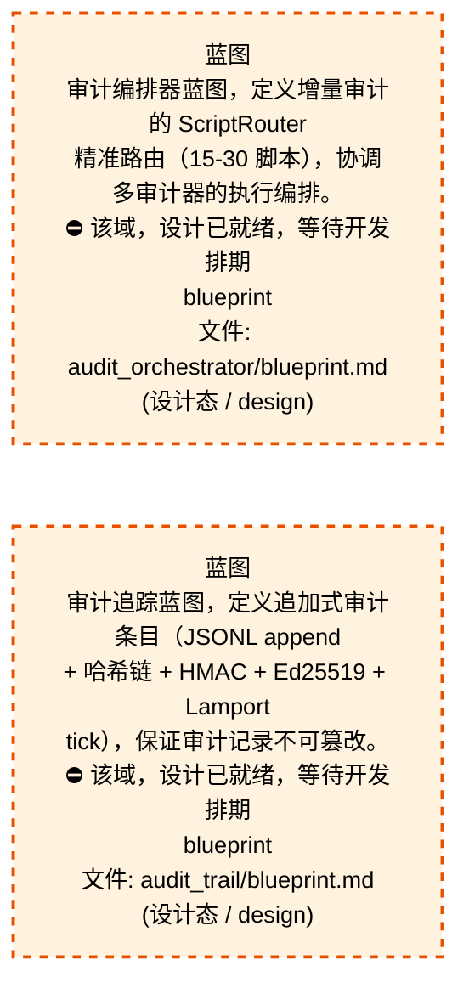

# 50_d_gov_audit / 审计追踪域 / Audit Trail

> **功能简介 / Overview**: 审计追踪，负责变更审计追踪和操作日志管理

> **文档作用 / Purpose**: 展示 审计追踪（D_GOV_AUDIT）功能域的域内依赖关系、跨域依赖关系，模块信息（成熟度/中英文名/大白话/文件路径）内嵌于 Mermaid 节点，供架构审查和域治理参考。

> 本文档由 generate_domain_doc.py 从 depgraph (PostgreSQL) 自动生成
> 数据源: depgraph (PostgreSQL) nodes表 + edges表

> **[可缩放 HTML 版 / Zoomable HTML](http://localhost:8765/docs/02_enterprise_architecture/02_domain_architecture_docs/_zoomable_html/50_d_gov_audit.html)** — Ctrl+滚轮缩放 ｜ 双击重置 ｜ Ctrl+Shift+D 切换拖动/选择模式

## 域基本信息 / Domain Overview

| 字段 | 值 | Field | Value |
|------|------|-------|-------|
| 编号 | 50 | Number | 50 |
| 域ID | D_GOV_AUDIT | Domain ID | D_GOV_AUDIT |
| 域名称 | 审计追踪 | Domain Name | Audit Trail |
| 层级 | L2 业务域层 | Layer | L2 Domain |
| 模块数 | 125 | Module Count | 125 |
| 域内依赖 | 105 | Internal Dependencies | 105 |
| 跨域入边 | 71 | Cross-domain Incoming | 71 |
| 跨域出边 | 112 | Cross-domain Outgoing | 112 |
| 设计态模块 | 2 | Design Modules | 2 |
| 生产态模块 | 123 | Production Modules | 123 |
| 容量 | 123/150 (正常) | Capacity | 123/150 (正常) |
| 描述 | 审计管线编排 | Description | 审计管线编排 |

## 域内依赖图 / Internal Dependency Diagram

> 依赖图内嵌在本文档中，IDE 可直接渲染；网页版可 Ctrl+滚轮缩放 + 拖动平移查看细节。
>
> **图例说明 / Legend**：
> - 🟦 **蓝色 = 运营态模块**（production，已上线运行）
> - 🟧 **橙色虚线 = 设计态模块**（design，蓝图阶段，代码未写）
> - **实线箭头 = 运营态依赖**（已生效的依赖关系）
> - **虚线箭头 = 非运营态依赖**（计划中/验证中的依赖关系）

### 全景图（全部模块，颜色区分运营态/设计态）

> 展示全部 125 个模块（生产态 123 + 设计态 2），含跨域依赖外部节点。节点含成熟度+名称+大白话/简介+文件路径。

```mermaid
%%{init: {'theme': 'base', 'themeVariables': {'primaryColor': '#eaeaea', 'primaryTextColor': '#333333', 'primaryBorderColor': '#666666', 'lineColor': '#666666', 'secondaryColor': '#eaeaea', 'tertiaryColor': '#eaeaea', 'fontSize': '14px'}}}%%
flowchart TD
    docs_03_modules_cross_layer_audit_orchestrator_blueprint_md["蓝图<br/>审计编排器蓝图，定义增量审计的 ScriptRouter<br/>精准路由（15-30 脚本），协调多审计器的执行编排。<br/>⛔ 该域，设计已就绪，等待开发排期<br/>blueprint<br/>文件: audit_orchestrator/blueprint.md<br/>(设计态 / design)"]
    docs_03_modules_domain_governance_audit_trail_blueprint_md["蓝图<br/>审计追踪蓝图，定义追加式审计条目（JSONL append<br/>+ 哈希链 + HMAC + Ed25519 + Lamport<br/>tick），保证审计记录不可篡改。<br/>⛔ 该域，设计已就绪，等待开发排期<br/>blueprint<br/>文件: audit_trail/blueprint.md<br/>(设计态 / design)"]
    scripts_governance_repair_audit_design_completeness_py["审计designcompleteness<br/>(INVARIANTS) 按path精确匹配+按功能名模糊匹配;<br/>输出差距报告; 提取所有ID格式<br/>audit_design_completeness<br/>文件: repair/audit_design_completeness.py<br/>(生产态 / production)"]
    scripts_governance_repair_red_blue_test_py["(INVARIANTS) 20项红蓝对抗测试<br/>数据库查询类测试<br/>red_blue_test<br/>文件: repair/red_blue_test.py<br/>(生产态 / production)"]
    scripts_governance_repair_rollback_depgraph_py["回滚依赖图<br/>(INVARIANTS) 仅接受depgraph.backup.*路径;<br/>回滚前自动备份当前depgraph<br/>rollback_depgraph<br/>文件: repair/rollback_depgraph.py<br/>(生产态 / production)"]
    scripts_governance_test_remediation_progress_smoke_py["测试修复进度smoke<br/>1 治本进度 reconciler end-to-end smoke test<br/>test_remediation_progress_smoke<br/>文件: governance<br/>/test_remediation_progress_smoke.py<br/>(生产态 / production)"]
    src_zephyr_gov_audit_orchestrator_compat_py["编排器兼容<br/>audit-orchestrator 兼容重导出层（ARCH-042 阶段4<br/>修复双 MODULE，ARCH-043 Risk3 改名）<br/>_orchestrator_compat<br/>文件: gov_audit/_orchestrator_compat.py<br/>(生产态 / production)"]
    src_zephyr_gov_audit_action_history_py["行为历史<br/>ActionHistory — 操作历史持久化审计 + 去重 +<br/>循环检测<br/>action_history<br/>文件: gov_audit/action_history.py<br/>(生产态 / production)"]
    src_zephyr_gov_audit_api_lifecycle_py["API生命周期<br/>审计的状态机，管理状态流转<br/>api_lifecycle<br/>文件: gov_audit/api_lifecycle.py<br/>(生产态 / production)"]
    src_zephyr_gov_audit_audit_schema_py["审计模式<br/>audit_schema — 审计视图与查询入口（SH-DB-001<br/>v2.0）<br/>文件: gov_audit/audit_schema.py<br/>(生产态 / production)"]
    src_zephyr_gov_audit_audit_write_failure_protector_py["审计write故障protector<br/>Audit Write Failure Protector — v0.13.0<br/>审计写入失败保护器。<br/>audit_write_failure_protector<br/>文件: gov_audit/audit_write_failure_protector.py<br/>(生产态 / production)"]
    src_zephyr_gov_audit_bridges_audit_anomaly_py["审计异常<br/>审计治理（audit anomaly）<br/>audit_anomaly<br/>文件: bridges/audit_anomaly.py<br/>(生产态 / production)"]
    src_zephyr_gov_audit_bridges_audit_contracts_py["审计契约<br/>G-CT-001 契约消费端 — Audit.write() 公共接口.<br/>audit_contracts<br/>文件: bridges/audit_contracts.py<br/>(生产态 / production)"]
    src_zephyr_gov_audit_bridges_audit_delegation_bridge_py["审计delegation桥接<br/>蓝图 D-020-16 — 委托链审计（深度控制 +<br/>权限缩小）。<br/>audit_delegation_bridge<br/>文件: bridges/audit_delegation_bridge.py<br/>(生产态 / production)"]
    src_zephyr_gov_audit_bridges_audit_drift_bridge_py["审计漂移桥接<br/>蓝图 §2.6 · 审计异常 ↔ 漂移检测双向联动<br/>audit_drift_bridge<br/>文件: bridges/audit_drift_bridge.py<br/>(生产态 / production)"]
    src_zephyr_gov_audit_bridges_audit_feedback_bridge_py["审计反馈桥接<br/>蓝图 §5 Evolve 支柱 — 审计异常数据驱动 FLE<br/>策略演进。<br/>audit_feedback_bridge<br/>文件: bridges/audit_feedback_bridge.py<br/>(生产态 / production)"]
    src_zephyr_gov_audit_bridges_audit_tiered_storage_bridge_py["审计tiered存储桥接<br/>蓝图 D-020-10 — 三层存储架构（热≤7d / 温8~90d /<br/>冷>90d）。<br/>audit_tiered_storage_bridge<br/>文件: bridges/audit_tiered_storage_bridge.py<br/>(生产态 / production)"]
    src_zephyr_gov_audit_bridges_audit_trust_bridge_py["审计信任桥接<br/>蓝图 §2.3 D-020-17 — 渐进信任分数(0.0~1.0) +<br/>时间衰减。<br/>audit_trust_bridge<br/>文件: bridges/audit_trust_bridge.py<br/>(生产态 / production)"]
    src_zephyr_gov_audit_changelog_manager_py["changelog管理器<br/>审计的日志器，记录运行日志<br/>changelog_manager<br/>文件: gov_audit/changelog_manager.py<br/>(生产态 / production)"]
    src_zephyr_gov_audit_cli_py["gov_audit/cli<br/>审计 CLI，提供 health/admit/pool_stats<br/>/run_audit 子命令，以及 search/verify/stats<br/>/trail/query 等查询命令，供终端、CI/CD、MCP<br/>工具调用。<br/>文件: gov_audit/cli.py<br/>(生产态 / production)"]
    src_zephyr_gov_audit_code_archaeology_py["代码archaeology<br/>审计的记录器，把发生的事件/结果记下来留档<br/>code_archaeology<br/>文件: gov_audit/code_archaeology.py<br/>(生产态 / production)"]
    src_zephyr_gov_audit_cold_start_py["冷启动<br/>BootstrapCache — 审计冷启动共享单例缓存。<br/>cold_start<br/>文件: gov_audit/cold_start.py<br/>(生产态 / production)"]
    src_zephyr_gov_audit_compliance_map_py["合规map<br/>合规框架映射器，将审计事件类型映射到 GDPR/HIPAA<br/>/EU AI Act/NIST 的具体条款，支持多框架交叉映射。<br/>compliance_map<br/>文件: gov_audit/compliance_map.py<br/>(生产态 / production)"]
    src_zephyr_gov_audit_corporate_actions_py["公司行为<br/>审计的类型，定义数据类型和枚举<br/>corporate_actions<br/>文件: gov_audit/corporate_actions.py<br/>(生产态 / production)"]
    src_zephyr_gov_audit_delegation_auditor_py["delegation审计器<br/>委托链升级类型 -- str+Enum 使 == 'string_value'<br/>可用.<br/>delegation_auditor<br/>文件: gov_audit/delegation_auditor.py<br/>(生产态 / production)"]
    src_zephyr_gov_audit_dora_metrics_py["dora指标<br/>DORA 指标采集器，统计部署频率、变更前置时间、变<br/>更失败率、平均恢复时间四项研发效能指标并判定是否<br/>达标。<br/>dora_metrics<br/>文件: gov_audit/dora_metrics.py<br/>(生产态 / production)"]
    src_zephyr_gov_audit_evidence_pack_py["证据包<br/>审计证据包导出器，把审计记录导出为 JSON/PDF/FCA<br/>三种合规格式，PDF 需 reportlab 支持。<br/>evidence_pack<br/>文件: gov_audit/evidence_pack.py<br/>(生产态 / production)"]
    src_zephyr_gov_audit_external_tool_audit_py["externaltool审计<br/>外部工具审计器，审计外部工具调用与模块，30<br/>秒超时自动降级，记录工具调用状态（成功/失败<br/>/超时/待定/重试）。<br/>external_tool_audit<br/>文件: gov_audit/external_tool_audit.py<br/>(生产态 / production)"]
    src_zephyr_gov_audit_feedback_policy_py["反馈策略<br/>审计的策略，定义决策规则<br/>文件: gov_audit/feedback_policy.py<br/>(生产态 / production)"]
    src_zephyr_gov_audit_feedback_self_audit_py["反馈自审计<br/>器，检测 Agent<br/>行为与自身反馈形成的自强化反馈环、模块间循环依赖<br/>、以及反馈导致的行为偏差放大<br/>feedback_self_audit<br/>文件: gov_audit/feedback_self_audit.py<br/>(生产态 / production)"]
    src_zephyr_gov_audit_forensic_package_py["取证包<br/>证据包不可篡改;因果图必须完整<br/>forensic_package<br/>文件: gov_audit/forensic_package.py<br/>(生产态 / production)"]
    src_zephyr_gov_audit_genesis_py["audit-trail.genesis — MOD-INF-020 · 创世块管<br/>审计创世块管理器，提供创世块的创建、持久化、验证<br/>能力，含见证签名与验证结果数据模型，作为哈希链的<br/>信任根。<br/>文件: gov_audit/genesis.py<br/>(生产态 / production)"]
    src_zephyr_gov_audit_glossary_matrix_py["词汇表矩阵<br/>术语词汇表矩阵，定义量化/架构/交易/风控<br/>/运维等领域术语（Alpha/Backtest/DMA/FIX/MDD<br/>等）的中英文定义，支持查询与列举。<br/>glossary_matrix<br/>文件: gov_audit/glossary_matrix.py<br/>(生产态 / production)"]
    src_zephyr_gov_audit_incremental_review_py["incremental审查<br/>增量审查器，按一致性（语义割裂）、准确性<br/>（数字引用）、可追溯性（正反向链路）、无下降<br/>（对比上次）四维度做增量审查。<br/>incremental_review<br/>文件: gov_audit/incremental_review.py<br/>(生产态 / production)"]
    src_zephyr_gov_audit_integrity_verifier_py["完整性验证器<br/>Integrity Verifier — v0.8.0 代码完整性验证器:<br/>hash校验+diff detection+rollback。<br/>integrity_verifier<br/>文件: gov_audit/integrity_verifier.py<br/>(生产态 / production)"]
    src_zephyr_gov_audit_kb_gate_py["知识库门禁<br/>知识库审计门控，检测 KB<br/>写入中的投毒尝试、验证写入来源可信度、识别可疑的<br/>KB 修改模式。<br/>kb_gate<br/>文件: gov_audit/kb_gate.py<br/>(生产态 / production)"]
    src_zephyr_gov_audit_log_rotation_py["日志rotation<br/>审计日志轮转管理器——按天轮转<br/>events.jsonl，支持压缩和过期清理。<br/>log_rotation<br/>文件: gov_audit/log_rotation.py<br/>(生产态 / production)"]
    src_zephyr_gov_audit_merkle_audit_py["merkle审计<br/>Merkle 审计兼容别名，SSoT 已迁移到 gov_audit 的<br/>MerkleAggregator +<br/>HourlyMerkleAggregator，本模块保留 API<br/>兼容性内部委托。<br/>merkle_audit<br/>文件: gov_audit/merkle_audit.py<br/>(生产态 / production)"]
    src_zephyr_gov_audit_observability_dashboard_py["可观测性仪表盘<br/>配置，定义系统健康/成本/订单流/模型漂移等面板与<br/>SLI 指标（内存/磁盘IO/上下文长度/token 消耗等）<br/>observability_dashboard<br/>文件: gov_audit/observability_dashboard.py<br/>(生产态 / production)"]
    src_zephyr_gov_audit_pipeline_runner_py["管线运行器<br/>审计的结果，封装操作结果的数据结构（pipeline<br/>runner）<br/>pipeline_runner<br/>文件: gov_audit/pipeline_runner.py<br/>(生产态 / production)"]
    src_zephyr_gov_audit_privacy_py["审计轨迹·隐私模块<br/>gov audit相关功能（privacy）<br/>文件: gov_audit/privacy.py<br/>(生产态 / production)"]
    src_zephyr_gov_audit_provenance_tracker_py["溯源追踪器<br/>provenance追踪器，审计的记录器，把发生的事件<br/>/结果记下来留档。<br/>provenance_tracker<br/>文件: gov_audit/provenance_tracker.py<br/>(生产态 / production)"]
    src_zephyr_gov_audit_replay_engine_py["重放快照（补全测试期望接口）。<br/>重放结果（补全测试期望接口）。<br/>replay_engine<br/>文件: gov_audit/replay_engine.py<br/>(生产态 / production)"]
    src_zephyr_gov_audit_retention_py["保留策略（补全测试期望接口）。<br/>保留旧版 HOT/WARM/COLD/LOG_RETENTION_DAYS<br/>类属性以兼容现有调用方。<br/>文件: gov_audit/retention.py<br/>(生产态 / production)"]
    src_zephyr_gov_audit_sbom_generator_py["sbom生成器<br/>LicenseType 枚举——许可证类型定义（P3<br/>价值审判退役残留）。<br/>sbom_generator<br/>文件: gov_audit/sbom_generator.py<br/>(生产态 / production)"]
    src_zephyr_gov_audit_spec_auditor_py["spec审计器<br/>Agent 规格审计器，record_agent_spec 记录 agent<br/>能力声明到审计链，是 gov_audit<br/>内部规格登记入口。<br/>spec_auditor<br/>文件: gov_audit/spec_auditor.py<br/>(生产态 / production)"]
    src_zephyr_gov_audit_supply_chain_py["supply链<br/>蓝图 D-020-23 · 包安装检测 + SHA-256 完整性验证<br/>supply_chain<br/>文件: gov_audit/supply_chain.py<br/>(生产态 / production)"]
    src_zephyr_gov_audit_supply_chain_security_py["supplychain安全<br/>供应链安全审计器，扫描依赖锁文件、检测厂商锁定风<br/>险（WARNING/CRITICAL）、生成 SPDX物料清单。<br/>supply_chain_security<br/>文件: gov_audit/supply_chain_security.py<br/>(生产态 / production)"]
    src_zephyr_gov_audit_trust_ring_manager_py["trustring管理器<br/>实现业务功能（trust ring）<br/>trust_ring_manager<br/>文件: gov_audit/trust_ring_manager.py<br/>(生产态 / production)"]
    src_zephyr_gov_audit_wqa_scorer_py["wqa评分器<br/>主要提供composite、rating等功能<br/>wqa_scorer<br/>文件: gov_audit/wqa_scorer.py<br/>(生产态 / production)"]
    src_zephyr_gov_enforcement_behavioral_admission_ai_code_standards_py["ai代码standards<br/>AI 代码生成标准规则，定义脚手架自动生成、禁止<br/>demo 注释、测试必须 TDD 先 fail 后 pass 等规则。<br/>ai_code_standards<br/>文件: behavioral_admission/ai_code_standards.py<br/>(生产态 / production)"]
    src_zephyr_gov_enforcement_behavioral_admission_mcp_result_push_py["MCP结果推送<br/>治理执行的异常，定义本模块的异常类型<br/>mcp_result_push<br/>文件: behavioral_admission/mcp_result_push.py<br/>(生产态 / production)"]
    src_zephyr_gov_enforcement_behavioral_admission_post_process_py["提交进程<br/>— AI 生成代码后处理管道（Phase 13 / 盲点 B31）<br/>post_process<br/>文件: behavioral_admission/post_process.py<br/>(生产态 / production)"]
    src_zephyr_gov_enforcement_behavioral_admission_vibe_coding_enforcer_py["vibecoding执行器<br/>治理执行的核心类，封装VibeRuleLevel相关逻辑<br/>vibe_coding_enforcer<br/>文件: behavioral_admission<br/>/vibe_coding_enforcer.py<br/>(生产态 / production)"]
    src_zephyr_gov_enforcement_rule_enforcement_audit_chain_verifier_py["审计链验证器<br/>审计链验证工具——独立重放门禁判定+Hash链完整性校<br/>验（beta）<br/>audit_chain_verifier<br/>文件: rule_enforcement/audit_chain_verifier.py<br/>(生产态 / production)"]
    src_zephyr_gov_enforcement_rule_enforcement_sys_master_compliance_py["sys主合规<br/>依据：SYS-MASTER-CMP gate——系统总蓝图合规门禁<br/>SYS-MASTER-001 Compliance Checker<br/>文件: rule_enforcement/sys_master_compliance.py<br/>(生产态 / production)"]
    src_zephyr_governance_audit_trail_contracts_py["契约<br/>Audit 契约兼容转发层<br/>（G-CT-002），把审计契约符号 re-export 到<br/>audit-trail 入口，老导入路径不用改。<br/>contracts<br/>文件: audit-trail/contracts.py<br/>(生产态 / production)"]
    src_zephyr_governance_audit_ai_error_pattern_library_py["AI错误模式库<br/>AI 错误模式库（只读查询接口）。<br/>ai_error_pattern_library<br/>文件: audit/ai_error_pattern_library.py<br/>(生产态 / production)"]
    src_zephyr_governance_audit_blueprint_status_transition_reconciler_py["蓝图状态转换协调器<br/>蓝图状态单调推进 reconciler<br/>（P1-d，2026-07-21）。<br/>blueprint_status_transition_reconciler<br/>文件: audit<br/>/blueprint_status_transition_reconciler.py<br/>(生产态 / production)"]
    src_zephyr_governance_audit_cross_layer_contract_signature_reconciler_py["跨layercontractsignature对账器<br/>跨层契约签名漂移检测 reconciler<br/>（P1-b，2026-07-21）。<br/>文件: audit<br/>/cross_layer_contract_signature_reconciler.py<br/>(生产态 / production)"]
    src_zephyr_governance_audit_dead_public_wrapper_reconciler_py["死公共 wrapper 自动检测 reconciler.<br/>#ARCH-STAGE4-PUBLIC-WRAPPER-DEAD-CODE-001<br/>防复发自动化：post-commit 事件触发， 扫描 src<br/>/zephyr/ 下所有 Python 文件，检测'死公共<br/>wrapper'——即公共函数（无下划线<br/>前缀）包裹同名私有函数<br/>（_前缀），但无任何外部调用方的 wrapper<br/>文件: audit/dead_public_wrapper_reconciler.py<br/>(生产态 / production)"]
    src_zephyr_governance_audit_default_attribution_engine_py["默认attribution引擎<br/>收敛双定义——reporting.default_attribution_engine<br/>为真源（蓝图 MOD-L07-001），<br/>文件: audit/default_attribution_engine.py<br/>(生产态 / production)"]
    src_zephyr_governance_audit_default_tca_engine_py["默认tca引擎<br/>收敛双定义——reporting.default_tca_engine<br/>为真源（蓝图 MOD-L07-001），<br/>文件: audit/default_tca_engine.py<br/>(生产态 / production)"]
    src_zephyr_governance_audit_git_performance_monitor_reconciler_py["Git绩效监控协调器<br/>git 性能持续监控 + 早期预警<br/>（ARCH-GIT-CALL-BUDGET P3.5，2026-07-19）。<br/>git_performance_monitor_reconciler<br/>文件: audit<br/>/git_performance_monitor_reconciler.py<br/>(生产态 / production)"]
    src_zephyr_governance_audit_runtime_violation_snapshot_reconciler_py["运行时违规快照协调器<br/>trae_060 §5 的'违规清单'是 2026-06-26<br/>的静态快照，写入 frozen YAML 后持续脱节<br/>runtime_violation_snapshot_reconciler<br/>文件: audit<br/>/runtime_violation_snapshot_reconciler.py<br/>(生产态 / production)"]
    src_zephyr_governance_audit_snapshot_manager_py["快照管理器<br/>定期将事件流折叠结果持久化到 task_snapshots<br/>表，加速后续 replay。<br/>snapshot_manager<br/>文件: audit/snapshot_manager.py<br/>(生产态 / production)"]
    src_zephyr_governance_audit_translation_coverage_reconciler_py["翻译覆盖率存量对账 reconciler.<br/>translation_coverage_reconciler.py —<br/>翻译覆盖率存量对账 reconciler.<br/>文件: audit/translation_coverage_reconciler.py<br/>(生产态 / production)"]
    src_zephyr_governance_audit_workspace_hygiene_reconciler_py["工作区hygiene对账器<br/>工作区卫生自动清理 reconciler<br/>（DEBT-WORKSPACE-001/002 消除，2026-07-20）。<br/>workspace_hygiene_reconciler<br/>文件: audit/workspace_hygiene_reconciler.py<br/>(生产态 / production)"]
    src_zephyr_governance_financial_governance_financial_compliance_py["金融合规<br/>financial合规，治理的核心类，封装ComplianceLayer<br/>相关逻辑。<br/>financial_compliance<br/>文件: financial_governance<br/>/financial_compliance.py<br/>(生产态 / production)"]
    src_zephyr_governance_semantic_audit_compliance_map_py["合规map<br/>语义审计的合规框架映射器，将审计事件映射到 GDPR<br/>/HIPAA/EU AI Act/NIST 条款，支持多框架交叉映射。<br/>compliance_map<br/>文件: semantic_audit/compliance_map.py<br/>(生产态 / production)"]
    src_zephyr_governance_semantic_audit_feedback_self_audit_py["反馈自审计<br/>语义审计的反馈自审计器，检测自强化反馈环、循环依<br/>赖、异常放大，与 gov_audit 版本对齐。<br/>feedback_self_audit<br/>文件: semantic_audit/feedback_self_audit.py<br/>(生产态 / production)"]
    src_zephyr_governance_semantic_audit_fix_result_prioritizer_py["修复结果prioritizer<br/>修复优先级排序器：四维排序<br/>severity->impact->urgency->dependency_depth<br/>文件: semantic_audit/fix_result_prioritizer.py<br/>(生产态 / production)"]
    src_zephyr_governance_semantic_audit_orchestrator_py["编排器<br/>SemanticAuditor 编排器——9阶段管道统一调度.<br/>orchestrator<br/>文件: semantic_audit/orchestrator.py<br/>(生产态 / production)"]
    src_zephyr_governance_semantic_audit_privacy_py["审计轨迹·隐私模块<br/>semantic audit相关功能（privacy）<br/>文件: semantic_audit/privacy.py<br/>(生产态 / production)"]
    src_zephyr_governance_semantic_audit_semantic_cache_py["semantic缓存<br/>审计的缓存，暂存常用数据加速访问<br/>semantic_cache<br/>文件: semantic_audit/semantic_cache.py<br/>(生产态 / production)"]
    src_zephyr_governance_semantic_audit_spec_auditor_py["spec审计器<br/>蓝图 文件清单与代码双向对齐<br/>spec_auditor<br/>文件: semantic_audit/spec_auditor.py<br/>(生产态 / production)"]
    tests_governance_audit_test_error_pattern_id_column_py["测试错误patternidcolumn<br/>error_pattern_id 列幂等迁移单测（P4-1a）<br/>test_error_pattern_id_column<br/>文件: audit/test_error_pattern_id_column.py<br/>(生产态 / production)"]
    tests_governance_audit_test_p3_integration_smoke_py["测试p3集成smoke<br/>验证 Phase 3 三个核心组件的端到端集成链路：<br/>test_p3_integration_smoke<br/>文件: audit/test_p3_integration_smoke.py<br/>(生产态 / production)"]
    tests_governance_audit_test_reconcile_async_py["测试对账异步<br/>1. reconcile_runner.write_status_file /<br/>read_status_file 原子读写 + 僵尸判定<br/>test_reconcile_async<br/>文件: audit/test_reconcile_async.py<br/>(生产态 / production)"]
    tests_governance_audit_test_reconcile_worker_selfheal_py["测试对账工作进程selfheal<br/>clean 记录消解之前的 critical_warn<br/>（活跃告警查询返回 0）<br/>test_reconcile_worker_selfheal<br/>文件: audit/test_reconcile_worker_selfheal.py<br/>(生产态 / production)"]
    tests_governance_audit_test_trae_069_threshold_sync_smoke_py["测试trae069thresholdsyncsmoke<br/>trae_069 YAML 真源→代码常量同步 smoke test<br/>test_trae_069_threshold_sync_smoke<br/>文件: audit<br/>/test_trae_069_threshold_sync_smoke.py<br/>(生产态 / production)"]
    tests_governance_rule_bridge_test_session_worktree_async_reconcile_py["测试会话worktree异步对账<br/>卡 2-5min。治本改为异步<br/>launch_reconcile_async，merge 立即返回。<br/>test_session_worktree_async_reconcile<br/>文件: rule_bridge<br/>/test_session_worktree_async_reconcile.py<br/>(生产态 / production)"]
    tests_governance_test_workspace_telemetry_shared_py["测试工作区遥测共享<br/>治理管控（test workspace telemetry shared）<br/>test_workspace_telemetry_shared<br/>文件: governance<br/>/test_workspace_telemetry_shared.py<br/>(生产态 / production)"]
    docs_03_modules_cross_layer_audit_orchestrator_blueprint_md ~~~ docs_03_modules_domain_governance_audit_trail_blueprint_md
    docs_03_modules_domain_governance_audit_trail_blueprint_md ~~~ scripts_governance_repair_audit_design_completeness_py
    scripts_governance_repair_audit_design_completeness_py ~~~ scripts_governance_repair_red_blue_test_py
    scripts_governance_repair_red_blue_test_py ~~~ scripts_governance_repair_rollback_depgraph_py
    scripts_governance_repair_rollback_depgraph_py ~~~ scripts_governance_test_remediation_progress_smoke_py
    scripts_governance_test_remediation_progress_smoke_py ~~~ src_zephyr_gov_audit_orchestrator_compat_py
    src_zephyr_gov_audit_orchestrator_compat_py ~~~ src_zephyr_gov_audit_action_history_py
    src_zephyr_gov_audit_action_history_py ~~~ src_zephyr_gov_audit_api_lifecycle_py
    src_zephyr_gov_audit_api_lifecycle_py ~~~ src_zephyr_gov_audit_audit_schema_py
    src_zephyr_gov_audit_audit_schema_py ~~~ src_zephyr_gov_audit_audit_write_failure_protector_py
    src_zephyr_gov_audit_audit_write_failure_protector_py ~~~ src_zephyr_gov_audit_bridges_audit_anomaly_py
    src_zephyr_gov_audit_bridges_audit_anomaly_py ~~~ src_zephyr_gov_audit_bridges_audit_contracts_py
    src_zephyr_gov_audit_bridges_audit_contracts_py ~~~ src_zephyr_gov_audit_bridges_audit_delegation_bridge_py
    src_zephyr_gov_audit_bridges_audit_delegation_bridge_py ~~~ src_zephyr_gov_audit_bridges_audit_drift_bridge_py
    src_zephyr_gov_audit_bridges_audit_drift_bridge_py ~~~ src_zephyr_gov_audit_bridges_audit_feedback_bridge_py
    src_zephyr_gov_audit_bridges_audit_feedback_bridge_py ~~~ src_zephyr_gov_audit_bridges_audit_tiered_storage_bridge_py
    src_zephyr_gov_audit_bridges_audit_tiered_storage_bridge_py ~~~ src_zephyr_gov_audit_bridges_audit_trust_bridge_py
    src_zephyr_gov_audit_bridges_audit_trust_bridge_py ~~~ src_zephyr_gov_audit_changelog_manager_py
    src_zephyr_gov_audit_changelog_manager_py ~~~ src_zephyr_gov_audit_cli_py
    src_zephyr_gov_audit_cli_py ~~~ src_zephyr_gov_audit_code_archaeology_py
    src_zephyr_gov_audit_code_archaeology_py ~~~ src_zephyr_gov_audit_cold_start_py
    src_zephyr_gov_audit_cold_start_py ~~~ src_zephyr_gov_audit_compliance_map_py
    src_zephyr_gov_audit_compliance_map_py ~~~ src_zephyr_gov_audit_corporate_actions_py
    src_zephyr_gov_audit_corporate_actions_py ~~~ src_zephyr_gov_audit_delegation_auditor_py
    src_zephyr_gov_audit_delegation_auditor_py ~~~ src_zephyr_gov_audit_dora_metrics_py
    src_zephyr_gov_audit_dora_metrics_py ~~~ src_zephyr_gov_audit_evidence_pack_py
    src_zephyr_gov_audit_evidence_pack_py ~~~ src_zephyr_gov_audit_external_tool_audit_py
    src_zephyr_gov_audit_external_tool_audit_py ~~~ src_zephyr_gov_audit_feedback_policy_py
    src_zephyr_gov_audit_feedback_policy_py ~~~ src_zephyr_gov_audit_feedback_self_audit_py
    src_zephyr_gov_audit_feedback_self_audit_py ~~~ src_zephyr_gov_audit_forensic_package_py
    src_zephyr_gov_audit_forensic_package_py ~~~ src_zephyr_gov_audit_genesis_py
    src_zephyr_gov_audit_genesis_py ~~~ src_zephyr_gov_audit_glossary_matrix_py
    src_zephyr_gov_audit_glossary_matrix_py ~~~ src_zephyr_gov_audit_incremental_review_py
    src_zephyr_gov_audit_incremental_review_py ~~~ src_zephyr_gov_audit_integrity_verifier_py
    src_zephyr_gov_audit_integrity_verifier_py ~~~ src_zephyr_gov_audit_kb_gate_py
    src_zephyr_gov_audit_kb_gate_py ~~~ src_zephyr_gov_audit_log_rotation_py
    src_zephyr_gov_audit_log_rotation_py ~~~ src_zephyr_gov_audit_merkle_audit_py
    src_zephyr_gov_audit_merkle_audit_py ~~~ src_zephyr_gov_audit_observability_dashboard_py
    src_zephyr_gov_audit_observability_dashboard_py ~~~ src_zephyr_gov_audit_pipeline_runner_py
    src_zephyr_gov_audit_pipeline_runner_py ~~~ src_zephyr_gov_audit_privacy_py
    src_zephyr_gov_audit_privacy_py ~~~ src_zephyr_gov_audit_provenance_tracker_py
    src_zephyr_gov_audit_provenance_tracker_py ~~~ src_zephyr_gov_audit_replay_engine_py
    src_zephyr_gov_audit_replay_engine_py ~~~ src_zephyr_gov_audit_retention_py
    src_zephyr_gov_audit_retention_py ~~~ src_zephyr_gov_audit_sbom_generator_py
    src_zephyr_gov_audit_sbom_generator_py ~~~ src_zephyr_gov_audit_spec_auditor_py
    src_zephyr_gov_audit_spec_auditor_py ~~~ src_zephyr_gov_audit_supply_chain_py
    src_zephyr_gov_audit_supply_chain_py ~~~ src_zephyr_gov_audit_supply_chain_security_py
    src_zephyr_gov_audit_supply_chain_security_py ~~~ src_zephyr_gov_audit_trust_ring_manager_py
    src_zephyr_gov_audit_trust_ring_manager_py ~~~ src_zephyr_gov_audit_wqa_scorer_py
    src_zephyr_gov_audit_wqa_scorer_py ~~~ src_zephyr_gov_enforcement_behavioral_admission_ai_code_standards_py
    src_zephyr_gov_enforcement_behavioral_admission_ai_code_standards_py ~~~ src_zephyr_gov_enforcement_behavioral_admission_mcp_result_push_py
    src_zephyr_gov_enforcement_behavioral_admission_mcp_result_push_py ~~~ src_zephyr_gov_enforcement_behavioral_admission_post_process_py
    src_zephyr_gov_enforcement_behavioral_admission_post_process_py ~~~ src_zephyr_gov_enforcement_behavioral_admission_vibe_coding_enforcer_py
    src_zephyr_gov_enforcement_behavioral_admission_vibe_coding_enforcer_py ~~~ src_zephyr_gov_enforcement_rule_enforcement_audit_chain_verifier_py
    src_zephyr_gov_enforcement_rule_enforcement_audit_chain_verifier_py ~~~ src_zephyr_gov_enforcement_rule_enforcement_sys_master_compliance_py
    src_zephyr_gov_enforcement_rule_enforcement_sys_master_compliance_py ~~~ src_zephyr_governance_audit_trail_contracts_py
    src_zephyr_governance_audit_trail_contracts_py ~~~ src_zephyr_governance_audit_ai_error_pattern_library_py
    src_zephyr_governance_audit_ai_error_pattern_library_py ~~~ src_zephyr_governance_audit_blueprint_status_transition_reconciler_py
    src_zephyr_governance_audit_blueprint_status_transition_reconciler_py ~~~ src_zephyr_governance_audit_cross_layer_contract_signature_reconciler_py
    src_zephyr_governance_audit_cross_layer_contract_signature_reconciler_py ~~~ src_zephyr_governance_audit_dead_public_wrapper_reconciler_py
    src_zephyr_governance_audit_dead_public_wrapper_reconciler_py ~~~ src_zephyr_governance_audit_default_attribution_engine_py
    src_zephyr_governance_audit_default_attribution_engine_py ~~~ src_zephyr_governance_audit_default_tca_engine_py
    src_zephyr_governance_audit_default_tca_engine_py ~~~ src_zephyr_governance_audit_git_performance_monitor_reconciler_py
    src_zephyr_governance_audit_git_performance_monitor_reconciler_py ~~~ src_zephyr_governance_audit_runtime_violation_snapshot_reconciler_py
    src_zephyr_governance_audit_runtime_violation_snapshot_reconciler_py ~~~ src_zephyr_governance_audit_snapshot_manager_py
    src_zephyr_governance_audit_snapshot_manager_py ~~~ src_zephyr_governance_audit_translation_coverage_reconciler_py
    src_zephyr_governance_audit_translation_coverage_reconciler_py ~~~ src_zephyr_governance_audit_workspace_hygiene_reconciler_py
    src_zephyr_governance_audit_workspace_hygiene_reconciler_py ~~~ src_zephyr_governance_financial_governance_financial_compliance_py
    src_zephyr_governance_financial_governance_financial_compliance_py ~~~ src_zephyr_governance_semantic_audit_compliance_map_py
    src_zephyr_governance_semantic_audit_compliance_map_py ~~~ src_zephyr_governance_semantic_audit_feedback_self_audit_py
    src_zephyr_governance_semantic_audit_feedback_self_audit_py ~~~ src_zephyr_governance_semantic_audit_fix_result_prioritizer_py
    src_zephyr_governance_semantic_audit_fix_result_prioritizer_py ~~~ src_zephyr_governance_semantic_audit_orchestrator_py
    src_zephyr_governance_semantic_audit_orchestrator_py ~~~ src_zephyr_governance_semantic_audit_privacy_py
    src_zephyr_governance_semantic_audit_privacy_py ~~~ src_zephyr_governance_semantic_audit_semantic_cache_py
    src_zephyr_governance_semantic_audit_semantic_cache_py ~~~ src_zephyr_governance_semantic_audit_spec_auditor_py
    src_zephyr_governance_semantic_audit_spec_auditor_py ~~~ tests_governance_audit_test_error_pattern_id_column_py
    tests_governance_audit_test_error_pattern_id_column_py ~~~ tests_governance_audit_test_p3_integration_smoke_py
    tests_governance_audit_test_p3_integration_smoke_py ~~~ tests_governance_audit_test_reconcile_async_py
    tests_governance_audit_test_reconcile_async_py ~~~ tests_governance_audit_test_reconcile_worker_selfheal_py
    tests_governance_audit_test_reconcile_worker_selfheal_py ~~~ tests_governance_audit_test_trae_069_threshold_sync_smoke_py
    tests_governance_audit_test_trae_069_threshold_sync_smoke_py ~~~ tests_governance_rule_bridge_test_session_worktree_async_reconcile_py
    tests_governance_rule_bridge_test_session_worktree_async_reconcile_py ~~~ tests_governance_test_workspace_telemetry_shared_py
    src_zephyr_gov_audit_anomaly_py["异常<br/>签名枚举——治本（裁定#18 G3）：转为真 Enum 对齐<br/>test_audit_anomaly.py 契约<br/>文件: gov_audit/anomaly.py<br/>(生产态 / production)"]
    src_zephyr_gov_audit_audit_admission_controller_py["审计准入控制器<br/>审计的结果，封装操作结果的数据结构（audit<br/>admission）<br/>audit_admission_controller<br/>文件: gov_audit/audit_admission_controller.py<br/>(生产态 / production)"]
    src_zephyr_gov_audit_bridge_py["写入核心审计链——治本（裁定#18 G7 + 5.37.1）<br/>真实落盘 events.jsonl<br/>bridge<br/>文件: gov_audit/bridge.py<br/>(生产态 / production)"]
    src_zephyr_gov_audit_event_store_py["事件存储<br/>审计治理（event store）<br/>event_store<br/>文件: gov_audit/event_store.py<br/>(生产态 / production)"]
    src_zephyr_gov_audit_query_py["旧版查询引擎（保留以兼容现有调用方）。<br/>元审计日志器（补全测试期望接口）。<br/>query<br/>文件: gov_audit/query.py<br/>(生产态 / production)"]
    src_zephyr_gov_audit_resource_aware_pool_py["资源感知池<br/>管理 GPU futures 等计算资源的感知与调度（Stage<br/>4 公共化只读），为审计准入控制器提供资源视图<br/>resource_aware_pool<br/>文件: gov_audit/resource_aware_pool.py<br/>(生产态 / production)"]
    src_zephyr_gov_audit_text_to_finding_adapter_py["texttofinding适配器<br/>textto发现适配器，审计的解析器，把文本<br/>/数据解析成结构化对象。<br/>text_to_finding_adapter<br/>文件: gov_audit/text_to_finding_adapter.py<br/>(生产态 / production)"]
    src_zephyr_governance_audit_git_helpers_py["Git辅助<br/>审计 reconciler 共享 git 工具模块<br/>_git_helpers<br/>文件: audit/_git_helpers.py<br/>(生产态 / production)"]
    src_zephyr_governance_audit_commit_gateway_abuse_monitor_reconciler_py["commitgatewayabuse监控器对账器<br/>post-commit 事件触发，扫描 ``.runtime<br/>/reconcile_reports/`` 下<br/>``post_commit_guard_*``，治理管控<br/>commit_gateway_abuse_monitor_reconciler<br/>文件: audit<br/>/commit_gateway_abuse_monitor_reconciler.py<br/>(生产态 / production)"]
    src_zephyr_governance_audit_error_pattern_consumer_reconciler_py["错误模式消费者协调器<br/>AI 行为遥测 JSONL 错误事件聚合 consumer。<br/>error_pattern_consumer_reconciler<br/>文件: audit/error_pattern_consumer_reconciler.py<br/>(生产态 / production)"]
    src_zephyr_governance_audit_reconcile_worker_py["对账工作器<br/>独立执行 post-commit reconciler 链路，结果写回<br/>status file + reconcile_execution_log 表。<br/>reconcile_worker<br/>文件: audit/reconcile_worker.py<br/>(生产态 / production)"]
    src_zephyr_governance_audit_remediation_progress_reconciler_py["修复进度对账器<br/>治本进度持久化 + 新鲜度对账<br/>（#ARCH-GOV-CONVERGENCE-META Phase 3.1）。<br/>remediation_progress_reconciler<br/>文件: audit/remediation_progress_reconciler.py<br/>(生产态 / production)"]
    src_zephyr_governance_audit_runtime_violation_snapshot_py["运行时违规快照<br/>病根1 治本（架构债务 §三 病根1）<br/>runtime_violation_snapshot<br/>文件: audit/runtime_violation_snapshot.py<br/>(生产态 / production)"]
    src_zephyr_governance_semantic_audit_alignment_engine_py["对齐引擎<br/>三元对齐检测：蓝图声明清单 vs 磁盘实际文件 vs<br/>import 引用链。<br/>alignment_engine<br/>文件: semantic_audit/alignment_engine.py<br/>(生产态 / production)"]
    src_zephyr_governance_semantic_audit_fix_prioritizer_py["修复prioritizer<br/>按 severity -> certainty -> blast_radius<br/>三级排序,分组输出批次。<br/>fix_prioritizer<br/>文件: semantic_audit/fix_prioritizer.py<br/>(生产态 / production)"]
    src_zephyr_governance_semantic_audit_issue_aggregator_py["收集各阶段审计结果，去重合并排序输出。<br/>语义审计问题聚合器（Stage<br/>5），收集各阶段审计结果，去重、合并、排序后输出<br/>问题清单。<br/>issue_aggregator<br/>文件: semantic_audit/issue_aggregator.py<br/>(生产态 / production)"]
    src_zephyr_governance_semantic_audit_kb_gate_py["知识库门禁<br/>语义审计的 KB<br/>门控，检测知识库投毒、验证写入来源、识别可疑修改<br/>模式，与 gov_audit 版本对齐。<br/>kb_gate<br/>文件: semantic_audit/kb_gate.py<br/>(生产态 / production)"]
    src_zephyr_governance_semantic_audit_llm_bridge_py["接收 RED 问题,生成修复文本。LLM<br/>只润色不做判断。不可用时降级为模板生成<br/>语义审计 LLM 桥接（Stage 6），接收 RED<br/>问题生成修复文本，LLM<br/>只润色不做判断，不可用时降级为模板生成。<br/>llm_bridge<br/>文件: semantic_audit/llm_bridge.py<br/>(生产态 / production)"]
    src_zephyr_governance_semantic_audit_safety_boundary_py["安全boundary<br/>禁碰规则过滤 + 置信度阈值。输入 TriggerResult<br/>列表,输出 SafetyDecision 分类。<br/>safety_boundary<br/>文件: semantic_audit/safety_boundary.py<br/>(生产态 / production)"]
    src_zephyr_governance_semantic_audit_self_healer_py["self愈合器<br/>Stage 7 自愈闭环 — 修复->自测->回滚.<br/>self_healer<br/>文件: semantic_audit/self_healer.py<br/>(生产态 / production)"]
    src_zephyr_governance_semantic_audit_self_health_py["7 SLI + 5 容量 SLI + 退化检测。定时自检,输出<br/>HEALTHY/<br/>DEGRADED/CRITICAL<br/>self_health<br/>文件: semantic_audit/self_health.py<br/>(生产态 / production)"]
    src_zephyr_governance_semantic_audit_trigger_engine_py["监听文件变更，判定是否触发语义审计。<br/>语义审计触发器引擎（Stage<br/>2），监听文件变更并判定是否需要触发语义审计，控<br/>制审计的启动时机。<br/>trigger_engine<br/>文件: semantic_audit/trigger_engine.py<br/>(生产态 / production)"]
    src_zephyr_gov_audit_anomaly_py ~~~ src_zephyr_gov_audit_audit_admission_controller_py
    src_zephyr_gov_audit_audit_admission_controller_py ~~~ src_zephyr_gov_audit_bridge_py
    src_zephyr_gov_audit_bridge_py ~~~ src_zephyr_gov_audit_event_store_py
    src_zephyr_gov_audit_event_store_py ~~~ src_zephyr_gov_audit_query_py
    src_zephyr_gov_audit_query_py ~~~ src_zephyr_gov_audit_resource_aware_pool_py
    src_zephyr_gov_audit_resource_aware_pool_py ~~~ src_zephyr_gov_audit_text_to_finding_adapter_py
    src_zephyr_gov_audit_text_to_finding_adapter_py ~~~ src_zephyr_governance_audit_git_helpers_py
    src_zephyr_governance_audit_git_helpers_py ~~~ src_zephyr_governance_audit_commit_gateway_abuse_monitor_reconciler_py
    src_zephyr_governance_audit_commit_gateway_abuse_monitor_reconciler_py ~~~ src_zephyr_governance_audit_error_pattern_consumer_reconciler_py
    src_zephyr_governance_audit_error_pattern_consumer_reconciler_py ~~~ src_zephyr_governance_audit_reconcile_worker_py
    src_zephyr_governance_audit_reconcile_worker_py ~~~ src_zephyr_governance_audit_remediation_progress_reconciler_py
    src_zephyr_governance_audit_remediation_progress_reconciler_py ~~~ src_zephyr_governance_audit_runtime_violation_snapshot_py
    src_zephyr_governance_audit_runtime_violation_snapshot_py ~~~ src_zephyr_governance_semantic_audit_alignment_engine_py
    src_zephyr_governance_semantic_audit_alignment_engine_py ~~~ src_zephyr_governance_semantic_audit_fix_prioritizer_py
    src_zephyr_governance_semantic_audit_fix_prioritizer_py ~~~ src_zephyr_governance_semantic_audit_issue_aggregator_py
    src_zephyr_governance_semantic_audit_issue_aggregator_py ~~~ src_zephyr_governance_semantic_audit_kb_gate_py
    src_zephyr_governance_semantic_audit_kb_gate_py ~~~ src_zephyr_governance_semantic_audit_llm_bridge_py
    src_zephyr_governance_semantic_audit_llm_bridge_py ~~~ src_zephyr_governance_semantic_audit_safety_boundary_py
    src_zephyr_governance_semantic_audit_safety_boundary_py ~~~ src_zephyr_governance_semantic_audit_self_healer_py
    src_zephyr_governance_semantic_audit_self_healer_py ~~~ src_zephyr_governance_semantic_audit_self_health_py
    src_zephyr_governance_semantic_audit_self_health_py ~~~ src_zephyr_governance_semantic_audit_trigger_engine_py
    src_zephyr_gov_audit_delegation_bridge_py["delegation桥接<br/>委托审计桥接层，报告委托失败与超时事件到审计写入<br/>器，通过 __getattr__ 惰性暴露 AuditWriter<br/>供测试 patch。<br/>delegation_bridge<br/>文件: gov_audit/delegation_bridge.py<br/>(生产态 / production)"]
    src_zephyr_gov_audit_feedback_bridge_py["反馈桥接<br/>只读：anomaly_to_signal 映射表（R5 公共化）。<br/>feedback_bridge<br/>文件: gov_audit/feedback_bridge.py<br/>(生产态 / production)"]
    src_zephyr_gov_audit_finding_ingest_py["发现ingest<br/>审计的结果，封装操作结果的数据结构（finding<br/>ingest）<br/>finding_ingest<br/>文件: gov_audit/finding_ingest.py<br/>(生产态 / production)"]
    src_zephyr_gov_audit_indexer_py["索引重建结果——治本（裁定#18 G5）：对齐 testa<br/>索引重建结果——治本（裁定#18 G5）：对齐<br/>test_audit_indexer.py 契约。<br/>文件: gov_audit/indexer.py<br/>(生产态 / production)"]
    src_zephyr_gov_audit_merkle_hourly_py["audit-trail.merkle每小时<br/>merkle每小时· 每小时 Merkle 聚合<br/>merkle_hourly<br/>文件: gov_audit/merkle_hourly.py<br/>(生产态 / production)"]
    src_zephyr_gov_audit_models_py["审计事件类型枚举——治本（裁定#18 G2）：转为真 Enu<br/>m，values 全部小写<br/>models<br/>文件: gov_audit/models.py<br/>(生产态 / production)"]
    src_zephyr_gov_audit_tiered_storage_bridge_py["tiered存储桥接<br/>分层存储桥接层，不实现存储逻辑，仅转发到<br/>TieredStorage 的 find_report/migrate<br/>/stats，桥接失败返回空结果。<br/>tiered_storage_bridge<br/>文件: gov_audit/tiered_storage_bridge.py<br/>(生产态 / production)"]
    src_zephyr_gov_audit_trust_bridge_py["信任桥接<br/>信任评估桥接层，不实现信任逻辑，仅转发到<br/>TrustEngine 的 evaluate/record<br/>/get_trend，桥接失败返回 UNKNOWN 信任级别。<br/>trust_bridge<br/>文件: gov_audit/trust_bridge.py<br/>(生产态 / production)"]
    src_zephyr_governance_audit_health_score_calculator_py["健康评分计算器<br/>commit gateway 滥用 6 维加权健康度评分<br/>（P3-2，#ARCH-PREVENTABILITY-LAYER-001 Phase<br/>3）。<br/>health_score_calculator<br/>文件: audit/health_score_calculator.py<br/>(生产态 / production)"]
    src_zephyr_governance_audit_reconcile_runner_py["对账运行器<br/>post-commit reconciler 链路（30+ 个<br/>reconciler）在 Windows 上同步执行耗时 30s-2min，<br/>reconcile_runner<br/>文件: audit/reconcile_runner.py<br/>(生产态 / production)"]
    src_zephyr_governance_semantic_audit_reference_extractor_py["AST 解析文件，提取 9 个维度的引用信息。<br/>语义审计引用提取器（Stage 1），用 AST<br/>解析文件提取 9<br/>个维度的引用信息，为后续一致性检查提供输入。<br/>reference_extractor<br/>文件: semantic_audit/reference_extractor.py<br/>(生产态 / production)"]
    src_zephyr_gov_audit_delegation_bridge_py ~~~ src_zephyr_gov_audit_feedback_bridge_py
    src_zephyr_gov_audit_feedback_bridge_py ~~~ src_zephyr_gov_audit_finding_ingest_py
    src_zephyr_gov_audit_finding_ingest_py ~~~ src_zephyr_gov_audit_indexer_py
    src_zephyr_gov_audit_indexer_py ~~~ src_zephyr_gov_audit_merkle_hourly_py
    src_zephyr_gov_audit_merkle_hourly_py ~~~ src_zephyr_gov_audit_models_py
    src_zephyr_gov_audit_models_py ~~~ src_zephyr_gov_audit_tiered_storage_bridge_py
    src_zephyr_gov_audit_tiered_storage_bridge_py ~~~ src_zephyr_gov_audit_trust_bridge_py
    src_zephyr_gov_audit_trust_bridge_py ~~~ src_zephyr_governance_audit_health_score_calculator_py
    src_zephyr_governance_audit_health_score_calculator_py ~~~ src_zephyr_governance_audit_reconcile_runner_py
    src_zephyr_governance_audit_reconcile_runner_py ~~~ src_zephyr_governance_semantic_audit_reference_extractor_py
    src_zephyr_gov_audit_contracts_py["契约<br/>核心审计链写入器——桥接 contracts 层到 writer<br/>实现。<br/>文件: gov_audit/contracts.py<br/>(生产态 / production)"]
    src_zephyr_gov_audit_finding_model_py["发现模型<br/>审计的模型，定义数据结构和字段<br/>finding_model<br/>文件: gov_audit/finding_model.py<br/>(生产态 / production)"]
    src_zephyr_gov_audit_integrity_py["完整性<br/>密码学完整性验证器，做哈希链逐条验证、HMAC-SHA25<br/>6 系统签名验证、Ed25519 Agent 签名验证、Merkle<br/>树聚合校验。<br/>integrity<br/>文件: gov_audit/integrity.py<br/>(生产态 / production)"]
    src_zephyr_gov_audit_tiered_storage_py["旧版分层存储（保留以兼容现有调用方）。<br/>旧版分层存储（兼容保留），按时间分 hot(7天)<br/>/warm(30天)/cold<br/>三层，支持分类、迁移、统计与查找报告。<br/>tiered_storage<br/>文件: gov_audit/tiered_storage.py<br/>(生产态 / production)"]
    src_zephyr_gov_audit_trust_engine_py["信任评分调整记录（补全测试期望接口）。<br/>信任评分引擎，基于历史审计结果和 Merkle<br/>校验计算信任级别（UNKNOWN/UNTRUSTED/MEDIUM/HIGH<br/>/VERIFIED 五级），支持评分调整、衰减与趋势查询。<br/>trust_engine<br/>文件: gov_audit/trust_engine.py<br/>(生产态 / production)"]
    src_zephyr_gov_audit_writer_py["不可变审计写入器——JSONL 追加 + SHA-256 哈<br/>希链 + HMAC-SHA256 签名 + Lamport 时钟<br/>writer<br/>文件: gov_audit/writer.py<br/>(生产态 / production)"]
    src_zephyr_governance_audit_reconciliation_registry_py["对账注册表<br/>审计治理（reconciliation registry）<br/>reconciliation_registry<br/>文件: audit/reconciliation_registry.py<br/>(生产态 / production)"]
    src_zephyr_governance_semantic_audit_models_py["语义审计管线数据模型 — MOD-INF-028 §4.2<br/>所有 Stage 共享的类型定义：Severity /<br/>SafetyDecision / TriggerResult /<br/>models<br/>文件: semantic_audit/models.py<br/>(生产态 / production)"]
    src_zephyr_gov_audit_contracts_py ~~~ src_zephyr_gov_audit_finding_model_py
    src_zephyr_gov_audit_finding_model_py ~~~ src_zephyr_gov_audit_integrity_py
    src_zephyr_gov_audit_integrity_py ~~~ src_zephyr_gov_audit_tiered_storage_py
    src_zephyr_gov_audit_tiered_storage_py ~~~ src_zephyr_gov_audit_trust_engine_py
    src_zephyr_gov_audit_trust_engine_py ~~~ src_zephyr_gov_audit_writer_py
    src_zephyr_gov_audit_writer_py ~~~ src_zephyr_governance_audit_reconciliation_registry_py
    src_zephyr_governance_audit_reconciliation_registry_py ~~~ src_zephyr_governance_semantic_audit_models_py
    src_zephyr_gov_audit_agent_signer_py["代理signer<br/>蓝图 §7 · 每条审计记录的不可否认性约束<br/>agent_signer<br/>文件: gov_audit/agent_signer.py<br/>(生产态 / production)"]
    src_zephyr_governance_audit_blueprint_status_transition_reconciler_py -->|导入依赖 / import_depends| src_zephyr_governance_audit_reconciliation_registry_py
    src_zephyr_governance_audit_blueprint_status_transition_reconciler_py -->|导入依赖 / import_depends| src_zephyr_governance_audit_git_helpers_py
    src_zephyr_governance_audit_dead_public_wrapper_reconciler_py -->|导入依赖 / import_depends| src_zephyr_governance_audit_reconciliation_registry_py
    src_zephyr_governance_audit_ai_error_pattern_library_py -->|导入依赖 / import_depends| src_zephyr_governance_audit_error_pattern_consumer_reconciler_py
    src_zephyr_governance_audit_commit_gateway_abuse_monitor_reconciler_py -->|导入依赖 / import_depends| src_zephyr_governance_audit_health_score_calculator_py
    src_zephyr_governance_audit_commit_gateway_abuse_monitor_reconciler_py -->|导入依赖 / import_depends| src_zephyr_governance_audit_reconciliation_registry_py
    src_zephyr_governance_audit_cross_layer_contract_signature_reconciler_py -->|导入依赖 / import_depends| src_zephyr_governance_audit_reconciliation_registry_py
    src_zephyr_governance_audit_cross_layer_contract_signature_reconciler_py -->|导入依赖 / import_depends| src_zephyr_governance_audit_git_helpers_py
    src_zephyr_governance_audit_error_pattern_consumer_reconciler_py -->|导入依赖 / import_depends| src_zephyr_governance_audit_reconciliation_registry_py
    src_zephyr_governance_audit_git_performance_monitor_reconciler_py -->|导入依赖 / import_depends| src_zephyr_governance_audit_reconciliation_registry_py
    src_zephyr_governance_audit_reconcile_runner_py -->|导入依赖 / import_depends| src_zephyr_governance_audit_reconciliation_registry_py
    src_zephyr_governance_audit_remediation_progress_reconciler_py -->|导入依赖 / import_depends| src_zephyr_governance_audit_reconciliation_registry_py
    src_zephyr_governance_audit_translation_coverage_reconciler_py -->|导入依赖 / import_depends| src_zephyr_governance_audit_reconciliation_registry_py
    src_zephyr_governance_audit_reconcile_worker_py -->|导入依赖 / import_depends| src_zephyr_governance_audit_reconcile_runner_py
    src_zephyr_governance_audit_reconcile_worker_py -->|导入依赖 / import_depends| src_zephyr_governance_audit_reconciliation_registry_py
    src_zephyr_governance_audit_runtime_violation_snapshot_reconciler_py -->|导入依赖 / import_depends| src_zephyr_governance_audit_reconciliation_registry_py
    src_zephyr_governance_audit_runtime_violation_snapshot_reconciler_py -->|导入依赖 / import_depends| src_zephyr_governance_audit_runtime_violation_snapshot_py
    src_zephyr_governance_audit_workspace_hygiene_reconciler_py -->|导入依赖 / import_depends| src_zephyr_governance_audit_reconciliation_registry_py
    src_zephyr_governance_audit_snapshot_manager_py -->|导入依赖 / import_depends| src_zephyr_gov_audit_event_store_py
    src_zephyr_governance_audit_trail_contracts_py -->|导入依赖 / import_depends| src_zephyr_gov_audit_contracts_py
    src_zephyr_governance_semantic_audit_compliance_map_py -->|导入依赖 / import_depends| src_zephyr_gov_audit_models_py
    src_zephyr_governance_semantic_audit_fix_result_prioritizer_py -->|导入依赖 / import_depends| src_zephyr_governance_semantic_audit_models_py
    src_zephyr_governance_semantic_audit_fix_prioritizer_py -->|导入依赖 / import_depends| src_zephyr_governance_semantic_audit_models_py
    src_zephyr_governance_semantic_audit_alignment_engine_py -->|导入依赖 / import_depends| src_zephyr_governance_semantic_audit_models_py
    src_zephyr_governance_semantic_audit_alignment_engine_py -->|导入依赖 / import_depends| src_zephyr_governance_semantic_audit_reference_extractor_py
    src_zephyr_governance_semantic_audit_orchestrator_py -->|导入依赖 / import_depends| src_zephyr_governance_semantic_audit_fix_prioritizer_py
    src_zephyr_governance_semantic_audit_orchestrator_py -->|导入依赖 / import_depends| src_zephyr_governance_semantic_audit_alignment_engine_py
    src_zephyr_governance_semantic_audit_orchestrator_py -->|导入依赖 / import_depends| src_zephyr_governance_semantic_audit_issue_aggregator_py
    src_zephyr_governance_semantic_audit_orchestrator_py -->|导入依赖 / import_depends| src_zephyr_governance_semantic_audit_llm_bridge_py
    src_zephyr_governance_semantic_audit_orchestrator_py -->|导入依赖 / import_depends| src_zephyr_governance_semantic_audit_models_py
    src_zephyr_governance_semantic_audit_orchestrator_py -->|导入依赖 / import_depends| src_zephyr_governance_semantic_audit_self_healer_py
    src_zephyr_governance_semantic_audit_orchestrator_py -->|导入依赖 / import_depends| src_zephyr_governance_semantic_audit_reference_extractor_py
    src_zephyr_governance_semantic_audit_orchestrator_py -->|导入依赖 / import_depends| src_zephyr_governance_semantic_audit_safety_boundary_py
    src_zephyr_governance_semantic_audit_orchestrator_py -->|导入依赖 / import_depends| src_zephyr_governance_semantic_audit_self_health_py
    src_zephyr_governance_semantic_audit_orchestrator_py -->|导入依赖 / import_depends| src_zephyr_governance_semantic_audit_trigger_engine_py
    src_zephyr_governance_semantic_audit_issue_aggregator_py -->|导入依赖 / import_depends| src_zephyr_governance_semantic_audit_models_py
    src_zephyr_governance_semantic_audit_llm_bridge_py -->|导入依赖 / import_depends| src_zephyr_governance_semantic_audit_models_py
    src_zephyr_governance_semantic_audit_reference_extractor_py -->|导入依赖 / import_depends| src_zephyr_governance_semantic_audit_models_py
    src_zephyr_governance_semantic_audit_safety_boundary_py -->|导入依赖 / import_depends| src_zephyr_governance_semantic_audit_models_py
    src_zephyr_governance_semantic_audit_trigger_engine_py -->|导入依赖 / import_depends| src_zephyr_governance_semantic_audit_models_py
    src_zephyr_governance_semantic_audit_trigger_engine_py -->|导入依赖 / import_depends| src_zephyr_governance_semantic_audit_reference_extractor_py
    src_zephyr_gov_audit_audit_write_failure_protector_py -->|导入依赖 / import_depends| src_zephyr_gov_audit_writer_py
    src_zephyr_gov_audit_bridge_py -->|导入依赖 / import_depends| src_zephyr_gov_audit_delegation_bridge_py
    src_zephyr_gov_audit_bridge_py -->|导入依赖 / import_depends| src_zephyr_gov_audit_feedback_bridge_py
    src_zephyr_gov_audit_bridge_py -->|导入依赖 / import_depends| src_zephyr_gov_audit_merkle_hourly_py
    src_zephyr_gov_audit_bridge_py -->|导入依赖 / import_depends| src_zephyr_gov_audit_trust_bridge_py
    src_zephyr_gov_audit_bridge_py -->|导入依赖 / import_depends| src_zephyr_gov_audit_tiered_storage_bridge_py
    src_zephyr_gov_audit_bridge_py -->|导入依赖 / import_depends| src_zephyr_gov_audit_writer_py
    src_zephyr_gov_audit_cli_py -->|导入依赖 / import_depends| src_zephyr_governance_semantic_audit_kb_gate_py
    src_zephyr_gov_audit_cli_py -->|导入依赖 / import_depends| src_zephyr_gov_audit_audit_admission_controller_py
    src_zephyr_gov_audit_cli_py -->|导入依赖 / import_depends| src_zephyr_gov_audit_resource_aware_pool_py
    src_zephyr_gov_audit_audit_admission_controller_py -->|导入依赖 / import_depends| src_zephyr_gov_audit_finding_ingest_py
    src_zephyr_gov_audit_audit_admission_controller_py -->|导入依赖 / import_depends| src_zephyr_gov_audit_finding_model_py
    src_zephyr_gov_audit_compliance_map_py -->|导入依赖 / import_depends| src_zephyr_gov_audit_models_py
    src_zephyr_gov_audit_delegation_bridge_py -->|导入依赖 / import_depends| src_zephyr_gov_audit_writer_py
    src_zephyr_gov_audit_delegation_auditor_py -->|导入依赖 / import_depends| src_zephyr_gov_audit_delegation_bridge_py
    src_zephyr_gov_audit_contracts_py -->|导入依赖 / import_depends| src_zephyr_gov_audit_models_py
    src_zephyr_gov_audit_contracts_py -->|导入依赖 / import_depends| src_zephyr_gov_audit_writer_py
    src_zephyr_gov_audit_feedback_policy_py -->|导入依赖 / import_depends| src_zephyr_gov_audit_feedback_bridge_py
    src_zephyr_gov_audit_finding_ingest_py -->|导入依赖 / import_depends| src_zephyr_gov_audit_finding_model_py
    src_zephyr_gov_audit_finding_ingest_py -->|导入依赖 / import_depends| src_zephyr_gov_audit_writer_py
    src_zephyr_gov_audit_indexer_py -->|导入依赖 / import_depends| src_zephyr_gov_audit_contracts_py
    src_zephyr_gov_audit_merkle_audit_py -->|导入依赖 / import_depends| src_zephyr_gov_audit_integrity_py
    src_zephyr_gov_audit_integrity_py -->|导入依赖 / import_depends| src_zephyr_gov_audit_agent_signer_py
    src_zephyr_gov_audit_integrity_py -->|导入依赖 / import_depends| src_zephyr_gov_audit_writer_py
    src_zephyr_gov_audit_merkle_hourly_py -->|导入依赖 / import_depends| src_zephyr_gov_audit_integrity_py
    src_zephyr_gov_audit_pipeline_runner_py -->|导入依赖 / import_depends| src_zephyr_gov_audit_finding_model_py
    src_zephyr_gov_audit_pipeline_runner_py -->|导入依赖 / import_depends| src_zephyr_gov_audit_text_to_finding_adapter_py
    src_zephyr_gov_audit_query_py -->|导入依赖 / import_depends| src_zephyr_gov_audit_contracts_py
    src_zephyr_gov_audit_query_py -->|导入依赖 / import_depends| src_zephyr_gov_audit_indexer_py
    src_zephyr_gov_audit_query_py -->|导入依赖 / import_depends| src_zephyr_gov_audit_integrity_py
    src_zephyr_gov_audit_query_py -->|导入依赖 / import_depends| src_zephyr_gov_audit_models_py
    src_zephyr_gov_audit_text_to_finding_adapter_py -->|导入依赖 / import_depends| src_zephyr_gov_audit_finding_model_py
    src_zephyr_gov_audit_trust_bridge_py -->|导入依赖 / import_depends| src_zephyr_gov_audit_trust_engine_py
    src_zephyr_gov_audit_tiered_storage_bridge_py -->|导入依赖 / import_depends| src_zephyr_gov_audit_tiered_storage_py
    src_zephyr_gov_audit_orchestrator_compat_py -->|导入依赖 / import_depends| src_zephyr_gov_audit_anomaly_py
    src_zephyr_gov_audit_orchestrator_compat_py -->|导入依赖 / import_depends| src_zephyr_gov_audit_bridge_py
    src_zephyr_gov_audit_orchestrator_compat_py -->|导入依赖 / import_depends| src_zephyr_gov_audit_contracts_py
    src_zephyr_gov_audit_orchestrator_compat_py -->|导入依赖 / import_depends| src_zephyr_gov_audit_indexer_py
    src_zephyr_gov_audit_orchestrator_compat_py -->|导入依赖 / import_depends| src_zephyr_gov_audit_integrity_py
    src_zephyr_gov_audit_orchestrator_compat_py -->|导入依赖 / import_depends| src_zephyr_gov_audit_models_py
    src_zephyr_gov_audit_orchestrator_compat_py -->|导入依赖 / import_depends| src_zephyr_gov_audit_query_py
    src_zephyr_gov_audit_orchestrator_compat_py -->|导入依赖 / import_depends| src_zephyr_gov_audit_writer_py
    src_zephyr_gov_audit_writer_py -->|导入依赖 / import_depends| src_zephyr_gov_audit_contracts_py
    src_zephyr_gov_audit_writer_py -->|导入依赖 / import_depends| src_zephyr_gov_audit_integrity_py
    src_zephyr_gov_audit_writer_py -->|导入依赖 / import_depends| src_zephyr_gov_audit_models_py
    src_zephyr_gov_audit_bridges_audit_contracts_py -->|导入依赖 / import_depends| src_zephyr_gov_audit_writer_py
    src_zephyr_gov_audit_bridges_audit_drift_bridge_py -->|导入依赖 / import_depends| src_zephyr_gov_audit_anomaly_py
    src_zephyr_gov_audit_bridges_audit_delegation_bridge_py -->|导入依赖 / import_depends| src_zephyr_gov_audit_delegation_bridge_py
    src_zephyr_gov_audit_bridges_audit_feedback_bridge_py -->|导入依赖 / import_depends| src_zephyr_gov_audit_anomaly_py
    src_zephyr_gov_audit_bridges_audit_feedback_bridge_py -->|导入依赖 / import_depends| src_zephyr_gov_audit_query_py
    src_zephyr_gov_enforcement_rule_enforcement_audit_chain_verifier_py -->|导入依赖 / import_depends| src_zephyr_gov_audit_writer_py
    scripts_governance_test_remediation_progress_smoke_py -->|导入依赖 / import_depends| src_zephyr_governance_audit_remediation_progress_reconciler_py
    scripts_governance_test_remediation_progress_smoke_py -->|导入依赖 / import_depends| src_zephyr_governance_audit_reconciliation_registry_py
    tests_governance_audit_test_error_pattern_id_column_py -->|测试依赖 / test_depends| src_zephyr_governance_audit_reconciliation_registry_py
    tests_governance_audit_test_p3_integration_smoke_py -->|测试依赖 / test_depends| src_zephyr_governance_audit_commit_gateway_abuse_monitor_reconciler_py
    tests_governance_audit_test_p3_integration_smoke_py -->|测试依赖 / test_depends| src_zephyr_governance_audit_health_score_calculator_py
    tests_governance_audit_test_reconcile_worker_selfheal_py -->|测试依赖 / test_depends| src_zephyr_governance_audit_reconcile_runner_py
    tests_governance_audit_test_reconcile_worker_selfheal_py -->|测试依赖 / test_depends| src_zephyr_governance_audit_reconciliation_registry_py
    tests_governance_audit_test_reconcile_worker_selfheal_py -->|测试依赖 / test_depends| src_zephyr_governance_audit_reconcile_worker_py
    tests_governance_audit_test_reconcile_async_py -->|测试依赖 / test_depends| src_zephyr_governance_audit_reconcile_runner_py
    tests_governance_audit_test_reconcile_async_py -->|测试依赖 / test_depends| src_zephyr_governance_audit_reconciliation_registry_py
    tests_governance_audit_test_reconcile_async_py -->|测试依赖 / test_depends| src_zephyr_governance_audit_reconcile_worker_py
    tests_governance_audit_test_trae_069_threshold_sync_smoke_py -->|测试依赖 / test_depends| src_zephyr_governance_audit_commit_gateway_abuse_monitor_reconciler_py
    tests_governance_audit_test_trae_069_threshold_sync_smoke_py -->|测试依赖 / test_depends| src_zephyr_governance_audit_health_score_calculator_py
    D_SHARED["共享服务<br/>共享服务，负责跨域共享的工具、协议和基础服务<br/>Shared Services<br/>跨域节点 / cross-domain<br/>(生产态 / production)"]
    src_zephyr_gov_audit_integrity_py -->|导入依赖 / import_depends| D_SHARED
    D_GOV_ENFORCEMENT["规则执行<br/>规则执行，负责治理规则执行和门禁拦截<br/>Rule Enforcement<br/>跨域节点 / cross-domain<br/>(生产态 / production)"]
    src_zephyr_governance_audit_translation_coverage_reconciler_py -->|导入依赖 / import_depends| D_GOV_ENFORCEMENT
    src_zephyr_governance_audit_translation_coverage_reconciler_py -->|导入依赖 / import_depends| D_SHARED
    D_GOVERNANCE["生命周期管理<br/>生命周期管理，负责蓝图/模块<br/>/任务的声明周期管理和元数据治理<br/>Lifecycle Management<br/>跨域节点 / cross-domain<br/>(生产态 / production)"]
    src_zephyr_governance_audit_translation_coverage_reconciler_py -->|导入依赖 / import_depends| D_GOVERNANCE
    D_GOV_SCRIPTS["脚本治理<br/>脚本治理，负责脚本生命周期管理和脚本质量门禁<br/>Script Governance<br/>跨域节点 / cross-domain<br/>(生产态 / production)"]
    src_zephyr_governance_audit_translation_coverage_reconciler_py -->|导入依赖 / import_depends| D_GOV_SCRIPTS
    src_zephyr_gov_audit_indexer_py -->|导入依赖 / import_depends| D_SHARED
    src_zephyr_gov_audit_tiered_storage_py -->|导入依赖 / import_depends| D_SHARED
    D_GOV_CODE_QUALITY["代码质量治理<br/>代码质量治理，负责代码去重引擎、函数重复检测、AS<br/>T语义分析和提交门禁引擎<br/>Code Quality Governance<br/>跨域节点 / cross-domain<br/>(生产态 / production)"]
    src_zephyr_governance_audit_reconciliation_registry_py -->|导入依赖 / import_depends| D_GOV_CODE_QUALITY
    src_zephyr_governance_audit_reconcile_runner_py -->|导入依赖 / import_depends| D_SHARED
    src_zephyr_governance_audit_blueprint_status_transition_reconciler_py -->|导入依赖 / import_depends| D_SHARED
    D_GOV_DRIFT["漂移检测<br/>漂移检测，负责架构漂移检测和漂移告警<br/>Drift Detection<br/>跨域节点 / cross-domain<br/>(生产态 / production)"]
    src_zephyr_gov_audit_orchestrator_compat_py -->|导入依赖 / import_depends| D_GOV_DRIFT
    src_zephyr_gov_audit_cli_py -->|导入依赖 / import_depends| D_SHARED
    src_zephyr_gov_audit_bridges_audit_trust_bridge_py -->|导入依赖 / import_depends| D_GOVERNANCE
    src_zephyr_governance_audit_runtime_violation_snapshot_py -->|导入依赖 / import_depends| D_SHARED
    D_SECURITY["对抗验证<br/>对抗验证，负责系统安全对抗测试、漏洞扫描和攻防验<br/>证<br/>Adversarial Validation<br/>跨域节点 / cross-domain<br/>(生产态 / production)"]
    src_zephyr_gov_audit_cli_py -->|导入依赖 / import_depends| D_SECURITY
    D_SECURITY -->|导入依赖 / import_depends| src_zephyr_gov_audit_bridge_py
    D_GOV_ENFORCEMENT -->|导入依赖 / import_depends| src_zephyr_governance_audit_translation_coverage_reconciler_py
    D_GOV_OPS_RESILIENCE["运维弹性治理<br/>运维弹性治理，负责运维治理、安全治理、弹性治理和<br/>升级协议<br/>Ops Resilience Governance<br/>跨域节点 / cross-domain<br/>(生产态 / production)"]
    D_GOV_OPS_RESILIENCE -->|导入依赖 / import_depends| src_zephyr_governance_semantic_audit_models_py
    D_GOV_OPS_RESILIENCE -->|导入依赖 / import_depends| src_zephyr_gov_audit_writer_py
    D_GOV_ENFORCEMENT -->|导入依赖 / import_depends| src_zephyr_governance_audit_reconciliation_registry_py
    D_INTEGRATION["管线路由<br/>管线路由，负责跨域数据流路由、管道编排和集成适配<br/>Pipeline Routing<br/>跨域节点 / cross-domain<br/>(生产态 / production)"]
    D_INTEGRATION -->|导入依赖 / import_depends| src_zephyr_gov_audit_writer_py
    D_GOV_ENFORCEMENT -->|导入依赖 / import_depends| src_zephyr_governance_audit_dead_public_wrapper_reconciler_py
    D_GOV_SCRIPTS -->|导入依赖 / import_depends| src_zephyr_governance_audit_reconciliation_registry_py
    D_GOV_OPS_RESILIENCE -->|导入依赖 / import_depends| src_zephyr_gov_audit_writer_py
    D_INTEGRATION -->|导入依赖 / import_depends| src_zephyr_governance_semantic_audit_models_py
    D_GOV_OPS_RESILIENCE -->|导入依赖 / import_depends| src_zephyr_gov_audit_integrity_py
    D_GOV_ENFORCEMENT -->|导入依赖 / import_depends| src_zephyr_governance_audit_ai_error_pattern_library_py
    D_GOV_SCRIPTS -->|导入依赖 / import_depends| src_zephyr_gov_audit_indexer_py
    D_GOV_OPS_RESILIENCE -->|导入依赖 / import_depends| src_zephyr_gov_audit_query_py
    D_GOV_ENFORCEMENT -->|导入依赖 / import_depends| src_zephyr_governance_audit_reconciliation_registry_py
    classDef production fill:#e1f5fe,stroke:#01579b,stroke-width:2px,color:#000
    classDef design fill:#fff3e0,stroke:#e65100,stroke-width:2px,color:#000,stroke-dasharray: 5 5
    classDef external_prod fill:#e8f4fd,stroke:#0277bd,stroke-width:1px,color:#000
    classDef external_design fill:#fff8e7,stroke:#ef6c00,stroke-width:1px,color:#000,stroke-dasharray: 5 5
    class scripts_governance_repair_audit_design_completeness_py,scripts_governance_repair_red_blue_test_py,scripts_governance_repair_rollback_depgraph_py,scripts_governance_test_remediation_progress_smoke_py,src_zephyr_gov_audit_orchestrator_compat_py,src_zephyr_gov_audit_action_history_py,src_zephyr_gov_audit_agent_signer_py,src_zephyr_gov_audit_anomaly_py,src_zephyr_gov_audit_api_lifecycle_py,src_zephyr_gov_audit_audit_admission_controller_py,src_zephyr_gov_audit_audit_schema_py,src_zephyr_gov_audit_audit_write_failure_protector_py,src_zephyr_gov_audit_bridge_py,src_zephyr_gov_audit_bridges_audit_anomaly_py,src_zephyr_gov_audit_bridges_audit_contracts_py,src_zephyr_gov_audit_bridges_audit_delegation_bridge_py,src_zephyr_gov_audit_bridges_audit_drift_bridge_py,src_zephyr_gov_audit_bridges_audit_feedback_bridge_py,src_zephyr_gov_audit_bridges_audit_tiered_storage_bridge_py,src_zephyr_gov_audit_bridges_audit_trust_bridge_py,src_zephyr_gov_audit_changelog_manager_py,src_zephyr_gov_audit_cli_py,src_zephyr_gov_audit_code_archaeology_py,src_zephyr_gov_audit_cold_start_py,src_zephyr_gov_audit_compliance_map_py,src_zephyr_gov_audit_contracts_py,src_zephyr_gov_audit_corporate_actions_py,src_zephyr_gov_audit_delegation_auditor_py,src_zephyr_gov_audit_delegation_bridge_py,src_zephyr_gov_audit_dora_metrics_py,src_zephyr_gov_audit_event_store_py,src_zephyr_gov_audit_evidence_pack_py,src_zephyr_gov_audit_external_tool_audit_py,src_zephyr_gov_audit_feedback_bridge_py,src_zephyr_gov_audit_feedback_policy_py,src_zephyr_gov_audit_feedback_self_audit_py,src_zephyr_gov_audit_finding_ingest_py,src_zephyr_gov_audit_finding_model_py,src_zephyr_gov_audit_forensic_package_py,src_zephyr_gov_audit_genesis_py,src_zephyr_gov_audit_glossary_matrix_py,src_zephyr_gov_audit_incremental_review_py,src_zephyr_gov_audit_indexer_py,src_zephyr_gov_audit_integrity_py,src_zephyr_gov_audit_integrity_verifier_py,src_zephyr_gov_audit_kb_gate_py,src_zephyr_gov_audit_log_rotation_py,src_zephyr_gov_audit_merkle_audit_py,src_zephyr_gov_audit_merkle_hourly_py,src_zephyr_gov_audit_models_py,src_zephyr_gov_audit_observability_dashboard_py,src_zephyr_gov_audit_pipeline_runner_py,src_zephyr_gov_audit_privacy_py,src_zephyr_gov_audit_provenance_tracker_py,src_zephyr_gov_audit_query_py,src_zephyr_gov_audit_replay_engine_py,src_zephyr_gov_audit_resource_aware_pool_py,src_zephyr_gov_audit_retention_py,src_zephyr_gov_audit_sbom_generator_py,src_zephyr_gov_audit_spec_auditor_py,src_zephyr_gov_audit_supply_chain_py,src_zephyr_gov_audit_supply_chain_security_py,src_zephyr_gov_audit_text_to_finding_adapter_py,src_zephyr_gov_audit_tiered_storage_py,src_zephyr_gov_audit_tiered_storage_bridge_py,src_zephyr_gov_audit_trust_bridge_py,src_zephyr_gov_audit_trust_engine_py,src_zephyr_gov_audit_trust_ring_manager_py,src_zephyr_gov_audit_wqa_scorer_py,src_zephyr_gov_audit_writer_py,src_zephyr_gov_enforcement_behavioral_admission_ai_code_standards_py,src_zephyr_gov_enforcement_behavioral_admission_mcp_result_push_py,src_zephyr_gov_enforcement_behavioral_admission_post_process_py,src_zephyr_gov_enforcement_behavioral_admission_vibe_coding_enforcer_py,src_zephyr_gov_enforcement_rule_enforcement_audit_chain_verifier_py,src_zephyr_gov_enforcement_rule_enforcement_sys_master_compliance_py,src_zephyr_governance_audit_trail_contracts_py,src_zephyr_governance_audit_git_helpers_py,src_zephyr_governance_audit_ai_error_pattern_library_py,src_zephyr_governance_audit_blueprint_status_transition_reconciler_py,src_zephyr_governance_audit_commit_gateway_abuse_monitor_reconciler_py,src_zephyr_governance_audit_cross_layer_contract_signature_reconciler_py,src_zephyr_governance_audit_dead_public_wrapper_reconciler_py,src_zephyr_governance_audit_default_attribution_engine_py,src_zephyr_governance_audit_default_tca_engine_py,src_zephyr_governance_audit_error_pattern_consumer_reconciler_py,src_zephyr_governance_audit_git_performance_monitor_reconciler_py,src_zephyr_governance_audit_health_score_calculator_py,src_zephyr_governance_audit_reconcile_runner_py,src_zephyr_governance_audit_reconcile_worker_py,src_zephyr_governance_audit_reconciliation_registry_py,src_zephyr_governance_audit_remediation_progress_reconciler_py,src_zephyr_governance_audit_runtime_violation_snapshot_py,src_zephyr_governance_audit_runtime_violation_snapshot_reconciler_py,src_zephyr_governance_audit_snapshot_manager_py,src_zephyr_governance_audit_translation_coverage_reconciler_py,src_zephyr_governance_audit_workspace_hygiene_reconciler_py,src_zephyr_governance_financial_governance_financial_compliance_py,src_zephyr_governance_semantic_audit_alignment_engine_py,src_zephyr_governance_semantic_audit_compliance_map_py,src_zephyr_governance_semantic_audit_feedback_self_audit_py,src_zephyr_governance_semantic_audit_fix_prioritizer_py,src_zephyr_governance_semantic_audit_fix_result_prioritizer_py,src_zephyr_governance_semantic_audit_issue_aggregator_py,src_zephyr_governance_semantic_audit_kb_gate_py,src_zephyr_governance_semantic_audit_llm_bridge_py,src_zephyr_governance_semantic_audit_models_py,src_zephyr_governance_semantic_audit_orchestrator_py,src_zephyr_governance_semantic_audit_privacy_py,src_zephyr_governance_semantic_audit_reference_extractor_py,src_zephyr_governance_semantic_audit_safety_boundary_py,src_zephyr_governance_semantic_audit_self_healer_py,src_zephyr_governance_semantic_audit_self_health_py,src_zephyr_governance_semantic_audit_semantic_cache_py,src_zephyr_governance_semantic_audit_spec_auditor_py,src_zephyr_governance_semantic_audit_trigger_engine_py,tests_governance_audit_test_error_pattern_id_column_py,tests_governance_audit_test_p3_integration_smoke_py,tests_governance_audit_test_reconcile_async_py,tests_governance_audit_test_reconcile_worker_selfheal_py,tests_governance_audit_test_trae_069_threshold_sync_smoke_py,tests_governance_rule_bridge_test_session_worktree_async_reconcile_py,tests_governance_test_workspace_telemetry_shared_py production
    class docs_03_modules_cross_layer_audit_orchestrator_blueprint_md,docs_03_modules_domain_governance_audit_trail_blueprint_md design
    class D_SHARED,D_GOV_ENFORCEMENT,D_GOVERNANCE,D_GOV_SCRIPTS,D_GOV_CODE_QUALITY,D_GOV_DRIFT,D_SECURITY,D_GOV_OPS_RESILIENCE,D_INTEGRATION external_prod
```

### 运营态的图（仅 design_maturity=production 的模块和域内依赖）

> 仅展示已上线运行的模块（共 123 个），不含跨域外部节点。跨域依赖见下方跨域依赖章节。

```mermaid
%%{init: {'theme': 'base', 'themeVariables': {'primaryColor': '#eaeaea', 'primaryTextColor': '#333333', 'primaryBorderColor': '#666666', 'lineColor': '#666666', 'secondaryColor': '#eaeaea', 'tertiaryColor': '#eaeaea', 'fontSize': '14px'}}}%%
flowchart TD
    scripts_governance_repair_audit_design_completeness_py["审计designcompleteness<br/>(INVARIANTS) 按path精确匹配+按功能名模糊匹配;<br/>输出差距报告; 提取所有ID格式<br/>audit_design_completeness<br/>文件: repair/audit_design_completeness.py<br/>(生产态 / production)"]
    scripts_governance_repair_red_blue_test_py["(INVARIANTS) 20项红蓝对抗测试<br/>数据库查询类测试<br/>red_blue_test<br/>文件: repair/red_blue_test.py<br/>(生产态 / production)"]
    scripts_governance_repair_rollback_depgraph_py["回滚依赖图<br/>(INVARIANTS) 仅接受depgraph.backup.*路径;<br/>回滚前自动备份当前depgraph<br/>rollback_depgraph<br/>文件: repair/rollback_depgraph.py<br/>(生产态 / production)"]
    scripts_governance_test_remediation_progress_smoke_py["测试修复进度smoke<br/>1 治本进度 reconciler end-to-end smoke test<br/>test_remediation_progress_smoke<br/>文件: governance<br/>/test_remediation_progress_smoke.py<br/>(生产态 / production)"]
    src_zephyr_gov_audit_orchestrator_compat_py["编排器兼容<br/>audit-orchestrator 兼容重导出层（ARCH-042 阶段4<br/>修复双 MODULE，ARCH-043 Risk3 改名）<br/>_orchestrator_compat<br/>文件: gov_audit/_orchestrator_compat.py<br/>(生产态 / production)"]
    src_zephyr_gov_audit_action_history_py["行为历史<br/>ActionHistory — 操作历史持久化审计 + 去重 +<br/>循环检测<br/>action_history<br/>文件: gov_audit/action_history.py<br/>(生产态 / production)"]
    src_zephyr_gov_audit_api_lifecycle_py["API生命周期<br/>审计的状态机，管理状态流转<br/>api_lifecycle<br/>文件: gov_audit/api_lifecycle.py<br/>(生产态 / production)"]
    src_zephyr_gov_audit_audit_schema_py["审计模式<br/>audit_schema — 审计视图与查询入口（SH-DB-001<br/>v2.0）<br/>文件: gov_audit/audit_schema.py<br/>(生产态 / production)"]
    src_zephyr_gov_audit_audit_write_failure_protector_py["审计write故障protector<br/>Audit Write Failure Protector — v0.13.0<br/>审计写入失败保护器。<br/>audit_write_failure_protector<br/>文件: gov_audit/audit_write_failure_protector.py<br/>(生产态 / production)"]
    src_zephyr_gov_audit_bridges_audit_anomaly_py["审计异常<br/>审计治理（audit anomaly）<br/>audit_anomaly<br/>文件: bridges/audit_anomaly.py<br/>(生产态 / production)"]
    src_zephyr_gov_audit_bridges_audit_contracts_py["审计契约<br/>G-CT-001 契约消费端 — Audit.write() 公共接口.<br/>audit_contracts<br/>文件: bridges/audit_contracts.py<br/>(生产态 / production)"]
    src_zephyr_gov_audit_bridges_audit_delegation_bridge_py["审计delegation桥接<br/>蓝图 D-020-16 — 委托链审计（深度控制 +<br/>权限缩小）。<br/>audit_delegation_bridge<br/>文件: bridges/audit_delegation_bridge.py<br/>(生产态 / production)"]
    src_zephyr_gov_audit_bridges_audit_drift_bridge_py["审计漂移桥接<br/>蓝图 §2.6 · 审计异常 ↔ 漂移检测双向联动<br/>audit_drift_bridge<br/>文件: bridges/audit_drift_bridge.py<br/>(生产态 / production)"]
    src_zephyr_gov_audit_bridges_audit_feedback_bridge_py["审计反馈桥接<br/>蓝图 §5 Evolve 支柱 — 审计异常数据驱动 FLE<br/>策略演进。<br/>audit_feedback_bridge<br/>文件: bridges/audit_feedback_bridge.py<br/>(生产态 / production)"]
    src_zephyr_gov_audit_bridges_audit_tiered_storage_bridge_py["审计tiered存储桥接<br/>蓝图 D-020-10 — 三层存储架构（热≤7d / 温8~90d /<br/>冷>90d）。<br/>audit_tiered_storage_bridge<br/>文件: bridges/audit_tiered_storage_bridge.py<br/>(生产态 / production)"]
    src_zephyr_gov_audit_bridges_audit_trust_bridge_py["审计信任桥接<br/>蓝图 §2.3 D-020-17 — 渐进信任分数(0.0~1.0) +<br/>时间衰减。<br/>audit_trust_bridge<br/>文件: bridges/audit_trust_bridge.py<br/>(生产态 / production)"]
    src_zephyr_gov_audit_changelog_manager_py["changelog管理器<br/>审计的日志器，记录运行日志<br/>changelog_manager<br/>文件: gov_audit/changelog_manager.py<br/>(生产态 / production)"]
    src_zephyr_gov_audit_cli_py["gov_audit/cli<br/>审计 CLI，提供 health/admit/pool_stats<br/>/run_audit 子命令，以及 search/verify/stats<br/>/trail/query 等查询命令，供终端、CI/CD、MCP<br/>工具调用。<br/>文件: gov_audit/cli.py<br/>(生产态 / production)"]
    src_zephyr_gov_audit_code_archaeology_py["代码archaeology<br/>审计的记录器，把发生的事件/结果记下来留档<br/>code_archaeology<br/>文件: gov_audit/code_archaeology.py<br/>(生产态 / production)"]
    src_zephyr_gov_audit_cold_start_py["冷启动<br/>BootstrapCache — 审计冷启动共享单例缓存。<br/>cold_start<br/>文件: gov_audit/cold_start.py<br/>(生产态 / production)"]
    src_zephyr_gov_audit_compliance_map_py["合规map<br/>合规框架映射器，将审计事件类型映射到 GDPR/HIPAA<br/>/EU AI Act/NIST 的具体条款，支持多框架交叉映射。<br/>compliance_map<br/>文件: gov_audit/compliance_map.py<br/>(生产态 / production)"]
    src_zephyr_gov_audit_corporate_actions_py["公司行为<br/>审计的类型，定义数据类型和枚举<br/>corporate_actions<br/>文件: gov_audit/corporate_actions.py<br/>(生产态 / production)"]
    src_zephyr_gov_audit_delegation_auditor_py["delegation审计器<br/>委托链升级类型 -- str+Enum 使 == 'string_value'<br/>可用.<br/>delegation_auditor<br/>文件: gov_audit/delegation_auditor.py<br/>(生产态 / production)"]
    src_zephyr_gov_audit_dora_metrics_py["dora指标<br/>DORA 指标采集器，统计部署频率、变更前置时间、变<br/>更失败率、平均恢复时间四项研发效能指标并判定是否<br/>达标。<br/>dora_metrics<br/>文件: gov_audit/dora_metrics.py<br/>(生产态 / production)"]
    src_zephyr_gov_audit_evidence_pack_py["证据包<br/>审计证据包导出器，把审计记录导出为 JSON/PDF/FCA<br/>三种合规格式，PDF 需 reportlab 支持。<br/>evidence_pack<br/>文件: gov_audit/evidence_pack.py<br/>(生产态 / production)"]
    src_zephyr_gov_audit_external_tool_audit_py["externaltool审计<br/>外部工具审计器，审计外部工具调用与模块，30<br/>秒超时自动降级，记录工具调用状态（成功/失败<br/>/超时/待定/重试）。<br/>external_tool_audit<br/>文件: gov_audit/external_tool_audit.py<br/>(生产态 / production)"]
    src_zephyr_gov_audit_feedback_policy_py["反馈策略<br/>审计的策略，定义决策规则<br/>文件: gov_audit/feedback_policy.py<br/>(生产态 / production)"]
    src_zephyr_gov_audit_feedback_self_audit_py["反馈自审计<br/>器，检测 Agent<br/>行为与自身反馈形成的自强化反馈环、模块间循环依赖<br/>、以及反馈导致的行为偏差放大<br/>feedback_self_audit<br/>文件: gov_audit/feedback_self_audit.py<br/>(生产态 / production)"]
    src_zephyr_gov_audit_forensic_package_py["取证包<br/>证据包不可篡改;因果图必须完整<br/>forensic_package<br/>文件: gov_audit/forensic_package.py<br/>(生产态 / production)"]
    src_zephyr_gov_audit_genesis_py["audit-trail.genesis — MOD-INF-020 · 创世块管<br/>审计创世块管理器，提供创世块的创建、持久化、验证<br/>能力，含见证签名与验证结果数据模型，作为哈希链的<br/>信任根。<br/>文件: gov_audit/genesis.py<br/>(生产态 / production)"]
    src_zephyr_gov_audit_glossary_matrix_py["词汇表矩阵<br/>术语词汇表矩阵，定义量化/架构/交易/风控<br/>/运维等领域术语（Alpha/Backtest/DMA/FIX/MDD<br/>等）的中英文定义，支持查询与列举。<br/>glossary_matrix<br/>文件: gov_audit/glossary_matrix.py<br/>(生产态 / production)"]
    src_zephyr_gov_audit_incremental_review_py["incremental审查<br/>增量审查器，按一致性（语义割裂）、准确性<br/>（数字引用）、可追溯性（正反向链路）、无下降<br/>（对比上次）四维度做增量审查。<br/>incremental_review<br/>文件: gov_audit/incremental_review.py<br/>(生产态 / production)"]
    src_zephyr_gov_audit_integrity_verifier_py["完整性验证器<br/>Integrity Verifier — v0.8.0 代码完整性验证器:<br/>hash校验+diff detection+rollback。<br/>integrity_verifier<br/>文件: gov_audit/integrity_verifier.py<br/>(生产态 / production)"]
    src_zephyr_gov_audit_kb_gate_py["知识库门禁<br/>知识库审计门控，检测 KB<br/>写入中的投毒尝试、验证写入来源可信度、识别可疑的<br/>KB 修改模式。<br/>kb_gate<br/>文件: gov_audit/kb_gate.py<br/>(生产态 / production)"]
    src_zephyr_gov_audit_log_rotation_py["日志rotation<br/>审计日志轮转管理器——按天轮转<br/>events.jsonl，支持压缩和过期清理。<br/>log_rotation<br/>文件: gov_audit/log_rotation.py<br/>(生产态 / production)"]
    src_zephyr_gov_audit_merkle_audit_py["merkle审计<br/>Merkle 审计兼容别名，SSoT 已迁移到 gov_audit 的<br/>MerkleAggregator +<br/>HourlyMerkleAggregator，本模块保留 API<br/>兼容性内部委托。<br/>merkle_audit<br/>文件: gov_audit/merkle_audit.py<br/>(生产态 / production)"]
    src_zephyr_gov_audit_observability_dashboard_py["可观测性仪表盘<br/>配置，定义系统健康/成本/订单流/模型漂移等面板与<br/>SLI 指标（内存/磁盘IO/上下文长度/token 消耗等）<br/>observability_dashboard<br/>文件: gov_audit/observability_dashboard.py<br/>(生产态 / production)"]
    src_zephyr_gov_audit_pipeline_runner_py["管线运行器<br/>审计的结果，封装操作结果的数据结构（pipeline<br/>runner）<br/>pipeline_runner<br/>文件: gov_audit/pipeline_runner.py<br/>(生产态 / production)"]
    src_zephyr_gov_audit_privacy_py["审计轨迹·隐私模块<br/>gov audit相关功能（privacy）<br/>文件: gov_audit/privacy.py<br/>(生产态 / production)"]
    src_zephyr_gov_audit_provenance_tracker_py["溯源追踪器<br/>provenance追踪器，审计的记录器，把发生的事件<br/>/结果记下来留档。<br/>provenance_tracker<br/>文件: gov_audit/provenance_tracker.py<br/>(生产态 / production)"]
    src_zephyr_gov_audit_replay_engine_py["重放快照（补全测试期望接口）。<br/>重放结果（补全测试期望接口）。<br/>replay_engine<br/>文件: gov_audit/replay_engine.py<br/>(生产态 / production)"]
    src_zephyr_gov_audit_retention_py["保留策略（补全测试期望接口）。<br/>保留旧版 HOT/WARM/COLD/LOG_RETENTION_DAYS<br/>类属性以兼容现有调用方。<br/>文件: gov_audit/retention.py<br/>(生产态 / production)"]
    src_zephyr_gov_audit_sbom_generator_py["sbom生成器<br/>LicenseType 枚举——许可证类型定义（P3<br/>价值审判退役残留）。<br/>sbom_generator<br/>文件: gov_audit/sbom_generator.py<br/>(生产态 / production)"]
    src_zephyr_gov_audit_spec_auditor_py["spec审计器<br/>Agent 规格审计器，record_agent_spec 记录 agent<br/>能力声明到审计链，是 gov_audit<br/>内部规格登记入口。<br/>spec_auditor<br/>文件: gov_audit/spec_auditor.py<br/>(生产态 / production)"]
    src_zephyr_gov_audit_supply_chain_py["supply链<br/>蓝图 D-020-23 · 包安装检测 + SHA-256 完整性验证<br/>supply_chain<br/>文件: gov_audit/supply_chain.py<br/>(生产态 / production)"]
    src_zephyr_gov_audit_supply_chain_security_py["supplychain安全<br/>供应链安全审计器，扫描依赖锁文件、检测厂商锁定风<br/>险（WARNING/CRITICAL）、生成 SPDX物料清单。<br/>supply_chain_security<br/>文件: gov_audit/supply_chain_security.py<br/>(生产态 / production)"]
    src_zephyr_gov_audit_trust_ring_manager_py["trustring管理器<br/>实现业务功能（trust ring）<br/>trust_ring_manager<br/>文件: gov_audit/trust_ring_manager.py<br/>(生产态 / production)"]
    src_zephyr_gov_audit_wqa_scorer_py["wqa评分器<br/>主要提供composite、rating等功能<br/>wqa_scorer<br/>文件: gov_audit/wqa_scorer.py<br/>(生产态 / production)"]
    src_zephyr_gov_enforcement_behavioral_admission_ai_code_standards_py["ai代码standards<br/>AI 代码生成标准规则，定义脚手架自动生成、禁止<br/>demo 注释、测试必须 TDD 先 fail 后 pass 等规则。<br/>ai_code_standards<br/>文件: behavioral_admission/ai_code_standards.py<br/>(生产态 / production)"]
    src_zephyr_gov_enforcement_behavioral_admission_mcp_result_push_py["MCP结果推送<br/>治理执行的异常，定义本模块的异常类型<br/>mcp_result_push<br/>文件: behavioral_admission/mcp_result_push.py<br/>(生产态 / production)"]
    src_zephyr_gov_enforcement_behavioral_admission_post_process_py["提交进程<br/>— AI 生成代码后处理管道（Phase 13 / 盲点 B31）<br/>post_process<br/>文件: behavioral_admission/post_process.py<br/>(生产态 / production)"]
    src_zephyr_gov_enforcement_behavioral_admission_vibe_coding_enforcer_py["vibecoding执行器<br/>治理执行的核心类，封装VibeRuleLevel相关逻辑<br/>vibe_coding_enforcer<br/>文件: behavioral_admission<br/>/vibe_coding_enforcer.py<br/>(生产态 / production)"]
    src_zephyr_gov_enforcement_rule_enforcement_audit_chain_verifier_py["审计链验证器<br/>审计链验证工具——独立重放门禁判定+Hash链完整性校<br/>验（beta）<br/>audit_chain_verifier<br/>文件: rule_enforcement/audit_chain_verifier.py<br/>(生产态 / production)"]
    src_zephyr_gov_enforcement_rule_enforcement_sys_master_compliance_py["sys主合规<br/>依据：SYS-MASTER-CMP gate——系统总蓝图合规门禁<br/>SYS-MASTER-001 Compliance Checker<br/>文件: rule_enforcement/sys_master_compliance.py<br/>(生产态 / production)"]
    src_zephyr_governance_audit_trail_contracts_py["契约<br/>Audit 契约兼容转发层<br/>（G-CT-002），把审计契约符号 re-export 到<br/>audit-trail 入口，老导入路径不用改。<br/>contracts<br/>文件: audit-trail/contracts.py<br/>(生产态 / production)"]
    src_zephyr_governance_audit_ai_error_pattern_library_py["AI错误模式库<br/>AI 错误模式库（只读查询接口）。<br/>ai_error_pattern_library<br/>文件: audit/ai_error_pattern_library.py<br/>(生产态 / production)"]
    src_zephyr_governance_audit_blueprint_status_transition_reconciler_py["蓝图状态转换协调器<br/>蓝图状态单调推进 reconciler<br/>（P1-d，2026-07-21）。<br/>blueprint_status_transition_reconciler<br/>文件: audit<br/>/blueprint_status_transition_reconciler.py<br/>(生产态 / production)"]
    src_zephyr_governance_audit_cross_layer_contract_signature_reconciler_py["跨layercontractsignature对账器<br/>跨层契约签名漂移检测 reconciler<br/>（P1-b，2026-07-21）。<br/>文件: audit<br/>/cross_layer_contract_signature_reconciler.py<br/>(生产态 / production)"]
    src_zephyr_governance_audit_dead_public_wrapper_reconciler_py["死公共 wrapper 自动检测 reconciler.<br/>#ARCH-STAGE4-PUBLIC-WRAPPER-DEAD-CODE-001<br/>防复发自动化：post-commit 事件触发， 扫描 src<br/>/zephyr/ 下所有 Python 文件，检测'死公共<br/>wrapper'——即公共函数（无下划线<br/>前缀）包裹同名私有函数<br/>（_前缀），但无任何外部调用方的 wrapper<br/>文件: audit/dead_public_wrapper_reconciler.py<br/>(生产态 / production)"]
    src_zephyr_governance_audit_default_attribution_engine_py["默认attribution引擎<br/>收敛双定义——reporting.default_attribution_engine<br/>为真源（蓝图 MOD-L07-001），<br/>文件: audit/default_attribution_engine.py<br/>(生产态 / production)"]
    src_zephyr_governance_audit_default_tca_engine_py["默认tca引擎<br/>收敛双定义——reporting.default_tca_engine<br/>为真源（蓝图 MOD-L07-001），<br/>文件: audit/default_tca_engine.py<br/>(生产态 / production)"]
    src_zephyr_governance_audit_git_performance_monitor_reconciler_py["Git绩效监控协调器<br/>git 性能持续监控 + 早期预警<br/>（ARCH-GIT-CALL-BUDGET P3.5，2026-07-19）。<br/>git_performance_monitor_reconciler<br/>文件: audit<br/>/git_performance_monitor_reconciler.py<br/>(生产态 / production)"]
    src_zephyr_governance_audit_runtime_violation_snapshot_reconciler_py["运行时违规快照协调器<br/>trae_060 §5 的'违规清单'是 2026-06-26<br/>的静态快照，写入 frozen YAML 后持续脱节<br/>runtime_violation_snapshot_reconciler<br/>文件: audit<br/>/runtime_violation_snapshot_reconciler.py<br/>(生产态 / production)"]
    src_zephyr_governance_audit_snapshot_manager_py["快照管理器<br/>定期将事件流折叠结果持久化到 task_snapshots<br/>表，加速后续 replay。<br/>snapshot_manager<br/>文件: audit/snapshot_manager.py<br/>(生产态 / production)"]
    src_zephyr_governance_audit_translation_coverage_reconciler_py["翻译覆盖率存量对账 reconciler.<br/>translation_coverage_reconciler.py —<br/>翻译覆盖率存量对账 reconciler.<br/>文件: audit/translation_coverage_reconciler.py<br/>(生产态 / production)"]
    src_zephyr_governance_audit_workspace_hygiene_reconciler_py["工作区hygiene对账器<br/>工作区卫生自动清理 reconciler<br/>（DEBT-WORKSPACE-001/002 消除，2026-07-20）。<br/>workspace_hygiene_reconciler<br/>文件: audit/workspace_hygiene_reconciler.py<br/>(生产态 / production)"]
    src_zephyr_governance_financial_governance_financial_compliance_py["金融合规<br/>financial合规，治理的核心类，封装ComplianceLayer<br/>相关逻辑。<br/>financial_compliance<br/>文件: financial_governance<br/>/financial_compliance.py<br/>(生产态 / production)"]
    src_zephyr_governance_semantic_audit_compliance_map_py["合规map<br/>语义审计的合规框架映射器，将审计事件映射到 GDPR<br/>/HIPAA/EU AI Act/NIST 条款，支持多框架交叉映射。<br/>compliance_map<br/>文件: semantic_audit/compliance_map.py<br/>(生产态 / production)"]
    src_zephyr_governance_semantic_audit_feedback_self_audit_py["反馈自审计<br/>语义审计的反馈自审计器，检测自强化反馈环、循环依<br/>赖、异常放大，与 gov_audit 版本对齐。<br/>feedback_self_audit<br/>文件: semantic_audit/feedback_self_audit.py<br/>(生产态 / production)"]
    src_zephyr_governance_semantic_audit_fix_result_prioritizer_py["修复结果prioritizer<br/>修复优先级排序器：四维排序<br/>severity->impact->urgency->dependency_depth<br/>文件: semantic_audit/fix_result_prioritizer.py<br/>(生产态 / production)"]
    src_zephyr_governance_semantic_audit_orchestrator_py["编排器<br/>SemanticAuditor 编排器——9阶段管道统一调度.<br/>orchestrator<br/>文件: semantic_audit/orchestrator.py<br/>(生产态 / production)"]
    src_zephyr_governance_semantic_audit_privacy_py["审计轨迹·隐私模块<br/>semantic audit相关功能（privacy）<br/>文件: semantic_audit/privacy.py<br/>(生产态 / production)"]
    src_zephyr_governance_semantic_audit_semantic_cache_py["semantic缓存<br/>审计的缓存，暂存常用数据加速访问<br/>semantic_cache<br/>文件: semantic_audit/semantic_cache.py<br/>(生产态 / production)"]
    src_zephyr_governance_semantic_audit_spec_auditor_py["spec审计器<br/>蓝图 文件清单与代码双向对齐<br/>spec_auditor<br/>文件: semantic_audit/spec_auditor.py<br/>(生产态 / production)"]
    tests_governance_audit_test_error_pattern_id_column_py["测试错误patternidcolumn<br/>error_pattern_id 列幂等迁移单测（P4-1a）<br/>test_error_pattern_id_column<br/>文件: audit/test_error_pattern_id_column.py<br/>(生产态 / production)"]
    tests_governance_audit_test_p3_integration_smoke_py["测试p3集成smoke<br/>验证 Phase 3 三个核心组件的端到端集成链路：<br/>test_p3_integration_smoke<br/>文件: audit/test_p3_integration_smoke.py<br/>(生产态 / production)"]
    tests_governance_audit_test_reconcile_async_py["测试对账异步<br/>1. reconcile_runner.write_status_file /<br/>read_status_file 原子读写 + 僵尸判定<br/>test_reconcile_async<br/>文件: audit/test_reconcile_async.py<br/>(生产态 / production)"]
    tests_governance_audit_test_reconcile_worker_selfheal_py["测试对账工作进程selfheal<br/>clean 记录消解之前的 critical_warn<br/>（活跃告警查询返回 0）<br/>test_reconcile_worker_selfheal<br/>文件: audit/test_reconcile_worker_selfheal.py<br/>(生产态 / production)"]
    tests_governance_audit_test_trae_069_threshold_sync_smoke_py["测试trae069thresholdsyncsmoke<br/>trae_069 YAML 真源→代码常量同步 smoke test<br/>test_trae_069_threshold_sync_smoke<br/>文件: audit<br/>/test_trae_069_threshold_sync_smoke.py<br/>(生产态 / production)"]
    tests_governance_rule_bridge_test_session_worktree_async_reconcile_py["测试会话worktree异步对账<br/>卡 2-5min。治本改为异步<br/>launch_reconcile_async，merge 立即返回。<br/>test_session_worktree_async_reconcile<br/>文件: rule_bridge<br/>/test_session_worktree_async_reconcile.py<br/>(生产态 / production)"]
    tests_governance_test_workspace_telemetry_shared_py["测试工作区遥测共享<br/>治理管控（test workspace telemetry shared）<br/>test_workspace_telemetry_shared<br/>文件: governance<br/>/test_workspace_telemetry_shared.py<br/>(生产态 / production)"]
    scripts_governance_repair_audit_design_completeness_py ~~~ scripts_governance_repair_red_blue_test_py
    scripts_governance_repair_red_blue_test_py ~~~ scripts_governance_repair_rollback_depgraph_py
    scripts_governance_repair_rollback_depgraph_py ~~~ scripts_governance_test_remediation_progress_smoke_py
    scripts_governance_test_remediation_progress_smoke_py ~~~ src_zephyr_gov_audit_orchestrator_compat_py
    src_zephyr_gov_audit_orchestrator_compat_py ~~~ src_zephyr_gov_audit_action_history_py
    src_zephyr_gov_audit_action_history_py ~~~ src_zephyr_gov_audit_api_lifecycle_py
    src_zephyr_gov_audit_api_lifecycle_py ~~~ src_zephyr_gov_audit_audit_schema_py
    src_zephyr_gov_audit_audit_schema_py ~~~ src_zephyr_gov_audit_audit_write_failure_protector_py
    src_zephyr_gov_audit_audit_write_failure_protector_py ~~~ src_zephyr_gov_audit_bridges_audit_anomaly_py
    src_zephyr_gov_audit_bridges_audit_anomaly_py ~~~ src_zephyr_gov_audit_bridges_audit_contracts_py
    src_zephyr_gov_audit_bridges_audit_contracts_py ~~~ src_zephyr_gov_audit_bridges_audit_delegation_bridge_py
    src_zephyr_gov_audit_bridges_audit_delegation_bridge_py ~~~ src_zephyr_gov_audit_bridges_audit_drift_bridge_py
    src_zephyr_gov_audit_bridges_audit_drift_bridge_py ~~~ src_zephyr_gov_audit_bridges_audit_feedback_bridge_py
    src_zephyr_gov_audit_bridges_audit_feedback_bridge_py ~~~ src_zephyr_gov_audit_bridges_audit_tiered_storage_bridge_py
    src_zephyr_gov_audit_bridges_audit_tiered_storage_bridge_py ~~~ src_zephyr_gov_audit_bridges_audit_trust_bridge_py
    src_zephyr_gov_audit_bridges_audit_trust_bridge_py ~~~ src_zephyr_gov_audit_changelog_manager_py
    src_zephyr_gov_audit_changelog_manager_py ~~~ src_zephyr_gov_audit_cli_py
    src_zephyr_gov_audit_cli_py ~~~ src_zephyr_gov_audit_code_archaeology_py
    src_zephyr_gov_audit_code_archaeology_py ~~~ src_zephyr_gov_audit_cold_start_py
    src_zephyr_gov_audit_cold_start_py ~~~ src_zephyr_gov_audit_compliance_map_py
    src_zephyr_gov_audit_compliance_map_py ~~~ src_zephyr_gov_audit_corporate_actions_py
    src_zephyr_gov_audit_corporate_actions_py ~~~ src_zephyr_gov_audit_delegation_auditor_py
    src_zephyr_gov_audit_delegation_auditor_py ~~~ src_zephyr_gov_audit_dora_metrics_py
    src_zephyr_gov_audit_dora_metrics_py ~~~ src_zephyr_gov_audit_evidence_pack_py
    src_zephyr_gov_audit_evidence_pack_py ~~~ src_zephyr_gov_audit_external_tool_audit_py
    src_zephyr_gov_audit_external_tool_audit_py ~~~ src_zephyr_gov_audit_feedback_policy_py
    src_zephyr_gov_audit_feedback_policy_py ~~~ src_zephyr_gov_audit_feedback_self_audit_py
    src_zephyr_gov_audit_feedback_self_audit_py ~~~ src_zephyr_gov_audit_forensic_package_py
    src_zephyr_gov_audit_forensic_package_py ~~~ src_zephyr_gov_audit_genesis_py
    src_zephyr_gov_audit_genesis_py ~~~ src_zephyr_gov_audit_glossary_matrix_py
    src_zephyr_gov_audit_glossary_matrix_py ~~~ src_zephyr_gov_audit_incremental_review_py
    src_zephyr_gov_audit_incremental_review_py ~~~ src_zephyr_gov_audit_integrity_verifier_py
    src_zephyr_gov_audit_integrity_verifier_py ~~~ src_zephyr_gov_audit_kb_gate_py
    src_zephyr_gov_audit_kb_gate_py ~~~ src_zephyr_gov_audit_log_rotation_py
    src_zephyr_gov_audit_log_rotation_py ~~~ src_zephyr_gov_audit_merkle_audit_py
    src_zephyr_gov_audit_merkle_audit_py ~~~ src_zephyr_gov_audit_observability_dashboard_py
    src_zephyr_gov_audit_observability_dashboard_py ~~~ src_zephyr_gov_audit_pipeline_runner_py
    src_zephyr_gov_audit_pipeline_runner_py ~~~ src_zephyr_gov_audit_privacy_py
    src_zephyr_gov_audit_privacy_py ~~~ src_zephyr_gov_audit_provenance_tracker_py
    src_zephyr_gov_audit_provenance_tracker_py ~~~ src_zephyr_gov_audit_replay_engine_py
    src_zephyr_gov_audit_replay_engine_py ~~~ src_zephyr_gov_audit_retention_py
    src_zephyr_gov_audit_retention_py ~~~ src_zephyr_gov_audit_sbom_generator_py
    src_zephyr_gov_audit_sbom_generator_py ~~~ src_zephyr_gov_audit_spec_auditor_py
    src_zephyr_gov_audit_spec_auditor_py ~~~ src_zephyr_gov_audit_supply_chain_py
    src_zephyr_gov_audit_supply_chain_py ~~~ src_zephyr_gov_audit_supply_chain_security_py
    src_zephyr_gov_audit_supply_chain_security_py ~~~ src_zephyr_gov_audit_trust_ring_manager_py
    src_zephyr_gov_audit_trust_ring_manager_py ~~~ src_zephyr_gov_audit_wqa_scorer_py
    src_zephyr_gov_audit_wqa_scorer_py ~~~ src_zephyr_gov_enforcement_behavioral_admission_ai_code_standards_py
    src_zephyr_gov_enforcement_behavioral_admission_ai_code_standards_py ~~~ src_zephyr_gov_enforcement_behavioral_admission_mcp_result_push_py
    src_zephyr_gov_enforcement_behavioral_admission_mcp_result_push_py ~~~ src_zephyr_gov_enforcement_behavioral_admission_post_process_py
    src_zephyr_gov_enforcement_behavioral_admission_post_process_py ~~~ src_zephyr_gov_enforcement_behavioral_admission_vibe_coding_enforcer_py
    src_zephyr_gov_enforcement_behavioral_admission_vibe_coding_enforcer_py ~~~ src_zephyr_gov_enforcement_rule_enforcement_audit_chain_verifier_py
    src_zephyr_gov_enforcement_rule_enforcement_audit_chain_verifier_py ~~~ src_zephyr_gov_enforcement_rule_enforcement_sys_master_compliance_py
    src_zephyr_gov_enforcement_rule_enforcement_sys_master_compliance_py ~~~ src_zephyr_governance_audit_trail_contracts_py
    src_zephyr_governance_audit_trail_contracts_py ~~~ src_zephyr_governance_audit_ai_error_pattern_library_py
    src_zephyr_governance_audit_ai_error_pattern_library_py ~~~ src_zephyr_governance_audit_blueprint_status_transition_reconciler_py
    src_zephyr_governance_audit_blueprint_status_transition_reconciler_py ~~~ src_zephyr_governance_audit_cross_layer_contract_signature_reconciler_py
    src_zephyr_governance_audit_cross_layer_contract_signature_reconciler_py ~~~ src_zephyr_governance_audit_dead_public_wrapper_reconciler_py
    src_zephyr_governance_audit_dead_public_wrapper_reconciler_py ~~~ src_zephyr_governance_audit_default_attribution_engine_py
    src_zephyr_governance_audit_default_attribution_engine_py ~~~ src_zephyr_governance_audit_default_tca_engine_py
    src_zephyr_governance_audit_default_tca_engine_py ~~~ src_zephyr_governance_audit_git_performance_monitor_reconciler_py
    src_zephyr_governance_audit_git_performance_monitor_reconciler_py ~~~ src_zephyr_governance_audit_runtime_violation_snapshot_reconciler_py
    src_zephyr_governance_audit_runtime_violation_snapshot_reconciler_py ~~~ src_zephyr_governance_audit_snapshot_manager_py
    src_zephyr_governance_audit_snapshot_manager_py ~~~ src_zephyr_governance_audit_translation_coverage_reconciler_py
    src_zephyr_governance_audit_translation_coverage_reconciler_py ~~~ src_zephyr_governance_audit_workspace_hygiene_reconciler_py
    src_zephyr_governance_audit_workspace_hygiene_reconciler_py ~~~ src_zephyr_governance_financial_governance_financial_compliance_py
    src_zephyr_governance_financial_governance_financial_compliance_py ~~~ src_zephyr_governance_semantic_audit_compliance_map_py
    src_zephyr_governance_semantic_audit_compliance_map_py ~~~ src_zephyr_governance_semantic_audit_feedback_self_audit_py
    src_zephyr_governance_semantic_audit_feedback_self_audit_py ~~~ src_zephyr_governance_semantic_audit_fix_result_prioritizer_py
    src_zephyr_governance_semantic_audit_fix_result_prioritizer_py ~~~ src_zephyr_governance_semantic_audit_orchestrator_py
    src_zephyr_governance_semantic_audit_orchestrator_py ~~~ src_zephyr_governance_semantic_audit_privacy_py
    src_zephyr_governance_semantic_audit_privacy_py ~~~ src_zephyr_governance_semantic_audit_semantic_cache_py
    src_zephyr_governance_semantic_audit_semantic_cache_py ~~~ src_zephyr_governance_semantic_audit_spec_auditor_py
    src_zephyr_governance_semantic_audit_spec_auditor_py ~~~ tests_governance_audit_test_error_pattern_id_column_py
    tests_governance_audit_test_error_pattern_id_column_py ~~~ tests_governance_audit_test_p3_integration_smoke_py
    tests_governance_audit_test_p3_integration_smoke_py ~~~ tests_governance_audit_test_reconcile_async_py
    tests_governance_audit_test_reconcile_async_py ~~~ tests_governance_audit_test_reconcile_worker_selfheal_py
    tests_governance_audit_test_reconcile_worker_selfheal_py ~~~ tests_governance_audit_test_trae_069_threshold_sync_smoke_py
    tests_governance_audit_test_trae_069_threshold_sync_smoke_py ~~~ tests_governance_rule_bridge_test_session_worktree_async_reconcile_py
    tests_governance_rule_bridge_test_session_worktree_async_reconcile_py ~~~ tests_governance_test_workspace_telemetry_shared_py
    src_zephyr_gov_audit_anomaly_py["异常<br/>签名枚举——治本（裁定#18 G3）：转为真 Enum 对齐<br/>test_audit_anomaly.py 契约<br/>文件: gov_audit/anomaly.py<br/>(生产态 / production)"]
    src_zephyr_gov_audit_audit_admission_controller_py["审计准入控制器<br/>审计的结果，封装操作结果的数据结构（audit<br/>admission）<br/>audit_admission_controller<br/>文件: gov_audit/audit_admission_controller.py<br/>(生产态 / production)"]
    src_zephyr_gov_audit_bridge_py["写入核心审计链——治本（裁定#18 G7 + 5.37.1）<br/>真实落盘 events.jsonl<br/>bridge<br/>文件: gov_audit/bridge.py<br/>(生产态 / production)"]
    src_zephyr_gov_audit_event_store_py["事件存储<br/>审计治理（event store）<br/>event_store<br/>文件: gov_audit/event_store.py<br/>(生产态 / production)"]
    src_zephyr_gov_audit_query_py["旧版查询引擎（保留以兼容现有调用方）。<br/>元审计日志器（补全测试期望接口）。<br/>query<br/>文件: gov_audit/query.py<br/>(生产态 / production)"]
    src_zephyr_gov_audit_resource_aware_pool_py["资源感知池<br/>管理 GPU futures 等计算资源的感知与调度（Stage<br/>4 公共化只读），为审计准入控制器提供资源视图<br/>resource_aware_pool<br/>文件: gov_audit/resource_aware_pool.py<br/>(生产态 / production)"]
    src_zephyr_gov_audit_text_to_finding_adapter_py["texttofinding适配器<br/>textto发现适配器，审计的解析器，把文本<br/>/数据解析成结构化对象。<br/>text_to_finding_adapter<br/>文件: gov_audit/text_to_finding_adapter.py<br/>(生产态 / production)"]
    src_zephyr_governance_audit_git_helpers_py["Git辅助<br/>审计 reconciler 共享 git 工具模块<br/>_git_helpers<br/>文件: audit/_git_helpers.py<br/>(生产态 / production)"]
    src_zephyr_governance_audit_commit_gateway_abuse_monitor_reconciler_py["commitgatewayabuse监控器对账器<br/>post-commit 事件触发，扫描 ``.runtime<br/>/reconcile_reports/`` 下<br/>``post_commit_guard_*``，治理管控<br/>commit_gateway_abuse_monitor_reconciler<br/>文件: audit<br/>/commit_gateway_abuse_monitor_reconciler.py<br/>(生产态 / production)"]
    src_zephyr_governance_audit_error_pattern_consumer_reconciler_py["错误模式消费者协调器<br/>AI 行为遥测 JSONL 错误事件聚合 consumer。<br/>error_pattern_consumer_reconciler<br/>文件: audit/error_pattern_consumer_reconciler.py<br/>(生产态 / production)"]
    src_zephyr_governance_audit_reconcile_worker_py["对账工作器<br/>独立执行 post-commit reconciler 链路，结果写回<br/>status file + reconcile_execution_log 表。<br/>reconcile_worker<br/>文件: audit/reconcile_worker.py<br/>(生产态 / production)"]
    src_zephyr_governance_audit_remediation_progress_reconciler_py["修复进度对账器<br/>治本进度持久化 + 新鲜度对账<br/>（#ARCH-GOV-CONVERGENCE-META Phase 3.1）。<br/>remediation_progress_reconciler<br/>文件: audit/remediation_progress_reconciler.py<br/>(生产态 / production)"]
    src_zephyr_governance_audit_runtime_violation_snapshot_py["运行时违规快照<br/>病根1 治本（架构债务 §三 病根1）<br/>runtime_violation_snapshot<br/>文件: audit/runtime_violation_snapshot.py<br/>(生产态 / production)"]
    src_zephyr_governance_semantic_audit_alignment_engine_py["对齐引擎<br/>三元对齐检测：蓝图声明清单 vs 磁盘实际文件 vs<br/>import 引用链。<br/>alignment_engine<br/>文件: semantic_audit/alignment_engine.py<br/>(生产态 / production)"]
    src_zephyr_governance_semantic_audit_fix_prioritizer_py["修复prioritizer<br/>按 severity -> certainty -> blast_radius<br/>三级排序,分组输出批次。<br/>fix_prioritizer<br/>文件: semantic_audit/fix_prioritizer.py<br/>(生产态 / production)"]
    src_zephyr_governance_semantic_audit_issue_aggregator_py["收集各阶段审计结果，去重合并排序输出。<br/>语义审计问题聚合器（Stage<br/>5），收集各阶段审计结果，去重、合并、排序后输出<br/>问题清单。<br/>issue_aggregator<br/>文件: semantic_audit/issue_aggregator.py<br/>(生产态 / production)"]
    src_zephyr_governance_semantic_audit_kb_gate_py["知识库门禁<br/>语义审计的 KB<br/>门控，检测知识库投毒、验证写入来源、识别可疑修改<br/>模式，与 gov_audit 版本对齐。<br/>kb_gate<br/>文件: semantic_audit/kb_gate.py<br/>(生产态 / production)"]
    src_zephyr_governance_semantic_audit_llm_bridge_py["接收 RED 问题,生成修复文本。LLM<br/>只润色不做判断。不可用时降级为模板生成<br/>语义审计 LLM 桥接（Stage 6），接收 RED<br/>问题生成修复文本，LLM<br/>只润色不做判断，不可用时降级为模板生成。<br/>llm_bridge<br/>文件: semantic_audit/llm_bridge.py<br/>(生产态 / production)"]
    src_zephyr_governance_semantic_audit_safety_boundary_py["安全boundary<br/>禁碰规则过滤 + 置信度阈值。输入 TriggerResult<br/>列表,输出 SafetyDecision 分类。<br/>safety_boundary<br/>文件: semantic_audit/safety_boundary.py<br/>(生产态 / production)"]
    src_zephyr_governance_semantic_audit_self_healer_py["self愈合器<br/>Stage 7 自愈闭环 — 修复->自测->回滚.<br/>self_healer<br/>文件: semantic_audit/self_healer.py<br/>(生产态 / production)"]
    src_zephyr_governance_semantic_audit_self_health_py["7 SLI + 5 容量 SLI + 退化检测。定时自检,输出<br/>HEALTHY/<br/>DEGRADED/CRITICAL<br/>self_health<br/>文件: semantic_audit/self_health.py<br/>(生产态 / production)"]
    src_zephyr_governance_semantic_audit_trigger_engine_py["监听文件变更，判定是否触发语义审计。<br/>语义审计触发器引擎（Stage<br/>2），监听文件变更并判定是否需要触发语义审计，控<br/>制审计的启动时机。<br/>trigger_engine<br/>文件: semantic_audit/trigger_engine.py<br/>(生产态 / production)"]
    src_zephyr_gov_audit_anomaly_py ~~~ src_zephyr_gov_audit_audit_admission_controller_py
    src_zephyr_gov_audit_audit_admission_controller_py ~~~ src_zephyr_gov_audit_bridge_py
    src_zephyr_gov_audit_bridge_py ~~~ src_zephyr_gov_audit_event_store_py
    src_zephyr_gov_audit_event_store_py ~~~ src_zephyr_gov_audit_query_py
    src_zephyr_gov_audit_query_py ~~~ src_zephyr_gov_audit_resource_aware_pool_py
    src_zephyr_gov_audit_resource_aware_pool_py ~~~ src_zephyr_gov_audit_text_to_finding_adapter_py
    src_zephyr_gov_audit_text_to_finding_adapter_py ~~~ src_zephyr_governance_audit_git_helpers_py
    src_zephyr_governance_audit_git_helpers_py ~~~ src_zephyr_governance_audit_commit_gateway_abuse_monitor_reconciler_py
    src_zephyr_governance_audit_commit_gateway_abuse_monitor_reconciler_py ~~~ src_zephyr_governance_audit_error_pattern_consumer_reconciler_py
    src_zephyr_governance_audit_error_pattern_consumer_reconciler_py ~~~ src_zephyr_governance_audit_reconcile_worker_py
    src_zephyr_governance_audit_reconcile_worker_py ~~~ src_zephyr_governance_audit_remediation_progress_reconciler_py
    src_zephyr_governance_audit_remediation_progress_reconciler_py ~~~ src_zephyr_governance_audit_runtime_violation_snapshot_py
    src_zephyr_governance_audit_runtime_violation_snapshot_py ~~~ src_zephyr_governance_semantic_audit_alignment_engine_py
    src_zephyr_governance_semantic_audit_alignment_engine_py ~~~ src_zephyr_governance_semantic_audit_fix_prioritizer_py
    src_zephyr_governance_semantic_audit_fix_prioritizer_py ~~~ src_zephyr_governance_semantic_audit_issue_aggregator_py
    src_zephyr_governance_semantic_audit_issue_aggregator_py ~~~ src_zephyr_governance_semantic_audit_kb_gate_py
    src_zephyr_governance_semantic_audit_kb_gate_py ~~~ src_zephyr_governance_semantic_audit_llm_bridge_py
    src_zephyr_governance_semantic_audit_llm_bridge_py ~~~ src_zephyr_governance_semantic_audit_safety_boundary_py
    src_zephyr_governance_semantic_audit_safety_boundary_py ~~~ src_zephyr_governance_semantic_audit_self_healer_py
    src_zephyr_governance_semantic_audit_self_healer_py ~~~ src_zephyr_governance_semantic_audit_self_health_py
    src_zephyr_governance_semantic_audit_self_health_py ~~~ src_zephyr_governance_semantic_audit_trigger_engine_py
    src_zephyr_gov_audit_delegation_bridge_py["delegation桥接<br/>委托审计桥接层，报告委托失败与超时事件到审计写入<br/>器，通过 __getattr__ 惰性暴露 AuditWriter<br/>供测试 patch。<br/>delegation_bridge<br/>文件: gov_audit/delegation_bridge.py<br/>(生产态 / production)"]
    src_zephyr_gov_audit_feedback_bridge_py["反馈桥接<br/>只读：anomaly_to_signal 映射表（R5 公共化）。<br/>feedback_bridge<br/>文件: gov_audit/feedback_bridge.py<br/>(生产态 / production)"]
    src_zephyr_gov_audit_finding_ingest_py["发现ingest<br/>审计的结果，封装操作结果的数据结构（finding<br/>ingest）<br/>finding_ingest<br/>文件: gov_audit/finding_ingest.py<br/>(生产态 / production)"]
    src_zephyr_gov_audit_indexer_py["索引重建结果——治本（裁定#18 G5）：对齐 testa<br/>索引重建结果——治本（裁定#18 G5）：对齐<br/>test_audit_indexer.py 契约。<br/>文件: gov_audit/indexer.py<br/>(生产态 / production)"]
    src_zephyr_gov_audit_merkle_hourly_py["audit-trail.merkle每小时<br/>merkle每小时· 每小时 Merkle 聚合<br/>merkle_hourly<br/>文件: gov_audit/merkle_hourly.py<br/>(生产态 / production)"]
    src_zephyr_gov_audit_models_py["审计事件类型枚举——治本（裁定#18 G2）：转为真 Enu<br/>m，values 全部小写<br/>models<br/>文件: gov_audit/models.py<br/>(生产态 / production)"]
    src_zephyr_gov_audit_tiered_storage_bridge_py["tiered存储桥接<br/>分层存储桥接层，不实现存储逻辑，仅转发到<br/>TieredStorage 的 find_report/migrate<br/>/stats，桥接失败返回空结果。<br/>tiered_storage_bridge<br/>文件: gov_audit/tiered_storage_bridge.py<br/>(生产态 / production)"]
    src_zephyr_gov_audit_trust_bridge_py["信任桥接<br/>信任评估桥接层，不实现信任逻辑，仅转发到<br/>TrustEngine 的 evaluate/record<br/>/get_trend，桥接失败返回 UNKNOWN 信任级别。<br/>trust_bridge<br/>文件: gov_audit/trust_bridge.py<br/>(生产态 / production)"]
    src_zephyr_governance_audit_health_score_calculator_py["健康评分计算器<br/>commit gateway 滥用 6 维加权健康度评分<br/>（P3-2，#ARCH-PREVENTABILITY-LAYER-001 Phase<br/>3）。<br/>health_score_calculator<br/>文件: audit/health_score_calculator.py<br/>(生产态 / production)"]
    src_zephyr_governance_audit_reconcile_runner_py["对账运行器<br/>post-commit reconciler 链路（30+ 个<br/>reconciler）在 Windows 上同步执行耗时 30s-2min，<br/>reconcile_runner<br/>文件: audit/reconcile_runner.py<br/>(生产态 / production)"]
    src_zephyr_governance_semantic_audit_reference_extractor_py["AST 解析文件，提取 9 个维度的引用信息。<br/>语义审计引用提取器（Stage 1），用 AST<br/>解析文件提取 9<br/>个维度的引用信息，为后续一致性检查提供输入。<br/>reference_extractor<br/>文件: semantic_audit/reference_extractor.py<br/>(生产态 / production)"]
    src_zephyr_gov_audit_delegation_bridge_py ~~~ src_zephyr_gov_audit_feedback_bridge_py
    src_zephyr_gov_audit_feedback_bridge_py ~~~ src_zephyr_gov_audit_finding_ingest_py
    src_zephyr_gov_audit_finding_ingest_py ~~~ src_zephyr_gov_audit_indexer_py
    src_zephyr_gov_audit_indexer_py ~~~ src_zephyr_gov_audit_merkle_hourly_py
    src_zephyr_gov_audit_merkle_hourly_py ~~~ src_zephyr_gov_audit_models_py
    src_zephyr_gov_audit_models_py ~~~ src_zephyr_gov_audit_tiered_storage_bridge_py
    src_zephyr_gov_audit_tiered_storage_bridge_py ~~~ src_zephyr_gov_audit_trust_bridge_py
    src_zephyr_gov_audit_trust_bridge_py ~~~ src_zephyr_governance_audit_health_score_calculator_py
    src_zephyr_governance_audit_health_score_calculator_py ~~~ src_zephyr_governance_audit_reconcile_runner_py
    src_zephyr_governance_audit_reconcile_runner_py ~~~ src_zephyr_governance_semantic_audit_reference_extractor_py
    src_zephyr_gov_audit_contracts_py["契约<br/>核心审计链写入器——桥接 contracts 层到 writer<br/>实现。<br/>文件: gov_audit/contracts.py<br/>(生产态 / production)"]
    src_zephyr_gov_audit_finding_model_py["发现模型<br/>审计的模型，定义数据结构和字段<br/>finding_model<br/>文件: gov_audit/finding_model.py<br/>(生产态 / production)"]
    src_zephyr_gov_audit_integrity_py["完整性<br/>密码学完整性验证器，做哈希链逐条验证、HMAC-SHA25<br/>6 系统签名验证、Ed25519 Agent 签名验证、Merkle<br/>树聚合校验。<br/>integrity<br/>文件: gov_audit/integrity.py<br/>(生产态 / production)"]
    src_zephyr_gov_audit_tiered_storage_py["旧版分层存储（保留以兼容现有调用方）。<br/>旧版分层存储（兼容保留），按时间分 hot(7天)<br/>/warm(30天)/cold<br/>三层，支持分类、迁移、统计与查找报告。<br/>tiered_storage<br/>文件: gov_audit/tiered_storage.py<br/>(生产态 / production)"]
    src_zephyr_gov_audit_trust_engine_py["信任评分调整记录（补全测试期望接口）。<br/>信任评分引擎，基于历史审计结果和 Merkle<br/>校验计算信任级别（UNKNOWN/UNTRUSTED/MEDIUM/HIGH<br/>/VERIFIED 五级），支持评分调整、衰减与趋势查询。<br/>trust_engine<br/>文件: gov_audit/trust_engine.py<br/>(生产态 / production)"]
    src_zephyr_gov_audit_writer_py["不可变审计写入器——JSONL 追加 + SHA-256 哈<br/>希链 + HMAC-SHA256 签名 + Lamport 时钟<br/>writer<br/>文件: gov_audit/writer.py<br/>(生产态 / production)"]
    src_zephyr_governance_audit_reconciliation_registry_py["对账注册表<br/>审计治理（reconciliation registry）<br/>reconciliation_registry<br/>文件: audit/reconciliation_registry.py<br/>(生产态 / production)"]
    src_zephyr_governance_semantic_audit_models_py["语义审计管线数据模型 — MOD-INF-028 §4.2<br/>所有 Stage 共享的类型定义：Severity /<br/>SafetyDecision / TriggerResult /<br/>models<br/>文件: semantic_audit/models.py<br/>(生产态 / production)"]
    src_zephyr_gov_audit_contracts_py ~~~ src_zephyr_gov_audit_finding_model_py
    src_zephyr_gov_audit_finding_model_py ~~~ src_zephyr_gov_audit_integrity_py
    src_zephyr_gov_audit_integrity_py ~~~ src_zephyr_gov_audit_tiered_storage_py
    src_zephyr_gov_audit_tiered_storage_py ~~~ src_zephyr_gov_audit_trust_engine_py
    src_zephyr_gov_audit_trust_engine_py ~~~ src_zephyr_gov_audit_writer_py
    src_zephyr_gov_audit_writer_py ~~~ src_zephyr_governance_audit_reconciliation_registry_py
    src_zephyr_governance_audit_reconciliation_registry_py ~~~ src_zephyr_governance_semantic_audit_models_py
    src_zephyr_gov_audit_agent_signer_py["代理signer<br/>蓝图 §7 · 每条审计记录的不可否认性约束<br/>agent_signer<br/>文件: gov_audit/agent_signer.py<br/>(生产态 / production)"]
    src_zephyr_governance_audit_blueprint_status_transition_reconciler_py -->|导入依赖 / import_depends| src_zephyr_governance_audit_reconciliation_registry_py
    src_zephyr_governance_audit_blueprint_status_transition_reconciler_py -->|导入依赖 / import_depends| src_zephyr_governance_audit_git_helpers_py
    src_zephyr_governance_audit_dead_public_wrapper_reconciler_py -->|导入依赖 / import_depends| src_zephyr_governance_audit_reconciliation_registry_py
    src_zephyr_governance_audit_ai_error_pattern_library_py -->|导入依赖 / import_depends| src_zephyr_governance_audit_error_pattern_consumer_reconciler_py
    src_zephyr_governance_audit_commit_gateway_abuse_monitor_reconciler_py -->|导入依赖 / import_depends| src_zephyr_governance_audit_health_score_calculator_py
    src_zephyr_governance_audit_commit_gateway_abuse_monitor_reconciler_py -->|导入依赖 / import_depends| src_zephyr_governance_audit_reconciliation_registry_py
    src_zephyr_governance_audit_cross_layer_contract_signature_reconciler_py -->|导入依赖 / import_depends| src_zephyr_governance_audit_reconciliation_registry_py
    src_zephyr_governance_audit_cross_layer_contract_signature_reconciler_py -->|导入依赖 / import_depends| src_zephyr_governance_audit_git_helpers_py
    src_zephyr_governance_audit_error_pattern_consumer_reconciler_py -->|导入依赖 / import_depends| src_zephyr_governance_audit_reconciliation_registry_py
    src_zephyr_governance_audit_git_performance_monitor_reconciler_py -->|导入依赖 / import_depends| src_zephyr_governance_audit_reconciliation_registry_py
    src_zephyr_governance_audit_reconcile_runner_py -->|导入依赖 / import_depends| src_zephyr_governance_audit_reconciliation_registry_py
    src_zephyr_governance_audit_remediation_progress_reconciler_py -->|导入依赖 / import_depends| src_zephyr_governance_audit_reconciliation_registry_py
    src_zephyr_governance_audit_translation_coverage_reconciler_py -->|导入依赖 / import_depends| src_zephyr_governance_audit_reconciliation_registry_py
    src_zephyr_governance_audit_reconcile_worker_py -->|导入依赖 / import_depends| src_zephyr_governance_audit_reconcile_runner_py
    src_zephyr_governance_audit_reconcile_worker_py -->|导入依赖 / import_depends| src_zephyr_governance_audit_reconciliation_registry_py
    src_zephyr_governance_audit_runtime_violation_snapshot_reconciler_py -->|导入依赖 / import_depends| src_zephyr_governance_audit_reconciliation_registry_py
    src_zephyr_governance_audit_runtime_violation_snapshot_reconciler_py -->|导入依赖 / import_depends| src_zephyr_governance_audit_runtime_violation_snapshot_py
    src_zephyr_governance_audit_workspace_hygiene_reconciler_py -->|导入依赖 / import_depends| src_zephyr_governance_audit_reconciliation_registry_py
    src_zephyr_governance_audit_snapshot_manager_py -->|导入依赖 / import_depends| src_zephyr_gov_audit_event_store_py
    src_zephyr_governance_audit_trail_contracts_py -->|导入依赖 / import_depends| src_zephyr_gov_audit_contracts_py
    src_zephyr_governance_semantic_audit_compliance_map_py -->|导入依赖 / import_depends| src_zephyr_gov_audit_models_py
    src_zephyr_governance_semantic_audit_fix_result_prioritizer_py -->|导入依赖 / import_depends| src_zephyr_governance_semantic_audit_models_py
    src_zephyr_governance_semantic_audit_fix_prioritizer_py -->|导入依赖 / import_depends| src_zephyr_governance_semantic_audit_models_py
    src_zephyr_governance_semantic_audit_alignment_engine_py -->|导入依赖 / import_depends| src_zephyr_governance_semantic_audit_models_py
    src_zephyr_governance_semantic_audit_alignment_engine_py -->|导入依赖 / import_depends| src_zephyr_governance_semantic_audit_reference_extractor_py
    src_zephyr_governance_semantic_audit_orchestrator_py -->|导入依赖 / import_depends| src_zephyr_governance_semantic_audit_fix_prioritizer_py
    src_zephyr_governance_semantic_audit_orchestrator_py -->|导入依赖 / import_depends| src_zephyr_governance_semantic_audit_alignment_engine_py
    src_zephyr_governance_semantic_audit_orchestrator_py -->|导入依赖 / import_depends| src_zephyr_governance_semantic_audit_issue_aggregator_py
    src_zephyr_governance_semantic_audit_orchestrator_py -->|导入依赖 / import_depends| src_zephyr_governance_semantic_audit_llm_bridge_py
    src_zephyr_governance_semantic_audit_orchestrator_py -->|导入依赖 / import_depends| src_zephyr_governance_semantic_audit_models_py
    src_zephyr_governance_semantic_audit_orchestrator_py -->|导入依赖 / import_depends| src_zephyr_governance_semantic_audit_self_healer_py
    src_zephyr_governance_semantic_audit_orchestrator_py -->|导入依赖 / import_depends| src_zephyr_governance_semantic_audit_reference_extractor_py
    src_zephyr_governance_semantic_audit_orchestrator_py -->|导入依赖 / import_depends| src_zephyr_governance_semantic_audit_safety_boundary_py
    src_zephyr_governance_semantic_audit_orchestrator_py -->|导入依赖 / import_depends| src_zephyr_governance_semantic_audit_self_health_py
    src_zephyr_governance_semantic_audit_orchestrator_py -->|导入依赖 / import_depends| src_zephyr_governance_semantic_audit_trigger_engine_py
    src_zephyr_governance_semantic_audit_issue_aggregator_py -->|导入依赖 / import_depends| src_zephyr_governance_semantic_audit_models_py
    src_zephyr_governance_semantic_audit_llm_bridge_py -->|导入依赖 / import_depends| src_zephyr_governance_semantic_audit_models_py
    src_zephyr_governance_semantic_audit_reference_extractor_py -->|导入依赖 / import_depends| src_zephyr_governance_semantic_audit_models_py
    src_zephyr_governance_semantic_audit_safety_boundary_py -->|导入依赖 / import_depends| src_zephyr_governance_semantic_audit_models_py
    src_zephyr_governance_semantic_audit_trigger_engine_py -->|导入依赖 / import_depends| src_zephyr_governance_semantic_audit_models_py
    src_zephyr_governance_semantic_audit_trigger_engine_py -->|导入依赖 / import_depends| src_zephyr_governance_semantic_audit_reference_extractor_py
    src_zephyr_gov_audit_audit_write_failure_protector_py -->|导入依赖 / import_depends| src_zephyr_gov_audit_writer_py
    src_zephyr_gov_audit_bridge_py -->|导入依赖 / import_depends| src_zephyr_gov_audit_delegation_bridge_py
    src_zephyr_gov_audit_bridge_py -->|导入依赖 / import_depends| src_zephyr_gov_audit_feedback_bridge_py
    src_zephyr_gov_audit_bridge_py -->|导入依赖 / import_depends| src_zephyr_gov_audit_merkle_hourly_py
    src_zephyr_gov_audit_bridge_py -->|导入依赖 / import_depends| src_zephyr_gov_audit_trust_bridge_py
    src_zephyr_gov_audit_bridge_py -->|导入依赖 / import_depends| src_zephyr_gov_audit_tiered_storage_bridge_py
    src_zephyr_gov_audit_bridge_py -->|导入依赖 / import_depends| src_zephyr_gov_audit_writer_py
    src_zephyr_gov_audit_cli_py -->|导入依赖 / import_depends| src_zephyr_governance_semantic_audit_kb_gate_py
    src_zephyr_gov_audit_cli_py -->|导入依赖 / import_depends| src_zephyr_gov_audit_audit_admission_controller_py
    src_zephyr_gov_audit_cli_py -->|导入依赖 / import_depends| src_zephyr_gov_audit_resource_aware_pool_py
    src_zephyr_gov_audit_audit_admission_controller_py -->|导入依赖 / import_depends| src_zephyr_gov_audit_finding_ingest_py
    src_zephyr_gov_audit_audit_admission_controller_py -->|导入依赖 / import_depends| src_zephyr_gov_audit_finding_model_py
    src_zephyr_gov_audit_compliance_map_py -->|导入依赖 / import_depends| src_zephyr_gov_audit_models_py
    src_zephyr_gov_audit_delegation_bridge_py -->|导入依赖 / import_depends| src_zephyr_gov_audit_writer_py
    src_zephyr_gov_audit_delegation_auditor_py -->|导入依赖 / import_depends| src_zephyr_gov_audit_delegation_bridge_py
    src_zephyr_gov_audit_contracts_py -->|导入依赖 / import_depends| src_zephyr_gov_audit_models_py
    src_zephyr_gov_audit_contracts_py -->|导入依赖 / import_depends| src_zephyr_gov_audit_writer_py
    src_zephyr_gov_audit_feedback_policy_py -->|导入依赖 / import_depends| src_zephyr_gov_audit_feedback_bridge_py
    src_zephyr_gov_audit_finding_ingest_py -->|导入依赖 / import_depends| src_zephyr_gov_audit_finding_model_py
    src_zephyr_gov_audit_finding_ingest_py -->|导入依赖 / import_depends| src_zephyr_gov_audit_writer_py
    src_zephyr_gov_audit_indexer_py -->|导入依赖 / import_depends| src_zephyr_gov_audit_contracts_py
    src_zephyr_gov_audit_merkle_audit_py -->|导入依赖 / import_depends| src_zephyr_gov_audit_integrity_py
    src_zephyr_gov_audit_integrity_py -->|导入依赖 / import_depends| src_zephyr_gov_audit_agent_signer_py
    src_zephyr_gov_audit_integrity_py -->|导入依赖 / import_depends| src_zephyr_gov_audit_writer_py
    src_zephyr_gov_audit_merkle_hourly_py -->|导入依赖 / import_depends| src_zephyr_gov_audit_integrity_py
    src_zephyr_gov_audit_pipeline_runner_py -->|导入依赖 / import_depends| src_zephyr_gov_audit_finding_model_py
    src_zephyr_gov_audit_pipeline_runner_py -->|导入依赖 / import_depends| src_zephyr_gov_audit_text_to_finding_adapter_py
    src_zephyr_gov_audit_query_py -->|导入依赖 / import_depends| src_zephyr_gov_audit_contracts_py
    src_zephyr_gov_audit_query_py -->|导入依赖 / import_depends| src_zephyr_gov_audit_indexer_py
    src_zephyr_gov_audit_query_py -->|导入依赖 / import_depends| src_zephyr_gov_audit_integrity_py
    src_zephyr_gov_audit_query_py -->|导入依赖 / import_depends| src_zephyr_gov_audit_models_py
    src_zephyr_gov_audit_text_to_finding_adapter_py -->|导入依赖 / import_depends| src_zephyr_gov_audit_finding_model_py
    src_zephyr_gov_audit_trust_bridge_py -->|导入依赖 / import_depends| src_zephyr_gov_audit_trust_engine_py
    src_zephyr_gov_audit_tiered_storage_bridge_py -->|导入依赖 / import_depends| src_zephyr_gov_audit_tiered_storage_py
    src_zephyr_gov_audit_orchestrator_compat_py -->|导入依赖 / import_depends| src_zephyr_gov_audit_anomaly_py
    src_zephyr_gov_audit_orchestrator_compat_py -->|导入依赖 / import_depends| src_zephyr_gov_audit_bridge_py
    src_zephyr_gov_audit_orchestrator_compat_py -->|导入依赖 / import_depends| src_zephyr_gov_audit_contracts_py
    src_zephyr_gov_audit_orchestrator_compat_py -->|导入依赖 / import_depends| src_zephyr_gov_audit_indexer_py
    src_zephyr_gov_audit_orchestrator_compat_py -->|导入依赖 / import_depends| src_zephyr_gov_audit_integrity_py
    src_zephyr_gov_audit_orchestrator_compat_py -->|导入依赖 / import_depends| src_zephyr_gov_audit_models_py
    src_zephyr_gov_audit_orchestrator_compat_py -->|导入依赖 / import_depends| src_zephyr_gov_audit_query_py
    src_zephyr_gov_audit_orchestrator_compat_py -->|导入依赖 / import_depends| src_zephyr_gov_audit_writer_py
    src_zephyr_gov_audit_writer_py -->|导入依赖 / import_depends| src_zephyr_gov_audit_contracts_py
    src_zephyr_gov_audit_writer_py -->|导入依赖 / import_depends| src_zephyr_gov_audit_integrity_py
    src_zephyr_gov_audit_writer_py -->|导入依赖 / import_depends| src_zephyr_gov_audit_models_py
    src_zephyr_gov_audit_bridges_audit_contracts_py -->|导入依赖 / import_depends| src_zephyr_gov_audit_writer_py
    src_zephyr_gov_audit_bridges_audit_drift_bridge_py -->|导入依赖 / import_depends| src_zephyr_gov_audit_anomaly_py
    src_zephyr_gov_audit_bridges_audit_delegation_bridge_py -->|导入依赖 / import_depends| src_zephyr_gov_audit_delegation_bridge_py
    src_zephyr_gov_audit_bridges_audit_feedback_bridge_py -->|导入依赖 / import_depends| src_zephyr_gov_audit_anomaly_py
    src_zephyr_gov_audit_bridges_audit_feedback_bridge_py -->|导入依赖 / import_depends| src_zephyr_gov_audit_query_py
    src_zephyr_gov_enforcement_rule_enforcement_audit_chain_verifier_py -->|导入依赖 / import_depends| src_zephyr_gov_audit_writer_py
    scripts_governance_test_remediation_progress_smoke_py -->|导入依赖 / import_depends| src_zephyr_governance_audit_remediation_progress_reconciler_py
    scripts_governance_test_remediation_progress_smoke_py -->|导入依赖 / import_depends| src_zephyr_governance_audit_reconciliation_registry_py
    tests_governance_audit_test_error_pattern_id_column_py -->|测试依赖 / test_depends| src_zephyr_governance_audit_reconciliation_registry_py
    tests_governance_audit_test_p3_integration_smoke_py -->|测试依赖 / test_depends| src_zephyr_governance_audit_commit_gateway_abuse_monitor_reconciler_py
    tests_governance_audit_test_p3_integration_smoke_py -->|测试依赖 / test_depends| src_zephyr_governance_audit_health_score_calculator_py
    tests_governance_audit_test_reconcile_worker_selfheal_py -->|测试依赖 / test_depends| src_zephyr_governance_audit_reconcile_runner_py
    tests_governance_audit_test_reconcile_worker_selfheal_py -->|测试依赖 / test_depends| src_zephyr_governance_audit_reconciliation_registry_py
    tests_governance_audit_test_reconcile_worker_selfheal_py -->|测试依赖 / test_depends| src_zephyr_governance_audit_reconcile_worker_py
    tests_governance_audit_test_reconcile_async_py -->|测试依赖 / test_depends| src_zephyr_governance_audit_reconcile_runner_py
    tests_governance_audit_test_reconcile_async_py -->|测试依赖 / test_depends| src_zephyr_governance_audit_reconciliation_registry_py
    tests_governance_audit_test_reconcile_async_py -->|测试依赖 / test_depends| src_zephyr_governance_audit_reconcile_worker_py
    tests_governance_audit_test_trae_069_threshold_sync_smoke_py -->|测试依赖 / test_depends| src_zephyr_governance_audit_commit_gateway_abuse_monitor_reconciler_py
    tests_governance_audit_test_trae_069_threshold_sync_smoke_py -->|测试依赖 / test_depends| src_zephyr_governance_audit_health_score_calculator_py
    classDef production fill:#e1f5fe,stroke:#01579b,stroke-width:2px,color:#000
    classDef design fill:#fff3e0,stroke:#e65100,stroke-width:2px,color:#000,stroke-dasharray: 5 5
    classDef external_prod fill:#e8f4fd,stroke:#0277bd,stroke-width:1px,color:#000
    classDef external_design fill:#fff8e7,stroke:#ef6c00,stroke-width:1px,color:#000,stroke-dasharray: 5 5
    class scripts_governance_repair_audit_design_completeness_py,scripts_governance_repair_red_blue_test_py,scripts_governance_repair_rollback_depgraph_py,scripts_governance_test_remediation_progress_smoke_py,src_zephyr_gov_audit_orchestrator_compat_py,src_zephyr_gov_audit_action_history_py,src_zephyr_gov_audit_agent_signer_py,src_zephyr_gov_audit_anomaly_py,src_zephyr_gov_audit_api_lifecycle_py,src_zephyr_gov_audit_audit_admission_controller_py,src_zephyr_gov_audit_audit_schema_py,src_zephyr_gov_audit_audit_write_failure_protector_py,src_zephyr_gov_audit_bridge_py,src_zephyr_gov_audit_bridges_audit_anomaly_py,src_zephyr_gov_audit_bridges_audit_contracts_py,src_zephyr_gov_audit_bridges_audit_delegation_bridge_py,src_zephyr_gov_audit_bridges_audit_drift_bridge_py,src_zephyr_gov_audit_bridges_audit_feedback_bridge_py,src_zephyr_gov_audit_bridges_audit_tiered_storage_bridge_py,src_zephyr_gov_audit_bridges_audit_trust_bridge_py,src_zephyr_gov_audit_changelog_manager_py,src_zephyr_gov_audit_cli_py,src_zephyr_gov_audit_code_archaeology_py,src_zephyr_gov_audit_cold_start_py,src_zephyr_gov_audit_compliance_map_py,src_zephyr_gov_audit_contracts_py,src_zephyr_gov_audit_corporate_actions_py,src_zephyr_gov_audit_delegation_auditor_py,src_zephyr_gov_audit_delegation_bridge_py,src_zephyr_gov_audit_dora_metrics_py,src_zephyr_gov_audit_event_store_py,src_zephyr_gov_audit_evidence_pack_py,src_zephyr_gov_audit_external_tool_audit_py,src_zephyr_gov_audit_feedback_bridge_py,src_zephyr_gov_audit_feedback_policy_py,src_zephyr_gov_audit_feedback_self_audit_py,src_zephyr_gov_audit_finding_ingest_py,src_zephyr_gov_audit_finding_model_py,src_zephyr_gov_audit_forensic_package_py,src_zephyr_gov_audit_genesis_py,src_zephyr_gov_audit_glossary_matrix_py,src_zephyr_gov_audit_incremental_review_py,src_zephyr_gov_audit_indexer_py,src_zephyr_gov_audit_integrity_py,src_zephyr_gov_audit_integrity_verifier_py,src_zephyr_gov_audit_kb_gate_py,src_zephyr_gov_audit_log_rotation_py,src_zephyr_gov_audit_merkle_audit_py,src_zephyr_gov_audit_merkle_hourly_py,src_zephyr_gov_audit_models_py,src_zephyr_gov_audit_observability_dashboard_py,src_zephyr_gov_audit_pipeline_runner_py,src_zephyr_gov_audit_privacy_py,src_zephyr_gov_audit_provenance_tracker_py,src_zephyr_gov_audit_query_py,src_zephyr_gov_audit_replay_engine_py,src_zephyr_gov_audit_resource_aware_pool_py,src_zephyr_gov_audit_retention_py,src_zephyr_gov_audit_sbom_generator_py,src_zephyr_gov_audit_spec_auditor_py,src_zephyr_gov_audit_supply_chain_py,src_zephyr_gov_audit_supply_chain_security_py,src_zephyr_gov_audit_text_to_finding_adapter_py,src_zephyr_gov_audit_tiered_storage_py,src_zephyr_gov_audit_tiered_storage_bridge_py,src_zephyr_gov_audit_trust_bridge_py,src_zephyr_gov_audit_trust_engine_py,src_zephyr_gov_audit_trust_ring_manager_py,src_zephyr_gov_audit_wqa_scorer_py,src_zephyr_gov_audit_writer_py,src_zephyr_gov_enforcement_behavioral_admission_ai_code_standards_py,src_zephyr_gov_enforcement_behavioral_admission_mcp_result_push_py,src_zephyr_gov_enforcement_behavioral_admission_post_process_py,src_zephyr_gov_enforcement_behavioral_admission_vibe_coding_enforcer_py,src_zephyr_gov_enforcement_rule_enforcement_audit_chain_verifier_py,src_zephyr_gov_enforcement_rule_enforcement_sys_master_compliance_py,src_zephyr_governance_audit_trail_contracts_py,src_zephyr_governance_audit_git_helpers_py,src_zephyr_governance_audit_ai_error_pattern_library_py,src_zephyr_governance_audit_blueprint_status_transition_reconciler_py,src_zephyr_governance_audit_commit_gateway_abuse_monitor_reconciler_py,src_zephyr_governance_audit_cross_layer_contract_signature_reconciler_py,src_zephyr_governance_audit_dead_public_wrapper_reconciler_py,src_zephyr_governance_audit_default_attribution_engine_py,src_zephyr_governance_audit_default_tca_engine_py,src_zephyr_governance_audit_error_pattern_consumer_reconciler_py,src_zephyr_governance_audit_git_performance_monitor_reconciler_py,src_zephyr_governance_audit_health_score_calculator_py,src_zephyr_governance_audit_reconcile_runner_py,src_zephyr_governance_audit_reconcile_worker_py,src_zephyr_governance_audit_reconciliation_registry_py,src_zephyr_governance_audit_remediation_progress_reconciler_py,src_zephyr_governance_audit_runtime_violation_snapshot_py,src_zephyr_governance_audit_runtime_violation_snapshot_reconciler_py,src_zephyr_governance_audit_snapshot_manager_py,src_zephyr_governance_audit_translation_coverage_reconciler_py,src_zephyr_governance_audit_workspace_hygiene_reconciler_py,src_zephyr_governance_financial_governance_financial_compliance_py,src_zephyr_governance_semantic_audit_alignment_engine_py,src_zephyr_governance_semantic_audit_compliance_map_py,src_zephyr_governance_semantic_audit_feedback_self_audit_py,src_zephyr_governance_semantic_audit_fix_prioritizer_py,src_zephyr_governance_semantic_audit_fix_result_prioritizer_py,src_zephyr_governance_semantic_audit_issue_aggregator_py,src_zephyr_governance_semantic_audit_kb_gate_py,src_zephyr_governance_semantic_audit_llm_bridge_py,src_zephyr_governance_semantic_audit_models_py,src_zephyr_governance_semantic_audit_orchestrator_py,src_zephyr_governance_semantic_audit_privacy_py,src_zephyr_governance_semantic_audit_reference_extractor_py,src_zephyr_governance_semantic_audit_safety_boundary_py,src_zephyr_governance_semantic_audit_self_healer_py,src_zephyr_governance_semantic_audit_self_health_py,src_zephyr_governance_semantic_audit_semantic_cache_py,src_zephyr_governance_semantic_audit_spec_auditor_py,src_zephyr_governance_semantic_audit_trigger_engine_py,tests_governance_audit_test_error_pattern_id_column_py,tests_governance_audit_test_p3_integration_smoke_py,tests_governance_audit_test_reconcile_async_py,tests_governance_audit_test_reconcile_worker_selfheal_py,tests_governance_audit_test_trae_069_threshold_sync_smoke_py,tests_governance_rule_bridge_test_session_worktree_async_reconcile_py,tests_governance_test_workspace_telemetry_shared_py production
```

### 设计态的图（仅 design_maturity=design 的模块和域内依赖）

> 仅展示蓝图阶段、代码未写的设计态模块（共 2 个），不含跨域外部节点。



## 跨域依赖 / Cross-domain Dependencies

### 本域依赖的其他域（出边）/ Depends On

| # | 本域模块 / Source Module | → | 外部域-目标模块 / Target Module | 依赖类型 / Type |
|:--:|---------|:--:|---------|---------|
| 1 | 反馈桥接 / feedback_bridge (gov_audit/feedback_bridge.py) | → | D_FEEDBACK_LOOP 反馈循环引擎: 包入口 / Feedback Loop Engine — MOD-FEEDBACK_LOOP. (feed... | 导入依赖 / import_depends |
| 2 | 审计模式 / audit_schema (gov_audit/audit_schema.py) | → | D_GOVERNANCE 生命周期管理: sqlite结构 / sqlite_schema (persistence/sqlite_schema.py) | 导入依赖 / import_depends |
| 3 | 审计信任桥接 / audit_trust_bridge (bridges/audit_trust_br... | → | D_GOVERNANCE 生命周期管理: continuous信任 / continuous_trust (intelligence_governanc... | 导入依赖 / import_depends |
| 4 | 事件存储 / event_store (gov_audit/event_store.py) | → | D_GOVERNANCE 生命周期管理: sqlite结构 / sqlite_schema (persistence/sqlite_schema.py) | 导入依赖 / import_depends |
| 5 | 证据包 / evidence_pack (gov_audit/evidence_pack.py) | → | D_GOVERNANCE 生命周期管理: 证据包 / evidence_pack (governance/evidence_pack.py) | 导入依赖 / import_depends |
| 6 | 知识库门禁 / kb_gate (gov_audit/kb_gate.py) | → | D_GOVERNANCE 生命周期管理: 规则模式 / rule_patterns (governance/rule_patterns.py) | 导入依赖 / import_depends |
| 7 | 审计轨迹·隐私模块 / privacy (gov_audit/privacy.py) | → | D_GOVERNANCE 生命周期管理: 规则模式 / rule_patterns (governance/rule_patterns.py) | 导入依赖 / import_depends |
| 8 | spec审计器 / spec_auditor (gov_audit/spec_auditor.py) | → | D_GOVERNANCE 生命周期管理: 注册表 / registry (agent_spec/registry.py) | 导入依赖 / import_depends |
| 9 | 对账注册表 / reconciliation_registry (audit/reconciliatio... | → | D_GOVERNANCE 生命周期管理: 依赖图模式 / depgraph_schema (governance/depgraph_schema.py) | 导入依赖 / import_depends |
| 10 | 快照管理器 / snapshot_manager (audit/snapshot_manager.py) | → | D_GOVERNANCE 生命周期管理: sqlite结构 / sqlite_schema (persistence/sqlite_schema.py) | 导入依赖 / import_depends |
| 11 | 翻译覆盖率存量对账 reconciler. / translation_coverage_rec... | → | D_GOVERNANCE 生命周期管理: 依赖图模式 / depgraph_schema (governance/depgraph_schema.py) | 导入依赖 / import_depends |
| 12 | 知识库门禁 / kb_gate (semantic_audit/kb_gate.py) | → | D_GOVERNANCE 生命周期管理: 规则模式 / rule_patterns (governance/rule_patterns.py) | 导入依赖 / import_depends |
| 13 | 审计轨迹·隐私模块 / privacy (semantic_audit/privacy.py) | → | D_GOVERNANCE 生命周期管理: 规则模式 / rule_patterns (governance/rule_patterns.py) | 导入依赖 / import_depends |
| 14 | 对账注册表 / reconciliation_registry (audit/reconciliatio... | → | D_GOV_CODE_QUALITY 代码质量治理: reference辅助 / _reference_helpers (commit_gates/_referen... | 导入依赖 / import_depends |
| 15 | 对账注册表 / reconciliation_registry (audit/reconciliatio... | → | D_GOV_CODE_QUALITY 代码质量治理: capabilitylookup绕过策略 / capability_lookup_bypass_polic... | 导入依赖 / import_depends |
| 16 | 对账注册表 / reconciliation_registry (audit/reconciliatio... | → | D_GOV_CODE_QUALITY 代码质量治理: consumersaccuracy门禁 / consumers_accuracy_gate (commit_g... | 导入依赖 / import_depends |
| 17 | 对账注册表 / reconciliation_registry (audit/reconciliatio... | → | D_GOV_CODE_QUALITY 代码质量治理: 脚本导入完整性门禁 / scripts_import_integrity_gate (commi... | 导入依赖 / import_depends |
| 18 | 对账注册表 / reconciliation_registry (audit/reconciliatio... | → | D_GOV_CODE_QUALITY 代码质量治理: undefinedname门禁 / undefined_name_gate (commit_gates/und... | 导入依赖 / import_depends |
| 19 | 对账注册表 / reconciliation_registry (audit/reconciliatio... | → | D_GOV_CODE_QUALITY 代码质量治理: 门禁自动registrar / gate_auto_registrar (rule_bridge/gate... | 导入依赖 / import_depends |
| 20 | 编排器兼容 / _orchestrator_compat (gov_audit/_orchestrato... | → | D_GOV_DRIFT 漂移检测: 自监控 / self_monitor (gov_audit/self_monitor.py) | 导入依赖 / import_depends |
| 21 | 写入核心审计链——治本（裁定#18 G7 + 5.37.1） / bridge (g... | → | D_GOV_DRIFT 漂移检测: 漂移桥接 / drift_bridge (gov_audit/drift_bridge.py) | 导入依赖 / import_depends |
| 22 | 审计漂移桥接 / audit_drift_bridge (bridges/audit_drift_br... | → | D_GOV_DRIFT 漂移检测: 漂移引擎 / drift_engine (gov_drift/drift_engine.py) | 导入依赖 / import_depends |
| 23 | 审计漂移桥接 / audit_drift_bridge (bridges/audit_drift_br... | → | D_GOV_DRIFT 漂移检测: 漂移模型 / drift_models (gov_drift/drift_models.py) | 导入依赖 / import_depends |
| 24 | 命令行 / cli (gov_audit/cli.py) | → | D_GOV_DRIFT 漂移检测: 漂移引擎 / drift_engine (gov_drift/drift_engine.py) | 导入依赖 / import_depends |
| 25 | 命令行 / cli (gov_audit/cli.py) | → | D_GOV_DRIFT 漂移检测: 完整性 / integrity (governance/integrity.py) | 导入依赖 / import_depends |
| 26 | Git绩效监控协调器 / git_performance_monitor_reconciler (a... | → | D_GOV_ENFORCEMENT 规则执行: 会话worktree / session_worktree (rule_bridge/session_work... | 导入依赖 / import_depends |
| 27 | 对账工作器 / reconcile_worker (audit/reconcile_worker.py) | → | D_GOV_ENFORCEMENT 规则执行: Git提交网关 / git_commit_gateway (rule_bridge/git_commit_... | 导入依赖 / import_depends |
| 28 | 对账注册表 / reconciliation_registry (audit/reconciliatio... | → | D_GOV_ENFORCEMENT 规则执行: 提交门禁注册表 / commit_gate_registry (rule_bridge/commit... | 导入依赖 / import_depends |
| 29 | 对账注册表 / reconciliation_registry (audit/reconciliatio... | → | D_GOV_ENFORCEMENT 规则执行: 会话worktree / session_worktree (rule_bridge/session_work... | 导入依赖 / import_depends |
| 30 | 翻译覆盖率存量对账 reconciler. / translation_coverage_rec... | → | D_GOV_ENFORCEMENT 规则执行: 提交门禁注册表 / commit_gate_registry (rule_bridge/commit... | 导入依赖 / import_depends |
| 31 | 测试对账异步 / test_reconcile_async (audit/test_reconcile... | → | D_GOV_ENFORCEMENT 规则执行: Git提交网关 / git_commit_gateway (rule_bridge/git_commit_... | 测试依赖 / test_depends |
| 32 | 测试对账工作进程selfheal / test_reconcile_worker_selfheal... | → | D_GOV_ENFORCEMENT 规则执行: Git提交网关 / git_commit_gateway (rule_bridge/git_commit_... | 测试依赖 / test_depends |
| 33 | 测试会话worktree异步对账 / test_session_worktree_async_re... | → | D_GOV_ENFORCEMENT 规则执行: 会话worktree / session_worktree (rule_bridge/session_work... | 测试依赖 / test_depends |
| 34 | delegation桥接 / delegation_bridge (gov_audit/delegation_... | → | D_GOV_OPS_RESILIENCE 运维弹性治理: 升级引擎 / Escalation Engine — MOD-INF-022 (escalation/e... | 导入依赖 / import_depends |
| 35 | 管线运行器 / pipeline_runner (gov_audit/pipeline_runner.py) | → | D_GOV_OPS_RESILIENCE 运维弹性治理: 阶段检查注册表 / phase_check_registry (ops_governance/pha... | 导入依赖 / import_depends |
| 36 | 审计链验证器 / audit_chain_verifier (rule_enforcement/aud... | → | D_GOV_RULE 规则治理: 门禁上下文传播 / Gate Context (gate_engine/gate_context.py) | 导入依赖 / import_depends |
| 37 | commitgatewayabuse监控器对账器 / commit_gateway_abuse_mon... | → | D_GOV_RULE 规则治理: 自适应阈值 / Adaptive Threshold (rule_enforcement/adaptiv... | 导入依赖 / import_depends |
| 38 | 测试p3集成smoke / test_p3_integration_smoke (audit/test_p... | → | D_GOV_RULE 规则治理: 自适应阈值 / Adaptive Threshold (rule_enforcement/adaptiv... | 测试依赖 / test_depends |
| 39 | 审计designcompleteness / audit_design_completeness (repai... | → | D_GOV_SCRIPTS 脚本治理: 常量 / constants (_shared/constants.py) | 导入依赖 / import_depends |
| 40 | [INVARIANTS] 20项红蓝对抗测试 / red_blue_test (repair/red... | → | D_GOV_SCRIPTS 脚本治理: 常量 / constants (_shared/constants.py) | 导入依赖 / import_depends |
| 41 | 回滚依赖图 / rollback_depgraph (repair/rollback_depgraph.py) | → | D_GOV_SCRIPTS 脚本治理: 常量 / constants (_shared/constants.py) | 导入依赖 / import_depends |
| 42 | 测试修复进度smoke / test_remediation_progress_smoke (gove... | → | D_GOV_SCRIPTS 脚本治理: 常量 / constants (_shared/constants.py) | 导入依赖 / import_depends |
| 43 | 对账注册表 / reconciliation_registry (audit/reconciliatio... | → | D_GOV_SCRIPTS 脚本治理: 校验模块idnaming / validate_module_id_naming (d3_metadata... | 导入依赖 / import_depends |
| 44 | 对账注册表 / reconciliation_registry (audit/reconciliatio... | → | D_GOV_SCRIPTS 脚本治理: check门禁inventory漂移 / check_gate_inventory_drift (gene... | 导入依赖 / import_depends |
| 45 | 翻译覆盖率存量对账 reconciler. / translation_coverage_rec... | → | D_GOV_SCRIPTS 脚本治理: moduletranslation加载器 / module_translation_loader (_sha... | 导入依赖 / import_depends |
| 46 | 工作区hygiene对账器 / workspace_hygiene_reconciler (audit... | → | D_INFRA_RUNTIME 运行时集成: Git批处理 / git_batcher (infrastructure/git_batcher.py) | 导入依赖 / import_depends |
| 47 | 默认attribution引擎 / Re-export wrapper: default_attribut... | → | D_REPORTING 报告: 默认attribution引擎 / D_REPORTING — Default Attribution ... | 导入依赖 / import_depends |
| 48 | 默认tca引擎 / Re-export wrapper: default_tca_engine canon... | → | D_REPORTING 报告: 默认tca引擎 / D_REPORTING — Default TCA Engine (reportin... | 导入依赖 / import_depends |
| 49 | 命令行 / cli (gov_audit/cli.py) | → | D_SECURITY 对抗验证: 判定 / judge (orphan_judge/judge.py) | 导入依赖 / import_depends |
| 50 | 命令行 / cli (gov_audit/cli.py) | → | D_SECURITY 对抗验证: 校验器 / validator (adversarial_validation/validator.py) | 导入依赖 / import_depends |
| 51 | 对账运行器 / reconcile_runner (audit/reconcile_runner.py) | → | D_SECURITY 对抗验证: 会话并发 / session_concurrency (access_control/session_co... | 导入依赖 / import_depends |
| 52 | 对账工作器 / reconcile_worker (audit/reconcile_worker.py) | → | D_SECURITY 对抗验证: 会话并发 / session_concurrency (access_control/session_co... | 导入依赖 / import_depends |
| 53 | 对账注册表 / reconciliation_registry (audit/reconciliatio... | → | D_SECURITY 对抗验证: 会话并发 / session_concurrency (access_control/session_co... | 导入依赖 / import_depends |
| 54 | [INVARIANTS] 20项红蓝对抗测试 / red_blue_test (repair/red... | → | D_SHARED 共享服务: paths.py — 项目路径常量 SSoT（Single Source of  / paths ... | 导入依赖 / import_depends |
| 55 | 回滚依赖图 / rollback_depgraph (repair/rollback_depgraph.py) | → | D_SHARED 共享服务: paths.py — 项目路径常量 SSoT（Single Source of  / paths ... | 导入依赖 / import_depends |
| 56 | 代理signer / agent_signer (gov_audit/agent_signer.py) | → | D_SHARED 共享服务: serialization.py —— 统一序列化/反序列化基础设施（Phase ... | 导入依赖 / import_depends |
| 57 | 审计模式 / audit_schema (gov_audit/audit_schema.py) | → | D_SHARED 共享服务: paths.py — 项目路径常量 SSoT（Single Source of  / paths ... | 导入依赖 / import_depends |
| 58 | 审计模式 / audit_schema (gov_audit/audit_schema.py) | → | D_SHARED 共享服务: sqlite工厂 / sqlite_factory (io/sqlite_factory.py) | 导入依赖 / import_depends |
| 59 | 审计漂移桥接 / audit_drift_bridge (bridges/audit_drift_br... | → | D_SHARED 共享服务: 模式 / schemas (schema/schemas.py) | 导入依赖 / import_depends |
| 60 | 命令行 / cli (gov_audit/cli.py) | → | D_SHARED 共享服务: serialization.py —— 统一序列化/反序列化基础设施（Phase ... | 导入依赖 / import_depends |
| 61 | 命令行 / cli (gov_audit/cli.py) | → | D_SHARED 共享服务: 异步工具 / async_utils (utils/async_utils.py) | 导入依赖 / import_depends |
| 62 | 冷启动 / cold_start (gov_audit/cold_start.py) | → | D_SHARED 共享服务: serialization.py —— 统一序列化/反序列化基础设施（Phase ... | 导入依赖 / import_depends |
| 63 | 冷启动 / cold_start (gov_audit/cold_start.py) | → | D_SHARED 共享服务: 时间工具 / time_utils (utils/time_utils.py) | 导入依赖 / import_depends |
| 64 | 事件存储 / event_store (gov_audit/event_store.py) | → | D_SHARED 共享服务: paths.py — 项目路径常量 SSoT（Single Source of  / paths ... | 导入依赖 / import_depends |
| 65 | 证据包 / evidence_pack (gov_audit/evidence_pack.py) | → | D_SHARED 共享服务: serialization.py —— 统一序列化/反序列化基础设施（Phase ... | 导入依赖 / import_depends |
| 66 | externaltool审计 / external_tool_audit (gov_audit/externa... | → | D_SHARED 共享服务: 进程池 / process_pool.py - Shared process pool for MCP se... | 导入依赖 / import_depends |
| 67 | 反馈桥接 / feedback_bridge (gov_audit/feedback_bridge.py) | → | D_SHARED 共享服务: paths.py — 项目路径常量 SSoT（Single Source of  / paths ... | 导入依赖 / import_depends |
| 68 | 发现ingest / finding_ingest (gov_audit/finding_ingest.py) | → | D_SHARED 共享服务: 事件总线 / event_bus (shared/event_bus.py) | 导入依赖 / import_depends |
| 69 | 发现模型 / finding_model (gov_audit/finding_model.py) | → | D_SHARED 共享服务: 基类配置 / base_config (schema/base_config.py) | 导入依赖 / import_depends |
| 70 | 取证包 / forensic_package (gov_audit/forensic_package.py) | → | D_SHARED 共享服务: serialization.py —— 统一序列化/反序列化基础设施（Phase ... | 导入依赖 / import_depends |
| 71 | 索引重建结果——治本（裁定#18 G5）：对齐 testa / indexer ... | → | D_SHARED 共享服务: serialization.py —— 统一序列化/反序列化基础设施（Phase ... | 导入依赖 / import_depends |
| 72 | 索引重建结果——治本（裁定#18 G5）：对齐 testa / indexer ... | → | D_SHARED 共享服务: 时间工具 / time_utils (utils/time_utils.py) | 导入依赖 / import_depends |
| 73 | 完整性 / integrity (gov_audit/integrity.py) | → | D_SHARED 共享服务: paths.py — 项目路径常量 SSoT（Single Source of  / paths ... | 导入依赖 / import_depends |
| 74 | 完整性 / integrity (gov_audit/integrity.py) | → | D_SHARED 共享服务: serialization.py —— 统一序列化/反序列化基础设施（Phase ... | 导入依赖 / import_depends |
| 75 | 日志rotation / log_rotation (gov_audit/log_rotation.py) | → | D_SHARED 共享服务: 时间工具 / time_utils (utils/time_utils.py) | 导入依赖 / import_depends |
| 76 | audit-trail.merkle每小时 / merkle_hourly (gov_audit/merkl... | → | D_SHARED 共享服务: serialization.py —— 统一序列化/反序列化基础设施（Phase ... | 导入依赖 / import_depends |
| 77 | 管线运行器 / pipeline_runner (gov_audit/pipeline_runner.py) | → | D_SHARED 共享服务: 进程池 / process_pool.py - Shared process pool for MCP se... | 导入依赖 / import_depends |
| 78 | 管线运行器 / pipeline_runner (gov_audit/pipeline_runner.py) | → | D_SHARED 共享服务: 基类配置 / base_config (schema/base_config.py) | 导入依赖 / import_depends |
| 79 | 旧版查询引擎（保留以兼容现有调用方）。 / query (gov_audit... | → | D_SHARED 共享服务: 时间工具 / time_utils (utils/time_utils.py) | 导入依赖 / import_depends |
| 80 | 保留策略（补全测试期望接口）。 / retention (gov_audit/ret... | → | D_SHARED 共享服务: 时间工具 / time_utils (utils/time_utils.py) | 导入依赖 / import_depends |
| 81 | supply链 / supply_chain (gov_audit/supply_chain.py) | → | D_SHARED 共享服务: 进程池 / process_pool.py - Shared process pool for MCP se... | 导入依赖 / import_depends |
| 82 | texttofinding适配器 / text_to_finding_adapter (gov_audit/... | → | D_SHARED 共享服务: 基类配置 / base_config (schema/base_config.py) | 导入依赖 / import_depends |
| 83 | 旧版分层存储（保留以兼容现有调用方）。 / tiered_storage (... | → | D_SHARED 共享服务: 时间工具 / time_utils (utils/time_utils.py) | 导入依赖 / import_depends |
| 84 | 不可变审计写入器——JSONL 追加 + SHA-256 哈 / writer (gov... | → | D_SHARED 共享服务: serialization.py —— 统一序列化/反序列化基础设施（Phase ... | 导入依赖 / import_depends |
| 85 | 不可变审计写入器——JSONL 追加 + SHA-256 哈 / writer (gov... | → | D_SHARED 共享服务: 会话审计 / session_audit (session/session_audit.py) | 导入依赖 / import_depends |
| 86 | 不可变审计写入器——JSONL 追加 + SHA-256 哈 / writer (gov... | → | D_SHARED 共享服务: 时间工具 / time_utils (utils/time_utils.py) | 导入依赖 / import_depends |
| 87 | MCP结果推送 / mcp_result_push (behavioral_admission/mcp_r... | → | D_SHARED 共享服务: paths.py — 项目路径常量 SSoT（Single Source of  / paths ... | 导入依赖 / import_depends |
| 88 | 提交进程 / post_process (behavioral_admission/post_proces... | → | D_SHARED 共享服务: 进程池 / process_pool.py - Shared process pool for MCP se... | 导入依赖 / import_depends |
| 89 | 审计链验证器 / audit_chain_verifier (rule_enforcement/aud... | → | D_SHARED 共享服务: serialization.py —— 统一序列化/反序列化基础设施（Phase ... | 导入依赖 / import_depends |
| 90 | sys主合规 / SYS-MASTER-001 Compliance Checker (rule_enfor... | → | D_SHARED 共享服务: 进程池 / process_pool.py - Shared process pool for MCP se... | 导入依赖 / import_depends |
| 91 | sys主合规 / SYS-MASTER-001 Compliance Checker (rule_enfor... | → | D_SHARED 共享服务: paths.py — 项目路径常量 SSoT（Single Source of  / paths ... | 导入依赖 / import_depends |
| 92 | Git辅助 / _git_helpers (audit/_git_helpers.py) | → | D_SHARED 共享服务: 进程池 / process_pool.py - Shared process pool for MCP se... | 导入依赖 / import_depends |
| 93 | 蓝图状态转换协调器 / blueprint_status_transition_reconcil... | → | D_SHARED 共享服务: 时间工具 / time_utils (utils/time_utils.py) | 导入依赖 / import_depends |
| 94 | commitgatewayabuse监控器对账器 / commit_gateway_abuse_mon... | → | D_SHARED 共享服务: 进程池 / process_pool.py - Shared process pool for MCP se... | 导入依赖 / import_depends |
| 95 | 跨layercontractsignature对账器 / cross_layer_contract_sig... | → | D_SHARED 共享服务: 时间工具 / time_utils (utils/time_utils.py) | 导入依赖 / import_depends |
| 96 | Git绩效监控协调器 / git_performance_monitor_reconciler (a... | → | D_SHARED 共享服务: 进程池 / process_pool.py - Shared process pool for MCP se... | 导入依赖 / import_depends |
| 97 | 对账运行器 / reconcile_runner (audit/reconcile_runner.py) | → | D_SHARED 共享服务: 进程池 / process_pool.py - Shared process pool for MCP se... | 导入依赖 / import_depends |
| 98 | 对账运行器 / reconcile_runner (audit/reconcile_runner.py) | → | D_SHARED 共享服务: paths.py — 项目路径常量 SSoT（Single Source of  / paths ... | 导入依赖 / import_depends |
| 99 | 对账注册表 / reconciliation_registry (audit/reconciliatio... | → | D_SHARED 共享服务: 进程池 / process_pool.py - Shared process pool for MCP se... | 导入依赖 / import_depends |
| 100 | 对账注册表 / reconciliation_registry (audit/reconciliatio... | → | D_SHARED 共享服务: paths.py — 项目路径常量 SSoT（Single Source of  / paths ... | 导入依赖 / import_depends |
| 101 | 对账注册表 / reconciliation_registry (audit/reconciliatio... | → | D_SHARED 共享服务: 时间工具 / time_utils (utils/time_utils.py) | 导入依赖 / import_depends |
| 102 | 修复进度对账器 / remediation_progress_reconciler (audit/r... | → | D_SHARED 共享服务: 时间工具 / time_utils (utils/time_utils.py) | 导入依赖 / import_depends |
| 103 | 运行时违规快照 / runtime_violation_snapshot (audit/runtim... | → | D_SHARED 共享服务: 进程池 / process_pool.py - Shared process pool for MCP se... | 导入依赖 / import_depends |
| 104 | 快照管理器 / snapshot_manager (audit/snapshot_manager.py) | → | D_SHARED 共享服务: paths.py — 项目路径常量 SSoT（Single Source of  / paths ... | 导入依赖 / import_depends |
| 105 | 快照管理器 / snapshot_manager (audit/snapshot_manager.py) | → | D_SHARED 共享服务: serialization.py —— 统一序列化/反序列化基础设施（Phase ... | 导入依赖 / import_depends |
| 106 | 翻译覆盖率存量对账 reconciler. / translation_coverage_rec... | → | D_SHARED 共享服务: paths.py — 项目路径常量 SSoT（Single Source of  / paths ... | 导入依赖 / import_depends |
| 107 | 工作区hygiene对账器 / workspace_hygiene_reconciler (audit... | → | D_SHARED 共享服务: 进程池 / process_pool.py - Shared process pool for MCP se... | 导入依赖 / import_depends |
| 108 | 收集各阶段审计结果，去重合并排序输出。 / issue_aggregator... | → | D_SHARED 共享服务: 时间工具 / time_utils (utils/time_utils.py) | 导入依赖 / import_depends |
| 109 | self愈合器 / self_healer (semantic_audit/self_healer.py) | → | D_SHARED 共享服务: 进程池 / process_pool.py - Shared process pool for MCP se... | 导入依赖 / import_depends |
| 110 | self愈合器 / self_healer (semantic_audit/self_healer.py) | → | D_SHARED 共享服务: yaml工具 / yaml_utils (io/yaml_utils.py) | 导入依赖 / import_depends |
| 111 | 测试工作区遥测共享 / test_workspace_telemetry_shared (gov... | → | D_SHARED 共享服务: paths.py — 项目路径常量 SSoT（Single Source of  / paths ... | 测试依赖 / test_depends |
| 112 | 测试工作区遥测共享 / test_workspace_telemetry_shared (gov... | → | D_SHARED 共享服务: 工作区遥测 / workspace_telemetry (io/workspace_telemetry.py) | 测试依赖 / test_depends |

### 依赖本域的其他域（入边）/ Depended By

| # | 外部域-源模块 / Source Module | → | 本域模块 / Target Module | 依赖类型 / Type |
|:--:|---------|:--:|---------|---------|
| 1 | D_AUTONOMY_CORE 自治核心: 技能执行器 / skill_executor (skills/skill_executor.py) | → | 不可变审计写入器——JSONL 追加 + SHA-256 哈 / writer (gov... | 导入依赖 / import_depends |
| 2 | D_AUTONOMY_CORE 自治核心: 技能沙箱 / MOD-INF-019: Agent Spec — Skill Sandbox (skil... | → | 写入核心审计链——治本（裁定#18 G7 + 5.37.1） / bridge (g... | 导入依赖 / import_depends |
| 3 | D_AUTONOMY_CORE 自治核心: spec引擎 / spec_engine (autonomy_core/spec_engine.py) | → | 不可变审计写入器——JSONL 追加 + SHA-256 哈 / writer (gov... | 导入依赖 / import_depends |
| 4 | D_FBL_VERIFICATION 反馈验证: 安全门禁l66l67 / Safety Gates L66-L67 — Financial Pruden... | → | 写入核心审计链——治本（裁定#18 G7 + 5.37.1） / bridge (g... | 导入依赖 / import_depends |
| 5 | D_GOVERNANCE 生命周期管理: Git提交 / git_commit (scripts/git_commit.py) | → | 工作区hygiene对账器 / workspace_hygiene_reconciler (audit... | 导入依赖 / import_depends |
| 6 | D_GOVERNANCE 生命周期管理: projection引擎 / projection_engine (observability_governa... | → | 事件存储 / event_store (gov_audit/event_store.py) | 导入依赖 / import_depends |
| 7 | D_GOVERNANCE 生命周期管理: 数据库管理器 / database_manager (persistence/database_man... | → | 审计模式 / audit_schema (gov_audit/audit_schema.py) | 导入依赖 / import_depends |
| 8 | D_GOVERNANCE 生命周期管理: 治理服务端 / governance_server (mcp/governance_server.py) | → | 不可变审计写入器——JSONL 追加 + SHA-256 哈 / writer (gov... | 导入依赖 / import_depends |
| 9 | D_GOV_CODE_QUALITY 代码质量治理: panorama对齐门禁 / panorama_alignment_gate (commit_gates/... | → | 对账注册表 / reconciliation_registry (audit/reconciliatio... | 导入依赖 / import_depends |
| 10 | D_GOV_CODE_QUALITY 代码质量治理: 协调器健康门禁 / reconciler_health_gate (commit_gates/rec... | → | 对账注册表 / reconciliation_registry (audit/reconciliatio... | 导入依赖 / import_depends |
| 11 | D_GOV_DRIFT 漂移检测: 漂移桥接 / drift_bridge (gov_audit/drift_bridge.py) | → | 异常 / anomaly (gov_audit/anomaly.py) | 导入依赖 / import_depends |
| 12 | D_GOV_DRIFT 漂移检测: 漂移引擎 / drift_engine (gov_drift/drift_engine.py) | → | 发现ingest / finding_ingest (gov_audit/finding_ingest.py) | 导入依赖 / import_depends |
| 13 | D_GOV_DRIFT 漂移检测: 漂移引擎 / drift_engine (gov_drift/drift_engine.py) | → | 发现模型 / finding_model (gov_audit/finding_model.py) | 导入依赖 / import_depends |
| 14 | D_GOV_DRIFT 漂移检测: truth数据源校验器 / truth_source_validator (rule_enforcem... | → | 写入核心审计链——治本（裁定#18 G7 + 5.37.1） / bridge (g... | 导入依赖 / import_depends |
| 15 | D_GOV_DRIFT 漂移检测: 完整性 / integrity (governance/integrity.py) | → | audit-trail.merkle每小时 / merkle_hourly (gov_audit/merkl... | 导入依赖 / import_depends |
| 16 | D_GOV_DRIFT 漂移检测: 完整性 / integrity (governance/integrity.py) | → | 审计事件类型枚举——治本（裁定#18 G2）：转为真 Enu / mode... | 导入依赖 / import_depends |
| 17 | D_GOV_DRIFT 漂移检测: 完整性 / integrity (governance/integrity.py) | → | 信任桥接 / trust_bridge (gov_audit/trust_bridge.py) | 导入依赖 / import_depends |
| 18 | D_GOV_ENFORCEMENT 规则执行: 指标数量漂移协调器 / metric_count_drift_reconciler (d8_do... | → | 对账注册表 / reconciliation_registry (audit/reconciliatio... | 导入依赖 / import_depends |
| 19 | D_GOV_ENFORCEMENT 规则执行: readme版本sync对账器 / readme_version_sync_reconciler (d8... | → | 对账注册表 / reconciliation_registry (audit/reconciliatio... | 导入依赖 / import_depends |
| 20 | D_GOV_ENFORCEMENT 规则执行: requirements版本sync对账器 / requirements_version_sync_re... | → | 对账注册表 / reconciliation_registry (audit/reconciliatio... | 导入依赖 / import_depends |
| 21 | D_GOV_ENFORCEMENT 规则执行: 包入口 / __init__ (behavioral_admission/__init__.py) | → | MCP结果推送 / mcp_result_push (behavioral_admission/mcp_r... | 导入依赖 / import_depends |
| 22 | D_GOV_ENFORCEMENT 规则执行: 包入口 / __init__ (behavioral_admission/__init__.py) | → | 提交进程 / post_process (behavioral_admission/post_proces... | 导入依赖 / import_depends |
| 23 | D_GOV_ENFORCEMENT 规则执行: 包入口 / __init__ (behavioral_admission/__init__.py) | → | vibecoding执行器 / vibe_coding_enforcer (behavioral_admis... | 导入依赖 / import_depends |
| 24 | D_GOV_ENFORCEMENT 规则执行: 门禁事件适配器 / gate_event_adapter (behavioral_admission... | → | 事件存储 / event_store (gov_audit/event_store.py) | 导入依赖 / import_depends |
| 25 | D_GOV_ENFORCEMENT 规则执行: 裁定引擎 / verdict_engine (behavioral_admission/verdict_e... | → | 审计事件类型枚举——治本（裁定#18 G2）：转为真 Enu / mode... | 导入依赖 / import_depends |
| 26 | D_GOV_ENFORCEMENT 规则执行: 紧急提交 / emergency_commit (rule_bridge/emergency_commit... | → | 对账注册表 / reconciliation_registry (audit/reconciliatio... | 导入依赖 / import_depends |
| 27 | D_GOV_ENFORCEMENT 规则执行: Git提交网关 / git_commit_gateway (rule_bridge/git_commit_... | → | 蓝图状态转换协调器 / blueprint_status_transition_reconcil... | 导入依赖 / import_depends |
| 28 | D_GOV_ENFORCEMENT 规则执行: Git提交网关 / git_commit_gateway (rule_bridge/git_commit_... | → | commitgatewayabuse监控器对账器 / commit_gateway_abuse_mon... | 导入依赖 / import_depends |
| 29 | D_GOV_ENFORCEMENT 规则执行: Git提交网关 / git_commit_gateway (rule_bridge/git_commit_... | → | 跨layercontractsignature对账器 / cross_layer_contract_sig... | 导入依赖 / import_depends |
| 30 | D_GOV_ENFORCEMENT 规则执行: Git提交网关 / git_commit_gateway (rule_bridge/git_commit_... | → | 死公共 wrapper 自动检测 reconciler. / dead_public_wrapper... | 导入依赖 / import_depends |
| 31 | D_GOV_ENFORCEMENT 规则执行: Git提交网关 / git_commit_gateway (rule_bridge/git_commit_... | → | 错误模式消费者协调器 / error_pattern_consumer_reconciler ... | 导入依赖 / import_depends |
| 32 | D_GOV_ENFORCEMENT 规则执行: Git提交网关 / git_commit_gateway (rule_bridge/git_commit_... | → | Git绩效监控协调器 / git_performance_monitor_reconciler (a... | 导入依赖 / import_depends |
| 33 | D_GOV_ENFORCEMENT 规则执行: Git提交网关 / git_commit_gateway (rule_bridge/git_commit_... | → | 对账运行器 / reconcile_runner (audit/reconcile_runner.py) | 导入依赖 / import_depends |
| 34 | D_GOV_ENFORCEMENT 规则执行: Git提交网关 / git_commit_gateway (rule_bridge/git_commit_... | → | 对账注册表 / reconciliation_registry (audit/reconciliatio... | 导入依赖 / import_depends |
| 35 | D_GOV_ENFORCEMENT 规则执行: Git提交网关 / git_commit_gateway (rule_bridge/git_commit_... | → | 修复进度对账器 / remediation_progress_reconciler (audit/r... | 导入依赖 / import_depends |
| 36 | D_GOV_ENFORCEMENT 规则执行: Git提交网关 / git_commit_gateway (rule_bridge/git_commit_... | → | 运行时违规快照协调器 / runtime_violation_snapshot_reconci... | 导入依赖 / import_depends |
| 37 | D_GOV_ENFORCEMENT 规则执行: Git提交网关 / git_commit_gateway (rule_bridge/git_commit_... | → | 翻译覆盖率存量对账 reconciler. / translation_coverage_rec... | 导入依赖 / import_depends |
| 38 | D_GOV_ENFORCEMENT 规则执行: Git提交网关 / git_commit_gateway (rule_bridge/git_commit_... | → | 工作区hygiene对账器 / workspace_hygiene_reconciler (audit... | 导入依赖 / import_depends |
| 39 | D_GOV_ENFORCEMENT 规则执行: 会话worktree / session_worktree (rule_bridge/session_work... | → | AI错误模式库 / ai_error_pattern_library (audit/ai_error_p... | 导入依赖 / import_depends |
| 40 | D_GOV_ENFORCEMENT 规则执行: 会话worktree / session_worktree (rule_bridge/session_work... | → | 对账运行器 / reconcile_runner (audit/reconcile_runner.py) | 导入依赖 / import_depends |
| 41 | D_GOV_ENFORCEMENT 规则执行: 会话worktree / session_worktree (rule_bridge/session_work... | → | 对账注册表 / reconciliation_registry (audit/reconciliatio... | 导入依赖 / import_depends |
| 42 | D_GOV_ENFORCEMENT 规则执行: 会话worktree / session_worktree (rule_bridge/session_work... | → | 工作区hygiene对账器 / workspace_hygiene_reconciler (audit... | 导入依赖 / import_depends |
| 43 | D_GOV_OPS_RESILIENCE 运维弹性治理: 阶段检查注册表 / phase_check_registry (ops_governance/pha... | → | 完整性 / integrity (gov_audit/integrity.py) | 导入依赖 / import_depends |
| 44 | D_GOV_OPS_RESILIENCE 运维弹性治理: 阶段检查注册表 / phase_check_registry (ops_governance/pha... | → | 旧版查询引擎（保留以兼容现有调用方）。 / query (gov_audit... | 导入依赖 / import_depends |
| 45 | D_GOV_OPS_RESILIENCE 运维弹性治理: 阶段检查注册表 / phase_check_registry (ops_governance/pha... | → | 不可变审计写入器——JSONL 追加 + SHA-256 哈 / writer (gov... | 导入依赖 / import_depends |
| 46 | D_GOV_OPS_RESILIENCE 运维弹性治理: 阶段检查注册表 / phase_check_registry (ops_governance/pha... | → | sys主合规 / SYS-MASTER-001 Compliance Checker (rule_enfor... | 导入依赖 / import_depends |
| 47 | D_GOV_OPS_RESILIENCE 运维弹性治理: 爆炸半径 / blast_radius — MOD-INF-028 §3.1 Stage 9 (res... | → | 语义审计管线数据模型 — MOD-INF-028 §4.2 / models (seman... | 导入依赖 / import_depends |
| 48 | D_GOV_OPS_RESILIENCE 运维弹性治理: tamperevident日志 / tamper_evident_log (security_governan... | → | 不可变审计写入器——JSONL 追加 + SHA-256 哈 / writer (gov... | 导入依赖 / import_depends |
| 49 | D_GOV_RULE 规则治理: 能力检查器 / Capability Checker (rule_enforcement/capabil... | → | 写入核心审计链——治本（裁定#18 G7 + 5.37.1） / bridge (g... | 导入依赖 / import_depends |
| 50 | D_GOV_RULE 规则治理: 门禁紧急旁路 / Gate Override (gate_engine/gate_override.py) | → | 写入核心审计链——治本（裁定#18 G7 + 5.37.1） / bridge (g... | 导入依赖 / import_depends |
| 51 | D_GOV_SCRIPTS 脚本治理: 对抗sys主测试 / Red/Blue Team Adversarial Test v3: SYS-MA... | → | sys主合规 / SYS-MASTER-001 Compliance Checker (rule_enfor... | 导入依赖 / import_depends |
| 52 | D_GOV_SCRIPTS 脚本治理: rebuild审计索引 / rebuild_audit_index (prototype/rebuild_... | → | 索引重建结果——治本（裁定#18 G5）：对齐 testa / indexer ... | 导入依赖 / import_depends |
| 53 | D_GOV_SCRIPTS 脚本治理: 架构健康仪表盘 / architecture_health_dashboard (governanc... | → | 运行时违规快照 / runtime_violation_snapshot (audit/runtim... | 导入依赖 / import_depends |
| 54 | D_GOV_SCRIPTS 脚本治理: 会话启动健康检查 / session_startup_health_check (governan... | → | 对账注册表 / reconciliation_registry (audit/reconciliatio... | 导入依赖 / import_depends |
| 55 | D_INFRASTRUCTURE 跨层契约基础设施: 备份协调器 / backup_reconciler (backup/backup_reconciler.py) | → | 对账注册表 / reconciliation_registry (audit/reconciliatio... | 导入依赖 / import_depends |
| 56 | D_INFRA_RECOVERY 回滚恢复: 审计器 / auditor (rollback/auditor.py) | → | 契约 / contracts (gov_audit/contracts.py) | 导入依赖 / import_depends |
| 57 | D_INFRA_RECOVERY 回滚恢复: 回滚abuse检测器 / rollback_abuse_detector (rollback/rollb... | → | 旧版查询引擎（保留以兼容现有调用方）。 / query (gov_audit... | 导入依赖 / import_depends |
| 58 | D_INFRA_RECOVERY 回滚恢复: 回滚审计nexus / rollback_audit_nexus (rollback/rollback_a... | → | 不可变审计写入器——JSONL 追加 + SHA-256 哈 / writer (gov... | 导入依赖 / import_depends |
| 59 | D_INFRA_RECOVERY 回滚恢复: 回滚执行器 / rollback_executor (rollback/rollback_executo... | → | 不可变审计写入器——JSONL 追加 + SHA-256 哈 / writer (gov... | 导入依赖 / import_depends |
| 60 | D_INFRA_RUNTIME 运行时集成: 生命周期 / lifecycle (asset_inventory/lifecycle.py) | → | 不可变审计写入器——JSONL 追加 + SHA-256 哈 / writer (gov... | 导入依赖 / import_depends |
| 61 | D_INFRA_RUNTIME 运行时集成: 引擎 / engine (auto_fix_engine/engine.py) | → | 发现模型 / finding_model (gov_audit/finding_model.py) | 导入依赖 / import_depends |
| 62 | D_INFRA_RUNTIME 运行时集成: 资源优化 / resource_optimization.py - MAPE-K autonomic re... | → | 写入核心审计链——治本（裁定#18 G7 + 5.37.1） / bridge (g... | 导入依赖 / import_depends |
| 63 | D_INTEGRATION 管线路由: 接收 RED 问题,生成修复文本。LLM 只润色不做判断。不可用时... | → | 语义审计管线数据模型 — MOD-INF-028 §4.2 / models (seman... | 导入依赖 / import_depends |
| 64 | D_INTEGRATION 管线路由: 审计日志器 / audit_logger (mcp/audit_logger.py) | → | 不可变审计写入器——JSONL 追加 + SHA-256 哈 / writer (gov... | 导入依赖 / import_depends |
| 65 | D_INTEGRATION 管线路由: 管线编排器 / pipeline_orchestrator (integration/pipeline_... | → | 不可变审计写入器——JSONL 追加 + SHA-256 哈 / writer (gov... | 导入依赖 / import_depends |
| 66 | D_SECURITY 对抗验证: 契约 / contracts (access_control/contracts.py) | → | 契约 / contracts (gov_audit/contracts.py) | 导入依赖 / import_depends |
| 67 | D_SECURITY 对抗验证: 判定 / judge (orphan_judge/judge.py) | → | 发现模型 / finding_model (gov_audit/finding_model.py) | 导入依赖 / import_depends |
| 68 | D_SECURITY 对抗验证: 防御运行器 / defense_runner (adversarial_validation/defen... | → | 发现模型 / finding_model (gov_audit/finding_model.py) | 导入依赖 / import_depends |
| 69 | D_SECURITY 对抗验证: 行为审计日志器 / behavior_audit_logger (llm_security/beha... | → | 写入核心审计链——治本（裁定#18 G7 + 5.37.1） / bridge (g... | 导入依赖 / import_depends |
| 70 | D_SECURITY 对抗验证: LSG 自身隔离策略. / isolation (self_protection/isolation.py) | → | 写入核心审计链——治本（裁定#18 G7 + 5.37.1） / bridge (g... | 导入依赖 / import_depends |
| 71 | D_TRADING 交易运营: 裁定引擎 / verdict_engine (trading/verdict_engine.py) | → | 审计事件类型枚举——治本（裁定#18 G2）：转为真 Enu / mode... | 导入依赖 / import_depends |

### 跨域依赖图 / Cross-domain Dependency Diagram

> 本域与 18 个外部域直接连接（出边 112 条 + 入边 71 条 = 183 条）。只显示直接连接的域，不展开具体节点。


## 说明 / Notes

- **数据源 / Data Source**: `depgraph (PostgreSQL)` 的 `nodes`、`edges`、`domains` 表
- **生成器 / Generator**: `generate_domain_doc.py`（G2+G10 合并）
- **维护方式 / Maintenance**: 自动生成，全景图更新时刷新
- **文件名规则 / File Naming**: `{编号:02d}_{域ID小写}.md`，如 `16_d_trading.md`
- **图例说明 / Legend**: `[production]`=已上线 / `[design]`=设计中 / `[unknown]`=未知
