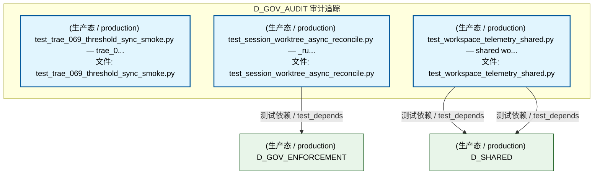
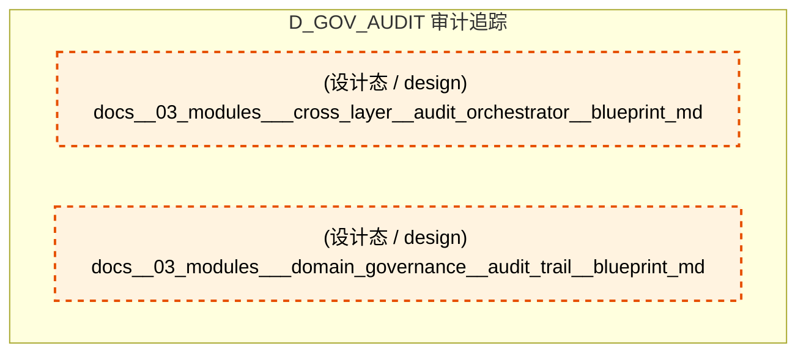
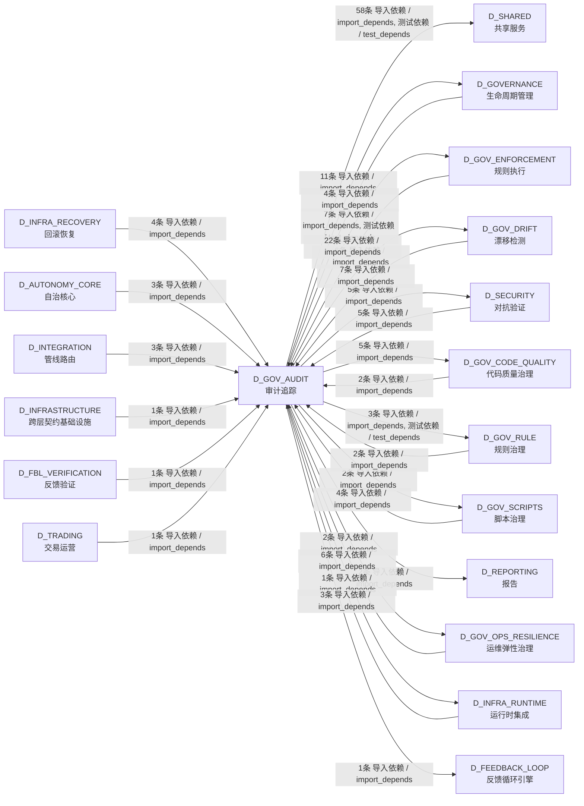

# 50_d_gov_audit / 审计追踪 / Audit Trail

> **功能简介 / Overview**: 审计追踪，负责变更审计追踪和操作日志管理

> **文档作用 / Purpose**: 展示 审计追踪（D_GOV_AUDIT）功能域的模块清单、域内依赖关系、跨域依赖关系、架构分层视图，供架构审查和域治理参考。

> 本文档由 generate_domain_doc.py 从 depgraph (PostgreSQL) 自动生成
> 数据源: depgraph (PostgreSQL) nodes表 + edges表

## 域基本信息 / Domain Overview

| 字段 | 值 | Field | Value |
|------|------|-------|-------|
| 编号 | 50 | Number | 50 |
| 域ID | D_GOV_AUDIT | Domain ID | D_GOV_AUDIT |
| 域名称 | 审计追踪 | Domain Name | Audit Trail |
| 层级 | L2 业务域层 | Layer | L2 Domain |
| 模块数 | 123 | Module Count | 123 |
| 域内依赖 | 102 | Internal Dependencies | 102 |
| 跨域入边 | 68 | Cross-domain Incoming | 68 |
| 跨域出边 | 103 | Cross-domain Outgoing | 103 |
| 设计态模块 | 2 | Design Modules | 2 |
| 生产态模块 | 121 | Production Modules | 121 |
| 容量 | 121/150 (正常) | Capacity | 121/150 (正常) |
| 描述 | 审计管线编排 | Description | 审计管线编排 |

## 模块分层清单 / Module Layered List

> 按 architecture_layer 分组的模块清单（共 123 个模块 / 123 modules）。

### L0 基础设施层 / Infrastructure Layer (2 modules)

| # | 模块路径 / Module Path | 模块名称 / Module Name (功能简介 / Description) | 成熟度 / Maturity | 蓝图 / Blueprint |
|:--:|---------|---------|:---:|:---:|
| 1 | src/zephyr/governance/audit/default_attribution_engine.py | Re-export wrapper: default_attribution_engine c... | 生产态 / production |  |
| 2 | src/zephyr/governance/audit/default_tca_engine.py | Re-export wrapper: default_tca_engine canonical... | 生产态 / production |  |

### L1 基础层 / Foundation Layer (2 modules)

| # | 模块路径 / Module Path | 模块名称 / Module Name (功能简介 / Description) | 成熟度 / Maturity | 蓝图 / Blueprint |
|:--:|---------|---------|:---:|:---:|
| 1 | docs/03_modules/_cross_layer/audit_orchestrator/blueprint.md | docs__03_modules___cross_layer__audit_orchestrator__blueprint_md | 设计态 / design |  |
| 2 | docs/03_modules/_domain_governance/audit_trail/blueprint.md | docs__03_modules___domain_governance__audit_trail__blueprint_md | 设计态 / design |  |

### L2 领域层 / Domain Layer (119 modules)

| # | 模块路径 / Module Path | 模块名称 / Module Name (功能简介 / Description) | 成熟度 / Maturity | 蓝图 / Blueprint |
|:--:|---------|---------|:---:|:---:|
| 1 | scripts/governance/repair/audit_design_completeness.py | [INVARIANTS] 按path精确匹配+按功能名模糊匹配; ... | 生产态 / production |  |
| 2 | scripts/governance/repair/red_blue_test.py | [INVARIANTS] 20项红蓝对抗测试 | 生产态 / production |  |
| 3 | scripts/governance/repair/rollback_depgraph.py | [INVARIANTS] 仅接受depgraph.backup.*路径; 回滚... | 生产态 / production |  |
| 4 | scripts/governance/test_remediation_progress_smoke.py | test_remediation_progress_smoke.py — Phase 3.1... | 生产态 / production |  |
| 5 | src/zephyr/gov_audit/_orchestrator_compat.py | audit-orchestrator 兼容重导出层（ARCH-042 阶段4... | 生产态 / production |  |
| 6 | src/zephyr/gov_audit/action_history.py | ActionHistory — 操作历史持久化审计 + 去重 + 循... | 生产态 / production |  |
| 7 | src/zephyr/gov_audit/agent_signer.py | audit-trail.agent_signer — MOD-INF-020 · Agen... | 生产态 / production |  |
| 8 | src/zephyr/gov_audit/anomaly.py | anomaly.py | 生产态 / production |  |
| 9 | src/zephyr/gov_audit/api_lifecycle.py | api_lifecycle.py | 生产态 / production |  |
| 10 | src/zephyr/gov_audit/audit_admission_controller.py | audit_admission_controller.py | 生产态 / production |  |
| 11 | src/zephyr/gov_audit/audit_schema.py | audit_schema — 审计视图与查询入口（SH-DB-001 v... | 生产态 / production |  |
| 12 | src/zephyr/gov_audit/audit_write_failure_protector.py | Audit Write Failure Protector — v0.13.0 审计写... | 生产态 / production |  |
| 13 | src/zephyr/gov_audit/bridge.py | bridge.py | 生产态 / production |  |
| 14 | src/zephyr/gov_audit/bridges/audit_anomaly.py | G-CT-002 Audit 异常检测器 — AnomalyEvent Pydan... | 生产态 / production |  |
| 15 | src/zephyr/gov_audit/bridges/audit_contracts.py | G-CT-001 契约消费端 — Audit.write() 公共接口. | 生产态 / production |  |
| 16 | src/zephyr/gov_audit/bridges/audit_delegation_bridge.py | Audit ↔ DelegationManager 委托链审计桥接. | 生产态 / production |  |
| 17 | src/zephyr/gov_audit/bridges/audit_drift_bridge.py | G-CT-007 Audit ↔ Drift 双向桥接 — MOD-INF-020... | 生产态 / production |  |
| 18 | src/zephyr/gov_audit/bridges/audit_feedback_bridge.py | Audit ↔ Feedback Loop 三角闭环桥接. | 生产态 / production |  |
| 19 | src/zephyr/gov_audit/bridges/audit_tiered_storage_bridge.py | Audit ↔ WarmHotGate 三层存储桥接. | 生产态 / production |  |
| 20 | src/zephyr/gov_audit/bridges/audit_trust_bridge.py | Audit ↔ ContinuousTrust 信任分数桥接. | 生产态 / production |  |
| 21 | src/zephyr/gov_audit/changelog_manager.py | changelog_manager.py | 生产态 / production |  |
| 22 | src/zephyr/gov_audit/cli.py | cli.py | 生产态 / production |  |
| 23 | src/zephyr/gov_audit/code_archaeology.py | code_archaeology.py | 生产态 / production |  |
| 24 | src/zephyr/gov_audit/cold_start.py | BootstrapCache — 审计冷启动共享单例缓存。 | 生产态 / production |  |
| 25 | src/zephyr/gov_audit/compliance_map.py | audit-trail.compliance_map — MOD-INF-020 · 合... | 生产态 / production |  |
| 26 | src/zephyr/gov_audit/contracts.py | contracts.py | 生产态 / production |  |
| 27 | src/zephyr/gov_audit/corporate_actions.py | corporate_actions.py | 生产态 / production |  |
| 28 | src/zephyr/gov_audit/delegation_auditor.py | delegation_auditor.py | 生产态 / production |  |
| 29 | src/zephyr/gov_audit/delegation_bridge.py | delegation_bridge.py | 生产态 / production |  |
| 30 | src/zephyr/gov_audit/dora_metrics.py | dora_metrics.py | 生产态 / production |  |
| 31 | src/zephyr/gov_audit/event_store.py | EventStore — Event Sourcing 事件追加与回放（DW... | 生产态 / production |  |
| 32 | src/zephyr/gov_audit/evidence_pack.py | audit-trail.evidence_pack — MOD-INF-020 · 证... | 生产态 / production |  |
| 33 | src/zephyr/gov_audit/external_tool_audit.py | external_tool_audit.py | 生产态 / production |  |
| 34 | src/zephyr/gov_audit/feedback_bridge.py | feedback_bridge.py | 生产态 / production |  |
| 35 | src/zephyr/gov_audit/feedback_policy.py | feedback_policy.py — Audit-findings → policy ... | 生产态 / production |  |
| 36 | src/zephyr/gov_audit/feedback_self_audit.py | audit-trail.feedback_self_audit — MOD-INF-020 ... | 生产态 / production |  |
| 37 | src/zephyr/gov_audit/finding_ingest.py | finding_ingest.py | 生产态 / production |  |
| 38 | src/zephyr/gov_audit/finding_model.py | finding_model.py | 生产态 / production |  |
| 39 | src/zephyr/gov_audit/forensic_package.py | Forensic Package — v0.8.0 取证就绪: escalation... | 生产态 / production |  |
| 40 | src/zephyr/gov_audit/genesis.py | audit-trail.genesis — MOD-INF-020 · 创世块管理 | 生产态 / production |  |
| 41 | src/zephyr/gov_audit/glossary_matrix.py | glossary_matrix.py | 生产态 / production |  |
| 42 | src/zephyr/gov_audit/incremental_review.py | incremental_review.py | 生产态 / production |  |
| 43 | src/zephyr/gov_audit/indexer.py | indexer.py | 生产态 / production |  |
| 44 | src/zephyr/gov_audit/integrity.py | audit-trail.integrity — MOD-INF-020 · 密码学... | 生产态 / production |  |
| 45 | src/zephyr/gov_audit/integrity_verifier.py | Integrity Verifier — v0.8.0 代码完整性验证器: ... | 生产态 / production |  |
| 46 | src/zephyr/gov_audit/kb_gate.py | audit-trail.kb_gate — MOD-INF-020 · KB 审计门控 | 生产态 / production |  |
| 47 | src/zephyr/gov_audit/log_rotation.py | log_rotation.py | 生产态 / production |  |
| 48 | src/zephyr/gov_audit/merkle_audit.py | Merkle Audit — 兼容别名，SSoT已迁移至 zephyr.g... | 生产态 / production |  |
| 49 | src/zephyr/gov_audit/merkle_hourly.py | audit-trail.merkle_hourly — MOD-INF-020 · 每... | 生产态 / production |  |
| 50 | src/zephyr/gov_audit/models.py | models.py | 生产态 / production |  |
| 51 | src/zephyr/gov_audit/observability_dashboard.py | observability_dashboard.py | 生产态 / production |  |
| 52 | src/zephyr/gov_audit/pipeline_runner.py | pipeline_runner.py | 生产态 / production |  |
| 53 | src/zephyr/gov_audit/privacy.py | audit-trail.privacy — MOD-INF-020 · PII 检测与脱敏 | 生产态 / production |  |
| 54 | src/zephyr/gov_audit/provenance_tracker.py | provenance_tracker.py | 生产态 / production |  |
| 55 | src/zephyr/gov_audit/query.py | query.py | 生产态 / production |  |
| 56 | src/zephyr/gov_audit/replay_engine.py | replay_engine.py | 生产态 / production |  |
| 57 | src/zephyr/gov_audit/resource_aware_pool.py | resource_aware_pool.py | 生产态 / production |  |
| 58 | src/zephyr/gov_audit/retention.py | retention.py | 生产态 / production |  |
| 59 | src/zephyr/gov_audit/sbom_generator.py | LicenseType 枚举——许可证类型定义（P3 价值审判... | 生产态 / production |  |
| 60 | src/zephyr/gov_audit/spec_auditor.py | spec_auditor.py | 生产态 / production |  |
| 61 | src/zephyr/gov_audit/supply_chain.py | audit-trail.supply_chain — MOD-INF-020 · 供应... | 生产态 / production |  |
| 62 | src/zephyr/gov_audit/supply_chain_security.py | supply_chain_security.py | 生产态 / production |  |
| 63 | src/zephyr/gov_audit/text_to_finding_adapter.py | text_to_finding_adapter.py | 生产态 / production |  |
| 64 | src/zephyr/gov_audit/tiered_storage.py | tiered_storage.py | 生产态 / production |  |
| 65 | src/zephyr/gov_audit/tiered_storage_bridge.py | tiered_storage_bridge.py | 生产态 / production |  |
| 66 | src/zephyr/gov_audit/trust_bridge.py | trust_bridge.py | 生产态 / production |  |
| 67 | src/zephyr/gov_audit/trust_engine.py | trust_engine.py | 生产态 / production |  |
| 68 | src/zephyr/gov_audit/trust_ring_manager.py | trust_ring_manager.py | 生产态 / production |  |
| 69 | src/zephyr/gov_audit/wqa_scorer.py | wqa_scorer.py | 生产态 / production |  |
| 70 | src/zephyr/gov_audit/writer.py | writer.py | 生产态 / production |  |
| 71 | src/zephyr/gov_enforcement/behavioral_admission/ai_code_s... | ai_code_standards.py | 生产态 / production |  |
| 72 | src/zephyr/gov_enforcement/behavioral_admission/mcp_resul... | mcp_result_push.py | 生产态 / production |  |
| 73 | src/zephyr/gov_enforcement/behavioral_admission/post_proc... | post_process.py —— AI 生成代码后处理管道（Pha... | 生产态 / production |  |
| 74 | src/zephyr/gov_enforcement/behavioral_admission/vibe_codi... | vibe_coding_enforcer.py | 生产态 / production |  |
| 75 | src/zephyr/gov_enforcement/rule_enforcement/audit_chain_v... | 审计链验证工具——独立重放门禁判定+Hash链完整性... | 生产态 / production |  |
| 76 | src/zephyr/gov_enforcement/rule_enforcement/sys_master_co... | SYS-MASTER-001 Compliance Checker | 生产态 / production |  |
| 77 | src/zephyr/governance/audit-trail/contracts.py | audit-trail/contracts.py — G-CT-002 Audit 契约... | 生产态 / production |  |
| 78 | src/zephyr/governance/audit/_git_helpers.py | _git_helpers.py — audit reconciler 共享 git 工... | 生产态 / production |  |
| 79 | src/zephyr/governance/audit/ai_error_pattern_library.py | ai_error_pattern_library.py — AI 错误模式库（... | 生产态 / production |  |
| 80 | src/zephyr/governance/audit/blueprint_status_transition_r... | blueprint_status_transition_reconciler.py — 蓝... | 生产态 / production |  |
| 81 | src/zephyr/governance/audit/commit_gateway_abuse_monitor_... | commit_gateway_abuse_monitor_reconciler.py — c... | 生产态 / production |  |
| 82 | src/zephyr/governance/audit/cross_layer_contract_signatur... | cross_layer_contract_signature_reconciler.py —... | 生产态 / production |  |
| 83 | src/zephyr/governance/audit/error_pattern_consumer_reconc... | error_pattern_consumer_reconciler.py — AI 行为... | 生产态 / production |  |
| 84 | src/zephyr/governance/audit/git_performance_monitor_recon... | git_performance_monitor_reconciler.py — git 性... | 生产态 / production |  |
| 85 | src/zephyr/governance/audit/health_score_calculator.py | health_score_calculator.py — commit gateway 滥... | 生产态 / production |  |
| 86 | src/zephyr/governance/audit/reconcile_runner.py | reconcile_runner.py — Reconciler 链路异步化（R... | 生产态 / production |  |
| 87 | src/zephyr/governance/audit/reconcile_worker.py | reconcile_worker.py — 异步 reconciler worker（... | 生产态 / production |  |
| 88 | src/zephyr/governance/audit/reconciliation_registry.py | reconciliation_registry.py — GitCommitGateway ... | 生产态 / production |  |
| 89 | src/zephyr/governance/audit/remediation_progress_reconcil... | remediation_progress_reconciler.py — 治本进度... | 生产态 / production |  |
| 90 | src/zephyr/governance/audit/runtime_violation_snapshot.py | runtime_violation_snapshot.py — trae_060 §5 e... | 生产态 / production |  |
| 91 | src/zephyr/governance/audit/runtime_violation_snapshot_re... | runtime_violation_snapshot_reconciler.py — tra... | 生产态 / production |  |
| 92 | src/zephyr/governance/audit/snapshot_manager.py | SnapshotManager — Event Sourcing 快照管理（DW-... | 生产态 / production |  |
| 93 | src/zephyr/governance/audit/workspace_hygiene_reconciler.py | workspace_hygiene_reconciler.py — 工作区卫生自... | 生产态 / production |  |
| 94 | src/zephyr/governance/financial_governance/financial_comp... | financial_compliance.py | 生产态 / production |  |
| 95 | src/zephyr/governance/semantic_audit/alignment_engine.py | 三元对齐检测：蓝图声明清单 vs 磁盘实际文件 vs i... | 生产态 / production |  |
| 96 | src/zephyr/governance/semantic_audit/compliance_map.py | audit-trail.compliance_map — MOD-INF-020 · 合... | 生产态 / production |  |
| 97 | src/zephyr/governance/semantic_audit/feedback_self_audit.py | audit-trail.feedback_self_audit — MOD-INF-020 ... | 生产态 / production |  |
| 98 | src/zephyr/governance/semantic_audit/fix_prioritizer.py | 按 severity -> certainty -> blast_radius 三级排... | 生产态 / production |  |
| 99 | src/zephyr/governance/semantic_audit/fix_result_prioritiz... | fix_prioritizer — MOD-INF-028 §3.1 Stage 8 | 生产态 / production |  |
| 100 | src/zephyr/governance/semantic_audit/issue_aggregator.py | 收集各阶段审计结果，去重合并排序输出。 | 生产态 / production |  |
| 101 | src/zephyr/governance/semantic_audit/kb_gate.py | audit-trail.kb_gate — MOD-INF-020 · KB 审计门控 | 生产态 / production |  |
| 102 | src/zephyr/governance/semantic_audit/llm_bridge.py | 接收 RED 问题,生成修复文本。LLM 只润色不做判断... | 生产态 / production |  |
| 103 | src/zephyr/governance/semantic_audit/models.py | 语义审计管线数据模型 — MOD-INF-028 §4.2 | 生产态 / production |  |
| 104 | src/zephyr/governance/semantic_audit/orchestrator.py | SemanticAuditor 编排器——9阶段管道统一调度. | 生产态 / production |  |
| 105 | src/zephyr/governance/semantic_audit/privacy.py | audit-trail.privacy — MOD-INF-020 · PII 检测与脱敏 | 生产态 / production |  |
| 106 | src/zephyr/governance/semantic_audit/reference_extractor.py | AST 解析文件，提取 9 个维度的引用信息。 | 生产态 / production |  |
| 107 | src/zephyr/governance/semantic_audit/safety_boundary.py | 禁碰规则过滤 + 置信度阈值。输入 TriggerResult ... | 生产态 / production |  |
| 108 | src/zephyr/governance/semantic_audit/self_healer.py | Stage 7 自愈闭环 — 修复->自测->回滚. | 生产态 / production |  |
| 109 | src/zephyr/governance/semantic_audit/self_health.py | 7 SLI + 5 容量 SLI + 退化检测。定时自检,输出 HE... | 生产态 / production |  |
| 110 | src/zephyr/governance/semantic_audit/semantic_cache.py | semantic_cache.py | 生产态 / production |  |
| 111 | src/zephyr/governance/semantic_audit/spec_auditor.py | G-CT-007 — Audit.record_agent_spec() 记录 Agen... | 生产态 / production |  |
| 112 | src/zephyr/governance/semantic_audit/trigger_engine.py | 监听文件变更，判定是否触发语义审计。 | 生产态 / production |  |
| 113 | tests/governance/audit/test_error_pattern_id_column.py | test_error_pattern_id_column.py — reconcile_ex... | 生产态 / production |  |
| 114 | tests/governance/audit/test_p3_integration_smoke.py | test_p3_integration_smoke.py — Phase 3 全链路... | 生产态 / production |  |
| 115 | tests/governance/audit/test_reconcile_async.py | test_reconcile_async.py — P2-3 reconciler 链路... | 生产态 / production |  |
| 116 | tests/governance/audit/test_reconcile_worker_selfheal.py | test_reconcile_worker_selfheal.py —... | 生产态 / production |  |
| 117 | tests/governance/audit/test_trae_069_threshold_sync_smoke.py | test_trae_069_threshold_sync_smoke.py — trae_0... | 生产态 / production |  |
| 118 | tests/governance/rule_bridge/test_session_worktree_async_... | test_session_worktree_async_reconcile.py — _ru... | 生产态 / production |  |
| 119 | tests/governance/test_workspace_telemetry_shared.py | test_workspace_telemetry_shared.py — shared wo... | 生产态 / production |  |

## 域内依赖图 / Internal Dependency Diagram

> 依赖图内嵌在本文档中，IDE 可直接渲染显示。参考 decision_index.md 设计，分三个视图：合并全景图、运营态子图、设计态子图（按 design_maturity 实际值拆分）。
>
> **图例说明 / Legend**：
> - **实线边框 = 运营态模块**（production，已上线运行）
> - **虚线边框 = 设计态模块**（design，蓝图阶段，代码未写）
> - **实线箭头 = 运营态依赖**（已生效的依赖关系）
> - **虚线箭头 = 非运营态依赖**（计划中/验证中的依赖关系）

### 合并全景图（全部模块，标签标注成熟度）

> 展示全部 123 个模块（生产态 121 + 设计态 2），标签标注成熟度。

#### 第 1 页 / 共 5 页

```mermaid
graph TD
    subgraph D_GOV_AUDIT["D_GOV_AUDIT 审计追踪"]
        docs_03_modules_cross_layer_audit_orchestrator_blueprint_md["(设计态 / design) docs__03_modules___cross_layer__audit_orchestrator__blueprint_md"]
        docs_03_modules_domain_governance_audit_trail_blueprint_md["(设计态 / design) docs__03_modules___domain_governance__audit_trail__blueprint_md"]
        scripts_governance_repair_audit_design_completeness_py["(生产态 / production) (INVARIANTS) 按path精确匹配+按功能名模糊匹配; ...<br/>文件: audit_design_completeness.py"]
        scripts_governance_repair_red_blue_test_py["(生产态 / production) (INVARIANTS) 20项红蓝对抗测试<br/>文件: red_blue_test.py"]
        scripts_governance_repair_rollback_depgraph_py["(生产态 / production) (INVARIANTS) 仅接受depgraph.backup.*路径; 回滚...<br/>文件: rollback_depgraph.py"]
        scripts_governance_test_remediation_progress_smoke_py["(生产态 / production) test_remediation_progress_smoke.py — Phase 3.1...<br/>文件: test_remediation_progress_smoke.py"]
        src_zephyr_gov_audit_orchestrator_compat_py["(生产态 / production) audit-orchestrator 兼容重导出层（ARCH-042 阶段4...<br/>文件: _orchestrator_compat.py"]
        src_zephyr_gov_audit_action_history_py["(生产态 / production) ActionHistory — 操作历史持久化审计 + 去重 + 循...<br/>文件: action_history.py"]
        src_zephyr_gov_audit_agent_signer_py["(生产态 / production) audit-trail.agent_signer — MOD-INF-020 · Agen...<br/>文件: agent_signer.py"]
        src_zephyr_gov_audit_anomaly_py["(生产态 / production) anomaly.py"]
        src_zephyr_gov_audit_api_lifecycle_py["(生产态 / production) api_lifecycle.py"]
        src_zephyr_gov_audit_audit_admission_controller_py["(生产态 / production) audit_admission_controller.py"]
        src_zephyr_gov_audit_audit_schema_py["(生产态 / production) audit_schema — 审计视图与查询入口（SH-DB-001 v...<br/>文件: audit_schema.py"]
        src_zephyr_gov_audit_audit_write_failure_protector_py["(生产态 / production) Audit Write Failure Protector — v0.13.0 审计写...<br/>文件: audit_write_failure_protector.py"]
        src_zephyr_gov_audit_bridge_py["(生产态 / production) bridge.py"]
        src_zephyr_gov_audit_bridges_audit_anomaly_py["(生产态 / production) G-CT-002 Audit 异常检测器 — AnomalyEvent Pydan...<br/>文件: audit_anomaly.py"]
        src_zephyr_gov_audit_bridges_audit_contracts_py["(生产态 / production) G-CT-001 契约消费端 — Audit.write() 公共接口.<br/>文件: audit_contracts.py"]
        src_zephyr_gov_audit_bridges_audit_delegation_bridge_py["(生产态 / production) Audit ↔ DelegationManager 委托链审计桥接.<br/>文件: audit_delegation_bridge.py"]
        src_zephyr_gov_audit_bridges_audit_drift_bridge_py["(生产态 / production) G-CT-007 Audit ↔ Drift 双向桥接 — MOD-INF-020...<br/>文件: audit_drift_bridge.py"]
        src_zephyr_gov_audit_bridges_audit_feedback_bridge_py["(生产态 / production) Audit ↔ Feedback Loop 三角闭环桥接.<br/>文件: audit_feedback_bridge.py"]
        src_zephyr_gov_audit_bridges_audit_tiered_storage_bridge_py["(生产态 / production) Audit ↔ WarmHotGate 三层存储桥接.<br/>文件: audit_tiered_storage_bridge.py"]
        src_zephyr_gov_audit_bridges_audit_trust_bridge_py["(生产态 / production) Audit ↔ ContinuousTrust 信任分数桥接.<br/>文件: audit_trust_bridge.py"]
        src_zephyr_gov_audit_changelog_manager_py["(生产态 / production) changelog_manager.py"]
        src_zephyr_gov_audit_cli_py["(生产态 / production) cli.py"]
        src_zephyr_gov_audit_code_archaeology_py["(生产态 / production) code_archaeology.py"]
        src_zephyr_gov_audit_cold_start_py["(生产态 / production) BootstrapCache — 审计冷启动共享单例缓存。<br/>文件: cold_start.py"]
        src_zephyr_gov_audit_compliance_map_py["(生产态 / production) audit-trail.compliance_map — MOD-INF-020 · 合...<br/>文件: compliance_map.py"]
        src_zephyr_gov_audit_contracts_py["(生产态 / production) contracts.py"]
        src_zephyr_gov_audit_corporate_actions_py["(生产态 / production) corporate_actions.py"]
        src_zephyr_gov_audit_delegation_auditor_py["(生产态 / production) delegation_auditor.py"]
    end
    src_zephyr_gov_audit_cli_py -->|导入依赖 / import_depends| src_zephyr_gov_audit_audit_admission_controller_py
    src_zephyr_gov_audit_orchestrator_compat_py -->|导入依赖 / import_depends| src_zephyr_gov_audit_anomaly_py
    src_zephyr_gov_audit_orchestrator_compat_py -->|导入依赖 / import_depends| src_zephyr_gov_audit_bridge_py
    src_zephyr_gov_audit_orchestrator_compat_py -->|导入依赖 / import_depends| src_zephyr_gov_audit_contracts_py
    src_zephyr_gov_audit_bridges_audit_feedback_bridge_py -->|导入依赖 / import_depends| src_zephyr_gov_audit_anomaly_py
    src_zephyr_gov_audit_bridges_audit_drift_bridge_py -->|导入依赖 / import_depends| src_zephyr_gov_audit_anomaly_py
    D_GOV_DRIFT["(生产态 / production) D_GOV_DRIFT"]
    src_zephyr_gov_audit_cli_py -->|导入依赖 / import_depends| D_GOV_DRIFT
    src_zephyr_gov_audit_orchestrator_compat_py -->|导入依赖 / import_depends| D_GOV_DRIFT
    D_SHARED["(生产态 / production) D_SHARED"]
    src_zephyr_gov_audit_audit_schema_py -->|导入依赖 / import_depends| D_SHARED
    src_zephyr_gov_audit_cold_start_py -->|导入依赖 / import_depends| D_SHARED
    src_zephyr_gov_audit_cli_py -->|导入依赖 / import_depends| D_GOV_DRIFT
    src_zephyr_gov_audit_audit_schema_py -->|导入依赖 / import_depends| D_SHARED
    src_zephyr_gov_audit_agent_signer_py -->|导入依赖 / import_depends| D_SHARED
    src_zephyr_gov_audit_bridge_py -->|导入依赖 / import_depends| D_GOV_DRIFT
    src_zephyr_gov_audit_cli_py -->|导入依赖 / import_depends| D_SHARED
    scripts_governance_repair_red_blue_test_py -->|导入依赖 / import_depends| D_SHARED
    src_zephyr_gov_audit_bridges_audit_drift_bridge_py -->|导入依赖 / import_depends| D_GOV_DRIFT
    src_zephyr_gov_audit_bridges_audit_drift_bridge_py -->|导入依赖 / import_depends| D_GOV_DRIFT
    scripts_governance_repair_rollback_depgraph_py -->|导入依赖 / import_depends| D_SHARED
    D_SECURITY["(生产态 / production) D_SECURITY"]
    src_zephyr_gov_audit_cli_py -->|导入依赖 / import_depends| D_SECURITY
    src_zephyr_gov_audit_cold_start_py -->|导入依赖 / import_depends| D_SHARED
    D_GOV_RULE["(生产态 / production) D_GOV_RULE"]
    D_GOV_RULE -->|导入依赖 / import_depends| src_zephyr_gov_audit_bridge_py
    D_GOV_DRIFT -->|导入依赖 / import_depends| src_zephyr_gov_audit_anomaly_py
    D_INFRA_RECOVERY["(生产态 / production) D_INFRA_RECOVERY"]
    D_INFRA_RECOVERY -->|导入依赖 / import_depends| src_zephyr_gov_audit_contracts_py
    D_GOV_DRIFT -->|导入依赖 / import_depends| src_zephyr_gov_audit_bridge_py
    D_SECURITY -->|导入依赖 / import_depends| src_zephyr_gov_audit_bridge_py
    D_GOV_RULE -->|导入依赖 / import_depends| src_zephyr_gov_audit_bridge_py
    D_INFRA_RUNTIME["(生产态 / production) D_INFRA_RUNTIME"]
    D_INFRA_RUNTIME -->|导入依赖 / import_depends| src_zephyr_gov_audit_bridge_py
    D_SECURITY -->|导入依赖 / import_depends| src_zephyr_gov_audit_contracts_py
    D_GOVERNANCE["(生产态 / production) D_GOVERNANCE"]
    D_GOVERNANCE -->|导入依赖 / import_depends| src_zephyr_gov_audit_audit_schema_py
    D_AUTONOMY_CORE["(生产态 / production) D_AUTONOMY_CORE"]
    D_AUTONOMY_CORE -->|导入依赖 / import_depends| src_zephyr_gov_audit_bridge_py
    D_FBL_VERIFICATION["(生产态 / production) D_FBL_VERIFICATION"]
    D_FBL_VERIFICATION -->|导入依赖 / import_depends| src_zephyr_gov_audit_bridge_py
    D_SECURITY -->|导入依赖 / import_depends| src_zephyr_gov_audit_bridge_py
    classDef production fill:#e1f5fe,stroke:#01579b,stroke-width:2px,color:#000
    classDef design fill:#fff3e0,stroke:#e65100,stroke-width:2px,color:#000,stroke-dasharray: 5 5
    classDef external_prod fill:#e8f5e9,stroke:#1b5e20,stroke-width:1px,color:#000
    classDef external_design fill:#fce4ec,stroke:#880e4f,stroke-width:1px,color:#000,stroke-dasharray: 5 5
    class scripts_governance_repair_audit_design_completeness_py,scripts_governance_repair_red_blue_test_py,scripts_governance_repair_rollback_depgraph_py,scripts_governance_test_remediation_progress_smoke_py,src_zephyr_gov_audit_orchestrator_compat_py,src_zephyr_gov_audit_action_history_py,src_zephyr_gov_audit_agent_signer_py,src_zephyr_gov_audit_anomaly_py,src_zephyr_gov_audit_api_lifecycle_py,src_zephyr_gov_audit_audit_admission_controller_py,src_zephyr_gov_audit_audit_schema_py,src_zephyr_gov_audit_audit_write_failure_protector_py,src_zephyr_gov_audit_bridge_py,src_zephyr_gov_audit_bridges_audit_anomaly_py,src_zephyr_gov_audit_bridges_audit_contracts_py,src_zephyr_gov_audit_bridges_audit_delegation_bridge_py,src_zephyr_gov_audit_bridges_audit_drift_bridge_py,src_zephyr_gov_audit_bridges_audit_feedback_bridge_py,src_zephyr_gov_audit_bridges_audit_tiered_storage_bridge_py,src_zephyr_gov_audit_bridges_audit_trust_bridge_py,src_zephyr_gov_audit_changelog_manager_py,src_zephyr_gov_audit_cli_py,src_zephyr_gov_audit_code_archaeology_py,src_zephyr_gov_audit_cold_start_py,src_zephyr_gov_audit_compliance_map_py,src_zephyr_gov_audit_contracts_py,src_zephyr_gov_audit_corporate_actions_py,src_zephyr_gov_audit_delegation_auditor_py production
    class docs_03_modules_cross_layer_audit_orchestrator_blueprint_md,docs_03_modules_domain_governance_audit_trail_blueprint_md design
    class D_GOV_DRIFT,D_SHARED,D_SECURITY,D_GOV_RULE,D_INFRA_RECOVERY,D_INFRA_RUNTIME,D_GOVERNANCE,D_AUTONOMY_CORE,D_FBL_VERIFICATION external_prod
```



#### 第 2 页 / 共 5 页

```mermaid
graph TD
    subgraph D_GOV_AUDIT["D_GOV_AUDIT 审计追踪"]
        src_zephyr_gov_audit_delegation_bridge_py["(生产态 / production) delegation_bridge.py"]
        src_zephyr_gov_audit_dora_metrics_py["(生产态 / production) dora_metrics.py"]
        src_zephyr_gov_audit_event_store_py["(生产态 / production) EventStore — Event Sourcing 事件追加与回放（DW...<br/>文件: event_store.py"]
        src_zephyr_gov_audit_evidence_pack_py["(生产态 / production) audit-trail.evidence_pack — MOD-INF-020 · 证...<br/>文件: evidence_pack.py"]
        src_zephyr_gov_audit_external_tool_audit_py["(生产态 / production) external_tool_audit.py"]
        src_zephyr_gov_audit_feedback_bridge_py["(生产态 / production) feedback_bridge.py"]
        src_zephyr_gov_audit_feedback_policy_py["(生产态 / production) feedback_policy.py — Audit-findings → policy ...<br/>文件: feedback_policy.py"]
        src_zephyr_gov_audit_feedback_self_audit_py["(生产态 / production) audit-trail.feedback_self_audit — MOD-INF-020 ...<br/>文件: feedback_self_audit.py"]
        src_zephyr_gov_audit_finding_ingest_py["(生产态 / production) finding_ingest.py"]
        src_zephyr_gov_audit_finding_model_py["(生产态 / production) finding_model.py"]
        src_zephyr_gov_audit_forensic_package_py["(生产态 / production) Forensic Package — v0.8.0 取证就绪: escalation...<br/>文件: forensic_package.py"]
        src_zephyr_gov_audit_genesis_py["(生产态 / production) audit-trail.genesis — MOD-INF-020 · 创世块管理<br/>文件: genesis.py"]
        src_zephyr_gov_audit_glossary_matrix_py["(生产态 / production) glossary_matrix.py"]
        src_zephyr_gov_audit_incremental_review_py["(生产态 / production) incremental_review.py"]
        src_zephyr_gov_audit_indexer_py["(生产态 / production) indexer.py"]
        src_zephyr_gov_audit_integrity_py["(生产态 / production) audit-trail.integrity — MOD-INF-020 · 密码学...<br/>文件: integrity.py"]
        src_zephyr_gov_audit_integrity_verifier_py["(生产态 / production) Integrity Verifier — v0.8.0 代码完整性验证器: ...<br/>文件: integrity_verifier.py"]
        src_zephyr_gov_audit_kb_gate_py["(生产态 / production) audit-trail.kb_gate — MOD-INF-020 · KB 审计门控<br/>文件: kb_gate.py"]
        src_zephyr_gov_audit_log_rotation_py["(生产态 / production) log_rotation.py"]
        src_zephyr_gov_audit_merkle_audit_py["(生产态 / production) Merkle Audit — 兼容别名，SSoT已迁移至 zephyr.g...<br/>文件: merkle_audit.py"]
        src_zephyr_gov_audit_merkle_hourly_py["(生产态 / production) audit-trail.merkle_hourly — MOD-INF-020 · 每...<br/>文件: merkle_hourly.py"]
        src_zephyr_gov_audit_models_py["(生产态 / production) models.py"]
        src_zephyr_gov_audit_observability_dashboard_py["(生产态 / production) observability_dashboard.py"]
        src_zephyr_gov_audit_pipeline_runner_py["(生产态 / production) pipeline_runner.py"]
        src_zephyr_gov_audit_privacy_py["(生产态 / production) audit-trail.privacy — MOD-INF-020 · PII 检测与脱敏<br/>文件: privacy.py"]
        src_zephyr_gov_audit_provenance_tracker_py["(生产态 / production) provenance_tracker.py"]
        src_zephyr_gov_audit_query_py["(生产态 / production) query.py"]
        src_zephyr_gov_audit_replay_engine_py["(生产态 / production) replay_engine.py"]
        src_zephyr_gov_audit_resource_aware_pool_py["(生产态 / production) resource_aware_pool.py"]
        src_zephyr_gov_audit_retention_py["(生产态 / production) retention.py"]
    end
    src_zephyr_gov_audit_feedback_policy_py -->|导入依赖 / import_depends| src_zephyr_gov_audit_feedback_bridge_py
    src_zephyr_gov_audit_finding_ingest_py -->|导入依赖 / import_depends| src_zephyr_gov_audit_finding_model_py
    src_zephyr_gov_audit_merkle_hourly_py -->|导入依赖 / import_depends| src_zephyr_gov_audit_integrity_py
    src_zephyr_gov_audit_merkle_audit_py -->|导入依赖 / import_depends| src_zephyr_gov_audit_integrity_py
    src_zephyr_gov_audit_pipeline_runner_py -->|导入依赖 / import_depends| src_zephyr_gov_audit_finding_model_py
    src_zephyr_gov_audit_query_py -->|导入依赖 / import_depends| src_zephyr_gov_audit_integrity_py
    src_zephyr_gov_audit_query_py -->|导入依赖 / import_depends| src_zephyr_gov_audit_indexer_py
    src_zephyr_gov_audit_query_py -->|导入依赖 / import_depends| src_zephyr_gov_audit_models_py
    D_SHARED["(生产态 / production) D_SHARED"]
    src_zephyr_gov_audit_indexer_py -->|导入依赖 / import_depends| D_SHARED
    src_zephyr_gov_audit_evidence_pack_py -->|导入依赖 / import_depends| D_SHARED
    src_zephyr_gov_audit_external_tool_audit_py -->|导入依赖 / import_depends| D_SHARED
    src_zephyr_gov_audit_pipeline_runner_py -->|导入依赖 / import_depends| D_SHARED
    src_zephyr_gov_audit_feedback_bridge_py -->|导入依赖 / import_depends| D_SHARED
    src_zephyr_gov_audit_event_store_py -->|导入依赖 / import_depends| D_SHARED
    src_zephyr_gov_audit_indexer_py -->|导入依赖 / import_depends| D_SHARED
    src_zephyr_gov_audit_pipeline_runner_py -->|导入依赖 / import_depends| D_SHARED
    D_GOV_OPS_RESILIENCE["(生产态 / production) D_GOV_OPS_RESILIENCE"]
    src_zephyr_gov_audit_delegation_bridge_py -->|导入依赖 / import_depends| D_GOV_OPS_RESILIENCE
    src_zephyr_gov_audit_log_rotation_py -->|导入依赖 / import_depends| D_SHARED
    D_FEEDBACK_LOOP["(生产态 / production) D_FEEDBACK_LOOP"]
    src_zephyr_gov_audit_feedback_bridge_py -->|导入依赖 / import_depends| D_FEEDBACK_LOOP
    src_zephyr_gov_audit_finding_model_py -->|导入依赖 / import_depends| D_SHARED
    src_zephyr_gov_audit_integrity_py -->|导入依赖 / import_depends| D_SHARED
    src_zephyr_gov_audit_forensic_package_py -->|导入依赖 / import_depends| D_SHARED
    src_zephyr_gov_audit_finding_ingest_py -->|导入依赖 / import_depends| D_SHARED
    D_SECURITY["(生产态 / production) D_SECURITY"]
    D_SECURITY -->|导入依赖 / import_depends| src_zephyr_gov_audit_finding_model_py
    D_GOV_SCRIPTS["(生产态 / production) D_GOV_SCRIPTS"]
    D_GOV_SCRIPTS -->|导入依赖 / import_depends| src_zephyr_gov_audit_indexer_py
    D_GOV_OPS_RESILIENCE -->|导入依赖 / import_depends| src_zephyr_gov_audit_integrity_py
    D_GOV_ENFORCEMENT["(生产态 / production) D_GOV_ENFORCEMENT"]
    D_GOV_ENFORCEMENT -->|导入依赖 / import_depends| src_zephyr_gov_audit_event_store_py
    D_INFRA_RUNTIME["(生产态 / production) D_INFRA_RUNTIME"]
    D_INFRA_RUNTIME -->|导入依赖 / import_depends| src_zephyr_gov_audit_finding_model_py
    D_INFRA_RECOVERY["(生产态 / production) D_INFRA_RECOVERY"]
    D_INFRA_RECOVERY -->|导入依赖 / import_depends| src_zephyr_gov_audit_query_py
    D_GOV_ENFORCEMENT -->|导入依赖 / import_depends| src_zephyr_gov_audit_models_py
    D_TRADING["(生产态 / production) D_TRADING"]
    D_TRADING -->|导入依赖 / import_depends| src_zephyr_gov_audit_models_py
    D_GOV_OPS_RESILIENCE -->|导入依赖 / import_depends| src_zephyr_gov_audit_query_py
    D_GOV_DRIFT["(生产态 / production) D_GOV_DRIFT"]
    D_GOV_DRIFT -->|导入依赖 / import_depends| src_zephyr_gov_audit_finding_ingest_py
    D_GOVERNANCE["(生产态 / production) D_GOVERNANCE"]
    D_GOVERNANCE -->|导入依赖 / import_depends| src_zephyr_gov_audit_event_store_py
    D_GOV_DRIFT -->|导入依赖 / import_depends| src_zephyr_gov_audit_finding_model_py
    D_SECURITY -->|导入依赖 / import_depends| src_zephyr_gov_audit_finding_model_py
    D_GOV_DRIFT -->|导入依赖 / import_depends| src_zephyr_gov_audit_models_py
    D_GOV_DRIFT -->|导入依赖 / import_depends| src_zephyr_gov_audit_merkle_hourly_py
    classDef production fill:#e1f5fe,stroke:#01579b,stroke-width:2px,color:#000
    classDef design fill:#fff3e0,stroke:#e65100,stroke-width:2px,color:#000,stroke-dasharray: 5 5
    classDef external_prod fill:#e8f5e9,stroke:#1b5e20,stroke-width:1px,color:#000
    classDef external_design fill:#fce4ec,stroke:#880e4f,stroke-width:1px,color:#000,stroke-dasharray: 5 5
    class src_zephyr_gov_audit_delegation_bridge_py,src_zephyr_gov_audit_dora_metrics_py,src_zephyr_gov_audit_event_store_py,src_zephyr_gov_audit_evidence_pack_py,src_zephyr_gov_audit_external_tool_audit_py,src_zephyr_gov_audit_feedback_bridge_py,src_zephyr_gov_audit_feedback_policy_py,src_zephyr_gov_audit_feedback_self_audit_py,src_zephyr_gov_audit_finding_ingest_py,src_zephyr_gov_audit_finding_model_py,src_zephyr_gov_audit_forensic_package_py,src_zephyr_gov_audit_genesis_py,src_zephyr_gov_audit_glossary_matrix_py,src_zephyr_gov_audit_incremental_review_py,src_zephyr_gov_audit_indexer_py,src_zephyr_gov_audit_integrity_py,src_zephyr_gov_audit_integrity_verifier_py,src_zephyr_gov_audit_kb_gate_py,src_zephyr_gov_audit_log_rotation_py,src_zephyr_gov_audit_merkle_audit_py,src_zephyr_gov_audit_merkle_hourly_py,src_zephyr_gov_audit_models_py,src_zephyr_gov_audit_observability_dashboard_py,src_zephyr_gov_audit_pipeline_runner_py,src_zephyr_gov_audit_privacy_py,src_zephyr_gov_audit_provenance_tracker_py,src_zephyr_gov_audit_query_py,src_zephyr_gov_audit_replay_engine_py,src_zephyr_gov_audit_resource_aware_pool_py,src_zephyr_gov_audit_retention_py production
    class D_SHARED,D_GOV_OPS_RESILIENCE,D_FEEDBACK_LOOP,D_SECURITY,D_GOV_SCRIPTS,D_GOV_ENFORCEMENT,D_INFRA_RUNTIME,D_INFRA_RECOVERY,D_TRADING,D_GOV_DRIFT,D_GOVERNANCE external_prod
```



#### 第 3 页 / 共 5 页

```mermaid
graph TD
    subgraph D_GOV_AUDIT["D_GOV_AUDIT 审计追踪"]
        src_zephyr_gov_audit_sbom_generator_py["(生产态 / production) LicenseType 枚举——许可证类型定义（P3 价值审判...<br/>文件: sbom_generator.py"]
        src_zephyr_gov_audit_spec_auditor_py["(生产态 / production) spec_auditor.py"]
        src_zephyr_gov_audit_supply_chain_py["(生产态 / production) audit-trail.supply_chain — MOD-INF-020 · 供应...<br/>文件: supply_chain.py"]
        src_zephyr_gov_audit_supply_chain_security_py["(生产态 / production) supply_chain_security.py"]
        src_zephyr_gov_audit_text_to_finding_adapter_py["(生产态 / production) text_to_finding_adapter.py"]
        src_zephyr_gov_audit_tiered_storage_py["(生产态 / production) tiered_storage.py"]
        src_zephyr_gov_audit_tiered_storage_bridge_py["(生产态 / production) tiered_storage_bridge.py"]
        src_zephyr_gov_audit_trust_bridge_py["(生产态 / production) trust_bridge.py"]
        src_zephyr_gov_audit_trust_engine_py["(生产态 / production) trust_engine.py"]
        src_zephyr_gov_audit_trust_ring_manager_py["(生产态 / production) trust_ring_manager.py"]
        src_zephyr_gov_audit_wqa_scorer_py["(生产态 / production) wqa_scorer.py"]
        src_zephyr_gov_audit_writer_py["(生产态 / production) writer.py"]
        src_zephyr_gov_enforcement_behavioral_admission_ai_code_standards_py["(生产态 / production) ai_code_standards.py"]
        src_zephyr_gov_enforcement_behavioral_admission_mcp_result_push_py["(生产态 / production) mcp_result_push.py"]
        src_zephyr_gov_enforcement_behavioral_admission_post_process_py["(生产态 / production) post_process.py —— AI 生成代码后处理管道（Pha...<br/>文件: post_process.py"]
        src_zephyr_gov_enforcement_behavioral_admission_vibe_coding_enforcer_py["(生产态 / production) vibe_coding_enforcer.py"]
        src_zephyr_gov_enforcement_rule_enforcement_audit_chain_verifier_py["(生产态 / production) 审计链验证工具——独立重放门禁判定+Hash链完整性...<br/>文件: audit_chain_verifier.py"]
        src_zephyr_gov_enforcement_rule_enforcement_sys_master_compliance_py["(生产态 / production) SYS-MASTER-001 Compliance Checker<br/>文件: sys_master_compliance.py"]
        src_zephyr_governance_audit_trail_contracts_py["(生产态 / production) audit-trail/contracts.py — G-CT-002 Audit 契约...<br/>文件: contracts.py"]
        src_zephyr_governance_audit_git_helpers_py["(生产态 / production) _git_helpers.py — audit reconciler 共享 git 工...<br/>文件: _git_helpers.py"]
        src_zephyr_governance_audit_ai_error_pattern_library_py["(生产态 / production) ai_error_pattern_library.py — AI 错误模式库（...<br/>文件: ai_error_pattern_library.py"]
        src_zephyr_governance_audit_blueprint_status_transition_reconciler_py["(生产态 / production) blueprint_status_transition_reconciler.py — 蓝...<br/>文件: blueprint_status_transition_reconciler.py"]
        src_zephyr_governance_audit_commit_gateway_abuse_monitor_reconciler_py["(生产态 / production) commit_gateway_abuse_monitor_reconciler.py — c...<br/>文件: commit_gateway_abuse_monitor_reconciler.py"]
        src_zephyr_governance_audit_cross_layer_contract_signature_reconciler_py["(生产态 / production) cross_layer_contract_signature_reconciler.py —...<br/>文件: cross_layer_contract_signature_reconciler.py"]
        src_zephyr_governance_audit_default_attribution_engine_py["(生产态 / production) Re-export wrapper: default_attribution_engine c...<br/>文件: default_attribution_engine.py"]
        src_zephyr_governance_audit_default_tca_engine_py["(生产态 / production) Re-export wrapper: default_tca_engine canonical...<br/>文件: default_tca_engine.py"]
        src_zephyr_governance_audit_error_pattern_consumer_reconciler_py["(生产态 / production) error_pattern_consumer_reconciler.py — AI 行为...<br/>文件: error_pattern_consumer_reconciler.py"]
        src_zephyr_governance_audit_git_performance_monitor_reconciler_py["(生产态 / production) git_performance_monitor_reconciler.py — git 性...<br/>文件: git_performance_monitor_reconciler.py"]
        src_zephyr_governance_audit_health_score_calculator_py["(生产态 / production) health_score_calculator.py — commit gateway 滥...<br/>文件: health_score_calculator.py"]
        src_zephyr_governance_audit_reconcile_runner_py["(生产态 / production) reconcile_runner.py — Reconciler 链路异步化（R...<br/>文件: reconcile_runner.py"]
    end
    src_zephyr_governance_audit_commit_gateway_abuse_monitor_reconciler_py -->|导入依赖 / import_depends| src_zephyr_governance_audit_health_score_calculator_py
    src_zephyr_governance_audit_ai_error_pattern_library_py -->|导入依赖 / import_depends| src_zephyr_governance_audit_error_pattern_consumer_reconciler_py
    src_zephyr_governance_audit_blueprint_status_transition_reconciler_py -->|导入依赖 / import_depends| src_zephyr_governance_audit_git_helpers_py
    src_zephyr_governance_audit_cross_layer_contract_signature_reconciler_py -->|导入依赖 / import_depends| src_zephyr_governance_audit_git_helpers_py
    src_zephyr_gov_audit_tiered_storage_bridge_py -->|导入依赖 / import_depends| src_zephyr_gov_audit_tiered_storage_py
    src_zephyr_gov_audit_trust_bridge_py -->|导入依赖 / import_depends| src_zephyr_gov_audit_trust_engine_py
    src_zephyr_gov_enforcement_rule_enforcement_audit_chain_verifier_py -->|导入依赖 / import_depends| src_zephyr_gov_audit_writer_py
    D_SHARED["(生产态 / production) D_SHARED"]
    src_zephyr_governance_audit_commit_gateway_abuse_monitor_reconciler_py -->|导入依赖 / import_depends| D_SHARED
    src_zephyr_gov_enforcement_rule_enforcement_sys_master_compliance_py -->|导入依赖 / import_depends| D_SHARED
    src_zephyr_governance_audit_reconcile_runner_py -->|导入依赖 / import_depends| D_SHARED
    src_zephyr_governance_audit_blueprint_status_transition_reconciler_py -->|导入依赖 / import_depends| D_SHARED
    src_zephyr_governance_audit_git_performance_monitor_reconciler_py -->|导入依赖 / import_depends| D_SHARED
    src_zephyr_governance_audit_git_helpers_py -->|导入依赖 / import_depends| D_SHARED
    D_REPORTING["(生产态 / production) D_REPORTING"]
    src_zephyr_governance_audit_default_tca_engine_py -->|导入依赖 / import_depends| D_REPORTING
    src_zephyr_gov_audit_tiered_storage_py -->|导入依赖 / import_depends| D_SHARED
    src_zephyr_gov_enforcement_behavioral_admission_post_process_py -->|导入依赖 / import_depends| D_SHARED
    src_zephyr_gov_enforcement_rule_enforcement_sys_master_compliance_py -->|导入依赖 / import_depends| D_SHARED
    src_zephyr_governance_audit_cross_layer_contract_signature_reconciler_py -->|导入依赖 / import_depends| D_SHARED
    D_SECURITY["(生产态 / production) D_SECURITY"]
    src_zephyr_governance_audit_reconcile_runner_py -->|导入依赖 / import_depends| D_SECURITY
    src_zephyr_gov_audit_text_to_finding_adapter_py -->|导入依赖 / import_depends| D_SHARED
    src_zephyr_gov_audit_supply_chain_py -->|导入依赖 / import_depends| D_SHARED
    src_zephyr_governance_audit_reconcile_runner_py -->|导入依赖 / import_depends| D_SHARED
    D_AUTONOMY_CORE["(生产态 / production) D_AUTONOMY_CORE"]
    D_AUTONOMY_CORE -->|导入依赖 / import_depends| src_zephyr_gov_audit_writer_py
    D_INFRA_RUNTIME["(生产态 / production) D_INFRA_RUNTIME"]
    D_INFRA_RUNTIME -->|导入依赖 / import_depends| src_zephyr_gov_audit_writer_py
    D_GOV_ENFORCEMENT["(生产态 / production) D_GOV_ENFORCEMENT"]
    D_GOV_ENFORCEMENT -->|导入依赖 / import_depends| src_zephyr_governance_audit_blueprint_status_transition_reconciler_py
    D_GOVERNANCE["(生产态 / production) D_GOVERNANCE"]
    D_GOVERNANCE -->|导入依赖 / import_depends| src_zephyr_gov_audit_writer_py
    D_INTEGRATION["(生产态 / production) D_INTEGRATION"]
    D_INTEGRATION -->|导入依赖 / import_depends| src_zephyr_gov_audit_writer_py
    D_GOV_ENFORCEMENT -->|导入依赖 / import_depends| src_zephyr_governance_audit_cross_layer_contract_signature_reconciler_py
    D_GOV_ENFORCEMENT -->|导入依赖 / import_depends| src_zephyr_gov_enforcement_behavioral_admission_mcp_result_push_py
    D_INFRA_RECOVERY["(生产态 / production) D_INFRA_RECOVERY"]
    D_INFRA_RECOVERY -->|导入依赖 / import_depends| src_zephyr_gov_audit_writer_py
    D_GOV_ENFORCEMENT -->|导入依赖 / import_depends| src_zephyr_gov_enforcement_behavioral_admission_post_process_py
    D_GOV_ENFORCEMENT -->|导入依赖 / import_depends| src_zephyr_governance_audit_error_pattern_consumer_reconciler_py
    D_INTEGRATION -->|导入依赖 / import_depends| src_zephyr_gov_audit_writer_py
    D_GOV_OPS_RESILIENCE["(生产态 / production) D_GOV_OPS_RESILIENCE"]
    D_GOV_OPS_RESILIENCE -->|导入依赖 / import_depends| src_zephyr_gov_audit_writer_py
    D_GOV_OPS_RESILIENCE -->|导入依赖 / import_depends| src_zephyr_gov_audit_writer_py
    D_GOV_ENFORCEMENT -->|导入依赖 / import_depends| src_zephyr_governance_audit_ai_error_pattern_library_py
    D_GOV_ENFORCEMENT -->|导入依赖 / import_depends| src_zephyr_gov_enforcement_behavioral_admission_vibe_coding_enforcer_py
    classDef production fill:#e1f5fe,stroke:#01579b,stroke-width:2px,color:#000
    classDef design fill:#fff3e0,stroke:#e65100,stroke-width:2px,color:#000,stroke-dasharray: 5 5
    classDef external_prod fill:#e8f5e9,stroke:#1b5e20,stroke-width:1px,color:#000
    classDef external_design fill:#fce4ec,stroke:#880e4f,stroke-width:1px,color:#000,stroke-dasharray: 5 5
    class src_zephyr_gov_audit_sbom_generator_py,src_zephyr_gov_audit_spec_auditor_py,src_zephyr_gov_audit_supply_chain_py,src_zephyr_gov_audit_supply_chain_security_py,src_zephyr_gov_audit_text_to_finding_adapter_py,src_zephyr_gov_audit_tiered_storage_py,src_zephyr_gov_audit_tiered_storage_bridge_py,src_zephyr_gov_audit_trust_bridge_py,src_zephyr_gov_audit_trust_engine_py,src_zephyr_gov_audit_trust_ring_manager_py,src_zephyr_gov_audit_wqa_scorer_py,src_zephyr_gov_audit_writer_py,src_zephyr_gov_enforcement_behavioral_admission_ai_code_standards_py,src_zephyr_gov_enforcement_behavioral_admission_mcp_result_push_py,src_zephyr_gov_enforcement_behavioral_admission_post_process_py,src_zephyr_gov_enforcement_behavioral_admission_vibe_coding_enforcer_py,src_zephyr_gov_enforcement_rule_enforcement_audit_chain_verifier_py,src_zephyr_gov_enforcement_rule_enforcement_sys_master_compliance_py,src_zephyr_governance_audit_trail_contracts_py,src_zephyr_governance_audit_git_helpers_py,src_zephyr_governance_audit_ai_error_pattern_library_py,src_zephyr_governance_audit_blueprint_status_transition_reconciler_py,src_zephyr_governance_audit_commit_gateway_abuse_monitor_reconciler_py,src_zephyr_governance_audit_cross_layer_contract_signature_reconciler_py,src_zephyr_governance_audit_default_attribution_engine_py,src_zephyr_governance_audit_default_tca_engine_py,src_zephyr_governance_audit_error_pattern_consumer_reconciler_py,src_zephyr_governance_audit_git_performance_monitor_reconciler_py,src_zephyr_governance_audit_health_score_calculator_py,src_zephyr_governance_audit_reconcile_runner_py production
    class D_SHARED,D_REPORTING,D_SECURITY,D_AUTONOMY_CORE,D_INFRA_RUNTIME,D_GOV_ENFORCEMENT,D_GOVERNANCE,D_INTEGRATION,D_INFRA_RECOVERY,D_GOV_OPS_RESILIENCE external_prod
```



#### 第 4 页 / 共 5 页

```mermaid
graph TD
    subgraph D_GOV_AUDIT["D_GOV_AUDIT 审计追踪"]
        src_zephyr_governance_audit_reconcile_worker_py["(生产态 / production) reconcile_worker.py — 异步 reconciler worker（...<br/>文件: reconcile_worker.py"]
        src_zephyr_governance_audit_reconciliation_registry_py["(生产态 / production) reconciliation_registry.py — GitCommitGateway ...<br/>文件: reconciliation_registry.py"]
        src_zephyr_governance_audit_remediation_progress_reconciler_py["(生产态 / production) remediation_progress_reconciler.py — 治本进度...<br/>文件: remediation_progress_reconciler.py"]
        src_zephyr_governance_audit_runtime_violation_snapshot_py["(生产态 / production) runtime_violation_snapshot.py — trae_060 §5 e...<br/>文件: runtime_violation_snapshot.py"]
        src_zephyr_governance_audit_runtime_violation_snapshot_reconciler_py["(生产态 / production) runtime_violation_snapshot_reconciler.py — tra...<br/>文件: runtime_violation_snapshot_reconciler.py"]
        src_zephyr_governance_audit_snapshot_manager_py["(生产态 / production) SnapshotManager — Event Sourcing 快照管理（DW-...<br/>文件: snapshot_manager.py"]
        src_zephyr_governance_audit_workspace_hygiene_reconciler_py["(生产态 / production) workspace_hygiene_reconciler.py — 工作区卫生自...<br/>文件: workspace_hygiene_reconciler.py"]
        src_zephyr_governance_financial_governance_financial_compliance_py["(生产态 / production) financial_compliance.py"]
        src_zephyr_governance_semantic_audit_alignment_engine_py["(生产态 / production) 三元对齐检测：蓝图声明清单 vs 磁盘实际文件 vs i...<br/>文件: alignment_engine.py"]
        src_zephyr_governance_semantic_audit_compliance_map_py["(生产态 / production) audit-trail.compliance_map — MOD-INF-020 · 合...<br/>文件: compliance_map.py"]
        src_zephyr_governance_semantic_audit_feedback_self_audit_py["(生产态 / production) audit-trail.feedback_self_audit — MOD-INF-020 ...<br/>文件: feedback_self_audit.py"]
        src_zephyr_governance_semantic_audit_fix_prioritizer_py["(生产态 / production) 按 severity -> certainty -> blast_radius 三级排...<br/>文件: fix_prioritizer.py"]
        src_zephyr_governance_semantic_audit_fix_result_prioritizer_py["(生产态 / production) fix_prioritizer — MOD-INF-028 §3.1 Stage 8<br/>文件: fix_result_prioritizer.py"]
        src_zephyr_governance_semantic_audit_issue_aggregator_py["(生产态 / production) 收集各阶段审计结果，去重合并排序输出。<br/>文件: issue_aggregator.py"]
        src_zephyr_governance_semantic_audit_kb_gate_py["(生产态 / production) audit-trail.kb_gate — MOD-INF-020 · KB 审计门控<br/>文件: kb_gate.py"]
        src_zephyr_governance_semantic_audit_llm_bridge_py["(生产态 / production) 接收 RED 问题,生成修复文本。LLM 只润色不做判断...<br/>文件: llm_bridge.py"]
        src_zephyr_governance_semantic_audit_models_py["(生产态 / production) 语义审计管线数据模型 — MOD-INF-028 §4.2<br/>文件: models.py"]
        src_zephyr_governance_semantic_audit_orchestrator_py["(生产态 / production) SemanticAuditor 编排器——9阶段管道统一调度.<br/>文件: orchestrator.py"]
        src_zephyr_governance_semantic_audit_privacy_py["(生产态 / production) audit-trail.privacy — MOD-INF-020 · PII 检测与脱敏<br/>文件: privacy.py"]
        src_zephyr_governance_semantic_audit_reference_extractor_py["(生产态 / production) AST 解析文件，提取 9 个维度的引用信息。<br/>文件: reference_extractor.py"]
        src_zephyr_governance_semantic_audit_safety_boundary_py["(生产态 / production) 禁碰规则过滤 + 置信度阈值。输入 TriggerResult ...<br/>文件: safety_boundary.py"]
        src_zephyr_governance_semantic_audit_self_healer_py["(生产态 / production) Stage 7 自愈闭环 — 修复->自测->回滚.<br/>文件: self_healer.py"]
        src_zephyr_governance_semantic_audit_self_health_py["(生产态 / production) 7 SLI + 5 容量 SLI + 退化检测。定时自检,输出 HE...<br/>文件: self_health.py"]
        src_zephyr_governance_semantic_audit_semantic_cache_py["(生产态 / production) semantic_cache.py"]
        src_zephyr_governance_semantic_audit_spec_auditor_py["(生产态 / production) G-CT-007 — Audit.record_agent_spec() 记录 Agen...<br/>文件: spec_auditor.py"]
        src_zephyr_governance_semantic_audit_trigger_engine_py["(生产态 / production) 监听文件变更，判定是否触发语义审计。<br/>文件: trigger_engine.py"]
        tests_governance_audit_test_error_pattern_id_column_py["(生产态 / production) test_error_pattern_id_column.py — reconcile_ex...<br/>文件: test_error_pattern_id_column.py"]
        tests_governance_audit_test_p3_integration_smoke_py["(生产态 / production) test_p3_integration_smoke.py — Phase 3 全链路...<br/>文件: test_p3_integration_smoke.py"]
        tests_governance_audit_test_reconcile_async_py["(生产态 / production) test_reconcile_async.py — P2-3 reconciler 链路...<br/>文件: test_reconcile_async.py"]
        tests_governance_audit_test_reconcile_worker_selfheal_py["(生产态 / production) test_reconcile_worker_selfheal.py —...<br/>文件: test_reconcile_worker_selfheal.py"]
    end
    src_zephyr_governance_audit_remediation_progress_reconciler_py -->|导入依赖 / import_depends| src_zephyr_governance_audit_reconciliation_registry_py
    src_zephyr_governance_audit_reconcile_worker_py -->|导入依赖 / import_depends| src_zephyr_governance_audit_reconciliation_registry_py
    src_zephyr_governance_audit_runtime_violation_snapshot_reconciler_py -->|导入依赖 / import_depends| src_zephyr_governance_audit_runtime_violation_snapshot_py
    src_zephyr_governance_audit_runtime_violation_snapshot_reconciler_py -->|导入依赖 / import_depends| src_zephyr_governance_audit_reconciliation_registry_py
    src_zephyr_governance_audit_workspace_hygiene_reconciler_py -->|导入依赖 / import_depends| src_zephyr_governance_audit_reconciliation_registry_py
    src_zephyr_governance_semantic_audit_fix_prioritizer_py -->|导入依赖 / import_depends| src_zephyr_governance_semantic_audit_models_py
    src_zephyr_governance_semantic_audit_alignment_engine_py -->|导入依赖 / import_depends| src_zephyr_governance_semantic_audit_models_py
    src_zephyr_governance_semantic_audit_alignment_engine_py -->|导入依赖 / import_depends| src_zephyr_governance_semantic_audit_reference_extractor_py
    src_zephyr_governance_semantic_audit_fix_result_prioritizer_py -->|导入依赖 / import_depends| src_zephyr_governance_semantic_audit_models_py
    src_zephyr_governance_semantic_audit_issue_aggregator_py -->|导入依赖 / import_depends| src_zephyr_governance_semantic_audit_models_py
    src_zephyr_governance_semantic_audit_llm_bridge_py -->|导入依赖 / import_depends| src_zephyr_governance_semantic_audit_models_py
    src_zephyr_governance_semantic_audit_safety_boundary_py -->|导入依赖 / import_depends| src_zephyr_governance_semantic_audit_models_py
    src_zephyr_governance_semantic_audit_orchestrator_py -->|导入依赖 / import_depends| src_zephyr_governance_semantic_audit_fix_prioritizer_py
    src_zephyr_governance_semantic_audit_orchestrator_py -->|导入依赖 / import_depends| src_zephyr_governance_semantic_audit_alignment_engine_py
    src_zephyr_governance_semantic_audit_orchestrator_py -->|导入依赖 / import_depends| src_zephyr_governance_semantic_audit_models_py
    src_zephyr_governance_semantic_audit_orchestrator_py -->|导入依赖 / import_depends| src_zephyr_governance_semantic_audit_issue_aggregator_py
    src_zephyr_governance_semantic_audit_orchestrator_py -->|导入依赖 / import_depends| src_zephyr_governance_semantic_audit_llm_bridge_py
    src_zephyr_governance_semantic_audit_orchestrator_py -->|导入依赖 / import_depends| src_zephyr_governance_semantic_audit_safety_boundary_py
    src_zephyr_governance_semantic_audit_orchestrator_py -->|导入依赖 / import_depends| src_zephyr_governance_semantic_audit_reference_extractor_py
    src_zephyr_governance_semantic_audit_orchestrator_py -->|导入依赖 / import_depends| src_zephyr_governance_semantic_audit_self_healer_py
    src_zephyr_governance_semantic_audit_orchestrator_py -->|导入依赖 / import_depends| src_zephyr_governance_semantic_audit_trigger_engine_py
    src_zephyr_governance_semantic_audit_orchestrator_py -->|导入依赖 / import_depends| src_zephyr_governance_semantic_audit_self_health_py
    src_zephyr_governance_semantic_audit_reference_extractor_py -->|导入依赖 / import_depends| src_zephyr_governance_semantic_audit_models_py
    src_zephyr_governance_semantic_audit_trigger_engine_py -->|导入依赖 / import_depends| src_zephyr_governance_semantic_audit_models_py
    src_zephyr_governance_semantic_audit_trigger_engine_py -->|导入依赖 / import_depends| src_zephyr_governance_semantic_audit_reference_extractor_py
    tests_governance_audit_test_error_pattern_id_column_py -->|测试依赖 / test_depends| src_zephyr_governance_audit_reconciliation_registry_py
    tests_governance_audit_test_reconcile_async_py -->|测试依赖 / test_depends| src_zephyr_governance_audit_reconcile_worker_py
    tests_governance_audit_test_reconcile_worker_selfheal_py -->|测试依赖 / test_depends| src_zephyr_governance_audit_reconcile_worker_py
    tests_governance_audit_test_reconcile_worker_selfheal_py -->|测试依赖 / test_depends| src_zephyr_governance_audit_reconciliation_registry_py
    D_GOV_CODE_QUALITY["(生产态 / production) D_GOV_CODE_QUALITY"]
    src_zephyr_governance_audit_reconciliation_registry_py -->|导入依赖 / import_depends| D_GOV_CODE_QUALITY
    D_INFRA_RUNTIME["(生产态 / production) D_INFRA_RUNTIME"]
    src_zephyr_governance_audit_workspace_hygiene_reconciler_py -->|导入依赖 / import_depends| D_INFRA_RUNTIME
    src_zephyr_governance_audit_reconciliation_registry_py -->|导入依赖 / import_depends| D_GOV_CODE_QUALITY
    D_GOV_ENFORCEMENT["(生产态 / production) D_GOV_ENFORCEMENT"]
    tests_governance_audit_test_reconcile_worker_selfheal_py -->|测试依赖 / test_depends| D_GOV_ENFORCEMENT
    D_SHARED["(生产态 / production) D_SHARED"]
    src_zephyr_governance_semantic_audit_self_healer_py -->|导入依赖 / import_depends| D_SHARED
    D_SECURITY["(生产态 / production) D_SECURITY"]
    src_zephyr_governance_audit_reconcile_worker_py -->|导入依赖 / import_depends| D_SECURITY
    src_zephyr_governance_audit_reconciliation_registry_py -->|导入依赖 / import_depends| D_SHARED
    src_zephyr_governance_audit_runtime_violation_snapshot_py -->|导入依赖 / import_depends| D_SHARED
    tests_governance_audit_test_reconcile_async_py -->|测试依赖 / test_depends| D_GOV_ENFORCEMENT
    src_zephyr_governance_audit_workspace_hygiene_reconciler_py -->|导入依赖 / import_depends| D_SHARED
    src_zephyr_governance_audit_snapshot_manager_py -->|导入依赖 / import_depends| D_SHARED
    D_GOV_RULE["(生产态 / production) D_GOV_RULE"]
    tests_governance_audit_test_p3_integration_smoke_py -->|测试依赖 / test_depends| D_GOV_RULE
    src_zephyr_governance_audit_reconciliation_registry_py -->|导入依赖 / import_depends| D_GOV_ENFORCEMENT
    src_zephyr_governance_audit_reconciliation_registry_py -->|导入依赖 / import_depends| D_GOV_CODE_QUALITY
    src_zephyr_governance_audit_reconciliation_registry_py -->|导入依赖 / import_depends| D_GOV_CODE_QUALITY
    D_GOV_SCRIPTS["(生产态 / production) D_GOV_SCRIPTS"]
    D_GOV_SCRIPTS -->|导入依赖 / import_depends| src_zephyr_governance_audit_runtime_violation_snapshot_py
    D_GOV_ENFORCEMENT -->|导入依赖 / import_depends| src_zephyr_governance_audit_reconciliation_registry_py
    D_GOV_ENFORCEMENT -->|导入依赖 / import_depends| src_zephyr_governance_audit_workspace_hygiene_reconciler_py
    D_GOV_ENFORCEMENT -->|导入依赖 / import_depends| src_zephyr_governance_audit_reconciliation_registry_py
    D_GOV_ENFORCEMENT -->|导入依赖 / import_depends| src_zephyr_governance_audit_reconciliation_registry_py
    D_GOV_ENFORCEMENT -->|导入依赖 / import_depends| src_zephyr_governance_audit_runtime_violation_snapshot_reconciler_py
    D_INFRASTRUCTURE["(生产态 / production) D_INFRASTRUCTURE"]
    D_INFRASTRUCTURE -->|导入依赖 / import_depends| src_zephyr_governance_audit_reconciliation_registry_py
    D_GOVERNANCE["(生产态 / production) D_GOVERNANCE"]
    D_GOVERNANCE -->|导入依赖 / import_depends| src_zephyr_governance_audit_workspace_hygiene_reconciler_py
    D_GOV_ENFORCEMENT -->|导入依赖 / import_depends| src_zephyr_governance_audit_workspace_hygiene_reconciler_py
    D_GOV_CODE_QUALITY -->|导入依赖 / import_depends| src_zephyr_governance_audit_reconciliation_registry_py
    D_GOV_CODE_QUALITY -->|导入依赖 / import_depends| src_zephyr_governance_audit_reconciliation_registry_py
    D_GOV_ENFORCEMENT -->|导入依赖 / import_depends| src_zephyr_governance_audit_reconciliation_registry_py
    D_GOV_ENFORCEMENT -->|导入依赖 / import_depends| src_zephyr_governance_audit_reconciliation_registry_py
    D_GOV_SCRIPTS -->|导入依赖 / import_depends| src_zephyr_governance_audit_reconciliation_registry_py
    D_INTEGRATION["(生产态 / production) D_INTEGRATION"]
    D_INTEGRATION -->|导入依赖 / import_depends| src_zephyr_governance_semantic_audit_models_py
    classDef production fill:#e1f5fe,stroke:#01579b,stroke-width:2px,color:#000
    classDef design fill:#fff3e0,stroke:#e65100,stroke-width:2px,color:#000,stroke-dasharray: 5 5
    classDef external_prod fill:#e8f5e9,stroke:#1b5e20,stroke-width:1px,color:#000
    classDef external_design fill:#fce4ec,stroke:#880e4f,stroke-width:1px,color:#000,stroke-dasharray: 5 5
    class src_zephyr_governance_audit_reconcile_worker_py,src_zephyr_governance_audit_reconciliation_registry_py,src_zephyr_governance_audit_remediation_progress_reconciler_py,src_zephyr_governance_audit_runtime_violation_snapshot_py,src_zephyr_governance_audit_runtime_violation_snapshot_reconciler_py,src_zephyr_governance_audit_snapshot_manager_py,src_zephyr_governance_audit_workspace_hygiene_reconciler_py,src_zephyr_governance_financial_governance_financial_compliance_py,src_zephyr_governance_semantic_audit_alignment_engine_py,src_zephyr_governance_semantic_audit_compliance_map_py,src_zephyr_governance_semantic_audit_feedback_self_audit_py,src_zephyr_governance_semantic_audit_fix_prioritizer_py,src_zephyr_governance_semantic_audit_fix_result_prioritizer_py,src_zephyr_governance_semantic_audit_issue_aggregator_py,src_zephyr_governance_semantic_audit_kb_gate_py,src_zephyr_governance_semantic_audit_llm_bridge_py,src_zephyr_governance_semantic_audit_models_py,src_zephyr_governance_semantic_audit_orchestrator_py,src_zephyr_governance_semantic_audit_privacy_py,src_zephyr_governance_semantic_audit_reference_extractor_py,src_zephyr_governance_semantic_audit_safety_boundary_py,src_zephyr_governance_semantic_audit_self_healer_py,src_zephyr_governance_semantic_audit_self_health_py,src_zephyr_governance_semantic_audit_semantic_cache_py,src_zephyr_governance_semantic_audit_spec_auditor_py,src_zephyr_governance_semantic_audit_trigger_engine_py,tests_governance_audit_test_error_pattern_id_column_py,tests_governance_audit_test_p3_integration_smoke_py,tests_governance_audit_test_reconcile_async_py,tests_governance_audit_test_reconcile_worker_selfheal_py production
    class D_GOV_CODE_QUALITY,D_INFRA_RUNTIME,D_GOV_ENFORCEMENT,D_SHARED,D_SECURITY,D_GOV_RULE,D_GOV_SCRIPTS,D_INFRASTRUCTURE,D_GOVERNANCE,D_INTEGRATION external_prod
```



#### 第 5 页 / 共 5 页



### 运营态子图（仅 design_maturity=production 的模块和依赖）

> 仅展示已上线运行的模块（共 121 个，102 条域内依赖）。

```mermaid
graph TD
    subgraph D_GOV_AUDIT["D_GOV_AUDIT 审计追踪"]
        scripts_governance_repair_audit_design_completeness_py["(生产态 / production) (INVARIANTS) 按path精确匹配+按功能名模糊匹配; ...<br/>文件: audit_design_completeness.py"]
        scripts_governance_repair_red_blue_test_py["(生产态 / production) (INVARIANTS) 20项红蓝对抗测试<br/>文件: red_blue_test.py"]
        scripts_governance_repair_rollback_depgraph_py["(生产态 / production) (INVARIANTS) 仅接受depgraph.backup.*路径; 回滚...<br/>文件: rollback_depgraph.py"]
        scripts_governance_test_remediation_progress_smoke_py["(生产态 / production) test_remediation_progress_smoke.py — Phase 3.1...<br/>文件: test_remediation_progress_smoke.py"]
        src_zephyr_gov_audit_orchestrator_compat_py["(生产态 / production) audit-orchestrator 兼容重导出层（ARCH-042 阶段4...<br/>文件: _orchestrator_compat.py"]
        src_zephyr_gov_audit_action_history_py["(生产态 / production) ActionHistory — 操作历史持久化审计 + 去重 + 循...<br/>文件: action_history.py"]
        src_zephyr_gov_audit_agent_signer_py["(生产态 / production) audit-trail.agent_signer — MOD-INF-020 · Agen...<br/>文件: agent_signer.py"]
        src_zephyr_gov_audit_anomaly_py["(生产态 / production) anomaly.py"]
        src_zephyr_gov_audit_api_lifecycle_py["(生产态 / production) api_lifecycle.py"]
        src_zephyr_gov_audit_audit_admission_controller_py["(生产态 / production) audit_admission_controller.py"]
        src_zephyr_gov_audit_audit_schema_py["(生产态 / production) audit_schema — 审计视图与查询入口（SH-DB-001 v...<br/>文件: audit_schema.py"]
        src_zephyr_gov_audit_audit_write_failure_protector_py["(生产态 / production) Audit Write Failure Protector — v0.13.0 审计写...<br/>文件: audit_write_failure_protector.py"]
        src_zephyr_gov_audit_bridge_py["(生产态 / production) bridge.py"]
        src_zephyr_gov_audit_bridges_audit_anomaly_py["(生产态 / production) G-CT-002 Audit 异常检测器 — AnomalyEvent Pydan...<br/>文件: audit_anomaly.py"]
        src_zephyr_gov_audit_bridges_audit_contracts_py["(生产态 / production) G-CT-001 契约消费端 — Audit.write() 公共接口.<br/>文件: audit_contracts.py"]
        src_zephyr_gov_audit_bridges_audit_delegation_bridge_py["(生产态 / production) Audit ↔ DelegationManager 委托链审计桥接.<br/>文件: audit_delegation_bridge.py"]
        src_zephyr_gov_audit_bridges_audit_drift_bridge_py["(生产态 / production) G-CT-007 Audit ↔ Drift 双向桥接 — MOD-INF-020...<br/>文件: audit_drift_bridge.py"]
        src_zephyr_gov_audit_bridges_audit_feedback_bridge_py["(生产态 / production) Audit ↔ Feedback Loop 三角闭环桥接.<br/>文件: audit_feedback_bridge.py"]
        src_zephyr_gov_audit_bridges_audit_tiered_storage_bridge_py["(生产态 / production) Audit ↔ WarmHotGate 三层存储桥接.<br/>文件: audit_tiered_storage_bridge.py"]
        src_zephyr_gov_audit_bridges_audit_trust_bridge_py["(生产态 / production) Audit ↔ ContinuousTrust 信任分数桥接.<br/>文件: audit_trust_bridge.py"]
        src_zephyr_gov_audit_changelog_manager_py["(生产态 / production) changelog_manager.py"]
        src_zephyr_gov_audit_cli_py["(生产态 / production) cli.py"]
        src_zephyr_gov_audit_code_archaeology_py["(生产态 / production) code_archaeology.py"]
        src_zephyr_gov_audit_cold_start_py["(生产态 / production) BootstrapCache — 审计冷启动共享单例缓存。<br/>文件: cold_start.py"]
        src_zephyr_gov_audit_compliance_map_py["(生产态 / production) audit-trail.compliance_map — MOD-INF-020 · 合...<br/>文件: compliance_map.py"]
        src_zephyr_gov_audit_contracts_py["(生产态 / production) contracts.py"]
        src_zephyr_gov_audit_corporate_actions_py["(生产态 / production) corporate_actions.py"]
        src_zephyr_gov_audit_delegation_auditor_py["(生产态 / production) delegation_auditor.py"]
        src_zephyr_gov_audit_delegation_bridge_py["(生产态 / production) delegation_bridge.py"]
        src_zephyr_gov_audit_dora_metrics_py["(生产态 / production) dora_metrics.py"]
        src_zephyr_gov_audit_event_store_py["(生产态 / production) EventStore — Event Sourcing 事件追加与回放（DW...<br/>文件: event_store.py"]
        src_zephyr_gov_audit_evidence_pack_py["(生产态 / production) audit-trail.evidence_pack — MOD-INF-020 · 证...<br/>文件: evidence_pack.py"]
        src_zephyr_gov_audit_external_tool_audit_py["(生产态 / production) external_tool_audit.py"]
        src_zephyr_gov_audit_feedback_bridge_py["(生产态 / production) feedback_bridge.py"]
        src_zephyr_gov_audit_feedback_policy_py["(生产态 / production) feedback_policy.py — Audit-findings → policy ...<br/>文件: feedback_policy.py"]
        src_zephyr_gov_audit_feedback_self_audit_py["(生产态 / production) audit-trail.feedback_self_audit — MOD-INF-020 ...<br/>文件: feedback_self_audit.py"]
        src_zephyr_gov_audit_finding_ingest_py["(生产态 / production) finding_ingest.py"]
        src_zephyr_gov_audit_finding_model_py["(生产态 / production) finding_model.py"]
        src_zephyr_gov_audit_forensic_package_py["(生产态 / production) Forensic Package — v0.8.0 取证就绪: escalation...<br/>文件: forensic_package.py"]
        src_zephyr_gov_audit_genesis_py["(生产态 / production) audit-trail.genesis — MOD-INF-020 · 创世块管理<br/>文件: genesis.py"]
        src_zephyr_gov_audit_glossary_matrix_py["(生产态 / production) glossary_matrix.py"]
        src_zephyr_gov_audit_incremental_review_py["(生产态 / production) incremental_review.py"]
        src_zephyr_gov_audit_indexer_py["(生产态 / production) indexer.py"]
        src_zephyr_gov_audit_integrity_py["(生产态 / production) audit-trail.integrity — MOD-INF-020 · 密码学...<br/>文件: integrity.py"]
        src_zephyr_gov_audit_integrity_verifier_py["(生产态 / production) Integrity Verifier — v0.8.0 代码完整性验证器: ...<br/>文件: integrity_verifier.py"]
        src_zephyr_gov_audit_kb_gate_py["(生产态 / production) audit-trail.kb_gate — MOD-INF-020 · KB 审计门控<br/>文件: kb_gate.py"]
        src_zephyr_gov_audit_log_rotation_py["(生产态 / production) log_rotation.py"]
        src_zephyr_gov_audit_merkle_audit_py["(生产态 / production) Merkle Audit — 兼容别名，SSoT已迁移至 zephyr.g...<br/>文件: merkle_audit.py"]
        src_zephyr_gov_audit_merkle_hourly_py["(生产态 / production) audit-trail.merkle_hourly — MOD-INF-020 · 每...<br/>文件: merkle_hourly.py"]
        src_zephyr_gov_audit_models_py["(生产态 / production) models.py"]
        src_zephyr_gov_audit_observability_dashboard_py["(生产态 / production) observability_dashboard.py"]
        src_zephyr_gov_audit_pipeline_runner_py["(生产态 / production) pipeline_runner.py"]
        src_zephyr_gov_audit_privacy_py["(生产态 / production) audit-trail.privacy — MOD-INF-020 · PII 检测与脱敏<br/>文件: privacy.py"]
        src_zephyr_gov_audit_provenance_tracker_py["(生产态 / production) provenance_tracker.py"]
        src_zephyr_gov_audit_query_py["(生产态 / production) query.py"]
        src_zephyr_gov_audit_replay_engine_py["(生产态 / production) replay_engine.py"]
        src_zephyr_gov_audit_resource_aware_pool_py["(生产态 / production) resource_aware_pool.py"]
        src_zephyr_gov_audit_retention_py["(生产态 / production) retention.py"]
        src_zephyr_gov_audit_sbom_generator_py["(生产态 / production) LicenseType 枚举——许可证类型定义（P3 价值审判...<br/>文件: sbom_generator.py"]
        src_zephyr_gov_audit_spec_auditor_py["(生产态 / production) spec_auditor.py"]
        src_zephyr_gov_audit_supply_chain_py["(生产态 / production) audit-trail.supply_chain — MOD-INF-020 · 供应...<br/>文件: supply_chain.py"]
        src_zephyr_gov_audit_supply_chain_security_py["(生产态 / production) supply_chain_security.py"]
        src_zephyr_gov_audit_text_to_finding_adapter_py["(生产态 / production) text_to_finding_adapter.py"]
        src_zephyr_gov_audit_tiered_storage_py["(生产态 / production) tiered_storage.py"]
        src_zephyr_gov_audit_tiered_storage_bridge_py["(生产态 / production) tiered_storage_bridge.py"]
        src_zephyr_gov_audit_trust_bridge_py["(生产态 / production) trust_bridge.py"]
        src_zephyr_gov_audit_trust_engine_py["(生产态 / production) trust_engine.py"]
        src_zephyr_gov_audit_trust_ring_manager_py["(生产态 / production) trust_ring_manager.py"]
        src_zephyr_gov_audit_wqa_scorer_py["(生产态 / production) wqa_scorer.py"]
        src_zephyr_gov_audit_writer_py["(生产态 / production) writer.py"]
        src_zephyr_gov_enforcement_behavioral_admission_ai_code_standards_py["(生产态 / production) ai_code_standards.py"]
        src_zephyr_gov_enforcement_behavioral_admission_mcp_result_push_py["(生产态 / production) mcp_result_push.py"]
        src_zephyr_gov_enforcement_behavioral_admission_post_process_py["(生产态 / production) post_process.py —— AI 生成代码后处理管道（Pha...<br/>文件: post_process.py"]
        src_zephyr_gov_enforcement_behavioral_admission_vibe_coding_enforcer_py["(生产态 / production) vibe_coding_enforcer.py"]
        src_zephyr_gov_enforcement_rule_enforcement_audit_chain_verifier_py["(生产态 / production) 审计链验证工具——独立重放门禁判定+Hash链完整性...<br/>文件: audit_chain_verifier.py"]
        src_zephyr_gov_enforcement_rule_enforcement_sys_master_compliance_py["(生产态 / production) SYS-MASTER-001 Compliance Checker<br/>文件: sys_master_compliance.py"]
        src_zephyr_governance_audit_trail_contracts_py["(生产态 / production) audit-trail/contracts.py — G-CT-002 Audit 契约...<br/>文件: contracts.py"]
        src_zephyr_governance_audit_git_helpers_py["(生产态 / production) _git_helpers.py — audit reconciler 共享 git 工...<br/>文件: _git_helpers.py"]
        src_zephyr_governance_audit_ai_error_pattern_library_py["(生产态 / production) ai_error_pattern_library.py — AI 错误模式库（...<br/>文件: ai_error_pattern_library.py"]
        src_zephyr_governance_audit_blueprint_status_transition_reconciler_py["(生产态 / production) blueprint_status_transition_reconciler.py — 蓝...<br/>文件: blueprint_status_transition_reconciler.py"]
        src_zephyr_governance_audit_commit_gateway_abuse_monitor_reconciler_py["(生产态 / production) commit_gateway_abuse_monitor_reconciler.py — c...<br/>文件: commit_gateway_abuse_monitor_reconciler.py"]
        src_zephyr_governance_audit_cross_layer_contract_signature_reconciler_py["(生产态 / production) cross_layer_contract_signature_reconciler.py —...<br/>文件: cross_layer_contract_signature_reconciler.py"]
        src_zephyr_governance_audit_default_attribution_engine_py["(生产态 / production) Re-export wrapper: default_attribution_engine c...<br/>文件: default_attribution_engine.py"]
        src_zephyr_governance_audit_default_tca_engine_py["(生产态 / production) Re-export wrapper: default_tca_engine canonical...<br/>文件: default_tca_engine.py"]
        src_zephyr_governance_audit_error_pattern_consumer_reconciler_py["(生产态 / production) error_pattern_consumer_reconciler.py — AI 行为...<br/>文件: error_pattern_consumer_reconciler.py"]
        src_zephyr_governance_audit_git_performance_monitor_reconciler_py["(生产态 / production) git_performance_monitor_reconciler.py — git 性...<br/>文件: git_performance_monitor_reconciler.py"]
        src_zephyr_governance_audit_health_score_calculator_py["(生产态 / production) health_score_calculator.py — commit gateway 滥...<br/>文件: health_score_calculator.py"]
        src_zephyr_governance_audit_reconcile_runner_py["(生产态 / production) reconcile_runner.py — Reconciler 链路异步化（R...<br/>文件: reconcile_runner.py"]
        src_zephyr_governance_audit_reconcile_worker_py["(生产态 / production) reconcile_worker.py — 异步 reconciler worker（...<br/>文件: reconcile_worker.py"]
        src_zephyr_governance_audit_reconciliation_registry_py["(生产态 / production) reconciliation_registry.py — GitCommitGateway ...<br/>文件: reconciliation_registry.py"]
        src_zephyr_governance_audit_remediation_progress_reconciler_py["(生产态 / production) remediation_progress_reconciler.py — 治本进度...<br/>文件: remediation_progress_reconciler.py"]
        src_zephyr_governance_audit_runtime_violation_snapshot_py["(生产态 / production) runtime_violation_snapshot.py — trae_060 §5 e...<br/>文件: runtime_violation_snapshot.py"]
        src_zephyr_governance_audit_runtime_violation_snapshot_reconciler_py["(生产态 / production) runtime_violation_snapshot_reconciler.py — tra...<br/>文件: runtime_violation_snapshot_reconciler.py"]
        src_zephyr_governance_audit_snapshot_manager_py["(生产态 / production) SnapshotManager — Event Sourcing 快照管理（DW-...<br/>文件: snapshot_manager.py"]
        src_zephyr_governance_audit_workspace_hygiene_reconciler_py["(生产态 / production) workspace_hygiene_reconciler.py — 工作区卫生自...<br/>文件: workspace_hygiene_reconciler.py"]
        src_zephyr_governance_financial_governance_financial_compliance_py["(生产态 / production) financial_compliance.py"]
        src_zephyr_governance_semantic_audit_alignment_engine_py["(生产态 / production) 三元对齐检测：蓝图声明清单 vs 磁盘实际文件 vs i...<br/>文件: alignment_engine.py"]
        src_zephyr_governance_semantic_audit_compliance_map_py["(生产态 / production) audit-trail.compliance_map — MOD-INF-020 · 合...<br/>文件: compliance_map.py"]
        src_zephyr_governance_semantic_audit_feedback_self_audit_py["(生产态 / production) audit-trail.feedback_self_audit — MOD-INF-020 ...<br/>文件: feedback_self_audit.py"]
        src_zephyr_governance_semantic_audit_fix_prioritizer_py["(生产态 / production) 按 severity -> certainty -> blast_radius 三级排...<br/>文件: fix_prioritizer.py"]
        src_zephyr_governance_semantic_audit_fix_result_prioritizer_py["(生产态 / production) fix_prioritizer — MOD-INF-028 §3.1 Stage 8<br/>文件: fix_result_prioritizer.py"]
        src_zephyr_governance_semantic_audit_issue_aggregator_py["(生产态 / production) 收集各阶段审计结果，去重合并排序输出。<br/>文件: issue_aggregator.py"]
        src_zephyr_governance_semantic_audit_kb_gate_py["(生产态 / production) audit-trail.kb_gate — MOD-INF-020 · KB 审计门控<br/>文件: kb_gate.py"]
        src_zephyr_governance_semantic_audit_llm_bridge_py["(生产态 / production) 接收 RED 问题,生成修复文本。LLM 只润色不做判断...<br/>文件: llm_bridge.py"]
        src_zephyr_governance_semantic_audit_models_py["(生产态 / production) 语义审计管线数据模型 — MOD-INF-028 §4.2<br/>文件: models.py"]
        src_zephyr_governance_semantic_audit_orchestrator_py["(生产态 / production) SemanticAuditor 编排器——9阶段管道统一调度.<br/>文件: orchestrator.py"]
        src_zephyr_governance_semantic_audit_privacy_py["(生产态 / production) audit-trail.privacy — MOD-INF-020 · PII 检测与脱敏<br/>文件: privacy.py"]
        src_zephyr_governance_semantic_audit_reference_extractor_py["(生产态 / production) AST 解析文件，提取 9 个维度的引用信息。<br/>文件: reference_extractor.py"]
        src_zephyr_governance_semantic_audit_safety_boundary_py["(生产态 / production) 禁碰规则过滤 + 置信度阈值。输入 TriggerResult ...<br/>文件: safety_boundary.py"]
        src_zephyr_governance_semantic_audit_self_healer_py["(生产态 / production) Stage 7 自愈闭环 — 修复->自测->回滚.<br/>文件: self_healer.py"]
        src_zephyr_governance_semantic_audit_self_health_py["(生产态 / production) 7 SLI + 5 容量 SLI + 退化检测。定时自检,输出 HE...<br/>文件: self_health.py"]
        src_zephyr_governance_semantic_audit_semantic_cache_py["(生产态 / production) semantic_cache.py"]
        src_zephyr_governance_semantic_audit_spec_auditor_py["(生产态 / production) G-CT-007 — Audit.record_agent_spec() 记录 Agen...<br/>文件: spec_auditor.py"]
        src_zephyr_governance_semantic_audit_trigger_engine_py["(生产态 / production) 监听文件变更，判定是否触发语义审计。<br/>文件: trigger_engine.py"]
        tests_governance_audit_test_error_pattern_id_column_py["(生产态 / production) test_error_pattern_id_column.py — reconcile_ex...<br/>文件: test_error_pattern_id_column.py"]
        tests_governance_audit_test_p3_integration_smoke_py["(生产态 / production) test_p3_integration_smoke.py — Phase 3 全链路...<br/>文件: test_p3_integration_smoke.py"]
        tests_governance_audit_test_reconcile_async_py["(生产态 / production) test_reconcile_async.py — P2-3 reconciler 链路...<br/>文件: test_reconcile_async.py"]
        tests_governance_audit_test_reconcile_worker_selfheal_py["(生产态 / production) test_reconcile_worker_selfheal.py —...<br/>文件: test_reconcile_worker_selfheal.py"]
        tests_governance_audit_test_trae_069_threshold_sync_smoke_py["(生产态 / production) test_trae_069_threshold_sync_smoke.py — trae_0...<br/>文件: test_trae_069_threshold_sync_smoke.py"]
        tests_governance_rule_bridge_test_session_worktree_async_reconcile_py["(生产态 / production) test_session_worktree_async_reconcile.py — _ru...<br/>文件: test_session_worktree_async_reconcile.py"]
        tests_governance_test_workspace_telemetry_shared_py["(生产态 / production) test_workspace_telemetry_shared.py — shared wo...<br/>文件: test_workspace_telemetry_shared.py"]
    end
    src_zephyr_governance_audit_commit_gateway_abuse_monitor_reconciler_py -->|导入依赖 / import_depends| src_zephyr_governance_audit_health_score_calculator_py
    src_zephyr_governance_audit_commit_gateway_abuse_monitor_reconciler_py -->|导入依赖 / import_depends| src_zephyr_governance_audit_reconciliation_registry_py
    src_zephyr_governance_audit_ai_error_pattern_library_py -->|导入依赖 / import_depends| src_zephyr_governance_audit_error_pattern_consumer_reconciler_py
    src_zephyr_governance_audit_blueprint_status_transition_reconciler_py -->|导入依赖 / import_depends| src_zephyr_governance_audit_reconciliation_registry_py
    src_zephyr_governance_audit_blueprint_status_transition_reconciler_py -->|导入依赖 / import_depends| src_zephyr_governance_audit_git_helpers_py
    src_zephyr_governance_audit_git_performance_monitor_reconciler_py -->|导入依赖 / import_depends| src_zephyr_governance_audit_reconciliation_registry_py
    src_zephyr_governance_audit_cross_layer_contract_signature_reconciler_py -->|导入依赖 / import_depends| src_zephyr_governance_audit_reconciliation_registry_py
    src_zephyr_governance_audit_cross_layer_contract_signature_reconciler_py -->|导入依赖 / import_depends| src_zephyr_governance_audit_git_helpers_py
    src_zephyr_governance_audit_error_pattern_consumer_reconciler_py -->|导入依赖 / import_depends| src_zephyr_governance_audit_reconciliation_registry_py
    src_zephyr_governance_audit_remediation_progress_reconciler_py -->|导入依赖 / import_depends| src_zephyr_governance_audit_reconciliation_registry_py
    src_zephyr_governance_audit_reconcile_runner_py -->|导入依赖 / import_depends| src_zephyr_governance_audit_reconciliation_registry_py
    src_zephyr_governance_audit_reconcile_worker_py -->|导入依赖 / import_depends| src_zephyr_governance_audit_reconcile_runner_py
    src_zephyr_governance_audit_reconcile_worker_py -->|导入依赖 / import_depends| src_zephyr_governance_audit_reconciliation_registry_py
    src_zephyr_governance_audit_runtime_violation_snapshot_reconciler_py -->|导入依赖 / import_depends| src_zephyr_governance_audit_runtime_violation_snapshot_py
    src_zephyr_governance_audit_runtime_violation_snapshot_reconciler_py -->|导入依赖 / import_depends| src_zephyr_governance_audit_reconciliation_registry_py
    src_zephyr_governance_audit_snapshot_manager_py -->|导入依赖 / import_depends| src_zephyr_gov_audit_event_store_py
    src_zephyr_governance_audit_workspace_hygiene_reconciler_py -->|导入依赖 / import_depends| src_zephyr_governance_audit_reconciliation_registry_py
    src_zephyr_governance_audit_trail_contracts_py -->|导入依赖 / import_depends| src_zephyr_gov_audit_contracts_py
    src_zephyr_governance_semantic_audit_compliance_map_py -->|导入依赖 / import_depends| src_zephyr_gov_audit_models_py
    src_zephyr_governance_semantic_audit_fix_prioritizer_py -->|导入依赖 / import_depends| src_zephyr_governance_semantic_audit_models_py
    src_zephyr_governance_semantic_audit_alignment_engine_py -->|导入依赖 / import_depends| src_zephyr_governance_semantic_audit_models_py
    src_zephyr_governance_semantic_audit_alignment_engine_py -->|导入依赖 / import_depends| src_zephyr_governance_semantic_audit_reference_extractor_py
    src_zephyr_governance_semantic_audit_fix_result_prioritizer_py -->|导入依赖 / import_depends| src_zephyr_governance_semantic_audit_models_py
    src_zephyr_governance_semantic_audit_issue_aggregator_py -->|导入依赖 / import_depends| src_zephyr_governance_semantic_audit_models_py
    src_zephyr_governance_semantic_audit_llm_bridge_py -->|导入依赖 / import_depends| src_zephyr_governance_semantic_audit_models_py
    src_zephyr_governance_semantic_audit_safety_boundary_py -->|导入依赖 / import_depends| src_zephyr_governance_semantic_audit_models_py
    src_zephyr_governance_semantic_audit_orchestrator_py -->|导入依赖 / import_depends| src_zephyr_governance_semantic_audit_fix_prioritizer_py
    src_zephyr_governance_semantic_audit_orchestrator_py -->|导入依赖 / import_depends| src_zephyr_governance_semantic_audit_alignment_engine_py
    src_zephyr_governance_semantic_audit_orchestrator_py -->|导入依赖 / import_depends| src_zephyr_governance_semantic_audit_models_py
    src_zephyr_governance_semantic_audit_orchestrator_py -->|导入依赖 / import_depends| src_zephyr_governance_semantic_audit_issue_aggregator_py
    src_zephyr_governance_semantic_audit_orchestrator_py -->|导入依赖 / import_depends| src_zephyr_governance_semantic_audit_llm_bridge_py
    src_zephyr_governance_semantic_audit_orchestrator_py -->|导入依赖 / import_depends| src_zephyr_governance_semantic_audit_safety_boundary_py
    src_zephyr_governance_semantic_audit_orchestrator_py -->|导入依赖 / import_depends| src_zephyr_governance_semantic_audit_reference_extractor_py
    src_zephyr_governance_semantic_audit_orchestrator_py -->|导入依赖 / import_depends| src_zephyr_governance_semantic_audit_self_healer_py
    src_zephyr_governance_semantic_audit_orchestrator_py -->|导入依赖 / import_depends| src_zephyr_governance_semantic_audit_trigger_engine_py
    src_zephyr_governance_semantic_audit_orchestrator_py -->|导入依赖 / import_depends| src_zephyr_governance_semantic_audit_self_health_py
    src_zephyr_governance_semantic_audit_reference_extractor_py -->|导入依赖 / import_depends| src_zephyr_governance_semantic_audit_models_py
    src_zephyr_governance_semantic_audit_trigger_engine_py -->|导入依赖 / import_depends| src_zephyr_governance_semantic_audit_models_py
    src_zephyr_governance_semantic_audit_trigger_engine_py -->|导入依赖 / import_depends| src_zephyr_governance_semantic_audit_reference_extractor_py
    src_zephyr_gov_audit_audit_admission_controller_py -->|导入依赖 / import_depends| src_zephyr_gov_audit_finding_model_py
    src_zephyr_gov_audit_audit_admission_controller_py -->|导入依赖 / import_depends| src_zephyr_gov_audit_finding_ingest_py
    src_zephyr_gov_audit_audit_write_failure_protector_py -->|导入依赖 / import_depends| src_zephyr_gov_audit_writer_py
    src_zephyr_gov_audit_cli_py -->|导入依赖 / import_depends| src_zephyr_governance_semantic_audit_kb_gate_py
    src_zephyr_gov_audit_cli_py -->|导入依赖 / import_depends| src_zephyr_gov_audit_audit_admission_controller_py
    src_zephyr_gov_audit_cli_py -->|导入依赖 / import_depends| src_zephyr_gov_audit_resource_aware_pool_py
    src_zephyr_gov_audit_bridge_py -->|导入依赖 / import_depends| src_zephyr_gov_audit_delegation_bridge_py
    src_zephyr_gov_audit_bridge_py -->|导入依赖 / import_depends| src_zephyr_gov_audit_feedback_bridge_py
    src_zephyr_gov_audit_bridge_py -->|导入依赖 / import_depends| src_zephyr_gov_audit_merkle_hourly_py
    src_zephyr_gov_audit_bridge_py -->|导入依赖 / import_depends| src_zephyr_gov_audit_tiered_storage_bridge_py
    src_zephyr_gov_audit_bridge_py -->|导入依赖 / import_depends| src_zephyr_gov_audit_writer_py
    src_zephyr_gov_audit_bridge_py -->|导入依赖 / import_depends| src_zephyr_gov_audit_trust_bridge_py
    src_zephyr_gov_audit_compliance_map_py -->|导入依赖 / import_depends| src_zephyr_gov_audit_models_py
    src_zephyr_gov_audit_delegation_auditor_py -->|导入依赖 / import_depends| src_zephyr_gov_audit_delegation_bridge_py
    src_zephyr_gov_audit_contracts_py -->|导入依赖 / import_depends| src_zephyr_gov_audit_models_py
    src_zephyr_gov_audit_contracts_py -->|导入依赖 / import_depends| src_zephyr_gov_audit_writer_py
    src_zephyr_gov_audit_delegation_bridge_py -->|导入依赖 / import_depends| src_zephyr_gov_audit_writer_py
    src_zephyr_gov_audit_feedback_policy_py -->|导入依赖 / import_depends| src_zephyr_gov_audit_feedback_bridge_py
    src_zephyr_gov_audit_integrity_py -->|导入依赖 / import_depends| src_zephyr_gov_audit_agent_signer_py
    src_zephyr_gov_audit_integrity_py -->|导入依赖 / import_depends| src_zephyr_gov_audit_writer_py
    src_zephyr_gov_audit_finding_ingest_py -->|导入依赖 / import_depends| src_zephyr_gov_audit_finding_model_py
    src_zephyr_gov_audit_finding_ingest_py -->|导入依赖 / import_depends| src_zephyr_gov_audit_writer_py
    src_zephyr_gov_audit_indexer_py -->|导入依赖 / import_depends| src_zephyr_gov_audit_contracts_py
    src_zephyr_gov_audit_merkle_hourly_py -->|导入依赖 / import_depends| src_zephyr_gov_audit_integrity_py
    src_zephyr_gov_audit_merkle_audit_py -->|导入依赖 / import_depends| src_zephyr_gov_audit_integrity_py
    src_zephyr_gov_audit_pipeline_runner_py -->|导入依赖 / import_depends| src_zephyr_gov_audit_finding_model_py
    src_zephyr_gov_audit_pipeline_runner_py -->|导入依赖 / import_depends| src_zephyr_gov_audit_text_to_finding_adapter_py
    src_zephyr_gov_audit_query_py -->|导入依赖 / import_depends| src_zephyr_gov_audit_contracts_py
    src_zephyr_gov_audit_query_py -->|导入依赖 / import_depends| src_zephyr_gov_audit_integrity_py
    src_zephyr_gov_audit_query_py -->|导入依赖 / import_depends| src_zephyr_gov_audit_indexer_py
    src_zephyr_gov_audit_query_py -->|导入依赖 / import_depends| src_zephyr_gov_audit_models_py
    src_zephyr_gov_audit_text_to_finding_adapter_py -->|导入依赖 / import_depends| src_zephyr_gov_audit_finding_model_py
    src_zephyr_gov_audit_tiered_storage_bridge_py -->|导入依赖 / import_depends| src_zephyr_gov_audit_tiered_storage_py
    src_zephyr_gov_audit_writer_py -->|导入依赖 / import_depends| src_zephyr_gov_audit_contracts_py
    src_zephyr_gov_audit_writer_py -->|导入依赖 / import_depends| src_zephyr_gov_audit_integrity_py
    src_zephyr_gov_audit_writer_py -->|导入依赖 / import_depends| src_zephyr_gov_audit_models_py
    src_zephyr_gov_audit_trust_bridge_py -->|导入依赖 / import_depends| src_zephyr_gov_audit_trust_engine_py
    src_zephyr_gov_audit_orchestrator_compat_py -->|导入依赖 / import_depends| src_zephyr_gov_audit_anomaly_py
    src_zephyr_gov_audit_orchestrator_compat_py -->|导入依赖 / import_depends| src_zephyr_gov_audit_bridge_py
    src_zephyr_gov_audit_orchestrator_compat_py -->|导入依赖 / import_depends| src_zephyr_gov_audit_contracts_py
    src_zephyr_gov_audit_orchestrator_compat_py -->|导入依赖 / import_depends| src_zephyr_gov_audit_integrity_py
    src_zephyr_gov_audit_orchestrator_compat_py -->|导入依赖 / import_depends| src_zephyr_gov_audit_indexer_py
    src_zephyr_gov_audit_orchestrator_compat_py -->|导入依赖 / import_depends| src_zephyr_gov_audit_models_py
    src_zephyr_gov_audit_orchestrator_compat_py -->|导入依赖 / import_depends| src_zephyr_gov_audit_query_py
    src_zephyr_gov_audit_orchestrator_compat_py -->|导入依赖 / import_depends| src_zephyr_gov_audit_writer_py
    src_zephyr_gov_audit_bridges_audit_feedback_bridge_py -->|导入依赖 / import_depends| src_zephyr_gov_audit_anomaly_py
    src_zephyr_gov_audit_bridges_audit_feedback_bridge_py -->|导入依赖 / import_depends| src_zephyr_gov_audit_query_py
    src_zephyr_gov_audit_bridges_audit_delegation_bridge_py -->|导入依赖 / import_depends| src_zephyr_gov_audit_delegation_bridge_py
    src_zephyr_gov_audit_bridges_audit_contracts_py -->|导入依赖 / import_depends| src_zephyr_gov_audit_writer_py
    src_zephyr_gov_audit_bridges_audit_drift_bridge_py -->|导入依赖 / import_depends| src_zephyr_gov_audit_anomaly_py
    src_zephyr_gov_enforcement_rule_enforcement_audit_chain_verifier_py -->|导入依赖 / import_depends| src_zephyr_gov_audit_writer_py
    scripts_governance_test_remediation_progress_smoke_py -->|导入依赖 / import_depends| src_zephyr_governance_audit_remediation_progress_reconciler_py
    scripts_governance_test_remediation_progress_smoke_py -->|导入依赖 / import_depends| src_zephyr_governance_audit_reconciliation_registry_py
    tests_governance_audit_test_error_pattern_id_column_py -->|测试依赖 / test_depends| src_zephyr_governance_audit_reconciliation_registry_py
    tests_governance_audit_test_p3_integration_smoke_py -->|测试依赖 / test_depends| src_zephyr_governance_audit_commit_gateway_abuse_monitor_reconciler_py
    tests_governance_audit_test_p3_integration_smoke_py -->|测试依赖 / test_depends| src_zephyr_governance_audit_health_score_calculator_py
    tests_governance_audit_test_reconcile_async_py -->|测试依赖 / test_depends| src_zephyr_governance_audit_reconcile_runner_py
    tests_governance_audit_test_reconcile_async_py -->|测试依赖 / test_depends| src_zephyr_governance_audit_reconcile_worker_py
    tests_governance_audit_test_reconcile_worker_selfheal_py -->|测试依赖 / test_depends| src_zephyr_governance_audit_reconcile_runner_py
    tests_governance_audit_test_reconcile_worker_selfheal_py -->|测试依赖 / test_depends| src_zephyr_governance_audit_reconcile_worker_py
    tests_governance_audit_test_reconcile_worker_selfheal_py -->|测试依赖 / test_depends| src_zephyr_governance_audit_reconciliation_registry_py
    tests_governance_audit_test_trae_069_threshold_sync_smoke_py -->|测试依赖 / test_depends| src_zephyr_governance_audit_commit_gateway_abuse_monitor_reconciler_py
    tests_governance_audit_test_trae_069_threshold_sync_smoke_py -->|测试依赖 / test_depends| src_zephyr_governance_audit_health_score_calculator_py
    D_SHARED["(生产态 / production) D_SHARED"]
    src_zephyr_gov_audit_indexer_py -->|导入依赖 / import_depends| D_SHARED
    D_GOV_CODE_QUALITY["(生产态 / production) D_GOV_CODE_QUALITY"]
    src_zephyr_governance_audit_reconciliation_registry_py -->|导入依赖 / import_depends| D_GOV_CODE_QUALITY
    D_INFRA_RUNTIME["(生产态 / production) D_INFRA_RUNTIME"]
    src_zephyr_governance_audit_workspace_hygiene_reconciler_py -->|导入依赖 / import_depends| D_INFRA_RUNTIME
    src_zephyr_governance_audit_commit_gateway_abuse_monitor_reconciler_py -->|导入依赖 / import_depends| D_SHARED
    src_zephyr_governance_audit_reconciliation_registry_py -->|导入依赖 / import_depends| D_GOV_CODE_QUALITY
    D_GOV_DRIFT["(生产态 / production) D_GOV_DRIFT"]
    src_zephyr_gov_audit_cli_py -->|导入依赖 / import_depends| D_GOV_DRIFT
    src_zephyr_gov_enforcement_rule_enforcement_sys_master_compliance_py -->|导入依赖 / import_depends| D_SHARED
    src_zephyr_governance_audit_reconcile_runner_py -->|导入依赖 / import_depends| D_SHARED
    D_GOV_ENFORCEMENT["(生产态 / production) D_GOV_ENFORCEMENT"]
    tests_governance_audit_test_reconcile_worker_selfheal_py -->|测试依赖 / test_depends| D_GOV_ENFORCEMENT
    src_zephyr_gov_audit_orchestrator_compat_py -->|导入依赖 / import_depends| D_GOV_DRIFT
    src_zephyr_governance_audit_blueprint_status_transition_reconciler_py -->|导入依赖 / import_depends| D_SHARED
    src_zephyr_governance_semantic_audit_self_healer_py -->|导入依赖 / import_depends| D_SHARED
    src_zephyr_governance_audit_git_performance_monitor_reconciler_py -->|导入依赖 / import_depends| D_SHARED
    src_zephyr_gov_audit_evidence_pack_py -->|导入依赖 / import_depends| D_SHARED
    src_zephyr_governance_audit_git_helpers_py -->|导入依赖 / import_depends| D_SHARED
    D_AUTONOMY_CORE["(生产态 / production) D_AUTONOMY_CORE"]
    D_AUTONOMY_CORE -->|导入依赖 / import_depends| src_zephyr_gov_audit_writer_py
    D_SECURITY["(生产态 / production) D_SECURITY"]
    D_SECURITY -->|导入依赖 / import_depends| src_zephyr_gov_audit_finding_model_py
    D_GOV_SCRIPTS["(生产态 / production) D_GOV_SCRIPTS"]
    D_GOV_SCRIPTS -->|导入依赖 / import_depends| src_zephyr_gov_audit_indexer_py
    D_GOV_SCRIPTS -->|导入依赖 / import_depends| src_zephyr_governance_audit_runtime_violation_snapshot_py
    D_GOV_RULE["(生产态 / production) D_GOV_RULE"]
    D_GOV_RULE -->|导入依赖 / import_depends| src_zephyr_gov_audit_bridge_py
    D_GOV_ENFORCEMENT -->|导入依赖 / import_depends| src_zephyr_governance_audit_reconciliation_registry_py
    D_GOV_DRIFT -->|导入依赖 / import_depends| src_zephyr_gov_audit_anomaly_py
    D_GOV_OPS_RESILIENCE["(生产态 / production) D_GOV_OPS_RESILIENCE"]
    D_GOV_OPS_RESILIENCE -->|导入依赖 / import_depends| src_zephyr_gov_audit_integrity_py
    D_INFRA_RUNTIME -->|导入依赖 / import_depends| src_zephyr_gov_audit_writer_py
    D_GOV_ENFORCEMENT -->|导入依赖 / import_depends| src_zephyr_governance_audit_blueprint_status_transition_reconciler_py
    D_GOVERNANCE["(生产态 / production) D_GOVERNANCE"]
    D_GOVERNANCE -->|导入依赖 / import_depends| src_zephyr_gov_audit_writer_py
    D_GOV_ENFORCEMENT -->|导入依赖 / import_depends| src_zephyr_governance_audit_workspace_hygiene_reconciler_py
    D_INTEGRATION["(生产态 / production) D_INTEGRATION"]
    D_INTEGRATION -->|导入依赖 / import_depends| src_zephyr_gov_audit_writer_py
    D_GOV_ENFORCEMENT -->|导入依赖 / import_depends| src_zephyr_gov_audit_event_store_py
    D_GOV_ENFORCEMENT -->|导入依赖 / import_depends| src_zephyr_governance_audit_cross_layer_contract_signature_reconciler_py
    classDef production fill:#e1f5fe,stroke:#01579b,stroke-width:2px,color:#000
    classDef design fill:#fff3e0,stroke:#e65100,stroke-width:2px,color:#000,stroke-dasharray: 5 5
    classDef external_prod fill:#e8f5e9,stroke:#1b5e20,stroke-width:1px,color:#000
    classDef external_design fill:#fce4ec,stroke:#880e4f,stroke-width:1px,color:#000,stroke-dasharray: 5 5
    class scripts_governance_repair_audit_design_completeness_py,scripts_governance_repair_red_blue_test_py,scripts_governance_repair_rollback_depgraph_py,scripts_governance_test_remediation_progress_smoke_py,src_zephyr_gov_audit_orchestrator_compat_py,src_zephyr_gov_audit_action_history_py,src_zephyr_gov_audit_agent_signer_py,src_zephyr_gov_audit_anomaly_py,src_zephyr_gov_audit_api_lifecycle_py,src_zephyr_gov_audit_audit_admission_controller_py,src_zephyr_gov_audit_audit_schema_py,src_zephyr_gov_audit_audit_write_failure_protector_py,src_zephyr_gov_audit_bridge_py,src_zephyr_gov_audit_bridges_audit_anomaly_py,src_zephyr_gov_audit_bridges_audit_contracts_py,src_zephyr_gov_audit_bridges_audit_delegation_bridge_py,src_zephyr_gov_audit_bridges_audit_drift_bridge_py,src_zephyr_gov_audit_bridges_audit_feedback_bridge_py,src_zephyr_gov_audit_bridges_audit_tiered_storage_bridge_py,src_zephyr_gov_audit_bridges_audit_trust_bridge_py,src_zephyr_gov_audit_changelog_manager_py,src_zephyr_gov_audit_cli_py,src_zephyr_gov_audit_code_archaeology_py,src_zephyr_gov_audit_cold_start_py,src_zephyr_gov_audit_compliance_map_py,src_zephyr_gov_audit_contracts_py,src_zephyr_gov_audit_corporate_actions_py,src_zephyr_gov_audit_delegation_auditor_py,src_zephyr_gov_audit_delegation_bridge_py,src_zephyr_gov_audit_dora_metrics_py,src_zephyr_gov_audit_event_store_py,src_zephyr_gov_audit_evidence_pack_py,src_zephyr_gov_audit_external_tool_audit_py,src_zephyr_gov_audit_feedback_bridge_py,src_zephyr_gov_audit_feedback_policy_py,src_zephyr_gov_audit_feedback_self_audit_py,src_zephyr_gov_audit_finding_ingest_py,src_zephyr_gov_audit_finding_model_py,src_zephyr_gov_audit_forensic_package_py,src_zephyr_gov_audit_genesis_py,src_zephyr_gov_audit_glossary_matrix_py,src_zephyr_gov_audit_incremental_review_py,src_zephyr_gov_audit_indexer_py,src_zephyr_gov_audit_integrity_py,src_zephyr_gov_audit_integrity_verifier_py,src_zephyr_gov_audit_kb_gate_py,src_zephyr_gov_audit_log_rotation_py,src_zephyr_gov_audit_merkle_audit_py,src_zephyr_gov_audit_merkle_hourly_py,src_zephyr_gov_audit_models_py,src_zephyr_gov_audit_observability_dashboard_py,src_zephyr_gov_audit_pipeline_runner_py,src_zephyr_gov_audit_privacy_py,src_zephyr_gov_audit_provenance_tracker_py,src_zephyr_gov_audit_query_py,src_zephyr_gov_audit_replay_engine_py,src_zephyr_gov_audit_resource_aware_pool_py,src_zephyr_gov_audit_retention_py,src_zephyr_gov_audit_sbom_generator_py,src_zephyr_gov_audit_spec_auditor_py,src_zephyr_gov_audit_supply_chain_py,src_zephyr_gov_audit_supply_chain_security_py,src_zephyr_gov_audit_text_to_finding_adapter_py,src_zephyr_gov_audit_tiered_storage_py,src_zephyr_gov_audit_tiered_storage_bridge_py,src_zephyr_gov_audit_trust_bridge_py,src_zephyr_gov_audit_trust_engine_py,src_zephyr_gov_audit_trust_ring_manager_py,src_zephyr_gov_audit_wqa_scorer_py,src_zephyr_gov_audit_writer_py,src_zephyr_gov_enforcement_behavioral_admission_ai_code_standards_py,src_zephyr_gov_enforcement_behavioral_admission_mcp_result_push_py,src_zephyr_gov_enforcement_behavioral_admission_post_process_py,src_zephyr_gov_enforcement_behavioral_admission_vibe_coding_enforcer_py,src_zephyr_gov_enforcement_rule_enforcement_audit_chain_verifier_py,src_zephyr_gov_enforcement_rule_enforcement_sys_master_compliance_py,src_zephyr_governance_audit_trail_contracts_py,src_zephyr_governance_audit_git_helpers_py,src_zephyr_governance_audit_ai_error_pattern_library_py,src_zephyr_governance_audit_blueprint_status_transition_reconciler_py,src_zephyr_governance_audit_commit_gateway_abuse_monitor_reconciler_py,src_zephyr_governance_audit_cross_layer_contract_signature_reconciler_py,src_zephyr_governance_audit_default_attribution_engine_py,src_zephyr_governance_audit_default_tca_engine_py,src_zephyr_governance_audit_error_pattern_consumer_reconciler_py,src_zephyr_governance_audit_git_performance_monitor_reconciler_py,src_zephyr_governance_audit_health_score_calculator_py,src_zephyr_governance_audit_reconcile_runner_py,src_zephyr_governance_audit_reconcile_worker_py,src_zephyr_governance_audit_reconciliation_registry_py,src_zephyr_governance_audit_remediation_progress_reconciler_py,src_zephyr_governance_audit_runtime_violation_snapshot_py,src_zephyr_governance_audit_runtime_violation_snapshot_reconciler_py,src_zephyr_governance_audit_snapshot_manager_py,src_zephyr_governance_audit_workspace_hygiene_reconciler_py,src_zephyr_governance_financial_governance_financial_compliance_py,src_zephyr_governance_semantic_audit_alignment_engine_py,src_zephyr_governance_semantic_audit_compliance_map_py,src_zephyr_governance_semantic_audit_feedback_self_audit_py,src_zephyr_governance_semantic_audit_fix_prioritizer_py,src_zephyr_governance_semantic_audit_fix_result_prioritizer_py,src_zephyr_governance_semantic_audit_issue_aggregator_py,src_zephyr_governance_semantic_audit_kb_gate_py,src_zephyr_governance_semantic_audit_llm_bridge_py,src_zephyr_governance_semantic_audit_models_py,src_zephyr_governance_semantic_audit_orchestrator_py,src_zephyr_governance_semantic_audit_privacy_py,src_zephyr_governance_semantic_audit_reference_extractor_py,src_zephyr_governance_semantic_audit_safety_boundary_py,src_zephyr_governance_semantic_audit_self_healer_py,src_zephyr_governance_semantic_audit_self_health_py,src_zephyr_governance_semantic_audit_semantic_cache_py,src_zephyr_governance_semantic_audit_spec_auditor_py,src_zephyr_governance_semantic_audit_trigger_engine_py,tests_governance_audit_test_error_pattern_id_column_py,tests_governance_audit_test_p3_integration_smoke_py,tests_governance_audit_test_reconcile_async_py,tests_governance_audit_test_reconcile_worker_selfheal_py,tests_governance_audit_test_trae_069_threshold_sync_smoke_py,tests_governance_rule_bridge_test_session_worktree_async_reconcile_py,tests_governance_test_workspace_telemetry_shared_py production
    class D_SHARED,D_GOV_CODE_QUALITY,D_INFRA_RUNTIME,D_GOV_DRIFT,D_GOV_ENFORCEMENT,D_AUTONOMY_CORE,D_SECURITY,D_GOV_SCRIPTS,D_GOV_RULE,D_GOV_OPS_RESILIENCE,D_GOVERNANCE,D_INTEGRATION external_prod
```

### 设计态子图（仅 design_maturity=design 的模块和依赖）

> 仅展示蓝图阶段、代码未写的设计态模块（共 2 个，0 条域内依赖）。



## 跨域依赖 / Cross-domain Dependencies

### 本域依赖的其他域（出边）/ Depends On

| # | 本域模块 / Source Module | → | 外部域-目标模块 / Target Module | 依赖类型 / Type |
|:--:|---------|:--:|---------|---------|
| 1 | feedback_bridge.py | → | D_FEEDBACK_LOOP 反馈循环引擎: Feedback Loop Engine — MOD-FEEDBACK_LOOP. (__i... | 导入依赖 / import_depends |
| 2 | audit_schema — 审计视图与查询入口（SH-DB-001 v... | → | D_GOVERNANCE 生命周期管理: SQLite 元数据层 Schema DDL + 版本化迁移框架（T-... | 导入依赖 / import_depends |
| 3 | Audit ↔ ContinuousTrust 信任分数桥接. (audit_t... | → | D_GOVERNANCE 生命周期管理: Continuous Trust Ledger — 持续信任评估引擎。 (... | 导入依赖 / import_depends |
| 4 | EventStore — Event Sourcing 事件追加与回放（DW... | → | D_GOVERNANCE 生命周期管理: SQLite 元数据层 Schema DDL + 版本化迁移框架（T-... | 导入依赖 / import_depends |
| 5 | audit-trail.evidence_pack — MOD-INF-020 · 证.... | → | D_GOVERNANCE 生命周期管理: evidence_pack.py | 导入依赖 / import_depends |
| 6 | audit-trail.kb_gate — MOD-INF-020 · KB 审计门... | → | D_GOVERNANCE 生命周期管理: rule_patterns.py — 治理规则正则 + 安全审计模式... | 导入依赖 / import_depends |
| 7 | audit-trail.privacy — MOD-INF-020 · PII 检测... | → | D_GOVERNANCE 生命周期管理: rule_patterns.py — 治理规则正则 + 安全审计模式... | 导入依赖 / import_depends |
| 8 | spec_auditor.py | → | D_GOVERNANCE 生命周期管理: G-CT-003 契约：Agent Spec -> RBAC 能力检查. (re... | 导入依赖 / import_depends |
| 9 | reconciliation_registry.py — GitCommitGateway ... | → | D_GOVERNANCE 生命周期管理: depgraph Schema DDL + 版本化迁移框架 (depgraph_... | 导入依赖 / import_depends |
| 10 | SnapshotManager — Event Sourcing 快照管理（DW-... | → | D_GOVERNANCE 生命周期管理: SQLite 元数据层 Schema DDL + 版本化迁移框架（T-... | 导入依赖 / import_depends |
| 11 | audit-trail.kb_gate — MOD-INF-020 · KB 审计门... | → | D_GOVERNANCE 生命周期管理: rule_patterns.py — 治理规则正则 + 安全审计模式... | 导入依赖 / import_depends |
| 12 | audit-trail.privacy — MOD-INF-020 · PII 检测... | → | D_GOVERNANCE 生命周期管理: rule_patterns.py — 治理规则正则 + 安全审计模式... | 导入依赖 / import_depends |
| 13 | reconciliation_registry.py — GitCommitGateway ... | → | D_GOV_CODE_QUALITY 代码质量治理: capability_lookup_bypass_policy.py — CAPABILIT... | 导入依赖 / import_depends |
| 14 | reconciliation_registry.py — GitCommitGateway ... | → | D_GOV_CODE_QUALITY 代码质量治理: consumers_accuracy_gate.py — CONSUMERS 字段准.... | 导入依赖 / import_depends |
| 15 | reconciliation_registry.py — GitCommitGateway ... | → | D_GOV_CODE_QUALITY 代码质量治理: scripts_import_integrity_gate.py — _shared.con... | 导入依赖 / import_depends |
| 16 | reconciliation_registry.py — GitCommitGateway ... | → | D_GOV_CODE_QUALITY 代码质量治理: undefined_name_gate.py — UNDEFINED-NAME 门禁（... | 导入依赖 / import_depends |
| 17 | reconciliation_registry.py — GitCommitGateway ... | → | D_GOV_CODE_QUALITY 代码质量治理: gate_auto_registrar.py — YAML 驱动的 in-proces... | 导入依赖 / import_depends |
| 18 | audit-orchestrator 兼容重导出层（ARCH-042 阶段4... | → | D_GOV_DRIFT 漂移检测: self_monitor.py | 导入依赖 / import_depends |
| 19 | bridge.py | → | D_GOV_DRIFT 漂移检测: drift_bridge.py | 导入依赖 / import_depends |
| 20 | G-CT-007 Audit ↔ Drift 双向桥接 — MOD-INF-020... | → | D_GOV_DRIFT 漂移检测: Drift Engine — 编排器核心 (SRC-0030 精简后) (d... | 导入依赖 / import_depends |
| 21 | G-CT-007 Audit ↔ Drift 双向桥接 — MOD-INF-020... | → | D_GOV_DRIFT 漂移检测: Drift Detector 数据模型 — drift_models.py (dri... | 导入依赖 / import_depends |
| 22 | cli.py | → | D_GOV_DRIFT 漂移检测: Drift Engine — 编排器核心 (SRC-0030 精简后) (d... | 导入依赖 / import_depends |
| 23 | cli.py | → | D_GOV_DRIFT 漂移检测: integrity.py | 导入依赖 / import_depends |
| 24 | git_performance_monitor_reconciler.py — git 性... | → | D_GOV_ENFORCEMENT 规则执行: session_worktree.py — AI 对话 worktree 物理隔.... | 导入依赖 / import_depends |
| 25 | reconcile_worker.py — 异步 reconciler worker（... | → | D_GOV_ENFORCEMENT 规则执行: GitCommitGateway — 全项目唯一合法 git commit .... | 导入依赖 / import_depends |
| 26 | reconciliation_registry.py — GitCommitGateway ... | → | D_GOV_ENFORCEMENT 规则执行: commit_gate_registry.py — GitCommitGateway pre... | 导入依赖 / import_depends |
| 27 | reconciliation_registry.py — GitCommitGateway ... | → | D_GOV_ENFORCEMENT 规则执行: session_worktree.py — AI 对话 worktree 物理隔.... | 导入依赖 / import_depends |
| 28 | test_reconcile_async.py — P2-3 reconciler 链路... | → | D_GOV_ENFORCEMENT 规则执行: GitCommitGateway — 全项目唯一合法 git commit .... | 测试依赖 / test_depends |
| 29 | test_reconcile_worker_selfheal.py —... (test_r... | → | D_GOV_ENFORCEMENT 规则执行: GitCommitGateway — 全项目唯一合法 git commit .... | 测试依赖 / test_depends |
| 30 | test_session_worktree_async_reconcile.py — _ru... | → | D_GOV_ENFORCEMENT 规则执行: session_worktree.py — AI 对话 worktree 物理隔.... | 测试依赖 / test_depends |
| 31 | delegation_bridge.py | → | D_GOV_OPS_RESILIENCE 运维弹性治理: Escalation Engine — MOD-INF-022 (escalation_en... | 导入依赖 / import_depends |
| 32 | pipeline_runner.py | → | D_GOV_OPS_RESILIENCE 运维弹性治理: PhaseManager->GateEngine 检查注册表桥梁 — 44 .... | 导入依赖 / import_depends |
| 33 | 审计链验证工具——独立重放门禁判定+Hash链完整性... | → | D_GOV_RULE 规则治理: 门禁上下文传播——GateContext 构建/序列化/跨模.... | 导入依赖 / import_depends |
| 34 | commit_gateway_abuse_monitor_reconciler.py — c... | → | D_GOV_RULE 规则治理: 自适应阈值——双模式：概率型（PASS/FAIL outcome... | 导入依赖 / import_depends |
| 35 | test_p3_integration_smoke.py — Phase 3 全链路.... | → | D_GOV_RULE 规则治理: 自适应阈值——双模式：概率型（PASS/FAIL outcome... | 测试依赖 / test_depends |
| 36 | reconciliation_registry.py — GitCommitGateway ... | → | D_GOV_SCRIPTS 脚本治理: module_id / domain_id / submodule_id 格式校验真... | 导入依赖 / import_depends |
| 37 | reconciliation_registry.py — GitCommitGateway ... | → | D_GOV_SCRIPTS 脚本治理: check_gate_inventory_drift.py — commit_gates .... | 导入依赖 / import_depends |
| 38 | workspace_hygiene_reconciler.py — 工作区卫生自... | → | D_INFRA_RUNTIME 运行时集成: git_batcher.py — Git 命令批量化工具（ARCH-GIT-... | 导入依赖 / import_depends |
| 39 | Re-export wrapper: default_attribution_engine c... | → | D_REPORTING 报告: D_REPORTING — Default Attribution Engine (defa... | 导入依赖 / import_depends |
| 40 | Re-export wrapper: default_tca_engine canonical... | → | D_REPORTING 报告: D_REPORTING — Default TCA Engine (default_tca_... | 导入依赖 / import_depends |
| 41 | cli.py | → | D_SECURITY 对抗验证: judge.py | 导入依赖 / import_depends |
| 42 | cli.py | → | D_SECURITY 对抗验证: validator.py | 导入依赖 / import_depends |
| 43 | reconcile_runner.py — Reconciler 链路异步化（R... | → | D_SECURITY 对抗验证: Session 级并发协调模块（P2-SES 落地）。 (sessio... | 导入依赖 / import_depends |
| 44 | reconcile_worker.py — 异步 reconciler worker（... | → | D_SECURITY 对抗验证: Session 级并发协调模块（P2-SES 落地）。 (sessio... | 导入依赖 / import_depends |
| 45 | reconciliation_registry.py — GitCommitGateway ... | → | D_SECURITY 对抗验证: Session 级并发协调模块（P2-SES 落地）。 (sessio... | 导入依赖 / import_depends |
| 46 | [INVARIANTS] 20项红蓝对抗测试 (red_blue_test.py) | → | D_SHARED 共享服务: paths.py — 项目路径常量 SSoT（Single Source of... | 导入依赖 / import_depends |
| 47 | [INVARIANTS] 仅接受depgraph.backup.*路径; 回滚.... | → | D_SHARED 共享服务: paths.py — 项目路径常量 SSoT（Single Source of... | 导入依赖 / import_depends |
| 48 | audit-trail.agent_signer — MOD-INF-020 · Agen... | → | D_SHARED 共享服务: serialization.py —— 统一序列化/反序列化基础设... | 导入依赖 / import_depends |
| 49 | audit_schema — 审计视图与查询入口（SH-DB-001 v... | → | D_SHARED 共享服务: paths.py — 项目路径常量 SSoT（Single Source of... | 导入依赖 / import_depends |
| 50 | audit_schema — 审计视图与查询入口（SH-DB-001 v... | → | D_SHARED 共享服务: SQLite 连接工厂真源（SSoT） (sqlite_factory.py) | 导入依赖 / import_depends |
| 51 | G-CT-007 Audit ↔ Drift 双向桥接 — MOD-INF-020... | → | D_SHARED 共享服务: schemas.py | 导入依赖 / import_depends |
| 52 | cli.py | → | D_SHARED 共享服务: serialization.py —— 统一序列化/反序列化基础设... | 导入依赖 / import_depends |
| 53 | cli.py | → | D_SHARED 共享服务: async_utils.py — async/sync 边界桥接（5.12.8 .... | 导入依赖 / import_depends |
| 54 | BootstrapCache — 审计冷启动共享单例缓存。 (col... | → | D_SHARED 共享服务: serialization.py —— 统一序列化/反序列化基础设... | 导入依赖 / import_depends |
| 55 | BootstrapCache — 审计冷启动共享单例缓存。 (col... | → | D_SHARED 共享服务: time_utils.py —— 时间/日期工具（Phase 9 新增 ... | 导入依赖 / import_depends |
| 56 | EventStore — Event Sourcing 事件追加与回放（DW... | → | D_SHARED 共享服务: paths.py — 项目路径常量 SSoT（Single Source of... | 导入依赖 / import_depends |
| 57 | audit-trail.evidence_pack — MOD-INF-020 · 证.... | → | D_SHARED 共享服务: serialization.py —— 统一序列化/反序列化基础设... | 导入依赖 / import_depends |
| 58 | external_tool_audit.py | → | D_SHARED 共享服务: process_pool.py - Shared process pool for MCP s... | 导入依赖 / import_depends |
| 59 | feedback_bridge.py | → | D_SHARED 共享服务: paths.py — 项目路径常量 SSoT（Single Source of... | 导入依赖 / import_depends |
| 60 | finding_ingest.py | → | D_SHARED 共享服务: EventBus — 事件总线（带背压控制）(M-07) (event... | 导入依赖 / import_depends |
| 61 | finding_model.py | → | D_SHARED 共享服务: base_config.py | 导入依赖 / import_depends |
| 62 | Forensic Package — v0.8.0 取证就绪: escalation... | → | D_SHARED 共享服务: serialization.py —— 统一序列化/反序列化基础设... | 导入依赖 / import_depends |
| 63 | indexer.py | → | D_SHARED 共享服务: serialization.py —— 统一序列化/反序列化基础设... | 导入依赖 / import_depends |
| 64 | indexer.py | → | D_SHARED 共享服务: time_utils.py —— 时间/日期工具（Phase 9 新增 ... | 导入依赖 / import_depends |
| 65 | audit-trail.integrity — MOD-INF-020 · 密码学.... | → | D_SHARED 共享服务: paths.py — 项目路径常量 SSoT（Single Source of... | 导入依赖 / import_depends |
| 66 | audit-trail.integrity — MOD-INF-020 · 密码学.... | → | D_SHARED 共享服务: serialization.py —— 统一序列化/反序列化基础设... | 导入依赖 / import_depends |
| 67 | log_rotation.py | → | D_SHARED 共享服务: time_utils.py —— 时间/日期工具（Phase 9 新增 ... | 导入依赖 / import_depends |
| 68 | audit-trail.merkle_hourly — MOD-INF-020 · 每.... | → | D_SHARED 共享服务: serialization.py —— 统一序列化/反序列化基础设... | 导入依赖 / import_depends |
| 69 | pipeline_runner.py | → | D_SHARED 共享服务: process_pool.py - Shared process pool for MCP s... | 导入依赖 / import_depends |
| 70 | pipeline_runner.py | → | D_SHARED 共享服务: base_config.py | 导入依赖 / import_depends |
| 71 | query.py | → | D_SHARED 共享服务: time_utils.py —— 时间/日期工具（Phase 9 新增 ... | 导入依赖 / import_depends |
| 72 | retention.py | → | D_SHARED 共享服务: time_utils.py —— 时间/日期工具（Phase 9 新增 ... | 导入依赖 / import_depends |
| 73 | audit-trail.supply_chain — MOD-INF-020 · 供应... | → | D_SHARED 共享服务: process_pool.py - Shared process pool for MCP s... | 导入依赖 / import_depends |
| 74 | text_to_finding_adapter.py | → | D_SHARED 共享服务: base_config.py | 导入依赖 / import_depends |
| 75 | tiered_storage.py | → | D_SHARED 共享服务: time_utils.py —— 时间/日期工具（Phase 9 新增 ... | 导入依赖 / import_depends |
| 76 | writer.py | → | D_SHARED 共享服务: serialization.py —— 统一序列化/反序列化基础设... | 导入依赖 / import_depends |
| 77 | writer.py | → | D_SHARED 共享服务: session_audit.py —— Session 审计轨迹（Phase 1... | 导入依赖 / import_depends |
| 78 | writer.py | → | D_SHARED 共享服务: time_utils.py —— 时间/日期工具（Phase 9 新增 ... | 导入依赖 / import_depends |
| 79 | mcp_result_push.py | → | D_SHARED 共享服务: paths.py — 项目路径常量 SSoT（Single Source of... | 导入依赖 / import_depends |
| 80 | post_process.py —— AI 生成代码后处理管道（Pha... | → | D_SHARED 共享服务: process_pool.py - Shared process pool for MCP s... | 导入依赖 / import_depends |
| 81 | 审计链验证工具——独立重放门禁判定+Hash链完整性... | → | D_SHARED 共享服务: serialization.py —— 统一序列化/反序列化基础设... | 导入依赖 / import_depends |
| 82 | SYS-MASTER-001 Compliance Checker (sys_master_c... | → | D_SHARED 共享服务: process_pool.py - Shared process pool for MCP s... | 导入依赖 / import_depends |
| 83 | SYS-MASTER-001 Compliance Checker (sys_master_c... | → | D_SHARED 共享服务: paths.py — 项目路径常量 SSoT（Single Source of... | 导入依赖 / import_depends |
| 84 | _git_helpers.py — audit reconciler 共享 git 工... | → | D_SHARED 共享服务: process_pool.py - Shared process pool for MCP s... | 导入依赖 / import_depends |
| 85 | blueprint_status_transition_reconciler.py — 蓝... | → | D_SHARED 共享服务: time_utils.py —— 时间/日期工具（Phase 9 新增 ... | 导入依赖 / import_depends |
| 86 | commit_gateway_abuse_monitor_reconciler.py — c... | → | D_SHARED 共享服务: process_pool.py - Shared process pool for MCP s... | 导入依赖 / import_depends |
| 87 | cross_layer_contract_signature_reconciler.py —... | → | D_SHARED 共享服务: time_utils.py —— 时间/日期工具（Phase 9 新增 ... | 导入依赖 / import_depends |
| 88 | git_performance_monitor_reconciler.py — git 性... | → | D_SHARED 共享服务: process_pool.py - Shared process pool for MCP s... | 导入依赖 / import_depends |
| 89 | reconcile_runner.py — Reconciler 链路异步化（R... | → | D_SHARED 共享服务: process_pool.py - Shared process pool for MCP s... | 导入依赖 / import_depends |
| 90 | reconcile_runner.py — Reconciler 链路异步化（R... | → | D_SHARED 共享服务: paths.py — 项目路径常量 SSoT（Single Source of... | 导入依赖 / import_depends |
| 91 | reconciliation_registry.py — GitCommitGateway ... | → | D_SHARED 共享服务: process_pool.py - Shared process pool for MCP s... | 导入依赖 / import_depends |
| 92 | reconciliation_registry.py — GitCommitGateway ... | → | D_SHARED 共享服务: paths.py — 项目路径常量 SSoT（Single Source of... | 导入依赖 / import_depends |
| 93 | reconciliation_registry.py — GitCommitGateway ... | → | D_SHARED 共享服务: time_utils.py —— 时间/日期工具（Phase 9 新增 ... | 导入依赖 / import_depends |
| 94 | remediation_progress_reconciler.py — 治本进度.... | → | D_SHARED 共享服务: time_utils.py —— 时间/日期工具（Phase 9 新增 ... | 导入依赖 / import_depends |
| 95 | runtime_violation_snapshot.py — trae_060 §5 e... | → | D_SHARED 共享服务: process_pool.py - Shared process pool for MCP s... | 导入依赖 / import_depends |
| 96 | SnapshotManager — Event Sourcing 快照管理（DW-... | → | D_SHARED 共享服务: paths.py — 项目路径常量 SSoT（Single Source of... | 导入依赖 / import_depends |
| 97 | SnapshotManager — Event Sourcing 快照管理（DW-... | → | D_SHARED 共享服务: serialization.py —— 统一序列化/反序列化基础设... | 导入依赖 / import_depends |
| 98 | workspace_hygiene_reconciler.py — 工作区卫生自... | → | D_SHARED 共享服务: process_pool.py - Shared process pool for MCP s... | 导入依赖 / import_depends |
| 99 | 收集各阶段审计结果，去重合并排序输出。 (issue_a... | → | D_SHARED 共享服务: time_utils.py —— 时间/日期工具（Phase 9 新增 ... | 导入依赖 / import_depends |
| 100 | Stage 7 自愈闭环 — 修复->自测->回滚. (self_hea... | → | D_SHARED 共享服务: process_pool.py - Shared process pool for MCP s... | 导入依赖 / import_depends |
| 101 | Stage 7 自愈闭环 — 修复->自测->回滚. (self_hea... | → | D_SHARED 共享服务: yaml_utils.py — vocabulary YAML 加载公共工具（... | 导入依赖 / import_depends |
| 102 | test_workspace_telemetry_shared.py — shared wo... | → | D_SHARED 共享服务: paths.py — 项目路径常量 SSoT（Single Source of... | 测试依赖 / test_depends |
| 103 | test_workspace_telemetry_shared.py — shared wo... | → | D_SHARED 共享服务: workspace_telemetry.py — 主工作区文件操作遥测.... | 测试依赖 / test_depends |

### 依赖本域的其他域（入边）/ Depended By

| # | 外部域-源模块 / Source Module | → | 本域模块 / Target Module | 依赖类型 / Type |
|:--:|---------|:--:|---------|---------|
| 1 | D_AUTONOMY_CORE 自治核心: skill_executor.py | → | writer.py | 导入依赖 / import_depends |
| 2 | D_AUTONOMY_CORE 自治核心: MOD-INF-019: Agent Spec — Skill Sandbox (skill... | → | bridge.py | 导入依赖 / import_depends |
| 3 | D_AUTONOMY_CORE 自治核心: MOD-INF-019: Agent Spec — SpecEngine 蓝图->Ski... | → | writer.py | 导入依赖 / import_depends |
| 4 | D_FBL_VERIFICATION 反馈验证: Safety Gates L66-L67 — Financial Prudence + Fu... | → | bridge.py | 导入依赖 / import_depends |
| 5 | D_GOVERNANCE 生命周期管理: git_commit.py — GitCommitGateway CLI 封装（OPS... | → | workspace_hygiene_reconciler.py — 工作区卫生自... | 导入依赖 / import_depends |
| 6 | D_GOVERNANCE 生命周期管理: ProjectionEngine — 事件折叠为当前状态（DW-0003... | → | EventStore — Event Sourcing 事件追加与回放（DW... | 导入依赖 / import_depends |
| 7 | D_GOVERNANCE 生命周期管理: DatabaseManager — 连接池 + 健康检查 + 自动备份... | → | audit_schema — 审计视图与查询入口（SH-DB-001 v... | 导入依赖 / import_depends |
| 8 | D_GOVERNANCE 生命周期管理: GovernanceServer: 治理域统一MCP入口 (governance... | → | writer.py | 导入依赖 / import_depends |
| 9 | D_GOV_CODE_QUALITY 代码质量治理: panorama_alignment_gate.py — 三图模块对齐门禁.... | → | reconciliation_registry.py — GitCommitGateway ... | 导入依赖 / import_depends |
| 10 | D_GOV_CODE_QUALITY 代码质量治理: reconciler_health_gate.py — reconciler 健康度.... | → | reconciliation_registry.py — GitCommitGateway ... | 导入依赖 / import_depends |
| 11 | D_GOV_DRIFT 漂移检测: drift_bridge.py | → | anomaly.py | 导入依赖 / import_depends |
| 12 | D_GOV_DRIFT 漂移检测: Drift Engine — 编排器核心 (SRC-0030 精简后) (d... | → | finding_ingest.py | 导入依赖 / import_depends |
| 13 | D_GOV_DRIFT 漂移检测: Drift Engine — 编排器核心 (SRC-0030 精简后) (d... | → | finding_model.py | 导入依赖 / import_depends |
| 14 | D_GOV_DRIFT 漂移检测: 真源优先级裁决器（Truth Source Validator） (tru... | → | bridge.py | 导入依赖 / import_depends |
| 15 | D_GOV_DRIFT 漂移检测: integrity.py | → | audit-trail.merkle_hourly — MOD-INF-020 · 每.... | 导入依赖 / import_depends |
| 16 | D_GOV_DRIFT 漂移检测: integrity.py | → | models.py | 导入依赖 / import_depends |
| 17 | D_GOV_DRIFT 漂移检测: integrity.py | → | trust_bridge.py | 导入依赖 / import_depends |
| 18 | D_GOV_ENFORCEMENT 规则执行: metric_count_drift_reconciler.py — dashboard .... | → | reconciliation_registry.py — GitCommitGateway ... | 导入依赖 / import_depends |
| 19 | D_GOV_ENFORCEMENT 规则执行: readme_version_sync_reconciler.py — README 版.... | → | reconciliation_registry.py — GitCommitGateway ... | 导入依赖 / import_depends |
| 20 | D_GOV_ENFORCEMENT 规则执行: __init__.py | → | mcp_result_push.py | 导入依赖 / import_depends |
| 21 | D_GOV_ENFORCEMENT 规则执行: __init__.py | → | post_process.py —— AI 生成代码后处理管道（Pha... | 导入依赖 / import_depends |
| 22 | D_GOV_ENFORCEMENT 规则执行: __init__.py | → | vibe_coding_enforcer.py | 导入依赖 / import_depends |
| 23 | D_GOV_ENFORCEMENT 规则执行: GateEventAdapter — GateRepo 事件适配器（DW-000... | → | EventStore — Event Sourcing 事件追加与回放（DW... | 导入依赖 / import_depends |
| 24 | D_GOV_ENFORCEMENT 规则执行: verdict_engine.py | → | models.py | 导入依赖 / import_depends |
| 25 | D_GOV_ENFORCEMENT 规则执行: emergency_commit.py — 紧急提交通道（Ruling:100... | → | reconciliation_registry.py — GitCommitGateway ... | 导入依赖 / import_depends |
| 26 | D_GOV_ENFORCEMENT 规则执行: GitCommitGateway — 全项目唯一合法 git commit .... | → | blueprint_status_transition_reconciler.py — 蓝... | 导入依赖 / import_depends |
| 27 | D_GOV_ENFORCEMENT 规则执行: GitCommitGateway — 全项目唯一合法 git commit .... | → | commit_gateway_abuse_monitor_reconciler.py — c... | 导入依赖 / import_depends |
| 28 | D_GOV_ENFORCEMENT 规则执行: GitCommitGateway — 全项目唯一合法 git commit .... | → | cross_layer_contract_signature_reconciler.py —... | 导入依赖 / import_depends |
| 29 | D_GOV_ENFORCEMENT 规则执行: GitCommitGateway — 全项目唯一合法 git commit .... | → | error_pattern_consumer_reconciler.py — AI 行为... | 导入依赖 / import_depends |
| 30 | D_GOV_ENFORCEMENT 规则执行: GitCommitGateway — 全项目唯一合法 git commit .... | → | git_performance_monitor_reconciler.py — git 性... | 导入依赖 / import_depends |
| 31 | D_GOV_ENFORCEMENT 规则执行: GitCommitGateway — 全项目唯一合法 git commit .... | → | reconcile_runner.py — Reconciler 链路异步化（R... | 导入依赖 / import_depends |
| 32 | D_GOV_ENFORCEMENT 规则执行: GitCommitGateway — 全项目唯一合法 git commit .... | → | reconciliation_registry.py — GitCommitGateway ... | 导入依赖 / import_depends |
| 33 | D_GOV_ENFORCEMENT 规则执行: GitCommitGateway — 全项目唯一合法 git commit .... | → | remediation_progress_reconciler.py — 治本进度.... | 导入依赖 / import_depends |
| 34 | D_GOV_ENFORCEMENT 规则执行: GitCommitGateway — 全项目唯一合法 git commit .... | → | runtime_violation_snapshot_reconciler.py — tra... | 导入依赖 / import_depends |
| 35 | D_GOV_ENFORCEMENT 规则执行: GitCommitGateway — 全项目唯一合法 git commit .... | → | workspace_hygiene_reconciler.py — 工作区卫生自... | 导入依赖 / import_depends |
| 36 | D_GOV_ENFORCEMENT 规则执行: session_worktree.py — AI 对话 worktree 物理隔.... | → | ai_error_pattern_library.py — AI 错误模式库（.... | 导入依赖 / import_depends |
| 37 | D_GOV_ENFORCEMENT 规则执行: session_worktree.py — AI 对话 worktree 物理隔.... | → | reconcile_runner.py — Reconciler 链路异步化（R... | 导入依赖 / import_depends |
| 38 | D_GOV_ENFORCEMENT 规则执行: session_worktree.py — AI 对话 worktree 物理隔.... | → | reconciliation_registry.py — GitCommitGateway ... | 导入依赖 / import_depends |
| 39 | D_GOV_ENFORCEMENT 规则执行: session_worktree.py — AI 对话 worktree 物理隔.... | → | workspace_hygiene_reconciler.py — 工作区卫生自... | 导入依赖 / import_depends |
| 40 | D_GOV_OPS_RESILIENCE 运维弹性治理: PhaseManager->GateEngine 检查注册表桥梁 — 44 .... | → | audit-trail.integrity — MOD-INF-020 · 密码学.... | 导入依赖 / import_depends |
| 41 | D_GOV_OPS_RESILIENCE 运维弹性治理: PhaseManager->GateEngine 检查注册表桥梁 — 44 .... | → | query.py | 导入依赖 / import_depends |
| 42 | D_GOV_OPS_RESILIENCE 运维弹性治理: PhaseManager->GateEngine 检查注册表桥梁 — 44 .... | → | writer.py | 导入依赖 / import_depends |
| 43 | D_GOV_OPS_RESILIENCE 运维弹性治理: PhaseManager->GateEngine 检查注册表桥梁 — 44 .... | → | SYS-MASTER-001 Compliance Checker (sys_master_c... | 导入依赖 / import_depends |
| 44 | D_GOV_OPS_RESILIENCE 运维弹性治理: blast_radius — MOD-INF-028 §3.1 Stage 9 (blas... | → | 语义审计管线数据模型 — MOD-INF-028 §4.2 (mode... | 导入依赖 / import_depends |
| 45 | D_GOV_OPS_RESILIENCE 运维弹性治理: tamper_evident_log.py | → | writer.py | 导入依赖 / import_depends |
| 46 | D_GOV_RULE 规则治理: 能力检查器（Capability Checker） (capability_ch... | → | bridge.py | 导入依赖 / import_depends |
| 47 | D_GOV_RULE 规则治理: Owner 紧急旁路——时间限定的门禁临时绕过 + 审计... | → | bridge.py | 导入依赖 / import_depends |
| 48 | D_GOV_SCRIPTS 脚本治理: Red/Blue Team Adversarial Test v3: SYS-MASTER-0... | → | SYS-MASTER-001 Compliance Checker (sys_master_c... | 导入依赖 / import_depends |
| 49 | D_GOV_SCRIPTS 脚本治理: scripts/governance/rebuild_audit_index.py — 重... | → | indexer.py | 导入依赖 / import_depends |
| 50 | D_GOV_SCRIPTS 脚本治理: architecture_health_dashboard.py — 架构健康度.... | → | runtime_violation_snapshot.py — trae_060 §5 e... | 导入依赖 / import_depends |
| 51 | D_GOV_SCRIPTS 脚本治理: session_startup_health_check.py — AI session .... | → | reconciliation_registry.py — GitCommitGateway ... | 导入依赖 / import_depends |
| 52 | D_INFRASTRUCTURE 跨层契约基础设施: backup_reconciler.py — 灾备备份系统事件触发器.... | → | reconciliation_registry.py — GitCommitGateway ... | 导入依赖 / import_depends |
| 53 | D_INFRA_RECOVERY 回滚恢复: G-CT-004 契约：Rollback -> Audit 记录回滚操作. ... | → | contracts.py | 导入依赖 / import_depends |
| 54 | D_INFRA_RECOVERY 回滚恢复: RollbackAbuseDetector — 回滚滥用检测。 (rollba... | → | query.py | 导入依赖 / import_depends |
| 55 | D_INFRA_RECOVERY 回滚恢复: RollbackAuditNexus — 回滚审计记录聚合到 Nexus ... | → | writer.py | 导入依赖 / import_depends |
| 56 | D_INFRA_RECOVERY 回滚恢复: RollbackExecutor — 回滚执行器核心封装。 (rollb... | → | writer.py | 导入依赖 / import_depends |
| 57 | D_INFRA_RUNTIME 运行时集成: AssetLifecycle — MOD-INF-026 L5 ITIL生命周期自... | → | writer.py | 导入依赖 / import_depends |
| 58 | D_INFRA_RUNTIME 运行时集成: engine.py | → | finding_model.py | 导入依赖 / import_depends |
| 59 | D_INFRA_RUNTIME 运行时集成: resource_optimization.py - MAPE-K autonomic res... | → | bridge.py | 导入依赖 / import_depends |
| 60 | D_INTEGRATION 管线路由: 接收 RED 问题,生成修复文本。LLM 只润色不做判断.... | → | 语义审计管线数据模型 — MOD-INF-028 §4.2 (mode... | 导入依赖 / import_depends |
| 61 | D_INTEGRATION 管线路由: MCP 全量工具调用审计日志（MOD-INF-013 §12 Step... | → | writer.py | 导入依赖 / import_depends |
| 62 | D_INTEGRATION 管线路由: PipelineOrchestrator — M1-M11 管线协调器 (pipe... | → | writer.py | 导入依赖 / import_depends |
| 63 | D_SECURITY 对抗验证: G-CT-001 RBAC->Audit 桥接契约 - RBACAuditBridge... | → | contracts.py | 导入依赖 / import_depends |
| 64 | D_SECURITY 对抗验证: judge.py | → | finding_model.py | 导入依赖 / import_depends |
| 65 | D_SECURITY 对抗验证: defense_runner.py | → | finding_model.py | 导入依赖 / import_depends |
| 66 | D_SECURITY 对抗验证: behavior_audit_logger.py | → | bridge.py | 导入依赖 / import_depends |
| 67 | D_SECURITY 对抗验证: isolation.py | → | bridge.py | 导入依赖 / import_depends |
| 68 | D_TRADING 交易运营: verdict_engine.py | → | models.py | 导入依赖 / import_depends |

### 跨域依赖图 / Cross-domain Dependency Diagram

> 本域与 18 个外部域直接连接（出边 103 条 + 入边 68 条 = 171 条）。只显示直接连接的域，不展开具体节点。



## 说明 / Notes

- **数据源 / Data Source**: `depgraph (PostgreSQL)` 的 `nodes`、`edges`、`domains` 表
- **生成器 / Generator**: `generate_domain_doc.py`（G2+G10 合并）
- **维护方式 / Maintenance**: 自动生成，全景图更新时刷新
- **文件名规则 / File Naming**: `{编号:02d}_{域ID小写}.md`，如 `16_d_trading.md`
- **图例说明 / Legend**: `[production]`=已上线 / `[design]`=设计中 / `[unknown]`=未知
