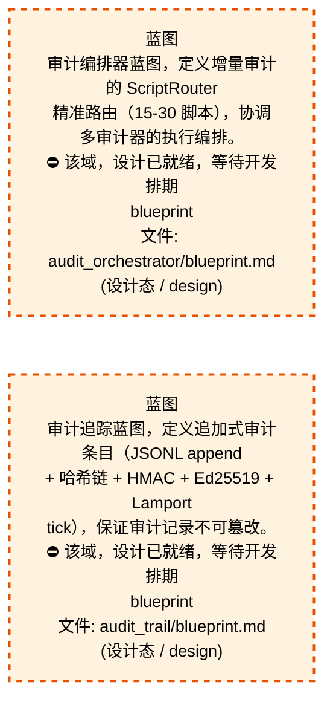
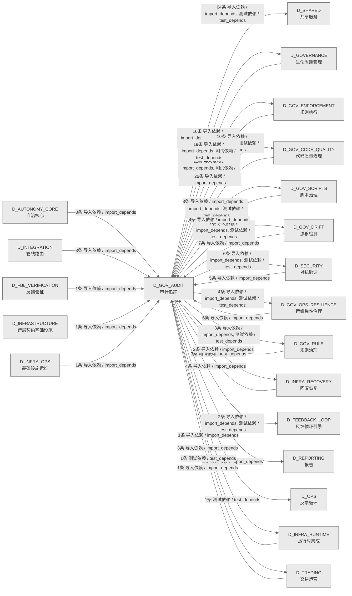

# 50_d_gov_audit / 审计追踪域 / Audit Trail

> **功能简介 / Overview**: 审计追踪，负责变更审计追踪和操作日志管理

> **文档作用 / Purpose**: 展示 审计追踪（D_GOV_AUDIT）功能域的域内依赖关系、跨域依赖关系，模块信息（成熟度/中英文名/大白话/文件路径）内嵌于 Mermaid 节点，供架构审查和域治理参考。

> 本文档由 generate_domain_doc.py 从 depgraph (PostgreSQL) 自动生成
> 数据源: depgraph (PostgreSQL) nodes表 + edges表

> **[可缩放 HTML 版 / Zoomable HTML](http://localhost:8765/docs/02_enterprise_architecture/02_domain_architecture_docs/_zoomable_html/50_d_gov_audit.html)** — Ctrl+滚轮缩放 ｜ 双击重置 ｜ Ctrl+Shift+D 切换拖动/选择模式

## 域基本信息 / Domain Overview

| 字段 | 值 | Field | Value |
|------|------|-------|-------|
| 编号 | 50 | Number | 50 |
| 域ID | D_GOV_AUDIT | Domain ID | D_GOV_AUDIT |
| 域名称 | 审计追踪 | Domain Name | Audit Trail |
| 层级 | L2 业务域层 | Layer | L2 Domain |
| 模块数 | 194 | Module Count | 194 |
| 域内依赖 | 175 | Internal Dependencies | 175 |
| 跨域入边 | 89 | Cross-domain Incoming | 89 |
| 跨域出边 | 140 | Cross-domain Outgoing | 140 |
| 设计态模块 | 2 | Design Modules | 2 |
| 生产态模块 | 192 | Production Modules | 192 |
| 容量 | 192/150 (超容) | Capacity | 192/150 (超容) |
| 描述 | 审计管线编排 | Description | 审计管线编排 |

## 域内依赖图 / Internal Dependency Diagram

> 依赖图内嵌在本文档中，IDE 可直接渲染；网页版可 Ctrl+滚轮缩放 + 拖动平移查看细节。
>
> **图例说明 / Legend**：
> - 🟦 **蓝色 = 运营态模块**（production，已上线运行）
> - 🟧 **橙色虚线 = 设计态模块**（design，蓝图阶段，代码未写）
> - **实线箭头 = 运营态依赖**（已生效的依赖关系）
> - **虚线箭头 = 非运营态依赖**（计划中/验证中的依赖关系）

### 全景图（全部模块，颜色区分运营态/设计态）

> 展示全部 194 个模块（生产态 192 + 设计态 2），含跨域依赖外部节点。节点含成熟度+名称+大白话/简介+文件路径。

```mermaid
%%{init: {'theme': 'base', 'themeVariables': {'primaryColor': '#eaeaea', 'primaryTextColor': '#333333', 'primaryBorderColor': '#666666', 'lineColor': '#666666', 'secondaryColor': '#eaeaea', 'tertiaryColor': '#eaeaea', 'fontSize': '14px'}}}%%
flowchart TD
    docs_03_modules_cross_layer_audit_orchestrator_blueprint_md["蓝图<br/>审计编排器蓝图，定义增量审计的 ScriptRouter<br/>精准路由（15-30 脚本），协调多审计器的执行编排。<br/>⛔ 该域，设计已就绪，等待开发排期<br/>blueprint<br/>文件: audit_orchestrator/blueprint.md<br/>(设计态 / design)"]
    docs_03_modules_domain_governance_audit_trail_blueprint_md["蓝图<br/>审计追踪蓝图，定义追加式审计条目（JSONL append<br/>+ 哈希链 + HMAC + Ed25519 + Lamport<br/>tick），保证审计记录不可篡改。<br/>⛔ 该域，设计已就绪，等待开发排期<br/>blueprint<br/>文件: audit_trail/blueprint.md<br/>(设计态 / design)"]
    scripts_governance_repair_audit_design_completeness_py["审计designcompleteness<br/>(INVARIANTS) 按path精确匹配+按功能名模糊匹配;<br/>输出差距报告; 提取所有ID格式<br/>audit_design_completeness<br/>文件: repair/audit_design_completeness.py<br/>(生产态 / production)"]
    scripts_governance_repair_red_blue_test_py["(INVARIANTS) 20项红蓝对抗测试<br/>数据库查询类测试<br/>red_blue_test<br/>文件: repair/red_blue_test.py<br/>(生产态 / production)"]
    scripts_governance_repair_rollback_depgraph_py["回滚依赖图<br/>(INVARIANTS) 仅接受depgraph.backup.*路径;<br/>回滚前自动备份当前depgraph<br/>rollback_depgraph<br/>文件: repair/rollback_depgraph.py<br/>(生产态 / production)"]
    scripts_governance_test_remediation_progress_smoke_py["测试修复进度smoke<br/>1 治本进度 reconciler end-to-end smoke test<br/>test_remediation_progress_smoke<br/>文件: governance<br/>/test_remediation_progress_smoke.py<br/>(生产态 / production)"]
    src_zephyr_gov_audit_action_history_py["行为历史<br/>ActionHistory — 操作历史持久化审计 + 去重 +<br/>循环检测<br/>action_history<br/>文件: gov_audit/action_history.py<br/>(生产态 / production)"]
    src_zephyr_gov_audit_api_lifecycle_py["API生命周期<br/>审计的状态机，管理状态流转<br/>api_lifecycle<br/>文件: gov_audit/api_lifecycle.py<br/>(生产态 / production)"]
    src_zephyr_gov_audit_audit_write_failure_protector_py["审计write故障protector<br/>Audit Write Failure Protector — v0.13.0<br/>审计写入失败保护器。<br/>audit_write_failure_protector<br/>文件: gov_audit/audit_write_failure_protector.py<br/>(生产态 / production)"]
    src_zephyr_gov_audit_bridges_audit_anomaly_py["审计异常<br/>审计治理（audit anomaly）<br/>audit_anomaly<br/>文件: bridges/audit_anomaly.py<br/>(生产态 / production)"]
    src_zephyr_gov_audit_bridges_audit_contracts_py["审计契约<br/>G-CT-001 契约消费端 — Audit.write() 公共接口.<br/>audit_contracts<br/>文件: bridges/audit_contracts.py<br/>(生产态 / production)"]
    src_zephyr_gov_audit_bridges_audit_drift_bridge_py["审计漂移桥接<br/>蓝图 §2.6 · 审计异常 ↔ 漂移检测双向联动<br/>audit_drift_bridge<br/>文件: bridges/audit_drift_bridge.py<br/>(生产态 / production)"]
    src_zephyr_gov_audit_bridges_audit_feedback_bridge_py["审计反馈桥接<br/>蓝图 §5 Evolve 支柱 — 审计异常数据驱动 FLE<br/>策略演进。<br/>audit_feedback_bridge<br/>文件: bridges/audit_feedback_bridge.py<br/>(生产态 / production)"]
    src_zephyr_gov_audit_cli_py["gov_audit/cli<br/>审计 CLI，提供 health/admit/pool_stats<br/>/run_audit 子命令，以及 search/verify/stats<br/>/trail/query 等查询命令，供终端、CI/CD、MCP<br/>工具调用。<br/>文件: gov_audit/cli.py<br/>(生产态 / production)"]
    src_zephyr_gov_audit_cold_start_py["冷启动<br/>BootstrapCache — 审计冷启动共享单例缓存。<br/>cold_start<br/>文件: gov_audit/cold_start.py<br/>(生产态 / production)"]
    src_zephyr_gov_audit_external_tool_audit_py["externaltool审计<br/>外部工具审计器，审计外部工具调用与模块，30<br/>秒超时自动降级，记录工具调用状态（成功/失败<br/>/超时/待定/重试）。<br/>external_tool_audit<br/>文件: gov_audit/external_tool_audit.py<br/>(生产态 / production)"]
    src_zephyr_gov_audit_feedback_policy_py["反馈策略<br/>审计的策略，定义决策规则<br/>文件: gov_audit/feedback_policy.py<br/>(生产态 / production)"]
    src_zephyr_gov_audit_feedback_self_audit_py["反馈自审计<br/>器，检测 Agent<br/>行为与自身反馈形成的自强化反馈环、模块间循环依赖<br/>、以及反馈导致的行为偏差放大<br/>feedback_self_audit<br/>文件: gov_audit/feedback_self_audit.py<br/>(生产态 / production)"]
    src_zephyr_gov_audit_kb_gate_py["知识库门禁<br/>知识库审计门控，检测 KB<br/>写入中的投毒尝试、验证写入来源可信度、识别可疑的<br/>KB 修改模式。<br/>kb_gate<br/>文件: gov_audit/kb_gate.py<br/>(生产态 / production)"]
    src_zephyr_gov_audit_observability_dashboard_py["可观测性仪表盘<br/>配置，定义系统健康/成本/订单流/模型漂移等面板与<br/>SLI 指标（内存/磁盘IO/上下文长度/token 消耗等）<br/>observability_dashboard<br/>文件: gov_audit/observability_dashboard.py<br/>(生产态 / production)"]
    src_zephyr_gov_audit_pipeline_runner_py["管线运行器<br/>审计的结果，封装操作结果的数据结构（pipeline<br/>runner）<br/>pipeline_runner<br/>文件: gov_audit/pipeline_runner.py<br/>(生产态 / production)"]
    src_zephyr_gov_audit_supply_chain_security_py["supplychain安全<br/>供应链安全审计器，扫描依赖锁文件、检测厂商锁定风<br/>险（WARNING/CRITICAL）、生成 SPDX物料清单。<br/>supply_chain_security<br/>文件: gov_audit/supply_chain_security.py<br/>(生产态 / production)"]
    src_zephyr_gov_audit_trust_ring_manager_py["trustring管理器<br/>实现业务功能（trust ring）<br/>trust_ring_manager<br/>文件: gov_audit/trust_ring_manager.py<br/>(生产态 / production)"]
    src_zephyr_gov_enforcement_behavioral_admission_ai_code_standards_py["ai代码standards<br/>AI 代码生成标准规则，定义脚手架自动生成、禁止<br/>demo 注释、测试必须 TDD 先 fail 后 pass 等规则。<br/>ai_code_standards<br/>文件: behavioral_admission/ai_code_standards.py<br/>(生产态 / production)"]
    src_zephyr_gov_enforcement_behavioral_admission_mcp_result_push_py["MCP结果推送<br/>治理执行的异常，定义本模块的异常类型<br/>mcp_result_push<br/>文件: behavioral_admission/mcp_result_push.py<br/>(生产态 / production)"]
    src_zephyr_gov_enforcement_behavioral_admission_post_process_py["提交进程<br/>— AI 生成代码后处理管道（Phase 13 / 盲点 B31）<br/>post_process<br/>文件: behavioral_admission/post_process.py<br/>(生产态 / production)"]
    src_zephyr_gov_enforcement_behavioral_admission_vibe_coding_enforcer_py["vibecoding执行器<br/>治理执行的核心类，封装VibeRuleLevel相关逻辑<br/>vibe_coding_enforcer<br/>文件: behavioral_admission<br/>/vibe_coding_enforcer.py<br/>(生产态 / production)"]
    src_zephyr_gov_enforcement_rule_enforcement_audit_chain_verifier_py["审计链验证器<br/>审计链验证工具——独立重放门禁判定+Hash链完整性校<br/>验（beta）<br/>audit_chain_verifier<br/>文件: rule_enforcement/audit_chain_verifier.py<br/>(生产态 / production)"]
    src_zephyr_gov_enforcement_rule_enforcement_sys_master_compliance_py["sys主合规<br/>依据：SYS-MASTER-CMP gate——系统总蓝图合规门禁<br/>SYS-MASTER-001 Compliance Checker<br/>文件: rule_enforcement/sys_master_compliance.py<br/>(生产态 / production)"]
    src_zephyr_governance_audit_trail_contracts_py["契约<br/>Audit 契约兼容转发层<br/>（G-CT-002），把审计契约符号 re-export 到<br/>audit-trail 入口，老导入路径不用改。<br/>contracts<br/>文件: audit-trail/contracts.py<br/>(生产态 / production)"]
    src_zephyr_governance_audit_ai_error_pattern_library_py["AI错误模式库<br/>AI 错误模式库（只读查询接口）。<br/>ai_error_pattern_library<br/>文件: audit/ai_error_pattern_library.py<br/>(生产态 / production)"]
    src_zephyr_governance_audit_blueprint_status_transition_reconciler_py["蓝图状态转换协调器<br/>蓝图状态单调推进 reconciler<br/>（P1-d，2026-07-21）。<br/>blueprint_status_transition_reconciler<br/>文件: audit<br/>/blueprint_status_transition_reconciler.py<br/>(生产态 / production)"]
    src_zephyr_governance_audit_cross_layer_contract_signature_reconciler_py["跨layercontractsignature对账器<br/>跨层契约签名漂移检测 reconciler<br/>（P1-b，2026-07-21）。<br/>文件: audit<br/>/cross_layer_contract_signature_reconciler.py<br/>(生产态 / production)"]
    src_zephyr_governance_audit_default_attribution_engine_py["默认attribution引擎<br/>收敛双定义——reporting.default_attribution_engine<br/>为真源（蓝图 MOD-L07-001），<br/>文件: audit/default_attribution_engine.py<br/>(生产态 / production)"]
    src_zephyr_governance_audit_default_tca_engine_py["默认tca引擎<br/>收敛双定义——reporting.default_tca_engine<br/>为真源（蓝图 MOD-L07-001），<br/>文件: audit/default_tca_engine.py<br/>(生产态 / production)"]
    src_zephyr_governance_audit_snapshot_manager_py["快照管理器<br/>定期将事件流折叠结果持久化到 task_snapshots<br/>表，加速后续 replay。<br/>snapshot_manager<br/>文件: audit/snapshot_manager.py<br/>(生产态 / production)"]
    src_zephyr_governance_financial_governance_financial_compliance_py["金融合规<br/>financial合规，治理的核心类，封装ComplianceLayer<br/>相关逻辑。<br/>financial_compliance<br/>文件: financial_governance<br/>/financial_compliance.py<br/>(生产态 / production)"]
    src_zephyr_governance_semantic_audit_compliance_map_py["合规map<br/>语义审计的合规框架映射器，将审计事件映射到 GDPR<br/>/HIPAA/EU AI Act/NIST 条款，支持多框架交叉映射。<br/>compliance_map<br/>文件: semantic_audit/compliance_map.py<br/>(生产态 / production)"]
    src_zephyr_governance_semantic_audit_feedback_self_audit_py["反馈自审计<br/>语义审计的反馈自审计器，检测自强化反馈环、循环依<br/>赖、异常放大，与 gov_audit 版本对齐。<br/>feedback_self_audit<br/>文件: semantic_audit/feedback_self_audit.py<br/>(生产态 / production)"]
    src_zephyr_governance_semantic_audit_fix_result_prioritizer_py["修复结果prioritizer<br/>修复优先级排序器：四维排序<br/>severity->impact->urgency->dependency_depth<br/>文件: semantic_audit/fix_result_prioritizer.py<br/>(生产态 / production)"]
    src_zephyr_governance_semantic_audit_orchestrator_py["编排器<br/>SemanticAuditor 编排器——9阶段管道统一调度.<br/>orchestrator<br/>文件: semantic_audit/orchestrator.py<br/>(生产态 / production)"]
    src_zephyr_governance_semantic_audit_privacy_py["审计轨迹·隐私模块<br/>semantic audit相关功能（privacy）<br/>文件: semantic_audit/privacy.py<br/>(生产态 / production)"]
    src_zephyr_governance_semantic_audit_semantic_cache_py["semantic缓存<br/>审计的缓存，暂存常用数据加速访问<br/>semantic_cache<br/>文件: semantic_audit/semantic_cache.py<br/>(生产态 / production)"]
    src_zephyr_governance_semantic_audit_spec_auditor_py["spec审计器<br/>蓝图 文件清单与代码双向对齐<br/>spec_auditor<br/>文件: semantic_audit/spec_auditor.py<br/>(生产态 / production)"]
    tests_governance_audit_test_alerts_py["Alerts测试<br/>审计包的test_alerts模块<br/>Test Alerts<br/>文件: audit/test_alerts.py<br/>(生产态 / production)"]
    tests_governance_audit_test_anomaly_py["异常测试<br/>审计包的test_anomaly模块<br/>Test Anomaly<br/>文件: audit/test_anomaly.py<br/>(生产态 / production)"]
    tests_governance_audit_test_audit_schema_unit_py["test_audit_schema.py — AuditQuery 单元测试<br/>审计包的test_audit_schema_unit模块<br/>Test Audit Schema Unit<br/>文件: audit/test_audit_schema_unit.py<br/>(生产态 / production)"]
    tests_governance_audit_test_auditor_py["审计器测试<br/>审计包的test_auditor模块<br/>Test Auditor<br/>文件: audit/test_auditor.py<br/>(生产态 / production)"]
    tests_governance_audit_test_blueprint_frontmatter_reconciler_post_commit_py["post-commit reconciler 单测<br/>test_blueprint_frontmatter_reconciler_post_commi<br/>t.py — post-commit reconcile...<br/>文件: audit<br/>/test_blueprint_frontmatter_reconciler_post_comm<br/>it.py<br/>(生产态 / production)"]
    tests_governance_audit_test_blueprint_id_legacy_reconciler_py["GATE-BLUEPRINT-ID-LEGACY reconciler 单测<br/>test_blueprint_id_legacy_reconciler.py —<br/>GATE-BLUEPRINT-ID-LEGACY reconciler...<br/>Test Blueprint Id Legacy Reconciler<br/>文件: audit<br/>/test_blueprint_id_legacy_reconciler.py<br/>(生产态 / production)"]
    tests_governance_audit_test_bridge_py["桥接器测试<br/>审计包的test_bridge模块<br/>Test Bridge<br/>文件: audit/test_bridge.py<br/>(生产态 / production)"]
    tests_governance_audit_test_capability_lookup_health_reconciler_py["Phase 4 G6 监控 reconciler e2e smoke test<br/>test_capability_lookup_health_reconciler.py —<br/>Phase 4 G6 监控 reconciler e2e...<br/>Test Capability Lookup Health Reconciler<br/>文件: audit<br/>/test_capability_lookup_health_reconciler.py<br/>(生产态 / production)"]
    tests_governance_audit_test_changelog_manager_py["Changelog管理器测试<br/>审计包的test_changelog_manager模块<br/>Test Changelog Manager<br/>文件: audit/test_changelog_manager.py<br/>(生产态 / production)"]
    tests_governance_audit_test_code_archaeology_py["代码Archaeology测试<br/>审计包的test_code_archaeology模块<br/>Test Code Archaeology<br/>文件: audit/test_code_archaeology.py<br/>(生产态 / production)"]
    tests_governance_audit_test_commit_gateway_abuse_monitor_reconciler_py["reconciler 单测<br/>test_commit_gateway_abuse_monitor_reconciler.py<br/>— reconciler 单测<br/>文件: audit<br/>/test_commit_gateway_abuse_monitor_reconciler.py<br/>(生产态 / production)"]
    tests_governance_audit_test_compliance_map_py["合规地图测试<br/>审计包的test_compliance_map模块<br/>Test Compliance Map<br/>文件: audit/test_compliance_map.py<br/>(生产态 / production)"]
    tests_governance_audit_test_corporate_actions_py["Corporate Actions测试<br/>审计包的test_corporate_actions模块<br/>Test Corporate Actions<br/>文件: audit/test_corporate_actions.py<br/>(生产态 / production)"]
    tests_governance_audit_test_cycle_dependency_audit_isolation_py["循环Dependency审计Isolation测试<br/>DOM-GOV-001 循环依赖测试 — Audit 独立运行验证 +<br/>无 RBAC import 扫描.<br/>Test Cycle Dependency Audit Isolation<br/>文件: audit<br/>/test_cycle_dependency_audit_isolation.py<br/>(生产态 / production)"]
    tests_governance_audit_test_dead_public_wrapper_reconciler_py["死公共 wrapper 自动检测 reconciler 单测<br/>test_dead_public_wrapper_reconciler.py — 死公共<br/>wrapper 自动检测 reconciler ...<br/>Test Dead Public Wrapper Reconciler<br/>文件: audit<br/>/test_dead_public_wrapper_reconciler.py<br/>(生产态 / production)"]
    tests_governance_audit_test_delegation_auditor_py["Delegation审计器测试<br/>审计包的test_delegation_auditor模块<br/>Test Delegation Auditor<br/>文件: audit/test_delegation_auditor.py<br/>(生产态 / production)"]
    tests_governance_audit_test_delegation_bridge_py["Delegation桥接器测试<br/>审计包的test_delegation_bridge模块<br/>Test Delegation Bridge<br/>文件: audit/test_delegation_bridge.py<br/>(生产态 / production)"]
    tests_governance_audit_test_depgraph_dirty_flag_py["DM-90974 Phase 2: depgraph dirty flag 单测<br/>test_depgraph_dirty_flag.py — DM-90974 Phase 2:<br/>depgraph dirty flag 单测<br/>Test Depgraph Dirty Flag<br/>文件: audit/test_depgraph_dirty_flag.py<br/>(生产态 / production)"]
    tests_governance_audit_test_dora_metrics_py["Dora指标测试<br/>审计包的test_dora_metrics模块<br/>Test Dora Metrics<br/>文件: audit/test_dora_metrics.py<br/>(生产态 / production)"]
    tests_governance_audit_test_downgrade_auto_committed_on_flush_failure_py["flush 失败降级单测<br/>test_downgrade_auto_committed_on_flush_failure.p<br/>y — flush 失败降级单测。<br/>文件: audit<br/>/test_downgrade_auto_committed_on_flush_failure.<br/>py<br/>(生产态 / production)"]
    tests_governance_audit_test_error_pattern_id_column_py["测试错误patternidcolumn<br/>error_pattern_id 列幂等迁移单测（P4-1a）<br/>test_error_pattern_id_column<br/>文件: audit/test_error_pattern_id_column.py<br/>(生产态 / production)"]
    tests_governance_audit_test_evidence_pack_py["Evidence Pack测试<br/>审计包的test_evidence_pack模块<br/>Test Evidence Pack<br/>文件: audit/test_evidence_pack.py<br/>(生产态 / production)"]
    tests_governance_audit_test_false_negative_auditor_py["FalseNegative审计器测试<br/>审计包的test_false_negative_auditor模块<br/>Test False Negative Auditor<br/>文件: audit/test_false_negative_auditor.py<br/>(生产态 / production)"]
    tests_governance_audit_test_fifteen_dimension_auditor_py["FifteenDimension审计器测试<br/>审计包的test_fifteen_dimension_auditor模块<br/>Test Fifteen Dimension Auditor<br/>文件: audit/test_fifteen_dimension_auditor.py<br/>(生产态 / production)"]
    tests_governance_audit_test_forensic_py["Forensic测试<br/>审计包的test_forensic模块<br/>Test Forensic<br/>文件: audit/test_forensic.py<br/>(生产态 / production)"]
    tests_governance_audit_test_forensic_package_py["Forensic Package测试<br/>审计包的test_forensic_package模块<br/>Test Forensic Package<br/>文件: audit/test_forensic_package.py<br/>(生产态 / production)"]
    tests_governance_audit_test_gap_analyzer_py["Gap分析器测试<br/>审计包的test_gap_analyzer模块<br/>Test Gap Analyzer<br/>文件: audit/test_gap_analyzer.py<br/>(生产态 / production)"]
    tests_governance_audit_test_gct_006_budget_to_escalation_py["Budget → Escalation 集成测试.'''<br/>G-CT-006 — Budget → Escalation 集成测试.<br/>Test Gct 006 Budget To Escalation<br/>文件: audit/test_gct_006_budget_to_escalation.py<br/>(生产态 / production)"]
    tests_governance_audit_test_genesis_py["Genesis测试<br/>审计包的test_genesis模块<br/>Test Genesis<br/>文件: audit/test_genesis.py<br/>(生产态 / production)"]
    tests_governance_audit_test_git_guard_bypass_reconciler_py["git_guard alias 绕过检测 reconciler 单测<br/>test_git_guard_bypass_reconciler.py — git_guard<br/>alias 绕过检测 reconciler 单...<br/>Test Git Guard Bypass Reconciler<br/>文件: audit/test_git_guard_bypass_reconciler.py<br/>(生产态 / production)"]
    tests_governance_audit_test_git_performance_monitor_reconciler_py["reconciler 单测<br/>test_git_performance_monitor_reconciler.py —<br/>reconciler 单测<br/>Test Git Performance Monitor Reconciler<br/>文件: audit<br/>/test_git_performance_monitor_reconciler.py<br/>(生产态 / production)"]
    tests_governance_audit_test_glossary_matrix_py["Glossary Matrix测试<br/>审计包的test_glossary_matrix模块<br/>Test Glossary Matrix<br/>文件: audit/test_glossary_matrix.py<br/>(生产态 / production)"]
    tests_governance_audit_test_governance_auditor_py["治理审计器测试<br/>审计包的test_governance_auditor模块<br/>Test Governance Auditor<br/>文件: audit/test_governance_auditor.py<br/>(生产态 / production)"]
    tests_governance_audit_test_health_score_calculator_py["P3-2 健康度评分计算器单测<br/>test_health_score_calculator.py — P3-2<br/>健康度评分计算器单测。<br/>Test Health Score Calculator<br/>文件: audit/test_health_score_calculator.py<br/>(生产态 / production)"]
    tests_governance_audit_test_incremental_review_py["Incremental Review测试<br/>审计包的test_incremental_review模块<br/>Test Incremental Review<br/>文件: audit/test_incremental_review.py<br/>(生产态 / production)"]
    tests_governance_audit_test_indexer_py["Indexer测试<br/>审计包的test_indexer模块<br/>Test Indexer<br/>文件: audit/test_indexer.py<br/>(生产态 / production)"]
    tests_governance_audit_test_integrity_audit_reconciler_py["GATE-INTEGRITY-AUDIT reconciler 单测<br/>test_integrity_audit_reconciler.py —<br/>GATE-INTEGRITY-AUDIT reconciler 单测<br/>Test Integrity Audit Reconciler<br/>文件: audit/test_integrity_audit_reconciler.py<br/>(生产态 / production)"]
    tests_governance_audit_test_integrity_root_py["完整性根入口测试<br/>审计包的test_integrity_root模块<br/>Test Integrity Root<br/>文件: audit/test_integrity_root.py<br/>(生产态 / production)"]
    tests_governance_audit_test_integrity_verifier_py["完整性验证器测试<br/>审计包的test_integrity_verifier模块<br/>Test Integrity Verifier<br/>文件: audit/test_integrity_verifier.py<br/>(生产态 / production)"]
    tests_governance_audit_test_log_rotation_py["日志Rotation测试<br/>审计包的test_log_rotation模块<br/>Test Log Rotation<br/>文件: audit/test_log_rotation.py<br/>(生产态 / production)"]
    tests_governance_audit_test_merkle_audit_py["Merkle审计测试<br/>审计包的test_merkle_audit模块<br/>Test Merkle Audit<br/>文件: audit/test_merkle_audit.py<br/>(生产态 / production)"]
    tests_governance_audit_test_merkle_hourly_py["Merkle Hourly测试<br/>审计包的test_merkle_hourly模块<br/>Test Merkle Hourly<br/>文件: audit/test_merkle_hourly.py<br/>(生产态 / production)"]
    tests_governance_audit_test_orchestrator_py["编排器测试<br/>审计包的test_orchestrator模块<br/>Test Orchestrator<br/>文件: audit/test_orchestrator.py<br/>(生产态 / production)"]
    tests_governance_audit_test_p0_i2_construction_order_py["P0I2Construction订单测试<br/>P0-I2 施工顺序验证 — DOM-GOV-001 §8.4.<br/>Test P0 I2 Construction Order<br/>文件: audit/test_p0_i2_construction_order.py<br/>(生产态 / production)"]
    tests_governance_audit_test_p3_integration_smoke_py["测试p3集成smoke<br/>验证 Phase 3 三个核心组件的端到端集成链路：<br/>test_p3_integration_smoke<br/>文件: audit/test_p3_integration_smoke.py<br/>(生产态 / production)"]
    tests_governance_audit_test_privacy_py["Privacy测试<br/>审计包的test_privacy模块<br/>Test Privacy<br/>文件: audit/test_privacy.py<br/>(生产态 / production)"]
    tests_governance_audit_test_provenance_tracker_py["Provenance跟踪器测试<br/>审计包的test_provenance_tracker模块<br/>Test Provenance Tracker<br/>文件: audit/test_provenance_tracker.py<br/>(生产态 / production)"]
    tests_governance_audit_test_query_py["查询测试<br/>审计包的test_query模块<br/>Test Query<br/>文件: audit/test_query.py<br/>(生产态 / production)"]
    tests_governance_audit_test_reconcile_async_py["测试对账异步<br/>1. reconcile_runner.write_status_file /<br/>read_status_file 原子读写 + 僵尸判定<br/>test_reconcile_async<br/>文件: audit/test_reconcile_async.py<br/>(生产态 / production)"]
    tests_governance_audit_test_reconcile_commit_message_audit_py["Phase 3.4 commit_message 审计链 e2e smoke test<br/>test_reconcile_commit_message_audit.py — Phase<br/>3.4 commit_message 审计链 e2e...<br/>Test Reconcile Commit Message Audit<br/>文件: audit<br/>/test_reconcile_commit_message_audit.py<br/>(生产态 / production)"]
    tests_governance_audit_test_reconcile_worker_selfheal_py["测试对账工作进程selfheal<br/>clean 记录消解之前的 critical_warn<br/>（活跃告警查询返回 0）<br/>test_reconcile_worker_selfheal<br/>文件: audit/test_reconcile_worker_selfheal.py<br/>(生产态 / production)"]
    tests_governance_audit_test_replay_engine_py["Replay引擎测试<br/>审计包的test_replay_engine模块<br/>Test Replay Engine<br/>文件: audit/test_replay_engine.py<br/>(生产态 / production)"]
    tests_governance_audit_test_retention_py["Retention测试<br/>审计包的test_retention模块<br/>Test Retention<br/>文件: audit/test_retention.py<br/>(生产态 / production)"]
    tests_governance_audit_test_runtime_violation_snapshot_py["runtime_violation_snapshot 模块单测<br/>test_runtime_violation_snapshot.py —<br/>runtime_violation_snapshot 模块单测<br/>Test Runtime Violation Snapshot<br/>文件: audit/test_runtime_violation_snapshot.py<br/>(生产态 / production)"]
    tests_governance_audit_test_runtime_violation_snapshot_reconciler_py["reconciler 单测<br/>test_runtime_violation_snapshot_reconciler.py —<br/>reconciler 单测<br/>文件: audit<br/>/test_runtime_violation_snapshot_reconciler.py<br/>(生产态 / production)"]
    tests_governance_audit_test_sbom_generator_py["Sbom生成器测试<br/>审计包的test_sbom_generator模块<br/>Test Sbom Generator<br/>文件: audit/test_sbom_generator.py<br/>(生产态 / production)"]
    tests_governance_audit_test_spec_auditor_py["Spec审计器测试<br/>审计包的test_spec_auditor模块<br/>Test Spec Auditor<br/>文件: audit/test_spec_auditor.py<br/>(生产态 / production)"]
    tests_governance_audit_test_stash_lifecycle_py["stash 生命周期治本单测<br/>test_stash_lifecycle.py — stash<br/>生命周期治本单测（裁定...<br/>Test Stash Lifecycle<br/>文件: audit/test_stash_lifecycle.py<br/>(生产态 / production)"]
    tests_governance_audit_test_supply_chain_py["Supply链测试<br/>审计包的test_supply_chain模块<br/>Test Supply Chain<br/>文件: audit/test_supply_chain.py<br/>(生产态 / production)"]
    tests_governance_audit_test_tamper_evident_log_py["TamperEvident日志测试<br/>审计包的test_tamper_evident_log模块<br/>Test Tamper Evident Log<br/>文件: audit/test_tamper_evident_log.py<br/>(生产态 / production)"]
    tests_governance_audit_test_tiered_storage_py["Tiered存储测试<br/>审计包的test_tiered_storage模块<br/>Test Tiered Storage<br/>文件: audit/test_tiered_storage.py<br/>(生产态 / production)"]
    tests_governance_audit_test_tiered_storage_bridge_py["Tiered存储桥接器测试<br/>审计包的test_tiered_storage_bridge模块<br/>Test Tiered Storage Bridge<br/>文件: audit/test_tiered_storage_bridge.py<br/>(生产态 / production)"]
    tests_governance_audit_test_trae_069_threshold_sync_smoke_py["测试trae069thresholdsyncsmoke<br/>trae_069 YAML 真源→代码常量同步 smoke test<br/>test_trae_069_threshold_sync_smoke<br/>文件: audit<br/>/test_trae_069_threshold_sync_smoke.py<br/>(生产态 / production)"]
    tests_governance_audit_test_translation_coverage_reconciler_py["翻译覆盖率存量对账 reconciler 单测<br/>test_translation_coverage_reconciler.py —<br/>翻译覆盖率存量对账 reconciler 单测<br/>Test Translation Coverage Reconciler<br/>文件: audit<br/>/test_translation_coverage_reconciler.py<br/>(生产态 / production)"]
    tests_governance_audit_test_trust_bridge_py["Trust桥接器测试<br/>审计包的test_trust_bridge模块<br/>Test Trust Bridge<br/>文件: audit/test_trust_bridge.py<br/>(生产态 / production)"]
    tests_governance_audit_test_trust_engine_py["Trust引擎测试<br/>审计包的test_trust_engine模块<br/>Test Trust Engine<br/>文件: audit/test_trust_engine.py<br/>(生产态 / production)"]
    tests_governance_audit_test_truth_source_validator_py["—真源优先级裁决器<br/>审计包的test_truth_source_validator模块<br/>Test Truth Source Validator<br/>文件: audit/test_truth_source_validator.py<br/>(生产态 / production)"]
    tests_governance_audit_test_undefined_name_baseline_reconciler_py["GATE-UNDEFINED-NAME-BASELINE reconciler 单测<br/>test_undefined_name_baseline_reconciler.py —<br/>GATE-UNDEFINED-NAME-BASELINE re...<br/>Test Undefined Name Baseline Reconciler<br/>文件: audit<br/>/test_undefined_name_baseline_reconciler.py<br/>(生产态 / production)"]
    tests_governance_audit_test_verdict_engine_py["Verdict引擎测试<br/>审计包的test_verdict_engine模块<br/>Test Verdict Engine<br/>文件: audit/test_verdict_engine.py<br/>(生产态 / production)"]
    tests_governance_audit_test_workspace_hygiene_reconciler_py["工作区卫生自动清理 reconciler 单测<br/>test_workspace_hygiene_reconciler.py —<br/>工作区卫生自动清理 reconciler 单测。<br/>Test Workspace Hygiene Reconciler<br/>文件: audit/test_workspace_hygiene_reconciler.py<br/>(生产态 / production)"]
    tests_governance_audit_test_wqa_scorer_py["Wqa Scorer测试<br/>审计包的test_wqa_scorer模块<br/>Test Wqa Scorer<br/>文件: audit/test_wqa_scorer.py<br/>(生产态 / production)"]
    tests_governance_audit_test_writer_py["写入器测试<br/>审计包的test_writer模块<br/>Test Writer<br/>文件: audit/test_writer.py<br/>(生产态 / production)"]
    tests_governance_audit_test_yaml_sync_reconciler_error_classification_py["reconciler 错误分类与重试策略测试<br/>test_yaml_sync_reconciler_error_classification.p<br/>y — reconciler 错误分类与重...<br/>文件: audit<br/>/test_yaml_sync_reconciler_error_classification.<br/>py<br/>(生产态 / production)"]
    tests_governance_rule_bridge_test_session_worktree_async_reconcile_py["测试会话worktree异步对账<br/>卡 2-5min。治本改为异步<br/>launch_reconcile_async，merge 立即返回。<br/>test_session_worktree_async_reconcile<br/>文件: rule_bridge<br/>/test_session_worktree_async_reconcile.py<br/>(生产态 / production)"]
    tests_governance_test_workspace_telemetry_shared_py["测试工作区遥测共享<br/>治理管控（test workspace telemetry shared）<br/>test_workspace_telemetry_shared<br/>文件: governance<br/>/test_workspace_telemetry_shared.py<br/>(生产态 / production)"]
    docs_03_modules_cross_layer_audit_orchestrator_blueprint_md ~~~ docs_03_modules_domain_governance_audit_trail_blueprint_md
    docs_03_modules_domain_governance_audit_trail_blueprint_md ~~~ scripts_governance_repair_audit_design_completeness_py
    scripts_governance_repair_audit_design_completeness_py ~~~ scripts_governance_repair_red_blue_test_py
    scripts_governance_repair_red_blue_test_py ~~~ scripts_governance_repair_rollback_depgraph_py
    scripts_governance_repair_rollback_depgraph_py ~~~ scripts_governance_test_remediation_progress_smoke_py
    scripts_governance_test_remediation_progress_smoke_py ~~~ src_zephyr_gov_audit_action_history_py
    src_zephyr_gov_audit_action_history_py ~~~ src_zephyr_gov_audit_api_lifecycle_py
    src_zephyr_gov_audit_api_lifecycle_py ~~~ src_zephyr_gov_audit_audit_write_failure_protector_py
    src_zephyr_gov_audit_audit_write_failure_protector_py ~~~ src_zephyr_gov_audit_bridges_audit_anomaly_py
    src_zephyr_gov_audit_bridges_audit_anomaly_py ~~~ src_zephyr_gov_audit_bridges_audit_contracts_py
    src_zephyr_gov_audit_bridges_audit_contracts_py ~~~ src_zephyr_gov_audit_bridges_audit_drift_bridge_py
    src_zephyr_gov_audit_bridges_audit_drift_bridge_py ~~~ src_zephyr_gov_audit_bridges_audit_feedback_bridge_py
    src_zephyr_gov_audit_bridges_audit_feedback_bridge_py ~~~ src_zephyr_gov_audit_cli_py
    src_zephyr_gov_audit_cli_py ~~~ src_zephyr_gov_audit_cold_start_py
    src_zephyr_gov_audit_cold_start_py ~~~ src_zephyr_gov_audit_external_tool_audit_py
    src_zephyr_gov_audit_external_tool_audit_py ~~~ src_zephyr_gov_audit_feedback_policy_py
    src_zephyr_gov_audit_feedback_policy_py ~~~ src_zephyr_gov_audit_feedback_self_audit_py
    src_zephyr_gov_audit_feedback_self_audit_py ~~~ src_zephyr_gov_audit_kb_gate_py
    src_zephyr_gov_audit_kb_gate_py ~~~ src_zephyr_gov_audit_observability_dashboard_py
    src_zephyr_gov_audit_observability_dashboard_py ~~~ src_zephyr_gov_audit_pipeline_runner_py
    src_zephyr_gov_audit_pipeline_runner_py ~~~ src_zephyr_gov_audit_supply_chain_security_py
    src_zephyr_gov_audit_supply_chain_security_py ~~~ src_zephyr_gov_audit_trust_ring_manager_py
    src_zephyr_gov_audit_trust_ring_manager_py ~~~ src_zephyr_gov_enforcement_behavioral_admission_ai_code_standards_py
    src_zephyr_gov_enforcement_behavioral_admission_ai_code_standards_py ~~~ src_zephyr_gov_enforcement_behavioral_admission_mcp_result_push_py
    src_zephyr_gov_enforcement_behavioral_admission_mcp_result_push_py ~~~ src_zephyr_gov_enforcement_behavioral_admission_post_process_py
    src_zephyr_gov_enforcement_behavioral_admission_post_process_py ~~~ src_zephyr_gov_enforcement_behavioral_admission_vibe_coding_enforcer_py
    src_zephyr_gov_enforcement_behavioral_admission_vibe_coding_enforcer_py ~~~ src_zephyr_gov_enforcement_rule_enforcement_audit_chain_verifier_py
    src_zephyr_gov_enforcement_rule_enforcement_audit_chain_verifier_py ~~~ src_zephyr_gov_enforcement_rule_enforcement_sys_master_compliance_py
    src_zephyr_gov_enforcement_rule_enforcement_sys_master_compliance_py ~~~ src_zephyr_governance_audit_trail_contracts_py
    src_zephyr_governance_audit_trail_contracts_py ~~~ src_zephyr_governance_audit_ai_error_pattern_library_py
    src_zephyr_governance_audit_ai_error_pattern_library_py ~~~ src_zephyr_governance_audit_blueprint_status_transition_reconciler_py
    src_zephyr_governance_audit_blueprint_status_transition_reconciler_py ~~~ src_zephyr_governance_audit_cross_layer_contract_signature_reconciler_py
    src_zephyr_governance_audit_cross_layer_contract_signature_reconciler_py ~~~ src_zephyr_governance_audit_default_attribution_engine_py
    src_zephyr_governance_audit_default_attribution_engine_py ~~~ src_zephyr_governance_audit_default_tca_engine_py
    src_zephyr_governance_audit_default_tca_engine_py ~~~ src_zephyr_governance_audit_snapshot_manager_py
    src_zephyr_governance_audit_snapshot_manager_py ~~~ src_zephyr_governance_financial_governance_financial_compliance_py
    src_zephyr_governance_financial_governance_financial_compliance_py ~~~ src_zephyr_governance_semantic_audit_compliance_map_py
    src_zephyr_governance_semantic_audit_compliance_map_py ~~~ src_zephyr_governance_semantic_audit_feedback_self_audit_py
    src_zephyr_governance_semantic_audit_feedback_self_audit_py ~~~ src_zephyr_governance_semantic_audit_fix_result_prioritizer_py
    src_zephyr_governance_semantic_audit_fix_result_prioritizer_py ~~~ src_zephyr_governance_semantic_audit_orchestrator_py
    src_zephyr_governance_semantic_audit_orchestrator_py ~~~ src_zephyr_governance_semantic_audit_privacy_py
    src_zephyr_governance_semantic_audit_privacy_py ~~~ src_zephyr_governance_semantic_audit_semantic_cache_py
    src_zephyr_governance_semantic_audit_semantic_cache_py ~~~ src_zephyr_governance_semantic_audit_spec_auditor_py
    src_zephyr_governance_semantic_audit_spec_auditor_py ~~~ tests_governance_audit_test_alerts_py
    tests_governance_audit_test_alerts_py ~~~ tests_governance_audit_test_anomaly_py
    tests_governance_audit_test_anomaly_py ~~~ tests_governance_audit_test_audit_schema_unit_py
    tests_governance_audit_test_audit_schema_unit_py ~~~ tests_governance_audit_test_auditor_py
    tests_governance_audit_test_auditor_py ~~~ tests_governance_audit_test_blueprint_frontmatter_reconciler_post_commit_py
    tests_governance_audit_test_blueprint_frontmatter_reconciler_post_commit_py ~~~ tests_governance_audit_test_blueprint_id_legacy_reconciler_py
    tests_governance_audit_test_blueprint_id_legacy_reconciler_py ~~~ tests_governance_audit_test_bridge_py
    tests_governance_audit_test_bridge_py ~~~ tests_governance_audit_test_capability_lookup_health_reconciler_py
    tests_governance_audit_test_capability_lookup_health_reconciler_py ~~~ tests_governance_audit_test_changelog_manager_py
    tests_governance_audit_test_changelog_manager_py ~~~ tests_governance_audit_test_code_archaeology_py
    tests_governance_audit_test_code_archaeology_py ~~~ tests_governance_audit_test_commit_gateway_abuse_monitor_reconciler_py
    tests_governance_audit_test_commit_gateway_abuse_monitor_reconciler_py ~~~ tests_governance_audit_test_compliance_map_py
    tests_governance_audit_test_compliance_map_py ~~~ tests_governance_audit_test_corporate_actions_py
    tests_governance_audit_test_corporate_actions_py ~~~ tests_governance_audit_test_cycle_dependency_audit_isolation_py
    tests_governance_audit_test_cycle_dependency_audit_isolation_py ~~~ tests_governance_audit_test_dead_public_wrapper_reconciler_py
    tests_governance_audit_test_dead_public_wrapper_reconciler_py ~~~ tests_governance_audit_test_delegation_auditor_py
    tests_governance_audit_test_delegation_auditor_py ~~~ tests_governance_audit_test_delegation_bridge_py
    tests_governance_audit_test_delegation_bridge_py ~~~ tests_governance_audit_test_depgraph_dirty_flag_py
    tests_governance_audit_test_depgraph_dirty_flag_py ~~~ tests_governance_audit_test_dora_metrics_py
    tests_governance_audit_test_dora_metrics_py ~~~ tests_governance_audit_test_downgrade_auto_committed_on_flush_failure_py
    tests_governance_audit_test_downgrade_auto_committed_on_flush_failure_py ~~~ tests_governance_audit_test_error_pattern_id_column_py
    tests_governance_audit_test_error_pattern_id_column_py ~~~ tests_governance_audit_test_evidence_pack_py
    tests_governance_audit_test_evidence_pack_py ~~~ tests_governance_audit_test_false_negative_auditor_py
    tests_governance_audit_test_false_negative_auditor_py ~~~ tests_governance_audit_test_fifteen_dimension_auditor_py
    tests_governance_audit_test_fifteen_dimension_auditor_py ~~~ tests_governance_audit_test_forensic_py
    tests_governance_audit_test_forensic_py ~~~ tests_governance_audit_test_forensic_package_py
    tests_governance_audit_test_forensic_package_py ~~~ tests_governance_audit_test_gap_analyzer_py
    tests_governance_audit_test_gap_analyzer_py ~~~ tests_governance_audit_test_gct_006_budget_to_escalation_py
    tests_governance_audit_test_gct_006_budget_to_escalation_py ~~~ tests_governance_audit_test_genesis_py
    tests_governance_audit_test_genesis_py ~~~ tests_governance_audit_test_git_guard_bypass_reconciler_py
    tests_governance_audit_test_git_guard_bypass_reconciler_py ~~~ tests_governance_audit_test_git_performance_monitor_reconciler_py
    tests_governance_audit_test_git_performance_monitor_reconciler_py ~~~ tests_governance_audit_test_glossary_matrix_py
    tests_governance_audit_test_glossary_matrix_py ~~~ tests_governance_audit_test_governance_auditor_py
    tests_governance_audit_test_governance_auditor_py ~~~ tests_governance_audit_test_health_score_calculator_py
    tests_governance_audit_test_health_score_calculator_py ~~~ tests_governance_audit_test_incremental_review_py
    tests_governance_audit_test_incremental_review_py ~~~ tests_governance_audit_test_indexer_py
    tests_governance_audit_test_indexer_py ~~~ tests_governance_audit_test_integrity_audit_reconciler_py
    tests_governance_audit_test_integrity_audit_reconciler_py ~~~ tests_governance_audit_test_integrity_root_py
    tests_governance_audit_test_integrity_root_py ~~~ tests_governance_audit_test_integrity_verifier_py
    tests_governance_audit_test_integrity_verifier_py ~~~ tests_governance_audit_test_log_rotation_py
    tests_governance_audit_test_log_rotation_py ~~~ tests_governance_audit_test_merkle_audit_py
    tests_governance_audit_test_merkle_audit_py ~~~ tests_governance_audit_test_merkle_hourly_py
    tests_governance_audit_test_merkle_hourly_py ~~~ tests_governance_audit_test_orchestrator_py
    tests_governance_audit_test_orchestrator_py ~~~ tests_governance_audit_test_p0_i2_construction_order_py
    tests_governance_audit_test_p0_i2_construction_order_py ~~~ tests_governance_audit_test_p3_integration_smoke_py
    tests_governance_audit_test_p3_integration_smoke_py ~~~ tests_governance_audit_test_privacy_py
    tests_governance_audit_test_privacy_py ~~~ tests_governance_audit_test_provenance_tracker_py
    tests_governance_audit_test_provenance_tracker_py ~~~ tests_governance_audit_test_query_py
    tests_governance_audit_test_query_py ~~~ tests_governance_audit_test_reconcile_async_py
    tests_governance_audit_test_reconcile_async_py ~~~ tests_governance_audit_test_reconcile_commit_message_audit_py
    tests_governance_audit_test_reconcile_commit_message_audit_py ~~~ tests_governance_audit_test_reconcile_worker_selfheal_py
    tests_governance_audit_test_reconcile_worker_selfheal_py ~~~ tests_governance_audit_test_replay_engine_py
    tests_governance_audit_test_replay_engine_py ~~~ tests_governance_audit_test_retention_py
    tests_governance_audit_test_retention_py ~~~ tests_governance_audit_test_runtime_violation_snapshot_py
    tests_governance_audit_test_runtime_violation_snapshot_py ~~~ tests_governance_audit_test_runtime_violation_snapshot_reconciler_py
    tests_governance_audit_test_runtime_violation_snapshot_reconciler_py ~~~ tests_governance_audit_test_sbom_generator_py
    tests_governance_audit_test_sbom_generator_py ~~~ tests_governance_audit_test_spec_auditor_py
    tests_governance_audit_test_spec_auditor_py ~~~ tests_governance_audit_test_stash_lifecycle_py
    tests_governance_audit_test_stash_lifecycle_py ~~~ tests_governance_audit_test_supply_chain_py
    tests_governance_audit_test_supply_chain_py ~~~ tests_governance_audit_test_tamper_evident_log_py
    tests_governance_audit_test_tamper_evident_log_py ~~~ tests_governance_audit_test_tiered_storage_py
    tests_governance_audit_test_tiered_storage_py ~~~ tests_governance_audit_test_tiered_storage_bridge_py
    tests_governance_audit_test_tiered_storage_bridge_py ~~~ tests_governance_audit_test_trae_069_threshold_sync_smoke_py
    tests_governance_audit_test_trae_069_threshold_sync_smoke_py ~~~ tests_governance_audit_test_translation_coverage_reconciler_py
    tests_governance_audit_test_translation_coverage_reconciler_py ~~~ tests_governance_audit_test_trust_bridge_py
    tests_governance_audit_test_trust_bridge_py ~~~ tests_governance_audit_test_trust_engine_py
    tests_governance_audit_test_trust_engine_py ~~~ tests_governance_audit_test_truth_source_validator_py
    tests_governance_audit_test_truth_source_validator_py ~~~ tests_governance_audit_test_undefined_name_baseline_reconciler_py
    tests_governance_audit_test_undefined_name_baseline_reconciler_py ~~~ tests_governance_audit_test_verdict_engine_py
    tests_governance_audit_test_verdict_engine_py ~~~ tests_governance_audit_test_workspace_hygiene_reconciler_py
    tests_governance_audit_test_workspace_hygiene_reconciler_py ~~~ tests_governance_audit_test_wqa_scorer_py
    tests_governance_audit_test_wqa_scorer_py ~~~ tests_governance_audit_test_writer_py
    tests_governance_audit_test_writer_py ~~~ tests_governance_audit_test_yaml_sync_reconciler_error_classification_py
    tests_governance_audit_test_yaml_sync_reconciler_error_classification_py ~~~ tests_governance_rule_bridge_test_session_worktree_async_reconcile_py
    tests_governance_rule_bridge_test_session_worktree_async_reconcile_py ~~~ tests_governance_test_workspace_telemetry_shared_py
    src_zephyr_gov_audit_orchestrator_compat_py["编排器兼容<br/>audit-orchestrator 兼容重导出层（ARCH-042 阶段4<br/>修复双 MODULE，ARCH-043 Risk3 改名）<br/>_orchestrator_compat<br/>文件: gov_audit/_orchestrator_compat.py<br/>(生产态 / production)"]
    src_zephyr_gov_audit_audit_admission_controller_py["审计准入控制器<br/>审计的结果，封装操作结果的数据结构（audit<br/>admission）<br/>audit_admission_controller<br/>文件: gov_audit/audit_admission_controller.py<br/>(生产态 / production)"]
    src_zephyr_gov_audit_audit_schema_py["审计模式<br/>audit_schema — 审计视图与查询入口（SH-DB-001<br/>v2.0）<br/>文件: gov_audit/audit_schema.py<br/>(生产态 / production)"]
    src_zephyr_gov_audit_bridges_audit_delegation_bridge_py["审计delegation桥接<br/>蓝图 D-020-16 — 委托链审计（深度控制 +<br/>权限缩小）。<br/>audit_delegation_bridge<br/>文件: bridges/audit_delegation_bridge.py<br/>(生产态 / production)"]
    src_zephyr_gov_audit_bridges_audit_tiered_storage_bridge_py["审计tiered存储桥接<br/>蓝图 D-020-10 — 三层存储架构（热≤7d / 温8~90d /<br/>冷>90d）。<br/>audit_tiered_storage_bridge<br/>文件: bridges/audit_tiered_storage_bridge.py<br/>(生产态 / production)"]
    src_zephyr_gov_audit_bridges_audit_trust_bridge_py["审计信任桥接<br/>蓝图 §2.3 D-020-17 — 渐进信任分数(0.0~1.0) +<br/>时间衰减。<br/>audit_trust_bridge<br/>文件: bridges/audit_trust_bridge.py<br/>(生产态 / production)"]
    src_zephyr_gov_audit_changelog_manager_py["changelog管理器<br/>审计的日志器，记录运行日志<br/>changelog_manager<br/>文件: gov_audit/changelog_manager.py<br/>(生产态 / production)"]
    src_zephyr_gov_audit_code_archaeology_py["代码archaeology<br/>审计的记录器，把发生的事件/结果记下来留档<br/>code_archaeology<br/>文件: gov_audit/code_archaeology.py<br/>(生产态 / production)"]
    src_zephyr_gov_audit_compliance_map_py["合规map<br/>合规框架映射器，将审计事件类型映射到 GDPR/HIPAA<br/>/EU AI Act/NIST 的具体条款，支持多框架交叉映射。<br/>compliance_map<br/>文件: gov_audit/compliance_map.py<br/>(生产态 / production)"]
    src_zephyr_gov_audit_corporate_actions_py["公司行为<br/>审计的类型，定义数据类型和枚举<br/>corporate_actions<br/>文件: gov_audit/corporate_actions.py<br/>(生产态 / production)"]
    src_zephyr_gov_audit_delegation_auditor_py["delegation审计器<br/>委托链升级类型 -- str+Enum 使 == 'string_value'<br/>可用.<br/>delegation_auditor<br/>文件: gov_audit/delegation_auditor.py<br/>(生产态 / production)"]
    src_zephyr_gov_audit_dora_metrics_py["dora指标<br/>DORA 指标采集器，统计部署频率、变更前置时间、变<br/>更失败率、平均恢复时间四项研发效能指标并判定是否<br/>达标。<br/>dora_metrics<br/>文件: gov_audit/dora_metrics.py<br/>(生产态 / production)"]
    src_zephyr_gov_audit_event_store_py["事件存储<br/>审计治理（event store）<br/>event_store<br/>文件: gov_audit/event_store.py<br/>(生产态 / production)"]
    src_zephyr_gov_audit_evidence_pack_py["证据包<br/>审计证据包导出器，把审计记录导出为 JSON/PDF/FCA<br/>三种合规格式，PDF 需 reportlab 支持。<br/>evidence_pack<br/>文件: gov_audit/evidence_pack.py<br/>(生产态 / production)"]
    src_zephyr_gov_audit_forensic_package_py["取证包<br/>证据包不可篡改;因果图必须完整<br/>forensic_package<br/>文件: gov_audit/forensic_package.py<br/>(生产态 / production)"]
    src_zephyr_gov_audit_genesis_py["audit-trail.genesis — MOD-INF-020 · 创世块管<br/>审计创世块管理器，提供创世块的创建、持久化、验证<br/>能力，含见证签名与验证结果数据模型，作为哈希链的<br/>信任根。<br/>文件: gov_audit/genesis.py<br/>(生产态 / production)"]
    src_zephyr_gov_audit_glossary_matrix_py["词汇表矩阵<br/>术语词汇表矩阵，定义量化/架构/交易/风控<br/>/运维等领域术语（Alpha/Backtest/DMA/FIX/MDD<br/>等）的中英文定义，支持查询与列举。<br/>glossary_matrix<br/>文件: gov_audit/glossary_matrix.py<br/>(生产态 / production)"]
    src_zephyr_gov_audit_incremental_review_py["incremental审查<br/>增量审查器，按一致性（语义割裂）、准确性<br/>（数字引用）、可追溯性（正反向链路）、无下降<br/>（对比上次）四维度做增量审查。<br/>incremental_review<br/>文件: gov_audit/incremental_review.py<br/>(生产态 / production)"]
    src_zephyr_gov_audit_integrity_verifier_py["完整性验证器<br/>Integrity Verifier — v0.8.0 代码完整性验证器:<br/>hash校验+diff detection+rollback。<br/>integrity_verifier<br/>文件: gov_audit/integrity_verifier.py<br/>(生产态 / production)"]
    src_zephyr_gov_audit_log_rotation_py["日志rotation<br/>审计日志轮转管理器——按天轮转<br/>events.jsonl，支持压缩和过期清理。<br/>log_rotation<br/>文件: gov_audit/log_rotation.py<br/>(生产态 / production)"]
    src_zephyr_gov_audit_merkle_audit_py["merkle审计<br/>Merkle 审计兼容别名，SSoT 已迁移到 gov_audit 的<br/>MerkleAggregator +<br/>HourlyMerkleAggregator，本模块保留 API<br/>兼容性内部委托。<br/>merkle_audit<br/>文件: gov_audit/merkle_audit.py<br/>(生产态 / production)"]
    src_zephyr_gov_audit_privacy_py["审计轨迹·隐私模块<br/>gov audit相关功能（privacy）<br/>文件: gov_audit/privacy.py<br/>(生产态 / production)"]
    src_zephyr_gov_audit_provenance_tracker_py["溯源追踪器<br/>provenance追踪器，审计的记录器，把发生的事件<br/>/结果记下来留档。<br/>provenance_tracker<br/>文件: gov_audit/provenance_tracker.py<br/>(生产态 / production)"]
    src_zephyr_gov_audit_replay_engine_py["重放快照（补全测试期望接口）。<br/>重放结果（补全测试期望接口）。<br/>replay_engine<br/>文件: gov_audit/replay_engine.py<br/>(生产态 / production)"]
    src_zephyr_gov_audit_resource_aware_pool_py["资源感知池<br/>管理 GPU futures 等计算资源的感知与调度（Stage<br/>4 公共化只读），为审计准入控制器提供资源视图<br/>resource_aware_pool<br/>文件: gov_audit/resource_aware_pool.py<br/>(生产态 / production)"]
    src_zephyr_gov_audit_retention_py["保留策略（补全测试期望接口）。<br/>保留旧版 HOT/WARM/COLD/LOG_RETENTION_DAYS<br/>类属性以兼容现有调用方。<br/>文件: gov_audit/retention.py<br/>(生产态 / production)"]
    src_zephyr_gov_audit_sbom_generator_py["sbom生成器<br/>LicenseType 枚举——许可证类型定义（P3<br/>价值审判退役残留）。<br/>sbom_generator<br/>文件: gov_audit/sbom_generator.py<br/>(生产态 / production)"]
    src_zephyr_gov_audit_spec_auditor_py["spec审计器<br/>Agent 规格审计器，record_agent_spec 记录 agent<br/>能力声明到审计链，是 gov_audit<br/>内部规格登记入口。<br/>spec_auditor<br/>文件: gov_audit/spec_auditor.py<br/>(生产态 / production)"]
    src_zephyr_gov_audit_supply_chain_py["supply链<br/>蓝图 D-020-23 · 包安装检测 + SHA-256 完整性验证<br/>supply_chain<br/>文件: gov_audit/supply_chain.py<br/>(生产态 / production)"]
    src_zephyr_gov_audit_text_to_finding_adapter_py["texttofinding适配器<br/>textto发现适配器，审计的解析器，把文本<br/>/数据解析成结构化对象。<br/>text_to_finding_adapter<br/>文件: gov_audit/text_to_finding_adapter.py<br/>(生产态 / production)"]
    src_zephyr_gov_audit_wqa_scorer_py["wqa评分器<br/>主要提供composite、rating等功能<br/>wqa_scorer<br/>文件: gov_audit/wqa_scorer.py<br/>(生产态 / production)"]
    src_zephyr_governance_audit_git_helpers_py["Git辅助<br/>审计 reconciler 共享 git 工具模块<br/>_git_helpers<br/>文件: audit/_git_helpers.py<br/>(生产态 / production)"]
    src_zephyr_governance_audit_commit_gateway_abuse_monitor_reconciler_py["commitgatewayabuse监控器对账器<br/>post-commit 事件触发，扫描 ``.runtime<br/>/reconcile_reports/`` 下<br/>``post_commit_guard_*``，治理管控<br/>commit_gateway_abuse_monitor_reconciler<br/>文件: audit<br/>/commit_gateway_abuse_monitor_reconciler.py<br/>(生产态 / production)"]
    src_zephyr_governance_audit_dead_public_wrapper_reconciler_py["死公共 wrapper 自动检测 reconciler.<br/>dead_public_wrapper_reconciler.py — 死公共<br/>wrapper 自动检测 reconciler.<br/>Dead Public Wrapper Reconciler<br/>文件: audit/dead_public_wrapper_reconciler.py<br/>(生产态 / production)"]
    src_zephyr_governance_audit_error_pattern_consumer_reconciler_py["错误模式消费者协调器<br/>AI 行为遥测 JSONL 错误事件聚合 consumer。<br/>error_pattern_consumer_reconciler<br/>文件: audit/error_pattern_consumer_reconciler.py<br/>(生产态 / production)"]
    src_zephyr_governance_audit_git_guard_bypass_reconciler_py["git_guard alias 绕过检测 post-commit reconciler<br/>git_guard_bypass_reconciler.py — git_guard<br/>alias 绕过检测 post-commit reconc...<br/>Git Guard Bypass Reconciler<br/>文件: audit/git_guard_bypass_reconciler.py<br/>(生产态 / production)"]
    src_zephyr_governance_audit_git_performance_monitor_reconciler_py["Git绩效监控协调器<br/>git 性能持续监控 + 早期预警<br/>（ARCH-GIT-CALL-BUDGET P3.5，2026-07-19）。<br/>git_performance_monitor_reconciler<br/>文件: audit<br/>/git_performance_monitor_reconciler.py<br/>(生产态 / production)"]
    src_zephyr_governance_audit_reconcile_worker_py["对账工作器<br/>独立执行 post-commit reconciler 链路，结果写回<br/>status file + reconcile_execution_log 表。<br/>reconcile_worker<br/>文件: audit/reconcile_worker.py<br/>(生产态 / production)"]
    src_zephyr_governance_audit_remediation_progress_reconciler_py["修复进度对账器<br/>治本进度持久化 + 新鲜度对账<br/>（#ARCH-GOV-CONVERGENCE-META Phase 3.1）。<br/>remediation_progress_reconciler<br/>文件: audit/remediation_progress_reconciler.py<br/>(生产态 / production)"]
    src_zephyr_governance_audit_runtime_violation_snapshot_reconciler_py["运行时违规快照协调器<br/>trae_060 §5 的'违规清单'是 2026-06-26<br/>的静态快照，写入 frozen YAML 后持续脱节<br/>runtime_violation_snapshot_reconciler<br/>文件: audit<br/>/runtime_violation_snapshot_reconciler.py<br/>(生产态 / production)"]
    src_zephyr_governance_audit_translation_coverage_reconciler_py["翻译覆盖率存量对账 reconciler.<br/>translation_coverage_reconciler.py —<br/>翻译覆盖率存量对账 reconciler.<br/>Translation Coverage Reconciler<br/>文件: audit/translation_coverage_reconciler.py<br/>(生产态 / production)"]
    src_zephyr_governance_audit_workspace_hygiene_reconciler_py["工作区hygiene对账器<br/>工作区卫生自动清理 reconciler<br/>（DEBT-WORKSPACE-001/002 消除，2026-07-20）。<br/>workspace_hygiene_reconciler<br/>文件: audit/workspace_hygiene_reconciler.py<br/>(生产态 / production)"]
    src_zephyr_governance_semantic_audit_alignment_engine_py["对齐引擎<br/>三元对齐检测：蓝图声明清单 vs 磁盘实际文件 vs<br/>import 引用链。<br/>alignment_engine<br/>文件: semantic_audit/alignment_engine.py<br/>(生产态 / production)"]
    src_zephyr_governance_semantic_audit_fix_prioritizer_py["修复prioritizer<br/>按 severity -> certainty -> blast_radius<br/>三级排序,分组输出批次。<br/>fix_prioritizer<br/>文件: semantic_audit/fix_prioritizer.py<br/>(生产态 / production)"]
    src_zephyr_governance_semantic_audit_issue_aggregator_py["收集各阶段审计结果，去重合并排序输出。<br/>语义审计问题聚合器（Stage<br/>5），收集各阶段审计结果，去重、合并、排序后输出<br/>问题清单。<br/>issue_aggregator<br/>文件: semantic_audit/issue_aggregator.py<br/>(生产态 / production)"]
    src_zephyr_governance_semantic_audit_kb_gate_py["知识库门禁<br/>语义审计的 KB<br/>门控，检测知识库投毒、验证写入来源、识别可疑修改<br/>模式，与 gov_audit 版本对齐。<br/>kb_gate<br/>文件: semantic_audit/kb_gate.py<br/>(生产态 / production)"]
    src_zephyr_governance_semantic_audit_llm_bridge_py["接收 RED 问题,生成修复文本。LLM<br/>只润色不做判断。不可用时降级为模板生成<br/>语义审计 LLM 桥接（Stage 6），接收 RED<br/>问题生成修复文本，LLM<br/>只润色不做判断，不可用时降级为模板生成。<br/>llm_bridge<br/>文件: semantic_audit/llm_bridge.py<br/>(生产态 / production)"]
    src_zephyr_governance_semantic_audit_safety_boundary_py["安全boundary<br/>禁碰规则过滤 + 置信度阈值。输入 TriggerResult<br/>列表,输出 SafetyDecision 分类。<br/>safety_boundary<br/>文件: semantic_audit/safety_boundary.py<br/>(生产态 / production)"]
    src_zephyr_governance_semantic_audit_self_healer_py["self愈合器<br/>Stage 7 自愈闭环 — 修复->自测->回滚.<br/>self_healer<br/>文件: semantic_audit/self_healer.py<br/>(生产态 / production)"]
    src_zephyr_governance_semantic_audit_self_health_py["7 SLI + 5 容量 SLI + 退化检测。定时自检,输出<br/>HEALTHY/<br/>DEGRADED/CRITICAL<br/>self_health<br/>文件: semantic_audit/self_health.py<br/>(生产态 / production)"]
    src_zephyr_governance_semantic_audit_trigger_engine_py["监听文件变更，判定是否触发语义审计。<br/>语义审计触发器引擎（Stage<br/>2），监听文件变更并判定是否需要触发语义审计，控<br/>制审计的启动时机。<br/>trigger_engine<br/>文件: semantic_audit/trigger_engine.py<br/>(生产态 / production)"]
    src_zephyr_gov_audit_orchestrator_compat_py ~~~ src_zephyr_gov_audit_audit_admission_controller_py
    src_zephyr_gov_audit_audit_admission_controller_py ~~~ src_zephyr_gov_audit_audit_schema_py
    src_zephyr_gov_audit_audit_schema_py ~~~ src_zephyr_gov_audit_bridges_audit_delegation_bridge_py
    src_zephyr_gov_audit_bridges_audit_delegation_bridge_py ~~~ src_zephyr_gov_audit_bridges_audit_tiered_storage_bridge_py
    src_zephyr_gov_audit_bridges_audit_tiered_storage_bridge_py ~~~ src_zephyr_gov_audit_bridges_audit_trust_bridge_py
    src_zephyr_gov_audit_bridges_audit_trust_bridge_py ~~~ src_zephyr_gov_audit_changelog_manager_py
    src_zephyr_gov_audit_changelog_manager_py ~~~ src_zephyr_gov_audit_code_archaeology_py
    src_zephyr_gov_audit_code_archaeology_py ~~~ src_zephyr_gov_audit_compliance_map_py
    src_zephyr_gov_audit_compliance_map_py ~~~ src_zephyr_gov_audit_corporate_actions_py
    src_zephyr_gov_audit_corporate_actions_py ~~~ src_zephyr_gov_audit_delegation_auditor_py
    src_zephyr_gov_audit_delegation_auditor_py ~~~ src_zephyr_gov_audit_dora_metrics_py
    src_zephyr_gov_audit_dora_metrics_py ~~~ src_zephyr_gov_audit_event_store_py
    src_zephyr_gov_audit_event_store_py ~~~ src_zephyr_gov_audit_evidence_pack_py
    src_zephyr_gov_audit_evidence_pack_py ~~~ src_zephyr_gov_audit_forensic_package_py
    src_zephyr_gov_audit_forensic_package_py ~~~ src_zephyr_gov_audit_genesis_py
    src_zephyr_gov_audit_genesis_py ~~~ src_zephyr_gov_audit_glossary_matrix_py
    src_zephyr_gov_audit_glossary_matrix_py ~~~ src_zephyr_gov_audit_incremental_review_py
    src_zephyr_gov_audit_incremental_review_py ~~~ src_zephyr_gov_audit_integrity_verifier_py
    src_zephyr_gov_audit_integrity_verifier_py ~~~ src_zephyr_gov_audit_log_rotation_py
    src_zephyr_gov_audit_log_rotation_py ~~~ src_zephyr_gov_audit_merkle_audit_py
    src_zephyr_gov_audit_merkle_audit_py ~~~ src_zephyr_gov_audit_privacy_py
    src_zephyr_gov_audit_privacy_py ~~~ src_zephyr_gov_audit_provenance_tracker_py
    src_zephyr_gov_audit_provenance_tracker_py ~~~ src_zephyr_gov_audit_replay_engine_py
    src_zephyr_gov_audit_replay_engine_py ~~~ src_zephyr_gov_audit_resource_aware_pool_py
    src_zephyr_gov_audit_resource_aware_pool_py ~~~ src_zephyr_gov_audit_retention_py
    src_zephyr_gov_audit_retention_py ~~~ src_zephyr_gov_audit_sbom_generator_py
    src_zephyr_gov_audit_sbom_generator_py ~~~ src_zephyr_gov_audit_spec_auditor_py
    src_zephyr_gov_audit_spec_auditor_py ~~~ src_zephyr_gov_audit_supply_chain_py
    src_zephyr_gov_audit_supply_chain_py ~~~ src_zephyr_gov_audit_text_to_finding_adapter_py
    src_zephyr_gov_audit_text_to_finding_adapter_py ~~~ src_zephyr_gov_audit_wqa_scorer_py
    src_zephyr_gov_audit_wqa_scorer_py ~~~ src_zephyr_governance_audit_git_helpers_py
    src_zephyr_governance_audit_git_helpers_py ~~~ src_zephyr_governance_audit_commit_gateway_abuse_monitor_reconciler_py
    src_zephyr_governance_audit_commit_gateway_abuse_monitor_reconciler_py ~~~ src_zephyr_governance_audit_dead_public_wrapper_reconciler_py
    src_zephyr_governance_audit_dead_public_wrapper_reconciler_py ~~~ src_zephyr_governance_audit_error_pattern_consumer_reconciler_py
    src_zephyr_governance_audit_error_pattern_consumer_reconciler_py ~~~ src_zephyr_governance_audit_git_guard_bypass_reconciler_py
    src_zephyr_governance_audit_git_guard_bypass_reconciler_py ~~~ src_zephyr_governance_audit_git_performance_monitor_reconciler_py
    src_zephyr_governance_audit_git_performance_monitor_reconciler_py ~~~ src_zephyr_governance_audit_reconcile_worker_py
    src_zephyr_governance_audit_reconcile_worker_py ~~~ src_zephyr_governance_audit_remediation_progress_reconciler_py
    src_zephyr_governance_audit_remediation_progress_reconciler_py ~~~ src_zephyr_governance_audit_runtime_violation_snapshot_reconciler_py
    src_zephyr_governance_audit_runtime_violation_snapshot_reconciler_py ~~~ src_zephyr_governance_audit_translation_coverage_reconciler_py
    src_zephyr_governance_audit_translation_coverage_reconciler_py ~~~ src_zephyr_governance_audit_workspace_hygiene_reconciler_py
    src_zephyr_governance_audit_workspace_hygiene_reconciler_py ~~~ src_zephyr_governance_semantic_audit_alignment_engine_py
    src_zephyr_governance_semantic_audit_alignment_engine_py ~~~ src_zephyr_governance_semantic_audit_fix_prioritizer_py
    src_zephyr_governance_semantic_audit_fix_prioritizer_py ~~~ src_zephyr_governance_semantic_audit_issue_aggregator_py
    src_zephyr_governance_semantic_audit_issue_aggregator_py ~~~ src_zephyr_governance_semantic_audit_kb_gate_py
    src_zephyr_governance_semantic_audit_kb_gate_py ~~~ src_zephyr_governance_semantic_audit_llm_bridge_py
    src_zephyr_governance_semantic_audit_llm_bridge_py ~~~ src_zephyr_governance_semantic_audit_safety_boundary_py
    src_zephyr_governance_semantic_audit_safety_boundary_py ~~~ src_zephyr_governance_semantic_audit_self_healer_py
    src_zephyr_governance_semantic_audit_self_healer_py ~~~ src_zephyr_governance_semantic_audit_self_health_py
    src_zephyr_governance_semantic_audit_self_health_py ~~~ src_zephyr_governance_semantic_audit_trigger_engine_py
    src_zephyr_gov_audit_anomaly_py["异常<br/>签名枚举——治本（裁定#18 G3）：转为真 Enum 对齐<br/>test_audit_anomaly.py 契约<br/>文件: gov_audit/anomaly.py<br/>(生产态 / production)"]
    src_zephyr_gov_audit_bridge_py["写入核心审计链——治本（裁定#18 G7 + 5.37.1）<br/>真实落盘 events.jsonl<br/>bridge<br/>文件: gov_audit/bridge.py<br/>(生产态 / production)"]
    src_zephyr_gov_audit_finding_ingest_py["发现ingest<br/>审计的结果，封装操作结果的数据结构（finding<br/>ingest）<br/>finding_ingest<br/>文件: gov_audit/finding_ingest.py<br/>(生产态 / production)"]
    src_zephyr_gov_audit_query_py["旧版查询引擎（保留以兼容现有调用方）。<br/>元审计日志器（补全测试期望接口）。<br/>query<br/>文件: gov_audit/query.py<br/>(生产态 / production)"]
    src_zephyr_governance_audit_health_score_calculator_py["健康评分计算器<br/>commit gateway 滥用 6 维加权健康度评分<br/>（P3-2，#ARCH-PREVENTABILITY-LAYER-001 Phase<br/>3）。<br/>health_score_calculator<br/>文件: audit/health_score_calculator.py<br/>(生产态 / production)"]
    src_zephyr_governance_audit_reconcile_runner_py["对账运行器<br/>post-commit reconciler 链路（30+ 个<br/>reconciler）在 Windows 上同步执行耗时 30s-2min，<br/>reconcile_runner<br/>文件: audit/reconcile_runner.py<br/>(生产态 / production)"]
    src_zephyr_governance_audit_runtime_violation_snapshot_py["运行时违规快照<br/>病根1 治本（架构债务 §三 病根1）<br/>runtime_violation_snapshot<br/>文件: audit/runtime_violation_snapshot.py<br/>(生产态 / production)"]
    src_zephyr_governance_semantic_audit_reference_extractor_py["AST 解析文件，提取 9 个维度的引用信息。<br/>语义审计引用提取器（Stage 1），用 AST<br/>解析文件提取 9<br/>个维度的引用信息，为后续一致性检查提供输入。<br/>reference_extractor<br/>文件: semantic_audit/reference_extractor.py<br/>(生产态 / production)"]
    src_zephyr_gov_audit_anomaly_py ~~~ src_zephyr_gov_audit_bridge_py
    src_zephyr_gov_audit_bridge_py ~~~ src_zephyr_gov_audit_finding_ingest_py
    src_zephyr_gov_audit_finding_ingest_py ~~~ src_zephyr_gov_audit_query_py
    src_zephyr_gov_audit_query_py ~~~ src_zephyr_governance_audit_health_score_calculator_py
    src_zephyr_governance_audit_health_score_calculator_py ~~~ src_zephyr_governance_audit_reconcile_runner_py
    src_zephyr_governance_audit_reconcile_runner_py ~~~ src_zephyr_governance_audit_runtime_violation_snapshot_py
    src_zephyr_governance_audit_runtime_violation_snapshot_py ~~~ src_zephyr_governance_semantic_audit_reference_extractor_py
    src_zephyr_gov_audit_delegation_bridge_py["delegation桥接<br/>委托审计桥接层，报告委托失败与超时事件到审计写入<br/>器，通过 __getattr__ 惰性暴露 AuditWriter<br/>供测试 patch。<br/>delegation_bridge<br/>文件: gov_audit/delegation_bridge.py<br/>(生产态 / production)"]
    src_zephyr_gov_audit_feedback_bridge_py["反馈桥接<br/>只读：anomaly_to_signal 映射表（R5 公共化）。<br/>feedback_bridge<br/>文件: gov_audit/feedback_bridge.py<br/>(生产态 / production)"]
    src_zephyr_gov_audit_finding_model_py["发现模型<br/>审计的模型，定义数据结构和字段<br/>finding_model<br/>文件: gov_audit/finding_model.py<br/>(生产态 / production)"]
    src_zephyr_gov_audit_indexer_py["索引重建结果——治本（裁定#18 G5）：对齐 testa<br/>索引重建结果——治本（裁定#18 G5）：对齐<br/>test_audit_indexer.py 契约。<br/>文件: gov_audit/indexer.py<br/>(生产态 / production)"]
    src_zephyr_gov_audit_merkle_hourly_py["audit-trail.merkle每小时<br/>merkle每小时· 每小时 Merkle 聚合<br/>merkle_hourly<br/>文件: gov_audit/merkle_hourly.py<br/>(生产态 / production)"]
    src_zephyr_gov_audit_models_py["审计事件类型枚举——治本（裁定#18 G2）：转为真 Enu<br/>m，values 全部小写<br/>models<br/>文件: gov_audit/models.py<br/>(生产态 / production)"]
    src_zephyr_gov_audit_tiered_storage_bridge_py["tiered存储桥接<br/>分层存储桥接层，不实现存储逻辑，仅转发到<br/>TieredStorage 的 find_report/migrate<br/>/stats，桥接失败返回空结果。<br/>tiered_storage_bridge<br/>文件: gov_audit/tiered_storage_bridge.py<br/>(生产态 / production)"]
    src_zephyr_gov_audit_trust_bridge_py["信任桥接<br/>信任评估桥接层，不实现信任逻辑，仅转发到<br/>TrustEngine 的 evaluate/record<br/>/get_trend，桥接失败返回 UNKNOWN 信任级别。<br/>trust_bridge<br/>文件: gov_audit/trust_bridge.py<br/>(生产态 / production)"]
    src_zephyr_governance_audit_reconciliation_registry_py["对账注册表<br/>审计治理（reconciliation registry）<br/>reconciliation_registry<br/>文件: audit/reconciliation_registry.py<br/>(生产态 / production)"]
    src_zephyr_governance_semantic_audit_models_py["语义审计管线数据模型 — MOD-INF-028 §4.2<br/>所有 Stage 共享的类型定义：Severity /<br/>SafetyDecision / TriggerResult /<br/>models<br/>文件: semantic_audit/models.py<br/>(生产态 / production)"]
    src_zephyr_gov_audit_delegation_bridge_py ~~~ src_zephyr_gov_audit_feedback_bridge_py
    src_zephyr_gov_audit_feedback_bridge_py ~~~ src_zephyr_gov_audit_finding_model_py
    src_zephyr_gov_audit_finding_model_py ~~~ src_zephyr_gov_audit_indexer_py
    src_zephyr_gov_audit_indexer_py ~~~ src_zephyr_gov_audit_merkle_hourly_py
    src_zephyr_gov_audit_merkle_hourly_py ~~~ src_zephyr_gov_audit_models_py
    src_zephyr_gov_audit_models_py ~~~ src_zephyr_gov_audit_tiered_storage_bridge_py
    src_zephyr_gov_audit_tiered_storage_bridge_py ~~~ src_zephyr_gov_audit_trust_bridge_py
    src_zephyr_gov_audit_trust_bridge_py ~~~ src_zephyr_governance_audit_reconciliation_registry_py
    src_zephyr_governance_audit_reconciliation_registry_py ~~~ src_zephyr_governance_semantic_audit_models_py
    src_zephyr_gov_audit_contracts_py["契约<br/>核心审计链写入器——桥接 contracts 层到 writer<br/>实现。<br/>文件: gov_audit/contracts.py<br/>(生产态 / production)"]
    src_zephyr_gov_audit_integrity_py["完整性<br/>密码学完整性验证器，做哈希链逐条验证、HMAC-SHA25<br/>6 系统签名验证、Ed25519 Agent 签名验证、Merkle<br/>树聚合校验。<br/>integrity<br/>文件: gov_audit/integrity.py<br/>(生产态 / production)"]
    src_zephyr_gov_audit_tiered_storage_py["旧版分层存储（保留以兼容现有调用方）。<br/>旧版分层存储（兼容保留），按时间分 hot(7天)<br/>/warm(30天)/cold<br/>三层，支持分类、迁移、统计与查找报告。<br/>tiered_storage<br/>文件: gov_audit/tiered_storage.py<br/>(生产态 / production)"]
    src_zephyr_gov_audit_trust_engine_py["信任评分调整记录（补全测试期望接口）。<br/>信任评分引擎，基于历史审计结果和 Merkle<br/>校验计算信任级别（UNKNOWN/UNTRUSTED/MEDIUM/HIGH<br/>/VERIFIED 五级），支持评分调整、衰减与趋势查询。<br/>trust_engine<br/>文件: gov_audit/trust_engine.py<br/>(生产态 / production)"]
    src_zephyr_gov_audit_writer_py["不可变审计写入器——JSONL 追加 + SHA-256 哈<br/>希链 + HMAC-SHA256 签名 + Lamport 时钟<br/>writer<br/>文件: gov_audit/writer.py<br/>(生产态 / production)"]
    src_zephyr_gov_audit_contracts_py ~~~ src_zephyr_gov_audit_integrity_py
    src_zephyr_gov_audit_integrity_py ~~~ src_zephyr_gov_audit_tiered_storage_py
    src_zephyr_gov_audit_tiered_storage_py ~~~ src_zephyr_gov_audit_trust_engine_py
    src_zephyr_gov_audit_trust_engine_py ~~~ src_zephyr_gov_audit_writer_py
    src_zephyr_gov_audit_agent_signer_py["代理signer<br/>蓝图 §7 · 每条审计记录的不可否认性约束<br/>agent_signer<br/>文件: gov_audit/agent_signer.py<br/>(生产态 / production)"]
    src_zephyr_governance_audit_ai_error_pattern_library_py -->|导入依赖 / import_depends| src_zephyr_governance_audit_error_pattern_consumer_reconciler_py
    src_zephyr_governance_audit_cross_layer_contract_signature_reconciler_py -->|导入依赖 / import_depends| src_zephyr_governance_audit_git_helpers_py
    src_zephyr_governance_audit_cross_layer_contract_signature_reconciler_py -->|导入依赖 / import_depends| src_zephyr_governance_audit_reconciliation_registry_py
    src_zephyr_governance_audit_blueprint_status_transition_reconciler_py -->|导入依赖 / import_depends| src_zephyr_governance_audit_git_helpers_py
    src_zephyr_governance_audit_blueprint_status_transition_reconciler_py -->|导入依赖 / import_depends| src_zephyr_governance_audit_reconciliation_registry_py
    src_zephyr_governance_audit_commit_gateway_abuse_monitor_reconciler_py -->|导入依赖 / import_depends| src_zephyr_governance_audit_health_score_calculator_py
    src_zephyr_governance_audit_commit_gateway_abuse_monitor_reconciler_py -->|导入依赖 / import_depends| src_zephyr_governance_audit_reconciliation_registry_py
    src_zephyr_governance_audit_error_pattern_consumer_reconciler_py -->|导入依赖 / import_depends| src_zephyr_governance_audit_reconciliation_registry_py
    src_zephyr_governance_audit_git_guard_bypass_reconciler_py -->|导入依赖 / import_depends| src_zephyr_governance_audit_reconciliation_registry_py
    src_zephyr_governance_audit_dead_public_wrapper_reconciler_py -->|导入依赖 / import_depends| src_zephyr_governance_audit_reconciliation_registry_py
    src_zephyr_governance_audit_reconcile_runner_py -->|导入依赖 / import_depends| src_zephyr_governance_audit_reconciliation_registry_py
    src_zephyr_governance_audit_git_performance_monitor_reconciler_py -->|导入依赖 / import_depends| src_zephyr_governance_audit_reconciliation_registry_py
    src_zephyr_governance_audit_reconcile_worker_py -->|导入依赖 / import_depends| src_zephyr_governance_audit_reconcile_runner_py
    src_zephyr_governance_audit_reconcile_worker_py -->|导入依赖 / import_depends| src_zephyr_governance_audit_reconciliation_registry_py
    src_zephyr_governance_audit_remediation_progress_reconciler_py -->|导入依赖 / import_depends| src_zephyr_governance_audit_reconciliation_registry_py
    src_zephyr_governance_audit_workspace_hygiene_reconciler_py -->|导入依赖 / import_depends| src_zephyr_governance_audit_reconciliation_registry_py
    src_zephyr_governance_audit_runtime_violation_snapshot_reconciler_py -->|导入依赖 / import_depends| src_zephyr_governance_audit_runtime_violation_snapshot_py
    src_zephyr_governance_audit_runtime_violation_snapshot_reconciler_py -->|导入依赖 / import_depends| src_zephyr_governance_audit_reconciliation_registry_py
    src_zephyr_governance_audit_snapshot_manager_py -->|导入依赖 / import_depends| src_zephyr_gov_audit_event_store_py
    src_zephyr_governance_audit_trail_contracts_py -->|导入依赖 / import_depends| src_zephyr_gov_audit_contracts_py
    src_zephyr_governance_audit_translation_coverage_reconciler_py -->|导入依赖 / import_depends| src_zephyr_governance_audit_reconciliation_registry_py
    src_zephyr_governance_semantic_audit_fix_prioritizer_py -->|导入依赖 / import_depends| src_zephyr_governance_semantic_audit_models_py
    src_zephyr_governance_semantic_audit_alignment_engine_py -->|导入依赖 / import_depends| src_zephyr_governance_semantic_audit_models_py
    src_zephyr_governance_semantic_audit_alignment_engine_py -->|导入依赖 / import_depends| src_zephyr_governance_semantic_audit_reference_extractor_py
    src_zephyr_governance_semantic_audit_compliance_map_py -->|导入依赖 / import_depends| src_zephyr_gov_audit_models_py
    src_zephyr_governance_semantic_audit_issue_aggregator_py -->|导入依赖 / import_depends| src_zephyr_governance_semantic_audit_models_py
    src_zephyr_governance_semantic_audit_llm_bridge_py -->|导入依赖 / import_depends| src_zephyr_governance_semantic_audit_models_py
    src_zephyr_governance_semantic_audit_safety_boundary_py -->|导入依赖 / import_depends| src_zephyr_governance_semantic_audit_models_py
    src_zephyr_governance_semantic_audit_fix_result_prioritizer_py -->|导入依赖 / import_depends| src_zephyr_governance_semantic_audit_models_py
    src_zephyr_governance_semantic_audit_orchestrator_py -->|导入依赖 / import_depends| src_zephyr_governance_semantic_audit_fix_prioritizer_py
    src_zephyr_governance_semantic_audit_orchestrator_py -->|导入依赖 / import_depends| src_zephyr_governance_semantic_audit_alignment_engine_py
    src_zephyr_governance_semantic_audit_orchestrator_py -->|导入依赖 / import_depends| src_zephyr_governance_semantic_audit_issue_aggregator_py
    src_zephyr_governance_semantic_audit_orchestrator_py -->|导入依赖 / import_depends| src_zephyr_governance_semantic_audit_llm_bridge_py
    src_zephyr_governance_semantic_audit_orchestrator_py -->|导入依赖 / import_depends| src_zephyr_governance_semantic_audit_safety_boundary_py
    src_zephyr_governance_semantic_audit_orchestrator_py -->|导入依赖 / import_depends| src_zephyr_governance_semantic_audit_models_py
    src_zephyr_governance_semantic_audit_orchestrator_py -->|导入依赖 / import_depends| src_zephyr_governance_semantic_audit_reference_extractor_py
    src_zephyr_governance_semantic_audit_orchestrator_py -->|导入依赖 / import_depends| src_zephyr_governance_semantic_audit_self_health_py
    src_zephyr_governance_semantic_audit_orchestrator_py -->|导入依赖 / import_depends| src_zephyr_governance_semantic_audit_self_healer_py
    src_zephyr_governance_semantic_audit_orchestrator_py -->|导入依赖 / import_depends| src_zephyr_governance_semantic_audit_trigger_engine_py
    src_zephyr_governance_semantic_audit_reference_extractor_py -->|导入依赖 / import_depends| src_zephyr_governance_semantic_audit_models_py
    src_zephyr_governance_semantic_audit_trigger_engine_py -->|导入依赖 / import_depends| src_zephyr_governance_semantic_audit_models_py
    src_zephyr_governance_semantic_audit_trigger_engine_py -->|导入依赖 / import_depends| src_zephyr_governance_semantic_audit_reference_extractor_py
    src_zephyr_gov_audit_bridge_py -->|导入依赖 / import_depends| src_zephyr_gov_audit_delegation_bridge_py
    src_zephyr_gov_audit_bridge_py -->|导入依赖 / import_depends| src_zephyr_gov_audit_feedback_bridge_py
    src_zephyr_gov_audit_bridge_py -->|导入依赖 / import_depends| src_zephyr_gov_audit_merkle_hourly_py
    src_zephyr_gov_audit_bridge_py -->|导入依赖 / import_depends| src_zephyr_gov_audit_trust_bridge_py
    src_zephyr_gov_audit_bridge_py -->|导入依赖 / import_depends| src_zephyr_gov_audit_tiered_storage_bridge_py
    src_zephyr_gov_audit_bridge_py -->|导入依赖 / import_depends| src_zephyr_gov_audit_writer_py
    src_zephyr_gov_audit_audit_admission_controller_py -->|导入依赖 / import_depends| src_zephyr_gov_audit_finding_ingest_py
    src_zephyr_gov_audit_audit_admission_controller_py -->|导入依赖 / import_depends| src_zephyr_gov_audit_finding_model_py
    src_zephyr_gov_audit_audit_write_failure_protector_py -->|导入依赖 / import_depends| src_zephyr_gov_audit_writer_py
    src_zephyr_gov_audit_cli_py -->|导入依赖 / import_depends| src_zephyr_governance_semantic_audit_kb_gate_py
    src_zephyr_gov_audit_cli_py -->|导入依赖 / import_depends| src_zephyr_gov_audit_audit_admission_controller_py
    src_zephyr_gov_audit_cli_py -->|导入依赖 / import_depends| src_zephyr_gov_audit_resource_aware_pool_py
    src_zephyr_gov_audit_compliance_map_py -->|导入依赖 / import_depends| src_zephyr_gov_audit_models_py
    src_zephyr_gov_audit_contracts_py -->|导入依赖 / import_depends| src_zephyr_gov_audit_models_py
    src_zephyr_gov_audit_contracts_py -->|导入依赖 / import_depends| src_zephyr_gov_audit_writer_py
    src_zephyr_gov_audit_delegation_auditor_py -->|导入依赖 / import_depends| src_zephyr_gov_audit_delegation_bridge_py
    src_zephyr_gov_audit_delegation_bridge_py -->|导入依赖 / import_depends| src_zephyr_gov_audit_writer_py
    src_zephyr_gov_audit_feedback_policy_py -->|导入依赖 / import_depends| src_zephyr_gov_audit_feedback_bridge_py
    src_zephyr_gov_audit_finding_ingest_py -->|导入依赖 / import_depends| src_zephyr_gov_audit_finding_model_py
    src_zephyr_gov_audit_finding_ingest_py -->|导入依赖 / import_depends| src_zephyr_gov_audit_writer_py
    src_zephyr_gov_audit_indexer_py -->|导入依赖 / import_depends| src_zephyr_gov_audit_contracts_py
    src_zephyr_gov_audit_integrity_py -->|导入依赖 / import_depends| src_zephyr_gov_audit_agent_signer_py
    src_zephyr_gov_audit_integrity_py -->|导入依赖 / import_depends| src_zephyr_gov_audit_writer_py
    src_zephyr_gov_audit_merkle_hourly_py -->|导入依赖 / import_depends| src_zephyr_gov_audit_integrity_py
    src_zephyr_gov_audit_merkle_audit_py -->|导入依赖 / import_depends| src_zephyr_gov_audit_integrity_py
    src_zephyr_gov_audit_pipeline_runner_py -->|导入依赖 / import_depends| src_zephyr_gov_audit_finding_model_py
    src_zephyr_gov_audit_pipeline_runner_py -->|导入依赖 / import_depends| src_zephyr_gov_audit_text_to_finding_adapter_py
    src_zephyr_gov_audit_query_py -->|导入依赖 / import_depends| src_zephyr_gov_audit_contracts_py
    src_zephyr_gov_audit_query_py -->|导入依赖 / import_depends| src_zephyr_gov_audit_indexer_py
    src_zephyr_gov_audit_query_py -->|导入依赖 / import_depends| src_zephyr_gov_audit_models_py
    src_zephyr_gov_audit_query_py -->|导入依赖 / import_depends| src_zephyr_gov_audit_integrity_py
    src_zephyr_gov_audit_trust_bridge_py -->|导入依赖 / import_depends| src_zephyr_gov_audit_trust_engine_py
    src_zephyr_gov_audit_tiered_storage_bridge_py -->|导入依赖 / import_depends| src_zephyr_gov_audit_tiered_storage_py
    src_zephyr_gov_audit_text_to_finding_adapter_py -->|导入依赖 / import_depends| src_zephyr_gov_audit_finding_model_py
    src_zephyr_gov_audit_orchestrator_compat_py -->|导入依赖 / import_depends| src_zephyr_gov_audit_bridge_py
    src_zephyr_gov_audit_orchestrator_compat_py -->|导入依赖 / import_depends| src_zephyr_gov_audit_anomaly_py
    src_zephyr_gov_audit_orchestrator_compat_py -->|导入依赖 / import_depends| src_zephyr_gov_audit_contracts_py
    src_zephyr_gov_audit_orchestrator_compat_py -->|导入依赖 / import_depends| src_zephyr_gov_audit_indexer_py
    src_zephyr_gov_audit_orchestrator_compat_py -->|导入依赖 / import_depends| src_zephyr_gov_audit_models_py
    src_zephyr_gov_audit_orchestrator_compat_py -->|导入依赖 / import_depends| src_zephyr_gov_audit_integrity_py
    src_zephyr_gov_audit_orchestrator_compat_py -->|导入依赖 / import_depends| src_zephyr_gov_audit_query_py
    src_zephyr_gov_audit_orchestrator_compat_py -->|导入依赖 / import_depends| src_zephyr_gov_audit_writer_py
    src_zephyr_gov_audit_writer_py -->|导入依赖 / import_depends| src_zephyr_gov_audit_contracts_py
    src_zephyr_gov_audit_writer_py -->|导入依赖 / import_depends| src_zephyr_gov_audit_models_py
    src_zephyr_gov_audit_writer_py -->|导入依赖 / import_depends| src_zephyr_gov_audit_integrity_py
    src_zephyr_gov_audit_bridges_audit_contracts_py -->|导入依赖 / import_depends| src_zephyr_gov_audit_writer_py
    src_zephyr_gov_audit_bridges_audit_drift_bridge_py -->|导入依赖 / import_depends| src_zephyr_gov_audit_anomaly_py
    src_zephyr_gov_audit_bridges_audit_delegation_bridge_py -->|导入依赖 / import_depends| src_zephyr_gov_audit_delegation_bridge_py
    src_zephyr_gov_audit_bridges_audit_feedback_bridge_py -->|导入依赖 / import_depends| src_zephyr_gov_audit_anomaly_py
    src_zephyr_gov_audit_bridges_audit_feedback_bridge_py -->|导入依赖 / import_depends| src_zephyr_gov_audit_query_py
    src_zephyr_gov_enforcement_rule_enforcement_audit_chain_verifier_py -->|导入依赖 / import_depends| src_zephyr_gov_audit_writer_py
    scripts_governance_test_remediation_progress_smoke_py -->|导入依赖 / import_depends| src_zephyr_governance_audit_remediation_progress_reconciler_py
    scripts_governance_test_remediation_progress_smoke_py -->|导入依赖 / import_depends| src_zephyr_governance_audit_reconciliation_registry_py
    tests_governance_audit_test_anomaly_py -->|测试依赖 / test_depends| src_zephyr_gov_audit_anomaly_py
    tests_governance_audit_test_anomaly_py -->|测试依赖 / test_depends| src_zephyr_gov_audit_models_py
    tests_governance_audit_test_blueprint_frontmatter_reconciler_post_commit_py -->|测试依赖 / test_depends| src_zephyr_governance_audit_reconciliation_registry_py
    tests_governance_audit_test_bridge_py -->|测试依赖 / test_depends| src_zephyr_gov_audit_bridge_py
    tests_governance_audit_test_commit_gateway_abuse_monitor_reconciler_py -->|测试依赖 / test_depends| src_zephyr_governance_audit_commit_gateway_abuse_monitor_reconciler_py
    tests_governance_audit_test_commit_gateway_abuse_monitor_reconciler_py -->|测试依赖 / test_depends| src_zephyr_governance_audit_reconciliation_registry_py
    tests_governance_audit_test_capability_lookup_health_reconciler_py -->|测试依赖 / test_depends| src_zephyr_governance_audit_reconciliation_registry_py
    tests_governance_audit_test_blueprint_id_legacy_reconciler_py -->|测试依赖 / test_depends| src_zephyr_governance_audit_reconciliation_registry_py
    tests_governance_audit_test_code_archaeology_py -->|测试依赖 / test_depends| src_zephyr_gov_audit_code_archaeology_py
    tests_governance_audit_test_audit_schema_unit_py -->|测试依赖 / test_depends| src_zephyr_gov_audit_audit_schema_py
    tests_governance_audit_test_compliance_map_py -->|测试依赖 / test_depends| src_zephyr_gov_audit_compliance_map_py
    tests_governance_audit_test_compliance_map_py -->|测试依赖 / test_depends| src_zephyr_gov_audit_models_py
    tests_governance_audit_test_changelog_manager_py -->|测试依赖 / test_depends| src_zephyr_gov_audit_changelog_manager_py
    tests_governance_audit_test_corporate_actions_py -->|测试依赖 / test_depends| src_zephyr_gov_audit_corporate_actions_py
    tests_governance_audit_test_cycle_dependency_audit_isolation_py -->|测试依赖 / test_depends| src_zephyr_gov_audit_contracts_py
    tests_governance_audit_test_delegation_auditor_py -->|测试依赖 / test_depends| src_zephyr_gov_audit_delegation_auditor_py
    tests_governance_audit_test_dead_public_wrapper_reconciler_py -->|测试依赖 / test_depends| src_zephyr_governance_audit_dead_public_wrapper_reconciler_py
    tests_governance_audit_test_dead_public_wrapper_reconciler_py -->|测试依赖 / test_depends| src_zephyr_governance_audit_reconciliation_registry_py
    tests_governance_audit_test_depgraph_dirty_flag_py -->|测试依赖 / test_depends| src_zephyr_governance_audit_reconciliation_registry_py
    tests_governance_audit_test_delegation_bridge_py -->|测试依赖 / test_depends| src_zephyr_gov_audit_bridges_audit_delegation_bridge_py
    tests_governance_audit_test_evidence_pack_py -->|测试依赖 / test_depends| src_zephyr_gov_audit_evidence_pack_py
    tests_governance_audit_test_downgrade_auto_committed_on_flush_failure_py -->|测试依赖 / test_depends| src_zephyr_governance_audit_reconciliation_registry_py
    tests_governance_audit_test_error_pattern_id_column_py -->|测试依赖 / test_depends| src_zephyr_governance_audit_reconciliation_registry_py
    tests_governance_audit_test_dora_metrics_py -->|测试依赖 / test_depends| src_zephyr_gov_audit_dora_metrics_py
    tests_governance_audit_test_forensic_package_py -->|测试依赖 / test_depends| src_zephyr_gov_audit_forensic_package_py
    tests_governance_audit_test_git_guard_bypass_reconciler_py -->|测试依赖 / test_depends| src_zephyr_governance_audit_git_guard_bypass_reconciler_py
    tests_governance_audit_test_glossary_matrix_py -->|测试依赖 / test_depends| src_zephyr_gov_audit_glossary_matrix_py
    tests_governance_audit_test_genesis_py -->|测试依赖 / test_depends| src_zephyr_gov_audit_genesis_py
    tests_governance_audit_test_git_performance_monitor_reconciler_py -->|测试依赖 / test_depends| src_zephyr_governance_audit_git_performance_monitor_reconciler_py
    tests_governance_audit_test_git_performance_monitor_reconciler_py -->|测试依赖 / test_depends| src_zephyr_governance_audit_reconciliation_registry_py
    tests_governance_audit_test_health_score_calculator_py -->|测试依赖 / test_depends| src_zephyr_governance_audit_health_score_calculator_py
    tests_governance_audit_test_incremental_review_py -->|测试依赖 / test_depends| src_zephyr_gov_audit_incremental_review_py
    tests_governance_audit_test_integrity_verifier_py -->|测试依赖 / test_depends| src_zephyr_gov_audit_integrity_verifier_py
    tests_governance_audit_test_integrity_audit_reconciler_py -->|测试依赖 / test_depends| src_zephyr_governance_audit_reconciliation_registry_py
    tests_governance_audit_test_integrity_root_py -->|测试依赖 / test_depends| src_zephyr_gov_audit_integrity_py
    tests_governance_audit_test_log_rotation_py -->|测试依赖 / test_depends| src_zephyr_gov_audit_log_rotation_py
    tests_governance_audit_test_merkle_audit_py -->|测试依赖 / test_depends| src_zephyr_gov_audit_merkle_audit_py
    tests_governance_audit_test_indexer_py -->|测试依赖 / test_depends| src_zephyr_gov_audit_indexer_py
    tests_governance_audit_test_privacy_py -->|测试依赖 / test_depends| src_zephyr_gov_audit_privacy_py
    tests_governance_audit_test_merkle_hourly_py -->|测试依赖 / test_depends| src_zephyr_gov_audit_merkle_hourly_py
    tests_governance_audit_test_p0_i2_construction_order_py -->|测试依赖 / test_depends| src_zephyr_gov_audit_contracts_py
    tests_governance_audit_test_query_py -->|测试依赖 / test_depends| src_zephyr_gov_audit_indexer_py
    tests_governance_audit_test_query_py -->|测试依赖 / test_depends| src_zephyr_gov_audit_models_py
    tests_governance_audit_test_query_py -->|测试依赖 / test_depends| src_zephyr_gov_audit_integrity_py
    tests_governance_audit_test_query_py -->|测试依赖 / test_depends| src_zephyr_gov_audit_query_py
    tests_governance_audit_test_orchestrator_py -->|测试依赖 / test_depends| src_zephyr_gov_audit_orchestrator_compat_py
    tests_governance_audit_test_reconcile_commit_message_audit_py -->|测试依赖 / test_depends| src_zephyr_governance_audit_reconciliation_registry_py
    tests_governance_audit_test_reconcile_worker_selfheal_py -->|测试依赖 / test_depends| src_zephyr_governance_audit_reconcile_runner_py
    tests_governance_audit_test_reconcile_worker_selfheal_py -->|测试依赖 / test_depends| src_zephyr_governance_audit_reconcile_worker_py
    tests_governance_audit_test_reconcile_worker_selfheal_py -->|测试依赖 / test_depends| src_zephyr_governance_audit_reconciliation_registry_py
    tests_governance_audit_test_provenance_tracker_py -->|测试依赖 / test_depends| src_zephyr_gov_audit_provenance_tracker_py
    tests_governance_audit_test_retention_py -->|测试依赖 / test_depends| src_zephyr_gov_audit_retention_py
    tests_governance_audit_test_reconcile_async_py -->|测试依赖 / test_depends| src_zephyr_governance_audit_reconcile_runner_py
    tests_governance_audit_test_reconcile_async_py -->|测试依赖 / test_depends| src_zephyr_governance_audit_reconcile_worker_py
    tests_governance_audit_test_reconcile_async_py -->|测试依赖 / test_depends| src_zephyr_governance_audit_reconciliation_registry_py
    tests_governance_audit_test_spec_auditor_py -->|测试依赖 / test_depends| src_zephyr_gov_audit_spec_auditor_py
    tests_governance_audit_test_runtime_violation_snapshot_py -->|测试依赖 / test_depends| src_zephyr_governance_audit_runtime_violation_snapshot_py
    tests_governance_audit_test_p3_integration_smoke_py -->|测试依赖 / test_depends| src_zephyr_governance_audit_commit_gateway_abuse_monitor_reconciler_py
    tests_governance_audit_test_p3_integration_smoke_py -->|测试依赖 / test_depends| src_zephyr_governance_audit_health_score_calculator_py
    tests_governance_audit_test_replay_engine_py -->|测试依赖 / test_depends| src_zephyr_gov_audit_replay_engine_py
    tests_governance_audit_test_sbom_generator_py -->|测试依赖 / test_depends| src_zephyr_gov_audit_sbom_generator_py
    tests_governance_audit_test_runtime_violation_snapshot_reconciler_py -->|测试依赖 / test_depends| src_zephyr_governance_audit_runtime_violation_snapshot_reconciler_py
    tests_governance_audit_test_runtime_violation_snapshot_reconciler_py -->|测试依赖 / test_depends| src_zephyr_governance_audit_reconciliation_registry_py
    tests_governance_audit_test_stash_lifecycle_py -->|测试依赖 / test_depends| src_zephyr_governance_audit_reconciliation_registry_py
    tests_governance_audit_test_tiered_storage_py -->|测试依赖 / test_depends| src_zephyr_gov_audit_tiered_storage_py
    tests_governance_audit_test_translation_coverage_reconciler_py -->|测试依赖 / test_depends| src_zephyr_governance_audit_translation_coverage_reconciler_py
    tests_governance_audit_test_translation_coverage_reconciler_py -->|测试依赖 / test_depends| src_zephyr_governance_audit_reconciliation_registry_py
    tests_governance_audit_test_trae_069_threshold_sync_smoke_py -->|测试依赖 / test_depends| src_zephyr_governance_audit_commit_gateway_abuse_monitor_reconciler_py
    tests_governance_audit_test_trae_069_threshold_sync_smoke_py -->|测试依赖 / test_depends| src_zephyr_governance_audit_health_score_calculator_py
    tests_governance_audit_test_trust_bridge_py -->|测试依赖 / test_depends| src_zephyr_gov_audit_bridges_audit_trust_bridge_py
    tests_governance_audit_test_tiered_storage_bridge_py -->|测试依赖 / test_depends| src_zephyr_gov_audit_bridges_audit_tiered_storage_bridge_py
    tests_governance_audit_test_trust_engine_py -->|测试依赖 / test_depends| src_zephyr_gov_audit_trust_engine_py
    tests_governance_audit_test_supply_chain_py -->|测试依赖 / test_depends| src_zephyr_gov_audit_supply_chain_py
    tests_governance_audit_test_writer_py -->|测试依赖 / test_depends| src_zephyr_gov_audit_writer_py
    tests_governance_audit_test_undefined_name_baseline_reconciler_py -->|测试依赖 / test_depends| src_zephyr_governance_audit_reconciliation_registry_py
    tests_governance_audit_test_workspace_hygiene_reconciler_py -->|测试依赖 / test_depends| src_zephyr_governance_audit_workspace_hygiene_reconciler_py
    tests_governance_audit_test_workspace_hygiene_reconciler_py -->|测试依赖 / test_depends| src_zephyr_governance_audit_reconciliation_registry_py
    tests_governance_audit_test_wqa_scorer_py -->|测试依赖 / test_depends| src_zephyr_gov_audit_wqa_scorer_py
    tests_governance_audit_test_verdict_engine_py -->|测试依赖 / test_depends| src_zephyr_gov_audit_models_py
    tests_governance_audit_test_yaml_sync_reconciler_error_classification_py -->|测试依赖 / test_depends| src_zephyr_governance_audit_reconciliation_registry_py
    D_GOVERNANCE["生命周期管理<br/>生命周期管理，负责蓝图/模块<br/>/任务的声明周期管理和元数据治理<br/>Lifecycle Management<br/>跨域节点 / cross-domain<br/>(生产态 / production)"]
    src_zephyr_governance_semantic_audit_kb_gate_py -->|导入依赖 / import_depends| D_GOVERNANCE
    D_SECURITY["对抗验证<br/>对抗验证，负责系统安全对抗测试、漏洞扫描和攻防验<br/>证<br/>Adversarial Validation<br/>跨域节点 / cross-domain<br/>(生产态 / production)"]
    tests_governance_audit_test_p0_i2_construction_order_py -->|测试依赖 / test_depends| D_SECURITY
    src_zephyr_gov_audit_bridges_audit_trust_bridge_py -->|导入依赖 / import_depends| D_GOVERNANCE
    D_SHARED["共享服务<br/>共享服务，负责跨域共享的工具、协议和基础服务<br/>Shared Services<br/>跨域节点 / cross-domain<br/>(生产态 / production)"]
    src_zephyr_gov_audit_writer_py -->|导入依赖 / import_depends| D_SHARED
    tests_governance_test_workspace_telemetry_shared_py -->|测试依赖 / test_depends| D_SHARED
    D_GOV_ENFORCEMENT["规则执行<br/>规则执行，负责治理规则执行和门禁拦截<br/>Rule Enforcement<br/>跨域节点 / cross-domain<br/>(生产态 / production)"]
    tests_governance_audit_test_capability_lookup_health_reconciler_py -->|测试依赖 / test_depends| D_GOV_ENFORCEMENT
    src_zephyr_governance_semantic_audit_privacy_py -->|导入依赖 / import_depends| D_GOVERNANCE
    D_FEEDBACK_LOOP["反馈循环引擎<br/>反馈循环引擎，负责系统自我改进闭环：异常检测、根<br/>因诊断、自动修复和自我进化<br/>Feedback Loop Engine<br/>跨域节点 / cross-domain<br/>(生产态 / production)"]
    tests_governance_audit_test_spec_auditor_py -->|测试依赖 / test_depends| D_FEEDBACK_LOOP
    src_zephyr_governance_audit_remediation_progress_reconciler_py -->|导入依赖 / import_depends| D_SHARED
    src_zephyr_gov_audit_writer_py -->|导入依赖 / import_depends| D_SHARED
    D_GOV_SCRIPTS["脚本治理<br/>脚本治理，负责脚本生命周期管理和脚本质量门禁<br/>Script Governance<br/>跨域节点 / cross-domain<br/>(生产态 / production)"]
    src_zephyr_governance_audit_reconciliation_registry_py -->|导入依赖 / import_depends| D_GOV_SCRIPTS
    src_zephyr_gov_audit_agent_signer_py -->|导入依赖 / import_depends| D_SHARED
    D_GOV_CODE_QUALITY["代码质量治理<br/>代码质量治理，负责代码去重引擎、函数重复检测、AS<br/>T语义分析和提交门禁引擎<br/>Code Quality Governance<br/>跨域节点 / cross-domain<br/>(生产态 / production)"]
    src_zephyr_governance_audit_reconciliation_registry_py -->|导入依赖 / import_depends| D_GOV_CODE_QUALITY
    tests_governance_audit_test_stash_lifecycle_py -->|测试依赖 / test_depends| D_GOV_ENFORCEMENT
    tests_governance_audit_test_fifteen_dimension_auditor_py -->|测试依赖 / test_depends| D_GOV_CODE_QUALITY
    D_INFRA_OPS["基础设施运维<br/>资产清单与运维扫描，负责运行时资产盘点、基础设施<br/>配置管理和运维自动化<br/>Asset Inventory<br/>跨域节点 / cross-domain<br/>(生产态 / production)"]
    D_INFRA_OPS -->|导入依赖 / import_depends| src_zephyr_governance_audit_reconciliation_registry_py
    D_GOV_ENFORCEMENT -->|导入依赖 / import_depends| src_zephyr_governance_audit_git_guard_bypass_reconciler_py
    D_GOV_CODE_QUALITY -->|导入依赖 / import_depends| src_zephyr_governance_audit_reconciliation_registry_py
    D_GOV_SCRIPTS -->|导入依赖 / import_depends| src_zephyr_governance_audit_runtime_violation_snapshot_py
    D_GOVERNANCE -->|测试依赖 / test_depends| src_zephyr_gov_audit_supply_chain_security_py
    D_AUTONOMY_CORE["自治核心<br/>自治核心，负责 AI 自治决策、目标分解和执行编排<br/>Autonomy Core<br/>跨域节点 / cross-domain<br/>(生产态 / production)"]
    D_AUTONOMY_CORE -->|导入依赖 / import_depends| src_zephyr_gov_audit_writer_py
    D_GOV_ENFORCEMENT -->|导入依赖 / import_depends| src_zephyr_governance_audit_reconciliation_registry_py
    D_GOVERNANCE -->|测试依赖 / test_depends| src_zephyr_gov_audit_spec_auditor_py
    D_INFRA_RECOVERY["回滚恢复<br/>回滚恢复，负责系统故障时的状态回滚、事务补偿和恢<br/>复编排<br/>Rollback Recovery<br/>跨域节点 / cross-domain<br/>(生产态 / production)"]
    D_INFRA_RECOVERY -->|导入依赖 / import_depends| src_zephyr_gov_audit_writer_py
    D_GOVERNANCE -->|导入依赖 / import_depends| src_zephyr_gov_audit_writer_py
    D_GOV_ENFORCEMENT -->|导入依赖 / import_depends| src_zephyr_governance_audit_reconcile_runner_py
    D_GOV_ENFORCEMENT -->|导入依赖 / import_depends| src_zephyr_gov_enforcement_behavioral_admission_post_process_py
    D_GOVERNANCE -->|测试依赖 / test_depends| src_zephyr_governance_audit_default_tca_engine_py
    D_GOV_ENFORCEMENT -->|导入依赖 / import_depends| src_zephyr_governance_audit_git_performance_monitor_reconciler_py
    D_GOVERNANCE -->|导入依赖 / import_depends| src_zephyr_gov_audit_audit_schema_py
    classDef production fill:#e1f5fe,stroke:#01579b,stroke-width:2px,color:#000
    classDef design fill:#fff3e0,stroke:#e65100,stroke-width:2px,color:#000,stroke-dasharray: 5 5
    classDef external_prod fill:#e8f4fd,stroke:#0277bd,stroke-width:1px,color:#000
    classDef external_design fill:#fff8e7,stroke:#ef6c00,stroke-width:1px,color:#000,stroke-dasharray: 5 5
    class scripts_governance_repair_audit_design_completeness_py,scripts_governance_repair_red_blue_test_py,scripts_governance_repair_rollback_depgraph_py,scripts_governance_test_remediation_progress_smoke_py,src_zephyr_gov_audit_orchestrator_compat_py,src_zephyr_gov_audit_action_history_py,src_zephyr_gov_audit_agent_signer_py,src_zephyr_gov_audit_anomaly_py,src_zephyr_gov_audit_api_lifecycle_py,src_zephyr_gov_audit_audit_admission_controller_py,src_zephyr_gov_audit_audit_schema_py,src_zephyr_gov_audit_audit_write_failure_protector_py,src_zephyr_gov_audit_bridge_py,src_zephyr_gov_audit_bridges_audit_anomaly_py,src_zephyr_gov_audit_bridges_audit_contracts_py,src_zephyr_gov_audit_bridges_audit_delegation_bridge_py,src_zephyr_gov_audit_bridges_audit_drift_bridge_py,src_zephyr_gov_audit_bridges_audit_feedback_bridge_py,src_zephyr_gov_audit_bridges_audit_tiered_storage_bridge_py,src_zephyr_gov_audit_bridges_audit_trust_bridge_py,src_zephyr_gov_audit_changelog_manager_py,src_zephyr_gov_audit_cli_py,src_zephyr_gov_audit_code_archaeology_py,src_zephyr_gov_audit_cold_start_py,src_zephyr_gov_audit_compliance_map_py,src_zephyr_gov_audit_contracts_py,src_zephyr_gov_audit_corporate_actions_py,src_zephyr_gov_audit_delegation_auditor_py,src_zephyr_gov_audit_delegation_bridge_py,src_zephyr_gov_audit_dora_metrics_py,src_zephyr_gov_audit_event_store_py,src_zephyr_gov_audit_evidence_pack_py,src_zephyr_gov_audit_external_tool_audit_py,src_zephyr_gov_audit_feedback_bridge_py,src_zephyr_gov_audit_feedback_policy_py,src_zephyr_gov_audit_feedback_self_audit_py,src_zephyr_gov_audit_finding_ingest_py,src_zephyr_gov_audit_finding_model_py,src_zephyr_gov_audit_forensic_package_py,src_zephyr_gov_audit_genesis_py,src_zephyr_gov_audit_glossary_matrix_py,src_zephyr_gov_audit_incremental_review_py,src_zephyr_gov_audit_indexer_py,src_zephyr_gov_audit_integrity_py,src_zephyr_gov_audit_integrity_verifier_py,src_zephyr_gov_audit_kb_gate_py,src_zephyr_gov_audit_log_rotation_py,src_zephyr_gov_audit_merkle_audit_py,src_zephyr_gov_audit_merkle_hourly_py,src_zephyr_gov_audit_models_py,src_zephyr_gov_audit_observability_dashboard_py,src_zephyr_gov_audit_pipeline_runner_py,src_zephyr_gov_audit_privacy_py,src_zephyr_gov_audit_provenance_tracker_py,src_zephyr_gov_audit_query_py,src_zephyr_gov_audit_replay_engine_py,src_zephyr_gov_audit_resource_aware_pool_py,src_zephyr_gov_audit_retention_py,src_zephyr_gov_audit_sbom_generator_py,src_zephyr_gov_audit_spec_auditor_py,src_zephyr_gov_audit_supply_chain_py,src_zephyr_gov_audit_supply_chain_security_py,src_zephyr_gov_audit_text_to_finding_adapter_py,src_zephyr_gov_audit_tiered_storage_py,src_zephyr_gov_audit_tiered_storage_bridge_py,src_zephyr_gov_audit_trust_bridge_py,src_zephyr_gov_audit_trust_engine_py,src_zephyr_gov_audit_trust_ring_manager_py,src_zephyr_gov_audit_wqa_scorer_py,src_zephyr_gov_audit_writer_py,src_zephyr_gov_enforcement_behavioral_admission_ai_code_standards_py,src_zephyr_gov_enforcement_behavioral_admission_mcp_result_push_py,src_zephyr_gov_enforcement_behavioral_admission_post_process_py,src_zephyr_gov_enforcement_behavioral_admission_vibe_coding_enforcer_py,src_zephyr_gov_enforcement_rule_enforcement_audit_chain_verifier_py,src_zephyr_gov_enforcement_rule_enforcement_sys_master_compliance_py,src_zephyr_governance_audit_trail_contracts_py,src_zephyr_governance_audit_git_helpers_py,src_zephyr_governance_audit_ai_error_pattern_library_py,src_zephyr_governance_audit_blueprint_status_transition_reconciler_py,src_zephyr_governance_audit_commit_gateway_abuse_monitor_reconciler_py,src_zephyr_governance_audit_cross_layer_contract_signature_reconciler_py,src_zephyr_governance_audit_dead_public_wrapper_reconciler_py,src_zephyr_governance_audit_default_attribution_engine_py,src_zephyr_governance_audit_default_tca_engine_py,src_zephyr_governance_audit_error_pattern_consumer_reconciler_py,src_zephyr_governance_audit_git_guard_bypass_reconciler_py,src_zephyr_governance_audit_git_performance_monitor_reconciler_py,src_zephyr_governance_audit_health_score_calculator_py,src_zephyr_governance_audit_reconcile_runner_py,src_zephyr_governance_audit_reconcile_worker_py,src_zephyr_governance_audit_reconciliation_registry_py,src_zephyr_governance_audit_remediation_progress_reconciler_py,src_zephyr_governance_audit_runtime_violation_snapshot_py,src_zephyr_governance_audit_runtime_violation_snapshot_reconciler_py,src_zephyr_governance_audit_snapshot_manager_py,src_zephyr_governance_audit_translation_coverage_reconciler_py,src_zephyr_governance_audit_workspace_hygiene_reconciler_py,src_zephyr_governance_financial_governance_financial_compliance_py,src_zephyr_governance_semantic_audit_alignment_engine_py,src_zephyr_governance_semantic_audit_compliance_map_py,src_zephyr_governance_semantic_audit_feedback_self_audit_py,src_zephyr_governance_semantic_audit_fix_prioritizer_py,src_zephyr_governance_semantic_audit_fix_result_prioritizer_py,src_zephyr_governance_semantic_audit_issue_aggregator_py,src_zephyr_governance_semantic_audit_kb_gate_py,src_zephyr_governance_semantic_audit_llm_bridge_py,src_zephyr_governance_semantic_audit_models_py,src_zephyr_governance_semantic_audit_orchestrator_py,src_zephyr_governance_semantic_audit_privacy_py,src_zephyr_governance_semantic_audit_reference_extractor_py,src_zephyr_governance_semantic_audit_safety_boundary_py,src_zephyr_governance_semantic_audit_self_healer_py,src_zephyr_governance_semantic_audit_self_health_py,src_zephyr_governance_semantic_audit_semantic_cache_py,src_zephyr_governance_semantic_audit_spec_auditor_py,src_zephyr_governance_semantic_audit_trigger_engine_py,tests_governance_audit_test_alerts_py,tests_governance_audit_test_anomaly_py,tests_governance_audit_test_audit_schema_unit_py,tests_governance_audit_test_auditor_py,tests_governance_audit_test_blueprint_frontmatter_reconciler_post_commit_py,tests_governance_audit_test_blueprint_id_legacy_reconciler_py,tests_governance_audit_test_bridge_py,tests_governance_audit_test_capability_lookup_health_reconciler_py,tests_governance_audit_test_changelog_manager_py,tests_governance_audit_test_code_archaeology_py,tests_governance_audit_test_commit_gateway_abuse_monitor_reconciler_py,tests_governance_audit_test_compliance_map_py,tests_governance_audit_test_corporate_actions_py,tests_governance_audit_test_cycle_dependency_audit_isolation_py,tests_governance_audit_test_dead_public_wrapper_reconciler_py,tests_governance_audit_test_delegation_auditor_py,tests_governance_audit_test_delegation_bridge_py,tests_governance_audit_test_depgraph_dirty_flag_py,tests_governance_audit_test_dora_metrics_py,tests_governance_audit_test_downgrade_auto_committed_on_flush_failure_py,tests_governance_audit_test_error_pattern_id_column_py,tests_governance_audit_test_evidence_pack_py,tests_governance_audit_test_false_negative_auditor_py,tests_governance_audit_test_fifteen_dimension_auditor_py,tests_governance_audit_test_forensic_py,tests_governance_audit_test_forensic_package_py,tests_governance_audit_test_gap_analyzer_py,tests_governance_audit_test_gct_006_budget_to_escalation_py,tests_governance_audit_test_genesis_py,tests_governance_audit_test_git_guard_bypass_reconciler_py,tests_governance_audit_test_git_performance_monitor_reconciler_py,tests_governance_audit_test_glossary_matrix_py,tests_governance_audit_test_governance_auditor_py,tests_governance_audit_test_health_score_calculator_py,tests_governance_audit_test_incremental_review_py,tests_governance_audit_test_indexer_py,tests_governance_audit_test_integrity_audit_reconciler_py,tests_governance_audit_test_integrity_root_py,tests_governance_audit_test_integrity_verifier_py,tests_governance_audit_test_log_rotation_py,tests_governance_audit_test_merkle_audit_py,tests_governance_audit_test_merkle_hourly_py,tests_governance_audit_test_orchestrator_py,tests_governance_audit_test_p0_i2_construction_order_py,tests_governance_audit_test_p3_integration_smoke_py,tests_governance_audit_test_privacy_py,tests_governance_audit_test_provenance_tracker_py,tests_governance_audit_test_query_py,tests_governance_audit_test_reconcile_async_py,tests_governance_audit_test_reconcile_commit_message_audit_py,tests_governance_audit_test_reconcile_worker_selfheal_py,tests_governance_audit_test_replay_engine_py,tests_governance_audit_test_retention_py,tests_governance_audit_test_runtime_violation_snapshot_py,tests_governance_audit_test_runtime_violation_snapshot_reconciler_py,tests_governance_audit_test_sbom_generator_py,tests_governance_audit_test_spec_auditor_py,tests_governance_audit_test_stash_lifecycle_py,tests_governance_audit_test_supply_chain_py,tests_governance_audit_test_tamper_evident_log_py,tests_governance_audit_test_tiered_storage_py,tests_governance_audit_test_tiered_storage_bridge_py,tests_governance_audit_test_trae_069_threshold_sync_smoke_py,tests_governance_audit_test_translation_coverage_reconciler_py,tests_governance_audit_test_trust_bridge_py,tests_governance_audit_test_trust_engine_py,tests_governance_audit_test_truth_source_validator_py,tests_governance_audit_test_undefined_name_baseline_reconciler_py,tests_governance_audit_test_verdict_engine_py,tests_governance_audit_test_workspace_hygiene_reconciler_py,tests_governance_audit_test_wqa_scorer_py,tests_governance_audit_test_writer_py,tests_governance_audit_test_yaml_sync_reconciler_error_classification_py,tests_governance_rule_bridge_test_session_worktree_async_reconcile_py,tests_governance_test_workspace_telemetry_shared_py production
    class docs_03_modules_cross_layer_audit_orchestrator_blueprint_md,docs_03_modules_domain_governance_audit_trail_blueprint_md design
    class D_GOVERNANCE,D_SECURITY,D_SHARED,D_GOV_ENFORCEMENT,D_FEEDBACK_LOOP,D_GOV_SCRIPTS,D_GOV_CODE_QUALITY,D_INFRA_OPS,D_AUTONOMY_CORE,D_INFRA_RECOVERY external_prod
```

### 运营态的图（仅 design_maturity=production 的模块和域内依赖）

> 仅展示已上线运行的模块（共 192 个），不含跨域外部节点。跨域依赖见下方跨域依赖章节。

```mermaid
%%{init: {'theme': 'base', 'themeVariables': {'primaryColor': '#eaeaea', 'primaryTextColor': '#333333', 'primaryBorderColor': '#666666', 'lineColor': '#666666', 'secondaryColor': '#eaeaea', 'tertiaryColor': '#eaeaea', 'fontSize': '14px'}}}%%
flowchart TD
    scripts_governance_repair_audit_design_completeness_py["审计designcompleteness<br/>(INVARIANTS) 按path精确匹配+按功能名模糊匹配;<br/>输出差距报告; 提取所有ID格式<br/>audit_design_completeness<br/>文件: repair/audit_design_completeness.py<br/>(生产态 / production)"]
    scripts_governance_repair_red_blue_test_py["(INVARIANTS) 20项红蓝对抗测试<br/>数据库查询类测试<br/>red_blue_test<br/>文件: repair/red_blue_test.py<br/>(生产态 / production)"]
    scripts_governance_repair_rollback_depgraph_py["回滚依赖图<br/>(INVARIANTS) 仅接受depgraph.backup.*路径;<br/>回滚前自动备份当前depgraph<br/>rollback_depgraph<br/>文件: repair/rollback_depgraph.py<br/>(生产态 / production)"]
    scripts_governance_test_remediation_progress_smoke_py["测试修复进度smoke<br/>1 治本进度 reconciler end-to-end smoke test<br/>test_remediation_progress_smoke<br/>文件: governance<br/>/test_remediation_progress_smoke.py<br/>(生产态 / production)"]
    src_zephyr_gov_audit_action_history_py["行为历史<br/>ActionHistory — 操作历史持久化审计 + 去重 +<br/>循环检测<br/>action_history<br/>文件: gov_audit/action_history.py<br/>(生产态 / production)"]
    src_zephyr_gov_audit_api_lifecycle_py["API生命周期<br/>审计的状态机，管理状态流转<br/>api_lifecycle<br/>文件: gov_audit/api_lifecycle.py<br/>(生产态 / production)"]
    src_zephyr_gov_audit_audit_write_failure_protector_py["审计write故障protector<br/>Audit Write Failure Protector — v0.13.0<br/>审计写入失败保护器。<br/>audit_write_failure_protector<br/>文件: gov_audit/audit_write_failure_protector.py<br/>(生产态 / production)"]
    src_zephyr_gov_audit_bridges_audit_anomaly_py["审计异常<br/>审计治理（audit anomaly）<br/>audit_anomaly<br/>文件: bridges/audit_anomaly.py<br/>(生产态 / production)"]
    src_zephyr_gov_audit_bridges_audit_contracts_py["审计契约<br/>G-CT-001 契约消费端 — Audit.write() 公共接口.<br/>audit_contracts<br/>文件: bridges/audit_contracts.py<br/>(生产态 / production)"]
    src_zephyr_gov_audit_bridges_audit_drift_bridge_py["审计漂移桥接<br/>蓝图 §2.6 · 审计异常 ↔ 漂移检测双向联动<br/>audit_drift_bridge<br/>文件: bridges/audit_drift_bridge.py<br/>(生产态 / production)"]
    src_zephyr_gov_audit_bridges_audit_feedback_bridge_py["审计反馈桥接<br/>蓝图 §5 Evolve 支柱 — 审计异常数据驱动 FLE<br/>策略演进。<br/>audit_feedback_bridge<br/>文件: bridges/audit_feedback_bridge.py<br/>(生产态 / production)"]
    src_zephyr_gov_audit_cli_py["gov_audit/cli<br/>审计 CLI，提供 health/admit/pool_stats<br/>/run_audit 子命令，以及 search/verify/stats<br/>/trail/query 等查询命令，供终端、CI/CD、MCP<br/>工具调用。<br/>文件: gov_audit/cli.py<br/>(生产态 / production)"]
    src_zephyr_gov_audit_cold_start_py["冷启动<br/>BootstrapCache — 审计冷启动共享单例缓存。<br/>cold_start<br/>文件: gov_audit/cold_start.py<br/>(生产态 / production)"]
    src_zephyr_gov_audit_external_tool_audit_py["externaltool审计<br/>外部工具审计器，审计外部工具调用与模块，30<br/>秒超时自动降级，记录工具调用状态（成功/失败<br/>/超时/待定/重试）。<br/>external_tool_audit<br/>文件: gov_audit/external_tool_audit.py<br/>(生产态 / production)"]
    src_zephyr_gov_audit_feedback_policy_py["反馈策略<br/>审计的策略，定义决策规则<br/>文件: gov_audit/feedback_policy.py<br/>(生产态 / production)"]
    src_zephyr_gov_audit_feedback_self_audit_py["反馈自审计<br/>器，检测 Agent<br/>行为与自身反馈形成的自强化反馈环、模块间循环依赖<br/>、以及反馈导致的行为偏差放大<br/>feedback_self_audit<br/>文件: gov_audit/feedback_self_audit.py<br/>(生产态 / production)"]
    src_zephyr_gov_audit_kb_gate_py["知识库门禁<br/>知识库审计门控，检测 KB<br/>写入中的投毒尝试、验证写入来源可信度、识别可疑的<br/>KB 修改模式。<br/>kb_gate<br/>文件: gov_audit/kb_gate.py<br/>(生产态 / production)"]
    src_zephyr_gov_audit_observability_dashboard_py["可观测性仪表盘<br/>配置，定义系统健康/成本/订单流/模型漂移等面板与<br/>SLI 指标（内存/磁盘IO/上下文长度/token 消耗等）<br/>observability_dashboard<br/>文件: gov_audit/observability_dashboard.py<br/>(生产态 / production)"]
    src_zephyr_gov_audit_pipeline_runner_py["管线运行器<br/>审计的结果，封装操作结果的数据结构（pipeline<br/>runner）<br/>pipeline_runner<br/>文件: gov_audit/pipeline_runner.py<br/>(生产态 / production)"]
    src_zephyr_gov_audit_supply_chain_security_py["supplychain安全<br/>供应链安全审计器，扫描依赖锁文件、检测厂商锁定风<br/>险（WARNING/CRITICAL）、生成 SPDX物料清单。<br/>supply_chain_security<br/>文件: gov_audit/supply_chain_security.py<br/>(生产态 / production)"]
    src_zephyr_gov_audit_trust_ring_manager_py["trustring管理器<br/>实现业务功能（trust ring）<br/>trust_ring_manager<br/>文件: gov_audit/trust_ring_manager.py<br/>(生产态 / production)"]
    src_zephyr_gov_enforcement_behavioral_admission_ai_code_standards_py["ai代码standards<br/>AI 代码生成标准规则，定义脚手架自动生成、禁止<br/>demo 注释、测试必须 TDD 先 fail 后 pass 等规则。<br/>ai_code_standards<br/>文件: behavioral_admission/ai_code_standards.py<br/>(生产态 / production)"]
    src_zephyr_gov_enforcement_behavioral_admission_mcp_result_push_py["MCP结果推送<br/>治理执行的异常，定义本模块的异常类型<br/>mcp_result_push<br/>文件: behavioral_admission/mcp_result_push.py<br/>(生产态 / production)"]
    src_zephyr_gov_enforcement_behavioral_admission_post_process_py["提交进程<br/>— AI 生成代码后处理管道（Phase 13 / 盲点 B31）<br/>post_process<br/>文件: behavioral_admission/post_process.py<br/>(生产态 / production)"]
    src_zephyr_gov_enforcement_behavioral_admission_vibe_coding_enforcer_py["vibecoding执行器<br/>治理执行的核心类，封装VibeRuleLevel相关逻辑<br/>vibe_coding_enforcer<br/>文件: behavioral_admission<br/>/vibe_coding_enforcer.py<br/>(生产态 / production)"]
    src_zephyr_gov_enforcement_rule_enforcement_audit_chain_verifier_py["审计链验证器<br/>审计链验证工具——独立重放门禁判定+Hash链完整性校<br/>验（beta）<br/>audit_chain_verifier<br/>文件: rule_enforcement/audit_chain_verifier.py<br/>(生产态 / production)"]
    src_zephyr_gov_enforcement_rule_enforcement_sys_master_compliance_py["sys主合规<br/>依据：SYS-MASTER-CMP gate——系统总蓝图合规门禁<br/>SYS-MASTER-001 Compliance Checker<br/>文件: rule_enforcement/sys_master_compliance.py<br/>(生产态 / production)"]
    src_zephyr_governance_audit_trail_contracts_py["契约<br/>Audit 契约兼容转发层<br/>（G-CT-002），把审计契约符号 re-export 到<br/>audit-trail 入口，老导入路径不用改。<br/>contracts<br/>文件: audit-trail/contracts.py<br/>(生产态 / production)"]
    src_zephyr_governance_audit_ai_error_pattern_library_py["AI错误模式库<br/>AI 错误模式库（只读查询接口）。<br/>ai_error_pattern_library<br/>文件: audit/ai_error_pattern_library.py<br/>(生产态 / production)"]
    src_zephyr_governance_audit_blueprint_status_transition_reconciler_py["蓝图状态转换协调器<br/>蓝图状态单调推进 reconciler<br/>（P1-d，2026-07-21）。<br/>blueprint_status_transition_reconciler<br/>文件: audit<br/>/blueprint_status_transition_reconciler.py<br/>(生产态 / production)"]
    src_zephyr_governance_audit_cross_layer_contract_signature_reconciler_py["跨layercontractsignature对账器<br/>跨层契约签名漂移检测 reconciler<br/>（P1-b，2026-07-21）。<br/>文件: audit<br/>/cross_layer_contract_signature_reconciler.py<br/>(生产态 / production)"]
    src_zephyr_governance_audit_default_attribution_engine_py["默认attribution引擎<br/>收敛双定义——reporting.default_attribution_engine<br/>为真源（蓝图 MOD-L07-001），<br/>文件: audit/default_attribution_engine.py<br/>(生产态 / production)"]
    src_zephyr_governance_audit_default_tca_engine_py["默认tca引擎<br/>收敛双定义——reporting.default_tca_engine<br/>为真源（蓝图 MOD-L07-001），<br/>文件: audit/default_tca_engine.py<br/>(生产态 / production)"]
    src_zephyr_governance_audit_snapshot_manager_py["快照管理器<br/>定期将事件流折叠结果持久化到 task_snapshots<br/>表，加速后续 replay。<br/>snapshot_manager<br/>文件: audit/snapshot_manager.py<br/>(生产态 / production)"]
    src_zephyr_governance_financial_governance_financial_compliance_py["金融合规<br/>financial合规，治理的核心类，封装ComplianceLayer<br/>相关逻辑。<br/>financial_compliance<br/>文件: financial_governance<br/>/financial_compliance.py<br/>(生产态 / production)"]
    src_zephyr_governance_semantic_audit_compliance_map_py["合规map<br/>语义审计的合规框架映射器，将审计事件映射到 GDPR<br/>/HIPAA/EU AI Act/NIST 条款，支持多框架交叉映射。<br/>compliance_map<br/>文件: semantic_audit/compliance_map.py<br/>(生产态 / production)"]
    src_zephyr_governance_semantic_audit_feedback_self_audit_py["反馈自审计<br/>语义审计的反馈自审计器，检测自强化反馈环、循环依<br/>赖、异常放大，与 gov_audit 版本对齐。<br/>feedback_self_audit<br/>文件: semantic_audit/feedback_self_audit.py<br/>(生产态 / production)"]
    src_zephyr_governance_semantic_audit_fix_result_prioritizer_py["修复结果prioritizer<br/>修复优先级排序器：四维排序<br/>severity->impact->urgency->dependency_depth<br/>文件: semantic_audit/fix_result_prioritizer.py<br/>(生产态 / production)"]
    src_zephyr_governance_semantic_audit_orchestrator_py["编排器<br/>SemanticAuditor 编排器——9阶段管道统一调度.<br/>orchestrator<br/>文件: semantic_audit/orchestrator.py<br/>(生产态 / production)"]
    src_zephyr_governance_semantic_audit_privacy_py["审计轨迹·隐私模块<br/>semantic audit相关功能（privacy）<br/>文件: semantic_audit/privacy.py<br/>(生产态 / production)"]
    src_zephyr_governance_semantic_audit_semantic_cache_py["semantic缓存<br/>审计的缓存，暂存常用数据加速访问<br/>semantic_cache<br/>文件: semantic_audit/semantic_cache.py<br/>(生产态 / production)"]
    src_zephyr_governance_semantic_audit_spec_auditor_py["spec审计器<br/>蓝图 文件清单与代码双向对齐<br/>spec_auditor<br/>文件: semantic_audit/spec_auditor.py<br/>(生产态 / production)"]
    tests_governance_audit_test_alerts_py["Alerts测试<br/>审计包的test_alerts模块<br/>Test Alerts<br/>文件: audit/test_alerts.py<br/>(生产态 / production)"]
    tests_governance_audit_test_anomaly_py["异常测试<br/>审计包的test_anomaly模块<br/>Test Anomaly<br/>文件: audit/test_anomaly.py<br/>(生产态 / production)"]
    tests_governance_audit_test_audit_schema_unit_py["test_audit_schema.py — AuditQuery 单元测试<br/>审计包的test_audit_schema_unit模块<br/>Test Audit Schema Unit<br/>文件: audit/test_audit_schema_unit.py<br/>(生产态 / production)"]
    tests_governance_audit_test_auditor_py["审计器测试<br/>审计包的test_auditor模块<br/>Test Auditor<br/>文件: audit/test_auditor.py<br/>(生产态 / production)"]
    tests_governance_audit_test_blueprint_frontmatter_reconciler_post_commit_py["post-commit reconciler 单测<br/>test_blueprint_frontmatter_reconciler_post_commi<br/>t.py — post-commit reconcile...<br/>文件: audit<br/>/test_blueprint_frontmatter_reconciler_post_comm<br/>it.py<br/>(生产态 / production)"]
    tests_governance_audit_test_blueprint_id_legacy_reconciler_py["GATE-BLUEPRINT-ID-LEGACY reconciler 单测<br/>test_blueprint_id_legacy_reconciler.py —<br/>GATE-BLUEPRINT-ID-LEGACY reconciler...<br/>Test Blueprint Id Legacy Reconciler<br/>文件: audit<br/>/test_blueprint_id_legacy_reconciler.py<br/>(生产态 / production)"]
    tests_governance_audit_test_bridge_py["桥接器测试<br/>审计包的test_bridge模块<br/>Test Bridge<br/>文件: audit/test_bridge.py<br/>(生产态 / production)"]
    tests_governance_audit_test_capability_lookup_health_reconciler_py["Phase 4 G6 监控 reconciler e2e smoke test<br/>test_capability_lookup_health_reconciler.py —<br/>Phase 4 G6 监控 reconciler e2e...<br/>Test Capability Lookup Health Reconciler<br/>文件: audit<br/>/test_capability_lookup_health_reconciler.py<br/>(生产态 / production)"]
    tests_governance_audit_test_changelog_manager_py["Changelog管理器测试<br/>审计包的test_changelog_manager模块<br/>Test Changelog Manager<br/>文件: audit/test_changelog_manager.py<br/>(生产态 / production)"]
    tests_governance_audit_test_code_archaeology_py["代码Archaeology测试<br/>审计包的test_code_archaeology模块<br/>Test Code Archaeology<br/>文件: audit/test_code_archaeology.py<br/>(生产态 / production)"]
    tests_governance_audit_test_commit_gateway_abuse_monitor_reconciler_py["reconciler 单测<br/>test_commit_gateway_abuse_monitor_reconciler.py<br/>— reconciler 单测<br/>文件: audit<br/>/test_commit_gateway_abuse_monitor_reconciler.py<br/>(生产态 / production)"]
    tests_governance_audit_test_compliance_map_py["合规地图测试<br/>审计包的test_compliance_map模块<br/>Test Compliance Map<br/>文件: audit/test_compliance_map.py<br/>(生产态 / production)"]
    tests_governance_audit_test_corporate_actions_py["Corporate Actions测试<br/>审计包的test_corporate_actions模块<br/>Test Corporate Actions<br/>文件: audit/test_corporate_actions.py<br/>(生产态 / production)"]
    tests_governance_audit_test_cycle_dependency_audit_isolation_py["循环Dependency审计Isolation测试<br/>DOM-GOV-001 循环依赖测试 — Audit 独立运行验证 +<br/>无 RBAC import 扫描.<br/>Test Cycle Dependency Audit Isolation<br/>文件: audit<br/>/test_cycle_dependency_audit_isolation.py<br/>(生产态 / production)"]
    tests_governance_audit_test_dead_public_wrapper_reconciler_py["死公共 wrapper 自动检测 reconciler 单测<br/>test_dead_public_wrapper_reconciler.py — 死公共<br/>wrapper 自动检测 reconciler ...<br/>Test Dead Public Wrapper Reconciler<br/>文件: audit<br/>/test_dead_public_wrapper_reconciler.py<br/>(生产态 / production)"]
    tests_governance_audit_test_delegation_auditor_py["Delegation审计器测试<br/>审计包的test_delegation_auditor模块<br/>Test Delegation Auditor<br/>文件: audit/test_delegation_auditor.py<br/>(生产态 / production)"]
    tests_governance_audit_test_delegation_bridge_py["Delegation桥接器测试<br/>审计包的test_delegation_bridge模块<br/>Test Delegation Bridge<br/>文件: audit/test_delegation_bridge.py<br/>(生产态 / production)"]
    tests_governance_audit_test_depgraph_dirty_flag_py["DM-90974 Phase 2: depgraph dirty flag 单测<br/>test_depgraph_dirty_flag.py — DM-90974 Phase 2:<br/>depgraph dirty flag 单测<br/>Test Depgraph Dirty Flag<br/>文件: audit/test_depgraph_dirty_flag.py<br/>(生产态 / production)"]
    tests_governance_audit_test_dora_metrics_py["Dora指标测试<br/>审计包的test_dora_metrics模块<br/>Test Dora Metrics<br/>文件: audit/test_dora_metrics.py<br/>(生产态 / production)"]
    tests_governance_audit_test_downgrade_auto_committed_on_flush_failure_py["flush 失败降级单测<br/>test_downgrade_auto_committed_on_flush_failure.p<br/>y — flush 失败降级单测。<br/>文件: audit<br/>/test_downgrade_auto_committed_on_flush_failure.<br/>py<br/>(生产态 / production)"]
    tests_governance_audit_test_error_pattern_id_column_py["测试错误patternidcolumn<br/>error_pattern_id 列幂等迁移单测（P4-1a）<br/>test_error_pattern_id_column<br/>文件: audit/test_error_pattern_id_column.py<br/>(生产态 / production)"]
    tests_governance_audit_test_evidence_pack_py["Evidence Pack测试<br/>审计包的test_evidence_pack模块<br/>Test Evidence Pack<br/>文件: audit/test_evidence_pack.py<br/>(生产态 / production)"]
    tests_governance_audit_test_false_negative_auditor_py["FalseNegative审计器测试<br/>审计包的test_false_negative_auditor模块<br/>Test False Negative Auditor<br/>文件: audit/test_false_negative_auditor.py<br/>(生产态 / production)"]
    tests_governance_audit_test_fifteen_dimension_auditor_py["FifteenDimension审计器测试<br/>审计包的test_fifteen_dimension_auditor模块<br/>Test Fifteen Dimension Auditor<br/>文件: audit/test_fifteen_dimension_auditor.py<br/>(生产态 / production)"]
    tests_governance_audit_test_forensic_py["Forensic测试<br/>审计包的test_forensic模块<br/>Test Forensic<br/>文件: audit/test_forensic.py<br/>(生产态 / production)"]
    tests_governance_audit_test_forensic_package_py["Forensic Package测试<br/>审计包的test_forensic_package模块<br/>Test Forensic Package<br/>文件: audit/test_forensic_package.py<br/>(生产态 / production)"]
    tests_governance_audit_test_gap_analyzer_py["Gap分析器测试<br/>审计包的test_gap_analyzer模块<br/>Test Gap Analyzer<br/>文件: audit/test_gap_analyzer.py<br/>(生产态 / production)"]
    tests_governance_audit_test_gct_006_budget_to_escalation_py["Budget → Escalation 集成测试.'''<br/>G-CT-006 — Budget → Escalation 集成测试.<br/>Test Gct 006 Budget To Escalation<br/>文件: audit/test_gct_006_budget_to_escalation.py<br/>(生产态 / production)"]
    tests_governance_audit_test_genesis_py["Genesis测试<br/>审计包的test_genesis模块<br/>Test Genesis<br/>文件: audit/test_genesis.py<br/>(生产态 / production)"]
    tests_governance_audit_test_git_guard_bypass_reconciler_py["git_guard alias 绕过检测 reconciler 单测<br/>test_git_guard_bypass_reconciler.py — git_guard<br/>alias 绕过检测 reconciler 单...<br/>Test Git Guard Bypass Reconciler<br/>文件: audit/test_git_guard_bypass_reconciler.py<br/>(生产态 / production)"]
    tests_governance_audit_test_git_performance_monitor_reconciler_py["reconciler 单测<br/>test_git_performance_monitor_reconciler.py —<br/>reconciler 单测<br/>Test Git Performance Monitor Reconciler<br/>文件: audit<br/>/test_git_performance_monitor_reconciler.py<br/>(生产态 / production)"]
    tests_governance_audit_test_glossary_matrix_py["Glossary Matrix测试<br/>审计包的test_glossary_matrix模块<br/>Test Glossary Matrix<br/>文件: audit/test_glossary_matrix.py<br/>(生产态 / production)"]
    tests_governance_audit_test_governance_auditor_py["治理审计器测试<br/>审计包的test_governance_auditor模块<br/>Test Governance Auditor<br/>文件: audit/test_governance_auditor.py<br/>(生产态 / production)"]
    tests_governance_audit_test_health_score_calculator_py["P3-2 健康度评分计算器单测<br/>test_health_score_calculator.py — P3-2<br/>健康度评分计算器单测。<br/>Test Health Score Calculator<br/>文件: audit/test_health_score_calculator.py<br/>(生产态 / production)"]
    tests_governance_audit_test_incremental_review_py["Incremental Review测试<br/>审计包的test_incremental_review模块<br/>Test Incremental Review<br/>文件: audit/test_incremental_review.py<br/>(生产态 / production)"]
    tests_governance_audit_test_indexer_py["Indexer测试<br/>审计包的test_indexer模块<br/>Test Indexer<br/>文件: audit/test_indexer.py<br/>(生产态 / production)"]
    tests_governance_audit_test_integrity_audit_reconciler_py["GATE-INTEGRITY-AUDIT reconciler 单测<br/>test_integrity_audit_reconciler.py —<br/>GATE-INTEGRITY-AUDIT reconciler 单测<br/>Test Integrity Audit Reconciler<br/>文件: audit/test_integrity_audit_reconciler.py<br/>(生产态 / production)"]
    tests_governance_audit_test_integrity_root_py["完整性根入口测试<br/>审计包的test_integrity_root模块<br/>Test Integrity Root<br/>文件: audit/test_integrity_root.py<br/>(生产态 / production)"]
    tests_governance_audit_test_integrity_verifier_py["完整性验证器测试<br/>审计包的test_integrity_verifier模块<br/>Test Integrity Verifier<br/>文件: audit/test_integrity_verifier.py<br/>(生产态 / production)"]
    tests_governance_audit_test_log_rotation_py["日志Rotation测试<br/>审计包的test_log_rotation模块<br/>Test Log Rotation<br/>文件: audit/test_log_rotation.py<br/>(生产态 / production)"]
    tests_governance_audit_test_merkle_audit_py["Merkle审计测试<br/>审计包的test_merkle_audit模块<br/>Test Merkle Audit<br/>文件: audit/test_merkle_audit.py<br/>(生产态 / production)"]
    tests_governance_audit_test_merkle_hourly_py["Merkle Hourly测试<br/>审计包的test_merkle_hourly模块<br/>Test Merkle Hourly<br/>文件: audit/test_merkle_hourly.py<br/>(生产态 / production)"]
    tests_governance_audit_test_orchestrator_py["编排器测试<br/>审计包的test_orchestrator模块<br/>Test Orchestrator<br/>文件: audit/test_orchestrator.py<br/>(生产态 / production)"]
    tests_governance_audit_test_p0_i2_construction_order_py["P0I2Construction订单测试<br/>P0-I2 施工顺序验证 — DOM-GOV-001 §8.4.<br/>Test P0 I2 Construction Order<br/>文件: audit/test_p0_i2_construction_order.py<br/>(生产态 / production)"]
    tests_governance_audit_test_p3_integration_smoke_py["测试p3集成smoke<br/>验证 Phase 3 三个核心组件的端到端集成链路：<br/>test_p3_integration_smoke<br/>文件: audit/test_p3_integration_smoke.py<br/>(生产态 / production)"]
    tests_governance_audit_test_privacy_py["Privacy测试<br/>审计包的test_privacy模块<br/>Test Privacy<br/>文件: audit/test_privacy.py<br/>(生产态 / production)"]
    tests_governance_audit_test_provenance_tracker_py["Provenance跟踪器测试<br/>审计包的test_provenance_tracker模块<br/>Test Provenance Tracker<br/>文件: audit/test_provenance_tracker.py<br/>(生产态 / production)"]
    tests_governance_audit_test_query_py["查询测试<br/>审计包的test_query模块<br/>Test Query<br/>文件: audit/test_query.py<br/>(生产态 / production)"]
    tests_governance_audit_test_reconcile_async_py["测试对账异步<br/>1. reconcile_runner.write_status_file /<br/>read_status_file 原子读写 + 僵尸判定<br/>test_reconcile_async<br/>文件: audit/test_reconcile_async.py<br/>(生产态 / production)"]
    tests_governance_audit_test_reconcile_commit_message_audit_py["Phase 3.4 commit_message 审计链 e2e smoke test<br/>test_reconcile_commit_message_audit.py — Phase<br/>3.4 commit_message 审计链 e2e...<br/>Test Reconcile Commit Message Audit<br/>文件: audit<br/>/test_reconcile_commit_message_audit.py<br/>(生产态 / production)"]
    tests_governance_audit_test_reconcile_worker_selfheal_py["测试对账工作进程selfheal<br/>clean 记录消解之前的 critical_warn<br/>（活跃告警查询返回 0）<br/>test_reconcile_worker_selfheal<br/>文件: audit/test_reconcile_worker_selfheal.py<br/>(生产态 / production)"]
    tests_governance_audit_test_replay_engine_py["Replay引擎测试<br/>审计包的test_replay_engine模块<br/>Test Replay Engine<br/>文件: audit/test_replay_engine.py<br/>(生产态 / production)"]
    tests_governance_audit_test_retention_py["Retention测试<br/>审计包的test_retention模块<br/>Test Retention<br/>文件: audit/test_retention.py<br/>(生产态 / production)"]
    tests_governance_audit_test_runtime_violation_snapshot_py["runtime_violation_snapshot 模块单测<br/>test_runtime_violation_snapshot.py —<br/>runtime_violation_snapshot 模块单测<br/>Test Runtime Violation Snapshot<br/>文件: audit/test_runtime_violation_snapshot.py<br/>(生产态 / production)"]
    tests_governance_audit_test_runtime_violation_snapshot_reconciler_py["reconciler 单测<br/>test_runtime_violation_snapshot_reconciler.py —<br/>reconciler 单测<br/>文件: audit<br/>/test_runtime_violation_snapshot_reconciler.py<br/>(生产态 / production)"]
    tests_governance_audit_test_sbom_generator_py["Sbom生成器测试<br/>审计包的test_sbom_generator模块<br/>Test Sbom Generator<br/>文件: audit/test_sbom_generator.py<br/>(生产态 / production)"]
    tests_governance_audit_test_spec_auditor_py["Spec审计器测试<br/>审计包的test_spec_auditor模块<br/>Test Spec Auditor<br/>文件: audit/test_spec_auditor.py<br/>(生产态 / production)"]
    tests_governance_audit_test_stash_lifecycle_py["stash 生命周期治本单测<br/>test_stash_lifecycle.py — stash<br/>生命周期治本单测（裁定...<br/>Test Stash Lifecycle<br/>文件: audit/test_stash_lifecycle.py<br/>(生产态 / production)"]
    tests_governance_audit_test_supply_chain_py["Supply链测试<br/>审计包的test_supply_chain模块<br/>Test Supply Chain<br/>文件: audit/test_supply_chain.py<br/>(生产态 / production)"]
    tests_governance_audit_test_tamper_evident_log_py["TamperEvident日志测试<br/>审计包的test_tamper_evident_log模块<br/>Test Tamper Evident Log<br/>文件: audit/test_tamper_evident_log.py<br/>(生产态 / production)"]
    tests_governance_audit_test_tiered_storage_py["Tiered存储测试<br/>审计包的test_tiered_storage模块<br/>Test Tiered Storage<br/>文件: audit/test_tiered_storage.py<br/>(生产态 / production)"]
    tests_governance_audit_test_tiered_storage_bridge_py["Tiered存储桥接器测试<br/>审计包的test_tiered_storage_bridge模块<br/>Test Tiered Storage Bridge<br/>文件: audit/test_tiered_storage_bridge.py<br/>(生产态 / production)"]
    tests_governance_audit_test_trae_069_threshold_sync_smoke_py["测试trae069thresholdsyncsmoke<br/>trae_069 YAML 真源→代码常量同步 smoke test<br/>test_trae_069_threshold_sync_smoke<br/>文件: audit<br/>/test_trae_069_threshold_sync_smoke.py<br/>(生产态 / production)"]
    tests_governance_audit_test_translation_coverage_reconciler_py["翻译覆盖率存量对账 reconciler 单测<br/>test_translation_coverage_reconciler.py —<br/>翻译覆盖率存量对账 reconciler 单测<br/>Test Translation Coverage Reconciler<br/>文件: audit<br/>/test_translation_coverage_reconciler.py<br/>(生产态 / production)"]
    tests_governance_audit_test_trust_bridge_py["Trust桥接器测试<br/>审计包的test_trust_bridge模块<br/>Test Trust Bridge<br/>文件: audit/test_trust_bridge.py<br/>(生产态 / production)"]
    tests_governance_audit_test_trust_engine_py["Trust引擎测试<br/>审计包的test_trust_engine模块<br/>Test Trust Engine<br/>文件: audit/test_trust_engine.py<br/>(生产态 / production)"]
    tests_governance_audit_test_truth_source_validator_py["—真源优先级裁决器<br/>审计包的test_truth_source_validator模块<br/>Test Truth Source Validator<br/>文件: audit/test_truth_source_validator.py<br/>(生产态 / production)"]
    tests_governance_audit_test_undefined_name_baseline_reconciler_py["GATE-UNDEFINED-NAME-BASELINE reconciler 单测<br/>test_undefined_name_baseline_reconciler.py —<br/>GATE-UNDEFINED-NAME-BASELINE re...<br/>Test Undefined Name Baseline Reconciler<br/>文件: audit<br/>/test_undefined_name_baseline_reconciler.py<br/>(生产态 / production)"]
    tests_governance_audit_test_verdict_engine_py["Verdict引擎测试<br/>审计包的test_verdict_engine模块<br/>Test Verdict Engine<br/>文件: audit/test_verdict_engine.py<br/>(生产态 / production)"]
    tests_governance_audit_test_workspace_hygiene_reconciler_py["工作区卫生自动清理 reconciler 单测<br/>test_workspace_hygiene_reconciler.py —<br/>工作区卫生自动清理 reconciler 单测。<br/>Test Workspace Hygiene Reconciler<br/>文件: audit/test_workspace_hygiene_reconciler.py<br/>(生产态 / production)"]
    tests_governance_audit_test_wqa_scorer_py["Wqa Scorer测试<br/>审计包的test_wqa_scorer模块<br/>Test Wqa Scorer<br/>文件: audit/test_wqa_scorer.py<br/>(生产态 / production)"]
    tests_governance_audit_test_writer_py["写入器测试<br/>审计包的test_writer模块<br/>Test Writer<br/>文件: audit/test_writer.py<br/>(生产态 / production)"]
    tests_governance_audit_test_yaml_sync_reconciler_error_classification_py["reconciler 错误分类与重试策略测试<br/>test_yaml_sync_reconciler_error_classification.p<br/>y — reconciler 错误分类与重...<br/>文件: audit<br/>/test_yaml_sync_reconciler_error_classification.<br/>py<br/>(生产态 / production)"]
    tests_governance_rule_bridge_test_session_worktree_async_reconcile_py["测试会话worktree异步对账<br/>卡 2-5min。治本改为异步<br/>launch_reconcile_async，merge 立即返回。<br/>test_session_worktree_async_reconcile<br/>文件: rule_bridge<br/>/test_session_worktree_async_reconcile.py<br/>(生产态 / production)"]
    tests_governance_test_workspace_telemetry_shared_py["测试工作区遥测共享<br/>治理管控（test workspace telemetry shared）<br/>test_workspace_telemetry_shared<br/>文件: governance<br/>/test_workspace_telemetry_shared.py<br/>(生产态 / production)"]
    scripts_governance_repair_audit_design_completeness_py ~~~ scripts_governance_repair_red_blue_test_py
    scripts_governance_repair_red_blue_test_py ~~~ scripts_governance_repair_rollback_depgraph_py
    scripts_governance_repair_rollback_depgraph_py ~~~ scripts_governance_test_remediation_progress_smoke_py
    scripts_governance_test_remediation_progress_smoke_py ~~~ src_zephyr_gov_audit_action_history_py
    src_zephyr_gov_audit_action_history_py ~~~ src_zephyr_gov_audit_api_lifecycle_py
    src_zephyr_gov_audit_api_lifecycle_py ~~~ src_zephyr_gov_audit_audit_write_failure_protector_py
    src_zephyr_gov_audit_audit_write_failure_protector_py ~~~ src_zephyr_gov_audit_bridges_audit_anomaly_py
    src_zephyr_gov_audit_bridges_audit_anomaly_py ~~~ src_zephyr_gov_audit_bridges_audit_contracts_py
    src_zephyr_gov_audit_bridges_audit_contracts_py ~~~ src_zephyr_gov_audit_bridges_audit_drift_bridge_py
    src_zephyr_gov_audit_bridges_audit_drift_bridge_py ~~~ src_zephyr_gov_audit_bridges_audit_feedback_bridge_py
    src_zephyr_gov_audit_bridges_audit_feedback_bridge_py ~~~ src_zephyr_gov_audit_cli_py
    src_zephyr_gov_audit_cli_py ~~~ src_zephyr_gov_audit_cold_start_py
    src_zephyr_gov_audit_cold_start_py ~~~ src_zephyr_gov_audit_external_tool_audit_py
    src_zephyr_gov_audit_external_tool_audit_py ~~~ src_zephyr_gov_audit_feedback_policy_py
    src_zephyr_gov_audit_feedback_policy_py ~~~ src_zephyr_gov_audit_feedback_self_audit_py
    src_zephyr_gov_audit_feedback_self_audit_py ~~~ src_zephyr_gov_audit_kb_gate_py
    src_zephyr_gov_audit_kb_gate_py ~~~ src_zephyr_gov_audit_observability_dashboard_py
    src_zephyr_gov_audit_observability_dashboard_py ~~~ src_zephyr_gov_audit_pipeline_runner_py
    src_zephyr_gov_audit_pipeline_runner_py ~~~ src_zephyr_gov_audit_supply_chain_security_py
    src_zephyr_gov_audit_supply_chain_security_py ~~~ src_zephyr_gov_audit_trust_ring_manager_py
    src_zephyr_gov_audit_trust_ring_manager_py ~~~ src_zephyr_gov_enforcement_behavioral_admission_ai_code_standards_py
    src_zephyr_gov_enforcement_behavioral_admission_ai_code_standards_py ~~~ src_zephyr_gov_enforcement_behavioral_admission_mcp_result_push_py
    src_zephyr_gov_enforcement_behavioral_admission_mcp_result_push_py ~~~ src_zephyr_gov_enforcement_behavioral_admission_post_process_py
    src_zephyr_gov_enforcement_behavioral_admission_post_process_py ~~~ src_zephyr_gov_enforcement_behavioral_admission_vibe_coding_enforcer_py
    src_zephyr_gov_enforcement_behavioral_admission_vibe_coding_enforcer_py ~~~ src_zephyr_gov_enforcement_rule_enforcement_audit_chain_verifier_py
    src_zephyr_gov_enforcement_rule_enforcement_audit_chain_verifier_py ~~~ src_zephyr_gov_enforcement_rule_enforcement_sys_master_compliance_py
    src_zephyr_gov_enforcement_rule_enforcement_sys_master_compliance_py ~~~ src_zephyr_governance_audit_trail_contracts_py
    src_zephyr_governance_audit_trail_contracts_py ~~~ src_zephyr_governance_audit_ai_error_pattern_library_py
    src_zephyr_governance_audit_ai_error_pattern_library_py ~~~ src_zephyr_governance_audit_blueprint_status_transition_reconciler_py
    src_zephyr_governance_audit_blueprint_status_transition_reconciler_py ~~~ src_zephyr_governance_audit_cross_layer_contract_signature_reconciler_py
    src_zephyr_governance_audit_cross_layer_contract_signature_reconciler_py ~~~ src_zephyr_governance_audit_default_attribution_engine_py
    src_zephyr_governance_audit_default_attribution_engine_py ~~~ src_zephyr_governance_audit_default_tca_engine_py
    src_zephyr_governance_audit_default_tca_engine_py ~~~ src_zephyr_governance_audit_snapshot_manager_py
    src_zephyr_governance_audit_snapshot_manager_py ~~~ src_zephyr_governance_financial_governance_financial_compliance_py
    src_zephyr_governance_financial_governance_financial_compliance_py ~~~ src_zephyr_governance_semantic_audit_compliance_map_py
    src_zephyr_governance_semantic_audit_compliance_map_py ~~~ src_zephyr_governance_semantic_audit_feedback_self_audit_py
    src_zephyr_governance_semantic_audit_feedback_self_audit_py ~~~ src_zephyr_governance_semantic_audit_fix_result_prioritizer_py
    src_zephyr_governance_semantic_audit_fix_result_prioritizer_py ~~~ src_zephyr_governance_semantic_audit_orchestrator_py
    src_zephyr_governance_semantic_audit_orchestrator_py ~~~ src_zephyr_governance_semantic_audit_privacy_py
    src_zephyr_governance_semantic_audit_privacy_py ~~~ src_zephyr_governance_semantic_audit_semantic_cache_py
    src_zephyr_governance_semantic_audit_semantic_cache_py ~~~ src_zephyr_governance_semantic_audit_spec_auditor_py
    src_zephyr_governance_semantic_audit_spec_auditor_py ~~~ tests_governance_audit_test_alerts_py
    tests_governance_audit_test_alerts_py ~~~ tests_governance_audit_test_anomaly_py
    tests_governance_audit_test_anomaly_py ~~~ tests_governance_audit_test_audit_schema_unit_py
    tests_governance_audit_test_audit_schema_unit_py ~~~ tests_governance_audit_test_auditor_py
    tests_governance_audit_test_auditor_py ~~~ tests_governance_audit_test_blueprint_frontmatter_reconciler_post_commit_py
    tests_governance_audit_test_blueprint_frontmatter_reconciler_post_commit_py ~~~ tests_governance_audit_test_blueprint_id_legacy_reconciler_py
    tests_governance_audit_test_blueprint_id_legacy_reconciler_py ~~~ tests_governance_audit_test_bridge_py
    tests_governance_audit_test_bridge_py ~~~ tests_governance_audit_test_capability_lookup_health_reconciler_py
    tests_governance_audit_test_capability_lookup_health_reconciler_py ~~~ tests_governance_audit_test_changelog_manager_py
    tests_governance_audit_test_changelog_manager_py ~~~ tests_governance_audit_test_code_archaeology_py
    tests_governance_audit_test_code_archaeology_py ~~~ tests_governance_audit_test_commit_gateway_abuse_monitor_reconciler_py
    tests_governance_audit_test_commit_gateway_abuse_monitor_reconciler_py ~~~ tests_governance_audit_test_compliance_map_py
    tests_governance_audit_test_compliance_map_py ~~~ tests_governance_audit_test_corporate_actions_py
    tests_governance_audit_test_corporate_actions_py ~~~ tests_governance_audit_test_cycle_dependency_audit_isolation_py
    tests_governance_audit_test_cycle_dependency_audit_isolation_py ~~~ tests_governance_audit_test_dead_public_wrapper_reconciler_py
    tests_governance_audit_test_dead_public_wrapper_reconciler_py ~~~ tests_governance_audit_test_delegation_auditor_py
    tests_governance_audit_test_delegation_auditor_py ~~~ tests_governance_audit_test_delegation_bridge_py
    tests_governance_audit_test_delegation_bridge_py ~~~ tests_governance_audit_test_depgraph_dirty_flag_py
    tests_governance_audit_test_depgraph_dirty_flag_py ~~~ tests_governance_audit_test_dora_metrics_py
    tests_governance_audit_test_dora_metrics_py ~~~ tests_governance_audit_test_downgrade_auto_committed_on_flush_failure_py
    tests_governance_audit_test_downgrade_auto_committed_on_flush_failure_py ~~~ tests_governance_audit_test_error_pattern_id_column_py
    tests_governance_audit_test_error_pattern_id_column_py ~~~ tests_governance_audit_test_evidence_pack_py
    tests_governance_audit_test_evidence_pack_py ~~~ tests_governance_audit_test_false_negative_auditor_py
    tests_governance_audit_test_false_negative_auditor_py ~~~ tests_governance_audit_test_fifteen_dimension_auditor_py
    tests_governance_audit_test_fifteen_dimension_auditor_py ~~~ tests_governance_audit_test_forensic_py
    tests_governance_audit_test_forensic_py ~~~ tests_governance_audit_test_forensic_package_py
    tests_governance_audit_test_forensic_package_py ~~~ tests_governance_audit_test_gap_analyzer_py
    tests_governance_audit_test_gap_analyzer_py ~~~ tests_governance_audit_test_gct_006_budget_to_escalation_py
    tests_governance_audit_test_gct_006_budget_to_escalation_py ~~~ tests_governance_audit_test_genesis_py
    tests_governance_audit_test_genesis_py ~~~ tests_governance_audit_test_git_guard_bypass_reconciler_py
    tests_governance_audit_test_git_guard_bypass_reconciler_py ~~~ tests_governance_audit_test_git_performance_monitor_reconciler_py
    tests_governance_audit_test_git_performance_monitor_reconciler_py ~~~ tests_governance_audit_test_glossary_matrix_py
    tests_governance_audit_test_glossary_matrix_py ~~~ tests_governance_audit_test_governance_auditor_py
    tests_governance_audit_test_governance_auditor_py ~~~ tests_governance_audit_test_health_score_calculator_py
    tests_governance_audit_test_health_score_calculator_py ~~~ tests_governance_audit_test_incremental_review_py
    tests_governance_audit_test_incremental_review_py ~~~ tests_governance_audit_test_indexer_py
    tests_governance_audit_test_indexer_py ~~~ tests_governance_audit_test_integrity_audit_reconciler_py
    tests_governance_audit_test_integrity_audit_reconciler_py ~~~ tests_governance_audit_test_integrity_root_py
    tests_governance_audit_test_integrity_root_py ~~~ tests_governance_audit_test_integrity_verifier_py
    tests_governance_audit_test_integrity_verifier_py ~~~ tests_governance_audit_test_log_rotation_py
    tests_governance_audit_test_log_rotation_py ~~~ tests_governance_audit_test_merkle_audit_py
    tests_governance_audit_test_merkle_audit_py ~~~ tests_governance_audit_test_merkle_hourly_py
    tests_governance_audit_test_merkle_hourly_py ~~~ tests_governance_audit_test_orchestrator_py
    tests_governance_audit_test_orchestrator_py ~~~ tests_governance_audit_test_p0_i2_construction_order_py
    tests_governance_audit_test_p0_i2_construction_order_py ~~~ tests_governance_audit_test_p3_integration_smoke_py
    tests_governance_audit_test_p3_integration_smoke_py ~~~ tests_governance_audit_test_privacy_py
    tests_governance_audit_test_privacy_py ~~~ tests_governance_audit_test_provenance_tracker_py
    tests_governance_audit_test_provenance_tracker_py ~~~ tests_governance_audit_test_query_py
    tests_governance_audit_test_query_py ~~~ tests_governance_audit_test_reconcile_async_py
    tests_governance_audit_test_reconcile_async_py ~~~ tests_governance_audit_test_reconcile_commit_message_audit_py
    tests_governance_audit_test_reconcile_commit_message_audit_py ~~~ tests_governance_audit_test_reconcile_worker_selfheal_py
    tests_governance_audit_test_reconcile_worker_selfheal_py ~~~ tests_governance_audit_test_replay_engine_py
    tests_governance_audit_test_replay_engine_py ~~~ tests_governance_audit_test_retention_py
    tests_governance_audit_test_retention_py ~~~ tests_governance_audit_test_runtime_violation_snapshot_py
    tests_governance_audit_test_runtime_violation_snapshot_py ~~~ tests_governance_audit_test_runtime_violation_snapshot_reconciler_py
    tests_governance_audit_test_runtime_violation_snapshot_reconciler_py ~~~ tests_governance_audit_test_sbom_generator_py
    tests_governance_audit_test_sbom_generator_py ~~~ tests_governance_audit_test_spec_auditor_py
    tests_governance_audit_test_spec_auditor_py ~~~ tests_governance_audit_test_stash_lifecycle_py
    tests_governance_audit_test_stash_lifecycle_py ~~~ tests_governance_audit_test_supply_chain_py
    tests_governance_audit_test_supply_chain_py ~~~ tests_governance_audit_test_tamper_evident_log_py
    tests_governance_audit_test_tamper_evident_log_py ~~~ tests_governance_audit_test_tiered_storage_py
    tests_governance_audit_test_tiered_storage_py ~~~ tests_governance_audit_test_tiered_storage_bridge_py
    tests_governance_audit_test_tiered_storage_bridge_py ~~~ tests_governance_audit_test_trae_069_threshold_sync_smoke_py
    tests_governance_audit_test_trae_069_threshold_sync_smoke_py ~~~ tests_governance_audit_test_translation_coverage_reconciler_py
    tests_governance_audit_test_translation_coverage_reconciler_py ~~~ tests_governance_audit_test_trust_bridge_py
    tests_governance_audit_test_trust_bridge_py ~~~ tests_governance_audit_test_trust_engine_py
    tests_governance_audit_test_trust_engine_py ~~~ tests_governance_audit_test_truth_source_validator_py
    tests_governance_audit_test_truth_source_validator_py ~~~ tests_governance_audit_test_undefined_name_baseline_reconciler_py
    tests_governance_audit_test_undefined_name_baseline_reconciler_py ~~~ tests_governance_audit_test_verdict_engine_py
    tests_governance_audit_test_verdict_engine_py ~~~ tests_governance_audit_test_workspace_hygiene_reconciler_py
    tests_governance_audit_test_workspace_hygiene_reconciler_py ~~~ tests_governance_audit_test_wqa_scorer_py
    tests_governance_audit_test_wqa_scorer_py ~~~ tests_governance_audit_test_writer_py
    tests_governance_audit_test_writer_py ~~~ tests_governance_audit_test_yaml_sync_reconciler_error_classification_py
    tests_governance_audit_test_yaml_sync_reconciler_error_classification_py ~~~ tests_governance_rule_bridge_test_session_worktree_async_reconcile_py
    tests_governance_rule_bridge_test_session_worktree_async_reconcile_py ~~~ tests_governance_test_workspace_telemetry_shared_py
    src_zephyr_gov_audit_orchestrator_compat_py["编排器兼容<br/>audit-orchestrator 兼容重导出层（ARCH-042 阶段4<br/>修复双 MODULE，ARCH-043 Risk3 改名）<br/>_orchestrator_compat<br/>文件: gov_audit/_orchestrator_compat.py<br/>(生产态 / production)"]
    src_zephyr_gov_audit_audit_admission_controller_py["审计准入控制器<br/>审计的结果，封装操作结果的数据结构（audit<br/>admission）<br/>audit_admission_controller<br/>文件: gov_audit/audit_admission_controller.py<br/>(生产态 / production)"]
    src_zephyr_gov_audit_audit_schema_py["审计模式<br/>audit_schema — 审计视图与查询入口（SH-DB-001<br/>v2.0）<br/>文件: gov_audit/audit_schema.py<br/>(生产态 / production)"]
    src_zephyr_gov_audit_bridges_audit_delegation_bridge_py["审计delegation桥接<br/>蓝图 D-020-16 — 委托链审计（深度控制 +<br/>权限缩小）。<br/>audit_delegation_bridge<br/>文件: bridges/audit_delegation_bridge.py<br/>(生产态 / production)"]
    src_zephyr_gov_audit_bridges_audit_tiered_storage_bridge_py["审计tiered存储桥接<br/>蓝图 D-020-10 — 三层存储架构（热≤7d / 温8~90d /<br/>冷>90d）。<br/>audit_tiered_storage_bridge<br/>文件: bridges/audit_tiered_storage_bridge.py<br/>(生产态 / production)"]
    src_zephyr_gov_audit_bridges_audit_trust_bridge_py["审计信任桥接<br/>蓝图 §2.3 D-020-17 — 渐进信任分数(0.0~1.0) +<br/>时间衰减。<br/>audit_trust_bridge<br/>文件: bridges/audit_trust_bridge.py<br/>(生产态 / production)"]
    src_zephyr_gov_audit_changelog_manager_py["changelog管理器<br/>审计的日志器，记录运行日志<br/>changelog_manager<br/>文件: gov_audit/changelog_manager.py<br/>(生产态 / production)"]
    src_zephyr_gov_audit_code_archaeology_py["代码archaeology<br/>审计的记录器，把发生的事件/结果记下来留档<br/>code_archaeology<br/>文件: gov_audit/code_archaeology.py<br/>(生产态 / production)"]
    src_zephyr_gov_audit_compliance_map_py["合规map<br/>合规框架映射器，将审计事件类型映射到 GDPR/HIPAA<br/>/EU AI Act/NIST 的具体条款，支持多框架交叉映射。<br/>compliance_map<br/>文件: gov_audit/compliance_map.py<br/>(生产态 / production)"]
    src_zephyr_gov_audit_corporate_actions_py["公司行为<br/>审计的类型，定义数据类型和枚举<br/>corporate_actions<br/>文件: gov_audit/corporate_actions.py<br/>(生产态 / production)"]
    src_zephyr_gov_audit_delegation_auditor_py["delegation审计器<br/>委托链升级类型 -- str+Enum 使 == 'string_value'<br/>可用.<br/>delegation_auditor<br/>文件: gov_audit/delegation_auditor.py<br/>(生产态 / production)"]
    src_zephyr_gov_audit_dora_metrics_py["dora指标<br/>DORA 指标采集器，统计部署频率、变更前置时间、变<br/>更失败率、平均恢复时间四项研发效能指标并判定是否<br/>达标。<br/>dora_metrics<br/>文件: gov_audit/dora_metrics.py<br/>(生产态 / production)"]
    src_zephyr_gov_audit_event_store_py["事件存储<br/>审计治理（event store）<br/>event_store<br/>文件: gov_audit/event_store.py<br/>(生产态 / production)"]
    src_zephyr_gov_audit_evidence_pack_py["证据包<br/>审计证据包导出器，把审计记录导出为 JSON/PDF/FCA<br/>三种合规格式，PDF 需 reportlab 支持。<br/>evidence_pack<br/>文件: gov_audit/evidence_pack.py<br/>(生产态 / production)"]
    src_zephyr_gov_audit_forensic_package_py["取证包<br/>证据包不可篡改;因果图必须完整<br/>forensic_package<br/>文件: gov_audit/forensic_package.py<br/>(生产态 / production)"]
    src_zephyr_gov_audit_genesis_py["audit-trail.genesis — MOD-INF-020 · 创世块管<br/>审计创世块管理器，提供创世块的创建、持久化、验证<br/>能力，含见证签名与验证结果数据模型，作为哈希链的<br/>信任根。<br/>文件: gov_audit/genesis.py<br/>(生产态 / production)"]
    src_zephyr_gov_audit_glossary_matrix_py["词汇表矩阵<br/>术语词汇表矩阵，定义量化/架构/交易/风控<br/>/运维等领域术语（Alpha/Backtest/DMA/FIX/MDD<br/>等）的中英文定义，支持查询与列举。<br/>glossary_matrix<br/>文件: gov_audit/glossary_matrix.py<br/>(生产态 / production)"]
    src_zephyr_gov_audit_incremental_review_py["incremental审查<br/>增量审查器，按一致性（语义割裂）、准确性<br/>（数字引用）、可追溯性（正反向链路）、无下降<br/>（对比上次）四维度做增量审查。<br/>incremental_review<br/>文件: gov_audit/incremental_review.py<br/>(生产态 / production)"]
    src_zephyr_gov_audit_integrity_verifier_py["完整性验证器<br/>Integrity Verifier — v0.8.0 代码完整性验证器:<br/>hash校验+diff detection+rollback。<br/>integrity_verifier<br/>文件: gov_audit/integrity_verifier.py<br/>(生产态 / production)"]
    src_zephyr_gov_audit_log_rotation_py["日志rotation<br/>审计日志轮转管理器——按天轮转<br/>events.jsonl，支持压缩和过期清理。<br/>log_rotation<br/>文件: gov_audit/log_rotation.py<br/>(生产态 / production)"]
    src_zephyr_gov_audit_merkle_audit_py["merkle审计<br/>Merkle 审计兼容别名，SSoT 已迁移到 gov_audit 的<br/>MerkleAggregator +<br/>HourlyMerkleAggregator，本模块保留 API<br/>兼容性内部委托。<br/>merkle_audit<br/>文件: gov_audit/merkle_audit.py<br/>(生产态 / production)"]
    src_zephyr_gov_audit_privacy_py["审计轨迹·隐私模块<br/>gov audit相关功能（privacy）<br/>文件: gov_audit/privacy.py<br/>(生产态 / production)"]
    src_zephyr_gov_audit_provenance_tracker_py["溯源追踪器<br/>provenance追踪器，审计的记录器，把发生的事件<br/>/结果记下来留档。<br/>provenance_tracker<br/>文件: gov_audit/provenance_tracker.py<br/>(生产态 / production)"]
    src_zephyr_gov_audit_replay_engine_py["重放快照（补全测试期望接口）。<br/>重放结果（补全测试期望接口）。<br/>replay_engine<br/>文件: gov_audit/replay_engine.py<br/>(生产态 / production)"]
    src_zephyr_gov_audit_resource_aware_pool_py["资源感知池<br/>管理 GPU futures 等计算资源的感知与调度（Stage<br/>4 公共化只读），为审计准入控制器提供资源视图<br/>resource_aware_pool<br/>文件: gov_audit/resource_aware_pool.py<br/>(生产态 / production)"]
    src_zephyr_gov_audit_retention_py["保留策略（补全测试期望接口）。<br/>保留旧版 HOT/WARM/COLD/LOG_RETENTION_DAYS<br/>类属性以兼容现有调用方。<br/>文件: gov_audit/retention.py<br/>(生产态 / production)"]
    src_zephyr_gov_audit_sbom_generator_py["sbom生成器<br/>LicenseType 枚举——许可证类型定义（P3<br/>价值审判退役残留）。<br/>sbom_generator<br/>文件: gov_audit/sbom_generator.py<br/>(生产态 / production)"]
    src_zephyr_gov_audit_spec_auditor_py["spec审计器<br/>Agent 规格审计器，record_agent_spec 记录 agent<br/>能力声明到审计链，是 gov_audit<br/>内部规格登记入口。<br/>spec_auditor<br/>文件: gov_audit/spec_auditor.py<br/>(生产态 / production)"]
    src_zephyr_gov_audit_supply_chain_py["supply链<br/>蓝图 D-020-23 · 包安装检测 + SHA-256 完整性验证<br/>supply_chain<br/>文件: gov_audit/supply_chain.py<br/>(生产态 / production)"]
    src_zephyr_gov_audit_text_to_finding_adapter_py["texttofinding适配器<br/>textto发现适配器，审计的解析器，把文本<br/>/数据解析成结构化对象。<br/>text_to_finding_adapter<br/>文件: gov_audit/text_to_finding_adapter.py<br/>(生产态 / production)"]
    src_zephyr_gov_audit_wqa_scorer_py["wqa评分器<br/>主要提供composite、rating等功能<br/>wqa_scorer<br/>文件: gov_audit/wqa_scorer.py<br/>(生产态 / production)"]
    src_zephyr_governance_audit_git_helpers_py["Git辅助<br/>审计 reconciler 共享 git 工具模块<br/>_git_helpers<br/>文件: audit/_git_helpers.py<br/>(生产态 / production)"]
    src_zephyr_governance_audit_commit_gateway_abuse_monitor_reconciler_py["commitgatewayabuse监控器对账器<br/>post-commit 事件触发，扫描 ``.runtime<br/>/reconcile_reports/`` 下<br/>``post_commit_guard_*``，治理管控<br/>commit_gateway_abuse_monitor_reconciler<br/>文件: audit<br/>/commit_gateway_abuse_monitor_reconciler.py<br/>(生产态 / production)"]
    src_zephyr_governance_audit_dead_public_wrapper_reconciler_py["死公共 wrapper 自动检测 reconciler.<br/>dead_public_wrapper_reconciler.py — 死公共<br/>wrapper 自动检测 reconciler.<br/>Dead Public Wrapper Reconciler<br/>文件: audit/dead_public_wrapper_reconciler.py<br/>(生产态 / production)"]
    src_zephyr_governance_audit_error_pattern_consumer_reconciler_py["错误模式消费者协调器<br/>AI 行为遥测 JSONL 错误事件聚合 consumer。<br/>error_pattern_consumer_reconciler<br/>文件: audit/error_pattern_consumer_reconciler.py<br/>(生产态 / production)"]
    src_zephyr_governance_audit_git_guard_bypass_reconciler_py["git_guard alias 绕过检测 post-commit reconciler<br/>git_guard_bypass_reconciler.py — git_guard<br/>alias 绕过检测 post-commit reconc...<br/>Git Guard Bypass Reconciler<br/>文件: audit/git_guard_bypass_reconciler.py<br/>(生产态 / production)"]
    src_zephyr_governance_audit_git_performance_monitor_reconciler_py["Git绩效监控协调器<br/>git 性能持续监控 + 早期预警<br/>（ARCH-GIT-CALL-BUDGET P3.5，2026-07-19）。<br/>git_performance_monitor_reconciler<br/>文件: audit<br/>/git_performance_monitor_reconciler.py<br/>(生产态 / production)"]
    src_zephyr_governance_audit_reconcile_worker_py["对账工作器<br/>独立执行 post-commit reconciler 链路，结果写回<br/>status file + reconcile_execution_log 表。<br/>reconcile_worker<br/>文件: audit/reconcile_worker.py<br/>(生产态 / production)"]
    src_zephyr_governance_audit_remediation_progress_reconciler_py["修复进度对账器<br/>治本进度持久化 + 新鲜度对账<br/>（#ARCH-GOV-CONVERGENCE-META Phase 3.1）。<br/>remediation_progress_reconciler<br/>文件: audit/remediation_progress_reconciler.py<br/>(生产态 / production)"]
    src_zephyr_governance_audit_runtime_violation_snapshot_reconciler_py["运行时违规快照协调器<br/>trae_060 §5 的'违规清单'是 2026-06-26<br/>的静态快照，写入 frozen YAML 后持续脱节<br/>runtime_violation_snapshot_reconciler<br/>文件: audit<br/>/runtime_violation_snapshot_reconciler.py<br/>(生产态 / production)"]
    src_zephyr_governance_audit_translation_coverage_reconciler_py["翻译覆盖率存量对账 reconciler.<br/>translation_coverage_reconciler.py —<br/>翻译覆盖率存量对账 reconciler.<br/>Translation Coverage Reconciler<br/>文件: audit/translation_coverage_reconciler.py<br/>(生产态 / production)"]
    src_zephyr_governance_audit_workspace_hygiene_reconciler_py["工作区hygiene对账器<br/>工作区卫生自动清理 reconciler<br/>（DEBT-WORKSPACE-001/002 消除，2026-07-20）。<br/>workspace_hygiene_reconciler<br/>文件: audit/workspace_hygiene_reconciler.py<br/>(生产态 / production)"]
    src_zephyr_governance_semantic_audit_alignment_engine_py["对齐引擎<br/>三元对齐检测：蓝图声明清单 vs 磁盘实际文件 vs<br/>import 引用链。<br/>alignment_engine<br/>文件: semantic_audit/alignment_engine.py<br/>(生产态 / production)"]
    src_zephyr_governance_semantic_audit_fix_prioritizer_py["修复prioritizer<br/>按 severity -> certainty -> blast_radius<br/>三级排序,分组输出批次。<br/>fix_prioritizer<br/>文件: semantic_audit/fix_prioritizer.py<br/>(生产态 / production)"]
    src_zephyr_governance_semantic_audit_issue_aggregator_py["收集各阶段审计结果，去重合并排序输出。<br/>语义审计问题聚合器（Stage<br/>5），收集各阶段审计结果，去重、合并、排序后输出<br/>问题清单。<br/>issue_aggregator<br/>文件: semantic_audit/issue_aggregator.py<br/>(生产态 / production)"]
    src_zephyr_governance_semantic_audit_kb_gate_py["知识库门禁<br/>语义审计的 KB<br/>门控，检测知识库投毒、验证写入来源、识别可疑修改<br/>模式，与 gov_audit 版本对齐。<br/>kb_gate<br/>文件: semantic_audit/kb_gate.py<br/>(生产态 / production)"]
    src_zephyr_governance_semantic_audit_llm_bridge_py["接收 RED 问题,生成修复文本。LLM<br/>只润色不做判断。不可用时降级为模板生成<br/>语义审计 LLM 桥接（Stage 6），接收 RED<br/>问题生成修复文本，LLM<br/>只润色不做判断，不可用时降级为模板生成。<br/>llm_bridge<br/>文件: semantic_audit/llm_bridge.py<br/>(生产态 / production)"]
    src_zephyr_governance_semantic_audit_safety_boundary_py["安全boundary<br/>禁碰规则过滤 + 置信度阈值。输入 TriggerResult<br/>列表,输出 SafetyDecision 分类。<br/>safety_boundary<br/>文件: semantic_audit/safety_boundary.py<br/>(生产态 / production)"]
    src_zephyr_governance_semantic_audit_self_healer_py["self愈合器<br/>Stage 7 自愈闭环 — 修复->自测->回滚.<br/>self_healer<br/>文件: semantic_audit/self_healer.py<br/>(生产态 / production)"]
    src_zephyr_governance_semantic_audit_self_health_py["7 SLI + 5 容量 SLI + 退化检测。定时自检,输出<br/>HEALTHY/<br/>DEGRADED/CRITICAL<br/>self_health<br/>文件: semantic_audit/self_health.py<br/>(生产态 / production)"]
    src_zephyr_governance_semantic_audit_trigger_engine_py["监听文件变更，判定是否触发语义审计。<br/>语义审计触发器引擎（Stage<br/>2），监听文件变更并判定是否需要触发语义审计，控<br/>制审计的启动时机。<br/>trigger_engine<br/>文件: semantic_audit/trigger_engine.py<br/>(生产态 / production)"]
    src_zephyr_gov_audit_orchestrator_compat_py ~~~ src_zephyr_gov_audit_audit_admission_controller_py
    src_zephyr_gov_audit_audit_admission_controller_py ~~~ src_zephyr_gov_audit_audit_schema_py
    src_zephyr_gov_audit_audit_schema_py ~~~ src_zephyr_gov_audit_bridges_audit_delegation_bridge_py
    src_zephyr_gov_audit_bridges_audit_delegation_bridge_py ~~~ src_zephyr_gov_audit_bridges_audit_tiered_storage_bridge_py
    src_zephyr_gov_audit_bridges_audit_tiered_storage_bridge_py ~~~ src_zephyr_gov_audit_bridges_audit_trust_bridge_py
    src_zephyr_gov_audit_bridges_audit_trust_bridge_py ~~~ src_zephyr_gov_audit_changelog_manager_py
    src_zephyr_gov_audit_changelog_manager_py ~~~ src_zephyr_gov_audit_code_archaeology_py
    src_zephyr_gov_audit_code_archaeology_py ~~~ src_zephyr_gov_audit_compliance_map_py
    src_zephyr_gov_audit_compliance_map_py ~~~ src_zephyr_gov_audit_corporate_actions_py
    src_zephyr_gov_audit_corporate_actions_py ~~~ src_zephyr_gov_audit_delegation_auditor_py
    src_zephyr_gov_audit_delegation_auditor_py ~~~ src_zephyr_gov_audit_dora_metrics_py
    src_zephyr_gov_audit_dora_metrics_py ~~~ src_zephyr_gov_audit_event_store_py
    src_zephyr_gov_audit_event_store_py ~~~ src_zephyr_gov_audit_evidence_pack_py
    src_zephyr_gov_audit_evidence_pack_py ~~~ src_zephyr_gov_audit_forensic_package_py
    src_zephyr_gov_audit_forensic_package_py ~~~ src_zephyr_gov_audit_genesis_py
    src_zephyr_gov_audit_genesis_py ~~~ src_zephyr_gov_audit_glossary_matrix_py
    src_zephyr_gov_audit_glossary_matrix_py ~~~ src_zephyr_gov_audit_incremental_review_py
    src_zephyr_gov_audit_incremental_review_py ~~~ src_zephyr_gov_audit_integrity_verifier_py
    src_zephyr_gov_audit_integrity_verifier_py ~~~ src_zephyr_gov_audit_log_rotation_py
    src_zephyr_gov_audit_log_rotation_py ~~~ src_zephyr_gov_audit_merkle_audit_py
    src_zephyr_gov_audit_merkle_audit_py ~~~ src_zephyr_gov_audit_privacy_py
    src_zephyr_gov_audit_privacy_py ~~~ src_zephyr_gov_audit_provenance_tracker_py
    src_zephyr_gov_audit_provenance_tracker_py ~~~ src_zephyr_gov_audit_replay_engine_py
    src_zephyr_gov_audit_replay_engine_py ~~~ src_zephyr_gov_audit_resource_aware_pool_py
    src_zephyr_gov_audit_resource_aware_pool_py ~~~ src_zephyr_gov_audit_retention_py
    src_zephyr_gov_audit_retention_py ~~~ src_zephyr_gov_audit_sbom_generator_py
    src_zephyr_gov_audit_sbom_generator_py ~~~ src_zephyr_gov_audit_spec_auditor_py
    src_zephyr_gov_audit_spec_auditor_py ~~~ src_zephyr_gov_audit_supply_chain_py
    src_zephyr_gov_audit_supply_chain_py ~~~ src_zephyr_gov_audit_text_to_finding_adapter_py
    src_zephyr_gov_audit_text_to_finding_adapter_py ~~~ src_zephyr_gov_audit_wqa_scorer_py
    src_zephyr_gov_audit_wqa_scorer_py ~~~ src_zephyr_governance_audit_git_helpers_py
    src_zephyr_governance_audit_git_helpers_py ~~~ src_zephyr_governance_audit_commit_gateway_abuse_monitor_reconciler_py
    src_zephyr_governance_audit_commit_gateway_abuse_monitor_reconciler_py ~~~ src_zephyr_governance_audit_dead_public_wrapper_reconciler_py
    src_zephyr_governance_audit_dead_public_wrapper_reconciler_py ~~~ src_zephyr_governance_audit_error_pattern_consumer_reconciler_py
    src_zephyr_governance_audit_error_pattern_consumer_reconciler_py ~~~ src_zephyr_governance_audit_git_guard_bypass_reconciler_py
    src_zephyr_governance_audit_git_guard_bypass_reconciler_py ~~~ src_zephyr_governance_audit_git_performance_monitor_reconciler_py
    src_zephyr_governance_audit_git_performance_monitor_reconciler_py ~~~ src_zephyr_governance_audit_reconcile_worker_py
    src_zephyr_governance_audit_reconcile_worker_py ~~~ src_zephyr_governance_audit_remediation_progress_reconciler_py
    src_zephyr_governance_audit_remediation_progress_reconciler_py ~~~ src_zephyr_governance_audit_runtime_violation_snapshot_reconciler_py
    src_zephyr_governance_audit_runtime_violation_snapshot_reconciler_py ~~~ src_zephyr_governance_audit_translation_coverage_reconciler_py
    src_zephyr_governance_audit_translation_coverage_reconciler_py ~~~ src_zephyr_governance_audit_workspace_hygiene_reconciler_py
    src_zephyr_governance_audit_workspace_hygiene_reconciler_py ~~~ src_zephyr_governance_semantic_audit_alignment_engine_py
    src_zephyr_governance_semantic_audit_alignment_engine_py ~~~ src_zephyr_governance_semantic_audit_fix_prioritizer_py
    src_zephyr_governance_semantic_audit_fix_prioritizer_py ~~~ src_zephyr_governance_semantic_audit_issue_aggregator_py
    src_zephyr_governance_semantic_audit_issue_aggregator_py ~~~ src_zephyr_governance_semantic_audit_kb_gate_py
    src_zephyr_governance_semantic_audit_kb_gate_py ~~~ src_zephyr_governance_semantic_audit_llm_bridge_py
    src_zephyr_governance_semantic_audit_llm_bridge_py ~~~ src_zephyr_governance_semantic_audit_safety_boundary_py
    src_zephyr_governance_semantic_audit_safety_boundary_py ~~~ src_zephyr_governance_semantic_audit_self_healer_py
    src_zephyr_governance_semantic_audit_self_healer_py ~~~ src_zephyr_governance_semantic_audit_self_health_py
    src_zephyr_governance_semantic_audit_self_health_py ~~~ src_zephyr_governance_semantic_audit_trigger_engine_py
    src_zephyr_gov_audit_anomaly_py["异常<br/>签名枚举——治本（裁定#18 G3）：转为真 Enum 对齐<br/>test_audit_anomaly.py 契约<br/>文件: gov_audit/anomaly.py<br/>(生产态 / production)"]
    src_zephyr_gov_audit_bridge_py["写入核心审计链——治本（裁定#18 G7 + 5.37.1）<br/>真实落盘 events.jsonl<br/>bridge<br/>文件: gov_audit/bridge.py<br/>(生产态 / production)"]
    src_zephyr_gov_audit_finding_ingest_py["发现ingest<br/>审计的结果，封装操作结果的数据结构（finding<br/>ingest）<br/>finding_ingest<br/>文件: gov_audit/finding_ingest.py<br/>(生产态 / production)"]
    src_zephyr_gov_audit_query_py["旧版查询引擎（保留以兼容现有调用方）。<br/>元审计日志器（补全测试期望接口）。<br/>query<br/>文件: gov_audit/query.py<br/>(生产态 / production)"]
    src_zephyr_governance_audit_health_score_calculator_py["健康评分计算器<br/>commit gateway 滥用 6 维加权健康度评分<br/>（P3-2，#ARCH-PREVENTABILITY-LAYER-001 Phase<br/>3）。<br/>health_score_calculator<br/>文件: audit/health_score_calculator.py<br/>(生产态 / production)"]
    src_zephyr_governance_audit_reconcile_runner_py["对账运行器<br/>post-commit reconciler 链路（30+ 个<br/>reconciler）在 Windows 上同步执行耗时 30s-2min，<br/>reconcile_runner<br/>文件: audit/reconcile_runner.py<br/>(生产态 / production)"]
    src_zephyr_governance_audit_runtime_violation_snapshot_py["运行时违规快照<br/>病根1 治本（架构债务 §三 病根1）<br/>runtime_violation_snapshot<br/>文件: audit/runtime_violation_snapshot.py<br/>(生产态 / production)"]
    src_zephyr_governance_semantic_audit_reference_extractor_py["AST 解析文件，提取 9 个维度的引用信息。<br/>语义审计引用提取器（Stage 1），用 AST<br/>解析文件提取 9<br/>个维度的引用信息，为后续一致性检查提供输入。<br/>reference_extractor<br/>文件: semantic_audit/reference_extractor.py<br/>(生产态 / production)"]
    src_zephyr_gov_audit_anomaly_py ~~~ src_zephyr_gov_audit_bridge_py
    src_zephyr_gov_audit_bridge_py ~~~ src_zephyr_gov_audit_finding_ingest_py
    src_zephyr_gov_audit_finding_ingest_py ~~~ src_zephyr_gov_audit_query_py
    src_zephyr_gov_audit_query_py ~~~ src_zephyr_governance_audit_health_score_calculator_py
    src_zephyr_governance_audit_health_score_calculator_py ~~~ src_zephyr_governance_audit_reconcile_runner_py
    src_zephyr_governance_audit_reconcile_runner_py ~~~ src_zephyr_governance_audit_runtime_violation_snapshot_py
    src_zephyr_governance_audit_runtime_violation_snapshot_py ~~~ src_zephyr_governance_semantic_audit_reference_extractor_py
    src_zephyr_gov_audit_delegation_bridge_py["delegation桥接<br/>委托审计桥接层，报告委托失败与超时事件到审计写入<br/>器，通过 __getattr__ 惰性暴露 AuditWriter<br/>供测试 patch。<br/>delegation_bridge<br/>文件: gov_audit/delegation_bridge.py<br/>(生产态 / production)"]
    src_zephyr_gov_audit_feedback_bridge_py["反馈桥接<br/>只读：anomaly_to_signal 映射表（R5 公共化）。<br/>feedback_bridge<br/>文件: gov_audit/feedback_bridge.py<br/>(生产态 / production)"]
    src_zephyr_gov_audit_finding_model_py["发现模型<br/>审计的模型，定义数据结构和字段<br/>finding_model<br/>文件: gov_audit/finding_model.py<br/>(生产态 / production)"]
    src_zephyr_gov_audit_indexer_py["索引重建结果——治本（裁定#18 G5）：对齐 testa<br/>索引重建结果——治本（裁定#18 G5）：对齐<br/>test_audit_indexer.py 契约。<br/>文件: gov_audit/indexer.py<br/>(生产态 / production)"]
    src_zephyr_gov_audit_merkle_hourly_py["audit-trail.merkle每小时<br/>merkle每小时· 每小时 Merkle 聚合<br/>merkle_hourly<br/>文件: gov_audit/merkle_hourly.py<br/>(生产态 / production)"]
    src_zephyr_gov_audit_models_py["审计事件类型枚举——治本（裁定#18 G2）：转为真 Enu<br/>m，values 全部小写<br/>models<br/>文件: gov_audit/models.py<br/>(生产态 / production)"]
    src_zephyr_gov_audit_tiered_storage_bridge_py["tiered存储桥接<br/>分层存储桥接层，不实现存储逻辑，仅转发到<br/>TieredStorage 的 find_report/migrate<br/>/stats，桥接失败返回空结果。<br/>tiered_storage_bridge<br/>文件: gov_audit/tiered_storage_bridge.py<br/>(生产态 / production)"]
    src_zephyr_gov_audit_trust_bridge_py["信任桥接<br/>信任评估桥接层，不实现信任逻辑，仅转发到<br/>TrustEngine 的 evaluate/record<br/>/get_trend，桥接失败返回 UNKNOWN 信任级别。<br/>trust_bridge<br/>文件: gov_audit/trust_bridge.py<br/>(生产态 / production)"]
    src_zephyr_governance_audit_reconciliation_registry_py["对账注册表<br/>审计治理（reconciliation registry）<br/>reconciliation_registry<br/>文件: audit/reconciliation_registry.py<br/>(生产态 / production)"]
    src_zephyr_governance_semantic_audit_models_py["语义审计管线数据模型 — MOD-INF-028 §4.2<br/>所有 Stage 共享的类型定义：Severity /<br/>SafetyDecision / TriggerResult /<br/>models<br/>文件: semantic_audit/models.py<br/>(生产态 / production)"]
    src_zephyr_gov_audit_delegation_bridge_py ~~~ src_zephyr_gov_audit_feedback_bridge_py
    src_zephyr_gov_audit_feedback_bridge_py ~~~ src_zephyr_gov_audit_finding_model_py
    src_zephyr_gov_audit_finding_model_py ~~~ src_zephyr_gov_audit_indexer_py
    src_zephyr_gov_audit_indexer_py ~~~ src_zephyr_gov_audit_merkle_hourly_py
    src_zephyr_gov_audit_merkle_hourly_py ~~~ src_zephyr_gov_audit_models_py
    src_zephyr_gov_audit_models_py ~~~ src_zephyr_gov_audit_tiered_storage_bridge_py
    src_zephyr_gov_audit_tiered_storage_bridge_py ~~~ src_zephyr_gov_audit_trust_bridge_py
    src_zephyr_gov_audit_trust_bridge_py ~~~ src_zephyr_governance_audit_reconciliation_registry_py
    src_zephyr_governance_audit_reconciliation_registry_py ~~~ src_zephyr_governance_semantic_audit_models_py
    src_zephyr_gov_audit_contracts_py["契约<br/>核心审计链写入器——桥接 contracts 层到 writer<br/>实现。<br/>文件: gov_audit/contracts.py<br/>(生产态 / production)"]
    src_zephyr_gov_audit_integrity_py["完整性<br/>密码学完整性验证器，做哈希链逐条验证、HMAC-SHA25<br/>6 系统签名验证、Ed25519 Agent 签名验证、Merkle<br/>树聚合校验。<br/>integrity<br/>文件: gov_audit/integrity.py<br/>(生产态 / production)"]
    src_zephyr_gov_audit_tiered_storage_py["旧版分层存储（保留以兼容现有调用方）。<br/>旧版分层存储（兼容保留），按时间分 hot(7天)<br/>/warm(30天)/cold<br/>三层，支持分类、迁移、统计与查找报告。<br/>tiered_storage<br/>文件: gov_audit/tiered_storage.py<br/>(生产态 / production)"]
    src_zephyr_gov_audit_trust_engine_py["信任评分调整记录（补全测试期望接口）。<br/>信任评分引擎，基于历史审计结果和 Merkle<br/>校验计算信任级别（UNKNOWN/UNTRUSTED/MEDIUM/HIGH<br/>/VERIFIED 五级），支持评分调整、衰减与趋势查询。<br/>trust_engine<br/>文件: gov_audit/trust_engine.py<br/>(生产态 / production)"]
    src_zephyr_gov_audit_writer_py["不可变审计写入器——JSONL 追加 + SHA-256 哈<br/>希链 + HMAC-SHA256 签名 + Lamport 时钟<br/>writer<br/>文件: gov_audit/writer.py<br/>(生产态 / production)"]
    src_zephyr_gov_audit_contracts_py ~~~ src_zephyr_gov_audit_integrity_py
    src_zephyr_gov_audit_integrity_py ~~~ src_zephyr_gov_audit_tiered_storage_py
    src_zephyr_gov_audit_tiered_storage_py ~~~ src_zephyr_gov_audit_trust_engine_py
    src_zephyr_gov_audit_trust_engine_py ~~~ src_zephyr_gov_audit_writer_py
    src_zephyr_gov_audit_agent_signer_py["代理signer<br/>蓝图 §7 · 每条审计记录的不可否认性约束<br/>agent_signer<br/>文件: gov_audit/agent_signer.py<br/>(生产态 / production)"]
    src_zephyr_governance_audit_ai_error_pattern_library_py -->|导入依赖 / import_depends| src_zephyr_governance_audit_error_pattern_consumer_reconciler_py
    src_zephyr_governance_audit_cross_layer_contract_signature_reconciler_py -->|导入依赖 / import_depends| src_zephyr_governance_audit_git_helpers_py
    src_zephyr_governance_audit_cross_layer_contract_signature_reconciler_py -->|导入依赖 / import_depends| src_zephyr_governance_audit_reconciliation_registry_py
    src_zephyr_governance_audit_blueprint_status_transition_reconciler_py -->|导入依赖 / import_depends| src_zephyr_governance_audit_git_helpers_py
    src_zephyr_governance_audit_blueprint_status_transition_reconciler_py -->|导入依赖 / import_depends| src_zephyr_governance_audit_reconciliation_registry_py
    src_zephyr_governance_audit_commit_gateway_abuse_monitor_reconciler_py -->|导入依赖 / import_depends| src_zephyr_governance_audit_health_score_calculator_py
    src_zephyr_governance_audit_commit_gateway_abuse_monitor_reconciler_py -->|导入依赖 / import_depends| src_zephyr_governance_audit_reconciliation_registry_py
    src_zephyr_governance_audit_error_pattern_consumer_reconciler_py -->|导入依赖 / import_depends| src_zephyr_governance_audit_reconciliation_registry_py
    src_zephyr_governance_audit_git_guard_bypass_reconciler_py -->|导入依赖 / import_depends| src_zephyr_governance_audit_reconciliation_registry_py
    src_zephyr_governance_audit_dead_public_wrapper_reconciler_py -->|导入依赖 / import_depends| src_zephyr_governance_audit_reconciliation_registry_py
    src_zephyr_governance_audit_reconcile_runner_py -->|导入依赖 / import_depends| src_zephyr_governance_audit_reconciliation_registry_py
    src_zephyr_governance_audit_git_performance_monitor_reconciler_py -->|导入依赖 / import_depends| src_zephyr_governance_audit_reconciliation_registry_py
    src_zephyr_governance_audit_reconcile_worker_py -->|导入依赖 / import_depends| src_zephyr_governance_audit_reconcile_runner_py
    src_zephyr_governance_audit_reconcile_worker_py -->|导入依赖 / import_depends| src_zephyr_governance_audit_reconciliation_registry_py
    src_zephyr_governance_audit_remediation_progress_reconciler_py -->|导入依赖 / import_depends| src_zephyr_governance_audit_reconciliation_registry_py
    src_zephyr_governance_audit_workspace_hygiene_reconciler_py -->|导入依赖 / import_depends| src_zephyr_governance_audit_reconciliation_registry_py
    src_zephyr_governance_audit_runtime_violation_snapshot_reconciler_py -->|导入依赖 / import_depends| src_zephyr_governance_audit_runtime_violation_snapshot_py
    src_zephyr_governance_audit_runtime_violation_snapshot_reconciler_py -->|导入依赖 / import_depends| src_zephyr_governance_audit_reconciliation_registry_py
    src_zephyr_governance_audit_snapshot_manager_py -->|导入依赖 / import_depends| src_zephyr_gov_audit_event_store_py
    src_zephyr_governance_audit_trail_contracts_py -->|导入依赖 / import_depends| src_zephyr_gov_audit_contracts_py
    src_zephyr_governance_audit_translation_coverage_reconciler_py -->|导入依赖 / import_depends| src_zephyr_governance_audit_reconciliation_registry_py
    src_zephyr_governance_semantic_audit_fix_prioritizer_py -->|导入依赖 / import_depends| src_zephyr_governance_semantic_audit_models_py
    src_zephyr_governance_semantic_audit_alignment_engine_py -->|导入依赖 / import_depends| src_zephyr_governance_semantic_audit_models_py
    src_zephyr_governance_semantic_audit_alignment_engine_py -->|导入依赖 / import_depends| src_zephyr_governance_semantic_audit_reference_extractor_py
    src_zephyr_governance_semantic_audit_compliance_map_py -->|导入依赖 / import_depends| src_zephyr_gov_audit_models_py
    src_zephyr_governance_semantic_audit_issue_aggregator_py -->|导入依赖 / import_depends| src_zephyr_governance_semantic_audit_models_py
    src_zephyr_governance_semantic_audit_llm_bridge_py -->|导入依赖 / import_depends| src_zephyr_governance_semantic_audit_models_py
    src_zephyr_governance_semantic_audit_safety_boundary_py -->|导入依赖 / import_depends| src_zephyr_governance_semantic_audit_models_py
    src_zephyr_governance_semantic_audit_fix_result_prioritizer_py -->|导入依赖 / import_depends| src_zephyr_governance_semantic_audit_models_py
    src_zephyr_governance_semantic_audit_orchestrator_py -->|导入依赖 / import_depends| src_zephyr_governance_semantic_audit_fix_prioritizer_py
    src_zephyr_governance_semantic_audit_orchestrator_py -->|导入依赖 / import_depends| src_zephyr_governance_semantic_audit_alignment_engine_py
    src_zephyr_governance_semantic_audit_orchestrator_py -->|导入依赖 / import_depends| src_zephyr_governance_semantic_audit_issue_aggregator_py
    src_zephyr_governance_semantic_audit_orchestrator_py -->|导入依赖 / import_depends| src_zephyr_governance_semantic_audit_llm_bridge_py
    src_zephyr_governance_semantic_audit_orchestrator_py -->|导入依赖 / import_depends| src_zephyr_governance_semantic_audit_safety_boundary_py
    src_zephyr_governance_semantic_audit_orchestrator_py -->|导入依赖 / import_depends| src_zephyr_governance_semantic_audit_models_py
    src_zephyr_governance_semantic_audit_orchestrator_py -->|导入依赖 / import_depends| src_zephyr_governance_semantic_audit_reference_extractor_py
    src_zephyr_governance_semantic_audit_orchestrator_py -->|导入依赖 / import_depends| src_zephyr_governance_semantic_audit_self_health_py
    src_zephyr_governance_semantic_audit_orchestrator_py -->|导入依赖 / import_depends| src_zephyr_governance_semantic_audit_self_healer_py
    src_zephyr_governance_semantic_audit_orchestrator_py -->|导入依赖 / import_depends| src_zephyr_governance_semantic_audit_trigger_engine_py
    src_zephyr_governance_semantic_audit_reference_extractor_py -->|导入依赖 / import_depends| src_zephyr_governance_semantic_audit_models_py
    src_zephyr_governance_semantic_audit_trigger_engine_py -->|导入依赖 / import_depends| src_zephyr_governance_semantic_audit_models_py
    src_zephyr_governance_semantic_audit_trigger_engine_py -->|导入依赖 / import_depends| src_zephyr_governance_semantic_audit_reference_extractor_py
    src_zephyr_gov_audit_bridge_py -->|导入依赖 / import_depends| src_zephyr_gov_audit_delegation_bridge_py
    src_zephyr_gov_audit_bridge_py -->|导入依赖 / import_depends| src_zephyr_gov_audit_feedback_bridge_py
    src_zephyr_gov_audit_bridge_py -->|导入依赖 / import_depends| src_zephyr_gov_audit_merkle_hourly_py
    src_zephyr_gov_audit_bridge_py -->|导入依赖 / import_depends| src_zephyr_gov_audit_trust_bridge_py
    src_zephyr_gov_audit_bridge_py -->|导入依赖 / import_depends| src_zephyr_gov_audit_tiered_storage_bridge_py
    src_zephyr_gov_audit_bridge_py -->|导入依赖 / import_depends| src_zephyr_gov_audit_writer_py
    src_zephyr_gov_audit_audit_admission_controller_py -->|导入依赖 / import_depends| src_zephyr_gov_audit_finding_ingest_py
    src_zephyr_gov_audit_audit_admission_controller_py -->|导入依赖 / import_depends| src_zephyr_gov_audit_finding_model_py
    src_zephyr_gov_audit_audit_write_failure_protector_py -->|导入依赖 / import_depends| src_zephyr_gov_audit_writer_py
    src_zephyr_gov_audit_cli_py -->|导入依赖 / import_depends| src_zephyr_governance_semantic_audit_kb_gate_py
    src_zephyr_gov_audit_cli_py -->|导入依赖 / import_depends| src_zephyr_gov_audit_audit_admission_controller_py
    src_zephyr_gov_audit_cli_py -->|导入依赖 / import_depends| src_zephyr_gov_audit_resource_aware_pool_py
    src_zephyr_gov_audit_compliance_map_py -->|导入依赖 / import_depends| src_zephyr_gov_audit_models_py
    src_zephyr_gov_audit_contracts_py -->|导入依赖 / import_depends| src_zephyr_gov_audit_models_py
    src_zephyr_gov_audit_contracts_py -->|导入依赖 / import_depends| src_zephyr_gov_audit_writer_py
    src_zephyr_gov_audit_delegation_auditor_py -->|导入依赖 / import_depends| src_zephyr_gov_audit_delegation_bridge_py
    src_zephyr_gov_audit_delegation_bridge_py -->|导入依赖 / import_depends| src_zephyr_gov_audit_writer_py
    src_zephyr_gov_audit_feedback_policy_py -->|导入依赖 / import_depends| src_zephyr_gov_audit_feedback_bridge_py
    src_zephyr_gov_audit_finding_ingest_py -->|导入依赖 / import_depends| src_zephyr_gov_audit_finding_model_py
    src_zephyr_gov_audit_finding_ingest_py -->|导入依赖 / import_depends| src_zephyr_gov_audit_writer_py
    src_zephyr_gov_audit_indexer_py -->|导入依赖 / import_depends| src_zephyr_gov_audit_contracts_py
    src_zephyr_gov_audit_integrity_py -->|导入依赖 / import_depends| src_zephyr_gov_audit_agent_signer_py
    src_zephyr_gov_audit_integrity_py -->|导入依赖 / import_depends| src_zephyr_gov_audit_writer_py
    src_zephyr_gov_audit_merkle_hourly_py -->|导入依赖 / import_depends| src_zephyr_gov_audit_integrity_py
    src_zephyr_gov_audit_merkle_audit_py -->|导入依赖 / import_depends| src_zephyr_gov_audit_integrity_py
    src_zephyr_gov_audit_pipeline_runner_py -->|导入依赖 / import_depends| src_zephyr_gov_audit_finding_model_py
    src_zephyr_gov_audit_pipeline_runner_py -->|导入依赖 / import_depends| src_zephyr_gov_audit_text_to_finding_adapter_py
    src_zephyr_gov_audit_query_py -->|导入依赖 / import_depends| src_zephyr_gov_audit_contracts_py
    src_zephyr_gov_audit_query_py -->|导入依赖 / import_depends| src_zephyr_gov_audit_indexer_py
    src_zephyr_gov_audit_query_py -->|导入依赖 / import_depends| src_zephyr_gov_audit_models_py
    src_zephyr_gov_audit_query_py -->|导入依赖 / import_depends| src_zephyr_gov_audit_integrity_py
    src_zephyr_gov_audit_trust_bridge_py -->|导入依赖 / import_depends| src_zephyr_gov_audit_trust_engine_py
    src_zephyr_gov_audit_tiered_storage_bridge_py -->|导入依赖 / import_depends| src_zephyr_gov_audit_tiered_storage_py
    src_zephyr_gov_audit_text_to_finding_adapter_py -->|导入依赖 / import_depends| src_zephyr_gov_audit_finding_model_py
    src_zephyr_gov_audit_orchestrator_compat_py -->|导入依赖 / import_depends| src_zephyr_gov_audit_bridge_py
    src_zephyr_gov_audit_orchestrator_compat_py -->|导入依赖 / import_depends| src_zephyr_gov_audit_anomaly_py
    src_zephyr_gov_audit_orchestrator_compat_py -->|导入依赖 / import_depends| src_zephyr_gov_audit_contracts_py
    src_zephyr_gov_audit_orchestrator_compat_py -->|导入依赖 / import_depends| src_zephyr_gov_audit_indexer_py
    src_zephyr_gov_audit_orchestrator_compat_py -->|导入依赖 / import_depends| src_zephyr_gov_audit_models_py
    src_zephyr_gov_audit_orchestrator_compat_py -->|导入依赖 / import_depends| src_zephyr_gov_audit_integrity_py
    src_zephyr_gov_audit_orchestrator_compat_py -->|导入依赖 / import_depends| src_zephyr_gov_audit_query_py
    src_zephyr_gov_audit_orchestrator_compat_py -->|导入依赖 / import_depends| src_zephyr_gov_audit_writer_py
    src_zephyr_gov_audit_writer_py -->|导入依赖 / import_depends| src_zephyr_gov_audit_contracts_py
    src_zephyr_gov_audit_writer_py -->|导入依赖 / import_depends| src_zephyr_gov_audit_models_py
    src_zephyr_gov_audit_writer_py -->|导入依赖 / import_depends| src_zephyr_gov_audit_integrity_py
    src_zephyr_gov_audit_bridges_audit_contracts_py -->|导入依赖 / import_depends| src_zephyr_gov_audit_writer_py
    src_zephyr_gov_audit_bridges_audit_drift_bridge_py -->|导入依赖 / import_depends| src_zephyr_gov_audit_anomaly_py
    src_zephyr_gov_audit_bridges_audit_delegation_bridge_py -->|导入依赖 / import_depends| src_zephyr_gov_audit_delegation_bridge_py
    src_zephyr_gov_audit_bridges_audit_feedback_bridge_py -->|导入依赖 / import_depends| src_zephyr_gov_audit_anomaly_py
    src_zephyr_gov_audit_bridges_audit_feedback_bridge_py -->|导入依赖 / import_depends| src_zephyr_gov_audit_query_py
    src_zephyr_gov_enforcement_rule_enforcement_audit_chain_verifier_py -->|导入依赖 / import_depends| src_zephyr_gov_audit_writer_py
    scripts_governance_test_remediation_progress_smoke_py -->|导入依赖 / import_depends| src_zephyr_governance_audit_remediation_progress_reconciler_py
    scripts_governance_test_remediation_progress_smoke_py -->|导入依赖 / import_depends| src_zephyr_governance_audit_reconciliation_registry_py
    tests_governance_audit_test_anomaly_py -->|测试依赖 / test_depends| src_zephyr_gov_audit_anomaly_py
    tests_governance_audit_test_anomaly_py -->|测试依赖 / test_depends| src_zephyr_gov_audit_models_py
    tests_governance_audit_test_blueprint_frontmatter_reconciler_post_commit_py -->|测试依赖 / test_depends| src_zephyr_governance_audit_reconciliation_registry_py
    tests_governance_audit_test_bridge_py -->|测试依赖 / test_depends| src_zephyr_gov_audit_bridge_py
    tests_governance_audit_test_commit_gateway_abuse_monitor_reconciler_py -->|测试依赖 / test_depends| src_zephyr_governance_audit_commit_gateway_abuse_monitor_reconciler_py
    tests_governance_audit_test_commit_gateway_abuse_monitor_reconciler_py -->|测试依赖 / test_depends| src_zephyr_governance_audit_reconciliation_registry_py
    tests_governance_audit_test_capability_lookup_health_reconciler_py -->|测试依赖 / test_depends| src_zephyr_governance_audit_reconciliation_registry_py
    tests_governance_audit_test_blueprint_id_legacy_reconciler_py -->|测试依赖 / test_depends| src_zephyr_governance_audit_reconciliation_registry_py
    tests_governance_audit_test_code_archaeology_py -->|测试依赖 / test_depends| src_zephyr_gov_audit_code_archaeology_py
    tests_governance_audit_test_audit_schema_unit_py -->|测试依赖 / test_depends| src_zephyr_gov_audit_audit_schema_py
    tests_governance_audit_test_compliance_map_py -->|测试依赖 / test_depends| src_zephyr_gov_audit_compliance_map_py
    tests_governance_audit_test_compliance_map_py -->|测试依赖 / test_depends| src_zephyr_gov_audit_models_py
    tests_governance_audit_test_changelog_manager_py -->|测试依赖 / test_depends| src_zephyr_gov_audit_changelog_manager_py
    tests_governance_audit_test_corporate_actions_py -->|测试依赖 / test_depends| src_zephyr_gov_audit_corporate_actions_py
    tests_governance_audit_test_cycle_dependency_audit_isolation_py -->|测试依赖 / test_depends| src_zephyr_gov_audit_contracts_py
    tests_governance_audit_test_delegation_auditor_py -->|测试依赖 / test_depends| src_zephyr_gov_audit_delegation_auditor_py
    tests_governance_audit_test_dead_public_wrapper_reconciler_py -->|测试依赖 / test_depends| src_zephyr_governance_audit_dead_public_wrapper_reconciler_py
    tests_governance_audit_test_dead_public_wrapper_reconciler_py -->|测试依赖 / test_depends| src_zephyr_governance_audit_reconciliation_registry_py
    tests_governance_audit_test_depgraph_dirty_flag_py -->|测试依赖 / test_depends| src_zephyr_governance_audit_reconciliation_registry_py
    tests_governance_audit_test_delegation_bridge_py -->|测试依赖 / test_depends| src_zephyr_gov_audit_bridges_audit_delegation_bridge_py
    tests_governance_audit_test_evidence_pack_py -->|测试依赖 / test_depends| src_zephyr_gov_audit_evidence_pack_py
    tests_governance_audit_test_downgrade_auto_committed_on_flush_failure_py -->|测试依赖 / test_depends| src_zephyr_governance_audit_reconciliation_registry_py
    tests_governance_audit_test_error_pattern_id_column_py -->|测试依赖 / test_depends| src_zephyr_governance_audit_reconciliation_registry_py
    tests_governance_audit_test_dora_metrics_py -->|测试依赖 / test_depends| src_zephyr_gov_audit_dora_metrics_py
    tests_governance_audit_test_forensic_package_py -->|测试依赖 / test_depends| src_zephyr_gov_audit_forensic_package_py
    tests_governance_audit_test_git_guard_bypass_reconciler_py -->|测试依赖 / test_depends| src_zephyr_governance_audit_git_guard_bypass_reconciler_py
    tests_governance_audit_test_glossary_matrix_py -->|测试依赖 / test_depends| src_zephyr_gov_audit_glossary_matrix_py
    tests_governance_audit_test_genesis_py -->|测试依赖 / test_depends| src_zephyr_gov_audit_genesis_py
    tests_governance_audit_test_git_performance_monitor_reconciler_py -->|测试依赖 / test_depends| src_zephyr_governance_audit_git_performance_monitor_reconciler_py
    tests_governance_audit_test_git_performance_monitor_reconciler_py -->|测试依赖 / test_depends| src_zephyr_governance_audit_reconciliation_registry_py
    tests_governance_audit_test_health_score_calculator_py -->|测试依赖 / test_depends| src_zephyr_governance_audit_health_score_calculator_py
    tests_governance_audit_test_incremental_review_py -->|测试依赖 / test_depends| src_zephyr_gov_audit_incremental_review_py
    tests_governance_audit_test_integrity_verifier_py -->|测试依赖 / test_depends| src_zephyr_gov_audit_integrity_verifier_py
    tests_governance_audit_test_integrity_audit_reconciler_py -->|测试依赖 / test_depends| src_zephyr_governance_audit_reconciliation_registry_py
    tests_governance_audit_test_integrity_root_py -->|测试依赖 / test_depends| src_zephyr_gov_audit_integrity_py
    tests_governance_audit_test_log_rotation_py -->|测试依赖 / test_depends| src_zephyr_gov_audit_log_rotation_py
    tests_governance_audit_test_merkle_audit_py -->|测试依赖 / test_depends| src_zephyr_gov_audit_merkle_audit_py
    tests_governance_audit_test_indexer_py -->|测试依赖 / test_depends| src_zephyr_gov_audit_indexer_py
    tests_governance_audit_test_privacy_py -->|测试依赖 / test_depends| src_zephyr_gov_audit_privacy_py
    tests_governance_audit_test_merkle_hourly_py -->|测试依赖 / test_depends| src_zephyr_gov_audit_merkle_hourly_py
    tests_governance_audit_test_p0_i2_construction_order_py -->|测试依赖 / test_depends| src_zephyr_gov_audit_contracts_py
    tests_governance_audit_test_query_py -->|测试依赖 / test_depends| src_zephyr_gov_audit_indexer_py
    tests_governance_audit_test_query_py -->|测试依赖 / test_depends| src_zephyr_gov_audit_models_py
    tests_governance_audit_test_query_py -->|测试依赖 / test_depends| src_zephyr_gov_audit_integrity_py
    tests_governance_audit_test_query_py -->|测试依赖 / test_depends| src_zephyr_gov_audit_query_py
    tests_governance_audit_test_orchestrator_py -->|测试依赖 / test_depends| src_zephyr_gov_audit_orchestrator_compat_py
    tests_governance_audit_test_reconcile_commit_message_audit_py -->|测试依赖 / test_depends| src_zephyr_governance_audit_reconciliation_registry_py
    tests_governance_audit_test_reconcile_worker_selfheal_py -->|测试依赖 / test_depends| src_zephyr_governance_audit_reconcile_runner_py
    tests_governance_audit_test_reconcile_worker_selfheal_py -->|测试依赖 / test_depends| src_zephyr_governance_audit_reconcile_worker_py
    tests_governance_audit_test_reconcile_worker_selfheal_py -->|测试依赖 / test_depends| src_zephyr_governance_audit_reconciliation_registry_py
    tests_governance_audit_test_provenance_tracker_py -->|测试依赖 / test_depends| src_zephyr_gov_audit_provenance_tracker_py
    tests_governance_audit_test_retention_py -->|测试依赖 / test_depends| src_zephyr_gov_audit_retention_py
    tests_governance_audit_test_reconcile_async_py -->|测试依赖 / test_depends| src_zephyr_governance_audit_reconcile_runner_py
    tests_governance_audit_test_reconcile_async_py -->|测试依赖 / test_depends| src_zephyr_governance_audit_reconcile_worker_py
    tests_governance_audit_test_reconcile_async_py -->|测试依赖 / test_depends| src_zephyr_governance_audit_reconciliation_registry_py
    tests_governance_audit_test_spec_auditor_py -->|测试依赖 / test_depends| src_zephyr_gov_audit_spec_auditor_py
    tests_governance_audit_test_runtime_violation_snapshot_py -->|测试依赖 / test_depends| src_zephyr_governance_audit_runtime_violation_snapshot_py
    tests_governance_audit_test_p3_integration_smoke_py -->|测试依赖 / test_depends| src_zephyr_governance_audit_commit_gateway_abuse_monitor_reconciler_py
    tests_governance_audit_test_p3_integration_smoke_py -->|测试依赖 / test_depends| src_zephyr_governance_audit_health_score_calculator_py
    tests_governance_audit_test_replay_engine_py -->|测试依赖 / test_depends| src_zephyr_gov_audit_replay_engine_py
    tests_governance_audit_test_sbom_generator_py -->|测试依赖 / test_depends| src_zephyr_gov_audit_sbom_generator_py
    tests_governance_audit_test_runtime_violation_snapshot_reconciler_py -->|测试依赖 / test_depends| src_zephyr_governance_audit_runtime_violation_snapshot_reconciler_py
    tests_governance_audit_test_runtime_violation_snapshot_reconciler_py -->|测试依赖 / test_depends| src_zephyr_governance_audit_reconciliation_registry_py
    tests_governance_audit_test_stash_lifecycle_py -->|测试依赖 / test_depends| src_zephyr_governance_audit_reconciliation_registry_py
    tests_governance_audit_test_tiered_storage_py -->|测试依赖 / test_depends| src_zephyr_gov_audit_tiered_storage_py
    tests_governance_audit_test_translation_coverage_reconciler_py -->|测试依赖 / test_depends| src_zephyr_governance_audit_translation_coverage_reconciler_py
    tests_governance_audit_test_translation_coverage_reconciler_py -->|测试依赖 / test_depends| src_zephyr_governance_audit_reconciliation_registry_py
    tests_governance_audit_test_trae_069_threshold_sync_smoke_py -->|测试依赖 / test_depends| src_zephyr_governance_audit_commit_gateway_abuse_monitor_reconciler_py
    tests_governance_audit_test_trae_069_threshold_sync_smoke_py -->|测试依赖 / test_depends| src_zephyr_governance_audit_health_score_calculator_py
    tests_governance_audit_test_trust_bridge_py -->|测试依赖 / test_depends| src_zephyr_gov_audit_bridges_audit_trust_bridge_py
    tests_governance_audit_test_tiered_storage_bridge_py -->|测试依赖 / test_depends| src_zephyr_gov_audit_bridges_audit_tiered_storage_bridge_py
    tests_governance_audit_test_trust_engine_py -->|测试依赖 / test_depends| src_zephyr_gov_audit_trust_engine_py
    tests_governance_audit_test_supply_chain_py -->|测试依赖 / test_depends| src_zephyr_gov_audit_supply_chain_py
    tests_governance_audit_test_writer_py -->|测试依赖 / test_depends| src_zephyr_gov_audit_writer_py
    tests_governance_audit_test_undefined_name_baseline_reconciler_py -->|测试依赖 / test_depends| src_zephyr_governance_audit_reconciliation_registry_py
    tests_governance_audit_test_workspace_hygiene_reconciler_py -->|测试依赖 / test_depends| src_zephyr_governance_audit_workspace_hygiene_reconciler_py
    tests_governance_audit_test_workspace_hygiene_reconciler_py -->|测试依赖 / test_depends| src_zephyr_governance_audit_reconciliation_registry_py
    tests_governance_audit_test_wqa_scorer_py -->|测试依赖 / test_depends| src_zephyr_gov_audit_wqa_scorer_py
    tests_governance_audit_test_verdict_engine_py -->|测试依赖 / test_depends| src_zephyr_gov_audit_models_py
    tests_governance_audit_test_yaml_sync_reconciler_error_classification_py -->|测试依赖 / test_depends| src_zephyr_governance_audit_reconciliation_registry_py
    classDef production fill:#e1f5fe,stroke:#01579b,stroke-width:2px,color:#000
    classDef design fill:#fff3e0,stroke:#e65100,stroke-width:2px,color:#000,stroke-dasharray: 5 5
    classDef external_prod fill:#e8f4fd,stroke:#0277bd,stroke-width:1px,color:#000
    classDef external_design fill:#fff8e7,stroke:#ef6c00,stroke-width:1px,color:#000,stroke-dasharray: 5 5
    class scripts_governance_repair_audit_design_completeness_py,scripts_governance_repair_red_blue_test_py,scripts_governance_repair_rollback_depgraph_py,scripts_governance_test_remediation_progress_smoke_py,src_zephyr_gov_audit_orchestrator_compat_py,src_zephyr_gov_audit_action_history_py,src_zephyr_gov_audit_agent_signer_py,src_zephyr_gov_audit_anomaly_py,src_zephyr_gov_audit_api_lifecycle_py,src_zephyr_gov_audit_audit_admission_controller_py,src_zephyr_gov_audit_audit_schema_py,src_zephyr_gov_audit_audit_write_failure_protector_py,src_zephyr_gov_audit_bridge_py,src_zephyr_gov_audit_bridges_audit_anomaly_py,src_zephyr_gov_audit_bridges_audit_contracts_py,src_zephyr_gov_audit_bridges_audit_delegation_bridge_py,src_zephyr_gov_audit_bridges_audit_drift_bridge_py,src_zephyr_gov_audit_bridges_audit_feedback_bridge_py,src_zephyr_gov_audit_bridges_audit_tiered_storage_bridge_py,src_zephyr_gov_audit_bridges_audit_trust_bridge_py,src_zephyr_gov_audit_changelog_manager_py,src_zephyr_gov_audit_cli_py,src_zephyr_gov_audit_code_archaeology_py,src_zephyr_gov_audit_cold_start_py,src_zephyr_gov_audit_compliance_map_py,src_zephyr_gov_audit_contracts_py,src_zephyr_gov_audit_corporate_actions_py,src_zephyr_gov_audit_delegation_auditor_py,src_zephyr_gov_audit_delegation_bridge_py,src_zephyr_gov_audit_dora_metrics_py,src_zephyr_gov_audit_event_store_py,src_zephyr_gov_audit_evidence_pack_py,src_zephyr_gov_audit_external_tool_audit_py,src_zephyr_gov_audit_feedback_bridge_py,src_zephyr_gov_audit_feedback_policy_py,src_zephyr_gov_audit_feedback_self_audit_py,src_zephyr_gov_audit_finding_ingest_py,src_zephyr_gov_audit_finding_model_py,src_zephyr_gov_audit_forensic_package_py,src_zephyr_gov_audit_genesis_py,src_zephyr_gov_audit_glossary_matrix_py,src_zephyr_gov_audit_incremental_review_py,src_zephyr_gov_audit_indexer_py,src_zephyr_gov_audit_integrity_py,src_zephyr_gov_audit_integrity_verifier_py,src_zephyr_gov_audit_kb_gate_py,src_zephyr_gov_audit_log_rotation_py,src_zephyr_gov_audit_merkle_audit_py,src_zephyr_gov_audit_merkle_hourly_py,src_zephyr_gov_audit_models_py,src_zephyr_gov_audit_observability_dashboard_py,src_zephyr_gov_audit_pipeline_runner_py,src_zephyr_gov_audit_privacy_py,src_zephyr_gov_audit_provenance_tracker_py,src_zephyr_gov_audit_query_py,src_zephyr_gov_audit_replay_engine_py,src_zephyr_gov_audit_resource_aware_pool_py,src_zephyr_gov_audit_retention_py,src_zephyr_gov_audit_sbom_generator_py,src_zephyr_gov_audit_spec_auditor_py,src_zephyr_gov_audit_supply_chain_py,src_zephyr_gov_audit_supply_chain_security_py,src_zephyr_gov_audit_text_to_finding_adapter_py,src_zephyr_gov_audit_tiered_storage_py,src_zephyr_gov_audit_tiered_storage_bridge_py,src_zephyr_gov_audit_trust_bridge_py,src_zephyr_gov_audit_trust_engine_py,src_zephyr_gov_audit_trust_ring_manager_py,src_zephyr_gov_audit_wqa_scorer_py,src_zephyr_gov_audit_writer_py,src_zephyr_gov_enforcement_behavioral_admission_ai_code_standards_py,src_zephyr_gov_enforcement_behavioral_admission_mcp_result_push_py,src_zephyr_gov_enforcement_behavioral_admission_post_process_py,src_zephyr_gov_enforcement_behavioral_admission_vibe_coding_enforcer_py,src_zephyr_gov_enforcement_rule_enforcement_audit_chain_verifier_py,src_zephyr_gov_enforcement_rule_enforcement_sys_master_compliance_py,src_zephyr_governance_audit_trail_contracts_py,src_zephyr_governance_audit_git_helpers_py,src_zephyr_governance_audit_ai_error_pattern_library_py,src_zephyr_governance_audit_blueprint_status_transition_reconciler_py,src_zephyr_governance_audit_commit_gateway_abuse_monitor_reconciler_py,src_zephyr_governance_audit_cross_layer_contract_signature_reconciler_py,src_zephyr_governance_audit_dead_public_wrapper_reconciler_py,src_zephyr_governance_audit_default_attribution_engine_py,src_zephyr_governance_audit_default_tca_engine_py,src_zephyr_governance_audit_error_pattern_consumer_reconciler_py,src_zephyr_governance_audit_git_guard_bypass_reconciler_py,src_zephyr_governance_audit_git_performance_monitor_reconciler_py,src_zephyr_governance_audit_health_score_calculator_py,src_zephyr_governance_audit_reconcile_runner_py,src_zephyr_governance_audit_reconcile_worker_py,src_zephyr_governance_audit_reconciliation_registry_py,src_zephyr_governance_audit_remediation_progress_reconciler_py,src_zephyr_governance_audit_runtime_violation_snapshot_py,src_zephyr_governance_audit_runtime_violation_snapshot_reconciler_py,src_zephyr_governance_audit_snapshot_manager_py,src_zephyr_governance_audit_translation_coverage_reconciler_py,src_zephyr_governance_audit_workspace_hygiene_reconciler_py,src_zephyr_governance_financial_governance_financial_compliance_py,src_zephyr_governance_semantic_audit_alignment_engine_py,src_zephyr_governance_semantic_audit_compliance_map_py,src_zephyr_governance_semantic_audit_feedback_self_audit_py,src_zephyr_governance_semantic_audit_fix_prioritizer_py,src_zephyr_governance_semantic_audit_fix_result_prioritizer_py,src_zephyr_governance_semantic_audit_issue_aggregator_py,src_zephyr_governance_semantic_audit_kb_gate_py,src_zephyr_governance_semantic_audit_llm_bridge_py,src_zephyr_governance_semantic_audit_models_py,src_zephyr_governance_semantic_audit_orchestrator_py,src_zephyr_governance_semantic_audit_privacy_py,src_zephyr_governance_semantic_audit_reference_extractor_py,src_zephyr_governance_semantic_audit_safety_boundary_py,src_zephyr_governance_semantic_audit_self_healer_py,src_zephyr_governance_semantic_audit_self_health_py,src_zephyr_governance_semantic_audit_semantic_cache_py,src_zephyr_governance_semantic_audit_spec_auditor_py,src_zephyr_governance_semantic_audit_trigger_engine_py,tests_governance_audit_test_alerts_py,tests_governance_audit_test_anomaly_py,tests_governance_audit_test_audit_schema_unit_py,tests_governance_audit_test_auditor_py,tests_governance_audit_test_blueprint_frontmatter_reconciler_post_commit_py,tests_governance_audit_test_blueprint_id_legacy_reconciler_py,tests_governance_audit_test_bridge_py,tests_governance_audit_test_capability_lookup_health_reconciler_py,tests_governance_audit_test_changelog_manager_py,tests_governance_audit_test_code_archaeology_py,tests_governance_audit_test_commit_gateway_abuse_monitor_reconciler_py,tests_governance_audit_test_compliance_map_py,tests_governance_audit_test_corporate_actions_py,tests_governance_audit_test_cycle_dependency_audit_isolation_py,tests_governance_audit_test_dead_public_wrapper_reconciler_py,tests_governance_audit_test_delegation_auditor_py,tests_governance_audit_test_delegation_bridge_py,tests_governance_audit_test_depgraph_dirty_flag_py,tests_governance_audit_test_dora_metrics_py,tests_governance_audit_test_downgrade_auto_committed_on_flush_failure_py,tests_governance_audit_test_error_pattern_id_column_py,tests_governance_audit_test_evidence_pack_py,tests_governance_audit_test_false_negative_auditor_py,tests_governance_audit_test_fifteen_dimension_auditor_py,tests_governance_audit_test_forensic_py,tests_governance_audit_test_forensic_package_py,tests_governance_audit_test_gap_analyzer_py,tests_governance_audit_test_gct_006_budget_to_escalation_py,tests_governance_audit_test_genesis_py,tests_governance_audit_test_git_guard_bypass_reconciler_py,tests_governance_audit_test_git_performance_monitor_reconciler_py,tests_governance_audit_test_glossary_matrix_py,tests_governance_audit_test_governance_auditor_py,tests_governance_audit_test_health_score_calculator_py,tests_governance_audit_test_incremental_review_py,tests_governance_audit_test_indexer_py,tests_governance_audit_test_integrity_audit_reconciler_py,tests_governance_audit_test_integrity_root_py,tests_governance_audit_test_integrity_verifier_py,tests_governance_audit_test_log_rotation_py,tests_governance_audit_test_merkle_audit_py,tests_governance_audit_test_merkle_hourly_py,tests_governance_audit_test_orchestrator_py,tests_governance_audit_test_p0_i2_construction_order_py,tests_governance_audit_test_p3_integration_smoke_py,tests_governance_audit_test_privacy_py,tests_governance_audit_test_provenance_tracker_py,tests_governance_audit_test_query_py,tests_governance_audit_test_reconcile_async_py,tests_governance_audit_test_reconcile_commit_message_audit_py,tests_governance_audit_test_reconcile_worker_selfheal_py,tests_governance_audit_test_replay_engine_py,tests_governance_audit_test_retention_py,tests_governance_audit_test_runtime_violation_snapshot_py,tests_governance_audit_test_runtime_violation_snapshot_reconciler_py,tests_governance_audit_test_sbom_generator_py,tests_governance_audit_test_spec_auditor_py,tests_governance_audit_test_stash_lifecycle_py,tests_governance_audit_test_supply_chain_py,tests_governance_audit_test_tamper_evident_log_py,tests_governance_audit_test_tiered_storage_py,tests_governance_audit_test_tiered_storage_bridge_py,tests_governance_audit_test_trae_069_threshold_sync_smoke_py,tests_governance_audit_test_translation_coverage_reconciler_py,tests_governance_audit_test_trust_bridge_py,tests_governance_audit_test_trust_engine_py,tests_governance_audit_test_truth_source_validator_py,tests_governance_audit_test_undefined_name_baseline_reconciler_py,tests_governance_audit_test_verdict_engine_py,tests_governance_audit_test_workspace_hygiene_reconciler_py,tests_governance_audit_test_wqa_scorer_py,tests_governance_audit_test_writer_py,tests_governance_audit_test_yaml_sync_reconciler_error_classification_py,tests_governance_rule_bridge_test_session_worktree_async_reconcile_py,tests_governance_test_workspace_telemetry_shared_py production
```

### 设计态的图（仅 design_maturity=design 的模块和域内依赖）

> 仅展示蓝图阶段、代码未写的设计态模块（共 2 个），不含跨域外部节点。



## 跨域依赖 / Cross-domain Dependencies

### 本域依赖的其他域（出边）/ Depends On

| # | 本域模块 / Source Module | → | 外部域-目标模块 / Target Module | 依赖类型 / Type |
|:--:|---------|:--:|---------|---------|
| 1 | 反馈桥接 / feedback_bridge (gov_audit/feedback_bridge.py) | → | D_FEEDBACK_LOOP 反馈循环引擎: 包入口 / Feedback Loop Engine — MOD-FEEDBACK_LOOP. (feed... | 导入依赖 / import_depends |
| 2 | Spec审计器测试 / Test Spec Auditor (audit/test_spec_audit... | → | D_FEEDBACK_LOOP 反馈循环引擎: 协议 / protocols (feedback_loop/protocols.py) | 测试依赖 / test_depends |
| 3 | 审计模式 / audit_schema (gov_audit/audit_schema.py) | → | D_GOVERNANCE 生命周期管理: sqlite结构 / sqlite_schema (persistence/sqlite_schema.py) | 导入依赖 / import_depends |
| 4 | 审计信任桥接 / audit_trust_bridge (bridges/audit_trust_br... | → | D_GOVERNANCE 生命周期管理: continuous信任 / continuous_trust (intelligence_governanc... | 导入依赖 / import_depends |
| 5 | 事件存储 / event_store (gov_audit/event_store.py) | → | D_GOVERNANCE 生命周期管理: sqlite结构 / sqlite_schema (persistence/sqlite_schema.py) | 导入依赖 / import_depends |
| 6 | 证据包 / evidence_pack (gov_audit/evidence_pack.py) | → | D_GOVERNANCE 生命周期管理: 证据包 / evidence_pack (governance/evidence_pack.py) | 导入依赖 / import_depends |
| 7 | 知识库门禁 / kb_gate (gov_audit/kb_gate.py) | → | D_GOVERNANCE 生命周期管理: 规则模式 / rule_patterns (governance/rule_patterns.py) | 导入依赖 / import_depends |
| 8 | 审计轨迹·隐私模块 / privacy (gov_audit/privacy.py) | → | D_GOVERNANCE 生命周期管理: 规则模式 / rule_patterns (governance/rule_patterns.py) | 导入依赖 / import_depends |
| 9 | spec审计器 / spec_auditor (gov_audit/spec_auditor.py) | → | D_GOVERNANCE 生命周期管理: 注册表 / registry (agent_spec/registry.py) | 导入依赖 / import_depends |
| 10 | 对账注册表 / reconciliation_registry (audit/reconciliatio... | → | D_GOVERNANCE 生命周期管理: 依赖图模式 / depgraph_schema (governance/depgraph_schema.py) | 导入依赖 / import_depends |
| 11 | 快照管理器 / snapshot_manager (audit/snapshot_manager.py) | → | D_GOVERNANCE 生命周期管理: sqlite结构 / sqlite_schema (persistence/sqlite_schema.py) | 导入依赖 / import_depends |
| 12 | 翻译覆盖率存量对账 reconciler. / Translation Coverage Rec... | → | D_GOVERNANCE 生命周期管理: 依赖图模式 / depgraph_schema (governance/depgraph_schema.py) | 导入依赖 / import_depends |
| 13 | 知识库门禁 / kb_gate (semantic_audit/kb_gate.py) | → | D_GOVERNANCE 生命周期管理: 规则模式 / rule_patterns (governance/rule_patterns.py) | 导入依赖 / import_depends |
| 14 | 审计轨迹·隐私模块 / privacy (semantic_audit/privacy.py) | → | D_GOVERNANCE 生命周期管理: 规则模式 / rule_patterns (governance/rule_patterns.py) | 导入依赖 / import_depends |
| 15 | Alerts测试 / Test Alerts (audit/test_alerts.py) | → | D_GOVERNANCE 生命周期管理: 告警 / G-CT-006 — BudgetAlert re-exported from shared.co... | 测试依赖 / test_depends |
| 16 | test_audit_schema.py — AuditQuery 单元测试 / Test Audit ... | → | D_GOVERNANCE 生命周期管理: sqlite结构 / sqlite_schema (persistence/sqlite_schema.py) | 测试依赖 / test_depends |
| 17 | Gap分析器测试 / Test Gap Analyzer (audit/test_gap_analyze... | → | D_GOVERNANCE 生命周期管理: gap分析器 / gap_analyzer (architecture_governance/gap_ana... | 测试依赖 / test_depends |
| 18 | Budget → Escalation 集成测试. / Test Gct 006 Budget To E... | → | D_GOVERNANCE 生命周期管理: 告警 / G-CT-006 — BudgetAlert re-exported from shared.co... | 测试依赖 / test_depends |
| 19 | 对账注册表 / reconciliation_registry (audit/reconciliatio... | → | D_GOV_CODE_QUALITY 代码质量治理: reference辅助 / _reference_helpers (commit_gates/_referen... | 导入依赖 / import_depends |
| 20 | 对账注册表 / reconciliation_registry (audit/reconciliatio... | → | D_GOV_CODE_QUALITY 代码质量治理: capabilitylookup绕过策略 / capability_lookup_bypass_polic... | 导入依赖 / import_depends |
| 21 | 对账注册表 / reconciliation_registry (audit/reconciliatio... | → | D_GOV_CODE_QUALITY 代码质量治理: consumersaccuracy门禁 / consumers_accuracy_gate (commit_g... | 导入依赖 / import_depends |
| 22 | 对账注册表 / reconciliation_registry (audit/reconciliatio... | → | D_GOV_CODE_QUALITY 代码质量治理: _shared.constants 符号导入完整性门禁 / Scripts Import Int... | 导入依赖 / import_depends |
| 23 | 对账注册表 / reconciliation_registry (audit/reconciliatio... | → | D_GOV_CODE_QUALITY 代码质量治理: UNDEFINED-NAME 门禁 / Undefined Name Gate (commit_gates/u... | 导入依赖 / import_depends |
| 24 | 对账注册表 / reconciliation_registry (audit/reconciliatio... | → | D_GOV_CODE_QUALITY 代码质量治理: YAML 驱动的 in-process gate 自动注册器 / Gate Auto Regist... | 导入依赖 / import_depends |
| 25 | FalseNegative审计器测试 / Test False Negative Auditor (au... | → | D_GOV_CODE_QUALITY 代码质量治理: falsenegative审计器 / false_negative_auditor (code_dedup/... | 测试依赖 / test_depends |
| 26 | FifteenDimension审计器测试 / Test Fifteen Dimension Audit... | → | D_GOV_CODE_QUALITY 代码质量治理: 15维超综合审计首页 — 逐项证明"做过且做对". / fifteen_dim... | 测试依赖 / test_depends |
| 27 | GATE-UNDEFINED-NAME-BASELINE reconciler 单测 / Test Undef... | → | D_GOV_CODE_QUALITY 代码质量治理: 包入口 / __init__ (commit_gates/__init__.py) | 测试依赖 / test_depends |
| 28 | GATE-UNDEFINED-NAME-BASELINE reconciler 单测 / Test Undef... | → | D_GOV_CODE_QUALITY 代码质量治理: UNDEFINED-NAME 门禁 / Undefined Name Gate (commit_gates/u... | 测试依赖 / test_depends |
| 29 | 编排器兼容 / _orchestrator_compat (gov_audit/_orchestrato... | → | D_GOV_DRIFT 漂移检测: Self监控器 / Self Monitor (gov_audit/self_monitor.py) | 导入依赖 / import_depends |
| 30 | 写入核心审计链——治本（裁定#18 G7 + 5.37.1） / bridge (g... | → | D_GOV_DRIFT 漂移检测: drift bridge sync result -- 对齐 test_bridges_drift_bridg... | 导入依赖 / import_depends |
| 31 | 审计漂移桥接 / audit_drift_bridge (bridges/audit_drift_br... | → | D_GOV_DRIFT 漂移检测: 漂移引擎 / Drift Engine (gov_drift/drift_engine.py) | 导入依赖 / import_depends |
| 32 | 审计漂移桥接 / audit_drift_bridge (bridges/audit_drift_br... | → | D_GOV_DRIFT 漂移检测: 漂移模型 / Drift Models (gov_drift/drift_models.py) | 导入依赖 / import_depends |
| 33 | 命令行 / cli (gov_audit/cli.py) | → | D_GOV_DRIFT 漂移检测: 漂移引擎 / Drift Engine (gov_drift/drift_engine.py) | 导入依赖 / import_depends |
| 34 | 命令行 / cli (gov_audit/cli.py) | → | D_GOV_DRIFT 漂移检测: 完整性 / Integrity (governance/integrity.py) | 导入依赖 / import_depends |
| 35 | 真源优先级裁决器 / Test Truth Source Validator (audit/tes... | → | D_GOV_DRIFT 漂移检测: Truth源验证器 / Truth Source Validator (rule_enforcement/... | 测试依赖 / test_depends |
| 36 | Git绩效监控协调器 / git_performance_monitor_reconciler (a... | → | D_GOV_ENFORCEMENT 规则执行: 会话Worktree / Session Worktree (rule_bridge/session_work... | 导入依赖 / import_depends |
| 37 | 对账工作器 / reconcile_worker (audit/reconcile_worker.py) | → | D_GOV_ENFORCEMENT 规则执行: 全项目唯一合法 git commit 入口 / Git Commit Gateway (rule... | 导入依赖 / import_depends |
| 38 | 对账注册表 / reconciliation_registry (audit/reconciliatio... | → | D_GOV_ENFORCEMENT 规则执行: GitCommitGateway pre-commit 门禁注册表 / Commit Gate Regi... | 导入依赖 / import_depends |
| 39 | 对账注册表 / reconciliation_registry (audit/reconciliatio... | → | D_GOV_ENFORCEMENT 规则执行: 会话Worktree / Session Worktree (rule_bridge/session_work... | 导入依赖 / import_depends |
| 40 | 翻译覆盖率存量对账 reconciler. / Translation Coverage Rec... | → | D_GOV_ENFORCEMENT 规则执行: GitCommitGateway pre-commit 门禁注册表 / Commit Gate Regi... | 导入依赖 / import_depends |
| 41 | Phase 4 G6 监控 reconciler e2e smoke test / Test Capabili... | → | D_GOV_ENFORCEMENT 规则执行: 全项目唯一合法 git commit 入口 / Git Commit Gateway (rule... | 测试依赖 / test_depends |
| 42 | GATE-INTEGRITY-AUDIT reconciler 单测 / Test Integrity Aud... | → | D_GOV_ENFORCEMENT 规则执行: 全项目唯一合法 git commit 入口 / Git Commit Gateway (rule... | 测试依赖 / test_depends |
| 43 | 测试对账异步 / test_reconcile_async (audit/test_reconcile... | → | D_GOV_ENFORCEMENT 规则执行: 全项目唯一合法 git commit 入口 / Git Commit Gateway (rule... | 测试依赖 / test_depends |
| 44 | 测试对账工作进程selfheal / test_reconcile_worker_selfheal... | → | D_GOV_ENFORCEMENT 规则执行: 全项目唯一合法 git commit 入口 / Git Commit Gateway (rule... | 测试依赖 / test_depends |
| 45 | stash 生命周期治本单测 / Test Stash Lifecycle (audit/test... | → | D_GOV_ENFORCEMENT 规则执行: 会话Worktree / Session Worktree (rule_bridge/session_work... | 测试依赖 / test_depends |
| 46 | 测试会话worktree异步对账 / test_session_worktree_async_re... | → | D_GOV_ENFORCEMENT 规则执行: 会话Worktree / Session Worktree (rule_bridge/session_work... | 测试依赖 / test_depends |
| 47 | delegation桥接 / delegation_bridge (gov_audit/delegation_... | → | D_GOV_OPS_RESILIENCE 运维弹性治理: 空 Protocol 作为 12 个异构 detector 类的鸭子类型标记 / Es... | 导入依赖 / import_depends |
| 48 | 管线运行器 / pipeline_runner (gov_audit/pipeline_runner.py) | → | D_GOV_OPS_RESILIENCE 运维弹性治理: 44 个阶段门控检查映射. / Phase Check Registry (ops_govern... | 导入依赖 / import_depends |
| 49 | P0I2Construction订单测试 / Test P0 I2 Construction Order ... | → | D_GOV_OPS_RESILIENCE 运维弹性治理: G-CT-003/004/006/008 消费端. / Contracts (escalation/cont... | 测试依赖 / test_depends |
| 50 | TamperEvident日志测试 / Test Tamper Evident Log (audit/te... | → | D_GOV_OPS_RESILIENCE 运维弹性治理: 5.17.5 修复：解析 HMAC 密钥 / Tamper Evident Log (securit... | 测试依赖 / test_depends |
| 51 | 审计链验证器 / audit_chain_verifier (rule_enforcement/aud... | → | D_GOV_RULE 规则治理: 门禁上下文传播 / Gate Context (gate_engine/gate_context.py) | 导入依赖 / import_depends |
| 52 | commitgatewayabuse监控器对账器 / commit_gateway_abuse_mon... | → | D_GOV_RULE 规则治理: 自适应阈值 / Adaptive Threshold (rule_enforcement/adaptiv... | 导入依赖 / import_depends |
| 53 | 测试p3集成smoke / test_p3_integration_smoke (audit/test_p... | → | D_GOV_RULE 规则治理: 自适应阈值 / Adaptive Threshold (rule_enforcement/adaptiv... | 测试依赖 / test_depends |
| 54 | 审计designcompleteness / audit_design_completeness (repai... | → | D_GOV_SCRIPTS 脚本治理: 标记 depgraph / Constants (_shared/constants.py) | 导入依赖 / import_depends |
| 55 | [INVARIANTS] 20项红蓝对抗测试 / red_blue_test (repair/red... | → | D_GOV_SCRIPTS 脚本治理: 标记 depgraph / Constants (_shared/constants.py) | 导入依赖 / import_depends |
| 56 | 回滚依赖图 / rollback_depgraph (repair/rollback_depgraph.py) | → | D_GOV_SCRIPTS 脚本治理: 标记 depgraph / Constants (_shared/constants.py) | 导入依赖 / import_depends |
| 57 | 测试修复进度smoke / test_remediation_progress_smoke (gove... | → | D_GOV_SCRIPTS 脚本治理: 标记 depgraph / Constants (_shared/constants.py) | 导入依赖 / import_depends |
| 58 | 对账注册表 / reconciliation_registry (audit/reconciliatio... | → | D_GOV_SCRIPTS 脚本治理: blueprint.md 跨进程 advisory lock / File Lock (_shared/fi... | 导入依赖 / import_depends |
| 59 | 对账注册表 / reconciliation_registry (audit/reconciliatio... | → | D_GOV_SCRIPTS 脚本治理: 验证ModuleIdNaming / Validate Module Id Naming (d3_metada... | 导入依赖 / import_depends |
| 60 | 对账注册表 / reconciliation_registry (audit/reconciliatio... | → | D_GOV_SCRIPTS 脚本治理: commit_gates 模块清单漂移检测 / Check Gate Inventory Drif... | 导入依赖 / import_depends |
| 61 | 翻译覆盖率存量对账 reconciler. / Translation Coverage Rec... | → | D_GOV_SCRIPTS 脚本治理: 模块级翻译共享加载器 / Module Translation Loader (_shared... | 导入依赖 / import_depends |
| 62 | DM-90974 Phase 2: depgraph dirty flag 单测 / Test Depgrap... | → | D_GOV_SCRIPTS 脚本治理: 标记 depgraph / Constants (_shared/constants.py) | 测试依赖 / test_depends |
| 63 | 审计器测试 / Test Auditor (audit/test_auditor.py) | → | D_INFRA_RECOVERY 回滚恢复: 审计器 / Auditor (rollback/auditor.py) | 测试依赖 / test_depends |
| 64 | Forensic测试 / Test Forensic (audit/test_forensic.py) | → | D_INFRA_RECOVERY 回滚恢复: Forensic (rollback/forensic.py) | 测试依赖 / test_depends |
| 65 | 治理审计器测试 / Test Governance Auditor (audit/test_gove... | → | D_INFRA_RECOVERY 回滚恢复: 审计器 / Auditor (rollback/auditor.py) | 测试依赖 / test_depends |
| 66 | 工作区hygiene对账器 / workspace_hygiene_reconciler (audit... | → | D_INFRA_RUNTIME 运行时集成: Git 命令批量化工具 / Git Batcher (infrastructure/git_batc... | 导入依赖 / import_depends |
| 67 | Budget → Escalation 集成测试. / Test Gct 006 Budget To E... | → | D_OPS 反馈循环: 预算处理器 / Budget Handler (ops_governance/budget_handle... | 测试依赖 / test_depends |
| 68 | 默认attribution引擎 / Re-export wrapper: default_attribut... | → | D_REPORTING 报告: 默认Attribution引擎 / Default Attribution Engine (reporti... | 导入依赖 / import_depends |
| 69 | 默认tca引擎 / Re-export wrapper: default_tca_engine canon... | → | D_REPORTING 报告: 默认交易成本分析引擎 / Default Tca Engine (reporting/defa... | 导入依赖 / import_depends |
| 70 | 命令行 / cli (gov_audit/cli.py) | → | D_SECURITY 对抗验证: OrphanJudge 模块基础异常 / Judge (orphan_judge/judge.py) | 导入依赖 / import_depends |
| 71 | 命令行 / cli (gov_audit/cli.py) | → | D_SECURITY 对抗验证: 只读：blast / Validator (adversarial_validation/validator... | 导入依赖 / import_depends |
| 72 | 对账运行器 / reconcile_runner (audit/reconcile_runner.py) | → | D_SECURITY 对抗验证: Session 级并发协调模块 / Session Concurrency (access_cont... | 导入依赖 / import_depends |
| 73 | 对账工作器 / reconcile_worker (audit/reconcile_worker.py) | → | D_SECURITY 对抗验证: Session 级并发协调模块 / Session Concurrency (access_cont... | 导入依赖 / import_depends |
| 74 | 对账注册表 / reconciliation_registry (audit/reconciliatio... | → | D_SECURITY 对抗验证: Session 级并发协调模块 / Session Concurrency (access_cont... | 导入依赖 / import_depends |
| 75 | P0I2Construction订单测试 / Test P0 I2 Construction Order ... | → | D_SECURITY 对抗验证: G-CT-001 RBAC->Audit 桥接契约 - RBACAuditBridge. / Contra... | 测试依赖 / test_depends |
| 76 | [INVARIANTS] 20项红蓝对抗测试 / red_blue_test (repair/red... | → | D_SHARED 共享服务: 从当前文件向上查找项目根目录 / Paths (io/paths.py) | 导入依赖 / import_depends |
| 77 | 回滚依赖图 / rollback_depgraph (repair/rollback_depgraph.py) | → | D_SHARED 共享服务: 从当前文件向上查找项目根目录 / Paths (io/paths.py) | 导入依赖 / import_depends |
| 78 | 代理signer / agent_signer (gov_audit/agent_signer.py) | → | D_SHARED 共享服务: 序列化/反序列化过程中类型不兼容或格式错误 / Serialization... | 导入依赖 / import_depends |
| 79 | 审计模式 / audit_schema (gov_audit/audit_schema.py) | → | D_SHARED 共享服务: 从当前文件向上查找项目根目录 / Paths (io/paths.py) | 导入依赖 / import_depends |
| 80 | 审计模式 / audit_schema (gov_audit/audit_schema.py) | → | D_SHARED 共享服务: 对连接应用 KBG-0030 §4.3 PRAGMA 基线 / Sqlite Factory (i... | 导入依赖 / import_depends |
| 81 | 审计漂移桥接 / audit_drift_bridge (bridges/audit_drift_br... | → | D_SHARED 共享服务: 模式定义 / Schemas (schema/schemas.py) | 导入依赖 / import_depends |
| 82 | 命令行 / cli (gov_audit/cli.py) | → | D_SHARED 共享服务: 序列化/反序列化过程中类型不兼容或格式错误 / Serialization... | 导入依赖 / import_depends |
| 83 | 命令行 / cli (gov_audit/cli.py) | → | D_SHARED 共享服务: async/sync 边界桥接 / Async Utils (utils/async_utils.py) | 导入依赖 / import_depends |
| 84 | 冷启动 / cold_start (gov_audit/cold_start.py) | → | D_SHARED 共享服务: 序列化/反序列化过程中类型不兼容或格式错误 / Serialization... | 导入依赖 / import_depends |
| 85 | 冷启动 / cold_start (gov_audit/cold_start.py) | → | D_SHARED 共享服务: 注册 datetime/date→sqlite3 str 适配器 / Time Utils (util... | 导入依赖 / import_depends |
| 86 | 事件存储 / event_store (gov_audit/event_store.py) | → | D_SHARED 共享服务: 从当前文件向上查找项目根目录 / Paths (io/paths.py) | 导入依赖 / import_depends |
| 87 | 证据包 / evidence_pack (gov_audit/evidence_pack.py) | → | D_SHARED 共享服务: 序列化/反序列化过程中类型不兼容或格式错误 / Serialization... | 导入依赖 / import_depends |
| 88 | externaltool审计 / external_tool_audit (gov_audit/externa... | → | D_SHARED 共享服务: 返回 Windows 无窗口 creationflags；POSIX 返回 0 / Process... | 导入依赖 / import_depends |
| 89 | 反馈桥接 / feedback_bridge (gov_audit/feedback_bridge.py) | → | D_SHARED 共享服务: 从当前文件向上查找项目根目录 / Paths (io/paths.py) | 导入依赖 / import_depends |
| 90 | 发现ingest / finding_ingest (gov_audit/finding_ingest.py) | → | D_SHARED 共享服务: 任务生命周期事件类型 / Event Bus (shared/event_bus.py) | 导入依赖 / import_depends |
| 91 | 发现模型 / finding_model (gov_audit/finding_model.py) | → | D_SHARED 共享服务: 基础配置 / Base Config (schema/base_config.py) | 导入依赖 / import_depends |
| 92 | 取证包 / forensic_package (gov_audit/forensic_package.py) | → | D_SHARED 共享服务: 序列化/反序列化过程中类型不兼容或格式错误 / Serialization... | 导入依赖 / import_depends |
| 93 | 索引重建结果——治本（裁定#18 G5）：对齐 testa / indexer ... | → | D_SHARED 共享服务: 序列化/反序列化过程中类型不兼容或格式错误 / Serialization... | 导入依赖 / import_depends |
| 94 | 索引重建结果——治本（裁定#18 G5）：对齐 testa / indexer ... | → | D_SHARED 共享服务: 注册 datetime/date→sqlite3 str 适配器 / Time Utils (util... | 导入依赖 / import_depends |
| 95 | 完整性 / integrity (gov_audit/integrity.py) | → | D_SHARED 共享服务: 从当前文件向上查找项目根目录 / Paths (io/paths.py) | 导入依赖 / import_depends |
| 96 | 完整性 / integrity (gov_audit/integrity.py) | → | D_SHARED 共享服务: 序列化/反序列化过程中类型不兼容或格式错误 / Serialization... | 导入依赖 / import_depends |
| 97 | 日志rotation / log_rotation (gov_audit/log_rotation.py) | → | D_SHARED 共享服务: 注册 datetime/date→sqlite3 str 适配器 / Time Utils (util... | 导入依赖 / import_depends |
| 98 | audit-trail.merkle每小时 / merkle_hourly (gov_audit/merkl... | → | D_SHARED 共享服务: 序列化/反序列化过程中类型不兼容或格式错误 / Serialization... | 导入依赖 / import_depends |
| 99 | 管线运行器 / pipeline_runner (gov_audit/pipeline_runner.py) | → | D_SHARED 共享服务: 返回 Windows 无窗口 creationflags；POSIX 返回 0 / Process... | 导入依赖 / import_depends |
| 100 | 管线运行器 / pipeline_runner (gov_audit/pipeline_runner.py) | → | D_SHARED 共享服务: 基础配置 / Base Config (schema/base_config.py) | 导入依赖 / import_depends |
| 101 | 旧版查询引擎（保留以兼容现有调用方）。 / query (gov_audit... | → | D_SHARED 共享服务: 注册 datetime/date→sqlite3 str 适配器 / Time Utils (util... | 导入依赖 / import_depends |
| 102 | 保留策略（补全测试期望接口）。 / retention (gov_audit/ret... | → | D_SHARED 共享服务: 注册 datetime/date→sqlite3 str 适配器 / Time Utils (util... | 导入依赖 / import_depends |
| 103 | supply链 / supply_chain (gov_audit/supply_chain.py) | → | D_SHARED 共享服务: 返回 Windows 无窗口 creationflags；POSIX 返回 0 / Process... | 导入依赖 / import_depends |
| 104 | texttofinding适配器 / text_to_finding_adapter (gov_audit/... | → | D_SHARED 共享服务: 基础配置 / Base Config (schema/base_config.py) | 导入依赖 / import_depends |
| 105 | 旧版分层存储（保留以兼容现有调用方）。 / tiered_storage (... | → | D_SHARED 共享服务: 注册 datetime/date→sqlite3 str 适配器 / Time Utils (util... | 导入依赖 / import_depends |
| 106 | 不可变审计写入器——JSONL 追加 + SHA-256 哈 / writer (gov... | → | D_SHARED 共享服务: 序列化/反序列化过程中类型不兼容或格式错误 / Serialization... | 导入依赖 / import_depends |
| 107 | 不可变审计写入器——JSONL 追加 + SHA-256 哈 / writer (gov... | → | D_SHARED 共享服务: 密钥 / Secrets (security/secrets.py) | 导入依赖 / import_depends |
| 108 | 不可变审计写入器——JSONL 追加 + SHA-256 哈 / writer (gov... | → | D_SHARED 共享服务: 全局审计写入器协议 / Session Audit (session/session_audit... | 导入依赖 / import_depends |
| 109 | 不可变审计写入器——JSONL 追加 + SHA-256 哈 / writer (gov... | → | D_SHARED 共享服务: 注册 datetime/date→sqlite3 str 适配器 / Time Utils (util... | 导入依赖 / import_depends |
| 110 | MCP结果推送 / mcp_result_push (behavioral_admission/mcp_r... | → | D_SHARED 共享服务: 从当前文件向上查找项目根目录 / Paths (io/paths.py) | 导入依赖 / import_depends |
| 111 | 提交进程 / post_process (behavioral_admission/post_proces... | → | D_SHARED 共享服务: 返回 Windows 无窗口 creationflags；POSIX 返回 0 / Process... | 导入依赖 / import_depends |
| 112 | 审计链验证器 / audit_chain_verifier (rule_enforcement/aud... | → | D_SHARED 共享服务: 序列化/反序列化过程中类型不兼容或格式错误 / Serialization... | 导入依赖 / import_depends |
| 113 | sys主合规 / SYS-MASTER-001 Compliance Checker (rule_enfor... | → | D_SHARED 共享服务: 返回 Windows 无窗口 creationflags；POSIX 返回 0 / Process... | 导入依赖 / import_depends |
| 114 | sys主合规 / SYS-MASTER-001 Compliance Checker (rule_enfor... | → | D_SHARED 共享服务: 从当前文件向上查找项目根目录 / Paths (io/paths.py) | 导入依赖 / import_depends |
| 115 | Git辅助 / _git_helpers (audit/_git_helpers.py) | → | D_SHARED 共享服务: 返回 Windows 无窗口 creationflags；POSIX 返回 0 / Process... | 导入依赖 / import_depends |
| 116 | 蓝图状态转换协调器 / blueprint_status_transition_reconcil... | → | D_SHARED 共享服务: 注册 datetime/date→sqlite3 str 适配器 / Time Utils (util... | 导入依赖 / import_depends |
| 117 | commitgatewayabuse监控器对账器 / commit_gateway_abuse_mon... | → | D_SHARED 共享服务: 返回 Windows 无窗口 creationflags；POSIX 返回 0 / Process... | 导入依赖 / import_depends |
| 118 | 跨layercontractsignature对账器 / cross_layer_contract_sig... | → | D_SHARED 共享服务: 注册 datetime/date→sqlite3 str 适配器 / Time Utils (util... | 导入依赖 / import_depends |
| 119 | Git绩效监控协调器 / git_performance_monitor_reconciler (a... | → | D_SHARED 共享服务: 返回 Windows 无窗口 creationflags；POSIX 返回 0 / Process... | 导入依赖 / import_depends |
| 120 | 对账运行器 / reconcile_runner (audit/reconcile_runner.py) | → | D_SHARED 共享服务: 返回 Windows 无窗口 creationflags；POSIX 返回 0 / Process... | 导入依赖 / import_depends |
| 121 | 对账运行器 / reconcile_runner (audit/reconcile_runner.py) | → | D_SHARED 共享服务: 从当前文件向上查找项目根目录 / Paths (io/paths.py) | 导入依赖 / import_depends |
| 122 | 对账注册表 / reconciliation_registry (audit/reconciliatio... | → | D_SHARED 共享服务: 返回 Windows 无窗口 creationflags；POSIX 返回 0 / Process... | 导入依赖 / import_depends |
| 123 | 对账注册表 / reconciliation_registry (audit/reconciliatio... | → | D_SHARED 共享服务: 从当前文件向上查找项目根目录 / Paths (io/paths.py) | 导入依赖 / import_depends |
| 124 | 对账注册表 / reconciliation_registry (audit/reconciliatio... | → | D_SHARED 共享服务: 注册 datetime/date→sqlite3 str 适配器 / Time Utils (util... | 导入依赖 / import_depends |
| 125 | 修复进度对账器 / remediation_progress_reconciler (audit/r... | → | D_SHARED 共享服务: 注册 datetime/date→sqlite3 str 适配器 / Time Utils (util... | 导入依赖 / import_depends |
| 126 | 运行时违规快照 / runtime_violation_snapshot (audit/runtim... | → | D_SHARED 共享服务: 返回 Windows 无窗口 creationflags；POSIX 返回 0 / Process... | 导入依赖 / import_depends |
| 127 | 快照管理器 / snapshot_manager (audit/snapshot_manager.py) | → | D_SHARED 共享服务: 从当前文件向上查找项目根目录 / Paths (io/paths.py) | 导入依赖 / import_depends |
| 128 | 快照管理器 / snapshot_manager (audit/snapshot_manager.py) | → | D_SHARED 共享服务: 序列化/反序列化过程中类型不兼容或格式错误 / Serialization... | 导入依赖 / import_depends |
| 129 | 翻译覆盖率存量对账 reconciler. / Translation Coverage Rec... | → | D_SHARED 共享服务: 从当前文件向上查找项目根目录 / Paths (io/paths.py) | 导入依赖 / import_depends |
| 130 | 工作区hygiene对账器 / workspace_hygiene_reconciler (audit... | → | D_SHARED 共享服务: 返回 Windows 无窗口 creationflags；POSIX 返回 0 / Process... | 导入依赖 / import_depends |
| 131 | 收集各阶段审计结果，去重合并排序输出。 / issue_aggregator... | → | D_SHARED 共享服务: 注册 datetime/date→sqlite3 str 适配器 / Time Utils (util... | 导入依赖 / import_depends |
| 132 | self愈合器 / self_healer (semantic_audit/self_healer.py) | → | D_SHARED 共享服务: 返回 Windows 无窗口 creationflags；POSIX 返回 0 / Process... | 导入依赖 / import_depends |
| 133 | self愈合器 / self_healer (semantic_audit/self_healer.py) | → | D_SHARED 共享服务: vocabulary YAML 加载公共工具 / Yaml Utils (io/yaml_utils.py) | 导入依赖 / import_depends |
| 134 | 循环Dependency审计Isolation测试 / Test Cycle Dependency A... | → | D_SHARED 共享服务: 从当前文件向上查找项目根目录 / Paths (io/paths.py) | 测试依赖 / test_depends |
| 135 | DM-90974 Phase 2: depgraph dirty flag 单测 / Test Depgrap... | → | D_SHARED 共享服务: 从当前文件向上查找项目根目录 / Paths (io/paths.py) | 测试依赖 / test_depends |
| 136 | 完整性根入口测试 / Test Integrity Root (audit/test_integr... | → | D_SHARED 共享服务: 从当前文件向上查找项目根目录 / Paths (io/paths.py) | 测试依赖 / test_depends |
| 137 | P0I2Construction订单测试 / Test P0 I2 Construction Order ... | → | D_SHARED 共享服务: 从当前文件向上查找项目根目录 / Paths (io/paths.py) | 测试依赖 / test_depends |
| 138 | 测试工作区遥测共享 / test_workspace_telemetry_shared (gov... | → | D_SHARED 共享服务: 从当前文件向上查找项目根目录 / Paths (io/paths.py) | 测试依赖 / test_depends |
| 139 | 测试工作区遥测共享 / test_workspace_telemetry_shared (gov... | → | D_SHARED 共享服务: 主工作区文件操作遥测公共 API / Workspace Telemetry (io/wo... | 测试依赖 / test_depends |
| 140 | Verdict引擎测试 / Test Verdict Engine (audit/test_verdict... | → | D_TRADING 交易运营: Verdict引擎 / Verdict Engine (trading/verdict_engine.py) | 测试依赖 / test_depends |

### 依赖本域的其他域（入边）/ Depended By

| # | 外部域-源模块 / Source Module | → | 本域模块 / Target Module | 依赖类型 / Type |
|:--:|---------|:--:|---------|---------|
| 1 | D_AUTONOMY_CORE 自治核心: 技能执行器 / skill_executor (skills/skill_executor.py) | → | 不可变审计写入器——JSONL 追加 + SHA-256 哈 / writer (gov... | 导入依赖 / import_depends |
| 2 | D_AUTONOMY_CORE 自治核心: 技能沙箱 / MOD-INF-019: Agent Spec — Skill Sandbox (skil... | → | 写入核心审计链——治本（裁定#18 G7 + 5.37.1） / bridge (g... | 导入依赖 / import_depends |
| 3 | D_AUTONOMY_CORE 自治核心: spec引擎 / spec_engine (autonomy_core/spec_engine.py) | → | 不可变审计写入器——JSONL 追加 + SHA-256 哈 / writer (gov... | 导入依赖 / import_depends |
| 4 | D_FBL_VERIFICATION 反馈验证: 安全门禁l66l67 / Safety Gates L66-L67 — Financial Pruden... | → | 写入核心审计链——治本（裁定#18 G7 + 5.37.1） / bridge (g... | 导入依赖 / import_depends |
| 5 | D_GOVERNANCE 生命周期管理: Git提交 / git_commit (scripts/git_commit.py) | → | 工作区hygiene对账器 / workspace_hygiene_reconciler (audit... | 导入依赖 / import_depends |
| 6 | D_GOVERNANCE 生命周期管理: projection引擎 / projection_engine (observability_governa... | → | 事件存储 / event_store (gov_audit/event_store.py) | 导入依赖 / import_depends |
| 7 | D_GOVERNANCE 生命周期管理: 数据库管理器 / database_manager (persistence/database_man... | → | 审计模式 / audit_schema (gov_audit/audit_schema.py) | 导入依赖 / import_depends |
| 8 | D_GOVERNANCE 生命周期管理: 治理服务端 / governance_server (mcp/governance_server.py) | → | 不可变审计写入器——JSONL 追加 + SHA-256 哈 / writer (gov... | 导入依赖 / import_depends |
| 9 | D_GOVERNANCE 生命周期管理: Financial合规测试 / Test Financial Compliance (compliance... | → | 金融合规 / financial_compliance (financial_governance/fin... | 测试依赖 / test_depends |
| 10 | D_GOVERNANCE 生命周期管理: MCP结果Push测试 / Test Mcp Result Push (delegation/test_m... | → | MCP结果推送 / mcp_result_push (behavioral_admission/mcp_r... | 测试依赖 / test_depends |
| 11 | D_GOVERNANCE 生命周期管理: 事后流程根入口测试 / Test Post Process Root (delegation/t... | → | 提交进程 / post_process (behavioral_admission/post_proces... | 测试依赖 / test_depends |
| 12 | D_GOVERNANCE 生命周期管理: 事后流程单元测试 / Test Post Process Unit (delegation/tes... | → | 提交进程 / post_process (behavioral_admission/post_proces... | 测试依赖 / test_depends |
| 13 | D_GOVERNANCE 生命周期管理: TrustRing管理器测试 / Test Trust Ring Manager (delegation... | → | trustring管理器 / trust_ring_manager (gov_audit/trust_rin... | 测试依赖 / test_depends |
| 14 | D_GOVERNANCE 生命周期管理: Vibe Coding Enforcer测试 / Test Vibe Coding Enforcer (del... | → | vibecoding执行器 / vibe_coding_enforcer (behavioral_admis... | 测试依赖 / test_depends |
| 15 | D_GOVERNANCE 生命周期管理: 治理域八件套红白对抗测试 / Test Adversarial Contract Atta... | → | 异常 / anomaly (gov_audit/anomaly.py) | 测试依赖 / test_depends |
| 16 | D_GOVERNANCE 生命周期管理: RBAC→Audit 端到端数据流通. / Test Gct 001 Rbac To Audit ... | → | 契约 / contracts (gov_audit/contracts.py) | 测试依赖 / test_depends |
| 17 | D_GOVERNANCE 生命周期管理: G-CT-001~008 每条契约的端到端数据流通断言 / Test P0 U1 Co... | → | 异常 / anomaly (gov_audit/anomaly.py) | 测试依赖 / test_depends |
| 18 | D_GOVERNANCE 生命周期管理: G-CT-001~008 每条契约的端到端数据流通断言 / Test P0 U1 Co... | → | spec审计器 / spec_auditor (gov_audit/spec_auditor.py) | 测试依赖 / test_depends |
| 19 | D_GOVERNANCE 生命周期管理: Supply链安全测试 / Test Supply Chain Security (security/t... | → | supplychain安全 / supply_chain_security (gov_audit/supply... | 测试依赖 / test_depends |
| 20 | D_GOVERNANCE 生命周期管理: Agent Spec → Audit 集成测试. / Test Gct 007 Spec To Rbac... | → | spec审计器 / spec_auditor (gov_audit/spec_auditor.py) | 测试依赖 / test_depends |
| 21 | D_GOVERNANCE 生命周期管理: P0U2Input验证测试 / Test P0 U2 Input Validation (shared/t... | → | spec审计器 / spec_auditor (gov_audit/spec_auditor.py) | 测试依赖 / test_depends |
| 22 | D_GOVERNANCE 生命周期管理: 端到端管道测试 / Test E2e Pipeline (trading/test_e2e_pipe... | → | 默认tca引擎 / Re-export wrapper: default_tca_engine canon... | 测试依赖 / test_depends |
| 23 | D_GOVERNANCE 生命周期管理: 阶段EMain流测试 / Test Phase E Main Flow (trading/test_ph... | → | 默认tca引擎 / Re-export wrapper: default_tca_engine canon... | 测试依赖 / test_depends |
| 24 | D_GOV_CODE_QUALITY 代码质量治理: panorama对齐门禁 / panorama_alignment_gate (commit_gates/... | → | 对账注册表 / reconciliation_registry (audit/reconciliatio... | 导入依赖 / import_depends |
| 25 | D_GOV_CODE_QUALITY 代码质量治理: reconciler 健康度门禁 / Reconciler Health Gate (commit_ga... | → | 对账注册表 / reconciliation_registry (audit/reconciliatio... | 导入依赖 / import_depends |
| 26 | D_GOV_CODE_QUALITY 代码质量治理: 测试残留前缀硬编码阻断门禁 (commit_gates/test_residue_sso... | → | 对账注册表 / reconciliation_registry (audit/reconciliatio... | 导入依赖 / import_depends |
| 27 | D_GOV_DRIFT 漂移检测: drift bridge sync result -- 对齐 test_bridges_drift_bridg... | → | 异常 / anomaly (gov_audit/anomaly.py) | 导入依赖 / import_depends |
| 28 | D_GOV_DRIFT 漂移检测: 漂移引擎 / Drift Engine (gov_drift/drift_engine.py) | → | 发现ingest / finding_ingest (gov_audit/finding_ingest.py) | 导入依赖 / import_depends |
| 29 | D_GOV_DRIFT 漂移检测: 漂移引擎 / Drift Engine (gov_drift/drift_engine.py) | → | 发现模型 / finding_model (gov_audit/finding_model.py) | 导入依赖 / import_depends |
| 30 | D_GOV_DRIFT 漂移检测: Truth源验证器 / Truth Source Validator (rule_enforcement/... | → | 写入核心审计链——治本（裁定#18 G7 + 5.37.1） / bridge (g... | 导入依赖 / import_depends |
| 31 | D_GOV_DRIFT 漂移检测: 完整性 / Integrity (governance/integrity.py) | → | audit-trail.merkle每小时 / merkle_hourly (gov_audit/merkl... | 导入依赖 / import_depends |
| 32 | D_GOV_DRIFT 漂移检测: 完整性 / Integrity (governance/integrity.py) | → | 审计事件类型枚举——治本（裁定#18 G2）：转为真 Enu / mode... | 导入依赖 / import_depends |
| 33 | D_GOV_DRIFT 漂移检测: 完整性 / Integrity (governance/integrity.py) | → | 信任桥接 / trust_bridge (gov_audit/trust_bridge.py) | 导入依赖 / import_depends |
| 34 | D_GOV_ENFORCEMENT 规则执行: dashboard 指标数描述派生校验 reconciler / Metric Count Dr... | → | 对账注册表 / reconciliation_registry (audit/reconciliatio... | 导入依赖 / import_depends |
| 35 | D_GOV_ENFORCEMENT 规则执行: README 版本号派生展示校验 reconciler / Readme Version Syn... | → | 对账注册表 / reconciliation_registry (audit/reconciliatio... | 导入依赖 / import_depends |
| 36 | D_GOV_ENFORCEMENT 规则执行: requirements.txt ↔ pyproject.toml 依赖一致性校验 reconci... | → | 对账注册表 / reconciliation_registry (audit/reconciliatio... | 导入依赖 / import_depends |
| 37 | D_GOV_ENFORCEMENT 规则执行: 包入口 / Init (behavioral_admission/__init__.py) | → | MCP结果推送 / mcp_result_push (behavioral_admission/mcp_r... | 导入依赖 / import_depends |
| 38 | D_GOV_ENFORCEMENT 规则执行: 包入口 / Init (behavioral_admission/__init__.py) | → | 提交进程 / post_process (behavioral_admission/post_proces... | 导入依赖 / import_depends |
| 39 | D_GOV_ENFORCEMENT 规则执行: 包入口 / Init (behavioral_admission/__init__.py) | → | vibecoding执行器 / vibe_coding_enforcer (behavioral_admis... | 导入依赖 / import_depends |
| 40 | D_GOV_ENFORCEMENT 规则执行: 将 gate 结果写入 task_events / Gate Event Adapter (behavi... | → | 事件存储 / event_store (gov_audit/event_store.py) | 导入依赖 / import_depends |
| 41 | D_GOV_ENFORCEMENT 规则执行: Verdict引擎 / Verdict Engine (behavioral_admission/verdic... | → | 审计事件类型枚举——治本（裁定#18 G2）：转为真 Enu / mode... | 导入依赖 / import_depends |
| 42 | D_GOV_ENFORCEMENT 规则执行: 紧急提交通道 / Emergency Commit (rule_bridge/emergency_co... | → | 对账注册表 / reconciliation_registry (audit/reconciliatio... | 导入依赖 / import_depends |
| 43 | D_GOV_ENFORCEMENT 规则执行: 全项目唯一合法 git commit 入口 / Git Commit Gateway (rule... | → | 蓝图状态转换协调器 / blueprint_status_transition_reconcil... | 导入依赖 / import_depends |
| 44 | D_GOV_ENFORCEMENT 规则执行: 全项目唯一合法 git commit 入口 / Git Commit Gateway (rule... | → | commitgatewayabuse监控器对账器 / commit_gateway_abuse_mon... | 导入依赖 / import_depends |
| 45 | D_GOV_ENFORCEMENT 规则执行: 全项目唯一合法 git commit 入口 / Git Commit Gateway (rule... | → | 跨layercontractsignature对账器 / cross_layer_contract_sig... | 导入依赖 / import_depends |
| 46 | D_GOV_ENFORCEMENT 规则执行: 全项目唯一合法 git commit 入口 / Git Commit Gateway (rule... | → | 死公共 wrapper 自动检测 reconciler. / Dead Public Wrapper... | 导入依赖 / import_depends |
| 47 | D_GOV_ENFORCEMENT 规则执行: 全项目唯一合法 git commit 入口 / Git Commit Gateway (rule... | → | 错误模式消费者协调器 / error_pattern_consumer_reconciler ... | 导入依赖 / import_depends |
| 48 | D_GOV_ENFORCEMENT 规则执行: 全项目唯一合法 git commit 入口 / Git Commit Gateway (rule... | → | git_guard alias 绕过检测 post-commit reconciler / Git Gua... | 导入依赖 / import_depends |
| 49 | D_GOV_ENFORCEMENT 规则执行: 全项目唯一合法 git commit 入口 / Git Commit Gateway (rule... | → | Git绩效监控协调器 / git_performance_monitor_reconciler (a... | 导入依赖 / import_depends |
| 50 | D_GOV_ENFORCEMENT 规则执行: 全项目唯一合法 git commit 入口 / Git Commit Gateway (rule... | → | 对账运行器 / reconcile_runner (audit/reconcile_runner.py) | 导入依赖 / import_depends |
| 51 | D_GOV_ENFORCEMENT 规则执行: 全项目唯一合法 git commit 入口 / Git Commit Gateway (rule... | → | 对账注册表 / reconciliation_registry (audit/reconciliatio... | 导入依赖 / import_depends |
| 52 | D_GOV_ENFORCEMENT 规则执行: 全项目唯一合法 git commit 入口 / Git Commit Gateway (rule... | → | 修复进度对账器 / remediation_progress_reconciler (audit/r... | 导入依赖 / import_depends |
| 53 | D_GOV_ENFORCEMENT 规则执行: 全项目唯一合法 git commit 入口 / Git Commit Gateway (rule... | → | 运行时违规快照协调器 / runtime_violation_snapshot_reconci... | 导入依赖 / import_depends |
| 54 | D_GOV_ENFORCEMENT 规则执行: 全项目唯一合法 git commit 入口 / Git Commit Gateway (rule... | → | 翻译覆盖率存量对账 reconciler. / Translation Coverage Rec... | 导入依赖 / import_depends |
| 55 | D_GOV_ENFORCEMENT 规则执行: 全项目唯一合法 git commit 入口 / Git Commit Gateway (rule... | → | 工作区hygiene对账器 / workspace_hygiene_reconciler (audit... | 导入依赖 / import_depends |
| 56 | D_GOV_ENFORCEMENT 规则执行: 会话Worktree / Session Worktree (rule_bridge/session_work... | → | AI错误模式库 / ai_error_pattern_library (audit/ai_error_p... | 导入依赖 / import_depends |
| 57 | D_GOV_ENFORCEMENT 规则执行: 会话Worktree / Session Worktree (rule_bridge/session_work... | → | 对账运行器 / reconcile_runner (audit/reconcile_runner.py) | 导入依赖 / import_depends |
| 58 | D_GOV_ENFORCEMENT 规则执行: 会话Worktree / Session Worktree (rule_bridge/session_work... | → | 对账注册表 / reconciliation_registry (audit/reconciliatio... | 导入依赖 / import_depends |
| 59 | D_GOV_ENFORCEMENT 规则执行: 会话Worktree / Session Worktree (rule_bridge/session_work... | → | 工作区hygiene对账器 / workspace_hygiene_reconciler (audit... | 导入依赖 / import_depends |
| 60 | D_GOV_OPS_RESILIENCE 运维弹性治理: 44 个阶段门控检查映射. / Phase Check Registry (ops_govern... | → | 完整性 / integrity (gov_audit/integrity.py) | 导入依赖 / import_depends |
| 61 | D_GOV_OPS_RESILIENCE 运维弹性治理: 44 个阶段门控检查映射. / Phase Check Registry (ops_govern... | → | 旧版查询引擎（保留以兼容现有调用方）。 / query (gov_audit... | 导入依赖 / import_depends |
| 62 | D_GOV_OPS_RESILIENCE 运维弹性治理: 44 个阶段门控检查映射. / Phase Check Registry (ops_govern... | → | 不可变审计写入器——JSONL 追加 + SHA-256 哈 / writer (gov... | 导入依赖 / import_depends |
| 63 | D_GOV_OPS_RESILIENCE 运维弹性治理: 44 个阶段门控检查映射. / Phase Check Registry (ops_govern... | → | sys主合规 / SYS-MASTER-001 Compliance Checker (rule_enfor... | 导入依赖 / import_depends |
| 64 | D_GOV_OPS_RESILIENCE 运维弹性治理: depgraph YAML 加载或结构校验失败. / Blast Radius (resilie... | → | 语义审计管线数据模型 — MOD-INF-028 §4.2 / models (seman... | 导入依赖 / import_depends |
| 65 | D_GOV_OPS_RESILIENCE 运维弹性治理: 5.17.5 修复：解析 HMAC 密钥 / Tamper Evident Log (securit... | → | 不可变审计写入器——JSONL 追加 + SHA-256 哈 / writer (gov... | 导入依赖 / import_depends |
| 66 | D_GOV_RULE 规则治理: 能力检查器 / Capability Checker (rule_enforcement/capabil... | → | 写入核心审计链——治本（裁定#18 G7 + 5.37.1） / bridge (g... | 导入依赖 / import_depends |
| 67 | D_GOV_RULE 规则治理: 门禁紧急旁路 / Gate Override (gate_engine/gate_override.py) | → | 写入核心审计链——治本（裁定#18 G7 + 5.37.1） / bridge (g... | 导入依赖 / import_depends |
| 68 | D_GOV_SCRIPTS 脚本治理: 对抗SysMaster测试 / Adversarial Sys Master Test (prototyp... | → | sys主合规 / SYS-MASTER-001 Compliance Checker (rule_enfor... | 导入依赖 / import_depends |
| 69 | D_GOV_SCRIPTS 脚本治理: Rebuild审计索引 / Rebuild Audit Index (prototype/rebuild_... | → | 索引重建结果——治本（裁定#18 G5）：对齐 testa / indexer ... | 导入依赖 / import_depends |
| 70 | D_GOV_SCRIPTS 脚本治理: 架构健康度仪表盘 / Architecture Health Dashboard (governa... | → | 运行时违规快照 / runtime_violation_snapshot (audit/runtim... | 导入依赖 / import_depends |
| 71 | D_GOV_SCRIPTS 脚本治理: AI session 启动健康度自检 / Session Startup Health Check ... | → | 对账注册表 / reconciliation_registry (audit/reconciliatio... | 导入依赖 / import_depends |
| 72 | D_INFRASTRUCTURE 跨层契约基础设施: 灾备备份系统事件触发器 / Backup Reconciler (backup/backup... | → | 对账注册表 / reconciliation_registry (audit/reconciliatio... | 导入依赖 / import_depends |
| 73 | D_INFRA_OPS 基础设施运维: 测试残留目录一次性清理工具 (ops/cleanup_runtime_tmp_resid... | → | 对账注册表 / reconciliation_registry (audit/reconciliatio... | 导入依赖 / import_depends |
| 74 | D_INFRA_RECOVERY 回滚恢复: 审计器 / Auditor (rollback/auditor.py) | → | 契约 / contracts (gov_audit/contracts.py) | 导入依赖 / import_depends |
| 75 | D_INFRA_RECOVERY 回滚恢复: 只读：project_root / Rollback Abuse Detector (rollback/ro... | → | 旧版查询引擎（保留以兼容现有调用方）。 / query (gov_audit... | 导入依赖 / import_depends |
| 76 | D_INFRA_RECOVERY 回滚恢复: 只读：core_writer / Rollback Audit Nexus (rollback/rollba... | → | 不可变审计写入器——JSONL 追加 + SHA-256 哈 / writer (gov... | 导入依赖 / import_depends |
| 77 | D_INFRA_RECOVERY 回滚恢复: 回滚执行器 / Rollback Executor (rollback/rollback_executo... | → | 不可变审计写入器——JSONL 追加 + SHA-256 哈 / writer (gov... | 导入依赖 / import_depends |
| 78 | D_INFRA_RUNTIME 运行时集成: MOD-INF-026 L5 ITIL生命周期自动化管理器 / Lifecycle (asse... | → | 不可变审计写入器——JSONL 追加 + SHA-256 哈 / writer (gov... | 导入依赖 / import_depends |
| 79 | D_INFRA_RUNTIME 运行时集成: 引擎 / Engine (auto_fix_engine/engine.py) | → | 发现模型 / finding_model (gov_audit/finding_model.py) | 导入依赖 / import_depends |
| 80 | D_INFRA_RUNTIME 运行时集成: 资源优化 / Resource Optimization (trading/resource_optimi... | → | 写入核心审计链——治本（裁定#18 G7 + 5.37.1） / bridge (g... | 导入依赖 / import_depends |
| 81 | D_INTEGRATION 管线路由: LLM 桥接 Stage 6 / Llm Bridge (integration/llm_bridge.py) | → | 语义审计管线数据模型 — MOD-INF-028 §4.2 / models (seman... | 导入依赖 / import_depends |
| 82 | D_INTEGRATION 管线路由: MCP 全量工具调用审计日志 / Audit Logger (mcp/audit_logger... | → | 不可变审计写入器——JSONL 追加 + SHA-256 哈 / writer (gov... | 导入依赖 / import_depends |
| 83 | D_INTEGRATION 管线路由: 管道编排器 / Pipeline Orchestrator (integration/pipeline_... | → | 不可变审计写入器——JSONL 追加 + SHA-256 哈 / writer (gov... | 导入依赖 / import_depends |
| 84 | D_SECURITY 对抗验证: G-CT-001 RBAC->Audit 桥接契约 - RBACAuditBridge. / Contra... | → | 契约 / contracts (gov_audit/contracts.py) | 导入依赖 / import_depends |
| 85 | D_SECURITY 对抗验证: OrphanJudge 模块基础异常 / Judge (orphan_judge/judge.py) | → | 发现模型 / finding_model (gov_audit/finding_model.py) | 导入依赖 / import_depends |
| 86 | D_SECURITY 对抗验证: Defense运行器 / Defense Runner (adversarial_validation/de... | → | 发现模型 / finding_model (gov_audit/finding_model.py) | 导入依赖 / import_depends |
| 87 | D_SECURITY 对抗验证: 行为审计日志器 / Behavior Audit Logger (llm_security/beha... | → | 写入核心审计链——治本（裁定#18 G7 + 5.37.1） / bridge (g... | 导入依赖 / import_depends |
| 88 | D_SECURITY 对抗验证: LSG 自身隔离策略. / Isolation (self_protection/isolation.py) | → | 写入核心审计链——治本（裁定#18 G7 + 5.37.1） / bridge (g... | 导入依赖 / import_depends |
| 89 | D_TRADING 交易运营: Verdict引擎 / Verdict Engine (trading/verdict_engine.py) | → | 审计事件类型枚举——治本（裁定#18 G2）：转为真 Enu / mode... | 导入依赖 / import_depends |

### 跨域依赖图 / Cross-domain Dependency Diagram

> 本域与 20 个外部域直接连接（出边 140 条 + 入边 89 条 = 229 条）。只显示直接连接的域，不展开具体节点。



## 说明 / Notes

- **数据源 / Data Source**: `depgraph (PostgreSQL)` 的 `nodes`、`edges`、`domains` 表
- **生成器 / Generator**: `generate_domain_doc.py`（G2+G10 合并）
- **维护方式 / Maintenance**: 自动生成，全景图更新时刷新
- **文件名规则 / File Naming**: `{编号:02d}_{域ID小写}.md`，如 `16_d_trading.md`
- **图例说明 / Legend**: `[production]`=已上线 / `[design]`=设计中 / `[unknown]`=未知
