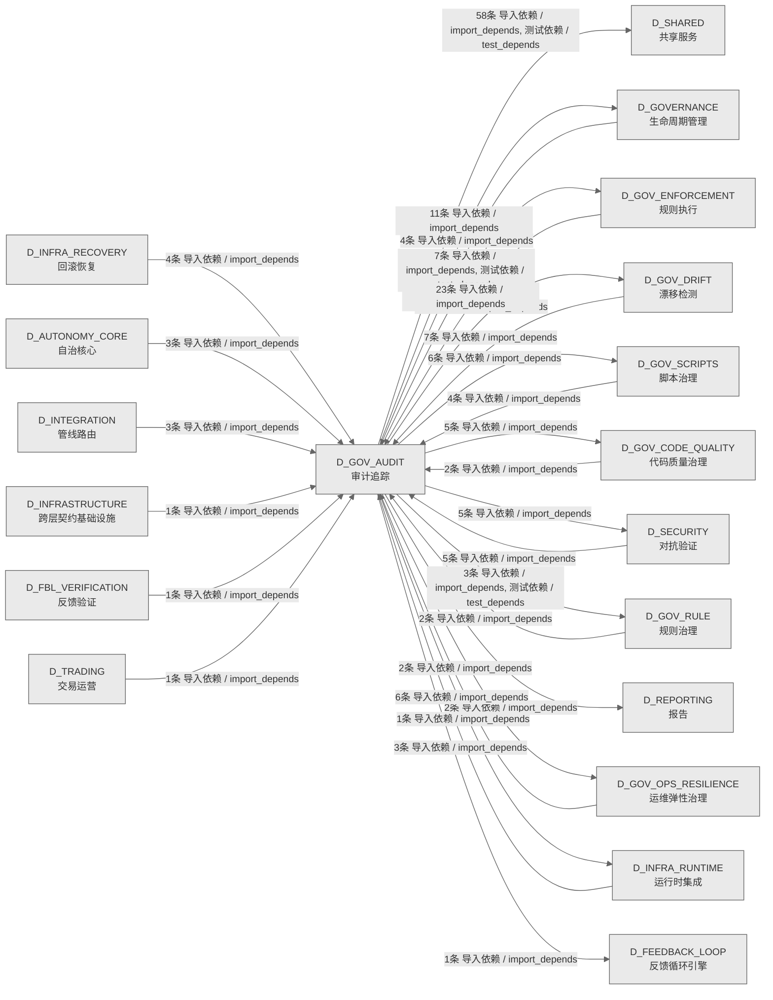

# 50_d_gov_audit / 审计追踪域 / Audit Trail

> **功能简介 / Overview**: 审计追踪，负责变更审计追踪和操作日志管理

> **文档作用 / Purpose**: 展示 审计追踪（D_GOV_AUDIT）功能域的域内依赖关系、跨域依赖关系，模块信息（成熟度/中英文名/大白话/文件路径）内嵌于 Mermaid 节点，供架构审查和域治理参考。

> 本文档由 generate_domain_doc.py 从 depgraph (PostgreSQL) 自动生成
> 数据源: depgraph (PostgreSQL) nodes表 + edges表

> **[可缩放 HTML 版 / Zoomable HTML](http://localhost:8765/docs/02_enterprise_architecture/02_domain_architecture_docs/_zoomable_html/50_d_gov_audit.html)** — Ctrl+滚轮缩放 ｜ 双击重置 ｜ Ctrl+Shift+D 切换拖动/选择模式

## 域基本信息 / Domain Overview

| 字段 | 值 | Field | Value |
|------|------|-------|-------|
| 编号 | 50 | Number | 50 |
| 域ID | D_GOV_AUDIT | Domain ID | D_GOV_AUDIT |
| 域名称 | 审计追踪 | Domain Name | Audit Trail |
| 层级 | L2 业务域层 | Layer | L2 Domain |
| 模块数 | 123 | Module Count | 123 |
| 域内依赖 | 102 | Internal Dependencies | 102 |
| 跨域入边 | 69 | Cross-domain Incoming | 69 |
| 跨域出边 | 107 | Cross-domain Outgoing | 107 |
| 设计态模块 | 2 | Design Modules | 2 |
| 生产态模块 | 121 | Production Modules | 121 |
| 容量 | 121/150 (正常) | Capacity | 121/150 (正常) |
| 描述 | 审计管线编排 | Description | 审计管线编排 |

## 域内依赖图 / Internal Dependency Diagram

> 依赖图内嵌在本文档中，IDE 可直接渲染；网页版可 Ctrl+滚轮缩放 + 拖动平移查看细节。全景图用颜色区分运营态/设计态，不再分页/拆子图。
>
> **图例说明 / Legend**：
> - 🟦 **蓝色 = 运营态模块**（production，已上线运行）
> - 🟧 **橙色虚线 = 设计态模块**（design，蓝图阶段，代码未写）
> - **实线箭头 = 运营态依赖**（已生效的依赖关系）
> - **虚线箭头 = 非运营态依赖**（计划中/验证中的依赖关系）

### 全景依赖图（全部模块，颜色区分运营态/设计态）

> 展示全部 123 个模块（生产态 121 + 设计态 2），节点含成熟度+中英文名+大白话+文件路径。

```mermaid
%%{init: {'theme': 'base', 'themeVariables': {'primaryColor': '#eaeaea', 'primaryTextColor': '#333333', 'primaryBorderColor': '#666666', 'lineColor': '#666666', 'secondaryColor': '#eaeaea', 'tertiaryColor': '#eaeaea', 'fontSize': '14px'}}}%%
flowchart TD
    docs_03_modules_cross_layer_audit_orchestrator_blueprint_md["(设计态 / design)<br/>文件: audit_orchestrator/blueprint.md"]
    docs_03_modules_domain_governance_audit_trail_blueprint_md["(设计态 / design)<br/>文件: audit_trail/blueprint.md"]
    scripts_governance_repair_audit_design_completeness_py["(生产态 / production) 审计设计completeness / Audit Design Completeness<br/>(INVARIANTS) 按path精确匹配+按功能名模糊匹配; 输出差距报告; 提取所有ID格式<br/>文件: repair/audit_design_completeness.py"]
    scripts_governance_repair_red_blue_test_py["(生产态 / production) redblue测试 / Red Blue Test<br/>(INVARIANTS) 20项红蓝对抗测试<br/>文件: repair/red_blue_test.py"]
    scripts_governance_repair_rollback_depgraph_py["(生产态 / production) rollbackdepgraph / Rollback Depgraph<br/>(INVARIANTS) 仅接受depgraph.backup.*路径; 回滚前自动备份当前depgraph<br/>文件: repair/rollback_depgraph.py"]
    scripts_governance_test_remediation_progress_smoke_py["(生产态 / production) 测试remediationprogresssmoke / Test Remediation Progress Smoke<br/>test_remediation_progress_smoke.py — Phase 3.1 治本进度 reconciler end-to-en...<br/>文件: governance/test_remediation_progress_smoke.py"]
    src_zephyr_gov_audit_orchestrator_compat_py["(生产态 / production) orchestratorcompat / Orchestrator Compat<br/>audit-orchestrator 兼容重导出层（ARCH-042 阶段4 修复双 MODULE，ARCH-043 Risk3...<br/>文件: gov_audit/_orchestrator_compat.py"]
    src_zephyr_gov_audit_action_history_py["(生产态 / production) 动作history / Action History<br/>ActionHistory — 操作历史持久化审计 + 去重 + 循环检测<br/>文件: gov_audit/action_history.py"]
    src_zephyr_gov_audit_api_lifecycle_py["(生产态 / production) API生命周期 / API Lifecycle<br/>IntegrityError;WriteError<br/>文件: gov_audit/api_lifecycle.py"]
    src_zephyr_gov_audit_audit_schema_py["(生产态 / production) 审计schema / Audit Schema<br/>audit_schema — 审计视图与查询入口（SH-DB-001 v2.0）<br/>文件: gov_audit/audit_schema.py"]
    src_zephyr_gov_audit_audit_write_failure_protector_py["(生产态 / production) 审计writefailureprotector / Audit Write Failure Protector<br/>Audit Write Failure Protector — v0.13.0 审计写入失败保护器。<br/>文件: gov_audit/audit_write_failure_protector.py"]
    src_zephyr_gov_audit_bridges_audit_anomaly_py["(生产态 / production) 审计异常 / Audit Anomaly<br/>G-CT-002 Audit 异常检测器 — AnomalyEvent Pydantic V2 BaseModel.<br/>文件: bridges/audit_anomaly.py"]
    src_zephyr_gov_audit_bridges_audit_contracts_py["(生产态 / production) 审计契约 / Audit Contracts<br/>G-CT-001 契约消费端 — Audit.write() 公共接口.<br/>文件: bridges/audit_contracts.py"]
    src_zephyr_gov_audit_bridges_audit_delegation_bridge_py["(生产态 / production) 审计delegation桥接 / Audit Delegation Bridge<br/>Audit ↔ DelegationManager 委托链审计桥接.<br/>文件: bridges/audit_delegation_bridge.py"]
    src_zephyr_gov_audit_bridges_audit_drift_bridge_py["(生产态 / production) 审计漂移桥接 / Audit Drift Bridge<br/>G-CT-007 Audit ↔ Drift 双向桥接 — MOD-INF-020 ↔ MOD-INF-023<br/>文件: bridges/audit_drift_bridge.py"]
    src_zephyr_gov_audit_bridges_audit_feedback_bridge_py["(生产态 / production) 审计反馈桥接 / Audit Feedback Bridge<br/>Audit ↔ Feedback Loop 三角闭环桥接.<br/>文件: bridges/audit_feedback_bridge.py"]
    src_zephyr_gov_audit_bridges_audit_tiered_storage_bridge_py["(生产态 / production) 审计分层存储桥接 / Audit Tiered Storage Bridge<br/>Audit ↔ WarmHotGate 三层存储桥接.<br/>文件: bridges/audit_tiered_storage_bridge.py"]
    src_zephyr_gov_audit_bridges_audit_trust_bridge_py["(生产态 / production) 审计信任桥接 / Audit Trust Bridge<br/>Audit ↔ ContinuousTrust 信任分数桥接.<br/>文件: bridges/audit_trust_bridge.py"]
    src_zephyr_gov_audit_changelog_manager_py["(生产态 / production) 变更日志管理器 / Changelog Manager<br/>IntegrityError;WriteError<br/>文件: gov_audit/changelog_manager.py"]
    src_zephyr_gov_audit_cli_py["(生产态 / production) 命令行 / CLI<br/>SystemExit on invalid subcommand; ImportError->module unavailable in output<br/>文件: gov_audit/cli.py"]
    src_zephyr_gov_audit_code_archaeology_py["(生产态 / production) 代码考古 / Code Archaeology<br/>IntegrityError;WriteError<br/>文件: gov_audit/code_archaeology.py"]
    src_zephyr_gov_audit_cold_start_py["(生产态 / production) 冷启动 / Cold Start<br/>BootstrapCache — 审计冷启动共享单例缓存。<br/>文件: gov_audit/cold_start.py"]
    src_zephyr_gov_audit_compliance_map_py["(生产态 / production) 合规map / Compliance Map<br/>audit-trail.compliance_map — MOD-INF-020 · 合规框架映射<br/>文件: gov_audit/compliance_map.py"]
    src_zephyr_gov_audit_corporate_actions_py["(生产态 / production) 公司动作 / Corporate Actions<br/>IntegrityError;WriteError<br/>文件: gov_audit/corporate_actions.py"]
    src_zephyr_gov_audit_delegation_auditor_py["(生产态 / production) delegation审计器 / Delegation Auditor<br/>委托链升级类型 -- str+Enum 使 == 'string_value' 可用.<br/>文件: gov_audit/delegation_auditor.py"]
    src_zephyr_gov_audit_dora_metrics_py["(生产态 / production) DORA指标 / DORA Metrics<br/>IntegrityError;WriteError<br/>文件: gov_audit/dora_metrics.py"]
    src_zephyr_gov_audit_evidence_pack_py["(生产态 / production) 证据包 / Evidence Pack<br/>audit-trail.evidence_pack — MOD-INF-020 · 证据包导出器<br/>文件: gov_audit/evidence_pack.py"]
    src_zephyr_gov_audit_external_tool_audit_py["(生产态 / production) externaltool审计 / External Tool Audit<br/>noqa: m03-duplicate  M03豁免: AI趋同演化(不同模块为相似问题生成相似代码),非复...<br/>文件: gov_audit/external_tool_audit.py"]
    src_zephyr_gov_audit_feedback_policy_py["(生产态 / production) 反馈策略 / Feedback Policy<br/>feedback_policy.py — Audit-findings → policy recommendation bridge.<br/>文件: gov_audit/feedback_policy.py"]
    src_zephyr_gov_audit_feedback_self_audit_py["(生产态 / production) 反馈自我审计 / Feedback Self Audit<br/>audit-trail.feedback_self_audit — MOD-INF-020 · 反馈自审计<br/>文件: gov_audit/feedback_self_audit.py"]
    src_zephyr_gov_audit_forensic_package_py["(生产态 / production) forensicpackage / Forensic Package<br/>Forensic Package — v0.8.0 取证就绪: escalation event bundle+hash chain+times...<br/>文件: gov_audit/forensic_package.py"]
    src_zephyr_gov_audit_genesis_py["(生产态 / production) genesis / Genesis<br/>audit-trail.genesis — MOD-INF-020 · 创世块管理<br/>文件: gov_audit/genesis.py"]
    src_zephyr_gov_audit_glossary_matrix_py["(生产态 / production) 术语表矩阵 / Glossary Matrix<br/>IntegrityError;WriteError<br/>文件: gov_audit/glossary_matrix.py"]
    src_zephyr_gov_audit_incremental_review_py["(生产态 / production) 增量审查 / Incremental Review<br/>IntegrityError;WriteError<br/>文件: gov_audit/incremental_review.py"]
    src_zephyr_gov_audit_integrity_verifier_py["(生产态 / production) 完整性验证器 / Integrity Verifier<br/>Integrity Verifier — v0.8.0 代码完整性验证器: hash校验+diff detection+rollback。<br/>文件: gov_audit/integrity_verifier.py"]
    src_zephyr_gov_audit_kb_gate_py["(生产态 / production) 知识库门禁 / KB Gate<br/>audit-trail.kb_gate — MOD-INF-020 · KB 审计门控<br/>文件: gov_audit/kb_gate.py"]
    src_zephyr_gov_audit_log_rotation_py["(生产态 / production) logrotation / Log Rotation<br/>审计日志轮转管理器——按天轮转 events.jsonl，支持压缩和过期清理。<br/>文件: gov_audit/log_rotation.py"]
    src_zephyr_gov_audit_merkle_audit_py["(生产态 / production) merkle审计 / Merkle Audit<br/>Merkle Audit — 兼容别名，SSoT已迁移至 zephyr.gov_audit (MOD-INF-020).<br/>文件: gov_audit/merkle_audit.py"]
    src_zephyr_gov_audit_observability_dashboard_py["(生产态 / production) 可观测性仪表板 / Observability Dashboard<br/>IntegrityError;WriteError<br/>文件: gov_audit/observability_dashboard.py"]
    src_zephyr_gov_audit_pipeline_runner_py["(生产态 / production) 流水线运行器 / Pipeline Runner<br/>run() never raises; individual script failures are logged and skipped<br/>文件: gov_audit/pipeline_runner.py"]
    src_zephyr_gov_audit_privacy_py["(生产态 / production) privacy / Privacy<br/>audit-trail.privacy — MOD-INF-020 · PII 检测与脱敏<br/>文件: gov_audit/privacy.py"]
    src_zephyr_gov_audit_provenance_tracker_py["(生产态 / production) 溯源追踪器 / Provenance Tracker<br/>IntegrityError;WriteError<br/>文件: gov_audit/provenance_tracker.py"]
    src_zephyr_gov_audit_replay_engine_py["(生产态 / production) replay引擎 / Replay Engine<br/>重放快照（补全测试期望接口）。<br/>文件: gov_audit/replay_engine.py"]
    src_zephyr_gov_audit_retention_py["(生产态 / production) retention / Retention<br/>保留策略（补全测试期望接口）。<br/>文件: gov_audit/retention.py"]
    src_zephyr_gov_audit_sbom_generator_py["(生产态 / production) sbom生成器 / Sbom Generator<br/>LicenseType 枚举——许可证类型定义（P3 价值审判退役残留）。<br/>文件: gov_audit/sbom_generator.py"]
    src_zephyr_gov_audit_spec_auditor_py["(生产态 / production) 规格审计器 / Spec Auditor<br/>AuditTrailError<br/>文件: gov_audit/spec_auditor.py"]
    src_zephyr_gov_audit_supply_chain_py["(生产态 / production) 供应链链 / Supply Chain<br/>audit-trail.supply_chain — MOD-INF-020 · 供应链审计<br/>文件: gov_audit/supply_chain.py"]
    src_zephyr_gov_audit_supply_chain_security_py["(生产态 / production) 供应链链安全 / Supply Chain Security<br/>IntegrityError;WriteError<br/>文件: gov_audit/supply_chain_security.py"]
    src_zephyr_gov_audit_trust_ring_manager_py["(生产态 / production) 信任环管理器 / Trust Ring Manager<br/>定义 RingLevel、TrustSignature、TrustRingManager 等类型。<br/>文件: gov_audit/trust_ring_manager.py"]
    src_zephyr_gov_audit_wqa_scorer_py["(生产态 / production) WQA评分器 / WQA Scorer<br/>IntegrityError;WriteError<br/>文件: gov_audit/wqa_scorer.py"]
    src_zephyr_gov_enforcement_behavioral_admission_ai_code_standards_py["(生产态 / production) AI代码标准 / AI Code Standards<br/>AI代码标准模块。<br/>文件: behavioral_admission/ai_code_standards.py"]
    src_zephyr_gov_enforcement_behavioral_admission_mcp_result_push_py["(生产态 / production) MCP结果推送 / MCP Result Push<br/>PushError;CallbackConnectionError<br/>文件: behavioral_admission/mcp_result_push.py"]
    src_zephyr_gov_enforcement_behavioral_admission_post_process_py["(生产态 / production) 后process / Post Process<br/>post_process.py —— AI 生成代码后处理管道（Phase 13 / 盲点 B31）<br/>文件: behavioral_admission/post_process.py"]
    src_zephyr_gov_enforcement_behavioral_admission_vibe_coding_enforcer_py["(生产态 / production) 直觉编码执行器 / Vibe Coding Enforcer<br/>定义 VibeRuleLevel、enforce、enforce_all 等类型。<br/>文件: behavioral_admission/vibe_coding_enforcer.py"]
    src_zephyr_gov_enforcement_rule_enforcement_audit_chain_verifier_py["(生产态 / production) 审计链验证器 / Audit Chain Verifier<br/>审计链验证工具——独立重放门禁判定+Hash链完整性校验（beta）<br/>文件: rule_enforcement/audit_chain_verifier.py"]
    src_zephyr_gov_enforcement_rule_enforcement_sys_master_compliance_py["(生产态 / production) sysmaster合规 / Sys Master Compliance<br/>SYS-MASTER-001 Compliance Checker<br/>文件: rule_enforcement/sys_master_compliance.py"]
    src_zephyr_governance_audit_trail_contracts_py["(生产态 / production) 契约 / Contracts<br/>audit-trail/contracts.py — G-CT-002 Audit 契约（re-export）。<br/>文件: audit-trail/contracts.py"]
    src_zephyr_governance_audit_ai_error_pattern_library_py["(生产态 / production) AI错误模式library / AI Error Pattern Library<br/>ai_error_pattern_library.py — AI 错误模式库（只读查询接口）。<br/>文件: audit/ai_error_pattern_library.py"]
    src_zephyr_governance_audit_blueprint_status_transition_reconciler_py["(生产态 / production) 蓝图status过渡reconciler / Blueprint Status Transition Reconciler<br/>blueprint_status_transition_reconciler.py — 蓝图状态单调推进 reconciler（P1-...<br/>文件: audit/blueprint_status_transition_reconciler.py"]
    src_zephyr_governance_audit_cross_layer_contract_signature_reconciler_py["(生产态 / production) 跨层contractsignaturereconciler / Cross Layer Contract Signature Reconciler<br/>cross_layer_contract_signature_reconciler.py — 跨层契约签名漂移检测 reconcil...<br/>文件: audit/cross_layer_contract_signature_reconciler.py"]
    src_zephyr_governance_audit_default_attribution_engine_py["(生产态 / production) defaultattribution引擎 / Default Attribution Engine<br/>Re-export wrapper: default_attribution_engine canonical at zephyr.reporting.d...<br/>文件: audit/default_attribution_engine.py"]
    src_zephyr_governance_audit_default_tca_engine_py["(生产态 / production) defaulttca引擎 / Default Tca Engine<br/>Re-export wrapper: default_tca_engine canonical at zephyr.reporting.default_t...<br/>文件: audit/default_tca_engine.py"]
    src_zephyr_governance_audit_git_performance_monitor_reconciler_py["(生产态 / production) git性能监控器reconciler / Git Performance Monitor Reconciler<br/>git_performance_monitor_reconciler.py — git 性能持续监控 + 早期预警（ARCH-GI...<br/>文件: audit/git_performance_monitor_reconciler.py"]
    src_zephyr_governance_audit_runtime_violation_snapshot_reconciler_py["(生产态 / production) 运行时违规snapshotreconciler / Runtime Violation Snapshot Reconciler<br/>runtime_violation_snapshot_reconciler.py — trae_060 §5 evidence 运行时快照 ...<br/>文件: audit/runtime_violation_snapshot_reconciler.py"]
    src_zephyr_governance_audit_snapshot_manager_py["(生产态 / production) snapshot管理器 / Snapshot Manager<br/>SnapshotManager — Event Sourcing 快照管理（DW-0005）<br/>文件: audit/snapshot_manager.py"]
    src_zephyr_governance_audit_workspace_hygiene_reconciler_py["(生产态 / production) workspacehygienereconciler / Workspace Hygiene Reconciler<br/>workspace_hygiene_reconciler.py — 工作区卫生自动清理 reconciler（DEBT-WORKSP...<br/>文件: audit/workspace_hygiene_reconciler.py"]
    src_zephyr_governance_financial_governance_financial_compliance_py["(生产态 / production) 金融合规 / Financial Compliance<br/>定义 ComplianceLayer、Safeguard、Protocol 等类型。<br/>文件: financial_governance/financial_compliance.py"]
    src_zephyr_governance_semantic_audit_compliance_map_py["(生产态 / production) 合规map / Compliance Map<br/>audit-trail.compliance_map — MOD-INF-020 · 合规框架映射<br/>文件: semantic_audit/compliance_map.py"]
    src_zephyr_governance_semantic_audit_feedback_self_audit_py["(生产态 / production) 反馈自我审计 / Feedback Self Audit<br/>audit-trail.feedback_self_audit — MOD-INF-020 · 反馈自审计<br/>文件: semantic_audit/feedback_self_audit.py"]
    src_zephyr_governance_semantic_audit_fix_result_prioritizer_py["(生产态 / production) 修复结果prioritizer / Fix Result Prioritizer<br/>fix_prioritizer — MOD-INF-028 §3.1 Stage 8<br/>文件: semantic_audit/fix_result_prioritizer.py"]
    src_zephyr_governance_semantic_audit_orchestrator_py["(生产态 / production) orchestrator / Orchestrator<br/>SemanticAuditor 编排器——9阶段管道统一调度.<br/>文件: semantic_audit/orchestrator.py"]
    src_zephyr_governance_semantic_audit_privacy_py["(生产态 / production) privacy / Privacy<br/>audit-trail.privacy — MOD-INF-020 · PII 检测与脱敏<br/>文件: semantic_audit/privacy.py"]
    src_zephyr_governance_semantic_audit_semantic_cache_py["(生产态 / production) 语义缓存 / Semantic Cache<br/>定义 CacheEntry、SemanticCache 等类型。<br/>文件: semantic_audit/semantic_cache.py"]
    src_zephyr_governance_semantic_audit_spec_auditor_py["(生产态 / production) 规格审计器 / Spec Auditor<br/>G-CT-007 — Audit.record_agent_spec() 记录 Agent Spec 注册与变更.<br/>文件: semantic_audit/spec_auditor.py"]
    tests_governance_audit_test_error_pattern_id_column_py["(生产态 / production) 测试错误模式idcolumn / Test Error Pattern Id Column<br/>test_error_pattern_id_column.py — reconcile_execution_log.error_pattern_id ...<br/>文件: audit/test_error_pattern_id_column.py"]
    tests_governance_audit_test_p3_integration_smoke_py["(生产态 / production) 测试p3集成smoke / Test P3 Integration Smoke<br/>test_p3_integration_smoke.py — Phase 3 全链路集成 smoke test（P3-5）<br/>文件: audit/test_p3_integration_smoke.py"]
    tests_governance_audit_test_reconcile_async_py["(生产态 / production) 测试reconcile异步 / Test Reconcile Async<br/>test_reconcile_async.py — P2-3 reconciler 链路异步化测试<br/>文件: audit/test_reconcile_async.py"]
    tests_governance_audit_test_reconcile_worker_selfheal_py["(生产态 / production) 测试reconcileworkerselfheal / Test Reconcile Worker Selfheal<br/>test_reconcile_worker_selfheal.py — #ARCH-RECONCILER-ALERT-SELFHEAL-001 Phas...<br/>文件: audit/test_reconcile_worker_selfheal.py"]
    tests_governance_audit_test_trae_069_threshold_sync_smoke_py["(生产态 / production) 测试trae069threshold同步smoke / Test Trae 069 Threshold Sync Smoke<br/>test_trae_069_threshold_sync_smoke.py — trae_069 YAML 真源→代码常量同步 smo...<br/>文件: audit/test_trae_069_threshold_sync_smoke.py"]
    tests_governance_rule_bridge_test_session_worktree_async_reconcile_py["(生产态 / production) 测试会话worktree异步reconcile / Test Session Worktree Async Reconcile<br/>test_session_worktree_async_reconcile.py — _run_reconcilers_after_merge 异步...<br/>文件: rule_bridge/test_session_worktree_async_reconcile.py"]
    tests_governance_test_workspace_telemetry_shared_py["(生产态 / production) 测试workspace遥测shared / Test Workspace Telemetry Shared<br/>test_workspace_telemetry_shared.py — shared workspace_telemetry 公共 API 单测<br/>文件: governance/test_workspace_telemetry_shared.py"]
    docs_03_modules_cross_layer_audit_orchestrator_blueprint_md ~~~ docs_03_modules_domain_governance_audit_trail_blueprint_md
    docs_03_modules_domain_governance_audit_trail_blueprint_md ~~~ scripts_governance_repair_audit_design_completeness_py
    scripts_governance_repair_audit_design_completeness_py ~~~ scripts_governance_repair_red_blue_test_py
    scripts_governance_repair_red_blue_test_py ~~~ scripts_governance_repair_rollback_depgraph_py
    scripts_governance_repair_rollback_depgraph_py ~~~ scripts_governance_test_remediation_progress_smoke_py
    scripts_governance_test_remediation_progress_smoke_py ~~~ src_zephyr_gov_audit_orchestrator_compat_py
    src_zephyr_gov_audit_orchestrator_compat_py ~~~ src_zephyr_gov_audit_action_history_py
    src_zephyr_gov_audit_action_history_py ~~~ src_zephyr_gov_audit_api_lifecycle_py
    src_zephyr_gov_audit_api_lifecycle_py ~~~ src_zephyr_gov_audit_audit_schema_py
    src_zephyr_gov_audit_audit_schema_py ~~~ src_zephyr_gov_audit_audit_write_failure_protector_py
    src_zephyr_gov_audit_audit_write_failure_protector_py ~~~ src_zephyr_gov_audit_bridges_audit_anomaly_py
    src_zephyr_gov_audit_bridges_audit_anomaly_py ~~~ src_zephyr_gov_audit_bridges_audit_contracts_py
    src_zephyr_gov_audit_bridges_audit_contracts_py ~~~ src_zephyr_gov_audit_bridges_audit_delegation_bridge_py
    src_zephyr_gov_audit_bridges_audit_delegation_bridge_py ~~~ src_zephyr_gov_audit_bridges_audit_drift_bridge_py
    src_zephyr_gov_audit_bridges_audit_drift_bridge_py ~~~ src_zephyr_gov_audit_bridges_audit_feedback_bridge_py
    src_zephyr_gov_audit_bridges_audit_feedback_bridge_py ~~~ src_zephyr_gov_audit_bridges_audit_tiered_storage_bridge_py
    src_zephyr_gov_audit_bridges_audit_tiered_storage_bridge_py ~~~ src_zephyr_gov_audit_bridges_audit_trust_bridge_py
    src_zephyr_gov_audit_bridges_audit_trust_bridge_py ~~~ src_zephyr_gov_audit_changelog_manager_py
    src_zephyr_gov_audit_changelog_manager_py ~~~ src_zephyr_gov_audit_cli_py
    src_zephyr_gov_audit_cli_py ~~~ src_zephyr_gov_audit_code_archaeology_py
    src_zephyr_gov_audit_code_archaeology_py ~~~ src_zephyr_gov_audit_cold_start_py
    src_zephyr_gov_audit_cold_start_py ~~~ src_zephyr_gov_audit_compliance_map_py
    src_zephyr_gov_audit_compliance_map_py ~~~ src_zephyr_gov_audit_corporate_actions_py
    src_zephyr_gov_audit_corporate_actions_py ~~~ src_zephyr_gov_audit_delegation_auditor_py
    src_zephyr_gov_audit_delegation_auditor_py ~~~ src_zephyr_gov_audit_dora_metrics_py
    src_zephyr_gov_audit_dora_metrics_py ~~~ src_zephyr_gov_audit_evidence_pack_py
    src_zephyr_gov_audit_evidence_pack_py ~~~ src_zephyr_gov_audit_external_tool_audit_py
    src_zephyr_gov_audit_external_tool_audit_py ~~~ src_zephyr_gov_audit_feedback_policy_py
    src_zephyr_gov_audit_feedback_policy_py ~~~ src_zephyr_gov_audit_feedback_self_audit_py
    src_zephyr_gov_audit_feedback_self_audit_py ~~~ src_zephyr_gov_audit_forensic_package_py
    src_zephyr_gov_audit_forensic_package_py ~~~ src_zephyr_gov_audit_genesis_py
    src_zephyr_gov_audit_genesis_py ~~~ src_zephyr_gov_audit_glossary_matrix_py
    src_zephyr_gov_audit_glossary_matrix_py ~~~ src_zephyr_gov_audit_incremental_review_py
    src_zephyr_gov_audit_incremental_review_py ~~~ src_zephyr_gov_audit_integrity_verifier_py
    src_zephyr_gov_audit_integrity_verifier_py ~~~ src_zephyr_gov_audit_kb_gate_py
    src_zephyr_gov_audit_kb_gate_py ~~~ src_zephyr_gov_audit_log_rotation_py
    src_zephyr_gov_audit_log_rotation_py ~~~ src_zephyr_gov_audit_merkle_audit_py
    src_zephyr_gov_audit_merkle_audit_py ~~~ src_zephyr_gov_audit_observability_dashboard_py
    src_zephyr_gov_audit_observability_dashboard_py ~~~ src_zephyr_gov_audit_pipeline_runner_py
    src_zephyr_gov_audit_pipeline_runner_py ~~~ src_zephyr_gov_audit_privacy_py
    src_zephyr_gov_audit_privacy_py ~~~ src_zephyr_gov_audit_provenance_tracker_py
    src_zephyr_gov_audit_provenance_tracker_py ~~~ src_zephyr_gov_audit_replay_engine_py
    src_zephyr_gov_audit_replay_engine_py ~~~ src_zephyr_gov_audit_retention_py
    src_zephyr_gov_audit_retention_py ~~~ src_zephyr_gov_audit_sbom_generator_py
    src_zephyr_gov_audit_sbom_generator_py ~~~ src_zephyr_gov_audit_spec_auditor_py
    src_zephyr_gov_audit_spec_auditor_py ~~~ src_zephyr_gov_audit_supply_chain_py
    src_zephyr_gov_audit_supply_chain_py ~~~ src_zephyr_gov_audit_supply_chain_security_py
    src_zephyr_gov_audit_supply_chain_security_py ~~~ src_zephyr_gov_audit_trust_ring_manager_py
    src_zephyr_gov_audit_trust_ring_manager_py ~~~ src_zephyr_gov_audit_wqa_scorer_py
    src_zephyr_gov_audit_wqa_scorer_py ~~~ src_zephyr_gov_enforcement_behavioral_admission_ai_code_standards_py
    src_zephyr_gov_enforcement_behavioral_admission_ai_code_standards_py ~~~ src_zephyr_gov_enforcement_behavioral_admission_mcp_result_push_py
    src_zephyr_gov_enforcement_behavioral_admission_mcp_result_push_py ~~~ src_zephyr_gov_enforcement_behavioral_admission_post_process_py
    src_zephyr_gov_enforcement_behavioral_admission_post_process_py ~~~ src_zephyr_gov_enforcement_behavioral_admission_vibe_coding_enforcer_py
    src_zephyr_gov_enforcement_behavioral_admission_vibe_coding_enforcer_py ~~~ src_zephyr_gov_enforcement_rule_enforcement_audit_chain_verifier_py
    src_zephyr_gov_enforcement_rule_enforcement_audit_chain_verifier_py ~~~ src_zephyr_gov_enforcement_rule_enforcement_sys_master_compliance_py
    src_zephyr_gov_enforcement_rule_enforcement_sys_master_compliance_py ~~~ src_zephyr_governance_audit_trail_contracts_py
    src_zephyr_governance_audit_trail_contracts_py ~~~ src_zephyr_governance_audit_ai_error_pattern_library_py
    src_zephyr_governance_audit_ai_error_pattern_library_py ~~~ src_zephyr_governance_audit_blueprint_status_transition_reconciler_py
    src_zephyr_governance_audit_blueprint_status_transition_reconciler_py ~~~ src_zephyr_governance_audit_cross_layer_contract_signature_reconciler_py
    src_zephyr_governance_audit_cross_layer_contract_signature_reconciler_py ~~~ src_zephyr_governance_audit_default_attribution_engine_py
    src_zephyr_governance_audit_default_attribution_engine_py ~~~ src_zephyr_governance_audit_default_tca_engine_py
    src_zephyr_governance_audit_default_tca_engine_py ~~~ src_zephyr_governance_audit_git_performance_monitor_reconciler_py
    src_zephyr_governance_audit_git_performance_monitor_reconciler_py ~~~ src_zephyr_governance_audit_runtime_violation_snapshot_reconciler_py
    src_zephyr_governance_audit_runtime_violation_snapshot_reconciler_py ~~~ src_zephyr_governance_audit_snapshot_manager_py
    src_zephyr_governance_audit_snapshot_manager_py ~~~ src_zephyr_governance_audit_workspace_hygiene_reconciler_py
    src_zephyr_governance_audit_workspace_hygiene_reconciler_py ~~~ src_zephyr_governance_financial_governance_financial_compliance_py
    src_zephyr_governance_financial_governance_financial_compliance_py ~~~ src_zephyr_governance_semantic_audit_compliance_map_py
    src_zephyr_governance_semantic_audit_compliance_map_py ~~~ src_zephyr_governance_semantic_audit_feedback_self_audit_py
    src_zephyr_governance_semantic_audit_feedback_self_audit_py ~~~ src_zephyr_governance_semantic_audit_fix_result_prioritizer_py
    src_zephyr_governance_semantic_audit_fix_result_prioritizer_py ~~~ src_zephyr_governance_semantic_audit_orchestrator_py
    src_zephyr_governance_semantic_audit_orchestrator_py ~~~ src_zephyr_governance_semantic_audit_privacy_py
    src_zephyr_governance_semantic_audit_privacy_py ~~~ src_zephyr_governance_semantic_audit_semantic_cache_py
    src_zephyr_governance_semantic_audit_semantic_cache_py ~~~ src_zephyr_governance_semantic_audit_spec_auditor_py
    src_zephyr_governance_semantic_audit_spec_auditor_py ~~~ tests_governance_audit_test_error_pattern_id_column_py
    tests_governance_audit_test_error_pattern_id_column_py ~~~ tests_governance_audit_test_p3_integration_smoke_py
    tests_governance_audit_test_p3_integration_smoke_py ~~~ tests_governance_audit_test_reconcile_async_py
    tests_governance_audit_test_reconcile_async_py ~~~ tests_governance_audit_test_reconcile_worker_selfheal_py
    tests_governance_audit_test_reconcile_worker_selfheal_py ~~~ tests_governance_audit_test_trae_069_threshold_sync_smoke_py
    tests_governance_audit_test_trae_069_threshold_sync_smoke_py ~~~ tests_governance_rule_bridge_test_session_worktree_async_reconcile_py
    tests_governance_rule_bridge_test_session_worktree_async_reconcile_py ~~~ tests_governance_test_workspace_telemetry_shared_py
    src_zephyr_gov_audit_anomaly_py["(生产态 / production) 异常 / Anomaly<br/>治本（裁定#18 G3 + G-CT-002）：本文件原为桩实现——AnomalyDetector 仅有 feed/...<br/>文件: gov_audit/anomaly.py"]
    src_zephyr_gov_audit_audit_admission_controller_py["(生产态 / production) 审计准入控制器 / Audit Admission Controller<br/>AdmissionResult.allowed=False on any check failure; ImportError->module marke...<br/>文件: gov_audit/audit_admission_controller.py"]
    src_zephyr_gov_audit_bridge_py["(生产态 / production) 桥接 / Bridge<br/>写入核心审计链——治本（裁定#18 G7 + 5.37.1）：真实落盘 events.jsonl。<br/>文件: gov_audit/bridge.py"]
    src_zephyr_gov_audit_event_store_py["(生产态 / production) 事件store / Event Store<br/>EventStore — Event Sourcing 事件追加与回放（DW-0002）<br/>文件: gov_audit/event_store.py"]
    src_zephyr_gov_audit_query_py["(生产态 / production) query / Query<br/>净化文本以安全传递给 AI 上下文。<br/>文件: gov_audit/query.py"]
    src_zephyr_gov_audit_resource_aware_pool_py["(生产态 / production) 资源感知池 / Resource Aware Pool<br/>RuntimeError on submit after shutdown; PoolStats always returns current snapshot<br/>文件: gov_audit/resource_aware_pool.py"]
    src_zephyr_gov_audit_text_to_finding_adapter_py["(生产态 / production) 文本转发现适配器 / Text To Finding Adapter<br/>parse() never raises; individual line parse failures are silently skipped<br/>文件: gov_audit/text_to_finding_adapter.py"]
    src_zephyr_governance_audit_git_helpers_py["(生产态 / production) githelpers / Git Helpers<br/>_git_helpers.py — audit reconciler 共享 git 工具模块<br/>文件: audit/_git_helpers.py"]
    src_zephyr_governance_audit_commit_gateway_abuse_monitor_reconciler_py["(生产态 / production) commitgatewayabuse监控器reconciler / Commit Gateway Abuse Monitor Reconciler<br/>commit_gateway_abuse_monitor_reconciler.py — commit gateway 持续滥用监控（AR...<br/>文件: audit/commit_gateway_abuse_monitor_reconciler.py"]
    src_zephyr_governance_audit_error_pattern_consumer_reconciler_py["(生产态 / production) 错误模式consumerreconciler / Error Pattern Consumer Reconciler<br/>error_pattern_consumer_reconciler.py — AI 行为遥测 JSONL 错误事件聚合 consumer。<br/>文件: audit/error_pattern_consumer_reconciler.py"]
    src_zephyr_governance_audit_reconcile_worker_py["(生产态 / production) reconcileworker / Reconcile Worker<br/>reconcile_worker.py — 异步 reconciler worker（Ruling:100PCT-AI-GOVERNANCE P2...<br/>文件: audit/reconcile_worker.py"]
    src_zephyr_governance_audit_remediation_progress_reconciler_py["(生产态 / production) remediationprogressreconciler / Remediation Progress Reconciler<br/>remediation_progress_reconciler.py — 治本进度持久化 + 新鲜度对账（...<br/>文件: audit/remediation_progress_reconciler.py"]
    src_zephyr_governance_audit_runtime_violation_snapshot_py["(生产态 / production) 运行时违规snapshot / Runtime Violation Snapshot<br/>runtime_violation_snapshot.py — trae_060 §5 evidence 运行时快照（...<br/>文件: audit/runtime_violation_snapshot.py"]
    src_zephyr_governance_semantic_audit_alignment_engine_py["(生产态 / production) 对齐引擎 / Alignment Engine<br/>三元对齐检测：蓝图声明清单 vs 磁盘实际文件 vs import 引用链。<br/>文件: semantic_audit/alignment_engine.py"]
    src_zephyr_governance_semantic_audit_fix_prioritizer_py["(生产态 / production) 修复prioritizer / Fix Prioritizer<br/>按 severity -> certainty -> blast_radius 三级排序,分组输出批次。<br/>文件: semantic_audit/fix_prioritizer.py"]
    src_zephyr_governance_semantic_audit_issue_aggregator_py["(生产态 / production) issueaggregator / Issue Aggregator<br/>收集各阶段审计结果，去重合并排序输出。<br/>文件: semantic_audit/issue_aggregator.py"]
    src_zephyr_governance_semantic_audit_kb_gate_py["(生产态 / production) 知识库门禁 / KB Gate<br/>audit-trail.kb_gate — MOD-INF-020 · KB 审计门控<br/>文件: semantic_audit/kb_gate.py"]
    src_zephyr_governance_semantic_audit_llm_bridge_py["(生产态 / production) LLM桥接 / LLM Bridge<br/>接收 RED 问题,生成修复文本。LLM 只润色不做判断。不可用时降级为模板生成。<br/>文件: semantic_audit/llm_bridge.py"]
    src_zephyr_governance_semantic_audit_safety_boundary_py["(生产态 / production) 安全boundary / Safety Boundary<br/>禁碰规则过滤 + 置信度阈值。输入 TriggerResult 列表,输出 SafetyDecision 分类。<br/>文件: semantic_audit/safety_boundary.py"]
    src_zephyr_governance_semantic_audit_self_healer_py["(生产态 / production) 自我healer / Self Healer<br/>Stage 7 自愈闭环 — 修复->自测->回滚.<br/>文件: semantic_audit/self_healer.py"]
    src_zephyr_governance_semantic_audit_self_health_py["(生产态 / production) 自我健康 / Self Health<br/>7 SLI + 5 容量 SLI + 退化检测。定时自检,输出 HEALTHY/DEGRADED/CRITICAL。<br/>文件: semantic_audit/self_health.py"]
    src_zephyr_governance_semantic_audit_trigger_engine_py["(生产态 / production) 触发器引擎 / Trigger Engine<br/>监听文件变更，判定是否触发语义审计。<br/>文件: semantic_audit/trigger_engine.py"]
    src_zephyr_gov_audit_anomaly_py ~~~ src_zephyr_gov_audit_audit_admission_controller_py
    src_zephyr_gov_audit_audit_admission_controller_py ~~~ src_zephyr_gov_audit_bridge_py
    src_zephyr_gov_audit_bridge_py ~~~ src_zephyr_gov_audit_event_store_py
    src_zephyr_gov_audit_event_store_py ~~~ src_zephyr_gov_audit_query_py
    src_zephyr_gov_audit_query_py ~~~ src_zephyr_gov_audit_resource_aware_pool_py
    src_zephyr_gov_audit_resource_aware_pool_py ~~~ src_zephyr_gov_audit_text_to_finding_adapter_py
    src_zephyr_gov_audit_text_to_finding_adapter_py ~~~ src_zephyr_governance_audit_git_helpers_py
    src_zephyr_governance_audit_git_helpers_py ~~~ src_zephyr_governance_audit_commit_gateway_abuse_monitor_reconciler_py
    src_zephyr_governance_audit_commit_gateway_abuse_monitor_reconciler_py ~~~ src_zephyr_governance_audit_error_pattern_consumer_reconciler_py
    src_zephyr_governance_audit_error_pattern_consumer_reconciler_py ~~~ src_zephyr_governance_audit_reconcile_worker_py
    src_zephyr_governance_audit_reconcile_worker_py ~~~ src_zephyr_governance_audit_remediation_progress_reconciler_py
    src_zephyr_governance_audit_remediation_progress_reconciler_py ~~~ src_zephyr_governance_audit_runtime_violation_snapshot_py
    src_zephyr_governance_audit_runtime_violation_snapshot_py ~~~ src_zephyr_governance_semantic_audit_alignment_engine_py
    src_zephyr_governance_semantic_audit_alignment_engine_py ~~~ src_zephyr_governance_semantic_audit_fix_prioritizer_py
    src_zephyr_governance_semantic_audit_fix_prioritizer_py ~~~ src_zephyr_governance_semantic_audit_issue_aggregator_py
    src_zephyr_governance_semantic_audit_issue_aggregator_py ~~~ src_zephyr_governance_semantic_audit_kb_gate_py
    src_zephyr_governance_semantic_audit_kb_gate_py ~~~ src_zephyr_governance_semantic_audit_llm_bridge_py
    src_zephyr_governance_semantic_audit_llm_bridge_py ~~~ src_zephyr_governance_semantic_audit_safety_boundary_py
    src_zephyr_governance_semantic_audit_safety_boundary_py ~~~ src_zephyr_governance_semantic_audit_self_healer_py
    src_zephyr_governance_semantic_audit_self_healer_py ~~~ src_zephyr_governance_semantic_audit_self_health_py
    src_zephyr_governance_semantic_audit_self_health_py ~~~ src_zephyr_governance_semantic_audit_trigger_engine_py
    src_zephyr_gov_audit_delegation_bridge_py["(生产态 / production) delegation桥接 / Delegation Bridge<br/>Module-level __getattr__ -- expose AuditWriter for patch compatibility.<br/>文件: gov_audit/delegation_bridge.py"]
    src_zephyr_gov_audit_feedback_bridge_py["(生产态 / production) 反馈桥接 / Feedback Bridge<br/>Bridge between audit-trail anomaly findings and the Feedback Loop Engine.<br/>文件: gov_audit/feedback_bridge.py"]
    src_zephyr_gov_audit_finding_ingest_py["(生产态 / production) 发现摄入 / Finding Ingest<br/>ingest_file() never raises; individual finding parse failures are logged and ...<br/>文件: gov_audit/finding_ingest.py"]
    src_zephyr_gov_audit_indexer_py["(生产态 / production) indexer / Indexer<br/>治本（裁定#18 G5）：本文件原为桩实现——__init__(index_dir) + build_index/lookup/<br/>文件: gov_audit/indexer.py"]
    src_zephyr_gov_audit_merkle_hourly_py["(生产态 / production) merklehourly / Merkle Hourly<br/>audit-trail.merkle_hourly — MOD-INF-020 · 每小时 Merkle 聚合<br/>文件: gov_audit/merkle_hourly.py"]
    src_zephyr_gov_audit_models_py["(生产态 / production) 模型 / Models<br/>治本（裁定#18 G2）：本文件原为桩实现——AuditEventType/FileActionType/Provena...<br/>文件: gov_audit/models.py"]
    src_zephyr_gov_audit_tiered_storage_bridge_py["(生产态 / production) 分层存储桥接 / Tiered Storage Bridge<br/>桥接失败返回空结果<br/>文件: gov_audit/tiered_storage_bridge.py"]
    src_zephyr_gov_audit_trust_bridge_py["(生产态 / production) 信任桥接 / Trust Bridge<br/>桥接失败返回UNKNOWN信任级别<br/>文件: gov_audit/trust_bridge.py"]
    src_zephyr_governance_audit_health_score_calculator_py["(生产态 / production) 健康score计算器 / Health Score Calculator<br/>health_score_calculator.py — commit gateway 滥用 6 维加权健康度评分（P3-2，#...<br/>文件: audit/health_score_calculator.py"]
    src_zephyr_governance_audit_reconcile_runner_py["(生产态 / production) reconcile运行器 / Reconcile Runner<br/>reconcile_runner.py — Reconciler 链路异步化（Ruling:100PCT-AI-GOVERNANCE P2-...<br/>文件: audit/reconcile_runner.py"]
    src_zephyr_governance_semantic_audit_reference_extractor_py["(生产态 / production) referenceextractor / Reference Extractor<br/>AST 解析文件，提取 9 个维度的引用信息。<br/>文件: semantic_audit/reference_extractor.py"]
    src_zephyr_gov_audit_delegation_bridge_py ~~~ src_zephyr_gov_audit_feedback_bridge_py
    src_zephyr_gov_audit_feedback_bridge_py ~~~ src_zephyr_gov_audit_finding_ingest_py
    src_zephyr_gov_audit_finding_ingest_py ~~~ src_zephyr_gov_audit_indexer_py
    src_zephyr_gov_audit_indexer_py ~~~ src_zephyr_gov_audit_merkle_hourly_py
    src_zephyr_gov_audit_merkle_hourly_py ~~~ src_zephyr_gov_audit_models_py
    src_zephyr_gov_audit_models_py ~~~ src_zephyr_gov_audit_tiered_storage_bridge_py
    src_zephyr_gov_audit_tiered_storage_bridge_py ~~~ src_zephyr_gov_audit_trust_bridge_py
    src_zephyr_gov_audit_trust_bridge_py ~~~ src_zephyr_governance_audit_health_score_calculator_py
    src_zephyr_governance_audit_health_score_calculator_py ~~~ src_zephyr_governance_audit_reconcile_runner_py
    src_zephyr_governance_audit_reconcile_runner_py ~~~ src_zephyr_governance_semantic_audit_reference_extractor_py
    src_zephyr_gov_audit_contracts_py["(生产态 / production) 契约 / Contracts<br/>获取全局 AuditWriter 单例——治本（裁定#18 G6）：供 AuditWriter.write 委托桥接。<br/>文件: gov_audit/contracts.py"]
    src_zephyr_gov_audit_finding_model_py["(生产态 / production) 发现模型 / Finding Model<br/>from_jsonl() raises ValueError on malformed input; to_jsonl() never raises<br/>文件: gov_audit/finding_model.py"]
    src_zephyr_gov_audit_integrity_py["(生产态 / production) 完整性 / Integrity<br/>audit-trail.integrity — MOD-INF-020 · 密码学完整性验证器<br/>文件: gov_audit/integrity.py"]
    src_zephyr_gov_audit_tiered_storage_py["(生产态 / production) 分层存储 / Tiered Storage<br/>旧版分层存储（保留以兼容现有调用方）。<br/>文件: gov_audit/tiered_storage.py"]
    src_zephyr_gov_audit_trust_engine_py["(生产态 / production) 信任引擎 / Trust Engine<br/>信任评分调整记录（补全测试期望接口）。<br/>文件: gov_audit/trust_engine.py"]
    src_zephyr_gov_audit_writer_py["(生产态 / production) writer / Writer<br/>不可变审计写入器——JSONL 追加 + SHA-256 哈希链 + HMAC-SHA256 签名 + Lamport ...<br/>文件: gov_audit/writer.py"]
    src_zephyr_governance_audit_reconciliation_registry_py["(生产态 / production) 对账注册表 / Reconciliation Registry<br/>reconciliation_registry.py — GitCommitGateway post-commit 漂移对账注册表（P2...<br/>文件: audit/reconciliation_registry.py"]
    src_zephyr_governance_semantic_audit_models_py["(生产态 / production) 模型 / Models<br/>语义审计管线数据模型 — MOD-INF-028 §4.2<br/>文件: semantic_audit/models.py"]
    src_zephyr_gov_audit_contracts_py ~~~ src_zephyr_gov_audit_finding_model_py
    src_zephyr_gov_audit_finding_model_py ~~~ src_zephyr_gov_audit_integrity_py
    src_zephyr_gov_audit_integrity_py ~~~ src_zephyr_gov_audit_tiered_storage_py
    src_zephyr_gov_audit_tiered_storage_py ~~~ src_zephyr_gov_audit_trust_engine_py
    src_zephyr_gov_audit_trust_engine_py ~~~ src_zephyr_gov_audit_writer_py
    src_zephyr_gov_audit_writer_py ~~~ src_zephyr_governance_audit_reconciliation_registry_py
    src_zephyr_governance_audit_reconciliation_registry_py ~~~ src_zephyr_governance_semantic_audit_models_py
    src_zephyr_gov_audit_agent_signer_py["(生产态 / production) 代理signer / Agent Signer<br/>audit-trail.agent_signer — MOD-INF-020 · Agent Ed25519 签名器<br/>文件: gov_audit/agent_signer.py"]
    src_zephyr_governance_audit_ai_error_pattern_library_py -->|导入依赖 / import_depends| src_zephyr_governance_audit_error_pattern_consumer_reconciler_py
    src_zephyr_governance_audit_blueprint_status_transition_reconciler_py -->|导入依赖 / import_depends| src_zephyr_governance_audit_git_helpers_py
    src_zephyr_governance_audit_blueprint_status_transition_reconciler_py -->|导入依赖 / import_depends| src_zephyr_governance_audit_reconciliation_registry_py
    src_zephyr_governance_audit_commit_gateway_abuse_monitor_reconciler_py -->|导入依赖 / import_depends| src_zephyr_governance_audit_health_score_calculator_py
    src_zephyr_governance_audit_commit_gateway_abuse_monitor_reconciler_py -->|导入依赖 / import_depends| src_zephyr_governance_audit_reconciliation_registry_py
    src_zephyr_governance_audit_cross_layer_contract_signature_reconciler_py -->|导入依赖 / import_depends| src_zephyr_governance_audit_git_helpers_py
    src_zephyr_governance_audit_cross_layer_contract_signature_reconciler_py -->|导入依赖 / import_depends| src_zephyr_governance_audit_reconciliation_registry_py
    src_zephyr_governance_audit_git_performance_monitor_reconciler_py -->|导入依赖 / import_depends| src_zephyr_governance_audit_reconciliation_registry_py
    src_zephyr_governance_audit_error_pattern_consumer_reconciler_py -->|导入依赖 / import_depends| src_zephyr_governance_audit_reconciliation_registry_py
    src_zephyr_governance_audit_reconcile_runner_py -->|导入依赖 / import_depends| src_zephyr_governance_audit_reconciliation_registry_py
    src_zephyr_governance_audit_remediation_progress_reconciler_py -->|导入依赖 / import_depends| src_zephyr_governance_audit_reconciliation_registry_py
    src_zephyr_governance_audit_reconcile_worker_py -->|导入依赖 / import_depends| src_zephyr_governance_audit_reconcile_runner_py
    src_zephyr_governance_audit_reconcile_worker_py -->|导入依赖 / import_depends| src_zephyr_governance_audit_reconciliation_registry_py
    src_zephyr_governance_audit_runtime_violation_snapshot_reconciler_py -->|导入依赖 / import_depends| src_zephyr_governance_audit_runtime_violation_snapshot_py
    src_zephyr_governance_audit_runtime_violation_snapshot_reconciler_py -->|导入依赖 / import_depends| src_zephyr_governance_audit_reconciliation_registry_py
    src_zephyr_governance_audit_workspace_hygiene_reconciler_py -->|导入依赖 / import_depends| src_zephyr_governance_audit_reconciliation_registry_py
    src_zephyr_governance_audit_snapshot_manager_py -->|导入依赖 / import_depends| src_zephyr_gov_audit_event_store_py
    src_zephyr_governance_audit_trail_contracts_py -->|导入依赖 / import_depends| src_zephyr_gov_audit_contracts_py
    src_zephyr_governance_semantic_audit_alignment_engine_py -->|导入依赖 / import_depends| src_zephyr_governance_semantic_audit_reference_extractor_py
    src_zephyr_governance_semantic_audit_alignment_engine_py -->|导入依赖 / import_depends| src_zephyr_governance_semantic_audit_models_py
    src_zephyr_governance_semantic_audit_compliance_map_py -->|导入依赖 / import_depends| src_zephyr_gov_audit_models_py
    src_zephyr_governance_semantic_audit_fix_prioritizer_py -->|导入依赖 / import_depends| src_zephyr_governance_semantic_audit_models_py
    src_zephyr_governance_semantic_audit_fix_result_prioritizer_py -->|导入依赖 / import_depends| src_zephyr_governance_semantic_audit_models_py
    src_zephyr_governance_semantic_audit_llm_bridge_py -->|导入依赖 / import_depends| src_zephyr_governance_semantic_audit_models_py
    src_zephyr_governance_semantic_audit_safety_boundary_py -->|导入依赖 / import_depends| src_zephyr_governance_semantic_audit_models_py
    src_zephyr_governance_semantic_audit_issue_aggregator_py -->|导入依赖 / import_depends| src_zephyr_governance_semantic_audit_models_py
    src_zephyr_governance_semantic_audit_reference_extractor_py -->|导入依赖 / import_depends| src_zephyr_governance_semantic_audit_models_py
    src_zephyr_governance_semantic_audit_trigger_engine_py -->|导入依赖 / import_depends| src_zephyr_governance_semantic_audit_reference_extractor_py
    src_zephyr_governance_semantic_audit_trigger_engine_py -->|导入依赖 / import_depends| src_zephyr_governance_semantic_audit_models_py
    src_zephyr_governance_semantic_audit_orchestrator_py -->|导入依赖 / import_depends| src_zephyr_governance_semantic_audit_alignment_engine_py
    src_zephyr_governance_semantic_audit_orchestrator_py -->|导入依赖 / import_depends| src_zephyr_governance_semantic_audit_fix_prioritizer_py
    src_zephyr_governance_semantic_audit_orchestrator_py -->|导入依赖 / import_depends| src_zephyr_governance_semantic_audit_llm_bridge_py
    src_zephyr_governance_semantic_audit_orchestrator_py -->|导入依赖 / import_depends| src_zephyr_governance_semantic_audit_safety_boundary_py
    src_zephyr_governance_semantic_audit_orchestrator_py -->|导入依赖 / import_depends| src_zephyr_governance_semantic_audit_issue_aggregator_py
    src_zephyr_governance_semantic_audit_orchestrator_py -->|导入依赖 / import_depends| src_zephyr_governance_semantic_audit_reference_extractor_py
    src_zephyr_governance_semantic_audit_orchestrator_py -->|导入依赖 / import_depends| src_zephyr_governance_semantic_audit_models_py
    src_zephyr_governance_semantic_audit_orchestrator_py -->|导入依赖 / import_depends| src_zephyr_governance_semantic_audit_self_healer_py
    src_zephyr_governance_semantic_audit_orchestrator_py -->|导入依赖 / import_depends| src_zephyr_governance_semantic_audit_trigger_engine_py
    src_zephyr_governance_semantic_audit_orchestrator_py -->|导入依赖 / import_depends| src_zephyr_governance_semantic_audit_self_health_py
    src_zephyr_gov_audit_audit_write_failure_protector_py -->|导入依赖 / import_depends| src_zephyr_gov_audit_writer_py
    src_zephyr_gov_audit_audit_admission_controller_py -->|导入依赖 / import_depends| src_zephyr_gov_audit_finding_ingest_py
    src_zephyr_gov_audit_audit_admission_controller_py -->|导入依赖 / import_depends| src_zephyr_gov_audit_finding_model_py
    src_zephyr_gov_audit_bridge_py -->|导入依赖 / import_depends| src_zephyr_gov_audit_delegation_bridge_py
    src_zephyr_gov_audit_bridge_py -->|导入依赖 / import_depends| src_zephyr_gov_audit_feedback_bridge_py
    src_zephyr_gov_audit_bridge_py -->|导入依赖 / import_depends| src_zephyr_gov_audit_merkle_hourly_py
    src_zephyr_gov_audit_bridge_py -->|导入依赖 / import_depends| src_zephyr_gov_audit_tiered_storage_bridge_py
    src_zephyr_gov_audit_bridge_py -->|导入依赖 / import_depends| src_zephyr_gov_audit_trust_bridge_py
    src_zephyr_gov_audit_bridge_py -->|导入依赖 / import_depends| src_zephyr_gov_audit_writer_py
    src_zephyr_gov_audit_cli_py -->|导入依赖 / import_depends| src_zephyr_governance_semantic_audit_kb_gate_py
    src_zephyr_gov_audit_cli_py -->|导入依赖 / import_depends| src_zephyr_gov_audit_audit_admission_controller_py
    src_zephyr_gov_audit_cli_py -->|导入依赖 / import_depends| src_zephyr_gov_audit_resource_aware_pool_py
    src_zephyr_gov_audit_contracts_py -->|导入依赖 / import_depends| src_zephyr_gov_audit_models_py
    src_zephyr_gov_audit_contracts_py -->|导入依赖 / import_depends| src_zephyr_gov_audit_writer_py
    src_zephyr_gov_audit_compliance_map_py -->|导入依赖 / import_depends| src_zephyr_gov_audit_models_py
    src_zephyr_gov_audit_delegation_auditor_py -->|导入依赖 / import_depends| src_zephyr_gov_audit_delegation_bridge_py
    src_zephyr_gov_audit_delegation_bridge_py -->|导入依赖 / import_depends| src_zephyr_gov_audit_writer_py
    src_zephyr_gov_audit_feedback_policy_py -->|导入依赖 / import_depends| src_zephyr_gov_audit_feedback_bridge_py
    src_zephyr_gov_audit_finding_ingest_py -->|导入依赖 / import_depends| src_zephyr_gov_audit_finding_model_py
    src_zephyr_gov_audit_finding_ingest_py -->|导入依赖 / import_depends| src_zephyr_gov_audit_writer_py
    src_zephyr_gov_audit_integrity_py -->|导入依赖 / import_depends| src_zephyr_gov_audit_agent_signer_py
    src_zephyr_gov_audit_integrity_py -->|导入依赖 / import_depends| src_zephyr_gov_audit_writer_py
    src_zephyr_gov_audit_indexer_py -->|导入依赖 / import_depends| src_zephyr_gov_audit_contracts_py
    src_zephyr_gov_audit_merkle_audit_py -->|导入依赖 / import_depends| src_zephyr_gov_audit_integrity_py
    src_zephyr_gov_audit_merkle_hourly_py -->|导入依赖 / import_depends| src_zephyr_gov_audit_integrity_py
    src_zephyr_gov_audit_pipeline_runner_py -->|导入依赖 / import_depends| src_zephyr_gov_audit_finding_model_py
    src_zephyr_gov_audit_pipeline_runner_py -->|导入依赖 / import_depends| src_zephyr_gov_audit_text_to_finding_adapter_py
    src_zephyr_gov_audit_query_py -->|导入依赖 / import_depends| src_zephyr_gov_audit_contracts_py
    src_zephyr_gov_audit_query_py -->|导入依赖 / import_depends| src_zephyr_gov_audit_integrity_py
    src_zephyr_gov_audit_query_py -->|导入依赖 / import_depends| src_zephyr_gov_audit_indexer_py
    src_zephyr_gov_audit_query_py -->|导入依赖 / import_depends| src_zephyr_gov_audit_models_py
    src_zephyr_gov_audit_text_to_finding_adapter_py -->|导入依赖 / import_depends| src_zephyr_gov_audit_finding_model_py
    src_zephyr_gov_audit_tiered_storage_bridge_py -->|导入依赖 / import_depends| src_zephyr_gov_audit_tiered_storage_py
    src_zephyr_gov_audit_trust_bridge_py -->|导入依赖 / import_depends| src_zephyr_gov_audit_trust_engine_py
    src_zephyr_gov_audit_orchestrator_compat_py -->|导入依赖 / import_depends| src_zephyr_gov_audit_anomaly_py
    src_zephyr_gov_audit_orchestrator_compat_py -->|导入依赖 / import_depends| src_zephyr_gov_audit_bridge_py
    src_zephyr_gov_audit_orchestrator_compat_py -->|导入依赖 / import_depends| src_zephyr_gov_audit_contracts_py
    src_zephyr_gov_audit_orchestrator_compat_py -->|导入依赖 / import_depends| src_zephyr_gov_audit_integrity_py
    src_zephyr_gov_audit_orchestrator_compat_py -->|导入依赖 / import_depends| src_zephyr_gov_audit_indexer_py
    src_zephyr_gov_audit_orchestrator_compat_py -->|导入依赖 / import_depends| src_zephyr_gov_audit_models_py
    src_zephyr_gov_audit_orchestrator_compat_py -->|导入依赖 / import_depends| src_zephyr_gov_audit_query_py
    src_zephyr_gov_audit_orchestrator_compat_py -->|导入依赖 / import_depends| src_zephyr_gov_audit_writer_py
    src_zephyr_gov_audit_writer_py -->|导入依赖 / import_depends| src_zephyr_gov_audit_contracts_py
    src_zephyr_gov_audit_writer_py -->|导入依赖 / import_depends| src_zephyr_gov_audit_integrity_py
    src_zephyr_gov_audit_writer_py -->|导入依赖 / import_depends| src_zephyr_gov_audit_models_py
    src_zephyr_gov_audit_bridges_audit_delegation_bridge_py -->|导入依赖 / import_depends| src_zephyr_gov_audit_delegation_bridge_py
    src_zephyr_gov_audit_bridges_audit_contracts_py -->|导入依赖 / import_depends| src_zephyr_gov_audit_writer_py
    src_zephyr_gov_audit_bridges_audit_feedback_bridge_py -->|导入依赖 / import_depends| src_zephyr_gov_audit_anomaly_py
    src_zephyr_gov_audit_bridges_audit_feedback_bridge_py -->|导入依赖 / import_depends| src_zephyr_gov_audit_query_py
    src_zephyr_gov_audit_bridges_audit_drift_bridge_py -->|导入依赖 / import_depends| src_zephyr_gov_audit_anomaly_py
    src_zephyr_gov_enforcement_rule_enforcement_audit_chain_verifier_py -->|导入依赖 / import_depends| src_zephyr_gov_audit_writer_py
    scripts_governance_test_remediation_progress_smoke_py -->|导入依赖 / import_depends| src_zephyr_governance_audit_remediation_progress_reconciler_py
    scripts_governance_test_remediation_progress_smoke_py -->|导入依赖 / import_depends| src_zephyr_governance_audit_reconciliation_registry_py
    tests_governance_audit_test_error_pattern_id_column_py -->|测试依赖 / test_depends| src_zephyr_governance_audit_reconciliation_registry_py
    tests_governance_audit_test_p3_integration_smoke_py -->|测试依赖 / test_depends| src_zephyr_governance_audit_commit_gateway_abuse_monitor_reconciler_py
    tests_governance_audit_test_p3_integration_smoke_py -->|测试依赖 / test_depends| src_zephyr_governance_audit_health_score_calculator_py
    tests_governance_audit_test_reconcile_worker_selfheal_py -->|测试依赖 / test_depends| src_zephyr_governance_audit_reconcile_runner_py
    tests_governance_audit_test_reconcile_worker_selfheal_py -->|测试依赖 / test_depends| src_zephyr_governance_audit_reconcile_worker_py
    tests_governance_audit_test_reconcile_worker_selfheal_py -->|测试依赖 / test_depends| src_zephyr_governance_audit_reconciliation_registry_py
    tests_governance_audit_test_reconcile_async_py -->|测试依赖 / test_depends| src_zephyr_governance_audit_reconcile_runner_py
    tests_governance_audit_test_reconcile_async_py -->|测试依赖 / test_depends| src_zephyr_governance_audit_reconcile_worker_py
    tests_governance_audit_test_trae_069_threshold_sync_smoke_py -->|测试依赖 / test_depends| src_zephyr_governance_audit_commit_gateway_abuse_monitor_reconciler_py
    tests_governance_audit_test_trae_069_threshold_sync_smoke_py -->|测试依赖 / test_depends| src_zephyr_governance_audit_health_score_calculator_py
    D_SHARED["(生产态 / production) 共享服务 / Shared Services<br/>共享服务，负责跨域共享的工具、协议和基础服务<br/>跨域节点 / cross-domain"]
    src_zephyr_gov_audit_integrity_py -->|导入依赖 / import_depends| D_SHARED
    D_GOV_SCRIPTS["(生产态 / production) 脚本治理 / Script Governance<br/>脚本治理，负责脚本生命周期管理和脚本质量门禁<br/>跨域节点 / cross-domain"]
    src_zephyr_governance_audit_reconciliation_registry_py -->|导入依赖 / import_depends| D_GOV_SCRIPTS
    scripts_governance_repair_red_blue_test_py -->|导入依赖 / import_depends| D_SHARED
    D_SECURITY["(生产态 / production) 对抗验证 / Adversarial Validation<br/>对抗验证，负责系统安全对抗测试、漏洞扫描和攻防验证<br/>跨域节点 / cross-domain"]
    src_zephyr_gov_audit_cli_py -->|导入依赖 / import_depends| D_SECURITY
    D_GOVERNANCE["(生产态 / production) 生命周期管理 / Lifecycle Management<br/>生命周期管理，负责蓝图/模块/任务的声明周期管理和元数据治理<br/>跨域节点 / cross-domain"]
    src_zephyr_gov_audit_bridges_audit_trust_bridge_py -->|导入依赖 / import_depends| D_GOVERNANCE
    D_GOV_DRIFT["(生产态 / production) 漂移检测 / Drift Detection<br/>漂移检测，负责架构漂移检测和漂移告警<br/>跨域节点 / cross-domain"]
    src_zephyr_gov_audit_bridges_audit_drift_bridge_py -->|导入依赖 / import_depends| D_GOV_DRIFT
    scripts_governance_repair_rollback_depgraph_py -->|导入依赖 / import_depends| D_SHARED
    src_zephyr_gov_audit_spec_auditor_py -->|导入依赖 / import_depends| D_GOVERNANCE
    src_zephyr_gov_audit_finding_ingest_py -->|导入依赖 / import_depends| D_SHARED
    src_zephyr_gov_audit_writer_py -->|导入依赖 / import_depends| D_SHARED
    src_zephyr_governance_audit_reconcile_runner_py -->|导入依赖 / import_depends| D_SHARED
    src_zephyr_governance_semantic_audit_kb_gate_py -->|导入依赖 / import_depends| D_GOVERNANCE
    src_zephyr_gov_audit_cli_py -->|导入依赖 / import_depends| D_SHARED
    src_zephyr_gov_audit_cli_py -->|导入依赖 / import_depends| D_SECURITY
    src_zephyr_governance_audit_reconciliation_registry_py -->|导入依赖 / import_depends| D_SHARED
    D_SECURITY -->|导入依赖 / import_depends| src_zephyr_gov_audit_bridge_py
    D_GOV_ENFORCEMENT["(生产态 / production) 规则执行 / Rule Enforcement<br/>规则执行，负责治理规则执行和门禁拦截<br/>跨域节点 / cross-domain"]
    D_GOV_ENFORCEMENT -->|导入依赖 / import_depends| src_zephyr_governance_audit_reconciliation_registry_py
    D_GOV_ENFORCEMENT -->|导入依赖 / import_depends| src_zephyr_gov_audit_models_py
    D_TRADING["(生产态 / production) 交易运营 / Trading Operations<br/>交易运营，负责交易生命周期管理、订单状态和成交处理<br/>跨域节点 / cross-domain"]
    D_TRADING -->|导入依赖 / import_depends| src_zephyr_gov_audit_models_py
    D_GOV_SCRIPTS -->|导入依赖 / import_depends| src_zephyr_governance_audit_reconciliation_registry_py
    D_GOV_ENFORCEMENT -->|导入依赖 / import_depends| src_zephyr_governance_audit_ai_error_pattern_library_py
    D_GOV_OPS_RESILIENCE["(生产态 / production) 运维弹性治理 / Ops Resilience Governance<br/>运维弹性治理，负责运维治理、安全治理、弹性治理和升级协议<br/>跨域节点 / cross-domain"]
    D_GOV_OPS_RESILIENCE -->|导入依赖 / import_depends| src_zephyr_gov_audit_writer_py
    D_GOV_OPS_RESILIENCE -->|导入依赖 / import_depends| src_zephyr_gov_audit_writer_py
    D_GOV_ENFORCEMENT -->|导入依赖 / import_depends| src_zephyr_governance_audit_reconciliation_registry_py
    D_INTEGRATION["(生产态 / production) 管线路由 / Pipeline Routing<br/>管线路由，负责跨域数据流路由、管道编排和集成适配<br/>跨域节点 / cross-domain"]
    D_INTEGRATION -->|导入依赖 / import_depends| src_zephyr_governance_semantic_audit_models_py
    D_GOV_OPS_RESILIENCE -->|导入依赖 / import_depends| src_zephyr_gov_audit_query_py
    D_GOV_OPS_RESILIENCE -->|导入依赖 / import_depends| src_zephyr_governance_semantic_audit_models_py
    D_GOV_ENFORCEMENT -->|导入依赖 / import_depends| src_zephyr_gov_enforcement_behavioral_admission_vibe_coding_enforcer_py
    D_GOV_SCRIPTS -->|导入依赖 / import_depends| src_zephyr_gov_audit_indexer_py
    D_GOV_OPS_RESILIENCE -->|导入依赖 / import_depends| src_zephyr_gov_enforcement_rule_enforcement_sys_master_compliance_py
    classDef production fill:#e1f5fe,stroke:#01579b,stroke-width:2px,color:#000
    classDef design fill:#fff3e0,stroke:#e65100,stroke-width:2px,color:#000,stroke-dasharray: 5 5
    classDef external_prod fill:#e8f4fd,stroke:#0277bd,stroke-width:1px,color:#000
    classDef external_design fill:#fff8e7,stroke:#ef6c00,stroke-width:1px,color:#000,stroke-dasharray: 5 5
    class scripts_governance_repair_audit_design_completeness_py,scripts_governance_repair_red_blue_test_py,scripts_governance_repair_rollback_depgraph_py,scripts_governance_test_remediation_progress_smoke_py,src_zephyr_gov_audit_orchestrator_compat_py,src_zephyr_gov_audit_action_history_py,src_zephyr_gov_audit_agent_signer_py,src_zephyr_gov_audit_anomaly_py,src_zephyr_gov_audit_api_lifecycle_py,src_zephyr_gov_audit_audit_admission_controller_py,src_zephyr_gov_audit_audit_schema_py,src_zephyr_gov_audit_audit_write_failure_protector_py,src_zephyr_gov_audit_bridge_py,src_zephyr_gov_audit_bridges_audit_anomaly_py,src_zephyr_gov_audit_bridges_audit_contracts_py,src_zephyr_gov_audit_bridges_audit_delegation_bridge_py,src_zephyr_gov_audit_bridges_audit_drift_bridge_py,src_zephyr_gov_audit_bridges_audit_feedback_bridge_py,src_zephyr_gov_audit_bridges_audit_tiered_storage_bridge_py,src_zephyr_gov_audit_bridges_audit_trust_bridge_py,src_zephyr_gov_audit_changelog_manager_py,src_zephyr_gov_audit_cli_py,src_zephyr_gov_audit_code_archaeology_py,src_zephyr_gov_audit_cold_start_py,src_zephyr_gov_audit_compliance_map_py,src_zephyr_gov_audit_contracts_py,src_zephyr_gov_audit_corporate_actions_py,src_zephyr_gov_audit_delegation_auditor_py,src_zephyr_gov_audit_delegation_bridge_py,src_zephyr_gov_audit_dora_metrics_py,src_zephyr_gov_audit_event_store_py,src_zephyr_gov_audit_evidence_pack_py,src_zephyr_gov_audit_external_tool_audit_py,src_zephyr_gov_audit_feedback_bridge_py,src_zephyr_gov_audit_feedback_policy_py,src_zephyr_gov_audit_feedback_self_audit_py,src_zephyr_gov_audit_finding_ingest_py,src_zephyr_gov_audit_finding_model_py,src_zephyr_gov_audit_forensic_package_py,src_zephyr_gov_audit_genesis_py,src_zephyr_gov_audit_glossary_matrix_py,src_zephyr_gov_audit_incremental_review_py,src_zephyr_gov_audit_indexer_py,src_zephyr_gov_audit_integrity_py,src_zephyr_gov_audit_integrity_verifier_py,src_zephyr_gov_audit_kb_gate_py,src_zephyr_gov_audit_log_rotation_py,src_zephyr_gov_audit_merkle_audit_py,src_zephyr_gov_audit_merkle_hourly_py,src_zephyr_gov_audit_models_py,src_zephyr_gov_audit_observability_dashboard_py,src_zephyr_gov_audit_pipeline_runner_py,src_zephyr_gov_audit_privacy_py,src_zephyr_gov_audit_provenance_tracker_py,src_zephyr_gov_audit_query_py,src_zephyr_gov_audit_replay_engine_py,src_zephyr_gov_audit_resource_aware_pool_py,src_zephyr_gov_audit_retention_py,src_zephyr_gov_audit_sbom_generator_py,src_zephyr_gov_audit_spec_auditor_py,src_zephyr_gov_audit_supply_chain_py,src_zephyr_gov_audit_supply_chain_security_py,src_zephyr_gov_audit_text_to_finding_adapter_py,src_zephyr_gov_audit_tiered_storage_py,src_zephyr_gov_audit_tiered_storage_bridge_py,src_zephyr_gov_audit_trust_bridge_py,src_zephyr_gov_audit_trust_engine_py,src_zephyr_gov_audit_trust_ring_manager_py,src_zephyr_gov_audit_wqa_scorer_py,src_zephyr_gov_audit_writer_py,src_zephyr_gov_enforcement_behavioral_admission_ai_code_standards_py,src_zephyr_gov_enforcement_behavioral_admission_mcp_result_push_py,src_zephyr_gov_enforcement_behavioral_admission_post_process_py,src_zephyr_gov_enforcement_behavioral_admission_vibe_coding_enforcer_py,src_zephyr_gov_enforcement_rule_enforcement_audit_chain_verifier_py,src_zephyr_gov_enforcement_rule_enforcement_sys_master_compliance_py,src_zephyr_governance_audit_trail_contracts_py,src_zephyr_governance_audit_git_helpers_py,src_zephyr_governance_audit_ai_error_pattern_library_py,src_zephyr_governance_audit_blueprint_status_transition_reconciler_py,src_zephyr_governance_audit_commit_gateway_abuse_monitor_reconciler_py,src_zephyr_governance_audit_cross_layer_contract_signature_reconciler_py,src_zephyr_governance_audit_default_attribution_engine_py,src_zephyr_governance_audit_default_tca_engine_py,src_zephyr_governance_audit_error_pattern_consumer_reconciler_py,src_zephyr_governance_audit_git_performance_monitor_reconciler_py,src_zephyr_governance_audit_health_score_calculator_py,src_zephyr_governance_audit_reconcile_runner_py,src_zephyr_governance_audit_reconcile_worker_py,src_zephyr_governance_audit_reconciliation_registry_py,src_zephyr_governance_audit_remediation_progress_reconciler_py,src_zephyr_governance_audit_runtime_violation_snapshot_py,src_zephyr_governance_audit_runtime_violation_snapshot_reconciler_py,src_zephyr_governance_audit_snapshot_manager_py,src_zephyr_governance_audit_workspace_hygiene_reconciler_py,src_zephyr_governance_financial_governance_financial_compliance_py,src_zephyr_governance_semantic_audit_alignment_engine_py,src_zephyr_governance_semantic_audit_compliance_map_py,src_zephyr_governance_semantic_audit_feedback_self_audit_py,src_zephyr_governance_semantic_audit_fix_prioritizer_py,src_zephyr_governance_semantic_audit_fix_result_prioritizer_py,src_zephyr_governance_semantic_audit_issue_aggregator_py,src_zephyr_governance_semantic_audit_kb_gate_py,src_zephyr_governance_semantic_audit_llm_bridge_py,src_zephyr_governance_semantic_audit_models_py,src_zephyr_governance_semantic_audit_orchestrator_py,src_zephyr_governance_semantic_audit_privacy_py,src_zephyr_governance_semantic_audit_reference_extractor_py,src_zephyr_governance_semantic_audit_safety_boundary_py,src_zephyr_governance_semantic_audit_self_healer_py,src_zephyr_governance_semantic_audit_self_health_py,src_zephyr_governance_semantic_audit_semantic_cache_py,src_zephyr_governance_semantic_audit_spec_auditor_py,src_zephyr_governance_semantic_audit_trigger_engine_py,tests_governance_audit_test_error_pattern_id_column_py,tests_governance_audit_test_p3_integration_smoke_py,tests_governance_audit_test_reconcile_async_py,tests_governance_audit_test_reconcile_worker_selfheal_py,tests_governance_audit_test_trae_069_threshold_sync_smoke_py,tests_governance_rule_bridge_test_session_worktree_async_reconcile_py,tests_governance_test_workspace_telemetry_shared_py production
    class docs_03_modules_cross_layer_audit_orchestrator_blueprint_md,docs_03_modules_domain_governance_audit_trail_blueprint_md design
    class D_SHARED,D_GOV_SCRIPTS,D_SECURITY,D_GOVERNANCE,D_GOV_DRIFT,D_GOV_ENFORCEMENT,D_TRADING,D_GOV_OPS_RESILIENCE,D_INTEGRATION external_prod
```

## 跨域依赖 / Cross-domain Dependencies

### 本域依赖的其他域（出边）/ Depends On

| # | 本域模块 / Source Module | → | 外部域-目标模块 / Target Module | 依赖类型 / Type |
|:--:|---------|:--:|---------|---------|
| 1 | 反馈桥接 / Feedback Bridge (gov_audit/feedback_bridge.py) | → | D_FEEDBACK_LOOP 反馈循环引擎: 反馈循环域包 / Feedback Loop Domain Package (feedback_loo... | 导入依赖 / import_depends |
| 2 | 审计schema / Audit Schema (gov_audit/audit_schema.py) | → | D_GOVERNANCE 生命周期管理: sqliteschema / Sqlite Schema (persistence/sqlite_schema.py) | 导入依赖 / import_depends |
| 3 | 审计信任桥接 / Audit Trust Bridge (bridges/audit_trust_br... | → | D_GOVERNANCE 生命周期管理: continuous信任 / Continuous Trust (intelligence_governanc... | 导入依赖 / import_depends |
| 4 | 事件store / Event Store (gov_audit/event_store.py) | → | D_GOVERNANCE 生命周期管理: sqliteschema / Sqlite Schema (persistence/sqlite_schema.py) | 导入依赖 / import_depends |
| 5 | 证据包 / Evidence Pack (gov_audit/evidence_pack.py) | → | D_GOVERNANCE 生命周期管理: 证据包 / Evidence Pack (governance/evidence_pack.py) | 导入依赖 / import_depends |
| 6 | 知识库门禁 / KB Gate (gov_audit/kb_gate.py) | → | D_GOVERNANCE 生命周期管理: 规则patterns / Rule Patterns (governance/rule_patterns.py) | 导入依赖 / import_depends |
| 7 | privacy / Privacy (gov_audit/privacy.py) | → | D_GOVERNANCE 生命周期管理: 规则patterns / Rule Patterns (governance/rule_patterns.py) | 导入依赖 / import_depends |
| 8 | 规格审计器 / Spec Auditor (gov_audit/spec_auditor.py) | → | D_GOVERNANCE 生命周期管理: 注册表 / Registry (agent_spec/registry.py) | 导入依赖 / import_depends |
| 9 | 对账注册表 / Reconciliation Registry (audit/reconciliatio... | → | D_GOVERNANCE 生命周期管理: depgraphschema / Depgraph Schema (governance/depgraph_sch... | 导入依赖 / import_depends |
| 10 | snapshot管理器 / Snapshot Manager (audit/snapshot_manager... | → | D_GOVERNANCE 生命周期管理: sqliteschema / Sqlite Schema (persistence/sqlite_schema.py) | 导入依赖 / import_depends |
| 11 | 知识库门禁 / KB Gate (semantic_audit/kb_gate.py) | → | D_GOVERNANCE 生命周期管理: 规则patterns / Rule Patterns (governance/rule_patterns.py) | 导入依赖 / import_depends |
| 12 | privacy / Privacy (semantic_audit/privacy.py) | → | D_GOVERNANCE 生命周期管理: 规则patterns / Rule Patterns (governance/rule_patterns.py) | 导入依赖 / import_depends |
| 13 | 对账注册表 / Reconciliation Registry (audit/reconciliatio... | → | D_GOV_CODE_QUALITY 代码质量治理: 能力lookup旁路策略 / Capability Lookup Bypass Policy (com... | 导入依赖 / import_depends |
| 14 | 对账注册表 / Reconciliation Registry (audit/reconciliatio... | → | D_GOV_CODE_QUALITY 代码质量治理: consumersaccuracy门禁 / Consumers Accuracy Gate (commit_g... | 导入依赖 / import_depends |
| 15 | 对账注册表 / Reconciliation Registry (audit/reconciliatio... | → | D_GOV_CODE_QUALITY 代码质量治理: scripts导入完整性门禁 / Scripts Import Integrity Gate (co... | 导入依赖 / import_depends |
| 16 | 对账注册表 / Reconciliation Registry (audit/reconciliatio... | → | D_GOV_CODE_QUALITY 代码质量治理: undefinedname门禁 / Undefined Name Gate (commit_gates/und... | 导入依赖 / import_depends |
| 17 | 对账注册表 / Reconciliation Registry (audit/reconciliatio... | → | D_GOV_CODE_QUALITY 代码质量治理: 门禁自动registrar / Gate Auto Registrar (rule_bridge/gate... | 导入依赖 / import_depends |
| 18 | orchestratorcompat / Orchestrator Compat (gov_audit/_orch... | → | D_GOV_DRIFT 漂移检测: 自我监控器 / Self Monitor (gov_audit/self_monitor.py) | 导入依赖 / import_depends |
| 19 | 桥接 / Bridge (gov_audit/bridge.py) | → | D_GOV_DRIFT 漂移检测: 漂移桥接 / Drift Bridge (gov_audit/drift_bridge.py) | 导入依赖 / import_depends |
| 20 | 审计漂移桥接 / Audit Drift Bridge (bridges/audit_drift_br... | → | D_GOV_DRIFT 漂移检测: 漂移引擎 / Drift Engine (gov_drift/drift_engine.py) | 导入依赖 / import_depends |
| 21 | 审计漂移桥接 / Audit Drift Bridge (bridges/audit_drift_br... | → | D_GOV_DRIFT 漂移检测: 漂移模型 / Drift Models (gov_drift/drift_models.py) | 导入依赖 / import_depends |
| 22 | 命令行 / CLI (gov_audit/cli.py) | → | D_GOV_DRIFT 漂移检测: 漂移引擎 / Drift Engine (gov_drift/drift_engine.py) | 导入依赖 / import_depends |
| 23 | 命令行 / CLI (gov_audit/cli.py) | → | D_GOV_DRIFT 漂移检测: 完整性 / Integrity (governance/integrity.py) | 导入依赖 / import_depends |
| 24 | git性能监控器reconciler / Git Performance Monitor Reconci... | → | D_GOV_ENFORCEMENT 规则执行: 会话worktree / Session Worktree (rule_bridge/session_work... | 导入依赖 / import_depends |
| 25 | reconcileworker / Reconcile Worker (audit/reconcile_worke... | → | D_GOV_ENFORCEMENT 规则执行: gitcommitgateway / Git Commit Gateway (rule_bridge/git_co... | 导入依赖 / import_depends |
| 26 | 对账注册表 / Reconciliation Registry (audit/reconciliatio... | → | D_GOV_ENFORCEMENT 规则执行: commit门禁注册表 / Commit Gate Registry (rule_bridge/comm... | 导入依赖 / import_depends |
| 27 | 对账注册表 / Reconciliation Registry (audit/reconciliatio... | → | D_GOV_ENFORCEMENT 规则执行: 会话worktree / Session Worktree (rule_bridge/session_work... | 导入依赖 / import_depends |
| 28 | 测试reconcile异步 / Test Reconcile Async (audit/test_reco... | → | D_GOV_ENFORCEMENT 规则执行: gitcommitgateway / Git Commit Gateway (rule_bridge/git_co... | 测试依赖 / test_depends |
| 29 | 测试reconcileworkerselfheal / Test Reconcile Worker Selfh... | → | D_GOV_ENFORCEMENT 规则执行: gitcommitgateway / Git Commit Gateway (rule_bridge/git_co... | 测试依赖 / test_depends |
| 30 | 测试会话worktree异步reconcile / Test Session Worktree Asy... | → | D_GOV_ENFORCEMENT 规则执行: 会话worktree / Session Worktree (rule_bridge/session_work... | 测试依赖 / test_depends |
| 31 | delegation桥接 / Delegation Bridge (gov_audit/delegation_... | → | D_GOV_OPS_RESILIENCE 运维弹性治理: 升级引擎 / Escalation Engine (escalation/escalation_engin... | 导入依赖 / import_depends |
| 32 | 流水线运行器 / Pipeline Runner (gov_audit/pipeline_runner... | → | D_GOV_OPS_RESILIENCE 运维弹性治理: phase检查注册表 / Phase Check Registry (ops_governance/ph... | 导入依赖 / import_depends |
| 33 | 审计链验证器 / Audit Chain Verifier (rule_enforcement/aud... | → | D_GOV_RULE 规则治理: 门禁上下文传播 / Gate Context (gate_engine/gate_context.py) | 导入依赖 / import_depends |
| 34 | commitgatewayabuse监控器reconciler / Commit Gateway Abuse... | → | D_GOV_RULE 规则治理: 自适应阈值 / Adaptive Threshold (rule_enforcement/adaptiv... | 导入依赖 / import_depends |
| 35 | 测试p3集成smoke / Test P3 Integration Smoke (audit/test_p... | → | D_GOV_RULE 规则治理: 自适应阈值 / Adaptive Threshold (rule_enforcement/adaptiv... | 测试依赖 / test_depends |
| 36 | 审计设计completeness / Audit Design Completeness (repair/... | → | D_GOV_SCRIPTS 脚本治理: constants / Constants (_shared/constants.py) | 导入依赖 / import_depends |
| 37 | redblue测试 / Red Blue Test (repair/red_blue_test.py) | → | D_GOV_SCRIPTS 脚本治理: constants / Constants (_shared/constants.py) | 导入依赖 / import_depends |
| 38 | rollbackdepgraph / Rollback Depgraph (repair/rollback_dep... | → | D_GOV_SCRIPTS 脚本治理: constants / Constants (_shared/constants.py) | 导入依赖 / import_depends |
| 39 | 测试remediationprogresssmoke / Test Remediation Progress ... | → | D_GOV_SCRIPTS 脚本治理: constants / Constants (_shared/constants.py) | 导入依赖 / import_depends |
| 40 | 对账注册表 / Reconciliation Registry (audit/reconciliatio... | → | D_GOV_SCRIPTS 脚本治理: validate模块id命名 / Validate Module Id Naming (d3_metada... | 导入依赖 / import_depends |
| 41 | 对账注册表 / Reconciliation Registry (audit/reconciliatio... | → | D_GOV_SCRIPTS 脚本治理: 检查门禁inventory漂移 / Check Gate Inventory Drift (gener... | 导入依赖 / import_depends |
| 42 | workspacehygienereconciler / Workspace Hygiene Reconciler... | → | D_INFRA_RUNTIME 运行时集成: gitbatcher / Git Batcher (infrastructure/git_batcher.py) | 导入依赖 / import_depends |
| 43 | defaultattribution引擎 / Default Attribution Engine (audi... | → | D_REPORTING 报告: defaultattribution引擎 / Default Attribution Engine (repo... | 导入依赖 / import_depends |
| 44 | defaulttca引擎 / Default Tca Engine (audit/default_tca_en... | → | D_REPORTING 报告: defaulttca引擎 / Default Tca Engine (reporting/default_tc... | 导入依赖 / import_depends |
| 45 | 命令行 / CLI (gov_audit/cli.py) | → | D_SECURITY 对抗验证: judge / Judge (orphan_judge/judge.py) | 导入依赖 / import_depends |
| 46 | 命令行 / CLI (gov_audit/cli.py) | → | D_SECURITY 对抗验证: 校验器 / Validator (adversarial_validation/validator.py) | 导入依赖 / import_depends |
| 47 | reconcile运行器 / Reconcile Runner (audit/reconcile_runne... | → | D_SECURITY 对抗验证: 会话concurrency / Session Concurrency (access_control/ses... | 导入依赖 / import_depends |
| 48 | reconcileworker / Reconcile Worker (audit/reconcile_worke... | → | D_SECURITY 对抗验证: 会话concurrency / Session Concurrency (access_control/ses... | 导入依赖 / import_depends |
| 49 | 对账注册表 / Reconciliation Registry (audit/reconciliatio... | → | D_SECURITY 对抗验证: 会话concurrency / Session Concurrency (access_control/ses... | 导入依赖 / import_depends |
| 50 | redblue测试 / Red Blue Test (repair/red_blue_test.py) | → | D_SHARED 共享服务: paths / Paths (io/paths.py) | 导入依赖 / import_depends |
| 51 | rollbackdepgraph / Rollback Depgraph (repair/rollback_dep... | → | D_SHARED 共享服务: paths / Paths (io/paths.py) | 导入依赖 / import_depends |
| 52 | 代理signer / Agent Signer (gov_audit/agent_signer.py) | → | D_SHARED 共享服务: serialization / Serialization (io/serialization.py) | 导入依赖 / import_depends |
| 53 | 审计schema / Audit Schema (gov_audit/audit_schema.py) | → | D_SHARED 共享服务: paths / Paths (io/paths.py) | 导入依赖 / import_depends |
| 54 | 审计schema / Audit Schema (gov_audit/audit_schema.py) | → | D_SHARED 共享服务: sqlite工厂 / Sqlite Factory (io/sqlite_factory.py) | 导入依赖 / import_depends |
| 55 | 审计漂移桥接 / Audit Drift Bridge (bridges/audit_drift_br... | → | D_SHARED 共享服务: 模式 / Schemas (schema/schemas.py) | 导入依赖 / import_depends |
| 56 | 命令行 / CLI (gov_audit/cli.py) | → | D_SHARED 共享服务: serialization / Serialization (io/serialization.py) | 导入依赖 / import_depends |
| 57 | 命令行 / CLI (gov_audit/cli.py) | → | D_SHARED 共享服务: 异步utils / Async Utils (utils/async_utils.py) | 导入依赖 / import_depends |
| 58 | 冷启动 / Cold Start (gov_audit/cold_start.py) | → | D_SHARED 共享服务: serialization / Serialization (io/serialization.py) | 导入依赖 / import_depends |
| 59 | 冷启动 / Cold Start (gov_audit/cold_start.py) | → | D_SHARED 共享服务: 时间utils / Time Utils (utils/time_utils.py) | 导入依赖 / import_depends |
| 60 | 事件store / Event Store (gov_audit/event_store.py) | → | D_SHARED 共享服务: paths / Paths (io/paths.py) | 导入依赖 / import_depends |
| 61 | 证据包 / Evidence Pack (gov_audit/evidence_pack.py) | → | D_SHARED 共享服务: serialization / Serialization (io/serialization.py) | 导入依赖 / import_depends |
| 62 | externaltool审计 / External Tool Audit (gov_audit/externa... | → | D_SHARED 共享服务: process池 / Process Pool (infra/process_pool.py) | 导入依赖 / import_depends |
| 63 | 反馈桥接 / Feedback Bridge (gov_audit/feedback_bridge.py) | → | D_SHARED 共享服务: paths / Paths (io/paths.py) | 导入依赖 / import_depends |
| 64 | 发现摄入 / Finding Ingest (gov_audit/finding_ingest.py) | → | D_SHARED 共享服务: 事件总线 / Event Bus (shared/event_bus.py) | 导入依赖 / import_depends |
| 65 | 发现模型 / Finding Model (gov_audit/finding_model.py) | → | D_SHARED 共享服务: 基础配置 / Base Config (schema/base_config.py) | 导入依赖 / import_depends |
| 66 | forensicpackage / Forensic Package (gov_audit/forensic_pa... | → | D_SHARED 共享服务: serialization / Serialization (io/serialization.py) | 导入依赖 / import_depends |
| 67 | indexer / Indexer (gov_audit/indexer.py) | → | D_SHARED 共享服务: serialization / Serialization (io/serialization.py) | 导入依赖 / import_depends |
| 68 | indexer / Indexer (gov_audit/indexer.py) | → | D_SHARED 共享服务: 时间utils / Time Utils (utils/time_utils.py) | 导入依赖 / import_depends |
| 69 | 完整性 / Integrity (gov_audit/integrity.py) | → | D_SHARED 共享服务: paths / Paths (io/paths.py) | 导入依赖 / import_depends |
| 70 | 完整性 / Integrity (gov_audit/integrity.py) | → | D_SHARED 共享服务: serialization / Serialization (io/serialization.py) | 导入依赖 / import_depends |
| 71 | logrotation / Log Rotation (gov_audit/log_rotation.py) | → | D_SHARED 共享服务: 时间utils / Time Utils (utils/time_utils.py) | 导入依赖 / import_depends |
| 72 | merklehourly / Merkle Hourly (gov_audit/merkle_hourly.py) | → | D_SHARED 共享服务: serialization / Serialization (io/serialization.py) | 导入依赖 / import_depends |
| 73 | 流水线运行器 / Pipeline Runner (gov_audit/pipeline_runner... | → | D_SHARED 共享服务: process池 / Process Pool (infra/process_pool.py) | 导入依赖 / import_depends |
| 74 | 流水线运行器 / Pipeline Runner (gov_audit/pipeline_runner... | → | D_SHARED 共享服务: 基础配置 / Base Config (schema/base_config.py) | 导入依赖 / import_depends |
| 75 | query / Query (gov_audit/query.py) | → | D_SHARED 共享服务: 时间utils / Time Utils (utils/time_utils.py) | 导入依赖 / import_depends |
| 76 | retention / Retention (gov_audit/retention.py) | → | D_SHARED 共享服务: 时间utils / Time Utils (utils/time_utils.py) | 导入依赖 / import_depends |
| 77 | 供应链链 / Supply Chain (gov_audit/supply_chain.py) | → | D_SHARED 共享服务: process池 / Process Pool (infra/process_pool.py) | 导入依赖 / import_depends |
| 78 | 文本转发现适配器 / Text To Finding Adapter (gov_audit/tex... | → | D_SHARED 共享服务: 基础配置 / Base Config (schema/base_config.py) | 导入依赖 / import_depends |
| 79 | 分层存储 / Tiered Storage (gov_audit/tiered_storage.py) | → | D_SHARED 共享服务: 时间utils / Time Utils (utils/time_utils.py) | 导入依赖 / import_depends |
| 80 | writer / Writer (gov_audit/writer.py) | → | D_SHARED 共享服务: serialization / Serialization (io/serialization.py) | 导入依赖 / import_depends |
| 81 | writer / Writer (gov_audit/writer.py) | → | D_SHARED 共享服务: 会话审计 / Session Audit (session/session_audit.py) | 导入依赖 / import_depends |
| 82 | writer / Writer (gov_audit/writer.py) | → | D_SHARED 共享服务: 时间utils / Time Utils (utils/time_utils.py) | 导入依赖 / import_depends |
| 83 | MCP结果推送 / MCP Result Push (behavioral_admission/mcp_r... | → | D_SHARED 共享服务: paths / Paths (io/paths.py) | 导入依赖 / import_depends |
| 84 | 后process / Post Process (behavioral_admission/post_proce... | → | D_SHARED 共享服务: process池 / Process Pool (infra/process_pool.py) | 导入依赖 / import_depends |
| 85 | 审计链验证器 / Audit Chain Verifier (rule_enforcement/aud... | → | D_SHARED 共享服务: serialization / Serialization (io/serialization.py) | 导入依赖 / import_depends |
| 86 | sysmaster合规 / Sys Master Compliance (rule_enforcement/s... | → | D_SHARED 共享服务: process池 / Process Pool (infra/process_pool.py) | 导入依赖 / import_depends |
| 87 | sysmaster合规 / Sys Master Compliance (rule_enforcement/s... | → | D_SHARED 共享服务: paths / Paths (io/paths.py) | 导入依赖 / import_depends |
| 88 | githelpers / Git Helpers (audit/_git_helpers.py) | → | D_SHARED 共享服务: process池 / Process Pool (infra/process_pool.py) | 导入依赖 / import_depends |
| 89 | 蓝图status过渡reconciler / Blueprint Status Transition Re... | → | D_SHARED 共享服务: 时间utils / Time Utils (utils/time_utils.py) | 导入依赖 / import_depends |
| 90 | commitgatewayabuse监控器reconciler / Commit Gateway Abuse... | → | D_SHARED 共享服务: process池 / Process Pool (infra/process_pool.py) | 导入依赖 / import_depends |
| 91 | 跨层contractsignaturereconciler / Cross Layer Contract Si... | → | D_SHARED 共享服务: 时间utils / Time Utils (utils/time_utils.py) | 导入依赖 / import_depends |
| 92 | git性能监控器reconciler / Git Performance Monitor Reconci... | → | D_SHARED 共享服务: process池 / Process Pool (infra/process_pool.py) | 导入依赖 / import_depends |
| 93 | reconcile运行器 / Reconcile Runner (audit/reconcile_runne... | → | D_SHARED 共享服务: process池 / Process Pool (infra/process_pool.py) | 导入依赖 / import_depends |
| 94 | reconcile运行器 / Reconcile Runner (audit/reconcile_runne... | → | D_SHARED 共享服务: paths / Paths (io/paths.py) | 导入依赖 / import_depends |
| 95 | 对账注册表 / Reconciliation Registry (audit/reconciliatio... | → | D_SHARED 共享服务: process池 / Process Pool (infra/process_pool.py) | 导入依赖 / import_depends |
| 96 | 对账注册表 / Reconciliation Registry (audit/reconciliatio... | → | D_SHARED 共享服务: paths / Paths (io/paths.py) | 导入依赖 / import_depends |
| 97 | 对账注册表 / Reconciliation Registry (audit/reconciliatio... | → | D_SHARED 共享服务: 时间utils / Time Utils (utils/time_utils.py) | 导入依赖 / import_depends |
| 98 | remediationprogressreconciler / Remediation Progress Reco... | → | D_SHARED 共享服务: 时间utils / Time Utils (utils/time_utils.py) | 导入依赖 / import_depends |
| 99 | 运行时违规snapshot / Runtime Violation Snapshot (audit/ru... | → | D_SHARED 共享服务: process池 / Process Pool (infra/process_pool.py) | 导入依赖 / import_depends |
| 100 | snapshot管理器 / Snapshot Manager (audit/snapshot_manager... | → | D_SHARED 共享服务: paths / Paths (io/paths.py) | 导入依赖 / import_depends |
| 101 | snapshot管理器 / Snapshot Manager (audit/snapshot_manager... | → | D_SHARED 共享服务: serialization / Serialization (io/serialization.py) | 导入依赖 / import_depends |
| 102 | workspacehygienereconciler / Workspace Hygiene Reconciler... | → | D_SHARED 共享服务: process池 / Process Pool (infra/process_pool.py) | 导入依赖 / import_depends |
| 103 | issueaggregator / Issue Aggregator (semantic_audit/issue_... | → | D_SHARED 共享服务: 时间utils / Time Utils (utils/time_utils.py) | 导入依赖 / import_depends |
| 104 | 自我healer / Self Healer (semantic_audit/self_healer.py) | → | D_SHARED 共享服务: process池 / Process Pool (infra/process_pool.py) | 导入依赖 / import_depends |
| 105 | 自我healer / Self Healer (semantic_audit/self_healer.py) | → | D_SHARED 共享服务: yamlutils / Yaml Utils (io/yaml_utils.py) | 导入依赖 / import_depends |
| 106 | 测试workspace遥测shared / Test Workspace Telemetry Shared... | → | D_SHARED 共享服务: paths / Paths (io/paths.py) | 测试依赖 / test_depends |
| 107 | 测试workspace遥测shared / Test Workspace Telemetry Shared... | → | D_SHARED 共享服务: workspace遥测 / Workspace Telemetry (io/workspace_telemet... | 测试依赖 / test_depends |

### 依赖本域的其他域（入边）/ Depended By

| # | 外部域-源模块 / Source Module | → | 本域模块 / Target Module | 依赖类型 / Type |
|:--:|---------|:--:|---------|---------|
| 1 | D_AUTONOMY_CORE 自治核心: 技能executor / Skill Executor (skills/skill_executor.py) | → | writer / Writer (gov_audit/writer.py) | 导入依赖 / import_depends |
| 2 | D_AUTONOMY_CORE 自治核心: 技能沙箱 / Skill Sandbox (skills/skill_sandbox.py) | → | 桥接 / Bridge (gov_audit/bridge.py) | 导入依赖 / import_depends |
| 3 | D_AUTONOMY_CORE 自治核心: 规格引擎 / Spec Engine (autonomy_core/spec_engine.py) | → | writer / Writer (gov_audit/writer.py) | 导入依赖 / import_depends |
| 4 | D_FBL_VERIFICATION 反馈验证: 安全门禁l66l67 / Safety Gate L66 L67 (gates/safety_gate_l... | → | 桥接 / Bridge (gov_audit/bridge.py) | 导入依赖 / import_depends |
| 5 | D_GOVERNANCE 生命周期管理: gitcommit / Git Commit (scripts/git_commit.py) | → | workspacehygienereconciler / Workspace Hygiene Reconciler... | 导入依赖 / import_depends |
| 6 | D_GOVERNANCE 生命周期管理: projection引擎 / Projection Engine (observability_governa... | → | 事件store / Event Store (gov_audit/event_store.py) | 导入依赖 / import_depends |
| 7 | D_GOVERNANCE 生命周期管理: database管理器 / Database Manager (persistence/database_m... | → | 审计schema / Audit Schema (gov_audit/audit_schema.py) | 导入依赖 / import_depends |
| 8 | D_GOVERNANCE 生命周期管理: 治理服务端 / Governance Server (mcp/governance_server.py) | → | writer / Writer (gov_audit/writer.py) | 导入依赖 / import_depends |
| 9 | D_GOV_CODE_QUALITY 代码质量治理: panorama对齐门禁 / Panorama Alignment Gate (commit_gates/... | → | 对账注册表 / Reconciliation Registry (audit/reconciliatio... | 导入依赖 / import_depends |
| 10 | D_GOV_CODE_QUALITY 代码质量治理: reconciler健康门禁 / Reconciler Health Gate (commit_gates... | → | 对账注册表 / Reconciliation Registry (audit/reconciliatio... | 导入依赖 / import_depends |
| 11 | D_GOV_DRIFT 漂移检测: 漂移桥接 / Drift Bridge (gov_audit/drift_bridge.py) | → | 异常 / Anomaly (gov_audit/anomaly.py) | 导入依赖 / import_depends |
| 12 | D_GOV_DRIFT 漂移检测: 漂移引擎 / Drift Engine (gov_drift/drift_engine.py) | → | 发现摄入 / Finding Ingest (gov_audit/finding_ingest.py) | 导入依赖 / import_depends |
| 13 | D_GOV_DRIFT 漂移检测: 漂移引擎 / Drift Engine (gov_drift/drift_engine.py) | → | 发现模型 / Finding Model (gov_audit/finding_model.py) | 导入依赖 / import_depends |
| 14 | D_GOV_DRIFT 漂移检测: truth源校验器 / Truth Source Validator (rule_enforcement/... | → | 桥接 / Bridge (gov_audit/bridge.py) | 导入依赖 / import_depends |
| 15 | D_GOV_DRIFT 漂移检测: 完整性 / Integrity (governance/integrity.py) | → | merklehourly / Merkle Hourly (gov_audit/merkle_hourly.py) | 导入依赖 / import_depends |
| 16 | D_GOV_DRIFT 漂移检测: 完整性 / Integrity (governance/integrity.py) | → | 模型 / Models (gov_audit/models.py) | 导入依赖 / import_depends |
| 17 | D_GOV_DRIFT 漂移检测: 完整性 / Integrity (governance/integrity.py) | → | 信任桥接 / Trust Bridge (gov_audit/trust_bridge.py) | 导入依赖 / import_depends |
| 18 | D_GOV_ENFORCEMENT 规则执行: metriccount漂移reconciler / Metric Count Drift Reconciler... | → | 对账注册表 / Reconciliation Registry (audit/reconciliatio... | 导入依赖 / import_depends |
| 19 | D_GOV_ENFORCEMENT 规则执行: readme版本同步reconciler / Readme Version Sync Reconciler... | → | 对账注册表 / Reconciliation Registry (audit/reconciliatio... | 导入依赖 / import_depends |
| 20 | D_GOV_ENFORCEMENT 规则执行: requirements版本同步reconciler / Requirements Version Syn... | → | 对账注册表 / Reconciliation Registry (audit/reconciliatio... | 导入依赖 / import_depends |
| 21 | D_GOV_ENFORCEMENT 规则执行: 规则执行Behavioral Admission包 / Gov Enforcement Behavior... | → | MCP结果推送 / MCP Result Push (behavioral_admission/mcp_r... | 导入依赖 / import_depends |
| 22 | D_GOV_ENFORCEMENT 规则执行: 规则执行Behavioral Admission包 / Gov Enforcement Behavior... | → | 后process / Post Process (behavioral_admission/post_proce... | 导入依赖 / import_depends |
| 23 | D_GOV_ENFORCEMENT 规则执行: 规则执行Behavioral Admission包 / Gov Enforcement Behavior... | → | 直觉编码执行器 / Vibe Coding Enforcer (behavioral_admissi... | 导入依赖 / import_depends |
| 24 | D_GOV_ENFORCEMENT 规则执行: 门禁事件适配器 / Gate Event Adapter (behavioral_admission... | → | 事件store / Event Store (gov_audit/event_store.py) | 导入依赖 / import_depends |
| 25 | D_GOV_ENFORCEMENT 规则执行: verdict引擎 / Verdict Engine (behavioral_admission/verdic... | → | 模型 / Models (gov_audit/models.py) | 导入依赖 / import_depends |
| 26 | D_GOV_ENFORCEMENT 规则执行: emergencycommit / Emergency Commit (rule_bridge/emergency... | → | 对账注册表 / Reconciliation Registry (audit/reconciliatio... | 导入依赖 / import_depends |
| 27 | D_GOV_ENFORCEMENT 规则执行: gitcommitgateway / Git Commit Gateway (rule_bridge/git_co... | → | 蓝图status过渡reconciler / Blueprint Status Transition Re... | 导入依赖 / import_depends |
| 28 | D_GOV_ENFORCEMENT 规则执行: gitcommitgateway / Git Commit Gateway (rule_bridge/git_co... | → | commitgatewayabuse监控器reconciler / Commit Gateway Abuse... | 导入依赖 / import_depends |
| 29 | D_GOV_ENFORCEMENT 规则执行: gitcommitgateway / Git Commit Gateway (rule_bridge/git_co... | → | 跨层contractsignaturereconciler / Cross Layer Contract Si... | 导入依赖 / import_depends |
| 30 | D_GOV_ENFORCEMENT 规则执行: gitcommitgateway / Git Commit Gateway (rule_bridge/git_co... | → | 错误模式consumerreconciler / Error Pattern Consumer Recon... | 导入依赖 / import_depends |
| 31 | D_GOV_ENFORCEMENT 规则执行: gitcommitgateway / Git Commit Gateway (rule_bridge/git_co... | → | git性能监控器reconciler / Git Performance Monitor Reconci... | 导入依赖 / import_depends |
| 32 | D_GOV_ENFORCEMENT 规则执行: gitcommitgateway / Git Commit Gateway (rule_bridge/git_co... | → | reconcile运行器 / Reconcile Runner (audit/reconcile_runne... | 导入依赖 / import_depends |
| 33 | D_GOV_ENFORCEMENT 规则执行: gitcommitgateway / Git Commit Gateway (rule_bridge/git_co... | → | 对账注册表 / Reconciliation Registry (audit/reconciliatio... | 导入依赖 / import_depends |
| 34 | D_GOV_ENFORCEMENT 规则执行: gitcommitgateway / Git Commit Gateway (rule_bridge/git_co... | → | remediationprogressreconciler / Remediation Progress Reco... | 导入依赖 / import_depends |
| 35 | D_GOV_ENFORCEMENT 规则执行: gitcommitgateway / Git Commit Gateway (rule_bridge/git_co... | → | 运行时违规snapshotreconciler / Runtime Violation Snapshot... | 导入依赖 / import_depends |
| 36 | D_GOV_ENFORCEMENT 规则执行: gitcommitgateway / Git Commit Gateway (rule_bridge/git_co... | → | workspacehygienereconciler / Workspace Hygiene Reconciler... | 导入依赖 / import_depends |
| 37 | D_GOV_ENFORCEMENT 规则执行: 会话worktree / Session Worktree (rule_bridge/session_work... | → | AI错误模式library / AI Error Pattern Library (audit/ai_er... | 导入依赖 / import_depends |
| 38 | D_GOV_ENFORCEMENT 规则执行: 会话worktree / Session Worktree (rule_bridge/session_work... | → | reconcile运行器 / Reconcile Runner (audit/reconcile_runne... | 导入依赖 / import_depends |
| 39 | D_GOV_ENFORCEMENT 规则执行: 会话worktree / Session Worktree (rule_bridge/session_work... | → | 对账注册表 / Reconciliation Registry (audit/reconciliatio... | 导入依赖 / import_depends |
| 40 | D_GOV_ENFORCEMENT 规则执行: 会话worktree / Session Worktree (rule_bridge/session_work... | → | workspacehygienereconciler / Workspace Hygiene Reconciler... | 导入依赖 / import_depends |
| 41 | D_GOV_OPS_RESILIENCE 运维弹性治理: phase检查注册表 / Phase Check Registry (ops_governance/ph... | → | 完整性 / Integrity (gov_audit/integrity.py) | 导入依赖 / import_depends |
| 42 | D_GOV_OPS_RESILIENCE 运维弹性治理: phase检查注册表 / Phase Check Registry (ops_governance/ph... | → | query / Query (gov_audit/query.py) | 导入依赖 / import_depends |
| 43 | D_GOV_OPS_RESILIENCE 运维弹性治理: phase检查注册表 / Phase Check Registry (ops_governance/ph... | → | writer / Writer (gov_audit/writer.py) | 导入依赖 / import_depends |
| 44 | D_GOV_OPS_RESILIENCE 运维弹性治理: phase检查注册表 / Phase Check Registry (ops_governance/ph... | → | sysmaster合规 / Sys Master Compliance (rule_enforcement/s... | 导入依赖 / import_depends |
| 45 | D_GOV_OPS_RESILIENCE 运维弹性治理: 爆炸半径 / Blast Radius (resilience_governance/blast_radi... | → | 模型 / Models (semantic_audit/models.py) | 导入依赖 / import_depends |
| 46 | D_GOV_OPS_RESILIENCE 运维弹性治理: tamperevidentlog / Tamper Evident Log (security_governanc... | → | writer / Writer (gov_audit/writer.py) | 导入依赖 / import_depends |
| 47 | D_GOV_RULE 规则治理: 能力检查器 / Capability Checker (rule_enforcement/capabil... | → | 桥接 / Bridge (gov_audit/bridge.py) | 导入依赖 / import_depends |
| 48 | D_GOV_RULE 规则治理: 门禁紧急旁路 / Gate Override (gate_engine/gate_override.py) | → | 桥接 / Bridge (gov_audit/bridge.py) | 导入依赖 / import_depends |
| 49 | D_GOV_SCRIPTS 脚本治理: 对抗sysmaster测试 / Adversarial Sys Master Test (prototyp... | → | sysmaster合规 / Sys Master Compliance (rule_enforcement/s... | 导入依赖 / import_depends |
| 50 | D_GOV_SCRIPTS 脚本治理: rebuild审计索引 / Rebuild Audit Index (prototype/rebuild_... | → | indexer / Indexer (gov_audit/indexer.py) | 导入依赖 / import_depends |
| 51 | D_GOV_SCRIPTS 脚本治理: 架构健康仪表板 / Architecture Health Dashboard (governanc... | → | 运行时违规snapshot / Runtime Violation Snapshot (audit/ru... | 导入依赖 / import_depends |
| 52 | D_GOV_SCRIPTS 脚本治理: 会话启动健康检查 / Session Startup Health Check (governan... | → | 对账注册表 / Reconciliation Registry (audit/reconciliatio... | 导入依赖 / import_depends |
| 53 | D_INFRASTRUCTURE 跨层契约基础设施: backupreconciler / Backup Reconciler (backup/backup_recon... | → | 对账注册表 / Reconciliation Registry (audit/reconciliatio... | 导入依赖 / import_depends |
| 54 | D_INFRA_RECOVERY 回滚恢复: 审计器 / Auditor (rollback/auditor.py) | → | 契约 / Contracts (gov_audit/contracts.py) | 导入依赖 / import_depends |
| 55 | D_INFRA_RECOVERY 回滚恢复: rollbackabuse检测器 / Rollback Abuse Detector (rollback/r... | → | query / Query (gov_audit/query.py) | 导入依赖 / import_depends |
| 56 | D_INFRA_RECOVERY 回滚恢复: rollback审计nexus / Rollback Audit Nexus (rollback/rollba... | → | writer / Writer (gov_audit/writer.py) | 导入依赖 / import_depends |
| 57 | D_INFRA_RECOVERY 回滚恢复: rollbackexecutor / Rollback Executor (rollback/rollback_e... | → | writer / Writer (gov_audit/writer.py) | 导入依赖 / import_depends |
| 58 | D_INFRA_RUNTIME 运行时集成: 生命周期 / Lifecycle (asset_inventory/lifecycle.py) | → | writer / Writer (gov_audit/writer.py) | 导入依赖 / import_depends |
| 59 | D_INFRA_RUNTIME 运行时集成: 引擎 / Engine (auto_fix_engine/engine.py) | → | 发现模型 / Finding Model (gov_audit/finding_model.py) | 导入依赖 / import_depends |
| 60 | D_INFRA_RUNTIME 运行时集成: 资源optimization / Resource Optimization (trading/resourc... | → | 桥接 / Bridge (gov_audit/bridge.py) | 导入依赖 / import_depends |
| 61 | D_INTEGRATION 管线路由: LLM桥接 / LLM Bridge (integration/llm_bridge.py) | → | 模型 / Models (semantic_audit/models.py) | 导入依赖 / import_depends |
| 62 | D_INTEGRATION 管线路由: 审计日志器 / Audit Logger (mcp/audit_logger.py) | → | writer / Writer (gov_audit/writer.py) | 导入依赖 / import_depends |
| 63 | D_INTEGRATION 管线路由: 流水线orchestrator / Pipeline Orchestrator (integration/p... | → | writer / Writer (gov_audit/writer.py) | 导入依赖 / import_depends |
| 64 | D_SECURITY 对抗验证: 契约 / Contracts (access_control/contracts.py) | → | 契约 / Contracts (gov_audit/contracts.py) | 导入依赖 / import_depends |
| 65 | D_SECURITY 对抗验证: judge / Judge (orphan_judge/judge.py) | → | 发现模型 / Finding Model (gov_audit/finding_model.py) | 导入依赖 / import_depends |
| 66 | D_SECURITY 对抗验证: 防御运行器 / Defense Runner (adversarial_validation/defen... | → | 发现模型 / Finding Model (gov_audit/finding_model.py) | 导入依赖 / import_depends |
| 67 | D_SECURITY 对抗验证: behavior审计日志器 / Behavior Audit Logger (llm_security/... | → | 桥接 / Bridge (gov_audit/bridge.py) | 导入依赖 / import_depends |
| 68 | D_SECURITY 对抗验证: isolation / Isolation (self_protection/isolation.py) | → | 桥接 / Bridge (gov_audit/bridge.py) | 导入依赖 / import_depends |
| 69 | D_TRADING 交易运营: verdict引擎 / Verdict Engine (trading/verdict_engine.py) | → | 模型 / Models (gov_audit/models.py) | 导入依赖 / import_depends |

### 跨域依赖图 / Cross-domain Dependency Diagram

> 本域与 18 个外部域直接连接（出边 107 条 + 入边 69 条 = 176 条）。只显示直接连接的域，不展开具体节点。



## 说明 / Notes

- **数据源 / Data Source**: `depgraph (PostgreSQL)` 的 `nodes`、`edges`、`domains` 表
- **生成器 / Generator**: `generate_domain_doc.py`（G2+G10 合并）
- **维护方式 / Maintenance**: 自动生成，全景图更新时刷新
- **文件名规则 / File Naming**: `{编号:02d}_{域ID小写}.md`，如 `16_d_trading.md`
- **图例说明 / Legend**: `[production]`=已上线 / `[design]`=设计中 / `[unknown]`=未知
