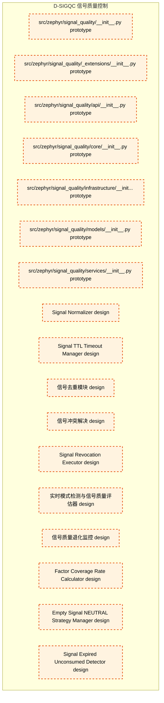

# 50_d_sigqc / 信号质量控制

> **文档作用 / Purpose**: 展示 信号质量控制（D-SIGQC）功能域的模块清单、域内依赖关系和跨域依赖关系，供架构审查和域治理参考。

> 本文档由 generate_domain_doc.py 从 depgraph.db 自动生成
> 最后更新: 2026-06-25 18:42:45
> 数据源: depgraph.db nodes表 + edges表

## 域基本信息 / Domain Overview

| 字段 | 值 | Field | Value |
|------|------|-------|-------|
| 编号 | 50 | Number | 50 |
| 域ID | D-SIGQC | Domain ID | D-SIGQC |
| 域名称 | 信号质量控制 | Domain Name | 信号质量控制 |
| 层级 | L2_domain | Layer | L2_domain |
| 模块数 | 17 | Module Count | 17 |
| 域内依赖 | 0 | Internal Dependencies | 0 |
| 跨域入边 | 0 | Cross-domain Incoming | 0 |
| 跨域出边 | 0 | Cross-domain Outgoing | 0 |
| 设计态模块 | 10 | Design Modules | 10 |
| 原型态模块 | 7 | Prototype Modules | 7 |
| 生产态模块 | 0 | Production Modules | 0 |
| 容量 | 0/150 (正常) | Capacity | 0/150 (正常) |
| 描述 | 信号质量域。负责信号质量评估与监控，包括信号衰减检测、信号相关性分析、信号稳定性评估、信号噪声过滤。拆分自原D-SIGNAL域。 | Description | 信号质量域。负责信号质量评估与监控，包括信号衰减检测、信号相关性分析、信号稳定性评估、信号噪声过滤。拆分自原D-SIGNAL域。 |

## 模块清单 / Module List

共 17 个模块（按路径排序，全部显示）

| 模块路径 / Module Path | 模块名称 / Module Name | 设计成熟度 / Maturity | 构建状态 / Build Status |
|---------|---------|-----------|---------|
| src/zephyr/signal_quality/__init__.py |  | prototype | deprecated |
| src/zephyr/signal_quality/_extensions/__init__.py |  | prototype | deprecated |
| src/zephyr/signal_quality/api/__init__.py |  | prototype | deprecated |
| src/zephyr/signal_quality/core/__init__.py |  | prototype | deprecated |
| src/zephyr/signal_quality/infrastructure/__init__.py |  | prototype | deprecated |
| src/zephyr/signal_quality/models/__init__.py |  | prototype | deprecated |
| src/zephyr/signal_quality/services/__init__.py |  | prototype | deprecated |
| 信号域-信号处理/D-SIGNAL-69 | Signal Normalizer | design | planned |
| 信号域-信号处理/D-SIGNAL-71 | Signal TTL Timeout Manager | design | planned |
| 信号域-冲突融合/D-SIGNAL-130 | 信号去重模块 | design | planned |
| 信号域-冲突融合/D-SIGNAL-132 | 信号冲突解决 | design | planned |
| 信号域-合成分配/D-SIGNAL-92 | Signal Revocation Executor | design | planned |
| 信号域-技术指标/D-SIGNAL-118 | 实时模式检测与信号质量评估器 | design | planned |
| 信号域-策略运行时/D-SIGNAL-156 | 信号质量退化监控 | design | planned |
| 信号域-质量降级/D-SIGNAL-77 | Factor Coverage Rate Calculator | design | planned |
| 信号域-质量降级/D-SIGNAL-81 | Empty Signal NEUTRAL Strategy Manager | design | planned |
| 信号域-质量降级/D-SIGNAL-83 | Signal Expired Unconsumed Detector | design | planned |

## 域内依赖图 / Internal Dependency Diagram

> 依赖图内嵌在本文档中，IDE 可直接渲染显示。每30个节点一组分页显示。
>
> **图例说明 / Legend**：
> - **实线边框 = 运营态模块**（production，已上线运行）
> - **虚线边框 = 设计态模块**（design，还在设计中）
> - **实线箭头 = 运营态依赖**（已生效的依赖关系）
> - **虚线箭头 = 设计态依赖**（计划中的依赖关系）

## 跨域依赖 / Cross-domain Dependencies

### 本域依赖的其他域（出边）/ Depends On

无跨域出边依赖 / No cross-domain outgoing dependencies

### 依赖本域的其他域（入边）/ Depended By

无跨域入边依赖 / No cross-domain incoming dependencies

## 说明 / Notes

- **数据源 / Data Source**: `depgraph.db` 的 `nodes`、`edges`、`domains` 表
- **生成器 / Generator**: `generate_domain_doc.py`
- **维护方式 / Maintenance**: 自动生成，全景图更新时刷新
- **文件名规则 / File Naming**: `{编号:02d}_{域ID小写}.md`，如 `16_d_trading.md`
