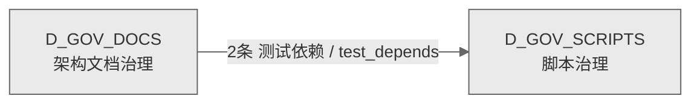

# 51_d_gov_docs / 架构文档治理 / Architecture Docs Governance

> **功能简介 / Overview**: 架构文档治理，负责架构文档生成、一致性和版本管理

> **文档作用 / Purpose**: 展示 架构文档治理（D_GOV_DOCS）功能域的域内依赖关系、跨域依赖关系，模块信息（成熟度/中英文名/大白话/文件路径）内嵌于 Mermaid 节点，供架构审查和域治理参考。

> 本文档由 generate_domain_doc.py 从 depgraph (PostgreSQL) 自动生成
> 数据源: depgraph (PostgreSQL) nodes表 + edges表

> **[可缩放 HTML 版 / Zoomable HTML](http://localhost:8765/docs/02_enterprise_architecture/02_domain_architecture_docs/51_d_gov_docs.html)** — Ctrl+滚轮缩放 ｜ 双击重置 ｜ Ctrl+Shift+D 切换拖动/选择模式

## 域基本信息 / Domain Overview

| 字段 | 值 | Field | Value |
|------|------|-------|-------|
| 编号 | 51 | Number | 51 |
| 域ID | D_GOV_DOCS | Domain ID | D_GOV_DOCS |
| 域名称 | 架构文档治理 | Domain Name | Architecture Docs Governance |
| 层级 | L2 业务域层 | Layer | L2 Domain |
| 模块数 | 24 | Module Count | 24 |
| 域内依赖 | 0 | Internal Dependencies | 0 |
| 跨域入边 | 0 | Cross-domain Incoming | 0 |
| 跨域出边 | 2 | Cross-domain Outgoing | 2 |
| 设计态模块 | 22 | Design Modules | 22 |
| 生产态模块 | 2 | Production Modules | 2 |
| 容量 | 2/150 (正常) | Capacity | 2/150 (正常) |
| 描述 | 架构模型文档(architecture_model) | Description | 架构模型文档(architecture_model) |

## 域内依赖图 / Internal Dependency Diagram

> 依赖图内嵌在本文档中，IDE 可直接渲染；网页版可 Ctrl+滚轮缩放 + 拖动平移查看细节。全景图用颜色区分运营态/设计态，不再分页/拆子图。
>
> **图例说明 / Legend**：
> - 🟦 **蓝色 = 运营态模块**（production，已上线运行）
> - 🟧 **橙色虚线 = 设计态模块**（design，蓝图阶段，代码未写）
> - **实线箭头 = 运营态依赖**（已生效的依赖关系）
> - **虚线箭头 = 非运营态依赖**（计划中/验证中的依赖关系）

### 全景依赖图（全部模块，颜色区分运营态/设计态）

> 展示全部 24 个模块（生产态 2 + 设计态 22），节点含成熟度+中英文名+大白话+文件路径。

```mermaid
%%{init: {'theme': 'base', 'themeVariables': {'primaryColor': '#eaeaea', 'primaryTextColor': '#333333', 'primaryBorderColor': '#666666', 'lineColor': '#666666', 'secondaryColor': '#eaeaea', 'tertiaryColor': '#eaeaea', 'fontSize': '14px'}}}%%
flowchart TD
    docs_03_modules_cross_layer_auto_fix_engine_blueprint_md["(设计态 / design)<br/>文件: auto_fix_engine/blueprint.md"]
    docs_03_modules_cross_layer_auto_runtime_core_blueprint_md["(设计态 / design)<br/>文件: auto_runtime_core/blueprint.md"]
    docs_03_modules_cross_layer_behavioral_auditor_blueprint_md["(设计态 / design)<br/>文件: behavioral_auditor/blueprint.md"]
    docs_03_modules_cross_layer_context_engine_blueprint_md["(设计态 / design)<br/>文件: context_engine/blueprint.md"]
    docs_03_modules_cross_layer_database_blueprint_md["(设计态 / design)<br/>文件: database/blueprint.md"]
    docs_03_modules_cross_layer_feedback_loop_blueprint_md["(设计态 / design)<br/>文件: feedback_loop/blueprint.md"]
    docs_03_modules_cross_layer_gate_engine_blueprint_md["(设计态 / design)<br/>文件: gate_engine/blueprint.md"]
    docs_03_modules_cross_layer_model_capability_exam_blueprint_md["(设计态 / design)<br/>文件: model_capability_exam/blueprint.md"]
    docs_03_modules_cross_layer_orphan_judge_blueprint_md["(设计态 / design)<br/>文件: orphan_judge/blueprint.md"]
    docs_03_modules_cross_layer_pipeline_blueprint_md["(设计态 / design)<br/>文件: pipeline/blueprint.md"]
    docs_03_modules_cross_layer_red_blue_validator_blueprint_md["(设计态 / design)<br/>文件: red_blue_validator/blueprint.md"]
    docs_03_modules_cross_layer_resource_optimization_engine_blueprint_md["(设计态 / design)<br/>文件: resource_optimization_engine/blueprint.md"]
    docs_03_modules_cross_layer_semantic_auditor_blueprint_md["(设计态 / design)<br/>文件: semantic_auditor/blueprint.md"]
    docs_03_modules_cross_layer_shared_core_blueprint_md["(设计态 / design)<br/>文件: shared_core/blueprint.md"]
    docs_03_modules_domain_autonomy_core_agent_spec_blueprint_md["(设计态 / design)<br/>文件: agent_spec/blueprint.md"]
    docs_03_modules_domain_autonomy_core_rollback_system_blueprint_md["(设计态 / design)<br/>文件: rollback_system/blueprint.md"]
    docs_03_modules_domain_autonomy_perm_budget_enforcer_blueprint_md["(设计态 / design)<br/>文件: budget_enforcer/blueprint.md"]
    docs_03_modules_domain_autonomy_perm_escalation_protocol_blueprint_md["(设计态 / design)<br/>文件: escalation_protocol/blueprint.md"]
    docs_03_modules_domain_governance_blueprint_md["(设计态 / design)<br/>文件: _domain_governance/blueprint.md"]
    docs_03_modules_domain_governance_code_dedup_engine_blueprint_md["(设计态 / design)<br/>文件: code_dedup_engine/blueprint.md"]
    docs_03_modules_domain_governance_governance_automation_blueprint_md["(设计态 / design)<br/>文件: governance_automation/blueprint.md"]
    docs_03_modules_domain_governance_registry_governance_blueprint_md["(设计态 / design)<br/>文件: registry_governance/blueprint.md"]
    tests_governance_d8_doc_sync_test_guc_trigger_fix_py["(生产态 / production) test_guc_trigger_fix.py — GUC 触发器缺陷修复的端到端 smoke test（...<br/>test_guc_trigger_fix.py — GUC 触发器缺陷修复的端到端 smoke test（...<br/>文件: d8_doc_sync/test_guc_trigger_fix.py"]
    tests_governance_d8_doc_sync_test_sync_savepoint_isolation_py["(生产态 / production) test_sync_savepoint_isolation.py — sync_all() 级联失败隔离验证（...<br/>test_sync_savepoint_isolation.py — sync_all() 级联失败隔离验证（...<br/>文件: d8_doc_sync/test_sync_savepoint_isolation.py"]
    docs_03_modules_cross_layer_auto_fix_engine_blueprint_md ~~~ docs_03_modules_cross_layer_auto_runtime_core_blueprint_md
    docs_03_modules_cross_layer_auto_runtime_core_blueprint_md ~~~ docs_03_modules_cross_layer_behavioral_auditor_blueprint_md
    docs_03_modules_cross_layer_behavioral_auditor_blueprint_md ~~~ docs_03_modules_cross_layer_context_engine_blueprint_md
    docs_03_modules_cross_layer_context_engine_blueprint_md ~~~ docs_03_modules_cross_layer_database_blueprint_md
    docs_03_modules_cross_layer_database_blueprint_md ~~~ docs_03_modules_cross_layer_feedback_loop_blueprint_md
    docs_03_modules_cross_layer_feedback_loop_blueprint_md ~~~ docs_03_modules_cross_layer_gate_engine_blueprint_md
    docs_03_modules_cross_layer_gate_engine_blueprint_md ~~~ docs_03_modules_cross_layer_model_capability_exam_blueprint_md
    docs_03_modules_cross_layer_model_capability_exam_blueprint_md ~~~ docs_03_modules_cross_layer_orphan_judge_blueprint_md
    docs_03_modules_cross_layer_orphan_judge_blueprint_md ~~~ docs_03_modules_cross_layer_pipeline_blueprint_md
    docs_03_modules_cross_layer_pipeline_blueprint_md ~~~ docs_03_modules_cross_layer_red_blue_validator_blueprint_md
    docs_03_modules_cross_layer_red_blue_validator_blueprint_md ~~~ docs_03_modules_cross_layer_resource_optimization_engine_blueprint_md
    docs_03_modules_cross_layer_resource_optimization_engine_blueprint_md ~~~ docs_03_modules_cross_layer_semantic_auditor_blueprint_md
    docs_03_modules_cross_layer_semantic_auditor_blueprint_md ~~~ docs_03_modules_cross_layer_shared_core_blueprint_md
    docs_03_modules_cross_layer_shared_core_blueprint_md ~~~ docs_03_modules_domain_autonomy_core_agent_spec_blueprint_md
    docs_03_modules_domain_autonomy_core_agent_spec_blueprint_md ~~~ docs_03_modules_domain_autonomy_core_rollback_system_blueprint_md
    docs_03_modules_domain_autonomy_core_rollback_system_blueprint_md ~~~ docs_03_modules_domain_autonomy_perm_budget_enforcer_blueprint_md
    docs_03_modules_domain_autonomy_perm_budget_enforcer_blueprint_md ~~~ docs_03_modules_domain_autonomy_perm_escalation_protocol_blueprint_md
    docs_03_modules_domain_autonomy_perm_escalation_protocol_blueprint_md ~~~ docs_03_modules_domain_governance_blueprint_md
    docs_03_modules_domain_governance_blueprint_md ~~~ docs_03_modules_domain_governance_code_dedup_engine_blueprint_md
    docs_03_modules_domain_governance_code_dedup_engine_blueprint_md ~~~ docs_03_modules_domain_governance_governance_automation_blueprint_md
    docs_03_modules_domain_governance_governance_automation_blueprint_md ~~~ docs_03_modules_domain_governance_registry_governance_blueprint_md
    docs_03_modules_domain_governance_registry_governance_blueprint_md ~~~ tests_governance_d8_doc_sync_test_guc_trigger_fix_py
    tests_governance_d8_doc_sync_test_guc_trigger_fix_py ~~~ tests_governance_d8_doc_sync_test_sync_savepoint_isolation_py
    D_GOV_SCRIPTS["(生产态 / production) 脚本治理 / Script Governance<br/>脚本治理，负责脚本生命周期管理和脚本质量门禁<br/>跨域节点 / cross-domain"]
    tests_governance_d8_doc_sync_test_guc_trigger_fix_py -->|测试依赖 / test_depends| D_GOV_SCRIPTS
    tests_governance_d8_doc_sync_test_sync_savepoint_isolation_py -->|测试依赖 / test_depends| D_GOV_SCRIPTS
    classDef production fill:#e1f5fe,stroke:#01579b,stroke-width:2px,color:#000
    classDef design fill:#fff3e0,stroke:#e65100,stroke-width:2px,color:#000,stroke-dasharray: 5 5
    classDef external_prod fill:#e8f4fd,stroke:#0277bd,stroke-width:1px,color:#000
    classDef external_design fill:#fff8e7,stroke:#ef6c00,stroke-width:1px,color:#000,stroke-dasharray: 5 5
    class tests_governance_d8_doc_sync_test_guc_trigger_fix_py,tests_governance_d8_doc_sync_test_sync_savepoint_isolation_py production
    class docs_03_modules_cross_layer_auto_fix_engine_blueprint_md,docs_03_modules_cross_layer_auto_runtime_core_blueprint_md,docs_03_modules_cross_layer_behavioral_auditor_blueprint_md,docs_03_modules_cross_layer_context_engine_blueprint_md,docs_03_modules_cross_layer_database_blueprint_md,docs_03_modules_cross_layer_feedback_loop_blueprint_md,docs_03_modules_cross_layer_gate_engine_blueprint_md,docs_03_modules_cross_layer_model_capability_exam_blueprint_md,docs_03_modules_cross_layer_orphan_judge_blueprint_md,docs_03_modules_cross_layer_pipeline_blueprint_md,docs_03_modules_cross_layer_red_blue_validator_blueprint_md,docs_03_modules_cross_layer_resource_optimization_engine_blueprint_md,docs_03_modules_cross_layer_semantic_auditor_blueprint_md,docs_03_modules_cross_layer_shared_core_blueprint_md,docs_03_modules_domain_autonomy_core_agent_spec_blueprint_md,docs_03_modules_domain_autonomy_core_rollback_system_blueprint_md,docs_03_modules_domain_autonomy_perm_budget_enforcer_blueprint_md,docs_03_modules_domain_autonomy_perm_escalation_protocol_blueprint_md,docs_03_modules_domain_governance_blueprint_md,docs_03_modules_domain_governance_code_dedup_engine_blueprint_md,docs_03_modules_domain_governance_governance_automation_blueprint_md,docs_03_modules_domain_governance_registry_governance_blueprint_md design
    class D_GOV_SCRIPTS external_prod
```

## 跨域依赖 / Cross-domain Dependencies

### 本域依赖的其他域（出边）/ Depends On

| # | 本域模块 / Source Module | → | 外部域-目标模块 / Target Module | 依赖类型 / Type |
|:--:|---------|:--:|---------|---------|
| 1 | test_guc_trigger_fix.py — GUC 触发器缺陷修复的端到端 smo... | → | D_GOV_SCRIPTS 脚本治理: constants.py — 审计脚本共享常量 (_shared/constants.py) | 测试依赖 / test_depends |
| 2 | test_sync_savepoint_isolation.py — sync_all() 级联失败隔... | → | D_GOV_SCRIPTS 脚本治理: constants.py — 审计脚本共享常量 (_shared/constants.py) | 测试依赖 / test_depends |

### 依赖本域的其他域（入边）/ Depended By

无跨域入边依赖 / No cross-domain incoming dependencies

### 跨域依赖图 / Cross-domain Dependency Diagram

> 本域与 1 个外部域直接连接（出边 2 条 + 入边 0 条 = 2 条）。只显示直接连接的域，不展开具体节点。

## 说明 / Notes

- **数据源 / Data Source**: `depgraph (PostgreSQL)` 的 `nodes`、`edges`、`domains` 表
- **生成器 / Generator**: `generate_domain_doc.py`（G2+G10 合并）
- **维护方式 / Maintenance**: 自动生成，全景图更新时刷新
- **文件名规则 / File Naming**: `{编号:02d}_{域ID小写}.md`，如 `16_d_trading.md`
- **图例说明 / Legend**: `[production]`=已上线 / `[design]`=设计中 / `[unknown]`=未知
