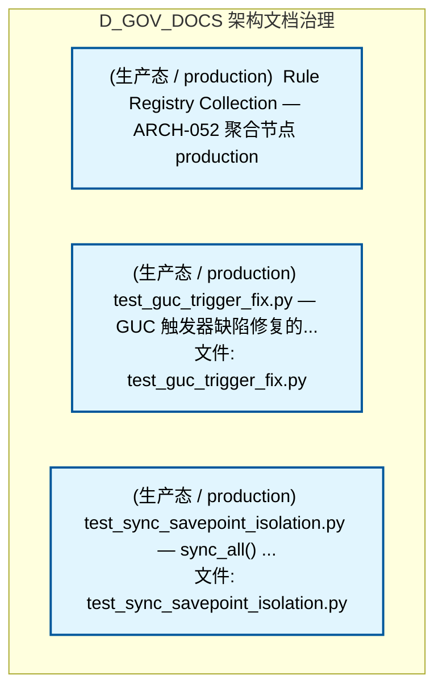

# 51_d_gov_docs / 架构文档治理 / Architecture Docs Governance

> **功能简介 / Overview**: 架构文档治理，负责架构文档生成、一致性和版本管理

> **文档作用 / Purpose**: 展示 架构文档治理（D_GOV_DOCS）功能域的模块清单、域内依赖关系、跨域依赖关系、架构分层视图，供架构审查和域治理参考。

> 本文档由 generate_domain_doc.py 从 depgraph (PostgreSQL) 自动生成
> 数据源: depgraph (PostgreSQL) nodes表 + edges表

## 域基本信息 / Domain Overview

| 字段 | 值 | Field | Value |
|------|------|-------|-------|
| 编号 | 51 | Number | 51 |
| 域ID | D_GOV_DOCS | Domain ID | D_GOV_DOCS |
| 域名称 | 架构文档治理 | Domain Name | Architecture Docs Governance |
| 层级 | L2 业务域层 | Layer | L2 Domain |
| 模块数 | 25 | Module Count | 25 |
| 域内依赖 | 0 | Internal Dependencies | 0 |
| 跨域入边 | 0 | Cross-domain Incoming | 0 |
| 跨域出边 | 0 | Cross-domain Outgoing | 0 |
| 设计态模块 | 22 | Design Modules | 22 |
| 生产态模块 | 3 | Production Modules | 3 |
| 容量 | 2/150 (正常) | Capacity | 2/150 (正常) |
| 描述 | 架构模型文档(architecture_model) | Description | 架构模型文档(architecture_model) |

## 模块分层清单 / Module Layered List

> 按 architecture_layer 分组的模块清单（共 25 个模块 / 25 modules）。

### L1 基础层 / Foundation Layer (23 modules)

| # | 模块路径 / Module Path | 模块名称 / Module Name (功能简介 / Description) | 成熟度 / Maturity | 蓝图 / Blueprint |
|:--:|---------|---------|:---:|:---:|
| 1 | docs/01_policies_and_standards/_registry/catalogs/rule_re... | [聚合节点 / Aggregated] 规则注册表集 / Rule Registry Collection (244 items) | 生产态 / production |  |
| ↳1 |   ↳ config/ai_capability_matrix.yaml |  | - | - |
| ↳2 |   ↳ config/auto_fix_cron.yaml |  | - | - |
| ↳3 |   ↳ config/blueprint_routing.yaml |  | - | - |
| ↳4 |   ↳ config/budget_policy.yaml |  | - | - |
| ↳5 |   ↳ config/capabilities.yaml |  | - | - |
| ↳6 |   ↳ config/capacity_params.yaml |  | - | - |
| ↳7 |   ↳ config/context_rules.yaml |  | - | - |
| ↳8 |   ↳ config/flags.yaml |  | - | - |
| ↳9 |   ↳ config/infra/grafana/dashboards/provider.yml |  | - | - |
| ↳10 |   ↳ config/infra/grafana/datasources/prometheus.yml |  | - | - |
| ↳11 |   ↳ config/infra/prometheus/prometheus.yml |  | - | - |
| ↳12 |   ↳ config/kb_parameters.yaml |  | - | - |
| ↳13 |   ↳ config/model_pricing.yaml |  | - | - |
| ↳14 |   ↳ config/nav_table_mapping.yaml |  | - | - |
| ↳15 |   ↳ config/rbac_roles.yaml |  | - | - |
| ↳16 |   ↳ config/resource_optimization.yaml |  | - | - |
| ↳17 |   ↳ config/risk_params.yaml |  | - | - |
| ↳18 |   ↳ config/runtime/burn_rate_acceleration.yaml |  | - | - |
| ↳19 |   ↳ config/runtime/error_budget_state.yaml |  | - | - |
| ↳20 |   ↳ config/runtime/kill_switch_state.yaml |  | - | - |
| ↳21 |   ↳ config/runtime/script_retirement_state.yaml |  | - | - |
| ↳22 |   ↳ config/runtime/shadow_mode_state.yaml |  | - | - |
| ↳23 |   ↳ config/session_state_machine.yaml |  | - | - |
| ↳24 |   ↳ config/trigger_router.yaml |  | - | - |
| ↳25 |   ↳ docs/01_policies_and_standards/_registry/schemas/ses... |  | - | - |
| ↳26 |   ↳ docs/01_policies_and_standards/rules/trae_001_file_o... |  | - | - |
| ↳27 |   ↳ docs/01_policies_and_standards/rules/trae_002_anti_o... |  | - | - |
| ↳28 |   ↳ docs/01_policies_and_standards/rules/trae_003_task_g... |  | - | - |
| ↳29 |   ↳ docs/01_policies_and_standards/rules/trae_004_parall... |  | - | - |
| ↳30 |   ↳ docs/01_policies_and_standards/rules/trae_005_modifi... |  | - | - |
| ↳31 |   ↳ docs/01_policies_and_standards/rules/trae_006_anti_h... |  | - | - |
| ↳32 |   ↳ docs/01_policies_and_standards/rules/trae_007_anti_h... |  | - | - |
| ↳33 |   ↳ docs/01_policies_and_standards/rules/trae_008_anti_h... |  | - | - |
| ↳34 |   ↳ docs/01_policies_and_standards/rules/trae_009_anti_h... |  | - | - |
| ↳35 |   ↳ docs/01_policies_and_standards/rules/trae_010_code_n... |  | - | - |
| ↳36 |   ↳ docs/01_policies_and_standards/rules/trae_011_code_t... |  | - | - |
| ↳37 |   ↳ docs/01_policies_and_standards/rules/trae_012_code_t... |  | - | - |
| ↳38 |   ↳ docs/01_policies_and_standards/rules/trae_013_arch_c... |  | - | - |
| ↳39 |   ↳ docs/01_policies_and_standards/rules/trae_014_arch_b... |  | - | - |
| ↳40 |   ↳ docs/01_policies_and_standards/rules/trae_015_arch_p... |  | - | - |
| ↳41 |   ↳ docs/01_policies_and_standards/rules/trae_016_arch_d... |  | - | - |
| ↳42 |   ↳ docs/01_policies_and_standards/rules/trae_017_arch_g... |  | - | - |
| ↳43 |   ↳ docs/01_policies_and_standards/rules/trae_018_behavi... |  | - | - |
| ↳44 |   ↳ docs/01_policies_and_standards/rules/trae_019_behavi... |  | - | - |
| ↳45 |   ↳ docs/01_policies_and_standards/rules/trae_020_behavi... |  | - | - |
| ↳46 |   ↳ docs/01_policies_and_standards/rules/trae_021_behavi... |  | - | - |
| ↳47 |   ↳ docs/01_policies_and_standards/rules/trae_022_behavi... |  | - | - |
| ↳48 |   ↳ docs/01_policies_and_standards/rules/trae_023_behavi... |  | - | - |
| ↳49 |   ↳ docs/01_policies_and_standards/rules/trae_024_method... |  | - | - |
| ↳50 |   ↳ docs/01_policies_and_standards/rules/trae_025_method... |  | - | - |
| ↳51 |   ↳ docs/01_policies_and_standards/rules/trae_026_method... |  | - | - |
| ↳52 |   ↳ docs/01_policies_and_standards/rules/trae_027_method... |  | - | - |
| ↳53 |   ↳ docs/01_policies_and_standards/rules/trae_028_doc_st... |  | - | - |
| ↳54 |   ↳ docs/01_policies_and_standards/rules/trae_029_doc_op... |  | - | - |
| ↳55 |   ↳ docs/01_policies_and_standards/rules/trae_030_doc_nu... |  | - | - |
| ↳56 |   ↳ docs/01_policies_and_standards/rules/trae_031_securi... |  | - | - |
| ↳57 |   ↳ docs/01_policies_and_standards/rules/trae_032_module... |  | - | - |
| ↳58 |   ↳ docs/01_policies_and_standards/rules/trae_033_module... |  | - | - |
| ↳59 |   ↳ docs/01_policies_and_standards/rules/trae_034_task_c... |  | - | - |
| ↳60 |   ↳ docs/01_policies_and_standards/rules/trae_035_task_c... |  | - | - |
| ↳61 |   ↳ docs/01_policies_and_standards/rules/trae_036_arch_g... |  | - | - |
| ↳62 |   ↳ docs/01_policies_and_standards/rules/trae_037_arch_q... |  | - | - |
| ↳63 |   ↳ docs/01_policies_and_standards/rules/trae_038_arch_c... |  | - | - |
| ↳64 |   ↳ docs/01_policies_and_standards/rules/trae_039_ai_hal... |  | - | - |
| ↳65 |   ↳ docs/01_policies_and_standards/rules/trae_040_ai_mod... |  | - | - |
| ↳66 |   ↳ docs/01_policies_and_standards/rules/trae_041_meta_r... |  | - | - |
| ↳67 |   ↳ docs/01_policies_and_standards/rules/trae_042_meta_r... |  | - | - |
| ↳68 |   ↳ docs/01_policies_and_standards/rules/trae_043_meta_r... |  | - | - |
| ↳69 |   ↳ docs/01_policies_and_standards/rules/trae_044_compli... |  | - | - |
| ↳70 |   ↳ docs/01_policies_and_standards/rules/trae_045_data_q... |  | - | - |
| ↳71 |   ↳ docs/01_policies_and_standards/rules/trae_046_engine... |  | - | - |
| ↳72 |   ↳ docs/01_policies_and_standards/rules/trae_047_engine... |  | - | - |
| ↳73 |   ↳ docs/01_policies_and_standards/rules/trae_048_ops_vi... |  | - | - |
| ↳74 |   ↳ docs/01_policies_and_standards/rules/trae_049_ops_do... |  | - | - |
| ↳75 |   ↳ docs/01_policies_and_standards/rules/trae_050_domain... |  | - | - |
| ↳76 |   ↳ docs/01_policies_and_standards/rules/trae_051_domain... |  | - | - |
| ↳77 |   ↳ docs/01_policies_and_standards/rules/trae_052_cross_... |  | - | - |
| ↳78 |   ↳ docs/01_policies_and_standards/rules/trae_053_automa... |  | - | - |
| ↳79 |   ↳ docs/01_policies_and_standards/rules/trae_054_depgra... |  | - | - |
| ↳80 |   ↳ docs/01_policies_and_standards/rules/trae_055_arch_d... |  | - | - |
| ↳81 |   ↳ docs/01_policies_and_standards/rules/trae_056_module... |  | - | - |
| ↳82 |   ↳ docs/01_policies_and_standards/rules/trae_057_ai_con... |  | - | - |
| ↳83 |   ↳ docs/01_policies_and_standards/rules/trae_058_depgra... |  | - | - |
| ↳84 |   ↳ docs/01_policies_and_standards/rules/trae_059_schema... |  | - | - |
| ↳85 |   ↳ docs/01_policies_and_standards/rules/trae_060_inward... |  | - | - |
| ↳86 |   ↳ docs/01_policies_and_standards/rules/trae_061_decisi... |  | - | - |
| ↳87 |   ↳ docs/01_policies_and_standards/rules/trae_062_ssot_c... |  | - | - |
| ↳88 |   ↳ docs/03_modules/_domain_infrastructure_operations/ag... |  | - | - |
| ↳89 |   ↳ docs/03_modules/_domain_infrastructure_operations/ag... |  | - | - |
| ↳90 |   ↳ docs/03_modules/path_ownership_map.yaml |  | - | - |
| ↳91 |   ↳ scripts/__init__.py |  | - | - |
| ↳92 |   ↳ scripts/_archive/construction/create_db_alignment_ta... |  | - | - |
| ↳93 |   ↳ scripts/_archive/construction/create_dm_phase9_tasks.py |  | - | - |
| ↳94 |   ↳ scripts/_archive/construction/dm014_orphan_edge_repa... |  | - | - |
| ↳95 |   ↳ scripts/_archive/governance/compare_ba_copies.py |  | - | - |
| ↳96 |   ↳ scripts/_archive/governance/create_depgraph_task_car... |  | - | - |
| ↳97 |   ↳ scripts/_archive/governance/d11_compliance/batch_rem... |  | - | - |
| ↳98 |   ↳ scripts/_archive/governance/d3_metadata/assign_modul... |  | - | - |
| ↳99 |   ↳ scripts/_archive/governance/d3_metadata/check_frontm... |  | - | - |
| ↳100 |   ↳ scripts/_archive/governance/d3_metadata/check_templa... |  | - | - |
| | | > (仅显示前 100 个 items，共 244 个) | | |
| 2 | docs/03_modules/_cross_layer/auto_fix_engine/blueprint.md | docs__03_modules___cross_layer__auto_fix_engine__blueprint_md | 设计态 / design |  |
| 3 | docs/03_modules/_cross_layer/auto_runtime_core/blueprint.md | docs__03_modules___cross_layer__auto_runtime_core__blueprint_md | 设计态 / design |  |
| 4 | docs/03_modules/_cross_layer/behavioral_auditor/blueprint.md | docs__03_modules___cross_layer__behavioral_auditor__blueprint_md | 设计态 / design |  |
| 5 | docs/03_modules/_cross_layer/context_engine/blueprint.md | docs__03_modules___cross_layer__context_engine__blueprint_md | 设计态 / design |  |
| 6 | docs/03_modules/_cross_layer/database/blueprint.md | docs__03_modules___cross_layer__database__blueprint_md | 设计态 / design |  |
| 7 | docs/03_modules/_cross_layer/feedback_loop/blueprint.md | docs__03_modules___cross_layer__feedback_loop__blueprint_md | 设计态 / design |  |
| 8 | docs/03_modules/_cross_layer/gate_engine/blueprint.md | docs__03_modules___cross_layer__gate_engine__blueprint_md | 设计态 / design |  |
| 9 | docs/03_modules/_cross_layer/model_capability_exam/bluepr... | docs__03_modules___cross_layer__model_capability_exam__blueprint_md | 设计态 / design |  |
| 10 | docs/03_modules/_cross_layer/orphan_judge/blueprint.md | docs__03_modules___cross_layer__orphan_judge__blueprint_md | 设计态 / design |  |
| 11 | docs/03_modules/_cross_layer/pipeline/blueprint.md | docs__03_modules___cross_layer__pipeline__blueprint_md | 设计态 / design |  |
| 12 | docs/03_modules/_cross_layer/red_blue_validator/blueprint.md | docs__03_modules___cross_layer__red_blue_validator__blueprint_md | 设计态 / design |  |
| 13 | docs/03_modules/_cross_layer/resource_optimization_engine... | docs__03_modules___cross_layer__resource_optimization_engine__blueprint_md | 设计态 / design |  |
| 14 | docs/03_modules/_cross_layer/semantic_auditor/blueprint.md | docs__03_modules___cross_layer__semantic_auditor__blueprint_md | 设计态 / design |  |
| 15 | docs/03_modules/_cross_layer/shared_core/blueprint.md | docs__03_modules___cross_layer__shared_core__blueprint_md | 设计态 / design |  |
| 16 | docs/03_modules/_domain_autonomy_core/agent_spec/blueprin... | docs__03_modules___domain_autonomy_core__agent_spec__blueprint_md | 设计态 / design |  |
| 17 | docs/03_modules/_domain_autonomy_core/rollback_system/blu... | docs__03_modules___domain_autonomy_core__rollback_system__blueprint_md | 设计态 / design |  |
| 18 | docs/03_modules/_domain_autonomy_perm/budget_enforcer/blu... | docs__03_modules___domain_autonomy_perm__budget_enforcer__blueprint_md | 设计态 / design |  |
| 19 | docs/03_modules/_domain_autonomy_perm/escalation_protocol... | docs__03_modules___domain_autonomy_perm__escalation_protocol__blueprint_md | 设计态 / design |  |
| 20 | docs/03_modules/_domain_governance/blueprint.md | docs__03_modules___domain_governance__blueprint_md | 设计态 / design |  |
| 21 | docs/03_modules/_domain_governance/code_dedup_engine/blue... | docs__03_modules___domain_governance__code_dedup_engine__blueprint_md | 设计态 / design |  |
| 22 | docs/03_modules/_domain_governance/governance_automation/... | docs__03_modules___domain_governance__governance_automation__blueprint_md | 设计态 / design |  |
| 23 | docs/03_modules/_domain_governance/registry_governance/bl... | docs__03_modules___domain_governance__registry_governance__blueprint_md | 设计态 / design |  |

### L2 领域层 / Domain Layer (2 modules)

| # | 模块路径 / Module Path | 模块名称 / Module Name (功能简介 / Description) | 成熟度 / Maturity | 蓝图 / Blueprint |
|:--:|---------|---------|:---:|:---:|
| 1 | tests/governance/d8_doc_sync/test_guc_trigger_fix.py | test_guc_trigger_fix.py — GUC 触发器缺陷修复的... | 生产态 / production |  |
| 2 | tests/governance/d8_doc_sync/test_sync_savepoint_isolatio... | test_sync_savepoint_isolation.py — sync_all() ... | 生产态 / production |  |

## 域内依赖图 / Internal Dependency Diagram

> 依赖图内嵌在本文档中，IDE 可直接渲染显示。参考 decision_index.md 设计，分三个视图：合并全景图、运营态子图、设计态子图（按 design_maturity 实际值拆分）。
>
> **图例说明 / Legend**：
> - **实线边框 = 运营态模块**（production，已上线运行）
> - **虚线边框 = 设计态模块**（design，蓝图阶段，代码未写）
> - **实线箭头 = 运营态依赖**（已生效的依赖关系）
> - **虚线箭头 = 非运营态依赖**（计划中/验证中的依赖关系）

### 合并全景图（全部模块，标签标注成熟度）

> 展示全部 25 个模块（生产态 3 + 设计态 22），标签标注成熟度。

```mermaid
graph TD
    subgraph D_GOV_DOCS["D_GOV_DOCS 架构文档治理"]
        docs_01_policies_and_standards_registry_catalogs_rule_registry_collection_yaml["(生产态 / production)  Rule Registry Collection — ARCH-052 聚合节点 production"]
        docs_03_modules_cross_layer_auto_fix_engine_blueprint_md["(设计态 / design) docs__03_modules___cross_layer__auto_fix_engine__blueprint_md"]
        docs_03_modules_cross_layer_auto_runtime_core_blueprint_md["(设计态 / design) docs__03_modules___cross_layer__auto_runtime_core__blueprint_md"]
        docs_03_modules_cross_layer_behavioral_auditor_blueprint_md["(设计态 / design) docs__03_modules___cross_layer__behavioral_auditor__blueprint_md"]
        docs_03_modules_cross_layer_context_engine_blueprint_md["(设计态 / design) docs__03_modules___cross_layer__context_engine__blueprint_md"]
        docs_03_modules_cross_layer_database_blueprint_md["(设计态 / design) docs__03_modules___cross_layer__database__blueprint_md"]
        docs_03_modules_cross_layer_feedback_loop_blueprint_md["(设计态 / design) docs__03_modules___cross_layer__feedback_loop__blueprint_md"]
        docs_03_modules_cross_layer_gate_engine_blueprint_md["(设计态 / design) docs__03_modules___cross_layer__gate_engine__blueprint_md"]
        docs_03_modules_cross_layer_model_capability_exam_blueprint_md["(设计态 / design) docs__03_modules___cross_layer__model_capability_exam__blueprint_md"]
        docs_03_modules_cross_layer_orphan_judge_blueprint_md["(设计态 / design) docs__03_modules___cross_layer__orphan_judge__blueprint_md"]
        docs_03_modules_cross_layer_pipeline_blueprint_md["(设计态 / design) docs__03_modules___cross_layer__pipeline__blueprint_md"]
        docs_03_modules_cross_layer_red_blue_validator_blueprint_md["(设计态 / design) docs__03_modules___cross_layer__red_blue_validator__blueprint_md"]
        docs_03_modules_cross_layer_resource_optimization_engine_blueprint_md["(设计态 / design) docs__03_modules___cross_layer__resource_optimization_engine__blueprint_md"]
        docs_03_modules_cross_layer_semantic_auditor_blueprint_md["(设计态 / design) docs__03_modules___cross_layer__semantic_auditor__blueprint_md"]
        docs_03_modules_cross_layer_shared_core_blueprint_md["(设计态 / design) docs__03_modules___cross_layer__shared_core__blueprint_md"]
        docs_03_modules_domain_autonomy_core_agent_spec_blueprint_md["(设计态 / design) docs__03_modules___domain_autonomy_core__agent_spec__blueprint_md"]
        docs_03_modules_domain_autonomy_core_rollback_system_blueprint_md["(设计态 / design) docs__03_modules___domain_autonomy_core__rollback_system__blueprint_md"]
        docs_03_modules_domain_autonomy_perm_budget_enforcer_blueprint_md["(设计态 / design) docs__03_modules___domain_autonomy_perm__budget_enforcer__blueprint_md"]
        docs_03_modules_domain_autonomy_perm_escalation_protocol_blueprint_md["(设计态 / design) docs__03_modules___domain_autonomy_perm__escalation_protocol__blueprint_md"]
        docs_03_modules_domain_governance_blueprint_md["(设计态 / design) docs__03_modules___domain_governance__blueprint_md"]
        docs_03_modules_domain_governance_code_dedup_engine_blueprint_md["(设计态 / design) docs__03_modules___domain_governance__code_dedup_engine__blueprint_md"]
        docs_03_modules_domain_governance_governance_automation_blueprint_md["(设计态 / design) docs__03_modules___domain_governance__governance_automation__blueprint_md"]
        docs_03_modules_domain_governance_registry_governance_blueprint_md["(设计态 / design) docs__03_modules___domain_governance__registry_governance__blueprint_md"]
        tests_governance_d8_doc_sync_test_guc_trigger_fix_py["(生产态 / production) test_guc_trigger_fix.py — GUC 触发器缺陷修复的...<br/>文件: test_guc_trigger_fix.py"]
        tests_governance_d8_doc_sync_test_sync_savepoint_isolation_py["(生产态 / production) test_sync_savepoint_isolation.py — sync_all() ...<br/>文件: test_sync_savepoint_isolation.py"]
    end
    classDef production fill:#e1f5fe,stroke:#01579b,stroke-width:2px,color:#000
    classDef design fill:#fff3e0,stroke:#e65100,stroke-width:2px,color:#000,stroke-dasharray: 5 5
    classDef external_prod fill:#e8f5e9,stroke:#1b5e20,stroke-width:1px,color:#000
    classDef external_design fill:#fce4ec,stroke:#880e4f,stroke-width:1px,color:#000,stroke-dasharray: 5 5
    class docs_01_policies_and_standards_registry_catalogs_rule_registry_collection_yaml,tests_governance_d8_doc_sync_test_guc_trigger_fix_py,tests_governance_d8_doc_sync_test_sync_savepoint_isolation_py production
    class docs_03_modules_cross_layer_auto_fix_engine_blueprint_md,docs_03_modules_cross_layer_auto_runtime_core_blueprint_md,docs_03_modules_cross_layer_behavioral_auditor_blueprint_md,docs_03_modules_cross_layer_context_engine_blueprint_md,docs_03_modules_cross_layer_database_blueprint_md,docs_03_modules_cross_layer_feedback_loop_blueprint_md,docs_03_modules_cross_layer_gate_engine_blueprint_md,docs_03_modules_cross_layer_model_capability_exam_blueprint_md,docs_03_modules_cross_layer_orphan_judge_blueprint_md,docs_03_modules_cross_layer_pipeline_blueprint_md,docs_03_modules_cross_layer_red_blue_validator_blueprint_md,docs_03_modules_cross_layer_resource_optimization_engine_blueprint_md,docs_03_modules_cross_layer_semantic_auditor_blueprint_md,docs_03_modules_cross_layer_shared_core_blueprint_md,docs_03_modules_domain_autonomy_core_agent_spec_blueprint_md,docs_03_modules_domain_autonomy_core_rollback_system_blueprint_md,docs_03_modules_domain_autonomy_perm_budget_enforcer_blueprint_md,docs_03_modules_domain_autonomy_perm_escalation_protocol_blueprint_md,docs_03_modules_domain_governance_blueprint_md,docs_03_modules_domain_governance_code_dedup_engine_blueprint_md,docs_03_modules_domain_governance_governance_automation_blueprint_md,docs_03_modules_domain_governance_registry_governance_blueprint_md design
```

### 运营态子图（仅 design_maturity=production 的模块和依赖）

> 仅展示已上线运行的模块（共 3 个，0 条域内依赖）。

### 设计态子图（仅 design_maturity=design 的模块和依赖）

> 仅展示蓝图阶段、代码未写的设计态模块（共 22 个，0 条域内依赖）。

```mermaid
graph TD
    subgraph D_GOV_DOCS["D_GOV_DOCS 架构文档治理"]
        docs_03_modules_cross_layer_auto_fix_engine_blueprint_md["(设计态 / design) docs__03_modules___cross_layer__auto_fix_engine__blueprint_md"]
        docs_03_modules_cross_layer_auto_runtime_core_blueprint_md["(设计态 / design) docs__03_modules___cross_layer__auto_runtime_core__blueprint_md"]
        docs_03_modules_cross_layer_behavioral_auditor_blueprint_md["(设计态 / design) docs__03_modules___cross_layer__behavioral_auditor__blueprint_md"]
        docs_03_modules_cross_layer_context_engine_blueprint_md["(设计态 / design) docs__03_modules___cross_layer__context_engine__blueprint_md"]
        docs_03_modules_cross_layer_database_blueprint_md["(设计态 / design) docs__03_modules___cross_layer__database__blueprint_md"]
        docs_03_modules_cross_layer_feedback_loop_blueprint_md["(设计态 / design) docs__03_modules___cross_layer__feedback_loop__blueprint_md"]
        docs_03_modules_cross_layer_gate_engine_blueprint_md["(设计态 / design) docs__03_modules___cross_layer__gate_engine__blueprint_md"]
        docs_03_modules_cross_layer_model_capability_exam_blueprint_md["(设计态 / design) docs__03_modules___cross_layer__model_capability_exam__blueprint_md"]
        docs_03_modules_cross_layer_orphan_judge_blueprint_md["(设计态 / design) docs__03_modules___cross_layer__orphan_judge__blueprint_md"]
        docs_03_modules_cross_layer_pipeline_blueprint_md["(设计态 / design) docs__03_modules___cross_layer__pipeline__blueprint_md"]
        docs_03_modules_cross_layer_red_blue_validator_blueprint_md["(设计态 / design) docs__03_modules___cross_layer__red_blue_validator__blueprint_md"]
        docs_03_modules_cross_layer_resource_optimization_engine_blueprint_md["(设计态 / design) docs__03_modules___cross_layer__resource_optimization_engine__blueprint_md"]
        docs_03_modules_cross_layer_semantic_auditor_blueprint_md["(设计态 / design) docs__03_modules___cross_layer__semantic_auditor__blueprint_md"]
        docs_03_modules_cross_layer_shared_core_blueprint_md["(设计态 / design) docs__03_modules___cross_layer__shared_core__blueprint_md"]
        docs_03_modules_domain_autonomy_core_agent_spec_blueprint_md["(设计态 / design) docs__03_modules___domain_autonomy_core__agent_spec__blueprint_md"]
        docs_03_modules_domain_autonomy_core_rollback_system_blueprint_md["(设计态 / design) docs__03_modules___domain_autonomy_core__rollback_system__blueprint_md"]
        docs_03_modules_domain_autonomy_perm_budget_enforcer_blueprint_md["(设计态 / design) docs__03_modules___domain_autonomy_perm__budget_enforcer__blueprint_md"]
        docs_03_modules_domain_autonomy_perm_escalation_protocol_blueprint_md["(设计态 / design) docs__03_modules___domain_autonomy_perm__escalation_protocol__blueprint_md"]
        docs_03_modules_domain_governance_blueprint_md["(设计态 / design) docs__03_modules___domain_governance__blueprint_md"]
        docs_03_modules_domain_governance_code_dedup_engine_blueprint_md["(设计态 / design) docs__03_modules___domain_governance__code_dedup_engine__blueprint_md"]
        docs_03_modules_domain_governance_governance_automation_blueprint_md["(设计态 / design) docs__03_modules___domain_governance__governance_automation__blueprint_md"]
        docs_03_modules_domain_governance_registry_governance_blueprint_md["(设计态 / design) docs__03_modules___domain_governance__registry_governance__blueprint_md"]
    end
    classDef production fill:#e1f5fe,stroke:#01579b,stroke-width:2px,color:#000
    classDef design fill:#fff3e0,stroke:#e65100,stroke-width:2px,color:#000,stroke-dasharray: 5 5
    classDef external_prod fill:#e8f5e9,stroke:#1b5e20,stroke-width:1px,color:#000
    classDef external_design fill:#fce4ec,stroke:#880e4f,stroke-width:1px,color:#000,stroke-dasharray: 5 5
    class docs_03_modules_cross_layer_auto_fix_engine_blueprint_md,docs_03_modules_cross_layer_auto_runtime_core_blueprint_md,docs_03_modules_cross_layer_behavioral_auditor_blueprint_md,docs_03_modules_cross_layer_context_engine_blueprint_md,docs_03_modules_cross_layer_database_blueprint_md,docs_03_modules_cross_layer_feedback_loop_blueprint_md,docs_03_modules_cross_layer_gate_engine_blueprint_md,docs_03_modules_cross_layer_model_capability_exam_blueprint_md,docs_03_modules_cross_layer_orphan_judge_blueprint_md,docs_03_modules_cross_layer_pipeline_blueprint_md,docs_03_modules_cross_layer_red_blue_validator_blueprint_md,docs_03_modules_cross_layer_resource_optimization_engine_blueprint_md,docs_03_modules_cross_layer_semantic_auditor_blueprint_md,docs_03_modules_cross_layer_shared_core_blueprint_md,docs_03_modules_domain_autonomy_core_agent_spec_blueprint_md,docs_03_modules_domain_autonomy_core_rollback_system_blueprint_md,docs_03_modules_domain_autonomy_perm_budget_enforcer_blueprint_md,docs_03_modules_domain_autonomy_perm_escalation_protocol_blueprint_md,docs_03_modules_domain_governance_blueprint_md,docs_03_modules_domain_governance_code_dedup_engine_blueprint_md,docs_03_modules_domain_governance_governance_automation_blueprint_md,docs_03_modules_domain_governance_registry_governance_blueprint_md design
```

## 跨域依赖 / Cross-domain Dependencies

### 本域依赖的其他域（出边）/ Depends On

无跨域出边依赖 / No cross-domain outgoing dependencies

### 依赖本域的其他域（入边）/ Depended By

无跨域入边依赖 / No cross-domain incoming dependencies

### 跨域依赖图 / Cross-domain Dependency Diagram

> 本域与 0 个外部域直接连接（出边 0 条 + 入边 0 条 = 0 条）。只显示直接连接的域，不展开具体节点。

> （无跨域依赖 / No cross-domain dependencies）

## 说明 / Notes

- **数据源 / Data Source**: `depgraph (PostgreSQL)` 的 `nodes`、`edges`、`domains` 表
- **生成器 / Generator**: `generate_domain_doc.py`（G2+G10 合并）
- **维护方式 / Maintenance**: 自动生成，全景图更新时刷新
- **文件名规则 / File Naming**: `{编号:02d}_{域ID小写}.md`，如 `16_d_trading.md`
- **图例说明 / Legend**: `[production]`=已上线 / `[design]`=设计中 / `[unknown]`=未知
