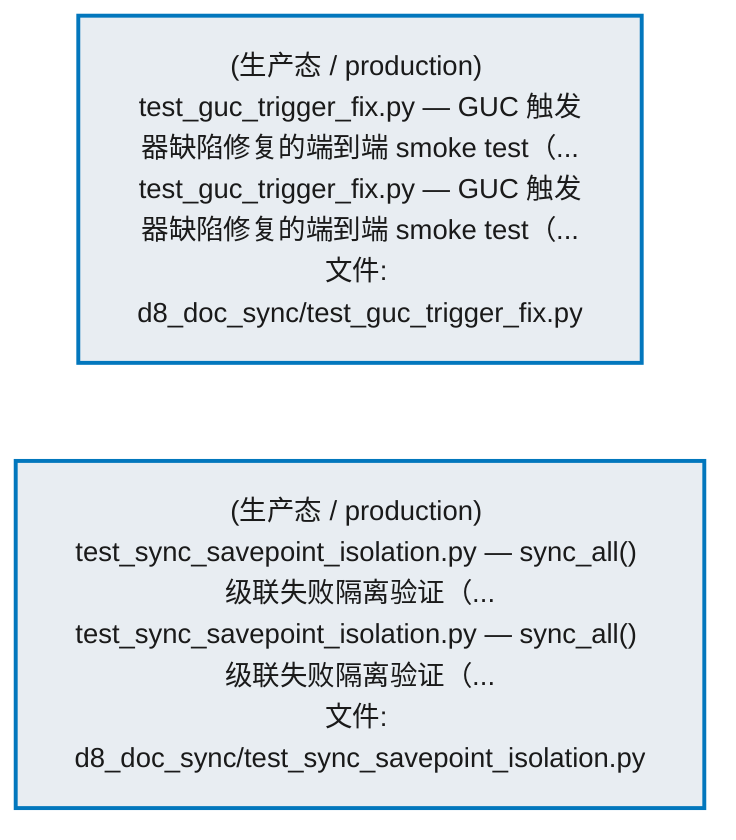

# 51_d_gov_docs / 架构文档治理 / Architecture Docs Governance

> **功能简介 / Overview**: 架构文档治理，负责架构文档生成、一致性和版本管理

> **文档作用 / Purpose**: 展示 架构文档治理（D_GOV_DOCS）功能域的模块清单、域内依赖关系、跨域依赖关系、架构分层视图，供架构审查和域治理参考。

> 本文档由 generate_domain_doc.py 从 depgraph (PostgreSQL) 自动生成
> 数据源: depgraph (PostgreSQL) nodes表 + edges表

> **[可缩放 HTML 版 / Zoomable HTML](http://localhost:8765/docs/02_enterprise_architecture/02_domain_architecture_docs/51_d_gov_docs.html)** — Ctrl+滚轮缩放 ｜ 双击重置 ｜ Ctrl+Shift+D 切换拖动/选择模式

## 域基本信息 / Domain Overview

| 字段 | 值 | Field | Value |
|------|------|-------|-------|
| 编号 | 51 | Number | 51 |
| 域ID | D_GOV_DOCS | Domain ID | D_GOV_DOCS |
| 域名称 | 架构文档治理 | Domain Name | Architecture Docs Governance |
| 层级 | L2 业务域层 | Layer | L2 Domain |
| 模块数 | 24 | Module Count | 24 |
| 域内依赖 | 0 | Internal Dependencies | 0 |
| 跨域入边 | 0 | Cross-domain Incoming | 0 |
| 跨域出边 | 0 | Cross-domain Outgoing | 0 |
| 设计态模块 | 22 | Design Modules | 22 |
| 生产态模块 | 2 | Production Modules | 2 |
| 容量 | 2/150 (正常) | Capacity | 2/150 (正常) |
| 描述 | 架构模型文档(architecture_model) | Description | 架构模型文档(architecture_model) |

## 模块分层清单 / Module Layered List

> 按 architecture_layer 分组的模块清单（共 24 个模块 / 24 modules）。

### L1 基础层 / Foundation Layer (22 modules)

| # | 模块路径 / Module Path | 模块名称 / Module Name (功能简介 / Description) | 成熟度 / Maturity | 蓝图 / Blueprint |
|:--:|---------|---------|:---:|:---:|
| 1 | docs/03_modules/_cross_layer/auto_fix_engine/blueprint.md | auto_fix_engine/blueprint.md | 设计态 / design |  |
| 2 | docs/03_modules/_cross_layer/auto_runtime_core/blueprint.md | auto_runtime_core/blueprint.md | 设计态 / design |  |
| 3 | docs/03_modules/_cross_layer/behavioral_auditor/blueprint.md | behavioral_auditor/blueprint.md | 设计态 / design |  |
| 4 | docs/03_modules/_cross_layer/context_engine/blueprint.md | context_engine/blueprint.md | 设计态 / design |  |
| 5 | docs/03_modules/_cross_layer/database/blueprint.md | database/blueprint.md | 设计态 / design |  |
| 6 | docs/03_modules/_cross_layer/feedback_loop/blueprint.md | feedback_loop/blueprint.md | 设计态 / design |  |
| 7 | docs/03_modules/_cross_layer/gate_engine/blueprint.md | gate_engine/blueprint.md | 设计态 / design |  |
| 8 | docs/03_modules/_cross_layer/model_capability_exam/bluepr... | model_capability_exam/blueprint.md | 设计态 / design |  |
| 9 | docs/03_modules/_cross_layer/orphan_judge/blueprint.md | orphan_judge/blueprint.md | 设计态 / design |  |
| 10 | docs/03_modules/_cross_layer/pipeline/blueprint.md | pipeline/blueprint.md | 设计态 / design |  |
| 11 | docs/03_modules/_cross_layer/red_blue_validator/blueprint.md | red_blue_validator/blueprint.md | 设计态 / design |  |
| 12 | docs/03_modules/_cross_layer/resource_optimization_engine... | resource_optimization_engine/blueprint.md | 设计态 / design |  |
| 13 | docs/03_modules/_cross_layer/semantic_auditor/blueprint.md | semantic_auditor/blueprint.md | 设计态 / design |  |
| 14 | docs/03_modules/_cross_layer/shared_core/blueprint.md | shared_core/blueprint.md | 设计态 / design |  |
| 15 | docs/03_modules/_domain_autonomy_core/agent_spec/blueprin... | agent_spec/blueprint.md | 设计态 / design |  |
| 16 | docs/03_modules/_domain_autonomy_core/rollback_system/blu... | rollback_system/blueprint.md | 设计态 / design |  |
| 17 | docs/03_modules/_domain_autonomy_perm/budget_enforcer/blu... | budget_enforcer/blueprint.md | 设计态 / design |  |
| 18 | docs/03_modules/_domain_autonomy_perm/escalation_protocol... | escalation_protocol/blueprint.md | 设计态 / design |  |
| 19 | docs/03_modules/_domain_governance/blueprint.md | _domain_governance/blueprint.md | 设计态 / design |  |
| 20 | docs/03_modules/_domain_governance/code_dedup_engine/blue... | code_dedup_engine/blueprint.md | 设计态 / design |  |
| 21 | docs/03_modules/_domain_governance/governance_automation/... | governance_automation/blueprint.md | 设计态 / design |  |
| 22 | docs/03_modules/_domain_governance/registry_governance/bl... | registry_governance/blueprint.md | 设计态 / design |  |

### L2 领域层 / Domain Layer (2 modules)

| # | 模块路径 / Module Path | 模块名称 / Module Name (功能简介 / Description) | 成熟度 / Maturity | 蓝图 / Blueprint |
|:--:|---------|---------|:---:|:---:|
| 1 | tests/governance/d8_doc_sync/test_guc_trigger_fix.py | test_guc_trigger_fix.py — GUC 触发器缺陷修复的端到端 smoke test（... | 生产态 / production |  |
| 2 | tests/governance/d8_doc_sync/test_sync_savepoint_isolatio... | test_sync_savepoint_isolation.py — sync_all() 级联失败隔离验证（... | 生产态 / production |  |

## 域内依赖图 / Internal Dependency Diagram

> 依赖图内嵌在本文档中，IDE 可直接渲染显示。参考 decision_index.md 设计，分三个视图：合并全景图、运营态子图、设计态子图（按 design_maturity 实际值拆分）。
>
> **图例说明 / Legend**：
> - **实线边框 = 运营态模块**（production，已上线运行）
> - **虚线边框 = 设计态模块**（design，蓝图阶段，代码未写）
> - **实线箭头 = 运营态依赖**（已生效的依赖关系）
> - **虚线箭头 = 非运营态依赖**（计划中/验证中的依赖关系）

### 合并全景图（全部模块，标签标注成熟度）

> 展示全部 24 个模块（生产态 2 + 设计态 22），标签标注成熟度。

```mermaid
%%{init: {'theme': 'base', 'themeVariables': {'primaryColor': '#eaeaea', 'primaryTextColor': '#333333', 'primaryBorderColor': '#666666', 'lineColor': '#666666', 'secondaryColor': '#eaeaea', 'tertiaryColor': '#eaeaea', 'fontSize': '14px'}}}%%
flowchart TD
    docs_03_modules_cross_layer_auto_fix_engine_blueprint_md["(设计态 / design) auto_fix_engine/blueprint.md"]
    docs_03_modules_cross_layer_auto_runtime_core_blueprint_md["(设计态 / design) auto_runtime_core/blueprint.md"]
    docs_03_modules_cross_layer_behavioral_auditor_blueprint_md["(设计态 / design) behavioral_auditor/blueprint.md"]
    docs_03_modules_cross_layer_context_engine_blueprint_md["(设计态 / design) context_engine/blueprint.md"]
    docs_03_modules_cross_layer_database_blueprint_md["(设计态 / design) database/blueprint.md"]
    docs_03_modules_cross_layer_feedback_loop_blueprint_md["(设计态 / design) feedback_loop/blueprint.md"]
    docs_03_modules_cross_layer_gate_engine_blueprint_md["(设计态 / design) gate_engine/blueprint.md"]
    docs_03_modules_cross_layer_model_capability_exam_blueprint_md["(设计态 / design) model_capability_exam/blueprint.md"]
    docs_03_modules_cross_layer_orphan_judge_blueprint_md["(设计态 / design) orphan_judge/blueprint.md"]
    docs_03_modules_cross_layer_pipeline_blueprint_md["(设计态 / design) pipeline/blueprint.md"]
    docs_03_modules_cross_layer_red_blue_validator_blueprint_md["(设计态 / design) red_blue_validator/blueprint.md"]
    docs_03_modules_cross_layer_resource_optimization_engine_blueprint_md["(设计态 / design) resource_optimization_engine/blueprint.md"]
    docs_03_modules_cross_layer_semantic_auditor_blueprint_md["(设计态 / design) semantic_auditor/blueprint.md"]
    docs_03_modules_cross_layer_shared_core_blueprint_md["(设计态 / design) shared_core/blueprint.md"]
    docs_03_modules_domain_autonomy_core_agent_spec_blueprint_md["(设计态 / design) agent_spec/blueprint.md"]
    docs_03_modules_domain_autonomy_core_rollback_system_blueprint_md["(设计态 / design) rollback_system/blueprint.md"]
    docs_03_modules_domain_autonomy_perm_budget_enforcer_blueprint_md["(设计态 / design) budget_enforcer/blueprint.md"]
    docs_03_modules_domain_autonomy_perm_escalation_protocol_blueprint_md["(设计态 / design) escalation_protocol/blueprint.md"]
    docs_03_modules_domain_governance_blueprint_md["(设计态 / design) _domain_governance/blueprint.md"]
    docs_03_modules_domain_governance_code_dedup_engine_blueprint_md["(设计态 / design) code_dedup_engine/blueprint.md"]
    docs_03_modules_domain_governance_governance_automation_blueprint_md["(设计态 / design) governance_automation/blueprint.md"]
    docs_03_modules_domain_governance_registry_governance_blueprint_md["(设计态 / design) registry_governance/blueprint.md"]
    tests_governance_d8_doc_sync_test_guc_trigger_fix_py["(生产态 / production) test_guc_trigger_fix.py — GUC 触发器缺陷修复的端到端 smoke test（...<br/>test_guc_trigger_fix.py — GUC 触发器缺陷修复的端到端 smoke test（...<br/>文件: d8_doc_sync/test_guc_trigger_fix.py"]
    tests_governance_d8_doc_sync_test_sync_savepoint_isolation_py["(生产态 / production) test_sync_savepoint_isolation.py — sync_all() 级联失败隔离验证（...<br/>test_sync_savepoint_isolation.py — sync_all() 级联失败隔离验证（...<br/>文件: d8_doc_sync/test_sync_savepoint_isolation.py"]
    docs_03_modules_cross_layer_auto_fix_engine_blueprint_md ~~~ docs_03_modules_cross_layer_auto_runtime_core_blueprint_md
    docs_03_modules_cross_layer_auto_runtime_core_blueprint_md ~~~ docs_03_modules_cross_layer_behavioral_auditor_blueprint_md
    docs_03_modules_cross_layer_behavioral_auditor_blueprint_md ~~~ docs_03_modules_cross_layer_context_engine_blueprint_md
    docs_03_modules_cross_layer_context_engine_blueprint_md ~~~ docs_03_modules_cross_layer_database_blueprint_md
    docs_03_modules_cross_layer_database_blueprint_md ~~~ docs_03_modules_cross_layer_feedback_loop_blueprint_md
    docs_03_modules_cross_layer_feedback_loop_blueprint_md ~~~ docs_03_modules_cross_layer_gate_engine_blueprint_md
    docs_03_modules_cross_layer_gate_engine_blueprint_md ~~~ docs_03_modules_cross_layer_model_capability_exam_blueprint_md
    docs_03_modules_cross_layer_model_capability_exam_blueprint_md ~~~ docs_03_modules_cross_layer_orphan_judge_blueprint_md
    docs_03_modules_cross_layer_orphan_judge_blueprint_md ~~~ docs_03_modules_cross_layer_pipeline_blueprint_md
    docs_03_modules_cross_layer_pipeline_blueprint_md ~~~ docs_03_modules_cross_layer_red_blue_validator_blueprint_md
    docs_03_modules_cross_layer_red_blue_validator_blueprint_md ~~~ docs_03_modules_cross_layer_resource_optimization_engine_blueprint_md
    docs_03_modules_cross_layer_resource_optimization_engine_blueprint_md ~~~ docs_03_modules_cross_layer_semantic_auditor_blueprint_md
    docs_03_modules_cross_layer_semantic_auditor_blueprint_md ~~~ docs_03_modules_cross_layer_shared_core_blueprint_md
    docs_03_modules_cross_layer_shared_core_blueprint_md ~~~ docs_03_modules_domain_autonomy_core_agent_spec_blueprint_md
    docs_03_modules_domain_autonomy_core_agent_spec_blueprint_md ~~~ docs_03_modules_domain_autonomy_core_rollback_system_blueprint_md
    docs_03_modules_domain_autonomy_core_rollback_system_blueprint_md ~~~ docs_03_modules_domain_autonomy_perm_budget_enforcer_blueprint_md
    docs_03_modules_domain_autonomy_perm_budget_enforcer_blueprint_md ~~~ docs_03_modules_domain_autonomy_perm_escalation_protocol_blueprint_md
    docs_03_modules_domain_autonomy_perm_escalation_protocol_blueprint_md ~~~ docs_03_modules_domain_governance_blueprint_md
    docs_03_modules_domain_governance_blueprint_md ~~~ docs_03_modules_domain_governance_code_dedup_engine_blueprint_md
    docs_03_modules_domain_governance_code_dedup_engine_blueprint_md ~~~ docs_03_modules_domain_governance_governance_automation_blueprint_md
    docs_03_modules_domain_governance_governance_automation_blueprint_md ~~~ docs_03_modules_domain_governance_registry_governance_blueprint_md
    docs_03_modules_domain_governance_registry_governance_blueprint_md ~~~ tests_governance_d8_doc_sync_test_guc_trigger_fix_py
    tests_governance_d8_doc_sync_test_guc_trigger_fix_py ~~~ tests_governance_d8_doc_sync_test_sync_savepoint_isolation_py
    classDef production fill:#e8edf2,stroke:#0277bd,stroke-width:2px,color:#1a1a1a
    classDef design fill:#f0ebe3,stroke:#bf360c,stroke-width:2px,color:#1a1a1a,stroke-dasharray: 5 5
    classDef external_prod fill:#e8efe9,stroke:#1b5e20,stroke-width:1px,color:#1a1a1a
    classDef external_design fill:#efe5ea,stroke:#880e4f,stroke-width:1px,color:#1a1a1a,stroke-dasharray: 5 5
    class tests_governance_d8_doc_sync_test_guc_trigger_fix_py,tests_governance_d8_doc_sync_test_sync_savepoint_isolation_py production
    class docs_03_modules_cross_layer_auto_fix_engine_blueprint_md,docs_03_modules_cross_layer_auto_runtime_core_blueprint_md,docs_03_modules_cross_layer_behavioral_auditor_blueprint_md,docs_03_modules_cross_layer_context_engine_blueprint_md,docs_03_modules_cross_layer_database_blueprint_md,docs_03_modules_cross_layer_feedback_loop_blueprint_md,docs_03_modules_cross_layer_gate_engine_blueprint_md,docs_03_modules_cross_layer_model_capability_exam_blueprint_md,docs_03_modules_cross_layer_orphan_judge_blueprint_md,docs_03_modules_cross_layer_pipeline_blueprint_md,docs_03_modules_cross_layer_red_blue_validator_blueprint_md,docs_03_modules_cross_layer_resource_optimization_engine_blueprint_md,docs_03_modules_cross_layer_semantic_auditor_blueprint_md,docs_03_modules_cross_layer_shared_core_blueprint_md,docs_03_modules_domain_autonomy_core_agent_spec_blueprint_md,docs_03_modules_domain_autonomy_core_rollback_system_blueprint_md,docs_03_modules_domain_autonomy_perm_budget_enforcer_blueprint_md,docs_03_modules_domain_autonomy_perm_escalation_protocol_blueprint_md,docs_03_modules_domain_governance_blueprint_md,docs_03_modules_domain_governance_code_dedup_engine_blueprint_md,docs_03_modules_domain_governance_governance_automation_blueprint_md,docs_03_modules_domain_governance_registry_governance_blueprint_md design
```

### 运营态子图（仅 design_maturity=production 的模块和依赖）

> 仅展示已上线运行的模块（共 2 个，0 条域内依赖）。

### 设计态子图（仅 design_maturity=design 的模块和依赖）

> 仅展示蓝图阶段、代码未写的设计态模块（共 22 个，0 条域内依赖）。

```mermaid
%%{init: {'theme': 'base', 'themeVariables': {'primaryColor': '#eaeaea', 'primaryTextColor': '#333333', 'primaryBorderColor': '#666666', 'lineColor': '#666666', 'secondaryColor': '#eaeaea', 'tertiaryColor': '#eaeaea', 'fontSize': '14px'}}}%%
flowchart TD
    docs_03_modules_cross_layer_auto_fix_engine_blueprint_md["(设计态 / design) auto_fix_engine/blueprint.md"]
    docs_03_modules_cross_layer_auto_runtime_core_blueprint_md["(设计态 / design) auto_runtime_core/blueprint.md"]
    docs_03_modules_cross_layer_behavioral_auditor_blueprint_md["(设计态 / design) behavioral_auditor/blueprint.md"]
    docs_03_modules_cross_layer_context_engine_blueprint_md["(设计态 / design) context_engine/blueprint.md"]
    docs_03_modules_cross_layer_database_blueprint_md["(设计态 / design) database/blueprint.md"]
    docs_03_modules_cross_layer_feedback_loop_blueprint_md["(设计态 / design) feedback_loop/blueprint.md"]
    docs_03_modules_cross_layer_gate_engine_blueprint_md["(设计态 / design) gate_engine/blueprint.md"]
    docs_03_modules_cross_layer_model_capability_exam_blueprint_md["(设计态 / design) model_capability_exam/blueprint.md"]
    docs_03_modules_cross_layer_orphan_judge_blueprint_md["(设计态 / design) orphan_judge/blueprint.md"]
    docs_03_modules_cross_layer_pipeline_blueprint_md["(设计态 / design) pipeline/blueprint.md"]
    docs_03_modules_cross_layer_red_blue_validator_blueprint_md["(设计态 / design) red_blue_validator/blueprint.md"]
    docs_03_modules_cross_layer_resource_optimization_engine_blueprint_md["(设计态 / design) resource_optimization_engine/blueprint.md"]
    docs_03_modules_cross_layer_semantic_auditor_blueprint_md["(设计态 / design) semantic_auditor/blueprint.md"]
    docs_03_modules_cross_layer_shared_core_blueprint_md["(设计态 / design) shared_core/blueprint.md"]
    docs_03_modules_domain_autonomy_core_agent_spec_blueprint_md["(设计态 / design) agent_spec/blueprint.md"]
    docs_03_modules_domain_autonomy_core_rollback_system_blueprint_md["(设计态 / design) rollback_system/blueprint.md"]
    docs_03_modules_domain_autonomy_perm_budget_enforcer_blueprint_md["(设计态 / design) budget_enforcer/blueprint.md"]
    docs_03_modules_domain_autonomy_perm_escalation_protocol_blueprint_md["(设计态 / design) escalation_protocol/blueprint.md"]
    docs_03_modules_domain_governance_blueprint_md["(设计态 / design) _domain_governance/blueprint.md"]
    docs_03_modules_domain_governance_code_dedup_engine_blueprint_md["(设计态 / design) code_dedup_engine/blueprint.md"]
    docs_03_modules_domain_governance_governance_automation_blueprint_md["(设计态 / design) governance_automation/blueprint.md"]
    docs_03_modules_domain_governance_registry_governance_blueprint_md["(设计态 / design) registry_governance/blueprint.md"]
    docs_03_modules_cross_layer_auto_fix_engine_blueprint_md ~~~ docs_03_modules_cross_layer_auto_runtime_core_blueprint_md
    docs_03_modules_cross_layer_auto_runtime_core_blueprint_md ~~~ docs_03_modules_cross_layer_behavioral_auditor_blueprint_md
    docs_03_modules_cross_layer_behavioral_auditor_blueprint_md ~~~ docs_03_modules_cross_layer_context_engine_blueprint_md
    docs_03_modules_cross_layer_context_engine_blueprint_md ~~~ docs_03_modules_cross_layer_database_blueprint_md
    docs_03_modules_cross_layer_database_blueprint_md ~~~ docs_03_modules_cross_layer_feedback_loop_blueprint_md
    docs_03_modules_cross_layer_feedback_loop_blueprint_md ~~~ docs_03_modules_cross_layer_gate_engine_blueprint_md
    docs_03_modules_cross_layer_gate_engine_blueprint_md ~~~ docs_03_modules_cross_layer_model_capability_exam_blueprint_md
    docs_03_modules_cross_layer_model_capability_exam_blueprint_md ~~~ docs_03_modules_cross_layer_orphan_judge_blueprint_md
    docs_03_modules_cross_layer_orphan_judge_blueprint_md ~~~ docs_03_modules_cross_layer_pipeline_blueprint_md
    docs_03_modules_cross_layer_pipeline_blueprint_md ~~~ docs_03_modules_cross_layer_red_blue_validator_blueprint_md
    docs_03_modules_cross_layer_red_blue_validator_blueprint_md ~~~ docs_03_modules_cross_layer_resource_optimization_engine_blueprint_md
    docs_03_modules_cross_layer_resource_optimization_engine_blueprint_md ~~~ docs_03_modules_cross_layer_semantic_auditor_blueprint_md
    docs_03_modules_cross_layer_semantic_auditor_blueprint_md ~~~ docs_03_modules_cross_layer_shared_core_blueprint_md
    docs_03_modules_cross_layer_shared_core_blueprint_md ~~~ docs_03_modules_domain_autonomy_core_agent_spec_blueprint_md
    docs_03_modules_domain_autonomy_core_agent_spec_blueprint_md ~~~ docs_03_modules_domain_autonomy_core_rollback_system_blueprint_md
    docs_03_modules_domain_autonomy_core_rollback_system_blueprint_md ~~~ docs_03_modules_domain_autonomy_perm_budget_enforcer_blueprint_md
    docs_03_modules_domain_autonomy_perm_budget_enforcer_blueprint_md ~~~ docs_03_modules_domain_autonomy_perm_escalation_protocol_blueprint_md
    docs_03_modules_domain_autonomy_perm_escalation_protocol_blueprint_md ~~~ docs_03_modules_domain_governance_blueprint_md
    docs_03_modules_domain_governance_blueprint_md ~~~ docs_03_modules_domain_governance_code_dedup_engine_blueprint_md
    docs_03_modules_domain_governance_code_dedup_engine_blueprint_md ~~~ docs_03_modules_domain_governance_governance_automation_blueprint_md
    docs_03_modules_domain_governance_governance_automation_blueprint_md ~~~ docs_03_modules_domain_governance_registry_governance_blueprint_md
    classDef production fill:#e8edf2,stroke:#0277bd,stroke-width:2px,color:#1a1a1a
    classDef design fill:#f0ebe3,stroke:#bf360c,stroke-width:2px,color:#1a1a1a,stroke-dasharray: 5 5
    classDef external_prod fill:#e8efe9,stroke:#1b5e20,stroke-width:1px,color:#1a1a1a
    classDef external_design fill:#efe5ea,stroke:#880e4f,stroke-width:1px,color:#1a1a1a,stroke-dasharray: 5 5
    class docs_03_modules_cross_layer_auto_fix_engine_blueprint_md,docs_03_modules_cross_layer_auto_runtime_core_blueprint_md,docs_03_modules_cross_layer_behavioral_auditor_blueprint_md,docs_03_modules_cross_layer_context_engine_blueprint_md,docs_03_modules_cross_layer_database_blueprint_md,docs_03_modules_cross_layer_feedback_loop_blueprint_md,docs_03_modules_cross_layer_gate_engine_blueprint_md,docs_03_modules_cross_layer_model_capability_exam_blueprint_md,docs_03_modules_cross_layer_orphan_judge_blueprint_md,docs_03_modules_cross_layer_pipeline_blueprint_md,docs_03_modules_cross_layer_red_blue_validator_blueprint_md,docs_03_modules_cross_layer_resource_optimization_engine_blueprint_md,docs_03_modules_cross_layer_semantic_auditor_blueprint_md,docs_03_modules_cross_layer_shared_core_blueprint_md,docs_03_modules_domain_autonomy_core_agent_spec_blueprint_md,docs_03_modules_domain_autonomy_core_rollback_system_blueprint_md,docs_03_modules_domain_autonomy_perm_budget_enforcer_blueprint_md,docs_03_modules_domain_autonomy_perm_escalation_protocol_blueprint_md,docs_03_modules_domain_governance_blueprint_md,docs_03_modules_domain_governance_code_dedup_engine_blueprint_md,docs_03_modules_domain_governance_governance_automation_blueprint_md,docs_03_modules_domain_governance_registry_governance_blueprint_md design
```

## 跨域依赖 / Cross-domain Dependencies

### 本域依赖的其他域（出边）/ Depends On

无跨域出边依赖 / No cross-domain outgoing dependencies

### 依赖本域的其他域（入边）/ Depended By

无跨域入边依赖 / No cross-domain incoming dependencies

### 跨域依赖图 / Cross-domain Dependency Diagram

> 本域与 0 个外部域直接连接（出边 0 条 + 入边 0 条 = 0 条）。只显示直接连接的域，不展开具体节点。

> （无跨域依赖 / No cross-domain dependencies）

## 说明 / Notes

- **数据源 / Data Source**: `depgraph (PostgreSQL)` 的 `nodes`、`edges`、`domains` 表
- **生成器 / Generator**: `generate_domain_doc.py`（G2+G10 合并）
- **维护方式 / Maintenance**: 自动生成，全景图更新时刷新
- **文件名规则 / File Naming**: `{编号:02d}_{域ID小写}.md`，如 `16_d_trading.md`
- **图例说明 / Legend**: `[production]`=已上线 / `[design]`=设计中 / `[unknown]`=未知
