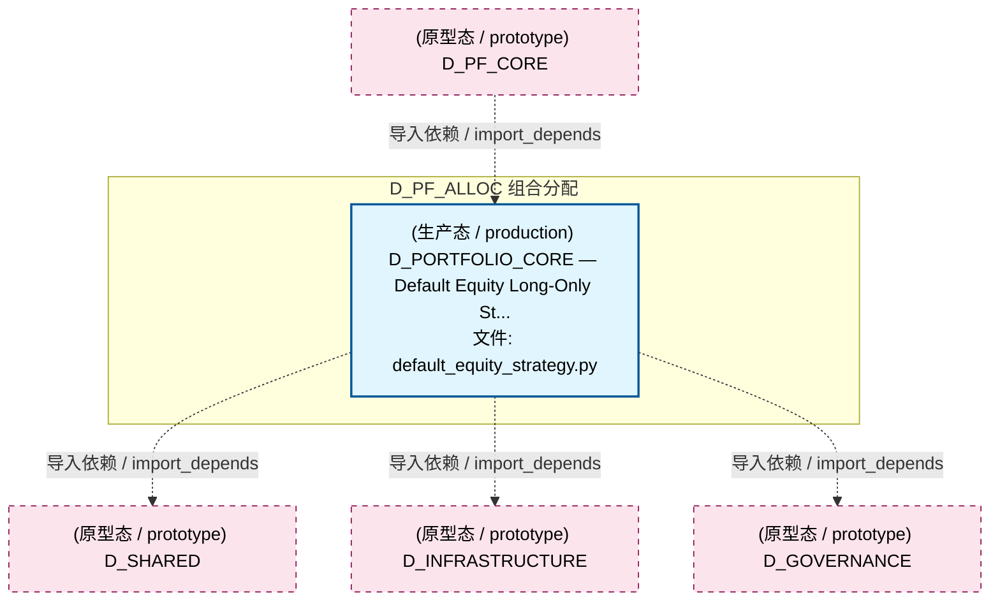
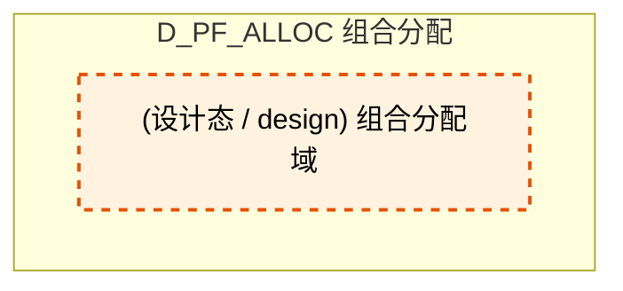
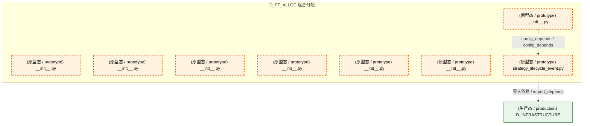
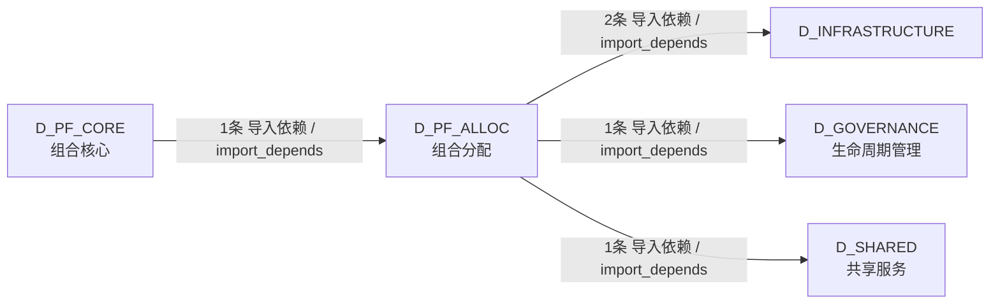

# 51_d_pf_alloc / 组合分配 / 组合分配 / Portfolio Allocation

> **功能简介 / Overview**: 组合分配，负责资产配置、权重分配和再平衡

> **文档作用 / Purpose**: 展示 组合分配（D_PF_ALLOC）功能域的模块清单、域内依赖关系、跨域依赖关系、架构分层视图，供架构审查和域治理参考。

> 本文档由 generate_domain_doc.py 从 depgraph (PostgreSQL) 自动生成
> 最后更新: 2026-07-17 03:32:55
> 数据源: depgraph (PostgreSQL) nodes表 + edges表

## 域基本信息 / Domain Overview

| 字段 | 值 | Field | Value |
|------|------|-------|-------|
| 编号 | 51 | Number | 51 |
| 域ID | D_PF_ALLOC | Domain ID | D_PF_ALLOC |
| 域名称 | 组合分配 | Domain Name | Portfolio Allocation |
| 层级 | L2 业务域层 | Layer | L2 Domain |
| 模块数 | 10 | Module Count | 10 |
| 域内依赖 | 1 | Internal Dependencies | 1 |
| 跨域入边 | 1 | Cross-domain Incoming | 1 |
| 跨域出边 | 4 | Cross-domain Outgoing | 4 |
| 设计态模块 | 1 | Design Modules | 1 |
| 原型态模块 | 8 | Prototype Modules | 8 |
| 生产态模块 | 1 | Production Modules | 1 |
| 容量 | 1/150 (正常) | Capacity | 1/150 (正常) |
| 描述 | 资产组合分配优化 | Description | 资产组合分配优化 |

## 模块分层清单 / Module Layered List

> 按 architecture_layer 分组的模块清单（共 10 个模块 / 10 modules）。

### L2 领域层 / Domain Layer (10 modules)

| # | 模块路径 / Module Path | 模块名称 / Module Name (功能简介 / Description) | 成熟度 / Maturity | 蓝图 / Blueprint |
|:--:|---------|---------|:---:|:---:|
| 1 | src/zephyr/pf_alloc/ | 组合分配域 | 设计态 / design |  |
| 2 | src/zephyr/pf_alloc/__init__.py | __init__.py | 原型态 / prototype |  |
| 3 | src/zephyr/pf_alloc/_extensions/__init__.py | __init__.py | 原型态 / prototype |  |
| 4 | src/zephyr/pf_alloc/api/__init__.py | __init__.py | 原型态 / prototype |  |
| 5 | src/zephyr/pf_alloc/core/__init__.py | __init__.py | 原型态 / prototype |  |
| 6 | src/zephyr/pf_alloc/infrastructure/__init__.py | __init__.py | 原型态 / prototype |  |
| 7 | src/zephyr/pf_alloc/models/__init__.py | __init__.py | 原型态 / prototype |  |
| 8 | src/zephyr/pf_alloc/services/__init__.py | __init__.py | 原型态 / prototype |  |
| 9 | src/zephyr/pf_alloc/strategy_lifecycle_event.py | strategy_lifecycle_event.py | 原型态 / prototype | [MOD-INF-016](../../03_modules/_cross_layer/shared_core/blueprint.md) |
| 10 | src/zephyr/pf_core/default_equity_strategy.py | D_PORTFOLIO_CORE — Default Equity Long-Only St... | 生产态 / production | [MOD-L05-001](../../03_modules/_domain_portfolio_core/blueprint.md) |

## 域内依赖图 / Internal Dependency Diagram

> 依赖图内嵌在本文档中，IDE 可直接渲染显示。参考 decision_index.md 设计，分四个视图：合并全景图、运营态子图、设计态子图、原型态子图（按 design_maturity 实际值拆分）。
>
> **图例说明 / Legend**：
> - **实线边框 = 运营态模块**（production，已上线运行）
> - **虚线边框 = 设计态模块**（design，蓝图阶段，代码未写）
> - **虚线边框 = 原型态模块**（prototype，代码已写，验证中未稳定上线）
> - **实线箭头 = 运营态依赖**（已生效的依赖关系）
> - **虚线箭头 = 非运营态依赖**（计划中/验证中的依赖关系）

### 合并全景图（全部模块，标签标注成熟度）

> 展示全部 10 个模块（生产态 1 + 设计态 1 + 原型态 8），标签标注成熟度。

```mermaid
graph TD
    subgraph D_PF_ALLOC["D_PF_ALLOC 组合分配"]
        src_zephyr_pf_alloc["(设计态 / design) 组合分配域"]
        src_zephyr_pf_alloc_init_py["(原型态 / prototype) __init__.py"]
        src_zephyr_pf_alloc_extensions_init_py["(原型态 / prototype) __init__.py"]
        src_zephyr_pf_alloc_api_init_py["(原型态 / prototype) __init__.py"]
        src_zephyr_pf_alloc_core_init_py["(原型态 / prototype) __init__.py"]
        src_zephyr_pf_alloc_infrastructure_init_py["(原型态 / prototype) __init__.py"]
        src_zephyr_pf_alloc_models_init_py["(原型态 / prototype) __init__.py"]
        src_zephyr_pf_alloc_services_init_py["(原型态 / prototype) __init__.py"]
        src_zephyr_pf_alloc_strategy_lifecycle_event_py["(原型态 / prototype) strategy_lifecycle_event.py"]
        src_zephyr_pf_core_default_equity_strategy_py["(生产态 / production) D_PORTFOLIO_CORE — Default Equity Long-Only St...<br/>文件: default_equity_strategy.py"]
    end
    src_zephyr_pf_alloc_init_py -.->|config_depends / config_depends| src_zephyr_pf_alloc_strategy_lifecycle_event_py
    D_INFRASTRUCTURE["(生产态 / production) D_INFRASTRUCTURE"]
    src_zephyr_pf_alloc_strategy_lifecycle_event_py -.->|导入依赖 / import_depends| D_INFRASTRUCTURE
    D_SHARED["(原型态 / prototype) D_SHARED"]
    src_zephyr_pf_core_default_equity_strategy_py -.->|导入依赖 / import_depends| D_SHARED
    src_zephyr_pf_core_default_equity_strategy_py -.->|导入依赖 / import_depends| D_INFRASTRUCTURE
    D_GOVERNANCE["(原型态 / prototype) D_GOVERNANCE"]
    src_zephyr_pf_core_default_equity_strategy_py -.->|导入依赖 / import_depends| D_GOVERNANCE
    D_PF_CORE["(原型态 / prototype) D_PF_CORE"]
    D_PF_CORE -.->|导入依赖 / import_depends| src_zephyr_pf_core_default_equity_strategy_py
    classDef production fill:#e1f5fe,stroke:#01579b,stroke-width:2px,color:#000
    classDef design fill:#fff3e0,stroke:#e65100,stroke-width:2px,color:#000,stroke-dasharray: 5 5
    classDef external_prod fill:#e8f5e9,stroke:#1b5e20,stroke-width:1px,color:#000
    classDef external_design fill:#fce4ec,stroke:#880e4f,stroke-width:1px,color:#000,stroke-dasharray: 5 5
    class src_zephyr_pf_core_default_equity_strategy_py production
    class src_zephyr_pf_alloc,src_zephyr_pf_alloc_init_py,src_zephyr_pf_alloc_extensions_init_py,src_zephyr_pf_alloc_api_init_py,src_zephyr_pf_alloc_core_init_py,src_zephyr_pf_alloc_infrastructure_init_py,src_zephyr_pf_alloc_models_init_py,src_zephyr_pf_alloc_services_init_py,src_zephyr_pf_alloc_strategy_lifecycle_event_py design
    class D_INFRASTRUCTURE external_prod
    class D_SHARED,D_GOVERNANCE,D_PF_CORE external_design
```

### 运营态子图（仅 design_maturity=production 的模块和依赖）

> 仅展示已上线运行的模块（共 1 个，0 条域内依赖）。

### 设计态子图（仅 design_maturity=design 的模块和依赖）

> 仅展示蓝图阶段、代码未写的设计态模块（共 1 个，0 条域内依赖）。

### 原型态子图（仅 design_maturity=prototype 的模块和依赖）

> 仅展示代码已写、验证中未稳定上线的原型态模块（共 8 个，1 条域内依赖）。

## 跨域依赖 / Cross-domain Dependencies

### 本域依赖的其他域（出边）/ Depends On

| # | 本域模块 / Source Module | → | 外部域-目标模块 / Target Module | 依赖类型 / Type |
|:--:|---------|:--:|---------|---------|
| 1 | D_PORTFOLIO_CORE — Default Equity Long-Only St... | → | D_GOVERNANCE 生命周期管理: D_PORTFOLIO_CORE — StrategyBase + StrategyMeta... | 导入依赖 / import_depends |
| 2 | strategy_lifecycle_event.py | → | D_INFRASTRUCTURE: strategy_lifecycle_event.py | 导入依赖 / import_depends |
| 3 | D_PORTFOLIO_CORE — Default Equity Long-Only St... | → | D_INFRASTRUCTURE: order.py | 导入依赖 / import_depends |
| 4 | D_PORTFOLIO_CORE — Default Equity Long-Only St... | → | D_SHARED 共享服务: OrderSide/OrderStatus/OrderType — 交易枚举真源... | 导入依赖 / import_depends |

### 依赖本域的其他域（入边）/ Depended By

| # | 外部域-源模块 / Source Module | → | 本域模块 / Target Module | 依赖类型 / Type |
|:--:|---------|:--:|---------|---------|
| 1 | D_PF_CORE 组合核心: D_PORTFOLIO_CORE — Portfolio Construction Stra... | → | D_PORTFOLIO_CORE — Default Equity Long-Only St... | 导入依赖 / import_depends |

### 跨域依赖图 / Cross-domain Dependency Diagram

> 本域与 4 个外部域直接连接（出边 4 条 + 入边 1 条 = 5 条）。只显示直接连接的域，不展开具体节点。

## 说明 / Notes

- **数据源 / Data Source**: `depgraph (PostgreSQL)` 的 `nodes`、`edges`、`domains` 表
- **生成器 / Generator**: `generate_domain_doc.py`（G2+G10 合并）
- **维护方式 / Maintenance**: 自动生成，全景图更新时刷新
- **文件名规则 / File Naming**: `{编号:02d}_{域ID小写}.md`，如 `16_d_trading.md`
- **图例说明 / Legend**: `[production]`=已上线 / `[design]`=设计中 / `[prototype]`=原型 / `[unknown]`=未知
