# 51_d_simulation / 仿真

> **文档作用 / Purpose**: 展示 仿真（D_SIMULATION）功能域的模块清单、域内依赖关系、跨域依赖关系、架构全景图，供架构审查和域治理参考。

> 本文档由 generate_domain_doc.py 从 depgraph (PostgreSQL) 自动生成
> 最后更新: 2026-06-30 15:42:58
> 数据源: depgraph (PostgreSQL) nodes表 + edges表

## 域基本信息 / Domain Overview

| 字段 | 值 | Field | Value |
|------|------|-------|-------|
| 编号 | 51 | Number | 51 |
| 域ID | D_SIMULATION | Domain ID | D_SIMULATION |
| 域名称 | 仿真 | Domain Name | 仿真 |
| 层级 | L2_domain | Layer | L2_domain |
| 模块数 | 13 | Module Count | 13 |
| 域内依赖 | 10 | Internal Dependencies | 10 |
| 跨域入边 | 17 | Cross-domain Incoming | 17 |
| 跨域出边 | 0 | Cross-domain Outgoing | 0 |
| 设计态模块 | 1 | Design Modules | 1 |
| 原型态模块 | 8 | Prototype Modules | 8 |
| 生产态模块 | 4 | Production Modules | 4 |
| 容量 | 4/150 (正常) | Capacity | 4/150 (正常) |
| 描述 | 仿真引擎、场景生成、蒙特卡洛、回测模拟。策略验证沙箱。 | Description | 仿真引擎、场景生成、蒙特卡洛、回测模拟。策略验证沙箱。 |

## 域内依赖图 / Internal Dependency Diagram

> 依赖图内嵌在本文档中，IDE 可直接渲染显示。每30个节点一组分页显示。
>
> **图例说明 / Legend**：
> - **实线边框 = 运营态模块**（production，已上线运行）
> - **虚线边框 = 设计态模块**（design，还在设计中）
> - **实线箭头 = 运营态依赖**（已生效的依赖关系）
> - **虚线箭头 = 设计态依赖**（计划中的依赖关系）

```mermaid
graph TD
    subgraph D_SIMULATION["D_SIMULATION 仿真"]
        src_zephyr_simulation["仿真核心域 design"]
        src_zephyr_simulation_init_py["src/zephyr/simulation/__init__.py prototype"]
        src_zephyr_simulation_init_from_resear_py["src/zephyr/simulation/__init___from_resear.py prototype"]
        src_zephyr_simulation_backtest_base_py["src/zephyr/simulation/backtest_base.py production"]
        src_zephyr_simulation_backtest_base_from_resear_py["src/zephyr/simulation/backtest_base_from_resear.py prototype"]
        src_zephyr_simulation_default_backtest_engine_py["src/zephyr/simulation/default_backtest_engine.py production"]
        src_zephyr_simulation_default_backtest_engine_from_resear_py["src/zephyr/simulation/default_backtest_engine_f... prototype"]
        src_zephyr_simulation_implementations_init_py["src/zephyr/simulation/implementations/__init__.py prototype"]
        src_zephyr_simulation_implementations_init_from_resear_py["src/zephyr/simulation/implementations/__init___... prototype"]
        src_zephyr_simulation_implementations_default_experiment_pipeline_py["src/zephyr/simulation/implementations/default_e... production"]
        src_zephyr_simulation_implementations_default_experiment_pipeline_from_resear_py["src/zephyr/simulation/implementations/default_e... prototype"]
        src_zephyr_simulation_pipeline_base_py["src/zephyr/simulation/pipeline_base.py production"]
        src_zephyr_simulation_pipeline_base_from_resear_py["src/zephyr/simulation/pipeline_base_from_resear.py prototype"]
    end
    src_zephyr_simulation_default_backtest_engine_py -.->|import_depends| src_zephyr_simulation_init_py
    src_zephyr_simulation_backtest_base_from_resear_py -.->|config_depends| src_zephyr_simulation_init_py
    src_zephyr_simulation_default_backtest_engine_from_resear_py -.->|import_depends| src_zephyr_simulation_init_py
    src_zephyr_simulation_init_from_resear_py -.->|import_depends| src_zephyr_simulation_backtest_base_py
    src_zephyr_simulation_init_from_resear_py -.->|import_depends| src_zephyr_simulation_default_backtest_engine_py
    src_zephyr_simulation_init_from_resear_py -.->|import_depends| src_zephyr_simulation_pipeline_base_py
    src_zephyr_simulation_implementations_default_experiment_pipeline_from_resear_py -.->|import_depends| src_zephyr_simulation_init_py
    src_zephyr_simulation_implementations_default_experiment_pipeline_py -.->|import_depends| src_zephyr_simulation_init_py
    src_zephyr_simulation_implementations_init_py -.->|config_depends| src_zephyr_simulation_implementations_default_experiment_pipeline_from_resear_py
    src_zephyr_simulation_implementations_init_from_resear_py -.->|config_depends| src_zephyr_simulation_implementations_init_py
    D_INTELLIGENCE["D_INTELLIGENCE prototype"]
    D_INTELLIGENCE -.->|import_depends| src_zephyr_simulation_init_py
    D_INTELLIGENCE -.->|import_depends| src_zephyr_simulation_init_py
    D_INTELLIGENCE -.->|import_depends| src_zephyr_simulation_init_py
    D_SHARED["D_SHARED prototype"]
    D_SHARED -.->|import_depends| src_zephyr_simulation_init_py
    D_GOV_SCRIPTS["D_GOV_SCRIPTS prototype"]
    D_GOV_SCRIPTS -.->|import_depends| src_zephyr_simulation_init_py
    D_GOVERNANCE["D_GOVERNANCE prototype"]
    D_GOVERNANCE -.->|test_depends| src_zephyr_simulation_pipeline_base_py
    D_GOVERNANCE -.->|test_depends| src_zephyr_simulation_default_backtest_engine_py
    D_GOVERNANCE -.->|test_depends| src_zephyr_simulation_implementations_default_experiment_pipeline_py
    D_GOVERNANCE -.->|test_depends| src_zephyr_simulation_pipeline_base_py
    D_GOVERNANCE -.->|test_depends| src_zephyr_simulation_backtest_base_py
    D_GOVERNANCE -.->|test_depends| src_zephyr_simulation_default_backtest_engine_py
    D_GOVERNANCE -.->|test_depends| src_zephyr_simulation_implementations_default_experiment_pipeline_py
    D_GOVERNANCE -.->|test_depends| src_zephyr_simulation_pipeline_base_py
    D_GOVERNANCE -.->|test_depends| src_zephyr_simulation_backtest_base_py
    D_GOVERNANCE -.->|test_depends| src_zephyr_simulation_default_backtest_engine_py
    classDef production fill:#e1f5fe,stroke:#01579b,stroke-width:2px,color:#000
    classDef design fill:#fff3e0,stroke:#e65100,stroke-width:2px,color:#000,stroke-dasharray: 5 5
    classDef external_prod fill:#e8f5e9,stroke:#1b5e20,stroke-width:1px,color:#000
    classDef external_design fill:#fce4ec,stroke:#880e4f,stroke-width:1px,color:#000,stroke-dasharray: 5 5
    class src_zephyr_simulation_backtest_base_py,src_zephyr_simulation_default_backtest_engine_py,src_zephyr_simulation_implementations_default_experiment_pipeline_py,src_zephyr_simulation_pipeline_base_py production
    class src_zephyr_simulation,src_zephyr_simulation_init_py,src_zephyr_simulation_init_from_resear_py,src_zephyr_simulation_backtest_base_from_resear_py,src_zephyr_simulation_default_backtest_engine_from_resear_py,src_zephyr_simulation_implementations_init_py,src_zephyr_simulation_implementations_init_from_resear_py,src_zephyr_simulation_implementations_default_experiment_pipeline_from_resear_py,src_zephyr_simulation_pipeline_base_from_resear_py design
    class D_INTELLIGENCE,D_SHARED,D_GOV_SCRIPTS,D_GOVERNANCE external_design
```



## 跨域依赖 / Cross-domain Dependencies

### 本域依赖的其他域（出边）/ Depends On

无跨域出边依赖 / No cross-domain outgoing dependencies

### 依赖本域的其他域（入边）/ Depended By

| 源域 / Source Domain | 依赖数 / Count | 依赖类型 / Type |
|------|:---:|---------|
| D_GOVERNANCE | 12 | test_depends |
| D_INTELLIGENCE | 3 | import_depends |
| D_GOV_SCRIPTS | 1 | import_depends |
| D_SHARED | 1 | import_depends |

## 架构全景图 / Architecture Overview

> 按 architecture_layer 分层显示 仿真（D_SIMULATION）的模块分布。共 13 个模块 / 13 modules。

```

┌──────────────────────────────────────────────────────────────────┐
│              L2 领域层 / Domain Layer (13 modules)               │
├──────────────────────────────────────────────────────────────────┤
│   仿真核心域  [design]                                           │
│   src/zephyr/simulation/__init__.py  [prototype]                 │
│   src/zephyr/simulation/__init___from_resear.py  [prototype]     │
│   src/zephyr/simulation/backtest_base.py  [production]           │
│   src/zephyr/simulation/backtest_base_from_resear.py  [protot... │
│   src/zephyr/simulation/default_backtest_engine.py  [production] │
│   src/zephyr/simulation/default_backtest_engine_from_resear.p... │
│   src/zephyr/simulation/implementations/__init__.py  [prototype] │
│   src/zephyr/simulation/implementations/__init___from_resear.... │
│   src/zephyr/simulation/implementations/default_experiment_pi... │
│   src/zephyr/simulation/implementations/default_experiment_pi... │
│   src/zephyr/simulation/pipeline_base.py  [production]           │
│   src/zephyr/simulation/pipeline_base_from_resear.py  [protot... │
└──────────────────────────────────────────────────────────────────┘

```

## 模块分层清单 / Module Layered List

> 按 architecture_layer 分组的模块清单（共 13 个模块 / 13 modules）。

### L2 领域层 / Domain Layer (13 modules)

| # | 模块路径 / Module Path | 模块名称 / Module Name | 成熟度 / Maturity | 构建状态 / Build Status |
|:--:|---------|---------|:---:|:---:|
| 1 | src/zephyr/simulation/ | 仿真核心域 | design | planned |
| 2 | src/zephyr/simulation/__init__.py | src/zephyr/simulation/__init__.py | prototype | generated |
| 3 | src/zephyr/simulation/__init___from_resear.py | src/zephyr/simulation/__init___from_r... | prototype | generated |
| 4 | src/zephyr/simulation/backtest_base.py | src/zephyr/simulation/backtest_base.py | production | generated |
| 5 | src/zephyr/simulation/backtest_base_from_resear.py | src/zephyr/simulation/backtest_base_f... | prototype | generated |
| 6 | src/zephyr/simulation/default_backtest_engine.py | src/zephyr/simulation/default_backtes... | production | generated |
| 7 | src/zephyr/simulation/default_backtest_engine_from_resear.py | src/zephyr/simulation/default_backtes... | prototype | generated |
| 8 | src/zephyr/simulation/implementations/__init__.py | src/zephyr/simulation/implementations... | prototype | generated |
| 9 | src/zephyr/simulation/implementations/__init___from_resea... | src/zephyr/simulation/implementations... | prototype | generated |
| 10 | src/zephyr/simulation/implementations/default_experiment_... | src/zephyr/simulation/implementations... | production | generated |
| 11 | src/zephyr/simulation/implementations/default_experiment_... | src/zephyr/simulation/implementations... | prototype | generated |
| 12 | src/zephyr/simulation/pipeline_base.py | src/zephyr/simulation/pipeline_base.py | production | generated |
| 13 | src/zephyr/simulation/pipeline_base_from_resear.py | src/zephyr/simulation/pipeline_base_f... | prototype | generated |

## 依赖关系图 / Dependency Graph

> 域内模块依赖关系（共 10 条 / 10 edges）。按依赖类型分组，使用 → 表示方向。

```

┌──────────────────────────────────────────────────────────────────┐
│       依赖关系图 / Dependency Graph (共 10 条 / 10 edges)        │
├──────────────────────────────────────────────────────────────────┤
│   依赖类型数 / Dependency Types: 2                               │
│   [import_depends]: 7 条 / edges                                 │
│   [config_depends]: 3 条 / edges                                 │
└──────────────────────────────────────────────────────────────────┘

┌──────────────────────────────────────────────────────────────────┐
│                 [import_depends] (7 条 / edges)                  │
├──────────────────────────────────────────────────────────────────┤
│   default_backtest_engine.py → __init__.py                       │
│   default_backtest_engine_f... → __init__.py                     │
│   __init___from_resear.py → backtest_base.py                     │
│   __init___from_resear.py → default_backtest_engine.py           │
│   __init___from_resear.py → pipeline_base.py                     │
│   default_experiment_pipeli... → __init__.py                     │
│   default_experiment_pipeli... → __init__.py                     │
└──────────────────────────────────────────────────────────────────┘

┌──────────────────────────────────────────────────────────────────┐
│                 [config_depends] (3 条 / edges)                  │
├──────────────────────────────────────────────────────────────────┤
│   backtest_base_from_resear.py → __init__.py                     │
│   __init__.py → default_experiment_pipeli...                     │
│   __init___from_resear.py → __init__.py                          │
└──────────────────────────────────────────────────────────────────┘

```

## 说明 / Notes

- **数据源 / Data Source**: `depgraph (PostgreSQL)` 的 `nodes`、`edges`、`domains` 表
- **生成器 / Generator**: `generate_domain_doc.py`（G2+G10 合并）
- **维护方式 / Maintenance**: 自动生成，全景图更新时刷新
- **文件名规则 / File Naming**: `{编号:02d}_{域ID小写}.md`，如 `16_d_trading.md`
- **图例说明 / Legend**: `[production]`=已上线 / `[design]`=设计中 / `[prototype]`=原型 / `[unknown]`=未知
