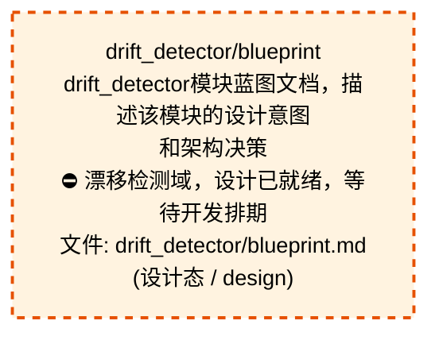
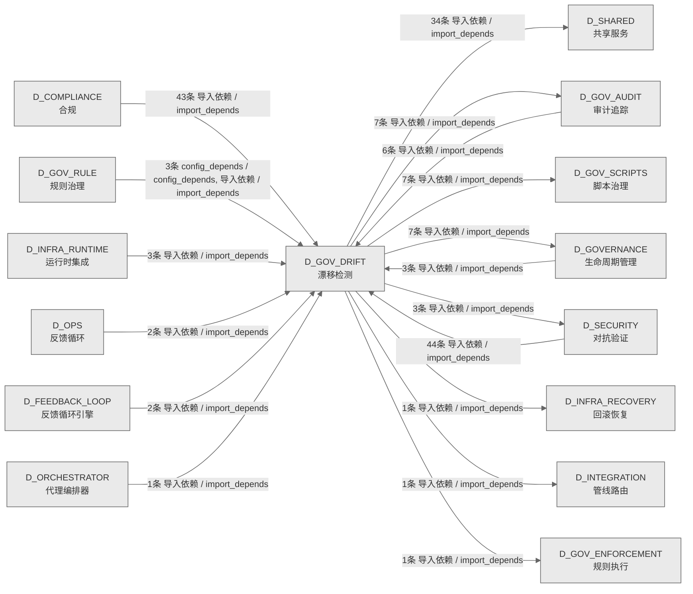

# 52_d_gov_drift / 漂移检测域 / Drift Detection

> **功能简介 / Overview**: 漂移检测，负责架构漂移检测和漂移告警

> **文档作用 / Purpose**: 展示 漂移检测（D_GOV_DRIFT）功能域的域内依赖关系、跨域依赖关系，模块信息（成熟度/中英文名/大白话/文件路径）内嵌于 Mermaid 节点，供架构审查和域治理参考。

> 本文档由 generate_domain_doc.py 从 depgraph (PostgreSQL) 自动生成
> 数据源: depgraph (PostgreSQL) nodes表 + edges表

> **[可缩放 HTML 版 / Zoomable HTML](http://localhost:8765/docs/02_enterprise_architecture/02_domain_architecture_docs/_zoomable_html/52_d_gov_drift.html)** — Ctrl+滚轮缩放 ｜ 双击重置 ｜ Ctrl+Shift+D 切换拖动/选择模式

## 域基本信息 / Domain Overview

| 字段 | 值 | Field | Value |
|------|------|-------|-------|
| 编号 | 52 | Number | 52 |
| 域ID | D_GOV_DRIFT | Domain ID | D_GOV_DRIFT |
| 域名称 | 漂移检测 | Domain Name | Drift Detection |
| 层级 | L2 业务域层 | Layer | L2 Domain |
| 模块数 | 75 | Module Count | 75 |
| 域内依赖 | 24 | Internal Dependencies | 24 |
| 跨域入边 | 107 | Cross-domain Incoming | 107 |
| 跨域出边 | 61 | Cross-domain Outgoing | 61 |
| 设计态模块 | 1 | Design Modules | 1 |
| 生产态模块 | 74 | Production Modules | 74 |
| 容量 | 74/150 (正常) | Capacity | 74/150 (正常) |
| 描述 | 39个漂移检测器注册与调度 | Description | 39个漂移检测器注册与调度 |

## 域内依赖图 / Internal Dependency Diagram

> 依赖图内嵌在本文档中，IDE 可直接渲染；网页版可 Ctrl+滚轮缩放 + 拖动平移查看细节。
>
> **图例说明 / Legend**：
> - 🟦 **蓝色 = 运营态模块**（production，已上线运行）
> - 🟧 **橙色虚线 = 设计态模块**（design，蓝图阶段，代码未写）
> - **实线箭头 = 运营态依赖**（已生效的依赖关系）
> - **虚线箭头 = 非运营态依赖**（计划中/验证中的依赖关系）

### 全景图（全部模块，颜色区分运营态/设计态）

> 展示全部 75 个模块（生产态 74 + 设计态 1），含跨域依赖外部节点。节点含成熟度+名称+大白话/简介+文件路径。

```mermaid
%%{init: {'theme': 'base', 'themeVariables': {'primaryColor': '#eaeaea', 'primaryTextColor': '#333333', 'primaryBorderColor': '#666666', 'lineColor': '#666666', 'secondaryColor': '#eaeaea', 'tertiaryColor': '#eaeaea', 'fontSize': '14px'}}}%%
flowchart TD
    docs_03_modules_domain_governance_drift_detector_blueprint_md["drift_detector/blueprint<br/>drift_detector模块蓝图文档，描述该模块的设计意图<br/>和架构决策<br/>⛔ 漂移检测域，设计已就绪，等待开发排期<br/>文件: drift_detector/blueprint.md<br/>(设计态 / design)"]
    scripts_governance_d11_compliance_validate_blueprint_overlap_py["d11_compliance/validate_blueprint_overlap<br/>d11 compliance包的validate_blueprint_overlap模块<br/>文件: d11_compliance<br/>/validate_blueprint_overlap.py<br/>(生产态 / production)"]
    scripts_governance_d11_compliance_validate_truth_source_cascade_py["d11_compliance/validate_truth_source_cascade<br/>validate_truth_source_cascade.py —<br/>真源级联一致性校验<br/>文件: d11_compliance<br/>/validate_truth_source_cascade.py<br/>(生产态 / production)"]
    scripts_governance_d5_architecture_validators_validate_authority_registry_py["validators/validate_authority_registry<br/>validators包的validate_authority_registry模块<br/>文件: validators/validate_authority_registry.py<br/>(生产态 / production)"]
    scripts_governance_d5_architecture_validators_validate_ssot_py["validators/validate_ssot<br/>SSoT 文件头一致性校验器.<br/>文件: validators/validate_ssot.py<br/>(生产态 / production)"]
    src_zephyr_gov_audit_self_monitor_py["gov_audit/self_monitor<br/>gov audit包的self_monitor模块<br/>文件: gov_audit/self_monitor.py<br/>(生产态 / production)"]
    src_zephyr_gov_drift_absence_manager_py["gov_drift/absence_manager<br/>Owner Absence Manager — Owner缺席模式 §6.32。<br/>文件: gov_drift/absence_manager.py<br/>(生产态 / production)"]
    src_zephyr_gov_drift_ai_construction_detectors_py["gov_drift/ai_construction_detectors<br/>Drift Detector AI 施工检测器 —<br/>ai_construction_detectors.py<br/>文件: gov_drift/ai_construction_detectors.py<br/>(生产态 / production)"]
    src_zephyr_gov_drift_ai_context_injector_py["gov_drift/ai_context_injector<br/>AI Context Injector — 施工前预检D-023-16 ·<br/>§6.8。<br/>文件: gov_drift/ai_context_injector.py<br/>(生产态 / production)"]
    src_zephyr_gov_drift_artifact_scanner_py["gov_drift/artifact_scanner<br/>ArtifactScanner — SSRF / Path Traversal /<br/>Credential / Token 防御扫描器<br/>文件: gov_drift/artifact_scanner.py<br/>(生产态 / production)"]
    src_zephyr_gov_drift_autonomy_regressor_py["gov_drift/autonomy_regressor<br/>Autonomy Regressor — v0.10.0<br/>渐进自治可逆性管理器:<br/>confidence<阈值->自动regr...<br/>文件: gov_drift/autonomy_regressor.py<br/>(生产态 / production)"]
    src_zephyr_gov_drift_backcompat_checker_py["gov_drift/backcompat_checker<br/>Backward Compatibility Checker —<br/>向后兼容策略漂移检测 D-023-31 · §6.23。<br/>文件: gov_drift/backcompat_checker.py<br/>(生产态 / production)"]
    src_zephyr_gov_drift_baseline_manager_py["gov_drift/baseline_manager<br/>Baseline Manager — baseline_manager.py<br/>文件: gov_drift/baseline_manager.py<br/>(生产态 / production)"]
    src_zephyr_gov_drift_baseline_poisoning_guard_py["gov_drift/baseline_poisoning_guard<br/>Baseline Poisoning Guard — 基线投毒防护<br/>D-023-36 · §6.25。<br/>文件: gov_drift/baseline_poisoning_guard.py<br/>(生产态 / production)"]
    src_zephyr_gov_drift_bootstrapping_calibrator_py["gov_drift/bootstrapping_calibrator<br/>gov drift包的bootstrapping_calibrator模块<br/>文件: gov_drift/bootstrapping_calibrator.py<br/>(生产态 / production)"]
    src_zephyr_gov_drift_brain_integration_py["gov_drift/brain_integration<br/>ProbeHierarchy - K8s 3-Probe + Terraform<br/>Reconciliation<br/>文件: gov_drift/brain_integration.py<br/>(生产态 / production)"]
    src_zephyr_gov_drift_canary_controller_py["gov_drift/canary_controller<br/>Detector Canary Controller — 检测器金丝雀部署<br/>§6.11。<br/>文件: gov_drift/canary_controller.py<br/>(生产态 / production)"]
    src_zephyr_gov_drift_chaos_injector_py["gov_drift/chaos_injector<br/>Drift Chaos Injector — 混沌工程主动漂移注入<br/>§6.13。<br/>文件: gov_drift/chaos_injector.py<br/>(生产态 / production)"]
    src_zephyr_gov_drift_config_consistency_py["gov_drift/config_consistency<br/>Config Consistency Checker — 配置多源一致性<br/>D-023-29 · §6.21。<br/>文件: gov_drift/config_consistency.py<br/>(生产态 / production)"]
    src_zephyr_gov_drift_contract_drift_detector_py["gov_drift/contract_drift_detector<br/>contract_drift_detector — 契约漂移检测器。<br/>文件: gov_drift/contract_drift_detector.py<br/>(生产态 / production)"]
    src_zephyr_gov_drift_cross_module_score_py["gov_drift/cross_module_score<br/>Cross Module Score — cross_module_score.py<br/>文件: gov_drift/cross_module_score.py<br/>(生产态 / production)"]
    src_zephyr_gov_drift_dashboard_py["gov_drift/dashboard<br/>Coverage Dashboard — dashboard.py<br/>文件: gov_drift/dashboard.py<br/>(生产态 / production)"]
    src_zephyr_gov_drift_detector_core_init_py["gov_drift/detector_core 包入口<br/>MOD-INF-023 drift_detector core module.<br/>文件: detector_core/__init__.py<br/>(生产态 / production)"]
    src_zephyr_gov_drift_detector_core_benchmark_integrity_py["detector_core/benchmark_integrity<br/>detector core包的benchmark_integrity模块<br/>文件: detector_core/benchmark_integrity.py<br/>(生产态 / production)"]
    src_zephyr_gov_drift_detector_core_bridges_drift_bridge_py["bridges/drift_bridge<br/>DriftBridge — 漂移检测器事件桥接 (MOD-INF-023).<br/>文件: bridges/drift_bridge.py<br/>(生产态 / production)"]
    src_zephyr_gov_drift_detector_core_model_drift_monitor_py["detector_core/model_drift_monitor<br/>detector core包的model_drift_monitor模块<br/>文件: detector_core/model_drift_monitor.py<br/>(生产态 / production)"]
    src_zephyr_gov_drift_detector_core_performance_baseline_py["detector_core/performance_baseline<br/>detector core包的performance_baseline模块<br/>文件: detector_core/performance_baseline.py<br/>(生产态 / production)"]
    src_zephyr_gov_drift_detector_core_regime_detector_py["detector_core/regime_detector<br/>detector core包的regime_detector模块<br/>文件: detector_core/regime_detector.py<br/>(生产态 / production)"]
    src_zephyr_gov_drift_detector_dispatcher_py["gov_drift/detector_dispatcher<br/>Detector Dispatcher — detector_dispatcher.py<br/>文件: gov_drift/detector_dispatcher.py<br/>(生产态 / production)"]
    src_zephyr_gov_drift_drift_result_types_py["gov_drift/drift_result_types<br/>Drift Detector 结果类型 + 专项检测函数 —<br/>drift_result_types.py<br/>文件: gov_drift/drift_result_types.py<br/>(生产态 / production)"]
    src_zephyr_gov_drift_drift_training_py["gov_drift/drift_training<br/>Drift Detector AI 训练闭环 + 跨语言检测 —<br/>drift_training.py<br/>文件: gov_drift/drift_training.py<br/>(生产态 / production)"]
    src_zephyr_gov_drift_file_attr_checker_py["gov_drift/file_attr_checker<br/>File Attribute Integrity — 文件底层属性完整性<br/>§6.30。<br/>文件: gov_drift/file_attr_checker.py<br/>(生产态 / production)"]
    src_zephyr_gov_drift_gate_persistence_py["gov_drift/gate_persistence<br/>Gate Persistence — gate_persistence.py<br/>文件: gov_drift/gate_persistence.py<br/>(生产态 / production)"]
    src_zephyr_gov_drift_git_bisector_py["gov_drift/git_bisector<br/>Git Bisector — git_bisector.py<br/>文件: gov_drift/git_bisector.py<br/>(生产态 / production)"]
    src_zephyr_gov_drift_gitignore_auditor_py["gov_drift/gitignore_auditor<br/>.gitignore Integrity Auditor —<br/>gitignore完整性审计 D-023-32 · §6.24。<br/>文件: gov_drift/gitignore_auditor.py<br/>(生产态 / production)"]
    src_zephyr_gov_drift_handoff_manager_py["gov_drift/handoff_manager<br/>Cross-Session Handoff Manager —<br/>跨Session修复上下文交接 §6.14。<br/>文件: gov_drift/handoff_manager.py<br/>(生产态 / production)"]
    src_zephyr_gov_drift_headless_scanner_py["gov_drift/headless_scanner<br/>Headless Scanner — headless_scanner.py<br/>文件: gov_drift/headless_scanner.py<br/>(生产态 / production)"]
    src_zephyr_gov_drift_incremental_scanner_py["gov_drift/incremental_scanner<br/>Incremental Scanner — incremental_scanner.py<br/>文件: gov_drift/incremental_scanner.py<br/>(生产态 / production)"]
    src_zephyr_gov_drift_naming_magic_checker_py["gov_drift/naming_magic_checker<br/>Naming Magic Checker — 命名魔数与隐式约定检测<br/>§6.27。<br/>文件: gov_drift/naming_magic_checker.py<br/>(生产态 / production)"]
    src_zephyr_gov_drift_python_compat_py["gov_drift/python_compat<br/>Python Compatibility Checker —<br/>Python版本兼容性漂移 D-023-30 · §6.22。<br/>文件: gov_drift/python_compat.py<br/>(生产态 / production)"]
    src_zephyr_gov_drift_resource_guard_py["gov_drift/resource_guard<br/>Resource Guard — 资源上限与优雅降级 D-023-23 ·<br/>§6.16。<br/>文件: gov_drift/resource_guard.py<br/>(生产态 / production)"]
    src_zephyr_gov_drift_reward_hacking_rebound_detector_py["gov_drift/reward_hacking_rebound_detector<br/>Reward Hacking Rebound Detector — v0.14.0<br/>§2.37-D.<br/>文件: gov_drift<br/>/reward_hacking_rebound_detector.py<br/>(生产态 / production)"]
    src_zephyr_gov_drift_roi_engine_py["gov_drift/roi_engine<br/>ROI Engine — roi_engine.py<br/>文件: gov_drift/roi_engine.py<br/>(生产态 / production)"]
    src_zephyr_gov_drift_rollback_bridge_py["gov_drift/rollback_bridge<br/>G-CT-006 契约：Drift -> Rollback 漂移触发回滚.<br/>文件: gov_drift/rollback_bridge.py<br/>(生产态 / production)"]
    src_zephyr_gov_drift_scan_mutex_py["gov_drift/scan_mutex<br/>Scan Mutex — scan_mutex.py<br/>文件: gov_drift/scan_mutex.py<br/>(生产态 / production)"]
    src_zephyr_gov_drift_self_test_verifier_py["gov_drift/self_test_verifier<br/>Self Test Verifier — self_test_verifier.py<br/>文件: gov_drift/self_test_verifier.py<br/>(生产态 / production)"]
    src_zephyr_gov_drift_silence_detector_py["gov_drift/silence_detector<br/>Silence Detector — v0.8.0 静默窗口检测器:<br/>agent无响应超时+heartbeat缺失检测。<br/>文件: gov_drift/silence_detector.py<br/>(生产态 / production)"]
    src_zephyr_gov_drift_spiral_ews_py["gov_drift/spiral_ews<br/>gov drift包的spiral_ews模块<br/>文件: gov_drift/spiral_ews.py<br/>(生产态 / production)"]
    src_zephyr_gov_drift_suppression_learner_py["gov_drift/suppression_learner<br/>Suppression Learner — suppression_learner.py<br/>文件: gov_drift/suppression_learner.py<br/>(生产态 / production)"]
    src_zephyr_gov_drift_symlink_checker_py["gov_drift/symlink_checker<br/>Symlink Integrity Checker — 软链接完整性检测<br/>§6.29。<br/>文件: gov_drift/symlink_checker.py<br/>(生产态 / production)"]
    src_zephyr_gov_drift_tamper_proof_audit_py["gov_drift/tamper_proof_audit<br/>Tamper-Proof Audit — 防篡改审计 D-023-37 ·<br/>§6.26。<br/>文件: gov_drift/tamper_proof_audit.py<br/>(生产态 / production)"]
    src_zephyr_gov_drift_test_fixture_checker_py["gov_drift/test_fixture_checker<br/>Test Fixture Checker — 测试夹具漂移检测<br/>D-023-28 · §6.20。<br/>文件: gov_drift/test_fixture_checker.py<br/>(生产态 / production)"]
    src_zephyr_gov_drift_trend_analyzer_py["gov_drift/trend_analyzer<br/>Trend Analyzer — trend_analyzer.py<br/>文件: gov_drift/trend_analyzer.py<br/>(生产态 / production)"]
    src_zephyr_gov_drift_vigil_runtime_py["gov_drift/vigil_runtime<br/>Vigil Runtime — v0.6.0 VIGIL维护运行时:<br/>运维token预算+手动override窗口。<br/>文件: gov_drift/vigil_runtime.py<br/>(生产态 / production)"]
    src_zephyr_gov_enforcement_rule_enforcement_breaking_change_detector_py["rule_enforcement/breaking_change_detector<br/>Breaking Change 检测器（GATE-CDC-2）——字段删除<br/>/类型变更->CI FAIL。<br/>文件: rule_enforcement<br/>/breaking_change_detector.py<br/>(生产态 / production)"]
    src_zephyr_gov_enforcement_rule_enforcement_drift_detector_py["rule_enforcement/drift_detector<br/>Gate-side Drift Detector Recovery —<br/>zephyr.gov_enforcement.rule_enforcement....<br/>文件: rule_enforcement/drift_detector.py<br/>(生产态 / production)"]
    src_zephyr_gov_enforcement_rule_enforcement_gate_engine_gate_health_py["gate_engine/gate_health<br/>门禁健康仪表板——per-gate SLI<br/>报告、误报率、延迟分布、1人+AI运维视图（beta）<br/>文件: gate_engine/gate_health.py<br/>(生产态 / production)"]
    src_zephyr_gov_enforcement_rule_enforcement_gate_engine_gate_integrity_guard_py["gate_engine/gate_integrity_guard<br/>门禁引擎完整性守卫——自检SHA-256校验+trust<br/>root自验证（beta）<br/>文件: gate_engine/gate_integrity_guard.py<br/>(生产态 / production)"]
    src_zephyr_gov_enforcement_rule_enforcement_invariants_en_002_enforcement_validator_py["invariants/en_002_enforcement_validator<br/>EN-002 — Enforcement Mode Validator<br/>文件: invariants/en_002_enforcement_validator.py<br/>(生产态 / production)"]
    src_zephyr_gov_enforcement_rule_enforcement_truth_source_validator_py["rule_enforcement/truth_source_validator<br/>真源优先级裁决器（Truth Source Validator）<br/>文件: rule_enforcement/truth_source_validator.py<br/>(生产态 / production)"]
    src_zephyr_governance_drift_detector_init_py["governance/drift-detector 包入口<br/>管理governance.drift-detector子包的加载和懒导入<br/>文件: drift-detector/__init__.py<br/>(生产态 / production)"]
    src_zephyr_governance_integrity_py["governance/integrity<br/>治理包的integrity模块<br/>文件: governance/integrity.py<br/>(生产态 / production)"]
    docs_03_modules_domain_governance_drift_detector_blueprint_md ~~~ scripts_governance_d11_compliance_validate_blueprint_overlap_py
    scripts_governance_d11_compliance_validate_blueprint_overlap_py ~~~ scripts_governance_d11_compliance_validate_truth_source_cascade_py
    scripts_governance_d11_compliance_validate_truth_source_cascade_py ~~~ scripts_governance_d5_architecture_validators_validate_authority_registry_py
    scripts_governance_d5_architecture_validators_validate_authority_registry_py ~~~ scripts_governance_d5_architecture_validators_validate_ssot_py
    scripts_governance_d5_architecture_validators_validate_ssot_py ~~~ src_zephyr_gov_audit_self_monitor_py
    src_zephyr_gov_audit_self_monitor_py ~~~ src_zephyr_gov_drift_absence_manager_py
    src_zephyr_gov_drift_absence_manager_py ~~~ src_zephyr_gov_drift_ai_construction_detectors_py
    src_zephyr_gov_drift_ai_construction_detectors_py ~~~ src_zephyr_gov_drift_ai_context_injector_py
    src_zephyr_gov_drift_ai_context_injector_py ~~~ src_zephyr_gov_drift_artifact_scanner_py
    src_zephyr_gov_drift_artifact_scanner_py ~~~ src_zephyr_gov_drift_autonomy_regressor_py
    src_zephyr_gov_drift_autonomy_regressor_py ~~~ src_zephyr_gov_drift_backcompat_checker_py
    src_zephyr_gov_drift_backcompat_checker_py ~~~ src_zephyr_gov_drift_baseline_manager_py
    src_zephyr_gov_drift_baseline_manager_py ~~~ src_zephyr_gov_drift_baseline_poisoning_guard_py
    src_zephyr_gov_drift_baseline_poisoning_guard_py ~~~ src_zephyr_gov_drift_bootstrapping_calibrator_py
    src_zephyr_gov_drift_bootstrapping_calibrator_py ~~~ src_zephyr_gov_drift_brain_integration_py
    src_zephyr_gov_drift_brain_integration_py ~~~ src_zephyr_gov_drift_canary_controller_py
    src_zephyr_gov_drift_canary_controller_py ~~~ src_zephyr_gov_drift_chaos_injector_py
    src_zephyr_gov_drift_chaos_injector_py ~~~ src_zephyr_gov_drift_config_consistency_py
    src_zephyr_gov_drift_config_consistency_py ~~~ src_zephyr_gov_drift_contract_drift_detector_py
    src_zephyr_gov_drift_contract_drift_detector_py ~~~ src_zephyr_gov_drift_cross_module_score_py
    src_zephyr_gov_drift_cross_module_score_py ~~~ src_zephyr_gov_drift_dashboard_py
    src_zephyr_gov_drift_dashboard_py ~~~ src_zephyr_gov_drift_detector_core_init_py
    src_zephyr_gov_drift_detector_core_init_py ~~~ src_zephyr_gov_drift_detector_core_benchmark_integrity_py
    src_zephyr_gov_drift_detector_core_benchmark_integrity_py ~~~ src_zephyr_gov_drift_detector_core_bridges_drift_bridge_py
    src_zephyr_gov_drift_detector_core_bridges_drift_bridge_py ~~~ src_zephyr_gov_drift_detector_core_model_drift_monitor_py
    src_zephyr_gov_drift_detector_core_model_drift_monitor_py ~~~ src_zephyr_gov_drift_detector_core_performance_baseline_py
    src_zephyr_gov_drift_detector_core_performance_baseline_py ~~~ src_zephyr_gov_drift_detector_core_regime_detector_py
    src_zephyr_gov_drift_detector_core_regime_detector_py ~~~ src_zephyr_gov_drift_detector_dispatcher_py
    src_zephyr_gov_drift_detector_dispatcher_py ~~~ src_zephyr_gov_drift_drift_result_types_py
    src_zephyr_gov_drift_drift_result_types_py ~~~ src_zephyr_gov_drift_drift_training_py
    src_zephyr_gov_drift_drift_training_py ~~~ src_zephyr_gov_drift_file_attr_checker_py
    src_zephyr_gov_drift_file_attr_checker_py ~~~ src_zephyr_gov_drift_gate_persistence_py
    src_zephyr_gov_drift_gate_persistence_py ~~~ src_zephyr_gov_drift_git_bisector_py
    src_zephyr_gov_drift_git_bisector_py ~~~ src_zephyr_gov_drift_gitignore_auditor_py
    src_zephyr_gov_drift_gitignore_auditor_py ~~~ src_zephyr_gov_drift_handoff_manager_py
    src_zephyr_gov_drift_handoff_manager_py ~~~ src_zephyr_gov_drift_headless_scanner_py
    src_zephyr_gov_drift_headless_scanner_py ~~~ src_zephyr_gov_drift_incremental_scanner_py
    src_zephyr_gov_drift_incremental_scanner_py ~~~ src_zephyr_gov_drift_naming_magic_checker_py
    src_zephyr_gov_drift_naming_magic_checker_py ~~~ src_zephyr_gov_drift_python_compat_py
    src_zephyr_gov_drift_python_compat_py ~~~ src_zephyr_gov_drift_resource_guard_py
    src_zephyr_gov_drift_resource_guard_py ~~~ src_zephyr_gov_drift_reward_hacking_rebound_detector_py
    src_zephyr_gov_drift_reward_hacking_rebound_detector_py ~~~ src_zephyr_gov_drift_roi_engine_py
    src_zephyr_gov_drift_roi_engine_py ~~~ src_zephyr_gov_drift_rollback_bridge_py
    src_zephyr_gov_drift_rollback_bridge_py ~~~ src_zephyr_gov_drift_scan_mutex_py
    src_zephyr_gov_drift_scan_mutex_py ~~~ src_zephyr_gov_drift_self_test_verifier_py
    src_zephyr_gov_drift_self_test_verifier_py ~~~ src_zephyr_gov_drift_silence_detector_py
    src_zephyr_gov_drift_silence_detector_py ~~~ src_zephyr_gov_drift_spiral_ews_py
    src_zephyr_gov_drift_spiral_ews_py ~~~ src_zephyr_gov_drift_suppression_learner_py
    src_zephyr_gov_drift_suppression_learner_py ~~~ src_zephyr_gov_drift_symlink_checker_py
    src_zephyr_gov_drift_symlink_checker_py ~~~ src_zephyr_gov_drift_tamper_proof_audit_py
    src_zephyr_gov_drift_tamper_proof_audit_py ~~~ src_zephyr_gov_drift_test_fixture_checker_py
    src_zephyr_gov_drift_test_fixture_checker_py ~~~ src_zephyr_gov_drift_trend_analyzer_py
    src_zephyr_gov_drift_trend_analyzer_py ~~~ src_zephyr_gov_drift_vigil_runtime_py
    src_zephyr_gov_drift_vigil_runtime_py ~~~ src_zephyr_gov_enforcement_rule_enforcement_breaking_change_detector_py
    src_zephyr_gov_enforcement_rule_enforcement_breaking_change_detector_py ~~~ src_zephyr_gov_enforcement_rule_enforcement_drift_detector_py
    src_zephyr_gov_enforcement_rule_enforcement_drift_detector_py ~~~ src_zephyr_gov_enforcement_rule_enforcement_gate_engine_gate_health_py
    src_zephyr_gov_enforcement_rule_enforcement_gate_engine_gate_health_py ~~~ src_zephyr_gov_enforcement_rule_enforcement_gate_engine_gate_integrity_guard_py
    src_zephyr_gov_enforcement_rule_enforcement_gate_engine_gate_integrity_guard_py ~~~ src_zephyr_gov_enforcement_rule_enforcement_invariants_en_002_enforcement_validator_py
    src_zephyr_gov_enforcement_rule_enforcement_invariants_en_002_enforcement_validator_py ~~~ src_zephyr_gov_enforcement_rule_enforcement_truth_source_validator_py
    src_zephyr_gov_enforcement_rule_enforcement_truth_source_validator_py ~~~ src_zephyr_governance_drift_detector_init_py
    src_zephyr_governance_drift_detector_init_py ~~~ src_zephyr_governance_integrity_py
    src_zephyr_gov_audit_drift_bridge_py["gov_audit/drift_bridge<br/>gov audit包的drift_bridge模块<br/>文件: gov_audit/drift_bridge.py<br/>(生产态 / production)"]
    src_zephyr_gov_drift_cascade_detector_py["gov_drift/cascade_detector<br/>Cascade Failure Detector — 级联故障检测<br/>D-023-22 · §6.15。<br/>文件: gov_drift/cascade_detector.py<br/>(生产态 / production)"]
    src_zephyr_gov_drift_correlation_engine_py["gov_drift/correlation_engine<br/>Correlation Engine — correlation_engine.py<br/>文件: gov_drift/correlation_engine.py<br/>(生产态 / production)"]
    src_zephyr_gov_drift_credibility_engine_py["gov_drift/credibility_engine<br/>Credibility Engine — credibility_engine.py<br/>文件: gov_drift/credibility_engine.py<br/>(生产态 / production)"]
    src_zephyr_gov_drift_detector_core_ml_engineering_py["detector_core/ml_engineering<br/>detector core包的ml_engineering模块<br/>文件: detector_core/ml_engineering.py<br/>(生产态 / production)"]
    src_zephyr_gov_drift_drift_engine_py["gov_drift/drift_engine<br/>Drift Engine — 编排器核心 (SRC-0030 精简后)<br/>文件: gov_drift/drift_engine.py<br/>(生产态 / production)"]
    src_zephyr_gov_drift_drift_hotfix_bypass_py["gov_drift/drift_hotfix_bypass<br/>Drift Hotfix Bypass — drift_hotfix_bypass.py<br/>文件: gov_drift/drift_hotfix_bypass.py<br/>(生产态 / production)"]
    src_zephyr_gov_drift_forensics_engine_py["gov_drift/forensics_engine<br/>Drift Forensics Engine — 漂移取证引擎 §6.17。<br/>文件: gov_drift/forensics_engine.py<br/>(生产态 / production)"]
    src_zephyr_gov_drift_orphan_scanner_py["gov_drift/orphan_scanner<br/>Orphan Resource Scanner — 孤儿资源检测 §6.28。<br/>文件: gov_drift/orphan_scanner.py<br/>(生产态 / production)"]
    src_zephyr_gov_drift_self_check_py["gov_drift/self_check<br/>Self-Drift Check — self_check.py<br/>文件: gov_drift/self_check.py<br/>(生产态 / production)"]
    src_zephyr_gov_audit_drift_bridge_py ~~~ src_zephyr_gov_drift_cascade_detector_py
    src_zephyr_gov_drift_cascade_detector_py ~~~ src_zephyr_gov_drift_correlation_engine_py
    src_zephyr_gov_drift_correlation_engine_py ~~~ src_zephyr_gov_drift_credibility_engine_py
    src_zephyr_gov_drift_credibility_engine_py ~~~ src_zephyr_gov_drift_detector_core_ml_engineering_py
    src_zephyr_gov_drift_detector_core_ml_engineering_py ~~~ src_zephyr_gov_drift_drift_engine_py
    src_zephyr_gov_drift_drift_engine_py ~~~ src_zephyr_gov_drift_drift_hotfix_bypass_py
    src_zephyr_gov_drift_drift_hotfix_bypass_py ~~~ src_zephyr_gov_drift_forensics_engine_py
    src_zephyr_gov_drift_forensics_engine_py ~~~ src_zephyr_gov_drift_orphan_scanner_py
    src_zephyr_gov_drift_orphan_scanner_py ~~~ src_zephyr_gov_drift_self_check_py
    src_zephyr_gov_drift_drift_detector_py["gov_drift/drift_detector<br/>Drift Detector — 兼容别名，SSoT已迁移至<br/>zephyr.gov_drift (MOD-INF-023).<br/>文件: gov_drift/drift_detector.py<br/>(生产态 / production)"]
    src_zephyr_gov_drift_drift_infrastructure_py["gov_drift/drift_infrastructure<br/>Drift Detector 基础设施 —<br/>drift_infrastructure.py<br/>文件: gov_drift/drift_infrastructure.py<br/>(生产态 / production)"]
    src_zephyr_gov_drift_drift_detector_py ~~~ src_zephyr_gov_drift_drift_infrastructure_py
    src_zephyr_gov_drift_drift_models_py["gov_drift/drift_models<br/>Drift Detector 数据模型 — drift_models.py<br/>文件: gov_drift/drift_models.py<br/>(生产态 / production)"]
    src_zephyr_gov_audit_drift_bridge_py -->|导入依赖 / import_depends| src_zephyr_gov_drift_drift_detector_py
    src_zephyr_gov_audit_self_monitor_py -->|导入依赖 / import_depends| src_zephyr_gov_audit_drift_bridge_py
    src_zephyr_gov_drift_ai_construction_detectors_py -->|导入依赖 / import_depends| src_zephyr_gov_drift_drift_models_py
    src_zephyr_gov_drift_brain_integration_py -->|导入依赖 / import_depends| src_zephyr_gov_drift_correlation_engine_py
    src_zephyr_gov_drift_brain_integration_py -->|导入依赖 / import_depends| src_zephyr_gov_drift_credibility_engine_py
    src_zephyr_gov_drift_brain_integration_py -->|导入依赖 / import_depends| src_zephyr_gov_drift_drift_engine_py
    src_zephyr_gov_drift_brain_integration_py -->|导入依赖 / import_depends| src_zephyr_gov_drift_forensics_engine_py
    src_zephyr_gov_drift_brain_integration_py -->|导入依赖 / import_depends| src_zephyr_gov_drift_orphan_scanner_py
    src_zephyr_gov_drift_brain_integration_py -->|导入依赖 / import_depends| src_zephyr_gov_drift_self_check_py
    src_zephyr_gov_drift_chaos_injector_py -->|导入依赖 / import_depends| src_zephyr_gov_drift_drift_engine_py
    src_zephyr_gov_drift_detector_dispatcher_py -->|导入依赖 / import_depends| src_zephyr_gov_drift_drift_models_py
    src_zephyr_gov_drift_drift_infrastructure_py -->|导入依赖 / import_depends| src_zephyr_gov_drift_drift_models_py
    src_zephyr_gov_drift_drift_engine_py -->|导入依赖 / import_depends| src_zephyr_gov_drift_drift_models_py
    src_zephyr_gov_drift_drift_engine_py -->|导入依赖 / import_depends| src_zephyr_gov_drift_drift_infrastructure_py
    src_zephyr_gov_drift_drift_training_py -->|导入依赖 / import_depends| src_zephyr_gov_drift_drift_models_py
    src_zephyr_gov_drift_drift_result_types_py -->|导入依赖 / import_depends| src_zephyr_gov_drift_drift_models_py
    src_zephyr_gov_drift_drift_result_types_py -->|导入依赖 / import_depends| src_zephyr_gov_drift_drift_engine_py
    src_zephyr_gov_drift_headless_scanner_py -->|导入依赖 / import_depends| src_zephyr_gov_drift_drift_models_py
    src_zephyr_gov_drift_scan_mutex_py -->|导入依赖 / import_depends| src_zephyr_gov_drift_drift_models_py
    src_zephyr_gov_drift_detector_core_init_py -->|config_depends / config_depends| src_zephyr_gov_drift_detector_core_ml_engineering_py
    src_zephyr_gov_enforcement_rule_enforcement_drift_detector_py -->|导入依赖 / import_depends| src_zephyr_gov_drift_cascade_detector_py
    src_zephyr_gov_enforcement_rule_enforcement_drift_detector_py -->|导入依赖 / import_depends| src_zephyr_gov_drift_drift_models_py
    src_zephyr_gov_enforcement_rule_enforcement_drift_detector_py -->|导入依赖 / import_depends| src_zephyr_gov_drift_drift_engine_py
    src_zephyr_gov_enforcement_rule_enforcement_drift_detector_py -->|导入依赖 / import_depends| src_zephyr_gov_drift_drift_hotfix_bypass_py
    D_GOV_AUDIT["审计追踪<br/>审计追踪，负责变更审计追踪和操作日志管理<br/>Audit Trail<br/>跨域节点 / cross-domain<br/>(生产态 / production)"]
    src_zephyr_governance_integrity_py -->|导入依赖 / import_depends| D_GOV_AUDIT
    src_zephyr_governance_integrity_py -->|导入依赖 / import_depends| D_GOV_AUDIT
    src_zephyr_governance_integrity_py -->|导入依赖 / import_depends| D_GOV_AUDIT
    src_zephyr_gov_audit_drift_bridge_py -->|导入依赖 / import_depends| D_GOV_AUDIT
    D_SHARED["共享服务<br/>共享服务，负责跨域共享的工具、协议和基础服务<br/>Shared Services<br/>跨域节点 / cross-domain<br/>(生产态 / production)"]
    src_zephyr_gov_audit_self_monitor_py -->|导入依赖 / import_depends| D_SHARED
    src_zephyr_gov_drift_absence_manager_py -->|导入依赖 / import_depends| D_SHARED
    src_zephyr_gov_drift_baseline_poisoning_guard_py -->|导入依赖 / import_depends| D_SHARED
    src_zephyr_gov_drift_brain_integration_py -->|导入依赖 / import_depends| D_SHARED
    src_zephyr_gov_drift_brain_integration_py -->|导入依赖 / import_depends| D_SHARED
    src_zephyr_gov_drift_brain_integration_py -->|导入依赖 / import_depends| D_SHARED
    D_SECURITY["对抗验证<br/>对抗验证，负责系统安全对抗测试、漏洞扫描和攻防验<br/>证<br/>Adversarial Validation<br/>跨域节点 / cross-domain<br/>(生产态 / production)"]
    src_zephyr_gov_drift_brain_integration_py -->|导入依赖 / import_depends| D_SECURITY
    D_GOVERNANCE["生命周期管理<br/>生命周期管理，负责蓝图/模块<br/>/任务的声明周期管理和元数据治理<br/>Lifecycle Management<br/>跨域节点 / cross-domain<br/>(生产态 / production)"]
    src_zephyr_gov_drift_correlation_engine_py -->|导入依赖 / import_depends| D_GOVERNANCE
    src_zephyr_gov_drift_chaos_injector_py -->|导入依赖 / import_depends| D_SHARED
    src_zephyr_gov_drift_chaos_injector_py -->|导入依赖 / import_depends| D_SHARED
    src_zephyr_gov_drift_cascade_detector_py -->|导入依赖 / import_depends| D_SHARED
    D_SECURITY -->|导入依赖 / import_depends| src_zephyr_gov_drift_incremental_scanner_py
    D_COMPLIANCE["合规<br/>合规，负责交易合规检查、规则引擎和合规报告<br/>Compliance<br/>跨域节点 / cross-domain<br/>(生产态 / production)"]
    D_COMPLIANCE -->|导入依赖 / import_depends| src_zephyr_gov_drift_absence_manager_py
    D_COMPLIANCE -->|导入依赖 / import_depends| src_zephyr_gov_drift_ai_construction_detectors_py
    D_COMPLIANCE -->|导入依赖 / import_depends| src_zephyr_gov_drift_git_bisector_py
    D_COMPLIANCE -->|导入依赖 / import_depends| src_zephyr_gov_drift_ai_context_injector_py
    D_COMPLIANCE -->|导入依赖 / import_depends| src_zephyr_gov_drift_backcompat_checker_py
    D_COMPLIANCE -->|导入依赖 / import_depends| src_zephyr_gov_drift_baseline_poisoning_guard_py
    D_COMPLIANCE -->|导入依赖 / import_depends| src_zephyr_gov_drift_canary_controller_py
    D_COMPLIANCE -->|导入依赖 / import_depends| src_zephyr_gov_drift_cascade_detector_py
    D_COMPLIANCE -->|导入依赖 / import_depends| src_zephyr_gov_drift_chaos_injector_py
    D_COMPLIANCE -->|导入依赖 / import_depends| src_zephyr_gov_drift_config_consistency_py
    D_COMPLIANCE -->|导入依赖 / import_depends| src_zephyr_gov_drift_contract_drift_detector_py
    D_COMPLIANCE -->|导入依赖 / import_depends| src_zephyr_gov_drift_correlation_engine_py
    D_COMPLIANCE -->|导入依赖 / import_depends| src_zephyr_gov_drift_credibility_engine_py
    D_COMPLIANCE -->|导入依赖 / import_depends| src_zephyr_gov_drift_cross_module_score_py
    classDef production fill:#e1f5fe,stroke:#01579b,stroke-width:2px,color:#000
    classDef design fill:#fff3e0,stroke:#e65100,stroke-width:2px,color:#000,stroke-dasharray: 5 5
    classDef external_prod fill:#e8f4fd,stroke:#0277bd,stroke-width:1px,color:#000
    classDef external_design fill:#fff8e7,stroke:#ef6c00,stroke-width:1px,color:#000,stroke-dasharray: 5 5
    class scripts_governance_d11_compliance_validate_blueprint_overlap_py,scripts_governance_d11_compliance_validate_truth_source_cascade_py,scripts_governance_d5_architecture_validators_validate_authority_registry_py,scripts_governance_d5_architecture_validators_validate_ssot_py,src_zephyr_gov_audit_drift_bridge_py,src_zephyr_gov_audit_self_monitor_py,src_zephyr_gov_drift_absence_manager_py,src_zephyr_gov_drift_ai_construction_detectors_py,src_zephyr_gov_drift_ai_context_injector_py,src_zephyr_gov_drift_artifact_scanner_py,src_zephyr_gov_drift_autonomy_regressor_py,src_zephyr_gov_drift_backcompat_checker_py,src_zephyr_gov_drift_baseline_manager_py,src_zephyr_gov_drift_baseline_poisoning_guard_py,src_zephyr_gov_drift_bootstrapping_calibrator_py,src_zephyr_gov_drift_brain_integration_py,src_zephyr_gov_drift_canary_controller_py,src_zephyr_gov_drift_cascade_detector_py,src_zephyr_gov_drift_chaos_injector_py,src_zephyr_gov_drift_config_consistency_py,src_zephyr_gov_drift_contract_drift_detector_py,src_zephyr_gov_drift_correlation_engine_py,src_zephyr_gov_drift_credibility_engine_py,src_zephyr_gov_drift_cross_module_score_py,src_zephyr_gov_drift_dashboard_py,src_zephyr_gov_drift_detector_core_init_py,src_zephyr_gov_drift_detector_core_benchmark_integrity_py,src_zephyr_gov_drift_detector_core_bridges_drift_bridge_py,src_zephyr_gov_drift_detector_core_ml_engineering_py,src_zephyr_gov_drift_detector_core_model_drift_monitor_py,src_zephyr_gov_drift_detector_core_performance_baseline_py,src_zephyr_gov_drift_detector_core_regime_detector_py,src_zephyr_gov_drift_detector_dispatcher_py,src_zephyr_gov_drift_drift_detector_py,src_zephyr_gov_drift_drift_engine_py,src_zephyr_gov_drift_drift_hotfix_bypass_py,src_zephyr_gov_drift_drift_infrastructure_py,src_zephyr_gov_drift_drift_models_py,src_zephyr_gov_drift_drift_result_types_py,src_zephyr_gov_drift_drift_training_py,src_zephyr_gov_drift_file_attr_checker_py,src_zephyr_gov_drift_forensics_engine_py,src_zephyr_gov_drift_gate_persistence_py,src_zephyr_gov_drift_git_bisector_py,src_zephyr_gov_drift_gitignore_auditor_py,src_zephyr_gov_drift_handoff_manager_py,src_zephyr_gov_drift_headless_scanner_py,src_zephyr_gov_drift_incremental_scanner_py,src_zephyr_gov_drift_naming_magic_checker_py,src_zephyr_gov_drift_orphan_scanner_py,src_zephyr_gov_drift_python_compat_py,src_zephyr_gov_drift_resource_guard_py,src_zephyr_gov_drift_reward_hacking_rebound_detector_py,src_zephyr_gov_drift_roi_engine_py,src_zephyr_gov_drift_rollback_bridge_py,src_zephyr_gov_drift_scan_mutex_py,src_zephyr_gov_drift_self_check_py,src_zephyr_gov_drift_self_test_verifier_py,src_zephyr_gov_drift_silence_detector_py,src_zephyr_gov_drift_spiral_ews_py,src_zephyr_gov_drift_suppression_learner_py,src_zephyr_gov_drift_symlink_checker_py,src_zephyr_gov_drift_tamper_proof_audit_py,src_zephyr_gov_drift_test_fixture_checker_py,src_zephyr_gov_drift_trend_analyzer_py,src_zephyr_gov_drift_vigil_runtime_py,src_zephyr_gov_enforcement_rule_enforcement_breaking_change_detector_py,src_zephyr_gov_enforcement_rule_enforcement_drift_detector_py,src_zephyr_gov_enforcement_rule_enforcement_gate_engine_gate_health_py,src_zephyr_gov_enforcement_rule_enforcement_gate_engine_gate_integrity_guard_py,src_zephyr_gov_enforcement_rule_enforcement_invariants_en_002_enforcement_validator_py,src_zephyr_gov_enforcement_rule_enforcement_truth_source_validator_py,src_zephyr_governance_drift_detector_init_py,src_zephyr_governance_integrity_py production
    class docs_03_modules_domain_governance_drift_detector_blueprint_md design
    class D_GOV_AUDIT,D_SHARED,D_SECURITY,D_GOVERNANCE,D_COMPLIANCE external_prod
```

### 运营态的图（仅 design_maturity=production 的模块和域内依赖）

> 仅展示已上线运行的模块（共 74 个），不含跨域外部节点。跨域依赖见下方跨域依赖章节。

```mermaid
%%{init: {'theme': 'base', 'themeVariables': {'primaryColor': '#eaeaea', 'primaryTextColor': '#333333', 'primaryBorderColor': '#666666', 'lineColor': '#666666', 'secondaryColor': '#eaeaea', 'tertiaryColor': '#eaeaea', 'fontSize': '14px'}}}%%
flowchart TD
    scripts_governance_d11_compliance_validate_blueprint_overlap_py["d11_compliance/validate_blueprint_overlap<br/>d11 compliance包的validate_blueprint_overlap模块<br/>文件: d11_compliance<br/>/validate_blueprint_overlap.py<br/>(生产态 / production)"]
    scripts_governance_d11_compliance_validate_truth_source_cascade_py["d11_compliance/validate_truth_source_cascade<br/>validate_truth_source_cascade.py —<br/>真源级联一致性校验<br/>文件: d11_compliance<br/>/validate_truth_source_cascade.py<br/>(生产态 / production)"]
    scripts_governance_d5_architecture_validators_validate_authority_registry_py["validators/validate_authority_registry<br/>validators包的validate_authority_registry模块<br/>文件: validators/validate_authority_registry.py<br/>(生产态 / production)"]
    scripts_governance_d5_architecture_validators_validate_ssot_py["validators/validate_ssot<br/>SSoT 文件头一致性校验器.<br/>文件: validators/validate_ssot.py<br/>(生产态 / production)"]
    src_zephyr_gov_audit_self_monitor_py["gov_audit/self_monitor<br/>gov audit包的self_monitor模块<br/>文件: gov_audit/self_monitor.py<br/>(生产态 / production)"]
    src_zephyr_gov_drift_absence_manager_py["gov_drift/absence_manager<br/>Owner Absence Manager — Owner缺席模式 §6.32。<br/>文件: gov_drift/absence_manager.py<br/>(生产态 / production)"]
    src_zephyr_gov_drift_ai_construction_detectors_py["gov_drift/ai_construction_detectors<br/>Drift Detector AI 施工检测器 —<br/>ai_construction_detectors.py<br/>文件: gov_drift/ai_construction_detectors.py<br/>(生产态 / production)"]
    src_zephyr_gov_drift_ai_context_injector_py["gov_drift/ai_context_injector<br/>AI Context Injector — 施工前预检D-023-16 ·<br/>§6.8。<br/>文件: gov_drift/ai_context_injector.py<br/>(生产态 / production)"]
    src_zephyr_gov_drift_artifact_scanner_py["gov_drift/artifact_scanner<br/>ArtifactScanner — SSRF / Path Traversal /<br/>Credential / Token 防御扫描器<br/>文件: gov_drift/artifact_scanner.py<br/>(生产态 / production)"]
    src_zephyr_gov_drift_autonomy_regressor_py["gov_drift/autonomy_regressor<br/>Autonomy Regressor — v0.10.0<br/>渐进自治可逆性管理器:<br/>confidence<阈值->自动regr...<br/>文件: gov_drift/autonomy_regressor.py<br/>(生产态 / production)"]
    src_zephyr_gov_drift_backcompat_checker_py["gov_drift/backcompat_checker<br/>Backward Compatibility Checker —<br/>向后兼容策略漂移检测 D-023-31 · §6.23。<br/>文件: gov_drift/backcompat_checker.py<br/>(生产态 / production)"]
    src_zephyr_gov_drift_baseline_manager_py["gov_drift/baseline_manager<br/>Baseline Manager — baseline_manager.py<br/>文件: gov_drift/baseline_manager.py<br/>(生产态 / production)"]
    src_zephyr_gov_drift_baseline_poisoning_guard_py["gov_drift/baseline_poisoning_guard<br/>Baseline Poisoning Guard — 基线投毒防护<br/>D-023-36 · §6.25。<br/>文件: gov_drift/baseline_poisoning_guard.py<br/>(生产态 / production)"]
    src_zephyr_gov_drift_bootstrapping_calibrator_py["gov_drift/bootstrapping_calibrator<br/>gov drift包的bootstrapping_calibrator模块<br/>文件: gov_drift/bootstrapping_calibrator.py<br/>(生产态 / production)"]
    src_zephyr_gov_drift_brain_integration_py["gov_drift/brain_integration<br/>ProbeHierarchy - K8s 3-Probe + Terraform<br/>Reconciliation<br/>文件: gov_drift/brain_integration.py<br/>(生产态 / production)"]
    src_zephyr_gov_drift_canary_controller_py["gov_drift/canary_controller<br/>Detector Canary Controller — 检测器金丝雀部署<br/>§6.11。<br/>文件: gov_drift/canary_controller.py<br/>(生产态 / production)"]
    src_zephyr_gov_drift_chaos_injector_py["gov_drift/chaos_injector<br/>Drift Chaos Injector — 混沌工程主动漂移注入<br/>§6.13。<br/>文件: gov_drift/chaos_injector.py<br/>(生产态 / production)"]
    src_zephyr_gov_drift_config_consistency_py["gov_drift/config_consistency<br/>Config Consistency Checker — 配置多源一致性<br/>D-023-29 · §6.21。<br/>文件: gov_drift/config_consistency.py<br/>(生产态 / production)"]
    src_zephyr_gov_drift_contract_drift_detector_py["gov_drift/contract_drift_detector<br/>contract_drift_detector — 契约漂移检测器。<br/>文件: gov_drift/contract_drift_detector.py<br/>(生产态 / production)"]
    src_zephyr_gov_drift_cross_module_score_py["gov_drift/cross_module_score<br/>Cross Module Score — cross_module_score.py<br/>文件: gov_drift/cross_module_score.py<br/>(生产态 / production)"]
    src_zephyr_gov_drift_dashboard_py["gov_drift/dashboard<br/>Coverage Dashboard — dashboard.py<br/>文件: gov_drift/dashboard.py<br/>(生产态 / production)"]
    src_zephyr_gov_drift_detector_core_init_py["gov_drift/detector_core 包入口<br/>MOD-INF-023 drift_detector core module.<br/>文件: detector_core/__init__.py<br/>(生产态 / production)"]
    src_zephyr_gov_drift_detector_core_benchmark_integrity_py["detector_core/benchmark_integrity<br/>detector core包的benchmark_integrity模块<br/>文件: detector_core/benchmark_integrity.py<br/>(生产态 / production)"]
    src_zephyr_gov_drift_detector_core_bridges_drift_bridge_py["bridges/drift_bridge<br/>DriftBridge — 漂移检测器事件桥接 (MOD-INF-023).<br/>文件: bridges/drift_bridge.py<br/>(生产态 / production)"]
    src_zephyr_gov_drift_detector_core_model_drift_monitor_py["detector_core/model_drift_monitor<br/>detector core包的model_drift_monitor模块<br/>文件: detector_core/model_drift_monitor.py<br/>(生产态 / production)"]
    src_zephyr_gov_drift_detector_core_performance_baseline_py["detector_core/performance_baseline<br/>detector core包的performance_baseline模块<br/>文件: detector_core/performance_baseline.py<br/>(生产态 / production)"]
    src_zephyr_gov_drift_detector_core_regime_detector_py["detector_core/regime_detector<br/>detector core包的regime_detector模块<br/>文件: detector_core/regime_detector.py<br/>(生产态 / production)"]
    src_zephyr_gov_drift_detector_dispatcher_py["gov_drift/detector_dispatcher<br/>Detector Dispatcher — detector_dispatcher.py<br/>文件: gov_drift/detector_dispatcher.py<br/>(生产态 / production)"]
    src_zephyr_gov_drift_drift_result_types_py["gov_drift/drift_result_types<br/>Drift Detector 结果类型 + 专项检测函数 —<br/>drift_result_types.py<br/>文件: gov_drift/drift_result_types.py<br/>(生产态 / production)"]
    src_zephyr_gov_drift_drift_training_py["gov_drift/drift_training<br/>Drift Detector AI 训练闭环 + 跨语言检测 —<br/>drift_training.py<br/>文件: gov_drift/drift_training.py<br/>(生产态 / production)"]
    src_zephyr_gov_drift_file_attr_checker_py["gov_drift/file_attr_checker<br/>File Attribute Integrity — 文件底层属性完整性<br/>§6.30。<br/>文件: gov_drift/file_attr_checker.py<br/>(生产态 / production)"]
    src_zephyr_gov_drift_gate_persistence_py["gov_drift/gate_persistence<br/>Gate Persistence — gate_persistence.py<br/>文件: gov_drift/gate_persistence.py<br/>(生产态 / production)"]
    src_zephyr_gov_drift_git_bisector_py["gov_drift/git_bisector<br/>Git Bisector — git_bisector.py<br/>文件: gov_drift/git_bisector.py<br/>(生产态 / production)"]
    src_zephyr_gov_drift_gitignore_auditor_py["gov_drift/gitignore_auditor<br/>.gitignore Integrity Auditor —<br/>gitignore完整性审计 D-023-32 · §6.24。<br/>文件: gov_drift/gitignore_auditor.py<br/>(生产态 / production)"]
    src_zephyr_gov_drift_handoff_manager_py["gov_drift/handoff_manager<br/>Cross-Session Handoff Manager —<br/>跨Session修复上下文交接 §6.14。<br/>文件: gov_drift/handoff_manager.py<br/>(生产态 / production)"]
    src_zephyr_gov_drift_headless_scanner_py["gov_drift/headless_scanner<br/>Headless Scanner — headless_scanner.py<br/>文件: gov_drift/headless_scanner.py<br/>(生产态 / production)"]
    src_zephyr_gov_drift_incremental_scanner_py["gov_drift/incremental_scanner<br/>Incremental Scanner — incremental_scanner.py<br/>文件: gov_drift/incremental_scanner.py<br/>(生产态 / production)"]
    src_zephyr_gov_drift_naming_magic_checker_py["gov_drift/naming_magic_checker<br/>Naming Magic Checker — 命名魔数与隐式约定检测<br/>§6.27。<br/>文件: gov_drift/naming_magic_checker.py<br/>(生产态 / production)"]
    src_zephyr_gov_drift_python_compat_py["gov_drift/python_compat<br/>Python Compatibility Checker —<br/>Python版本兼容性漂移 D-023-30 · §6.22。<br/>文件: gov_drift/python_compat.py<br/>(生产态 / production)"]
    src_zephyr_gov_drift_resource_guard_py["gov_drift/resource_guard<br/>Resource Guard — 资源上限与优雅降级 D-023-23 ·<br/>§6.16。<br/>文件: gov_drift/resource_guard.py<br/>(生产态 / production)"]
    src_zephyr_gov_drift_reward_hacking_rebound_detector_py["gov_drift/reward_hacking_rebound_detector<br/>Reward Hacking Rebound Detector — v0.14.0<br/>§2.37-D.<br/>文件: gov_drift<br/>/reward_hacking_rebound_detector.py<br/>(生产态 / production)"]
    src_zephyr_gov_drift_roi_engine_py["gov_drift/roi_engine<br/>ROI Engine — roi_engine.py<br/>文件: gov_drift/roi_engine.py<br/>(生产态 / production)"]
    src_zephyr_gov_drift_rollback_bridge_py["gov_drift/rollback_bridge<br/>G-CT-006 契约：Drift -> Rollback 漂移触发回滚.<br/>文件: gov_drift/rollback_bridge.py<br/>(生产态 / production)"]
    src_zephyr_gov_drift_scan_mutex_py["gov_drift/scan_mutex<br/>Scan Mutex — scan_mutex.py<br/>文件: gov_drift/scan_mutex.py<br/>(生产态 / production)"]
    src_zephyr_gov_drift_self_test_verifier_py["gov_drift/self_test_verifier<br/>Self Test Verifier — self_test_verifier.py<br/>文件: gov_drift/self_test_verifier.py<br/>(生产态 / production)"]
    src_zephyr_gov_drift_silence_detector_py["gov_drift/silence_detector<br/>Silence Detector — v0.8.0 静默窗口检测器:<br/>agent无响应超时+heartbeat缺失检测。<br/>文件: gov_drift/silence_detector.py<br/>(生产态 / production)"]
    src_zephyr_gov_drift_spiral_ews_py["gov_drift/spiral_ews<br/>gov drift包的spiral_ews模块<br/>文件: gov_drift/spiral_ews.py<br/>(生产态 / production)"]
    src_zephyr_gov_drift_suppression_learner_py["gov_drift/suppression_learner<br/>Suppression Learner — suppression_learner.py<br/>文件: gov_drift/suppression_learner.py<br/>(生产态 / production)"]
    src_zephyr_gov_drift_symlink_checker_py["gov_drift/symlink_checker<br/>Symlink Integrity Checker — 软链接完整性检测<br/>§6.29。<br/>文件: gov_drift/symlink_checker.py<br/>(生产态 / production)"]
    src_zephyr_gov_drift_tamper_proof_audit_py["gov_drift/tamper_proof_audit<br/>Tamper-Proof Audit — 防篡改审计 D-023-37 ·<br/>§6.26。<br/>文件: gov_drift/tamper_proof_audit.py<br/>(生产态 / production)"]
    src_zephyr_gov_drift_test_fixture_checker_py["gov_drift/test_fixture_checker<br/>Test Fixture Checker — 测试夹具漂移检测<br/>D-023-28 · §6.20。<br/>文件: gov_drift/test_fixture_checker.py<br/>(生产态 / production)"]
    src_zephyr_gov_drift_trend_analyzer_py["gov_drift/trend_analyzer<br/>Trend Analyzer — trend_analyzer.py<br/>文件: gov_drift/trend_analyzer.py<br/>(生产态 / production)"]
    src_zephyr_gov_drift_vigil_runtime_py["gov_drift/vigil_runtime<br/>Vigil Runtime — v0.6.0 VIGIL维护运行时:<br/>运维token预算+手动override窗口。<br/>文件: gov_drift/vigil_runtime.py<br/>(生产态 / production)"]
    src_zephyr_gov_enforcement_rule_enforcement_breaking_change_detector_py["rule_enforcement/breaking_change_detector<br/>Breaking Change 检测器（GATE-CDC-2）——字段删除<br/>/类型变更->CI FAIL。<br/>文件: rule_enforcement<br/>/breaking_change_detector.py<br/>(生产态 / production)"]
    src_zephyr_gov_enforcement_rule_enforcement_drift_detector_py["rule_enforcement/drift_detector<br/>Gate-side Drift Detector Recovery —<br/>zephyr.gov_enforcement.rule_enforcement....<br/>文件: rule_enforcement/drift_detector.py<br/>(生产态 / production)"]
    src_zephyr_gov_enforcement_rule_enforcement_gate_engine_gate_health_py["gate_engine/gate_health<br/>门禁健康仪表板——per-gate SLI<br/>报告、误报率、延迟分布、1人+AI运维视图（beta）<br/>文件: gate_engine/gate_health.py<br/>(生产态 / production)"]
    src_zephyr_gov_enforcement_rule_enforcement_gate_engine_gate_integrity_guard_py["gate_engine/gate_integrity_guard<br/>门禁引擎完整性守卫——自检SHA-256校验+trust<br/>root自验证（beta）<br/>文件: gate_engine/gate_integrity_guard.py<br/>(生产态 / production)"]
    src_zephyr_gov_enforcement_rule_enforcement_invariants_en_002_enforcement_validator_py["invariants/en_002_enforcement_validator<br/>EN-002 — Enforcement Mode Validator<br/>文件: invariants/en_002_enforcement_validator.py<br/>(生产态 / production)"]
    src_zephyr_gov_enforcement_rule_enforcement_truth_source_validator_py["rule_enforcement/truth_source_validator<br/>真源优先级裁决器（Truth Source Validator）<br/>文件: rule_enforcement/truth_source_validator.py<br/>(生产态 / production)"]
    src_zephyr_governance_drift_detector_init_py["governance/drift-detector 包入口<br/>管理governance.drift-detector子包的加载和懒导入<br/>文件: drift-detector/__init__.py<br/>(生产态 / production)"]
    src_zephyr_governance_integrity_py["governance/integrity<br/>治理包的integrity模块<br/>文件: governance/integrity.py<br/>(生产态 / production)"]
    scripts_governance_d11_compliance_validate_blueprint_overlap_py ~~~ scripts_governance_d11_compliance_validate_truth_source_cascade_py
    scripts_governance_d11_compliance_validate_truth_source_cascade_py ~~~ scripts_governance_d5_architecture_validators_validate_authority_registry_py
    scripts_governance_d5_architecture_validators_validate_authority_registry_py ~~~ scripts_governance_d5_architecture_validators_validate_ssot_py
    scripts_governance_d5_architecture_validators_validate_ssot_py ~~~ src_zephyr_gov_audit_self_monitor_py
    src_zephyr_gov_audit_self_monitor_py ~~~ src_zephyr_gov_drift_absence_manager_py
    src_zephyr_gov_drift_absence_manager_py ~~~ src_zephyr_gov_drift_ai_construction_detectors_py
    src_zephyr_gov_drift_ai_construction_detectors_py ~~~ src_zephyr_gov_drift_ai_context_injector_py
    src_zephyr_gov_drift_ai_context_injector_py ~~~ src_zephyr_gov_drift_artifact_scanner_py
    src_zephyr_gov_drift_artifact_scanner_py ~~~ src_zephyr_gov_drift_autonomy_regressor_py
    src_zephyr_gov_drift_autonomy_regressor_py ~~~ src_zephyr_gov_drift_backcompat_checker_py
    src_zephyr_gov_drift_backcompat_checker_py ~~~ src_zephyr_gov_drift_baseline_manager_py
    src_zephyr_gov_drift_baseline_manager_py ~~~ src_zephyr_gov_drift_baseline_poisoning_guard_py
    src_zephyr_gov_drift_baseline_poisoning_guard_py ~~~ src_zephyr_gov_drift_bootstrapping_calibrator_py
    src_zephyr_gov_drift_bootstrapping_calibrator_py ~~~ src_zephyr_gov_drift_brain_integration_py
    src_zephyr_gov_drift_brain_integration_py ~~~ src_zephyr_gov_drift_canary_controller_py
    src_zephyr_gov_drift_canary_controller_py ~~~ src_zephyr_gov_drift_chaos_injector_py
    src_zephyr_gov_drift_chaos_injector_py ~~~ src_zephyr_gov_drift_config_consistency_py
    src_zephyr_gov_drift_config_consistency_py ~~~ src_zephyr_gov_drift_contract_drift_detector_py
    src_zephyr_gov_drift_contract_drift_detector_py ~~~ src_zephyr_gov_drift_cross_module_score_py
    src_zephyr_gov_drift_cross_module_score_py ~~~ src_zephyr_gov_drift_dashboard_py
    src_zephyr_gov_drift_dashboard_py ~~~ src_zephyr_gov_drift_detector_core_init_py
    src_zephyr_gov_drift_detector_core_init_py ~~~ src_zephyr_gov_drift_detector_core_benchmark_integrity_py
    src_zephyr_gov_drift_detector_core_benchmark_integrity_py ~~~ src_zephyr_gov_drift_detector_core_bridges_drift_bridge_py
    src_zephyr_gov_drift_detector_core_bridges_drift_bridge_py ~~~ src_zephyr_gov_drift_detector_core_model_drift_monitor_py
    src_zephyr_gov_drift_detector_core_model_drift_monitor_py ~~~ src_zephyr_gov_drift_detector_core_performance_baseline_py
    src_zephyr_gov_drift_detector_core_performance_baseline_py ~~~ src_zephyr_gov_drift_detector_core_regime_detector_py
    src_zephyr_gov_drift_detector_core_regime_detector_py ~~~ src_zephyr_gov_drift_detector_dispatcher_py
    src_zephyr_gov_drift_detector_dispatcher_py ~~~ src_zephyr_gov_drift_drift_result_types_py
    src_zephyr_gov_drift_drift_result_types_py ~~~ src_zephyr_gov_drift_drift_training_py
    src_zephyr_gov_drift_drift_training_py ~~~ src_zephyr_gov_drift_file_attr_checker_py
    src_zephyr_gov_drift_file_attr_checker_py ~~~ src_zephyr_gov_drift_gate_persistence_py
    src_zephyr_gov_drift_gate_persistence_py ~~~ src_zephyr_gov_drift_git_bisector_py
    src_zephyr_gov_drift_git_bisector_py ~~~ src_zephyr_gov_drift_gitignore_auditor_py
    src_zephyr_gov_drift_gitignore_auditor_py ~~~ src_zephyr_gov_drift_handoff_manager_py
    src_zephyr_gov_drift_handoff_manager_py ~~~ src_zephyr_gov_drift_headless_scanner_py
    src_zephyr_gov_drift_headless_scanner_py ~~~ src_zephyr_gov_drift_incremental_scanner_py
    src_zephyr_gov_drift_incremental_scanner_py ~~~ src_zephyr_gov_drift_naming_magic_checker_py
    src_zephyr_gov_drift_naming_magic_checker_py ~~~ src_zephyr_gov_drift_python_compat_py
    src_zephyr_gov_drift_python_compat_py ~~~ src_zephyr_gov_drift_resource_guard_py
    src_zephyr_gov_drift_resource_guard_py ~~~ src_zephyr_gov_drift_reward_hacking_rebound_detector_py
    src_zephyr_gov_drift_reward_hacking_rebound_detector_py ~~~ src_zephyr_gov_drift_roi_engine_py
    src_zephyr_gov_drift_roi_engine_py ~~~ src_zephyr_gov_drift_rollback_bridge_py
    src_zephyr_gov_drift_rollback_bridge_py ~~~ src_zephyr_gov_drift_scan_mutex_py
    src_zephyr_gov_drift_scan_mutex_py ~~~ src_zephyr_gov_drift_self_test_verifier_py
    src_zephyr_gov_drift_self_test_verifier_py ~~~ src_zephyr_gov_drift_silence_detector_py
    src_zephyr_gov_drift_silence_detector_py ~~~ src_zephyr_gov_drift_spiral_ews_py
    src_zephyr_gov_drift_spiral_ews_py ~~~ src_zephyr_gov_drift_suppression_learner_py
    src_zephyr_gov_drift_suppression_learner_py ~~~ src_zephyr_gov_drift_symlink_checker_py
    src_zephyr_gov_drift_symlink_checker_py ~~~ src_zephyr_gov_drift_tamper_proof_audit_py
    src_zephyr_gov_drift_tamper_proof_audit_py ~~~ src_zephyr_gov_drift_test_fixture_checker_py
    src_zephyr_gov_drift_test_fixture_checker_py ~~~ src_zephyr_gov_drift_trend_analyzer_py
    src_zephyr_gov_drift_trend_analyzer_py ~~~ src_zephyr_gov_drift_vigil_runtime_py
    src_zephyr_gov_drift_vigil_runtime_py ~~~ src_zephyr_gov_enforcement_rule_enforcement_breaking_change_detector_py
    src_zephyr_gov_enforcement_rule_enforcement_breaking_change_detector_py ~~~ src_zephyr_gov_enforcement_rule_enforcement_drift_detector_py
    src_zephyr_gov_enforcement_rule_enforcement_drift_detector_py ~~~ src_zephyr_gov_enforcement_rule_enforcement_gate_engine_gate_health_py
    src_zephyr_gov_enforcement_rule_enforcement_gate_engine_gate_health_py ~~~ src_zephyr_gov_enforcement_rule_enforcement_gate_engine_gate_integrity_guard_py
    src_zephyr_gov_enforcement_rule_enforcement_gate_engine_gate_integrity_guard_py ~~~ src_zephyr_gov_enforcement_rule_enforcement_invariants_en_002_enforcement_validator_py
    src_zephyr_gov_enforcement_rule_enforcement_invariants_en_002_enforcement_validator_py ~~~ src_zephyr_gov_enforcement_rule_enforcement_truth_source_validator_py
    src_zephyr_gov_enforcement_rule_enforcement_truth_source_validator_py ~~~ src_zephyr_governance_drift_detector_init_py
    src_zephyr_governance_drift_detector_init_py ~~~ src_zephyr_governance_integrity_py
    src_zephyr_gov_audit_drift_bridge_py["gov_audit/drift_bridge<br/>gov audit包的drift_bridge模块<br/>文件: gov_audit/drift_bridge.py<br/>(生产态 / production)"]
    src_zephyr_gov_drift_cascade_detector_py["gov_drift/cascade_detector<br/>Cascade Failure Detector — 级联故障检测<br/>D-023-22 · §6.15。<br/>文件: gov_drift/cascade_detector.py<br/>(生产态 / production)"]
    src_zephyr_gov_drift_correlation_engine_py["gov_drift/correlation_engine<br/>Correlation Engine — correlation_engine.py<br/>文件: gov_drift/correlation_engine.py<br/>(生产态 / production)"]
    src_zephyr_gov_drift_credibility_engine_py["gov_drift/credibility_engine<br/>Credibility Engine — credibility_engine.py<br/>文件: gov_drift/credibility_engine.py<br/>(生产态 / production)"]
    src_zephyr_gov_drift_detector_core_ml_engineering_py["detector_core/ml_engineering<br/>detector core包的ml_engineering模块<br/>文件: detector_core/ml_engineering.py<br/>(生产态 / production)"]
    src_zephyr_gov_drift_drift_engine_py["gov_drift/drift_engine<br/>Drift Engine — 编排器核心 (SRC-0030 精简后)<br/>文件: gov_drift/drift_engine.py<br/>(生产态 / production)"]
    src_zephyr_gov_drift_drift_hotfix_bypass_py["gov_drift/drift_hotfix_bypass<br/>Drift Hotfix Bypass — drift_hotfix_bypass.py<br/>文件: gov_drift/drift_hotfix_bypass.py<br/>(生产态 / production)"]
    src_zephyr_gov_drift_forensics_engine_py["gov_drift/forensics_engine<br/>Drift Forensics Engine — 漂移取证引擎 §6.17。<br/>文件: gov_drift/forensics_engine.py<br/>(生产态 / production)"]
    src_zephyr_gov_drift_orphan_scanner_py["gov_drift/orphan_scanner<br/>Orphan Resource Scanner — 孤儿资源检测 §6.28。<br/>文件: gov_drift/orphan_scanner.py<br/>(生产态 / production)"]
    src_zephyr_gov_drift_self_check_py["gov_drift/self_check<br/>Self-Drift Check — self_check.py<br/>文件: gov_drift/self_check.py<br/>(生产态 / production)"]
    src_zephyr_gov_audit_drift_bridge_py ~~~ src_zephyr_gov_drift_cascade_detector_py
    src_zephyr_gov_drift_cascade_detector_py ~~~ src_zephyr_gov_drift_correlation_engine_py
    src_zephyr_gov_drift_correlation_engine_py ~~~ src_zephyr_gov_drift_credibility_engine_py
    src_zephyr_gov_drift_credibility_engine_py ~~~ src_zephyr_gov_drift_detector_core_ml_engineering_py
    src_zephyr_gov_drift_detector_core_ml_engineering_py ~~~ src_zephyr_gov_drift_drift_engine_py
    src_zephyr_gov_drift_drift_engine_py ~~~ src_zephyr_gov_drift_drift_hotfix_bypass_py
    src_zephyr_gov_drift_drift_hotfix_bypass_py ~~~ src_zephyr_gov_drift_forensics_engine_py
    src_zephyr_gov_drift_forensics_engine_py ~~~ src_zephyr_gov_drift_orphan_scanner_py
    src_zephyr_gov_drift_orphan_scanner_py ~~~ src_zephyr_gov_drift_self_check_py
    src_zephyr_gov_drift_drift_detector_py["gov_drift/drift_detector<br/>Drift Detector — 兼容别名，SSoT已迁移至<br/>zephyr.gov_drift (MOD-INF-023).<br/>文件: gov_drift/drift_detector.py<br/>(生产态 / production)"]
    src_zephyr_gov_drift_drift_infrastructure_py["gov_drift/drift_infrastructure<br/>Drift Detector 基础设施 —<br/>drift_infrastructure.py<br/>文件: gov_drift/drift_infrastructure.py<br/>(生产态 / production)"]
    src_zephyr_gov_drift_drift_detector_py ~~~ src_zephyr_gov_drift_drift_infrastructure_py
    src_zephyr_gov_drift_drift_models_py["gov_drift/drift_models<br/>Drift Detector 数据模型 — drift_models.py<br/>文件: gov_drift/drift_models.py<br/>(生产态 / production)"]
    src_zephyr_gov_audit_drift_bridge_py -->|导入依赖 / import_depends| src_zephyr_gov_drift_drift_detector_py
    src_zephyr_gov_audit_self_monitor_py -->|导入依赖 / import_depends| src_zephyr_gov_audit_drift_bridge_py
    src_zephyr_gov_drift_ai_construction_detectors_py -->|导入依赖 / import_depends| src_zephyr_gov_drift_drift_models_py
    src_zephyr_gov_drift_brain_integration_py -->|导入依赖 / import_depends| src_zephyr_gov_drift_correlation_engine_py
    src_zephyr_gov_drift_brain_integration_py -->|导入依赖 / import_depends| src_zephyr_gov_drift_credibility_engine_py
    src_zephyr_gov_drift_brain_integration_py -->|导入依赖 / import_depends| src_zephyr_gov_drift_drift_engine_py
    src_zephyr_gov_drift_brain_integration_py -->|导入依赖 / import_depends| src_zephyr_gov_drift_forensics_engine_py
    src_zephyr_gov_drift_brain_integration_py -->|导入依赖 / import_depends| src_zephyr_gov_drift_orphan_scanner_py
    src_zephyr_gov_drift_brain_integration_py -->|导入依赖 / import_depends| src_zephyr_gov_drift_self_check_py
    src_zephyr_gov_drift_chaos_injector_py -->|导入依赖 / import_depends| src_zephyr_gov_drift_drift_engine_py
    src_zephyr_gov_drift_detector_dispatcher_py -->|导入依赖 / import_depends| src_zephyr_gov_drift_drift_models_py
    src_zephyr_gov_drift_drift_infrastructure_py -->|导入依赖 / import_depends| src_zephyr_gov_drift_drift_models_py
    src_zephyr_gov_drift_drift_engine_py -->|导入依赖 / import_depends| src_zephyr_gov_drift_drift_models_py
    src_zephyr_gov_drift_drift_engine_py -->|导入依赖 / import_depends| src_zephyr_gov_drift_drift_infrastructure_py
    src_zephyr_gov_drift_drift_training_py -->|导入依赖 / import_depends| src_zephyr_gov_drift_drift_models_py
    src_zephyr_gov_drift_drift_result_types_py -->|导入依赖 / import_depends| src_zephyr_gov_drift_drift_models_py
    src_zephyr_gov_drift_drift_result_types_py -->|导入依赖 / import_depends| src_zephyr_gov_drift_drift_engine_py
    src_zephyr_gov_drift_headless_scanner_py -->|导入依赖 / import_depends| src_zephyr_gov_drift_drift_models_py
    src_zephyr_gov_drift_scan_mutex_py -->|导入依赖 / import_depends| src_zephyr_gov_drift_drift_models_py
    src_zephyr_gov_drift_detector_core_init_py -->|config_depends / config_depends| src_zephyr_gov_drift_detector_core_ml_engineering_py
    src_zephyr_gov_enforcement_rule_enforcement_drift_detector_py -->|导入依赖 / import_depends| src_zephyr_gov_drift_cascade_detector_py
    src_zephyr_gov_enforcement_rule_enforcement_drift_detector_py -->|导入依赖 / import_depends| src_zephyr_gov_drift_drift_models_py
    src_zephyr_gov_enforcement_rule_enforcement_drift_detector_py -->|导入依赖 / import_depends| src_zephyr_gov_drift_drift_engine_py
    src_zephyr_gov_enforcement_rule_enforcement_drift_detector_py -->|导入依赖 / import_depends| src_zephyr_gov_drift_drift_hotfix_bypass_py
    classDef production fill:#e1f5fe,stroke:#01579b,stroke-width:2px,color:#000
    classDef design fill:#fff3e0,stroke:#e65100,stroke-width:2px,color:#000,stroke-dasharray: 5 5
    classDef external_prod fill:#e8f4fd,stroke:#0277bd,stroke-width:1px,color:#000
    classDef external_design fill:#fff8e7,stroke:#ef6c00,stroke-width:1px,color:#000,stroke-dasharray: 5 5
    class scripts_governance_d11_compliance_validate_blueprint_overlap_py,scripts_governance_d11_compliance_validate_truth_source_cascade_py,scripts_governance_d5_architecture_validators_validate_authority_registry_py,scripts_governance_d5_architecture_validators_validate_ssot_py,src_zephyr_gov_audit_drift_bridge_py,src_zephyr_gov_audit_self_monitor_py,src_zephyr_gov_drift_absence_manager_py,src_zephyr_gov_drift_ai_construction_detectors_py,src_zephyr_gov_drift_ai_context_injector_py,src_zephyr_gov_drift_artifact_scanner_py,src_zephyr_gov_drift_autonomy_regressor_py,src_zephyr_gov_drift_backcompat_checker_py,src_zephyr_gov_drift_baseline_manager_py,src_zephyr_gov_drift_baseline_poisoning_guard_py,src_zephyr_gov_drift_bootstrapping_calibrator_py,src_zephyr_gov_drift_brain_integration_py,src_zephyr_gov_drift_canary_controller_py,src_zephyr_gov_drift_cascade_detector_py,src_zephyr_gov_drift_chaos_injector_py,src_zephyr_gov_drift_config_consistency_py,src_zephyr_gov_drift_contract_drift_detector_py,src_zephyr_gov_drift_correlation_engine_py,src_zephyr_gov_drift_credibility_engine_py,src_zephyr_gov_drift_cross_module_score_py,src_zephyr_gov_drift_dashboard_py,src_zephyr_gov_drift_detector_core_init_py,src_zephyr_gov_drift_detector_core_benchmark_integrity_py,src_zephyr_gov_drift_detector_core_bridges_drift_bridge_py,src_zephyr_gov_drift_detector_core_ml_engineering_py,src_zephyr_gov_drift_detector_core_model_drift_monitor_py,src_zephyr_gov_drift_detector_core_performance_baseline_py,src_zephyr_gov_drift_detector_core_regime_detector_py,src_zephyr_gov_drift_detector_dispatcher_py,src_zephyr_gov_drift_drift_detector_py,src_zephyr_gov_drift_drift_engine_py,src_zephyr_gov_drift_drift_hotfix_bypass_py,src_zephyr_gov_drift_drift_infrastructure_py,src_zephyr_gov_drift_drift_models_py,src_zephyr_gov_drift_drift_result_types_py,src_zephyr_gov_drift_drift_training_py,src_zephyr_gov_drift_file_attr_checker_py,src_zephyr_gov_drift_forensics_engine_py,src_zephyr_gov_drift_gate_persistence_py,src_zephyr_gov_drift_git_bisector_py,src_zephyr_gov_drift_gitignore_auditor_py,src_zephyr_gov_drift_handoff_manager_py,src_zephyr_gov_drift_headless_scanner_py,src_zephyr_gov_drift_incremental_scanner_py,src_zephyr_gov_drift_naming_magic_checker_py,src_zephyr_gov_drift_orphan_scanner_py,src_zephyr_gov_drift_python_compat_py,src_zephyr_gov_drift_resource_guard_py,src_zephyr_gov_drift_reward_hacking_rebound_detector_py,src_zephyr_gov_drift_roi_engine_py,src_zephyr_gov_drift_rollback_bridge_py,src_zephyr_gov_drift_scan_mutex_py,src_zephyr_gov_drift_self_check_py,src_zephyr_gov_drift_self_test_verifier_py,src_zephyr_gov_drift_silence_detector_py,src_zephyr_gov_drift_spiral_ews_py,src_zephyr_gov_drift_suppression_learner_py,src_zephyr_gov_drift_symlink_checker_py,src_zephyr_gov_drift_tamper_proof_audit_py,src_zephyr_gov_drift_test_fixture_checker_py,src_zephyr_gov_drift_trend_analyzer_py,src_zephyr_gov_drift_vigil_runtime_py,src_zephyr_gov_enforcement_rule_enforcement_breaking_change_detector_py,src_zephyr_gov_enforcement_rule_enforcement_drift_detector_py,src_zephyr_gov_enforcement_rule_enforcement_gate_engine_gate_health_py,src_zephyr_gov_enforcement_rule_enforcement_gate_engine_gate_integrity_guard_py,src_zephyr_gov_enforcement_rule_enforcement_invariants_en_002_enforcement_validator_py,src_zephyr_gov_enforcement_rule_enforcement_truth_source_validator_py,src_zephyr_governance_drift_detector_init_py,src_zephyr_governance_integrity_py production
```

### 设计态的图（仅 design_maturity=design 的模块和域内依赖）

> 仅展示蓝图阶段、代码未写的设计态模块（共 1 个），不含跨域外部节点。



## 跨域依赖 / Cross-domain Dependencies

### 本域依赖的其他域（出边）/ Depends On

| # | 本域模块 / Source Module | → | 外部域-目标模块 / Target Module | 依赖类型 / Type |
|:--:|---------|:--:|---------|---------|
| 1 | Correlation Engine — correlation_engine.py (gov_drift/co... | → | D_GOVERNANCE 生命周期管理: sqlite结构 / sqlite_schema (persistence/sqlite_schema.py) | 导入依赖 / import_depends |
| 2 | Coverage Dashboard — dashboard.py (gov_drift/dashboard.py) | → | D_GOVERNANCE 生命周期管理: sqlite结构 / sqlite_schema (persistence/sqlite_schema.py) | 导入依赖 / import_depends |
| 3 | Drift Engine — 编排器核心 (SRC-0030 精简后) (gov_drift/d... | → | D_GOVERNANCE 生命周期管理: sqlite结构 / sqlite_schema (persistence/sqlite_schema.py) | 导入依赖 / import_depends |
| 4 | Drift Detector 结果类型 + 专项检测函数 — drift_result_ty... | → | D_GOVERNANCE 生命周期管理: sqlite结构 / sqlite_schema (persistence/sqlite_schema.py) | 导入依赖 / import_depends |
| 5 | Gate Persistence — gate_persistence.py (gov_drift/gate_p... | → | D_GOVERNANCE 生命周期管理: sqlite结构 / sqlite_schema (persistence/sqlite_schema.py) | 导入依赖 / import_depends |
| 6 | Tamper-Proof Audit — 防篡改审计 D-023-37 · §6.26。 (go... | → | D_GOVERNANCE 生命周期管理: sqlite结构 / sqlite_schema (persistence/sqlite_schema.py) | 导入依赖 / import_depends |
| 7 | Trend Analyzer — trend_analyzer.py (gov_drift/trend_anal... | → | D_GOVERNANCE 生命周期管理: sqlite结构 / sqlite_schema (persistence/sqlite_schema.py) | 导入依赖 / import_depends |
| 8 | gov_audit/drift_bridge.py | → | D_GOV_AUDIT 审计追踪: 异常 / anomaly (gov_audit/anomaly.py) | 导入依赖 / import_depends |
| 9 | Drift Engine — 编排器核心 (SRC-0030 精简后) (gov_drift/d... | → | D_GOV_AUDIT 审计追踪: 发现ingest / finding_ingest (gov_audit/finding_ingest.py) | 导入依赖 / import_depends |
| 10 | Drift Engine — 编排器核心 (SRC-0030 精简后) (gov_drift/d... | → | D_GOV_AUDIT 审计追踪: 发现模型 / finding_model (gov_audit/finding_model.py) | 导入依赖 / import_depends |
| 11 | 真源优先级裁决器（Truth Source Validator） (rule_enforcem... | → | D_GOV_AUDIT 审计追踪: 写入核心审计链——治本（裁定#18 G7 + 5.37.1） / bridge (g... | 导入依赖 / import_depends |
| 12 | governance/integrity.py | → | D_GOV_AUDIT 审计追踪: audit-trail.merkle每小时 / merkle_hourly (gov_audit/merkl... | 导入依赖 / import_depends |
| 13 | governance/integrity.py | → | D_GOV_AUDIT 审计追踪: 审计事件类型枚举——治本（裁定#18 G2）：转为真 Enu / mode... | 导入依赖 / import_depends |
| 14 | governance/integrity.py | → | D_GOV_AUDIT 审计追踪: 信任桥接 / trust_bridge (gov_audit/trust_bridge.py) | 导入依赖 / import_depends |
| 15 | Tamper-Proof Audit — 防篡改审计 D-023-37 · §6.26。 (go... | → | D_GOV_ENFORCEMENT 规则执行: GitCommitGateway — 全项目唯一合法 git commit 入口（OPS-2... | 导入依赖 / import_depends |
| 16 | Module docstring — see module-level docstring for detail... | → | D_GOV_SCRIPTS 脚本治理: 文件头部格式解析 SSoT（Single Source of Truth） (_shared/... | 导入依赖 / import_depends |
| 17 | validate_truth_source_cascade.py — 真源级联一致性校验 (d... | → | D_GOV_SCRIPTS 脚本治理: constants.py — 审计脚本共享常量 (_shared/constants.py) | 导入依赖 / import_depends |
| 18 | validate_truth_source_cascade.py — 真源级联一致性校验 (d... | → | D_GOV_SCRIPTS 脚本治理: 文件头部格式解析 SSoT（Single Source of Truth） (_shared/... | 导入依赖 / import_depends |
| 19 | SSoT 文件头一致性校验器. (validators/validate_ssot.py) | → | D_GOV_SCRIPTS 脚本治理: constants.py — 审计脚本共享常量 (_shared/constants.py) | 导入依赖 / import_depends |
| 20 | SSoT 文件头一致性校验器. (validators/validate_ssot.py) | → | D_GOV_SCRIPTS 脚本治理: encoding.py — UTF-8 编码安全工具 (_shared/encoding.py) | 导入依赖 / import_depends |
| 21 | SSoT 文件头一致性校验器. (validators/validate_ssot.py) | → | D_GOV_SCRIPTS 脚本治理: 文件头部格式解析 SSoT（Single Source of Truth） (_shared/... | 导入依赖 / import_depends |
| 22 | SSoT 文件头一致性校验器. (validators/validate_ssot.py) | → | D_GOV_SCRIPTS 脚本治理: _shared/yaml_utils.py — YAML 文件加载共享工具 (_shared/y... | 导入依赖 / import_depends |
| 23 | Gate-side Drift Detector Recovery — zephyr.gov_enforceme... | → | D_INFRA_RECOVERY 回滚恢复: rollback/drift_fix.py | 导入依赖 / import_depends |
| 24 | Drift Hotfix Bypass — drift_hotfix_bypass.py (gov_drift/... | → | D_INTEGRATION 管线路由: Structural Protocol interfaces for cross-module contracts... | 导入依赖 / import_depends |
| 25 | ProbeHierarchy - K8s 3-Probe + Terraform Reconciliation (... | → | D_SECURITY 对抗验证: Cold Start Bootstrapper — 冷启动引导 §6.31。 (gov_drift... | 导入依赖 / import_depends |
| 26 | Gate-side Drift Detector Recovery — zephyr.gov_enforceme... | → | D_SECURITY 对抗验证: G-CT-005 — ManagedDriftEvent Pydantic V2 BaseModel 漂移... | 导入依赖 / import_depends |
| 27 | Gate-side Drift Detector Recovery — zephyr.gov_enforceme... | → | D_SECURITY 对抗验证: Auto Reconciler — reconciler.py (gov_drift/reconciler.py) | 导入依赖 / import_depends |
| 28 | gov_audit/self_monitor.py | → | D_SHARED 共享服务: time_utils.py —— 时间/日期工具（Phase 9 新增 | 盲点 B19... | 导入依赖 / import_depends |
| 29 | Owner Absence Manager — Owner缺席模式 §6.32。 (gov_drif... | → | D_SHARED 共享服务: serialization.py —— 统一序列化/反序列化基础设施（Phase ... | 导入依赖 / import_depends |
| 30 | Baseline Poisoning Guard — 基线投毒防护 D-023-36 · §6.... | → | D_SHARED 共享服务: process_pool.py - Shared process pool for MCP servers and... | 导入依赖 / import_depends |
| 31 | ProbeHierarchy - K8s 3-Probe + Terraform Reconciliation (... | → | D_SHARED 共享服务: process_pool.py - Shared process pool for MCP servers and... | 导入依赖 / import_depends |
| 32 | ProbeHierarchy - K8s 3-Probe + Terraform Reconciliation (... | → | D_SHARED 共享服务: paths.py — 项目路径常量 SSoT（Single Source of Truth） (... | 导入依赖 / import_depends |
| 33 | ProbeHierarchy - K8s 3-Probe + Terraform Reconciliation (... | → | D_SHARED 共享服务: async_utils.py — async/sync 边界桥接（5.12.8 修复） (uti... | 导入依赖 / import_depends |
| 34 | Detector Canary Controller — 检测器金丝雀部署 §6.11。 (... | → | D_SHARED 共享服务: serialization.py —— 统一序列化/反序列化基础设施（Phase ... | 导入依赖 / import_depends |
| 35 | Cascade Failure Detector — 级联故障检测 D-023-22 · §6.... | → | D_SHARED 共享服务: serialization.py —— 统一序列化/反序列化基础设施（Phase ... | 导入依赖 / import_depends |
| 36 | Drift Chaos Injector — 混沌工程主动漂移注入 §6.13。 (go... | → | D_SHARED 共享服务: serialization.py —— 统一序列化/反序列化基础设施（Phase ... | 导入依赖 / import_depends |
| 37 | Drift Chaos Injector — 混沌工程主动漂移注入 §6.13。 (go... | → | D_SHARED 共享服务: async_utils.py — async/sync 边界桥接（5.12.8 修复） (uti... | 导入依赖 / import_depends |
| 38 | Coverage Dashboard — dashboard.py (gov_drift/dashboard.py) | → | D_SHARED 共享服务: paths.py — 项目路径常量 SSoT（Single Source of Truth） (... | 导入依赖 / import_depends |
| 39 | DriftBridge — 漂移检测器事件桥接 (MOD-INF-023). (bridges... | → | D_SHARED 共享服务: EventBus — 事件总线（带背压控制）(M-07) (shared/event_bu... | 导入依赖 / import_depends |
| 40 | Drift Detector — 兼容别名，SSoT已迁移至 zephyr.gov_drift... | → | D_SHARED 共享服务: EventBus — 事件总线（带背压控制）(M-07) (shared/event_bu... | 导入依赖 / import_depends |
| 41 | Drift Engine — 编排器核心 (SRC-0030 精简后) (gov_drift/d... | → | D_SHARED 共享服务: paths.py — 项目路径常量 SSoT（Single Source of Truth） (... | 导入依赖 / import_depends |
| 42 | Drift Detector 基础设施 — drift_infrastructure.py (gov_d... | → | D_SHARED 共享服务: process_pool.py - Shared process pool for MCP servers and... | 导入依赖 / import_depends |
| 43 | Drift Detector 基础设施 — drift_infrastructure.py (gov_d... | → | D_SHARED 共享服务: paths.py — 项目路径常量 SSoT（Single Source of Truth） (... | 导入依赖 / import_depends |
| 44 | Drift Detector 数据模型 — drift_models.py (gov_drift/dri... | → | D_SHARED 共享服务: time_utils.py —— 时间/日期工具（Phase 9 新增 | 盲点 B19... | 导入依赖 / import_depends |
| 45 | Drift Detector 结果类型 + 专项检测函数 — drift_result_ty... | → | D_SHARED 共享服务: process_pool.py - Shared process pool for MCP servers and... | 导入依赖 / import_depends |
| 46 | Drift Forensics Engine — 漂移取证引擎 §6.17。 (gov_drif... | → | D_SHARED 共享服务: process_pool.py - Shared process pool for MCP servers and... | 导入依赖 / import_depends |
| 47 | Drift Forensics Engine — 漂移取证引擎 §6.17。 (gov_drif... | → | D_SHARED 共享服务: serialization.py —— 统一序列化/反序列化基础设施（Phase ... | 导入依赖 / import_depends |
| 48 | Gate Persistence — gate_persistence.py (gov_drift/gate_p... | → | D_SHARED 共享服务: paths.py — 项目路径常量 SSoT（Single Source of Truth） (... | 导入依赖 / import_depends |
| 49 | Gate Persistence — gate_persistence.py (gov_drift/gate_p... | → | D_SHARED 共享服务: serialization.py —— 统一序列化/反序列化基础设施（Phase ... | 导入依赖 / import_depends |
| 50 | Git Bisector — git_bisector.py (gov_drift/git_bisector.py) | → | D_SHARED 共享服务: process_pool.py - Shared process pool for MCP servers and... | 导入依赖 / import_depends |
| 51 | Cross-Session Handoff Manager — 跨Session修复上下文交接 ... | → | D_SHARED 共享服务: serialization.py —— 统一序列化/反序列化基础设施（Phase ... | 导入依赖 / import_depends |
| 52 | Headless Scanner — headless_scanner.py (gov_drift/headle... | → | D_SHARED 共享服务: process_pool.py - Shared process pool for MCP servers and... | 导入依赖 / import_depends |
| 53 | Incremental Scanner — incremental_scanner.py (gov_drift/... | → | D_SHARED 共享服务: process_pool.py - Shared process pool for MCP servers and... | 导入依赖 / import_depends |
| 54 | Scan Mutex — scan_mutex.py (gov_drift/scan_mutex.py) | → | D_SHARED 共享服务: lock.py —— 分布式锁抽象（Phase 10 新增 | 盲点 B23 修复... | 导入依赖 / import_depends |
| 55 | Tamper-Proof Audit — 防篡改审计 D-023-37 · §6.26。 (go... | → | D_SHARED 共享服务: serialization.py —— 统一序列化/反序列化基础设施（Phase ... | 导入依赖 / import_depends |
| 56 | Trend Analyzer — trend_analyzer.py (gov_drift/trend_anal... | → | D_SHARED 共享服务: paths.py — 项目路径常量 SSoT（Single Source of Truth） (... | 导入依赖 / import_depends |
| 57 | Trend Analyzer — trend_analyzer.py (gov_drift/trend_anal... | → | D_SHARED 共享服务: serialization.py —— 统一序列化/反序列化基础设施（Phase ... | 导入依赖 / import_depends |
| 58 | Gate-side Drift Detector Recovery — zephyr.gov_enforceme... | → | D_SHARED 共享服务: async_utils.py — async/sync 边界桥接（5.12.8 修复） (uti... | 导入依赖 / import_depends |
| 59 | EN-002 — Enforcement Mode Validator (invariants/en_002_e... | → | D_SHARED 共享服务: paths.py — 项目路径常量 SSoT（Single Source of Truth） (... | 导入依赖 / import_depends |
| 60 | EN-002 — Enforcement Mode Validator (invariants/en_002_e... | → | D_SHARED 共享服务: schema/schemas.py | 导入依赖 / import_depends |
| 61 | 真源优先级裁决器（Truth Source Validator） (rule_enforcem... | → | D_SHARED 共享服务: schema/schemas.py | 导入依赖 / import_depends |

### 依赖本域的其他域（入边）/ Depended By

| # | 外部域-源模块 / Source Module | → | 本域模块 / Target Module | 依赖类型 / Type |
|:--:|---------|:--:|---------|---------|
| 1 | D_COMPLIANCE 合规: 包入口 / __init__ (behavioral_auditor/__init__.py) | → | Owner Absence Manager — Owner缺席模式 §6.32。 (gov_drif... | 导入依赖 / import_depends |
| 2 | D_COMPLIANCE 合规: 包入口 / __init__ (behavioral_auditor/__init__.py) | → | Drift Detector AI 施工检测器 — ai_construction_detectors... | 导入依赖 / import_depends |
| 3 | D_COMPLIANCE 合规: 包入口 / __init__ (behavioral_auditor/__init__.py) | → | AI Context Injector — 施工前预检D-023-16 · §6.8。 (gov... | 导入依赖 / import_depends |
| 4 | D_COMPLIANCE 合规: 包入口 / __init__ (behavioral_auditor/__init__.py) | → | Backward Compatibility Checker — 向后兼容策略漂移检测 D-... | 导入依赖 / import_depends |
| 5 | D_COMPLIANCE 合规: 包入口 / __init__ (behavioral_auditor/__init__.py) | → | Baseline Manager — baseline_manager.py (gov_drift/baseli... | 导入依赖 / import_depends |
| 6 | D_COMPLIANCE 合规: 包入口 / __init__ (behavioral_auditor/__init__.py) | → | Baseline Poisoning Guard — 基线投毒防护 D-023-36 · §6.... | 导入依赖 / import_depends |
| 7 | D_COMPLIANCE 合规: 包入口 / __init__ (behavioral_auditor/__init__.py) | → | Detector Canary Controller — 检测器金丝雀部署 §6.11。 (... | 导入依赖 / import_depends |
| 8 | D_COMPLIANCE 合规: 包入口 / __init__ (behavioral_auditor/__init__.py) | → | Cascade Failure Detector — 级联故障检测 D-023-22 · §6.... | 导入依赖 / import_depends |
| 9 | D_COMPLIANCE 合规: 包入口 / __init__ (behavioral_auditor/__init__.py) | → | Drift Chaos Injector — 混沌工程主动漂移注入 §6.13。 (go... | 导入依赖 / import_depends |
| 10 | D_COMPLIANCE 合规: 包入口 / __init__ (behavioral_auditor/__init__.py) | → | Config Consistency Checker — 配置多源一致性 D-023-29 · ... | 导入依赖 / import_depends |
| 11 | D_COMPLIANCE 合规: 包入口 / __init__ (behavioral_auditor/__init__.py) | → | contract_drift_detector — 契约漂移检测器。 (gov_drift/co... | 导入依赖 / import_depends |
| 12 | D_COMPLIANCE 合规: 包入口 / __init__ (behavioral_auditor/__init__.py) | → | Correlation Engine — correlation_engine.py (gov_drift/co... | 导入依赖 / import_depends |
| 13 | D_COMPLIANCE 合规: 包入口 / __init__ (behavioral_auditor/__init__.py) | → | Credibility Engine — credibility_engine.py (gov_drift/cr... | 导入依赖 / import_depends |
| 14 | D_COMPLIANCE 合规: 包入口 / __init__ (behavioral_auditor/__init__.py) | → | Cross Module Score — cross_module_score.py (gov_drift/cr... | 导入依赖 / import_depends |
| 15 | D_COMPLIANCE 合规: 包入口 / __init__ (behavioral_auditor/__init__.py) | → | Coverage Dashboard — dashboard.py (gov_drift/dashboard.py) | 导入依赖 / import_depends |
| 16 | D_COMPLIANCE 合规: 包入口 / __init__ (behavioral_auditor/__init__.py) | → | Detector Dispatcher — detector_dispatcher.py (gov_drift/... | 导入依赖 / import_depends |
| 17 | D_COMPLIANCE 合规: 包入口 / __init__ (behavioral_auditor/__init__.py) | → | Drift Engine — 编排器核心 (SRC-0030 精简后) (gov_drift/d... | 导入依赖 / import_depends |
| 18 | D_COMPLIANCE 合规: 包入口 / __init__ (behavioral_auditor/__init__.py) | → | Drift Hotfix Bypass — drift_hotfix_bypass.py (gov_drift/... | 导入依赖 / import_depends |
| 19 | D_COMPLIANCE 合规: 包入口 / __init__ (behavioral_auditor/__init__.py) | → | Drift Detector 基础设施 — drift_infrastructure.py (gov_d... | 导入依赖 / import_depends |
| 20 | D_COMPLIANCE 合规: 包入口 / __init__ (behavioral_auditor/__init__.py) | → | Drift Detector 数据模型 — drift_models.py (gov_drift/dri... | 导入依赖 / import_depends |
| 21 | D_COMPLIANCE 合规: 包入口 / __init__ (behavioral_auditor/__init__.py) | → | Drift Detector 结果类型 + 专项检测函数 — drift_result_ty... | 导入依赖 / import_depends |
| 22 | D_COMPLIANCE 合规: 包入口 / __init__ (behavioral_auditor/__init__.py) | → | Drift Detector AI 训练闭环 + 跨语言检测 — drift_training... | 导入依赖 / import_depends |
| 23 | D_COMPLIANCE 合规: 包入口 / __init__ (behavioral_auditor/__init__.py) | → | File Attribute Integrity — 文件底层属性完整性 §6.30。 (... | 导入依赖 / import_depends |
| 24 | D_COMPLIANCE 合规: 包入口 / __init__ (behavioral_auditor/__init__.py) | → | Drift Forensics Engine — 漂移取证引擎 §6.17。 (gov_drif... | 导入依赖 / import_depends |
| 25 | D_COMPLIANCE 合规: 包入口 / __init__ (behavioral_auditor/__init__.py) | → | Gate Persistence — gate_persistence.py (gov_drift/gate_p... | 导入依赖 / import_depends |
| 26 | D_COMPLIANCE 合规: 包入口 / __init__ (behavioral_auditor/__init__.py) | → | Git Bisector — git_bisector.py (gov_drift/git_bisector.py) | 导入依赖 / import_depends |
| 27 | D_COMPLIANCE 合规: 包入口 / __init__ (behavioral_auditor/__init__.py) | → | .gitignore Integrity Auditor — gitignore完整性审计 D-023... | 导入依赖 / import_depends |
| 28 | D_COMPLIANCE 合规: 包入口 / __init__ (behavioral_auditor/__init__.py) | → | Cross-Session Handoff Manager — 跨Session修复上下文交接 ... | 导入依赖 / import_depends |
| 29 | D_COMPLIANCE 合规: 包入口 / __init__ (behavioral_auditor/__init__.py) | → | Headless Scanner — headless_scanner.py (gov_drift/headle... | 导入依赖 / import_depends |
| 30 | D_COMPLIANCE 合规: 包入口 / __init__ (behavioral_auditor/__init__.py) | → | Incremental Scanner — incremental_scanner.py (gov_drift/... | 导入依赖 / import_depends |
| 31 | D_COMPLIANCE 合规: 包入口 / __init__ (behavioral_auditor/__init__.py) | → | Naming Magic Checker — 命名魔数与隐式约定检测 §6.27。 (... | 导入依赖 / import_depends |
| 32 | D_COMPLIANCE 合规: 包入口 / __init__ (behavioral_auditor/__init__.py) | → | Orphan Resource Scanner — 孤儿资源检测 §6.28。 (gov_dri... | 导入依赖 / import_depends |
| 33 | D_COMPLIANCE 合规: 包入口 / __init__ (behavioral_auditor/__init__.py) | → | Python Compatibility Checker — Python版本兼容性漂移 D-02... | 导入依赖 / import_depends |
| 34 | D_COMPLIANCE 合规: 包入口 / __init__ (behavioral_auditor/__init__.py) | → | Resource Guard — 资源上限与优雅降级 D-023-23 · §6.16。... | 导入依赖 / import_depends |
| 35 | D_COMPLIANCE 合规: 包入口 / __init__ (behavioral_auditor/__init__.py) | → | ROI Engine — roi_engine.py (gov_drift/roi_engine.py) | 导入依赖 / import_depends |
| 36 | D_COMPLIANCE 合规: 包入口 / __init__ (behavioral_auditor/__init__.py) | → | G-CT-006 契约：Drift -> Rollback 漂移触发回滚. (gov_drift... | 导入依赖 / import_depends |
| 37 | D_COMPLIANCE 合规: 包入口 / __init__ (behavioral_auditor/__init__.py) | → | Scan Mutex — scan_mutex.py (gov_drift/scan_mutex.py) | 导入依赖 / import_depends |
| 38 | D_COMPLIANCE 合规: 包入口 / __init__ (behavioral_auditor/__init__.py) | → | Self-Drift Check — self_check.py (gov_drift/self_check.py) | 导入依赖 / import_depends |
| 39 | D_COMPLIANCE 合规: 包入口 / __init__ (behavioral_auditor/__init__.py) | → | Suppression Learner — suppression_learner.py (gov_drift/... | 导入依赖 / import_depends |
| 40 | D_COMPLIANCE 合规: 包入口 / __init__ (behavioral_auditor/__init__.py) | → | Symlink Integrity Checker — 软链接完整性检测 §6.29。 (g... | 导入依赖 / import_depends |
| 41 | D_COMPLIANCE 合规: 包入口 / __init__ (behavioral_auditor/__init__.py) | → | Tamper-Proof Audit — 防篡改审计 D-023-37 · §6.26。 (go... | 导入依赖 / import_depends |
| 42 | D_COMPLIANCE 合规: 包入口 / __init__ (behavioral_auditor/__init__.py) | → | Test Fixture Checker — 测试夹具漂移检测 D-023-28 · §6.... | 导入依赖 / import_depends |
| 43 | D_COMPLIANCE 合规: 包入口 / __init__ (behavioral_auditor/__init__.py) | → | Trend Analyzer — trend_analyzer.py (gov_drift/trend_anal... | 导入依赖 / import_depends |
| 44 | D_FEEDBACK_LOOP 反馈循环引擎: 调度器 / scheduler (feedback_loop/scheduler.py) | → | Drift Engine — 编排器核心 (SRC-0030 精简后) (gov_drift/d... | 导入依赖 / import_depends |
| 45 | D_FEEDBACK_LOOP 反馈循环引擎: 调度器 / scheduler (feedback_loop/scheduler.py) | → | governance/integrity.py | 导入依赖 / import_depends |
| 46 | D_GOVERNANCE 生命周期管理: 治理服务端 / governance_server (mcp/governance_server.py) | → | Drift Engine — 编排器核心 (SRC-0030 精简后) (gov_drift/d... | 导入依赖 / import_depends |
| 47 | D_GOVERNANCE 生命周期管理: 治理服务端 / governance_server (mcp/governance_server.py) | → | Drift Detector 基础设施 — drift_infrastructure.py (gov_d... | 导入依赖 / import_depends |
| 48 | D_GOVERNANCE 生命周期管理: 治理服务端 / governance_server (mcp/governance_server.py) | → | Drift Detector 数据模型 — drift_models.py (gov_drift/dri... | 导入依赖 / import_depends |
| 49 | D_GOV_AUDIT 审计追踪: 编排器兼容 / _orchestrator_compat (gov_audit/_orchestrato... | → | gov_audit/self_monitor.py | 导入依赖 / import_depends |
| 50 | D_GOV_AUDIT 审计追踪: 写入核心审计链——治本（裁定#18 G7 + 5.37.1） / bridge (g... | → | gov_audit/drift_bridge.py | 导入依赖 / import_depends |
| 51 | D_GOV_AUDIT 审计追踪: 审计漂移桥接 / audit_drift_bridge (bridges/audit_drift_br... | → | Drift Engine — 编排器核心 (SRC-0030 精简后) (gov_drift/d... | 导入依赖 / import_depends |
| 52 | D_GOV_AUDIT 审计追踪: 审计漂移桥接 / audit_drift_bridge (bridges/audit_drift_br... | → | Drift Detector 数据模型 — drift_models.py (gov_drift/dri... | 导入依赖 / import_depends |
| 53 | D_GOV_AUDIT 审计追踪: 命令行 / cli (gov_audit/cli.py) | → | Drift Engine — 编排器核心 (SRC-0030 精简后) (gov_drift/d... | 导入依赖 / import_depends |
| 54 | D_GOV_AUDIT 审计追踪: 命令行 / cli (gov_audit/cli.py) | → | governance/integrity.py | 导入依赖 / import_depends |
| 55 | D_GOV_RULE 规则治理: 门禁引擎模块集 / Gate Engine Package (gate_engine/__init_... | → | 门禁健康仪表板——per-gate SLI 报告、误报率、延迟分布、1... | config_depends / config_depends |
| 56 | D_GOV_RULE 规则治理: 门禁裁决引擎 / Gate Engine (gate_engine/gate_engine.py) | → | Drift Detector 基础设施 — drift_infrastructure.py (gov_d... | 导入依赖 / import_depends |
| 57 | D_GOV_RULE 规则治理: 门禁裁决引擎 / Gate Engine (gate_engine/gate_engine.py) | → | EN-002 — Enforcement Mode Validator (invariants/en_002_e... | 导入依赖 / import_depends |
| 58 | D_INFRA_RUNTIME 运行时集成: auto_fix_engine/state_machine.py | → | Drift Detector 数据模型 — drift_models.py (gov_drift/dri... | 导入依赖 / import_depends |
| 59 | D_INFRA_RUNTIME 运行时集成: ZephyrAlpha — system-telemetry/contract_metrics.py (syst... | → | contract_drift_detector — 契约漂移检测器。 (gov_drift/co... | 导入依赖 / import_depends |
| 60 | D_INFRA_RUNTIME 运行时集成: trading/lifecycle_manager.py | → | gov_audit/self_monitor.py | 导入依赖 / import_depends |
| 61 | D_OPS 反馈循环: Budget Enforcer core engine — MOD-INF-024 (ops_governanc... | → | Drift Detector 基础设施 — drift_infrastructure.py (gov_d... | 导入依赖 / import_depends |
| 62 | D_OPS 反馈循环: Budget Enforcer core engine — MOD-INF-024 (ops_governanc... | → | gov_drift/spiral_ews.py | 导入依赖 / import_depends |
| 63 | D_ORCHESTRATOR 代理编排器: TriggerRouter — RI-03 触发路由器（M3 跨模块触发分派） (e... | → | Gate-side Drift Detector Recovery — zephyr.gov_enforceme... | 导入依赖 / import_depends |
| 64 | D_SECURITY 对抗验证: Drift Detector MOD-INF-023 CLI — 漂移扫描入口。 (gov_dri... | → | Drift Engine — 编排器核心 (SRC-0030 精简后) (gov_drift/d... | 导入依赖 / import_depends |
| 65 | D_SECURITY 对抗验证: Drift Detector MOD-INF-023 CLI — 漂移扫描入口。 (gov_dri... | → | Drift Detector 基础设施 — drift_infrastructure.py (gov_d... | 导入依赖 / import_depends |
| 66 | D_SECURITY 对抗验证: Drift Detector MOD-INF-023 CLI — 漂移扫描入口。 (gov_dri... | → | Self-Drift Check — self_check.py (gov_drift/self_check.py) | 导入依赖 / import_depends |
| 67 | D_SECURITY 对抗验证: Drift Detector MOD-INF-023 CLI — 漂移扫描入口。 (gov_dri... | → | Self Test Verifier — self_test_verifier.py (gov_drift/se... | 导入依赖 / import_depends |
| 68 | D_SECURITY 对抗验证: gov_drift/_analysis.py | → | Correlation Engine — correlation_engine.py (gov_drift/co... | 导入依赖 / import_depends |
| 69 | D_SECURITY 对抗验证: gov_drift/_analysis.py | → | Credibility Engine — credibility_engine.py (gov_drift/cr... | 导入依赖 / import_depends |
| 70 | D_SECURITY 对抗验证: gov_drift/_analysis.py | → | Cross Module Score — cross_module_score.py (gov_drift/cr... | 导入依赖 / import_depends |
| 71 | D_SECURITY 对抗验证: gov_drift/_analysis.py | → | Drift Forensics Engine — 漂移取证引擎 §6.17。 (gov_drif... | 导入依赖 / import_depends |
| 72 | D_SECURITY 对抗验证: gov_drift/_analysis.py | → | Git Bisector — git_bisector.py (gov_drift/git_bisector.py) | 导入依赖 / import_depends |
| 73 | D_SECURITY 对抗验证: gov_drift/_analysis.py | → | ROI Engine — roi_engine.py (gov_drift/roi_engine.py) | 导入依赖 / import_depends |
| 74 | D_SECURITY 对抗验证: gov_drift/_analysis.py | → | G-CT-006 契约：Drift -> Rollback 漂移触发回滚. (gov_drift... | 导入依赖 / import_depends |
| 75 | D_SECURITY 对抗验证: gov_drift/_analysis.py | → | Self-Drift Check — self_check.py (gov_drift/self_check.py) | 导入依赖 / import_depends |
| 76 | D_SECURITY 对抗验证: gov_drift/_analysis.py | → | Suppression Learner — suppression_learner.py (gov_drift/... | 导入依赖 / import_depends |
| 77 | D_SECURITY 对抗验证: gov_drift/_analysis.py | → | Tamper-Proof Audit — 防篡改审计 D-023-37 · §6.26。 (go... | 导入依赖 / import_depends |
| 78 | D_SECURITY 对抗验证: gov_drift/_analysis.py | → | Trend Analyzer — trend_analyzer.py (gov_drift/trend_anal... | 导入依赖 / import_depends |
| 79 | D_SECURITY 对抗验证: gov_drift/_core.py | → | Config Consistency Checker — 配置多源一致性 D-023-29 · ... | 导入依赖 / import_depends |
| 80 | D_SECURITY 对抗验证: gov_drift/_core.py | → | Drift Engine — 编排器核心 (SRC-0030 精简后) (gov_drift/d... | 导入依赖 / import_depends |
| 81 | D_SECURITY 对抗验证: gov_drift/_core.py | → | Drift Detector 数据模型 — drift_models.py (gov_drift/dri... | 导入依赖 / import_depends |
| 82 | D_SECURITY 对抗验证: gov_drift/_drift.py | → | contract_drift_detector — 契约漂移检测器。 (gov_drift/co... | 导入依赖 / import_depends |
| 83 | D_SECURITY 对抗验证: gov_drift/_drift.py | → | Drift Hotfix Bypass — drift_hotfix_bypass.py (gov_drift/... | 导入依赖 / import_depends |
| 84 | D_SECURITY 对抗验证: gov_drift/_drift.py | → | Drift Detector 基础设施 — drift_infrastructure.py (gov_d... | 导入依赖 / import_depends |
| 85 | D_SECURITY 对抗验证: gov_drift/_drift.py | → | Drift Detector 结果类型 + 专项检测函数 — drift_result_ty... | 导入依赖 / import_depends |
| 86 | D_SECURITY 对抗验证: gov_drift/_drift.py | → | Drift Detector AI 训练闭环 + 跨语言检测 — drift_training... | 导入依赖 / import_depends |
| 87 | D_SECURITY 对抗验证: gov_drift/_infrastructure.py | → | Owner Absence Manager — Owner缺席模式 §6.32。 (gov_drif... | 导入依赖 / import_depends |
| 88 | D_SECURITY 对抗验证: gov_drift/_infrastructure.py | → | AI Context Injector — 施工前预检D-023-16 · §6.8。 (gov... | 导入依赖 / import_depends |
| 89 | D_SECURITY 对抗验证: gov_drift/_infrastructure.py | → | Baseline Manager — baseline_manager.py (gov_drift/baseli... | 导入依赖 / import_depends |
| 90 | D_SECURITY 对抗验证: gov_drift/_infrastructure.py | → | Detector Canary Controller — 检测器金丝雀部署 §6.11。 (... | 导入依赖 / import_depends |
| 91 | D_SECURITY 对抗验证: gov_drift/_infrastructure.py | → | Config Consistency Checker — 配置多源一致性 D-023-29 · ... | 导入依赖 / import_depends |
| 92 | D_SECURITY 对抗验证: gov_drift/_infrastructure.py | → | Coverage Dashboard — dashboard.py (gov_drift/dashboard.py) | 导入依赖 / import_depends |
| 93 | D_SECURITY 对抗验证: gov_drift/_infrastructure.py | → | Gate Persistence — gate_persistence.py (gov_drift/gate_p... | 导入依赖 / import_depends |
| 94 | D_SECURITY 对抗验证: gov_drift/_infrastructure.py | → | Cross-Session Handoff Manager — 跨Session修复上下文交接 ... | 导入依赖 / import_depends |
| 95 | D_SECURITY 对抗验证: gov_drift/_infrastructure.py | → | Resource Guard — 资源上限与优雅降级 D-023-23 · §6.16。... | 导入依赖 / import_depends |
| 96 | D_SECURITY 对抗验证: gov_drift/_scanners.py | → | Incremental Scanner — incremental_scanner.py (gov_drift/... | 导入依赖 / import_depends |
| 97 | D_SECURITY 对抗验证: gov_drift/_scanners.py | → | Naming Magic Checker — 命名魔数与隐式约定检测 §6.27。 (... | 导入依赖 / import_depends |
| 98 | D_SECURITY 对抗验证: gov_drift/_scanners.py | → | Orphan Resource Scanner — 孤儿资源检测 §6.28。 (gov_dri... | 导入依赖 / import_depends |
| 99 | D_SECURITY 对抗验证: gov_drift/_scanners.py | → | Python Compatibility Checker — Python版本兼容性漂移 D-02... | 导入依赖 / import_depends |
| 100 | D_SECURITY 对抗验证: gov_drift/_scanners.py | → | Scan Mutex — scan_mutex.py (gov_drift/scan_mutex.py) | 导入依赖 / import_depends |
| 101 | D_SECURITY 对抗验证: gov_drift/_scanners.py | → | Symlink Integrity Checker — 软链接完整性检测 §6.29。 (g... | 导入依赖 / import_depends |
| 102 | D_SECURITY 对抗验证: gov_drift/_scanners.py | → | Test Fixture Checker — 测试夹具漂移检测 D-023-28 · §6.... | 导入依赖 / import_depends |
| 103 | D_SECURITY 对抗验证: Cold Start Bootstrapper — 冷启动引导 §6.31。 (gov_drift... | → | Drift Engine — 编排器核心 (SRC-0030 精简后) (gov_drift/d... | 导入依赖 / import_depends |
| 104 | D_SECURITY 对抗验证: Auto Reconciler — reconciler.py (gov_drift/reconciler.py) | → | Drift Detector 数据模型 — drift_models.py (gov_drift/dri... | 导入依赖 / import_depends |
| 105 | D_SECURITY 对抗验证: Drift Runbook Generator — 漂移演练手册自动生成。 (gov_dr... | → | Drift Detector 数据模型 — drift_models.py (gov_drift/dri... | 导入依赖 / import_depends |
| 106 | D_SECURITY 对抗验证: Drift State Machine — state_machine.py (gov_drift/state_... | → | Drift Detector 数据模型 — drift_models.py (gov_drift/dri... | 导入依赖 / import_depends |
| 107 | D_SECURITY 对抗验证: orphan_judge/drift_bridge.py | → | Gate-side Drift Detector Recovery — zephyr.gov_enforceme... | 导入依赖 / import_depends |

### 跨域依赖图 / Cross-domain Dependency Diagram

> 本域与 14 个外部域直接连接（出边 61 条 + 入边 107 条 = 168 条）。只显示直接连接的域，不展开具体节点。



## 说明 / Notes

- **数据源 / Data Source**: `depgraph (PostgreSQL)` 的 `nodes`、`edges`、`domains` 表
- **生成器 / Generator**: `generate_domain_doc.py`（G2+G10 合并）
- **维护方式 / Maintenance**: 自动生成，全景图更新时刷新
- **文件名规则 / File Naming**: `{编号:02d}_{域ID小写}.md`，如 `16_d_trading.md`
- **图例说明 / Legend**: `[production]`=已上线 / `[design]`=设计中 / `[unknown]`=未知
