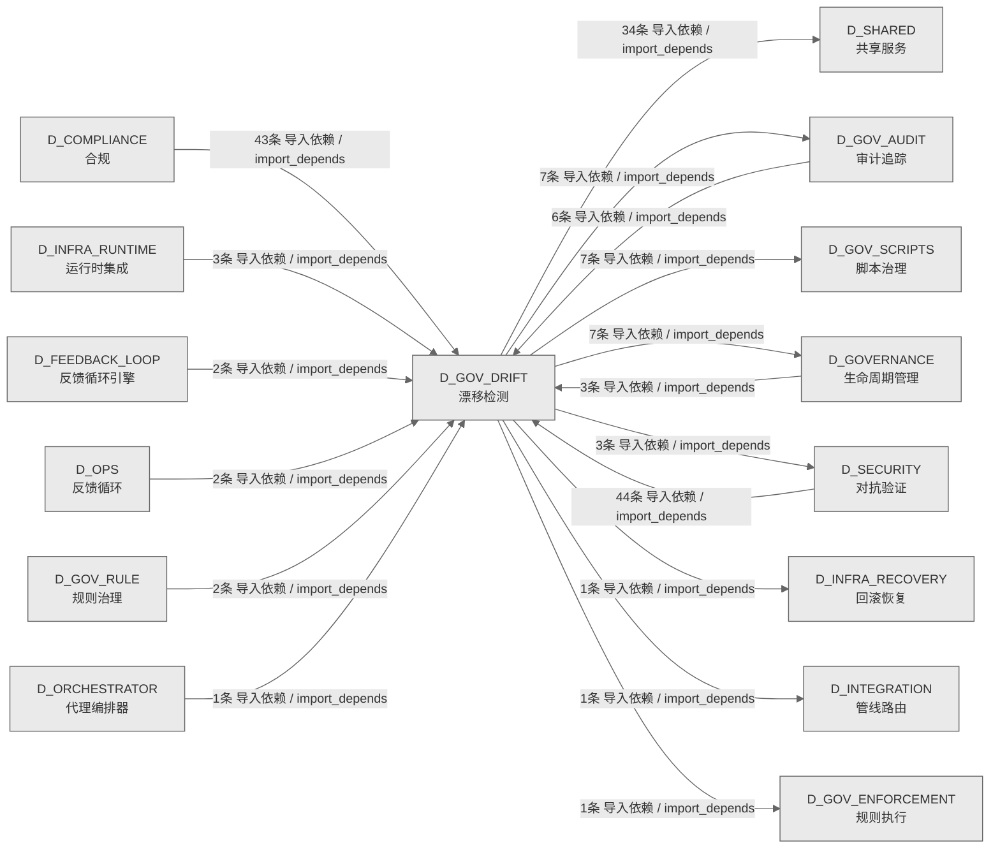

# 52_d_gov_drift / 漂移检测域 / Drift Detection

> **功能简介 / Overview**: 漂移检测，负责架构漂移检测和漂移告警

> **文档作用 / Purpose**: 展示 漂移检测（D_GOV_DRIFT）功能域的域内依赖关系、跨域依赖关系，模块信息（成熟度/中英文名/大白话/文件路径）内嵌于 Mermaid 节点，供架构审查和域治理参考。

> 本文档由 generate_domain_doc.py 从 depgraph (PostgreSQL) 自动生成
> 数据源: depgraph (PostgreSQL) nodes表 + edges表

> **[可缩放 HTML 版 / Zoomable HTML](http://localhost:8765/docs/02_enterprise_architecture/02_domain_architecture_docs/_zoomable_html/52_d_gov_drift.html)** — Ctrl+滚轮缩放 ｜ 双击重置 ｜ Ctrl+Shift+D 切换拖动/选择模式

## 域基本信息 / Domain Overview

| 字段 | 值 | Field | Value |
|------|------|-------|-------|
| 编号 | 52 | Number | 52 |
| 域ID | D_GOV_DRIFT | Domain ID | D_GOV_DRIFT |
| 域名称 | 漂移检测 | Domain Name | Drift Detection |
| 层级 | L2 业务域层 | Layer | L2 Domain |
| 模块数 | 75 | Module Count | 75 |
| 域内依赖 | 24 | Internal Dependencies | 24 |
| 跨域入边 | 106 | Cross-domain Incoming | 106 |
| 跨域出边 | 61 | Cross-domain Outgoing | 61 |
| 设计态模块 | 1 | Design Modules | 1 |
| 生产态模块 | 74 | Production Modules | 74 |
| 容量 | 74/150 (正常) | Capacity | 74/150 (正常) |
| 描述 | 39个漂移检测器注册与调度 | Description | 39个漂移检测器注册与调度 |

## 域内依赖图 / Internal Dependency Diagram

> 依赖图内嵌在本文档中，IDE 可直接渲染；网页版可 Ctrl+滚轮缩放 + 拖动平移查看细节。全景图用颜色区分运营态/设计态，不再分页/拆子图。
>
> **图例说明 / Legend**：
> - 🟦 **蓝色 = 运营态模块**（production，已上线运行）
> - 🟧 **橙色虚线 = 设计态模块**（design，蓝图阶段，代码未写）
> - **实线箭头 = 运营态依赖**（已生效的依赖关系）
> - **虚线箭头 = 非运营态依赖**（计划中/验证中的依赖关系）

### 全景依赖图（全部模块，颜色区分运营态/设计态）

> 展示全部 75 个模块（生产态 74 + 设计态 1），节点含成熟度+中英文名+大白话+文件路径。

```mermaid
%%{init: {'theme': 'base', 'themeVariables': {'primaryColor': '#eaeaea', 'primaryTextColor': '#333333', 'primaryBorderColor': '#666666', 'lineColor': '#666666', 'secondaryColor': '#eaeaea', 'tertiaryColor': '#eaeaea', 'fontSize': '14px'}}}%%
flowchart TD
    docs_03_modules_domain_governance_drift_detector_blueprint_md["(设计态 / design)<br/>文件: drift_detector/blueprint.md"]
    scripts_governance_d11_compliance_validate_blueprint_overlap_py["(生产态 / production) validate蓝图overlap / Validate Blueprint Overlap<br/>Module docstring — see module-level docstring for details.<br/>文件: d11_compliance/validate_blueprint_overlap.py"]
    scripts_governance_d11_compliance_validate_truth_source_cascade_py["(生产态 / production) validatetruth源级联 / Validate Truth Source Cascade<br/>validate_truth_source_cascade.py — 真源级联一致性校验<br/>文件: d11_compliance/validate_truth_source_cascade.py"]
    scripts_governance_d5_architecture_validators_validate_authority_registry_py["(生产态 / production) validateauthority注册表 / Validate Authority Registry<br/>Module docstring — see module-level docstring for details.<br/>文件: validators/validate_authority_registry.py"]
    scripts_governance_d5_architecture_validators_validate_ssot_py["(生产态 / production) validatessot / Validate Ssot<br/>SSoT 文件头一致性校验器.<br/>文件: validators/validate_ssot.py"]
    src_zephyr_gov_audit_self_monitor_py["(生产态 / production) 自我监控器 / Self Monitor<br/>监控失败返回空指标<br/>文件: gov_audit/self_monitor.py"]
    src_zephyr_gov_drift_absence_manager_py["(生产态 / production) absence管理器 / Absence Manager<br/>Owner Absence Manager — Owner缺席模式 §6.32。<br/>文件: gov_drift/absence_manager.py"]
    src_zephyr_gov_drift_ai_construction_detectors_py["(生产态 / production) AIconstructiondetectors / AI Construction Detectors<br/>Drift Detector AI 施工检测器 — ai_construction_detectors.py<br/>文件: gov_drift/ai_construction_detectors.py"]
    src_zephyr_gov_drift_ai_context_injector_py["(生产态 / production) AI上下文injector / AI Context Injector<br/>AI Context Injector — 施工前预检D-023-16 · §6.8。<br/>文件: gov_drift/ai_context_injector.py"]
    src_zephyr_gov_drift_artifact_scanner_py["(生产态 / production) artifactscanner / Artifact Scanner<br/>ArtifactScanner — SSRF / Path Traversal / Credential / Token 防御扫描器<br/>文件: gov_drift/artifact_scanner.py"]
    src_zephyr_gov_drift_autonomy_regressor_py["(生产态 / production) autonomyregressor / Autonomy Regressor<br/>Autonomy Regressor — v0.10.0 渐进自治可逆性管理器: confidence<阈值->自动regr...<br/>文件: gov_drift/autonomy_regressor.py"]
    src_zephyr_gov_drift_backcompat_checker_py["(生产态 / production) backcompat检查器 / Backcompat Checker<br/>Backward Compatibility Checker — 向后兼容策略漂移检测 D-023-31 · §6.23。<br/>文件: gov_drift/backcompat_checker.py"]
    src_zephyr_gov_drift_baseline_manager_py["(生产态 / production) 基线管理器 / Baseline Manager<br/>Baseline Manager — baseline_manager.py<br/>文件: gov_drift/baseline_manager.py"]
    src_zephyr_gov_drift_baseline_poisoning_guard_py["(生产态 / production) 基线poisoning守卫 / Baseline Poisoning Guard<br/>Baseline Poisoning Guard — 基线投毒防护 D-023-36 · §6.25。<br/>文件: gov_drift/baseline_poisoning_guard.py"]
    src_zephyr_gov_drift_bootstrapping_calibrator_py["(生产态 / production) 引导校准器 / Bootstrapping Calibrator<br/>定义 CalibrationPoint、BootstrappingCalibrator 等类型。<br/>文件: gov_drift/bootstrapping_calibrator.py"]
    src_zephyr_gov_drift_brain_integration_py["(生产态 / production) brain集成 / Brain Integration<br/>ProbeHierarchy - K8s 3-Probe + Terraform Reconciliation<br/>文件: gov_drift/brain_integration.py"]
    src_zephyr_gov_drift_canary_controller_py["(生产态 / production) canary控制器 / Canary Controller<br/>Detector Canary Controller — 检测器金丝雀部署 §6.11。<br/>文件: gov_drift/canary_controller.py"]
    src_zephyr_gov_drift_chaos_injector_py["(生产态 / production) chaosinjector / Chaos Injector<br/>Drift Chaos Injector — 混沌工程主动漂移注入 §6.13。<br/>文件: gov_drift/chaos_injector.py"]
    src_zephyr_gov_drift_config_consistency_py["(生产态 / production) 配置一致性 / Config Consistency<br/>Config Consistency Checker — 配置多源一致性 D-023-29 · §6.21。<br/>文件: gov_drift/config_consistency.py"]
    src_zephyr_gov_drift_contract_drift_detector_py["(生产态 / production) contract漂移检测器 / Contract Drift Detector<br/>contract_drift_detector — 契约漂移检测器。<br/>文件: gov_drift/contract_drift_detector.py"]
    src_zephyr_gov_drift_cross_module_score_py["(生产态 / production) 跨模块score / Cross Module Score<br/>Cross Module Score — cross_module_score.py<br/>文件: gov_drift/cross_module_score.py"]
    src_zephyr_gov_drift_dashboard_py["(生产态 / production) 仪表板 / Dashboard<br/>Coverage Dashboard — dashboard.py<br/>文件: gov_drift/dashboard.py"]
    src_zephyr_gov_drift_detector_core_init_py["(生产态 / production) 行为审计域包 / Detector Core Domain Package<br/>行为审计域的文件夹入口，标记该域的代码边界。本身不含业务逻辑，给域内模块一个稳定归属。<br/>文件: detector_core/__init__.py"]
    src_zephyr_gov_drift_detector_core_benchmark_integrity_py["(生产态 / production) 基准完整性 / Benchmark Integrity<br/>DriftError;BaselineError<br/>文件: detector_core/benchmark_integrity.py"]
    src_zephyr_gov_drift_detector_core_bridges_drift_bridge_py["(生产态 / production) 漂移桥接 / Drift Bridge<br/>DriftBridge — 漂移检测器事件桥接 (MOD-INF-023).<br/>文件: bridges/drift_bridge.py"]
    src_zephyr_gov_drift_detector_core_ml_engineering_py["(生产态 / production) ML工程 / ML Engineering<br/>DriftError;BaselineError<br/>文件: detector_core/ml_engineering.py"]
    src_zephyr_gov_drift_detector_core_performance_baseline_py["(生产态 / production) 性能基线 / Performance Baseline<br/>DriftError;BaselineError<br/>文件: detector_core/performance_baseline.py"]
    src_zephyr_gov_drift_detector_core_regime_detector_py["(生产态 / production) 状态检测器 / Regime Detector<br/>DriftError;BaselineError<br/>文件: detector_core/regime_detector.py"]
    src_zephyr_gov_drift_detector_dispatcher_py["(生产态 / production) 检测器dispatcher / Detector Dispatcher<br/>Detector Dispatcher — detector_dispatcher.py<br/>文件: gov_drift/detector_dispatcher.py"]
    src_zephyr_gov_drift_drift_result_types_py["(生产态 / production) 漂移结果类型 / Drift Result Types<br/>Drift Detector 结果类型 + 专项检测函数 — drift_result_types.py<br/>文件: gov_drift/drift_result_types.py"]
    src_zephyr_gov_drift_drift_training_py["(生产态 / production) 漂移training / Drift Training<br/>Drift Detector AI 训练闭环 + 跨语言检测 — drift_training.py<br/>文件: gov_drift/drift_training.py"]
    src_zephyr_gov_drift_file_attr_checker_py["(生产态 / production) 文件attr检查器 / File Attr Checker<br/>File Attribute Integrity — 文件底层属性完整性 §6.30。<br/>文件: gov_drift/file_attr_checker.py"]
    src_zephyr_gov_drift_gate_persistence_py["(生产态 / production) 门禁persistence / Gate Persistence<br/>Gate Persistence — gate_persistence.py<br/>文件: gov_drift/gate_persistence.py"]
    src_zephyr_gov_drift_git_bisector_py["(生产态 / production) gitbisector / Git Bisector<br/>Git Bisector — git_bisector.py<br/>文件: gov_drift/git_bisector.py"]
    src_zephyr_gov_drift_gitignore_auditor_py["(生产态 / production) gitignore审计器 / Gitignore Auditor<br/>.gitignore Integrity Auditor — gitignore完整性审计 D-023-32 · §6.24。<br/>文件: gov_drift/gitignore_auditor.py"]
    src_zephyr_gov_drift_handoff_manager_py["(生产态 / production) handoff管理器 / Handoff Manager<br/>Cross-Session Handoff Manager — 跨Session修复上下文交接 §6.14。<br/>文件: gov_drift/handoff_manager.py"]
    src_zephyr_gov_drift_headless_scanner_py["(生产态 / production) headlessscanner / Headless Scanner<br/>Headless Scanner — headless_scanner.py<br/>文件: gov_drift/headless_scanner.py"]
    src_zephyr_gov_drift_incremental_scanner_py["(生产态 / production) 增量scanner / Incremental Scanner<br/>Incremental Scanner — incremental_scanner.py<br/>文件: gov_drift/incremental_scanner.py"]
    src_zephyr_gov_drift_naming_magic_checker_py["(生产态 / production) 命名magic检查器 / Naming Magic Checker<br/>Naming Magic Checker — 命名魔数与隐式约定检测 §6.27。<br/>文件: gov_drift/naming_magic_checker.py"]
    src_zephyr_gov_drift_python_compat_py["(生产态 / production) pythoncompat / Python Compat<br/>Python Compatibility Checker — Python版本兼容性漂移 D-023-30 · §6.22。<br/>文件: gov_drift/python_compat.py"]
    src_zephyr_gov_drift_resource_guard_py["(生产态 / production) 资源守卫 / Resource Guard<br/>Resource Guard — 资源上限与优雅降级 D-023-23 · §6.16。<br/>文件: gov_drift/resource_guard.py"]
    src_zephyr_gov_drift_reward_hacking_rebound_detector_py["(生产态 / production) rewardhackingrebound检测器 / Reward Hacking Rebound Detector<br/>Reward Hacking Rebound Detector — v0.14.0 §2.37-D.<br/>文件: gov_drift/reward_hacking_rebound_detector.py"]
    src_zephyr_gov_drift_roi_engine_py["(生产态 / production) 投资回报引擎 / ROI Engine<br/>ROI Engine — roi_engine.py<br/>文件: gov_drift/roi_engine.py"]
    src_zephyr_gov_drift_rollback_bridge_py["(生产态 / production) rollback桥接 / Rollback Bridge<br/>G-CT-006 契约：Drift -> Rollback 漂移触发回滚.<br/>文件: gov_drift/rollback_bridge.py"]
    src_zephyr_gov_drift_scan_mutex_py["(生产态 / production) scanmutex / Scan Mutex<br/>Scan Mutex — scan_mutex.py<br/>文件: gov_drift/scan_mutex.py"]
    src_zephyr_gov_drift_self_test_verifier_py["(生产态 / production) 自我测试验证器 / Self Test Verifier<br/>Self Test Verifier — self_test_verifier.py<br/>文件: gov_drift/self_test_verifier.py"]
    src_zephyr_gov_drift_silence_detector_py["(生产态 / production) silence检测器 / Silence Detector<br/>Silence Detector — v0.8.0 静默窗口检测器: agent无响应超时+heartbeat缺失检测。<br/>文件: gov_drift/silence_detector.py"]
    src_zephyr_gov_drift_spiral_ews_py["(生产态 / production) 螺旋预警 / Spiral EWS<br/>定义 SpiralSignal、SpiralEarlyWarningSystem 等类型。<br/>文件: gov_drift/spiral_ews.py"]
    src_zephyr_gov_drift_suppression_learner_py["(生产态 / production) suppressionlearner / Suppression Learner<br/>Suppression Learner — suppression_learner.py<br/>文件: gov_drift/suppression_learner.py"]
    src_zephyr_gov_drift_symlink_checker_py["(生产态 / production) symlink检查器 / Symlink Checker<br/>Symlink Integrity Checker — 软链接完整性检测 §6.29。<br/>文件: gov_drift/symlink_checker.py"]
    src_zephyr_gov_drift_tamper_proof_audit_py["(生产态 / production) tamperproof审计 / Tamper Proof Audit<br/>Tamper-Proof Audit — 防篡改审计 D-023-37 · §6.26。<br/>文件: gov_drift/tamper_proof_audit.py"]
    src_zephyr_gov_drift_test_fixture_checker_py["(生产态 / production) 测试fixture检查器 / Test Fixture Checker<br/>Test Fixture Checker — 测试夹具漂移检测 D-023-28 · §6.20。<br/>文件: gov_drift/test_fixture_checker.py"]
    src_zephyr_gov_drift_trend_analyzer_py["(生产态 / production) trend分析器 / Trend Analyzer<br/>Trend Analyzer — trend_analyzer.py<br/>文件: gov_drift/trend_analyzer.py"]
    src_zephyr_gov_drift_vigil_runtime_py["(生产态 / production) vigil运行时 / Vigil Runtime<br/>Vigil Runtime — v0.6.0 VIGIL维护运行时: 运维token预算+手动override窗口。<br/>文件: gov_drift/vigil_runtime.py"]
    src_zephyr_gov_enforcement_rule_enforcement_breaking_change_detector_py["(生产态 / production) breakingchange检测器 / Breaking Change Detector<br/>Breaking Change 检测器（GATE-CDC-2）——字段删除/类型变更->CI FAIL。<br/>文件: rule_enforcement/breaking_change_detector.py"]
    src_zephyr_gov_enforcement_rule_enforcement_drift_detector_py["(生产态 / production) 漂移检测器 / Drift Detector<br/>Gate-side Drift Detector Recovery — zephyr.gov_enforcement.rule_enforcement....<br/>文件: rule_enforcement/drift_detector.py"]
    src_zephyr_gov_enforcement_rule_enforcement_gate_engine_gate_health_py["(生产态 / production) 门禁健康 / Gate Health<br/>门禁健康仪表板——per-gate SLI 报告、误报率、延迟分布、1人+AI运维视图（beta）<br/>文件: gate_engine/gate_health.py"]
    src_zephyr_gov_enforcement_rule_enforcement_gate_engine_gate_integrity_guard_py["(生产态 / production) 门禁完整性守卫 / Gate Integrity Guard<br/>门禁引擎完整性守卫——自检SHA-256校验+trust root自验证（beta）<br/>文件: gate_engine/gate_integrity_guard.py"]
    src_zephyr_gov_enforcement_rule_enforcement_invariants_en_002_enforcement_validator_py["(生产态 / production) en002enforcement校验器 / En 002 Enforcement Validator<br/>EN-002 — Enforcement Mode Validator<br/>文件: invariants/en_002_enforcement_validator.py"]
    src_zephyr_gov_enforcement_rule_enforcement_truth_source_validator_py["(生产态 / production) truth源校验器 / Truth Source Validator<br/>真源优先级裁决器（Truth Source Validator）<br/>文件: rule_enforcement/truth_source_validator.py"]
    src_zephyr_governance_drift_detector_init_py["(生产态 / production) 治理修复Drift-detector包 / Governance Drift-detector Package<br/>治理修复域下 drift-detector 子包，归集该方向的模块。本身不含业务逻辑，只是组织归属。<br/>文件: drift-detector/__init__.py"]
    src_zephyr_governance_integrity_py["(生产态 / production) 完整性 / Integrity<br/>校验失败返回pass=False<br/>文件: governance/integrity.py"]
    docs_03_modules_domain_governance_drift_detector_blueprint_md ~~~ scripts_governance_d11_compliance_validate_blueprint_overlap_py
    scripts_governance_d11_compliance_validate_blueprint_overlap_py ~~~ scripts_governance_d11_compliance_validate_truth_source_cascade_py
    scripts_governance_d11_compliance_validate_truth_source_cascade_py ~~~ scripts_governance_d5_architecture_validators_validate_authority_registry_py
    scripts_governance_d5_architecture_validators_validate_authority_registry_py ~~~ scripts_governance_d5_architecture_validators_validate_ssot_py
    scripts_governance_d5_architecture_validators_validate_ssot_py ~~~ src_zephyr_gov_audit_self_monitor_py
    src_zephyr_gov_audit_self_monitor_py ~~~ src_zephyr_gov_drift_absence_manager_py
    src_zephyr_gov_drift_absence_manager_py ~~~ src_zephyr_gov_drift_ai_construction_detectors_py
    src_zephyr_gov_drift_ai_construction_detectors_py ~~~ src_zephyr_gov_drift_ai_context_injector_py
    src_zephyr_gov_drift_ai_context_injector_py ~~~ src_zephyr_gov_drift_artifact_scanner_py
    src_zephyr_gov_drift_artifact_scanner_py ~~~ src_zephyr_gov_drift_autonomy_regressor_py
    src_zephyr_gov_drift_autonomy_regressor_py ~~~ src_zephyr_gov_drift_backcompat_checker_py
    src_zephyr_gov_drift_backcompat_checker_py ~~~ src_zephyr_gov_drift_baseline_manager_py
    src_zephyr_gov_drift_baseline_manager_py ~~~ src_zephyr_gov_drift_baseline_poisoning_guard_py
    src_zephyr_gov_drift_baseline_poisoning_guard_py ~~~ src_zephyr_gov_drift_bootstrapping_calibrator_py
    src_zephyr_gov_drift_bootstrapping_calibrator_py ~~~ src_zephyr_gov_drift_brain_integration_py
    src_zephyr_gov_drift_brain_integration_py ~~~ src_zephyr_gov_drift_canary_controller_py
    src_zephyr_gov_drift_canary_controller_py ~~~ src_zephyr_gov_drift_chaos_injector_py
    src_zephyr_gov_drift_chaos_injector_py ~~~ src_zephyr_gov_drift_config_consistency_py
    src_zephyr_gov_drift_config_consistency_py ~~~ src_zephyr_gov_drift_contract_drift_detector_py
    src_zephyr_gov_drift_contract_drift_detector_py ~~~ src_zephyr_gov_drift_cross_module_score_py
    src_zephyr_gov_drift_cross_module_score_py ~~~ src_zephyr_gov_drift_dashboard_py
    src_zephyr_gov_drift_dashboard_py ~~~ src_zephyr_gov_drift_detector_core_init_py
    src_zephyr_gov_drift_detector_core_init_py ~~~ src_zephyr_gov_drift_detector_core_benchmark_integrity_py
    src_zephyr_gov_drift_detector_core_benchmark_integrity_py ~~~ src_zephyr_gov_drift_detector_core_bridges_drift_bridge_py
    src_zephyr_gov_drift_detector_core_bridges_drift_bridge_py ~~~ src_zephyr_gov_drift_detector_core_ml_engineering_py
    src_zephyr_gov_drift_detector_core_ml_engineering_py ~~~ src_zephyr_gov_drift_detector_core_performance_baseline_py
    src_zephyr_gov_drift_detector_core_performance_baseline_py ~~~ src_zephyr_gov_drift_detector_core_regime_detector_py
    src_zephyr_gov_drift_detector_core_regime_detector_py ~~~ src_zephyr_gov_drift_detector_dispatcher_py
    src_zephyr_gov_drift_detector_dispatcher_py ~~~ src_zephyr_gov_drift_drift_result_types_py
    src_zephyr_gov_drift_drift_result_types_py ~~~ src_zephyr_gov_drift_drift_training_py
    src_zephyr_gov_drift_drift_training_py ~~~ src_zephyr_gov_drift_file_attr_checker_py
    src_zephyr_gov_drift_file_attr_checker_py ~~~ src_zephyr_gov_drift_gate_persistence_py
    src_zephyr_gov_drift_gate_persistence_py ~~~ src_zephyr_gov_drift_git_bisector_py
    src_zephyr_gov_drift_git_bisector_py ~~~ src_zephyr_gov_drift_gitignore_auditor_py
    src_zephyr_gov_drift_gitignore_auditor_py ~~~ src_zephyr_gov_drift_handoff_manager_py
    src_zephyr_gov_drift_handoff_manager_py ~~~ src_zephyr_gov_drift_headless_scanner_py
    src_zephyr_gov_drift_headless_scanner_py ~~~ src_zephyr_gov_drift_incremental_scanner_py
    src_zephyr_gov_drift_incremental_scanner_py ~~~ src_zephyr_gov_drift_naming_magic_checker_py
    src_zephyr_gov_drift_naming_magic_checker_py ~~~ src_zephyr_gov_drift_python_compat_py
    src_zephyr_gov_drift_python_compat_py ~~~ src_zephyr_gov_drift_resource_guard_py
    src_zephyr_gov_drift_resource_guard_py ~~~ src_zephyr_gov_drift_reward_hacking_rebound_detector_py
    src_zephyr_gov_drift_reward_hacking_rebound_detector_py ~~~ src_zephyr_gov_drift_roi_engine_py
    src_zephyr_gov_drift_roi_engine_py ~~~ src_zephyr_gov_drift_rollback_bridge_py
    src_zephyr_gov_drift_rollback_bridge_py ~~~ src_zephyr_gov_drift_scan_mutex_py
    src_zephyr_gov_drift_scan_mutex_py ~~~ src_zephyr_gov_drift_self_test_verifier_py
    src_zephyr_gov_drift_self_test_verifier_py ~~~ src_zephyr_gov_drift_silence_detector_py
    src_zephyr_gov_drift_silence_detector_py ~~~ src_zephyr_gov_drift_spiral_ews_py
    src_zephyr_gov_drift_spiral_ews_py ~~~ src_zephyr_gov_drift_suppression_learner_py
    src_zephyr_gov_drift_suppression_learner_py ~~~ src_zephyr_gov_drift_symlink_checker_py
    src_zephyr_gov_drift_symlink_checker_py ~~~ src_zephyr_gov_drift_tamper_proof_audit_py
    src_zephyr_gov_drift_tamper_proof_audit_py ~~~ src_zephyr_gov_drift_test_fixture_checker_py
    src_zephyr_gov_drift_test_fixture_checker_py ~~~ src_zephyr_gov_drift_trend_analyzer_py
    src_zephyr_gov_drift_trend_analyzer_py ~~~ src_zephyr_gov_drift_vigil_runtime_py
    src_zephyr_gov_drift_vigil_runtime_py ~~~ src_zephyr_gov_enforcement_rule_enforcement_breaking_change_detector_py
    src_zephyr_gov_enforcement_rule_enforcement_breaking_change_detector_py ~~~ src_zephyr_gov_enforcement_rule_enforcement_drift_detector_py
    src_zephyr_gov_enforcement_rule_enforcement_drift_detector_py ~~~ src_zephyr_gov_enforcement_rule_enforcement_gate_engine_gate_health_py
    src_zephyr_gov_enforcement_rule_enforcement_gate_engine_gate_health_py ~~~ src_zephyr_gov_enforcement_rule_enforcement_gate_engine_gate_integrity_guard_py
    src_zephyr_gov_enforcement_rule_enforcement_gate_engine_gate_integrity_guard_py ~~~ src_zephyr_gov_enforcement_rule_enforcement_invariants_en_002_enforcement_validator_py
    src_zephyr_gov_enforcement_rule_enforcement_invariants_en_002_enforcement_validator_py ~~~ src_zephyr_gov_enforcement_rule_enforcement_truth_source_validator_py
    src_zephyr_gov_enforcement_rule_enforcement_truth_source_validator_py ~~~ src_zephyr_governance_drift_detector_init_py
    src_zephyr_governance_drift_detector_init_py ~~~ src_zephyr_governance_integrity_py
    src_zephyr_gov_audit_drift_bridge_py["(生产态 / production) 漂移桥接 / Drift Bridge<br/>drift bridge sync result -- 对齐 test_bridges_drift_bridge.py.<br/>文件: gov_audit/drift_bridge.py"]
    src_zephyr_gov_drift_cascade_detector_py["(生产态 / production) 级联检测器 / Cascade Detector<br/>Cascade Failure Detector — 级联故障检测 D-023-22 · §6.15。<br/>文件: gov_drift/cascade_detector.py"]
    src_zephyr_gov_drift_correlation_engine_py["(生产态 / production) correlation引擎 / Correlation Engine<br/>Correlation Engine — correlation_engine.py<br/>文件: gov_drift/correlation_engine.py"]
    src_zephyr_gov_drift_credibility_engine_py["(生产态 / production) credibility引擎 / Credibility Engine<br/>Credibility Engine — credibility_engine.py<br/>文件: gov_drift/credibility_engine.py"]
    src_zephyr_gov_drift_detector_core_model_drift_monitor_py["(生产态 / production) 模型漂移监控器 / Model Drift Monitor<br/>DriftError;BaselineError<br/>文件: detector_core/model_drift_monitor.py"]
    src_zephyr_gov_drift_drift_engine_py["(生产态 / production) 漂移引擎 / Drift Engine<br/>Drift Engine — 编排器核心 (SRC-0030 精简后)<br/>文件: gov_drift/drift_engine.py"]
    src_zephyr_gov_drift_drift_hotfix_bypass_py["(生产态 / production) 漂移hotfix旁路 / Drift Hotfix Bypass<br/>Drift Hotfix Bypass — drift_hotfix_bypass.py<br/>文件: gov_drift/drift_hotfix_bypass.py"]
    src_zephyr_gov_drift_forensics_engine_py["(生产态 / production) forensics引擎 / Forensics Engine<br/>Drift Forensics Engine — 漂移取证引擎 §6.17。<br/>文件: gov_drift/forensics_engine.py"]
    src_zephyr_gov_drift_orphan_scanner_py["(生产态 / production) orphanscanner / Orphan Scanner<br/>Orphan Resource Scanner — 孤儿资源检测 §6.28。<br/>文件: gov_drift/orphan_scanner.py"]
    src_zephyr_gov_drift_self_check_py["(生产态 / production) 自我检查 / Self Check<br/>Self-Drift Check — self_check.py<br/>文件: gov_drift/self_check.py"]
    src_zephyr_gov_audit_drift_bridge_py ~~~ src_zephyr_gov_drift_cascade_detector_py
    src_zephyr_gov_drift_cascade_detector_py ~~~ src_zephyr_gov_drift_correlation_engine_py
    src_zephyr_gov_drift_correlation_engine_py ~~~ src_zephyr_gov_drift_credibility_engine_py
    src_zephyr_gov_drift_credibility_engine_py ~~~ src_zephyr_gov_drift_detector_core_model_drift_monitor_py
    src_zephyr_gov_drift_detector_core_model_drift_monitor_py ~~~ src_zephyr_gov_drift_drift_engine_py
    src_zephyr_gov_drift_drift_engine_py ~~~ src_zephyr_gov_drift_drift_hotfix_bypass_py
    src_zephyr_gov_drift_drift_hotfix_bypass_py ~~~ src_zephyr_gov_drift_forensics_engine_py
    src_zephyr_gov_drift_forensics_engine_py ~~~ src_zephyr_gov_drift_orphan_scanner_py
    src_zephyr_gov_drift_orphan_scanner_py ~~~ src_zephyr_gov_drift_self_check_py
    src_zephyr_gov_drift_drift_detector_py["(生产态 / production) 漂移检测器 / Drift Detector<br/>Drift Detector — 兼容别名，SSoT已迁移至 zephyr.gov_drift (MOD-INF-023).<br/>文件: gov_drift/drift_detector.py"]
    src_zephyr_gov_drift_drift_infrastructure_py["(生产态 / production) 漂移infrastructure / Drift Infrastructure<br/>Drift Detector 基础设施 — drift_infrastructure.py<br/>文件: gov_drift/drift_infrastructure.py"]
    src_zephyr_gov_drift_drift_detector_py ~~~ src_zephyr_gov_drift_drift_infrastructure_py
    src_zephyr_gov_drift_drift_models_py["(生产态 / production) 漂移模型 / Drift Models<br/>Drift Detector 数据模型 — drift_models.py<br/>文件: gov_drift/drift_models.py"]
    src_zephyr_gov_audit_drift_bridge_py -->|导入依赖 / import_depends| src_zephyr_gov_drift_drift_detector_py
    src_zephyr_gov_audit_self_monitor_py -->|导入依赖 / import_depends| src_zephyr_gov_audit_drift_bridge_py
    src_zephyr_gov_drift_ai_construction_detectors_py -->|导入依赖 / import_depends| src_zephyr_gov_drift_drift_models_py
    src_zephyr_gov_drift_chaos_injector_py -->|导入依赖 / import_depends| src_zephyr_gov_drift_drift_engine_py
    src_zephyr_gov_drift_brain_integration_py -->|导入依赖 / import_depends| src_zephyr_gov_drift_credibility_engine_py
    src_zephyr_gov_drift_brain_integration_py -->|导入依赖 / import_depends| src_zephyr_gov_drift_correlation_engine_py
    src_zephyr_gov_drift_brain_integration_py -->|导入依赖 / import_depends| src_zephyr_gov_drift_drift_engine_py
    src_zephyr_gov_drift_brain_integration_py -->|导入依赖 / import_depends| src_zephyr_gov_drift_forensics_engine_py
    src_zephyr_gov_drift_brain_integration_py -->|导入依赖 / import_depends| src_zephyr_gov_drift_orphan_scanner_py
    src_zephyr_gov_drift_brain_integration_py -->|导入依赖 / import_depends| src_zephyr_gov_drift_self_check_py
    src_zephyr_gov_drift_drift_engine_py -->|导入依赖 / import_depends| src_zephyr_gov_drift_drift_infrastructure_py
    src_zephyr_gov_drift_drift_engine_py -->|导入依赖 / import_depends| src_zephyr_gov_drift_drift_models_py
    src_zephyr_gov_drift_detector_dispatcher_py -->|导入依赖 / import_depends| src_zephyr_gov_drift_drift_models_py
    src_zephyr_gov_drift_drift_infrastructure_py -->|导入依赖 / import_depends| src_zephyr_gov_drift_drift_models_py
    src_zephyr_gov_drift_drift_training_py -->|导入依赖 / import_depends| src_zephyr_gov_drift_drift_models_py
    src_zephyr_gov_drift_drift_result_types_py -->|导入依赖 / import_depends| src_zephyr_gov_drift_drift_engine_py
    src_zephyr_gov_drift_drift_result_types_py -->|导入依赖 / import_depends| src_zephyr_gov_drift_drift_models_py
    src_zephyr_gov_drift_headless_scanner_py -->|导入依赖 / import_depends| src_zephyr_gov_drift_drift_models_py
    src_zephyr_gov_drift_scan_mutex_py -->|导入依赖 / import_depends| src_zephyr_gov_drift_drift_models_py
    src_zephyr_gov_drift_detector_core_init_py -->|config_depends / config_depends| src_zephyr_gov_drift_detector_core_model_drift_monitor_py
    src_zephyr_gov_enforcement_rule_enforcement_drift_detector_py -->|导入依赖 / import_depends| src_zephyr_gov_drift_cascade_detector_py
    src_zephyr_gov_enforcement_rule_enforcement_drift_detector_py -->|导入依赖 / import_depends| src_zephyr_gov_drift_drift_engine_py
    src_zephyr_gov_enforcement_rule_enforcement_drift_detector_py -->|导入依赖 / import_depends| src_zephyr_gov_drift_drift_hotfix_bypass_py
    src_zephyr_gov_enforcement_rule_enforcement_drift_detector_py -->|导入依赖 / import_depends| src_zephyr_gov_drift_drift_models_py
    D_SECURITY["(生产态 / production) 对抗验证 / Adversarial Validation<br/>对抗验证，负责系统安全对抗测试、漏洞扫描和攻防验证<br/>跨域节点 / cross-domain"]
    src_zephyr_gov_enforcement_rule_enforcement_drift_detector_py -->|导入依赖 / import_depends| D_SECURITY
    D_SHARED["(生产态 / production) 共享服务 / Shared Services<br/>共享服务，负责跨域共享的工具、协议和基础服务<br/>跨域节点 / cross-domain"]
    src_zephyr_gov_drift_cascade_detector_py -->|导入依赖 / import_depends| D_SHARED
    src_zephyr_gov_enforcement_rule_enforcement_drift_detector_py -->|导入依赖 / import_depends| D_SHARED
    D_GOV_SCRIPTS["(生产态 / production) 脚本治理 / Script Governance<br/>脚本治理，负责脚本生命周期管理和脚本质量门禁<br/>跨域节点 / cross-domain"]
    scripts_governance_d11_compliance_validate_truth_source_cascade_py -->|导入依赖 / import_depends| D_GOV_SCRIPTS
    scripts_governance_d5_architecture_validators_validate_ssot_py -->|导入依赖 / import_depends| D_GOV_SCRIPTS
    scripts_governance_d5_architecture_validators_validate_ssot_py -->|导入依赖 / import_depends| D_GOV_SCRIPTS
    scripts_governance_d5_architecture_validators_validate_ssot_py -->|导入依赖 / import_depends| D_GOV_SCRIPTS
    D_GOV_AUDIT["(生产态 / production) 审计追踪 / Audit Trail<br/>审计追踪，负责变更审计追踪和操作日志管理<br/>跨域节点 / cross-domain"]
    src_zephyr_gov_audit_drift_bridge_py -->|导入依赖 / import_depends| D_GOV_AUDIT
    scripts_governance_d11_compliance_validate_truth_source_cascade_py -->|导入依赖 / import_depends| D_GOV_SCRIPTS
    src_zephyr_gov_drift_brain_integration_py -->|导入依赖 / import_depends| D_SHARED
    src_zephyr_gov_drift_incremental_scanner_py -->|导入依赖 / import_depends| D_SHARED
    src_zephyr_gov_drift_headless_scanner_py -->|导入依赖 / import_depends| D_SHARED
    src_zephyr_gov_drift_trend_analyzer_py -->|导入依赖 / import_depends| D_SHARED
    src_zephyr_gov_drift_drift_infrastructure_py -->|导入依赖 / import_depends| D_SHARED
    src_zephyr_gov_drift_absence_manager_py -->|导入依赖 / import_depends| D_SHARED
    D_COMPLIANCE["(生产态 / production) 合规 / Compliance<br/>合规，负责交易合规检查、规则引擎和合规报告<br/>跨域节点 / cross-domain"]
    D_COMPLIANCE -->|导入依赖 / import_depends| src_zephyr_gov_drift_backcompat_checker_py
    D_COMPLIANCE -->|导入依赖 / import_depends| src_zephyr_gov_drift_contract_drift_detector_py
    D_COMPLIANCE -->|导入依赖 / import_depends| src_zephyr_gov_drift_orphan_scanner_py
    D_SECURITY -->|导入依赖 / import_depends| src_zephyr_gov_drift_absence_manager_py
    D_SECURITY -->|导入依赖 / import_depends| src_zephyr_gov_drift_self_check_py
    D_COMPLIANCE -->|导入依赖 / import_depends| src_zephyr_gov_drift_drift_infrastructure_py
    D_COMPLIANCE -->|导入依赖 / import_depends| src_zephyr_gov_drift_correlation_engine_py
    D_COMPLIANCE -->|导入依赖 / import_depends| src_zephyr_gov_drift_forensics_engine_py
    D_GOV_AUDIT -->|导入依赖 / import_depends| src_zephyr_gov_drift_drift_engine_py
    D_COMPLIANCE -->|导入依赖 / import_depends| src_zephyr_gov_drift_cross_module_score_py
    D_SECURITY -->|导入依赖 / import_depends| src_zephyr_gov_drift_test_fixture_checker_py
    D_SECURITY -->|导入依赖 / import_depends| src_zephyr_gov_drift_git_bisector_py
    D_COMPLIANCE -->|导入依赖 / import_depends| src_zephyr_gov_drift_test_fixture_checker_py
    D_SECURITY -->|导入依赖 / import_depends| src_zephyr_gov_drift_python_compat_py
    D_COMPLIANCE -->|导入依赖 / import_depends| src_zephyr_gov_drift_tamper_proof_audit_py
    classDef production fill:#e1f5fe,stroke:#01579b,stroke-width:2px,color:#000
    classDef design fill:#fff3e0,stroke:#e65100,stroke-width:2px,color:#000,stroke-dasharray: 5 5
    classDef external_prod fill:#e8f4fd,stroke:#0277bd,stroke-width:1px,color:#000
    classDef external_design fill:#fff8e7,stroke:#ef6c00,stroke-width:1px,color:#000,stroke-dasharray: 5 5
    class scripts_governance_d11_compliance_validate_blueprint_overlap_py,scripts_governance_d11_compliance_validate_truth_source_cascade_py,scripts_governance_d5_architecture_validators_validate_authority_registry_py,scripts_governance_d5_architecture_validators_validate_ssot_py,src_zephyr_gov_audit_drift_bridge_py,src_zephyr_gov_audit_self_monitor_py,src_zephyr_gov_drift_absence_manager_py,src_zephyr_gov_drift_ai_construction_detectors_py,src_zephyr_gov_drift_ai_context_injector_py,src_zephyr_gov_drift_artifact_scanner_py,src_zephyr_gov_drift_autonomy_regressor_py,src_zephyr_gov_drift_backcompat_checker_py,src_zephyr_gov_drift_baseline_manager_py,src_zephyr_gov_drift_baseline_poisoning_guard_py,src_zephyr_gov_drift_bootstrapping_calibrator_py,src_zephyr_gov_drift_brain_integration_py,src_zephyr_gov_drift_canary_controller_py,src_zephyr_gov_drift_cascade_detector_py,src_zephyr_gov_drift_chaos_injector_py,src_zephyr_gov_drift_config_consistency_py,src_zephyr_gov_drift_contract_drift_detector_py,src_zephyr_gov_drift_correlation_engine_py,src_zephyr_gov_drift_credibility_engine_py,src_zephyr_gov_drift_cross_module_score_py,src_zephyr_gov_drift_dashboard_py,src_zephyr_gov_drift_detector_core_init_py,src_zephyr_gov_drift_detector_core_benchmark_integrity_py,src_zephyr_gov_drift_detector_core_bridges_drift_bridge_py,src_zephyr_gov_drift_detector_core_ml_engineering_py,src_zephyr_gov_drift_detector_core_model_drift_monitor_py,src_zephyr_gov_drift_detector_core_performance_baseline_py,src_zephyr_gov_drift_detector_core_regime_detector_py,src_zephyr_gov_drift_detector_dispatcher_py,src_zephyr_gov_drift_drift_detector_py,src_zephyr_gov_drift_drift_engine_py,src_zephyr_gov_drift_drift_hotfix_bypass_py,src_zephyr_gov_drift_drift_infrastructure_py,src_zephyr_gov_drift_drift_models_py,src_zephyr_gov_drift_drift_result_types_py,src_zephyr_gov_drift_drift_training_py,src_zephyr_gov_drift_file_attr_checker_py,src_zephyr_gov_drift_forensics_engine_py,src_zephyr_gov_drift_gate_persistence_py,src_zephyr_gov_drift_git_bisector_py,src_zephyr_gov_drift_gitignore_auditor_py,src_zephyr_gov_drift_handoff_manager_py,src_zephyr_gov_drift_headless_scanner_py,src_zephyr_gov_drift_incremental_scanner_py,src_zephyr_gov_drift_naming_magic_checker_py,src_zephyr_gov_drift_orphan_scanner_py,src_zephyr_gov_drift_python_compat_py,src_zephyr_gov_drift_resource_guard_py,src_zephyr_gov_drift_reward_hacking_rebound_detector_py,src_zephyr_gov_drift_roi_engine_py,src_zephyr_gov_drift_rollback_bridge_py,src_zephyr_gov_drift_scan_mutex_py,src_zephyr_gov_drift_self_check_py,src_zephyr_gov_drift_self_test_verifier_py,src_zephyr_gov_drift_silence_detector_py,src_zephyr_gov_drift_spiral_ews_py,src_zephyr_gov_drift_suppression_learner_py,src_zephyr_gov_drift_symlink_checker_py,src_zephyr_gov_drift_tamper_proof_audit_py,src_zephyr_gov_drift_test_fixture_checker_py,src_zephyr_gov_drift_trend_analyzer_py,src_zephyr_gov_drift_vigil_runtime_py,src_zephyr_gov_enforcement_rule_enforcement_breaking_change_detector_py,src_zephyr_gov_enforcement_rule_enforcement_drift_detector_py,src_zephyr_gov_enforcement_rule_enforcement_gate_engine_gate_health_py,src_zephyr_gov_enforcement_rule_enforcement_gate_engine_gate_integrity_guard_py,src_zephyr_gov_enforcement_rule_enforcement_invariants_en_002_enforcement_validator_py,src_zephyr_gov_enforcement_rule_enforcement_truth_source_validator_py,src_zephyr_governance_drift_detector_init_py,src_zephyr_governance_integrity_py production
    class docs_03_modules_domain_governance_drift_detector_blueprint_md design
    class D_SECURITY,D_SHARED,D_GOV_SCRIPTS,D_GOV_AUDIT,D_COMPLIANCE external_prod
```

## 跨域依赖 / Cross-domain Dependencies

### 本域依赖的其他域（出边）/ Depends On

| # | 本域模块 / Source Module | → | 外部域-目标模块 / Target Module | 依赖类型 / Type |
|:--:|---------|:--:|---------|---------|
| 1 | correlation引擎 / Correlation Engine (gov_drift/correlati... | → | D_GOVERNANCE 生命周期管理: sqliteschema / Sqlite Schema (persistence/sqlite_schema.py) | 导入依赖 / import_depends |
| 2 | 仪表板 / Dashboard (gov_drift/dashboard.py) | → | D_GOVERNANCE 生命周期管理: sqliteschema / Sqlite Schema (persistence/sqlite_schema.py) | 导入依赖 / import_depends |
| 3 | 漂移引擎 / Drift Engine (gov_drift/drift_engine.py) | → | D_GOVERNANCE 生命周期管理: sqliteschema / Sqlite Schema (persistence/sqlite_schema.py) | 导入依赖 / import_depends |
| 4 | 漂移结果类型 / Drift Result Types (gov_drift/drift_result... | → | D_GOVERNANCE 生命周期管理: sqliteschema / Sqlite Schema (persistence/sqlite_schema.py) | 导入依赖 / import_depends |
| 5 | 门禁persistence / Gate Persistence (gov_drift/gate_persis... | → | D_GOVERNANCE 生命周期管理: sqliteschema / Sqlite Schema (persistence/sqlite_schema.py) | 导入依赖 / import_depends |
| 6 | tamperproof审计 / Tamper Proof Audit (gov_drift/tamper_pr... | → | D_GOVERNANCE 生命周期管理: sqliteschema / Sqlite Schema (persistence/sqlite_schema.py) | 导入依赖 / import_depends |
| 7 | trend分析器 / Trend Analyzer (gov_drift/trend_analyzer.py) | → | D_GOVERNANCE 生命周期管理: sqliteschema / Sqlite Schema (persistence/sqlite_schema.py) | 导入依赖 / import_depends |
| 8 | 漂移桥接 / Drift Bridge (gov_audit/drift_bridge.py) | → | D_GOV_AUDIT 审计追踪: 异常 / Anomaly (gov_audit/anomaly.py) | 导入依赖 / import_depends |
| 9 | 漂移引擎 / Drift Engine (gov_drift/drift_engine.py) | → | D_GOV_AUDIT 审计追踪: 发现摄入 / Finding Ingest (gov_audit/finding_ingest.py) | 导入依赖 / import_depends |
| 10 | 漂移引擎 / Drift Engine (gov_drift/drift_engine.py) | → | D_GOV_AUDIT 审计追踪: 发现模型 / Finding Model (gov_audit/finding_model.py) | 导入依赖 / import_depends |
| 11 | truth源校验器 / Truth Source Validator (rule_enforcement/... | → | D_GOV_AUDIT 审计追踪: 桥接 / Bridge (gov_audit/bridge.py) | 导入依赖 / import_depends |
| 12 | 完整性 / Integrity (governance/integrity.py) | → | D_GOV_AUDIT 审计追踪: merklehourly / Merkle Hourly (gov_audit/merkle_hourly.py) | 导入依赖 / import_depends |
| 13 | 完整性 / Integrity (governance/integrity.py) | → | D_GOV_AUDIT 审计追踪: 模型 / Models (gov_audit/models.py) | 导入依赖 / import_depends |
| 14 | 完整性 / Integrity (governance/integrity.py) | → | D_GOV_AUDIT 审计追踪: 信任桥接 / Trust Bridge (gov_audit/trust_bridge.py) | 导入依赖 / import_depends |
| 15 | tamperproof审计 / Tamper Proof Audit (gov_drift/tamper_pr... | → | D_GOV_ENFORCEMENT 规则执行: gitcommitgateway / Git Commit Gateway (rule_bridge/git_co... | 导入依赖 / import_depends |
| 16 | validate蓝图overlap / Validate Blueprint Overlap (d11_com... | → | D_GOV_SCRIPTS 脚本治理: frontmatter / Frontmatter (_shared/frontmatter.py) | 导入依赖 / import_depends |
| 17 | validatetruth源级联 / Validate Truth Source Cascade (d11_... | → | D_GOV_SCRIPTS 脚本治理: constants / Constants (_shared/constants.py) | 导入依赖 / import_depends |
| 18 | validatetruth源级联 / Validate Truth Source Cascade (d11_... | → | D_GOV_SCRIPTS 脚本治理: frontmatter / Frontmatter (_shared/frontmatter.py) | 导入依赖 / import_depends |
| 19 | validatessot / Validate Ssot (validators/validate_ssot.py) | → | D_GOV_SCRIPTS 脚本治理: constants / Constants (_shared/constants.py) | 导入依赖 / import_depends |
| 20 | validatessot / Validate Ssot (validators/validate_ssot.py) | → | D_GOV_SCRIPTS 脚本治理: encoding / Encoding (_shared/encoding.py) | 导入依赖 / import_depends |
| 21 | validatessot / Validate Ssot (validators/validate_ssot.py) | → | D_GOV_SCRIPTS 脚本治理: frontmatter / Frontmatter (_shared/frontmatter.py) | 导入依赖 / import_depends |
| 22 | validatessot / Validate Ssot (validators/validate_ssot.py) | → | D_GOV_SCRIPTS 脚本治理: yamlutils / Yaml Utils (_shared/yaml_utils.py) | 导入依赖 / import_depends |
| 23 | 漂移检测器 / Drift Detector (rule_enforcement/drift_detec... | → | D_INFRA_RECOVERY 回滚恢复: 漂移修复 / Drift Fix (rollback/drift_fix.py) | 导入依赖 / import_depends |
| 24 | 漂移hotfix旁路 / Drift Hotfix Bypass (gov_drift/drift_hot... | → | D_INTEGRATION 管线路由: 协议 / Protocols (contracts/protocols.py) | 导入依赖 / import_depends |
| 25 | brain集成 / Brain Integration (gov_drift/brain_integratio... | → | D_SECURITY 对抗验证: 冷启动 / Cold Start (gov_drift/cold_start.py) | 导入依赖 / import_depends |
| 26 | 漂移检测器 / Drift Detector (rule_enforcement/drift_detec... | → | D_SECURITY 对抗验证: events / Events (gov_drift/events.py) | 导入依赖 / import_depends |
| 27 | 漂移检测器 / Drift Detector (rule_enforcement/drift_detec... | → | D_SECURITY 对抗验证: reconciler / Reconciler (gov_drift/reconciler.py) | 导入依赖 / import_depends |
| 28 | 自我监控器 / Self Monitor (gov_audit/self_monitor.py) | → | D_SHARED 共享服务: 时间utils / Time Utils (utils/time_utils.py) | 导入依赖 / import_depends |
| 29 | absence管理器 / Absence Manager (gov_drift/absence_manage... | → | D_SHARED 共享服务: serialization / Serialization (io/serialization.py) | 导入依赖 / import_depends |
| 30 | 基线poisoning守卫 / Baseline Poisoning Guard (gov_drift/b... | → | D_SHARED 共享服务: process池 / Process Pool (infra/process_pool.py) | 导入依赖 / import_depends |
| 31 | brain集成 / Brain Integration (gov_drift/brain_integratio... | → | D_SHARED 共享服务: process池 / Process Pool (infra/process_pool.py) | 导入依赖 / import_depends |
| 32 | brain集成 / Brain Integration (gov_drift/brain_integratio... | → | D_SHARED 共享服务: paths / Paths (io/paths.py) | 导入依赖 / import_depends |
| 33 | brain集成 / Brain Integration (gov_drift/brain_integratio... | → | D_SHARED 共享服务: 异步utils / Async Utils (utils/async_utils.py) | 导入依赖 / import_depends |
| 34 | canary控制器 / Canary Controller (gov_drift/canary_contro... | → | D_SHARED 共享服务: serialization / Serialization (io/serialization.py) | 导入依赖 / import_depends |
| 35 | 级联检测器 / Cascade Detector (gov_drift/cascade_detector... | → | D_SHARED 共享服务: serialization / Serialization (io/serialization.py) | 导入依赖 / import_depends |
| 36 | chaosinjector / Chaos Injector (gov_drift/chaos_injector.py) | → | D_SHARED 共享服务: serialization / Serialization (io/serialization.py) | 导入依赖 / import_depends |
| 37 | chaosinjector / Chaos Injector (gov_drift/chaos_injector.py) | → | D_SHARED 共享服务: 异步utils / Async Utils (utils/async_utils.py) | 导入依赖 / import_depends |
| 38 | 仪表板 / Dashboard (gov_drift/dashboard.py) | → | D_SHARED 共享服务: paths / Paths (io/paths.py) | 导入依赖 / import_depends |
| 39 | 漂移桥接 / Drift Bridge (bridges/drift_bridge.py) | → | D_SHARED 共享服务: 事件总线 / Event Bus (shared/event_bus.py) | 导入依赖 / import_depends |
| 40 | 漂移检测器 / Drift Detector (gov_drift/drift_detector.py) | → | D_SHARED 共享服务: 事件总线 / Event Bus (shared/event_bus.py) | 导入依赖 / import_depends |
| 41 | 漂移引擎 / Drift Engine (gov_drift/drift_engine.py) | → | D_SHARED 共享服务: paths / Paths (io/paths.py) | 导入依赖 / import_depends |
| 42 | 漂移infrastructure / Drift Infrastructure (gov_drift/drif... | → | D_SHARED 共享服务: process池 / Process Pool (infra/process_pool.py) | 导入依赖 / import_depends |
| 43 | 漂移infrastructure / Drift Infrastructure (gov_drift/drif... | → | D_SHARED 共享服务: paths / Paths (io/paths.py) | 导入依赖 / import_depends |
| 44 | 漂移模型 / Drift Models (gov_drift/drift_models.py) | → | D_SHARED 共享服务: 时间utils / Time Utils (utils/time_utils.py) | 导入依赖 / import_depends |
| 45 | 漂移结果类型 / Drift Result Types (gov_drift/drift_result... | → | D_SHARED 共享服务: process池 / Process Pool (infra/process_pool.py) | 导入依赖 / import_depends |
| 46 | forensics引擎 / Forensics Engine (gov_drift/forensics_eng... | → | D_SHARED 共享服务: process池 / Process Pool (infra/process_pool.py) | 导入依赖 / import_depends |
| 47 | forensics引擎 / Forensics Engine (gov_drift/forensics_eng... | → | D_SHARED 共享服务: serialization / Serialization (io/serialization.py) | 导入依赖 / import_depends |
| 48 | 门禁persistence / Gate Persistence (gov_drift/gate_persis... | → | D_SHARED 共享服务: paths / Paths (io/paths.py) | 导入依赖 / import_depends |
| 49 | 门禁persistence / Gate Persistence (gov_drift/gate_persis... | → | D_SHARED 共享服务: serialization / Serialization (io/serialization.py) | 导入依赖 / import_depends |
| 50 | gitbisector / Git Bisector (gov_drift/git_bisector.py) | → | D_SHARED 共享服务: process池 / Process Pool (infra/process_pool.py) | 导入依赖 / import_depends |
| 51 | handoff管理器 / Handoff Manager (gov_drift/handoff_manage... | → | D_SHARED 共享服务: serialization / Serialization (io/serialization.py) | 导入依赖 / import_depends |
| 52 | headlessscanner / Headless Scanner (gov_drift/headless_sc... | → | D_SHARED 共享服务: process池 / Process Pool (infra/process_pool.py) | 导入依赖 / import_depends |
| 53 | 增量scanner / Incremental Scanner (gov_drift/incremental_... | → | D_SHARED 共享服务: process池 / Process Pool (infra/process_pool.py) | 导入依赖 / import_depends |
| 54 | scanmutex / Scan Mutex (gov_drift/scan_mutex.py) | → | D_SHARED 共享服务: lock / Lock (infra/lock.py) | 导入依赖 / import_depends |
| 55 | tamperproof审计 / Tamper Proof Audit (gov_drift/tamper_pr... | → | D_SHARED 共享服务: serialization / Serialization (io/serialization.py) | 导入依赖 / import_depends |
| 56 | trend分析器 / Trend Analyzer (gov_drift/trend_analyzer.py) | → | D_SHARED 共享服务: paths / Paths (io/paths.py) | 导入依赖 / import_depends |
| 57 | trend分析器 / Trend Analyzer (gov_drift/trend_analyzer.py) | → | D_SHARED 共享服务: serialization / Serialization (io/serialization.py) | 导入依赖 / import_depends |
| 58 | 漂移检测器 / Drift Detector (rule_enforcement/drift_detec... | → | D_SHARED 共享服务: 异步utils / Async Utils (utils/async_utils.py) | 导入依赖 / import_depends |
| 59 | en002enforcement校验器 / En 002 Enforcement Validator (in... | → | D_SHARED 共享服务: paths / Paths (io/paths.py) | 导入依赖 / import_depends |
| 60 | en002enforcement校验器 / En 002 Enforcement Validator (in... | → | D_SHARED 共享服务: 模式 / Schemas (schema/schemas.py) | 导入依赖 / import_depends |
| 61 | truth源校验器 / Truth Source Validator (rule_enforcement/... | → | D_SHARED 共享服务: 模式 / Schemas (schema/schemas.py) | 导入依赖 / import_depends |

### 依赖本域的其他域（入边）/ Depended By

| # | 外部域-源模块 / Source Module | → | 本域模块 / Target Module | 依赖类型 / Type |
|:--:|---------|:--:|---------|---------|
| 1 | D_COMPLIANCE 合规: 合规Behavioral Auditor包 / Compliance Behavioral Auditor ... | → | absence管理器 / Absence Manager (gov_drift/absence_manage... | 导入依赖 / import_depends |
| 2 | D_COMPLIANCE 合规: 合规Behavioral Auditor包 / Compliance Behavioral Auditor ... | → | AIconstructiondetectors / AI Construction Detectors (gov_... | 导入依赖 / import_depends |
| 3 | D_COMPLIANCE 合规: 合规Behavioral Auditor包 / Compliance Behavioral Auditor ... | → | AI上下文injector / AI Context Injector (gov_drift/ai_cont... | 导入依赖 / import_depends |
| 4 | D_COMPLIANCE 合规: 合规Behavioral Auditor包 / Compliance Behavioral Auditor ... | → | backcompat检查器 / Backcompat Checker (gov_drift/backcomp... | 导入依赖 / import_depends |
| 5 | D_COMPLIANCE 合规: 合规Behavioral Auditor包 / Compliance Behavioral Auditor ... | → | 基线管理器 / Baseline Manager (gov_drift/baseline_manager... | 导入依赖 / import_depends |
| 6 | D_COMPLIANCE 合规: 合规Behavioral Auditor包 / Compliance Behavioral Auditor ... | → | 基线poisoning守卫 / Baseline Poisoning Guard (gov_drift/b... | 导入依赖 / import_depends |
| 7 | D_COMPLIANCE 合规: 合规Behavioral Auditor包 / Compliance Behavioral Auditor ... | → | canary控制器 / Canary Controller (gov_drift/canary_contro... | 导入依赖 / import_depends |
| 8 | D_COMPLIANCE 合规: 合规Behavioral Auditor包 / Compliance Behavioral Auditor ... | → | 级联检测器 / Cascade Detector (gov_drift/cascade_detector... | 导入依赖 / import_depends |
| 9 | D_COMPLIANCE 合规: 合规Behavioral Auditor包 / Compliance Behavioral Auditor ... | → | chaosinjector / Chaos Injector (gov_drift/chaos_injector.py) | 导入依赖 / import_depends |
| 10 | D_COMPLIANCE 合规: 合规Behavioral Auditor包 / Compliance Behavioral Auditor ... | → | 配置一致性 / Config Consistency (gov_drift/config_consist... | 导入依赖 / import_depends |
| 11 | D_COMPLIANCE 合规: 合规Behavioral Auditor包 / Compliance Behavioral Auditor ... | → | contract漂移检测器 / Contract Drift Detector (gov_drift/c... | 导入依赖 / import_depends |
| 12 | D_COMPLIANCE 合规: 合规Behavioral Auditor包 / Compliance Behavioral Auditor ... | → | correlation引擎 / Correlation Engine (gov_drift/correlati... | 导入依赖 / import_depends |
| 13 | D_COMPLIANCE 合规: 合规Behavioral Auditor包 / Compliance Behavioral Auditor ... | → | credibility引擎 / Credibility Engine (gov_drift/credibili... | 导入依赖 / import_depends |
| 14 | D_COMPLIANCE 合规: 合规Behavioral Auditor包 / Compliance Behavioral Auditor ... | → | 跨模块score / Cross Module Score (gov_drift/cross_module_... | 导入依赖 / import_depends |
| 15 | D_COMPLIANCE 合规: 合规Behavioral Auditor包 / Compliance Behavioral Auditor ... | → | 仪表板 / Dashboard (gov_drift/dashboard.py) | 导入依赖 / import_depends |
| 16 | D_COMPLIANCE 合规: 合规Behavioral Auditor包 / Compliance Behavioral Auditor ... | → | 检测器dispatcher / Detector Dispatcher (gov_drift/detecto... | 导入依赖 / import_depends |
| 17 | D_COMPLIANCE 合规: 合规Behavioral Auditor包 / Compliance Behavioral Auditor ... | → | 漂移引擎 / Drift Engine (gov_drift/drift_engine.py) | 导入依赖 / import_depends |
| 18 | D_COMPLIANCE 合规: 合规Behavioral Auditor包 / Compliance Behavioral Auditor ... | → | 漂移hotfix旁路 / Drift Hotfix Bypass (gov_drift/drift_hot... | 导入依赖 / import_depends |
| 19 | D_COMPLIANCE 合规: 合规Behavioral Auditor包 / Compliance Behavioral Auditor ... | → | 漂移infrastructure / Drift Infrastructure (gov_drift/drif... | 导入依赖 / import_depends |
| 20 | D_COMPLIANCE 合规: 合规Behavioral Auditor包 / Compliance Behavioral Auditor ... | → | 漂移模型 / Drift Models (gov_drift/drift_models.py) | 导入依赖 / import_depends |
| 21 | D_COMPLIANCE 合规: 合规Behavioral Auditor包 / Compliance Behavioral Auditor ... | → | 漂移结果类型 / Drift Result Types (gov_drift/drift_result... | 导入依赖 / import_depends |
| 22 | D_COMPLIANCE 合规: 合规Behavioral Auditor包 / Compliance Behavioral Auditor ... | → | 漂移training / Drift Training (gov_drift/drift_training.py) | 导入依赖 / import_depends |
| 23 | D_COMPLIANCE 合规: 合规Behavioral Auditor包 / Compliance Behavioral Auditor ... | → | 文件attr检查器 / File Attr Checker (gov_drift/file_attr_c... | 导入依赖 / import_depends |
| 24 | D_COMPLIANCE 合规: 合规Behavioral Auditor包 / Compliance Behavioral Auditor ... | → | forensics引擎 / Forensics Engine (gov_drift/forensics_eng... | 导入依赖 / import_depends |
| 25 | D_COMPLIANCE 合规: 合规Behavioral Auditor包 / Compliance Behavioral Auditor ... | → | 门禁persistence / Gate Persistence (gov_drift/gate_persis... | 导入依赖 / import_depends |
| 26 | D_COMPLIANCE 合规: 合规Behavioral Auditor包 / Compliance Behavioral Auditor ... | → | gitbisector / Git Bisector (gov_drift/git_bisector.py) | 导入依赖 / import_depends |
| 27 | D_COMPLIANCE 合规: 合规Behavioral Auditor包 / Compliance Behavioral Auditor ... | → | gitignore审计器 / Gitignore Auditor (gov_drift/gitignore_... | 导入依赖 / import_depends |
| 28 | D_COMPLIANCE 合规: 合规Behavioral Auditor包 / Compliance Behavioral Auditor ... | → | handoff管理器 / Handoff Manager (gov_drift/handoff_manage... | 导入依赖 / import_depends |
| 29 | D_COMPLIANCE 合规: 合规Behavioral Auditor包 / Compliance Behavioral Auditor ... | → | headlessscanner / Headless Scanner (gov_drift/headless_sc... | 导入依赖 / import_depends |
| 30 | D_COMPLIANCE 合规: 合规Behavioral Auditor包 / Compliance Behavioral Auditor ... | → | 增量scanner / Incremental Scanner (gov_drift/incremental_... | 导入依赖 / import_depends |
| 31 | D_COMPLIANCE 合规: 合规Behavioral Auditor包 / Compliance Behavioral Auditor ... | → | 命名magic检查器 / Naming Magic Checker (gov_drift/naming_... | 导入依赖 / import_depends |
| 32 | D_COMPLIANCE 合规: 合规Behavioral Auditor包 / Compliance Behavioral Auditor ... | → | orphanscanner / Orphan Scanner (gov_drift/orphan_scanner.py) | 导入依赖 / import_depends |
| 33 | D_COMPLIANCE 合规: 合规Behavioral Auditor包 / Compliance Behavioral Auditor ... | → | pythoncompat / Python Compat (gov_drift/python_compat.py) | 导入依赖 / import_depends |
| 34 | D_COMPLIANCE 合规: 合规Behavioral Auditor包 / Compliance Behavioral Auditor ... | → | 资源守卫 / Resource Guard (gov_drift/resource_guard.py) | 导入依赖 / import_depends |
| 35 | D_COMPLIANCE 合规: 合规Behavioral Auditor包 / Compliance Behavioral Auditor ... | → | 投资回报引擎 / ROI Engine (gov_drift/roi_engine.py) | 导入依赖 / import_depends |
| 36 | D_COMPLIANCE 合规: 合规Behavioral Auditor包 / Compliance Behavioral Auditor ... | → | rollback桥接 / Rollback Bridge (gov_drift/rollback_bridge... | 导入依赖 / import_depends |
| 37 | D_COMPLIANCE 合规: 合规Behavioral Auditor包 / Compliance Behavioral Auditor ... | → | scanmutex / Scan Mutex (gov_drift/scan_mutex.py) | 导入依赖 / import_depends |
| 38 | D_COMPLIANCE 合规: 合规Behavioral Auditor包 / Compliance Behavioral Auditor ... | → | 自我检查 / Self Check (gov_drift/self_check.py) | 导入依赖 / import_depends |
| 39 | D_COMPLIANCE 合规: 合规Behavioral Auditor包 / Compliance Behavioral Auditor ... | → | suppressionlearner / Suppression Learner (gov_drift/suppr... | 导入依赖 / import_depends |
| 40 | D_COMPLIANCE 合规: 合规Behavioral Auditor包 / Compliance Behavioral Auditor ... | → | symlink检查器 / Symlink Checker (gov_drift/symlink_checke... | 导入依赖 / import_depends |
| 41 | D_COMPLIANCE 合规: 合规Behavioral Auditor包 / Compliance Behavioral Auditor ... | → | tamperproof审计 / Tamper Proof Audit (gov_drift/tamper_pr... | 导入依赖 / import_depends |
| 42 | D_COMPLIANCE 合规: 合规Behavioral Auditor包 / Compliance Behavioral Auditor ... | → | 测试fixture检查器 / Test Fixture Checker (gov_drift/test_... | 导入依赖 / import_depends |
| 43 | D_COMPLIANCE 合规: 合规Behavioral Auditor包 / Compliance Behavioral Auditor ... | → | trend分析器 / Trend Analyzer (gov_drift/trend_analyzer.py) | 导入依赖 / import_depends |
| 44 | D_FEEDBACK_LOOP 反馈循环引擎: 调度器 / Scheduler (feedback_loop/scheduler.py) | → | 漂移引擎 / Drift Engine (gov_drift/drift_engine.py) | 导入依赖 / import_depends |
| 45 | D_FEEDBACK_LOOP 反馈循环引擎: 调度器 / Scheduler (feedback_loop/scheduler.py) | → | 完整性 / Integrity (governance/integrity.py) | 导入依赖 / import_depends |
| 46 | D_GOVERNANCE 生命周期管理: 治理服务端 / Governance Server (mcp/governance_server.py) | → | 漂移引擎 / Drift Engine (gov_drift/drift_engine.py) | 导入依赖 / import_depends |
| 47 | D_GOVERNANCE 生命周期管理: 治理服务端 / Governance Server (mcp/governance_server.py) | → | 漂移infrastructure / Drift Infrastructure (gov_drift/drif... | 导入依赖 / import_depends |
| 48 | D_GOVERNANCE 生命周期管理: 治理服务端 / Governance Server (mcp/governance_server.py) | → | 漂移模型 / Drift Models (gov_drift/drift_models.py) | 导入依赖 / import_depends |
| 49 | D_GOV_AUDIT 审计追踪: orchestratorcompat / Orchestrator Compat (gov_audit/_orch... | → | 自我监控器 / Self Monitor (gov_audit/self_monitor.py) | 导入依赖 / import_depends |
| 50 | D_GOV_AUDIT 审计追踪: 桥接 / Bridge (gov_audit/bridge.py) | → | 漂移桥接 / Drift Bridge (gov_audit/drift_bridge.py) | 导入依赖 / import_depends |
| 51 | D_GOV_AUDIT 审计追踪: 审计漂移桥接 / Audit Drift Bridge (bridges/audit_drift_br... | → | 漂移引擎 / Drift Engine (gov_drift/drift_engine.py) | 导入依赖 / import_depends |
| 52 | D_GOV_AUDIT 审计追踪: 审计漂移桥接 / Audit Drift Bridge (bridges/audit_drift_br... | → | 漂移模型 / Drift Models (gov_drift/drift_models.py) | 导入依赖 / import_depends |
| 53 | D_GOV_AUDIT 审计追踪: 命令行 / CLI (gov_audit/cli.py) | → | 漂移引擎 / Drift Engine (gov_drift/drift_engine.py) | 导入依赖 / import_depends |
| 54 | D_GOV_AUDIT 审计追踪: 命令行 / CLI (gov_audit/cli.py) | → | 完整性 / Integrity (governance/integrity.py) | 导入依赖 / import_depends |
| 55 | D_GOV_RULE 规则治理: 门禁裁决引擎 / Gate Engine (gate_engine/gate_engine.py) | → | 漂移infrastructure / Drift Infrastructure (gov_drift/drif... | 导入依赖 / import_depends |
| 56 | D_GOV_RULE 规则治理: 门禁裁决引擎 / Gate Engine (gate_engine/gate_engine.py) | → | en002enforcement校验器 / En 002 Enforcement Validator (in... | 导入依赖 / import_depends |
| 57 | D_INFRA_RUNTIME 运行时集成: 状态machine / State Machine (auto_fix_engine/state_machin... | → | 漂移模型 / Drift Models (gov_drift/drift_models.py) | 导入依赖 / import_depends |
| 58 | D_INFRA_RUNTIME 运行时集成: contract指标 / Contract Metrics (system_telemetry/contrac... | → | contract漂移检测器 / Contract Drift Detector (gov_drift/c... | 导入依赖 / import_depends |
| 59 | D_INFRA_RUNTIME 运行时集成: 生命周期管理器 / Lifecycle Manager (trading/lifecycle_man... | → | 自我监控器 / Self Monitor (gov_audit/self_monitor.py) | 导入依赖 / import_depends |
| 60 | D_OPS 反馈循环: 预算引擎 / Budget Engine (ops_governance/budget_engine.py) | → | 漂移infrastructure / Drift Infrastructure (gov_drift/drif... | 导入依赖 / import_depends |
| 61 | D_OPS 反馈循环: 预算引擎 / Budget Engine (ops_governance/budget_engine.py) | → | 螺旋预警 / Spiral EWS (gov_drift/spiral_ews.py) | 导入依赖 / import_depends |
| 62 | D_ORCHESTRATOR 代理编排器: 触发器路由器 / Trigger Router (execution/trigger_router.py) | → | 漂移检测器 / Drift Detector (rule_enforcement/drift_detec... | 导入依赖 / import_depends |
| 63 | D_SECURITY 对抗验证: 漂移检测域命令行入口 / Gov Drift CLI Entry (gov_drift/__m... | → | 漂移引擎 / Drift Engine (gov_drift/drift_engine.py) | 导入依赖 / import_depends |
| 64 | D_SECURITY 对抗验证: 漂移检测域命令行入口 / Gov Drift CLI Entry (gov_drift/__m... | → | 漂移infrastructure / Drift Infrastructure (gov_drift/drif... | 导入依赖 / import_depends |
| 65 | D_SECURITY 对抗验证: 漂移检测域命令行入口 / Gov Drift CLI Entry (gov_drift/__m... | → | 自我检查 / Self Check (gov_drift/self_check.py) | 导入依赖 / import_depends |
| 66 | D_SECURITY 对抗验证: 漂移检测域命令行入口 / Gov Drift CLI Entry (gov_drift/__m... | → | 自我测试验证器 / Self Test Verifier (gov_drift/self_test_... | 导入依赖 / import_depends |
| 67 | D_SECURITY 对抗验证: analysis / Analysis (gov_drift/_analysis.py) | → | correlation引擎 / Correlation Engine (gov_drift/correlati... | 导入依赖 / import_depends |
| 68 | D_SECURITY 对抗验证: analysis / Analysis (gov_drift/_analysis.py) | → | credibility引擎 / Credibility Engine (gov_drift/credibili... | 导入依赖 / import_depends |
| 69 | D_SECURITY 对抗验证: analysis / Analysis (gov_drift/_analysis.py) | → | 跨模块score / Cross Module Score (gov_drift/cross_module_... | 导入依赖 / import_depends |
| 70 | D_SECURITY 对抗验证: analysis / Analysis (gov_drift/_analysis.py) | → | forensics引擎 / Forensics Engine (gov_drift/forensics_eng... | 导入依赖 / import_depends |
| 71 | D_SECURITY 对抗验证: analysis / Analysis (gov_drift/_analysis.py) | → | gitbisector / Git Bisector (gov_drift/git_bisector.py) | 导入依赖 / import_depends |
| 72 | D_SECURITY 对抗验证: analysis / Analysis (gov_drift/_analysis.py) | → | 投资回报引擎 / ROI Engine (gov_drift/roi_engine.py) | 导入依赖 / import_depends |
| 73 | D_SECURITY 对抗验证: analysis / Analysis (gov_drift/_analysis.py) | → | rollback桥接 / Rollback Bridge (gov_drift/rollback_bridge... | 导入依赖 / import_depends |
| 74 | D_SECURITY 对抗验证: analysis / Analysis (gov_drift/_analysis.py) | → | 自我检查 / Self Check (gov_drift/self_check.py) | 导入依赖 / import_depends |
| 75 | D_SECURITY 对抗验证: analysis / Analysis (gov_drift/_analysis.py) | → | suppressionlearner / Suppression Learner (gov_drift/suppr... | 导入依赖 / import_depends |
| 76 | D_SECURITY 对抗验证: analysis / Analysis (gov_drift/_analysis.py) | → | tamperproof审计 / Tamper Proof Audit (gov_drift/tamper_pr... | 导入依赖 / import_depends |
| 77 | D_SECURITY 对抗验证: analysis / Analysis (gov_drift/_analysis.py) | → | trend分析器 / Trend Analyzer (gov_drift/trend_analyzer.py) | 导入依赖 / import_depends |
| 78 | D_SECURITY 对抗验证: 核心 / Core (gov_drift/_core.py) | → | 配置一致性 / Config Consistency (gov_drift/config_consist... | 导入依赖 / import_depends |
| 79 | D_SECURITY 对抗验证: 核心 / Core (gov_drift/_core.py) | → | 漂移引擎 / Drift Engine (gov_drift/drift_engine.py) | 导入依赖 / import_depends |
| 80 | D_SECURITY 对抗验证: 核心 / Core (gov_drift/_core.py) | → | 漂移模型 / Drift Models (gov_drift/drift_models.py) | 导入依赖 / import_depends |
| 81 | D_SECURITY 对抗验证: 漂移 / Drift (gov_drift/_drift.py) | → | contract漂移检测器 / Contract Drift Detector (gov_drift/c... | 导入依赖 / import_depends |
| 82 | D_SECURITY 对抗验证: 漂移 / Drift (gov_drift/_drift.py) | → | 漂移hotfix旁路 / Drift Hotfix Bypass (gov_drift/drift_hot... | 导入依赖 / import_depends |
| 83 | D_SECURITY 对抗验证: 漂移 / Drift (gov_drift/_drift.py) | → | 漂移infrastructure / Drift Infrastructure (gov_drift/drif... | 导入依赖 / import_depends |
| 84 | D_SECURITY 对抗验证: 漂移 / Drift (gov_drift/_drift.py) | → | 漂移结果类型 / Drift Result Types (gov_drift/drift_result... | 导入依赖 / import_depends |
| 85 | D_SECURITY 对抗验证: 漂移 / Drift (gov_drift/_drift.py) | → | 漂移training / Drift Training (gov_drift/drift_training.py) | 导入依赖 / import_depends |
| 86 | D_SECURITY 对抗验证: infrastructure / Infrastructure (gov_drift/_infrastructur... | → | absence管理器 / Absence Manager (gov_drift/absence_manage... | 导入依赖 / import_depends |
| 87 | D_SECURITY 对抗验证: infrastructure / Infrastructure (gov_drift/_infrastructur... | → | AI上下文injector / AI Context Injector (gov_drift/ai_cont... | 导入依赖 / import_depends |
| 88 | D_SECURITY 对抗验证: infrastructure / Infrastructure (gov_drift/_infrastructur... | → | 基线管理器 / Baseline Manager (gov_drift/baseline_manager... | 导入依赖 / import_depends |
| 89 | D_SECURITY 对抗验证: infrastructure / Infrastructure (gov_drift/_infrastructur... | → | canary控制器 / Canary Controller (gov_drift/canary_contro... | 导入依赖 / import_depends |
| 90 | D_SECURITY 对抗验证: infrastructure / Infrastructure (gov_drift/_infrastructur... | → | 配置一致性 / Config Consistency (gov_drift/config_consist... | 导入依赖 / import_depends |
| 91 | D_SECURITY 对抗验证: infrastructure / Infrastructure (gov_drift/_infrastructur... | → | 仪表板 / Dashboard (gov_drift/dashboard.py) | 导入依赖 / import_depends |
| 92 | D_SECURITY 对抗验证: infrastructure / Infrastructure (gov_drift/_infrastructur... | → | 门禁persistence / Gate Persistence (gov_drift/gate_persis... | 导入依赖 / import_depends |
| 93 | D_SECURITY 对抗验证: infrastructure / Infrastructure (gov_drift/_infrastructur... | → | handoff管理器 / Handoff Manager (gov_drift/handoff_manage... | 导入依赖 / import_depends |
| 94 | D_SECURITY 对抗验证: infrastructure / Infrastructure (gov_drift/_infrastructur... | → | 资源守卫 / Resource Guard (gov_drift/resource_guard.py) | 导入依赖 / import_depends |
| 95 | D_SECURITY 对抗验证: scanners / Scanners (gov_drift/_scanners.py) | → | 增量scanner / Incremental Scanner (gov_drift/incremental_... | 导入依赖 / import_depends |
| 96 | D_SECURITY 对抗验证: scanners / Scanners (gov_drift/_scanners.py) | → | 命名magic检查器 / Naming Magic Checker (gov_drift/naming_... | 导入依赖 / import_depends |
| 97 | D_SECURITY 对抗验证: scanners / Scanners (gov_drift/_scanners.py) | → | orphanscanner / Orphan Scanner (gov_drift/orphan_scanner.py) | 导入依赖 / import_depends |
| 98 | D_SECURITY 对抗验证: scanners / Scanners (gov_drift/_scanners.py) | → | pythoncompat / Python Compat (gov_drift/python_compat.py) | 导入依赖 / import_depends |
| 99 | D_SECURITY 对抗验证: scanners / Scanners (gov_drift/_scanners.py) | → | scanmutex / Scan Mutex (gov_drift/scan_mutex.py) | 导入依赖 / import_depends |
| 100 | D_SECURITY 对抗验证: scanners / Scanners (gov_drift/_scanners.py) | → | symlink检查器 / Symlink Checker (gov_drift/symlink_checke... | 导入依赖 / import_depends |
| 101 | D_SECURITY 对抗验证: scanners / Scanners (gov_drift/_scanners.py) | → | 测试fixture检查器 / Test Fixture Checker (gov_drift/test_... | 导入依赖 / import_depends |
| 102 | D_SECURITY 对抗验证: 冷启动 / Cold Start (gov_drift/cold_start.py) | → | 漂移引擎 / Drift Engine (gov_drift/drift_engine.py) | 导入依赖 / import_depends |
| 103 | D_SECURITY 对抗验证: reconciler / Reconciler (gov_drift/reconciler.py) | → | 漂移模型 / Drift Models (gov_drift/drift_models.py) | 导入依赖 / import_depends |
| 104 | D_SECURITY 对抗验证: 运行手册生成器 / Runbook Generator (gov_drift/runbook_gen... | → | 漂移模型 / Drift Models (gov_drift/drift_models.py) | 导入依赖 / import_depends |
| 105 | D_SECURITY 对抗验证: 状态machine / State Machine (gov_drift/state_machine.py) | → | 漂移模型 / Drift Models (gov_drift/drift_models.py) | 导入依赖 / import_depends |
| 106 | D_SECURITY 对抗验证: 漂移桥接 / Drift Bridge (orphan_judge/drift_bridge.py) | → | 漂移检测器 / Drift Detector (rule_enforcement/drift_detec... | 导入依赖 / import_depends |

### 跨域依赖图 / Cross-domain Dependency Diagram

> 本域与 14 个外部域直接连接（出边 61 条 + 入边 106 条 = 167 条）。只显示直接连接的域，不展开具体节点。



## 说明 / Notes

- **数据源 / Data Source**: `depgraph (PostgreSQL)` 的 `nodes`、`edges`、`domains` 表
- **生成器 / Generator**: `generate_domain_doc.py`（G2+G10 合并）
- **维护方式 / Maintenance**: 自动生成，全景图更新时刷新
- **文件名规则 / File Naming**: `{编号:02d}_{域ID小写}.md`，如 `16_d_trading.md`
- **图例说明 / Legend**: `[production]`=已上线 / `[design]`=设计中 / `[unknown]`=未知
