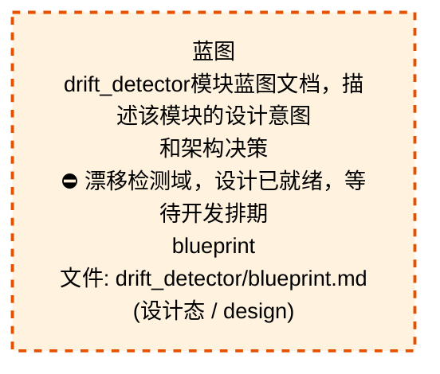
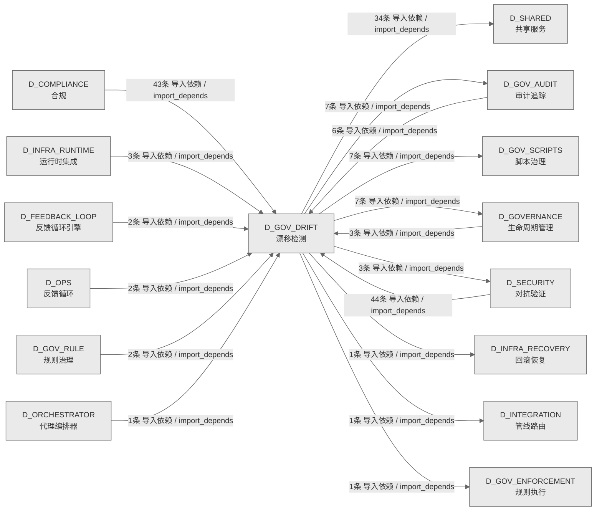

# 52_d_gov_drift / 漂移检测域 / Drift Detection

> **功能简介 / Overview**: 漂移检测，负责架构漂移检测和漂移告警

> **文档作用 / Purpose**: 展示 漂移检测（D_GOV_DRIFT）功能域的域内依赖关系、跨域依赖关系，模块信息（成熟度/中英文名/大白话/文件路径）内嵌于 Mermaid 节点，供架构审查和域治理参考。

> 本文档由 generate_domain_doc.py 从 depgraph (PostgreSQL) 自动生成
> 数据源: depgraph (PostgreSQL) nodes表 + edges表

> **[可缩放 HTML 版 / Zoomable HTML](http://localhost:8765/docs/02_enterprise_architecture/02_domain_architecture_docs/_zoomable_html/52_d_gov_drift.html)** — Ctrl+滚轮缩放 ｜ 双击重置 ｜ Ctrl+Shift+D 切换拖动/选择模式

## 域基本信息 / Domain Overview

| 字段 | 值 | Field | Value |
|------|------|-------|-------|
| 编号 | 52 | Number | 52 |
| 域ID | D_GOV_DRIFT | Domain ID | D_GOV_DRIFT |
| 域名称 | 漂移检测 | Domain Name | Drift Detection |
| 层级 | L2 业务域层 | Layer | L2 Domain |
| 模块数 | 75 | Module Count | 75 |
| 域内依赖 | 24 | Internal Dependencies | 24 |
| 跨域入边 | 106 | Cross-domain Incoming | 106 |
| 跨域出边 | 61 | Cross-domain Outgoing | 61 |
| 设计态模块 | 1 | Design Modules | 1 |
| 生产态模块 | 74 | Production Modules | 74 |
| 容量 | 74/150 (正常) | Capacity | 74/150 (正常) |
| 描述 | 39个漂移检测器注册与调度 | Description | 39个漂移检测器注册与调度 |

## 域内依赖图 / Internal Dependency Diagram

> 依赖图内嵌在本文档中，IDE 可直接渲染；网页版可 Ctrl+滚轮缩放 + 拖动平移查看细节。
>
> **图例说明 / Legend**：
> - 🟦 **蓝色 = 运营态模块**（production，已上线运行）
> - 🟧 **橙色虚线 = 设计态模块**（design，蓝图阶段，代码未写）
> - **实线箭头 = 运营态依赖**（已生效的依赖关系）
> - **虚线箭头 = 非运营态依赖**（计划中/验证中的依赖关系）

### 全景图（全部模块，颜色区分运营态/设计态）

> 展示全部 75 个模块（生产态 74 + 设计态 1），含跨域依赖外部节点。节点含成熟度+名称+大白话/简介+文件路径。

```mermaid
%%{init: {'theme': 'base', 'themeVariables': {'primaryColor': '#eaeaea', 'primaryTextColor': '#333333', 'primaryBorderColor': '#666666', 'lineColor': '#666666', 'secondaryColor': '#eaeaea', 'tertiaryColor': '#eaeaea', 'fontSize': '14px'}}}%%
flowchart TD
    docs_03_modules_domain_governance_drift_detector_blueprint_md["蓝图<br/>drift_detector模块蓝图文档，描述该模块的设计意图<br/>和架构决策<br/>⛔ 漂移检测域，设计已就绪，等待开发排期<br/>blueprint<br/>文件: drift_detector/blueprint.md<br/>(设计态 / design)"]
    scripts_governance_d11_compliance_validate_blueprint_overlap_py["validate蓝图overlap<br/>校验蓝图overlap模块<br/>文件: d11_compliance<br/>/validate_blueprint_overlap.py<br/>(生产态 / production)"]
    scripts_governance_d11_compliance_validate_truth_source_cascade_py["validatetruth数据源级联<br/>真源级联一致性校验<br/>validate_truth_source_cascade<br/>文件: d11_compliance<br/>/validate_truth_source_cascade.py<br/>(生产态 / production)"]
    scripts_governance_d5_architecture_validators_validate_authority_registry_py["validateauthority注册表<br/>校验authority注册表模块<br/>文件: validators/validate_authority_registry.py<br/>(生产态 / production)"]
    scripts_governance_d5_architecture_validators_validate_ssot_py["校验ssot<br/>SSoT 文件头一致性校验器.<br/>validate_ssot<br/>文件: validators/validate_ssot.py<br/>(生产态 / production)"]
    src_zephyr_gov_audit_self_monitor_py["自监控<br/>主要提供increment、设置gauge、快照等功能，供audi<br/>t-orchestrator.cli; MCP go使用<br/>self_monitor<br/>文件: gov_audit/self_monitor.py<br/>(生产态 / production)"]
    src_zephyr_gov_drift_absence_manager_py["absence管理器<br/>Owner Absence Manager — Owner缺席模式 §6.32。<br/>absence_manager<br/>文件: gov_drift/absence_manager.py<br/>(生产态 / production)"]
    src_zephyr_gov_drift_ai_construction_detectors_py["aiconstruction检测器<br/>Drift Detector AI 施工检测器 —<br/>ai_construction_detectors.py<br/>文件: gov_drift/ai_construction_detectors.py<br/>(生产态 / production)"]
    src_zephyr_gov_drift_ai_context_injector_py["ai上下文injector<br/>AI Context Injector — 施工前预检D-023-16 ·<br/>§6.8。<br/>ai_context_injector<br/>文件: gov_drift/ai_context_injector.py<br/>(生产态 / production)"]
    src_zephyr_gov_drift_artifact_scanner_py["artifact扫描器<br/>ArtifactScanner — SSRF / Path Traversal /<br/>Credential / Token 防御扫描器<br/>artifact_scanner<br/>文件: gov_drift/artifact_scanner.py<br/>(生产态 / production)"]
    src_zephyr_gov_drift_autonomy_regressor_py["autonomy回归器<br/>Autonomy Regressor — v0.10.0<br/>渐进自治可逆性管理器:<br/>confidence<阈值->自动regress自治级别。<br/>autonomy_regressor<br/>文件: gov_drift/autonomy_regressor.py<br/>(生产态 / production)"]
    src_zephyr_gov_drift_backcompat_checker_py["backcompat检查器<br/>Backward Compatibility Checker —<br/>向后兼容策略漂移检测 D-023-31 · §6.23。<br/>backcompat_checker<br/>文件: gov_drift/backcompat_checker.py<br/>(生产态 / production)"]
    src_zephyr_gov_drift_baseline_manager_py["基线管理器<br/>gov drift包的baseline_manager模块<br/>Baseline Manager — baseline_manager.py<br/>文件: gov_drift/baseline_manager.py<br/>(生产态 / production)"]
    src_zephyr_gov_drift_baseline_poisoning_guard_py["基线poisoning守卫<br/>Baseline Poisoning Guard — 基线投毒防护<br/>D-023-36 · §6.25。<br/>baseline_poisoning_guard<br/>文件: gov_drift/baseline_poisoning_guard.py<br/>(生产态 / production)"]
    src_zephyr_gov_drift_bootstrapping_calibrator_py["自举校准器<br/>治理漂移检测的校准器，校准参数或模型<br/>bootstrapping_calibrator<br/>文件: gov_drift/bootstrapping_calibrator.py<br/>(生产态 / production)"]
    src_zephyr_gov_drift_brain_integration_py["brain集成<br/>ProbeHierarchy - K8s 3-Probe + Terraform<br/>Reconciliation<br/>文件: gov_drift/brain_integration.py<br/>(生产态 / production)"]
    src_zephyr_gov_drift_canary_controller_py["金丝雀控制器<br/>Detector Canary Controller — 检测器金丝雀部署<br/>§6.11。<br/>canary_controller<br/>文件: gov_drift/canary_controller.py<br/>(生产态 / production)"]
    src_zephyr_gov_drift_chaos_injector_py["Drift Chaos Injector — 混沌工程主动漂移注入<br/>§6.13。<br/>gov drift包的chaos_injector模块<br/>文件: gov_drift/chaos_injector.py<br/>(生产态 / production)"]
    src_zephyr_gov_drift_config_consistency_py["配置一致性<br/>Config Consistency Checker — 配置多源一致性<br/>D-023-29 · §6.21。<br/>config_consistency<br/>文件: gov_drift/config_consistency.py<br/>(生产态 / production)"]
    src_zephyr_gov_drift_contract_drift_detector_py["契约漂移检测器<br/>contract_drift_detector — 契约漂移检测器。<br/>文件: gov_drift/contract_drift_detector.py<br/>(生产态 / production)"]
    src_zephyr_gov_drift_cross_module_score_py["跨模块评分<br/>跨模块全局健康度评分（加权平均 + 允许阈值 +<br/>rustiness系数）。<br/>文件: gov_drift/cross_module_score.py<br/>(生产态 / production)"]
    src_zephyr_gov_drift_dashboard_py["仪表盘<br/>覆盖率仪表板：detector_coverage_matrix /<br/>module_health_index / drift_heatmap + MCP<br/>JSON导出。<br/>Coverage Dashboard — dashboard.py<br/>文件: gov_drift/dashboard.py<br/>(生产态 / production)"]
    src_zephyr_gov_drift_detector_core_init_py["gov_drift/detector_core 包入口<br/>包入口。MOD-INF-023 drift_detector core module.<br/>文件: detector_core/__init__.py<br/>(生产态 / production)"]
    src_zephyr_gov_drift_detector_core_bridges_drift_bridge_py["漂移桥接<br/>DriftBridge — 漂移检测器事件桥接 (MOD-INF-023).<br/>drift_bridge<br/>文件: bridges/drift_bridge.py<br/>(生产态 / production)"]
    src_zephyr_gov_drift_detector_core_ml_engineering_py["机器学习engineering<br/>检测器的检查器，检查某项条件是否满足<br/>ml_engineering<br/>文件: detector_core/ml_engineering.py<br/>(生产态 / production)"]
    src_zephyr_gov_drift_detector_core_model_drift_monitor_py["模型漂移监控<br/>检测器的模型，定义数据结构和字段<br/>model_drift_monitor<br/>文件: detector_core/model_drift_monitor.py<br/>(生产态 / production)"]
    src_zephyr_gov_drift_detector_core_performance_baseline_py["绩效基线<br/>检测器的基类，定义抽象接口供子类实现<br/>performance_baseline<br/>文件: detector_core/performance_baseline.py<br/>(生产态 / production)"]
    src_zephyr_gov_drift_detector_core_regime_detector_py["市场状态检测器<br/>regime检测器，检测器的检测器，检测特定模式或异常<br/>。<br/>regime_detector<br/>文件: detector_core/regime_detector.py<br/>(生产态 / production)"]
    src_zephyr_gov_drift_detector_dispatcher_py["检测器分发器<br/>检测器dispatcher，治理漂移检测的检测器，检测特定<br/>模式或异常情况。<br/>文件: gov_drift/detector_dispatcher.py<br/>(生产态 / production)"]
    src_zephyr_gov_drift_drift_result_types_py["漂移结果类型定义<br/>Drift Detector 结果类型 + 专项检测函数 —<br/>drift_result_types.py<br/>文件: gov_drift/drift_result_types.py<br/>(生产态 / production)"]
    src_zephyr_gov_drift_drift_training_py["漂移training<br/>Drift Detector AI 训练闭环 + 跨语言检测 —<br/>drift_training.py<br/>文件: gov_drift/drift_training.py<br/>(生产态 / production)"]
    src_zephyr_gov_drift_file_attr_checker_py["fileattr检查器<br/>File Attribute Integrity — 文件底层属性完整性<br/>§6.30。<br/>file_attr_checker<br/>文件: gov_drift/file_attr_checker.py<br/>(生产态 / production)"]
    src_zephyr_gov_drift_gate_persistence_py["门禁持久化<br/>门禁结果持久化：scan_result.json +<br/>governance.db(SQLite) + manifest.json + 防篡改<br/>SHA256。<br/>Gate Persistence — gate_persistence.py<br/>文件: gov_drift/gate_persistence.py<br/>(生产态 / production)"]
    src_zephyr_gov_drift_git_bisector_py["Git二分器<br/>gov drift包的git_bisector模块<br/>Git Bisector — git_bisector.py<br/>文件: gov_drift/git_bisector.py<br/>(生产态 / production)"]
    src_zephyr_gov_drift_gitignore_auditor_py["gitignore审计器<br/>.gitignore Integrity Auditor —<br/>gitignore完整性审计 D-023-32 · §6.24。<br/>gitignore_auditor<br/>文件: gov_drift/gitignore_auditor.py<br/>(生产态 / production)"]
    src_zephyr_gov_drift_handoff_manager_py["handoff管理器<br/>Cross-Session Handoff Manager —<br/>跨Session修复上下文交接 §6.14。<br/>handoff_manager<br/>文件: gov_drift/handoff_manager.py<br/>(生产态 / production)"]
    src_zephyr_gov_drift_headless_scanner_py["headless扫描器<br/>LIGHT+DEEP 与会话日志 _interrupt_log.jsonl<br/>扫描。<br/>Headless Scanner — headless_scanner.py<br/>文件: gov_drift/headless_scanner.py<br/>(生产态 / production)"]
    src_zephyr_gov_drift_incremental_scanner_py["incremental扫描器<br/>git diff<br/>驱动的增量扫描器，变更影响范围计算与检测器匹配。<br/>文件: gov_drift/incremental_scanner.py<br/>(生产态 / production)"]
    src_zephyr_gov_drift_naming_magic_checker_py["namingmagic检查器<br/>Naming Magic Checker — 命名魔数与隐式约定检测<br/>§6.27。<br/>naming_magic_checker<br/>文件: gov_drift/naming_magic_checker.py<br/>(生产态 / production)"]
    src_zephyr_gov_drift_python_compat_py["python兼容<br/>Python Compatibility Checker —<br/>Python版本兼容性漂移 D-023-30 · §6.22。<br/>python_compat<br/>文件: gov_drift/python_compat.py<br/>(生产态 / production)"]
    src_zephyr_gov_drift_resource_guard_py["资源守卫<br/>Resource Guard — 资源上限与优雅降级 D-023-23 ·<br/>§6.16。<br/>resource_guard<br/>文件: gov_drift/resource_guard.py<br/>(生产态 / production)"]
    src_zephyr_gov_drift_reward_hacking_rebound_detector_py["rewardhackingrebound检测器<br/>奖励hackingrebound检测器。Reward Hacking<br/>Rebound Detector — v0.14.0 §2.37-D.<br/>文件: gov_drift<br/>/reward_hacking_rebound_detector.py<br/>(生产态 / production)"]
    src_zephyr_gov_drift_roi_engine_py["roi引擎<br/>治理漂移检测的功能模块<br/>ROI Engine — roi_engine.py<br/>文件: gov_drift/roi_engine.py<br/>(生产态 / production)"]
    src_zephyr_gov_drift_rollback_bridge_py["回滚桥接<br/>G-CT-006 契约：Drift -> Rollback 漂移触发回滚.<br/>rollback_bridge<br/>文件: gov_drift/rollback_bridge.py<br/>(生产态 / production)"]
    src_zephyr_gov_drift_scan_mutex_py["scan互斥<br/>扫描mutex，治理漂移检测的记录器，把发生的事件<br/>/结果记下来留档。<br/>Scan Mutex — scan_mutex.py<br/>文件: gov_drift/scan_mutex.py<br/>(生产态 / production)"]
    src_zephyr_gov_drift_self_test_verifier_py["自测试验证器<br/>gov drift包的self_test_verifier模块<br/>文件: gov_drift/self_test_verifier.py<br/>(生产态 / production)"]
    src_zephyr_gov_drift_silence_detector_py["silence检测器<br/>Silence Detector — v0.8.0 静默窗口检测器:<br/>agent无响应超时+heartbeat缺失检测。<br/>silence_detector<br/>文件: gov_drift/silence_detector.py<br/>(生产态 / production)"]
    src_zephyr_gov_drift_spiral_ews_py["螺旋预警系统<br/>供src/zephyr/governance/ops_gove使用<br/>spiral_ews<br/>文件: gov_drift/spiral_ews.py<br/>(生产态 / production)"]
    src_zephyr_gov_drift_suppression_learner_py["抑制学习器<br/>治理漂移检测的学习器，从数据中学习模式<br/>文件: gov_drift/suppression_learner.py<br/>(生产态 / production)"]
    src_zephyr_gov_drift_symlink_checker_py["symlink检查器<br/>Symlink Integrity Checker — 软链接完整性检测<br/>§6.29。<br/>symlink_checker<br/>文件: gov_drift/symlink_checker.py<br/>(生产态 / production)"]
    src_zephyr_gov_drift_tamper_proof_audit_py["tamperproof审计<br/>Tamper-Proof Audit — 防篡改审计 D-023-37 ·<br/>§6.26。<br/>tamper_proof_audit<br/>文件: gov_drift/tamper_proof_audit.py<br/>(生产态 / production)"]
    src_zephyr_gov_drift_test_fixture_checker_py["测试夹具检查器<br/>Test Fixture Checker — 测试夹具漂移检测<br/>D-023-28 · §6.20。<br/>test_fixture_checker<br/>文件: gov_drift/test_fixture_checker.py<br/>(生产态 / production)"]
    src_zephyr_gov_drift_trend_analyzer_py["趋势分析器<br/>治理漂移检测的分析器，分析数据找问题或规律<br/>Trend Analyzer — trend_analyzer.py<br/>文件: gov_drift/trend_analyzer.py<br/>(生产态 / production)"]
    src_zephyr_gov_drift_vigil_runtime_py["vigil运行时<br/>Vigil Runtime — v0.6.0 VIGIL维护运行时:<br/>运维token预算+手动override窗口。<br/>vigil_runtime<br/>文件: gov_drift/vigil_runtime.py<br/>(生产态 / production)"]
    src_zephyr_gov_enforcement_rule_enforcement_breaking_change_detector_py["breakingchange检测器<br/>Breaking Change 检测器（GATE-CDC-2）——字段删除<br/>/类型变更->CI FAIL。<br/>breaking_change_detector<br/>文件: rule_enforcement<br/>/breaking_change_detector.py<br/>(生产态 / production)"]
    src_zephyr_gov_enforcement_rule_enforcement_drift_detector_py["漂移检测器<br/>Gate-side Drift Detector Recovery —<br/>zephyr.gov_enforcement.rule_enforcement.drift_de<br/>tector<br/>文件: rule_enforcement/drift_detector.py<br/>(生产态 / production)"]
    src_zephyr_gov_enforcement_rule_enforcement_gate_engine_gate_health_py["门禁健康<br/>仪表板——per-gate SLI<br/>报告、误报率、延迟分布、1人+AI运维视图（beta）<br/>gate_health<br/>文件: gate_engine/gate_health.py<br/>(生产态 / production)"]
    src_zephyr_gov_enforcement_rule_enforcement_gate_engine_gate_integrity_guard_py["门禁完整性守卫<br/>门禁引擎完整性守卫——自检SHA-256校验+trust<br/>root自验证（beta）<br/>gate_integrity_guard<br/>文件: gate_engine/gate_integrity_guard.py<br/>(生产态 / production)"]
    src_zephyr_gov_enforcement_rule_enforcement_invariants_en_002_enforcement_validator_py["en002执行校验器<br/>en002enforcement校验器。EN-002 — Enforcement<br/>Mode Validator<br/>文件: invariants/en_002_enforcement_validator.py<br/>(生产态 / production)"]
    src_zephyr_gov_enforcement_rule_enforcement_truth_source_validator_py["truth数据源校验器<br/>真源优先级裁决器（Truth Source Validator）<br/>truth_source_validator<br/>文件: rule_enforcement/truth_source_validator.py<br/>(生产态 / production)"]
    src_zephyr_governance_drift_detector_init_py["governance/drift-detector 包入口<br/>漂移检测的包入口，把这一层的子模块归到一起统一管<br/>理，用到谁才加载谁，避免一次性全加载拖慢启动。<br/>文件: drift-detector/__init__.py<br/>(生产态 / production)"]
    src_zephyr_governance_integrity_py["完整性<br/>主要提供聚合、验证等功能，供audit-orchestrator.p<br/>ipeline_ru使用<br/>integrity<br/>文件: governance/integrity.py<br/>(生产态 / production)"]
    docs_03_modules_domain_governance_drift_detector_blueprint_md ~~~ scripts_governance_d11_compliance_validate_blueprint_overlap_py
    scripts_governance_d11_compliance_validate_blueprint_overlap_py ~~~ scripts_governance_d11_compliance_validate_truth_source_cascade_py
    scripts_governance_d11_compliance_validate_truth_source_cascade_py ~~~ scripts_governance_d5_architecture_validators_validate_authority_registry_py
    scripts_governance_d5_architecture_validators_validate_authority_registry_py ~~~ scripts_governance_d5_architecture_validators_validate_ssot_py
    scripts_governance_d5_architecture_validators_validate_ssot_py ~~~ src_zephyr_gov_audit_self_monitor_py
    src_zephyr_gov_audit_self_monitor_py ~~~ src_zephyr_gov_drift_absence_manager_py
    src_zephyr_gov_drift_absence_manager_py ~~~ src_zephyr_gov_drift_ai_construction_detectors_py
    src_zephyr_gov_drift_ai_construction_detectors_py ~~~ src_zephyr_gov_drift_ai_context_injector_py
    src_zephyr_gov_drift_ai_context_injector_py ~~~ src_zephyr_gov_drift_artifact_scanner_py
    src_zephyr_gov_drift_artifact_scanner_py ~~~ src_zephyr_gov_drift_autonomy_regressor_py
    src_zephyr_gov_drift_autonomy_regressor_py ~~~ src_zephyr_gov_drift_backcompat_checker_py
    src_zephyr_gov_drift_backcompat_checker_py ~~~ src_zephyr_gov_drift_baseline_manager_py
    src_zephyr_gov_drift_baseline_manager_py ~~~ src_zephyr_gov_drift_baseline_poisoning_guard_py
    src_zephyr_gov_drift_baseline_poisoning_guard_py ~~~ src_zephyr_gov_drift_bootstrapping_calibrator_py
    src_zephyr_gov_drift_bootstrapping_calibrator_py ~~~ src_zephyr_gov_drift_brain_integration_py
    src_zephyr_gov_drift_brain_integration_py ~~~ src_zephyr_gov_drift_canary_controller_py
    src_zephyr_gov_drift_canary_controller_py ~~~ src_zephyr_gov_drift_chaos_injector_py
    src_zephyr_gov_drift_chaos_injector_py ~~~ src_zephyr_gov_drift_config_consistency_py
    src_zephyr_gov_drift_config_consistency_py ~~~ src_zephyr_gov_drift_contract_drift_detector_py
    src_zephyr_gov_drift_contract_drift_detector_py ~~~ src_zephyr_gov_drift_cross_module_score_py
    src_zephyr_gov_drift_cross_module_score_py ~~~ src_zephyr_gov_drift_dashboard_py
    src_zephyr_gov_drift_dashboard_py ~~~ src_zephyr_gov_drift_detector_core_init_py
    src_zephyr_gov_drift_detector_core_init_py ~~~ src_zephyr_gov_drift_detector_core_bridges_drift_bridge_py
    src_zephyr_gov_drift_detector_core_bridges_drift_bridge_py ~~~ src_zephyr_gov_drift_detector_core_ml_engineering_py
    src_zephyr_gov_drift_detector_core_ml_engineering_py ~~~ src_zephyr_gov_drift_detector_core_model_drift_monitor_py
    src_zephyr_gov_drift_detector_core_model_drift_monitor_py ~~~ src_zephyr_gov_drift_detector_core_performance_baseline_py
    src_zephyr_gov_drift_detector_core_performance_baseline_py ~~~ src_zephyr_gov_drift_detector_core_regime_detector_py
    src_zephyr_gov_drift_detector_core_regime_detector_py ~~~ src_zephyr_gov_drift_detector_dispatcher_py
    src_zephyr_gov_drift_detector_dispatcher_py ~~~ src_zephyr_gov_drift_drift_result_types_py
    src_zephyr_gov_drift_drift_result_types_py ~~~ src_zephyr_gov_drift_drift_training_py
    src_zephyr_gov_drift_drift_training_py ~~~ src_zephyr_gov_drift_file_attr_checker_py
    src_zephyr_gov_drift_file_attr_checker_py ~~~ src_zephyr_gov_drift_gate_persistence_py
    src_zephyr_gov_drift_gate_persistence_py ~~~ src_zephyr_gov_drift_git_bisector_py
    src_zephyr_gov_drift_git_bisector_py ~~~ src_zephyr_gov_drift_gitignore_auditor_py
    src_zephyr_gov_drift_gitignore_auditor_py ~~~ src_zephyr_gov_drift_handoff_manager_py
    src_zephyr_gov_drift_handoff_manager_py ~~~ src_zephyr_gov_drift_headless_scanner_py
    src_zephyr_gov_drift_headless_scanner_py ~~~ src_zephyr_gov_drift_incremental_scanner_py
    src_zephyr_gov_drift_incremental_scanner_py ~~~ src_zephyr_gov_drift_naming_magic_checker_py
    src_zephyr_gov_drift_naming_magic_checker_py ~~~ src_zephyr_gov_drift_python_compat_py
    src_zephyr_gov_drift_python_compat_py ~~~ src_zephyr_gov_drift_resource_guard_py
    src_zephyr_gov_drift_resource_guard_py ~~~ src_zephyr_gov_drift_reward_hacking_rebound_detector_py
    src_zephyr_gov_drift_reward_hacking_rebound_detector_py ~~~ src_zephyr_gov_drift_roi_engine_py
    src_zephyr_gov_drift_roi_engine_py ~~~ src_zephyr_gov_drift_rollback_bridge_py
    src_zephyr_gov_drift_rollback_bridge_py ~~~ src_zephyr_gov_drift_scan_mutex_py
    src_zephyr_gov_drift_scan_mutex_py ~~~ src_zephyr_gov_drift_self_test_verifier_py
    src_zephyr_gov_drift_self_test_verifier_py ~~~ src_zephyr_gov_drift_silence_detector_py
    src_zephyr_gov_drift_silence_detector_py ~~~ src_zephyr_gov_drift_spiral_ews_py
    src_zephyr_gov_drift_spiral_ews_py ~~~ src_zephyr_gov_drift_suppression_learner_py
    src_zephyr_gov_drift_suppression_learner_py ~~~ src_zephyr_gov_drift_symlink_checker_py
    src_zephyr_gov_drift_symlink_checker_py ~~~ src_zephyr_gov_drift_tamper_proof_audit_py
    src_zephyr_gov_drift_tamper_proof_audit_py ~~~ src_zephyr_gov_drift_test_fixture_checker_py
    src_zephyr_gov_drift_test_fixture_checker_py ~~~ src_zephyr_gov_drift_trend_analyzer_py
    src_zephyr_gov_drift_trend_analyzer_py ~~~ src_zephyr_gov_drift_vigil_runtime_py
    src_zephyr_gov_drift_vigil_runtime_py ~~~ src_zephyr_gov_enforcement_rule_enforcement_breaking_change_detector_py
    src_zephyr_gov_enforcement_rule_enforcement_breaking_change_detector_py ~~~ src_zephyr_gov_enforcement_rule_enforcement_drift_detector_py
    src_zephyr_gov_enforcement_rule_enforcement_drift_detector_py ~~~ src_zephyr_gov_enforcement_rule_enforcement_gate_engine_gate_health_py
    src_zephyr_gov_enforcement_rule_enforcement_gate_engine_gate_health_py ~~~ src_zephyr_gov_enforcement_rule_enforcement_gate_engine_gate_integrity_guard_py
    src_zephyr_gov_enforcement_rule_enforcement_gate_engine_gate_integrity_guard_py ~~~ src_zephyr_gov_enforcement_rule_enforcement_invariants_en_002_enforcement_validator_py
    src_zephyr_gov_enforcement_rule_enforcement_invariants_en_002_enforcement_validator_py ~~~ src_zephyr_gov_enforcement_rule_enforcement_truth_source_validator_py
    src_zephyr_gov_enforcement_rule_enforcement_truth_source_validator_py ~~~ src_zephyr_governance_drift_detector_init_py
    src_zephyr_governance_drift_detector_init_py ~~~ src_zephyr_governance_integrity_py
    src_zephyr_gov_audit_drift_bridge_py["漂移桥接<br/>漂移 bridge sync result -- 对齐<br/>test_bridges_drift_bridge.py.<br/>文件: gov_audit/drift_bridge.py<br/>(生产态 / production)"]
    src_zephyr_gov_drift_cascade_detector_py["级联检测器<br/>Cascade Failure Detector — 级联故障检测<br/>D-023-22 · §6.15。<br/>cascade_detector<br/>文件: gov_drift/cascade_detector.py<br/>(生产态 / production)"]
    src_zephyr_gov_drift_correlation_engine_py["相关性引擎<br/>gov drift包的correlation_engine模块<br/>文件: gov_drift/correlation_engine.py<br/>(生产态 / production)"]
    src_zephyr_gov_drift_credibility_engine_py["credibility引擎<br/>gov drift包的credibility_engine模块<br/>文件: gov_drift/credibility_engine.py<br/>(生产态 / production)"]
    src_zephyr_gov_drift_detector_core_benchmark_integrity_py["基准完整性<br/>供MOD-GATE_ENGINE;MOD-INF-021;MO使用<br/>benchmark_integrity<br/>文件: detector_core/benchmark_integrity.py<br/>(生产态 / production)"]
    src_zephyr_gov_drift_drift_engine_py["漂移引擎<br/>Drift Engine — 编排器核心 (SRC-0030 精简后)<br/>drift_engine<br/>文件: gov_drift/drift_engine.py<br/>(生产态 / production)"]
    src_zephyr_gov_drift_drift_hotfix_bypass_py["漂移hotfix绕过<br/>P0 Hotfix 快速旁路处理：(HOTFIX)/(EMERGENCY)<br/>commit 自动标记为 ACKNOWLEDGED + SUPPRESSED<br/>(72h)。<br/>文件: gov_drift/drift_hotfix_bypass.py<br/>(生产态 / production)"]
    src_zephyr_gov_drift_forensics_engine_py["forensics引擎<br/>Drift Forensics Engine — 漂移取证引擎 §6.17。<br/>forensics_engine<br/>文件: gov_drift/forensics_engine.py<br/>(生产态 / production)"]
    src_zephyr_gov_drift_orphan_scanner_py["孤儿扫描器<br/>Orphan Resource Scanner — 孤儿资源检测 §6.28。<br/>orphan_scanner<br/>文件: gov_drift/orphan_scanner.py<br/>(生产态 / production)"]
    src_zephyr_gov_drift_self_check_py["自检查<br/>治理漂移检测的检查器，检查某项条件是否满足<br/>Self-Drift Check — self_check.py<br/>文件: gov_drift/self_check.py<br/>(生产态 / production)"]
    src_zephyr_gov_audit_drift_bridge_py ~~~ src_zephyr_gov_drift_cascade_detector_py
    src_zephyr_gov_drift_cascade_detector_py ~~~ src_zephyr_gov_drift_correlation_engine_py
    src_zephyr_gov_drift_correlation_engine_py ~~~ src_zephyr_gov_drift_credibility_engine_py
    src_zephyr_gov_drift_credibility_engine_py ~~~ src_zephyr_gov_drift_detector_core_benchmark_integrity_py
    src_zephyr_gov_drift_detector_core_benchmark_integrity_py ~~~ src_zephyr_gov_drift_drift_engine_py
    src_zephyr_gov_drift_drift_engine_py ~~~ src_zephyr_gov_drift_drift_hotfix_bypass_py
    src_zephyr_gov_drift_drift_hotfix_bypass_py ~~~ src_zephyr_gov_drift_forensics_engine_py
    src_zephyr_gov_drift_forensics_engine_py ~~~ src_zephyr_gov_drift_orphan_scanner_py
    src_zephyr_gov_drift_orphan_scanner_py ~~~ src_zephyr_gov_drift_self_check_py
    src_zephyr_gov_drift_drift_detector_py["漂移检测器<br/>Drift Detector — 兼容别名，SSoT已迁移至<br/>zephyr.gov_drift (MOD-INF-023).<br/>drift_detector<br/>文件: gov_drift/drift_detector.py<br/>(生产态 / production)"]
    src_zephyr_gov_drift_drift_infrastructure_py["漂移基础设施<br/>Drift Detector 基础设施 —<br/>drift_infrastructure.py<br/>文件: gov_drift/drift_infrastructure.py<br/>(生产态 / production)"]
    src_zephyr_gov_drift_drift_detector_py ~~~ src_zephyr_gov_drift_drift_infrastructure_py
    src_zephyr_gov_drift_drift_models_py["漂移模型<br/>Drift Detector 数据模型 — drift_models.py<br/>文件: gov_drift/drift_models.py<br/>(生产态 / production)"]
    src_zephyr_gov_audit_drift_bridge_py -->|导入依赖 / import_depends| src_zephyr_gov_drift_drift_detector_py
    src_zephyr_gov_audit_self_monitor_py -->|导入依赖 / import_depends| src_zephyr_gov_audit_drift_bridge_py
    src_zephyr_gov_drift_ai_construction_detectors_py -->|导入依赖 / import_depends| src_zephyr_gov_drift_drift_models_py
    src_zephyr_gov_drift_brain_integration_py -->|导入依赖 / import_depends| src_zephyr_gov_drift_correlation_engine_py
    src_zephyr_gov_drift_brain_integration_py -->|导入依赖 / import_depends| src_zephyr_gov_drift_credibility_engine_py
    src_zephyr_gov_drift_brain_integration_py -->|导入依赖 / import_depends| src_zephyr_gov_drift_drift_engine_py
    src_zephyr_gov_drift_brain_integration_py -->|导入依赖 / import_depends| src_zephyr_gov_drift_orphan_scanner_py
    src_zephyr_gov_drift_brain_integration_py -->|导入依赖 / import_depends| src_zephyr_gov_drift_forensics_engine_py
    src_zephyr_gov_drift_brain_integration_py -->|导入依赖 / import_depends| src_zephyr_gov_drift_self_check_py
    src_zephyr_gov_drift_chaos_injector_py -->|导入依赖 / import_depends| src_zephyr_gov_drift_drift_engine_py
    src_zephyr_gov_drift_detector_dispatcher_py -->|导入依赖 / import_depends| src_zephyr_gov_drift_drift_models_py
    src_zephyr_gov_drift_drift_engine_py -->|导入依赖 / import_depends| src_zephyr_gov_drift_drift_infrastructure_py
    src_zephyr_gov_drift_drift_engine_py -->|导入依赖 / import_depends| src_zephyr_gov_drift_drift_models_py
    src_zephyr_gov_drift_drift_infrastructure_py -->|导入依赖 / import_depends| src_zephyr_gov_drift_drift_models_py
    src_zephyr_gov_drift_drift_training_py -->|导入依赖 / import_depends| src_zephyr_gov_drift_drift_models_py
    src_zephyr_gov_drift_drift_result_types_py -->|导入依赖 / import_depends| src_zephyr_gov_drift_drift_engine_py
    src_zephyr_gov_drift_drift_result_types_py -->|导入依赖 / import_depends| src_zephyr_gov_drift_drift_models_py
    src_zephyr_gov_drift_headless_scanner_py -->|导入依赖 / import_depends| src_zephyr_gov_drift_drift_models_py
    src_zephyr_gov_drift_scan_mutex_py -->|导入依赖 / import_depends| src_zephyr_gov_drift_drift_models_py
    src_zephyr_gov_drift_detector_core_init_py -->|config_depends / config_depends| src_zephyr_gov_drift_detector_core_benchmark_integrity_py
    src_zephyr_gov_enforcement_rule_enforcement_drift_detector_py -->|导入依赖 / import_depends| src_zephyr_gov_drift_cascade_detector_py
    src_zephyr_gov_enforcement_rule_enforcement_drift_detector_py -->|导入依赖 / import_depends| src_zephyr_gov_drift_drift_hotfix_bypass_py
    src_zephyr_gov_enforcement_rule_enforcement_drift_detector_py -->|导入依赖 / import_depends| src_zephyr_gov_drift_drift_engine_py
    src_zephyr_gov_enforcement_rule_enforcement_drift_detector_py -->|导入依赖 / import_depends| src_zephyr_gov_drift_drift_models_py
    D_SECURITY["对抗验证<br/>对抗验证，负责系统安全对抗测试、漏洞扫描和攻防验<br/>证<br/>Adversarial Validation<br/>跨域节点 / cross-domain<br/>(生产态 / production)"]
    src_zephyr_gov_enforcement_rule_enforcement_drift_detector_py -->|导入依赖 / import_depends| D_SECURITY
    D_GOV_SCRIPTS["脚本治理<br/>脚本治理，负责脚本生命周期管理和脚本质量门禁<br/>Script Governance<br/>跨域节点 / cross-domain<br/>(生产态 / production)"]
    scripts_governance_d11_compliance_validate_truth_source_cascade_py -->|导入依赖 / import_depends| D_GOV_SCRIPTS
    D_SHARED["共享服务<br/>共享服务，负责跨域共享的工具、协议和基础服务<br/>Shared Services<br/>跨域节点 / cross-domain<br/>(生产态 / production)"]
    src_zephyr_gov_drift_cascade_detector_py -->|导入依赖 / import_depends| D_SHARED
    D_GOV_AUDIT["审计追踪<br/>审计追踪，负责变更审计追踪和操作日志管理<br/>Audit Trail<br/>跨域节点 / cross-domain<br/>(生产态 / production)"]
    src_zephyr_gov_audit_drift_bridge_py -->|导入依赖 / import_depends| D_GOV_AUDIT
    scripts_governance_d5_architecture_validators_validate_ssot_py -->|导入依赖 / import_depends| D_GOV_SCRIPTS
    src_zephyr_gov_enforcement_rule_enforcement_drift_detector_py -->|导入依赖 / import_depends| D_SHARED
    scripts_governance_d5_architecture_validators_validate_ssot_py -->|导入依赖 / import_depends| D_GOV_SCRIPTS
    scripts_governance_d5_architecture_validators_validate_ssot_py -->|导入依赖 / import_depends| D_GOV_SCRIPTS
    src_zephyr_gov_drift_incremental_scanner_py -->|导入依赖 / import_depends| D_SHARED
    src_zephyr_gov_drift_brain_integration_py -->|导入依赖 / import_depends| D_SHARED
    D_INFRA_RECOVERY["回滚恢复<br/>回滚恢复，负责系统故障时的状态回滚、事务补偿和恢<br/>复编排<br/>Rollback Recovery<br/>跨域节点 / cross-domain<br/>(生产态 / production)"]
    src_zephyr_gov_enforcement_rule_enforcement_drift_detector_py -->|导入依赖 / import_depends| D_INFRA_RECOVERY
    src_zephyr_gov_drift_scan_mutex_py -->|导入依赖 / import_depends| D_SHARED
    scripts_governance_d11_compliance_validate_truth_source_cascade_py -->|导入依赖 / import_depends| D_GOV_SCRIPTS
    src_zephyr_gov_drift_drift_infrastructure_py -->|导入依赖 / import_depends| D_SHARED
    scripts_governance_d5_architecture_validators_validate_ssot_py -->|导入依赖 / import_depends| D_GOV_SCRIPTS
    D_SECURITY -->|导入依赖 / import_depends| src_zephyr_gov_drift_self_check_py
    D_COMPLIANCE["合规<br/>合规，负责交易合规检查、规则引擎和合规报告<br/>Compliance<br/>跨域节点 / cross-domain<br/>(生产态 / production)"]
    D_COMPLIANCE -->|导入依赖 / import_depends| src_zephyr_gov_drift_correlation_engine_py
    D_COMPLIANCE -->|导入依赖 / import_depends| src_zephyr_gov_drift_drift_infrastructure_py
    D_SECURITY -->|导入依赖 / import_depends| src_zephyr_gov_drift_git_bisector_py
    D_COMPLIANCE -->|导入依赖 / import_depends| src_zephyr_gov_drift_tamper_proof_audit_py
    D_GOV_AUDIT -->|导入依赖 / import_depends| src_zephyr_gov_drift_drift_engine_py
    D_COMPLIANCE -->|导入依赖 / import_depends| src_zephyr_gov_drift_forensics_engine_py
    D_SECURITY -->|导入依赖 / import_depends| src_zephyr_gov_drift_test_fixture_checker_py
    D_SECURITY -->|导入依赖 / import_depends| src_zephyr_gov_drift_drift_result_types_py
    D_SECURITY -->|导入依赖 / import_depends| src_zephyr_gov_drift_python_compat_py
    D_COMPLIANCE -->|导入依赖 / import_depends| src_zephyr_gov_drift_gate_persistence_py
    D_COMPLIANCE -->|导入依赖 / import_depends| src_zephyr_gov_drift_cross_module_score_py
    D_COMPLIANCE -->|导入依赖 / import_depends| src_zephyr_gov_drift_baseline_manager_py
    D_SECURITY -->|导入依赖 / import_depends| src_zephyr_gov_drift_scan_mutex_py
    D_COMPLIANCE -->|导入依赖 / import_depends| src_zephyr_gov_drift_cascade_detector_py
    classDef production fill:#e1f5fe,stroke:#01579b,stroke-width:2px,color:#000
    classDef design fill:#fff3e0,stroke:#e65100,stroke-width:2px,color:#000,stroke-dasharray: 5 5
    classDef external_prod fill:#e8f4fd,stroke:#0277bd,stroke-width:1px,color:#000
    classDef external_design fill:#fff8e7,stroke:#ef6c00,stroke-width:1px,color:#000,stroke-dasharray: 5 5
    class scripts_governance_d11_compliance_validate_blueprint_overlap_py,scripts_governance_d11_compliance_validate_truth_source_cascade_py,scripts_governance_d5_architecture_validators_validate_authority_registry_py,scripts_governance_d5_architecture_validators_validate_ssot_py,src_zephyr_gov_audit_drift_bridge_py,src_zephyr_gov_audit_self_monitor_py,src_zephyr_gov_drift_absence_manager_py,src_zephyr_gov_drift_ai_construction_detectors_py,src_zephyr_gov_drift_ai_context_injector_py,src_zephyr_gov_drift_artifact_scanner_py,src_zephyr_gov_drift_autonomy_regressor_py,src_zephyr_gov_drift_backcompat_checker_py,src_zephyr_gov_drift_baseline_manager_py,src_zephyr_gov_drift_baseline_poisoning_guard_py,src_zephyr_gov_drift_bootstrapping_calibrator_py,src_zephyr_gov_drift_brain_integration_py,src_zephyr_gov_drift_canary_controller_py,src_zephyr_gov_drift_cascade_detector_py,src_zephyr_gov_drift_chaos_injector_py,src_zephyr_gov_drift_config_consistency_py,src_zephyr_gov_drift_contract_drift_detector_py,src_zephyr_gov_drift_correlation_engine_py,src_zephyr_gov_drift_credibility_engine_py,src_zephyr_gov_drift_cross_module_score_py,src_zephyr_gov_drift_dashboard_py,src_zephyr_gov_drift_detector_core_init_py,src_zephyr_gov_drift_detector_core_benchmark_integrity_py,src_zephyr_gov_drift_detector_core_bridges_drift_bridge_py,src_zephyr_gov_drift_detector_core_ml_engineering_py,src_zephyr_gov_drift_detector_core_model_drift_monitor_py,src_zephyr_gov_drift_detector_core_performance_baseline_py,src_zephyr_gov_drift_detector_core_regime_detector_py,src_zephyr_gov_drift_detector_dispatcher_py,src_zephyr_gov_drift_drift_detector_py,src_zephyr_gov_drift_drift_engine_py,src_zephyr_gov_drift_drift_hotfix_bypass_py,src_zephyr_gov_drift_drift_infrastructure_py,src_zephyr_gov_drift_drift_models_py,src_zephyr_gov_drift_drift_result_types_py,src_zephyr_gov_drift_drift_training_py,src_zephyr_gov_drift_file_attr_checker_py,src_zephyr_gov_drift_forensics_engine_py,src_zephyr_gov_drift_gate_persistence_py,src_zephyr_gov_drift_git_bisector_py,src_zephyr_gov_drift_gitignore_auditor_py,src_zephyr_gov_drift_handoff_manager_py,src_zephyr_gov_drift_headless_scanner_py,src_zephyr_gov_drift_incremental_scanner_py,src_zephyr_gov_drift_naming_magic_checker_py,src_zephyr_gov_drift_orphan_scanner_py,src_zephyr_gov_drift_python_compat_py,src_zephyr_gov_drift_resource_guard_py,src_zephyr_gov_drift_reward_hacking_rebound_detector_py,src_zephyr_gov_drift_roi_engine_py,src_zephyr_gov_drift_rollback_bridge_py,src_zephyr_gov_drift_scan_mutex_py,src_zephyr_gov_drift_self_check_py,src_zephyr_gov_drift_self_test_verifier_py,src_zephyr_gov_drift_silence_detector_py,src_zephyr_gov_drift_spiral_ews_py,src_zephyr_gov_drift_suppression_learner_py,src_zephyr_gov_drift_symlink_checker_py,src_zephyr_gov_drift_tamper_proof_audit_py,src_zephyr_gov_drift_test_fixture_checker_py,src_zephyr_gov_drift_trend_analyzer_py,src_zephyr_gov_drift_vigil_runtime_py,src_zephyr_gov_enforcement_rule_enforcement_breaking_change_detector_py,src_zephyr_gov_enforcement_rule_enforcement_drift_detector_py,src_zephyr_gov_enforcement_rule_enforcement_gate_engine_gate_health_py,src_zephyr_gov_enforcement_rule_enforcement_gate_engine_gate_integrity_guard_py,src_zephyr_gov_enforcement_rule_enforcement_invariants_en_002_enforcement_validator_py,src_zephyr_gov_enforcement_rule_enforcement_truth_source_validator_py,src_zephyr_governance_drift_detector_init_py,src_zephyr_governance_integrity_py production
    class docs_03_modules_domain_governance_drift_detector_blueprint_md design
    class D_SECURITY,D_GOV_SCRIPTS,D_SHARED,D_GOV_AUDIT,D_INFRA_RECOVERY,D_COMPLIANCE external_prod
```

### 运营态的图（仅 design_maturity=production 的模块和域内依赖）

> 仅展示已上线运行的模块（共 74 个），不含跨域外部节点。跨域依赖见下方跨域依赖章节。

```mermaid
%%{init: {'theme': 'base', 'themeVariables': {'primaryColor': '#eaeaea', 'primaryTextColor': '#333333', 'primaryBorderColor': '#666666', 'lineColor': '#666666', 'secondaryColor': '#eaeaea', 'tertiaryColor': '#eaeaea', 'fontSize': '14px'}}}%%
flowchart TD
    scripts_governance_d11_compliance_validate_blueprint_overlap_py["validate蓝图overlap<br/>校验蓝图overlap模块<br/>文件: d11_compliance<br/>/validate_blueprint_overlap.py<br/>(生产态 / production)"]
    scripts_governance_d11_compliance_validate_truth_source_cascade_py["validatetruth数据源级联<br/>真源级联一致性校验<br/>validate_truth_source_cascade<br/>文件: d11_compliance<br/>/validate_truth_source_cascade.py<br/>(生产态 / production)"]
    scripts_governance_d5_architecture_validators_validate_authority_registry_py["validateauthority注册表<br/>校验authority注册表模块<br/>文件: validators/validate_authority_registry.py<br/>(生产态 / production)"]
    scripts_governance_d5_architecture_validators_validate_ssot_py["校验ssot<br/>SSoT 文件头一致性校验器.<br/>validate_ssot<br/>文件: validators/validate_ssot.py<br/>(生产态 / production)"]
    src_zephyr_gov_audit_self_monitor_py["自监控<br/>主要提供increment、设置gauge、快照等功能，供audi<br/>t-orchestrator.cli; MCP go使用<br/>self_monitor<br/>文件: gov_audit/self_monitor.py<br/>(生产态 / production)"]
    src_zephyr_gov_drift_absence_manager_py["absence管理器<br/>Owner Absence Manager — Owner缺席模式 §6.32。<br/>absence_manager<br/>文件: gov_drift/absence_manager.py<br/>(生产态 / production)"]
    src_zephyr_gov_drift_ai_construction_detectors_py["aiconstruction检测器<br/>Drift Detector AI 施工检测器 —<br/>ai_construction_detectors.py<br/>文件: gov_drift/ai_construction_detectors.py<br/>(生产态 / production)"]
    src_zephyr_gov_drift_ai_context_injector_py["ai上下文injector<br/>AI Context Injector — 施工前预检D-023-16 ·<br/>§6.8。<br/>ai_context_injector<br/>文件: gov_drift/ai_context_injector.py<br/>(生产态 / production)"]
    src_zephyr_gov_drift_artifact_scanner_py["artifact扫描器<br/>ArtifactScanner — SSRF / Path Traversal /<br/>Credential / Token 防御扫描器<br/>artifact_scanner<br/>文件: gov_drift/artifact_scanner.py<br/>(生产态 / production)"]
    src_zephyr_gov_drift_autonomy_regressor_py["autonomy回归器<br/>Autonomy Regressor — v0.10.0<br/>渐进自治可逆性管理器:<br/>confidence<阈值->自动regress自治级别。<br/>autonomy_regressor<br/>文件: gov_drift/autonomy_regressor.py<br/>(生产态 / production)"]
    src_zephyr_gov_drift_backcompat_checker_py["backcompat检查器<br/>Backward Compatibility Checker —<br/>向后兼容策略漂移检测 D-023-31 · §6.23。<br/>backcompat_checker<br/>文件: gov_drift/backcompat_checker.py<br/>(生产态 / production)"]
    src_zephyr_gov_drift_baseline_manager_py["基线管理器<br/>gov drift包的baseline_manager模块<br/>Baseline Manager — baseline_manager.py<br/>文件: gov_drift/baseline_manager.py<br/>(生产态 / production)"]
    src_zephyr_gov_drift_baseline_poisoning_guard_py["基线poisoning守卫<br/>Baseline Poisoning Guard — 基线投毒防护<br/>D-023-36 · §6.25。<br/>baseline_poisoning_guard<br/>文件: gov_drift/baseline_poisoning_guard.py<br/>(生产态 / production)"]
    src_zephyr_gov_drift_bootstrapping_calibrator_py["自举校准器<br/>治理漂移检测的校准器，校准参数或模型<br/>bootstrapping_calibrator<br/>文件: gov_drift/bootstrapping_calibrator.py<br/>(生产态 / production)"]
    src_zephyr_gov_drift_brain_integration_py["brain集成<br/>ProbeHierarchy - K8s 3-Probe + Terraform<br/>Reconciliation<br/>文件: gov_drift/brain_integration.py<br/>(生产态 / production)"]
    src_zephyr_gov_drift_canary_controller_py["金丝雀控制器<br/>Detector Canary Controller — 检测器金丝雀部署<br/>§6.11。<br/>canary_controller<br/>文件: gov_drift/canary_controller.py<br/>(生产态 / production)"]
    src_zephyr_gov_drift_chaos_injector_py["Drift Chaos Injector — 混沌工程主动漂移注入<br/>§6.13。<br/>gov drift包的chaos_injector模块<br/>文件: gov_drift/chaos_injector.py<br/>(生产态 / production)"]
    src_zephyr_gov_drift_config_consistency_py["配置一致性<br/>Config Consistency Checker — 配置多源一致性<br/>D-023-29 · §6.21。<br/>config_consistency<br/>文件: gov_drift/config_consistency.py<br/>(生产态 / production)"]
    src_zephyr_gov_drift_contract_drift_detector_py["契约漂移检测器<br/>contract_drift_detector — 契约漂移检测器。<br/>文件: gov_drift/contract_drift_detector.py<br/>(生产态 / production)"]
    src_zephyr_gov_drift_cross_module_score_py["跨模块评分<br/>跨模块全局健康度评分（加权平均 + 允许阈值 +<br/>rustiness系数）。<br/>文件: gov_drift/cross_module_score.py<br/>(生产态 / production)"]
    src_zephyr_gov_drift_dashboard_py["仪表盘<br/>覆盖率仪表板：detector_coverage_matrix /<br/>module_health_index / drift_heatmap + MCP<br/>JSON导出。<br/>Coverage Dashboard — dashboard.py<br/>文件: gov_drift/dashboard.py<br/>(生产态 / production)"]
    src_zephyr_gov_drift_detector_core_init_py["gov_drift/detector_core 包入口<br/>包入口。MOD-INF-023 drift_detector core module.<br/>文件: detector_core/__init__.py<br/>(生产态 / production)"]
    src_zephyr_gov_drift_detector_core_bridges_drift_bridge_py["漂移桥接<br/>DriftBridge — 漂移检测器事件桥接 (MOD-INF-023).<br/>drift_bridge<br/>文件: bridges/drift_bridge.py<br/>(生产态 / production)"]
    src_zephyr_gov_drift_detector_core_ml_engineering_py["机器学习engineering<br/>检测器的检查器，检查某项条件是否满足<br/>ml_engineering<br/>文件: detector_core/ml_engineering.py<br/>(生产态 / production)"]
    src_zephyr_gov_drift_detector_core_model_drift_monitor_py["模型漂移监控<br/>检测器的模型，定义数据结构和字段<br/>model_drift_monitor<br/>文件: detector_core/model_drift_monitor.py<br/>(生产态 / production)"]
    src_zephyr_gov_drift_detector_core_performance_baseline_py["绩效基线<br/>检测器的基类，定义抽象接口供子类实现<br/>performance_baseline<br/>文件: detector_core/performance_baseline.py<br/>(生产态 / production)"]
    src_zephyr_gov_drift_detector_core_regime_detector_py["市场状态检测器<br/>regime检测器，检测器的检测器，检测特定模式或异常<br/>。<br/>regime_detector<br/>文件: detector_core/regime_detector.py<br/>(生产态 / production)"]
    src_zephyr_gov_drift_detector_dispatcher_py["检测器分发器<br/>检测器dispatcher，治理漂移检测的检测器，检测特定<br/>模式或异常情况。<br/>文件: gov_drift/detector_dispatcher.py<br/>(生产态 / production)"]
    src_zephyr_gov_drift_drift_result_types_py["漂移结果类型定义<br/>Drift Detector 结果类型 + 专项检测函数 —<br/>drift_result_types.py<br/>文件: gov_drift/drift_result_types.py<br/>(生产态 / production)"]
    src_zephyr_gov_drift_drift_training_py["漂移training<br/>Drift Detector AI 训练闭环 + 跨语言检测 —<br/>drift_training.py<br/>文件: gov_drift/drift_training.py<br/>(生产态 / production)"]
    src_zephyr_gov_drift_file_attr_checker_py["fileattr检查器<br/>File Attribute Integrity — 文件底层属性完整性<br/>§6.30。<br/>file_attr_checker<br/>文件: gov_drift/file_attr_checker.py<br/>(生产态 / production)"]
    src_zephyr_gov_drift_gate_persistence_py["门禁持久化<br/>门禁结果持久化：scan_result.json +<br/>governance.db(SQLite) + manifest.json + 防篡改<br/>SHA256。<br/>Gate Persistence — gate_persistence.py<br/>文件: gov_drift/gate_persistence.py<br/>(生产态 / production)"]
    src_zephyr_gov_drift_git_bisector_py["Git二分器<br/>gov drift包的git_bisector模块<br/>Git Bisector — git_bisector.py<br/>文件: gov_drift/git_bisector.py<br/>(生产态 / production)"]
    src_zephyr_gov_drift_gitignore_auditor_py["gitignore审计器<br/>.gitignore Integrity Auditor —<br/>gitignore完整性审计 D-023-32 · §6.24。<br/>gitignore_auditor<br/>文件: gov_drift/gitignore_auditor.py<br/>(生产态 / production)"]
    src_zephyr_gov_drift_handoff_manager_py["handoff管理器<br/>Cross-Session Handoff Manager —<br/>跨Session修复上下文交接 §6.14。<br/>handoff_manager<br/>文件: gov_drift/handoff_manager.py<br/>(生产态 / production)"]
    src_zephyr_gov_drift_headless_scanner_py["headless扫描器<br/>LIGHT+DEEP 与会话日志 _interrupt_log.jsonl<br/>扫描。<br/>Headless Scanner — headless_scanner.py<br/>文件: gov_drift/headless_scanner.py<br/>(生产态 / production)"]
    src_zephyr_gov_drift_incremental_scanner_py["incremental扫描器<br/>git diff<br/>驱动的增量扫描器，变更影响范围计算与检测器匹配。<br/>文件: gov_drift/incremental_scanner.py<br/>(生产态 / production)"]
    src_zephyr_gov_drift_naming_magic_checker_py["namingmagic检查器<br/>Naming Magic Checker — 命名魔数与隐式约定检测<br/>§6.27。<br/>naming_magic_checker<br/>文件: gov_drift/naming_magic_checker.py<br/>(生产态 / production)"]
    src_zephyr_gov_drift_python_compat_py["python兼容<br/>Python Compatibility Checker —<br/>Python版本兼容性漂移 D-023-30 · §6.22。<br/>python_compat<br/>文件: gov_drift/python_compat.py<br/>(生产态 / production)"]
    src_zephyr_gov_drift_resource_guard_py["资源守卫<br/>Resource Guard — 资源上限与优雅降级 D-023-23 ·<br/>§6.16。<br/>resource_guard<br/>文件: gov_drift/resource_guard.py<br/>(生产态 / production)"]
    src_zephyr_gov_drift_reward_hacking_rebound_detector_py["rewardhackingrebound检测器<br/>奖励hackingrebound检测器。Reward Hacking<br/>Rebound Detector — v0.14.0 §2.37-D.<br/>文件: gov_drift<br/>/reward_hacking_rebound_detector.py<br/>(生产态 / production)"]
    src_zephyr_gov_drift_roi_engine_py["roi引擎<br/>治理漂移检测的功能模块<br/>ROI Engine — roi_engine.py<br/>文件: gov_drift/roi_engine.py<br/>(生产态 / production)"]
    src_zephyr_gov_drift_rollback_bridge_py["回滚桥接<br/>G-CT-006 契约：Drift -> Rollback 漂移触发回滚.<br/>rollback_bridge<br/>文件: gov_drift/rollback_bridge.py<br/>(生产态 / production)"]
    src_zephyr_gov_drift_scan_mutex_py["scan互斥<br/>扫描mutex，治理漂移检测的记录器，把发生的事件<br/>/结果记下来留档。<br/>Scan Mutex — scan_mutex.py<br/>文件: gov_drift/scan_mutex.py<br/>(生产态 / production)"]
    src_zephyr_gov_drift_self_test_verifier_py["自测试验证器<br/>gov drift包的self_test_verifier模块<br/>文件: gov_drift/self_test_verifier.py<br/>(生产态 / production)"]
    src_zephyr_gov_drift_silence_detector_py["silence检测器<br/>Silence Detector — v0.8.0 静默窗口检测器:<br/>agent无响应超时+heartbeat缺失检测。<br/>silence_detector<br/>文件: gov_drift/silence_detector.py<br/>(生产态 / production)"]
    src_zephyr_gov_drift_spiral_ews_py["螺旋预警系统<br/>供src/zephyr/governance/ops_gove使用<br/>spiral_ews<br/>文件: gov_drift/spiral_ews.py<br/>(生产态 / production)"]
    src_zephyr_gov_drift_suppression_learner_py["抑制学习器<br/>治理漂移检测的学习器，从数据中学习模式<br/>文件: gov_drift/suppression_learner.py<br/>(生产态 / production)"]
    src_zephyr_gov_drift_symlink_checker_py["symlink检查器<br/>Symlink Integrity Checker — 软链接完整性检测<br/>§6.29。<br/>symlink_checker<br/>文件: gov_drift/symlink_checker.py<br/>(生产态 / production)"]
    src_zephyr_gov_drift_tamper_proof_audit_py["tamperproof审计<br/>Tamper-Proof Audit — 防篡改审计 D-023-37 ·<br/>§6.26。<br/>tamper_proof_audit<br/>文件: gov_drift/tamper_proof_audit.py<br/>(生产态 / production)"]
    src_zephyr_gov_drift_test_fixture_checker_py["测试夹具检查器<br/>Test Fixture Checker — 测试夹具漂移检测<br/>D-023-28 · §6.20。<br/>test_fixture_checker<br/>文件: gov_drift/test_fixture_checker.py<br/>(生产态 / production)"]
    src_zephyr_gov_drift_trend_analyzer_py["趋势分析器<br/>治理漂移检测的分析器，分析数据找问题或规律<br/>Trend Analyzer — trend_analyzer.py<br/>文件: gov_drift/trend_analyzer.py<br/>(生产态 / production)"]
    src_zephyr_gov_drift_vigil_runtime_py["vigil运行时<br/>Vigil Runtime — v0.6.0 VIGIL维护运行时:<br/>运维token预算+手动override窗口。<br/>vigil_runtime<br/>文件: gov_drift/vigil_runtime.py<br/>(生产态 / production)"]
    src_zephyr_gov_enforcement_rule_enforcement_breaking_change_detector_py["breakingchange检测器<br/>Breaking Change 检测器（GATE-CDC-2）——字段删除<br/>/类型变更->CI FAIL。<br/>breaking_change_detector<br/>文件: rule_enforcement<br/>/breaking_change_detector.py<br/>(生产态 / production)"]
    src_zephyr_gov_enforcement_rule_enforcement_drift_detector_py["漂移检测器<br/>Gate-side Drift Detector Recovery —<br/>zephyr.gov_enforcement.rule_enforcement.drift_de<br/>tector<br/>文件: rule_enforcement/drift_detector.py<br/>(生产态 / production)"]
    src_zephyr_gov_enforcement_rule_enforcement_gate_engine_gate_health_py["门禁健康<br/>仪表板——per-gate SLI<br/>报告、误报率、延迟分布、1人+AI运维视图（beta）<br/>gate_health<br/>文件: gate_engine/gate_health.py<br/>(生产态 / production)"]
    src_zephyr_gov_enforcement_rule_enforcement_gate_engine_gate_integrity_guard_py["门禁完整性守卫<br/>门禁引擎完整性守卫——自检SHA-256校验+trust<br/>root自验证（beta）<br/>gate_integrity_guard<br/>文件: gate_engine/gate_integrity_guard.py<br/>(生产态 / production)"]
    src_zephyr_gov_enforcement_rule_enforcement_invariants_en_002_enforcement_validator_py["en002执行校验器<br/>en002enforcement校验器。EN-002 — Enforcement<br/>Mode Validator<br/>文件: invariants/en_002_enforcement_validator.py<br/>(生产态 / production)"]
    src_zephyr_gov_enforcement_rule_enforcement_truth_source_validator_py["truth数据源校验器<br/>真源优先级裁决器（Truth Source Validator）<br/>truth_source_validator<br/>文件: rule_enforcement/truth_source_validator.py<br/>(生产态 / production)"]
    src_zephyr_governance_drift_detector_init_py["governance/drift-detector 包入口<br/>漂移检测的包入口，把这一层的子模块归到一起统一管<br/>理，用到谁才加载谁，避免一次性全加载拖慢启动。<br/>文件: drift-detector/__init__.py<br/>(生产态 / production)"]
    src_zephyr_governance_integrity_py["完整性<br/>主要提供聚合、验证等功能，供audit-orchestrator.p<br/>ipeline_ru使用<br/>integrity<br/>文件: governance/integrity.py<br/>(生产态 / production)"]
    scripts_governance_d11_compliance_validate_blueprint_overlap_py ~~~ scripts_governance_d11_compliance_validate_truth_source_cascade_py
    scripts_governance_d11_compliance_validate_truth_source_cascade_py ~~~ scripts_governance_d5_architecture_validators_validate_authority_registry_py
    scripts_governance_d5_architecture_validators_validate_authority_registry_py ~~~ scripts_governance_d5_architecture_validators_validate_ssot_py
    scripts_governance_d5_architecture_validators_validate_ssot_py ~~~ src_zephyr_gov_audit_self_monitor_py
    src_zephyr_gov_audit_self_monitor_py ~~~ src_zephyr_gov_drift_absence_manager_py
    src_zephyr_gov_drift_absence_manager_py ~~~ src_zephyr_gov_drift_ai_construction_detectors_py
    src_zephyr_gov_drift_ai_construction_detectors_py ~~~ src_zephyr_gov_drift_ai_context_injector_py
    src_zephyr_gov_drift_ai_context_injector_py ~~~ src_zephyr_gov_drift_artifact_scanner_py
    src_zephyr_gov_drift_artifact_scanner_py ~~~ src_zephyr_gov_drift_autonomy_regressor_py
    src_zephyr_gov_drift_autonomy_regressor_py ~~~ src_zephyr_gov_drift_backcompat_checker_py
    src_zephyr_gov_drift_backcompat_checker_py ~~~ src_zephyr_gov_drift_baseline_manager_py
    src_zephyr_gov_drift_baseline_manager_py ~~~ src_zephyr_gov_drift_baseline_poisoning_guard_py
    src_zephyr_gov_drift_baseline_poisoning_guard_py ~~~ src_zephyr_gov_drift_bootstrapping_calibrator_py
    src_zephyr_gov_drift_bootstrapping_calibrator_py ~~~ src_zephyr_gov_drift_brain_integration_py
    src_zephyr_gov_drift_brain_integration_py ~~~ src_zephyr_gov_drift_canary_controller_py
    src_zephyr_gov_drift_canary_controller_py ~~~ src_zephyr_gov_drift_chaos_injector_py
    src_zephyr_gov_drift_chaos_injector_py ~~~ src_zephyr_gov_drift_config_consistency_py
    src_zephyr_gov_drift_config_consistency_py ~~~ src_zephyr_gov_drift_contract_drift_detector_py
    src_zephyr_gov_drift_contract_drift_detector_py ~~~ src_zephyr_gov_drift_cross_module_score_py
    src_zephyr_gov_drift_cross_module_score_py ~~~ src_zephyr_gov_drift_dashboard_py
    src_zephyr_gov_drift_dashboard_py ~~~ src_zephyr_gov_drift_detector_core_init_py
    src_zephyr_gov_drift_detector_core_init_py ~~~ src_zephyr_gov_drift_detector_core_bridges_drift_bridge_py
    src_zephyr_gov_drift_detector_core_bridges_drift_bridge_py ~~~ src_zephyr_gov_drift_detector_core_ml_engineering_py
    src_zephyr_gov_drift_detector_core_ml_engineering_py ~~~ src_zephyr_gov_drift_detector_core_model_drift_monitor_py
    src_zephyr_gov_drift_detector_core_model_drift_monitor_py ~~~ src_zephyr_gov_drift_detector_core_performance_baseline_py
    src_zephyr_gov_drift_detector_core_performance_baseline_py ~~~ src_zephyr_gov_drift_detector_core_regime_detector_py
    src_zephyr_gov_drift_detector_core_regime_detector_py ~~~ src_zephyr_gov_drift_detector_dispatcher_py
    src_zephyr_gov_drift_detector_dispatcher_py ~~~ src_zephyr_gov_drift_drift_result_types_py
    src_zephyr_gov_drift_drift_result_types_py ~~~ src_zephyr_gov_drift_drift_training_py
    src_zephyr_gov_drift_drift_training_py ~~~ src_zephyr_gov_drift_file_attr_checker_py
    src_zephyr_gov_drift_file_attr_checker_py ~~~ src_zephyr_gov_drift_gate_persistence_py
    src_zephyr_gov_drift_gate_persistence_py ~~~ src_zephyr_gov_drift_git_bisector_py
    src_zephyr_gov_drift_git_bisector_py ~~~ src_zephyr_gov_drift_gitignore_auditor_py
    src_zephyr_gov_drift_gitignore_auditor_py ~~~ src_zephyr_gov_drift_handoff_manager_py
    src_zephyr_gov_drift_handoff_manager_py ~~~ src_zephyr_gov_drift_headless_scanner_py
    src_zephyr_gov_drift_headless_scanner_py ~~~ src_zephyr_gov_drift_incremental_scanner_py
    src_zephyr_gov_drift_incremental_scanner_py ~~~ src_zephyr_gov_drift_naming_magic_checker_py
    src_zephyr_gov_drift_naming_magic_checker_py ~~~ src_zephyr_gov_drift_python_compat_py
    src_zephyr_gov_drift_python_compat_py ~~~ src_zephyr_gov_drift_resource_guard_py
    src_zephyr_gov_drift_resource_guard_py ~~~ src_zephyr_gov_drift_reward_hacking_rebound_detector_py
    src_zephyr_gov_drift_reward_hacking_rebound_detector_py ~~~ src_zephyr_gov_drift_roi_engine_py
    src_zephyr_gov_drift_roi_engine_py ~~~ src_zephyr_gov_drift_rollback_bridge_py
    src_zephyr_gov_drift_rollback_bridge_py ~~~ src_zephyr_gov_drift_scan_mutex_py
    src_zephyr_gov_drift_scan_mutex_py ~~~ src_zephyr_gov_drift_self_test_verifier_py
    src_zephyr_gov_drift_self_test_verifier_py ~~~ src_zephyr_gov_drift_silence_detector_py
    src_zephyr_gov_drift_silence_detector_py ~~~ src_zephyr_gov_drift_spiral_ews_py
    src_zephyr_gov_drift_spiral_ews_py ~~~ src_zephyr_gov_drift_suppression_learner_py
    src_zephyr_gov_drift_suppression_learner_py ~~~ src_zephyr_gov_drift_symlink_checker_py
    src_zephyr_gov_drift_symlink_checker_py ~~~ src_zephyr_gov_drift_tamper_proof_audit_py
    src_zephyr_gov_drift_tamper_proof_audit_py ~~~ src_zephyr_gov_drift_test_fixture_checker_py
    src_zephyr_gov_drift_test_fixture_checker_py ~~~ src_zephyr_gov_drift_trend_analyzer_py
    src_zephyr_gov_drift_trend_analyzer_py ~~~ src_zephyr_gov_drift_vigil_runtime_py
    src_zephyr_gov_drift_vigil_runtime_py ~~~ src_zephyr_gov_enforcement_rule_enforcement_breaking_change_detector_py
    src_zephyr_gov_enforcement_rule_enforcement_breaking_change_detector_py ~~~ src_zephyr_gov_enforcement_rule_enforcement_drift_detector_py
    src_zephyr_gov_enforcement_rule_enforcement_drift_detector_py ~~~ src_zephyr_gov_enforcement_rule_enforcement_gate_engine_gate_health_py
    src_zephyr_gov_enforcement_rule_enforcement_gate_engine_gate_health_py ~~~ src_zephyr_gov_enforcement_rule_enforcement_gate_engine_gate_integrity_guard_py
    src_zephyr_gov_enforcement_rule_enforcement_gate_engine_gate_integrity_guard_py ~~~ src_zephyr_gov_enforcement_rule_enforcement_invariants_en_002_enforcement_validator_py
    src_zephyr_gov_enforcement_rule_enforcement_invariants_en_002_enforcement_validator_py ~~~ src_zephyr_gov_enforcement_rule_enforcement_truth_source_validator_py
    src_zephyr_gov_enforcement_rule_enforcement_truth_source_validator_py ~~~ src_zephyr_governance_drift_detector_init_py
    src_zephyr_governance_drift_detector_init_py ~~~ src_zephyr_governance_integrity_py
    src_zephyr_gov_audit_drift_bridge_py["漂移桥接<br/>漂移 bridge sync result -- 对齐<br/>test_bridges_drift_bridge.py.<br/>文件: gov_audit/drift_bridge.py<br/>(生产态 / production)"]
    src_zephyr_gov_drift_cascade_detector_py["级联检测器<br/>Cascade Failure Detector — 级联故障检测<br/>D-023-22 · §6.15。<br/>cascade_detector<br/>文件: gov_drift/cascade_detector.py<br/>(生产态 / production)"]
    src_zephyr_gov_drift_correlation_engine_py["相关性引擎<br/>gov drift包的correlation_engine模块<br/>文件: gov_drift/correlation_engine.py<br/>(生产态 / production)"]
    src_zephyr_gov_drift_credibility_engine_py["credibility引擎<br/>gov drift包的credibility_engine模块<br/>文件: gov_drift/credibility_engine.py<br/>(生产态 / production)"]
    src_zephyr_gov_drift_detector_core_benchmark_integrity_py["基准完整性<br/>供MOD-GATE_ENGINE;MOD-INF-021;MO使用<br/>benchmark_integrity<br/>文件: detector_core/benchmark_integrity.py<br/>(生产态 / production)"]
    src_zephyr_gov_drift_drift_engine_py["漂移引擎<br/>Drift Engine — 编排器核心 (SRC-0030 精简后)<br/>drift_engine<br/>文件: gov_drift/drift_engine.py<br/>(生产态 / production)"]
    src_zephyr_gov_drift_drift_hotfix_bypass_py["漂移hotfix绕过<br/>P0 Hotfix 快速旁路处理：(HOTFIX)/(EMERGENCY)<br/>commit 自动标记为 ACKNOWLEDGED + SUPPRESSED<br/>(72h)。<br/>文件: gov_drift/drift_hotfix_bypass.py<br/>(生产态 / production)"]
    src_zephyr_gov_drift_forensics_engine_py["forensics引擎<br/>Drift Forensics Engine — 漂移取证引擎 §6.17。<br/>forensics_engine<br/>文件: gov_drift/forensics_engine.py<br/>(生产态 / production)"]
    src_zephyr_gov_drift_orphan_scanner_py["孤儿扫描器<br/>Orphan Resource Scanner — 孤儿资源检测 §6.28。<br/>orphan_scanner<br/>文件: gov_drift/orphan_scanner.py<br/>(生产态 / production)"]
    src_zephyr_gov_drift_self_check_py["自检查<br/>治理漂移检测的检查器，检查某项条件是否满足<br/>Self-Drift Check — self_check.py<br/>文件: gov_drift/self_check.py<br/>(生产态 / production)"]
    src_zephyr_gov_audit_drift_bridge_py ~~~ src_zephyr_gov_drift_cascade_detector_py
    src_zephyr_gov_drift_cascade_detector_py ~~~ src_zephyr_gov_drift_correlation_engine_py
    src_zephyr_gov_drift_correlation_engine_py ~~~ src_zephyr_gov_drift_credibility_engine_py
    src_zephyr_gov_drift_credibility_engine_py ~~~ src_zephyr_gov_drift_detector_core_benchmark_integrity_py
    src_zephyr_gov_drift_detector_core_benchmark_integrity_py ~~~ src_zephyr_gov_drift_drift_engine_py
    src_zephyr_gov_drift_drift_engine_py ~~~ src_zephyr_gov_drift_drift_hotfix_bypass_py
    src_zephyr_gov_drift_drift_hotfix_bypass_py ~~~ src_zephyr_gov_drift_forensics_engine_py
    src_zephyr_gov_drift_forensics_engine_py ~~~ src_zephyr_gov_drift_orphan_scanner_py
    src_zephyr_gov_drift_orphan_scanner_py ~~~ src_zephyr_gov_drift_self_check_py
    src_zephyr_gov_drift_drift_detector_py["漂移检测器<br/>Drift Detector — 兼容别名，SSoT已迁移至<br/>zephyr.gov_drift (MOD-INF-023).<br/>drift_detector<br/>文件: gov_drift/drift_detector.py<br/>(生产态 / production)"]
    src_zephyr_gov_drift_drift_infrastructure_py["漂移基础设施<br/>Drift Detector 基础设施 —<br/>drift_infrastructure.py<br/>文件: gov_drift/drift_infrastructure.py<br/>(生产态 / production)"]
    src_zephyr_gov_drift_drift_detector_py ~~~ src_zephyr_gov_drift_drift_infrastructure_py
    src_zephyr_gov_drift_drift_models_py["漂移模型<br/>Drift Detector 数据模型 — drift_models.py<br/>文件: gov_drift/drift_models.py<br/>(生产态 / production)"]
    src_zephyr_gov_audit_drift_bridge_py -->|导入依赖 / import_depends| src_zephyr_gov_drift_drift_detector_py
    src_zephyr_gov_audit_self_monitor_py -->|导入依赖 / import_depends| src_zephyr_gov_audit_drift_bridge_py
    src_zephyr_gov_drift_ai_construction_detectors_py -->|导入依赖 / import_depends| src_zephyr_gov_drift_drift_models_py
    src_zephyr_gov_drift_brain_integration_py -->|导入依赖 / import_depends| src_zephyr_gov_drift_correlation_engine_py
    src_zephyr_gov_drift_brain_integration_py -->|导入依赖 / import_depends| src_zephyr_gov_drift_credibility_engine_py
    src_zephyr_gov_drift_brain_integration_py -->|导入依赖 / import_depends| src_zephyr_gov_drift_drift_engine_py
    src_zephyr_gov_drift_brain_integration_py -->|导入依赖 / import_depends| src_zephyr_gov_drift_orphan_scanner_py
    src_zephyr_gov_drift_brain_integration_py -->|导入依赖 / import_depends| src_zephyr_gov_drift_forensics_engine_py
    src_zephyr_gov_drift_brain_integration_py -->|导入依赖 / import_depends| src_zephyr_gov_drift_self_check_py
    src_zephyr_gov_drift_chaos_injector_py -->|导入依赖 / import_depends| src_zephyr_gov_drift_drift_engine_py
    src_zephyr_gov_drift_detector_dispatcher_py -->|导入依赖 / import_depends| src_zephyr_gov_drift_drift_models_py
    src_zephyr_gov_drift_drift_engine_py -->|导入依赖 / import_depends| src_zephyr_gov_drift_drift_infrastructure_py
    src_zephyr_gov_drift_drift_engine_py -->|导入依赖 / import_depends| src_zephyr_gov_drift_drift_models_py
    src_zephyr_gov_drift_drift_infrastructure_py -->|导入依赖 / import_depends| src_zephyr_gov_drift_drift_models_py
    src_zephyr_gov_drift_drift_training_py -->|导入依赖 / import_depends| src_zephyr_gov_drift_drift_models_py
    src_zephyr_gov_drift_drift_result_types_py -->|导入依赖 / import_depends| src_zephyr_gov_drift_drift_engine_py
    src_zephyr_gov_drift_drift_result_types_py -->|导入依赖 / import_depends| src_zephyr_gov_drift_drift_models_py
    src_zephyr_gov_drift_headless_scanner_py -->|导入依赖 / import_depends| src_zephyr_gov_drift_drift_models_py
    src_zephyr_gov_drift_scan_mutex_py -->|导入依赖 / import_depends| src_zephyr_gov_drift_drift_models_py
    src_zephyr_gov_drift_detector_core_init_py -->|config_depends / config_depends| src_zephyr_gov_drift_detector_core_benchmark_integrity_py
    src_zephyr_gov_enforcement_rule_enforcement_drift_detector_py -->|导入依赖 / import_depends| src_zephyr_gov_drift_cascade_detector_py
    src_zephyr_gov_enforcement_rule_enforcement_drift_detector_py -->|导入依赖 / import_depends| src_zephyr_gov_drift_drift_hotfix_bypass_py
    src_zephyr_gov_enforcement_rule_enforcement_drift_detector_py -->|导入依赖 / import_depends| src_zephyr_gov_drift_drift_engine_py
    src_zephyr_gov_enforcement_rule_enforcement_drift_detector_py -->|导入依赖 / import_depends| src_zephyr_gov_drift_drift_models_py
    classDef production fill:#e1f5fe,stroke:#01579b,stroke-width:2px,color:#000
    classDef design fill:#fff3e0,stroke:#e65100,stroke-width:2px,color:#000,stroke-dasharray: 5 5
    classDef external_prod fill:#e8f4fd,stroke:#0277bd,stroke-width:1px,color:#000
    classDef external_design fill:#fff8e7,stroke:#ef6c00,stroke-width:1px,color:#000,stroke-dasharray: 5 5
    class scripts_governance_d11_compliance_validate_blueprint_overlap_py,scripts_governance_d11_compliance_validate_truth_source_cascade_py,scripts_governance_d5_architecture_validators_validate_authority_registry_py,scripts_governance_d5_architecture_validators_validate_ssot_py,src_zephyr_gov_audit_drift_bridge_py,src_zephyr_gov_audit_self_monitor_py,src_zephyr_gov_drift_absence_manager_py,src_zephyr_gov_drift_ai_construction_detectors_py,src_zephyr_gov_drift_ai_context_injector_py,src_zephyr_gov_drift_artifact_scanner_py,src_zephyr_gov_drift_autonomy_regressor_py,src_zephyr_gov_drift_backcompat_checker_py,src_zephyr_gov_drift_baseline_manager_py,src_zephyr_gov_drift_baseline_poisoning_guard_py,src_zephyr_gov_drift_bootstrapping_calibrator_py,src_zephyr_gov_drift_brain_integration_py,src_zephyr_gov_drift_canary_controller_py,src_zephyr_gov_drift_cascade_detector_py,src_zephyr_gov_drift_chaos_injector_py,src_zephyr_gov_drift_config_consistency_py,src_zephyr_gov_drift_contract_drift_detector_py,src_zephyr_gov_drift_correlation_engine_py,src_zephyr_gov_drift_credibility_engine_py,src_zephyr_gov_drift_cross_module_score_py,src_zephyr_gov_drift_dashboard_py,src_zephyr_gov_drift_detector_core_init_py,src_zephyr_gov_drift_detector_core_benchmark_integrity_py,src_zephyr_gov_drift_detector_core_bridges_drift_bridge_py,src_zephyr_gov_drift_detector_core_ml_engineering_py,src_zephyr_gov_drift_detector_core_model_drift_monitor_py,src_zephyr_gov_drift_detector_core_performance_baseline_py,src_zephyr_gov_drift_detector_core_regime_detector_py,src_zephyr_gov_drift_detector_dispatcher_py,src_zephyr_gov_drift_drift_detector_py,src_zephyr_gov_drift_drift_engine_py,src_zephyr_gov_drift_drift_hotfix_bypass_py,src_zephyr_gov_drift_drift_infrastructure_py,src_zephyr_gov_drift_drift_models_py,src_zephyr_gov_drift_drift_result_types_py,src_zephyr_gov_drift_drift_training_py,src_zephyr_gov_drift_file_attr_checker_py,src_zephyr_gov_drift_forensics_engine_py,src_zephyr_gov_drift_gate_persistence_py,src_zephyr_gov_drift_git_bisector_py,src_zephyr_gov_drift_gitignore_auditor_py,src_zephyr_gov_drift_handoff_manager_py,src_zephyr_gov_drift_headless_scanner_py,src_zephyr_gov_drift_incremental_scanner_py,src_zephyr_gov_drift_naming_magic_checker_py,src_zephyr_gov_drift_orphan_scanner_py,src_zephyr_gov_drift_python_compat_py,src_zephyr_gov_drift_resource_guard_py,src_zephyr_gov_drift_reward_hacking_rebound_detector_py,src_zephyr_gov_drift_roi_engine_py,src_zephyr_gov_drift_rollback_bridge_py,src_zephyr_gov_drift_scan_mutex_py,src_zephyr_gov_drift_self_check_py,src_zephyr_gov_drift_self_test_verifier_py,src_zephyr_gov_drift_silence_detector_py,src_zephyr_gov_drift_spiral_ews_py,src_zephyr_gov_drift_suppression_learner_py,src_zephyr_gov_drift_symlink_checker_py,src_zephyr_gov_drift_tamper_proof_audit_py,src_zephyr_gov_drift_test_fixture_checker_py,src_zephyr_gov_drift_trend_analyzer_py,src_zephyr_gov_drift_vigil_runtime_py,src_zephyr_gov_enforcement_rule_enforcement_breaking_change_detector_py,src_zephyr_gov_enforcement_rule_enforcement_drift_detector_py,src_zephyr_gov_enforcement_rule_enforcement_gate_engine_gate_health_py,src_zephyr_gov_enforcement_rule_enforcement_gate_engine_gate_integrity_guard_py,src_zephyr_gov_enforcement_rule_enforcement_invariants_en_002_enforcement_validator_py,src_zephyr_gov_enforcement_rule_enforcement_truth_source_validator_py,src_zephyr_governance_drift_detector_init_py,src_zephyr_governance_integrity_py production
```

### 设计态的图（仅 design_maturity=design 的模块和域内依赖）

> 仅展示蓝图阶段、代码未写的设计态模块（共 1 个），不含跨域外部节点。



## 跨域依赖 / Cross-domain Dependencies

### 本域依赖的其他域（出边）/ Depends On

| # | 本域模块 / Source Module | → | 外部域-目标模块 / Target Module | 依赖类型 / Type |
|:--:|---------|:--:|---------|---------|
| 1 | 相关性引擎 / Correlation Engine — correlation_engine.py ... | → | D_GOVERNANCE 生命周期管理: sqlite结构 / sqlite_schema (persistence/sqlite_schema.py) | 导入依赖 / import_depends |
| 2 | 仪表盘 / Coverage Dashboard — dashboard.py (gov_drift/da... | → | D_GOVERNANCE 生命周期管理: sqlite结构 / sqlite_schema (persistence/sqlite_schema.py) | 导入依赖 / import_depends |
| 3 | 漂移引擎 / drift_engine (gov_drift/drift_engine.py) | → | D_GOVERNANCE 生命周期管理: sqlite结构 / sqlite_schema (persistence/sqlite_schema.py) | 导入依赖 / import_depends |
| 4 | 漂移结果类型定义 / drift_result_types (gov_drift/drift_re... | → | D_GOVERNANCE 生命周期管理: sqlite结构 / sqlite_schema (persistence/sqlite_schema.py) | 导入依赖 / import_depends |
| 5 | 门禁持久化 / Gate Persistence — gate_persistence.py (gov... | → | D_GOVERNANCE 生命周期管理: sqlite结构 / sqlite_schema (persistence/sqlite_schema.py) | 导入依赖 / import_depends |
| 6 | tamperproof审计 / tamper_proof_audit (gov_drift/tamper_pr... | → | D_GOVERNANCE 生命周期管理: sqlite结构 / sqlite_schema (persistence/sqlite_schema.py) | 导入依赖 / import_depends |
| 7 | 趋势分析器 / Trend Analyzer — trend_analyzer.py (gov_dri... | → | D_GOVERNANCE 生命周期管理: sqlite结构 / sqlite_schema (persistence/sqlite_schema.py) | 导入依赖 / import_depends |
| 8 | 漂移桥接 / drift_bridge (gov_audit/drift_bridge.py) | → | D_GOV_AUDIT 审计追踪: 异常 / anomaly (gov_audit/anomaly.py) | 导入依赖 / import_depends |
| 9 | 漂移引擎 / drift_engine (gov_drift/drift_engine.py) | → | D_GOV_AUDIT 审计追踪: 发现ingest / finding_ingest (gov_audit/finding_ingest.py) | 导入依赖 / import_depends |
| 10 | 漂移引擎 / drift_engine (gov_drift/drift_engine.py) | → | D_GOV_AUDIT 审计追踪: 发现模型 / finding_model (gov_audit/finding_model.py) | 导入依赖 / import_depends |
| 11 | truth数据源校验器 / truth_source_validator (rule_enforcem... | → | D_GOV_AUDIT 审计追踪: 写入核心审计链——治本（裁定#18 G7 + 5.37.1） / bridge (g... | 导入依赖 / import_depends |
| 12 | 完整性 / integrity (governance/integrity.py) | → | D_GOV_AUDIT 审计追踪: audit-trail.merkle每小时 / merkle_hourly (gov_audit/merkl... | 导入依赖 / import_depends |
| 13 | 完整性 / integrity (governance/integrity.py) | → | D_GOV_AUDIT 审计追踪: 审计事件类型枚举——治本（裁定#18 G2）：转为真 Enu / mode... | 导入依赖 / import_depends |
| 14 | 完整性 / integrity (governance/integrity.py) | → | D_GOV_AUDIT 审计追踪: 信任桥接 / trust_bridge (gov_audit/trust_bridge.py) | 导入依赖 / import_depends |
| 15 | tamperproof审计 / tamper_proof_audit (gov_drift/tamper_pr... | → | D_GOV_ENFORCEMENT 规则执行: Git提交网关 / git_commit_gateway (rule_bridge/git_commit_... | 导入依赖 / import_depends |
| 16 | validate蓝图overlap / Module docstring — see module-leve... | → | D_GOV_SCRIPTS 脚本治理: 文件头部格式解析 SSoT（Single Source of Truth） / frontma... | 导入依赖 / import_depends |
| 17 | validatetruth数据源级联 / validate_truth_source_cascade (... | → | D_GOV_SCRIPTS 脚本治理: 常量 / constants (_shared/constants.py) | 导入依赖 / import_depends |
| 18 | validatetruth数据源级联 / validate_truth_source_cascade (... | → | D_GOV_SCRIPTS 脚本治理: 文件头部格式解析 SSoT（Single Source of Truth） / frontma... | 导入依赖 / import_depends |
| 19 | 校验ssot / validate_ssot (validators/validate_ssot.py) | → | D_GOV_SCRIPTS 脚本治理: 常量 / constants (_shared/constants.py) | 导入依赖 / import_depends |
| 20 | 校验ssot / validate_ssot (validators/validate_ssot.py) | → | D_GOV_SCRIPTS 脚本治理: encoding.py — UTF-8 编码安全工具 / encoding (_shared/enc... | 导入依赖 / import_depends |
| 21 | 校验ssot / validate_ssot (validators/validate_ssot.py) | → | D_GOV_SCRIPTS 脚本治理: 文件头部格式解析 SSoT（Single Source of Truth） / frontma... | 导入依赖 / import_depends |
| 22 | 校验ssot / validate_ssot (validators/validate_ssot.py) | → | D_GOV_SCRIPTS 脚本治理: yaml工具 / yaml_utils (_shared/yaml_utils.py) | 导入依赖 / import_depends |
| 23 | 漂移检测器 / Gate-side Drift Detector Recovery — zephyr.... | → | D_INFRA_RECOVERY 回滚恢复: 漂移自动修复处理器 — G-CT-005 消费端. / drift_fix (rollb... | 导入依赖 / import_depends |
| 24 | 漂移hotfix绕过 / Drift Hotfix Bypass — drift_hotfix_bypa... | → | D_INTEGRATION 管线路由: 协议 / Structural Protocol interfaces for cross-module co... | 导入依赖 / import_depends |
| 25 | brain集成 / ProbeHierarchy - K8s 3-Probe + Terraform Reco... | → | D_SECURITY 对抗验证: 冷启动 / cold_start (gov_drift/cold_start.py) | 导入依赖 / import_depends |
| 26 | 漂移检测器 / Gate-side Drift Detector Recovery — zephyr.... | → | D_SECURITY 对抗验证: 事件 / events (gov_drift/events.py) | 导入依赖 / import_depends |
| 27 | 漂移检测器 / Gate-side Drift Detector Recovery — zephyr.... | → | D_SECURITY 对抗验证: 协调器 / Auto Reconciler — reconciler.py (gov_drift/reco... | 导入依赖 / import_depends |
| 28 | 自监控 / self_monitor (gov_audit/self_monitor.py) | → | D_SHARED 共享服务: 时间工具 / time_utils (utils/time_utils.py) | 导入依赖 / import_depends |
| 29 | absence管理器 / absence_manager (gov_drift/absence_manage... | → | D_SHARED 共享服务: serialization.py —— 统一序列化/反序列化基础设施（Phase ... | 导入依赖 / import_depends |
| 30 | 基线poisoning守卫 / baseline_poisoning_guard (gov_drift/b... | → | D_SHARED 共享服务: 进程池 / process_pool.py - Shared process pool for MCP se... | 导入依赖 / import_depends |
| 31 | brain集成 / ProbeHierarchy - K8s 3-Probe + Terraform Reco... | → | D_SHARED 共享服务: 进程池 / process_pool.py - Shared process pool for MCP se... | 导入依赖 / import_depends |
| 32 | brain集成 / ProbeHierarchy - K8s 3-Probe + Terraform Reco... | → | D_SHARED 共享服务: paths.py — 项目路径常量 SSoT（Single Source of  / paths ... | 导入依赖 / import_depends |
| 33 | brain集成 / ProbeHierarchy - K8s 3-Probe + Terraform Reco... | → | D_SHARED 共享服务: 异步工具 / async_utils (utils/async_utils.py) | 导入依赖 / import_depends |
| 34 | 金丝雀控制器 / canary_controller (gov_drift/canary_contro... | → | D_SHARED 共享服务: serialization.py —— 统一序列化/反序列化基础设施（Phase ... | 导入依赖 / import_depends |
| 35 | 级联检测器 / cascade_detector (gov_drift/cascade_detector... | → | D_SHARED 共享服务: serialization.py —— 统一序列化/反序列化基础设施（Phase ... | 导入依赖 / import_depends |
| 36 | Drift Chaos Injector — 混沌工程主动漂移注入 §6.13。 / c... | → | D_SHARED 共享服务: serialization.py —— 统一序列化/反序列化基础设施（Phase ... | 导入依赖 / import_depends |
| 37 | Drift Chaos Injector — 混沌工程主动漂移注入 §6.13。 / c... | → | D_SHARED 共享服务: 异步工具 / async_utils (utils/async_utils.py) | 导入依赖 / import_depends |
| 38 | 仪表盘 / Coverage Dashboard — dashboard.py (gov_drift/da... | → | D_SHARED 共享服务: paths.py — 项目路径常量 SSoT（Single Source of  / paths ... | 导入依赖 / import_depends |
| 39 | 漂移桥接 / drift_bridge (bridges/drift_bridge.py) | → | D_SHARED 共享服务: 事件总线 / event_bus (shared/event_bus.py) | 导入依赖 / import_depends |
| 40 | 漂移检测器 / drift_detector (gov_drift/drift_detector.py) | → | D_SHARED 共享服务: 事件总线 / event_bus (shared/event_bus.py) | 导入依赖 / import_depends |
| 41 | 漂移引擎 / drift_engine (gov_drift/drift_engine.py) | → | D_SHARED 共享服务: paths.py — 项目路径常量 SSoT（Single Source of  / paths ... | 导入依赖 / import_depends |
| 42 | 漂移基础设施 / drift_infrastructure (gov_drift/drift_infr... | → | D_SHARED 共享服务: 进程池 / process_pool.py - Shared process pool for MCP se... | 导入依赖 / import_depends |
| 43 | 漂移基础设施 / drift_infrastructure (gov_drift/drift_infr... | → | D_SHARED 共享服务: paths.py — 项目路径常量 SSoT（Single Source of  / paths ... | 导入依赖 / import_depends |
| 44 | 漂移模型 / drift_models (gov_drift/drift_models.py) | → | D_SHARED 共享服务: 时间工具 / time_utils (utils/time_utils.py) | 导入依赖 / import_depends |
| 45 | 漂移结果类型定义 / drift_result_types (gov_drift/drift_re... | → | D_SHARED 共享服务: 进程池 / process_pool.py - Shared process pool for MCP se... | 导入依赖 / import_depends |
| 46 | forensics引擎 / forensics_engine (gov_drift/forensics_eng... | → | D_SHARED 共享服务: 进程池 / process_pool.py - Shared process pool for MCP se... | 导入依赖 / import_depends |
| 47 | forensics引擎 / forensics_engine (gov_drift/forensics_eng... | → | D_SHARED 共享服务: serialization.py —— 统一序列化/反序列化基础设施（Phase ... | 导入依赖 / import_depends |
| 48 | 门禁持久化 / Gate Persistence — gate_persistence.py (gov... | → | D_SHARED 共享服务: paths.py — 项目路径常量 SSoT（Single Source of  / paths ... | 导入依赖 / import_depends |
| 49 | 门禁持久化 / Gate Persistence — gate_persistence.py (gov... | → | D_SHARED 共享服务: serialization.py —— 统一序列化/反序列化基础设施（Phase ... | 导入依赖 / import_depends |
| 50 | Git二分器 / Git Bisector — git_bisector.py (gov_drift/gi... | → | D_SHARED 共享服务: 进程池 / process_pool.py - Shared process pool for MCP se... | 导入依赖 / import_depends |
| 51 | handoff管理器 / handoff_manager (gov_drift/handoff_manage... | → | D_SHARED 共享服务: serialization.py —— 统一序列化/反序列化基础设施（Phase ... | 导入依赖 / import_depends |
| 52 | headless扫描器 / Headless Scanner — headless_scanner.py ... | → | D_SHARED 共享服务: 进程池 / process_pool.py - Shared process pool for MCP se... | 导入依赖 / import_depends |
| 53 | incremental扫描器 / Incremental Scanner — incremental_sc... | → | D_SHARED 共享服务: 进程池 / process_pool.py - Shared process pool for MCP se... | 导入依赖 / import_depends |
| 54 | scan互斥 / Scan Mutex — scan_mutex.py (gov_drift/scan_mu... | → | D_SHARED 共享服务: lock.py —— 分布式锁抽象（Phase 10 新增 | 盲点 B23 修 / ... | 导入依赖 / import_depends |
| 55 | tamperproof审计 / tamper_proof_audit (gov_drift/tamper_pr... | → | D_SHARED 共享服务: serialization.py —— 统一序列化/反序列化基础设施（Phase ... | 导入依赖 / import_depends |
| 56 | 趋势分析器 / Trend Analyzer — trend_analyzer.py (gov_dri... | → | D_SHARED 共享服务: paths.py — 项目路径常量 SSoT（Single Source of  / paths ... | 导入依赖 / import_depends |
| 57 | 趋势分析器 / Trend Analyzer — trend_analyzer.py (gov_dri... | → | D_SHARED 共享服务: serialization.py —— 统一序列化/反序列化基础设施（Phase ... | 导入依赖 / import_depends |
| 58 | 漂移检测器 / Gate-side Drift Detector Recovery — zephyr.... | → | D_SHARED 共享服务: 异步工具 / async_utils (utils/async_utils.py) | 导入依赖 / import_depends |
| 59 | en002执行校验器 / EN-002 — Enforcement Mode Validator (i... | → | D_SHARED 共享服务: paths.py — 项目路径常量 SSoT（Single Source of  / paths ... | 导入依赖 / import_depends |
| 60 | en002执行校验器 / EN-002 — Enforcement Mode Validator (i... | → | D_SHARED 共享服务: 模式 / schemas (schema/schemas.py) | 导入依赖 / import_depends |
| 61 | truth数据源校验器 / truth_source_validator (rule_enforcem... | → | D_SHARED 共享服务: 模式 / schemas (schema/schemas.py) | 导入依赖 / import_depends |

### 依赖本域的其他域（入边）/ Depended By

| # | 外部域-源模块 / Source Module | → | 本域模块 / Target Module | 依赖类型 / Type |
|:--:|---------|:--:|---------|---------|
| 1 | D_COMPLIANCE 合规: 包入口 / __init__ (behavioral_auditor/__init__.py) | → | absence管理器 / absence_manager (gov_drift/absence_manage... | 导入依赖 / import_depends |
| 2 | D_COMPLIANCE 合规: 包入口 / __init__ (behavioral_auditor/__init__.py) | → | aiconstruction检测器 / ai_construction_detectors (gov_dri... | 导入依赖 / import_depends |
| 3 | D_COMPLIANCE 合规: 包入口 / __init__ (behavioral_auditor/__init__.py) | → | ai上下文injector / ai_context_injector (gov_drift/ai_cont... | 导入依赖 / import_depends |
| 4 | D_COMPLIANCE 合规: 包入口 / __init__ (behavioral_auditor/__init__.py) | → | backcompat检查器 / backcompat_checker (gov_drift/backcomp... | 导入依赖 / import_depends |
| 5 | D_COMPLIANCE 合规: 包入口 / __init__ (behavioral_auditor/__init__.py) | → | 基线管理器 / Baseline Manager — baseline_manager.py (gov... | 导入依赖 / import_depends |
| 6 | D_COMPLIANCE 合规: 包入口 / __init__ (behavioral_auditor/__init__.py) | → | 基线poisoning守卫 / baseline_poisoning_guard (gov_drift/b... | 导入依赖 / import_depends |
| 7 | D_COMPLIANCE 合规: 包入口 / __init__ (behavioral_auditor/__init__.py) | → | 金丝雀控制器 / canary_controller (gov_drift/canary_contro... | 导入依赖 / import_depends |
| 8 | D_COMPLIANCE 合规: 包入口 / __init__ (behavioral_auditor/__init__.py) | → | 级联检测器 / cascade_detector (gov_drift/cascade_detector... | 导入依赖 / import_depends |
| 9 | D_COMPLIANCE 合规: 包入口 / __init__ (behavioral_auditor/__init__.py) | → | Drift Chaos Injector — 混沌工程主动漂移注入 §6.13。 / c... | 导入依赖 / import_depends |
| 10 | D_COMPLIANCE 合规: 包入口 / __init__ (behavioral_auditor/__init__.py) | → | 配置一致性 / config_consistency (gov_drift/config_consist... | 导入依赖 / import_depends |
| 11 | D_COMPLIANCE 合规: 包入口 / __init__ (behavioral_auditor/__init__.py) | → | 契约漂移检测器 / contract_drift_detector (gov_drift/contr... | 导入依赖 / import_depends |
| 12 | D_COMPLIANCE 合规: 包入口 / __init__ (behavioral_auditor/__init__.py) | → | 相关性引擎 / Correlation Engine — correlation_engine.py ... | 导入依赖 / import_depends |
| 13 | D_COMPLIANCE 合规: 包入口 / __init__ (behavioral_auditor/__init__.py) | → | credibility引擎 / Credibility Engine — credibility_engin... | 导入依赖 / import_depends |
| 14 | D_COMPLIANCE 合规: 包入口 / __init__ (behavioral_auditor/__init__.py) | → | 跨模块评分 / Cross Module Score — cross_module_score.py ... | 导入依赖 / import_depends |
| 15 | D_COMPLIANCE 合规: 包入口 / __init__ (behavioral_auditor/__init__.py) | → | 仪表盘 / Coverage Dashboard — dashboard.py (gov_drift/da... | 导入依赖 / import_depends |
| 16 | D_COMPLIANCE 合规: 包入口 / __init__ (behavioral_auditor/__init__.py) | → | 检测器分发器 / Detector Dispatcher — detector_dispatcher... | 导入依赖 / import_depends |
| 17 | D_COMPLIANCE 合规: 包入口 / __init__ (behavioral_auditor/__init__.py) | → | 漂移引擎 / drift_engine (gov_drift/drift_engine.py) | 导入依赖 / import_depends |
| 18 | D_COMPLIANCE 合规: 包入口 / __init__ (behavioral_auditor/__init__.py) | → | 漂移hotfix绕过 / Drift Hotfix Bypass — drift_hotfix_bypa... | 导入依赖 / import_depends |
| 19 | D_COMPLIANCE 合规: 包入口 / __init__ (behavioral_auditor/__init__.py) | → | 漂移基础设施 / drift_infrastructure (gov_drift/drift_infr... | 导入依赖 / import_depends |
| 20 | D_COMPLIANCE 合规: 包入口 / __init__ (behavioral_auditor/__init__.py) | → | 漂移模型 / drift_models (gov_drift/drift_models.py) | 导入依赖 / import_depends |
| 21 | D_COMPLIANCE 合规: 包入口 / __init__ (behavioral_auditor/__init__.py) | → | 漂移结果类型定义 / drift_result_types (gov_drift/drift_re... | 导入依赖 / import_depends |
| 22 | D_COMPLIANCE 合规: 包入口 / __init__ (behavioral_auditor/__init__.py) | → | 漂移training / drift_training (gov_drift/drift_training.py) | 导入依赖 / import_depends |
| 23 | D_COMPLIANCE 合规: 包入口 / __init__ (behavioral_auditor/__init__.py) | → | fileattr检查器 / file_attr_checker (gov_drift/file_attr_c... | 导入依赖 / import_depends |
| 24 | D_COMPLIANCE 合规: 包入口 / __init__ (behavioral_auditor/__init__.py) | → | forensics引擎 / forensics_engine (gov_drift/forensics_eng... | 导入依赖 / import_depends |
| 25 | D_COMPLIANCE 合规: 包入口 / __init__ (behavioral_auditor/__init__.py) | → | 门禁持久化 / Gate Persistence — gate_persistence.py (gov... | 导入依赖 / import_depends |
| 26 | D_COMPLIANCE 合规: 包入口 / __init__ (behavioral_auditor/__init__.py) | → | Git二分器 / Git Bisector — git_bisector.py (gov_drift/gi... | 导入依赖 / import_depends |
| 27 | D_COMPLIANCE 合规: 包入口 / __init__ (behavioral_auditor/__init__.py) | → | gitignore审计器 / gitignore_auditor (gov_drift/gitignore_... | 导入依赖 / import_depends |
| 28 | D_COMPLIANCE 合规: 包入口 / __init__ (behavioral_auditor/__init__.py) | → | handoff管理器 / handoff_manager (gov_drift/handoff_manage... | 导入依赖 / import_depends |
| 29 | D_COMPLIANCE 合规: 包入口 / __init__ (behavioral_auditor/__init__.py) | → | headless扫描器 / Headless Scanner — headless_scanner.py ... | 导入依赖 / import_depends |
| 30 | D_COMPLIANCE 合规: 包入口 / __init__ (behavioral_auditor/__init__.py) | → | incremental扫描器 / Incremental Scanner — incremental_sc... | 导入依赖 / import_depends |
| 31 | D_COMPLIANCE 合规: 包入口 / __init__ (behavioral_auditor/__init__.py) | → | namingmagic检查器 / naming_magic_checker (gov_drift/namin... | 导入依赖 / import_depends |
| 32 | D_COMPLIANCE 合规: 包入口 / __init__ (behavioral_auditor/__init__.py) | → | 孤儿扫描器 / orphan_scanner (gov_drift/orphan_scanner.py) | 导入依赖 / import_depends |
| 33 | D_COMPLIANCE 合规: 包入口 / __init__ (behavioral_auditor/__init__.py) | → | python兼容 / python_compat (gov_drift/python_compat.py) | 导入依赖 / import_depends |
| 34 | D_COMPLIANCE 合规: 包入口 / __init__ (behavioral_auditor/__init__.py) | → | 资源守卫 / resource_guard (gov_drift/resource_guard.py) | 导入依赖 / import_depends |
| 35 | D_COMPLIANCE 合规: 包入口 / __init__ (behavioral_auditor/__init__.py) | → | roi引擎 / ROI Engine — roi_engine.py (gov_drift/roi_engi... | 导入依赖 / import_depends |
| 36 | D_COMPLIANCE 合规: 包入口 / __init__ (behavioral_auditor/__init__.py) | → | 回滚桥接 / rollback_bridge (gov_drift/rollback_bridge.py) | 导入依赖 / import_depends |
| 37 | D_COMPLIANCE 合规: 包入口 / __init__ (behavioral_auditor/__init__.py) | → | scan互斥 / Scan Mutex — scan_mutex.py (gov_drift/scan_mu... | 导入依赖 / import_depends |
| 38 | D_COMPLIANCE 合规: 包入口 / __init__ (behavioral_auditor/__init__.py) | → | 自检查 / Self-Drift Check — self_check.py (gov_drift/sel... | 导入依赖 / import_depends |
| 39 | D_COMPLIANCE 合规: 包入口 / __init__ (behavioral_auditor/__init__.py) | → | 抑制学习器 / Suppression Learner — suppression_learner.p... | 导入依赖 / import_depends |
| 40 | D_COMPLIANCE 合规: 包入口 / __init__ (behavioral_auditor/__init__.py) | → | symlink检查器 / symlink_checker (gov_drift/symlink_checke... | 导入依赖 / import_depends |
| 41 | D_COMPLIANCE 合规: 包入口 / __init__ (behavioral_auditor/__init__.py) | → | tamperproof审计 / tamper_proof_audit (gov_drift/tamper_pr... | 导入依赖 / import_depends |
| 42 | D_COMPLIANCE 合规: 包入口 / __init__ (behavioral_auditor/__init__.py) | → | 测试夹具检查器 / test_fixture_checker (gov_drift/test_fix... | 导入依赖 / import_depends |
| 43 | D_COMPLIANCE 合规: 包入口 / __init__ (behavioral_auditor/__init__.py) | → | 趋势分析器 / Trend Analyzer — trend_analyzer.py (gov_dri... | 导入依赖 / import_depends |
| 44 | D_FEEDBACK_LOOP 反馈循环引擎: 调度器 / scheduler (feedback_loop/scheduler.py) | → | 漂移引擎 / drift_engine (gov_drift/drift_engine.py) | 导入依赖 / import_depends |
| 45 | D_FEEDBACK_LOOP 反馈循环引擎: 调度器 / scheduler (feedback_loop/scheduler.py) | → | 完整性 / integrity (governance/integrity.py) | 导入依赖 / import_depends |
| 46 | D_GOVERNANCE 生命周期管理: 治理服务端 / governance_server (mcp/governance_server.py) | → | 漂移引擎 / drift_engine (gov_drift/drift_engine.py) | 导入依赖 / import_depends |
| 47 | D_GOVERNANCE 生命周期管理: 治理服务端 / governance_server (mcp/governance_server.py) | → | 漂移基础设施 / drift_infrastructure (gov_drift/drift_infr... | 导入依赖 / import_depends |
| 48 | D_GOVERNANCE 生命周期管理: 治理服务端 / governance_server (mcp/governance_server.py) | → | 漂移模型 / drift_models (gov_drift/drift_models.py) | 导入依赖 / import_depends |
| 49 | D_GOV_AUDIT 审计追踪: 编排器兼容 / _orchestrator_compat (gov_audit/_orchestrato... | → | 自监控 / self_monitor (gov_audit/self_monitor.py) | 导入依赖 / import_depends |
| 50 | D_GOV_AUDIT 审计追踪: 写入核心审计链——治本（裁定#18 G7 + 5.37.1） / bridge (g... | → | 漂移桥接 / drift_bridge (gov_audit/drift_bridge.py) | 导入依赖 / import_depends |
| 51 | D_GOV_AUDIT 审计追踪: 审计漂移桥接 / audit_drift_bridge (bridges/audit_drift_br... | → | 漂移引擎 / drift_engine (gov_drift/drift_engine.py) | 导入依赖 / import_depends |
| 52 | D_GOV_AUDIT 审计追踪: 审计漂移桥接 / audit_drift_bridge (bridges/audit_drift_br... | → | 漂移模型 / drift_models (gov_drift/drift_models.py) | 导入依赖 / import_depends |
| 53 | D_GOV_AUDIT 审计追踪: 命令行 / cli (gov_audit/cli.py) | → | 漂移引擎 / drift_engine (gov_drift/drift_engine.py) | 导入依赖 / import_depends |
| 54 | D_GOV_AUDIT 审计追踪: 命令行 / cli (gov_audit/cli.py) | → | 完整性 / integrity (governance/integrity.py) | 导入依赖 / import_depends |
| 55 | D_GOV_RULE 规则治理: 门禁裁决引擎 / Gate Engine (gate_engine/gate_engine.py) | → | 漂移基础设施 / drift_infrastructure (gov_drift/drift_infr... | 导入依赖 / import_depends |
| 56 | D_GOV_RULE 规则治理: 门禁裁决引擎 / Gate Engine (gate_engine/gate_engine.py) | → | en002执行校验器 / EN-002 — Enforcement Mode Validator (i... | 导入依赖 / import_depends |
| 57 | D_INFRA_RUNTIME 运行时集成: 状态machine / state_machine (auto_fix_engine/state_machin... | → | 漂移模型 / drift_models (gov_drift/drift_models.py) | 导入依赖 / import_depends |
| 58 | D_INFRA_RUNTIME 运行时集成: 契约指标 / ZephyrAlpha — system-telemetry/contract_metri... | → | 契约漂移检测器 / contract_drift_detector (gov_drift/contr... | 导入依赖 / import_depends |
| 59 | D_INFRA_RUNTIME 运行时集成: 生命周期管理器 / lifecycle_manager (trading/lifecycle_man... | → | 自监控 / self_monitor (gov_audit/self_monitor.py) | 导入依赖 / import_depends |
| 60 | D_OPS 反馈循环: 预算引擎 / Budget Enforcer core engine — MOD-INF-024 (op... | → | 漂移基础设施 / drift_infrastructure (gov_drift/drift_infr... | 导入依赖 / import_depends |
| 61 | D_OPS 反馈循环: 预算引擎 / Budget Enforcer core engine — MOD-INF-024 (op... | → | 螺旋预警系统 / spiral_ews (gov_drift/spiral_ews.py) | 导入依赖 / import_depends |
| 62 | D_ORCHESTRATOR 代理编排器: 触发器路由器 / trigger_router (execution/trigger_router.py) | → | 漂移检测器 / Gate-side Drift Detector Recovery — zephyr.... | 导入依赖 / import_depends |
| 63 | D_SECURITY 对抗验证: 主入口 / __main__ (gov_drift/__main__.py) | → | 漂移引擎 / drift_engine (gov_drift/drift_engine.py) | 导入依赖 / import_depends |
| 64 | D_SECURITY 对抗验证: 主入口 / __main__ (gov_drift/__main__.py) | → | 漂移基础设施 / drift_infrastructure (gov_drift/drift_infr... | 导入依赖 / import_depends |
| 65 | D_SECURITY 对抗验证: 主入口 / __main__ (gov_drift/__main__.py) | → | 自检查 / Self-Drift Check — self_check.py (gov_drift/sel... | 导入依赖 / import_depends |
| 66 | D_SECURITY 对抗验证: 主入口 / __main__ (gov_drift/__main__.py) | → | 自测试验证器 / Self Test Verifier — self_test_verifier.p... | 导入依赖 / import_depends |
| 67 | D_SECURITY 对抗验证: 分析 / _analysis (gov_drift/_analysis.py) | → | 相关性引擎 / Correlation Engine — correlation_engine.py ... | 导入依赖 / import_depends |
| 68 | D_SECURITY 对抗验证: 分析 / _analysis (gov_drift/_analysis.py) | → | credibility引擎 / Credibility Engine — credibility_engin... | 导入依赖 / import_depends |
| 69 | D_SECURITY 对抗验证: 分析 / _analysis (gov_drift/_analysis.py) | → | 跨模块评分 / Cross Module Score — cross_module_score.py ... | 导入依赖 / import_depends |
| 70 | D_SECURITY 对抗验证: 分析 / _analysis (gov_drift/_analysis.py) | → | forensics引擎 / forensics_engine (gov_drift/forensics_eng... | 导入依赖 / import_depends |
| 71 | D_SECURITY 对抗验证: 分析 / _analysis (gov_drift/_analysis.py) | → | Git二分器 / Git Bisector — git_bisector.py (gov_drift/gi... | 导入依赖 / import_depends |
| 72 | D_SECURITY 对抗验证: 分析 / _analysis (gov_drift/_analysis.py) | → | roi引擎 / ROI Engine — roi_engine.py (gov_drift/roi_engi... | 导入依赖 / import_depends |
| 73 | D_SECURITY 对抗验证: 分析 / _analysis (gov_drift/_analysis.py) | → | 回滚桥接 / rollback_bridge (gov_drift/rollback_bridge.py) | 导入依赖 / import_depends |
| 74 | D_SECURITY 对抗验证: 分析 / _analysis (gov_drift/_analysis.py) | → | 自检查 / Self-Drift Check — self_check.py (gov_drift/sel... | 导入依赖 / import_depends |
| 75 | D_SECURITY 对抗验证: 分析 / _analysis (gov_drift/_analysis.py) | → | 抑制学习器 / Suppression Learner — suppression_learner.p... | 导入依赖 / import_depends |
| 76 | D_SECURITY 对抗验证: 分析 / _analysis (gov_drift/_analysis.py) | → | tamperproof审计 / tamper_proof_audit (gov_drift/tamper_pr... | 导入依赖 / import_depends |
| 77 | D_SECURITY 对抗验证: 分析 / _analysis (gov_drift/_analysis.py) | → | 趋势分析器 / Trend Analyzer — trend_analyzer.py (gov_dri... | 导入依赖 / import_depends |
| 78 | D_SECURITY 对抗验证: 核心 / _core (gov_drift/_core.py) | → | 配置一致性 / config_consistency (gov_drift/config_consist... | 导入依赖 / import_depends |
| 79 | D_SECURITY 对抗验证: 核心 / _core (gov_drift/_core.py) | → | 漂移引擎 / drift_engine (gov_drift/drift_engine.py) | 导入依赖 / import_depends |
| 80 | D_SECURITY 对抗验证: 核心 / _core (gov_drift/_core.py) | → | 漂移模型 / drift_models (gov_drift/drift_models.py) | 导入依赖 / import_depends |
| 81 | D_SECURITY 对抗验证: 漂移 / _drift (gov_drift/_drift.py) | → | 契约漂移检测器 / contract_drift_detector (gov_drift/contr... | 导入依赖 / import_depends |
| 82 | D_SECURITY 对抗验证: 漂移 / _drift (gov_drift/_drift.py) | → | 漂移hotfix绕过 / Drift Hotfix Bypass — drift_hotfix_bypa... | 导入依赖 / import_depends |
| 83 | D_SECURITY 对抗验证: 漂移 / _drift (gov_drift/_drift.py) | → | 漂移基础设施 / drift_infrastructure (gov_drift/drift_infr... | 导入依赖 / import_depends |
| 84 | D_SECURITY 对抗验证: 漂移 / _drift (gov_drift/_drift.py) | → | 漂移结果类型定义 / drift_result_types (gov_drift/drift_re... | 导入依赖 / import_depends |
| 85 | D_SECURITY 对抗验证: 漂移 / _drift (gov_drift/_drift.py) | → | 漂移training / drift_training (gov_drift/drift_training.py) | 导入依赖 / import_depends |
| 86 | D_SECURITY 对抗验证: 基础设施 / _infrastructure (gov_drift/_infrastructure.py) | → | absence管理器 / absence_manager (gov_drift/absence_manage... | 导入依赖 / import_depends |
| 87 | D_SECURITY 对抗验证: 基础设施 / _infrastructure (gov_drift/_infrastructure.py) | → | ai上下文injector / ai_context_injector (gov_drift/ai_cont... | 导入依赖 / import_depends |
| 88 | D_SECURITY 对抗验证: 基础设施 / _infrastructure (gov_drift/_infrastructure.py) | → | 基线管理器 / Baseline Manager — baseline_manager.py (gov... | 导入依赖 / import_depends |
| 89 | D_SECURITY 对抗验证: 基础设施 / _infrastructure (gov_drift/_infrastructure.py) | → | 金丝雀控制器 / canary_controller (gov_drift/canary_contro... | 导入依赖 / import_depends |
| 90 | D_SECURITY 对抗验证: 基础设施 / _infrastructure (gov_drift/_infrastructure.py) | → | 配置一致性 / config_consistency (gov_drift/config_consist... | 导入依赖 / import_depends |
| 91 | D_SECURITY 对抗验证: 基础设施 / _infrastructure (gov_drift/_infrastructure.py) | → | 仪表盘 / Coverage Dashboard — dashboard.py (gov_drift/da... | 导入依赖 / import_depends |
| 92 | D_SECURITY 对抗验证: 基础设施 / _infrastructure (gov_drift/_infrastructure.py) | → | 门禁持久化 / Gate Persistence — gate_persistence.py (gov... | 导入依赖 / import_depends |
| 93 | D_SECURITY 对抗验证: 基础设施 / _infrastructure (gov_drift/_infrastructure.py) | → | handoff管理器 / handoff_manager (gov_drift/handoff_manage... | 导入依赖 / import_depends |
| 94 | D_SECURITY 对抗验证: 基础设施 / _infrastructure (gov_drift/_infrastructure.py) | → | 资源守卫 / resource_guard (gov_drift/resource_guard.py) | 导入依赖 / import_depends |
| 95 | D_SECURITY 对抗验证: 扫描器 / _scanners (gov_drift/_scanners.py) | → | incremental扫描器 / Incremental Scanner — incremental_sc... | 导入依赖 / import_depends |
| 96 | D_SECURITY 对抗验证: 扫描器 / _scanners (gov_drift/_scanners.py) | → | namingmagic检查器 / naming_magic_checker (gov_drift/namin... | 导入依赖 / import_depends |
| 97 | D_SECURITY 对抗验证: 扫描器 / _scanners (gov_drift/_scanners.py) | → | 孤儿扫描器 / orphan_scanner (gov_drift/orphan_scanner.py) | 导入依赖 / import_depends |
| 98 | D_SECURITY 对抗验证: 扫描器 / _scanners (gov_drift/_scanners.py) | → | python兼容 / python_compat (gov_drift/python_compat.py) | 导入依赖 / import_depends |
| 99 | D_SECURITY 对抗验证: 扫描器 / _scanners (gov_drift/_scanners.py) | → | scan互斥 / Scan Mutex — scan_mutex.py (gov_drift/scan_mu... | 导入依赖 / import_depends |
| 100 | D_SECURITY 对抗验证: 扫描器 / _scanners (gov_drift/_scanners.py) | → | symlink检查器 / symlink_checker (gov_drift/symlink_checke... | 导入依赖 / import_depends |
| 101 | D_SECURITY 对抗验证: 扫描器 / _scanners (gov_drift/_scanners.py) | → | 测试夹具检查器 / test_fixture_checker (gov_drift/test_fix... | 导入依赖 / import_depends |
| 102 | D_SECURITY 对抗验证: 冷启动 / cold_start (gov_drift/cold_start.py) | → | 漂移引擎 / drift_engine (gov_drift/drift_engine.py) | 导入依赖 / import_depends |
| 103 | D_SECURITY 对抗验证: 协调器 / Auto Reconciler — reconciler.py (gov_drift/reco... | → | 漂移模型 / drift_models (gov_drift/drift_models.py) | 导入依赖 / import_depends |
| 104 | D_SECURITY 对抗验证: runbook生成器 / runbook_generator (gov_drift/runbook_gene... | → | 漂移模型 / drift_models (gov_drift/drift_models.py) | 导入依赖 / import_depends |
| 105 | D_SECURITY 对抗验证: 状态machine / Drift State Machine — state_machine.py (go... | → | 漂移模型 / drift_models (gov_drift/drift_models.py) | 导入依赖 / import_depends |
| 106 | D_SECURITY 对抗验证: 漂移桥接 / drift_bridge (orphan_judge/drift_bridge.py) | → | 漂移检测器 / Gate-side Drift Detector Recovery — zephyr.... | 导入依赖 / import_depends |

### 跨域依赖图 / Cross-domain Dependency Diagram

> 本域与 14 个外部域直接连接（出边 61 条 + 入边 106 条 = 167 条）。只显示直接连接的域，不展开具体节点。



## 说明 / Notes

- **数据源 / Data Source**: `depgraph (PostgreSQL)` 的 `nodes`、`edges`、`domains` 表
- **生成器 / Generator**: `generate_domain_doc.py`（G2+G10 合并）
- **维护方式 / Maintenance**: 自动生成，全景图更新时刷新
- **文件名规则 / File Naming**: `{编号:02d}_{域ID小写}.md`，如 `16_d_trading.md`
- **图例说明 / Legend**: `[production]`=已上线 / `[design]`=设计中 / `[unknown]`=未知
