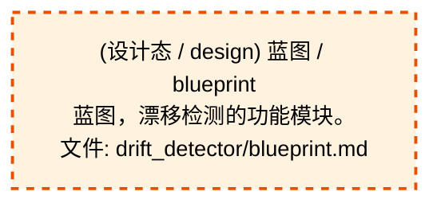
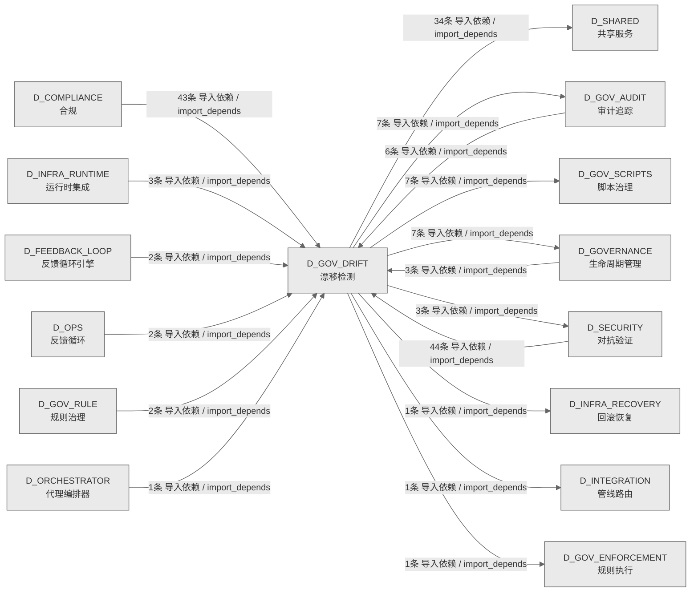

# 52_d_gov_drift / 漂移检测域 / Drift Detection

> **功能简介 / Overview**: 漂移检测，负责架构漂移检测和漂移告警

> **文档作用 / Purpose**: 展示 漂移检测（D_GOV_DRIFT）功能域的域内依赖关系、跨域依赖关系，模块信息（成熟度/中英文名/大白话/文件路径）内嵌于 Mermaid 节点，供架构审查和域治理参考。

> 本文档由 generate_domain_doc.py 从 depgraph (PostgreSQL) 自动生成
> 数据源: depgraph (PostgreSQL) nodes表 + edges表

> **[可缩放 HTML 版 / Zoomable HTML](http://localhost:8765/docs/02_enterprise_architecture/02_domain_architecture_docs/_zoomable_html/52_d_gov_drift.html)** — Ctrl+滚轮缩放 ｜ 双击重置 ｜ Ctrl+Shift+D 切换拖动/选择模式

## 域基本信息 / Domain Overview

| 字段 | 值 | Field | Value |
|------|------|-------|-------|
| 编号 | 52 | Number | 52 |
| 域ID | D_GOV_DRIFT | Domain ID | D_GOV_DRIFT |
| 域名称 | 漂移检测 | Domain Name | Drift Detection |
| 层级 | L2 业务域层 | Layer | L2 Domain |
| 模块数 | 75 | Module Count | 75 |
| 域内依赖 | 24 | Internal Dependencies | 24 |
| 跨域入边 | 106 | Cross-domain Incoming | 106 |
| 跨域出边 | 61 | Cross-domain Outgoing | 61 |
| 设计态模块 | 1 | Design Modules | 1 |
| 生产态模块 | 74 | Production Modules | 74 |
| 容量 | 74/150 (正常) | Capacity | 74/150 (正常) |
| 描述 | 39个漂移检测器注册与调度 | Description | 39个漂移检测器注册与调度 |

## 域内依赖图 / Internal Dependency Diagram

> 依赖图内嵌在本文档中，IDE 可直接渲染；网页版可 Ctrl+滚轮缩放 + 拖动平移查看细节。
>
> **图例说明 / Legend**：
> - 🟦 **蓝色 = 运营态模块**（production，已上线运行）
> - 🟧 **橙色虚线 = 设计态模块**（design，蓝图阶段，代码未写）
> - **实线箭头 = 运营态依赖**（已生效的依赖关系）
> - **虚线箭头 = 非运营态依赖**（计划中/验证中的依赖关系）

### 全景图（全部模块，颜色区分运营态/设计态）

> 展示全部 75 个模块（生产态 74 + 设计态 1），含跨域依赖外部节点。节点含成熟度+名称+大白话/简介+文件路径。

```mermaid
%%{init: {'theme': 'base', 'themeVariables': {'primaryColor': '#eaeaea', 'primaryTextColor': '#333333', 'primaryBorderColor': '#666666', 'lineColor': '#666666', 'secondaryColor': '#eaeaea', 'tertiaryColor': '#eaeaea', 'fontSize': '14px'}}}%%
flowchart TD
    docs_03_modules_domain_governance_drift_detector_blueprint_md["(设计态 / design) 蓝图 / blueprint<br/>蓝图，漂移检测的功能模块。<br/>文件: drift_detector/blueprint.md"]
    scripts_governance_d11_compliance_validate_blueprint_overlap_py["(生产态 / production) 校验蓝图overlap / Module docstring — see module-level docstring for details.<br/>校验蓝图overlap。Module docstring — see module-level docstring for details.<br/>文件: d11_compliance/validate_blueprint_overlap.py"]
    scripts_governance_d11_compliance_validate_truth_source_cascade_py["(生产态 / production) 校验truth源cascade.py — 真源级联一 / validate_truth_source_cascade<br/>真源级联一致性校验<br/>文件: d11_compliance/validate_truth_source_cascade.py"]
    scripts_governance_d5_architecture_validators_validate_authority_registry_py["(生产态 / production) 校验authority注册表 / Module docstring — see module-level docstring for details.<br/>校验authority注册表。Module docstring — see module-level docstring for details.<br/>文件: validators/validate_authority_registry.py"]
    scripts_governance_d5_architecture_validators_validate_ssot_py["(生产态 / production) SSoT 文件头一致性校验器. / validate_ssot<br/>SSoT 文件头一致性校验器.<br/>文件: validators/validate_ssot.py"]
    src_zephyr_gov_audit_self_monitor_py["(生产态 / production) 自监控 / self_monitor<br/>自监控，主要提供increment、设置gauge、快照等功能，供audit-orchestrator.cli; MCP go使用<br/>文件: gov_audit/self_monitor.py"]
    src_zephyr_gov_drift_absence_manager_py["(生产态 / production) Owner Absence Manager — Owner缺席模式 §6.32。 / absence_manager<br/>Owner Absence Manager — Owner缺席模式 §6.32。<br/>文件: gov_drift/absence_manager.py"]
    src_zephyr_gov_drift_ai_construction_detectors_py["(生产态 / production) Drift Detector AI 施工检测器 — aiconstructio / ai_construction_detectors<br/>Drift Detector AI 施工检测器 — ai_construction_detectors.py<br/>文件: gov_drift/ai_construction_detectors.py"]
    src_zephyr_gov_drift_ai_context_injector_py["(生产态 / production) AI Context Injector — 施工前预检D-023-16 · §6 / ai_context_injector<br/>AI Context Injector — 施工前预检D-023-16 · §6.8。<br/>文件: gov_drift/ai_context_injector.py"]
    src_zephyr_gov_drift_artifact_scanner_py["(生产态 / production) ArtifactScanner — SSRF / Path Traversal  / artifact_scanner<br/>ArtifactScanner — SSRF / Path Traversal / Credential / Token 防御扫描器<br/>文件: gov_drift/artifact_scanner.py"]
    src_zephyr_gov_drift_autonomy_regressor_py["(生产态 / production) Autonomy Regressor — v0.10.0 渐进自治可逆性管理器: / autonomy_regressor<br/>Autonomy Regressor — v0.10.0 渐进自治可逆性管理器: confidence<阈值->自动regress自治级别。<br/>文件: gov_drift/autonomy_regressor.py"]
    src_zephyr_gov_drift_backcompat_checker_py["(生产态 / production) Backward Compatibility Checker — 向后兼容策略漂 / backcompat_checker<br/>Backward Compatibility Checker — 向后兼容策略漂移检测 D-023-31 · §6.23。<br/>文件: gov_drift/backcompat_checker.py"]
    src_zephyr_gov_drift_baseline_manager_py["(生产态 / production) 基线管理器 / Baseline Manager — baseline_manager.py<br/>基线管理器，治理漂移检测的报告器，汇总数据生成报告。<br/>文件: gov_drift/baseline_manager.py"]
    src_zephyr_gov_drift_baseline_poisoning_guard_py["(生产态 / production) Baseline Poisoning Guard — 基线投毒防护 D-023- / baseline_poisoning_guard<br/>Baseline Poisoning Guard — 基线投毒防护 D-023-36 · §6.25。<br/>文件: gov_drift/baseline_poisoning_guard.py"]
    src_zephyr_gov_drift_bootstrapping_calibrator_py["(生产态 / production) bootstrappingcalibrator / bootstrapping_calibrator<br/>bootstrappingcalibrator，治理漂移检测的功能模块。<br/>文件: gov_drift/bootstrapping_calibrator.py"]
    src_zephyr_gov_drift_brain_integration_py["(生产态 / production) brain集成 / ProbeHierarchy - K8s 3-Probe + Terraform Reconciliation<br/>brain集成。ProbeHierarchy - K8s 3-Probe + Terraform Reconciliation<br/>文件: gov_drift/brain_integration.py"]
    src_zephyr_gov_drift_canary_controller_py["(生产态 / production) Detector Canary Controller — 检测器金丝雀部署 §6 / canary_controller<br/>Detector Canary Controller — 检测器金丝雀部署 §6.11。<br/>文件: gov_drift/canary_controller.py"]
    src_zephyr_gov_drift_chaos_injector_py["(生产态 / production) Drift Chaos Injector — 混沌工程主动漂移注入 §6.13。 / chaos_injector<br/>Drift Chaos Injector — 混沌工程主动漂移注入 §6.13。<br/>文件: gov_drift/chaos_injector.py"]
    src_zephyr_gov_drift_config_consistency_py["(生产态 / production) Config Consistency Checker — 配置多源一致性 D-0 / config_consistency<br/>Config Consistency Checker — 配置多源一致性 D-023-29 · §6.21。<br/>文件: gov_drift/config_consistency.py"]
    src_zephyr_gov_drift_contract_drift_detector_py["(生产态 / production) 契约漂移detector — 契约漂移检测器。 / contract_drift_detector<br/>contract_drift_detector — 契约漂移检测器。<br/>文件: gov_drift/contract_drift_detector.py"]
    src_zephyr_gov_drift_cross_module_score_py["(生产态 / production) 跨模块评分 / Cross Module Score — cross_module_score.py<br/>跨模块评分，治理漂移检测的功能模块。<br/>文件: gov_drift/cross_module_score.py"]
    src_zephyr_gov_drift_dashboard_py["(生产态 / production) 仪表盘 / Coverage Dashboard — dashboard.py<br/>仪表盘，治理漂移检测的功能模块。<br/>文件: gov_drift/dashboard.py"]
    src_zephyr_gov_drift_detector_core_init_py["(生产态 / production) 包入口 / MOD-INF-023 drift_detector core module.<br/>包入口。MOD-INF-023 drift_detector core module.<br/>文件: detector_core/__init__.py"]
    src_zephyr_gov_drift_detector_core_benchmark_integrity_py["(生产态 / production) benchmark完整性 / benchmark_integrity<br/>benchmark完整性，检测器的功能模块。<br/>文件: detector_core/benchmark_integrity.py"]
    src_zephyr_gov_drift_detector_core_bridges_drift_bridge_py["(生产态 / production) DriftBridge — 漂移检测器事件桥接 (MOD-INF-023). / drift_bridge<br/>DriftBridge — 漂移检测器事件桥接 (MOD-INF-023).<br/>文件: bridges/drift_bridge.py"]
    src_zephyr_gov_drift_detector_core_ml_engineering_py["(生产态 / production) 机器学习engineering / ml_engineering<br/>机器学习engineering，检测器的检查器，检查某项条件是否满足。<br/>文件: detector_core/ml_engineering.py"]
    src_zephyr_gov_drift_detector_core_model_drift_monitor_py["(生产态 / production) 模型漂移监控 / model_drift_monitor<br/>模型漂移监控，检测器的模型，定义数据结构和字段。<br/>文件: detector_core/model_drift_monitor.py"]
    src_zephyr_gov_drift_detector_core_regime_detector_py["(生产态 / production) regime检测器 / regime_detector<br/>regime检测器，检测器的功能模块。<br/>文件: detector_core/regime_detector.py"]
    src_zephyr_gov_drift_detector_dispatcher_py["(生产态 / production) 检测器dispatcher / Detector Dispatcher — detector_dispatcher.py<br/>检测器dispatcher，治理漂移检测的检测器，检测特定模式或异常情况。<br/>文件: gov_drift/detector_dispatcher.py"]
    src_zephyr_gov_drift_drift_result_types_py["(生产态 / production) Drift Detector 结果类型 + 专项检测函数 — driftres / drift_result_types<br/>Drift Detector 结果类型 + 专项检测函数 — drift_result_types.py<br/>文件: gov_drift/drift_result_types.py"]
    src_zephyr_gov_drift_drift_training_py["(生产态 / production) Drift Detector AI 训练闭环 + 跨语言检测 — driftt / drift_training<br/>Drift Detector AI 训练闭环 + 跨语言检测 — drift_training.py<br/>文件: gov_drift/drift_training.py"]
    src_zephyr_gov_drift_file_attr_checker_py["(生产态 / production) File Attribute Integrity — 文件底层属性完整性 §6. / file_attr_checker<br/>File Attribute Integrity — 文件底层属性完整性 §6.30。<br/>文件: gov_drift/file_attr_checker.py"]
    src_zephyr_gov_drift_gate_persistence_py["(生产态 / production) 门禁persistence / Gate Persistence — gate_persistence.py<br/>门禁persistence，在关键节点检查是否放行，主要提供project根、project根、审计dir、审计dir等功能，是治理漂移检测的组成部分<br/>文件: gov_drift/gate_persistence.py"]
    src_zephyr_gov_drift_git_bisector_py["(生产态 / production) gitbisector / Git Bisector — git_bisector.py<br/>gitbisector，治理漂移检测的结果，封装操作结果的数据结构。<br/>文件: gov_drift/git_bisector.py"]
    src_zephyr_gov_drift_gitignore_auditor_py["(生产态 / production) .gitignore Integrity Auditor — gitignore / gitignore_auditor<br/>.gitignore Integrity Auditor — gitignore完整性审计 D-023-32 · §6.24。<br/>文件: gov_drift/gitignore_auditor.py"]
    src_zephyr_gov_drift_handoff_manager_py["(生产态 / production) Cross-Session Handoff Manager — 跨Session / handoff_manager<br/>Cross-Session Handoff Manager — 跨Session修复上下文交接 §6.14。<br/>文件: gov_drift/handoff_manager.py"]
    src_zephyr_gov_drift_headless_scanner_py["(生产态 / production) headless扫描器 / Headless Scanner — headless_scanner.py<br/>headless扫描器，治理漂移检测的功能模块。<br/>文件: gov_drift/headless_scanner.py"]
    src_zephyr_gov_drift_incremental_scanner_py["(生产态 / production) incremental扫描器 / Incremental Scanner — incremental_scanner.py<br/>incremental扫描器，治理漂移检测的功能模块。<br/>文件: gov_drift/incremental_scanner.py"]
    src_zephyr_gov_drift_naming_magic_checker_py["(生产态 / production) Naming Magic Checker — 命名魔数与隐式约定检测 §6.27 / naming_magic_checker<br/>Naming Magic Checker — 命名魔数与隐式约定检测 §6.27。<br/>文件: gov_drift/naming_magic_checker.py"]
    src_zephyr_gov_drift_python_compat_py["(生产态 / production) Python Compatibility Checker — Python版本兼 / python_compat<br/>Python Compatibility Checker — Python版本兼容性漂移 D-023-30 · §6.22。<br/>文件: gov_drift/python_compat.py"]
    src_zephyr_gov_drift_resource_guard_py["(生产态 / production) Resource Guard — 资源上限与优雅降级 D-023-23 · §6 / resource_guard<br/>Resource Guard — 资源上限与优雅降级 D-023-23 · §6.16。<br/>文件: gov_drift/resource_guard.py"]
    src_zephyr_gov_drift_reward_hacking_rebound_detector_py["(生产态 / production) 奖励hackingrebound检测器 / Reward Hacking Rebound Detector — v0.14.0 §2.37-D.<br/>奖励hackingrebound检测器。Reward Hacking Rebound Detector — v0.14.0 §2.37-D.<br/>文件: gov_drift/reward_hacking_rebound_detector.py"]
    src_zephyr_gov_drift_roi_engine_py["(生产态 / production) roi引擎 / ROI Engine — roi_engine.py<br/>roi引擎，治理漂移检测的功能模块。<br/>文件: gov_drift/roi_engine.py"]
    src_zephyr_gov_drift_rollback_bridge_py["(生产态 / production) G-CT-006 契约：Drift -> Rollback 漂移触发回滚. / rollback_bridge<br/>G-CT-006 契约：Drift -> Rollback 漂移触发回滚.<br/>文件: gov_drift/rollback_bridge.py"]
    src_zephyr_gov_drift_scan_mutex_py["(生产态 / production) 扫描mutex / Scan Mutex — scan_mutex.py<br/>扫描mutex，治理漂移检测的记录器，把发生的事件/结果记下来留档。<br/>文件: gov_drift/scan_mutex.py"]
    src_zephyr_gov_drift_self_test_verifier_py["(生产态 / production) 自测试验证器 / Self Test Verifier — self_test_verifier.py<br/>自测试验证器，治理漂移检测的结果，封装操作结果的数据结构。<br/>文件: gov_drift/self_test_verifier.py"]
    src_zephyr_gov_drift_silence_detector_py["(生产态 / production) Silence Detector — v0.8.0 静默窗口检测器: agent / silence_detector<br/>Silence Detector — v0.8.0 静默窗口检测器: agent无响应超时+heartbeat缺失检测。<br/>文件: gov_drift/silence_detector.py"]
    src_zephyr_gov_drift_spiral_ews_py["(生产态 / production) spiralews / spiral_ews<br/>spiralews，治理漂移检测的功能模块。<br/>文件: gov_drift/spiral_ews.py"]
    src_zephyr_gov_drift_suppression_learner_py["(生产态 / production) suppressionlearner / Suppression Learner — suppression_learner.py<br/>suppressionlearner，治理漂移检测的功能模块。<br/>文件: gov_drift/suppression_learner.py"]
    src_zephyr_gov_drift_symlink_checker_py["(生产态 / production) Symlink Integrity Checker — 软链接完整性检测 §6. / symlink_checker<br/>Symlink Integrity Checker — 软链接完整性检测 §6.29。<br/>文件: gov_drift/symlink_checker.py"]
    src_zephyr_gov_drift_tamper_proof_audit_py["(生产态 / production) Tamper-Proof Audit — 防篡改审计 D-023-37 · §6 / tamper_proof_audit<br/>Tamper-Proof Audit — 防篡改审计 D-023-37 · §6.26。<br/>文件: gov_drift/tamper_proof_audit.py"]
    src_zephyr_gov_drift_test_fixture_checker_py["(生产态 / production) Test Fixture Checker — 测试夹具漂移检测 D-023-28 / test_fixture_checker<br/>Test Fixture Checker — 测试夹具漂移检测 D-023-28 · §6.20。<br/>文件: gov_drift/test_fixture_checker.py"]
    src_zephyr_gov_drift_trend_analyzer_py["(生产态 / production) 趋势分析器 / Trend Analyzer — trend_analyzer.py<br/>趋势分析器，治理漂移检测的功能模块。<br/>文件: gov_drift/trend_analyzer.py"]
    src_zephyr_gov_drift_vigil_runtime_py["(生产态 / production) Vigil Runtime — v0.6.0 VIGIL维护运行时: 运维tok / vigil_runtime<br/>Vigil Runtime — v0.6.0 VIGIL维护运行时: 运维token预算+手动override窗口。<br/>文件: gov_drift/vigil_runtime.py"]
    src_zephyr_gov_enforcement_rule_enforcement_breaking_change_detector_py["(生产态 / production) Breaking Change 检测器（GATE-CDC-2）——字段删除/类型 / breaking_change_detector<br/>Breaking Change 检测器（GATE-CDC-2）——字段删除/类型变更->CI FAIL。<br/>文件: rule_enforcement/breaking_change_detector.py"]
    src_zephyr_gov_enforcement_rule_enforcement_drift_detector_py["(生产态 / production) 漂移检测器 / Gate-side Drift Detector Recovery — zephyr.gov_enforcement.r<br/>漂移检测器。Gate-side Drift Detector Recovery — zephyr.gov_enforcement.rule_enforcement.drift_detector<br/>文件: rule_enforcement/drift_detector.py"]
    src_zephyr_gov_enforcement_rule_enforcement_gate_engine_gate_health_py["(生产态 / production) 门禁健康仪表板——per-gate SLI 报告、误报率、延迟分布、1人+AI运 / gate_health<br/>门禁健康仪表板——per-gate SLI 报告、误报率、延迟分布、1人+AI运维视图（beta）<br/>文件: gate_engine/gate_health.py"]
    src_zephyr_gov_enforcement_rule_enforcement_gate_engine_gate_integrity_guard_py["(生产态 / production) 门禁引擎完整性守卫——自检SHA-256校验+trust root自验证（bet / gate_integrity_guard<br/>门禁引擎完整性守卫——自检SHA-256校验+trust root自验证（beta）<br/>文件: gate_engine/gate_integrity_guard.py"]
    src_zephyr_gov_enforcement_rule_enforcement_invariants_en_002_enforcement_validator_py["(生产态 / production) en002enforcement校验器 / EN-002 — Enforcement Mode Validator<br/>en002enforcement校验器。EN-002 — Enforcement Mode Validator<br/>文件: invariants/en_002_enforcement_validator.py"]
    src_zephyr_gov_enforcement_rule_enforcement_truth_source_validator_py["(生产态 / production) 真源优先级裁决器（Truth Source Validator） / truth_source_validator<br/>真源优先级裁决器（Truth Source Validator）<br/>文件: rule_enforcement/truth_source_validator.py"]
    src_zephyr_governance_drift_detector_init_py["(生产态 / production) 包入口 / __init__<br/>漂移检测的包入口，把这一层的子模块归到一起统一管理，用到谁才加载谁，避免一次性全加载拖慢启动。<br/>文件: drift-detector/__init__.py"]
    src_zephyr_governance_integrity_py["(生产态 / production) 完整性 / integrity<br/>完整性，主要提供聚合、验证等功能，供audit-orchestrator.pipeline_ru使用<br/>文件: governance/integrity.py"]
    docs_03_modules_domain_governance_drift_detector_blueprint_md ~~~ scripts_governance_d11_compliance_validate_blueprint_overlap_py
    scripts_governance_d11_compliance_validate_blueprint_overlap_py ~~~ scripts_governance_d11_compliance_validate_truth_source_cascade_py
    scripts_governance_d11_compliance_validate_truth_source_cascade_py ~~~ scripts_governance_d5_architecture_validators_validate_authority_registry_py
    scripts_governance_d5_architecture_validators_validate_authority_registry_py ~~~ scripts_governance_d5_architecture_validators_validate_ssot_py
    scripts_governance_d5_architecture_validators_validate_ssot_py ~~~ src_zephyr_gov_audit_self_monitor_py
    src_zephyr_gov_audit_self_monitor_py ~~~ src_zephyr_gov_drift_absence_manager_py
    src_zephyr_gov_drift_absence_manager_py ~~~ src_zephyr_gov_drift_ai_construction_detectors_py
    src_zephyr_gov_drift_ai_construction_detectors_py ~~~ src_zephyr_gov_drift_ai_context_injector_py
    src_zephyr_gov_drift_ai_context_injector_py ~~~ src_zephyr_gov_drift_artifact_scanner_py
    src_zephyr_gov_drift_artifact_scanner_py ~~~ src_zephyr_gov_drift_autonomy_regressor_py
    src_zephyr_gov_drift_autonomy_regressor_py ~~~ src_zephyr_gov_drift_backcompat_checker_py
    src_zephyr_gov_drift_backcompat_checker_py ~~~ src_zephyr_gov_drift_baseline_manager_py
    src_zephyr_gov_drift_baseline_manager_py ~~~ src_zephyr_gov_drift_baseline_poisoning_guard_py
    src_zephyr_gov_drift_baseline_poisoning_guard_py ~~~ src_zephyr_gov_drift_bootstrapping_calibrator_py
    src_zephyr_gov_drift_bootstrapping_calibrator_py ~~~ src_zephyr_gov_drift_brain_integration_py
    src_zephyr_gov_drift_brain_integration_py ~~~ src_zephyr_gov_drift_canary_controller_py
    src_zephyr_gov_drift_canary_controller_py ~~~ src_zephyr_gov_drift_chaos_injector_py
    src_zephyr_gov_drift_chaos_injector_py ~~~ src_zephyr_gov_drift_config_consistency_py
    src_zephyr_gov_drift_config_consistency_py ~~~ src_zephyr_gov_drift_contract_drift_detector_py
    src_zephyr_gov_drift_contract_drift_detector_py ~~~ src_zephyr_gov_drift_cross_module_score_py
    src_zephyr_gov_drift_cross_module_score_py ~~~ src_zephyr_gov_drift_dashboard_py
    src_zephyr_gov_drift_dashboard_py ~~~ src_zephyr_gov_drift_detector_core_init_py
    src_zephyr_gov_drift_detector_core_init_py ~~~ src_zephyr_gov_drift_detector_core_benchmark_integrity_py
    src_zephyr_gov_drift_detector_core_benchmark_integrity_py ~~~ src_zephyr_gov_drift_detector_core_bridges_drift_bridge_py
    src_zephyr_gov_drift_detector_core_bridges_drift_bridge_py ~~~ src_zephyr_gov_drift_detector_core_ml_engineering_py
    src_zephyr_gov_drift_detector_core_ml_engineering_py ~~~ src_zephyr_gov_drift_detector_core_model_drift_monitor_py
    src_zephyr_gov_drift_detector_core_model_drift_monitor_py ~~~ src_zephyr_gov_drift_detector_core_regime_detector_py
    src_zephyr_gov_drift_detector_core_regime_detector_py ~~~ src_zephyr_gov_drift_detector_dispatcher_py
    src_zephyr_gov_drift_detector_dispatcher_py ~~~ src_zephyr_gov_drift_drift_result_types_py
    src_zephyr_gov_drift_drift_result_types_py ~~~ src_zephyr_gov_drift_drift_training_py
    src_zephyr_gov_drift_drift_training_py ~~~ src_zephyr_gov_drift_file_attr_checker_py
    src_zephyr_gov_drift_file_attr_checker_py ~~~ src_zephyr_gov_drift_gate_persistence_py
    src_zephyr_gov_drift_gate_persistence_py ~~~ src_zephyr_gov_drift_git_bisector_py
    src_zephyr_gov_drift_git_bisector_py ~~~ src_zephyr_gov_drift_gitignore_auditor_py
    src_zephyr_gov_drift_gitignore_auditor_py ~~~ src_zephyr_gov_drift_handoff_manager_py
    src_zephyr_gov_drift_handoff_manager_py ~~~ src_zephyr_gov_drift_headless_scanner_py
    src_zephyr_gov_drift_headless_scanner_py ~~~ src_zephyr_gov_drift_incremental_scanner_py
    src_zephyr_gov_drift_incremental_scanner_py ~~~ src_zephyr_gov_drift_naming_magic_checker_py
    src_zephyr_gov_drift_naming_magic_checker_py ~~~ src_zephyr_gov_drift_python_compat_py
    src_zephyr_gov_drift_python_compat_py ~~~ src_zephyr_gov_drift_resource_guard_py
    src_zephyr_gov_drift_resource_guard_py ~~~ src_zephyr_gov_drift_reward_hacking_rebound_detector_py
    src_zephyr_gov_drift_reward_hacking_rebound_detector_py ~~~ src_zephyr_gov_drift_roi_engine_py
    src_zephyr_gov_drift_roi_engine_py ~~~ src_zephyr_gov_drift_rollback_bridge_py
    src_zephyr_gov_drift_rollback_bridge_py ~~~ src_zephyr_gov_drift_scan_mutex_py
    src_zephyr_gov_drift_scan_mutex_py ~~~ src_zephyr_gov_drift_self_test_verifier_py
    src_zephyr_gov_drift_self_test_verifier_py ~~~ src_zephyr_gov_drift_silence_detector_py
    src_zephyr_gov_drift_silence_detector_py ~~~ src_zephyr_gov_drift_spiral_ews_py
    src_zephyr_gov_drift_spiral_ews_py ~~~ src_zephyr_gov_drift_suppression_learner_py
    src_zephyr_gov_drift_suppression_learner_py ~~~ src_zephyr_gov_drift_symlink_checker_py
    src_zephyr_gov_drift_symlink_checker_py ~~~ src_zephyr_gov_drift_tamper_proof_audit_py
    src_zephyr_gov_drift_tamper_proof_audit_py ~~~ src_zephyr_gov_drift_test_fixture_checker_py
    src_zephyr_gov_drift_test_fixture_checker_py ~~~ src_zephyr_gov_drift_trend_analyzer_py
    src_zephyr_gov_drift_trend_analyzer_py ~~~ src_zephyr_gov_drift_vigil_runtime_py
    src_zephyr_gov_drift_vigil_runtime_py ~~~ src_zephyr_gov_enforcement_rule_enforcement_breaking_change_detector_py
    src_zephyr_gov_enforcement_rule_enforcement_breaking_change_detector_py ~~~ src_zephyr_gov_enforcement_rule_enforcement_drift_detector_py
    src_zephyr_gov_enforcement_rule_enforcement_drift_detector_py ~~~ src_zephyr_gov_enforcement_rule_enforcement_gate_engine_gate_health_py
    src_zephyr_gov_enforcement_rule_enforcement_gate_engine_gate_health_py ~~~ src_zephyr_gov_enforcement_rule_enforcement_gate_engine_gate_integrity_guard_py
    src_zephyr_gov_enforcement_rule_enforcement_gate_engine_gate_integrity_guard_py ~~~ src_zephyr_gov_enforcement_rule_enforcement_invariants_en_002_enforcement_validator_py
    src_zephyr_gov_enforcement_rule_enforcement_invariants_en_002_enforcement_validator_py ~~~ src_zephyr_gov_enforcement_rule_enforcement_truth_source_validator_py
    src_zephyr_gov_enforcement_rule_enforcement_truth_source_validator_py ~~~ src_zephyr_governance_drift_detector_init_py
    src_zephyr_governance_drift_detector_init_py ~~~ src_zephyr_governance_integrity_py
    src_zephyr_gov_audit_drift_bridge_py["(生产态 / production) drift bridge sync result -- 对齐 / drift_bridge<br/>drift bridge sync result -- 对齐 test_bridges_drift_bridge.py.<br/>文件: gov_audit/drift_bridge.py"]
    src_zephyr_gov_drift_cascade_detector_py["(生产态 / production) Cascade Failure Detector — 级联故障检测 D-023- / cascade_detector<br/>Cascade Failure Detector — 级联故障检测 D-023-22 · §6.15。<br/>文件: gov_drift/cascade_detector.py"]
    src_zephyr_gov_drift_correlation_engine_py["(生产态 / production) 相关性引擎 / Correlation Engine — correlation_engine.py<br/>相关性引擎，治理漂移检测的报告器，汇总数据生成报告。<br/>文件: gov_drift/correlation_engine.py"]
    src_zephyr_gov_drift_credibility_engine_py["(生产态 / production) credibility引擎 / Credibility Engine — credibility_engine.py<br/>credibility引擎，治理漂移检测的功能模块。<br/>文件: gov_drift/credibility_engine.py"]
    src_zephyr_gov_drift_detector_core_performance_baseline_py["(生产态 / production) 绩效基线 / performance_baseline<br/>绩效基线，检测器的功能模块。<br/>文件: detector_core/performance_baseline.py"]
    src_zephyr_gov_drift_drift_engine_py["(生产态 / production) Drift Engine — 编排器核心 (SRC-0030 精简后) / drift_engine<br/>Drift Engine — 编排器核心 (SRC-0030 精简后)<br/>文件: gov_drift/drift_engine.py"]
    src_zephyr_gov_drift_drift_hotfix_bypass_py["(生产态 / production) 漂移hotfixbypass / Drift Hotfix Bypass — drift_hotfix_bypass.py<br/>漂移hotfixbypass，治理漂移检测的功能模块。<br/>文件: gov_drift/drift_hotfix_bypass.py"]
    src_zephyr_gov_drift_forensics_engine_py["(生产态 / production) Drift Forensics Engine — 漂移取证引擎 §6.17。 / forensics_engine<br/>Drift Forensics Engine — 漂移取证引擎 §6.17。<br/>文件: gov_drift/forensics_engine.py"]
    src_zephyr_gov_drift_orphan_scanner_py["(生产态 / production) Orphan Resource Scanner — 孤儿资源检测 §6.28。 / orphan_scanner<br/>Orphan Resource Scanner — 孤儿资源检测 §6.28。<br/>文件: gov_drift/orphan_scanner.py"]
    src_zephyr_gov_drift_self_check_py["(生产态 / production) 自检查 / Self-Drift Check — self_check.py<br/>自检查，治理漂移检测的检查器，检查某项条件是否满足。<br/>文件: gov_drift/self_check.py"]
    src_zephyr_gov_audit_drift_bridge_py ~~~ src_zephyr_gov_drift_cascade_detector_py
    src_zephyr_gov_drift_cascade_detector_py ~~~ src_zephyr_gov_drift_correlation_engine_py
    src_zephyr_gov_drift_correlation_engine_py ~~~ src_zephyr_gov_drift_credibility_engine_py
    src_zephyr_gov_drift_credibility_engine_py ~~~ src_zephyr_gov_drift_detector_core_performance_baseline_py
    src_zephyr_gov_drift_detector_core_performance_baseline_py ~~~ src_zephyr_gov_drift_drift_engine_py
    src_zephyr_gov_drift_drift_engine_py ~~~ src_zephyr_gov_drift_drift_hotfix_bypass_py
    src_zephyr_gov_drift_drift_hotfix_bypass_py ~~~ src_zephyr_gov_drift_forensics_engine_py
    src_zephyr_gov_drift_forensics_engine_py ~~~ src_zephyr_gov_drift_orphan_scanner_py
    src_zephyr_gov_drift_orphan_scanner_py ~~~ src_zephyr_gov_drift_self_check_py
    src_zephyr_gov_drift_drift_detector_py["(生产态 / production) Drift Detector — 兼容别名，SSoT已迁移至 zephyr.go / drift_detector<br/>Drift Detector — 兼容别名，SSoT已迁移至 zephyr.gov_drift (MOD-INF-023).<br/>文件: gov_drift/drift_detector.py"]
    src_zephyr_gov_drift_drift_infrastructure_py["(生产态 / production) Drift Detector 基础设施 — driftinfrastructu / drift_infrastructure<br/>Drift Detector 基础设施 — drift_infrastructure.py<br/>文件: gov_drift/drift_infrastructure.py"]
    src_zephyr_gov_drift_drift_detector_py ~~~ src_zephyr_gov_drift_drift_infrastructure_py
    src_zephyr_gov_drift_drift_models_py["(生产态 / production) Drift Detector 数据模型 — driftmodels.py / drift_models<br/>Drift Detector 数据模型 — drift_models.py<br/>文件: gov_drift/drift_models.py"]
    src_zephyr_gov_audit_drift_bridge_py -->|导入依赖 / import_depends| src_zephyr_gov_drift_drift_detector_py
    src_zephyr_gov_audit_self_monitor_py -->|导入依赖 / import_depends| src_zephyr_gov_audit_drift_bridge_py
    src_zephyr_gov_drift_ai_construction_detectors_py -->|导入依赖 / import_depends| src_zephyr_gov_drift_drift_models_py
    src_zephyr_gov_drift_brain_integration_py -->|导入依赖 / import_depends| src_zephyr_gov_drift_correlation_engine_py
    src_zephyr_gov_drift_brain_integration_py -->|导入依赖 / import_depends| src_zephyr_gov_drift_credibility_engine_py
    src_zephyr_gov_drift_brain_integration_py -->|导入依赖 / import_depends| src_zephyr_gov_drift_drift_engine_py
    src_zephyr_gov_drift_brain_integration_py -->|导入依赖 / import_depends| src_zephyr_gov_drift_forensics_engine_py
    src_zephyr_gov_drift_brain_integration_py -->|导入依赖 / import_depends| src_zephyr_gov_drift_orphan_scanner_py
    src_zephyr_gov_drift_brain_integration_py -->|导入依赖 / import_depends| src_zephyr_gov_drift_self_check_py
    src_zephyr_gov_drift_chaos_injector_py -->|导入依赖 / import_depends| src_zephyr_gov_drift_drift_engine_py
    src_zephyr_gov_drift_drift_infrastructure_py -->|导入依赖 / import_depends| src_zephyr_gov_drift_drift_models_py
    src_zephyr_gov_drift_drift_engine_py -->|导入依赖 / import_depends| src_zephyr_gov_drift_drift_infrastructure_py
    src_zephyr_gov_drift_drift_engine_py -->|导入依赖 / import_depends| src_zephyr_gov_drift_drift_models_py
    src_zephyr_gov_drift_detector_dispatcher_py -->|导入依赖 / import_depends| src_zephyr_gov_drift_drift_models_py
    src_zephyr_gov_drift_drift_result_types_py -->|导入依赖 / import_depends| src_zephyr_gov_drift_drift_engine_py
    src_zephyr_gov_drift_drift_result_types_py -->|导入依赖 / import_depends| src_zephyr_gov_drift_drift_models_py
    src_zephyr_gov_drift_drift_training_py -->|导入依赖 / import_depends| src_zephyr_gov_drift_drift_models_py
    src_zephyr_gov_drift_headless_scanner_py -->|导入依赖 / import_depends| src_zephyr_gov_drift_drift_models_py
    src_zephyr_gov_drift_scan_mutex_py -->|导入依赖 / import_depends| src_zephyr_gov_drift_drift_models_py
    src_zephyr_gov_drift_detector_core_init_py -->|config_depends / config_depends| src_zephyr_gov_drift_detector_core_performance_baseline_py
    src_zephyr_gov_enforcement_rule_enforcement_drift_detector_py -->|导入依赖 / import_depends| src_zephyr_gov_drift_cascade_detector_py
    src_zephyr_gov_enforcement_rule_enforcement_drift_detector_py -->|导入依赖 / import_depends| src_zephyr_gov_drift_drift_hotfix_bypass_py
    src_zephyr_gov_enforcement_rule_enforcement_drift_detector_py -->|导入依赖 / import_depends| src_zephyr_gov_drift_drift_engine_py
    src_zephyr_gov_enforcement_rule_enforcement_drift_detector_py -->|导入依赖 / import_depends| src_zephyr_gov_drift_drift_models_py
    D_SECURITY["(生产态 / production) 对抗验证 / Adversarial Validation<br/>对抗验证，负责系统安全对抗测试、漏洞扫描和攻防验证<br/>跨域节点 / cross-domain"]
    src_zephyr_gov_enforcement_rule_enforcement_drift_detector_py -->|导入依赖 / import_depends| D_SECURITY
    D_SHARED["(生产态 / production) 共享服务 / Shared Services<br/>共享服务，负责跨域共享的工具、协议和基础服务<br/>跨域节点 / cross-domain"]
    src_zephyr_gov_drift_cascade_detector_py -->|导入依赖 / import_depends| D_SHARED
    src_zephyr_gov_enforcement_rule_enforcement_drift_detector_py -->|导入依赖 / import_depends| D_SHARED
    D_GOV_AUDIT["(生产态 / production) 审计追踪 / Audit Trail<br/>审计追踪，负责变更审计追踪和操作日志管理<br/>跨域节点 / cross-domain"]
    src_zephyr_gov_audit_drift_bridge_py -->|导入依赖 / import_depends| D_GOV_AUDIT
    D_GOV_SCRIPTS["(生产态 / production) 脚本治理 / Script Governance<br/>脚本治理，负责脚本生命周期管理和脚本质量门禁<br/>跨域节点 / cross-domain"]
    scripts_governance_d11_compliance_validate_truth_source_cascade_py -->|导入依赖 / import_depends| D_GOV_SCRIPTS
    src_zephyr_gov_drift_incremental_scanner_py -->|导入依赖 / import_depends| D_SHARED
    scripts_governance_d5_architecture_validators_validate_ssot_py -->|导入依赖 / import_depends| D_GOV_SCRIPTS
    scripts_governance_d5_architecture_validators_validate_ssot_py -->|导入依赖 / import_depends| D_GOV_SCRIPTS
    scripts_governance_d5_architecture_validators_validate_ssot_py -->|导入依赖 / import_depends| D_GOV_SCRIPTS
    src_zephyr_gov_drift_drift_infrastructure_py -->|导入依赖 / import_depends| D_SHARED
    scripts_governance_d11_compliance_validate_truth_source_cascade_py -->|导入依赖 / import_depends| D_GOV_SCRIPTS
    src_zephyr_gov_drift_brain_integration_py -->|导入依赖 / import_depends| D_SHARED
    D_INFRA_RECOVERY["(生产态 / production) 回滚恢复 / Rollback Recovery<br/>回滚恢复，负责系统故障时的状态回滚、事务补偿和恢复编排<br/>跨域节点 / cross-domain"]
    src_zephyr_gov_enforcement_rule_enforcement_drift_detector_py -->|导入依赖 / import_depends| D_INFRA_RECOVERY
    src_zephyr_gov_drift_headless_scanner_py -->|导入依赖 / import_depends| D_SHARED
    src_zephyr_gov_drift_trend_analyzer_py -->|导入依赖 / import_depends| D_SHARED
    D_SECURITY -->|导入依赖 / import_depends| src_zephyr_gov_drift_self_check_py
    D_COMPLIANCE["(生产态 / production) 合规 / Compliance<br/>合规，负责交易合规检查、规则引擎和合规报告<br/>跨域节点 / cross-domain"]
    D_COMPLIANCE -->|导入依赖 / import_depends| src_zephyr_gov_drift_drift_infrastructure_py
    D_COMPLIANCE -->|导入依赖 / import_depends| src_zephyr_gov_drift_correlation_engine_py
    D_SECURITY -->|导入依赖 / import_depends| src_zephyr_gov_drift_git_bisector_py
    D_COMPLIANCE -->|导入依赖 / import_depends| src_zephyr_gov_drift_forensics_engine_py
    D_GOV_AUDIT -->|导入依赖 / import_depends| src_zephyr_gov_drift_drift_engine_py
    D_COMPLIANCE -->|导入依赖 / import_depends| src_zephyr_gov_drift_cross_module_score_py
    D_COMPLIANCE -->|导入依赖 / import_depends| src_zephyr_gov_drift_tamper_proof_audit_py
    D_SECURITY -->|导入依赖 / import_depends| src_zephyr_gov_drift_test_fixture_checker_py
    D_SECURITY -->|导入依赖 / import_depends| src_zephyr_gov_drift_drift_result_types_py
    D_COMPLIANCE -->|导入依赖 / import_depends| src_zephyr_gov_drift_test_fixture_checker_py
    D_COMPLIANCE -->|导入依赖 / import_depends| src_zephyr_gov_drift_baseline_manager_py
    D_SECURITY -->|导入依赖 / import_depends| src_zephyr_gov_drift_python_compat_py
    D_COMPLIANCE -->|导入依赖 / import_depends| src_zephyr_gov_drift_config_consistency_py
    D_COMPLIANCE -->|导入依赖 / import_depends| src_zephyr_gov_drift_resource_guard_py
    classDef production fill:#e1f5fe,stroke:#01579b,stroke-width:2px,color:#000
    classDef design fill:#fff3e0,stroke:#e65100,stroke-width:2px,color:#000,stroke-dasharray: 5 5
    classDef external_prod fill:#e8f4fd,stroke:#0277bd,stroke-width:1px,color:#000
    classDef external_design fill:#fff8e7,stroke:#ef6c00,stroke-width:1px,color:#000,stroke-dasharray: 5 5
    class scripts_governance_d11_compliance_validate_blueprint_overlap_py,scripts_governance_d11_compliance_validate_truth_source_cascade_py,scripts_governance_d5_architecture_validators_validate_authority_registry_py,scripts_governance_d5_architecture_validators_validate_ssot_py,src_zephyr_gov_audit_drift_bridge_py,src_zephyr_gov_audit_self_monitor_py,src_zephyr_gov_drift_absence_manager_py,src_zephyr_gov_drift_ai_construction_detectors_py,src_zephyr_gov_drift_ai_context_injector_py,src_zephyr_gov_drift_artifact_scanner_py,src_zephyr_gov_drift_autonomy_regressor_py,src_zephyr_gov_drift_backcompat_checker_py,src_zephyr_gov_drift_baseline_manager_py,src_zephyr_gov_drift_baseline_poisoning_guard_py,src_zephyr_gov_drift_bootstrapping_calibrator_py,src_zephyr_gov_drift_brain_integration_py,src_zephyr_gov_drift_canary_controller_py,src_zephyr_gov_drift_cascade_detector_py,src_zephyr_gov_drift_chaos_injector_py,src_zephyr_gov_drift_config_consistency_py,src_zephyr_gov_drift_contract_drift_detector_py,src_zephyr_gov_drift_correlation_engine_py,src_zephyr_gov_drift_credibility_engine_py,src_zephyr_gov_drift_cross_module_score_py,src_zephyr_gov_drift_dashboard_py,src_zephyr_gov_drift_detector_core_init_py,src_zephyr_gov_drift_detector_core_benchmark_integrity_py,src_zephyr_gov_drift_detector_core_bridges_drift_bridge_py,src_zephyr_gov_drift_detector_core_ml_engineering_py,src_zephyr_gov_drift_detector_core_model_drift_monitor_py,src_zephyr_gov_drift_detector_core_performance_baseline_py,src_zephyr_gov_drift_detector_core_regime_detector_py,src_zephyr_gov_drift_detector_dispatcher_py,src_zephyr_gov_drift_drift_detector_py,src_zephyr_gov_drift_drift_engine_py,src_zephyr_gov_drift_drift_hotfix_bypass_py,src_zephyr_gov_drift_drift_infrastructure_py,src_zephyr_gov_drift_drift_models_py,src_zephyr_gov_drift_drift_result_types_py,src_zephyr_gov_drift_drift_training_py,src_zephyr_gov_drift_file_attr_checker_py,src_zephyr_gov_drift_forensics_engine_py,src_zephyr_gov_drift_gate_persistence_py,src_zephyr_gov_drift_git_bisector_py,src_zephyr_gov_drift_gitignore_auditor_py,src_zephyr_gov_drift_handoff_manager_py,src_zephyr_gov_drift_headless_scanner_py,src_zephyr_gov_drift_incremental_scanner_py,src_zephyr_gov_drift_naming_magic_checker_py,src_zephyr_gov_drift_orphan_scanner_py,src_zephyr_gov_drift_python_compat_py,src_zephyr_gov_drift_resource_guard_py,src_zephyr_gov_drift_reward_hacking_rebound_detector_py,src_zephyr_gov_drift_roi_engine_py,src_zephyr_gov_drift_rollback_bridge_py,src_zephyr_gov_drift_scan_mutex_py,src_zephyr_gov_drift_self_check_py,src_zephyr_gov_drift_self_test_verifier_py,src_zephyr_gov_drift_silence_detector_py,src_zephyr_gov_drift_spiral_ews_py,src_zephyr_gov_drift_suppression_learner_py,src_zephyr_gov_drift_symlink_checker_py,src_zephyr_gov_drift_tamper_proof_audit_py,src_zephyr_gov_drift_test_fixture_checker_py,src_zephyr_gov_drift_trend_analyzer_py,src_zephyr_gov_drift_vigil_runtime_py,src_zephyr_gov_enforcement_rule_enforcement_breaking_change_detector_py,src_zephyr_gov_enforcement_rule_enforcement_drift_detector_py,src_zephyr_gov_enforcement_rule_enforcement_gate_engine_gate_health_py,src_zephyr_gov_enforcement_rule_enforcement_gate_engine_gate_integrity_guard_py,src_zephyr_gov_enforcement_rule_enforcement_invariants_en_002_enforcement_validator_py,src_zephyr_gov_enforcement_rule_enforcement_truth_source_validator_py,src_zephyr_governance_drift_detector_init_py,src_zephyr_governance_integrity_py production
    class docs_03_modules_domain_governance_drift_detector_blueprint_md design
    class D_SECURITY,D_SHARED,D_GOV_AUDIT,D_GOV_SCRIPTS,D_INFRA_RECOVERY,D_COMPLIANCE external_prod
```

### 运营态的图（仅 design_maturity=production 的模块和域内依赖）

> 仅展示已上线运行的模块（共 74 个），不含跨域外部节点。跨域依赖见下方跨域依赖章节。

```mermaid
%%{init: {'theme': 'base', 'themeVariables': {'primaryColor': '#eaeaea', 'primaryTextColor': '#333333', 'primaryBorderColor': '#666666', 'lineColor': '#666666', 'secondaryColor': '#eaeaea', 'tertiaryColor': '#eaeaea', 'fontSize': '14px'}}}%%
flowchart TD
    scripts_governance_d11_compliance_validate_blueprint_overlap_py["(生产态 / production) 校验蓝图overlap / Module docstring — see module-level docstring for details.<br/>校验蓝图overlap。Module docstring — see module-level docstring for details.<br/>文件: d11_compliance/validate_blueprint_overlap.py"]
    scripts_governance_d11_compliance_validate_truth_source_cascade_py["(生产态 / production) 校验truth源cascade.py — 真源级联一 / validate_truth_source_cascade<br/>真源级联一致性校验<br/>文件: d11_compliance/validate_truth_source_cascade.py"]
    scripts_governance_d5_architecture_validators_validate_authority_registry_py["(生产态 / production) 校验authority注册表 / Module docstring — see module-level docstring for details.<br/>校验authority注册表。Module docstring — see module-level docstring for details.<br/>文件: validators/validate_authority_registry.py"]
    scripts_governance_d5_architecture_validators_validate_ssot_py["(生产态 / production) SSoT 文件头一致性校验器. / validate_ssot<br/>SSoT 文件头一致性校验器.<br/>文件: validators/validate_ssot.py"]
    src_zephyr_gov_audit_self_monitor_py["(生产态 / production) 自监控 / self_monitor<br/>自监控，主要提供increment、设置gauge、快照等功能，供audit-orchestrator.cli; MCP go使用<br/>文件: gov_audit/self_monitor.py"]
    src_zephyr_gov_drift_absence_manager_py["(生产态 / production) Owner Absence Manager — Owner缺席模式 §6.32。 / absence_manager<br/>Owner Absence Manager — Owner缺席模式 §6.32。<br/>文件: gov_drift/absence_manager.py"]
    src_zephyr_gov_drift_ai_construction_detectors_py["(生产态 / production) Drift Detector AI 施工检测器 — aiconstructio / ai_construction_detectors<br/>Drift Detector AI 施工检测器 — ai_construction_detectors.py<br/>文件: gov_drift/ai_construction_detectors.py"]
    src_zephyr_gov_drift_ai_context_injector_py["(生产态 / production) AI Context Injector — 施工前预检D-023-16 · §6 / ai_context_injector<br/>AI Context Injector — 施工前预检D-023-16 · §6.8。<br/>文件: gov_drift/ai_context_injector.py"]
    src_zephyr_gov_drift_artifact_scanner_py["(生产态 / production) ArtifactScanner — SSRF / Path Traversal  / artifact_scanner<br/>ArtifactScanner — SSRF / Path Traversal / Credential / Token 防御扫描器<br/>文件: gov_drift/artifact_scanner.py"]
    src_zephyr_gov_drift_autonomy_regressor_py["(生产态 / production) Autonomy Regressor — v0.10.0 渐进自治可逆性管理器: / autonomy_regressor<br/>Autonomy Regressor — v0.10.0 渐进自治可逆性管理器: confidence<阈值->自动regress自治级别。<br/>文件: gov_drift/autonomy_regressor.py"]
    src_zephyr_gov_drift_backcompat_checker_py["(生产态 / production) Backward Compatibility Checker — 向后兼容策略漂 / backcompat_checker<br/>Backward Compatibility Checker — 向后兼容策略漂移检测 D-023-31 · §6.23。<br/>文件: gov_drift/backcompat_checker.py"]
    src_zephyr_gov_drift_baseline_manager_py["(生产态 / production) 基线管理器 / Baseline Manager — baseline_manager.py<br/>基线管理器，治理漂移检测的报告器，汇总数据生成报告。<br/>文件: gov_drift/baseline_manager.py"]
    src_zephyr_gov_drift_baseline_poisoning_guard_py["(生产态 / production) Baseline Poisoning Guard — 基线投毒防护 D-023- / baseline_poisoning_guard<br/>Baseline Poisoning Guard — 基线投毒防护 D-023-36 · §6.25。<br/>文件: gov_drift/baseline_poisoning_guard.py"]
    src_zephyr_gov_drift_bootstrapping_calibrator_py["(生产态 / production) bootstrappingcalibrator / bootstrapping_calibrator<br/>bootstrappingcalibrator，治理漂移检测的功能模块。<br/>文件: gov_drift/bootstrapping_calibrator.py"]
    src_zephyr_gov_drift_brain_integration_py["(生产态 / production) brain集成 / ProbeHierarchy - K8s 3-Probe + Terraform Reconciliation<br/>brain集成。ProbeHierarchy - K8s 3-Probe + Terraform Reconciliation<br/>文件: gov_drift/brain_integration.py"]
    src_zephyr_gov_drift_canary_controller_py["(生产态 / production) Detector Canary Controller — 检测器金丝雀部署 §6 / canary_controller<br/>Detector Canary Controller — 检测器金丝雀部署 §6.11。<br/>文件: gov_drift/canary_controller.py"]
    src_zephyr_gov_drift_chaos_injector_py["(生产态 / production) Drift Chaos Injector — 混沌工程主动漂移注入 §6.13。 / chaos_injector<br/>Drift Chaos Injector — 混沌工程主动漂移注入 §6.13。<br/>文件: gov_drift/chaos_injector.py"]
    src_zephyr_gov_drift_config_consistency_py["(生产态 / production) Config Consistency Checker — 配置多源一致性 D-0 / config_consistency<br/>Config Consistency Checker — 配置多源一致性 D-023-29 · §6.21。<br/>文件: gov_drift/config_consistency.py"]
    src_zephyr_gov_drift_contract_drift_detector_py["(生产态 / production) 契约漂移detector — 契约漂移检测器。 / contract_drift_detector<br/>contract_drift_detector — 契约漂移检测器。<br/>文件: gov_drift/contract_drift_detector.py"]
    src_zephyr_gov_drift_cross_module_score_py["(生产态 / production) 跨模块评分 / Cross Module Score — cross_module_score.py<br/>跨模块评分，治理漂移检测的功能模块。<br/>文件: gov_drift/cross_module_score.py"]
    src_zephyr_gov_drift_dashboard_py["(生产态 / production) 仪表盘 / Coverage Dashboard — dashboard.py<br/>仪表盘，治理漂移检测的功能模块。<br/>文件: gov_drift/dashboard.py"]
    src_zephyr_gov_drift_detector_core_init_py["(生产态 / production) 包入口 / MOD-INF-023 drift_detector core module.<br/>包入口。MOD-INF-023 drift_detector core module.<br/>文件: detector_core/__init__.py"]
    src_zephyr_gov_drift_detector_core_benchmark_integrity_py["(生产态 / production) benchmark完整性 / benchmark_integrity<br/>benchmark完整性，检测器的功能模块。<br/>文件: detector_core/benchmark_integrity.py"]
    src_zephyr_gov_drift_detector_core_bridges_drift_bridge_py["(生产态 / production) DriftBridge — 漂移检测器事件桥接 (MOD-INF-023). / drift_bridge<br/>DriftBridge — 漂移检测器事件桥接 (MOD-INF-023).<br/>文件: bridges/drift_bridge.py"]
    src_zephyr_gov_drift_detector_core_ml_engineering_py["(生产态 / production) 机器学习engineering / ml_engineering<br/>机器学习engineering，检测器的检查器，检查某项条件是否满足。<br/>文件: detector_core/ml_engineering.py"]
    src_zephyr_gov_drift_detector_core_model_drift_monitor_py["(生产态 / production) 模型漂移监控 / model_drift_monitor<br/>模型漂移监控，检测器的模型，定义数据结构和字段。<br/>文件: detector_core/model_drift_monitor.py"]
    src_zephyr_gov_drift_detector_core_regime_detector_py["(生产态 / production) regime检测器 / regime_detector<br/>regime检测器，检测器的功能模块。<br/>文件: detector_core/regime_detector.py"]
    src_zephyr_gov_drift_detector_dispatcher_py["(生产态 / production) 检测器dispatcher / Detector Dispatcher — detector_dispatcher.py<br/>检测器dispatcher，治理漂移检测的检测器，检测特定模式或异常情况。<br/>文件: gov_drift/detector_dispatcher.py"]
    src_zephyr_gov_drift_drift_result_types_py["(生产态 / production) Drift Detector 结果类型 + 专项检测函数 — driftres / drift_result_types<br/>Drift Detector 结果类型 + 专项检测函数 — drift_result_types.py<br/>文件: gov_drift/drift_result_types.py"]
    src_zephyr_gov_drift_drift_training_py["(生产态 / production) Drift Detector AI 训练闭环 + 跨语言检测 — driftt / drift_training<br/>Drift Detector AI 训练闭环 + 跨语言检测 — drift_training.py<br/>文件: gov_drift/drift_training.py"]
    src_zephyr_gov_drift_file_attr_checker_py["(生产态 / production) File Attribute Integrity — 文件底层属性完整性 §6. / file_attr_checker<br/>File Attribute Integrity — 文件底层属性完整性 §6.30。<br/>文件: gov_drift/file_attr_checker.py"]
    src_zephyr_gov_drift_gate_persistence_py["(生产态 / production) 门禁persistence / Gate Persistence — gate_persistence.py<br/>门禁persistence，在关键节点检查是否放行，主要提供project根、project根、审计dir、审计dir等功能，是治理漂移检测的组成部分<br/>文件: gov_drift/gate_persistence.py"]
    src_zephyr_gov_drift_git_bisector_py["(生产态 / production) gitbisector / Git Bisector — git_bisector.py<br/>gitbisector，治理漂移检测的结果，封装操作结果的数据结构。<br/>文件: gov_drift/git_bisector.py"]
    src_zephyr_gov_drift_gitignore_auditor_py["(生产态 / production) .gitignore Integrity Auditor — gitignore / gitignore_auditor<br/>.gitignore Integrity Auditor — gitignore完整性审计 D-023-32 · §6.24。<br/>文件: gov_drift/gitignore_auditor.py"]
    src_zephyr_gov_drift_handoff_manager_py["(生产态 / production) Cross-Session Handoff Manager — 跨Session / handoff_manager<br/>Cross-Session Handoff Manager — 跨Session修复上下文交接 §6.14。<br/>文件: gov_drift/handoff_manager.py"]
    src_zephyr_gov_drift_headless_scanner_py["(生产态 / production) headless扫描器 / Headless Scanner — headless_scanner.py<br/>headless扫描器，治理漂移检测的功能模块。<br/>文件: gov_drift/headless_scanner.py"]
    src_zephyr_gov_drift_incremental_scanner_py["(生产态 / production) incremental扫描器 / Incremental Scanner — incremental_scanner.py<br/>incremental扫描器，治理漂移检测的功能模块。<br/>文件: gov_drift/incremental_scanner.py"]
    src_zephyr_gov_drift_naming_magic_checker_py["(生产态 / production) Naming Magic Checker — 命名魔数与隐式约定检测 §6.27 / naming_magic_checker<br/>Naming Magic Checker — 命名魔数与隐式约定检测 §6.27。<br/>文件: gov_drift/naming_magic_checker.py"]
    src_zephyr_gov_drift_python_compat_py["(生产态 / production) Python Compatibility Checker — Python版本兼 / python_compat<br/>Python Compatibility Checker — Python版本兼容性漂移 D-023-30 · §6.22。<br/>文件: gov_drift/python_compat.py"]
    src_zephyr_gov_drift_resource_guard_py["(生产态 / production) Resource Guard — 资源上限与优雅降级 D-023-23 · §6 / resource_guard<br/>Resource Guard — 资源上限与优雅降级 D-023-23 · §6.16。<br/>文件: gov_drift/resource_guard.py"]
    src_zephyr_gov_drift_reward_hacking_rebound_detector_py["(生产态 / production) 奖励hackingrebound检测器 / Reward Hacking Rebound Detector — v0.14.0 §2.37-D.<br/>奖励hackingrebound检测器。Reward Hacking Rebound Detector — v0.14.0 §2.37-D.<br/>文件: gov_drift/reward_hacking_rebound_detector.py"]
    src_zephyr_gov_drift_roi_engine_py["(生产态 / production) roi引擎 / ROI Engine — roi_engine.py<br/>roi引擎，治理漂移检测的功能模块。<br/>文件: gov_drift/roi_engine.py"]
    src_zephyr_gov_drift_rollback_bridge_py["(生产态 / production) G-CT-006 契约：Drift -> Rollback 漂移触发回滚. / rollback_bridge<br/>G-CT-006 契约：Drift -> Rollback 漂移触发回滚.<br/>文件: gov_drift/rollback_bridge.py"]
    src_zephyr_gov_drift_scan_mutex_py["(生产态 / production) 扫描mutex / Scan Mutex — scan_mutex.py<br/>扫描mutex，治理漂移检测的记录器，把发生的事件/结果记下来留档。<br/>文件: gov_drift/scan_mutex.py"]
    src_zephyr_gov_drift_self_test_verifier_py["(生产态 / production) 自测试验证器 / Self Test Verifier — self_test_verifier.py<br/>自测试验证器，治理漂移检测的结果，封装操作结果的数据结构。<br/>文件: gov_drift/self_test_verifier.py"]
    src_zephyr_gov_drift_silence_detector_py["(生产态 / production) Silence Detector — v0.8.0 静默窗口检测器: agent / silence_detector<br/>Silence Detector — v0.8.0 静默窗口检测器: agent无响应超时+heartbeat缺失检测。<br/>文件: gov_drift/silence_detector.py"]
    src_zephyr_gov_drift_spiral_ews_py["(生产态 / production) spiralews / spiral_ews<br/>spiralews，治理漂移检测的功能模块。<br/>文件: gov_drift/spiral_ews.py"]
    src_zephyr_gov_drift_suppression_learner_py["(生产态 / production) suppressionlearner / Suppression Learner — suppression_learner.py<br/>suppressionlearner，治理漂移检测的功能模块。<br/>文件: gov_drift/suppression_learner.py"]
    src_zephyr_gov_drift_symlink_checker_py["(生产态 / production) Symlink Integrity Checker — 软链接完整性检测 §6. / symlink_checker<br/>Symlink Integrity Checker — 软链接完整性检测 §6.29。<br/>文件: gov_drift/symlink_checker.py"]
    src_zephyr_gov_drift_tamper_proof_audit_py["(生产态 / production) Tamper-Proof Audit — 防篡改审计 D-023-37 · §6 / tamper_proof_audit<br/>Tamper-Proof Audit — 防篡改审计 D-023-37 · §6.26。<br/>文件: gov_drift/tamper_proof_audit.py"]
    src_zephyr_gov_drift_test_fixture_checker_py["(生产态 / production) Test Fixture Checker — 测试夹具漂移检测 D-023-28 / test_fixture_checker<br/>Test Fixture Checker — 测试夹具漂移检测 D-023-28 · §6.20。<br/>文件: gov_drift/test_fixture_checker.py"]
    src_zephyr_gov_drift_trend_analyzer_py["(生产态 / production) 趋势分析器 / Trend Analyzer — trend_analyzer.py<br/>趋势分析器，治理漂移检测的功能模块。<br/>文件: gov_drift/trend_analyzer.py"]
    src_zephyr_gov_drift_vigil_runtime_py["(生产态 / production) Vigil Runtime — v0.6.0 VIGIL维护运行时: 运维tok / vigil_runtime<br/>Vigil Runtime — v0.6.0 VIGIL维护运行时: 运维token预算+手动override窗口。<br/>文件: gov_drift/vigil_runtime.py"]
    src_zephyr_gov_enforcement_rule_enforcement_breaking_change_detector_py["(生产态 / production) Breaking Change 检测器（GATE-CDC-2）——字段删除/类型 / breaking_change_detector<br/>Breaking Change 检测器（GATE-CDC-2）——字段删除/类型变更->CI FAIL。<br/>文件: rule_enforcement/breaking_change_detector.py"]
    src_zephyr_gov_enforcement_rule_enforcement_drift_detector_py["(生产态 / production) 漂移检测器 / Gate-side Drift Detector Recovery — zephyr.gov_enforcement.r<br/>漂移检测器。Gate-side Drift Detector Recovery — zephyr.gov_enforcement.rule_enforcement.drift_detector<br/>文件: rule_enforcement/drift_detector.py"]
    src_zephyr_gov_enforcement_rule_enforcement_gate_engine_gate_health_py["(生产态 / production) 门禁健康仪表板——per-gate SLI 报告、误报率、延迟分布、1人+AI运 / gate_health<br/>门禁健康仪表板——per-gate SLI 报告、误报率、延迟分布、1人+AI运维视图（beta）<br/>文件: gate_engine/gate_health.py"]
    src_zephyr_gov_enforcement_rule_enforcement_gate_engine_gate_integrity_guard_py["(生产态 / production) 门禁引擎完整性守卫——自检SHA-256校验+trust root自验证（bet / gate_integrity_guard<br/>门禁引擎完整性守卫——自检SHA-256校验+trust root自验证（beta）<br/>文件: gate_engine/gate_integrity_guard.py"]
    src_zephyr_gov_enforcement_rule_enforcement_invariants_en_002_enforcement_validator_py["(生产态 / production) en002enforcement校验器 / EN-002 — Enforcement Mode Validator<br/>en002enforcement校验器。EN-002 — Enforcement Mode Validator<br/>文件: invariants/en_002_enforcement_validator.py"]
    src_zephyr_gov_enforcement_rule_enforcement_truth_source_validator_py["(生产态 / production) 真源优先级裁决器（Truth Source Validator） / truth_source_validator<br/>真源优先级裁决器（Truth Source Validator）<br/>文件: rule_enforcement/truth_source_validator.py"]
    src_zephyr_governance_drift_detector_init_py["(生产态 / production) 包入口 / __init__<br/>漂移检测的包入口，把这一层的子模块归到一起统一管理，用到谁才加载谁，避免一次性全加载拖慢启动。<br/>文件: drift-detector/__init__.py"]
    src_zephyr_governance_integrity_py["(生产态 / production) 完整性 / integrity<br/>完整性，主要提供聚合、验证等功能，供audit-orchestrator.pipeline_ru使用<br/>文件: governance/integrity.py"]
    scripts_governance_d11_compliance_validate_blueprint_overlap_py ~~~ scripts_governance_d11_compliance_validate_truth_source_cascade_py
    scripts_governance_d11_compliance_validate_truth_source_cascade_py ~~~ scripts_governance_d5_architecture_validators_validate_authority_registry_py
    scripts_governance_d5_architecture_validators_validate_authority_registry_py ~~~ scripts_governance_d5_architecture_validators_validate_ssot_py
    scripts_governance_d5_architecture_validators_validate_ssot_py ~~~ src_zephyr_gov_audit_self_monitor_py
    src_zephyr_gov_audit_self_monitor_py ~~~ src_zephyr_gov_drift_absence_manager_py
    src_zephyr_gov_drift_absence_manager_py ~~~ src_zephyr_gov_drift_ai_construction_detectors_py
    src_zephyr_gov_drift_ai_construction_detectors_py ~~~ src_zephyr_gov_drift_ai_context_injector_py
    src_zephyr_gov_drift_ai_context_injector_py ~~~ src_zephyr_gov_drift_artifact_scanner_py
    src_zephyr_gov_drift_artifact_scanner_py ~~~ src_zephyr_gov_drift_autonomy_regressor_py
    src_zephyr_gov_drift_autonomy_regressor_py ~~~ src_zephyr_gov_drift_backcompat_checker_py
    src_zephyr_gov_drift_backcompat_checker_py ~~~ src_zephyr_gov_drift_baseline_manager_py
    src_zephyr_gov_drift_baseline_manager_py ~~~ src_zephyr_gov_drift_baseline_poisoning_guard_py
    src_zephyr_gov_drift_baseline_poisoning_guard_py ~~~ src_zephyr_gov_drift_bootstrapping_calibrator_py
    src_zephyr_gov_drift_bootstrapping_calibrator_py ~~~ src_zephyr_gov_drift_brain_integration_py
    src_zephyr_gov_drift_brain_integration_py ~~~ src_zephyr_gov_drift_canary_controller_py
    src_zephyr_gov_drift_canary_controller_py ~~~ src_zephyr_gov_drift_chaos_injector_py
    src_zephyr_gov_drift_chaos_injector_py ~~~ src_zephyr_gov_drift_config_consistency_py
    src_zephyr_gov_drift_config_consistency_py ~~~ src_zephyr_gov_drift_contract_drift_detector_py
    src_zephyr_gov_drift_contract_drift_detector_py ~~~ src_zephyr_gov_drift_cross_module_score_py
    src_zephyr_gov_drift_cross_module_score_py ~~~ src_zephyr_gov_drift_dashboard_py
    src_zephyr_gov_drift_dashboard_py ~~~ src_zephyr_gov_drift_detector_core_init_py
    src_zephyr_gov_drift_detector_core_init_py ~~~ src_zephyr_gov_drift_detector_core_benchmark_integrity_py
    src_zephyr_gov_drift_detector_core_benchmark_integrity_py ~~~ src_zephyr_gov_drift_detector_core_bridges_drift_bridge_py
    src_zephyr_gov_drift_detector_core_bridges_drift_bridge_py ~~~ src_zephyr_gov_drift_detector_core_ml_engineering_py
    src_zephyr_gov_drift_detector_core_ml_engineering_py ~~~ src_zephyr_gov_drift_detector_core_model_drift_monitor_py
    src_zephyr_gov_drift_detector_core_model_drift_monitor_py ~~~ src_zephyr_gov_drift_detector_core_regime_detector_py
    src_zephyr_gov_drift_detector_core_regime_detector_py ~~~ src_zephyr_gov_drift_detector_dispatcher_py
    src_zephyr_gov_drift_detector_dispatcher_py ~~~ src_zephyr_gov_drift_drift_result_types_py
    src_zephyr_gov_drift_drift_result_types_py ~~~ src_zephyr_gov_drift_drift_training_py
    src_zephyr_gov_drift_drift_training_py ~~~ src_zephyr_gov_drift_file_attr_checker_py
    src_zephyr_gov_drift_file_attr_checker_py ~~~ src_zephyr_gov_drift_gate_persistence_py
    src_zephyr_gov_drift_gate_persistence_py ~~~ src_zephyr_gov_drift_git_bisector_py
    src_zephyr_gov_drift_git_bisector_py ~~~ src_zephyr_gov_drift_gitignore_auditor_py
    src_zephyr_gov_drift_gitignore_auditor_py ~~~ src_zephyr_gov_drift_handoff_manager_py
    src_zephyr_gov_drift_handoff_manager_py ~~~ src_zephyr_gov_drift_headless_scanner_py
    src_zephyr_gov_drift_headless_scanner_py ~~~ src_zephyr_gov_drift_incremental_scanner_py
    src_zephyr_gov_drift_incremental_scanner_py ~~~ src_zephyr_gov_drift_naming_magic_checker_py
    src_zephyr_gov_drift_naming_magic_checker_py ~~~ src_zephyr_gov_drift_python_compat_py
    src_zephyr_gov_drift_python_compat_py ~~~ src_zephyr_gov_drift_resource_guard_py
    src_zephyr_gov_drift_resource_guard_py ~~~ src_zephyr_gov_drift_reward_hacking_rebound_detector_py
    src_zephyr_gov_drift_reward_hacking_rebound_detector_py ~~~ src_zephyr_gov_drift_roi_engine_py
    src_zephyr_gov_drift_roi_engine_py ~~~ src_zephyr_gov_drift_rollback_bridge_py
    src_zephyr_gov_drift_rollback_bridge_py ~~~ src_zephyr_gov_drift_scan_mutex_py
    src_zephyr_gov_drift_scan_mutex_py ~~~ src_zephyr_gov_drift_self_test_verifier_py
    src_zephyr_gov_drift_self_test_verifier_py ~~~ src_zephyr_gov_drift_silence_detector_py
    src_zephyr_gov_drift_silence_detector_py ~~~ src_zephyr_gov_drift_spiral_ews_py
    src_zephyr_gov_drift_spiral_ews_py ~~~ src_zephyr_gov_drift_suppression_learner_py
    src_zephyr_gov_drift_suppression_learner_py ~~~ src_zephyr_gov_drift_symlink_checker_py
    src_zephyr_gov_drift_symlink_checker_py ~~~ src_zephyr_gov_drift_tamper_proof_audit_py
    src_zephyr_gov_drift_tamper_proof_audit_py ~~~ src_zephyr_gov_drift_test_fixture_checker_py
    src_zephyr_gov_drift_test_fixture_checker_py ~~~ src_zephyr_gov_drift_trend_analyzer_py
    src_zephyr_gov_drift_trend_analyzer_py ~~~ src_zephyr_gov_drift_vigil_runtime_py
    src_zephyr_gov_drift_vigil_runtime_py ~~~ src_zephyr_gov_enforcement_rule_enforcement_breaking_change_detector_py
    src_zephyr_gov_enforcement_rule_enforcement_breaking_change_detector_py ~~~ src_zephyr_gov_enforcement_rule_enforcement_drift_detector_py
    src_zephyr_gov_enforcement_rule_enforcement_drift_detector_py ~~~ src_zephyr_gov_enforcement_rule_enforcement_gate_engine_gate_health_py
    src_zephyr_gov_enforcement_rule_enforcement_gate_engine_gate_health_py ~~~ src_zephyr_gov_enforcement_rule_enforcement_gate_engine_gate_integrity_guard_py
    src_zephyr_gov_enforcement_rule_enforcement_gate_engine_gate_integrity_guard_py ~~~ src_zephyr_gov_enforcement_rule_enforcement_invariants_en_002_enforcement_validator_py
    src_zephyr_gov_enforcement_rule_enforcement_invariants_en_002_enforcement_validator_py ~~~ src_zephyr_gov_enforcement_rule_enforcement_truth_source_validator_py
    src_zephyr_gov_enforcement_rule_enforcement_truth_source_validator_py ~~~ src_zephyr_governance_drift_detector_init_py
    src_zephyr_governance_drift_detector_init_py ~~~ src_zephyr_governance_integrity_py
    src_zephyr_gov_audit_drift_bridge_py["(生产态 / production) drift bridge sync result -- 对齐 / drift_bridge<br/>drift bridge sync result -- 对齐 test_bridges_drift_bridge.py.<br/>文件: gov_audit/drift_bridge.py"]
    src_zephyr_gov_drift_cascade_detector_py["(生产态 / production) Cascade Failure Detector — 级联故障检测 D-023- / cascade_detector<br/>Cascade Failure Detector — 级联故障检测 D-023-22 · §6.15。<br/>文件: gov_drift/cascade_detector.py"]
    src_zephyr_gov_drift_correlation_engine_py["(生产态 / production) 相关性引擎 / Correlation Engine — correlation_engine.py<br/>相关性引擎，治理漂移检测的报告器，汇总数据生成报告。<br/>文件: gov_drift/correlation_engine.py"]
    src_zephyr_gov_drift_credibility_engine_py["(生产态 / production) credibility引擎 / Credibility Engine — credibility_engine.py<br/>credibility引擎，治理漂移检测的功能模块。<br/>文件: gov_drift/credibility_engine.py"]
    src_zephyr_gov_drift_detector_core_performance_baseline_py["(生产态 / production) 绩效基线 / performance_baseline<br/>绩效基线，检测器的功能模块。<br/>文件: detector_core/performance_baseline.py"]
    src_zephyr_gov_drift_drift_engine_py["(生产态 / production) Drift Engine — 编排器核心 (SRC-0030 精简后) / drift_engine<br/>Drift Engine — 编排器核心 (SRC-0030 精简后)<br/>文件: gov_drift/drift_engine.py"]
    src_zephyr_gov_drift_drift_hotfix_bypass_py["(生产态 / production) 漂移hotfixbypass / Drift Hotfix Bypass — drift_hotfix_bypass.py<br/>漂移hotfixbypass，治理漂移检测的功能模块。<br/>文件: gov_drift/drift_hotfix_bypass.py"]
    src_zephyr_gov_drift_forensics_engine_py["(生产态 / production) Drift Forensics Engine — 漂移取证引擎 §6.17。 / forensics_engine<br/>Drift Forensics Engine — 漂移取证引擎 §6.17。<br/>文件: gov_drift/forensics_engine.py"]
    src_zephyr_gov_drift_orphan_scanner_py["(生产态 / production) Orphan Resource Scanner — 孤儿资源检测 §6.28。 / orphan_scanner<br/>Orphan Resource Scanner — 孤儿资源检测 §6.28。<br/>文件: gov_drift/orphan_scanner.py"]
    src_zephyr_gov_drift_self_check_py["(生产态 / production) 自检查 / Self-Drift Check — self_check.py<br/>自检查，治理漂移检测的检查器，检查某项条件是否满足。<br/>文件: gov_drift/self_check.py"]
    src_zephyr_gov_audit_drift_bridge_py ~~~ src_zephyr_gov_drift_cascade_detector_py
    src_zephyr_gov_drift_cascade_detector_py ~~~ src_zephyr_gov_drift_correlation_engine_py
    src_zephyr_gov_drift_correlation_engine_py ~~~ src_zephyr_gov_drift_credibility_engine_py
    src_zephyr_gov_drift_credibility_engine_py ~~~ src_zephyr_gov_drift_detector_core_performance_baseline_py
    src_zephyr_gov_drift_detector_core_performance_baseline_py ~~~ src_zephyr_gov_drift_drift_engine_py
    src_zephyr_gov_drift_drift_engine_py ~~~ src_zephyr_gov_drift_drift_hotfix_bypass_py
    src_zephyr_gov_drift_drift_hotfix_bypass_py ~~~ src_zephyr_gov_drift_forensics_engine_py
    src_zephyr_gov_drift_forensics_engine_py ~~~ src_zephyr_gov_drift_orphan_scanner_py
    src_zephyr_gov_drift_orphan_scanner_py ~~~ src_zephyr_gov_drift_self_check_py
    src_zephyr_gov_drift_drift_detector_py["(生产态 / production) Drift Detector — 兼容别名，SSoT已迁移至 zephyr.go / drift_detector<br/>Drift Detector — 兼容别名，SSoT已迁移至 zephyr.gov_drift (MOD-INF-023).<br/>文件: gov_drift/drift_detector.py"]
    src_zephyr_gov_drift_drift_infrastructure_py["(生产态 / production) Drift Detector 基础设施 — driftinfrastructu / drift_infrastructure<br/>Drift Detector 基础设施 — drift_infrastructure.py<br/>文件: gov_drift/drift_infrastructure.py"]
    src_zephyr_gov_drift_drift_detector_py ~~~ src_zephyr_gov_drift_drift_infrastructure_py
    src_zephyr_gov_drift_drift_models_py["(生产态 / production) Drift Detector 数据模型 — driftmodels.py / drift_models<br/>Drift Detector 数据模型 — drift_models.py<br/>文件: gov_drift/drift_models.py"]
    src_zephyr_gov_audit_drift_bridge_py -->|导入依赖 / import_depends| src_zephyr_gov_drift_drift_detector_py
    src_zephyr_gov_audit_self_monitor_py -->|导入依赖 / import_depends| src_zephyr_gov_audit_drift_bridge_py
    src_zephyr_gov_drift_ai_construction_detectors_py -->|导入依赖 / import_depends| src_zephyr_gov_drift_drift_models_py
    src_zephyr_gov_drift_brain_integration_py -->|导入依赖 / import_depends| src_zephyr_gov_drift_correlation_engine_py
    src_zephyr_gov_drift_brain_integration_py -->|导入依赖 / import_depends| src_zephyr_gov_drift_credibility_engine_py
    src_zephyr_gov_drift_brain_integration_py -->|导入依赖 / import_depends| src_zephyr_gov_drift_drift_engine_py
    src_zephyr_gov_drift_brain_integration_py -->|导入依赖 / import_depends| src_zephyr_gov_drift_forensics_engine_py
    src_zephyr_gov_drift_brain_integration_py -->|导入依赖 / import_depends| src_zephyr_gov_drift_orphan_scanner_py
    src_zephyr_gov_drift_brain_integration_py -->|导入依赖 / import_depends| src_zephyr_gov_drift_self_check_py
    src_zephyr_gov_drift_chaos_injector_py -->|导入依赖 / import_depends| src_zephyr_gov_drift_drift_engine_py
    src_zephyr_gov_drift_drift_infrastructure_py -->|导入依赖 / import_depends| src_zephyr_gov_drift_drift_models_py
    src_zephyr_gov_drift_drift_engine_py -->|导入依赖 / import_depends| src_zephyr_gov_drift_drift_infrastructure_py
    src_zephyr_gov_drift_drift_engine_py -->|导入依赖 / import_depends| src_zephyr_gov_drift_drift_models_py
    src_zephyr_gov_drift_detector_dispatcher_py -->|导入依赖 / import_depends| src_zephyr_gov_drift_drift_models_py
    src_zephyr_gov_drift_drift_result_types_py -->|导入依赖 / import_depends| src_zephyr_gov_drift_drift_engine_py
    src_zephyr_gov_drift_drift_result_types_py -->|导入依赖 / import_depends| src_zephyr_gov_drift_drift_models_py
    src_zephyr_gov_drift_drift_training_py -->|导入依赖 / import_depends| src_zephyr_gov_drift_drift_models_py
    src_zephyr_gov_drift_headless_scanner_py -->|导入依赖 / import_depends| src_zephyr_gov_drift_drift_models_py
    src_zephyr_gov_drift_scan_mutex_py -->|导入依赖 / import_depends| src_zephyr_gov_drift_drift_models_py
    src_zephyr_gov_drift_detector_core_init_py -->|config_depends / config_depends| src_zephyr_gov_drift_detector_core_performance_baseline_py
    src_zephyr_gov_enforcement_rule_enforcement_drift_detector_py -->|导入依赖 / import_depends| src_zephyr_gov_drift_cascade_detector_py
    src_zephyr_gov_enforcement_rule_enforcement_drift_detector_py -->|导入依赖 / import_depends| src_zephyr_gov_drift_drift_hotfix_bypass_py
    src_zephyr_gov_enforcement_rule_enforcement_drift_detector_py -->|导入依赖 / import_depends| src_zephyr_gov_drift_drift_engine_py
    src_zephyr_gov_enforcement_rule_enforcement_drift_detector_py -->|导入依赖 / import_depends| src_zephyr_gov_drift_drift_models_py
    classDef production fill:#e1f5fe,stroke:#01579b,stroke-width:2px,color:#000
    classDef design fill:#fff3e0,stroke:#e65100,stroke-width:2px,color:#000,stroke-dasharray: 5 5
    classDef external_prod fill:#e8f4fd,stroke:#0277bd,stroke-width:1px,color:#000
    classDef external_design fill:#fff8e7,stroke:#ef6c00,stroke-width:1px,color:#000,stroke-dasharray: 5 5
    class scripts_governance_d11_compliance_validate_blueprint_overlap_py,scripts_governance_d11_compliance_validate_truth_source_cascade_py,scripts_governance_d5_architecture_validators_validate_authority_registry_py,scripts_governance_d5_architecture_validators_validate_ssot_py,src_zephyr_gov_audit_drift_bridge_py,src_zephyr_gov_audit_self_monitor_py,src_zephyr_gov_drift_absence_manager_py,src_zephyr_gov_drift_ai_construction_detectors_py,src_zephyr_gov_drift_ai_context_injector_py,src_zephyr_gov_drift_artifact_scanner_py,src_zephyr_gov_drift_autonomy_regressor_py,src_zephyr_gov_drift_backcompat_checker_py,src_zephyr_gov_drift_baseline_manager_py,src_zephyr_gov_drift_baseline_poisoning_guard_py,src_zephyr_gov_drift_bootstrapping_calibrator_py,src_zephyr_gov_drift_brain_integration_py,src_zephyr_gov_drift_canary_controller_py,src_zephyr_gov_drift_cascade_detector_py,src_zephyr_gov_drift_chaos_injector_py,src_zephyr_gov_drift_config_consistency_py,src_zephyr_gov_drift_contract_drift_detector_py,src_zephyr_gov_drift_correlation_engine_py,src_zephyr_gov_drift_credibility_engine_py,src_zephyr_gov_drift_cross_module_score_py,src_zephyr_gov_drift_dashboard_py,src_zephyr_gov_drift_detector_core_init_py,src_zephyr_gov_drift_detector_core_benchmark_integrity_py,src_zephyr_gov_drift_detector_core_bridges_drift_bridge_py,src_zephyr_gov_drift_detector_core_ml_engineering_py,src_zephyr_gov_drift_detector_core_model_drift_monitor_py,src_zephyr_gov_drift_detector_core_performance_baseline_py,src_zephyr_gov_drift_detector_core_regime_detector_py,src_zephyr_gov_drift_detector_dispatcher_py,src_zephyr_gov_drift_drift_detector_py,src_zephyr_gov_drift_drift_engine_py,src_zephyr_gov_drift_drift_hotfix_bypass_py,src_zephyr_gov_drift_drift_infrastructure_py,src_zephyr_gov_drift_drift_models_py,src_zephyr_gov_drift_drift_result_types_py,src_zephyr_gov_drift_drift_training_py,src_zephyr_gov_drift_file_attr_checker_py,src_zephyr_gov_drift_forensics_engine_py,src_zephyr_gov_drift_gate_persistence_py,src_zephyr_gov_drift_git_bisector_py,src_zephyr_gov_drift_gitignore_auditor_py,src_zephyr_gov_drift_handoff_manager_py,src_zephyr_gov_drift_headless_scanner_py,src_zephyr_gov_drift_incremental_scanner_py,src_zephyr_gov_drift_naming_magic_checker_py,src_zephyr_gov_drift_orphan_scanner_py,src_zephyr_gov_drift_python_compat_py,src_zephyr_gov_drift_resource_guard_py,src_zephyr_gov_drift_reward_hacking_rebound_detector_py,src_zephyr_gov_drift_roi_engine_py,src_zephyr_gov_drift_rollback_bridge_py,src_zephyr_gov_drift_scan_mutex_py,src_zephyr_gov_drift_self_check_py,src_zephyr_gov_drift_self_test_verifier_py,src_zephyr_gov_drift_silence_detector_py,src_zephyr_gov_drift_spiral_ews_py,src_zephyr_gov_drift_suppression_learner_py,src_zephyr_gov_drift_symlink_checker_py,src_zephyr_gov_drift_tamper_proof_audit_py,src_zephyr_gov_drift_test_fixture_checker_py,src_zephyr_gov_drift_trend_analyzer_py,src_zephyr_gov_drift_vigil_runtime_py,src_zephyr_gov_enforcement_rule_enforcement_breaking_change_detector_py,src_zephyr_gov_enforcement_rule_enforcement_drift_detector_py,src_zephyr_gov_enforcement_rule_enforcement_gate_engine_gate_health_py,src_zephyr_gov_enforcement_rule_enforcement_gate_engine_gate_integrity_guard_py,src_zephyr_gov_enforcement_rule_enforcement_invariants_en_002_enforcement_validator_py,src_zephyr_gov_enforcement_rule_enforcement_truth_source_validator_py,src_zephyr_governance_drift_detector_init_py,src_zephyr_governance_integrity_py production
```

### 设计态的图（仅 design_maturity=design 的模块和域内依赖）

> 仅展示蓝图阶段、代码未写的设计态模块（共 1 个），不含跨域外部节点。



## 跨域依赖 / Cross-domain Dependencies

### 本域依赖的其他域（出边）/ Depends On

| # | 本域模块 / Source Module | → | 外部域-目标模块 / Target Module | 依赖类型 / Type |
|:--:|---------|:--:|---------|---------|
| 1 | 相关性引擎 / Correlation Engine — correlation_engine.py ... | → | D_GOVERNANCE 生命周期管理: SQLite 元数据层 Schema DDL + 版本化迁移框架（T-1-02  / sq... | 导入依赖 / import_depends |
| 2 | 仪表盘 / Coverage Dashboard — dashboard.py (gov_drift/da... | → | D_GOVERNANCE 生命周期管理: SQLite 元数据层 Schema DDL + 版本化迁移框架（T-1-02  / sq... | 导入依赖 / import_depends |
| 3 | Drift Engine — 编排器核心 (SRC-0030 精简后) / drift_engi... | → | D_GOVERNANCE 生命周期管理: SQLite 元数据层 Schema DDL + 版本化迁移框架（T-1-02  / sq... | 导入依赖 / import_depends |
| 4 | Drift Detector 结果类型 + 专项检测函数 — driftres / drif... | → | D_GOVERNANCE 生命周期管理: SQLite 元数据层 Schema DDL + 版本化迁移框架（T-1-02  / sq... | 导入依赖 / import_depends |
| 5 | 门禁persistence / Gate Persistence — gate_persistence.py... | → | D_GOVERNANCE 生命周期管理: SQLite 元数据层 Schema DDL + 版本化迁移框架（T-1-02  / sq... | 导入依赖 / import_depends |
| 6 | Tamper-Proof Audit — 防篡改审计 D-023-37 · §6 / tamper... | → | D_GOVERNANCE 生命周期管理: SQLite 元数据层 Schema DDL + 版本化迁移框架（T-1-02  / sq... | 导入依赖 / import_depends |
| 7 | 趋势分析器 / Trend Analyzer — trend_analyzer.py (gov_dri... | → | D_GOVERNANCE 生命周期管理: SQLite 元数据层 Schema DDL + 版本化迁移框架（T-1-02  / sq... | 导入依赖 / import_depends |
| 8 | drift bridge sync result -- 对齐 / drift_bridge (gov_audi... | → | D_GOV_AUDIT 审计追踪: 异常签名枚举——治本（裁定#18 G3）：转为真 Enum  / anomal... | 导入依赖 / import_depends |
| 9 | Drift Engine — 编排器核心 (SRC-0030 精简后) / drift_engi... | → | D_GOV_AUDIT 审计追踪: 发现ingest / finding_ingest (gov_audit/finding_ingest.py) | 导入依赖 / import_depends |
| 10 | Drift Engine — 编排器核心 (SRC-0030 精简后) / drift_engi... | → | D_GOV_AUDIT 审计追踪: 发现模型 / finding_model (gov_audit/finding_model.py) | 导入依赖 / import_depends |
| 11 | 真源优先级裁决器（Truth Source Validator） / truth_source... | → | D_GOV_AUDIT 审计追踪: 写入核心审计链——治本（裁定#18 G7 + 5.37.1） / bridge (g... | 导入依赖 / import_depends |
| 12 | 完整性 / integrity (governance/integrity.py) | → | D_GOV_AUDIT 审计追踪: audit-trail.merkle_hourly — MOD-INF-020  / merkle_hourly... | 导入依赖 / import_depends |
| 13 | 完整性 / integrity (governance/integrity.py) | → | D_GOV_AUDIT 审计追踪: 审计事件类型枚举——治本（裁定#18 G2）：转为真 Enu / mode... | 导入依赖 / import_depends |
| 14 | 完整性 / integrity (governance/integrity.py) | → | D_GOV_AUDIT 审计追踪: 信任桥接 / trust_bridge (gov_audit/trust_bridge.py) | 导入依赖 / import_depends |
| 15 | Tamper-Proof Audit — 防篡改审计 D-023-37 · §6 / tamper... | → | D_GOV_ENFORCEMENT 规则执行: GitCommitGateway — 全项目唯一合法 git commit 入口 / git_... | 导入依赖 / import_depends |
| 16 | 校验蓝图overlap / Module docstring — see module-level do... | → | D_GOV_SCRIPTS 脚本治理: 文件头部格式解析 SSoT（Single Source of Truth） / frontma... | 导入依赖 / import_depends |
| 17 | 校验truth源cascade.py — 真源级联一 / validate_truth_sour... | → | D_GOV_SCRIPTS 脚本治理: constants.py — 审计脚本共享常量 / constants (_shared/con... | 导入依赖 / import_depends |
| 18 | 校验truth源cascade.py — 真源级联一 / validate_truth_sour... | → | D_GOV_SCRIPTS 脚本治理: 文件头部格式解析 SSoT（Single Source of Truth） / frontma... | 导入依赖 / import_depends |
| 19 | SSoT 文件头一致性校验器. / validate_ssot (validators/vali... | → | D_GOV_SCRIPTS 脚本治理: constants.py — 审计脚本共享常量 / constants (_shared/con... | 导入依赖 / import_depends |
| 20 | SSoT 文件头一致性校验器. / validate_ssot (validators/vali... | → | D_GOV_SCRIPTS 脚本治理: encoding.py — UTF-8 编码安全工具 / encoding (_shared/enc... | 导入依赖 / import_depends |
| 21 | SSoT 文件头一致性校验器. / validate_ssot (validators/vali... | → | D_GOV_SCRIPTS 脚本治理: 文件头部格式解析 SSoT（Single Source of Truth） / frontma... | 导入依赖 / import_depends |
| 22 | SSoT 文件头一致性校验器. / validate_ssot (validators/vali... | → | D_GOV_SCRIPTS 脚本治理: shared/yamlutils.py — YAML 文件加载共享工具 / yaml_utils... | 导入依赖 / import_depends |
| 23 | 漂移检测器 / Gate-side Drift Detector Recovery — zephyr.... | → | D_INFRA_RECOVERY 回滚恢复: 漂移自动修复处理器 — G-CT-005 消费端. / drift_fix (rollb... | 导入依赖 / import_depends |
| 24 | 漂移hotfixbypass / Drift Hotfix Bypass — drift_hotfix_by... | → | D_INTEGRATION 管线路由: 协议 / Structural Protocol interfaces for cross-module co... | 导入依赖 / import_depends |
| 25 | brain集成 / ProbeHierarchy - K8s 3-Probe + Terraform Reco... | → | D_SECURITY 对抗验证: Cold Start Bootstrapper — 冷启动引导 §6.31。 / cold_sta... | 导入依赖 / import_depends |
| 26 | 漂移检测器 / Gate-side Drift Detector Recovery — zephyr.... | → | D_SECURITY 对抗验证: G-CT-005 — ManagedDriftEvent Pydantic V2 / events (gov_d... | 导入依赖 / import_depends |
| 27 | 漂移检测器 / Gate-side Drift Detector Recovery — zephyr.... | → | D_SECURITY 对抗验证: 协调器 / Auto Reconciler — reconciler.py (gov_drift/reco... | 导入依赖 / import_depends |
| 28 | 自监控 / self_monitor (gov_audit/self_monitor.py) | → | D_SHARED 共享服务: 时间utils.py —— 时间/日期工具（Phase 9 新增 | 盲点 / ti... | 导入依赖 / import_depends |
| 29 | Owner Absence Manager — Owner缺席模式 §6.32。 / absence... | → | D_SHARED 共享服务: serialization.py —— 统一序列化/反序列化基础设施（Phase ... | 导入依赖 / import_depends |
| 30 | Baseline Poisoning Guard — 基线投毒防护 D-023- / baselin... | → | D_SHARED 共享服务: 进程池 / process_pool.py - Shared process pool for MCP se... | 导入依赖 / import_depends |
| 31 | brain集成 / ProbeHierarchy - K8s 3-Probe + Terraform Reco... | → | D_SHARED 共享服务: 进程池 / process_pool.py - Shared process pool for MCP se... | 导入依赖 / import_depends |
| 32 | brain集成 / ProbeHierarchy - K8s 3-Probe + Terraform Reco... | → | D_SHARED 共享服务: paths.py — 项目路径常量 SSoT（Single Source of  / paths ... | 导入依赖 / import_depends |
| 33 | brain集成 / ProbeHierarchy - K8s 3-Probe + Terraform Reco... | → | D_SHARED 共享服务: 异步utils.py — async/sync 边界桥接（5.12.8  / async_util... | 导入依赖 / import_depends |
| 34 | Detector Canary Controller — 检测器金丝雀部署 §6 / cana... | → | D_SHARED 共享服务: serialization.py —— 统一序列化/反序列化基础设施（Phase ... | 导入依赖 / import_depends |
| 35 | Cascade Failure Detector — 级联故障检测 D-023- / cascade... | → | D_SHARED 共享服务: serialization.py —— 统一序列化/反序列化基础设施（Phase ... | 导入依赖 / import_depends |
| 36 | Drift Chaos Injector — 混沌工程主动漂移注入 §6.13。 / c... | → | D_SHARED 共享服务: serialization.py —— 统一序列化/反序列化基础设施（Phase ... | 导入依赖 / import_depends |
| 37 | Drift Chaos Injector — 混沌工程主动漂移注入 §6.13。 / c... | → | D_SHARED 共享服务: 异步utils.py — async/sync 边界桥接（5.12.8  / async_util... | 导入依赖 / import_depends |
| 38 | 仪表盘 / Coverage Dashboard — dashboard.py (gov_drift/da... | → | D_SHARED 共享服务: paths.py — 项目路径常量 SSoT（Single Source of  / paths ... | 导入依赖 / import_depends |
| 39 | DriftBridge — 漂移检测器事件桥接 (MOD-INF-023). / drift_... | → | D_SHARED 共享服务: EventBus — 事件总线（带背压控制）(M-07) / event_bus (sha... | 导入依赖 / import_depends |
| 40 | Drift Detector — 兼容别名，SSoT已迁移至 zephyr.go / drif... | → | D_SHARED 共享服务: EventBus — 事件总线（带背压控制）(M-07) / event_bus (sha... | 导入依赖 / import_depends |
| 41 | Drift Engine — 编排器核心 (SRC-0030 精简后) / drift_engi... | → | D_SHARED 共享服务: paths.py — 项目路径常量 SSoT（Single Source of  / paths ... | 导入依赖 / import_depends |
| 42 | Drift Detector 基础设施 — driftinfrastructu / drift_infr... | → | D_SHARED 共享服务: 进程池 / process_pool.py - Shared process pool for MCP se... | 导入依赖 / import_depends |
| 43 | Drift Detector 基础设施 — driftinfrastructu / drift_infr... | → | D_SHARED 共享服务: paths.py — 项目路径常量 SSoT（Single Source of  / paths ... | 导入依赖 / import_depends |
| 44 | Drift Detector 数据模型 — driftmodels.py / drift_models ... | → | D_SHARED 共享服务: 时间utils.py —— 时间/日期工具（Phase 9 新增 | 盲点 / ti... | 导入依赖 / import_depends |
| 45 | Drift Detector 结果类型 + 专项检测函数 — driftres / drif... | → | D_SHARED 共享服务: 进程池 / process_pool.py - Shared process pool for MCP se... | 导入依赖 / import_depends |
| 46 | Drift Forensics Engine — 漂移取证引擎 §6.17。 / forensi... | → | D_SHARED 共享服务: 进程池 / process_pool.py - Shared process pool for MCP se... | 导入依赖 / import_depends |
| 47 | Drift Forensics Engine — 漂移取证引擎 §6.17。 / forensi... | → | D_SHARED 共享服务: serialization.py —— 统一序列化/反序列化基础设施（Phase ... | 导入依赖 / import_depends |
| 48 | 门禁persistence / Gate Persistence — gate_persistence.py... | → | D_SHARED 共享服务: paths.py — 项目路径常量 SSoT（Single Source of  / paths ... | 导入依赖 / import_depends |
| 49 | 门禁persistence / Gate Persistence — gate_persistence.py... | → | D_SHARED 共享服务: serialization.py —— 统一序列化/反序列化基础设施（Phase ... | 导入依赖 / import_depends |
| 50 | gitbisector / Git Bisector — git_bisector.py (gov_drift/... | → | D_SHARED 共享服务: 进程池 / process_pool.py - Shared process pool for MCP se... | 导入依赖 / import_depends |
| 51 | Cross-Session Handoff Manager — 跨Session / handoff_mana... | → | D_SHARED 共享服务: serialization.py —— 统一序列化/反序列化基础设施（Phase ... | 导入依赖 / import_depends |
| 52 | headless扫描器 / Headless Scanner — headless_scanner.py ... | → | D_SHARED 共享服务: 进程池 / process_pool.py - Shared process pool for MCP se... | 导入依赖 / import_depends |
| 53 | incremental扫描器 / Incremental Scanner — incremental_sc... | → | D_SHARED 共享服务: 进程池 / process_pool.py - Shared process pool for MCP se... | 导入依赖 / import_depends |
| 54 | 扫描mutex / Scan Mutex — scan_mutex.py (gov_drift/scan_m... | → | D_SHARED 共享服务: lock.py —— 分布式锁抽象（Phase 10 新增 | 盲点 B23 修 / ... | 导入依赖 / import_depends |
| 55 | Tamper-Proof Audit — 防篡改审计 D-023-37 · §6 / tamper... | → | D_SHARED 共享服务: serialization.py —— 统一序列化/反序列化基础设施（Phase ... | 导入依赖 / import_depends |
| 56 | 趋势分析器 / Trend Analyzer — trend_analyzer.py (gov_dri... | → | D_SHARED 共享服务: paths.py — 项目路径常量 SSoT（Single Source of  / paths ... | 导入依赖 / import_depends |
| 57 | 趋势分析器 / Trend Analyzer — trend_analyzer.py (gov_dri... | → | D_SHARED 共享服务: serialization.py —— 统一序列化/反序列化基础设施（Phase ... | 导入依赖 / import_depends |
| 58 | 漂移检测器 / Gate-side Drift Detector Recovery — zephyr.... | → | D_SHARED 共享服务: 异步utils.py — async/sync 边界桥接（5.12.8  / async_util... | 导入依赖 / import_depends |
| 59 | en002enforcement校验器 / EN-002 — Enforcement Mode Valid... | → | D_SHARED 共享服务: paths.py — 项目路径常量 SSoT（Single Source of  / paths ... | 导入依赖 / import_depends |
| 60 | en002enforcement校验器 / EN-002 — Enforcement Mode Valid... | → | D_SHARED 共享服务: 模式 / schemas (schema/schemas.py) | 导入依赖 / import_depends |
| 61 | 真源优先级裁决器（Truth Source Validator） / truth_source... | → | D_SHARED 共享服务: 模式 / schemas (schema/schemas.py) | 导入依赖 / import_depends |

### 依赖本域的其他域（入边）/ Depended By

| # | 外部域-源模块 / Source Module | → | 本域模块 / Target Module | 依赖类型 / Type |
|:--:|---------|:--:|---------|---------|
| 1 | D_COMPLIANCE 合规: 包入口 / __init__ (behavioral_auditor/__init__.py) | → | Owner Absence Manager — Owner缺席模式 §6.32。 / absence... | 导入依赖 / import_depends |
| 2 | D_COMPLIANCE 合规: 包入口 / __init__ (behavioral_auditor/__init__.py) | → | Drift Detector AI 施工检测器 — aiconstructio / ai_constr... | 导入依赖 / import_depends |
| 3 | D_COMPLIANCE 合规: 包入口 / __init__ (behavioral_auditor/__init__.py) | → | AI Context Injector — 施工前预检D-023-16 · §6 / ai_con... | 导入依赖 / import_depends |
| 4 | D_COMPLIANCE 合规: 包入口 / __init__ (behavioral_auditor/__init__.py) | → | Backward Compatibility Checker — 向后兼容策略漂 / backco... | 导入依赖 / import_depends |
| 5 | D_COMPLIANCE 合规: 包入口 / __init__ (behavioral_auditor/__init__.py) | → | 基线管理器 / Baseline Manager — baseline_manager.py (gov... | 导入依赖 / import_depends |
| 6 | D_COMPLIANCE 合规: 包入口 / __init__ (behavioral_auditor/__init__.py) | → | Baseline Poisoning Guard — 基线投毒防护 D-023- / baselin... | 导入依赖 / import_depends |
| 7 | D_COMPLIANCE 合规: 包入口 / __init__ (behavioral_auditor/__init__.py) | → | Detector Canary Controller — 检测器金丝雀部署 §6 / cana... | 导入依赖 / import_depends |
| 8 | D_COMPLIANCE 合规: 包入口 / __init__ (behavioral_auditor/__init__.py) | → | Cascade Failure Detector — 级联故障检测 D-023- / cascade... | 导入依赖 / import_depends |
| 9 | D_COMPLIANCE 合规: 包入口 / __init__ (behavioral_auditor/__init__.py) | → | Drift Chaos Injector — 混沌工程主动漂移注入 §6.13。 / c... | 导入依赖 / import_depends |
| 10 | D_COMPLIANCE 合规: 包入口 / __init__ (behavioral_auditor/__init__.py) | → | Config Consistency Checker — 配置多源一致性 D-0 / config... | 导入依赖 / import_depends |
| 11 | D_COMPLIANCE 合规: 包入口 / __init__ (behavioral_auditor/__init__.py) | → | 契约漂移detector — 契约漂移检测器。 / contract_drift_det... | 导入依赖 / import_depends |
| 12 | D_COMPLIANCE 合规: 包入口 / __init__ (behavioral_auditor/__init__.py) | → | 相关性引擎 / Correlation Engine — correlation_engine.py ... | 导入依赖 / import_depends |
| 13 | D_COMPLIANCE 合规: 包入口 / __init__ (behavioral_auditor/__init__.py) | → | credibility引擎 / Credibility Engine — credibility_engin... | 导入依赖 / import_depends |
| 14 | D_COMPLIANCE 合规: 包入口 / __init__ (behavioral_auditor/__init__.py) | → | 跨模块评分 / Cross Module Score — cross_module_score.py ... | 导入依赖 / import_depends |
| 15 | D_COMPLIANCE 合规: 包入口 / __init__ (behavioral_auditor/__init__.py) | → | 仪表盘 / Coverage Dashboard — dashboard.py (gov_drift/da... | 导入依赖 / import_depends |
| 16 | D_COMPLIANCE 合规: 包入口 / __init__ (behavioral_auditor/__init__.py) | → | 检测器dispatcher / Detector Dispatcher — detector_dispat... | 导入依赖 / import_depends |
| 17 | D_COMPLIANCE 合规: 包入口 / __init__ (behavioral_auditor/__init__.py) | → | Drift Engine — 编排器核心 (SRC-0030 精简后) / drift_engi... | 导入依赖 / import_depends |
| 18 | D_COMPLIANCE 合规: 包入口 / __init__ (behavioral_auditor/__init__.py) | → | 漂移hotfixbypass / Drift Hotfix Bypass — drift_hotfix_by... | 导入依赖 / import_depends |
| 19 | D_COMPLIANCE 合规: 包入口 / __init__ (behavioral_auditor/__init__.py) | → | Drift Detector 基础设施 — driftinfrastructu / drift_infr... | 导入依赖 / import_depends |
| 20 | D_COMPLIANCE 合规: 包入口 / __init__ (behavioral_auditor/__init__.py) | → | Drift Detector 数据模型 — driftmodels.py / drift_models ... | 导入依赖 / import_depends |
| 21 | D_COMPLIANCE 合规: 包入口 / __init__ (behavioral_auditor/__init__.py) | → | Drift Detector 结果类型 + 专项检测函数 — driftres / drif... | 导入依赖 / import_depends |
| 22 | D_COMPLIANCE 合规: 包入口 / __init__ (behavioral_auditor/__init__.py) | → | Drift Detector AI 训练闭环 + 跨语言检测 — driftt / drift... | 导入依赖 / import_depends |
| 23 | D_COMPLIANCE 合规: 包入口 / __init__ (behavioral_auditor/__init__.py) | → | File Attribute Integrity — 文件底层属性完整性 §6. / fil... | 导入依赖 / import_depends |
| 24 | D_COMPLIANCE 合规: 包入口 / __init__ (behavioral_auditor/__init__.py) | → | Drift Forensics Engine — 漂移取证引擎 §6.17。 / forensi... | 导入依赖 / import_depends |
| 25 | D_COMPLIANCE 合规: 包入口 / __init__ (behavioral_auditor/__init__.py) | → | 门禁persistence / Gate Persistence — gate_persistence.py... | 导入依赖 / import_depends |
| 26 | D_COMPLIANCE 合规: 包入口 / __init__ (behavioral_auditor/__init__.py) | → | gitbisector / Git Bisector — git_bisector.py (gov_drift/... | 导入依赖 / import_depends |
| 27 | D_COMPLIANCE 合规: 包入口 / __init__ (behavioral_auditor/__init__.py) | → | .gitignore Integrity Auditor — gitignore / gitignore_aud... | 导入依赖 / import_depends |
| 28 | D_COMPLIANCE 合规: 包入口 / __init__ (behavioral_auditor/__init__.py) | → | Cross-Session Handoff Manager — 跨Session / handoff_mana... | 导入依赖 / import_depends |
| 29 | D_COMPLIANCE 合规: 包入口 / __init__ (behavioral_auditor/__init__.py) | → | headless扫描器 / Headless Scanner — headless_scanner.py ... | 导入依赖 / import_depends |
| 30 | D_COMPLIANCE 合规: 包入口 / __init__ (behavioral_auditor/__init__.py) | → | incremental扫描器 / Incremental Scanner — incremental_sc... | 导入依赖 / import_depends |
| 31 | D_COMPLIANCE 合规: 包入口 / __init__ (behavioral_auditor/__init__.py) | → | Naming Magic Checker — 命名魔数与隐式约定检测 §6.27 / n... | 导入依赖 / import_depends |
| 32 | D_COMPLIANCE 合规: 包入口 / __init__ (behavioral_auditor/__init__.py) | → | Orphan Resource Scanner — 孤儿资源检测 §6.28。 / orphan... | 导入依赖 / import_depends |
| 33 | D_COMPLIANCE 合规: 包入口 / __init__ (behavioral_auditor/__init__.py) | → | Python Compatibility Checker — Python版本兼 / python_com... | 导入依赖 / import_depends |
| 34 | D_COMPLIANCE 合规: 包入口 / __init__ (behavioral_auditor/__init__.py) | → | Resource Guard — 资源上限与优雅降级 D-023-23 · §6 / re... | 导入依赖 / import_depends |
| 35 | D_COMPLIANCE 合规: 包入口 / __init__ (behavioral_auditor/__init__.py) | → | roi引擎 / ROI Engine — roi_engine.py (gov_drift/roi_engi... | 导入依赖 / import_depends |
| 36 | D_COMPLIANCE 合规: 包入口 / __init__ (behavioral_auditor/__init__.py) | → | G-CT-006 契约：Drift -> Rollback 漂移触发回滚. / rollback... | 导入依赖 / import_depends |
| 37 | D_COMPLIANCE 合规: 包入口 / __init__ (behavioral_auditor/__init__.py) | → | 扫描mutex / Scan Mutex — scan_mutex.py (gov_drift/scan_m... | 导入依赖 / import_depends |
| 38 | D_COMPLIANCE 合规: 包入口 / __init__ (behavioral_auditor/__init__.py) | → | 自检查 / Self-Drift Check — self_check.py (gov_drift/sel... | 导入依赖 / import_depends |
| 39 | D_COMPLIANCE 合规: 包入口 / __init__ (behavioral_auditor/__init__.py) | → | suppressionlearner / Suppression Learner — suppression_l... | 导入依赖 / import_depends |
| 40 | D_COMPLIANCE 合规: 包入口 / __init__ (behavioral_auditor/__init__.py) | → | Symlink Integrity Checker — 软链接完整性检测 §6. / syml... | 导入依赖 / import_depends |
| 41 | D_COMPLIANCE 合规: 包入口 / __init__ (behavioral_auditor/__init__.py) | → | Tamper-Proof Audit — 防篡改审计 D-023-37 · §6 / tamper... | 导入依赖 / import_depends |
| 42 | D_COMPLIANCE 合规: 包入口 / __init__ (behavioral_auditor/__init__.py) | → | Test Fixture Checker — 测试夹具漂移检测 D-023-28 / test_... | 导入依赖 / import_depends |
| 43 | D_COMPLIANCE 合规: 包入口 / __init__ (behavioral_auditor/__init__.py) | → | 趋势分析器 / Trend Analyzer — trend_analyzer.py (gov_dri... | 导入依赖 / import_depends |
| 44 | D_FEEDBACK_LOOP 反馈循环引擎: FLE 全链路调度器 —— collect->detect->diagnose- / schedu... | → | Drift Engine — 编排器核心 (SRC-0030 精简后) / drift_engi... | 导入依赖 / import_depends |
| 45 | D_FEEDBACK_LOOP 反馈循环引擎: FLE 全链路调度器 —— collect->detect->diagnose- / schedu... | → | 完整性 / integrity (governance/integrity.py) | 导入依赖 / import_depends |
| 46 | D_GOVERNANCE 生命周期管理: GovernanceServer: 治理域统一MCP入口 / governance_server (... | → | Drift Engine — 编排器核心 (SRC-0030 精简后) / drift_engi... | 导入依赖 / import_depends |
| 47 | D_GOVERNANCE 生命周期管理: GovernanceServer: 治理域统一MCP入口 / governance_server (... | → | Drift Detector 基础设施 — driftinfrastructu / drift_infr... | 导入依赖 / import_depends |
| 48 | D_GOVERNANCE 生命周期管理: GovernanceServer: 治理域统一MCP入口 / governance_server (... | → | Drift Detector 数据模型 — driftmodels.py / drift_models ... | 导入依赖 / import_depends |
| 49 | D_GOV_AUDIT 审计追踪: audit-orchestrator 兼容重导出层（ARCH-042 阶段4 修 / _orc... | → | 自监控 / self_monitor (gov_audit/self_monitor.py) | 导入依赖 / import_depends |
| 50 | D_GOV_AUDIT 审计追踪: 写入核心审计链——治本（裁定#18 G7 + 5.37.1） / bridge (g... | → | drift bridge sync result -- 对齐 / drift_bridge (gov_audi... | 导入依赖 / import_depends |
| 51 | D_GOV_AUDIT 审计追踪: G-CT-007 Audit ↔ Drift 双向桥接 — MOD-INF-02 / audit_dr... | → | Drift Engine — 编排器核心 (SRC-0030 精简后) / drift_engi... | 导入依赖 / import_depends |
| 52 | D_GOV_AUDIT 审计追踪: G-CT-007 Audit ↔ Drift 双向桥接 — MOD-INF-02 / audit_dr... | → | Drift Detector 数据模型 — driftmodels.py / drift_models ... | 导入依赖 / import_depends |
| 53 | D_GOV_AUDIT 审计追踪: 命令行 / cli (gov_audit/cli.py) | → | Drift Engine — 编排器核心 (SRC-0030 精简后) / drift_engi... | 导入依赖 / import_depends |
| 54 | D_GOV_AUDIT 审计追踪: 命令行 / cli (gov_audit/cli.py) | → | 完整性 / integrity (governance/integrity.py) | 导入依赖 / import_depends |
| 55 | D_GOV_RULE 规则治理: 门禁裁决引擎 / Gate Engine (gate_engine/gate_engine.py) | → | Drift Detector 基础设施 — driftinfrastructu / drift_infr... | 导入依赖 / import_depends |
| 56 | D_GOV_RULE 规则治理: 门禁裁决引擎 / Gate Engine (gate_engine/gate_engine.py) | → | en002enforcement校验器 / EN-002 — Enforcement Mode Valid... | 导入依赖 / import_depends |
| 57 | D_INFRA_RUNTIME 运行时集成: 漂移事件记录——对齐 test状态machine. / state_machine (au... | → | Drift Detector 数据模型 — driftmodels.py / drift_models ... | 导入依赖 / import_depends |
| 58 | D_INFRA_RUNTIME 运行时集成: 契约指标 / ZephyrAlpha — system-telemetry/contract_metri... | → | 契约漂移detector — 契约漂移检测器。 / contract_drift_det... | 导入依赖 / import_depends |
| 59 | D_INFRA_RUNTIME 运行时集成: 生命周期管理器——Boot + Shutdown 序列。 / lifecycle_mana... | → | 自监控 / self_monitor (gov_audit/self_monitor.py) | 导入依赖 / import_depends |
| 60 | D_OPS 反馈循环: 预算引擎 / Budget Enforcer core engine — MOD-INF-024 (op... | → | Drift Detector 基础设施 — driftinfrastructu / drift_infr... | 导入依赖 / import_depends |
| 61 | D_OPS 反馈循环: 预算引擎 / Budget Enforcer core engine — MOD-INF-024 (op... | → | spiralews / spiral_ews (gov_drift/spiral_ews.py) | 导入依赖 / import_depends |
| 62 | D_ORCHESTRATOR 代理编排器: TriggerRouter — RI-03 触发路由器（M3 跨模块触发分派） / ... | → | 漂移检测器 / Gate-side Drift Detector Recovery — zephyr.... | 导入依赖 / import_depends |
| 63 | D_SECURITY 对抗验证: Drift Detector MOD-INF-023 CLI — 漂移扫描入口。 / __main... | → | Drift Engine — 编排器核心 (SRC-0030 精简后) / drift_engi... | 导入依赖 / import_depends |
| 64 | D_SECURITY 对抗验证: Drift Detector MOD-INF-023 CLI — 漂移扫描入口。 / __main... | → | Drift Detector 基础设施 — driftinfrastructu / drift_infr... | 导入依赖 / import_depends |
| 65 | D_SECURITY 对抗验证: Drift Detector MOD-INF-023 CLI — 漂移扫描入口。 / __main... | → | 自检查 / Self-Drift Check — self_check.py (gov_drift/sel... | 导入依赖 / import_depends |
| 66 | D_SECURITY 对抗验证: Drift Detector MOD-INF-023 CLI — 漂移扫描入口。 / __main... | → | 自测试验证器 / Self Test Verifier — self_test_verifier.p... | 导入依赖 / import_depends |
| 67 | D_SECURITY 对抗验证: 分析 / _analysis (gov_drift/_analysis.py) | → | 相关性引擎 / Correlation Engine — correlation_engine.py ... | 导入依赖 / import_depends |
| 68 | D_SECURITY 对抗验证: 分析 / _analysis (gov_drift/_analysis.py) | → | credibility引擎 / Credibility Engine — credibility_engin... | 导入依赖 / import_depends |
| 69 | D_SECURITY 对抗验证: 分析 / _analysis (gov_drift/_analysis.py) | → | 跨模块评分 / Cross Module Score — cross_module_score.py ... | 导入依赖 / import_depends |
| 70 | D_SECURITY 对抗验证: 分析 / _analysis (gov_drift/_analysis.py) | → | Drift Forensics Engine — 漂移取证引擎 §6.17。 / forensi... | 导入依赖 / import_depends |
| 71 | D_SECURITY 对抗验证: 分析 / _analysis (gov_drift/_analysis.py) | → | gitbisector / Git Bisector — git_bisector.py (gov_drift/... | 导入依赖 / import_depends |
| 72 | D_SECURITY 对抗验证: 分析 / _analysis (gov_drift/_analysis.py) | → | roi引擎 / ROI Engine — roi_engine.py (gov_drift/roi_engi... | 导入依赖 / import_depends |
| 73 | D_SECURITY 对抗验证: 分析 / _analysis (gov_drift/_analysis.py) | → | G-CT-006 契约：Drift -> Rollback 漂移触发回滚. / rollback... | 导入依赖 / import_depends |
| 74 | D_SECURITY 对抗验证: 分析 / _analysis (gov_drift/_analysis.py) | → | 自检查 / Self-Drift Check — self_check.py (gov_drift/sel... | 导入依赖 / import_depends |
| 75 | D_SECURITY 对抗验证: 分析 / _analysis (gov_drift/_analysis.py) | → | suppressionlearner / Suppression Learner — suppression_l... | 导入依赖 / import_depends |
| 76 | D_SECURITY 对抗验证: 分析 / _analysis (gov_drift/_analysis.py) | → | Tamper-Proof Audit — 防篡改审计 D-023-37 · §6 / tamper... | 导入依赖 / import_depends |
| 77 | D_SECURITY 对抗验证: 分析 / _analysis (gov_drift/_analysis.py) | → | 趋势分析器 / Trend Analyzer — trend_analyzer.py (gov_dri... | 导入依赖 / import_depends |
| 78 | D_SECURITY 对抗验证: 核心 / _core (gov_drift/_core.py) | → | Config Consistency Checker — 配置多源一致性 D-0 / config... | 导入依赖 / import_depends |
| 79 | D_SECURITY 对抗验证: 核心 / _core (gov_drift/_core.py) | → | Drift Engine — 编排器核心 (SRC-0030 精简后) / drift_engi... | 导入依赖 / import_depends |
| 80 | D_SECURITY 对抗验证: 核心 / _core (gov_drift/_core.py) | → | Drift Detector 数据模型 — driftmodels.py / drift_models ... | 导入依赖 / import_depends |
| 81 | D_SECURITY 对抗验证: 漂移 / _drift (gov_drift/_drift.py) | → | 契约漂移detector — 契约漂移检测器。 / contract_drift_det... | 导入依赖 / import_depends |
| 82 | D_SECURITY 对抗验证: 漂移 / _drift (gov_drift/_drift.py) | → | 漂移hotfixbypass / Drift Hotfix Bypass — drift_hotfix_by... | 导入依赖 / import_depends |
| 83 | D_SECURITY 对抗验证: 漂移 / _drift (gov_drift/_drift.py) | → | Drift Detector 基础设施 — driftinfrastructu / drift_infr... | 导入依赖 / import_depends |
| 84 | D_SECURITY 对抗验证: 漂移 / _drift (gov_drift/_drift.py) | → | Drift Detector 结果类型 + 专项检测函数 — driftres / drif... | 导入依赖 / import_depends |
| 85 | D_SECURITY 对抗验证: 漂移 / _drift (gov_drift/_drift.py) | → | Drift Detector AI 训练闭环 + 跨语言检测 — driftt / drift... | 导入依赖 / import_depends |
| 86 | D_SECURITY 对抗验证: 基础设施 / _infrastructure (gov_drift/_infrastructure.py) | → | Owner Absence Manager — Owner缺席模式 §6.32。 / absence... | 导入依赖 / import_depends |
| 87 | D_SECURITY 对抗验证: 基础设施 / _infrastructure (gov_drift/_infrastructure.py) | → | AI Context Injector — 施工前预检D-023-16 · §6 / ai_con... | 导入依赖 / import_depends |
| 88 | D_SECURITY 对抗验证: 基础设施 / _infrastructure (gov_drift/_infrastructure.py) | → | 基线管理器 / Baseline Manager — baseline_manager.py (gov... | 导入依赖 / import_depends |
| 89 | D_SECURITY 对抗验证: 基础设施 / _infrastructure (gov_drift/_infrastructure.py) | → | Detector Canary Controller — 检测器金丝雀部署 §6 / cana... | 导入依赖 / import_depends |
| 90 | D_SECURITY 对抗验证: 基础设施 / _infrastructure (gov_drift/_infrastructure.py) | → | Config Consistency Checker — 配置多源一致性 D-0 / config... | 导入依赖 / import_depends |
| 91 | D_SECURITY 对抗验证: 基础设施 / _infrastructure (gov_drift/_infrastructure.py) | → | 仪表盘 / Coverage Dashboard — dashboard.py (gov_drift/da... | 导入依赖 / import_depends |
| 92 | D_SECURITY 对抗验证: 基础设施 / _infrastructure (gov_drift/_infrastructure.py) | → | 门禁persistence / Gate Persistence — gate_persistence.py... | 导入依赖 / import_depends |
| 93 | D_SECURITY 对抗验证: 基础设施 / _infrastructure (gov_drift/_infrastructure.py) | → | Cross-Session Handoff Manager — 跨Session / handoff_mana... | 导入依赖 / import_depends |
| 94 | D_SECURITY 对抗验证: 基础设施 / _infrastructure (gov_drift/_infrastructure.py) | → | Resource Guard — 资源上限与优雅降级 D-023-23 · §6 / re... | 导入依赖 / import_depends |
| 95 | D_SECURITY 对抗验证: 扫描器 / _scanners (gov_drift/_scanners.py) | → | incremental扫描器 / Incremental Scanner — incremental_sc... | 导入依赖 / import_depends |
| 96 | D_SECURITY 对抗验证: 扫描器 / _scanners (gov_drift/_scanners.py) | → | Naming Magic Checker — 命名魔数与隐式约定检测 §6.27 / n... | 导入依赖 / import_depends |
| 97 | D_SECURITY 对抗验证: 扫描器 / _scanners (gov_drift/_scanners.py) | → | Orphan Resource Scanner — 孤儿资源检测 §6.28。 / orphan... | 导入依赖 / import_depends |
| 98 | D_SECURITY 对抗验证: 扫描器 / _scanners (gov_drift/_scanners.py) | → | Python Compatibility Checker — Python版本兼 / python_com... | 导入依赖 / import_depends |
| 99 | D_SECURITY 对抗验证: 扫描器 / _scanners (gov_drift/_scanners.py) | → | 扫描mutex / Scan Mutex — scan_mutex.py (gov_drift/scan_m... | 导入依赖 / import_depends |
| 100 | D_SECURITY 对抗验证: 扫描器 / _scanners (gov_drift/_scanners.py) | → | Symlink Integrity Checker — 软链接完整性检测 §6. / syml... | 导入依赖 / import_depends |
| 101 | D_SECURITY 对抗验证: 扫描器 / _scanners (gov_drift/_scanners.py) | → | Test Fixture Checker — 测试夹具漂移检测 D-023-28 / test_... | 导入依赖 / import_depends |
| 102 | D_SECURITY 对抗验证: Cold Start Bootstrapper — 冷启动引导 §6.31。 / cold_sta... | → | Drift Engine — 编排器核心 (SRC-0030 精简后) / drift_engi... | 导入依赖 / import_depends |
| 103 | D_SECURITY 对抗验证: 协调器 / Auto Reconciler — reconciler.py (gov_drift/reco... | → | Drift Detector 数据模型 — driftmodels.py / drift_models ... | 导入依赖 / import_depends |
| 104 | D_SECURITY 对抗验证: Drift Runbook Generator — 漂移演练手册自动生成。 / runbo... | → | Drift Detector 数据模型 — driftmodels.py / drift_models ... | 导入依赖 / import_depends |
| 105 | D_SECURITY 对抗验证: 状态machine / Drift State Machine — state_machine.py (go... | → | Drift Detector 数据模型 — driftmodels.py / drift_models ... | 导入依赖 / import_depends |
| 106 | D_SECURITY 对抗验证: 漂移桥接 / drift_bridge (orphan_judge/drift_bridge.py) | → | 漂移检测器 / Gate-side Drift Detector Recovery — zephyr.... | 导入依赖 / import_depends |

### 跨域依赖图 / Cross-domain Dependency Diagram

> 本域与 14 个外部域直接连接（出边 61 条 + 入边 106 条 = 167 条）。只显示直接连接的域，不展开具体节点。



## 说明 / Notes

- **数据源 / Data Source**: `depgraph (PostgreSQL)` 的 `nodes`、`edges`、`domains` 表
- **生成器 / Generator**: `generate_domain_doc.py`（G2+G10 合并）
- **维护方式 / Maintenance**: 自动生成，全景图更新时刷新
- **文件名规则 / File Naming**: `{编号:02d}_{域ID小写}.md`，如 `16_d_trading.md`
- **图例说明 / Legend**: `[production]`=已上线 / `[design]`=设计中 / `[unknown]`=未知
