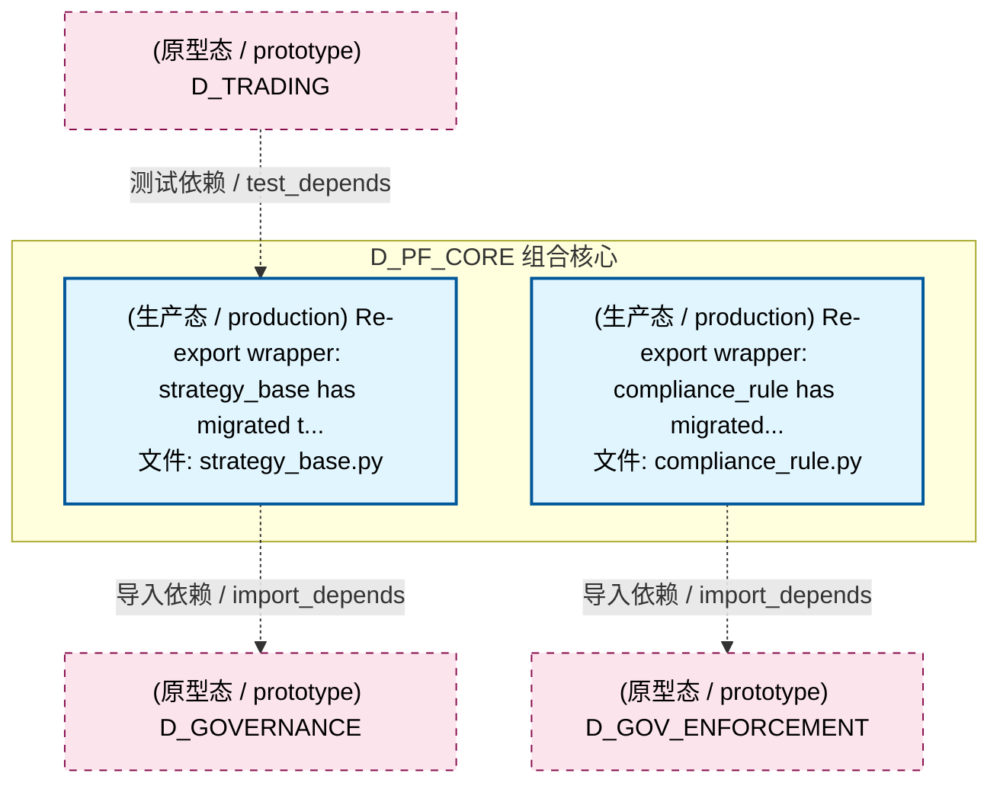
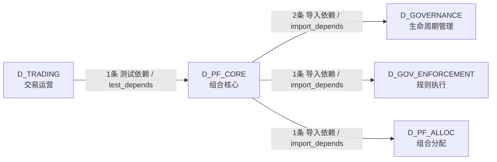

# 52_d_pf_core / 组合核心 / 组合核心 / Portfolio Core

> **功能简介 / Overview**: 组合核心，负责投资组合构建、持仓管理和组合优化

> **文档作用 / Purpose**: 展示 组合核心（D_PF_CORE）功能域的模块清单、域内依赖关系、跨域依赖关系、架构分层视图，供架构审查和域治理参考。

> 本文档由 generate_domain_doc.py 从 depgraph (PostgreSQL) 自动生成
> 最后更新: 2026-07-17 01:44:27
> 数据源: depgraph (PostgreSQL) nodes表 + edges表

## 域基本信息 / Domain Overview

| 字段 | 值 | Field | Value |
|------|------|-------|-------|
| 编号 | 52 | Number | 52 |
| 域ID | D_PF_CORE | Domain ID | D_PF_CORE |
| 域名称 | 组合核心 | Domain Name | Portfolio Core |
| 层级 | L2 业务域层 | Layer | L2 Domain |
| 模块数 | 11 | Module Count | 11 |
| 域内依赖 | 1 | Internal Dependencies | 1 |
| 跨域入边 | 1 | Cross-domain Incoming | 1 |
| 跨域出边 | 4 | Cross-domain Outgoing | 4 |
| 设计态模块 | 0 | Design Modules | 0 |
| 原型态模块 | 9 | Prototype Modules | 9 |
| 生产态模块 | 2 | Production Modules | 2 |
| 容量 | 2/150 (正常) | Capacity | 2/150 (正常) |
| 描述 | 组合核心域。负责投资组合核心引擎，包括组合优化器、风险预算分配、基准跟踪、再平衡引擎。 | Description | 组合核心域。负责投资组合核心引擎，包括组合优化器、风险预算分配、基准跟踪、再平衡引擎。 |

## 模块分层清单 / Module Layered List

> 按 architecture_layer 分组的模块清单（共 11 个模块 / 11 modules）。

### L2 领域层 / Domain Layer (11 modules)

| # | 模块路径 / Module Path | 模块名称 / Module Name (功能简介 / Description) | 成熟度 / Maturity | 蓝图 / Blueprint |
|:--:|---------|---------|:---:|:---:|
| 1 | src/zephyr/pf_core/__init__.py | D_PORTFOLIO_CORE Portfolio Construction — Pack... | 原型态 / prototype | [MOD-L05-001](../../03_modules/_domain_portfolio_core/blueprint.md) |
| 2 | src/zephyr/pf_core/_extensions/__init__.py | __init__.py | 原型态 / prototype |  |
| 3 | src/zephyr/pf_core/api/__init__.py | __init__.py | 原型态 / prototype |  |
| 4 | src/zephyr/pf_core/compliance_rule.py | Re-export wrapper: compliance_rule has migrated... | 生产态 / production | [MOD-L05-001](../../03_modules/_domain_portfolio_core/blueprint.md) |
| 5 | src/zephyr/pf_core/core/__init__.py | __init__.py | 原型态 / prototype |  |
| 6 | src/zephyr/pf_core/infrastructure/__init__.py | __init__.py | 原型态 / prototype |  |
| 7 | src/zephyr/pf_core/services/__init__.py | __init__.py | 原型态 / prototype |  |
| 8 | src/zephyr/pf_core/strategies/__init__.py | Re-export wrapper: true source is zephyr.pf_cor... | 原型态 / prototype |  |
| 9 | src/zephyr/pf_core/strategy_base.py | Re-export wrapper: strategy_base has migrated t... | 生产态 / production | [MOD-L05-001](../../03_modules/_domain_portfolio_core/blueprint.md) |
| 10 | src/zephyr/pf_core/strategy_engine/__init__.py | D_PORTFOLIO_CORE — Portfolio Construction Stra... | 原型态 / prototype | [MOD-L05-001](../../03_modules/_domain_portfolio_core/blueprint.md) |
| 11 | src/zephyr/pf_core/strategy_registry.py | Re-export wrapper: strategy_registry has migrat... | 原型态 / prototype | [MOD-L05-001](../../03_modules/_domain_portfolio_core/blueprint.md) |

## 域内依赖图 / Internal Dependency Diagram

> 依赖图内嵌在本文档中，IDE 可直接渲染显示。参考 decision_index.md 设计，分四个视图：合并全景图、运营态子图、设计态子图、原型态子图（按 design_maturity 实际值拆分）。
>
> **图例说明 / Legend**：
> - **实线边框 = 运营态模块**（production，已上线运行）
> - **虚线边框 = 设计态模块**（design，蓝图阶段，代码未写）
> - **虚线边框 = 原型态模块**（prototype，代码已写，验证中未稳定上线）
> - **实线箭头 = 运营态依赖**（已生效的依赖关系）
> - **虚线箭头 = 非运营态依赖**（计划中/验证中的依赖关系）

### 合并全景图（全部模块，标签标注成熟度）

> 展示全部 11 个模块（生产态 2 + 设计态 0 + 原型态 9），标签标注成熟度。

```mermaid
graph TD
    subgraph D_PF_CORE["D_PF_CORE 组合核心"]
        src_zephyr_pf_core_init_py["(原型态 / prototype) D_PORTFOLIO_CORE Portfolio Construction — Pack...<br/>文件: __init__.py"]
        src_zephyr_pf_core_extensions_init_py["(原型态 / prototype) __init__.py"]
        src_zephyr_pf_core_api_init_py["(原型态 / prototype) __init__.py"]
        src_zephyr_pf_core_compliance_rule_py["(生产态 / production) Re-export wrapper: compliance_rule has migrated...<br/>文件: compliance_rule.py"]
        src_zephyr_pf_core_core_init_py["(原型态 / prototype) __init__.py"]
        src_zephyr_pf_core_infrastructure_init_py["(原型态 / prototype) __init__.py"]
        src_zephyr_pf_core_services_init_py["(原型态 / prototype) __init__.py"]
        src_zephyr_pf_core_strategies_init_py["(原型态 / prototype) Re-export wrapper: true source is zephyr.pf_cor...<br/>文件: __init__.py"]
        src_zephyr_pf_core_strategy_base_py["(生产态 / production) Re-export wrapper: strategy_base has migrated t...<br/>文件: strategy_base.py"]
        src_zephyr_pf_core_strategy_engine_init_py["(原型态 / prototype) D_PORTFOLIO_CORE — Portfolio Construction Stra...<br/>文件: __init__.py"]
        src_zephyr_pf_core_strategy_registry_py["(原型态 / prototype) Re-export wrapper: strategy_registry has migrat...<br/>文件: strategy_registry.py"]
    end
    src_zephyr_pf_core_init_py -.->|config_depends / config_depends| src_zephyr_pf_core_compliance_rule_py
    D_GOVERNANCE["(原型态 / prototype) D_GOVERNANCE"]
    src_zephyr_pf_core_strategy_base_py -.->|导入依赖 / import_depends| D_GOVERNANCE
    D_GOV_ENFORCEMENT["(原型态 / prototype) D_GOV_ENFORCEMENT"]
    src_zephyr_pf_core_compliance_rule_py -.->|导入依赖 / import_depends| D_GOV_ENFORCEMENT
    src_zephyr_pf_core_strategy_registry_py -.->|导入依赖 / import_depends| D_GOVERNANCE
    D_PF_ALLOC["(生产态 / production) D_PF_ALLOC"]
    src_zephyr_pf_core_strategy_engine_init_py -.->|导入依赖 / import_depends| D_PF_ALLOC
    D_TRADING["(原型态 / prototype) D_TRADING"]
    D_TRADING -.->|测试依赖 / test_depends| src_zephyr_pf_core_strategy_base_py
    classDef production fill:#e1f5fe,stroke:#01579b,stroke-width:2px,color:#000
    classDef design fill:#fff3e0,stroke:#e65100,stroke-width:2px,color:#000,stroke-dasharray: 5 5
    classDef external_prod fill:#e8f5e9,stroke:#1b5e20,stroke-width:1px,color:#000
    classDef external_design fill:#fce4ec,stroke:#880e4f,stroke-width:1px,color:#000,stroke-dasharray: 5 5
    class src_zephyr_pf_core_compliance_rule_py,src_zephyr_pf_core_strategy_base_py production
    class src_zephyr_pf_core_init_py,src_zephyr_pf_core_extensions_init_py,src_zephyr_pf_core_api_init_py,src_zephyr_pf_core_core_init_py,src_zephyr_pf_core_infrastructure_init_py,src_zephyr_pf_core_services_init_py,src_zephyr_pf_core_strategies_init_py,src_zephyr_pf_core_strategy_engine_init_py,src_zephyr_pf_core_strategy_registry_py design
    class D_PF_ALLOC external_prod
    class D_GOVERNANCE,D_GOV_ENFORCEMENT,D_TRADING external_design
```

### 运营态子图（仅 design_maturity=production 的模块和依赖）

> 仅展示已上线运行的模块（共 2 个，0 条域内依赖）。

### 设计态子图（仅 design_maturity=design 的模块和依赖）

> 仅展示蓝图阶段、代码未写的设计态模块（共 0 个，0 条域内依赖）。

> （无设计态模块 / No design modules）

### 原型态子图（仅 design_maturity=prototype 的模块和依赖）

> 仅展示代码已写、验证中未稳定上线的原型态模块（共 9 个，0 条域内依赖）。

```mermaid
graph TD
    subgraph D_PF_CORE["D_PF_CORE 组合核心"]
        src_zephyr_pf_core_init_py["(原型态 / prototype) D_PORTFOLIO_CORE Portfolio Construction — Pack...<br/>文件: __init__.py"]
        src_zephyr_pf_core_extensions_init_py["(原型态 / prototype) __init__.py"]
        src_zephyr_pf_core_api_init_py["(原型态 / prototype) __init__.py"]
        src_zephyr_pf_core_core_init_py["(原型态 / prototype) __init__.py"]
        src_zephyr_pf_core_infrastructure_init_py["(原型态 / prototype) __init__.py"]
        src_zephyr_pf_core_services_init_py["(原型态 / prototype) __init__.py"]
        src_zephyr_pf_core_strategies_init_py["(原型态 / prototype) Re-export wrapper: true source is zephyr.pf_cor...<br/>文件: __init__.py"]
        src_zephyr_pf_core_strategy_engine_init_py["(原型态 / prototype) D_PORTFOLIO_CORE — Portfolio Construction Stra...<br/>文件: __init__.py"]
        src_zephyr_pf_core_strategy_registry_py["(原型态 / prototype) Re-export wrapper: strategy_registry has migrat...<br/>文件: strategy_registry.py"]
    end
    D_GOVERNANCE["(原型态 / prototype) D_GOVERNANCE"]
    src_zephyr_pf_core_strategy_registry_py -.->|导入依赖 / import_depends| D_GOVERNANCE
    D_PF_ALLOC["(生产态 / production) D_PF_ALLOC"]
    src_zephyr_pf_core_strategy_engine_init_py -.->|导入依赖 / import_depends| D_PF_ALLOC
    classDef production fill:#e1f5fe,stroke:#01579b,stroke-width:2px,color:#000
    classDef design fill:#fff3e0,stroke:#e65100,stroke-width:2px,color:#000,stroke-dasharray: 5 5
    classDef external_prod fill:#e8f5e9,stroke:#1b5e20,stroke-width:1px,color:#000
    classDef external_design fill:#fce4ec,stroke:#880e4f,stroke-width:1px,color:#000,stroke-dasharray: 5 5
    class src_zephyr_pf_core_init_py,src_zephyr_pf_core_extensions_init_py,src_zephyr_pf_core_api_init_py,src_zephyr_pf_core_core_init_py,src_zephyr_pf_core_infrastructure_init_py,src_zephyr_pf_core_services_init_py,src_zephyr_pf_core_strategies_init_py,src_zephyr_pf_core_strategy_engine_init_py,src_zephyr_pf_core_strategy_registry_py design
    class D_PF_ALLOC external_prod
    class D_GOVERNANCE external_design
```

## 跨域依赖 / Cross-domain Dependencies

### 本域依赖的其他域（出边）/ Depends On

| # | 本域模块 / Source Module | → | 外部域-目标模块 / Target Module | 依赖类型 / Type |
|:--:|---------|:--:|---------|---------|
| 1 | Re-export wrapper: strategy_base has migrated t... | → | D_GOVERNANCE 生命周期管理: D_PORTFOLIO_CORE — StrategyBase + StrategyMeta... | 导入依赖 / import_depends |
| 2 | Re-export wrapper: strategy_registry has migrat... | → | D_GOVERNANCE 生命周期管理: StrategyRegistry 卫星模块（OCP-002） (strategy_... | 导入依赖 / import_depends |
| 3 | Re-export wrapper: compliance_rule has migrated... | → | D_GOV_ENFORCEMENT 规则执行: Re-export shim — ComplianceRule 真源已合并至 z... | 导入依赖 / import_depends |
| 4 | D_PORTFOLIO_CORE — Portfolio Construction Stra... | → | D_PF_ALLOC 组合分配: D_PORTFOLIO_CORE — Default Equity Long-Only St... | 导入依赖 / import_depends |

### 依赖本域的其他域（入边）/ Depended By

| # | 外部域-源模块 / Source Module | → | 本域模块 / Target Module | 依赖类型 / Type |
|:--:|---------|:--:|---------|---------|
| 1 | D_TRADING 交易运营: test_l05_portfolio_construction.py | → | Re-export wrapper: strategy_base has migrated t... | 测试依赖 / test_depends |

### 跨域依赖图 / Cross-domain Dependency Diagram

> 本域与 4 个外部域直接连接（出边 4 条 + 入边 1 条 = 5 条）。只显示直接连接的域，不展开具体节点。

## 说明 / Notes

- **数据源 / Data Source**: `depgraph (PostgreSQL)` 的 `nodes`、`edges`、`domains` 表
- **生成器 / Generator**: `generate_domain_doc.py`（G2+G10 合并）
- **维护方式 / Maintenance**: 自动生成，全景图更新时刷新
- **文件名规则 / File Naming**: `{编号:02d}_{域ID小写}.md`，如 `16_d_trading.md`
- **图例说明 / Legend**: `[production]`=已上线 / `[design]`=设计中 / `[prototype]`=原型 / `[unknown]`=未知
