# 52_d_trading / 交易运营

> **文档作用 / Purpose**: 展示 交易运营（D-TRADING）功能域的模块清单、域内依赖关系和跨域依赖关系，供架构审查和域治理参考。

> 本文档由 generate_domain_doc.py 从 depgraph.db 自动生成
> 最后更新: 2026-06-25 18:42:45
> 数据源: depgraph.db nodes表 + edges表

## 域基本信息 / Domain Overview

| 字段 | 值 | Field | Value |
|------|------|-------|-------|
| 编号 | 52 | Number | 52 |
| 域ID | D-TRADING | Domain ID | D-TRADING |
| 域名称 | 交易运营 | Domain Name | 交易运营 |
| 层级 | L2_domain | Layer | L2_domain |
| 模块数 | 169 | Module Count | 169 |
| 域内依赖 | 140 | Internal Dependencies | 140 |
| 跨域入边 | 287 | Cross-domain Incoming | 287 |
| 跨域出边 | 180 | Cross-domain Outgoing | 180 |
| 设计态模块 | 6 | Design Modules | 6 |
| 原型态模块 | 143 | Prototype Modules | 143 |
| 生产态模块 | 20 | Production Modules | 20 |
| 容量 | 20/150 (正常) | Capacity | 20/150 (正常) |
| 描述 | 交易会话、交易接口、交易日志、交易复盘。交易运营中枢。合规检查由D-GOV-ENFORCEMENT门禁层执行。 | Description | 交易会话、交易接口、交易日志、交易复盘。交易运营中枢。合规检查由D-GOV-ENFORCEMENT门禁层执行。 |

## 模块清单 / Module List

共 169 个模块（按路径排序，全部显示）

| 模块路径 / Module Path | 模块名称 / Module Name | 设计成熟度 / Maturity | 构建状态 / Build Status |
|---------|---------|-----------|---------|
| F1-autopilot/ |  | design | stable |
| F17-archived/ |  | design | deprecated |
| F26-runtime-integration/ |  | design | stable |
| src/zephyr/trading/__init__.py |  | production | generated |
| src/zephyr/trading/__init___from_orches.py |  | prototype | generated |
| src/zephyr/trading/__main__.py |  | prototype | generated |
| src/zephyr/trading/_extensions/__init__.py |  | prototype | deprecated |
| src/zephyr/trading/action_dispatcher.py |  | prototype | generated |
| src/zephyr/trading/admission_controller.py |  | prototype | generated |
| src/zephyr/trading/ai_audit_logger.py |  | prototype | generated |
| src/zephyr/trading/api/__init__.py |  | prototype | deprecated |
| src/zephyr/trading/auto_dispatcher.py |  | prototype | generated |
| src/zephyr/trading/auto_integrator.py |  | prototype | generated |
| src/zephyr/trading/auto_runtime_core.py |  | production | generated |
| src/zephyr/trading/auto_task_generator.py |  | prototype | generated |
| src/zephyr/trading/autopilot.py |  | prototype | generated |
| src/zephyr/trading/boot_cron_jobs.py |  | prototype | generated |
| src/zephyr/trading/boot_hooks.py |  | prototype | generated |
| src/zephyr/trading/capability_card.py |  | prototype | generated |
| src/zephyr/trading/capability_registry.py |  | prototype | generated |
| src/zephyr/trading/capability_sync.py |  | prototype | generated |
| src/zephyr/trading/circadian_scheduler.py |  | prototype | generated |
| src/zephyr/trading/conductor.py |  | prototype | generated |
| src/zephyr/trading/core/__init__.py |  | prototype | deprecated |
| src/zephyr/trading/dream_cycle.py |  | prototype | generated |
| src/zephyr/trading/feedback_loop.py |  | prototype | generated |
| src/zephyr/trading/finalizer.py |  | prototype | generated |
| src/zephyr/trading/gpu_consensus_scheduler.py |  | prototype | generated |
| src/zephyr/trading/gpu_monitor.py |  | prototype | generated |
| src/zephyr/trading/health_monitor.py |  | prototype | generated |
| src/zephyr/trading/ide_health_daemon.py |  | prototype | generated |
| src/zephyr/trading/infrastructure/__init__.py |  | prototype | deprecated |
| src/zephyr/trading/integration_registry.py |  | prototype | generated |
| src/zephyr/trading/lifecycle_manager.py |  | prototype | generated |
| src/zephyr/trading/models/__init__.py |  | prototype | deprecated |
| src/zephyr/trading/module_onboarding_scanner.py |  | prototype | generated |
| src/zephyr/trading/night_shift_queue.py |  | prototype | generated |
| src/zephyr/trading/orchestrator/__init__.py |  | prototype | generated |
| src/zephyr/trading/orchestrator/agent_health_monitor.py |  | prototype | generated |
| src/zephyr/trading/orchestrator/agent_orchestrator.py |  | prototype | generated |
| src/zephyr/trading/orchestrator/agent_quality.py |  | prototype | generated |
| src/zephyr/trading/orchestrator/alert_handler.py |  | prototype | generated |
| src/zephyr/trading/orchestrator/autonomy_guard.py |  | prototype | generated |
| src/zephyr/trading/orchestrator/backup_manager.py |  | prototype | generated |
| src/zephyr/trading/orchestrator/batch_orchestrator.py |  | prototype | generated |
| src/zephyr/trading/orchestrator/benchmark_runner.py |  | prototype | generated |
| src/zephyr/trading/orchestrator/blind_spot_closure.py |  | prototype | generated |
| src/zephyr/trading/orchestrator/blueprint_health.py |  | prototype | generated |
| src/zephyr/trading/orchestrator/blueprint_scorer.py |  | prototype | generated |
| src/zephyr/trading/orchestrator/bulkhead_manager.py |  | prototype | generated |
| src/zephyr/trading/orchestrator/canary_manager.py |  | prototype | generated |
| src/zephyr/trading/orchestrator/capacity_budget.py |  | prototype | generated |
| src/zephyr/trading/orchestrator/chaos_engine.py |  | prototype | generated |
| src/zephyr/trading/orchestrator/chaos_hooks.py |  | prototype | generated |
| src/zephyr/trading/orchestrator/config_manager.py |  | prototype | generated |
| src/zephyr/trading/orchestrator/construction_guide.py |  | prototype | generated |
| src/zephyr/trading/orchestrator/context_bridge.py |  | prototype | generated |
| src/zephyr/trading/orchestrator/contract_registry.py |  | prototype | generated |
| src/zephyr/trading/orchestrator/contract_router.py |  | prototype | generated |
| src/zephyr/trading/orchestrator/core/__init__.py |  | prototype | generated |
| src/zephyr/trading/orchestrator/core/agent_orchestrator.py |  | prototype | generated |
| src/zephyr/trading/orchestrator/core/task_queue.py |  | prototype | generated |
| src/zephyr/trading/orchestrator/core/trigger_router.py |  | prototype | generated |
| src/zephyr/trading/orchestrator/core/wave_generator.py |  | prototype | generated |
| src/zephyr/trading/orchestrator/data_lifecycle.py |  | prototype | generated |
| src/zephyr/trading/orchestrator/deferred_queue.py |  | prototype | generated |
| src/zephyr/trading/orchestrator/degrade_cascade.py |  | prototype | generated |
| src/zephyr/trading/orchestrator/dependency_lock.py |  | prototype | generated |
| src/zephyr/trading/orchestrator/design_decisions.py |  | prototype | generated |
| src/zephyr/trading/orchestrator/disk_guard.py |  | prototype | generated |
| src/zephyr/trading/orchestrator/dlq_manager.py |  | prototype | generated |
| src/zephyr/trading/orchestrator/failure_matcher.py |  | prototype | generated |
| src/zephyr/trading/orchestrator/fault_types.py |  | prototype | generated |
| src/zephyr/trading/orchestrator/feature_flag.py |  | prototype | generated |
| src/zephyr/trading/orchestrator/file_task_mapper.py |  | prototype | generated |
| src/zephyr/trading/orchestrator/finding_bridge.py |  | prototype | generated |
| src/zephyr/trading/orchestrator/hallucination_detector.py |  | prototype | generated |
| src/zephyr/trading/orchestrator/housekeeping.py |  | prototype | generated |
| src/zephyr/trading/orchestrator/incident_postmortem.py |  | prototype | generated |
| src/zephyr/trading/orchestrator/ke_quality.py |  | prototype | generated |
| src/zephyr/trading/orchestrator/knowledge_freshness.py |  | prototype | generated |
| src/zephyr/trading/orchestrator/lean_scanner.py |  | prototype | generated |
| src/zephyr/trading/orchestrator/memory_writer.py |  | prototype | generated |
| src/zephyr/trading/orchestrator/model_registry.py |  | prototype | generated |
| src/zephyr/trading/orchestrator/network_partition.py |  | prototype | generated |
| src/zephyr/trading/orchestrator/path_index.py |  | prototype | generated |
| src/zephyr/trading/orchestrator/phase_executor.py |  | prototype | generated |
| src/zephyr/trading/orchestrator/prompt_version.py |  | prototype | generated |
| src/zephyr/trading/orchestrator/reconciliation_loop.py |  | prototype | generated |
| src/zephyr/trading/orchestrator/resilience/__init__.py |  | prototype | generated |
| src/zephyr/trading/orchestrator/resilience/deferred_queue.py |  | prototype | generated |
| src/zephyr/trading/orchestrator/resilience/failure_matcher.py |  | prototype | generated |
| src/zephyr/trading/orchestrator/resilience/hallucination_detector.py |  | prototype | generated |
| src/zephyr/trading/orchestrator/resilience/rollback_manager.py |  | prototype | generated |
| src/zephyr/trading/orchestrator/risk_registry.py |  | prototype | generated |
| src/zephyr/trading/orchestrator/rollback_manager.py |  | prototype | generated |
| src/zephyr/trading/orchestrator/rolling_upgrade.py |  | prototype | generated |
| src/zephyr/trading/orchestrator/schema_migration.py |  | prototype | generated |
| src/zephyr/trading/orchestrator/script_runner.py |  | prototype | generated |
| src/zephyr/trading/orchestrator/session_conflict.py |  | prototype | generated |
| src/zephyr/trading/orchestrator/session_handoff.py |  | prototype | generated |
| src/zephyr/trading/orchestrator/session_manager.py |  | prototype | generated |
| src/zephyr/trading/orchestrator/stability_guard.py |  | prototype | generated |
| src/zephyr/trading/orchestrator/startup_sequencer.py |  | prototype | generated |
| src/zephyr/trading/orchestrator/state/__init__.py |  | prototype | generated |
| src/zephyr/trading/orchestrator/state/agent_health_monitor.py |  | prototype | generated |
| src/zephyr/trading/orchestrator/state/file_task_mapper.py |  | prototype | generated |
| src/zephyr/trading/orchestrator/state/session_manager.py |  | prototype | generated |
| src/zephyr/trading/orchestrator/state/state_synchronizer.py |  | prototype | generated |
| src/zephyr/trading/orchestrator/state_propagation.py |  | prototype | generated |
| src/zephyr/trading/orchestrator/state_synchronizer.py |  | prototype | generated |
| src/zephyr/trading/orchestrator/system_transfer.py |  | prototype | generated |
| src/zephyr/trading/orchestrator/task_queue.py |  | prototype | generated |
| src/zephyr/trading/orchestrator/teardown_manager.py |  | prototype | generated |
| src/zephyr/trading/orchestrator/trigger_router.py |  | prototype | generated |
| src/zephyr/trading/orchestrator/version_manifest.py |  | prototype | generated |
| src/zephyr/trading/orchestrator/wave_generator.py |  | prototype | generated |
| src/zephyr/trading/orphan_detector.py |  | prototype | generated |
| src/zephyr/trading/ports.py |  | prototype | generated |
| src/zephyr/trading/protection_index.py |  | prototype | generated |
| src/zephyr/trading/resource_optimization.py |  | prototype | generated |
| src/zephyr/trading/runtime/__init__.py |  | production | generated |
| src/zephyr/trading/runtime/async_runtime.py |  | production | generated |
| src/zephyr/trading/runtime_config.py |  | prototype | generated |
| src/zephyr/trading/services/__init__.py |  | prototype | deprecated |
| src/zephyr/trading/session_lifecycle.py |  | prototype | generated |
| src/zephyr/trading/speed_baseline_checker.py |  | prototype | generated |
| src/zephyr/trading/staging_area.py |  | prototype | generated |
| src/zephyr/trading/status_dashboard.py |  | prototype | generated |
| src/zephyr/trading/stop_gate.py |  | prototype | generated |
| src/zephyr/trading/task_gate.py |  | prototype | generated |
| src/zephyr/trading/trading_contracts/__init__.py |  | prototype | generated |
| src/zephyr/trading/trading_contracts/execution/__init__.py |  | prototype | generated |
| src/zephyr/trading/trading_contracts/execution/capital_allocation_result.py |  | production | generated |
| src/zephyr/trading/trading_contracts/execution/execution_rejection_error.py |  | prototype | generated |
| src/zephyr/trading/trading_contracts/execution/execution_report.py |  | production | generated |
| src/zephyr/trading/trading_contracts/execution/fill.py |  | production | generated |
| src/zephyr/trading/trading_contracts/execution/model_serving_request.py |  | production | generated |
| src/zephyr/trading/trading_contracts/execution/order.py |  | production | generated |
| src/zephyr/trading/trading_contracts/execution/position.py |  | production | generated |
| src/zephyr/trading/trading_contracts/factories.py |  | prototype | generated |
| src/zephyr/trading/trading_contracts/market/__init__.py |  | prototype | generated |
| src/zephyr/trading/trading_contracts/market/factor_monitor_report.py |  | prototype | generated |
| src/zephyr/trading/trading_contracts/market/factor_signal.py |  | production | generated |
| src/zephyr/trading/trading_contracts/market/instrument.py |  | prototype | generated |
| src/zephyr/trading/trading_contracts/market/macro_factor_signal.py |  | prototype | generated |
| src/zephyr/trading/trading_contracts/market/market_data.py |  | production | generated |
| src/zephyr/trading/trading_contracts/market/signal_degradation_warning.py |  | prototype | generated |
| src/zephyr/trading/trading_contracts/market/synthesized_signal.py |  | production | generated |
| src/zephyr/trading/trading_contracts/portfolio/contracts/__init__.py |  | prototype | generated |
| src/zephyr/trading/trading_contracts/portfolio/contracts/money.py |  | production | generated |
| ...ading/trading_contracts/portfolio/contracts/performance_attribution_report.py |  | prototype | generated |
| ...hyr/trading/trading_contracts/portfolio/contracts/strategy_lifecycle_event.py |  | prototype | generated |
| src/zephyr/trading/trading_contracts/risk/__init__.py |  | prototype | generated |
| src/zephyr/trading/trading_contracts/risk/compliance_rule.py |  | prototype | generated |
| src/zephyr/trading/trading_contracts/risk/risk_dashboard_snapshot.py |  | production | generated |
| src/zephyr/trading/trading_contracts/risk/risk_limit_violation_error.py |  | production | generated |
| src/zephyr/trading/trading_contracts/risk/risk_limits.py |  | production | generated |
| src/zephyr/trading/trading_contracts/risk/risk_metrics.py |  | production | generated |
| src/zephyr/trading/trading_contracts/risk/risk_validator_protocol.py |  | production | generated |
| src/zephyr/trading/verdict_engine.py |  | prototype | generated |
| src/zephyr/trading/windows_service.py |  | prototype | generated |
| src/zephyr/trading/work_dag.py |  | prototype | generated |
| src/zephyr/trading/work_orchestrator.py |  | prototype | generated |
| src/zephyr/trading/zombie_scanner.py |  | prototype | generated |
| tests/trading/runtime/test_async_runtime.py |  | production | generated |
| 交易域-监控/D-TRADING-06 | Intraday P&L Monitor | design | planned |
| 交易域-资金/D-TRADING-12 | Cash Flow Manager | design | planned |
| 交易运营域/D-TRADING-04 | EOD Processor | design | planned |

## 域内依赖图 / Internal Dependency Diagram

> 依赖图内嵌在本文档中，IDE 可直接渲染显示。每30个节点一组分页显示。
>
> **图例说明 / Legend**：
> - **实线边框 = 运营态模块**（production，已上线运行）
> - **虚线边框 = 设计态模块**（design，还在设计中）
> - **实线箭头 = 运营态依赖**（已生效的依赖关系）
> - **虚线箭头 = 设计态依赖**（计划中的依赖关系）

### 第 1 页 / 共 6 页 / Page 1 of 6

```mermaid
graph TD
    subgraph D_TRADING["D-TRADING 交易运营"]
        F1_autopilot["F1-autopilot/ design"]
        F17_archived["F17-archived/ design"]
        F26_runtime_integration["F26-runtime-integration/ design"]
        src_zephyr_trading_init_py["src/zephyr/trading/__init__.py production"]
        src_zephyr_trading_init_from_orches_py["src/zephyr/trading/__init___from_orches.py prototype"]
        src_zephyr_trading_main_py["src/zephyr/trading/__main__.py prototype"]
        src_zephyr_trading_extensions_init_py["src/zephyr/trading/_extensions/__init__.py prototype"]
        src_zephyr_trading_action_dispatcher_py["src/zephyr/trading/action_dispatcher.py prototype"]
        src_zephyr_trading_admission_controller_py["src/zephyr/trading/admission_controller.py prototype"]
        src_zephyr_trading_ai_audit_logger_py["src/zephyr/trading/ai_audit_logger.py prototype"]
        src_zephyr_trading_api_init_py["src/zephyr/trading/api/__init__.py prototype"]
        src_zephyr_trading_auto_dispatcher_py["src/zephyr/trading/auto_dispatcher.py prototype"]
        src_zephyr_trading_auto_integrator_py["src/zephyr/trading/auto_integrator.py prototype"]
        src_zephyr_trading_auto_runtime_core_py["src/zephyr/trading/auto_runtime_core.py production"]
        src_zephyr_trading_auto_task_generator_py["src/zephyr/trading/auto_task_generator.py prototype"]
        src_zephyr_trading_autopilot_py["src/zephyr/trading/autopilot.py prototype"]
        src_zephyr_trading_boot_cron_jobs_py["src/zephyr/trading/boot_cron_jobs.py prototype"]
        src_zephyr_trading_boot_hooks_py["src/zephyr/trading/boot_hooks.py prototype"]
        src_zephyr_trading_capability_card_py["src/zephyr/trading/capability_card.py prototype"]
        src_zephyr_trading_capability_registry_py["src/zephyr/trading/capability_registry.py prototype"]
        src_zephyr_trading_capability_sync_py["src/zephyr/trading/capability_sync.py prototype"]
        src_zephyr_trading_circadian_scheduler_py["src/zephyr/trading/circadian_scheduler.py prototype"]
        src_zephyr_trading_conductor_py["src/zephyr/trading/conductor.py prototype"]
        src_zephyr_trading_core_init_py["src/zephyr/trading/core/__init__.py prototype"]
        src_zephyr_trading_dream_cycle_py["src/zephyr/trading/dream_cycle.py prototype"]
        src_zephyr_trading_feedback_loop_py["src/zephyr/trading/feedback_loop.py prototype"]
        src_zephyr_trading_finalizer_py["src/zephyr/trading/finalizer.py prototype"]
        src_zephyr_trading_gpu_consensus_scheduler_py["src/zephyr/trading/gpu_consensus_scheduler.py prototype"]
        src_zephyr_trading_gpu_monitor_py["src/zephyr/trading/gpu_monitor.py prototype"]
        src_zephyr_trading_health_monitor_py["src/zephyr/trading/health_monitor.py prototype"]
    end
    src_zephyr_trading_action_dispatcher_py -.->|config_depends| src_zephyr_trading_init_py
    src_zephyr_trading_admission_controller_py -.->|config_depends| src_zephyr_trading_init_py
    src_zephyr_trading_auto_dispatcher_py -.->|import_depends| src_zephyr_trading_init_py
    src_zephyr_trading_auto_integrator_py -.->|import_depends| src_zephyr_trading_init_py
    src_zephyr_trading_auto_runtime_core_py -->|import_depends| src_zephyr_trading_init_py
    src_zephyr_trading_boot_cron_jobs_py -.->|import_depends| src_zephyr_trading_init_py
    src_zephyr_trading_auto_task_generator_py -.->|config_depends| src_zephyr_trading_init_py
    src_zephyr_trading_boot_hooks_py -.->|import_depends| src_zephyr_trading_init_py
    src_zephyr_trading_conductor_py -.->|import_depends| src_zephyr_trading_init_py
    src_zephyr_trading_circadian_scheduler_py -.->|import_depends| src_zephyr_trading_init_py
    src_zephyr_trading_capability_registry_py -.->|import_depends| src_zephyr_trading_init_py
    src_zephyr_trading_capability_sync_py -.->|import_depends| src_zephyr_trading_init_py
    src_zephyr_trading_gpu_consensus_scheduler_py -.->|import_depends| src_zephyr_trading_init_py
    src_zephyr_trading_health_monitor_py -.->|import_depends| src_zephyr_trading_init_py
    src_zephyr_trading_finalizer_py -.->|config_depends| src_zephyr_trading_init_py
    src_zephyr_trading_gpu_monitor_py -.->|config_depends| src_zephyr_trading_init_py
    src_zephyr_trading_main_py -.->|import_depends| src_zephyr_trading_init_py
    src_zephyr_trading_init_from_orches_py -.->|config_depends| src_zephyr_trading_init_py
    D_SHARED["D-SHARED prototype"]
    src_zephyr_trading_auto_dispatcher_py -.->|import_depends| D_SHARED
    D_GOVERNANCE["D-GOVERNANCE production"]
    src_zephyr_trading_auto_dispatcher_py -.->|import_depends| D_GOVERNANCE
    D_INTEGRATION["D-INTEGRATION production"]
    src_zephyr_trading_ai_audit_logger_py -.->|import_depends| D_INTEGRATION
    src_zephyr_trading_autopilot_py -.->|import_depends| D_SHARED
    src_zephyr_trading_autopilot_py -.->|contract| D_SHARED
    src_zephyr_trading_autopilot_py -.->|import_depends| D_GOVERNANCE
    src_zephyr_trading_auto_runtime_core_py -.->|import_depends| D_SHARED
    src_zephyr_trading_auto_runtime_core_py -.->|import_depends| D_SHARED
    src_zephyr_trading_auto_runtime_core_py -.->|import_depends| D_SHARED
    src_zephyr_trading_auto_runtime_core_py -->|import_depends| D_INTEGRATION
    src_zephyr_trading_auto_runtime_core_py -->|import_depends| D_GOVERNANCE
    src_zephyr_trading_auto_runtime_core_py -.->|import_depends| D_INTEGRATION
    D_INTELLIGENCE["D-INTELLIGENCE prototype"]
    src_zephyr_trading_auto_runtime_core_py -.->|import_depends| D_INTELLIGENCE
    D_OPS["D-OPS production"]
    src_zephyr_trading_auto_runtime_core_py -->|import_depends| D_OPS
    src_zephyr_trading_auto_runtime_core_py -.->|import_depends| D_SHARED
    D_GOVERNANCE -.->|import_depends| src_zephyr_trading_init_py
    D_GOV_AUDIT["D-GOV_AUDIT prototype"]
    D_GOV_AUDIT -.->|import_depends| src_zephyr_trading_init_py
    D_GOV_AUDIT -->|import_depends| src_zephyr_trading_init_py
    D_INTEGRATION -->|import_depends| src_zephyr_trading_init_py
    D_INTEGRATION -.->|import_depends| src_zephyr_trading_init_py
    D_OPS -.->|import_depends| src_zephyr_trading_init_py
    D_SECURITY["D-SECURITY prototype"]
    D_SECURITY -.->|import_depends| src_zephyr_trading_init_py
    D_SECURITY -->|import_depends| src_zephyr_trading_init_py
    D_GOVERNANCE -.->|test_depends| src_zephyr_trading_init_py
    D_GOVERNANCE -.->|test_depends| src_zephyr_trading_init_py
    D_GOVERNANCE -.->|test_depends| src_zephyr_trading_init_py
    D_GOVERNANCE -.->|test_depends| src_zephyr_trading_init_py
    D_GOVERNANCE -.->|test_depends| src_zephyr_trading_init_py
    D_GOVERNANCE -.->|test_depends| src_zephyr_trading_init_py
    D_GOVERNANCE -.->|test_depends| src_zephyr_trading_init_py
    classDef production fill:#e1f5fe,stroke:#01579b,stroke-width:2px,color:#000
    classDef design fill:#fff3e0,stroke:#e65100,stroke-width:2px,color:#000,stroke-dasharray: 5 5
    classDef external_prod fill:#e8f5e9,stroke:#1b5e20,stroke-width:1px,color:#000
    classDef external_design fill:#fce4ec,stroke:#880e4f,stroke-width:1px,color:#000,stroke-dasharray: 5 5
    class src_zephyr_trading_init_py,src_zephyr_trading_auto_runtime_core_py production
    class F1_autopilot,F17_archived,F26_runtime_integration,src_zephyr_trading_init_from_orches_py,src_zephyr_trading_main_py,src_zephyr_trading_extensions_init_py,src_zephyr_trading_action_dispatcher_py,src_zephyr_trading_admission_controller_py,src_zephyr_trading_ai_audit_logger_py,src_zephyr_trading_api_init_py,src_zephyr_trading_auto_dispatcher_py,src_zephyr_trading_auto_integrator_py,src_zephyr_trading_auto_task_generator_py,src_zephyr_trading_autopilot_py,src_zephyr_trading_boot_cron_jobs_py,src_zephyr_trading_boot_hooks_py,src_zephyr_trading_capability_card_py,src_zephyr_trading_capability_registry_py,src_zephyr_trading_capability_sync_py,src_zephyr_trading_circadian_scheduler_py,src_zephyr_trading_conductor_py,src_zephyr_trading_core_init_py,src_zephyr_trading_dream_cycle_py,src_zephyr_trading_feedback_loop_py,src_zephyr_trading_finalizer_py,src_zephyr_trading_gpu_consensus_scheduler_py,src_zephyr_trading_gpu_monitor_py,src_zephyr_trading_health_monitor_py design
    class D_GOVERNANCE,D_INTEGRATION,D_OPS external_prod
    class D_SHARED,D_INTELLIGENCE,D_GOV_AUDIT,D_SECURITY external_design
```

### 第 2 页 / 共 6 页 / Page 2 of 6

```mermaid
graph TD
    subgraph D_TRADING["D-TRADING 交易运营"]
        src_zephyr_trading_ide_health_daemon_py["src/zephyr/trading/ide_health_daemon.py prototype"]
        src_zephyr_trading_infrastructure_init_py["src/zephyr/trading/infrastructure/__init__.py prototype"]
        src_zephyr_trading_integration_registry_py["src/zephyr/trading/integration_registry.py prototype"]
        src_zephyr_trading_lifecycle_manager_py["src/zephyr/trading/lifecycle_manager.py prototype"]
        src_zephyr_trading_models_init_py["src/zephyr/trading/models/__init__.py prototype"]
        src_zephyr_trading_module_onboarding_scanner_py["src/zephyr/trading/module_onboarding_scanner.py prototype"]
        src_zephyr_trading_night_shift_queue_py["src/zephyr/trading/night_shift_queue.py prototype"]
        src_zephyr_trading_orchestrator_init_py["src/zephyr/trading/orchestrator/__init__.py prototype"]
        src_zephyr_trading_orchestrator_agent_health_monitor_py["src/zephyr/trading/orchestrator/agent_health_mo... prototype"]
        src_zephyr_trading_orchestrator_agent_orchestrator_py["src/zephyr/trading/orchestrator/agent_orchestra... prototype"]
        src_zephyr_trading_orchestrator_agent_quality_py["src/zephyr/trading/orchestrator/agent_quality.py prototype"]
        src_zephyr_trading_orchestrator_alert_handler_py["src/zephyr/trading/orchestrator/alert_handler.py prototype"]
        src_zephyr_trading_orchestrator_autonomy_guard_py["src/zephyr/trading/orchestrator/autonomy_guard.py prototype"]
        src_zephyr_trading_orchestrator_backup_manager_py["src/zephyr/trading/orchestrator/backup_manager.py prototype"]
        src_zephyr_trading_orchestrator_batch_orchestrator_py["src/zephyr/trading/orchestrator/batch_orchestra... prototype"]
        src_zephyr_trading_orchestrator_benchmark_runner_py["src/zephyr/trading/orchestrator/benchmark_runne... prototype"]
        src_zephyr_trading_orchestrator_blind_spot_closure_py["src/zephyr/trading/orchestrator/blind_spot_clos... prototype"]
        src_zephyr_trading_orchestrator_blueprint_health_py["src/zephyr/trading/orchestrator/blueprint_healt... prototype"]
        src_zephyr_trading_orchestrator_blueprint_scorer_py["src/zephyr/trading/orchestrator/blueprint_score... prototype"]
        src_zephyr_trading_orchestrator_bulkhead_manager_py["src/zephyr/trading/orchestrator/bulkhead_manage... prototype"]
        src_zephyr_trading_orchestrator_canary_manager_py["src/zephyr/trading/orchestrator/canary_manager.py prototype"]
        src_zephyr_trading_orchestrator_capacity_budget_py["src/zephyr/trading/orchestrator/capacity_budget.py prototype"]
        src_zephyr_trading_orchestrator_chaos_engine_py["src/zephyr/trading/orchestrator/chaos_engine.py prototype"]
        src_zephyr_trading_orchestrator_chaos_hooks_py["src/zephyr/trading/orchestrator/chaos_hooks.py prototype"]
        src_zephyr_trading_orchestrator_config_manager_py["src/zephyr/trading/orchestrator/config_manager.py prototype"]
        src_zephyr_trading_orchestrator_construction_guide_py["src/zephyr/trading/orchestrator/construction_gu... prototype"]
        src_zephyr_trading_orchestrator_context_bridge_py["src/zephyr/trading/orchestrator/context_bridge.py prototype"]
        src_zephyr_trading_orchestrator_contract_registry_py["src/zephyr/trading/orchestrator/contract_regist... prototype"]
        src_zephyr_trading_orchestrator_contract_router_py["src/zephyr/trading/orchestrator/contract_router.py prototype"]
        src_zephyr_trading_orchestrator_core_init_py["src/zephyr/trading/orchestrator/core/__init__.py prototype"]
    end
    src_zephyr_trading_orchestrator_benchmark_runner_py -.->|config_depends| src_zephyr_trading_orchestrator_init_py
    src_zephyr_trading_orchestrator_autonomy_guard_py -.->|config_depends| src_zephyr_trading_orchestrator_init_py
    src_zephyr_trading_orchestrator_agent_quality_py -.->|config_depends| src_zephyr_trading_orchestrator_init_py
    src_zephyr_trading_orchestrator_backup_manager_py -.->|config_depends| src_zephyr_trading_orchestrator_init_py
    src_zephyr_trading_orchestrator_blind_spot_closure_py -.->|config_depends| src_zephyr_trading_orchestrator_init_py
    src_zephyr_trading_orchestrator_canary_manager_py -.->|config_depends| src_zephyr_trading_orchestrator_init_py
    src_zephyr_trading_orchestrator_blueprint_scorer_py -.->|config_depends| src_zephyr_trading_orchestrator_init_py
    src_zephyr_trading_orchestrator_blueprint_health_py -.->|config_depends| src_zephyr_trading_orchestrator_init_py
    src_zephyr_trading_orchestrator_chaos_engine_py -.->|config_depends| src_zephyr_trading_orchestrator_init_py
    src_zephyr_trading_orchestrator_capacity_budget_py -.->|config_depends| src_zephyr_trading_orchestrator_init_py
    src_zephyr_trading_orchestrator_bulkhead_manager_py -.->|config_depends| src_zephyr_trading_orchestrator_init_py
    src_zephyr_trading_orchestrator_config_manager_py -.->|config_depends| src_zephyr_trading_orchestrator_init_py
    src_zephyr_trading_orchestrator_construction_guide_py -.->|config_depends| src_zephyr_trading_orchestrator_init_py
    D_SHARED["D-SHARED prototype"]
    src_zephyr_trading_ide_health_daemon_py -.->|import_depends| D_SHARED
    D_GOVERNANCE["D-GOVERNANCE production"]
    src_zephyr_trading_ide_health_daemon_py -.->|import_depends| D_GOVERNANCE
    D_INTEGRATION["D-INTEGRATION prototype"]
    src_zephyr_trading_ide_health_daemon_py -.->|import_depends| D_INTEGRATION
    src_zephyr_trading_ide_health_daemon_py -.->|runtime| D_GOVERNANCE
    src_zephyr_trading_ide_health_daemon_py -.->|runtime| D_GOVERNANCE
    D_GOV_DOCS["D-GOV-DOCS prototype"]
    src_zephyr_trading_ide_health_daemon_py -.->|runtime| D_GOV_DOCS
    D_OPS["D-OPS prototype"]
    src_zephyr_trading_ide_health_daemon_py -.->|runtime| D_OPS
    D_GOV_ENFORCEMENT["D-GOV-ENFORCEMENT production"]
    src_zephyr_trading_ide_health_daemon_py -.->|contract| D_GOV_ENFORCEMENT
    D_GOV_AUDIT["D-GOV_AUDIT design"]
    src_zephyr_trading_ide_health_daemon_py -.->|contract| D_GOV_AUDIT
    D_GOV_DRIFT["D-GOV_DRIFT design"]
    src_zephyr_trading_ide_health_daemon_py -.->|runtime| D_GOV_DRIFT
    src_zephyr_trading_ide_health_daemon_py -.->|runtime| D_GOVERNANCE
    src_zephyr_trading_ide_health_daemon_py -.->|contract| D_GOVERNANCE
    D_INFRA_RUNTIME["D-INFRA_RUNTIME production"]
    src_zephyr_trading_ide_health_daemon_py -.->|contract| D_INFRA_RUNTIME
    src_zephyr_trading_integration_registry_py -.->|import_depends| D_INTEGRATION
    src_zephyr_trading_lifecycle_manager_py -.->|import_depends| D_GOV_AUDIT
    classDef production fill:#e1f5fe,stroke:#01579b,stroke-width:2px,color:#000
    classDef design fill:#fff3e0,stroke:#e65100,stroke-width:2px,color:#000,stroke-dasharray: 5 5
    classDef external_prod fill:#e8f5e9,stroke:#1b5e20,stroke-width:1px,color:#000
    classDef external_design fill:#fce4ec,stroke:#880e4f,stroke-width:1px,color:#000,stroke-dasharray: 5 5
    class src_zephyr_trading_ide_health_daemon_py,src_zephyr_trading_infrastructure_init_py,src_zephyr_trading_integration_registry_py,src_zephyr_trading_lifecycle_manager_py,src_zephyr_trading_models_init_py,src_zephyr_trading_module_onboarding_scanner_py,src_zephyr_trading_night_shift_queue_py,src_zephyr_trading_orchestrator_init_py,src_zephyr_trading_orchestrator_agent_health_monitor_py,src_zephyr_trading_orchestrator_agent_orchestrator_py,src_zephyr_trading_orchestrator_agent_quality_py,src_zephyr_trading_orchestrator_alert_handler_py,src_zephyr_trading_orchestrator_autonomy_guard_py,src_zephyr_trading_orchestrator_backup_manager_py,src_zephyr_trading_orchestrator_batch_orchestrator_py,src_zephyr_trading_orchestrator_benchmark_runner_py,src_zephyr_trading_orchestrator_blind_spot_closure_py,src_zephyr_trading_orchestrator_blueprint_health_py,src_zephyr_trading_orchestrator_blueprint_scorer_py,src_zephyr_trading_orchestrator_bulkhead_manager_py,src_zephyr_trading_orchestrator_canary_manager_py,src_zephyr_trading_orchestrator_capacity_budget_py,src_zephyr_trading_orchestrator_chaos_engine_py,src_zephyr_trading_orchestrator_chaos_hooks_py,src_zephyr_trading_orchestrator_config_manager_py,src_zephyr_trading_orchestrator_construction_guide_py,src_zephyr_trading_orchestrator_context_bridge_py,src_zephyr_trading_orchestrator_contract_registry_py,src_zephyr_trading_orchestrator_contract_router_py,src_zephyr_trading_orchestrator_core_init_py design
    class D_GOVERNANCE,D_GOV_ENFORCEMENT,D_INFRA_RUNTIME external_prod
    class D_SHARED,D_INTEGRATION,D_GOV_DOCS,D_OPS,D_GOV_AUDIT,D_GOV_DRIFT external_design
```

### 第 3 页 / 共 6 页 / Page 3 of 6

```mermaid
graph TD
    subgraph D_TRADING["D-TRADING 交易运营"]
        src_zephyr_trading_orchestrator_core_agent_orchestrator_py["src/zephyr/trading/orchestrator/core/agent_orch... prototype"]
        src_zephyr_trading_orchestrator_core_task_queue_py["src/zephyr/trading/orchestrator/core/task_queue.py prototype"]
        src_zephyr_trading_orchestrator_core_trigger_router_py["src/zephyr/trading/orchestrator/core/trigger_ro... prototype"]
        src_zephyr_trading_orchestrator_core_wave_generator_py["src/zephyr/trading/orchestrator/core/wave_gener... prototype"]
        src_zephyr_trading_orchestrator_data_lifecycle_py["src/zephyr/trading/orchestrator/data_lifecycle.py prototype"]
        src_zephyr_trading_orchestrator_deferred_queue_py["src/zephyr/trading/orchestrator/deferred_queue.py prototype"]
        src_zephyr_trading_orchestrator_degrade_cascade_py["src/zephyr/trading/orchestrator/degrade_cascade.py prototype"]
        src_zephyr_trading_orchestrator_dependency_lock_py["src/zephyr/trading/orchestrator/dependency_lock.py prototype"]
        src_zephyr_trading_orchestrator_design_decisions_py["src/zephyr/trading/orchestrator/design_decision... prototype"]
        src_zephyr_trading_orchestrator_disk_guard_py["src/zephyr/trading/orchestrator/disk_guard.py prototype"]
        src_zephyr_trading_orchestrator_dlq_manager_py["src/zephyr/trading/orchestrator/dlq_manager.py prototype"]
        src_zephyr_trading_orchestrator_failure_matcher_py["src/zephyr/trading/orchestrator/failure_matcher.py prototype"]
        src_zephyr_trading_orchestrator_fault_types_py["src/zephyr/trading/orchestrator/fault_types.py prototype"]
        src_zephyr_trading_orchestrator_feature_flag_py["src/zephyr/trading/orchestrator/feature_flag.py prototype"]
        src_zephyr_trading_orchestrator_file_task_mapper_py["src/zephyr/trading/orchestrator/file_task_mappe... prototype"]
        src_zephyr_trading_orchestrator_finding_bridge_py["src/zephyr/trading/orchestrator/finding_bridge.py prototype"]
        src_zephyr_trading_orchestrator_hallucination_detector_py["src/zephyr/trading/orchestrator/hallucination_d... prototype"]
        src_zephyr_trading_orchestrator_housekeeping_py["src/zephyr/trading/orchestrator/housekeeping.py prototype"]
        src_zephyr_trading_orchestrator_incident_postmortem_py["src/zephyr/trading/orchestrator/incident_postmo... prototype"]
        src_zephyr_trading_orchestrator_ke_quality_py["src/zephyr/trading/orchestrator/ke_quality.py prototype"]
        src_zephyr_trading_orchestrator_knowledge_freshness_py["src/zephyr/trading/orchestrator/knowledge_fresh... prototype"]
        src_zephyr_trading_orchestrator_lean_scanner_py["src/zephyr/trading/orchestrator/lean_scanner.py prototype"]
        src_zephyr_trading_orchestrator_memory_writer_py["src/zephyr/trading/orchestrator/memory_writer.py prototype"]
        src_zephyr_trading_orchestrator_model_registry_py["src/zephyr/trading/orchestrator/model_registry.py prototype"]
        src_zephyr_trading_orchestrator_network_partition_py["src/zephyr/trading/orchestrator/network_partiti... prototype"]
        src_zephyr_trading_orchestrator_path_index_py["src/zephyr/trading/orchestrator/path_index.py prototype"]
        src_zephyr_trading_orchestrator_phase_executor_py["src/zephyr/trading/orchestrator/phase_executor.py prototype"]
        src_zephyr_trading_orchestrator_prompt_version_py["src/zephyr/trading/orchestrator/prompt_version.py prototype"]
        src_zephyr_trading_orchestrator_reconciliation_loop_py["src/zephyr/trading/orchestrator/reconciliation_... prototype"]
        src_zephyr_trading_orchestrator_resilience_init_py["src/zephyr/trading/orchestrator/resilience/__in... prototype"]
    end
    D_SHARED["D-SHARED production"]
    src_zephyr_trading_orchestrator_deferred_queue_py -.->|import_depends| D_SHARED
    D_GOVERNANCE["D-GOVERNANCE production"]
    src_zephyr_trading_orchestrator_failure_matcher_py -.->|import_depends| D_GOVERNANCE
    D_INTEGRATION["D-INTEGRATION production"]
    src_zephyr_trading_orchestrator_file_task_mapper_py -.->|import_depends| D_INTEGRATION
    src_zephyr_trading_orchestrator_file_task_mapper_py -.->|import_depends| D_INTEGRATION
    src_zephyr_trading_orchestrator_file_task_mapper_py -.->|import_depends| D_SHARED
    src_zephyr_trading_orchestrator_file_task_mapper_py -.->|import_depends| D_INTEGRATION
    src_zephyr_trading_orchestrator_hallucination_detector_py -.->|import_depends| D_INTEGRATION
    src_zephyr_trading_orchestrator_hallucination_detector_py -.->|import_depends| D_INTEGRATION
    src_zephyr_trading_orchestrator_finding_bridge_py -.->|import_depends| D_SHARED
    src_zephyr_trading_orchestrator_finding_bridge_py -.->|import_depends| D_GOVERNANCE
    src_zephyr_trading_orchestrator_finding_bridge_py -.->|import_depends| D_SHARED
    src_zephyr_trading_orchestrator_memory_writer_py -.->|import_depends| D_GOVERNANCE
    D_AUTONOMY_CORE["D-AUTONOMY_CORE production"]
    src_zephyr_trading_orchestrator_memory_writer_py -.->|import_depends| D_AUTONOMY_CORE
    D_GOV_ENFORCEMENT["D-GOV-ENFORCEMENT prototype"]
    src_zephyr_trading_orchestrator_core_trigger_router_py -.->|import_depends| D_GOV_ENFORCEMENT
    src_zephyr_trading_orchestrator_core_wave_generator_py -.->|import_depends| D_INTEGRATION
    classDef production fill:#e1f5fe,stroke:#01579b,stroke-width:2px,color:#000
    classDef design fill:#fff3e0,stroke:#e65100,stroke-width:2px,color:#000,stroke-dasharray: 5 5
    classDef external_prod fill:#e8f5e9,stroke:#1b5e20,stroke-width:1px,color:#000
    classDef external_design fill:#fce4ec,stroke:#880e4f,stroke-width:1px,color:#000,stroke-dasharray: 5 5
    class src_zephyr_trading_orchestrator_core_agent_orchestrator_py,src_zephyr_trading_orchestrator_core_task_queue_py,src_zephyr_trading_orchestrator_core_trigger_router_py,src_zephyr_trading_orchestrator_core_wave_generator_py,src_zephyr_trading_orchestrator_data_lifecycle_py,src_zephyr_trading_orchestrator_deferred_queue_py,src_zephyr_trading_orchestrator_degrade_cascade_py,src_zephyr_trading_orchestrator_dependency_lock_py,src_zephyr_trading_orchestrator_design_decisions_py,src_zephyr_trading_orchestrator_disk_guard_py,src_zephyr_trading_orchestrator_dlq_manager_py,src_zephyr_trading_orchestrator_failure_matcher_py,src_zephyr_trading_orchestrator_fault_types_py,src_zephyr_trading_orchestrator_feature_flag_py,src_zephyr_trading_orchestrator_file_task_mapper_py,src_zephyr_trading_orchestrator_finding_bridge_py,src_zephyr_trading_orchestrator_hallucination_detector_py,src_zephyr_trading_orchestrator_housekeeping_py,src_zephyr_trading_orchestrator_incident_postmortem_py,src_zephyr_trading_orchestrator_ke_quality_py,src_zephyr_trading_orchestrator_knowledge_freshness_py,src_zephyr_trading_orchestrator_lean_scanner_py,src_zephyr_trading_orchestrator_memory_writer_py,src_zephyr_trading_orchestrator_model_registry_py,src_zephyr_trading_orchestrator_network_partition_py,src_zephyr_trading_orchestrator_path_index_py,src_zephyr_trading_orchestrator_phase_executor_py,src_zephyr_trading_orchestrator_prompt_version_py,src_zephyr_trading_orchestrator_reconciliation_loop_py,src_zephyr_trading_orchestrator_resilience_init_py design
    class D_SHARED,D_GOVERNANCE,D_INTEGRATION,D_AUTONOMY_CORE external_prod
    class D_GOV_ENFORCEMENT external_design
```

### 第 4 页 / 共 6 页 / Page 4 of 6

### 第 5 页 / 共 6 页 / Page 5 of 6

```mermaid
graph TD
    subgraph D_TRADING["D-TRADING 交易运营"]
        src_zephyr_trading_resource_optimization_py["src/zephyr/trading/resource_optimization.py prototype"]
        src_zephyr_trading_runtime_init_py["src/zephyr/trading/runtime/__init__.py production"]
        src_zephyr_trading_runtime_async_runtime_py["src/zephyr/trading/runtime/async_runtime.py production"]
        src_zephyr_trading_runtime_config_py["src/zephyr/trading/runtime_config.py prototype"]
        src_zephyr_trading_services_init_py["src/zephyr/trading/services/__init__.py prototype"]
        src_zephyr_trading_session_lifecycle_py["src/zephyr/trading/session_lifecycle.py prototype"]
        src_zephyr_trading_speed_baseline_checker_py["src/zephyr/trading/speed_baseline_checker.py prototype"]
        src_zephyr_trading_staging_area_py["src/zephyr/trading/staging_area.py prototype"]
        src_zephyr_trading_status_dashboard_py["src/zephyr/trading/status_dashboard.py prototype"]
        src_zephyr_trading_stop_gate_py["src/zephyr/trading/stop_gate.py prototype"]
        src_zephyr_trading_task_gate_py["src/zephyr/trading/task_gate.py prototype"]
        src_zephyr_trading_trading_contracts_init_py["src/zephyr/trading/trading_contracts/__init__.py prototype"]
        src_zephyr_trading_trading_contracts_execution_init_py["src/zephyr/trading/trading_contracts/execution/... prototype"]
        src_zephyr_trading_trading_contracts_execution_capital_allocation_result_py["src/zephyr/trading/trading_contracts/execution/... production"]
        src_zephyr_trading_trading_contracts_execution_execution_rejection_error_py["src/zephyr/trading/trading_contracts/execution/... prototype"]
        src_zephyr_trading_trading_contracts_execution_execution_report_py["src/zephyr/trading/trading_contracts/execution/... production"]
        src_zephyr_trading_trading_contracts_execution_fill_py["src/zephyr/trading/trading_contracts/execution/... production"]
        src_zephyr_trading_trading_contracts_execution_model_serving_request_py["src/zephyr/trading/trading_contracts/execution/... production"]
        src_zephyr_trading_trading_contracts_execution_order_py["src/zephyr/trading/trading_contracts/execution/... production"]
        src_zephyr_trading_trading_contracts_execution_position_py["src/zephyr/trading/trading_contracts/execution/... production"]
        src_zephyr_trading_trading_contracts_factories_py["src/zephyr/trading/trading_contracts/factories.py prototype"]
        src_zephyr_trading_trading_contracts_market_init_py["src/zephyr/trading/trading_contracts/market/__i... prototype"]
        src_zephyr_trading_trading_contracts_market_factor_monitor_report_py["src/zephyr/trading/trading_contracts/market/fac... prototype"]
        src_zephyr_trading_trading_contracts_market_factor_signal_py["src/zephyr/trading/trading_contracts/market/fac... production"]
        src_zephyr_trading_trading_contracts_market_instrument_py["src/zephyr/trading/trading_contracts/market/ins... prototype"]
        src_zephyr_trading_trading_contracts_market_macro_factor_signal_py["src/zephyr/trading/trading_contracts/market/mac... prototype"]
        src_zephyr_trading_trading_contracts_market_market_data_py["src/zephyr/trading/trading_contracts/market/mar... production"]
        src_zephyr_trading_trading_contracts_market_signal_degradation_warning_py["src/zephyr/trading/trading_contracts/market/sig... prototype"]
        src_zephyr_trading_trading_contracts_market_synthesized_signal_py["src/zephyr/trading/trading_contracts/market/syn... production"]
        src_zephyr_trading_trading_contracts_portfolio_contracts_init_py["src/zephyr/trading/trading_contracts/portfolio/... prototype"]
    end
    src_zephyr_trading_trading_contracts_init_py -.->|import_depends| src_zephyr_trading_trading_contracts_execution_execution_rejection_error_py
    src_zephyr_trading_trading_contracts_init_py -.->|import_depends| src_zephyr_trading_trading_contracts_execution_execution_report_py
    src_zephyr_trading_trading_contracts_init_py -.->|import_depends| src_zephyr_trading_trading_contracts_execution_fill_py
    src_zephyr_trading_trading_contracts_init_py -.->|import_depends| src_zephyr_trading_trading_contracts_execution_model_serving_request_py
    src_zephyr_trading_trading_contracts_init_py -.->|import_depends| src_zephyr_trading_trading_contracts_execution_capital_allocation_result_py
    src_zephyr_trading_trading_contracts_init_py -.->|import_depends| src_zephyr_trading_trading_contracts_execution_position_py
    src_zephyr_trading_trading_contracts_init_py -.->|import_depends| src_zephyr_trading_trading_contracts_execution_order_py
    src_zephyr_trading_trading_contracts_init_py -.->|import_depends| src_zephyr_trading_trading_contracts_market_factor_monitor_report_py
    src_zephyr_trading_trading_contracts_init_py -.->|import_depends| src_zephyr_trading_trading_contracts_market_market_data_py
    src_zephyr_trading_trading_contracts_init_py -.->|import_depends| src_zephyr_trading_trading_contracts_market_factor_signal_py
    src_zephyr_trading_trading_contracts_init_py -.->|import_depends| src_zephyr_trading_trading_contracts_market_instrument_py
    src_zephyr_trading_trading_contracts_init_py -.->|import_depends| src_zephyr_trading_trading_contracts_market_signal_degradation_warning_py
    src_zephyr_trading_trading_contracts_init_py -.->|import_depends| src_zephyr_trading_trading_contracts_market_synthesized_signal_py
    src_zephyr_trading_trading_contracts_init_py -.->|import_depends| src_zephyr_trading_trading_contracts_market_macro_factor_signal_py
    src_zephyr_trading_trading_contracts_factories_py -.->|import_depends| src_zephyr_trading_trading_contracts_execution_order_py
    src_zephyr_trading_trading_contracts_factories_py -.->|import_depends| src_zephyr_trading_trading_contracts_market_factor_signal_py
    src_zephyr_trading_trading_contracts_factories_py -.->|import_depends| src_zephyr_trading_trading_contracts_market_synthesized_signal_py
    src_zephyr_trading_trading_contracts_execution_init_py -.->|import_depends| src_zephyr_trading_trading_contracts_execution_execution_rejection_error_py
    src_zephyr_trading_trading_contracts_execution_init_py -.->|import_depends| src_zephyr_trading_trading_contracts_execution_execution_report_py
    src_zephyr_trading_trading_contracts_execution_init_py -.->|import_depends| src_zephyr_trading_trading_contracts_execution_fill_py
    src_zephyr_trading_trading_contracts_execution_init_py -.->|import_depends| src_zephyr_trading_trading_contracts_execution_model_serving_request_py
    src_zephyr_trading_trading_contracts_execution_init_py -.->|import_depends| src_zephyr_trading_trading_contracts_execution_capital_allocation_result_py
    src_zephyr_trading_trading_contracts_execution_init_py -.->|import_depends| src_zephyr_trading_trading_contracts_execution_position_py
    src_zephyr_trading_trading_contracts_execution_init_py -.->|import_depends| src_zephyr_trading_trading_contracts_execution_order_py
    src_zephyr_trading_trading_contracts_market_init_py -.->|import_depends| src_zephyr_trading_trading_contracts_market_factor_monitor_report_py
    src_zephyr_trading_trading_contracts_market_init_py -.->|import_depends| src_zephyr_trading_trading_contracts_market_market_data_py
    src_zephyr_trading_trading_contracts_market_init_py -.->|import_depends| src_zephyr_trading_trading_contracts_market_factor_signal_py
    src_zephyr_trading_trading_contracts_market_init_py -.->|import_depends| src_zephyr_trading_trading_contracts_market_instrument_py
    src_zephyr_trading_trading_contracts_market_init_py -.->|import_depends| src_zephyr_trading_trading_contracts_market_signal_degradation_warning_py
    src_zephyr_trading_trading_contracts_market_init_py -.->|import_depends| src_zephyr_trading_trading_contracts_market_synthesized_signal_py
    src_zephyr_trading_trading_contracts_market_init_py -.->|import_depends| src_zephyr_trading_trading_contracts_market_macro_factor_signal_py
    D_INTEGRATION["D-INTEGRATION prototype"]
    src_zephyr_trading_resource_optimization_py -.->|import_depends| D_INTEGRATION
    src_zephyr_trading_resource_optimization_py -.->|import_depends| D_INTEGRATION
    src_zephyr_trading_resource_optimization_py -.->|import_depends| D_INTEGRATION
    src_zephyr_trading_resource_optimization_py -.->|import_depends| D_INTEGRATION
    D_SHARED["D-SHARED production"]
    src_zephyr_trading_resource_optimization_py -.->|import_depends| D_SHARED
    D_INFRA_RUNTIME["D-INFRA_RUNTIME production"]
    src_zephyr_trading_resource_optimization_py -.->|import_depends| D_INFRA_RUNTIME
    src_zephyr_trading_resource_optimization_py -.->|import_depends| D_SHARED
    src_zephyr_trading_resource_optimization_py -.->|import_depends| D_SHARED
    src_zephyr_trading_resource_optimization_py -.->|import_depends| D_SHARED
    D_GOVERNANCE["D-GOVERNANCE production"]
    src_zephyr_trading_resource_optimization_py -.->|import_depends| D_GOVERNANCE
    src_zephyr_trading_resource_optimization_py -.->|import_depends| D_SHARED
    src_zephyr_trading_resource_optimization_py -.->|import_depends| D_SHARED
    src_zephyr_trading_resource_optimization_py -.->|import_depends| D_INTEGRATION
    D_GOV_AUDIT["D-GOV_AUDIT production"]
    src_zephyr_trading_resource_optimization_py -.->|import_depends| D_GOV_AUDIT
    src_zephyr_trading_runtime_config_py -.->|import_depends| D_INTEGRATION
    D_GOVERNANCE -.->|import_depends| src_zephyr_trading_trading_contracts_init_py
    D_RISK["D-RISK design"]
    D_RISK -.->|contract| src_zephyr_trading_trading_contracts_init_py
    D_ML_TRAIN["D-ML_TRAIN design"]
    D_ML_TRAIN -.->|contract| src_zephyr_trading_trading_contracts_init_py
    D_CROSS_ASSET["D-CROSS_ASSET design"]
    D_CROSS_ASSET -.->|contract| src_zephyr_trading_trading_contracts_init_py
    D_GOVERNANCE -.->|import_depends| src_zephyr_trading_trading_contracts_execution_execution_rejection_error_py
    D_GOVERNANCE -.->|import_depends| src_zephyr_trading_trading_contracts_execution_execution_report_py
    D_GOVERNANCE -.->|import_depends| src_zephyr_trading_trading_contracts_execution_execution_report_py
    D_GOVERNANCE -.->|import_depends| src_zephyr_trading_trading_contracts_execution_execution_report_py
    D_OPS["D-OPS prototype"]
    D_OPS -.->|import_depends| src_zephyr_trading_trading_contracts_execution_execution_report_py
    D_REPORTING["D-REPORTING prototype"]
    D_REPORTING -.->|import_depends| src_zephyr_trading_trading_contracts_execution_execution_report_py
    D_REPORTING -.->|import_depends| src_zephyr_trading_trading_contracts_execution_execution_report_py
    D_REPORTING -.->|import_depends| src_zephyr_trading_trading_contracts_execution_execution_report_py
    D_GOVERNANCE -.->|test_depends| src_zephyr_trading_trading_contracts_execution_execution_report_py
    D_GOVERNANCE -.->|test_depends| src_zephyr_trading_trading_contracts_execution_execution_report_py
    D_GOVERNANCE -.->|test_depends| src_zephyr_trading_trading_contracts_execution_execution_report_py
    classDef production fill:#e1f5fe,stroke:#01579b,stroke-width:2px,color:#000
    classDef design fill:#fff3e0,stroke:#e65100,stroke-width:2px,color:#000,stroke-dasharray: 5 5
    classDef external_prod fill:#e8f5e9,stroke:#1b5e20,stroke-width:1px,color:#000
    classDef external_design fill:#fce4ec,stroke:#880e4f,stroke-width:1px,color:#000,stroke-dasharray: 5 5
    class src_zephyr_trading_runtime_init_py,src_zephyr_trading_runtime_async_runtime_py,src_zephyr_trading_trading_contracts_execution_capital_allocation_result_py,src_zephyr_trading_trading_contracts_execution_execution_report_py,src_zephyr_trading_trading_contracts_execution_fill_py,src_zephyr_trading_trading_contracts_execution_model_serving_request_py,src_zephyr_trading_trading_contracts_execution_order_py,src_zephyr_trading_trading_contracts_execution_position_py,src_zephyr_trading_trading_contracts_market_factor_signal_py,src_zephyr_trading_trading_contracts_market_market_data_py,src_zephyr_trading_trading_contracts_market_synthesized_signal_py production
    class src_zephyr_trading_resource_optimization_py,src_zephyr_trading_runtime_config_py,src_zephyr_trading_services_init_py,src_zephyr_trading_session_lifecycle_py,src_zephyr_trading_speed_baseline_checker_py,src_zephyr_trading_staging_area_py,src_zephyr_trading_status_dashboard_py,src_zephyr_trading_stop_gate_py,src_zephyr_trading_task_gate_py,src_zephyr_trading_trading_contracts_init_py,src_zephyr_trading_trading_contracts_execution_init_py,src_zephyr_trading_trading_contracts_execution_execution_rejection_error_py,src_zephyr_trading_trading_contracts_factories_py,src_zephyr_trading_trading_contracts_market_init_py,src_zephyr_trading_trading_contracts_market_factor_monitor_report_py,src_zephyr_trading_trading_contracts_market_instrument_py,src_zephyr_trading_trading_contracts_market_macro_factor_signal_py,src_zephyr_trading_trading_contracts_market_signal_degradation_warning_py,src_zephyr_trading_trading_contracts_portfolio_contracts_init_py design
    class D_SHARED,D_INFRA_RUNTIME,D_GOVERNANCE,D_GOV_AUDIT external_prod
    class D_INTEGRATION,D_RISK,D_ML_TRAIN,D_CROSS_ASSET,D_OPS,D_REPORTING external_design
```

### 第 6 页 / 共 6 页 / Page 6 of 6

```mermaid
graph TD
    subgraph D_TRADING["D-TRADING 交易运营"]
        src_zephyr_trading_trading_contracts_portfolio_contracts_money_py["src/zephyr/trading/trading_contracts/portfolio/... production"]
        src_zephyr_trading_trading_contracts_portfolio_contracts_performance_attribution_report_py["src/zephyr/trading/trading_contracts/portfolio/... prototype"]
        src_zephyr_trading_trading_contracts_portfolio_contracts_strategy_lifecycle_event_py["src/zephyr/trading/trading_contracts/portfolio/... prototype"]
        src_zephyr_trading_trading_contracts_risk_init_py["src/zephyr/trading/trading_contracts/risk/__ini... prototype"]
        src_zephyr_trading_trading_contracts_risk_compliance_rule_py["src/zephyr/trading/trading_contracts/risk/compl... prototype"]
        src_zephyr_trading_trading_contracts_risk_risk_dashboard_snapshot_py["src/zephyr/trading/trading_contracts/risk/risk_... production"]
        src_zephyr_trading_trading_contracts_risk_risk_limit_violation_error_py["src/zephyr/trading/trading_contracts/risk/risk_... production"]
        src_zephyr_trading_trading_contracts_risk_risk_limits_py["src/zephyr/trading/trading_contracts/risk/risk_... production"]
        src_zephyr_trading_trading_contracts_risk_risk_metrics_py["src/zephyr/trading/trading_contracts/risk/risk_... production"]
        src_zephyr_trading_trading_contracts_risk_risk_validator_protocol_py["src/zephyr/trading/trading_contracts/risk/risk_... production"]
        src_zephyr_trading_verdict_engine_py["src/zephyr/trading/verdict_engine.py prototype"]
        src_zephyr_trading_windows_service_py["src/zephyr/trading/windows_service.py prototype"]
        src_zephyr_trading_work_dag_py["src/zephyr/trading/work_dag.py prototype"]
        src_zephyr_trading_work_orchestrator_py["src/zephyr/trading/work_orchestrator.py prototype"]
        src_zephyr_trading_zombie_scanner_py["src/zephyr/trading/zombie_scanner.py prototype"]
        tests_trading_runtime_test_async_runtime_py["tests/trading/runtime/test_async_runtime.py production"]
        D_TRADING_06["Intraday P&L Monitor design"]
        D_TRADING_12["Cash Flow Manager design"]
        D_TRADING_04["EOD Processor design"]
    end
    src_zephyr_trading_trading_contracts_risk_compliance_rule_py -.->|config_depends| src_zephyr_trading_trading_contracts_risk_init_py
    src_zephyr_trading_trading_contracts_risk_init_py -.->|import_depends| src_zephyr_trading_trading_contracts_risk_risk_limit_violation_error_py
    src_zephyr_trading_trading_contracts_risk_init_py -.->|import_depends| src_zephyr_trading_trading_contracts_risk_risk_dashboard_snapshot_py
    src_zephyr_trading_trading_contracts_risk_init_py -.->|import_depends| src_zephyr_trading_trading_contracts_risk_risk_metrics_py
    src_zephyr_trading_trading_contracts_risk_init_py -.->|import_depends| src_zephyr_trading_trading_contracts_risk_risk_limits_py
    src_zephyr_trading_trading_contracts_risk_init_py -.->|import_depends| src_zephyr_trading_trading_contracts_risk_risk_validator_protocol_py
    D_SHARED["D-SHARED prototype"]
    D_TRADING_04 -.->|contract| D_SHARED
    D_GOV_AUDIT["D-GOV_AUDIT production"]
    src_zephyr_trading_verdict_engine_py -.->|import_depends| D_GOV_AUDIT
    D_INTEGRATION["D-INTEGRATION production"]
    src_zephyr_trading_work_dag_py -.->|import_depends| D_INTEGRATION
    D_GOVERNANCE["D-GOVERNANCE prototype"]
    src_zephyr_trading_trading_contracts_portfolio_contracts_money_py -.->|import_depends| D_GOVERNANCE
    src_zephyr_trading_trading_contracts_portfolio_contracts_strategy_lifecycle_event_py -.->|import_depends| D_SHARED
    src_zephyr_trading_trading_contracts_risk_init_py -.->|import_depends| D_GOVERNANCE
    D_GOVERNANCE -.->|import_depends| src_zephyr_trading_trading_contracts_portfolio_contracts_money_py
    D_GOVERNANCE -.->|test_depends| src_zephyr_trading_trading_contracts_portfolio_contracts_money_py
    D_GOVERNANCE -.->|import_depends| src_zephyr_trading_trading_contracts_portfolio_contracts_strategy_lifecycle_event_py
    D_CROSS_ASSET["D-CROSS_ASSET prototype"]
    D_CROSS_ASSET -.->|import_depends| src_zephyr_trading_trading_contracts_risk_risk_limit_violation_error_py
    D_GOVERNANCE -.->|import_depends| src_zephyr_trading_trading_contracts_risk_risk_limit_violation_error_py
    D_RISK["D-RISK production"]
    D_RISK -->|import_depends| src_zephyr_trading_trading_contracts_risk_risk_limit_violation_error_py
    D_RISK -.->|import_depends| src_zephyr_trading_trading_contracts_risk_risk_limit_violation_error_py
    D_CROSS_ASSET -.->|import_depends| src_zephyr_trading_trading_contracts_risk_risk_dashboard_snapshot_py
    D_GOVERNANCE -.->|import_depends| src_zephyr_trading_trading_contracts_risk_risk_dashboard_snapshot_py
    D_GOVERNANCE -.->|import_depends| src_zephyr_trading_trading_contracts_risk_risk_dashboard_snapshot_py
    D_RISK -->|import_depends| src_zephyr_trading_trading_contracts_risk_risk_dashboard_snapshot_py
    D_RISK -.->|import_depends| src_zephyr_trading_trading_contracts_risk_risk_dashboard_snapshot_py
    D_GOVERNANCE -.->|test_depends| src_zephyr_trading_trading_contracts_risk_risk_dashboard_snapshot_py
    D_CROSS_ASSET -.->|import_depends| src_zephyr_trading_trading_contracts_risk_risk_metrics_py
    D_GOVERNANCE -.->|import_depends| src_zephyr_trading_trading_contracts_risk_risk_metrics_py
    classDef production fill:#e1f5fe,stroke:#01579b,stroke-width:2px,color:#000
    classDef design fill:#fff3e0,stroke:#e65100,stroke-width:2px,color:#000,stroke-dasharray: 5 5
    classDef external_prod fill:#e8f5e9,stroke:#1b5e20,stroke-width:1px,color:#000
    classDef external_design fill:#fce4ec,stroke:#880e4f,stroke-width:1px,color:#000,stroke-dasharray: 5 5
    class src_zephyr_trading_trading_contracts_portfolio_contracts_money_py,src_zephyr_trading_trading_contracts_risk_risk_dashboard_snapshot_py,src_zephyr_trading_trading_contracts_risk_risk_limit_violation_error_py,src_zephyr_trading_trading_contracts_risk_risk_limits_py,src_zephyr_trading_trading_contracts_risk_risk_metrics_py,src_zephyr_trading_trading_contracts_risk_risk_validator_protocol_py,tests_trading_runtime_test_async_runtime_py production
    class src_zephyr_trading_trading_contracts_portfolio_contracts_performance_attribution_report_py,src_zephyr_trading_trading_contracts_portfolio_contracts_strategy_lifecycle_event_py,src_zephyr_trading_trading_contracts_risk_init_py,src_zephyr_trading_trading_contracts_risk_compliance_rule_py,src_zephyr_trading_verdict_engine_py,src_zephyr_trading_windows_service_py,src_zephyr_trading_work_dag_py,src_zephyr_trading_work_orchestrator_py,src_zephyr_trading_zombie_scanner_py,D_TRADING_06,D_TRADING_12,D_TRADING_04 design
    class D_GOV_AUDIT,D_INTEGRATION,D_RISK external_prod
    class D_SHARED,D_GOVERNANCE,D_CROSS_ASSET external_design
```

## 跨域依赖 / Cross-domain Dependencies

### 本域依赖的其他域（出边）/ Depends On

| 目标域 / Target Domain | 依赖数 / Count | 依赖类型 / Type |
|--------|:---:|---------|
| D-INTEGRATION | 56 | import_depends,event |
| D-SHARED | 43 | contract,import_depends |
| D-GOVERNANCE | 29 | import_depends,runtime,contract |
| D-SECURITY | 12 | import_depends |
| D-GOV_AUDIT | 11 | import_depends,contract |
| D-INTELLIGENCE | 6 | import_depends |
| D-GOV-ENFORCEMENT | 6 | import_depends,contract |
| D-INFRA_RUNTIME | 4 | import_depends,contract |
| D-AUTONOMY_CORE | 4 | import_depends,runtime |
| D-OPS | 3 | import_depends,runtime |
| D-GOV_DRIFT | 3 | runtime,import_depends |
| D-INFRA_OPS | 1 | runtime |
| D-GOV-DOCS | 1 | runtime |
| D-BEHAVIORAL_AUDIT | 1 | import_depends |

### 依赖本域的其他域（入边）/ Depended By

| 源域 / Source Domain | 依赖数 / Count | 依赖类型 / Type |
|------|:---:|---------|
| D-GOVERNANCE | 226 | import_depends,test_depends |
| D-FUNDAMENTAL_SIGNAL | 17 | import_depends |
| D-RISK | 11 | contract,import_depends |
| D-REPORTING | 9 | import_depends |
| D-CROSS_ASSET | 5 | contract,import_depends |
| D-OPS | 4 | import_depends |
| D-ML_TRAIN | 3 | contract,import_depends |
| D-EX_CORE | 3 | import_depends |
| D-SECURITY | 2 | import_depends |
| D-INTEGRATION | 2 | import_depends |
| D-GOV_AUDIT | 2 | import_depends |
| D-PF_CORE | 1 | import_depends |
| D-PF_ALLOC | 1 | import_depends |
| D-INTELLIGENCE | 1 | import_depends |

## 说明 / Notes

- **数据源 / Data Source**: `depgraph.db` 的 `nodes`、`edges`、`domains` 表
- **生成器 / Generator**: `generate_domain_doc.py`
- **维护方式 / Maintenance**: 自动生成，全景图更新时刷新
- **文件名规则 / File Naming**: `{编号:02d}_{域ID小写}.md`，如 `16_d_trading.md`
