# 52_d_trading / 交易运营

> **文档作用 / Purpose**: 展示 交易运营（D_TRADING）功能域的模块清单、域内依赖关系、跨域依赖关系、架构全景图，供架构审查和域治理参考。

> 本文档由 generate_domain_doc.py 从 depgraph.db 自动生成
> 最后更新: 2026-06-29 17:30:57
> 数据源: depgraph.db nodes表 + edges表

## 域基本信息 / Domain Overview

| 字段 | 值 | Field | Value |
|------|------|-------|-------|
| 编号 | 52 | Number | 52 |
| 域ID | D_TRADING | Domain ID | D_TRADING |
| 域名称 | 交易运营 | Domain Name | 交易运营 |
| 层级 | L2_domain | Layer | L2_domain |
| 模块数 | 159 | Module Count | 159 |
| 域内依赖 | 138 | Internal Dependencies | 138 |
| 跨域入边 | 273 | Cross-domain Incoming | 273 |
| 跨域出边 | 156 | Cross-domain Outgoing | 156 |
| 设计态模块 | 0 | Design Modules | 0 |
| 原型态模块 | 139 | Prototype Modules | 139 |
| 生产态模块 | 20 | Production Modules | 20 |
| 容量 | 20/150 (正常) | Capacity | 20/150 (正常) |
| 描述 | 交易会话、交易接口、交易日志、交易复盘。交易运营中枢。合规检查由D-GOV_ENFORCEMENT门禁层执行。 | Description | 交易会话、交易接口、交易日志、交易复盘。交易运营中枢。合规检查由D-GOV_ENFORCEMENT门禁层执行。 |

## 域内依赖图 / Internal Dependency Diagram

> 依赖图内嵌在本文档中，IDE 可直接渲染显示。每30个节点一组分页显示。
>
> **图例说明 / Legend**：
> - **实线边框 = 运营态模块**（production，已上线运行）
> - **虚线边框 = 设计态模块**（design，还在设计中）
> - **实线箭头 = 运营态依赖**（已生效的依赖关系）
> - **虚线箭头 = 设计态依赖**（计划中的依赖关系）

### 第 1 页 / 共 6 页 / Page 1 of 6

```mermaid
graph TD
    subgraph D_TRADING["D_TRADING 交易运营"]
        src_zephyr_trading_init_py["src/zephyr/trading/__init__.py production"]
        src_zephyr_trading_main_py["src/zephyr/trading/__main__.py prototype"]
        src_zephyr_trading_extensions_init_py["src/zephyr/trading/_extensions/__init__.py prototype"]
        src_zephyr_trading_action_dispatcher_py["src/zephyr/trading/action_dispatcher.py prototype"]
        src_zephyr_trading_admission_controller_py["src/zephyr/trading/admission_controller.py prototype"]
        src_zephyr_trading_ai_audit_logger_py["src/zephyr/trading/ai_audit_logger.py prototype"]
        src_zephyr_trading_api_init_py["src/zephyr/trading/api/__init__.py prototype"]
        src_zephyr_trading_auto_dispatcher_py["src/zephyr/trading/auto_dispatcher.py prototype"]
        src_zephyr_trading_auto_integrator_py["src/zephyr/trading/auto_integrator.py prototype"]
        src_zephyr_trading_auto_runtime_core_py["src/zephyr/trading/auto_runtime_core.py production"]
        src_zephyr_trading_auto_task_generator_py["src/zephyr/trading/auto_task_generator.py prototype"]
        src_zephyr_trading_autopilot_py["src/zephyr/trading/autopilot.py prototype"]
        src_zephyr_trading_boot_cron_jobs_py["src/zephyr/trading/boot_cron_jobs.py prototype"]
        src_zephyr_trading_boot_hooks_py["src/zephyr/trading/boot_hooks.py prototype"]
        src_zephyr_trading_capability_card_py["src/zephyr/trading/capability_card.py prototype"]
        src_zephyr_trading_capability_registry_py["src/zephyr/trading/capability_registry.py prototype"]
        src_zephyr_trading_capability_sync_py["src/zephyr/trading/capability_sync.py prototype"]
        src_zephyr_trading_conductor_py["src/zephyr/trading/conductor.py prototype"]
        src_zephyr_trading_core_init_py["src/zephyr/trading/core/__init__.py prototype"]
        src_zephyr_trading_dream_cycle_py["src/zephyr/trading/dream_cycle.py prototype"]
        src_zephyr_trading_feedback_loop_py["src/zephyr/trading/feedback_loop.py prototype"]
        src_zephyr_trading_finalizer_py["src/zephyr/trading/finalizer.py prototype"]
        src_zephyr_trading_gpu_consensus_scheduler_py["src/zephyr/trading/gpu_consensus_scheduler.py prototype"]
        src_zephyr_trading_gpu_monitor_py["src/zephyr/trading/gpu_monitor.py prototype"]
        src_zephyr_trading_health_monitor_py["src/zephyr/trading/health_monitor.py prototype"]
        src_zephyr_trading_ide_health_daemon_py["src/zephyr/trading/ide_health_daemon.py prototype"]
        src_zephyr_trading_infrastructure_init_py["src/zephyr/trading/infrastructure/__init__.py prototype"]
        src_zephyr_trading_integration_registry_py["src/zephyr/trading/integration_registry.py prototype"]
        src_zephyr_trading_lifecycle_manager_py["src/zephyr/trading/lifecycle_manager.py prototype"]
        src_zephyr_trading_models_init_py["src/zephyr/trading/models/__init__.py prototype"]
    end
    src_zephyr_trading_action_dispatcher_py -.->|config_depends| src_zephyr_trading_init_py
    src_zephyr_trading_admission_controller_py -.->|config_depends| src_zephyr_trading_init_py
    src_zephyr_trading_auto_dispatcher_py -.->|import_depends| src_zephyr_trading_init_py
    src_zephyr_trading_auto_integrator_py -.->|import_depends| src_zephyr_trading_init_py
    src_zephyr_trading_autopilot_py -.->|runtime| src_zephyr_trading_ide_health_daemon_py
    src_zephyr_trading_auto_runtime_core_py -->|import_depends| src_zephyr_trading_init_py
    src_zephyr_trading_boot_cron_jobs_py -.->|import_depends| src_zephyr_trading_init_py
    src_zephyr_trading_auto_task_generator_py -.->|config_depends| src_zephyr_trading_init_py
    src_zephyr_trading_boot_hooks_py -.->|import_depends| src_zephyr_trading_init_py
    src_zephyr_trading_conductor_py -.->|import_depends| src_zephyr_trading_init_py
    src_zephyr_trading_capability_registry_py -.->|import_depends| src_zephyr_trading_init_py
    src_zephyr_trading_capability_sync_py -.->|import_depends| src_zephyr_trading_init_py
    src_zephyr_trading_gpu_consensus_scheduler_py -.->|import_depends| src_zephyr_trading_init_py
    src_zephyr_trading_health_monitor_py -.->|import_depends| src_zephyr_trading_init_py
    src_zephyr_trading_finalizer_py -.->|config_depends| src_zephyr_trading_init_py
    src_zephyr_trading_gpu_monitor_py -.->|config_depends| src_zephyr_trading_init_py
    src_zephyr_trading_lifecycle_manager_py -.->|import_depends| src_zephyr_trading_init_py
    src_zephyr_trading_main_py -.->|import_depends| src_zephyr_trading_init_py
    D_SHARED["D_SHARED prototype"]
    src_zephyr_trading_auto_dispatcher_py -.->|import_depends| D_SHARED
    D_GOVERNANCE["D_GOVERNANCE production"]
    src_zephyr_trading_auto_dispatcher_py -.->|import_depends| D_GOVERNANCE
    D_INTEGRATION["D_INTEGRATION production"]
    src_zephyr_trading_ai_audit_logger_py -.->|import_depends| D_INTEGRATION
    src_zephyr_trading_autopilot_py -.->|import_depends| D_SHARED
    src_zephyr_trading_autopilot_py -.->|contract| D_SHARED
    src_zephyr_trading_autopilot_py -.->|import_depends| D_GOVERNANCE
    src_zephyr_trading_auto_runtime_core_py -.->|import_depends| D_SHARED
    src_zephyr_trading_auto_runtime_core_py -.->|import_depends| D_SHARED
    src_zephyr_trading_auto_runtime_core_py -.->|import_depends| D_SHARED
    src_zephyr_trading_auto_runtime_core_py -->|import_depends| D_INTEGRATION
    src_zephyr_trading_auto_runtime_core_py -->|import_depends| D_GOVERNANCE
    src_zephyr_trading_auto_runtime_core_py -.->|import_depends| D_INTEGRATION
    D_INTELLIGENCE["D_INTELLIGENCE prototype"]
    src_zephyr_trading_auto_runtime_core_py -.->|import_depends| D_INTELLIGENCE
    D_OPS["D_OPS production"]
    src_zephyr_trading_auto_runtime_core_py -->|import_depends| D_OPS
    src_zephyr_trading_auto_runtime_core_py -.->|import_depends| D_SHARED
    D_GOVERNANCE -.->|import_depends| src_zephyr_trading_init_py
    D_GOV_AUDIT["D_GOV_AUDIT prototype"]
    D_GOV_AUDIT -.->|import_depends| src_zephyr_trading_init_py
    D_GOV_AUDIT -->|import_depends| src_zephyr_trading_init_py
    D_INTEGRATION -->|import_depends| src_zephyr_trading_init_py
    D_INTEGRATION -.->|import_depends| src_zephyr_trading_init_py
    D_OPS -.->|import_depends| src_zephyr_trading_init_py
    D_SECURITY["D_SECURITY prototype"]
    D_SECURITY -.->|import_depends| src_zephyr_trading_init_py
    D_SECURITY -->|import_depends| src_zephyr_trading_init_py
    D_GOVERNANCE -.->|test_depends| src_zephyr_trading_init_py
    D_GOVERNANCE -.->|test_depends| src_zephyr_trading_init_py
    D_GOVERNANCE -.->|test_depends| src_zephyr_trading_init_py
    D_GOVERNANCE -.->|test_depends| src_zephyr_trading_init_py
    D_GOVERNANCE -.->|test_depends| src_zephyr_trading_init_py
    D_GOVERNANCE -.->|test_depends| src_zephyr_trading_init_py
    D_GOVERNANCE -.->|test_depends| src_zephyr_trading_init_py
    classDef production fill:#e1f5fe,stroke:#01579b,stroke-width:2px,color:#000
    classDef design fill:#fff3e0,stroke:#e65100,stroke-width:2px,color:#000,stroke-dasharray: 5 5
    classDef external_prod fill:#e8f5e9,stroke:#1b5e20,stroke-width:1px,color:#000
    classDef external_design fill:#fce4ec,stroke:#880e4f,stroke-width:1px,color:#000,stroke-dasharray: 5 5
    class src_zephyr_trading_init_py,src_zephyr_trading_auto_runtime_core_py production
    class src_zephyr_trading_main_py,src_zephyr_trading_extensions_init_py,src_zephyr_trading_action_dispatcher_py,src_zephyr_trading_admission_controller_py,src_zephyr_trading_ai_audit_logger_py,src_zephyr_trading_api_init_py,src_zephyr_trading_auto_dispatcher_py,src_zephyr_trading_auto_integrator_py,src_zephyr_trading_auto_task_generator_py,src_zephyr_trading_autopilot_py,src_zephyr_trading_boot_cron_jobs_py,src_zephyr_trading_boot_hooks_py,src_zephyr_trading_capability_card_py,src_zephyr_trading_capability_registry_py,src_zephyr_trading_capability_sync_py,src_zephyr_trading_conductor_py,src_zephyr_trading_core_init_py,src_zephyr_trading_dream_cycle_py,src_zephyr_trading_feedback_loop_py,src_zephyr_trading_finalizer_py,src_zephyr_trading_gpu_consensus_scheduler_py,src_zephyr_trading_gpu_monitor_py,src_zephyr_trading_health_monitor_py,src_zephyr_trading_ide_health_daemon_py,src_zephyr_trading_infrastructure_init_py,src_zephyr_trading_integration_registry_py,src_zephyr_trading_lifecycle_manager_py,src_zephyr_trading_models_init_py design
    class D_GOVERNANCE,D_INTEGRATION,D_OPS external_prod
    class D_SHARED,D_INTELLIGENCE,D_GOV_AUDIT,D_SECURITY external_design
```



### 第 2 页 / 共 6 页 / Page 2 of 6


### 第 3 页 / 共 6 页 / Page 3 of 6

```mermaid
graph TD
    subgraph D_TRADING["D_TRADING 交易运营"]
        src_zephyr_trading_orchestrator_deferred_queue_py["src/zephyr/trading/orchestrator/deferred_queue.py prototype"]
        src_zephyr_trading_orchestrator_degrade_cascade_py["src/zephyr/trading/orchestrator/degrade_cascade.py prototype"]
        src_zephyr_trading_orchestrator_dependency_lock_py["src/zephyr/trading/orchestrator/dependency_lock.py prototype"]
        src_zephyr_trading_orchestrator_design_decisions_py["src/zephyr/trading/orchestrator/design_decision... prototype"]
        src_zephyr_trading_orchestrator_disk_guard_py["src/zephyr/trading/orchestrator/disk_guard.py prototype"]
        src_zephyr_trading_orchestrator_dlq_manager_py["src/zephyr/trading/orchestrator/dlq_manager.py prototype"]
        src_zephyr_trading_orchestrator_failure_matcher_py["src/zephyr/trading/orchestrator/failure_matcher.py prototype"]
        src_zephyr_trading_orchestrator_fault_types_py["src/zephyr/trading/orchestrator/fault_types.py prototype"]
        src_zephyr_trading_orchestrator_feature_flag_py["src/zephyr/trading/orchestrator/feature_flag.py prototype"]
        src_zephyr_trading_orchestrator_file_task_mapper_py["src/zephyr/trading/orchestrator/file_task_mappe... prototype"]
        src_zephyr_trading_orchestrator_finding_bridge_py["src/zephyr/trading/orchestrator/finding_bridge.py prototype"]
        src_zephyr_trading_orchestrator_hallucination_detector_py["src/zephyr/trading/orchestrator/hallucination_d... prototype"]
        src_zephyr_trading_orchestrator_housekeeping_py["src/zephyr/trading/orchestrator/housekeeping.py prototype"]
        src_zephyr_trading_orchestrator_incident_postmortem_py["src/zephyr/trading/orchestrator/incident_postmo... prototype"]
        src_zephyr_trading_orchestrator_ke_quality_py["src/zephyr/trading/orchestrator/ke_quality.py prototype"]
        src_zephyr_trading_orchestrator_knowledge_freshness_py["src/zephyr/trading/orchestrator/knowledge_fresh... prototype"]
        src_zephyr_trading_orchestrator_lean_scanner_py["src/zephyr/trading/orchestrator/lean_scanner.py prototype"]
        src_zephyr_trading_orchestrator_memory_writer_py["src/zephyr/trading/orchestrator/memory_writer.py prototype"]
        src_zephyr_trading_orchestrator_model_registry_py["src/zephyr/trading/orchestrator/model_registry.py prototype"]
        src_zephyr_trading_orchestrator_network_partition_py["src/zephyr/trading/orchestrator/network_partiti... prototype"]
        src_zephyr_trading_orchestrator_path_index_py["src/zephyr/trading/orchestrator/path_index.py prototype"]
        src_zephyr_trading_orchestrator_phase_executor_py["src/zephyr/trading/orchestrator/phase_executor.py prototype"]
        src_zephyr_trading_orchestrator_prompt_version_py["src/zephyr/trading/orchestrator/prompt_version.py prototype"]
        src_zephyr_trading_orchestrator_reconciliation_loop_py["src/zephyr/trading/orchestrator/reconciliation_... prototype"]
        src_zephyr_trading_orchestrator_resilience_init_py["src/zephyr/trading/orchestrator/resilience/__in... prototype"]
        src_zephyr_trading_orchestrator_resilience_deferred_queue_py["src/zephyr/trading/orchestrator/resilience/defe... prototype"]
        src_zephyr_trading_orchestrator_resilience_failure_matcher_py["src/zephyr/trading/orchestrator/resilience/fail... prototype"]
        src_zephyr_trading_orchestrator_resilience_hallucination_detector_py["src/zephyr/trading/orchestrator/resilience/hall... prototype"]
        src_zephyr_trading_orchestrator_resilience_rollback_manager_py["src/zephyr/trading/orchestrator/resilience/roll... prototype"]
        src_zephyr_trading_orchestrator_risk_registry_py["src/zephyr/trading/orchestrator/risk_registry.py prototype"]
    end
    src_zephyr_trading_orchestrator_resilience_init_py -.->|import_depends| src_zephyr_trading_orchestrator_resilience_deferred_queue_py
    src_zephyr_trading_orchestrator_resilience_init_py -.->|import_depends| src_zephyr_trading_orchestrator_resilience_failure_matcher_py
    D_SHARED["D_SHARED production"]
    src_zephyr_trading_orchestrator_deferred_queue_py -.->|import_depends| D_SHARED
    D_GOVERNANCE["D_GOVERNANCE production"]
    src_zephyr_trading_orchestrator_failure_matcher_py -.->|import_depends| D_GOVERNANCE
    D_INTEGRATION["D_INTEGRATION production"]
    src_zephyr_trading_orchestrator_file_task_mapper_py -.->|import_depends| D_INTEGRATION
    src_zephyr_trading_orchestrator_file_task_mapper_py -.->|import_depends| D_INTEGRATION
    src_zephyr_trading_orchestrator_file_task_mapper_py -.->|import_depends| D_SHARED
    src_zephyr_trading_orchestrator_file_task_mapper_py -.->|import_depends| D_INTEGRATION
    src_zephyr_trading_orchestrator_hallucination_detector_py -.->|import_depends| D_INTEGRATION
    src_zephyr_trading_orchestrator_hallucination_detector_py -.->|import_depends| D_INTEGRATION
    src_zephyr_trading_orchestrator_finding_bridge_py -.->|import_depends| D_SHARED
    src_zephyr_trading_orchestrator_finding_bridge_py -.->|import_depends| D_GOVERNANCE
    src_zephyr_trading_orchestrator_finding_bridge_py -.->|import_depends| D_SHARED
    src_zephyr_trading_orchestrator_memory_writer_py -.->|import_depends| D_GOVERNANCE
    D_AUTONOMY_CORE["D_AUTONOMY_CORE production"]
    src_zephyr_trading_orchestrator_memory_writer_py -.->|import_depends| D_AUTONOMY_CORE
    src_zephyr_trading_orchestrator_resilience_deferred_queue_py -.->|import_depends| D_SHARED
    src_zephyr_trading_orchestrator_resilience_rollback_manager_py -.->|import_depends| D_INTEGRATION
    classDef production fill:#e1f5fe,stroke:#01579b,stroke-width:2px,color:#000
    classDef design fill:#fff3e0,stroke:#e65100,stroke-width:2px,color:#000,stroke-dasharray: 5 5
    classDef external_prod fill:#e8f5e9,stroke:#1b5e20,stroke-width:1px,color:#000
    classDef external_design fill:#fce4ec,stroke:#880e4f,stroke-width:1px,color:#000,stroke-dasharray: 5 5
    class src_zephyr_trading_orchestrator_deferred_queue_py,src_zephyr_trading_orchestrator_degrade_cascade_py,src_zephyr_trading_orchestrator_dependency_lock_py,src_zephyr_trading_orchestrator_design_decisions_py,src_zephyr_trading_orchestrator_disk_guard_py,src_zephyr_trading_orchestrator_dlq_manager_py,src_zephyr_trading_orchestrator_failure_matcher_py,src_zephyr_trading_orchestrator_fault_types_py,src_zephyr_trading_orchestrator_feature_flag_py,src_zephyr_trading_orchestrator_file_task_mapper_py,src_zephyr_trading_orchestrator_finding_bridge_py,src_zephyr_trading_orchestrator_hallucination_detector_py,src_zephyr_trading_orchestrator_housekeeping_py,src_zephyr_trading_orchestrator_incident_postmortem_py,src_zephyr_trading_orchestrator_ke_quality_py,src_zephyr_trading_orchestrator_knowledge_freshness_py,src_zephyr_trading_orchestrator_lean_scanner_py,src_zephyr_trading_orchestrator_memory_writer_py,src_zephyr_trading_orchestrator_model_registry_py,src_zephyr_trading_orchestrator_network_partition_py,src_zephyr_trading_orchestrator_path_index_py,src_zephyr_trading_orchestrator_phase_executor_py,src_zephyr_trading_orchestrator_prompt_version_py,src_zephyr_trading_orchestrator_reconciliation_loop_py,src_zephyr_trading_orchestrator_resilience_init_py,src_zephyr_trading_orchestrator_resilience_deferred_queue_py,src_zephyr_trading_orchestrator_resilience_failure_matcher_py,src_zephyr_trading_orchestrator_resilience_hallucination_detector_py,src_zephyr_trading_orchestrator_resilience_rollback_manager_py,src_zephyr_trading_orchestrator_risk_registry_py design
    class D_SHARED,D_GOVERNANCE,D_INTEGRATION,D_AUTONOMY_CORE external_prod
```



### 第 4 页 / 共 6 页 / Page 4 of 6


### 第 5 页 / 共 6 页 / Page 5 of 6

```mermaid
graph TD
    subgraph D_TRADING["D_TRADING 交易运营"]
        src_zephyr_trading_staging_area_py["src/zephyr/trading/staging_area.py prototype"]
        src_zephyr_trading_status_dashboard_py["src/zephyr/trading/status_dashboard.py prototype"]
        src_zephyr_trading_stop_gate_py["src/zephyr/trading/stop_gate.py prototype"]
        src_zephyr_trading_task_gate_py["src/zephyr/trading/task_gate.py prototype"]
        src_zephyr_trading_trading_contracts_init_py["src/zephyr/trading/trading_contracts/__init__.py prototype"]
        src_zephyr_trading_trading_contracts_execution_init_py["src/zephyr/trading/trading_contracts/execution/... prototype"]
        src_zephyr_trading_trading_contracts_execution_capital_allocation_result_py["src/zephyr/trading/trading_contracts/execution/... production"]
        src_zephyr_trading_trading_contracts_execution_execution_rejection_error_py["src/zephyr/trading/trading_contracts/execution/... prototype"]
        src_zephyr_trading_trading_contracts_execution_execution_report_py["src/zephyr/trading/trading_contracts/execution/... production"]
        src_zephyr_trading_trading_contracts_execution_fill_py["src/zephyr/trading/trading_contracts/execution/... production"]
        src_zephyr_trading_trading_contracts_execution_model_serving_request_py["src/zephyr/trading/trading_contracts/execution/... production"]
        src_zephyr_trading_trading_contracts_execution_order_py["src/zephyr/trading/trading_contracts/execution/... production"]
        src_zephyr_trading_trading_contracts_execution_position_py["src/zephyr/trading/trading_contracts/execution/... production"]
        src_zephyr_trading_trading_contracts_factories_py["src/zephyr/trading/trading_contracts/factories.py prototype"]
        src_zephyr_trading_trading_contracts_market_init_py["src/zephyr/trading/trading_contracts/market/__i... prototype"]
        src_zephyr_trading_trading_contracts_market_factor_monitor_report_py["src/zephyr/trading/trading_contracts/market/fac... prototype"]
        src_zephyr_trading_trading_contracts_market_factor_signal_py["src/zephyr/trading/trading_contracts/market/fac... production"]
        src_zephyr_trading_trading_contracts_market_instrument_py["src/zephyr/trading/trading_contracts/market/ins... prototype"]
        src_zephyr_trading_trading_contracts_market_macro_factor_signal_py["src/zephyr/trading/trading_contracts/market/mac... prototype"]
        src_zephyr_trading_trading_contracts_market_market_data_py["src/zephyr/trading/trading_contracts/market/mar... production"]
        src_zephyr_trading_trading_contracts_market_signal_degradation_warning_py["src/zephyr/trading/trading_contracts/market/sig... prototype"]
        src_zephyr_trading_trading_contracts_market_synthesized_signal_py["src/zephyr/trading/trading_contracts/market/syn... production"]
        src_zephyr_trading_trading_contracts_portfolio_contracts_init_py["src/zephyr/trading/trading_contracts/portfolio/... prototype"]
        src_zephyr_trading_trading_contracts_portfolio_contracts_money_py["src/zephyr/trading/trading_contracts/portfolio/... production"]
        src_zephyr_trading_trading_contracts_portfolio_contracts_performance_attribution_report_py["src/zephyr/trading/trading_contracts/portfolio/... prototype"]
        src_zephyr_trading_trading_contracts_portfolio_contracts_strategy_lifecycle_event_py["src/zephyr/trading/trading_contracts/portfolio/... prototype"]
        src_zephyr_trading_trading_contracts_risk_init_py["src/zephyr/trading/trading_contracts/risk/__ini... prototype"]
        src_zephyr_trading_trading_contracts_risk_compliance_rule_py["src/zephyr/trading/trading_contracts/risk/compl... prototype"]
        src_zephyr_trading_trading_contracts_risk_risk_dashboard_snapshot_py["src/zephyr/trading/trading_contracts/risk/risk_... production"]
        src_zephyr_trading_trading_contracts_risk_risk_limit_violation_error_py["src/zephyr/trading/trading_contracts/risk/risk_... production"]
    end
    src_zephyr_trading_trading_contracts_init_py -.->|import_depends| src_zephyr_trading_trading_contracts_execution_execution_rejection_error_py
    src_zephyr_trading_trading_contracts_init_py -.->|import_depends| src_zephyr_trading_trading_contracts_execution_execution_report_py
    src_zephyr_trading_trading_contracts_init_py -.->|import_depends| src_zephyr_trading_trading_contracts_execution_fill_py
    src_zephyr_trading_trading_contracts_init_py -.->|import_depends| src_zephyr_trading_trading_contracts_execution_model_serving_request_py
    src_zephyr_trading_trading_contracts_init_py -.->|import_depends| src_zephyr_trading_trading_contracts_execution_capital_allocation_result_py
    src_zephyr_trading_trading_contracts_init_py -.->|import_depends| src_zephyr_trading_trading_contracts_execution_position_py
    src_zephyr_trading_trading_contracts_init_py -.->|import_depends| src_zephyr_trading_trading_contracts_execution_order_py
    src_zephyr_trading_trading_contracts_init_py -.->|import_depends| src_zephyr_trading_trading_contracts_market_factor_monitor_report_py
    src_zephyr_trading_trading_contracts_init_py -.->|import_depends| src_zephyr_trading_trading_contracts_market_market_data_py
    src_zephyr_trading_trading_contracts_init_py -.->|import_depends| src_zephyr_trading_trading_contracts_market_factor_signal_py
    src_zephyr_trading_trading_contracts_init_py -.->|import_depends| src_zephyr_trading_trading_contracts_market_instrument_py
    src_zephyr_trading_trading_contracts_init_py -.->|import_depends| src_zephyr_trading_trading_contracts_market_signal_degradation_warning_py
    src_zephyr_trading_trading_contracts_init_py -.->|import_depends| src_zephyr_trading_trading_contracts_market_synthesized_signal_py
    src_zephyr_trading_trading_contracts_init_py -.->|import_depends| src_zephyr_trading_trading_contracts_market_macro_factor_signal_py
    src_zephyr_trading_trading_contracts_init_py -.->|import_depends| src_zephyr_trading_trading_contracts_portfolio_contracts_money_py
    src_zephyr_trading_trading_contracts_init_py -.->|import_depends| src_zephyr_trading_trading_contracts_portfolio_contracts_strategy_lifecycle_event_py
    src_zephyr_trading_trading_contracts_init_py -.->|import_depends| src_zephyr_trading_trading_contracts_risk_risk_limit_violation_error_py
    src_zephyr_trading_trading_contracts_init_py -.->|import_depends| src_zephyr_trading_trading_contracts_risk_risk_dashboard_snapshot_py
    src_zephyr_trading_trading_contracts_factories_py -.->|import_depends| src_zephyr_trading_trading_contracts_execution_order_py
    src_zephyr_trading_trading_contracts_factories_py -.->|import_depends| src_zephyr_trading_trading_contracts_market_factor_signal_py
    src_zephyr_trading_trading_contracts_factories_py -.->|import_depends| src_zephyr_trading_trading_contracts_market_synthesized_signal_py
    src_zephyr_trading_trading_contracts_factories_py -.->|import_depends| src_zephyr_trading_trading_contracts_risk_risk_dashboard_snapshot_py
    src_zephyr_trading_trading_contracts_execution_init_py -.->|import_depends| src_zephyr_trading_trading_contracts_execution_execution_rejection_error_py
    src_zephyr_trading_trading_contracts_execution_init_py -.->|import_depends| src_zephyr_trading_trading_contracts_execution_execution_report_py
    src_zephyr_trading_trading_contracts_execution_init_py -.->|import_depends| src_zephyr_trading_trading_contracts_execution_fill_py
    src_zephyr_trading_trading_contracts_execution_init_py -.->|import_depends| src_zephyr_trading_trading_contracts_execution_model_serving_request_py
    src_zephyr_trading_trading_contracts_execution_init_py -.->|import_depends| src_zephyr_trading_trading_contracts_execution_capital_allocation_result_py
    src_zephyr_trading_trading_contracts_execution_init_py -.->|import_depends| src_zephyr_trading_trading_contracts_execution_position_py
    src_zephyr_trading_trading_contracts_execution_init_py -.->|import_depends| src_zephyr_trading_trading_contracts_execution_order_py
    src_zephyr_trading_trading_contracts_market_init_py -.->|import_depends| src_zephyr_trading_trading_contracts_market_factor_monitor_report_py
    src_zephyr_trading_trading_contracts_market_init_py -.->|import_depends| src_zephyr_trading_trading_contracts_market_market_data_py
    src_zephyr_trading_trading_contracts_market_init_py -.->|import_depends| src_zephyr_trading_trading_contracts_market_factor_signal_py
    src_zephyr_trading_trading_contracts_market_init_py -.->|import_depends| src_zephyr_trading_trading_contracts_market_instrument_py
    src_zephyr_trading_trading_contracts_market_init_py -.->|import_depends| src_zephyr_trading_trading_contracts_market_signal_degradation_warning_py
    src_zephyr_trading_trading_contracts_market_init_py -.->|import_depends| src_zephyr_trading_trading_contracts_market_synthesized_signal_py
    src_zephyr_trading_trading_contracts_market_init_py -.->|import_depends| src_zephyr_trading_trading_contracts_market_macro_factor_signal_py
    src_zephyr_trading_trading_contracts_risk_compliance_rule_py -.->|config_depends| src_zephyr_trading_trading_contracts_risk_init_py
    src_zephyr_trading_trading_contracts_portfolio_contracts_init_py -.->|import_depends| src_zephyr_trading_trading_contracts_portfolio_contracts_money_py
    src_zephyr_trading_trading_contracts_portfolio_contracts_init_py -.->|import_depends| src_zephyr_trading_trading_contracts_portfolio_contracts_strategy_lifecycle_event_py
    src_zephyr_trading_trading_contracts_portfolio_contracts_performance_attribution_report_py -.->|config_depends| src_zephyr_trading_trading_contracts_portfolio_contracts_init_py
    src_zephyr_trading_trading_contracts_risk_init_py -.->|import_depends| src_zephyr_trading_trading_contracts_risk_risk_limit_violation_error_py
    src_zephyr_trading_trading_contracts_risk_init_py -.->|import_depends| src_zephyr_trading_trading_contracts_risk_risk_dashboard_snapshot_py
    D_INTELLIGENCE["D_INTELLIGENCE production"]
    src_zephyr_trading_task_gate_py -.->|import_depends| D_INTELLIGENCE
    D_GOVERNANCE["D_GOVERNANCE prototype"]
    src_zephyr_trading_trading_contracts_init_py -.->|import_depends| D_GOVERNANCE
    src_zephyr_trading_trading_contracts_init_py -.->|import_depends| D_GOVERNANCE
    D_SHARED["D_SHARED prototype"]
    src_zephyr_trading_trading_contracts_factories_py -.->|import_depends| D_SHARED
    src_zephyr_trading_trading_contracts_portfolio_contracts_money_py -.->|import_depends| D_GOVERNANCE
    src_zephyr_trading_trading_contracts_portfolio_contracts_strategy_lifecycle_event_py -.->|import_depends| D_SHARED
    src_zephyr_trading_trading_contracts_portfolio_contracts_init_py -.->|import_depends| D_GOVERNANCE
    src_zephyr_trading_trading_contracts_risk_init_py -.->|import_depends| D_GOVERNANCE
    D_CROSS_ASSET["D_CROSS_ASSET prototype"]
    D_CROSS_ASSET -.->|import_depends| src_zephyr_trading_trading_contracts_risk_risk_limit_violation_error_py
    D_CROSS_ASSET -.->|import_depends| src_zephyr_trading_trading_contracts_risk_risk_dashboard_snapshot_py
    D_GOVERNANCE -.->|import_depends| src_zephyr_trading_trading_contracts_execution_execution_report_py
    D_GOVERNANCE -.->|import_depends| src_zephyr_trading_trading_contracts_execution_fill_py
    D_GOVERNANCE -.->|import_depends| src_zephyr_trading_trading_contracts_execution_order_py
    D_GOVERNANCE -.->|import_depends| src_zephyr_trading_trading_contracts_execution_fill_py
    D_GOVERNANCE -.->|import_depends| src_zephyr_trading_trading_contracts_execution_order_py
    D_GOVERNANCE -.->|import_depends| src_zephyr_trading_trading_contracts_execution_position_py
    D_PF_ALLOC["D_PF_ALLOC prototype"]
    D_PF_ALLOC -.->|import_depends| src_zephyr_trading_trading_contracts_execution_order_py
    D_GOVERNANCE -.->|import_depends| src_zephyr_trading_trading_contracts_execution_execution_report_py
    D_GOVERNANCE -.->|import_depends| src_zephyr_trading_trading_contracts_execution_fill_py
    D_GOVERNANCE -.->|import_depends| src_zephyr_trading_trading_contracts_execution_order_py
    D_EX_CORE["D_EX_CORE prototype"]
    D_EX_CORE -.->|import_depends| src_zephyr_trading_trading_contracts_execution_order_py
    D_EX_CORE -.->|import_depends| src_zephyr_trading_trading_contracts_execution_fill_py
    D_EX_CORE -.->|import_depends| src_zephyr_trading_trading_contracts_execution_order_py
    classDef production fill:#e1f5fe,stroke:#01579b,stroke-width:2px,color:#000
    classDef design fill:#fff3e0,stroke:#e65100,stroke-width:2px,color:#000,stroke-dasharray: 5 5
    classDef external_prod fill:#e8f5e9,stroke:#1b5e20,stroke-width:1px,color:#000
    classDef external_design fill:#fce4ec,stroke:#880e4f,stroke-width:1px,color:#000,stroke-dasharray: 5 5
    class src_zephyr_trading_trading_contracts_execution_capital_allocation_result_py,src_zephyr_trading_trading_contracts_execution_execution_report_py,src_zephyr_trading_trading_contracts_execution_fill_py,src_zephyr_trading_trading_contracts_execution_model_serving_request_py,src_zephyr_trading_trading_contracts_execution_order_py,src_zephyr_trading_trading_contracts_execution_position_py,src_zephyr_trading_trading_contracts_market_factor_signal_py,src_zephyr_trading_trading_contracts_market_market_data_py,src_zephyr_trading_trading_contracts_market_synthesized_signal_py,src_zephyr_trading_trading_contracts_portfolio_contracts_money_py,src_zephyr_trading_trading_contracts_risk_risk_dashboard_snapshot_py,src_zephyr_trading_trading_contracts_risk_risk_limit_violation_error_py production
    class src_zephyr_trading_staging_area_py,src_zephyr_trading_status_dashboard_py,src_zephyr_trading_stop_gate_py,src_zephyr_trading_task_gate_py,src_zephyr_trading_trading_contracts_init_py,src_zephyr_trading_trading_contracts_execution_init_py,src_zephyr_trading_trading_contracts_execution_execution_rejection_error_py,src_zephyr_trading_trading_contracts_factories_py,src_zephyr_trading_trading_contracts_market_init_py,src_zephyr_trading_trading_contracts_market_factor_monitor_report_py,src_zephyr_trading_trading_contracts_market_instrument_py,src_zephyr_trading_trading_contracts_market_macro_factor_signal_py,src_zephyr_trading_trading_contracts_market_signal_degradation_warning_py,src_zephyr_trading_trading_contracts_portfolio_contracts_init_py,src_zephyr_trading_trading_contracts_portfolio_contracts_performance_attribution_report_py,src_zephyr_trading_trading_contracts_portfolio_contracts_strategy_lifecycle_event_py,src_zephyr_trading_trading_contracts_risk_init_py,src_zephyr_trading_trading_contracts_risk_compliance_rule_py design
    class D_INTELLIGENCE external_prod
    class D_GOVERNANCE,D_SHARED,D_CROSS_ASSET,D_PF_ALLOC,D_EX_CORE external_design
```



### 第 6 页 / 共 6 页 / Page 6 of 6

```mermaid
graph TD
    subgraph D_TRADING["D_TRADING 交易运营"]
        src_zephyr_trading_trading_contracts_risk_risk_limits_py["src/zephyr/trading/trading_contracts/risk/risk_... production"]
        src_zephyr_trading_trading_contracts_risk_risk_metrics_py["src/zephyr/trading/trading_contracts/risk/risk_... production"]
        src_zephyr_trading_trading_contracts_risk_risk_validator_protocol_py["src/zephyr/trading/trading_contracts/risk/risk_... production"]
        src_zephyr_trading_verdict_engine_py["src/zephyr/trading/verdict_engine.py prototype"]
        src_zephyr_trading_windows_service_py["src/zephyr/trading/windows_service.py prototype"]
        src_zephyr_trading_work_dag_py["src/zephyr/trading/work_dag.py prototype"]
        src_zephyr_trading_work_orchestrator_py["src/zephyr/trading/work_orchestrator.py prototype"]
        src_zephyr_trading_zombie_scanner_py["src/zephyr/trading/zombie_scanner.py prototype"]
        tests_trading_runtime_test_async_runtime_py["tests/trading/runtime/test_async_runtime.py production"]
    end
    D_GOV_AUDIT["D_GOV_AUDIT production"]
    src_zephyr_trading_verdict_engine_py -.->|import_depends| D_GOV_AUDIT
    D_INTEGRATION["D_INTEGRATION production"]
    src_zephyr_trading_work_dag_py -.->|import_depends| D_INTEGRATION
    D_CROSS_ASSET["D_CROSS_ASSET prototype"]
    D_CROSS_ASSET -.->|import_depends| src_zephyr_trading_trading_contracts_risk_risk_limits_py
    D_CROSS_ASSET -.->|import_depends| src_zephyr_trading_trading_contracts_risk_risk_metrics_py
    D_GOVERNANCE["D_GOVERNANCE prototype"]
    D_GOVERNANCE -.->|import_depends| src_zephyr_trading_trading_contracts_risk_risk_limits_py
    D_GOVERNANCE -.->|import_depends| src_zephyr_trading_trading_contracts_risk_risk_metrics_py
    D_GOVERNANCE -.->|import_depends| src_zephyr_trading_trading_contracts_risk_risk_validator_protocol_py
    D_GOVERNANCE -.->|import_depends| src_zephyr_trading_trading_contracts_risk_risk_limits_py
    D_GOVERNANCE -.->|import_depends| src_zephyr_trading_trading_contracts_risk_risk_metrics_py
    D_RISK["D_RISK production"]
    D_RISK -->|import_depends| src_zephyr_trading_trading_contracts_risk_risk_limits_py
    D_RISK -->|import_depends| src_zephyr_trading_trading_contracts_risk_risk_metrics_py
    D_RISK -.->|import_depends| src_zephyr_trading_trading_contracts_risk_risk_limits_py
    D_RISK -.->|import_depends| src_zephyr_trading_trading_contracts_risk_risk_limits_py
    D_RISK -.->|import_depends| src_zephyr_trading_trading_contracts_risk_risk_metrics_py
    D_RISK -->|import_depends| src_zephyr_trading_trading_contracts_risk_risk_limits_py
    D_GOVERNANCE -.->|test_depends| src_zephyr_trading_trading_contracts_risk_risk_metrics_py
    classDef production fill:#e1f5fe,stroke:#01579b,stroke-width:2px,color:#000
    classDef design fill:#fff3e0,stroke:#e65100,stroke-width:2px,color:#000,stroke-dasharray: 5 5
    classDef external_prod fill:#e8f5e9,stroke:#1b5e20,stroke-width:1px,color:#000
    classDef external_design fill:#fce4ec,stroke:#880e4f,stroke-width:1px,color:#000,stroke-dasharray: 5 5
    class src_zephyr_trading_trading_contracts_risk_risk_limits_py,src_zephyr_trading_trading_contracts_risk_risk_metrics_py,src_zephyr_trading_trading_contracts_risk_risk_validator_protocol_py,tests_trading_runtime_test_async_runtime_py production
    class src_zephyr_trading_verdict_engine_py,src_zephyr_trading_windows_service_py,src_zephyr_trading_work_dag_py,src_zephyr_trading_work_orchestrator_py,src_zephyr_trading_zombie_scanner_py design
    class D_GOV_AUDIT,D_INTEGRATION,D_RISK external_prod
    class D_CROSS_ASSET,D_GOVERNANCE external_design
```



## 跨域依赖 / Cross-domain Dependencies

### 本域依赖的其他域（出边）/ Depends On

| 目标域 / Target Domain | 依赖数 / Count | 依赖类型 / Type |
|--------|:---:|---------|
| D_INTEGRATION | 49 | event,import_depends |
| D_SHARED | 41 | contract,import_depends |
| D_GOVERNANCE | 27 | contract,import_depends,runtime |
| D_GOV_AUDIT | 8 | contract,import_depends |
| D_SECURITY | 7 | import_depends |
| D_GOV_ENFORCEMENT | 6 | contract,import_depends |
| D_INTELLIGENCE | 5 | import_depends |
| D_INFRA_RUNTIME | 3 | contract,import_depends |
| D_GOV_DRIFT | 3 | import_depends,runtime |
| D_AUTONOMY_CORE | 3 | import_depends |
| D_OPS | 3 | import_depends,runtime |
| D_GOV_DOCS | 1 | runtime |

### 依赖本域的其他域（入边）/ Depended By

| 源域 / Source Domain | 依赖数 / Count | 依赖类型 / Type |
|------|:---:|---------|
| D_GOVERNANCE | 217 | import_depends,test_depends |
| D_FUNDAMENTAL_SIGNAL | 17 | import_depends |
| D_RISK | 10 | import_depends |
| D_REPORTING | 6 | import_depends |
| D_CROSS_ASSET | 5 | contract,import_depends |
| D_OPS | 4 | import_depends |
| D_EX_CORE | 3 | import_depends |
| D_SECURITY | 2 | import_depends |
| D_GOV_AUDIT | 2 | import_depends |
| D_INTEGRATION | 2 | import_depends |
| D_ML_TRAIN | 2 | import_depends |
| D_PF_CORE | 1 | import_depends |
| D_PF_ALLOC | 1 | import_depends |
| D_INTELLIGENCE | 1 | import_depends |

## 架构全景图 / Architecture Overview

> 按 architecture_layer 分层显示 交易运营（D_TRADING）的模块分布。共 159 个模块 / 159 modules。

```

┌──────────────────────────────────────────────────────────────────┐
│              L2 领域层 / Domain Layer (156 modules)              │
├──────────────────────────────────────────────────────────────────┤
│   src/zephyr/trading/__init__.py  [production]                   │
│   src/zephyr/trading/__main__.py  [prototype]                    │
│   src/zephyr/trading/_extensions/__init__.py  [prototype]        │
│   src/zephyr/trading/action_dispatcher.py  [prototype]           │
│   src/zephyr/trading/admission_controller.py  [prototype]        │
│   src/zephyr/trading/ai_audit_logger.py  [prototype]             │
│   src/zephyr/trading/api/__init__.py  [prototype]                │
│   src/zephyr/trading/auto_dispatcher.py  [prototype]             │
│   src/zephyr/trading/auto_integrator.py  [prototype]             │
│   src/zephyr/trading/auto_runtime_core.py  [production]          │
│   src/zephyr/trading/auto_task_generator.py  [prototype]         │
│   src/zephyr/trading/autopilot.py  [prototype]                   │
│   src/zephyr/trading/boot_cron_jobs.py  [prototype]              │
│   src/zephyr/trading/boot_hooks.py  [prototype]                  │
│   src/zephyr/trading/capability_card.py  [prototype]             │
│   src/zephyr/trading/capability_registry.py  [prototype]         │
│   src/zephyr/trading/capability_sync.py  [prototype]             │
│   src/zephyr/trading/conductor.py  [prototype]                   │
│   ...还有 138 个模块 / 138 more modules                          │
└──────────────────────────────────────────────────────────────────┘
                                  │
                                  ▼
┌──────────────────────────────────────────────────────────────────┐
│                未分类 / Unclassified (3 modules)                 │
├──────────────────────────────────────────────────────────────────┤
│   src/zephyr/trading/runtime/__init__.py  [production]           │
│   src/zephyr/trading/runtime/async_runtime.py  [production]      │
│   tests/trading/runtime/test_async_runtime.py  [production]      │
└──────────────────────────────────────────────────────────────────┘

```

## 模块分层清单 / Module Layered List

> 按 architecture_layer 分组的模块清单（共 159 个模块 / 159 modules）。

### L2 领域层 / Domain Layer (156 modules)

| # | 模块路径 / Module Path | 模块名称 / Module Name | 成熟度 / Maturity | 构建状态 / Build Status |
|:--:|---------|---------|:---:|:---:|
| 1 | src/zephyr/trading/__init__.py | src/zephyr/trading/__init__.py | production | generated |
| 2 | src/zephyr/trading/__main__.py | src/zephyr/trading/__main__.py | prototype | generated |
| 3 | src/zephyr/trading/_extensions/__init__.py | src/zephyr/trading/_extensions/__init... | prototype | deprecated |
| 4 | src/zephyr/trading/action_dispatcher.py | src/zephyr/trading/action_dispatcher.py | prototype | generated |
| 5 | src/zephyr/trading/admission_controller.py | src/zephyr/trading/admission_controll... | prototype | generated |
| 6 | src/zephyr/trading/ai_audit_logger.py | src/zephyr/trading/ai_audit_logger.py | prototype | generated |
| 7 | src/zephyr/trading/api/__init__.py | src/zephyr/trading/api/__init__.py | prototype | deprecated |
| 8 | src/zephyr/trading/auto_dispatcher.py | src/zephyr/trading/auto_dispatcher.py | prototype | generated |
| 9 | src/zephyr/trading/auto_integrator.py | src/zephyr/trading/auto_integrator.py | prototype | generated |
| 10 | src/zephyr/trading/auto_runtime_core.py | src/zephyr/trading/auto_runtime_core.py | production | generated |
| 11 | src/zephyr/trading/auto_task_generator.py | src/zephyr/trading/auto_task_generato... | prototype | generated |
| 12 | src/zephyr/trading/autopilot.py | src/zephyr/trading/autopilot.py | prototype | generated |
| 13 | src/zephyr/trading/boot_cron_jobs.py | src/zephyr/trading/boot_cron_jobs.py | prototype | generated |
| 14 | src/zephyr/trading/boot_hooks.py | src/zephyr/trading/boot_hooks.py | prototype | generated |
| 15 | src/zephyr/trading/capability_card.py | src/zephyr/trading/capability_card.py | prototype | generated |
| 16 | src/zephyr/trading/capability_registry.py | src/zephyr/trading/capability_registr... | prototype | generated |
| 17 | src/zephyr/trading/capability_sync.py | src/zephyr/trading/capability_sync.py | prototype | generated |
| 18 | src/zephyr/trading/conductor.py | src/zephyr/trading/conductor.py | prototype | generated |
| 19 | src/zephyr/trading/core/__init__.py | src/zephyr/trading/core/__init__.py | prototype | deprecated |
| 20 | src/zephyr/trading/dream_cycle.py | src/zephyr/trading/dream_cycle.py | prototype | generated |
| 21 | src/zephyr/trading/feedback_loop.py | src/zephyr/trading/feedback_loop.py | prototype | generated |
| 22 | src/zephyr/trading/finalizer.py | src/zephyr/trading/finalizer.py | prototype | generated |
| 23 | src/zephyr/trading/gpu_consensus_scheduler.py | src/zephyr/trading/gpu_consensus_sche... | prototype | generated |
| 24 | src/zephyr/trading/gpu_monitor.py | src/zephyr/trading/gpu_monitor.py | prototype | generated |
| 25 | src/zephyr/trading/health_monitor.py | src/zephyr/trading/health_monitor.py | prototype | generated |
| 26 | src/zephyr/trading/ide_health_daemon.py | src/zephyr/trading/ide_health_daemon.py | prototype | generated |
| 27 | src/zephyr/trading/infrastructure/__init__.py | src/zephyr/trading/infrastructure/__i... | prototype | deprecated |
| 28 | src/zephyr/trading/integration_registry.py | src/zephyr/trading/integration_regist... | prototype | generated |
| 29 | src/zephyr/trading/lifecycle_manager.py | src/zephyr/trading/lifecycle_manager.py | prototype | generated |
| 30 | src/zephyr/trading/models/__init__.py | src/zephyr/trading/models/__init__.py | prototype | deprecated |
| 31 | src/zephyr/trading/module_onboarding_scanner.py | src/zephyr/trading/module_onboarding_... | prototype | generated |
| 32 | src/zephyr/trading/night_shift_queue.py | src/zephyr/trading/night_shift_queue.py | prototype | generated |
| 33 | src/zephyr/trading/orchestrator/__init__.py | src/zephyr/trading/orchestrator/__ini... | prototype | generated |
| 34 | src/zephyr/trading/orchestrator/agent_health_monitor.py | src/zephyr/trading/orchestrator/agent... | prototype | generated |
| 35 | src/zephyr/trading/orchestrator/agent_orchestrator.py | src/zephyr/trading/orchestrator/agent... | prototype | generated |
| 36 | src/zephyr/trading/orchestrator/agent_quality.py | src/zephyr/trading/orchestrator/agent... | prototype | generated |
| 37 | src/zephyr/trading/orchestrator/alert_handler.py | src/zephyr/trading/orchestrator/alert... | prototype | generated |
| 38 | src/zephyr/trading/orchestrator/autonomy_guard.py | src/zephyr/trading/orchestrator/auton... | prototype | generated |
| 39 | src/zephyr/trading/orchestrator/backup_manager.py | src/zephyr/trading/orchestrator/backu... | prototype | generated |
| 40 | src/zephyr/trading/orchestrator/batch_orchestrator.py | src/zephyr/trading/orchestrator/batch... | prototype | generated |
| 41 | src/zephyr/trading/orchestrator/benchmark_runner.py | src/zephyr/trading/orchestrator/bench... | prototype | generated |
| 42 | src/zephyr/trading/orchestrator/blind_spot_closure.py | src/zephyr/trading/orchestrator/blind... | prototype | generated |
| 43 | src/zephyr/trading/orchestrator/blueprint_health.py | src/zephyr/trading/orchestrator/bluep... | prototype | generated |
| 44 | src/zephyr/trading/orchestrator/blueprint_scorer.py | src/zephyr/trading/orchestrator/bluep... | prototype | generated |
| 45 | src/zephyr/trading/orchestrator/bulkhead_manager.py | src/zephyr/trading/orchestrator/bulkh... | prototype | generated |
| 46 | src/zephyr/trading/orchestrator/canary_manager.py | src/zephyr/trading/orchestrator/canar... | prototype | generated |
| 47 | src/zephyr/trading/orchestrator/capacity_budget.py | src/zephyr/trading/orchestrator/capac... | prototype | generated |
| 48 | src/zephyr/trading/orchestrator/chaos_engine.py | src/zephyr/trading/orchestrator/chaos... | prototype | generated |
| 49 | src/zephyr/trading/orchestrator/chaos_hooks.py | src/zephyr/trading/orchestrator/chaos... | prototype | generated |
| 50 | src/zephyr/trading/orchestrator/config_manager.py | src/zephyr/trading/orchestrator/confi... | prototype | generated |
| 51 | src/zephyr/trading/orchestrator/construction_guide.py | src/zephyr/trading/orchestrator/const... | prototype | generated |
| 52 | src/zephyr/trading/orchestrator/context_bridge.py | src/zephyr/trading/orchestrator/conte... | prototype | generated |
| 53 | src/zephyr/trading/orchestrator/contract_registry.py | src/zephyr/trading/orchestrator/contr... | prototype | generated |
| 54 | src/zephyr/trading/orchestrator/contract_router.py | src/zephyr/trading/orchestrator/contr... | prototype | generated |
| 55 | src/zephyr/trading/orchestrator/core/__init__.py | src/zephyr/trading/orchestrator/core/... | prototype | generated |
| 56 | src/zephyr/trading/orchestrator/core/agent_orchestrator.py | src/zephyr/trading/orchestrator/core/... | prototype | generated |
| 57 | src/zephyr/trading/orchestrator/core/task_queue.py | src/zephyr/trading/orchestrator/core/... | prototype | generated |
| 58 | src/zephyr/trading/orchestrator/core/trigger_router.py | src/zephyr/trading/orchestrator/core/... | prototype | generated |
| 59 | src/zephyr/trading/orchestrator/core/wave_generator.py | src/zephyr/trading/orchestrator/core/... | prototype | generated |
| 60 | src/zephyr/trading/orchestrator/data_lifecycle.py | src/zephyr/trading/orchestrator/data_... | prototype | generated |
| 61 | src/zephyr/trading/orchestrator/deferred_queue.py | src/zephyr/trading/orchestrator/defer... | prototype | generated |
| 62 | src/zephyr/trading/orchestrator/degrade_cascade.py | src/zephyr/trading/orchestrator/degra... | prototype | generated |
| 63 | src/zephyr/trading/orchestrator/dependency_lock.py | src/zephyr/trading/orchestrator/depen... | prototype | generated |
| 64 | src/zephyr/trading/orchestrator/design_decisions.py | src/zephyr/trading/orchestrator/desig... | prototype | generated |
| 65 | src/zephyr/trading/orchestrator/disk_guard.py | src/zephyr/trading/orchestrator/disk_... | prototype | generated |
| 66 | src/zephyr/trading/orchestrator/dlq_manager.py | src/zephyr/trading/orchestrator/dlq_m... | prototype | generated |
| 67 | src/zephyr/trading/orchestrator/failure_matcher.py | src/zephyr/trading/orchestrator/failu... | prototype | generated |
| 68 | src/zephyr/trading/orchestrator/fault_types.py | src/zephyr/trading/orchestrator/fault... | prototype | generated |
| 69 | src/zephyr/trading/orchestrator/feature_flag.py | src/zephyr/trading/orchestrator/featu... | prototype | generated |
| 70 | src/zephyr/trading/orchestrator/file_task_mapper.py | src/zephyr/trading/orchestrator/file_... | prototype | generated |
| 71 | src/zephyr/trading/orchestrator/finding_bridge.py | src/zephyr/trading/orchestrator/findi... | prototype | generated |
| 72 | src/zephyr/trading/orchestrator/hallucination_detector.py | src/zephyr/trading/orchestrator/hallu... | prototype | generated |
| 73 | src/zephyr/trading/orchestrator/housekeeping.py | src/zephyr/trading/orchestrator/house... | prototype | generated |
| 74 | src/zephyr/trading/orchestrator/incident_postmortem.py | src/zephyr/trading/orchestrator/incid... | prototype | generated |
| 75 | src/zephyr/trading/orchestrator/ke_quality.py | src/zephyr/trading/orchestrator/ke_qu... | prototype | generated |
| 76 | src/zephyr/trading/orchestrator/knowledge_freshness.py | src/zephyr/trading/orchestrator/knowl... | prototype | generated |
| 77 | src/zephyr/trading/orchestrator/lean_scanner.py | src/zephyr/trading/orchestrator/lean_... | prototype | generated |
| 78 | src/zephyr/trading/orchestrator/memory_writer.py | src/zephyr/trading/orchestrator/memor... | prototype | generated |
| 79 | src/zephyr/trading/orchestrator/model_registry.py | src/zephyr/trading/orchestrator/model... | prototype | generated |
| 80 | src/zephyr/trading/orchestrator/network_partition.py | src/zephyr/trading/orchestrator/netwo... | prototype | generated |
| 81 | src/zephyr/trading/orchestrator/path_index.py | src/zephyr/trading/orchestrator/path_... | prototype | generated |
| 82 | src/zephyr/trading/orchestrator/phase_executor.py | src/zephyr/trading/orchestrator/phase... | prototype | generated |
| 83 | src/zephyr/trading/orchestrator/prompt_version.py | src/zephyr/trading/orchestrator/promp... | prototype | generated |
| 84 | src/zephyr/trading/orchestrator/reconciliation_loop.py | src/zephyr/trading/orchestrator/recon... | prototype | generated |
| 85 | src/zephyr/trading/orchestrator/resilience/__init__.py | src/zephyr/trading/orchestrator/resil... | prototype | generated |
| 86 | src/zephyr/trading/orchestrator/resilience/deferred_queue.py | src/zephyr/trading/orchestrator/resil... | prototype | generated |
| 87 | src/zephyr/trading/orchestrator/resilience/failure_matche... | src/zephyr/trading/orchestrator/resil... | prototype | generated |
| 88 | src/zephyr/trading/orchestrator/resilience/hallucination_... | src/zephyr/trading/orchestrator/resil... | prototype | generated |
| 89 | src/zephyr/trading/orchestrator/resilience/rollback_manag... | src/zephyr/trading/orchestrator/resil... | prototype | generated |
| 90 | src/zephyr/trading/orchestrator/risk_registry.py | src/zephyr/trading/orchestrator/risk_... | prototype | generated |
| 91 | src/zephyr/trading/orchestrator/rollback_manager.py | src/zephyr/trading/orchestrator/rollb... | prototype | generated |
| 92 | src/zephyr/trading/orchestrator/rolling_upgrade.py | src/zephyr/trading/orchestrator/rolli... | prototype | generated |
| 93 | src/zephyr/trading/orchestrator/schema_migration.py | src/zephyr/trading/orchestrator/schem... | prototype | generated |
| 94 | src/zephyr/trading/orchestrator/script_runner.py | src/zephyr/trading/orchestrator/scrip... | prototype | generated |
| 95 | src/zephyr/trading/orchestrator/session_conflict.py | src/zephyr/trading/orchestrator/sessi... | prototype | generated |
| 96 | src/zephyr/trading/orchestrator/session_manager.py | src/zephyr/trading/orchestrator/sessi... | prototype | generated |
| 97 | src/zephyr/trading/orchestrator/stability_guard.py | src/zephyr/trading/orchestrator/stabi... | prototype | generated |
| 98 | src/zephyr/trading/orchestrator/startup_sequencer.py | src/zephyr/trading/orchestrator/start... | prototype | generated |
| 99 | src/zephyr/trading/orchestrator/state/__init__.py | src/zephyr/trading/orchestrator/state... | prototype | generated |
| 100 | src/zephyr/trading/orchestrator/state/agent_health_monito... | src/zephyr/trading/orchestrator/state... | prototype | generated |
| 101 | src/zephyr/trading/orchestrator/state/file_task_mapper.py | src/zephyr/trading/orchestrator/state... | prototype | generated |
| 102 | src/zephyr/trading/orchestrator/state/session_manager.py | src/zephyr/trading/orchestrator/state... | prototype | generated |
| 103 | src/zephyr/trading/orchestrator/state_propagation.py | src/zephyr/trading/orchestrator/state... | prototype | generated |
| 104 | src/zephyr/trading/orchestrator/state_synchronizer.py | src/zephyr/trading/orchestrator/state... | prototype | generated |
| 105 | src/zephyr/trading/orchestrator/system_transfer.py | src/zephyr/trading/orchestrator/syste... | prototype | generated |
| 106 | src/zephyr/trading/orchestrator/task_queue.py | src/zephyr/trading/orchestrator/task_... | prototype | generated |
| 107 | src/zephyr/trading/orchestrator/teardown_manager.py | src/zephyr/trading/orchestrator/teard... | prototype | generated |
| 108 | src/zephyr/trading/orchestrator/trigger_router.py | src/zephyr/trading/orchestrator/trigg... | prototype | generated |
| 109 | src/zephyr/trading/orchestrator/version_manifest.py | src/zephyr/trading/orchestrator/versi... | prototype | generated |
| 110 | src/zephyr/trading/orchestrator/wave_generator.py | src/zephyr/trading/orchestrator/wave_... | prototype | generated |
| 111 | src/zephyr/trading/orphan_detector.py | src/zephyr/trading/orphan_detector.py | prototype | generated |
| 112 | src/zephyr/trading/ports.py | src/zephyr/trading/ports.py | prototype | generated |
| 113 | src/zephyr/trading/protection_index.py | src/zephyr/trading/protection_index.py | prototype | generated |
| 114 | src/zephyr/trading/resource_optimization.py | src/zephyr/trading/resource_optimizat... | prototype | generated |
| 115 | src/zephyr/trading/runtime_config.py | src/zephyr/trading/runtime_config.py | prototype | generated |
| 116 | src/zephyr/trading/services/__init__.py | src/zephyr/trading/services/__init__.py | prototype | deprecated |
| 117 | src/zephyr/trading/session_lifecycle.py | src/zephyr/trading/session_lifecycle.py | prototype | generated |
| 118 | src/zephyr/trading/speed_baseline_checker.py | src/zephyr/trading/speed_baseline_che... | prototype | generated |
| 119 | src/zephyr/trading/staging_area.py | src/zephyr/trading/staging_area.py | prototype | generated |
| 120 | src/zephyr/trading/status_dashboard.py | src/zephyr/trading/status_dashboard.py | prototype | generated |
| 121 | src/zephyr/trading/stop_gate.py | src/zephyr/trading/stop_gate.py | prototype | generated |
| 122 | src/zephyr/trading/task_gate.py | src/zephyr/trading/task_gate.py | prototype | generated |
| 123 | src/zephyr/trading/trading_contracts/__init__.py | src/zephyr/trading/trading_contracts/... | prototype | generated |
| 124 | src/zephyr/trading/trading_contracts/execution/__init__.py | src/zephyr/trading/trading_contracts/... | prototype | generated |
| 125 | src/zephyr/trading/trading_contracts/execution/capital_al... | src/zephyr/trading/trading_contracts/... | production | generated |
| 126 | src/zephyr/trading/trading_contracts/execution/execution_... | src/zephyr/trading/trading_contracts/... | prototype | generated |
| 127 | src/zephyr/trading/trading_contracts/execution/execution_... | src/zephyr/trading/trading_contracts/... | production | generated |
| 128 | src/zephyr/trading/trading_contracts/execution/fill.py | src/zephyr/trading/trading_contracts/... | production | generated |
| 129 | src/zephyr/trading/trading_contracts/execution/model_serv... | src/zephyr/trading/trading_contracts/... | production | generated |
| 130 | src/zephyr/trading/trading_contracts/execution/order.py | src/zephyr/trading/trading_contracts/... | production | generated |
| 131 | src/zephyr/trading/trading_contracts/execution/position.py | src/zephyr/trading/trading_contracts/... | production | generated |
| 132 | src/zephyr/trading/trading_contracts/factories.py | src/zephyr/trading/trading_contracts/... | prototype | generated |
| 133 | src/zephyr/trading/trading_contracts/market/__init__.py | src/zephyr/trading/trading_contracts/... | prototype | generated |
| 134 | src/zephyr/trading/trading_contracts/market/factor_monito... | src/zephyr/trading/trading_contracts/... | prototype | generated |
| 135 | src/zephyr/trading/trading_contracts/market/factor_signal.py | src/zephyr/trading/trading_contracts/... | production | generated |
| 136 | src/zephyr/trading/trading_contracts/market/instrument.py | src/zephyr/trading/trading_contracts/... | prototype | generated |
| 137 | src/zephyr/trading/trading_contracts/market/macro_factor_... | src/zephyr/trading/trading_contracts/... | prototype | generated |
| 138 | src/zephyr/trading/trading_contracts/market/market_data.py | src/zephyr/trading/trading_contracts/... | production | generated |
| 139 | src/zephyr/trading/trading_contracts/market/signal_degrad... | src/zephyr/trading/trading_contracts/... | prototype | generated |
| 140 | src/zephyr/trading/trading_contracts/market/synthesized_s... | src/zephyr/trading/trading_contracts/... | production | generated |
| 141 | src/zephyr/trading/trading_contracts/portfolio/contracts/... | src/zephyr/trading/trading_contracts/... | prototype | generated |
| 142 | src/zephyr/trading/trading_contracts/portfolio/contracts/... | src/zephyr/trading/trading_contracts/... | production | generated |
| 143 | src/zephyr/trading/trading_contracts/portfolio/contracts/... | src/zephyr/trading/trading_contracts/... | prototype | generated |
| 144 | src/zephyr/trading/trading_contracts/portfolio/contracts/... | src/zephyr/trading/trading_contracts/... | prototype | generated |
| 145 | src/zephyr/trading/trading_contracts/risk/__init__.py | src/zephyr/trading/trading_contracts/... | prototype | generated |
| 146 | src/zephyr/trading/trading_contracts/risk/compliance_rule.py | src/zephyr/trading/trading_contracts/... | prototype | generated |
| 147 | src/zephyr/trading/trading_contracts/risk/risk_dashboard_... | src/zephyr/trading/trading_contracts/... | production | generated |
| 148 | src/zephyr/trading/trading_contracts/risk/risk_limit_viol... | src/zephyr/trading/trading_contracts/... | production | generated |
| 149 | src/zephyr/trading/trading_contracts/risk/risk_limits.py | src/zephyr/trading/trading_contracts/... | production | generated |
| 150 | src/zephyr/trading/trading_contracts/risk/risk_metrics.py | src/zephyr/trading/trading_contracts/... | production | generated |
| 151 | src/zephyr/trading/trading_contracts/risk/risk_validator_... | src/zephyr/trading/trading_contracts/... | production | generated |
| 152 | src/zephyr/trading/verdict_engine.py | src/zephyr/trading/verdict_engine.py | prototype | generated |
| 153 | src/zephyr/trading/windows_service.py | src/zephyr/trading/windows_service.py | prototype | generated |
| 154 | src/zephyr/trading/work_dag.py | src/zephyr/trading/work_dag.py | prototype | generated |
| 155 | src/zephyr/trading/work_orchestrator.py | src/zephyr/trading/work_orchestrator.py | prototype | generated |
| 156 | src/zephyr/trading/zombie_scanner.py | src/zephyr/trading/zombie_scanner.py | prototype | generated |

### 未分类 / Unclassified (3 modules)

| # | 模块路径 / Module Path | 模块名称 / Module Name | 成熟度 / Maturity | 构建状态 / Build Status |
|:--:|---------|---------|:---:|:---:|
| 1 | src/zephyr/trading/runtime/__init__.py | src/zephyr/trading/runtime/__init__.py | production | generated |
| 2 | src/zephyr/trading/runtime/async_runtime.py | src/zephyr/trading/runtime/async_runt... | production | generated |
| 3 | tests/trading/runtime/test_async_runtime.py | tests/trading/runtime/test_async_runt... | production | generated |

## 依赖关系图 / Dependency Graph

> 域内模块依赖关系（共 138 条 / 138 edges）。按依赖类型分组，使用 → 表示方向。

```

┌──────────────────────────────────────────────────────────────────┐
│      依赖关系图 / Dependency Graph (共 138 条 / 138 edges)       │
├──────────────────────────────────────────────────────────────────┤
│   依赖类型数 / Dependency Types: 3                               │
│   [import_depends]: 81 条 / edges                                │
│   [config_depends]: 55 条 / edges                                │
│   [runtime]: 2 条 / edges                                        │
└──────────────────────────────────────────────────────────────────┘

┌──────────────────────────────────────────────────────────────────┐
│                 [import_depends] (81 条 / edges)                 │
├──────────────────────────────────────────────────────────────────┤
│   auto_dispatcher.py → __init__.py                               │
│   auto_integrator.py → __init__.py                               │
│   auto_runtime_core.py → __init__.py                             │
│   boot_cron_jobs.py → __init__.py                                │
│   boot_hooks.py → __init__.py                                    │
│   conductor.py → __init__.py                                     │
│   capability_registry.py → __init__.py                           │
│   capability_sync.py → __init__.py                               │
│   gpu_consensus_scheduler.py → __init__.py                       │
│   health_monitor.py → __init__.py                                │
│   lifecycle_manager.py → __init__.py                             │
│   module_onboarding_scanner.py → __init__.py                     │
│   resource_optimization.py → __init__.py                         │
│   orphan_detector.py → __init__.py                               │
│   protection_index.py → __init__.py                              │
│   status_dashboard.py → __init__.py                              │
│   windows_service.py → __init__.py                               │
│   work_orchestrator.py → __init__.py                             │
│   __main__.py → __init__.py                                      │
│   agent_health_monitor.py → __init__.py                          │
│   chaos_hooks.py → __init__.py                                   │
│   contract_router.py → __init__.py                               │
│   state_synchronizer.py → __init__.py                            │
│   trigger_router.py → __init__.py                                │
│   task_queue.py → __init__.py                                    │
│   __init__.py → __init__.py                                      │
│   trigger_router.py → __init__.py                                │
│   __init__.py → trigger_router.py                                │
│   agent_health_monitor.py → __init__.py                          │
│   __init__.py → session_manager.py                               │
│   __init__.py → deferred_queue.py                                │
│   __init__.py → failure_matcher.py                               │
│   __init__.py → __init__.py                                      │
│   __init__.py → execution_rejection_error.py                     │
│   __init__.py → execution_report.py                              │
│   __init__.py → fill.py                                          │
│   __init__.py → model_serving_request.py                         │
│   __init__.py → capital_allocation_result.py                     │
│   __init__.py → position.py                                      │
│   __init__.py → order.py                                         │
│   __init__.py → factor_monitor_report.py                         │
│   __init__.py → market_data.py                                   │
│   __init__.py → factor_signal.py                                 │
│   __init__.py → instrument.py                                    │
│   __init__.py → signal_degradation_warnin...                     │
│   __init__.py → synthesized_signal.py                            │
│   __init__.py → macro_factor_signal.py                           │
│   __init__.py → money.py                                         │
│   __init__.py → strategy_lifecycle_event.py                      │
│   ...还有 32 条 / 32 more edges                                  │
└──────────────────────────────────────────────────────────────────┘

**[config_depends]** (55 条 / edges) — 已达显示上限，省略 / limit reached

**[runtime]** (2 条 / edges) — 已达显示上限，省略 / limit reached

> (最多显示前 50 条依赖边，共 138 条)

```

## 说明 / Notes

- **数据源 / Data Source**: `depgraph.db` 的 `nodes`、`edges`、`domains` 表
- **生成器 / Generator**: `generate_domain_doc.py`（G2+G10 合并）
- **维护方式 / Maintenance**: 自动生成，全景图更新时刷新
- **文件名规则 / File Naming**: `{编号:02d}_{域ID小写}.md`，如 `16_d_trading.md`
- **图例说明 / Legend**: `[production]`=已上线 / `[design]`=设计中 / `[prototype]`=原型 / `[unknown]`=未知
