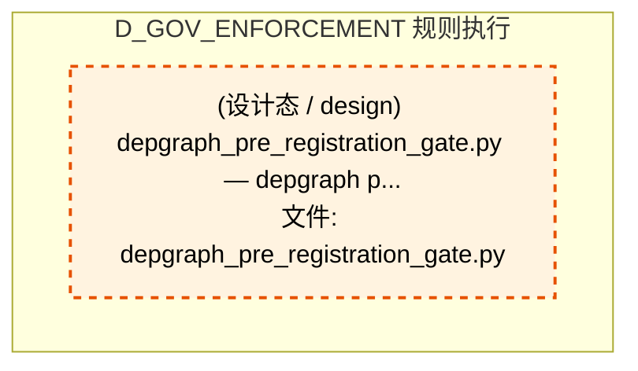
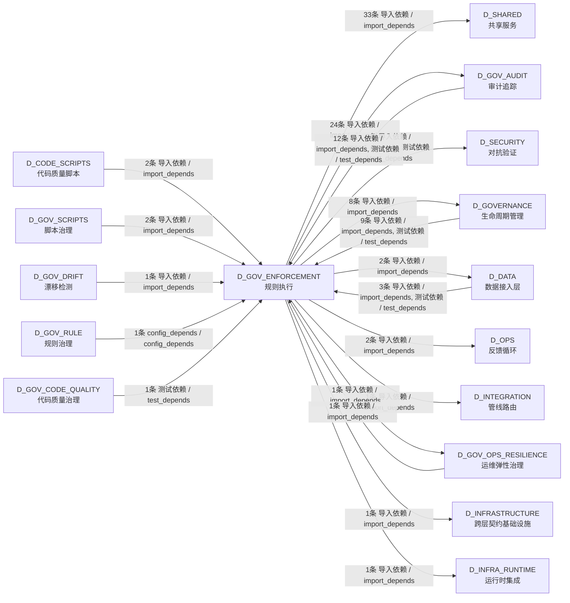

# 53_d_gov_enforcement / 规则执行 / Rule Enforcement

> **功能简介 / Overview**: 规则执行，负责治理规则执行和门禁拦截

> **文档作用 / Purpose**: 展示 规则执行（D_GOV_ENFORCEMENT）功能域的模块清单、域内依赖关系、跨域依赖关系、架构分层视图，供架构审查和域治理参考。

> 本文档由 generate_domain_doc.py 从 depgraph (PostgreSQL) 自动生成
> 数据源: depgraph (PostgreSQL) nodes表 + edges表

## 域基本信息 / Domain Overview

| 字段 | 值 | Field | Value |
|------|------|-------|-------|
| 编号 | 53 | Number | 53 |
| 域ID | D_GOV_ENFORCEMENT | Domain ID | D_GOV_ENFORCEMENT |
| 域名称 | 规则执行 | Domain Name | Rule Enforcement |
| 层级 | L2 业务域层 | Layer | L2 Domain |
| 模块数 | 132 | Module Count | 132 |
| 域内依赖 | 163 | Internal Dependencies | 163 |
| 跨域入边 | 32 | Cross-domain Incoming | 32 |
| 跨域出边 | 81 | Cross-domain Outgoing | 81 |
| 设计态模块 | 1 | Design Modules | 1 |
| 生产态模块 | 131 | Production Modules | 131 |
| 容量 | 40/150 (正常) | Capacity | 40/150 (正常) |
| 描述 | 门禁引擎流程编排(GatePipeline/GateEngine) | Description | 门禁引擎流程编排(GatePipeline/GateEngine) |

## 模块分层清单 / Module Layered List

> 按 architecture_layer 分组的模块清单（共 132 个模块 / 132 modules）。

### L0 基础设施层 / Infrastructure Layer (2 modules)

| # | 模块路径 / Module Path | 模块名称 / Module Name (功能简介 / Description) | 成熟度 / Maturity | 蓝图 / Blueprint |
|:--:|---------|---------|:---:|:---:|
| 1 | src/zephyr/gov_enforcement/rule_enforcement/default_quali... | D_DATA — Default Data Quality Gate | 生产态 / production |  |
| 2 | src/zephyr/gov_enforcement/rule_enforcement/quality_gate.py | D_DATA — Data Quality Gate | 生产态 / production |  |

### L1 基础层 / Foundation Layer (92 modules)

| # | 模块路径 / Module Path | 模块名称 / Module Name (功能简介 / Description) | 成熟度 / Maturity | 蓝图 / Blueprint |
|:--:|---------|---------|:---:|:---:|
| 1 | docs/01_policies_and_standards/_registry/catalogs/rule_en... | [聚合节点 / Aggregated] 门禁规则集 / Gate Rule Set (82 items) | 生产态 / production |  |
| ↳1 |   ↳ src/zephyr/gov_enforcement/rule_enforcement/admissio... | 对标：Architecture Decision Records (KB 决策记录) + YAGNI principle。 任何新... | - | - |
| ↳2 |   ↳ src/zephyr/gov_enforcement/rule_enforcement/admissio... | 对标：Wardley Mapping + Phase-based delivery。 任何新模块 MUST 证明与当前开发... | - | - |
| ↳3 |   ↳ src/zephyr/gov_enforcement/rule_enforcement/admissio... | 对标：Layer Isolation Principle + ArchUnit fitness functions。 新模块的依赖关... | - | - |
| ↳4 |   ↳ src/zephyr/gov_enforcement/rule_enforcement/admissio... | 对标：Interface Segregation Principle (ISP) + Contract-First Design。 任何新... | - | - |
| ↳5 |   ↳ src/zephyr/gov_enforcement/rule_enforcement/admissio... | 对标：TPL-DEPGRAPH-001 v4.0.0 + project_rules.md 铁律 #7。 依赖图产出物 MUST ... | - | - |
| ↳6 |   ↳ src/zephyr/gov_enforcement/rule_enforcement/g1_inges... | Ingest stage admission gate - validates file existence, encoding compliance, ... | - | - |
| ↳7 |   ↳ src/zephyr/gov_enforcement/rule_enforcement/g2_triag... | Triage stage admission gate - validates classification labels and priority sc... | - | - |
| ↳8 |   ↳ src/zephyr/gov_enforcement/rule_enforcement/g3_evalu... | Evaluate stage admission gate - ensures knowledge value score meets threshold... | - | - |
| ↳9 |   ↳ src/zephyr/gov_enforcement/rule_enforcement/g4_activ... | Activate stage admission gate - ensures dependencies are ready and no conflic... | - | - |
| ↳10 |   ↳ src/zephyr/gov_enforcement/rule_enforcement/g5_extra... | Extract stage admission gate - ensures extraction templates are ready and tar... | - | - |
| ↳11 |   ↳ src/zephyr/gov_enforcement/rule_enforcement/g6_bluep... | beta hard compliance gate — AI agent MUST read the relevant blueprint BEFORE... | - | - |
| ↳12 |   ↳ src/zephyr/gov_enforcement/rule_enforcement/g6_ctr_c... | CTR contract compliance gate - ensures all data through reporting domain modu... | - | - |
| ↳13 |   ↳ src/zephyr/gov_enforcement/rule_enforcement/g6_path_... | GOV-DOC-004 §四-A 强制门禁 — 文件创建/删除/移动后必须刷新物理路径树快照和路... | - | - |
| ↳14 |   ↳ src/zephyr/gov_enforcement/rule_enforcement/g7_posit... | AI 生成的策略配置（D_PORTFOLIO_CORE/D_EXECUTION_CORE 产出）必须尊重 RiskLimit... | - | - |
| ↳15 |   ↳ src/zephyr/gov_enforcement/rule_enforcement/g7c_cros... | 跨门禁时序一致性校验：检测任务执行期间蓝图版本是否发生变化。 FOR EACH module_... | - | - |
| ↳16 |   ↳ src/zephyr/gov_enforcement/rule_enforcement/g7d_dept... | G7交付门禁通过后的深度合规校验：单元测试覆盖率、依赖CVE、回归测试、lint检查。... | - | - |
| ↳17 |   ↳ src/zephyr/gov_enforcement/rule_enforcement/g8_lever... | 检查 AI 生成的策略总杠杆（含衍生品）不超过 RiskLimits.max_gross_leverage。 一... | - | - |
| ↳18 |   ↳ src/zephyr/gov_enforcement/rule_enforcement/g9.yaml | 机械验证四个关键蓝图系统与 Pipeline 的跨模块集成链路。 | - | - |
| ↳19 |   ↳ src/zephyr/gov_enforcement/rule_enforcement/g9_strat... | 当 AI 生成新策略或修改现有策略时，检查新策略与已有策略的相关性。 防止 AI 产生... | - | - |
| ↳20 |   ↳ src/zephyr/gov_enforcement/rule_enforcement/g_asset_... | 资产盘点系统健康门禁 — 验证 unified-asset-index.yaml 存在且健康评分达标，确... | - | - |
| ↳21 |   ↳ src/zephyr/gov_enforcement/rule_enforcement/g_forwar... | 前向引用检测门禁——检测 class X 定义内部引用 X 自身的模式（前向引用 bug）。 ... | - | - |
| ↳22 |   ↳ src/zephyr/gov_enforcement/rule_enforcement/g_trae_0... | 自动化门禁：强制执行 TRAE-003（任务粒度与完成门槛协议）规则。将规则从文档约束... | - | - |
| ↳23 |   ↳ src/zephyr/gov_enforcement/rule_enforcement/g_trae_0... | 自动化门禁：强制执行 TRAE-004（并行执行与原子事务协议）规则。将规则从文档约束... | - | - |
| ↳24 |   ↳ src/zephyr/gov_enforcement/rule_enforcement/g_trae_0... | 自动化门禁：强制执行 TRAE-006（防幻觉-结构追溯层）规则。将规则从文档约束升级... | - | - |
| ↳25 |   ↳ src/zephyr/gov_enforcement/rule_enforcement/g_trae_0... | 自动化门禁：强制执行 TRAE-007（防幻觉-行为约束层）规则。将规则从文档约束升级... | - | - |
| ↳26 |   ↳ src/zephyr/gov_enforcement/rule_enforcement/g_trae_0... | 自动化门禁：强制执行 TRAE-008（防幻觉-输出验证层）规则。将规则从文档约束升级... | - | - |
| ↳27 |   ↳ src/zephyr/gov_enforcement/rule_enforcement/g_trae_0... | 自动化门禁：强制执行 TRAE-009（防幻觉-安全防护层）规则。将规则从文档约束升级... | - | - |
| ↳28 |   ↳ src/zephyr/gov_enforcement/rule_enforcement/g_trae_0... | 自动化门禁：强制执行 TRAE-010（代码构建-命名与组织）规则。将规则从文档约束升... | - | - |
| ↳29 |   ↳ src/zephyr/gov_enforcement/rule_enforcement/g_trae_0... | 自动化门禁：强制执行 TRAE-011（代码构建-类型与导入）规则。将规则从文档约束升... | - | - |
| ↳30 |   ↳ src/zephyr/gov_enforcement/rule_enforcement/g_trae_0... | 自动化门禁：强制执行 TRAE-012（代码构建-测试与安全）规则。将规则从文档约束升... | - | - |
| ↳31 |   ↳ src/zephyr/gov_enforcement/rule_enforcement/g_trae_0... | 自动化门禁：强制执行 TRAE-016（架构约束-漂移检测）规则。将规则从文档约束升级... | - | - |
| ↳32 |   ↳ src/zephyr/gov_enforcement/rule_enforcement/g_trae_0... | 自动化门禁：强制执行 TRAE-017（架构约束-治理顺序）规则。将规则从文档约束升级... | - | - |
| ↳33 |   ↳ src/zephyr/gov_enforcement/rule_enforcement/g_trae_0... | 自动化门禁：强制执行 TRAE-018（行为边界-代码操作绝对禁止）规则。将规则从文档... | - | - |
| ↳34 |   ↳ src/zephyr/gov_enforcement/rule_enforcement/g_trae_0... | 自动化门禁：强制执行 TRAE-020（行为边界-治理纪律绝对禁止）规则。将规则从文档... | - | - |
| ↳35 |   ↳ src/zephyr/gov_enforcement/rule_enforcement/g_trae_0... | 自动化门禁：强制执行 TRAE-021（行为边界-其余绝对禁止）规则。将规则从文档约束... | - | - |
| ↳36 |   ↳ src/zephyr/gov_enforcement/rule_enforcement/g_trae_0... | 自动化门禁：强制执行 TRAE-022（行为边界-条件禁止(代码与安全)）规则。将规则从... | - | - |
| ↳37 |   ↳ src/zephyr/gov_enforcement/rule_enforcement/g_trae_0... | 自动化门禁：强制执行 TRAE-023（行为边界-条件禁止(治理与文档)）规则。将规则从... | - | - |
| ↳38 |   ↳ src/zephyr/gov_enforcement/rule_enforcement/g_trae_0... | 自动化门禁：强制执行 TRAE-024（方法论-诊断与根因分析）规则。将规则从文档约束... | - | - |
| ↳39 |   ↳ src/zephyr/gov_enforcement/rule_enforcement/g_trae_0... | 自动化门禁：强制执行 TRAE-025（方法论-决策与执行）规则。将规则从文档约束升级... | - | - |
| ↳40 |   ↳ src/zephyr/gov_enforcement/rule_enforcement/g_trae_0... | 自动化门禁：强制执行 TRAE-026（方法论-质量与度量）规则。将规则从文档约束升级... | - | - |
| ↳41 |   ↳ src/zephyr/gov_enforcement/rule_enforcement/g_trae_0... | 自动化门禁：强制执行 TRAE-027（方法论-协作与演进）规则。将规则从文档约束升级... | - | - |
| ↳42 |   ↳ src/zephyr/gov_enforcement/rule_enforcement/g_trae_0... | 自动化门禁：强制执行 TRAE-028（文档治理-结构与命名）规则。将规则从文档约束升... | - | - |
| ↳43 |   ↳ src/zephyr/gov_enforcement/rule_enforcement/g_trae_0... | 自动化门禁：强制执行 TRAE-029（文档治理-操作安全）规则。将规则从文档约束升级... | - | - |
| ↳44 |   ↳ src/zephyr/gov_enforcement/rule_enforcement/g_trae_0... | 自动化门禁：强制执行 TRAE-030（文档治理-编号与元数据）规则。将规则从文档约束... | - | - |
| ↳45 |   ↳ src/zephyr/gov_enforcement/rule_enforcement/g_trae_0... | 自动化门禁：强制执行 TRAE-031（安全治理-密钥与访问控制）规则。将规则从文档约... | - | - |
| ↳46 |   ↳ src/zephyr/gov_enforcement/rule_enforcement/g_trae_0... | 自动化门禁：强制执行 TRAE-032（模块治理-准入与生命周期）规则。将规则从文档约... | - | - |
| ↳47 |   ↳ src/zephyr/gov_enforcement/rule_enforcement/g_trae_0... | 自动化门禁：强制执行 TRAE-033（模块治理-注册与同步）规则。将规则从文档约束升... | - | - |
| ↳48 |   ↳ src/zephyr/gov_enforcement/rule_enforcement/g_trae_0... | 自动化门禁：强制执行 TRAE-034（任务系统-卡片标准与生命周期）规则。将规则从文... | - | - |
| ↳49 |   ↳ src/zephyr/gov_enforcement/rule_enforcement/g_trae_0... | 自动化门禁：强制执行 TRAE-035（任务系统-施工与验证）规则。将规则从文档约束升... | - | - |
| ↳50 |   ↳ src/zephyr/gov_enforcement/rule_enforcement/g_trae_0... | 自动化门禁：强制执行 TRAE-036（架构治理-门禁与过渡）规则。将规则从文档约束升... | - | - |
| ↳51 |   ↳ src/zephyr/gov_enforcement/rule_enforcement/g_trae_0... | 自动化门禁：强制执行 TRAE-037（架构治理-合格与版本化）规则。将规则从文档约束... | - | - |
| ↳52 |   ↳ src/zephyr/gov_enforcement/rule_enforcement/g_trae_0... | 自动化门禁：强制执行 TRAE-038（架构治理-CTR注入规则）规则。将规则从文档约束升... | - | - |
| ↳53 |   ↳ src/zephyr/gov_enforcement/rule_enforcement/g_trae_0... | 自动化门禁：强制执行 TRAE-039（AI治理-幻觉检测与自检）规则。将规则从文档约束... | - | - |
| ↳54 |   ↳ src/zephyr/gov_enforcement/rule_enforcement/g_trae_0... | 自动化门禁：强制执行 TRAE-040（AI治理-模型路由与协作）规则。将规则从文档约束... | - | - |
| ↳55 |   ↳ src/zephyr/gov_enforcement/rule_enforcement/g_trae_0... | 自动化门禁：强制执行 TRAE-041（元规则-规则分类与裁决）规则。将规则从文档约束... | - | - |
| ↳56 |   ↳ src/zephyr/gov_enforcement/rule_enforcement/g_trae_0... | 自动化门禁：强制执行 TRAE-042（元规则-标准体系与模板）规则。将规则从文档约束... | - | - |
| ↳57 |   ↳ src/zephyr/gov_enforcement/rule_enforcement/g_trae_0... | 自动化门禁：强制执行 TRAE-043（元规则-元数据与度量）规则。将规则从文档约束升... | - | - |
| ↳58 |   ↳ src/zephyr/gov_enforcement/rule_enforcement/g_trae_0... | 自动化门禁：强制执行 TRAE-044（合规治理-审计与监管）规则。将规则从文档约束升... | - | - |
| ↳59 |   ↳ src/zephyr/gov_enforcement/rule_enforcement/g_trae_0... | 自动化门禁：强制执行 TRAE-045（数据治理-质量与血缘）规则。将规则从文档约束升... | - | - |
| ↳60 |   ↳ src/zephyr/gov_enforcement/rule_enforcement/g_trae_0... | 自动化门禁：强制执行 TRAE-046（工程治理-代码重组安全）规则。将规则从文档约束... | - | - |
| ↳61 |   ↳ src/zephyr/gov_enforcement/rule_enforcement/g_trae_0... | 自动化门禁：强制执行 TRAE-047（工程治理-文件头部与扩展）规则。将规则从文档约... | - | - |
| ↳62 |   ↳ src/zephyr/gov_enforcement/rule_enforcement/g_trae_0... | 自动化门禁：强制执行 TRAE-048（操作-Vibe Coding会话管理）规则。将规则从文档约... | - | - |
| ↳63 |   ↳ src/zephyr/gov_enforcement/rule_enforcement/g_trae_0... | 自动化门禁：强制执行 TRAE-049（操作-领域操作手册）规则。将规则从文档约束升级... | - | - |
| ↳64 |   ↳ src/zephyr/gov_enforcement/rule_enforcement/g_trae_0... | 自动化门禁：强制执行 TRAE-050（域策略-数据源与因子层）规则。将规则从文档约束... | - | - |
| ↳65 |   ↳ src/zephyr/gov_enforcement/rule_enforcement/g_trae_0... | 自动化门禁：强制执行 TRAE-051（域策略-风控与盘后层）规则。将规则从文档约束升... | - | - |
| ↳66 |   ↳ src/zephyr/gov_enforcement/rule_enforcement/g_trae_0... | 自动化门禁：强制执行 TRAE-052（铁律补充-跨蓝图变更与项目瘦身）规则。将规则从... | - | - |
| ↳67 |   ↳ src/zephyr/gov_enforcement/rule_enforcement/g_trae_0... | 自动化门禁：强制执行 TRAE-053（铁律补充-自动化双轨判定）规则。将规则从文档约... | - | - |
| ↳68 |   ↳ src/zephyr/gov_enforcement/rule_enforcement/g_trae_0... | 自动化门禁：强制执行 TRAE-054（depgraph 程序化访问协议）规则。将规则从文档约... | - | - |
| ↳69 |   ↳ src/zephyr/gov_enforcement/rule_enforcement/g_trae_0... | 自动化门禁：强制执行 TRAE-055（架构容量与域治理规则）规则。将规则从文档约束升... | - | - |
| ↳70 |   ↳ src/zephyr/gov_enforcement/rule_enforcement/g_trae_0... | 自动化门禁：强制执行 TRAE-059（_schema_version 写入保护规范）。 两层检查：(1)... | - | - |
| ↳71 |   ↳ src/zephyr/gov_enforcement/rule_enforcement/gate_ded... | 代码去重门禁——每次 GateEngine.evaluate("GATE-DEDUP") 触发时， 调用 code_ded... | - | - |
| ↳72 |   ↳ src/zephyr/gov_enforcement/rule_enforcement/gct_024_... |  | - | - |
| ↳73 |   ↳ src/zephyr/gov_enforcement/rule_enforcement/invarian... | 扫描 14 层 + shared/contracts 的全部 Python 导入，构建依赖 DAG， Kahn's algor... | - | - |
| ↳74 |   ↳ src/zephyr/gov_enforcement/rule_enforcement/invarian... | 读取 cross_layer_contracts.yaml，验证每条 P0 契约均声明了 enforcement （enfor... | - | - |
| ↳75 |   ↳ src/zephyr/gov_enforcement/rule_enforcement/invarian... | 读取 cross_layer_contracts.yaml 中的字段定义，与 codegen 生成的 Python datacl... | - | - |
| ↳76 |   ↳ src/zephyr/gov_enforcement/rule_enforcement/observab... | Phase 1 observability baseline gate — validates System Telemetry (MOD-INF-01... | - | - |
| ↳77 |   ↳ src/zephyr/gov_enforcement/rule_enforcement/post_doc... | Session 关门时审查本次 session 修改的文档+蓝图/规则， 按 trae_030 §0 时态判... | - | - |
| ↳78 |   ↳ src/zephyr/gov_enforcement/rule_enforcement/sys_mast... | 系统总蓝图合规门禁——验证 SYS-MASTER-001（三级金字塔顶点）与 MOD-MASTER-001 ... | - | - |
| ↳79 |   ↳ src/zephyr/gov_enforcement/rule_enforcement/task/g0_... | G0 是所有任务（AI Agent 任务 + 人工作业）进入 ZephyrAlpha 工作流系统 的强制性... | - | - |
| ↳80 |   ↳ src/zephyr/gov_enforcement/rule_enforcement/task/g0_... | 任务进入执行队列前的可自动化校验：priority 枚举、核心字段非空、task_id 正则。... | - | - |
| ↳81 |   ↳ src/zephyr/gov_enforcement/rule_enforcement/task/g7_... | 收尾校验：TaskCard.verification_status=verified；audit_findings 全部 resolved... | - | - |
| ↳82 |   ↳ src/zephyr/gov_enforcement/rule_enforcement/zero_res... | 零残留原则自动化执行层——每次 GateEngine.evaluate("ZERO-RESIDUE") 触发时， ... | - | - |
| 2 | src/zephyr/gov_enforcement/commit_gates/__init__.py | commit_gates — GitCommitGateway pre-commit 门... | 生产态 / production |  |
| 3 | src/zephyr/gov_enforcement/commit_gates/_diff_helpers.py | _diff_helpers.py — gate 共享 diff 解析工具模块 | 生产态 / production |  |
| 4 | src/zephyr/gov_enforcement/commit_gates/_reference_helper... | _reference_helpers.py — 引用检测门禁共享工具函... | 生产态 / production |  |
| 5 | src/zephyr/gov_enforcement/commit_gates/arch_reference_ga... | arch_reference_gate.py — #ARCH-NNN /... | 生产态 / production |  |
| 6 | src/zephyr/gov_enforcement/commit_gates/asyncio_run_in_co... | asyncio_run_in_context_gate.py — 异步上下文误... | 生产态 / production |  |
| 7 | src/zephyr/gov_enforcement/commit_gates/bare_getenv_gate.py | bare_getenv_gate.py — 裸 os.getenv 读密钥阻断... | 生产态 / production |  |
| 8 | src/zephyr/gov_enforcement/commit_gates/bare_sql_gate.py | bare_sql_gate.py — 裸SQL字面量阻断门禁（NO-BAR... | 生产态 / production |  |
| 9 | src/zephyr/gov_enforcement/commit_gates/bare_subprocess_g... | bare_subprocess_gate.py — 裸 subprocess 调用 w... | 生产态 / production |  |
| 10 | src/zephyr/gov_enforcement/commit_gates/blueprint_amodule... | blueprint_amodule_consistency_gate.py — [A_mod... | 生产态 / production |  |
| 11 | src/zephyr/gov_enforcement/commit_gates/blueprint_amodule... | blueprint_amodule_cross_check_gate.py — [BLUEP... | 生产态 / production |  |
| 12 | src/zephyr/gov_enforcement/commit_gates/blueprint_format_... | blueprint_format_gate.py — [BLUEPRINT] 头部 mo... | 生产态 / production |  |
| 13 | src/zephyr/gov_enforcement/commit_gates/capability_consis... | capability_consistency_gate.py — Provider 路由... | 生产态 / production |  |
| 14 | src/zephyr/gov_enforcement/commit_gates/capability_lookup... | capability_lookup_bypass_policy.py — CAPABILIT... | 生产态 / production |  |
| 15 | src/zephyr/gov_enforcement/commit_gates/capability_lookup... | capability_lookup_required_gate.py — Capabilit... | 生产态 / production |  |
| 16 | src/zephyr/gov_enforcement/commit_gates/capability_overla... | capability_overlap_gate.py — 新建 .py 文件 Cap... | 生产态 / production |  |
| 17 | src/zephyr/gov_enforcement/commit_gates/ch_batch_size_gat... | ch_batch_size_gate.py — CH 批量写入防回退门禁... | 生产态 / production |  |
| 18 | src/zephyr/gov_enforcement/commit_gates/ch_final_gate.py | ch_final_gate.py — ch_writer.query() 直接调用... | 生产态 / production |  |
| 19 | src/zephyr/gov_enforcement/commit_gates/ch_version_col_ga... | ch_version_col_gate.py — CH version 列语义误用... | 生产态 / production |  |
| 20 | src/zephyr/gov_enforcement/commit_gates/claim_required_ga... | claim_required_gate.py — claim_files 前置检查... | 生产态 / production |  |
| 21 | src/zephyr/gov_enforcement/commit_gates/consumers_accurac... | consumers_accuracy_gate.py — CONSUMERS 字段准... | 生产态 / production |  |
| 22 | src/zephyr/gov_enforcement/commit_gates/create_guard.py | create_guard.py — 新建 .py / 非 rules/ .yaml ... | 生产态 / production |  |
| 23 | src/zephyr/gov_enforcement/commit_gates/dangling_referenc... | dangling_reference_gate.py — AGENTS.md §X.Y ... | 生产态 / production |  |
| 24 | src/zephyr/gov_enforcement/commit_gates/data_task_complet... | data_task_completeness_gate.py — 数据任务完整... | 生产态 / production |  |
| 25 | src/zephyr/gov_enforcement/commit_gates/datetime_now_forb... | datetime_now_forbidden_gate.py — 时间戳约定硬... | 生产态 / production |  |
| 26 | src/zephyr/gov_enforcement/commit_gates/depgraph_freshnes... | depgraph_freshness_gate.py — depgraph 新鲜度门... | 生产态 / production |  |
| 27 | src/zephyr/gov_enforcement/commit_gates/depgraph_pre_regi... | depgraph_pre_registration_gate.py — depgraph p... | 设计态 / design |  |
| 28 | src/zephyr/gov_enforcement/commit_gates/depgraph_write_pa... | depgraph_write_path_gate.py — depgraph 写入路... | 生产态 / production |  |
| 29 | src/zephyr/gov_enforcement/commit_gates/derivation_annota... | derivation_annotation_gate.py — 派生关系声明真... | 生产态 / production |  |
| 30 | src/zephyr/gov_enforcement/commit_gates/directory_contrac... | directory_contract_gate.py — DCR-001~007 等效... | 生产态 / production |  |
| 31 | src/zephyr/gov_enforcement/commit_gates/doc_ref_broken_ga... | doc_ref_broken_gate.py — 文档相对路径断裂引用... | 生产态 / production |  |
| 32 | src/zephyr/gov_enforcement/commit_gates/domain_fk_gate.py | domain_fk_gate.py — [DOMAIN] 头部域注册表 FK ... | 生产态 / production |  |
| 33 | src/zephyr/gov_enforcement/commit_gates/domain_name_zh_di... | domain_name_zh_direct_access_gate.py — DOMAIN_... | 生产态 / production |  |
| 34 | src/zephyr/gov_enforcement/commit_gates/empty_handler_gat... | empty_handler_gate.py — 空事件 handler 函数阻... | 生产态 / production |  |
| 35 | src/zephyr/gov_enforcement/commit_gates/encoding_gate.py | encoding_gate.py — 编码安全校验门禁（治本：弥... | 生产态 / production |  |
| 36 | src/zephyr/gov_enforcement/commit_gates/exempt_zone_front... | exempt_zone_frontmatter_gate.py — 豁免区 front... | 生产态 / production |  |
| 37 | src/zephyr/gov_enforcement/commit_gates/file_copy_gate.py | file_copy_gate.py — 新增 .py 文件复制检测阻断... | 生产态 / production |  |
| 38 | src/zephyr/gov_enforcement/commit_gates/file_placement_tt... | file_placement_ttl_gate.py — 文件放置与 TTL 一... | 生产态 / production |  |
| 39 | src/zephyr/gov_enforcement/commit_gates/folder_capacity_h... | folder_capacity_hard_limit_gate.py — 文件夹容... | 生产态 / production |  |
| 40 | src/zephyr/gov_enforcement/commit_gates/foreign_change_ga... | foreign_change_gate.py — 外来变更检测门禁（FOR... | 生产态 / production |  |
| 41 | src/zephyr/gov_enforcement/commit_gates/forged_gw_marker_... | forged_gw_marker_gate.py — Forged GW Marker 前... | 生产态 / production |  |
| 42 | src/zephyr/gov_enforcement/commit_gates/function_dup_gate.py | function_dup_gate.py — 重复函数实现阻断门禁（F... | 生产态 / production |  |
| 43 | src/zephyr/gov_enforcement/commit_gates/gate_repo.py | gate_repo.py — gates 表持久化仓库（AUDIT-07 P1... | 生产态 / production |  |
| 44 | src/zephyr/gov_enforcement/commit_gates/git_call_budget_g... | git_call_budget_gate.py — Git 调用预算 warn-on... | 生产态 / production |  |
| 45 | src/zephyr/gov_enforcement/commit_gates/god_class_gate.py | god_class_gate.py — God Class 阻断门禁（NO-GOD... | 生产态 / production |  |
| 46 | src/zephyr/gov_enforcement/commit_gates/hardcoded_url_gat... | hardcoded_url_gate.py — 硬编码 localhost URL ... | 生产态 / production |  |
| 47 | src/zephyr/gov_enforcement/commit_gates/held_overlap_gate.py | held_overlap_gate.py — 搭便车防护门禁（HELD-OV... | 生产态 / production |  |
| 48 | src/zephyr/gov_enforcement/commit_gates/high_complexity_g... | high_complexity_gate.py — 高循环复杂度阻断门禁... | 生产态 / production |  |
| 49 | src/zephyr/gov_enforcement/commit_gates/id_uniqueness_gat... | id_uniqueness_gate.py — pre-commit hook ID 唯... | 生产态 / production |  |
| 50 | src/zephyr/gov_enforcement/commit_gates/import_direction_... | import_direction_gate.py — shared 层向上依赖阻... | 生产态 / production |  |
| 51 | src/zephyr/gov_enforcement/commit_gates/import_integrity_... | import_integrity_gate.py — IMPORT-INTEGRITY 门... | 生产态 / production |  |
| 52 | src/zephyr/gov_enforcement/commit_gates/issue_resolved_in... | issue_resolved_integrity_gate.py — ISSUE-RESOL... | 生产态 / production |  |
| 53 | src/zephyr/gov_enforcement/commit_gates/long_param_list_g... | long_param_list_gate.py — 长参数列表阻断门禁（... | 生产态 / production |  |
| 54 | src/zephyr/gov_enforcement/commit_gates/manual_only_perma... | manual_only_permanent_gate.py — 永久系统脚本 m... | 生产态 / production |  |
| 55 | src/zephyr/gov_enforcement/commit_gates/mcp_version_field... | mcp_version_field_gate.py — MCP version 字段缺... | 生产态 / production |  |
| 56 | src/zephyr/gov_enforcement/commit_gates/module_id_consist... | module_id_consistency_gate.py — module_id 三声... | 生产态 / production |  |
| 57 | src/zephyr/gov_enforcement/commit_gates/msg_exposure_gate.py | msg_exposure_gate.py — 错误消息暴露敏感信息阻... | 生产态 / production |  |
| 58 | src/zephyr/gov_enforcement/commit_gates/msg_style_gate.py | msg_style_gate.py — 错误消息标点/箭头风格阻断... | 生产态 / production |  |
| 59 | src/zephyr/gov_enforcement/commit_gates/mutable_const_wit... | mutable_const_without_final_gate.py — 可变常量... | 生产态 / production |  |
| 60 | src/zephyr/gov_enforcement/commit_gates/new_file_depgraph... | new_file_depgraph_gate.py — 新建 .py 文件 depg... | 生产态 / production |  |
| 61 | src/zephyr/gov_enforcement/commit_gates/no_import_side_ef... | no_import_side_effect_gate.py — 模块导入零副作... | 生产态 / production |  |
| 62 | src/zephyr/gov_enforcement/commit_gates/noqa_validation_g... | noqa_validation_gate.py — 自定义 noqa 标记合规... | 生产态 / production |  |
| 63 | src/zephyr/gov_enforcement/commit_gates/open_without_with... | open_without_with_gate.py — open() 未在 with ... | 生产态 / production |  |
| 64 | src/zephyr/gov_enforcement/commit_gates/orphan_module_gat... | orphan_module_gate.py — 孤儿模块（无 import 引... | 生产态 / production |  |
| 65 | src/zephyr/gov_enforcement/commit_gates/panorama_alignmen... | panorama_alignment_gate.py — 三图模块对齐门禁... | 生产态 / production |  |
| 66 | src/zephyr/gov_enforcement/commit_gates/perm_trigger_gate.py | perm_trigger_gate.py — 永久系统脚本时间触发模... | 生产态 / production |  |
| 67 | src/zephyr/gov_enforcement/commit_gates/precommit_offline... | precommit_offline_gate.py — pre-commit 配置离... | 生产态 / production |  |
| 68 | src/zephyr/gov_enforcement/commit_gates/pure_assertion_ga... | pure_assertion_gate.py — 纯陈述原则阻断门禁（P... | 生产态 / production |  |
| 69 | src/zephyr/gov_enforcement/commit_gates/pure_shim_gate.py | pure_shim_gate.py — 纯 re-export shim 阻断门禁... | 生产态 / production |  |
| 70 | src/zephyr/gov_enforcement/commit_gates/r5_digit_suffix_g... | r5_digit_suffix_gate.py — R5 数字后缀目录禁止... | 生产态 / production |  |
| 71 | src/zephyr/gov_enforcement/commit_gates/reconciler_health... | reconciler_health_gate.py — reconciler 健康度... | 生产态 / production |  |
| 72 | src/zephyr/gov_enforcement/commit_gates/relative_path_lit... | relative_path_literal_gate.py — 相对路径字面量... | 生产态 / production |  |
| 73 | src/zephyr/gov_enforcement/commit_gates/rename_depgraph_s... | rename_depgraph_sync_gate.py — 文件重命名后 de... | 生产态 / production |  |
| 74 | src/zephyr/gov_enforcement/commit_gates/rule_execution_pa... | rule_execution_pairing_gate.py — 规则-执行配对... | 生产态 / production |  |
| 75 | src/zephyr/gov_enforcement/commit_gates/rule_four_way_ali... | rule_four_way_alignment_gate.py — 规则四方对齐... | 生产态 / production |  |
| 76 | src/zephyr/gov_enforcement/commit_gates/ruling_commit_ver... | ruling_commit_verified_gate.py — 文档"已完成"... | 生产态 / production |  |
| 77 | src/zephyr/gov_enforcement/commit_gates/ruling_reference_... | ruling_reference_gate.py — 裁定#NNN 悬空引用自... | 生产态 / production |  |
| 78 | src/zephyr/gov_enforcement/commit_gates/schema_file_exist... | schema_file_exists_gate.py — SCHEMA-FILE-EXIST... | 生产态 / production |  |
| 79 | src/zephyr/gov_enforcement/commit_gates/scripts_import_in... | scripts_import_integrity_gate.py — _shared.con... | 生产态 / production |  |
| 80 | src/zephyr/gov_enforcement/commit_gates/session_required_... | session_required_gate.py — session 注册强制门... | 生产态 / production |  |
| 81 | src/zephyr/gov_enforcement/commit_gates/snapshot_drift_ga... | snapshot_drift_gate.py — 运行时违规快照漂移阻... | 生产态 / production |  |
| 82 | src/zephyr/gov_enforcement/commit_gates/ssot_redefinition... | ssot_redefinition_gate.py — SSoT 符号重复定义... | 生产态 / production |  |
| 83 | src/zephyr/gov_enforcement/commit_gates/table_name_regist... | table_name_registry_gate.py — TABLE-NAME-REGIS... | 生产态 / production |  |
| 84 | src/zephyr/gov_enforcement/commit_gates/test_source_consi... | test_source_consistency_gate.py — 测试-源码符... | 生产态 / production |  |
| 85 | src/zephyr/gov_enforcement/commit_gates/tests_coverage_ga... | tests_coverage_gate.py — Gate 测试覆盖率校验 m... | 生产态 / production |  |
| 86 | src/zephyr/gov_enforcement/commit_gates/ttl_gate.py | ttl_gate.py — ttl 字段校验门禁（治本：弥补 --n... | 生产态 / production |  |
| 87 | src/zephyr/gov_enforcement/commit_gates/undefined_name_ga... | undefined_name_gate.py — UNDEFINED-NAME 门禁（... | 生产态 / production |  |
| 88 | src/zephyr/gov_enforcement/commit_gates/unsafe_dict_sprea... | unsafe_dict_spread_gate.py — ``**data`` 直接展... | 生产态 / production |  |
| 89 | src/zephyr/gov_enforcement/commit_gates/vocab_chain_gate.py | vocab_chain_gate.py — SSoT 引用硬编码阻断门禁... | 生产态 / production |  |
| 90 | src/zephyr/gov_enforcement/commit_gates/vocab_hardcode_ga... | vocab_hardcode_gate.py — 新增 .py 文件词表硬编... | 生产态 / production |  |
| 91 | src/zephyr/gov_enforcement/commit_gates/zephyr_env_direct... | zephyr_env_direct_access_gate.py — ZEPHYR_ENV ... | 生产态 / production |  |
| 92 | src/zephyr/gov_enforcement/rule_bridge/gate_auto_registra... | gate_auto_registrar.py — YAML 驱动的 in-proces... | 生产态 / production |  |

### L2 领域层 / Domain Layer (38 modules)

| # | 模块路径 / Module Path | 模块名称 / Module Name (功能简介 / Description) | 成熟度 / Maturity | 蓝图 / Blueprint |
|:--:|---------|---------|:---:|:---:|
| 1 | scripts/governance/d8_doc_sync/metric_count_drift_reconci... | metric_count_drift_reconciler.py — dashboard ... | 生产态 / production |  |
| 2 | scripts/governance/d8_doc_sync/readme_version_sync_reconc... | readme_version_sync_reconciler.py — README 版... | 生产态 / production |  |
| 3 | scripts/governance/session_worktree_cli.py | session_worktree_cli.py — session worktree 管... | 生产态 / production |  |
| 4 | src/zephyr/gov_enforcement/__init__.py | gov_enforcement package — 执行治理域（D_GOV_EN... | 生产态 / production |  |
| 5 | src/zephyr/gov_enforcement/behavioral_admission/__init__.py | __init__.py | 生产态 / production |  |
| 6 | src/zephyr/gov_enforcement/behavioral_admission/admission... | admission_controller.py | 生产态 / production |  |
| 7 | src/zephyr/gov_enforcement/behavioral_admission/admission... | admission_response.py | 生产态 / production |  |
| 8 | src/zephyr/gov_enforcement/behavioral_admission/code_revi... | code_review_ai.py | 生产态 / production |  |
| 9 | src/zephyr/gov_enforcement/behavioral_admission/gate_even... | GateEventAdapter — GateRepo 事件适配器（DW-0006） | 生产态 / production |  |
| 10 | src/zephyr/gov_enforcement/behavioral_admission/gpu_conse... | gpu_consensus_scheduler.py | 生产态 / production |  |
| 11 | src/zephyr/gov_enforcement/behavioral_admission/protectio... | protection_index.py | 生产态 / production |  |
| 12 | src/zephyr/gov_enforcement/behavioral_admission/verdict_e... | verdict_engine.py | 生产态 / production |  |
| 13 | src/zephyr/gov_enforcement/commit_gates/stash_accumulatio... | stash_accumulation_gate.py — stash 堆积阈值检... | 生产态 / production |  |
| 14 | src/zephyr/gov_enforcement/rule_bridge/batched_auto_commi... | batched_auto_committer.py — Reconciler 批量化 ... | 生产态 / production |  |
| 15 | src/zephyr/gov_enforcement/rule_bridge/commit_gate_regist... | commit_gate_registry.py — GitCommitGateway pre... | 生产态 / production |  |
| 16 | src/zephyr/gov_enforcement/rule_bridge/emergency_commit.py | emergency_commit.py — 紧急提交通道（Ruling:100... | 生产态 / production |  |
| 17 | src/zephyr/gov_enforcement/rule_bridge/git_commit_gateway.py | GitCommitGateway — 全项目唯一合法 git commit ... | 生产态 / production |  |
| 18 | src/zephyr/gov_enforcement/rule_bridge/heartbeat_daemon.py | heartbeat_daemon.py — session heartbeat 独立进... | 生产态 / production |  |
| 19 | src/zephyr/gov_enforcement/rule_bridge/session_claim.py | session_claim.py — AI 对话并发声明 helper（FP-... | 生产态 / production |  |
| 20 | src/zephyr/gov_enforcement/rule_bridge/session_worktree.py | session_worktree.py — AI 对话 worktree 物理隔... | 生产态 / production |  |
| 21 | src/zephyr/gov_enforcement/rule_bridge/worktree_lifecycle.py | WorktreeLifecycle — worktree 生命周期状态机（5... | 生产态 / production |  |
| 22 | src/zephyr/gov_enforcement/rule_bridge/worktree_manager.py | worktree_manager.py — session worktree 物理隔... | 生产态 / production |  |
| 23 | src/zephyr/gov_enforcement/rule_bridge/worktree_pool.py | worktree_pool.py — Worktree 预创建池（ARCH-GIT... | 生产态 / production |  |
| 24 | src/zephyr/gov_enforcement/rule_enforcement/approval.py | G-CT-004 — Backward-compat re-export of Approv... | 生产态 / production |  |
| 25 | src/zephyr/gov_enforcement/rule_enforcement/compliance_ru... | Re-export shim — ComplianceRule 真源已合并至 z... | 生产态 / production |  |
| 26 | src/zephyr/gov_enforcement/rule_enforcement/dlq_retry_pol... | DLQ 重试策略 — 对接 shared/events/dlq.DeadLett... | 生产态 / production |  |
| 27 | src/zephyr/gov_enforcement/rule_enforcement/output_qualit... | output_quality_gate.py | 生产态 / production |  |
| 28 | src/zephyr/gov_enforcement/rule_enforcement/pre_flight_ga... | pre_flight_gate.py | 生产态 / production |  |
| 29 | src/zephyr/gov_enforcement/rule_enforcement/rule_engine/r... | Rule Canary Manager — v0.10.0 规则金丝雀: 1%用... | 生产态 / production |  |
| 30 | src/zephyr/gov_enforcement/rule_enforcement/rule_engine/r... | Rule Debt Auditor — v0.7.0 规则债务审计器: 分... | 生产态 / production |  |
| 31 | src/zephyr/gov_enforcement/rule_enforcement/rule_engine/r... | Rule Shadow Runner — v0.10.0 规则影子模式: 新... | 生产态 / production |  |
| 32 | src/zephyr/gov_enforcement/rule_enforcement/rule_engine/r... | RuleWatcher — YAML 规则文件变更检测与自动同步 | 生产态 / production |  |
| 33 | src/zephyr/gov_enforcement/rule_enforcement/slo_contract.py | SLO-Driven Escalation Contract — D-022-12. | 生产态 / production |  |
| 34 | tests/governance/commit_gates/test_create_guard.py | test_create_guard.py — CREATE-GUARD 门禁单元测... | 生产态 / production |  |
| 35 | tests/governance/commit_gates/test_r5_digit_suffix_gate.py | test_r5_digit_suffix_gate.py — R5-DIGIT-SUFFIX... | 生产态 / production |  |
| 36 | tests/governance/rule_bridge/test_claim_files_for_edit.py | test_claim_files_for_edit.py — P2-2 并发 sessi... | 生产态 / production |  |
| 37 | tests/governance/rule_bridge/test_emergency_commit.py | test_emergency_commit.py — emergency_commit AP... | 生产态 / production |  |
| 38 | tests/governance/rule_bridge/test_heartbeat_daemon.py | test_heartbeat_daemon.py — heartbeat daemon + ... | 生产态 / production |  |

## 域内依赖图 / Internal Dependency Diagram

> 依赖图内嵌在本文档中，IDE 可直接渲染显示。参考 decision_index.md 设计，分三个视图：合并全景图、运营态子图、设计态子图（按 design_maturity 实际值拆分）。
>
> **图例说明 / Legend**：
> - **实线边框 = 运营态模块**（production，已上线运行）
> - **虚线边框 = 设计态模块**（design，蓝图阶段，代码未写）
> - **实线箭头 = 运营态依赖**（已生效的依赖关系）
> - **虚线箭头 = 非运营态依赖**（计划中/验证中的依赖关系）

### 合并全景图（全部模块，标签标注成熟度）

> 展示全部 132 个模块（生产态 131 + 设计态 1），标签标注成熟度。

#### 第 1 页 / 共 5 页

```mermaid
graph TD
    subgraph D_GOV_ENFORCEMENT["D_GOV_ENFORCEMENT 规则执行"]
        docs_01_policies_and_standards_registry_catalogs_rule_enforcement_registry_yaml["(生产态 / production)  Gate Rule Set — ARCH-052 聚合节点 production"]
        scripts_governance_d8_doc_sync_metric_count_drift_reconciler_py["(生产态 / production) metric_count_drift_reconciler.py — dashboard ...<br/>文件: metric_count_drift_reconciler.py"]
        scripts_governance_d8_doc_sync_readme_version_sync_reconciler_py["(生产态 / production) readme_version_sync_reconciler.py — README 版...<br/>文件: readme_version_sync_reconciler.py"]
        scripts_governance_session_worktree_cli_py["(生产态 / production) session_worktree_cli.py — session worktree 管...<br/>文件: session_worktree_cli.py"]
        src_zephyr_gov_enforcement_init_py["(生产态 / production) gov_enforcement package — 执行治理域（D_GOV_EN...<br/>文件: __init__.py"]
        src_zephyr_gov_enforcement_behavioral_admission_init_py["(生产态 / production) __init__.py"]
        src_zephyr_gov_enforcement_behavioral_admission_admission_controller_py["(生产态 / production) admission_controller.py"]
        src_zephyr_gov_enforcement_behavioral_admission_admission_response_py["(生产态 / production) admission_response.py"]
        src_zephyr_gov_enforcement_behavioral_admission_code_review_ai_py["(生产态 / production) code_review_ai.py"]
        src_zephyr_gov_enforcement_behavioral_admission_gate_event_adapter_py["(生产态 / production) GateEventAdapter — GateRepo 事件适配器（DW-0006）<br/>文件: gate_event_adapter.py"]
        src_zephyr_gov_enforcement_behavioral_admission_gpu_consensus_scheduler_py["(生产态 / production) gpu_consensus_scheduler.py"]
        src_zephyr_gov_enforcement_behavioral_admission_protection_index_py["(生产态 / production) protection_index.py"]
        src_zephyr_gov_enforcement_behavioral_admission_verdict_engine_py["(生产态 / production) verdict_engine.py"]
        src_zephyr_gov_enforcement_commit_gates_init_py["(生产态 / production) commit_gates — GitCommitGateway pre-commit 门...<br/>文件: __init__.py"]
        src_zephyr_gov_enforcement_commit_gates_diff_helpers_py["(生产态 / production) _diff_helpers.py — gate 共享 diff 解析工具模块<br/>文件: _diff_helpers.py"]
        src_zephyr_gov_enforcement_commit_gates_reference_helpers_py["(生产态 / production) _reference_helpers.py — 引用检测门禁共享工具函...<br/>文件: _reference_helpers.py"]
        src_zephyr_gov_enforcement_commit_gates_arch_reference_gate_py["(生产态 / production) arch_reference_gate.py — #ARCH-NNN /...<br/>文件: arch_reference_gate.py"]
        src_zephyr_gov_enforcement_commit_gates_asyncio_run_in_context_gate_py["(生产态 / production) asyncio_run_in_context_gate.py — 异步上下文误...<br/>文件: asyncio_run_in_context_gate.py"]
        src_zephyr_gov_enforcement_commit_gates_bare_getenv_gate_py["(生产态 / production) bare_getenv_gate.py — 裸 os.getenv 读密钥阻断...<br/>文件: bare_getenv_gate.py"]
        src_zephyr_gov_enforcement_commit_gates_bare_sql_gate_py["(生产态 / production) bare_sql_gate.py — 裸SQL字面量阻断门禁（NO-BAR...<br/>文件: bare_sql_gate.py"]
        src_zephyr_gov_enforcement_commit_gates_bare_subprocess_gate_py["(生产态 / production) bare_subprocess_gate.py — 裸 subprocess 调用 w...<br/>文件: bare_subprocess_gate.py"]
        src_zephyr_gov_enforcement_commit_gates_blueprint_amodule_consistency_gate_py["(生产态 / production) blueprint_amodule_consistency_gate.py — (A_mod...<br/>文件: blueprint_amodule_consistency_gate.py"]
        src_zephyr_gov_enforcement_commit_gates_blueprint_amodule_cross_check_gate_py["(生产态 / production) blueprint_amodule_cross_check_gate.py — (BLUEP...<br/>文件: blueprint_amodule_cross_check_gate.py"]
        src_zephyr_gov_enforcement_commit_gates_blueprint_format_gate_py["(生产态 / production) blueprint_format_gate.py — (BLUEPRINT) 头部 mo...<br/>文件: blueprint_format_gate.py"]
        src_zephyr_gov_enforcement_commit_gates_capability_consistency_gate_py["(生产态 / production) capability_consistency_gate.py — Provider 路由...<br/>文件: capability_consistency_gate.py"]
        src_zephyr_gov_enforcement_commit_gates_capability_lookup_bypass_policy_py["(生产态 / production) capability_lookup_bypass_policy.py — CAPABILIT...<br/>文件: capability_lookup_bypass_policy.py"]
        src_zephyr_gov_enforcement_commit_gates_capability_lookup_required_gate_py["(生产态 / production) capability_lookup_required_gate.py — Capabilit...<br/>文件: capability_lookup_required_gate.py"]
        src_zephyr_gov_enforcement_commit_gates_capability_overlap_gate_py["(生产态 / production) capability_overlap_gate.py — 新建 .py 文件 Cap...<br/>文件: capability_overlap_gate.py"]
        src_zephyr_gov_enforcement_commit_gates_ch_batch_size_gate_py["(生产态 / production) ch_batch_size_gate.py — CH 批量写入防回退门禁...<br/>文件: ch_batch_size_gate.py"]
        src_zephyr_gov_enforcement_commit_gates_ch_final_gate_py["(生产态 / production) ch_final_gate.py — ch_writer.query() 直接调用...<br/>文件: ch_final_gate.py"]
    end
    src_zephyr_gov_enforcement_behavioral_admission_admission_response_py -->|导入依赖 / import_depends| src_zephyr_gov_enforcement_behavioral_admission_admission_controller_py
    src_zephyr_gov_enforcement_behavioral_admission_protection_index_py -->|导入依赖 / import_depends| src_zephyr_gov_enforcement_behavioral_admission_verdict_engine_py
    src_zephyr_gov_enforcement_behavioral_admission_init_py -->|导入依赖 / import_depends| src_zephyr_gov_enforcement_behavioral_admission_admission_controller_py
    src_zephyr_gov_enforcement_behavioral_admission_init_py -->|导入依赖 / import_depends| src_zephyr_gov_enforcement_behavioral_admission_admission_response_py
    src_zephyr_gov_enforcement_behavioral_admission_init_py -->|导入依赖 / import_depends| src_zephyr_gov_enforcement_behavioral_admission_code_review_ai_py
    src_zephyr_gov_enforcement_behavioral_admission_init_py -->|导入依赖 / import_depends| src_zephyr_gov_enforcement_behavioral_admission_gate_event_adapter_py
    src_zephyr_gov_enforcement_behavioral_admission_init_py -->|导入依赖 / import_depends| src_zephyr_gov_enforcement_behavioral_admission_protection_index_py
    src_zephyr_gov_enforcement_behavioral_admission_init_py -->|导入依赖 / import_depends| src_zephyr_gov_enforcement_behavioral_admission_verdict_engine_py
    src_zephyr_gov_enforcement_behavioral_admission_init_py -->|导入依赖 / import_depends| src_zephyr_gov_enforcement_behavioral_admission_gpu_consensus_scheduler_py
    src_zephyr_gov_enforcement_commit_gates_arch_reference_gate_py -->|导入依赖 / import_depends| src_zephyr_gov_enforcement_commit_gates_reference_helpers_py
    src_zephyr_gov_enforcement_behavioral_admission_gpu_consensus_scheduler_py -->|导入依赖 / import_depends| src_zephyr_gov_enforcement_behavioral_admission_verdict_engine_py
    src_zephyr_gov_enforcement_commit_gates_bare_sql_gate_py -->|导入依赖 / import_depends| src_zephyr_gov_enforcement_commit_gates_diff_helpers_py
    src_zephyr_gov_enforcement_commit_gates_asyncio_run_in_context_gate_py -->|导入依赖 / import_depends| src_zephyr_gov_enforcement_commit_gates_diff_helpers_py
    src_zephyr_gov_enforcement_commit_gates_bare_subprocess_gate_py -->|导入依赖 / import_depends| src_zephyr_gov_enforcement_commit_gates_diff_helpers_py
    src_zephyr_gov_enforcement_commit_gates_blueprint_amodule_consistency_gate_py -->|导入依赖 / import_depends| src_zephyr_gov_enforcement_commit_gates_diff_helpers_py
    src_zephyr_gov_enforcement_commit_gates_capability_consistency_gate_py -->|导入依赖 / import_depends| src_zephyr_gov_enforcement_commit_gates_diff_helpers_py
    src_zephyr_gov_enforcement_commit_gates_blueprint_amodule_cross_check_gate_py -->|导入依赖 / import_depends| src_zephyr_gov_enforcement_commit_gates_diff_helpers_py
    src_zephyr_gov_enforcement_commit_gates_ch_batch_size_gate_py -->|导入依赖 / import_depends| src_zephyr_gov_enforcement_commit_gates_diff_helpers_py
    src_zephyr_gov_enforcement_commit_gates_blueprint_format_gate_py -->|导入依赖 / import_depends| src_zephyr_gov_enforcement_commit_gates_diff_helpers_py
    src_zephyr_gov_enforcement_commit_gates_capability_lookup_required_gate_py -->|导入依赖 / import_depends| src_zephyr_gov_enforcement_commit_gates_capability_lookup_bypass_policy_py
    D_SHARED["(生产态 / production) D_SHARED"]
    src_zephyr_gov_enforcement_commit_gates_blueprint_format_gate_py -->|导入依赖 / import_depends| D_SHARED
    src_zephyr_gov_enforcement_commit_gates_capability_lookup_required_gate_py -->|导入依赖 / import_depends| D_SHARED
    D_GOV_AUDIT["(生产态 / production) D_GOV_AUDIT"]
    scripts_governance_d8_doc_sync_metric_count_drift_reconciler_py -->|导入依赖 / import_depends| D_GOV_AUDIT
    src_zephyr_gov_enforcement_behavioral_admission_gate_event_adapter_py -->|导入依赖 / import_depends| D_GOV_AUDIT
    src_zephyr_gov_enforcement_behavioral_admission_gate_event_adapter_py -->|导入依赖 / import_depends| D_SHARED
    scripts_governance_d8_doc_sync_readme_version_sync_reconciler_py -->|导入依赖 / import_depends| D_GOV_AUDIT
    D_DATA["(生产态 / production) D_DATA"]
    src_zephyr_gov_enforcement_commit_gates_capability_consistency_gate_py -->|导入依赖 / import_depends| D_DATA
    src_zephyr_gov_enforcement_behavioral_admission_init_py -->|导入依赖 / import_depends| D_GOV_AUDIT
    src_zephyr_gov_enforcement_behavioral_admission_gpu_consensus_scheduler_py -->|导入依赖 / import_depends| D_SHARED
    src_zephyr_gov_enforcement_behavioral_admission_verdict_engine_py -->|导入依赖 / import_depends| D_GOV_AUDIT
    D_GOVERNANCE["(生产态 / production) D_GOVERNANCE"]
    src_zephyr_gov_enforcement_commit_gates_capability_overlap_gate_py -->|导入依赖 / import_depends| D_GOVERNANCE
    scripts_governance_session_worktree_cli_py -->|导入依赖 / import_depends| D_SHARED
    src_zephyr_gov_enforcement_commit_gates_bare_getenv_gate_py -->|导入依赖 / import_depends| D_SHARED
    src_zephyr_gov_enforcement_behavioral_admission_init_py -->|导入依赖 / import_depends| D_GOV_AUDIT
    src_zephyr_gov_enforcement_behavioral_admission_init_py -->|导入依赖 / import_depends| D_GOV_AUDIT
    D_GOV_AUDIT -->|导入依赖 / import_depends| src_zephyr_gov_enforcement_commit_gates_capability_lookup_bypass_policy_py
    D_CODE_SCRIPTS["(生产态 / production) D_CODE_SCRIPTS"]
    D_CODE_SCRIPTS -->|导入依赖 / import_depends| src_zephyr_gov_enforcement_commit_gates_diff_helpers_py
    classDef production fill:#e1f5fe,stroke:#01579b,stroke-width:2px,color:#000
    classDef design fill:#fff3e0,stroke:#e65100,stroke-width:2px,color:#000,stroke-dasharray: 5 5
    classDef external_prod fill:#e8f5e9,stroke:#1b5e20,stroke-width:1px,color:#000
    classDef external_design fill:#fce4ec,stroke:#880e4f,stroke-width:1px,color:#000,stroke-dasharray: 5 5
    class docs_01_policies_and_standards_registry_catalogs_rule_enforcement_registry_yaml,scripts_governance_d8_doc_sync_metric_count_drift_reconciler_py,scripts_governance_d8_doc_sync_readme_version_sync_reconciler_py,scripts_governance_session_worktree_cli_py,src_zephyr_gov_enforcement_init_py,src_zephyr_gov_enforcement_behavioral_admission_init_py,src_zephyr_gov_enforcement_behavioral_admission_admission_controller_py,src_zephyr_gov_enforcement_behavioral_admission_admission_response_py,src_zephyr_gov_enforcement_behavioral_admission_code_review_ai_py,src_zephyr_gov_enforcement_behavioral_admission_gate_event_adapter_py,src_zephyr_gov_enforcement_behavioral_admission_gpu_consensus_scheduler_py,src_zephyr_gov_enforcement_behavioral_admission_protection_index_py,src_zephyr_gov_enforcement_behavioral_admission_verdict_engine_py,src_zephyr_gov_enforcement_commit_gates_init_py,src_zephyr_gov_enforcement_commit_gates_diff_helpers_py,src_zephyr_gov_enforcement_commit_gates_reference_helpers_py,src_zephyr_gov_enforcement_commit_gates_arch_reference_gate_py,src_zephyr_gov_enforcement_commit_gates_asyncio_run_in_context_gate_py,src_zephyr_gov_enforcement_commit_gates_bare_getenv_gate_py,src_zephyr_gov_enforcement_commit_gates_bare_sql_gate_py,src_zephyr_gov_enforcement_commit_gates_bare_subprocess_gate_py,src_zephyr_gov_enforcement_commit_gates_blueprint_amodule_consistency_gate_py,src_zephyr_gov_enforcement_commit_gates_blueprint_amodule_cross_check_gate_py,src_zephyr_gov_enforcement_commit_gates_blueprint_format_gate_py,src_zephyr_gov_enforcement_commit_gates_capability_consistency_gate_py,src_zephyr_gov_enforcement_commit_gates_capability_lookup_bypass_policy_py,src_zephyr_gov_enforcement_commit_gates_capability_lookup_required_gate_py,src_zephyr_gov_enforcement_commit_gates_capability_overlap_gate_py,src_zephyr_gov_enforcement_commit_gates_ch_batch_size_gate_py,src_zephyr_gov_enforcement_commit_gates_ch_final_gate_py production
    class D_SHARED,D_GOV_AUDIT,D_DATA,D_GOVERNANCE,D_CODE_SCRIPTS external_prod
```



#### 第 2 页 / 共 5 页

```mermaid
graph TD
    subgraph D_GOV_ENFORCEMENT["D_GOV_ENFORCEMENT 规则执行"]
        src_zephyr_gov_enforcement_commit_gates_ch_version_col_gate_py["(生产态 / production) ch_version_col_gate.py — CH version 列语义误用...<br/>文件: ch_version_col_gate.py"]
        src_zephyr_gov_enforcement_commit_gates_claim_required_gate_py["(生产态 / production) claim_required_gate.py — claim_files 前置检查...<br/>文件: claim_required_gate.py"]
        src_zephyr_gov_enforcement_commit_gates_consumers_accuracy_gate_py["(生产态 / production) consumers_accuracy_gate.py — CONSUMERS 字段准...<br/>文件: consumers_accuracy_gate.py"]
        src_zephyr_gov_enforcement_commit_gates_create_guard_py["(生产态 / production) create_guard.py — 新建 .py / 非 rules/ .yaml ...<br/>文件: create_guard.py"]
        src_zephyr_gov_enforcement_commit_gates_dangling_reference_gate_py["(生产态 / production) dangling_reference_gate.py — AGENTS.md §X.Y ...<br/>文件: dangling_reference_gate.py"]
        src_zephyr_gov_enforcement_commit_gates_data_task_completeness_gate_py["(生产态 / production) data_task_completeness_gate.py — 数据任务完整...<br/>文件: data_task_completeness_gate.py"]
        src_zephyr_gov_enforcement_commit_gates_datetime_now_forbidden_gate_py["(生产态 / production) datetime_now_forbidden_gate.py — 时间戳约定硬...<br/>文件: datetime_now_forbidden_gate.py"]
        src_zephyr_gov_enforcement_commit_gates_depgraph_freshness_gate_py["(生产态 / production) depgraph_freshness_gate.py — depgraph 新鲜度门...<br/>文件: depgraph_freshness_gate.py"]
        src_zephyr_gov_enforcement_commit_gates_depgraph_pre_registration_gate_py["(设计态 / design) depgraph_pre_registration_gate.py — depgraph p...<br/>文件: depgraph_pre_registration_gate.py"]
        src_zephyr_gov_enforcement_commit_gates_depgraph_write_path_gate_py["(生产态 / production) depgraph_write_path_gate.py — depgraph 写入路...<br/>文件: depgraph_write_path_gate.py"]
        src_zephyr_gov_enforcement_commit_gates_derivation_annotation_gate_py["(生产态 / production) derivation_annotation_gate.py — 派生关系声明真...<br/>文件: derivation_annotation_gate.py"]
        src_zephyr_gov_enforcement_commit_gates_directory_contract_gate_py["(生产态 / production) directory_contract_gate.py — DCR-001~007 等效...<br/>文件: directory_contract_gate.py"]
        src_zephyr_gov_enforcement_commit_gates_doc_ref_broken_gate_py["(生产态 / production) doc_ref_broken_gate.py — 文档相对路径断裂引用...<br/>文件: doc_ref_broken_gate.py"]
        src_zephyr_gov_enforcement_commit_gates_domain_fk_gate_py["(生产态 / production) domain_fk_gate.py — (DOMAIN) 头部域注册表 FK ...<br/>文件: domain_fk_gate.py"]
        src_zephyr_gov_enforcement_commit_gates_domain_name_zh_direct_access_gate_py["(生产态 / production) domain_name_zh_direct_access_gate.py — DOMAIN_...<br/>文件: domain_name_zh_direct_access_gate.py"]
        src_zephyr_gov_enforcement_commit_gates_empty_handler_gate_py["(生产态 / production) empty_handler_gate.py — 空事件 handler 函数阻...<br/>文件: empty_handler_gate.py"]
        src_zephyr_gov_enforcement_commit_gates_encoding_gate_py["(生产态 / production) encoding_gate.py — 编码安全校验门禁（治本：弥...<br/>文件: encoding_gate.py"]
        src_zephyr_gov_enforcement_commit_gates_exempt_zone_frontmatter_gate_py["(生产态 / production) exempt_zone_frontmatter_gate.py — 豁免区 front...<br/>文件: exempt_zone_frontmatter_gate.py"]
        src_zephyr_gov_enforcement_commit_gates_file_copy_gate_py["(生产态 / production) file_copy_gate.py — 新增 .py 文件复制检测阻断...<br/>文件: file_copy_gate.py"]
        src_zephyr_gov_enforcement_commit_gates_file_placement_ttl_gate_py["(生产态 / production) file_placement_ttl_gate.py — 文件放置与 TTL 一...<br/>文件: file_placement_ttl_gate.py"]
        src_zephyr_gov_enforcement_commit_gates_folder_capacity_hard_limit_gate_py["(生产态 / production) folder_capacity_hard_limit_gate.py — 文件夹容...<br/>文件: folder_capacity_hard_limit_gate.py"]
        src_zephyr_gov_enforcement_commit_gates_foreign_change_gate_py["(生产态 / production) foreign_change_gate.py — 外来变更检测门禁（FOR...<br/>文件: foreign_change_gate.py"]
        src_zephyr_gov_enforcement_commit_gates_forged_gw_marker_gate_py["(生产态 / production) forged_gw_marker_gate.py — Forged GW Marker 前...<br/>文件: forged_gw_marker_gate.py"]
        src_zephyr_gov_enforcement_commit_gates_function_dup_gate_py["(生产态 / production) function_dup_gate.py — 重复函数实现阻断门禁（F...<br/>文件: function_dup_gate.py"]
        src_zephyr_gov_enforcement_commit_gates_gate_repo_py["(生产态 / production) gate_repo.py — gates 表持久化仓库（AUDIT-07 P1...<br/>文件: gate_repo.py"]
        src_zephyr_gov_enforcement_commit_gates_git_call_budget_gate_py["(生产态 / production) git_call_budget_gate.py — Git 调用预算 warn-on...<br/>文件: git_call_budget_gate.py"]
        src_zephyr_gov_enforcement_commit_gates_god_class_gate_py["(生产态 / production) god_class_gate.py — God Class 阻断门禁（NO-GOD...<br/>文件: god_class_gate.py"]
        src_zephyr_gov_enforcement_commit_gates_hardcoded_url_gate_py["(生产态 / production) hardcoded_url_gate.py — 硬编码 localhost URL ...<br/>文件: hardcoded_url_gate.py"]
        src_zephyr_gov_enforcement_commit_gates_held_overlap_gate_py["(生产态 / production) held_overlap_gate.py — 搭便车防护门禁（HELD-OV...<br/>文件: held_overlap_gate.py"]
        src_zephyr_gov_enforcement_commit_gates_high_complexity_gate_py["(生产态 / production) high_complexity_gate.py — 高循环复杂度阻断门禁...<br/>文件: high_complexity_gate.py"]
    end
    D_GOVERNANCE["(生产态 / production) D_GOVERNANCE"]
    src_zephyr_gov_enforcement_commit_gates_create_guard_py -->|导入依赖 / import_depends| D_GOVERNANCE
    D_SECURITY["(生产态 / production) D_SECURITY"]
    src_zephyr_gov_enforcement_commit_gates_forged_gw_marker_gate_py -->|导入依赖 / import_depends| D_SECURITY
    src_zephyr_gov_enforcement_commit_gates_create_guard_py -->|导入依赖 / import_depends| D_GOVERNANCE
    D_SHARED["(生产态 / production) D_SHARED"]
    src_zephyr_gov_enforcement_commit_gates_gate_repo_py -->|导入依赖 / import_depends| D_SHARED
    src_zephyr_gov_enforcement_commit_gates_create_guard_py -->|导入依赖 / import_depends| D_SHARED
    src_zephyr_gov_enforcement_commit_gates_gate_repo_py -->|导入依赖 / import_depends| D_SHARED
    D_CODE_SCRIPTS["(生产态 / production) D_CODE_SCRIPTS"]
    D_CODE_SCRIPTS -->|导入依赖 / import_depends| src_zephyr_gov_enforcement_commit_gates_consumers_accuracy_gate_py
    D_GOV_AUDIT["(生产态 / production) D_GOV_AUDIT"]
    D_GOV_AUDIT -->|导入依赖 / import_depends| src_zephyr_gov_enforcement_commit_gates_consumers_accuracy_gate_py
    classDef production fill:#e1f5fe,stroke:#01579b,stroke-width:2px,color:#000
    classDef design fill:#fff3e0,stroke:#e65100,stroke-width:2px,color:#000,stroke-dasharray: 5 5
    classDef external_prod fill:#e8f5e9,stroke:#1b5e20,stroke-width:1px,color:#000
    classDef external_design fill:#fce4ec,stroke:#880e4f,stroke-width:1px,color:#000,stroke-dasharray: 5 5
    class src_zephyr_gov_enforcement_commit_gates_ch_version_col_gate_py,src_zephyr_gov_enforcement_commit_gates_claim_required_gate_py,src_zephyr_gov_enforcement_commit_gates_consumers_accuracy_gate_py,src_zephyr_gov_enforcement_commit_gates_create_guard_py,src_zephyr_gov_enforcement_commit_gates_dangling_reference_gate_py,src_zephyr_gov_enforcement_commit_gates_data_task_completeness_gate_py,src_zephyr_gov_enforcement_commit_gates_datetime_now_forbidden_gate_py,src_zephyr_gov_enforcement_commit_gates_depgraph_freshness_gate_py,src_zephyr_gov_enforcement_commit_gates_depgraph_write_path_gate_py,src_zephyr_gov_enforcement_commit_gates_derivation_annotation_gate_py,src_zephyr_gov_enforcement_commit_gates_directory_contract_gate_py,src_zephyr_gov_enforcement_commit_gates_doc_ref_broken_gate_py,src_zephyr_gov_enforcement_commit_gates_domain_fk_gate_py,src_zephyr_gov_enforcement_commit_gates_domain_name_zh_direct_access_gate_py,src_zephyr_gov_enforcement_commit_gates_empty_handler_gate_py,src_zephyr_gov_enforcement_commit_gates_encoding_gate_py,src_zephyr_gov_enforcement_commit_gates_exempt_zone_frontmatter_gate_py,src_zephyr_gov_enforcement_commit_gates_file_copy_gate_py,src_zephyr_gov_enforcement_commit_gates_file_placement_ttl_gate_py,src_zephyr_gov_enforcement_commit_gates_folder_capacity_hard_limit_gate_py,src_zephyr_gov_enforcement_commit_gates_foreign_change_gate_py,src_zephyr_gov_enforcement_commit_gates_forged_gw_marker_gate_py,src_zephyr_gov_enforcement_commit_gates_function_dup_gate_py,src_zephyr_gov_enforcement_commit_gates_gate_repo_py,src_zephyr_gov_enforcement_commit_gates_git_call_budget_gate_py,src_zephyr_gov_enforcement_commit_gates_god_class_gate_py,src_zephyr_gov_enforcement_commit_gates_hardcoded_url_gate_py,src_zephyr_gov_enforcement_commit_gates_held_overlap_gate_py,src_zephyr_gov_enforcement_commit_gates_high_complexity_gate_py production
    class src_zephyr_gov_enforcement_commit_gates_depgraph_pre_registration_gate_py design
    class D_GOVERNANCE,D_SECURITY,D_SHARED,D_CODE_SCRIPTS,D_GOV_AUDIT external_prod
```



#### 第 3 页 / 共 5 页

```mermaid
graph TD
    subgraph D_GOV_ENFORCEMENT["D_GOV_ENFORCEMENT 规则执行"]
        src_zephyr_gov_enforcement_commit_gates_id_uniqueness_gate_py["(生产态 / production) id_uniqueness_gate.py — pre-commit hook ID 唯...<br/>文件: id_uniqueness_gate.py"]
        src_zephyr_gov_enforcement_commit_gates_import_direction_gate_py["(生产态 / production) import_direction_gate.py — shared 层向上依赖阻...<br/>文件: import_direction_gate.py"]
        src_zephyr_gov_enforcement_commit_gates_import_integrity_gate_py["(生产态 / production) import_integrity_gate.py — IMPORT-INTEGRITY 门...<br/>文件: import_integrity_gate.py"]
        src_zephyr_gov_enforcement_commit_gates_issue_resolved_integrity_gate_py["(生产态 / production) issue_resolved_integrity_gate.py — ISSUE-RESOL...<br/>文件: issue_resolved_integrity_gate.py"]
        src_zephyr_gov_enforcement_commit_gates_long_param_list_gate_py["(生产态 / production) long_param_list_gate.py — 长参数列表阻断门禁（...<br/>文件: long_param_list_gate.py"]
        src_zephyr_gov_enforcement_commit_gates_manual_only_permanent_gate_py["(生产态 / production) manual_only_permanent_gate.py — 永久系统脚本 m...<br/>文件: manual_only_permanent_gate.py"]
        src_zephyr_gov_enforcement_commit_gates_mcp_version_field_gate_py["(生产态 / production) mcp_version_field_gate.py — MCP version 字段缺...<br/>文件: mcp_version_field_gate.py"]
        src_zephyr_gov_enforcement_commit_gates_module_id_consistency_gate_py["(生产态 / production) module_id_consistency_gate.py — module_id 三声...<br/>文件: module_id_consistency_gate.py"]
        src_zephyr_gov_enforcement_commit_gates_msg_exposure_gate_py["(生产态 / production) msg_exposure_gate.py — 错误消息暴露敏感信息阻...<br/>文件: msg_exposure_gate.py"]
        src_zephyr_gov_enforcement_commit_gates_msg_style_gate_py["(生产态 / production) msg_style_gate.py — 错误消息标点/箭头风格阻断...<br/>文件: msg_style_gate.py"]
        src_zephyr_gov_enforcement_commit_gates_mutable_const_without_final_gate_py["(生产态 / production) mutable_const_without_final_gate.py — 可变常量...<br/>文件: mutable_const_without_final_gate.py"]
        src_zephyr_gov_enforcement_commit_gates_new_file_depgraph_gate_py["(生产态 / production) new_file_depgraph_gate.py — 新建 .py 文件 depg...<br/>文件: new_file_depgraph_gate.py"]
        src_zephyr_gov_enforcement_commit_gates_no_import_side_effect_gate_py["(生产态 / production) no_import_side_effect_gate.py — 模块导入零副作...<br/>文件: no_import_side_effect_gate.py"]
        src_zephyr_gov_enforcement_commit_gates_noqa_validation_gate_py["(生产态 / production) noqa_validation_gate.py — 自定义 noqa 标记合规...<br/>文件: noqa_validation_gate.py"]
        src_zephyr_gov_enforcement_commit_gates_open_without_with_gate_py["(生产态 / production) open_without_with_gate.py — open() 未在 with ...<br/>文件: open_without_with_gate.py"]
        src_zephyr_gov_enforcement_commit_gates_orphan_module_gate_py["(生产态 / production) orphan_module_gate.py — 孤儿模块（无 import 引...<br/>文件: orphan_module_gate.py"]
        src_zephyr_gov_enforcement_commit_gates_panorama_alignment_gate_py["(生产态 / production) panorama_alignment_gate.py — 三图模块对齐门禁...<br/>文件: panorama_alignment_gate.py"]
        src_zephyr_gov_enforcement_commit_gates_perm_trigger_gate_py["(生产态 / production) perm_trigger_gate.py — 永久系统脚本时间触发模...<br/>文件: perm_trigger_gate.py"]
        src_zephyr_gov_enforcement_commit_gates_precommit_offline_gate_py["(生产态 / production) precommit_offline_gate.py — pre-commit 配置离...<br/>文件: precommit_offline_gate.py"]
        src_zephyr_gov_enforcement_commit_gates_pure_assertion_gate_py["(生产态 / production) pure_assertion_gate.py — 纯陈述原则阻断门禁（P...<br/>文件: pure_assertion_gate.py"]
        src_zephyr_gov_enforcement_commit_gates_pure_shim_gate_py["(生产态 / production) pure_shim_gate.py — 纯 re-export shim 阻断门禁...<br/>文件: pure_shim_gate.py"]
        src_zephyr_gov_enforcement_commit_gates_r5_digit_suffix_gate_py["(生产态 / production) r5_digit_suffix_gate.py — R5 数字后缀目录禁止...<br/>文件: r5_digit_suffix_gate.py"]
        src_zephyr_gov_enforcement_commit_gates_reconciler_health_gate_py["(生产态 / production) reconciler_health_gate.py — reconciler 健康度...<br/>文件: reconciler_health_gate.py"]
        src_zephyr_gov_enforcement_commit_gates_relative_path_literal_gate_py["(生产态 / production) relative_path_literal_gate.py — 相对路径字面量...<br/>文件: relative_path_literal_gate.py"]
        src_zephyr_gov_enforcement_commit_gates_rename_depgraph_sync_gate_py["(生产态 / production) rename_depgraph_sync_gate.py — 文件重命名后 de...<br/>文件: rename_depgraph_sync_gate.py"]
        src_zephyr_gov_enforcement_commit_gates_rule_execution_pairing_gate_py["(生产态 / production) rule_execution_pairing_gate.py — 规则-执行配对...<br/>文件: rule_execution_pairing_gate.py"]
        src_zephyr_gov_enforcement_commit_gates_rule_four_way_alignment_gate_py["(生产态 / production) rule_four_way_alignment_gate.py — 规则四方对齐...<br/>文件: rule_four_way_alignment_gate.py"]
        src_zephyr_gov_enforcement_commit_gates_ruling_commit_verified_gate_py["(生产态 / production) ruling_commit_verified_gate.py — 文档'已完成'...<br/>文件: ruling_commit_verified_gate.py"]
        src_zephyr_gov_enforcement_commit_gates_ruling_reference_gate_py["(生产态 / production) ruling_reference_gate.py — 裁定#NNN 悬空引用自...<br/>文件: ruling_reference_gate.py"]
        src_zephyr_gov_enforcement_commit_gates_schema_file_exists_gate_py["(生产态 / production) schema_file_exists_gate.py — SCHEMA-FILE-EXIST...<br/>文件: schema_file_exists_gate.py"]
    end
    src_zephyr_gov_enforcement_commit_gates_manual_only_permanent_gate_py -->|导入依赖 / import_depends| src_zephyr_gov_enforcement_commit_gates_perm_trigger_gate_py
    D_SECURITY["(生产态 / production) D_SECURITY"]
    src_zephyr_gov_enforcement_commit_gates_import_integrity_gate_py -->|导入依赖 / import_depends| D_SECURITY
    D_GOVERNANCE["(生产态 / production) D_GOVERNANCE"]
    src_zephyr_gov_enforcement_commit_gates_new_file_depgraph_gate_py -->|导入依赖 / import_depends| D_GOVERNANCE
    D_GOV_AUDIT["(生产态 / production) D_GOV_AUDIT"]
    src_zephyr_gov_enforcement_commit_gates_panorama_alignment_gate_py -->|导入依赖 / import_depends| D_GOV_AUDIT
    src_zephyr_gov_enforcement_commit_gates_rename_depgraph_sync_gate_py -->|导入依赖 / import_depends| D_GOVERNANCE
    src_zephyr_gov_enforcement_commit_gates_reconciler_health_gate_py -->|导入依赖 / import_depends| D_GOV_AUDIT
    classDef production fill:#e1f5fe,stroke:#01579b,stroke-width:2px,color:#000
    classDef design fill:#fff3e0,stroke:#e65100,stroke-width:2px,color:#000,stroke-dasharray: 5 5
    classDef external_prod fill:#e8f5e9,stroke:#1b5e20,stroke-width:1px,color:#000
    classDef external_design fill:#fce4ec,stroke:#880e4f,stroke-width:1px,color:#000,stroke-dasharray: 5 5
    class src_zephyr_gov_enforcement_commit_gates_id_uniqueness_gate_py,src_zephyr_gov_enforcement_commit_gates_import_direction_gate_py,src_zephyr_gov_enforcement_commit_gates_import_integrity_gate_py,src_zephyr_gov_enforcement_commit_gates_issue_resolved_integrity_gate_py,src_zephyr_gov_enforcement_commit_gates_long_param_list_gate_py,src_zephyr_gov_enforcement_commit_gates_manual_only_permanent_gate_py,src_zephyr_gov_enforcement_commit_gates_mcp_version_field_gate_py,src_zephyr_gov_enforcement_commit_gates_module_id_consistency_gate_py,src_zephyr_gov_enforcement_commit_gates_msg_exposure_gate_py,src_zephyr_gov_enforcement_commit_gates_msg_style_gate_py,src_zephyr_gov_enforcement_commit_gates_mutable_const_without_final_gate_py,src_zephyr_gov_enforcement_commit_gates_new_file_depgraph_gate_py,src_zephyr_gov_enforcement_commit_gates_no_import_side_effect_gate_py,src_zephyr_gov_enforcement_commit_gates_noqa_validation_gate_py,src_zephyr_gov_enforcement_commit_gates_open_without_with_gate_py,src_zephyr_gov_enforcement_commit_gates_orphan_module_gate_py,src_zephyr_gov_enforcement_commit_gates_panorama_alignment_gate_py,src_zephyr_gov_enforcement_commit_gates_perm_trigger_gate_py,src_zephyr_gov_enforcement_commit_gates_precommit_offline_gate_py,src_zephyr_gov_enforcement_commit_gates_pure_assertion_gate_py,src_zephyr_gov_enforcement_commit_gates_pure_shim_gate_py,src_zephyr_gov_enforcement_commit_gates_r5_digit_suffix_gate_py,src_zephyr_gov_enforcement_commit_gates_reconciler_health_gate_py,src_zephyr_gov_enforcement_commit_gates_relative_path_literal_gate_py,src_zephyr_gov_enforcement_commit_gates_rename_depgraph_sync_gate_py,src_zephyr_gov_enforcement_commit_gates_rule_execution_pairing_gate_py,src_zephyr_gov_enforcement_commit_gates_rule_four_way_alignment_gate_py,src_zephyr_gov_enforcement_commit_gates_ruling_commit_verified_gate_py,src_zephyr_gov_enforcement_commit_gates_ruling_reference_gate_py,src_zephyr_gov_enforcement_commit_gates_schema_file_exists_gate_py production
    class D_SECURITY,D_GOVERNANCE,D_GOV_AUDIT external_prod
```



#### 第 4 页 / 共 5 页

```mermaid
graph TD
    subgraph D_GOV_ENFORCEMENT["D_GOV_ENFORCEMENT 规则执行"]
        src_zephyr_gov_enforcement_commit_gates_scripts_import_integrity_gate_py["(生产态 / production) scripts_import_integrity_gate.py — _shared.con...<br/>文件: scripts_import_integrity_gate.py"]
        src_zephyr_gov_enforcement_commit_gates_session_required_gate_py["(生产态 / production) session_required_gate.py — session 注册强制门...<br/>文件: session_required_gate.py"]
        src_zephyr_gov_enforcement_commit_gates_snapshot_drift_gate_py["(生产态 / production) snapshot_drift_gate.py — 运行时违规快照漂移阻...<br/>文件: snapshot_drift_gate.py"]
        src_zephyr_gov_enforcement_commit_gates_ssot_redefinition_gate_py["(生产态 / production) ssot_redefinition_gate.py — SSoT 符号重复定义...<br/>文件: ssot_redefinition_gate.py"]
        src_zephyr_gov_enforcement_commit_gates_stash_accumulation_gate_py["(生产态 / production) stash_accumulation_gate.py — stash 堆积阈值检...<br/>文件: stash_accumulation_gate.py"]
        src_zephyr_gov_enforcement_commit_gates_table_name_registry_gate_py["(生产态 / production) table_name_registry_gate.py — TABLE-NAME-REGIS...<br/>文件: table_name_registry_gate.py"]
        src_zephyr_gov_enforcement_commit_gates_test_source_consistency_gate_py["(生产态 / production) test_source_consistency_gate.py — 测试-源码符...<br/>文件: test_source_consistency_gate.py"]
        src_zephyr_gov_enforcement_commit_gates_tests_coverage_gate_py["(生产态 / production) tests_coverage_gate.py — Gate 测试覆盖率校验 m...<br/>文件: tests_coverage_gate.py"]
        src_zephyr_gov_enforcement_commit_gates_ttl_gate_py["(生产态 / production) ttl_gate.py — ttl 字段校验门禁（治本：弥补 --n...<br/>文件: ttl_gate.py"]
        src_zephyr_gov_enforcement_commit_gates_undefined_name_gate_py["(生产态 / production) undefined_name_gate.py — UNDEFINED-NAME 门禁（...<br/>文件: undefined_name_gate.py"]
        src_zephyr_gov_enforcement_commit_gates_unsafe_dict_spread_gate_py["(生产态 / production) unsafe_dict_spread_gate.py — ``**data`` 直接展...<br/>文件: unsafe_dict_spread_gate.py"]
        src_zephyr_gov_enforcement_commit_gates_vocab_chain_gate_py["(生产态 / production) vocab_chain_gate.py — SSoT 引用硬编码阻断门禁...<br/>文件: vocab_chain_gate.py"]
        src_zephyr_gov_enforcement_commit_gates_vocab_hardcode_gate_py["(生产态 / production) vocab_hardcode_gate.py — 新增 .py 文件词表硬编...<br/>文件: vocab_hardcode_gate.py"]
        src_zephyr_gov_enforcement_commit_gates_zephyr_env_direct_access_gate_py["(生产态 / production) zephyr_env_direct_access_gate.py — ZEPHYR_ENV ...<br/>文件: zephyr_env_direct_access_gate.py"]
        src_zephyr_gov_enforcement_rule_bridge_batched_auto_committer_py["(生产态 / production) batched_auto_committer.py — Reconciler 批量化 ...<br/>文件: batched_auto_committer.py"]
        src_zephyr_gov_enforcement_rule_bridge_commit_gate_registry_py["(生产态 / production) commit_gate_registry.py — GitCommitGateway pre...<br/>文件: commit_gate_registry.py"]
        src_zephyr_gov_enforcement_rule_bridge_emergency_commit_py["(生产态 / production) emergency_commit.py — 紧急提交通道（Ruling:100...<br/>文件: emergency_commit.py"]
        src_zephyr_gov_enforcement_rule_bridge_gate_auto_registrar_py["(生产态 / production) gate_auto_registrar.py — YAML 驱动的 in-proces...<br/>文件: gate_auto_registrar.py"]
        src_zephyr_gov_enforcement_rule_bridge_git_commit_gateway_py["(生产态 / production) GitCommitGateway — 全项目唯一合法 git commit ...<br/>文件: git_commit_gateway.py"]
        src_zephyr_gov_enforcement_rule_bridge_heartbeat_daemon_py["(生产态 / production) heartbeat_daemon.py — session heartbeat 独立进...<br/>文件: heartbeat_daemon.py"]
        src_zephyr_gov_enforcement_rule_bridge_session_claim_py["(生产态 / production) session_claim.py — AI 对话并发声明 helper（FP-...<br/>文件: session_claim.py"]
        src_zephyr_gov_enforcement_rule_bridge_session_worktree_py["(生产态 / production) session_worktree.py — AI 对话 worktree 物理隔...<br/>文件: session_worktree.py"]
        src_zephyr_gov_enforcement_rule_bridge_worktree_lifecycle_py["(生产态 / production) WorktreeLifecycle — worktree 生命周期状态机（5...<br/>文件: worktree_lifecycle.py"]
        src_zephyr_gov_enforcement_rule_bridge_worktree_manager_py["(生产态 / production) worktree_manager.py — session worktree 物理隔...<br/>文件: worktree_manager.py"]
        src_zephyr_gov_enforcement_rule_bridge_worktree_pool_py["(生产态 / production) worktree_pool.py — Worktree 预创建池（ARCH-GIT...<br/>文件: worktree_pool.py"]
        src_zephyr_gov_enforcement_rule_enforcement_approval_py["(生产态 / production) G-CT-004 — Backward-compat re-export of Approv...<br/>文件: approval.py"]
        src_zephyr_gov_enforcement_rule_enforcement_compliance_rule_py["(生产态 / production) Re-export shim — ComplianceRule 真源已合并至 z...<br/>文件: compliance_rule.py"]
        src_zephyr_gov_enforcement_rule_enforcement_default_quality_gate_py["(生产态 / production) D_DATA — Default Data Quality Gate<br/>文件: default_quality_gate.py"]
        src_zephyr_gov_enforcement_rule_enforcement_dlq_retry_policy_py["(生产态 / production) DLQ 重试策略 — 对接 shared/events/dlq.DeadLett...<br/>文件: dlq_retry_policy.py"]
        src_zephyr_gov_enforcement_rule_enforcement_output_quality_gate_py["(生产态 / production) output_quality_gate.py"]
    end
    src_zephyr_gov_enforcement_commit_gates_scripts_import_integrity_gate_py -->|导入依赖 / import_depends| src_zephyr_gov_enforcement_rule_bridge_commit_gate_registry_py
    src_zephyr_gov_enforcement_commit_gates_session_required_gate_py -->|导入依赖 / import_depends| src_zephyr_gov_enforcement_rule_bridge_commit_gate_registry_py
    src_zephyr_gov_enforcement_commit_gates_ssot_redefinition_gate_py -->|导入依赖 / import_depends| src_zephyr_gov_enforcement_rule_bridge_commit_gate_registry_py
    src_zephyr_gov_enforcement_commit_gates_snapshot_drift_gate_py -->|导入依赖 / import_depends| src_zephyr_gov_enforcement_rule_bridge_commit_gate_registry_py
    src_zephyr_gov_enforcement_commit_gates_test_source_consistency_gate_py -->|导入依赖 / import_depends| src_zephyr_gov_enforcement_rule_bridge_commit_gate_registry_py
    src_zephyr_gov_enforcement_commit_gates_undefined_name_gate_py -->|导入依赖 / import_depends| src_zephyr_gov_enforcement_rule_bridge_commit_gate_registry_py
    src_zephyr_gov_enforcement_commit_gates_tests_coverage_gate_py -->|导入依赖 / import_depends| src_zephyr_gov_enforcement_rule_bridge_commit_gate_registry_py
    src_zephyr_gov_enforcement_commit_gates_ttl_gate_py -->|导入依赖 / import_depends| src_zephyr_gov_enforcement_rule_bridge_commit_gate_registry_py
    src_zephyr_gov_enforcement_commit_gates_vocab_chain_gate_py -->|导入依赖 / import_depends| src_zephyr_gov_enforcement_rule_bridge_commit_gate_registry_py
    src_zephyr_gov_enforcement_commit_gates_stash_accumulation_gate_py -->|导入依赖 / import_depends| src_zephyr_gov_enforcement_rule_bridge_commit_gate_registry_py
    src_zephyr_gov_enforcement_commit_gates_unsafe_dict_spread_gate_py -->|导入依赖 / import_depends| src_zephyr_gov_enforcement_rule_bridge_commit_gate_registry_py
    src_zephyr_gov_enforcement_commit_gates_table_name_registry_gate_py -->|导入依赖 / import_depends| src_zephyr_gov_enforcement_rule_bridge_commit_gate_registry_py
    src_zephyr_gov_enforcement_commit_gates_zephyr_env_direct_access_gate_py -->|导入依赖 / import_depends| src_zephyr_gov_enforcement_rule_bridge_commit_gate_registry_py
    src_zephyr_gov_enforcement_commit_gates_vocab_hardcode_gate_py -->|导入依赖 / import_depends| src_zephyr_gov_enforcement_rule_bridge_commit_gate_registry_py
    src_zephyr_gov_enforcement_rule_bridge_emergency_commit_py -->|导入依赖 / import_depends| src_zephyr_gov_enforcement_rule_bridge_git_commit_gateway_py
    src_zephyr_gov_enforcement_rule_bridge_batched_auto_committer_py -->|导入依赖 / import_depends| src_zephyr_gov_enforcement_rule_bridge_git_commit_gateway_py
    src_zephyr_gov_enforcement_rule_bridge_git_commit_gateway_py -->|导入依赖 / import_depends| src_zephyr_gov_enforcement_rule_bridge_commit_gate_registry_py
    src_zephyr_gov_enforcement_rule_bridge_git_commit_gateway_py -->|导入依赖 / import_depends| src_zephyr_gov_enforcement_rule_bridge_batched_auto_committer_py
    src_zephyr_gov_enforcement_rule_bridge_git_commit_gateway_py -->|导入依赖 / import_depends| src_zephyr_gov_enforcement_rule_bridge_worktree_manager_py
    src_zephyr_gov_enforcement_rule_bridge_git_commit_gateway_py -->|导入依赖 / import_depends| src_zephyr_gov_enforcement_rule_bridge_gate_auto_registrar_py
    src_zephyr_gov_enforcement_rule_bridge_gate_auto_registrar_py -->|导入依赖 / import_depends| src_zephyr_gov_enforcement_rule_bridge_commit_gate_registry_py
    src_zephyr_gov_enforcement_rule_bridge_session_worktree_py -->|导入依赖 / import_depends| src_zephyr_gov_enforcement_commit_gates_test_source_consistency_gate_py
    src_zephyr_gov_enforcement_rule_bridge_session_worktree_py -->|导入依赖 / import_depends| src_zephyr_gov_enforcement_rule_bridge_emergency_commit_py
    src_zephyr_gov_enforcement_rule_bridge_session_worktree_py -->|导入依赖 / import_depends| src_zephyr_gov_enforcement_rule_bridge_session_claim_py
    src_zephyr_gov_enforcement_rule_bridge_session_worktree_py -->|导入依赖 / import_depends| src_zephyr_gov_enforcement_rule_bridge_git_commit_gateway_py
    src_zephyr_gov_enforcement_rule_bridge_session_worktree_py -->|导入依赖 / import_depends| src_zephyr_gov_enforcement_rule_bridge_worktree_manager_py
    src_zephyr_gov_enforcement_rule_bridge_session_worktree_py -->|导入依赖 / import_depends| src_zephyr_gov_enforcement_rule_bridge_worktree_pool_py
    src_zephyr_gov_enforcement_rule_bridge_session_worktree_py -->|导入依赖 / import_depends| src_zephyr_gov_enforcement_rule_bridge_heartbeat_daemon_py
    D_SHARED["(生产态 / production) D_SHARED"]
    src_zephyr_gov_enforcement_commit_gates_test_source_consistency_gate_py -->|导入依赖 / import_depends| D_SHARED
    D_DATA["(生产态 / production) D_DATA"]
    src_zephyr_gov_enforcement_commit_gates_table_name_registry_gate_py -->|导入依赖 / import_depends| D_DATA
    D_GOV_AUDIT["(生产态 / production) D_GOV_AUDIT"]
    src_zephyr_gov_enforcement_rule_bridge_session_worktree_py -->|导入依赖 / import_depends| D_GOV_AUDIT
    src_zephyr_gov_enforcement_rule_bridge_worktree_manager_py -->|导入依赖 / import_depends| D_SHARED
    src_zephyr_gov_enforcement_rule_bridge_worktree_pool_py -->|导入依赖 / import_depends| D_SHARED
    src_zephyr_gov_enforcement_rule_bridge_session_worktree_py -->|导入依赖 / import_depends| D_SHARED
    src_zephyr_gov_enforcement_rule_bridge_git_commit_gateway_py -->|导入依赖 / import_depends| D_GOV_AUDIT
    src_zephyr_gov_enforcement_rule_bridge_worktree_lifecycle_py -->|导入依赖 / import_depends| D_SHARED
    D_SECURITY["(生产态 / production) D_SECURITY"]
    src_zephyr_gov_enforcement_rule_bridge_session_worktree_py -->|导入依赖 / import_depends| D_SECURITY
    src_zephyr_gov_enforcement_rule_bridge_git_commit_gateway_py -->|导入依赖 / import_depends| D_GOV_AUDIT
    src_zephyr_gov_enforcement_rule_bridge_heartbeat_daemon_py -->|导入依赖 / import_depends| D_SECURITY
    src_zephyr_gov_enforcement_rule_bridge_git_commit_gateway_py -->|导入依赖 / import_depends| D_GOV_AUDIT
    src_zephyr_gov_enforcement_rule_bridge_worktree_lifecycle_py -->|导入依赖 / import_depends| D_SHARED
    src_zephyr_gov_enforcement_rule_bridge_worktree_lifecycle_py -->|导入依赖 / import_depends| D_SHARED
    src_zephyr_gov_enforcement_rule_bridge_git_commit_gateway_py -->|导入依赖 / import_depends| D_GOV_AUDIT
    D_GOV_AUDIT -->|导入依赖 / import_depends| src_zephyr_gov_enforcement_commit_gates_scripts_import_integrity_gate_py
    D_GOV_AUDIT -->|导入依赖 / import_depends| src_zephyr_gov_enforcement_commit_gates_undefined_name_gate_py
    D_GOVERNANCE["(生产态 / production) D_GOVERNANCE"]
    D_GOVERNANCE -->|测试依赖 / test_depends| src_zephyr_gov_enforcement_rule_bridge_worktree_lifecycle_py
    D_GOV_AUDIT -->|测试依赖 / test_depends| src_zephyr_gov_enforcement_rule_bridge_git_commit_gateway_py
    D_GOVERNANCE -->|测试依赖 / test_depends| src_zephyr_gov_enforcement_rule_bridge_commit_gate_registry_py
    D_GOVERNANCE -->|测试依赖 / test_depends| src_zephyr_gov_enforcement_rule_bridge_git_commit_gateway_py
    D_GOV_AUDIT -->|测试依赖 / test_depends| src_zephyr_gov_enforcement_rule_bridge_git_commit_gateway_py
    D_GOVERNANCE -->|测试依赖 / test_depends| src_zephyr_gov_enforcement_rule_bridge_git_commit_gateway_py
    D_GOV_SCRIPTS["(生产态 / production) D_GOV_SCRIPTS"]
    D_GOV_SCRIPTS -->|导入依赖 / import_depends| src_zephyr_gov_enforcement_rule_bridge_git_commit_gateway_py
    D_GOVERNANCE -->|导入依赖 / import_depends| src_zephyr_gov_enforcement_rule_bridge_git_commit_gateway_py
    D_GOV_AUDIT -->|导入依赖 / import_depends| src_zephyr_gov_enforcement_rule_bridge_commit_gate_registry_py
    D_GOV_AUDIT -->|导入依赖 / import_depends| src_zephyr_gov_enforcement_rule_bridge_gate_auto_registrar_py
    D_GOV_DRIFT["(生产态 / production) D_GOV_DRIFT"]
    D_GOV_DRIFT -->|导入依赖 / import_depends| src_zephyr_gov_enforcement_rule_bridge_git_commit_gateway_py
    D_GOV_SCRIPTS -->|导入依赖 / import_depends| src_zephyr_gov_enforcement_rule_bridge_git_commit_gateway_py
    D_GOV_AUDIT -->|导入依赖 / import_depends| src_zephyr_gov_enforcement_rule_bridge_session_worktree_py
    classDef production fill:#e1f5fe,stroke:#01579b,stroke-width:2px,color:#000
    classDef design fill:#fff3e0,stroke:#e65100,stroke-width:2px,color:#000,stroke-dasharray: 5 5
    classDef external_prod fill:#e8f5e9,stroke:#1b5e20,stroke-width:1px,color:#000
    classDef external_design fill:#fce4ec,stroke:#880e4f,stroke-width:1px,color:#000,stroke-dasharray: 5 5
    class src_zephyr_gov_enforcement_commit_gates_scripts_import_integrity_gate_py,src_zephyr_gov_enforcement_commit_gates_session_required_gate_py,src_zephyr_gov_enforcement_commit_gates_snapshot_drift_gate_py,src_zephyr_gov_enforcement_commit_gates_ssot_redefinition_gate_py,src_zephyr_gov_enforcement_commit_gates_stash_accumulation_gate_py,src_zephyr_gov_enforcement_commit_gates_table_name_registry_gate_py,src_zephyr_gov_enforcement_commit_gates_test_source_consistency_gate_py,src_zephyr_gov_enforcement_commit_gates_tests_coverage_gate_py,src_zephyr_gov_enforcement_commit_gates_ttl_gate_py,src_zephyr_gov_enforcement_commit_gates_undefined_name_gate_py,src_zephyr_gov_enforcement_commit_gates_unsafe_dict_spread_gate_py,src_zephyr_gov_enforcement_commit_gates_vocab_chain_gate_py,src_zephyr_gov_enforcement_commit_gates_vocab_hardcode_gate_py,src_zephyr_gov_enforcement_commit_gates_zephyr_env_direct_access_gate_py,src_zephyr_gov_enforcement_rule_bridge_batched_auto_committer_py,src_zephyr_gov_enforcement_rule_bridge_commit_gate_registry_py,src_zephyr_gov_enforcement_rule_bridge_emergency_commit_py,src_zephyr_gov_enforcement_rule_bridge_gate_auto_registrar_py,src_zephyr_gov_enforcement_rule_bridge_git_commit_gateway_py,src_zephyr_gov_enforcement_rule_bridge_heartbeat_daemon_py,src_zephyr_gov_enforcement_rule_bridge_session_claim_py,src_zephyr_gov_enforcement_rule_bridge_session_worktree_py,src_zephyr_gov_enforcement_rule_bridge_worktree_lifecycle_py,src_zephyr_gov_enforcement_rule_bridge_worktree_manager_py,src_zephyr_gov_enforcement_rule_bridge_worktree_pool_py,src_zephyr_gov_enforcement_rule_enforcement_approval_py,src_zephyr_gov_enforcement_rule_enforcement_compliance_rule_py,src_zephyr_gov_enforcement_rule_enforcement_default_quality_gate_py,src_zephyr_gov_enforcement_rule_enforcement_dlq_retry_policy_py,src_zephyr_gov_enforcement_rule_enforcement_output_quality_gate_py production
    class D_SHARED,D_DATA,D_GOV_AUDIT,D_SECURITY,D_GOVERNANCE,D_GOV_SCRIPTS,D_GOV_DRIFT external_prod
```



#### 第 5 页 / 共 5 页

```mermaid
graph TD
    subgraph D_GOV_ENFORCEMENT["D_GOV_ENFORCEMENT 规则执行"]
        src_zephyr_gov_enforcement_rule_enforcement_pre_flight_gate_py["(生产态 / production) pre_flight_gate.py"]
        src_zephyr_gov_enforcement_rule_enforcement_quality_gate_py["(生产态 / production) D_DATA — Data Quality Gate<br/>文件: quality_gate.py"]
        src_zephyr_gov_enforcement_rule_enforcement_rule_engine_rule_canary_manager_py["(生产态 / production) Rule Canary Manager — v0.10.0 规则金丝雀: 1%用...<br/>文件: rule_canary_manager.py"]
        src_zephyr_gov_enforcement_rule_enforcement_rule_engine_rule_debt_auditor_py["(生产态 / production) Rule Debt Auditor — v0.7.0 规则债务审计器: 分...<br/>文件: rule_debt_auditor.py"]
        src_zephyr_gov_enforcement_rule_enforcement_rule_engine_rule_shadow_runner_py["(生产态 / production) Rule Shadow Runner — v0.10.0 规则影子模式: 新...<br/>文件: rule_shadow_runner.py"]
        src_zephyr_gov_enforcement_rule_enforcement_rule_engine_rule_watcher_py["(生产态 / production) RuleWatcher — YAML 规则文件变更检测与自动同步<br/>文件: rule_watcher.py"]
        src_zephyr_gov_enforcement_rule_enforcement_slo_contract_py["(生产态 / production) SLO-Driven Escalation Contract — D-022-12.<br/>文件: slo_contract.py"]
        tests_governance_commit_gates_test_create_guard_py["(生产态 / production) test_create_guard.py — CREATE-GUARD 门禁单元测...<br/>文件: test_create_guard.py"]
        tests_governance_commit_gates_test_r5_digit_suffix_gate_py["(生产态 / production) test_r5_digit_suffix_gate.py — R5-DIGIT-SUFFIX...<br/>文件: test_r5_digit_suffix_gate.py"]
        tests_governance_rule_bridge_test_claim_files_for_edit_py["(生产态 / production) test_claim_files_for_edit.py — P2-2 并发 sessi...<br/>文件: test_claim_files_for_edit.py"]
        tests_governance_rule_bridge_test_emergency_commit_py["(生产态 / production) test_emergency_commit.py — emergency_commit AP...<br/>文件: test_emergency_commit.py"]
        tests_governance_rule_bridge_test_heartbeat_daemon_py["(生产态 / production) test_heartbeat_daemon.py — heartbeat daemon + ...<br/>文件: test_heartbeat_daemon.py"]
    end
    D_SECURITY["(生产态 / production) D_SECURITY"]
    tests_governance_rule_bridge_test_claim_files_for_edit_py -->|测试依赖 / test_depends| D_SECURITY
    D_OPS["(生产态 / production) D_OPS"]
    src_zephyr_gov_enforcement_rule_enforcement_pre_flight_gate_py -->|导入依赖 / import_depends| D_OPS
    D_SHARED["(生产态 / production) D_SHARED"]
    src_zephyr_gov_enforcement_rule_enforcement_rule_engine_rule_watcher_py -->|导入依赖 / import_depends| D_SHARED
    src_zephyr_gov_enforcement_rule_enforcement_pre_flight_gate_py -->|导入依赖 / import_depends| D_OPS
    D_DATA["(生产态 / production) D_DATA"]
    D_DATA -->|测试依赖 / test_depends| src_zephyr_gov_enforcement_rule_enforcement_quality_gate_py
    D_DATA -->|导入依赖 / import_depends| src_zephyr_gov_enforcement_rule_enforcement_quality_gate_py
    D_DATA -->|导入依赖 / import_depends| src_zephyr_gov_enforcement_rule_enforcement_quality_gate_py
    D_GOV_RULE["(生产态 / production) D_GOV_RULE"]
    D_GOV_RULE -->|config_depends / config_depends| src_zephyr_gov_enforcement_rule_enforcement_rule_engine_rule_canary_manager_py
    classDef production fill:#e1f5fe,stroke:#01579b,stroke-width:2px,color:#000
    classDef design fill:#fff3e0,stroke:#e65100,stroke-width:2px,color:#000,stroke-dasharray: 5 5
    classDef external_prod fill:#e8f5e9,stroke:#1b5e20,stroke-width:1px,color:#000
    classDef external_design fill:#fce4ec,stroke:#880e4f,stroke-width:1px,color:#000,stroke-dasharray: 5 5
    class src_zephyr_gov_enforcement_rule_enforcement_pre_flight_gate_py,src_zephyr_gov_enforcement_rule_enforcement_quality_gate_py,src_zephyr_gov_enforcement_rule_enforcement_rule_engine_rule_canary_manager_py,src_zephyr_gov_enforcement_rule_enforcement_rule_engine_rule_debt_auditor_py,src_zephyr_gov_enforcement_rule_enforcement_rule_engine_rule_shadow_runner_py,src_zephyr_gov_enforcement_rule_enforcement_rule_engine_rule_watcher_py,src_zephyr_gov_enforcement_rule_enforcement_slo_contract_py,tests_governance_commit_gates_test_create_guard_py,tests_governance_commit_gates_test_r5_digit_suffix_gate_py,tests_governance_rule_bridge_test_claim_files_for_edit_py,tests_governance_rule_bridge_test_emergency_commit_py,tests_governance_rule_bridge_test_heartbeat_daemon_py production
    class D_SECURITY,D_OPS,D_SHARED,D_DATA,D_GOV_RULE external_prod
```



### 运营态子图（仅 design_maturity=production 的模块和依赖）

> 仅展示已上线运行的模块（共 131 个，163 条域内依赖）。

```mermaid
graph TD
    subgraph D_GOV_ENFORCEMENT["D_GOV_ENFORCEMENT 规则执行"]
        docs_01_policies_and_standards_registry_catalogs_rule_enforcement_registry_yaml["(生产态 / production)  Gate Rule Set — ARCH-052 聚合节点 production"]
        scripts_governance_d8_doc_sync_metric_count_drift_reconciler_py["(生产态 / production) metric_count_drift_reconciler.py — dashboard ...<br/>文件: metric_count_drift_reconciler.py"]
        scripts_governance_d8_doc_sync_readme_version_sync_reconciler_py["(生产态 / production) readme_version_sync_reconciler.py — README 版...<br/>文件: readme_version_sync_reconciler.py"]
        scripts_governance_session_worktree_cli_py["(生产态 / production) session_worktree_cli.py — session worktree 管...<br/>文件: session_worktree_cli.py"]
        src_zephyr_gov_enforcement_init_py["(生产态 / production) gov_enforcement package — 执行治理域（D_GOV_EN...<br/>文件: __init__.py"]
        src_zephyr_gov_enforcement_behavioral_admission_init_py["(生产态 / production) __init__.py"]
        src_zephyr_gov_enforcement_behavioral_admission_admission_controller_py["(生产态 / production) admission_controller.py"]
        src_zephyr_gov_enforcement_behavioral_admission_admission_response_py["(生产态 / production) admission_response.py"]
        src_zephyr_gov_enforcement_behavioral_admission_code_review_ai_py["(生产态 / production) code_review_ai.py"]
        src_zephyr_gov_enforcement_behavioral_admission_gate_event_adapter_py["(生产态 / production) GateEventAdapter — GateRepo 事件适配器（DW-0006）<br/>文件: gate_event_adapter.py"]
        src_zephyr_gov_enforcement_behavioral_admission_gpu_consensus_scheduler_py["(生产态 / production) gpu_consensus_scheduler.py"]
        src_zephyr_gov_enforcement_behavioral_admission_protection_index_py["(生产态 / production) protection_index.py"]
        src_zephyr_gov_enforcement_behavioral_admission_verdict_engine_py["(生产态 / production) verdict_engine.py"]
        src_zephyr_gov_enforcement_commit_gates_init_py["(生产态 / production) commit_gates — GitCommitGateway pre-commit 门...<br/>文件: __init__.py"]
        src_zephyr_gov_enforcement_commit_gates_diff_helpers_py["(生产态 / production) _diff_helpers.py — gate 共享 diff 解析工具模块<br/>文件: _diff_helpers.py"]
        src_zephyr_gov_enforcement_commit_gates_reference_helpers_py["(生产态 / production) _reference_helpers.py — 引用检测门禁共享工具函...<br/>文件: _reference_helpers.py"]
        src_zephyr_gov_enforcement_commit_gates_arch_reference_gate_py["(生产态 / production) arch_reference_gate.py — #ARCH-NNN /...<br/>文件: arch_reference_gate.py"]
        src_zephyr_gov_enforcement_commit_gates_asyncio_run_in_context_gate_py["(生产态 / production) asyncio_run_in_context_gate.py — 异步上下文误...<br/>文件: asyncio_run_in_context_gate.py"]
        src_zephyr_gov_enforcement_commit_gates_bare_getenv_gate_py["(生产态 / production) bare_getenv_gate.py — 裸 os.getenv 读密钥阻断...<br/>文件: bare_getenv_gate.py"]
        src_zephyr_gov_enforcement_commit_gates_bare_sql_gate_py["(生产态 / production) bare_sql_gate.py — 裸SQL字面量阻断门禁（NO-BAR...<br/>文件: bare_sql_gate.py"]
        src_zephyr_gov_enforcement_commit_gates_bare_subprocess_gate_py["(生产态 / production) bare_subprocess_gate.py — 裸 subprocess 调用 w...<br/>文件: bare_subprocess_gate.py"]
        src_zephyr_gov_enforcement_commit_gates_blueprint_amodule_consistency_gate_py["(生产态 / production) blueprint_amodule_consistency_gate.py — (A_mod...<br/>文件: blueprint_amodule_consistency_gate.py"]
        src_zephyr_gov_enforcement_commit_gates_blueprint_amodule_cross_check_gate_py["(生产态 / production) blueprint_amodule_cross_check_gate.py — (BLUEP...<br/>文件: blueprint_amodule_cross_check_gate.py"]
        src_zephyr_gov_enforcement_commit_gates_blueprint_format_gate_py["(生产态 / production) blueprint_format_gate.py — (BLUEPRINT) 头部 mo...<br/>文件: blueprint_format_gate.py"]
        src_zephyr_gov_enforcement_commit_gates_capability_consistency_gate_py["(生产态 / production) capability_consistency_gate.py — Provider 路由...<br/>文件: capability_consistency_gate.py"]
        src_zephyr_gov_enforcement_commit_gates_capability_lookup_bypass_policy_py["(生产态 / production) capability_lookup_bypass_policy.py — CAPABILIT...<br/>文件: capability_lookup_bypass_policy.py"]
        src_zephyr_gov_enforcement_commit_gates_capability_lookup_required_gate_py["(生产态 / production) capability_lookup_required_gate.py — Capabilit...<br/>文件: capability_lookup_required_gate.py"]
        src_zephyr_gov_enforcement_commit_gates_capability_overlap_gate_py["(生产态 / production) capability_overlap_gate.py — 新建 .py 文件 Cap...<br/>文件: capability_overlap_gate.py"]
        src_zephyr_gov_enforcement_commit_gates_ch_batch_size_gate_py["(生产态 / production) ch_batch_size_gate.py — CH 批量写入防回退门禁...<br/>文件: ch_batch_size_gate.py"]
        src_zephyr_gov_enforcement_commit_gates_ch_final_gate_py["(生产态 / production) ch_final_gate.py — ch_writer.query() 直接调用...<br/>文件: ch_final_gate.py"]
        src_zephyr_gov_enforcement_commit_gates_ch_version_col_gate_py["(生产态 / production) ch_version_col_gate.py — CH version 列语义误用...<br/>文件: ch_version_col_gate.py"]
        src_zephyr_gov_enforcement_commit_gates_claim_required_gate_py["(生产态 / production) claim_required_gate.py — claim_files 前置检查...<br/>文件: claim_required_gate.py"]
        src_zephyr_gov_enforcement_commit_gates_consumers_accuracy_gate_py["(生产态 / production) consumers_accuracy_gate.py — CONSUMERS 字段准...<br/>文件: consumers_accuracy_gate.py"]
        src_zephyr_gov_enforcement_commit_gates_create_guard_py["(生产态 / production) create_guard.py — 新建 .py / 非 rules/ .yaml ...<br/>文件: create_guard.py"]
        src_zephyr_gov_enforcement_commit_gates_dangling_reference_gate_py["(生产态 / production) dangling_reference_gate.py — AGENTS.md §X.Y ...<br/>文件: dangling_reference_gate.py"]
        src_zephyr_gov_enforcement_commit_gates_data_task_completeness_gate_py["(生产态 / production) data_task_completeness_gate.py — 数据任务完整...<br/>文件: data_task_completeness_gate.py"]
        src_zephyr_gov_enforcement_commit_gates_datetime_now_forbidden_gate_py["(生产态 / production) datetime_now_forbidden_gate.py — 时间戳约定硬...<br/>文件: datetime_now_forbidden_gate.py"]
        src_zephyr_gov_enforcement_commit_gates_depgraph_freshness_gate_py["(生产态 / production) depgraph_freshness_gate.py — depgraph 新鲜度门...<br/>文件: depgraph_freshness_gate.py"]
        src_zephyr_gov_enforcement_commit_gates_depgraph_write_path_gate_py["(生产态 / production) depgraph_write_path_gate.py — depgraph 写入路...<br/>文件: depgraph_write_path_gate.py"]
        src_zephyr_gov_enforcement_commit_gates_derivation_annotation_gate_py["(生产态 / production) derivation_annotation_gate.py — 派生关系声明真...<br/>文件: derivation_annotation_gate.py"]
        src_zephyr_gov_enforcement_commit_gates_directory_contract_gate_py["(生产态 / production) directory_contract_gate.py — DCR-001~007 等效...<br/>文件: directory_contract_gate.py"]
        src_zephyr_gov_enforcement_commit_gates_doc_ref_broken_gate_py["(生产态 / production) doc_ref_broken_gate.py — 文档相对路径断裂引用...<br/>文件: doc_ref_broken_gate.py"]
        src_zephyr_gov_enforcement_commit_gates_domain_fk_gate_py["(生产态 / production) domain_fk_gate.py — (DOMAIN) 头部域注册表 FK ...<br/>文件: domain_fk_gate.py"]
        src_zephyr_gov_enforcement_commit_gates_domain_name_zh_direct_access_gate_py["(生产态 / production) domain_name_zh_direct_access_gate.py — DOMAIN_...<br/>文件: domain_name_zh_direct_access_gate.py"]
        src_zephyr_gov_enforcement_commit_gates_empty_handler_gate_py["(生产态 / production) empty_handler_gate.py — 空事件 handler 函数阻...<br/>文件: empty_handler_gate.py"]
        src_zephyr_gov_enforcement_commit_gates_encoding_gate_py["(生产态 / production) encoding_gate.py — 编码安全校验门禁（治本：弥...<br/>文件: encoding_gate.py"]
        src_zephyr_gov_enforcement_commit_gates_exempt_zone_frontmatter_gate_py["(生产态 / production) exempt_zone_frontmatter_gate.py — 豁免区 front...<br/>文件: exempt_zone_frontmatter_gate.py"]
        src_zephyr_gov_enforcement_commit_gates_file_copy_gate_py["(生产态 / production) file_copy_gate.py — 新增 .py 文件复制检测阻断...<br/>文件: file_copy_gate.py"]
        src_zephyr_gov_enforcement_commit_gates_file_placement_ttl_gate_py["(生产态 / production) file_placement_ttl_gate.py — 文件放置与 TTL 一...<br/>文件: file_placement_ttl_gate.py"]
        src_zephyr_gov_enforcement_commit_gates_folder_capacity_hard_limit_gate_py["(生产态 / production) folder_capacity_hard_limit_gate.py — 文件夹容...<br/>文件: folder_capacity_hard_limit_gate.py"]
        src_zephyr_gov_enforcement_commit_gates_foreign_change_gate_py["(生产态 / production) foreign_change_gate.py — 外来变更检测门禁（FOR...<br/>文件: foreign_change_gate.py"]
        src_zephyr_gov_enforcement_commit_gates_forged_gw_marker_gate_py["(生产态 / production) forged_gw_marker_gate.py — Forged GW Marker 前...<br/>文件: forged_gw_marker_gate.py"]
        src_zephyr_gov_enforcement_commit_gates_function_dup_gate_py["(生产态 / production) function_dup_gate.py — 重复函数实现阻断门禁（F...<br/>文件: function_dup_gate.py"]
        src_zephyr_gov_enforcement_commit_gates_gate_repo_py["(生产态 / production) gate_repo.py — gates 表持久化仓库（AUDIT-07 P1...<br/>文件: gate_repo.py"]
        src_zephyr_gov_enforcement_commit_gates_git_call_budget_gate_py["(生产态 / production) git_call_budget_gate.py — Git 调用预算 warn-on...<br/>文件: git_call_budget_gate.py"]
        src_zephyr_gov_enforcement_commit_gates_god_class_gate_py["(生产态 / production) god_class_gate.py — God Class 阻断门禁（NO-GOD...<br/>文件: god_class_gate.py"]
        src_zephyr_gov_enforcement_commit_gates_hardcoded_url_gate_py["(生产态 / production) hardcoded_url_gate.py — 硬编码 localhost URL ...<br/>文件: hardcoded_url_gate.py"]
        src_zephyr_gov_enforcement_commit_gates_held_overlap_gate_py["(生产态 / production) held_overlap_gate.py — 搭便车防护门禁（HELD-OV...<br/>文件: held_overlap_gate.py"]
        src_zephyr_gov_enforcement_commit_gates_high_complexity_gate_py["(生产态 / production) high_complexity_gate.py — 高循环复杂度阻断门禁...<br/>文件: high_complexity_gate.py"]
        src_zephyr_gov_enforcement_commit_gates_id_uniqueness_gate_py["(生产态 / production) id_uniqueness_gate.py — pre-commit hook ID 唯...<br/>文件: id_uniqueness_gate.py"]
        src_zephyr_gov_enforcement_commit_gates_import_direction_gate_py["(生产态 / production) import_direction_gate.py — shared 层向上依赖阻...<br/>文件: import_direction_gate.py"]
        src_zephyr_gov_enforcement_commit_gates_import_integrity_gate_py["(生产态 / production) import_integrity_gate.py — IMPORT-INTEGRITY 门...<br/>文件: import_integrity_gate.py"]
        src_zephyr_gov_enforcement_commit_gates_issue_resolved_integrity_gate_py["(生产态 / production) issue_resolved_integrity_gate.py — ISSUE-RESOL...<br/>文件: issue_resolved_integrity_gate.py"]
        src_zephyr_gov_enforcement_commit_gates_long_param_list_gate_py["(生产态 / production) long_param_list_gate.py — 长参数列表阻断门禁（...<br/>文件: long_param_list_gate.py"]
        src_zephyr_gov_enforcement_commit_gates_manual_only_permanent_gate_py["(生产态 / production) manual_only_permanent_gate.py — 永久系统脚本 m...<br/>文件: manual_only_permanent_gate.py"]
        src_zephyr_gov_enforcement_commit_gates_mcp_version_field_gate_py["(生产态 / production) mcp_version_field_gate.py — MCP version 字段缺...<br/>文件: mcp_version_field_gate.py"]
        src_zephyr_gov_enforcement_commit_gates_module_id_consistency_gate_py["(生产态 / production) module_id_consistency_gate.py — module_id 三声...<br/>文件: module_id_consistency_gate.py"]
        src_zephyr_gov_enforcement_commit_gates_msg_exposure_gate_py["(生产态 / production) msg_exposure_gate.py — 错误消息暴露敏感信息阻...<br/>文件: msg_exposure_gate.py"]
        src_zephyr_gov_enforcement_commit_gates_msg_style_gate_py["(生产态 / production) msg_style_gate.py — 错误消息标点/箭头风格阻断...<br/>文件: msg_style_gate.py"]
        src_zephyr_gov_enforcement_commit_gates_mutable_const_without_final_gate_py["(生产态 / production) mutable_const_without_final_gate.py — 可变常量...<br/>文件: mutable_const_without_final_gate.py"]
        src_zephyr_gov_enforcement_commit_gates_new_file_depgraph_gate_py["(生产态 / production) new_file_depgraph_gate.py — 新建 .py 文件 depg...<br/>文件: new_file_depgraph_gate.py"]
        src_zephyr_gov_enforcement_commit_gates_no_import_side_effect_gate_py["(生产态 / production) no_import_side_effect_gate.py — 模块导入零副作...<br/>文件: no_import_side_effect_gate.py"]
        src_zephyr_gov_enforcement_commit_gates_noqa_validation_gate_py["(生产态 / production) noqa_validation_gate.py — 自定义 noqa 标记合规...<br/>文件: noqa_validation_gate.py"]
        src_zephyr_gov_enforcement_commit_gates_open_without_with_gate_py["(生产态 / production) open_without_with_gate.py — open() 未在 with ...<br/>文件: open_without_with_gate.py"]
        src_zephyr_gov_enforcement_commit_gates_orphan_module_gate_py["(生产态 / production) orphan_module_gate.py — 孤儿模块（无 import 引...<br/>文件: orphan_module_gate.py"]
        src_zephyr_gov_enforcement_commit_gates_panorama_alignment_gate_py["(生产态 / production) panorama_alignment_gate.py — 三图模块对齐门禁...<br/>文件: panorama_alignment_gate.py"]
        src_zephyr_gov_enforcement_commit_gates_perm_trigger_gate_py["(生产态 / production) perm_trigger_gate.py — 永久系统脚本时间触发模...<br/>文件: perm_trigger_gate.py"]
        src_zephyr_gov_enforcement_commit_gates_precommit_offline_gate_py["(生产态 / production) precommit_offline_gate.py — pre-commit 配置离...<br/>文件: precommit_offline_gate.py"]
        src_zephyr_gov_enforcement_commit_gates_pure_assertion_gate_py["(生产态 / production) pure_assertion_gate.py — 纯陈述原则阻断门禁（P...<br/>文件: pure_assertion_gate.py"]
        src_zephyr_gov_enforcement_commit_gates_pure_shim_gate_py["(生产态 / production) pure_shim_gate.py — 纯 re-export shim 阻断门禁...<br/>文件: pure_shim_gate.py"]
        src_zephyr_gov_enforcement_commit_gates_r5_digit_suffix_gate_py["(生产态 / production) r5_digit_suffix_gate.py — R5 数字后缀目录禁止...<br/>文件: r5_digit_suffix_gate.py"]
        src_zephyr_gov_enforcement_commit_gates_reconciler_health_gate_py["(生产态 / production) reconciler_health_gate.py — reconciler 健康度...<br/>文件: reconciler_health_gate.py"]
        src_zephyr_gov_enforcement_commit_gates_relative_path_literal_gate_py["(生产态 / production) relative_path_literal_gate.py — 相对路径字面量...<br/>文件: relative_path_literal_gate.py"]
        src_zephyr_gov_enforcement_commit_gates_rename_depgraph_sync_gate_py["(生产态 / production) rename_depgraph_sync_gate.py — 文件重命名后 de...<br/>文件: rename_depgraph_sync_gate.py"]
        src_zephyr_gov_enforcement_commit_gates_rule_execution_pairing_gate_py["(生产态 / production) rule_execution_pairing_gate.py — 规则-执行配对...<br/>文件: rule_execution_pairing_gate.py"]
        src_zephyr_gov_enforcement_commit_gates_rule_four_way_alignment_gate_py["(生产态 / production) rule_four_way_alignment_gate.py — 规则四方对齐...<br/>文件: rule_four_way_alignment_gate.py"]
        src_zephyr_gov_enforcement_commit_gates_ruling_commit_verified_gate_py["(生产态 / production) ruling_commit_verified_gate.py — 文档'已完成'...<br/>文件: ruling_commit_verified_gate.py"]
        src_zephyr_gov_enforcement_commit_gates_ruling_reference_gate_py["(生产态 / production) ruling_reference_gate.py — 裁定#NNN 悬空引用自...<br/>文件: ruling_reference_gate.py"]
        src_zephyr_gov_enforcement_commit_gates_schema_file_exists_gate_py["(生产态 / production) schema_file_exists_gate.py — SCHEMA-FILE-EXIST...<br/>文件: schema_file_exists_gate.py"]
        src_zephyr_gov_enforcement_commit_gates_scripts_import_integrity_gate_py["(生产态 / production) scripts_import_integrity_gate.py — _shared.con...<br/>文件: scripts_import_integrity_gate.py"]
        src_zephyr_gov_enforcement_commit_gates_session_required_gate_py["(生产态 / production) session_required_gate.py — session 注册强制门...<br/>文件: session_required_gate.py"]
        src_zephyr_gov_enforcement_commit_gates_snapshot_drift_gate_py["(生产态 / production) snapshot_drift_gate.py — 运行时违规快照漂移阻...<br/>文件: snapshot_drift_gate.py"]
        src_zephyr_gov_enforcement_commit_gates_ssot_redefinition_gate_py["(生产态 / production) ssot_redefinition_gate.py — SSoT 符号重复定义...<br/>文件: ssot_redefinition_gate.py"]
        src_zephyr_gov_enforcement_commit_gates_stash_accumulation_gate_py["(生产态 / production) stash_accumulation_gate.py — stash 堆积阈值检...<br/>文件: stash_accumulation_gate.py"]
        src_zephyr_gov_enforcement_commit_gates_table_name_registry_gate_py["(生产态 / production) table_name_registry_gate.py — TABLE-NAME-REGIS...<br/>文件: table_name_registry_gate.py"]
        src_zephyr_gov_enforcement_commit_gates_test_source_consistency_gate_py["(生产态 / production) test_source_consistency_gate.py — 测试-源码符...<br/>文件: test_source_consistency_gate.py"]
        src_zephyr_gov_enforcement_commit_gates_tests_coverage_gate_py["(生产态 / production) tests_coverage_gate.py — Gate 测试覆盖率校验 m...<br/>文件: tests_coverage_gate.py"]
        src_zephyr_gov_enforcement_commit_gates_ttl_gate_py["(生产态 / production) ttl_gate.py — ttl 字段校验门禁（治本：弥补 --n...<br/>文件: ttl_gate.py"]
        src_zephyr_gov_enforcement_commit_gates_undefined_name_gate_py["(生产态 / production) undefined_name_gate.py — UNDEFINED-NAME 门禁（...<br/>文件: undefined_name_gate.py"]
        src_zephyr_gov_enforcement_commit_gates_unsafe_dict_spread_gate_py["(生产态 / production) unsafe_dict_spread_gate.py — ``**data`` 直接展...<br/>文件: unsafe_dict_spread_gate.py"]
        src_zephyr_gov_enforcement_commit_gates_vocab_chain_gate_py["(生产态 / production) vocab_chain_gate.py — SSoT 引用硬编码阻断门禁...<br/>文件: vocab_chain_gate.py"]
        src_zephyr_gov_enforcement_commit_gates_vocab_hardcode_gate_py["(生产态 / production) vocab_hardcode_gate.py — 新增 .py 文件词表硬编...<br/>文件: vocab_hardcode_gate.py"]
        src_zephyr_gov_enforcement_commit_gates_zephyr_env_direct_access_gate_py["(生产态 / production) zephyr_env_direct_access_gate.py — ZEPHYR_ENV ...<br/>文件: zephyr_env_direct_access_gate.py"]
        src_zephyr_gov_enforcement_rule_bridge_batched_auto_committer_py["(生产态 / production) batched_auto_committer.py — Reconciler 批量化 ...<br/>文件: batched_auto_committer.py"]
        src_zephyr_gov_enforcement_rule_bridge_commit_gate_registry_py["(生产态 / production) commit_gate_registry.py — GitCommitGateway pre...<br/>文件: commit_gate_registry.py"]
        src_zephyr_gov_enforcement_rule_bridge_emergency_commit_py["(生产态 / production) emergency_commit.py — 紧急提交通道（Ruling:100...<br/>文件: emergency_commit.py"]
        src_zephyr_gov_enforcement_rule_bridge_gate_auto_registrar_py["(生产态 / production) gate_auto_registrar.py — YAML 驱动的 in-proces...<br/>文件: gate_auto_registrar.py"]
        src_zephyr_gov_enforcement_rule_bridge_git_commit_gateway_py["(生产态 / production) GitCommitGateway — 全项目唯一合法 git commit ...<br/>文件: git_commit_gateway.py"]
        src_zephyr_gov_enforcement_rule_bridge_heartbeat_daemon_py["(生产态 / production) heartbeat_daemon.py — session heartbeat 独立进...<br/>文件: heartbeat_daemon.py"]
        src_zephyr_gov_enforcement_rule_bridge_session_claim_py["(生产态 / production) session_claim.py — AI 对话并发声明 helper（FP-...<br/>文件: session_claim.py"]
        src_zephyr_gov_enforcement_rule_bridge_session_worktree_py["(生产态 / production) session_worktree.py — AI 对话 worktree 物理隔...<br/>文件: session_worktree.py"]
        src_zephyr_gov_enforcement_rule_bridge_worktree_lifecycle_py["(生产态 / production) WorktreeLifecycle — worktree 生命周期状态机（5...<br/>文件: worktree_lifecycle.py"]
        src_zephyr_gov_enforcement_rule_bridge_worktree_manager_py["(生产态 / production) worktree_manager.py — session worktree 物理隔...<br/>文件: worktree_manager.py"]
        src_zephyr_gov_enforcement_rule_bridge_worktree_pool_py["(生产态 / production) worktree_pool.py — Worktree 预创建池（ARCH-GIT...<br/>文件: worktree_pool.py"]
        src_zephyr_gov_enforcement_rule_enforcement_approval_py["(生产态 / production) G-CT-004 — Backward-compat re-export of Approv...<br/>文件: approval.py"]
        src_zephyr_gov_enforcement_rule_enforcement_compliance_rule_py["(生产态 / production) Re-export shim — ComplianceRule 真源已合并至 z...<br/>文件: compliance_rule.py"]
        src_zephyr_gov_enforcement_rule_enforcement_default_quality_gate_py["(生产态 / production) D_DATA — Default Data Quality Gate<br/>文件: default_quality_gate.py"]
        src_zephyr_gov_enforcement_rule_enforcement_dlq_retry_policy_py["(生产态 / production) DLQ 重试策略 — 对接 shared/events/dlq.DeadLett...<br/>文件: dlq_retry_policy.py"]
        src_zephyr_gov_enforcement_rule_enforcement_output_quality_gate_py["(生产态 / production) output_quality_gate.py"]
        src_zephyr_gov_enforcement_rule_enforcement_pre_flight_gate_py["(生产态 / production) pre_flight_gate.py"]
        src_zephyr_gov_enforcement_rule_enforcement_quality_gate_py["(生产态 / production) D_DATA — Data Quality Gate<br/>文件: quality_gate.py"]
        src_zephyr_gov_enforcement_rule_enforcement_rule_engine_rule_canary_manager_py["(生产态 / production) Rule Canary Manager — v0.10.0 规则金丝雀: 1%用...<br/>文件: rule_canary_manager.py"]
        src_zephyr_gov_enforcement_rule_enforcement_rule_engine_rule_debt_auditor_py["(生产态 / production) Rule Debt Auditor — v0.7.0 规则债务审计器: 分...<br/>文件: rule_debt_auditor.py"]
        src_zephyr_gov_enforcement_rule_enforcement_rule_engine_rule_shadow_runner_py["(生产态 / production) Rule Shadow Runner — v0.10.0 规则影子模式: 新...<br/>文件: rule_shadow_runner.py"]
        src_zephyr_gov_enforcement_rule_enforcement_rule_engine_rule_watcher_py["(生产态 / production) RuleWatcher — YAML 规则文件变更检测与自动同步<br/>文件: rule_watcher.py"]
        src_zephyr_gov_enforcement_rule_enforcement_slo_contract_py["(生产态 / production) SLO-Driven Escalation Contract — D-022-12.<br/>文件: slo_contract.py"]
        tests_governance_commit_gates_test_create_guard_py["(生产态 / production) test_create_guard.py — CREATE-GUARD 门禁单元测...<br/>文件: test_create_guard.py"]
        tests_governance_commit_gates_test_r5_digit_suffix_gate_py["(生产态 / production) test_r5_digit_suffix_gate.py — R5-DIGIT-SUFFIX...<br/>文件: test_r5_digit_suffix_gate.py"]
        tests_governance_rule_bridge_test_claim_files_for_edit_py["(生产态 / production) test_claim_files_for_edit.py — P2-2 并发 sessi...<br/>文件: test_claim_files_for_edit.py"]
        tests_governance_rule_bridge_test_emergency_commit_py["(生产态 / production) test_emergency_commit.py — emergency_commit AP...<br/>文件: test_emergency_commit.py"]
        tests_governance_rule_bridge_test_heartbeat_daemon_py["(生产态 / production) test_heartbeat_daemon.py — heartbeat daemon + ...<br/>文件: test_heartbeat_daemon.py"]
    end
    src_zephyr_gov_enforcement_behavioral_admission_admission_response_py -->|导入依赖 / import_depends| src_zephyr_gov_enforcement_behavioral_admission_admission_controller_py
    src_zephyr_gov_enforcement_behavioral_admission_protection_index_py -->|导入依赖 / import_depends| src_zephyr_gov_enforcement_behavioral_admission_verdict_engine_py
    src_zephyr_gov_enforcement_behavioral_admission_init_py -->|导入依赖 / import_depends| src_zephyr_gov_enforcement_behavioral_admission_admission_controller_py
    src_zephyr_gov_enforcement_behavioral_admission_init_py -->|导入依赖 / import_depends| src_zephyr_gov_enforcement_behavioral_admission_admission_response_py
    src_zephyr_gov_enforcement_behavioral_admission_init_py -->|导入依赖 / import_depends| src_zephyr_gov_enforcement_behavioral_admission_code_review_ai_py
    src_zephyr_gov_enforcement_behavioral_admission_init_py -->|导入依赖 / import_depends| src_zephyr_gov_enforcement_behavioral_admission_gate_event_adapter_py
    src_zephyr_gov_enforcement_behavioral_admission_init_py -->|导入依赖 / import_depends| src_zephyr_gov_enforcement_behavioral_admission_protection_index_py
    src_zephyr_gov_enforcement_behavioral_admission_init_py -->|导入依赖 / import_depends| src_zephyr_gov_enforcement_behavioral_admission_verdict_engine_py
    src_zephyr_gov_enforcement_behavioral_admission_init_py -->|导入依赖 / import_depends| src_zephyr_gov_enforcement_behavioral_admission_gpu_consensus_scheduler_py
    src_zephyr_gov_enforcement_behavioral_admission_init_py -->|导入依赖 / import_depends| src_zephyr_gov_enforcement_rule_bridge_worktree_lifecycle_py
    src_zephyr_gov_enforcement_commit_gates_arch_reference_gate_py -->|导入依赖 / import_depends| src_zephyr_gov_enforcement_commit_gates_reference_helpers_py
    src_zephyr_gov_enforcement_commit_gates_arch_reference_gate_py -->|导入依赖 / import_depends| src_zephyr_gov_enforcement_rule_bridge_commit_gate_registry_py
    src_zephyr_gov_enforcement_behavioral_admission_gpu_consensus_scheduler_py -->|导入依赖 / import_depends| src_zephyr_gov_enforcement_behavioral_admission_verdict_engine_py
    src_zephyr_gov_enforcement_commit_gates_bare_sql_gate_py -->|导入依赖 / import_depends| src_zephyr_gov_enforcement_commit_gates_diff_helpers_py
    src_zephyr_gov_enforcement_commit_gates_bare_sql_gate_py -->|导入依赖 / import_depends| src_zephyr_gov_enforcement_rule_bridge_commit_gate_registry_py
    src_zephyr_gov_enforcement_commit_gates_asyncio_run_in_context_gate_py -->|导入依赖 / import_depends| src_zephyr_gov_enforcement_commit_gates_diff_helpers_py
    src_zephyr_gov_enforcement_commit_gates_asyncio_run_in_context_gate_py -->|导入依赖 / import_depends| src_zephyr_gov_enforcement_rule_bridge_commit_gate_registry_py
    src_zephyr_gov_enforcement_commit_gates_bare_subprocess_gate_py -->|导入依赖 / import_depends| src_zephyr_gov_enforcement_commit_gates_diff_helpers_py
    src_zephyr_gov_enforcement_commit_gates_bare_subprocess_gate_py -->|导入依赖 / import_depends| src_zephyr_gov_enforcement_rule_bridge_commit_gate_registry_py
    src_zephyr_gov_enforcement_commit_gates_blueprint_amodule_consistency_gate_py -->|导入依赖 / import_depends| src_zephyr_gov_enforcement_commit_gates_diff_helpers_py
    src_zephyr_gov_enforcement_commit_gates_blueprint_amodule_consistency_gate_py -->|导入依赖 / import_depends| src_zephyr_gov_enforcement_rule_bridge_commit_gate_registry_py
    src_zephyr_gov_enforcement_commit_gates_bare_getenv_gate_py -->|导入依赖 / import_depends| src_zephyr_gov_enforcement_rule_bridge_commit_gate_registry_py
    src_zephyr_gov_enforcement_commit_gates_capability_consistency_gate_py -->|导入依赖 / import_depends| src_zephyr_gov_enforcement_commit_gates_diff_helpers_py
    src_zephyr_gov_enforcement_commit_gates_capability_consistency_gate_py -->|导入依赖 / import_depends| src_zephyr_gov_enforcement_rule_bridge_commit_gate_registry_py
    src_zephyr_gov_enforcement_commit_gates_capability_overlap_gate_py -->|导入依赖 / import_depends| src_zephyr_gov_enforcement_rule_bridge_commit_gate_registry_py
    src_zephyr_gov_enforcement_commit_gates_ch_final_gate_py -->|导入依赖 / import_depends| src_zephyr_gov_enforcement_rule_bridge_commit_gate_registry_py
    src_zephyr_gov_enforcement_commit_gates_blueprint_amodule_cross_check_gate_py -->|导入依赖 / import_depends| src_zephyr_gov_enforcement_commit_gates_diff_helpers_py
    src_zephyr_gov_enforcement_commit_gates_blueprint_amodule_cross_check_gate_py -->|导入依赖 / import_depends| src_zephyr_gov_enforcement_rule_bridge_commit_gate_registry_py
    src_zephyr_gov_enforcement_commit_gates_ch_batch_size_gate_py -->|导入依赖 / import_depends| src_zephyr_gov_enforcement_commit_gates_diff_helpers_py
    src_zephyr_gov_enforcement_commit_gates_ch_batch_size_gate_py -->|导入依赖 / import_depends| src_zephyr_gov_enforcement_rule_bridge_commit_gate_registry_py
    src_zephyr_gov_enforcement_commit_gates_blueprint_format_gate_py -->|导入依赖 / import_depends| src_zephyr_gov_enforcement_commit_gates_diff_helpers_py
    src_zephyr_gov_enforcement_commit_gates_blueprint_format_gate_py -->|导入依赖 / import_depends| src_zephyr_gov_enforcement_rule_bridge_commit_gate_registry_py
    src_zephyr_gov_enforcement_commit_gates_claim_required_gate_py -->|导入依赖 / import_depends| src_zephyr_gov_enforcement_rule_bridge_commit_gate_registry_py
    src_zephyr_gov_enforcement_commit_gates_ch_version_col_gate_py -->|导入依赖 / import_depends| src_zephyr_gov_enforcement_rule_bridge_commit_gate_registry_py
    src_zephyr_gov_enforcement_commit_gates_capability_lookup_required_gate_py -->|导入依赖 / import_depends| src_zephyr_gov_enforcement_commit_gates_capability_lookup_bypass_policy_py
    src_zephyr_gov_enforcement_commit_gates_capability_lookup_required_gate_py -->|导入依赖 / import_depends| src_zephyr_gov_enforcement_rule_bridge_commit_gate_registry_py
    src_zephyr_gov_enforcement_commit_gates_create_guard_py -->|导入依赖 / import_depends| src_zephyr_gov_enforcement_rule_bridge_commit_gate_registry_py
    src_zephyr_gov_enforcement_commit_gates_data_task_completeness_gate_py -->|导入依赖 / import_depends| src_zephyr_gov_enforcement_rule_bridge_commit_gate_registry_py
    src_zephyr_gov_enforcement_commit_gates_consumers_accuracy_gate_py -->|导入依赖 / import_depends| src_zephyr_gov_enforcement_commit_gates_diff_helpers_py
    src_zephyr_gov_enforcement_commit_gates_consumers_accuracy_gate_py -->|导入依赖 / import_depends| src_zephyr_gov_enforcement_rule_bridge_commit_gate_registry_py
    src_zephyr_gov_enforcement_commit_gates_dangling_reference_gate_py -->|导入依赖 / import_depends| src_zephyr_gov_enforcement_commit_gates_reference_helpers_py
    src_zephyr_gov_enforcement_commit_gates_dangling_reference_gate_py -->|导入依赖 / import_depends| src_zephyr_gov_enforcement_rule_bridge_commit_gate_registry_py
    src_zephyr_gov_enforcement_commit_gates_derivation_annotation_gate_py -->|导入依赖 / import_depends| src_zephyr_gov_enforcement_rule_bridge_commit_gate_registry_py
    src_zephyr_gov_enforcement_commit_gates_depgraph_write_path_gate_py -->|导入依赖 / import_depends| src_zephyr_gov_enforcement_commit_gates_diff_helpers_py
    src_zephyr_gov_enforcement_commit_gates_depgraph_write_path_gate_py -->|导入依赖 / import_depends| src_zephyr_gov_enforcement_rule_bridge_commit_gate_registry_py
    src_zephyr_gov_enforcement_commit_gates_depgraph_freshness_gate_py -->|导入依赖 / import_depends| src_zephyr_gov_enforcement_rule_bridge_commit_gate_registry_py
    src_zephyr_gov_enforcement_commit_gates_datetime_now_forbidden_gate_py -->|导入依赖 / import_depends| src_zephyr_gov_enforcement_commit_gates_diff_helpers_py
    src_zephyr_gov_enforcement_commit_gates_datetime_now_forbidden_gate_py -->|导入依赖 / import_depends| src_zephyr_gov_enforcement_rule_bridge_commit_gate_registry_py
    src_zephyr_gov_enforcement_commit_gates_domain_fk_gate_py -->|导入依赖 / import_depends| src_zephyr_gov_enforcement_commit_gates_diff_helpers_py
    src_zephyr_gov_enforcement_commit_gates_domain_fk_gate_py -->|导入依赖 / import_depends| src_zephyr_gov_enforcement_rule_bridge_commit_gate_registry_py
    src_zephyr_gov_enforcement_commit_gates_doc_ref_broken_gate_py -->|导入依赖 / import_depends| src_zephyr_gov_enforcement_rule_bridge_commit_gate_registry_py
    src_zephyr_gov_enforcement_commit_gates_empty_handler_gate_py -->|导入依赖 / import_depends| src_zephyr_gov_enforcement_rule_bridge_commit_gate_registry_py
    src_zephyr_gov_enforcement_commit_gates_file_copy_gate_py -->|导入依赖 / import_depends| src_zephyr_gov_enforcement_rule_bridge_commit_gate_registry_py
    src_zephyr_gov_enforcement_commit_gates_exempt_zone_frontmatter_gate_py -->|导入依赖 / import_depends| src_zephyr_gov_enforcement_rule_bridge_commit_gate_registry_py
    src_zephyr_gov_enforcement_commit_gates_directory_contract_gate_py -->|导入依赖 / import_depends| src_zephyr_gov_enforcement_rule_bridge_commit_gate_registry_py
    src_zephyr_gov_enforcement_commit_gates_encoding_gate_py -->|导入依赖 / import_depends| src_zephyr_gov_enforcement_rule_bridge_commit_gate_registry_py
    src_zephyr_gov_enforcement_commit_gates_folder_capacity_hard_limit_gate_py -->|导入依赖 / import_depends| src_zephyr_gov_enforcement_rule_bridge_commit_gate_registry_py
    src_zephyr_gov_enforcement_commit_gates_domain_name_zh_direct_access_gate_py -->|导入依赖 / import_depends| src_zephyr_gov_enforcement_commit_gates_diff_helpers_py
    src_zephyr_gov_enforcement_commit_gates_domain_name_zh_direct_access_gate_py -->|导入依赖 / import_depends| src_zephyr_gov_enforcement_rule_bridge_commit_gate_registry_py
    src_zephyr_gov_enforcement_commit_gates_foreign_change_gate_py -->|导入依赖 / import_depends| src_zephyr_gov_enforcement_rule_bridge_commit_gate_registry_py
    src_zephyr_gov_enforcement_commit_gates_forged_gw_marker_gate_py -->|导入依赖 / import_depends| src_zephyr_gov_enforcement_rule_bridge_commit_gate_registry_py
    src_zephyr_gov_enforcement_commit_gates_file_placement_ttl_gate_py -->|导入依赖 / import_depends| src_zephyr_gov_enforcement_rule_bridge_commit_gate_registry_py
    src_zephyr_gov_enforcement_commit_gates_god_class_gate_py -->|导入依赖 / import_depends| src_zephyr_gov_enforcement_commit_gates_diff_helpers_py
    src_zephyr_gov_enforcement_commit_gates_god_class_gate_py -->|导入依赖 / import_depends| src_zephyr_gov_enforcement_rule_bridge_commit_gate_registry_py
    src_zephyr_gov_enforcement_commit_gates_function_dup_gate_py -->|导入依赖 / import_depends| src_zephyr_gov_enforcement_rule_bridge_commit_gate_registry_py
    src_zephyr_gov_enforcement_commit_gates_git_call_budget_gate_py -->|导入依赖 / import_depends| src_zephyr_gov_enforcement_commit_gates_diff_helpers_py
    src_zephyr_gov_enforcement_commit_gates_git_call_budget_gate_py -->|导入依赖 / import_depends| src_zephyr_gov_enforcement_rule_bridge_commit_gate_registry_py
    src_zephyr_gov_enforcement_commit_gates_held_overlap_gate_py -->|导入依赖 / import_depends| src_zephyr_gov_enforcement_rule_bridge_commit_gate_registry_py
    src_zephyr_gov_enforcement_commit_gates_hardcoded_url_gate_py -->|导入依赖 / import_depends| src_zephyr_gov_enforcement_commit_gates_diff_helpers_py
    src_zephyr_gov_enforcement_commit_gates_hardcoded_url_gate_py -->|导入依赖 / import_depends| src_zephyr_gov_enforcement_rule_bridge_commit_gate_registry_py
    src_zephyr_gov_enforcement_commit_gates_high_complexity_gate_py -->|导入依赖 / import_depends| src_zephyr_gov_enforcement_commit_gates_diff_helpers_py
    src_zephyr_gov_enforcement_commit_gates_high_complexity_gate_py -->|导入依赖 / import_depends| src_zephyr_gov_enforcement_rule_bridge_commit_gate_registry_py
    src_zephyr_gov_enforcement_commit_gates_issue_resolved_integrity_gate_py -->|导入依赖 / import_depends| src_zephyr_gov_enforcement_commit_gates_diff_helpers_py
    src_zephyr_gov_enforcement_commit_gates_issue_resolved_integrity_gate_py -->|导入依赖 / import_depends| src_zephyr_gov_enforcement_rule_bridge_commit_gate_registry_py
    src_zephyr_gov_enforcement_commit_gates_import_direction_gate_py -->|导入依赖 / import_depends| src_zephyr_gov_enforcement_rule_bridge_commit_gate_registry_py
    src_zephyr_gov_enforcement_commit_gates_manual_only_permanent_gate_py -->|导入依赖 / import_depends| src_zephyr_gov_enforcement_commit_gates_perm_trigger_gate_py
    src_zephyr_gov_enforcement_commit_gates_manual_only_permanent_gate_py -->|导入依赖 / import_depends| src_zephyr_gov_enforcement_rule_bridge_commit_gate_registry_py
    src_zephyr_gov_enforcement_commit_gates_id_uniqueness_gate_py -->|导入依赖 / import_depends| src_zephyr_gov_enforcement_rule_bridge_commit_gate_registry_py
    src_zephyr_gov_enforcement_commit_gates_long_param_list_gate_py -->|导入依赖 / import_depends| src_zephyr_gov_enforcement_commit_gates_diff_helpers_py
    src_zephyr_gov_enforcement_commit_gates_long_param_list_gate_py -->|导入依赖 / import_depends| src_zephyr_gov_enforcement_rule_bridge_commit_gate_registry_py
    src_zephyr_gov_enforcement_commit_gates_mcp_version_field_gate_py -->|导入依赖 / import_depends| src_zephyr_gov_enforcement_commit_gates_diff_helpers_py
    src_zephyr_gov_enforcement_commit_gates_mcp_version_field_gate_py -->|导入依赖 / import_depends| src_zephyr_gov_enforcement_rule_bridge_commit_gate_registry_py
    src_zephyr_gov_enforcement_commit_gates_import_integrity_gate_py -->|导入依赖 / import_depends| src_zephyr_gov_enforcement_commit_gates_diff_helpers_py
    src_zephyr_gov_enforcement_commit_gates_import_integrity_gate_py -->|导入依赖 / import_depends| src_zephyr_gov_enforcement_rule_bridge_commit_gate_registry_py
    src_zephyr_gov_enforcement_commit_gates_mutable_const_without_final_gate_py -->|导入依赖 / import_depends| src_zephyr_gov_enforcement_commit_gates_diff_helpers_py
    src_zephyr_gov_enforcement_commit_gates_mutable_const_without_final_gate_py -->|导入依赖 / import_depends| src_zephyr_gov_enforcement_rule_bridge_commit_gate_registry_py
    src_zephyr_gov_enforcement_commit_gates_msg_style_gate_py -->|导入依赖 / import_depends| src_zephyr_gov_enforcement_rule_bridge_commit_gate_registry_py
    src_zephyr_gov_enforcement_commit_gates_new_file_depgraph_gate_py -->|导入依赖 / import_depends| src_zephyr_gov_enforcement_rule_bridge_commit_gate_registry_py
    src_zephyr_gov_enforcement_commit_gates_module_id_consistency_gate_py -->|导入依赖 / import_depends| src_zephyr_gov_enforcement_rule_bridge_commit_gate_registry_py
    src_zephyr_gov_enforcement_commit_gates_noqa_validation_gate_py -->|导入依赖 / import_depends| src_zephyr_gov_enforcement_rule_bridge_commit_gate_registry_py
    src_zephyr_gov_enforcement_commit_gates_msg_exposure_gate_py -->|导入依赖 / import_depends| src_zephyr_gov_enforcement_rule_bridge_commit_gate_registry_py
    src_zephyr_gov_enforcement_commit_gates_open_without_with_gate_py -->|导入依赖 / import_depends| src_zephyr_gov_enforcement_commit_gates_diff_helpers_py
    src_zephyr_gov_enforcement_commit_gates_open_without_with_gate_py -->|导入依赖 / import_depends| src_zephyr_gov_enforcement_rule_bridge_commit_gate_registry_py
    src_zephyr_gov_enforcement_commit_gates_no_import_side_effect_gate_py -->|导入依赖 / import_depends| src_zephyr_gov_enforcement_commit_gates_diff_helpers_py
    src_zephyr_gov_enforcement_commit_gates_no_import_side_effect_gate_py -->|导入依赖 / import_depends| src_zephyr_gov_enforcement_rule_bridge_commit_gate_registry_py
    src_zephyr_gov_enforcement_commit_gates_orphan_module_gate_py -->|导入依赖 / import_depends| src_zephyr_gov_enforcement_rule_bridge_commit_gate_registry_py
    src_zephyr_gov_enforcement_commit_gates_panorama_alignment_gate_py -->|导入依赖 / import_depends| src_zephyr_gov_enforcement_rule_bridge_commit_gate_registry_py
    src_zephyr_gov_enforcement_commit_gates_perm_trigger_gate_py -->|导入依赖 / import_depends| src_zephyr_gov_enforcement_rule_bridge_commit_gate_registry_py
    src_zephyr_gov_enforcement_commit_gates_r5_digit_suffix_gate_py -->|导入依赖 / import_depends| src_zephyr_gov_enforcement_rule_bridge_commit_gate_registry_py
    src_zephyr_gov_enforcement_commit_gates_precommit_offline_gate_py -->|导入依赖 / import_depends| src_zephyr_gov_enforcement_rule_bridge_commit_gate_registry_py
    src_zephyr_gov_enforcement_commit_gates_pure_shim_gate_py -->|导入依赖 / import_depends| src_zephyr_gov_enforcement_rule_bridge_commit_gate_registry_py
    src_zephyr_gov_enforcement_commit_gates_relative_path_literal_gate_py -->|导入依赖 / import_depends| src_zephyr_gov_enforcement_commit_gates_diff_helpers_py
    src_zephyr_gov_enforcement_commit_gates_relative_path_literal_gate_py -->|导入依赖 / import_depends| src_zephyr_gov_enforcement_rule_bridge_commit_gate_registry_py
    src_zephyr_gov_enforcement_commit_gates_reconciler_health_gate_py -->|导入依赖 / import_depends| src_zephyr_gov_enforcement_rule_bridge_commit_gate_registry_py
    src_zephyr_gov_enforcement_commit_gates_pure_assertion_gate_py -->|导入依赖 / import_depends| src_zephyr_gov_enforcement_rule_bridge_commit_gate_registry_py
    src_zephyr_gov_enforcement_commit_gates_rule_execution_pairing_gate_py -->|导入依赖 / import_depends| src_zephyr_gov_enforcement_rule_bridge_commit_gate_registry_py
    src_zephyr_gov_enforcement_commit_gates_rule_four_way_alignment_gate_py -->|导入依赖 / import_depends| src_zephyr_gov_enforcement_rule_bridge_commit_gate_registry_py
    src_zephyr_gov_enforcement_commit_gates_ruling_reference_gate_py -->|导入依赖 / import_depends| src_zephyr_gov_enforcement_commit_gates_reference_helpers_py
    src_zephyr_gov_enforcement_commit_gates_ruling_reference_gate_py -->|导入依赖 / import_depends| src_zephyr_gov_enforcement_rule_bridge_commit_gate_registry_py
    src_zephyr_gov_enforcement_commit_gates_rename_depgraph_sync_gate_py -->|导入依赖 / import_depends| src_zephyr_gov_enforcement_rule_bridge_commit_gate_registry_py
    src_zephyr_gov_enforcement_commit_gates_scripts_import_integrity_gate_py -->|导入依赖 / import_depends| src_zephyr_gov_enforcement_commit_gates_diff_helpers_py
    src_zephyr_gov_enforcement_commit_gates_scripts_import_integrity_gate_py -->|导入依赖 / import_depends| src_zephyr_gov_enforcement_rule_bridge_commit_gate_registry_py
    src_zephyr_gov_enforcement_commit_gates_session_required_gate_py -->|导入依赖 / import_depends| src_zephyr_gov_enforcement_rule_bridge_commit_gate_registry_py
    src_zephyr_gov_enforcement_commit_gates_schema_file_exists_gate_py -->|导入依赖 / import_depends| src_zephyr_gov_enforcement_commit_gates_diff_helpers_py
    src_zephyr_gov_enforcement_commit_gates_schema_file_exists_gate_py -->|导入依赖 / import_depends| src_zephyr_gov_enforcement_rule_bridge_commit_gate_registry_py
    src_zephyr_gov_enforcement_commit_gates_ruling_commit_verified_gate_py -->|导入依赖 / import_depends| src_zephyr_gov_enforcement_commit_gates_reference_helpers_py
    src_zephyr_gov_enforcement_commit_gates_ruling_commit_verified_gate_py -->|导入依赖 / import_depends| src_zephyr_gov_enforcement_rule_bridge_commit_gate_registry_py
    src_zephyr_gov_enforcement_commit_gates_ssot_redefinition_gate_py -->|导入依赖 / import_depends| src_zephyr_gov_enforcement_rule_bridge_commit_gate_registry_py
    src_zephyr_gov_enforcement_commit_gates_snapshot_drift_gate_py -->|导入依赖 / import_depends| src_zephyr_gov_enforcement_rule_bridge_commit_gate_registry_py
    src_zephyr_gov_enforcement_commit_gates_test_source_consistency_gate_py -->|导入依赖 / import_depends| src_zephyr_gov_enforcement_commit_gates_diff_helpers_py
    src_zephyr_gov_enforcement_commit_gates_test_source_consistency_gate_py -->|导入依赖 / import_depends| src_zephyr_gov_enforcement_rule_bridge_commit_gate_registry_py
    src_zephyr_gov_enforcement_commit_gates_undefined_name_gate_py -->|导入依赖 / import_depends| src_zephyr_gov_enforcement_commit_gates_diff_helpers_py
    src_zephyr_gov_enforcement_commit_gates_undefined_name_gate_py -->|导入依赖 / import_depends| src_zephyr_gov_enforcement_rule_bridge_commit_gate_registry_py
    src_zephyr_gov_enforcement_commit_gates_tests_coverage_gate_py -->|导入依赖 / import_depends| src_zephyr_gov_enforcement_rule_bridge_commit_gate_registry_py
    src_zephyr_gov_enforcement_commit_gates_ttl_gate_py -->|导入依赖 / import_depends| src_zephyr_gov_enforcement_rule_bridge_commit_gate_registry_py
    src_zephyr_gov_enforcement_commit_gates_vocab_chain_gate_py -->|导入依赖 / import_depends| src_zephyr_gov_enforcement_rule_bridge_commit_gate_registry_py
    src_zephyr_gov_enforcement_commit_gates_stash_accumulation_gate_py -->|导入依赖 / import_depends| src_zephyr_gov_enforcement_rule_bridge_commit_gate_registry_py
    src_zephyr_gov_enforcement_commit_gates_unsafe_dict_spread_gate_py -->|导入依赖 / import_depends| src_zephyr_gov_enforcement_commit_gates_diff_helpers_py
    src_zephyr_gov_enforcement_commit_gates_unsafe_dict_spread_gate_py -->|导入依赖 / import_depends| src_zephyr_gov_enforcement_rule_bridge_commit_gate_registry_py
    src_zephyr_gov_enforcement_commit_gates_table_name_registry_gate_py -->|导入依赖 / import_depends| src_zephyr_gov_enforcement_commit_gates_diff_helpers_py
    src_zephyr_gov_enforcement_commit_gates_table_name_registry_gate_py -->|导入依赖 / import_depends| src_zephyr_gov_enforcement_rule_bridge_commit_gate_registry_py
    src_zephyr_gov_enforcement_commit_gates_reference_helpers_py -->|导入依赖 / import_depends| src_zephyr_gov_enforcement_rule_bridge_commit_gate_registry_py
    src_zephyr_gov_enforcement_commit_gates_zephyr_env_direct_access_gate_py -->|导入依赖 / import_depends| src_zephyr_gov_enforcement_commit_gates_diff_helpers_py
    src_zephyr_gov_enforcement_commit_gates_zephyr_env_direct_access_gate_py -->|导入依赖 / import_depends| src_zephyr_gov_enforcement_rule_bridge_commit_gate_registry_py
    src_zephyr_gov_enforcement_commit_gates_vocab_hardcode_gate_py -->|导入依赖 / import_depends| src_zephyr_gov_enforcement_rule_bridge_commit_gate_registry_py
    src_zephyr_gov_enforcement_rule_bridge_emergency_commit_py -->|导入依赖 / import_depends| src_zephyr_gov_enforcement_rule_bridge_git_commit_gateway_py
    src_zephyr_gov_enforcement_rule_bridge_batched_auto_committer_py -->|导入依赖 / import_depends| src_zephyr_gov_enforcement_rule_bridge_git_commit_gateway_py
    src_zephyr_gov_enforcement_rule_bridge_git_commit_gateway_py -->|导入依赖 / import_depends| src_zephyr_gov_enforcement_rule_bridge_commit_gate_registry_py
    src_zephyr_gov_enforcement_rule_bridge_git_commit_gateway_py -->|导入依赖 / import_depends| src_zephyr_gov_enforcement_rule_bridge_batched_auto_committer_py
    src_zephyr_gov_enforcement_rule_bridge_git_commit_gateway_py -->|导入依赖 / import_depends| src_zephyr_gov_enforcement_rule_bridge_worktree_manager_py
    src_zephyr_gov_enforcement_rule_bridge_git_commit_gateway_py -->|导入依赖 / import_depends| src_zephyr_gov_enforcement_rule_bridge_gate_auto_registrar_py
    src_zephyr_gov_enforcement_rule_bridge_gate_auto_registrar_py -->|导入依赖 / import_depends| src_zephyr_gov_enforcement_rule_bridge_commit_gate_registry_py
    src_zephyr_gov_enforcement_rule_bridge_session_worktree_py -->|导入依赖 / import_depends| src_zephyr_gov_enforcement_commit_gates_capability_lookup_required_gate_py
    src_zephyr_gov_enforcement_rule_bridge_session_worktree_py -->|导入依赖 / import_depends| src_zephyr_gov_enforcement_commit_gates_test_source_consistency_gate_py
    src_zephyr_gov_enforcement_rule_bridge_session_worktree_py -->|导入依赖 / import_depends| src_zephyr_gov_enforcement_rule_bridge_emergency_commit_py
    src_zephyr_gov_enforcement_rule_bridge_session_worktree_py -->|导入依赖 / import_depends| src_zephyr_gov_enforcement_commit_gates_init_py
    src_zephyr_gov_enforcement_rule_bridge_session_worktree_py -->|导入依赖 / import_depends| src_zephyr_gov_enforcement_rule_bridge_session_claim_py
    src_zephyr_gov_enforcement_rule_bridge_session_worktree_py -->|导入依赖 / import_depends| src_zephyr_gov_enforcement_rule_bridge_git_commit_gateway_py
    src_zephyr_gov_enforcement_rule_bridge_session_worktree_py -->|导入依赖 / import_depends| src_zephyr_gov_enforcement_rule_bridge_worktree_manager_py
    src_zephyr_gov_enforcement_rule_bridge_session_worktree_py -->|导入依赖 / import_depends| src_zephyr_gov_enforcement_rule_bridge_worktree_pool_py
    src_zephyr_gov_enforcement_rule_bridge_session_worktree_py -->|导入依赖 / import_depends| src_zephyr_gov_enforcement_rule_bridge_heartbeat_daemon_py
    src_zephyr_gov_enforcement_rule_enforcement_default_quality_gate_py -->|导入依赖 / import_depends| src_zephyr_gov_enforcement_rule_enforcement_quality_gate_py
    scripts_governance_session_worktree_cli_py -->|导入依赖 / import_depends| src_zephyr_gov_enforcement_rule_bridge_worktree_manager_py
    scripts_governance_session_worktree_cli_py -->|导入依赖 / import_depends| src_zephyr_gov_enforcement_rule_bridge_session_worktree_py
    tests_governance_commit_gates_test_create_guard_py -->|测试依赖 / test_depends| src_zephyr_gov_enforcement_commit_gates_create_guard_py
    tests_governance_commit_gates_test_create_guard_py -->|测试依赖 / test_depends| src_zephyr_gov_enforcement_rule_bridge_git_commit_gateway_py
    tests_governance_commit_gates_test_r5_digit_suffix_gate_py -->|测试依赖 / test_depends| src_zephyr_gov_enforcement_commit_gates_r5_digit_suffix_gate_py
    tests_governance_commit_gates_test_r5_digit_suffix_gate_py -->|测试依赖 / test_depends| src_zephyr_gov_enforcement_rule_bridge_commit_gate_registry_py
    tests_governance_rule_bridge_test_emergency_commit_py -->|测试依赖 / test_depends| src_zephyr_gov_enforcement_rule_bridge_emergency_commit_py
    tests_governance_rule_bridge_test_heartbeat_daemon_py -->|测试依赖 / test_depends| src_zephyr_gov_enforcement_rule_bridge_emergency_commit_py
    tests_governance_rule_bridge_test_heartbeat_daemon_py -->|测试依赖 / test_depends| src_zephyr_gov_enforcement_rule_bridge_heartbeat_daemon_py
    tests_governance_rule_bridge_test_heartbeat_daemon_py -->|测试依赖 / test_depends| src_zephyr_gov_enforcement_rule_bridge_session_worktree_py
    tests_governance_rule_bridge_test_claim_files_for_edit_py -->|测试依赖 / test_depends| src_zephyr_gov_enforcement_rule_bridge_session_worktree_py
    D_SHARED["(生产态 / production) D_SHARED"]
    src_zephyr_gov_enforcement_commit_gates_blueprint_format_gate_py -->|导入依赖 / import_depends| D_SHARED
    src_zephyr_gov_enforcement_commit_gates_capability_lookup_required_gate_py -->|导入依赖 / import_depends| D_SHARED
    D_GOVERNANCE["(生产态 / production) D_GOVERNANCE"]
    src_zephyr_gov_enforcement_commit_gates_create_guard_py -->|导入依赖 / import_depends| D_GOVERNANCE
    D_SECURITY["(生产态 / production) D_SECURITY"]
    src_zephyr_gov_enforcement_commit_gates_forged_gw_marker_gate_py -->|导入依赖 / import_depends| D_SECURITY
    src_zephyr_gov_enforcement_commit_gates_import_integrity_gate_py -->|导入依赖 / import_depends| D_SECURITY
    src_zephyr_gov_enforcement_commit_gates_new_file_depgraph_gate_py -->|导入依赖 / import_depends| D_GOVERNANCE
    D_GOV_AUDIT["(生产态 / production) D_GOV_AUDIT"]
    src_zephyr_gov_enforcement_commit_gates_panorama_alignment_gate_py -->|导入依赖 / import_depends| D_GOV_AUDIT
    src_zephyr_gov_enforcement_commit_gates_rename_depgraph_sync_gate_py -->|导入依赖 / import_depends| D_GOVERNANCE
    src_zephyr_gov_enforcement_commit_gates_test_source_consistency_gate_py -->|导入依赖 / import_depends| D_SHARED
    D_DATA["(生产态 / production) D_DATA"]
    src_zephyr_gov_enforcement_commit_gates_table_name_registry_gate_py -->|导入依赖 / import_depends| D_DATA
    src_zephyr_gov_enforcement_rule_bridge_session_worktree_py -->|导入依赖 / import_depends| D_GOV_AUDIT
    src_zephyr_gov_enforcement_rule_bridge_worktree_manager_py -->|导入依赖 / import_depends| D_SHARED
    src_zephyr_gov_enforcement_rule_bridge_worktree_pool_py -->|导入依赖 / import_depends| D_SHARED
    scripts_governance_d8_doc_sync_metric_count_drift_reconciler_py -->|导入依赖 / import_depends| D_GOV_AUDIT
    src_zephyr_gov_enforcement_rule_bridge_session_worktree_py -->|导入依赖 / import_depends| D_SHARED
    D_GOV_AUDIT -->|导入依赖 / import_depends| src_zephyr_gov_enforcement_commit_gates_scripts_import_integrity_gate_py
    D_GOV_AUDIT -->|导入依赖 / import_depends| src_zephyr_gov_enforcement_commit_gates_capability_lookup_bypass_policy_py
    D_CODE_SCRIPTS["(生产态 / production) D_CODE_SCRIPTS"]
    D_CODE_SCRIPTS -->|导入依赖 / import_depends| src_zephyr_gov_enforcement_commit_gates_consumers_accuracy_gate_py
    D_GOV_AUDIT -->|导入依赖 / import_depends| src_zephyr_gov_enforcement_commit_gates_undefined_name_gate_py
    D_CODE_SCRIPTS -->|导入依赖 / import_depends| src_zephyr_gov_enforcement_commit_gates_diff_helpers_py
    D_DATA -->|测试依赖 / test_depends| src_zephyr_gov_enforcement_rule_enforcement_quality_gate_py
    D_GOVERNANCE -->|测试依赖 / test_depends| src_zephyr_gov_enforcement_rule_bridge_worktree_lifecycle_py
    D_GOV_AUDIT -->|测试依赖 / test_depends| src_zephyr_gov_enforcement_rule_bridge_git_commit_gateway_py
    D_GOVERNANCE -->|测试依赖 / test_depends| src_zephyr_gov_enforcement_rule_bridge_commit_gate_registry_py
    D_GOVERNANCE -->|测试依赖 / test_depends| src_zephyr_gov_enforcement_rule_bridge_git_commit_gateway_py
    D_GOV_AUDIT -->|测试依赖 / test_depends| src_zephyr_gov_enforcement_rule_bridge_git_commit_gateway_py
    D_GOVERNANCE -->|测试依赖 / test_depends| src_zephyr_gov_enforcement_rule_bridge_git_commit_gateway_py
    D_GOV_SCRIPTS["(生产态 / production) D_GOV_SCRIPTS"]
    D_GOV_SCRIPTS -->|导入依赖 / import_depends| src_zephyr_gov_enforcement_rule_bridge_git_commit_gateway_py
    D_GOVERNANCE -->|导入依赖 / import_depends| src_zephyr_gov_enforcement_rule_bridge_git_commit_gateway_py
    D_DATA -->|导入依赖 / import_depends| src_zephyr_gov_enforcement_rule_enforcement_quality_gate_py
    classDef production fill:#e1f5fe,stroke:#01579b,stroke-width:2px,color:#000
    classDef design fill:#fff3e0,stroke:#e65100,stroke-width:2px,color:#000,stroke-dasharray: 5 5
    classDef external_prod fill:#e8f5e9,stroke:#1b5e20,stroke-width:1px,color:#000
    classDef external_design fill:#fce4ec,stroke:#880e4f,stroke-width:1px,color:#000,stroke-dasharray: 5 5
    class docs_01_policies_and_standards_registry_catalogs_rule_enforcement_registry_yaml,scripts_governance_d8_doc_sync_metric_count_drift_reconciler_py,scripts_governance_d8_doc_sync_readme_version_sync_reconciler_py,scripts_governance_session_worktree_cli_py,src_zephyr_gov_enforcement_init_py,src_zephyr_gov_enforcement_behavioral_admission_init_py,src_zephyr_gov_enforcement_behavioral_admission_admission_controller_py,src_zephyr_gov_enforcement_behavioral_admission_admission_response_py,src_zephyr_gov_enforcement_behavioral_admission_code_review_ai_py,src_zephyr_gov_enforcement_behavioral_admission_gate_event_adapter_py,src_zephyr_gov_enforcement_behavioral_admission_gpu_consensus_scheduler_py,src_zephyr_gov_enforcement_behavioral_admission_protection_index_py,src_zephyr_gov_enforcement_behavioral_admission_verdict_engine_py,src_zephyr_gov_enforcement_commit_gates_init_py,src_zephyr_gov_enforcement_commit_gates_diff_helpers_py,src_zephyr_gov_enforcement_commit_gates_reference_helpers_py,src_zephyr_gov_enforcement_commit_gates_arch_reference_gate_py,src_zephyr_gov_enforcement_commit_gates_asyncio_run_in_context_gate_py,src_zephyr_gov_enforcement_commit_gates_bare_getenv_gate_py,src_zephyr_gov_enforcement_commit_gates_bare_sql_gate_py,src_zephyr_gov_enforcement_commit_gates_bare_subprocess_gate_py,src_zephyr_gov_enforcement_commit_gates_blueprint_amodule_consistency_gate_py,src_zephyr_gov_enforcement_commit_gates_blueprint_amodule_cross_check_gate_py,src_zephyr_gov_enforcement_commit_gates_blueprint_format_gate_py,src_zephyr_gov_enforcement_commit_gates_capability_consistency_gate_py,src_zephyr_gov_enforcement_commit_gates_capability_lookup_bypass_policy_py,src_zephyr_gov_enforcement_commit_gates_capability_lookup_required_gate_py,src_zephyr_gov_enforcement_commit_gates_capability_overlap_gate_py,src_zephyr_gov_enforcement_commit_gates_ch_batch_size_gate_py,src_zephyr_gov_enforcement_commit_gates_ch_final_gate_py,src_zephyr_gov_enforcement_commit_gates_ch_version_col_gate_py,src_zephyr_gov_enforcement_commit_gates_claim_required_gate_py,src_zephyr_gov_enforcement_commit_gates_consumers_accuracy_gate_py,src_zephyr_gov_enforcement_commit_gates_create_guard_py,src_zephyr_gov_enforcement_commit_gates_dangling_reference_gate_py,src_zephyr_gov_enforcement_commit_gates_data_task_completeness_gate_py,src_zephyr_gov_enforcement_commit_gates_datetime_now_forbidden_gate_py,src_zephyr_gov_enforcement_commit_gates_depgraph_freshness_gate_py,src_zephyr_gov_enforcement_commit_gates_depgraph_write_path_gate_py,src_zephyr_gov_enforcement_commit_gates_derivation_annotation_gate_py,src_zephyr_gov_enforcement_commit_gates_directory_contract_gate_py,src_zephyr_gov_enforcement_commit_gates_doc_ref_broken_gate_py,src_zephyr_gov_enforcement_commit_gates_domain_fk_gate_py,src_zephyr_gov_enforcement_commit_gates_domain_name_zh_direct_access_gate_py,src_zephyr_gov_enforcement_commit_gates_empty_handler_gate_py,src_zephyr_gov_enforcement_commit_gates_encoding_gate_py,src_zephyr_gov_enforcement_commit_gates_exempt_zone_frontmatter_gate_py,src_zephyr_gov_enforcement_commit_gates_file_copy_gate_py,src_zephyr_gov_enforcement_commit_gates_file_placement_ttl_gate_py,src_zephyr_gov_enforcement_commit_gates_folder_capacity_hard_limit_gate_py,src_zephyr_gov_enforcement_commit_gates_foreign_change_gate_py,src_zephyr_gov_enforcement_commit_gates_forged_gw_marker_gate_py,src_zephyr_gov_enforcement_commit_gates_function_dup_gate_py,src_zephyr_gov_enforcement_commit_gates_gate_repo_py,src_zephyr_gov_enforcement_commit_gates_git_call_budget_gate_py,src_zephyr_gov_enforcement_commit_gates_god_class_gate_py,src_zephyr_gov_enforcement_commit_gates_hardcoded_url_gate_py,src_zephyr_gov_enforcement_commit_gates_held_overlap_gate_py,src_zephyr_gov_enforcement_commit_gates_high_complexity_gate_py,src_zephyr_gov_enforcement_commit_gates_id_uniqueness_gate_py,src_zephyr_gov_enforcement_commit_gates_import_direction_gate_py,src_zephyr_gov_enforcement_commit_gates_import_integrity_gate_py,src_zephyr_gov_enforcement_commit_gates_issue_resolved_integrity_gate_py,src_zephyr_gov_enforcement_commit_gates_long_param_list_gate_py,src_zephyr_gov_enforcement_commit_gates_manual_only_permanent_gate_py,src_zephyr_gov_enforcement_commit_gates_mcp_version_field_gate_py,src_zephyr_gov_enforcement_commit_gates_module_id_consistency_gate_py,src_zephyr_gov_enforcement_commit_gates_msg_exposure_gate_py,src_zephyr_gov_enforcement_commit_gates_msg_style_gate_py,src_zephyr_gov_enforcement_commit_gates_mutable_const_without_final_gate_py,src_zephyr_gov_enforcement_commit_gates_new_file_depgraph_gate_py,src_zephyr_gov_enforcement_commit_gates_no_import_side_effect_gate_py,src_zephyr_gov_enforcement_commit_gates_noqa_validation_gate_py,src_zephyr_gov_enforcement_commit_gates_open_without_with_gate_py,src_zephyr_gov_enforcement_commit_gates_orphan_module_gate_py,src_zephyr_gov_enforcement_commit_gates_panorama_alignment_gate_py,src_zephyr_gov_enforcement_commit_gates_perm_trigger_gate_py,src_zephyr_gov_enforcement_commit_gates_precommit_offline_gate_py,src_zephyr_gov_enforcement_commit_gates_pure_assertion_gate_py,src_zephyr_gov_enforcement_commit_gates_pure_shim_gate_py,src_zephyr_gov_enforcement_commit_gates_r5_digit_suffix_gate_py,src_zephyr_gov_enforcement_commit_gates_reconciler_health_gate_py,src_zephyr_gov_enforcement_commit_gates_relative_path_literal_gate_py,src_zephyr_gov_enforcement_commit_gates_rename_depgraph_sync_gate_py,src_zephyr_gov_enforcement_commit_gates_rule_execution_pairing_gate_py,src_zephyr_gov_enforcement_commit_gates_rule_four_way_alignment_gate_py,src_zephyr_gov_enforcement_commit_gates_ruling_commit_verified_gate_py,src_zephyr_gov_enforcement_commit_gates_ruling_reference_gate_py,src_zephyr_gov_enforcement_commit_gates_schema_file_exists_gate_py,src_zephyr_gov_enforcement_commit_gates_scripts_import_integrity_gate_py,src_zephyr_gov_enforcement_commit_gates_session_required_gate_py,src_zephyr_gov_enforcement_commit_gates_snapshot_drift_gate_py,src_zephyr_gov_enforcement_commit_gates_ssot_redefinition_gate_py,src_zephyr_gov_enforcement_commit_gates_stash_accumulation_gate_py,src_zephyr_gov_enforcement_commit_gates_table_name_registry_gate_py,src_zephyr_gov_enforcement_commit_gates_test_source_consistency_gate_py,src_zephyr_gov_enforcement_commit_gates_tests_coverage_gate_py,src_zephyr_gov_enforcement_commit_gates_ttl_gate_py,src_zephyr_gov_enforcement_commit_gates_undefined_name_gate_py,src_zephyr_gov_enforcement_commit_gates_unsafe_dict_spread_gate_py,src_zephyr_gov_enforcement_commit_gates_vocab_chain_gate_py,src_zephyr_gov_enforcement_commit_gates_vocab_hardcode_gate_py,src_zephyr_gov_enforcement_commit_gates_zephyr_env_direct_access_gate_py,src_zephyr_gov_enforcement_rule_bridge_batched_auto_committer_py,src_zephyr_gov_enforcement_rule_bridge_commit_gate_registry_py,src_zephyr_gov_enforcement_rule_bridge_emergency_commit_py,src_zephyr_gov_enforcement_rule_bridge_gate_auto_registrar_py,src_zephyr_gov_enforcement_rule_bridge_git_commit_gateway_py,src_zephyr_gov_enforcement_rule_bridge_heartbeat_daemon_py,src_zephyr_gov_enforcement_rule_bridge_session_claim_py,src_zephyr_gov_enforcement_rule_bridge_session_worktree_py,src_zephyr_gov_enforcement_rule_bridge_worktree_lifecycle_py,src_zephyr_gov_enforcement_rule_bridge_worktree_manager_py,src_zephyr_gov_enforcement_rule_bridge_worktree_pool_py,src_zephyr_gov_enforcement_rule_enforcement_approval_py,src_zephyr_gov_enforcement_rule_enforcement_compliance_rule_py,src_zephyr_gov_enforcement_rule_enforcement_default_quality_gate_py,src_zephyr_gov_enforcement_rule_enforcement_dlq_retry_policy_py,src_zephyr_gov_enforcement_rule_enforcement_output_quality_gate_py,src_zephyr_gov_enforcement_rule_enforcement_pre_flight_gate_py,src_zephyr_gov_enforcement_rule_enforcement_quality_gate_py,src_zephyr_gov_enforcement_rule_enforcement_rule_engine_rule_canary_manager_py,src_zephyr_gov_enforcement_rule_enforcement_rule_engine_rule_debt_auditor_py,src_zephyr_gov_enforcement_rule_enforcement_rule_engine_rule_shadow_runner_py,src_zephyr_gov_enforcement_rule_enforcement_rule_engine_rule_watcher_py,src_zephyr_gov_enforcement_rule_enforcement_slo_contract_py,tests_governance_commit_gates_test_create_guard_py,tests_governance_commit_gates_test_r5_digit_suffix_gate_py,tests_governance_rule_bridge_test_claim_files_for_edit_py,tests_governance_rule_bridge_test_emergency_commit_py,tests_governance_rule_bridge_test_heartbeat_daemon_py production
    class D_SHARED,D_GOVERNANCE,D_SECURITY,D_GOV_AUDIT,D_DATA,D_CODE_SCRIPTS,D_GOV_SCRIPTS external_prod
```

### 设计态子图（仅 design_maturity=design 的模块和依赖）

> 仅展示蓝图阶段、代码未写的设计态模块（共 1 个，0 条域内依赖）。



## 跨域依赖 / Cross-domain Dependencies

### 本域依赖的其他域（出边）/ Depends On

| # | 本域模块 / Source Module | → | 外部域-目标模块 / Target Module | 依赖类型 / Type |
|:--:|---------|:--:|---------|---------|
| 1 | capability_consistency_gate.py — Provider 路由... | → | D_DATA 数据接入层: Provider Capability 行为契约校验器（裁定... (ca... | 导入依赖 / import_depends |
| 2 | table_name_registry_gate.py — TABLE-NAME-REGIS... | → | D_DATA 数据接入层: 表名/品类注册表消费层（裁定 #ARCH-CH-024 Phase ... | 导入依赖 / import_depends |
| 3 | capability_overlap_gate.py — 新建 .py 文件 Cap... | → | D_GOVERNANCE 生命周期管理: CapabilityLookup — 能力->真源文件反查注册表的.... | 导入依赖 / import_depends |
| 4 | create_guard.py — 新建 .py / 非 rules/ .yaml .... | → | D_GOVERNANCE 生命周期管理: CapabilityLookup — 能力->真源文件反查注册表的.... | 导入依赖 / import_depends |
| 5 | create_guard.py — 新建 .py / 非 rules/ .yaml .... | → | D_GOVERNANCE 生命周期管理: rule_patterns.py — 治理规则正则 + 安全审计模式... | 导入依赖 / import_depends |
| 6 | new_file_depgraph_gate.py — 新建 .py 文件 depg... | → | D_GOVERNANCE 生命周期管理: depgraph Schema DDL + 版本化迁移框架 (depgraph_... | 导入依赖 / import_depends |
| 7 | rename_depgraph_sync_gate.py — 文件重命名后 de... | → | D_GOVERNANCE 生命周期管理: depgraph Schema DDL + 版本化迁移框架 (depgraph_... | 导入依赖 / import_depends |
| 8 | ssot_redefinition_gate.py — SSoT 符号重复定义.... | → | D_GOVERNANCE 生命周期管理: CapabilityLookup — 能力->真源文件反查注册表的.... | 导入依赖 / import_depends |
| 9 | GitCommitGateway — 全项目唯一合法 git commit .... | → | D_GOVERNANCE 生命周期管理: CapabilityLookup — 能力->真源文件反查注册表的.... | 导入依赖 / import_depends |
| 10 | session_worktree.py — AI 对话 worktree 物理隔.... | → | D_GOVERNANCE 生命周期管理: CapabilityLookup — 能力->真源文件反查注册表的.... | 导入依赖 / import_depends |
| 11 | metric_count_drift_reconciler.py — dashboard .... | → | D_GOV_AUDIT 审计追踪: reconciliation_registry.py — GitCommitGateway ... | 导入依赖 / import_depends |
| 12 | readme_version_sync_reconciler.py — README 版.... | → | D_GOV_AUDIT 审计追踪: reconciliation_registry.py — GitCommitGateway ... | 导入依赖 / import_depends |
| 13 | __init__.py | → | D_GOV_AUDIT 审计追踪: mcp_result_push.py | 导入依赖 / import_depends |
| 14 | __init__.py | → | D_GOV_AUDIT 审计追踪: post_process.py —— AI 生成代码后处理管道（Pha... | 导入依赖 / import_depends |
| 15 | __init__.py | → | D_GOV_AUDIT 审计追踪: vibe_coding_enforcer.py | 导入依赖 / import_depends |
| 16 | GateEventAdapter — GateRepo 事件适配器（DW-000... | → | D_GOV_AUDIT 审计追踪: EventStore — Event Sourcing 事件追加与回放（DW... | 导入依赖 / import_depends |
| 17 | verdict_engine.py | → | D_GOV_AUDIT 审计追踪: models.py | 导入依赖 / import_depends |
| 18 | panorama_alignment_gate.py — 三图模块对齐门禁.... | → | D_GOV_AUDIT 审计追踪: reconciliation_registry.py — GitCommitGateway ... | 导入依赖 / import_depends |
| 19 | reconciler_health_gate.py — reconciler 健康度.... | → | D_GOV_AUDIT 审计追踪: reconciliation_registry.py — GitCommitGateway ... | 导入依赖 / import_depends |
| 20 | emergency_commit.py — 紧急提交通道（Ruling:100... | → | D_GOV_AUDIT 审计追踪: reconciliation_registry.py — GitCommitGateway ... | 导入依赖 / import_depends |
| 21 | GitCommitGateway — 全项目唯一合法 git commit .... | → | D_GOV_AUDIT 审计追踪: blueprint_status_transition_reconciler.py — 蓝... | 导入依赖 / import_depends |
| 22 | GitCommitGateway — 全项目唯一合法 git commit .... | → | D_GOV_AUDIT 审计追踪: commit_gateway_abuse_monitor_reconciler.py — c... | 导入依赖 / import_depends |
| 23 | GitCommitGateway — 全项目唯一合法 git commit .... | → | D_GOV_AUDIT 审计追踪: cross_layer_contract_signature_reconciler.py —... | 导入依赖 / import_depends |
| 24 | GitCommitGateway — 全项目唯一合法 git commit .... | → | D_GOV_AUDIT 审计追踪: error_pattern_consumer_reconciler.py — AI 行为... | 导入依赖 / import_depends |
| 25 | GitCommitGateway — 全项目唯一合法 git commit .... | → | D_GOV_AUDIT 审计追踪: git_performance_monitor_reconciler.py — git 性... | 导入依赖 / import_depends |
| 26 | GitCommitGateway — 全项目唯一合法 git commit .... | → | D_GOV_AUDIT 审计追踪: reconcile_runner.py — Reconciler 链路异步化（R... | 导入依赖 / import_depends |
| 27 | GitCommitGateway — 全项目唯一合法 git commit .... | → | D_GOV_AUDIT 审计追踪: reconciliation_registry.py — GitCommitGateway ... | 导入依赖 / import_depends |
| 28 | GitCommitGateway — 全项目唯一合法 git commit .... | → | D_GOV_AUDIT 审计追踪: remediation_progress_reconciler.py — 治本进度.... | 导入依赖 / import_depends |
| 29 | GitCommitGateway — 全项目唯一合法 git commit .... | → | D_GOV_AUDIT 审计追踪: runtime_violation_snapshot_reconciler.py — tra... | 导入依赖 / import_depends |
| 30 | GitCommitGateway — 全项目唯一合法 git commit .... | → | D_GOV_AUDIT 审计追踪: workspace_hygiene_reconciler.py — 工作区卫生自... | 导入依赖 / import_depends |
| 31 | session_worktree.py — AI 对话 worktree 物理隔.... | → | D_GOV_AUDIT 审计追踪: ai_error_pattern_library.py — AI 错误模式库（.... | 导入依赖 / import_depends |
| 32 | session_worktree.py — AI 对话 worktree 物理隔.... | → | D_GOV_AUDIT 审计追踪: reconcile_runner.py — Reconciler 链路异步化（R... | 导入依赖 / import_depends |
| 33 | session_worktree.py — AI 对话 worktree 物理隔.... | → | D_GOV_AUDIT 审计追踪: reconciliation_registry.py — GitCommitGateway ... | 导入依赖 / import_depends |
| 34 | session_worktree.py — AI 对话 worktree 物理隔.... | → | D_GOV_AUDIT 审计追踪: workspace_hygiene_reconciler.py — 工作区卫生自... | 导入依赖 / import_depends |
| 35 | GitCommitGateway — 全项目唯一合法 git commit .... | → | D_GOV_OPS_RESILIENCE 运维弹性治理: Phase Manager — ZephyrAlpha 施工阶段门控引擎. ... | 导入依赖 / import_depends |
| 36 | Re-export shim — ComplianceRule 真源已合并至 z... | → | D_INFRASTRUCTURE 跨层契约基础设施: compliance_rule.py | 导入依赖 / import_depends |
| 37 | session_worktree.py — AI 对话 worktree 物理隔.... | → | D_INFRA_RUNTIME 运行时集成: git_batcher.py — Git 命令批量化工具（ARCH-GIT-... | 导入依赖 / import_depends |
| 38 | G-CT-004 — Backward-compat re-export of Approv... | → | D_INTEGRATION 管线路由: G-CT-004 — ApprovalRequest Pydantic V2 BaseMod... | 导入依赖 / import_depends |
| 39 | pre_flight_gate.py | → | D_OPS 反馈循环: Budget Enforcer core engine — MOD-INF-024 (bud... | 导入依赖 / import_depends |
| 40 | pre_flight_gate.py | → | D_OPS 反馈循环: Budget Enforcer data models — MOD-INF-024 (bud... | 导入依赖 / import_depends |
| 41 | forged_gw_marker_gate.py — Forged GW Marker 前... | → | D_SECURITY 对抗验证: Session 级并发协调模块（P2-SES 落地）。 (sessio... | 导入依赖 / import_depends |
| 42 | import_integrity_gate.py — IMPORT-INTEGRITY 门... | → | D_SECURITY 对抗验证: Session 级并发协调模块（P2-SES 落地）。 (sessio... | 导入依赖 / import_depends |
| 43 | GitCommitGateway — 全项目唯一合法 git commit .... | → | D_SECURITY 对抗验证: Session 级并发协调模块（P2-SES 落地）。 (sessio... | 导入依赖 / import_depends |
| 44 | GitCommitGateway — 全项目唯一合法 git commit .... | → | D_SECURITY 对抗验证: CommitTrigger — 事件驱动红蓝对抗触发器 (MOD-IN... | 导入依赖 / import_depends |
| 45 | heartbeat_daemon.py — session heartbeat 独立进... | → | D_SECURITY 对抗验证: Session 级并发协调模块（P2-SES 落地）。 (sessio... | 导入依赖 / import_depends |
| 46 | session_claim.py — AI 对话并发声明 helper（FP-... | → | D_SECURITY 对抗验证: Session 级并发协调模块（P2-SES 落地）。 (sessio... | 导入依赖 / import_depends |
| 47 | session_worktree.py — AI 对话 worktree 物理隔.... | → | D_SECURITY 对抗验证: Session 级并发协调模块（P2-SES 落地）。 (sessio... | 导入依赖 / import_depends |
| 48 | test_claim_files_for_edit.py — P2-2 并发 sessi... | → | D_SECURITY 对抗验证: Session 级并发协调模块（P2-SES 落地）。 (sessio... | 测试依赖 / test_depends |
| 49 | session_worktree_cli.py — session worktree 管.... | → | D_SHARED 共享服务: paths.py — 项目路径常量 SSoT（Single Source of... | 导入依赖 / import_depends |
| 50 | GateEventAdapter — GateRepo 事件适配器（DW-000... | → | D_SHARED 共享服务: paths.py — 项目路径常量 SSoT（Single Source of... | 导入依赖 / import_depends |
| 51 | gpu_consensus_scheduler.py | → | D_SHARED 共享服务: constants.py —— 共享枚举 & 常量集中 re-export... | 导入依赖 / import_depends |
| 52 | bare_getenv_gate.py — 裸 os.getenv 读密钥阻断.... | → | D_SHARED 共享服务: secrets.py —— Secrets 管理抽象（Phase 7 新增 ... | 导入依赖 / import_depends |
| 53 | blueprint_format_gate.py — [BLUEPRINT] 头部 mo... | → | D_SHARED 共享服务: paths.py — 项目路径常量 SSoT（Single Source of... | 导入依赖 / import_depends |
| 54 | capability_lookup_required_gate.py — Capabilit... | → | D_SHARED 共享服务: paths.py — 项目路径常量 SSoT（Single Source of... | 导入依赖 / import_depends |
| 55 | create_guard.py — 新建 .py / 非 rules/ .yaml .... | → | D_SHARED 共享服务: paths.py — 项目路径常量 SSoT（Single Source of... | 导入依赖 / import_depends |
| 56 | gate_repo.py — gates 表持久化仓库（AUDIT-07 P1... | → | D_SHARED 共享服务: paths.py — 项目路径常量 SSoT（Single Source of... | 导入依赖 / import_depends |
| 57 | gate_repo.py — gates 表持久化仓库（AUDIT-07 P1... | → | D_SHARED 共享服务: db_utils.py — SQLite 连接公共 API（SSoT: zephy... | 导入依赖 / import_depends |
| 58 | scripts_import_integrity_gate.py — _shared.con... | → | D_SHARED 共享服务: paths.py — 项目路径常量 SSoT（Single Source of... | 导入依赖 / import_depends |
| 59 | test_source_consistency_gate.py — 测试-源码符.... | → | D_SHARED 共享服务: paths.py — 项目路径常量 SSoT（Single Source of... | 导入依赖 / import_depends |
| 60 | commit_gate_registry.py — GitCommitGateway pre... | → | D_SHARED 共享服务: process_pool.py - Shared process pool for MCP s... | 导入依赖 / import_depends |
| 61 | emergency_commit.py — 紧急提交通道（Ruling:100... | → | D_SHARED 共享服务: process_pool.py - Shared process pool for MCP s... | 导入依赖 / import_depends |
| 62 | emergency_commit.py — 紧急提交通道（Ruling:100... | → | D_SHARED 共享服务: paths.py — 项目路径常量 SSoT（Single Source of... | 导入依赖 / import_depends |
| 63 | gate_auto_registrar.py — YAML 驱动的 in-proces... | → | D_SHARED 共享服务: paths.py — 项目路径常量 SSoT（Single Source of... | 导入依赖 / import_depends |
| 64 | GitCommitGateway — 全项目唯一合法 git commit .... | → | D_SHARED 共享服务: EventBus — 事件总线（带背压控制）(M-07) (event... | 导入依赖 / import_depends |
| 65 | GitCommitGateway — 全项目唯一合法 git commit .... | → | D_SHARED 共享服务: process_pool.py - Shared process pool for MCP s... | 导入依赖 / import_depends |
| 66 | GitCommitGateway — 全项目唯一合法 git commit .... | → | D_SHARED 共享服务: paths.py — 项目路径常量 SSoT（Single Source of... | 导入依赖 / import_depends |
| 67 | session_claim.py — AI 对话并发声明 helper（FP-... | → | D_SHARED 共享服务: paths.py — 项目路径常量 SSoT（Single Source of... | 导入依赖 / import_depends |
| 68 | session_worktree.py — AI 对话 worktree 物理隔.... | → | D_SHARED 共享服务: process_pool.py - Shared process pool for MCP s... | 导入依赖 / import_depends |
| 69 | session_worktree.py — AI 对话 worktree 物理隔.... | → | D_SHARED 共享服务: paths.py — 项目路径常量 SSoT（Single Source of... | 导入依赖 / import_depends |
| 70 | session_worktree.py — AI 对话 worktree 物理隔.... | → | D_SHARED 共享服务: workspace_telemetry.py — 主工作区文件操作遥测.... | 导入依赖 / import_depends |
| 71 | WorktreeLifecycle — worktree 生命周期状态机（5... | → | D_SHARED 共享服务: errors.py —— ZephyrAlpha 统一错误层次（Tradit... | 导入依赖 / import_depends |
| 72 | WorktreeLifecycle — worktree 生命周期状态机（5... | → | D_SHARED 共享服务: paths.py — 项目路径常量 SSoT（Single Source of... | 导入依赖 / import_depends |
| 73 | WorktreeLifecycle — worktree 生命周期状态机（5... | → | D_SHARED 共享服务: time_utils.py —— 时间/日期工具（Phase 9 新增 ... | 导入依赖 / import_depends |
| 74 | worktree_manager.py — session worktree 物理隔.... | → | D_SHARED 共享服务: process_pool.py - Shared process pool for MCP s... | 导入依赖 / import_depends |
| 75 | worktree_manager.py — session worktree 物理隔.... | → | D_SHARED 共享服务: paths.py — 项目路径常量 SSoT（Single Source of... | 导入依赖 / import_depends |
| 76 | worktree_pool.py — Worktree 预创建池（ARCH-GIT... | → | D_SHARED 共享服务: process_pool.py - Shared process pool for MCP s... | 导入依赖 / import_depends |
| 77 | worktree_pool.py — Worktree 预创建池（ARCH-GIT... | → | D_SHARED 共享服务: paths.py — 项目路径常量 SSoT（Single Source of... | 导入依赖 / import_depends |
| 78 | DLQ 重试策略 — 对接 shared/events/dlq.DeadLett... | → | D_SHARED 共享服务: dlq.py —— ZephyrAlpha 死信队列（Dead Letter Q... | 导入依赖 / import_depends |
| 79 | DLQ 重试策略 — 对接 shared/events/dlq.DeadLett... | → | D_SHARED 共享服务: Zero-dependency Observer pattern (subscribe/emi... | 导入依赖 / import_depends |
| 80 | DLQ 重试策略 — 对接 shared/events/dlq.DeadLett... | → | D_SHARED 共享服务: paths.py — 项目路径常量 SSoT（Single Source of... | 导入依赖 / import_depends |
| 81 | RuleWatcher — YAML 规则文件变更检测与自动同步 ... | → | D_SHARED 共享服务: SQLite 连接工厂真源（SSoT） (sqlite_factory.py) | 导入依赖 / import_depends |

### 依赖本域的其他域（入边）/ Depended By

| # | 外部域-源模块 / Source Module | → | 本域模块 / Target Module | 依赖类型 / Type |
|:--:|---------|:--:|---------|---------|
| 1 | D_CODE_SCRIPTS 代码质量脚本: scan_consumers_accuracy.py — CONSUMERS 字段准.... | → | _diff_helpers.py — gate 共享 diff 解析工具模块... | 导入依赖 / import_depends |
| 2 | D_CODE_SCRIPTS 代码质量脚本: scan_consumers_accuracy.py — CONSUMERS 字段准.... | → | consumers_accuracy_gate.py — CONSUMERS 字段准.... | 导入依赖 / import_depends |
| 3 | D_DATA 数据接入层: Re-export wrapper: QualityReport 真源在 zephyr.... | → | D_DATA — Data Quality Gate (quality_gate.py) | 导入依赖 / import_depends |
| 4 | D_DATA 数据接入层: D_DATA Data Source (__init__.py) | → | D_DATA — Data Quality Gate (quality_gate.py) | 导入依赖 / import_depends |
| 5 | D_DATA 数据接入层: #ARCH-CH-021 P0-4: 写入路径异常值校验器四门禁测... | → | D_DATA — Data Quality Gate (quality_gate.py) | 测试依赖 / test_depends |
| 6 | D_GOVERNANCE 生命周期管理: ZephyrAlpha — D_COMPLIANCE Compliance Layer —... | → | Re-export shim — ComplianceRule 真源已合并至 z... | 导入依赖 / import_depends |
| 7 | D_GOVERNANCE 生命周期管理: TaskRepository — 任务登记表 CRUD + 状态机（T-1... | → | GitCommitGateway — 全项目唯一合法 git commit .... | 导入依赖 / import_depends |
| 8 | D_GOVERNANCE 生命周期管理: session 隔离 stash 红蓝对抗极限测试。 (test_ses... | → | GitCommitGateway — 全项目唯一合法 git commit .... | 测试依赖 / test_depends |
| 9 | D_GOVERNANCE 生命周期管理: test_git_commit_concurrent.py — 幽灵提交红蓝对... | → | commit_gate_registry.py — GitCommitGateway pre... | 测试依赖 / test_depends |
| 10 | D_GOVERNANCE 生命周期管理: test_git_commit_concurrent.py — 幽灵提交红蓝对... | → | GitCommitGateway — 全项目唯一合法 git commit .... | 测试依赖 / test_depends |
| 11 | D_GOVERNANCE 生命周期管理: test_git_commit_extreme.py — GitCommitGateway ... | → | GitCommitGateway — 全项目唯一合法 git commit .... | 测试依赖 / test_depends |
| 12 | D_GOVERNANCE 生命周期管理: test_git_commit_gateway.py — GitCommitGateway ... | → | GitCommitGateway — 全项目唯一合法 git commit .... | 测试依赖 / test_depends |
| 13 | D_GOVERNANCE 生命周期管理: test_worktree_lifecycle.py —... (test_worktree... | → | WorktreeLifecycle — worktree 生命周期状态机（5... | 测试依赖 / test_depends |
| 14 | D_GOVERNANCE 生命周期管理: test_task_repo_gateway_e2e.py — 端到端链路测试... | → | GitCommitGateway — 全项目唯一合法 git commit .... | 测试依赖 / test_depends |
| 15 | D_GOV_AUDIT 审计追踪: git_performance_monitor_reconciler.py — git 性... | → | session_worktree.py — AI 对话 worktree 物理隔.... | 导入依赖 / import_depends |
| 16 | D_GOV_AUDIT 审计追踪: reconcile_worker.py — 异步 reconciler worker（... | → | GitCommitGateway — 全项目唯一合法 git commit .... | 导入依赖 / import_depends |
| 17 | D_GOV_AUDIT 审计追踪: reconciliation_registry.py — GitCommitGateway ... | → | capability_lookup_bypass_policy.py — CAPABILIT... | 导入依赖 / import_depends |
| 18 | D_GOV_AUDIT 审计追踪: reconciliation_registry.py — GitCommitGateway ... | → | consumers_accuracy_gate.py — CONSUMERS 字段准.... | 导入依赖 / import_depends |
| 19 | D_GOV_AUDIT 审计追踪: reconciliation_registry.py — GitCommitGateway ... | → | scripts_import_integrity_gate.py — _shared.con... | 导入依赖 / import_depends |
| 20 | D_GOV_AUDIT 审计追踪: reconciliation_registry.py — GitCommitGateway ... | → | undefined_name_gate.py — UNDEFINED-NAME 门禁（... | 导入依赖 / import_depends |
| 21 | D_GOV_AUDIT 审计追踪: reconciliation_registry.py — GitCommitGateway ... | → | commit_gate_registry.py — GitCommitGateway pre... | 导入依赖 / import_depends |
| 22 | D_GOV_AUDIT 审计追踪: reconciliation_registry.py — GitCommitGateway ... | → | gate_auto_registrar.py — YAML 驱动的 in-proces... | 导入依赖 / import_depends |
| 23 | D_GOV_AUDIT 审计追踪: reconciliation_registry.py — GitCommitGateway ... | → | session_worktree.py — AI 对话 worktree 物理隔.... | 导入依赖 / import_depends |
| 24 | D_GOV_AUDIT 审计追踪: test_reconcile_async.py — P2-3 reconciler 链路... | → | GitCommitGateway — 全项目唯一合法 git commit .... | 测试依赖 / test_depends |
| 25 | D_GOV_AUDIT 审计追踪: test_reconcile_worker_selfheal.py —... (test_r... | → | GitCommitGateway — 全项目唯一合法 git commit .... | 测试依赖 / test_depends |
| 26 | D_GOV_AUDIT 审计追踪: test_session_worktree_async_reconcile.py — _ru... | → | session_worktree.py — AI 对话 worktree 物理隔.... | 测试依赖 / test_depends |
| 27 | D_GOV_CODE_QUALITY 代码质量治理: test_audit_worktree_ops_telemetry.py — worktre... | → | session_worktree.py — AI 对话 worktree 物理隔.... | 测试依赖 / test_depends |
| 28 | D_GOV_DRIFT 漂移检测: Tamper-Proof Audit — 防篡改审计 D-023-37 · §... | → | GitCommitGateway — 全项目唯一合法 git commit .... | 导入依赖 / import_depends |
| 29 | D_GOV_OPS_RESILIENCE 运维弹性治理: D_COMPLIANCE — Governance & Compliance Layer (... | → | Re-export shim — ComplianceRule 真源已合并至 z... | 导入依赖 / import_depends |
| 30 | D_GOV_RULE 规则治理: rule_engine package — 规则引擎模块集合（ARCH-0... | → | Rule Canary Manager — v0.10.0 规则金丝雀: 1%用... | config_depends / config_depends |
| 31 | D_GOV_SCRIPTS 脚本治理: git_commit.py — GitCommitGateway CLI 封装（OPS... | → | GitCommitGateway — 全项目唯一合法 git commit .... | 导入依赖 / import_depends |
| 32 | D_GOV_SCRIPTS 脚本治理: concurrent_commit_test.py — 幽灵提交红蓝对抗脚... | → | GitCommitGateway — 全项目唯一合法 git commit .... | 导入依赖 / import_depends |

### 跨域依赖图 / Cross-domain Dependency Diagram

> 本域与 15 个外部域直接连接（出边 81 条 + 入边 32 条 = 113 条）。只显示直接连接的域，不展开具体节点。



## 说明 / Notes

- **数据源 / Data Source**: `depgraph (PostgreSQL)` 的 `nodes`、`edges`、`domains` 表
- **生成器 / Generator**: `generate_domain_doc.py`（G2+G10 合并）
- **维护方式 / Maintenance**: 自动生成，全景图更新时刷新
- **文件名规则 / File Naming**: `{编号:02d}_{域ID小写}.md`，如 `16_d_trading.md`
- **图例说明 / Legend**: `[production]`=已上线 / `[design]`=设计中 / `[unknown]`=未知
