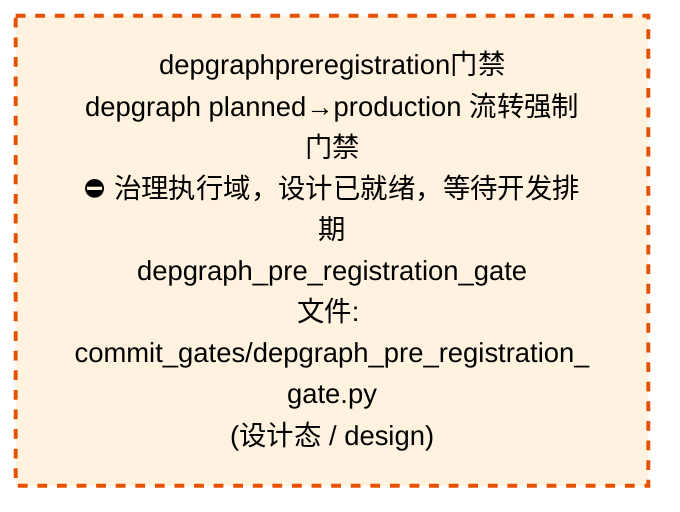

# 53_d_gov_enforcement / 规则执行域 / Rule Enforcement

> **功能简介 / Overview**: 规则执行，负责治理规则执行和门禁拦截

> **文档作用 / Purpose**: 展示 规则执行（D_GOV_ENFORCEMENT）功能域的域内依赖关系、跨域依赖关系，模块信息（成熟度/中英文名/大白话/文件路径）内嵌于 Mermaid 节点，供架构审查和域治理参考。

> 本文档由 generate_domain_doc.py 从 depgraph (PostgreSQL) 自动生成
> 数据源: depgraph (PostgreSQL) nodes表 + edges表

> **[可缩放 HTML 版 / Zoomable HTML](http://localhost:8765/docs/02_enterprise_architecture/02_domain_architecture_docs/_zoomable_html/53_d_gov_enforcement.html)** — Ctrl+滚轮缩放 ｜ 双击重置 ｜ Ctrl+Shift+D 切换拖动/选择模式

## 域基本信息 / Domain Overview

| 字段 | 值 | Field | Value |
|------|------|-------|-------|
| 编号 | 53 | Number | 53 |
| 域ID | D_GOV_ENFORCEMENT | Domain ID | D_GOV_ENFORCEMENT |
| 域名称 | 规则执行 | Domain Name | Rule Enforcement |
| 层级 | L2 业务域层 | Layer | L2 Domain |
| 模块数 | 42 | Module Count | 42 |
| 域内依赖 | 32 | Internal Dependencies | 32 |
| 跨域入边 | 110 | Cross-domain Incoming | 110 |
| 跨域出边 | 68 | Cross-domain Outgoing | 68 |
| 设计态模块 | 1 | Design Modules | 1 |
| 生产态模块 | 41 | Production Modules | 41 |
| 容量 | 41/150 (正常) | Capacity | 41/150 (正常) |
| 描述 | 门禁引擎流程编排(GatePipeline/GateEngine) | Description | 门禁引擎流程编排(GatePipeline/GateEngine) |

## 域内依赖图 / Internal Dependency Diagram

> 依赖图内嵌在本文档中，IDE 可直接渲染；网页版可 Ctrl+滚轮缩放 + 拖动平移查看细节。
>
> **图例说明 / Legend**：
> - 🟦 **蓝色 = 运营态模块**（production，已上线运行）
> - 🟧 **橙色虚线 = 设计态模块**（design，蓝图阶段，代码未写）
> - **实线箭头 = 运营态依赖**（已生效的依赖关系）
> - **虚线箭头 = 非运营态依赖**（计划中/验证中的依赖关系）

### 全景图（全部模块，颜色区分运营态/设计态）

> 展示全部 42 个模块（生产态 41 + 设计态 1），含跨域依赖外部节点。节点含成熟度+名称+大白话/简介+文件路径。

```mermaid
%%{init: {'theme': 'base', 'themeVariables': {'primaryColor': '#eaeaea', 'primaryTextColor': '#333333', 'primaryBorderColor': '#666666', 'lineColor': '#666666', 'secondaryColor': '#eaeaea', 'tertiaryColor': '#eaeaea', 'fontSize': '14px'}}}%%
flowchart TD
    docs_01_policies_and_standards_registry_catalogs_rule_enforcement_registry_yaml["规则执行注册表<br/>规则enforcement注册表，规则执行的注册表，登记和<br/>查询已注册的条目。<br/>rule_enforcement_registry<br/>文件: catalogs/rule_enforcement_registry.yaml<br/>(生产态 / production)"]
    scripts_governance_d8_doc_sync_metric_count_drift_reconciler_py["指标数量漂移协调器<br/>dashboard 指标数描述派生校验 reconciler<br/>metric_count_drift_reconciler<br/>文件: d8_doc_sync/metric_count_drift_<br/>reconciler.py<br/>(生产态 / production)"]
    scripts_governance_d8_doc_sync_readme_version_sync_reconciler_py["readme版本sync对账器<br/>README 版本号派生展示校验 reconciler<br/>readme_version_sync_reconciler<br/>文件: d8_doc_sync/readme_version_sync_<br/>reconciler.py<br/>(生产态 / production)"]
    scripts_governance_d8_doc_sync_requirements_version_sync_reconciler_py["requirements版本sync对账器<br/>txt ↔ pyproject.toml 依赖一致性校验 reconciler<br/>requirements_version_sync_reconciler<br/>文件: d8_doc_sync/requirements_version_sync_<br/>reconciler.py<br/>(生产态 / production)"]
    scripts_governance_session_worktree_cli_py["会话worktreecli<br/>会话 worktree 管理 CLI<br/>（治本遗留项#2，2026-07-17）<br/>session_worktree_cli<br/>文件: governance/session_worktree_cli.py<br/>(生产态 / production)"]
    src_zephyr_gov_enforcement_init_py["zephyr/gov_enforcement 包入口<br/>管理zephyr.gov_enforcement子包加载<br/>文件: gov_enforcement/__init__.py<br/>(生产态 / production)"]
    src_zephyr_gov_enforcement_behavioral_admission_init_py["gov_enforcement/behavioral_admission 包入口<br/>管理gov_enforcement.behavioral_admission子包加载<br/>文件: behavioral_admission/__init__.py<br/>(生产态 / production)"]
    src_zephyr_gov_enforcement_commit_gates_depgraph_pre_registration_gate_py["depgraphpreregistration门禁<br/>depgraph planned→production 流转强制门禁<br/>⛔ 治理执行域，设计已就绪，等待开发排期<br/>depgraph_pre_registration_gate<br/>文件: commit_gates/depgraph_pre_registration_<br/>gate.py<br/>(设计态 / design)"]
    src_zephyr_gov_enforcement_commit_gates_stash_accumulation_gate_py["stashaccumulation门禁<br/>stash 堆积阈值检测门禁<br/>stash_accumulation_gate<br/>文件: commit_gates/stash_accumulation_gate.py<br/>(生产态 / production)"]
    src_zephyr_gov_enforcement_rule_enforcement_approval_py["审批<br/>供zephyr.governance.services.ada使用<br/>G-CT-004 — Backward-compat re-export of<br/>ApprovalRequest from<br/>文件: rule_enforcement/approval.py<br/>(生产态 / production)"]
    src_zephyr_gov_enforcement_rule_enforcement_compliance_rule_py["合规规则<br/>治理执行包的compliance_rule模块<br/>文件: rule_enforcement/compliance_rule.py<br/>(生产态 / production)"]
    src_zephyr_gov_enforcement_rule_enforcement_default_quality_gate_py["默认质量门禁<br/>D_DATA — Default Data Quality Gate<br/>文件: rule_enforcement/default_quality_gate.py<br/>(生产态 / production)"]
    src_zephyr_gov_enforcement_rule_enforcement_dlq_retry_policy_py["dlq重试策略<br/>DLQ 重试策略 — 对接 shared/events<br/>/dlq.DeadLetterQueue 的真重试。<br/>dlq_retry_policy<br/>文件: rule_enforcement/dlq_retry_policy.py<br/>(生产态 / production)"]
    src_zephyr_gov_enforcement_rule_enforcement_output_quality_gate_py["output质量门禁<br/>治理执行包的output_quality_gate模块<br/>文件: rule_enforcement/output_quality_gate.py<br/>(生产态 / production)"]
    src_zephyr_gov_enforcement_rule_enforcement_pre_flight_gate_py["preflight门禁<br/>依赖预算模型、预算引擎工作<br/>pre_flight_gate<br/>文件: rule_enforcement/pre_flight_gate.py<br/>(生产态 / production)"]
    src_zephyr_gov_enforcement_rule_enforcement_rule_engine_rule_canary_manager_py["规则金丝雀管理器<br/>Rule Canary Manager — v0.10.0 规则金丝雀:<br/>1%用户先上新规则->A/B对比->rollback。<br/>rule_canary_manager<br/>文件: rule_engine/rule_canary_manager.py<br/>(生产态 / production)"]
    src_zephyr_gov_enforcement_rule_enforcement_rule_engine_rule_debt_auditor_py["规则debt审计器<br/>Rule Debt Auditor — v0.7.0 规则债务审计器:<br/>分析escalation_rules.yaml维护债务指标。<br/>rule_debt_auditor<br/>文件: rule_engine/rule_debt_auditor.py<br/>(生产态 / production)"]
    src_zephyr_gov_enforcement_rule_enforcement_rule_engine_rule_shadow_runner_py["规则影子运行器<br/>Rule Shadow Runner — v0.10.0 规则影子模式:<br/>新规则shadow运行3天->diff old vs new->promote。<br/>rule_shadow_runner<br/>文件: rule_engine/rule_shadow_runner.py<br/>(生产态 / production)"]
    src_zephyr_gov_enforcement_rule_enforcement_rule_engine_rule_watcher_py["规则监视器<br/>RuleWatcher — YAML 规则文件变更检测与自动同步<br/>rule_watcher<br/>文件: rule_engine/rule_watcher.py<br/>(生产态 / production)"]
    src_zephyr_gov_enforcement_rule_enforcement_slo_contract_py["SLO契约<br/>SLO-Driven Escalation Contract — D-022-12.<br/>文件: rule_enforcement/slo_contract.py<br/>(生产态 / production)"]
    tests_governance_commit_gates_test_create_guard_py["测试创建守卫<br/>CREATE-GUARD 门禁单元测试（2026-06-30 治本补全）<br/>test_create_guard<br/>文件: commit_gates/test_create_guard.py<br/>(生产态 / production)"]
    tests_governance_commit_gates_test_r5_digit_suffix_gate_py["测试r5digitsuffix门禁<br/>R5-DIGIT-SUFFIX 门禁单元测试<br/>test_r5_digit_suffix_gate<br/>文件: commit_gates/test_r5_digit_suffix_gate.py<br/>(生产态 / production)"]
    tests_governance_rule_bridge_test_claim_files_for_edit_py["测试claimfilesforedit<br/>P2-2 并发 session 文件级原子性测试<br/>test_claim_files_for_edit<br/>文件: rule_bridge/test_claim_files_for_edit.py<br/>(生产态 / production)"]
    tests_governance_rule_bridge_test_emergency_commit_py["测试紧急提交<br/>emergency_commit API 测试<br/>（Ruling:100PCT-AI-GOVERNANCE P2-1）<br/>test_emergency_commit<br/>文件: rule_bridge/test_emergency_commit.py<br/>(生产态 / production)"]
    tests_governance_rule_bridge_test_heartbeat_daemon_py["测试heartbeatdaemon<br/>heartbeat daemon + 成本递增 smoke test<br/>（Ruling:100PCT-AI-GOVERNANCE P3-1）<br/>test_heartbeat_daemon<br/>文件: rule_bridge/test_heartbeat_daemon.py<br/>(生产态 / production)"]
    docs_01_policies_and_standards_registry_catalogs_rule_enforcement_registry_yaml ~~~ scripts_governance_d8_doc_sync_metric_count_drift_reconciler_py
    scripts_governance_d8_doc_sync_metric_count_drift_reconciler_py ~~~ scripts_governance_d8_doc_sync_readme_version_sync_reconciler_py
    scripts_governance_d8_doc_sync_readme_version_sync_reconciler_py ~~~ scripts_governance_d8_doc_sync_requirements_version_sync_reconciler_py
    scripts_governance_d8_doc_sync_requirements_version_sync_reconciler_py ~~~ scripts_governance_session_worktree_cli_py
    scripts_governance_session_worktree_cli_py ~~~ src_zephyr_gov_enforcement_init_py
    src_zephyr_gov_enforcement_init_py ~~~ src_zephyr_gov_enforcement_behavioral_admission_init_py
    src_zephyr_gov_enforcement_behavioral_admission_init_py ~~~ src_zephyr_gov_enforcement_commit_gates_depgraph_pre_registration_gate_py
    src_zephyr_gov_enforcement_commit_gates_depgraph_pre_registration_gate_py ~~~ src_zephyr_gov_enforcement_commit_gates_stash_accumulation_gate_py
    src_zephyr_gov_enforcement_commit_gates_stash_accumulation_gate_py ~~~ src_zephyr_gov_enforcement_rule_enforcement_approval_py
    src_zephyr_gov_enforcement_rule_enforcement_approval_py ~~~ src_zephyr_gov_enforcement_rule_enforcement_compliance_rule_py
    src_zephyr_gov_enforcement_rule_enforcement_compliance_rule_py ~~~ src_zephyr_gov_enforcement_rule_enforcement_default_quality_gate_py
    src_zephyr_gov_enforcement_rule_enforcement_default_quality_gate_py ~~~ src_zephyr_gov_enforcement_rule_enforcement_dlq_retry_policy_py
    src_zephyr_gov_enforcement_rule_enforcement_dlq_retry_policy_py ~~~ src_zephyr_gov_enforcement_rule_enforcement_output_quality_gate_py
    src_zephyr_gov_enforcement_rule_enforcement_output_quality_gate_py ~~~ src_zephyr_gov_enforcement_rule_enforcement_pre_flight_gate_py
    src_zephyr_gov_enforcement_rule_enforcement_pre_flight_gate_py ~~~ src_zephyr_gov_enforcement_rule_enforcement_rule_engine_rule_canary_manager_py
    src_zephyr_gov_enforcement_rule_enforcement_rule_engine_rule_canary_manager_py ~~~ src_zephyr_gov_enforcement_rule_enforcement_rule_engine_rule_debt_auditor_py
    src_zephyr_gov_enforcement_rule_enforcement_rule_engine_rule_debt_auditor_py ~~~ src_zephyr_gov_enforcement_rule_enforcement_rule_engine_rule_shadow_runner_py
    src_zephyr_gov_enforcement_rule_enforcement_rule_engine_rule_shadow_runner_py ~~~ src_zephyr_gov_enforcement_rule_enforcement_rule_engine_rule_watcher_py
    src_zephyr_gov_enforcement_rule_enforcement_rule_engine_rule_watcher_py ~~~ src_zephyr_gov_enforcement_rule_enforcement_slo_contract_py
    src_zephyr_gov_enforcement_rule_enforcement_slo_contract_py ~~~ tests_governance_commit_gates_test_create_guard_py
    tests_governance_commit_gates_test_create_guard_py ~~~ tests_governance_commit_gates_test_r5_digit_suffix_gate_py
    tests_governance_commit_gates_test_r5_digit_suffix_gate_py ~~~ tests_governance_rule_bridge_test_claim_files_for_edit_py
    tests_governance_rule_bridge_test_claim_files_for_edit_py ~~~ tests_governance_rule_bridge_test_emergency_commit_py
    tests_governance_rule_bridge_test_emergency_commit_py ~~~ tests_governance_rule_bridge_test_heartbeat_daemon_py
    src_zephyr_gov_enforcement_behavioral_admission_admission_response_py["准入响应<br/>治理执行包的admission_response模块<br/>文件: behavioral_admission/admission_response.py<br/>(生产态 / production)"]
    src_zephyr_gov_enforcement_behavioral_admission_code_review_ai_py["代码审查AI<br/>治理执行的核心类，封装ReviewLevel相关逻辑。<br/>code_review_ai<br/>文件: behavioral_admission/code_review_ai.py<br/>(生产态 / production)"]
    src_zephyr_gov_enforcement_behavioral_admission_gate_event_adapter_py["门禁事件适配器<br/>GateEventAdapter — GateRepo 事件适配器<br/>（DW-0006）<br/>gate_event_adapter<br/>文件: behavioral_admission/gate_event_adapter.py<br/>(生产态 / production)"]
    src_zephyr_gov_enforcement_behavioral_admission_gpu_consensus_scheduler_py["GPU共识调度器<br/>IO的调度器，按时间或优先级安排任务。<br/>gpu_consensus_scheduler<br/>文件: behavioral_admission/gpu_consensus_<br/>scheduler.py<br/>(生产态 / production)"]
    src_zephyr_gov_enforcement_behavioral_admission_protection_index_py["保护索引<br/>供zephyr.gov_enforcement.behavio使用<br/>protection_index<br/>文件: behavioral_admission/protection_index.py<br/>(生产态 / production)"]
    src_zephyr_gov_enforcement_rule_bridge_commit_gate_registry_py["提交门禁注册表<br/>GitCommitGateway pre-commit 门禁注册表<br/>（架构债务 #AD-001 治本）<br/>commit_gate_registry<br/>文件: rule_bridge/commit_gate_registry.py<br/>(生产态 / production)"]
    src_zephyr_gov_enforcement_rule_bridge_session_worktree_py["会话worktree<br/>AI 对话 worktree 物理隔离 helper<br/>（FP-ISO.4C，2026-07-01 治本）<br/>session_worktree<br/>文件: rule_bridge/session_worktree.py<br/>(生产态 / production)"]
    src_zephyr_gov_enforcement_rule_enforcement_quality_gate_py["质量门禁<br/>D_DATA — Data Quality Gate<br/>文件: rule_enforcement/quality_gate.py<br/>(生产态 / production)"]
    src_zephyr_gov_enforcement_behavioral_admission_admission_response_py ~~~ src_zephyr_gov_enforcement_behavioral_admission_code_review_ai_py
    src_zephyr_gov_enforcement_behavioral_admission_code_review_ai_py ~~~ src_zephyr_gov_enforcement_behavioral_admission_gate_event_adapter_py
    src_zephyr_gov_enforcement_behavioral_admission_gate_event_adapter_py ~~~ src_zephyr_gov_enforcement_behavioral_admission_gpu_consensus_scheduler_py
    src_zephyr_gov_enforcement_behavioral_admission_gpu_consensus_scheduler_py ~~~ src_zephyr_gov_enforcement_behavioral_admission_protection_index_py
    src_zephyr_gov_enforcement_behavioral_admission_protection_index_py ~~~ src_zephyr_gov_enforcement_rule_bridge_commit_gate_registry_py
    src_zephyr_gov_enforcement_rule_bridge_commit_gate_registry_py ~~~ src_zephyr_gov_enforcement_rule_bridge_session_worktree_py
    src_zephyr_gov_enforcement_rule_bridge_session_worktree_py ~~~ src_zephyr_gov_enforcement_rule_enforcement_quality_gate_py
    src_zephyr_gov_enforcement_behavioral_admission_admission_controller_py["准入控制器<br/>IO的控制器，协调组件按流程执行。<br/>admission_controller<br/>文件: behavioral_admission/admission_<br/>controller.py<br/>(生产态 / production)"]
    src_zephyr_gov_enforcement_behavioral_admission_verdict_engine_py["裁定引擎<br/>verdict引擎，治理执行的事件，定义和分发事件。<br/>verdict_engine<br/>文件: behavioral_admission/verdict_engine.py<br/>(生产态 / production)"]
    src_zephyr_gov_enforcement_rule_bridge_emergency_commit_py["紧急提交<br/>通道（Ruling:100PCT-AI-GOVERNANCE<br/>P2-1，2026-07-19）<br/>emergency_commit<br/>文件: rule_bridge/emergency_commit.py<br/>(生产态 / production)"]
    src_zephyr_gov_enforcement_rule_bridge_heartbeat_daemon_py["心跳守护<br/>py — session heartbeat 独立进程<br/>（Ruling:100PCT-AI-GOVERNANCE P3-1，2026-07-20）<br/>heartbeat_daemon<br/>文件: rule_bridge/heartbeat_daemon.py<br/>(生产态 / production)"]
    src_zephyr_gov_enforcement_rule_bridge_session_claim_py["会话claim<br/>AI 对话并发声明 helper（FP-ISO.4B<br/>件2改，2026-07-01 治本）<br/>session_claim<br/>文件: rule_bridge/session_claim.py<br/>(生产态 / production)"]
    src_zephyr_gov_enforcement_rule_bridge_worktree_manager_py["worktree管理器<br/>会话 worktree 物理隔离管理器（阶段3 治本 stash<br/>循环）<br/>worktree_manager<br/>文件: rule_bridge/worktree_manager.py<br/>(生产态 / production)"]
    src_zephyr_gov_enforcement_rule_bridge_worktree_pool_py["worktree池<br/>Worktree 预创建池（ARCH-GIT-CALL-BUDGET<br/>P3.3，2026-07-19）<br/>worktree_pool<br/>文件: rule_bridge/worktree_pool.py<br/>(生产态 / production)"]
    src_zephyr_gov_enforcement_behavioral_admission_admission_controller_py ~~~ src_zephyr_gov_enforcement_behavioral_admission_verdict_engine_py
    src_zephyr_gov_enforcement_behavioral_admission_verdict_engine_py ~~~ src_zephyr_gov_enforcement_rule_bridge_emergency_commit_py
    src_zephyr_gov_enforcement_rule_bridge_emergency_commit_py ~~~ src_zephyr_gov_enforcement_rule_bridge_heartbeat_daemon_py
    src_zephyr_gov_enforcement_rule_bridge_heartbeat_daemon_py ~~~ src_zephyr_gov_enforcement_rule_bridge_session_claim_py
    src_zephyr_gov_enforcement_rule_bridge_session_claim_py ~~~ src_zephyr_gov_enforcement_rule_bridge_worktree_manager_py
    src_zephyr_gov_enforcement_rule_bridge_worktree_manager_py ~~~ src_zephyr_gov_enforcement_rule_bridge_worktree_pool_py
    src_zephyr_gov_enforcement_rule_bridge_git_commit_gateway_py["Git提交网关<br/>GitCommitGateway — 全项目唯一合法 git commit<br/>入口（OPS-2026062512 治本）<br/>git_commit_gateway<br/>文件: rule_bridge/git_commit_gateway.py<br/>(生产态 / production)"]
    src_zephyr_gov_enforcement_rule_bridge_batched_auto_committer_py["batched自动committer<br/>Reconciler 批量化 auto-commit 拦截器<br/>（ARCH-GIT-CALL-BUDGET P2.3，2026-07-19）<br/>batched_auto_committer<br/>文件: rule_bridge/batched_auto_committer.py<br/>(生产态 / production)"]
    src_zephyr_gov_enforcement_behavioral_admission_admission_response_py -->|导入依赖 / import_depends| src_zephyr_gov_enforcement_behavioral_admission_admission_controller_py
    src_zephyr_gov_enforcement_behavioral_admission_gpu_consensus_scheduler_py -->|导入依赖 / import_depends| src_zephyr_gov_enforcement_behavioral_admission_verdict_engine_py
    src_zephyr_gov_enforcement_behavioral_admission_protection_index_py -->|导入依赖 / import_depends| src_zephyr_gov_enforcement_behavioral_admission_verdict_engine_py
    src_zephyr_gov_enforcement_behavioral_admission_init_py -->|导入依赖 / import_depends| src_zephyr_gov_enforcement_behavioral_admission_admission_response_py
    src_zephyr_gov_enforcement_behavioral_admission_init_py -->|导入依赖 / import_depends| src_zephyr_gov_enforcement_behavioral_admission_admission_controller_py
    src_zephyr_gov_enforcement_behavioral_admission_init_py -->|导入依赖 / import_depends| src_zephyr_gov_enforcement_behavioral_admission_gate_event_adapter_py
    src_zephyr_gov_enforcement_behavioral_admission_init_py -->|导入依赖 / import_depends| src_zephyr_gov_enforcement_behavioral_admission_code_review_ai_py
    src_zephyr_gov_enforcement_behavioral_admission_init_py -->|导入依赖 / import_depends| src_zephyr_gov_enforcement_behavioral_admission_gpu_consensus_scheduler_py
    src_zephyr_gov_enforcement_behavioral_admission_init_py -->|导入依赖 / import_depends| src_zephyr_gov_enforcement_behavioral_admission_protection_index_py
    src_zephyr_gov_enforcement_behavioral_admission_init_py -->|导入依赖 / import_depends| src_zephyr_gov_enforcement_behavioral_admission_verdict_engine_py
    src_zephyr_gov_enforcement_commit_gates_stash_accumulation_gate_py -->|导入依赖 / import_depends| src_zephyr_gov_enforcement_rule_bridge_commit_gate_registry_py
    src_zephyr_gov_enforcement_rule_bridge_emergency_commit_py -->|导入依赖 / import_depends| src_zephyr_gov_enforcement_rule_bridge_git_commit_gateway_py
    src_zephyr_gov_enforcement_rule_bridge_batched_auto_committer_py -->|导入依赖 / import_depends| src_zephyr_gov_enforcement_rule_bridge_git_commit_gateway_py
    src_zephyr_gov_enforcement_rule_bridge_git_commit_gateway_py -->|导入依赖 / import_depends| src_zephyr_gov_enforcement_rule_bridge_commit_gate_registry_py
    src_zephyr_gov_enforcement_rule_bridge_git_commit_gateway_py -->|导入依赖 / import_depends| src_zephyr_gov_enforcement_rule_bridge_batched_auto_committer_py
    src_zephyr_gov_enforcement_rule_bridge_git_commit_gateway_py -->|导入依赖 / import_depends| src_zephyr_gov_enforcement_rule_bridge_worktree_manager_py
    src_zephyr_gov_enforcement_rule_bridge_session_worktree_py -->|导入依赖 / import_depends| src_zephyr_gov_enforcement_rule_bridge_heartbeat_daemon_py
    src_zephyr_gov_enforcement_rule_bridge_session_worktree_py -->|导入依赖 / import_depends| src_zephyr_gov_enforcement_rule_bridge_emergency_commit_py
    src_zephyr_gov_enforcement_rule_bridge_session_worktree_py -->|导入依赖 / import_depends| src_zephyr_gov_enforcement_rule_bridge_git_commit_gateway_py
    src_zephyr_gov_enforcement_rule_bridge_session_worktree_py -->|导入依赖 / import_depends| src_zephyr_gov_enforcement_rule_bridge_worktree_manager_py
    src_zephyr_gov_enforcement_rule_bridge_session_worktree_py -->|导入依赖 / import_depends| src_zephyr_gov_enforcement_rule_bridge_session_claim_py
    src_zephyr_gov_enforcement_rule_bridge_session_worktree_py -->|导入依赖 / import_depends| src_zephyr_gov_enforcement_rule_bridge_worktree_pool_py
    src_zephyr_gov_enforcement_rule_enforcement_default_quality_gate_py -->|导入依赖 / import_depends| src_zephyr_gov_enforcement_rule_enforcement_quality_gate_py
    scripts_governance_session_worktree_cli_py -->|导入依赖 / import_depends| src_zephyr_gov_enforcement_rule_bridge_worktree_manager_py
    scripts_governance_session_worktree_cli_py -->|导入依赖 / import_depends| src_zephyr_gov_enforcement_rule_bridge_session_worktree_py
    tests_governance_commit_gates_test_create_guard_py -->|测试依赖 / test_depends| src_zephyr_gov_enforcement_rule_bridge_git_commit_gateway_py
    tests_governance_commit_gates_test_r5_digit_suffix_gate_py -->|测试依赖 / test_depends| src_zephyr_gov_enforcement_rule_bridge_commit_gate_registry_py
    tests_governance_rule_bridge_test_claim_files_for_edit_py -->|测试依赖 / test_depends| src_zephyr_gov_enforcement_rule_bridge_session_worktree_py
    tests_governance_rule_bridge_test_emergency_commit_py -->|测试依赖 / test_depends| src_zephyr_gov_enforcement_rule_bridge_emergency_commit_py
    tests_governance_rule_bridge_test_heartbeat_daemon_py -->|测试依赖 / test_depends| src_zephyr_gov_enforcement_rule_bridge_heartbeat_daemon_py
    tests_governance_rule_bridge_test_heartbeat_daemon_py -->|测试依赖 / test_depends| src_zephyr_gov_enforcement_rule_bridge_emergency_commit_py
    tests_governance_rule_bridge_test_heartbeat_daemon_py -->|测试依赖 / test_depends| src_zephyr_gov_enforcement_rule_bridge_session_worktree_py
    D_SHARED["共享服务<br/>共享服务，负责跨域共享的工具、协议和基础服务<br/>Shared Services<br/>跨域节点 / cross-domain<br/>(生产态 / production)"]
    src_zephyr_gov_enforcement_rule_bridge_commit_gate_registry_py -->|导入依赖 / import_depends| D_SHARED
    D_GOV_AUDIT["审计追踪<br/>审计追踪，负责变更审计追踪和操作日志管理<br/>Audit Trail<br/>跨域节点 / cross-domain<br/>(生产态 / production)"]
    scripts_governance_d8_doc_sync_requirements_version_sync_reconciler_py -->|导入依赖 / import_depends| D_GOV_AUDIT
    D_GOV_CODE_QUALITY["代码质量治理<br/>代码质量治理，负责代码去重引擎、函数重复检测、AS<br/>T语义分析和提交门禁引擎<br/>Code Quality Governance<br/>跨域节点 / cross-domain<br/>(生产态 / production)"]
    src_zephyr_gov_enforcement_rule_bridge_session_worktree_py -->|导入依赖 / import_depends| D_GOV_CODE_QUALITY
    D_OPS["反馈循环<br/>反馈循环，负责系统运行反馈、性能监控和自动调优闭<br/>环<br/>Feedback Loop<br/>跨域节点 / cross-domain<br/>(生产态 / production)"]
    src_zephyr_gov_enforcement_rule_enforcement_pre_flight_gate_py -->|导入依赖 / import_depends| D_OPS
    src_zephyr_gov_enforcement_behavioral_admission_verdict_engine_py -->|导入依赖 / import_depends| D_GOV_AUDIT
    src_zephyr_gov_enforcement_rule_bridge_session_worktree_py -->|导入依赖 / import_depends| D_GOV_AUDIT
    D_GOVERNANCE["生命周期管理<br/>生命周期管理，负责蓝图/模块<br/>/任务的声明周期管理和元数据治理<br/>Lifecycle Management<br/>跨域节点 / cross-domain<br/>(生产态 / production)"]
    src_zephyr_gov_enforcement_rule_bridge_git_commit_gateway_py -->|导入依赖 / import_depends| D_GOVERNANCE
    D_GOV_SCRIPTS["脚本治理<br/>脚本治理，负责脚本生命周期管理和脚本质量门禁<br/>Script Governance<br/>跨域节点 / cross-domain<br/>(生产态 / production)"]
    scripts_governance_session_worktree_cli_py -->|导入依赖 / import_depends| D_GOV_SCRIPTS
    src_zephyr_gov_enforcement_rule_bridge_git_commit_gateway_py -->|导入依赖 / import_depends| D_SHARED
    src_zephyr_gov_enforcement_rule_bridge_emergency_commit_py -->|导入依赖 / import_depends| D_GOV_AUDIT
    src_zephyr_gov_enforcement_behavioral_admission_init_py -->|导入依赖 / import_depends| D_GOV_AUDIT
    D_GOV_OPS_RESILIENCE["运维弹性治理<br/>运维弹性治理，负责运维治理、安全治理、弹性治理和<br/>升级协议<br/>Ops Resilience Governance<br/>跨域节点 / cross-domain<br/>(生产态 / production)"]
    src_zephyr_gov_enforcement_rule_bridge_git_commit_gateway_py -->|导入依赖 / import_depends| D_GOV_OPS_RESILIENCE
    D_SECURITY["对抗验证<br/>对抗验证，负责系统安全对抗测试、漏洞扫描和攻防验<br/>证<br/>Adversarial Validation<br/>跨域节点 / cross-domain<br/>(生产态 / production)"]
    src_zephyr_gov_enforcement_rule_bridge_git_commit_gateway_py -->|导入依赖 / import_depends| D_SECURITY
    src_zephyr_gov_enforcement_rule_bridge_worktree_manager_py -->|导入依赖 / import_depends| D_SHARED
    src_zephyr_gov_enforcement_rule_bridge_session_worktree_py -->|导入依赖 / import_depends| D_SHARED
    D_GOV_CODE_QUALITY -->|导入依赖 / import_depends| src_zephyr_gov_enforcement_rule_bridge_commit_gate_registry_py
    D_GOV_CODE_QUALITY -->|导入依赖 / import_depends| src_zephyr_gov_enforcement_rule_bridge_commit_gate_registry_py
    D_GOV_CODE_QUALITY -->|导入依赖 / import_depends| src_zephyr_gov_enforcement_rule_bridge_commit_gate_registry_py
    D_GOV_OPS_RESILIENCE -->|导入依赖 / import_depends| src_zephyr_gov_enforcement_rule_enforcement_compliance_rule_py
    D_DATA["数据接入层<br/>数据接入层，负责数据源接入、数据集成和数据标准化<br/>Data Access Layer<br/>跨域节点 / cross-domain<br/>(生产态 / production)"]
    D_DATA -->|导入依赖 / import_depends| src_zephyr_gov_enforcement_rule_enforcement_quality_gate_py
    D_GOV_CODE_QUALITY -->|导入依赖 / import_depends| src_zephyr_gov_enforcement_rule_bridge_commit_gate_registry_py
    D_GOVERNANCE -->|导入依赖 / import_depends| src_zephyr_gov_enforcement_rule_enforcement_compliance_rule_py
    D_GOV_CODE_QUALITY -->|导入依赖 / import_depends| src_zephyr_gov_enforcement_rule_bridge_commit_gate_registry_py
    D_GOV_CODE_QUALITY -->|导入依赖 / import_depends| src_zephyr_gov_enforcement_rule_bridge_commit_gate_registry_py
    D_GOV_CODE_QUALITY -->|导入依赖 / import_depends| src_zephyr_gov_enforcement_rule_bridge_commit_gate_registry_py
    D_GOV_CODE_QUALITY -->|导入依赖 / import_depends| src_zephyr_gov_enforcement_rule_bridge_commit_gate_registry_py
    D_GOV_CODE_QUALITY -->|测试依赖 / test_depends| src_zephyr_gov_enforcement_rule_bridge_session_worktree_py
    D_GOV_CODE_QUALITY -->|导入依赖 / import_depends| src_zephyr_gov_enforcement_rule_bridge_commit_gate_registry_py
    D_GOVERNANCE -->|测试依赖 / test_depends| src_zephyr_gov_enforcement_rule_bridge_git_commit_gateway_py
    D_GOV_CODE_QUALITY -->|导入依赖 / import_depends| src_zephyr_gov_enforcement_rule_bridge_commit_gate_registry_py
    classDef production fill:#e1f5fe,stroke:#01579b,stroke-width:2px,color:#000
    classDef design fill:#fff3e0,stroke:#e65100,stroke-width:2px,color:#000,stroke-dasharray: 5 5
    classDef external_prod fill:#e8f4fd,stroke:#0277bd,stroke-width:1px,color:#000
    classDef external_design fill:#fff8e7,stroke:#ef6c00,stroke-width:1px,color:#000,stroke-dasharray: 5 5
    class docs_01_policies_and_standards_registry_catalogs_rule_enforcement_registry_yaml,scripts_governance_d8_doc_sync_metric_count_drift_reconciler_py,scripts_governance_d8_doc_sync_readme_version_sync_reconciler_py,scripts_governance_d8_doc_sync_requirements_version_sync_reconciler_py,scripts_governance_session_worktree_cli_py,src_zephyr_gov_enforcement_init_py,src_zephyr_gov_enforcement_behavioral_admission_init_py,src_zephyr_gov_enforcement_behavioral_admission_admission_controller_py,src_zephyr_gov_enforcement_behavioral_admission_admission_response_py,src_zephyr_gov_enforcement_behavioral_admission_code_review_ai_py,src_zephyr_gov_enforcement_behavioral_admission_gate_event_adapter_py,src_zephyr_gov_enforcement_behavioral_admission_gpu_consensus_scheduler_py,src_zephyr_gov_enforcement_behavioral_admission_protection_index_py,src_zephyr_gov_enforcement_behavioral_admission_verdict_engine_py,src_zephyr_gov_enforcement_commit_gates_stash_accumulation_gate_py,src_zephyr_gov_enforcement_rule_bridge_batched_auto_committer_py,src_zephyr_gov_enforcement_rule_bridge_commit_gate_registry_py,src_zephyr_gov_enforcement_rule_bridge_emergency_commit_py,src_zephyr_gov_enforcement_rule_bridge_git_commit_gateway_py,src_zephyr_gov_enforcement_rule_bridge_heartbeat_daemon_py,src_zephyr_gov_enforcement_rule_bridge_session_claim_py,src_zephyr_gov_enforcement_rule_bridge_session_worktree_py,src_zephyr_gov_enforcement_rule_bridge_worktree_manager_py,src_zephyr_gov_enforcement_rule_bridge_worktree_pool_py,src_zephyr_gov_enforcement_rule_enforcement_approval_py,src_zephyr_gov_enforcement_rule_enforcement_compliance_rule_py,src_zephyr_gov_enforcement_rule_enforcement_default_quality_gate_py,src_zephyr_gov_enforcement_rule_enforcement_dlq_retry_policy_py,src_zephyr_gov_enforcement_rule_enforcement_output_quality_gate_py,src_zephyr_gov_enforcement_rule_enforcement_pre_flight_gate_py,src_zephyr_gov_enforcement_rule_enforcement_quality_gate_py,src_zephyr_gov_enforcement_rule_enforcement_rule_engine_rule_canary_manager_py,src_zephyr_gov_enforcement_rule_enforcement_rule_engine_rule_debt_auditor_py,src_zephyr_gov_enforcement_rule_enforcement_rule_engine_rule_shadow_runner_py,src_zephyr_gov_enforcement_rule_enforcement_rule_engine_rule_watcher_py,src_zephyr_gov_enforcement_rule_enforcement_slo_contract_py,tests_governance_commit_gates_test_create_guard_py,tests_governance_commit_gates_test_r5_digit_suffix_gate_py,tests_governance_rule_bridge_test_claim_files_for_edit_py,tests_governance_rule_bridge_test_emergency_commit_py,tests_governance_rule_bridge_test_heartbeat_daemon_py production
    class src_zephyr_gov_enforcement_commit_gates_depgraph_pre_registration_gate_py design
    class D_SHARED,D_GOV_AUDIT,D_GOV_CODE_QUALITY,D_OPS,D_GOVERNANCE,D_GOV_SCRIPTS,D_GOV_OPS_RESILIENCE,D_SECURITY,D_DATA external_prod
```

### 运营态的图（仅 design_maturity=production 的模块和域内依赖）

> 仅展示已上线运行的模块（共 41 个），不含跨域外部节点。跨域依赖见下方跨域依赖章节。

```mermaid
%%{init: {'theme': 'base', 'themeVariables': {'primaryColor': '#eaeaea', 'primaryTextColor': '#333333', 'primaryBorderColor': '#666666', 'lineColor': '#666666', 'secondaryColor': '#eaeaea', 'tertiaryColor': '#eaeaea', 'fontSize': '14px'}}}%%
flowchart TD
    docs_01_policies_and_standards_registry_catalogs_rule_enforcement_registry_yaml["规则执行注册表<br/>规则enforcement注册表，规则执行的注册表，登记和<br/>查询已注册的条目。<br/>rule_enforcement_registry<br/>文件: catalogs/rule_enforcement_registry.yaml<br/>(生产态 / production)"]
    scripts_governance_d8_doc_sync_metric_count_drift_reconciler_py["指标数量漂移协调器<br/>dashboard 指标数描述派生校验 reconciler<br/>metric_count_drift_reconciler<br/>文件: d8_doc_sync/metric_count_drift_<br/>reconciler.py<br/>(生产态 / production)"]
    scripts_governance_d8_doc_sync_readme_version_sync_reconciler_py["readme版本sync对账器<br/>README 版本号派生展示校验 reconciler<br/>readme_version_sync_reconciler<br/>文件: d8_doc_sync/readme_version_sync_<br/>reconciler.py<br/>(生产态 / production)"]
    scripts_governance_d8_doc_sync_requirements_version_sync_reconciler_py["requirements版本sync对账器<br/>txt ↔ pyproject.toml 依赖一致性校验 reconciler<br/>requirements_version_sync_reconciler<br/>文件: d8_doc_sync/requirements_version_sync_<br/>reconciler.py<br/>(生产态 / production)"]
    scripts_governance_session_worktree_cli_py["会话worktreecli<br/>会话 worktree 管理 CLI<br/>（治本遗留项#2，2026-07-17）<br/>session_worktree_cli<br/>文件: governance/session_worktree_cli.py<br/>(生产态 / production)"]
    src_zephyr_gov_enforcement_init_py["zephyr/gov_enforcement 包入口<br/>管理zephyr.gov_enforcement子包加载<br/>文件: gov_enforcement/__init__.py<br/>(生产态 / production)"]
    src_zephyr_gov_enforcement_behavioral_admission_init_py["gov_enforcement/behavioral_admission 包入口<br/>管理gov_enforcement.behavioral_admission子包加载<br/>文件: behavioral_admission/__init__.py<br/>(生产态 / production)"]
    src_zephyr_gov_enforcement_commit_gates_stash_accumulation_gate_py["stashaccumulation门禁<br/>stash 堆积阈值检测门禁<br/>stash_accumulation_gate<br/>文件: commit_gates/stash_accumulation_gate.py<br/>(生产态 / production)"]
    src_zephyr_gov_enforcement_rule_enforcement_approval_py["审批<br/>供zephyr.governance.services.ada使用<br/>G-CT-004 — Backward-compat re-export of<br/>ApprovalRequest from<br/>文件: rule_enforcement/approval.py<br/>(生产态 / production)"]
    src_zephyr_gov_enforcement_rule_enforcement_compliance_rule_py["合规规则<br/>治理执行包的compliance_rule模块<br/>文件: rule_enforcement/compliance_rule.py<br/>(生产态 / production)"]
    src_zephyr_gov_enforcement_rule_enforcement_default_quality_gate_py["默认质量门禁<br/>D_DATA — Default Data Quality Gate<br/>文件: rule_enforcement/default_quality_gate.py<br/>(生产态 / production)"]
    src_zephyr_gov_enforcement_rule_enforcement_dlq_retry_policy_py["dlq重试策略<br/>DLQ 重试策略 — 对接 shared/events<br/>/dlq.DeadLetterQueue 的真重试。<br/>dlq_retry_policy<br/>文件: rule_enforcement/dlq_retry_policy.py<br/>(生产态 / production)"]
    src_zephyr_gov_enforcement_rule_enforcement_output_quality_gate_py["output质量门禁<br/>治理执行包的output_quality_gate模块<br/>文件: rule_enforcement/output_quality_gate.py<br/>(生产态 / production)"]
    src_zephyr_gov_enforcement_rule_enforcement_pre_flight_gate_py["preflight门禁<br/>依赖预算模型、预算引擎工作<br/>pre_flight_gate<br/>文件: rule_enforcement/pre_flight_gate.py<br/>(生产态 / production)"]
    src_zephyr_gov_enforcement_rule_enforcement_rule_engine_rule_canary_manager_py["规则金丝雀管理器<br/>Rule Canary Manager — v0.10.0 规则金丝雀:<br/>1%用户先上新规则->A/B对比->rollback。<br/>rule_canary_manager<br/>文件: rule_engine/rule_canary_manager.py<br/>(生产态 / production)"]
    src_zephyr_gov_enforcement_rule_enforcement_rule_engine_rule_debt_auditor_py["规则debt审计器<br/>Rule Debt Auditor — v0.7.0 规则债务审计器:<br/>分析escalation_rules.yaml维护债务指标。<br/>rule_debt_auditor<br/>文件: rule_engine/rule_debt_auditor.py<br/>(生产态 / production)"]
    src_zephyr_gov_enforcement_rule_enforcement_rule_engine_rule_shadow_runner_py["规则影子运行器<br/>Rule Shadow Runner — v0.10.0 规则影子模式:<br/>新规则shadow运行3天->diff old vs new->promote。<br/>rule_shadow_runner<br/>文件: rule_engine/rule_shadow_runner.py<br/>(生产态 / production)"]
    src_zephyr_gov_enforcement_rule_enforcement_rule_engine_rule_watcher_py["规则监视器<br/>RuleWatcher — YAML 规则文件变更检测与自动同步<br/>rule_watcher<br/>文件: rule_engine/rule_watcher.py<br/>(生产态 / production)"]
    src_zephyr_gov_enforcement_rule_enforcement_slo_contract_py["SLO契约<br/>SLO-Driven Escalation Contract — D-022-12.<br/>文件: rule_enforcement/slo_contract.py<br/>(生产态 / production)"]
    tests_governance_commit_gates_test_create_guard_py["测试创建守卫<br/>CREATE-GUARD 门禁单元测试（2026-06-30 治本补全）<br/>test_create_guard<br/>文件: commit_gates/test_create_guard.py<br/>(生产态 / production)"]
    tests_governance_commit_gates_test_r5_digit_suffix_gate_py["测试r5digitsuffix门禁<br/>R5-DIGIT-SUFFIX 门禁单元测试<br/>test_r5_digit_suffix_gate<br/>文件: commit_gates/test_r5_digit_suffix_gate.py<br/>(生产态 / production)"]
    tests_governance_rule_bridge_test_claim_files_for_edit_py["测试claimfilesforedit<br/>P2-2 并发 session 文件级原子性测试<br/>test_claim_files_for_edit<br/>文件: rule_bridge/test_claim_files_for_edit.py<br/>(生产态 / production)"]
    tests_governance_rule_bridge_test_emergency_commit_py["测试紧急提交<br/>emergency_commit API 测试<br/>（Ruling:100PCT-AI-GOVERNANCE P2-1）<br/>test_emergency_commit<br/>文件: rule_bridge/test_emergency_commit.py<br/>(生产态 / production)"]
    tests_governance_rule_bridge_test_heartbeat_daemon_py["测试heartbeatdaemon<br/>heartbeat daemon + 成本递增 smoke test<br/>（Ruling:100PCT-AI-GOVERNANCE P3-1）<br/>test_heartbeat_daemon<br/>文件: rule_bridge/test_heartbeat_daemon.py<br/>(生产态 / production)"]
    docs_01_policies_and_standards_registry_catalogs_rule_enforcement_registry_yaml ~~~ scripts_governance_d8_doc_sync_metric_count_drift_reconciler_py
    scripts_governance_d8_doc_sync_metric_count_drift_reconciler_py ~~~ scripts_governance_d8_doc_sync_readme_version_sync_reconciler_py
    scripts_governance_d8_doc_sync_readme_version_sync_reconciler_py ~~~ scripts_governance_d8_doc_sync_requirements_version_sync_reconciler_py
    scripts_governance_d8_doc_sync_requirements_version_sync_reconciler_py ~~~ scripts_governance_session_worktree_cli_py
    scripts_governance_session_worktree_cli_py ~~~ src_zephyr_gov_enforcement_init_py
    src_zephyr_gov_enforcement_init_py ~~~ src_zephyr_gov_enforcement_behavioral_admission_init_py
    src_zephyr_gov_enforcement_behavioral_admission_init_py ~~~ src_zephyr_gov_enforcement_commit_gates_stash_accumulation_gate_py
    src_zephyr_gov_enforcement_commit_gates_stash_accumulation_gate_py ~~~ src_zephyr_gov_enforcement_rule_enforcement_approval_py
    src_zephyr_gov_enforcement_rule_enforcement_approval_py ~~~ src_zephyr_gov_enforcement_rule_enforcement_compliance_rule_py
    src_zephyr_gov_enforcement_rule_enforcement_compliance_rule_py ~~~ src_zephyr_gov_enforcement_rule_enforcement_default_quality_gate_py
    src_zephyr_gov_enforcement_rule_enforcement_default_quality_gate_py ~~~ src_zephyr_gov_enforcement_rule_enforcement_dlq_retry_policy_py
    src_zephyr_gov_enforcement_rule_enforcement_dlq_retry_policy_py ~~~ src_zephyr_gov_enforcement_rule_enforcement_output_quality_gate_py
    src_zephyr_gov_enforcement_rule_enforcement_output_quality_gate_py ~~~ src_zephyr_gov_enforcement_rule_enforcement_pre_flight_gate_py
    src_zephyr_gov_enforcement_rule_enforcement_pre_flight_gate_py ~~~ src_zephyr_gov_enforcement_rule_enforcement_rule_engine_rule_canary_manager_py
    src_zephyr_gov_enforcement_rule_enforcement_rule_engine_rule_canary_manager_py ~~~ src_zephyr_gov_enforcement_rule_enforcement_rule_engine_rule_debt_auditor_py
    src_zephyr_gov_enforcement_rule_enforcement_rule_engine_rule_debt_auditor_py ~~~ src_zephyr_gov_enforcement_rule_enforcement_rule_engine_rule_shadow_runner_py
    src_zephyr_gov_enforcement_rule_enforcement_rule_engine_rule_shadow_runner_py ~~~ src_zephyr_gov_enforcement_rule_enforcement_rule_engine_rule_watcher_py
    src_zephyr_gov_enforcement_rule_enforcement_rule_engine_rule_watcher_py ~~~ src_zephyr_gov_enforcement_rule_enforcement_slo_contract_py
    src_zephyr_gov_enforcement_rule_enforcement_slo_contract_py ~~~ tests_governance_commit_gates_test_create_guard_py
    tests_governance_commit_gates_test_create_guard_py ~~~ tests_governance_commit_gates_test_r5_digit_suffix_gate_py
    tests_governance_commit_gates_test_r5_digit_suffix_gate_py ~~~ tests_governance_rule_bridge_test_claim_files_for_edit_py
    tests_governance_rule_bridge_test_claim_files_for_edit_py ~~~ tests_governance_rule_bridge_test_emergency_commit_py
    tests_governance_rule_bridge_test_emergency_commit_py ~~~ tests_governance_rule_bridge_test_heartbeat_daemon_py
    src_zephyr_gov_enforcement_behavioral_admission_admission_response_py["准入响应<br/>治理执行包的admission_response模块<br/>文件: behavioral_admission/admission_response.py<br/>(生产态 / production)"]
    src_zephyr_gov_enforcement_behavioral_admission_code_review_ai_py["代码审查AI<br/>治理执行的核心类，封装ReviewLevel相关逻辑。<br/>code_review_ai<br/>文件: behavioral_admission/code_review_ai.py<br/>(生产态 / production)"]
    src_zephyr_gov_enforcement_behavioral_admission_gate_event_adapter_py["门禁事件适配器<br/>GateEventAdapter — GateRepo 事件适配器<br/>（DW-0006）<br/>gate_event_adapter<br/>文件: behavioral_admission/gate_event_adapter.py<br/>(生产态 / production)"]
    src_zephyr_gov_enforcement_behavioral_admission_gpu_consensus_scheduler_py["GPU共识调度器<br/>IO的调度器，按时间或优先级安排任务。<br/>gpu_consensus_scheduler<br/>文件: behavioral_admission/gpu_consensus_<br/>scheduler.py<br/>(生产态 / production)"]
    src_zephyr_gov_enforcement_behavioral_admission_protection_index_py["保护索引<br/>供zephyr.gov_enforcement.behavio使用<br/>protection_index<br/>文件: behavioral_admission/protection_index.py<br/>(生产态 / production)"]
    src_zephyr_gov_enforcement_rule_bridge_commit_gate_registry_py["提交门禁注册表<br/>GitCommitGateway pre-commit 门禁注册表<br/>（架构债务 #AD-001 治本）<br/>commit_gate_registry<br/>文件: rule_bridge/commit_gate_registry.py<br/>(生产态 / production)"]
    src_zephyr_gov_enforcement_rule_bridge_session_worktree_py["会话worktree<br/>AI 对话 worktree 物理隔离 helper<br/>（FP-ISO.4C，2026-07-01 治本）<br/>session_worktree<br/>文件: rule_bridge/session_worktree.py<br/>(生产态 / production)"]
    src_zephyr_gov_enforcement_rule_enforcement_quality_gate_py["质量门禁<br/>D_DATA — Data Quality Gate<br/>文件: rule_enforcement/quality_gate.py<br/>(生产态 / production)"]
    src_zephyr_gov_enforcement_behavioral_admission_admission_response_py ~~~ src_zephyr_gov_enforcement_behavioral_admission_code_review_ai_py
    src_zephyr_gov_enforcement_behavioral_admission_code_review_ai_py ~~~ src_zephyr_gov_enforcement_behavioral_admission_gate_event_adapter_py
    src_zephyr_gov_enforcement_behavioral_admission_gate_event_adapter_py ~~~ src_zephyr_gov_enforcement_behavioral_admission_gpu_consensus_scheduler_py
    src_zephyr_gov_enforcement_behavioral_admission_gpu_consensus_scheduler_py ~~~ src_zephyr_gov_enforcement_behavioral_admission_protection_index_py
    src_zephyr_gov_enforcement_behavioral_admission_protection_index_py ~~~ src_zephyr_gov_enforcement_rule_bridge_commit_gate_registry_py
    src_zephyr_gov_enforcement_rule_bridge_commit_gate_registry_py ~~~ src_zephyr_gov_enforcement_rule_bridge_session_worktree_py
    src_zephyr_gov_enforcement_rule_bridge_session_worktree_py ~~~ src_zephyr_gov_enforcement_rule_enforcement_quality_gate_py
    src_zephyr_gov_enforcement_behavioral_admission_admission_controller_py["准入控制器<br/>IO的控制器，协调组件按流程执行。<br/>admission_controller<br/>文件: behavioral_admission/admission_<br/>controller.py<br/>(生产态 / production)"]
    src_zephyr_gov_enforcement_behavioral_admission_verdict_engine_py["裁定引擎<br/>verdict引擎，治理执行的事件，定义和分发事件。<br/>verdict_engine<br/>文件: behavioral_admission/verdict_engine.py<br/>(生产态 / production)"]
    src_zephyr_gov_enforcement_rule_bridge_emergency_commit_py["紧急提交<br/>通道（Ruling:100PCT-AI-GOVERNANCE<br/>P2-1，2026-07-19）<br/>emergency_commit<br/>文件: rule_bridge/emergency_commit.py<br/>(生产态 / production)"]
    src_zephyr_gov_enforcement_rule_bridge_heartbeat_daemon_py["心跳守护<br/>py — session heartbeat 独立进程<br/>（Ruling:100PCT-AI-GOVERNANCE P3-1，2026-07-20）<br/>heartbeat_daemon<br/>文件: rule_bridge/heartbeat_daemon.py<br/>(生产态 / production)"]
    src_zephyr_gov_enforcement_rule_bridge_session_claim_py["会话claim<br/>AI 对话并发声明 helper（FP-ISO.4B<br/>件2改，2026-07-01 治本）<br/>session_claim<br/>文件: rule_bridge/session_claim.py<br/>(生产态 / production)"]
    src_zephyr_gov_enforcement_rule_bridge_worktree_manager_py["worktree管理器<br/>会话 worktree 物理隔离管理器（阶段3 治本 stash<br/>循环）<br/>worktree_manager<br/>文件: rule_bridge/worktree_manager.py<br/>(生产态 / production)"]
    src_zephyr_gov_enforcement_rule_bridge_worktree_pool_py["worktree池<br/>Worktree 预创建池（ARCH-GIT-CALL-BUDGET<br/>P3.3，2026-07-19）<br/>worktree_pool<br/>文件: rule_bridge/worktree_pool.py<br/>(生产态 / production)"]
    src_zephyr_gov_enforcement_behavioral_admission_admission_controller_py ~~~ src_zephyr_gov_enforcement_behavioral_admission_verdict_engine_py
    src_zephyr_gov_enforcement_behavioral_admission_verdict_engine_py ~~~ src_zephyr_gov_enforcement_rule_bridge_emergency_commit_py
    src_zephyr_gov_enforcement_rule_bridge_emergency_commit_py ~~~ src_zephyr_gov_enforcement_rule_bridge_heartbeat_daemon_py
    src_zephyr_gov_enforcement_rule_bridge_heartbeat_daemon_py ~~~ src_zephyr_gov_enforcement_rule_bridge_session_claim_py
    src_zephyr_gov_enforcement_rule_bridge_session_claim_py ~~~ src_zephyr_gov_enforcement_rule_bridge_worktree_manager_py
    src_zephyr_gov_enforcement_rule_bridge_worktree_manager_py ~~~ src_zephyr_gov_enforcement_rule_bridge_worktree_pool_py
    src_zephyr_gov_enforcement_rule_bridge_git_commit_gateway_py["Git提交网关<br/>GitCommitGateway — 全项目唯一合法 git commit<br/>入口（OPS-2026062512 治本）<br/>git_commit_gateway<br/>文件: rule_bridge/git_commit_gateway.py<br/>(生产态 / production)"]
    src_zephyr_gov_enforcement_rule_bridge_batched_auto_committer_py["batched自动committer<br/>Reconciler 批量化 auto-commit 拦截器<br/>（ARCH-GIT-CALL-BUDGET P2.3，2026-07-19）<br/>batched_auto_committer<br/>文件: rule_bridge/batched_auto_committer.py<br/>(生产态 / production)"]
    src_zephyr_gov_enforcement_behavioral_admission_admission_response_py -->|导入依赖 / import_depends| src_zephyr_gov_enforcement_behavioral_admission_admission_controller_py
    src_zephyr_gov_enforcement_behavioral_admission_gpu_consensus_scheduler_py -->|导入依赖 / import_depends| src_zephyr_gov_enforcement_behavioral_admission_verdict_engine_py
    src_zephyr_gov_enforcement_behavioral_admission_protection_index_py -->|导入依赖 / import_depends| src_zephyr_gov_enforcement_behavioral_admission_verdict_engine_py
    src_zephyr_gov_enforcement_behavioral_admission_init_py -->|导入依赖 / import_depends| src_zephyr_gov_enforcement_behavioral_admission_admission_response_py
    src_zephyr_gov_enforcement_behavioral_admission_init_py -->|导入依赖 / import_depends| src_zephyr_gov_enforcement_behavioral_admission_admission_controller_py
    src_zephyr_gov_enforcement_behavioral_admission_init_py -->|导入依赖 / import_depends| src_zephyr_gov_enforcement_behavioral_admission_gate_event_adapter_py
    src_zephyr_gov_enforcement_behavioral_admission_init_py -->|导入依赖 / import_depends| src_zephyr_gov_enforcement_behavioral_admission_code_review_ai_py
    src_zephyr_gov_enforcement_behavioral_admission_init_py -->|导入依赖 / import_depends| src_zephyr_gov_enforcement_behavioral_admission_gpu_consensus_scheduler_py
    src_zephyr_gov_enforcement_behavioral_admission_init_py -->|导入依赖 / import_depends| src_zephyr_gov_enforcement_behavioral_admission_protection_index_py
    src_zephyr_gov_enforcement_behavioral_admission_init_py -->|导入依赖 / import_depends| src_zephyr_gov_enforcement_behavioral_admission_verdict_engine_py
    src_zephyr_gov_enforcement_commit_gates_stash_accumulation_gate_py -->|导入依赖 / import_depends| src_zephyr_gov_enforcement_rule_bridge_commit_gate_registry_py
    src_zephyr_gov_enforcement_rule_bridge_emergency_commit_py -->|导入依赖 / import_depends| src_zephyr_gov_enforcement_rule_bridge_git_commit_gateway_py
    src_zephyr_gov_enforcement_rule_bridge_batched_auto_committer_py -->|导入依赖 / import_depends| src_zephyr_gov_enforcement_rule_bridge_git_commit_gateway_py
    src_zephyr_gov_enforcement_rule_bridge_git_commit_gateway_py -->|导入依赖 / import_depends| src_zephyr_gov_enforcement_rule_bridge_commit_gate_registry_py
    src_zephyr_gov_enforcement_rule_bridge_git_commit_gateway_py -->|导入依赖 / import_depends| src_zephyr_gov_enforcement_rule_bridge_batched_auto_committer_py
    src_zephyr_gov_enforcement_rule_bridge_git_commit_gateway_py -->|导入依赖 / import_depends| src_zephyr_gov_enforcement_rule_bridge_worktree_manager_py
    src_zephyr_gov_enforcement_rule_bridge_session_worktree_py -->|导入依赖 / import_depends| src_zephyr_gov_enforcement_rule_bridge_heartbeat_daemon_py
    src_zephyr_gov_enforcement_rule_bridge_session_worktree_py -->|导入依赖 / import_depends| src_zephyr_gov_enforcement_rule_bridge_emergency_commit_py
    src_zephyr_gov_enforcement_rule_bridge_session_worktree_py -->|导入依赖 / import_depends| src_zephyr_gov_enforcement_rule_bridge_git_commit_gateway_py
    src_zephyr_gov_enforcement_rule_bridge_session_worktree_py -->|导入依赖 / import_depends| src_zephyr_gov_enforcement_rule_bridge_worktree_manager_py
    src_zephyr_gov_enforcement_rule_bridge_session_worktree_py -->|导入依赖 / import_depends| src_zephyr_gov_enforcement_rule_bridge_session_claim_py
    src_zephyr_gov_enforcement_rule_bridge_session_worktree_py -->|导入依赖 / import_depends| src_zephyr_gov_enforcement_rule_bridge_worktree_pool_py
    src_zephyr_gov_enforcement_rule_enforcement_default_quality_gate_py -->|导入依赖 / import_depends| src_zephyr_gov_enforcement_rule_enforcement_quality_gate_py
    scripts_governance_session_worktree_cli_py -->|导入依赖 / import_depends| src_zephyr_gov_enforcement_rule_bridge_worktree_manager_py
    scripts_governance_session_worktree_cli_py -->|导入依赖 / import_depends| src_zephyr_gov_enforcement_rule_bridge_session_worktree_py
    tests_governance_commit_gates_test_create_guard_py -->|测试依赖 / test_depends| src_zephyr_gov_enforcement_rule_bridge_git_commit_gateway_py
    tests_governance_commit_gates_test_r5_digit_suffix_gate_py -->|测试依赖 / test_depends| src_zephyr_gov_enforcement_rule_bridge_commit_gate_registry_py
    tests_governance_rule_bridge_test_claim_files_for_edit_py -->|测试依赖 / test_depends| src_zephyr_gov_enforcement_rule_bridge_session_worktree_py
    tests_governance_rule_bridge_test_emergency_commit_py -->|测试依赖 / test_depends| src_zephyr_gov_enforcement_rule_bridge_emergency_commit_py
    tests_governance_rule_bridge_test_heartbeat_daemon_py -->|测试依赖 / test_depends| src_zephyr_gov_enforcement_rule_bridge_heartbeat_daemon_py
    tests_governance_rule_bridge_test_heartbeat_daemon_py -->|测试依赖 / test_depends| src_zephyr_gov_enforcement_rule_bridge_emergency_commit_py
    tests_governance_rule_bridge_test_heartbeat_daemon_py -->|测试依赖 / test_depends| src_zephyr_gov_enforcement_rule_bridge_session_worktree_py
    classDef production fill:#e1f5fe,stroke:#01579b,stroke-width:2px,color:#000
    classDef design fill:#fff3e0,stroke:#e65100,stroke-width:2px,color:#000,stroke-dasharray: 5 5
    classDef external_prod fill:#e8f4fd,stroke:#0277bd,stroke-width:1px,color:#000
    classDef external_design fill:#fff8e7,stroke:#ef6c00,stroke-width:1px,color:#000,stroke-dasharray: 5 5
    class docs_01_policies_and_standards_registry_catalogs_rule_enforcement_registry_yaml,scripts_governance_d8_doc_sync_metric_count_drift_reconciler_py,scripts_governance_d8_doc_sync_readme_version_sync_reconciler_py,scripts_governance_d8_doc_sync_requirements_version_sync_reconciler_py,scripts_governance_session_worktree_cli_py,src_zephyr_gov_enforcement_init_py,src_zephyr_gov_enforcement_behavioral_admission_init_py,src_zephyr_gov_enforcement_behavioral_admission_admission_controller_py,src_zephyr_gov_enforcement_behavioral_admission_admission_response_py,src_zephyr_gov_enforcement_behavioral_admission_code_review_ai_py,src_zephyr_gov_enforcement_behavioral_admission_gate_event_adapter_py,src_zephyr_gov_enforcement_behavioral_admission_gpu_consensus_scheduler_py,src_zephyr_gov_enforcement_behavioral_admission_protection_index_py,src_zephyr_gov_enforcement_behavioral_admission_verdict_engine_py,src_zephyr_gov_enforcement_commit_gates_stash_accumulation_gate_py,src_zephyr_gov_enforcement_rule_bridge_batched_auto_committer_py,src_zephyr_gov_enforcement_rule_bridge_commit_gate_registry_py,src_zephyr_gov_enforcement_rule_bridge_emergency_commit_py,src_zephyr_gov_enforcement_rule_bridge_git_commit_gateway_py,src_zephyr_gov_enforcement_rule_bridge_heartbeat_daemon_py,src_zephyr_gov_enforcement_rule_bridge_session_claim_py,src_zephyr_gov_enforcement_rule_bridge_session_worktree_py,src_zephyr_gov_enforcement_rule_bridge_worktree_manager_py,src_zephyr_gov_enforcement_rule_bridge_worktree_pool_py,src_zephyr_gov_enforcement_rule_enforcement_approval_py,src_zephyr_gov_enforcement_rule_enforcement_compliance_rule_py,src_zephyr_gov_enforcement_rule_enforcement_default_quality_gate_py,src_zephyr_gov_enforcement_rule_enforcement_dlq_retry_policy_py,src_zephyr_gov_enforcement_rule_enforcement_output_quality_gate_py,src_zephyr_gov_enforcement_rule_enforcement_pre_flight_gate_py,src_zephyr_gov_enforcement_rule_enforcement_quality_gate_py,src_zephyr_gov_enforcement_rule_enforcement_rule_engine_rule_canary_manager_py,src_zephyr_gov_enforcement_rule_enforcement_rule_engine_rule_debt_auditor_py,src_zephyr_gov_enforcement_rule_enforcement_rule_engine_rule_shadow_runner_py,src_zephyr_gov_enforcement_rule_enforcement_rule_engine_rule_watcher_py,src_zephyr_gov_enforcement_rule_enforcement_slo_contract_py,tests_governance_commit_gates_test_create_guard_py,tests_governance_commit_gates_test_r5_digit_suffix_gate_py,tests_governance_rule_bridge_test_claim_files_for_edit_py,tests_governance_rule_bridge_test_emergency_commit_py,tests_governance_rule_bridge_test_heartbeat_daemon_py production
```

### 设计态的图（仅 design_maturity=design 的模块和域内依赖）

> 仅展示蓝图阶段、代码未写的设计态模块（共 1 个），不含跨域外部节点。



## 跨域依赖 / Cross-domain Dependencies

### 本域依赖的其他域（出边）/ Depends On

| # | 本域模块 / Source Module | → | 外部域-目标模块 / Target Module | 依赖类型 / Type |
|:--:|---------|:--:|---------|---------|
| 1 | 包入口 / __init__ (behavioral_admission/__init__.py) | → | D_GOVERNANCE 生命周期管理: worktree生命周期 / worktree_lifecycle (rule_bridge/worktr... | 导入依赖 / import_depends |
| 2 | Git提交网关 / git_commit_gateway (rule_bridge/git_commit_... | → | D_GOVERNANCE 生命周期管理: 能力lookup / capability_lookup (governance/capability_loo... | 导入依赖 / import_depends |
| 3 | 会话worktree / session_worktree (rule_bridge/session_work... | → | D_GOVERNANCE 生命周期管理: 能力lookup / capability_lookup (governance/capability_loo... | 导入依赖 / import_depends |
| 4 | 指标数量漂移协调器 / metric_count_drift_reconciler (d8_do... | → | D_GOV_AUDIT 审计追踪: 对账注册表 / reconciliation_registry (audit/reconciliatio... | 导入依赖 / import_depends |
| 5 | readme版本sync对账器 / readme_version_sync_reconciler (d8... | → | D_GOV_AUDIT 审计追踪: 对账注册表 / reconciliation_registry (audit/reconciliatio... | 导入依赖 / import_depends |
| 6 | requirements版本sync对账器 / requirements_version_sync_re... | → | D_GOV_AUDIT 审计追踪: 对账注册表 / reconciliation_registry (audit/reconciliatio... | 导入依赖 / import_depends |
| 7 | 包入口 / __init__ (behavioral_admission/__init__.py) | → | D_GOV_AUDIT 审计追踪: MCP结果推送 / mcp_result_push (behavioral_admission/mcp_r... | 导入依赖 / import_depends |
| 8 | 包入口 / __init__ (behavioral_admission/__init__.py) | → | D_GOV_AUDIT 审计追踪: 提交进程 / post_process (behavioral_admission/post_proces... | 导入依赖 / import_depends |
| 9 | 包入口 / __init__ (behavioral_admission/__init__.py) | → | D_GOV_AUDIT 审计追踪: vibecoding执行器 / vibe_coding_enforcer (behavioral_admis... | 导入依赖 / import_depends |
| 10 | 门禁事件适配器 / gate_event_adapter (behavioral_admission... | → | D_GOV_AUDIT 审计追踪: 事件存储 / event_store (gov_audit/event_store.py) | 导入依赖 / import_depends |
| 11 | 裁定引擎 / verdict_engine (behavioral_admission/verdict_e... | → | D_GOV_AUDIT 审计追踪: 审计事件类型枚举——治本（裁定#18 G2）：转为真 Enu / mode... | 导入依赖 / import_depends |
| 12 | 紧急提交 / emergency_commit (rule_bridge/emergency_commit... | → | D_GOV_AUDIT 审计追踪: 对账注册表 / reconciliation_registry (audit/reconciliatio... | 导入依赖 / import_depends |
| 13 | Git提交网关 / git_commit_gateway (rule_bridge/git_commit_... | → | D_GOV_AUDIT 审计追踪: 蓝图状态转换协调器 / blueprint_status_transition_reconcil... | 导入依赖 / import_depends |
| 14 | Git提交网关 / git_commit_gateway (rule_bridge/git_commit_... | → | D_GOV_AUDIT 审计追踪: commitgatewayabuse监控器对账器 / commit_gateway_abuse_mon... | 导入依赖 / import_depends |
| 15 | Git提交网关 / git_commit_gateway (rule_bridge/git_commit_... | → | D_GOV_AUDIT 审计追踪: 跨layercontractsignature对账器 / cross_layer_contract_sig... | 导入依赖 / import_depends |
| 16 | Git提交网关 / git_commit_gateway (rule_bridge/git_commit_... | → | D_GOV_AUDIT 审计追踪: 错误模式消费者协调器 / error_pattern_consumer_reconciler ... | 导入依赖 / import_depends |
| 17 | Git提交网关 / git_commit_gateway (rule_bridge/git_commit_... | → | D_GOV_AUDIT 审计追踪: Git绩效监控协调器 / git_performance_monitor_reconciler (a... | 导入依赖 / import_depends |
| 18 | Git提交网关 / git_commit_gateway (rule_bridge/git_commit_... | → | D_GOV_AUDIT 审计追踪: 对账运行器 / reconcile_runner (audit/reconcile_runner.py) | 导入依赖 / import_depends |
| 19 | Git提交网关 / git_commit_gateway (rule_bridge/git_commit_... | → | D_GOV_AUDIT 审计追踪: 对账注册表 / reconciliation_registry (audit/reconciliatio... | 导入依赖 / import_depends |
| 20 | Git提交网关 / git_commit_gateway (rule_bridge/git_commit_... | → | D_GOV_AUDIT 审计追踪: 修复进度对账器 / remediation_progress_reconciler (audit/r... | 导入依赖 / import_depends |
| 21 | Git提交网关 / git_commit_gateway (rule_bridge/git_commit_... | → | D_GOV_AUDIT 审计追踪: 运行时违规快照协调器 / runtime_violation_snapshot_reconci... | 导入依赖 / import_depends |
| 22 | Git提交网关 / git_commit_gateway (rule_bridge/git_commit_... | → | D_GOV_AUDIT 审计追踪: 工作区hygiene对账器 / workspace_hygiene_reconciler (audit... | 导入依赖 / import_depends |
| 23 | 会话worktree / session_worktree (rule_bridge/session_work... | → | D_GOV_AUDIT 审计追踪: AI错误模式库 / ai_error_pattern_library (audit/ai_error_p... | 导入依赖 / import_depends |
| 24 | 会话worktree / session_worktree (rule_bridge/session_work... | → | D_GOV_AUDIT 审计追踪: 对账运行器 / reconcile_runner (audit/reconcile_runner.py) | 导入依赖 / import_depends |
| 25 | 会话worktree / session_worktree (rule_bridge/session_work... | → | D_GOV_AUDIT 审计追踪: 对账注册表 / reconciliation_registry (audit/reconciliatio... | 导入依赖 / import_depends |
| 26 | 会话worktree / session_worktree (rule_bridge/session_work... | → | D_GOV_AUDIT 审计追踪: 工作区hygiene对账器 / workspace_hygiene_reconciler (audit... | 导入依赖 / import_depends |
| 27 | Git提交网关 / git_commit_gateway (rule_bridge/git_commit_... | → | D_GOV_CODE_QUALITY 代码质量治理: 门禁自动registrar / gate_auto_registrar (rule_bridge/gate... | 导入依赖 / import_depends |
| 28 | 会话worktree / session_worktree (rule_bridge/session_work... | → | D_GOV_CODE_QUALITY 代码质量治理: 包入口 / __init__ (commit_gates/__init__.py) | 导入依赖 / import_depends |
| 29 | 会话worktree / session_worktree (rule_bridge/session_work... | → | D_GOV_CODE_QUALITY 代码质量治理: capabilitylookuprequired门禁 / capability_lookup_required... | 导入依赖 / import_depends |
| 30 | 会话worktree / session_worktree (rule_bridge/session_work... | → | D_GOV_CODE_QUALITY 代码质量治理: 测试源一致性门禁 / test_source_consistency_gate (commit_g... | 导入依赖 / import_depends |
| 31 | 测试创建守卫 / test_create_guard (commit_gates/test_creat... | → | D_GOV_CODE_QUALITY 代码质量治理: 创建守卫 / create_guard (commit_gates/create_guard.py) | 测试依赖 / test_depends |
| 32 | 测试r5digitsuffix门禁 / test_r5_digit_suffix_gate (commit... | → | D_GOV_CODE_QUALITY 代码质量治理: r5digitsuffix门禁 / r5_digit_suffix_gate (commit_gates/r5... | 测试依赖 / test_depends |
| 33 | Git提交网关 / git_commit_gateway (rule_bridge/git_commit_... | → | D_GOV_OPS_RESILIENCE 运维弹性治理: 阶段管理器 / phase_manager (ops_governance/phase_manager.py) | 导入依赖 / import_depends |
| 34 | 指标数量漂移协调器 / metric_count_drift_reconciler (d8_do... | → | D_GOV_SCRIPTS 脚本治理: 架构健康仪表盘 / architecture_health_dashboard (governanc... | 导入依赖 / import_depends |
| 35 | 会话worktreecli / session_worktree_cli (governance/sessio... | → | D_GOV_SCRIPTS 脚本治理: 常量 / constants (_shared/constants.py) | 导入依赖 / import_depends |
| 36 | 合规规则 / compliance_rule (rule_enforcement/compliance_r... | → | D_INFRASTRUCTURE 跨层契约基础设施: 合规规则 / compliance_rule (contracts/compliance_rule.py) | 导入依赖 / import_depends |
| 37 | 会话worktree / session_worktree (rule_bridge/session_work... | → | D_INFRA_RUNTIME 运行时集成: Git批处理 / git_batcher (infrastructure/git_batcher.py) | 导入依赖 / import_depends |
| 38 | 审批 / G-CT-004 — Backward-compat re-export of ApprovalR... | → | D_INTEGRATION 管线路由: 审批类型定义 / approval_types (contracts/approval_types.py) | 导入依赖 / import_depends |
| 39 | preflight门禁 / pre_flight_gate (rule_enforcement/pre_fli... | → | D_OPS 反馈循环: 预算引擎 / Budget Enforcer core engine — MOD-INF-024 (op... | 导入依赖 / import_depends |
| 40 | preflight门禁 / pre_flight_gate (rule_enforcement/pre_fli... | → | D_OPS 反馈循环: 预算模型 / Budget Enforcer data models — MOD-INF-024 (op... | 导入依赖 / import_depends |
| 41 | Git提交网关 / git_commit_gateway (rule_bridge/git_commit_... | → | D_SECURITY 对抗验证: 会话并发 / session_concurrency (access_control/session_co... | 导入依赖 / import_depends |
| 42 | Git提交网关 / git_commit_gateway (rule_bridge/git_commit_... | → | D_SECURITY 对抗验证: 提交触发器 / commit_trigger (adversarial_validation/commi... | 导入依赖 / import_depends |
| 43 | 心跳守护 / heartbeat_daemon (rule_bridge/heartbeat_daemon... | → | D_SECURITY 对抗验证: 会话并发 / session_concurrency (access_control/session_co... | 导入依赖 / import_depends |
| 44 | 会话claim / session_claim (rule_bridge/session_claim.py) | → | D_SECURITY 对抗验证: 会话并发 / session_concurrency (access_control/session_co... | 导入依赖 / import_depends |
| 45 | 会话worktree / session_worktree (rule_bridge/session_work... | → | D_SECURITY 对抗验证: 会话并发 / session_concurrency (access_control/session_co... | 导入依赖 / import_depends |
| 46 | 测试claimfilesforedit / test_claim_files_for_edit (rule_b... | → | D_SECURITY 对抗验证: 会话并发 / session_concurrency (access_control/session_co... | 测试依赖 / test_depends |
| 47 | 会话worktreecli / session_worktree_cli (governance/sessio... | → | D_SHARED 共享服务: paths.py — 项目路径常量 SSoT（Single Source of  / paths ... | 导入依赖 / import_depends |
| 48 | 门禁事件适配器 / gate_event_adapter (behavioral_admission... | → | D_SHARED 共享服务: paths.py — 项目路径常量 SSoT（Single Source of  / paths ... | 导入依赖 / import_depends |
| 49 | GPU共识调度器 / gpu_consensus_scheduler (behavioral_admis... | → | D_SHARED 共享服务: 常量 / constants (foundation/constants.py) | 导入依赖 / import_depends |
| 50 | 提交门禁注册表 / commit_gate_registry (rule_bridge/commit... | → | D_SHARED 共享服务: 进程池 / process_pool.py - Shared process pool for MCP se... | 导入依赖 / import_depends |
| 51 | 紧急提交 / emergency_commit (rule_bridge/emergency_commit... | → | D_SHARED 共享服务: 进程池 / process_pool.py - Shared process pool for MCP se... | 导入依赖 / import_depends |
| 52 | 紧急提交 / emergency_commit (rule_bridge/emergency_commit... | → | D_SHARED 共享服务: paths.py — 项目路径常量 SSoT（Single Source of  / paths ... | 导入依赖 / import_depends |
| 53 | Git提交网关 / git_commit_gateway (rule_bridge/git_commit_... | → | D_SHARED 共享服务: 事件总线 / event_bus (shared/event_bus.py) | 导入依赖 / import_depends |
| 54 | Git提交网关 / git_commit_gateway (rule_bridge/git_commit_... | → | D_SHARED 共享服务: 进程池 / process_pool.py - Shared process pool for MCP se... | 导入依赖 / import_depends |
| 55 | Git提交网关 / git_commit_gateway (rule_bridge/git_commit_... | → | D_SHARED 共享服务: paths.py — 项目路径常量 SSoT（Single Source of  / paths ... | 导入依赖 / import_depends |
| 56 | 会话claim / session_claim (rule_bridge/session_claim.py) | → | D_SHARED 共享服务: paths.py — 项目路径常量 SSoT（Single Source of  / paths ... | 导入依赖 / import_depends |
| 57 | 会话worktree / session_worktree (rule_bridge/session_work... | → | D_SHARED 共享服务: 进程池 / process_pool.py - Shared process pool for MCP se... | 导入依赖 / import_depends |
| 58 | 会话worktree / session_worktree (rule_bridge/session_work... | → | D_SHARED 共享服务: paths.py — 项目路径常量 SSoT（Single Source of  / paths ... | 导入依赖 / import_depends |
| 59 | 会话worktree / session_worktree (rule_bridge/session_work... | → | D_SHARED 共享服务: 工作区遥测 / workspace_telemetry (io/workspace_telemetry.py) | 导入依赖 / import_depends |
| 60 | worktree管理器 / worktree_manager (rule_bridge/worktree_m... | → | D_SHARED 共享服务: 进程池 / process_pool.py - Shared process pool for MCP se... | 导入依赖 / import_depends |
| 61 | worktree管理器 / worktree_manager (rule_bridge/worktree_m... | → | D_SHARED 共享服务: paths.py — 项目路径常量 SSoT（Single Source of  / paths ... | 导入依赖 / import_depends |
| 62 | worktree池 / worktree_pool (rule_bridge/worktree_pool.py) | → | D_SHARED 共享服务: 进程池 / process_pool.py - Shared process pool for MCP se... | 导入依赖 / import_depends |
| 63 | worktree池 / worktree_pool (rule_bridge/worktree_pool.py) | → | D_SHARED 共享服务: paths.py — 项目路径常量 SSoT（Single Source of  / paths ... | 导入依赖 / import_depends |
| 64 | dlq重试策略 / dlq_retry_policy (rule_enforcement/dlq_retr... | → | D_SHARED 共享服务: dlq.py —— ZephyrAlpha 死信队列（Dead Letter Q / dlq (ev... | 导入依赖 / import_depends |
| 65 | dlq重试策略 / dlq_retry_policy (rule_enforcement/dlq_retr... | → | D_SHARED 共享服务: 观察者 / Zero-dependency Observer pattern (subscribe/emit... | 导入依赖 / import_depends |
| 66 | dlq重试策略 / dlq_retry_policy (rule_enforcement/dlq_retr... | → | D_SHARED 共享服务: paths.py — 项目路径常量 SSoT（Single Source of  / paths ... | 导入依赖 / import_depends |
| 67 | 规则监视器 / rule_watcher (rule_engine/rule_watcher.py) | → | D_SHARED 共享服务: 进程池 / process_pool.py - Shared process pool for MCP se... | 导入依赖 / import_depends |
| 68 | 规则监视器 / rule_watcher (rule_engine/rule_watcher.py) | → | D_SHARED 共享服务: sqlite工厂 / sqlite_factory (io/sqlite_factory.py) | 导入依赖 / import_depends |

### 依赖本域的其他域（入边）/ Depended By

| # | 外部域-源模块 / Source Module | → | 本域模块 / Target Module | 依赖类型 / Type |
|:--:|---------|:--:|---------|---------|
| 1 | D_DATA 数据接入层: 质量门禁 / quality_gate (data/quality_gate.py) | → | 质量门禁 / D_DATA — Data Quality Gate (rule_enforcement/... | 导入依赖 / import_depends |
| 2 | D_DATA 数据接入层: 包入口 / D_DATA Data Source (satellite_geospatial_engine/... | → | 质量门禁 / D_DATA — Data Quality Gate (rule_enforcement/... | 导入依赖 / import_depends |
| 3 | D_DATA 数据接入层: #ARCH-CH-021 P0-4: 写入路径异常值校验器四门禁测试。 / tes... | → | 质量门禁 / D_DATA — Data Quality Gate (rule_enforcement/... | 测试依赖 / test_depends |
| 4 | D_GOVERNANCE 生命周期管理: Git提交 / git_commit (scripts/git_commit.py) | → | Git提交网关 / git_commit_gateway (rule_bridge/git_commit_... | 导入依赖 / import_depends |
| 5 | D_GOVERNANCE 生命周期管理: 合规管理器 / compliance_manager (compliance_gate_a6/compl... | → | 合规规则 / compliance_rule (rule_enforcement/compliance_r... | 导入依赖 / import_depends |
| 6 | D_GOVERNANCE 生命周期管理: 任务repo / task_repo (persistence/task_repo.py) | → | Git提交网关 / git_commit_gateway (rule_bridge/git_commit_... | 导入依赖 / import_depends |
| 7 | D_GOVERNANCE 生命周期管理: 测试会话感知stashredblue / test_session_aware_stash_red_b... | → | Git提交网关 / git_commit_gateway (rule_bridge/git_commit_... | 测试依赖 / test_depends |
| 8 | D_GOVERNANCE 生命周期管理: 测试Git提交并发 / test_git_commit_concurrent (git/test_gi... | → | 提交门禁注册表 / commit_gate_registry (rule_bridge/commit... | 测试依赖 / test_depends |
| 9 | D_GOVERNANCE 生命周期管理: 测试Git提交并发 / test_git_commit_concurrent (git/test_gi... | → | Git提交网关 / git_commit_gateway (rule_bridge/git_commit_... | 测试依赖 / test_depends |
| 10 | D_GOVERNANCE 生命周期管理: 测试Gitcommitextreme / test_git_commit_extreme (git/test_... | → | Git提交网关 / git_commit_gateway (rule_bridge/git_commit_... | 测试依赖 / test_depends |
| 11 | D_GOVERNANCE 生命周期管理: 测试Git提交网关 / test_git_commit_gateway (git/test_git_c... | → | Git提交网关 / git_commit_gateway (rule_bridge/git_commit_... | 测试依赖 / test_depends |
| 12 | D_GOVERNANCE 生命周期管理: 测试taskrepogatewaye2e / test_task_repo_gateway_e2e (task... | → | Git提交网关 / git_commit_gateway (rule_bridge/git_commit_... | 测试依赖 / test_depends |
| 13 | D_GOV_AUDIT 审计追踪: Git绩效监控协调器 / git_performance_monitor_reconciler (a... | → | 会话worktree / session_worktree (rule_bridge/session_work... | 导入依赖 / import_depends |
| 14 | D_GOV_AUDIT 审计追踪: 对账工作器 / reconcile_worker (audit/reconcile_worker.py) | → | Git提交网关 / git_commit_gateway (rule_bridge/git_commit_... | 导入依赖 / import_depends |
| 15 | D_GOV_AUDIT 审计追踪: 对账注册表 / reconciliation_registry (audit/reconciliatio... | → | 提交门禁注册表 / commit_gate_registry (rule_bridge/commit... | 导入依赖 / import_depends |
| 16 | D_GOV_AUDIT 审计追踪: 对账注册表 / reconciliation_registry (audit/reconciliatio... | → | 会话worktree / session_worktree (rule_bridge/session_work... | 导入依赖 / import_depends |
| 17 | D_GOV_AUDIT 审计追踪: 测试对账异步 / test_reconcile_async (audit/test_reconcile... | → | Git提交网关 / git_commit_gateway (rule_bridge/git_commit_... | 测试依赖 / test_depends |
| 18 | D_GOV_AUDIT 审计追踪: 测试对账工作进程selfheal / test_reconcile_worker_selfheal... | → | Git提交网关 / git_commit_gateway (rule_bridge/git_commit_... | 测试依赖 / test_depends |
| 19 | D_GOV_AUDIT 审计追踪: 测试会话worktree异步对账 / test_session_worktree_async_re... | → | 会话worktree / session_worktree (rule_bridge/session_work... | 测试依赖 / test_depends |
| 20 | D_GOV_CODE_QUALITY 代码质量治理: reference辅助 / _reference_helpers (commit_gates/_referen... | → | 提交门禁注册表 / commit_gate_registry (rule_bridge/commit... | 导入依赖 / import_depends |
| 21 | D_GOV_CODE_QUALITY 代码质量治理: archreference门禁 / arch_reference_gate (commit_gates/arc... | → | 提交门禁注册表 / commit_gate_registry (rule_bridge/commit... | 导入依赖 / import_depends |
| 22 | D_GOV_CODE_QUALITY 代码质量治理: asynciorunin上下文门禁 / asyncio_run_in_context_gate (com... | → | 提交门禁注册表 / commit_gate_registry (rule_bridge/commit... | 导入依赖 / import_depends |
| 23 | D_GOV_CODE_QUALITY 代码质量治理: baregetenv门禁 / bare_getenv_gate (commit_gates/bare_gete... | → | 提交门禁注册表 / commit_gate_registry (rule_bridge/commit... | 导入依赖 / import_depends |
| 24 | D_GOV_CODE_QUALITY 代码质量治理: baresql门禁 / bare_sql_gate (commit_gates/bare_sql_gate.py) | → | 提交门禁注册表 / commit_gate_registry (rule_bridge/commit... | 导入依赖 / import_depends |
| 25 | D_GOV_CODE_QUALITY 代码质量治理: baresubprocess门禁 / bare_subprocess_gate (commit_gates/b... | → | 提交门禁注册表 / commit_gate_registry (rule_bridge/commit... | 导入依赖 / import_depends |
| 26 | D_GOV_CODE_QUALITY 代码质量治理: 蓝图amoduleconsistency门禁 / blueprint_amodule_consistenc... | → | 提交门禁注册表 / commit_gate_registry (rule_bridge/commit... | 导入依赖 / import_depends |
| 27 | D_GOV_CODE_QUALITY 代码质量治理: 蓝图amodule跨check门禁 / blueprint_amodule_cross_check_ga... | → | 提交门禁注册表 / commit_gate_registry (rule_bridge/commit... | 导入依赖 / import_depends |
| 28 | D_GOV_CODE_QUALITY 代码质量治理: 蓝图format门禁 / blueprint_format_gate (commit_gates/blue... | → | 提交门禁注册表 / commit_gate_registry (rule_bridge/commit... | 导入依赖 / import_depends |
| 29 | D_GOV_CODE_QUALITY 代码质量治理: 能力一致性门禁 / capability_consistency_gate (commit_gate... | → | 提交门禁注册表 / commit_gate_registry (rule_bridge/commit... | 导入依赖 / import_depends |
| 30 | D_GOV_CODE_QUALITY 代码质量治理: capabilitylookuprequired门禁 / capability_lookup_required... | → | 提交门禁注册表 / commit_gate_registry (rule_bridge/commit... | 导入依赖 / import_depends |
| 31 | D_GOV_CODE_QUALITY 代码质量治理: capabilityoverlap门禁 / capability_overlap_gate (commit_g... | → | 提交门禁注册表 / commit_gate_registry (rule_bridge/commit... | 导入依赖 / import_depends |
| 32 | D_GOV_CODE_QUALITY 代码质量治理: ch批次大小门禁 / ch_batch_size_gate (commit_gates/ch_batc... | → | 提交门禁注册表 / commit_gate_registry (rule_bridge/commit... | 导入依赖 / import_depends |
| 33 | D_GOV_CODE_QUALITY 代码质量治理: ch最终门禁 / ch_final_gate (commit_gates/ch_final_gate.py) | → | 提交门禁注册表 / commit_gate_registry (rule_bridge/commit... | 导入依赖 / import_depends |
| 34 | D_GOV_CODE_QUALITY 代码质量治理: ch版本col门禁 / ch_version_col_gate (commit_gates/ch_vers... | → | 提交门禁注册表 / commit_gate_registry (rule_bridge/commit... | 导入依赖 / import_depends |
| 35 | D_GOV_CODE_QUALITY 代码质量治理: claimrequired门禁 / claim_required_gate (commit_gates/cla... | → | 提交门禁注册表 / commit_gate_registry (rule_bridge/commit... | 导入依赖 / import_depends |
| 36 | D_GOV_CODE_QUALITY 代码质量治理: consumersaccuracy门禁 / consumers_accuracy_gate (commit_g... | → | 提交门禁注册表 / commit_gate_registry (rule_bridge/commit... | 导入依赖 / import_depends |
| 37 | D_GOV_CODE_QUALITY 代码质量治理: 创建守卫 / create_guard (commit_gates/create_guard.py) | → | 提交门禁注册表 / commit_gate_registry (rule_bridge/commit... | 导入依赖 / import_depends |
| 38 | D_GOV_CODE_QUALITY 代码质量治理: danglingreference门禁 / dangling_reference_gate (commit_g... | → | 提交门禁注册表 / commit_gate_registry (rule_bridge/commit... | 导入依赖 / import_depends |
| 39 | D_GOV_CODE_QUALITY 代码质量治理: 数据taskcompleteness门禁 / data_task_completeness_gate (c... | → | 提交门禁注册表 / commit_gate_registry (rule_bridge/commit... | 导入依赖 / import_depends |
| 40 | D_GOV_CODE_QUALITY 代码质量治理: datetimenowforbidden门禁 / datetime_now_forbidden_gate (c... | → | 提交门禁注册表 / commit_gate_registry (rule_bridge/commit... | 导入依赖 / import_depends |
| 41 | D_GOV_CODE_QUALITY 代码质量治理: depgraphfreshness门禁 / depgraph_freshness_gate (commit_g... | → | 提交门禁注册表 / commit_gate_registry (rule_bridge/commit... | 导入依赖 / import_depends |
| 42 | D_GOV_CODE_QUALITY 代码质量治理: depgraphwritepath门禁 / depgraph_write_path_gate (commit_... | → | 提交门禁注册表 / commit_gate_registry (rule_bridge/commit... | 导入依赖 / import_depends |
| 43 | D_GOV_CODE_QUALITY 代码质量治理: derivationannotation门禁 / derivation_annotation_gate (co... | → | 提交门禁注册表 / commit_gate_registry (rule_bridge/commit... | 导入依赖 / import_depends |
| 44 | D_GOV_CODE_QUALITY 代码质量治理: directorycontract门禁 / directory_contract_gate (commit_g... | → | 提交门禁注册表 / commit_gate_registry (rule_bridge/commit... | 导入依赖 / import_depends |
| 45 | D_GOV_CODE_QUALITY 代码质量治理: docrefbroken门禁 / doc_ref_broken_gate (commit_gates/doc_... | → | 提交门禁注册表 / commit_gate_registry (rule_bridge/commit... | 导入依赖 / import_depends |
| 46 | D_GOV_CODE_QUALITY 代码质量治理: 域fk门禁 / domain_fk_gate (commit_gates/domain_fk_gate.py) | → | 提交门禁注册表 / commit_gate_registry (rule_bridge/commit... | 导入依赖 / import_depends |
| 47 | D_GOV_CODE_QUALITY 代码质量治理: domainnamezhdirect访问门禁 / domain_name_zh_direct_access... | → | 提交门禁注册表 / commit_gate_registry (rule_bridge/commit... | 导入依赖 / import_depends |
| 48 | D_GOV_CODE_QUALITY 代码质量治理: empty处理器门禁 / empty_handler_gate (commit_gates/empty_... | → | 提交门禁注册表 / commit_gate_registry (rule_bridge/commit... | 导入依赖 / import_depends |
| 49 | D_GOV_CODE_QUALITY 代码质量治理: encoding门禁 / encoding_gate (commit_gates/encoding_gate.py) | → | 提交门禁注册表 / commit_gate_registry (rule_bridge/commit... | 导入依赖 / import_depends |
| 50 | D_GOV_CODE_QUALITY 代码质量治理: exemptzonefrontmatter门禁 / exempt_zone_frontmatter_gate ... | → | 提交门禁注册表 / commit_gate_registry (rule_bridge/commit... | 导入依赖 / import_depends |
| 51 | D_GOV_CODE_QUALITY 代码质量治理: filecopy门禁 / file_copy_gate (commit_gates/file_copy_gat... | → | 提交门禁注册表 / commit_gate_registry (rule_bridge/commit... | 导入依赖 / import_depends |
| 52 | D_GOV_CODE_QUALITY 代码质量治理: fileplacementttl门禁 / file_placement_ttl_gate (commit_ga... | → | 提交门禁注册表 / commit_gate_registry (rule_bridge/commit... | 导入依赖 / import_depends |
| 53 | D_GOV_CODE_QUALITY 代码质量治理: folder容量hardlimit门禁 / folder_capacity_hard_limit_gate... | → | 提交门禁注册表 / commit_gate_registry (rule_bridge/commit... | 导入依赖 / import_depends |
| 54 | D_GOV_CODE_QUALITY 代码质量治理: foreignchange门禁 / foreign_change_gate (commit_gates/for... | → | 提交门禁注册表 / commit_gate_registry (rule_bridge/commit... | 导入依赖 / import_depends |
| 55 | D_GOV_CODE_QUALITY 代码质量治理: forgedgwmarker门禁 / forged_gw_marker_gate (commit_gates/... | → | 提交门禁注册表 / commit_gate_registry (rule_bridge/commit... | 导入依赖 / import_depends |
| 56 | D_GOV_CODE_QUALITY 代码质量治理: 函数dup门禁 / function_dup_gate (commit_gates/function_du... | → | 提交门禁注册表 / commit_gate_registry (rule_bridge/commit... | 导入依赖 / import_depends |
| 57 | D_GOV_CODE_QUALITY 代码质量治理: Gitcall预算门禁 / git_call_budget_gate (commit_gates/git_... | → | 提交门禁注册表 / commit_gate_registry (rule_bridge/commit... | 导入依赖 / import_depends |
| 58 | D_GOV_CODE_QUALITY 代码质量治理: god类门禁 / god_class_gate (commit_gates/god_class_gate.py) | → | 提交门禁注册表 / commit_gate_registry (rule_bridge/commit... | 导入依赖 / import_depends |
| 59 | D_GOV_CODE_QUALITY 代码质量治理: hardcodedurl门禁 / hardcoded_url_gate (commit_gates/hardc... | → | 提交门禁注册表 / commit_gate_registry (rule_bridge/commit... | 导入依赖 / import_depends |
| 60 | D_GOV_CODE_QUALITY 代码质量治理: heldoverlap门禁 / held_overlap_gate (commit_gates/held_ov... | → | 提交门禁注册表 / commit_gate_registry (rule_bridge/commit... | 导入依赖 / import_depends |
| 61 | D_GOV_CODE_QUALITY 代码质量治理: highcomplexity门禁 / high_complexity_gate (commit_gates/h... | → | 提交门禁注册表 / commit_gate_registry (rule_bridge/commit... | 导入依赖 / import_depends |
| 62 | D_GOV_CODE_QUALITY 代码质量治理: iduniqueness门禁 / id_uniqueness_gate (commit_gates/id_un... | → | 提交门禁注册表 / commit_gate_registry (rule_bridge/commit... | 导入依赖 / import_depends |
| 63 | D_GOV_CODE_QUALITY 代码质量治理: importdirection门禁 / import_direction_gate (commit_gates... | → | 提交门禁注册表 / commit_gate_registry (rule_bridge/commit... | 导入依赖 / import_depends |
| 64 | D_GOV_CODE_QUALITY 代码质量治理: 导入完整性门禁 / import_integrity_gate (commit_gates/impo... | → | 提交门禁注册表 / commit_gate_registry (rule_bridge/commit... | 导入依赖 / import_depends |
| 65 | D_GOV_CODE_QUALITY 代码质量治理: issueresolved完整性门禁 / issue_resolved_integrity_gate (... | → | 提交门禁注册表 / commit_gate_registry (rule_bridge/commit... | 导入依赖 / import_depends |
| 66 | D_GOV_CODE_QUALITY 代码质量治理: longparamlist门禁 / long_param_list_gate (commit_gates/lo... | → | 提交门禁注册表 / commit_gate_registry (rule_bridge/commit... | 导入依赖 / import_depends |
| 67 | D_GOV_CODE_QUALITY 代码质量治理: 手册onlypermanent门禁 / manual_only_permanent_gate (commi... | → | 提交门禁注册表 / commit_gate_registry (rule_bridge/commit... | 导入依赖 / import_depends |
| 68 | D_GOV_CODE_QUALITY 代码质量治理: MCP版本字段门禁 / mcp_version_field_gate (commit_gates/mc... | → | 提交门禁注册表 / commit_gate_registry (rule_bridge/commit... | 导入依赖 / import_depends |
| 69 | D_GOV_CODE_QUALITY 代码质量治理: 模块id一致性门禁 / module_id_consistency_gate (commit_gat... | → | 提交门禁注册表 / commit_gate_registry (rule_bridge/commit... | 导入依赖 / import_depends |
| 70 | D_GOV_CODE_QUALITY 代码质量治理: msg敞口门禁 / msg_exposure_gate (commit_gates/msg_exposur... | → | 提交门禁注册表 / commit_gate_registry (rule_bridge/commit... | 导入依赖 / import_depends |
| 71 | D_GOV_CODE_QUALITY 代码质量治理: msgstyle门禁 / msg_style_gate (commit_gates/msg_style_gat... | → | 提交门禁注册表 / commit_gate_registry (rule_bridge/commit... | 导入依赖 / import_depends |
| 72 | D_GOV_CODE_QUALITY 代码质量治理: mutableconstwithoutfinal门禁 / mutable_const_without_fina... | → | 提交门禁注册表 / commit_gate_registry (rule_bridge/commit... | 导入依赖 / import_depends |
| 73 | D_GOV_CODE_QUALITY 代码质量治理: 新文件依赖图门禁 / new_file_depgraph_gate (commit_gates/n... | → | 提交门禁注册表 / commit_gate_registry (rule_bridge/commit... | 导入依赖 / import_depends |
| 74 | D_GOV_CODE_QUALITY 代码质量治理: noimportsideeffect门禁 / no_import_side_effect_gate (comm... | → | 提交门禁注册表 / commit_gate_registry (rule_bridge/commit... | 导入依赖 / import_depends |
| 75 | D_GOV_CODE_QUALITY 代码质量治理: noqa验证门禁 / noqa_validation_gate (commit_gates/noqa_va... | → | 提交门禁注册表 / commit_gate_registry (rule_bridge/commit... | 导入依赖 / import_depends |
| 76 | D_GOV_CODE_QUALITY 代码质量治理: openwithoutwith门禁 / open_without_with_gate (commit_gate... | → | 提交门禁注册表 / commit_gate_registry (rule_bridge/commit... | 导入依赖 / import_depends |
| 77 | D_GOV_CODE_QUALITY 代码质量治理: 孤儿module门禁 / orphan_module_gate (commit_gates/orphan_... | → | 提交门禁注册表 / commit_gate_registry (rule_bridge/commit... | 导入依赖 / import_depends |
| 78 | D_GOV_CODE_QUALITY 代码质量治理: panorama对齐门禁 / panorama_alignment_gate (commit_gates/... | → | 提交门禁注册表 / commit_gate_registry (rule_bridge/commit... | 导入依赖 / import_depends |
| 79 | D_GOV_CODE_QUALITY 代码质量治理: permtrigger门禁 / perm_trigger_gate (commit_gates/perm_tr... | → | 提交门禁注册表 / commit_gate_registry (rule_bridge/commit... | 导入依赖 / import_depends |
| 80 | D_GOV_CODE_QUALITY 代码质量治理: precommitoffline门禁 / precommit_offline_gate (commit_gat... | → | 提交门禁注册表 / commit_gate_registry (rule_bridge/commit... | 导入依赖 / import_depends |
| 81 | D_GOV_CODE_QUALITY 代码质量治理: pureassertion门禁 / pure_assertion_gate (commit_gates/pur... | → | 提交门禁注册表 / commit_gate_registry (rule_bridge/commit... | 导入依赖 / import_depends |
| 82 | D_GOV_CODE_QUALITY 代码质量治理: pureshim门禁 / pure_shim_gate (commit_gates/pure_shim_gat... | → | 提交门禁注册表 / commit_gate_registry (rule_bridge/commit... | 导入依赖 / import_depends |
| 83 | D_GOV_CODE_QUALITY 代码质量治理: r5digitsuffix门禁 / r5_digit_suffix_gate (commit_gates/r5... | → | 提交门禁注册表 / commit_gate_registry (rule_bridge/commit... | 导入依赖 / import_depends |
| 84 | D_GOV_CODE_QUALITY 代码质量治理: 协调器健康门禁 / reconciler_health_gate (commit_gates/rec... | → | 提交门禁注册表 / commit_gate_registry (rule_bridge/commit... | 导入依赖 / import_depends |
| 85 | D_GOV_CODE_QUALITY 代码质量治理: relativepathliteral门禁 / relative_path_literal_gate (com... | → | 提交门禁注册表 / commit_gate_registry (rule_bridge/commit... | 导入依赖 / import_depends |
| 86 | D_GOV_CODE_QUALITY 代码质量治理: renamedepgraphsync门禁 / rename_depgraph_sync_gate (commi... | → | 提交门禁注册表 / commit_gate_registry (rule_bridge/commit... | 导入依赖 / import_depends |
| 87 | D_GOV_CODE_QUALITY 代码质量治理: 规则执行pairing门禁 / rule_execution_pairing_gate (commit... | → | 提交门禁注册表 / commit_gate_registry (rule_bridge/commit... | 导入依赖 / import_depends |
| 88 | D_GOV_CODE_QUALITY 代码质量治理: 规则fourway对齐门禁 / rule_four_way_alignment_gate (commi... | → | 提交门禁注册表 / commit_gate_registry (rule_bridge/commit... | 导入依赖 / import_depends |
| 89 | D_GOV_CODE_QUALITY 代码质量治理: rulingcommitverified门禁 / ruling_commit_verified_gate (c... | → | 提交门禁注册表 / commit_gate_registry (rule_bridge/commit... | 导入依赖 / import_depends |
| 90 | D_GOV_CODE_QUALITY 代码质量治理: rulingreference门禁 / ruling_reference_gate (commit_gates... | → | 提交门禁注册表 / commit_gate_registry (rule_bridge/commit... | 导入依赖 / import_depends |
| 91 | D_GOV_CODE_QUALITY 代码质量治理: 结构fileexists门禁 / schema_file_exists_gate (commit_gate... | → | 提交门禁注册表 / commit_gate_registry (rule_bridge/commit... | 导入依赖 / import_depends |
| 92 | D_GOV_CODE_QUALITY 代码质量治理: 脚本导入完整性门禁 / scripts_import_integrity_gate (commi... | → | 提交门禁注册表 / commit_gate_registry (rule_bridge/commit... | 导入依赖 / import_depends |
| 93 | D_GOV_CODE_QUALITY 代码质量治理: 会话required门禁 / session_required_gate (commit_gates/se... | → | 提交门禁注册表 / commit_gate_registry (rule_bridge/commit... | 导入依赖 / import_depends |
| 94 | D_GOV_CODE_QUALITY 代码质量治理: 快照漂移门禁 / snapshot_drift_gate (commit_gates/snapshot... | → | 提交门禁注册表 / commit_gate_registry (rule_bridge/commit... | 导入依赖 / import_depends |
| 95 | D_GOV_CODE_QUALITY 代码质量治理: ssotredefinition门禁 / ssot_redefinition_gate (commit_gat... | → | 提交门禁注册表 / commit_gate_registry (rule_bridge/commit... | 导入依赖 / import_depends |
| 96 | D_GOV_CODE_QUALITY 代码质量治理: tablename注册表门禁 / table_name_registry_gate (commit_ga... | → | 提交门禁注册表 / commit_gate_registry (rule_bridge/commit... | 导入依赖 / import_depends |
| 97 | D_GOV_CODE_QUALITY 代码质量治理: 测试源一致性门禁 / test_source_consistency_gate (commit_g... | → | 提交门禁注册表 / commit_gate_registry (rule_bridge/commit... | 导入依赖 / import_depends |
| 98 | D_GOV_CODE_QUALITY 代码质量治理: testscoverage门禁 / tests_coverage_gate (commit_gates/tes... | → | 提交门禁注册表 / commit_gate_registry (rule_bridge/commit... | 导入依赖 / import_depends |
| 99 | D_GOV_CODE_QUALITY 代码质量治理: 存活时间门禁 / ttl_gate (commit_gates/ttl_gate.py) | → | 提交门禁注册表 / commit_gate_registry (rule_bridge/commit... | 导入依赖 / import_depends |
| 100 | D_GOV_CODE_QUALITY 代码质量治理: undefinedname门禁 / undefined_name_gate (commit_gates/und... | → | 提交门禁注册表 / commit_gate_registry (rule_bridge/commit... | 导入依赖 / import_depends |
| 101 | D_GOV_CODE_QUALITY 代码质量治理: unsafedictspread门禁 / unsafe_dict_spread_gate (commit_ga... | → | 提交门禁注册表 / commit_gate_registry (rule_bridge/commit... | 导入依赖 / import_depends |
| 102 | D_GOV_CODE_QUALITY 代码质量治理: vocabchain门禁 / vocab_chain_gate (commit_gates/vocab_cha... | → | 提交门禁注册表 / commit_gate_registry (rule_bridge/commit... | 导入依赖 / import_depends |
| 103 | D_GOV_CODE_QUALITY 代码质量治理: vocabhardcode门禁 / vocab_hardcode_gate (commit_gates/voc... | → | 提交门禁注册表 / commit_gate_registry (rule_bridge/commit... | 导入依赖 / import_depends |
| 104 | D_GOV_CODE_QUALITY 代码质量治理: zephyrenvdirect访问门禁 / zephyr_env_direct_access_gate (... | → | 提交门禁注册表 / commit_gate_registry (rule_bridge/commit... | 导入依赖 / import_depends |
| 105 | D_GOV_CODE_QUALITY 代码质量治理: 门禁自动registrar / gate_auto_registrar (rule_bridge/gate... | → | 提交门禁注册表 / commit_gate_registry (rule_bridge/commit... | 导入依赖 / import_depends |
| 106 | D_GOV_CODE_QUALITY 代码质量治理: 测试审计worktree运维遥测 / test_audit_worktree_ops_teleme... | → | 会话worktree / session_worktree (rule_bridge/session_work... | 测试依赖 / test_depends |
| 107 | D_GOV_DRIFT 漂移检测: tamperproof审计 / tamper_proof_audit (gov_drift/tamper_pr... | → | Git提交网关 / git_commit_gateway (rule_bridge/git_commit_... | 导入依赖 / import_depends |
| 108 | D_GOV_OPS_RESILIENCE 运维弹性治理: 安全网关基类 / D_COMPLIANCE — Governance & Compliance La... | → | 合规规则 / compliance_rule (rule_enforcement/compliance_r... | 导入依赖 / import_depends |
| 109 | D_GOV_RULE 规则治理: 规则引擎模块集 / Rule Engine Package (rule_engine/__init_... | → | 规则影子运行器 / rule_shadow_runner (rule_engine/rule_sha... | config_depends / config_depends |
| 110 | D_GOV_SCRIPTS 脚本治理: 并发提交测试 / concurrent_commit_test (repair/concurrent_... | → | Git提交网关 / git_commit_gateway (rule_bridge/git_commit_... | 导入依赖 / import_depends |

### 跨域依赖图 / Cross-domain Dependency Diagram

> 本域与 14 个外部域直接连接（出边 68 条 + 入边 110 条 = 178 条）。只显示直接连接的域，不展开具体节点。


## 说明 / Notes

- **数据源 / Data Source**: `depgraph (PostgreSQL)` 的 `nodes`、`edges`、`domains` 表
- **生成器 / Generator**: `generate_domain_doc.py`（G2+G10 合并）
- **维护方式 / Maintenance**: 自动生成，全景图更新时刷新
- **文件名规则 / File Naming**: `{编号:02d}_{域ID小写}.md`，如 `16_d_trading.md`
- **图例说明 / Legend**: `[production]`=已上线 / `[design]`=设计中 / `[unknown]`=未知
