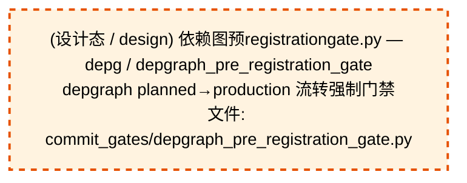

# 53_d_gov_enforcement / 规则执行域 / Rule Enforcement

> **功能简介 / Overview**: 规则执行，负责治理规则执行和门禁拦截

> **文档作用 / Purpose**: 展示 规则执行（D_GOV_ENFORCEMENT）功能域的域内依赖关系、跨域依赖关系，模块信息（成熟度/中英文名/大白话/文件路径）内嵌于 Mermaid 节点，供架构审查和域治理参考。

> 本文档由 generate_domain_doc.py 从 depgraph (PostgreSQL) 自动生成
> 数据源: depgraph (PostgreSQL) nodes表 + edges表

> **[可缩放 HTML 版 / Zoomable HTML](http://localhost:8765/docs/02_enterprise_architecture/02_domain_architecture_docs/_zoomable_html/53_d_gov_enforcement.html)** — Ctrl+滚轮缩放 ｜ 双击重置 ｜ Ctrl+Shift+D 切换拖动/选择模式

## 域基本信息 / Domain Overview

| 字段 | 值 | Field | Value |
|------|------|-------|-------|
| 编号 | 53 | Number | 53 |
| 域ID | D_GOV_ENFORCEMENT | Domain ID | D_GOV_ENFORCEMENT |
| 域名称 | 规则执行 | Domain Name | Rule Enforcement |
| 层级 | L2 业务域层 | Layer | L2 Domain |
| 模块数 | 42 | Module Count | 42 |
| 域内依赖 | 32 | Internal Dependencies | 32 |
| 跨域入边 | 110 | Cross-domain Incoming | 110 |
| 跨域出边 | 68 | Cross-domain Outgoing | 68 |
| 设计态模块 | 1 | Design Modules | 1 |
| 生产态模块 | 41 | Production Modules | 41 |
| 容量 | 41/150 (正常) | Capacity | 41/150 (正常) |
| 描述 | 门禁引擎流程编排(GatePipeline/GateEngine) | Description | 门禁引擎流程编排(GatePipeline/GateEngine) |

## 域内依赖图 / Internal Dependency Diagram

> 依赖图内嵌在本文档中，IDE 可直接渲染；网页版可 Ctrl+滚轮缩放 + 拖动平移查看细节。
>
> **图例说明 / Legend**：
> - 🟦 **蓝色 = 运营态模块**（production，已上线运行）
> - 🟧 **橙色虚线 = 设计态模块**（design，蓝图阶段，代码未写）
> - **实线箭头 = 运营态依赖**（已生效的依赖关系）
> - **虚线箭头 = 非运营态依赖**（计划中/验证中的依赖关系）

### 全景图（全部模块，颜色区分运营态/设计态）

> 展示全部 42 个模块（生产态 41 + 设计态 1），含跨域依赖外部节点。节点含成熟度+名称+大白话/简介+文件路径。

```mermaid
%%{init: {'theme': 'base', 'themeVariables': {'primaryColor': '#eaeaea', 'primaryTextColor': '#333333', 'primaryBorderColor': '#666666', 'lineColor': '#666666', 'secondaryColor': '#eaeaea', 'tertiaryColor': '#eaeaea', 'fontSize': '14px'}}}%%
flowchart TD
    docs_01_policies_and_standards_registry_catalogs_rule_enforcement_registry_yaml["(生产态 / production) 规则enforcement注册表 / rule_enforcement_registry<br/>规则enforcement注册表，规则执行的注册表，登记和查询已注册的条目。<br/>文件: catalogs/rule_enforcement_registry.yaml"]
    scripts_governance_d8_doc_sync_metric_count_drift_reconciler_py["(生产态 / production) 指标数量漂移reconciler.py — dashb / metric_count_drift_reconciler<br/>dashboard 指标数描述派生校验 reconciler<br/>文件: d8_doc_sync/metric_count_drift_reconciler.py"]
    scripts_governance_d8_doc_sync_readme_version_sync_reconciler_py["(生产态 / production) readme版本同步reconciler.py — READ / readme_version_sync_reconciler<br/>README 版本号派生展示校验 reconciler<br/>文件: d8_doc_sync/readme_version_sync_reconciler.py"]
    scripts_governance_d8_doc_sync_requirements_version_sync_reconciler_py["(生产态 / production) requirements版本同步reconciler.py  / requirements_version_sync_reconciler<br/>requirements.txt ↔ pyproject.toml 依赖一致性校验 reconciler<br/>文件: d8_doc_sync/requirements_version_sync_reconciler.py"]
    scripts_governance_session_worktree_cli_py["(生产态 / production) 会话worktreecli.py — session worktr / session_worktree_cli<br/>session worktree 管理 CLI（治本遗留项#2，2026-07-17）<br/>文件: governance/session_worktree_cli.py"]
    src_zephyr_gov_enforcement_init_py["(生产态 / production) govenforcement package — 执行治理域（DGOVEN / __init__<br/>gov_enforcement package — 执行治理域（D_GOV_ENFORCEMENT）<br/>文件: gov_enforcement/__init__.py"]
    src_zephyr_gov_enforcement_behavioral_admission_init_py["(生产态 / production) 包入口 / __init__<br/>治理执行的包入口，把这一层的子模块归到一起统一管理，用到谁才加载谁，避免一次性全加载拖慢启动。<br/>文件: behavioral_admission/__init__.py"]
    src_zephyr_gov_enforcement_commit_gates_depgraph_pre_registration_gate_py["(设计态 / design) 依赖图预registrationgate.py — depg / depgraph_pre_registration_gate<br/>depgraph planned→production 流转强制门禁<br/>文件: commit_gates/depgraph_pre_registration_gate.py"]
    src_zephyr_gov_enforcement_commit_gates_stash_accumulation_gate_py["(生产态 / production) stashaccumulationgate.py — stash 堆积阈值检 / stash_accumulation_gate<br/>stash 堆积阈值检测门禁<br/>文件: commit_gates/stash_accumulation_gate.py"]
    src_zephyr_gov_enforcement_rule_enforcement_approval_py["(生产态 / production) approval / G-CT-004 — Backward-compat re-export of ApprovalRequest from<br/>approval，规则执行的功能模块。<br/>文件: rule_enforcement/approval.py"]
    src_zephyr_gov_enforcement_rule_enforcement_compliance_rule_py["(生产态 / production) Re-export shim — ComplianceRule 真源已合并至 z / compliance_rule<br/>Re-export shim — ComplianceRule 真源已合并至 zephyr.shared.contracts.compliance_rule。<br/>文件: rule_enforcement/compliance_rule.py"]
    src_zephyr_gov_enforcement_rule_enforcement_default_quality_gate_py["(生产态 / production) 默认质量门禁 / D_DATA — Default Data Quality Gate<br/>默认质量门禁。D_DATA — Default Data Quality Gate<br/>文件: rule_enforcement/default_quality_gate.py"]
    src_zephyr_gov_enforcement_rule_enforcement_dlq_retry_policy_py["(生产态 / production) DLQ 重试策略 — 对接 shared/events/dlq.DeadLett / dlq_retry_policy<br/>DLQ 重试策略 — 对接 shared/events/dlq.DeadLetterQueue 的真重试。<br/>文件: rule_enforcement/dlq_retry_policy.py"]
    src_zephyr_gov_enforcement_rule_enforcement_output_quality_gate_py["(生产态 / production) output质量门禁 / output_quality_gate<br/>output质量门禁，规则执行的组成部分，依赖包入口工作。<br/>文件: rule_enforcement/output_quality_gate.py"]
    src_zephyr_gov_enforcement_rule_enforcement_pre_flight_gate_py["(生产态 / production) 预flight门禁 / pre_flight_gate<br/>预flight门禁，规则执行的组成部分，依赖预算模型、预算引擎工作。<br/>文件: rule_enforcement/pre_flight_gate.py"]
    src_zephyr_gov_enforcement_rule_enforcement_rule_engine_rule_canary_manager_py["(生产态 / production) Rule Canary Manager — v0.10.0 规则金丝雀: 1%用 / rule_canary_manager<br/>Rule Canary Manager — v0.10.0 规则金丝雀: 1%用户先上新规则->A/B对比->rollback。<br/>文件: rule_engine/rule_canary_manager.py"]
    src_zephyr_gov_enforcement_rule_enforcement_rule_engine_rule_debt_auditor_py["(生产态 / production) Rule Debt Auditor — v0.7.0 规则债务审计器: 分析es / rule_debt_auditor<br/>Rule Debt Auditor — v0.7.0 规则债务审计器: 分析escalation_rules.yaml维护债务指标。<br/>文件: rule_engine/rule_debt_auditor.py"]
    src_zephyr_gov_enforcement_rule_enforcement_rule_engine_rule_shadow_runner_py["(生产态 / production) Rule Shadow Runner — v0.10.0 规则影子模式: 新规则 / rule_shadow_runner<br/>Rule Shadow Runner — v0.10.0 规则影子模式: 新规则shadow运行3天->diff old vs new->promote。<br/>文件: rule_engine/rule_shadow_runner.py"]
    src_zephyr_gov_enforcement_rule_enforcement_rule_engine_rule_watcher_py["(生产态 / production) RuleWatcher — YAML 规则文件变更检测与自动同步 / rule_watcher<br/>RuleWatcher — YAML 规则文件变更检测与自动同步<br/>文件: rule_engine/rule_watcher.py"]
    src_zephyr_gov_enforcement_rule_enforcement_slo_contract_py["(生产态 / production) SLO契约 / SLO-Driven Escalation Contract — D-022-12.<br/>SLO契约。SLO-Driven Escalation Contract — D-022-12.<br/>文件: rule_enforcement/slo_contract.py"]
    tests_governance_commit_gates_test_create_guard_py["(生产态 / production) 测试创建guard.py — CREATE-GUARD 门禁单元 / test_create_guard<br/>CREATE-GUARD 门禁单元测试（2026-06-30 治本补全）<br/>文件: commit_gates/test_create_guard.py"]
    tests_governance_commit_gates_test_r5_digit_suffix_gate_py["(生产态 / production) 测试r5digitsuffixgate.py — R5-DIGIT- / test_r5_digit_suffix_gate<br/>R5-DIGIT-SUFFIX 门禁单元测试<br/>文件: commit_gates/test_r5_digit_suffix_gate.py"]
    tests_governance_rule_bridge_test_claim_files_for_edit_py["(生产态 / production) 测试claimfilesforedit.py — P2-2 并发 s / test_claim_files_for_edit<br/>P2-2 并发 session 文件级原子性测试<br/>文件: rule_bridge/test_claim_files_for_edit.py"]
    tests_governance_rule_bridge_test_emergency_commit_py["(生产态 / production) 测试紧急commit.py — emergencycom / test_emergency_commit<br/>emergency_commit API 测试（Ruling:100PCT-AI-GOVERNANCE P2-1）<br/>文件: rule_bridge/test_emergency_commit.py"]
    tests_governance_rule_bridge_test_heartbeat_daemon_py["(生产态 / production) 测试heartbeatdaemon.py — heartbeat dae / test_heartbeat_daemon<br/>heartbeat daemon + 成本递增 smoke test（Ruling:100PCT-AI-GOVERNANCE P3-1）<br/>文件: rule_bridge/test_heartbeat_daemon.py"]
    docs_01_policies_and_standards_registry_catalogs_rule_enforcement_registry_yaml ~~~ scripts_governance_d8_doc_sync_metric_count_drift_reconciler_py
    scripts_governance_d8_doc_sync_metric_count_drift_reconciler_py ~~~ scripts_governance_d8_doc_sync_readme_version_sync_reconciler_py
    scripts_governance_d8_doc_sync_readme_version_sync_reconciler_py ~~~ scripts_governance_d8_doc_sync_requirements_version_sync_reconciler_py
    scripts_governance_d8_doc_sync_requirements_version_sync_reconciler_py ~~~ scripts_governance_session_worktree_cli_py
    scripts_governance_session_worktree_cli_py ~~~ src_zephyr_gov_enforcement_init_py
    src_zephyr_gov_enforcement_init_py ~~~ src_zephyr_gov_enforcement_behavioral_admission_init_py
    src_zephyr_gov_enforcement_behavioral_admission_init_py ~~~ src_zephyr_gov_enforcement_commit_gates_depgraph_pre_registration_gate_py
    src_zephyr_gov_enforcement_commit_gates_depgraph_pre_registration_gate_py ~~~ src_zephyr_gov_enforcement_commit_gates_stash_accumulation_gate_py
    src_zephyr_gov_enforcement_commit_gates_stash_accumulation_gate_py ~~~ src_zephyr_gov_enforcement_rule_enforcement_approval_py
    src_zephyr_gov_enforcement_rule_enforcement_approval_py ~~~ src_zephyr_gov_enforcement_rule_enforcement_compliance_rule_py
    src_zephyr_gov_enforcement_rule_enforcement_compliance_rule_py ~~~ src_zephyr_gov_enforcement_rule_enforcement_default_quality_gate_py
    src_zephyr_gov_enforcement_rule_enforcement_default_quality_gate_py ~~~ src_zephyr_gov_enforcement_rule_enforcement_dlq_retry_policy_py
    src_zephyr_gov_enforcement_rule_enforcement_dlq_retry_policy_py ~~~ src_zephyr_gov_enforcement_rule_enforcement_output_quality_gate_py
    src_zephyr_gov_enforcement_rule_enforcement_output_quality_gate_py ~~~ src_zephyr_gov_enforcement_rule_enforcement_pre_flight_gate_py
    src_zephyr_gov_enforcement_rule_enforcement_pre_flight_gate_py ~~~ src_zephyr_gov_enforcement_rule_enforcement_rule_engine_rule_canary_manager_py
    src_zephyr_gov_enforcement_rule_enforcement_rule_engine_rule_canary_manager_py ~~~ src_zephyr_gov_enforcement_rule_enforcement_rule_engine_rule_debt_auditor_py
    src_zephyr_gov_enforcement_rule_enforcement_rule_engine_rule_debt_auditor_py ~~~ src_zephyr_gov_enforcement_rule_enforcement_rule_engine_rule_shadow_runner_py
    src_zephyr_gov_enforcement_rule_enforcement_rule_engine_rule_shadow_runner_py ~~~ src_zephyr_gov_enforcement_rule_enforcement_rule_engine_rule_watcher_py
    src_zephyr_gov_enforcement_rule_enforcement_rule_engine_rule_watcher_py ~~~ src_zephyr_gov_enforcement_rule_enforcement_slo_contract_py
    src_zephyr_gov_enforcement_rule_enforcement_slo_contract_py ~~~ tests_governance_commit_gates_test_create_guard_py
    tests_governance_commit_gates_test_create_guard_py ~~~ tests_governance_commit_gates_test_r5_digit_suffix_gate_py
    tests_governance_commit_gates_test_r5_digit_suffix_gate_py ~~~ tests_governance_rule_bridge_test_claim_files_for_edit_py
    tests_governance_rule_bridge_test_claim_files_for_edit_py ~~~ tests_governance_rule_bridge_test_emergency_commit_py
    tests_governance_rule_bridge_test_emergency_commit_py ~~~ tests_governance_rule_bridge_test_heartbeat_daemon_py
    src_zephyr_gov_enforcement_behavioral_admission_admission_response_py["(生产态 / production) 准入响应 / admission_response<br/>准入响应，治理执行的功能模块。<br/>文件: behavioral_admission/admission_response.py"]
    src_zephyr_gov_enforcement_behavioral_admission_code_review_ai_py["(生产态 / production) 代码审查AI / code_review_ai<br/>代码审查AI，治理执行的核心类，封装ReviewLevel相关逻辑。<br/>文件: behavioral_admission/code_review_ai.py"]
    src_zephyr_gov_enforcement_behavioral_admission_gate_event_adapter_py["(生产态 / production) GateEventAdapter — GateRepo 事件适配器（DW-000 / gate_event_adapter<br/>GateEventAdapter — GateRepo 事件适配器（DW-0006）<br/>文件: behavioral_admission/gate_event_adapter.py"]
    src_zephyr_gov_enforcement_behavioral_admission_gpu_consensus_scheduler_py["(生产态 / production) GPU共识调度器 / gpu_consensus_scheduler<br/>GPU共识调度器，治理执行的功能模块。<br/>文件: behavioral_admission/gpu_consensus_scheduler.py"]
    src_zephyr_gov_enforcement_behavioral_admission_protection_index_py["(生产态 / production) 保护索引 / protection_index<br/>保护索引，治理执行的功能模块。<br/>文件: behavioral_admission/protection_index.py"]
    src_zephyr_gov_enforcement_rule_bridge_commit_gate_registry_py["(生产态 / production) 提交门禁registry.py — GitCommitGatew / commit_gate_registry<br/>GitCommitGateway pre-commit 门禁注册表（架构债务 #AD-001 治本）<br/>文件: rule_bridge/commit_gate_registry.py"]
    src_zephyr_gov_enforcement_rule_bridge_session_worktree_py["(生产态 / production) 会话worktree.py — AI 对话 worktree 物理隔 / session_worktree<br/>AI 对话 worktree 物理隔离 helper（FP-ISO.4C，2026-07-01 治本）<br/>文件: rule_bridge/session_worktree.py"]
    src_zephyr_gov_enforcement_rule_enforcement_quality_gate_py["(生产态 / production) 质量门禁 / D_DATA — Data Quality Gate<br/>质量门禁。D_DATA — Data Quality Gate<br/>文件: rule_enforcement/quality_gate.py"]
    src_zephyr_gov_enforcement_behavioral_admission_admission_response_py ~~~ src_zephyr_gov_enforcement_behavioral_admission_code_review_ai_py
    src_zephyr_gov_enforcement_behavioral_admission_code_review_ai_py ~~~ src_zephyr_gov_enforcement_behavioral_admission_gate_event_adapter_py
    src_zephyr_gov_enforcement_behavioral_admission_gate_event_adapter_py ~~~ src_zephyr_gov_enforcement_behavioral_admission_gpu_consensus_scheduler_py
    src_zephyr_gov_enforcement_behavioral_admission_gpu_consensus_scheduler_py ~~~ src_zephyr_gov_enforcement_behavioral_admission_protection_index_py
    src_zephyr_gov_enforcement_behavioral_admission_protection_index_py ~~~ src_zephyr_gov_enforcement_rule_bridge_commit_gate_registry_py
    src_zephyr_gov_enforcement_rule_bridge_commit_gate_registry_py ~~~ src_zephyr_gov_enforcement_rule_bridge_session_worktree_py
    src_zephyr_gov_enforcement_rule_bridge_session_worktree_py ~~~ src_zephyr_gov_enforcement_rule_enforcement_quality_gate_py
    src_zephyr_gov_enforcement_behavioral_admission_admission_controller_py["(生产态 / production) 准入控制器 / admission_controller<br/>准入控制器，治理执行的功能模块。<br/>文件: behavioral_admission/admission_controller.py"]
    src_zephyr_gov_enforcement_behavioral_admission_verdict_engine_py["(生产态 / production) verdict引擎 / verdict_engine<br/>verdict引擎，治理执行的事件，定义和分发事件。<br/>文件: behavioral_admission/verdict_engine.py"]
    src_zephyr_gov_enforcement_rule_bridge_emergency_commit_py["(生产态 / production) 紧急commit.py — 紧急提交通道（Ruling:100P / emergency_commit<br/>紧急提交通道（Ruling:100PCT-AI-GOVERNANCE P2-1，2026-07-19）<br/>文件: rule_bridge/emergency_commit.py"]
    src_zephyr_gov_enforcement_rule_bridge_heartbeat_daemon_py["(生产态 / production) heartbeat_daemon.py — session heartbeat  / heartbeat_daemon<br/>session heartbeat 独立进程（Ruling:100PCT-AI-GOVERNANCE P3-1，2026-07-20）<br/>文件: rule_bridge/heartbeat_daemon.py"]
    src_zephyr_gov_enforcement_rule_bridge_session_claim_py["(生产态 / production) 会话claim.py — AI 对话并发声明 helper（FP-I / session_claim<br/>AI 对话并发声明 helper（FP-ISO.4B 件2改，2026-07-01 治本）<br/>文件: rule_bridge/session_claim.py"]
    src_zephyr_gov_enforcement_rule_bridge_worktree_manager_py["(生产态 / production) worktreemanager.py — session worktree 物 / worktree_manager<br/>session worktree 物理隔离管理器（阶段3 治本 stash 循环）<br/>文件: rule_bridge/worktree_manager.py"]
    src_zephyr_gov_enforcement_rule_bridge_worktree_pool_py["(生产态 / production) worktreepool.py — Worktree 预创建池（ARCH-GI / worktree_pool<br/>Worktree 预创建池（ARCH-GIT-CALL-BUDGET P3.3，2026-07-19）<br/>文件: rule_bridge/worktree_pool.py"]
    src_zephyr_gov_enforcement_behavioral_admission_admission_controller_py ~~~ src_zephyr_gov_enforcement_behavioral_admission_verdict_engine_py
    src_zephyr_gov_enforcement_behavioral_admission_verdict_engine_py ~~~ src_zephyr_gov_enforcement_rule_bridge_emergency_commit_py
    src_zephyr_gov_enforcement_rule_bridge_emergency_commit_py ~~~ src_zephyr_gov_enforcement_rule_bridge_heartbeat_daemon_py
    src_zephyr_gov_enforcement_rule_bridge_heartbeat_daemon_py ~~~ src_zephyr_gov_enforcement_rule_bridge_session_claim_py
    src_zephyr_gov_enforcement_rule_bridge_session_claim_py ~~~ src_zephyr_gov_enforcement_rule_bridge_worktree_manager_py
    src_zephyr_gov_enforcement_rule_bridge_worktree_manager_py ~~~ src_zephyr_gov_enforcement_rule_bridge_worktree_pool_py
    src_zephyr_gov_enforcement_rule_bridge_git_commit_gateway_py["(生产态 / production) GitCommitGateway — 全项目唯一合法 git commit 入口 / git_commit_gateway<br/>GitCommitGateway — 全项目唯一合法 git commit 入口（OPS-2026062512 治本）<br/>文件: rule_bridge/git_commit_gateway.py"]
    src_zephyr_gov_enforcement_rule_bridge_batched_auto_committer_py["(生产态 / production) batched自动committer.py — Reconciler 批 / batched_auto_committer<br/>Reconciler 批量化 auto-commit 拦截器（ARCH-GIT-CALL-BUDGET P2.3，2026-07-19）<br/>文件: rule_bridge/batched_auto_committer.py"]
    src_zephyr_gov_enforcement_behavioral_admission_admission_response_py -->|导入依赖 / import_depends| src_zephyr_gov_enforcement_behavioral_admission_admission_controller_py
    src_zephyr_gov_enforcement_behavioral_admission_protection_index_py -->|导入依赖 / import_depends| src_zephyr_gov_enforcement_behavioral_admission_verdict_engine_py
    src_zephyr_gov_enforcement_behavioral_admission_gpu_consensus_scheduler_py -->|导入依赖 / import_depends| src_zephyr_gov_enforcement_behavioral_admission_verdict_engine_py
    src_zephyr_gov_enforcement_behavioral_admission_init_py -->|导入依赖 / import_depends| src_zephyr_gov_enforcement_behavioral_admission_code_review_ai_py
    src_zephyr_gov_enforcement_behavioral_admission_init_py -->|导入依赖 / import_depends| src_zephyr_gov_enforcement_behavioral_admission_admission_controller_py
    src_zephyr_gov_enforcement_behavioral_admission_init_py -->|导入依赖 / import_depends| src_zephyr_gov_enforcement_behavioral_admission_admission_response_py
    src_zephyr_gov_enforcement_behavioral_admission_init_py -->|导入依赖 / import_depends| src_zephyr_gov_enforcement_behavioral_admission_protection_index_py
    src_zephyr_gov_enforcement_behavioral_admission_init_py -->|导入依赖 / import_depends| src_zephyr_gov_enforcement_behavioral_admission_gpu_consensus_scheduler_py
    src_zephyr_gov_enforcement_behavioral_admission_init_py -->|导入依赖 / import_depends| src_zephyr_gov_enforcement_behavioral_admission_gate_event_adapter_py
    src_zephyr_gov_enforcement_behavioral_admission_init_py -->|导入依赖 / import_depends| src_zephyr_gov_enforcement_behavioral_admission_verdict_engine_py
    src_zephyr_gov_enforcement_commit_gates_stash_accumulation_gate_py -->|导入依赖 / import_depends| src_zephyr_gov_enforcement_rule_bridge_commit_gate_registry_py
    src_zephyr_gov_enforcement_rule_bridge_batched_auto_committer_py -->|导入依赖 / import_depends| src_zephyr_gov_enforcement_rule_bridge_git_commit_gateway_py
    src_zephyr_gov_enforcement_rule_bridge_emergency_commit_py -->|导入依赖 / import_depends| src_zephyr_gov_enforcement_rule_bridge_git_commit_gateway_py
    src_zephyr_gov_enforcement_rule_bridge_git_commit_gateway_py -->|导入依赖 / import_depends| src_zephyr_gov_enforcement_rule_bridge_commit_gate_registry_py
    src_zephyr_gov_enforcement_rule_bridge_git_commit_gateway_py -->|导入依赖 / import_depends| src_zephyr_gov_enforcement_rule_bridge_batched_auto_committer_py
    src_zephyr_gov_enforcement_rule_bridge_git_commit_gateway_py -->|导入依赖 / import_depends| src_zephyr_gov_enforcement_rule_bridge_worktree_manager_py
    src_zephyr_gov_enforcement_rule_bridge_session_worktree_py -->|导入依赖 / import_depends| src_zephyr_gov_enforcement_rule_bridge_heartbeat_daemon_py
    src_zephyr_gov_enforcement_rule_bridge_session_worktree_py -->|导入依赖 / import_depends| src_zephyr_gov_enforcement_rule_bridge_emergency_commit_py
    src_zephyr_gov_enforcement_rule_bridge_session_worktree_py -->|导入依赖 / import_depends| src_zephyr_gov_enforcement_rule_bridge_worktree_manager_py
    src_zephyr_gov_enforcement_rule_bridge_session_worktree_py -->|导入依赖 / import_depends| src_zephyr_gov_enforcement_rule_bridge_session_claim_py
    src_zephyr_gov_enforcement_rule_bridge_session_worktree_py -->|导入依赖 / import_depends| src_zephyr_gov_enforcement_rule_bridge_git_commit_gateway_py
    src_zephyr_gov_enforcement_rule_bridge_session_worktree_py -->|导入依赖 / import_depends| src_zephyr_gov_enforcement_rule_bridge_worktree_pool_py
    src_zephyr_gov_enforcement_rule_enforcement_default_quality_gate_py -->|导入依赖 / import_depends| src_zephyr_gov_enforcement_rule_enforcement_quality_gate_py
    scripts_governance_session_worktree_cli_py -->|导入依赖 / import_depends| src_zephyr_gov_enforcement_rule_bridge_worktree_manager_py
    scripts_governance_session_worktree_cli_py -->|导入依赖 / import_depends| src_zephyr_gov_enforcement_rule_bridge_session_worktree_py
    tests_governance_commit_gates_test_create_guard_py -->|测试依赖 / test_depends| src_zephyr_gov_enforcement_rule_bridge_git_commit_gateway_py
    tests_governance_commit_gates_test_r5_digit_suffix_gate_py -->|测试依赖 / test_depends| src_zephyr_gov_enforcement_rule_bridge_commit_gate_registry_py
    tests_governance_rule_bridge_test_emergency_commit_py -->|测试依赖 / test_depends| src_zephyr_gov_enforcement_rule_bridge_emergency_commit_py
    tests_governance_rule_bridge_test_claim_files_for_edit_py -->|测试依赖 / test_depends| src_zephyr_gov_enforcement_rule_bridge_session_worktree_py
    tests_governance_rule_bridge_test_heartbeat_daemon_py -->|测试依赖 / test_depends| src_zephyr_gov_enforcement_rule_bridge_heartbeat_daemon_py
    tests_governance_rule_bridge_test_heartbeat_daemon_py -->|测试依赖 / test_depends| src_zephyr_gov_enforcement_rule_bridge_emergency_commit_py
    tests_governance_rule_bridge_test_heartbeat_daemon_py -->|测试依赖 / test_depends| src_zephyr_gov_enforcement_rule_bridge_session_worktree_py
    D_GOV_AUDIT["(生产态 / production) 审计追踪 / Audit Trail<br/>审计追踪，负责变更审计追踪和操作日志管理<br/>跨域节点 / cross-domain"]
    scripts_governance_d8_doc_sync_requirements_version_sync_reconciler_py -->|导入依赖 / import_depends| D_GOV_AUDIT
    D_GOV_CODE_QUALITY["(生产态 / production) 代码质量治理 / Code Quality Governance<br/>代码质量治理，负责代码去重引擎、函数重复检测、AST语义分析和提交门禁引擎<br/>跨域节点 / cross-domain"]
    src_zephyr_gov_enforcement_rule_bridge_session_worktree_py -->|导入依赖 / import_depends| D_GOV_CODE_QUALITY
    src_zephyr_gov_enforcement_behavioral_admission_verdict_engine_py -->|导入依赖 / import_depends| D_GOV_AUDIT
    D_OPS["(生产态 / production) 反馈循环 / Feedback Loop<br/>反馈循环，负责系统运行反馈、性能监控和自动调优闭环<br/>跨域节点 / cross-domain"]
    src_zephyr_gov_enforcement_rule_enforcement_pre_flight_gate_py -->|导入依赖 / import_depends| D_OPS
    D_GOVERNANCE["(生产态 / production) 生命周期管理 / Lifecycle Management<br/>生命周期管理，负责蓝图/模块/任务的声明周期管理和元数据治理<br/>跨域节点 / cross-domain"]
    src_zephyr_gov_enforcement_rule_bridge_git_commit_gateway_py -->|导入依赖 / import_depends| D_GOVERNANCE
    src_zephyr_gov_enforcement_rule_bridge_session_worktree_py -->|导入依赖 / import_depends| D_GOV_AUDIT
    src_zephyr_gov_enforcement_rule_bridge_emergency_commit_py -->|导入依赖 / import_depends| D_GOV_AUDIT
    D_GOV_SCRIPTS["(生产态 / production) 脚本治理 / Script Governance<br/>脚本治理，负责脚本生命周期管理和脚本质量门禁<br/>跨域节点 / cross-domain"]
    scripts_governance_session_worktree_cli_py -->|导入依赖 / import_depends| D_GOV_SCRIPTS
    src_zephyr_gov_enforcement_behavioral_admission_init_py -->|导入依赖 / import_depends| D_GOV_AUDIT
    D_SHARED["(生产态 / production) 共享服务 / Shared Services<br/>共享服务，负责跨域共享的工具、协议和基础服务<br/>跨域节点 / cross-domain"]
    src_zephyr_gov_enforcement_rule_bridge_git_commit_gateway_py -->|导入依赖 / import_depends| D_SHARED
    D_GOV_OPS_RESILIENCE["(生产态 / production) 运维弹性治理 / Ops Resilience Governance<br/>运维弹性治理，负责运维治理、安全治理、弹性治理和升级协议<br/>跨域节点 / cross-domain"]
    src_zephyr_gov_enforcement_rule_bridge_git_commit_gateway_py -->|导入依赖 / import_depends| D_GOV_OPS_RESILIENCE
    D_SECURITY["(生产态 / production) 对抗验证 / Adversarial Validation<br/>对抗验证，负责系统安全对抗测试、漏洞扫描和攻防验证<br/>跨域节点 / cross-domain"]
    src_zephyr_gov_enforcement_rule_bridge_git_commit_gateway_py -->|导入依赖 / import_depends| D_SECURITY
    src_zephyr_gov_enforcement_rule_bridge_session_worktree_py -->|导入依赖 / import_depends| D_SHARED
    scripts_governance_d8_doc_sync_metric_count_drift_reconciler_py -->|导入依赖 / import_depends| D_GOV_SCRIPTS
    src_zephyr_gov_enforcement_rule_bridge_git_commit_gateway_py -->|导入依赖 / import_depends| D_SHARED
    D_GOV_CODE_QUALITY -->|导入依赖 / import_depends| src_zephyr_gov_enforcement_rule_bridge_commit_gate_registry_py
    D_DATA["(生产态 / production) 数据接入层 / Data Access Layer<br/>数据接入层，负责数据源接入、数据集成和数据标准化<br/>跨域节点 / cross-domain"]
    D_DATA -->|导入依赖 / import_depends| src_zephyr_gov_enforcement_rule_enforcement_quality_gate_py
    D_GOV_CODE_QUALITY -->|导入依赖 / import_depends| src_zephyr_gov_enforcement_rule_bridge_commit_gate_registry_py
    D_GOVERNANCE -->|导入依赖 / import_depends| src_zephyr_gov_enforcement_rule_enforcement_compliance_rule_py
    D_GOV_CODE_QUALITY -->|导入依赖 / import_depends| src_zephyr_gov_enforcement_rule_bridge_commit_gate_registry_py
    D_GOV_CODE_QUALITY -->|导入依赖 / import_depends| src_zephyr_gov_enforcement_rule_bridge_commit_gate_registry_py
    D_GOV_CODE_QUALITY -->|测试依赖 / test_depends| src_zephyr_gov_enforcement_rule_bridge_session_worktree_py
    D_GOV_CODE_QUALITY -->|导入依赖 / import_depends| src_zephyr_gov_enforcement_rule_bridge_commit_gate_registry_py
    D_GOV_CODE_QUALITY -->|导入依赖 / import_depends| src_zephyr_gov_enforcement_rule_bridge_commit_gate_registry_py
    D_GOV_CODE_QUALITY -->|导入依赖 / import_depends| src_zephyr_gov_enforcement_rule_bridge_commit_gate_registry_py
    D_GOV_CODE_QUALITY -->|导入依赖 / import_depends| src_zephyr_gov_enforcement_rule_bridge_commit_gate_registry_py
    D_GOV_AUDIT -->|测试依赖 / test_depends| src_zephyr_gov_enforcement_rule_bridge_git_commit_gateway_py
    D_GOVERNANCE -->|测试依赖 / test_depends| src_zephyr_gov_enforcement_rule_bridge_git_commit_gateway_py
    D_GOV_CODE_QUALITY -->|导入依赖 / import_depends| src_zephyr_gov_enforcement_rule_bridge_commit_gate_registry_py
    D_GOV_CODE_QUALITY -->|导入依赖 / import_depends| src_zephyr_gov_enforcement_rule_bridge_commit_gate_registry_py
    classDef production fill:#e1f5fe,stroke:#01579b,stroke-width:2px,color:#000
    classDef design fill:#fff3e0,stroke:#e65100,stroke-width:2px,color:#000,stroke-dasharray: 5 5
    classDef external_prod fill:#e8f4fd,stroke:#0277bd,stroke-width:1px,color:#000
    classDef external_design fill:#fff8e7,stroke:#ef6c00,stroke-width:1px,color:#000,stroke-dasharray: 5 5
    class docs_01_policies_and_standards_registry_catalogs_rule_enforcement_registry_yaml,scripts_governance_d8_doc_sync_metric_count_drift_reconciler_py,scripts_governance_d8_doc_sync_readme_version_sync_reconciler_py,scripts_governance_d8_doc_sync_requirements_version_sync_reconciler_py,scripts_governance_session_worktree_cli_py,src_zephyr_gov_enforcement_init_py,src_zephyr_gov_enforcement_behavioral_admission_init_py,src_zephyr_gov_enforcement_behavioral_admission_admission_controller_py,src_zephyr_gov_enforcement_behavioral_admission_admission_response_py,src_zephyr_gov_enforcement_behavioral_admission_code_review_ai_py,src_zephyr_gov_enforcement_behavioral_admission_gate_event_adapter_py,src_zephyr_gov_enforcement_behavioral_admission_gpu_consensus_scheduler_py,src_zephyr_gov_enforcement_behavioral_admission_protection_index_py,src_zephyr_gov_enforcement_behavioral_admission_verdict_engine_py,src_zephyr_gov_enforcement_commit_gates_stash_accumulation_gate_py,src_zephyr_gov_enforcement_rule_bridge_batched_auto_committer_py,src_zephyr_gov_enforcement_rule_bridge_commit_gate_registry_py,src_zephyr_gov_enforcement_rule_bridge_emergency_commit_py,src_zephyr_gov_enforcement_rule_bridge_git_commit_gateway_py,src_zephyr_gov_enforcement_rule_bridge_heartbeat_daemon_py,src_zephyr_gov_enforcement_rule_bridge_session_claim_py,src_zephyr_gov_enforcement_rule_bridge_session_worktree_py,src_zephyr_gov_enforcement_rule_bridge_worktree_manager_py,src_zephyr_gov_enforcement_rule_bridge_worktree_pool_py,src_zephyr_gov_enforcement_rule_enforcement_approval_py,src_zephyr_gov_enforcement_rule_enforcement_compliance_rule_py,src_zephyr_gov_enforcement_rule_enforcement_default_quality_gate_py,src_zephyr_gov_enforcement_rule_enforcement_dlq_retry_policy_py,src_zephyr_gov_enforcement_rule_enforcement_output_quality_gate_py,src_zephyr_gov_enforcement_rule_enforcement_pre_flight_gate_py,src_zephyr_gov_enforcement_rule_enforcement_quality_gate_py,src_zephyr_gov_enforcement_rule_enforcement_rule_engine_rule_canary_manager_py,src_zephyr_gov_enforcement_rule_enforcement_rule_engine_rule_debt_auditor_py,src_zephyr_gov_enforcement_rule_enforcement_rule_engine_rule_shadow_runner_py,src_zephyr_gov_enforcement_rule_enforcement_rule_engine_rule_watcher_py,src_zephyr_gov_enforcement_rule_enforcement_slo_contract_py,tests_governance_commit_gates_test_create_guard_py,tests_governance_commit_gates_test_r5_digit_suffix_gate_py,tests_governance_rule_bridge_test_claim_files_for_edit_py,tests_governance_rule_bridge_test_emergency_commit_py,tests_governance_rule_bridge_test_heartbeat_daemon_py production
    class src_zephyr_gov_enforcement_commit_gates_depgraph_pre_registration_gate_py design
    class D_GOV_AUDIT,D_GOV_CODE_QUALITY,D_OPS,D_GOVERNANCE,D_GOV_SCRIPTS,D_SHARED,D_GOV_OPS_RESILIENCE,D_SECURITY,D_DATA external_prod
```

### 运营态的图（仅 design_maturity=production 的模块和域内依赖）

> 仅展示已上线运行的模块（共 41 个），不含跨域外部节点。跨域依赖见下方跨域依赖章节。

```mermaid
%%{init: {'theme': 'base', 'themeVariables': {'primaryColor': '#eaeaea', 'primaryTextColor': '#333333', 'primaryBorderColor': '#666666', 'lineColor': '#666666', 'secondaryColor': '#eaeaea', 'tertiaryColor': '#eaeaea', 'fontSize': '14px'}}}%%
flowchart TD
    docs_01_policies_and_standards_registry_catalogs_rule_enforcement_registry_yaml["(生产态 / production) 规则enforcement注册表 / rule_enforcement_registry<br/>规则enforcement注册表，规则执行的注册表，登记和查询已注册的条目。<br/>文件: catalogs/rule_enforcement_registry.yaml"]
    scripts_governance_d8_doc_sync_metric_count_drift_reconciler_py["(生产态 / production) 指标数量漂移reconciler.py — dashb / metric_count_drift_reconciler<br/>dashboard 指标数描述派生校验 reconciler<br/>文件: d8_doc_sync/metric_count_drift_reconciler.py"]
    scripts_governance_d8_doc_sync_readme_version_sync_reconciler_py["(生产态 / production) readme版本同步reconciler.py — READ / readme_version_sync_reconciler<br/>README 版本号派生展示校验 reconciler<br/>文件: d8_doc_sync/readme_version_sync_reconciler.py"]
    scripts_governance_d8_doc_sync_requirements_version_sync_reconciler_py["(生产态 / production) requirements版本同步reconciler.py  / requirements_version_sync_reconciler<br/>requirements.txt ↔ pyproject.toml 依赖一致性校验 reconciler<br/>文件: d8_doc_sync/requirements_version_sync_reconciler.py"]
    scripts_governance_session_worktree_cli_py["(生产态 / production) 会话worktreecli.py — session worktr / session_worktree_cli<br/>session worktree 管理 CLI（治本遗留项#2，2026-07-17）<br/>文件: governance/session_worktree_cli.py"]
    src_zephyr_gov_enforcement_init_py["(生产态 / production) govenforcement package — 执行治理域（DGOVEN / __init__<br/>gov_enforcement package — 执行治理域（D_GOV_ENFORCEMENT）<br/>文件: gov_enforcement/__init__.py"]
    src_zephyr_gov_enforcement_behavioral_admission_init_py["(生产态 / production) 包入口 / __init__<br/>治理执行的包入口，把这一层的子模块归到一起统一管理，用到谁才加载谁，避免一次性全加载拖慢启动。<br/>文件: behavioral_admission/__init__.py"]
    src_zephyr_gov_enforcement_commit_gates_stash_accumulation_gate_py["(生产态 / production) stashaccumulationgate.py — stash 堆积阈值检 / stash_accumulation_gate<br/>stash 堆积阈值检测门禁<br/>文件: commit_gates/stash_accumulation_gate.py"]
    src_zephyr_gov_enforcement_rule_enforcement_approval_py["(生产态 / production) approval / G-CT-004 — Backward-compat re-export of ApprovalRequest from<br/>approval，规则执行的功能模块。<br/>文件: rule_enforcement/approval.py"]
    src_zephyr_gov_enforcement_rule_enforcement_compliance_rule_py["(生产态 / production) Re-export shim — ComplianceRule 真源已合并至 z / compliance_rule<br/>Re-export shim — ComplianceRule 真源已合并至 zephyr.shared.contracts.compliance_rule。<br/>文件: rule_enforcement/compliance_rule.py"]
    src_zephyr_gov_enforcement_rule_enforcement_default_quality_gate_py["(生产态 / production) 默认质量门禁 / D_DATA — Default Data Quality Gate<br/>默认质量门禁。D_DATA — Default Data Quality Gate<br/>文件: rule_enforcement/default_quality_gate.py"]
    src_zephyr_gov_enforcement_rule_enforcement_dlq_retry_policy_py["(生产态 / production) DLQ 重试策略 — 对接 shared/events/dlq.DeadLett / dlq_retry_policy<br/>DLQ 重试策略 — 对接 shared/events/dlq.DeadLetterQueue 的真重试。<br/>文件: rule_enforcement/dlq_retry_policy.py"]
    src_zephyr_gov_enforcement_rule_enforcement_output_quality_gate_py["(生产态 / production) output质量门禁 / output_quality_gate<br/>output质量门禁，规则执行的组成部分，依赖包入口工作。<br/>文件: rule_enforcement/output_quality_gate.py"]
    src_zephyr_gov_enforcement_rule_enforcement_pre_flight_gate_py["(生产态 / production) 预flight门禁 / pre_flight_gate<br/>预flight门禁，规则执行的组成部分，依赖预算模型、预算引擎工作。<br/>文件: rule_enforcement/pre_flight_gate.py"]
    src_zephyr_gov_enforcement_rule_enforcement_rule_engine_rule_canary_manager_py["(生产态 / production) Rule Canary Manager — v0.10.0 规则金丝雀: 1%用 / rule_canary_manager<br/>Rule Canary Manager — v0.10.0 规则金丝雀: 1%用户先上新规则->A/B对比->rollback。<br/>文件: rule_engine/rule_canary_manager.py"]
    src_zephyr_gov_enforcement_rule_enforcement_rule_engine_rule_debt_auditor_py["(生产态 / production) Rule Debt Auditor — v0.7.0 规则债务审计器: 分析es / rule_debt_auditor<br/>Rule Debt Auditor — v0.7.0 规则债务审计器: 分析escalation_rules.yaml维护债务指标。<br/>文件: rule_engine/rule_debt_auditor.py"]
    src_zephyr_gov_enforcement_rule_enforcement_rule_engine_rule_shadow_runner_py["(生产态 / production) Rule Shadow Runner — v0.10.0 规则影子模式: 新规则 / rule_shadow_runner<br/>Rule Shadow Runner — v0.10.0 规则影子模式: 新规则shadow运行3天->diff old vs new->promote。<br/>文件: rule_engine/rule_shadow_runner.py"]
    src_zephyr_gov_enforcement_rule_enforcement_rule_engine_rule_watcher_py["(生产态 / production) RuleWatcher — YAML 规则文件变更检测与自动同步 / rule_watcher<br/>RuleWatcher — YAML 规则文件变更检测与自动同步<br/>文件: rule_engine/rule_watcher.py"]
    src_zephyr_gov_enforcement_rule_enforcement_slo_contract_py["(生产态 / production) SLO契约 / SLO-Driven Escalation Contract — D-022-12.<br/>SLO契约。SLO-Driven Escalation Contract — D-022-12.<br/>文件: rule_enforcement/slo_contract.py"]
    tests_governance_commit_gates_test_create_guard_py["(生产态 / production) 测试创建guard.py — CREATE-GUARD 门禁单元 / test_create_guard<br/>CREATE-GUARD 门禁单元测试（2026-06-30 治本补全）<br/>文件: commit_gates/test_create_guard.py"]
    tests_governance_commit_gates_test_r5_digit_suffix_gate_py["(生产态 / production) 测试r5digitsuffixgate.py — R5-DIGIT- / test_r5_digit_suffix_gate<br/>R5-DIGIT-SUFFIX 门禁单元测试<br/>文件: commit_gates/test_r5_digit_suffix_gate.py"]
    tests_governance_rule_bridge_test_claim_files_for_edit_py["(生产态 / production) 测试claimfilesforedit.py — P2-2 并发 s / test_claim_files_for_edit<br/>P2-2 并发 session 文件级原子性测试<br/>文件: rule_bridge/test_claim_files_for_edit.py"]
    tests_governance_rule_bridge_test_emergency_commit_py["(生产态 / production) 测试紧急commit.py — emergencycom / test_emergency_commit<br/>emergency_commit API 测试（Ruling:100PCT-AI-GOVERNANCE P2-1）<br/>文件: rule_bridge/test_emergency_commit.py"]
    tests_governance_rule_bridge_test_heartbeat_daemon_py["(生产态 / production) 测试heartbeatdaemon.py — heartbeat dae / test_heartbeat_daemon<br/>heartbeat daemon + 成本递增 smoke test（Ruling:100PCT-AI-GOVERNANCE P3-1）<br/>文件: rule_bridge/test_heartbeat_daemon.py"]
    docs_01_policies_and_standards_registry_catalogs_rule_enforcement_registry_yaml ~~~ scripts_governance_d8_doc_sync_metric_count_drift_reconciler_py
    scripts_governance_d8_doc_sync_metric_count_drift_reconciler_py ~~~ scripts_governance_d8_doc_sync_readme_version_sync_reconciler_py
    scripts_governance_d8_doc_sync_readme_version_sync_reconciler_py ~~~ scripts_governance_d8_doc_sync_requirements_version_sync_reconciler_py
    scripts_governance_d8_doc_sync_requirements_version_sync_reconciler_py ~~~ scripts_governance_session_worktree_cli_py
    scripts_governance_session_worktree_cli_py ~~~ src_zephyr_gov_enforcement_init_py
    src_zephyr_gov_enforcement_init_py ~~~ src_zephyr_gov_enforcement_behavioral_admission_init_py
    src_zephyr_gov_enforcement_behavioral_admission_init_py ~~~ src_zephyr_gov_enforcement_commit_gates_stash_accumulation_gate_py
    src_zephyr_gov_enforcement_commit_gates_stash_accumulation_gate_py ~~~ src_zephyr_gov_enforcement_rule_enforcement_approval_py
    src_zephyr_gov_enforcement_rule_enforcement_approval_py ~~~ src_zephyr_gov_enforcement_rule_enforcement_compliance_rule_py
    src_zephyr_gov_enforcement_rule_enforcement_compliance_rule_py ~~~ src_zephyr_gov_enforcement_rule_enforcement_default_quality_gate_py
    src_zephyr_gov_enforcement_rule_enforcement_default_quality_gate_py ~~~ src_zephyr_gov_enforcement_rule_enforcement_dlq_retry_policy_py
    src_zephyr_gov_enforcement_rule_enforcement_dlq_retry_policy_py ~~~ src_zephyr_gov_enforcement_rule_enforcement_output_quality_gate_py
    src_zephyr_gov_enforcement_rule_enforcement_output_quality_gate_py ~~~ src_zephyr_gov_enforcement_rule_enforcement_pre_flight_gate_py
    src_zephyr_gov_enforcement_rule_enforcement_pre_flight_gate_py ~~~ src_zephyr_gov_enforcement_rule_enforcement_rule_engine_rule_canary_manager_py
    src_zephyr_gov_enforcement_rule_enforcement_rule_engine_rule_canary_manager_py ~~~ src_zephyr_gov_enforcement_rule_enforcement_rule_engine_rule_debt_auditor_py
    src_zephyr_gov_enforcement_rule_enforcement_rule_engine_rule_debt_auditor_py ~~~ src_zephyr_gov_enforcement_rule_enforcement_rule_engine_rule_shadow_runner_py
    src_zephyr_gov_enforcement_rule_enforcement_rule_engine_rule_shadow_runner_py ~~~ src_zephyr_gov_enforcement_rule_enforcement_rule_engine_rule_watcher_py
    src_zephyr_gov_enforcement_rule_enforcement_rule_engine_rule_watcher_py ~~~ src_zephyr_gov_enforcement_rule_enforcement_slo_contract_py
    src_zephyr_gov_enforcement_rule_enforcement_slo_contract_py ~~~ tests_governance_commit_gates_test_create_guard_py
    tests_governance_commit_gates_test_create_guard_py ~~~ tests_governance_commit_gates_test_r5_digit_suffix_gate_py
    tests_governance_commit_gates_test_r5_digit_suffix_gate_py ~~~ tests_governance_rule_bridge_test_claim_files_for_edit_py
    tests_governance_rule_bridge_test_claim_files_for_edit_py ~~~ tests_governance_rule_bridge_test_emergency_commit_py
    tests_governance_rule_bridge_test_emergency_commit_py ~~~ tests_governance_rule_bridge_test_heartbeat_daemon_py
    src_zephyr_gov_enforcement_behavioral_admission_admission_response_py["(生产态 / production) 准入响应 / admission_response<br/>准入响应，治理执行的功能模块。<br/>文件: behavioral_admission/admission_response.py"]
    src_zephyr_gov_enforcement_behavioral_admission_code_review_ai_py["(生产态 / production) 代码审查AI / code_review_ai<br/>代码审查AI，治理执行的核心类，封装ReviewLevel相关逻辑。<br/>文件: behavioral_admission/code_review_ai.py"]
    src_zephyr_gov_enforcement_behavioral_admission_gate_event_adapter_py["(生产态 / production) GateEventAdapter — GateRepo 事件适配器（DW-000 / gate_event_adapter<br/>GateEventAdapter — GateRepo 事件适配器（DW-0006）<br/>文件: behavioral_admission/gate_event_adapter.py"]
    src_zephyr_gov_enforcement_behavioral_admission_gpu_consensus_scheduler_py["(生产态 / production) GPU共识调度器 / gpu_consensus_scheduler<br/>GPU共识调度器，治理执行的功能模块。<br/>文件: behavioral_admission/gpu_consensus_scheduler.py"]
    src_zephyr_gov_enforcement_behavioral_admission_protection_index_py["(生产态 / production) 保护索引 / protection_index<br/>保护索引，治理执行的功能模块。<br/>文件: behavioral_admission/protection_index.py"]
    src_zephyr_gov_enforcement_rule_bridge_commit_gate_registry_py["(生产态 / production) 提交门禁registry.py — GitCommitGatew / commit_gate_registry<br/>GitCommitGateway pre-commit 门禁注册表（架构债务 #AD-001 治本）<br/>文件: rule_bridge/commit_gate_registry.py"]
    src_zephyr_gov_enforcement_rule_bridge_session_worktree_py["(生产态 / production) 会话worktree.py — AI 对话 worktree 物理隔 / session_worktree<br/>AI 对话 worktree 物理隔离 helper（FP-ISO.4C，2026-07-01 治本）<br/>文件: rule_bridge/session_worktree.py"]
    src_zephyr_gov_enforcement_rule_enforcement_quality_gate_py["(生产态 / production) 质量门禁 / D_DATA — Data Quality Gate<br/>质量门禁。D_DATA — Data Quality Gate<br/>文件: rule_enforcement/quality_gate.py"]
    src_zephyr_gov_enforcement_behavioral_admission_admission_response_py ~~~ src_zephyr_gov_enforcement_behavioral_admission_code_review_ai_py
    src_zephyr_gov_enforcement_behavioral_admission_code_review_ai_py ~~~ src_zephyr_gov_enforcement_behavioral_admission_gate_event_adapter_py
    src_zephyr_gov_enforcement_behavioral_admission_gate_event_adapter_py ~~~ src_zephyr_gov_enforcement_behavioral_admission_gpu_consensus_scheduler_py
    src_zephyr_gov_enforcement_behavioral_admission_gpu_consensus_scheduler_py ~~~ src_zephyr_gov_enforcement_behavioral_admission_protection_index_py
    src_zephyr_gov_enforcement_behavioral_admission_protection_index_py ~~~ src_zephyr_gov_enforcement_rule_bridge_commit_gate_registry_py
    src_zephyr_gov_enforcement_rule_bridge_commit_gate_registry_py ~~~ src_zephyr_gov_enforcement_rule_bridge_session_worktree_py
    src_zephyr_gov_enforcement_rule_bridge_session_worktree_py ~~~ src_zephyr_gov_enforcement_rule_enforcement_quality_gate_py
    src_zephyr_gov_enforcement_behavioral_admission_admission_controller_py["(生产态 / production) 准入控制器 / admission_controller<br/>准入控制器，治理执行的功能模块。<br/>文件: behavioral_admission/admission_controller.py"]
    src_zephyr_gov_enforcement_behavioral_admission_verdict_engine_py["(生产态 / production) verdict引擎 / verdict_engine<br/>verdict引擎，治理执行的事件，定义和分发事件。<br/>文件: behavioral_admission/verdict_engine.py"]
    src_zephyr_gov_enforcement_rule_bridge_emergency_commit_py["(生产态 / production) 紧急commit.py — 紧急提交通道（Ruling:100P / emergency_commit<br/>紧急提交通道（Ruling:100PCT-AI-GOVERNANCE P2-1，2026-07-19）<br/>文件: rule_bridge/emergency_commit.py"]
    src_zephyr_gov_enforcement_rule_bridge_heartbeat_daemon_py["(生产态 / production) heartbeat_daemon.py — session heartbeat  / heartbeat_daemon<br/>session heartbeat 独立进程（Ruling:100PCT-AI-GOVERNANCE P3-1，2026-07-20）<br/>文件: rule_bridge/heartbeat_daemon.py"]
    src_zephyr_gov_enforcement_rule_bridge_session_claim_py["(生产态 / production) 会话claim.py — AI 对话并发声明 helper（FP-I / session_claim<br/>AI 对话并发声明 helper（FP-ISO.4B 件2改，2026-07-01 治本）<br/>文件: rule_bridge/session_claim.py"]
    src_zephyr_gov_enforcement_rule_bridge_worktree_manager_py["(生产态 / production) worktreemanager.py — session worktree 物 / worktree_manager<br/>session worktree 物理隔离管理器（阶段3 治本 stash 循环）<br/>文件: rule_bridge/worktree_manager.py"]
    src_zephyr_gov_enforcement_rule_bridge_worktree_pool_py["(生产态 / production) worktreepool.py — Worktree 预创建池（ARCH-GI / worktree_pool<br/>Worktree 预创建池（ARCH-GIT-CALL-BUDGET P3.3，2026-07-19）<br/>文件: rule_bridge/worktree_pool.py"]
    src_zephyr_gov_enforcement_behavioral_admission_admission_controller_py ~~~ src_zephyr_gov_enforcement_behavioral_admission_verdict_engine_py
    src_zephyr_gov_enforcement_behavioral_admission_verdict_engine_py ~~~ src_zephyr_gov_enforcement_rule_bridge_emergency_commit_py
    src_zephyr_gov_enforcement_rule_bridge_emergency_commit_py ~~~ src_zephyr_gov_enforcement_rule_bridge_heartbeat_daemon_py
    src_zephyr_gov_enforcement_rule_bridge_heartbeat_daemon_py ~~~ src_zephyr_gov_enforcement_rule_bridge_session_claim_py
    src_zephyr_gov_enforcement_rule_bridge_session_claim_py ~~~ src_zephyr_gov_enforcement_rule_bridge_worktree_manager_py
    src_zephyr_gov_enforcement_rule_bridge_worktree_manager_py ~~~ src_zephyr_gov_enforcement_rule_bridge_worktree_pool_py
    src_zephyr_gov_enforcement_rule_bridge_git_commit_gateway_py["(生产态 / production) GitCommitGateway — 全项目唯一合法 git commit 入口 / git_commit_gateway<br/>GitCommitGateway — 全项目唯一合法 git commit 入口（OPS-2026062512 治本）<br/>文件: rule_bridge/git_commit_gateway.py"]
    src_zephyr_gov_enforcement_rule_bridge_batched_auto_committer_py["(生产态 / production) batched自动committer.py — Reconciler 批 / batched_auto_committer<br/>Reconciler 批量化 auto-commit 拦截器（ARCH-GIT-CALL-BUDGET P2.3，2026-07-19）<br/>文件: rule_bridge/batched_auto_committer.py"]
    src_zephyr_gov_enforcement_behavioral_admission_admission_response_py -->|导入依赖 / import_depends| src_zephyr_gov_enforcement_behavioral_admission_admission_controller_py
    src_zephyr_gov_enforcement_behavioral_admission_protection_index_py -->|导入依赖 / import_depends| src_zephyr_gov_enforcement_behavioral_admission_verdict_engine_py
    src_zephyr_gov_enforcement_behavioral_admission_gpu_consensus_scheduler_py -->|导入依赖 / import_depends| src_zephyr_gov_enforcement_behavioral_admission_verdict_engine_py
    src_zephyr_gov_enforcement_behavioral_admission_init_py -->|导入依赖 / import_depends| src_zephyr_gov_enforcement_behavioral_admission_code_review_ai_py
    src_zephyr_gov_enforcement_behavioral_admission_init_py -->|导入依赖 / import_depends| src_zephyr_gov_enforcement_behavioral_admission_admission_controller_py
    src_zephyr_gov_enforcement_behavioral_admission_init_py -->|导入依赖 / import_depends| src_zephyr_gov_enforcement_behavioral_admission_admission_response_py
    src_zephyr_gov_enforcement_behavioral_admission_init_py -->|导入依赖 / import_depends| src_zephyr_gov_enforcement_behavioral_admission_protection_index_py
    src_zephyr_gov_enforcement_behavioral_admission_init_py -->|导入依赖 / import_depends| src_zephyr_gov_enforcement_behavioral_admission_gpu_consensus_scheduler_py
    src_zephyr_gov_enforcement_behavioral_admission_init_py -->|导入依赖 / import_depends| src_zephyr_gov_enforcement_behavioral_admission_gate_event_adapter_py
    src_zephyr_gov_enforcement_behavioral_admission_init_py -->|导入依赖 / import_depends| src_zephyr_gov_enforcement_behavioral_admission_verdict_engine_py
    src_zephyr_gov_enforcement_commit_gates_stash_accumulation_gate_py -->|导入依赖 / import_depends| src_zephyr_gov_enforcement_rule_bridge_commit_gate_registry_py
    src_zephyr_gov_enforcement_rule_bridge_batched_auto_committer_py -->|导入依赖 / import_depends| src_zephyr_gov_enforcement_rule_bridge_git_commit_gateway_py
    src_zephyr_gov_enforcement_rule_bridge_emergency_commit_py -->|导入依赖 / import_depends| src_zephyr_gov_enforcement_rule_bridge_git_commit_gateway_py
    src_zephyr_gov_enforcement_rule_bridge_git_commit_gateway_py -->|导入依赖 / import_depends| src_zephyr_gov_enforcement_rule_bridge_commit_gate_registry_py
    src_zephyr_gov_enforcement_rule_bridge_git_commit_gateway_py -->|导入依赖 / import_depends| src_zephyr_gov_enforcement_rule_bridge_batched_auto_committer_py
    src_zephyr_gov_enforcement_rule_bridge_git_commit_gateway_py -->|导入依赖 / import_depends| src_zephyr_gov_enforcement_rule_bridge_worktree_manager_py
    src_zephyr_gov_enforcement_rule_bridge_session_worktree_py -->|导入依赖 / import_depends| src_zephyr_gov_enforcement_rule_bridge_heartbeat_daemon_py
    src_zephyr_gov_enforcement_rule_bridge_session_worktree_py -->|导入依赖 / import_depends| src_zephyr_gov_enforcement_rule_bridge_emergency_commit_py
    src_zephyr_gov_enforcement_rule_bridge_session_worktree_py -->|导入依赖 / import_depends| src_zephyr_gov_enforcement_rule_bridge_worktree_manager_py
    src_zephyr_gov_enforcement_rule_bridge_session_worktree_py -->|导入依赖 / import_depends| src_zephyr_gov_enforcement_rule_bridge_session_claim_py
    src_zephyr_gov_enforcement_rule_bridge_session_worktree_py -->|导入依赖 / import_depends| src_zephyr_gov_enforcement_rule_bridge_git_commit_gateway_py
    src_zephyr_gov_enforcement_rule_bridge_session_worktree_py -->|导入依赖 / import_depends| src_zephyr_gov_enforcement_rule_bridge_worktree_pool_py
    src_zephyr_gov_enforcement_rule_enforcement_default_quality_gate_py -->|导入依赖 / import_depends| src_zephyr_gov_enforcement_rule_enforcement_quality_gate_py
    scripts_governance_session_worktree_cli_py -->|导入依赖 / import_depends| src_zephyr_gov_enforcement_rule_bridge_worktree_manager_py
    scripts_governance_session_worktree_cli_py -->|导入依赖 / import_depends| src_zephyr_gov_enforcement_rule_bridge_session_worktree_py
    tests_governance_commit_gates_test_create_guard_py -->|测试依赖 / test_depends| src_zephyr_gov_enforcement_rule_bridge_git_commit_gateway_py
    tests_governance_commit_gates_test_r5_digit_suffix_gate_py -->|测试依赖 / test_depends| src_zephyr_gov_enforcement_rule_bridge_commit_gate_registry_py
    tests_governance_rule_bridge_test_emergency_commit_py -->|测试依赖 / test_depends| src_zephyr_gov_enforcement_rule_bridge_emergency_commit_py
    tests_governance_rule_bridge_test_claim_files_for_edit_py -->|测试依赖 / test_depends| src_zephyr_gov_enforcement_rule_bridge_session_worktree_py
    tests_governance_rule_bridge_test_heartbeat_daemon_py -->|测试依赖 / test_depends| src_zephyr_gov_enforcement_rule_bridge_heartbeat_daemon_py
    tests_governance_rule_bridge_test_heartbeat_daemon_py -->|测试依赖 / test_depends| src_zephyr_gov_enforcement_rule_bridge_emergency_commit_py
    tests_governance_rule_bridge_test_heartbeat_daemon_py -->|测试依赖 / test_depends| src_zephyr_gov_enforcement_rule_bridge_session_worktree_py
    classDef production fill:#e1f5fe,stroke:#01579b,stroke-width:2px,color:#000
    classDef design fill:#fff3e0,stroke:#e65100,stroke-width:2px,color:#000,stroke-dasharray: 5 5
    classDef external_prod fill:#e8f4fd,stroke:#0277bd,stroke-width:1px,color:#000
    classDef external_design fill:#fff8e7,stroke:#ef6c00,stroke-width:1px,color:#000,stroke-dasharray: 5 5
    class docs_01_policies_and_standards_registry_catalogs_rule_enforcement_registry_yaml,scripts_governance_d8_doc_sync_metric_count_drift_reconciler_py,scripts_governance_d8_doc_sync_readme_version_sync_reconciler_py,scripts_governance_d8_doc_sync_requirements_version_sync_reconciler_py,scripts_governance_session_worktree_cli_py,src_zephyr_gov_enforcement_init_py,src_zephyr_gov_enforcement_behavioral_admission_init_py,src_zephyr_gov_enforcement_behavioral_admission_admission_controller_py,src_zephyr_gov_enforcement_behavioral_admission_admission_response_py,src_zephyr_gov_enforcement_behavioral_admission_code_review_ai_py,src_zephyr_gov_enforcement_behavioral_admission_gate_event_adapter_py,src_zephyr_gov_enforcement_behavioral_admission_gpu_consensus_scheduler_py,src_zephyr_gov_enforcement_behavioral_admission_protection_index_py,src_zephyr_gov_enforcement_behavioral_admission_verdict_engine_py,src_zephyr_gov_enforcement_commit_gates_stash_accumulation_gate_py,src_zephyr_gov_enforcement_rule_bridge_batched_auto_committer_py,src_zephyr_gov_enforcement_rule_bridge_commit_gate_registry_py,src_zephyr_gov_enforcement_rule_bridge_emergency_commit_py,src_zephyr_gov_enforcement_rule_bridge_git_commit_gateway_py,src_zephyr_gov_enforcement_rule_bridge_heartbeat_daemon_py,src_zephyr_gov_enforcement_rule_bridge_session_claim_py,src_zephyr_gov_enforcement_rule_bridge_session_worktree_py,src_zephyr_gov_enforcement_rule_bridge_worktree_manager_py,src_zephyr_gov_enforcement_rule_bridge_worktree_pool_py,src_zephyr_gov_enforcement_rule_enforcement_approval_py,src_zephyr_gov_enforcement_rule_enforcement_compliance_rule_py,src_zephyr_gov_enforcement_rule_enforcement_default_quality_gate_py,src_zephyr_gov_enforcement_rule_enforcement_dlq_retry_policy_py,src_zephyr_gov_enforcement_rule_enforcement_output_quality_gate_py,src_zephyr_gov_enforcement_rule_enforcement_pre_flight_gate_py,src_zephyr_gov_enforcement_rule_enforcement_quality_gate_py,src_zephyr_gov_enforcement_rule_enforcement_rule_engine_rule_canary_manager_py,src_zephyr_gov_enforcement_rule_enforcement_rule_engine_rule_debt_auditor_py,src_zephyr_gov_enforcement_rule_enforcement_rule_engine_rule_shadow_runner_py,src_zephyr_gov_enforcement_rule_enforcement_rule_engine_rule_watcher_py,src_zephyr_gov_enforcement_rule_enforcement_slo_contract_py,tests_governance_commit_gates_test_create_guard_py,tests_governance_commit_gates_test_r5_digit_suffix_gate_py,tests_governance_rule_bridge_test_claim_files_for_edit_py,tests_governance_rule_bridge_test_emergency_commit_py,tests_governance_rule_bridge_test_heartbeat_daemon_py production
```

### 设计态的图（仅 design_maturity=design 的模块和域内依赖）

> 仅展示蓝图阶段、代码未写的设计态模块（共 1 个），不含跨域外部节点。



## 跨域依赖 / Cross-domain Dependencies

### 本域依赖的其他域（出边）/ Depends On

| # | 本域模块 / Source Module | → | 外部域-目标模块 / Target Module | 依赖类型 / Type |
|:--:|---------|:--:|---------|---------|
| 1 | 包入口 / __init__ (behavioral_admission/__init__.py) | → | D_GOVERNANCE 生命周期管理: WorktreeLifecycle — worktree 生命周期状态机（5态  / work... | 导入依赖 / import_depends |
| 2 | GitCommitGateway — 全项目唯一合法 git commit 入口 / git_... | → | D_GOVERNANCE 生命周期管理: CapabilityLookup — 能力->真源文件反查注册表的查询 API  /... | 导入依赖 / import_depends |
| 3 | 会话worktree.py — AI 对话 worktree 物理隔 / session_work... | → | D_GOVERNANCE 生命周期管理: CapabilityLookup — 能力->真源文件反查注册表的查询 API  /... | 导入依赖 / import_depends |
| 4 | 指标数量漂移reconciler.py — dashb / metric_count_drift_r... | → | D_GOV_AUDIT 审计追踪: reconciliation_registry.py — GitCommitGa / reconciliatio... | 导入依赖 / import_depends |
| 5 | readme版本同步reconciler.py — READ / readme_version_sync... | → | D_GOV_AUDIT 审计追踪: reconciliation_registry.py — GitCommitGa / reconciliatio... | 导入依赖 / import_depends |
| 6 | requirements版本同步reconciler.py  / requirements_version... | → | D_GOV_AUDIT 审计追踪: reconciliation_registry.py — GitCommitGa / reconciliatio... | 导入依赖 / import_depends |
| 7 | 包入口 / __init__ (behavioral_admission/__init__.py) | → | D_GOV_AUDIT 审计追踪: MCP结果推送 / mcp_result_push (behavioral_admission/mcp_r... | 导入依赖 / import_depends |
| 8 | 包入口 / __init__ (behavioral_admission/__init__.py) | → | D_GOV_AUDIT 审计追踪: 提交process.py —— AI 生成代码后处理管道（Phase 13 / pos... | 导入依赖 / import_depends |
| 9 | 包入口 / __init__ (behavioral_admission/__init__.py) | → | D_GOV_AUDIT 审计追踪: vibecoding执行器 / vibe_coding_enforcer (behavioral_admis... | 导入依赖 / import_depends |
| 10 | GateEventAdapter — GateRepo 事件适配器（DW-000 / gate_ev... | → | D_GOV_AUDIT 审计追踪: EventStore — Event Sourcing 事件追加与回放（DW-0 / event... | 导入依赖 / import_depends |
| 11 | verdict引擎 / verdict_engine (behavioral_admission/verdic... | → | D_GOV_AUDIT 审计追踪: 审计事件类型枚举——治本（裁定#18 G2）：转为真 Enu / mode... | 导入依赖 / import_depends |
| 12 | 紧急commit.py — 紧急提交通道（Ruling:100P / emergency_co... | → | D_GOV_AUDIT 审计追踪: reconciliation_registry.py — GitCommitGa / reconciliatio... | 导入依赖 / import_depends |
| 13 | GitCommitGateway — 全项目唯一合法 git commit 入口 / git_... | → | D_GOV_AUDIT 审计追踪: 蓝图状态转换reconciler.p / blueprint_status_transition_re... | 导入依赖 / import_depends |
| 14 | GitCommitGateway — 全项目唯一合法 git commit 入口 / git_... | → | D_GOV_AUDIT 审计追踪: 提交网关abuse监控器reconciler. / commit_gateway_abuse_mon... | 导入依赖 / import_depends |
| 15 | GitCommitGateway — 全项目唯一合法 git commit 入口 / git_... | → | D_GOV_AUDIT 审计追踪: 跨层契约signature对账 / cross_layer_contract_signature_re... | 导入依赖 / import_depends |
| 16 | GitCommitGateway — 全项目唯一合法 git commit 入口 / git_... | → | D_GOV_AUDIT 审计追踪: 错误模式消费者reconciler.py — A / error_pattern_consumer... | 导入依赖 / import_depends |
| 17 | GitCommitGateway — 全项目唯一合法 git commit 入口 / git_... | → | D_GOV_AUDIT 审计追踪: git绩效监控器reconciler.py —  / git_performance_monitor_... | 导入依赖 / import_depends |
| 18 | GitCommitGateway — 全项目唯一合法 git commit 入口 / git_... | → | D_GOV_AUDIT 审计追踪: 对账runner.py — Reconciler 链路异步化（R / reconcile_run... | 导入依赖 / import_depends |
| 19 | GitCommitGateway — 全项目唯一合法 git commit 入口 / git_... | → | D_GOV_AUDIT 审计追踪: reconciliation_registry.py — GitCommitGa / reconciliatio... | 导入依赖 / import_depends |
| 20 | GitCommitGateway — 全项目唯一合法 git commit 入口 / git_... | → | D_GOV_AUDIT 审计追踪: remediationprogressreconciler.py — 治本进 / remediation_... | 导入依赖 / import_depends |
| 21 | GitCommitGateway — 全项目唯一合法 git commit 入口 / git_... | → | D_GOV_AUDIT 审计追踪: 运行时违规快照reconciler.py / runtime_violation_snapshot_... | 导入依赖 / import_depends |
| 22 | GitCommitGateway — 全项目唯一合法 git commit 入口 / git_... | → | D_GOV_AUDIT 审计追踪: workspacehygienereconciler.py — 工作区卫生自 / workspace... | 导入依赖 / import_depends |
| 23 | 会话worktree.py — AI 对话 worktree 物理隔 / session_work... | → | D_GOV_AUDIT 审计追踪: AI错误模式library.py — AI 错误模式库（只 / ai_error_patt... | 导入依赖 / import_depends |
| 24 | 会话worktree.py — AI 对话 worktree 物理隔 / session_work... | → | D_GOV_AUDIT 审计追踪: 对账runner.py — Reconciler 链路异步化（R / reconcile_run... | 导入依赖 / import_depends |
| 25 | 会话worktree.py — AI 对话 worktree 物理隔 / session_work... | → | D_GOV_AUDIT 审计追踪: reconciliation_registry.py — GitCommitGa / reconciliatio... | 导入依赖 / import_depends |
| 26 | 会话worktree.py — AI 对话 worktree 物理隔 / session_work... | → | D_GOV_AUDIT 审计追踪: workspacehygienereconciler.py — 工作区卫生自 / workspace... | 导入依赖 / import_depends |
| 27 | GitCommitGateway — 全项目唯一合法 git commit 入口 / git_... | → | D_GOV_CODE_QUALITY 代码质量治理: 门禁自动registrar.py — YAML 驱动的 in-pro / gate_auto_re... | 导入依赖 / import_depends |
| 28 | 会话worktree.py — AI 对话 worktree 物理隔 / session_work... | → | D_GOV_CODE_QUALITY 代码质量治理: 提交gates — GitCommitGateway pre-comm / __init__ (commit... | 导入依赖 / import_depends |
| 29 | 会话worktree.py — AI 对话 worktree 物理隔 / session_work... | → | D_GOV_CODE_QUALITY 代码质量治理: 能力lookuprequiredgate.py — Cap / capability_lookup_requ... | 导入依赖 / import_depends |
| 30 | 会话worktree.py — AI 对话 worktree 物理隔 / session_work... | → | D_GOV_CODE_QUALITY 代码质量治理: 测试源一致性gate.py — 测试-源码符 / test_source_consiste... | 导入依赖 / import_depends |
| 31 | 测试创建guard.py — CREATE-GUARD 门禁单元 / test_create_g... | → | D_GOV_CODE_QUALITY 代码质量治理: 创建guard.py — 新建 .py / 非 rules/ .yam / create_guard ... | 测试依赖 / test_depends |
| 32 | 测试r5digitsuffixgate.py — R5-DIGIT- / test_r5_digit_suf... | → | D_GOV_CODE_QUALITY 代码质量治理: r5digitsuffixgate.py — R5 数字后缀目录禁止门禁（ / r5_di... | 测试依赖 / test_depends |
| 33 | GitCommitGateway — 全项目唯一合法 git commit 入口 / git_... | → | D_GOV_OPS_RESILIENCE 运维弹性治理: Phase Manager — ZephyrAlpha 施工阶段门控引擎. / phase_ma... | 导入依赖 / import_depends |
| 34 | 指标数量漂移reconciler.py — dashb / metric_count_drift_r... | → | D_GOV_SCRIPTS 脚本治理: 架构健康dashboard.py — 架构健康度 / architecture_health_... | 导入依赖 / import_depends |
| 35 | 会话worktreecli.py — session worktr / session_worktree_c... | → | D_GOV_SCRIPTS 脚本治理: constants.py — 审计脚本共享常量 / constants (_shared/con... | 导入依赖 / import_depends |
| 36 | Re-export shim — ComplianceRule 真源已合并至 z / complia... | → | D_INFRASTRUCTURE 跨层契约基础设施: 合规规则 / compliance_rule (contracts/compliance_rule.py) | 导入依赖 / import_depends |
| 37 | 会话worktree.py — AI 对话 worktree 物理隔 / session_work... | → | D_INFRA_RUNTIME 运行时集成: gitbatcher.py — Git 命令批量化工具（ARCH-GIT-CA / git_ba... | 导入依赖 / import_depends |
| 38 | approval / G-CT-004 — Backward-compat re-export of Appro... | → | D_INTEGRATION 管线路由: G-CT-004 — ApprovalRequest Pydantic V2 B / approval_type... | 导入依赖 / import_depends |
| 39 | 预flight门禁 / pre_flight_gate (rule_enforcement/pre_flig... | → | D_OPS 反馈循环: 预算引擎 / Budget Enforcer core engine — MOD-INF-024 (op... | 导入依赖 / import_depends |
| 40 | 预flight门禁 / pre_flight_gate (rule_enforcement/pre_flig... | → | D_OPS 反馈循环: 预算模型 / Budget Enforcer data models — MOD-INF-024 (op... | 导入依赖 / import_depends |
| 41 | GitCommitGateway — 全项目唯一合法 git commit 入口 / git_... | → | D_SECURITY 对抗验证: Session 级并发协调模块（P2-SES 落地）。 / session_concurr... | 导入依赖 / import_depends |
| 42 | GitCommitGateway — 全项目唯一合法 git commit 入口 / git_... | → | D_SECURITY 对抗验证: CommitTrigger — 事件驱动红蓝对抗触发器 (MOD-INF-030 / co... | 导入依赖 / import_depends |
| 43 | heartbeat_daemon.py — session heartbeat  / heartbeat_dae... | → | D_SECURITY 对抗验证: Session 级并发协调模块（P2-SES 落地）。 / session_concurr... | 导入依赖 / import_depends |
| 44 | 会话claim.py — AI 对话并发声明 helper（FP-I / session_cl... | → | D_SECURITY 对抗验证: Session 级并发协调模块（P2-SES 落地）。 / session_concurr... | 导入依赖 / import_depends |
| 45 | 会话worktree.py — AI 对话 worktree 物理隔 / session_work... | → | D_SECURITY 对抗验证: Session 级并发协调模块（P2-SES 落地）。 / session_concurr... | 导入依赖 / import_depends |
| 46 | 测试claimfilesforedit.py — P2-2 并发 s / test_claim_file... | → | D_SECURITY 对抗验证: Session 级并发协调模块（P2-SES 落地）。 / session_concurr... | 测试依赖 / test_depends |
| 47 | 会话worktreecli.py — session worktr / session_worktree_c... | → | D_SHARED 共享服务: paths.py — 项目路径常量 SSoT（Single Source of  / paths ... | 导入依赖 / import_depends |
| 48 | GateEventAdapter — GateRepo 事件适配器（DW-000 / gate_ev... | → | D_SHARED 共享服务: paths.py — 项目路径常量 SSoT（Single Source of  / paths ... | 导入依赖 / import_depends |
| 49 | GPU共识调度器 / gpu_consensus_scheduler (behavioral_admis... | → | D_SHARED 共享服务: constants.py —— 共享枚举 & 常量集中 re-export（Si / con... | 导入依赖 / import_depends |
| 50 | 提交门禁registry.py — GitCommitGatew / commit_gate_regis... | → | D_SHARED 共享服务: 进程池 / process_pool.py - Shared process pool for MCP se... | 导入依赖 / import_depends |
| 51 | 紧急commit.py — 紧急提交通道（Ruling:100P / emergency_co... | → | D_SHARED 共享服务: 进程池 / process_pool.py - Shared process pool for MCP se... | 导入依赖 / import_depends |
| 52 | 紧急commit.py — 紧急提交通道（Ruling:100P / emergency_co... | → | D_SHARED 共享服务: paths.py — 项目路径常量 SSoT（Single Source of  / paths ... | 导入依赖 / import_depends |
| 53 | GitCommitGateway — 全项目唯一合法 git commit 入口 / git_... | → | D_SHARED 共享服务: EventBus — 事件总线（带背压控制）(M-07) / event_bus (sha... | 导入依赖 / import_depends |
| 54 | GitCommitGateway — 全项目唯一合法 git commit 入口 / git_... | → | D_SHARED 共享服务: 进程池 / process_pool.py - Shared process pool for MCP se... | 导入依赖 / import_depends |
| 55 | GitCommitGateway — 全项目唯一合法 git commit 入口 / git_... | → | D_SHARED 共享服务: paths.py — 项目路径常量 SSoT（Single Source of  / paths ... | 导入依赖 / import_depends |
| 56 | 会话claim.py — AI 对话并发声明 helper（FP-I / session_cl... | → | D_SHARED 共享服务: paths.py — 项目路径常量 SSoT（Single Source of  / paths ... | 导入依赖 / import_depends |
| 57 | 会话worktree.py — AI 对话 worktree 物理隔 / session_work... | → | D_SHARED 共享服务: 进程池 / process_pool.py - Shared process pool for MCP se... | 导入依赖 / import_depends |
| 58 | 会话worktree.py — AI 对话 worktree 物理隔 / session_work... | → | D_SHARED 共享服务: paths.py — 项目路径常量 SSoT（Single Source of  / paths ... | 导入依赖 / import_depends |
| 59 | 会话worktree.py — AI 对话 worktree 物理隔 / session_work... | → | D_SHARED 共享服务: workspacetelemetry.py — 主工作区文件操作遥测公共 AP / wo... | 导入依赖 / import_depends |
| 60 | worktreemanager.py — session worktree 物 / worktree_mana... | → | D_SHARED 共享服务: 进程池 / process_pool.py - Shared process pool for MCP se... | 导入依赖 / import_depends |
| 61 | worktreemanager.py — session worktree 物 / worktree_mana... | → | D_SHARED 共享服务: paths.py — 项目路径常量 SSoT（Single Source of  / paths ... | 导入依赖 / import_depends |
| 62 | worktreepool.py — Worktree 预创建池（ARCH-GI / worktree_... | → | D_SHARED 共享服务: 进程池 / process_pool.py - Shared process pool for MCP se... | 导入依赖 / import_depends |
| 63 | worktreepool.py — Worktree 预创建池（ARCH-GI / worktree_... | → | D_SHARED 共享服务: paths.py — 项目路径常量 SSoT（Single Source of  / paths ... | 导入依赖 / import_depends |
| 64 | DLQ 重试策略 — 对接 shared/events/dlq.DeadLett / dlq_ret... | → | D_SHARED 共享服务: dlq.py —— ZephyrAlpha 死信队列（Dead Letter Q / dlq (ev... | 导入依赖 / import_depends |
| 65 | DLQ 重试策略 — 对接 shared/events/dlq.DeadLett / dlq_ret... | → | D_SHARED 共享服务: 观察者 / Zero-dependency Observer pattern (subscribe/emit... | 导入依赖 / import_depends |
| 66 | DLQ 重试策略 — 对接 shared/events/dlq.DeadLett / dlq_ret... | → | D_SHARED 共享服务: paths.py — 项目路径常量 SSoT（Single Source of  / paths ... | 导入依赖 / import_depends |
| 67 | RuleWatcher — YAML 规则文件变更检测与自动同步 / rule_wat... | → | D_SHARED 共享服务: 进程池 / process_pool.py - Shared process pool for MCP se... | 导入依赖 / import_depends |
| 68 | RuleWatcher — YAML 规则文件变更检测与自动同步 / rule_wat... | → | D_SHARED 共享服务: SQLite 连接工厂真源（SSoT） / sqlite_factory (io/sqlite_f... | 导入依赖 / import_depends |

### 依赖本域的其他域（入边）/ Depended By

| # | 外部域-源模块 / Source Module | → | 本域模块 / Target Module | 依赖类型 / Type |
|:--:|---------|:--:|---------|---------|
| 1 | D_DATA 数据接入层: Re-export wrapper: QualityReport 真源在 zep / quality_gat... | → | 质量门禁 / D_DATA — Data Quality Gate (rule_enforcement/... | 导入依赖 / import_depends |
| 2 | D_DATA 数据接入层: 包入口 / D_DATA Data Source (satellite_geospatial_engine/... | → | 质量门禁 / D_DATA — Data Quality Gate (rule_enforcement/... | 导入依赖 / import_depends |
| 3 | D_DATA 数据接入层: #ARCH-CH-021 P0-4: 写入路径异常值校验器四门禁测试。 / tes... | → | 质量门禁 / D_DATA — Data Quality Gate (rule_enforcement/... | 测试依赖 / test_depends |
| 4 | D_GOVERNANCE 生命周期管理: gitcommit.py — GitCommitGateway CLI 封装（ / git_commit ... | → | GitCommitGateway — 全项目唯一合法 git commit 入口 / git_... | 导入依赖 / import_depends |
| 5 | D_GOVERNANCE 生命周期管理: ZephyrAlpha — D_COMPLIANCE Compliance La / compliance_ma... | → | Re-export shim — ComplianceRule 真源已合并至 z / complia... | 导入依赖 / import_depends |
| 6 | D_GOVERNANCE 生命周期管理: TaskRepository — 任务登记表 CRUD + 状态机（T-1-04 / task... | → | GitCommitGateway — 全项目唯一合法 git commit 入口 / git_... | 导入依赖 / import_depends |
| 7 | D_GOVERNANCE 生命周期管理: session 隔离 stash 红蓝对抗极限测试。 / test_session_awar... | → | GitCommitGateway — 全项目唯一合法 git commit 入口 / git_... | 测试依赖 / test_depends |
| 8 | D_GOVERNANCE 生命周期管理: 测试git提交concurrent.py — 幽灵提交红蓝对抗 / test_git_c... | → | 提交门禁registry.py — GitCommitGatew / commit_gate_regis... | 测试依赖 / test_depends |
| 9 | D_GOVERNANCE 生命周期管理: 测试git提交concurrent.py — 幽灵提交红蓝对抗 / test_git_c... | → | GitCommitGateway — 全项目唯一合法 git commit 入口 / git_... | 测试依赖 / test_depends |
| 10 | D_GOVERNANCE 生命周期管理: 测试git提交extreme.py — GitCommitGa / test_git_commit_ex... | → | GitCommitGateway — 全项目唯一合法 git commit 入口 / git_... | 测试依赖 / test_depends |
| 11 | D_GOVERNANCE 生命周期管理: 测试git提交gateway.py — GitCommitGa / test_git_commit_ga... | → | GitCommitGateway — 全项目唯一合法 git commit 入口 / git_... | 测试依赖 / test_depends |
| 12 | D_GOVERNANCE 生命周期管理: 测试任务repo网关e2e.py — 端到端链路测试（ / test_task_re... | → | GitCommitGateway — 全项目唯一合法 git commit 入口 / git_... | 测试依赖 / test_depends |
| 13 | D_GOV_AUDIT 审计追踪: git绩效监控器reconciler.py —  / git_performance_monitor_... | → | 会话worktree.py — AI 对话 worktree 物理隔 / session_work... | 导入依赖 / import_depends |
| 14 | D_GOV_AUDIT 审计追踪: 对账worker.py — 异步 reconciler work / reconcile_worker ... | → | GitCommitGateway — 全项目唯一合法 git commit 入口 / git_... | 导入依赖 / import_depends |
| 15 | D_GOV_AUDIT 审计追踪: reconciliation_registry.py — GitCommitGa / reconciliatio... | → | 提交门禁registry.py — GitCommitGatew / commit_gate_regis... | 导入依赖 / import_depends |
| 16 | D_GOV_AUDIT 审计追踪: reconciliation_registry.py — GitCommitGa / reconciliatio... | → | 会话worktree.py — AI 对话 worktree 物理隔 / session_work... | 导入依赖 / import_depends |
| 17 | D_GOV_AUDIT 审计追踪: 测试对账async.py — P2-3 reconcile / test_reconcile_async... | → | GitCommitGateway — 全项目唯一合法 git commit 入口 / git_... | 测试依赖 / test_depends |
| 18 | D_GOV_AUDIT 审计追踪: 测试对账工作器selfheal.py — #ARC / test_reconcile_worker... | → | GitCommitGateway — 全项目唯一合法 git commit 入口 / git_... | 测试依赖 / test_depends |
| 19 | D_GOV_AUDIT 审计追踪: 测试会话worktree异步reconcile.py / test_session_worktree_... | → | 会话worktree.py — AI 对话 worktree 物理隔 / session_work... | 测试依赖 / test_depends |
| 20 | D_GOV_CODE_QUALITY 代码质量治理: referencehelpers.py — 引用检测门禁共享工具函数（ARC / _r... | → | 提交门禁registry.py — GitCommitGatew / commit_gate_regis... | 导入依赖 / import_depends |
| 21 | D_GOV_CODE_QUALITY 代码质量治理: 架构referencegate.py — #ARCH-NNN / #AR / arch_reference_... | → | 提交门禁registry.py — GitCommitGatew / commit_gate_regis... | 导入依赖 / import_depends |
| 22 | D_GOV_CODE_QUALITY 代码质量治理: asyncio运行入上下文gate.py — 异步上下文误用 / asyncio_ru... | → | 提交门禁registry.py — GitCommitGatew / commit_gate_regis... | 导入依赖 / import_depends |
| 23 | D_GOV_CODE_QUALITY 代码质量治理: baregetenvgate.py — 裸 os.getenv 读密钥阻断门 / bare_get... | → | 提交门禁registry.py — GitCommitGatew / commit_gate_regis... | 导入依赖 / import_depends |
| 24 | D_GOV_CODE_QUALITY 代码质量治理: baresqlgate.py — 裸SQL字面量阻断门禁（NO-BARE-S / bare_s... | → | 提交门禁registry.py — GitCommitGatew / commit_gate_regis... | 导入依赖 / import_depends |
| 25 | D_GOV_CODE_QUALITY 代码质量治理: baresubprocessgate.py — 裸 subprocess 调 / bare_subproce... | → | 提交门禁registry.py — GitCommitGatew / commit_gate_regis... | 导入依赖 / import_depends |
| 26 | D_GOV_CODE_QUALITY 代码质量治理: 蓝图amodule一致性gate.py —  / blueprint_amodule_consiste... | → | 提交门禁registry.py — GitCommitGatew / commit_gate_regis... | 导入依赖 / import_depends |
| 27 | D_GOV_CODE_QUALITY 代码质量治理: 蓝图amodule跨检查gate.py —  / blueprint_amodule_cross_ch... | → | 提交门禁registry.py — GitCommitGatew / commit_gate_regis... | 导入依赖 / import_depends |
| 28 | D_GOV_CODE_QUALITY 代码质量治理: 蓝图formatgate.py — [BLUEPRINT] 头 / blueprint_format_ga... | → | 提交门禁registry.py — GitCommitGatew / commit_gate_regis... | 导入依赖 / import_depends |
| 29 | D_GOV_CODE_QUALITY 代码质量治理: 能力一致性gate.py — Provide / capability_consistency_gat... | → | 提交门禁registry.py — GitCommitGatew / commit_gate_regis... | 导入依赖 / import_depends |
| 30 | D_GOV_CODE_QUALITY 代码质量治理: 能力lookuprequiredgate.py — Cap / capability_lookup_requ... | → | 提交门禁registry.py — GitCommitGatew / commit_gate_regis... | 导入依赖 / import_depends |
| 31 | D_GOV_CODE_QUALITY 代码质量治理: 能力overlapgate.py — 新建 .py 文件 C / capability_overla... | → | 提交门禁registry.py — GitCommitGatew / commit_gate_regis... | 导入依赖 / import_depends |
| 32 | D_GOV_CODE_QUALITY 代码质量治理: ch批次大小gate.py — CH 批量写入防回退门禁（CH- / ch_batc... | → | 提交门禁registry.py — GitCommitGatew / commit_gate_regis... | 导入依赖 / import_depends |
| 33 | D_GOV_CODE_QUALITY 代码质量治理: ch最终gate.py — chwriter.query() 直接调 / ch_final_gate ... | → | 提交门禁registry.py — GitCommitGatew / commit_gate_regis... | 导入依赖 / import_depends |
| 34 | D_GOV_CODE_QUALITY 代码质量治理: ch版本colgate.py — CH version 列语义误 / ch_version_col_... | → | 提交门禁registry.py — GitCommitGatew / commit_gate_regis... | 导入依赖 / import_depends |
| 35 | D_GOV_CODE_QUALITY 代码质量治理: claimrequiredgate.py — claimfiles 前置检 / claim_require... | → | 提交门禁registry.py — GitCommitGatew / commit_gate_regis... | 导入依赖 / import_depends |
| 36 | D_GOV_CODE_QUALITY 代码质量治理: 消费者accuracygate.py — CONSUMERS 字 / consumers_accurac... | → | 提交门禁registry.py — GitCommitGatew / commit_gate_regis... | 导入依赖 / import_depends |
| 37 | D_GOV_CODE_QUALITY 代码质量治理: 创建guard.py — 新建 .py / 非 rules/ .yam / create_guard ... | → | 提交门禁registry.py — GitCommitGatew / commit_gate_regis... | 导入依赖 / import_depends |
| 38 | D_GOV_CODE_QUALITY 代码质量治理: dangling_reference_gate.py — AGENTS.md § / dangling_ref... | → | 提交门禁registry.py — GitCommitGatew / commit_gate_regis... | 导入依赖 / import_depends |
| 39 | D_GOV_CODE_QUALITY 代码质量治理: 数据任务completenessgate.py — 数据任务完整性 / data_task... | → | 提交门禁registry.py — GitCommitGatew / commit_gate_regis... | 导入依赖 / import_depends |
| 40 | D_GOV_CODE_QUALITY 代码质量治理: datetimenowforbiddengate.py — 时间戳约定硬阻 / datetime_... | → | 提交门禁registry.py — GitCommitGatew / commit_gate_regis... | 导入依赖 / import_depends |
| 41 | D_GOV_CODE_QUALITY 代码质量治理: 依赖图freshnessgate.py — depgraph 新鲜 / depgraph_freshn... | → | 提交门禁registry.py — GitCommitGatew / commit_gate_regis... | 导入依赖 / import_depends |
| 42 | D_GOV_CODE_QUALITY 代码质量治理: 依赖图write路径gate.py — depgraph 写 / depgraph_write_pa... | → | 提交门禁registry.py — GitCommitGatew / commit_gate_regis... | 导入依赖 / import_depends |
| 43 | D_GOV_CODE_QUALITY 代码质量治理: derivationannotationgate.py — 派生关系声明真实 / derivat... | → | 提交门禁registry.py — GitCommitGatew / commit_gate_regis... | 导入依赖 / import_depends |
| 44 | D_GOV_CODE_QUALITY 代码质量治理: directory契约gate.py — DCR-001~007 / directory_contract_... | → | 提交门禁registry.py — GitCommitGatew / commit_gate_regis... | 导入依赖 / import_depends |
| 45 | D_GOV_CODE_QUALITY 代码质量治理: docrefbrokengate.py — 文档相对路径断裂引用阻断门禁（ / d... | → | 提交门禁registry.py — GitCommitGatew / commit_gate_regis... | 导入依赖 / import_depends |
| 46 | D_GOV_CODE_QUALITY 代码质量治理: 域fkgate.py — [DOMAIN] 头部域注册表 FK 校 / domain_fk_ga... | → | 提交门禁registry.py — GitCommitGatew / commit_gate_regis... | 导入依赖 / import_depends |
| 47 | D_GOV_CODE_QUALITY 代码质量治理: 域namezhdirectaccessgate.py — D / domain_name_zh_direct_... | → | 提交门禁registry.py — GitCommitGatew / commit_gate_regis... | 导入依赖 / import_depends |
| 48 | D_GOV_CODE_QUALITY 代码质量治理: empty处理器gate.py — 空事件 handler 函数阻断 / empty_han... | → | 提交门禁registry.py — GitCommitGatew / commit_gate_regis... | 导入依赖 / import_depends |
| 49 | D_GOV_CODE_QUALITY 代码质量治理: encodinggate.py — 编码安全校验门禁（治本：弥补 --no-v / ... | → | 提交门禁registry.py — GitCommitGatew / commit_gate_regis... | 导入依赖 / import_depends |
| 50 | D_GOV_CODE_QUALITY 代码质量治理: exemptzonefrontmattergate.py — 豁免区 fr / exempt_zone_f... | → | 提交门禁registry.py — GitCommitGatew / commit_gate_regis... | 导入依赖 / import_depends |
| 51 | D_GOV_CODE_QUALITY 代码质量治理: 文件copygate.py — 新增 .py 文件复制检测阻断门禁（FI / fi... | → | 提交门禁registry.py — GitCommitGatew / commit_gate_regis... | 导入依赖 / import_depends |
| 52 | D_GOV_CODE_QUALITY 代码质量治理: 文件placement存活时间gate.py — 文件放置与 TTL 一 / file_... | → | 提交门禁registry.py — GitCommitGatew / commit_gate_regis... | 导入依赖 / import_depends |
| 53 | D_GOV_CODE_QUALITY 代码质量治理: folder容量hard限制gate.py — 文件夹 / folder_capacity_har... | → | 提交门禁registry.py — GitCommitGatew / commit_gate_regis... | 导入依赖 / import_depends |
| 54 | D_GOV_CODE_QUALITY 代码质量治理: foreign变更gate.py — 外来变更检测门禁（FOREIG / foreign_... | → | 提交门禁registry.py — GitCommitGatew / commit_gate_regis... | 导入依赖 / import_depends |
| 55 | D_GOV_CODE_QUALITY 代码质量治理: forged_gw_marker_gate.py — Forged GW Mar / forged_gw_mar... | → | 提交门禁registry.py — GitCommitGatew / commit_gate_regis... | 导入依赖 / import_depends |
| 56 | D_GOV_CODE_QUALITY 代码质量治理: 函数dupgate.py — 重复函数实现阻断门禁（FUNCTI / function... | → | 提交门禁registry.py — GitCommitGatew / commit_gate_regis... | 导入依赖 / import_depends |
| 57 | D_GOV_CODE_QUALITY 代码质量治理: gitcall预算gate.py — Git 调用预算 warn- / git_call_budge... | → | 提交门禁registry.py — GitCommitGatew / commit_gate_regis... | 导入依赖 / import_depends |
| 58 | D_GOV_CODE_QUALITY 代码质量治理: god类gate.py — God Class 阻断门禁（NO-GO / god_class_gat... | → | 提交门禁registry.py — GitCommitGatew / commit_gate_regis... | 导入依赖 / import_depends |
| 59 | D_GOV_CODE_QUALITY 代码质量治理: hardcodedurlgate.py — 硬编码 localhost UR / hardcoded_ur... | → | 提交门禁registry.py — GitCommitGatew / commit_gate_regis... | 导入依赖 / import_depends |
| 60 | D_GOV_CODE_QUALITY 代码质量治理: heldoverlapgate.py — 搭便车防护门禁（HELD-OVER / held_ov... | → | 提交门禁registry.py — GitCommitGatew / commit_gate_regis... | 导入依赖 / import_depends |
| 61 | D_GOV_CODE_QUALITY 代码质量治理: highcomplexitygate.py — 高循环复杂度阻断门禁（NO- / high... | → | 提交门禁registry.py — GitCommitGatew / commit_gate_regis... | 导入依赖 / import_depends |
| 62 | D_GOV_CODE_QUALITY 代码质量治理: id_uniqueness_gate.py — pre-commit hook  / id_uniqueness... | → | 提交门禁registry.py — GitCommitGatew / commit_gate_regis... | 导入依赖 / import_depends |
| 63 | D_GOV_CODE_QUALITY 代码质量治理: 导入directiongate.py — shared 层向上依赖阻 / import_dire... | → | 提交门禁registry.py — GitCommitGatew / commit_gate_regis... | 导入依赖 / import_depends |
| 64 | D_GOV_CODE_QUALITY 代码质量治理: 导入完整性gate.py — IMPORT-INTEGR / import_integrity_gat... | → | 提交门禁registry.py — GitCommitGatew / commit_gate_regis... | 导入依赖 / import_depends |
| 65 | D_GOV_CODE_QUALITY 代码质量治理: issueresolved完整性gate.py — ISSUE / issue_resolved_inte... | → | 提交门禁registry.py — GitCommitGatew / commit_gate_regis... | 导入依赖 / import_depends |
| 66 | D_GOV_CODE_QUALITY 代码质量治理: 多param列表gate.py — 长参数列表阻断门禁（NO-L / long_par... | → | 提交门禁registry.py — GitCommitGatew / commit_gate_regis... | 导入依赖 / import_depends |
| 67 | D_GOV_CODE_QUALITY 代码质量治理: manualonlypermanentgate.py — 永久系统脚本 m / manual_onl... | → | 提交门禁registry.py — GitCommitGatew / commit_gate_regis... | 导入依赖 / import_depends |
| 68 | D_GOV_CODE_QUALITY 代码质量治理: MCP版本字段gate.py — MCP version  / mcp_version_field_ga... | → | 提交门禁registry.py — GitCommitGatew / commit_gate_regis... | 导入依赖 / import_depends |
| 69 | D_GOV_CODE_QUALITY 代码质量治理: 模块id一致性gate.py — modulei / module_id_consistency_ga... | → | 提交门禁registry.py — GitCommitGatew / commit_gate_regis... | 导入依赖 / import_depends |
| 70 | D_GOV_CODE_QUALITY 代码质量治理: msg敞口gate.py — 错误消息暴露敏感信息阻断门禁（MS / msg_... | → | 提交门禁registry.py — GitCommitGatew / commit_gate_regis... | 导入依赖 / import_depends |
| 71 | D_GOV_CODE_QUALITY 代码质量治理: msgstylegate.py — 错误消息标点/箭头风格阻断门禁（MSG- / ... | → | 提交门禁registry.py — GitCommitGatew / commit_gate_regis... | 导入依赖 / import_depends |
| 72 | D_GOV_CODE_QUALITY 代码质量治理: 可变常量without最终gate.py — 可变 / mutable_const_withou... | → | 提交门禁registry.py — GitCommitGatew / commit_gate_regis... | 导入依赖 / import_depends |
| 73 | D_GOV_CODE_QUALITY 代码质量治理: 新文件依赖图gate.py — 新建 .py 文件 de / new_file_depgra... | → | 提交门禁registry.py — GitCommitGatew / commit_gate_regis... | 导入依赖 / import_depends |
| 74 | D_GOV_CODE_QUALITY 代码质量治理: no导入sideeffectgate.py — 模块导入零副作用 / no_import_s... | → | 提交门禁registry.py — GitCommitGatew / commit_gate_regis... | 导入依赖 / import_depends |
| 75 | D_GOV_CODE_QUALITY 代码质量治理: noqa验证gate.py — 自定义 noqa 标记合规性 / noqa_validati... | → | 提交门禁registry.py — GitCommitGatew / commit_gate_regis... | 导入依赖 / import_depends |
| 76 | D_GOV_CODE_QUALITY 代码质量治理: openwithoutwithgate.py — open() 未在 wi / open_without_w... | → | 提交门禁registry.py — GitCommitGatew / commit_gate_regis... | 导入依赖 / import_depends |
| 77 | D_GOV_CODE_QUALITY 代码质量治理: orphan模块gate.py — 孤儿模块（无 import 引用 / orphan_mo... | → | 提交门禁registry.py — GitCommitGatew / commit_gate_regis... | 导入依赖 / import_depends |
| 78 | D_GOV_CODE_QUALITY 代码质量治理: panoramaalignmentgate.py — 三图模块对齐门禁（四图 / pano... | → | 提交门禁registry.py — GitCommitGatew / commit_gate_regis... | 导入依赖 / import_depends |
| 79 | D_GOV_CODE_QUALITY 代码质量治理: perm触发器gate.py — 永久系统脚本时间触发模式无事件订阅 /... | → | 提交门禁registry.py — GitCommitGatew / commit_gate_regis... | 导入依赖 / import_depends |
| 80 | D_GOV_CODE_QUALITY 代码质量治理: precommit离线gate.py — pre-commit 配 / precommit_offline... | → | 提交门禁registry.py — GitCommitGatew / commit_gate_regis... | 导入依赖 / import_depends |
| 81 | D_GOV_CODE_QUALITY 代码质量治理: pureassertiongate.py — 纯陈述原则阻断门禁（PURE- / pure_... | → | 提交门禁registry.py — GitCommitGatew / commit_gate_regis... | 导入依赖 / import_depends |
| 82 | D_GOV_CODE_QUALITY 代码质量治理: pureshimgate.py — 纯 re-export shim 阻断门 / pure_shim_g... | → | 提交门禁registry.py — GitCommitGatew / commit_gate_regis... | 导入依赖 / import_depends |
| 83 | D_GOV_CODE_QUALITY 代码质量治理: r5digitsuffixgate.py — R5 数字后缀目录禁止门禁（ / r5_di... | → | 提交门禁registry.py — GitCommitGatew / commit_gate_regis... | 导入依赖 / import_depends |
| 84 | D_GOV_CODE_QUALITY 代码质量治理: 协调器健康gate.py — reconciler 健 / reconciler_health_ga... | → | 提交门禁registry.py — GitCommitGatew / commit_gate_regis... | 导入依赖 / import_depends |
| 85 | D_GOV_CODE_QUALITY 代码质量治理: relative路径literalgate.py — 相对路径字面量硬 / relative... | → | 提交门禁registry.py — GitCommitGatew / commit_gate_regis... | 导入依赖 / import_depends |
| 86 | D_GOV_CODE_QUALITY 代码质量治理: rename依赖图同步gate.py — 文件重命名后 de / rename_depgr... | → | 提交门禁registry.py — GitCommitGatew / commit_gate_regis... | 导入依赖 / import_depends |
| 87 | D_GOV_CODE_QUALITY 代码质量治理: 规则执行pairinggate.py — 规则-执行配对 / rule_execution_... | → | 提交门禁registry.py — GitCommitGatew / commit_gate_regis... | 导入依赖 / import_depends |
| 88 | D_GOV_CODE_QUALITY 代码质量治理: 规则fourwayalignmentgate.py — 规则四方对齐 / rule_four_w... | → | 提交门禁registry.py — GitCommitGatew / commit_gate_regis... | 导入依赖 / import_depends |
| 89 | D_GOV_CODE_QUALITY 代码质量治理: ruling提交verifiedgate.py — 文档"已完成" / ruling_commit... | → | 提交门禁registry.py — GitCommitGatew / commit_gate_regis... | 导入依赖 / import_depends |
| 90 | D_GOV_CODE_QUALITY 代码质量治理: rulingreferencegate.py — 裁定#NNN 悬空引用自动 / ruling_... | → | 提交门禁registry.py — GitCommitGatew / commit_gate_regis... | 导入依赖 / import_depends |
| 91 | D_GOV_CODE_QUALITY 代码质量治理: 结构文件existsgate.py — SCHEMA-FILE / schema_file_exists... | → | 提交门禁registry.py — GitCommitGatew / commit_gate_regis... | 导入依赖 / import_depends |
| 92 | D_GOV_CODE_QUALITY 代码质量治理: scripts导入完整性gate.py — shar / scripts_import_integri... | → | 提交门禁registry.py — GitCommitGatew / commit_gate_regis... | 导入依赖 / import_depends |
| 93 | D_GOV_CODE_QUALITY 代码质量治理: 会话requiredgate.py — session 注册强制门 / session_requi... | → | 提交门禁registry.py — GitCommitGatew / commit_gate_regis... | 导入依赖 / import_depends |
| 94 | D_GOV_CODE_QUALITY 代码质量治理: 快照漂移gate.py — 运行时违规快照漂移阻断门禁（S / snapsh... | → | 提交门禁registry.py — GitCommitGatew / commit_gate_regis... | 导入依赖 / import_depends |
| 95 | D_GOV_CODE_QUALITY 代码质量治理: ssotredefinitiongate.py — SSoT 符号重复定义硬 / ssot_red... | → | 提交门禁registry.py — GitCommitGatew / commit_gate_regis... | 导入依赖 / import_depends |
| 96 | D_GOV_CODE_QUALITY 代码质量治理: tablename注册表gate.py — TABLE-NAME / table_name_registr... | → | 提交门禁registry.py — GitCommitGatew / commit_gate_regis... | 导入依赖 / import_depends |
| 97 | D_GOV_CODE_QUALITY 代码质量治理: 测试源一致性gate.py — 测试-源码符 / test_source_consiste... | → | 提交门禁registry.py — GitCommitGatew / commit_gate_regis... | 导入依赖 / import_depends |
| 98 | D_GOV_CODE_QUALITY 代码质量治理: testscoveragegate.py — Gate 测试覆盖率校验 me / tests_co... | → | 提交门禁registry.py — GitCommitGatew / commit_gate_regis... | 导入依赖 / import_depends |
| 99 | D_GOV_CODE_QUALITY 代码质量治理: 存活时间gate.py — ttl 字段校验门禁（治本：弥补 --no-veri... | → | 提交门禁registry.py — GitCommitGatew / commit_gate_regis... | 导入依赖 / import_depends |
| 100 | D_GOV_CODE_QUALITY 代码质量治理: undefined_name_gate.py — UNDEFINED-NAME  / undefined_nam... | → | 提交门禁registry.py — GitCommitGatew / commit_gate_regis... | 导入依赖 / import_depends |
| 101 | D_GOV_CODE_QUALITY 代码质量治理: unsafedict价差gate.py — ``**data``  / unsafe_dict_spread... | → | 提交门禁registry.py — GitCommitGatew / commit_gate_regis... | 导入依赖 / import_depends |
| 102 | D_GOV_CODE_QUALITY 代码质量治理: vocab链gate.py — SSoT 引用硬编码阻断门禁（VOC / vocab_ch... | → | 提交门禁registry.py — GitCommitGatew / commit_gate_regis... | 导入依赖 / import_depends |
| 103 | D_GOV_CODE_QUALITY 代码质量治理: vocabhardcodegate.py — 新增 .py 文件词表硬编码阻 / vocab... | → | 提交门禁registry.py — GitCommitGatew / commit_gate_regis... | 导入依赖 / import_depends |
| 104 | D_GOV_CODE_QUALITY 代码质量治理: zephyr环境directaccessgate.py — ZEPHY / zephyr_env_direc... | → | 提交门禁registry.py — GitCommitGatew / commit_gate_regis... | 导入依赖 / import_depends |
| 105 | D_GOV_CODE_QUALITY 代码质量治理: 门禁自动registrar.py — YAML 驱动的 in-pro / gate_auto_re... | → | 提交门禁registry.py — GitCommitGatew / commit_gate_regis... | 导入依赖 / import_depends |
| 106 | D_GOV_CODE_QUALITY 代码质量治理: 测试审计worktree运维telemetry.py — w / test_audit_worktr... | → | 会话worktree.py — AI 对话 worktree 物理隔 / session_work... | 测试依赖 / test_depends |
| 107 | D_GOV_DRIFT 漂移检测: Tamper-Proof Audit — 防篡改审计 D-023-37 · §6 / tamper... | → | GitCommitGateway — 全项目唯一合法 git commit 入口 / git_... | 导入依赖 / import_depends |
| 108 | D_GOV_OPS_RESILIENCE 运维弹性治理: 安全网关基类 / D_COMPLIANCE — Governance & Compliance La... | → | Re-export shim — ComplianceRule 真源已合并至 z / complia... | 导入依赖 / import_depends |
| 109 | D_GOV_RULE 规则治理: 规则引擎模块集 / Rule Engine Package (rule_engine/__init_... | → | Rule Shadow Runner — v0.10.0 规则影子模式: 新规则 / rule... | config_depends / config_depends |
| 110 | D_GOV_SCRIPTS 脚本治理: 并发提交test.py — 幽灵提交红蓝对抗脚本（O / concurrent_c... | → | GitCommitGateway — 全项目唯一合法 git commit 入口 / git_... | 导入依赖 / import_depends |

### 跨域依赖图 / Cross-domain Dependency Diagram

> 本域与 14 个外部域直接连接（出边 68 条 + 入边 110 条 = 178 条）。只显示直接连接的域，不展开具体节点。


## 说明 / Notes

- **数据源 / Data Source**: `depgraph (PostgreSQL)` 的 `nodes`、`edges`、`domains` 表
- **生成器 / Generator**: `generate_domain_doc.py`（G2+G10 合并）
- **维护方式 / Maintenance**: 自动生成，全景图更新时刷新
- **文件名规则 / File Naming**: `{编号:02d}_{域ID小写}.md`，如 `16_d_trading.md`
- **图例说明 / Legend**: `[production]`=已上线 / `[design]`=设计中 / `[unknown]`=未知
