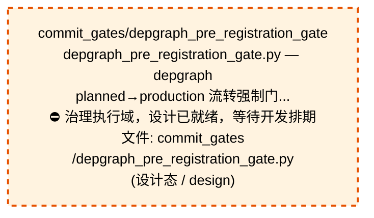
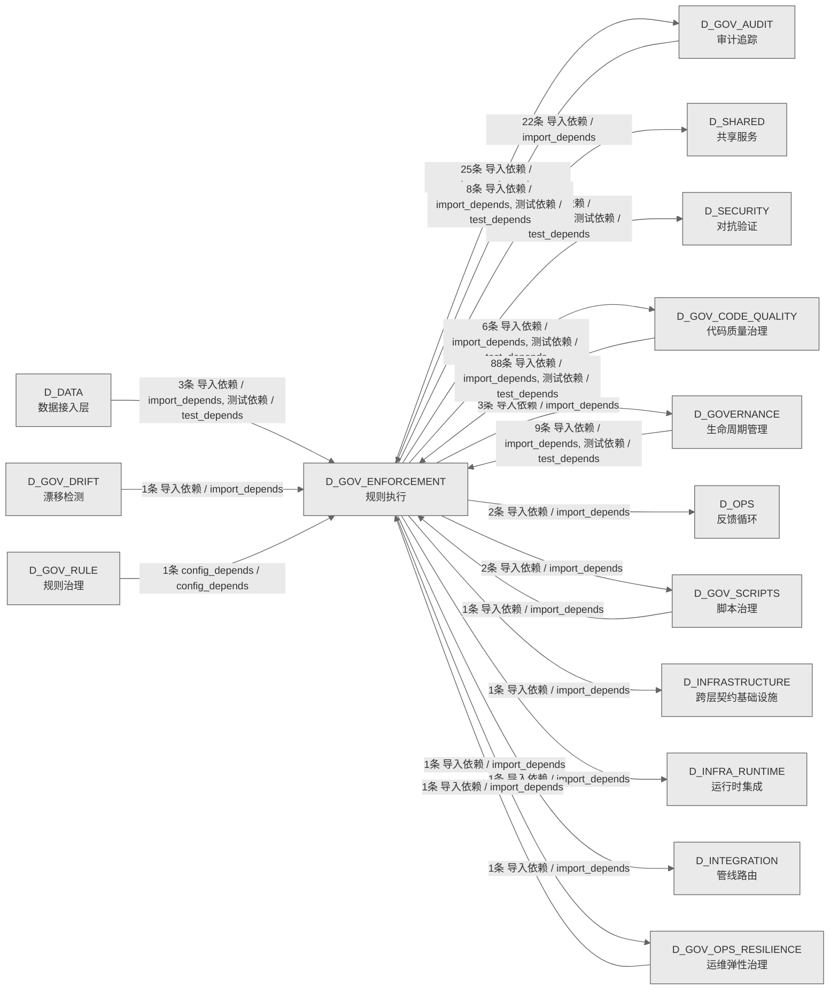

# 53_d_gov_enforcement / 规则执行域 / Rule Enforcement

> **功能简介 / Overview**: 规则执行，负责治理规则执行和门禁拦截

> **文档作用 / Purpose**: 展示 规则执行（D_GOV_ENFORCEMENT）功能域的域内依赖关系、跨域依赖关系，模块信息（成熟度/中英文名/大白话/文件路径）内嵌于 Mermaid 节点，供架构审查和域治理参考。

> 本文档由 generate_domain_doc.py 从 depgraph (PostgreSQL) 自动生成
> 数据源: depgraph (PostgreSQL) nodes表 + edges表

> **[可缩放 HTML 版 / Zoomable HTML](http://localhost:8765/docs/02_enterprise_architecture/02_domain_architecture_docs/_zoomable_html/53_d_gov_enforcement.html)** — Ctrl+滚轮缩放 ｜ 双击重置 ｜ Ctrl+Shift+D 切换拖动/选择模式

## 域基本信息 / Domain Overview

| 字段 | 值 | Field | Value |
|------|------|-------|-------|
| 编号 | 53 | Number | 53 |
| 域ID | D_GOV_ENFORCEMENT | Domain ID | D_GOV_ENFORCEMENT |
| 域名称 | 规则执行 | Domain Name | Rule Enforcement |
| 层级 | L2 业务域层 | Layer | L2 Domain |
| 模块数 | 42 | Module Count | 42 |
| 域内依赖 | 32 | Internal Dependencies | 32 |
| 跨域入边 | 112 | Cross-domain Incoming | 112 |
| 跨域出边 | 70 | Cross-domain Outgoing | 70 |
| 设计态模块 | 1 | Design Modules | 1 |
| 生产态模块 | 41 | Production Modules | 41 |
| 容量 | 41/150 (正常) | Capacity | 41/150 (正常) |
| 描述 | 门禁引擎流程编排(GatePipeline/GateEngine) | Description | 门禁引擎流程编排(GatePipeline/GateEngine) |

## 域内依赖图 / Internal Dependency Diagram

> 依赖图内嵌在本文档中，IDE 可直接渲染；网页版可 Ctrl+滚轮缩放 + 拖动平移查看细节。
>
> **图例说明 / Legend**：
> - 🟦 **蓝色 = 运营态模块**（production，已上线运行）
> - 🟧 **橙色虚线 = 设计态模块**（design，蓝图阶段，代码未写）
> - **实线箭头 = 运营态依赖**（已生效的依赖关系）
> - **虚线箭头 = 非运营态依赖**（计划中/验证中的依赖关系）

### 全景图（全部模块，颜色区分运营态/设计态）

> 展示全部 42 个模块（生产态 41 + 设计态 1），含跨域依赖外部节点。节点含成熟度+名称+大白话/简介+文件路径。

```mermaid
%%{init: {'theme': 'base', 'themeVariables': {'primaryColor': '#eaeaea', 'primaryTextColor': '#333333', 'primaryBorderColor': '#666666', 'lineColor': '#666666', 'secondaryColor': '#eaeaea', 'tertiaryColor': '#eaeaea', 'fontSize': '14px'}}}%%
flowchart TD
    docs_01_policies_and_standards_registry_catalogs_rule_enforcement_registry_yaml["catalogs/rule_enforcement_registry<br/>catalogs包的rule_enforcement_registry模块<br/>文件: catalogs/rule_enforcement_registry.yaml<br/>(生产态 / production)"]
    scripts_governance_d8_doc_sync_metric_count_drift_reconciler_py["d8_doc_sync/metric_count_drift_reconciler<br/>metric_count_drift_reconciler.py — dashboard<br/>指标数描述派生校验 reconciler<br/>文件: d8_doc_sync<br/>/metric_count_drift_reconciler.py<br/>(生产态 / production)"]
    scripts_governance_d8_doc_sync_readme_version_sync_reconciler_py["d8_doc_sync/readme_version_sync_reconciler<br/>readme_version_sync_reconciler.py — README<br/>版本号派生展示校验 reconciler<br/>文件: d8_doc_sync<br/>/readme_version_sync_reconciler.py<br/>(生产态 / production)"]
    scripts_governance_d8_doc_sync_requirements_version_sync_reconciler_py["d8_doc_sync/requirements_version_sync_reconciler<br/>requirements_version_sync_reconciler.py —<br/>requirements.txt ↔ pyproject.toml...<br/>文件: d8_doc_sync<br/>/requirements_version_sync_reconciler.py<br/>(生产态 / production)"]
    scripts_governance_session_worktree_cli_py["governance/session_worktree_cli<br/>session_worktree_cli.py — session worktree 管理<br/>CLI（治本遗留项#2，2026-07-17）<br/>文件: governance/session_worktree_cli.py<br/>(生产态 / production)"]
    src_zephyr_gov_enforcement_init_py["zephyr/gov_enforcement 包入口<br/>gov_enforcement package — 执行治理域<br/>（D_GOV_ENFORCEMENT）<br/>文件: gov_enforcement/__init__.py<br/>(生产态 / production)"]
    src_zephyr_gov_enforcement_behavioral_admission_init_py["gov_enforcement/behavioral_admission 包入口<br/>管理gov_enforcement.behavioral_admission子包的加<br/>载和懒导入<br/>文件: behavioral_admission/__init__.py<br/>(生产态 / production)"]
    src_zephyr_gov_enforcement_commit_gates_depgraph_pre_registration_gate_py["commit_gates/depgraph_pre_registration_gate<br/>depgraph_pre_registration_gate.py — depgraph<br/>planned→production 流转强制门...<br/>⛔ 治理执行域，设计已就绪，等待开发排期<br/>文件: commit_gates<br/>/depgraph_pre_registration_gate.py<br/>(设计态 / design)"]
    src_zephyr_gov_enforcement_commit_gates_stash_accumulation_gate_py["commit_gates/stash_accumulation_gate<br/>stash_accumulation_gate.py — stash<br/>堆积阈值检测门禁（STASH-ACCUMULATION）<br/>文件: commit_gates/stash_accumulation_gate.py<br/>(生产态 / production)"]
    src_zephyr_gov_enforcement_rule_enforcement_approval_py["rule_enforcement/approval<br/>G-CT-004 — Backward-compat re-export of<br/>ApprovalRequest from shared.contract...<br/>文件: rule_enforcement/approval.py<br/>(生产态 / production)"]
    src_zephyr_gov_enforcement_rule_enforcement_compliance_rule_py["rule_enforcement/compliance_rule<br/>rule enforcement包的compliance_rule模块<br/>文件: rule_enforcement/compliance_rule.py<br/>(生产态 / production)"]
    src_zephyr_gov_enforcement_rule_enforcement_default_quality_gate_py["rule_enforcement/default_quality_gate<br/>D_DATA — Default Data Quality Gate<br/>文件: rule_enforcement/default_quality_gate.py<br/>(生产态 / production)"]
    src_zephyr_gov_enforcement_rule_enforcement_dlq_retry_policy_py["rule_enforcement/dlq_retry_policy<br/>DLQ 重试策略 — 对接 shared/events<br/>/dlq.DeadLetterQueue 的真重试。<br/>文件: rule_enforcement/dlq_retry_policy.py<br/>(生产态 / production)"]
    src_zephyr_gov_enforcement_rule_enforcement_output_quality_gate_py["rule_enforcement/output_quality_gate<br/>rule enforcement包的output_quality_gate模块<br/>文件: rule_enforcement/output_quality_gate.py<br/>(生产态 / production)"]
    src_zephyr_gov_enforcement_rule_enforcement_pre_flight_gate_py["rule_enforcement/pre_flight_gate<br/>rule enforcement包的pre_flight_gate模块<br/>文件: rule_enforcement/pre_flight_gate.py<br/>(生产态 / production)"]
    src_zephyr_gov_enforcement_rule_enforcement_rule_engine_rule_canary_manager_py["rule_engine/rule_canary_manager<br/>Rule Canary Manager — v0.10.0 规则金丝雀:<br/>1%用户先上新规则->A/B对比->rollback。<br/>文件: rule_engine/rule_canary_manager.py<br/>(生产态 / production)"]
    src_zephyr_gov_enforcement_rule_enforcement_rule_engine_rule_debt_auditor_py["rule_engine/rule_debt_auditor<br/>Rule Debt Auditor — v0.7.0 规则债务审计器:<br/>分析escalation_rules.yaml维护债务...<br/>文件: rule_engine/rule_debt_auditor.py<br/>(生产态 / production)"]
    src_zephyr_gov_enforcement_rule_enforcement_rule_engine_rule_shadow_runner_py["rule_engine/rule_shadow_runner<br/>Rule Shadow Runner — v0.10.0 规则影子模式:<br/>新规则shadow运行3天->diff old vs ...<br/>文件: rule_engine/rule_shadow_runner.py<br/>(生产态 / production)"]
    src_zephyr_gov_enforcement_rule_enforcement_rule_engine_rule_watcher_py["rule_engine/rule_watcher<br/>RuleWatcher — YAML 规则文件变更检测与自动同步<br/>文件: rule_engine/rule_watcher.py<br/>(生产态 / production)"]
    src_zephyr_gov_enforcement_rule_enforcement_slo_contract_py["rule_enforcement/slo_contract<br/>SLO-Driven Escalation Contract — D-022-12.<br/>文件: rule_enforcement/slo_contract.py<br/>(生产态 / production)"]
    tests_governance_commit_gates_test_create_guard_py["commit_gates/test_create_guard<br/>test_create_guard.py — CREATE-GUARD<br/>门禁单元测试（2026-06-30 治本补全）<br/>文件: commit_gates/test_create_guard.py<br/>(生产态 / production)"]
    tests_governance_commit_gates_test_r5_digit_suffix_gate_py["commit_gates/test_r5_digit_suffix_gate<br/>test_r5_digit_suffix_gate.py — R5-DIGIT-SUFFIX<br/>门禁单元测试<br/>文件: commit_gates/test_r5_digit_suffix_gate.py<br/>(生产态 / production)"]
    tests_governance_rule_bridge_test_claim_files_for_edit_py["rule_bridge/test_claim_files_for_edit<br/>test_claim_files_for_edit.py — P2-2 并发<br/>session 文件级原子性测试<br/>文件: rule_bridge/test_claim_files_for_edit.py<br/>(生产态 / production)"]
    tests_governance_rule_bridge_test_emergency_commit_py["rule_bridge/test_emergency_commit<br/>test_emergency_commit.py — emergency_commit API<br/>测试（Ruling:100PCT-AI-GOVER...<br/>文件: rule_bridge/test_emergency_commit.py<br/>(生产态 / production)"]
    tests_governance_rule_bridge_test_heartbeat_daemon_py["rule_bridge/test_heartbeat_daemon<br/>test_heartbeat_daemon.py — heartbeat daemon +<br/>成本递增 smoke test（Ruling:10...<br/>文件: rule_bridge/test_heartbeat_daemon.py<br/>(生产态 / production)"]
    docs_01_policies_and_standards_registry_catalogs_rule_enforcement_registry_yaml ~~~ scripts_governance_d8_doc_sync_metric_count_drift_reconciler_py
    scripts_governance_d8_doc_sync_metric_count_drift_reconciler_py ~~~ scripts_governance_d8_doc_sync_readme_version_sync_reconciler_py
    scripts_governance_d8_doc_sync_readme_version_sync_reconciler_py ~~~ scripts_governance_d8_doc_sync_requirements_version_sync_reconciler_py
    scripts_governance_d8_doc_sync_requirements_version_sync_reconciler_py ~~~ scripts_governance_session_worktree_cli_py
    scripts_governance_session_worktree_cli_py ~~~ src_zephyr_gov_enforcement_init_py
    src_zephyr_gov_enforcement_init_py ~~~ src_zephyr_gov_enforcement_behavioral_admission_init_py
    src_zephyr_gov_enforcement_behavioral_admission_init_py ~~~ src_zephyr_gov_enforcement_commit_gates_depgraph_pre_registration_gate_py
    src_zephyr_gov_enforcement_commit_gates_depgraph_pre_registration_gate_py ~~~ src_zephyr_gov_enforcement_commit_gates_stash_accumulation_gate_py
    src_zephyr_gov_enforcement_commit_gates_stash_accumulation_gate_py ~~~ src_zephyr_gov_enforcement_rule_enforcement_approval_py
    src_zephyr_gov_enforcement_rule_enforcement_approval_py ~~~ src_zephyr_gov_enforcement_rule_enforcement_compliance_rule_py
    src_zephyr_gov_enforcement_rule_enforcement_compliance_rule_py ~~~ src_zephyr_gov_enforcement_rule_enforcement_default_quality_gate_py
    src_zephyr_gov_enforcement_rule_enforcement_default_quality_gate_py ~~~ src_zephyr_gov_enforcement_rule_enforcement_dlq_retry_policy_py
    src_zephyr_gov_enforcement_rule_enforcement_dlq_retry_policy_py ~~~ src_zephyr_gov_enforcement_rule_enforcement_output_quality_gate_py
    src_zephyr_gov_enforcement_rule_enforcement_output_quality_gate_py ~~~ src_zephyr_gov_enforcement_rule_enforcement_pre_flight_gate_py
    src_zephyr_gov_enforcement_rule_enforcement_pre_flight_gate_py ~~~ src_zephyr_gov_enforcement_rule_enforcement_rule_engine_rule_canary_manager_py
    src_zephyr_gov_enforcement_rule_enforcement_rule_engine_rule_canary_manager_py ~~~ src_zephyr_gov_enforcement_rule_enforcement_rule_engine_rule_debt_auditor_py
    src_zephyr_gov_enforcement_rule_enforcement_rule_engine_rule_debt_auditor_py ~~~ src_zephyr_gov_enforcement_rule_enforcement_rule_engine_rule_shadow_runner_py
    src_zephyr_gov_enforcement_rule_enforcement_rule_engine_rule_shadow_runner_py ~~~ src_zephyr_gov_enforcement_rule_enforcement_rule_engine_rule_watcher_py
    src_zephyr_gov_enforcement_rule_enforcement_rule_engine_rule_watcher_py ~~~ src_zephyr_gov_enforcement_rule_enforcement_slo_contract_py
    src_zephyr_gov_enforcement_rule_enforcement_slo_contract_py ~~~ tests_governance_commit_gates_test_create_guard_py
    tests_governance_commit_gates_test_create_guard_py ~~~ tests_governance_commit_gates_test_r5_digit_suffix_gate_py
    tests_governance_commit_gates_test_r5_digit_suffix_gate_py ~~~ tests_governance_rule_bridge_test_claim_files_for_edit_py
    tests_governance_rule_bridge_test_claim_files_for_edit_py ~~~ tests_governance_rule_bridge_test_emergency_commit_py
    tests_governance_rule_bridge_test_emergency_commit_py ~~~ tests_governance_rule_bridge_test_heartbeat_daemon_py
    src_zephyr_gov_enforcement_behavioral_admission_admission_response_py["behavioral_admission/admission_response<br/>behavioral admission包的admission_response模块<br/>文件: behavioral_admission/admission_response.py<br/>(生产态 / production)"]
    src_zephyr_gov_enforcement_behavioral_admission_code_review_ai_py["behavioral_admission/code_review_ai<br/>behavioral admission包的code_review_ai模块<br/>文件: behavioral_admission/code_review_ai.py<br/>(生产态 / production)"]
    src_zephyr_gov_enforcement_behavioral_admission_gate_event_adapter_py["behavioral_admission/gate_event_adapter<br/>GateEventAdapter — GateRepo 事件适配器<br/>（DW-0006）<br/>文件: behavioral_admission/gate_event_adapter.py<br/>(生产态 / production)"]
    src_zephyr_gov_enforcement_behavioral_admission_gpu_consensus_scheduler_py["behavioral_admission/gpu_consensus_scheduler<br/>behavioral<br/>admission包的gpu_consensus_scheduler模块<br/>文件: behavioral_admission<br/>/gpu_consensus_scheduler.py<br/>(生产态 / production)"]
    src_zephyr_gov_enforcement_behavioral_admission_protection_index_py["behavioral_admission/protection_index<br/>behavioral admission包的protection_index模块<br/>文件: behavioral_admission/protection_index.py<br/>(生产态 / production)"]
    src_zephyr_gov_enforcement_rule_bridge_commit_gate_registry_py["rule_bridge/commit_gate_registry<br/>commit_gate_registry.py — GitCommitGateway<br/>pre-commit 门禁注册表（架构债务 #...<br/>文件: rule_bridge/commit_gate_registry.py<br/>(生产态 / production)"]
    src_zephyr_gov_enforcement_rule_bridge_session_worktree_py["rule_bridge/session_worktree<br/>session_worktree.py — AI 对话 worktree 物理隔离<br/>helper（FP-ISO.4C，2026-07-0...<br/>文件: rule_bridge/session_worktree.py<br/>(生产态 / production)"]
    src_zephyr_gov_enforcement_rule_enforcement_quality_gate_py["rule_enforcement/quality_gate<br/>D_DATA — Data Quality Gate<br/>文件: rule_enforcement/quality_gate.py<br/>(生产态 / production)"]
    src_zephyr_gov_enforcement_behavioral_admission_admission_response_py ~~~ src_zephyr_gov_enforcement_behavioral_admission_code_review_ai_py
    src_zephyr_gov_enforcement_behavioral_admission_code_review_ai_py ~~~ src_zephyr_gov_enforcement_behavioral_admission_gate_event_adapter_py
    src_zephyr_gov_enforcement_behavioral_admission_gate_event_adapter_py ~~~ src_zephyr_gov_enforcement_behavioral_admission_gpu_consensus_scheduler_py
    src_zephyr_gov_enforcement_behavioral_admission_gpu_consensus_scheduler_py ~~~ src_zephyr_gov_enforcement_behavioral_admission_protection_index_py
    src_zephyr_gov_enforcement_behavioral_admission_protection_index_py ~~~ src_zephyr_gov_enforcement_rule_bridge_commit_gate_registry_py
    src_zephyr_gov_enforcement_rule_bridge_commit_gate_registry_py ~~~ src_zephyr_gov_enforcement_rule_bridge_session_worktree_py
    src_zephyr_gov_enforcement_rule_bridge_session_worktree_py ~~~ src_zephyr_gov_enforcement_rule_enforcement_quality_gate_py
    src_zephyr_gov_enforcement_behavioral_admission_admission_controller_py["behavioral_admission/admission_controller<br/>behavioral admission包的admission_controller模块<br/>文件: behavioral_admission<br/>/admission_controller.py<br/>(生产态 / production)"]
    src_zephyr_gov_enforcement_behavioral_admission_verdict_engine_py["behavioral_admission/verdict_engine<br/>behavioral admission包的verdict_engine模块<br/>文件: behavioral_admission/verdict_engine.py<br/>(生产态 / production)"]
    src_zephyr_gov_enforcement_rule_bridge_emergency_commit_py["rule_bridge/emergency_commit<br/>emergency_commit.py — 紧急提交通道<br/>（Ruling:100PCT-AI-GOVERNANCE P2-1，2026-0...<br/>文件: rule_bridge/emergency_commit.py<br/>(生产态 / production)"]
    src_zephyr_gov_enforcement_rule_bridge_heartbeat_daemon_py["rule_bridge/heartbeat_daemon<br/>heartbeat_daemon.py — session heartbeat<br/>独立进程（Ruling:100PCT-AI-GOVERNANC...<br/>文件: rule_bridge/heartbeat_daemon.py<br/>(生产态 / production)"]
    src_zephyr_gov_enforcement_rule_bridge_session_claim_py["rule_bridge/session_claim<br/>session_claim.py — AI 对话并发声明 helper<br/>（FP-ISO.4B 件2改，2026-07-01 治本）<br/>文件: rule_bridge/session_claim.py<br/>(生产态 / production)"]
    src_zephyr_gov_enforcement_rule_bridge_worktree_manager_py["rule_bridge/worktree_manager<br/>worktree_manager.py — session worktree<br/>物理隔离管理器（阶段3 治本 stash 循环）<br/>文件: rule_bridge/worktree_manager.py<br/>(生产态 / production)"]
    src_zephyr_gov_enforcement_rule_bridge_worktree_pool_py["rule_bridge/worktree_pool<br/>worktree_pool.py — Worktree 预创建池<br/>（ARCH-GIT-CALL-BUDGET P3.3，2026-07-19）<br/>文件: rule_bridge/worktree_pool.py<br/>(生产态 / production)"]
    src_zephyr_gov_enforcement_behavioral_admission_admission_controller_py ~~~ src_zephyr_gov_enforcement_behavioral_admission_verdict_engine_py
    src_zephyr_gov_enforcement_behavioral_admission_verdict_engine_py ~~~ src_zephyr_gov_enforcement_rule_bridge_emergency_commit_py
    src_zephyr_gov_enforcement_rule_bridge_emergency_commit_py ~~~ src_zephyr_gov_enforcement_rule_bridge_heartbeat_daemon_py
    src_zephyr_gov_enforcement_rule_bridge_heartbeat_daemon_py ~~~ src_zephyr_gov_enforcement_rule_bridge_session_claim_py
    src_zephyr_gov_enforcement_rule_bridge_session_claim_py ~~~ src_zephyr_gov_enforcement_rule_bridge_worktree_manager_py
    src_zephyr_gov_enforcement_rule_bridge_worktree_manager_py ~~~ src_zephyr_gov_enforcement_rule_bridge_worktree_pool_py
    src_zephyr_gov_enforcement_rule_bridge_git_commit_gateway_py["rule_bridge/git_commit_gateway<br/>GitCommitGateway — 全项目唯一合法 git commit<br/>入口（OPS-2026062512 治本）<br/>文件: rule_bridge/git_commit_gateway.py<br/>(生产态 / production)"]
    src_zephyr_gov_enforcement_rule_bridge_batched_auto_committer_py["rule_bridge/batched_auto_committer<br/>batched_auto_committer.py — Reconciler 批量化<br/>auto-commit 拦截器（ARCH-GIT-C...<br/>文件: rule_bridge/batched_auto_committer.py<br/>(生产态 / production)"]
    src_zephyr_gov_enforcement_behavioral_admission_gpu_consensus_scheduler_py -->|导入依赖 / import_depends| src_zephyr_gov_enforcement_behavioral_admission_verdict_engine_py
    src_zephyr_gov_enforcement_behavioral_admission_admission_response_py -->|导入依赖 / import_depends| src_zephyr_gov_enforcement_behavioral_admission_admission_controller_py
    src_zephyr_gov_enforcement_behavioral_admission_protection_index_py -->|导入依赖 / import_depends| src_zephyr_gov_enforcement_behavioral_admission_verdict_engine_py
    src_zephyr_gov_enforcement_behavioral_admission_init_py -->|导入依赖 / import_depends| src_zephyr_gov_enforcement_behavioral_admission_code_review_ai_py
    src_zephyr_gov_enforcement_behavioral_admission_init_py -->|导入依赖 / import_depends| src_zephyr_gov_enforcement_behavioral_admission_admission_controller_py
    src_zephyr_gov_enforcement_behavioral_admission_init_py -->|导入依赖 / import_depends| src_zephyr_gov_enforcement_behavioral_admission_gpu_consensus_scheduler_py
    src_zephyr_gov_enforcement_behavioral_admission_init_py -->|导入依赖 / import_depends| src_zephyr_gov_enforcement_behavioral_admission_gate_event_adapter_py
    src_zephyr_gov_enforcement_behavioral_admission_init_py -->|导入依赖 / import_depends| src_zephyr_gov_enforcement_behavioral_admission_admission_response_py
    src_zephyr_gov_enforcement_behavioral_admission_init_py -->|导入依赖 / import_depends| src_zephyr_gov_enforcement_behavioral_admission_protection_index_py
    src_zephyr_gov_enforcement_behavioral_admission_init_py -->|导入依赖 / import_depends| src_zephyr_gov_enforcement_behavioral_admission_verdict_engine_py
    src_zephyr_gov_enforcement_commit_gates_stash_accumulation_gate_py -->|导入依赖 / import_depends| src_zephyr_gov_enforcement_rule_bridge_commit_gate_registry_py
    src_zephyr_gov_enforcement_rule_bridge_batched_auto_committer_py -->|导入依赖 / import_depends| src_zephyr_gov_enforcement_rule_bridge_git_commit_gateway_py
    src_zephyr_gov_enforcement_rule_bridge_emergency_commit_py -->|导入依赖 / import_depends| src_zephyr_gov_enforcement_rule_bridge_git_commit_gateway_py
    src_zephyr_gov_enforcement_rule_bridge_git_commit_gateway_py -->|导入依赖 / import_depends| src_zephyr_gov_enforcement_rule_bridge_batched_auto_committer_py
    src_zephyr_gov_enforcement_rule_bridge_git_commit_gateway_py -->|导入依赖 / import_depends| src_zephyr_gov_enforcement_rule_bridge_commit_gate_registry_py
    src_zephyr_gov_enforcement_rule_bridge_git_commit_gateway_py -->|导入依赖 / import_depends| src_zephyr_gov_enforcement_rule_bridge_worktree_manager_py
    src_zephyr_gov_enforcement_rule_bridge_session_worktree_py -->|导入依赖 / import_depends| src_zephyr_gov_enforcement_rule_bridge_emergency_commit_py
    src_zephyr_gov_enforcement_rule_bridge_session_worktree_py -->|导入依赖 / import_depends| src_zephyr_gov_enforcement_rule_bridge_git_commit_gateway_py
    src_zephyr_gov_enforcement_rule_bridge_session_worktree_py -->|导入依赖 / import_depends| src_zephyr_gov_enforcement_rule_bridge_heartbeat_daemon_py
    src_zephyr_gov_enforcement_rule_bridge_session_worktree_py -->|导入依赖 / import_depends| src_zephyr_gov_enforcement_rule_bridge_session_claim_py
    src_zephyr_gov_enforcement_rule_bridge_session_worktree_py -->|导入依赖 / import_depends| src_zephyr_gov_enforcement_rule_bridge_worktree_manager_py
    src_zephyr_gov_enforcement_rule_bridge_session_worktree_py -->|导入依赖 / import_depends| src_zephyr_gov_enforcement_rule_bridge_worktree_pool_py
    src_zephyr_gov_enforcement_rule_enforcement_default_quality_gate_py -->|导入依赖 / import_depends| src_zephyr_gov_enforcement_rule_enforcement_quality_gate_py
    scripts_governance_session_worktree_cli_py -->|导入依赖 / import_depends| src_zephyr_gov_enforcement_rule_bridge_worktree_manager_py
    scripts_governance_session_worktree_cli_py -->|导入依赖 / import_depends| src_zephyr_gov_enforcement_rule_bridge_session_worktree_py
    tests_governance_commit_gates_test_create_guard_py -->|测试依赖 / test_depends| src_zephyr_gov_enforcement_rule_bridge_git_commit_gateway_py
    tests_governance_commit_gates_test_r5_digit_suffix_gate_py -->|测试依赖 / test_depends| src_zephyr_gov_enforcement_rule_bridge_commit_gate_registry_py
    tests_governance_rule_bridge_test_emergency_commit_py -->|测试依赖 / test_depends| src_zephyr_gov_enforcement_rule_bridge_emergency_commit_py
    tests_governance_rule_bridge_test_claim_files_for_edit_py -->|测试依赖 / test_depends| src_zephyr_gov_enforcement_rule_bridge_session_worktree_py
    tests_governance_rule_bridge_test_heartbeat_daemon_py -->|测试依赖 / test_depends| src_zephyr_gov_enforcement_rule_bridge_emergency_commit_py
    tests_governance_rule_bridge_test_heartbeat_daemon_py -->|测试依赖 / test_depends| src_zephyr_gov_enforcement_rule_bridge_heartbeat_daemon_py
    tests_governance_rule_bridge_test_heartbeat_daemon_py -->|测试依赖 / test_depends| src_zephyr_gov_enforcement_rule_bridge_session_worktree_py
    D_GOVERNANCE["生命周期管理<br/>生命周期管理，负责蓝图/模块<br/>/任务的声明周期管理和元数据治理<br/>Lifecycle Management<br/>跨域节点 / cross-domain<br/>(生产态 / production)"]
    src_zephyr_gov_enforcement_rule_bridge_session_worktree_py -->|导入依赖 / import_depends| D_GOVERNANCE
    D_SHARED["共享服务<br/>共享服务，负责跨域共享的工具、协议和基础服务<br/>Shared Services<br/>跨域节点 / cross-domain<br/>(生产态 / production)"]
    src_zephyr_gov_enforcement_rule_bridge_commit_gate_registry_py -->|导入依赖 / import_depends| D_SHARED
    D_GOV_OPS_RESILIENCE["运维弹性治理<br/>运维弹性治理，负责运维治理、安全治理、弹性治理和<br/>升级协议<br/>Ops Resilience Governance<br/>跨域节点 / cross-domain<br/>(生产态 / production)"]
    src_zephyr_gov_enforcement_rule_bridge_git_commit_gateway_py -->|导入依赖 / import_depends| D_GOV_OPS_RESILIENCE
    D_OPS["反馈循环<br/>反馈循环，负责系统运行反馈、性能监控和自动调优闭<br/>环<br/>Feedback Loop<br/>跨域节点 / cross-domain<br/>(生产态 / production)"]
    src_zephyr_gov_enforcement_rule_enforcement_pre_flight_gate_py -->|导入依赖 / import_depends| D_OPS
    D_GOV_AUDIT["审计追踪<br/>审计追踪，负责变更审计追踪和操作日志管理<br/>Audit Trail<br/>跨域节点 / cross-domain<br/>(生产态 / production)"]
    src_zephyr_gov_enforcement_rule_bridge_git_commit_gateway_py -->|导入依赖 / import_depends| D_GOV_AUDIT
    src_zephyr_gov_enforcement_rule_bridge_session_worktree_py -->|导入依赖 / import_depends| D_SHARED
    src_zephyr_gov_enforcement_rule_bridge_session_worktree_py -->|导入依赖 / import_depends| D_GOV_AUDIT
    src_zephyr_gov_enforcement_rule_bridge_git_commit_gateway_py -->|导入依赖 / import_depends| D_GOVERNANCE
    D_SECURITY["对抗验证<br/>对抗验证，负责系统安全对抗测试、漏洞扫描和攻防验<br/>证<br/>Adversarial Validation<br/>跨域节点 / cross-domain<br/>(生产态 / production)"]
    src_zephyr_gov_enforcement_rule_bridge_git_commit_gateway_py -->|导入依赖 / import_depends| D_SECURITY
    src_zephyr_gov_enforcement_behavioral_admission_init_py -->|导入依赖 / import_depends| D_GOV_AUDIT
    scripts_governance_d8_doc_sync_requirements_version_sync_reconciler_py -->|导入依赖 / import_depends| D_GOV_AUDIT
    D_GOV_SCRIPTS["脚本治理<br/>脚本治理，负责脚本生命周期管理和脚本质量门禁<br/>Script Governance<br/>跨域节点 / cross-domain<br/>(生产态 / production)"]
    scripts_governance_session_worktree_cli_py -->|导入依赖 / import_depends| D_GOV_SCRIPTS
    src_zephyr_gov_enforcement_rule_bridge_git_commit_gateway_py -->|导入依赖 / import_depends| D_GOV_AUDIT
    src_zephyr_gov_enforcement_rule_bridge_worktree_pool_py -->|导入依赖 / import_depends| D_SHARED
    D_GOV_CODE_QUALITY["代码质量治理<br/>代码质量治理，负责代码去重引擎、函数重复检测、AS<br/>T语义分析和提交门禁引擎<br/>Code Quality Governance<br/>跨域节点 / cross-domain<br/>(生产态 / production)"]
    src_zephyr_gov_enforcement_rule_bridge_session_worktree_py -->|导入依赖 / import_depends| D_GOV_CODE_QUALITY
    D_GOV_CODE_QUALITY -->|导入依赖 / import_depends| src_zephyr_gov_enforcement_rule_bridge_commit_gate_registry_py
    D_GOV_CODE_QUALITY -->|导入依赖 / import_depends| src_zephyr_gov_enforcement_rule_bridge_commit_gate_registry_py
    D_GOV_CODE_QUALITY -->|导入依赖 / import_depends| src_zephyr_gov_enforcement_rule_bridge_commit_gate_registry_py
    D_GOV_RULE["规则治理<br/>规则治理，负责规则注册、规则版本和规则依赖管理<br/>Rule Governance<br/>跨域节点 / cross-domain<br/>(生产态 / production)"]
    D_GOV_RULE -->|config_depends / config_depends| src_zephyr_gov_enforcement_rule_enforcement_rule_engine_rule_canary_manager_py
    D_GOV_CODE_QUALITY -->|导入依赖 / import_depends| src_zephyr_gov_enforcement_rule_bridge_commit_gate_registry_py
    D_GOV_CODE_QUALITY -->|导入依赖 / import_depends| src_zephyr_gov_enforcement_rule_bridge_commit_gate_registry_py
    D_GOV_OPS_RESILIENCE -->|导入依赖 / import_depends| src_zephyr_gov_enforcement_rule_enforcement_compliance_rule_py
    D_GOV_CODE_QUALITY -->|测试依赖 / test_depends| src_zephyr_gov_enforcement_rule_bridge_session_worktree_py
    D_GOV_AUDIT -->|导入依赖 / import_depends| src_zephyr_gov_enforcement_rule_bridge_commit_gate_registry_py
    D_GOV_CODE_QUALITY -->|导入依赖 / import_depends| src_zephyr_gov_enforcement_rule_bridge_commit_gate_registry_py
    D_GOV_CODE_QUALITY -->|导入依赖 / import_depends| src_zephyr_gov_enforcement_rule_bridge_commit_gate_registry_py
    D_GOV_CODE_QUALITY -->|导入依赖 / import_depends| src_zephyr_gov_enforcement_rule_bridge_commit_gate_registry_py
    D_GOV_CODE_QUALITY -->|导入依赖 / import_depends| src_zephyr_gov_enforcement_rule_bridge_commit_gate_registry_py
    D_GOV_CODE_QUALITY -->|导入依赖 / import_depends| src_zephyr_gov_enforcement_rule_bridge_commit_gate_registry_py
    D_GOV_CODE_QUALITY -->|导入依赖 / import_depends| src_zephyr_gov_enforcement_rule_bridge_commit_gate_registry_py
    classDef production fill:#e1f5fe,stroke:#01579b,stroke-width:2px,color:#000
    classDef design fill:#fff3e0,stroke:#e65100,stroke-width:2px,color:#000,stroke-dasharray: 5 5
    classDef external_prod fill:#e8f4fd,stroke:#0277bd,stroke-width:1px,color:#000
    classDef external_design fill:#fff8e7,stroke:#ef6c00,stroke-width:1px,color:#000,stroke-dasharray: 5 5
    class docs_01_policies_and_standards_registry_catalogs_rule_enforcement_registry_yaml,scripts_governance_d8_doc_sync_metric_count_drift_reconciler_py,scripts_governance_d8_doc_sync_readme_version_sync_reconciler_py,scripts_governance_d8_doc_sync_requirements_version_sync_reconciler_py,scripts_governance_session_worktree_cli_py,src_zephyr_gov_enforcement_init_py,src_zephyr_gov_enforcement_behavioral_admission_init_py,src_zephyr_gov_enforcement_behavioral_admission_admission_controller_py,src_zephyr_gov_enforcement_behavioral_admission_admission_response_py,src_zephyr_gov_enforcement_behavioral_admission_code_review_ai_py,src_zephyr_gov_enforcement_behavioral_admission_gate_event_adapter_py,src_zephyr_gov_enforcement_behavioral_admission_gpu_consensus_scheduler_py,src_zephyr_gov_enforcement_behavioral_admission_protection_index_py,src_zephyr_gov_enforcement_behavioral_admission_verdict_engine_py,src_zephyr_gov_enforcement_commit_gates_stash_accumulation_gate_py,src_zephyr_gov_enforcement_rule_bridge_batched_auto_committer_py,src_zephyr_gov_enforcement_rule_bridge_commit_gate_registry_py,src_zephyr_gov_enforcement_rule_bridge_emergency_commit_py,src_zephyr_gov_enforcement_rule_bridge_git_commit_gateway_py,src_zephyr_gov_enforcement_rule_bridge_heartbeat_daemon_py,src_zephyr_gov_enforcement_rule_bridge_session_claim_py,src_zephyr_gov_enforcement_rule_bridge_session_worktree_py,src_zephyr_gov_enforcement_rule_bridge_worktree_manager_py,src_zephyr_gov_enforcement_rule_bridge_worktree_pool_py,src_zephyr_gov_enforcement_rule_enforcement_approval_py,src_zephyr_gov_enforcement_rule_enforcement_compliance_rule_py,src_zephyr_gov_enforcement_rule_enforcement_default_quality_gate_py,src_zephyr_gov_enforcement_rule_enforcement_dlq_retry_policy_py,src_zephyr_gov_enforcement_rule_enforcement_output_quality_gate_py,src_zephyr_gov_enforcement_rule_enforcement_pre_flight_gate_py,src_zephyr_gov_enforcement_rule_enforcement_quality_gate_py,src_zephyr_gov_enforcement_rule_enforcement_rule_engine_rule_canary_manager_py,src_zephyr_gov_enforcement_rule_enforcement_rule_engine_rule_debt_auditor_py,src_zephyr_gov_enforcement_rule_enforcement_rule_engine_rule_shadow_runner_py,src_zephyr_gov_enforcement_rule_enforcement_rule_engine_rule_watcher_py,src_zephyr_gov_enforcement_rule_enforcement_slo_contract_py,tests_governance_commit_gates_test_create_guard_py,tests_governance_commit_gates_test_r5_digit_suffix_gate_py,tests_governance_rule_bridge_test_claim_files_for_edit_py,tests_governance_rule_bridge_test_emergency_commit_py,tests_governance_rule_bridge_test_heartbeat_daemon_py production
    class src_zephyr_gov_enforcement_commit_gates_depgraph_pre_registration_gate_py design
    class D_GOVERNANCE,D_SHARED,D_GOV_OPS_RESILIENCE,D_OPS,D_GOV_AUDIT,D_SECURITY,D_GOV_SCRIPTS,D_GOV_CODE_QUALITY,D_GOV_RULE external_prod
```

### 运营态的图（仅 design_maturity=production 的模块和域内依赖）

> 仅展示已上线运行的模块（共 41 个），不含跨域外部节点。跨域依赖见下方跨域依赖章节。

```mermaid
%%{init: {'theme': 'base', 'themeVariables': {'primaryColor': '#eaeaea', 'primaryTextColor': '#333333', 'primaryBorderColor': '#666666', 'lineColor': '#666666', 'secondaryColor': '#eaeaea', 'tertiaryColor': '#eaeaea', 'fontSize': '14px'}}}%%
flowchart TD
    docs_01_policies_and_standards_registry_catalogs_rule_enforcement_registry_yaml["catalogs/rule_enforcement_registry<br/>catalogs包的rule_enforcement_registry模块<br/>文件: catalogs/rule_enforcement_registry.yaml<br/>(生产态 / production)"]
    scripts_governance_d8_doc_sync_metric_count_drift_reconciler_py["d8_doc_sync/metric_count_drift_reconciler<br/>metric_count_drift_reconciler.py — dashboard<br/>指标数描述派生校验 reconciler<br/>文件: d8_doc_sync<br/>/metric_count_drift_reconciler.py<br/>(生产态 / production)"]
    scripts_governance_d8_doc_sync_readme_version_sync_reconciler_py["d8_doc_sync/readme_version_sync_reconciler<br/>readme_version_sync_reconciler.py — README<br/>版本号派生展示校验 reconciler<br/>文件: d8_doc_sync<br/>/readme_version_sync_reconciler.py<br/>(生产态 / production)"]
    scripts_governance_d8_doc_sync_requirements_version_sync_reconciler_py["d8_doc_sync/requirements_version_sync_reconciler<br/>requirements_version_sync_reconciler.py —<br/>requirements.txt ↔ pyproject.toml...<br/>文件: d8_doc_sync<br/>/requirements_version_sync_reconciler.py<br/>(生产态 / production)"]
    scripts_governance_session_worktree_cli_py["governance/session_worktree_cli<br/>session_worktree_cli.py — session worktree 管理<br/>CLI（治本遗留项#2，2026-07-17）<br/>文件: governance/session_worktree_cli.py<br/>(生产态 / production)"]
    src_zephyr_gov_enforcement_init_py["zephyr/gov_enforcement 包入口<br/>gov_enforcement package — 执行治理域<br/>（D_GOV_ENFORCEMENT）<br/>文件: gov_enforcement/__init__.py<br/>(生产态 / production)"]
    src_zephyr_gov_enforcement_behavioral_admission_init_py["gov_enforcement/behavioral_admission 包入口<br/>管理gov_enforcement.behavioral_admission子包的加<br/>载和懒导入<br/>文件: behavioral_admission/__init__.py<br/>(生产态 / production)"]
    src_zephyr_gov_enforcement_commit_gates_stash_accumulation_gate_py["commit_gates/stash_accumulation_gate<br/>stash_accumulation_gate.py — stash<br/>堆积阈值检测门禁（STASH-ACCUMULATION）<br/>文件: commit_gates/stash_accumulation_gate.py<br/>(生产态 / production)"]
    src_zephyr_gov_enforcement_rule_enforcement_approval_py["rule_enforcement/approval<br/>G-CT-004 — Backward-compat re-export of<br/>ApprovalRequest from shared.contract...<br/>文件: rule_enforcement/approval.py<br/>(生产态 / production)"]
    src_zephyr_gov_enforcement_rule_enforcement_compliance_rule_py["rule_enforcement/compliance_rule<br/>rule enforcement包的compliance_rule模块<br/>文件: rule_enforcement/compliance_rule.py<br/>(生产态 / production)"]
    src_zephyr_gov_enforcement_rule_enforcement_default_quality_gate_py["rule_enforcement/default_quality_gate<br/>D_DATA — Default Data Quality Gate<br/>文件: rule_enforcement/default_quality_gate.py<br/>(生产态 / production)"]
    src_zephyr_gov_enforcement_rule_enforcement_dlq_retry_policy_py["rule_enforcement/dlq_retry_policy<br/>DLQ 重试策略 — 对接 shared/events<br/>/dlq.DeadLetterQueue 的真重试。<br/>文件: rule_enforcement/dlq_retry_policy.py<br/>(生产态 / production)"]
    src_zephyr_gov_enforcement_rule_enforcement_output_quality_gate_py["rule_enforcement/output_quality_gate<br/>rule enforcement包的output_quality_gate模块<br/>文件: rule_enforcement/output_quality_gate.py<br/>(生产态 / production)"]
    src_zephyr_gov_enforcement_rule_enforcement_pre_flight_gate_py["rule_enforcement/pre_flight_gate<br/>rule enforcement包的pre_flight_gate模块<br/>文件: rule_enforcement/pre_flight_gate.py<br/>(生产态 / production)"]
    src_zephyr_gov_enforcement_rule_enforcement_rule_engine_rule_canary_manager_py["rule_engine/rule_canary_manager<br/>Rule Canary Manager — v0.10.0 规则金丝雀:<br/>1%用户先上新规则->A/B对比->rollback。<br/>文件: rule_engine/rule_canary_manager.py<br/>(生产态 / production)"]
    src_zephyr_gov_enforcement_rule_enforcement_rule_engine_rule_debt_auditor_py["rule_engine/rule_debt_auditor<br/>Rule Debt Auditor — v0.7.0 规则债务审计器:<br/>分析escalation_rules.yaml维护债务...<br/>文件: rule_engine/rule_debt_auditor.py<br/>(生产态 / production)"]
    src_zephyr_gov_enforcement_rule_enforcement_rule_engine_rule_shadow_runner_py["rule_engine/rule_shadow_runner<br/>Rule Shadow Runner — v0.10.0 规则影子模式:<br/>新规则shadow运行3天->diff old vs ...<br/>文件: rule_engine/rule_shadow_runner.py<br/>(生产态 / production)"]
    src_zephyr_gov_enforcement_rule_enforcement_rule_engine_rule_watcher_py["rule_engine/rule_watcher<br/>RuleWatcher — YAML 规则文件变更检测与自动同步<br/>文件: rule_engine/rule_watcher.py<br/>(生产态 / production)"]
    src_zephyr_gov_enforcement_rule_enforcement_slo_contract_py["rule_enforcement/slo_contract<br/>SLO-Driven Escalation Contract — D-022-12.<br/>文件: rule_enforcement/slo_contract.py<br/>(生产态 / production)"]
    tests_governance_commit_gates_test_create_guard_py["commit_gates/test_create_guard<br/>test_create_guard.py — CREATE-GUARD<br/>门禁单元测试（2026-06-30 治本补全）<br/>文件: commit_gates/test_create_guard.py<br/>(生产态 / production)"]
    tests_governance_commit_gates_test_r5_digit_suffix_gate_py["commit_gates/test_r5_digit_suffix_gate<br/>test_r5_digit_suffix_gate.py — R5-DIGIT-SUFFIX<br/>门禁单元测试<br/>文件: commit_gates/test_r5_digit_suffix_gate.py<br/>(生产态 / production)"]
    tests_governance_rule_bridge_test_claim_files_for_edit_py["rule_bridge/test_claim_files_for_edit<br/>test_claim_files_for_edit.py — P2-2 并发<br/>session 文件级原子性测试<br/>文件: rule_bridge/test_claim_files_for_edit.py<br/>(生产态 / production)"]
    tests_governance_rule_bridge_test_emergency_commit_py["rule_bridge/test_emergency_commit<br/>test_emergency_commit.py — emergency_commit API<br/>测试（Ruling:100PCT-AI-GOVER...<br/>文件: rule_bridge/test_emergency_commit.py<br/>(生产态 / production)"]
    tests_governance_rule_bridge_test_heartbeat_daemon_py["rule_bridge/test_heartbeat_daemon<br/>test_heartbeat_daemon.py — heartbeat daemon +<br/>成本递增 smoke test（Ruling:10...<br/>文件: rule_bridge/test_heartbeat_daemon.py<br/>(生产态 / production)"]
    docs_01_policies_and_standards_registry_catalogs_rule_enforcement_registry_yaml ~~~ scripts_governance_d8_doc_sync_metric_count_drift_reconciler_py
    scripts_governance_d8_doc_sync_metric_count_drift_reconciler_py ~~~ scripts_governance_d8_doc_sync_readme_version_sync_reconciler_py
    scripts_governance_d8_doc_sync_readme_version_sync_reconciler_py ~~~ scripts_governance_d8_doc_sync_requirements_version_sync_reconciler_py
    scripts_governance_d8_doc_sync_requirements_version_sync_reconciler_py ~~~ scripts_governance_session_worktree_cli_py
    scripts_governance_session_worktree_cli_py ~~~ src_zephyr_gov_enforcement_init_py
    src_zephyr_gov_enforcement_init_py ~~~ src_zephyr_gov_enforcement_behavioral_admission_init_py
    src_zephyr_gov_enforcement_behavioral_admission_init_py ~~~ src_zephyr_gov_enforcement_commit_gates_stash_accumulation_gate_py
    src_zephyr_gov_enforcement_commit_gates_stash_accumulation_gate_py ~~~ src_zephyr_gov_enforcement_rule_enforcement_approval_py
    src_zephyr_gov_enforcement_rule_enforcement_approval_py ~~~ src_zephyr_gov_enforcement_rule_enforcement_compliance_rule_py
    src_zephyr_gov_enforcement_rule_enforcement_compliance_rule_py ~~~ src_zephyr_gov_enforcement_rule_enforcement_default_quality_gate_py
    src_zephyr_gov_enforcement_rule_enforcement_default_quality_gate_py ~~~ src_zephyr_gov_enforcement_rule_enforcement_dlq_retry_policy_py
    src_zephyr_gov_enforcement_rule_enforcement_dlq_retry_policy_py ~~~ src_zephyr_gov_enforcement_rule_enforcement_output_quality_gate_py
    src_zephyr_gov_enforcement_rule_enforcement_output_quality_gate_py ~~~ src_zephyr_gov_enforcement_rule_enforcement_pre_flight_gate_py
    src_zephyr_gov_enforcement_rule_enforcement_pre_flight_gate_py ~~~ src_zephyr_gov_enforcement_rule_enforcement_rule_engine_rule_canary_manager_py
    src_zephyr_gov_enforcement_rule_enforcement_rule_engine_rule_canary_manager_py ~~~ src_zephyr_gov_enforcement_rule_enforcement_rule_engine_rule_debt_auditor_py
    src_zephyr_gov_enforcement_rule_enforcement_rule_engine_rule_debt_auditor_py ~~~ src_zephyr_gov_enforcement_rule_enforcement_rule_engine_rule_shadow_runner_py
    src_zephyr_gov_enforcement_rule_enforcement_rule_engine_rule_shadow_runner_py ~~~ src_zephyr_gov_enforcement_rule_enforcement_rule_engine_rule_watcher_py
    src_zephyr_gov_enforcement_rule_enforcement_rule_engine_rule_watcher_py ~~~ src_zephyr_gov_enforcement_rule_enforcement_slo_contract_py
    src_zephyr_gov_enforcement_rule_enforcement_slo_contract_py ~~~ tests_governance_commit_gates_test_create_guard_py
    tests_governance_commit_gates_test_create_guard_py ~~~ tests_governance_commit_gates_test_r5_digit_suffix_gate_py
    tests_governance_commit_gates_test_r5_digit_suffix_gate_py ~~~ tests_governance_rule_bridge_test_claim_files_for_edit_py
    tests_governance_rule_bridge_test_claim_files_for_edit_py ~~~ tests_governance_rule_bridge_test_emergency_commit_py
    tests_governance_rule_bridge_test_emergency_commit_py ~~~ tests_governance_rule_bridge_test_heartbeat_daemon_py
    src_zephyr_gov_enforcement_behavioral_admission_admission_response_py["behavioral_admission/admission_response<br/>behavioral admission包的admission_response模块<br/>文件: behavioral_admission/admission_response.py<br/>(生产态 / production)"]
    src_zephyr_gov_enforcement_behavioral_admission_code_review_ai_py["behavioral_admission/code_review_ai<br/>behavioral admission包的code_review_ai模块<br/>文件: behavioral_admission/code_review_ai.py<br/>(生产态 / production)"]
    src_zephyr_gov_enforcement_behavioral_admission_gate_event_adapter_py["behavioral_admission/gate_event_adapter<br/>GateEventAdapter — GateRepo 事件适配器<br/>（DW-0006）<br/>文件: behavioral_admission/gate_event_adapter.py<br/>(生产态 / production)"]
    src_zephyr_gov_enforcement_behavioral_admission_gpu_consensus_scheduler_py["behavioral_admission/gpu_consensus_scheduler<br/>behavioral<br/>admission包的gpu_consensus_scheduler模块<br/>文件: behavioral_admission<br/>/gpu_consensus_scheduler.py<br/>(生产态 / production)"]
    src_zephyr_gov_enforcement_behavioral_admission_protection_index_py["behavioral_admission/protection_index<br/>behavioral admission包的protection_index模块<br/>文件: behavioral_admission/protection_index.py<br/>(生产态 / production)"]
    src_zephyr_gov_enforcement_rule_bridge_commit_gate_registry_py["rule_bridge/commit_gate_registry<br/>commit_gate_registry.py — GitCommitGateway<br/>pre-commit 门禁注册表（架构债务 #...<br/>文件: rule_bridge/commit_gate_registry.py<br/>(生产态 / production)"]
    src_zephyr_gov_enforcement_rule_bridge_session_worktree_py["rule_bridge/session_worktree<br/>session_worktree.py — AI 对话 worktree 物理隔离<br/>helper（FP-ISO.4C，2026-07-0...<br/>文件: rule_bridge/session_worktree.py<br/>(生产态 / production)"]
    src_zephyr_gov_enforcement_rule_enforcement_quality_gate_py["rule_enforcement/quality_gate<br/>D_DATA — Data Quality Gate<br/>文件: rule_enforcement/quality_gate.py<br/>(生产态 / production)"]
    src_zephyr_gov_enforcement_behavioral_admission_admission_response_py ~~~ src_zephyr_gov_enforcement_behavioral_admission_code_review_ai_py
    src_zephyr_gov_enforcement_behavioral_admission_code_review_ai_py ~~~ src_zephyr_gov_enforcement_behavioral_admission_gate_event_adapter_py
    src_zephyr_gov_enforcement_behavioral_admission_gate_event_adapter_py ~~~ src_zephyr_gov_enforcement_behavioral_admission_gpu_consensus_scheduler_py
    src_zephyr_gov_enforcement_behavioral_admission_gpu_consensus_scheduler_py ~~~ src_zephyr_gov_enforcement_behavioral_admission_protection_index_py
    src_zephyr_gov_enforcement_behavioral_admission_protection_index_py ~~~ src_zephyr_gov_enforcement_rule_bridge_commit_gate_registry_py
    src_zephyr_gov_enforcement_rule_bridge_commit_gate_registry_py ~~~ src_zephyr_gov_enforcement_rule_bridge_session_worktree_py
    src_zephyr_gov_enforcement_rule_bridge_session_worktree_py ~~~ src_zephyr_gov_enforcement_rule_enforcement_quality_gate_py
    src_zephyr_gov_enforcement_behavioral_admission_admission_controller_py["behavioral_admission/admission_controller<br/>behavioral admission包的admission_controller模块<br/>文件: behavioral_admission<br/>/admission_controller.py<br/>(生产态 / production)"]
    src_zephyr_gov_enforcement_behavioral_admission_verdict_engine_py["behavioral_admission/verdict_engine<br/>behavioral admission包的verdict_engine模块<br/>文件: behavioral_admission/verdict_engine.py<br/>(生产态 / production)"]
    src_zephyr_gov_enforcement_rule_bridge_emergency_commit_py["rule_bridge/emergency_commit<br/>emergency_commit.py — 紧急提交通道<br/>（Ruling:100PCT-AI-GOVERNANCE P2-1，2026-0...<br/>文件: rule_bridge/emergency_commit.py<br/>(生产态 / production)"]
    src_zephyr_gov_enforcement_rule_bridge_heartbeat_daemon_py["rule_bridge/heartbeat_daemon<br/>heartbeat_daemon.py — session heartbeat<br/>独立进程（Ruling:100PCT-AI-GOVERNANC...<br/>文件: rule_bridge/heartbeat_daemon.py<br/>(生产态 / production)"]
    src_zephyr_gov_enforcement_rule_bridge_session_claim_py["rule_bridge/session_claim<br/>session_claim.py — AI 对话并发声明 helper<br/>（FP-ISO.4B 件2改，2026-07-01 治本）<br/>文件: rule_bridge/session_claim.py<br/>(生产态 / production)"]
    src_zephyr_gov_enforcement_rule_bridge_worktree_manager_py["rule_bridge/worktree_manager<br/>worktree_manager.py — session worktree<br/>物理隔离管理器（阶段3 治本 stash 循环）<br/>文件: rule_bridge/worktree_manager.py<br/>(生产态 / production)"]
    src_zephyr_gov_enforcement_rule_bridge_worktree_pool_py["rule_bridge/worktree_pool<br/>worktree_pool.py — Worktree 预创建池<br/>（ARCH-GIT-CALL-BUDGET P3.3，2026-07-19）<br/>文件: rule_bridge/worktree_pool.py<br/>(生产态 / production)"]
    src_zephyr_gov_enforcement_behavioral_admission_admission_controller_py ~~~ src_zephyr_gov_enforcement_behavioral_admission_verdict_engine_py
    src_zephyr_gov_enforcement_behavioral_admission_verdict_engine_py ~~~ src_zephyr_gov_enforcement_rule_bridge_emergency_commit_py
    src_zephyr_gov_enforcement_rule_bridge_emergency_commit_py ~~~ src_zephyr_gov_enforcement_rule_bridge_heartbeat_daemon_py
    src_zephyr_gov_enforcement_rule_bridge_heartbeat_daemon_py ~~~ src_zephyr_gov_enforcement_rule_bridge_session_claim_py
    src_zephyr_gov_enforcement_rule_bridge_session_claim_py ~~~ src_zephyr_gov_enforcement_rule_bridge_worktree_manager_py
    src_zephyr_gov_enforcement_rule_bridge_worktree_manager_py ~~~ src_zephyr_gov_enforcement_rule_bridge_worktree_pool_py
    src_zephyr_gov_enforcement_rule_bridge_git_commit_gateway_py["rule_bridge/git_commit_gateway<br/>GitCommitGateway — 全项目唯一合法 git commit<br/>入口（OPS-2026062512 治本）<br/>文件: rule_bridge/git_commit_gateway.py<br/>(生产态 / production)"]
    src_zephyr_gov_enforcement_rule_bridge_batched_auto_committer_py["rule_bridge/batched_auto_committer<br/>batched_auto_committer.py — Reconciler 批量化<br/>auto-commit 拦截器（ARCH-GIT-C...<br/>文件: rule_bridge/batched_auto_committer.py<br/>(生产态 / production)"]
    src_zephyr_gov_enforcement_behavioral_admission_gpu_consensus_scheduler_py -->|导入依赖 / import_depends| src_zephyr_gov_enforcement_behavioral_admission_verdict_engine_py
    src_zephyr_gov_enforcement_behavioral_admission_admission_response_py -->|导入依赖 / import_depends| src_zephyr_gov_enforcement_behavioral_admission_admission_controller_py
    src_zephyr_gov_enforcement_behavioral_admission_protection_index_py -->|导入依赖 / import_depends| src_zephyr_gov_enforcement_behavioral_admission_verdict_engine_py
    src_zephyr_gov_enforcement_behavioral_admission_init_py -->|导入依赖 / import_depends| src_zephyr_gov_enforcement_behavioral_admission_code_review_ai_py
    src_zephyr_gov_enforcement_behavioral_admission_init_py -->|导入依赖 / import_depends| src_zephyr_gov_enforcement_behavioral_admission_admission_controller_py
    src_zephyr_gov_enforcement_behavioral_admission_init_py -->|导入依赖 / import_depends| src_zephyr_gov_enforcement_behavioral_admission_gpu_consensus_scheduler_py
    src_zephyr_gov_enforcement_behavioral_admission_init_py -->|导入依赖 / import_depends| src_zephyr_gov_enforcement_behavioral_admission_gate_event_adapter_py
    src_zephyr_gov_enforcement_behavioral_admission_init_py -->|导入依赖 / import_depends| src_zephyr_gov_enforcement_behavioral_admission_admission_response_py
    src_zephyr_gov_enforcement_behavioral_admission_init_py -->|导入依赖 / import_depends| src_zephyr_gov_enforcement_behavioral_admission_protection_index_py
    src_zephyr_gov_enforcement_behavioral_admission_init_py -->|导入依赖 / import_depends| src_zephyr_gov_enforcement_behavioral_admission_verdict_engine_py
    src_zephyr_gov_enforcement_commit_gates_stash_accumulation_gate_py -->|导入依赖 / import_depends| src_zephyr_gov_enforcement_rule_bridge_commit_gate_registry_py
    src_zephyr_gov_enforcement_rule_bridge_batched_auto_committer_py -->|导入依赖 / import_depends| src_zephyr_gov_enforcement_rule_bridge_git_commit_gateway_py
    src_zephyr_gov_enforcement_rule_bridge_emergency_commit_py -->|导入依赖 / import_depends| src_zephyr_gov_enforcement_rule_bridge_git_commit_gateway_py
    src_zephyr_gov_enforcement_rule_bridge_git_commit_gateway_py -->|导入依赖 / import_depends| src_zephyr_gov_enforcement_rule_bridge_batched_auto_committer_py
    src_zephyr_gov_enforcement_rule_bridge_git_commit_gateway_py -->|导入依赖 / import_depends| src_zephyr_gov_enforcement_rule_bridge_commit_gate_registry_py
    src_zephyr_gov_enforcement_rule_bridge_git_commit_gateway_py -->|导入依赖 / import_depends| src_zephyr_gov_enforcement_rule_bridge_worktree_manager_py
    src_zephyr_gov_enforcement_rule_bridge_session_worktree_py -->|导入依赖 / import_depends| src_zephyr_gov_enforcement_rule_bridge_emergency_commit_py
    src_zephyr_gov_enforcement_rule_bridge_session_worktree_py -->|导入依赖 / import_depends| src_zephyr_gov_enforcement_rule_bridge_git_commit_gateway_py
    src_zephyr_gov_enforcement_rule_bridge_session_worktree_py -->|导入依赖 / import_depends| src_zephyr_gov_enforcement_rule_bridge_heartbeat_daemon_py
    src_zephyr_gov_enforcement_rule_bridge_session_worktree_py -->|导入依赖 / import_depends| src_zephyr_gov_enforcement_rule_bridge_session_claim_py
    src_zephyr_gov_enforcement_rule_bridge_session_worktree_py -->|导入依赖 / import_depends| src_zephyr_gov_enforcement_rule_bridge_worktree_manager_py
    src_zephyr_gov_enforcement_rule_bridge_session_worktree_py -->|导入依赖 / import_depends| src_zephyr_gov_enforcement_rule_bridge_worktree_pool_py
    src_zephyr_gov_enforcement_rule_enforcement_default_quality_gate_py -->|导入依赖 / import_depends| src_zephyr_gov_enforcement_rule_enforcement_quality_gate_py
    scripts_governance_session_worktree_cli_py -->|导入依赖 / import_depends| src_zephyr_gov_enforcement_rule_bridge_worktree_manager_py
    scripts_governance_session_worktree_cli_py -->|导入依赖 / import_depends| src_zephyr_gov_enforcement_rule_bridge_session_worktree_py
    tests_governance_commit_gates_test_create_guard_py -->|测试依赖 / test_depends| src_zephyr_gov_enforcement_rule_bridge_git_commit_gateway_py
    tests_governance_commit_gates_test_r5_digit_suffix_gate_py -->|测试依赖 / test_depends| src_zephyr_gov_enforcement_rule_bridge_commit_gate_registry_py
    tests_governance_rule_bridge_test_emergency_commit_py -->|测试依赖 / test_depends| src_zephyr_gov_enforcement_rule_bridge_emergency_commit_py
    tests_governance_rule_bridge_test_claim_files_for_edit_py -->|测试依赖 / test_depends| src_zephyr_gov_enforcement_rule_bridge_session_worktree_py
    tests_governance_rule_bridge_test_heartbeat_daemon_py -->|测试依赖 / test_depends| src_zephyr_gov_enforcement_rule_bridge_emergency_commit_py
    tests_governance_rule_bridge_test_heartbeat_daemon_py -->|测试依赖 / test_depends| src_zephyr_gov_enforcement_rule_bridge_heartbeat_daemon_py
    tests_governance_rule_bridge_test_heartbeat_daemon_py -->|测试依赖 / test_depends| src_zephyr_gov_enforcement_rule_bridge_session_worktree_py
    classDef production fill:#e1f5fe,stroke:#01579b,stroke-width:2px,color:#000
    classDef design fill:#fff3e0,stroke:#e65100,stroke-width:2px,color:#000,stroke-dasharray: 5 5
    classDef external_prod fill:#e8f4fd,stroke:#0277bd,stroke-width:1px,color:#000
    classDef external_design fill:#fff8e7,stroke:#ef6c00,stroke-width:1px,color:#000,stroke-dasharray: 5 5
    class docs_01_policies_and_standards_registry_catalogs_rule_enforcement_registry_yaml,scripts_governance_d8_doc_sync_metric_count_drift_reconciler_py,scripts_governance_d8_doc_sync_readme_version_sync_reconciler_py,scripts_governance_d8_doc_sync_requirements_version_sync_reconciler_py,scripts_governance_session_worktree_cli_py,src_zephyr_gov_enforcement_init_py,src_zephyr_gov_enforcement_behavioral_admission_init_py,src_zephyr_gov_enforcement_behavioral_admission_admission_controller_py,src_zephyr_gov_enforcement_behavioral_admission_admission_response_py,src_zephyr_gov_enforcement_behavioral_admission_code_review_ai_py,src_zephyr_gov_enforcement_behavioral_admission_gate_event_adapter_py,src_zephyr_gov_enforcement_behavioral_admission_gpu_consensus_scheduler_py,src_zephyr_gov_enforcement_behavioral_admission_protection_index_py,src_zephyr_gov_enforcement_behavioral_admission_verdict_engine_py,src_zephyr_gov_enforcement_commit_gates_stash_accumulation_gate_py,src_zephyr_gov_enforcement_rule_bridge_batched_auto_committer_py,src_zephyr_gov_enforcement_rule_bridge_commit_gate_registry_py,src_zephyr_gov_enforcement_rule_bridge_emergency_commit_py,src_zephyr_gov_enforcement_rule_bridge_git_commit_gateway_py,src_zephyr_gov_enforcement_rule_bridge_heartbeat_daemon_py,src_zephyr_gov_enforcement_rule_bridge_session_claim_py,src_zephyr_gov_enforcement_rule_bridge_session_worktree_py,src_zephyr_gov_enforcement_rule_bridge_worktree_manager_py,src_zephyr_gov_enforcement_rule_bridge_worktree_pool_py,src_zephyr_gov_enforcement_rule_enforcement_approval_py,src_zephyr_gov_enforcement_rule_enforcement_compliance_rule_py,src_zephyr_gov_enforcement_rule_enforcement_default_quality_gate_py,src_zephyr_gov_enforcement_rule_enforcement_dlq_retry_policy_py,src_zephyr_gov_enforcement_rule_enforcement_output_quality_gate_py,src_zephyr_gov_enforcement_rule_enforcement_pre_flight_gate_py,src_zephyr_gov_enforcement_rule_enforcement_quality_gate_py,src_zephyr_gov_enforcement_rule_enforcement_rule_engine_rule_canary_manager_py,src_zephyr_gov_enforcement_rule_enforcement_rule_engine_rule_debt_auditor_py,src_zephyr_gov_enforcement_rule_enforcement_rule_engine_rule_shadow_runner_py,src_zephyr_gov_enforcement_rule_enforcement_rule_engine_rule_watcher_py,src_zephyr_gov_enforcement_rule_enforcement_slo_contract_py,tests_governance_commit_gates_test_create_guard_py,tests_governance_commit_gates_test_r5_digit_suffix_gate_py,tests_governance_rule_bridge_test_claim_files_for_edit_py,tests_governance_rule_bridge_test_emergency_commit_py,tests_governance_rule_bridge_test_heartbeat_daemon_py production
```

### 设计态的图（仅 design_maturity=design 的模块和域内依赖）

> 仅展示蓝图阶段、代码未写的设计态模块（共 1 个），不含跨域外部节点。



## 跨域依赖 / Cross-domain Dependencies

### 本域依赖的其他域（出边）/ Depends On

| # | 本域模块 / Source Module | → | 外部域-目标模块 / Target Module | 依赖类型 / Type |
|:--:|---------|:--:|---------|---------|
| 1 | behavioral_admission/__init__.py | → | D_GOVERNANCE 生命周期管理: worktree生命周期 / worktree_lifecycle (rule_bridge/worktr... | 导入依赖 / import_depends |
| 2 | GitCommitGateway — 全项目唯一合法 git commit 入口（OPS-2... | → | D_GOVERNANCE 生命周期管理: 能力lookup / capability_lookup (governance/capability_loo... | 导入依赖 / import_depends |
| 3 | session_worktree.py — AI 对话 worktree 物理隔离 helper（... | → | D_GOVERNANCE 生命周期管理: 能力lookup / capability_lookup (governance/capability_loo... | 导入依赖 / import_depends |
| 4 | metric_count_drift_reconciler.py — dashboard 指标数描述... | → | D_GOV_AUDIT 审计追踪: 对账注册表 / reconciliation_registry (audit/reconciliatio... | 导入依赖 / import_depends |
| 5 | readme_version_sync_reconciler.py — README 版本号派生展... | → | D_GOV_AUDIT 审计追踪: 对账注册表 / reconciliation_registry (audit/reconciliatio... | 导入依赖 / import_depends |
| 6 | requirements_version_sync_reconciler.py — requirements.t... | → | D_GOV_AUDIT 审计追踪: 对账注册表 / reconciliation_registry (audit/reconciliatio... | 导入依赖 / import_depends |
| 7 | behavioral_admission/__init__.py | → | D_GOV_AUDIT 审计追踪: MCP结果推送 / mcp_result_push (behavioral_admission/mcp_r... | 导入依赖 / import_depends |
| 8 | behavioral_admission/__init__.py | → | D_GOV_AUDIT 审计追踪: 提交进程 / post_process (behavioral_admission/post_proces... | 导入依赖 / import_depends |
| 9 | behavioral_admission/__init__.py | → | D_GOV_AUDIT 审计追踪: vibecoding执行器 / vibe_coding_enforcer (behavioral_admis... | 导入依赖 / import_depends |
| 10 | GateEventAdapter — GateRepo 事件适配器（DW-0006） (behav... | → | D_GOV_AUDIT 审计追踪: 事件存储 / event_store (gov_audit/event_store.py) | 导入依赖 / import_depends |
| 11 | behavioral_admission/verdict_engine.py | → | D_GOV_AUDIT 审计追踪: 审计事件类型枚举——治本（裁定#18 G2）：转为真 Enu / mode... | 导入依赖 / import_depends |
| 12 | emergency_commit.py — 紧急提交通道（Ruling:100PCT-AI-GOV... | → | D_GOV_AUDIT 审计追踪: 对账注册表 / reconciliation_registry (audit/reconciliatio... | 导入依赖 / import_depends |
| 13 | GitCommitGateway — 全项目唯一合法 git commit 入口（OPS-2... | → | D_GOV_AUDIT 审计追踪: 蓝图状态转换协调器 / blueprint_status_transition_reconcil... | 导入依赖 / import_depends |
| 14 | GitCommitGateway — 全项目唯一合法 git commit 入口（OPS-2... | → | D_GOV_AUDIT 审计追踪: commitgatewayabuse监控器对账器 / commit_gateway_abuse_mon... | 导入依赖 / import_depends |
| 15 | GitCommitGateway — 全项目唯一合法 git commit 入口（OPS-2... | → | D_GOV_AUDIT 审计追踪: 跨layercontractsignature对账器 / cross_layer_contract_sig... | 导入依赖 / import_depends |
| 16 | GitCommitGateway — 全项目唯一合法 git commit 入口（OPS-2... | → | D_GOV_AUDIT 审计追踪: dead_public_wrapper_reconciler.py — 死公共 wrapper 自动... | 导入依赖 / import_depends |
| 17 | GitCommitGateway — 全项目唯一合法 git commit 入口（OPS-2... | → | D_GOV_AUDIT 审计追踪: 错误模式消费者协调器 / error_pattern_consumer_reconciler ... | 导入依赖 / import_depends |
| 18 | GitCommitGateway — 全项目唯一合法 git commit 入口（OPS-2... | → | D_GOV_AUDIT 审计追踪: Git绩效监控协调器 / git_performance_monitor_reconciler (a... | 导入依赖 / import_depends |
| 19 | GitCommitGateway — 全项目唯一合法 git commit 入口（OPS-2... | → | D_GOV_AUDIT 审计追踪: 对账运行器 / reconcile_runner (audit/reconcile_runner.py) | 导入依赖 / import_depends |
| 20 | GitCommitGateway — 全项目唯一合法 git commit 入口（OPS-2... | → | D_GOV_AUDIT 审计追踪: 对账注册表 / reconciliation_registry (audit/reconciliatio... | 导入依赖 / import_depends |
| 21 | GitCommitGateway — 全项目唯一合法 git commit 入口（OPS-2... | → | D_GOV_AUDIT 审计追踪: 修复进度对账器 / remediation_progress_reconciler (audit/r... | 导入依赖 / import_depends |
| 22 | GitCommitGateway — 全项目唯一合法 git commit 入口（OPS-2... | → | D_GOV_AUDIT 审计追踪: 运行时违规快照协调器 / runtime_violation_snapshot_reconci... | 导入依赖 / import_depends |
| 23 | GitCommitGateway — 全项目唯一合法 git commit 入口（OPS-2... | → | D_GOV_AUDIT 审计追踪: translation_coverage_reconciler.py — 翻译覆盖率存量对账 ... | 导入依赖 / import_depends |
| 24 | GitCommitGateway — 全项目唯一合法 git commit 入口（OPS-2... | → | D_GOV_AUDIT 审计追踪: 工作区hygiene对账器 / workspace_hygiene_reconciler (audit... | 导入依赖 / import_depends |
| 25 | session_worktree.py — AI 对话 worktree 物理隔离 helper（... | → | D_GOV_AUDIT 审计追踪: AI错误模式库 / ai_error_pattern_library (audit/ai_error_p... | 导入依赖 / import_depends |
| 26 | session_worktree.py — AI 对话 worktree 物理隔离 helper（... | → | D_GOV_AUDIT 审计追踪: 对账运行器 / reconcile_runner (audit/reconcile_runner.py) | 导入依赖 / import_depends |
| 27 | session_worktree.py — AI 对话 worktree 物理隔离 helper（... | → | D_GOV_AUDIT 审计追踪: 对账注册表 / reconciliation_registry (audit/reconciliatio... | 导入依赖 / import_depends |
| 28 | session_worktree.py — AI 对话 worktree 物理隔离 helper（... | → | D_GOV_AUDIT 审计追踪: 工作区hygiene对账器 / workspace_hygiene_reconciler (audit... | 导入依赖 / import_depends |
| 29 | GitCommitGateway — 全项目唯一合法 git commit 入口（OPS-2... | → | D_GOV_CODE_QUALITY 代码质量治理: gate_auto_registrar.py — YAML 驱动的 in-process gate 自... | 导入依赖 / import_depends |
| 30 | session_worktree.py — AI 对话 worktree 物理隔离 helper（... | → | D_GOV_CODE_QUALITY 代码质量治理: 包入口 / __init__ (commit_gates/__init__.py) | 导入依赖 / import_depends |
| 31 | session_worktree.py — AI 对话 worktree 物理隔离 helper（... | → | D_GOV_CODE_QUALITY 代码质量治理: capabilitylookuprequired门禁 / capability_lookup_required... | 导入依赖 / import_depends |
| 32 | session_worktree.py — AI 对话 worktree 物理隔离 helper（... | → | D_GOV_CODE_QUALITY 代码质量治理: test_source_consistency_gate.py — 测试-源码符号一致性门... | 导入依赖 / import_depends |
| 33 | test_create_guard.py — CREATE-GUARD 门禁单元测试（2026-0... | → | D_GOV_CODE_QUALITY 代码质量治理: 创建守卫 / create_guard (commit_gates/create_guard.py) | 测试依赖 / test_depends |
| 34 | test_r5_digit_suffix_gate.py — R5-DIGIT-SUFFIX 门禁单元... | → | D_GOV_CODE_QUALITY 代码质量治理: r5digitsuffix门禁 / r5_digit_suffix_gate (commit_gates/r5... | 测试依赖 / test_depends |
| 35 | GitCommitGateway — 全项目唯一合法 git commit 入口（OPS-2... | → | D_GOV_OPS_RESILIENCE 运维弹性治理: Phase Manager — ZephyrAlpha 施工阶段门控引擎. (ops_gover... | 导入依赖 / import_depends |
| 36 | metric_count_drift_reconciler.py — dashboard 指标数描述... | → | D_GOV_SCRIPTS 脚本治理: architecture_health_dashboard.py — 架构健康度仪表盘（自... | 导入依赖 / import_depends |
| 37 | session_worktree_cli.py — session worktree 管理 CLI（治... | → | D_GOV_SCRIPTS 脚本治理: constants.py — 审计脚本共享常量 (_shared/constants.py) | 导入依赖 / import_depends |
| 38 | Re-export shim — ComplianceRule 真源已合并至 zephyr.shar... | → | D_INFRASTRUCTURE 跨层契约基础设施: contracts/compliance_rule.py | 导入依赖 / import_depends |
| 39 | session_worktree.py — AI 对话 worktree 物理隔离 helper（... | → | D_INFRA_RUNTIME 运行时集成: git_batcher.py — Git 命令批量化工具（ARCH-GIT-CALL-BUDGE... | 导入依赖 / import_depends |
| 40 | G-CT-004 — Backward-compat re-export of ApprovalRequest ... | → | D_INTEGRATION 管线路由: G-CT-004 — ApprovalRequest Pydantic V2 BaseModel 审批请... | 导入依赖 / import_depends |
| 41 | rule_enforcement/pre_flight_gate.py | → | D_OPS 反馈循环: Budget Enforcer core engine — MOD-INF-024 (ops_governanc... | 导入依赖 / import_depends |
| 42 | rule_enforcement/pre_flight_gate.py | → | D_OPS 反馈循环: Budget Enforcer data models — MOD-INF-024 (ops_governanc... | 导入依赖 / import_depends |
| 43 | GitCommitGateway — 全项目唯一合法 git commit 入口（OPS-2... | → | D_SECURITY 对抗验证: Session 级并发协调模块（P2-SES 落地）。 (access_control/s... | 导入依赖 / import_depends |
| 44 | GitCommitGateway — 全项目唯一合法 git commit 入口（OPS-2... | → | D_SECURITY 对抗验证: CommitTrigger — 事件驱动红蓝对抗触发器 (MOD-INF-030). (a... | 导入依赖 / import_depends |
| 45 | heartbeat_daemon.py — session heartbeat 独立进程（Ruling... | → | D_SECURITY 对抗验证: Session 级并发协调模块（P2-SES 落地）。 (access_control/s... | 导入依赖 / import_depends |
| 46 | session_claim.py — AI 对话并发声明 helper（FP-ISO.4B 件2... | → | D_SECURITY 对抗验证: Session 级并发协调模块（P2-SES 落地）。 (access_control/s... | 导入依赖 / import_depends |
| 47 | session_worktree.py — AI 对话 worktree 物理隔离 helper（... | → | D_SECURITY 对抗验证: Session 级并发协调模块（P2-SES 落地）。 (access_control/s... | 导入依赖 / import_depends |
| 48 | test_claim_files_for_edit.py — P2-2 并发 session 文件级... | → | D_SECURITY 对抗验证: Session 级并发协调模块（P2-SES 落地）。 (access_control/s... | 测试依赖 / test_depends |
| 49 | session_worktree_cli.py — session worktree 管理 CLI（治... | → | D_SHARED 共享服务: paths.py — 项目路径常量 SSoT（Single Source of Truth） (... | 导入依赖 / import_depends |
| 50 | GateEventAdapter — GateRepo 事件适配器（DW-0006） (behav... | → | D_SHARED 共享服务: paths.py — 项目路径常量 SSoT（Single Source of Truth） (... | 导入依赖 / import_depends |
| 51 | behavioral_admission/gpu_consensus_scheduler.py | → | D_SHARED 共享服务: constants.py —— 共享枚举 & 常量集中 re-export（Single S... | 导入依赖 / import_depends |
| 52 | commit_gate_registry.py — GitCommitGateway pre-commit 门... | → | D_SHARED 共享服务: process_pool.py - Shared process pool for MCP servers and... | 导入依赖 / import_depends |
| 53 | emergency_commit.py — 紧急提交通道（Ruling:100PCT-AI-GOV... | → | D_SHARED 共享服务: process_pool.py - Shared process pool for MCP servers and... | 导入依赖 / import_depends |
| 54 | emergency_commit.py — 紧急提交通道（Ruling:100PCT-AI-GOV... | → | D_SHARED 共享服务: paths.py — 项目路径常量 SSoT（Single Source of Truth） (... | 导入依赖 / import_depends |
| 55 | GitCommitGateway — 全项目唯一合法 git commit 入口（OPS-2... | → | D_SHARED 共享服务: EventBus — 事件总线（带背压控制）(M-07) (shared/event_bu... | 导入依赖 / import_depends |
| 56 | GitCommitGateway — 全项目唯一合法 git commit 入口（OPS-2... | → | D_SHARED 共享服务: process_pool.py - Shared process pool for MCP servers and... | 导入依赖 / import_depends |
| 57 | GitCommitGateway — 全项目唯一合法 git commit 入口（OPS-2... | → | D_SHARED 共享服务: paths.py — 项目路径常量 SSoT（Single Source of Truth） (... | 导入依赖 / import_depends |
| 58 | session_claim.py — AI 对话并发声明 helper（FP-ISO.4B 件2... | → | D_SHARED 共享服务: paths.py — 项目路径常量 SSoT（Single Source of Truth） (... | 导入依赖 / import_depends |
| 59 | session_worktree.py — AI 对话 worktree 物理隔离 helper（... | → | D_SHARED 共享服务: process_pool.py - Shared process pool for MCP servers and... | 导入依赖 / import_depends |
| 60 | session_worktree.py — AI 对话 worktree 物理隔离 helper（... | → | D_SHARED 共享服务: paths.py — 项目路径常量 SSoT（Single Source of Truth） (... | 导入依赖 / import_depends |
| 61 | session_worktree.py — AI 对话 worktree 物理隔离 helper（... | → | D_SHARED 共享服务: workspace_telemetry.py — 主工作区文件操作遥测公共 API（.... | 导入依赖 / import_depends |
| 62 | worktree_manager.py — session worktree 物理隔离管理器（... | → | D_SHARED 共享服务: process_pool.py - Shared process pool for MCP servers and... | 导入依赖 / import_depends |
| 63 | worktree_manager.py — session worktree 物理隔离管理器（... | → | D_SHARED 共享服务: paths.py — 项目路径常量 SSoT（Single Source of Truth） (... | 导入依赖 / import_depends |
| 64 | worktree_pool.py — Worktree 预创建池（ARCH-GIT-CALL-BUDG... | → | D_SHARED 共享服务: process_pool.py - Shared process pool for MCP servers and... | 导入依赖 / import_depends |
| 65 | worktree_pool.py — Worktree 预创建池（ARCH-GIT-CALL-BUDG... | → | D_SHARED 共享服务: paths.py — 项目路径常量 SSoT（Single Source of Truth） (... | 导入依赖 / import_depends |
| 66 | DLQ 重试策略 — 对接 shared/events/dlq.DeadLetterQueue 的... | → | D_SHARED 共享服务: dlq.py —— ZephyrAlpha 死信队列（Dead Letter Queue） (ev... | 导入依赖 / import_depends |
| 67 | DLQ 重试策略 — 对接 shared/events/dlq.DeadLetterQueue 的... | → | D_SHARED 共享服务: Zero-dependency Observer pattern (subscribe/emit/unsubscr... | 导入依赖 / import_depends |
| 68 | DLQ 重试策略 — 对接 shared/events/dlq.DeadLetterQueue 的... | → | D_SHARED 共享服务: paths.py — 项目路径常量 SSoT（Single Source of Truth） (... | 导入依赖 / import_depends |
| 69 | RuleWatcher — YAML 规则文件变更检测与自动同步 (rule_engi... | → | D_SHARED 共享服务: process_pool.py - Shared process pool for MCP servers and... | 导入依赖 / import_depends |
| 70 | RuleWatcher — YAML 规则文件变更检测与自动同步 (rule_engi... | → | D_SHARED 共享服务: SQLite 连接工厂真源（SSoT） (io/sqlite_factory.py) | 导入依赖 / import_depends |

### 依赖本域的其他域（入边）/ Depended By

| # | 外部域-源模块 / Source Module | → | 本域模块 / Target Module | 依赖类型 / Type |
|:--:|---------|:--:|---------|---------|
| 1 | D_DATA 数据接入层: 质量门禁 / quality_gate (data/quality_gate.py) | → | D_DATA — Data Quality Gate (rule_enforcement/quality_gat... | 导入依赖 / import_depends |
| 2 | D_DATA 数据接入层: 包入口 / D_DATA Data Source (satellite_geospatial_engine/... | → | D_DATA — Data Quality Gate (rule_enforcement/quality_gat... | 导入依赖 / import_depends |
| 3 | D_DATA 数据接入层: #ARCH-CH-021 P0-4: 写入路径异常值校验器四门禁测试。 / tes... | → | D_DATA — Data Quality Gate (rule_enforcement/quality_gat... | 测试依赖 / test_depends |
| 4 | D_GOVERNANCE 生命周期管理: Git提交 / git_commit (scripts/git_commit.py) | → | GitCommitGateway — 全项目唯一合法 git commit 入口（OPS-2... | 导入依赖 / import_depends |
| 5 | D_GOVERNANCE 生命周期管理: 合规管理器 / compliance_manager (compliance_gate_a6/compl... | → | Re-export shim — ComplianceRule 真源已合并至 zephyr.shar... | 导入依赖 / import_depends |
| 6 | D_GOVERNANCE 生命周期管理: 任务repo / task_repo (persistence/task_repo.py) | → | GitCommitGateway — 全项目唯一合法 git commit 入口（OPS-2... | 导入依赖 / import_depends |
| 7 | D_GOVERNANCE 生命周期管理: 测试会话感知stashredblue / test_session_aware_stash_red_b... | → | GitCommitGateway — 全项目唯一合法 git commit 入口（OPS-2... | 测试依赖 / test_depends |
| 8 | D_GOVERNANCE 生命周期管理: 测试Git提交并发 / test_git_commit_concurrent (git/test_gi... | → | commit_gate_registry.py — GitCommitGateway pre-commit 门... | 测试依赖 / test_depends |
| 9 | D_GOVERNANCE 生命周期管理: 测试Git提交并发 / test_git_commit_concurrent (git/test_gi... | → | GitCommitGateway — 全项目唯一合法 git commit 入口（OPS-2... | 测试依赖 / test_depends |
| 10 | D_GOVERNANCE 生命周期管理: 测试Gitcommitextreme / test_git_commit_extreme (git/test_... | → | GitCommitGateway — 全项目唯一合法 git commit 入口（OPS-2... | 测试依赖 / test_depends |
| 11 | D_GOVERNANCE 生命周期管理: 测试Git提交网关 / test_git_commit_gateway (git/test_git_c... | → | GitCommitGateway — 全项目唯一合法 git commit 入口（OPS-2... | 测试依赖 / test_depends |
| 12 | D_GOVERNANCE 生命周期管理: 测试taskrepogatewaye2e / test_task_repo_gateway_e2e (task... | → | GitCommitGateway — 全项目唯一合法 git commit 入口（OPS-2... | 测试依赖 / test_depends |
| 13 | D_GOV_AUDIT 审计追踪: Git绩效监控协调器 / git_performance_monitor_reconciler (a... | → | session_worktree.py — AI 对话 worktree 物理隔离 helper（... | 导入依赖 / import_depends |
| 14 | D_GOV_AUDIT 审计追踪: 对账工作器 / reconcile_worker (audit/reconcile_worker.py) | → | GitCommitGateway — 全项目唯一合法 git commit 入口（OPS-2... | 导入依赖 / import_depends |
| 15 | D_GOV_AUDIT 审计追踪: 对账注册表 / reconciliation_registry (audit/reconciliatio... | → | commit_gate_registry.py — GitCommitGateway pre-commit 门... | 导入依赖 / import_depends |
| 16 | D_GOV_AUDIT 审计追踪: 对账注册表 / reconciliation_registry (audit/reconciliatio... | → | session_worktree.py — AI 对话 worktree 物理隔离 helper（... | 导入依赖 / import_depends |
| 17 | D_GOV_AUDIT 审计追踪: translation_coverage_reconciler.py — 翻译覆盖率存量对账 ... | → | commit_gate_registry.py — GitCommitGateway pre-commit 门... | 导入依赖 / import_depends |
| 18 | D_GOV_AUDIT 审计追踪: 测试对账异步 / test_reconcile_async (audit/test_reconcile... | → | GitCommitGateway — 全项目唯一合法 git commit 入口（OPS-2... | 测试依赖 / test_depends |
| 19 | D_GOV_AUDIT 审计追踪: 测试对账工作进程selfheal / test_reconcile_worker_selfheal... | → | GitCommitGateway — 全项目唯一合法 git commit 入口（OPS-2... | 测试依赖 / test_depends |
| 20 | D_GOV_AUDIT 审计追踪: 测试会话worktree异步对账 / test_session_worktree_async_re... | → | session_worktree.py — AI 对话 worktree 物理隔离 helper（... | 测试依赖 / test_depends |
| 21 | D_GOV_CODE_QUALITY 代码质量治理: reference辅助 / _reference_helpers (commit_gates/_referen... | → | commit_gate_registry.py — GitCommitGateway pre-commit 门... | 导入依赖 / import_depends |
| 22 | D_GOV_CODE_QUALITY 代码质量治理: archreference门禁 / arch_reference_gate (commit_gates/arc... | → | commit_gate_registry.py — GitCommitGateway pre-commit 门... | 导入依赖 / import_depends |
| 23 | D_GOV_CODE_QUALITY 代码质量治理: asynciorunin上下文门禁 / asyncio_run_in_context_gate (com... | → | commit_gate_registry.py — GitCommitGateway pre-commit 门... | 导入依赖 / import_depends |
| 24 | D_GOV_CODE_QUALITY 代码质量治理: baregetenv门禁 / bare_getenv_gate (commit_gates/bare_gete... | → | commit_gate_registry.py — GitCommitGateway pre-commit 门... | 导入依赖 / import_depends |
| 25 | D_GOV_CODE_QUALITY 代码质量治理: baresql门禁 / bare_sql_gate (commit_gates/bare_sql_gate.py) | → | commit_gate_registry.py — GitCommitGateway pre-commit 门... | 导入依赖 / import_depends |
| 26 | D_GOV_CODE_QUALITY 代码质量治理: baresubprocess门禁 / bare_subprocess_gate (commit_gates/b... | → | commit_gate_registry.py — GitCommitGateway pre-commit 门... | 导入依赖 / import_depends |
| 27 | D_GOV_CODE_QUALITY 代码质量治理: 蓝图amoduleconsistency门禁 / blueprint_amodule_consistenc... | → | commit_gate_registry.py — GitCommitGateway pre-commit 门... | 导入依赖 / import_depends |
| 28 | D_GOV_CODE_QUALITY 代码质量治理: 蓝图amodule跨check门禁 / blueprint_amodule_cross_check_ga... | → | commit_gate_registry.py — GitCommitGateway pre-commit 门... | 导入依赖 / import_depends |
| 29 | D_GOV_CODE_QUALITY 代码质量治理: 蓝图format门禁 / blueprint_format_gate (commit_gates/blue... | → | commit_gate_registry.py — GitCommitGateway pre-commit 门... | 导入依赖 / import_depends |
| 30 | D_GOV_CODE_QUALITY 代码质量治理: 能力一致性门禁 / capability_consistency_gate (commit_gate... | → | commit_gate_registry.py — GitCommitGateway pre-commit 门... | 导入依赖 / import_depends |
| 31 | D_GOV_CODE_QUALITY 代码质量治理: capabilitylookuprequired门禁 / capability_lookup_required... | → | commit_gate_registry.py — GitCommitGateway pre-commit 门... | 导入依赖 / import_depends |
| 32 | D_GOV_CODE_QUALITY 代码质量治理: capabilityoverlap门禁 / capability_overlap_gate (commit_g... | → | commit_gate_registry.py — GitCommitGateway pre-commit 门... | 导入依赖 / import_depends |
| 33 | D_GOV_CODE_QUALITY 代码质量治理: ch批次大小门禁 / ch_batch_size_gate (commit_gates/ch_batc... | → | commit_gate_registry.py — GitCommitGateway pre-commit 门... | 导入依赖 / import_depends |
| 34 | D_GOV_CODE_QUALITY 代码质量治理: ch最终门禁 / ch_final_gate (commit_gates/ch_final_gate.py) | → | commit_gate_registry.py — GitCommitGateway pre-commit 门... | 导入依赖 / import_depends |
| 35 | D_GOV_CODE_QUALITY 代码质量治理: ch版本col门禁 / ch_version_col_gate (commit_gates/ch_vers... | → | commit_gate_registry.py — GitCommitGateway pre-commit 门... | 导入依赖 / import_depends |
| 36 | D_GOV_CODE_QUALITY 代码质量治理: claimrequired门禁 / claim_required_gate (commit_gates/cla... | → | commit_gate_registry.py — GitCommitGateway pre-commit 门... | 导入依赖 / import_depends |
| 37 | D_GOV_CODE_QUALITY 代码质量治理: consumersaccuracy门禁 / consumers_accuracy_gate (commit_g... | → | commit_gate_registry.py — GitCommitGateway pre-commit 门... | 导入依赖 / import_depends |
| 38 | D_GOV_CODE_QUALITY 代码质量治理: 创建守卫 / create_guard (commit_gates/create_guard.py) | → | commit_gate_registry.py — GitCommitGateway pre-commit 门... | 导入依赖 / import_depends |
| 39 | D_GOV_CODE_QUALITY 代码质量治理: danglingreference门禁 / dangling_reference_gate (commit_g... | → | commit_gate_registry.py — GitCommitGateway pre-commit 门... | 导入依赖 / import_depends |
| 40 | D_GOV_CODE_QUALITY 代码质量治理: 数据taskcompleteness门禁 / data_task_completeness_gate (c... | → | commit_gate_registry.py — GitCommitGateway pre-commit 门... | 导入依赖 / import_depends |
| 41 | D_GOV_CODE_QUALITY 代码质量治理: datetimenowforbidden门禁 / datetime_now_forbidden_gate (c... | → | commit_gate_registry.py — GitCommitGateway pre-commit 门... | 导入依赖 / import_depends |
| 42 | D_GOV_CODE_QUALITY 代码质量治理: depgraphfreshness门禁 / depgraph_freshness_gate (commit_g... | → | commit_gate_registry.py — GitCommitGateway pre-commit 门... | 导入依赖 / import_depends |
| 43 | D_GOV_CODE_QUALITY 代码质量治理: depgraphwritepath门禁 / depgraph_write_path_gate (commit_... | → | commit_gate_registry.py — GitCommitGateway pre-commit 门... | 导入依赖 / import_depends |
| 44 | D_GOV_CODE_QUALITY 代码质量治理: derivationannotation门禁 / derivation_annotation_gate (co... | → | commit_gate_registry.py — GitCommitGateway pre-commit 门... | 导入依赖 / import_depends |
| 45 | D_GOV_CODE_QUALITY 代码质量治理: directorycontract门禁 / directory_contract_gate (commit_g... | → | commit_gate_registry.py — GitCommitGateway pre-commit 门... | 导入依赖 / import_depends |
| 46 | D_GOV_CODE_QUALITY 代码质量治理: docrefbroken门禁 / doc_ref_broken_gate (commit_gates/doc_... | → | commit_gate_registry.py — GitCommitGateway pre-commit 门... | 导入依赖 / import_depends |
| 47 | D_GOV_CODE_QUALITY 代码质量治理: 域fk门禁 / domain_fk_gate (commit_gates/domain_fk_gate.py) | → | commit_gate_registry.py — GitCommitGateway pre-commit 门... | 导入依赖 / import_depends |
| 48 | D_GOV_CODE_QUALITY 代码质量治理: domainnamezhdirect访问门禁 / domain_name_zh_direct_access... | → | commit_gate_registry.py — GitCommitGateway pre-commit 门... | 导入依赖 / import_depends |
| 49 | D_GOV_CODE_QUALITY 代码质量治理: empty处理器门禁 / empty_handler_gate (commit_gates/empty_... | → | commit_gate_registry.py — GitCommitGateway pre-commit 门... | 导入依赖 / import_depends |
| 50 | D_GOV_CODE_QUALITY 代码质量治理: encoding门禁 / encoding_gate (commit_gates/encoding_gate.py) | → | commit_gate_registry.py — GitCommitGateway pre-commit 门... | 导入依赖 / import_depends |
| 51 | D_GOV_CODE_QUALITY 代码质量治理: exemptzonefrontmatter门禁 / exempt_zone_frontmatter_gate ... | → | commit_gate_registry.py — GitCommitGateway pre-commit 门... | 导入依赖 / import_depends |
| 52 | D_GOV_CODE_QUALITY 代码质量治理: filecopy门禁 / file_copy_gate (commit_gates/file_copy_gat... | → | commit_gate_registry.py — GitCommitGateway pre-commit 门... | 导入依赖 / import_depends |
| 53 | D_GOV_CODE_QUALITY 代码质量治理: fileplacementttl门禁 / file_placement_ttl_gate (commit_ga... | → | commit_gate_registry.py — GitCommitGateway pre-commit 门... | 导入依赖 / import_depends |
| 54 | D_GOV_CODE_QUALITY 代码质量治理: folder容量hardlimit门禁 / folder_capacity_hard_limit_gate... | → | commit_gate_registry.py — GitCommitGateway pre-commit 门... | 导入依赖 / import_depends |
| 55 | D_GOV_CODE_QUALITY 代码质量治理: foreignchange门禁 / foreign_change_gate (commit_gates/for... | → | commit_gate_registry.py — GitCommitGateway pre-commit 门... | 导入依赖 / import_depends |
| 56 | D_GOV_CODE_QUALITY 代码质量治理: forgedgwmarker门禁 / forged_gw_marker_gate (commit_gates/... | → | commit_gate_registry.py — GitCommitGateway pre-commit 门... | 导入依赖 / import_depends |
| 57 | D_GOV_CODE_QUALITY 代码质量治理: 函数dup门禁 / function_dup_gate (commit_gates/function_du... | → | commit_gate_registry.py — GitCommitGateway pre-commit 门... | 导入依赖 / import_depends |
| 58 | D_GOV_CODE_QUALITY 代码质量治理: Gitcall预算门禁 / git_call_budget_gate (commit_gates/git_... | → | commit_gate_registry.py — GitCommitGateway pre-commit 门... | 导入依赖 / import_depends |
| 59 | D_GOV_CODE_QUALITY 代码质量治理: god类门禁 / god_class_gate (commit_gates/god_class_gate.py) | → | commit_gate_registry.py — GitCommitGateway pre-commit 门... | 导入依赖 / import_depends |
| 60 | D_GOV_CODE_QUALITY 代码质量治理: hardcodedurl门禁 / hardcoded_url_gate (commit_gates/hardc... | → | commit_gate_registry.py — GitCommitGateway pre-commit 门... | 导入依赖 / import_depends |
| 61 | D_GOV_CODE_QUALITY 代码质量治理: heldoverlap门禁 / held_overlap_gate (commit_gates/held_ov... | → | commit_gate_registry.py — GitCommitGateway pre-commit 门... | 导入依赖 / import_depends |
| 62 | D_GOV_CODE_QUALITY 代码质量治理: highcomplexity门禁 / high_complexity_gate (commit_gates/h... | → | commit_gate_registry.py — GitCommitGateway pre-commit 门... | 导入依赖 / import_depends |
| 63 | D_GOV_CODE_QUALITY 代码质量治理: iduniqueness门禁 / id_uniqueness_gate (commit_gates/id_un... | → | commit_gate_registry.py — GitCommitGateway pre-commit 门... | 导入依赖 / import_depends |
| 64 | D_GOV_CODE_QUALITY 代码质量治理: importdirection门禁 / import_direction_gate (commit_gates... | → | commit_gate_registry.py — GitCommitGateway pre-commit 门... | 导入依赖 / import_depends |
| 65 | D_GOV_CODE_QUALITY 代码质量治理: 导入完整性门禁 / import_integrity_gate (commit_gates/impo... | → | commit_gate_registry.py — GitCommitGateway pre-commit 门... | 导入依赖 / import_depends |
| 66 | D_GOV_CODE_QUALITY 代码质量治理: issueresolved完整性门禁 / issue_resolved_integrity_gate (... | → | commit_gate_registry.py — GitCommitGateway pre-commit 门... | 导入依赖 / import_depends |
| 67 | D_GOV_CODE_QUALITY 代码质量治理: longparamlist门禁 / long_param_list_gate (commit_gates/lo... | → | commit_gate_registry.py — GitCommitGateway pre-commit 门... | 导入依赖 / import_depends |
| 68 | D_GOV_CODE_QUALITY 代码质量治理: 手册onlypermanent门禁 / manual_only_permanent_gate (commi... | → | commit_gate_registry.py — GitCommitGateway pre-commit 门... | 导入依赖 / import_depends |
| 69 | D_GOV_CODE_QUALITY 代码质量治理: MCP版本字段门禁 / mcp_version_field_gate (commit_gates/mc... | → | commit_gate_registry.py — GitCommitGateway pre-commit 门... | 导入依赖 / import_depends |
| 70 | D_GOV_CODE_QUALITY 代码质量治理: 模块id一致性门禁 / module_id_consistency_gate (commit_gat... | → | commit_gate_registry.py — GitCommitGateway pre-commit 门... | 导入依赖 / import_depends |
| 71 | D_GOV_CODE_QUALITY 代码质量治理: msg敞口门禁 / msg_exposure_gate (commit_gates/msg_exposur... | → | commit_gate_registry.py — GitCommitGateway pre-commit 门... | 导入依赖 / import_depends |
| 72 | D_GOV_CODE_QUALITY 代码质量治理: msgstyle门禁 / msg_style_gate (commit_gates/msg_style_gat... | → | commit_gate_registry.py — GitCommitGateway pre-commit 门... | 导入依赖 / import_depends |
| 73 | D_GOV_CODE_QUALITY 代码质量治理: mutableconstwithoutfinal门禁 / mutable_const_without_fina... | → | commit_gate_registry.py — GitCommitGateway pre-commit 门... | 导入依赖 / import_depends |
| 74 | D_GOV_CODE_QUALITY 代码质量治理: 新文件依赖图门禁 / new_file_depgraph_gate (commit_gates/n... | → | commit_gate_registry.py — GitCommitGateway pre-commit 门... | 导入依赖 / import_depends |
| 75 | D_GOV_CODE_QUALITY 代码质量治理: noimportsideeffect门禁 / no_import_side_effect_gate (comm... | → | commit_gate_registry.py — GitCommitGateway pre-commit 门... | 导入依赖 / import_depends |
| 76 | D_GOV_CODE_QUALITY 代码质量治理: noqa验证门禁 / noqa_validation_gate (commit_gates/noqa_va... | → | commit_gate_registry.py — GitCommitGateway pre-commit 门... | 导入依赖 / import_depends |
| 77 | D_GOV_CODE_QUALITY 代码质量治理: openwithoutwith门禁 / open_without_with_gate (commit_gate... | → | commit_gate_registry.py — GitCommitGateway pre-commit 门... | 导入依赖 / import_depends |
| 78 | D_GOV_CODE_QUALITY 代码质量治理: 孤儿module门禁 / orphan_module_gate (commit_gates/orphan_... | → | commit_gate_registry.py — GitCommitGateway pre-commit 门... | 导入依赖 / import_depends |
| 79 | D_GOV_CODE_QUALITY 代码质量治理: panorama对齐门禁 / panorama_alignment_gate (commit_gates/... | → | commit_gate_registry.py — GitCommitGateway pre-commit 门... | 导入依赖 / import_depends |
| 80 | D_GOV_CODE_QUALITY 代码质量治理: permtrigger门禁 / perm_trigger_gate (commit_gates/perm_tr... | → | commit_gate_registry.py — GitCommitGateway pre-commit 门... | 导入依赖 / import_depends |
| 81 | D_GOV_CODE_QUALITY 代码质量治理: precommitoffline门禁 / precommit_offline_gate (commit_gat... | → | commit_gate_registry.py — GitCommitGateway pre-commit 门... | 导入依赖 / import_depends |
| 82 | D_GOV_CODE_QUALITY 代码质量治理: pureassertion门禁 / pure_assertion_gate (commit_gates/pur... | → | commit_gate_registry.py — GitCommitGateway pre-commit 门... | 导入依赖 / import_depends |
| 83 | D_GOV_CODE_QUALITY 代码质量治理: pureshim门禁 / pure_shim_gate (commit_gates/pure_shim_gat... | → | commit_gate_registry.py — GitCommitGateway pre-commit 门... | 导入依赖 / import_depends |
| 84 | D_GOV_CODE_QUALITY 代码质量治理: r5digitsuffix门禁 / r5_digit_suffix_gate (commit_gates/r5... | → | commit_gate_registry.py — GitCommitGateway pre-commit 门... | 导入依赖 / import_depends |
| 85 | D_GOV_CODE_QUALITY 代码质量治理: reconciler_health_gate.py — reconciler 健康度门禁（#ARCH... | → | commit_gate_registry.py — GitCommitGateway pre-commit 门... | 导入依赖 / import_depends |
| 86 | D_GOV_CODE_QUALITY 代码质量治理: relative_path_literal_gate.py — 相对路径字面量硬阻断门禁... | → | commit_gate_registry.py — GitCommitGateway pre-commit 门... | 导入依赖 / import_depends |
| 87 | D_GOV_CODE_QUALITY 代码质量治理: rename_depgraph_sync_gate.py — 文件重命名后 depgraph 未... | → | commit_gate_registry.py — GitCommitGateway pre-commit 门... | 导入依赖 / import_depends |
| 88 | D_GOV_CODE_QUALITY 代码质量治理: rule_execution_pairing_gate.py — 规则-执行配对门禁（RULE... | → | commit_gate_registry.py — GitCommitGateway pre-commit 门... | 导入依赖 / import_depends |
| 89 | D_GOV_CODE_QUALITY 代码质量治理: rule_four_way_alignment_gate.py — 规则四方对齐门禁（RULE... | → | commit_gate_registry.py — GitCommitGateway pre-commit 门... | 导入依赖 / import_depends |
| 90 | D_GOV_CODE_QUALITY 代码质量治理: ruling_commit_verified_gate.py — 文档"已完成"声明 commit... | → | commit_gate_registry.py — GitCommitGateway pre-commit 门... | 导入依赖 / import_depends |
| 91 | D_GOV_CODE_QUALITY 代码质量治理: ruling_reference_gate.py — 裁定#NNN 悬空引用自动检测门禁... | → | commit_gate_registry.py — GitCommitGateway pre-commit 门... | 导入依赖 / import_depends |
| 92 | D_GOV_CODE_QUALITY 代码质量治理: schema_file_exists_gate.py — SCHEMA-FILE-EXISTS block 门... | → | commit_gate_registry.py — GitCommitGateway pre-commit 门... | 导入依赖 / import_depends |
| 93 | D_GOV_CODE_QUALITY 代码质量治理: scripts_import_integrity_gate.py — _shared.constants 符... | → | commit_gate_registry.py — GitCommitGateway pre-commit 门... | 导入依赖 / import_depends |
| 94 | D_GOV_CODE_QUALITY 代码质量治理: session_required_gate.py — session 注册强制门禁（SESSION... | → | commit_gate_registry.py — GitCommitGateway pre-commit 门... | 导入依赖 / import_depends |
| 95 | D_GOV_CODE_QUALITY 代码质量治理: snapshot_drift_gate.py — 运行时违规快照漂移阻断门禁（SNA... | → | commit_gate_registry.py — GitCommitGateway pre-commit 门... | 导入依赖 / import_depends |
| 96 | D_GOV_CODE_QUALITY 代码质量治理: ssot_redefinition_gate.py — SSoT 符号重复定义硬阻断门禁 ... | → | commit_gate_registry.py — GitCommitGateway pre-commit 门... | 导入依赖 / import_depends |
| 97 | D_GOV_CODE_QUALITY 代码质量治理: table_name_registry_gate.py — TABLE-NAME-REGISTRY block ... | → | commit_gate_registry.py — GitCommitGateway pre-commit 门... | 导入依赖 / import_depends |
| 98 | D_GOV_CODE_QUALITY 代码质量治理: test_source_consistency_gate.py — 测试-源码符号一致性门... | → | commit_gate_registry.py — GitCommitGateway pre-commit 门... | 导入依赖 / import_depends |
| 99 | D_GOV_CODE_QUALITY 代码质量治理: tests_coverage_gate.py — Gate 测试覆盖率校验 meta-gate（... | → | commit_gate_registry.py — GitCommitGateway pre-commit 门... | 导入依赖 / import_depends |
| 100 | D_GOV_CODE_QUALITY 代码质量治理: translation_coverage_gate.py — 新建 .py 文件大白话简介覆... | → | commit_gate_registry.py — GitCommitGateway pre-commit 门... | 导入依赖 / import_depends |
| 101 | D_GOV_CODE_QUALITY 代码质量治理: ttl_gate.py — ttl 字段校验门禁（治本：弥补 --no-verify ... | → | commit_gate_registry.py — GitCommitGateway pre-commit 门... | 导入依赖 / import_depends |
| 102 | D_GOV_CODE_QUALITY 代码质量治理: undefined_name_gate.py — UNDEFINED-NAME 门禁（F821 未定... | → | commit_gate_registry.py — GitCommitGateway pre-commit 门... | 导入依赖 / import_depends |
| 103 | D_GOV_CODE_QUALITY 代码质量治理: unsafe_dict_spread_gate.py — ``**data`` 直接展开模式 war... | → | commit_gate_registry.py — GitCommitGateway pre-commit 门... | 导入依赖 / import_depends |
| 104 | D_GOV_CODE_QUALITY 代码质量治理: vocab_chain_gate.py — SSoT 引用硬编码阻断门禁（VOCAB-CHA... | → | commit_gate_registry.py — GitCommitGateway pre-commit 门... | 导入依赖 / import_depends |
| 105 | D_GOV_CODE_QUALITY 代码质量治理: vocab_hardcode_gate.py — 新增 .py 文件词表硬编码阻断门禁... | → | commit_gate_registry.py — GitCommitGateway pre-commit 门... | 导入依赖 / import_depends |
| 106 | D_GOV_CODE_QUALITY 代码质量治理: zephyr_env_direct_access_gate.py — ZEPHYR_ENV 直访硬阻断... | → | commit_gate_registry.py — GitCommitGateway pre-commit 门... | 导入依赖 / import_depends |
| 107 | D_GOV_CODE_QUALITY 代码质量治理: gate_auto_registrar.py — YAML 驱动的 in-process gate 自... | → | commit_gate_registry.py — GitCommitGateway pre-commit 门... | 导入依赖 / import_depends |
| 108 | D_GOV_CODE_QUALITY 代码质量治理: test_audit_worktree_ops_telemetry.py — worktree_ops_log ... | → | session_worktree.py — AI 对话 worktree 物理隔离 helper（... | 测试依赖 / test_depends |
| 109 | D_GOV_DRIFT 漂移检测: Tamper-Proof Audit — 防篡改审计 D-023-37 · §6.26。 (go... | → | GitCommitGateway — 全项目唯一合法 git commit 入口（OPS-2... | 导入依赖 / import_depends |
| 110 | D_GOV_OPS_RESILIENCE 运维弹性治理: D_COMPLIANCE — Governance & Compliance Layer (security_g... | → | Re-export shim — ComplianceRule 真源已合并至 zephyr.shar... | 导入依赖 / import_depends |
| 111 | D_GOV_RULE 规则治理: 规则引擎模块集 / Rule Engine Package (rule_engine/__init_... | → | Rule Canary Manager — v0.10.0 规则金丝雀: 1%用户先上新规... | config_depends / config_depends |
| 112 | D_GOV_SCRIPTS 脚本治理: concurrent_commit_test.py — 幽灵提交红蓝对抗脚本（OPS-20... | → | GitCommitGateway — 全项目唯一合法 git commit 入口（OPS-2... | 导入依赖 / import_depends |

### 跨域依赖图 / Cross-domain Dependency Diagram

> 本域与 14 个外部域直接连接（出边 70 条 + 入边 112 条 = 182 条）。只显示直接连接的域，不展开具体节点。



## 说明 / Notes

- **数据源 / Data Source**: `depgraph (PostgreSQL)` 的 `nodes`、`edges`、`domains` 表
- **生成器 / Generator**: `generate_domain_doc.py`（G2+G10 合并）
- **维护方式 / Maintenance**: 自动生成，全景图更新时刷新
- **文件名规则 / File Naming**: `{编号:02d}_{域ID小写}.md`，如 `16_d_trading.md`
- **图例说明 / Legend**: `[production]`=已上线 / `[design]`=设计中 / `[unknown]`=未知
