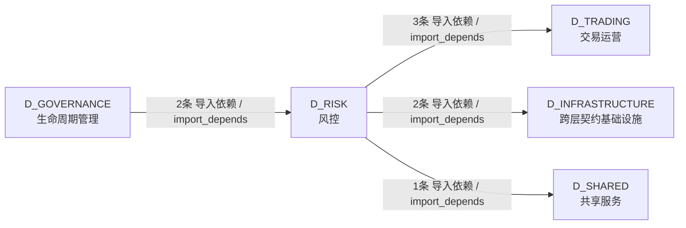

# 53_d_risk / 风控 / Risk Control

> **功能简介 / Overview**: 风控，负责风险指标计算、风险限额管理和风险预警

> **文档作用 / Purpose**: 展示 风控（D_RISK）功能域的模块清单、域内依赖关系、跨域依赖关系、架构分层视图，供架构审查和域治理参考。

> 本文档由 generate_domain_doc.py 从 depgraph (PostgreSQL) 自动生成
> 数据源: depgraph (PostgreSQL) nodes表 + edges表

## 域基本信息 / Domain Overview

| 字段 | 值 | Field | Value |
|------|------|-------|-------|
| 编号 | 53 | Number | 53 |
| 域ID | D_RISK | Domain ID | D_RISK |
| 域名称 | 风控 | Domain Name | Risk Control |
| 层级 | L2 业务域层 | Layer | L2 Domain |
| 模块数 | 11 | Module Count | 11 |
| 域内依赖 | 14 | Internal Dependencies | 14 |
| 跨域入边 | 2 | Cross-domain Incoming | 2 |
| 跨域出边 | 6 | Cross-domain Outgoing | 6 |
| 设计态模块 | 0 | Design Modules | 0 |
| 生产态模块 | 11 | Production Modules | 11 |
| 容量 | 11/150 (正常) | Capacity | 11/150 (正常) |
| 描述 | 风控，负责风险指标计算、风险限额管理和风险预警 | Description | 风控，负责风险指标计算、风险限额管理和风险预警 |

## 模块分层清单 / Module Layered List

> 按 architecture_layer 分组的模块清单（共 11 个模块 / 11 modules）。

### L0 基础设施层 / Infrastructure Layer (10 modules)

| # | 模块路径 / Module Path | 模块名称 / Module Name (功能简介 / Description) | 成熟度 / Maturity | 蓝图 / Blueprint |
|:--:|---------|---------|:---:|:---:|
| 1 | src/zephyr/risk/implementations/default_position_limit_ch... | D_RISK — Default Position Limit Checker | 生产态 / production |  |
| 2 | src/zephyr/risk/implementations/default_risk_limits_calcu... | D_RISK — Default Risk Limits Calculator | 生产态 / production |  |
| 3 | src/zephyr/risk/implementations/default_risk_manager_orch... | D_RISK — Default Risk Manager Orchestrator | 生产态 / production |  |
| 4 | src/zephyr/risk/implementations/default_risk_validator.py | D_RISK — Default Risk Validator | 生产态 / production |  |
| 5 | src/zephyr/risk/implementations/default_stop_loss_engine.py | D_RISK — Default Stop-Loss Engine | 生产态 / production |  |
| 6 | src/zephyr/risk/risk_limits.py | D_RISK — Risk Limits Calculator | 生产态 / production |  |
| 7 | src/zephyr/risk/risk_manager.py | ZephyrAlpha — D_RISK Risk Management Layer — ... | 生产态 / production |  |
| 8 | src/zephyr/risk/risk_manager_base.py | D_RISK — Risk Management Layer Skeleton | 生产态 / production |  |
| 9 | src/zephyr/risk/risk_validator.py | D_RISK — Risk Validator | 生产态 / production |  |
| 10 | src/zephyr/risk/stop_loss.py | D_RISK — Stop-Loss & Kill Switch 兼容层 | 生产态 / production |  |

### L2 领域层 / Domain Layer (1 modules)

| # | 模块路径 / Module Path | 模块名称 / Module Name (功能简介 / Description) | 成熟度 / Maturity | 蓝图 / Blueprint |
|:--:|---------|---------|:---:|:---:|
| 1 | src/zephyr/risk/cross_asset/cross_market_data_adapter/ml_... | ml_experiment_pipeline.py | 生产态 / production |  |

## 域内依赖图 / Internal Dependency Diagram

> 依赖图内嵌在本文档中，IDE 可直接渲染显示。参考 decision_index.md 设计，分三个视图：合并全景图、运营态子图、设计态子图（按 design_maturity 实际值拆分）。
>
> **图例说明 / Legend**：
> - **实线边框 = 运营态模块**（production，已上线运行）
> - **虚线边框 = 设计态模块**（design，蓝图阶段，代码未写）
> - **实线箭头 = 运营态依赖**（已生效的依赖关系）
> - **虚线箭头 = 非运营态依赖**（计划中/验证中的依赖关系）

### 合并全景图（全部模块，标签标注成熟度）

> 展示全部 11 个模块（生产态 11 + 设计态 0），标签标注成熟度。

### 运营态子图（仅 design_maturity=production 的模块和依赖）

> 仅展示已上线运行的模块（共 11 个，14 条域内依赖）。

```mermaid
graph TD
    subgraph D_RISK["D_RISK 风控"]
        src_zephyr_risk_cross_asset_cross_market_data_adapter_ml_experiment_pipeline_py["(生产态 / production) ml_experiment_pipeline.py"]
        src_zephyr_risk_implementations_default_position_limit_checker_py["(生产态 / production) D_RISK — Default Position Limit Checker<br/>文件: default_position_limit_checker.py"]
        src_zephyr_risk_implementations_default_risk_limits_calculator_py["(生产态 / production) D_RISK — Default Risk Limits Calculator<br/>文件: default_risk_limits_calculator.py"]
        src_zephyr_risk_implementations_default_risk_manager_orchestrator_py["(生产态 / production) D_RISK — Default Risk Manager Orchestrator<br/>文件: default_risk_manager_orchestrator.py"]
        src_zephyr_risk_implementations_default_risk_validator_py["(生产态 / production) D_RISK — Default Risk Validator<br/>文件: default_risk_validator.py"]
        src_zephyr_risk_implementations_default_stop_loss_engine_py["(生产态 / production) D_RISK — Default Stop-Loss Engine<br/>文件: default_stop_loss_engine.py"]
        src_zephyr_risk_risk_limits_py["(生产态 / production) D_RISK — Risk Limits Calculator<br/>文件: risk_limits.py"]
        src_zephyr_risk_risk_manager_py["(生产态 / production) ZephyrAlpha — D_RISK Risk Management Layer — ...<br/>文件: risk_manager.py"]
        src_zephyr_risk_risk_manager_base_py["(生产态 / production) D_RISK — Risk Management Layer Skeleton<br/>文件: risk_manager_base.py"]
        src_zephyr_risk_risk_validator_py["(生产态 / production) D_RISK — Risk Validator<br/>文件: risk_validator.py"]
        src_zephyr_risk_stop_loss_py["(生产态 / production) D_RISK — Stop-Loss & Kill Switch 兼容层<br/>文件: stop_loss.py"]
    end
    src_zephyr_risk_stop_loss_py -->|导入依赖 / import_depends| src_zephyr_risk_implementations_default_stop_loss_engine_py
    src_zephyr_risk_implementations_default_risk_limits_calculator_py -->|导入依赖 / import_depends| src_zephyr_risk_risk_limits_py
    src_zephyr_risk_implementations_default_risk_limits_calculator_py -->|导入依赖 / import_depends| src_zephyr_risk_risk_manager_py
    src_zephyr_risk_implementations_default_risk_manager_orchestrator_py -->|导入依赖 / import_depends| src_zephyr_risk_risk_manager_py
    src_zephyr_risk_implementations_default_risk_manager_orchestrator_py -->|导入依赖 / import_depends| src_zephyr_risk_risk_manager_base_py
    src_zephyr_risk_implementations_default_risk_manager_orchestrator_py -->|导入依赖 / import_depends| src_zephyr_risk_implementations_default_risk_limits_calculator_py
    src_zephyr_risk_implementations_default_risk_manager_orchestrator_py -->|导入依赖 / import_depends| src_zephyr_risk_implementations_default_risk_validator_py
    src_zephyr_risk_implementations_default_risk_manager_orchestrator_py -->|导入依赖 / import_depends| src_zephyr_risk_implementations_default_stop_loss_engine_py
    src_zephyr_risk_implementations_default_risk_manager_orchestrator_py -->|导入依赖 / import_depends| src_zephyr_risk_implementations_default_position_limit_checker_py
    src_zephyr_risk_implementations_default_risk_validator_py -->|导入依赖 / import_depends| src_zephyr_risk_risk_manager_py
    src_zephyr_risk_implementations_default_risk_validator_py -->|导入依赖 / import_depends| src_zephyr_risk_risk_validator_py
    src_zephyr_risk_implementations_default_stop_loss_engine_py -->|导入依赖 / import_depends| src_zephyr_risk_risk_manager_base_py
    src_zephyr_risk_implementations_default_position_limit_checker_py -->|导入依赖 / import_depends| src_zephyr_risk_risk_manager_py
    src_zephyr_risk_implementations_default_position_limit_checker_py -->|导入依赖 / import_depends| src_zephyr_risk_risk_manager_base_py
    D_INFRASTRUCTURE["(生产态 / production) D_INFRASTRUCTURE"]
    src_zephyr_risk_risk_manager_py -->|导入依赖 / import_depends| D_INFRASTRUCTURE
    D_SHARED["(生产态 / production) D_SHARED"]
    src_zephyr_risk_cross_asset_cross_market_data_adapter_ml_experiment_pipeline_py -->|导入依赖 / import_depends| D_SHARED
    src_zephyr_risk_risk_limits_py -->|导入依赖 / import_depends| D_INFRASTRUCTURE
    D_TRADING["(生产态 / production) D_TRADING"]
    src_zephyr_risk_risk_manager_py -->|导入依赖 / import_depends| D_TRADING
    src_zephyr_risk_risk_manager_py -->|导入依赖 / import_depends| D_TRADING
    src_zephyr_risk_risk_manager_py -->|导入依赖 / import_depends| D_TRADING
    D_GOVERNANCE["(生产态 / production) D_GOVERNANCE"]
    D_GOVERNANCE -->|导入依赖 / import_depends| src_zephyr_risk_risk_manager_py
    D_GOVERNANCE -->|导入依赖 / import_depends| src_zephyr_risk_stop_loss_py
    classDef production fill:#e1f5fe,stroke:#01579b,stroke-width:2px,color:#000
    classDef design fill:#fff3e0,stroke:#e65100,stroke-width:2px,color:#000,stroke-dasharray: 5 5
    classDef external_prod fill:#e8f5e9,stroke:#1b5e20,stroke-width:1px,color:#000
    classDef external_design fill:#fce4ec,stroke:#880e4f,stroke-width:1px,color:#000,stroke-dasharray: 5 5
    class src_zephyr_risk_cross_asset_cross_market_data_adapter_ml_experiment_pipeline_py,src_zephyr_risk_implementations_default_position_limit_checker_py,src_zephyr_risk_implementations_default_risk_limits_calculator_py,src_zephyr_risk_implementations_default_risk_manager_orchestrator_py,src_zephyr_risk_implementations_default_risk_validator_py,src_zephyr_risk_implementations_default_stop_loss_engine_py,src_zephyr_risk_risk_limits_py,src_zephyr_risk_risk_manager_py,src_zephyr_risk_risk_manager_base_py,src_zephyr_risk_risk_validator_py,src_zephyr_risk_stop_loss_py production
    class D_INFRASTRUCTURE,D_SHARED,D_TRADING,D_GOVERNANCE external_prod
```

### 设计态子图（仅 design_maturity=design 的模块和依赖）

> 仅展示蓝图阶段、代码未写的设计态模块（共 0 个，0 条域内依赖）。

> （无设计态模块 / No design modules）

## 跨域依赖 / Cross-domain Dependencies

### 本域依赖的其他域（出边）/ Depends On

| # | 本域模块 / Source Module | → | 外部域-目标模块 / Target Module | 依赖类型 / Type |
|:--:|---------|:--:|---------|---------|
| 1 | D_RISK — Risk Limits Calculator (risk_limits.py) | → | D_INFRASTRUCTURE 跨层契约基础设施: risk_limits.py | 导入依赖 / import_depends |
| 2 | ZephyrAlpha — D_RISK Risk Management Layer — ... | → | D_INFRASTRUCTURE 跨层契约基础设施: risk_limits.py | 导入依赖 / import_depends |
| 3 | ml_experiment_pipeline.py | → | D_SHARED 共享服务: MLExperimentPipeline D_ML_TRAIN->实验跨层集成管... | 导入依赖 / import_depends |
| 4 | ZephyrAlpha — D_RISK Risk Management Layer — ... | → | D_TRADING 交易运营: risk_dashboard_snapshot.py | 导入依赖 / import_depends |
| 5 | ZephyrAlpha — D_RISK Risk Management Layer — ... | → | D_TRADING 交易运营: risk_limit_violation_error.py | 导入依赖 / import_depends |
| 6 | ZephyrAlpha — D_RISK Risk Management Layer — ... | → | D_TRADING 交易运营: risk_metrics.py | 导入依赖 / import_depends |

### 依赖本域的其他域（入边）/ Depended By

| # | 外部域-源模块 / Source Module | → | 本域模块 / Target Module | 依赖类型 / Type |
|:--:|---------|:--:|---------|---------|
| 1 | D_GOVERNANCE 生命周期管理: C-track 端到端演示 —— 全流水线一次性运行 (dem... | → | ZephyrAlpha — D_RISK Risk Management Layer — ... | 导入依赖 / import_depends |
| 2 | D_GOVERNANCE 生命周期管理: C-track 端到端演示 —— 全流水线一次性运行 (dem... | → | D_RISK — Stop-Loss & Kill Switch 兼容层 (stop_... | 导入依赖 / import_depends |

### 跨域依赖图 / Cross-domain Dependency Diagram

> 本域与 4 个外部域直接连接（出边 6 条 + 入边 2 条 = 8 条）。只显示直接连接的域，不展开具体节点。

## 说明 / Notes

- **数据源 / Data Source**: `depgraph (PostgreSQL)` 的 `nodes`、`edges`、`domains` 表
- **生成器 / Generator**: `generate_domain_doc.py`（G2+G10 合并）
- **维护方式 / Maintenance**: 自动生成，全景图更新时刷新
- **文件名规则 / File Naming**: `{编号:02d}_{域ID小写}.md`，如 `16_d_trading.md`
- **图例说明 / Legend**: `[production]`=已上线 / `[design]`=设计中 / `[unknown]`=未知
