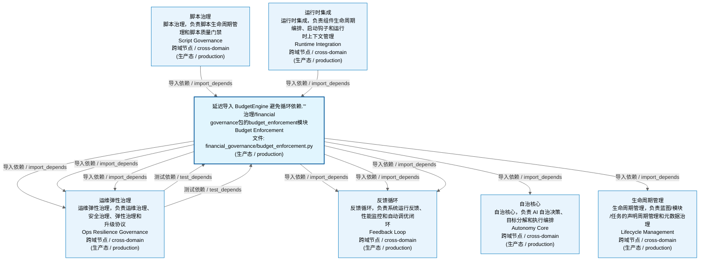
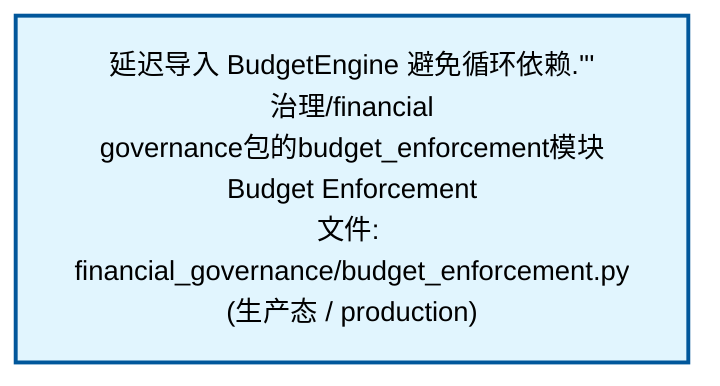
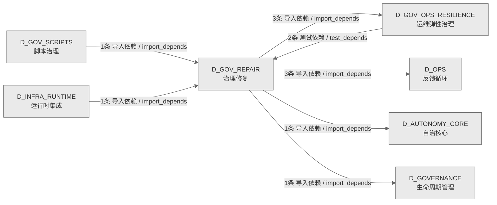

# 54_d_gov_repair / 治理修复域 / Governance Repair

> **功能简介 / Overview**: 治理修复，负责治理问题自动修复和修复策略管理

> **文档作用 / Purpose**: 展示 治理修复（D_GOV_REPAIR）功能域的域内依赖关系、跨域依赖关系，模块信息（成熟度/中英文名/大白话/文件路径）内嵌于 Mermaid 节点，供架构审查和域治理参考。

> 本文档由 generate_domain_doc.py 从 depgraph (PostgreSQL) 自动生成
> 数据源: depgraph (PostgreSQL) nodes表 + edges表

> **[可缩放 HTML 版 / Zoomable HTML](http://localhost:8765/docs/02_enterprise_architecture/02_domain_architecture_docs/_zoomable_html/54_d_gov_repair.html)** — Ctrl+滚轮缩放 ｜ 双击重置 ｜ Ctrl+Shift+D 切换拖动/选择模式

## 域基本信息 / Domain Overview

| 字段 | 值 | Field | Value |
|------|------|-------|-------|
| 编号 | 54 | Number | 54 |
| 域ID | D_GOV_REPAIR | Domain ID | D_GOV_REPAIR |
| 域名称 | 治理修复 | Domain Name | Governance Repair |
| 层级 | L2 业务域层 | Layer | L2 Domain |
| 模块数 | 1 | Module Count | 1 |
| 域内依赖 | 0 | Internal Dependencies | 0 |
| 跨域入边 | 4 | Cross-domain Incoming | 4 |
| 跨域出边 | 8 | Cross-domain Outgoing | 8 |
| 设计态模块 | 0 | Design Modules | 0 |
| 生产态模块 | 1 | Production Modules | 1 |
| 容量 | 1/150 (正常) | Capacity | 1/150 (正常) |
| 描述 | 双轨Checkpoint(git commit + SQLite JSONL dump) | Description | 双轨Checkpoint(git commit + SQLite JSONL dump) |

## 域内依赖图 / Internal Dependency Diagram

> 依赖图内嵌在本文档中，IDE 可直接渲染；网页版可 Ctrl+滚轮缩放 + 拖动平移查看细节。
>
> **图例说明 / Legend**：
> - 🟦 **蓝色 = 运营态模块**（production，已上线运行）
> - 🟧 **橙色虚线 = 设计态模块**（design，蓝图阶段，代码未写）
> - **实线箭头 = 运营态依赖**（已生效的依赖关系）
> - **虚线箭头 = 非运营态依赖**（计划中/验证中的依赖关系）

### 全景图（全部模块，颜色区分运营态/设计态）

> 展示全部 1 个模块（生产态 1 + 设计态 0），含跨域依赖外部节点。节点含成熟度+名称+大白话/简介+文件路径。

### 运营态的图（仅 design_maturity=production 的模块和域内依赖）

> 仅展示已上线运行的模块（共 1 个），不含跨域外部节点。跨域依赖见下方跨域依赖章节。

### 设计态的图（仅 design_maturity=design 的模块和域内依赖）

> 仅展示蓝图阶段、代码未写的设计态模块（共 0 个），不含跨域外部节点。

> （无模块 / No modules）

## 跨域依赖 / Cross-domain Dependencies

### 本域依赖的其他域（出边）/ Depends On

| # | 本域模块 / Source Module | → | 外部域-目标模块 / Target Module | 依赖类型 / Type |
|:--:|---------|:--:|---------|---------|
| 1 | 延迟导入 BudgetEngine 避免循环依赖. / Budget Enforcement ... | → | D_AUTONOMY_CORE 自治核心: 技能执行器 / skill_executor (skills/skill_executor.py) | 导入依赖 / import_depends |
| 2 | 延迟导入 BudgetEngine 避免循环依赖. / Budget Enforcement ... | → | D_GOVERNANCE 生命周期管理: 模型路由器 / model_router (intelligence_governance/model_... | 导入依赖 / import_depends |
| 3 | 延迟导入 BudgetEngine 避免循环依赖. / Budget Enforcement ... | → | D_GOV_OPS_RESILIENCE 运维弹性治理: 公共接口：wasserstein_1d / Burn Rate Monitor (ops_governa... | 导入依赖 / import_depends |
| 4 | 延迟导入 BudgetEngine 避免循环依赖. / Budget Enforcement ... | → | D_GOV_OPS_RESILIENCE 运维弹性治理: Degradation管理器 / Degradation Manager (ops_governance/d... | 导入依赖 / import_depends |
| 5 | 延迟导入 BudgetEngine 避免循环依赖. / Budget Enforcement ... | → | D_GOV_OPS_RESILIENCE 运维弹性治理: 只读：timeouts / Timeout Guard (ops_governance/timeout_gu... | 导入依赖 / import_depends |
| 6 | 延迟导入 BudgetEngine 避免循环依赖. / Budget Enforcement ... | → | D_OPS 反馈循环: —5.133.2 DI 注入契约 / Budget Engine (ops_governance/bud... | 导入依赖 / import_depends |
| 7 | 延迟导入 BudgetEngine 避免循环依赖. / Budget Enforcement ... | → | D_OPS 反馈循环: 预算模型 / Budget Models (ops_governance/budget_models.py) | 导入依赖 / import_depends |
| 8 | 延迟导入 BudgetEngine 避免循环依赖. / Budget Enforcement ... | → | D_OPS 反馈循环: 预算跟踪器 / Budget Tracker (ops_governance/budget_tracke... | 导入依赖 / import_depends |

### 依赖本域的其他域（入边）/ Depended By

| # | 外部域-源模块 / Source Module | → | 本域模块 / Target Module | 依赖类型 / Type |
|:--:|---------|:--:|---------|---------|
| 1 | D_GOV_OPS_RESILIENCE 运维弹性治理: 预算EnforcerSmoke测试 / Test Budget Enforcer Smoke (budge... | → | 延迟导入 BudgetEngine 避免循环依赖. / Budget Enforcement ... | 测试依赖 / test_depends |
| 2 | D_GOV_OPS_RESILIENCE 运维弹性治理: GCT-024 硬检查：验证 BudgetEngine 实例化、三维覆盖、策略... | → | 延迟导入 BudgetEngine 避免循环依赖. / Budget Enforcement ... | 测试依赖 / test_depends |
| 3 | D_GOV_SCRIPTS 脚本治理: 检查预算Health / Check Budget Health (d5_architecture/che... | → | 延迟导入 BudgetEngine 避免循环依赖. / Budget Enforcement ... | 导入依赖 / import_depends |
| 4 | D_INFRA_RUNTIME 运行时集成: budget_enforcement 包聚合层 / Init (budget_enforcement/__... | → | 延迟导入 BudgetEngine 避免循环依赖. / Budget Enforcement ... | 导入依赖 / import_depends |

### 跨域依赖图 / Cross-domain Dependency Diagram

> 本域与 6 个外部域直接连接（出边 8 条 + 入边 4 条 = 12 条）。只显示直接连接的域，不展开具体节点。

## 说明 / Notes

- **数据源 / Data Source**: `depgraph (PostgreSQL)` 的 `nodes`、`edges`、`domains` 表
- **生成器 / Generator**: `generate_domain_doc.py`（G2+G10 合并）
- **维护方式 / Maintenance**: 自动生成，全景图更新时刷新
- **文件名规则 / File Naming**: `{编号:02d}_{域ID小写}.md`，如 `16_d_trading.md`
- **图例说明 / Legend**: `[production]`=已上线 / `[design]`=设计中 / `[unknown]`=未知
