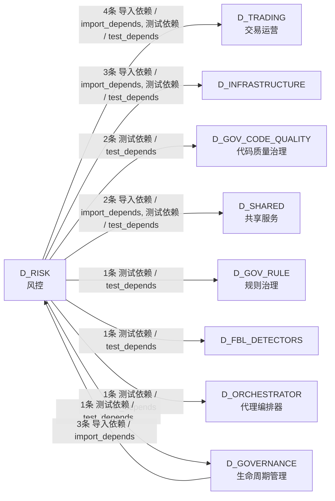

# 54_d_risk / 风控 / 风控 / Risk Control

> **功能简介 / Overview**: 风控，负责风险指标计算、风险限额管理和风险预警

> **文档作用 / Purpose**: 展示 风控（D_RISK）功能域的模块清单、域内依赖关系、跨域依赖关系、架构分层视图，供架构审查和域治理参考。

> 本文档由 generate_domain_doc.py 从 depgraph (PostgreSQL) 自动生成
> 最后更新: 2026-07-15 00:48:55
> 数据源: depgraph (PostgreSQL) nodes表 + edges表

## 域基本信息 / Domain Overview

| 字段 | 值 | Field | Value |
|------|------|-------|-------|
| 编号 | 54 | Number | 54 |
| 域ID | D_RISK | Domain ID | D_RISK |
| 域名称 | 风控 | Domain Name | Risk Control |
| 层级 | L2 业务域层 | Layer | L2 Domain |
| 模块数 | 29 | Module Count | 29 |
| 域内依赖 | 23 | Internal Dependencies | 23 |
| 跨域入边 | 3 | Cross-domain Incoming | 3 |
| 跨域出边 | 15 | Cross-domain Outgoing | 15 |
| 设计态模块 | 0 | Design Modules | 0 |
| 原型态模块 | 20 | Prototype Modules | 20 |
| 生产态模块 | 9 | Production Modules | 9 |
| 容量 | 9/150 (正常) | Capacity | 9/150 (正常) |
| 描述 | 风险度量、风险限额、压力测试、实时风控。交易安全阀。 | Description | 风险度量、风险限额、压力测试、实时风控。交易安全阀。 |

## 模块分层清单 / Module Layered List

> 按 architecture_layer 分组的模块清单（共 29 个模块 / 29 modules）。

### L2 领域层 / Domain Layer (29 modules)

| # | 模块路径 / Module Path | 模块名称 / Module Name (功能简介 / Description) | 成熟度 / Maturity | 蓝图 / Blueprint |
|:--:|---------|---------|:---:|:---:|
| 1 | src/zephyr/risk/__init__.py | D_RISK Risk Management | 原型态 / prototype | [MOD-L04-001](../../03_modules/_domain_risk/blueprint.md) |
| 2 | src/zephyr/risk/_extensions/__init__.py | __init__.py | 原型态 / prototype |  |
| 3 | src/zephyr/risk/api/__init__.py | __init__.py | 原型态 / prototype |  |
| 4 | src/zephyr/risk/core/__init__.py | __init__.py | 原型态 / prototype |  |
| 5 | src/zephyr/risk/cross_asset/__init__.py | Auto-created by DM-295 migration. | 原型态 / prototype |  |
| 6 | src/zephyr/risk/cross_asset/cross_market_data_adapter/__i... | _cross_layer: Cross-layer integration pipelines... | 原型态 / prototype | [MOD-INF-002](../../03_modules/_domain_infrastructure_runtime/runtime_integration/blueprint.md) |
| 7 | src/zephyr/risk/cross_asset/cross_market_data_adapter/ml_... | ml_experiment_pipeline.py | 生产态 / production | [MOD-INF-002](../../03_modules/_domain_infrastructure_runtime/runtime_integration/blueprint.md) |
| 8 | src/zephyr/risk/implementations/__init__.py | D_RISK — Risk Management Concrete Implementations | 原型态 / prototype | [MOD-L04-001](../../03_modules/_domain_risk/blueprint.md) |
| 9 | src/zephyr/risk/implementations/default_position_limit_ch... | D_RISK — Default Position Limit Checker | 原型态 / prototype | [MOD-L04-001](../../03_modules/_domain_risk/blueprint.md) |
| 10 | src/zephyr/risk/implementations/default_risk_limits_calcu... | D_RISK — Default Risk Limits Calculator | 生产态 / production | [MOD-L04-001](../../03_modules/_domain_risk/blueprint.md) |
| 11 | src/zephyr/risk/implementations/default_risk_manager_orch... | D_RISK — Default Risk Manager Orchestrator | 生产态 / production | [MOD-L04-001](../../03_modules/_domain_risk/blueprint.md) |
| 12 | src/zephyr/risk/implementations/default_risk_validator.py | D_RISK — Default Risk Validator | 生产态 / production | [MOD-L04-001](../../03_modules/_domain_risk/blueprint.md) |
| 13 | src/zephyr/risk/implementations/default_stop_loss_engine.py | D_RISK — Default Stop-Loss Engine | 原型态 / prototype | [MOD-L04-001](../../03_modules/_domain_risk/blueprint.md) |
| 14 | src/zephyr/risk/infrastructure/__init__.py | __init__.py | 原型态 / prototype |  |
| 15 | src/zephyr/risk/risk_limits.py | D_RISK — Risk Limits Calculator | 生产态 / production | [MOD-L04-001](../../03_modules/_domain_risk/blueprint.md) |
| 16 | src/zephyr/risk/risk_manager.py | ZephyrAlpha — D_RISK Risk Management Layer — ... | 生产态 / production | [MOD-L04-001](../../03_modules/_domain_risk/blueprint.md) |
| 17 | src/zephyr/risk/risk_manager_base.py | D_RISK — Risk Management Layer Skeleton | 生产态 / production | [MOD-L04-001](../../03_modules/_domain_risk/blueprint.md) |
| 18 | src/zephyr/risk/risk_validator.py | D_RISK — Risk Validator | 生产态 / production | [MOD-L04-001](../../03_modules/_domain_risk/blueprint.md) |
| 19 | src/zephyr/risk/services/__init__.py | __init__.py | 原型态 / prototype |  |
| 20 | src/zephyr/risk/stop_loss.py | D_RISK — Stop-Loss & Kill Switch 兼容层 | 生产态 / production | [MOD-L04-001](../../03_modules/_domain_risk/blueprint.md) |
| 21 | tests/risk/test_blast_radius_detector.py | test_blast_radius_detector.py | 原型态 / prototype | [MOD-FEEDBACK_LOOP](../../03_modules/_cross_layer/feedback_loop/blueprint.md) |
| 22 | tests/risk/test_l04_risk_management.py | test_l04_risk_management.py | 原型态 / prototype | [MOD-L04-001](../../03_modules/_domain_risk/blueprint.md) |
| 23 | tests/risk/test_ml_experiment_pipeline.py | test_ml_experiment_pipeline.py | 原型态 / prototype | [MOD-INF-002](../../03_modules/_domain_infrastructure_runtime/runtime_integration/blueprint.md) |
| 24 | tests/risk/test_risk_matrix.py | test_risk_matrix.py | 原型态 / prototype | [MOD-INF-021](../../03_modules/_domain_autonomy_core/rollback_system/blueprint.md) |
| 25 | tests/risk/test_risk_mitigation_root.py | test_risk_mitigation_root.py | 原型态 / prototype | [MOD-INF-001](../../03_modules/_domain_infrastructure_operations/capacity_assurance/blueprint.md) |
| 26 | tests/risk/test_risk_mitigation_tracker.py | test_risk_mitigation_tracker.py | 原型态 / prototype | [MOD-INF-017](../../03_modules/_domain_governance/code_dedup_engine/blueprint.md) |
| 27 | tests/risk/test_risk_mitigator.py | test_risk_mitigator.py | 原型态 / prototype | [MOD-INF-017](../../03_modules/_domain_governance/code_dedup_engine/blueprint.md) |
| 28 | tests/risk/test_risk_registry_root.py | test_risk_registry_root.py | 原型态 / prototype | [MOD-INF-039](../../03_modules/_cross_layer/agent_orchestrator/blueprint.md) |
| 29 | tests/risk/test_risk_ssot.py | test_risk_ssot.py | 原型态 / prototype | [MOD-GATE_ENGINE](../../03_modules/_cross_layer/gate_engine/blueprint.md) |

## 域内依赖图 / Internal Dependency Diagram

> 依赖图内嵌在本文档中，IDE 可直接渲染显示。参考 decision_index.md 设计，分四个视图：合并全景图、运营态子图、设计态子图、原型态子图（按 design_maturity 实际值拆分）。
>
> **图例说明 / Legend**：
> - **实线边框 = 运营态模块**（production，已上线运行）
> - **虚线边框 = 设计态模块**（design，蓝图阶段，代码未写）
> - **虚线边框 = 原型态模块**（prototype，代码已写，验证中未稳定上线）
> - **实线箭头 = 运营态依赖**（已生效的依赖关系）
> - **虚线箭头 = 非运营态依赖**（计划中/验证中的依赖关系）

### 合并全景图（全部模块，标签标注成熟度）

> 展示全部 29 个模块（生产态 9 + 设计态 0 + 原型态 20），标签标注成熟度。

```mermaid
graph TD
    subgraph D_RISK["D_RISK 风控"]
        src_zephyr_risk_init_py["(原型态 / prototype) D_RISK Risk Management<br/>文件: __init__.py"]
        src_zephyr_risk_extensions_init_py["(原型态 / prototype) __init__.py"]
        src_zephyr_risk_api_init_py["(原型态 / prototype) __init__.py"]
        src_zephyr_risk_core_init_py["(原型态 / prototype) __init__.py"]
        src_zephyr_risk_cross_asset_init_py["(原型态 / prototype) Auto-created by DM-295 migration.<br/>文件: __init__.py"]
        src_zephyr_risk_cross_asset_cross_market_data_adapter_init_py["(原型态 / prototype) _cross_layer: Cross-layer integration pipelines...<br/>文件: __init__.py"]
        src_zephyr_risk_cross_asset_cross_market_data_adapter_ml_experiment_pipeline_py["(生产态 / production) ml_experiment_pipeline.py"]
        src_zephyr_risk_implementations_init_py["(原型态 / prototype) D_RISK — Risk Management Concrete Implementations<br/>文件: __init__.py"]
        src_zephyr_risk_implementations_default_position_limit_checker_py["(原型态 / prototype) D_RISK — Default Position Limit Checker<br/>文件: default_position_limit_checker.py"]
        src_zephyr_risk_implementations_default_risk_limits_calculator_py["(生产态 / production) D_RISK — Default Risk Limits Calculator<br/>文件: default_risk_limits_calculator.py"]
        src_zephyr_risk_implementations_default_risk_manager_orchestrator_py["(生产态 / production) D_RISK — Default Risk Manager Orchestrator<br/>文件: default_risk_manager_orchestrator.py"]
        src_zephyr_risk_implementations_default_risk_validator_py["(生产态 / production) D_RISK — Default Risk Validator<br/>文件: default_risk_validator.py"]
        src_zephyr_risk_implementations_default_stop_loss_engine_py["(原型态 / prototype) D_RISK — Default Stop-Loss Engine<br/>文件: default_stop_loss_engine.py"]
        src_zephyr_risk_infrastructure_init_py["(原型态 / prototype) __init__.py"]
        src_zephyr_risk_risk_limits_py["(生产态 / production) D_RISK — Risk Limits Calculator<br/>文件: risk_limits.py"]
        src_zephyr_risk_risk_manager_py["(生产态 / production) ZephyrAlpha — D_RISK Risk Management Layer — ...<br/>文件: risk_manager.py"]
        src_zephyr_risk_risk_manager_base_py["(生产态 / production) D_RISK — Risk Management Layer Skeleton<br/>文件: risk_manager_base.py"]
        src_zephyr_risk_risk_validator_py["(生产态 / production) D_RISK — Risk Validator<br/>文件: risk_validator.py"]
        src_zephyr_risk_services_init_py["(原型态 / prototype) __init__.py"]
        src_zephyr_risk_stop_loss_py["(生产态 / production) D_RISK — Stop-Loss & Kill Switch 兼容层<br/>文件: stop_loss.py"]
        tests_risk_test_blast_radius_detector_py["(原型态 / prototype) test_blast_radius_detector.py"]
        tests_risk_test_l04_risk_management_py["(原型态 / prototype) test_l04_risk_management.py"]
        tests_risk_test_ml_experiment_pipeline_py["(原型态 / prototype) test_ml_experiment_pipeline.py"]
        tests_risk_test_risk_matrix_py["(原型态 / prototype) test_risk_matrix.py"]
        tests_risk_test_risk_mitigation_root_py["(原型态 / prototype) test_risk_mitigation_root.py"]
        tests_risk_test_risk_mitigation_tracker_py["(原型态 / prototype) test_risk_mitigation_tracker.py"]
        tests_risk_test_risk_mitigator_py["(原型态 / prototype) test_risk_mitigator.py"]
        tests_risk_test_risk_registry_root_py["(原型态 / prototype) test_risk_registry_root.py"]
        tests_risk_test_risk_ssot_py["(原型态 / prototype) test_risk_ssot.py"]
    end
    src_zephyr_risk_stop_loss_py -.->|导入依赖 / import_depends| src_zephyr_risk_implementations_default_stop_loss_engine_py
    src_zephyr_risk_cross_asset_init_py -.->|导入依赖 / import_depends| src_zephyr_risk_init_py
    src_zephyr_risk_cross_asset_cross_market_data_adapter_init_py -.->|config_depends / config_depends| src_zephyr_risk_cross_asset_cross_market_data_adapter_ml_experiment_pipeline_py
    src_zephyr_risk_implementations_default_risk_manager_orchestrator_py -->|导入依赖 / import_depends| src_zephyr_risk_risk_manager_py
    src_zephyr_risk_implementations_default_risk_manager_orchestrator_py -->|导入依赖 / import_depends| src_zephyr_risk_risk_manager_base_py
    src_zephyr_risk_implementations_default_risk_manager_orchestrator_py -.->|导入依赖 / import_depends| src_zephyr_risk_implementations_default_position_limit_checker_py
    src_zephyr_risk_implementations_default_risk_manager_orchestrator_py -->|导入依赖 / import_depends| src_zephyr_risk_implementations_default_risk_limits_calculator_py
    src_zephyr_risk_implementations_default_risk_manager_orchestrator_py -.->|导入依赖 / import_depends| src_zephyr_risk_implementations_default_stop_loss_engine_py
    src_zephyr_risk_implementations_default_risk_manager_orchestrator_py -->|导入依赖 / import_depends| src_zephyr_risk_implementations_default_risk_validator_py
    src_zephyr_risk_implementations_default_position_limit_checker_py -.->|导入依赖 / import_depends| src_zephyr_risk_risk_manager_py
    src_zephyr_risk_implementations_default_position_limit_checker_py -.->|导入依赖 / import_depends| src_zephyr_risk_risk_manager_base_py
    src_zephyr_risk_implementations_default_risk_limits_calculator_py -->|导入依赖 / import_depends| src_zephyr_risk_risk_limits_py
    src_zephyr_risk_implementations_default_risk_limits_calculator_py -->|导入依赖 / import_depends| src_zephyr_risk_risk_manager_py
    src_zephyr_risk_implementations_default_stop_loss_engine_py -.->|导入依赖 / import_depends| src_zephyr_risk_risk_manager_base_py
    src_zephyr_risk_implementations_default_risk_validator_py -->|导入依赖 / import_depends| src_zephyr_risk_risk_manager_py
    src_zephyr_risk_implementations_default_risk_validator_py -->|导入依赖 / import_depends| src_zephyr_risk_risk_validator_py
    src_zephyr_risk_implementations_init_py -.->|config_depends / config_depends| src_zephyr_risk_implementations_default_risk_manager_orchestrator_py
    tests_risk_test_l04_risk_management_py -.->|测试依赖 / test_depends| src_zephyr_risk_risk_limits_py
    tests_risk_test_l04_risk_management_py -.->|测试依赖 / test_depends| src_zephyr_risk_risk_manager_py
    tests_risk_test_l04_risk_management_py -.->|测试依赖 / test_depends| src_zephyr_risk_risk_manager_base_py
    tests_risk_test_l04_risk_management_py -.->|测试依赖 / test_depends| src_zephyr_risk_risk_validator_py
    tests_risk_test_l04_risk_management_py -.->|测试依赖 / test_depends| src_zephyr_risk_stop_loss_py
    tests_risk_test_ml_experiment_pipeline_py -.->|测试依赖 / test_depends| src_zephyr_risk_cross_asset_cross_market_data_adapter_ml_experiment_pipeline_py
    D_SHARED["(原型态 / prototype) D_SHARED"]
    src_zephyr_risk_cross_asset_cross_market_data_adapter_ml_experiment_pipeline_py -.->|导入依赖 / import_depends| D_SHARED
    D_INFRASTRUCTURE["(生产态 / production) D_INFRASTRUCTURE"]
    tests_risk_test_l04_risk_management_py -.->|测试依赖 / test_depends| D_INFRASTRUCTURE
    D_TRADING["(生产态 / production) D_TRADING"]
    tests_risk_test_l04_risk_management_py -.->|测试依赖 / test_depends| D_TRADING
    tests_risk_test_risk_ssot_py -.->|测试依赖 / test_depends| D_SHARED
    src_zephyr_risk_risk_manager_py -->|导入依赖 / import_depends| D_TRADING
    D_GOV_RULE["(生产态 / production) D_GOV_RULE"]
    tests_risk_test_risk_ssot_py -.->|测试依赖 / test_depends| D_GOV_RULE
    src_zephyr_risk_risk_manager_py -->|导入依赖 / import_depends| D_TRADING
    src_zephyr_risk_risk_manager_py -->|导入依赖 / import_depends| D_INFRASTRUCTURE
    src_zephyr_risk_risk_limits_py -->|导入依赖 / import_depends| D_INFRASTRUCTURE
    D_FBL_DETECTORS["(生产态 / production) D_FBL_DETECTORS"]
    tests_risk_test_blast_radius_detector_py -.->|测试依赖 / test_depends| D_FBL_DETECTORS
    D_GOVERNANCE["(生产态 / production) D_GOVERNANCE"]
    tests_risk_test_risk_matrix_py -.->|测试依赖 / test_depends| D_GOVERNANCE
    D_ORCHESTRATOR["(生产态 / production) D_ORCHESTRATOR"]
    tests_risk_test_risk_registry_root_py -.->|测试依赖 / test_depends| D_ORCHESTRATOR
    D_GOV_CODE_QUALITY["(生产态 / production) D_GOV_CODE_QUALITY"]
    tests_risk_test_risk_mitigator_py -.->|测试依赖 / test_depends| D_GOV_CODE_QUALITY
    tests_risk_test_risk_mitigation_tracker_py -.->|测试依赖 / test_depends| D_GOV_CODE_QUALITY
    src_zephyr_risk_risk_manager_py -->|导入依赖 / import_depends| D_TRADING
    D_GOVERNANCE -.->|导入依赖 / import_depends| src_zephyr_risk_stop_loss_py
    D_GOVERNANCE -.->|导入依赖 / import_depends| src_zephyr_risk_init_py
    D_GOVERNANCE -.->|导入依赖 / import_depends| src_zephyr_risk_risk_manager_py
    classDef production fill:#e1f5fe,stroke:#01579b,stroke-width:2px,color:#000
    classDef design fill:#fff3e0,stroke:#e65100,stroke-width:2px,color:#000,stroke-dasharray: 5 5
    classDef external_prod fill:#e8f5e9,stroke:#1b5e20,stroke-width:1px,color:#000
    classDef external_design fill:#fce4ec,stroke:#880e4f,stroke-width:1px,color:#000,stroke-dasharray: 5 5
    class src_zephyr_risk_cross_asset_cross_market_data_adapter_ml_experiment_pipeline_py,src_zephyr_risk_implementations_default_risk_limits_calculator_py,src_zephyr_risk_implementations_default_risk_manager_orchestrator_py,src_zephyr_risk_implementations_default_risk_validator_py,src_zephyr_risk_risk_limits_py,src_zephyr_risk_risk_manager_py,src_zephyr_risk_risk_manager_base_py,src_zephyr_risk_risk_validator_py,src_zephyr_risk_stop_loss_py production
    class src_zephyr_risk_init_py,src_zephyr_risk_extensions_init_py,src_zephyr_risk_api_init_py,src_zephyr_risk_core_init_py,src_zephyr_risk_cross_asset_init_py,src_zephyr_risk_cross_asset_cross_market_data_adapter_init_py,src_zephyr_risk_implementations_init_py,src_zephyr_risk_implementations_default_position_limit_checker_py,src_zephyr_risk_implementations_default_stop_loss_engine_py,src_zephyr_risk_infrastructure_init_py,src_zephyr_risk_services_init_py,tests_risk_test_blast_radius_detector_py,tests_risk_test_l04_risk_management_py,tests_risk_test_ml_experiment_pipeline_py,tests_risk_test_risk_matrix_py,tests_risk_test_risk_mitigation_root_py,tests_risk_test_risk_mitigation_tracker_py,tests_risk_test_risk_mitigator_py,tests_risk_test_risk_registry_root_py,tests_risk_test_risk_ssot_py design
    class D_INFRASTRUCTURE,D_TRADING,D_GOV_RULE,D_FBL_DETECTORS,D_GOVERNANCE,D_ORCHESTRATOR,D_GOV_CODE_QUALITY external_prod
    class D_SHARED external_design
```

### 运营态子图（仅 design_maturity=production 的模块和依赖）

> 仅展示已上线运行的模块（共 9 个，8 条域内依赖）。

```mermaid
graph TD
    subgraph D_RISK["D_RISK 风控"]
        src_zephyr_risk_cross_asset_cross_market_data_adapter_ml_experiment_pipeline_py["(生产态 / production) ml_experiment_pipeline.py"]
        src_zephyr_risk_implementations_default_risk_limits_calculator_py["(生产态 / production) D_RISK — Default Risk Limits Calculator<br/>文件: default_risk_limits_calculator.py"]
        src_zephyr_risk_implementations_default_risk_manager_orchestrator_py["(生产态 / production) D_RISK — Default Risk Manager Orchestrator<br/>文件: default_risk_manager_orchestrator.py"]
        src_zephyr_risk_implementations_default_risk_validator_py["(生产态 / production) D_RISK — Default Risk Validator<br/>文件: default_risk_validator.py"]
        src_zephyr_risk_risk_limits_py["(生产态 / production) D_RISK — Risk Limits Calculator<br/>文件: risk_limits.py"]
        src_zephyr_risk_risk_manager_py["(生产态 / production) ZephyrAlpha — D_RISK Risk Management Layer — ...<br/>文件: risk_manager.py"]
        src_zephyr_risk_risk_manager_base_py["(生产态 / production) D_RISK — Risk Management Layer Skeleton<br/>文件: risk_manager_base.py"]
        src_zephyr_risk_risk_validator_py["(生产态 / production) D_RISK — Risk Validator<br/>文件: risk_validator.py"]
        src_zephyr_risk_stop_loss_py["(生产态 / production) D_RISK — Stop-Loss & Kill Switch 兼容层<br/>文件: stop_loss.py"]
    end
    src_zephyr_risk_implementations_default_risk_manager_orchestrator_py -->|导入依赖 / import_depends| src_zephyr_risk_risk_manager_py
    src_zephyr_risk_implementations_default_risk_manager_orchestrator_py -->|导入依赖 / import_depends| src_zephyr_risk_risk_manager_base_py
    src_zephyr_risk_implementations_default_risk_manager_orchestrator_py -->|导入依赖 / import_depends| src_zephyr_risk_implementations_default_risk_limits_calculator_py
    src_zephyr_risk_implementations_default_risk_manager_orchestrator_py -->|导入依赖 / import_depends| src_zephyr_risk_implementations_default_risk_validator_py
    src_zephyr_risk_implementations_default_risk_limits_calculator_py -->|导入依赖 / import_depends| src_zephyr_risk_risk_limits_py
    src_zephyr_risk_implementations_default_risk_limits_calculator_py -->|导入依赖 / import_depends| src_zephyr_risk_risk_manager_py
    src_zephyr_risk_implementations_default_risk_validator_py -->|导入依赖 / import_depends| src_zephyr_risk_risk_manager_py
    src_zephyr_risk_implementations_default_risk_validator_py -->|导入依赖 / import_depends| src_zephyr_risk_risk_validator_py
    D_INFRASTRUCTURE["(生产态 / production) D_INFRASTRUCTURE"]
    src_zephyr_risk_risk_limits_py -->|导入依赖 / import_depends| D_INFRASTRUCTURE
    D_TRADING["(生产态 / production) D_TRADING"]
    src_zephyr_risk_risk_manager_py -->|导入依赖 / import_depends| D_TRADING
    src_zephyr_risk_risk_manager_py -->|导入依赖 / import_depends| D_INFRASTRUCTURE
    src_zephyr_risk_risk_manager_py -->|导入依赖 / import_depends| D_TRADING
    src_zephyr_risk_risk_manager_py -->|导入依赖 / import_depends| D_TRADING
    D_SHARED["(原型态 / prototype) D_SHARED"]
    src_zephyr_risk_cross_asset_cross_market_data_adapter_ml_experiment_pipeline_py -.->|导入依赖 / import_depends| D_SHARED
    D_GOVERNANCE["(原型态 / prototype) D_GOVERNANCE"]
    D_GOVERNANCE -.->|导入依赖 / import_depends| src_zephyr_risk_risk_manager_py
    D_GOVERNANCE -.->|导入依赖 / import_depends| src_zephyr_risk_stop_loss_py
    classDef production fill:#e1f5fe,stroke:#01579b,stroke-width:2px,color:#000
    classDef design fill:#fff3e0,stroke:#e65100,stroke-width:2px,color:#000,stroke-dasharray: 5 5
    classDef external_prod fill:#e8f5e9,stroke:#1b5e20,stroke-width:1px,color:#000
    classDef external_design fill:#fce4ec,stroke:#880e4f,stroke-width:1px,color:#000,stroke-dasharray: 5 5
    class src_zephyr_risk_cross_asset_cross_market_data_adapter_ml_experiment_pipeline_py,src_zephyr_risk_implementations_default_risk_limits_calculator_py,src_zephyr_risk_implementations_default_risk_manager_orchestrator_py,src_zephyr_risk_implementations_default_risk_validator_py,src_zephyr_risk_risk_limits_py,src_zephyr_risk_risk_manager_py,src_zephyr_risk_risk_manager_base_py,src_zephyr_risk_risk_validator_py,src_zephyr_risk_stop_loss_py production
    class D_INFRASTRUCTURE,D_TRADING external_prod
    class D_SHARED,D_GOVERNANCE external_design
```

### 设计态子图（仅 design_maturity=design 的模块和依赖）

> 仅展示蓝图阶段、代码未写的设计态模块（共 0 个，0 条域内依赖）。

> （无设计态模块 / No design modules）

### 原型态子图（仅 design_maturity=prototype 的模块和依赖）

> 仅展示代码已写、验证中未稳定上线的原型态模块（共 20 个，1 条域内依赖）。

```mermaid
graph TD
    subgraph D_RISK["D_RISK 风控"]
        src_zephyr_risk_init_py["(原型态 / prototype) D_RISK Risk Management<br/>文件: __init__.py"]
        src_zephyr_risk_extensions_init_py["(原型态 / prototype) __init__.py"]
        src_zephyr_risk_api_init_py["(原型态 / prototype) __init__.py"]
        src_zephyr_risk_core_init_py["(原型态 / prototype) __init__.py"]
        src_zephyr_risk_cross_asset_init_py["(原型态 / prototype) Auto-created by DM-295 migration.<br/>文件: __init__.py"]
        src_zephyr_risk_cross_asset_cross_market_data_adapter_init_py["(原型态 / prototype) _cross_layer: Cross-layer integration pipelines...<br/>文件: __init__.py"]
        src_zephyr_risk_implementations_init_py["(原型态 / prototype) D_RISK — Risk Management Concrete Implementations<br/>文件: __init__.py"]
        src_zephyr_risk_implementations_default_position_limit_checker_py["(原型态 / prototype) D_RISK — Default Position Limit Checker<br/>文件: default_position_limit_checker.py"]
        src_zephyr_risk_implementations_default_stop_loss_engine_py["(原型态 / prototype) D_RISK — Default Stop-Loss Engine<br/>文件: default_stop_loss_engine.py"]
        src_zephyr_risk_infrastructure_init_py["(原型态 / prototype) __init__.py"]
        src_zephyr_risk_services_init_py["(原型态 / prototype) __init__.py"]
        tests_risk_test_blast_radius_detector_py["(原型态 / prototype) test_blast_radius_detector.py"]
        tests_risk_test_l04_risk_management_py["(原型态 / prototype) test_l04_risk_management.py"]
        tests_risk_test_ml_experiment_pipeline_py["(原型态 / prototype) test_ml_experiment_pipeline.py"]
        tests_risk_test_risk_matrix_py["(原型态 / prototype) test_risk_matrix.py"]
        tests_risk_test_risk_mitigation_root_py["(原型态 / prototype) test_risk_mitigation_root.py"]
        tests_risk_test_risk_mitigation_tracker_py["(原型态 / prototype) test_risk_mitigation_tracker.py"]
        tests_risk_test_risk_mitigator_py["(原型态 / prototype) test_risk_mitigator.py"]
        tests_risk_test_risk_registry_root_py["(原型态 / prototype) test_risk_registry_root.py"]
        tests_risk_test_risk_ssot_py["(原型态 / prototype) test_risk_ssot.py"]
    end
    src_zephyr_risk_cross_asset_init_py -.->|导入依赖 / import_depends| src_zephyr_risk_init_py
    D_INFRASTRUCTURE["(生产态 / production) D_INFRASTRUCTURE"]
    tests_risk_test_l04_risk_management_py -.->|测试依赖 / test_depends| D_INFRASTRUCTURE
    D_TRADING["(生产态 / production) D_TRADING"]
    tests_risk_test_l04_risk_management_py -.->|测试依赖 / test_depends| D_TRADING
    D_SHARED["(生产态 / production) D_SHARED"]
    tests_risk_test_risk_ssot_py -.->|测试依赖 / test_depends| D_SHARED
    D_GOV_RULE["(生产态 / production) D_GOV_RULE"]
    tests_risk_test_risk_ssot_py -.->|测试依赖 / test_depends| D_GOV_RULE
    D_FBL_DETECTORS["(生产态 / production) D_FBL_DETECTORS"]
    tests_risk_test_blast_radius_detector_py -.->|测试依赖 / test_depends| D_FBL_DETECTORS
    D_GOVERNANCE["(生产态 / production) D_GOVERNANCE"]
    tests_risk_test_risk_matrix_py -.->|测试依赖 / test_depends| D_GOVERNANCE
    D_ORCHESTRATOR["(生产态 / production) D_ORCHESTRATOR"]
    tests_risk_test_risk_registry_root_py -.->|测试依赖 / test_depends| D_ORCHESTRATOR
    D_GOV_CODE_QUALITY["(生产态 / production) D_GOV_CODE_QUALITY"]
    tests_risk_test_risk_mitigator_py -.->|测试依赖 / test_depends| D_GOV_CODE_QUALITY
    tests_risk_test_risk_mitigation_tracker_py -.->|测试依赖 / test_depends| D_GOV_CODE_QUALITY
    D_GOVERNANCE -.->|导入依赖 / import_depends| src_zephyr_risk_init_py
    classDef production fill:#e1f5fe,stroke:#01579b,stroke-width:2px,color:#000
    classDef design fill:#fff3e0,stroke:#e65100,stroke-width:2px,color:#000,stroke-dasharray: 5 5
    classDef external_prod fill:#e8f5e9,stroke:#1b5e20,stroke-width:1px,color:#000
    classDef external_design fill:#fce4ec,stroke:#880e4f,stroke-width:1px,color:#000,stroke-dasharray: 5 5
    class src_zephyr_risk_init_py,src_zephyr_risk_extensions_init_py,src_zephyr_risk_api_init_py,src_zephyr_risk_core_init_py,src_zephyr_risk_cross_asset_init_py,src_zephyr_risk_cross_asset_cross_market_data_adapter_init_py,src_zephyr_risk_implementations_init_py,src_zephyr_risk_implementations_default_position_limit_checker_py,src_zephyr_risk_implementations_default_stop_loss_engine_py,src_zephyr_risk_infrastructure_init_py,src_zephyr_risk_services_init_py,tests_risk_test_blast_radius_detector_py,tests_risk_test_l04_risk_management_py,tests_risk_test_ml_experiment_pipeline_py,tests_risk_test_risk_matrix_py,tests_risk_test_risk_mitigation_root_py,tests_risk_test_risk_mitigation_tracker_py,tests_risk_test_risk_mitigator_py,tests_risk_test_risk_registry_root_py,tests_risk_test_risk_ssot_py design
    class D_INFRASTRUCTURE,D_TRADING,D_SHARED,D_GOV_RULE,D_FBL_DETECTORS,D_GOVERNANCE,D_ORCHESTRATOR,D_GOV_CODE_QUALITY external_prod
```

## 跨域依赖 / Cross-domain Dependencies

### 本域依赖的其他域（出边）/ Depends On

| # | 本域模块 / Source Module | → | 外部域-目标模块 / Target Module | 依赖类型 / Type |
|:--:|---------|:--:|---------|---------|
| 1 | test_blast_radius_detector.py | → | D_FBL_DETECTORS: Blast Radius Detector — v0.12.0 R167 (blast_ra... | 测试依赖 / test_depends |
| 2 | test_risk_matrix.py | → | D_GOVERNANCE 生命周期管理: risk_matrix.py | 测试依赖 / test_depends |
| 3 | test_risk_mitigation_tracker.py | → | D_GOV_CODE_QUALITY 代码质量治理: 风险缓解追踪——捕获哪些克隆报告了但在N次扫描后... | 测试依赖 / test_depends |
| 4 | test_risk_mitigator.py | → | D_GOV_CODE_QUALITY 代码质量治理: R1-R45全量风险缓解执行器 — 逐条检查缓解措施 + ... | 测试依赖 / test_depends |
| 5 | test_risk_ssot.py | → | D_GOV_RULE 规则治理: risk_ssot — 从 ``config/risk_params.yaml`` 加.... | 测试依赖 / test_depends |
| 6 | D_RISK — Risk Limits Calculator (risk_limits.py) | → | D_INFRASTRUCTURE: risk_limits.py | 导入依赖 / import_depends |
| 7 | ZephyrAlpha — D_RISK Risk Management Layer — ... | → | D_INFRASTRUCTURE: risk_limits.py | 导入依赖 / import_depends |
| 8 | test_l04_risk_management.py | → | D_INFRASTRUCTURE: risk_limits.py | 测试依赖 / test_depends |
| 9 | test_risk_registry_root.py | → | D_ORCHESTRATOR 代理编排器: risk_registry.py | 测试依赖 / test_depends |
| 10 | ml_experiment_pipeline.py | → | D_SHARED 共享服务: MLExperimentPipeline D_ML_TRAIN->实验跨层集成管... | 导入依赖 / import_depends |
| 11 | test_risk_ssot.py | → | D_SHARED 共享服务: paths.py — 项目路径常量 SSoT（Single Source of... | 测试依赖 / test_depends |
| 12 | ZephyrAlpha — D_RISK Risk Management Layer — ... | → | D_TRADING 交易运营: risk_dashboard_snapshot.py | 导入依赖 / import_depends |
| 13 | ZephyrAlpha — D_RISK Risk Management Layer — ... | → | D_TRADING 交易运营: risk_limit_violation_error.py | 导入依赖 / import_depends |
| 14 | ZephyrAlpha — D_RISK Risk Management Layer — ... | → | D_TRADING 交易运营: risk_metrics.py | 导入依赖 / import_depends |
| 15 | test_l04_risk_management.py | → | D_TRADING 交易运营: risk_limit_violation_error.py | 测试依赖 / test_depends |

### 依赖本域的其他域（入边）/ Depended By

| # | 外部域-源模块 / Source Module | → | 本域模块 / Target Module | 依赖类型 / Type |
|:--:|---------|:--:|---------|---------|
| 1 | D_GOVERNANCE 生命周期管理: C-track 端到端演示 —— 全流水线一次性运行 (dem... | → | D_RISK Risk Management (__init__.py) | 导入依赖 / import_depends |
| 2 | D_GOVERNANCE 生命周期管理: C-track 端到端演示 —— 全流水线一次性运行 (dem... | → | ZephyrAlpha — D_RISK Risk Management Layer — ... | 导入依赖 / import_depends |
| 3 | D_GOVERNANCE 生命周期管理: C-track 端到端演示 —— 全流水线一次性运行 (dem... | → | D_RISK — Stop-Loss & Kill Switch 兼容层 (stop_... | 导入依赖 / import_depends |

### 跨域依赖图 / Cross-domain Dependency Diagram

> 本域与 8 个外部域直接连接（出边 15 条 + 入边 3 条 = 18 条）。只显示直接连接的域，不展开具体节点。

## 说明 / Notes

- **数据源 / Data Source**: `depgraph (PostgreSQL)` 的 `nodes`、`edges`、`domains` 表
- **生成器 / Generator**: `generate_domain_doc.py`（G2+G10 合并）
- **维护方式 / Maintenance**: 自动生成，全景图更新时刷新
- **文件名规则 / File Naming**: `{编号:02d}_{域ID小写}.md`，如 `16_d_trading.md`
- **图例说明 / Legend**: `[production]`=已上线 / `[design]`=设计中 / `[prototype]`=原型 / `[unknown]`=未知
