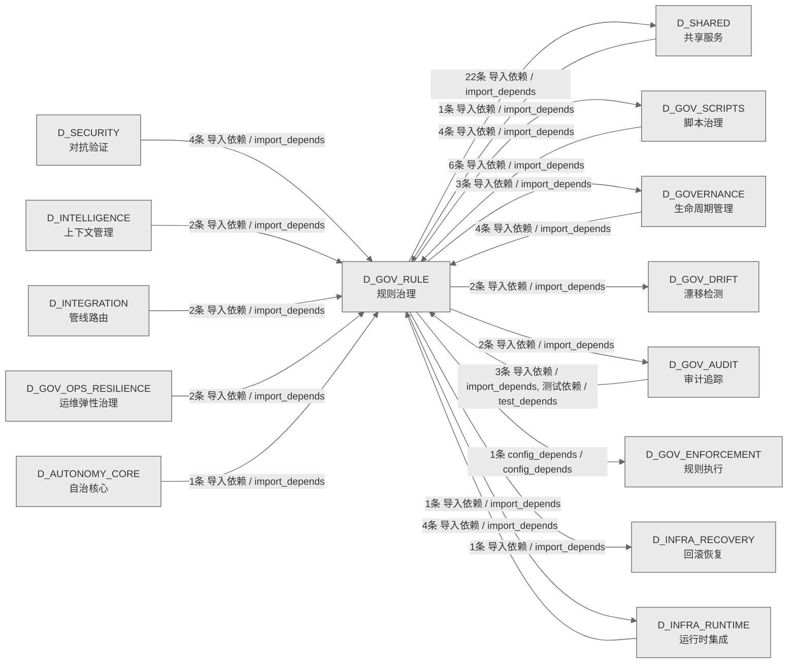

# 55_d_gov_rule / 规则治理域 / Rule Governance

> **功能简介 / Overview**: 规则治理，负责规则注册、规则版本和规则依赖管理

> **文档作用 / Purpose**: 展示 规则治理（D_GOV_RULE）功能域的域内依赖关系、跨域依赖关系，模块信息（成熟度/中英文名/大白话/文件路径）内嵌于 Mermaid 节点，供架构审查和域治理参考。

> 本文档由 generate_domain_doc.py 从 depgraph (PostgreSQL) 自动生成
> 数据源: depgraph (PostgreSQL) nodes表 + edges表

> **[可缩放 HTML 版 / Zoomable HTML](http://localhost:8765/docs/02_enterprise_architecture/02_domain_architecture_docs/_zoomable_html/55_d_gov_rule.html)** — Ctrl+滚轮缩放 ｜ 双击重置 ｜ Ctrl+Shift+D 切换拖动/选择模式

## 域基本信息 / Domain Overview

| 字段 | 值 | Field | Value |
|------|------|-------|-------|
| 编号 | 55 | Number | 55 |
| 域ID | D_GOV_RULE | Domain ID | D_GOV_RULE |
| 域名称 | 规则治理 | Domain Name | Rule Governance |
| 层级 | L2 业务域层 | Layer | L2 Domain |
| 模块数 | 35 | Module Count | 35 |
| 域内依赖 | 12 | Internal Dependencies | 12 |
| 跨域入边 | 29 | Cross-domain Incoming | 29 |
| 跨域出边 | 36 | Cross-domain Outgoing | 36 |
| 设计态模块 | 0 | Design Modules | 0 |
| 生产态模块 | 35 | Production Modules | 35 |
| 容量 | 35/150 (正常) | Capacity | 35/150 (正常) |
| 描述 | 规则配置管理 | Description | 规则配置管理 |

## 域内依赖图 / Internal Dependency Diagram

> 依赖图内嵌在本文档中，IDE 可直接渲染；网页版可 Ctrl+滚轮缩放 + 拖动平移查看细节。
>
> **图例说明 / Legend**：
> - 🟦 **蓝色 = 运营态模块**（production，已上线运行）
> - 🟧 **橙色虚线 = 设计态模块**（design，蓝图阶段，代码未写）
> - **实线箭头 = 运营态依赖**（已生效的依赖关系）
> - **虚线箭头 = 非运营态依赖**（计划中/验证中的依赖关系）

### 全景图（全部模块，颜色区分运营态/设计态）

> 展示全部 35 个模块（生产态 35 + 设计态 0），含跨域依赖外部节点。节点含成熟度+名称+大白话/简介+文件路径。

```mermaid
%%{init: {'theme': 'base', 'themeVariables': {'primaryColor': '#eaeaea', 'primaryTextColor': '#333333', 'primaryBorderColor': '#666666', 'lineColor': '#666666', 'secondaryColor': '#eaeaea', 'tertiaryColor': '#eaeaea', 'fontSize': '14px'}}}%%
flowchart TD
    scripts_governance_generators_generate_script_manifest_py["generators/generate_script_manifest<br/>generate_script_manifest.py — 脚本清单自动生成器<br/>文件: generators/generate_script_manifest.py<br/>(生产态 / production)"]
    src_zephyr_gov_enforcement_rule_enforcement_adaptive_threshold_py["rule_enforcement/adaptive_threshold<br/>自适应阈值——双模式：概率型（PASS/FAIL outcome<br/>调节）+ 次数型（EWMA 基线 × ...<br/>文件: rule_enforcement/adaptive_threshold.py<br/>(生产态 / production)"]
    src_zephyr_gov_enforcement_rule_enforcement_adversarial_strategies_py["rule_enforcement/adversarial_strategies<br/>对抗样本生成器——5 种攻击策略用于门禁验证<br/>（Adversarial sample generator with...<br/>文件: rule_enforcement/adversarial_strategies.py<br/>(生产态 / production)"]
    src_zephyr_gov_enforcement_rule_enforcement_ai_capability_guard_py["rule_enforcement/ai_capability_guard<br/>AI 能力边界守卫——@require_capability<br/>装饰器运行时检查（AI capability bounda...<br/>文件: rule_enforcement/ai_capability_guard.py<br/>(生产态 / production)"]
    src_zephyr_gov_enforcement_rule_enforcement_anti_pattern_guard_py["rule_enforcement/anti_pattern_guard<br/>Anti-Patterns 防护引擎（Anti-Pattern Guard）<br/>文件: rule_enforcement/anti_pattern_guard.py<br/>(生产态 / production)"]
    src_zephyr_gov_enforcement_rule_enforcement_can_i_deploy_py["rule_enforcement/can_i_deploy<br/>Can-I-Deploy 预部署门禁（GATE-CDC-1）<br/>文件: rule_enforcement/can_i_deploy.py<br/>(生产态 / production)"]
    src_zephyr_gov_enforcement_rule_enforcement_capability_checker_py["rule_enforcement/capability_checker<br/>能力检查器（Capability Checker）<br/>文件: rule_enforcement/capability_checker.py<br/>(生产态 / production)"]
    src_zephyr_gov_enforcement_rule_enforcement_cdc_broker_py["rule_enforcement/cdc_broker<br/>CDC 契约经纪人（Consumer-Driven Contract Broker<br/>— CT-CDC-001）<br/>文件: rule_enforcement/cdc_broker.py<br/>(生产态 / production)"]
    src_zephyr_gov_enforcement_rule_enforcement_contract_template_manager_py["rule_enforcement/contract_template_manager<br/>契约模板管理器——管理 MCP 工具契约模板（Contract<br/>template manager for MCP to...<br/>文件: rule_enforcement<br/>/contract_template_manager.py<br/>(生产态 / production)"]
    src_zephyr_gov_enforcement_rule_enforcement_end_to_end_walkthrough_py["rule_enforcement/end_to_end_walkthrough<br/>端到端场景走查验证器（End-to-End Walkthrough<br/>Validator）。<br/>文件: rule_enforcement/end_to_end_walkthrough.py<br/>(生产态 / production)"]
    src_zephyr_gov_enforcement_rule_enforcement_gate_engine_init_py["rule_enforcement/gate_engine 包入口<br/>gate_engine package — 门禁引擎模块集合<br/>（ARCH-042 阶段1 拆分产物）。<br/>文件: gate_engine/__init__.py<br/>(生产态 / production)"]
    src_zephyr_gov_enforcement_rule_enforcement_gate_engine_gate_engine_py["gate_engine/gate_engine<br/>GateEngine — KMS G1-G6 + Orc G0/G7 + 交易<br/>G10-G12 门禁裁决引擎（T-2-17）<br/>文件: gate_engine/gate_engine.py<br/>(生产态 / production)"]
    src_zephyr_gov_enforcement_rule_enforcement_gate_engine_gate_override_py["gate_engine/gate_override<br/>Owner 紧急旁路——时间限定的门禁临时绕过 +<br/>审计追踪（beta）<br/>文件: gate_engine/gate_override.py<br/>(生产态 / production)"]
    src_zephyr_gov_enforcement_rule_enforcement_gate_engine_gate_simulator_py["gate_engine/gate_simulator<br/>门禁模拟器——dry-run<br/>全链路门禁演练，不修改任何状态（beta）<br/>文件: gate_engine/gate_simulator.py<br/>(生产态 / production)"]
    src_zephyr_gov_enforcement_rule_enforcement_integration_test_runner_py["rule_enforcement/integration_test_runner<br/>集成测试运行器（Integration Test Runner）<br/>文件: rule_enforcement<br/>/integration_test_runner.py<br/>(生产态 / production)"]
    src_zephyr_gov_enforcement_rule_enforcement_invariants_en_process_lifecycle_gateway_py["invariants/en_process_lifecycle_gateway<br/>EN-process-lifecycle-gateway —<br/>进程创建入口校验门禁<br/>文件: invariants/en_process_lifecycle_gateway.py<br/>(生产态 / production)"]
    src_zephyr_gov_enforcement_rule_enforcement_kiss_enforcer_py["rule_enforcement/kiss_enforcer<br/>KISS 约束执行器<br/>（CT-KISS-001）——AI产出复杂度检测+bloat check。<br/>文件: rule_enforcement/kiss_enforcer.py<br/>(生产态 / production)"]
    src_zephyr_gov_enforcement_rule_enforcement_rule_engine_init_py["rule_enforcement/rule_engine 包入口<br/>rule_engine package — 规则引擎模块集合<br/>（ARCH-042 阶段1 拆分产物）。<br/>文件: rule_engine/__init__.py<br/>(生产态 / production)"]
    src_zephyr_gov_enforcement_rule_enforcement_rule_engine_rule_engine_py["rule_engine/rule_engine<br/>RuleLoader — 规则加载核心 API<br/>文件: rule_engine/rule_engine.py<br/>(生产态 / production)"]
    src_zephyr_gov_enforcement_rule_enforcement_secrets_guard_py["rule_enforcement/secrets_guard<br/>Secrets 守护（CT-SECRETS-001）——.env校验+git<br/>log扫描+日志脱敏。<br/>文件: rule_enforcement/secrets_guard.py<br/>(生产态 / production)"]
    src_zephyr_gov_enforcement_rule_enforcement_task_completion_gate_py["rule_enforcement/task_completion_gate<br/>TaskCompletionGate: scan for residual files<br/>outside files_in_scope<br/>文件: rule_enforcement/task_completion_gate.py<br/>(生产态 / production)"]
    src_zephyr_gov_enforcement_rule_enforcement_triple_alignment_py["rule_enforcement/triple_alignment<br/>G-TRIPLE-ALIGN: 蓝图↔代码↔依赖图三方对齐门禁<br/>文件: rule_enforcement/triple_alignment.py<br/>(生产态 / production)"]
    src_zephyr_gov_rule_init_py["zephyr/gov_rule 包入口<br/>gov_rule domain package — rule governance<br/>(D_GOV_RULE).<br/>文件: gov_rule/__init__.py<br/>(生产态 / production)"]
    src_zephyr_gov_rule_constitutional_update_constitutional_update_py["constitutional_update/constitutional_update<br/>constitutional_update.py —— 宪法自愈（Phase 14<br/>/ 盲点 B27）<br/>文件: constitutional_update<br/>/constitutional_update.py<br/>(生产态 / production)"]
    scripts_governance_generators_generate_script_manifest_py ~~~ src_zephyr_gov_enforcement_rule_enforcement_adaptive_threshold_py
    src_zephyr_gov_enforcement_rule_enforcement_adaptive_threshold_py ~~~ src_zephyr_gov_enforcement_rule_enforcement_adversarial_strategies_py
    src_zephyr_gov_enforcement_rule_enforcement_adversarial_strategies_py ~~~ src_zephyr_gov_enforcement_rule_enforcement_ai_capability_guard_py
    src_zephyr_gov_enforcement_rule_enforcement_ai_capability_guard_py ~~~ src_zephyr_gov_enforcement_rule_enforcement_anti_pattern_guard_py
    src_zephyr_gov_enforcement_rule_enforcement_anti_pattern_guard_py ~~~ src_zephyr_gov_enforcement_rule_enforcement_can_i_deploy_py
    src_zephyr_gov_enforcement_rule_enforcement_can_i_deploy_py ~~~ src_zephyr_gov_enforcement_rule_enforcement_capability_checker_py
    src_zephyr_gov_enforcement_rule_enforcement_capability_checker_py ~~~ src_zephyr_gov_enforcement_rule_enforcement_cdc_broker_py
    src_zephyr_gov_enforcement_rule_enforcement_cdc_broker_py ~~~ src_zephyr_gov_enforcement_rule_enforcement_contract_template_manager_py
    src_zephyr_gov_enforcement_rule_enforcement_contract_template_manager_py ~~~ src_zephyr_gov_enforcement_rule_enforcement_end_to_end_walkthrough_py
    src_zephyr_gov_enforcement_rule_enforcement_end_to_end_walkthrough_py ~~~ src_zephyr_gov_enforcement_rule_enforcement_gate_engine_init_py
    src_zephyr_gov_enforcement_rule_enforcement_gate_engine_init_py ~~~ src_zephyr_gov_enforcement_rule_enforcement_gate_engine_gate_engine_py
    src_zephyr_gov_enforcement_rule_enforcement_gate_engine_gate_engine_py ~~~ src_zephyr_gov_enforcement_rule_enforcement_gate_engine_gate_override_py
    src_zephyr_gov_enforcement_rule_enforcement_gate_engine_gate_override_py ~~~ src_zephyr_gov_enforcement_rule_enforcement_gate_engine_gate_simulator_py
    src_zephyr_gov_enforcement_rule_enforcement_gate_engine_gate_simulator_py ~~~ src_zephyr_gov_enforcement_rule_enforcement_integration_test_runner_py
    src_zephyr_gov_enforcement_rule_enforcement_integration_test_runner_py ~~~ src_zephyr_gov_enforcement_rule_enforcement_invariants_en_process_lifecycle_gateway_py
    src_zephyr_gov_enforcement_rule_enforcement_invariants_en_process_lifecycle_gateway_py ~~~ src_zephyr_gov_enforcement_rule_enforcement_kiss_enforcer_py
    src_zephyr_gov_enforcement_rule_enforcement_kiss_enforcer_py ~~~ src_zephyr_gov_enforcement_rule_enforcement_rule_engine_init_py
    src_zephyr_gov_enforcement_rule_enforcement_rule_engine_init_py ~~~ src_zephyr_gov_enforcement_rule_enforcement_rule_engine_rule_engine_py
    src_zephyr_gov_enforcement_rule_enforcement_rule_engine_rule_engine_py ~~~ src_zephyr_gov_enforcement_rule_enforcement_secrets_guard_py
    src_zephyr_gov_enforcement_rule_enforcement_secrets_guard_py ~~~ src_zephyr_gov_enforcement_rule_enforcement_task_completion_gate_py
    src_zephyr_gov_enforcement_rule_enforcement_task_completion_gate_py ~~~ src_zephyr_gov_enforcement_rule_enforcement_triple_alignment_py
    src_zephyr_gov_enforcement_rule_enforcement_triple_alignment_py ~~~ src_zephyr_gov_rule_init_py
    src_zephyr_gov_rule_init_py ~~~ src_zephyr_gov_rule_constitutional_update_constitutional_update_py
    src_zephyr_gov_enforcement_rule_enforcement_cbac_matrix_py["rule_enforcement/cbac_matrix<br/>CBAC 能力矩阵（Capability-Based Access Control<br/>Matrix — CT-CBAC-001）<br/>文件: rule_enforcement/cbac_matrix.py<br/>(生产态 / production)"]
    src_zephyr_gov_enforcement_rule_enforcement_circuit_breaker_py["rule_enforcement/circuit_breaker<br/>CircuitBreakerGateway (CBG) —<br/>模块间调用单向熔断器<br/>文件: rule_enforcement/circuit_breaker.py<br/>(生产态 / production)"]
    src_zephyr_gov_enforcement_rule_enforcement_gate_engine_adversarial_validation_py["gate_engine/adversarial_validation<br/>对抗验证门禁——验证输出对抗对抗性攻击<br/>（AdversarialValidationGate: validates ...<br/>文件: gate_engine/adversarial_validation.py<br/>(生产态 / production)"]
    src_zephyr_gov_enforcement_rule_enforcement_gate_engine_gate_pipeline_py["gate_engine/gate_pipeline<br/>门禁评估管线——排序解析、组合逻辑（AND/OR<br/>/NOT）、并行调度（beta）<br/>文件: gate_engine/gate_pipeline.py<br/>(生产态 / production)"]
    src_zephyr_gov_enforcement_rule_enforcement_gate_types_py["rule_enforcement/gate_types<br/>门禁类型定义——GateType 枚举与 gate 相关<br/>dataclass（GateContext/GateResult 等）。<br/>文件: rule_enforcement/gate_types.py<br/>(生产态 / production)"]
    src_zephyr_gov_enforcement_rule_enforcement_invariants_en_001_circular_dependency_py["invariants/en_001_circular_dependency<br/>EN-001 循环依赖扫描器——Kahn<br/>拓扑排序检测模块导入环（Circular Dependency<br/>Sca...<br/>文件: invariants/en_001_circular_dependency.py<br/>(生产态 / production)"]
    src_zephyr_gov_enforcement_rule_enforcement_invariants_en_003_contract_compatibility_py["invariants/en_003_contract_compatibility<br/>EN-003 契约兼容性检查器——字段/类型<br/>/必填对齐差异比对（Contract Compatibility...<br/>文件: invariants<br/>/en_003_contract_compatibility.py<br/>(生产态 / production)"]
    src_zephyr_gov_enforcement_rule_enforcement_invariants_zero_residue_check_py["invariants/zero_residue_check<br/>零残留检查器——验证治理操作后无残留文件/目录<br/>/引用。<br/>文件: invariants/zero_residue_check.py<br/>(生产态 / production)"]
    src_zephyr_gov_enforcement_rule_enforcement_risk_ssot_py["rule_enforcement/risk_ssot<br/>risk_ssot — 从 ``config/risk_params.yaml``<br/>加载风险真源（INV-002 等）<br/>文件: rule_enforcement/risk_ssot.py<br/>(生产态 / production)"]
    src_zephyr_gov_enforcement_rule_enforcement_task_types_py["rule_enforcement/task_types<br/>任务类型定义——Task model 是任务卡字段的 SSoT<br/>（SQLite tasks 表对齐）。<br/>文件: rule_enforcement/task_types.py<br/>(生产态 / production)"]
    src_zephyr_gov_enforcement_rule_enforcement_cbac_matrix_py ~~~ src_zephyr_gov_enforcement_rule_enforcement_circuit_breaker_py
    src_zephyr_gov_enforcement_rule_enforcement_circuit_breaker_py ~~~ src_zephyr_gov_enforcement_rule_enforcement_gate_engine_adversarial_validation_py
    src_zephyr_gov_enforcement_rule_enforcement_gate_engine_adversarial_validation_py ~~~ src_zephyr_gov_enforcement_rule_enforcement_gate_engine_gate_pipeline_py
    src_zephyr_gov_enforcement_rule_enforcement_gate_engine_gate_pipeline_py ~~~ src_zephyr_gov_enforcement_rule_enforcement_gate_types_py
    src_zephyr_gov_enforcement_rule_enforcement_gate_types_py ~~~ src_zephyr_gov_enforcement_rule_enforcement_invariants_en_001_circular_dependency_py
    src_zephyr_gov_enforcement_rule_enforcement_invariants_en_001_circular_dependency_py ~~~ src_zephyr_gov_enforcement_rule_enforcement_invariants_en_003_contract_compatibility_py
    src_zephyr_gov_enforcement_rule_enforcement_invariants_en_003_contract_compatibility_py ~~~ src_zephyr_gov_enforcement_rule_enforcement_invariants_zero_residue_check_py
    src_zephyr_gov_enforcement_rule_enforcement_invariants_zero_residue_check_py ~~~ src_zephyr_gov_enforcement_rule_enforcement_risk_ssot_py
    src_zephyr_gov_enforcement_rule_enforcement_risk_ssot_py ~~~ src_zephyr_gov_enforcement_rule_enforcement_task_types_py
    src_zephyr_gov_enforcement_rule_enforcement_gate_engine_gate_context_py["gate_engine/gate_context<br/>门禁上下文传播——GateContext 构建/序列化<br/>/跨模块注入（beta）<br/>文件: gate_engine/gate_context.py<br/>(生产态 / production)"]
    src_zephyr_gov_enforcement_rule_enforcement_capability_checker_py -->|导入依赖 / import_depends| src_zephyr_gov_enforcement_rule_enforcement_cbac_matrix_py
    src_zephyr_gov_enforcement_rule_enforcement_gate_engine_gate_engine_py -->|导入依赖 / import_depends| src_zephyr_gov_enforcement_rule_enforcement_circuit_breaker_py
    src_zephyr_gov_enforcement_rule_enforcement_gate_engine_gate_engine_py -->|导入依赖 / import_depends| src_zephyr_gov_enforcement_rule_enforcement_gate_types_py
    src_zephyr_gov_enforcement_rule_enforcement_gate_engine_gate_engine_py -->|导入依赖 / import_depends| src_zephyr_gov_enforcement_rule_enforcement_risk_ssot_py
    src_zephyr_gov_enforcement_rule_enforcement_gate_engine_gate_engine_py -->|导入依赖 / import_depends| src_zephyr_gov_enforcement_rule_enforcement_task_types_py
    src_zephyr_gov_enforcement_rule_enforcement_gate_engine_gate_engine_py -->|导入依赖 / import_depends| src_zephyr_gov_enforcement_rule_enforcement_invariants_en_001_circular_dependency_py
    src_zephyr_gov_enforcement_rule_enforcement_gate_engine_gate_engine_py -->|导入依赖 / import_depends| src_zephyr_gov_enforcement_rule_enforcement_invariants_en_003_contract_compatibility_py
    src_zephyr_gov_enforcement_rule_enforcement_gate_engine_gate_engine_py -->|导入依赖 / import_depends| src_zephyr_gov_enforcement_rule_enforcement_invariants_zero_residue_check_py
    src_zephyr_gov_enforcement_rule_enforcement_gate_engine_gate_pipeline_py -->|导入依赖 / import_depends| src_zephyr_gov_enforcement_rule_enforcement_gate_engine_gate_context_py
    src_zephyr_gov_enforcement_rule_enforcement_gate_engine_gate_simulator_py -->|导入依赖 / import_depends| src_zephyr_gov_enforcement_rule_enforcement_gate_engine_gate_context_py
    src_zephyr_gov_enforcement_rule_enforcement_gate_engine_gate_simulator_py -->|导入依赖 / import_depends| src_zephyr_gov_enforcement_rule_enforcement_gate_engine_gate_pipeline_py
    src_zephyr_gov_enforcement_rule_enforcement_gate_engine_init_py -->|config_depends / config_depends| src_zephyr_gov_enforcement_rule_enforcement_gate_engine_adversarial_validation_py
    D_SHARED["共享服务<br/>共享服务，负责跨域共享的工具、协议和基础服务<br/>Shared Services<br/>跨域节点 / cross-domain<br/>(生产态 / production)"]
    src_zephyr_gov_enforcement_rule_enforcement_gate_types_py -->|导入依赖 / import_depends| D_SHARED
    D_GOV_SCRIPTS["脚本治理<br/>脚本治理，负责脚本生命周期管理和脚本质量门禁<br/>Script Governance<br/>跨域节点 / cross-domain<br/>(生产态 / production)"]
    scripts_governance_generators_generate_script_manifest_py -->|导入依赖 / import_depends| D_GOV_SCRIPTS
    D_GOVERNANCE["生命周期管理<br/>生命周期管理，负责蓝图/模块<br/>/任务的声明周期管理和元数据治理<br/>Lifecycle Management<br/>跨域节点 / cross-domain<br/>(生产态 / production)"]
    src_zephyr_gov_enforcement_rule_enforcement_rule_engine_rule_engine_py -->|导入依赖 / import_depends| D_GOVERNANCE
    scripts_governance_generators_generate_script_manifest_py -->|导入依赖 / import_depends| D_GOV_SCRIPTS
    src_zephyr_gov_enforcement_rule_enforcement_ai_capability_guard_py -->|导入依赖 / import_depends| D_SHARED
    scripts_governance_generators_generate_script_manifest_py -->|导入依赖 / import_depends| D_GOV_SCRIPTS
    D_INFRA_RECOVERY["回滚恢复<br/>回滚恢复，负责系统故障时的状态回滚、事务补偿和恢<br/>复编排<br/>Rollback Recovery<br/>跨域节点 / cross-domain<br/>(生产态 / production)"]
    src_zephyr_gov_enforcement_rule_enforcement_gate_engine_gate_engine_py -->|导入依赖 / import_depends| D_INFRA_RECOVERY
    scripts_governance_generators_generate_script_manifest_py -->|导入依赖 / import_depends| D_GOV_SCRIPTS
    src_zephyr_gov_enforcement_rule_enforcement_circuit_breaker_py -->|导入依赖 / import_depends| D_SHARED
    D_GOV_AUDIT["审计追踪<br/>审计追踪，负责变更审计追踪和操作日志管理<br/>Audit Trail<br/>跨域节点 / cross-domain<br/>(生产态 / production)"]
    src_zephyr_gov_enforcement_rule_enforcement_gate_engine_gate_override_py -->|导入依赖 / import_depends| D_GOV_AUDIT
    src_zephyr_gov_enforcement_rule_enforcement_circuit_breaker_py -->|导入依赖 / import_depends| D_SHARED
    src_zephyr_gov_enforcement_rule_enforcement_integration_test_runner_py -->|导入依赖 / import_depends| D_SHARED
    src_zephyr_gov_enforcement_rule_enforcement_gate_engine_gate_engine_py -->|导入依赖 / import_depends| D_SHARED
    D_INFRA_RUNTIME["运行时集成<br/>运行时集成，负责组件生命周期编排、启动钩子和运行<br/>时上下文管理<br/>Runtime Integration<br/>跨域节点 / cross-domain<br/>(生产态 / production)"]
    src_zephyr_gov_enforcement_rule_enforcement_task_completion_gate_py -->|导入依赖 / import_depends| D_INFRA_RUNTIME
    src_zephyr_gov_enforcement_rule_enforcement_task_types_py -->|导入依赖 / import_depends| D_SHARED
    D_INFRA_RUNTIME -->|导入依赖 / import_depends| src_zephyr_gov_enforcement_rule_enforcement_triple_alignment_py
    D_GOVERNANCE -->|导入依赖 / import_depends| src_zephyr_gov_enforcement_rule_enforcement_gate_engine_gate_engine_py
    D_GOV_SCRIPTS -->|导入依赖 / import_depends| src_zephyr_gov_enforcement_rule_enforcement_circuit_breaker_py
    D_GOVERNANCE -->|导入依赖 / import_depends| src_zephyr_gov_enforcement_rule_enforcement_gate_types_py
    D_GOV_OPS_RESILIENCE["运维弹性治理<br/>运维弹性治理，负责运维治理、安全治理、弹性治理和<br/>升级协议<br/>Ops Resilience Governance<br/>跨域节点 / cross-domain<br/>(生产态 / production)"]
    D_GOV_OPS_RESILIENCE -->|导入依赖 / import_depends| src_zephyr_gov_enforcement_rule_enforcement_gate_types_py
    D_INFRA_RUNTIME -->|导入依赖 / import_depends| src_zephyr_gov_enforcement_rule_enforcement_task_types_py
    D_GOV_SCRIPTS -->|导入依赖 / import_depends| src_zephyr_gov_enforcement_rule_enforcement_task_types_py
    D_INTEGRATION["管线路由<br/>管线路由，负责跨域数据流路由、管道编排和集成适配<br/>Pipeline Routing<br/>跨域节点 / cross-domain<br/>(生产态 / production)"]
    D_INTEGRATION -->|导入依赖 / import_depends| src_zephyr_gov_enforcement_rule_enforcement_task_types_py
    D_GOV_SCRIPTS -->|导入依赖 / import_depends| src_zephyr_gov_enforcement_rule_enforcement_circuit_breaker_py
    D_INTELLIGENCE["上下文管理<br/>上下文管理，负责 AI<br/>上下文窗口管理、记忆检索和上下文压缩<br/>Context Management<br/>跨域节点 / cross-domain<br/>(生产态 / production)"]
    D_INTELLIGENCE -->|导入依赖 / import_depends| src_zephyr_gov_enforcement_rule_enforcement_gate_engine_gate_engine_py
    D_GOV_AUDIT -->|测试依赖 / test_depends| src_zephyr_gov_enforcement_rule_enforcement_adaptive_threshold_py
    D_GOVERNANCE -->|导入依赖 / import_depends| src_zephyr_gov_enforcement_rule_enforcement_gate_types_py
    D_SECURITY["对抗验证<br/>对抗验证，负责系统安全对抗测试、漏洞扫描和攻防验<br/>证<br/>Adversarial Validation<br/>跨域节点 / cross-domain<br/>(生产态 / production)"]
    D_SECURITY -->|导入依赖 / import_depends| src_zephyr_gov_enforcement_rule_enforcement_task_types_py
    D_SHARED -->|导入依赖 / import_depends| src_zephyr_gov_enforcement_rule_enforcement_task_types_py
    D_INTEGRATION -->|导入依赖 / import_depends| src_zephyr_gov_enforcement_rule_enforcement_gate_types_py
    classDef production fill:#e1f5fe,stroke:#01579b,stroke-width:2px,color:#000
    classDef design fill:#fff3e0,stroke:#e65100,stroke-width:2px,color:#000,stroke-dasharray: 5 5
    classDef external_prod fill:#e8f4fd,stroke:#0277bd,stroke-width:1px,color:#000
    classDef external_design fill:#fff8e7,stroke:#ef6c00,stroke-width:1px,color:#000,stroke-dasharray: 5 5
    class scripts_governance_generators_generate_script_manifest_py,src_zephyr_gov_enforcement_rule_enforcement_adaptive_threshold_py,src_zephyr_gov_enforcement_rule_enforcement_adversarial_strategies_py,src_zephyr_gov_enforcement_rule_enforcement_ai_capability_guard_py,src_zephyr_gov_enforcement_rule_enforcement_anti_pattern_guard_py,src_zephyr_gov_enforcement_rule_enforcement_can_i_deploy_py,src_zephyr_gov_enforcement_rule_enforcement_capability_checker_py,src_zephyr_gov_enforcement_rule_enforcement_cbac_matrix_py,src_zephyr_gov_enforcement_rule_enforcement_cdc_broker_py,src_zephyr_gov_enforcement_rule_enforcement_circuit_breaker_py,src_zephyr_gov_enforcement_rule_enforcement_contract_template_manager_py,src_zephyr_gov_enforcement_rule_enforcement_end_to_end_walkthrough_py,src_zephyr_gov_enforcement_rule_enforcement_gate_engine_init_py,src_zephyr_gov_enforcement_rule_enforcement_gate_engine_adversarial_validation_py,src_zephyr_gov_enforcement_rule_enforcement_gate_engine_gate_context_py,src_zephyr_gov_enforcement_rule_enforcement_gate_engine_gate_engine_py,src_zephyr_gov_enforcement_rule_enforcement_gate_engine_gate_override_py,src_zephyr_gov_enforcement_rule_enforcement_gate_engine_gate_pipeline_py,src_zephyr_gov_enforcement_rule_enforcement_gate_engine_gate_simulator_py,src_zephyr_gov_enforcement_rule_enforcement_gate_types_py,src_zephyr_gov_enforcement_rule_enforcement_integration_test_runner_py,src_zephyr_gov_enforcement_rule_enforcement_invariants_en_001_circular_dependency_py,src_zephyr_gov_enforcement_rule_enforcement_invariants_en_003_contract_compatibility_py,src_zephyr_gov_enforcement_rule_enforcement_invariants_en_process_lifecycle_gateway_py,src_zephyr_gov_enforcement_rule_enforcement_invariants_zero_residue_check_py,src_zephyr_gov_enforcement_rule_enforcement_kiss_enforcer_py,src_zephyr_gov_enforcement_rule_enforcement_risk_ssot_py,src_zephyr_gov_enforcement_rule_enforcement_rule_engine_init_py,src_zephyr_gov_enforcement_rule_enforcement_rule_engine_rule_engine_py,src_zephyr_gov_enforcement_rule_enforcement_secrets_guard_py,src_zephyr_gov_enforcement_rule_enforcement_task_completion_gate_py,src_zephyr_gov_enforcement_rule_enforcement_task_types_py,src_zephyr_gov_enforcement_rule_enforcement_triple_alignment_py,src_zephyr_gov_rule_init_py,src_zephyr_gov_rule_constitutional_update_constitutional_update_py production
    class D_SHARED,D_GOV_SCRIPTS,D_GOVERNANCE,D_INFRA_RECOVERY,D_GOV_AUDIT,D_INFRA_RUNTIME,D_GOV_OPS_RESILIENCE,D_INTEGRATION,D_INTELLIGENCE,D_SECURITY external_prod
```

### 运营态的图（仅 design_maturity=production 的模块和域内依赖）

> 仅展示已上线运行的模块（共 35 个），不含跨域外部节点。跨域依赖见下方跨域依赖章节。

```mermaid
%%{init: {'theme': 'base', 'themeVariables': {'primaryColor': '#eaeaea', 'primaryTextColor': '#333333', 'primaryBorderColor': '#666666', 'lineColor': '#666666', 'secondaryColor': '#eaeaea', 'tertiaryColor': '#eaeaea', 'fontSize': '14px'}}}%%
flowchart TD
    scripts_governance_generators_generate_script_manifest_py["generators/generate_script_manifest<br/>generate_script_manifest.py — 脚本清单自动生成器<br/>文件: generators/generate_script_manifest.py<br/>(生产态 / production)"]
    src_zephyr_gov_enforcement_rule_enforcement_adaptive_threshold_py["rule_enforcement/adaptive_threshold<br/>自适应阈值——双模式：概率型（PASS/FAIL outcome<br/>调节）+ 次数型（EWMA 基线 × ...<br/>文件: rule_enforcement/adaptive_threshold.py<br/>(生产态 / production)"]
    src_zephyr_gov_enforcement_rule_enforcement_adversarial_strategies_py["rule_enforcement/adversarial_strategies<br/>对抗样本生成器——5 种攻击策略用于门禁验证<br/>（Adversarial sample generator with...<br/>文件: rule_enforcement/adversarial_strategies.py<br/>(生产态 / production)"]
    src_zephyr_gov_enforcement_rule_enforcement_ai_capability_guard_py["rule_enforcement/ai_capability_guard<br/>AI 能力边界守卫——@require_capability<br/>装饰器运行时检查（AI capability bounda...<br/>文件: rule_enforcement/ai_capability_guard.py<br/>(生产态 / production)"]
    src_zephyr_gov_enforcement_rule_enforcement_anti_pattern_guard_py["rule_enforcement/anti_pattern_guard<br/>Anti-Patterns 防护引擎（Anti-Pattern Guard）<br/>文件: rule_enforcement/anti_pattern_guard.py<br/>(生产态 / production)"]
    src_zephyr_gov_enforcement_rule_enforcement_can_i_deploy_py["rule_enforcement/can_i_deploy<br/>Can-I-Deploy 预部署门禁（GATE-CDC-1）<br/>文件: rule_enforcement/can_i_deploy.py<br/>(生产态 / production)"]
    src_zephyr_gov_enforcement_rule_enforcement_capability_checker_py["rule_enforcement/capability_checker<br/>能力检查器（Capability Checker）<br/>文件: rule_enforcement/capability_checker.py<br/>(生产态 / production)"]
    src_zephyr_gov_enforcement_rule_enforcement_cdc_broker_py["rule_enforcement/cdc_broker<br/>CDC 契约经纪人（Consumer-Driven Contract Broker<br/>— CT-CDC-001）<br/>文件: rule_enforcement/cdc_broker.py<br/>(生产态 / production)"]
    src_zephyr_gov_enforcement_rule_enforcement_contract_template_manager_py["rule_enforcement/contract_template_manager<br/>契约模板管理器——管理 MCP 工具契约模板（Contract<br/>template manager for MCP to...<br/>文件: rule_enforcement<br/>/contract_template_manager.py<br/>(生产态 / production)"]
    src_zephyr_gov_enforcement_rule_enforcement_end_to_end_walkthrough_py["rule_enforcement/end_to_end_walkthrough<br/>端到端场景走查验证器（End-to-End Walkthrough<br/>Validator）。<br/>文件: rule_enforcement/end_to_end_walkthrough.py<br/>(生产态 / production)"]
    src_zephyr_gov_enforcement_rule_enforcement_gate_engine_init_py["rule_enforcement/gate_engine 包入口<br/>gate_engine package — 门禁引擎模块集合<br/>（ARCH-042 阶段1 拆分产物）。<br/>文件: gate_engine/__init__.py<br/>(生产态 / production)"]
    src_zephyr_gov_enforcement_rule_enforcement_gate_engine_gate_engine_py["gate_engine/gate_engine<br/>GateEngine — KMS G1-G6 + Orc G0/G7 + 交易<br/>G10-G12 门禁裁决引擎（T-2-17）<br/>文件: gate_engine/gate_engine.py<br/>(生产态 / production)"]
    src_zephyr_gov_enforcement_rule_enforcement_gate_engine_gate_override_py["gate_engine/gate_override<br/>Owner 紧急旁路——时间限定的门禁临时绕过 +<br/>审计追踪（beta）<br/>文件: gate_engine/gate_override.py<br/>(生产态 / production)"]
    src_zephyr_gov_enforcement_rule_enforcement_gate_engine_gate_simulator_py["gate_engine/gate_simulator<br/>门禁模拟器——dry-run<br/>全链路门禁演练，不修改任何状态（beta）<br/>文件: gate_engine/gate_simulator.py<br/>(生产态 / production)"]
    src_zephyr_gov_enforcement_rule_enforcement_integration_test_runner_py["rule_enforcement/integration_test_runner<br/>集成测试运行器（Integration Test Runner）<br/>文件: rule_enforcement<br/>/integration_test_runner.py<br/>(生产态 / production)"]
    src_zephyr_gov_enforcement_rule_enforcement_invariants_en_process_lifecycle_gateway_py["invariants/en_process_lifecycle_gateway<br/>EN-process-lifecycle-gateway —<br/>进程创建入口校验门禁<br/>文件: invariants/en_process_lifecycle_gateway.py<br/>(生产态 / production)"]
    src_zephyr_gov_enforcement_rule_enforcement_kiss_enforcer_py["rule_enforcement/kiss_enforcer<br/>KISS 约束执行器<br/>（CT-KISS-001）——AI产出复杂度检测+bloat check。<br/>文件: rule_enforcement/kiss_enforcer.py<br/>(生产态 / production)"]
    src_zephyr_gov_enforcement_rule_enforcement_rule_engine_init_py["rule_enforcement/rule_engine 包入口<br/>rule_engine package — 规则引擎模块集合<br/>（ARCH-042 阶段1 拆分产物）。<br/>文件: rule_engine/__init__.py<br/>(生产态 / production)"]
    src_zephyr_gov_enforcement_rule_enforcement_rule_engine_rule_engine_py["rule_engine/rule_engine<br/>RuleLoader — 规则加载核心 API<br/>文件: rule_engine/rule_engine.py<br/>(生产态 / production)"]
    src_zephyr_gov_enforcement_rule_enforcement_secrets_guard_py["rule_enforcement/secrets_guard<br/>Secrets 守护（CT-SECRETS-001）——.env校验+git<br/>log扫描+日志脱敏。<br/>文件: rule_enforcement/secrets_guard.py<br/>(生产态 / production)"]
    src_zephyr_gov_enforcement_rule_enforcement_task_completion_gate_py["rule_enforcement/task_completion_gate<br/>TaskCompletionGate: scan for residual files<br/>outside files_in_scope<br/>文件: rule_enforcement/task_completion_gate.py<br/>(生产态 / production)"]
    src_zephyr_gov_enforcement_rule_enforcement_triple_alignment_py["rule_enforcement/triple_alignment<br/>G-TRIPLE-ALIGN: 蓝图↔代码↔依赖图三方对齐门禁<br/>文件: rule_enforcement/triple_alignment.py<br/>(生产态 / production)"]
    src_zephyr_gov_rule_init_py["zephyr/gov_rule 包入口<br/>gov_rule domain package — rule governance<br/>(D_GOV_RULE).<br/>文件: gov_rule/__init__.py<br/>(生产态 / production)"]
    src_zephyr_gov_rule_constitutional_update_constitutional_update_py["constitutional_update/constitutional_update<br/>constitutional_update.py —— 宪法自愈（Phase 14<br/>/ 盲点 B27）<br/>文件: constitutional_update<br/>/constitutional_update.py<br/>(生产态 / production)"]
    scripts_governance_generators_generate_script_manifest_py ~~~ src_zephyr_gov_enforcement_rule_enforcement_adaptive_threshold_py
    src_zephyr_gov_enforcement_rule_enforcement_adaptive_threshold_py ~~~ src_zephyr_gov_enforcement_rule_enforcement_adversarial_strategies_py
    src_zephyr_gov_enforcement_rule_enforcement_adversarial_strategies_py ~~~ src_zephyr_gov_enforcement_rule_enforcement_ai_capability_guard_py
    src_zephyr_gov_enforcement_rule_enforcement_ai_capability_guard_py ~~~ src_zephyr_gov_enforcement_rule_enforcement_anti_pattern_guard_py
    src_zephyr_gov_enforcement_rule_enforcement_anti_pattern_guard_py ~~~ src_zephyr_gov_enforcement_rule_enforcement_can_i_deploy_py
    src_zephyr_gov_enforcement_rule_enforcement_can_i_deploy_py ~~~ src_zephyr_gov_enforcement_rule_enforcement_capability_checker_py
    src_zephyr_gov_enforcement_rule_enforcement_capability_checker_py ~~~ src_zephyr_gov_enforcement_rule_enforcement_cdc_broker_py
    src_zephyr_gov_enforcement_rule_enforcement_cdc_broker_py ~~~ src_zephyr_gov_enforcement_rule_enforcement_contract_template_manager_py
    src_zephyr_gov_enforcement_rule_enforcement_contract_template_manager_py ~~~ src_zephyr_gov_enforcement_rule_enforcement_end_to_end_walkthrough_py
    src_zephyr_gov_enforcement_rule_enforcement_end_to_end_walkthrough_py ~~~ src_zephyr_gov_enforcement_rule_enforcement_gate_engine_init_py
    src_zephyr_gov_enforcement_rule_enforcement_gate_engine_init_py ~~~ src_zephyr_gov_enforcement_rule_enforcement_gate_engine_gate_engine_py
    src_zephyr_gov_enforcement_rule_enforcement_gate_engine_gate_engine_py ~~~ src_zephyr_gov_enforcement_rule_enforcement_gate_engine_gate_override_py
    src_zephyr_gov_enforcement_rule_enforcement_gate_engine_gate_override_py ~~~ src_zephyr_gov_enforcement_rule_enforcement_gate_engine_gate_simulator_py
    src_zephyr_gov_enforcement_rule_enforcement_gate_engine_gate_simulator_py ~~~ src_zephyr_gov_enforcement_rule_enforcement_integration_test_runner_py
    src_zephyr_gov_enforcement_rule_enforcement_integration_test_runner_py ~~~ src_zephyr_gov_enforcement_rule_enforcement_invariants_en_process_lifecycle_gateway_py
    src_zephyr_gov_enforcement_rule_enforcement_invariants_en_process_lifecycle_gateway_py ~~~ src_zephyr_gov_enforcement_rule_enforcement_kiss_enforcer_py
    src_zephyr_gov_enforcement_rule_enforcement_kiss_enforcer_py ~~~ src_zephyr_gov_enforcement_rule_enforcement_rule_engine_init_py
    src_zephyr_gov_enforcement_rule_enforcement_rule_engine_init_py ~~~ src_zephyr_gov_enforcement_rule_enforcement_rule_engine_rule_engine_py
    src_zephyr_gov_enforcement_rule_enforcement_rule_engine_rule_engine_py ~~~ src_zephyr_gov_enforcement_rule_enforcement_secrets_guard_py
    src_zephyr_gov_enforcement_rule_enforcement_secrets_guard_py ~~~ src_zephyr_gov_enforcement_rule_enforcement_task_completion_gate_py
    src_zephyr_gov_enforcement_rule_enforcement_task_completion_gate_py ~~~ src_zephyr_gov_enforcement_rule_enforcement_triple_alignment_py
    src_zephyr_gov_enforcement_rule_enforcement_triple_alignment_py ~~~ src_zephyr_gov_rule_init_py
    src_zephyr_gov_rule_init_py ~~~ src_zephyr_gov_rule_constitutional_update_constitutional_update_py
    src_zephyr_gov_enforcement_rule_enforcement_cbac_matrix_py["rule_enforcement/cbac_matrix<br/>CBAC 能力矩阵（Capability-Based Access Control<br/>Matrix — CT-CBAC-001）<br/>文件: rule_enforcement/cbac_matrix.py<br/>(生产态 / production)"]
    src_zephyr_gov_enforcement_rule_enforcement_circuit_breaker_py["rule_enforcement/circuit_breaker<br/>CircuitBreakerGateway (CBG) —<br/>模块间调用单向熔断器<br/>文件: rule_enforcement/circuit_breaker.py<br/>(生产态 / production)"]
    src_zephyr_gov_enforcement_rule_enforcement_gate_engine_adversarial_validation_py["gate_engine/adversarial_validation<br/>对抗验证门禁——验证输出对抗对抗性攻击<br/>（AdversarialValidationGate: validates ...<br/>文件: gate_engine/adversarial_validation.py<br/>(生产态 / production)"]
    src_zephyr_gov_enforcement_rule_enforcement_gate_engine_gate_pipeline_py["gate_engine/gate_pipeline<br/>门禁评估管线——排序解析、组合逻辑（AND/OR<br/>/NOT）、并行调度（beta）<br/>文件: gate_engine/gate_pipeline.py<br/>(生产态 / production)"]
    src_zephyr_gov_enforcement_rule_enforcement_gate_types_py["rule_enforcement/gate_types<br/>门禁类型定义——GateType 枚举与 gate 相关<br/>dataclass（GateContext/GateResult 等）。<br/>文件: rule_enforcement/gate_types.py<br/>(生产态 / production)"]
    src_zephyr_gov_enforcement_rule_enforcement_invariants_en_001_circular_dependency_py["invariants/en_001_circular_dependency<br/>EN-001 循环依赖扫描器——Kahn<br/>拓扑排序检测模块导入环（Circular Dependency<br/>Sca...<br/>文件: invariants/en_001_circular_dependency.py<br/>(生产态 / production)"]
    src_zephyr_gov_enforcement_rule_enforcement_invariants_en_003_contract_compatibility_py["invariants/en_003_contract_compatibility<br/>EN-003 契约兼容性检查器——字段/类型<br/>/必填对齐差异比对（Contract Compatibility...<br/>文件: invariants<br/>/en_003_contract_compatibility.py<br/>(生产态 / production)"]
    src_zephyr_gov_enforcement_rule_enforcement_invariants_zero_residue_check_py["invariants/zero_residue_check<br/>零残留检查器——验证治理操作后无残留文件/目录<br/>/引用。<br/>文件: invariants/zero_residue_check.py<br/>(生产态 / production)"]
    src_zephyr_gov_enforcement_rule_enforcement_risk_ssot_py["rule_enforcement/risk_ssot<br/>risk_ssot — 从 ``config/risk_params.yaml``<br/>加载风险真源（INV-002 等）<br/>文件: rule_enforcement/risk_ssot.py<br/>(生产态 / production)"]
    src_zephyr_gov_enforcement_rule_enforcement_task_types_py["rule_enforcement/task_types<br/>任务类型定义——Task model 是任务卡字段的 SSoT<br/>（SQLite tasks 表对齐）。<br/>文件: rule_enforcement/task_types.py<br/>(生产态 / production)"]
    src_zephyr_gov_enforcement_rule_enforcement_cbac_matrix_py ~~~ src_zephyr_gov_enforcement_rule_enforcement_circuit_breaker_py
    src_zephyr_gov_enforcement_rule_enforcement_circuit_breaker_py ~~~ src_zephyr_gov_enforcement_rule_enforcement_gate_engine_adversarial_validation_py
    src_zephyr_gov_enforcement_rule_enforcement_gate_engine_adversarial_validation_py ~~~ src_zephyr_gov_enforcement_rule_enforcement_gate_engine_gate_pipeline_py
    src_zephyr_gov_enforcement_rule_enforcement_gate_engine_gate_pipeline_py ~~~ src_zephyr_gov_enforcement_rule_enforcement_gate_types_py
    src_zephyr_gov_enforcement_rule_enforcement_gate_types_py ~~~ src_zephyr_gov_enforcement_rule_enforcement_invariants_en_001_circular_dependency_py
    src_zephyr_gov_enforcement_rule_enforcement_invariants_en_001_circular_dependency_py ~~~ src_zephyr_gov_enforcement_rule_enforcement_invariants_en_003_contract_compatibility_py
    src_zephyr_gov_enforcement_rule_enforcement_invariants_en_003_contract_compatibility_py ~~~ src_zephyr_gov_enforcement_rule_enforcement_invariants_zero_residue_check_py
    src_zephyr_gov_enforcement_rule_enforcement_invariants_zero_residue_check_py ~~~ src_zephyr_gov_enforcement_rule_enforcement_risk_ssot_py
    src_zephyr_gov_enforcement_rule_enforcement_risk_ssot_py ~~~ src_zephyr_gov_enforcement_rule_enforcement_task_types_py
    src_zephyr_gov_enforcement_rule_enforcement_gate_engine_gate_context_py["gate_engine/gate_context<br/>门禁上下文传播——GateContext 构建/序列化<br/>/跨模块注入（beta）<br/>文件: gate_engine/gate_context.py<br/>(生产态 / production)"]
    src_zephyr_gov_enforcement_rule_enforcement_capability_checker_py -->|导入依赖 / import_depends| src_zephyr_gov_enforcement_rule_enforcement_cbac_matrix_py
    src_zephyr_gov_enforcement_rule_enforcement_gate_engine_gate_engine_py -->|导入依赖 / import_depends| src_zephyr_gov_enforcement_rule_enforcement_circuit_breaker_py
    src_zephyr_gov_enforcement_rule_enforcement_gate_engine_gate_engine_py -->|导入依赖 / import_depends| src_zephyr_gov_enforcement_rule_enforcement_gate_types_py
    src_zephyr_gov_enforcement_rule_enforcement_gate_engine_gate_engine_py -->|导入依赖 / import_depends| src_zephyr_gov_enforcement_rule_enforcement_risk_ssot_py
    src_zephyr_gov_enforcement_rule_enforcement_gate_engine_gate_engine_py -->|导入依赖 / import_depends| src_zephyr_gov_enforcement_rule_enforcement_task_types_py
    src_zephyr_gov_enforcement_rule_enforcement_gate_engine_gate_engine_py -->|导入依赖 / import_depends| src_zephyr_gov_enforcement_rule_enforcement_invariants_en_001_circular_dependency_py
    src_zephyr_gov_enforcement_rule_enforcement_gate_engine_gate_engine_py -->|导入依赖 / import_depends| src_zephyr_gov_enforcement_rule_enforcement_invariants_en_003_contract_compatibility_py
    src_zephyr_gov_enforcement_rule_enforcement_gate_engine_gate_engine_py -->|导入依赖 / import_depends| src_zephyr_gov_enforcement_rule_enforcement_invariants_zero_residue_check_py
    src_zephyr_gov_enforcement_rule_enforcement_gate_engine_gate_pipeline_py -->|导入依赖 / import_depends| src_zephyr_gov_enforcement_rule_enforcement_gate_engine_gate_context_py
    src_zephyr_gov_enforcement_rule_enforcement_gate_engine_gate_simulator_py -->|导入依赖 / import_depends| src_zephyr_gov_enforcement_rule_enforcement_gate_engine_gate_context_py
    src_zephyr_gov_enforcement_rule_enforcement_gate_engine_gate_simulator_py -->|导入依赖 / import_depends| src_zephyr_gov_enforcement_rule_enforcement_gate_engine_gate_pipeline_py
    src_zephyr_gov_enforcement_rule_enforcement_gate_engine_init_py -->|config_depends / config_depends| src_zephyr_gov_enforcement_rule_enforcement_gate_engine_adversarial_validation_py
    classDef production fill:#e1f5fe,stroke:#01579b,stroke-width:2px,color:#000
    classDef design fill:#fff3e0,stroke:#e65100,stroke-width:2px,color:#000,stroke-dasharray: 5 5
    classDef external_prod fill:#e8f4fd,stroke:#0277bd,stroke-width:1px,color:#000
    classDef external_design fill:#fff8e7,stroke:#ef6c00,stroke-width:1px,color:#000,stroke-dasharray: 5 5
    class scripts_governance_generators_generate_script_manifest_py,src_zephyr_gov_enforcement_rule_enforcement_adaptive_threshold_py,src_zephyr_gov_enforcement_rule_enforcement_adversarial_strategies_py,src_zephyr_gov_enforcement_rule_enforcement_ai_capability_guard_py,src_zephyr_gov_enforcement_rule_enforcement_anti_pattern_guard_py,src_zephyr_gov_enforcement_rule_enforcement_can_i_deploy_py,src_zephyr_gov_enforcement_rule_enforcement_capability_checker_py,src_zephyr_gov_enforcement_rule_enforcement_cbac_matrix_py,src_zephyr_gov_enforcement_rule_enforcement_cdc_broker_py,src_zephyr_gov_enforcement_rule_enforcement_circuit_breaker_py,src_zephyr_gov_enforcement_rule_enforcement_contract_template_manager_py,src_zephyr_gov_enforcement_rule_enforcement_end_to_end_walkthrough_py,src_zephyr_gov_enforcement_rule_enforcement_gate_engine_init_py,src_zephyr_gov_enforcement_rule_enforcement_gate_engine_adversarial_validation_py,src_zephyr_gov_enforcement_rule_enforcement_gate_engine_gate_context_py,src_zephyr_gov_enforcement_rule_enforcement_gate_engine_gate_engine_py,src_zephyr_gov_enforcement_rule_enforcement_gate_engine_gate_override_py,src_zephyr_gov_enforcement_rule_enforcement_gate_engine_gate_pipeline_py,src_zephyr_gov_enforcement_rule_enforcement_gate_engine_gate_simulator_py,src_zephyr_gov_enforcement_rule_enforcement_gate_types_py,src_zephyr_gov_enforcement_rule_enforcement_integration_test_runner_py,src_zephyr_gov_enforcement_rule_enforcement_invariants_en_001_circular_dependency_py,src_zephyr_gov_enforcement_rule_enforcement_invariants_en_003_contract_compatibility_py,src_zephyr_gov_enforcement_rule_enforcement_invariants_en_process_lifecycle_gateway_py,src_zephyr_gov_enforcement_rule_enforcement_invariants_zero_residue_check_py,src_zephyr_gov_enforcement_rule_enforcement_kiss_enforcer_py,src_zephyr_gov_enforcement_rule_enforcement_risk_ssot_py,src_zephyr_gov_enforcement_rule_enforcement_rule_engine_init_py,src_zephyr_gov_enforcement_rule_enforcement_rule_engine_rule_engine_py,src_zephyr_gov_enforcement_rule_enforcement_secrets_guard_py,src_zephyr_gov_enforcement_rule_enforcement_task_completion_gate_py,src_zephyr_gov_enforcement_rule_enforcement_task_types_py,src_zephyr_gov_enforcement_rule_enforcement_triple_alignment_py,src_zephyr_gov_rule_init_py,src_zephyr_gov_rule_constitutional_update_constitutional_update_py production
```

### 设计态的图（仅 design_maturity=design 的模块和域内依赖）

> 仅展示蓝图阶段、代码未写的设计态模块（共 0 个），不含跨域外部节点。

> （无模块 / No modules）

## 跨域依赖 / Cross-domain Dependencies

### 本域依赖的其他域（出边）/ Depends On

| # | 本域模块 / Source Module | → | 外部域-目标模块 / Target Module | 依赖类型 / Type |
|:--:|---------|:--:|---------|---------|
| 1 | RuleLoader — 规则加载核心 API (rule_engine/rule_engine.py) | → | D_GOVERNANCE 生命周期管理: depgraph Schema DDL + 版本化迁移框架 (governance/depgraph... | 导入依赖 / import_depends |
| 2 | RuleLoader — 规则加载核心 API (rule_engine/rule_engine.py) | → | D_GOVERNANCE 生命周期管理: pg_wrapper.py — psycopg2 connection 的 sqlite3 兼容 exec... | 导入依赖 / import_depends |
| 3 | G-TRIPLE-ALIGN: 蓝图↔代码↔依赖图三方对齐门禁 (rule_enfo... | → | D_GOVERNANCE 生命周期管理: depgraph Schema DDL + 版本化迁移框架 (governance/depgraph... | 导入依赖 / import_depends |
| 4 | 能力检查器（Capability Checker） (rule_enforcement/capabi... | → | D_GOV_AUDIT 审计追踪: gov_audit/bridge.py | 导入依赖 / import_depends |
| 5 | Owner 紧急旁路——时间限定的门禁临时绕过 + 审计追踪（beta... | → | D_GOV_AUDIT 审计追踪: gov_audit/bridge.py | 导入依赖 / import_depends |
| 6 | GateEngine — KMS G1-G6 + Orc G0/G7 + 交易 G10-G12 门禁裁... | → | D_GOV_DRIFT 漂移检测: Drift Detector 基础设施 — drift_infrastructure.py (gov_d... | 导入依赖 / import_depends |
| 7 | GateEngine — KMS G1-G6 + Orc G0/G7 + 交易 G10-G12 门禁裁... | → | D_GOV_DRIFT 漂移检测: EN-002 — Enforcement Mode Validator (invariants/en_002_e... | 导入依赖 / import_depends |
| 8 | rule_engine package — 规则引擎模块集合（ARCH-042 阶段1 ... | → | D_GOV_ENFORCEMENT 规则执行: Rule Canary Manager — v0.10.0 规则金丝雀: 1%用户先上新规... | config_depends / config_depends |
| 9 | generate_script_manifest.py — 脚本清单自动生成器 (genera... | → | D_GOV_SCRIPTS 脚本治理: constants.py — 审计脚本共享常量 (_shared/constants.py) | 导入依赖 / import_depends |
| 10 | generate_script_manifest.py — 脚本清单自动生成器 (genera... | → | D_GOV_SCRIPTS 脚本治理: encoding.py — UTF-8 编码安全工具 (_shared/encoding.py) | 导入依赖 / import_depends |
| 11 | generate_script_manifest.py — 脚本清单自动生成器 (genera... | → | D_GOV_SCRIPTS 脚本治理: _shared/file_utils.py — 原子写入共享工具（ARCH-036 P1-1... | 导入依赖 / import_depends |
| 12 | generate_script_manifest.py — 脚本清单自动生成器 (genera... | → | D_GOV_SCRIPTS 脚本治理: _shared/yaml_utils.py — YAML 文件加载共享工具 (_shared/y... | 导入依赖 / import_depends |
| 13 | GateEngine — KMS G1-G6 + Orc G0/G7 + 交易 G10-G12 门禁裁... | → | D_INFRA_RECOVERY 回滚恢复: CT-RBK-GATE-001 集成契约落地——Rollback System Exit Code... | 导入依赖 / import_depends |
| 14 | TaskCompletionGate: scan for residual files outside files... | → | D_INFRA_RUNTIME 运行时集成: Task Lifecycle Manager — G0-G7 任务生命周期门禁。 (lifec... | 导入依赖 / import_depends |
| 15 | AI 能力边界守卫——@require_capability 装饰器运行时检查（... | → | D_SHARED 共享服务: paths.py — 项目路径常量 SSoT（Single Source of Truth） (... | 导入依赖 / import_depends |
| 16 | CircuitBreakerGateway (CBG) — 模块间调用单向熔断器 (rule... | → | D_SHARED 共享服务: paths.py — 项目路径常量 SSoT（Single Source of Truth） (... | 导入依赖 / import_depends |
| 17 | CircuitBreakerGateway (CBG) — 模块间调用单向熔断器 (rule... | → | D_SHARED 共享服务: CBAC 能力检查器 (Capability-Based Access Control) (securi... | 导入依赖 / import_depends |
| 18 | CircuitBreakerGateway (CBG) — 模块间调用单向熔断器 (rule... | → | D_SHARED 共享服务: db_utils.py — SQLite 连接公共 API（SSoT: zephyr.governan... | 导入依赖 / import_depends |
| 19 | 契约模板管理器——管理 MCP 工具契约模板（Contract templat... | → | D_SHARED 共享服务: serialization.py —— 统一序列化/反序列化基础设施（Phase ... | 导入依赖 / import_depends |
| 20 | 契约模板管理器——管理 MCP 工具契约模板（Contract templat... | → | D_SHARED 共享服务: schema/schemas.py | 导入依赖 / import_depends |
| 21 | GateEngine — KMS G1-G6 + Orc G0/G7 + 交易 G10-G12 门禁裁... | → | D_SHARED 共享服务: io_cache.py - File-level I/O cache with LRU eviction (io/... | 导入依赖 / import_depends |
| 22 | GateEngine — KMS G1-G6 + Orc G0/G7 + 交易 G10-G12 门禁裁... | → | D_SHARED 共享服务: paths.py — 项目路径常量 SSoT（Single Source of Truth） (... | 导入依赖 / import_depends |
| 23 | GateEngine — KMS G1-G6 + Orc G0/G7 + 交易 G10-G12 门禁裁... | → | D_SHARED 共享服务: db_utils.py — SQLite 连接公共 API（SSoT: zephyr.governan... | 导入依赖 / import_depends |
| 24 | 门禁类型定义——GateType 枚举与 gate 相关 dataclass（Gate... | → | D_SHARED 共享服务: schema/schemas.py | 导入依赖 / import_depends |
| 25 | 集成测试运行器（Integration Test Runner） (rule_enforceme... | → | D_SHARED 共享服务: process_pool.py - Shared process pool for MCP servers and... | 导入依赖 / import_depends |
| 26 | EN-001 循环依赖扫描器——Kahn 拓扑排序检测模块导入环（Cir... | → | D_SHARED 共享服务: paths.py — 项目路径常量 SSoT（Single Source of Truth） (... | 导入依赖 / import_depends |
| 27 | EN-003 契约兼容性检查器——字段/类型/必填对齐差异比对（Co... | → | D_SHARED 共享服务: paths.py — 项目路径常量 SSoT（Single Source of Truth） (... | 导入依赖 / import_depends |
| 28 | EN-process-lifecycle-gateway — 进程创建入口校验门禁 (inv... | → | D_SHARED 共享服务: paths.py — 项目路径常量 SSoT（Single Source of Truth） (... | 导入依赖 / import_depends |
| 29 | 零残留检查器——验证治理操作后无残留文件/目录/引用。 (inv... | → | D_SHARED 共享服务: process_pool.py - Shared process pool for MCP servers and... | 导入依赖 / import_depends |
| 30 | 零残留检查器——验证治理操作后无残留文件/目录/引用。 (inv... | → | D_SHARED 共享服务: paths.py — 项目路径常量 SSoT（Single Source of Truth） (... | 导入依赖 / import_depends |
| 31 | 任务类型定义——Task model 是任务卡字段的 SSoT（SQLite ta... | → | D_SHARED 共享服务: schema/base_config.py | 导入依赖 / import_depends |
| 32 | 任务类型定义——Task model 是任务卡字段的 SSoT（SQLite ta... | → | D_SHARED 共享服务: schema/execution_model.py | 导入依赖 / import_depends |
| 33 | 任务类型定义——Task model 是任务卡字段的 SSoT（SQLite ta... | → | D_SHARED 共享服务: schema/severity_types.py | 导入依赖 / import_depends |
| 34 | G-TRIPLE-ALIGN: 蓝图↔代码↔依赖图三方对齐门禁 (rule_enfo... | → | D_SHARED 共享服务: paths.py — 项目路径常量 SSoT（Single Source of Truth） (... | 导入依赖 / import_depends |
| 35 | constitutional_update.py —— 宪法自愈（Phase 14 | 盲点 B... | → | D_SHARED 共享服务: file_utils.py —— 安全文件操作工具（Phase 3 新增 | 盲点 ... | 导入依赖 / import_depends |
| 36 | constitutional_update.py —— 宪法自愈（Phase 14 | 盲点 B... | → | D_SHARED 共享服务: session_audit.py —— Session 审计轨迹（Phase 12 | 盲点 B... | 导入依赖 / import_depends |

### 依赖本域的其他域（入边）/ Depended By

| # | 外部域-源模块 / Source Module | → | 本域模块 / Target Module | 依赖类型 / Type |
|:--:|---------|:--:|---------|---------|
| 1 | D_AUTONOMY_CORE 自治核心: skills/skill_executor.py | → | GateEngine — KMS G1-G6 + Orc G0/G7 + 交易 G10-G12 门禁裁... | 导入依赖 / import_depends |
| 2 | D_GOVERNANCE 生命周期管理: transition — 状态机转换 Mixin（从 task_repo.py 拆分，SRC... | → | 门禁类型定义——GateType 枚举与 gate 相关 dataclass（Gate... | 导入依赖 / import_depends |
| 3 | D_GOVERNANCE 生命周期管理: transition — 状态机转换 Mixin（从 task_repo.py 拆分，SRC... | → | 任务类型定义——Task model 是任务卡字段的 SSoT（SQLite ta... | 导入依赖 / import_depends |
| 4 | D_GOVERNANCE 生命周期管理: TaskRepository — 任务登记表 CRUD + 状态机（T-1-04） (per... | → | GateEngine — KMS G1-G6 + Orc G0/G7 + 交易 G10-G12 门禁裁... | 导入依赖 / import_depends |
| 5 | D_GOVERNANCE 生命周期管理: TaskRepository — 任务登记表 CRUD + 状态机（T-1-04） (per... | → | 门禁类型定义——GateType 枚举与 gate 相关 dataclass（Gate... | 导入依赖 / import_depends |
| 6 | D_GOV_AUDIT 审计追踪: 审计链验证工具——独立重放门禁判定+Hash链完整性校验（beta... | → | 门禁上下文传播——GateContext 构建/序列化/跨模块注入（bet... | 导入依赖 / import_depends |
| 7 | D_GOV_AUDIT 审计追踪: commit_gateway_abuse_monitor_reconciler.py — commit gate... | → | 自适应阈值——双模式：概率型（PASS/FAIL outcome 调节）+ ... | 导入依赖 / import_depends |
| 8 | D_GOV_AUDIT 审计追踪: test_p3_integration_smoke.py — Phase 3 全链路集成 smoke ... | → | 自适应阈值——双模式：概率型（PASS/FAIL outcome 调节）+ ... | 测试依赖 / test_depends |
| 9 | D_GOV_OPS_RESILIENCE 运维弹性治理: G2 Triage 门禁 — 知识分类评分（T-2-13-B） (escalation/tr... | → | GateEngine — KMS G1-G6 + Orc G0/G7 + 交易 G10-G12 门禁裁... | 导入依赖 / import_depends |
| 10 | D_GOV_OPS_RESILIENCE 运维弹性治理: G2 Triage 门禁 — 知识分类评分（T-2-13-B） (escalation/tr... | → | 门禁类型定义——GateType 枚举与 gate 相关 dataclass（Gate... | 导入依赖 / import_depends |
| 11 | D_GOV_SCRIPTS 脚本治理: CBG 熔断器重置 CLI (CircuitBreakerGateway Reset Command) ... | → | CircuitBreakerGateway (CBG) — 模块间调用单向熔断器 (rule... | 导入依赖 / import_depends |
| 12 | D_GOV_SCRIPTS 脚本治理: CBG 熔断器重置 CLI (CircuitBreakerGateway Reset Command) ... | → | CircuitBreakerGateway (CBG) — 模块间调用单向熔断器 (rule... | 导入依赖 / import_depends |
| 13 | D_GOV_SCRIPTS 脚本治理: create_task_from_finding.py — Finding → 任务卡自动创建... | → | 任务类型定义——Task model 是任务卡字段的 SSoT（SQLite ta... | 导入依赖 / import_depends |
| 14 | D_GOV_SCRIPTS 脚本治理: Gate Engine Bootstrap Self-Check — Quis custodiet ipsos ... | → | GateEngine — KMS G1-G6 + Orc G0/G7 + 交易 G10-G12 门禁裁... | 导入依赖 / import_depends |
| 15 | D_GOV_SCRIPTS 脚本治理: validate_gate_engine_external.py — Gate Engine 外部完整... | → | CircuitBreakerGateway (CBG) — 模块间调用单向熔断器 (rule... | 导入依赖 / import_depends |
| 16 | D_GOV_SCRIPTS 脚本治理: validate_gate_engine_external.py — Gate Engine 外部完整... | → | GateEngine — KMS G1-G6 + Orc G0/G7 + 交易 G10-G12 门禁裁... | 导入依赖 / import_depends |
| 17 | D_INFRA_RUNTIME 运行时集成: Task Lifecycle Manager — G0-G7 任务生命周期门禁。 (lifec... | → | 任务类型定义——Task model 是任务卡字段的 SSoT（SQLite ta... | 导入依赖 / import_depends |
| 18 | D_INFRA_RUNTIME 运行时集成: AutoRuntimeCore — 三层运行时运营中心（系统大脑） (tradin... | → | G-TRIPLE-ALIGN: 蓝图↔代码↔依赖图三方对齐门禁 (rule_enfo... | 导入依赖 / import_depends |
| 19 | D_INFRA_RUNTIME 运行时集成: trading/boot_hooks.py | → | G-TRIPLE-ALIGN: 蓝图↔代码↔依赖图三方对齐门禁 (rule_enfo... | 导入依赖 / import_depends |
| 20 | D_INFRA_RUNTIME 运行时集成: trading/work_orchestrator.py | → | 任务类型定义——Task model 是任务卡字段的 SSoT（SQLite ta... | 导入依赖 / import_depends |
| 21 | D_INTEGRATION 管线路由: ZephyrAlpha MCP Task Manager Server (mcp/task_manager_ser... | → | 任务类型定义——Task model 是任务卡字段的 SSoT（SQLite ta... | 导入依赖 / import_depends |
| 22 | D_INTEGRATION 管线路由: Structural Protocol interfaces for cross-module contracts... | → | 门禁类型定义——GateType 枚举与 gate 相关 dataclass（Gate... | 导入依赖 / import_depends |
| 23 | D_INTELLIGENCE 上下文管理: G4 Activate 门禁 — 人工激活（T-2-13-D） (model_evaluatio... | → | GateEngine — KMS G1-G6 + Orc G0/G7 + 交易 G10-G12 门禁裁... | 导入依赖 / import_depends |
| 24 | D_INTELLIGENCE 上下文管理: G4 Activate 门禁 — 人工激活（T-2-13-D） (model_evaluatio... | → | 门禁类型定义——GateType 枚举与 gate 相关 dataclass（Gate... | 导入依赖 / import_depends |
| 25 | D_SECURITY 对抗验证: orphan_judge/judge.py | → | 门禁类型定义——GateType 枚举与 gate 相关 dataclass（Gate... | 导入依赖 / import_depends |
| 26 | D_SECURITY 对抗验证: adversarial_validation/constitution_guard.py | → | GateEngine — KMS G1-G6 + Orc G0/G7 + 交易 G10-G12 门禁裁... | 导入依赖 / import_depends |
| 27 | D_SECURITY 对抗验证: adversarial_validation/defense_runner.py | → | GateEngine — KMS G1-G6 + Orc G0/G7 + 交易 G10-G12 门禁裁... | 导入依赖 / import_depends |
| 28 | D_SECURITY 对抗验证: adversarial_validation/defense_runner.py | → | 任务类型定义——Task model 是任务卡字段的 SSoT（SQLite ta... | 导入依赖 / import_depends |
| 29 | D_SHARED 共享服务: A2A Coordination — shared interface definitions for mult... | → | 任务类型定义——Task model 是任务卡字段的 SSoT（SQLite ta... | 导入依赖 / import_depends |

### 跨域依赖图 / Cross-domain Dependency Diagram

> 本域与 13 个外部域直接连接（出边 36 条 + 入边 29 条 = 65 条）。只显示直接连接的域，不展开具体节点。



## 说明 / Notes

- **数据源 / Data Source**: `depgraph (PostgreSQL)` 的 `nodes`、`edges`、`domains` 表
- **生成器 / Generator**: `generate_domain_doc.py`（G2+G10 合并）
- **维护方式 / Maintenance**: 自动生成，全景图更新时刷新
- **文件名规则 / File Naming**: `{编号:02d}_{域ID小写}.md`，如 `16_d_trading.md`
- **图例说明 / Legend**: `[production]`=已上线 / `[design]`=设计中 / `[unknown]`=未知
