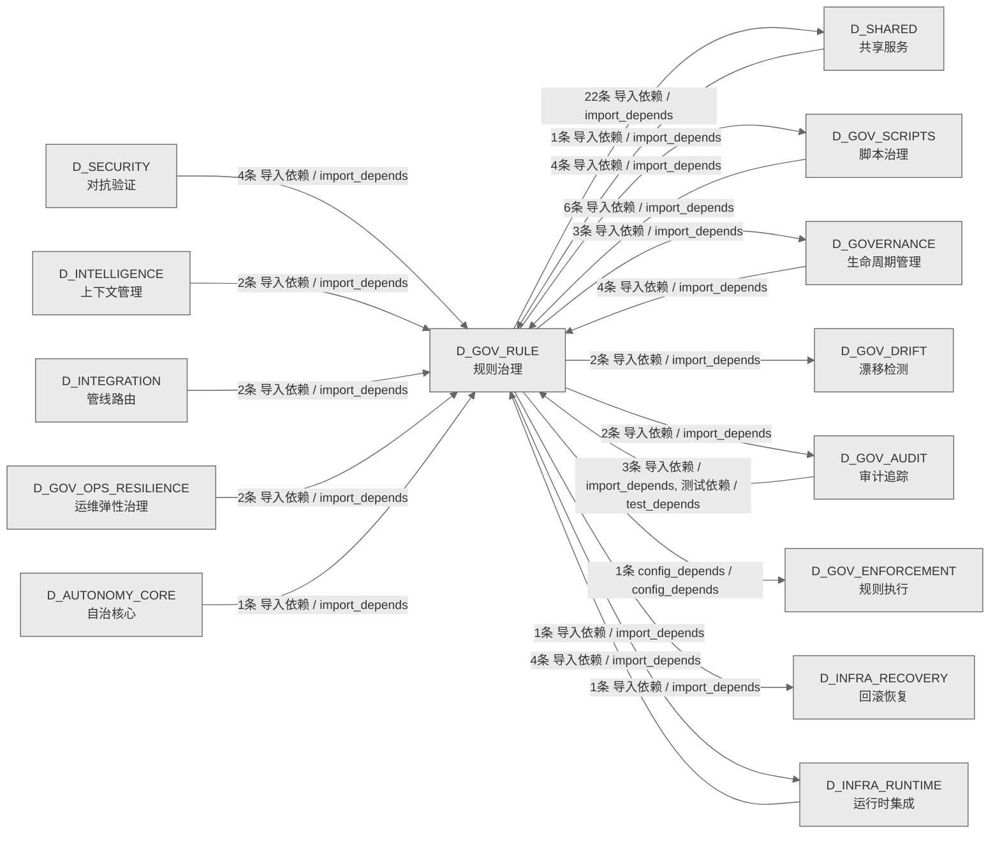

# 55_d_gov_rule / 规则治理域 / Rule Governance

> **功能简介 / Overview**: 规则治理，负责规则注册、规则版本和规则依赖管理

> **文档作用 / Purpose**: 展示 规则治理（D_GOV_RULE）功能域的域内依赖关系、跨域依赖关系，模块信息（成熟度/中英文名/大白话/文件路径）内嵌于 Mermaid 节点，供架构审查和域治理参考。

> 本文档由 generate_domain_doc.py 从 depgraph (PostgreSQL) 自动生成
> 数据源: depgraph (PostgreSQL) nodes表 + edges表

> **[可缩放 HTML 版 / Zoomable HTML](http://localhost:8765/docs/02_enterprise_architecture/02_domain_architecture_docs/55_d_gov_rule.html)** — Ctrl+滚轮缩放 ｜ 双击重置 ｜ Ctrl+Shift+D 切换拖动/选择模式

## 域基本信息 / Domain Overview

| 字段 | 值 | Field | Value |
|------|------|-------|-------|
| 编号 | 55 | Number | 55 |
| 域ID | D_GOV_RULE | Domain ID | D_GOV_RULE |
| 域名称 | 规则治理 | Domain Name | Rule Governance |
| 层级 | L2 业务域层 | Layer | L2 Domain |
| 模块数 | 35 | Module Count | 35 |
| 域内依赖 | 12 | Internal Dependencies | 12 |
| 跨域入边 | 29 | Cross-domain Incoming | 29 |
| 跨域出边 | 36 | Cross-domain Outgoing | 36 |
| 设计态模块 | 0 | Design Modules | 0 |
| 生产态模块 | 35 | Production Modules | 35 |
| 容量 | 35/150 (正常) | Capacity | 35/150 (正常) |
| 描述 | 规则配置管理 | Description | 规则配置管理 |

## 域内依赖图 / Internal Dependency Diagram

> 依赖图内嵌在本文档中，IDE 可直接渲染；网页版可 Ctrl+滚轮缩放 + 拖动平移查看细节。含三个视图：全景图（颜色区分运营态/设计态）+ 运营态子图 + 设计态子图；全景图不分页。
>
> **图例说明 / Legend**：
> - 🟦 **蓝色 = 运营态模块**（production，已上线运行）
> - 🟧 **橙色虚线 = 设计态模块**（design，蓝图阶段，代码未写）
> - **实线箭头 = 运营态依赖**（已生效的依赖关系）
> - **虚线箭头 = 非运营态依赖**（计划中/验证中的依赖关系）

### 全景依赖图（全部模块，颜色区分运营态/设计态）

> 展示全部 35 个模块（生产态 35 + 设计态 0），节点含成熟度+中英文名+大白话+文件路径。

```mermaid
%%{init: {'theme': 'base', 'themeVariables': {'primaryColor': '#eaeaea', 'primaryTextColor': '#333333', 'primaryBorderColor': '#666666', 'lineColor': '#666666', 'secondaryColor': '#eaeaea', 'tertiaryColor': '#eaeaea', 'fontSize': '14px'}}}%%
flowchart TD
    scripts_governance_generators_generate_script_manifest_py["(生产态 / production) 脚本清单自动生成器 / Script Manifest Generator<br/>把每个脚本自己填的信息卡片收集起来，做成一张总清单。老方法太死板，遇到特殊格式就漏抓导致清单不准，现在多种方式兜底确保不漏。<br/>文件: generators/generate_script_manifest.py"]
    src_zephyr_gov_enforcement_rule_enforcement_adaptive_threshold_py["(生产态 / production) 自适应阈值 / Adaptive Threshold<br/>给告警算什么程度该报警的红线。两种算法：一种看成功率自动调，一种看最近一周的平均值定线。设了最低底线，防止红线越降越低、把问题掩盖掉。<br/>文件: rule_enforcement/adaptive_threshold.py"]
    src_zephyr_gov_enforcement_rule_enforcement_adversarial_strategies_py["(生产态 / production) 对抗样本生成器 / Adversarial Strategies<br/>生成 5 种假想敌攻击套路，专门用来刁难系统，测门禁挡不挡得住。上线前自己先攻击一遍，比等真出事再发现强。<br/>文件: rule_enforcement/adversarial_strategies.py"]
    src_zephyr_gov_enforcement_rule_enforcement_ai_capability_guard_py["(生产态 / production) AI 能力边界守卫 / AI Capability Guard<br/>给函数贴需要什么权限的标签，检查 AI 有没有越权干没授权的事。只负责标记不拦，让后续检查环节去抓违规。<br/>文件: rule_enforcement/ai_capability_guard.py"]
    src_zephyr_gov_enforcement_rule_enforcement_anti_pattern_guard_py["(生产态 / production) 反模式防护引擎 / Anti-Pattern Guard<br/>把蓝图里列的 8 条 AI 集成禁止行为做成自动检查，挂进门禁流程。防止 AI 集成时踩常见的坑，比如绕过门禁、擅自越权。<br/>文件: rule_enforcement/anti_pattern_guard.py"]
    src_zephyr_gov_enforcement_rule_enforcement_can_i_deploy_py["(生产态 / production) 预部署门禁 / Can-I-Deploy<br/>部署前问一句现在能部署吗。检查四样：别人对我的期望满足没、版本兼容不、契约一致不、服务健康不。避免一部署就出事。<br/>文件: rule_enforcement/can_i_deploy.py"]
    src_zephyr_gov_enforcement_rule_enforcement_capability_checker_py["(生产态 / production) 能力检查器 / Capability Checker<br/>运行时核对模块有没有真的声明所需权限，再校验权限表没被偷偷改过。确保声明的能力和实际用的对得上，防止钻空子。<br/>文件: rule_enforcement/capability_checker.py"]
    src_zephyr_gov_enforcement_rule_enforcement_cdc_broker_py["(生产态 / production) CDC 契约经纪人 / CDC Broker<br/>管消费者驱动契约的本地中介：消费方声明期望提供方给什么，提供方改了代码就自动验证有没有破坏消费方。不依赖外部服务，本地就能跑。<br/>文件: rule_enforcement/cdc_broker.py"]
    src_zephyr_gov_enforcement_rule_enforcement_contract_template_manager_py["(生产态 / production) 契约模板管理器 / Contract Template Manager<br/>管理工具契约模板：注册新模板、按名字查模板、校验调用对不对、存成文件。让每个工具有统一的接口说明书，调用前能核对参数。<br/>文件: rule_enforcement/contract_template_manager.py"]
    src_zephyr_gov_enforcement_rule_enforcement_end_to_end_walkthrough_py["(生产态 / production) 端到端走查验证器 / End-to-End Walkthrough<br/>按预设场景把系统从头到尾走一遍，验证关键链路通不通、各环节衔接对不对。专门找单个测试发现不了的衔接问题。<br/>文件: rule_enforcement/end_to_end_walkthrough.py"]
    src_zephyr_gov_enforcement_rule_enforcement_gate_engine_init_py["(生产态 / production) 门禁引擎模块集 / Gate Engine Package<br/>门禁引擎的文件夹入口，把门禁相关的几个模块归到一起。本身不含逻辑，只是给它们一个稳定归属。<br/>文件: gate_engine/__init__.py"]
    src_zephyr_gov_enforcement_rule_enforcement_gate_engine_adversarial_validation_py["(生产态 / production) 对抗验证门禁 / Adversarial Validation<br/>专门验证输出抗攻击的门禁。拿假想敌样本去冲击系统输出，看结果有没有被恶意输入带偏。不仅查输入合规，也查输出没被污染。<br/>文件: gate_engine/adversarial_validation.py"]
    src_zephyr_gov_enforcement_rule_enforcement_gate_engine_gate_override_py["(生产态 / production) 门禁紧急旁路 / Gate Override<br/>给负责人的紧急通道：特殊情况可临时绕过某道门禁，但严格限时、全程留痕。既允许紧急放行，又保证每次绕过可追溯、不能乱用。<br/>文件: gate_engine/gate_override.py"]
    src_zephyr_gov_enforcement_rule_enforcement_gate_engine_gate_simulator_py["(生产态 / production) 门禁模拟器 / Gate Simulator<br/>门禁的演习工具。把全链路门禁空跑一遍，但不改任何状态不写库。让开发者提前看门禁会怎么判，避免真跑时才出问题。<br/>文件: gate_engine/gate_simulator.py"]
    src_zephyr_gov_enforcement_rule_enforcement_integration_test_runner_py["(生产态 / production) 集成测试运行器 / Integration Test Runner<br/>跑跨模块集成测试的引擎，加载契约、执行断言、对接门禁。分四级：最关键的冒烟、全量核心、契约校验、健康探针，不同场景跑不同级别。<br/>文件: rule_enforcement/integration_test_runner.py"]
    src_zephyr_gov_enforcement_rule_enforcement_invariants_en_process_lifecycle_gateway_py["(生产态 / production) 进程生命周期网关 / Process Lifecycle Gateway<br/>扫描代码里直接起进程的地方——这些绕过了统一管理入口，有失控风险。强制所有起进程都走同一个网关，便于治理。<br/>文件: invariants/en_process_lifecycle_gateway.py"]
    src_zephyr_gov_enforcement_rule_enforcement_kiss_enforcer_py["(生产态 / production) KISS 约束执行器 / KISS Enforcer<br/>守保持简单原则的检查器。检测 AI 写的代码有没有过度复杂、堆冗余。防止 AI 为了看起来完整而过度设计。<br/>文件: rule_enforcement/kiss_enforcer.py"]
    src_zephyr_gov_enforcement_rule_enforcement_rule_engine_init_py["(生产态 / production) 规则引擎模块集 / Rule Engine Package<br/>规则引擎的文件夹入口，把规则相关的模块归到一起。本身不含逻辑，只是给它们一个稳定归属。<br/>文件: rule_engine/__init__.py"]
    src_zephyr_gov_enforcement_rule_enforcement_rule_engine_rule_engine_py["(生产态 / production) 规则加载器 / Rule Loader<br/>按需加载规则的核心接口。先查索引找规则文件，读出来用；找不到再扫目录。让规则按需加载、有索引可循，不每次全量扫。<br/>文件: rule_engine/rule_engine.py"]
    src_zephyr_gov_enforcement_rule_enforcement_secrets_guard_py["(生产态 / production) Secrets 守护 / Secrets Guard<br/>守护密钥安全的三件套：检查配置合不合规、扫历史提交有没有漏密钥、给日志脱敏。防当下写错、历史遗留、日志泄密三类风险。<br/>文件: rule_enforcement/secrets_guard.py"]
    src_zephyr_gov_enforcement_rule_enforcement_task_completion_gate_py["(生产态 / production) 任务完成门禁 / Task Completion Gate<br/>任务收尾门禁。扫任务范围之外有没有残留的临时文件、备份、缓存，验证任务真做干净了。防止做一半留堆垃圾就算交付。<br/>文件: rule_enforcement/task_completion_gate.py"]
    src_zephyr_gov_enforcement_rule_enforcement_triple_alignment_py["(生产态 / production) 三方对齐门禁 / Triple Alignment<br/>守三方对齐的门禁：检查蓝图、代码、依赖图三样对不对得上。防止蓝图写了没做、依赖图登记了但代码没有这类脱节。<br/>文件: rule_enforcement/triple_alignment.py"]
    src_zephyr_gov_rule_init_py["(生产态 / production) 规则治理域包 / Gov Rule Package<br/>规则治理域的文件夹入口，标记这个域的边界。本身不含逻辑，给域内模块一个归属。<br/>文件: gov_rule/__init__.py"]
    src_zephyr_gov_rule_constitutional_update_constitutional_update_py["(生产态 / production) 宪法自愈 / Constitutional Update<br/>让项目宪法自我进化。从历史错误里提取经验，提议更新，经人审查后再安全写入。解决宪法是静态的、AI 犯错学不到的问题。<br/>文件: constitutional_update/constitutional_update.py"]
    scripts_governance_generators_generate_script_manifest_py ~~~ src_zephyr_gov_enforcement_rule_enforcement_adaptive_threshold_py
    src_zephyr_gov_enforcement_rule_enforcement_adaptive_threshold_py ~~~ src_zephyr_gov_enforcement_rule_enforcement_adversarial_strategies_py
    src_zephyr_gov_enforcement_rule_enforcement_adversarial_strategies_py ~~~ src_zephyr_gov_enforcement_rule_enforcement_ai_capability_guard_py
    src_zephyr_gov_enforcement_rule_enforcement_ai_capability_guard_py ~~~ src_zephyr_gov_enforcement_rule_enforcement_anti_pattern_guard_py
    src_zephyr_gov_enforcement_rule_enforcement_anti_pattern_guard_py ~~~ src_zephyr_gov_enforcement_rule_enforcement_can_i_deploy_py
    src_zephyr_gov_enforcement_rule_enforcement_can_i_deploy_py ~~~ src_zephyr_gov_enforcement_rule_enforcement_capability_checker_py
    src_zephyr_gov_enforcement_rule_enforcement_capability_checker_py ~~~ src_zephyr_gov_enforcement_rule_enforcement_cdc_broker_py
    src_zephyr_gov_enforcement_rule_enforcement_cdc_broker_py ~~~ src_zephyr_gov_enforcement_rule_enforcement_contract_template_manager_py
    src_zephyr_gov_enforcement_rule_enforcement_contract_template_manager_py ~~~ src_zephyr_gov_enforcement_rule_enforcement_end_to_end_walkthrough_py
    src_zephyr_gov_enforcement_rule_enforcement_end_to_end_walkthrough_py ~~~ src_zephyr_gov_enforcement_rule_enforcement_gate_engine_init_py
    src_zephyr_gov_enforcement_rule_enforcement_gate_engine_init_py ~~~ src_zephyr_gov_enforcement_rule_enforcement_gate_engine_adversarial_validation_py
    src_zephyr_gov_enforcement_rule_enforcement_gate_engine_adversarial_validation_py ~~~ src_zephyr_gov_enforcement_rule_enforcement_gate_engine_gate_override_py
    src_zephyr_gov_enforcement_rule_enforcement_gate_engine_gate_override_py ~~~ src_zephyr_gov_enforcement_rule_enforcement_gate_engine_gate_simulator_py
    src_zephyr_gov_enforcement_rule_enforcement_gate_engine_gate_simulator_py ~~~ src_zephyr_gov_enforcement_rule_enforcement_integration_test_runner_py
    src_zephyr_gov_enforcement_rule_enforcement_integration_test_runner_py ~~~ src_zephyr_gov_enforcement_rule_enforcement_invariants_en_process_lifecycle_gateway_py
    src_zephyr_gov_enforcement_rule_enforcement_invariants_en_process_lifecycle_gateway_py ~~~ src_zephyr_gov_enforcement_rule_enforcement_kiss_enforcer_py
    src_zephyr_gov_enforcement_rule_enforcement_kiss_enforcer_py ~~~ src_zephyr_gov_enforcement_rule_enforcement_rule_engine_init_py
    src_zephyr_gov_enforcement_rule_enforcement_rule_engine_init_py ~~~ src_zephyr_gov_enforcement_rule_enforcement_rule_engine_rule_engine_py
    src_zephyr_gov_enforcement_rule_enforcement_rule_engine_rule_engine_py ~~~ src_zephyr_gov_enforcement_rule_enforcement_secrets_guard_py
    src_zephyr_gov_enforcement_rule_enforcement_secrets_guard_py ~~~ src_zephyr_gov_enforcement_rule_enforcement_task_completion_gate_py
    src_zephyr_gov_enforcement_rule_enforcement_task_completion_gate_py ~~~ src_zephyr_gov_enforcement_rule_enforcement_triple_alignment_py
    src_zephyr_gov_enforcement_rule_enforcement_triple_alignment_py ~~~ src_zephyr_gov_rule_init_py
    src_zephyr_gov_rule_init_py ~~~ src_zephyr_gov_rule_constitutional_update_constitutional_update_py
    src_zephyr_gov_enforcement_rule_enforcement_cbac_matrix_py["(生产态 / production) CBAC 能力矩阵 / CBAC Matrix<br/>一张谁能干什么的授权表，按能力而非角色控权——有什么能力才能干什么。是权限判断的统一依据，别的模块都查它。<br/>文件: rule_enforcement/cbac_matrix.py"]
    src_zephyr_gov_enforcement_rule_enforcement_gate_engine_gate_engine_py["(生产态 / production) 门禁裁决引擎 / Gate Engine<br/>门禁系统的裁判。从配置加载门禁规则，执行检查，判通过还是失败，结果记进库。覆盖知识库、任务编排、交易三类门禁。<br/>文件: gate_engine/gate_engine.py"]
    src_zephyr_gov_enforcement_rule_enforcement_gate_engine_gate_pipeline_py["(生产态 / production) 门禁评估管线 / Gate Pipeline<br/>把多道门禁编排成一条流水线：定先后顺序、支持与或非组合、可并行跑。让跑哪些门禁怎么组合可配置，不写死在代码里。<br/>文件: gate_engine/gate_pipeline.py"]
    src_zephyr_gov_enforcement_rule_enforcement_cbac_matrix_py ~~~ src_zephyr_gov_enforcement_rule_enforcement_gate_engine_gate_engine_py
    src_zephyr_gov_enforcement_rule_enforcement_gate_engine_gate_engine_py ~~~ src_zephyr_gov_enforcement_rule_enforcement_gate_engine_gate_pipeline_py
    src_zephyr_gov_enforcement_rule_enforcement_circuit_breaker_py["(生产态 / production) 单向熔断器 / Circuit Breaker<br/>模块间调用的保险丝。被调模块连续失败就跳闸，后续调用直接拒绝不再打它，防止故障扩散。跳闸后要人工手动恢复。<br/>文件: rule_enforcement/circuit_breaker.py"]
    src_zephyr_gov_enforcement_rule_enforcement_gate_engine_gate_context_py["(生产态 / production) 门禁上下文传播 / Gate Context<br/>把门禁运行需要的上下文打包好，跨模块传递，让不同环节的门禁检查共享同一份信息。顺带统一了结果格式，避免各写各的对不上。<br/>文件: gate_engine/gate_context.py"]
    src_zephyr_gov_enforcement_rule_enforcement_gate_types_py["(生产态 / production) 门禁类型定义 / Gate Types<br/>定义门禁系统的数据格式标准（类型、上下文、结果结构），供引擎、流水线、模拟器共用。相当于门禁模块的数据字典，避免各处格式不统一。<br/>文件: rule_enforcement/gate_types.py"]
    src_zephyr_gov_enforcement_rule_enforcement_invariants_en_001_circular_dependency_py["(生产态 / production) 循环依赖扫描器 / Circular Dependency Scanner<br/>扫描所有模块的依赖关系，揪出我依赖你、你又依赖我的死循环。这种循环会导致加载失败或卡死，越早发现越好。<br/>文件: invariants/en_001_circular_dependency.py"]
    src_zephyr_gov_enforcement_rule_enforcement_invariants_en_003_contract_compatibility_py["(生产态 / production) 契约兼容性检查器 / Contract Compatibility Checker<br/>逐字段比对契约文档写的和代码实际写的：字段有没有、类型对不对、必填一致不。专查文档和代码对不上的漂移。<br/>文件: invariants/en_003_contract_compatibility.py"]
    src_zephyr_gov_enforcement_rule_enforcement_invariants_zero_residue_check_py["(生产态 / production) 零残留检查器 / Zero Residue Check<br/>清理操作做完后扫一遍，确认没留下临时文件、空目录、悬空引用。保证清理干净，不留垃圾。<br/>文件: invariants/zero_residue_check.py"]
    src_zephyr_gov_enforcement_rule_enforcement_risk_ssot_py["(生产态 / production) 风险真源加载器 / Risk SSoT<br/>从配置文件加载风险参数（如各种限额），供交易门禁校验参数对不对。把风险红线收口到一个地方，避免各处自己写、互相打架。<br/>文件: rule_enforcement/risk_ssot.py"]
    src_zephyr_gov_enforcement_rule_enforcement_task_types_py["(生产态 / production) 任务类型定义 / Task Types<br/>定义任务卡的数据结构（状态、优先级等），是任务字段的统一标准，和数据库表对齐。避免各处对任务字段理解不一致。<br/>文件: rule_enforcement/task_types.py"]
    src_zephyr_gov_enforcement_rule_enforcement_circuit_breaker_py ~~~ src_zephyr_gov_enforcement_rule_enforcement_gate_engine_gate_context_py
    src_zephyr_gov_enforcement_rule_enforcement_gate_engine_gate_context_py ~~~ src_zephyr_gov_enforcement_rule_enforcement_gate_types_py
    src_zephyr_gov_enforcement_rule_enforcement_gate_types_py ~~~ src_zephyr_gov_enforcement_rule_enforcement_invariants_en_001_circular_dependency_py
    src_zephyr_gov_enforcement_rule_enforcement_invariants_en_001_circular_dependency_py ~~~ src_zephyr_gov_enforcement_rule_enforcement_invariants_en_003_contract_compatibility_py
    src_zephyr_gov_enforcement_rule_enforcement_invariants_en_003_contract_compatibility_py ~~~ src_zephyr_gov_enforcement_rule_enforcement_invariants_zero_residue_check_py
    src_zephyr_gov_enforcement_rule_enforcement_invariants_zero_residue_check_py ~~~ src_zephyr_gov_enforcement_rule_enforcement_risk_ssot_py
    src_zephyr_gov_enforcement_rule_enforcement_risk_ssot_py ~~~ src_zephyr_gov_enforcement_rule_enforcement_task_types_py
    src_zephyr_gov_enforcement_rule_enforcement_capability_checker_py -->|导入依赖 / import_depends| src_zephyr_gov_enforcement_rule_enforcement_cbac_matrix_py
    src_zephyr_gov_enforcement_rule_enforcement_gate_engine_gate_engine_py -->|导入依赖 / import_depends| src_zephyr_gov_enforcement_rule_enforcement_circuit_breaker_py
    src_zephyr_gov_enforcement_rule_enforcement_gate_engine_gate_engine_py -->|导入依赖 / import_depends| src_zephyr_gov_enforcement_rule_enforcement_gate_types_py
    src_zephyr_gov_enforcement_rule_enforcement_gate_engine_gate_engine_py -->|导入依赖 / import_depends| src_zephyr_gov_enforcement_rule_enforcement_risk_ssot_py
    src_zephyr_gov_enforcement_rule_enforcement_gate_engine_gate_engine_py -->|导入依赖 / import_depends| src_zephyr_gov_enforcement_rule_enforcement_task_types_py
    src_zephyr_gov_enforcement_rule_enforcement_gate_engine_gate_engine_py -->|导入依赖 / import_depends| src_zephyr_gov_enforcement_rule_enforcement_invariants_en_001_circular_dependency_py
    src_zephyr_gov_enforcement_rule_enforcement_gate_engine_gate_engine_py -->|导入依赖 / import_depends| src_zephyr_gov_enforcement_rule_enforcement_invariants_en_003_contract_compatibility_py
    src_zephyr_gov_enforcement_rule_enforcement_gate_engine_gate_engine_py -->|导入依赖 / import_depends| src_zephyr_gov_enforcement_rule_enforcement_invariants_zero_residue_check_py
    src_zephyr_gov_enforcement_rule_enforcement_gate_engine_gate_pipeline_py -->|导入依赖 / import_depends| src_zephyr_gov_enforcement_rule_enforcement_gate_engine_gate_context_py
    src_zephyr_gov_enforcement_rule_enforcement_gate_engine_gate_simulator_py -->|导入依赖 / import_depends| src_zephyr_gov_enforcement_rule_enforcement_gate_engine_gate_context_py
    src_zephyr_gov_enforcement_rule_enforcement_gate_engine_gate_simulator_py -->|导入依赖 / import_depends| src_zephyr_gov_enforcement_rule_enforcement_gate_engine_gate_pipeline_py
    src_zephyr_gov_enforcement_rule_enforcement_gate_engine_init_py -->|config_depends / config_depends| src_zephyr_gov_enforcement_rule_enforcement_gate_engine_gate_engine_py
    D_INFRA_RECOVERY["(生产态 / production) 回滚恢复 / Rollback Recovery<br/>回滚恢复，负责系统故障时的状态回滚、事务补偿和恢复编排<br/>跨域节点 / cross-domain"]
    src_zephyr_gov_enforcement_rule_enforcement_gate_engine_gate_engine_py -->|导入依赖 / import_depends| D_INFRA_RECOVERY
    D_SHARED["(生产态 / production) 共享服务 / Shared Services<br/>共享服务，负责跨域共享的工具、协议和基础服务<br/>跨域节点 / cross-domain"]
    src_zephyr_gov_enforcement_rule_enforcement_gate_types_py -->|导入依赖 / import_depends| D_SHARED
    src_zephyr_gov_enforcement_rule_enforcement_ai_capability_guard_py -->|导入依赖 / import_depends| D_SHARED
    src_zephyr_gov_enforcement_rule_enforcement_circuit_breaker_py -->|导入依赖 / import_depends| D_SHARED
    src_zephyr_gov_rule_constitutional_update_constitutional_update_py -->|导入依赖 / import_depends| D_SHARED
    D_GOVERNANCE["(生产态 / production) 生命周期管理 / Lifecycle Management<br/>生命周期管理，负责蓝图/模块/任务的声明周期管理和元数据治理<br/>跨域节点 / cross-domain"]
    src_zephyr_gov_enforcement_rule_enforcement_triple_alignment_py -->|导入依赖 / import_depends| D_GOVERNANCE
    src_zephyr_gov_enforcement_rule_enforcement_contract_template_manager_py -->|导入依赖 / import_depends| D_SHARED
    src_zephyr_gov_enforcement_rule_enforcement_triple_alignment_py -->|导入依赖 / import_depends| D_SHARED
    src_zephyr_gov_enforcement_rule_enforcement_rule_engine_rule_engine_py -->|导入依赖 / import_depends| D_GOVERNANCE
    src_zephyr_gov_enforcement_rule_enforcement_invariants_en_001_circular_dependency_py -->|导入依赖 / import_depends| D_SHARED
    src_zephyr_gov_enforcement_rule_enforcement_invariants_en_process_lifecycle_gateway_py -->|导入依赖 / import_depends| D_SHARED
    src_zephyr_gov_enforcement_rule_enforcement_invariants_zero_residue_check_py -->|导入依赖 / import_depends| D_SHARED
    src_zephyr_gov_enforcement_rule_enforcement_task_types_py -->|导入依赖 / import_depends| D_SHARED
    src_zephyr_gov_enforcement_rule_enforcement_invariants_en_003_contract_compatibility_py -->|导入依赖 / import_depends| D_SHARED
    D_GOV_ENFORCEMENT["(生产态 / production) 规则执行 / Rule Enforcement<br/>规则执行，负责治理规则执行和门禁拦截<br/>跨域节点 / cross-domain"]
    src_zephyr_gov_enforcement_rule_enforcement_rule_engine_init_py -->|config_depends / config_depends| D_GOV_ENFORCEMENT
    D_GOV_AUDIT["(生产态 / production) 审计追踪 / Audit Trail<br/>审计追踪，负责变更审计追踪和操作日志管理<br/>跨域节点 / cross-domain"]
    D_GOV_AUDIT -->|导入依赖 / import_depends| src_zephyr_gov_enforcement_rule_enforcement_adaptive_threshold_py
    D_GOVERNANCE -->|导入依赖 / import_depends| src_zephyr_gov_enforcement_rule_enforcement_gate_engine_gate_engine_py
    D_INFRA_RUNTIME["(生产态 / production) 运行时集成 / Runtime Integration<br/>运行时集成，负责组件生命周期编排、启动钩子和运行时上下文管理<br/>跨域节点 / cross-domain"]
    D_INFRA_RUNTIME -->|导入依赖 / import_depends| src_zephyr_gov_enforcement_rule_enforcement_triple_alignment_py
    D_GOV_SCRIPTS["(生产态 / production) 脚本治理 / Script Governance<br/>脚本治理，负责脚本生命周期管理和脚本质量门禁<br/>跨域节点 / cross-domain"]
    D_GOV_SCRIPTS -->|导入依赖 / import_depends| src_zephyr_gov_enforcement_rule_enforcement_circuit_breaker_py
    D_GOVERNANCE -->|导入依赖 / import_depends| src_zephyr_gov_enforcement_rule_enforcement_gate_types_py
    D_GOV_OPS_RESILIENCE["(生产态 / production) 运维弹性治理 / Ops Resilience Governance<br/>运维弹性治理，负责运维治理、安全治理、弹性治理和升级协议<br/>跨域节点 / cross-domain"]
    D_GOV_OPS_RESILIENCE -->|导入依赖 / import_depends| src_zephyr_gov_enforcement_rule_enforcement_gate_types_py
    D_GOV_AUDIT -->|导入依赖 / import_depends| src_zephyr_gov_enforcement_rule_enforcement_gate_engine_gate_context_py
    D_GOV_SCRIPTS -->|导入依赖 / import_depends| src_zephyr_gov_enforcement_rule_enforcement_circuit_breaker_py
    D_GOVERNANCE -->|导入依赖 / import_depends| src_zephyr_gov_enforcement_rule_enforcement_task_types_py
    D_GOV_SCRIPTS -->|导入依赖 / import_depends| src_zephyr_gov_enforcement_rule_enforcement_gate_engine_gate_engine_py
    D_INTELLIGENCE["(生产态 / production) 上下文管理 / Context Management<br/>上下文管理，负责 AI 上下文窗口管理、记忆检索和上下文压缩<br/>跨域节点 / cross-domain"]
    D_INTELLIGENCE -->|导入依赖 / import_depends| src_zephyr_gov_enforcement_rule_enforcement_gate_types_py
    D_SECURITY["(生产态 / production) 对抗验证 / Adversarial Validation<br/>对抗验证，负责系统安全对抗测试、漏洞扫描和攻防验证<br/>跨域节点 / cross-domain"]
    D_SECURITY -->|导入依赖 / import_depends| src_zephyr_gov_enforcement_rule_enforcement_gate_engine_gate_engine_py
    D_GOV_SCRIPTS -->|导入依赖 / import_depends| src_zephyr_gov_enforcement_rule_enforcement_task_types_py
    D_INFRA_RUNTIME -->|导入依赖 / import_depends| src_zephyr_gov_enforcement_rule_enforcement_task_types_py
    D_INTELLIGENCE -->|导入依赖 / import_depends| src_zephyr_gov_enforcement_rule_enforcement_gate_engine_gate_engine_py
    classDef production fill:#e1f5fe,stroke:#01579b,stroke-width:2px,color:#000
    classDef design fill:#fff3e0,stroke:#e65100,stroke-width:2px,color:#000,stroke-dasharray: 5 5
    classDef external_prod fill:#e8f4fd,stroke:#0277bd,stroke-width:1px,color:#000
    classDef external_design fill:#fff8e7,stroke:#ef6c00,stroke-width:1px,color:#000,stroke-dasharray: 5 5
    class scripts_governance_generators_generate_script_manifest_py,src_zephyr_gov_enforcement_rule_enforcement_adaptive_threshold_py,src_zephyr_gov_enforcement_rule_enforcement_adversarial_strategies_py,src_zephyr_gov_enforcement_rule_enforcement_ai_capability_guard_py,src_zephyr_gov_enforcement_rule_enforcement_anti_pattern_guard_py,src_zephyr_gov_enforcement_rule_enforcement_can_i_deploy_py,src_zephyr_gov_enforcement_rule_enforcement_capability_checker_py,src_zephyr_gov_enforcement_rule_enforcement_cbac_matrix_py,src_zephyr_gov_enforcement_rule_enforcement_cdc_broker_py,src_zephyr_gov_enforcement_rule_enforcement_circuit_breaker_py,src_zephyr_gov_enforcement_rule_enforcement_contract_template_manager_py,src_zephyr_gov_enforcement_rule_enforcement_end_to_end_walkthrough_py,src_zephyr_gov_enforcement_rule_enforcement_gate_engine_init_py,src_zephyr_gov_enforcement_rule_enforcement_gate_engine_adversarial_validation_py,src_zephyr_gov_enforcement_rule_enforcement_gate_engine_gate_context_py,src_zephyr_gov_enforcement_rule_enforcement_gate_engine_gate_engine_py,src_zephyr_gov_enforcement_rule_enforcement_gate_engine_gate_override_py,src_zephyr_gov_enforcement_rule_enforcement_gate_engine_gate_pipeline_py,src_zephyr_gov_enforcement_rule_enforcement_gate_engine_gate_simulator_py,src_zephyr_gov_enforcement_rule_enforcement_gate_types_py,src_zephyr_gov_enforcement_rule_enforcement_integration_test_runner_py,src_zephyr_gov_enforcement_rule_enforcement_invariants_en_001_circular_dependency_py,src_zephyr_gov_enforcement_rule_enforcement_invariants_en_003_contract_compatibility_py,src_zephyr_gov_enforcement_rule_enforcement_invariants_en_process_lifecycle_gateway_py,src_zephyr_gov_enforcement_rule_enforcement_invariants_zero_residue_check_py,src_zephyr_gov_enforcement_rule_enforcement_kiss_enforcer_py,src_zephyr_gov_enforcement_rule_enforcement_risk_ssot_py,src_zephyr_gov_enforcement_rule_enforcement_rule_engine_init_py,src_zephyr_gov_enforcement_rule_enforcement_rule_engine_rule_engine_py,src_zephyr_gov_enforcement_rule_enforcement_secrets_guard_py,src_zephyr_gov_enforcement_rule_enforcement_task_completion_gate_py,src_zephyr_gov_enforcement_rule_enforcement_task_types_py,src_zephyr_gov_enforcement_rule_enforcement_triple_alignment_py,src_zephyr_gov_rule_init_py,src_zephyr_gov_rule_constitutional_update_constitutional_update_py production
    class D_INFRA_RECOVERY,D_SHARED,D_GOVERNANCE,D_GOV_ENFORCEMENT,D_GOV_AUDIT,D_INFRA_RUNTIME,D_GOV_SCRIPTS,D_GOV_OPS_RESILIENCE,D_INTELLIGENCE,D_SECURITY external_prod
```

### 运营态子图（仅 design_maturity=production 的模块和依赖）

> 本域 35 个模块全部为运营态（production），上方全景图即运营态全貌，不再重复绘制。

### 设计态子图（仅 design_maturity=design 的模块和依赖）

> （无设计态模块 / No design modules）

## 跨域依赖 / Cross-domain Dependencies

### 本域依赖的其他域（出边）/ Depends On

| # | 本域模块 / Source Module | → | 外部域-目标模块 / Target Module | 依赖类型 / Type |
|:--:|---------|:--:|---------|---------|
| 1 | 规则加载器 / Rule Loader (rule_engine/rule_engine.py) | → | D_GOVERNANCE 生命周期管理: depgraph Schema DDL + 版本化迁移框架 (governance/depgraph... | 导入依赖 / import_depends |
| 2 | 规则加载器 / Rule Loader (rule_engine/rule_engine.py) | → | D_GOVERNANCE 生命周期管理: pg_wrapper.py — psycopg2 connection 的 sqlite3 兼容 exec... | 导入依赖 / import_depends |
| 3 | 三方对齐门禁 / Triple Alignment (rule_enforcement/triple_... | → | D_GOVERNANCE 生命周期管理: depgraph Schema DDL + 版本化迁移框架 (governance/depgraph... | 导入依赖 / import_depends |
| 4 | 能力检查器 / Capability Checker (rule_enforcement/capabil... | → | D_GOV_AUDIT 审计追踪: gov_audit/bridge.py | 导入依赖 / import_depends |
| 5 | 门禁紧急旁路 / Gate Override (gate_engine/gate_override.py) | → | D_GOV_AUDIT 审计追踪: gov_audit/bridge.py | 导入依赖 / import_depends |
| 6 | 门禁裁决引擎 / Gate Engine (gate_engine/gate_engine.py) | → | D_GOV_DRIFT 漂移检测: Drift Detector 基础设施 — drift_infrastructure.py (gov_d... | 导入依赖 / import_depends |
| 7 | 门禁裁决引擎 / Gate Engine (gate_engine/gate_engine.py) | → | D_GOV_DRIFT 漂移检测: EN-002 — Enforcement Mode Validator (invariants/en_002_e... | 导入依赖 / import_depends |
| 8 | 规则引擎模块集 / Rule Engine Package (rule_engine/__init_... | → | D_GOV_ENFORCEMENT 规则执行: Rule Canary Manager — v0.10.0 规则金丝雀: 1%用户先上新规... | config_depends / config_depends |
| 9 | 脚本清单自动生成器 / Script Manifest Generator (generator... | → | D_GOV_SCRIPTS 脚本治理: constants.py — 审计脚本共享常量 (_shared/constants.py) | 导入依赖 / import_depends |
| 10 | 脚本清单自动生成器 / Script Manifest Generator (generator... | → | D_GOV_SCRIPTS 脚本治理: encoding.py — UTF-8 编码安全工具 (_shared/encoding.py) | 导入依赖 / import_depends |
| 11 | 脚本清单自动生成器 / Script Manifest Generator (generator... | → | D_GOV_SCRIPTS 脚本治理: _shared/file_utils.py — 原子写入共享工具（ARCH-036 P1-1... | 导入依赖 / import_depends |
| 12 | 脚本清单自动生成器 / Script Manifest Generator (generator... | → | D_GOV_SCRIPTS 脚本治理: _shared/yaml_utils.py — YAML 文件加载共享工具 (_shared/y... | 导入依赖 / import_depends |
| 13 | 门禁裁决引擎 / Gate Engine (gate_engine/gate_engine.py) | → | D_INFRA_RECOVERY 回滚恢复: CT-RBK-GATE-001 集成契约落地——Rollback System Exit Code... | 导入依赖 / import_depends |
| 14 | 任务完成门禁 / Task Completion Gate (rule_enforcement/tas... | → | D_INFRA_RUNTIME 运行时集成: Task Lifecycle Manager — G0-G7 任务生命周期门禁。 (lifec... | 导入依赖 / import_depends |
| 15 | AI 能力边界守卫 / AI Capability Guard (rule_enforcement/a... | → | D_SHARED 共享服务: paths.py — 项目路径常量 SSoT（Single Source of Truth） (... | 导入依赖 / import_depends |
| 16 | 单向熔断器 / Circuit Breaker (rule_enforcement/circuit_br... | → | D_SHARED 共享服务: paths.py — 项目路径常量 SSoT（Single Source of Truth） (... | 导入依赖 / import_depends |
| 17 | 单向熔断器 / Circuit Breaker (rule_enforcement/circuit_br... | → | D_SHARED 共享服务: CBAC 能力检查器 (Capability-Based Access Control) (securi... | 导入依赖 / import_depends |
| 18 | 单向熔断器 / Circuit Breaker (rule_enforcement/circuit_br... | → | D_SHARED 共享服务: db_utils.py — SQLite 连接公共 API（SSoT: zephyr.governan... | 导入依赖 / import_depends |
| 19 | 契约模板管理器 / Contract Template Manager (rule_enforcem... | → | D_SHARED 共享服务: serialization.py —— 统一序列化/反序列化基础设施（Phase ... | 导入依赖 / import_depends |
| 20 | 契约模板管理器 / Contract Template Manager (rule_enforcem... | → | D_SHARED 共享服务: schema/schemas.py | 导入依赖 / import_depends |
| 21 | 门禁裁决引擎 / Gate Engine (gate_engine/gate_engine.py) | → | D_SHARED 共享服务: io_cache.py - File-level I/O cache with LRU eviction (io/... | 导入依赖 / import_depends |
| 22 | 门禁裁决引擎 / Gate Engine (gate_engine/gate_engine.py) | → | D_SHARED 共享服务: paths.py — 项目路径常量 SSoT（Single Source of Truth） (... | 导入依赖 / import_depends |
| 23 | 门禁裁决引擎 / Gate Engine (gate_engine/gate_engine.py) | → | D_SHARED 共享服务: db_utils.py — SQLite 连接公共 API（SSoT: zephyr.governan... | 导入依赖 / import_depends |
| 24 | 门禁类型定义 / Gate Types (rule_enforcement/gate_types.py) | → | D_SHARED 共享服务: schema/schemas.py | 导入依赖 / import_depends |
| 25 | 集成测试运行器 / Integration Test Runner (rule_enforcemen... | → | D_SHARED 共享服务: process_pool.py - Shared process pool for MCP servers and... | 导入依赖 / import_depends |
| 26 | 循环依赖扫描器 / Circular Dependency Scanner (invariants/... | → | D_SHARED 共享服务: paths.py — 项目路径常量 SSoT（Single Source of Truth） (... | 导入依赖 / import_depends |
| 27 | 契约兼容性检查器 / Contract Compatibility Checker (invari... | → | D_SHARED 共享服务: paths.py — 项目路径常量 SSoT（Single Source of Truth） (... | 导入依赖 / import_depends |
| 28 | 进程生命周期网关 / Process Lifecycle Gateway (invariants/... | → | D_SHARED 共享服务: paths.py — 项目路径常量 SSoT（Single Source of Truth） (... | 导入依赖 / import_depends |
| 29 | 零残留检查器 / Zero Residue Check (invariants/zero_residu... | → | D_SHARED 共享服务: process_pool.py - Shared process pool for MCP servers and... | 导入依赖 / import_depends |
| 30 | 零残留检查器 / Zero Residue Check (invariants/zero_residu... | → | D_SHARED 共享服务: paths.py — 项目路径常量 SSoT（Single Source of Truth） (... | 导入依赖 / import_depends |
| 31 | 任务类型定义 / Task Types (rule_enforcement/task_types.py) | → | D_SHARED 共享服务: schema/base_config.py | 导入依赖 / import_depends |
| 32 | 任务类型定义 / Task Types (rule_enforcement/task_types.py) | → | D_SHARED 共享服务: schema/execution_model.py | 导入依赖 / import_depends |
| 33 | 任务类型定义 / Task Types (rule_enforcement/task_types.py) | → | D_SHARED 共享服务: schema/severity_types.py | 导入依赖 / import_depends |
| 34 | 三方对齐门禁 / Triple Alignment (rule_enforcement/triple_... | → | D_SHARED 共享服务: paths.py — 项目路径常量 SSoT（Single Source of Truth） (... | 导入依赖 / import_depends |
| 35 | 宪法自愈 / Constitutional Update (constitutional_update/c... | → | D_SHARED 共享服务: file_utils.py —— 安全文件操作工具（Phase 3 新增 \| 盲点 ... | 导入依赖 / import_depends |
| 36 | 宪法自愈 / Constitutional Update (constitutional_update/c... | → | D_SHARED 共享服务: session_audit.py —— Session 审计轨迹（Phase 12 \| 盲点 B... | 导入依赖 / import_depends |

### 依赖本域的其他域（入边）/ Depended By

| # | 外部域-源模块 / Source Module | → | 本域模块 / Target Module | 依赖类型 / Type |
|:--:|---------|:--:|---------|---------|
| 1 | D_AUTONOMY_CORE 自治核心: skills/skill_executor.py | → | 门禁裁决引擎 / Gate Engine (gate_engine/gate_engine.py) | 导入依赖 / import_depends |
| 2 | D_GOVERNANCE 生命周期管理: transition — 状态机转换 Mixin（从 task_repo.py 拆分，SRC... | → | 门禁类型定义 / Gate Types (rule_enforcement/gate_types.py) | 导入依赖 / import_depends |
| 3 | D_GOVERNANCE 生命周期管理: transition — 状态机转换 Mixin（从 task_repo.py 拆分，SRC... | → | 任务类型定义 / Task Types (rule_enforcement/task_types.py) | 导入依赖 / import_depends |
| 4 | D_GOVERNANCE 生命周期管理: TaskRepository — 任务登记表 CRUD + 状态机（T-1-04） (per... | → | 门禁裁决引擎 / Gate Engine (gate_engine/gate_engine.py) | 导入依赖 / import_depends |
| 5 | D_GOVERNANCE 生命周期管理: TaskRepository — 任务登记表 CRUD + 状态机（T-1-04） (per... | → | 门禁类型定义 / Gate Types (rule_enforcement/gate_types.py) | 导入依赖 / import_depends |
| 6 | D_GOV_AUDIT 审计追踪: 审计链验证工具——独立重放门禁判定+Hash链完整性校验（beta... | → | 门禁上下文传播 / Gate Context (gate_engine/gate_context.py) | 导入依赖 / import_depends |
| 7 | D_GOV_AUDIT 审计追踪: commit_gateway_abuse_monitor_reconciler.py — commit gate... | → | 自适应阈值 / Adaptive Threshold (rule_enforcement/adaptiv... | 导入依赖 / import_depends |
| 8 | D_GOV_AUDIT 审计追踪: test_p3_integration_smoke.py — Phase 3 全链路集成 smoke ... | → | 自适应阈值 / Adaptive Threshold (rule_enforcement/adaptiv... | 测试依赖 / test_depends |
| 9 | D_GOV_OPS_RESILIENCE 运维弹性治理: G2 Triage 门禁 — 知识分类评分（T-2-13-B） (escalation/tr... | → | 门禁裁决引擎 / Gate Engine (gate_engine/gate_engine.py) | 导入依赖 / import_depends |
| 10 | D_GOV_OPS_RESILIENCE 运维弹性治理: G2 Triage 门禁 — 知识分类评分（T-2-13-B） (escalation/tr... | → | 门禁类型定义 / Gate Types (rule_enforcement/gate_types.py) | 导入依赖 / import_depends |
| 11 | D_GOV_SCRIPTS 脚本治理: CBG 熔断器重置 CLI (CircuitBreakerGateway Reset Command) ... | → | 单向熔断器 / Circuit Breaker (rule_enforcement/circuit_br... | 导入依赖 / import_depends |
| 12 | D_GOV_SCRIPTS 脚本治理: CBG 熔断器重置 CLI (CircuitBreakerGateway Reset Command) ... | → | 单向熔断器 / Circuit Breaker (rule_enforcement/circuit_br... | 导入依赖 / import_depends |
| 13 | D_GOV_SCRIPTS 脚本治理: create_task_from_finding.py — Finding → 任务卡自动创建... | → | 任务类型定义 / Task Types (rule_enforcement/task_types.py) | 导入依赖 / import_depends |
| 14 | D_GOV_SCRIPTS 脚本治理: Gate Engine Bootstrap Self-Check — Quis custodiet ipsos ... | → | 门禁裁决引擎 / Gate Engine (gate_engine/gate_engine.py) | 导入依赖 / import_depends |
| 15 | D_GOV_SCRIPTS 脚本治理: validate_gate_engine_external.py — Gate Engine 外部完整... | → | 单向熔断器 / Circuit Breaker (rule_enforcement/circuit_br... | 导入依赖 / import_depends |
| 16 | D_GOV_SCRIPTS 脚本治理: validate_gate_engine_external.py — Gate Engine 外部完整... | → | 门禁裁决引擎 / Gate Engine (gate_engine/gate_engine.py) | 导入依赖 / import_depends |
| 17 | D_INFRA_RUNTIME 运行时集成: Task Lifecycle Manager — G0-G7 任务生命周期门禁。 (lifec... | → | 任务类型定义 / Task Types (rule_enforcement/task_types.py) | 导入依赖 / import_depends |
| 18 | D_INFRA_RUNTIME 运行时集成: AutoRuntimeCore — 三层运行时运营中心（系统大脑） (tradin... | → | 三方对齐门禁 / Triple Alignment (rule_enforcement/triple_... | 导入依赖 / import_depends |
| 19 | D_INFRA_RUNTIME 运行时集成: trading/boot_hooks.py | → | 三方对齐门禁 / Triple Alignment (rule_enforcement/triple_... | 导入依赖 / import_depends |
| 20 | D_INFRA_RUNTIME 运行时集成: trading/work_orchestrator.py | → | 任务类型定义 / Task Types (rule_enforcement/task_types.py) | 导入依赖 / import_depends |
| 21 | D_INTEGRATION 管线路由: ZephyrAlpha MCP Task Manager Server (mcp/task_manager_ser... | → | 任务类型定义 / Task Types (rule_enforcement/task_types.py) | 导入依赖 / import_depends |
| 22 | D_INTEGRATION 管线路由: Structural Protocol interfaces for cross-module contracts... | → | 门禁类型定义 / Gate Types (rule_enforcement/gate_types.py) | 导入依赖 / import_depends |
| 23 | D_INTELLIGENCE 上下文管理: G4 Activate 门禁 — 人工激活（T-2-13-D） (model_evaluatio... | → | 门禁裁决引擎 / Gate Engine (gate_engine/gate_engine.py) | 导入依赖 / import_depends |
| 24 | D_INTELLIGENCE 上下文管理: G4 Activate 门禁 — 人工激活（T-2-13-D） (model_evaluatio... | → | 门禁类型定义 / Gate Types (rule_enforcement/gate_types.py) | 导入依赖 / import_depends |
| 25 | D_SECURITY 对抗验证: orphan_judge/judge.py | → | 门禁类型定义 / Gate Types (rule_enforcement/gate_types.py) | 导入依赖 / import_depends |
| 26 | D_SECURITY 对抗验证: adversarial_validation/constitution_guard.py | → | 门禁裁决引擎 / Gate Engine (gate_engine/gate_engine.py) | 导入依赖 / import_depends |
| 27 | D_SECURITY 对抗验证: adversarial_validation/defense_runner.py | → | 门禁裁决引擎 / Gate Engine (gate_engine/gate_engine.py) | 导入依赖 / import_depends |
| 28 | D_SECURITY 对抗验证: adversarial_validation/defense_runner.py | → | 任务类型定义 / Task Types (rule_enforcement/task_types.py) | 导入依赖 / import_depends |
| 29 | D_SHARED 共享服务: A2A Coordination — shared interface definitions for mult... | → | 任务类型定义 / Task Types (rule_enforcement/task_types.py) | 导入依赖 / import_depends |

### 跨域依赖图 / Cross-domain Dependency Diagram

> 本域与 13 个外部域直接连接（出边 36 条 + 入边 29 条 = 65 条）。只显示直接连接的域，不展开具体节点。



## 说明 / Notes

- **数据源 / Data Source**: `depgraph (PostgreSQL)` 的 `nodes`、`edges`、`domains` 表
- **生成器 / Generator**: `generate_domain_doc.py`（G2+G10 合并）
- **维护方式 / Maintenance**: 自动生成，全景图更新时刷新
- **文件名规则 / File Naming**: `{编号:02d}_{域ID小写}.md`，如 `16_d_trading.md`
- **图例说明 / Legend**: `[production]`=已上线 / `[design]`=设计中 / `[unknown]`=未知
