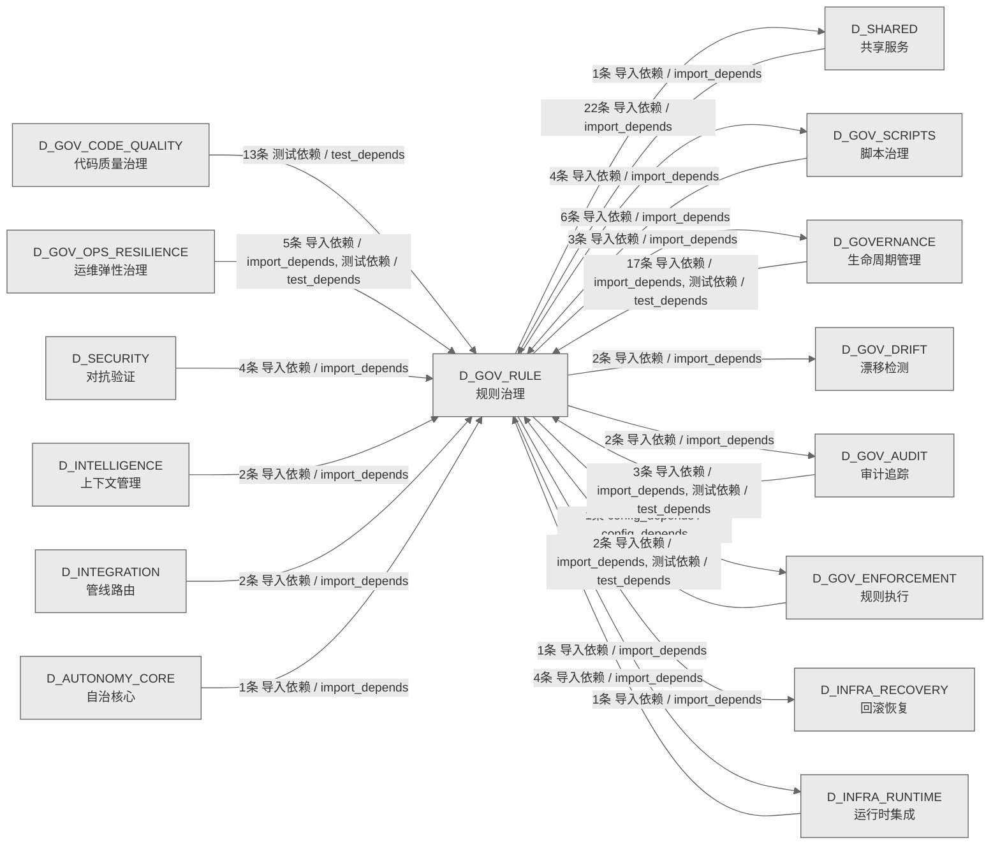

# 55_d_gov_rule / 规则治理域 / Rule Governance

> **功能简介 / Overview**: 规则治理，负责规则注册、规则版本和规则依赖管理

> **文档作用 / Purpose**: 展示 规则治理（D_GOV_RULE）功能域的域内依赖关系、跨域依赖关系，模块信息（成熟度/中英文名/大白话/文件路径）内嵌于 Mermaid 节点，供架构审查和域治理参考。

> 本文档由 generate_domain_doc.py 从 depgraph (PostgreSQL) 自动生成
> 数据源: depgraph (PostgreSQL) nodes表 + edges表

> **[可缩放 HTML 版 / Zoomable HTML](http://localhost:8765/docs/02_enterprise_architecture/02_domain_architecture_docs/_zoomable_html/55_d_gov_rule.html)** — Ctrl+滚轮缩放 ｜ 双击重置 ｜ Ctrl+Shift+D 切换拖动/选择模式

## 域基本信息 / Domain Overview

| 字段 | 值 | Field | Value |
|------|------|-------|-------|
| 编号 | 55 | Number | 55 |
| 域ID | D_GOV_RULE | Domain ID | D_GOV_RULE |
| 域名称 | 规则治理 | Domain Name | Rule Governance |
| 层级 | L2 业务域层 | Layer | L2 Domain |
| 模块数 | 36 | Module Count | 36 |
| 域内依赖 | 13 | Internal Dependencies | 13 |
| 跨域入边 | 60 | Cross-domain Incoming | 60 |
| 跨域出边 | 36 | Cross-domain Outgoing | 36 |
| 设计态模块 | 0 | Design Modules | 0 |
| 生产态模块 | 36 | Production Modules | 36 |
| 容量 | 36/150 (正常) | Capacity | 36/150 (正常) |
| 描述 | 规则配置管理 | Description | 规则配置管理 |

## 域内依赖图 / Internal Dependency Diagram

> 依赖图内嵌在本文档中，IDE 可直接渲染；网页版可 Ctrl+滚轮缩放 + 拖动平移查看细节。
>
> **图例说明 / Legend**：
> - 🟦 **蓝色 = 运营态模块**（production，已上线运行）
> - 🟧 **橙色虚线 = 设计态模块**（design，蓝图阶段，代码未写）
> - **实线箭头 = 运营态依赖**（已生效的依赖关系）
> - **虚线箭头 = 非运营态依赖**（计划中/验证中的依赖关系）

### 全景图（全部模块，颜色区分运营态/设计态）

> 展示全部 36 个模块（生产态 36 + 设计态 0），含跨域依赖外部节点。节点含成熟度+名称+大白话/简介+文件路径。

```mermaid
%%{init: {'theme': 'base', 'themeVariables': {'primaryColor': '#eaeaea', 'primaryTextColor': '#333333', 'primaryBorderColor': '#666666', 'lineColor': '#666666', 'secondaryColor': '#eaeaea', 'tertiaryColor': '#eaeaea', 'fontSize': '14px'}}}%%
flowchart TD
    scripts_governance_generators_generate_script_manifest_py["脚本清单自动生成器<br/>把每个脚本自己填的信息卡片收集起来，做成一张总清<br/>单。老方法太死板，遇到特殊格式就漏抓导致清单不准<br/>，现在多种方式兜底确保不漏。<br/>Script Manifest Generator<br/>Scans .py files under scripts/governance/ to<br/>extract __manifest__ and generate<br/>script_manifest.yaml<br/>文件: generators/generate_script_manifest.py<br/>(生产态 / production)"]
    src_zephyr_gov_enforcement_rule_enforcement_adaptive_threshold_py["自适应阈值<br/>给告警算什么程度该报警的红线。两种算法：一种看成<br/>功率自动调，一种看最近一周的平均值定线。设了最低<br/>底线，防止红线越降越低、把问题掩盖掉。<br/>Adaptive Threshold<br/>Adaptive threshold - dual mode:<br/>probability-based (PASS/FAIL outcome<br/>adjustment) + count-based (EWMA baseline x<br/>factor)<br/>文件: rule_enforcement/adaptive_threshold.py<br/>(生产态 / production)"]
    src_zephyr_gov_enforcement_rule_enforcement_adversarial_strategies_py["对抗样本生成器<br/>生成 5 种假想敌攻击套路，专门用来刁难系统，测门<br/>禁挡不挡得住。上线前自己先攻击一遍，比等真出事再<br/>发现强。<br/>Adversarial Strategies<br/>Adversarial sample generator with 5 attack<br/>strategies for gate validation<br/>文件: rule_enforcement/adversarial_strategies.py<br/>(生产态 / production)"]
    src_zephyr_gov_enforcement_rule_enforcement_ai_capability_guard_py["AI 能力边界守卫<br/>给函数贴需要什么权限的标签，检查 AI<br/>有没有越权干没授权的事。只负责标记不拦，让后续检<br/>查环节去抓违规。<br/>AI Capability Guard<br/>AI capability boundary guard with<br/>@require_capability decorator<br/>文件: rule_enforcement/ai_capability_guard.py<br/>(生产态 / production)"]
    src_zephyr_gov_enforcement_rule_enforcement_anti_pattern_guard_py["反模式防护引擎<br/>把蓝图里列的 8 条 AI<br/>集成禁止行为做成自动检查，挂进门禁流程。防止 AI<br/>集成时踩常见的坑，比如绕过门禁、擅自越权。<br/>Anti-Pattern Guard<br/>Anti-pattern guard engine - detects and blocks<br/>common architectural anti-patterns<br/>文件: rule_enforcement/anti_pattern_guard.py<br/>(生产态 / production)"]
    src_zephyr_gov_enforcement_rule_enforcement_can_i_deploy_py["预部署门禁<br/>部署前问一句现在能部署吗。检查四样：别人对我的期<br/>望满足没、版本兼容不、契约一致不、服务健康不。避<br/>免一部署就出事。<br/>Can-I-Deploy<br/>文件: rule_enforcement/can_i_deploy.py<br/>(生产态 / production)"]
    src_zephyr_gov_enforcement_rule_enforcement_capability_checker_py["能力检查器<br/>运行时核对模块有没有真的声明所需权限，再校验权限<br/>表没被偷偷改过。确保声明的能力和实际用的对得上，<br/>防止钻空子。<br/>Capability Checker<br/>Capability checker - verifies modules/scripts<br/>declare required capabilities<br/>文件: rule_enforcement/capability_checker.py<br/>(生产态 / production)"]
    src_zephyr_gov_enforcement_rule_enforcement_cdc_broker_py["CDC 契约经纪人<br/>管消费者驱动契约的本地中介：消费方声明期望提供方<br/>给什么，提供方改了代码就自动验证有没有破坏消费方<br/>。不依赖外部服务，本地就能跑。<br/>CDC Broker<br/>CDC Consumer-Driven Contract Broker<br/>文件: rule_enforcement/cdc_broker.py<br/>(生产态 / production)"]
    src_zephyr_gov_enforcement_rule_enforcement_contract_template_manager_py["契约模板管理器<br/>管理工具契约模板：注册新模板、按名字查模板、校验<br/>调用对不对、存成文件。让每个工具有统一的接口说明<br/>书，调用前能核对参数。<br/>Contract Template Manager<br/>Contract template manager for MCP tool contracts<br/>文件: rule_enforcement<br/>/contract_template_manager.py<br/>(生产态 / production)"]
    src_zephyr_gov_enforcement_rule_enforcement_gate_engine_init_py["门禁引擎模块集<br/>门禁引擎的文件夹入口，把门禁相关的几个模块归到一<br/>起。本身不含逻辑，只是给它们一个稳定归属。<br/>Gate Engine Package<br/>gate_engine package - gate engine module<br/>collection (ARCH-042 phase 1 split product)<br/>文件: gate_engine/__init__.py<br/>(生产态 / production)"]
    src_zephyr_gov_enforcement_rule_enforcement_gate_engine_gate_engine_py["门禁裁决引擎<br/>门禁系统的裁判。从配置加载门禁规则，执行检查，判<br/>通过还是失败，结果记进库。覆盖知识库、任务编排、<br/>交易三类门禁。<br/>Gate Engine<br/>GateEngine - KMS G1-G6 + Orc G0/G7 + Trading<br/>G10-G12 gate adjudication engine<br/>文件: gate_engine/gate_engine.py<br/>(生产态 / production)"]
    src_zephyr_gov_enforcement_rule_enforcement_gate_engine_gate_override_py["门禁紧急旁路<br/>给负责人的紧急通道：特殊情况可临时绕过某道门禁，<br/>但严格限时、全程留痕。既允许紧急放行，又保证每次<br/>绕过可追溯、不能乱用。<br/>Gate Override<br/>Owner emergency bypass - time-limited temporary<br/>gate bypass with audit trail<br/>文件: gate_engine/gate_override.py<br/>(生产态 / production)"]
    src_zephyr_gov_enforcement_rule_enforcement_gate_engine_gate_simulator_py["门禁模拟器<br/>门禁的演习工具。把全链路门禁空跑一遍，但不改任何<br/>状态不写库。让开发者提前看门禁会怎么判，避免真跑<br/>时才出问题。<br/>Gate Simulator<br/>Gate simulator - dry-run full-chain gate<br/>rehearsal without modifying any state<br/>文件: gate_engine/gate_simulator.py<br/>(生产态 / production)"]
    src_zephyr_gov_enforcement_rule_enforcement_integration_test_runner_py["集成测试运行器<br/>跑跨模块集成测试的引擎，加载契约、执行断言、对接<br/>门禁。分四级：最关键的冒烟、全量核心、契约校验、<br/>健康探针，不同场景跑不同级别。<br/>Integration Test Runner<br/>Integration test runner - runs cross-module<br/>integration tests<br/>文件: rule_enforcement<br/>/integration_test_runner.py<br/>(生产态 / production)"]
    src_zephyr_gov_enforcement_rule_enforcement_invariants_en_process_lifecycle_gateway_py["进程生命周期网关<br/>扫描代码里直接起进程的地方——这些绕过了统一管理入<br/>口，有失控风险。强制所有起进程都走同一个网关，便<br/>于治理。<br/>Process Lifecycle Gateway<br/>Process creation entry validation gate<br/>文件: invariants/en_process_lifecycle_gateway.py<br/>(生产态 / production)"]
    src_zephyr_gov_enforcement_rule_enforcement_kiss_enforcer_py["KISS 约束执行器<br/>守保持简单原则的检查器。检测 AI<br/>写的代码有没有过度复杂、堆冗余。防止 AI<br/>为了看起来完整而过度设计。<br/>KISS Enforcer<br/>KISS constraint enforcer - AI output complexity<br/>detection + bloat check<br/>文件: rule_enforcement/kiss_enforcer.py<br/>(生产态 / production)"]
    src_zephyr_gov_enforcement_rule_enforcement_rule_engine_init_py["规则引擎模块集<br/>规则引擎的文件夹入口，把规则相关的模块归到一起。<br/>本身不含逻辑，只是给它们一个稳定归属。<br/>Rule Engine Package<br/>rule_engine package - rule engine module<br/>collection (ARCH-042 phase 1 split product)<br/>文件: rule_engine/__init__.py<br/>(生产态 / production)"]
    src_zephyr_gov_enforcement_rule_enforcement_rule_engine_rule_engine_py["规则加载器<br/>按需加载规则的核心接口。先查索引找规则文件，读出<br/>来用；找不到再扫目录。让规则按需加载、有索引可循<br/>，不每次全量扫。<br/>Rule Loader<br/>RuleLoader - core rule loading API<br/>文件: rule_engine/rule_engine.py<br/>(生产态 / production)"]
    src_zephyr_gov_enforcement_rule_enforcement_secrets_guard_py["密钥守卫<br/>守护密钥安全的三件套：检查配置合不合规、扫历史提<br/>交有没有漏密钥、给日志脱敏。防当下写错、历史遗留<br/>、日志泄密三类风险。<br/>Secrets Guard<br/>.env validation + git log scanning + log<br/>desensitization<br/>文件: rule_enforcement/secrets_guard.py<br/>(生产态 / production)"]
    src_zephyr_gov_enforcement_rule_enforcement_task_completion_gate_py["任务完成门禁<br/>任务收尾门禁。扫任务范围之外有没有残留的临时文件<br/>、备份、缓存，验证任务真做干净了。防止做一半留堆<br/>垃圾就算交付。<br/>Task Completion Gate<br/>Scans for residual files outside files_in_scope<br/>to verify task completion without omissions<br/>文件: rule_enforcement/task_completion_gate.py<br/>(生产态 / production)"]
    src_zephyr_gov_enforcement_rule_enforcement_triple_alignment_py["三方对齐门禁<br/>守三方对齐的门禁：检查蓝图、代码、依赖图三样对不<br/>对得上。防止蓝图写了没做、依赖图登记了但代码没有<br/>这类脱节。<br/>Triple Alignment<br/>Blueprint-code-dependency graph triple<br/>alignment gate<br/>文件: rule_enforcement/triple_alignment.py<br/>(生产态 / production)"]
    src_zephyr_gov_rule_init_py["规则治理域包<br/>规则治理域的文件夹入口，标记这个域的边界。本身不<br/>含逻辑，给域内模块一个归属。<br/>Gov Rule Package<br/>gov_rule domain package - rule governance<br/>文件: gov_rule/__init__.py<br/>(生产态 / production)"]
    src_zephyr_gov_rule_constitutional_update_constitutional_update_py["宪法自愈<br/>让项目宪法自我进化。从历史错误里提取经验，提议更<br/>新，经人审查后再安全写入。解决宪法是静态的、AI<br/>犯错学不到的问题。<br/>Constitutional Update<br/>Constitutional self-healing - Phase 14 blind<br/>spot B27 fix<br/>文件: constitutional_update<br/>/constitutional_update.py<br/>(生产态 / production)"]
    tests_governance_rule_enforcement_test_end_to_end_walkthrough_py["Test End To End Walkthrough<br/>rule enforcement包的test_end_to_end_walkthrough<br/>模块<br/>文件: rule_enforcement<br/>/test_end_to_end_walkthrough.py<br/>(生产态 / production)"]
    scripts_governance_generators_generate_script_manifest_py ~~~ src_zephyr_gov_enforcement_rule_enforcement_adaptive_threshold_py
    src_zephyr_gov_enforcement_rule_enforcement_adaptive_threshold_py ~~~ src_zephyr_gov_enforcement_rule_enforcement_adversarial_strategies_py
    src_zephyr_gov_enforcement_rule_enforcement_adversarial_strategies_py ~~~ src_zephyr_gov_enforcement_rule_enforcement_ai_capability_guard_py
    src_zephyr_gov_enforcement_rule_enforcement_ai_capability_guard_py ~~~ src_zephyr_gov_enforcement_rule_enforcement_anti_pattern_guard_py
    src_zephyr_gov_enforcement_rule_enforcement_anti_pattern_guard_py ~~~ src_zephyr_gov_enforcement_rule_enforcement_can_i_deploy_py
    src_zephyr_gov_enforcement_rule_enforcement_can_i_deploy_py ~~~ src_zephyr_gov_enforcement_rule_enforcement_capability_checker_py
    src_zephyr_gov_enforcement_rule_enforcement_capability_checker_py ~~~ src_zephyr_gov_enforcement_rule_enforcement_cdc_broker_py
    src_zephyr_gov_enforcement_rule_enforcement_cdc_broker_py ~~~ src_zephyr_gov_enforcement_rule_enforcement_contract_template_manager_py
    src_zephyr_gov_enforcement_rule_enforcement_contract_template_manager_py ~~~ src_zephyr_gov_enforcement_rule_enforcement_gate_engine_init_py
    src_zephyr_gov_enforcement_rule_enforcement_gate_engine_init_py ~~~ src_zephyr_gov_enforcement_rule_enforcement_gate_engine_gate_engine_py
    src_zephyr_gov_enforcement_rule_enforcement_gate_engine_gate_engine_py ~~~ src_zephyr_gov_enforcement_rule_enforcement_gate_engine_gate_override_py
    src_zephyr_gov_enforcement_rule_enforcement_gate_engine_gate_override_py ~~~ src_zephyr_gov_enforcement_rule_enforcement_gate_engine_gate_simulator_py
    src_zephyr_gov_enforcement_rule_enforcement_gate_engine_gate_simulator_py ~~~ src_zephyr_gov_enforcement_rule_enforcement_integration_test_runner_py
    src_zephyr_gov_enforcement_rule_enforcement_integration_test_runner_py ~~~ src_zephyr_gov_enforcement_rule_enforcement_invariants_en_process_lifecycle_gateway_py
    src_zephyr_gov_enforcement_rule_enforcement_invariants_en_process_lifecycle_gateway_py ~~~ src_zephyr_gov_enforcement_rule_enforcement_kiss_enforcer_py
    src_zephyr_gov_enforcement_rule_enforcement_kiss_enforcer_py ~~~ src_zephyr_gov_enforcement_rule_enforcement_rule_engine_init_py
    src_zephyr_gov_enforcement_rule_enforcement_rule_engine_init_py ~~~ src_zephyr_gov_enforcement_rule_enforcement_rule_engine_rule_engine_py
    src_zephyr_gov_enforcement_rule_enforcement_rule_engine_rule_engine_py ~~~ src_zephyr_gov_enforcement_rule_enforcement_secrets_guard_py
    src_zephyr_gov_enforcement_rule_enforcement_secrets_guard_py ~~~ src_zephyr_gov_enforcement_rule_enforcement_task_completion_gate_py
    src_zephyr_gov_enforcement_rule_enforcement_task_completion_gate_py ~~~ src_zephyr_gov_enforcement_rule_enforcement_triple_alignment_py
    src_zephyr_gov_enforcement_rule_enforcement_triple_alignment_py ~~~ src_zephyr_gov_rule_init_py
    src_zephyr_gov_rule_init_py ~~~ src_zephyr_gov_rule_constitutional_update_constitutional_update_py
    src_zephyr_gov_rule_constitutional_update_constitutional_update_py ~~~ tests_governance_rule_enforcement_test_end_to_end_walkthrough_py
    src_zephyr_gov_enforcement_rule_enforcement_cbac_matrix_py["CBAC 能力矩阵<br/>一张谁能干什么的授权表，按能力而非角色控权——有什<br/>么能力才能干什么。是权限判断的统一依据，别的模块<br/>都查它。<br/>CBAC Matrix<br/>CBAC Capability-Based Access Control Matrix<br/>文件: rule_enforcement/cbac_matrix.py<br/>(生产态 / production)"]
    src_zephyr_gov_enforcement_rule_enforcement_circuit_breaker_py["单向熔断器<br/>模块间调用的保险丝。被调模块连续失败就跳闸，后续<br/>调用直接拒绝不再打它，防止故障扩散。跳闸后要人工<br/>手动恢复。<br/>Circuit Breaker<br/>CircuitBreakerGateway - unidirectional circuit<br/>breaker for inter-module calls<br/>文件: rule_enforcement/circuit_breaker.py<br/>(生产态 / production)"]
    src_zephyr_gov_enforcement_rule_enforcement_end_to_end_walkthrough_py["端到端走查验证器<br/>按预设场景把系统从头到尾走一遍，验证关键链路通不<br/>通、各环节衔接对不对。专门找单个测试发现不了的衔<br/>接问题。<br/>End-to-End Walkthrough<br/>End-to-end scenario walkthrough validator<br/>文件: rule_enforcement/end_to_end_walkthrough.py<br/>(生产态 / production)"]
    src_zephyr_gov_enforcement_rule_enforcement_gate_engine_adversarial_validation_py["对抗验证门禁<br/>专门验证输出抗攻击的门禁。拿假想敌样本去冲击系统<br/>输出，看结果有没有被恶意输入带偏。不仅查输入合规<br/>，也查输出没被污染。<br/>Adversarial Validation<br/>AdversarialValidationGate validates outputs<br/>against adversarial attacks<br/>文件: gate_engine/adversarial_validation.py<br/>(生产态 / production)"]
    src_zephyr_gov_enforcement_rule_enforcement_gate_engine_gate_pipeline_py["门禁评估管线<br/>把多道门禁编排成一条流水线：定先后顺序、支持与或<br/>非组合、可并行跑。让跑哪些门禁怎么组合可配置，不<br/>写死在代码里。<br/>Gate Pipeline<br/>Gate evaluation pipeline - ordering resolution,<br/>combinatorial logic (AND/OR/NOT), parallel<br/>scheduling<br/>文件: gate_engine/gate_pipeline.py<br/>(生产态 / production)"]
    src_zephyr_gov_enforcement_rule_enforcement_gate_types_py["门禁类型定义<br/>定义门禁系统的数据格式标准<br/>（类型、上下文、结果结构），供引擎、流水线、模拟<br/>器共用。相当于门禁模块的数据字典，避免各处格式不<br/>统一。<br/>Gate Types<br/>GateType enum and gate-related dataclasses<br/>(GateContext/GateResult etc.)<br/>文件: rule_enforcement/gate_types.py<br/>(生产态 / production)"]
    src_zephyr_gov_enforcement_rule_enforcement_invariants_en_001_circular_dependency_py["循环依赖扫描器<br/>扫描所有模块的依赖关系，揪出我依赖你、你又依赖我<br/>的死循环。这种循环会导致加载失败或卡死，越早发现<br/>越好。<br/>Circular Dependency Scanner<br/>EN-001 circular dependency scanner - Kahn<br/>topological sort to detect module import cycles<br/>文件: invariants/en_001_circular_dependency.py<br/>(生产态 / production)"]
    src_zephyr_gov_enforcement_rule_enforcement_invariants_en_003_contract_compatibility_py["契约兼容性检查器<br/>逐字段比对契约文档写的和代码实际写的：字段有没有<br/>、类型对不对、必填一致不。专查文档和代码对不上的<br/>漂移。<br/>Contract Compatibility Checker<br/>EN-003 contract compatibility checker - field<br/>/type/required alignment diff comparison<br/>文件: invariants<br/>/en_003_contract_compatibility.py<br/>(生产态 / production)"]
    src_zephyr_gov_enforcement_rule_enforcement_invariants_zero_residue_check_py["零残留检查器<br/>清理操作做完后扫一遍，确认没留下临时文件、空目录<br/>、悬空引用。保证清理干净，不留垃圾。<br/>Zero Residue Check<br/>Verifies no residual files/directories<br/>/references remain after governance operations<br/>文件: invariants/zero_residue_check.py<br/>(生产态 / production)"]
    src_zephyr_gov_enforcement_rule_enforcement_risk_ssot_py["风险真源加载器<br/>从配置文件加载风险参数<br/>（如各种限额），供交易门禁校验参数对不对。把风险<br/>红线收口到一个地方，避免各处自己写、互相打架。<br/>Risk SSoT<br/>Loads risk SSoT from config/risk_params.yaml<br/>(INV-002 etc.)<br/>文件: rule_enforcement/risk_ssot.py<br/>(生产态 / production)"]
    src_zephyr_gov_enforcement_rule_enforcement_task_types_py["任务类型定义<br/>定义任务卡的数据结构<br/>（状态、优先级等），是任务字段的统一标准，和数据<br/>库表对齐。避免各处对任务字段理解不一致。<br/>Task Types<br/>Task model - SSoT for task card fields (aligned<br/>with SQLite tasks table)<br/>文件: rule_enforcement/task_types.py<br/>(生产态 / production)"]
    src_zephyr_gov_enforcement_rule_enforcement_cbac_matrix_py ~~~ src_zephyr_gov_enforcement_rule_enforcement_circuit_breaker_py
    src_zephyr_gov_enforcement_rule_enforcement_circuit_breaker_py ~~~ src_zephyr_gov_enforcement_rule_enforcement_end_to_end_walkthrough_py
    src_zephyr_gov_enforcement_rule_enforcement_end_to_end_walkthrough_py ~~~ src_zephyr_gov_enforcement_rule_enforcement_gate_engine_adversarial_validation_py
    src_zephyr_gov_enforcement_rule_enforcement_gate_engine_adversarial_validation_py ~~~ src_zephyr_gov_enforcement_rule_enforcement_gate_engine_gate_pipeline_py
    src_zephyr_gov_enforcement_rule_enforcement_gate_engine_gate_pipeline_py ~~~ src_zephyr_gov_enforcement_rule_enforcement_gate_types_py
    src_zephyr_gov_enforcement_rule_enforcement_gate_types_py ~~~ src_zephyr_gov_enforcement_rule_enforcement_invariants_en_001_circular_dependency_py
    src_zephyr_gov_enforcement_rule_enforcement_invariants_en_001_circular_dependency_py ~~~ src_zephyr_gov_enforcement_rule_enforcement_invariants_en_003_contract_compatibility_py
    src_zephyr_gov_enforcement_rule_enforcement_invariants_en_003_contract_compatibility_py ~~~ src_zephyr_gov_enforcement_rule_enforcement_invariants_zero_residue_check_py
    src_zephyr_gov_enforcement_rule_enforcement_invariants_zero_residue_check_py ~~~ src_zephyr_gov_enforcement_rule_enforcement_risk_ssot_py
    src_zephyr_gov_enforcement_rule_enforcement_risk_ssot_py ~~~ src_zephyr_gov_enforcement_rule_enforcement_task_types_py
    src_zephyr_gov_enforcement_rule_enforcement_gate_engine_gate_context_py["门禁上下文传播<br/>把门禁运行需要的上下文打包好，跨模块传递，让不同<br/>环节的门禁检查共享同一份信息。顺带统一了结果格式<br/>，避免各写各的对不上。<br/>Gate Context<br/>GateContext construction, serialization, and<br/>cross-module injection<br/>文件: gate_engine/gate_context.py<br/>(生产态 / production)"]
    src_zephyr_gov_enforcement_rule_enforcement_capability_checker_py -->|导入依赖 / import_depends| src_zephyr_gov_enforcement_rule_enforcement_cbac_matrix_py
    src_zephyr_gov_enforcement_rule_enforcement_gate_engine_gate_engine_py -->|导入依赖 / import_depends| src_zephyr_gov_enforcement_rule_enforcement_circuit_breaker_py
    src_zephyr_gov_enforcement_rule_enforcement_gate_engine_gate_engine_py -->|导入依赖 / import_depends| src_zephyr_gov_enforcement_rule_enforcement_gate_types_py
    src_zephyr_gov_enforcement_rule_enforcement_gate_engine_gate_engine_py -->|导入依赖 / import_depends| src_zephyr_gov_enforcement_rule_enforcement_risk_ssot_py
    src_zephyr_gov_enforcement_rule_enforcement_gate_engine_gate_engine_py -->|导入依赖 / import_depends| src_zephyr_gov_enforcement_rule_enforcement_task_types_py
    src_zephyr_gov_enforcement_rule_enforcement_gate_engine_gate_engine_py -->|导入依赖 / import_depends| src_zephyr_gov_enforcement_rule_enforcement_invariants_en_001_circular_dependency_py
    src_zephyr_gov_enforcement_rule_enforcement_gate_engine_gate_engine_py -->|导入依赖 / import_depends| src_zephyr_gov_enforcement_rule_enforcement_invariants_zero_residue_check_py
    src_zephyr_gov_enforcement_rule_enforcement_gate_engine_gate_engine_py -->|导入依赖 / import_depends| src_zephyr_gov_enforcement_rule_enforcement_invariants_en_003_contract_compatibility_py
    src_zephyr_gov_enforcement_rule_enforcement_gate_engine_gate_simulator_py -->|导入依赖 / import_depends| src_zephyr_gov_enforcement_rule_enforcement_gate_engine_gate_context_py
    src_zephyr_gov_enforcement_rule_enforcement_gate_engine_gate_simulator_py -->|导入依赖 / import_depends| src_zephyr_gov_enforcement_rule_enforcement_gate_engine_gate_pipeline_py
    src_zephyr_gov_enforcement_rule_enforcement_gate_engine_gate_pipeline_py -->|导入依赖 / import_depends| src_zephyr_gov_enforcement_rule_enforcement_gate_engine_gate_context_py
    src_zephyr_gov_enforcement_rule_enforcement_gate_engine_init_py -->|config_depends / config_depends| src_zephyr_gov_enforcement_rule_enforcement_gate_engine_adversarial_validation_py
    tests_governance_rule_enforcement_test_end_to_end_walkthrough_py -->|测试依赖 / test_depends| src_zephyr_gov_enforcement_rule_enforcement_end_to_end_walkthrough_py
    D_SHARED["共享服务<br/>共享服务，负责跨域共享的工具、协议和基础服务<br/>Shared Services<br/>跨域节点 / cross-domain<br/>(生产态 / production)"]
    src_zephyr_gov_enforcement_rule_enforcement_gate_engine_gate_engine_py -->|导入依赖 / import_depends| D_SHARED
    src_zephyr_gov_enforcement_rule_enforcement_invariants_en_process_lifecycle_gateway_py -->|导入依赖 / import_depends| D_SHARED
    src_zephyr_gov_enforcement_rule_enforcement_task_types_py -->|导入依赖 / import_depends| D_SHARED
    src_zephyr_gov_enforcement_rule_enforcement_contract_template_manager_py -->|导入依赖 / import_depends| D_SHARED
    src_zephyr_gov_enforcement_rule_enforcement_ai_capability_guard_py -->|导入依赖 / import_depends| D_SHARED
    D_GOV_SCRIPTS["脚本治理<br/>脚本治理，负责脚本生命周期管理和脚本质量门禁<br/>Script Governance<br/>跨域节点 / cross-domain<br/>(生产态 / production)"]
    scripts_governance_generators_generate_script_manifest_py -->|导入依赖 / import_depends| D_GOV_SCRIPTS
    D_GOV_AUDIT["审计追踪<br/>审计追踪，负责变更审计追踪和操作日志管理<br/>Audit Trail<br/>跨域节点 / cross-domain<br/>(生产态 / production)"]
    src_zephyr_gov_enforcement_rule_enforcement_capability_checker_py -->|导入依赖 / import_depends| D_GOV_AUDIT
    D_GOV_DRIFT["漂移检测<br/>漂移检测，负责架构漂移检测和漂移告警<br/>Drift Detection<br/>跨域节点 / cross-domain<br/>(生产态 / production)"]
    src_zephyr_gov_enforcement_rule_enforcement_gate_engine_gate_engine_py -->|导入依赖 / import_depends| D_GOV_DRIFT
    src_zephyr_gov_enforcement_rule_enforcement_invariants_zero_residue_check_py -->|导入依赖 / import_depends| D_SHARED
    D_GOVERNANCE["生命周期管理<br/>生命周期管理，负责蓝图/模块<br/>/任务的声明周期管理和元数据治理<br/>Lifecycle Management<br/>跨域节点 / cross-domain<br/>(生产态 / production)"]
    src_zephyr_gov_enforcement_rule_enforcement_rule_engine_rule_engine_py -->|导入依赖 / import_depends| D_GOVERNANCE
    src_zephyr_gov_enforcement_rule_enforcement_task_types_py -->|导入依赖 / import_depends| D_SHARED
    src_zephyr_gov_enforcement_rule_enforcement_invariants_zero_residue_check_py -->|导入依赖 / import_depends| D_SHARED
    src_zephyr_gov_enforcement_rule_enforcement_invariants_en_001_circular_dependency_py -->|导入依赖 / import_depends| D_SHARED
    src_zephyr_gov_enforcement_rule_enforcement_contract_template_manager_py -->|导入依赖 / import_depends| D_SHARED
    src_zephyr_gov_enforcement_rule_enforcement_gate_engine_gate_engine_py -->|导入依赖 / import_depends| D_GOV_DRIFT
    D_GOV_ENFORCEMENT["规则执行<br/>规则执行，负责治理规则执行和门禁拦截<br/>Rule Enforcement<br/>跨域节点 / cross-domain<br/>(设计态 / design)"]
    D_GOV_ENFORCEMENT -.->|导入依赖 / import_depends| src_zephyr_gov_enforcement_rule_enforcement_can_i_deploy_py
    D_GOV_ENFORCEMENT -->|测试依赖 / test_depends| src_zephyr_gov_enforcement_rule_enforcement_can_i_deploy_py
    D_GOVERNANCE -->|导入依赖 / import_depends| src_zephyr_gov_enforcement_rule_enforcement_task_types_py
    D_GOV_AUDIT -->|测试依赖 / test_depends| src_zephyr_gov_enforcement_rule_enforcement_adaptive_threshold_py
    D_SHARED -->|导入依赖 / import_depends| src_zephyr_gov_enforcement_rule_enforcement_task_types_py
    D_SECURITY["对抗验证<br/>对抗验证，负责系统安全对抗测试、漏洞扫描和攻防验<br/>证<br/>Adversarial Validation<br/>跨域节点 / cross-domain<br/>(生产态 / production)"]
    D_SECURITY -->|导入依赖 / import_depends| src_zephyr_gov_enforcement_rule_enforcement_task_types_py
    D_GOV_AUDIT -->|导入依赖 / import_depends| src_zephyr_gov_enforcement_rule_enforcement_gate_engine_gate_context_py
    D_GOV_OPS_RESILIENCE["运维弹性治理<br/>运维弹性治理，负责运维治理、安全治理、弹性治理和<br/>升级协议<br/>Ops Resilience Governance<br/>跨域节点 / cross-domain<br/>(生产态 / production)"]
    D_GOV_OPS_RESILIENCE -->|导入依赖 / import_depends| src_zephyr_gov_enforcement_rule_enforcement_gate_types_py
    D_GOV_CODE_QUALITY["代码质量治理<br/>代码质量治理，负责代码去重引擎、函数重复检测、AS<br/>T语义分析和提交门禁引擎<br/>Code Quality Governance<br/>跨域节点 / cross-domain<br/>(生产态 / production)"]
    D_GOV_CODE_QUALITY -->|测试依赖 / test_depends| src_zephyr_gov_enforcement_rule_enforcement_adaptive_threshold_py
    D_GOV_OPS_RESILIENCE -->|测试依赖 / test_depends| src_zephyr_gov_enforcement_rule_enforcement_task_types_py
    D_GOVERNANCE -->|测试依赖 / test_depends| src_zephyr_gov_enforcement_rule_enforcement_cbac_matrix_py
    D_GOVERNANCE -->|测试依赖 / test_depends| src_zephyr_gov_enforcement_rule_enforcement_capability_checker_py
    D_GOV_SCRIPTS -->|导入依赖 / import_depends| src_zephyr_gov_enforcement_rule_enforcement_task_types_py
    D_GOV_SCRIPTS -->|导入依赖 / import_depends| src_zephyr_gov_enforcement_rule_enforcement_circuit_breaker_py
    D_SECURITY -->|导入依赖 / import_depends| src_zephyr_gov_enforcement_rule_enforcement_gate_engine_gate_engine_py
    classDef production fill:#e1f5fe,stroke:#01579b,stroke-width:2px,color:#000
    classDef design fill:#fff3e0,stroke:#e65100,stroke-width:2px,color:#000,stroke-dasharray: 5 5
    classDef external_prod fill:#e8f4fd,stroke:#0277bd,stroke-width:1px,color:#000
    classDef external_design fill:#fff8e7,stroke:#ef6c00,stroke-width:1px,color:#000,stroke-dasharray: 5 5
    class scripts_governance_generators_generate_script_manifest_py,src_zephyr_gov_enforcement_rule_enforcement_adaptive_threshold_py,src_zephyr_gov_enforcement_rule_enforcement_adversarial_strategies_py,src_zephyr_gov_enforcement_rule_enforcement_ai_capability_guard_py,src_zephyr_gov_enforcement_rule_enforcement_anti_pattern_guard_py,src_zephyr_gov_enforcement_rule_enforcement_can_i_deploy_py,src_zephyr_gov_enforcement_rule_enforcement_capability_checker_py,src_zephyr_gov_enforcement_rule_enforcement_cbac_matrix_py,src_zephyr_gov_enforcement_rule_enforcement_cdc_broker_py,src_zephyr_gov_enforcement_rule_enforcement_circuit_breaker_py,src_zephyr_gov_enforcement_rule_enforcement_contract_template_manager_py,src_zephyr_gov_enforcement_rule_enforcement_end_to_end_walkthrough_py,src_zephyr_gov_enforcement_rule_enforcement_gate_engine_init_py,src_zephyr_gov_enforcement_rule_enforcement_gate_engine_adversarial_validation_py,src_zephyr_gov_enforcement_rule_enforcement_gate_engine_gate_context_py,src_zephyr_gov_enforcement_rule_enforcement_gate_engine_gate_engine_py,src_zephyr_gov_enforcement_rule_enforcement_gate_engine_gate_override_py,src_zephyr_gov_enforcement_rule_enforcement_gate_engine_gate_pipeline_py,src_zephyr_gov_enforcement_rule_enforcement_gate_engine_gate_simulator_py,src_zephyr_gov_enforcement_rule_enforcement_gate_types_py,src_zephyr_gov_enforcement_rule_enforcement_integration_test_runner_py,src_zephyr_gov_enforcement_rule_enforcement_invariants_en_001_circular_dependency_py,src_zephyr_gov_enforcement_rule_enforcement_invariants_en_003_contract_compatibility_py,src_zephyr_gov_enforcement_rule_enforcement_invariants_en_process_lifecycle_gateway_py,src_zephyr_gov_enforcement_rule_enforcement_invariants_zero_residue_check_py,src_zephyr_gov_enforcement_rule_enforcement_kiss_enforcer_py,src_zephyr_gov_enforcement_rule_enforcement_risk_ssot_py,src_zephyr_gov_enforcement_rule_enforcement_rule_engine_init_py,src_zephyr_gov_enforcement_rule_enforcement_rule_engine_rule_engine_py,src_zephyr_gov_enforcement_rule_enforcement_secrets_guard_py,src_zephyr_gov_enforcement_rule_enforcement_task_completion_gate_py,src_zephyr_gov_enforcement_rule_enforcement_task_types_py,src_zephyr_gov_enforcement_rule_enforcement_triple_alignment_py,src_zephyr_gov_rule_init_py,src_zephyr_gov_rule_constitutional_update_constitutional_update_py,tests_governance_rule_enforcement_test_end_to_end_walkthrough_py production
    class D_SHARED,D_GOV_SCRIPTS,D_GOV_AUDIT,D_GOV_DRIFT,D_GOVERNANCE,D_SECURITY,D_GOV_OPS_RESILIENCE,D_GOV_CODE_QUALITY external_prod
    class D_GOV_ENFORCEMENT external_design
```

### 运营态的图（仅 design_maturity=production 的模块和域内依赖）

> 仅展示已上线运行的模块（共 36 个），不含跨域外部节点。跨域依赖见下方跨域依赖章节。

```mermaid
%%{init: {'theme': 'base', 'themeVariables': {'primaryColor': '#eaeaea', 'primaryTextColor': '#333333', 'primaryBorderColor': '#666666', 'lineColor': '#666666', 'secondaryColor': '#eaeaea', 'tertiaryColor': '#eaeaea', 'fontSize': '14px'}}}%%
flowchart TD
    scripts_governance_generators_generate_script_manifest_py["脚本清单自动生成器<br/>把每个脚本自己填的信息卡片收集起来，做成一张总清<br/>单。老方法太死板，遇到特殊格式就漏抓导致清单不准<br/>，现在多种方式兜底确保不漏。<br/>Script Manifest Generator<br/>Scans .py files under scripts/governance/ to<br/>extract __manifest__ and generate<br/>script_manifest.yaml<br/>文件: generators/generate_script_manifest.py<br/>(生产态 / production)"]
    src_zephyr_gov_enforcement_rule_enforcement_adaptive_threshold_py["自适应阈值<br/>给告警算什么程度该报警的红线。两种算法：一种看成<br/>功率自动调，一种看最近一周的平均值定线。设了最低<br/>底线，防止红线越降越低、把问题掩盖掉。<br/>Adaptive Threshold<br/>Adaptive threshold - dual mode:<br/>probability-based (PASS/FAIL outcome<br/>adjustment) + count-based (EWMA baseline x<br/>factor)<br/>文件: rule_enforcement/adaptive_threshold.py<br/>(生产态 / production)"]
    src_zephyr_gov_enforcement_rule_enforcement_adversarial_strategies_py["对抗样本生成器<br/>生成 5 种假想敌攻击套路，专门用来刁难系统，测门<br/>禁挡不挡得住。上线前自己先攻击一遍，比等真出事再<br/>发现强。<br/>Adversarial Strategies<br/>Adversarial sample generator with 5 attack<br/>strategies for gate validation<br/>文件: rule_enforcement/adversarial_strategies.py<br/>(生产态 / production)"]
    src_zephyr_gov_enforcement_rule_enforcement_ai_capability_guard_py["AI 能力边界守卫<br/>给函数贴需要什么权限的标签，检查 AI<br/>有没有越权干没授权的事。只负责标记不拦，让后续检<br/>查环节去抓违规。<br/>AI Capability Guard<br/>AI capability boundary guard with<br/>@require_capability decorator<br/>文件: rule_enforcement/ai_capability_guard.py<br/>(生产态 / production)"]
    src_zephyr_gov_enforcement_rule_enforcement_anti_pattern_guard_py["反模式防护引擎<br/>把蓝图里列的 8 条 AI<br/>集成禁止行为做成自动检查，挂进门禁流程。防止 AI<br/>集成时踩常见的坑，比如绕过门禁、擅自越权。<br/>Anti-Pattern Guard<br/>Anti-pattern guard engine - detects and blocks<br/>common architectural anti-patterns<br/>文件: rule_enforcement/anti_pattern_guard.py<br/>(生产态 / production)"]
    src_zephyr_gov_enforcement_rule_enforcement_can_i_deploy_py["预部署门禁<br/>部署前问一句现在能部署吗。检查四样：别人对我的期<br/>望满足没、版本兼容不、契约一致不、服务健康不。避<br/>免一部署就出事。<br/>Can-I-Deploy<br/>文件: rule_enforcement/can_i_deploy.py<br/>(生产态 / production)"]
    src_zephyr_gov_enforcement_rule_enforcement_capability_checker_py["能力检查器<br/>运行时核对模块有没有真的声明所需权限，再校验权限<br/>表没被偷偷改过。确保声明的能力和实际用的对得上，<br/>防止钻空子。<br/>Capability Checker<br/>Capability checker - verifies modules/scripts<br/>declare required capabilities<br/>文件: rule_enforcement/capability_checker.py<br/>(生产态 / production)"]
    src_zephyr_gov_enforcement_rule_enforcement_cdc_broker_py["CDC 契约经纪人<br/>管消费者驱动契约的本地中介：消费方声明期望提供方<br/>给什么，提供方改了代码就自动验证有没有破坏消费方<br/>。不依赖外部服务，本地就能跑。<br/>CDC Broker<br/>CDC Consumer-Driven Contract Broker<br/>文件: rule_enforcement/cdc_broker.py<br/>(生产态 / production)"]
    src_zephyr_gov_enforcement_rule_enforcement_contract_template_manager_py["契约模板管理器<br/>管理工具契约模板：注册新模板、按名字查模板、校验<br/>调用对不对、存成文件。让每个工具有统一的接口说明<br/>书，调用前能核对参数。<br/>Contract Template Manager<br/>Contract template manager for MCP tool contracts<br/>文件: rule_enforcement<br/>/contract_template_manager.py<br/>(生产态 / production)"]
    src_zephyr_gov_enforcement_rule_enforcement_gate_engine_init_py["门禁引擎模块集<br/>门禁引擎的文件夹入口，把门禁相关的几个模块归到一<br/>起。本身不含逻辑，只是给它们一个稳定归属。<br/>Gate Engine Package<br/>gate_engine package - gate engine module<br/>collection (ARCH-042 phase 1 split product)<br/>文件: gate_engine/__init__.py<br/>(生产态 / production)"]
    src_zephyr_gov_enforcement_rule_enforcement_gate_engine_gate_engine_py["门禁裁决引擎<br/>门禁系统的裁判。从配置加载门禁规则，执行检查，判<br/>通过还是失败，结果记进库。覆盖知识库、任务编排、<br/>交易三类门禁。<br/>Gate Engine<br/>GateEngine - KMS G1-G6 + Orc G0/G7 + Trading<br/>G10-G12 gate adjudication engine<br/>文件: gate_engine/gate_engine.py<br/>(生产态 / production)"]
    src_zephyr_gov_enforcement_rule_enforcement_gate_engine_gate_override_py["门禁紧急旁路<br/>给负责人的紧急通道：特殊情况可临时绕过某道门禁，<br/>但严格限时、全程留痕。既允许紧急放行，又保证每次<br/>绕过可追溯、不能乱用。<br/>Gate Override<br/>Owner emergency bypass - time-limited temporary<br/>gate bypass with audit trail<br/>文件: gate_engine/gate_override.py<br/>(生产态 / production)"]
    src_zephyr_gov_enforcement_rule_enforcement_gate_engine_gate_simulator_py["门禁模拟器<br/>门禁的演习工具。把全链路门禁空跑一遍，但不改任何<br/>状态不写库。让开发者提前看门禁会怎么判，避免真跑<br/>时才出问题。<br/>Gate Simulator<br/>Gate simulator - dry-run full-chain gate<br/>rehearsal without modifying any state<br/>文件: gate_engine/gate_simulator.py<br/>(生产态 / production)"]
    src_zephyr_gov_enforcement_rule_enforcement_integration_test_runner_py["集成测试运行器<br/>跑跨模块集成测试的引擎，加载契约、执行断言、对接<br/>门禁。分四级：最关键的冒烟、全量核心、契约校验、<br/>健康探针，不同场景跑不同级别。<br/>Integration Test Runner<br/>Integration test runner - runs cross-module<br/>integration tests<br/>文件: rule_enforcement<br/>/integration_test_runner.py<br/>(生产态 / production)"]
    src_zephyr_gov_enforcement_rule_enforcement_invariants_en_process_lifecycle_gateway_py["进程生命周期网关<br/>扫描代码里直接起进程的地方——这些绕过了统一管理入<br/>口，有失控风险。强制所有起进程都走同一个网关，便<br/>于治理。<br/>Process Lifecycle Gateway<br/>Process creation entry validation gate<br/>文件: invariants/en_process_lifecycle_gateway.py<br/>(生产态 / production)"]
    src_zephyr_gov_enforcement_rule_enforcement_kiss_enforcer_py["KISS 约束执行器<br/>守保持简单原则的检查器。检测 AI<br/>写的代码有没有过度复杂、堆冗余。防止 AI<br/>为了看起来完整而过度设计。<br/>KISS Enforcer<br/>KISS constraint enforcer - AI output complexity<br/>detection + bloat check<br/>文件: rule_enforcement/kiss_enforcer.py<br/>(生产态 / production)"]
    src_zephyr_gov_enforcement_rule_enforcement_rule_engine_init_py["规则引擎模块集<br/>规则引擎的文件夹入口，把规则相关的模块归到一起。<br/>本身不含逻辑，只是给它们一个稳定归属。<br/>Rule Engine Package<br/>rule_engine package - rule engine module<br/>collection (ARCH-042 phase 1 split product)<br/>文件: rule_engine/__init__.py<br/>(生产态 / production)"]
    src_zephyr_gov_enforcement_rule_enforcement_rule_engine_rule_engine_py["规则加载器<br/>按需加载规则的核心接口。先查索引找规则文件，读出<br/>来用；找不到再扫目录。让规则按需加载、有索引可循<br/>，不每次全量扫。<br/>Rule Loader<br/>RuleLoader - core rule loading API<br/>文件: rule_engine/rule_engine.py<br/>(生产态 / production)"]
    src_zephyr_gov_enforcement_rule_enforcement_secrets_guard_py["密钥守卫<br/>守护密钥安全的三件套：检查配置合不合规、扫历史提<br/>交有没有漏密钥、给日志脱敏。防当下写错、历史遗留<br/>、日志泄密三类风险。<br/>Secrets Guard<br/>.env validation + git log scanning + log<br/>desensitization<br/>文件: rule_enforcement/secrets_guard.py<br/>(生产态 / production)"]
    src_zephyr_gov_enforcement_rule_enforcement_task_completion_gate_py["任务完成门禁<br/>任务收尾门禁。扫任务范围之外有没有残留的临时文件<br/>、备份、缓存，验证任务真做干净了。防止做一半留堆<br/>垃圾就算交付。<br/>Task Completion Gate<br/>Scans for residual files outside files_in_scope<br/>to verify task completion without omissions<br/>文件: rule_enforcement/task_completion_gate.py<br/>(生产态 / production)"]
    src_zephyr_gov_enforcement_rule_enforcement_triple_alignment_py["三方对齐门禁<br/>守三方对齐的门禁：检查蓝图、代码、依赖图三样对不<br/>对得上。防止蓝图写了没做、依赖图登记了但代码没有<br/>这类脱节。<br/>Triple Alignment<br/>Blueprint-code-dependency graph triple<br/>alignment gate<br/>文件: rule_enforcement/triple_alignment.py<br/>(生产态 / production)"]
    src_zephyr_gov_rule_init_py["规则治理域包<br/>规则治理域的文件夹入口，标记这个域的边界。本身不<br/>含逻辑，给域内模块一个归属。<br/>Gov Rule Package<br/>gov_rule domain package - rule governance<br/>文件: gov_rule/__init__.py<br/>(生产态 / production)"]
    src_zephyr_gov_rule_constitutional_update_constitutional_update_py["宪法自愈<br/>让项目宪法自我进化。从历史错误里提取经验，提议更<br/>新，经人审查后再安全写入。解决宪法是静态的、AI<br/>犯错学不到的问题。<br/>Constitutional Update<br/>Constitutional self-healing - Phase 14 blind<br/>spot B27 fix<br/>文件: constitutional_update<br/>/constitutional_update.py<br/>(生产态 / production)"]
    tests_governance_rule_enforcement_test_end_to_end_walkthrough_py["Test End To End Walkthrough<br/>rule enforcement包的test_end_to_end_walkthrough<br/>模块<br/>文件: rule_enforcement<br/>/test_end_to_end_walkthrough.py<br/>(生产态 / production)"]
    scripts_governance_generators_generate_script_manifest_py ~~~ src_zephyr_gov_enforcement_rule_enforcement_adaptive_threshold_py
    src_zephyr_gov_enforcement_rule_enforcement_adaptive_threshold_py ~~~ src_zephyr_gov_enforcement_rule_enforcement_adversarial_strategies_py
    src_zephyr_gov_enforcement_rule_enforcement_adversarial_strategies_py ~~~ src_zephyr_gov_enforcement_rule_enforcement_ai_capability_guard_py
    src_zephyr_gov_enforcement_rule_enforcement_ai_capability_guard_py ~~~ src_zephyr_gov_enforcement_rule_enforcement_anti_pattern_guard_py
    src_zephyr_gov_enforcement_rule_enforcement_anti_pattern_guard_py ~~~ src_zephyr_gov_enforcement_rule_enforcement_can_i_deploy_py
    src_zephyr_gov_enforcement_rule_enforcement_can_i_deploy_py ~~~ src_zephyr_gov_enforcement_rule_enforcement_capability_checker_py
    src_zephyr_gov_enforcement_rule_enforcement_capability_checker_py ~~~ src_zephyr_gov_enforcement_rule_enforcement_cdc_broker_py
    src_zephyr_gov_enforcement_rule_enforcement_cdc_broker_py ~~~ src_zephyr_gov_enforcement_rule_enforcement_contract_template_manager_py
    src_zephyr_gov_enforcement_rule_enforcement_contract_template_manager_py ~~~ src_zephyr_gov_enforcement_rule_enforcement_gate_engine_init_py
    src_zephyr_gov_enforcement_rule_enforcement_gate_engine_init_py ~~~ src_zephyr_gov_enforcement_rule_enforcement_gate_engine_gate_engine_py
    src_zephyr_gov_enforcement_rule_enforcement_gate_engine_gate_engine_py ~~~ src_zephyr_gov_enforcement_rule_enforcement_gate_engine_gate_override_py
    src_zephyr_gov_enforcement_rule_enforcement_gate_engine_gate_override_py ~~~ src_zephyr_gov_enforcement_rule_enforcement_gate_engine_gate_simulator_py
    src_zephyr_gov_enforcement_rule_enforcement_gate_engine_gate_simulator_py ~~~ src_zephyr_gov_enforcement_rule_enforcement_integration_test_runner_py
    src_zephyr_gov_enforcement_rule_enforcement_integration_test_runner_py ~~~ src_zephyr_gov_enforcement_rule_enforcement_invariants_en_process_lifecycle_gateway_py
    src_zephyr_gov_enforcement_rule_enforcement_invariants_en_process_lifecycle_gateway_py ~~~ src_zephyr_gov_enforcement_rule_enforcement_kiss_enforcer_py
    src_zephyr_gov_enforcement_rule_enforcement_kiss_enforcer_py ~~~ src_zephyr_gov_enforcement_rule_enforcement_rule_engine_init_py
    src_zephyr_gov_enforcement_rule_enforcement_rule_engine_init_py ~~~ src_zephyr_gov_enforcement_rule_enforcement_rule_engine_rule_engine_py
    src_zephyr_gov_enforcement_rule_enforcement_rule_engine_rule_engine_py ~~~ src_zephyr_gov_enforcement_rule_enforcement_secrets_guard_py
    src_zephyr_gov_enforcement_rule_enforcement_secrets_guard_py ~~~ src_zephyr_gov_enforcement_rule_enforcement_task_completion_gate_py
    src_zephyr_gov_enforcement_rule_enforcement_task_completion_gate_py ~~~ src_zephyr_gov_enforcement_rule_enforcement_triple_alignment_py
    src_zephyr_gov_enforcement_rule_enforcement_triple_alignment_py ~~~ src_zephyr_gov_rule_init_py
    src_zephyr_gov_rule_init_py ~~~ src_zephyr_gov_rule_constitutional_update_constitutional_update_py
    src_zephyr_gov_rule_constitutional_update_constitutional_update_py ~~~ tests_governance_rule_enforcement_test_end_to_end_walkthrough_py
    src_zephyr_gov_enforcement_rule_enforcement_cbac_matrix_py["CBAC 能力矩阵<br/>一张谁能干什么的授权表，按能力而非角色控权——有什<br/>么能力才能干什么。是权限判断的统一依据，别的模块<br/>都查它。<br/>CBAC Matrix<br/>CBAC Capability-Based Access Control Matrix<br/>文件: rule_enforcement/cbac_matrix.py<br/>(生产态 / production)"]
    src_zephyr_gov_enforcement_rule_enforcement_circuit_breaker_py["单向熔断器<br/>模块间调用的保险丝。被调模块连续失败就跳闸，后续<br/>调用直接拒绝不再打它，防止故障扩散。跳闸后要人工<br/>手动恢复。<br/>Circuit Breaker<br/>CircuitBreakerGateway - unidirectional circuit<br/>breaker for inter-module calls<br/>文件: rule_enforcement/circuit_breaker.py<br/>(生产态 / production)"]
    src_zephyr_gov_enforcement_rule_enforcement_end_to_end_walkthrough_py["端到端走查验证器<br/>按预设场景把系统从头到尾走一遍，验证关键链路通不<br/>通、各环节衔接对不对。专门找单个测试发现不了的衔<br/>接问题。<br/>End-to-End Walkthrough<br/>End-to-end scenario walkthrough validator<br/>文件: rule_enforcement/end_to_end_walkthrough.py<br/>(生产态 / production)"]
    src_zephyr_gov_enforcement_rule_enforcement_gate_engine_adversarial_validation_py["对抗验证门禁<br/>专门验证输出抗攻击的门禁。拿假想敌样本去冲击系统<br/>输出，看结果有没有被恶意输入带偏。不仅查输入合规<br/>，也查输出没被污染。<br/>Adversarial Validation<br/>AdversarialValidationGate validates outputs<br/>against adversarial attacks<br/>文件: gate_engine/adversarial_validation.py<br/>(生产态 / production)"]
    src_zephyr_gov_enforcement_rule_enforcement_gate_engine_gate_pipeline_py["门禁评估管线<br/>把多道门禁编排成一条流水线：定先后顺序、支持与或<br/>非组合、可并行跑。让跑哪些门禁怎么组合可配置，不<br/>写死在代码里。<br/>Gate Pipeline<br/>Gate evaluation pipeline - ordering resolution,<br/>combinatorial logic (AND/OR/NOT), parallel<br/>scheduling<br/>文件: gate_engine/gate_pipeline.py<br/>(生产态 / production)"]
    src_zephyr_gov_enforcement_rule_enforcement_gate_types_py["门禁类型定义<br/>定义门禁系统的数据格式标准<br/>（类型、上下文、结果结构），供引擎、流水线、模拟<br/>器共用。相当于门禁模块的数据字典，避免各处格式不<br/>统一。<br/>Gate Types<br/>GateType enum and gate-related dataclasses<br/>(GateContext/GateResult etc.)<br/>文件: rule_enforcement/gate_types.py<br/>(生产态 / production)"]
    src_zephyr_gov_enforcement_rule_enforcement_invariants_en_001_circular_dependency_py["循环依赖扫描器<br/>扫描所有模块的依赖关系，揪出我依赖你、你又依赖我<br/>的死循环。这种循环会导致加载失败或卡死，越早发现<br/>越好。<br/>Circular Dependency Scanner<br/>EN-001 circular dependency scanner - Kahn<br/>topological sort to detect module import cycles<br/>文件: invariants/en_001_circular_dependency.py<br/>(生产态 / production)"]
    src_zephyr_gov_enforcement_rule_enforcement_invariants_en_003_contract_compatibility_py["契约兼容性检查器<br/>逐字段比对契约文档写的和代码实际写的：字段有没有<br/>、类型对不对、必填一致不。专查文档和代码对不上的<br/>漂移。<br/>Contract Compatibility Checker<br/>EN-003 contract compatibility checker - field<br/>/type/required alignment diff comparison<br/>文件: invariants<br/>/en_003_contract_compatibility.py<br/>(生产态 / production)"]
    src_zephyr_gov_enforcement_rule_enforcement_invariants_zero_residue_check_py["零残留检查器<br/>清理操作做完后扫一遍，确认没留下临时文件、空目录<br/>、悬空引用。保证清理干净，不留垃圾。<br/>Zero Residue Check<br/>Verifies no residual files/directories<br/>/references remain after governance operations<br/>文件: invariants/zero_residue_check.py<br/>(生产态 / production)"]
    src_zephyr_gov_enforcement_rule_enforcement_risk_ssot_py["风险真源加载器<br/>从配置文件加载风险参数<br/>（如各种限额），供交易门禁校验参数对不对。把风险<br/>红线收口到一个地方，避免各处自己写、互相打架。<br/>Risk SSoT<br/>Loads risk SSoT from config/risk_params.yaml<br/>(INV-002 etc.)<br/>文件: rule_enforcement/risk_ssot.py<br/>(生产态 / production)"]
    src_zephyr_gov_enforcement_rule_enforcement_task_types_py["任务类型定义<br/>定义任务卡的数据结构<br/>（状态、优先级等），是任务字段的统一标准，和数据<br/>库表对齐。避免各处对任务字段理解不一致。<br/>Task Types<br/>Task model - SSoT for task card fields (aligned<br/>with SQLite tasks table)<br/>文件: rule_enforcement/task_types.py<br/>(生产态 / production)"]
    src_zephyr_gov_enforcement_rule_enforcement_cbac_matrix_py ~~~ src_zephyr_gov_enforcement_rule_enforcement_circuit_breaker_py
    src_zephyr_gov_enforcement_rule_enforcement_circuit_breaker_py ~~~ src_zephyr_gov_enforcement_rule_enforcement_end_to_end_walkthrough_py
    src_zephyr_gov_enforcement_rule_enforcement_end_to_end_walkthrough_py ~~~ src_zephyr_gov_enforcement_rule_enforcement_gate_engine_adversarial_validation_py
    src_zephyr_gov_enforcement_rule_enforcement_gate_engine_adversarial_validation_py ~~~ src_zephyr_gov_enforcement_rule_enforcement_gate_engine_gate_pipeline_py
    src_zephyr_gov_enforcement_rule_enforcement_gate_engine_gate_pipeline_py ~~~ src_zephyr_gov_enforcement_rule_enforcement_gate_types_py
    src_zephyr_gov_enforcement_rule_enforcement_gate_types_py ~~~ src_zephyr_gov_enforcement_rule_enforcement_invariants_en_001_circular_dependency_py
    src_zephyr_gov_enforcement_rule_enforcement_invariants_en_001_circular_dependency_py ~~~ src_zephyr_gov_enforcement_rule_enforcement_invariants_en_003_contract_compatibility_py
    src_zephyr_gov_enforcement_rule_enforcement_invariants_en_003_contract_compatibility_py ~~~ src_zephyr_gov_enforcement_rule_enforcement_invariants_zero_residue_check_py
    src_zephyr_gov_enforcement_rule_enforcement_invariants_zero_residue_check_py ~~~ src_zephyr_gov_enforcement_rule_enforcement_risk_ssot_py
    src_zephyr_gov_enforcement_rule_enforcement_risk_ssot_py ~~~ src_zephyr_gov_enforcement_rule_enforcement_task_types_py
    src_zephyr_gov_enforcement_rule_enforcement_gate_engine_gate_context_py["门禁上下文传播<br/>把门禁运行需要的上下文打包好，跨模块传递，让不同<br/>环节的门禁检查共享同一份信息。顺带统一了结果格式<br/>，避免各写各的对不上。<br/>Gate Context<br/>GateContext construction, serialization, and<br/>cross-module injection<br/>文件: gate_engine/gate_context.py<br/>(生产态 / production)"]
    src_zephyr_gov_enforcement_rule_enforcement_capability_checker_py -->|导入依赖 / import_depends| src_zephyr_gov_enforcement_rule_enforcement_cbac_matrix_py
    src_zephyr_gov_enforcement_rule_enforcement_gate_engine_gate_engine_py -->|导入依赖 / import_depends| src_zephyr_gov_enforcement_rule_enforcement_circuit_breaker_py
    src_zephyr_gov_enforcement_rule_enforcement_gate_engine_gate_engine_py -->|导入依赖 / import_depends| src_zephyr_gov_enforcement_rule_enforcement_gate_types_py
    src_zephyr_gov_enforcement_rule_enforcement_gate_engine_gate_engine_py -->|导入依赖 / import_depends| src_zephyr_gov_enforcement_rule_enforcement_risk_ssot_py
    src_zephyr_gov_enforcement_rule_enforcement_gate_engine_gate_engine_py -->|导入依赖 / import_depends| src_zephyr_gov_enforcement_rule_enforcement_task_types_py
    src_zephyr_gov_enforcement_rule_enforcement_gate_engine_gate_engine_py -->|导入依赖 / import_depends| src_zephyr_gov_enforcement_rule_enforcement_invariants_en_001_circular_dependency_py
    src_zephyr_gov_enforcement_rule_enforcement_gate_engine_gate_engine_py -->|导入依赖 / import_depends| src_zephyr_gov_enforcement_rule_enforcement_invariants_zero_residue_check_py
    src_zephyr_gov_enforcement_rule_enforcement_gate_engine_gate_engine_py -->|导入依赖 / import_depends| src_zephyr_gov_enforcement_rule_enforcement_invariants_en_003_contract_compatibility_py
    src_zephyr_gov_enforcement_rule_enforcement_gate_engine_gate_simulator_py -->|导入依赖 / import_depends| src_zephyr_gov_enforcement_rule_enforcement_gate_engine_gate_context_py
    src_zephyr_gov_enforcement_rule_enforcement_gate_engine_gate_simulator_py -->|导入依赖 / import_depends| src_zephyr_gov_enforcement_rule_enforcement_gate_engine_gate_pipeline_py
    src_zephyr_gov_enforcement_rule_enforcement_gate_engine_gate_pipeline_py -->|导入依赖 / import_depends| src_zephyr_gov_enforcement_rule_enforcement_gate_engine_gate_context_py
    src_zephyr_gov_enforcement_rule_enforcement_gate_engine_init_py -->|config_depends / config_depends| src_zephyr_gov_enforcement_rule_enforcement_gate_engine_adversarial_validation_py
    tests_governance_rule_enforcement_test_end_to_end_walkthrough_py -->|测试依赖 / test_depends| src_zephyr_gov_enforcement_rule_enforcement_end_to_end_walkthrough_py
    classDef production fill:#e1f5fe,stroke:#01579b,stroke-width:2px,color:#000
    classDef design fill:#fff3e0,stroke:#e65100,stroke-width:2px,color:#000,stroke-dasharray: 5 5
    classDef external_prod fill:#e8f4fd,stroke:#0277bd,stroke-width:1px,color:#000
    classDef external_design fill:#fff8e7,stroke:#ef6c00,stroke-width:1px,color:#000,stroke-dasharray: 5 5
    class scripts_governance_generators_generate_script_manifest_py,src_zephyr_gov_enforcement_rule_enforcement_adaptive_threshold_py,src_zephyr_gov_enforcement_rule_enforcement_adversarial_strategies_py,src_zephyr_gov_enforcement_rule_enforcement_ai_capability_guard_py,src_zephyr_gov_enforcement_rule_enforcement_anti_pattern_guard_py,src_zephyr_gov_enforcement_rule_enforcement_can_i_deploy_py,src_zephyr_gov_enforcement_rule_enforcement_capability_checker_py,src_zephyr_gov_enforcement_rule_enforcement_cbac_matrix_py,src_zephyr_gov_enforcement_rule_enforcement_cdc_broker_py,src_zephyr_gov_enforcement_rule_enforcement_circuit_breaker_py,src_zephyr_gov_enforcement_rule_enforcement_contract_template_manager_py,src_zephyr_gov_enforcement_rule_enforcement_end_to_end_walkthrough_py,src_zephyr_gov_enforcement_rule_enforcement_gate_engine_init_py,src_zephyr_gov_enforcement_rule_enforcement_gate_engine_adversarial_validation_py,src_zephyr_gov_enforcement_rule_enforcement_gate_engine_gate_context_py,src_zephyr_gov_enforcement_rule_enforcement_gate_engine_gate_engine_py,src_zephyr_gov_enforcement_rule_enforcement_gate_engine_gate_override_py,src_zephyr_gov_enforcement_rule_enforcement_gate_engine_gate_pipeline_py,src_zephyr_gov_enforcement_rule_enforcement_gate_engine_gate_simulator_py,src_zephyr_gov_enforcement_rule_enforcement_gate_types_py,src_zephyr_gov_enforcement_rule_enforcement_integration_test_runner_py,src_zephyr_gov_enforcement_rule_enforcement_invariants_en_001_circular_dependency_py,src_zephyr_gov_enforcement_rule_enforcement_invariants_en_003_contract_compatibility_py,src_zephyr_gov_enforcement_rule_enforcement_invariants_en_process_lifecycle_gateway_py,src_zephyr_gov_enforcement_rule_enforcement_invariants_zero_residue_check_py,src_zephyr_gov_enforcement_rule_enforcement_kiss_enforcer_py,src_zephyr_gov_enforcement_rule_enforcement_risk_ssot_py,src_zephyr_gov_enforcement_rule_enforcement_rule_engine_init_py,src_zephyr_gov_enforcement_rule_enforcement_rule_engine_rule_engine_py,src_zephyr_gov_enforcement_rule_enforcement_secrets_guard_py,src_zephyr_gov_enforcement_rule_enforcement_task_completion_gate_py,src_zephyr_gov_enforcement_rule_enforcement_task_types_py,src_zephyr_gov_enforcement_rule_enforcement_triple_alignment_py,src_zephyr_gov_rule_init_py,src_zephyr_gov_rule_constitutional_update_constitutional_update_py,tests_governance_rule_enforcement_test_end_to_end_walkthrough_py production
```

### 设计态的图（仅 design_maturity=design 的模块和域内依赖）

> 仅展示蓝图阶段、代码未写的设计态模块（共 0 个），不含跨域外部节点。

> （无模块 / No modules）

## 跨域依赖 / Cross-domain Dependencies

### 本域依赖的其他域（出边）/ Depends On

| # | 本域模块 / Source Module | → | 外部域-目标模块 / Target Module | 依赖类型 / Type |
|:--:|---------|:--:|---------|---------|
| 1 | 规则加载器 / Rule Loader (rule_engine/rule_engine.py) | → | D_GOVERNANCE 生命周期管理: 依赖图模式 / depgraph_schema (governance/depgraph_schema.py) | 导入依赖 / import_depends |
| 2 | 规则加载器 / Rule Loader (rule_engine/rule_engine.py) | → | D_GOVERNANCE 生命周期管理: pg包装 / pg_wrapper (persistence/pg_wrapper.py) | 导入依赖 / import_depends |
| 3 | 三方对齐门禁 / Triple Alignment (rule_enforcement/triple_... | → | D_GOVERNANCE 生命周期管理: 依赖图模式 / depgraph_schema (governance/depgraph_schema.py) | 导入依赖 / import_depends |
| 4 | 能力检查器 / Capability Checker (rule_enforcement/capabil... | → | D_GOV_AUDIT 审计追踪: 写入核心审计链——治本（裁定#18 G7 + 5.37.1） / bridge (g... | 导入依赖 / import_depends |
| 5 | 门禁紧急旁路 / Gate Override (gate_engine/gate_override.py) | → | D_GOV_AUDIT 审计追踪: 写入核心审计链——治本（裁定#18 G7 + 5.37.1） / bridge (g... | 导入依赖 / import_depends |
| 6 | 门禁裁决引擎 / Gate Engine (gate_engine/gate_engine.py) | → | D_GOV_DRIFT 漂移检测: Drift Infrastructure / Drift Infrastructure (gov_drift/dr... | 导入依赖 / import_depends |
| 7 | 门禁裁决引擎 / Gate Engine (gate_engine/gate_engine.py) | → | D_GOV_DRIFT 漂移检测: 从 YAML 真源加载契约文件路径 / En 002 Enforcement Validat... | 导入依赖 / import_depends |
| 8 | 规则引擎模块集 / Rule Engine Package (rule_engine/__init_... | → | D_GOV_ENFORCEMENT 规则执行: 只读：baseline_metrics / Rule Canary Manager (rule_engine... | config_depends / config_depends |
| 9 | 脚本清单自动生成器 / Script Manifest Generator (generator... | → | D_GOV_SCRIPTS 脚本治理: 标记 depgraph / Constants (_shared/constants.py) | 导入依赖 / import_depends |
| 10 | 脚本清单自动生成器 / Script Manifest Generator (generator... | → | D_GOV_SCRIPTS 脚本治理: 强制 stdout/stderr 使用 UTF-8 编码 / Encoding (_shared/en... | 导入依赖 / import_depends |
| 11 | 脚本清单自动生成器 / Script Manifest Generator (generator... | → | D_GOV_SCRIPTS 脚本治理: graceful 变体：写入失败时返回 False 而非 raise / File Uti... | 导入依赖 / import_depends |
| 12 | 脚本清单自动生成器 / Script Manifest Generator (generator... | → | D_GOV_SCRIPTS 脚本治理: 加载 YAML 文件，返回解析后的任意类型对象 / Yaml Utils (_s... | 导入依赖 / import_depends |
| 13 | 门禁裁决引擎 / Gate Engine (gate_engine/gate_engine.py) | → | D_INFRA_RECOVERY 回滚恢复: Contract / Contract (rollback/contract.py) | 导入依赖 / import_depends |
| 14 | 任务完成门禁 / Task Completion Gate (rule_enforcement/tas... | → | D_INFRA_RUNTIME 运行时集成: Task Lifecycle Manager / Task Lifecycle Manager (lifecycl... | 导入依赖 / import_depends |
| 15 | AI 能力边界守卫 / AI Capability Guard (rule_enforcement/a... | → | D_SHARED 共享服务: 从当前文件向上查找项目根目录 / Paths (io/paths.py) | 导入依赖 / import_depends |
| 16 | 单向熔断器 / Circuit Breaker (rule_enforcement/circuit_br... | → | D_SHARED 共享服务: 从当前文件向上查找项目根目录 / Paths (io/paths.py) | 导入依赖 / import_depends |
| 17 | 单向熔断器 / Circuit Breaker (rule_enforcement/circuit_br... | → | D_SHARED 共享服务: Capability / Capability (security/capability.py) | 导入依赖 / import_depends |
| 18 | 单向熔断器 / Circuit Breaker (rule_enforcement/circuit_br... | → | D_SHARED 共享服务: 确保数据库 schema 已初始化 / Db Utils (utils/db_utils.py) | 导入依赖 / import_depends |
| 19 | 契约模板管理器 / Contract Template Manager (rule_enforcem... | → | D_SHARED 共享服务: 序列化/反序列化过程中类型不兼容或格式错误 / Serialization... | 导入依赖 / import_depends |
| 20 | 契约模板管理器 / Contract Template Manager (rule_enforcem... | → | D_SHARED 共享服务: Schemas / Schemas (schema/schemas.py) | 导入依赖 / import_depends |
| 21 | 门禁裁决引擎 / Gate Engine (gate_engine/gate_engine.py) | → | D_SHARED 共享服务: Io Cache / Io Cache (io/io_cache.py) | 导入依赖 / import_depends |
| 22 | 门禁裁决引擎 / Gate Engine (gate_engine/gate_engine.py) | → | D_SHARED 共享服务: 从当前文件向上查找项目根目录 / Paths (io/paths.py) | 导入依赖 / import_depends |
| 23 | 门禁裁决引擎 / Gate Engine (gate_engine/gate_engine.py) | → | D_SHARED 共享服务: 确保数据库 schema 已初始化 / Db Utils (utils/db_utils.py) | 导入依赖 / import_depends |
| 24 | 门禁类型定义 / Gate Types (rule_enforcement/gate_types.py) | → | D_SHARED 共享服务: Schemas / Schemas (schema/schemas.py) | 导入依赖 / import_depends |
| 25 | 集成测试运行器 / Integration Test Runner (rule_enforcemen... | → | D_SHARED 共享服务: 返回 Windows 无窗口 creationflags；POSIX 返回 0 / Process... | 导入依赖 / import_depends |
| 26 | 循环依赖扫描器 / Circular Dependency Scanner (invariants/... | → | D_SHARED 共享服务: 从当前文件向上查找项目根目录 / Paths (io/paths.py) | 导入依赖 / import_depends |
| 27 | 契约兼容性检查器 / Contract Compatibility Checker (invari... | → | D_SHARED 共享服务: 从当前文件向上查找项目根目录 / Paths (io/paths.py) | 导入依赖 / import_depends |
| 28 | 进程生命周期网关 / Process Lifecycle Gateway (invariants/... | → | D_SHARED 共享服务: 从当前文件向上查找项目根目录 / Paths (io/paths.py) | 导入依赖 / import_depends |
| 29 | 零残留检查器 / Zero Residue Check (invariants/zero_residu... | → | D_SHARED 共享服务: 返回 Windows 无窗口 creationflags；POSIX 返回 0 / Process... | 导入依赖 / import_depends |
| 30 | 零残留检查器 / Zero Residue Check (invariants/zero_residu... | → | D_SHARED 共享服务: 从当前文件向上查找项目根目录 / Paths (io/paths.py) | 导入依赖 / import_depends |
| 31 | 任务类型定义 / Task Types (rule_enforcement/task_types.py) | → | D_SHARED 共享服务: Base Config / Base Config (schema/base_config.py) | 导入依赖 / import_depends |
| 32 | 任务类型定义 / Task Types (rule_enforcement/task_types.py) | → | D_SHARED 共享服务: Execution Model / Execution Model (schema/execution_model... | 导入依赖 / import_depends |
| 33 | 任务类型定义 / Task Types (rule_enforcement/task_types.py) | → | D_SHARED 共享服务: re-homed from infrastructure_runtime_integration.db.circu... | 导入依赖 / import_depends |
| 34 | 三方对齐门禁 / Triple Alignment (rule_enforcement/triple_... | → | D_SHARED 共享服务: 从当前文件向上查找项目根目录 / Paths (io/paths.py) | 导入依赖 / import_depends |
| 35 | 宪法自愈 / Constitutional Update (constitutional_update/c... | → | D_SHARED 共享服务: —统一3处漂移实现 / File Utils (io/file_utils.py) | 导入依赖 / import_depends |
| 36 | 宪法自愈 / Constitutional Update (constitutional_update/c... | → | D_SHARED 共享服务: 全局审计写入器协议 / Session Audit (session/session_audit... | 导入依赖 / import_depends |

### 依赖本域的其他域（入边）/ Depended By

| # | 外部域-源模块 / Source Module | → | 本域模块 / Target Module | 依赖类型 / Type |
|:--:|---------|:--:|---------|---------|
| 1 | D_AUTONOMY_CORE 自治核心: 技能执行器 / skill_executor (skills/skill_executor.py) | → | 门禁裁决引擎 / Gate Engine (gate_engine/gate_engine.py) | 导入依赖 / import_depends |
| 2 | D_GOVERNANCE 生命周期管理: 转换 / transition (lifecycle_governance/transition.py) | → | 门禁类型定义 / Gate Types (rule_enforcement/gate_types.py) | 导入依赖 / import_depends |
| 3 | D_GOVERNANCE 生命周期管理: 转换 / transition (lifecycle_governance/transition.py) | → | 任务类型定义 / Task Types (rule_enforcement/task_types.py) | 导入依赖 / import_depends |
| 4 | D_GOVERNANCE 生命周期管理: 任务repo / task_repo (persistence/task_repo.py) | → | 门禁裁决引擎 / Gate Engine (gate_engine/gate_engine.py) | 导入依赖 / import_depends |
| 5 | D_GOVERNANCE 生命周期管理: 任务repo / task_repo (persistence/task_repo.py) | → | 门禁类型定义 / Gate Types (rule_enforcement/gate_types.py) | 导入依赖 / import_depends |
| 6 | D_GOVERNANCE 生命周期管理: —15条capability + checksum防篡改 / Test Cbac Matrix (acc... | → | 能力检查器 / Capability Checker (rule_enforcement/capabil... | 测试依赖 / test_depends |
| 7 | D_GOVERNANCE 生命周期管理: —15条capability + checksum防篡改 / Test Cbac Matrix (acc... | → | CBAC 能力矩阵 / CBAC Matrix (rule_enforcement/cbac_matrix... | 测试依赖 / test_depends |
| 8 | D_GOVERNANCE 生命周期管理: —逐条验证 AP1~AP8 / Test Anti Pattern Guard Unit (code_q... | → | 反模式防护引擎 / Anti-Pattern Guard (rule_enforcement/ant... | 测试依赖 / test_depends |
| 9 | D_GOVERNANCE 生命周期管理: Test Constitutional Update Unit / Test Constitutional Upd... | → | 宪法自愈 / Constitutional Update (constitutional_update/c... | 测试依赖 / test_depends |
| 10 | D_GOVERNANCE 生命周期管理: Can-I-Deploy 预部署门禁单元测试 / Test Can I Deploy (gove... | → | 预部署门禁 / Can-I-Deploy (rule_enforcement/can_i_deploy.py) | 测试依赖 / test_depends |
| 11 | D_GOVERNANCE 生命周期管理: AutoPilot 端到端测试 / Test Autopilot (integration/test_a... | → | 任务类型定义 / Task Types (rule_enforcement/task_types.py) | 测试依赖 / test_depends |
| 12 | D_GOVERNANCE 生命周期管理: CDC 经纪人单元测试 / Test Cdc Broker (integration/test_cd... | → | CDC 契约经纪人 / CDC Broker (rule_enforcement/cdc_broker.py) | 测试依赖 / test_depends |
| 13 | D_GOVERNANCE 生命周期管理: Test Contract Template Manager Unit / Test Contract Templ... | → | 契约模板管理器 / Contract Template Manager (rule_enforcem... | 测试依赖 / test_depends |
| 14 | D_GOVERNANCE 生命周期管理: Test Task Completion Gate Unit / Test Task Completion Gat... | → | 任务完成门禁 / Task Completion Gate (rule_enforcement/tas... | 测试依赖 / test_depends |
| 15 | D_GOVERNANCE 生命周期管理: Test Base Repo / Test Base Repo (persistence/test_base_re... | → | 任务类型定义 / Task Types (rule_enforcement/task_types.py) | 测试依赖 / test_depends |
| 16 | D_GOVERNANCE 生命周期管理: 返回已初始化的 SQLite 数据库路径 / Test Circuit Breaker U... | → | 单向熔断器 / Circuit Breaker (rule_enforcement/circuit_br... | 测试依赖 / test_depends |
| 17 | D_GOVERNANCE 生命周期管理: —capability_check + checksum校验 + 离线更新 T / Test Cap... | → | 能力检查器 / Capability Checker (rule_enforcement/capabil... | 测试依赖 / test_depends |
| 18 | D_GOVERNANCE 生命周期管理: —capability_check + checksum校验 + 离线更新 T / Test Cap... | → | CBAC 能力矩阵 / CBAC Matrix (rule_enforcement/cbac_matrix... | 测试依赖 / test_depends |
| 19 | D_GOV_AUDIT 审计追踪: 审计链验证器 / audit_chain_verifier (rule_enforcement/aud... | → | 门禁上下文传播 / Gate Context (gate_engine/gate_context.py) | 导入依赖 / import_depends |
| 20 | D_GOV_AUDIT 审计追踪: commitgatewayabuse监控器对账器 / commit_gateway_abuse_mon... | → | 自适应阈值 / Adaptive Threshold (rule_enforcement/adaptiv... | 导入依赖 / import_depends |
| 21 | D_GOV_AUDIT 审计追踪: 测试p3集成smoke / test_p3_integration_smoke (audit/test_p... | → | 自适应阈值 / Adaptive Threshold (rule_enforcement/adaptiv... | 测试依赖 / test_depends |
| 22 | D_GOV_CODE_QUALITY 代码质量治理: Test Adversarial Gate Integration / Test Adversarial Gate... | → | 对抗样本生成器 / Adversarial Strategies (rule_enforcement... | 测试依赖 / test_depends |
| 23 | D_GOV_CODE_QUALITY 代码质量治理: Test Adversarial Gate Integration / Test Adversarial Gate... | → | 对抗验证门禁 / Adversarial Validation (gate_engine/advers... | 测试依赖 / test_depends |
| 24 | D_GOV_CODE_QUALITY 代码质量治理: Test Adversarial Validation Gate / Test Adversarial Valid... | → | 对抗验证门禁 / Adversarial Validation (gate_engine/advers... | 测试依赖 / test_depends |
| 25 | D_GOV_CODE_QUALITY 代码质量治理: Test En 001 Circular Dependency / Test En 001 Circular De... | → | 循环依赖扫描器 / Circular Dependency Scanner (invariants/... | 测试依赖 / test_depends |
| 26 | D_GOV_CODE_QUALITY 代码质量治理: Test En 003 Contract Compatibility / Test En 003 Contract... | → | 契约兼容性检查器 / Contract Compatibility Checker (invari... | 测试依赖 / test_depends |
| 27 | D_GOV_CODE_QUALITY 代码质量治理: Test En Process Lifecycle Gateway / Test En Process Lifec... | → | 进程生命周期网关 / Process Lifecycle Gateway (invariants/... | 测试依赖 / test_depends |
| 28 | D_GOV_CODE_QUALITY 代码质量治理: Test Zero Residue Check / Test Zero Residue Check (invari... | → | 零残留检查器 / Zero Residue Check (invariants/zero_residu... | 测试依赖 / test_depends |
| 29 | D_GOV_CODE_QUALITY 代码质量治理: Test Adaptive Threshold / Test Adaptive Threshold (rule_e... | → | 自适应阈值 / Adaptive Threshold (rule_enforcement/adaptiv... | 测试依赖 / test_depends |
| 30 | D_GOV_CODE_QUALITY 代码质量治理: Test Adversarial Strategies / Test Adversarial Strategies... | → | 对抗样本生成器 / Adversarial Strategies (rule_enforcement... | 测试依赖 / test_depends |
| 31 | D_GOV_CODE_QUALITY 代码质量治理: Test Integration Test Runner / Test Integration Test Runn... | → | 集成测试运行器 / Integration Test Runner (rule_enforcemen... | 测试依赖 / test_depends |
| 32 | D_GOV_CODE_QUALITY 代码质量治理: Test Kiss Enforcer / Test Kiss Enforcer (rule_enforcement... | → | KISS 约束执行器 / KISS Enforcer (rule_enforcement/kiss_en... | 测试依赖 / test_depends |
| 33 | D_GOV_CODE_QUALITY 代码质量治理: Test Secrets Guard / Test Secrets Guard (rule_enforcement... | → | 密钥守卫 / Secrets Guard (rule_enforcement/secrets_guard.py) | 测试依赖 / test_depends |
| 34 | D_GOV_CODE_QUALITY 代码质量治理: Test Triple Alignment / Test Triple Alignment (rule_enfor... | → | 三方对齐门禁 / Triple Alignment (rule_enforcement/triple_... | 测试依赖 / test_depends |
| 35 | D_GOV_ENFORCEMENT 规则执行: 影子金丝雀部署运行器 / Shadow Canary Deploy Runner (ops/s... | → | 预部署门禁 / Can-I-Deploy (rule_enforcement/can_i_deploy.py) | 导入依赖 / import_depends |
| 36 | D_GOV_ENFORCEMENT 规则执行: Shadow Canary 部署运行器单元测试 / Test Shadow Canary Dep... | → | 预部署门禁 / Can-I-Deploy (rule_enforcement/can_i_deploy.py) | 测试依赖 / test_depends |
| 37 | D_GOV_OPS_RESILIENCE 运维弹性治理: Triage / Triage (escalation/triage.py) | → | 门禁裁决引擎 / Gate Engine (gate_engine/gate_engine.py) | 导入依赖 / import_depends |
| 38 | D_GOV_OPS_RESILIENCE 运维弹性治理: Triage / Triage (escalation/triage.py) | → | 门禁类型定义 / Gate Types (rule_enforcement/gate_types.py) | 导入依赖 / import_depends |
| 39 | D_GOV_OPS_RESILIENCE 运维弹性治理: 从 _registry.yaml 动态计算期望的 gate_id 集合 / Test Gate... | → | 门禁裁决引擎 / Gate Engine (gate_engine/gate_engine.py) | 测试依赖 / test_depends |
| 40 | D_GOV_OPS_RESILIENCE 运维弹性治理: 从 _registry.yaml 动态计算期望的 gate_id 集合 / Test Gate... | → | 任务类型定义 / Task Types (rule_enforcement/task_types.py) | 测试依赖 / test_depends |
| 41 | D_GOV_OPS_RESILIENCE 运维弹性治理: P0 inflation guard + block_sessions_count + timeout exemp... | → | 任务类型定义 / Task Types (rule_enforcement/task_types.py) | 测试依赖 / test_depends |
| 42 | D_GOV_SCRIPTS 脚本治理: 入口函数.""" / Cbg Reset (d1_structure/cbg_reset.py) | → | 单向熔断器 / Circuit Breaker (rule_enforcement/circuit_br... | 导入依赖 / import_depends |
| 43 | D_GOV_SCRIPTS 脚本治理: 入口函数.""" / Reset Cbg (d1_structure/reset_cbg.py) | → | 单向熔断器 / Circuit Breaker (rule_enforcement/circuit_br... | 导入依赖 / import_depends |
| 44 | D_GOV_SCRIPTS 脚本治理: Create Task From Finding / Create Task From Finding (meta... | → | 任务类型定义 / Task Types (rule_enforcement/task_types.py) | 导入依赖 / import_depends |
| 45 | D_GOV_SCRIPTS 脚本治理: Gate Engine Selfcheck / Gate Engine Selfcheck (meta/gate_... | → | 门禁裁决引擎 / Gate Engine (gate_engine/gate_engine.py) | 导入依赖 / import_depends |
| 46 | D_GOV_SCRIPTS 脚本治理: Validate Gate Engine External / Validate Gate Engine Exte... | → | 单向熔断器 / Circuit Breaker (rule_enforcement/circuit_br... | 导入依赖 / import_depends |
| 47 | D_GOV_SCRIPTS 脚本治理: Validate Gate Engine External / Validate Gate Engine Exte... | → | 门禁裁决引擎 / Gate Engine (gate_engine/gate_engine.py) | 导入依赖 / import_depends |
| 48 | D_INFRA_RUNTIME 运行时集成: Task Lifecycle Manager / Task Lifecycle Manager (lifecycl... | → | 任务类型定义 / Task Types (rule_enforcement/task_types.py) | 导入依赖 / import_depends |
| 49 | D_INFRA_RUNTIME 运行时集成: Auto Runtime Core / Auto Runtime Core (trading/auto_runti... | → | 三方对齐门禁 / Triple Alignment (rule_enforcement/triple_... | 导入依赖 / import_depends |
| 50 | D_INFRA_RUNTIME 运行时集成: 从 TaskRepository 查询 task 的 source_blueprint，失败返回... | → | 三方对齐门禁 / Triple Alignment (rule_enforcement/triple_... | 导入依赖 / import_depends |
| 51 | D_INFRA_RUNTIME 运行时集成: —决定什么工作、什么时候、用什么模型、什么顺序 / Work Orc... | → | 任务类型定义 / Task Types (rule_enforcement/task_types.py) | 导入依赖 / import_depends |
| 52 | D_INTEGRATION 管线路由: Task Manager Server / Task Manager Server (mcp/task_manag... | → | 任务类型定义 / Task Types (rule_enforcement/task_types.py) | 导入依赖 / import_depends |
| 53 | D_INTEGRATION 管线路由: Protocols / Protocols (contracts/protocols.py) | → | 门禁类型定义 / Gate Types (rule_enforcement/gate_types.py) | 导入依赖 / import_depends |
| 54 | D_INTELLIGENCE 上下文管理: Activate / Activate (model_evaluation/activate.py) | → | 门禁裁决引擎 / Gate Engine (gate_engine/gate_engine.py) | 导入依赖 / import_depends |
| 55 | D_INTELLIGENCE 上下文管理: Activate / Activate (model_evaluation/activate.py) | → | 门禁类型定义 / Gate Types (rule_enforcement/gate_types.py) | 导入依赖 / import_depends |
| 56 | D_SECURITY 对抗验证: OrphanJudge 模块基础异常""" / Judge (orphan_judge/judge.py) | → | 门禁类型定义 / Gate Types (rule_enforcement/gate_types.py) | 导入依赖 / import_depends |
| 57 | D_SECURITY 对抗验证: Constitution Guard / Constitution Guard (adversarial_vali... | → | 门禁裁决引擎 / Gate Engine (gate_engine/gate_engine.py) | 导入依赖 / import_depends |
| 58 | D_SECURITY 对抗验证: Defense Runner / Defense Runner (adversarial_validation/d... | → | 门禁裁决引擎 / Gate Engine (gate_engine/gate_engine.py) | 导入依赖 / import_depends |
| 59 | D_SECURITY 对抗验证: Defense Runner / Defense Runner (adversarial_validation/d... | → | 任务类型定义 / Task Types (rule_enforcement/task_types.py) | 导入依赖 / import_depends |
| 60 | D_SHARED 共享服务: shared interface definitions for multi-agent coordination... | → | 任务类型定义 / Task Types (rule_enforcement/task_types.py) | 导入依赖 / import_depends |

### 跨域依赖图 / Cross-domain Dependency Diagram

> 本域与 14 个外部域直接连接（出边 36 条 + 入边 60 条 = 96 条）。只显示直接连接的域，不展开具体节点。



## 说明 / Notes

- **数据源 / Data Source**: `depgraph (PostgreSQL)` 的 `nodes`、`edges`、`domains` 表
- **生成器 / Generator**: `generate_domain_doc.py`（G2+G10 合并）
- **维护方式 / Maintenance**: 自动生成，全景图更新时刷新
- **文件名规则 / File Naming**: `{编号:02d}_{域ID小写}.md`，如 `16_d_trading.md`
- **图例说明 / Legend**: `[production]`=已上线 / `[design]`=设计中 / `[unknown]`=未知
