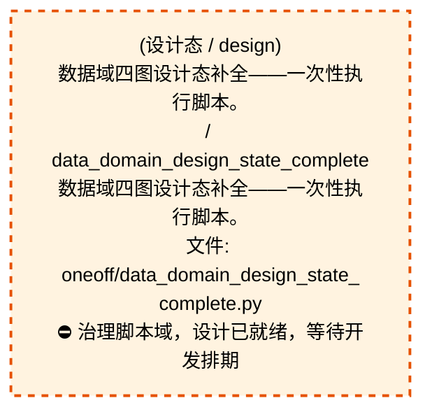

# 56_d_gov_scripts / 脚本治理域 / Script Governance

> **功能简介 / Overview**: 脚本治理，负责脚本生命周期管理和脚本质量门禁

> **文档作用 / Purpose**: 展示 脚本治理（D_GOV_SCRIPTS）功能域的域内依赖关系、跨域依赖关系，模块信息（成熟度/中英文名/大白话/文件路径）内嵌于 Mermaid 节点，供架构审查和域治理参考。

> 本文档由 generate_domain_doc.py 从 depgraph (PostgreSQL) 自动生成
> 数据源: depgraph (PostgreSQL) nodes表 + edges表

> **[可缩放 HTML 版 / Zoomable HTML](http://localhost:8765/docs/02_enterprise_architecture/02_domain_architecture_docs/_zoomable_html/56_d_gov_scripts.html)** — Ctrl+滚轮缩放 ｜ 双击重置 ｜ Ctrl+Shift+D 切换拖动/选择模式

## 域基本信息 / Domain Overview

| 字段 | 值 | Field | Value |
|------|------|-------|-------|
| 编号 | 56 | Number | 56 |
| 域ID | D_GOV_SCRIPTS | Domain ID | D_GOV_SCRIPTS |
| 域名称 | 脚本治理 | Domain Name | Script Governance |
| 层级 | L2 业务域层 | Layer | L2 Domain |
| 模块数 | 387 | Module Count | 387 |
| 域内依赖 | 745 | Internal Dependencies | 745 |
| 跨域入边 | 72 | Cross-domain Incoming | 72 |
| 跨域出边 | 129 | Cross-domain Outgoing | 129 |
| 设计态模块 | 1 | Design Modules | 1 |
| 生产态模块 | 386 | Production Modules | 386 |
| 容量 | 386/150 (超容) | Capacity | 386/150 (超容) |
| 描述 | Phase Manager阶段管理 | Description | Phase Manager阶段管理 |

## 域内依赖图 / Internal Dependency Diagram

> 依赖图内嵌在本文档中，IDE 可直接渲染；网页版可 Ctrl+滚轮缩放 + 拖动平移查看细节。
>
> **图例说明 / Legend**：
> - 🟦 **蓝色 = 运营态模块**（production，已上线运行）
> - 🟧 **橙色虚线 = 设计态模块**（design，蓝图阶段，代码未写）
> - **实线箭头 = 运营态依赖**（已生效的依赖关系）
> - **虚线箭头 = 非运营态依赖**（计划中/验证中的依赖关系）

### 全景图（全部模块，颜色区分运营态/设计态）

> 展示全部 387 个模块（生产态 386 + 设计态 1），含跨域依赖外部节点。节点含成熟度+名称+大白话/简介+文件路径。

```mermaid
%%{init: {'theme': 'base', 'themeVariables': {'primaryColor': '#eaeaea', 'primaryTextColor': '#333333', 'primaryBorderColor': '#666666', 'lineColor': '#666666', 'secondaryColor': '#eaeaea', 'tertiaryColor': '#eaeaea', 'fontSize': '14px'}}}%%
flowchart TD
    docs_01_policies_and_standards_registry_catalogs_scripts_registry_yaml["(生产态 / production) 脚本注册表 /<br/>scripts_registry<br/>scripts注册表，机器学习的注册表，登记和<br/>查询已注册的条目。<br/>文件: catalogs/scripts_registry.yaml"]
    scripts_archive_governance_dm106_p2b_verification_py["(生产态 / production) DM-106: P2-B<br/>迁移全量验证脚本 / dm106_p2b_<br/>verification<br/>DM-106: P2-B 迁移全量验证脚本<br/>文件: governance/dm106_p2b_<br/>verification.py"]
    scripts_governance_archive_one_off_audit_post_sync_commands_py["(生产态 / production)<br/>审计postsynccommands / audit_post_sync_<br/>commands<br/>post_sync_standard 命令可执行性巡检<br/>（防幻觉/CLI漂移）<br/>文件: one_off/audit_post_sync_<br/>commands.py"]
    scripts_governance_archive_one_off_check_exam_case_consistency_py["(生产态 / production)<br/>考试题库一致性检查——根因治本，防止'定义-<br/>注册脱钩'复发。 / check_exam_case_<br/>consistency<br/>考试题库一致性检查——根因治本，防止'定义-<br/>注册脱钩'复发。<br/>文件: one_off/check_exam_case_<br/>consistency.py"]
    scripts_governance_archive_one_off_create_alignment_tasks_py["(生产态 / production) 创建对齐任务 / #<br/>(BLUEPRINT) MOD-INF-005 / scripts<br/>/governance/create_alignm<br/>创建对齐任务，供governance automation;<br/>alignme使用<br/>文件: one_off/create_alignment_tasks.py"]
    scripts_governance_archive_one_off_dm105_depgraph_triage_py["(生产态 / production) dm105depgraph分诊<br/>/ dm105_depgraph_triage<br/>DM-105: depgraph<br/>未分配节点三策略处理脚本<br/>文件: one_off/dm105_depgraph_triage.py"]
    scripts_governance_archive_one_off_fix_broken_post_sync_py["(生产态 / production)<br/>修复brokenpostsync / fix_broken_post_<br/>sync<br/>批量修复历史 broken post_sync_standard<br/>命令<br/>文件: one_off/fix_broken_post_sync.py"]
    scripts_governance_archive_one_off_list_phase0_tasks_py["(生产态 / production) listphase0任务 /<br/>list_phase0_tasks<br/>(INVARIANTS) 仅查询不修改;<br/>连接失败→exit 1<br/>文件: one_off/list_phase0_tasks.py"]
    scripts_governance_archive_one_off_phase_a_backup_py["(生产态 / production) 阶段a备份 / phase_<br/>a_backup<br/>阶段A安全网 Tier0/Tier1 关键文件备份<br/>文件: one_off/phase_a_backup.py"]
    scripts_governance_archive_one_off_rename_kebab_to_snake_py["(生产态 / production)<br/>renamekebabtosnake.py — 全项目文件名<br/>/目录名 ke / rename_kebab_to_snake<br/>全项目文件名/目录名 kebab-case → snake_<br/>case 批量重命名。<br/>文件: one_off/rename_kebab_to_snake.py"]
    scripts_governance_archive_one_off_rename_whitelist_cleanup_py["(生产态 / production)<br/>命名规范白名单清理 - 全文替换脚本。 /<br/>rename_whitelist_cleanup<br/>命名规范白名单清理 - 全文替换脚本。<br/>文件: one_off/rename_whitelist_<br/>cleanup.py"]
    scripts_governance_archive_one_off_test_lock_scenarios_py["(生产态 / production) 测试锁scenarios /<br/>test_lock_scenarios<br/>RULE-ZERO 锁协议场景 B/C 验证<br/>文件: one_off/test_lock_scenarios.py"]
    scripts_governance_archive_one_off_verify_final_delivery_py["(生产态 / production) (INVARIANTS)<br/>设计态节点数>=1128; 规则表各表>0 /<br/>verify_final_delivery<br/>(INVARIANTS) 设计态节点数>=1128;<br/>规则表各表>0<br/>文件: one_off/verify_final_delivery.py"]
    scripts_governance_archive_one_off_verify_rule_yaml_migration_py["(生产态 / production)<br/>verify规则yamlmigration / verify_rule_<br/>yaml_migration.py - 6-dimensional<br/>verification o<br/>verify规则yamlmigration，提供包入口和模<br/>块加载功能<br/>文件: one_off/verify_rule_yaml_<br/>migration.py"]
    scripts_governance_archive_prototype_adversarial_log_py["(生产态 / production)<br/>红白对抗闭环记录——攻击→根源分析→修复→回<br/>归验证→知识注入全链路追踪 / adversarial_<br/>log<br/>红白对抗闭环记录——攻击→根源分析→修复→回<br/>归验证→知识注入全链路追踪<br/>文件: prototype/adversarial_log.py"]
    scripts_governance_archive_prototype_audit_domain_nodes_py["(生产态 / production) 审计域节点 /<br/>SRC-100200: Audit 13 over-capacity<br/>domains granularity distr<br/>审计域节点。SRC-100200: Audit 13<br/>over-capacity domains granularity<br/>distribution.<br/>文件: prototype/audit_domain_nodes.py"]
    scripts_governance_archive_prototype_changelog_py["(生产态 / production) changelog.py —<br/>治理域变更日志生成/追加工具. / changelog<br/>治理域变更日志生成/追加工具.<br/>文件: prototype/changelog.py"]
    scripts_governance_archive_prototype_check_audit_rbac_isolation_py["(生产态 / production)<br/>check审计RBACisolation / check_audit_<br/>rbac_isolation<br/>静态分析 audit-trail 是否直接 import<br/>agent-rbac.<br/>文件: prototype/check_audit_rbac_<br/>isolation.py"]
    scripts_governance_archive_prototype_construction_gate_py["(生产态 / production) construction门禁<br/>/ construction_gate<br/>Construction Gate — 施工前路径校验门禁<br/>文件: prototype/construction_gate.py"]
    scripts_governance_archive_prototype_generate_asset_index_py["(生产态 / production)<br/>全项目资产索引生成器 / generate_asset_<br/>index<br/>全项目资产索引生成器<br/>文件: prototype/generate_asset_index.py"]
    scripts_governance_archive_prototype_generate_nav_table_py["(生产态 / production) 生成navtable /<br/>generate_nav_table<br/>全流程导航表自动生成器 v1.0.0<br/>文件: prototype/generate_nav_table.py"]
    scripts_governance_archive_prototype_rebuild_audit_index_py["(生产态 / production) rebuild审计索引 /<br/>rebuild_audit_index<br/>重建 audit-trail SQLite 派生索引<br/>文件: prototype/rebuild_audit_index.py"]
    scripts_governance_archive_prototype_scan_ground_truth_deps_py["(生产态 / production)<br/>扫描groundtruthdeps / # (BLUEPRINT)<br/>MOD-INF-005 / scripts/governance/scan_<br/>ground_t<br/>扫描groundtruthdeps，供Task card<br/>system; governance a使用<br/>文件: prototype/scan_ground_truth_<br/>deps.py"]
    scripts_governance_archive_prototype_session_simulator_py["(生产态 / production) 会话模拟器 /<br/>session_simulator<br/>session_simulator — 30 个模拟开发<br/>session 的蓝图读取事件生成器<br/>文件: prototype/session_simulator.py"]
    scripts_governance_archive_prototype_sync_blueprint_status_py["(生产态 / production) 同步蓝图状态 /<br/>sync_blueprint_status<br/>机械强制：construction_plan=phase_2_<br/>complete → blueprint.status=Active.<br/>文件: prototype/sync_blueprint_status.py"]
    scripts_governance_archive_vms_ri_vms_blindspot_check_py["(生产态 / production) VMS<br/>盲点闭合检查器 — MOD-INF-011 · R1(33) +<br/>R2( / vms_blindspot_check<br/>VMS 盲点闭合检查器 — MOD-INF-011 · R1<br/>(33) + R2(22) + R4(6)<br/>文件: vms_ri/vms_blindspot_check.py"]
    scripts_governance_archive_vms_ri_vms_build_completion_check_py["(生产态 / production)<br/>vms构建completion检查 / VMS Build<br/>Completion Check — MOD-INF-011 ·<br/>TASK-INF-0217<br/>vms构建completion检查。VMS Build<br/>Completion Check — MOD-INF-011 ·<br/>TASK-INF-0217<br/>文件: vms_ri/vms_build_completion_<br/>check.py"]
    scripts_governance_archive_vms_ri_vms_cron_monitor_py["(生产态 / production) vmscron监控器 /<br/>vms_cron_monitor<br/>VMS Cron 监控器 — MOD-INF-011 ·<br/>TASK-INF-0224<br/>文件: vms_ri/vms_cron_monitor.py"]
    scripts_governance_archive_vms_ri_vms_cross_file_check_py["(生产态 / production) VMS<br/>跨文件内容一致性检查器 — MOD-INF-011 ·<br/>TASK-INF / vms_cross_file_check<br/>VMS 跨文件内容一致性检查器 —<br/>MOD-INF-011 · TASK-INF-0211<br/>文件: vms_ri/vms_cross_file_check.py"]
    scripts_governance_archive_vms_ri_vms_health_check_py["(生产态 / production) vms健康检查 / vms_<br/>health_check<br/>VMS Health Check 脚本 — MOD-INF-011 ·<br/>Phase 3 运维自动化<br/>文件: vms_ri/vms_health_check.py"]
    scripts_governance_archive_vms_ri_vms_migrate_py["(生产态 / production) VMS Phase 2<br/>数据迁移脚本 — MOD-INF-011 / vms_migrate<br/>VMS Phase 2 数据迁移脚本 — MOD-INF-011<br/>文件: vms_ri/vms_migrate.py"]
    scripts_governance_archive_vms_ri_vms_migration_dry_run_py["(生产态 / production) vms迁移dry运行 /<br/>vms_migration_dry_run<br/>VMS 迁移 dry-run 脚本 — MOD-INF-011<br/>Phase 2 前置检查<br/>文件: vms_ri/vms_migration_dry_run.py"]
    scripts_governance_archive_vms_ri_vms_phase_rollback_py["(生产态 / production) vms阶段回滚 / vms_<br/>phase_rollback<br/>VMS Phase 回滚方案 — MOD-INF-011 ·<br/>TASK-INF-0217<br/>文件: vms_ri/vms_phase_rollback.py"]
    scripts_governance_archive_vms_ri_vms_version_sync_check_py["(生产态 / production) VMS<br/>版本同步检查器 — MOD-INF-011 ·<br/>TASK-INF-022 / vms_version_sync_check<br/>VMS 版本同步检查器 — MOD-INF-011 ·<br/>TASK-INF-0222<br/>文件: vms_ri/vms_version_sync_check.py"]
    scripts_governance_shared_base_py["(生产态 / production) 基类 / base<br/>审计脚本基类<br/>文件: _shared/base.py"]
    scripts_governance_sync_check_p0_status_py["(生产态 / production) 检查p0状态 /<br/>Module docstring — see module-level<br/>docstring for details.<br/>检查p0状态。Module docstring — see<br/>module-level docstring for details.<br/>文件: _sync/check_p0_status.py"]
    scripts_governance_sync_cleanup_p0_ops_pending_py["(生产态 / production) 清理p0运维待处理<br/>/ cleanup_p0_ops_pending<br/>一次性：将所有 OPS-* P0+PENDING<br/>任务降级+完成<br/>文件: _sync/cleanup_p0_ops_pending.py"]
    scripts_governance_sync_fix_orphan_deps_py["(生产态 / production) 修复孤儿deps /<br/>fix_orphan_deps<br/>一次性修复孤儿依赖引用<br/>文件: _sync/fix_orphan_deps.py"]
    scripts_governance_tasks_list_phase0_tasks_py["(生产态 / production) listphase0任务 /<br/>list_phase0_tasks<br/>(INVARIANTS) 仅查询不修改;<br/>连接失败→exit 1<br/>文件: _tasks/list_phase0_tasks.py"]
    scripts_governance_tasks_task_show_py["(生产态 / production) 任务show / task_<br/>show<br/>governance/task_show 脚本 —<br/>任务卡详情查询 CLI。<br/>文件: _tasks/task_show.py"]
    scripts_governance_tasks_task_summary_py["(生产态 / production) 任务摘要 / task_<br/>summary<br/>任务系统全局摘要 CLI<br/>文件: _tasks/task_summary.py"]
    scripts_governance_add_deferred_design_edges_py["(生产态 / production)<br/>新增deferred设计边 / add_deferred_<br/>design_edges<br/>为暂缓模块添加设计态依赖边（dep_<br/>maturity='design'）。<br/>文件: governance/add_deferred_design_<br/>edges.py"]
    scripts_governance_apply_dataflowgraph_py["(生产态 / production) 应用dataflowgraph<br/>/ apply_dataflowgraph<br/>dataflowgraph 变更写入工具<br/>文件: governance/apply_dataflowgraph.py"]
    scripts_governance_apply_decisiongraph_py["(生产态 / production) 应用decisiongraph<br/>/ apply_decisiongraph<br/>(INVARIANTS) pg_advisory_lock 写锁;<br/>build_status 单调推进; DEC-INV-001~005<br/>校验; 事务回滚<br/>文件: governance/apply_decisiongraph.py"]
    scripts_governance_apply_depgraph_py["(生产态 / production) (INVARIANTS)<br/>原子写入（RULE-ONE）；变更前验证；禁止直<br/>接覆盖 / apply_depgraph<br/>(INVARIANTS) 原子写入<br/>（RULE-ONE）；变更前验证；禁止直接覆盖<br/>文件: governance/apply_depgraph.py"]
    scripts_governance_architecture_health_dashboard_py["(生产态 / production) 架构健康仪表盘 /<br/>architecture_health_dashboard<br/>架构健康度仪表盘（自动化检测基线）<br/>文件: governance/architecture_health_<br/>dashboard.py"]
    scripts_governance_ast_import_rewriter_py["(生产态 / production) ast导入rewriter /<br/>AST-based import rewriter for<br/>governance directory migration<br/>ast导入rewriter。AST-based import<br/>rewriter for governance directory<br/>migration.<br/>文件: governance/ast_import_rewriter.py"]
    scripts_governance_audit_return_contract_usage_py["(生产态 / production)<br/>审计returncontractusage / audit_return_<br/>contract_usage<br/>返回契约 ok 键调用方审计<br/>文件: governance/audit_return_contract_<br/>usage.py"]
    scripts_governance_audit_worktree_ops_telemetry_py["(生产态 / production)<br/>审计worktree运维遥测 / audit_worktree_<br/>ops_telemetry<br/>主工作区文件级擦除操作遥测完整性审计<br/>文件: governance/audit_worktree_ops_<br/>telemetry.py"]
    scripts_governance_check_commit_message_py["(生产态 / production) 检查提交message /<br/>check_commit_message.py — GitHub<br/>Actions PR commit message g<br/>从 commit message 提取 (GW:session_id)<br/>标记中的 session_id。<br/>文件: governance/check_commit_message.py"]
    scripts_governance_check_ssot_gate_py["(生产态 / production) checkssot门禁 /<br/>check_ssot_gate<br/>GATE-SSOT: SSoT 创建门禁（pre-commit<br/>hook 双保险）。<br/>文件: governance/check_ssot_gate.py"]
    scripts_governance_d10_performance_collect_system_threads_py["(生产态 / production)<br/>collect系统threads / collect_system_<br/>threads<br/>全系统线程数快照采集器<br/>文件: d10_performance/collect_system_<br/>threads.py"]
    scripts_governance_d11_compliance_audit_registration_py["(生产态 / production) 审计registration<br/>/ audit_registration<br/>孤儿注册检测（RULE-TWO 防线 2）<br/>文件: d11_compliance/audit_<br/>registration.py"]
    scripts_governance_d11_compliance_ci_self_check_py["(生产态 / production) ci自检查 / ci_<br/>self_check<br/>CI Entry: Self-Check — Drift Detector<br/>自身完整性验证<br/>文件: d11_compliance/ci_self_check.py"]
    scripts_governance_d11_compliance_fix_shared_bypass_py["(生产态 / production) 修复共享绕过 /<br/>fix_shared_bypass.py - D-D-07 auto-fix<br/>tool (validate_script<br/>检测赋值节点是否包含 Path(__file__<br/>).parents(N) 模式（不限变量名）。<br/>文件: d11_compliance/fix_shared_<br/>bypass.py"]
    scripts_governance_d11_compliance_g9_compliance_check_py["(生产态 / production) G9<br/>四蓝图跨模块集成合规门禁执行器. / g9_<br/>compliance_check<br/>G9 四蓝图跨模块集成合规门禁执行器.<br/>文件: d11_compliance/g9_compliance_<br/>check.py"]
    scripts_governance_d11_compliance_task_self_check_py["(生产态 / production) 任务自检查 / task_<br/>self_check<br/>任务系统自身健康检查<br/>文件: d11_compliance/task_self_check.py"]
    scripts_governance_d11_compliance_validate_commit_gateway_py["(生产态 / production) 校验提交网关 /<br/>validate_commit_gateway<br/>GATE-COMMIT-GW 门禁<br/>文件: d11_compliance/validate_commit_<br/>gateway.py"]
    scripts_governance_d11_compliance_validate_commit_message_py["(生产态 / production) 校验提交message /<br/>validate_commit_message<br/>Conventional Commits 校验（commit-msg<br/>hook）+ AI 归因 trailer 检测<br/>（warn-only）<br/>文件: d11_compliance/validate_commit_<br/>message.py"]
    scripts_governance_d11_compliance_validate_exit_codes_py["(生产态 / production) validate退出codes<br/>/ validate_exit_codes<br/>审计脚本退出码规范门禁<br/>文件: d11_compliance/validate_exit_<br/>codes.py"]
    scripts_governance_d11_compliance_validate_frozen_requirements_py["(生产态 / production)<br/>校验frozenrequirements / validate_<br/>frozen_requirements<br/>依赖版本锁定与验证（蓝图 §34.2）<br/>文件: d11_compliance/validate_frozen_<br/>requirements.py"]
    scripts_governance_d11_compliance_validate_manifest_admission_py["(生产态 / production)<br/>validate清单admission / Module<br/>docstring — see module-level docstring<br/>for details.<br/>校验manifest准入。Module docstring —<br/>see module-level docstring for details.<br/>文件: d11_compliance/validate_manifest_<br/>admission.py"]
    scripts_governance_d11_compliance_validate_no_utf8_bom_py["(生产态 / production) 校验noutf8bom /<br/>validate_no_utf8_bom<br/>UTF-8 BOM 检测门禁<br/>文件: d11_compliance/validate_no_utf8_<br/>bom.py"]
    scripts_governance_d11_compliance_validate_script_naming_py["(生产态 / production) 校验scriptnaming<br/>/ validate_script_naming<br/>审计脚本命名规范门禁<br/>文件: d11_compliance/validate_script_<br/>naming.py"]
    scripts_governance_d11_compliance_validate_script_quality_py["(生产态 / production)<br/>validatescript质量 / validate_script_<br/>quality<br/>治理脚本质量合规检查<br/>文件: d11_compliance/validate_script_<br/>quality.py"]
    scripts_governance_d11_compliance_validate_task_decomposition_bypass_py["(生产态 / production)<br/>validatetaskdecomposition绕过 /<br/>validate_task_decomposition_bypass<br/>Task Decomposition Bypass 检测<br/>文件: d11_compliance/validate_task_<br/>decomposition_bypass.py"]
    scripts_governance_d11_compliance_validate_vocabulary_coverage_py["(生产态 / production)<br/>校验vocabularycoverage / Module<br/>docstring — see module-level docstring<br/>for details.<br/>校验vocabularycoverage。Module<br/>docstring — see module-level docstring<br/>for details.<br/>文件: d11_compliance/validate_<br/>vocabulary_coverage.py"]
    scripts_governance_d11_compliance_verify_audit_integrity_py["(生产态 / production) 校验审计完整性 /<br/>verify_audit_integrity<br/>MOD-INF-020 · 零依赖外部独立验证器<br/>文件: d11_compliance/verify_audit_<br/>integrity.py"]
    scripts_governance_d11_compliance_verify_schema_health_py["(生产态 / production) 校验模式健康 /<br/>verify_schema_health<br/>校验模式健康 (PostgreSQL) Schema<br/>健康度校验门禁（#ARCH-016 治本）<br/>文件: d11_compliance/verify_schema_<br/>health.py"]
    scripts_governance_d12_ai_hallucination_check_logger_kwargs_py["(生产态 / production) check日志器kwargs<br/>/ ======================================<br/>==================<br/>检查日志器kwargs。======================<br/>==================================<br/>文件: d12_ai_hallucination/check_logger_<br/>kwargs.py"]
    scripts_governance_d12_ai_hallucination_validate_gate_prompt_conflict_py["(生产态 / production) 校验门禁提示冲突<br/>/ validate_gate_prompt_conflict<br/>Gate-Prompt 冲突检测<br/>文件: d12_ai_hallucination/validate_<br/>gate_prompt_conflict.py"]
    scripts_governance_d12_ai_hallucination_validate_session_budget_py["(生产态 / production) 校验会话预算 /<br/>validate_session_budget<br/>Session 操作预算校验（已废弃）<br/>文件: d12_ai_hallucination/validate_<br/>session_budget.py"]
    scripts_governance_d12_ai_hallucination_validate_session_gate_check_py["(生产态 / production) 校验会话门禁检查<br/>/ validate_session_gate_check<br/>Session 门禁检查完整性校验<br/>文件: d12_ai_hallucination/validate_<br/>session_gate_check.py"]
    scripts_governance_d1_structure_archive_drafts_zone_py["(生产态 / production)<br/>草稿区生命周期归档器——扫描 arbitrated<br/>草稿，按 age 判定 wa / archive_drafts_<br/>zone<br/>草稿区生命周期归档器——扫描 arbitrated<br/>草稿，按 age 判定 warn/archive/skip。<br/>文件: d1_structure/archive_drafts_<br/>zone.py"]
    scripts_governance_d1_structure_audit_config_format_py["(生产态 / production) 审计配置format /<br/>audit_config_format<br/>config/ 目录格式/注释/边界快速扫描<br/>文件: d1_structure/audit_config_<br/>format.py"]
    scripts_governance_d1_structure_audit_directory_integrity_py["(生产态 / production)<br/>审计directory完整性 / audit_directory_<br/>integrity<br/>01_policies_and_standards/<br/>目录结构完整性审计<br/>文件: d1_structure/audit_directory_<br/>integrity.py"]
    scripts_governance_d1_structure_audit_directory_scalability_py["(生产态 / production)<br/>审计directoryscalability / audit_<br/>directory_scalability<br/>- 物理结构可扩展性审计<br/>(1500模块支撑能力检查)<br/>文件: d1_structure/audit_directory_<br/>scalability.py"]
    scripts_governance_d1_structure_audit_findings_by_scope_py["(生产态 / production)<br/>审计findingsby作用域 / audit_findings_<br/>by_scope<br/>按目录范围筛选 Finding 报告<br/>文件: d1_structure/audit_findings_by_<br/>scope.py"]
    scripts_governance_d1_structure_batch_create_index_md_py["(生产态 / production) 批次创建索引md /<br/>Batch create index.md for all<br/>directories under docs/ that l<br/>批次创建索引md。Batch create index.md<br/>for all directories under docs/ that<br/>lack one.<br/>文件: d1_structure/batch_create_index_<br/>md.py"]
    scripts_governance_d1_structure_cbg_reset_py["(生产态 / production) cbg重置 / cbg_<br/>reset<br/>CBG 熔断器重置 CLI<br/>(CircuitBreakerGateway Reset Command)<br/>文件: d1_structure/cbg_reset.py"]
    scripts_governance_d1_structure_check_directory_contract_py["(生产态 / production) 检查directory契约<br/>/ GATE-DIRECTORY-CONTRACT: Directory<br/>Contract validation gate.<br/>检查directory契约。GATE-DIRECTORY-CONTRA<br/>CT: Directory Contract validation gate.<br/>文件: d1_structure/check_directory_<br/>contract.py"]
    scripts_governance_d1_structure_check_handoff_manifests_py["(生产态 / production)<br/>检查handoffmanifests / check_handoff_<br/>manifests<br/>AI Session Handoff Manifest 完整性校验.<br/>文件: d1_structure/check_handoff_<br/>manifests.py"]
    scripts_governance_d1_structure_check_index_integrity_py["(生产态 / production) 检查索引完整性 /<br/>check_index_integrity<br/>索引完整性校验<br/>文件: d1_structure/check_index_<br/>integrity.py"]
    scripts_governance_d1_structure_cleanup_stash_py["(生产态 / production) 清理stash /<br/>cleanup_stash<br/>git stash 堆积治理（OPS-2026062501<br/>治本）<br/>文件: d1_structure/cleanup_stash.py"]
    scripts_governance_d1_structure_detect_orphan_py_py["(生产态 / production) detect孤儿py /<br/>detect_orphan_py<br/>全库孤儿 .py 文件检测<br/>文件: d1_structure/detect_orphan_py.py"]
    scripts_governance_d1_structure_detect_residual_files_py["(生产态 / production) 检测residualfiles<br/>/ detect_residual_files<br/>残留物检测<br/>文件: d1_structure/detect_residual_<br/>files.py"]
    scripts_governance_d1_structure_detect_temp_files_py["(生产态 / production) 检测tempfiles /<br/>Module docstring — see module-level<br/>docstring for details.<br/>检测tempfiles。Module docstring — see<br/>module-level docstring for details.<br/>文件: d1_structure/detect_temp_files.py"]
    scripts_governance_d1_structure_drafts_zone_archiver_py["(生产态 / production) draftszone归档器<br/>/ drafts_zone_archiver<br/>草稿区生命周期归档器 (Drafts Zone<br/>Lifecycle Archiver · V-16)<br/>文件: d1_structure/drafts_zone_<br/>archiver.py"]
    scripts_governance_d1_structure_generate_missing_index_md_py["(生产态 / production)<br/>generatemissing索引md / generate_<br/>missing_index_md<br/>扫描目录树，为缺失 index.md<br/>的目录自动生成索引文件。<br/>文件: d1_structure/generate_missing_<br/>index_md.py"]
    scripts_governance_d1_structure_reset_cbg_py["(生产态 / production) 重置cbg / reset_<br/>cbg<br/>CBG 熔断器重置 CLI<br/>(CircuitBreakerGateway Reset Command)<br/>文件: d1_structure/reset_cbg.py"]
    scripts_governance_d1_structure_run_script_smoke_test_py["(生产态 / production)<br/>runscriptsmoke测试 / run_script_smoke_<br/>test<br/>治理脚本冒烟测试运行器<br/>文件: d1_structure/run_script_smoke_<br/>test.py"]
    scripts_governance_d1_structure_sync_index_from_manifest_py["(生产态 / production) sync索引from清单<br/>/ sync_index_from_manifest<br/>从 script_manifest.yaml (SSoT) 自动同步<br/>index.md 的脚本数量。<br/>文件: d1_structure/sync_index_from_<br/>manifest.py"]
    scripts_governance_d1_structure_sync_policies_index_py["(生产态 / production) 同步策略索引 /<br/>sync_policies_index<br/>从磁盘实际扫描，自动同步 PS-IDX-001 §二<br/>文件数量表格。<br/>文件: d1_structure/sync_policies_<br/>index.py"]
    scripts_governance_d1_structure_validate_config_integrity_py["(生产态 / production) 校验配置完整性 /<br/>validate_config_integrity<br/>运行时配置完整性十一层纵深审计 +<br/>自动同步检测<br/>文件: d1_structure/validate_config_<br/>integrity.py"]
    scripts_governance_d1_structure_validate_d1_output_sanity_py["(生产态 / production)<br/>校验d1outputsanity / validate_d1_output_<br/>sanity<br/>D1 产出物合理性校验（蓝图 §31 B93）<br/>文件: d1_structure/validate_d1_output_<br/>sanity.py"]
    scripts_governance_d1_structure_validate_immutable_core_py["(生产态 / production) 校验不可变核心 /<br/>validate_immutable_core<br/>immutable_core 文件修改检测<br/>文件: d1_structure/validate_immutable_<br/>core.py"]
    scripts_governance_d1_structure_validate_index_reality_py["(生产态 / production)<br/>validate索引reality / Module docstring<br/>— see module-level docstring for<br/>details.<br/>校验索引reality。Module docstring — see<br/>module-level docstring for details.<br/>文件: d1_structure/validate_index_<br/>reality.py"]
    scripts_governance_d1_structure_validate_read_before_write_py["(生产态 / production)<br/>校验readbeforewrite / validate_read_<br/>before_write<br/>先读后写校验<br/>文件: d1_structure/validate_read_before_<br/>write.py"]
    scripts_governance_d2_links_audit_broken_links_py["(生产态 / production) 检测文档<br/>/数据文件中的断链与幽灵引用。 / audit_<br/>broken_links<br/>检测文档/数据文件中的断链与幽灵引用。<br/>文件: d2_links/audit_broken_links.py"]
    scripts_governance_d2_links_detect_relative_references_py["(生产态 / production)<br/>检测relativereferences / detect_<br/>relative_references<br/>相对路径引用检测<br/>文件: d2_links/detect_relative_<br/>references.py"]
    scripts_governance_d3_metadata_auto_generate_index_py["(生产态 / production) 自动生成索引 /<br/>GATE-INDEX: Validate and auto-fix<br/>index.md factual accuracy.<br/>自动生成索引。GATE-INDEX: Validate and<br/>auto-fix index.md factual accuracy.<br/>文件: d3_metadata/auto_generate_index.py"]
    scripts_governance_d3_metadata_backfill_doctype_metadata_py["(生产态 / production)<br/>backfilldoctype元数据 / backfill_<br/>doctype_metadata<br/>批量回填 frontmatter doc_type 字段（doc_<br/>type 存量治理 Stage 2.1）<br/>文件: d3_metadata/backfill_doctype_<br/>metadata.py"]
    scripts_governance_d3_metadata_backfill_ttl_metadata_py["(生产态 / production)<br/>backfill存活时间元数据 / backfill_ttl_<br/>metadata<br/>批量回填/重判 ttl 字段（6<br/>格式统一入口，GATE-15 存量治理 +<br/>GATE-VOCAB-CHANGE 纠偏）<br/>文件: d3_metadata/backfill_ttl_<br/>metadata.py"]
    scripts_governance_d3_metadata_check_blueprint_compliance_py["(生产态 / production) (INVARIANTS)<br/>REQUIREDSECTIONS 必须与蓝图+施工图 /<br/>check_blueprint_compliance<br/>(INVARIANTS) REQUIRED_SECTIONS<br/>必须与蓝图+施工图模板 v2.1.0 COMPLIANCE_<br/>CHECKLIST 一致<br/>文件: d3_metadata/check_blueprint_<br/>compliance.py"]
    scripts_governance_d3_metadata_check_frontmatter_metadata_py["(生产态 / production)<br/>检查frontmatter元数据 / check_<br/>frontmatter_metadata<br/>GATE-15: Frontmatter metadata<br/>validation（ttl + doc_type 字段校验）<br/>文件: d3_metadata/check_frontmatter_<br/>metadata.py"]
    scripts_governance_d3_metadata_check_module_singlesource_py["(生产态 / production)<br/>检查模块singlesource / check_module_<br/>singlesource<br/>GATE-SSOT-SINGLESOURCE: SSoT<br/>单一真源门禁（Phase 7 治本防复发）。<br/>文件: d3_metadata/check_module_<br/>singlesource.py"]
    scripts_governance_d3_metadata_check_naming_convention_py["(生产态 / production) GATE-11<br/>命名规范门禁 — 全类型命名检测。 / check_<br/>naming_convention<br/>GATE-11 命名规范门禁 — 全类型命名检测。<br/>文件: d3_metadata/check_naming_<br/>convention.py"]
    scripts_governance_d3_metadata_check_registry_consistency_py["(生产态 / production) 检查注册表一致性<br/>/ check_registry_consistency<br/>check_registry_consistency —<br/>跨登记表一致性校验。<br/>文件: d3_metadata/check_registry_<br/>consistency.py"]
    scripts_governance_d3_metadata_check_schema_version_writes_py["(生产态 / production)<br/>check结构版本writes / check_schema_<br/>version_writes<br/>G_TRAE_059 验证脚本：_schema_version<br/>写入保护 + 版本一致性检查。<br/>文件: d3_metadata/check_schema_version_<br/>writes.py"]
    scripts_governance_d3_metadata_check_vocab_hardcode_py["(生产态 / production) 检查vocabhardcode<br/>/ check_vocab_hardcode<br/>GATE-VOCAB: 词表合法值硬编码检测（trae_<br/>060 §2）<br/>文件: d3_metadata/check_vocab_<br/>hardcode.py"]
    scripts_governance_d3_metadata_classify_ttl_by_content_py["(生产态 / production) 基于内容关键词的<br/>ttl 精细分类审查脚本。 / classify_ttl_<br/>by_content<br/>基于内容关键词的 ttl 精细分类审查脚本。<br/>文件: d3_metadata/classify_ttl_by_<br/>content.py"]
    scripts_governance_d3_metadata_deep_content_scanner_py["(生产态 / production) deep内容扫描器 /<br/>deep_content_scanner<br/>深度内容扫描器<br/>文件: d3_metadata/deep_content_<br/>scanner.py"]
    scripts_governance_d3_metadata_generate_derived_files_py["(生产态 / production) 生成derivedfiles<br/>/ generate_derived_files<br/>枚举自动派生生成器（Level 3 终极防御）<br/>文件: d3_metadata/generate_derived_<br/>files.py"]
    scripts_governance_d3_metadata_generate_rule_catalog_py["(生产态 / production) 生成规则目录 /<br/>Scan docs/01_policies_and_standards and<br/>emit _registry/catal<br/>生成规则目录。Scan docs/01_policies_and_<br/>standards and emit _registry/catalogs<br/>/rule_catalog_registry.yaml.<br/>文件: d3_metadata/generate_rule_<br/>catalog.py"]
    scripts_governance_d3_metadata_migrate_illegal_doctype_py["(生产态 / production) 批量迁移非法<br/>doctype 值（doctype 存量治理 Stage 2. /<br/>migrate_illegal_doctype<br/>批量迁移非法 doc_type 值（doc_type<br/>存量治理 Stage 2.2）<br/>文件: d3_metadata/migrate_illegal_<br/>doctype.py"]
    scripts_governance_d3_metadata_validate_architecture_py["(生产态 / production) 校验架构 /<br/>validate_architecture.py - Validate<br/>rule files against archi<br/>从 .md / .yaml 文件读取 frontmatter<br/>字段（统一返回 dict）。<br/>文件: d3_metadata/validate_<br/>architecture.py"]
    scripts_governance_d3_metadata_validate_blueprint_provenance_py["(生产态 / production) 校验蓝图溯源 /<br/>Blueprint Provenance Gate - V-12:<br/>validate provenance triple<br/>校验蓝图provenance。Blueprint<br/>Provenance Gate - V-12: validate<br/>provenance triples in blueprint<br/>frontmatter<br/>文件: d3_metadata/validate_blueprint_<br/>provenance.py"]
    scripts_governance_d3_metadata_validate_module_id_py["(生产态 / production) 校验模块id /<br/>GATE-MODULEID: Validate module_id<br/>uniqueness and index/file<br/>校验模块id。GATE-MODULEID: Validate<br/>module_id uniqueness and index/file<br/>consistency.<br/>文件: d3_metadata/validate_module_id.py"]
    scripts_governance_d3_metadata_validate_registry_master_index_py["(生产态 / production) 校验注册表主索引<br/>/ validate_registry_master_index<br/>登记表总索引自校验门禁 (Registry Master<br/>Index Self-Check Gate · V-18).<br/>文件: d3_metadata/validate_registry_<br/>master_index.py"]
    scripts_governance_d3_metadata_validate_tool_contracts_consistency_py["(生产态 / production)<br/>validatetool契约consistency / validate_<br/>tool_contracts_consistency<br/>Tool Contract 一致性校验脚本<br/>（MOD-INF-013 §9 R3）。<br/>文件: d3_metadata/validate_tool_<br/>contracts_consistency.py"]
    scripts_governance_d4_paths_detect_deprecated_path_writes_py["(生产态 / production)<br/>检测废弃路径writes / detect_deprecated_<br/>path_writes<br/>废弃路径写入检测<br/>文件: d4_paths/detect_deprecated_path_<br/>writes.py"]
    scripts_governance_d4_paths_detect_excessive_file_moves_py["(生产态 / production)<br/>检测excessive文件moves / detect_<br/>excessive_file_moves<br/>文件过度搬迁检测<br/>文件: d4_paths/detect_excessive_file_<br/>moves.py"]
    scripts_governance_d4_paths_detect_ruins_references_py["(生产态 / production)<br/>检测ruinsreferences / detect_ruins_<br/>references<br/>残骸/废弃路径引用检测<br/>文件: d4_paths/detect_ruins_<br/>references.py"]
    scripts_governance_d4_paths_detect_split_delete_ref_commit_py["(生产态 / production)<br/>检测拆分删除ref提交 / detect_split_<br/>delete_ref_commit<br/>删除引用分离提交检测<br/>文件: d4_paths/detect_split_delete_ref_<br/>commit.py"]
    scripts_governance_d5_architecture_analyze_change_impact_py["(生产态 / production) analyzechange冲击<br/>/ Module docstring — see module-level<br/>docstring for details.<br/>analyze变更冲击。Module docstring — see<br/>module-level docstring for details.<br/>文件: d5_architecture/analyze_change_<br/>impact.py"]
    scripts_governance_d5_architecture_analyzers_analyze_contract_impact_py["(生产态 / production)<br/>analyzecontract冲击 / analyze_contract_<br/>impact<br/>契约变更影响分析器<br/>文件: analyzers/analyze_contract_<br/>impact.py"]
    scripts_governance_d5_architecture_analyzers_audit_depends_on_chain_depth_py["(生产态 / production)<br/>审计dependsonchaindepth / audit_depends_<br/>on_chain_depth<br/>depends_on 依赖链路深度审计<br/>文件: analyzers/audit_depends_on_chain_<br/>depth.py"]
    scripts_governance_d5_architecture_analyzers_measure_deprecation_cascade_py["(生产态 / production) measure弃用级联 /<br/>measure_deprecation_cascade<br/>废弃级联影响度量<br/>文件: analyzers/measure_deprecation_<br/>cascade.py"]
    scripts_governance_d5_architecture_audit_agent_spec_py["(生产态 / production) 审计代理spec /<br/>audit_agent_spec<br/>(INVARIANTS) agent-spec 审计完整性<br/>文件: d5_architecture/audit_agent_<br/>spec.py"]
    scripts_governance_d5_architecture_check_budget_health_py["(生产态 / production) (INVARIANTS)<br/>预算健康检查不可跳过;检查结果必须可机器<br/>解析 / check_budget_health<br/>(INVARIANTS)<br/>预算健康检查不可跳过;检查结果必须可机器<br/>解析<br/>文件: d5_architecture/check_budget_<br/>health.py"]
    scripts_governance_d5_architecture_check_drift_e2e_py["(生产态 / production) 检查漂移端到端 /<br/>CI Entry: Drift Detector E2E Pipeline<br/>Check<br/>检查漂移端到端。CI Entry: Drift<br/>Detector E2E Pipeline Check<br/>文件: d5_architecture/check_drift_e2e.py"]
    scripts_governance_d5_architecture_checkers_check_architecture_gates_py["(生产态 / production) 检查架构门禁 /<br/>v2.4.0 — 2026-05-03<br/>检查架构门禁。v2.4.0 — 2026-05-03<br/>文件: checkers/check_architecture_<br/>gates.py"]
    scripts_governance_d5_architecture_checkers_check_blueprint_automation_sync_py["(生产态 / production) (INVARIANTS)<br/>蓝图§5.5自动化触发机制状态列必须与代码实<br/>际实现一致 / check_blueprint_automation_<br/>sync<br/>(INVARIANTS)<br/>蓝图§5.5自动化触发机制状态列必须与代码实<br/>际实现一致; ⚠️待实现但代码已实现=DRIFT;<br/>✅已实现但代码不存在=DRIFT<br/>文件: checkers/check_blueprint_<br/>automation_sync.py"]
    scripts_governance_d5_architecture_checkers_check_blueprint_code_alignment_py["(生产态 / production) 检查蓝图代码对齐<br/>/ check_blueprint_code_alignment<br/>(INVARIANTS) 代码(BLUEPRINT)头部module_<br/>id必须与蓝图注册表一致;<br/>蓝图§4已实现文件必须在磁盘存在;<br/>frontmatter.build_status 必须与<br/>depgraph 聚合 build_status<br/>文件: checkers/check_blueprint_code_<br/>alignment.py"]
    scripts_governance_d5_architecture_checkers_check_blueprint_template_compliance_py["(生产态 / production) (INVARIANTS)<br/>蓝图模板合规检查不可绕过;52项检查全覆盖<br/>/ check_blueprint_template_compliance<br/>(INVARIANTS)<br/>蓝图模板合规检查不可绕过;52项检查全覆盖<br/>文件: checkers/check_blueprint_template_<br/>compliance.py"]
    scripts_governance_d5_architecture_checkers_check_canonical_yaml_drift_py["(生产态 / production) check规范yaml漂移<br/>/ check_canonical_yaml_drift.py —<br/>GATE-CANONICAL-YAML-DRIFT<br/>安全加载 YAML，返回解析对象（dict<br/>/list）。<br/>文件: checkers/check_canonical_yaml_<br/>drift.py"]
    scripts_governance_d5_architecture_checkers_check_code_duplication_py["(生产态 / production)<br/>check代码duplication / check_code_<br/>duplication<br/>(INVARIANTS) 扫描 src/zephyr/ 下所有包;<br/>检测跨包同名文件代码重复<br/>文件: checkers/check_code_duplication.py"]
    scripts_governance_d5_architecture_checkers_check_contract_code_drift_py["(生产态 / production) 检查契约代码漂移<br/>/ check_contract_code_drift<br/>— 契约-代码双写漂移阻断（盲点 C2 修复）<br/>文件: checkers/check_contract_code_<br/>drift.py"]
    scripts_governance_d5_architecture_checkers_check_contract_physical_path_py["(生产态 / production)<br/>检查契约physical路径 / check_contract_<br/>physical_path.py —<br/>GATE-CONTRACT-PHYSICAL-PAT<br/>检查单个 physical_path<br/>是否含连字符目录段, 返回违规信息列表.<br/>文件: checkers/check_contract_physical_<br/>path.py"]
    scripts_governance_d5_architecture_checkers_check_dependency_direction_py["(生产态 / production)<br/>check依赖direction / check_dependency_<br/>direction<br/>依赖方向校验<br/>文件: checkers/check_dependency_<br/>direction.py"]
    scripts_governance_d5_architecture_checkers_check_g6_ctr_compliance_py["(生产态 / production) 检查g6ctr合规 /<br/>check_g6_ctr_compliance.py - G6 CTR<br/>Contract Compliance Gate<br/>检查g6ctr合规，治理的检查器，检查某项条<br/>件是否满足。<br/>文件: checkers/check_g6_ctr_<br/>compliance.py"]
    scripts_governance_d5_architecture_checkers_check_orphan_outputs_py["(生产态 / production) check孤儿outputs<br/>/ check_orphan_outputs<br/>(INVARIANTS) 扫描蓝图 §11 产出物<br/>consumer_min; 检测零消费者孤儿产出物<br/>文件: checkers/check_orphan_outputs.py"]
    scripts_governance_d5_architecture_checkers_check_precommit_id_uniqueness_py["(生产态 / production)<br/>检查precommitiduniqueness / check_<br/>precommit_id_uniqueness.py —<br/>GATE-ID-UNIQ<br/>扫描 .pre-commit-config.yaml 文本,返回<br/>(line_no, hook_id, repo_url, repo_line)<br/>列表。<br/>文件: checkers/check_precommit_id_<br/>uniqueness.py"]
    scripts_governance_d5_architecture_checkers_check_rule_four_way_alignment_py["(生产态 / production)<br/>check规则fourway对齐 / check_rule_four_<br/>way_alignment<br/>— 规则四方对齐门禁（ARCH-020 补建）<br/>文件: checkers/check_rule_four_way_<br/>alignment.py"]
    scripts_governance_d5_architecture_checkers_check_ssot_uniqueness_py["(生产态 / production)<br/>检查ssotuniqueness / check_ssot_<br/>uniqueness<br/>(INVARIANTS) 扫描所有蓝图 ssot_claims<br/>字段; 检测跨蓝图 SSoT 冲突<br/>文件: checkers/check_ssot_uniqueness.py"]
    scripts_governance_d5_architecture_checkers_check_trace_context_propagation_py["(生产态 / production)<br/>check追踪上下文propagation / check_<br/>trace_context_propagation<br/>TraceContext 传播强制执行 CI 检查<br/>文件: checkers/check_trace_context_<br/>propagation.py"]
    scripts_governance_d5_architecture_checkers_check_vms_ssot_py["(生产态 / production) GATE-VMS-SSOT:<br/>VMS 单一真源门禁——三重检测。 / check_<br/>vms_ssot<br/>GATE-VMS-SSOT: VMS<br/>单一真源门禁——三重检测。<br/>文件: checkers/check_vms_ssot.py"]
    scripts_governance_d5_architecture_dependency_graph_py["(生产态 / production) 依赖图 /<br/>dependency_graph<br/>治理域有向依赖图 — 扫描 governance/<br/>下所有 import 生成依赖图.<br/>文件: d5_architecture/dependency_<br/>graph.py"]
    scripts_governance_d5_architecture_detect_causal_conflicts_py["(生产态 / production)<br/>检测causalconflicts / Module docstring<br/>— see module-level docstring for<br/>details.<br/>检测causalconflicts。Module docstring —<br/>see module-level docstring for details.<br/>文件: d5_architecture/detect_causal_<br/>conflicts.py"]
    scripts_governance_d5_architecture_detect_constraint_violations_py["(生产态 / production)<br/>detect约束violations / detect_<br/>constraint_violations<br/>G9-Detect: 架构约束违规检测器（对照<br/>depgraph 实际数据检测 6 类违规）<br/>文件: d5_architecture/detect_constraint_<br/>violations.py"]
    scripts_governance_d5_architecture_detectors_analyze_same_name_module_relations_py["(生产态 / production)<br/>analyzesamename模块relations / analyze_<br/>same_name_module_relations<br/>-- 同名模块语义关系分析<br/>文件: detectors/analyze_same_name_<br/>module_relations.py"]
    scripts_governance_d5_architecture_detectors_detect_depends_on_cycles_py["(生产态 / production)<br/>检测depends开cycles / detect_depends_on_<br/>cycles<br/>depends_on 环检测.<br/>文件: detectors/detect_depends_on_<br/>cycles.py"]
    scripts_governance_d5_architecture_detectors_detect_deprecated_adr_references_py["(生产态 / production)<br/>检测废弃adrreferences / detect_<br/>deprecated_adr_references<br/>废弃 ADR 引用检测<br/>文件: detectors/detect_deprecated_adr_<br/>references.py"]
    scripts_governance_d5_architecture_detectors_detect_duplicate_module_names_py["(生产态 / production)<br/>detect重复modulenames / detect_<br/>duplicate_module_names<br/>-- 同名模块语义关系分析<br/>文件: detectors/detect_duplicate_module_<br/>names.py"]
    scripts_governance_d5_architecture_diagnose_depgraph_py["(生产态 / production) diagnose依赖图 /<br/># (BLUEPRINT) MOD-INF-005 / scripts<br/>/governance/diagnose_depg<br/>找出图拓扑孤儿节点（无入边无出边）。<br/>文件: d5_architecture/diagnose_<br/>depgraph.py"]
    scripts_governance_d5_architecture_generators_align_panoramas_py["(生产态 / production) G-panorama-align:<br/>四图对齐检测器（ARCH-053 + ARC / align_<br/>panoramas<br/>G-panorama-align: 四图对齐检测器<br/>（ARCH-053 + ARCH-056 四图升级）<br/>文件: generators/align_panoramas.py"]
    scripts_governance_d5_architecture_generators_generate_asset_catalog_py["(生产态 / production) 生成资产目录 /<br/>generate_asset_catalog<br/>G13: 从 depgraph (PostgreSQL)<br/>生成资产清单全景图<br/>文件: generators/generate_asset_<br/>catalog.py"]
    scripts_governance_d5_architecture_generators_generate_blueprint_panorama_py["(生产态 / production)<br/>generate蓝图panorama / generate_<br/>blueprint_panorama<br/>G-panorama-gen: 蓝图 §0.6<br/>四图对齐视图生成器（ARCH-053 + ARCH-056<br/>+ 模板 v2.1.0）<br/>文件: generators/generate_blueprint_<br/>panorama.py"]
    scripts_governance_d5_architecture_generators_generate_candidate_module_report_py["(生产态 / production) 从 candidate_<br/>module_registry.yaml<br/>生成候选模块清单报告（分片：索引 +<br/>每域一个...<br/>文件: generators/generate_candidate_<br/>module_report.py"]
    scripts_governance_d5_architecture_generators_generate_code_wiki_stats_py["(生产态 / production)<br/>generate代码wikistats / generate_code_<br/>wiki_stats<br/>Code Wiki 统计数据生成器<br/>（半自动维护机制）。<br/>文件: generators/generate_code_wiki_<br/>stats.py"]
    scripts_governance_d5_architecture_generators_generate_contract_catalog_py["(生产态 / production) 生成契约目录 /<br/>generate_contract_catalog<br/>G12: 从 depgraph (PostgreSQL)<br/>生成契约目录全景图<br/>文件: generators/generate_contract_<br/>catalog.py"]
    scripts_governance_d5_architecture_generators_generate_contracts_py["(生产态 / production) 生成契约 /<br/>generate_contracts.py -- SSoT to<br/>Codegen pipeline<br/>生成契约，治理的生成器，按规则生成所需的<br/>数据或报告。<br/>文件: generators/generate_contracts.py"]
    scripts_governance_d5_architecture_generators_generate_data_acquisition_flow_py["(生产态 / production)<br/>generate数据acquisition流程 / generate_<br/>data_acquisition_flow<br/>G-acqflow: 从 tasks.yaml<br/>生成业务数据采集流图 MD<br/>（人类可读版，内嵌 Mermaid）<br/>文件: generators/generate_data_<br/>acquisition_flow.py"]
    scripts_governance_d5_architecture_generators_generate_data_inventory_py["(生产态 / production)<br/>generate数据inventory / generate_data_<br/>inventory<br/>G-inventory: 扫描 ClickHouse<br/>生成业务数据清单 MD<br/>文件: generators/generate_data_<br/>inventory.py"]
    scripts_governance_d5_architecture_generators_generate_dataflow_diagram_py["(生产态 / production)<br/>生成dataflowdiagram / generate_dataflow_<br/>diagram<br/>G-dataflow: 从 dataflowgraph<br/>(PostgreSQL) 生成数据流图 Markdown<br/>文档（内嵌 Mermaid）<br/>文件: generators/generate_dataflow_<br/>diagram.py"]
    scripts_governance_d5_architecture_generators_generate_decision_diagram_py["(生产态 / production)<br/>generate决策diagram / generate_decision_<br/>diagram<br/>G-decision: 从 decisiongraph<br/>(PostgreSQL) 生成决策流图(.md<br/>文档，Mermaid 内嵌)<br/>文件: generators/generate_decision_<br/>diagram.py"]
    scripts_governance_d5_architecture_generators_generate_panorama_registry_py["(生产态 / production)<br/>generatepanorama注册表 / generate_<br/>panorama_registry<br/>G-panorama-registry:<br/>自动生成全景图清单总表<br/>文件: generators/generate_panorama_<br/>registry.py"]
    scripts_governance_d5_architecture_generators_generate_policies_py["(生产态 / production) 生成策略 /<br/>generate_policies<br/>#183: 从 data_sources_registry.yaml<br/>派生 policies.yaml<br/>文件: generators/generate_policies.py"]
    scripts_governance_d5_architecture_generators_generate_trading_flow_diagram_py["(生产态 / production)<br/>generate交易流程diagram / generate_<br/>trading_flow_diagram<br/>G-trading-flow: 从 decisiongraph +<br/>叙事YAML + 候选库 生成交易决策架构视图<br/>(.md)<br/>文件: generators/generate_trading_flow_<br/>diagram.py"]
    scripts_governance_d5_architecture_pre_delete_safety_check_py["(生产态 / production)<br/>安全删除门禁脚本——RULE-THREE<br/>强制执行器。 / pre_delete_safety_check<br/>安全删除门禁脚本——RULE-THREE<br/>强制执行器。<br/>文件: d5_architecture/pre_delete_safety_<br/>check.py"]
    scripts_governance_d5_architecture_pre_write_gate_py["(生产态 / production) prewrite门禁 /<br/>pre_write_gate<br/>AI写入前强制门禁钩子:<br/>lock协议检查+GateEngine<br/>Phase评估+注册完整性验证<br/>文件: d5_architecture/pre_write_gate.py"]
    scripts_governance_d5_architecture_syncers_archive_rationale_log_py["(生产态 / production)<br/>archiverationale日志 / archive_<br/>rationale_log<br/>对标 HDEBT-01：rationale-log.md 体积<br/>>150KB / 行数 >300 时，<br/>文件: syncers/archive_rationale_log.py"]
    scripts_governance_d5_architecture_syncers_merge_readme_to_index_py["(生产态 / production) mergereadmeto索引<br/>/ Strategy:<br/>合并readmeto索引。Strategy:<br/>文件: syncers/merge_readme_to_index.py"]
    scripts_governance_d5_architecture_syncers_sync_blueprint_code_index_py["(生产态 / production) 同步蓝图代码索引<br/>/ sync_blueprint_code_index<br/>对标：AGENTS.md §6.1<br/>蓝图-代码同步强制约定<br/>文件: syncers/sync_blueprint_code_<br/>index.py"]
    scripts_governance_d5_architecture_syncers_sync_registry_from_blueprints_py["(生产态 / production)<br/>sync注册表fromblueprints / sync_<br/>registry_from_blueprints<br/>- 从 blueprint.md frontmatter 同步<br/>blueprint_registry.yaml<br/>文件: syncers/sync_registry_from_<br/>blueprints.py"]
    scripts_governance_d5_architecture_validators_blueprint_validate_blueprint_code_sync_py["(生产态 / production) 校验蓝图代码同步<br/>/ validate_blueprint_code_sync<br/>校验蓝图代码同步.md §6.1<br/>蓝图-代码同步强制约定的 CI 门禁脚本。<br/>文件: blueprint/validate_blueprint_code_<br/>sync.py"]
    scripts_governance_d5_architecture_validators_blueprint_validate_blueprint_implementation_docs_py["(生产态 / production) 校验蓝图实现文档<br/>/ validate_blueprint_implementation_docs<br/>校验蓝图实现文档.md 6.4 铁律五 +<br/>铁律六：蓝图中声称的文件路径必须在磁盘上<br/>真实存在。<br/>文件: blueprint/validate_blueprint_<br/>implementation_docs.py"]
    scripts_governance_d5_architecture_validators_blueprint_validate_blueprint_path_consistency_py["(生产态 / production)<br/>校验蓝图路径一致性 / Module docstring —<br/>see module-level docstring for details.<br/>校验蓝图路径一致性。Module docstring —<br/>see module-level docstring for details.<br/>文件: blueprint/validate_blueprint_path_<br/>consistency.py"]
    scripts_governance_d5_architecture_validators_blueprint_validate_blueprint_placement_py["(生产态 / production)<br/>validate蓝图placement / validate_<br/>blueprint_placement<br/>蓝图物理位置与归属链完整性校验器<br/>(Blueprint Placement & BelongsTo<br/>Validator)<br/>文件: blueprint/validate_blueprint_<br/>placement.py"]
    scripts_governance_d5_architecture_validators_blueprint_validate_blueprint_tag_uniqueness_py["(生产态 / production)<br/>validate蓝图taguniqueness /<br/>GATE-TAG-UNIQUE - Blueprint tag<br/>uniqueness validation gate.<br/>校验蓝图标签uniqueness。GATE-TAG-UNIQUE<br/>- Blueprint tag uniqueness validation<br/>gate.<br/>文件: blueprint/validate_blueprint_tag_<br/>uniqueness.py"]
    scripts_governance_d5_architecture_validators_lifecycle_validate_lifecycle_refs_py["(生产态 / production)<br/>validate生命周期refs / validate_<br/>lifecycle_refs<br/>生命周期引用约束合规检查<br/>文件: lifecycle/validate_lifecycle_<br/>refs.py"]
    scripts_governance_d5_architecture_validators_lifecycle_validate_module_lifecycle_py["(生产态 / production) 校验模块生命周期<br/>/ validate_module_lifecycle<br/>模块生命周期校验<br/>文件: lifecycle/validate_module_<br/>lifecycle.py"]
    scripts_governance_d5_architecture_validators_session_validate_session_log_index_integrity_py["(生产态 / production)<br/>校验会话日志索引完整性 / Module<br/>docstring — see module-level docstring<br/>for details.<br/>校验会话日志索引完整性。Module<br/>docstring — see module-level docstring<br/>for details.<br/>文件: session/validate_session_log_<br/>index_integrity.py"]
    scripts_governance_d5_architecture_validators_session_validate_session_log_updated_py["(生产态 / production)<br/>validate会话日志updated / validate_<br/>session_log_updated<br/>Session Log 更新状态校验<br/>文件: session/validate_session_log_<br/>updated.py"]
    scripts_governance_d5_architecture_validators_validate_adr_frontmatter_consistency_py["(生产态 / production)<br/>校验adrfrontmatter一致性 / validate_adr_<br/>frontmatter_consistency<br/>ADR frontmatter 一致性闸门<br/>文件: validators/validate_adr_<br/>frontmatter_consistency.py"]
    scripts_governance_d5_architecture_validators_validate_arch_review_gate_py["(生产态 / production) 校验架构审查门禁<br/>/ validate_arch_review_gate<br/>架构评审门控校验<br/>文件: validators/validate_arch_review_<br/>gate.py"]
    scripts_governance_d5_architecture_validators_validate_architecture_contract_internal_py["(生产态 / production) 校验架构契约内部<br/>/ GATE-CONTRACT: CI gate for<br/>architecture_contract.yaml intern<br/>校验架构契约内部。GATE-CONTRACT: CI<br/>gate for architecture_contract.yaml<br/>internal consistency.<br/>文件: validators/validate_architecture_<br/>contract_internal.py"]
    scripts_governance_d5_architecture_validators_validate_autonomy_gate_py["(生产态 / production)<br/>validateautonomy门禁 / validate_<br/>autonomy_gate<br/>变更级别 vs AI 自治权限交叉校验<br/>文件: validators/validate_autonomy_<br/>gate.py"]
    scripts_governance_d5_architecture_validators_validate_b_track_packages_py["(生产态 / production)<br/>校验btrackpackages / validate_b_track_<br/>packages<br/>B 轨 b_track 一致性校验<br/>文件: validators/validate_b_track_<br/>packages.py"]
    scripts_governance_d5_architecture_validators_validate_blind_spot_status_py["(生产态 / production) 校验盲点状态 /<br/>GATE-BS: Blind Spot Reality Check<br/>校验blindspot状态。GATE-BS: Blind Spot<br/>Reality Check<br/>文件: validators/validate_blind_spot_<br/>status.py"]
    scripts_governance_d5_architecture_validators_validate_code_yaml_alignment_py["(生产态 / production)<br/>validate代码yaml对齐 / validate_code_<br/>yaml_alignment<br/>GATE-A: 实际代码 ↔ YAML SSoT 对账<br/>文件: validators/validate_code_yaml_<br/>alignment.py"]
    scripts_governance_d5_architecture_validators_validate_cross_references_py["(生产态 / production)<br/>validate跨references / validate_cross_<br/>references<br/>架构模型 YAML + 治理文档跨引用完整性闸门<br/>文件: validators/validate_cross_<br/>references.py"]
    scripts_governance_d5_architecture_validators_validate_dependency_graph_template_py["(生产态 / production) (INVARIANTS)<br/>治理脚本执行正确 / validate_dependency_<br/>graph_template<br/>(INVARIANTS) 治理脚本执行正确<br/>文件: validators/validate_dependency_<br/>graph_template.py"]
    scripts_governance_d5_architecture_validators_validate_depends_on_format_py["(生产态 / production)<br/>校验depends开format / validate_depends_<br/>on_format<br/>depends_on 条目结构化格式校验<br/>文件: validators/validate_depends_on_<br/>format.py"]
    scripts_governance_d5_architecture_validators_validate_deprecated_dependents_py["(生产态 / production)<br/>校验废弃dependents / validate_<br/>deprecated_dependents<br/>废弃文件活跃引用检测<br/>文件: validators/validate_deprecated_<br/>dependents.py"]
    scripts_governance_d5_architecture_validators_validate_directory_structure_py["(生产态 / production)<br/>校验directorystructure / Module<br/>docstring — see module-level docstring<br/>for details.<br/>校验directorystructure。Module<br/>docstring — see module-level docstring<br/>for details.<br/>文件: validators/validate_directory_<br/>structure.py"]
    scripts_governance_d5_architecture_validators_validate_field_ownership_py["(生产态 / production) 校验字段ownership<br/>/ validate_field_ownership<br/>frontmatter 字段归属校验<br/>文件: validators/validate_field_<br/>ownership.py"]
    scripts_governance_d5_architecture_validators_validate_gate_yaml_py["(生产态 / production) validate门禁yaml<br/>/ Module docstring — see module-level<br/>docstring for details.<br/>校验门禁yaml。Module docstring — see<br/>module-level docstring for details.<br/>文件: validators/validate_gate_yaml.py"]
    scripts_governance_d5_architecture_validators_validate_handoff_package_py["(生产态 / production) 校验handoff包 /<br/>validate_handoff_package<br/>HandoffPackage 完整性校验<br/>文件: validators/validate_handoff_<br/>package.py"]
    scripts_governance_d5_architecture_validators_validate_interface_contracts_py["(生产态 / production) 校验接口契约 /<br/>validate_interface_contracts<br/>接口契约校验<br/>文件: validators/validate_interface_<br/>contracts.py"]
    scripts_governance_d5_architecture_validators_validate_load_path_integrity_py["(生产态 / production)<br/>校验加载路径完整性 / Module docstring —<br/>see module-level docstring for details.<br/>校验加载路径完整性。Module docstring —<br/>see module-level docstring for details.<br/>文件: validators/validate_load_path_<br/>integrity.py"]
    scripts_governance_d5_architecture_validators_validate_module_schema_py["(生产态 / production) 校验模块模式 /<br/>validate_module_schema<br/>模块 Schema 校验<br/>文件: validators/validate_module_<br/>schema.py"]
    scripts_governance_d5_architecture_validators_validate_nested_flat_dirs_py["(生产态 / production)<br/>校验nestedflatdirs / Module docstring —<br/>see module-level docstring for details.<br/>校验nestedflatdirs。Module docstring —<br/>see module-level docstring for details.<br/>文件: validators/validate_nested_flat_<br/>dirs.py"]
    scripts_governance_d5_architecture_validators_validate_p0_module_contracts_py["(生产态 / production) 校验p0模块契约 /<br/>validate_p0_module_contracts<br/>P0 模块契约校验<br/>文件: validators/validate_p0_module_<br/>contracts.py"]
    scripts_governance_d5_architecture_validators_validate_static_manifest_drift_py["(生产态 / production)<br/>validatestatic清单漂移 / validate_<br/>static_manifest_drift<br/>GATE-21 静态清单漂移阻断<br/>文件: validators/validate_static_<br/>manifest_drift.py"]
    scripts_governance_d5_architecture_validators_validate_target_layer_py["(生产态 / production) 校验目标层 /<br/>validate_target_layer<br/>对标：target_layer_vocabulary.yaml<br/>v1.0.0——target_layer<br/>字段值体系多真源不一致修复<br/>文件: validators/validate_target_<br/>layer.py"]
    scripts_governance_d5_architecture_validators_validate_three_way_consistency_py["(生产态 / production)<br/>校验threeway一致性 / validate_three_way_<br/>consistency<br/>三方一致性检查<br/>文件: validators/validate_three_way_<br/>consistency.py"]
    scripts_governance_d5_architecture_validators_yaml_md_validate_md_yaml_number_drift_py["(生产态 / production)<br/>validatemdyamlnumber漂移 / validate_md_<br/>yaml_number_drift<br/>MD 视图与 YAML SSoT 数字漂移检测闸门<br/>文件: yaml_md/validate_md_yaml_number_<br/>drift.py"]
    scripts_governance_d5_architecture_validators_yaml_md_validate_yaml_interface_uniqueness_py["(生产态 / production)<br/>校验yaml接口uniqueness / validate_yaml_<br/>interface_uniqueness<br/>YAML 模块接口唯一性闸门<br/>文件: yaml_md/validate_yaml_interface_<br/>uniqueness.py"]
    scripts_governance_d5_architecture_validators_yaml_md_validate_yaml_summaries_py["(生产态 / production) 校验yaml摘要 /<br/>v1.0.0 -- 2026-05-03<br/>校验yaml摘要。v1.0.0 -- 2026-05-03<br/>文件: yaml_md/validate_yaml_summaries.py"]
    scripts_governance_d6_security_check_protected_paths_py["(生产态 / production)<br/>检查protectedpaths / check_protected_<br/>paths<br/>受保护路径写入检查<br/>文件: d6_security/check_protected_<br/>paths.py"]
    scripts_governance_d6_security_detect_anchor_file_deletion_py["(生产态 / production)<br/>检测anchor文件deletion / detect_anchor_<br/>file_deletion<br/>锚点文件删除检测<br/>文件: d6_security/detect_anchor_file_<br/>deletion.py"]
    scripts_governance_d6_security_detect_git_dangerous_py["(生产态 / production) 检测Gitdangerous<br/>/ detect_git_dangerous<br/>危险 Git 命令检测<br/>文件: d6_security/detect_git_<br/>dangerous.py"]
    scripts_governance_d6_security_detect_keywords_in_logs_py["(生产态 / production)<br/>检测keywords入日志 / detect_keywords_in_<br/>logs<br/>日志输出敏感关键词检测<br/>文件: d6_security/detect_keywords_in_<br/>logs.py"]
    scripts_governance_d6_security_detect_permanent_file_deletion_py["(生产态 / production)<br/>检测permanent文件deletion / detect_<br/>permanent_file_deletion<br/>永久文件删除检测<br/>文件: d6_security/detect_permanent_file_<br/>deletion.py"]
    scripts_governance_d6_security_detect_secrets_py["(生产态 / production) 检测密钥 / detect_<br/>secrets<br/>密钥/Token/凭证硬编码检测<br/>文件: d6_security/detect_secrets.py"]
    scripts_governance_d6_security_detect_shell_dangerous_py["(生产态 / production)<br/>检测shelldangerous / detect_shell_<br/>dangerous<br/>危险 Shell 命令检测<br/>文件: d6_security/detect_shell_<br/>dangerous.py"]
    scripts_governance_d6_security_detect_shell_true_py["(生产态 / production) 检测shelltrue /<br/>detect_shell_true<br/>shell=True 调用检测<br/>文件: d6_security/detect_shell_true.py"]
    scripts_governance_d6_security_detect_threading_lock_py["(生产态 / production) detectthreading锁<br/>/ detect_threading_lock<br/>detectthreading锁.Lock 导入检测<br/>文件: d6_security/detect_threading_<br/>lock.py"]
    scripts_governance_d6_security_detect_vague_terms_py["(生产态 / production) 检测vagueterms /<br/>detect_vague_terms<br/>模糊/不确定术语检测<br/>文件: d6_security/detect_vague_terms.py"]
    scripts_governance_d6_security_retire_tmp_artifacts_py["(生产态 / production)<br/>retiretmpartifacts — tmp/ + logs/<br/>退役区  / retire_tmp_artifacts<br/>retire_tmp_artifacts — tmp/ + logs/<br/>退役区 TTL 执行器（AI-03 审计 P2/P3<br/>治本）<br/>文件: d6_security/retire_tmp_<br/>artifacts.py"]
    scripts_governance_d6_security_run_adversarial_checks_py["(生产态 / production) run对抗checks /<br/>CI Entry: Adversarial Validation —<br/>Red-Blue Drift Test<br/>运行adversarialchecks。CI Entry:<br/>Adversarial Validation — Red-Blue Drift<br/>Test<br/>文件: d6_security/run_adversarial_<br/>checks.py"]
    scripts_governance_d6_security_scan_runtime_log_secrets_py["(生产态 / production)<br/>扫描运行时日志密钥 / scan_runtime_log_<br/>secrets<br/>对标 architecture_principles.md §2bis<br/>R2 安全红线：<br/>文件: d6_security/scan_runtime_log_<br/>secrets.py"]
    scripts_governance_d6_security_scan_secret_leak_py["(生产态 / production) scan密钥leak /<br/>scan_secret_leak<br/>对标 06-security_architecture.md §6.3<br/>L3-Audit：<br/>文件: d6_security/scan_secret_leak.py"]
    scripts_governance_d6_security_validate_gate_discipline_py["(生产态 / production)<br/>validate门禁discipline / validate_gate_<br/>discipline<br/>门禁纪律校验<br/>文件: d6_security/validate_gate_<br/>discipline.py"]
    scripts_governance_d7_code_any_type_inferrer_py["(生产态 / production) any类型inferrer /<br/>any_type_inferrer<br/>裸 Any 类型推断辅助工具 —<br/>#ARCH-ANY-GOVERNANCE-001 Phase 1.<br/>文件: d7_code/any_type_inferrer.py"]
    scripts_governance_d7_code_check_ai_capability_boundary_py["(生产态 / production) 行为说明 / check_<br/>ai_capability_boundary<br/>行为说明<br/>文件: d7_code/check_ai_capability_<br/>boundary.py"]
    scripts_governance_d7_code_check_encoding_py["(生产态 / production) 检查encoding /<br/>check_encoding<br/>编码合规校验<br/>文件: d7_code/check_encoding.py"]
    scripts_governance_d7_code_check_idempotency_py["(生产态 / production) 检查幂等性 /<br/>check_idempotency<br/>幂等性缺失检查<br/>文件: d7_code/check_idempotency.py"]
    scripts_governance_d7_code_check_merge_conflict_py["(生产态 / production) 检查合并冲突 /<br/>check_merge_conflict<br/>合并冲突标记检测（local 替代 external<br/>pre-commit-hooks）<br/>文件: d7_code/check_merge_conflict.py"]
    scripts_governance_d7_code_check_no_tests_unit_py["(生产态 / production) 检查notestsunit /<br/>check_no_tests_unit<br/>禁止 tests/unit/ 旧路径重引入检测<br/>（local 替代 pygrep）<br/>文件: d7_code/check_no_tests_unit.py"]
    scripts_governance_d7_code_check_pit_compliance_py["(生产态 / production) 检查pit合规 /<br/>check_pit_compliance<br/>PIT 合规检查<br/>文件: d7_code/check_pit_compliance.py"]
    scripts_governance_d7_code_detect_absolute_path_hardcoding_py["(生产态 / production)<br/>检测absolute路径hardcoding / detect_<br/>absolute_path_hardcoding<br/>绝对路径硬编码检测（蓝图 §34.1<br/>操作陷阱）<br/>文件: d7_code/detect_absolute_path_<br/>hardcoding.py"]
    scripts_governance_d7_code_detect_direct_llm_calls_py["(生产态 / production)<br/>检测directLLMcalls / detect_direct_llm_<br/>calls<br/>裸调 LLM API 检测门禁<br/>文件: d7_code/detect_direct_llm_calls.py"]
    scripts_governance_d7_code_detect_forward_reference_py["(生产态 / production) 检测前reference /<br/>detect_forward_reference<br/>detect_forward_reference —<br/>前向引用检测扫描器。<br/>文件: d7_code/detect_forward_<br/>reference.py"]
    scripts_governance_d7_code_detect_missing_encoding_py["(生产态 / production)<br/>检测missingencoding / detect_missing_<br/>encoding<br/>检测missingencoding() 缺 encoding 检测<br/>文件: d7_code/detect_missing_encoding.py"]
    scripts_governance_d7_code_detect_private_key_py["(生产态 / production) 检测私有密钥 /<br/>detect_private_key<br/>私钥意外提交检测（local 替代 external<br/>pre-commit-hooks）<br/>文件: d7_code/detect_private_key.py"]
    scripts_governance_d7_code_detect_pydantic_any_fields_py["(生产态 / production)<br/>检测pydanticanyfields / detect_pydantic_<br/>any_fields<br/>Pydantic Any 类型字段检测<br/>文件: d7_code/detect_pydantic_any_<br/>fields.py"]
    scripts_governance_d7_code_detect_silent_degradation_py["(生产态 / production) 检测silent退化 /<br/>detect_silent_degradation<br/>静默降级检测<br/>文件: d7_code/detect_silent_<br/>degradation.py"]
    scripts_governance_d7_code_fix_n06_scope_py["(生产态 / production) 修复n06作用域 /<br/>fix_n06_scope<br/>N-06 module_id scope 前缀检测修复脚本。<br/>文件: d7_code/fix_n06_scope.py"]
    scripts_governance_d7_code_fix_n12_ke_naming_py["(生产态 / production) N-12 KE<br/>条目命名格式批量修复脚本。 / fix_n12_ke_<br/>naming<br/>N-12 KE 条目命名格式批量修复脚本。<br/>文件: d7_code/fix_n12_ke_naming.py"]
    scripts_governance_d7_code_fix_n13_snake_case_py["(生产态 / production) 修复n13snakecase<br/>/ fix_n13_snake_case<br/>N-13 YAML/JSON/MD 文件名 snake_case<br/>批量修复脚本。<br/>文件: d7_code/fix_n13_snake_case.py"]
    scripts_governance_d7_code_fix_n14_init_all_py["(生产态 / production) N-14 初始化.py<br/>缺少 all 批量修复脚本。 / fix_n14_init_<br/>all<br/>N-14 初始化.py 缺少 all<br/>批量修复脚本。.py 缺少 __all__<br/>批量修复脚本。<br/>文件: d7_code/fix_n14_init_all.py"]
    scripts_governance_d7_code_fix_n15_blueprint_path_py["(生产态 / production) N-15 BLUEPRINT<br/>头部路径不存在批量修复脚本。 / fix_n15_<br/>blueprint_path<br/>N-15 BLUEPRINT<br/>头部路径不存在批量修复脚本。<br/>文件: d7_code/fix_n15_blueprint_path.py"]
    scripts_governance_d7_code_fix_naming_manual_py["(生产态 / production) 修复naming手册 /<br/>fix_naming_manual<br/>fix_naming_manual —<br/>手动修复少量命名违规(N-11/N-10/N-03<br/>/N-09/N-16)。<br/>文件: d7_code/fix_naming_manual.py"]
    scripts_governance_d7_code_fix_orphan_exports_py["(生产态 / production) 修复孤儿exports /<br/>fix_orphan_exports<br/>批量修复孤儿模块导出（RULE-TWO 防线 2<br/>修复器）<br/>文件: d7_code/fix_orphan_exports.py"]
    scripts_governance_d7_code_rewrite_imports_py["(生产态 / production) rewrite导入 /<br/>rewrite_imports<br/>批量重写 Python import 路径（AST-based）<br/>文件: d7_code/rewrite_imports.py"]
    scripts_governance_d7_code_scan_complexity_py["(生产态 / production) 扫描complexity /<br/>scan_complexity<br/>全量循环复杂度扫描器 — §5.158 暗债监控<br/>（裁定#214 Phase 4 引入）。<br/>文件: d7_code/scan_complexity.py"]
    scripts_governance_d7_code_scan_consumers_accuracy_py["(生产态 / production)<br/>扫描消费者accuracy / scan_consumers_<br/>accuracy<br/>CONSUMERS 字段准确性 baseline-scan 脚本<br/>文件: d7_code/scan_consumers_accuracy.py"]
    scripts_governance_d7_code_scan_debt_py["(生产态 / production) 架构债务扫描器 —<br/>5.96 维度防御门闸（R67 引入）。 / scan_<br/>debt<br/>架构债务扫描器 — 5.96 维度防御门闸（R67<br/>引入）。<br/>文件: d7_code/scan_debt.py"]
    scripts_governance_d7_code_validate_contracts_purity_py["(生产态 / production)<br/>validate契约purity / validate_contracts_<br/>purity<br/>契约纯度校验<br/>文件: d7_code/validate_contracts_<br/>purity.py"]
    scripts_governance_d7_code_validate_docstring_coverage_py["(生产态 / production)<br/>校验docstringcoverage / validate_<br/>docstring_coverage<br/>Docstring 覆盖率校验<br/>文件: d7_code/validate_docstring_<br/>coverage.py"]
    scripts_governance_d7_code_validate_fle_action_metadata_py["(生产态 / production) 校验fle行为元数据<br/>/ validate_fle_action_metadata<br/>FLE Action 元数据校验<br/>文件: d7_code/validate_fle_action_<br/>metadata.py"]
    scripts_governance_d7_code_validate_fle_imports_py["(生产态 / production) 校验fle导入 /<br/>validate_fle_imports<br/>FLE import 接口合规检测<br/>文件: d7_code/validate_fle_imports.py"]
    scripts_governance_d7_code_validate_import_style_py["(生产态 / production) 校验导入style /<br/>validate_import_style<br/>导入风格一致性校验<br/>文件: d7_code/validate_import_style.py"]
    scripts_governance_d7_code_validate_init_all_py["(生产态 / production) 校验初始化all.py<br/>— 初始化.py all / validate_init_all<br/>校验初始化all.py — 初始化.py all.py __<br/>all__ 完整性校验<br/>文件: d7_code/validate_init_all.py"]
    scripts_governance_d7_code_validate_kb_write_provenance_py["(生产态 / production)<br/>validate知识库write溯源 / validate_kb_<br/>write_provenance<br/>知识库写入 provenance 校验<br/>文件: d7_code/validate_kb_write_<br/>provenance.py"]
    scripts_governance_d7_code_validate_python_syntax_py["(生产态 / production) 校验pythonsyntax<br/>/ validate_python_syntax<br/>Python 语法完整性校验<br/>文件: d7_code/validate_python_syntax.py"]
    scripts_governance_d7_code_validate_test_assertion_depth_py["(生产态 / production)<br/>validate测试assertiondepth / validate_<br/>test_assertion_depth<br/>测试断言深度校验<br/>文件: d7_code/validate_test_assertion_<br/>depth.py"]
    scripts_governance_d7_code_validate_test_coverage_py["(生产态 / production)<br/>validate测试coverage / validate_test_<br/>coverage<br/>测试覆盖率治理校验器<br/>文件: d7_code/validate_test_coverage.py"]
    scripts_governance_d7_code_validate_type_annotation_coverage_py["(生产态 / production)<br/>校验类型annotationcoverage / validate_<br/>type_annotation_coverage<br/>类型注解覆盖率校验<br/>文件: d7_code/validate_type_annotation_<br/>coverage.py"]
    scripts_governance_d7_code_validate_unused_imports_py["(生产态 / production)<br/>validateunused导入 / validate_unused_<br/>imports<br/>未使用导入检测<br/>文件: d7_code/validate_unused_imports.py"]
    scripts_governance_d8_doc_sync_auto_sync_all_registries_py["(生产态 / production)<br/>全自动注册表同步器 / auto_sync_all_<br/>registries<br/>全自动注册表同步器<br/>文件: d8_doc_sync/auto_sync_all_<br/>registries.py"]
    scripts_governance_d8_doc_sync_detect_ai_products_in_docs_py["(生产态 / production)<br/>detectaiproductsin文档 / detect_ai_<br/>products_in_docs<br/>AI 产物位置检测<br/>文件: d8_doc_sync/detect_ai_products_in_<br/>docs.py"]
    scripts_governance_d8_doc_sync_detect_dated_snapshots_py["(生产态 / production)<br/>检测datedsnapshots / detect_dated_<br/>snapshots<br/>带日期快照文件检测<br/>文件: d8_doc_sync/detect_dated_<br/>snapshots.py"]
    scripts_governance_d8_doc_sync_sync_rule_registry_py["(生产态 / production) 同步规则注册表 /<br/>Checks that every RULE-ZERO through<br/>RULE-N in .trae/rules/pr<br/>同步规则注册表。Checks that every<br/>RULE-ZERO through RULE-N in .trae/rules<br/>/project_rules.md<br/>文件: d8_doc_sync/sync_rule_registry.py"]
    scripts_governance_d8_doc_sync_update_progress_py["(生产态 / production) update进度 /<br/>update_progress<br/>从 domain_progress.json<br/>批量更新施工进度.<br/>文件: d8_doc_sync/update_progress.py"]
    scripts_governance_d8_doc_sync_validate_document_lifecycle_py["(生产态 / production)<br/>validatedocument生命周期 / validate_<br/>document_lifecycle<br/>文档生命周期校验<br/>文件: d8_doc_sync/validate_document_<br/>lifecycle.py"]
    scripts_governance_d8_doc_sync_validate_document_ttl_py["(生产态 / production)<br/>校验document存活时间 / validate_<br/>document_ttl<br/>文档 TTL 过期检测<br/>文件: d8_doc_sync/validate_document_<br/>ttl.py"]
    scripts_governance_d9_knowledge_detect_duplicated_normative_language_py["(生产态 / production)<br/>检测duplicatednormativelanguage /<br/>detect_duplicated_normative_language<br/>规范用语重复定义检测<br/>文件: d9_knowledge/detect_duplicated_<br/>normative_language.py"]
    scripts_governance_d9_knowledge_detect_orphan_documents_py["(生产态 / production)<br/>detect孤儿documents / detect_orphan_<br/>documents<br/>孤立文档检测<br/>文件: d9_knowledge/detect_orphan_<br/>documents.py"]
    scripts_governance_data_quality_check_tick_duplication_py["(生产态 / production)<br/>check逐笔duplication / check_tick_<br/>duplication<br/>tick_data 表真重复检查工具<br/>（RULE-DATA-OPS 配套，TRAE-063<br/>§invariants DATA-OPS-INV-002）.<br/>文件: data_quality/check_tick_<br/>duplication.py"]
    scripts_governance_extract_decisiongraph_py["(生产态 / production) 提取decisiongraph<br/>/ extract_decisiongraph - decisiongraph<br/>on-demand extraction t<br/>提取decisiongraph。extract_<br/>decisiongraph - decisiongraph on-demand<br/>extraction tool<br/>文件: governance/extract_<br/>decisiongraph.py"]
    scripts_governance_extract_depgraph_py["(生产态 / production) 提取依赖图 /<br/>extract_depgraph<br/>(INVARIANTS) 禁止AI直接Read 157MB<br/>depgraph文件；提取输出必须可被AI安全消费<br/>文件: governance/extract_depgraph.py"]
    scripts_governance_generate_decision_graph_py["(生产态 / production) (INVARIANTS) YAML<br/>是唯一真源; DB 为只读缓存; 同步单向  /<br/>generate_decision_graph<br/>(INVARIANTS) YAML 是唯一真源; DB<br/>为只读缓存; 同步单向 YAML→DB;<br/>不变量校验前置<br/>文件: governance/generate_decision_<br/>graph.py"]
    scripts_governance_generate_project_depgraph_py["(生产态 / production) 生成project依赖图<br/>/ # (BLUEPRINT) MOD-INF-005 / scripts<br/>/governance/generate_proj<br/>Scan 结果缓存。线程安全<br/>（ThreadPoolExecutor 并发 put）。<br/>文件: governance/generate_project_<br/>depgraph.py"]
    scripts_governance_generate_project_path_tree_py["(生产态 / production) 生成project路径树<br/>/ generate_project_path_tree<br/>从磁盘扫描生成路径全景图的tree段<br/>（运营态目录结构）。<br/>文件: governance/generate_project_path_<br/>tree.py"]
    scripts_governance_generators_check_gate_inventory_drift_py["(生产态 / production)<br/>check门禁inventory漂移 / check_gate_<br/>inventory_drift<br/>commit_gates 模块清单漂移检测（ARCH-055<br/>治本）<br/>文件: generators/check_gate_inventory_<br/>drift.py"]
    scripts_governance_generators_fix_module_manifest_layout_py["(生产态 / production)<br/>修复module清单layout / fix_module_<br/>manifest_layout<br/>校正治理脚本模块 docstring 与 ``__<br/>manifest__`` 的顺序<br/>文件: generators/fix_module_manifest_<br/>layout.py"]
    scripts_governance_generators_generate_gate_registry_py["(生产态 / production) 生成门禁注册表 /<br/>generate_gate_registry<br/>门禁登记表自动生成器<br/>文件: generators/generate_gate_<br/>registry.py"]
    scripts_governance_generators_generate_path_ownership_map_py["(生产态 / production)<br/>生成路径ownershipmap / generate_path_<br/>ownership_map<br/>从蓝图§0.1聚合生成 path_ownership_<br/>map.yaml 路径归属声明。<br/>文件: generators/generate_path_<br/>ownership_map.py"]
    scripts_governance_generators_generate_registry_master_index_py["(生产态 / production) 生成注册表主索引<br/>/ generate_registry_master_index<br/>登记表总索引自动生成器<br/>文件: generators/generate_registry_<br/>master_index.py"]
    scripts_governance_generators_inject_manifests_py["(生产态 / production)<br/>injectmanifests.py — 清单 批量注入器 /<br/>inject_manifests<br/>__manifest__ 批量注入器<br/>文件: generators/inject_manifests.py"]
    scripts_governance_generators_refresh_master_entries_py["(生产态 / production) refresh主条目 /<br/>refresh_master_entries<br/>登记表总索引 entries 自动刷新器<br/>文件: generators/refresh_master_<br/>entries.py"]
    scripts_governance_generators_sync_audit_protocol_numbers_py["(生产态 / production)<br/>sync审计protocolnumbers / sync_audit_<br/>protocol_numbers<br/>从 SSoT 注册表自动同步审计协议中的硬编码<br/>数字。<br/>文件: generators/sync_audit_protocol_<br/>numbers.py"]
    scripts_governance_git_health_smoke_py["(生产态 / production) Git健康smoke /<br/>git_health_smoke<br/>Git 健康度 smoke test<br/>（ARCH-GIT-CALL-BUDGET P3.2）<br/>文件: governance/git_health_smoke.py"]
    scripts_governance_harvest_candidates_from_drafts_py["(生产态 / production) 从场外草稿 CSV<br/>抓取候选模块入候选库（一次性 harvest<br/>脚本，不进 generators/）。<br/>文件: governance/harvest_candidates_<br/>from_drafts.py"]
    scripts_governance_meta_arbitrate_findings_py["(生产态 / production)<br/>arbitratefindings.py — Finding 仲裁器<br/>（跨脚本冲 / arbitrate_findings<br/>Finding 仲裁器（跨脚本冲突解决引擎）<br/>文件: meta/arbitrate_findings.py"]
    scripts_governance_meta_benchmark_test_fixtures_orphan_file_without_module_registration_py["(生产态 / production)<br/>孤儿filewithoutmoduleregistration /<br/>Module docstring — see module-level<br/>docstring for details.<br/>orphan文件without模块registration。Modul<br/>e docstring — see module-level<br/>docstring for details.<br/>文件: test_fixtures/orphan_file_without_<br/>module_registration.py"]
    scripts_governance_meta_compute_sla_metrics_py["(生产态 / production) computesla指标 /<br/>compute_sla_metrics<br/>SLA/SLO 指标计算引擎（蓝图 §8.4）<br/>文件: meta/compute_sla_metrics.py"]
    scripts_governance_meta_create_task_from_finding_py["(生产态 / production) 创建任务from发现<br/>/ create_task_from_finding<br/>Finding → 任务卡自动创建引擎<br/>文件: meta/create_task_from_finding.py"]
    scripts_governance_meta_detect_config_deviation_py["(生产态 / production) 检测配置偏差 /<br/>detect_config_deviation<br/>配置文件结构完整性检测（蓝图 §28 B65 +<br/>B87）<br/>文件: meta/detect_config_deviation.py"]
    scripts_governance_meta_detect_fix_oscillation_py["(生产态 / production) 检测修复振荡 /<br/>detect_fix_oscillation<br/>自修复振荡检测（蓝图 §28 B64）<br/>文件: meta/detect_fix_oscillation.py"]
    scripts_governance_meta_detect_hallucinated_packages_py["(生产态 / production)<br/>检测hallucinatedpackages / detect_<br/>hallucinated_packages<br/>幻觉包（Slopsquatting）防御引擎<br/>文件: meta/detect_hallucinated_<br/>packages.py"]
    scripts_governance_meta_detect_script_divergence_py["(生产态 / production) 检测script散度 /<br/>detect_script_divergence<br/>脚本实现与蓝图规范分歧检测（蓝图 §27.3<br/>B81）<br/>文件: meta/detect_script_divergence.py"]
    scripts_governance_meta_detect_script_rot_py["(生产态 / production) 检测scriptrot /<br/>detect_script_rot<br/>检测scriptrot（脚本静默失效）检测器<br/>文件: meta/detect_script_rot.py"]
    scripts_governance_meta_env_check_py["(生产态 / production) 环境检查 / env_<br/>check<br/>环境就绪检查门禁 (Environment Readiness<br/>Gate)<br/>文件: meta/env_check.py"]
    scripts_governance_meta_finding_state_machine_py["(生产态 / production)<br/>finding状态machine / finding_state_<br/>machine<br/>Finding 全生命周期状态机<br/>文件: meta/finding_state_machine.py"]
    scripts_governance_meta_gate_engine_selfcheck_py["(生产态 / production) 门禁引擎selfcheck<br/>/ Gate Engine Bootstrap Self-Check —<br/>Quis custodiet ipsos cust<br/>门禁引擎selfcheck。Gate Engine<br/>Bootstrap Self-Check — Quis custodiet<br/>ipsos custodes?<br/>文件: meta/gate_engine_selfcheck.py"]
    scripts_governance_meta_governance_watchdog_py["(生产态 / production) 治理watchdog /<br/>Module docstring — see module-level<br/>docstring for details.<br/>治理watchdog。Module docstring — see<br/>module-level docstring for details.<br/>文件: meta/governance_watchdog.py"]
    scripts_governance_meta_manage_error_budget_py["(生产态 / production) 管理错误预算 /<br/>manage_error_budget<br/>Error Budget + Burn Rate 管理引擎<br/>文件: meta/manage_error_budget.py"]
    scripts_governance_meta_manage_finding_timeseries_py["(生产态 / production)<br/>管理发现timeseries / manage_finding_<br/>timeseries<br/>Finding 时序数据库 + 趋势分析引擎<br/>文件: meta/manage_finding_timeseries.py"]
    scripts_governance_meta_manage_script_ab_test_py["(生产态 / production)<br/>managescriptab测试 / manage_script_ab_<br/>test<br/>脚本 A/B 对照模式 (Kayenta-style)<br/>文件: meta/manage_script_ab_test.py"]
    scripts_governance_meta_manage_script_retirement_py["(生产态 / production)<br/>管理scriptretirement / manage_script_<br/>retirement<br/>脚本退役/废弃生命周期管理<br/>文件: meta/manage_script_retirement.py"]
    scripts_governance_meta_manage_shadow_mode_py["(生产态 / production) manage影子mode /<br/>manage_shadow_mode<br/>Shadow Mode 渐进激活管理<br/>文件: meta/manage_shadow_mode.py"]
    scripts_governance_meta_mutation_test_post_sync_validator_py["(生产态 / production)<br/>mutation测试postsync校验器 / mutation_<br/>test_post_sync_validator<br/>SSoT 变异测试（独立 oracle）<br/>文件: meta/mutation_test_post_sync_<br/>validator.py"]
    scripts_governance_meta_mutation_test_reconciliation_registry_py["(生产态 / production)<br/>mutation测试对账注册表 / mutation_test_<br/>reconciliation_registry<br/>ReconciliationRegistry SSoT 变异测试<br/>文件: meta/mutation_test_reconciliation_<br/>registry.py"]
    scripts_governance_meta_phase_e_context_check_py["(生产态 / production) 阶段e上下文检查 /<br/>Phase E: AI context injection<br/>verification script<br/>阶段e上下文检查。Phase E: AI context<br/>injection verification script<br/>文件: meta/phase_e_context_check.py"]
    scripts_governance_meta_pre_op_check_py["(生产态 / production)<br/>AI操作前准入控制器 — 写<br/>/删文件前的机械门禁检查. / pre_op_check<br/>AI操作前准入控制器 — 写<br/>/删文件前的机械门禁检查.<br/>文件: meta/pre_op_check.py"]
    scripts_governance_meta_score_script_effectiveness_py["(生产态 / production)<br/>评分scripteffectiveness / score_script_<br/>effectiveness<br/>脚本有效性评分（蓝图 §27.12 B90）<br/>文件: meta/score_script_effectiveness.py"]
    scripts_governance_meta_session_startup_check_py["(生产态 / production) 会话启动检查 /<br/>session_startup_check<br/>Session 冷启动自检 — 运行 Phase 0 全部<br/>14 个检查并输出状态报告.<br/>文件: meta/session_startup_check.py"]
    scripts_governance_meta_trace_finding_lifecycle_py["(生产态 / production) 追踪发现生命周期<br/>/ trace_finding_lifecycle<br/>Finding C1→C5 全链路追踪引擎<br/>文件: meta/trace_finding_lifecycle.py"]
    scripts_governance_meta_track_script_costs_py["(生产态 / production)<br/>trackscriptcosts.py — 脚本执行 AI<br/>费用追踪 / track_script_costs<br/>脚本执行 AI 费用追踪<br/>文件: meta/track_script_costs.py"]
    scripts_governance_meta_validate_automation_boundary_py["(生产态 / production)<br/>validate自动化boundary / Module<br/>docstring — see module-level docstring<br/>for details.<br/>校验automationboundary。Module<br/>docstring — see module-level docstring<br/>for details.<br/>文件: meta/validate_automation_<br/>boundary.py"]
    scripts_governance_meta_validate_cross_model_consensus_py["(生产态 / production) 校验跨模型共识 /<br/>validate_cross_model_consensus<br/>多AI模型共识验证引擎<br/>文件: meta/validate_cross_model_<br/>consensus.py"]
    scripts_governance_meta_validate_dependency_chain_py["(生产态 / production) 校验依赖链 /<br/>validate_dependency_chain<br/>依赖链拓扑顺序验证<br/>文件: meta/validate_dependency_chain.py"]
    scripts_governance_meta_validate_emergency_bypass_log_py["(生产态 / production)<br/>validateemergency绕过日志 / validate_<br/>emergency_bypass_log<br/>应急绕过审计脚本<br/>文件: meta/validate_emergency_bypass_<br/>log.py"]
    scripts_governance_meta_validate_end_to_end_benchmark_py["(生产态 / production)<br/>校验结束to结束基准 / validate_end_to_<br/>end_benchmark<br/>END-TO-END 基准测试引擎<br/>文件: meta/validate_end_to_end_<br/>benchmark.py"]
    scripts_governance_meta_validate_environment_health_py["(生产态 / production) 校验环境健康 /<br/>validate_environment_health<br/>脚本运行环境健康检查<br/>文件: meta/validate_environment_<br/>health.py"]
    scripts_governance_meta_validate_false_negatives_py["(生产态 / production)<br/>校验falsenegatives / validate_false_<br/>negatives<br/>假阴性检测引擎 (Fitness Functions)<br/>文件: meta/validate_false_negatives.py"]
    scripts_governance_meta_validate_gate_engine_external_py["(生产态 / production) 校验门禁引擎外部<br/>/ validate_gate_engine_external<br/>Gate Engine 外部完整性验证<br/>文件: meta/validate_gate_engine_<br/>external.py"]
    scripts_governance_meta_validate_mutation_testing_py["(生产态 / production)<br/>校验mutationtesting / validate_mutation_<br/>testing<br/>变异测试引擎（蓝图 §19.2 + B75）<br/>文件: meta/validate_mutation_testing.py"]
    scripts_governance_meta_validate_rule_freshness_py["(生产态 / production)<br/>validate规则freshness / validate_rule_<br/>freshness<br/>AI Session 注入文件新鲜度检查（蓝图<br/>§22.3 + B62）<br/>文件: meta/validate_rule_freshness.py"]
    scripts_governance_meta_validate_rules_file_backdoor_py["(生产态 / production)<br/>校验rules文件backdoor / validate_rules_<br/>file_backdoor<br/>Rules File Backdoor 检测器<br/>文件: meta/validate_rules_file_<br/>backdoor.py"]
    scripts_governance_meta_validate_rules_integrity_py["(生产态 / production)<br/>validaterules完整性 / validate_rules_<br/>integrity<br/>规则文件完整性保护<br/>文件: meta/validate_rules_integrity.py"]
    scripts_governance_meta_validate_script_onboarding_py["(生产态 / production)<br/>校验scriptonboarding / Module docstring<br/>— see module-level docstring for<br/>details.<br/>校验scriptonboarding。Module docstring<br/>— see module-level docstring for<br/>details.<br/>文件: meta/validate_script_onboarding.py"]
    scripts_governance_meta_validate_script_provenance_py["(生产态 / production)<br/>validatescript溯源 / validate_script_<br/>provenance<br/>脚本 Provenance 溯源链<br/>文件: meta/validate_script_provenance.py"]
    scripts_governance_meta_validate_script_system_health_py["(生产态 / production)<br/>validatescript系统健康 / validate_<br/>script_system_health<br/>脚本系统健康自检（Meta 维度 / 第 13<br/>维度）<br/>文件: meta/validate_script_system_<br/>health.py"]
    scripts_governance_meta_validate_threshold_changes_py["(生产态 / production) 校验阈值changes /<br/>validate_threshold_changes<br/>阈值变更审计日志<br/>文件: meta/validate_threshold_changes.py"]
    scripts_governance_meta_validate_trust_tier_py["(生产态 / production) 校验信任层 /<br/>validate_trust_tier<br/>Trust-Tier 门禁执行器<br/>文件: meta/validate_trust_tier.py"]
    scripts_governance_meta_verify_reconciliation_registry_py["(生产态 / production) 校验对账注册表 /<br/>verify_reconciliation_registry<br/>ReconciliationRegistry 轻量结构 audit<br/>文件: meta/verify_reconciliation_<br/>registry.py"]
    scripts_governance_migrate_sqlite_to_pg_migrate_data_py["(生产态 / production) migrate数据 /<br/>migrate_data<br/>SQLite → PostgreSQL 运营数据迁移脚本<br/>文件: migrate_sqlite_to_pg/migrate_<br/>data.py"]
    scripts_governance_migrate_sqlite_to_pg_seed_from_yaml_py["(生产态 / production) 种子fromyaml /<br/>seed_from_yaml<br/>从 YAML 真源灌种子表（5.32.10<br/>治本：种子与迁移拆分）<br/>文件: migrate_sqlite_to_pg/seed_from_<br/>yaml.py"]
    scripts_governance_migrate_to_metadata_tables_py["(生产态 / production)<br/>migrateto元数据tables / migrate_to_<br/>metadata_tables<br/>裁定#209 Stage 2 一次性迁移脚本<br/>文件: governance/migrate_to_metadata_<br/>tables.py"]
    scripts_governance_oneoff_data_domain_audit_query_py["(生产态 / production) 数据域审计查询 /<br/>data_domain_audit_query<br/>数据域设计态排查 - DB 现状查询（Phase<br/>2，只读不写）。<br/>文件: oneoff/data_domain_audit_query.py"]
    scripts_governance_oneoff_data_domain_design_state_complete_py["(设计态 / design)<br/>数据域四图设计态补全——一次性执行脚本。<br/>/ data_domain_design_state_complete<br/>数据域四图设计态补全——一次性执行脚本。<br/>文件: oneoff/data_domain_design_state_<br/>complete.py<br/>⛔ 治理脚本域，设计已就绪，等待开发排期"]
    scripts_governance_query_module_panorama_py["(生产态 / production)<br/>查询modulepanorama / query_module_<br/>panorama<br/>模块全景查询入口（四图模块对齐 Step 5）<br/>文件: governance/query_module_<br/>panorama.py"]
    scripts_governance_register_deferred_modules_py["(生产态 / production)<br/>注册deferredmodules / register_deferred_<br/>modules<br/>将42项暂缓模块写入 depgraph<br/>设计态，含3图对齐设计。<br/>文件: governance/register_deferred_<br/>modules.py"]
    scripts_governance_repair_concurrent_commit_test_py["(生产态 / production) 并发提交测试 /<br/>concurrent_commit_test<br/>幽灵提交红蓝对抗脚本<br/>文件: repair/concurrent_commit_test.py"]
    scripts_governance_run_all_py["(生产态 / production) run_all.py —<br/>脚本系统统一入口脚本 / run_all<br/>脚本系统统一入口脚本<br/>文件: governance/run_all.py"]
    scripts_governance_run_gate_chain_py["(生产态 / production) 运行门禁链 / run_<br/>gate_chain<br/>顺序运行多个门禁脚本，任一失败即整体失败<br/>。<br/>文件: governance/run_gate_chain.py"]
    scripts_governance_run_silent_failure_regression_py["(生产态 / production)<br/>runsilent故障regression / run_silent_<br/>failure_regression<br/>silent-failure 回归套件一键执行入口<br/>文件: governance/run_silent_failure_<br/>regression.py"]
    scripts_governance_session_startup_health_check_py["(生产态 / production) 会话启动健康检查<br/>/ session_startup_health_check<br/>AI session 启动健康度自检<br/>（ARCH-TOOL-HEALTH-V1 Phase 6）<br/>文件: governance/session_startup_health_<br/>check.py"]
    scripts_governance_status_py["(生产态 / production) 状态 / status<br/>审计系统状态仪表盘<br/>文件: governance/status.py"]
    scripts_governance_verify_sync_integrity_py["(生产态 / production) 校验同步完整性 /<br/>verify_sync_integrity<br/>sync 完整性校验脚本：验证 YAML→DB<br/>同步的一致性。<br/>文件: governance/verify_sync_<br/>integrity.py"]
    scripts_governance_vms_vms_blindspot_check_py["(生产态 / production) VMS<br/>盲点闭合检查器 — MOD-INF-011 · R1(33) +<br/>R2( / vms_blindspot_check<br/>VMS 盲点闭合检查器 — MOD-INF-011 · R1<br/>(33) + R2(22) + R4(6)<br/>文件: vms/vms_blindspot_check.py"]
    scripts_governance_vms_vms_build_completion_check_py["(生产态 / production)<br/>vms构建completion检查 / VMS Build<br/>Completion Check — MOD-INF-011 ·<br/>TASK-INF-0217<br/>vms构建completion检查。VMS Build<br/>Completion Check — MOD-INF-011 ·<br/>TASK-INF-0217<br/>文件: vms/vms_build_completion_check.py"]
    scripts_governance_vms_vms_cron_monitor_py["(生产态 / production) vmscron监控器 /<br/>vms_cron_monitor<br/>VMS Cron 监控器 — MOD-INF-011 ·<br/>TASK-INF-0224<br/>文件: vms/vms_cron_monitor.py"]
    scripts_governance_vms_vms_cross_file_check_py["(生产态 / production) VMS<br/>跨文件内容一致性检查器 — MOD-INF-011 ·<br/>TASK-INF / vms_cross_file_check<br/>VMS 跨文件内容一致性检查器 —<br/>MOD-INF-011 · TASK-INF-0211<br/>文件: vms/vms_cross_file_check.py"]
    scripts_governance_vms_vms_health_check_py["(生产态 / production) vms健康检查 / vms_<br/>health_check<br/>VMS Health Check 脚本 — MOD-INF-011 ·<br/>Phase 3 运维自动化<br/>文件: vms/vms_health_check.py"]
    scripts_governance_vms_vms_migrate_py["(生产态 / production) VMS Phase 2<br/>数据迁移脚本 — MOD-INF-011 / vms_migrate<br/>VMS Phase 2 数据迁移脚本 — MOD-INF-011<br/>文件: vms/vms_migrate.py"]
    scripts_governance_vms_vms_migration_dry_run_py["(生产态 / production) vms迁移dry运行 /<br/>vms_migration_dry_run<br/>VMS 迁移 dry-run 脚本 — MOD-INF-011<br/>Phase 2 前置检查<br/>文件: vms/vms_migration_dry_run.py"]
    scripts_governance_vms_vms_phase_rollback_py["(生产态 / production) vms阶段回滚 / vms_<br/>phase_rollback<br/>VMS Phase 回滚方案 — MOD-INF-011 ·<br/>TASK-INF-0217<br/>文件: vms/vms_phase_rollback.py"]
    scripts_governance_vms_vms_version_sync_check_py["(生产态 / production) VMS<br/>版本同步检查器 — MOD-INF-011 ·<br/>TASK-INF-022 / vms_version_sync_check<br/>VMS 版本同步检查器 — MOD-INF-011 ·<br/>TASK-INF-0222<br/>文件: vms/vms_version_sync_check.py"]
    tests_governance_scripts_governance_test_any_type_inferrer_py["(生产态 / production)<br/>测试anytypeinferrer / test_any_type_<br/>inferrer<br/>测试anytypeinferrer.py 单元测试。<br/>文件: scripts_governance/test_any_type_<br/>inferrer.py"]
    tests_governance_scripts_governance_test_check_canonical_yaml_drift_py["(生产态 / production)<br/>测试check规范yaml漂移 / test_check_<br/>canonical_yaml_drift<br/>GATE-CANONICAL-YAML-DRIFT 单元测试<br/>（Phase B，2026-07-24）<br/>文件: scripts_governance/test_check_<br/>canonical_yaml_drift.py"]
    tests_governance_scripts_governance_test_check_vocab_hardcode_py["(生产态 / production)<br/>测试checkvocabhardcode / test_check_<br/>vocab_hardcode<br/>GATE-VOCAB 检测7 单元测试（2026-06-30<br/>治本补全）<br/>文件: scripts_governance/test_check_<br/>vocab_hardcode.py"]
    tests_governance_scripts_governance_test_pre_write_gate_py["(生产态 / production) 测试prewrite门禁<br/>/ test_pre_write_gate<br/>_check_session_overlap 单元测试（claim<br/>前移协议防线）<br/>文件: scripts_governance/test_pre_write_<br/>gate.py"]
    tests_governance_test_check_blueprint_code_alignment_py["(生产态 / production)<br/>测试检查蓝图代码对齐 / tests for check_<br/>blueprint_code_alignment.py —<br/>ARCH-FRONTMATT<br/>隔离 BLUEPRINTS_DIR 和 REPO_<br/>ROOT，防止扫描真实项目文件。<br/>文件: governance/test_check_blueprint_<br/>code_alignment.py"]
    docs_01_policies_and_standards_registry_catalogs_scripts_registry_yaml ~~~ scripts_archive_governance_dm106_p2b_verification_py
    scripts_archive_governance_dm106_p2b_verification_py ~~~ scripts_governance_archive_one_off_audit_post_sync_commands_py
    scripts_governance_archive_one_off_audit_post_sync_commands_py ~~~ scripts_governance_archive_one_off_check_exam_case_consistency_py
    scripts_governance_archive_one_off_check_exam_case_consistency_py ~~~ scripts_governance_archive_one_off_create_alignment_tasks_py
    scripts_governance_archive_one_off_create_alignment_tasks_py ~~~ scripts_governance_archive_one_off_dm105_depgraph_triage_py
    scripts_governance_archive_one_off_dm105_depgraph_triage_py ~~~ scripts_governance_archive_one_off_fix_broken_post_sync_py
    scripts_governance_archive_one_off_fix_broken_post_sync_py ~~~ scripts_governance_archive_one_off_list_phase0_tasks_py
    scripts_governance_archive_one_off_list_phase0_tasks_py ~~~ scripts_governance_archive_one_off_phase_a_backup_py
    scripts_governance_archive_one_off_phase_a_backup_py ~~~ scripts_governance_archive_one_off_rename_kebab_to_snake_py
    scripts_governance_archive_one_off_rename_kebab_to_snake_py ~~~ scripts_governance_archive_one_off_rename_whitelist_cleanup_py
    scripts_governance_archive_one_off_rename_whitelist_cleanup_py ~~~ scripts_governance_archive_one_off_test_lock_scenarios_py
    scripts_governance_archive_one_off_test_lock_scenarios_py ~~~ scripts_governance_archive_one_off_verify_final_delivery_py
    scripts_governance_archive_one_off_verify_final_delivery_py ~~~ scripts_governance_archive_one_off_verify_rule_yaml_migration_py
    scripts_governance_archive_one_off_verify_rule_yaml_migration_py ~~~ scripts_governance_archive_prototype_adversarial_log_py
    scripts_governance_archive_prototype_adversarial_log_py ~~~ scripts_governance_archive_prototype_audit_domain_nodes_py
    scripts_governance_archive_prototype_audit_domain_nodes_py ~~~ scripts_governance_archive_prototype_changelog_py
    scripts_governance_archive_prototype_changelog_py ~~~ scripts_governance_archive_prototype_check_audit_rbac_isolation_py
    scripts_governance_archive_prototype_check_audit_rbac_isolation_py ~~~ scripts_governance_archive_prototype_construction_gate_py
    scripts_governance_archive_prototype_construction_gate_py ~~~ scripts_governance_archive_prototype_generate_asset_index_py
    scripts_governance_archive_prototype_generate_asset_index_py ~~~ scripts_governance_archive_prototype_generate_nav_table_py
    scripts_governance_archive_prototype_generate_nav_table_py ~~~ scripts_governance_archive_prototype_rebuild_audit_index_py
    scripts_governance_archive_prototype_rebuild_audit_index_py ~~~ scripts_governance_archive_prototype_scan_ground_truth_deps_py
    scripts_governance_archive_prototype_scan_ground_truth_deps_py ~~~ scripts_governance_archive_prototype_session_simulator_py
    scripts_governance_archive_prototype_session_simulator_py ~~~ scripts_governance_archive_prototype_sync_blueprint_status_py
    scripts_governance_archive_prototype_sync_blueprint_status_py ~~~ scripts_governance_archive_vms_ri_vms_blindspot_check_py
    scripts_governance_archive_vms_ri_vms_blindspot_check_py ~~~ scripts_governance_archive_vms_ri_vms_build_completion_check_py
    scripts_governance_archive_vms_ri_vms_build_completion_check_py ~~~ scripts_governance_archive_vms_ri_vms_cron_monitor_py
    scripts_governance_archive_vms_ri_vms_cron_monitor_py ~~~ scripts_governance_archive_vms_ri_vms_cross_file_check_py
    scripts_governance_archive_vms_ri_vms_cross_file_check_py ~~~ scripts_governance_archive_vms_ri_vms_health_check_py
    scripts_governance_archive_vms_ri_vms_health_check_py ~~~ scripts_governance_archive_vms_ri_vms_migrate_py
    scripts_governance_archive_vms_ri_vms_migrate_py ~~~ scripts_governance_archive_vms_ri_vms_migration_dry_run_py
    scripts_governance_archive_vms_ri_vms_migration_dry_run_py ~~~ scripts_governance_archive_vms_ri_vms_phase_rollback_py
    scripts_governance_archive_vms_ri_vms_phase_rollback_py ~~~ scripts_governance_archive_vms_ri_vms_version_sync_check_py
    scripts_governance_archive_vms_ri_vms_version_sync_check_py ~~~ scripts_governance_shared_base_py
    scripts_governance_shared_base_py ~~~ scripts_governance_sync_check_p0_status_py
    scripts_governance_sync_check_p0_status_py ~~~ scripts_governance_sync_cleanup_p0_ops_pending_py
    scripts_governance_sync_cleanup_p0_ops_pending_py ~~~ scripts_governance_sync_fix_orphan_deps_py
    scripts_governance_sync_fix_orphan_deps_py ~~~ scripts_governance_tasks_list_phase0_tasks_py
    scripts_governance_tasks_list_phase0_tasks_py ~~~ scripts_governance_tasks_task_show_py
    scripts_governance_tasks_task_show_py ~~~ scripts_governance_tasks_task_summary_py
    scripts_governance_tasks_task_summary_py ~~~ scripts_governance_add_deferred_design_edges_py
    scripts_governance_add_deferred_design_edges_py ~~~ scripts_governance_apply_dataflowgraph_py
    scripts_governance_apply_dataflowgraph_py ~~~ scripts_governance_apply_decisiongraph_py
    scripts_governance_apply_decisiongraph_py ~~~ scripts_governance_apply_depgraph_py
    scripts_governance_apply_depgraph_py ~~~ scripts_governance_architecture_health_dashboard_py
    scripts_governance_architecture_health_dashboard_py ~~~ scripts_governance_ast_import_rewriter_py
    scripts_governance_ast_import_rewriter_py ~~~ scripts_governance_audit_return_contract_usage_py
    scripts_governance_audit_return_contract_usage_py ~~~ scripts_governance_audit_worktree_ops_telemetry_py
    scripts_governance_audit_worktree_ops_telemetry_py ~~~ scripts_governance_check_commit_message_py
    scripts_governance_check_commit_message_py ~~~ scripts_governance_check_ssot_gate_py
    scripts_governance_check_ssot_gate_py ~~~ scripts_governance_d10_performance_collect_system_threads_py
    scripts_governance_d10_performance_collect_system_threads_py ~~~ scripts_governance_d11_compliance_audit_registration_py
    scripts_governance_d11_compliance_audit_registration_py ~~~ scripts_governance_d11_compliance_ci_self_check_py
    scripts_governance_d11_compliance_ci_self_check_py ~~~ scripts_governance_d11_compliance_fix_shared_bypass_py
    scripts_governance_d11_compliance_fix_shared_bypass_py ~~~ scripts_governance_d11_compliance_g9_compliance_check_py
    scripts_governance_d11_compliance_g9_compliance_check_py ~~~ scripts_governance_d11_compliance_task_self_check_py
    scripts_governance_d11_compliance_task_self_check_py ~~~ scripts_governance_d11_compliance_validate_commit_gateway_py
    scripts_governance_d11_compliance_validate_commit_gateway_py ~~~ scripts_governance_d11_compliance_validate_commit_message_py
    scripts_governance_d11_compliance_validate_commit_message_py ~~~ scripts_governance_d11_compliance_validate_exit_codes_py
    scripts_governance_d11_compliance_validate_exit_codes_py ~~~ scripts_governance_d11_compliance_validate_frozen_requirements_py
    scripts_governance_d11_compliance_validate_frozen_requirements_py ~~~ scripts_governance_d11_compliance_validate_manifest_admission_py
    scripts_governance_d11_compliance_validate_manifest_admission_py ~~~ scripts_governance_d11_compliance_validate_no_utf8_bom_py
    scripts_governance_d11_compliance_validate_no_utf8_bom_py ~~~ scripts_governance_d11_compliance_validate_script_naming_py
    scripts_governance_d11_compliance_validate_script_naming_py ~~~ scripts_governance_d11_compliance_validate_script_quality_py
    scripts_governance_d11_compliance_validate_script_quality_py ~~~ scripts_governance_d11_compliance_validate_task_decomposition_bypass_py
    scripts_governance_d11_compliance_validate_task_decomposition_bypass_py ~~~ scripts_governance_d11_compliance_validate_vocabulary_coverage_py
    scripts_governance_d11_compliance_validate_vocabulary_coverage_py ~~~ scripts_governance_d11_compliance_verify_audit_integrity_py
    scripts_governance_d11_compliance_verify_audit_integrity_py ~~~ scripts_governance_d11_compliance_verify_schema_health_py
    scripts_governance_d11_compliance_verify_schema_health_py ~~~ scripts_governance_d12_ai_hallucination_check_logger_kwargs_py
    scripts_governance_d12_ai_hallucination_check_logger_kwargs_py ~~~ scripts_governance_d12_ai_hallucination_validate_gate_prompt_conflict_py
    scripts_governance_d12_ai_hallucination_validate_gate_prompt_conflict_py ~~~ scripts_governance_d12_ai_hallucination_validate_session_budget_py
    scripts_governance_d12_ai_hallucination_validate_session_budget_py ~~~ scripts_governance_d12_ai_hallucination_validate_session_gate_check_py
    scripts_governance_d12_ai_hallucination_validate_session_gate_check_py ~~~ scripts_governance_d1_structure_archive_drafts_zone_py
    scripts_governance_d1_structure_archive_drafts_zone_py ~~~ scripts_governance_d1_structure_audit_config_format_py
    scripts_governance_d1_structure_audit_config_format_py ~~~ scripts_governance_d1_structure_audit_directory_integrity_py
    scripts_governance_d1_structure_audit_directory_integrity_py ~~~ scripts_governance_d1_structure_audit_directory_scalability_py
    scripts_governance_d1_structure_audit_directory_scalability_py ~~~ scripts_governance_d1_structure_audit_findings_by_scope_py
    scripts_governance_d1_structure_audit_findings_by_scope_py ~~~ scripts_governance_d1_structure_batch_create_index_md_py
    scripts_governance_d1_structure_batch_create_index_md_py ~~~ scripts_governance_d1_structure_cbg_reset_py
    scripts_governance_d1_structure_cbg_reset_py ~~~ scripts_governance_d1_structure_check_directory_contract_py
    scripts_governance_d1_structure_check_directory_contract_py ~~~ scripts_governance_d1_structure_check_handoff_manifests_py
    scripts_governance_d1_structure_check_handoff_manifests_py ~~~ scripts_governance_d1_structure_check_index_integrity_py
    scripts_governance_d1_structure_check_index_integrity_py ~~~ scripts_governance_d1_structure_cleanup_stash_py
    scripts_governance_d1_structure_cleanup_stash_py ~~~ scripts_governance_d1_structure_detect_orphan_py_py
    scripts_governance_d1_structure_detect_orphan_py_py ~~~ scripts_governance_d1_structure_detect_residual_files_py
    scripts_governance_d1_structure_detect_residual_files_py ~~~ scripts_governance_d1_structure_detect_temp_files_py
    scripts_governance_d1_structure_detect_temp_files_py ~~~ scripts_governance_d1_structure_drafts_zone_archiver_py
    scripts_governance_d1_structure_drafts_zone_archiver_py ~~~ scripts_governance_d1_structure_generate_missing_index_md_py
    scripts_governance_d1_structure_generate_missing_index_md_py ~~~ scripts_governance_d1_structure_reset_cbg_py
    scripts_governance_d1_structure_reset_cbg_py ~~~ scripts_governance_d1_structure_run_script_smoke_test_py
    scripts_governance_d1_structure_run_script_smoke_test_py ~~~ scripts_governance_d1_structure_sync_index_from_manifest_py
    scripts_governance_d1_structure_sync_index_from_manifest_py ~~~ scripts_governance_d1_structure_sync_policies_index_py
    scripts_governance_d1_structure_sync_policies_index_py ~~~ scripts_governance_d1_structure_validate_config_integrity_py
    scripts_governance_d1_structure_validate_config_integrity_py ~~~ scripts_governance_d1_structure_validate_d1_output_sanity_py
    scripts_governance_d1_structure_validate_d1_output_sanity_py ~~~ scripts_governance_d1_structure_validate_immutable_core_py
    scripts_governance_d1_structure_validate_immutable_core_py ~~~ scripts_governance_d1_structure_validate_index_reality_py
    scripts_governance_d1_structure_validate_index_reality_py ~~~ scripts_governance_d1_structure_validate_read_before_write_py
    scripts_governance_d1_structure_validate_read_before_write_py ~~~ scripts_governance_d2_links_audit_broken_links_py
    scripts_governance_d2_links_audit_broken_links_py ~~~ scripts_governance_d2_links_detect_relative_references_py
    scripts_governance_d2_links_detect_relative_references_py ~~~ scripts_governance_d3_metadata_auto_generate_index_py
    scripts_governance_d3_metadata_auto_generate_index_py ~~~ scripts_governance_d3_metadata_backfill_doctype_metadata_py
    scripts_governance_d3_metadata_backfill_doctype_metadata_py ~~~ scripts_governance_d3_metadata_backfill_ttl_metadata_py
    scripts_governance_d3_metadata_backfill_ttl_metadata_py ~~~ scripts_governance_d3_metadata_check_blueprint_compliance_py
    scripts_governance_d3_metadata_check_blueprint_compliance_py ~~~ scripts_governance_d3_metadata_check_frontmatter_metadata_py
    scripts_governance_d3_metadata_check_frontmatter_metadata_py ~~~ scripts_governance_d3_metadata_check_module_singlesource_py
    scripts_governance_d3_metadata_check_module_singlesource_py ~~~ scripts_governance_d3_metadata_check_naming_convention_py
    scripts_governance_d3_metadata_check_naming_convention_py ~~~ scripts_governance_d3_metadata_check_registry_consistency_py
    scripts_governance_d3_metadata_check_registry_consistency_py ~~~ scripts_governance_d3_metadata_check_schema_version_writes_py
    scripts_governance_d3_metadata_check_schema_version_writes_py ~~~ scripts_governance_d3_metadata_check_vocab_hardcode_py
    scripts_governance_d3_metadata_check_vocab_hardcode_py ~~~ scripts_governance_d3_metadata_classify_ttl_by_content_py
    scripts_governance_d3_metadata_classify_ttl_by_content_py ~~~ scripts_governance_d3_metadata_deep_content_scanner_py
    scripts_governance_d3_metadata_deep_content_scanner_py ~~~ scripts_governance_d3_metadata_generate_derived_files_py
    scripts_governance_d3_metadata_generate_derived_files_py ~~~ scripts_governance_d3_metadata_generate_rule_catalog_py
    scripts_governance_d3_metadata_generate_rule_catalog_py ~~~ scripts_governance_d3_metadata_migrate_illegal_doctype_py
    scripts_governance_d3_metadata_migrate_illegal_doctype_py ~~~ scripts_governance_d3_metadata_validate_architecture_py
    scripts_governance_d3_metadata_validate_architecture_py ~~~ scripts_governance_d3_metadata_validate_blueprint_provenance_py
    scripts_governance_d3_metadata_validate_blueprint_provenance_py ~~~ scripts_governance_d3_metadata_validate_module_id_py
    scripts_governance_d3_metadata_validate_module_id_py ~~~ scripts_governance_d3_metadata_validate_registry_master_index_py
    scripts_governance_d3_metadata_validate_registry_master_index_py ~~~ scripts_governance_d3_metadata_validate_tool_contracts_consistency_py
    scripts_governance_d3_metadata_validate_tool_contracts_consistency_py ~~~ scripts_governance_d4_paths_detect_deprecated_path_writes_py
    scripts_governance_d4_paths_detect_deprecated_path_writes_py ~~~ scripts_governance_d4_paths_detect_excessive_file_moves_py
    scripts_governance_d4_paths_detect_excessive_file_moves_py ~~~ scripts_governance_d4_paths_detect_ruins_references_py
    scripts_governance_d4_paths_detect_ruins_references_py ~~~ scripts_governance_d4_paths_detect_split_delete_ref_commit_py
    scripts_governance_d4_paths_detect_split_delete_ref_commit_py ~~~ scripts_governance_d5_architecture_analyze_change_impact_py
    scripts_governance_d5_architecture_analyze_change_impact_py ~~~ scripts_governance_d5_architecture_analyzers_analyze_contract_impact_py
    scripts_governance_d5_architecture_analyzers_analyze_contract_impact_py ~~~ scripts_governance_d5_architecture_analyzers_audit_depends_on_chain_depth_py
    scripts_governance_d5_architecture_analyzers_audit_depends_on_chain_depth_py ~~~ scripts_governance_d5_architecture_analyzers_measure_deprecation_cascade_py
    scripts_governance_d5_architecture_analyzers_measure_deprecation_cascade_py ~~~ scripts_governance_d5_architecture_audit_agent_spec_py
    scripts_governance_d5_architecture_audit_agent_spec_py ~~~ scripts_governance_d5_architecture_check_budget_health_py
    scripts_governance_d5_architecture_check_budget_health_py ~~~ scripts_governance_d5_architecture_check_drift_e2e_py
    scripts_governance_d5_architecture_check_drift_e2e_py ~~~ scripts_governance_d5_architecture_checkers_check_architecture_gates_py
    scripts_governance_d5_architecture_checkers_check_architecture_gates_py ~~~ scripts_governance_d5_architecture_checkers_check_blueprint_automation_sync_py
    scripts_governance_d5_architecture_checkers_check_blueprint_automation_sync_py ~~~ scripts_governance_d5_architecture_checkers_check_blueprint_code_alignment_py
    scripts_governance_d5_architecture_checkers_check_blueprint_code_alignment_py ~~~ scripts_governance_d5_architecture_checkers_check_blueprint_template_compliance_py
    scripts_governance_d5_architecture_checkers_check_blueprint_template_compliance_py ~~~ scripts_governance_d5_architecture_checkers_check_canonical_yaml_drift_py
    scripts_governance_d5_architecture_checkers_check_canonical_yaml_drift_py ~~~ scripts_governance_d5_architecture_checkers_check_code_duplication_py
    scripts_governance_d5_architecture_checkers_check_code_duplication_py ~~~ scripts_governance_d5_architecture_checkers_check_contract_code_drift_py
    scripts_governance_d5_architecture_checkers_check_contract_code_drift_py ~~~ scripts_governance_d5_architecture_checkers_check_contract_physical_path_py
    scripts_governance_d5_architecture_checkers_check_contract_physical_path_py ~~~ scripts_governance_d5_architecture_checkers_check_dependency_direction_py
    scripts_governance_d5_architecture_checkers_check_dependency_direction_py ~~~ scripts_governance_d5_architecture_checkers_check_g6_ctr_compliance_py
    scripts_governance_d5_architecture_checkers_check_g6_ctr_compliance_py ~~~ scripts_governance_d5_architecture_checkers_check_orphan_outputs_py
    scripts_governance_d5_architecture_checkers_check_orphan_outputs_py ~~~ scripts_governance_d5_architecture_checkers_check_precommit_id_uniqueness_py
    scripts_governance_d5_architecture_checkers_check_precommit_id_uniqueness_py ~~~ scripts_governance_d5_architecture_checkers_check_rule_four_way_alignment_py
    scripts_governance_d5_architecture_checkers_check_rule_four_way_alignment_py ~~~ scripts_governance_d5_architecture_checkers_check_ssot_uniqueness_py
    scripts_governance_d5_architecture_checkers_check_ssot_uniqueness_py ~~~ scripts_governance_d5_architecture_checkers_check_trace_context_propagation_py
    scripts_governance_d5_architecture_checkers_check_trace_context_propagation_py ~~~ scripts_governance_d5_architecture_checkers_check_vms_ssot_py
    scripts_governance_d5_architecture_checkers_check_vms_ssot_py ~~~ scripts_governance_d5_architecture_dependency_graph_py
    scripts_governance_d5_architecture_dependency_graph_py ~~~ scripts_governance_d5_architecture_detect_causal_conflicts_py
    scripts_governance_d5_architecture_detect_causal_conflicts_py ~~~ scripts_governance_d5_architecture_detect_constraint_violations_py
    scripts_governance_d5_architecture_detect_constraint_violations_py ~~~ scripts_governance_d5_architecture_detectors_analyze_same_name_module_relations_py
    scripts_governance_d5_architecture_detectors_analyze_same_name_module_relations_py ~~~ scripts_governance_d5_architecture_detectors_detect_depends_on_cycles_py
    scripts_governance_d5_architecture_detectors_detect_depends_on_cycles_py ~~~ scripts_governance_d5_architecture_detectors_detect_deprecated_adr_references_py
    scripts_governance_d5_architecture_detectors_detect_deprecated_adr_references_py ~~~ scripts_governance_d5_architecture_detectors_detect_duplicate_module_names_py
    scripts_governance_d5_architecture_detectors_detect_duplicate_module_names_py ~~~ scripts_governance_d5_architecture_diagnose_depgraph_py
    scripts_governance_d5_architecture_diagnose_depgraph_py ~~~ scripts_governance_d5_architecture_generators_align_panoramas_py
    scripts_governance_d5_architecture_generators_align_panoramas_py ~~~ scripts_governance_d5_architecture_generators_generate_asset_catalog_py
    scripts_governance_d5_architecture_generators_generate_asset_catalog_py ~~~ scripts_governance_d5_architecture_generators_generate_blueprint_panorama_py
    scripts_governance_d5_architecture_generators_generate_blueprint_panorama_py ~~~ scripts_governance_d5_architecture_generators_generate_candidate_module_report_py
    scripts_governance_d5_architecture_generators_generate_candidate_module_report_py ~~~ scripts_governance_d5_architecture_generators_generate_code_wiki_stats_py
    scripts_governance_d5_architecture_generators_generate_code_wiki_stats_py ~~~ scripts_governance_d5_architecture_generators_generate_contract_catalog_py
    scripts_governance_d5_architecture_generators_generate_contract_catalog_py ~~~ scripts_governance_d5_architecture_generators_generate_contracts_py
    scripts_governance_d5_architecture_generators_generate_contracts_py ~~~ scripts_governance_d5_architecture_generators_generate_data_acquisition_flow_py
    scripts_governance_d5_architecture_generators_generate_data_acquisition_flow_py ~~~ scripts_governance_d5_architecture_generators_generate_data_inventory_py
    scripts_governance_d5_architecture_generators_generate_data_inventory_py ~~~ scripts_governance_d5_architecture_generators_generate_dataflow_diagram_py
    scripts_governance_d5_architecture_generators_generate_dataflow_diagram_py ~~~ scripts_governance_d5_architecture_generators_generate_decision_diagram_py
    scripts_governance_d5_architecture_generators_generate_decision_diagram_py ~~~ scripts_governance_d5_architecture_generators_generate_panorama_registry_py
    scripts_governance_d5_architecture_generators_generate_panorama_registry_py ~~~ scripts_governance_d5_architecture_generators_generate_policies_py
    scripts_governance_d5_architecture_generators_generate_policies_py ~~~ scripts_governance_d5_architecture_generators_generate_trading_flow_diagram_py
    scripts_governance_d5_architecture_generators_generate_trading_flow_diagram_py ~~~ scripts_governance_d5_architecture_pre_delete_safety_check_py
    scripts_governance_d5_architecture_pre_delete_safety_check_py ~~~ scripts_governance_d5_architecture_pre_write_gate_py
    scripts_governance_d5_architecture_pre_write_gate_py ~~~ scripts_governance_d5_architecture_syncers_archive_rationale_log_py
    scripts_governance_d5_architecture_syncers_archive_rationale_log_py ~~~ scripts_governance_d5_architecture_syncers_merge_readme_to_index_py
    scripts_governance_d5_architecture_syncers_merge_readme_to_index_py ~~~ scripts_governance_d5_architecture_syncers_sync_blueprint_code_index_py
    scripts_governance_d5_architecture_syncers_sync_blueprint_code_index_py ~~~ scripts_governance_d5_architecture_syncers_sync_registry_from_blueprints_py
    scripts_governance_d5_architecture_syncers_sync_registry_from_blueprints_py ~~~ scripts_governance_d5_architecture_validators_blueprint_validate_blueprint_code_sync_py
    scripts_governance_d5_architecture_validators_blueprint_validate_blueprint_code_sync_py ~~~ scripts_governance_d5_architecture_validators_blueprint_validate_blueprint_implementation_docs_py
    scripts_governance_d5_architecture_validators_blueprint_validate_blueprint_implementation_docs_py ~~~ scripts_governance_d5_architecture_validators_blueprint_validate_blueprint_path_consistency_py
    scripts_governance_d5_architecture_validators_blueprint_validate_blueprint_path_consistency_py ~~~ scripts_governance_d5_architecture_validators_blueprint_validate_blueprint_placement_py
    scripts_governance_d5_architecture_validators_blueprint_validate_blueprint_placement_py ~~~ scripts_governance_d5_architecture_validators_blueprint_validate_blueprint_tag_uniqueness_py
    scripts_governance_d5_architecture_validators_blueprint_validate_blueprint_tag_uniqueness_py ~~~ scripts_governance_d5_architecture_validators_lifecycle_validate_lifecycle_refs_py
    scripts_governance_d5_architecture_validators_lifecycle_validate_lifecycle_refs_py ~~~ scripts_governance_d5_architecture_validators_lifecycle_validate_module_lifecycle_py
    scripts_governance_d5_architecture_validators_lifecycle_validate_module_lifecycle_py ~~~ scripts_governance_d5_architecture_validators_session_validate_session_log_index_integrity_py
    scripts_governance_d5_architecture_validators_session_validate_session_log_index_integrity_py ~~~ scripts_governance_d5_architecture_validators_session_validate_session_log_updated_py
    scripts_governance_d5_architecture_validators_session_validate_session_log_updated_py ~~~ scripts_governance_d5_architecture_validators_validate_adr_frontmatter_consistency_py
    scripts_governance_d5_architecture_validators_validate_adr_frontmatter_consistency_py ~~~ scripts_governance_d5_architecture_validators_validate_arch_review_gate_py
    scripts_governance_d5_architecture_validators_validate_arch_review_gate_py ~~~ scripts_governance_d5_architecture_validators_validate_architecture_contract_internal_py
    scripts_governance_d5_architecture_validators_validate_architecture_contract_internal_py ~~~ scripts_governance_d5_architecture_validators_validate_autonomy_gate_py
    scripts_governance_d5_architecture_validators_validate_autonomy_gate_py ~~~ scripts_governance_d5_architecture_validators_validate_b_track_packages_py
    scripts_governance_d5_architecture_validators_validate_b_track_packages_py ~~~ scripts_governance_d5_architecture_validators_validate_blind_spot_status_py
    scripts_governance_d5_architecture_validators_validate_blind_spot_status_py ~~~ scripts_governance_d5_architecture_validators_validate_code_yaml_alignment_py
    scripts_governance_d5_architecture_validators_validate_code_yaml_alignment_py ~~~ scripts_governance_d5_architecture_validators_validate_cross_references_py
    scripts_governance_d5_architecture_validators_validate_cross_references_py ~~~ scripts_governance_d5_architecture_validators_validate_dependency_graph_template_py
    scripts_governance_d5_architecture_validators_validate_dependency_graph_template_py ~~~ scripts_governance_d5_architecture_validators_validate_depends_on_format_py
    scripts_governance_d5_architecture_validators_validate_depends_on_format_py ~~~ scripts_governance_d5_architecture_validators_validate_deprecated_dependents_py
    scripts_governance_d5_architecture_validators_validate_deprecated_dependents_py ~~~ scripts_governance_d5_architecture_validators_validate_directory_structure_py
    scripts_governance_d5_architecture_validators_validate_directory_structure_py ~~~ scripts_governance_d5_architecture_validators_validate_field_ownership_py
    scripts_governance_d5_architecture_validators_validate_field_ownership_py ~~~ scripts_governance_d5_architecture_validators_validate_gate_yaml_py
    scripts_governance_d5_architecture_validators_validate_gate_yaml_py ~~~ scripts_governance_d5_architecture_validators_validate_handoff_package_py
    scripts_governance_d5_architecture_validators_validate_handoff_package_py ~~~ scripts_governance_d5_architecture_validators_validate_interface_contracts_py
    scripts_governance_d5_architecture_validators_validate_interface_contracts_py ~~~ scripts_governance_d5_architecture_validators_validate_load_path_integrity_py
    scripts_governance_d5_architecture_validators_validate_load_path_integrity_py ~~~ scripts_governance_d5_architecture_validators_validate_module_schema_py
    scripts_governance_d5_architecture_validators_validate_module_schema_py ~~~ scripts_governance_d5_architecture_validators_validate_nested_flat_dirs_py
    scripts_governance_d5_architecture_validators_validate_nested_flat_dirs_py ~~~ scripts_governance_d5_architecture_validators_validate_p0_module_contracts_py
    scripts_governance_d5_architecture_validators_validate_p0_module_contracts_py ~~~ scripts_governance_d5_architecture_validators_validate_static_manifest_drift_py
    scripts_governance_d5_architecture_validators_validate_static_manifest_drift_py ~~~ scripts_governance_d5_architecture_validators_validate_target_layer_py
    scripts_governance_d5_architecture_validators_validate_target_layer_py ~~~ scripts_governance_d5_architecture_validators_validate_three_way_consistency_py
    scripts_governance_d5_architecture_validators_validate_three_way_consistency_py ~~~ scripts_governance_d5_architecture_validators_yaml_md_validate_md_yaml_number_drift_py
    scripts_governance_d5_architecture_validators_yaml_md_validate_md_yaml_number_drift_py ~~~ scripts_governance_d5_architecture_validators_yaml_md_validate_yaml_interface_uniqueness_py
    scripts_governance_d5_architecture_validators_yaml_md_validate_yaml_interface_uniqueness_py ~~~ scripts_governance_d5_architecture_validators_yaml_md_validate_yaml_summaries_py
    scripts_governance_d5_architecture_validators_yaml_md_validate_yaml_summaries_py ~~~ scripts_governance_d6_security_check_protected_paths_py
    scripts_governance_d6_security_check_protected_paths_py ~~~ scripts_governance_d6_security_detect_anchor_file_deletion_py
    scripts_governance_d6_security_detect_anchor_file_deletion_py ~~~ scripts_governance_d6_security_detect_git_dangerous_py
    scripts_governance_d6_security_detect_git_dangerous_py ~~~ scripts_governance_d6_security_detect_keywords_in_logs_py
    scripts_governance_d6_security_detect_keywords_in_logs_py ~~~ scripts_governance_d6_security_detect_permanent_file_deletion_py
    scripts_governance_d6_security_detect_permanent_file_deletion_py ~~~ scripts_governance_d6_security_detect_secrets_py
    scripts_governance_d6_security_detect_secrets_py ~~~ scripts_governance_d6_security_detect_shell_dangerous_py
    scripts_governance_d6_security_detect_shell_dangerous_py ~~~ scripts_governance_d6_security_detect_shell_true_py
    scripts_governance_d6_security_detect_shell_true_py ~~~ scripts_governance_d6_security_detect_threading_lock_py
    scripts_governance_d6_security_detect_threading_lock_py ~~~ scripts_governance_d6_security_detect_vague_terms_py
    scripts_governance_d6_security_detect_vague_terms_py ~~~ scripts_governance_d6_security_retire_tmp_artifacts_py
    scripts_governance_d6_security_retire_tmp_artifacts_py ~~~ scripts_governance_d6_security_run_adversarial_checks_py
    scripts_governance_d6_security_run_adversarial_checks_py ~~~ scripts_governance_d6_security_scan_runtime_log_secrets_py
    scripts_governance_d6_security_scan_runtime_log_secrets_py ~~~ scripts_governance_d6_security_scan_secret_leak_py
    scripts_governance_d6_security_scan_secret_leak_py ~~~ scripts_governance_d6_security_validate_gate_discipline_py
    scripts_governance_d6_security_validate_gate_discipline_py ~~~ scripts_governance_d7_code_any_type_inferrer_py
    scripts_governance_d7_code_any_type_inferrer_py ~~~ scripts_governance_d7_code_check_ai_capability_boundary_py
    scripts_governance_d7_code_check_ai_capability_boundary_py ~~~ scripts_governance_d7_code_check_encoding_py
    scripts_governance_d7_code_check_encoding_py ~~~ scripts_governance_d7_code_check_idempotency_py
    scripts_governance_d7_code_check_idempotency_py ~~~ scripts_governance_d7_code_check_merge_conflict_py
    scripts_governance_d7_code_check_merge_conflict_py ~~~ scripts_governance_d7_code_check_no_tests_unit_py
    scripts_governance_d7_code_check_no_tests_unit_py ~~~ scripts_governance_d7_code_check_pit_compliance_py
    scripts_governance_d7_code_check_pit_compliance_py ~~~ scripts_governance_d7_code_detect_absolute_path_hardcoding_py
    scripts_governance_d7_code_detect_absolute_path_hardcoding_py ~~~ scripts_governance_d7_code_detect_direct_llm_calls_py
    scripts_governance_d7_code_detect_direct_llm_calls_py ~~~ scripts_governance_d7_code_detect_forward_reference_py
    scripts_governance_d7_code_detect_forward_reference_py ~~~ scripts_governance_d7_code_detect_missing_encoding_py
    scripts_governance_d7_code_detect_missing_encoding_py ~~~ scripts_governance_d7_code_detect_private_key_py
    scripts_governance_d7_code_detect_private_key_py ~~~ scripts_governance_d7_code_detect_pydantic_any_fields_py
    scripts_governance_d7_code_detect_pydantic_any_fields_py ~~~ scripts_governance_d7_code_detect_silent_degradation_py
    scripts_governance_d7_code_detect_silent_degradation_py ~~~ scripts_governance_d7_code_fix_n06_scope_py
    scripts_governance_d7_code_fix_n06_scope_py ~~~ scripts_governance_d7_code_fix_n12_ke_naming_py
    scripts_governance_d7_code_fix_n12_ke_naming_py ~~~ scripts_governance_d7_code_fix_n13_snake_case_py
    scripts_governance_d7_code_fix_n13_snake_case_py ~~~ scripts_governance_d7_code_fix_n14_init_all_py
    scripts_governance_d7_code_fix_n14_init_all_py ~~~ scripts_governance_d7_code_fix_n15_blueprint_path_py
    scripts_governance_d7_code_fix_n15_blueprint_path_py ~~~ scripts_governance_d7_code_fix_naming_manual_py
    scripts_governance_d7_code_fix_naming_manual_py ~~~ scripts_governance_d7_code_fix_orphan_exports_py
    scripts_governance_d7_code_fix_orphan_exports_py ~~~ scripts_governance_d7_code_rewrite_imports_py
    scripts_governance_d7_code_rewrite_imports_py ~~~ scripts_governance_d7_code_scan_complexity_py
    scripts_governance_d7_code_scan_complexity_py ~~~ scripts_governance_d7_code_scan_consumers_accuracy_py
    scripts_governance_d7_code_scan_consumers_accuracy_py ~~~ scripts_governance_d7_code_scan_debt_py
    scripts_governance_d7_code_scan_debt_py ~~~ scripts_governance_d7_code_validate_contracts_purity_py
    scripts_governance_d7_code_validate_contracts_purity_py ~~~ scripts_governance_d7_code_validate_docstring_coverage_py
    scripts_governance_d7_code_validate_docstring_coverage_py ~~~ scripts_governance_d7_code_validate_fle_action_metadata_py
    scripts_governance_d7_code_validate_fle_action_metadata_py ~~~ scripts_governance_d7_code_validate_fle_imports_py
    scripts_governance_d7_code_validate_fle_imports_py ~~~ scripts_governance_d7_code_validate_import_style_py
    scripts_governance_d7_code_validate_import_style_py ~~~ scripts_governance_d7_code_validate_init_all_py
    scripts_governance_d7_code_validate_init_all_py ~~~ scripts_governance_d7_code_validate_kb_write_provenance_py
    scripts_governance_d7_code_validate_kb_write_provenance_py ~~~ scripts_governance_d7_code_validate_python_syntax_py
    scripts_governance_d7_code_validate_python_syntax_py ~~~ scripts_governance_d7_code_validate_test_assertion_depth_py
    scripts_governance_d7_code_validate_test_assertion_depth_py ~~~ scripts_governance_d7_code_validate_test_coverage_py
    scripts_governance_d7_code_validate_test_coverage_py ~~~ scripts_governance_d7_code_validate_type_annotation_coverage_py
    scripts_governance_d7_code_validate_type_annotation_coverage_py ~~~ scripts_governance_d7_code_validate_unused_imports_py
    scripts_governance_d7_code_validate_unused_imports_py ~~~ scripts_governance_d8_doc_sync_auto_sync_all_registries_py
    scripts_governance_d8_doc_sync_auto_sync_all_registries_py ~~~ scripts_governance_d8_doc_sync_detect_ai_products_in_docs_py
    scripts_governance_d8_doc_sync_detect_ai_products_in_docs_py ~~~ scripts_governance_d8_doc_sync_detect_dated_snapshots_py
    scripts_governance_d8_doc_sync_detect_dated_snapshots_py ~~~ scripts_governance_d8_doc_sync_sync_rule_registry_py
    scripts_governance_d8_doc_sync_sync_rule_registry_py ~~~ scripts_governance_d8_doc_sync_update_progress_py
    scripts_governance_d8_doc_sync_update_progress_py ~~~ scripts_governance_d8_doc_sync_validate_document_lifecycle_py
    scripts_governance_d8_doc_sync_validate_document_lifecycle_py ~~~ scripts_governance_d8_doc_sync_validate_document_ttl_py
    scripts_governance_d8_doc_sync_validate_document_ttl_py ~~~ scripts_governance_d9_knowledge_detect_duplicated_normative_language_py
    scripts_governance_d9_knowledge_detect_duplicated_normative_language_py ~~~ scripts_governance_d9_knowledge_detect_orphan_documents_py
    scripts_governance_d9_knowledge_detect_orphan_documents_py ~~~ scripts_governance_data_quality_check_tick_duplication_py
    scripts_governance_data_quality_check_tick_duplication_py ~~~ scripts_governance_extract_decisiongraph_py
    scripts_governance_extract_decisiongraph_py ~~~ scripts_governance_extract_depgraph_py
    scripts_governance_extract_depgraph_py ~~~ scripts_governance_generate_decision_graph_py
    scripts_governance_generate_decision_graph_py ~~~ scripts_governance_generate_project_depgraph_py
    scripts_governance_generate_project_depgraph_py ~~~ scripts_governance_generate_project_path_tree_py
    scripts_governance_generate_project_path_tree_py ~~~ scripts_governance_generators_check_gate_inventory_drift_py
    scripts_governance_generators_check_gate_inventory_drift_py ~~~ scripts_governance_generators_fix_module_manifest_layout_py
    scripts_governance_generators_fix_module_manifest_layout_py ~~~ scripts_governance_generators_generate_gate_registry_py
    scripts_governance_generators_generate_gate_registry_py ~~~ scripts_governance_generators_generate_path_ownership_map_py
    scripts_governance_generators_generate_path_ownership_map_py ~~~ scripts_governance_generators_generate_registry_master_index_py
    scripts_governance_generators_generate_registry_master_index_py ~~~ scripts_governance_generators_inject_manifests_py
    scripts_governance_generators_inject_manifests_py ~~~ scripts_governance_generators_refresh_master_entries_py
    scripts_governance_generators_refresh_master_entries_py ~~~ scripts_governance_generators_sync_audit_protocol_numbers_py
    scripts_governance_generators_sync_audit_protocol_numbers_py ~~~ scripts_governance_git_health_smoke_py
    scripts_governance_git_health_smoke_py ~~~ scripts_governance_harvest_candidates_from_drafts_py
    scripts_governance_harvest_candidates_from_drafts_py ~~~ scripts_governance_meta_arbitrate_findings_py
    scripts_governance_meta_arbitrate_findings_py ~~~ scripts_governance_meta_benchmark_test_fixtures_orphan_file_without_module_registration_py
    scripts_governance_meta_benchmark_test_fixtures_orphan_file_without_module_registration_py ~~~ scripts_governance_meta_compute_sla_metrics_py
    scripts_governance_meta_compute_sla_metrics_py ~~~ scripts_governance_meta_create_task_from_finding_py
    scripts_governance_meta_create_task_from_finding_py ~~~ scripts_governance_meta_detect_config_deviation_py
    scripts_governance_meta_detect_config_deviation_py ~~~ scripts_governance_meta_detect_fix_oscillation_py
    scripts_governance_meta_detect_fix_oscillation_py ~~~ scripts_governance_meta_detect_hallucinated_packages_py
    scripts_governance_meta_detect_hallucinated_packages_py ~~~ scripts_governance_meta_detect_script_divergence_py
    scripts_governance_meta_detect_script_divergence_py ~~~ scripts_governance_meta_detect_script_rot_py
    scripts_governance_meta_detect_script_rot_py ~~~ scripts_governance_meta_env_check_py
    scripts_governance_meta_env_check_py ~~~ scripts_governance_meta_finding_state_machine_py
    scripts_governance_meta_finding_state_machine_py ~~~ scripts_governance_meta_gate_engine_selfcheck_py
    scripts_governance_meta_gate_engine_selfcheck_py ~~~ scripts_governance_meta_governance_watchdog_py
    scripts_governance_meta_governance_watchdog_py ~~~ scripts_governance_meta_manage_error_budget_py
    scripts_governance_meta_manage_error_budget_py ~~~ scripts_governance_meta_manage_finding_timeseries_py
    scripts_governance_meta_manage_finding_timeseries_py ~~~ scripts_governance_meta_manage_script_ab_test_py
    scripts_governance_meta_manage_script_ab_test_py ~~~ scripts_governance_meta_manage_script_retirement_py
    scripts_governance_meta_manage_script_retirement_py ~~~ scripts_governance_meta_manage_shadow_mode_py
    scripts_governance_meta_manage_shadow_mode_py ~~~ scripts_governance_meta_mutation_test_post_sync_validator_py
    scripts_governance_meta_mutation_test_post_sync_validator_py ~~~ scripts_governance_meta_mutation_test_reconciliation_registry_py
    scripts_governance_meta_mutation_test_reconciliation_registry_py ~~~ scripts_governance_meta_phase_e_context_check_py
    scripts_governance_meta_phase_e_context_check_py ~~~ scripts_governance_meta_pre_op_check_py
    scripts_governance_meta_pre_op_check_py ~~~ scripts_governance_meta_score_script_effectiveness_py
    scripts_governance_meta_score_script_effectiveness_py ~~~ scripts_governance_meta_session_startup_check_py
    scripts_governance_meta_session_startup_check_py ~~~ scripts_governance_meta_trace_finding_lifecycle_py
    scripts_governance_meta_trace_finding_lifecycle_py ~~~ scripts_governance_meta_track_script_costs_py
    scripts_governance_meta_track_script_costs_py ~~~ scripts_governance_meta_validate_automation_boundary_py
    scripts_governance_meta_validate_automation_boundary_py ~~~ scripts_governance_meta_validate_cross_model_consensus_py
    scripts_governance_meta_validate_cross_model_consensus_py ~~~ scripts_governance_meta_validate_dependency_chain_py
    scripts_governance_meta_validate_dependency_chain_py ~~~ scripts_governance_meta_validate_emergency_bypass_log_py
    scripts_governance_meta_validate_emergency_bypass_log_py ~~~ scripts_governance_meta_validate_end_to_end_benchmark_py
    scripts_governance_meta_validate_end_to_end_benchmark_py ~~~ scripts_governance_meta_validate_environment_health_py
    scripts_governance_meta_validate_environment_health_py ~~~ scripts_governance_meta_validate_false_negatives_py
    scripts_governance_meta_validate_false_negatives_py ~~~ scripts_governance_meta_validate_gate_engine_external_py
    scripts_governance_meta_validate_gate_engine_external_py ~~~ scripts_governance_meta_validate_mutation_testing_py
    scripts_governance_meta_validate_mutation_testing_py ~~~ scripts_governance_meta_validate_rule_freshness_py
    scripts_governance_meta_validate_rule_freshness_py ~~~ scripts_governance_meta_validate_rules_file_backdoor_py
    scripts_governance_meta_validate_rules_file_backdoor_py ~~~ scripts_governance_meta_validate_rules_integrity_py
    scripts_governance_meta_validate_rules_integrity_py ~~~ scripts_governance_meta_validate_script_onboarding_py
    scripts_governance_meta_validate_script_onboarding_py ~~~ scripts_governance_meta_validate_script_provenance_py
    scripts_governance_meta_validate_script_provenance_py ~~~ scripts_governance_meta_validate_script_system_health_py
    scripts_governance_meta_validate_script_system_health_py ~~~ scripts_governance_meta_validate_threshold_changes_py
    scripts_governance_meta_validate_threshold_changes_py ~~~ scripts_governance_meta_validate_trust_tier_py
    scripts_governance_meta_validate_trust_tier_py ~~~ scripts_governance_meta_verify_reconciliation_registry_py
    scripts_governance_meta_verify_reconciliation_registry_py ~~~ scripts_governance_migrate_sqlite_to_pg_migrate_data_py
    scripts_governance_migrate_sqlite_to_pg_migrate_data_py ~~~ scripts_governance_migrate_sqlite_to_pg_seed_from_yaml_py
    scripts_governance_migrate_sqlite_to_pg_seed_from_yaml_py ~~~ scripts_governance_migrate_to_metadata_tables_py
    scripts_governance_migrate_to_metadata_tables_py ~~~ scripts_governance_oneoff_data_domain_audit_query_py
    scripts_governance_oneoff_data_domain_audit_query_py ~~~ scripts_governance_oneoff_data_domain_design_state_complete_py
    scripts_governance_oneoff_data_domain_design_state_complete_py ~~~ scripts_governance_query_module_panorama_py
    scripts_governance_query_module_panorama_py ~~~ scripts_governance_register_deferred_modules_py
    scripts_governance_register_deferred_modules_py ~~~ scripts_governance_repair_concurrent_commit_test_py
    scripts_governance_repair_concurrent_commit_test_py ~~~ scripts_governance_run_all_py
    scripts_governance_run_all_py ~~~ scripts_governance_run_gate_chain_py
    scripts_governance_run_gate_chain_py ~~~ scripts_governance_run_silent_failure_regression_py
    scripts_governance_run_silent_failure_regression_py ~~~ scripts_governance_session_startup_health_check_py
    scripts_governance_session_startup_health_check_py ~~~ scripts_governance_status_py
    scripts_governance_status_py ~~~ scripts_governance_verify_sync_integrity_py
    scripts_governance_verify_sync_integrity_py ~~~ scripts_governance_vms_vms_blindspot_check_py
    scripts_governance_vms_vms_blindspot_check_py ~~~ scripts_governance_vms_vms_build_completion_check_py
    scripts_governance_vms_vms_build_completion_check_py ~~~ scripts_governance_vms_vms_cron_monitor_py
    scripts_governance_vms_vms_cron_monitor_py ~~~ scripts_governance_vms_vms_cross_file_check_py
    scripts_governance_vms_vms_cross_file_check_py ~~~ scripts_governance_vms_vms_health_check_py
    scripts_governance_vms_vms_health_check_py ~~~ scripts_governance_vms_vms_migrate_py
    scripts_governance_vms_vms_migrate_py ~~~ scripts_governance_vms_vms_migration_dry_run_py
    scripts_governance_vms_vms_migration_dry_run_py ~~~ scripts_governance_vms_vms_phase_rollback_py
    scripts_governance_vms_vms_phase_rollback_py ~~~ scripts_governance_vms_vms_version_sync_check_py
    scripts_governance_vms_vms_version_sync_check_py ~~~ tests_governance_scripts_governance_test_any_type_inferrer_py
    tests_governance_scripts_governance_test_any_type_inferrer_py ~~~ tests_governance_scripts_governance_test_check_canonical_yaml_drift_py
    tests_governance_scripts_governance_test_check_canonical_yaml_drift_py ~~~ tests_governance_scripts_governance_test_check_vocab_hardcode_py
    tests_governance_scripts_governance_test_check_vocab_hardcode_py ~~~ tests_governance_scripts_governance_test_pre_write_gate_py
    tests_governance_scripts_governance_test_pre_write_gate_py ~~~ tests_governance_test_check_blueprint_code_alignment_py
    scripts_governance_archive_prototype_adversarial_sys_master_test_py["(生产态 / production) 对抗sys主测试 /<br/>Red/Blue Team Adversarial Test v3:<br/>SYS-MASTER-001 + MOD-MAST<br/>adversarialsys主测试。Red/Blue Team<br/>Adversarial Test v3: SYS-MASTER-001 +<br/>MOD-MASTER_BLUEPRINT Integration<br/>Hardening<br/>文件: prototype/adversarial_sys_master_<br/>test.py"]
    scripts_governance_archive_vms_ri_ri_boundary_check_py["(生产态 / production) riboundary检查 /<br/>ri_boundary_check<br/>Runtime Integration 边界验证脚本 —<br/>MOD-INF-002<br/>文件: vms_ri/ri_boundary_check.py"]
    scripts_governance_shared_frontmatter_py["(生产态 / production) 文件头部格式解析<br/>SSoT（Single Source of Truth） /<br/>frontmatter<br/>文件头部格式解析 SSoT（Single Source of<br/>Truth）<br/>文件: _shared/frontmatter.py"]
    scripts_governance_shared_libcst_docstring_adder_py["(生产态 / production)<br/>LibCSTdocstring添加器 / libcst_<br/>docstring_adder.py — Lossless docstring<br/>addition usin<br/>LibCSTdocstring添加器，提供leaveModule等<br/>方法<br/>文件: _shared/libcst_docstring_adder.py"]
    scripts_governance_shared_module_translation_loader_py["(生产态 / production)<br/>moduletranslation加载器 / module_<br/>translation_loader<br/>模块级翻译共享加载器（SSoT 真源）<br/>文件: _shared/module_translation_<br/>loader.py"]
    scripts_governance_shared_registry_entry_count_py["(生产态 / production) 注册表条目数量 /<br/>registry_entry_count<br/>登记表主条目计数——与 generate_registry_<br/>master_index 单一真源对齐。<br/>文件: _shared/registry_entry_count.py"]
    scripts_governance_shared_terminology_loader_py["(生产态 / production) 术语加载器 /<br/>terminology_loader<br/>架构文档术语词汇表共享加载器（SSoT<br/>真源）<br/>文件: _shared/terminology_loader.py"]
    scripts_governance_shared_yaml_utils_py["(生产态 / production) yaml工具 / yaml_<br/>utils<br/>YAML 文件加载共享工具<br/>文件: _shared/yaml_utils.py"]
    scripts_governance_sync_cleanup_p0_auto_bridged_py["(生产态 / production) 清理历史 P0<br/>自动桥接任务 / cleanup_p0_auto_bridged<br/>清理历史 P0 自动桥接任务<br/>文件: _sync/cleanup_p0_auto_bridged.py"]
    scripts_governance_d3_metadata_validate_module_id_naming_py["(生产态 / production) 校验模块idnaming<br/>/ validate_module_id_naming<br/>module_id / domain_id / submodule_id<br/>格式校验真源（裁定#208 双轨制 + R2<br/>治本修订）<br/>文件: d3_metadata/validate_module_id_<br/>naming.py"]
    scripts_governance_d5_architecture_generators_common_py["(生产态 / production) 生成器公共工具<br/>（向内收：消除重复）。 / _common<br/>生成器公共工具（向内收：消除重复）。<br/>文件: generators/_common.py"]
    scripts_governance_d7_code_check_any_abuse_py["(生产态 / production) 类型注解 Any<br/>滥用扫描器 — 5.145 维度防御门闸（R70<br/>引入，#AR / check_any_abuse<br/>类型注解 Any 滥用扫描器 — 5.145<br/>维度防御门闸（R70<br/>引入，#ARCH-ANY-GOVERNANCE-001 Phase 3<br/>升级为 commit 阻断）。<br/>文件: d7_code/check_any_abuse.py"]
    scripts_governance_d8_doc_sync_audit_rename_completeness_py["(生产态 / production)<br/>审计renamecompleteness / audit_rename_<br/>completeness<br/>改名完整性审计（裁定#207 R1）。<br/>文件: d8_doc_sync/audit_rename_<br/>completeness.py"]
    scripts_governance_d8_doc_sync_sync_yaml_to_depgraph_py["(生产态 / production) 同步yamlto依赖图<br/>/ sync_yaml_to_depgraph<br/>(INVARIANTS) YAML→DB单向同步; 27项同步;<br/>try/finally恢复触发器<br/>文件: d8_doc_sync/sync_yaml_to_<br/>depgraph.py"]
    scripts_governance_meta_concurrency_py["(生产态 / production) 并发 / Module<br/>docstring — see module-level docstring<br/>for details.<br/>S0-S3 分级超时——对齐 K8s QoS Classes。<br/>文件: meta/_concurrency.py"]
    scripts_governance_meta_backup_runtime_state_py["(生产态 / production) 备份运行时状态 /<br/>backup_runtime_state<br/>运行时状态备份（蓝图 §33 灾备）<br/>文件: meta/backup_runtime_state.py"]
    scripts_governance_meta_benchmark_test_fixtures_bad_imports_py["(生产态 / production) 无效导入 / Module<br/>docstring — see module-level docstring<br/>for details.<br/>无效导入（bad_imports.py）<br/>文件: test_fixtures/bad_imports.py"]
    scripts_governance_meta_manage_baseline_py["(生产态 / production) 管理基线 / manage_<br/>baseline<br/>Finding 基线快照管理<br/>文件: meta/manage_baseline.py"]
    scripts_governance_sync_panorama_module_py["(生产态 / production) 同步panorama模块<br/>/ sync_panorama_module<br/>四图模块同步引擎<br/>文件: governance/sync_panorama_module.py"]
    scripts_governance_archive_prototype_adversarial_sys_master_test_py ~~~ scripts_governance_archive_vms_ri_ri_boundary_check_py
    scripts_governance_archive_vms_ri_ri_boundary_check_py ~~~ scripts_governance_shared_frontmatter_py
    scripts_governance_shared_frontmatter_py ~~~ scripts_governance_shared_libcst_docstring_adder_py
    scripts_governance_shared_libcst_docstring_adder_py ~~~ scripts_governance_shared_module_translation_loader_py
    scripts_governance_shared_module_translation_loader_py ~~~ scripts_governance_shared_registry_entry_count_py
    scripts_governance_shared_registry_entry_count_py ~~~ scripts_governance_shared_terminology_loader_py
    scripts_governance_shared_terminology_loader_py ~~~ scripts_governance_shared_yaml_utils_py
    scripts_governance_shared_yaml_utils_py ~~~ scripts_governance_sync_cleanup_p0_auto_bridged_py
    scripts_governance_sync_cleanup_p0_auto_bridged_py ~~~ scripts_governance_d3_metadata_validate_module_id_naming_py
    scripts_governance_d3_metadata_validate_module_id_naming_py ~~~ scripts_governance_d5_architecture_generators_common_py
    scripts_governance_d5_architecture_generators_common_py ~~~ scripts_governance_d7_code_check_any_abuse_py
    scripts_governance_d7_code_check_any_abuse_py ~~~ scripts_governance_d8_doc_sync_audit_rename_completeness_py
    scripts_governance_d8_doc_sync_audit_rename_completeness_py ~~~ scripts_governance_d8_doc_sync_sync_yaml_to_depgraph_py
    scripts_governance_d8_doc_sync_sync_yaml_to_depgraph_py ~~~ scripts_governance_meta_concurrency_py
    scripts_governance_meta_concurrency_py ~~~ scripts_governance_meta_backup_runtime_state_py
    scripts_governance_meta_backup_runtime_state_py ~~~ scripts_governance_meta_benchmark_test_fixtures_bad_imports_py
    scripts_governance_meta_benchmark_test_fixtures_bad_imports_py ~~~ scripts_governance_meta_manage_baseline_py
    scripts_governance_meta_manage_baseline_py ~~~ scripts_governance_sync_panorama_module_py
    scripts_governance_archive_vms_ri_ri_build_completion_check_py["(生产态 / production)<br/>ri构建completion检查 / ri_build_<br/>completion_check<br/>Runtime Integration Phase 2 完工验证 —<br/>MOD-INF-002<br/>文件: vms_ri/ri_build_completion_<br/>check.py"]
    scripts_governance_shared_encoding_py["(生产态 / production) encoding.py —<br/>UTF-8 编码安全工具 / encoding<br/>UTF-8 编码安全工具<br/>文件: _shared/encoding.py"]
    scripts_governance_shared_file_utils_py["(生产态 / production) 文件工具 / file_<br/>utils<br/>原子写入共享工具<br/>文件: _shared/file_utils.py"]
    scripts_governance_shared_thresholds_py["(生产态 / production) thresholds.py —<br/>阈值集中配置加载器 / thresholds<br/>阈值集中配置加载器<br/>文件: _shared/thresholds.py"]
    scripts_governance_shared_walk_py["(生产态 / production) walk.py —<br/>目录遍历共享工具 / walk<br/>目录遍历共享工具<br/>文件: _shared/walk.py"]
    scripts_governance_d5_architecture_syncers_blueprint_frontmatter_reconciler_py["(生产态 / production)<br/>蓝图frontmatter对账器 / blueprint_<br/>frontmatter_reconciler<br/>蓝图 frontmatter 核心字段对齐（ARCH-056<br/>Phase 3）<br/>文件: syncers/blueprint_frontmatter_<br/>reconciler.py"]
    scripts_governance_meta_benchmark_test_fixtures_incomplete_module_py["(生产态 / production) incomplete模块 /<br/>Module docstring — see module-level<br/>docstring for details.<br/>incomplete模块。Module docstring — see<br/>module-level docstring for details.<br/>文件: test_fixtures/incomplete_module.py"]
    scripts_governance_archive_vms_ri_ri_build_completion_check_py ~~~ scripts_governance_shared_encoding_py
    scripts_governance_shared_encoding_py ~~~ scripts_governance_shared_file_utils_py
    scripts_governance_shared_file_utils_py ~~~ scripts_governance_shared_thresholds_py
    scripts_governance_shared_thresholds_py ~~~ scripts_governance_shared_walk_py
    scripts_governance_shared_walk_py ~~~ scripts_governance_d5_architecture_syncers_blueprint_frontmatter_reconciler_py
    scripts_governance_d5_architecture_syncers_blueprint_frontmatter_reconciler_py ~~~ scripts_governance_meta_benchmark_test_fixtures_incomplete_module_py
    scripts_governance_shared_constants_py["(生产态 / production) 常量 / constants<br/>审计脚本共享常量<br/>文件: _shared/constants.py"]
    scripts_governance_d5_architecture_panorama_common_py["(生产态 / production) panorama通用 /<br/>panorama_common<br/>四图投票共享工具（ARCH-056 引擎加固）<br/>文件: d5_architecture/panorama_common.py"]
    scripts_governance_shared_constants_py ~~~ scripts_governance_d5_architecture_panorama_common_py
    scripts_governance_apply_dataflowgraph_py -->|导入依赖 / import_depends| scripts_governance_shared_constants_py
    scripts_governance_apply_decisiongraph_py -->|导入依赖 / import_depends| scripts_governance_shared_constants_py
    scripts_governance_architecture_health_dashboard_py -->|导入依赖 / import_depends| scripts_governance_shared_encoding_py
    scripts_governance_architecture_health_dashboard_py -->|导入依赖 / import_depends| scripts_governance_shared_file_utils_py
    scripts_governance_architecture_health_dashboard_py -->|导入依赖 / import_depends| scripts_governance_shared_walk_py
    scripts_governance_architecture_health_dashboard_py -->|导入依赖 / import_depends| scripts_governance_shared_yaml_utils_py
    scripts_governance_architecture_health_dashboard_py -->|导入依赖 / import_depends| scripts_governance_shared_constants_py
    scripts_governance_check_commit_message_py -->|导入依赖 / import_depends| scripts_governance_shared_constants_py
    scripts_governance_check_ssot_gate_py -->|导入依赖 / import_depends| scripts_governance_shared_constants_py
    scripts_governance_ast_import_rewriter_py -->|导入依赖 / import_depends| scripts_governance_shared_constants_py
    scripts_governance_apply_depgraph_py -->|导入依赖 / import_depends| scripts_governance_sync_panorama_module_py
    scripts_governance_apply_depgraph_py -->|导入依赖 / import_depends| scripts_governance_d3_metadata_validate_module_id_naming_py
    scripts_governance_apply_depgraph_py -->|导入依赖 / import_depends| scripts_governance_d8_doc_sync_audit_rename_completeness_py
    scripts_governance_apply_depgraph_py -->|导入依赖 / import_depends| scripts_governance_meta_backup_runtime_state_py
    scripts_governance_apply_depgraph_py -->|导入依赖 / import_depends| scripts_governance_shared_constants_py
    scripts_governance_extract_decisiongraph_py -->|导入依赖 / import_depends| scripts_governance_shared_file_utils_py
    scripts_governance_extract_depgraph_py -->|导入依赖 / import_depends| scripts_governance_shared_file_utils_py
    scripts_governance_extract_depgraph_py -->|导入依赖 / import_depends| scripts_governance_shared_constants_py
    scripts_governance_migrate_to_metadata_tables_py -->|导入依赖 / import_depends| scripts_governance_shared_constants_py
    scripts_governance_generate_decision_graph_py -->|导入依赖 / import_depends| scripts_governance_shared_yaml_utils_py
    scripts_governance_generate_decision_graph_py -->|导入依赖 / import_depends| scripts_governance_shared_constants_py
    scripts_governance_query_module_panorama_py -->|导入依赖 / import_depends| scripts_governance_shared_constants_py
    scripts_governance_generate_project_path_tree_py -->|导入依赖 / import_depends| scripts_governance_shared_constants_py
    scripts_governance_generate_project_depgraph_py -->|导入依赖 / import_depends| scripts_governance_sync_panorama_module_py
    scripts_governance_generate_project_depgraph_py -->|导入依赖 / import_depends| scripts_governance_shared_thresholds_py
    scripts_governance_generate_project_depgraph_py -->|导入依赖 / import_depends| scripts_governance_shared_constants_py
    scripts_governance_run_gate_chain_py -->|导入依赖 / import_depends| scripts_governance_shared_constants_py
    scripts_governance_run_all_py -->|导入依赖 / import_depends| scripts_governance_meta_concurrency_py
    scripts_governance_run_all_py -->|导入依赖 / import_depends| scripts_governance_shared_encoding_py
    scripts_governance_run_all_py -->|导入依赖 / import_depends| scripts_governance_shared_thresholds_py
    scripts_governance_run_all_py -->|导入依赖 / import_depends| scripts_governance_shared_constants_py
    scripts_governance_status_py -->|导入依赖 / import_depends| scripts_governance_shared_encoding_py
    scripts_governance_status_py -->|导入依赖 / import_depends| scripts_governance_shared_thresholds_py
    scripts_governance_status_py -->|导入依赖 / import_depends| scripts_governance_shared_constants_py
    scripts_governance_verify_sync_integrity_py -->|导入依赖 / import_depends| scripts_governance_shared_constants_py
    scripts_governance_d10_performance_collect_system_threads_py -->|导入依赖 / import_depends| scripts_governance_shared_encoding_py
    scripts_governance_d11_compliance_audit_registration_py -->|导入依赖 / import_depends| scripts_governance_meta_manage_baseline_py
    scripts_governance_d11_compliance_audit_registration_py -->|导入依赖 / import_depends| scripts_governance_shared_file_utils_py
    scripts_governance_d11_compliance_audit_registration_py -->|导入依赖 / import_depends| scripts_governance_shared_constants_py
    scripts_governance_d11_compliance_ci_self_check_py -->|导入依赖 / import_depends| scripts_governance_shared_constants_py
    scripts_governance_d11_compliance_fix_shared_bypass_py -->|导入依赖 / import_depends| scripts_governance_shared_encoding_py
    scripts_governance_d11_compliance_fix_shared_bypass_py -->|导入依赖 / import_depends| scripts_governance_shared_constants_py
    scripts_governance_d11_compliance_g9_compliance_check_py -->|导入依赖 / import_depends| scripts_governance_shared_constants_py
    scripts_governance_d11_compliance_validate_commit_message_py -->|导入依赖 / import_depends| scripts_governance_shared_encoding_py
    scripts_governance_d11_compliance_validate_commit_message_py -->|导入依赖 / import_depends| scripts_governance_shared_constants_py
    scripts_governance_d11_compliance_validate_commit_gateway_py -->|导入依赖 / import_depends| scripts_governance_shared_constants_py
    scripts_governance_d11_compliance_validate_exit_codes_py -->|导入依赖 / import_depends| scripts_governance_shared_encoding_py
    scripts_governance_d11_compliance_validate_exit_codes_py -->|导入依赖 / import_depends| scripts_governance_shared_constants_py
    scripts_governance_d11_compliance_validate_frozen_requirements_py -->|导入依赖 / import_depends| scripts_governance_shared_encoding_py
    scripts_governance_d11_compliance_validate_frozen_requirements_py -->|导入依赖 / import_depends| scripts_governance_shared_constants_py
    scripts_governance_d11_compliance_task_self_check_py -->|导入依赖 / import_depends| scripts_governance_shared_constants_py
    scripts_governance_d11_compliance_validate_manifest_admission_py -->|导入依赖 / import_depends| scripts_governance_shared_constants_py
    scripts_governance_d11_compliance_validate_no_utf8_bom_py -->|导入依赖 / import_depends| scripts_governance_shared_encoding_py
    scripts_governance_d11_compliance_validate_no_utf8_bom_py -->|导入依赖 / import_depends| scripts_governance_shared_constants_py
    scripts_governance_d11_compliance_verify_audit_integrity_py -->|导入依赖 / import_depends| scripts_governance_shared_constants_py
    scripts_governance_d11_compliance_validate_script_quality_py -->|导入依赖 / import_depends| scripts_governance_shared_encoding_py
    scripts_governance_d11_compliance_validate_script_quality_py -->|导入依赖 / import_depends| scripts_governance_shared_walk_py
    scripts_governance_d11_compliance_validate_script_quality_py -->|导入依赖 / import_depends| scripts_governance_shared_libcst_docstring_adder_py
    scripts_governance_d11_compliance_validate_script_quality_py -->|导入依赖 / import_depends| scripts_governance_shared_constants_py
    scripts_governance_d11_compliance_validate_script_naming_py -->|导入依赖 / import_depends| scripts_governance_shared_encoding_py
    scripts_governance_d11_compliance_validate_script_naming_py -->|导入依赖 / import_depends| scripts_governance_shared_constants_py
    scripts_governance_d11_compliance_verify_schema_health_py -->|导入依赖 / import_depends| scripts_governance_d8_doc_sync_sync_yaml_to_depgraph_py
    scripts_governance_d11_compliance_verify_schema_health_py -->|导入依赖 / import_depends| scripts_governance_shared_constants_py
    scripts_governance_d11_compliance_validate_task_decomposition_bypass_py -->|导入依赖 / import_depends| scripts_governance_shared_encoding_py
    scripts_governance_d11_compliance_validate_task_decomposition_bypass_py -->|导入依赖 / import_depends| scripts_governance_shared_constants_py
    scripts_governance_d12_ai_hallucination_check_logger_kwargs_py -->|导入依赖 / import_depends| scripts_governance_shared_encoding_py
    scripts_governance_d12_ai_hallucination_check_logger_kwargs_py -->|导入依赖 / import_depends| scripts_governance_shared_constants_py
    scripts_governance_d12_ai_hallucination_validate_session_gate_check_py -->|导入依赖 / import_depends| scripts_governance_shared_encoding_py
    scripts_governance_d12_ai_hallucination_validate_session_gate_check_py -->|导入依赖 / import_depends| scripts_governance_shared_constants_py
    scripts_governance_d12_ai_hallucination_validate_gate_prompt_conflict_py -->|导入依赖 / import_depends| scripts_governance_shared_encoding_py
    scripts_governance_d12_ai_hallucination_validate_gate_prompt_conflict_py -->|导入依赖 / import_depends| scripts_governance_shared_walk_py
    scripts_governance_d12_ai_hallucination_validate_gate_prompt_conflict_py -->|导入依赖 / import_depends| scripts_governance_shared_constants_py
    scripts_governance_d12_ai_hallucination_validate_session_budget_py -->|导入依赖 / import_depends| scripts_governance_shared_encoding_py
    scripts_governance_d12_ai_hallucination_validate_session_budget_py -->|导入依赖 / import_depends| scripts_governance_shared_constants_py
    scripts_governance_d1_structure_archive_drafts_zone_py -->|导入依赖 / import_depends| scripts_governance_shared_frontmatter_py
    scripts_governance_d1_structure_archive_drafts_zone_py -->|导入依赖 / import_depends| scripts_governance_shared_constants_py
    scripts_governance_sync_panorama_module_py -->|导入依赖 / import_depends| scripts_governance_d5_architecture_panorama_common_py
    scripts_governance_sync_panorama_module_py -->|导入依赖 / import_depends| scripts_governance_d5_architecture_syncers_blueprint_frontmatter_reconciler_py
    scripts_governance_sync_panorama_module_py -->|导入依赖 / import_depends| scripts_governance_shared_constants_py
    scripts_governance_d1_structure_batch_create_index_md_py -->|导入依赖 / import_depends| scripts_governance_shared_file_utils_py
    scripts_governance_d1_structure_audit_config_format_py -->|导入依赖 / import_depends| scripts_governance_shared_encoding_py
    scripts_governance_d1_structure_audit_config_format_py -->|导入依赖 / import_depends| scripts_governance_shared_yaml_utils_py
    scripts_governance_d1_structure_audit_config_format_py -->|导入依赖 / import_depends| scripts_governance_shared_constants_py
    scripts_governance_d1_structure_audit_findings_by_scope_py -->|导入依赖 / import_depends| scripts_governance_shared_encoding_py
    scripts_governance_d1_structure_audit_findings_by_scope_py -->|导入依赖 / import_depends| scripts_governance_shared_constants_py
    scripts_governance_d1_structure_audit_directory_integrity_py -->|导入依赖 / import_depends| scripts_governance_shared_encoding_py
    scripts_governance_d1_structure_audit_directory_integrity_py -->|导入依赖 / import_depends| scripts_governance_shared_frontmatter_py
    scripts_governance_d1_structure_audit_directory_integrity_py -->|导入依赖 / import_depends| scripts_governance_shared_constants_py
    scripts_governance_d1_structure_check_directory_contract_py -->|导入依赖 / import_depends| scripts_governance_shared_frontmatter_py
    scripts_governance_d1_structure_check_directory_contract_py -->|导入依赖 / import_depends| scripts_governance_shared_walk_py
    scripts_governance_d1_structure_check_directory_contract_py -->|导入依赖 / import_depends| scripts_governance_shared_constants_py
    scripts_governance_d1_structure_audit_directory_scalability_py -->|导入依赖 / import_depends| scripts_governance_shared_encoding_py
    scripts_governance_d1_structure_audit_directory_scalability_py -->|导入依赖 / import_depends| scripts_governance_shared_thresholds_py
    scripts_governance_d1_structure_audit_directory_scalability_py -->|导入依赖 / import_depends| scripts_governance_shared_constants_py
    scripts_governance_d1_structure_cbg_reset_py -->|导入依赖 / import_depends| scripts_governance_shared_encoding_py
    scripts_governance_d1_structure_cbg_reset_py -->|导入依赖 / import_depends| scripts_governance_shared_constants_py
    scripts_governance_d1_structure_cleanup_stash_py -->|导入依赖 / import_depends| scripts_governance_shared_constants_py
    scripts_governance_d1_structure_check_handoff_manifests_py -->|导入依赖 / import_depends| scripts_governance_shared_constants_py
    scripts_governance_d1_structure_detect_orphan_py_py -->|导入依赖 / import_depends| scripts_governance_shared_encoding_py
    scripts_governance_d1_structure_detect_orphan_py_py -->|导入依赖 / import_depends| scripts_governance_shared_constants_py
    scripts_governance_d1_structure_detect_temp_files_py -->|导入依赖 / import_depends| scripts_governance_shared_encoding_py
    scripts_governance_d1_structure_detect_temp_files_py -->|导入依赖 / import_depends| scripts_governance_shared_walk_py
    scripts_governance_d1_structure_detect_temp_files_py -->|导入依赖 / import_depends| scripts_governance_shared_constants_py
    scripts_governance_d1_structure_generate_missing_index_md_py -->|导入依赖 / import_depends| scripts_governance_shared_encoding_py
    scripts_governance_d1_structure_generate_missing_index_md_py -->|导入依赖 / import_depends| scripts_governance_shared_frontmatter_py
    scripts_governance_d1_structure_generate_missing_index_md_py -->|导入依赖 / import_depends| scripts_governance_shared_file_utils_py
    scripts_governance_d1_structure_generate_missing_index_md_py -->|导入依赖 / import_depends| scripts_governance_shared_yaml_utils_py
    scripts_governance_d1_structure_generate_missing_index_md_py -->|导入依赖 / import_depends| scripts_governance_shared_constants_py
    scripts_governance_d1_structure_reset_cbg_py -->|导入依赖 / import_depends| scripts_governance_shared_encoding_py
    scripts_governance_d1_structure_reset_cbg_py -->|导入依赖 / import_depends| scripts_governance_shared_constants_py
    scripts_governance_d1_structure_detect_residual_files_py -->|导入依赖 / import_depends| scripts_governance_shared_encoding_py
    scripts_governance_d1_structure_detect_residual_files_py -->|导入依赖 / import_depends| scripts_governance_shared_walk_py
    scripts_governance_d1_structure_detect_residual_files_py -->|导入依赖 / import_depends| scripts_governance_shared_constants_py
    scripts_governance_d1_structure_check_index_integrity_py -->|导入依赖 / import_depends| scripts_governance_shared_encoding_py
    scripts_governance_d1_structure_check_index_integrity_py -->|导入依赖 / import_depends| scripts_governance_shared_walk_py
    scripts_governance_d1_structure_check_index_integrity_py -->|导入依赖 / import_depends| scripts_governance_shared_constants_py
    scripts_governance_d1_structure_drafts_zone_archiver_py -->|导入依赖 / import_depends| scripts_governance_shared_encoding_py
    scripts_governance_d1_structure_drafts_zone_archiver_py -->|导入依赖 / import_depends| scripts_governance_shared_frontmatter_py
    scripts_governance_d1_structure_drafts_zone_archiver_py -->|导入依赖 / import_depends| scripts_governance_shared_constants_py
    scripts_governance_d1_structure_run_script_smoke_test_py -->|导入依赖 / import_depends| scripts_governance_shared_encoding_py
    scripts_governance_d1_structure_run_script_smoke_test_py -->|导入依赖 / import_depends| scripts_governance_shared_constants_py
    scripts_governance_d1_structure_sync_index_from_manifest_py -->|导入依赖 / import_depends| scripts_governance_shared_encoding_py
    scripts_governance_d1_structure_sync_index_from_manifest_py -->|导入依赖 / import_depends| scripts_governance_shared_file_utils_py
    scripts_governance_d1_structure_sync_index_from_manifest_py -->|导入依赖 / import_depends| scripts_governance_shared_constants_py
    scripts_governance_d1_structure_sync_policies_index_py -->|导入依赖 / import_depends| scripts_governance_shared_encoding_py
    scripts_governance_d1_structure_sync_policies_index_py -->|导入依赖 / import_depends| scripts_governance_shared_file_utils_py
    scripts_governance_d1_structure_sync_policies_index_py -->|导入依赖 / import_depends| scripts_governance_shared_constants_py
    scripts_governance_d1_structure_validate_read_before_write_py -->|导入依赖 / import_depends| scripts_governance_shared_encoding_py
    scripts_governance_d1_structure_validate_read_before_write_py -->|导入依赖 / import_depends| scripts_governance_shared_constants_py
    scripts_governance_d1_structure_validate_index_reality_py -->|导入依赖 / import_depends| scripts_governance_shared_constants_py
    scripts_governance_d1_structure_validate_config_integrity_py -->|导入依赖 / import_depends| scripts_governance_shared_encoding_py
    scripts_governance_d1_structure_validate_config_integrity_py -->|导入依赖 / import_depends| scripts_governance_shared_file_utils_py
    scripts_governance_d1_structure_validate_config_integrity_py -->|导入依赖 / import_depends| scripts_governance_shared_yaml_utils_py
    scripts_governance_d1_structure_validate_config_integrity_py -->|导入依赖 / import_depends| scripts_governance_shared_constants_py
    scripts_governance_d1_structure_validate_d1_output_sanity_py -->|导入依赖 / import_depends| scripts_governance_shared_encoding_py
    scripts_governance_d1_structure_validate_d1_output_sanity_py -->|导入依赖 / import_depends| scripts_governance_shared_constants_py
    scripts_governance_d1_structure_validate_immutable_core_py -->|导入依赖 / import_depends| scripts_governance_shared_encoding_py
    scripts_governance_d1_structure_validate_immutable_core_py -->|导入依赖 / import_depends| scripts_governance_shared_frontmatter_py
    scripts_governance_d1_structure_validate_immutable_core_py -->|导入依赖 / import_depends| scripts_governance_shared_walk_py
    scripts_governance_d1_structure_validate_immutable_core_py -->|导入依赖 / import_depends| scripts_governance_shared_constants_py
    scripts_governance_d2_links_audit_broken_links_py -->|导入依赖 / import_depends| scripts_governance_shared_constants_py
    scripts_governance_d2_links_detect_relative_references_py -->|导入依赖 / import_depends| scripts_governance_shared_encoding_py
    scripts_governance_d2_links_detect_relative_references_py -->|导入依赖 / import_depends| scripts_governance_shared_walk_py
    scripts_governance_d2_links_detect_relative_references_py -->|导入依赖 / import_depends| scripts_governance_shared_constants_py
    scripts_governance_d3_metadata_backfill_doctype_metadata_py -->|导入依赖 / import_depends| scripts_governance_shared_encoding_py
    scripts_governance_d3_metadata_backfill_doctype_metadata_py -->|导入依赖 / import_depends| scripts_governance_shared_frontmatter_py
    scripts_governance_d3_metadata_backfill_doctype_metadata_py -->|导入依赖 / import_depends| scripts_governance_shared_constants_py
    scripts_governance_d3_metadata_auto_generate_index_py -->|导入依赖 / import_depends| scripts_governance_shared_encoding_py
    scripts_governance_d3_metadata_auto_generate_index_py -->|导入依赖 / import_depends| scripts_governance_shared_file_utils_py
    scripts_governance_d3_metadata_auto_generate_index_py -->|导入依赖 / import_depends| scripts_governance_shared_constants_py
    scripts_governance_d3_metadata_check_module_singlesource_py -->|导入依赖 / import_depends| scripts_governance_shared_constants_py
    scripts_governance_d3_metadata_check_frontmatter_metadata_py -->|导入依赖 / import_depends| scripts_governance_shared_frontmatter_py
    scripts_governance_d3_metadata_check_frontmatter_metadata_py -->|导入依赖 / import_depends| scripts_governance_shared_yaml_utils_py
    scripts_governance_d3_metadata_check_frontmatter_metadata_py -->|导入依赖 / import_depends| scripts_governance_shared_constants_py
    scripts_governance_d3_metadata_backfill_ttl_metadata_py -->|导入依赖 / import_depends| scripts_governance_shared_frontmatter_py
    scripts_governance_d3_metadata_backfill_ttl_metadata_py -->|导入依赖 / import_depends| scripts_governance_shared_yaml_utils_py
    scripts_governance_d3_metadata_backfill_ttl_metadata_py -->|导入依赖 / import_depends| scripts_governance_shared_constants_py
    scripts_governance_d3_metadata_check_registry_consistency_py -->|导入依赖 / import_depends| scripts_governance_shared_encoding_py
    scripts_governance_d3_metadata_check_registry_consistency_py -->|导入依赖 / import_depends| scripts_governance_shared_frontmatter_py
    scripts_governance_d3_metadata_check_registry_consistency_py -->|导入依赖 / import_depends| scripts_governance_shared_yaml_utils_py
    scripts_governance_d3_metadata_check_registry_consistency_py -->|导入依赖 / import_depends| scripts_governance_shared_constants_py
    scripts_governance_d3_metadata_check_schema_version_writes_py -->|导入依赖 / import_depends| scripts_governance_shared_constants_py
    scripts_governance_d3_metadata_deep_content_scanner_py -->|导入依赖 / import_depends| scripts_governance_shared_encoding_py
    scripts_governance_d3_metadata_deep_content_scanner_py -->|导入依赖 / import_depends| scripts_governance_shared_frontmatter_py
    scripts_governance_d3_metadata_deep_content_scanner_py -->|导入依赖 / import_depends| scripts_governance_shared_walk_py
    scripts_governance_d3_metadata_deep_content_scanner_py -->|导入依赖 / import_depends| scripts_governance_shared_constants_py
    scripts_governance_d3_metadata_check_blueprint_compliance_py -->|导入依赖 / import_depends| scripts_governance_shared_constants_py
    scripts_governance_d3_metadata_check_naming_convention_py -->|导入依赖 / import_depends| scripts_governance_d3_metadata_validate_module_id_naming_py
    scripts_governance_d3_metadata_check_naming_convention_py -->|导入依赖 / import_depends| scripts_governance_shared_constants_py
    scripts_governance_d3_metadata_classify_ttl_by_content_py -->|导入依赖 / import_depends| scripts_governance_shared_frontmatter_py
    scripts_governance_d3_metadata_classify_ttl_by_content_py -->|导入依赖 / import_depends| scripts_governance_shared_constants_py
    scripts_governance_d3_metadata_generate_rule_catalog_py -->|导入依赖 / import_depends| scripts_governance_shared_encoding_py
    scripts_governance_d3_metadata_generate_rule_catalog_py -->|导入依赖 / import_depends| scripts_governance_shared_frontmatter_py
    scripts_governance_d3_metadata_generate_rule_catalog_py -->|导入依赖 / import_depends| scripts_governance_shared_file_utils_py
    scripts_governance_d3_metadata_generate_rule_catalog_py -->|导入依赖 / import_depends| scripts_governance_shared_walk_py
    scripts_governance_d3_metadata_generate_rule_catalog_py -->|导入依赖 / import_depends| scripts_governance_shared_constants_py
    scripts_governance_d3_metadata_migrate_illegal_doctype_py -->|导入依赖 / import_depends| scripts_governance_shared_encoding_py
    scripts_governance_d3_metadata_migrate_illegal_doctype_py -->|导入依赖 / import_depends| scripts_governance_shared_frontmatter_py
    scripts_governance_d3_metadata_migrate_illegal_doctype_py -->|导入依赖 / import_depends| scripts_governance_shared_yaml_utils_py
    scripts_governance_d3_metadata_migrate_illegal_doctype_py -->|导入依赖 / import_depends| scripts_governance_shared_constants_py
    scripts_governance_d3_metadata_generate_derived_files_py -->|导入依赖 / import_depends| scripts_governance_shared_encoding_py
    scripts_governance_d3_metadata_generate_derived_files_py -->|导入依赖 / import_depends| scripts_governance_shared_yaml_utils_py
    scripts_governance_d3_metadata_generate_derived_files_py -->|导入依赖 / import_depends| scripts_governance_shared_constants_py
    scripts_governance_d3_metadata_check_vocab_hardcode_py -->|导入依赖 / import_depends| scripts_governance_shared_walk_py
    scripts_governance_d3_metadata_check_vocab_hardcode_py -->|导入依赖 / import_depends| scripts_governance_shared_yaml_utils_py
    scripts_governance_d3_metadata_check_vocab_hardcode_py -->|导入依赖 / import_depends| scripts_governance_shared_constants_py
    scripts_governance_d3_metadata_validate_blueprint_provenance_py -->|导入依赖 / import_depends| scripts_governance_shared_encoding_py
    scripts_governance_d3_metadata_validate_blueprint_provenance_py -->|导入依赖 / import_depends| scripts_governance_shared_constants_py
    scripts_governance_d3_metadata_validate_module_id_py -->|导入依赖 / import_depends| scripts_governance_shared_encoding_py
    scripts_governance_d3_metadata_validate_module_id_py -->|导入依赖 / import_depends| scripts_governance_shared_frontmatter_py
    scripts_governance_d3_metadata_validate_module_id_py -->|导入依赖 / import_depends| scripts_governance_shared_constants_py
    scripts_governance_d3_metadata_validate_tool_contracts_consistency_py -->|导入依赖 / import_depends| scripts_governance_shared_constants_py
    scripts_governance_d3_metadata_validate_architecture_py -->|导入依赖 / import_depends| scripts_governance_shared_encoding_py
    scripts_governance_d3_metadata_validate_architecture_py -->|导入依赖 / import_depends| scripts_governance_shared_frontmatter_py
    scripts_governance_d3_metadata_validate_architecture_py -->|导入依赖 / import_depends| scripts_governance_shared_constants_py
    scripts_governance_d4_paths_detect_excessive_file_moves_py -->|导入依赖 / import_depends| scripts_governance_shared_encoding_py
    scripts_governance_d4_paths_detect_excessive_file_moves_py -->|导入依赖 / import_depends| scripts_governance_shared_constants_py
    scripts_governance_d4_paths_detect_split_delete_ref_commit_py -->|导入依赖 / import_depends| scripts_governance_shared_encoding_py
    scripts_governance_d4_paths_detect_split_delete_ref_commit_py -->|导入依赖 / import_depends| scripts_governance_shared_constants_py
    scripts_governance_d4_paths_detect_ruins_references_py -->|导入依赖 / import_depends| scripts_governance_shared_encoding_py
    scripts_governance_d4_paths_detect_ruins_references_py -->|导入依赖 / import_depends| scripts_governance_shared_walk_py
    scripts_governance_d4_paths_detect_ruins_references_py -->|导入依赖 / import_depends| scripts_governance_shared_constants_py
    scripts_governance_d5_architecture_analyze_change_impact_py -->|导入依赖 / import_depends| scripts_governance_shared_file_utils_py
    scripts_governance_d5_architecture_analyze_change_impact_py -->|导入依赖 / import_depends| scripts_governance_shared_constants_py
    scripts_governance_d4_paths_detect_deprecated_path_writes_py -->|导入依赖 / import_depends| scripts_governance_shared_encoding_py
    scripts_governance_d4_paths_detect_deprecated_path_writes_py -->|导入依赖 / import_depends| scripts_governance_shared_constants_py
    scripts_governance_d3_metadata_validate_registry_master_index_py -->|导入依赖 / import_depends| scripts_governance_shared_encoding_py
    scripts_governance_d3_metadata_validate_registry_master_index_py -->|导入依赖 / import_depends| scripts_governance_shared_registry_entry_count_py
    scripts_governance_d3_metadata_validate_registry_master_index_py -->|导入依赖 / import_depends| scripts_governance_shared_constants_py
    scripts_governance_d5_architecture_check_drift_e2e_py -->|导入依赖 / import_depends| scripts_governance_shared_constants_py
    scripts_governance_d5_architecture_audit_agent_spec_py -->|导入依赖 / import_depends| scripts_governance_shared_constants_py
    scripts_governance_d5_architecture_check_budget_health_py -->|导入依赖 / import_depends| scripts_governance_shared_constants_py
    scripts_governance_d5_architecture_diagnose_depgraph_py -->|导入依赖 / import_depends| scripts_governance_shared_file_utils_py
    scripts_governance_d5_architecture_diagnose_depgraph_py -->|导入依赖 / import_depends| scripts_governance_shared_constants_py
    scripts_governance_d5_architecture_detect_causal_conflicts_py -->|导入依赖 / import_depends| scripts_governance_shared_file_utils_py
    scripts_governance_d5_architecture_detect_causal_conflicts_py -->|导入依赖 / import_depends| scripts_governance_shared_constants_py
    scripts_governance_d5_architecture_dependency_graph_py -->|导入依赖 / import_depends| scripts_governance_shared_constants_py
    scripts_governance_d5_architecture_detect_constraint_violations_py -->|导入依赖 / import_depends| scripts_governance_shared_constants_py
    scripts_governance_d5_architecture_pre_delete_safety_check_py -->|导入依赖 / import_depends| scripts_governance_shared_constants_py
    scripts_governance_d5_architecture_pre_write_gate_py -->|导入依赖 / import_depends| scripts_governance_shared_constants_py
    scripts_governance_d5_architecture_analyzers_analyze_contract_impact_py -->|导入依赖 / import_depends| scripts_governance_shared_encoding_py
    scripts_governance_d5_architecture_analyzers_analyze_contract_impact_py -->|导入依赖 / import_depends| scripts_governance_shared_constants_py
    scripts_governance_d5_architecture_checkers_check_blueprint_automation_sync_py -->|导入依赖 / import_depends| scripts_governance_shared_encoding_py
    scripts_governance_d5_architecture_checkers_check_blueprint_automation_sync_py -->|导入依赖 / import_depends| scripts_governance_shared_frontmatter_py
    scripts_governance_d5_architecture_checkers_check_blueprint_automation_sync_py -->|导入依赖 / import_depends| scripts_governance_shared_walk_py
    scripts_governance_d5_architecture_checkers_check_blueprint_automation_sync_py -->|导入依赖 / import_depends| scripts_governance_shared_constants_py
    scripts_governance_d5_architecture_checkers_check_architecture_gates_py -->|导入依赖 / import_depends| scripts_governance_shared_encoding_py
    scripts_governance_d5_architecture_checkers_check_architecture_gates_py -->|导入依赖 / import_depends| scripts_governance_shared_thresholds_py
    scripts_governance_d5_architecture_checkers_check_architecture_gates_py -->|导入依赖 / import_depends| scripts_governance_shared_yaml_utils_py
    scripts_governance_d5_architecture_checkers_check_architecture_gates_py -->|导入依赖 / import_depends| scripts_governance_shared_constants_py
    scripts_governance_d5_architecture_analyzers_audit_depends_on_chain_depth_py -->|导入依赖 / import_depends| scripts_governance_shared_encoding_py
    scripts_governance_d5_architecture_analyzers_audit_depends_on_chain_depth_py -->|导入依赖 / import_depends| scripts_governance_shared_frontmatter_py
    scripts_governance_d5_architecture_analyzers_audit_depends_on_chain_depth_py -->|导入依赖 / import_depends| scripts_governance_shared_walk_py
    scripts_governance_d5_architecture_analyzers_audit_depends_on_chain_depth_py -->|导入依赖 / import_depends| scripts_governance_shared_constants_py
    scripts_governance_d5_architecture_analyzers_measure_deprecation_cascade_py -->|导入依赖 / import_depends| scripts_governance_shared_encoding_py
    scripts_governance_d5_architecture_analyzers_measure_deprecation_cascade_py -->|导入依赖 / import_depends| scripts_governance_shared_frontmatter_py
    scripts_governance_d5_architecture_analyzers_measure_deprecation_cascade_py -->|导入依赖 / import_depends| scripts_governance_shared_walk_py
    scripts_governance_d5_architecture_analyzers_measure_deprecation_cascade_py -->|导入依赖 / import_depends| scripts_governance_shared_thresholds_py
    scripts_governance_d5_architecture_analyzers_measure_deprecation_cascade_py -->|导入依赖 / import_depends| scripts_governance_shared_constants_py
    scripts_governance_d5_architecture_checkers_check_blueprint_template_compliance_py -->|导入依赖 / import_depends| scripts_governance_shared_constants_py
    scripts_governance_d5_architecture_checkers_check_canonical_yaml_drift_py -->|导入依赖 / import_depends| scripts_governance_shared_encoding_py
    scripts_governance_d5_architecture_checkers_check_canonical_yaml_drift_py -->|导入依赖 / import_depends| scripts_governance_shared_constants_py
    scripts_governance_d5_architecture_checkers_check_blueprint_code_alignment_py -->|导入依赖 / import_depends| scripts_governance_shared_encoding_py
    scripts_governance_d5_architecture_checkers_check_blueprint_code_alignment_py -->|导入依赖 / import_depends| scripts_governance_shared_frontmatter_py
    scripts_governance_d5_architecture_checkers_check_blueprint_code_alignment_py -->|导入依赖 / import_depends| scripts_governance_shared_walk_py
    scripts_governance_d5_architecture_checkers_check_blueprint_code_alignment_py -->|导入依赖 / import_depends| scripts_governance_shared_constants_py
    scripts_governance_d5_architecture_checkers_check_code_duplication_py -->|导入依赖 / import_depends| scripts_governance_shared_encoding_py
    scripts_governance_d5_architecture_checkers_check_code_duplication_py -->|导入依赖 / import_depends| scripts_governance_shared_constants_py
    scripts_governance_d5_architecture_checkers_check_contract_physical_path_py -->|导入依赖 / import_depends| scripts_governance_shared_encoding_py
    scripts_governance_d5_architecture_checkers_check_contract_physical_path_py -->|导入依赖 / import_depends| scripts_governance_shared_constants_py
    scripts_governance_d5_architecture_checkers_check_g6_ctr_compliance_py -->|导入依赖 / import_depends| scripts_governance_shared_encoding_py
    scripts_governance_d5_architecture_checkers_check_g6_ctr_compliance_py -->|导入依赖 / import_depends| scripts_governance_shared_walk_py
    scripts_governance_d5_architecture_checkers_check_g6_ctr_compliance_py -->|导入依赖 / import_depends| scripts_governance_shared_constants_py
    scripts_governance_d5_architecture_checkers_check_orphan_outputs_py -->|导入依赖 / import_depends| scripts_governance_shared_encoding_py
    scripts_governance_d5_architecture_checkers_check_orphan_outputs_py -->|导入依赖 / import_depends| scripts_governance_shared_walk_py
    scripts_governance_d5_architecture_checkers_check_orphan_outputs_py -->|导入依赖 / import_depends| scripts_governance_shared_constants_py
    scripts_governance_d5_architecture_checkers_check_dependency_direction_py -->|导入依赖 / import_depends| scripts_governance_shared_encoding_py
    scripts_governance_d5_architecture_checkers_check_dependency_direction_py -->|导入依赖 / import_depends| scripts_governance_shared_frontmatter_py
    scripts_governance_d5_architecture_checkers_check_dependency_direction_py -->|导入依赖 / import_depends| scripts_governance_shared_constants_py
    scripts_governance_d5_architecture_checkers_check_contract_code_drift_py -->|导入依赖 / import_depends| scripts_governance_shared_encoding_py
    scripts_governance_d5_architecture_checkers_check_contract_code_drift_py -->|导入依赖 / import_depends| scripts_governance_shared_file_utils_py
    scripts_governance_d5_architecture_checkers_check_contract_code_drift_py -->|导入依赖 / import_depends| scripts_governance_shared_constants_py
    scripts_governance_d5_architecture_checkers_check_rule_four_way_alignment_py -->|导入依赖 / import_depends| scripts_governance_shared_encoding_py
    scripts_governance_d5_architecture_checkers_check_rule_four_way_alignment_py -->|导入依赖 / import_depends| scripts_governance_shared_constants_py
    scripts_governance_d5_architecture_checkers_check_precommit_id_uniqueness_py -->|导入依赖 / import_depends| scripts_governance_shared_encoding_py
    scripts_governance_d5_architecture_checkers_check_precommit_id_uniqueness_py -->|导入依赖 / import_depends| scripts_governance_shared_constants_py
    scripts_governance_d5_architecture_checkers_check_trace_context_propagation_py -->|导入依赖 / import_depends| scripts_governance_shared_encoding_py
    scripts_governance_d5_architecture_checkers_check_trace_context_propagation_py -->|导入依赖 / import_depends| scripts_governance_shared_walk_py
    scripts_governance_d5_architecture_checkers_check_trace_context_propagation_py -->|导入依赖 / import_depends| scripts_governance_shared_constants_py
    scripts_governance_d5_architecture_checkers_check_ssot_uniqueness_py -->|导入依赖 / import_depends| scripts_governance_shared_encoding_py
    scripts_governance_d5_architecture_checkers_check_ssot_uniqueness_py -->|导入依赖 / import_depends| scripts_governance_shared_walk_py
    scripts_governance_d5_architecture_checkers_check_ssot_uniqueness_py -->|导入依赖 / import_depends| scripts_governance_shared_constants_py
    scripts_governance_d5_architecture_detectors_analyze_same_name_module_relations_py -->|导入依赖 / import_depends| scripts_governance_shared_encoding_py
    scripts_governance_d5_architecture_detectors_analyze_same_name_module_relations_py -->|导入依赖 / import_depends| scripts_governance_shared_walk_py
    scripts_governance_d5_architecture_detectors_analyze_same_name_module_relations_py -->|导入依赖 / import_depends| scripts_governance_shared_constants_py
    scripts_governance_d5_architecture_detectors_detect_depends_on_cycles_py -->|导入依赖 / import_depends| scripts_governance_shared_encoding_py
    scripts_governance_d5_architecture_detectors_detect_depends_on_cycles_py -->|导入依赖 / import_depends| scripts_governance_shared_frontmatter_py
    scripts_governance_d5_architecture_detectors_detect_depends_on_cycles_py -->|导入依赖 / import_depends| scripts_governance_shared_walk_py
    scripts_governance_d5_architecture_detectors_detect_depends_on_cycles_py -->|导入依赖 / import_depends| scripts_governance_shared_constants_py
    scripts_governance_d5_architecture_detectors_detect_duplicate_module_names_py -->|导入依赖 / import_depends| scripts_governance_shared_encoding_py
    scripts_governance_d5_architecture_detectors_detect_duplicate_module_names_py -->|导入依赖 / import_depends| scripts_governance_shared_walk_py
    scripts_governance_d5_architecture_detectors_detect_duplicate_module_names_py -->|导入依赖 / import_depends| scripts_governance_shared_constants_py
    scripts_governance_d5_architecture_detectors_detect_deprecated_adr_references_py -->|导入依赖 / import_depends| scripts_governance_shared_encoding_py
    scripts_governance_d5_architecture_detectors_detect_deprecated_adr_references_py -->|导入依赖 / import_depends| scripts_governance_shared_frontmatter_py
    scripts_governance_d5_architecture_detectors_detect_deprecated_adr_references_py -->|导入依赖 / import_depends| scripts_governance_shared_walk_py
    scripts_governance_d5_architecture_detectors_detect_deprecated_adr_references_py -->|导入依赖 / import_depends| scripts_governance_shared_constants_py
    scripts_governance_d5_architecture_checkers_check_vms_ssot_py -->|导入依赖 / import_depends| scripts_governance_shared_constants_py
    scripts_governance_d5_architecture_generators_generate_asset_catalog_py -->|导入依赖 / import_depends| scripts_governance_d5_architecture_generators_common_py
    scripts_governance_d5_architecture_generators_generate_asset_catalog_py -->|导入依赖 / import_depends| scripts_governance_shared_constants_py
    scripts_governance_d5_architecture_generators_align_panoramas_py -->|导入依赖 / import_depends| scripts_governance_d5_architecture_panorama_common_py
    scripts_governance_d5_architecture_generators_align_panoramas_py -->|导入依赖 / import_depends| scripts_governance_d5_architecture_generators_common_py
    scripts_governance_d5_architecture_generators_align_panoramas_py -->|导入依赖 / import_depends| scripts_governance_shared_constants_py
    scripts_governance_d5_architecture_generators_generate_blueprint_panorama_py -->|导入依赖 / import_depends| scripts_governance_d5_architecture_panorama_common_py
    scripts_governance_d5_architecture_generators_generate_blueprint_panorama_py -->|导入依赖 / import_depends| scripts_governance_shared_constants_py
    scripts_governance_d5_architecture_generators_generate_contract_catalog_py -->|导入依赖 / import_depends| scripts_governance_d5_architecture_generators_common_py
    scripts_governance_d5_architecture_generators_generate_contract_catalog_py -->|导入依赖 / import_depends| scripts_governance_shared_constants_py
    scripts_governance_d5_architecture_generators_generate_code_wiki_stats_py -->|导入依赖 / import_depends| scripts_governance_d5_architecture_generators_common_py
    scripts_governance_d5_architecture_generators_generate_code_wiki_stats_py -->|导入依赖 / import_depends| scripts_governance_shared_constants_py
    scripts_governance_d5_architecture_generators_generate_contracts_py -->|导入依赖 / import_depends| scripts_governance_shared_encoding_py
    scripts_governance_d5_architecture_generators_generate_contracts_py -->|导入依赖 / import_depends| scripts_governance_shared_file_utils_py
    scripts_governance_d5_architecture_generators_generate_contracts_py -->|导入依赖 / import_depends| scripts_governance_shared_constants_py
    scripts_governance_d5_architecture_generators_generate_data_inventory_py -->|导入依赖 / import_depends| scripts_governance_shared_terminology_loader_py
    scripts_governance_d5_architecture_generators_generate_data_inventory_py -->|导入依赖 / import_depends| scripts_governance_shared_constants_py
    scripts_governance_d5_architecture_generators_generate_dataflow_diagram_py -->|导入依赖 / import_depends| scripts_governance_d5_architecture_generators_common_py
    scripts_governance_d5_architecture_generators_generate_dataflow_diagram_py -->|导入依赖 / import_depends| scripts_governance_shared_terminology_loader_py
    scripts_governance_d5_architecture_generators_generate_dataflow_diagram_py -->|导入依赖 / import_depends| scripts_governance_shared_yaml_utils_py
    scripts_governance_d5_architecture_generators_generate_dataflow_diagram_py -->|导入依赖 / import_depends| scripts_governance_shared_constants_py
    scripts_governance_d5_architecture_generators_generate_data_acquisition_flow_py -->|导入依赖 / import_depends| scripts_governance_d5_architecture_generators_common_py
    scripts_governance_d5_architecture_generators_generate_data_acquisition_flow_py -->|导入依赖 / import_depends| scripts_governance_shared_terminology_loader_py
    scripts_governance_d5_architecture_generators_generate_data_acquisition_flow_py -->|导入依赖 / import_depends| scripts_governance_shared_constants_py
    scripts_governance_d5_architecture_generators_generate_decision_diagram_py -->|导入依赖 / import_depends| scripts_governance_d5_architecture_generators_common_py
    scripts_governance_d5_architecture_generators_generate_decision_diagram_py -->|导入依赖 / import_depends| scripts_governance_shared_terminology_loader_py
    scripts_governance_d5_architecture_generators_generate_decision_diagram_py -->|导入依赖 / import_depends| scripts_governance_shared_constants_py
    scripts_governance_d5_architecture_generators_generate_panorama_registry_py -->|导入依赖 / import_depends| scripts_governance_d5_architecture_generators_common_py
    scripts_governance_d5_architecture_generators_generate_panorama_registry_py -->|导入依赖 / import_depends| scripts_governance_shared_constants_py
    scripts_governance_d5_architecture_generators_generate_policies_py -->|导入依赖 / import_depends| scripts_governance_shared_constants_py
    scripts_governance_d5_architecture_syncers_archive_rationale_log_py -->|导入依赖 / import_depends| scripts_governance_shared_encoding_py
    scripts_governance_d5_architecture_syncers_archive_rationale_log_py -->|导入依赖 / import_depends| scripts_governance_shared_file_utils_py
    scripts_governance_d5_architecture_syncers_archive_rationale_log_py -->|导入依赖 / import_depends| scripts_governance_shared_constants_py
    scripts_governance_d5_architecture_syncers_blueprint_frontmatter_reconciler_py -->|导入依赖 / import_depends| scripts_governance_d5_architecture_panorama_common_py
    scripts_governance_d5_architecture_syncers_blueprint_frontmatter_reconciler_py -->|导入依赖 / import_depends| scripts_governance_shared_constants_py
    scripts_governance_d5_architecture_syncers_merge_readme_to_index_py -->|导入依赖 / import_depends| scripts_governance_shared_encoding_py
    scripts_governance_d5_architecture_syncers_merge_readme_to_index_py -->|导入依赖 / import_depends| scripts_governance_shared_frontmatter_py
    scripts_governance_d5_architecture_syncers_merge_readme_to_index_py -->|导入依赖 / import_depends| scripts_governance_shared_file_utils_py
    scripts_governance_d5_architecture_syncers_merge_readme_to_index_py -->|导入依赖 / import_depends| scripts_governance_shared_constants_py
    scripts_governance_d5_architecture_syncers_sync_blueprint_code_index_py -->|导入依赖 / import_depends| scripts_governance_shared_encoding_py
    scripts_governance_d5_architecture_syncers_sync_blueprint_code_index_py -->|导入依赖 / import_depends| scripts_governance_shared_file_utils_py
    scripts_governance_d5_architecture_syncers_sync_blueprint_code_index_py -->|导入依赖 / import_depends| scripts_governance_shared_constants_py
    scripts_governance_d5_architecture_validators_validate_adr_frontmatter_consistency_py -->|导入依赖 / import_depends| scripts_governance_shared_encoding_py
    scripts_governance_d5_architecture_validators_validate_adr_frontmatter_consistency_py -->|导入依赖 / import_depends| scripts_governance_shared_frontmatter_py
    scripts_governance_d5_architecture_validators_validate_adr_frontmatter_consistency_py -->|导入依赖 / import_depends| scripts_governance_shared_constants_py
    scripts_governance_d5_architecture_syncers_sync_registry_from_blueprints_py -->|导入依赖 / import_depends| scripts_governance_shared_encoding_py
    scripts_governance_d5_architecture_syncers_sync_registry_from_blueprints_py -->|导入依赖 / import_depends| scripts_governance_shared_file_utils_py
    scripts_governance_d5_architecture_syncers_sync_registry_from_blueprints_py -->|导入依赖 / import_depends| scripts_governance_shared_walk_py
    scripts_governance_d5_architecture_syncers_sync_registry_from_blueprints_py -->|导入依赖 / import_depends| scripts_governance_shared_constants_py
    scripts_governance_d5_architecture_validators_validate_architecture_contract_internal_py -->|导入依赖 / import_depends| scripts_governance_shared_encoding_py
    scripts_governance_d5_architecture_validators_validate_architecture_contract_internal_py -->|导入依赖 / import_depends| scripts_governance_shared_constants_py
    scripts_governance_d5_architecture_validators_validate_arch_review_gate_py -->|导入依赖 / import_depends| scripts_governance_shared_encoding_py
    scripts_governance_d5_architecture_validators_validate_arch_review_gate_py -->|导入依赖 / import_depends| scripts_governance_shared_frontmatter_py
    scripts_governance_d5_architecture_validators_validate_arch_review_gate_py -->|导入依赖 / import_depends| scripts_governance_shared_walk_py
    scripts_governance_d5_architecture_validators_validate_arch_review_gate_py -->|导入依赖 / import_depends| scripts_governance_shared_constants_py
    scripts_governance_d5_architecture_validators_validate_b_track_packages_py -->|导入依赖 / import_depends| scripts_governance_shared_encoding_py
    scripts_governance_d5_architecture_validators_validate_b_track_packages_py -->|导入依赖 / import_depends| scripts_governance_shared_constants_py
    scripts_governance_d5_architecture_validators_validate_blind_spot_status_py -->|导入依赖 / import_depends| scripts_governance_shared_encoding_py
    scripts_governance_d5_architecture_validators_validate_blind_spot_status_py -->|导入依赖 / import_depends| scripts_governance_shared_constants_py
    scripts_governance_d5_architecture_validators_validate_autonomy_gate_py -->|导入依赖 / import_depends| scripts_governance_shared_encoding_py
    scripts_governance_d5_architecture_validators_validate_autonomy_gate_py -->|导入依赖 / import_depends| scripts_governance_shared_constants_py
    scripts_governance_d5_architecture_validators_validate_code_yaml_alignment_py -->|导入依赖 / import_depends| scripts_governance_shared_encoding_py
    scripts_governance_d5_architecture_validators_validate_code_yaml_alignment_py -->|导入依赖 / import_depends| scripts_governance_shared_constants_py
    scripts_governance_d5_architecture_validators_validate_deprecated_dependents_py -->|导入依赖 / import_depends| scripts_governance_shared_encoding_py
    scripts_governance_d5_architecture_validators_validate_deprecated_dependents_py -->|导入依赖 / import_depends| scripts_governance_shared_frontmatter_py
    scripts_governance_d5_architecture_validators_validate_deprecated_dependents_py -->|导入依赖 / import_depends| scripts_governance_shared_walk_py
    scripts_governance_d5_architecture_validators_validate_deprecated_dependents_py -->|导入依赖 / import_depends| scripts_governance_shared_constants_py
    scripts_governance_d5_architecture_validators_validate_depends_on_format_py -->|导入依赖 / import_depends| scripts_governance_shared_encoding_py
    scripts_governance_d5_architecture_validators_validate_depends_on_format_py -->|导入依赖 / import_depends| scripts_governance_shared_frontmatter_py
    scripts_governance_d5_architecture_validators_validate_depends_on_format_py -->|导入依赖 / import_depends| scripts_governance_shared_file_utils_py
    scripts_governance_d5_architecture_validators_validate_depends_on_format_py -->|导入依赖 / import_depends| scripts_governance_shared_walk_py
    scripts_governance_d5_architecture_validators_validate_depends_on_format_py -->|导入依赖 / import_depends| scripts_governance_shared_constants_py
    scripts_governance_d5_architecture_validators_validate_cross_references_py -->|导入依赖 / import_depends| scripts_governance_shared_encoding_py
    scripts_governance_d5_architecture_validators_validate_cross_references_py -->|导入依赖 / import_depends| scripts_governance_shared_frontmatter_py
    scripts_governance_d5_architecture_validators_validate_cross_references_py -->|导入依赖 / import_depends| scripts_governance_shared_walk_py
    scripts_governance_d5_architecture_validators_validate_cross_references_py -->|导入依赖 / import_depends| scripts_governance_shared_yaml_utils_py
    scripts_governance_d5_architecture_validators_validate_cross_references_py -->|导入依赖 / import_depends| scripts_governance_shared_constants_py
    scripts_governance_d5_architecture_validators_validate_dependency_graph_template_py -->|导入依赖 / import_depends| scripts_governance_shared_encoding_py
    scripts_governance_d5_architecture_validators_validate_dependency_graph_template_py -->|导入依赖 / import_depends| scripts_governance_shared_constants_py
    scripts_governance_d5_architecture_validators_validate_directory_structure_py -->|导入依赖 / import_depends| scripts_governance_shared_encoding_py
    scripts_governance_d5_architecture_validators_validate_directory_structure_py -->|导入依赖 / import_depends| scripts_governance_shared_thresholds_py
    scripts_governance_d5_architecture_validators_validate_directory_structure_py -->|导入依赖 / import_depends| scripts_governance_shared_constants_py
    scripts_governance_d5_architecture_validators_validate_handoff_package_py -->|导入依赖 / import_depends| scripts_governance_shared_encoding_py
    scripts_governance_d5_architecture_validators_validate_handoff_package_py -->|导入依赖 / import_depends| scripts_governance_shared_walk_py
    scripts_governance_d5_architecture_validators_validate_handoff_package_py -->|导入依赖 / import_depends| scripts_governance_shared_constants_py
    scripts_governance_d5_architecture_validators_validate_gate_yaml_py -->|导入依赖 / import_depends| scripts_governance_shared_encoding_py
    scripts_governance_d5_architecture_validators_validate_gate_yaml_py -->|导入依赖 / import_depends| scripts_governance_shared_walk_py
    scripts_governance_d5_architecture_validators_validate_gate_yaml_py -->|导入依赖 / import_depends| scripts_governance_shared_constants_py
    scripts_governance_d5_architecture_validators_validate_interface_contracts_py -->|导入依赖 / import_depends| scripts_governance_shared_encoding_py
    scripts_governance_d5_architecture_validators_validate_interface_contracts_py -->|导入依赖 / import_depends| scripts_governance_shared_constants_py
    scripts_governance_d5_architecture_validators_validate_nested_flat_dirs_py -->|导入依赖 / import_depends| scripts_governance_shared_encoding_py
    scripts_governance_d5_architecture_validators_validate_nested_flat_dirs_py -->|导入依赖 / import_depends| scripts_governance_shared_thresholds_py
    scripts_governance_d5_architecture_validators_validate_nested_flat_dirs_py -->|导入依赖 / import_depends| scripts_governance_shared_constants_py
    scripts_governance_d5_architecture_validators_validate_field_ownership_py -->|导入依赖 / import_depends| scripts_governance_shared_encoding_py
    scripts_governance_d5_architecture_validators_validate_field_ownership_py -->|导入依赖 / import_depends| scripts_governance_shared_frontmatter_py
    scripts_governance_d5_architecture_validators_validate_field_ownership_py -->|导入依赖 / import_depends| scripts_governance_shared_walk_py
    scripts_governance_d5_architecture_validators_validate_field_ownership_py -->|导入依赖 / import_depends| scripts_governance_shared_constants_py
    scripts_governance_d5_architecture_validators_validate_load_path_integrity_py -->|导入依赖 / import_depends| scripts_governance_shared_encoding_py
    scripts_governance_d5_architecture_validators_validate_load_path_integrity_py -->|导入依赖 / import_depends| scripts_governance_shared_constants_py
    scripts_governance_d5_architecture_generators_generate_candidate_module_report_py -->|导入依赖 / import_depends| scripts_governance_shared_module_translation_loader_py
    scripts_governance_d5_architecture_validators_validate_static_manifest_drift_py -->|导入依赖 / import_depends| scripts_governance_shared_encoding_py
    scripts_governance_d5_architecture_validators_validate_static_manifest_drift_py -->|导入依赖 / import_depends| scripts_governance_shared_constants_py
    scripts_governance_d5_architecture_validators_validate_p0_module_contracts_py -->|导入依赖 / import_depends| scripts_governance_shared_encoding_py
    scripts_governance_d5_architecture_validators_validate_p0_module_contracts_py -->|导入依赖 / import_depends| scripts_governance_shared_frontmatter_py
    scripts_governance_d5_architecture_validators_validate_p0_module_contracts_py -->|导入依赖 / import_depends| scripts_governance_shared_walk_py
    scripts_governance_d5_architecture_validators_validate_p0_module_contracts_py -->|导入依赖 / import_depends| scripts_governance_shared_constants_py
    scripts_governance_d5_architecture_validators_validate_module_schema_py -->|导入依赖 / import_depends| scripts_governance_shared_encoding_py
    scripts_governance_d5_architecture_validators_validate_module_schema_py -->|导入依赖 / import_depends| scripts_governance_shared_frontmatter_py
    scripts_governance_d5_architecture_validators_validate_module_schema_py -->|导入依赖 / import_depends| scripts_governance_shared_constants_py
    scripts_governance_d5_architecture_generators_generate_trading_flow_diagram_py -->|导入依赖 / import_depends| scripts_governance_d5_architecture_generators_common_py
    scripts_governance_d5_architecture_validators_validate_three_way_consistency_py -->|导入依赖 / import_depends| scripts_governance_shared_encoding_py
    scripts_governance_d5_architecture_validators_validate_three_way_consistency_py -->|导入依赖 / import_depends| scripts_governance_shared_frontmatter_py
    scripts_governance_d5_architecture_validators_validate_three_way_consistency_py -->|导入依赖 / import_depends| scripts_governance_shared_walk_py
    scripts_governance_d5_architecture_validators_validate_three_way_consistency_py -->|导入依赖 / import_depends| scripts_governance_shared_constants_py
    scripts_governance_d5_architecture_validators_blueprint_validate_blueprint_tag_uniqueness_py -->|导入依赖 / import_depends| scripts_governance_shared_encoding_py
    scripts_governance_d5_architecture_validators_blueprint_validate_blueprint_tag_uniqueness_py -->|导入依赖 / import_depends| scripts_governance_shared_yaml_utils_py
    scripts_governance_d5_architecture_validators_blueprint_validate_blueprint_tag_uniqueness_py -->|导入依赖 / import_depends| scripts_governance_shared_constants_py
    scripts_governance_d5_architecture_validators_blueprint_validate_blueprint_path_consistency_py -->|导入依赖 / import_depends| scripts_governance_shared_encoding_py
    scripts_governance_d5_architecture_validators_blueprint_validate_blueprint_path_consistency_py -->|导入依赖 / import_depends| scripts_governance_shared_walk_py
    scripts_governance_d5_architecture_validators_blueprint_validate_blueprint_path_consistency_py -->|导入依赖 / import_depends| scripts_governance_shared_constants_py
    scripts_governance_d5_architecture_validators_blueprint_validate_blueprint_code_sync_py -->|导入依赖 / import_depends| scripts_governance_shared_encoding_py
    scripts_governance_d5_architecture_validators_blueprint_validate_blueprint_code_sync_py -->|导入依赖 / import_depends| scripts_governance_shared_constants_py
    scripts_governance_d5_architecture_validators_blueprint_validate_blueprint_implementation_docs_py -->|导入依赖 / import_depends| scripts_governance_shared_encoding_py
    scripts_governance_d5_architecture_validators_blueprint_validate_blueprint_implementation_docs_py -->|导入依赖 / import_depends| scripts_governance_shared_frontmatter_py
    scripts_governance_d5_architecture_validators_blueprint_validate_blueprint_implementation_docs_py -->|导入依赖 / import_depends| scripts_governance_shared_walk_py
    scripts_governance_d5_architecture_validators_blueprint_validate_blueprint_implementation_docs_py -->|导入依赖 / import_depends| scripts_governance_shared_constants_py
    scripts_governance_d5_architecture_validators_validate_target_layer_py -->|导入依赖 / import_depends| scripts_governance_shared_encoding_py
    scripts_governance_d5_architecture_validators_validate_target_layer_py -->|导入依赖 / import_depends| scripts_governance_shared_constants_py
    scripts_governance_d5_architecture_validators_blueprint_validate_blueprint_placement_py -->|导入依赖 / import_depends| scripts_governance_shared_encoding_py
    scripts_governance_d5_architecture_validators_blueprint_validate_blueprint_placement_py -->|导入依赖 / import_depends| scripts_governance_shared_frontmatter_py
    scripts_governance_d5_architecture_validators_blueprint_validate_blueprint_placement_py -->|导入依赖 / import_depends| scripts_governance_shared_walk_py
    scripts_governance_d5_architecture_validators_blueprint_validate_blueprint_placement_py -->|导入依赖 / import_depends| scripts_governance_shared_constants_py
    scripts_governance_d5_architecture_validators_lifecycle_validate_module_lifecycle_py -->|导入依赖 / import_depends| scripts_governance_shared_encoding_py
    scripts_governance_d5_architecture_validators_lifecycle_validate_module_lifecycle_py -->|导入依赖 / import_depends| scripts_governance_shared_frontmatter_py
    scripts_governance_d5_architecture_validators_lifecycle_validate_module_lifecycle_py -->|导入依赖 / import_depends| scripts_governance_shared_walk_py
    scripts_governance_d5_architecture_validators_lifecycle_validate_module_lifecycle_py -->|导入依赖 / import_depends| scripts_governance_shared_constants_py
    scripts_governance_d5_architecture_validators_lifecycle_validate_lifecycle_refs_py -->|导入依赖 / import_depends| scripts_governance_shared_encoding_py
    scripts_governance_d5_architecture_validators_lifecycle_validate_lifecycle_refs_py -->|导入依赖 / import_depends| scripts_governance_shared_frontmatter_py
    scripts_governance_d5_architecture_validators_lifecycle_validate_lifecycle_refs_py -->|导入依赖 / import_depends| scripts_governance_shared_walk_py
    scripts_governance_d5_architecture_validators_lifecycle_validate_lifecycle_refs_py -->|导入依赖 / import_depends| scripts_governance_shared_thresholds_py
    scripts_governance_d5_architecture_validators_lifecycle_validate_lifecycle_refs_py -->|导入依赖 / import_depends| scripts_governance_shared_constants_py
    scripts_governance_d5_architecture_validators_session_validate_session_log_index_integrity_py -->|导入依赖 / import_depends| scripts_governance_shared_encoding_py
    scripts_governance_d5_architecture_validators_session_validate_session_log_index_integrity_py -->|导入依赖 / import_depends| scripts_governance_shared_file_utils_py
    scripts_governance_d5_architecture_validators_session_validate_session_log_index_integrity_py -->|导入依赖 / import_depends| scripts_governance_shared_constants_py
    scripts_governance_d5_architecture_validators_session_validate_session_log_updated_py -->|导入依赖 / import_depends| scripts_governance_shared_encoding_py
    scripts_governance_d5_architecture_validators_session_validate_session_log_updated_py -->|导入依赖 / import_depends| scripts_governance_shared_constants_py
    scripts_governance_d5_architecture_validators_yaml_md_validate_yaml_interface_uniqueness_py -->|导入依赖 / import_depends| scripts_governance_shared_encoding_py
    scripts_governance_d5_architecture_validators_yaml_md_validate_yaml_interface_uniqueness_py -->|导入依赖 / import_depends| scripts_governance_shared_yaml_utils_py
    scripts_governance_d5_architecture_validators_yaml_md_validate_yaml_interface_uniqueness_py -->|导入依赖 / import_depends| scripts_governance_shared_constants_py
    scripts_governance_d5_architecture_validators_yaml_md_validate_md_yaml_number_drift_py -->|导入依赖 / import_depends| scripts_governance_shared_encoding_py
    scripts_governance_d5_architecture_validators_yaml_md_validate_md_yaml_number_drift_py -->|导入依赖 / import_depends| scripts_governance_shared_yaml_utils_py
    scripts_governance_d5_architecture_validators_yaml_md_validate_md_yaml_number_drift_py -->|导入依赖 / import_depends| scripts_governance_shared_constants_py
    scripts_governance_d6_security_detect_permanent_file_deletion_py -->|导入依赖 / import_depends| scripts_governance_shared_encoding_py
    scripts_governance_d6_security_detect_permanent_file_deletion_py -->|导入依赖 / import_depends| scripts_governance_shared_constants_py
    scripts_governance_d6_security_check_protected_paths_py -->|导入依赖 / import_depends| scripts_governance_shared_encoding_py
    scripts_governance_d6_security_check_protected_paths_py -->|导入依赖 / import_depends| scripts_governance_shared_constants_py
    scripts_governance_d5_architecture_validators_yaml_md_validate_yaml_summaries_py -->|导入依赖 / import_depends| scripts_governance_shared_encoding_py
    scripts_governance_d5_architecture_validators_yaml_md_validate_yaml_summaries_py -->|导入依赖 / import_depends| scripts_governance_shared_yaml_utils_py
    scripts_governance_d5_architecture_validators_yaml_md_validate_yaml_summaries_py -->|导入依赖 / import_depends| scripts_governance_shared_constants_py
    scripts_governance_d6_security_detect_keywords_in_logs_py -->|导入依赖 / import_depends| scripts_governance_shared_encoding_py
    scripts_governance_d6_security_detect_keywords_in_logs_py -->|导入依赖 / import_depends| scripts_governance_shared_walk_py
    scripts_governance_d6_security_detect_keywords_in_logs_py -->|导入依赖 / import_depends| scripts_governance_shared_constants_py
    scripts_governance_d6_security_detect_anchor_file_deletion_py -->|导入依赖 / import_depends| scripts_governance_shared_encoding_py
    scripts_governance_d6_security_detect_anchor_file_deletion_py -->|导入依赖 / import_depends| scripts_governance_shared_constants_py
    scripts_governance_d6_security_detect_secrets_py -->|导入依赖 / import_depends| scripts_governance_shared_encoding_py
    scripts_governance_d6_security_detect_shell_dangerous_py -->|导入依赖 / import_depends| scripts_governance_shared_encoding_py
    scripts_governance_d6_security_detect_shell_dangerous_py -->|导入依赖 / import_depends| scripts_governance_shared_walk_py
    scripts_governance_d6_security_detect_shell_dangerous_py -->|导入依赖 / import_depends| scripts_governance_shared_constants_py
    scripts_governance_d6_security_detect_git_dangerous_py -->|导入依赖 / import_depends| scripts_governance_shared_encoding_py
    scripts_governance_d6_security_detect_git_dangerous_py -->|导入依赖 / import_depends| scripts_governance_shared_walk_py
    scripts_governance_d6_security_detect_git_dangerous_py -->|导入依赖 / import_depends| scripts_governance_shared_constants_py
    scripts_governance_d6_security_detect_shell_true_py -->|导入依赖 / import_depends| scripts_governance_shared_encoding_py
    scripts_governance_d6_security_detect_shell_true_py -->|导入依赖 / import_depends| scripts_governance_shared_walk_py
    scripts_governance_d6_security_detect_shell_true_py -->|导入依赖 / import_depends| scripts_governance_shared_constants_py
    scripts_governance_d6_security_detect_threading_lock_py -->|导入依赖 / import_depends| scripts_governance_shared_encoding_py
    scripts_governance_d6_security_detect_threading_lock_py -->|导入依赖 / import_depends| scripts_governance_shared_walk_py
    scripts_governance_d6_security_detect_threading_lock_py -->|导入依赖 / import_depends| scripts_governance_shared_constants_py
    scripts_governance_d6_security_scan_runtime_log_secrets_py -->|导入依赖 / import_depends| scripts_governance_shared_encoding_py
    scripts_governance_d6_security_scan_runtime_log_secrets_py -->|导入依赖 / import_depends| scripts_governance_shared_constants_py
    scripts_governance_d6_security_detect_vague_terms_py -->|导入依赖 / import_depends| scripts_governance_shared_encoding_py
    scripts_governance_d6_security_detect_vague_terms_py -->|导入依赖 / import_depends| scripts_governance_shared_walk_py
    scripts_governance_d6_security_detect_vague_terms_py -->|导入依赖 / import_depends| scripts_governance_shared_constants_py
    scripts_governance_d6_security_validate_gate_discipline_py -->|导入依赖 / import_depends| scripts_governance_shared_encoding_py
    scripts_governance_d6_security_validate_gate_discipline_py -->|导入依赖 / import_depends| scripts_governance_shared_walk_py
    scripts_governance_d6_security_validate_gate_discipline_py -->|导入依赖 / import_depends| scripts_governance_shared_constants_py
    scripts_governance_d6_security_run_adversarial_checks_py -->|导入依赖 / import_depends| scripts_governance_shared_constants_py
    scripts_governance_d6_security_scan_secret_leak_py -->|导入依赖 / import_depends| scripts_governance_shared_encoding_py
    scripts_governance_d6_security_scan_secret_leak_py -->|导入依赖 / import_depends| scripts_governance_shared_file_utils_py
    scripts_governance_d6_security_scan_secret_leak_py -->|导入依赖 / import_depends| scripts_governance_shared_walk_py
    scripts_governance_d6_security_scan_secret_leak_py -->|导入依赖 / import_depends| scripts_governance_shared_constants_py
    scripts_governance_d7_code_any_type_inferrer_py -->|导入依赖 / import_depends| scripts_governance_d7_code_check_any_abuse_py
    scripts_governance_d7_code_any_type_inferrer_py -->|导入依赖 / import_depends| scripts_governance_shared_constants_py
    scripts_governance_d7_code_check_encoding_py -->|导入依赖 / import_depends| scripts_governance_shared_encoding_py
    scripts_governance_d7_code_check_encoding_py -->|导入依赖 / import_depends| scripts_governance_shared_constants_py
    scripts_governance_d7_code_check_ai_capability_boundary_py -->|导入依赖 / import_depends| scripts_governance_shared_encoding_py
    scripts_governance_d7_code_check_ai_capability_boundary_py -->|导入依赖 / import_depends| scripts_governance_shared_constants_py
    scripts_governance_d7_code_check_merge_conflict_py -->|导入依赖 / import_depends| scripts_governance_shared_constants_py
    scripts_governance_d7_code_check_idempotency_py -->|导入依赖 / import_depends| scripts_governance_shared_encoding_py
    scripts_governance_d7_code_check_idempotency_py -->|导入依赖 / import_depends| scripts_governance_shared_constants_py
    scripts_governance_d7_code_check_no_tests_unit_py -->|导入依赖 / import_depends| scripts_governance_shared_constants_py
    scripts_governance_d7_code_check_pit_compliance_py -->|导入依赖 / import_depends| scripts_governance_shared_encoding_py
    scripts_governance_d7_code_check_pit_compliance_py -->|导入依赖 / import_depends| scripts_governance_shared_constants_py
    scripts_governance_d7_code_detect_absolute_path_hardcoding_py -->|导入依赖 / import_depends| scripts_governance_shared_encoding_py
    scripts_governance_d7_code_detect_absolute_path_hardcoding_py -->|导入依赖 / import_depends| scripts_governance_shared_constants_py
    scripts_governance_d7_code_detect_direct_llm_calls_py -->|导入依赖 / import_depends| scripts_governance_shared_encoding_py
    scripts_governance_d7_code_detect_direct_llm_calls_py -->|导入依赖 / import_depends| scripts_governance_shared_walk_py
    scripts_governance_d7_code_detect_direct_llm_calls_py -->|导入依赖 / import_depends| scripts_governance_shared_constants_py
    scripts_governance_d7_code_detect_silent_degradation_py -->|导入依赖 / import_depends| scripts_governance_shared_encoding_py
    scripts_governance_d7_code_detect_silent_degradation_py -->|导入依赖 / import_depends| scripts_governance_shared_walk_py
    scripts_governance_d7_code_detect_silent_degradation_py -->|导入依赖 / import_depends| scripts_governance_shared_constants_py
    scripts_governance_d7_code_detect_forward_reference_py -->|导入依赖 / import_depends| scripts_governance_shared_constants_py
    scripts_governance_d7_code_detect_pydantic_any_fields_py -->|导入依赖 / import_depends| scripts_governance_shared_encoding_py
    scripts_governance_d7_code_detect_pydantic_any_fields_py -->|导入依赖 / import_depends| scripts_governance_shared_walk_py
    scripts_governance_d7_code_detect_pydantic_any_fields_py -->|导入依赖 / import_depends| scripts_governance_shared_constants_py
    scripts_governance_d7_code_fix_n06_scope_py -->|导入依赖 / import_depends| scripts_governance_shared_constants_py
    scripts_governance_d7_code_detect_missing_encoding_py -->|导入依赖 / import_depends| scripts_governance_shared_encoding_py
    scripts_governance_d7_code_detect_missing_encoding_py -->|导入依赖 / import_depends| scripts_governance_shared_walk_py
    scripts_governance_d7_code_detect_missing_encoding_py -->|导入依赖 / import_depends| scripts_governance_shared_constants_py
    scripts_governance_d7_code_detect_private_key_py -->|导入依赖 / import_depends| scripts_governance_shared_constants_py
    scripts_governance_d7_code_fix_n12_ke_naming_py -->|导入依赖 / import_depends| scripts_governance_shared_constants_py
    scripts_governance_d7_code_fix_n14_init_all_py -->|导入依赖 / import_depends| scripts_governance_shared_constants_py
    scripts_governance_d7_code_fix_n15_blueprint_path_py -->|导入依赖 / import_depends| scripts_governance_shared_constants_py
    scripts_governance_d7_code_scan_complexity_py -->|导入依赖 / import_depends| scripts_governance_shared_constants_py
    scripts_governance_d7_code_fix_orphan_exports_py -->|导入依赖 / import_depends| scripts_governance_shared_file_utils_py
    scripts_governance_d7_code_fix_orphan_exports_py -->|导入依赖 / import_depends| scripts_governance_shared_constants_py
    scripts_governance_d7_code_fix_naming_manual_py -->|导入依赖 / import_depends| scripts_governance_shared_constants_py
    scripts_governance_d7_code_rewrite_imports_py -->|导入依赖 / import_depends| scripts_governance_shared_file_utils_py
    scripts_governance_d7_code_rewrite_imports_py -->|导入依赖 / import_depends| scripts_governance_shared_constants_py
    scripts_governance_d7_code_fix_n13_snake_case_py -->|导入依赖 / import_depends| scripts_governance_shared_constants_py
    scripts_governance_d7_code_scan_consumers_accuracy_py -->|导入依赖 / import_depends| scripts_governance_shared_constants_py
    scripts_governance_d7_code_validate_docstring_coverage_py -->|导入依赖 / import_depends| scripts_governance_shared_encoding_py
    scripts_governance_d7_code_validate_docstring_coverage_py -->|导入依赖 / import_depends| scripts_governance_shared_constants_py
    scripts_governance_d7_code_scan_debt_py -->|导入依赖 / import_depends| scripts_governance_shared_constants_py
    scripts_governance_d7_code_validate_contracts_purity_py -->|导入依赖 / import_depends| scripts_governance_shared_encoding_py
    scripts_governance_d7_code_validate_contracts_purity_py -->|导入依赖 / import_depends| scripts_governance_shared_walk_py
    scripts_governance_d7_code_validate_contracts_purity_py -->|导入依赖 / import_depends| scripts_governance_shared_constants_py
    scripts_governance_d7_code_validate_fle_action_metadata_py -->|导入依赖 / import_depends| scripts_governance_shared_encoding_py
    scripts_governance_d7_code_validate_fle_action_metadata_py -->|导入依赖 / import_depends| scripts_governance_shared_walk_py
    scripts_governance_d7_code_validate_fle_action_metadata_py -->|导入依赖 / import_depends| scripts_governance_shared_constants_py
    scripts_governance_d7_code_validate_import_style_py -->|导入依赖 / import_depends| scripts_governance_shared_encoding_py
    scripts_governance_d7_code_validate_import_style_py -->|导入依赖 / import_depends| scripts_governance_shared_constants_py
    scripts_governance_d6_security_retire_tmp_artifacts_py -->|导入依赖 / import_depends| scripts_governance_shared_encoding_py
    scripts_governance_d6_security_retire_tmp_artifacts_py -->|导入依赖 / import_depends| scripts_governance_shared_constants_py
    scripts_governance_d7_code_validate_python_syntax_py -->|导入依赖 / import_depends| scripts_governance_shared_encoding_py
    scripts_governance_d7_code_validate_python_syntax_py -->|导入依赖 / import_depends| scripts_governance_shared_constants_py
    scripts_governance_d7_code_validate_init_all_py -->|导入依赖 / import_depends| scripts_governance_shared_encoding_py
    scripts_governance_d7_code_validate_init_all_py -->|导入依赖 / import_depends| scripts_governance_shared_constants_py
    scripts_governance_d7_code_validate_test_coverage_py -->|导入依赖 / import_depends| scripts_governance_shared_encoding_py
    scripts_governance_d7_code_validate_test_coverage_py -->|导入依赖 / import_depends| scripts_governance_shared_constants_py
    scripts_governance_d7_code_validate_kb_write_provenance_py -->|导入依赖 / import_depends| scripts_governance_shared_encoding_py
    scripts_governance_d7_code_validate_kb_write_provenance_py -->|导入依赖 / import_depends| scripts_governance_shared_walk_py
    scripts_governance_d7_code_validate_kb_write_provenance_py -->|导入依赖 / import_depends| scripts_governance_shared_constants_py
    scripts_governance_d7_code_validate_fle_imports_py -->|导入依赖 / import_depends| scripts_governance_shared_encoding_py
    scripts_governance_d7_code_validate_fle_imports_py -->|导入依赖 / import_depends| scripts_governance_shared_walk_py
    scripts_governance_d7_code_validate_fle_imports_py -->|导入依赖 / import_depends| scripts_governance_shared_constants_py
    scripts_governance_d7_code_validate_unused_imports_py -->|导入依赖 / import_depends| scripts_governance_shared_encoding_py
    scripts_governance_d7_code_validate_unused_imports_py -->|导入依赖 / import_depends| scripts_governance_shared_constants_py
    scripts_governance_d7_code_validate_test_assertion_depth_py -->|导入依赖 / import_depends| scripts_governance_shared_encoding_py
    scripts_governance_d7_code_validate_test_assertion_depth_py -->|导入依赖 / import_depends| scripts_governance_shared_constants_py
    scripts_governance_d7_code_validate_type_annotation_coverage_py -->|导入依赖 / import_depends| scripts_governance_shared_encoding_py
    scripts_governance_d7_code_validate_type_annotation_coverage_py -->|导入依赖 / import_depends| scripts_governance_shared_constants_py
    scripts_governance_d8_doc_sync_audit_rename_completeness_py -->|导入依赖 / import_depends| scripts_governance_shared_constants_py
    scripts_governance_d8_doc_sync_detect_dated_snapshots_py -->|导入依赖 / import_depends| scripts_governance_shared_encoding_py
    scripts_governance_d8_doc_sync_detect_dated_snapshots_py -->|导入依赖 / import_depends| scripts_governance_shared_walk_py
    scripts_governance_d8_doc_sync_detect_dated_snapshots_py -->|导入依赖 / import_depends| scripts_governance_shared_constants_py
    scripts_governance_d8_doc_sync_auto_sync_all_registries_py -->|导入依赖 / import_depends| scripts_governance_shared_file_utils_py
    scripts_governance_d8_doc_sync_auto_sync_all_registries_py -->|导入依赖 / import_depends| scripts_governance_shared_constants_py
    scripts_governance_d8_doc_sync_detect_ai_products_in_docs_py -->|导入依赖 / import_depends| scripts_governance_shared_encoding_py
    scripts_governance_d8_doc_sync_detect_ai_products_in_docs_py -->|导入依赖 / import_depends| scripts_governance_shared_frontmatter_py
    scripts_governance_d8_doc_sync_detect_ai_products_in_docs_py -->|导入依赖 / import_depends| scripts_governance_shared_walk_py
    scripts_governance_d8_doc_sync_detect_ai_products_in_docs_py -->|导入依赖 / import_depends| scripts_governance_shared_constants_py
    scripts_governance_d8_doc_sync_sync_rule_registry_py -->|导入依赖 / import_depends| scripts_governance_shared_encoding_py
    scripts_governance_d8_doc_sync_sync_rule_registry_py -->|导入依赖 / import_depends| scripts_governance_shared_constants_py
    scripts_governance_d8_doc_sync_sync_yaml_to_depgraph_py -->|导入依赖 / import_depends| scripts_governance_shared_constants_py
    scripts_governance_d8_doc_sync_update_progress_py -->|导入依赖 / import_depends| scripts_governance_shared_constants_py
    scripts_governance_d9_knowledge_detect_duplicated_normative_language_py -->|导入依赖 / import_depends| scripts_governance_shared_encoding_py
    scripts_governance_d9_knowledge_detect_duplicated_normative_language_py -->|导入依赖 / import_depends| scripts_governance_shared_walk_py
    scripts_governance_d9_knowledge_detect_duplicated_normative_language_py -->|导入依赖 / import_depends| scripts_governance_shared_constants_py
    scripts_governance_d9_knowledge_detect_orphan_documents_py -->|导入依赖 / import_depends| scripts_governance_shared_encoding_py
    scripts_governance_d9_knowledge_detect_orphan_documents_py -->|导入依赖 / import_depends| scripts_governance_shared_frontmatter_py
    scripts_governance_d9_knowledge_detect_orphan_documents_py -->|导入依赖 / import_depends| scripts_governance_shared_walk_py
    scripts_governance_d9_knowledge_detect_orphan_documents_py -->|导入依赖 / import_depends| scripts_governance_shared_constants_py
    scripts_governance_d8_doc_sync_validate_document_lifecycle_py -->|导入依赖 / import_depends| scripts_governance_shared_encoding_py
    scripts_governance_d8_doc_sync_validate_document_lifecycle_py -->|导入依赖 / import_depends| scripts_governance_shared_frontmatter_py
    scripts_governance_d8_doc_sync_validate_document_lifecycle_py -->|导入依赖 / import_depends| scripts_governance_shared_walk_py
    scripts_governance_d8_doc_sync_validate_document_lifecycle_py -->|导入依赖 / import_depends| scripts_governance_shared_constants_py
    scripts_governance_d8_doc_sync_validate_document_ttl_py -->|导入依赖 / import_depends| scripts_governance_shared_encoding_py
    scripts_governance_d8_doc_sync_validate_document_ttl_py -->|导入依赖 / import_depends| scripts_governance_shared_frontmatter_py
    scripts_governance_d8_doc_sync_validate_document_ttl_py -->|导入依赖 / import_depends| scripts_governance_shared_walk_py
    scripts_governance_d8_doc_sync_validate_document_ttl_py -->|导入依赖 / import_depends| scripts_governance_shared_yaml_utils_py
    scripts_governance_d8_doc_sync_validate_document_ttl_py -->|导入依赖 / import_depends| scripts_governance_shared_constants_py
    scripts_governance_generators_check_gate_inventory_drift_py -->|导入依赖 / import_depends| scripts_governance_shared_constants_py
    scripts_governance_generators_generate_gate_registry_py -->|导入依赖 / import_depends| scripts_governance_shared_encoding_py
    scripts_governance_generators_generate_gate_registry_py -->|导入依赖 / import_depends| scripts_governance_shared_file_utils_py
    scripts_governance_generators_generate_gate_registry_py -->|导入依赖 / import_depends| scripts_governance_shared_yaml_utils_py
    scripts_governance_generators_generate_gate_registry_py -->|导入依赖 / import_depends| scripts_governance_shared_constants_py
    scripts_governance_generators_generate_registry_master_index_py -->|导入依赖 / import_depends| scripts_governance_shared_encoding_py
    scripts_governance_generators_generate_registry_master_index_py -->|导入依赖 / import_depends| scripts_governance_shared_frontmatter_py
    scripts_governance_generators_generate_registry_master_index_py -->|导入依赖 / import_depends| scripts_governance_shared_file_utils_py
    scripts_governance_generators_generate_registry_master_index_py -->|导入依赖 / import_depends| scripts_governance_shared_registry_entry_count_py
    scripts_governance_generators_generate_registry_master_index_py -->|导入依赖 / import_depends| scripts_governance_shared_yaml_utils_py
    scripts_governance_generators_generate_registry_master_index_py -->|导入依赖 / import_depends| scripts_governance_shared_constants_py
    scripts_governance_data_quality_check_tick_duplication_py -->|导入依赖 / import_depends| scripts_governance_shared_encoding_py
    scripts_governance_data_quality_check_tick_duplication_py -->|导入依赖 / import_depends| scripts_governance_shared_constants_py
    scripts_governance_generators_inject_manifests_py -->|导入依赖 / import_depends| scripts_governance_shared_encoding_py
    scripts_governance_generators_inject_manifests_py -->|导入依赖 / import_depends| scripts_governance_shared_file_utils_py
    scripts_governance_generators_inject_manifests_py -->|导入依赖 / import_depends| scripts_governance_shared_yaml_utils_py
    scripts_governance_generators_inject_manifests_py -->|导入依赖 / import_depends| scripts_governance_shared_constants_py
    scripts_governance_generators_sync_audit_protocol_numbers_py -->|导入依赖 / import_depends| scripts_governance_shared_file_utils_py
    scripts_governance_generators_sync_audit_protocol_numbers_py -->|导入依赖 / import_depends| scripts_governance_shared_constants_py
    scripts_governance_generators_fix_module_manifest_layout_py -->|导入依赖 / import_depends| scripts_governance_shared_encoding_py
    scripts_governance_generators_fix_module_manifest_layout_py -->|导入依赖 / import_depends| scripts_governance_shared_file_utils_py
    scripts_governance_generators_fix_module_manifest_layout_py -->|导入依赖 / import_depends| scripts_governance_shared_constants_py
    scripts_governance_generators_generate_path_ownership_map_py -->|导入依赖 / import_depends| scripts_governance_shared_file_utils_py
    scripts_governance_generators_generate_path_ownership_map_py -->|导入依赖 / import_depends| scripts_governance_shared_constants_py
    scripts_governance_meta_arbitrate_findings_py -->|导入依赖 / import_depends| scripts_governance_shared_constants_py
    scripts_governance_meta_detect_fix_oscillation_py -->|导入依赖 / import_depends| scripts_governance_shared_encoding_py
    scripts_governance_meta_detect_fix_oscillation_py -->|导入依赖 / import_depends| scripts_governance_shared_constants_py
    scripts_governance_generators_refresh_master_entries_py -->|导入依赖 / import_depends| scripts_governance_shared_encoding_py
    scripts_governance_generators_refresh_master_entries_py -->|导入依赖 / import_depends| scripts_governance_shared_file_utils_py
    scripts_governance_generators_refresh_master_entries_py -->|导入依赖 / import_depends| scripts_governance_shared_registry_entry_count_py
    scripts_governance_generators_refresh_master_entries_py -->|导入依赖 / import_depends| scripts_governance_shared_constants_py
    scripts_governance_meta_detect_script_divergence_py -->|导入依赖 / import_depends| scripts_governance_shared_encoding_py
    scripts_governance_meta_detect_script_divergence_py -->|导入依赖 / import_depends| scripts_governance_shared_constants_py
    scripts_governance_meta_detect_config_deviation_py -->|导入依赖 / import_depends| scripts_governance_shared_encoding_py
    scripts_governance_meta_detect_config_deviation_py -->|导入依赖 / import_depends| scripts_governance_shared_constants_py
    scripts_governance_meta_create_task_from_finding_py -->|导入依赖 / import_depends| scripts_governance_shared_encoding_py
    scripts_governance_meta_create_task_from_finding_py -->|导入依赖 / import_depends| scripts_governance_shared_file_utils_py
    scripts_governance_meta_create_task_from_finding_py -->|导入依赖 / import_depends| scripts_governance_shared_constants_py
    scripts_governance_meta_compute_sla_metrics_py -->|导入依赖 / import_depends| scripts_governance_shared_encoding_py
    scripts_governance_meta_compute_sla_metrics_py -->|导入依赖 / import_depends| scripts_governance_shared_thresholds_py
    scripts_governance_meta_compute_sla_metrics_py -->|导入依赖 / import_depends| scripts_governance_shared_constants_py
    scripts_governance_meta_env_check_py -->|导入依赖 / import_depends| scripts_governance_shared_encoding_py
    scripts_governance_meta_env_check_py -->|导入依赖 / import_depends| scripts_governance_shared_constants_py
    scripts_governance_meta_detect_hallucinated_packages_py -->|导入依赖 / import_depends| scripts_governance_shared_file_utils_py
    scripts_governance_meta_detect_hallucinated_packages_py -->|导入依赖 / import_depends| scripts_governance_shared_constants_py
    scripts_governance_meta_finding_state_machine_py -->|导入依赖 / import_depends| scripts_governance_shared_file_utils_py
    scripts_governance_meta_finding_state_machine_py -->|导入依赖 / import_depends| scripts_governance_shared_thresholds_py
    scripts_governance_meta_finding_state_machine_py -->|导入依赖 / import_depends| scripts_governance_shared_constants_py
    scripts_governance_meta_manage_error_budget_py -->|导入依赖 / import_depends| scripts_governance_shared_file_utils_py
    scripts_governance_meta_manage_error_budget_py -->|导入依赖 / import_depends| scripts_governance_shared_thresholds_py
    scripts_governance_meta_manage_error_budget_py -->|导入依赖 / import_depends| scripts_governance_shared_constants_py
    scripts_governance_meta_detect_script_rot_py -->|导入依赖 / import_depends| scripts_governance_shared_constants_py
    scripts_governance_meta_gate_engine_selfcheck_py -->|导入依赖 / import_depends| scripts_governance_shared_walk_py
    scripts_governance_meta_gate_engine_selfcheck_py -->|导入依赖 / import_depends| scripts_governance_shared_constants_py
    scripts_governance_meta_governance_watchdog_py -->|导入依赖 / import_depends| scripts_governance_shared_file_utils_py
    scripts_governance_meta_governance_watchdog_py -->|导入依赖 / import_depends| scripts_governance_shared_thresholds_py
    scripts_governance_meta_governance_watchdog_py -->|导入依赖 / import_depends| scripts_governance_shared_constants_py
    scripts_governance_meta_manage_baseline_py -->|导入依赖 / import_depends| scripts_governance_shared_file_utils_py
    scripts_governance_meta_manage_baseline_py -->|导入依赖 / import_depends| scripts_governance_shared_constants_py
    scripts_governance_meta_manage_script_retirement_py -->|导入依赖 / import_depends| scripts_governance_shared_file_utils_py
    scripts_governance_meta_manage_script_retirement_py -->|导入依赖 / import_depends| scripts_governance_shared_constants_py
    scripts_governance_meta_manage_finding_timeseries_py -->|导入依赖 / import_depends| scripts_governance_shared_constants_py
    scripts_governance_meta_manage_script_ab_test_py -->|导入依赖 / import_depends| scripts_governance_shared_file_utils_py
    scripts_governance_meta_manage_script_ab_test_py -->|导入依赖 / import_depends| scripts_governance_shared_constants_py
    scripts_governance_meta_manage_shadow_mode_py -->|导入依赖 / import_depends| scripts_governance_shared_file_utils_py
    scripts_governance_meta_manage_shadow_mode_py -->|导入依赖 / import_depends| scripts_governance_shared_constants_py
    scripts_governance_meta_mutation_test_post_sync_validator_py -->|导入依赖 / import_depends| scripts_governance_shared_constants_py
    scripts_governance_meta_mutation_test_reconciliation_registry_py -->|导入依赖 / import_depends| scripts_governance_shared_constants_py
    scripts_governance_meta_score_script_effectiveness_py -->|导入依赖 / import_depends| scripts_governance_shared_encoding_py
    scripts_governance_meta_score_script_effectiveness_py -->|导入依赖 / import_depends| scripts_governance_shared_constants_py
    scripts_governance_meta_pre_op_check_py -->|导入依赖 / import_depends| scripts_governance_shared_encoding_py
    scripts_governance_meta_pre_op_check_py -->|导入依赖 / import_depends| scripts_governance_shared_constants_py
    scripts_governance_meta_session_startup_check_py -->|导入依赖 / import_depends| scripts_governance_shared_constants_py
    scripts_governance_meta_trace_finding_lifecycle_py -->|导入依赖 / import_depends| scripts_governance_shared_constants_py
    scripts_governance_meta_track_script_costs_py -->|导入依赖 / import_depends| scripts_governance_shared_file_utils_py
    scripts_governance_meta_track_script_costs_py -->|导入依赖 / import_depends| scripts_governance_shared_constants_py
    scripts_governance_meta_validate_automation_boundary_py -->|导入依赖 / import_depends| scripts_governance_shared_constants_py
    scripts_governance_meta_validate_emergency_bypass_log_py -->|导入依赖 / import_depends| scripts_governance_shared_encoding_py
    scripts_governance_meta_validate_emergency_bypass_log_py -->|导入依赖 / import_depends| scripts_governance_shared_constants_py
    scripts_governance_meta_validate_end_to_end_benchmark_py -->|导入依赖 / import_depends| scripts_governance_shared_file_utils_py
    scripts_governance_meta_validate_end_to_end_benchmark_py -->|导入依赖 / import_depends| scripts_governance_shared_constants_py
    scripts_governance_meta_validate_cross_model_consensus_py -->|导入依赖 / import_depends| scripts_governance_shared_constants_py
    scripts_governance_meta_validate_dependency_chain_py -->|导入依赖 / import_depends| scripts_governance_shared_encoding_py
    scripts_governance_meta_validate_dependency_chain_py -->|导入依赖 / import_depends| scripts_governance_shared_constants_py
    scripts_governance_meta_validate_environment_health_py -->|导入依赖 / import_depends| scripts_governance_shared_constants_py
    scripts_governance_meta_validate_mutation_testing_py -->|导入依赖 / import_depends| scripts_governance_shared_encoding_py
    scripts_governance_meta_validate_mutation_testing_py -->|导入依赖 / import_depends| scripts_governance_shared_constants_py
    scripts_governance_meta_validate_false_negatives_py -->|导入依赖 / import_depends| scripts_governance_shared_file_utils_py
    scripts_governance_meta_validate_false_negatives_py -->|导入依赖 / import_depends| scripts_governance_shared_constants_py
    scripts_governance_meta_validate_script_onboarding_py -->|导入依赖 / import_depends| scripts_governance_shared_constants_py
    scripts_governance_meta_validate_rules_integrity_py -->|导入依赖 / import_depends| scripts_governance_shared_file_utils_py
    scripts_governance_meta_validate_rules_integrity_py -->|导入依赖 / import_depends| scripts_governance_shared_constants_py
    scripts_governance_meta_validate_rules_file_backdoor_py -->|导入依赖 / import_depends| scripts_governance_shared_constants_py
    scripts_governance_meta_validate_gate_engine_external_py -->|导入依赖 / import_depends| scripts_governance_shared_encoding_py
    scripts_governance_meta_validate_gate_engine_external_py -->|导入依赖 / import_depends| scripts_governance_shared_file_utils_py
    scripts_governance_meta_validate_gate_engine_external_py -->|导入依赖 / import_depends| scripts_governance_shared_walk_py
    scripts_governance_meta_validate_gate_engine_external_py -->|导入依赖 / import_depends| scripts_governance_shared_constants_py
    scripts_governance_meta_validate_rule_freshness_py -->|导入依赖 / import_depends| scripts_governance_shared_encoding_py
    scripts_governance_meta_validate_rule_freshness_py -->|导入依赖 / import_depends| scripts_governance_shared_constants_py
    scripts_governance_meta_validate_script_system_health_py -->|导入依赖 / import_depends| scripts_governance_shared_constants_py
    scripts_governance_meta_validate_trust_tier_py -->|导入依赖 / import_depends| scripts_governance_shared_constants_py
    scripts_governance_meta_validate_script_provenance_py -->|导入依赖 / import_depends| scripts_governance_shared_file_utils_py
    scripts_governance_meta_validate_script_provenance_py -->|导入依赖 / import_depends| scripts_governance_shared_constants_py
    scripts_governance_meta_verify_reconciliation_registry_py -->|导入依赖 / import_depends| scripts_governance_shared_constants_py
    scripts_governance_meta_validate_threshold_changes_py -->|导入依赖 / import_depends| scripts_governance_shared_constants_py
    scripts_governance_meta_benchmark_test_fixtures_bad_imports_py -->|config_depends / config_depends| scripts_governance_meta_benchmark_test_fixtures_incomplete_module_py
    scripts_governance_meta_concurrency_py -->|导入依赖 / import_depends| scripts_governance_shared_thresholds_py
    scripts_governance_meta_concurrency_py -->|导入依赖 / import_depends| scripts_governance_shared_constants_py
    scripts_governance_meta_benchmark_test_fixtures_orphan_file_without_module_registration_py -->|config_depends / config_depends| scripts_governance_meta_benchmark_test_fixtures_bad_imports_py
    scripts_governance_meta_backup_runtime_state_py -->|导入依赖 / import_depends| scripts_governance_shared_encoding_py
    scripts_governance_meta_backup_runtime_state_py -->|导入依赖 / import_depends| scripts_governance_shared_constants_py
    scripts_governance_migrate_sqlite_to_pg_seed_from_yaml_py -->|导入依赖 / import_depends| scripts_governance_d8_doc_sync_sync_yaml_to_depgraph_py
    scripts_governance_migrate_sqlite_to_pg_seed_from_yaml_py -->|导入依赖 / import_depends| scripts_governance_shared_constants_py
    scripts_governance_migrate_sqlite_to_pg_migrate_data_py -->|导入依赖 / import_depends| scripts_governance_shared_constants_py
    scripts_governance_vms_vms_version_sync_check_py -->|导入依赖 / import_depends| scripts_governance_shared_constants_py
    scripts_governance_archive_one_off_audit_post_sync_commands_py -->|导入依赖 / import_depends| scripts_governance_shared_constants_py
    scripts_governance_archive_one_off_fix_broken_post_sync_py -->|导入依赖 / import_depends| scripts_governance_shared_constants_py
    scripts_governance_archive_one_off_check_exam_case_consistency_py -->|导入依赖 / import_depends| scripts_governance_shared_constants_py
    scripts_governance_archive_one_off_dm105_depgraph_triage_py -->|导入依赖 / import_depends| scripts_governance_shared_constants_py
    scripts_governance_archive_one_off_list_phase0_tasks_py -->|导入依赖 / import_depends| scripts_governance_shared_constants_py
    scripts_governance_archive_one_off_phase_a_backup_py -->|导入依赖 / import_depends| scripts_governance_shared_constants_py
    scripts_governance_archive_one_off_verify_final_delivery_py -->|导入依赖 / import_depends| scripts_governance_shared_constants_py
    scripts_governance_archive_one_off_rename_whitelist_cleanup_py -->|导入依赖 / import_depends| scripts_governance_shared_constants_py
    scripts_governance_archive_prototype_adversarial_sys_master_test_py -->|导入依赖 / import_depends| scripts_governance_shared_constants_py
    scripts_governance_archive_one_off_test_lock_scenarios_py -->|导入依赖 / import_depends| scripts_governance_shared_constants_py
    scripts_governance_archive_one_off_verify_rule_yaml_migration_py -->|导入依赖 / import_depends| scripts_governance_shared_constants_py
    scripts_governance_archive_one_off_rename_kebab_to_snake_py -->|导入依赖 / import_depends| scripts_governance_shared_constants_py
    scripts_governance_archive_prototype_adversarial_log_py -->|config_depends / config_depends| scripts_governance_archive_prototype_adversarial_sys_master_test_py
    scripts_governance_archive_prototype_check_audit_rbac_isolation_py -->|导入依赖 / import_depends| scripts_governance_shared_constants_py
    scripts_governance_archive_prototype_generate_asset_index_py -->|导入依赖 / import_depends| scripts_governance_shared_constants_py
    scripts_governance_archive_prototype_audit_domain_nodes_py -->|导入依赖 / import_depends| scripts_governance_shared_constants_py
    scripts_governance_archive_prototype_generate_nav_table_py -->|导入依赖 / import_depends| scripts_governance_shared_encoding_py
    scripts_governance_archive_prototype_generate_nav_table_py -->|导入依赖 / import_depends| scripts_governance_shared_yaml_utils_py
    scripts_governance_archive_prototype_generate_nav_table_py -->|导入依赖 / import_depends| scripts_governance_shared_constants_py
    scripts_governance_archive_prototype_changelog_py -->|导入依赖 / import_depends| scripts_governance_shared_constants_py
    scripts_governance_archive_vms_ri_ri_boundary_check_py -->|config_depends / config_depends| scripts_governance_archive_vms_ri_ri_build_completion_check_py
    scripts_governance_archive_prototype_construction_gate_py -->|导入依赖 / import_depends| scripts_governance_shared_constants_py
    scripts_governance_archive_prototype_rebuild_audit_index_py -->|导入依赖 / import_depends| scripts_governance_shared_constants_py
    scripts_governance_archive_vms_ri_vms_blindspot_check_py -->|config_depends / config_depends| scripts_governance_archive_vms_ri_ri_boundary_check_py
    scripts_governance_archive_prototype_sync_blueprint_status_py -->|导入依赖 / import_depends| scripts_governance_shared_constants_py
    scripts_governance_archive_prototype_session_simulator_py -->|导入依赖 / import_depends| scripts_governance_shared_encoding_py
    scripts_governance_archive_prototype_session_simulator_py -->|导入依赖 / import_depends| scripts_governance_shared_constants_py
    scripts_governance_archive_prototype_scan_ground_truth_deps_py -->|导入依赖 / import_depends| scripts_governance_shared_constants_py
    scripts_governance_archive_vms_ri_vms_build_completion_check_py -->|config_depends / config_depends| scripts_governance_archive_vms_ri_ri_boundary_check_py
    scripts_governance_archive_vms_ri_vms_cross_file_check_py -->|config_depends / config_depends| scripts_governance_archive_vms_ri_ri_boundary_check_py
    scripts_governance_archive_vms_ri_vms_version_sync_check_py -->|导入依赖 / import_depends| scripts_governance_shared_constants_py
    scripts_governance_archive_vms_ri_vms_phase_rollback_py -->|config_depends / config_depends| scripts_governance_archive_vms_ri_ri_boundary_check_py
    scripts_governance_shared_base_py -->|导入依赖 / import_depends| scripts_governance_shared_encoding_py
    scripts_governance_shared_base_py -->|导入依赖 / import_depends| scripts_governance_shared_walk_py
    scripts_governance_shared_base_py -->|导入依赖 / import_depends| scripts_governance_shared_constants_py
    scripts_governance_shared_file_utils_py -->|导入依赖 / import_depends| scripts_governance_shared_constants_py
    scripts_governance_shared_module_translation_loader_py -->|导入依赖 / import_depends| scripts_governance_shared_constants_py
    scripts_governance_shared_terminology_loader_py -->|导入依赖 / import_depends| scripts_governance_shared_constants_py
    scripts_governance_shared_walk_py -->|导入依赖 / import_depends| scripts_governance_shared_constants_py
    scripts_governance_shared_libcst_docstring_adder_py -->|导入依赖 / import_depends| scripts_governance_shared_encoding_py
    scripts_governance_shared_libcst_docstring_adder_py -->|导入依赖 / import_depends| scripts_governance_shared_walk_py
    scripts_governance_shared_libcst_docstring_adder_py -->|导入依赖 / import_depends| scripts_governance_shared_constants_py
    scripts_governance_sync_cleanup_p0_auto_bridged_py -->|导入依赖 / import_depends| scripts_governance_shared_constants_py
    scripts_governance_sync_check_p0_status_py -->|导入依赖 / import_depends| scripts_governance_shared_constants_py
    scripts_governance_shared_yaml_utils_py -->|导入依赖 / import_depends| scripts_governance_shared_constants_py
    scripts_governance_tasks_list_phase0_tasks_py -->|导入依赖 / import_depends| scripts_governance_shared_constants_py
    scripts_governance_sync_cleanup_p0_ops_pending_py -->|config_depends / config_depends| scripts_governance_sync_cleanup_p0_auto_bridged_py
    scripts_governance_tasks_task_show_py -->|导入依赖 / import_depends| scripts_governance_shared_constants_py
    scripts_governance_sync_fix_orphan_deps_py -->|config_depends / config_depends| scripts_governance_sync_cleanup_p0_auto_bridged_py
    scripts_governance_tasks_task_summary_py -->|导入依赖 / import_depends| scripts_governance_shared_constants_py
    scripts_archive_governance_dm106_p2b_verification_py -->|导入依赖 / import_depends| scripts_governance_shared_constants_py
    tests_governance_scripts_governance_test_check_vocab_hardcode_py -->|测试依赖 / test_depends| scripts_governance_shared_yaml_utils_py
    tests_governance_scripts_governance_test_check_vocab_hardcode_py -->|测试依赖 / test_depends| scripts_governance_shared_constants_py
    D_GOVERNANCE["(生产态 / production) 生命周期管理 /<br/>Lifecycle Management<br/>生命周期管理，负责蓝图/模块<br/>/任务的声明周期管理和元数据治理<br/>跨域节点 / cross-domain"]
    scripts_governance_migrate_to_metadata_tables_py -->|导入依赖 / import_depends| D_GOVERNANCE
    D_SHARED["(生产态 / production) 共享服务 / Shared<br/>Services<br/>共享服务，负责跨域共享的工具、协议和基础<br/>服务<br/>跨域节点 / cross-domain"]
    scripts_governance_d3_metadata_check_module_singlesource_py -->|导入依赖 / import_depends| D_SHARED
    D_DATA["(生产态 / production) 数据接入层 / Data<br/>Access Layer<br/>数据接入层，负责数据源接入、数据集成和数<br/>据标准化<br/>跨域节点 / cross-domain"]
    scripts_governance_d5_architecture_generators_generate_data_inventory_py -->|导入依赖 / import_depends| D_DATA
    scripts_governance_d5_architecture_generators_generate_data_inventory_py -->|导入依赖 / import_depends| D_DATA
    scripts_governance_add_deferred_design_edges_py -->|导入依赖 / import_depends| D_GOVERNANCE
    scripts_governance_apply_dataflowgraph_py -->|导入依赖 / import_depends| D_GOVERNANCE
    scripts_governance_apply_decisiongraph_py -->|导入依赖 / import_depends| D_GOVERNANCE
    scripts_governance_apply_decisiongraph_py -->|导入依赖 / import_depends| D_SHARED
    D_GOV_AUDIT["(生产态 / production) 审计追踪 / Audit<br/>Trail<br/>审计追踪，负责变更审计追踪和操作日志管理<br/>跨域节点 / cross-domain"]
    scripts_governance_architecture_health_dashboard_py -->|导入依赖 / import_depends| D_GOV_AUDIT
    scripts_governance_check_ssot_gate_py -->|导入依赖 / import_depends| D_SHARED
    scripts_governance_check_ssot_gate_py -->|导入依赖 / import_depends| D_GOVERNANCE
    scripts_governance_apply_depgraph_py -->|导入依赖 / import_depends| D_SHARED
    scripts_governance_apply_depgraph_py -->|导入依赖 / import_depends| D_SHARED
    scripts_governance_apply_depgraph_py -->|导入依赖 / import_depends| D_SHARED
    scripts_governance_extract_decisiongraph_py -->|导入依赖 / import_depends| D_GOVERNANCE
    D_GOV_ENFORCEMENT["(生产态 / production) 规则执行 / Rule<br/>Enforcement<br/>规则执行，负责治理规则执行和门禁拦截<br/>跨域节点 / cross-domain"]
    D_GOV_ENFORCEMENT -->|导入依赖 / import_depends| scripts_governance_architecture_health_dashboard_py
    D_GOVERNANCE -->|导入依赖 / import_depends| scripts_governance_d3_metadata_check_naming_convention_py
    D_GOV_AUDIT -->|导入依赖 / import_depends| scripts_governance_d3_metadata_validate_module_id_naming_py
    D_GOV_AUDIT -->|导入依赖 / import_depends| scripts_governance_generators_check_gate_inventory_drift_py
    D_GOVERNANCE -->|测试依赖 / test_depends| scripts_governance_generators_generate_gate_registry_py
    D_GOVERNANCE -->|导入依赖 / import_depends| scripts_governance_shared_encoding_py
    D_GOV_RULE["(生产态 / production) 规则治理 / Rule<br/>Governance<br/>规则治理，负责规则注册、规则版本和规则依<br/>赖管理<br/>跨域节点 / cross-domain"]
    D_GOV_RULE -->|导入依赖 / import_depends| scripts_governance_shared_encoding_py
    D_GOV_DRIFT["(生产态 / production) 漂移检测 / Drift<br/>Detection<br/>漂移检测，负责架构漂移检测和漂移告警<br/>跨域节点 / cross-domain"]
    D_GOV_DRIFT -->|导入依赖 / import_depends| scripts_governance_shared_encoding_py
    D_GOV_DRIFT -->|导入依赖 / import_depends| scripts_governance_shared_frontmatter_py
    D_GOV_DRIFT -->|导入依赖 / import_depends| scripts_governance_shared_frontmatter_py
    D_GOV_DRIFT -->|导入依赖 / import_depends| scripts_governance_shared_frontmatter_py
    D_GOVERNANCE -->|导入依赖 / import_depends| scripts_governance_shared_frontmatter_py
    D_AUTONOMY_PERM["(生产态 / production) 自治保护 /<br/>Autonomy Protection<br/>自治保护，负责 AI<br/>自治行为的权限控制和安全边界<br/>跨域节点 / cross-domain"]
    D_AUTONOMY_PERM -->|导入依赖 / import_depends| scripts_governance_shared_file_utils_py
    D_GOV_RULE -->|导入依赖 / import_depends| scripts_governance_shared_file_utils_py
    D_GOVERNANCE -->|导入依赖 / import_depends| scripts_governance_shared_file_utils_py
    classDef production fill:#e1f5fe,stroke:#01579b,stroke-width:2px,color:#000
    classDef design fill:#fff3e0,stroke:#e65100,stroke-width:2px,color:#000,stroke-dasharray: 5 5
    classDef external_prod fill:#e8f4fd,stroke:#0277bd,stroke-width:1px,color:#000
    classDef external_design fill:#fff8e7,stroke:#ef6c00,stroke-width:1px,color:#000,stroke-dasharray: 5 5
    class docs_01_policies_and_standards_registry_catalogs_scripts_registry_yaml,scripts_archive_governance_dm106_p2b_verification_py,scripts_governance_archive_one_off_audit_post_sync_commands_py,scripts_governance_archive_one_off_check_exam_case_consistency_py,scripts_governance_archive_one_off_create_alignment_tasks_py,scripts_governance_archive_one_off_dm105_depgraph_triage_py,scripts_governance_archive_one_off_fix_broken_post_sync_py,scripts_governance_archive_one_off_list_phase0_tasks_py,scripts_governance_archive_one_off_phase_a_backup_py,scripts_governance_archive_one_off_rename_kebab_to_snake_py,scripts_governance_archive_one_off_rename_whitelist_cleanup_py,scripts_governance_archive_one_off_test_lock_scenarios_py,scripts_governance_archive_one_off_verify_final_delivery_py,scripts_governance_archive_one_off_verify_rule_yaml_migration_py,scripts_governance_archive_prototype_adversarial_log_py,scripts_governance_archive_prototype_adversarial_sys_master_test_py,scripts_governance_archive_prototype_audit_domain_nodes_py,scripts_governance_archive_prototype_changelog_py,scripts_governance_archive_prototype_check_audit_rbac_isolation_py,scripts_governance_archive_prototype_construction_gate_py,scripts_governance_archive_prototype_generate_asset_index_py,scripts_governance_archive_prototype_generate_nav_table_py,scripts_governance_archive_prototype_rebuild_audit_index_py,scripts_governance_archive_prototype_scan_ground_truth_deps_py,scripts_governance_archive_prototype_session_simulator_py,scripts_governance_archive_prototype_sync_blueprint_status_py,scripts_governance_archive_vms_ri_ri_boundary_check_py,scripts_governance_archive_vms_ri_ri_build_completion_check_py,scripts_governance_archive_vms_ri_vms_blindspot_check_py,scripts_governance_archive_vms_ri_vms_build_completion_check_py,scripts_governance_archive_vms_ri_vms_cron_monitor_py,scripts_governance_archive_vms_ri_vms_cross_file_check_py,scripts_governance_archive_vms_ri_vms_health_check_py,scripts_governance_archive_vms_ri_vms_migrate_py,scripts_governance_archive_vms_ri_vms_migration_dry_run_py,scripts_governance_archive_vms_ri_vms_phase_rollback_py,scripts_governance_archive_vms_ri_vms_version_sync_check_py,scripts_governance_shared_base_py,scripts_governance_shared_constants_py,scripts_governance_shared_encoding_py,scripts_governance_shared_file_utils_py,scripts_governance_shared_frontmatter_py,scripts_governance_shared_libcst_docstring_adder_py,scripts_governance_shared_module_translation_loader_py,scripts_governance_shared_registry_entry_count_py,scripts_governance_shared_terminology_loader_py,scripts_governance_shared_thresholds_py,scripts_governance_shared_walk_py,scripts_governance_shared_yaml_utils_py,scripts_governance_sync_check_p0_status_py,scripts_governance_sync_cleanup_p0_auto_bridged_py,scripts_governance_sync_cleanup_p0_ops_pending_py,scripts_governance_sync_fix_orphan_deps_py,scripts_governance_tasks_list_phase0_tasks_py,scripts_governance_tasks_task_show_py,scripts_governance_tasks_task_summary_py,scripts_governance_add_deferred_design_edges_py,scripts_governance_apply_dataflowgraph_py,scripts_governance_apply_decisiongraph_py,scripts_governance_apply_depgraph_py,scripts_governance_architecture_health_dashboard_py,scripts_governance_ast_import_rewriter_py,scripts_governance_audit_return_contract_usage_py,scripts_governance_audit_worktree_ops_telemetry_py,scripts_governance_check_commit_message_py,scripts_governance_check_ssot_gate_py,scripts_governance_d10_performance_collect_system_threads_py,scripts_governance_d11_compliance_audit_registration_py,scripts_governance_d11_compliance_ci_self_check_py,scripts_governance_d11_compliance_fix_shared_bypass_py,scripts_governance_d11_compliance_g9_compliance_check_py,scripts_governance_d11_compliance_task_self_check_py,scripts_governance_d11_compliance_validate_commit_gateway_py,scripts_governance_d11_compliance_validate_commit_message_py,scripts_governance_d11_compliance_validate_exit_codes_py,scripts_governance_d11_compliance_validate_frozen_requirements_py,scripts_governance_d11_compliance_validate_manifest_admission_py,scripts_governance_d11_compliance_validate_no_utf8_bom_py,scripts_governance_d11_compliance_validate_script_naming_py,scripts_governance_d11_compliance_validate_script_quality_py,scripts_governance_d11_compliance_validate_task_decomposition_bypass_py,scripts_governance_d11_compliance_validate_vocabulary_coverage_py,scripts_governance_d11_compliance_verify_audit_integrity_py,scripts_governance_d11_compliance_verify_schema_health_py,scripts_governance_d12_ai_hallucination_check_logger_kwargs_py,scripts_governance_d12_ai_hallucination_validate_gate_prompt_conflict_py,scripts_governance_d12_ai_hallucination_validate_session_budget_py,scripts_governance_d12_ai_hallucination_validate_session_gate_check_py,scripts_governance_d1_structure_archive_drafts_zone_py,scripts_governance_d1_structure_audit_config_format_py,scripts_governance_d1_structure_audit_directory_integrity_py,scripts_governance_d1_structure_audit_directory_scalability_py,scripts_governance_d1_structure_audit_findings_by_scope_py,scripts_governance_d1_structure_batch_create_index_md_py,scripts_governance_d1_structure_cbg_reset_py,scripts_governance_d1_structure_check_directory_contract_py,scripts_governance_d1_structure_check_handoff_manifests_py,scripts_governance_d1_structure_check_index_integrity_py,scripts_governance_d1_structure_cleanup_stash_py,scripts_governance_d1_structure_detect_orphan_py_py,scripts_governance_d1_structure_detect_residual_files_py,scripts_governance_d1_structure_detect_temp_files_py,scripts_governance_d1_structure_drafts_zone_archiver_py,scripts_governance_d1_structure_generate_missing_index_md_py,scripts_governance_d1_structure_reset_cbg_py,scripts_governance_d1_structure_run_script_smoke_test_py,scripts_governance_d1_structure_sync_index_from_manifest_py,scripts_governance_d1_structure_sync_policies_index_py,scripts_governance_d1_structure_validate_config_integrity_py,scripts_governance_d1_structure_validate_d1_output_sanity_py,scripts_governance_d1_structure_validate_immutable_core_py,scripts_governance_d1_structure_validate_index_reality_py,scripts_governance_d1_structure_validate_read_before_write_py,scripts_governance_d2_links_audit_broken_links_py,scripts_governance_d2_links_detect_relative_references_py,scripts_governance_d3_metadata_auto_generate_index_py,scripts_governance_d3_metadata_backfill_doctype_metadata_py,scripts_governance_d3_metadata_backfill_ttl_metadata_py,scripts_governance_d3_metadata_check_blueprint_compliance_py,scripts_governance_d3_metadata_check_frontmatter_metadata_py,scripts_governance_d3_metadata_check_module_singlesource_py,scripts_governance_d3_metadata_check_naming_convention_py,scripts_governance_d3_metadata_check_registry_consistency_py,scripts_governance_d3_metadata_check_schema_version_writes_py,scripts_governance_d3_metadata_check_vocab_hardcode_py,scripts_governance_d3_metadata_classify_ttl_by_content_py,scripts_governance_d3_metadata_deep_content_scanner_py,scripts_governance_d3_metadata_generate_derived_files_py,scripts_governance_d3_metadata_generate_rule_catalog_py,scripts_governance_d3_metadata_migrate_illegal_doctype_py,scripts_governance_d3_metadata_validate_architecture_py,scripts_governance_d3_metadata_validate_blueprint_provenance_py,scripts_governance_d3_metadata_validate_module_id_py,scripts_governance_d3_metadata_validate_module_id_naming_py,scripts_governance_d3_metadata_validate_registry_master_index_py,scripts_governance_d3_metadata_validate_tool_contracts_consistency_py,scripts_governance_d4_paths_detect_deprecated_path_writes_py,scripts_governance_d4_paths_detect_excessive_file_moves_py,scripts_governance_d4_paths_detect_ruins_references_py,scripts_governance_d4_paths_detect_split_delete_ref_commit_py,scripts_governance_d5_architecture_analyze_change_impact_py,scripts_governance_d5_architecture_analyzers_analyze_contract_impact_py,scripts_governance_d5_architecture_analyzers_audit_depends_on_chain_depth_py,scripts_governance_d5_architecture_analyzers_measure_deprecation_cascade_py,scripts_governance_d5_architecture_audit_agent_spec_py,scripts_governance_d5_architecture_check_budget_health_py,scripts_governance_d5_architecture_check_drift_e2e_py,scripts_governance_d5_architecture_checkers_check_architecture_gates_py,scripts_governance_d5_architecture_checkers_check_blueprint_automation_sync_py,scripts_governance_d5_architecture_checkers_check_blueprint_code_alignment_py,scripts_governance_d5_architecture_checkers_check_blueprint_template_compliance_py,scripts_governance_d5_architecture_checkers_check_canonical_yaml_drift_py,scripts_governance_d5_architecture_checkers_check_code_duplication_py,scripts_governance_d5_architecture_checkers_check_contract_code_drift_py,scripts_governance_d5_architecture_checkers_check_contract_physical_path_py,scripts_governance_d5_architecture_checkers_check_dependency_direction_py,scripts_governance_d5_architecture_checkers_check_g6_ctr_compliance_py,scripts_governance_d5_architecture_checkers_check_orphan_outputs_py,scripts_governance_d5_architecture_checkers_check_precommit_id_uniqueness_py,scripts_governance_d5_architecture_checkers_check_rule_four_way_alignment_py,scripts_governance_d5_architecture_checkers_check_ssot_uniqueness_py,scripts_governance_d5_architecture_checkers_check_trace_context_propagation_py,scripts_governance_d5_architecture_checkers_check_vms_ssot_py,scripts_governance_d5_architecture_dependency_graph_py,scripts_governance_d5_architecture_detect_causal_conflicts_py,scripts_governance_d5_architecture_detect_constraint_violations_py,scripts_governance_d5_architecture_detectors_analyze_same_name_module_relations_py,scripts_governance_d5_architecture_detectors_detect_depends_on_cycles_py,scripts_governance_d5_architecture_detectors_detect_deprecated_adr_references_py,scripts_governance_d5_architecture_detectors_detect_duplicate_module_names_py,scripts_governance_d5_architecture_diagnose_depgraph_py,scripts_governance_d5_architecture_generators_common_py,scripts_governance_d5_architecture_generators_align_panoramas_py,scripts_governance_d5_architecture_generators_generate_asset_catalog_py,scripts_governance_d5_architecture_generators_generate_blueprint_panorama_py,scripts_governance_d5_architecture_generators_generate_candidate_module_report_py,scripts_governance_d5_architecture_generators_generate_code_wiki_stats_py,scripts_governance_d5_architecture_generators_generate_contract_catalog_py,scripts_governance_d5_architecture_generators_generate_contracts_py,scripts_governance_d5_architecture_generators_generate_data_acquisition_flow_py,scripts_governance_d5_architecture_generators_generate_data_inventory_py,scripts_governance_d5_architecture_generators_generate_dataflow_diagram_py,scripts_governance_d5_architecture_generators_generate_decision_diagram_py,scripts_governance_d5_architecture_generators_generate_panorama_registry_py,scripts_governance_d5_architecture_generators_generate_policies_py,scripts_governance_d5_architecture_generators_generate_trading_flow_diagram_py,scripts_governance_d5_architecture_panorama_common_py,scripts_governance_d5_architecture_pre_delete_safety_check_py,scripts_governance_d5_architecture_pre_write_gate_py,scripts_governance_d5_architecture_syncers_archive_rationale_log_py,scripts_governance_d5_architecture_syncers_blueprint_frontmatter_reconciler_py,scripts_governance_d5_architecture_syncers_merge_readme_to_index_py,scripts_governance_d5_architecture_syncers_sync_blueprint_code_index_py,scripts_governance_d5_architecture_syncers_sync_registry_from_blueprints_py,scripts_governance_d5_architecture_validators_blueprint_validate_blueprint_code_sync_py,scripts_governance_d5_architecture_validators_blueprint_validate_blueprint_implementation_docs_py,scripts_governance_d5_architecture_validators_blueprint_validate_blueprint_path_consistency_py,scripts_governance_d5_architecture_validators_blueprint_validate_blueprint_placement_py,scripts_governance_d5_architecture_validators_blueprint_validate_blueprint_tag_uniqueness_py,scripts_governance_d5_architecture_validators_lifecycle_validate_lifecycle_refs_py,scripts_governance_d5_architecture_validators_lifecycle_validate_module_lifecycle_py,scripts_governance_d5_architecture_validators_session_validate_session_log_index_integrity_py,scripts_governance_d5_architecture_validators_session_validate_session_log_updated_py,scripts_governance_d5_architecture_validators_validate_adr_frontmatter_consistency_py,scripts_governance_d5_architecture_validators_validate_arch_review_gate_py,scripts_governance_d5_architecture_validators_validate_architecture_contract_internal_py,scripts_governance_d5_architecture_validators_validate_autonomy_gate_py,scripts_governance_d5_architecture_validators_validate_b_track_packages_py,scripts_governance_d5_architecture_validators_validate_blind_spot_status_py,scripts_governance_d5_architecture_validators_validate_code_yaml_alignment_py,scripts_governance_d5_architecture_validators_validate_cross_references_py,scripts_governance_d5_architecture_validators_validate_dependency_graph_template_py,scripts_governance_d5_architecture_validators_validate_depends_on_format_py,scripts_governance_d5_architecture_validators_validate_deprecated_dependents_py,scripts_governance_d5_architecture_validators_validate_directory_structure_py,scripts_governance_d5_architecture_validators_validate_field_ownership_py,scripts_governance_d5_architecture_validators_validate_gate_yaml_py,scripts_governance_d5_architecture_validators_validate_handoff_package_py,scripts_governance_d5_architecture_validators_validate_interface_contracts_py,scripts_governance_d5_architecture_validators_validate_load_path_integrity_py,scripts_governance_d5_architecture_validators_validate_module_schema_py,scripts_governance_d5_architecture_validators_validate_nested_flat_dirs_py,scripts_governance_d5_architecture_validators_validate_p0_module_contracts_py,scripts_governance_d5_architecture_validators_validate_static_manifest_drift_py,scripts_governance_d5_architecture_validators_validate_target_layer_py,scripts_governance_d5_architecture_validators_validate_three_way_consistency_py,scripts_governance_d5_architecture_validators_yaml_md_validate_md_yaml_number_drift_py,scripts_governance_d5_architecture_validators_yaml_md_validate_yaml_interface_uniqueness_py,scripts_governance_d5_architecture_validators_yaml_md_validate_yaml_summaries_py,scripts_governance_d6_security_check_protected_paths_py,scripts_governance_d6_security_detect_anchor_file_deletion_py,scripts_governance_d6_security_detect_git_dangerous_py,scripts_governance_d6_security_detect_keywords_in_logs_py,scripts_governance_d6_security_detect_permanent_file_deletion_py,scripts_governance_d6_security_detect_secrets_py,scripts_governance_d6_security_detect_shell_dangerous_py,scripts_governance_d6_security_detect_shell_true_py,scripts_governance_d6_security_detect_threading_lock_py,scripts_governance_d6_security_detect_vague_terms_py,scripts_governance_d6_security_retire_tmp_artifacts_py,scripts_governance_d6_security_run_adversarial_checks_py,scripts_governance_d6_security_scan_runtime_log_secrets_py,scripts_governance_d6_security_scan_secret_leak_py,scripts_governance_d6_security_validate_gate_discipline_py,scripts_governance_d7_code_any_type_inferrer_py,scripts_governance_d7_code_check_ai_capability_boundary_py,scripts_governance_d7_code_check_any_abuse_py,scripts_governance_d7_code_check_encoding_py,scripts_governance_d7_code_check_idempotency_py,scripts_governance_d7_code_check_merge_conflict_py,scripts_governance_d7_code_check_no_tests_unit_py,scripts_governance_d7_code_check_pit_compliance_py,scripts_governance_d7_code_detect_absolute_path_hardcoding_py,scripts_governance_d7_code_detect_direct_llm_calls_py,scripts_governance_d7_code_detect_forward_reference_py,scripts_governance_d7_code_detect_missing_encoding_py,scripts_governance_d7_code_detect_private_key_py,scripts_governance_d7_code_detect_pydantic_any_fields_py,scripts_governance_d7_code_detect_silent_degradation_py,scripts_governance_d7_code_fix_n06_scope_py,scripts_governance_d7_code_fix_n12_ke_naming_py,scripts_governance_d7_code_fix_n13_snake_case_py,scripts_governance_d7_code_fix_n14_init_all_py,scripts_governance_d7_code_fix_n15_blueprint_path_py,scripts_governance_d7_code_fix_naming_manual_py,scripts_governance_d7_code_fix_orphan_exports_py,scripts_governance_d7_code_rewrite_imports_py,scripts_governance_d7_code_scan_complexity_py,scripts_governance_d7_code_scan_consumers_accuracy_py,scripts_governance_d7_code_scan_debt_py,scripts_governance_d7_code_validate_contracts_purity_py,scripts_governance_d7_code_validate_docstring_coverage_py,scripts_governance_d7_code_validate_fle_action_metadata_py,scripts_governance_d7_code_validate_fle_imports_py,scripts_governance_d7_code_validate_import_style_py,scripts_governance_d7_code_validate_init_all_py,scripts_governance_d7_code_validate_kb_write_provenance_py,scripts_governance_d7_code_validate_python_syntax_py,scripts_governance_d7_code_validate_test_assertion_depth_py,scripts_governance_d7_code_validate_test_coverage_py,scripts_governance_d7_code_validate_type_annotation_coverage_py,scripts_governance_d7_code_validate_unused_imports_py,scripts_governance_d8_doc_sync_audit_rename_completeness_py,scripts_governance_d8_doc_sync_auto_sync_all_registries_py,scripts_governance_d8_doc_sync_detect_ai_products_in_docs_py,scripts_governance_d8_doc_sync_detect_dated_snapshots_py,scripts_governance_d8_doc_sync_sync_rule_registry_py,scripts_governance_d8_doc_sync_sync_yaml_to_depgraph_py,scripts_governance_d8_doc_sync_update_progress_py,scripts_governance_d8_doc_sync_validate_document_lifecycle_py,scripts_governance_d8_doc_sync_validate_document_ttl_py,scripts_governance_d9_knowledge_detect_duplicated_normative_language_py,scripts_governance_d9_knowledge_detect_orphan_documents_py,scripts_governance_data_quality_check_tick_duplication_py,scripts_governance_extract_decisiongraph_py,scripts_governance_extract_depgraph_py,scripts_governance_generate_decision_graph_py,scripts_governance_generate_project_depgraph_py,scripts_governance_generate_project_path_tree_py,scripts_governance_generators_check_gate_inventory_drift_py,scripts_governance_generators_fix_module_manifest_layout_py,scripts_governance_generators_generate_gate_registry_py,scripts_governance_generators_generate_path_ownership_map_py,scripts_governance_generators_generate_registry_master_index_py,scripts_governance_generators_inject_manifests_py,scripts_governance_generators_refresh_master_entries_py,scripts_governance_generators_sync_audit_protocol_numbers_py,scripts_governance_git_health_smoke_py,scripts_governance_harvest_candidates_from_drafts_py,scripts_governance_meta_concurrency_py,scripts_governance_meta_arbitrate_findings_py,scripts_governance_meta_backup_runtime_state_py,scripts_governance_meta_benchmark_test_fixtures_bad_imports_py,scripts_governance_meta_benchmark_test_fixtures_incomplete_module_py,scripts_governance_meta_benchmark_test_fixtures_orphan_file_without_module_registration_py,scripts_governance_meta_compute_sla_metrics_py,scripts_governance_meta_create_task_from_finding_py,scripts_governance_meta_detect_config_deviation_py,scripts_governance_meta_detect_fix_oscillation_py,scripts_governance_meta_detect_hallucinated_packages_py,scripts_governance_meta_detect_script_divergence_py,scripts_governance_meta_detect_script_rot_py,scripts_governance_meta_env_check_py,scripts_governance_meta_finding_state_machine_py,scripts_governance_meta_gate_engine_selfcheck_py,scripts_governance_meta_governance_watchdog_py,scripts_governance_meta_manage_baseline_py,scripts_governance_meta_manage_error_budget_py,scripts_governance_meta_manage_finding_timeseries_py,scripts_governance_meta_manage_script_ab_test_py,scripts_governance_meta_manage_script_retirement_py,scripts_governance_meta_manage_shadow_mode_py,scripts_governance_meta_mutation_test_post_sync_validator_py,scripts_governance_meta_mutation_test_reconciliation_registry_py,scripts_governance_meta_phase_e_context_check_py,scripts_governance_meta_pre_op_check_py,scripts_governance_meta_score_script_effectiveness_py,scripts_governance_meta_session_startup_check_py,scripts_governance_meta_trace_finding_lifecycle_py,scripts_governance_meta_track_script_costs_py,scripts_governance_meta_validate_automation_boundary_py,scripts_governance_meta_validate_cross_model_consensus_py,scripts_governance_meta_validate_dependency_chain_py,scripts_governance_meta_validate_emergency_bypass_log_py,scripts_governance_meta_validate_end_to_end_benchmark_py,scripts_governance_meta_validate_environment_health_py,scripts_governance_meta_validate_false_negatives_py,scripts_governance_meta_validate_gate_engine_external_py,scripts_governance_meta_validate_mutation_testing_py,scripts_governance_meta_validate_rule_freshness_py,scripts_governance_meta_validate_rules_file_backdoor_py,scripts_governance_meta_validate_rules_integrity_py,scripts_governance_meta_validate_script_onboarding_py,scripts_governance_meta_validate_script_provenance_py,scripts_governance_meta_validate_script_system_health_py,scripts_governance_meta_validate_threshold_changes_py,scripts_governance_meta_validate_trust_tier_py,scripts_governance_meta_verify_reconciliation_registry_py,scripts_governance_migrate_sqlite_to_pg_migrate_data_py,scripts_governance_migrate_sqlite_to_pg_seed_from_yaml_py,scripts_governance_migrate_to_metadata_tables_py,scripts_governance_oneoff_data_domain_audit_query_py,scripts_governance_query_module_panorama_py,scripts_governance_register_deferred_modules_py,scripts_governance_repair_concurrent_commit_test_py,scripts_governance_run_all_py,scripts_governance_run_gate_chain_py,scripts_governance_run_silent_failure_regression_py,scripts_governance_session_startup_health_check_py,scripts_governance_status_py,scripts_governance_sync_panorama_module_py,scripts_governance_verify_sync_integrity_py,scripts_governance_vms_vms_blindspot_check_py,scripts_governance_vms_vms_build_completion_check_py,scripts_governance_vms_vms_cron_monitor_py,scripts_governance_vms_vms_cross_file_check_py,scripts_governance_vms_vms_health_check_py,scripts_governance_vms_vms_migrate_py,scripts_governance_vms_vms_migration_dry_run_py,scripts_governance_vms_vms_phase_rollback_py,scripts_governance_vms_vms_version_sync_check_py,tests_governance_scripts_governance_test_any_type_inferrer_py,tests_governance_scripts_governance_test_check_canonical_yaml_drift_py,tests_governance_scripts_governance_test_check_vocab_hardcode_py,tests_governance_scripts_governance_test_pre_write_gate_py,tests_governance_test_check_blueprint_code_alignment_py production
    class scripts_governance_oneoff_data_domain_design_state_complete_py design
    class D_GOVERNANCE,D_SHARED,D_DATA,D_GOV_AUDIT,D_GOV_ENFORCEMENT,D_GOV_RULE,D_GOV_DRIFT,D_AUTONOMY_PERM external_prod
```

### 运营态的图（仅 design_maturity=production 的模块和域内依赖）

> 仅展示已上线运行的模块（共 386 个），不含跨域外部节点。跨域依赖见下方跨域依赖章节。

```mermaid
%%{init: {'theme': 'base', 'themeVariables': {'primaryColor': '#eaeaea', 'primaryTextColor': '#333333', 'primaryBorderColor': '#666666', 'lineColor': '#666666', 'secondaryColor': '#eaeaea', 'tertiaryColor': '#eaeaea', 'fontSize': '14px'}}}%%
flowchart TD
    docs_01_policies_and_standards_registry_catalogs_scripts_registry_yaml["(生产态 / production) 脚本注册表 /<br/>scripts_registry<br/>scripts注册表，机器学习的注册表，登记和<br/>查询已注册的条目。<br/>文件: catalogs/scripts_registry.yaml"]
    scripts_archive_governance_dm106_p2b_verification_py["(生产态 / production) DM-106: P2-B<br/>迁移全量验证脚本 / dm106_p2b_<br/>verification<br/>DM-106: P2-B 迁移全量验证脚本<br/>文件: governance/dm106_p2b_<br/>verification.py"]
    scripts_governance_archive_one_off_audit_post_sync_commands_py["(生产态 / production)<br/>审计postsynccommands / audit_post_sync_<br/>commands<br/>post_sync_standard 命令可执行性巡检<br/>（防幻觉/CLI漂移）<br/>文件: one_off/audit_post_sync_<br/>commands.py"]
    scripts_governance_archive_one_off_check_exam_case_consistency_py["(生产态 / production)<br/>考试题库一致性检查——根因治本，防止'定义-<br/>注册脱钩'复发。 / check_exam_case_<br/>consistency<br/>考试题库一致性检查——根因治本，防止'定义-<br/>注册脱钩'复发。<br/>文件: one_off/check_exam_case_<br/>consistency.py"]
    scripts_governance_archive_one_off_create_alignment_tasks_py["(生产态 / production) 创建对齐任务 / #<br/>(BLUEPRINT) MOD-INF-005 / scripts<br/>/governance/create_alignm<br/>创建对齐任务，供governance automation;<br/>alignme使用<br/>文件: one_off/create_alignment_tasks.py"]
    scripts_governance_archive_one_off_dm105_depgraph_triage_py["(生产态 / production) dm105depgraph分诊<br/>/ dm105_depgraph_triage<br/>DM-105: depgraph<br/>未分配节点三策略处理脚本<br/>文件: one_off/dm105_depgraph_triage.py"]
    scripts_governance_archive_one_off_fix_broken_post_sync_py["(生产态 / production)<br/>修复brokenpostsync / fix_broken_post_<br/>sync<br/>批量修复历史 broken post_sync_standard<br/>命令<br/>文件: one_off/fix_broken_post_sync.py"]
    scripts_governance_archive_one_off_list_phase0_tasks_py["(生产态 / production) listphase0任务 /<br/>list_phase0_tasks<br/>(INVARIANTS) 仅查询不修改;<br/>连接失败→exit 1<br/>文件: one_off/list_phase0_tasks.py"]
    scripts_governance_archive_one_off_phase_a_backup_py["(生产态 / production) 阶段a备份 / phase_<br/>a_backup<br/>阶段A安全网 Tier0/Tier1 关键文件备份<br/>文件: one_off/phase_a_backup.py"]
    scripts_governance_archive_one_off_rename_kebab_to_snake_py["(生产态 / production)<br/>renamekebabtosnake.py — 全项目文件名<br/>/目录名 ke / rename_kebab_to_snake<br/>全项目文件名/目录名 kebab-case → snake_<br/>case 批量重命名。<br/>文件: one_off/rename_kebab_to_snake.py"]
    scripts_governance_archive_one_off_rename_whitelist_cleanup_py["(生产态 / production)<br/>命名规范白名单清理 - 全文替换脚本。 /<br/>rename_whitelist_cleanup<br/>命名规范白名单清理 - 全文替换脚本。<br/>文件: one_off/rename_whitelist_<br/>cleanup.py"]
    scripts_governance_archive_one_off_test_lock_scenarios_py["(生产态 / production) 测试锁scenarios /<br/>test_lock_scenarios<br/>RULE-ZERO 锁协议场景 B/C 验证<br/>文件: one_off/test_lock_scenarios.py"]
    scripts_governance_archive_one_off_verify_final_delivery_py["(生产态 / production) (INVARIANTS)<br/>设计态节点数>=1128; 规则表各表>0 /<br/>verify_final_delivery<br/>(INVARIANTS) 设计态节点数>=1128;<br/>规则表各表>0<br/>文件: one_off/verify_final_delivery.py"]
    scripts_governance_archive_one_off_verify_rule_yaml_migration_py["(生产态 / production)<br/>verify规则yamlmigration / verify_rule_<br/>yaml_migration.py - 6-dimensional<br/>verification o<br/>verify规则yamlmigration，提供包入口和模<br/>块加载功能<br/>文件: one_off/verify_rule_yaml_<br/>migration.py"]
    scripts_governance_archive_prototype_adversarial_log_py["(生产态 / production)<br/>红白对抗闭环记录——攻击→根源分析→修复→回<br/>归验证→知识注入全链路追踪 / adversarial_<br/>log<br/>红白对抗闭环记录——攻击→根源分析→修复→回<br/>归验证→知识注入全链路追踪<br/>文件: prototype/adversarial_log.py"]
    scripts_governance_archive_prototype_audit_domain_nodes_py["(生产态 / production) 审计域节点 /<br/>SRC-100200: Audit 13 over-capacity<br/>domains granularity distr<br/>审计域节点。SRC-100200: Audit 13<br/>over-capacity domains granularity<br/>distribution.<br/>文件: prototype/audit_domain_nodes.py"]
    scripts_governance_archive_prototype_changelog_py["(生产态 / production) changelog.py —<br/>治理域变更日志生成/追加工具. / changelog<br/>治理域变更日志生成/追加工具.<br/>文件: prototype/changelog.py"]
    scripts_governance_archive_prototype_check_audit_rbac_isolation_py["(生产态 / production)<br/>check审计RBACisolation / check_audit_<br/>rbac_isolation<br/>静态分析 audit-trail 是否直接 import<br/>agent-rbac.<br/>文件: prototype/check_audit_rbac_<br/>isolation.py"]
    scripts_governance_archive_prototype_construction_gate_py["(生产态 / production) construction门禁<br/>/ construction_gate<br/>Construction Gate — 施工前路径校验门禁<br/>文件: prototype/construction_gate.py"]
    scripts_governance_archive_prototype_generate_asset_index_py["(生产态 / production)<br/>全项目资产索引生成器 / generate_asset_<br/>index<br/>全项目资产索引生成器<br/>文件: prototype/generate_asset_index.py"]
    scripts_governance_archive_prototype_generate_nav_table_py["(生产态 / production) 生成navtable /<br/>generate_nav_table<br/>全流程导航表自动生成器 v1.0.0<br/>文件: prototype/generate_nav_table.py"]
    scripts_governance_archive_prototype_rebuild_audit_index_py["(生产态 / production) rebuild审计索引 /<br/>rebuild_audit_index<br/>重建 audit-trail SQLite 派生索引<br/>文件: prototype/rebuild_audit_index.py"]
    scripts_governance_archive_prototype_scan_ground_truth_deps_py["(生产态 / production)<br/>扫描groundtruthdeps / # (BLUEPRINT)<br/>MOD-INF-005 / scripts/governance/scan_<br/>ground_t<br/>扫描groundtruthdeps，供Task card<br/>system; governance a使用<br/>文件: prototype/scan_ground_truth_<br/>deps.py"]
    scripts_governance_archive_prototype_session_simulator_py["(生产态 / production) 会话模拟器 /<br/>session_simulator<br/>session_simulator — 30 个模拟开发<br/>session 的蓝图读取事件生成器<br/>文件: prototype/session_simulator.py"]
    scripts_governance_archive_prototype_sync_blueprint_status_py["(生产态 / production) 同步蓝图状态 /<br/>sync_blueprint_status<br/>机械强制：construction_plan=phase_2_<br/>complete → blueprint.status=Active.<br/>文件: prototype/sync_blueprint_status.py"]
    scripts_governance_archive_vms_ri_vms_blindspot_check_py["(生产态 / production) VMS<br/>盲点闭合检查器 — MOD-INF-011 · R1(33) +<br/>R2( / vms_blindspot_check<br/>VMS 盲点闭合检查器 — MOD-INF-011 · R1<br/>(33) + R2(22) + R4(6)<br/>文件: vms_ri/vms_blindspot_check.py"]
    scripts_governance_archive_vms_ri_vms_build_completion_check_py["(生产态 / production)<br/>vms构建completion检查 / VMS Build<br/>Completion Check — MOD-INF-011 ·<br/>TASK-INF-0217<br/>vms构建completion检查。VMS Build<br/>Completion Check — MOD-INF-011 ·<br/>TASK-INF-0217<br/>文件: vms_ri/vms_build_completion_<br/>check.py"]
    scripts_governance_archive_vms_ri_vms_cron_monitor_py["(生产态 / production) vmscron监控器 /<br/>vms_cron_monitor<br/>VMS Cron 监控器 — MOD-INF-011 ·<br/>TASK-INF-0224<br/>文件: vms_ri/vms_cron_monitor.py"]
    scripts_governance_archive_vms_ri_vms_cross_file_check_py["(生产态 / production) VMS<br/>跨文件内容一致性检查器 — MOD-INF-011 ·<br/>TASK-INF / vms_cross_file_check<br/>VMS 跨文件内容一致性检查器 —<br/>MOD-INF-011 · TASK-INF-0211<br/>文件: vms_ri/vms_cross_file_check.py"]
    scripts_governance_archive_vms_ri_vms_health_check_py["(生产态 / production) vms健康检查 / vms_<br/>health_check<br/>VMS Health Check 脚本 — MOD-INF-011 ·<br/>Phase 3 运维自动化<br/>文件: vms_ri/vms_health_check.py"]
    scripts_governance_archive_vms_ri_vms_migrate_py["(生产态 / production) VMS Phase 2<br/>数据迁移脚本 — MOD-INF-011 / vms_migrate<br/>VMS Phase 2 数据迁移脚本 — MOD-INF-011<br/>文件: vms_ri/vms_migrate.py"]
    scripts_governance_archive_vms_ri_vms_migration_dry_run_py["(生产态 / production) vms迁移dry运行 /<br/>vms_migration_dry_run<br/>VMS 迁移 dry-run 脚本 — MOD-INF-011<br/>Phase 2 前置检查<br/>文件: vms_ri/vms_migration_dry_run.py"]
    scripts_governance_archive_vms_ri_vms_phase_rollback_py["(生产态 / production) vms阶段回滚 / vms_<br/>phase_rollback<br/>VMS Phase 回滚方案 — MOD-INF-011 ·<br/>TASK-INF-0217<br/>文件: vms_ri/vms_phase_rollback.py"]
    scripts_governance_archive_vms_ri_vms_version_sync_check_py["(生产态 / production) VMS<br/>版本同步检查器 — MOD-INF-011 ·<br/>TASK-INF-022 / vms_version_sync_check<br/>VMS 版本同步检查器 — MOD-INF-011 ·<br/>TASK-INF-0222<br/>文件: vms_ri/vms_version_sync_check.py"]
    scripts_governance_shared_base_py["(生产态 / production) 基类 / base<br/>审计脚本基类<br/>文件: _shared/base.py"]
    scripts_governance_sync_check_p0_status_py["(生产态 / production) 检查p0状态 /<br/>Module docstring — see module-level<br/>docstring for details.<br/>检查p0状态。Module docstring — see<br/>module-level docstring for details.<br/>文件: _sync/check_p0_status.py"]
    scripts_governance_sync_cleanup_p0_ops_pending_py["(生产态 / production) 清理p0运维待处理<br/>/ cleanup_p0_ops_pending<br/>一次性：将所有 OPS-* P0+PENDING<br/>任务降级+完成<br/>文件: _sync/cleanup_p0_ops_pending.py"]
    scripts_governance_sync_fix_orphan_deps_py["(生产态 / production) 修复孤儿deps /<br/>fix_orphan_deps<br/>一次性修复孤儿依赖引用<br/>文件: _sync/fix_orphan_deps.py"]
    scripts_governance_tasks_list_phase0_tasks_py["(生产态 / production) listphase0任务 /<br/>list_phase0_tasks<br/>(INVARIANTS) 仅查询不修改;<br/>连接失败→exit 1<br/>文件: _tasks/list_phase0_tasks.py"]
    scripts_governance_tasks_task_show_py["(生产态 / production) 任务show / task_<br/>show<br/>governance/task_show 脚本 —<br/>任务卡详情查询 CLI。<br/>文件: _tasks/task_show.py"]
    scripts_governance_tasks_task_summary_py["(生产态 / production) 任务摘要 / task_<br/>summary<br/>任务系统全局摘要 CLI<br/>文件: _tasks/task_summary.py"]
    scripts_governance_add_deferred_design_edges_py["(生产态 / production)<br/>新增deferred设计边 / add_deferred_<br/>design_edges<br/>为暂缓模块添加设计态依赖边（dep_<br/>maturity='design'）。<br/>文件: governance/add_deferred_design_<br/>edges.py"]
    scripts_governance_apply_dataflowgraph_py["(生产态 / production) 应用dataflowgraph<br/>/ apply_dataflowgraph<br/>dataflowgraph 变更写入工具<br/>文件: governance/apply_dataflowgraph.py"]
    scripts_governance_apply_decisiongraph_py["(生产态 / production) 应用decisiongraph<br/>/ apply_decisiongraph<br/>(INVARIANTS) pg_advisory_lock 写锁;<br/>build_status 单调推进; DEC-INV-001~005<br/>校验; 事务回滚<br/>文件: governance/apply_decisiongraph.py"]
    scripts_governance_apply_depgraph_py["(生产态 / production) (INVARIANTS)<br/>原子写入（RULE-ONE）；变更前验证；禁止直<br/>接覆盖 / apply_depgraph<br/>(INVARIANTS) 原子写入<br/>（RULE-ONE）；变更前验证；禁止直接覆盖<br/>文件: governance/apply_depgraph.py"]
    scripts_governance_architecture_health_dashboard_py["(生产态 / production) 架构健康仪表盘 /<br/>architecture_health_dashboard<br/>架构健康度仪表盘（自动化检测基线）<br/>文件: governance/architecture_health_<br/>dashboard.py"]
    scripts_governance_ast_import_rewriter_py["(生产态 / production) ast导入rewriter /<br/>AST-based import rewriter for<br/>governance directory migration<br/>ast导入rewriter。AST-based import<br/>rewriter for governance directory<br/>migration.<br/>文件: governance/ast_import_rewriter.py"]
    scripts_governance_audit_return_contract_usage_py["(生产态 / production)<br/>审计returncontractusage / audit_return_<br/>contract_usage<br/>返回契约 ok 键调用方审计<br/>文件: governance/audit_return_contract_<br/>usage.py"]
    scripts_governance_audit_worktree_ops_telemetry_py["(生产态 / production)<br/>审计worktree运维遥测 / audit_worktree_<br/>ops_telemetry<br/>主工作区文件级擦除操作遥测完整性审计<br/>文件: governance/audit_worktree_ops_<br/>telemetry.py"]
    scripts_governance_check_commit_message_py["(生产态 / production) 检查提交message /<br/>check_commit_message.py — GitHub<br/>Actions PR commit message g<br/>从 commit message 提取 (GW:session_id)<br/>标记中的 session_id。<br/>文件: governance/check_commit_message.py"]
    scripts_governance_check_ssot_gate_py["(生产态 / production) checkssot门禁 /<br/>check_ssot_gate<br/>GATE-SSOT: SSoT 创建门禁（pre-commit<br/>hook 双保险）。<br/>文件: governance/check_ssot_gate.py"]
    scripts_governance_d10_performance_collect_system_threads_py["(生产态 / production)<br/>collect系统threads / collect_system_<br/>threads<br/>全系统线程数快照采集器<br/>文件: d10_performance/collect_system_<br/>threads.py"]
    scripts_governance_d11_compliance_audit_registration_py["(生产态 / production) 审计registration<br/>/ audit_registration<br/>孤儿注册检测（RULE-TWO 防线 2）<br/>文件: d11_compliance/audit_<br/>registration.py"]
    scripts_governance_d11_compliance_ci_self_check_py["(生产态 / production) ci自检查 / ci_<br/>self_check<br/>CI Entry: Self-Check — Drift Detector<br/>自身完整性验证<br/>文件: d11_compliance/ci_self_check.py"]
    scripts_governance_d11_compliance_fix_shared_bypass_py["(生产态 / production) 修复共享绕过 /<br/>fix_shared_bypass.py - D-D-07 auto-fix<br/>tool (validate_script<br/>检测赋值节点是否包含 Path(__file__<br/>).parents(N) 模式（不限变量名）。<br/>文件: d11_compliance/fix_shared_<br/>bypass.py"]
    scripts_governance_d11_compliance_g9_compliance_check_py["(生产态 / production) G9<br/>四蓝图跨模块集成合规门禁执行器. / g9_<br/>compliance_check<br/>G9 四蓝图跨模块集成合规门禁执行器.<br/>文件: d11_compliance/g9_compliance_<br/>check.py"]
    scripts_governance_d11_compliance_task_self_check_py["(生产态 / production) 任务自检查 / task_<br/>self_check<br/>任务系统自身健康检查<br/>文件: d11_compliance/task_self_check.py"]
    scripts_governance_d11_compliance_validate_commit_gateway_py["(生产态 / production) 校验提交网关 /<br/>validate_commit_gateway<br/>GATE-COMMIT-GW 门禁<br/>文件: d11_compliance/validate_commit_<br/>gateway.py"]
    scripts_governance_d11_compliance_validate_commit_message_py["(生产态 / production) 校验提交message /<br/>validate_commit_message<br/>Conventional Commits 校验（commit-msg<br/>hook）+ AI 归因 trailer 检测<br/>（warn-only）<br/>文件: d11_compliance/validate_commit_<br/>message.py"]
    scripts_governance_d11_compliance_validate_exit_codes_py["(生产态 / production) validate退出codes<br/>/ validate_exit_codes<br/>审计脚本退出码规范门禁<br/>文件: d11_compliance/validate_exit_<br/>codes.py"]
    scripts_governance_d11_compliance_validate_frozen_requirements_py["(生产态 / production)<br/>校验frozenrequirements / validate_<br/>frozen_requirements<br/>依赖版本锁定与验证（蓝图 §34.2）<br/>文件: d11_compliance/validate_frozen_<br/>requirements.py"]
    scripts_governance_d11_compliance_validate_manifest_admission_py["(生产态 / production)<br/>validate清单admission / Module<br/>docstring — see module-level docstring<br/>for details.<br/>校验manifest准入。Module docstring —<br/>see module-level docstring for details.<br/>文件: d11_compliance/validate_manifest_<br/>admission.py"]
    scripts_governance_d11_compliance_validate_no_utf8_bom_py["(生产态 / production) 校验noutf8bom /<br/>validate_no_utf8_bom<br/>UTF-8 BOM 检测门禁<br/>文件: d11_compliance/validate_no_utf8_<br/>bom.py"]
    scripts_governance_d11_compliance_validate_script_naming_py["(生产态 / production) 校验scriptnaming<br/>/ validate_script_naming<br/>审计脚本命名规范门禁<br/>文件: d11_compliance/validate_script_<br/>naming.py"]
    scripts_governance_d11_compliance_validate_script_quality_py["(生产态 / production)<br/>validatescript质量 / validate_script_<br/>quality<br/>治理脚本质量合规检查<br/>文件: d11_compliance/validate_script_<br/>quality.py"]
    scripts_governance_d11_compliance_validate_task_decomposition_bypass_py["(生产态 / production)<br/>validatetaskdecomposition绕过 /<br/>validate_task_decomposition_bypass<br/>Task Decomposition Bypass 检测<br/>文件: d11_compliance/validate_task_<br/>decomposition_bypass.py"]
    scripts_governance_d11_compliance_validate_vocabulary_coverage_py["(生产态 / production)<br/>校验vocabularycoverage / Module<br/>docstring — see module-level docstring<br/>for details.<br/>校验vocabularycoverage。Module<br/>docstring — see module-level docstring<br/>for details.<br/>文件: d11_compliance/validate_<br/>vocabulary_coverage.py"]
    scripts_governance_d11_compliance_verify_audit_integrity_py["(生产态 / production) 校验审计完整性 /<br/>verify_audit_integrity<br/>MOD-INF-020 · 零依赖外部独立验证器<br/>文件: d11_compliance/verify_audit_<br/>integrity.py"]
    scripts_governance_d11_compliance_verify_schema_health_py["(生产态 / production) 校验模式健康 /<br/>verify_schema_health<br/>校验模式健康 (PostgreSQL) Schema<br/>健康度校验门禁（#ARCH-016 治本）<br/>文件: d11_compliance/verify_schema_<br/>health.py"]
    scripts_governance_d12_ai_hallucination_check_logger_kwargs_py["(生产态 / production) check日志器kwargs<br/>/ ======================================<br/>==================<br/>检查日志器kwargs。======================<br/>==================================<br/>文件: d12_ai_hallucination/check_logger_<br/>kwargs.py"]
    scripts_governance_d12_ai_hallucination_validate_gate_prompt_conflict_py["(生产态 / production) 校验门禁提示冲突<br/>/ validate_gate_prompt_conflict<br/>Gate-Prompt 冲突检测<br/>文件: d12_ai_hallucination/validate_<br/>gate_prompt_conflict.py"]
    scripts_governance_d12_ai_hallucination_validate_session_budget_py["(生产态 / production) 校验会话预算 /<br/>validate_session_budget<br/>Session 操作预算校验（已废弃）<br/>文件: d12_ai_hallucination/validate_<br/>session_budget.py"]
    scripts_governance_d12_ai_hallucination_validate_session_gate_check_py["(生产态 / production) 校验会话门禁检查<br/>/ validate_session_gate_check<br/>Session 门禁检查完整性校验<br/>文件: d12_ai_hallucination/validate_<br/>session_gate_check.py"]
    scripts_governance_d1_structure_archive_drafts_zone_py["(生产态 / production)<br/>草稿区生命周期归档器——扫描 arbitrated<br/>草稿，按 age 判定 wa / archive_drafts_<br/>zone<br/>草稿区生命周期归档器——扫描 arbitrated<br/>草稿，按 age 判定 warn/archive/skip。<br/>文件: d1_structure/archive_drafts_<br/>zone.py"]
    scripts_governance_d1_structure_audit_config_format_py["(生产态 / production) 审计配置format /<br/>audit_config_format<br/>config/ 目录格式/注释/边界快速扫描<br/>文件: d1_structure/audit_config_<br/>format.py"]
    scripts_governance_d1_structure_audit_directory_integrity_py["(生产态 / production)<br/>审计directory完整性 / audit_directory_<br/>integrity<br/>01_policies_and_standards/<br/>目录结构完整性审计<br/>文件: d1_structure/audit_directory_<br/>integrity.py"]
    scripts_governance_d1_structure_audit_directory_scalability_py["(生产态 / production)<br/>审计directoryscalability / audit_<br/>directory_scalability<br/>- 物理结构可扩展性审计<br/>(1500模块支撑能力检查)<br/>文件: d1_structure/audit_directory_<br/>scalability.py"]
    scripts_governance_d1_structure_audit_findings_by_scope_py["(生产态 / production)<br/>审计findingsby作用域 / audit_findings_<br/>by_scope<br/>按目录范围筛选 Finding 报告<br/>文件: d1_structure/audit_findings_by_<br/>scope.py"]
    scripts_governance_d1_structure_batch_create_index_md_py["(生产态 / production) 批次创建索引md /<br/>Batch create index.md for all<br/>directories under docs/ that l<br/>批次创建索引md。Batch create index.md<br/>for all directories under docs/ that<br/>lack one.<br/>文件: d1_structure/batch_create_index_<br/>md.py"]
    scripts_governance_d1_structure_cbg_reset_py["(生产态 / production) cbg重置 / cbg_<br/>reset<br/>CBG 熔断器重置 CLI<br/>(CircuitBreakerGateway Reset Command)<br/>文件: d1_structure/cbg_reset.py"]
    scripts_governance_d1_structure_check_directory_contract_py["(生产态 / production) 检查directory契约<br/>/ GATE-DIRECTORY-CONTRACT: Directory<br/>Contract validation gate.<br/>检查directory契约。GATE-DIRECTORY-CONTRA<br/>CT: Directory Contract validation gate.<br/>文件: d1_structure/check_directory_<br/>contract.py"]
    scripts_governance_d1_structure_check_handoff_manifests_py["(生产态 / production)<br/>检查handoffmanifests / check_handoff_<br/>manifests<br/>AI Session Handoff Manifest 完整性校验.<br/>文件: d1_structure/check_handoff_<br/>manifests.py"]
    scripts_governance_d1_structure_check_index_integrity_py["(生产态 / production) 检查索引完整性 /<br/>check_index_integrity<br/>索引完整性校验<br/>文件: d1_structure/check_index_<br/>integrity.py"]
    scripts_governance_d1_structure_cleanup_stash_py["(生产态 / production) 清理stash /<br/>cleanup_stash<br/>git stash 堆积治理（OPS-2026062501<br/>治本）<br/>文件: d1_structure/cleanup_stash.py"]
    scripts_governance_d1_structure_detect_orphan_py_py["(生产态 / production) detect孤儿py /<br/>detect_orphan_py<br/>全库孤儿 .py 文件检测<br/>文件: d1_structure/detect_orphan_py.py"]
    scripts_governance_d1_structure_detect_residual_files_py["(生产态 / production) 检测residualfiles<br/>/ detect_residual_files<br/>残留物检测<br/>文件: d1_structure/detect_residual_<br/>files.py"]
    scripts_governance_d1_structure_detect_temp_files_py["(生产态 / production) 检测tempfiles /<br/>Module docstring — see module-level<br/>docstring for details.<br/>检测tempfiles。Module docstring — see<br/>module-level docstring for details.<br/>文件: d1_structure/detect_temp_files.py"]
    scripts_governance_d1_structure_drafts_zone_archiver_py["(生产态 / production) draftszone归档器<br/>/ drafts_zone_archiver<br/>草稿区生命周期归档器 (Drafts Zone<br/>Lifecycle Archiver · V-16)<br/>文件: d1_structure/drafts_zone_<br/>archiver.py"]
    scripts_governance_d1_structure_generate_missing_index_md_py["(生产态 / production)<br/>generatemissing索引md / generate_<br/>missing_index_md<br/>扫描目录树，为缺失 index.md<br/>的目录自动生成索引文件。<br/>文件: d1_structure/generate_missing_<br/>index_md.py"]
    scripts_governance_d1_structure_reset_cbg_py["(生产态 / production) 重置cbg / reset_<br/>cbg<br/>CBG 熔断器重置 CLI<br/>(CircuitBreakerGateway Reset Command)<br/>文件: d1_structure/reset_cbg.py"]
    scripts_governance_d1_structure_run_script_smoke_test_py["(生产态 / production)<br/>runscriptsmoke测试 / run_script_smoke_<br/>test<br/>治理脚本冒烟测试运行器<br/>文件: d1_structure/run_script_smoke_<br/>test.py"]
    scripts_governance_d1_structure_sync_index_from_manifest_py["(生产态 / production) sync索引from清单<br/>/ sync_index_from_manifest<br/>从 script_manifest.yaml (SSoT) 自动同步<br/>index.md 的脚本数量。<br/>文件: d1_structure/sync_index_from_<br/>manifest.py"]
    scripts_governance_d1_structure_sync_policies_index_py["(生产态 / production) 同步策略索引 /<br/>sync_policies_index<br/>从磁盘实际扫描，自动同步 PS-IDX-001 §二<br/>文件数量表格。<br/>文件: d1_structure/sync_policies_<br/>index.py"]
    scripts_governance_d1_structure_validate_config_integrity_py["(生产态 / production) 校验配置完整性 /<br/>validate_config_integrity<br/>运行时配置完整性十一层纵深审计 +<br/>自动同步检测<br/>文件: d1_structure/validate_config_<br/>integrity.py"]
    scripts_governance_d1_structure_validate_d1_output_sanity_py["(生产态 / production)<br/>校验d1outputsanity / validate_d1_output_<br/>sanity<br/>D1 产出物合理性校验（蓝图 §31 B93）<br/>文件: d1_structure/validate_d1_output_<br/>sanity.py"]
    scripts_governance_d1_structure_validate_immutable_core_py["(生产态 / production) 校验不可变核心 /<br/>validate_immutable_core<br/>immutable_core 文件修改检测<br/>文件: d1_structure/validate_immutable_<br/>core.py"]
    scripts_governance_d1_structure_validate_index_reality_py["(生产态 / production)<br/>validate索引reality / Module docstring<br/>— see module-level docstring for<br/>details.<br/>校验索引reality。Module docstring — see<br/>module-level docstring for details.<br/>文件: d1_structure/validate_index_<br/>reality.py"]
    scripts_governance_d1_structure_validate_read_before_write_py["(生产态 / production)<br/>校验readbeforewrite / validate_read_<br/>before_write<br/>先读后写校验<br/>文件: d1_structure/validate_read_before_<br/>write.py"]
    scripts_governance_d2_links_audit_broken_links_py["(生产态 / production) 检测文档<br/>/数据文件中的断链与幽灵引用。 / audit_<br/>broken_links<br/>检测文档/数据文件中的断链与幽灵引用。<br/>文件: d2_links/audit_broken_links.py"]
    scripts_governance_d2_links_detect_relative_references_py["(生产态 / production)<br/>检测relativereferences / detect_<br/>relative_references<br/>相对路径引用检测<br/>文件: d2_links/detect_relative_<br/>references.py"]
    scripts_governance_d3_metadata_auto_generate_index_py["(生产态 / production) 自动生成索引 /<br/>GATE-INDEX: Validate and auto-fix<br/>index.md factual accuracy.<br/>自动生成索引。GATE-INDEX: Validate and<br/>auto-fix index.md factual accuracy.<br/>文件: d3_metadata/auto_generate_index.py"]
    scripts_governance_d3_metadata_backfill_doctype_metadata_py["(生产态 / production)<br/>backfilldoctype元数据 / backfill_<br/>doctype_metadata<br/>批量回填 frontmatter doc_type 字段（doc_<br/>type 存量治理 Stage 2.1）<br/>文件: d3_metadata/backfill_doctype_<br/>metadata.py"]
    scripts_governance_d3_metadata_backfill_ttl_metadata_py["(生产态 / production)<br/>backfill存活时间元数据 / backfill_ttl_<br/>metadata<br/>批量回填/重判 ttl 字段（6<br/>格式统一入口，GATE-15 存量治理 +<br/>GATE-VOCAB-CHANGE 纠偏）<br/>文件: d3_metadata/backfill_ttl_<br/>metadata.py"]
    scripts_governance_d3_metadata_check_blueprint_compliance_py["(生产态 / production) (INVARIANTS)<br/>REQUIREDSECTIONS 必须与蓝图+施工图 /<br/>check_blueprint_compliance<br/>(INVARIANTS) REQUIRED_SECTIONS<br/>必须与蓝图+施工图模板 v2.1.0 COMPLIANCE_<br/>CHECKLIST 一致<br/>文件: d3_metadata/check_blueprint_<br/>compliance.py"]
    scripts_governance_d3_metadata_check_frontmatter_metadata_py["(生产态 / production)<br/>检查frontmatter元数据 / check_<br/>frontmatter_metadata<br/>GATE-15: Frontmatter metadata<br/>validation（ttl + doc_type 字段校验）<br/>文件: d3_metadata/check_frontmatter_<br/>metadata.py"]
    scripts_governance_d3_metadata_check_module_singlesource_py["(生产态 / production)<br/>检查模块singlesource / check_module_<br/>singlesource<br/>GATE-SSOT-SINGLESOURCE: SSoT<br/>单一真源门禁（Phase 7 治本防复发）。<br/>文件: d3_metadata/check_module_<br/>singlesource.py"]
    scripts_governance_d3_metadata_check_naming_convention_py["(生产态 / production) GATE-11<br/>命名规范门禁 — 全类型命名检测。 / check_<br/>naming_convention<br/>GATE-11 命名规范门禁 — 全类型命名检测。<br/>文件: d3_metadata/check_naming_<br/>convention.py"]
    scripts_governance_d3_metadata_check_registry_consistency_py["(生产态 / production) 检查注册表一致性<br/>/ check_registry_consistency<br/>check_registry_consistency —<br/>跨登记表一致性校验。<br/>文件: d3_metadata/check_registry_<br/>consistency.py"]
    scripts_governance_d3_metadata_check_schema_version_writes_py["(生产态 / production)<br/>check结构版本writes / check_schema_<br/>version_writes<br/>G_TRAE_059 验证脚本：_schema_version<br/>写入保护 + 版本一致性检查。<br/>文件: d3_metadata/check_schema_version_<br/>writes.py"]
    scripts_governance_d3_metadata_check_vocab_hardcode_py["(生产态 / production) 检查vocabhardcode<br/>/ check_vocab_hardcode<br/>GATE-VOCAB: 词表合法值硬编码检测（trae_<br/>060 §2）<br/>文件: d3_metadata/check_vocab_<br/>hardcode.py"]
    scripts_governance_d3_metadata_classify_ttl_by_content_py["(生产态 / production) 基于内容关键词的<br/>ttl 精细分类审查脚本。 / classify_ttl_<br/>by_content<br/>基于内容关键词的 ttl 精细分类审查脚本。<br/>文件: d3_metadata/classify_ttl_by_<br/>content.py"]
    scripts_governance_d3_metadata_deep_content_scanner_py["(生产态 / production) deep内容扫描器 /<br/>deep_content_scanner<br/>深度内容扫描器<br/>文件: d3_metadata/deep_content_<br/>scanner.py"]
    scripts_governance_d3_metadata_generate_derived_files_py["(生产态 / production) 生成derivedfiles<br/>/ generate_derived_files<br/>枚举自动派生生成器（Level 3 终极防御）<br/>文件: d3_metadata/generate_derived_<br/>files.py"]
    scripts_governance_d3_metadata_generate_rule_catalog_py["(生产态 / production) 生成规则目录 /<br/>Scan docs/01_policies_and_standards and<br/>emit _registry/catal<br/>生成规则目录。Scan docs/01_policies_and_<br/>standards and emit _registry/catalogs<br/>/rule_catalog_registry.yaml.<br/>文件: d3_metadata/generate_rule_<br/>catalog.py"]
    scripts_governance_d3_metadata_migrate_illegal_doctype_py["(生产态 / production) 批量迁移非法<br/>doctype 值（doctype 存量治理 Stage 2. /<br/>migrate_illegal_doctype<br/>批量迁移非法 doc_type 值（doc_type<br/>存量治理 Stage 2.2）<br/>文件: d3_metadata/migrate_illegal_<br/>doctype.py"]
    scripts_governance_d3_metadata_validate_architecture_py["(生产态 / production) 校验架构 /<br/>validate_architecture.py - Validate<br/>rule files against archi<br/>从 .md / .yaml 文件读取 frontmatter<br/>字段（统一返回 dict）。<br/>文件: d3_metadata/validate_<br/>architecture.py"]
    scripts_governance_d3_metadata_validate_blueprint_provenance_py["(生产态 / production) 校验蓝图溯源 /<br/>Blueprint Provenance Gate - V-12:<br/>validate provenance triple<br/>校验蓝图provenance。Blueprint<br/>Provenance Gate - V-12: validate<br/>provenance triples in blueprint<br/>frontmatter<br/>文件: d3_metadata/validate_blueprint_<br/>provenance.py"]
    scripts_governance_d3_metadata_validate_module_id_py["(生产态 / production) 校验模块id /<br/>GATE-MODULEID: Validate module_id<br/>uniqueness and index/file<br/>校验模块id。GATE-MODULEID: Validate<br/>module_id uniqueness and index/file<br/>consistency.<br/>文件: d3_metadata/validate_module_id.py"]
    scripts_governance_d3_metadata_validate_registry_master_index_py["(生产态 / production) 校验注册表主索引<br/>/ validate_registry_master_index<br/>登记表总索引自校验门禁 (Registry Master<br/>Index Self-Check Gate · V-18).<br/>文件: d3_metadata/validate_registry_<br/>master_index.py"]
    scripts_governance_d3_metadata_validate_tool_contracts_consistency_py["(生产态 / production)<br/>validatetool契约consistency / validate_<br/>tool_contracts_consistency<br/>Tool Contract 一致性校验脚本<br/>（MOD-INF-013 §9 R3）。<br/>文件: d3_metadata/validate_tool_<br/>contracts_consistency.py"]
    scripts_governance_d4_paths_detect_deprecated_path_writes_py["(生产态 / production)<br/>检测废弃路径writes / detect_deprecated_<br/>path_writes<br/>废弃路径写入检测<br/>文件: d4_paths/detect_deprecated_path_<br/>writes.py"]
    scripts_governance_d4_paths_detect_excessive_file_moves_py["(生产态 / production)<br/>检测excessive文件moves / detect_<br/>excessive_file_moves<br/>文件过度搬迁检测<br/>文件: d4_paths/detect_excessive_file_<br/>moves.py"]
    scripts_governance_d4_paths_detect_ruins_references_py["(生产态 / production)<br/>检测ruinsreferences / detect_ruins_<br/>references<br/>残骸/废弃路径引用检测<br/>文件: d4_paths/detect_ruins_<br/>references.py"]
    scripts_governance_d4_paths_detect_split_delete_ref_commit_py["(生产态 / production)<br/>检测拆分删除ref提交 / detect_split_<br/>delete_ref_commit<br/>删除引用分离提交检测<br/>文件: d4_paths/detect_split_delete_ref_<br/>commit.py"]
    scripts_governance_d5_architecture_analyze_change_impact_py["(生产态 / production) analyzechange冲击<br/>/ Module docstring — see module-level<br/>docstring for details.<br/>analyze变更冲击。Module docstring — see<br/>module-level docstring for details.<br/>文件: d5_architecture/analyze_change_<br/>impact.py"]
    scripts_governance_d5_architecture_analyzers_analyze_contract_impact_py["(生产态 / production)<br/>analyzecontract冲击 / analyze_contract_<br/>impact<br/>契约变更影响分析器<br/>文件: analyzers/analyze_contract_<br/>impact.py"]
    scripts_governance_d5_architecture_analyzers_audit_depends_on_chain_depth_py["(生产态 / production)<br/>审计dependsonchaindepth / audit_depends_<br/>on_chain_depth<br/>depends_on 依赖链路深度审计<br/>文件: analyzers/audit_depends_on_chain_<br/>depth.py"]
    scripts_governance_d5_architecture_analyzers_measure_deprecation_cascade_py["(生产态 / production) measure弃用级联 /<br/>measure_deprecation_cascade<br/>废弃级联影响度量<br/>文件: analyzers/measure_deprecation_<br/>cascade.py"]
    scripts_governance_d5_architecture_audit_agent_spec_py["(生产态 / production) 审计代理spec /<br/>audit_agent_spec<br/>(INVARIANTS) agent-spec 审计完整性<br/>文件: d5_architecture/audit_agent_<br/>spec.py"]
    scripts_governance_d5_architecture_check_budget_health_py["(生产态 / production) (INVARIANTS)<br/>预算健康检查不可跳过;检查结果必须可机器<br/>解析 / check_budget_health<br/>(INVARIANTS)<br/>预算健康检查不可跳过;检查结果必须可机器<br/>解析<br/>文件: d5_architecture/check_budget_<br/>health.py"]
    scripts_governance_d5_architecture_check_drift_e2e_py["(生产态 / production) 检查漂移端到端 /<br/>CI Entry: Drift Detector E2E Pipeline<br/>Check<br/>检查漂移端到端。CI Entry: Drift<br/>Detector E2E Pipeline Check<br/>文件: d5_architecture/check_drift_e2e.py"]
    scripts_governance_d5_architecture_checkers_check_architecture_gates_py["(生产态 / production) 检查架构门禁 /<br/>v2.4.0 — 2026-05-03<br/>检查架构门禁。v2.4.0 — 2026-05-03<br/>文件: checkers/check_architecture_<br/>gates.py"]
    scripts_governance_d5_architecture_checkers_check_blueprint_automation_sync_py["(生产态 / production) (INVARIANTS)<br/>蓝图§5.5自动化触发机制状态列必须与代码实<br/>际实现一致 / check_blueprint_automation_<br/>sync<br/>(INVARIANTS)<br/>蓝图§5.5自动化触发机制状态列必须与代码实<br/>际实现一致; ⚠️待实现但代码已实现=DRIFT;<br/>✅已实现但代码不存在=DRIFT<br/>文件: checkers/check_blueprint_<br/>automation_sync.py"]
    scripts_governance_d5_architecture_checkers_check_blueprint_code_alignment_py["(生产态 / production) 检查蓝图代码对齐<br/>/ check_blueprint_code_alignment<br/>(INVARIANTS) 代码(BLUEPRINT)头部module_<br/>id必须与蓝图注册表一致;<br/>蓝图§4已实现文件必须在磁盘存在;<br/>frontmatter.build_status 必须与<br/>depgraph 聚合 build_status<br/>文件: checkers/check_blueprint_code_<br/>alignment.py"]
    scripts_governance_d5_architecture_checkers_check_blueprint_template_compliance_py["(生产态 / production) (INVARIANTS)<br/>蓝图模板合规检查不可绕过;52项检查全覆盖<br/>/ check_blueprint_template_compliance<br/>(INVARIANTS)<br/>蓝图模板合规检查不可绕过;52项检查全覆盖<br/>文件: checkers/check_blueprint_template_<br/>compliance.py"]
    scripts_governance_d5_architecture_checkers_check_canonical_yaml_drift_py["(生产态 / production) check规范yaml漂移<br/>/ check_canonical_yaml_drift.py —<br/>GATE-CANONICAL-YAML-DRIFT<br/>安全加载 YAML，返回解析对象（dict<br/>/list）。<br/>文件: checkers/check_canonical_yaml_<br/>drift.py"]
    scripts_governance_d5_architecture_checkers_check_code_duplication_py["(生产态 / production)<br/>check代码duplication / check_code_<br/>duplication<br/>(INVARIANTS) 扫描 src/zephyr/ 下所有包;<br/>检测跨包同名文件代码重复<br/>文件: checkers/check_code_duplication.py"]
    scripts_governance_d5_architecture_checkers_check_contract_code_drift_py["(生产态 / production) 检查契约代码漂移<br/>/ check_contract_code_drift<br/>— 契约-代码双写漂移阻断（盲点 C2 修复）<br/>文件: checkers/check_contract_code_<br/>drift.py"]
    scripts_governance_d5_architecture_checkers_check_contract_physical_path_py["(生产态 / production)<br/>检查契约physical路径 / check_contract_<br/>physical_path.py —<br/>GATE-CONTRACT-PHYSICAL-PAT<br/>检查单个 physical_path<br/>是否含连字符目录段, 返回违规信息列表.<br/>文件: checkers/check_contract_physical_<br/>path.py"]
    scripts_governance_d5_architecture_checkers_check_dependency_direction_py["(生产态 / production)<br/>check依赖direction / check_dependency_<br/>direction<br/>依赖方向校验<br/>文件: checkers/check_dependency_<br/>direction.py"]
    scripts_governance_d5_architecture_checkers_check_g6_ctr_compliance_py["(生产态 / production) 检查g6ctr合规 /<br/>check_g6_ctr_compliance.py - G6 CTR<br/>Contract Compliance Gate<br/>检查g6ctr合规，治理的检查器，检查某项条<br/>件是否满足。<br/>文件: checkers/check_g6_ctr_<br/>compliance.py"]
    scripts_governance_d5_architecture_checkers_check_orphan_outputs_py["(生产态 / production) check孤儿outputs<br/>/ check_orphan_outputs<br/>(INVARIANTS) 扫描蓝图 §11 产出物<br/>consumer_min; 检测零消费者孤儿产出物<br/>文件: checkers/check_orphan_outputs.py"]
    scripts_governance_d5_architecture_checkers_check_precommit_id_uniqueness_py["(生产态 / production)<br/>检查precommitiduniqueness / check_<br/>precommit_id_uniqueness.py —<br/>GATE-ID-UNIQ<br/>扫描 .pre-commit-config.yaml 文本,返回<br/>(line_no, hook_id, repo_url, repo_line)<br/>列表。<br/>文件: checkers/check_precommit_id_<br/>uniqueness.py"]
    scripts_governance_d5_architecture_checkers_check_rule_four_way_alignment_py["(生产态 / production)<br/>check规则fourway对齐 / check_rule_four_<br/>way_alignment<br/>— 规则四方对齐门禁（ARCH-020 补建）<br/>文件: checkers/check_rule_four_way_<br/>alignment.py"]
    scripts_governance_d5_architecture_checkers_check_ssot_uniqueness_py["(生产态 / production)<br/>检查ssotuniqueness / check_ssot_<br/>uniqueness<br/>(INVARIANTS) 扫描所有蓝图 ssot_claims<br/>字段; 检测跨蓝图 SSoT 冲突<br/>文件: checkers/check_ssot_uniqueness.py"]
    scripts_governance_d5_architecture_checkers_check_trace_context_propagation_py["(生产态 / production)<br/>check追踪上下文propagation / check_<br/>trace_context_propagation<br/>TraceContext 传播强制执行 CI 检查<br/>文件: checkers/check_trace_context_<br/>propagation.py"]
    scripts_governance_d5_architecture_checkers_check_vms_ssot_py["(生产态 / production) GATE-VMS-SSOT:<br/>VMS 单一真源门禁——三重检测。 / check_<br/>vms_ssot<br/>GATE-VMS-SSOT: VMS<br/>单一真源门禁——三重检测。<br/>文件: checkers/check_vms_ssot.py"]
    scripts_governance_d5_architecture_dependency_graph_py["(生产态 / production) 依赖图 /<br/>dependency_graph<br/>治理域有向依赖图 — 扫描 governance/<br/>下所有 import 生成依赖图.<br/>文件: d5_architecture/dependency_<br/>graph.py"]
    scripts_governance_d5_architecture_detect_causal_conflicts_py["(生产态 / production)<br/>检测causalconflicts / Module docstring<br/>— see module-level docstring for<br/>details.<br/>检测causalconflicts。Module docstring —<br/>see module-level docstring for details.<br/>文件: d5_architecture/detect_causal_<br/>conflicts.py"]
    scripts_governance_d5_architecture_detect_constraint_violations_py["(生产态 / production)<br/>detect约束violations / detect_<br/>constraint_violations<br/>G9-Detect: 架构约束违规检测器（对照<br/>depgraph 实际数据检测 6 类违规）<br/>文件: d5_architecture/detect_constraint_<br/>violations.py"]
    scripts_governance_d5_architecture_detectors_analyze_same_name_module_relations_py["(生产态 / production)<br/>analyzesamename模块relations / analyze_<br/>same_name_module_relations<br/>-- 同名模块语义关系分析<br/>文件: detectors/analyze_same_name_<br/>module_relations.py"]
    scripts_governance_d5_architecture_detectors_detect_depends_on_cycles_py["(生产态 / production)<br/>检测depends开cycles / detect_depends_on_<br/>cycles<br/>depends_on 环检测.<br/>文件: detectors/detect_depends_on_<br/>cycles.py"]
    scripts_governance_d5_architecture_detectors_detect_deprecated_adr_references_py["(生产态 / production)<br/>检测废弃adrreferences / detect_<br/>deprecated_adr_references<br/>废弃 ADR 引用检测<br/>文件: detectors/detect_deprecated_adr_<br/>references.py"]
    scripts_governance_d5_architecture_detectors_detect_duplicate_module_names_py["(生产态 / production)<br/>detect重复modulenames / detect_<br/>duplicate_module_names<br/>-- 同名模块语义关系分析<br/>文件: detectors/detect_duplicate_module_<br/>names.py"]
    scripts_governance_d5_architecture_diagnose_depgraph_py["(生产态 / production) diagnose依赖图 /<br/># (BLUEPRINT) MOD-INF-005 / scripts<br/>/governance/diagnose_depg<br/>找出图拓扑孤儿节点（无入边无出边）。<br/>文件: d5_architecture/diagnose_<br/>depgraph.py"]
    scripts_governance_d5_architecture_generators_align_panoramas_py["(生产态 / production) G-panorama-align:<br/>四图对齐检测器（ARCH-053 + ARC / align_<br/>panoramas<br/>G-panorama-align: 四图对齐检测器<br/>（ARCH-053 + ARCH-056 四图升级）<br/>文件: generators/align_panoramas.py"]
    scripts_governance_d5_architecture_generators_generate_asset_catalog_py["(生产态 / production) 生成资产目录 /<br/>generate_asset_catalog<br/>G13: 从 depgraph (PostgreSQL)<br/>生成资产清单全景图<br/>文件: generators/generate_asset_<br/>catalog.py"]
    scripts_governance_d5_architecture_generators_generate_blueprint_panorama_py["(生产态 / production)<br/>generate蓝图panorama / generate_<br/>blueprint_panorama<br/>G-panorama-gen: 蓝图 §0.6<br/>四图对齐视图生成器（ARCH-053 + ARCH-056<br/>+ 模板 v2.1.0）<br/>文件: generators/generate_blueprint_<br/>panorama.py"]
    scripts_governance_d5_architecture_generators_generate_candidate_module_report_py["(生产态 / production) 从 candidate_<br/>module_registry.yaml<br/>生成候选模块清单报告（分片：索引 +<br/>每域一个...<br/>文件: generators/generate_candidate_<br/>module_report.py"]
    scripts_governance_d5_architecture_generators_generate_code_wiki_stats_py["(生产态 / production)<br/>generate代码wikistats / generate_code_<br/>wiki_stats<br/>Code Wiki 统计数据生成器<br/>（半自动维护机制）。<br/>文件: generators/generate_code_wiki_<br/>stats.py"]
    scripts_governance_d5_architecture_generators_generate_contract_catalog_py["(生产态 / production) 生成契约目录 /<br/>generate_contract_catalog<br/>G12: 从 depgraph (PostgreSQL)<br/>生成契约目录全景图<br/>文件: generators/generate_contract_<br/>catalog.py"]
    scripts_governance_d5_architecture_generators_generate_contracts_py["(生产态 / production) 生成契约 /<br/>generate_contracts.py -- SSoT to<br/>Codegen pipeline<br/>生成契约，治理的生成器，按规则生成所需的<br/>数据或报告。<br/>文件: generators/generate_contracts.py"]
    scripts_governance_d5_architecture_generators_generate_data_acquisition_flow_py["(生产态 / production)<br/>generate数据acquisition流程 / generate_<br/>data_acquisition_flow<br/>G-acqflow: 从 tasks.yaml<br/>生成业务数据采集流图 MD<br/>（人类可读版，内嵌 Mermaid）<br/>文件: generators/generate_data_<br/>acquisition_flow.py"]
    scripts_governance_d5_architecture_generators_generate_data_inventory_py["(生产态 / production)<br/>generate数据inventory / generate_data_<br/>inventory<br/>G-inventory: 扫描 ClickHouse<br/>生成业务数据清单 MD<br/>文件: generators/generate_data_<br/>inventory.py"]
    scripts_governance_d5_architecture_generators_generate_dataflow_diagram_py["(生产态 / production)<br/>生成dataflowdiagram / generate_dataflow_<br/>diagram<br/>G-dataflow: 从 dataflowgraph<br/>(PostgreSQL) 生成数据流图 Markdown<br/>文档（内嵌 Mermaid）<br/>文件: generators/generate_dataflow_<br/>diagram.py"]
    scripts_governance_d5_architecture_generators_generate_decision_diagram_py["(生产态 / production)<br/>generate决策diagram / generate_decision_<br/>diagram<br/>G-decision: 从 decisiongraph<br/>(PostgreSQL) 生成决策流图(.md<br/>文档，Mermaid 内嵌)<br/>文件: generators/generate_decision_<br/>diagram.py"]
    scripts_governance_d5_architecture_generators_generate_panorama_registry_py["(生产态 / production)<br/>generatepanorama注册表 / generate_<br/>panorama_registry<br/>G-panorama-registry:<br/>自动生成全景图清单总表<br/>文件: generators/generate_panorama_<br/>registry.py"]
    scripts_governance_d5_architecture_generators_generate_policies_py["(生产态 / production) 生成策略 /<br/>generate_policies<br/>#183: 从 data_sources_registry.yaml<br/>派生 policies.yaml<br/>文件: generators/generate_policies.py"]
    scripts_governance_d5_architecture_generators_generate_trading_flow_diagram_py["(生产态 / production)<br/>generate交易流程diagram / generate_<br/>trading_flow_diagram<br/>G-trading-flow: 从 decisiongraph +<br/>叙事YAML + 候选库 生成交易决策架构视图<br/>(.md)<br/>文件: generators/generate_trading_flow_<br/>diagram.py"]
    scripts_governance_d5_architecture_pre_delete_safety_check_py["(生产态 / production)<br/>安全删除门禁脚本——RULE-THREE<br/>强制执行器。 / pre_delete_safety_check<br/>安全删除门禁脚本——RULE-THREE<br/>强制执行器。<br/>文件: d5_architecture/pre_delete_safety_<br/>check.py"]
    scripts_governance_d5_architecture_pre_write_gate_py["(生产态 / production) prewrite门禁 /<br/>pre_write_gate<br/>AI写入前强制门禁钩子:<br/>lock协议检查+GateEngine<br/>Phase评估+注册完整性验证<br/>文件: d5_architecture/pre_write_gate.py"]
    scripts_governance_d5_architecture_syncers_archive_rationale_log_py["(生产态 / production)<br/>archiverationale日志 / archive_<br/>rationale_log<br/>对标 HDEBT-01：rationale-log.md 体积<br/>>150KB / 行数 >300 时，<br/>文件: syncers/archive_rationale_log.py"]
    scripts_governance_d5_architecture_syncers_merge_readme_to_index_py["(生产态 / production) mergereadmeto索引<br/>/ Strategy:<br/>合并readmeto索引。Strategy:<br/>文件: syncers/merge_readme_to_index.py"]
    scripts_governance_d5_architecture_syncers_sync_blueprint_code_index_py["(生产态 / production) 同步蓝图代码索引<br/>/ sync_blueprint_code_index<br/>对标：AGENTS.md §6.1<br/>蓝图-代码同步强制约定<br/>文件: syncers/sync_blueprint_code_<br/>index.py"]
    scripts_governance_d5_architecture_syncers_sync_registry_from_blueprints_py["(生产态 / production)<br/>sync注册表fromblueprints / sync_<br/>registry_from_blueprints<br/>- 从 blueprint.md frontmatter 同步<br/>blueprint_registry.yaml<br/>文件: syncers/sync_registry_from_<br/>blueprints.py"]
    scripts_governance_d5_architecture_validators_blueprint_validate_blueprint_code_sync_py["(生产态 / production) 校验蓝图代码同步<br/>/ validate_blueprint_code_sync<br/>校验蓝图代码同步.md §6.1<br/>蓝图-代码同步强制约定的 CI 门禁脚本。<br/>文件: blueprint/validate_blueprint_code_<br/>sync.py"]
    scripts_governance_d5_architecture_validators_blueprint_validate_blueprint_implementation_docs_py["(生产态 / production) 校验蓝图实现文档<br/>/ validate_blueprint_implementation_docs<br/>校验蓝图实现文档.md 6.4 铁律五 +<br/>铁律六：蓝图中声称的文件路径必须在磁盘上<br/>真实存在。<br/>文件: blueprint/validate_blueprint_<br/>implementation_docs.py"]
    scripts_governance_d5_architecture_validators_blueprint_validate_blueprint_path_consistency_py["(生产态 / production)<br/>校验蓝图路径一致性 / Module docstring —<br/>see module-level docstring for details.<br/>校验蓝图路径一致性。Module docstring —<br/>see module-level docstring for details.<br/>文件: blueprint/validate_blueprint_path_<br/>consistency.py"]
    scripts_governance_d5_architecture_validators_blueprint_validate_blueprint_placement_py["(生产态 / production)<br/>validate蓝图placement / validate_<br/>blueprint_placement<br/>蓝图物理位置与归属链完整性校验器<br/>(Blueprint Placement & BelongsTo<br/>Validator)<br/>文件: blueprint/validate_blueprint_<br/>placement.py"]
    scripts_governance_d5_architecture_validators_blueprint_validate_blueprint_tag_uniqueness_py["(生产态 / production)<br/>validate蓝图taguniqueness /<br/>GATE-TAG-UNIQUE - Blueprint tag<br/>uniqueness validation gate.<br/>校验蓝图标签uniqueness。GATE-TAG-UNIQUE<br/>- Blueprint tag uniqueness validation<br/>gate.<br/>文件: blueprint/validate_blueprint_tag_<br/>uniqueness.py"]
    scripts_governance_d5_architecture_validators_lifecycle_validate_lifecycle_refs_py["(生产态 / production)<br/>validate生命周期refs / validate_<br/>lifecycle_refs<br/>生命周期引用约束合规检查<br/>文件: lifecycle/validate_lifecycle_<br/>refs.py"]
    scripts_governance_d5_architecture_validators_lifecycle_validate_module_lifecycle_py["(生产态 / production) 校验模块生命周期<br/>/ validate_module_lifecycle<br/>模块生命周期校验<br/>文件: lifecycle/validate_module_<br/>lifecycle.py"]
    scripts_governance_d5_architecture_validators_session_validate_session_log_index_integrity_py["(生产态 / production)<br/>校验会话日志索引完整性 / Module<br/>docstring — see module-level docstring<br/>for details.<br/>校验会话日志索引完整性。Module<br/>docstring — see module-level docstring<br/>for details.<br/>文件: session/validate_session_log_<br/>index_integrity.py"]
    scripts_governance_d5_architecture_validators_session_validate_session_log_updated_py["(生产态 / production)<br/>validate会话日志updated / validate_<br/>session_log_updated<br/>Session Log 更新状态校验<br/>文件: session/validate_session_log_<br/>updated.py"]
    scripts_governance_d5_architecture_validators_validate_adr_frontmatter_consistency_py["(生产态 / production)<br/>校验adrfrontmatter一致性 / validate_adr_<br/>frontmatter_consistency<br/>ADR frontmatter 一致性闸门<br/>文件: validators/validate_adr_<br/>frontmatter_consistency.py"]
    scripts_governance_d5_architecture_validators_validate_arch_review_gate_py["(生产态 / production) 校验架构审查门禁<br/>/ validate_arch_review_gate<br/>架构评审门控校验<br/>文件: validators/validate_arch_review_<br/>gate.py"]
    scripts_governance_d5_architecture_validators_validate_architecture_contract_internal_py["(生产态 / production) 校验架构契约内部<br/>/ GATE-CONTRACT: CI gate for<br/>architecture_contract.yaml intern<br/>校验架构契约内部。GATE-CONTRACT: CI<br/>gate for architecture_contract.yaml<br/>internal consistency.<br/>文件: validators/validate_architecture_<br/>contract_internal.py"]
    scripts_governance_d5_architecture_validators_validate_autonomy_gate_py["(生产态 / production)<br/>validateautonomy门禁 / validate_<br/>autonomy_gate<br/>变更级别 vs AI 自治权限交叉校验<br/>文件: validators/validate_autonomy_<br/>gate.py"]
    scripts_governance_d5_architecture_validators_validate_b_track_packages_py["(生产态 / production)<br/>校验btrackpackages / validate_b_track_<br/>packages<br/>B 轨 b_track 一致性校验<br/>文件: validators/validate_b_track_<br/>packages.py"]
    scripts_governance_d5_architecture_validators_validate_blind_spot_status_py["(生产态 / production) 校验盲点状态 /<br/>GATE-BS: Blind Spot Reality Check<br/>校验blindspot状态。GATE-BS: Blind Spot<br/>Reality Check<br/>文件: validators/validate_blind_spot_<br/>status.py"]
    scripts_governance_d5_architecture_validators_validate_code_yaml_alignment_py["(生产态 / production)<br/>validate代码yaml对齐 / validate_code_<br/>yaml_alignment<br/>GATE-A: 实际代码 ↔ YAML SSoT 对账<br/>文件: validators/validate_code_yaml_<br/>alignment.py"]
    scripts_governance_d5_architecture_validators_validate_cross_references_py["(生产态 / production)<br/>validate跨references / validate_cross_<br/>references<br/>架构模型 YAML + 治理文档跨引用完整性闸门<br/>文件: validators/validate_cross_<br/>references.py"]
    scripts_governance_d5_architecture_validators_validate_dependency_graph_template_py["(生产态 / production) (INVARIANTS)<br/>治理脚本执行正确 / validate_dependency_<br/>graph_template<br/>(INVARIANTS) 治理脚本执行正确<br/>文件: validators/validate_dependency_<br/>graph_template.py"]
    scripts_governance_d5_architecture_validators_validate_depends_on_format_py["(生产态 / production)<br/>校验depends开format / validate_depends_<br/>on_format<br/>depends_on 条目结构化格式校验<br/>文件: validators/validate_depends_on_<br/>format.py"]
    scripts_governance_d5_architecture_validators_validate_deprecated_dependents_py["(生产态 / production)<br/>校验废弃dependents / validate_<br/>deprecated_dependents<br/>废弃文件活跃引用检测<br/>文件: validators/validate_deprecated_<br/>dependents.py"]
    scripts_governance_d5_architecture_validators_validate_directory_structure_py["(生产态 / production)<br/>校验directorystructure / Module<br/>docstring — see module-level docstring<br/>for details.<br/>校验directorystructure。Module<br/>docstring — see module-level docstring<br/>for details.<br/>文件: validators/validate_directory_<br/>structure.py"]
    scripts_governance_d5_architecture_validators_validate_field_ownership_py["(生产态 / production) 校验字段ownership<br/>/ validate_field_ownership<br/>frontmatter 字段归属校验<br/>文件: validators/validate_field_<br/>ownership.py"]
    scripts_governance_d5_architecture_validators_validate_gate_yaml_py["(生产态 / production) validate门禁yaml<br/>/ Module docstring — see module-level<br/>docstring for details.<br/>校验门禁yaml。Module docstring — see<br/>module-level docstring for details.<br/>文件: validators/validate_gate_yaml.py"]
    scripts_governance_d5_architecture_validators_validate_handoff_package_py["(生产态 / production) 校验handoff包 /<br/>validate_handoff_package<br/>HandoffPackage 完整性校验<br/>文件: validators/validate_handoff_<br/>package.py"]
    scripts_governance_d5_architecture_validators_validate_interface_contracts_py["(生产态 / production) 校验接口契约 /<br/>validate_interface_contracts<br/>接口契约校验<br/>文件: validators/validate_interface_<br/>contracts.py"]
    scripts_governance_d5_architecture_validators_validate_load_path_integrity_py["(生产态 / production)<br/>校验加载路径完整性 / Module docstring —<br/>see module-level docstring for details.<br/>校验加载路径完整性。Module docstring —<br/>see module-level docstring for details.<br/>文件: validators/validate_load_path_<br/>integrity.py"]
    scripts_governance_d5_architecture_validators_validate_module_schema_py["(生产态 / production) 校验模块模式 /<br/>validate_module_schema<br/>模块 Schema 校验<br/>文件: validators/validate_module_<br/>schema.py"]
    scripts_governance_d5_architecture_validators_validate_nested_flat_dirs_py["(生产态 / production)<br/>校验nestedflatdirs / Module docstring —<br/>see module-level docstring for details.<br/>校验nestedflatdirs。Module docstring —<br/>see module-level docstring for details.<br/>文件: validators/validate_nested_flat_<br/>dirs.py"]
    scripts_governance_d5_architecture_validators_validate_p0_module_contracts_py["(生产态 / production) 校验p0模块契约 /<br/>validate_p0_module_contracts<br/>P0 模块契约校验<br/>文件: validators/validate_p0_module_<br/>contracts.py"]
    scripts_governance_d5_architecture_validators_validate_static_manifest_drift_py["(生产态 / production)<br/>validatestatic清单漂移 / validate_<br/>static_manifest_drift<br/>GATE-21 静态清单漂移阻断<br/>文件: validators/validate_static_<br/>manifest_drift.py"]
    scripts_governance_d5_architecture_validators_validate_target_layer_py["(生产态 / production) 校验目标层 /<br/>validate_target_layer<br/>对标：target_layer_vocabulary.yaml<br/>v1.0.0——target_layer<br/>字段值体系多真源不一致修复<br/>文件: validators/validate_target_<br/>layer.py"]
    scripts_governance_d5_architecture_validators_validate_three_way_consistency_py["(生产态 / production)<br/>校验threeway一致性 / validate_three_way_<br/>consistency<br/>三方一致性检查<br/>文件: validators/validate_three_way_<br/>consistency.py"]
    scripts_governance_d5_architecture_validators_yaml_md_validate_md_yaml_number_drift_py["(生产态 / production)<br/>validatemdyamlnumber漂移 / validate_md_<br/>yaml_number_drift<br/>MD 视图与 YAML SSoT 数字漂移检测闸门<br/>文件: yaml_md/validate_md_yaml_number_<br/>drift.py"]
    scripts_governance_d5_architecture_validators_yaml_md_validate_yaml_interface_uniqueness_py["(生产态 / production)<br/>校验yaml接口uniqueness / validate_yaml_<br/>interface_uniqueness<br/>YAML 模块接口唯一性闸门<br/>文件: yaml_md/validate_yaml_interface_<br/>uniqueness.py"]
    scripts_governance_d5_architecture_validators_yaml_md_validate_yaml_summaries_py["(生产态 / production) 校验yaml摘要 /<br/>v1.0.0 -- 2026-05-03<br/>校验yaml摘要。v1.0.0 -- 2026-05-03<br/>文件: yaml_md/validate_yaml_summaries.py"]
    scripts_governance_d6_security_check_protected_paths_py["(生产态 / production)<br/>检查protectedpaths / check_protected_<br/>paths<br/>受保护路径写入检查<br/>文件: d6_security/check_protected_<br/>paths.py"]
    scripts_governance_d6_security_detect_anchor_file_deletion_py["(生产态 / production)<br/>检测anchor文件deletion / detect_anchor_<br/>file_deletion<br/>锚点文件删除检测<br/>文件: d6_security/detect_anchor_file_<br/>deletion.py"]
    scripts_governance_d6_security_detect_git_dangerous_py["(生产态 / production) 检测Gitdangerous<br/>/ detect_git_dangerous<br/>危险 Git 命令检测<br/>文件: d6_security/detect_git_<br/>dangerous.py"]
    scripts_governance_d6_security_detect_keywords_in_logs_py["(生产态 / production)<br/>检测keywords入日志 / detect_keywords_in_<br/>logs<br/>日志输出敏感关键词检测<br/>文件: d6_security/detect_keywords_in_<br/>logs.py"]
    scripts_governance_d6_security_detect_permanent_file_deletion_py["(生产态 / production)<br/>检测permanent文件deletion / detect_<br/>permanent_file_deletion<br/>永久文件删除检测<br/>文件: d6_security/detect_permanent_file_<br/>deletion.py"]
    scripts_governance_d6_security_detect_secrets_py["(生产态 / production) 检测密钥 / detect_<br/>secrets<br/>密钥/Token/凭证硬编码检测<br/>文件: d6_security/detect_secrets.py"]
    scripts_governance_d6_security_detect_shell_dangerous_py["(生产态 / production)<br/>检测shelldangerous / detect_shell_<br/>dangerous<br/>危险 Shell 命令检测<br/>文件: d6_security/detect_shell_<br/>dangerous.py"]
    scripts_governance_d6_security_detect_shell_true_py["(生产态 / production) 检测shelltrue /<br/>detect_shell_true<br/>shell=True 调用检测<br/>文件: d6_security/detect_shell_true.py"]
    scripts_governance_d6_security_detect_threading_lock_py["(生产态 / production) detectthreading锁<br/>/ detect_threading_lock<br/>detectthreading锁.Lock 导入检测<br/>文件: d6_security/detect_threading_<br/>lock.py"]
    scripts_governance_d6_security_detect_vague_terms_py["(生产态 / production) 检测vagueterms /<br/>detect_vague_terms<br/>模糊/不确定术语检测<br/>文件: d6_security/detect_vague_terms.py"]
    scripts_governance_d6_security_retire_tmp_artifacts_py["(生产态 / production)<br/>retiretmpartifacts — tmp/ + logs/<br/>退役区  / retire_tmp_artifacts<br/>retire_tmp_artifacts — tmp/ + logs/<br/>退役区 TTL 执行器（AI-03 审计 P2/P3<br/>治本）<br/>文件: d6_security/retire_tmp_<br/>artifacts.py"]
    scripts_governance_d6_security_run_adversarial_checks_py["(生产态 / production) run对抗checks /<br/>CI Entry: Adversarial Validation —<br/>Red-Blue Drift Test<br/>运行adversarialchecks。CI Entry:<br/>Adversarial Validation — Red-Blue Drift<br/>Test<br/>文件: d6_security/run_adversarial_<br/>checks.py"]
    scripts_governance_d6_security_scan_runtime_log_secrets_py["(生产态 / production)<br/>扫描运行时日志密钥 / scan_runtime_log_<br/>secrets<br/>对标 architecture_principles.md §2bis<br/>R2 安全红线：<br/>文件: d6_security/scan_runtime_log_<br/>secrets.py"]
    scripts_governance_d6_security_scan_secret_leak_py["(生产态 / production) scan密钥leak /<br/>scan_secret_leak<br/>对标 06-security_architecture.md §6.3<br/>L3-Audit：<br/>文件: d6_security/scan_secret_leak.py"]
    scripts_governance_d6_security_validate_gate_discipline_py["(生产态 / production)<br/>validate门禁discipline / validate_gate_<br/>discipline<br/>门禁纪律校验<br/>文件: d6_security/validate_gate_<br/>discipline.py"]
    scripts_governance_d7_code_any_type_inferrer_py["(生产态 / production) any类型inferrer /<br/>any_type_inferrer<br/>裸 Any 类型推断辅助工具 —<br/>#ARCH-ANY-GOVERNANCE-001 Phase 1.<br/>文件: d7_code/any_type_inferrer.py"]
    scripts_governance_d7_code_check_ai_capability_boundary_py["(生产态 / production) 行为说明 / check_<br/>ai_capability_boundary<br/>行为说明<br/>文件: d7_code/check_ai_capability_<br/>boundary.py"]
    scripts_governance_d7_code_check_encoding_py["(生产态 / production) 检查encoding /<br/>check_encoding<br/>编码合规校验<br/>文件: d7_code/check_encoding.py"]
    scripts_governance_d7_code_check_idempotency_py["(生产态 / production) 检查幂等性 /<br/>check_idempotency<br/>幂等性缺失检查<br/>文件: d7_code/check_idempotency.py"]
    scripts_governance_d7_code_check_merge_conflict_py["(生产态 / production) 检查合并冲突 /<br/>check_merge_conflict<br/>合并冲突标记检测（local 替代 external<br/>pre-commit-hooks）<br/>文件: d7_code/check_merge_conflict.py"]
    scripts_governance_d7_code_check_no_tests_unit_py["(生产态 / production) 检查notestsunit /<br/>check_no_tests_unit<br/>禁止 tests/unit/ 旧路径重引入检测<br/>（local 替代 pygrep）<br/>文件: d7_code/check_no_tests_unit.py"]
    scripts_governance_d7_code_check_pit_compliance_py["(生产态 / production) 检查pit合规 /<br/>check_pit_compliance<br/>PIT 合规检查<br/>文件: d7_code/check_pit_compliance.py"]
    scripts_governance_d7_code_detect_absolute_path_hardcoding_py["(生产态 / production)<br/>检测absolute路径hardcoding / detect_<br/>absolute_path_hardcoding<br/>绝对路径硬编码检测（蓝图 §34.1<br/>操作陷阱）<br/>文件: d7_code/detect_absolute_path_<br/>hardcoding.py"]
    scripts_governance_d7_code_detect_direct_llm_calls_py["(生产态 / production)<br/>检测directLLMcalls / detect_direct_llm_<br/>calls<br/>裸调 LLM API 检测门禁<br/>文件: d7_code/detect_direct_llm_calls.py"]
    scripts_governance_d7_code_detect_forward_reference_py["(生产态 / production) 检测前reference /<br/>detect_forward_reference<br/>detect_forward_reference —<br/>前向引用检测扫描器。<br/>文件: d7_code/detect_forward_<br/>reference.py"]
    scripts_governance_d7_code_detect_missing_encoding_py["(生产态 / production)<br/>检测missingencoding / detect_missing_<br/>encoding<br/>检测missingencoding() 缺 encoding 检测<br/>文件: d7_code/detect_missing_encoding.py"]
    scripts_governance_d7_code_detect_private_key_py["(生产态 / production) 检测私有密钥 /<br/>detect_private_key<br/>私钥意外提交检测（local 替代 external<br/>pre-commit-hooks）<br/>文件: d7_code/detect_private_key.py"]
    scripts_governance_d7_code_detect_pydantic_any_fields_py["(生产态 / production)<br/>检测pydanticanyfields / detect_pydantic_<br/>any_fields<br/>Pydantic Any 类型字段检测<br/>文件: d7_code/detect_pydantic_any_<br/>fields.py"]
    scripts_governance_d7_code_detect_silent_degradation_py["(生产态 / production) 检测silent退化 /<br/>detect_silent_degradation<br/>静默降级检测<br/>文件: d7_code/detect_silent_<br/>degradation.py"]
    scripts_governance_d7_code_fix_n06_scope_py["(生产态 / production) 修复n06作用域 /<br/>fix_n06_scope<br/>N-06 module_id scope 前缀检测修复脚本。<br/>文件: d7_code/fix_n06_scope.py"]
    scripts_governance_d7_code_fix_n12_ke_naming_py["(生产态 / production) N-12 KE<br/>条目命名格式批量修复脚本。 / fix_n12_ke_<br/>naming<br/>N-12 KE 条目命名格式批量修复脚本。<br/>文件: d7_code/fix_n12_ke_naming.py"]
    scripts_governance_d7_code_fix_n13_snake_case_py["(生产态 / production) 修复n13snakecase<br/>/ fix_n13_snake_case<br/>N-13 YAML/JSON/MD 文件名 snake_case<br/>批量修复脚本。<br/>文件: d7_code/fix_n13_snake_case.py"]
    scripts_governance_d7_code_fix_n14_init_all_py["(生产态 / production) N-14 初始化.py<br/>缺少 all 批量修复脚本。 / fix_n14_init_<br/>all<br/>N-14 初始化.py 缺少 all<br/>批量修复脚本。.py 缺少 __all__<br/>批量修复脚本。<br/>文件: d7_code/fix_n14_init_all.py"]
    scripts_governance_d7_code_fix_n15_blueprint_path_py["(生产态 / production) N-15 BLUEPRINT<br/>头部路径不存在批量修复脚本。 / fix_n15_<br/>blueprint_path<br/>N-15 BLUEPRINT<br/>头部路径不存在批量修复脚本。<br/>文件: d7_code/fix_n15_blueprint_path.py"]
    scripts_governance_d7_code_fix_naming_manual_py["(生产态 / production) 修复naming手册 /<br/>fix_naming_manual<br/>fix_naming_manual —<br/>手动修复少量命名违规(N-11/N-10/N-03<br/>/N-09/N-16)。<br/>文件: d7_code/fix_naming_manual.py"]
    scripts_governance_d7_code_fix_orphan_exports_py["(生产态 / production) 修复孤儿exports /<br/>fix_orphan_exports<br/>批量修复孤儿模块导出（RULE-TWO 防线 2<br/>修复器）<br/>文件: d7_code/fix_orphan_exports.py"]
    scripts_governance_d7_code_rewrite_imports_py["(生产态 / production) rewrite导入 /<br/>rewrite_imports<br/>批量重写 Python import 路径（AST-based）<br/>文件: d7_code/rewrite_imports.py"]
    scripts_governance_d7_code_scan_complexity_py["(生产态 / production) 扫描complexity /<br/>scan_complexity<br/>全量循环复杂度扫描器 — §5.158 暗债监控<br/>（裁定#214 Phase 4 引入）。<br/>文件: d7_code/scan_complexity.py"]
    scripts_governance_d7_code_scan_consumers_accuracy_py["(生产态 / production)<br/>扫描消费者accuracy / scan_consumers_<br/>accuracy<br/>CONSUMERS 字段准确性 baseline-scan 脚本<br/>文件: d7_code/scan_consumers_accuracy.py"]
    scripts_governance_d7_code_scan_debt_py["(生产态 / production) 架构债务扫描器 —<br/>5.96 维度防御门闸（R67 引入）。 / scan_<br/>debt<br/>架构债务扫描器 — 5.96 维度防御门闸（R67<br/>引入）。<br/>文件: d7_code/scan_debt.py"]
    scripts_governance_d7_code_validate_contracts_purity_py["(生产态 / production)<br/>validate契约purity / validate_contracts_<br/>purity<br/>契约纯度校验<br/>文件: d7_code/validate_contracts_<br/>purity.py"]
    scripts_governance_d7_code_validate_docstring_coverage_py["(生产态 / production)<br/>校验docstringcoverage / validate_<br/>docstring_coverage<br/>Docstring 覆盖率校验<br/>文件: d7_code/validate_docstring_<br/>coverage.py"]
    scripts_governance_d7_code_validate_fle_action_metadata_py["(生产态 / production) 校验fle行为元数据<br/>/ validate_fle_action_metadata<br/>FLE Action 元数据校验<br/>文件: d7_code/validate_fle_action_<br/>metadata.py"]
    scripts_governance_d7_code_validate_fle_imports_py["(生产态 / production) 校验fle导入 /<br/>validate_fle_imports<br/>FLE import 接口合规检测<br/>文件: d7_code/validate_fle_imports.py"]
    scripts_governance_d7_code_validate_import_style_py["(生产态 / production) 校验导入style /<br/>validate_import_style<br/>导入风格一致性校验<br/>文件: d7_code/validate_import_style.py"]
    scripts_governance_d7_code_validate_init_all_py["(生产态 / production) 校验初始化all.py<br/>— 初始化.py all / validate_init_all<br/>校验初始化all.py — 初始化.py all.py __<br/>all__ 完整性校验<br/>文件: d7_code/validate_init_all.py"]
    scripts_governance_d7_code_validate_kb_write_provenance_py["(生产态 / production)<br/>validate知识库write溯源 / validate_kb_<br/>write_provenance<br/>知识库写入 provenance 校验<br/>文件: d7_code/validate_kb_write_<br/>provenance.py"]
    scripts_governance_d7_code_validate_python_syntax_py["(生产态 / production) 校验pythonsyntax<br/>/ validate_python_syntax<br/>Python 语法完整性校验<br/>文件: d7_code/validate_python_syntax.py"]
    scripts_governance_d7_code_validate_test_assertion_depth_py["(生产态 / production)<br/>validate测试assertiondepth / validate_<br/>test_assertion_depth<br/>测试断言深度校验<br/>文件: d7_code/validate_test_assertion_<br/>depth.py"]
    scripts_governance_d7_code_validate_test_coverage_py["(生产态 / production)<br/>validate测试coverage / validate_test_<br/>coverage<br/>测试覆盖率治理校验器<br/>文件: d7_code/validate_test_coverage.py"]
    scripts_governance_d7_code_validate_type_annotation_coverage_py["(生产态 / production)<br/>校验类型annotationcoverage / validate_<br/>type_annotation_coverage<br/>类型注解覆盖率校验<br/>文件: d7_code/validate_type_annotation_<br/>coverage.py"]
    scripts_governance_d7_code_validate_unused_imports_py["(生产态 / production)<br/>validateunused导入 / validate_unused_<br/>imports<br/>未使用导入检测<br/>文件: d7_code/validate_unused_imports.py"]
    scripts_governance_d8_doc_sync_auto_sync_all_registries_py["(生产态 / production)<br/>全自动注册表同步器 / auto_sync_all_<br/>registries<br/>全自动注册表同步器<br/>文件: d8_doc_sync/auto_sync_all_<br/>registries.py"]
    scripts_governance_d8_doc_sync_detect_ai_products_in_docs_py["(生产态 / production)<br/>detectaiproductsin文档 / detect_ai_<br/>products_in_docs<br/>AI 产物位置检测<br/>文件: d8_doc_sync/detect_ai_products_in_<br/>docs.py"]
    scripts_governance_d8_doc_sync_detect_dated_snapshots_py["(生产态 / production)<br/>检测datedsnapshots / detect_dated_<br/>snapshots<br/>带日期快照文件检测<br/>文件: d8_doc_sync/detect_dated_<br/>snapshots.py"]
    scripts_governance_d8_doc_sync_sync_rule_registry_py["(生产态 / production) 同步规则注册表 /<br/>Checks that every RULE-ZERO through<br/>RULE-N in .trae/rules/pr<br/>同步规则注册表。Checks that every<br/>RULE-ZERO through RULE-N in .trae/rules<br/>/project_rules.md<br/>文件: d8_doc_sync/sync_rule_registry.py"]
    scripts_governance_d8_doc_sync_update_progress_py["(生产态 / production) update进度 /<br/>update_progress<br/>从 domain_progress.json<br/>批量更新施工进度.<br/>文件: d8_doc_sync/update_progress.py"]
    scripts_governance_d8_doc_sync_validate_document_lifecycle_py["(生产态 / production)<br/>validatedocument生命周期 / validate_<br/>document_lifecycle<br/>文档生命周期校验<br/>文件: d8_doc_sync/validate_document_<br/>lifecycle.py"]
    scripts_governance_d8_doc_sync_validate_document_ttl_py["(生产态 / production)<br/>校验document存活时间 / validate_<br/>document_ttl<br/>文档 TTL 过期检测<br/>文件: d8_doc_sync/validate_document_<br/>ttl.py"]
    scripts_governance_d9_knowledge_detect_duplicated_normative_language_py["(生产态 / production)<br/>检测duplicatednormativelanguage /<br/>detect_duplicated_normative_language<br/>规范用语重复定义检测<br/>文件: d9_knowledge/detect_duplicated_<br/>normative_language.py"]
    scripts_governance_d9_knowledge_detect_orphan_documents_py["(生产态 / production)<br/>detect孤儿documents / detect_orphan_<br/>documents<br/>孤立文档检测<br/>文件: d9_knowledge/detect_orphan_<br/>documents.py"]
    scripts_governance_data_quality_check_tick_duplication_py["(生产态 / production)<br/>check逐笔duplication / check_tick_<br/>duplication<br/>tick_data 表真重复检查工具<br/>（RULE-DATA-OPS 配套，TRAE-063<br/>§invariants DATA-OPS-INV-002）.<br/>文件: data_quality/check_tick_<br/>duplication.py"]
    scripts_governance_extract_decisiongraph_py["(生产态 / production) 提取decisiongraph<br/>/ extract_decisiongraph - decisiongraph<br/>on-demand extraction t<br/>提取decisiongraph。extract_<br/>decisiongraph - decisiongraph on-demand<br/>extraction tool<br/>文件: governance/extract_<br/>decisiongraph.py"]
    scripts_governance_extract_depgraph_py["(生产态 / production) 提取依赖图 /<br/>extract_depgraph<br/>(INVARIANTS) 禁止AI直接Read 157MB<br/>depgraph文件；提取输出必须可被AI安全消费<br/>文件: governance/extract_depgraph.py"]
    scripts_governance_generate_decision_graph_py["(生产态 / production) (INVARIANTS) YAML<br/>是唯一真源; DB 为只读缓存; 同步单向  /<br/>generate_decision_graph<br/>(INVARIANTS) YAML 是唯一真源; DB<br/>为只读缓存; 同步单向 YAML→DB;<br/>不变量校验前置<br/>文件: governance/generate_decision_<br/>graph.py"]
    scripts_governance_generate_project_depgraph_py["(生产态 / production) 生成project依赖图<br/>/ # (BLUEPRINT) MOD-INF-005 / scripts<br/>/governance/generate_proj<br/>Scan 结果缓存。线程安全<br/>（ThreadPoolExecutor 并发 put）。<br/>文件: governance/generate_project_<br/>depgraph.py"]
    scripts_governance_generate_project_path_tree_py["(生产态 / production) 生成project路径树<br/>/ generate_project_path_tree<br/>从磁盘扫描生成路径全景图的tree段<br/>（运营态目录结构）。<br/>文件: governance/generate_project_path_<br/>tree.py"]
    scripts_governance_generators_check_gate_inventory_drift_py["(生产态 / production)<br/>check门禁inventory漂移 / check_gate_<br/>inventory_drift<br/>commit_gates 模块清单漂移检测（ARCH-055<br/>治本）<br/>文件: generators/check_gate_inventory_<br/>drift.py"]
    scripts_governance_generators_fix_module_manifest_layout_py["(生产态 / production)<br/>修复module清单layout / fix_module_<br/>manifest_layout<br/>校正治理脚本模块 docstring 与 ``__<br/>manifest__`` 的顺序<br/>文件: generators/fix_module_manifest_<br/>layout.py"]
    scripts_governance_generators_generate_gate_registry_py["(生产态 / production) 生成门禁注册表 /<br/>generate_gate_registry<br/>门禁登记表自动生成器<br/>文件: generators/generate_gate_<br/>registry.py"]
    scripts_governance_generators_generate_path_ownership_map_py["(生产态 / production)<br/>生成路径ownershipmap / generate_path_<br/>ownership_map<br/>从蓝图§0.1聚合生成 path_ownership_<br/>map.yaml 路径归属声明。<br/>文件: generators/generate_path_<br/>ownership_map.py"]
    scripts_governance_generators_generate_registry_master_index_py["(生产态 / production) 生成注册表主索引<br/>/ generate_registry_master_index<br/>登记表总索引自动生成器<br/>文件: generators/generate_registry_<br/>master_index.py"]
    scripts_governance_generators_inject_manifests_py["(生产态 / production)<br/>injectmanifests.py — 清单 批量注入器 /<br/>inject_manifests<br/>__manifest__ 批量注入器<br/>文件: generators/inject_manifests.py"]
    scripts_governance_generators_refresh_master_entries_py["(生产态 / production) refresh主条目 /<br/>refresh_master_entries<br/>登记表总索引 entries 自动刷新器<br/>文件: generators/refresh_master_<br/>entries.py"]
    scripts_governance_generators_sync_audit_protocol_numbers_py["(生产态 / production)<br/>sync审计protocolnumbers / sync_audit_<br/>protocol_numbers<br/>从 SSoT 注册表自动同步审计协议中的硬编码<br/>数字。<br/>文件: generators/sync_audit_protocol_<br/>numbers.py"]
    scripts_governance_git_health_smoke_py["(生产态 / production) Git健康smoke /<br/>git_health_smoke<br/>Git 健康度 smoke test<br/>（ARCH-GIT-CALL-BUDGET P3.2）<br/>文件: governance/git_health_smoke.py"]
    scripts_governance_harvest_candidates_from_drafts_py["(生产态 / production) 从场外草稿 CSV<br/>抓取候选模块入候选库（一次性 harvest<br/>脚本，不进 generators/）。<br/>文件: governance/harvest_candidates_<br/>from_drafts.py"]
    scripts_governance_meta_arbitrate_findings_py["(生产态 / production)<br/>arbitratefindings.py — Finding 仲裁器<br/>（跨脚本冲 / arbitrate_findings<br/>Finding 仲裁器（跨脚本冲突解决引擎）<br/>文件: meta/arbitrate_findings.py"]
    scripts_governance_meta_benchmark_test_fixtures_orphan_file_without_module_registration_py["(生产态 / production)<br/>孤儿filewithoutmoduleregistration /<br/>Module docstring — see module-level<br/>docstring for details.<br/>orphan文件without模块registration。Modul<br/>e docstring — see module-level<br/>docstring for details.<br/>文件: test_fixtures/orphan_file_without_<br/>module_registration.py"]
    scripts_governance_meta_compute_sla_metrics_py["(生产态 / production) computesla指标 /<br/>compute_sla_metrics<br/>SLA/SLO 指标计算引擎（蓝图 §8.4）<br/>文件: meta/compute_sla_metrics.py"]
    scripts_governance_meta_create_task_from_finding_py["(生产态 / production) 创建任务from发现<br/>/ create_task_from_finding<br/>Finding → 任务卡自动创建引擎<br/>文件: meta/create_task_from_finding.py"]
    scripts_governance_meta_detect_config_deviation_py["(生产态 / production) 检测配置偏差 /<br/>detect_config_deviation<br/>配置文件结构完整性检测（蓝图 §28 B65 +<br/>B87）<br/>文件: meta/detect_config_deviation.py"]
    scripts_governance_meta_detect_fix_oscillation_py["(生产态 / production) 检测修复振荡 /<br/>detect_fix_oscillation<br/>自修复振荡检测（蓝图 §28 B64）<br/>文件: meta/detect_fix_oscillation.py"]
    scripts_governance_meta_detect_hallucinated_packages_py["(生产态 / production)<br/>检测hallucinatedpackages / detect_<br/>hallucinated_packages<br/>幻觉包（Slopsquatting）防御引擎<br/>文件: meta/detect_hallucinated_<br/>packages.py"]
    scripts_governance_meta_detect_script_divergence_py["(生产态 / production) 检测script散度 /<br/>detect_script_divergence<br/>脚本实现与蓝图规范分歧检测（蓝图 §27.3<br/>B81）<br/>文件: meta/detect_script_divergence.py"]
    scripts_governance_meta_detect_script_rot_py["(生产态 / production) 检测scriptrot /<br/>detect_script_rot<br/>检测scriptrot（脚本静默失效）检测器<br/>文件: meta/detect_script_rot.py"]
    scripts_governance_meta_env_check_py["(生产态 / production) 环境检查 / env_<br/>check<br/>环境就绪检查门禁 (Environment Readiness<br/>Gate)<br/>文件: meta/env_check.py"]
    scripts_governance_meta_finding_state_machine_py["(生产态 / production)<br/>finding状态machine / finding_state_<br/>machine<br/>Finding 全生命周期状态机<br/>文件: meta/finding_state_machine.py"]
    scripts_governance_meta_gate_engine_selfcheck_py["(生产态 / production) 门禁引擎selfcheck<br/>/ Gate Engine Bootstrap Self-Check —<br/>Quis custodiet ipsos cust<br/>门禁引擎selfcheck。Gate Engine<br/>Bootstrap Self-Check — Quis custodiet<br/>ipsos custodes?<br/>文件: meta/gate_engine_selfcheck.py"]
    scripts_governance_meta_governance_watchdog_py["(生产态 / production) 治理watchdog /<br/>Module docstring — see module-level<br/>docstring for details.<br/>治理watchdog。Module docstring — see<br/>module-level docstring for details.<br/>文件: meta/governance_watchdog.py"]
    scripts_governance_meta_manage_error_budget_py["(生产态 / production) 管理错误预算 /<br/>manage_error_budget<br/>Error Budget + Burn Rate 管理引擎<br/>文件: meta/manage_error_budget.py"]
    scripts_governance_meta_manage_finding_timeseries_py["(生产态 / production)<br/>管理发现timeseries / manage_finding_<br/>timeseries<br/>Finding 时序数据库 + 趋势分析引擎<br/>文件: meta/manage_finding_timeseries.py"]
    scripts_governance_meta_manage_script_ab_test_py["(生产态 / production)<br/>managescriptab测试 / manage_script_ab_<br/>test<br/>脚本 A/B 对照模式 (Kayenta-style)<br/>文件: meta/manage_script_ab_test.py"]
    scripts_governance_meta_manage_script_retirement_py["(生产态 / production)<br/>管理scriptretirement / manage_script_<br/>retirement<br/>脚本退役/废弃生命周期管理<br/>文件: meta/manage_script_retirement.py"]
    scripts_governance_meta_manage_shadow_mode_py["(生产态 / production) manage影子mode /<br/>manage_shadow_mode<br/>Shadow Mode 渐进激活管理<br/>文件: meta/manage_shadow_mode.py"]
    scripts_governance_meta_mutation_test_post_sync_validator_py["(生产态 / production)<br/>mutation测试postsync校验器 / mutation_<br/>test_post_sync_validator<br/>SSoT 变异测试（独立 oracle）<br/>文件: meta/mutation_test_post_sync_<br/>validator.py"]
    scripts_governance_meta_mutation_test_reconciliation_registry_py["(生产态 / production)<br/>mutation测试对账注册表 / mutation_test_<br/>reconciliation_registry<br/>ReconciliationRegistry SSoT 变异测试<br/>文件: meta/mutation_test_reconciliation_<br/>registry.py"]
    scripts_governance_meta_phase_e_context_check_py["(生产态 / production) 阶段e上下文检查 /<br/>Phase E: AI context injection<br/>verification script<br/>阶段e上下文检查。Phase E: AI context<br/>injection verification script<br/>文件: meta/phase_e_context_check.py"]
    scripts_governance_meta_pre_op_check_py["(生产态 / production)<br/>AI操作前准入控制器 — 写<br/>/删文件前的机械门禁检查. / pre_op_check<br/>AI操作前准入控制器 — 写<br/>/删文件前的机械门禁检查.<br/>文件: meta/pre_op_check.py"]
    scripts_governance_meta_score_script_effectiveness_py["(生产态 / production)<br/>评分scripteffectiveness / score_script_<br/>effectiveness<br/>脚本有效性评分（蓝图 §27.12 B90）<br/>文件: meta/score_script_effectiveness.py"]
    scripts_governance_meta_session_startup_check_py["(生产态 / production) 会话启动检查 /<br/>session_startup_check<br/>Session 冷启动自检 — 运行 Phase 0 全部<br/>14 个检查并输出状态报告.<br/>文件: meta/session_startup_check.py"]
    scripts_governance_meta_trace_finding_lifecycle_py["(生产态 / production) 追踪发现生命周期<br/>/ trace_finding_lifecycle<br/>Finding C1→C5 全链路追踪引擎<br/>文件: meta/trace_finding_lifecycle.py"]
    scripts_governance_meta_track_script_costs_py["(生产态 / production)<br/>trackscriptcosts.py — 脚本执行 AI<br/>费用追踪 / track_script_costs<br/>脚本执行 AI 费用追踪<br/>文件: meta/track_script_costs.py"]
    scripts_governance_meta_validate_automation_boundary_py["(生产态 / production)<br/>validate自动化boundary / Module<br/>docstring — see module-level docstring<br/>for details.<br/>校验automationboundary。Module<br/>docstring — see module-level docstring<br/>for details.<br/>文件: meta/validate_automation_<br/>boundary.py"]
    scripts_governance_meta_validate_cross_model_consensus_py["(生产态 / production) 校验跨模型共识 /<br/>validate_cross_model_consensus<br/>多AI模型共识验证引擎<br/>文件: meta/validate_cross_model_<br/>consensus.py"]
    scripts_governance_meta_validate_dependency_chain_py["(生产态 / production) 校验依赖链 /<br/>validate_dependency_chain<br/>依赖链拓扑顺序验证<br/>文件: meta/validate_dependency_chain.py"]
    scripts_governance_meta_validate_emergency_bypass_log_py["(生产态 / production)<br/>validateemergency绕过日志 / validate_<br/>emergency_bypass_log<br/>应急绕过审计脚本<br/>文件: meta/validate_emergency_bypass_<br/>log.py"]
    scripts_governance_meta_validate_end_to_end_benchmark_py["(生产态 / production)<br/>校验结束to结束基准 / validate_end_to_<br/>end_benchmark<br/>END-TO-END 基准测试引擎<br/>文件: meta/validate_end_to_end_<br/>benchmark.py"]
    scripts_governance_meta_validate_environment_health_py["(生产态 / production) 校验环境健康 /<br/>validate_environment_health<br/>脚本运行环境健康检查<br/>文件: meta/validate_environment_<br/>health.py"]
    scripts_governance_meta_validate_false_negatives_py["(生产态 / production)<br/>校验falsenegatives / validate_false_<br/>negatives<br/>假阴性检测引擎 (Fitness Functions)<br/>文件: meta/validate_false_negatives.py"]
    scripts_governance_meta_validate_gate_engine_external_py["(生产态 / production) 校验门禁引擎外部<br/>/ validate_gate_engine_external<br/>Gate Engine 外部完整性验证<br/>文件: meta/validate_gate_engine_<br/>external.py"]
    scripts_governance_meta_validate_mutation_testing_py["(生产态 / production)<br/>校验mutationtesting / validate_mutation_<br/>testing<br/>变异测试引擎（蓝图 §19.2 + B75）<br/>文件: meta/validate_mutation_testing.py"]
    scripts_governance_meta_validate_rule_freshness_py["(生产态 / production)<br/>validate规则freshness / validate_rule_<br/>freshness<br/>AI Session 注入文件新鲜度检查（蓝图<br/>§22.3 + B62）<br/>文件: meta/validate_rule_freshness.py"]
    scripts_governance_meta_validate_rules_file_backdoor_py["(生产态 / production)<br/>校验rules文件backdoor / validate_rules_<br/>file_backdoor<br/>Rules File Backdoor 检测器<br/>文件: meta/validate_rules_file_<br/>backdoor.py"]
    scripts_governance_meta_validate_rules_integrity_py["(生产态 / production)<br/>validaterules完整性 / validate_rules_<br/>integrity<br/>规则文件完整性保护<br/>文件: meta/validate_rules_integrity.py"]
    scripts_governance_meta_validate_script_onboarding_py["(生产态 / production)<br/>校验scriptonboarding / Module docstring<br/>— see module-level docstring for<br/>details.<br/>校验scriptonboarding。Module docstring<br/>— see module-level docstring for<br/>details.<br/>文件: meta/validate_script_onboarding.py"]
    scripts_governance_meta_validate_script_provenance_py["(生产态 / production)<br/>validatescript溯源 / validate_script_<br/>provenance<br/>脚本 Provenance 溯源链<br/>文件: meta/validate_script_provenance.py"]
    scripts_governance_meta_validate_script_system_health_py["(生产态 / production)<br/>validatescript系统健康 / validate_<br/>script_system_health<br/>脚本系统健康自检（Meta 维度 / 第 13<br/>维度）<br/>文件: meta/validate_script_system_<br/>health.py"]
    scripts_governance_meta_validate_threshold_changes_py["(生产态 / production) 校验阈值changes /<br/>validate_threshold_changes<br/>阈值变更审计日志<br/>文件: meta/validate_threshold_changes.py"]
    scripts_governance_meta_validate_trust_tier_py["(生产态 / production) 校验信任层 /<br/>validate_trust_tier<br/>Trust-Tier 门禁执行器<br/>文件: meta/validate_trust_tier.py"]
    scripts_governance_meta_verify_reconciliation_registry_py["(生产态 / production) 校验对账注册表 /<br/>verify_reconciliation_registry<br/>ReconciliationRegistry 轻量结构 audit<br/>文件: meta/verify_reconciliation_<br/>registry.py"]
    scripts_governance_migrate_sqlite_to_pg_migrate_data_py["(生产态 / production) migrate数据 /<br/>migrate_data<br/>SQLite → PostgreSQL 运营数据迁移脚本<br/>文件: migrate_sqlite_to_pg/migrate_<br/>data.py"]
    scripts_governance_migrate_sqlite_to_pg_seed_from_yaml_py["(生产态 / production) 种子fromyaml /<br/>seed_from_yaml<br/>从 YAML 真源灌种子表（5.32.10<br/>治本：种子与迁移拆分）<br/>文件: migrate_sqlite_to_pg/seed_from_<br/>yaml.py"]
    scripts_governance_migrate_to_metadata_tables_py["(生产态 / production)<br/>migrateto元数据tables / migrate_to_<br/>metadata_tables<br/>裁定#209 Stage 2 一次性迁移脚本<br/>文件: governance/migrate_to_metadata_<br/>tables.py"]
    scripts_governance_oneoff_data_domain_audit_query_py["(生产态 / production) 数据域审计查询 /<br/>data_domain_audit_query<br/>数据域设计态排查 - DB 现状查询（Phase<br/>2，只读不写）。<br/>文件: oneoff/data_domain_audit_query.py"]
    scripts_governance_query_module_panorama_py["(生产态 / production)<br/>查询modulepanorama / query_module_<br/>panorama<br/>模块全景查询入口（四图模块对齐 Step 5）<br/>文件: governance/query_module_<br/>panorama.py"]
    scripts_governance_register_deferred_modules_py["(生产态 / production)<br/>注册deferredmodules / register_deferred_<br/>modules<br/>将42项暂缓模块写入 depgraph<br/>设计态，含3图对齐设计。<br/>文件: governance/register_deferred_<br/>modules.py"]
    scripts_governance_repair_concurrent_commit_test_py["(生产态 / production) 并发提交测试 /<br/>concurrent_commit_test<br/>幽灵提交红蓝对抗脚本<br/>文件: repair/concurrent_commit_test.py"]
    scripts_governance_run_all_py["(生产态 / production) run_all.py —<br/>脚本系统统一入口脚本 / run_all<br/>脚本系统统一入口脚本<br/>文件: governance/run_all.py"]
    scripts_governance_run_gate_chain_py["(生产态 / production) 运行门禁链 / run_<br/>gate_chain<br/>顺序运行多个门禁脚本，任一失败即整体失败<br/>。<br/>文件: governance/run_gate_chain.py"]
    scripts_governance_run_silent_failure_regression_py["(生产态 / production)<br/>runsilent故障regression / run_silent_<br/>failure_regression<br/>silent-failure 回归套件一键执行入口<br/>文件: governance/run_silent_failure_<br/>regression.py"]
    scripts_governance_session_startup_health_check_py["(生产态 / production) 会话启动健康检查<br/>/ session_startup_health_check<br/>AI session 启动健康度自检<br/>（ARCH-TOOL-HEALTH-V1 Phase 6）<br/>文件: governance/session_startup_health_<br/>check.py"]
    scripts_governance_status_py["(生产态 / production) 状态 / status<br/>审计系统状态仪表盘<br/>文件: governance/status.py"]
    scripts_governance_verify_sync_integrity_py["(生产态 / production) 校验同步完整性 /<br/>verify_sync_integrity<br/>sync 完整性校验脚本：验证 YAML→DB<br/>同步的一致性。<br/>文件: governance/verify_sync_<br/>integrity.py"]
    scripts_governance_vms_vms_blindspot_check_py["(生产态 / production) VMS<br/>盲点闭合检查器 — MOD-INF-011 · R1(33) +<br/>R2( / vms_blindspot_check<br/>VMS 盲点闭合检查器 — MOD-INF-011 · R1<br/>(33) + R2(22) + R4(6)<br/>文件: vms/vms_blindspot_check.py"]
    scripts_governance_vms_vms_build_completion_check_py["(生产态 / production)<br/>vms构建completion检查 / VMS Build<br/>Completion Check — MOD-INF-011 ·<br/>TASK-INF-0217<br/>vms构建completion检查。VMS Build<br/>Completion Check — MOD-INF-011 ·<br/>TASK-INF-0217<br/>文件: vms/vms_build_completion_check.py"]
    scripts_governance_vms_vms_cron_monitor_py["(生产态 / production) vmscron监控器 /<br/>vms_cron_monitor<br/>VMS Cron 监控器 — MOD-INF-011 ·<br/>TASK-INF-0224<br/>文件: vms/vms_cron_monitor.py"]
    scripts_governance_vms_vms_cross_file_check_py["(生产态 / production) VMS<br/>跨文件内容一致性检查器 — MOD-INF-011 ·<br/>TASK-INF / vms_cross_file_check<br/>VMS 跨文件内容一致性检查器 —<br/>MOD-INF-011 · TASK-INF-0211<br/>文件: vms/vms_cross_file_check.py"]
    scripts_governance_vms_vms_health_check_py["(生产态 / production) vms健康检查 / vms_<br/>health_check<br/>VMS Health Check 脚本 — MOD-INF-011 ·<br/>Phase 3 运维自动化<br/>文件: vms/vms_health_check.py"]
    scripts_governance_vms_vms_migrate_py["(生产态 / production) VMS Phase 2<br/>数据迁移脚本 — MOD-INF-011 / vms_migrate<br/>VMS Phase 2 数据迁移脚本 — MOD-INF-011<br/>文件: vms/vms_migrate.py"]
    scripts_governance_vms_vms_migration_dry_run_py["(生产态 / production) vms迁移dry运行 /<br/>vms_migration_dry_run<br/>VMS 迁移 dry-run 脚本 — MOD-INF-011<br/>Phase 2 前置检查<br/>文件: vms/vms_migration_dry_run.py"]
    scripts_governance_vms_vms_phase_rollback_py["(生产态 / production) vms阶段回滚 / vms_<br/>phase_rollback<br/>VMS Phase 回滚方案 — MOD-INF-011 ·<br/>TASK-INF-0217<br/>文件: vms/vms_phase_rollback.py"]
    scripts_governance_vms_vms_version_sync_check_py["(生产态 / production) VMS<br/>版本同步检查器 — MOD-INF-011 ·<br/>TASK-INF-022 / vms_version_sync_check<br/>VMS 版本同步检查器 — MOD-INF-011 ·<br/>TASK-INF-0222<br/>文件: vms/vms_version_sync_check.py"]
    tests_governance_scripts_governance_test_any_type_inferrer_py["(生产态 / production)<br/>测试anytypeinferrer / test_any_type_<br/>inferrer<br/>测试anytypeinferrer.py 单元测试。<br/>文件: scripts_governance/test_any_type_<br/>inferrer.py"]
    tests_governance_scripts_governance_test_check_canonical_yaml_drift_py["(生产态 / production)<br/>测试check规范yaml漂移 / test_check_<br/>canonical_yaml_drift<br/>GATE-CANONICAL-YAML-DRIFT 单元测试<br/>（Phase B，2026-07-24）<br/>文件: scripts_governance/test_check_<br/>canonical_yaml_drift.py"]
    tests_governance_scripts_governance_test_check_vocab_hardcode_py["(生产态 / production)<br/>测试checkvocabhardcode / test_check_<br/>vocab_hardcode<br/>GATE-VOCAB 检测7 单元测试（2026-06-30<br/>治本补全）<br/>文件: scripts_governance/test_check_<br/>vocab_hardcode.py"]
    tests_governance_scripts_governance_test_pre_write_gate_py["(生产态 / production) 测试prewrite门禁<br/>/ test_pre_write_gate<br/>_check_session_overlap 单元测试（claim<br/>前移协议防线）<br/>文件: scripts_governance/test_pre_write_<br/>gate.py"]
    tests_governance_test_check_blueprint_code_alignment_py["(生产态 / production)<br/>测试检查蓝图代码对齐 / tests for check_<br/>blueprint_code_alignment.py —<br/>ARCH-FRONTMATT<br/>隔离 BLUEPRINTS_DIR 和 REPO_<br/>ROOT，防止扫描真实项目文件。<br/>文件: governance/test_check_blueprint_<br/>code_alignment.py"]
    docs_01_policies_and_standards_registry_catalogs_scripts_registry_yaml ~~~ scripts_archive_governance_dm106_p2b_verification_py
    scripts_archive_governance_dm106_p2b_verification_py ~~~ scripts_governance_archive_one_off_audit_post_sync_commands_py
    scripts_governance_archive_one_off_audit_post_sync_commands_py ~~~ scripts_governance_archive_one_off_check_exam_case_consistency_py
    scripts_governance_archive_one_off_check_exam_case_consistency_py ~~~ scripts_governance_archive_one_off_create_alignment_tasks_py
    scripts_governance_archive_one_off_create_alignment_tasks_py ~~~ scripts_governance_archive_one_off_dm105_depgraph_triage_py
    scripts_governance_archive_one_off_dm105_depgraph_triage_py ~~~ scripts_governance_archive_one_off_fix_broken_post_sync_py
    scripts_governance_archive_one_off_fix_broken_post_sync_py ~~~ scripts_governance_archive_one_off_list_phase0_tasks_py
    scripts_governance_archive_one_off_list_phase0_tasks_py ~~~ scripts_governance_archive_one_off_phase_a_backup_py
    scripts_governance_archive_one_off_phase_a_backup_py ~~~ scripts_governance_archive_one_off_rename_kebab_to_snake_py
    scripts_governance_archive_one_off_rename_kebab_to_snake_py ~~~ scripts_governance_archive_one_off_rename_whitelist_cleanup_py
    scripts_governance_archive_one_off_rename_whitelist_cleanup_py ~~~ scripts_governance_archive_one_off_test_lock_scenarios_py
    scripts_governance_archive_one_off_test_lock_scenarios_py ~~~ scripts_governance_archive_one_off_verify_final_delivery_py
    scripts_governance_archive_one_off_verify_final_delivery_py ~~~ scripts_governance_archive_one_off_verify_rule_yaml_migration_py
    scripts_governance_archive_one_off_verify_rule_yaml_migration_py ~~~ scripts_governance_archive_prototype_adversarial_log_py
    scripts_governance_archive_prototype_adversarial_log_py ~~~ scripts_governance_archive_prototype_audit_domain_nodes_py
    scripts_governance_archive_prototype_audit_domain_nodes_py ~~~ scripts_governance_archive_prototype_changelog_py
    scripts_governance_archive_prototype_changelog_py ~~~ scripts_governance_archive_prototype_check_audit_rbac_isolation_py
    scripts_governance_archive_prototype_check_audit_rbac_isolation_py ~~~ scripts_governance_archive_prototype_construction_gate_py
    scripts_governance_archive_prototype_construction_gate_py ~~~ scripts_governance_archive_prototype_generate_asset_index_py
    scripts_governance_archive_prototype_generate_asset_index_py ~~~ scripts_governance_archive_prototype_generate_nav_table_py
    scripts_governance_archive_prototype_generate_nav_table_py ~~~ scripts_governance_archive_prototype_rebuild_audit_index_py
    scripts_governance_archive_prototype_rebuild_audit_index_py ~~~ scripts_governance_archive_prototype_scan_ground_truth_deps_py
    scripts_governance_archive_prototype_scan_ground_truth_deps_py ~~~ scripts_governance_archive_prototype_session_simulator_py
    scripts_governance_archive_prototype_session_simulator_py ~~~ scripts_governance_archive_prototype_sync_blueprint_status_py
    scripts_governance_archive_prototype_sync_blueprint_status_py ~~~ scripts_governance_archive_vms_ri_vms_blindspot_check_py
    scripts_governance_archive_vms_ri_vms_blindspot_check_py ~~~ scripts_governance_archive_vms_ri_vms_build_completion_check_py
    scripts_governance_archive_vms_ri_vms_build_completion_check_py ~~~ scripts_governance_archive_vms_ri_vms_cron_monitor_py
    scripts_governance_archive_vms_ri_vms_cron_monitor_py ~~~ scripts_governance_archive_vms_ri_vms_cross_file_check_py
    scripts_governance_archive_vms_ri_vms_cross_file_check_py ~~~ scripts_governance_archive_vms_ri_vms_health_check_py
    scripts_governance_archive_vms_ri_vms_health_check_py ~~~ scripts_governance_archive_vms_ri_vms_migrate_py
    scripts_governance_archive_vms_ri_vms_migrate_py ~~~ scripts_governance_archive_vms_ri_vms_migration_dry_run_py
    scripts_governance_archive_vms_ri_vms_migration_dry_run_py ~~~ scripts_governance_archive_vms_ri_vms_phase_rollback_py
    scripts_governance_archive_vms_ri_vms_phase_rollback_py ~~~ scripts_governance_archive_vms_ri_vms_version_sync_check_py
    scripts_governance_archive_vms_ri_vms_version_sync_check_py ~~~ scripts_governance_shared_base_py
    scripts_governance_shared_base_py ~~~ scripts_governance_sync_check_p0_status_py
    scripts_governance_sync_check_p0_status_py ~~~ scripts_governance_sync_cleanup_p0_ops_pending_py
    scripts_governance_sync_cleanup_p0_ops_pending_py ~~~ scripts_governance_sync_fix_orphan_deps_py
    scripts_governance_sync_fix_orphan_deps_py ~~~ scripts_governance_tasks_list_phase0_tasks_py
    scripts_governance_tasks_list_phase0_tasks_py ~~~ scripts_governance_tasks_task_show_py
    scripts_governance_tasks_task_show_py ~~~ scripts_governance_tasks_task_summary_py
    scripts_governance_tasks_task_summary_py ~~~ scripts_governance_add_deferred_design_edges_py
    scripts_governance_add_deferred_design_edges_py ~~~ scripts_governance_apply_dataflowgraph_py
    scripts_governance_apply_dataflowgraph_py ~~~ scripts_governance_apply_decisiongraph_py
    scripts_governance_apply_decisiongraph_py ~~~ scripts_governance_apply_depgraph_py
    scripts_governance_apply_depgraph_py ~~~ scripts_governance_architecture_health_dashboard_py
    scripts_governance_architecture_health_dashboard_py ~~~ scripts_governance_ast_import_rewriter_py
    scripts_governance_ast_import_rewriter_py ~~~ scripts_governance_audit_return_contract_usage_py
    scripts_governance_audit_return_contract_usage_py ~~~ scripts_governance_audit_worktree_ops_telemetry_py
    scripts_governance_audit_worktree_ops_telemetry_py ~~~ scripts_governance_check_commit_message_py
    scripts_governance_check_commit_message_py ~~~ scripts_governance_check_ssot_gate_py
    scripts_governance_check_ssot_gate_py ~~~ scripts_governance_d10_performance_collect_system_threads_py
    scripts_governance_d10_performance_collect_system_threads_py ~~~ scripts_governance_d11_compliance_audit_registration_py
    scripts_governance_d11_compliance_audit_registration_py ~~~ scripts_governance_d11_compliance_ci_self_check_py
    scripts_governance_d11_compliance_ci_self_check_py ~~~ scripts_governance_d11_compliance_fix_shared_bypass_py
    scripts_governance_d11_compliance_fix_shared_bypass_py ~~~ scripts_governance_d11_compliance_g9_compliance_check_py
    scripts_governance_d11_compliance_g9_compliance_check_py ~~~ scripts_governance_d11_compliance_task_self_check_py
    scripts_governance_d11_compliance_task_self_check_py ~~~ scripts_governance_d11_compliance_validate_commit_gateway_py
    scripts_governance_d11_compliance_validate_commit_gateway_py ~~~ scripts_governance_d11_compliance_validate_commit_message_py
    scripts_governance_d11_compliance_validate_commit_message_py ~~~ scripts_governance_d11_compliance_validate_exit_codes_py
    scripts_governance_d11_compliance_validate_exit_codes_py ~~~ scripts_governance_d11_compliance_validate_frozen_requirements_py
    scripts_governance_d11_compliance_validate_frozen_requirements_py ~~~ scripts_governance_d11_compliance_validate_manifest_admission_py
    scripts_governance_d11_compliance_validate_manifest_admission_py ~~~ scripts_governance_d11_compliance_validate_no_utf8_bom_py
    scripts_governance_d11_compliance_validate_no_utf8_bom_py ~~~ scripts_governance_d11_compliance_validate_script_naming_py
    scripts_governance_d11_compliance_validate_script_naming_py ~~~ scripts_governance_d11_compliance_validate_script_quality_py
    scripts_governance_d11_compliance_validate_script_quality_py ~~~ scripts_governance_d11_compliance_validate_task_decomposition_bypass_py
    scripts_governance_d11_compliance_validate_task_decomposition_bypass_py ~~~ scripts_governance_d11_compliance_validate_vocabulary_coverage_py
    scripts_governance_d11_compliance_validate_vocabulary_coverage_py ~~~ scripts_governance_d11_compliance_verify_audit_integrity_py
    scripts_governance_d11_compliance_verify_audit_integrity_py ~~~ scripts_governance_d11_compliance_verify_schema_health_py
    scripts_governance_d11_compliance_verify_schema_health_py ~~~ scripts_governance_d12_ai_hallucination_check_logger_kwargs_py
    scripts_governance_d12_ai_hallucination_check_logger_kwargs_py ~~~ scripts_governance_d12_ai_hallucination_validate_gate_prompt_conflict_py
    scripts_governance_d12_ai_hallucination_validate_gate_prompt_conflict_py ~~~ scripts_governance_d12_ai_hallucination_validate_session_budget_py
    scripts_governance_d12_ai_hallucination_validate_session_budget_py ~~~ scripts_governance_d12_ai_hallucination_validate_session_gate_check_py
    scripts_governance_d12_ai_hallucination_validate_session_gate_check_py ~~~ scripts_governance_d1_structure_archive_drafts_zone_py
    scripts_governance_d1_structure_archive_drafts_zone_py ~~~ scripts_governance_d1_structure_audit_config_format_py
    scripts_governance_d1_structure_audit_config_format_py ~~~ scripts_governance_d1_structure_audit_directory_integrity_py
    scripts_governance_d1_structure_audit_directory_integrity_py ~~~ scripts_governance_d1_structure_audit_directory_scalability_py
    scripts_governance_d1_structure_audit_directory_scalability_py ~~~ scripts_governance_d1_structure_audit_findings_by_scope_py
    scripts_governance_d1_structure_audit_findings_by_scope_py ~~~ scripts_governance_d1_structure_batch_create_index_md_py
    scripts_governance_d1_structure_batch_create_index_md_py ~~~ scripts_governance_d1_structure_cbg_reset_py
    scripts_governance_d1_structure_cbg_reset_py ~~~ scripts_governance_d1_structure_check_directory_contract_py
    scripts_governance_d1_structure_check_directory_contract_py ~~~ scripts_governance_d1_structure_check_handoff_manifests_py
    scripts_governance_d1_structure_check_handoff_manifests_py ~~~ scripts_governance_d1_structure_check_index_integrity_py
    scripts_governance_d1_structure_check_index_integrity_py ~~~ scripts_governance_d1_structure_cleanup_stash_py
    scripts_governance_d1_structure_cleanup_stash_py ~~~ scripts_governance_d1_structure_detect_orphan_py_py
    scripts_governance_d1_structure_detect_orphan_py_py ~~~ scripts_governance_d1_structure_detect_residual_files_py
    scripts_governance_d1_structure_detect_residual_files_py ~~~ scripts_governance_d1_structure_detect_temp_files_py
    scripts_governance_d1_structure_detect_temp_files_py ~~~ scripts_governance_d1_structure_drafts_zone_archiver_py
    scripts_governance_d1_structure_drafts_zone_archiver_py ~~~ scripts_governance_d1_structure_generate_missing_index_md_py
    scripts_governance_d1_structure_generate_missing_index_md_py ~~~ scripts_governance_d1_structure_reset_cbg_py
    scripts_governance_d1_structure_reset_cbg_py ~~~ scripts_governance_d1_structure_run_script_smoke_test_py
    scripts_governance_d1_structure_run_script_smoke_test_py ~~~ scripts_governance_d1_structure_sync_index_from_manifest_py
    scripts_governance_d1_structure_sync_index_from_manifest_py ~~~ scripts_governance_d1_structure_sync_policies_index_py
    scripts_governance_d1_structure_sync_policies_index_py ~~~ scripts_governance_d1_structure_validate_config_integrity_py
    scripts_governance_d1_structure_validate_config_integrity_py ~~~ scripts_governance_d1_structure_validate_d1_output_sanity_py
    scripts_governance_d1_structure_validate_d1_output_sanity_py ~~~ scripts_governance_d1_structure_validate_immutable_core_py
    scripts_governance_d1_structure_validate_immutable_core_py ~~~ scripts_governance_d1_structure_validate_index_reality_py
    scripts_governance_d1_structure_validate_index_reality_py ~~~ scripts_governance_d1_structure_validate_read_before_write_py
    scripts_governance_d1_structure_validate_read_before_write_py ~~~ scripts_governance_d2_links_audit_broken_links_py
    scripts_governance_d2_links_audit_broken_links_py ~~~ scripts_governance_d2_links_detect_relative_references_py
    scripts_governance_d2_links_detect_relative_references_py ~~~ scripts_governance_d3_metadata_auto_generate_index_py
    scripts_governance_d3_metadata_auto_generate_index_py ~~~ scripts_governance_d3_metadata_backfill_doctype_metadata_py
    scripts_governance_d3_metadata_backfill_doctype_metadata_py ~~~ scripts_governance_d3_metadata_backfill_ttl_metadata_py
    scripts_governance_d3_metadata_backfill_ttl_metadata_py ~~~ scripts_governance_d3_metadata_check_blueprint_compliance_py
    scripts_governance_d3_metadata_check_blueprint_compliance_py ~~~ scripts_governance_d3_metadata_check_frontmatter_metadata_py
    scripts_governance_d3_metadata_check_frontmatter_metadata_py ~~~ scripts_governance_d3_metadata_check_module_singlesource_py
    scripts_governance_d3_metadata_check_module_singlesource_py ~~~ scripts_governance_d3_metadata_check_naming_convention_py
    scripts_governance_d3_metadata_check_naming_convention_py ~~~ scripts_governance_d3_metadata_check_registry_consistency_py
    scripts_governance_d3_metadata_check_registry_consistency_py ~~~ scripts_governance_d3_metadata_check_schema_version_writes_py
    scripts_governance_d3_metadata_check_schema_version_writes_py ~~~ scripts_governance_d3_metadata_check_vocab_hardcode_py
    scripts_governance_d3_metadata_check_vocab_hardcode_py ~~~ scripts_governance_d3_metadata_classify_ttl_by_content_py
    scripts_governance_d3_metadata_classify_ttl_by_content_py ~~~ scripts_governance_d3_metadata_deep_content_scanner_py
    scripts_governance_d3_metadata_deep_content_scanner_py ~~~ scripts_governance_d3_metadata_generate_derived_files_py
    scripts_governance_d3_metadata_generate_derived_files_py ~~~ scripts_governance_d3_metadata_generate_rule_catalog_py
    scripts_governance_d3_metadata_generate_rule_catalog_py ~~~ scripts_governance_d3_metadata_migrate_illegal_doctype_py
    scripts_governance_d3_metadata_migrate_illegal_doctype_py ~~~ scripts_governance_d3_metadata_validate_architecture_py
    scripts_governance_d3_metadata_validate_architecture_py ~~~ scripts_governance_d3_metadata_validate_blueprint_provenance_py
    scripts_governance_d3_metadata_validate_blueprint_provenance_py ~~~ scripts_governance_d3_metadata_validate_module_id_py
    scripts_governance_d3_metadata_validate_module_id_py ~~~ scripts_governance_d3_metadata_validate_registry_master_index_py
    scripts_governance_d3_metadata_validate_registry_master_index_py ~~~ scripts_governance_d3_metadata_validate_tool_contracts_consistency_py
    scripts_governance_d3_metadata_validate_tool_contracts_consistency_py ~~~ scripts_governance_d4_paths_detect_deprecated_path_writes_py
    scripts_governance_d4_paths_detect_deprecated_path_writes_py ~~~ scripts_governance_d4_paths_detect_excessive_file_moves_py
    scripts_governance_d4_paths_detect_excessive_file_moves_py ~~~ scripts_governance_d4_paths_detect_ruins_references_py
    scripts_governance_d4_paths_detect_ruins_references_py ~~~ scripts_governance_d4_paths_detect_split_delete_ref_commit_py
    scripts_governance_d4_paths_detect_split_delete_ref_commit_py ~~~ scripts_governance_d5_architecture_analyze_change_impact_py
    scripts_governance_d5_architecture_analyze_change_impact_py ~~~ scripts_governance_d5_architecture_analyzers_analyze_contract_impact_py
    scripts_governance_d5_architecture_analyzers_analyze_contract_impact_py ~~~ scripts_governance_d5_architecture_analyzers_audit_depends_on_chain_depth_py
    scripts_governance_d5_architecture_analyzers_audit_depends_on_chain_depth_py ~~~ scripts_governance_d5_architecture_analyzers_measure_deprecation_cascade_py
    scripts_governance_d5_architecture_analyzers_measure_deprecation_cascade_py ~~~ scripts_governance_d5_architecture_audit_agent_spec_py
    scripts_governance_d5_architecture_audit_agent_spec_py ~~~ scripts_governance_d5_architecture_check_budget_health_py
    scripts_governance_d5_architecture_check_budget_health_py ~~~ scripts_governance_d5_architecture_check_drift_e2e_py
    scripts_governance_d5_architecture_check_drift_e2e_py ~~~ scripts_governance_d5_architecture_checkers_check_architecture_gates_py
    scripts_governance_d5_architecture_checkers_check_architecture_gates_py ~~~ scripts_governance_d5_architecture_checkers_check_blueprint_automation_sync_py
    scripts_governance_d5_architecture_checkers_check_blueprint_automation_sync_py ~~~ scripts_governance_d5_architecture_checkers_check_blueprint_code_alignment_py
    scripts_governance_d5_architecture_checkers_check_blueprint_code_alignment_py ~~~ scripts_governance_d5_architecture_checkers_check_blueprint_template_compliance_py
    scripts_governance_d5_architecture_checkers_check_blueprint_template_compliance_py ~~~ scripts_governance_d5_architecture_checkers_check_canonical_yaml_drift_py
    scripts_governance_d5_architecture_checkers_check_canonical_yaml_drift_py ~~~ scripts_governance_d5_architecture_checkers_check_code_duplication_py
    scripts_governance_d5_architecture_checkers_check_code_duplication_py ~~~ scripts_governance_d5_architecture_checkers_check_contract_code_drift_py
    scripts_governance_d5_architecture_checkers_check_contract_code_drift_py ~~~ scripts_governance_d5_architecture_checkers_check_contract_physical_path_py
    scripts_governance_d5_architecture_checkers_check_contract_physical_path_py ~~~ scripts_governance_d5_architecture_checkers_check_dependency_direction_py
    scripts_governance_d5_architecture_checkers_check_dependency_direction_py ~~~ scripts_governance_d5_architecture_checkers_check_g6_ctr_compliance_py
    scripts_governance_d5_architecture_checkers_check_g6_ctr_compliance_py ~~~ scripts_governance_d5_architecture_checkers_check_orphan_outputs_py
    scripts_governance_d5_architecture_checkers_check_orphan_outputs_py ~~~ scripts_governance_d5_architecture_checkers_check_precommit_id_uniqueness_py
    scripts_governance_d5_architecture_checkers_check_precommit_id_uniqueness_py ~~~ scripts_governance_d5_architecture_checkers_check_rule_four_way_alignment_py
    scripts_governance_d5_architecture_checkers_check_rule_four_way_alignment_py ~~~ scripts_governance_d5_architecture_checkers_check_ssot_uniqueness_py
    scripts_governance_d5_architecture_checkers_check_ssot_uniqueness_py ~~~ scripts_governance_d5_architecture_checkers_check_trace_context_propagation_py
    scripts_governance_d5_architecture_checkers_check_trace_context_propagation_py ~~~ scripts_governance_d5_architecture_checkers_check_vms_ssot_py
    scripts_governance_d5_architecture_checkers_check_vms_ssot_py ~~~ scripts_governance_d5_architecture_dependency_graph_py
    scripts_governance_d5_architecture_dependency_graph_py ~~~ scripts_governance_d5_architecture_detect_causal_conflicts_py
    scripts_governance_d5_architecture_detect_causal_conflicts_py ~~~ scripts_governance_d5_architecture_detect_constraint_violations_py
    scripts_governance_d5_architecture_detect_constraint_violations_py ~~~ scripts_governance_d5_architecture_detectors_analyze_same_name_module_relations_py
    scripts_governance_d5_architecture_detectors_analyze_same_name_module_relations_py ~~~ scripts_governance_d5_architecture_detectors_detect_depends_on_cycles_py
    scripts_governance_d5_architecture_detectors_detect_depends_on_cycles_py ~~~ scripts_governance_d5_architecture_detectors_detect_deprecated_adr_references_py
    scripts_governance_d5_architecture_detectors_detect_deprecated_adr_references_py ~~~ scripts_governance_d5_architecture_detectors_detect_duplicate_module_names_py
    scripts_governance_d5_architecture_detectors_detect_duplicate_module_names_py ~~~ scripts_governance_d5_architecture_diagnose_depgraph_py
    scripts_governance_d5_architecture_diagnose_depgraph_py ~~~ scripts_governance_d5_architecture_generators_align_panoramas_py
    scripts_governance_d5_architecture_generators_align_panoramas_py ~~~ scripts_governance_d5_architecture_generators_generate_asset_catalog_py
    scripts_governance_d5_architecture_generators_generate_asset_catalog_py ~~~ scripts_governance_d5_architecture_generators_generate_blueprint_panorama_py
    scripts_governance_d5_architecture_generators_generate_blueprint_panorama_py ~~~ scripts_governance_d5_architecture_generators_generate_candidate_module_report_py
    scripts_governance_d5_architecture_generators_generate_candidate_module_report_py ~~~ scripts_governance_d5_architecture_generators_generate_code_wiki_stats_py
    scripts_governance_d5_architecture_generators_generate_code_wiki_stats_py ~~~ scripts_governance_d5_architecture_generators_generate_contract_catalog_py
    scripts_governance_d5_architecture_generators_generate_contract_catalog_py ~~~ scripts_governance_d5_architecture_generators_generate_contracts_py
    scripts_governance_d5_architecture_generators_generate_contracts_py ~~~ scripts_governance_d5_architecture_generators_generate_data_acquisition_flow_py
    scripts_governance_d5_architecture_generators_generate_data_acquisition_flow_py ~~~ scripts_governance_d5_architecture_generators_generate_data_inventory_py
    scripts_governance_d5_architecture_generators_generate_data_inventory_py ~~~ scripts_governance_d5_architecture_generators_generate_dataflow_diagram_py
    scripts_governance_d5_architecture_generators_generate_dataflow_diagram_py ~~~ scripts_governance_d5_architecture_generators_generate_decision_diagram_py
    scripts_governance_d5_architecture_generators_generate_decision_diagram_py ~~~ scripts_governance_d5_architecture_generators_generate_panorama_registry_py
    scripts_governance_d5_architecture_generators_generate_panorama_registry_py ~~~ scripts_governance_d5_architecture_generators_generate_policies_py
    scripts_governance_d5_architecture_generators_generate_policies_py ~~~ scripts_governance_d5_architecture_generators_generate_trading_flow_diagram_py
    scripts_governance_d5_architecture_generators_generate_trading_flow_diagram_py ~~~ scripts_governance_d5_architecture_pre_delete_safety_check_py
    scripts_governance_d5_architecture_pre_delete_safety_check_py ~~~ scripts_governance_d5_architecture_pre_write_gate_py
    scripts_governance_d5_architecture_pre_write_gate_py ~~~ scripts_governance_d5_architecture_syncers_archive_rationale_log_py
    scripts_governance_d5_architecture_syncers_archive_rationale_log_py ~~~ scripts_governance_d5_architecture_syncers_merge_readme_to_index_py
    scripts_governance_d5_architecture_syncers_merge_readme_to_index_py ~~~ scripts_governance_d5_architecture_syncers_sync_blueprint_code_index_py
    scripts_governance_d5_architecture_syncers_sync_blueprint_code_index_py ~~~ scripts_governance_d5_architecture_syncers_sync_registry_from_blueprints_py
    scripts_governance_d5_architecture_syncers_sync_registry_from_blueprints_py ~~~ scripts_governance_d5_architecture_validators_blueprint_validate_blueprint_code_sync_py
    scripts_governance_d5_architecture_validators_blueprint_validate_blueprint_code_sync_py ~~~ scripts_governance_d5_architecture_validators_blueprint_validate_blueprint_implementation_docs_py
    scripts_governance_d5_architecture_validators_blueprint_validate_blueprint_implementation_docs_py ~~~ scripts_governance_d5_architecture_validators_blueprint_validate_blueprint_path_consistency_py
    scripts_governance_d5_architecture_validators_blueprint_validate_blueprint_path_consistency_py ~~~ scripts_governance_d5_architecture_validators_blueprint_validate_blueprint_placement_py
    scripts_governance_d5_architecture_validators_blueprint_validate_blueprint_placement_py ~~~ scripts_governance_d5_architecture_validators_blueprint_validate_blueprint_tag_uniqueness_py
    scripts_governance_d5_architecture_validators_blueprint_validate_blueprint_tag_uniqueness_py ~~~ scripts_governance_d5_architecture_validators_lifecycle_validate_lifecycle_refs_py
    scripts_governance_d5_architecture_validators_lifecycle_validate_lifecycle_refs_py ~~~ scripts_governance_d5_architecture_validators_lifecycle_validate_module_lifecycle_py
    scripts_governance_d5_architecture_validators_lifecycle_validate_module_lifecycle_py ~~~ scripts_governance_d5_architecture_validators_session_validate_session_log_index_integrity_py
    scripts_governance_d5_architecture_validators_session_validate_session_log_index_integrity_py ~~~ scripts_governance_d5_architecture_validators_session_validate_session_log_updated_py
    scripts_governance_d5_architecture_validators_session_validate_session_log_updated_py ~~~ scripts_governance_d5_architecture_validators_validate_adr_frontmatter_consistency_py
    scripts_governance_d5_architecture_validators_validate_adr_frontmatter_consistency_py ~~~ scripts_governance_d5_architecture_validators_validate_arch_review_gate_py
    scripts_governance_d5_architecture_validators_validate_arch_review_gate_py ~~~ scripts_governance_d5_architecture_validators_validate_architecture_contract_internal_py
    scripts_governance_d5_architecture_validators_validate_architecture_contract_internal_py ~~~ scripts_governance_d5_architecture_validators_validate_autonomy_gate_py
    scripts_governance_d5_architecture_validators_validate_autonomy_gate_py ~~~ scripts_governance_d5_architecture_validators_validate_b_track_packages_py
    scripts_governance_d5_architecture_validators_validate_b_track_packages_py ~~~ scripts_governance_d5_architecture_validators_validate_blind_spot_status_py
    scripts_governance_d5_architecture_validators_validate_blind_spot_status_py ~~~ scripts_governance_d5_architecture_validators_validate_code_yaml_alignment_py
    scripts_governance_d5_architecture_validators_validate_code_yaml_alignment_py ~~~ scripts_governance_d5_architecture_validators_validate_cross_references_py
    scripts_governance_d5_architecture_validators_validate_cross_references_py ~~~ scripts_governance_d5_architecture_validators_validate_dependency_graph_template_py
    scripts_governance_d5_architecture_validators_validate_dependency_graph_template_py ~~~ scripts_governance_d5_architecture_validators_validate_depends_on_format_py
    scripts_governance_d5_architecture_validators_validate_depends_on_format_py ~~~ scripts_governance_d5_architecture_validators_validate_deprecated_dependents_py
    scripts_governance_d5_architecture_validators_validate_deprecated_dependents_py ~~~ scripts_governance_d5_architecture_validators_validate_directory_structure_py
    scripts_governance_d5_architecture_validators_validate_directory_structure_py ~~~ scripts_governance_d5_architecture_validators_validate_field_ownership_py
    scripts_governance_d5_architecture_validators_validate_field_ownership_py ~~~ scripts_governance_d5_architecture_validators_validate_gate_yaml_py
    scripts_governance_d5_architecture_validators_validate_gate_yaml_py ~~~ scripts_governance_d5_architecture_validators_validate_handoff_package_py
    scripts_governance_d5_architecture_validators_validate_handoff_package_py ~~~ scripts_governance_d5_architecture_validators_validate_interface_contracts_py
    scripts_governance_d5_architecture_validators_validate_interface_contracts_py ~~~ scripts_governance_d5_architecture_validators_validate_load_path_integrity_py
    scripts_governance_d5_architecture_validators_validate_load_path_integrity_py ~~~ scripts_governance_d5_architecture_validators_validate_module_schema_py
    scripts_governance_d5_architecture_validators_validate_module_schema_py ~~~ scripts_governance_d5_architecture_validators_validate_nested_flat_dirs_py
    scripts_governance_d5_architecture_validators_validate_nested_flat_dirs_py ~~~ scripts_governance_d5_architecture_validators_validate_p0_module_contracts_py
    scripts_governance_d5_architecture_validators_validate_p0_module_contracts_py ~~~ scripts_governance_d5_architecture_validators_validate_static_manifest_drift_py
    scripts_governance_d5_architecture_validators_validate_static_manifest_drift_py ~~~ scripts_governance_d5_architecture_validators_validate_target_layer_py
    scripts_governance_d5_architecture_validators_validate_target_layer_py ~~~ scripts_governance_d5_architecture_validators_validate_three_way_consistency_py
    scripts_governance_d5_architecture_validators_validate_three_way_consistency_py ~~~ scripts_governance_d5_architecture_validators_yaml_md_validate_md_yaml_number_drift_py
    scripts_governance_d5_architecture_validators_yaml_md_validate_md_yaml_number_drift_py ~~~ scripts_governance_d5_architecture_validators_yaml_md_validate_yaml_interface_uniqueness_py
    scripts_governance_d5_architecture_validators_yaml_md_validate_yaml_interface_uniqueness_py ~~~ scripts_governance_d5_architecture_validators_yaml_md_validate_yaml_summaries_py
    scripts_governance_d5_architecture_validators_yaml_md_validate_yaml_summaries_py ~~~ scripts_governance_d6_security_check_protected_paths_py
    scripts_governance_d6_security_check_protected_paths_py ~~~ scripts_governance_d6_security_detect_anchor_file_deletion_py
    scripts_governance_d6_security_detect_anchor_file_deletion_py ~~~ scripts_governance_d6_security_detect_git_dangerous_py
    scripts_governance_d6_security_detect_git_dangerous_py ~~~ scripts_governance_d6_security_detect_keywords_in_logs_py
    scripts_governance_d6_security_detect_keywords_in_logs_py ~~~ scripts_governance_d6_security_detect_permanent_file_deletion_py
    scripts_governance_d6_security_detect_permanent_file_deletion_py ~~~ scripts_governance_d6_security_detect_secrets_py
    scripts_governance_d6_security_detect_secrets_py ~~~ scripts_governance_d6_security_detect_shell_dangerous_py
    scripts_governance_d6_security_detect_shell_dangerous_py ~~~ scripts_governance_d6_security_detect_shell_true_py
    scripts_governance_d6_security_detect_shell_true_py ~~~ scripts_governance_d6_security_detect_threading_lock_py
    scripts_governance_d6_security_detect_threading_lock_py ~~~ scripts_governance_d6_security_detect_vague_terms_py
    scripts_governance_d6_security_detect_vague_terms_py ~~~ scripts_governance_d6_security_retire_tmp_artifacts_py
    scripts_governance_d6_security_retire_tmp_artifacts_py ~~~ scripts_governance_d6_security_run_adversarial_checks_py
    scripts_governance_d6_security_run_adversarial_checks_py ~~~ scripts_governance_d6_security_scan_runtime_log_secrets_py
    scripts_governance_d6_security_scan_runtime_log_secrets_py ~~~ scripts_governance_d6_security_scan_secret_leak_py
    scripts_governance_d6_security_scan_secret_leak_py ~~~ scripts_governance_d6_security_validate_gate_discipline_py
    scripts_governance_d6_security_validate_gate_discipline_py ~~~ scripts_governance_d7_code_any_type_inferrer_py
    scripts_governance_d7_code_any_type_inferrer_py ~~~ scripts_governance_d7_code_check_ai_capability_boundary_py
    scripts_governance_d7_code_check_ai_capability_boundary_py ~~~ scripts_governance_d7_code_check_encoding_py
    scripts_governance_d7_code_check_encoding_py ~~~ scripts_governance_d7_code_check_idempotency_py
    scripts_governance_d7_code_check_idempotency_py ~~~ scripts_governance_d7_code_check_merge_conflict_py
    scripts_governance_d7_code_check_merge_conflict_py ~~~ scripts_governance_d7_code_check_no_tests_unit_py
    scripts_governance_d7_code_check_no_tests_unit_py ~~~ scripts_governance_d7_code_check_pit_compliance_py
    scripts_governance_d7_code_check_pit_compliance_py ~~~ scripts_governance_d7_code_detect_absolute_path_hardcoding_py
    scripts_governance_d7_code_detect_absolute_path_hardcoding_py ~~~ scripts_governance_d7_code_detect_direct_llm_calls_py
    scripts_governance_d7_code_detect_direct_llm_calls_py ~~~ scripts_governance_d7_code_detect_forward_reference_py
    scripts_governance_d7_code_detect_forward_reference_py ~~~ scripts_governance_d7_code_detect_missing_encoding_py
    scripts_governance_d7_code_detect_missing_encoding_py ~~~ scripts_governance_d7_code_detect_private_key_py
    scripts_governance_d7_code_detect_private_key_py ~~~ scripts_governance_d7_code_detect_pydantic_any_fields_py
    scripts_governance_d7_code_detect_pydantic_any_fields_py ~~~ scripts_governance_d7_code_detect_silent_degradation_py
    scripts_governance_d7_code_detect_silent_degradation_py ~~~ scripts_governance_d7_code_fix_n06_scope_py
    scripts_governance_d7_code_fix_n06_scope_py ~~~ scripts_governance_d7_code_fix_n12_ke_naming_py
    scripts_governance_d7_code_fix_n12_ke_naming_py ~~~ scripts_governance_d7_code_fix_n13_snake_case_py
    scripts_governance_d7_code_fix_n13_snake_case_py ~~~ scripts_governance_d7_code_fix_n14_init_all_py
    scripts_governance_d7_code_fix_n14_init_all_py ~~~ scripts_governance_d7_code_fix_n15_blueprint_path_py
    scripts_governance_d7_code_fix_n15_blueprint_path_py ~~~ scripts_governance_d7_code_fix_naming_manual_py
    scripts_governance_d7_code_fix_naming_manual_py ~~~ scripts_governance_d7_code_fix_orphan_exports_py
    scripts_governance_d7_code_fix_orphan_exports_py ~~~ scripts_governance_d7_code_rewrite_imports_py
    scripts_governance_d7_code_rewrite_imports_py ~~~ scripts_governance_d7_code_scan_complexity_py
    scripts_governance_d7_code_scan_complexity_py ~~~ scripts_governance_d7_code_scan_consumers_accuracy_py
    scripts_governance_d7_code_scan_consumers_accuracy_py ~~~ scripts_governance_d7_code_scan_debt_py
    scripts_governance_d7_code_scan_debt_py ~~~ scripts_governance_d7_code_validate_contracts_purity_py
    scripts_governance_d7_code_validate_contracts_purity_py ~~~ scripts_governance_d7_code_validate_docstring_coverage_py
    scripts_governance_d7_code_validate_docstring_coverage_py ~~~ scripts_governance_d7_code_validate_fle_action_metadata_py
    scripts_governance_d7_code_validate_fle_action_metadata_py ~~~ scripts_governance_d7_code_validate_fle_imports_py
    scripts_governance_d7_code_validate_fle_imports_py ~~~ scripts_governance_d7_code_validate_import_style_py
    scripts_governance_d7_code_validate_import_style_py ~~~ scripts_governance_d7_code_validate_init_all_py
    scripts_governance_d7_code_validate_init_all_py ~~~ scripts_governance_d7_code_validate_kb_write_provenance_py
    scripts_governance_d7_code_validate_kb_write_provenance_py ~~~ scripts_governance_d7_code_validate_python_syntax_py
    scripts_governance_d7_code_validate_python_syntax_py ~~~ scripts_governance_d7_code_validate_test_assertion_depth_py
    scripts_governance_d7_code_validate_test_assertion_depth_py ~~~ scripts_governance_d7_code_validate_test_coverage_py
    scripts_governance_d7_code_validate_test_coverage_py ~~~ scripts_governance_d7_code_validate_type_annotation_coverage_py
    scripts_governance_d7_code_validate_type_annotation_coverage_py ~~~ scripts_governance_d7_code_validate_unused_imports_py
    scripts_governance_d7_code_validate_unused_imports_py ~~~ scripts_governance_d8_doc_sync_auto_sync_all_registries_py
    scripts_governance_d8_doc_sync_auto_sync_all_registries_py ~~~ scripts_governance_d8_doc_sync_detect_ai_products_in_docs_py
    scripts_governance_d8_doc_sync_detect_ai_products_in_docs_py ~~~ scripts_governance_d8_doc_sync_detect_dated_snapshots_py
    scripts_governance_d8_doc_sync_detect_dated_snapshots_py ~~~ scripts_governance_d8_doc_sync_sync_rule_registry_py
    scripts_governance_d8_doc_sync_sync_rule_registry_py ~~~ scripts_governance_d8_doc_sync_update_progress_py
    scripts_governance_d8_doc_sync_update_progress_py ~~~ scripts_governance_d8_doc_sync_validate_document_lifecycle_py
    scripts_governance_d8_doc_sync_validate_document_lifecycle_py ~~~ scripts_governance_d8_doc_sync_validate_document_ttl_py
    scripts_governance_d8_doc_sync_validate_document_ttl_py ~~~ scripts_governance_d9_knowledge_detect_duplicated_normative_language_py
    scripts_governance_d9_knowledge_detect_duplicated_normative_language_py ~~~ scripts_governance_d9_knowledge_detect_orphan_documents_py
    scripts_governance_d9_knowledge_detect_orphan_documents_py ~~~ scripts_governance_data_quality_check_tick_duplication_py
    scripts_governance_data_quality_check_tick_duplication_py ~~~ scripts_governance_extract_decisiongraph_py
    scripts_governance_extract_decisiongraph_py ~~~ scripts_governance_extract_depgraph_py
    scripts_governance_extract_depgraph_py ~~~ scripts_governance_generate_decision_graph_py
    scripts_governance_generate_decision_graph_py ~~~ scripts_governance_generate_project_depgraph_py
    scripts_governance_generate_project_depgraph_py ~~~ scripts_governance_generate_project_path_tree_py
    scripts_governance_generate_project_path_tree_py ~~~ scripts_governance_generators_check_gate_inventory_drift_py
    scripts_governance_generators_check_gate_inventory_drift_py ~~~ scripts_governance_generators_fix_module_manifest_layout_py
    scripts_governance_generators_fix_module_manifest_layout_py ~~~ scripts_governance_generators_generate_gate_registry_py
    scripts_governance_generators_generate_gate_registry_py ~~~ scripts_governance_generators_generate_path_ownership_map_py
    scripts_governance_generators_generate_path_ownership_map_py ~~~ scripts_governance_generators_generate_registry_master_index_py
    scripts_governance_generators_generate_registry_master_index_py ~~~ scripts_governance_generators_inject_manifests_py
    scripts_governance_generators_inject_manifests_py ~~~ scripts_governance_generators_refresh_master_entries_py
    scripts_governance_generators_refresh_master_entries_py ~~~ scripts_governance_generators_sync_audit_protocol_numbers_py
    scripts_governance_generators_sync_audit_protocol_numbers_py ~~~ scripts_governance_git_health_smoke_py
    scripts_governance_git_health_smoke_py ~~~ scripts_governance_harvest_candidates_from_drafts_py
    scripts_governance_harvest_candidates_from_drafts_py ~~~ scripts_governance_meta_arbitrate_findings_py
    scripts_governance_meta_arbitrate_findings_py ~~~ scripts_governance_meta_benchmark_test_fixtures_orphan_file_without_module_registration_py
    scripts_governance_meta_benchmark_test_fixtures_orphan_file_without_module_registration_py ~~~ scripts_governance_meta_compute_sla_metrics_py
    scripts_governance_meta_compute_sla_metrics_py ~~~ scripts_governance_meta_create_task_from_finding_py
    scripts_governance_meta_create_task_from_finding_py ~~~ scripts_governance_meta_detect_config_deviation_py
    scripts_governance_meta_detect_config_deviation_py ~~~ scripts_governance_meta_detect_fix_oscillation_py
    scripts_governance_meta_detect_fix_oscillation_py ~~~ scripts_governance_meta_detect_hallucinated_packages_py
    scripts_governance_meta_detect_hallucinated_packages_py ~~~ scripts_governance_meta_detect_script_divergence_py
    scripts_governance_meta_detect_script_divergence_py ~~~ scripts_governance_meta_detect_script_rot_py
    scripts_governance_meta_detect_script_rot_py ~~~ scripts_governance_meta_env_check_py
    scripts_governance_meta_env_check_py ~~~ scripts_governance_meta_finding_state_machine_py
    scripts_governance_meta_finding_state_machine_py ~~~ scripts_governance_meta_gate_engine_selfcheck_py
    scripts_governance_meta_gate_engine_selfcheck_py ~~~ scripts_governance_meta_governance_watchdog_py
    scripts_governance_meta_governance_watchdog_py ~~~ scripts_governance_meta_manage_error_budget_py
    scripts_governance_meta_manage_error_budget_py ~~~ scripts_governance_meta_manage_finding_timeseries_py
    scripts_governance_meta_manage_finding_timeseries_py ~~~ scripts_governance_meta_manage_script_ab_test_py
    scripts_governance_meta_manage_script_ab_test_py ~~~ scripts_governance_meta_manage_script_retirement_py
    scripts_governance_meta_manage_script_retirement_py ~~~ scripts_governance_meta_manage_shadow_mode_py
    scripts_governance_meta_manage_shadow_mode_py ~~~ scripts_governance_meta_mutation_test_post_sync_validator_py
    scripts_governance_meta_mutation_test_post_sync_validator_py ~~~ scripts_governance_meta_mutation_test_reconciliation_registry_py
    scripts_governance_meta_mutation_test_reconciliation_registry_py ~~~ scripts_governance_meta_phase_e_context_check_py
    scripts_governance_meta_phase_e_context_check_py ~~~ scripts_governance_meta_pre_op_check_py
    scripts_governance_meta_pre_op_check_py ~~~ scripts_governance_meta_score_script_effectiveness_py
    scripts_governance_meta_score_script_effectiveness_py ~~~ scripts_governance_meta_session_startup_check_py
    scripts_governance_meta_session_startup_check_py ~~~ scripts_governance_meta_trace_finding_lifecycle_py
    scripts_governance_meta_trace_finding_lifecycle_py ~~~ scripts_governance_meta_track_script_costs_py
    scripts_governance_meta_track_script_costs_py ~~~ scripts_governance_meta_validate_automation_boundary_py
    scripts_governance_meta_validate_automation_boundary_py ~~~ scripts_governance_meta_validate_cross_model_consensus_py
    scripts_governance_meta_validate_cross_model_consensus_py ~~~ scripts_governance_meta_validate_dependency_chain_py
    scripts_governance_meta_validate_dependency_chain_py ~~~ scripts_governance_meta_validate_emergency_bypass_log_py
    scripts_governance_meta_validate_emergency_bypass_log_py ~~~ scripts_governance_meta_validate_end_to_end_benchmark_py
    scripts_governance_meta_validate_end_to_end_benchmark_py ~~~ scripts_governance_meta_validate_environment_health_py
    scripts_governance_meta_validate_environment_health_py ~~~ scripts_governance_meta_validate_false_negatives_py
    scripts_governance_meta_validate_false_negatives_py ~~~ scripts_governance_meta_validate_gate_engine_external_py
    scripts_governance_meta_validate_gate_engine_external_py ~~~ scripts_governance_meta_validate_mutation_testing_py
    scripts_governance_meta_validate_mutation_testing_py ~~~ scripts_governance_meta_validate_rule_freshness_py
    scripts_governance_meta_validate_rule_freshness_py ~~~ scripts_governance_meta_validate_rules_file_backdoor_py
    scripts_governance_meta_validate_rules_file_backdoor_py ~~~ scripts_governance_meta_validate_rules_integrity_py
    scripts_governance_meta_validate_rules_integrity_py ~~~ scripts_governance_meta_validate_script_onboarding_py
    scripts_governance_meta_validate_script_onboarding_py ~~~ scripts_governance_meta_validate_script_provenance_py
    scripts_governance_meta_validate_script_provenance_py ~~~ scripts_governance_meta_validate_script_system_health_py
    scripts_governance_meta_validate_script_system_health_py ~~~ scripts_governance_meta_validate_threshold_changes_py
    scripts_governance_meta_validate_threshold_changes_py ~~~ scripts_governance_meta_validate_trust_tier_py
    scripts_governance_meta_validate_trust_tier_py ~~~ scripts_governance_meta_verify_reconciliation_registry_py
    scripts_governance_meta_verify_reconciliation_registry_py ~~~ scripts_governance_migrate_sqlite_to_pg_migrate_data_py
    scripts_governance_migrate_sqlite_to_pg_migrate_data_py ~~~ scripts_governance_migrate_sqlite_to_pg_seed_from_yaml_py
    scripts_governance_migrate_sqlite_to_pg_seed_from_yaml_py ~~~ scripts_governance_migrate_to_metadata_tables_py
    scripts_governance_migrate_to_metadata_tables_py ~~~ scripts_governance_oneoff_data_domain_audit_query_py
    scripts_governance_oneoff_data_domain_audit_query_py ~~~ scripts_governance_query_module_panorama_py
    scripts_governance_query_module_panorama_py ~~~ scripts_governance_register_deferred_modules_py
    scripts_governance_register_deferred_modules_py ~~~ scripts_governance_repair_concurrent_commit_test_py
    scripts_governance_repair_concurrent_commit_test_py ~~~ scripts_governance_run_all_py
    scripts_governance_run_all_py ~~~ scripts_governance_run_gate_chain_py
    scripts_governance_run_gate_chain_py ~~~ scripts_governance_run_silent_failure_regression_py
    scripts_governance_run_silent_failure_regression_py ~~~ scripts_governance_session_startup_health_check_py
    scripts_governance_session_startup_health_check_py ~~~ scripts_governance_status_py
    scripts_governance_status_py ~~~ scripts_governance_verify_sync_integrity_py
    scripts_governance_verify_sync_integrity_py ~~~ scripts_governance_vms_vms_blindspot_check_py
    scripts_governance_vms_vms_blindspot_check_py ~~~ scripts_governance_vms_vms_build_completion_check_py
    scripts_governance_vms_vms_build_completion_check_py ~~~ scripts_governance_vms_vms_cron_monitor_py
    scripts_governance_vms_vms_cron_monitor_py ~~~ scripts_governance_vms_vms_cross_file_check_py
    scripts_governance_vms_vms_cross_file_check_py ~~~ scripts_governance_vms_vms_health_check_py
    scripts_governance_vms_vms_health_check_py ~~~ scripts_governance_vms_vms_migrate_py
    scripts_governance_vms_vms_migrate_py ~~~ scripts_governance_vms_vms_migration_dry_run_py
    scripts_governance_vms_vms_migration_dry_run_py ~~~ scripts_governance_vms_vms_phase_rollback_py
    scripts_governance_vms_vms_phase_rollback_py ~~~ scripts_governance_vms_vms_version_sync_check_py
    scripts_governance_vms_vms_version_sync_check_py ~~~ tests_governance_scripts_governance_test_any_type_inferrer_py
    tests_governance_scripts_governance_test_any_type_inferrer_py ~~~ tests_governance_scripts_governance_test_check_canonical_yaml_drift_py
    tests_governance_scripts_governance_test_check_canonical_yaml_drift_py ~~~ tests_governance_scripts_governance_test_check_vocab_hardcode_py
    tests_governance_scripts_governance_test_check_vocab_hardcode_py ~~~ tests_governance_scripts_governance_test_pre_write_gate_py
    tests_governance_scripts_governance_test_pre_write_gate_py ~~~ tests_governance_test_check_blueprint_code_alignment_py
    scripts_governance_archive_prototype_adversarial_sys_master_test_py["(生产态 / production) 对抗sys主测试 /<br/>Red/Blue Team Adversarial Test v3:<br/>SYS-MASTER-001 + MOD-MAST<br/>adversarialsys主测试。Red/Blue Team<br/>Adversarial Test v3: SYS-MASTER-001 +<br/>MOD-MASTER_BLUEPRINT Integration<br/>Hardening<br/>文件: prototype/adversarial_sys_master_<br/>test.py"]
    scripts_governance_archive_vms_ri_ri_boundary_check_py["(生产态 / production) riboundary检查 /<br/>ri_boundary_check<br/>Runtime Integration 边界验证脚本 —<br/>MOD-INF-002<br/>文件: vms_ri/ri_boundary_check.py"]
    scripts_governance_shared_frontmatter_py["(生产态 / production) 文件头部格式解析<br/>SSoT（Single Source of Truth） /<br/>frontmatter<br/>文件头部格式解析 SSoT（Single Source of<br/>Truth）<br/>文件: _shared/frontmatter.py"]
    scripts_governance_shared_libcst_docstring_adder_py["(生产态 / production)<br/>LibCSTdocstring添加器 / libcst_<br/>docstring_adder.py — Lossless docstring<br/>addition usin<br/>LibCSTdocstring添加器，提供leaveModule等<br/>方法<br/>文件: _shared/libcst_docstring_adder.py"]
    scripts_governance_shared_module_translation_loader_py["(生产态 / production)<br/>moduletranslation加载器 / module_<br/>translation_loader<br/>模块级翻译共享加载器（SSoT 真源）<br/>文件: _shared/module_translation_<br/>loader.py"]
    scripts_governance_shared_registry_entry_count_py["(生产态 / production) 注册表条目数量 /<br/>registry_entry_count<br/>登记表主条目计数——与 generate_registry_<br/>master_index 单一真源对齐。<br/>文件: _shared/registry_entry_count.py"]
    scripts_governance_shared_terminology_loader_py["(生产态 / production) 术语加载器 /<br/>terminology_loader<br/>架构文档术语词汇表共享加载器（SSoT<br/>真源）<br/>文件: _shared/terminology_loader.py"]
    scripts_governance_shared_yaml_utils_py["(生产态 / production) yaml工具 / yaml_<br/>utils<br/>YAML 文件加载共享工具<br/>文件: _shared/yaml_utils.py"]
    scripts_governance_sync_cleanup_p0_auto_bridged_py["(生产态 / production) 清理历史 P0<br/>自动桥接任务 / cleanup_p0_auto_bridged<br/>清理历史 P0 自动桥接任务<br/>文件: _sync/cleanup_p0_auto_bridged.py"]
    scripts_governance_d3_metadata_validate_module_id_naming_py["(生产态 / production) 校验模块idnaming<br/>/ validate_module_id_naming<br/>module_id / domain_id / submodule_id<br/>格式校验真源（裁定#208 双轨制 + R2<br/>治本修订）<br/>文件: d3_metadata/validate_module_id_<br/>naming.py"]
    scripts_governance_d5_architecture_generators_common_py["(生产态 / production) 生成器公共工具<br/>（向内收：消除重复）。 / _common<br/>生成器公共工具（向内收：消除重复）。<br/>文件: generators/_common.py"]
    scripts_governance_d7_code_check_any_abuse_py["(生产态 / production) 类型注解 Any<br/>滥用扫描器 — 5.145 维度防御门闸（R70<br/>引入，#AR / check_any_abuse<br/>类型注解 Any 滥用扫描器 — 5.145<br/>维度防御门闸（R70<br/>引入，#ARCH-ANY-GOVERNANCE-001 Phase 3<br/>升级为 commit 阻断）。<br/>文件: d7_code/check_any_abuse.py"]
    scripts_governance_d8_doc_sync_audit_rename_completeness_py["(生产态 / production)<br/>审计renamecompleteness / audit_rename_<br/>completeness<br/>改名完整性审计（裁定#207 R1）。<br/>文件: d8_doc_sync/audit_rename_<br/>completeness.py"]
    scripts_governance_d8_doc_sync_sync_yaml_to_depgraph_py["(生产态 / production) 同步yamlto依赖图<br/>/ sync_yaml_to_depgraph<br/>(INVARIANTS) YAML→DB单向同步; 27项同步;<br/>try/finally恢复触发器<br/>文件: d8_doc_sync/sync_yaml_to_<br/>depgraph.py"]
    scripts_governance_meta_concurrency_py["(生产态 / production) 并发 / Module<br/>docstring — see module-level docstring<br/>for details.<br/>S0-S3 分级超时——对齐 K8s QoS Classes。<br/>文件: meta/_concurrency.py"]
    scripts_governance_meta_backup_runtime_state_py["(生产态 / production) 备份运行时状态 /<br/>backup_runtime_state<br/>运行时状态备份（蓝图 §33 灾备）<br/>文件: meta/backup_runtime_state.py"]
    scripts_governance_meta_benchmark_test_fixtures_bad_imports_py["(生产态 / production) 无效导入 / Module<br/>docstring — see module-level docstring<br/>for details.<br/>无效导入（bad_imports.py）<br/>文件: test_fixtures/bad_imports.py"]
    scripts_governance_meta_manage_baseline_py["(生产态 / production) 管理基线 / manage_<br/>baseline<br/>Finding 基线快照管理<br/>文件: meta/manage_baseline.py"]
    scripts_governance_sync_panorama_module_py["(生产态 / production) 同步panorama模块<br/>/ sync_panorama_module<br/>四图模块同步引擎<br/>文件: governance/sync_panorama_module.py"]
    scripts_governance_archive_prototype_adversarial_sys_master_test_py ~~~ scripts_governance_archive_vms_ri_ri_boundary_check_py
    scripts_governance_archive_vms_ri_ri_boundary_check_py ~~~ scripts_governance_shared_frontmatter_py
    scripts_governance_shared_frontmatter_py ~~~ scripts_governance_shared_libcst_docstring_adder_py
    scripts_governance_shared_libcst_docstring_adder_py ~~~ scripts_governance_shared_module_translation_loader_py
    scripts_governance_shared_module_translation_loader_py ~~~ scripts_governance_shared_registry_entry_count_py
    scripts_governance_shared_registry_entry_count_py ~~~ scripts_governance_shared_terminology_loader_py
    scripts_governance_shared_terminology_loader_py ~~~ scripts_governance_shared_yaml_utils_py
    scripts_governance_shared_yaml_utils_py ~~~ scripts_governance_sync_cleanup_p0_auto_bridged_py
    scripts_governance_sync_cleanup_p0_auto_bridged_py ~~~ scripts_governance_d3_metadata_validate_module_id_naming_py
    scripts_governance_d3_metadata_validate_module_id_naming_py ~~~ scripts_governance_d5_architecture_generators_common_py
    scripts_governance_d5_architecture_generators_common_py ~~~ scripts_governance_d7_code_check_any_abuse_py
    scripts_governance_d7_code_check_any_abuse_py ~~~ scripts_governance_d8_doc_sync_audit_rename_completeness_py
    scripts_governance_d8_doc_sync_audit_rename_completeness_py ~~~ scripts_governance_d8_doc_sync_sync_yaml_to_depgraph_py
    scripts_governance_d8_doc_sync_sync_yaml_to_depgraph_py ~~~ scripts_governance_meta_concurrency_py
    scripts_governance_meta_concurrency_py ~~~ scripts_governance_meta_backup_runtime_state_py
    scripts_governance_meta_backup_runtime_state_py ~~~ scripts_governance_meta_benchmark_test_fixtures_bad_imports_py
    scripts_governance_meta_benchmark_test_fixtures_bad_imports_py ~~~ scripts_governance_meta_manage_baseline_py
    scripts_governance_meta_manage_baseline_py ~~~ scripts_governance_sync_panorama_module_py
    scripts_governance_archive_vms_ri_ri_build_completion_check_py["(生产态 / production)<br/>ri构建completion检查 / ri_build_<br/>completion_check<br/>Runtime Integration Phase 2 完工验证 —<br/>MOD-INF-002<br/>文件: vms_ri/ri_build_completion_<br/>check.py"]
    scripts_governance_shared_encoding_py["(生产态 / production) encoding.py —<br/>UTF-8 编码安全工具 / encoding<br/>UTF-8 编码安全工具<br/>文件: _shared/encoding.py"]
    scripts_governance_shared_file_utils_py["(生产态 / production) 文件工具 / file_<br/>utils<br/>原子写入共享工具<br/>文件: _shared/file_utils.py"]
    scripts_governance_shared_thresholds_py["(生产态 / production) thresholds.py —<br/>阈值集中配置加载器 / thresholds<br/>阈值集中配置加载器<br/>文件: _shared/thresholds.py"]
    scripts_governance_shared_walk_py["(生产态 / production) walk.py —<br/>目录遍历共享工具 / walk<br/>目录遍历共享工具<br/>文件: _shared/walk.py"]
    scripts_governance_d5_architecture_syncers_blueprint_frontmatter_reconciler_py["(生产态 / production)<br/>蓝图frontmatter对账器 / blueprint_<br/>frontmatter_reconciler<br/>蓝图 frontmatter 核心字段对齐（ARCH-056<br/>Phase 3）<br/>文件: syncers/blueprint_frontmatter_<br/>reconciler.py"]
    scripts_governance_meta_benchmark_test_fixtures_incomplete_module_py["(生产态 / production) incomplete模块 /<br/>Module docstring — see module-level<br/>docstring for details.<br/>incomplete模块。Module docstring — see<br/>module-level docstring for details.<br/>文件: test_fixtures/incomplete_module.py"]
    scripts_governance_archive_vms_ri_ri_build_completion_check_py ~~~ scripts_governance_shared_encoding_py
    scripts_governance_shared_encoding_py ~~~ scripts_governance_shared_file_utils_py
    scripts_governance_shared_file_utils_py ~~~ scripts_governance_shared_thresholds_py
    scripts_governance_shared_thresholds_py ~~~ scripts_governance_shared_walk_py
    scripts_governance_shared_walk_py ~~~ scripts_governance_d5_architecture_syncers_blueprint_frontmatter_reconciler_py
    scripts_governance_d5_architecture_syncers_blueprint_frontmatter_reconciler_py ~~~ scripts_governance_meta_benchmark_test_fixtures_incomplete_module_py
    scripts_governance_shared_constants_py["(生产态 / production) 常量 / constants<br/>审计脚本共享常量<br/>文件: _shared/constants.py"]
    scripts_governance_d5_architecture_panorama_common_py["(生产态 / production) panorama通用 /<br/>panorama_common<br/>四图投票共享工具（ARCH-056 引擎加固）<br/>文件: d5_architecture/panorama_common.py"]
    scripts_governance_shared_constants_py ~~~ scripts_governance_d5_architecture_panorama_common_py
    scripts_governance_apply_dataflowgraph_py -->|导入依赖 / import_depends| scripts_governance_shared_constants_py
    scripts_governance_apply_decisiongraph_py -->|导入依赖 / import_depends| scripts_governance_shared_constants_py
    scripts_governance_architecture_health_dashboard_py -->|导入依赖 / import_depends| scripts_governance_shared_encoding_py
    scripts_governance_architecture_health_dashboard_py -->|导入依赖 / import_depends| scripts_governance_shared_file_utils_py
    scripts_governance_architecture_health_dashboard_py -->|导入依赖 / import_depends| scripts_governance_shared_walk_py
    scripts_governance_architecture_health_dashboard_py -->|导入依赖 / import_depends| scripts_governance_shared_yaml_utils_py
    scripts_governance_architecture_health_dashboard_py -->|导入依赖 / import_depends| scripts_governance_shared_constants_py
    scripts_governance_check_commit_message_py -->|导入依赖 / import_depends| scripts_governance_shared_constants_py
    scripts_governance_check_ssot_gate_py -->|导入依赖 / import_depends| scripts_governance_shared_constants_py
    scripts_governance_ast_import_rewriter_py -->|导入依赖 / import_depends| scripts_governance_shared_constants_py
    scripts_governance_apply_depgraph_py -->|导入依赖 / import_depends| scripts_governance_sync_panorama_module_py
    scripts_governance_apply_depgraph_py -->|导入依赖 / import_depends| scripts_governance_d3_metadata_validate_module_id_naming_py
    scripts_governance_apply_depgraph_py -->|导入依赖 / import_depends| scripts_governance_d8_doc_sync_audit_rename_completeness_py
    scripts_governance_apply_depgraph_py -->|导入依赖 / import_depends| scripts_governance_meta_backup_runtime_state_py
    scripts_governance_apply_depgraph_py -->|导入依赖 / import_depends| scripts_governance_shared_constants_py
    scripts_governance_extract_decisiongraph_py -->|导入依赖 / import_depends| scripts_governance_shared_file_utils_py
    scripts_governance_extract_depgraph_py -->|导入依赖 / import_depends| scripts_governance_shared_file_utils_py
    scripts_governance_extract_depgraph_py -->|导入依赖 / import_depends| scripts_governance_shared_constants_py
    scripts_governance_migrate_to_metadata_tables_py -->|导入依赖 / import_depends| scripts_governance_shared_constants_py
    scripts_governance_generate_decision_graph_py -->|导入依赖 / import_depends| scripts_governance_shared_yaml_utils_py
    scripts_governance_generate_decision_graph_py -->|导入依赖 / import_depends| scripts_governance_shared_constants_py
    scripts_governance_query_module_panorama_py -->|导入依赖 / import_depends| scripts_governance_shared_constants_py
    scripts_governance_generate_project_path_tree_py -->|导入依赖 / import_depends| scripts_governance_shared_constants_py
    scripts_governance_generate_project_depgraph_py -->|导入依赖 / import_depends| scripts_governance_sync_panorama_module_py
    scripts_governance_generate_project_depgraph_py -->|导入依赖 / import_depends| scripts_governance_shared_thresholds_py
    scripts_governance_generate_project_depgraph_py -->|导入依赖 / import_depends| scripts_governance_shared_constants_py
    scripts_governance_run_gate_chain_py -->|导入依赖 / import_depends| scripts_governance_shared_constants_py
    scripts_governance_run_all_py -->|导入依赖 / import_depends| scripts_governance_meta_concurrency_py
    scripts_governance_run_all_py -->|导入依赖 / import_depends| scripts_governance_shared_encoding_py
    scripts_governance_run_all_py -->|导入依赖 / import_depends| scripts_governance_shared_thresholds_py
    scripts_governance_run_all_py -->|导入依赖 / import_depends| scripts_governance_shared_constants_py
    scripts_governance_status_py -->|导入依赖 / import_depends| scripts_governance_shared_encoding_py
    scripts_governance_status_py -->|导入依赖 / import_depends| scripts_governance_shared_thresholds_py
    scripts_governance_status_py -->|导入依赖 / import_depends| scripts_governance_shared_constants_py
    scripts_governance_verify_sync_integrity_py -->|导入依赖 / import_depends| scripts_governance_shared_constants_py
    scripts_governance_d10_performance_collect_system_threads_py -->|导入依赖 / import_depends| scripts_governance_shared_encoding_py
    scripts_governance_d11_compliance_audit_registration_py -->|导入依赖 / import_depends| scripts_governance_meta_manage_baseline_py
    scripts_governance_d11_compliance_audit_registration_py -->|导入依赖 / import_depends| scripts_governance_shared_file_utils_py
    scripts_governance_d11_compliance_audit_registration_py -->|导入依赖 / import_depends| scripts_governance_shared_constants_py
    scripts_governance_d11_compliance_ci_self_check_py -->|导入依赖 / import_depends| scripts_governance_shared_constants_py
    scripts_governance_d11_compliance_fix_shared_bypass_py -->|导入依赖 / import_depends| scripts_governance_shared_encoding_py
    scripts_governance_d11_compliance_fix_shared_bypass_py -->|导入依赖 / import_depends| scripts_governance_shared_constants_py
    scripts_governance_d11_compliance_g9_compliance_check_py -->|导入依赖 / import_depends| scripts_governance_shared_constants_py
    scripts_governance_d11_compliance_validate_commit_message_py -->|导入依赖 / import_depends| scripts_governance_shared_encoding_py
    scripts_governance_d11_compliance_validate_commit_message_py -->|导入依赖 / import_depends| scripts_governance_shared_constants_py
    scripts_governance_d11_compliance_validate_commit_gateway_py -->|导入依赖 / import_depends| scripts_governance_shared_constants_py
    scripts_governance_d11_compliance_validate_exit_codes_py -->|导入依赖 / import_depends| scripts_governance_shared_encoding_py
    scripts_governance_d11_compliance_validate_exit_codes_py -->|导入依赖 / import_depends| scripts_governance_shared_constants_py
    scripts_governance_d11_compliance_validate_frozen_requirements_py -->|导入依赖 / import_depends| scripts_governance_shared_encoding_py
    scripts_governance_d11_compliance_validate_frozen_requirements_py -->|导入依赖 / import_depends| scripts_governance_shared_constants_py
    scripts_governance_d11_compliance_task_self_check_py -->|导入依赖 / import_depends| scripts_governance_shared_constants_py
    scripts_governance_d11_compliance_validate_manifest_admission_py -->|导入依赖 / import_depends| scripts_governance_shared_constants_py
    scripts_governance_d11_compliance_validate_no_utf8_bom_py -->|导入依赖 / import_depends| scripts_governance_shared_encoding_py
    scripts_governance_d11_compliance_validate_no_utf8_bom_py -->|导入依赖 / import_depends| scripts_governance_shared_constants_py
    scripts_governance_d11_compliance_verify_audit_integrity_py -->|导入依赖 / import_depends| scripts_governance_shared_constants_py
    scripts_governance_d11_compliance_validate_script_quality_py -->|导入依赖 / import_depends| scripts_governance_shared_encoding_py
    scripts_governance_d11_compliance_validate_script_quality_py -->|导入依赖 / import_depends| scripts_governance_shared_walk_py
    scripts_governance_d11_compliance_validate_script_quality_py -->|导入依赖 / import_depends| scripts_governance_shared_libcst_docstring_adder_py
    scripts_governance_d11_compliance_validate_script_quality_py -->|导入依赖 / import_depends| scripts_governance_shared_constants_py
    scripts_governance_d11_compliance_validate_script_naming_py -->|导入依赖 / import_depends| scripts_governance_shared_encoding_py
    scripts_governance_d11_compliance_validate_script_naming_py -->|导入依赖 / import_depends| scripts_governance_shared_constants_py
    scripts_governance_d11_compliance_verify_schema_health_py -->|导入依赖 / import_depends| scripts_governance_d8_doc_sync_sync_yaml_to_depgraph_py
    scripts_governance_d11_compliance_verify_schema_health_py -->|导入依赖 / import_depends| scripts_governance_shared_constants_py
    scripts_governance_d11_compliance_validate_task_decomposition_bypass_py -->|导入依赖 / import_depends| scripts_governance_shared_encoding_py
    scripts_governance_d11_compliance_validate_task_decomposition_bypass_py -->|导入依赖 / import_depends| scripts_governance_shared_constants_py
    scripts_governance_d12_ai_hallucination_check_logger_kwargs_py -->|导入依赖 / import_depends| scripts_governance_shared_encoding_py
    scripts_governance_d12_ai_hallucination_check_logger_kwargs_py -->|导入依赖 / import_depends| scripts_governance_shared_constants_py
    scripts_governance_d12_ai_hallucination_validate_session_gate_check_py -->|导入依赖 / import_depends| scripts_governance_shared_encoding_py
    scripts_governance_d12_ai_hallucination_validate_session_gate_check_py -->|导入依赖 / import_depends| scripts_governance_shared_constants_py
    scripts_governance_d12_ai_hallucination_validate_gate_prompt_conflict_py -->|导入依赖 / import_depends| scripts_governance_shared_encoding_py
    scripts_governance_d12_ai_hallucination_validate_gate_prompt_conflict_py -->|导入依赖 / import_depends| scripts_governance_shared_walk_py
    scripts_governance_d12_ai_hallucination_validate_gate_prompt_conflict_py -->|导入依赖 / import_depends| scripts_governance_shared_constants_py
    scripts_governance_d12_ai_hallucination_validate_session_budget_py -->|导入依赖 / import_depends| scripts_governance_shared_encoding_py
    scripts_governance_d12_ai_hallucination_validate_session_budget_py -->|导入依赖 / import_depends| scripts_governance_shared_constants_py
    scripts_governance_d1_structure_archive_drafts_zone_py -->|导入依赖 / import_depends| scripts_governance_shared_frontmatter_py
    scripts_governance_d1_structure_archive_drafts_zone_py -->|导入依赖 / import_depends| scripts_governance_shared_constants_py
    scripts_governance_sync_panorama_module_py -->|导入依赖 / import_depends| scripts_governance_d5_architecture_panorama_common_py
    scripts_governance_sync_panorama_module_py -->|导入依赖 / import_depends| scripts_governance_d5_architecture_syncers_blueprint_frontmatter_reconciler_py
    scripts_governance_sync_panorama_module_py -->|导入依赖 / import_depends| scripts_governance_shared_constants_py
    scripts_governance_d1_structure_batch_create_index_md_py -->|导入依赖 / import_depends| scripts_governance_shared_file_utils_py
    scripts_governance_d1_structure_audit_config_format_py -->|导入依赖 / import_depends| scripts_governance_shared_encoding_py
    scripts_governance_d1_structure_audit_config_format_py -->|导入依赖 / import_depends| scripts_governance_shared_yaml_utils_py
    scripts_governance_d1_structure_audit_config_format_py -->|导入依赖 / import_depends| scripts_governance_shared_constants_py
    scripts_governance_d1_structure_audit_findings_by_scope_py -->|导入依赖 / import_depends| scripts_governance_shared_encoding_py
    scripts_governance_d1_structure_audit_findings_by_scope_py -->|导入依赖 / import_depends| scripts_governance_shared_constants_py
    scripts_governance_d1_structure_audit_directory_integrity_py -->|导入依赖 / import_depends| scripts_governance_shared_encoding_py
    scripts_governance_d1_structure_audit_directory_integrity_py -->|导入依赖 / import_depends| scripts_governance_shared_frontmatter_py
    scripts_governance_d1_structure_audit_directory_integrity_py -->|导入依赖 / import_depends| scripts_governance_shared_constants_py
    scripts_governance_d1_structure_check_directory_contract_py -->|导入依赖 / import_depends| scripts_governance_shared_frontmatter_py
    scripts_governance_d1_structure_check_directory_contract_py -->|导入依赖 / import_depends| scripts_governance_shared_walk_py
    scripts_governance_d1_structure_check_directory_contract_py -->|导入依赖 / import_depends| scripts_governance_shared_constants_py
    scripts_governance_d1_structure_audit_directory_scalability_py -->|导入依赖 / import_depends| scripts_governance_shared_encoding_py
    scripts_governance_d1_structure_audit_directory_scalability_py -->|导入依赖 / import_depends| scripts_governance_shared_thresholds_py
    scripts_governance_d1_structure_audit_directory_scalability_py -->|导入依赖 / import_depends| scripts_governance_shared_constants_py
    scripts_governance_d1_structure_cbg_reset_py -->|导入依赖 / import_depends| scripts_governance_shared_encoding_py
    scripts_governance_d1_structure_cbg_reset_py -->|导入依赖 / import_depends| scripts_governance_shared_constants_py
    scripts_governance_d1_structure_cleanup_stash_py -->|导入依赖 / import_depends| scripts_governance_shared_constants_py
    scripts_governance_d1_structure_check_handoff_manifests_py -->|导入依赖 / import_depends| scripts_governance_shared_constants_py
    scripts_governance_d1_structure_detect_orphan_py_py -->|导入依赖 / import_depends| scripts_governance_shared_encoding_py
    scripts_governance_d1_structure_detect_orphan_py_py -->|导入依赖 / import_depends| scripts_governance_shared_constants_py
    scripts_governance_d1_structure_detect_temp_files_py -->|导入依赖 / import_depends| scripts_governance_shared_encoding_py
    scripts_governance_d1_structure_detect_temp_files_py -->|导入依赖 / import_depends| scripts_governance_shared_walk_py
    scripts_governance_d1_structure_detect_temp_files_py -->|导入依赖 / import_depends| scripts_governance_shared_constants_py
    scripts_governance_d1_structure_generate_missing_index_md_py -->|导入依赖 / import_depends| scripts_governance_shared_encoding_py
    scripts_governance_d1_structure_generate_missing_index_md_py -->|导入依赖 / import_depends| scripts_governance_shared_frontmatter_py
    scripts_governance_d1_structure_generate_missing_index_md_py -->|导入依赖 / import_depends| scripts_governance_shared_file_utils_py
    scripts_governance_d1_structure_generate_missing_index_md_py -->|导入依赖 / import_depends| scripts_governance_shared_yaml_utils_py
    scripts_governance_d1_structure_generate_missing_index_md_py -->|导入依赖 / import_depends| scripts_governance_shared_constants_py
    scripts_governance_d1_structure_reset_cbg_py -->|导入依赖 / import_depends| scripts_governance_shared_encoding_py
    scripts_governance_d1_structure_reset_cbg_py -->|导入依赖 / import_depends| scripts_governance_shared_constants_py
    scripts_governance_d1_structure_detect_residual_files_py -->|导入依赖 / import_depends| scripts_governance_shared_encoding_py
    scripts_governance_d1_structure_detect_residual_files_py -->|导入依赖 / import_depends| scripts_governance_shared_walk_py
    scripts_governance_d1_structure_detect_residual_files_py -->|导入依赖 / import_depends| scripts_governance_shared_constants_py
    scripts_governance_d1_structure_check_index_integrity_py -->|导入依赖 / import_depends| scripts_governance_shared_encoding_py
    scripts_governance_d1_structure_check_index_integrity_py -->|导入依赖 / import_depends| scripts_governance_shared_walk_py
    scripts_governance_d1_structure_check_index_integrity_py -->|导入依赖 / import_depends| scripts_governance_shared_constants_py
    scripts_governance_d1_structure_drafts_zone_archiver_py -->|导入依赖 / import_depends| scripts_governance_shared_encoding_py
    scripts_governance_d1_structure_drafts_zone_archiver_py -->|导入依赖 / import_depends| scripts_governance_shared_frontmatter_py
    scripts_governance_d1_structure_drafts_zone_archiver_py -->|导入依赖 / import_depends| scripts_governance_shared_constants_py
    scripts_governance_d1_structure_run_script_smoke_test_py -->|导入依赖 / import_depends| scripts_governance_shared_encoding_py
    scripts_governance_d1_structure_run_script_smoke_test_py -->|导入依赖 / import_depends| scripts_governance_shared_constants_py
    scripts_governance_d1_structure_sync_index_from_manifest_py -->|导入依赖 / import_depends| scripts_governance_shared_encoding_py
    scripts_governance_d1_structure_sync_index_from_manifest_py -->|导入依赖 / import_depends| scripts_governance_shared_file_utils_py
    scripts_governance_d1_structure_sync_index_from_manifest_py -->|导入依赖 / import_depends| scripts_governance_shared_constants_py
    scripts_governance_d1_structure_sync_policies_index_py -->|导入依赖 / import_depends| scripts_governance_shared_encoding_py
    scripts_governance_d1_structure_sync_policies_index_py -->|导入依赖 / import_depends| scripts_governance_shared_file_utils_py
    scripts_governance_d1_structure_sync_policies_index_py -->|导入依赖 / import_depends| scripts_governance_shared_constants_py
    scripts_governance_d1_structure_validate_read_before_write_py -->|导入依赖 / import_depends| scripts_governance_shared_encoding_py
    scripts_governance_d1_structure_validate_read_before_write_py -->|导入依赖 / import_depends| scripts_governance_shared_constants_py
    scripts_governance_d1_structure_validate_index_reality_py -->|导入依赖 / import_depends| scripts_governance_shared_constants_py
    scripts_governance_d1_structure_validate_config_integrity_py -->|导入依赖 / import_depends| scripts_governance_shared_encoding_py
    scripts_governance_d1_structure_validate_config_integrity_py -->|导入依赖 / import_depends| scripts_governance_shared_file_utils_py
    scripts_governance_d1_structure_validate_config_integrity_py -->|导入依赖 / import_depends| scripts_governance_shared_yaml_utils_py
    scripts_governance_d1_structure_validate_config_integrity_py -->|导入依赖 / import_depends| scripts_governance_shared_constants_py
    scripts_governance_d1_structure_validate_d1_output_sanity_py -->|导入依赖 / import_depends| scripts_governance_shared_encoding_py
    scripts_governance_d1_structure_validate_d1_output_sanity_py -->|导入依赖 / import_depends| scripts_governance_shared_constants_py
    scripts_governance_d1_structure_validate_immutable_core_py -->|导入依赖 / import_depends| scripts_governance_shared_encoding_py
    scripts_governance_d1_structure_validate_immutable_core_py -->|导入依赖 / import_depends| scripts_governance_shared_frontmatter_py
    scripts_governance_d1_structure_validate_immutable_core_py -->|导入依赖 / import_depends| scripts_governance_shared_walk_py
    scripts_governance_d1_structure_validate_immutable_core_py -->|导入依赖 / import_depends| scripts_governance_shared_constants_py
    scripts_governance_d2_links_audit_broken_links_py -->|导入依赖 / import_depends| scripts_governance_shared_constants_py
    scripts_governance_d2_links_detect_relative_references_py -->|导入依赖 / import_depends| scripts_governance_shared_encoding_py
    scripts_governance_d2_links_detect_relative_references_py -->|导入依赖 / import_depends| scripts_governance_shared_walk_py
    scripts_governance_d2_links_detect_relative_references_py -->|导入依赖 / import_depends| scripts_governance_shared_constants_py
    scripts_governance_d3_metadata_backfill_doctype_metadata_py -->|导入依赖 / import_depends| scripts_governance_shared_encoding_py
    scripts_governance_d3_metadata_backfill_doctype_metadata_py -->|导入依赖 / import_depends| scripts_governance_shared_frontmatter_py
    scripts_governance_d3_metadata_backfill_doctype_metadata_py -->|导入依赖 / import_depends| scripts_governance_shared_constants_py
    scripts_governance_d3_metadata_auto_generate_index_py -->|导入依赖 / import_depends| scripts_governance_shared_encoding_py
    scripts_governance_d3_metadata_auto_generate_index_py -->|导入依赖 / import_depends| scripts_governance_shared_file_utils_py
    scripts_governance_d3_metadata_auto_generate_index_py -->|导入依赖 / import_depends| scripts_governance_shared_constants_py
    scripts_governance_d3_metadata_check_module_singlesource_py -->|导入依赖 / import_depends| scripts_governance_shared_constants_py
    scripts_governance_d3_metadata_check_frontmatter_metadata_py -->|导入依赖 / import_depends| scripts_governance_shared_frontmatter_py
    scripts_governance_d3_metadata_check_frontmatter_metadata_py -->|导入依赖 / import_depends| scripts_governance_shared_yaml_utils_py
    scripts_governance_d3_metadata_check_frontmatter_metadata_py -->|导入依赖 / import_depends| scripts_governance_shared_constants_py
    scripts_governance_d3_metadata_backfill_ttl_metadata_py -->|导入依赖 / import_depends| scripts_governance_shared_frontmatter_py
    scripts_governance_d3_metadata_backfill_ttl_metadata_py -->|导入依赖 / import_depends| scripts_governance_shared_yaml_utils_py
    scripts_governance_d3_metadata_backfill_ttl_metadata_py -->|导入依赖 / import_depends| scripts_governance_shared_constants_py
    scripts_governance_d3_metadata_check_registry_consistency_py -->|导入依赖 / import_depends| scripts_governance_shared_encoding_py
    scripts_governance_d3_metadata_check_registry_consistency_py -->|导入依赖 / import_depends| scripts_governance_shared_frontmatter_py
    scripts_governance_d3_metadata_check_registry_consistency_py -->|导入依赖 / import_depends| scripts_governance_shared_yaml_utils_py
    scripts_governance_d3_metadata_check_registry_consistency_py -->|导入依赖 / import_depends| scripts_governance_shared_constants_py
    scripts_governance_d3_metadata_check_schema_version_writes_py -->|导入依赖 / import_depends| scripts_governance_shared_constants_py
    scripts_governance_d3_metadata_deep_content_scanner_py -->|导入依赖 / import_depends| scripts_governance_shared_encoding_py
    scripts_governance_d3_metadata_deep_content_scanner_py -->|导入依赖 / import_depends| scripts_governance_shared_frontmatter_py
    scripts_governance_d3_metadata_deep_content_scanner_py -->|导入依赖 / import_depends| scripts_governance_shared_walk_py
    scripts_governance_d3_metadata_deep_content_scanner_py -->|导入依赖 / import_depends| scripts_governance_shared_constants_py
    scripts_governance_d3_metadata_check_blueprint_compliance_py -->|导入依赖 / import_depends| scripts_governance_shared_constants_py
    scripts_governance_d3_metadata_check_naming_convention_py -->|导入依赖 / import_depends| scripts_governance_d3_metadata_validate_module_id_naming_py
    scripts_governance_d3_metadata_check_naming_convention_py -->|导入依赖 / import_depends| scripts_governance_shared_constants_py
    scripts_governance_d3_metadata_classify_ttl_by_content_py -->|导入依赖 / import_depends| scripts_governance_shared_frontmatter_py
    scripts_governance_d3_metadata_classify_ttl_by_content_py -->|导入依赖 / import_depends| scripts_governance_shared_constants_py
    scripts_governance_d3_metadata_generate_rule_catalog_py -->|导入依赖 / import_depends| scripts_governance_shared_encoding_py
    scripts_governance_d3_metadata_generate_rule_catalog_py -->|导入依赖 / import_depends| scripts_governance_shared_frontmatter_py
    scripts_governance_d3_metadata_generate_rule_catalog_py -->|导入依赖 / import_depends| scripts_governance_shared_file_utils_py
    scripts_governance_d3_metadata_generate_rule_catalog_py -->|导入依赖 / import_depends| scripts_governance_shared_walk_py
    scripts_governance_d3_metadata_generate_rule_catalog_py -->|导入依赖 / import_depends| scripts_governance_shared_constants_py
    scripts_governance_d3_metadata_migrate_illegal_doctype_py -->|导入依赖 / import_depends| scripts_governance_shared_encoding_py
    scripts_governance_d3_metadata_migrate_illegal_doctype_py -->|导入依赖 / import_depends| scripts_governance_shared_frontmatter_py
    scripts_governance_d3_metadata_migrate_illegal_doctype_py -->|导入依赖 / import_depends| scripts_governance_shared_yaml_utils_py
    scripts_governance_d3_metadata_migrate_illegal_doctype_py -->|导入依赖 / import_depends| scripts_governance_shared_constants_py
    scripts_governance_d3_metadata_generate_derived_files_py -->|导入依赖 / import_depends| scripts_governance_shared_encoding_py
    scripts_governance_d3_metadata_generate_derived_files_py -->|导入依赖 / import_depends| scripts_governance_shared_yaml_utils_py
    scripts_governance_d3_metadata_generate_derived_files_py -->|导入依赖 / import_depends| scripts_governance_shared_constants_py
    scripts_governance_d3_metadata_check_vocab_hardcode_py -->|导入依赖 / import_depends| scripts_governance_shared_walk_py
    scripts_governance_d3_metadata_check_vocab_hardcode_py -->|导入依赖 / import_depends| scripts_governance_shared_yaml_utils_py
    scripts_governance_d3_metadata_check_vocab_hardcode_py -->|导入依赖 / import_depends| scripts_governance_shared_constants_py
    scripts_governance_d3_metadata_validate_blueprint_provenance_py -->|导入依赖 / import_depends| scripts_governance_shared_encoding_py
    scripts_governance_d3_metadata_validate_blueprint_provenance_py -->|导入依赖 / import_depends| scripts_governance_shared_constants_py
    scripts_governance_d3_metadata_validate_module_id_py -->|导入依赖 / import_depends| scripts_governance_shared_encoding_py
    scripts_governance_d3_metadata_validate_module_id_py -->|导入依赖 / import_depends| scripts_governance_shared_frontmatter_py
    scripts_governance_d3_metadata_validate_module_id_py -->|导入依赖 / import_depends| scripts_governance_shared_constants_py
    scripts_governance_d3_metadata_validate_tool_contracts_consistency_py -->|导入依赖 / import_depends| scripts_governance_shared_constants_py
    scripts_governance_d3_metadata_validate_architecture_py -->|导入依赖 / import_depends| scripts_governance_shared_encoding_py
    scripts_governance_d3_metadata_validate_architecture_py -->|导入依赖 / import_depends| scripts_governance_shared_frontmatter_py
    scripts_governance_d3_metadata_validate_architecture_py -->|导入依赖 / import_depends| scripts_governance_shared_constants_py
    scripts_governance_d4_paths_detect_excessive_file_moves_py -->|导入依赖 / import_depends| scripts_governance_shared_encoding_py
    scripts_governance_d4_paths_detect_excessive_file_moves_py -->|导入依赖 / import_depends| scripts_governance_shared_constants_py
    scripts_governance_d4_paths_detect_split_delete_ref_commit_py -->|导入依赖 / import_depends| scripts_governance_shared_encoding_py
    scripts_governance_d4_paths_detect_split_delete_ref_commit_py -->|导入依赖 / import_depends| scripts_governance_shared_constants_py
    scripts_governance_d4_paths_detect_ruins_references_py -->|导入依赖 / import_depends| scripts_governance_shared_encoding_py
    scripts_governance_d4_paths_detect_ruins_references_py -->|导入依赖 / import_depends| scripts_governance_shared_walk_py
    scripts_governance_d4_paths_detect_ruins_references_py -->|导入依赖 / import_depends| scripts_governance_shared_constants_py
    scripts_governance_d5_architecture_analyze_change_impact_py -->|导入依赖 / import_depends| scripts_governance_shared_file_utils_py
    scripts_governance_d5_architecture_analyze_change_impact_py -->|导入依赖 / import_depends| scripts_governance_shared_constants_py
    scripts_governance_d4_paths_detect_deprecated_path_writes_py -->|导入依赖 / import_depends| scripts_governance_shared_encoding_py
    scripts_governance_d4_paths_detect_deprecated_path_writes_py -->|导入依赖 / import_depends| scripts_governance_shared_constants_py
    scripts_governance_d3_metadata_validate_registry_master_index_py -->|导入依赖 / import_depends| scripts_governance_shared_encoding_py
    scripts_governance_d3_metadata_validate_registry_master_index_py -->|导入依赖 / import_depends| scripts_governance_shared_registry_entry_count_py
    scripts_governance_d3_metadata_validate_registry_master_index_py -->|导入依赖 / import_depends| scripts_governance_shared_constants_py
    scripts_governance_d5_architecture_check_drift_e2e_py -->|导入依赖 / import_depends| scripts_governance_shared_constants_py
    scripts_governance_d5_architecture_audit_agent_spec_py -->|导入依赖 / import_depends| scripts_governance_shared_constants_py
    scripts_governance_d5_architecture_check_budget_health_py -->|导入依赖 / import_depends| scripts_governance_shared_constants_py
    scripts_governance_d5_architecture_diagnose_depgraph_py -->|导入依赖 / import_depends| scripts_governance_shared_file_utils_py
    scripts_governance_d5_architecture_diagnose_depgraph_py -->|导入依赖 / import_depends| scripts_governance_shared_constants_py
    scripts_governance_d5_architecture_detect_causal_conflicts_py -->|导入依赖 / import_depends| scripts_governance_shared_file_utils_py
    scripts_governance_d5_architecture_detect_causal_conflicts_py -->|导入依赖 / import_depends| scripts_governance_shared_constants_py
    scripts_governance_d5_architecture_dependency_graph_py -->|导入依赖 / import_depends| scripts_governance_shared_constants_py
    scripts_governance_d5_architecture_detect_constraint_violations_py -->|导入依赖 / import_depends| scripts_governance_shared_constants_py
    scripts_governance_d5_architecture_pre_delete_safety_check_py -->|导入依赖 / import_depends| scripts_governance_shared_constants_py
    scripts_governance_d5_architecture_pre_write_gate_py -->|导入依赖 / import_depends| scripts_governance_shared_constants_py
    scripts_governance_d5_architecture_analyzers_analyze_contract_impact_py -->|导入依赖 / import_depends| scripts_governance_shared_encoding_py
    scripts_governance_d5_architecture_analyzers_analyze_contract_impact_py -->|导入依赖 / import_depends| scripts_governance_shared_constants_py
    scripts_governance_d5_architecture_checkers_check_blueprint_automation_sync_py -->|导入依赖 / import_depends| scripts_governance_shared_encoding_py
    scripts_governance_d5_architecture_checkers_check_blueprint_automation_sync_py -->|导入依赖 / import_depends| scripts_governance_shared_frontmatter_py
    scripts_governance_d5_architecture_checkers_check_blueprint_automation_sync_py -->|导入依赖 / import_depends| scripts_governance_shared_walk_py
    scripts_governance_d5_architecture_checkers_check_blueprint_automation_sync_py -->|导入依赖 / import_depends| scripts_governance_shared_constants_py
    scripts_governance_d5_architecture_checkers_check_architecture_gates_py -->|导入依赖 / import_depends| scripts_governance_shared_encoding_py
    scripts_governance_d5_architecture_checkers_check_architecture_gates_py -->|导入依赖 / import_depends| scripts_governance_shared_thresholds_py
    scripts_governance_d5_architecture_checkers_check_architecture_gates_py -->|导入依赖 / import_depends| scripts_governance_shared_yaml_utils_py
    scripts_governance_d5_architecture_checkers_check_architecture_gates_py -->|导入依赖 / import_depends| scripts_governance_shared_constants_py
    scripts_governance_d5_architecture_analyzers_audit_depends_on_chain_depth_py -->|导入依赖 / import_depends| scripts_governance_shared_encoding_py
    scripts_governance_d5_architecture_analyzers_audit_depends_on_chain_depth_py -->|导入依赖 / import_depends| scripts_governance_shared_frontmatter_py
    scripts_governance_d5_architecture_analyzers_audit_depends_on_chain_depth_py -->|导入依赖 / import_depends| scripts_governance_shared_walk_py
    scripts_governance_d5_architecture_analyzers_audit_depends_on_chain_depth_py -->|导入依赖 / import_depends| scripts_governance_shared_constants_py
    scripts_governance_d5_architecture_analyzers_measure_deprecation_cascade_py -->|导入依赖 / import_depends| scripts_governance_shared_encoding_py
    scripts_governance_d5_architecture_analyzers_measure_deprecation_cascade_py -->|导入依赖 / import_depends| scripts_governance_shared_frontmatter_py
    scripts_governance_d5_architecture_analyzers_measure_deprecation_cascade_py -->|导入依赖 / import_depends| scripts_governance_shared_walk_py
    scripts_governance_d5_architecture_analyzers_measure_deprecation_cascade_py -->|导入依赖 / import_depends| scripts_governance_shared_thresholds_py
    scripts_governance_d5_architecture_analyzers_measure_deprecation_cascade_py -->|导入依赖 / import_depends| scripts_governance_shared_constants_py
    scripts_governance_d5_architecture_checkers_check_blueprint_template_compliance_py -->|导入依赖 / import_depends| scripts_governance_shared_constants_py
    scripts_governance_d5_architecture_checkers_check_canonical_yaml_drift_py -->|导入依赖 / import_depends| scripts_governance_shared_encoding_py
    scripts_governance_d5_architecture_checkers_check_canonical_yaml_drift_py -->|导入依赖 / import_depends| scripts_governance_shared_constants_py
    scripts_governance_d5_architecture_checkers_check_blueprint_code_alignment_py -->|导入依赖 / import_depends| scripts_governance_shared_encoding_py
    scripts_governance_d5_architecture_checkers_check_blueprint_code_alignment_py -->|导入依赖 / import_depends| scripts_governance_shared_frontmatter_py
    scripts_governance_d5_architecture_checkers_check_blueprint_code_alignment_py -->|导入依赖 / import_depends| scripts_governance_shared_walk_py
    scripts_governance_d5_architecture_checkers_check_blueprint_code_alignment_py -->|导入依赖 / import_depends| scripts_governance_shared_constants_py
    scripts_governance_d5_architecture_checkers_check_code_duplication_py -->|导入依赖 / import_depends| scripts_governance_shared_encoding_py
    scripts_governance_d5_architecture_checkers_check_code_duplication_py -->|导入依赖 / import_depends| scripts_governance_shared_constants_py
    scripts_governance_d5_architecture_checkers_check_contract_physical_path_py -->|导入依赖 / import_depends| scripts_governance_shared_encoding_py
    scripts_governance_d5_architecture_checkers_check_contract_physical_path_py -->|导入依赖 / import_depends| scripts_governance_shared_constants_py
    scripts_governance_d5_architecture_checkers_check_g6_ctr_compliance_py -->|导入依赖 / import_depends| scripts_governance_shared_encoding_py
    scripts_governance_d5_architecture_checkers_check_g6_ctr_compliance_py -->|导入依赖 / import_depends| scripts_governance_shared_walk_py
    scripts_governance_d5_architecture_checkers_check_g6_ctr_compliance_py -->|导入依赖 / import_depends| scripts_governance_shared_constants_py
    scripts_governance_d5_architecture_checkers_check_orphan_outputs_py -->|导入依赖 / import_depends| scripts_governance_shared_encoding_py
    scripts_governance_d5_architecture_checkers_check_orphan_outputs_py -->|导入依赖 / import_depends| scripts_governance_shared_walk_py
    scripts_governance_d5_architecture_checkers_check_orphan_outputs_py -->|导入依赖 / import_depends| scripts_governance_shared_constants_py
    scripts_governance_d5_architecture_checkers_check_dependency_direction_py -->|导入依赖 / import_depends| scripts_governance_shared_encoding_py
    scripts_governance_d5_architecture_checkers_check_dependency_direction_py -->|导入依赖 / import_depends| scripts_governance_shared_frontmatter_py
    scripts_governance_d5_architecture_checkers_check_dependency_direction_py -->|导入依赖 / import_depends| scripts_governance_shared_constants_py
    scripts_governance_d5_architecture_checkers_check_contract_code_drift_py -->|导入依赖 / import_depends| scripts_governance_shared_encoding_py
    scripts_governance_d5_architecture_checkers_check_contract_code_drift_py -->|导入依赖 / import_depends| scripts_governance_shared_file_utils_py
    scripts_governance_d5_architecture_checkers_check_contract_code_drift_py -->|导入依赖 / import_depends| scripts_governance_shared_constants_py
    scripts_governance_d5_architecture_checkers_check_rule_four_way_alignment_py -->|导入依赖 / import_depends| scripts_governance_shared_encoding_py
    scripts_governance_d5_architecture_checkers_check_rule_four_way_alignment_py -->|导入依赖 / import_depends| scripts_governance_shared_constants_py
    scripts_governance_d5_architecture_checkers_check_precommit_id_uniqueness_py -->|导入依赖 / import_depends| scripts_governance_shared_encoding_py
    scripts_governance_d5_architecture_checkers_check_precommit_id_uniqueness_py -->|导入依赖 / import_depends| scripts_governance_shared_constants_py
    scripts_governance_d5_architecture_checkers_check_trace_context_propagation_py -->|导入依赖 / import_depends| scripts_governance_shared_encoding_py
    scripts_governance_d5_architecture_checkers_check_trace_context_propagation_py -->|导入依赖 / import_depends| scripts_governance_shared_walk_py
    scripts_governance_d5_architecture_checkers_check_trace_context_propagation_py -->|导入依赖 / import_depends| scripts_governance_shared_constants_py
    scripts_governance_d5_architecture_checkers_check_ssot_uniqueness_py -->|导入依赖 / import_depends| scripts_governance_shared_encoding_py
    scripts_governance_d5_architecture_checkers_check_ssot_uniqueness_py -->|导入依赖 / import_depends| scripts_governance_shared_walk_py
    scripts_governance_d5_architecture_checkers_check_ssot_uniqueness_py -->|导入依赖 / import_depends| scripts_governance_shared_constants_py
    scripts_governance_d5_architecture_detectors_analyze_same_name_module_relations_py -->|导入依赖 / import_depends| scripts_governance_shared_encoding_py
    scripts_governance_d5_architecture_detectors_analyze_same_name_module_relations_py -->|导入依赖 / import_depends| scripts_governance_shared_walk_py
    scripts_governance_d5_architecture_detectors_analyze_same_name_module_relations_py -->|导入依赖 / import_depends| scripts_governance_shared_constants_py
    scripts_governance_d5_architecture_detectors_detect_depends_on_cycles_py -->|导入依赖 / import_depends| scripts_governance_shared_encoding_py
    scripts_governance_d5_architecture_detectors_detect_depends_on_cycles_py -->|导入依赖 / import_depends| scripts_governance_shared_frontmatter_py
    scripts_governance_d5_architecture_detectors_detect_depends_on_cycles_py -->|导入依赖 / import_depends| scripts_governance_shared_walk_py
    scripts_governance_d5_architecture_detectors_detect_depends_on_cycles_py -->|导入依赖 / import_depends| scripts_governance_shared_constants_py
    scripts_governance_d5_architecture_detectors_detect_duplicate_module_names_py -->|导入依赖 / import_depends| scripts_governance_shared_encoding_py
    scripts_governance_d5_architecture_detectors_detect_duplicate_module_names_py -->|导入依赖 / import_depends| scripts_governance_shared_walk_py
    scripts_governance_d5_architecture_detectors_detect_duplicate_module_names_py -->|导入依赖 / import_depends| scripts_governance_shared_constants_py
    scripts_governance_d5_architecture_detectors_detect_deprecated_adr_references_py -->|导入依赖 / import_depends| scripts_governance_shared_encoding_py
    scripts_governance_d5_architecture_detectors_detect_deprecated_adr_references_py -->|导入依赖 / import_depends| scripts_governance_shared_frontmatter_py
    scripts_governance_d5_architecture_detectors_detect_deprecated_adr_references_py -->|导入依赖 / import_depends| scripts_governance_shared_walk_py
    scripts_governance_d5_architecture_detectors_detect_deprecated_adr_references_py -->|导入依赖 / import_depends| scripts_governance_shared_constants_py
    scripts_governance_d5_architecture_checkers_check_vms_ssot_py -->|导入依赖 / import_depends| scripts_governance_shared_constants_py
    scripts_governance_d5_architecture_generators_generate_asset_catalog_py -->|导入依赖 / import_depends| scripts_governance_d5_architecture_generators_common_py
    scripts_governance_d5_architecture_generators_generate_asset_catalog_py -->|导入依赖 / import_depends| scripts_governance_shared_constants_py
    scripts_governance_d5_architecture_generators_align_panoramas_py -->|导入依赖 / import_depends| scripts_governance_d5_architecture_panorama_common_py
    scripts_governance_d5_architecture_generators_align_panoramas_py -->|导入依赖 / import_depends| scripts_governance_d5_architecture_generators_common_py
    scripts_governance_d5_architecture_generators_align_panoramas_py -->|导入依赖 / import_depends| scripts_governance_shared_constants_py
    scripts_governance_d5_architecture_generators_generate_blueprint_panorama_py -->|导入依赖 / import_depends| scripts_governance_d5_architecture_panorama_common_py
    scripts_governance_d5_architecture_generators_generate_blueprint_panorama_py -->|导入依赖 / import_depends| scripts_governance_shared_constants_py
    scripts_governance_d5_architecture_generators_generate_contract_catalog_py -->|导入依赖 / import_depends| scripts_governance_d5_architecture_generators_common_py
    scripts_governance_d5_architecture_generators_generate_contract_catalog_py -->|导入依赖 / import_depends| scripts_governance_shared_constants_py
    scripts_governance_d5_architecture_generators_generate_code_wiki_stats_py -->|导入依赖 / import_depends| scripts_governance_d5_architecture_generators_common_py
    scripts_governance_d5_architecture_generators_generate_code_wiki_stats_py -->|导入依赖 / import_depends| scripts_governance_shared_constants_py
    scripts_governance_d5_architecture_generators_generate_contracts_py -->|导入依赖 / import_depends| scripts_governance_shared_encoding_py
    scripts_governance_d5_architecture_generators_generate_contracts_py -->|导入依赖 / import_depends| scripts_governance_shared_file_utils_py
    scripts_governance_d5_architecture_generators_generate_contracts_py -->|导入依赖 / import_depends| scripts_governance_shared_constants_py
    scripts_governance_d5_architecture_generators_generate_data_inventory_py -->|导入依赖 / import_depends| scripts_governance_shared_terminology_loader_py
    scripts_governance_d5_architecture_generators_generate_data_inventory_py -->|导入依赖 / import_depends| scripts_governance_shared_constants_py
    scripts_governance_d5_architecture_generators_generate_dataflow_diagram_py -->|导入依赖 / import_depends| scripts_governance_d5_architecture_generators_common_py
    scripts_governance_d5_architecture_generators_generate_dataflow_diagram_py -->|导入依赖 / import_depends| scripts_governance_shared_terminology_loader_py
    scripts_governance_d5_architecture_generators_generate_dataflow_diagram_py -->|导入依赖 / import_depends| scripts_governance_shared_yaml_utils_py
    scripts_governance_d5_architecture_generators_generate_dataflow_diagram_py -->|导入依赖 / import_depends| scripts_governance_shared_constants_py
    scripts_governance_d5_architecture_generators_generate_data_acquisition_flow_py -->|导入依赖 / import_depends| scripts_governance_d5_architecture_generators_common_py
    scripts_governance_d5_architecture_generators_generate_data_acquisition_flow_py -->|导入依赖 / import_depends| scripts_governance_shared_terminology_loader_py
    scripts_governance_d5_architecture_generators_generate_data_acquisition_flow_py -->|导入依赖 / import_depends| scripts_governance_shared_constants_py
    scripts_governance_d5_architecture_generators_generate_decision_diagram_py -->|导入依赖 / import_depends| scripts_governance_d5_architecture_generators_common_py
    scripts_governance_d5_architecture_generators_generate_decision_diagram_py -->|导入依赖 / import_depends| scripts_governance_shared_terminology_loader_py
    scripts_governance_d5_architecture_generators_generate_decision_diagram_py -->|导入依赖 / import_depends| scripts_governance_shared_constants_py
    scripts_governance_d5_architecture_generators_generate_panorama_registry_py -->|导入依赖 / import_depends| scripts_governance_d5_architecture_generators_common_py
    scripts_governance_d5_architecture_generators_generate_panorama_registry_py -->|导入依赖 / import_depends| scripts_governance_shared_constants_py
    scripts_governance_d5_architecture_generators_generate_policies_py -->|导入依赖 / import_depends| scripts_governance_shared_constants_py
    scripts_governance_d5_architecture_syncers_archive_rationale_log_py -->|导入依赖 / import_depends| scripts_governance_shared_encoding_py
    scripts_governance_d5_architecture_syncers_archive_rationale_log_py -->|导入依赖 / import_depends| scripts_governance_shared_file_utils_py
    scripts_governance_d5_architecture_syncers_archive_rationale_log_py -->|导入依赖 / import_depends| scripts_governance_shared_constants_py
    scripts_governance_d5_architecture_syncers_blueprint_frontmatter_reconciler_py -->|导入依赖 / import_depends| scripts_governance_d5_architecture_panorama_common_py
    scripts_governance_d5_architecture_syncers_blueprint_frontmatter_reconciler_py -->|导入依赖 / import_depends| scripts_governance_shared_constants_py
    scripts_governance_d5_architecture_syncers_merge_readme_to_index_py -->|导入依赖 / import_depends| scripts_governance_shared_encoding_py
    scripts_governance_d5_architecture_syncers_merge_readme_to_index_py -->|导入依赖 / import_depends| scripts_governance_shared_frontmatter_py
    scripts_governance_d5_architecture_syncers_merge_readme_to_index_py -->|导入依赖 / import_depends| scripts_governance_shared_file_utils_py
    scripts_governance_d5_architecture_syncers_merge_readme_to_index_py -->|导入依赖 / import_depends| scripts_governance_shared_constants_py
    scripts_governance_d5_architecture_syncers_sync_blueprint_code_index_py -->|导入依赖 / import_depends| scripts_governance_shared_encoding_py
    scripts_governance_d5_architecture_syncers_sync_blueprint_code_index_py -->|导入依赖 / import_depends| scripts_governance_shared_file_utils_py
    scripts_governance_d5_architecture_syncers_sync_blueprint_code_index_py -->|导入依赖 / import_depends| scripts_governance_shared_constants_py
    scripts_governance_d5_architecture_validators_validate_adr_frontmatter_consistency_py -->|导入依赖 / import_depends| scripts_governance_shared_encoding_py
    scripts_governance_d5_architecture_validators_validate_adr_frontmatter_consistency_py -->|导入依赖 / import_depends| scripts_governance_shared_frontmatter_py
    scripts_governance_d5_architecture_validators_validate_adr_frontmatter_consistency_py -->|导入依赖 / import_depends| scripts_governance_shared_constants_py
    scripts_governance_d5_architecture_syncers_sync_registry_from_blueprints_py -->|导入依赖 / import_depends| scripts_governance_shared_encoding_py
    scripts_governance_d5_architecture_syncers_sync_registry_from_blueprints_py -->|导入依赖 / import_depends| scripts_governance_shared_file_utils_py
    scripts_governance_d5_architecture_syncers_sync_registry_from_blueprints_py -->|导入依赖 / import_depends| scripts_governance_shared_walk_py
    scripts_governance_d5_architecture_syncers_sync_registry_from_blueprints_py -->|导入依赖 / import_depends| scripts_governance_shared_constants_py
    scripts_governance_d5_architecture_validators_validate_architecture_contract_internal_py -->|导入依赖 / import_depends| scripts_governance_shared_encoding_py
    scripts_governance_d5_architecture_validators_validate_architecture_contract_internal_py -->|导入依赖 / import_depends| scripts_governance_shared_constants_py
    scripts_governance_d5_architecture_validators_validate_arch_review_gate_py -->|导入依赖 / import_depends| scripts_governance_shared_encoding_py
    scripts_governance_d5_architecture_validators_validate_arch_review_gate_py -->|导入依赖 / import_depends| scripts_governance_shared_frontmatter_py
    scripts_governance_d5_architecture_validators_validate_arch_review_gate_py -->|导入依赖 / import_depends| scripts_governance_shared_walk_py
    scripts_governance_d5_architecture_validators_validate_arch_review_gate_py -->|导入依赖 / import_depends| scripts_governance_shared_constants_py
    scripts_governance_d5_architecture_validators_validate_b_track_packages_py -->|导入依赖 / import_depends| scripts_governance_shared_encoding_py
    scripts_governance_d5_architecture_validators_validate_b_track_packages_py -->|导入依赖 / import_depends| scripts_governance_shared_constants_py
    scripts_governance_d5_architecture_validators_validate_blind_spot_status_py -->|导入依赖 / import_depends| scripts_governance_shared_encoding_py
    scripts_governance_d5_architecture_validators_validate_blind_spot_status_py -->|导入依赖 / import_depends| scripts_governance_shared_constants_py
    scripts_governance_d5_architecture_validators_validate_autonomy_gate_py -->|导入依赖 / import_depends| scripts_governance_shared_encoding_py
    scripts_governance_d5_architecture_validators_validate_autonomy_gate_py -->|导入依赖 / import_depends| scripts_governance_shared_constants_py
    scripts_governance_d5_architecture_validators_validate_code_yaml_alignment_py -->|导入依赖 / import_depends| scripts_governance_shared_encoding_py
    scripts_governance_d5_architecture_validators_validate_code_yaml_alignment_py -->|导入依赖 / import_depends| scripts_governance_shared_constants_py
    scripts_governance_d5_architecture_validators_validate_deprecated_dependents_py -->|导入依赖 / import_depends| scripts_governance_shared_encoding_py
    scripts_governance_d5_architecture_validators_validate_deprecated_dependents_py -->|导入依赖 / import_depends| scripts_governance_shared_frontmatter_py
    scripts_governance_d5_architecture_validators_validate_deprecated_dependents_py -->|导入依赖 / import_depends| scripts_governance_shared_walk_py
    scripts_governance_d5_architecture_validators_validate_deprecated_dependents_py -->|导入依赖 / import_depends| scripts_governance_shared_constants_py
    scripts_governance_d5_architecture_validators_validate_depends_on_format_py -->|导入依赖 / import_depends| scripts_governance_shared_encoding_py
    scripts_governance_d5_architecture_validators_validate_depends_on_format_py -->|导入依赖 / import_depends| scripts_governance_shared_frontmatter_py
    scripts_governance_d5_architecture_validators_validate_depends_on_format_py -->|导入依赖 / import_depends| scripts_governance_shared_file_utils_py
    scripts_governance_d5_architecture_validators_validate_depends_on_format_py -->|导入依赖 / import_depends| scripts_governance_shared_walk_py
    scripts_governance_d5_architecture_validators_validate_depends_on_format_py -->|导入依赖 / import_depends| scripts_governance_shared_constants_py
    scripts_governance_d5_architecture_validators_validate_cross_references_py -->|导入依赖 / import_depends| scripts_governance_shared_encoding_py
    scripts_governance_d5_architecture_validators_validate_cross_references_py -->|导入依赖 / import_depends| scripts_governance_shared_frontmatter_py
    scripts_governance_d5_architecture_validators_validate_cross_references_py -->|导入依赖 / import_depends| scripts_governance_shared_walk_py
    scripts_governance_d5_architecture_validators_validate_cross_references_py -->|导入依赖 / import_depends| scripts_governance_shared_yaml_utils_py
    scripts_governance_d5_architecture_validators_validate_cross_references_py -->|导入依赖 / import_depends| scripts_governance_shared_constants_py
    scripts_governance_d5_architecture_validators_validate_dependency_graph_template_py -->|导入依赖 / import_depends| scripts_governance_shared_encoding_py
    scripts_governance_d5_architecture_validators_validate_dependency_graph_template_py -->|导入依赖 / import_depends| scripts_governance_shared_constants_py
    scripts_governance_d5_architecture_validators_validate_directory_structure_py -->|导入依赖 / import_depends| scripts_governance_shared_encoding_py
    scripts_governance_d5_architecture_validators_validate_directory_structure_py -->|导入依赖 / import_depends| scripts_governance_shared_thresholds_py
    scripts_governance_d5_architecture_validators_validate_directory_structure_py -->|导入依赖 / import_depends| scripts_governance_shared_constants_py
    scripts_governance_d5_architecture_validators_validate_handoff_package_py -->|导入依赖 / import_depends| scripts_governance_shared_encoding_py
    scripts_governance_d5_architecture_validators_validate_handoff_package_py -->|导入依赖 / import_depends| scripts_governance_shared_walk_py
    scripts_governance_d5_architecture_validators_validate_handoff_package_py -->|导入依赖 / import_depends| scripts_governance_shared_constants_py
    scripts_governance_d5_architecture_validators_validate_gate_yaml_py -->|导入依赖 / import_depends| scripts_governance_shared_encoding_py
    scripts_governance_d5_architecture_validators_validate_gate_yaml_py -->|导入依赖 / import_depends| scripts_governance_shared_walk_py
    scripts_governance_d5_architecture_validators_validate_gate_yaml_py -->|导入依赖 / import_depends| scripts_governance_shared_constants_py
    scripts_governance_d5_architecture_validators_validate_interface_contracts_py -->|导入依赖 / import_depends| scripts_governance_shared_encoding_py
    scripts_governance_d5_architecture_validators_validate_interface_contracts_py -->|导入依赖 / import_depends| scripts_governance_shared_constants_py
    scripts_governance_d5_architecture_validators_validate_nested_flat_dirs_py -->|导入依赖 / import_depends| scripts_governance_shared_encoding_py
    scripts_governance_d5_architecture_validators_validate_nested_flat_dirs_py -->|导入依赖 / import_depends| scripts_governance_shared_thresholds_py
    scripts_governance_d5_architecture_validators_validate_nested_flat_dirs_py -->|导入依赖 / import_depends| scripts_governance_shared_constants_py
    scripts_governance_d5_architecture_validators_validate_field_ownership_py -->|导入依赖 / import_depends| scripts_governance_shared_encoding_py
    scripts_governance_d5_architecture_validators_validate_field_ownership_py -->|导入依赖 / import_depends| scripts_governance_shared_frontmatter_py
    scripts_governance_d5_architecture_validators_validate_field_ownership_py -->|导入依赖 / import_depends| scripts_governance_shared_walk_py
    scripts_governance_d5_architecture_validators_validate_field_ownership_py -->|导入依赖 / import_depends| scripts_governance_shared_constants_py
    scripts_governance_d5_architecture_validators_validate_load_path_integrity_py -->|导入依赖 / import_depends| scripts_governance_shared_encoding_py
    scripts_governance_d5_architecture_validators_validate_load_path_integrity_py -->|导入依赖 / import_depends| scripts_governance_shared_constants_py
    scripts_governance_d5_architecture_generators_generate_candidate_module_report_py -->|导入依赖 / import_depends| scripts_governance_shared_module_translation_loader_py
    scripts_governance_d5_architecture_validators_validate_static_manifest_drift_py -->|导入依赖 / import_depends| scripts_governance_shared_encoding_py
    scripts_governance_d5_architecture_validators_validate_static_manifest_drift_py -->|导入依赖 / import_depends| scripts_governance_shared_constants_py
    scripts_governance_d5_architecture_validators_validate_p0_module_contracts_py -->|导入依赖 / import_depends| scripts_governance_shared_encoding_py
    scripts_governance_d5_architecture_validators_validate_p0_module_contracts_py -->|导入依赖 / import_depends| scripts_governance_shared_frontmatter_py
    scripts_governance_d5_architecture_validators_validate_p0_module_contracts_py -->|导入依赖 / import_depends| scripts_governance_shared_walk_py
    scripts_governance_d5_architecture_validators_validate_p0_module_contracts_py -->|导入依赖 / import_depends| scripts_governance_shared_constants_py
    scripts_governance_d5_architecture_validators_validate_module_schema_py -->|导入依赖 / import_depends| scripts_governance_shared_encoding_py
    scripts_governance_d5_architecture_validators_validate_module_schema_py -->|导入依赖 / import_depends| scripts_governance_shared_frontmatter_py
    scripts_governance_d5_architecture_validators_validate_module_schema_py -->|导入依赖 / import_depends| scripts_governance_shared_constants_py
    scripts_governance_d5_architecture_generators_generate_trading_flow_diagram_py -->|导入依赖 / import_depends| scripts_governance_d5_architecture_generators_common_py
    scripts_governance_d5_architecture_validators_validate_three_way_consistency_py -->|导入依赖 / import_depends| scripts_governance_shared_encoding_py
    scripts_governance_d5_architecture_validators_validate_three_way_consistency_py -->|导入依赖 / import_depends| scripts_governance_shared_frontmatter_py
    scripts_governance_d5_architecture_validators_validate_three_way_consistency_py -->|导入依赖 / import_depends| scripts_governance_shared_walk_py
    scripts_governance_d5_architecture_validators_validate_three_way_consistency_py -->|导入依赖 / import_depends| scripts_governance_shared_constants_py
    scripts_governance_d5_architecture_validators_blueprint_validate_blueprint_tag_uniqueness_py -->|导入依赖 / import_depends| scripts_governance_shared_encoding_py
    scripts_governance_d5_architecture_validators_blueprint_validate_blueprint_tag_uniqueness_py -->|导入依赖 / import_depends| scripts_governance_shared_yaml_utils_py
    scripts_governance_d5_architecture_validators_blueprint_validate_blueprint_tag_uniqueness_py -->|导入依赖 / import_depends| scripts_governance_shared_constants_py
    scripts_governance_d5_architecture_validators_blueprint_validate_blueprint_path_consistency_py -->|导入依赖 / import_depends| scripts_governance_shared_encoding_py
    scripts_governance_d5_architecture_validators_blueprint_validate_blueprint_path_consistency_py -->|导入依赖 / import_depends| scripts_governance_shared_walk_py
    scripts_governance_d5_architecture_validators_blueprint_validate_blueprint_path_consistency_py -->|导入依赖 / import_depends| scripts_governance_shared_constants_py
    scripts_governance_d5_architecture_validators_blueprint_validate_blueprint_code_sync_py -->|导入依赖 / import_depends| scripts_governance_shared_encoding_py
    scripts_governance_d5_architecture_validators_blueprint_validate_blueprint_code_sync_py -->|导入依赖 / import_depends| scripts_governance_shared_constants_py
    scripts_governance_d5_architecture_validators_blueprint_validate_blueprint_implementation_docs_py -->|导入依赖 / import_depends| scripts_governance_shared_encoding_py
    scripts_governance_d5_architecture_validators_blueprint_validate_blueprint_implementation_docs_py -->|导入依赖 / import_depends| scripts_governance_shared_frontmatter_py
    scripts_governance_d5_architecture_validators_blueprint_validate_blueprint_implementation_docs_py -->|导入依赖 / import_depends| scripts_governance_shared_walk_py
    scripts_governance_d5_architecture_validators_blueprint_validate_blueprint_implementation_docs_py -->|导入依赖 / import_depends| scripts_governance_shared_constants_py
    scripts_governance_d5_architecture_validators_validate_target_layer_py -->|导入依赖 / import_depends| scripts_governance_shared_encoding_py
    scripts_governance_d5_architecture_validators_validate_target_layer_py -->|导入依赖 / import_depends| scripts_governance_shared_constants_py
    scripts_governance_d5_architecture_validators_blueprint_validate_blueprint_placement_py -->|导入依赖 / import_depends| scripts_governance_shared_encoding_py
    scripts_governance_d5_architecture_validators_blueprint_validate_blueprint_placement_py -->|导入依赖 / import_depends| scripts_governance_shared_frontmatter_py
    scripts_governance_d5_architecture_validators_blueprint_validate_blueprint_placement_py -->|导入依赖 / import_depends| scripts_governance_shared_walk_py
    scripts_governance_d5_architecture_validators_blueprint_validate_blueprint_placement_py -->|导入依赖 / import_depends| scripts_governance_shared_constants_py
    scripts_governance_d5_architecture_validators_lifecycle_validate_module_lifecycle_py -->|导入依赖 / import_depends| scripts_governance_shared_encoding_py
    scripts_governance_d5_architecture_validators_lifecycle_validate_module_lifecycle_py -->|导入依赖 / import_depends| scripts_governance_shared_frontmatter_py
    scripts_governance_d5_architecture_validators_lifecycle_validate_module_lifecycle_py -->|导入依赖 / import_depends| scripts_governance_shared_walk_py
    scripts_governance_d5_architecture_validators_lifecycle_validate_module_lifecycle_py -->|导入依赖 / import_depends| scripts_governance_shared_constants_py
    scripts_governance_d5_architecture_validators_lifecycle_validate_lifecycle_refs_py -->|导入依赖 / import_depends| scripts_governance_shared_encoding_py
    scripts_governance_d5_architecture_validators_lifecycle_validate_lifecycle_refs_py -->|导入依赖 / import_depends| scripts_governance_shared_frontmatter_py
    scripts_governance_d5_architecture_validators_lifecycle_validate_lifecycle_refs_py -->|导入依赖 / import_depends| scripts_governance_shared_walk_py
    scripts_governance_d5_architecture_validators_lifecycle_validate_lifecycle_refs_py -->|导入依赖 / import_depends| scripts_governance_shared_thresholds_py
    scripts_governance_d5_architecture_validators_lifecycle_validate_lifecycle_refs_py -->|导入依赖 / import_depends| scripts_governance_shared_constants_py
    scripts_governance_d5_architecture_validators_session_validate_session_log_index_integrity_py -->|导入依赖 / import_depends| scripts_governance_shared_encoding_py
    scripts_governance_d5_architecture_validators_session_validate_session_log_index_integrity_py -->|导入依赖 / import_depends| scripts_governance_shared_file_utils_py
    scripts_governance_d5_architecture_validators_session_validate_session_log_index_integrity_py -->|导入依赖 / import_depends| scripts_governance_shared_constants_py
    scripts_governance_d5_architecture_validators_session_validate_session_log_updated_py -->|导入依赖 / import_depends| scripts_governance_shared_encoding_py
    scripts_governance_d5_architecture_validators_session_validate_session_log_updated_py -->|导入依赖 / import_depends| scripts_governance_shared_constants_py
    scripts_governance_d5_architecture_validators_yaml_md_validate_yaml_interface_uniqueness_py -->|导入依赖 / import_depends| scripts_governance_shared_encoding_py
    scripts_governance_d5_architecture_validators_yaml_md_validate_yaml_interface_uniqueness_py -->|导入依赖 / import_depends| scripts_governance_shared_yaml_utils_py
    scripts_governance_d5_architecture_validators_yaml_md_validate_yaml_interface_uniqueness_py -->|导入依赖 / import_depends| scripts_governance_shared_constants_py
    scripts_governance_d5_architecture_validators_yaml_md_validate_md_yaml_number_drift_py -->|导入依赖 / import_depends| scripts_governance_shared_encoding_py
    scripts_governance_d5_architecture_validators_yaml_md_validate_md_yaml_number_drift_py -->|导入依赖 / import_depends| scripts_governance_shared_yaml_utils_py
    scripts_governance_d5_architecture_validators_yaml_md_validate_md_yaml_number_drift_py -->|导入依赖 / import_depends| scripts_governance_shared_constants_py
    scripts_governance_d6_security_detect_permanent_file_deletion_py -->|导入依赖 / import_depends| scripts_governance_shared_encoding_py
    scripts_governance_d6_security_detect_permanent_file_deletion_py -->|导入依赖 / import_depends| scripts_governance_shared_constants_py
    scripts_governance_d6_security_check_protected_paths_py -->|导入依赖 / import_depends| scripts_governance_shared_encoding_py
    scripts_governance_d6_security_check_protected_paths_py -->|导入依赖 / import_depends| scripts_governance_shared_constants_py
    scripts_governance_d5_architecture_validators_yaml_md_validate_yaml_summaries_py -->|导入依赖 / import_depends| scripts_governance_shared_encoding_py
    scripts_governance_d5_architecture_validators_yaml_md_validate_yaml_summaries_py -->|导入依赖 / import_depends| scripts_governance_shared_yaml_utils_py
    scripts_governance_d5_architecture_validators_yaml_md_validate_yaml_summaries_py -->|导入依赖 / import_depends| scripts_governance_shared_constants_py
    scripts_governance_d6_security_detect_keywords_in_logs_py -->|导入依赖 / import_depends| scripts_governance_shared_encoding_py
    scripts_governance_d6_security_detect_keywords_in_logs_py -->|导入依赖 / import_depends| scripts_governance_shared_walk_py
    scripts_governance_d6_security_detect_keywords_in_logs_py -->|导入依赖 / import_depends| scripts_governance_shared_constants_py
    scripts_governance_d6_security_detect_anchor_file_deletion_py -->|导入依赖 / import_depends| scripts_governance_shared_encoding_py
    scripts_governance_d6_security_detect_anchor_file_deletion_py -->|导入依赖 / import_depends| scripts_governance_shared_constants_py
    scripts_governance_d6_security_detect_secrets_py -->|导入依赖 / import_depends| scripts_governance_shared_encoding_py
    scripts_governance_d6_security_detect_shell_dangerous_py -->|导入依赖 / import_depends| scripts_governance_shared_encoding_py
    scripts_governance_d6_security_detect_shell_dangerous_py -->|导入依赖 / import_depends| scripts_governance_shared_walk_py
    scripts_governance_d6_security_detect_shell_dangerous_py -->|导入依赖 / import_depends| scripts_governance_shared_constants_py
    scripts_governance_d6_security_detect_git_dangerous_py -->|导入依赖 / import_depends| scripts_governance_shared_encoding_py
    scripts_governance_d6_security_detect_git_dangerous_py -->|导入依赖 / import_depends| scripts_governance_shared_walk_py
    scripts_governance_d6_security_detect_git_dangerous_py -->|导入依赖 / import_depends| scripts_governance_shared_constants_py
    scripts_governance_d6_security_detect_shell_true_py -->|导入依赖 / import_depends| scripts_governance_shared_encoding_py
    scripts_governance_d6_security_detect_shell_true_py -->|导入依赖 / import_depends| scripts_governance_shared_walk_py
    scripts_governance_d6_security_detect_shell_true_py -->|导入依赖 / import_depends| scripts_governance_shared_constants_py
    scripts_governance_d6_security_detect_threading_lock_py -->|导入依赖 / import_depends| scripts_governance_shared_encoding_py
    scripts_governance_d6_security_detect_threading_lock_py -->|导入依赖 / import_depends| scripts_governance_shared_walk_py
    scripts_governance_d6_security_detect_threading_lock_py -->|导入依赖 / import_depends| scripts_governance_shared_constants_py
    scripts_governance_d6_security_scan_runtime_log_secrets_py -->|导入依赖 / import_depends| scripts_governance_shared_encoding_py
    scripts_governance_d6_security_scan_runtime_log_secrets_py -->|导入依赖 / import_depends| scripts_governance_shared_constants_py
    scripts_governance_d6_security_detect_vague_terms_py -->|导入依赖 / import_depends| scripts_governance_shared_encoding_py
    scripts_governance_d6_security_detect_vague_terms_py -->|导入依赖 / import_depends| scripts_governance_shared_walk_py
    scripts_governance_d6_security_detect_vague_terms_py -->|导入依赖 / import_depends| scripts_governance_shared_constants_py
    scripts_governance_d6_security_validate_gate_discipline_py -->|导入依赖 / import_depends| scripts_governance_shared_encoding_py
    scripts_governance_d6_security_validate_gate_discipline_py -->|导入依赖 / import_depends| scripts_governance_shared_walk_py
    scripts_governance_d6_security_validate_gate_discipline_py -->|导入依赖 / import_depends| scripts_governance_shared_constants_py
    scripts_governance_d6_security_run_adversarial_checks_py -->|导入依赖 / import_depends| scripts_governance_shared_constants_py
    scripts_governance_d6_security_scan_secret_leak_py -->|导入依赖 / import_depends| scripts_governance_shared_encoding_py
    scripts_governance_d6_security_scan_secret_leak_py -->|导入依赖 / import_depends| scripts_governance_shared_file_utils_py
    scripts_governance_d6_security_scan_secret_leak_py -->|导入依赖 / import_depends| scripts_governance_shared_walk_py
    scripts_governance_d6_security_scan_secret_leak_py -->|导入依赖 / import_depends| scripts_governance_shared_constants_py
    scripts_governance_d7_code_any_type_inferrer_py -->|导入依赖 / import_depends| scripts_governance_d7_code_check_any_abuse_py
    scripts_governance_d7_code_any_type_inferrer_py -->|导入依赖 / import_depends| scripts_governance_shared_constants_py
    scripts_governance_d7_code_check_encoding_py -->|导入依赖 / import_depends| scripts_governance_shared_encoding_py
    scripts_governance_d7_code_check_encoding_py -->|导入依赖 / import_depends| scripts_governance_shared_constants_py
    scripts_governance_d7_code_check_ai_capability_boundary_py -->|导入依赖 / import_depends| scripts_governance_shared_encoding_py
    scripts_governance_d7_code_check_ai_capability_boundary_py -->|导入依赖 / import_depends| scripts_governance_shared_constants_py
    scripts_governance_d7_code_check_merge_conflict_py -->|导入依赖 / import_depends| scripts_governance_shared_constants_py
    scripts_governance_d7_code_check_idempotency_py -->|导入依赖 / import_depends| scripts_governance_shared_encoding_py
    scripts_governance_d7_code_check_idempotency_py -->|导入依赖 / import_depends| scripts_governance_shared_constants_py
    scripts_governance_d7_code_check_no_tests_unit_py -->|导入依赖 / import_depends| scripts_governance_shared_constants_py
    scripts_governance_d7_code_check_pit_compliance_py -->|导入依赖 / import_depends| scripts_governance_shared_encoding_py
    scripts_governance_d7_code_check_pit_compliance_py -->|导入依赖 / import_depends| scripts_governance_shared_constants_py
    scripts_governance_d7_code_detect_absolute_path_hardcoding_py -->|导入依赖 / import_depends| scripts_governance_shared_encoding_py
    scripts_governance_d7_code_detect_absolute_path_hardcoding_py -->|导入依赖 / import_depends| scripts_governance_shared_constants_py
    scripts_governance_d7_code_detect_direct_llm_calls_py -->|导入依赖 / import_depends| scripts_governance_shared_encoding_py
    scripts_governance_d7_code_detect_direct_llm_calls_py -->|导入依赖 / import_depends| scripts_governance_shared_walk_py
    scripts_governance_d7_code_detect_direct_llm_calls_py -->|导入依赖 / import_depends| scripts_governance_shared_constants_py
    scripts_governance_d7_code_detect_silent_degradation_py -->|导入依赖 / import_depends| scripts_governance_shared_encoding_py
    scripts_governance_d7_code_detect_silent_degradation_py -->|导入依赖 / import_depends| scripts_governance_shared_walk_py
    scripts_governance_d7_code_detect_silent_degradation_py -->|导入依赖 / import_depends| scripts_governance_shared_constants_py
    scripts_governance_d7_code_detect_forward_reference_py -->|导入依赖 / import_depends| scripts_governance_shared_constants_py
    scripts_governance_d7_code_detect_pydantic_any_fields_py -->|导入依赖 / import_depends| scripts_governance_shared_encoding_py
    scripts_governance_d7_code_detect_pydantic_any_fields_py -->|导入依赖 / import_depends| scripts_governance_shared_walk_py
    scripts_governance_d7_code_detect_pydantic_any_fields_py -->|导入依赖 / import_depends| scripts_governance_shared_constants_py
    scripts_governance_d7_code_fix_n06_scope_py -->|导入依赖 / import_depends| scripts_governance_shared_constants_py
    scripts_governance_d7_code_detect_missing_encoding_py -->|导入依赖 / import_depends| scripts_governance_shared_encoding_py
    scripts_governance_d7_code_detect_missing_encoding_py -->|导入依赖 / import_depends| scripts_governance_shared_walk_py
    scripts_governance_d7_code_detect_missing_encoding_py -->|导入依赖 / import_depends| scripts_governance_shared_constants_py
    scripts_governance_d7_code_detect_private_key_py -->|导入依赖 / import_depends| scripts_governance_shared_constants_py
    scripts_governance_d7_code_fix_n12_ke_naming_py -->|导入依赖 / import_depends| scripts_governance_shared_constants_py
    scripts_governance_d7_code_fix_n14_init_all_py -->|导入依赖 / import_depends| scripts_governance_shared_constants_py
    scripts_governance_d7_code_fix_n15_blueprint_path_py -->|导入依赖 / import_depends| scripts_governance_shared_constants_py
    scripts_governance_d7_code_scan_complexity_py -->|导入依赖 / import_depends| scripts_governance_shared_constants_py
    scripts_governance_d7_code_fix_orphan_exports_py -->|导入依赖 / import_depends| scripts_governance_shared_file_utils_py
    scripts_governance_d7_code_fix_orphan_exports_py -->|导入依赖 / import_depends| scripts_governance_shared_constants_py
    scripts_governance_d7_code_fix_naming_manual_py -->|导入依赖 / import_depends| scripts_governance_shared_constants_py
    scripts_governance_d7_code_rewrite_imports_py -->|导入依赖 / import_depends| scripts_governance_shared_file_utils_py
    scripts_governance_d7_code_rewrite_imports_py -->|导入依赖 / import_depends| scripts_governance_shared_constants_py
    scripts_governance_d7_code_fix_n13_snake_case_py -->|导入依赖 / import_depends| scripts_governance_shared_constants_py
    scripts_governance_d7_code_scan_consumers_accuracy_py -->|导入依赖 / import_depends| scripts_governance_shared_constants_py
    scripts_governance_d7_code_validate_docstring_coverage_py -->|导入依赖 / import_depends| scripts_governance_shared_encoding_py
    scripts_governance_d7_code_validate_docstring_coverage_py -->|导入依赖 / import_depends| scripts_governance_shared_constants_py
    scripts_governance_d7_code_scan_debt_py -->|导入依赖 / import_depends| scripts_governance_shared_constants_py
    scripts_governance_d7_code_validate_contracts_purity_py -->|导入依赖 / import_depends| scripts_governance_shared_encoding_py
    scripts_governance_d7_code_validate_contracts_purity_py -->|导入依赖 / import_depends| scripts_governance_shared_walk_py
    scripts_governance_d7_code_validate_contracts_purity_py -->|导入依赖 / import_depends| scripts_governance_shared_constants_py
    scripts_governance_d7_code_validate_fle_action_metadata_py -->|导入依赖 / import_depends| scripts_governance_shared_encoding_py
    scripts_governance_d7_code_validate_fle_action_metadata_py -->|导入依赖 / import_depends| scripts_governance_shared_walk_py
    scripts_governance_d7_code_validate_fle_action_metadata_py -->|导入依赖 / import_depends| scripts_governance_shared_constants_py
    scripts_governance_d7_code_validate_import_style_py -->|导入依赖 / import_depends| scripts_governance_shared_encoding_py
    scripts_governance_d7_code_validate_import_style_py -->|导入依赖 / import_depends| scripts_governance_shared_constants_py
    scripts_governance_d6_security_retire_tmp_artifacts_py -->|导入依赖 / import_depends| scripts_governance_shared_encoding_py
    scripts_governance_d6_security_retire_tmp_artifacts_py -->|导入依赖 / import_depends| scripts_governance_shared_constants_py
    scripts_governance_d7_code_validate_python_syntax_py -->|导入依赖 / import_depends| scripts_governance_shared_encoding_py
    scripts_governance_d7_code_validate_python_syntax_py -->|导入依赖 / import_depends| scripts_governance_shared_constants_py
    scripts_governance_d7_code_validate_init_all_py -->|导入依赖 / import_depends| scripts_governance_shared_encoding_py
    scripts_governance_d7_code_validate_init_all_py -->|导入依赖 / import_depends| scripts_governance_shared_constants_py
    scripts_governance_d7_code_validate_test_coverage_py -->|导入依赖 / import_depends| scripts_governance_shared_encoding_py
    scripts_governance_d7_code_validate_test_coverage_py -->|导入依赖 / import_depends| scripts_governance_shared_constants_py
    scripts_governance_d7_code_validate_kb_write_provenance_py -->|导入依赖 / import_depends| scripts_governance_shared_encoding_py
    scripts_governance_d7_code_validate_kb_write_provenance_py -->|导入依赖 / import_depends| scripts_governance_shared_walk_py
    scripts_governance_d7_code_validate_kb_write_provenance_py -->|导入依赖 / import_depends| scripts_governance_shared_constants_py
    scripts_governance_d7_code_validate_fle_imports_py -->|导入依赖 / import_depends| scripts_governance_shared_encoding_py
    scripts_governance_d7_code_validate_fle_imports_py -->|导入依赖 / import_depends| scripts_governance_shared_walk_py
    scripts_governance_d7_code_validate_fle_imports_py -->|导入依赖 / import_depends| scripts_governance_shared_constants_py
    scripts_governance_d7_code_validate_unused_imports_py -->|导入依赖 / import_depends| scripts_governance_shared_encoding_py
    scripts_governance_d7_code_validate_unused_imports_py -->|导入依赖 / import_depends| scripts_governance_shared_constants_py
    scripts_governance_d7_code_validate_test_assertion_depth_py -->|导入依赖 / import_depends| scripts_governance_shared_encoding_py
    scripts_governance_d7_code_validate_test_assertion_depth_py -->|导入依赖 / import_depends| scripts_governance_shared_constants_py
    scripts_governance_d7_code_validate_type_annotation_coverage_py -->|导入依赖 / import_depends| scripts_governance_shared_encoding_py
    scripts_governance_d7_code_validate_type_annotation_coverage_py -->|导入依赖 / import_depends| scripts_governance_shared_constants_py
    scripts_governance_d8_doc_sync_audit_rename_completeness_py -->|导入依赖 / import_depends| scripts_governance_shared_constants_py
    scripts_governance_d8_doc_sync_detect_dated_snapshots_py -->|导入依赖 / import_depends| scripts_governance_shared_encoding_py
    scripts_governance_d8_doc_sync_detect_dated_snapshots_py -->|导入依赖 / import_depends| scripts_governance_shared_walk_py
    scripts_governance_d8_doc_sync_detect_dated_snapshots_py -->|导入依赖 / import_depends| scripts_governance_shared_constants_py
    scripts_governance_d8_doc_sync_auto_sync_all_registries_py -->|导入依赖 / import_depends| scripts_governance_shared_file_utils_py
    scripts_governance_d8_doc_sync_auto_sync_all_registries_py -->|导入依赖 / import_depends| scripts_governance_shared_constants_py
    scripts_governance_d8_doc_sync_detect_ai_products_in_docs_py -->|导入依赖 / import_depends| scripts_governance_shared_encoding_py
    scripts_governance_d8_doc_sync_detect_ai_products_in_docs_py -->|导入依赖 / import_depends| scripts_governance_shared_frontmatter_py
    scripts_governance_d8_doc_sync_detect_ai_products_in_docs_py -->|导入依赖 / import_depends| scripts_governance_shared_walk_py
    scripts_governance_d8_doc_sync_detect_ai_products_in_docs_py -->|导入依赖 / import_depends| scripts_governance_shared_constants_py
    scripts_governance_d8_doc_sync_sync_rule_registry_py -->|导入依赖 / import_depends| scripts_governance_shared_encoding_py
    scripts_governance_d8_doc_sync_sync_rule_registry_py -->|导入依赖 / import_depends| scripts_governance_shared_constants_py
    scripts_governance_d8_doc_sync_sync_yaml_to_depgraph_py -->|导入依赖 / import_depends| scripts_governance_shared_constants_py
    scripts_governance_d8_doc_sync_update_progress_py -->|导入依赖 / import_depends| scripts_governance_shared_constants_py
    scripts_governance_d9_knowledge_detect_duplicated_normative_language_py -->|导入依赖 / import_depends| scripts_governance_shared_encoding_py
    scripts_governance_d9_knowledge_detect_duplicated_normative_language_py -->|导入依赖 / import_depends| scripts_governance_shared_walk_py
    scripts_governance_d9_knowledge_detect_duplicated_normative_language_py -->|导入依赖 / import_depends| scripts_governance_shared_constants_py
    scripts_governance_d9_knowledge_detect_orphan_documents_py -->|导入依赖 / import_depends| scripts_governance_shared_encoding_py
    scripts_governance_d9_knowledge_detect_orphan_documents_py -->|导入依赖 / import_depends| scripts_governance_shared_frontmatter_py
    scripts_governance_d9_knowledge_detect_orphan_documents_py -->|导入依赖 / import_depends| scripts_governance_shared_walk_py
    scripts_governance_d9_knowledge_detect_orphan_documents_py -->|导入依赖 / import_depends| scripts_governance_shared_constants_py
    scripts_governance_d8_doc_sync_validate_document_lifecycle_py -->|导入依赖 / import_depends| scripts_governance_shared_encoding_py
    scripts_governance_d8_doc_sync_validate_document_lifecycle_py -->|导入依赖 / import_depends| scripts_governance_shared_frontmatter_py
    scripts_governance_d8_doc_sync_validate_document_lifecycle_py -->|导入依赖 / import_depends| scripts_governance_shared_walk_py
    scripts_governance_d8_doc_sync_validate_document_lifecycle_py -->|导入依赖 / import_depends| scripts_governance_shared_constants_py
    scripts_governance_d8_doc_sync_validate_document_ttl_py -->|导入依赖 / import_depends| scripts_governance_shared_encoding_py
    scripts_governance_d8_doc_sync_validate_document_ttl_py -->|导入依赖 / import_depends| scripts_governance_shared_frontmatter_py
    scripts_governance_d8_doc_sync_validate_document_ttl_py -->|导入依赖 / import_depends| scripts_governance_shared_walk_py
    scripts_governance_d8_doc_sync_validate_document_ttl_py -->|导入依赖 / import_depends| scripts_governance_shared_yaml_utils_py
    scripts_governance_d8_doc_sync_validate_document_ttl_py -->|导入依赖 / import_depends| scripts_governance_shared_constants_py
    scripts_governance_generators_check_gate_inventory_drift_py -->|导入依赖 / import_depends| scripts_governance_shared_constants_py
    scripts_governance_generators_generate_gate_registry_py -->|导入依赖 / import_depends| scripts_governance_shared_encoding_py
    scripts_governance_generators_generate_gate_registry_py -->|导入依赖 / import_depends| scripts_governance_shared_file_utils_py
    scripts_governance_generators_generate_gate_registry_py -->|导入依赖 / import_depends| scripts_governance_shared_yaml_utils_py
    scripts_governance_generators_generate_gate_registry_py -->|导入依赖 / import_depends| scripts_governance_shared_constants_py
    scripts_governance_generators_generate_registry_master_index_py -->|导入依赖 / import_depends| scripts_governance_shared_encoding_py
    scripts_governance_generators_generate_registry_master_index_py -->|导入依赖 / import_depends| scripts_governance_shared_frontmatter_py
    scripts_governance_generators_generate_registry_master_index_py -->|导入依赖 / import_depends| scripts_governance_shared_file_utils_py
    scripts_governance_generators_generate_registry_master_index_py -->|导入依赖 / import_depends| scripts_governance_shared_registry_entry_count_py
    scripts_governance_generators_generate_registry_master_index_py -->|导入依赖 / import_depends| scripts_governance_shared_yaml_utils_py
    scripts_governance_generators_generate_registry_master_index_py -->|导入依赖 / import_depends| scripts_governance_shared_constants_py
    scripts_governance_data_quality_check_tick_duplication_py -->|导入依赖 / import_depends| scripts_governance_shared_encoding_py
    scripts_governance_data_quality_check_tick_duplication_py -->|导入依赖 / import_depends| scripts_governance_shared_constants_py
    scripts_governance_generators_inject_manifests_py -->|导入依赖 / import_depends| scripts_governance_shared_encoding_py
    scripts_governance_generators_inject_manifests_py -->|导入依赖 / import_depends| scripts_governance_shared_file_utils_py
    scripts_governance_generators_inject_manifests_py -->|导入依赖 / import_depends| scripts_governance_shared_yaml_utils_py
    scripts_governance_generators_inject_manifests_py -->|导入依赖 / import_depends| scripts_governance_shared_constants_py
    scripts_governance_generators_sync_audit_protocol_numbers_py -->|导入依赖 / import_depends| scripts_governance_shared_file_utils_py
    scripts_governance_generators_sync_audit_protocol_numbers_py -->|导入依赖 / import_depends| scripts_governance_shared_constants_py
    scripts_governance_generators_fix_module_manifest_layout_py -->|导入依赖 / import_depends| scripts_governance_shared_encoding_py
    scripts_governance_generators_fix_module_manifest_layout_py -->|导入依赖 / import_depends| scripts_governance_shared_file_utils_py
    scripts_governance_generators_fix_module_manifest_layout_py -->|导入依赖 / import_depends| scripts_governance_shared_constants_py
    scripts_governance_generators_generate_path_ownership_map_py -->|导入依赖 / import_depends| scripts_governance_shared_file_utils_py
    scripts_governance_generators_generate_path_ownership_map_py -->|导入依赖 / import_depends| scripts_governance_shared_constants_py
    scripts_governance_meta_arbitrate_findings_py -->|导入依赖 / import_depends| scripts_governance_shared_constants_py
    scripts_governance_meta_detect_fix_oscillation_py -->|导入依赖 / import_depends| scripts_governance_shared_encoding_py
    scripts_governance_meta_detect_fix_oscillation_py -->|导入依赖 / import_depends| scripts_governance_shared_constants_py
    scripts_governance_generators_refresh_master_entries_py -->|导入依赖 / import_depends| scripts_governance_shared_encoding_py
    scripts_governance_generators_refresh_master_entries_py -->|导入依赖 / import_depends| scripts_governance_shared_file_utils_py
    scripts_governance_generators_refresh_master_entries_py -->|导入依赖 / import_depends| scripts_governance_shared_registry_entry_count_py
    scripts_governance_generators_refresh_master_entries_py -->|导入依赖 / import_depends| scripts_governance_shared_constants_py
    scripts_governance_meta_detect_script_divergence_py -->|导入依赖 / import_depends| scripts_governance_shared_encoding_py
    scripts_governance_meta_detect_script_divergence_py -->|导入依赖 / import_depends| scripts_governance_shared_constants_py
    scripts_governance_meta_detect_config_deviation_py -->|导入依赖 / import_depends| scripts_governance_shared_encoding_py
    scripts_governance_meta_detect_config_deviation_py -->|导入依赖 / import_depends| scripts_governance_shared_constants_py
    scripts_governance_meta_create_task_from_finding_py -->|导入依赖 / import_depends| scripts_governance_shared_encoding_py
    scripts_governance_meta_create_task_from_finding_py -->|导入依赖 / import_depends| scripts_governance_shared_file_utils_py
    scripts_governance_meta_create_task_from_finding_py -->|导入依赖 / import_depends| scripts_governance_shared_constants_py
    scripts_governance_meta_compute_sla_metrics_py -->|导入依赖 / import_depends| scripts_governance_shared_encoding_py
    scripts_governance_meta_compute_sla_metrics_py -->|导入依赖 / import_depends| scripts_governance_shared_thresholds_py
    scripts_governance_meta_compute_sla_metrics_py -->|导入依赖 / import_depends| scripts_governance_shared_constants_py
    scripts_governance_meta_env_check_py -->|导入依赖 / import_depends| scripts_governance_shared_encoding_py
    scripts_governance_meta_env_check_py -->|导入依赖 / import_depends| scripts_governance_shared_constants_py
    scripts_governance_meta_detect_hallucinated_packages_py -->|导入依赖 / import_depends| scripts_governance_shared_file_utils_py
    scripts_governance_meta_detect_hallucinated_packages_py -->|导入依赖 / import_depends| scripts_governance_shared_constants_py
    scripts_governance_meta_finding_state_machine_py -->|导入依赖 / import_depends| scripts_governance_shared_file_utils_py
    scripts_governance_meta_finding_state_machine_py -->|导入依赖 / import_depends| scripts_governance_shared_thresholds_py
    scripts_governance_meta_finding_state_machine_py -->|导入依赖 / import_depends| scripts_governance_shared_constants_py
    scripts_governance_meta_manage_error_budget_py -->|导入依赖 / import_depends| scripts_governance_shared_file_utils_py
    scripts_governance_meta_manage_error_budget_py -->|导入依赖 / import_depends| scripts_governance_shared_thresholds_py
    scripts_governance_meta_manage_error_budget_py -->|导入依赖 / import_depends| scripts_governance_shared_constants_py
    scripts_governance_meta_detect_script_rot_py -->|导入依赖 / import_depends| scripts_governance_shared_constants_py
    scripts_governance_meta_gate_engine_selfcheck_py -->|导入依赖 / import_depends| scripts_governance_shared_walk_py
    scripts_governance_meta_gate_engine_selfcheck_py -->|导入依赖 / import_depends| scripts_governance_shared_constants_py
    scripts_governance_meta_governance_watchdog_py -->|导入依赖 / import_depends| scripts_governance_shared_file_utils_py
    scripts_governance_meta_governance_watchdog_py -->|导入依赖 / import_depends| scripts_governance_shared_thresholds_py
    scripts_governance_meta_governance_watchdog_py -->|导入依赖 / import_depends| scripts_governance_shared_constants_py
    scripts_governance_meta_manage_baseline_py -->|导入依赖 / import_depends| scripts_governance_shared_file_utils_py
    scripts_governance_meta_manage_baseline_py -->|导入依赖 / import_depends| scripts_governance_shared_constants_py
    scripts_governance_meta_manage_script_retirement_py -->|导入依赖 / import_depends| scripts_governance_shared_file_utils_py
    scripts_governance_meta_manage_script_retirement_py -->|导入依赖 / import_depends| scripts_governance_shared_constants_py
    scripts_governance_meta_manage_finding_timeseries_py -->|导入依赖 / import_depends| scripts_governance_shared_constants_py
    scripts_governance_meta_manage_script_ab_test_py -->|导入依赖 / import_depends| scripts_governance_shared_file_utils_py
    scripts_governance_meta_manage_script_ab_test_py -->|导入依赖 / import_depends| scripts_governance_shared_constants_py
    scripts_governance_meta_manage_shadow_mode_py -->|导入依赖 / import_depends| scripts_governance_shared_file_utils_py
    scripts_governance_meta_manage_shadow_mode_py -->|导入依赖 / import_depends| scripts_governance_shared_constants_py
    scripts_governance_meta_mutation_test_post_sync_validator_py -->|导入依赖 / import_depends| scripts_governance_shared_constants_py
    scripts_governance_meta_mutation_test_reconciliation_registry_py -->|导入依赖 / import_depends| scripts_governance_shared_constants_py
    scripts_governance_meta_score_script_effectiveness_py -->|导入依赖 / import_depends| scripts_governance_shared_encoding_py
    scripts_governance_meta_score_script_effectiveness_py -->|导入依赖 / import_depends| scripts_governance_shared_constants_py
    scripts_governance_meta_pre_op_check_py -->|导入依赖 / import_depends| scripts_governance_shared_encoding_py
    scripts_governance_meta_pre_op_check_py -->|导入依赖 / import_depends| scripts_governance_shared_constants_py
    scripts_governance_meta_session_startup_check_py -->|导入依赖 / import_depends| scripts_governance_shared_constants_py
    scripts_governance_meta_trace_finding_lifecycle_py -->|导入依赖 / import_depends| scripts_governance_shared_constants_py
    scripts_governance_meta_track_script_costs_py -->|导入依赖 / import_depends| scripts_governance_shared_file_utils_py
    scripts_governance_meta_track_script_costs_py -->|导入依赖 / import_depends| scripts_governance_shared_constants_py
    scripts_governance_meta_validate_automation_boundary_py -->|导入依赖 / import_depends| scripts_governance_shared_constants_py
    scripts_governance_meta_validate_emergency_bypass_log_py -->|导入依赖 / import_depends| scripts_governance_shared_encoding_py
    scripts_governance_meta_validate_emergency_bypass_log_py -->|导入依赖 / import_depends| scripts_governance_shared_constants_py
    scripts_governance_meta_validate_end_to_end_benchmark_py -->|导入依赖 / import_depends| scripts_governance_shared_file_utils_py
    scripts_governance_meta_validate_end_to_end_benchmark_py -->|导入依赖 / import_depends| scripts_governance_shared_constants_py
    scripts_governance_meta_validate_cross_model_consensus_py -->|导入依赖 / import_depends| scripts_governance_shared_constants_py
    scripts_governance_meta_validate_dependency_chain_py -->|导入依赖 / import_depends| scripts_governance_shared_encoding_py
    scripts_governance_meta_validate_dependency_chain_py -->|导入依赖 / import_depends| scripts_governance_shared_constants_py
    scripts_governance_meta_validate_environment_health_py -->|导入依赖 / import_depends| scripts_governance_shared_constants_py
    scripts_governance_meta_validate_mutation_testing_py -->|导入依赖 / import_depends| scripts_governance_shared_encoding_py
    scripts_governance_meta_validate_mutation_testing_py -->|导入依赖 / import_depends| scripts_governance_shared_constants_py
    scripts_governance_meta_validate_false_negatives_py -->|导入依赖 / import_depends| scripts_governance_shared_file_utils_py
    scripts_governance_meta_validate_false_negatives_py -->|导入依赖 / import_depends| scripts_governance_shared_constants_py
    scripts_governance_meta_validate_script_onboarding_py -->|导入依赖 / import_depends| scripts_governance_shared_constants_py
    scripts_governance_meta_validate_rules_integrity_py -->|导入依赖 / import_depends| scripts_governance_shared_file_utils_py
    scripts_governance_meta_validate_rules_integrity_py -->|导入依赖 / import_depends| scripts_governance_shared_constants_py
    scripts_governance_meta_validate_rules_file_backdoor_py -->|导入依赖 / import_depends| scripts_governance_shared_constants_py
    scripts_governance_meta_validate_gate_engine_external_py -->|导入依赖 / import_depends| scripts_governance_shared_encoding_py
    scripts_governance_meta_validate_gate_engine_external_py -->|导入依赖 / import_depends| scripts_governance_shared_file_utils_py
    scripts_governance_meta_validate_gate_engine_external_py -->|导入依赖 / import_depends| scripts_governance_shared_walk_py
    scripts_governance_meta_validate_gate_engine_external_py -->|导入依赖 / import_depends| scripts_governance_shared_constants_py
    scripts_governance_meta_validate_rule_freshness_py -->|导入依赖 / import_depends| scripts_governance_shared_encoding_py
    scripts_governance_meta_validate_rule_freshness_py -->|导入依赖 / import_depends| scripts_governance_shared_constants_py
    scripts_governance_meta_validate_script_system_health_py -->|导入依赖 / import_depends| scripts_governance_shared_constants_py
    scripts_governance_meta_validate_trust_tier_py -->|导入依赖 / import_depends| scripts_governance_shared_constants_py
    scripts_governance_meta_validate_script_provenance_py -->|导入依赖 / import_depends| scripts_governance_shared_file_utils_py
    scripts_governance_meta_validate_script_provenance_py -->|导入依赖 / import_depends| scripts_governance_shared_constants_py
    scripts_governance_meta_verify_reconciliation_registry_py -->|导入依赖 / import_depends| scripts_governance_shared_constants_py
    scripts_governance_meta_validate_threshold_changes_py -->|导入依赖 / import_depends| scripts_governance_shared_constants_py
    scripts_governance_meta_benchmark_test_fixtures_bad_imports_py -->|config_depends / config_depends| scripts_governance_meta_benchmark_test_fixtures_incomplete_module_py
    scripts_governance_meta_concurrency_py -->|导入依赖 / import_depends| scripts_governance_shared_thresholds_py
    scripts_governance_meta_concurrency_py -->|导入依赖 / import_depends| scripts_governance_shared_constants_py
    scripts_governance_meta_benchmark_test_fixtures_orphan_file_without_module_registration_py -->|config_depends / config_depends| scripts_governance_meta_benchmark_test_fixtures_bad_imports_py
    scripts_governance_meta_backup_runtime_state_py -->|导入依赖 / import_depends| scripts_governance_shared_encoding_py
    scripts_governance_meta_backup_runtime_state_py -->|导入依赖 / import_depends| scripts_governance_shared_constants_py
    scripts_governance_migrate_sqlite_to_pg_seed_from_yaml_py -->|导入依赖 / import_depends| scripts_governance_d8_doc_sync_sync_yaml_to_depgraph_py
    scripts_governance_migrate_sqlite_to_pg_seed_from_yaml_py -->|导入依赖 / import_depends| scripts_governance_shared_constants_py
    scripts_governance_migrate_sqlite_to_pg_migrate_data_py -->|导入依赖 / import_depends| scripts_governance_shared_constants_py
    scripts_governance_vms_vms_version_sync_check_py -->|导入依赖 / import_depends| scripts_governance_shared_constants_py
    scripts_governance_archive_one_off_audit_post_sync_commands_py -->|导入依赖 / import_depends| scripts_governance_shared_constants_py
    scripts_governance_archive_one_off_fix_broken_post_sync_py -->|导入依赖 / import_depends| scripts_governance_shared_constants_py
    scripts_governance_archive_one_off_check_exam_case_consistency_py -->|导入依赖 / import_depends| scripts_governance_shared_constants_py
    scripts_governance_archive_one_off_dm105_depgraph_triage_py -->|导入依赖 / import_depends| scripts_governance_shared_constants_py
    scripts_governance_archive_one_off_list_phase0_tasks_py -->|导入依赖 / import_depends| scripts_governance_shared_constants_py
    scripts_governance_archive_one_off_phase_a_backup_py -->|导入依赖 / import_depends| scripts_governance_shared_constants_py
    scripts_governance_archive_one_off_verify_final_delivery_py -->|导入依赖 / import_depends| scripts_governance_shared_constants_py
    scripts_governance_archive_one_off_rename_whitelist_cleanup_py -->|导入依赖 / import_depends| scripts_governance_shared_constants_py
    scripts_governance_archive_prototype_adversarial_sys_master_test_py -->|导入依赖 / import_depends| scripts_governance_shared_constants_py
    scripts_governance_archive_one_off_test_lock_scenarios_py -->|导入依赖 / import_depends| scripts_governance_shared_constants_py
    scripts_governance_archive_one_off_verify_rule_yaml_migration_py -->|导入依赖 / import_depends| scripts_governance_shared_constants_py
    scripts_governance_archive_one_off_rename_kebab_to_snake_py -->|导入依赖 / import_depends| scripts_governance_shared_constants_py
    scripts_governance_archive_prototype_adversarial_log_py -->|config_depends / config_depends| scripts_governance_archive_prototype_adversarial_sys_master_test_py
    scripts_governance_archive_prototype_check_audit_rbac_isolation_py -->|导入依赖 / import_depends| scripts_governance_shared_constants_py
    scripts_governance_archive_prototype_generate_asset_index_py -->|导入依赖 / import_depends| scripts_governance_shared_constants_py
    scripts_governance_archive_prototype_audit_domain_nodes_py -->|导入依赖 / import_depends| scripts_governance_shared_constants_py
    scripts_governance_archive_prototype_generate_nav_table_py -->|导入依赖 / import_depends| scripts_governance_shared_encoding_py
    scripts_governance_archive_prototype_generate_nav_table_py -->|导入依赖 / import_depends| scripts_governance_shared_yaml_utils_py
    scripts_governance_archive_prototype_generate_nav_table_py -->|导入依赖 / import_depends| scripts_governance_shared_constants_py
    scripts_governance_archive_prototype_changelog_py -->|导入依赖 / import_depends| scripts_governance_shared_constants_py
    scripts_governance_archive_vms_ri_ri_boundary_check_py -->|config_depends / config_depends| scripts_governance_archive_vms_ri_ri_build_completion_check_py
    scripts_governance_archive_prototype_construction_gate_py -->|导入依赖 / import_depends| scripts_governance_shared_constants_py
    scripts_governance_archive_prototype_rebuild_audit_index_py -->|导入依赖 / import_depends| scripts_governance_shared_constants_py
    scripts_governance_archive_vms_ri_vms_blindspot_check_py -->|config_depends / config_depends| scripts_governance_archive_vms_ri_ri_boundary_check_py
    scripts_governance_archive_prototype_sync_blueprint_status_py -->|导入依赖 / import_depends| scripts_governance_shared_constants_py
    scripts_governance_archive_prototype_session_simulator_py -->|导入依赖 / import_depends| scripts_governance_shared_encoding_py
    scripts_governance_archive_prototype_session_simulator_py -->|导入依赖 / import_depends| scripts_governance_shared_constants_py
    scripts_governance_archive_prototype_scan_ground_truth_deps_py -->|导入依赖 / import_depends| scripts_governance_shared_constants_py
    scripts_governance_archive_vms_ri_vms_build_completion_check_py -->|config_depends / config_depends| scripts_governance_archive_vms_ri_ri_boundary_check_py
    scripts_governance_archive_vms_ri_vms_cross_file_check_py -->|config_depends / config_depends| scripts_governance_archive_vms_ri_ri_boundary_check_py
    scripts_governance_archive_vms_ri_vms_version_sync_check_py -->|导入依赖 / import_depends| scripts_governance_shared_constants_py
    scripts_governance_archive_vms_ri_vms_phase_rollback_py -->|config_depends / config_depends| scripts_governance_archive_vms_ri_ri_boundary_check_py
    scripts_governance_shared_base_py -->|导入依赖 / import_depends| scripts_governance_shared_encoding_py
    scripts_governance_shared_base_py -->|导入依赖 / import_depends| scripts_governance_shared_walk_py
    scripts_governance_shared_base_py -->|导入依赖 / import_depends| scripts_governance_shared_constants_py
    scripts_governance_shared_file_utils_py -->|导入依赖 / import_depends| scripts_governance_shared_constants_py
    scripts_governance_shared_module_translation_loader_py -->|导入依赖 / import_depends| scripts_governance_shared_constants_py
    scripts_governance_shared_terminology_loader_py -->|导入依赖 / import_depends| scripts_governance_shared_constants_py
    scripts_governance_shared_walk_py -->|导入依赖 / import_depends| scripts_governance_shared_constants_py
    scripts_governance_shared_libcst_docstring_adder_py -->|导入依赖 / import_depends| scripts_governance_shared_encoding_py
    scripts_governance_shared_libcst_docstring_adder_py -->|导入依赖 / import_depends| scripts_governance_shared_walk_py
    scripts_governance_shared_libcst_docstring_adder_py -->|导入依赖 / import_depends| scripts_governance_shared_constants_py
    scripts_governance_sync_cleanup_p0_auto_bridged_py -->|导入依赖 / import_depends| scripts_governance_shared_constants_py
    scripts_governance_sync_check_p0_status_py -->|导入依赖 / import_depends| scripts_governance_shared_constants_py
    scripts_governance_shared_yaml_utils_py -->|导入依赖 / import_depends| scripts_governance_shared_constants_py
    scripts_governance_tasks_list_phase0_tasks_py -->|导入依赖 / import_depends| scripts_governance_shared_constants_py
    scripts_governance_sync_cleanup_p0_ops_pending_py -->|config_depends / config_depends| scripts_governance_sync_cleanup_p0_auto_bridged_py
    scripts_governance_tasks_task_show_py -->|导入依赖 / import_depends| scripts_governance_shared_constants_py
    scripts_governance_sync_fix_orphan_deps_py -->|config_depends / config_depends| scripts_governance_sync_cleanup_p0_auto_bridged_py
    scripts_governance_tasks_task_summary_py -->|导入依赖 / import_depends| scripts_governance_shared_constants_py
    scripts_archive_governance_dm106_p2b_verification_py -->|导入依赖 / import_depends| scripts_governance_shared_constants_py
    tests_governance_scripts_governance_test_check_vocab_hardcode_py -->|测试依赖 / test_depends| scripts_governance_shared_yaml_utils_py
    tests_governance_scripts_governance_test_check_vocab_hardcode_py -->|测试依赖 / test_depends| scripts_governance_shared_constants_py
    classDef production fill:#e1f5fe,stroke:#01579b,stroke-width:2px,color:#000
    classDef design fill:#fff3e0,stroke:#e65100,stroke-width:2px,color:#000,stroke-dasharray: 5 5
    classDef external_prod fill:#e8f4fd,stroke:#0277bd,stroke-width:1px,color:#000
    classDef external_design fill:#fff8e7,stroke:#ef6c00,stroke-width:1px,color:#000,stroke-dasharray: 5 5
    class docs_01_policies_and_standards_registry_catalogs_scripts_registry_yaml,scripts_archive_governance_dm106_p2b_verification_py,scripts_governance_archive_one_off_audit_post_sync_commands_py,scripts_governance_archive_one_off_check_exam_case_consistency_py,scripts_governance_archive_one_off_create_alignment_tasks_py,scripts_governance_archive_one_off_dm105_depgraph_triage_py,scripts_governance_archive_one_off_fix_broken_post_sync_py,scripts_governance_archive_one_off_list_phase0_tasks_py,scripts_governance_archive_one_off_phase_a_backup_py,scripts_governance_archive_one_off_rename_kebab_to_snake_py,scripts_governance_archive_one_off_rename_whitelist_cleanup_py,scripts_governance_archive_one_off_test_lock_scenarios_py,scripts_governance_archive_one_off_verify_final_delivery_py,scripts_governance_archive_one_off_verify_rule_yaml_migration_py,scripts_governance_archive_prototype_adversarial_log_py,scripts_governance_archive_prototype_adversarial_sys_master_test_py,scripts_governance_archive_prototype_audit_domain_nodes_py,scripts_governance_archive_prototype_changelog_py,scripts_governance_archive_prototype_check_audit_rbac_isolation_py,scripts_governance_archive_prototype_construction_gate_py,scripts_governance_archive_prototype_generate_asset_index_py,scripts_governance_archive_prototype_generate_nav_table_py,scripts_governance_archive_prototype_rebuild_audit_index_py,scripts_governance_archive_prototype_scan_ground_truth_deps_py,scripts_governance_archive_prototype_session_simulator_py,scripts_governance_archive_prototype_sync_blueprint_status_py,scripts_governance_archive_vms_ri_ri_boundary_check_py,scripts_governance_archive_vms_ri_ri_build_completion_check_py,scripts_governance_archive_vms_ri_vms_blindspot_check_py,scripts_governance_archive_vms_ri_vms_build_completion_check_py,scripts_governance_archive_vms_ri_vms_cron_monitor_py,scripts_governance_archive_vms_ri_vms_cross_file_check_py,scripts_governance_archive_vms_ri_vms_health_check_py,scripts_governance_archive_vms_ri_vms_migrate_py,scripts_governance_archive_vms_ri_vms_migration_dry_run_py,scripts_governance_archive_vms_ri_vms_phase_rollback_py,scripts_governance_archive_vms_ri_vms_version_sync_check_py,scripts_governance_shared_base_py,scripts_governance_shared_constants_py,scripts_governance_shared_encoding_py,scripts_governance_shared_file_utils_py,scripts_governance_shared_frontmatter_py,scripts_governance_shared_libcst_docstring_adder_py,scripts_governance_shared_module_translation_loader_py,scripts_governance_shared_registry_entry_count_py,scripts_governance_shared_terminology_loader_py,scripts_governance_shared_thresholds_py,scripts_governance_shared_walk_py,scripts_governance_shared_yaml_utils_py,scripts_governance_sync_check_p0_status_py,scripts_governance_sync_cleanup_p0_auto_bridged_py,scripts_governance_sync_cleanup_p0_ops_pending_py,scripts_governance_sync_fix_orphan_deps_py,scripts_governance_tasks_list_phase0_tasks_py,scripts_governance_tasks_task_show_py,scripts_governance_tasks_task_summary_py,scripts_governance_add_deferred_design_edges_py,scripts_governance_apply_dataflowgraph_py,scripts_governance_apply_decisiongraph_py,scripts_governance_apply_depgraph_py,scripts_governance_architecture_health_dashboard_py,scripts_governance_ast_import_rewriter_py,scripts_governance_audit_return_contract_usage_py,scripts_governance_audit_worktree_ops_telemetry_py,scripts_governance_check_commit_message_py,scripts_governance_check_ssot_gate_py,scripts_governance_d10_performance_collect_system_threads_py,scripts_governance_d11_compliance_audit_registration_py,scripts_governance_d11_compliance_ci_self_check_py,scripts_governance_d11_compliance_fix_shared_bypass_py,scripts_governance_d11_compliance_g9_compliance_check_py,scripts_governance_d11_compliance_task_self_check_py,scripts_governance_d11_compliance_validate_commit_gateway_py,scripts_governance_d11_compliance_validate_commit_message_py,scripts_governance_d11_compliance_validate_exit_codes_py,scripts_governance_d11_compliance_validate_frozen_requirements_py,scripts_governance_d11_compliance_validate_manifest_admission_py,scripts_governance_d11_compliance_validate_no_utf8_bom_py,scripts_governance_d11_compliance_validate_script_naming_py,scripts_governance_d11_compliance_validate_script_quality_py,scripts_governance_d11_compliance_validate_task_decomposition_bypass_py,scripts_governance_d11_compliance_validate_vocabulary_coverage_py,scripts_governance_d11_compliance_verify_audit_integrity_py,scripts_governance_d11_compliance_verify_schema_health_py,scripts_governance_d12_ai_hallucination_check_logger_kwargs_py,scripts_governance_d12_ai_hallucination_validate_gate_prompt_conflict_py,scripts_governance_d12_ai_hallucination_validate_session_budget_py,scripts_governance_d12_ai_hallucination_validate_session_gate_check_py,scripts_governance_d1_structure_archive_drafts_zone_py,scripts_governance_d1_structure_audit_config_format_py,scripts_governance_d1_structure_audit_directory_integrity_py,scripts_governance_d1_structure_audit_directory_scalability_py,scripts_governance_d1_structure_audit_findings_by_scope_py,scripts_governance_d1_structure_batch_create_index_md_py,scripts_governance_d1_structure_cbg_reset_py,scripts_governance_d1_structure_check_directory_contract_py,scripts_governance_d1_structure_check_handoff_manifests_py,scripts_governance_d1_structure_check_index_integrity_py,scripts_governance_d1_structure_cleanup_stash_py,scripts_governance_d1_structure_detect_orphan_py_py,scripts_governance_d1_structure_detect_residual_files_py,scripts_governance_d1_structure_detect_temp_files_py,scripts_governance_d1_structure_drafts_zone_archiver_py,scripts_governance_d1_structure_generate_missing_index_md_py,scripts_governance_d1_structure_reset_cbg_py,scripts_governance_d1_structure_run_script_smoke_test_py,scripts_governance_d1_structure_sync_index_from_manifest_py,scripts_governance_d1_structure_sync_policies_index_py,scripts_governance_d1_structure_validate_config_integrity_py,scripts_governance_d1_structure_validate_d1_output_sanity_py,scripts_governance_d1_structure_validate_immutable_core_py,scripts_governance_d1_structure_validate_index_reality_py,scripts_governance_d1_structure_validate_read_before_write_py,scripts_governance_d2_links_audit_broken_links_py,scripts_governance_d2_links_detect_relative_references_py,scripts_governance_d3_metadata_auto_generate_index_py,scripts_governance_d3_metadata_backfill_doctype_metadata_py,scripts_governance_d3_metadata_backfill_ttl_metadata_py,scripts_governance_d3_metadata_check_blueprint_compliance_py,scripts_governance_d3_metadata_check_frontmatter_metadata_py,scripts_governance_d3_metadata_check_module_singlesource_py,scripts_governance_d3_metadata_check_naming_convention_py,scripts_governance_d3_metadata_check_registry_consistency_py,scripts_governance_d3_metadata_check_schema_version_writes_py,scripts_governance_d3_metadata_check_vocab_hardcode_py,scripts_governance_d3_metadata_classify_ttl_by_content_py,scripts_governance_d3_metadata_deep_content_scanner_py,scripts_governance_d3_metadata_generate_derived_files_py,scripts_governance_d3_metadata_generate_rule_catalog_py,scripts_governance_d3_metadata_migrate_illegal_doctype_py,scripts_governance_d3_metadata_validate_architecture_py,scripts_governance_d3_metadata_validate_blueprint_provenance_py,scripts_governance_d3_metadata_validate_module_id_py,scripts_governance_d3_metadata_validate_module_id_naming_py,scripts_governance_d3_metadata_validate_registry_master_index_py,scripts_governance_d3_metadata_validate_tool_contracts_consistency_py,scripts_governance_d4_paths_detect_deprecated_path_writes_py,scripts_governance_d4_paths_detect_excessive_file_moves_py,scripts_governance_d4_paths_detect_ruins_references_py,scripts_governance_d4_paths_detect_split_delete_ref_commit_py,scripts_governance_d5_architecture_analyze_change_impact_py,scripts_governance_d5_architecture_analyzers_analyze_contract_impact_py,scripts_governance_d5_architecture_analyzers_audit_depends_on_chain_depth_py,scripts_governance_d5_architecture_analyzers_measure_deprecation_cascade_py,scripts_governance_d5_architecture_audit_agent_spec_py,scripts_governance_d5_architecture_check_budget_health_py,scripts_governance_d5_architecture_check_drift_e2e_py,scripts_governance_d5_architecture_checkers_check_architecture_gates_py,scripts_governance_d5_architecture_checkers_check_blueprint_automation_sync_py,scripts_governance_d5_architecture_checkers_check_blueprint_code_alignment_py,scripts_governance_d5_architecture_checkers_check_blueprint_template_compliance_py,scripts_governance_d5_architecture_checkers_check_canonical_yaml_drift_py,scripts_governance_d5_architecture_checkers_check_code_duplication_py,scripts_governance_d5_architecture_checkers_check_contract_code_drift_py,scripts_governance_d5_architecture_checkers_check_contract_physical_path_py,scripts_governance_d5_architecture_checkers_check_dependency_direction_py,scripts_governance_d5_architecture_checkers_check_g6_ctr_compliance_py,scripts_governance_d5_architecture_checkers_check_orphan_outputs_py,scripts_governance_d5_architecture_checkers_check_precommit_id_uniqueness_py,scripts_governance_d5_architecture_checkers_check_rule_four_way_alignment_py,scripts_governance_d5_architecture_checkers_check_ssot_uniqueness_py,scripts_governance_d5_architecture_checkers_check_trace_context_propagation_py,scripts_governance_d5_architecture_checkers_check_vms_ssot_py,scripts_governance_d5_architecture_dependency_graph_py,scripts_governance_d5_architecture_detect_causal_conflicts_py,scripts_governance_d5_architecture_detect_constraint_violations_py,scripts_governance_d5_architecture_detectors_analyze_same_name_module_relations_py,scripts_governance_d5_architecture_detectors_detect_depends_on_cycles_py,scripts_governance_d5_architecture_detectors_detect_deprecated_adr_references_py,scripts_governance_d5_architecture_detectors_detect_duplicate_module_names_py,scripts_governance_d5_architecture_diagnose_depgraph_py,scripts_governance_d5_architecture_generators_common_py,scripts_governance_d5_architecture_generators_align_panoramas_py,scripts_governance_d5_architecture_generators_generate_asset_catalog_py,scripts_governance_d5_architecture_generators_generate_blueprint_panorama_py,scripts_governance_d5_architecture_generators_generate_candidate_module_report_py,scripts_governance_d5_architecture_generators_generate_code_wiki_stats_py,scripts_governance_d5_architecture_generators_generate_contract_catalog_py,scripts_governance_d5_architecture_generators_generate_contracts_py,scripts_governance_d5_architecture_generators_generate_data_acquisition_flow_py,scripts_governance_d5_architecture_generators_generate_data_inventory_py,scripts_governance_d5_architecture_generators_generate_dataflow_diagram_py,scripts_governance_d5_architecture_generators_generate_decision_diagram_py,scripts_governance_d5_architecture_generators_generate_panorama_registry_py,scripts_governance_d5_architecture_generators_generate_policies_py,scripts_governance_d5_architecture_generators_generate_trading_flow_diagram_py,scripts_governance_d5_architecture_panorama_common_py,scripts_governance_d5_architecture_pre_delete_safety_check_py,scripts_governance_d5_architecture_pre_write_gate_py,scripts_governance_d5_architecture_syncers_archive_rationale_log_py,scripts_governance_d5_architecture_syncers_blueprint_frontmatter_reconciler_py,scripts_governance_d5_architecture_syncers_merge_readme_to_index_py,scripts_governance_d5_architecture_syncers_sync_blueprint_code_index_py,scripts_governance_d5_architecture_syncers_sync_registry_from_blueprints_py,scripts_governance_d5_architecture_validators_blueprint_validate_blueprint_code_sync_py,scripts_governance_d5_architecture_validators_blueprint_validate_blueprint_implementation_docs_py,scripts_governance_d5_architecture_validators_blueprint_validate_blueprint_path_consistency_py,scripts_governance_d5_architecture_validators_blueprint_validate_blueprint_placement_py,scripts_governance_d5_architecture_validators_blueprint_validate_blueprint_tag_uniqueness_py,scripts_governance_d5_architecture_validators_lifecycle_validate_lifecycle_refs_py,scripts_governance_d5_architecture_validators_lifecycle_validate_module_lifecycle_py,scripts_governance_d5_architecture_validators_session_validate_session_log_index_integrity_py,scripts_governance_d5_architecture_validators_session_validate_session_log_updated_py,scripts_governance_d5_architecture_validators_validate_adr_frontmatter_consistency_py,scripts_governance_d5_architecture_validators_validate_arch_review_gate_py,scripts_governance_d5_architecture_validators_validate_architecture_contract_internal_py,scripts_governance_d5_architecture_validators_validate_autonomy_gate_py,scripts_governance_d5_architecture_validators_validate_b_track_packages_py,scripts_governance_d5_architecture_validators_validate_blind_spot_status_py,scripts_governance_d5_architecture_validators_validate_code_yaml_alignment_py,scripts_governance_d5_architecture_validators_validate_cross_references_py,scripts_governance_d5_architecture_validators_validate_dependency_graph_template_py,scripts_governance_d5_architecture_validators_validate_depends_on_format_py,scripts_governance_d5_architecture_validators_validate_deprecated_dependents_py,scripts_governance_d5_architecture_validators_validate_directory_structure_py,scripts_governance_d5_architecture_validators_validate_field_ownership_py,scripts_governance_d5_architecture_validators_validate_gate_yaml_py,scripts_governance_d5_architecture_validators_validate_handoff_package_py,scripts_governance_d5_architecture_validators_validate_interface_contracts_py,scripts_governance_d5_architecture_validators_validate_load_path_integrity_py,scripts_governance_d5_architecture_validators_validate_module_schema_py,scripts_governance_d5_architecture_validators_validate_nested_flat_dirs_py,scripts_governance_d5_architecture_validators_validate_p0_module_contracts_py,scripts_governance_d5_architecture_validators_validate_static_manifest_drift_py,scripts_governance_d5_architecture_validators_validate_target_layer_py,scripts_governance_d5_architecture_validators_validate_three_way_consistency_py,scripts_governance_d5_architecture_validators_yaml_md_validate_md_yaml_number_drift_py,scripts_governance_d5_architecture_validators_yaml_md_validate_yaml_interface_uniqueness_py,scripts_governance_d5_architecture_validators_yaml_md_validate_yaml_summaries_py,scripts_governance_d6_security_check_protected_paths_py,scripts_governance_d6_security_detect_anchor_file_deletion_py,scripts_governance_d6_security_detect_git_dangerous_py,scripts_governance_d6_security_detect_keywords_in_logs_py,scripts_governance_d6_security_detect_permanent_file_deletion_py,scripts_governance_d6_security_detect_secrets_py,scripts_governance_d6_security_detect_shell_dangerous_py,scripts_governance_d6_security_detect_shell_true_py,scripts_governance_d6_security_detect_threading_lock_py,scripts_governance_d6_security_detect_vague_terms_py,scripts_governance_d6_security_retire_tmp_artifacts_py,scripts_governance_d6_security_run_adversarial_checks_py,scripts_governance_d6_security_scan_runtime_log_secrets_py,scripts_governance_d6_security_scan_secret_leak_py,scripts_governance_d6_security_validate_gate_discipline_py,scripts_governance_d7_code_any_type_inferrer_py,scripts_governance_d7_code_check_ai_capability_boundary_py,scripts_governance_d7_code_check_any_abuse_py,scripts_governance_d7_code_check_encoding_py,scripts_governance_d7_code_check_idempotency_py,scripts_governance_d7_code_check_merge_conflict_py,scripts_governance_d7_code_check_no_tests_unit_py,scripts_governance_d7_code_check_pit_compliance_py,scripts_governance_d7_code_detect_absolute_path_hardcoding_py,scripts_governance_d7_code_detect_direct_llm_calls_py,scripts_governance_d7_code_detect_forward_reference_py,scripts_governance_d7_code_detect_missing_encoding_py,scripts_governance_d7_code_detect_private_key_py,scripts_governance_d7_code_detect_pydantic_any_fields_py,scripts_governance_d7_code_detect_silent_degradation_py,scripts_governance_d7_code_fix_n06_scope_py,scripts_governance_d7_code_fix_n12_ke_naming_py,scripts_governance_d7_code_fix_n13_snake_case_py,scripts_governance_d7_code_fix_n14_init_all_py,scripts_governance_d7_code_fix_n15_blueprint_path_py,scripts_governance_d7_code_fix_naming_manual_py,scripts_governance_d7_code_fix_orphan_exports_py,scripts_governance_d7_code_rewrite_imports_py,scripts_governance_d7_code_scan_complexity_py,scripts_governance_d7_code_scan_consumers_accuracy_py,scripts_governance_d7_code_scan_debt_py,scripts_governance_d7_code_validate_contracts_purity_py,scripts_governance_d7_code_validate_docstring_coverage_py,scripts_governance_d7_code_validate_fle_action_metadata_py,scripts_governance_d7_code_validate_fle_imports_py,scripts_governance_d7_code_validate_import_style_py,scripts_governance_d7_code_validate_init_all_py,scripts_governance_d7_code_validate_kb_write_provenance_py,scripts_governance_d7_code_validate_python_syntax_py,scripts_governance_d7_code_validate_test_assertion_depth_py,scripts_governance_d7_code_validate_test_coverage_py,scripts_governance_d7_code_validate_type_annotation_coverage_py,scripts_governance_d7_code_validate_unused_imports_py,scripts_governance_d8_doc_sync_audit_rename_completeness_py,scripts_governance_d8_doc_sync_auto_sync_all_registries_py,scripts_governance_d8_doc_sync_detect_ai_products_in_docs_py,scripts_governance_d8_doc_sync_detect_dated_snapshots_py,scripts_governance_d8_doc_sync_sync_rule_registry_py,scripts_governance_d8_doc_sync_sync_yaml_to_depgraph_py,scripts_governance_d8_doc_sync_update_progress_py,scripts_governance_d8_doc_sync_validate_document_lifecycle_py,scripts_governance_d8_doc_sync_validate_document_ttl_py,scripts_governance_d9_knowledge_detect_duplicated_normative_language_py,scripts_governance_d9_knowledge_detect_orphan_documents_py,scripts_governance_data_quality_check_tick_duplication_py,scripts_governance_extract_decisiongraph_py,scripts_governance_extract_depgraph_py,scripts_governance_generate_decision_graph_py,scripts_governance_generate_project_depgraph_py,scripts_governance_generate_project_path_tree_py,scripts_governance_generators_check_gate_inventory_drift_py,scripts_governance_generators_fix_module_manifest_layout_py,scripts_governance_generators_generate_gate_registry_py,scripts_governance_generators_generate_path_ownership_map_py,scripts_governance_generators_generate_registry_master_index_py,scripts_governance_generators_inject_manifests_py,scripts_governance_generators_refresh_master_entries_py,scripts_governance_generators_sync_audit_protocol_numbers_py,scripts_governance_git_health_smoke_py,scripts_governance_harvest_candidates_from_drafts_py,scripts_governance_meta_concurrency_py,scripts_governance_meta_arbitrate_findings_py,scripts_governance_meta_backup_runtime_state_py,scripts_governance_meta_benchmark_test_fixtures_bad_imports_py,scripts_governance_meta_benchmark_test_fixtures_incomplete_module_py,scripts_governance_meta_benchmark_test_fixtures_orphan_file_without_module_registration_py,scripts_governance_meta_compute_sla_metrics_py,scripts_governance_meta_create_task_from_finding_py,scripts_governance_meta_detect_config_deviation_py,scripts_governance_meta_detect_fix_oscillation_py,scripts_governance_meta_detect_hallucinated_packages_py,scripts_governance_meta_detect_script_divergence_py,scripts_governance_meta_detect_script_rot_py,scripts_governance_meta_env_check_py,scripts_governance_meta_finding_state_machine_py,scripts_governance_meta_gate_engine_selfcheck_py,scripts_governance_meta_governance_watchdog_py,scripts_governance_meta_manage_baseline_py,scripts_governance_meta_manage_error_budget_py,scripts_governance_meta_manage_finding_timeseries_py,scripts_governance_meta_manage_script_ab_test_py,scripts_governance_meta_manage_script_retirement_py,scripts_governance_meta_manage_shadow_mode_py,scripts_governance_meta_mutation_test_post_sync_validator_py,scripts_governance_meta_mutation_test_reconciliation_registry_py,scripts_governance_meta_phase_e_context_check_py,scripts_governance_meta_pre_op_check_py,scripts_governance_meta_score_script_effectiveness_py,scripts_governance_meta_session_startup_check_py,scripts_governance_meta_trace_finding_lifecycle_py,scripts_governance_meta_track_script_costs_py,scripts_governance_meta_validate_automation_boundary_py,scripts_governance_meta_validate_cross_model_consensus_py,scripts_governance_meta_validate_dependency_chain_py,scripts_governance_meta_validate_emergency_bypass_log_py,scripts_governance_meta_validate_end_to_end_benchmark_py,scripts_governance_meta_validate_environment_health_py,scripts_governance_meta_validate_false_negatives_py,scripts_governance_meta_validate_gate_engine_external_py,scripts_governance_meta_validate_mutation_testing_py,scripts_governance_meta_validate_rule_freshness_py,scripts_governance_meta_validate_rules_file_backdoor_py,scripts_governance_meta_validate_rules_integrity_py,scripts_governance_meta_validate_script_onboarding_py,scripts_governance_meta_validate_script_provenance_py,scripts_governance_meta_validate_script_system_health_py,scripts_governance_meta_validate_threshold_changes_py,scripts_governance_meta_validate_trust_tier_py,scripts_governance_meta_verify_reconciliation_registry_py,scripts_governance_migrate_sqlite_to_pg_migrate_data_py,scripts_governance_migrate_sqlite_to_pg_seed_from_yaml_py,scripts_governance_migrate_to_metadata_tables_py,scripts_governance_oneoff_data_domain_audit_query_py,scripts_governance_query_module_panorama_py,scripts_governance_register_deferred_modules_py,scripts_governance_repair_concurrent_commit_test_py,scripts_governance_run_all_py,scripts_governance_run_gate_chain_py,scripts_governance_run_silent_failure_regression_py,scripts_governance_session_startup_health_check_py,scripts_governance_status_py,scripts_governance_sync_panorama_module_py,scripts_governance_verify_sync_integrity_py,scripts_governance_vms_vms_blindspot_check_py,scripts_governance_vms_vms_build_completion_check_py,scripts_governance_vms_vms_cron_monitor_py,scripts_governance_vms_vms_cross_file_check_py,scripts_governance_vms_vms_health_check_py,scripts_governance_vms_vms_migrate_py,scripts_governance_vms_vms_migration_dry_run_py,scripts_governance_vms_vms_phase_rollback_py,scripts_governance_vms_vms_version_sync_check_py,tests_governance_scripts_governance_test_any_type_inferrer_py,tests_governance_scripts_governance_test_check_canonical_yaml_drift_py,tests_governance_scripts_governance_test_check_vocab_hardcode_py,tests_governance_scripts_governance_test_pre_write_gate_py,tests_governance_test_check_blueprint_code_alignment_py production
```

### 设计态的图（仅 design_maturity=design 的模块和域内依赖）

> 仅展示蓝图阶段、代码未写的设计态模块（共 1 个），不含跨域外部节点。



## 跨域依赖 / Cross-domain Dependencies

### 本域依赖的其他域（出边）/ Depends On

| # | 本域模块 / Source Module | → | 外部域-目标模块 / Target Module | 依赖类型 / Type |
|:--:|---------|:--:|---------|---------|
| 1 | generate代码wikistats / generate_code_wiki_stats (generat... | → | D_DATA 数据接入层: table注册表 / table_registry (data/table_registry.py) | 导入依赖 / import_depends |
| 2 | generate数据inventory / generate_data_inventory (generato... | → | D_DATA 数据接入层: 包入口 / __init__ (data/__init__.py) | 导入依赖 / import_depends |
| 3 | generate数据inventory / generate_data_inventory (generato... | → | D_DATA 数据接入层: ch读取器 / ch_reader (data/ch_reader.py) | 导入依赖 / import_depends |
| 4 | check逐笔duplication / check_tick_duplication (data_quali... | → | D_DATA 数据接入层: 包入口 / __init__ (data/__init__.py) | 导入依赖 / import_depends |
| 5 | check逐笔duplication / check_tick_duplication (data_quali... | → | D_DATA 数据接入层: ch读取器 / ch_reader (data/ch_reader.py) | 导入依赖 / import_depends |
| 6 | 审计postsynccommands / audit_post_sync_commands (one_off/... | → | D_GOVERNANCE 生命周期管理: 提交同步校验器 / post_sync_validator (architecture_govern... | 导入依赖 / import_depends |
| 7 | 创建对齐任务 / # [BLUEPRINT] MOD-INF-005 | scripts/govern... | → | D_GOVERNANCE 生命周期管理: 任务repo / task_repo (persistence/task_repo.py) | 导入依赖 / import_depends |
| 8 | 修复brokenpostsync / fix_broken_post_sync (one_off/fix_br... | → | D_GOVERNANCE 生命周期管理: 任务repo / task_repo (persistence/task_repo.py) | 导入依赖 / import_depends |
| 9 | construction门禁 / construction_gate (prototype/construct... | → | D_GOVERNANCE 生命周期管理: 路径解析器 / path_resolver (architecture_governance/path_... | 导入依赖 / import_depends |
| 10 | 常量 / constants (_shared/constants.py) | → | D_GOVERNANCE 生命周期管理: 依赖图模式 / depgraph_schema (governance/depgraph_schema.py) | 导入依赖 / import_depends |
| 11 | 任务show / task_show (_tasks/task_show.py) | → | D_GOVERNANCE 生命周期管理: sqlite结构 / sqlite_schema (persistence/sqlite_schema.py) | 导入依赖 / import_depends |
| 12 | 任务show / task_show (_tasks/task_show.py) | → | D_GOVERNANCE 生命周期管理: 任务repo / task_repo (persistence/task_repo.py) | 导入依赖 / import_depends |
| 13 | 任务摘要 / task_summary (_tasks/task_summary.py) | → | D_GOVERNANCE 生命周期管理: sqlite结构 / sqlite_schema (persistence/sqlite_schema.py) | 导入依赖 / import_depends |
| 14 | 任务摘要 / task_summary (_tasks/task_summary.py) | → | D_GOVERNANCE 生命周期管理: 任务repo / task_repo (persistence/task_repo.py) | 导入依赖 / import_depends |
| 15 | 新增deferred设计边 / add_deferred_design_edges (governanc... | → | D_GOVERNANCE 生命周期管理: 依赖图模式 / depgraph_schema (governance/depgraph_schema.py) | 导入依赖 / import_depends |
| 16 | 应用dataflowgraph / apply_dataflowgraph (governance/apply... | → | D_GOVERNANCE 生命周期管理: dataflowgraph结构 / dataflowgraph_schema (persistence/dat... | 导入依赖 / import_depends |
| 17 | 应用decisiongraph / apply_decisiongraph (governance/apply... | → | D_GOVERNANCE 生命周期管理: decisiongraph结构 / decisiongraph_schema (persistence/dec... | 导入依赖 / import_depends |
| 18 | checkssot门禁 / check_ssot_gate (governance/check_ssot_ga... | → | D_GOVERNANCE 生命周期管理: 能力lookup / capability_lookup (governance/capability_loo... | 导入依赖 / import_depends |
| 19 | 任务自检查 / task_self_check (d11_compliance/task_self_ch... | → | D_GOVERNANCE 生命周期管理: sqlite结构 / sqlite_schema (persistence/sqlite_schema.py) | 导入依赖 / import_depends |
| 20 | 任务自检查 / task_self_check (d11_compliance/task_self_ch... | → | D_GOVERNANCE 生命周期管理: 任务repo / task_repo (persistence/task_repo.py) | 导入依赖 / import_depends |
| 21 | 校验模式健康 / verify_schema_health (d11_compliance/verif... | → | D_GOVERNANCE 生命周期管理: 依赖图模式 / depgraph_schema (governance/depgraph_schema.py) | 导入依赖 / import_depends |
| 22 | 校验模式健康 / verify_schema_health (d11_compliance/verif... | → | D_GOVERNANCE 生命周期管理: decisiongraph结构 / decisiongraph_schema (persistence/dec... | 导入依赖 / import_depends |
| 23 | check结构版本writes / check_schema_version_writes (d3_met... | → | D_GOVERNANCE 生命周期管理: 依赖图模式 / depgraph_schema (governance/depgraph_schema.py) | 导入依赖 / import_depends |
| 24 | analyzechange冲击 / Module docstring — see module-level ... | → | D_GOVERNANCE 生命周期管理: LLM冲击分析器 / llm_impact_analyzer (architecture_governa... | 导入依赖 / import_depends |
| 25 | G-panorama-align: 四图对齐检测器（ARCH-053 + ARC / align_... | → | D_GOVERNANCE 生命周期管理: 依赖图模式 / depgraph_schema (governance/depgraph_schema.py) | 导入依赖 / import_depends |
| 26 | G-panorama-align: 四图对齐检测器（ARCH-053 + ARC / align_... | → | D_GOVERNANCE 生命周期管理: dataflowgraph结构 / dataflowgraph_schema (persistence/dat... | 导入依赖 / import_depends |
| 27 | G-panorama-align: 四图对齐检测器（ARCH-053 + ARC / align_... | → | D_GOVERNANCE 生命周期管理: decisiongraph结构 / decisiongraph_schema (persistence/dec... | 导入依赖 / import_depends |
| 28 | generate蓝图panorama / generate_blueprint_panorama (gener... | → | D_GOVERNANCE 生命周期管理: 依赖图模式 / depgraph_schema (governance/depgraph_schema.py) | 导入依赖 / import_depends |
| 29 | generate蓝图panorama / generate_blueprint_panorama (gener... | → | D_GOVERNANCE 生命周期管理: dataflowgraph结构 / dataflowgraph_schema (persistence/dat... | 导入依赖 / import_depends |
| 30 | generate蓝图panorama / generate_blueprint_panorama (gener... | → | D_GOVERNANCE 生命周期管理: decisiongraph结构 / decisiongraph_schema (persistence/dec... | 导入依赖 / import_depends |
| 31 | 生成dataflowdiagram / generate_dataflow_diagram (generato... | → | D_GOVERNANCE 生命周期管理: dataflowgraph结构 / dataflowgraph_schema (persistence/dat... | 导入依赖 / import_depends |
| 32 | generate决策diagram / generate_decision_diagram (generato... | → | D_GOVERNANCE 生命周期管理: decisiongraph结构 / decisiongraph_schema (persistence/dec... | 导入依赖 / import_depends |
| 33 | generate交易流程diagram / generate_trading_flow_diagram (... | → | D_GOVERNANCE 生命周期管理: 可缩放 Mermaid HTML 生成器（共享模块）。 / zoomable_html ... | 导入依赖 / import_depends |
| 34 | generate交易流程diagram / generate_trading_flow_diagram (... | → | D_GOVERNANCE 生命周期管理: 决策graph读取器 / decision_graph_reader (persistence/deci... | 导入依赖 / import_depends |
| 35 | 蓝图frontmatter对账器 / blueprint_frontmatter_reconciler ... | → | D_GOVERNANCE 生命周期管理: 依赖图模式 / depgraph_schema (governance/depgraph_schema.py) | 导入依赖 / import_depends |
| 36 | 同步yamlto依赖图 / sync_yaml_to_depgraph (d8_doc_sync/syn... | → | D_GOVERNANCE 生命周期管理: dataflowgraph结构 / dataflowgraph_schema (persistence/dat... | 导入依赖 / import_depends |
| 37 | 提取decisiongraph / extract_decisiongraph - decisiongraph... | → | D_GOVERNANCE 生命周期管理: 决策graph读取器 / decision_graph_reader (persistence/deci... | 导入依赖 / import_depends |
| 38 | 提取decisiongraph / extract_decisiongraph - decisiongraph... | → | D_GOVERNANCE 生命周期管理: decisiongraph结构 / decisiongraph_schema (persistence/dec... | 导入依赖 / import_depends |
| 39 | [INVARIANTS] YAML 是唯一真源; DB 为只读缓存; 同步单向  / ... | → | D_GOVERNANCE 生命周期管理: decisiongraph结构 / decisiongraph_schema (persistence/dec... | 导入依赖 / import_depends |
| 40 | 生成project依赖图 / # [BLUEPRINT] MOD-INF-005 | scripts/g... | → | D_GOVERNANCE 生命周期管理: 依赖图模式 / depgraph_schema (governance/depgraph_schema.py) | 导入依赖 / import_depends |
| 41 | 生成路径ownershipmap / generate_path_ownership_map (gener... | → | D_GOVERNANCE 生命周期管理: 依赖图模式 / depgraph_schema (governance/depgraph_schema.py) | 导入依赖 / import_depends |
| 42 | 生成路径ownershipmap / generate_path_ownership_map (gener... | → | D_GOVERNANCE 生命周期管理: 规则模式 / rule_patterns (governance/rule_patterns.py) | 导入依赖 / import_depends |
| 43 | 备份运行时状态 / backup_runtime_state (meta/backup_runtim... | → | D_GOVERNANCE 生命周期管理: 依赖图模式 / depgraph_schema (governance/depgraph_schema.py) | 导入依赖 / import_depends |
| 44 | 创建任务from发现 / create_task_from_finding (meta/create_... | → | D_GOVERNANCE 生命周期管理: sqlite结构 / sqlite_schema (persistence/sqlite_schema.py) | 导入依赖 / import_depends |
| 45 | 创建任务from发现 / create_task_from_finding (meta/create_... | → | D_GOVERNANCE 生命周期管理: 任务repo / task_repo (persistence/task_repo.py) | 导入依赖 / import_depends |
| 46 | migrateto元数据tables / migrate_to_metadata_tables (gover... | → | D_GOVERNANCE 生命周期管理: 依赖图模式 / depgraph_schema (governance/depgraph_schema.py) | 导入依赖 / import_depends |
| 47 | 数据域审计查询 / data_domain_audit_query (oneoff/data_dom... | → | D_GOVERNANCE 生命周期管理: 依赖图模式 / depgraph_schema (governance/depgraph_schema.py) | 导入依赖 / import_depends |
| 48 | 查询modulepanorama / query_module_panorama (governance/qu... | → | D_GOVERNANCE 生命周期管理: 依赖图模式 / depgraph_schema (governance/depgraph_schema.py) | 导入依赖 / import_depends |
| 49 | 查询modulepanorama / query_module_panorama (governance/qu... | → | D_GOVERNANCE 生命周期管理: dataflowgraph结构 / dataflowgraph_schema (persistence/dat... | 导入依赖 / import_depends |
| 50 | 查询modulepanorama / query_module_panorama (governance/qu... | → | D_GOVERNANCE 生命周期管理: decisiongraph结构 / decisiongraph_schema (persistence/dec... | 导入依赖 / import_depends |
| 51 | 注册deferredmodules / register_deferred_modules (governan... | → | D_GOVERNANCE 生命周期管理: 依赖图模式 / depgraph_schema (governance/depgraph_schema.py) | 导入依赖 / import_depends |
| 52 | 同步panorama模块 / sync_panorama_module (governance/sync_... | → | D_GOVERNANCE 生命周期管理: 依赖图模式 / depgraph_schema (governance/depgraph_schema.py) | 导入依赖 / import_depends |
| 53 | 同步panorama模块 / sync_panorama_module (governance/sync_... | → | D_GOVERNANCE 生命周期管理: dataflowgraph结构 / dataflowgraph_schema (persistence/dat... | 导入依赖 / import_depends |
| 54 | 同步panorama模块 / sync_panorama_module (governance/sync_... | → | D_GOVERNANCE 生命周期管理: decisiongraph结构 / decisiongraph_schema (persistence/dec... | 导入依赖 / import_depends |
| 55 | 对抗sys主测试 / Red/Blue Team Adversarial Test v3: SYS-MA... | → | D_GOV_AUDIT 审计追踪: sys主合规 / SYS-MASTER-001 Compliance Checker (rule_enfor... | 导入依赖 / import_depends |
| 56 | rebuild审计索引 / rebuild_audit_index (prototype/rebuild_... | → | D_GOV_AUDIT 审计追踪: 索引重建结果——治本（裁定#18 G5）：对齐 testa / indexer ... | 导入依赖 / import_depends |
| 57 | 架构健康仪表盘 / architecture_health_dashboard (governanc... | → | D_GOV_AUDIT 审计追踪: 运行时违规快照 / runtime_violation_snapshot (audit/runtim... | 导入依赖 / import_depends |
| 58 | 会话启动健康检查 / session_startup_health_check (governan... | → | D_GOV_AUDIT 审计追踪: 对账注册表 / reconciliation_registry (audit/reconciliatio... | 导入依赖 / import_depends |
| 59 | 扫描消费者accuracy / scan_consumers_accuracy (d7_code/sca... | → | D_GOV_CODE_QUALITY 代码质量治理: 差异辅助 / _diff_helpers (commit_gates/_diff_helpers.py) | 导入依赖 / import_depends |
| 60 | 扫描消费者accuracy / scan_consumers_accuracy (d7_code/sca... | → | D_GOV_CODE_QUALITY 代码质量治理: consumersaccuracy门禁 / consumers_accuracy_gate (commit_g... | 导入依赖 / import_depends |
| 61 | 并发提交测试 / concurrent_commit_test (repair/concurrent_... | → | D_GOV_ENFORCEMENT 规则执行: Git提交网关 / git_commit_gateway (rule_bridge/git_commit_... | 导入依赖 / import_depends |
| 62 | 会话启动检查 / session_startup_check (meta/session_startu... | → | D_GOV_OPS_RESILIENCE 运维弹性治理: 阶段检查注册表 / phase_check_registry (ops_governance/pha... | 导入依赖 / import_depends |
| 63 | 会话启动检查 / session_startup_check (meta/session_startu... | → | D_GOV_OPS_RESILIENCE 运维弹性治理: 阶段管理器 / phase_manager (ops_governance/phase_manager.py) | 导入依赖 / import_depends |
| 64 | [INVARIANTS] 预算健康检查不可跳过;检查结果必须可机器解析 ... | → | D_GOV_REPAIR 治理修复: 预算执行 / budget_enforcement (financial_governance/budge... | 导入依赖 / import_depends |
| 65 | cbg重置 / cbg_reset (d1_structure/cbg_reset.py) | → | D_GOV_RULE 规则治理: 单向熔断器 / Circuit Breaker (rule_enforcement/circuit_br... | 导入依赖 / import_depends |
| 66 | 重置cbg / reset_cbg (d1_structure/reset_cbg.py) | → | D_GOV_RULE 规则治理: 单向熔断器 / Circuit Breaker (rule_enforcement/circuit_br... | 导入依赖 / import_depends |
| 67 | 创建任务from发现 / create_task_from_finding (meta/create_... | → | D_GOV_RULE 规则治理: 任务类型定义 / Task Types (rule_enforcement/task_types.py) | 导入依赖 / import_depends |
| 68 | 门禁引擎selfcheck / Gate Engine Bootstrap Self-Check — Q... | → | D_GOV_RULE 规则治理: 门禁裁决引擎 / Gate Engine (gate_engine/gate_engine.py) | 导入依赖 / import_depends |
| 69 | 校验门禁引擎外部 / validate_gate_engine_external (meta/va... | → | D_GOV_RULE 规则治理: 单向熔断器 / Circuit Breaker (rule_enforcement/circuit_br... | 导入依赖 / import_depends |
| 70 | 校验门禁引擎外部 / validate_gate_engine_external (meta/va... | → | D_GOV_RULE 规则治理: 门禁裁决引擎 / Gate Engine (gate_engine/gate_engine.py) | 导入依赖 / import_depends |
| 71 | 会话模拟器 / session_simulator (prototype/session_simulat... | → | D_INFRA_RUNTIME 运行时集成: 蓝图指标 / blueprint_metrics (metrics/blueprint_metrics.py) | 导入依赖 / import_depends |
| 72 | 基类 / base (_shared/base.py) | → | D_INFRA_RUNTIME 运行时集成: 发现 / finding (script_system/finding.py) | 导入依赖 / import_depends |
| 73 | 检查注册表一致性 / check_registry_consistency (d3_metadat... | → | D_INFRA_RUNTIME 运行时集成: 发现 / finding (script_system/finding.py) | 导入依赖 / import_depends |
| 74 | finding状态machine / finding_state_machine (meta/finding_... | → | D_INFRA_RUNTIME 运行时集成: 发现 / finding (script_system/finding.py) | 导入依赖 / import_depends |
| 75 | validateemergency绕过日志 / validate_emergency_bypass_log... | → | D_INFRA_RUNTIME 运行时集成: 发现 / finding (script_system/finding.py) | 导入依赖 / import_depends |
| 76 | run_all.py — 脚本系统统一入口脚本 / run_all (governance/... | → | D_INFRA_RUNTIME 运行时集成: 发现任务桥接 / finding_task_bridge (infrastructure/findin... | 导入依赖 / import_depends |
| 77 | run_all.py — 脚本系统统一入口脚本 / run_all (governance/... | → | D_INFRA_RUNTIME 运行时集成: 发现 / finding (script_system/finding.py) | 导入依赖 / import_depends |
| 78 | vmscron监控器 / vms_cron_monitor (vms_ri/vms_cron_monitor... | → | D_INTEGRATION 管线路由: 收集管理器 / collection_manager (vector_memory/collection... | 导入依赖 / import_depends |
| 79 | vmscron监控器 / vms_cron_monitor (vms_ri/vms_cron_monitor... | → | D_INTEGRATION 管线路由: 索引健康监控 / index_health_monitor (vector_memory/index_... | 导入依赖 / import_depends |
| 80 | vms健康检查 / vms_health_check (vms_ri/vms_health_check.py) | → | D_INTEGRATION 管线路由: 收集管理器 / collection_manager (vector_memory/collection... | 导入依赖 / import_depends |
| 81 | vms健康检查 / vms_health_check (vms_ri/vms_health_check.py) | → | D_INTEGRATION 管线路由: 索引健康监控 / index_health_monitor (vector_memory/index_... | 导入依赖 / import_depends |
| 82 | VMS Phase 2 数据迁移脚本 — MOD-INF-011 / vms_migrate (vm... | → | D_INTEGRATION 管线路由: 桥接层 / bridge_layer (vector_memory/bridge_layer.py) | 导入依赖 / import_depends |
| 83 | VMS Phase 2 数据迁移脚本 — MOD-INF-011 / vms_migrate (vm... | → | D_INTEGRATION 管线路由: 收集管理器 / collection_manager (vector_memory/collection... | 导入依赖 / import_depends |
| 84 | vms迁移dry运行 / vms_migration_dry_run (vms_ri/vms_migrat... | → | D_INTEGRATION 管线路由: 桥接层 / bridge_layer (vector_memory/bridge_layer.py) | 导入依赖 / import_depends |
| 85 | vmscron监控器 / vms_cron_monitor (vms/vms_cron_monitor.py) | → | D_INTEGRATION 管线路由: 收集管理器 / collection_manager (vector_memory/collection... | 导入依赖 / import_depends |
| 86 | vmscron监控器 / vms_cron_monitor (vms/vms_cron_monitor.py) | → | D_INTEGRATION 管线路由: 索引健康监控 / index_health_monitor (vector_memory/index_... | 导入依赖 / import_depends |
| 87 | vms健康检查 / vms_health_check (vms/vms_health_check.py) | → | D_INTEGRATION 管线路由: 收集管理器 / collection_manager (vector_memory/collection... | 导入依赖 / import_depends |
| 88 | vms健康检查 / vms_health_check (vms/vms_health_check.py) | → | D_INTEGRATION 管线路由: 索引健康监控 / index_health_monitor (vector_memory/index_... | 导入依赖 / import_depends |
| 89 | VMS Phase 2 数据迁移脚本 — MOD-INF-011 / vms_migrate (vm... | → | D_INTEGRATION 管线路由: 桥接层 / bridge_layer (vector_memory/bridge_layer.py) | 导入依赖 / import_depends |
| 90 | VMS Phase 2 数据迁移脚本 — MOD-INF-011 / vms_migrate (vm... | → | D_INTEGRATION 管线路由: 收集管理器 / collection_manager (vector_memory/collection... | 导入依赖 / import_depends |
| 91 | vms迁移dry运行 / vms_migration_dry_run (vms/vms_migration... | → | D_INTEGRATION 管线路由: 桥接层 / bridge_layer (vector_memory/bridge_layer.py) | 导入依赖 / import_depends |
| 92 | 考试题库一致性检查——根因治本，防止"定义-注册脱钩"复发。... | → | D_INTELLIGENCE 上下文管理: exam测试cases / exam_test_cases (model_profiling/exam_tes... | 导入依赖 / import_depends |
| 93 | 检查handoffmanifests / check_handoff_manifests (d1_struct... | → | D_ORCHESTRATOR 代理编排器: 契约注册表 / contract_registry (contracts/contract_regist... | 导入依赖 / import_depends |
| 94 | prewrite门禁 / pre_write_gate (d5_architecture/pre_write_... | → | D_SECURITY 对抗验证: 会话并发 / session_concurrency (access_control/session_co... | 导入依赖 / import_depends |
| 95 | DM-106: P2-B 迁移全量验证脚本 / dm106_p2b_verification (g... | → | D_SHARED 共享服务: paths.py — 项目路径常量 SSoT（Single Source of  / paths ... | 导入依赖 / import_depends |
| 96 | 审计postsynccommands / audit_post_sync_commands (one_off/... | → | D_SHARED 共享服务: paths.py — 项目路径常量 SSoT（Single Source of  / paths ... | 导入依赖 / import_depends |
| 97 | dm105depgraph分诊 / dm105_depgraph_triage (one_off/dm105_... | → | D_SHARED 共享服务: paths.py — 项目路径常量 SSoT（Single Source of  / paths ... | 导入依赖 / import_depends |
| 98 | 常量 / constants (_shared/constants.py) | → | D_SHARED 共享服务: paths.py — 项目路径常量 SSoT（Single Source of  / paths ... | 导入依赖 / import_depends |
| 99 | 文件工具 / file_utils (_shared/file_utils.py) | → | D_SHARED 共享服务: 文件工具 / file_utils (io/file_utils.py) | 导入依赖 / import_depends |
| 100 | yaml工具 / yaml_utils (_shared/yaml_utils.py) | → | D_SHARED 共享服务: yaml工具 / yaml_utils (io/yaml_utils.py) | 导入依赖 / import_depends |
| 101 | 应用decisiongraph / apply_decisiongraph (governance/apply... | → | D_SHARED 共享服务: paths.py — 项目路径常量 SSoT（Single Source of  / paths ... | 导入依赖 / import_depends |
| 102 | [INVARIANTS] 原子写入（RULE-ONE）；变更前验证；禁止直接覆... | → | D_SHARED 共享服务: 环境 / env (foundation/env.py) | 导入依赖 / import_depends |
| 103 | [INVARIANTS] 原子写入（RULE-ONE）；变更前验证；禁止直接覆... | → | D_SHARED 共享服务: paths.py — 项目路径常量 SSoT（Single Source of  / paths ... | 导入依赖 / import_depends |
| 104 | [INVARIANTS] 原子写入（RULE-ONE）；变更前验证；禁止直接覆... | → | D_SHARED 共享服务: yaml工具 / yaml_utils (io/yaml_utils.py) | 导入依赖 / import_depends |
| 105 | checkssot门禁 / check_ssot_gate (governance/check_ssot_ga... | → | D_SHARED 共享服务: paths.py — 项目路径常量 SSoT（Single Source of  / paths ... | 导入依赖 / import_depends |
| 106 | 检查模块singlesource / check_module_singlesource (d3_meta... | → | D_SHARED 共享服务: paths.py — 项目路径常量 SSoT（Single Source of  / paths ... | 导入依赖 / import_depends |
| 107 | diagnose依赖图 / # [BLUEPRINT] MOD-INF-005 | scripts/gove... | → | D_SHARED 共享服务: yaml工具 / yaml_utils (io/yaml_utils.py) | 导入依赖 / import_depends |
| 108 | G-panorama-align: 四图对齐检测器（ARCH-053 + ARC / align_... | → | D_SHARED 共享服务: 转换器 / converters (utils/converters.py) | 导入依赖 / import_depends |
| 109 | 生成资产目录 / generate_asset_catalog (generators/generat... | → | D_SHARED 共享服务: paths.py — 项目路径常量 SSoT（Single Source of  / paths ... | 导入依赖 / import_depends |
| 110 | 从 candidate_module_registry.yaml 生成候选模块清单报告（... | → | D_SHARED 共享服务: paths.py — 项目路径常量 SSoT（Single Source of  / paths ... | 导入依赖 / import_depends |
| 111 | generate代码wikistats / generate_code_wiki_stats (generat... | → | D_SHARED 共享服务: paths.py — 项目路径常量 SSoT（Single Source of  / paths ... | 导入依赖 / import_depends |
| 112 | 生成契约目录 / generate_contract_catalog (generators/gene... | → | D_SHARED 共享服务: paths.py — 项目路径常量 SSoT（Single Source of  / paths ... | 导入依赖 / import_depends |
| 113 | 生成契约 / generate_contracts.py -- SSoT to Codegen pipel... | → | D_SHARED 共享服务: paths.py — 项目路径常量 SSoT（Single Source of  / paths ... | 导入依赖 / import_depends |
| 114 | generatepanorama注册表 / generate_panorama_registry (gene... | → | D_SHARED 共享服务: paths.py — 项目路径常量 SSoT（Single Source of  / paths ... | 导入依赖 / import_depends |
| 115 | 校验模块生命周期 / validate_module_lifecycle (lifecycle/v... | → | D_SHARED 共享服务: yaml工具 / yaml_utils (io/yaml_utils.py) | 导入依赖 / import_depends |
| 116 | 校验接口契约 / validate_interface_contracts (validators/v... | → | D_SHARED 共享服务: yaml工具 / yaml_utils (io/yaml_utils.py) | 导入依赖 / import_depends |
| 117 | 提取decisiongraph / extract_decisiongraph - decisiongraph... | → | D_SHARED 共享服务: paths.py — 项目路径常量 SSoT（Single Source of  / paths ... | 导入依赖 / import_depends |
| 118 | 提取依赖图 / extract_depgraph (governance/extract_depgrap... | → | D_SHARED 共享服务: paths.py — 项目路径常量 SSoT（Single Source of  / paths ... | 导入依赖 / import_depends |
| 119 | [INVARIANTS] YAML 是唯一真源; DB 为只读缓存; 同步单向  / ... | → | D_SHARED 共享服务: paths.py — 项目路径常量 SSoT（Single Source of  / paths ... | 导入依赖 / import_depends |
| 120 | 生成project依赖图 / # [BLUEPRINT] MOD-INF-005 | scripts/g... | → | D_SHARED 共享服务: 进程池 / process_pool.py - Shared process pool for MCP se... | 导入依赖 / import_depends |
| 121 | 生成project依赖图 / # [BLUEPRINT] MOD-INF-005 | scripts/g... | → | D_SHARED 共享服务: paths.py — 项目路径常量 SSoT（Single Source of  / paths ... | 导入依赖 / import_depends |
| 122 | 生成project依赖图 / # [BLUEPRINT] MOD-INF-005 | scripts/g... | → | D_SHARED 共享服务: yaml工具 / yaml_utils (io/yaml_utils.py) | 导入依赖 / import_depends |
| 123 | check门禁inventory漂移 / check_gate_inventory_drift (gene... | → | D_SHARED 共享服务: paths.py — 项目路径常量 SSoT（Single Source of  / paths ... | 导入依赖 / import_depends |
| 124 | 并发 / Module docstring — see module-level docstring for... | → | D_SHARED 共享服务: 进程池 / process_pool.py - Shared process pool for MCP se... | 导入依赖 / import_depends |
| 125 | 创建任务from发现 / create_task_from_finding (meta/create_... | → | D_SHARED 共享服务: 模型 / models (foundation/models.py) | 导入依赖 / import_depends |
| 126 | 创建任务from发现 / create_task_from_finding (meta/create_... | → | D_SHARED 共享服务: paths.py — 项目路径常量 SSoT（Single Source of  / paths ... | 导入依赖 / import_depends |
| 127 | migrate数据 / migrate_data (migrate_sqlite_to_pg/migrate_... | → | D_SHARED 共享服务: paths.py — 项目路径常量 SSoT（Single Source of  / paths ... | 导入依赖 / import_depends |
| 128 | 并发提交测试 / concurrent_commit_test (repair/concurrent_... | → | D_SHARED 共享服务: paths.py — 项目路径常量 SSoT（Single Source of  / paths ... | 导入依赖 / import_depends |
| 129 | 同步panorama模块 / sync_panorama_module (governance/sync_... | → | D_SHARED 共享服务: 转换器 / converters (utils/converters.py) | 导入依赖 / import_depends |

### 依赖本域的其他域（入边）/ Depended By

| # | 外部域-源模块 / Source Module | → | 本域模块 / Target Module | 依赖类型 / Type |
|:--:|---------|:--:|---------|---------|
| 1 | D_AUTONOMY_PERM 自治保护: 检查终止开关latency / check_kill_switch_latency (fitness_... | → | 常量 / constants (_shared/constants.py) | 导入依赖 / import_depends |
| 2 | D_AUTONOMY_PERM 自治保护: 管理终止开关 / manage_kill_switch (meta/manage_kill_switc... | → | 常量 / constants (_shared/constants.py) | 导入依赖 / import_depends |
| 3 | D_AUTONOMY_PERM 自治保护: 管理终止开关 / manage_kill_switch (meta/manage_kill_switc... | → | 文件工具 / file_utils (_shared/file_utils.py) | 导入依赖 / import_depends |
| 4 | D_GOVERNANCE 生命周期管理: 架构ssot / _arch_ssot (arch_guard/_arch_ssot.py) | → | 常量 / constants (_shared/constants.py) | 导入依赖 / import_depends |
| 5 | D_GOVERNANCE 生命周期管理: buildocp清单 / build_ocp_manifest (_tools/build_ocp_manif... | → | 常量 / constants (_shared/constants.py) | 导入依赖 / import_depends |
| 6 | D_GOVERNANCE 生命周期管理: inject幂等性 / inject_idempotency (_tools/inject_idempote... | → | 常量 / constants (_shared/constants.py) | 导入依赖 / import_depends |
| 7 | D_GOVERNANCE 生命周期管理: 补丁p1paths / patch_p1_paths (_tools/patch_p1_paths.py) | → | 常量 / constants (_shared/constants.py) | 导入依赖 / import_depends |
| 8 | D_GOVERNANCE 生命周期管理: 检查aclboundary / check_acl_boundary (arch_guard/check_ac... | → | 常量 / constants (_shared/constants.py) | 导入依赖 / import_depends |
| 9 | D_GOVERNANCE 生命周期管理: check跨planecommunication / check_cross_plane_communicati... | → | 常量 / constants (_shared/constants.py) | 导入依赖 / import_depends |
| 10 | D_GOVERNANCE 生命周期管理: 检查feaclboundary / check_fe_acl_boundary (arch_guard/che... | → | 常量 / constants (_shared/constants.py) | 导入依赖 / import_depends |
| 11 | D_GOVERNANCE 生命周期管理: 检查hot路径purity / check_hot_path_purity (arch_guard/che... | → | 常量 / constants (_shared/constants.py) | 导入依赖 / import_depends |
| 12 | D_GOVERNANCE 生命周期管理: checkscaffold退出门禁 / check_scaffold_exit_gates (arch_g... | → | 常量 / constants (_shared/constants.py) | 导入依赖 / import_depends |
| 13 | D_GOVERNANCE 生命周期管理: checkscaffold退出门禁 / check_scaffold_exit_gates (arch_g... | → | yaml工具 / yaml_utils (_shared/yaml_utils.py) | 导入依赖 / import_depends |
| 14 | D_GOVERNANCE 生命周期管理: 检查模式一致性 / check_schema_consistency (arch_guard/che... | → | 常量 / constants (_shared/constants.py) | 导入依赖 / import_depends |
| 15 | D_GOVERNANCE 生命周期管理: 检查aisg网关 / check_aisg_gateway (fitness_functions/chec... | → | 常量 / constants (_shared/constants.py) | 导入依赖 / import_depends |
| 16 | D_GOVERNANCE 生命周期管理: check审计日志immutability / check_audit_log_immutability ... | → | 常量 / constants (_shared/constants.py) | 导入依赖 / import_depends |
| 17 | D_GOVERNANCE 生命周期管理: checkdaily损失limit / check_daily_loss_limit (fitness_fun... | → | 常量 / constants (_shared/constants.py) | 导入依赖 / import_depends |
| 18 | D_GOVERNANCE 生命周期管理: 检查hotwarmipc / check_hot_warm_ipc (fitness_functions/ch... | → | 常量 / constants (_shared/constants.py) | 导入依赖 / import_depends |
| 19 | D_GOVERNANCE 生命周期管理: 检查幂等性密钥 / check_idempotency_key (fitness_functions... | → | 常量 / constants (_shared/constants.py) | 导入依赖 / import_depends |
| 20 | D_GOVERNANCE 生命周期管理: check日志密钥leak / check_log_secret_leak (fitness_functi... | → | 常量 / constants (_shared/constants.py) | 导入依赖 / import_depends |
| 21 | D_GOVERNANCE 生命周期管理: checkno跨planemutable状态 / check_no_cross_plane_mutable_... | → | 常量 / constants (_shared/constants.py) | 导入依赖 / import_depends |
| 22 | D_GOVERNANCE 生命周期管理: 检查ocpsignatures / check_ocp_signatures (fitness_functio... | → | 常量 / constants (_shared/constants.py) | 导入依赖 / import_depends |
| 23 | D_GOVERNANCE 生命周期管理: 检查pit合规 / check_pit_compliance (fitness_functions/che... | → | 常量 / constants (_shared/constants.py) | 导入依赖 / import_depends |
| 24 | D_GOVERNANCE 生命周期管理: 检查持仓限制 / check_position_limit (fitness_functions/ch... | → | 常量 / constants (_shared/constants.py) | 导入依赖 / import_depends |
| 25 | D_GOVERNANCE 生命周期管理: check风险paramsconsistency / check_risk_params_consistenc... | → | 常量 / constants (_shared/constants.py) | 导入依赖 / import_depends |
| 26 | D_GOVERNANCE 生命周期管理: checkwarm冷异步 / check_warm_cold_async (fitness_function... | → | 常量 / constants (_shared/constants.py) | 导入依赖 / import_depends |
| 27 | D_GOVERNANCE 生命周期管理: 重置测试任务 / reset_test_task (construction/reset_test_t... | → | 常量 / constants (_shared/constants.py) | 导入依赖 / import_depends |
| 28 | D_GOVERNANCE 生命周期管理: 启动brain / start_brain (construction/start_brain.py) | → | 常量 / constants (_shared/constants.py) | 导入依赖 / import_depends |
| 29 | D_GOVERNANCE 生命周期管理: dm90971add测试headers / DM-90971: Batch add module_id sco... | → | 常量 / constants (_shared/constants.py) | 导入依赖 / import_depends |
| 30 | D_GOVERNANCE 生命周期管理: 修复孤儿all / fix_orphan_all (scripts/fix_orphan_all.py) | → | 常量 / constants (_shared/constants.py) | 导入依赖 / import_depends |
| 31 | D_GOVERNANCE 生命周期管理: 修复孤儿all / fix_orphan_all (scripts/fix_orphan_all.py) | → | 文件工具 / file_utils (_shared/file_utils.py) | 导入依赖 / import_depends |
| 32 | D_GOVERNANCE 生命周期管理: generatepathway注册表 / generate_pathway_registry (script... | → | 常量 / constants (_shared/constants.py) | 导入依赖 / import_depends |
| 33 | D_GOVERNANCE 生命周期管理: 检查pureshim / check_pure_shim (d7_code/check_pure_shim.py) | → | 常量 / constants (_shared/constants.py) | 导入依赖 / import_depends |
| 34 | D_GOVERNANCE 生命周期管理: 检查pureshim / check_pure_shim (d7_code/check_pure_shim.py) | → | encoding.py — UTF-8 编码安全工具 / encoding (_shared/enc... | 导入依赖 / import_depends |
| 35 | D_GOVERNANCE 生命周期管理: generate规则aiperception索引 / generate_rule_ai_perceptio... | → | 常量 / constants (_shared/constants.py) | 导入依赖 / import_depends |
| 36 | D_GOVERNANCE 生命周期管理: 自动handoff日志 / auto_handoff_log (hooks/auto_handoff_lo... | → | 常量 / constants (_shared/constants.py) | 导入依赖 / import_depends |
| 37 | D_GOVERNANCE 生命周期管理: 生成ide配置 / generate_ide_config (mcp/generate_ide_confi... | → | 常量 / constants (_shared/constants.py) | 导入依赖 / import_depends |
| 38 | D_GOVERNANCE 生命周期管理: MCP DAG 编排启动器（MOD-INF-013 §14 拓扑排序 + Pro / lau... | → | 常量 / constants (_shared/constants.py) | 导入依赖 / import_depends |
| 39 | D_GOVERNANCE 生命周期管理: 启动all / start_all (mcp/start_all.py) | → | 常量 / constants (_shared/constants.py) | 导入依赖 / import_depends |
| 40 | D_GOVERNANCE 生命周期管理: 停止all / stop_all (mcp/stop_all.py) | → | 常量 / constants (_shared/constants.py) | 导入依赖 / import_depends |
| 41 | D_GOVERNANCE 生命周期管理: dm311autonomy核心split / dm311_autonomy_core_split (migra... | → | 常量 / constants (_shared/constants.py) | 导入依赖 / import_depends |
| 42 | D_GOVERNANCE 生命周期管理: dm314基础设施运维拆分 / dm314_infra_ops_split (migration/... | → | 常量 / constants (_shared/constants.py) | 导入依赖 / import_depends |
| 43 | D_GOVERNANCE 生命周期管理: 文件头部完整性校验（6 格式统一入口） / verify_header_comp... | → | 文件头部格式解析 SSoT（Single Source of Truth） / frontma... | 导入依赖 / import_depends |
| 44 | D_GOVERNANCE 生命周期管理: verify去重 / verify_dedup (pre_commit/verify_dedup.py) | → | 常量 / constants (_shared/constants.py) | 导入依赖 / import_depends |
| 45 | D_GOVERNANCE 生命周期管理: scaffold.py — ZephyrAlpha 唯一创建入口（RULE-TW / scaffo... | → | 常量 / constants (_shared/constants.py) | 导入依赖 / import_depends |
| 46 | D_GOVERNANCE 生命周期管理: scaffold.py — ZephyrAlpha 唯一创建入口（RULE-TW / scaffo... | → | yaml工具 / yaml_utils (_shared/yaml_utils.py) | 导入依赖 / import_depends |
| 47 | D_GOVERNANCE 生命周期管理: scaffold.py — ZephyrAlpha 唯一创建入口（RULE-TW / scaffo... | → | GATE-11 命名规范门禁 — 全类型命名检测。 / check_naming_c... | 导入依赖 / import_depends |
| 48 | D_GOVERNANCE 生命周期管理: 测试生成门禁注册表 / test_generate_gate_registry (generat... | → | 生成门禁注册表 / generate_gate_registry (generators/gener... | 测试依赖 / test_depends |
| 49 | D_GOV_AUDIT 审计追踪: 审计designcompleteness / audit_design_completeness (repai... | → | 常量 / constants (_shared/constants.py) | 导入依赖 / import_depends |
| 50 | D_GOV_AUDIT 审计追踪: [INVARIANTS] 20项红蓝对抗测试 / red_blue_test (repair/red... | → | 常量 / constants (_shared/constants.py) | 导入依赖 / import_depends |
| 51 | D_GOV_AUDIT 审计追踪: 回滚依赖图 / rollback_depgraph (repair/rollback_depgraph.py) | → | 常量 / constants (_shared/constants.py) | 导入依赖 / import_depends |
| 52 | D_GOV_AUDIT 审计追踪: 测试修复进度smoke / test_remediation_progress_smoke (gove... | → | 常量 / constants (_shared/constants.py) | 导入依赖 / import_depends |
| 53 | D_GOV_AUDIT 审计追踪: 对账注册表 / reconciliation_registry (audit/reconciliatio... | → | 校验模块idnaming / validate_module_id_naming (d3_metadata... | 导入依赖 / import_depends |
| 54 | D_GOV_AUDIT 审计追踪: 对账注册表 / reconciliation_registry (audit/reconciliatio... | → | check门禁inventory漂移 / check_gate_inventory_drift (gene... | 导入依赖 / import_depends |
| 55 | D_GOV_CODE_QUALITY 代码质量治理: 检查模块id一致性 / check_module_id_consistency (d7_code/c... | → | 常量 / constants (_shared/constants.py) | 导入依赖 / import_depends |
| 56 | D_GOV_DOCS 架构文档治理: 测试guc触发器fix.py — GUC 触发器缺陷修复的端到 / test_gu... | → | 常量 / constants (_shared/constants.py) | 测试依赖 / test_depends |
| 57 | D_GOV_DOCS 架构文档治理: 测试syncsavepointisolation / test_sync_savepoint_isolatio... | → | 常量 / constants (_shared/constants.py) | 测试依赖 / test_depends |
| 58 | D_GOV_DRIFT 漂移检测: validate蓝图overlap / Module docstring — see module-leve... | → | 文件头部格式解析 SSoT（Single Source of Truth） / frontma... | 导入依赖 / import_depends |
| 59 | D_GOV_DRIFT 漂移检测: validatetruth数据源级联 / validate_truth_source_cascade (... | → | 常量 / constants (_shared/constants.py) | 导入依赖 / import_depends |
| 60 | D_GOV_DRIFT 漂移检测: validatetruth数据源级联 / validate_truth_source_cascade (... | → | 文件头部格式解析 SSoT（Single Source of Truth） / frontma... | 导入依赖 / import_depends |
| 61 | D_GOV_DRIFT 漂移检测: 校验ssot / validate_ssot (validators/validate_ssot.py) | → | 常量 / constants (_shared/constants.py) | 导入依赖 / import_depends |
| 62 | D_GOV_DRIFT 漂移检测: 校验ssot / validate_ssot (validators/validate_ssot.py) | → | encoding.py — UTF-8 编码安全工具 / encoding (_shared/enc... | 导入依赖 / import_depends |
| 63 | D_GOV_DRIFT 漂移检测: 校验ssot / validate_ssot (validators/validate_ssot.py) | → | 文件头部格式解析 SSoT（Single Source of Truth） / frontma... | 导入依赖 / import_depends |
| 64 | D_GOV_DRIFT 漂移检测: 校验ssot / validate_ssot (validators/validate_ssot.py) | → | yaml工具 / yaml_utils (_shared/yaml_utils.py) | 导入依赖 / import_depends |
| 65 | D_GOV_ENFORCEMENT 规则执行: 指标数量漂移协调器 / metric_count_drift_reconciler (d8_do... | → | 架构健康仪表盘 / architecture_health_dashboard (governanc... | 导入依赖 / import_depends |
| 66 | D_GOV_ENFORCEMENT 规则执行: 会话worktreecli / session_worktree_cli (governance/sessio... | → | 常量 / constants (_shared/constants.py) | 导入依赖 / import_depends |
| 67 | D_GOV_RULE 规则治理: 脚本清单自动生成器 / Script Manifest Generator (generator... | → | 常量 / constants (_shared/constants.py) | 导入依赖 / import_depends |
| 68 | D_GOV_RULE 规则治理: 脚本清单自动生成器 / Script Manifest Generator (generator... | → | encoding.py — UTF-8 编码安全工具 / encoding (_shared/enc... | 导入依赖 / import_depends |
| 69 | D_GOV_RULE 规则治理: 脚本清单自动生成器 / Script Manifest Generator (generator... | → | 文件工具 / file_utils (_shared/file_utils.py) | 导入依赖 / import_depends |
| 70 | D_GOV_RULE 规则治理: 脚本清单自动生成器 / Script Manifest Generator (generator... | → | yaml工具 / yaml_utils (_shared/yaml_utils.py) | 导入依赖 / import_depends |
| 71 | D_OPS 反馈循环: 门禁缓存 / Module docstring — see module-level docstring... | → | 常量 / constants (_shared/constants.py) | 导入依赖 / import_depends |
| 72 | D_OPS 反馈循环: 门禁缓存 / Module docstring — see module-level docstring... | → | 文件工具 / file_utils (_shared/file_utils.py) | 导入依赖 / import_depends |

### 跨域依赖图 / Cross-domain Dependency Diagram

> 本域与 18 个外部域直接连接（出边 129 条 + 入边 72 条 = 201 条）。只显示直接连接的域，不展开具体节点。


## 说明 / Notes

- **数据源 / Data Source**: `depgraph (PostgreSQL)` 的 `nodes`、`edges`、`domains` 表
- **生成器 / Generator**: `generate_domain_doc.py`（G2+G10 合并）
- **维护方式 / Maintenance**: 自动生成，全景图更新时刷新
- **文件名规则 / File Naming**: `{编号:02d}_{域ID小写}.md`，如 `16_d_trading.md`
- **图例说明 / Legend**: `[production]`=已上线 / `[design]`=设计中 / `[unknown]`=未知
