# 56_d_gov_scripts / 脚本治理 / Script Governance

> **功能简介 / Overview**: 脚本治理，负责脚本生命周期管理和脚本质量门禁

> **文档作用 / Purpose**: 展示 脚本治理（D_GOV_SCRIPTS）功能域的模块清单、域内依赖关系、跨域依赖关系、架构分层视图，供架构审查和域治理参考。

> 本文档由 generate_domain_doc.py 从 depgraph (PostgreSQL) 自动生成
> 数据源: depgraph (PostgreSQL) nodes表 + edges表

## 域基本信息 / Domain Overview

| 字段 | 值 | Field | Value |
|------|------|-------|-------|
| 编号 | 56 | Number | 56 |
| 域ID | D_GOV_SCRIPTS | Domain ID | D_GOV_SCRIPTS |
| 域名称 | 脚本治理 | Domain Name | Script Governance |
| 层级 | L2 业务域层 | Layer | L2 Domain |
| 模块数 | 382 | Module Count | 382 |
| 域内依赖 | 23 | Internal Dependencies | 23 |
| 跨域入边 | 7 | Cross-domain Incoming | 7 |
| 跨域出边 | 126 | Cross-domain Outgoing | 126 |
| 设计态模块 | 1 | Design Modules | 1 |
| 生产态模块 | 381 | Production Modules | 381 |
| 容量 | 381/150 (超容) | Capacity | 381/150 (超容) |
| 描述 | Phase Manager阶段管理 | Description | Phase Manager阶段管理 |

## 模块分层清单 / Module Layered List

> 按 architecture_layer 分组的模块清单（共 382 个模块 / 382 modules）。

### L0 基础设施层 / Infrastructure Layer (2 modules)

| # | 模块路径 / Module Path | 模块名称 / Module Name (功能简介 / Description) | 成熟度 / Maturity | 蓝图 / Blueprint |
|:--:|---------|---------|:---:|:---:|
| 1 | scripts/governance/d5_architecture/generators/generate_da... | G-acqflow: 从 tasks.yaml 生成业务数据采集流图 M... | 生产态 / production |  |
| 2 | scripts/governance/d5_architecture/generators/generate_da... | G-inventory: 扫描 ClickHouse 生成业务数据清单 MD | 生产态 / production |  |

### L1 基础层 / Foundation Layer (1 modules)

| # | 模块路径 / Module Path | 模块名称 / Module Name (功能简介 / Description) | 成熟度 / Maturity | 蓝图 / Blueprint |
|:--:|---------|---------|:---:|:---:|
| 1 | docs/01_policies_and_standards/_registry/catalogs/scripts... | [聚合节点 / Aggregated] 脚本集 / Script Collection (428 items) | 生产态 / production |  |
| ↳1 |   ↳ scripts/governance/__init__.py |  | - | - |
| ↳2 |   ↳ scripts/governance/_archive/one_off/analyze_orphan_c... |  | - | - |
| ↳3 |   ↳ scripts/governance/_archive/one_off/audit_post_sync_... |  | - | - |
| ↳4 |   ↳ scripts/governance/_archive/one_off/check_exam_case_... |  | - | - |
| ↳5 |   ↳ scripts/governance/_archive/one_off/check_rule_cover... |  | - | - |
| ↳6 |   ↳ scripts/governance/_archive/one_off/create_alignment... |  | - | - |
| ↳7 |   ↳ scripts/governance/_archive/one_off/dm105_depgraph_t... |  | - | - |
| ↳8 |   ↳ scripts/governance/_archive/one_off/fix_broken_post_... |  | - | - |
| ↳9 |   ↳ scripts/governance/_archive/one_off/group_orphan_mod... |  | - | - |
| ↳10 |   ↳ scripts/governance/_archive/one_off/list_phase0_tasks.py |  | - | - |
| ↳11 |   ↳ scripts/governance/_archive/one_off/migrate_clean_bu... |  | - | - |
| ↳12 |   ↳ scripts/governance/_archive/one_off/migrate_domain_i... |  | - | - |
| ↳13 |   ↳ scripts/governance/_archive/one_off/perf_depgraph_ba... |  | - | - |
| ↳14 |   ↳ scripts/governance/_archive/one_off/phase_a_backup.py |  | - | - |
| ↳15 |   ↳ scripts/governance/_archive/one_off/rename_kebab_to_... |  | - | - |
| ↳16 |   ↳ scripts/governance/_archive/one_off/rename_whitelist... |  | - | - |
| ↳17 |   ↳ scripts/governance/_archive/one_off/test_lock_scenar... |  | - | - |
| ↳18 |   ↳ scripts/governance/_archive/one_off/verify_final_del... |  | - | - |
| ↳19 |   ↳ scripts/governance/_archive/one_off/verify_rule_yaml... |  | - | - |
| ↳20 |   ↳ scripts/governance/_archive/prototype/adversarial_log.py |  | - | - |
| ↳21 |   ↳ scripts/governance/_archive/prototype/adversarial_sy... |  | - | - |
| ↳22 |   ↳ scripts/governance/_archive/prototype/audit_domain_n... |  | - | - |
| ↳23 |   ↳ scripts/governance/_archive/prototype/changelog.py |  | - | - |
| ↳24 |   ↳ scripts/governance/_archive/prototype/check_audit_rb... |  | - | - |
| ↳25 |   ↳ scripts/governance/_archive/prototype/construction_g... |  | - | - |
| ↳26 |   ↳ scripts/governance/_archive/prototype/generate_asset... |  | - | - |
| ↳27 |   ↳ scripts/governance/_archive/prototype/generate_nav_t... |  | - | - |
| ↳28 |   ↳ scripts/governance/_archive/prototype/rebuild_audit_... |  | - | - |
| ↳29 |   ↳ scripts/governance/_archive/prototype/scan_ground_tr... |  | - | - |
| ↳30 |   ↳ scripts/governance/_archive/prototype/session_simula... |  | - | - |
| ↳31 |   ↳ scripts/governance/_archive/prototype/sync_blueprint... |  | - | - |
| ↳32 |   ↳ scripts/governance/_archive/vms_ri/ri_boundary_check.py |  | - | - |
| ↳33 |   ↳ scripts/governance/_archive/vms_ri/ri_build_completi... |  | - | - |
| ↳34 |   ↳ scripts/governance/_archive/vms_ri/vms_blindspot_che... |  | - | - |
| ↳35 |   ↳ scripts/governance/_archive/vms_ri/vms_build_complet... |  | - | - |
| ↳36 |   ↳ scripts/governance/_archive/vms_ri/vms_cron_monitor.py |  | - | - |
| ↳37 |   ↳ scripts/governance/_archive/vms_ri/vms_cross_file_ch... |  | - | - |
| ↳38 |   ↳ scripts/governance/_archive/vms_ri/vms_health_check.py |  | - | - |
| ↳39 |   ↳ scripts/governance/_archive/vms_ri/vms_migrate.py |  | - | - |
| ↳40 |   ↳ scripts/governance/_archive/vms_ri/vms_migration_dry... |  | - | - |
| ↳41 |   ↳ scripts/governance/_archive/vms_ri/vms_phase_rollback.py |  | - | - |
| ↳42 |   ↳ scripts/governance/_archive/vms_ri/vms_version_sync_... |  | - | - |
| ↳43 |   ↳ scripts/governance/_shared/__init__.py |  | - | - |
| ↳44 |   ↳ scripts/governance/_shared/base.py |  | - | - |
| ↳45 |   ↳ scripts/governance/_shared/constants.py |  | - | - |
| ↳46 |   ↳ scripts/governance/_shared/deprecated_paths.yaml |  | - | - |
| ↳47 |   ↳ scripts/governance/_shared/encoding.py |  | - | - |
| ↳48 |   ↳ scripts/governance/_shared/file_utils.py |  | - | - |
| ↳49 |   ↳ scripts/governance/_shared/frontmatter.py |  | - | - |
| ↳50 |   ↳ scripts/governance/_shared/libcst_docstring_adder.py |  | - | - |
| ↳51 |   ↳ scripts/governance/_shared/plugin_contract_schema.yaml |  | - | - |
| ↳52 |   ↳ scripts/governance/_shared/registry_entry_count.py |  | - | - |
| ↳53 |   ↳ scripts/governance/_shared/thresholds.py |  | - | - |
| ↳54 |   ↳ scripts/governance/_shared/thresholds.yaml |  | - | - |
| ↳55 |   ↳ scripts/governance/_shared/walk.py |  | - | - |
| ↳56 |   ↳ scripts/governance/_shared/yaml_utils.py |  | - | - |
| ↳57 |   ↳ scripts/governance/_sync/check_p0_status.py |  | - | - |
| ↳58 |   ↳ scripts/governance/_sync/cleanup_p0_auto_bridged.py |  | - | - |
| ↳59 |   ↳ scripts/governance/_sync/cleanup_p0_ops_pending.py |  | - | - |
| ↳60 |   ↳ scripts/governance/_sync/fix_orphan_deps.py |  | - | - |
| ↳61 |   ↳ scripts/governance/_tasks/__init__.py |  | - | - |
| ↳62 |   ↳ scripts/governance/_tasks/list_phase0_tasks.py |  | - | - |
| ↳63 |   ↳ scripts/governance/_tasks/task_show.py |  | - | - |
| ↳64 |   ↳ scripts/governance/_tasks/task_summary.py |  | - | - |
| ↳65 |   ↳ scripts/governance/apply_dataflowgraph.py |  | - | - |
| ↳66 |   ↳ scripts/governance/apply_decisiongraph.py |  | - | - |
| ↳67 |   ↳ scripts/governance/apply_depgraph.py |  | - | - |
| ↳68 |   ↳ scripts/governance/architecture_health_dashboard.py |  | - | - |
| ↳69 |   ↳ scripts/governance/ast_import_rewriter.py |  | - | - |
| ↳70 |   ↳ scripts/governance/d10_performance/__init__.py |  | - | - |
| ↳71 |   ↳ scripts/governance/d10_performance/collect_system_th... |  | - | - |
| ↳72 |   ↳ scripts/governance/d11_compliance/__init__.py |  | - | - |
| ↳73 |   ↳ scripts/governance/d11_compliance/audit_registration.py |  | - | - |
| ↳74 |   ↳ scripts/governance/check_ssot_gate.py |  | - | - |
| ↳75 |   ↳ scripts/governance/d11_compliance/check_test_structu... |  | - | - |
| ↳76 |   ↳ scripts/governance/d11_compliance/ci_self_check.py |  | - | - |
| ↳77 |   ↳ scripts/governance/d11_compliance/fix_shared_bypass.py |  | - | - |
| ↳78 |   ↳ scripts/governance/d11_compliance/g9_compliance_check.py |  | - | - |
| ↳79 |   ↳ scripts/governance/d11_compliance/task_self_check.py |  | - | - |
| ↳80 |   ↳ scripts/governance/d11_compliance/validate_blueprint... |  | - | - |
| ↳81 |   ↳ scripts/governance/d11_compliance/validate_commit_ga... |  | - | - |
| ↳82 |   ↳ scripts/governance/d11_compliance/validate_commit_me... |  | - | - |
| ↳83 |   ↳ scripts/governance/d11_compliance/validate_exit_codes.py |  | - | - |
| ↳84 |   ↳ scripts/governance/d11_compliance/validate_frozen_re... |  | - | - |
| ↳85 |   ↳ scripts/governance/d11_compliance/validate_manifest_... |  | - | - |
| ↳86 |   ↳ scripts/governance/d11_compliance/validate_no_utf8_b... |  | - | - |
| ↳87 |   ↳ scripts/governance/d11_compliance/validate_script_na... |  | - | - |
| ↳88 |   ↳ scripts/governance/d11_compliance/validate_script_qu... |  | - | - |
| ↳89 |   ↳ scripts/governance/d11_compliance/validate_task_deco... |  | - | - |
| ↳90 |   ↳ scripts/governance/d11_compliance/validate_truth_sou... |  | - | - |
| ↳91 |   ↳ scripts/governance/d11_compliance/validate_vocabular... |  | - | - |
| ↳92 |   ↳ scripts/governance/d11_compliance/verify_audit_integ... |  | - | - |
| ↳93 |   ↳ scripts/governance/d11_compliance/verify_key_imports.py |  | - | - |
| ↳94 |   ↳ scripts/governance/d11_compliance/verify_schema_heal... |  | - | - |
| ↳95 |   ↳ scripts/governance/d12_ai_hallucination/__init__.py |  | - | - |
| ↳96 |   ↳ scripts/governance/d12_ai_hallucination/check_logger... |  | - | - |
| ↳97 |   ↳ scripts/governance/d12_ai_hallucination/validate_gat... |  | - | - |
| ↳98 |   ↳ scripts/governance/d12_ai_hallucination/validate_ses... |  | - | - |
| ↳99 |   ↳ scripts/governance/d12_ai_hallucination/validate_ses... |  | - | - |
| ↳100 |   ↳ scripts/governance/d1_structure/__init__.py |  | - | - |
| | | > (仅显示前 100 个 items，共 428 个) | | |

### L2 领域层 / Domain Layer (379 modules)

| # | 模块路径 / Module Path | 模块名称 / Module Name (功能简介 / Description) | 成熟度 / Maturity | 蓝图 / Blueprint |
|:--:|---------|---------|:---:|:---:|
| 1 | scripts/_archive/governance/dm106_p2b_verification.py | DM-106: P2-B 迁移全量验证脚本 | 生产态 / production |  |
| 2 | scripts/governance/_archive/one_off/audit_post_sync_comma... | audit_post_sync_commands.py — post_sync_standa... | 生产态 / production |  |
| 3 | scripts/governance/_archive/one_off/check_exam_case_consi... | 考试题库一致性检查——根因治本，防止"定义-注册... | 生产态 / production |  |
| 4 | scripts/governance/_archive/one_off/create_alignment_task... | # [BLUEPRINT] MOD-INF-005 | scripts/governance/... | 生产态 / production |  |
| 5 | scripts/governance/_archive/one_off/dm105_depgraph_triage.py | DM-105: depgraph 未分配节点三策略处理脚本 | 生产态 / production |  |
| 6 | scripts/governance/_archive/one_off/fix_broken_post_sync.py | fix_broken_post_sync.py — 批量修复历史 broken ... | 生产态 / production |  |
| 7 | scripts/governance/_archive/one_off/list_phase0_tasks.py | [INVARIANTS] 仅查询不修改; 连接失败→exit 1 | 生产态 / production |  |
| 8 | scripts/governance/_archive/one_off/phase_a_backup.py | phase_a_backup.py — 阶段A安全网 Tier0/Tier1 关... | 生产态 / production |  |
| 9 | scripts/governance/_archive/one_off/rename_kebab_to_snake.py | rename_kebab_to_snake.py — 全项目文件名/目录名... | 生产态 / production |  |
| 10 | scripts/governance/_archive/one_off/rename_whitelist_clea... | 命名规范白名单清理 - 全文替换脚本。 | 生产态 / production |  |
| 11 | scripts/governance/_archive/one_off/test_lock_scenarios.py | test_lock_scenarios.py — RULE-ZERO 锁协议场景 ... | 生产态 / production |  |
| 12 | scripts/governance/_archive/one_off/verify_final_delivery.py | [INVARIANTS] 设计态节点数>=1128; 规则表各表>0 | 生产态 / production |  |
| 13 | scripts/governance/_archive/one_off/verify_rule_yaml_migr... | verify_rule_yaml_migration.py - 6-dimensional v... | 生产态 / production |  |
| 14 | scripts/governance/_archive/prototype/adversarial_log.py | 红白对抗闭环记录——攻击→根源分析→修复→回归... | 生产态 / production |  |
| 15 | scripts/governance/_archive/prototype/adversarial_sys_mas... | Red/Blue Team Adversarial Test v3: SYS-MASTER-0... | 生产态 / production |  |
| 16 | scripts/governance/_archive/prototype/audit_domain_nodes.py | SRC-100200: Audit 13 over-capacity domains gran... | 生产态 / production |  |
| 17 | scripts/governance/_archive/prototype/changelog.py | changelog.py — 治理域变更日志生成/追加工具. | 生产态 / production |  |
| 18 | scripts/governance/_archive/prototype/check_audit_rbac_is... | check_audit_rbac_isolation.py — 静态分析 audit... | 生产态 / production |  |
| 19 | scripts/governance/_archive/prototype/construction_gate.py | Construction Gate — 施工前路径校验门禁 | 生产态 / production |  |
| 20 | scripts/governance/_archive/prototype/generate_asset_inde... | 全项目资产索引生成器 | 生产态 / production |  |
| 21 | scripts/governance/_archive/prototype/generate_nav_table.py | generate_nav_table.py — 全流程导航表自动生成器... | 生产态 / production |  |
| 22 | scripts/governance/_archive/prototype/rebuild_audit_index.py | scripts/governance/rebuild_audit_index.py — 重... | 生产态 / production |  |
| 23 | scripts/governance/_archive/prototype/scan_ground_truth_d... | # [BLUEPRINT] MOD-INF-005 | scripts/governance/... | 生产态 / production |  |
| 24 | scripts/governance/_archive/prototype/session_simulator.py | session_simulator — 30 个模拟开发 session 的蓝... | 生产态 / production |  |
| 25 | scripts/governance/_archive/prototype/sync_blueprint_stat... | 机械强制：construction_plan=phase_2_complete →... | 生产态 / production |  |
| 26 | scripts/governance/_archive/vms_ri/ri_boundary_check.py | Runtime Integration 边界验证脚本 — MOD-INF-002 | 生产态 / production |  |
| 27 | scripts/governance/_archive/vms_ri/ri_build_completion_ch... | Runtime Integration Phase 2 完工验证 — MOD-INF-002 | 生产态 / production |  |
| 28 | scripts/governance/_archive/vms_ri/vms_blindspot_check.py | VMS 盲点闭合检查器 — MOD-INF-011 · R1(33) + R... | 生产态 / production |  |
| 29 | scripts/governance/_archive/vms_ri/vms_build_completion_c... | VMS Build Completion Check — MOD-INF-011 · TA... | 生产态 / production |  |
| 30 | scripts/governance/_archive/vms_ri/vms_cron_monitor.py | VMS Cron 监控器 — MOD-INF-011 · TASK-INF-0224 | 生产态 / production |  |
| 31 | scripts/governance/_archive/vms_ri/vms_cross_file_check.py | VMS 跨文件内容一致性检查器 — MOD-INF-011 · TA... | 生产态 / production |  |
| 32 | scripts/governance/_archive/vms_ri/vms_health_check.py | VMS Health Check 脚本 — MOD-INF-011 · Phase 3... | 生产态 / production |  |
| 33 | scripts/governance/_archive/vms_ri/vms_migrate.py | VMS Phase 2 数据迁移脚本 — MOD-INF-011 | 生产态 / production |  |
| 34 | scripts/governance/_archive/vms_ri/vms_migration_dry_run.py | VMS 迁移 dry-run 脚本 — MOD-INF-011 Phase 2 前... | 生产态 / production |  |
| 35 | scripts/governance/_archive/vms_ri/vms_phase_rollback.py | VMS Phase 回滚方案 — MOD-INF-011 · TASK-INF-0217 | 生产态 / production |  |
| 36 | scripts/governance/_archive/vms_ri/vms_version_sync_check.py | VMS 版本同步检查器 — MOD-INF-011 · TASK-INF-0222 | 生产态 / production |  |
| 37 | scripts/governance/_shared/base.py | base.py — 审计脚本基类 | 生产态 / production |  |
| 38 | scripts/governance/_shared/constants.py | constants.py — 审计脚本共享常量 | 生产态 / production |  |
| 39 | scripts/governance/_shared/encoding.py | encoding.py — UTF-8 编码安全工具 | 生产态 / production |  |
| 40 | scripts/governance/_shared/file_utils.py | _shared/file_utils.py — 原子写入共享工具（ARCH... | 生产态 / production |  |
| 41 | scripts/governance/_shared/frontmatter.py | 文件头部格式解析 SSoT（Single Source of Truth） | 生产态 / production |  |
| 42 | scripts/governance/_shared/libcst_docstring_adder.py | libcst_docstring_adder.py — Lossless docstring... | 生产态 / production |  |
| 43 | scripts/governance/_shared/registry_entry_count.py | 登记表主条目计数——与 generate_registry_master... | 生产态 / production |  |
| 44 | scripts/governance/_shared/terminology_loader.py | terminology_loader.py — 架构文档术语词汇表共享... | 生产态 / production |  |
| 45 | scripts/governance/_shared/thresholds.py | thresholds.py — 阈值集中配置加载器 | 生产态 / production |  |
| 46 | scripts/governance/_shared/walk.py | walk.py — 目录遍历共享工具 | 生产态 / production |  |
| 47 | scripts/governance/_shared/yaml_utils.py | _shared/yaml_utils.py — YAML 文件加载共享工具 | 生产态 / production |  |
| 48 | scripts/governance/_sync/check_p0_status.py | Module docstring — see module-level docstring ... | 生产态 / production |  |
| 49 | scripts/governance/_sync/cleanup_p0_auto_bridged.py | 清理历史 P0 自动桥接任务 | 生产态 / production |  |
| 50 | scripts/governance/_sync/cleanup_p0_ops_pending.py | cleanup_p0_ops_pending.py - 一次性：将所有 OPS-... | 生产态 / production |  |
| 51 | scripts/governance/_sync/fix_orphan_deps.py | fix_orphan_deps.py — 一次性修复孤儿依赖引用 | 生产态 / production |  |
| 52 | scripts/governance/_tasks/list_phase0_tasks.py | [INVARIANTS] 仅查询不修改; 连接失败→exit 1 | 生产态 / production |  |
| 53 | scripts/governance/_tasks/task_show.py | governance/task_show 脚本 — 任务卡详情查询 CLI。 | 生产态 / production |  |
| 54 | scripts/governance/_tasks/task_summary.py | task_summary.py — 任务系统全局摘要 CLI | 生产态 / production |  |
| 55 | scripts/governance/add_deferred_design_edges.py | 为暂缓模块添加设计态依赖边（dep_maturity='desig... | 生产态 / production |  |
| 56 | scripts/governance/apply_dataflowgraph.py | apply_dataflowgraph.py — dataflowgraph 变更写... | 生产态 / production |  |
| 57 | scripts/governance/apply_decisiongraph.py | [INVARIANTS] pg_advisory_lock 写锁; build_statu... | 生产态 / production |  |
| 58 | scripts/governance/apply_depgraph.py | [INVARIANTS] 原子写入（RULE-ONE）；变更前验证；... | 生产态 / production |  |
| 59 | scripts/governance/architecture_health_dashboard.py | architecture_health_dashboard.py — 架构健康度... | 生产态 / production |  |
| 60 | scripts/governance/ast_import_rewriter.py | AST-based import rewriter for governance direct... | 生产态 / production |  |
| 61 | scripts/governance/audit_return_contract_usage.py | audit_return_contract_usage.py — 返回契约 ok ... | 生产态 / production |  |
| 62 | scripts/governance/audit_worktree_ops_telemetry.py | audit_worktree_ops_telemetry.py — 主工作区文件... | 生产态 / production |  |
| 63 | scripts/governance/check_commit_message.py | check_commit_message.py — GitHub Actions PR co... | 生产态 / production |  |
| 64 | scripts/governance/check_ssot_gate.py | GATE-SSOT: SSoT 创建门禁（pre-commit hook 双保... | 生产态 / production |  |
| 65 | scripts/governance/d10_performance/collect_system_threads.py | collect_system_threads.py — 全系统线程数快照采集器 | 生产态 / production |  |
| 66 | scripts/governance/d11_compliance/audit_registration.py | audit_registration.py — 孤儿注册检测（RULE-TWO... | 生产态 / production |  |
| 67 | scripts/governance/d11_compliance/ci_self_check.py | CI Entry: Self-Check — Drift Detector 自身完整... | 生产态 / production |  |
| 68 | scripts/governance/d11_compliance/fix_shared_bypass.py | fix_shared_bypass.py - D-D-07 auto-fix tool (va... | 生产态 / production |  |
| 69 | scripts/governance/d11_compliance/g9_compliance_check.py | G9 四蓝图跨模块集成合规门禁执行器. | 生产态 / production |  |
| 70 | scripts/governance/d11_compliance/task_self_check.py | task_self_check.py — 任务系统自身健康检查 | 生产态 / production |  |
| 71 | scripts/governance/d11_compliance/validate_commit_gateway.py | validate_commit_gateway.py — GATE-COMMIT-GW 门... | 生产态 / production |  |
| 72 | scripts/governance/d11_compliance/validate_commit_message.py | validate_commit_message.py — Conventional Comm... | 生产态 / production |  |
| 73 | scripts/governance/d11_compliance/validate_exit_codes.py | validate_exit_codes.py — 审计脚本退出码规范门禁 | 生产态 / production |  |
| 74 | scripts/governance/d11_compliance/validate_frozen_require... | validate_frozen_requirements.py — 依赖版本锁定... | 生产态 / production |  |
| 75 | scripts/governance/d11_compliance/validate_manifest_admis... | Module docstring — see module-level docstring ... | 生产态 / production |  |
| 76 | scripts/governance/d11_compliance/validate_no_utf8_bom.py | validate_no_utf8_bom.py — UTF-8 BOM 检测门禁 | 生产态 / production |  |
| 77 | scripts/governance/d11_compliance/validate_script_naming.py | validate_script_naming.py — 审计脚本命名规范门禁 | 生产态 / production |  |
| 78 | scripts/governance/d11_compliance/validate_script_quality.py | validate_script_quality.py — 治理脚本质量合规检查 | 生产态 / production |  |
| 79 | scripts/governance/d11_compliance/validate_task_decomposi... | validate_task_decomposition_bypass.py — Task D... | 生产态 / production |  |
| 80 | scripts/governance/d11_compliance/validate_vocabulary_cov... | Module docstring — see module-level docstring ... | 生产态 / production |  |
| 81 | scripts/governance/d11_compliance/verify_audit_integrity.py | verify_audit_integrity.py — MOD-INF-020 · 零... | 生产态 / production |  |
| 82 | scripts/governance/d11_compliance/verify_schema_health.py | verify_schema_health.py — depgraph (PostgreSQL... | 生产态 / production |  |
| 83 | scripts/governance/d12_ai_hallucination/check_logger_kwar... | ===============================================... | 生产态 / production |  |
| 84 | scripts/governance/d12_ai_hallucination/validate_gate_pro... | validate_gate_prompt_conflict.py — Gate-Prompt... | 生产态 / production |  |
| 85 | scripts/governance/d12_ai_hallucination/validate_session_... | validate_session_budget.py — Session 操作预算... | 生产态 / production |  |
| 86 | scripts/governance/d12_ai_hallucination/validate_session_... | validate_session_gate_check.py — Session 门禁... | 生产态 / production |  |
| 87 | scripts/governance/d1_structure/archive_drafts_zone.py | 草稿区生命周期归档器——扫描 arbitrated 草稿，... | 生产态 / production |  |
| 88 | scripts/governance/d1_structure/audit_config_format.py | audit_config_format.py — config/ 目录格式/注释... | 生产态 / production |  |
| 89 | scripts/governance/d1_structure/audit_directory_integrity.py | audit_directory_integrity.py — 01_policies_and... | 生产态 / production |  |
| 90 | scripts/governance/d1_structure/audit_directory_scalabili... | audit_directory_scalability.py -- 物理结构可扩... | 生产态 / production |  |
| 91 | scripts/governance/d1_structure/audit_findings_by_scope.py | audit_findings_by_scope.py — 按目录范围筛选 Fi... | 生产态 / production |  |
| 92 | scripts/governance/d1_structure/batch_create_index_md.py | Batch create index.md for all directories under... | 生产态 / production |  |
| 93 | scripts/governance/d1_structure/cbg_reset.py | CBG 熔断器重置 CLI (CircuitBreakerGateway Reset... | 生产态 / production |  |
| 94 | scripts/governance/d1_structure/check_directory_contract.py | GATE-DIRECTORY-CONTRACT: Directory Contract val... | 生产态 / production |  |
| 95 | scripts/governance/d1_structure/check_handoff_manifests.py | check_handoff_manifests.py — AI Session Handof... | 生产态 / production |  |
| 96 | scripts/governance/d1_structure/check_index_integrity.py | check_index_integrity.py — 索引完整性校验 | 生产态 / production |  |
| 97 | scripts/governance/d1_structure/cleanup_stash.py | cleanup_stash.py — git stash 堆积治理（OPS-202... | 生产态 / production |  |
| 98 | scripts/governance/d1_structure/detect_orphan_py.py | detect_orphan_py.py — 全库孤儿 .py 文件检测 | 生产态 / production |  |
| 99 | scripts/governance/d1_structure/detect_residual_files.py | detect_residual_files.py — 残留物检测 | 生产态 / production |  |
| 100 | scripts/governance/d1_structure/detect_temp_files.py | Module docstring — see module-level docstring ... | 生产态 / production |  |
| 101 | scripts/governance/d1_structure/drafts_zone_archiver.py | 草稿区生命周期归档器 (Drafts Zone Lifecycle Arc... | 生产态 / production |  |
| 102 | scripts/governance/d1_structure/generate_missing_index_md.py | generate_missing_index_md.py — 扫描目录树，为... | 生产态 / production |  |
| 103 | scripts/governance/d1_structure/reset_cbg.py | CBG 熔断器重置 CLI (CircuitBreakerGateway Reset... | 生产态 / production |  |
| 104 | scripts/governance/d1_structure/run_script_smoke_test.py | run_script_smoke_test.py — 治理脚本冒烟测试运行器 | 生产态 / production |  |
| 105 | scripts/governance/d1_structure/sync_index_from_manifest.py | sync_index_from_manifest.py — 从 script_manife... | 生产态 / production |  |
| 106 | scripts/governance/d1_structure/sync_policies_index.py | sync_policies_index.py — 从磁盘实际扫描，自动... | 生产态 / production |  |
| 107 | scripts/governance/d1_structure/validate_config_integrity.py | validate_config_integrity.py — 运行时配置完整... | 生产态 / production |  |
| 108 | scripts/governance/d1_structure/validate_d1_output_sanity.py | validate_d1_output_sanity.py — D1 产出物合理性... | 生产态 / production |  |
| 109 | scripts/governance/d1_structure/validate_immutable_core.py | validate_immutable_core.py — immutable_core 文... | 生产态 / production |  |
| 110 | scripts/governance/d1_structure/validate_index_reality.py | Module docstring — see module-level docstring ... | 生产态 / production |  |
| 111 | scripts/governance/d1_structure/validate_read_before_writ... | validate_read_before_write.py — 先读后写校验（... | 生产态 / production |  |
| 112 | scripts/governance/d2_links/audit_broken_links.py | 检测文档/数据文件中的断链与幽灵引用。 | 生产态 / production |  |
| 113 | scripts/governance/d2_links/detect_relative_references.py | detect_relative_references.py — 相对路径引用检测 | 生产态 / production |  |
| 114 | scripts/governance/d3_metadata/auto_generate_index.py | GATE-INDEX: Validate and auto-fix index.md fact... | 生产态 / production |  |
| 115 | scripts/governance/d3_metadata/backfill_doctype_metadata.py | 批量回填 frontmatter doc_type 字段（doc_type 存... | 生产态 / production |  |
| 116 | scripts/governance/d3_metadata/backfill_ttl_metadata.py | 批量回填/重判 ttl 字段（6 格式统一入口，GATE-15... | 生产态 / production |  |
| 117 | scripts/governance/d3_metadata/check_blueprint_compliance.py | [INVARIANTS] REQUIRED_SECTIONS 必须与蓝图+施工... | 生产态 / production |  |
| 118 | scripts/governance/d3_metadata/check_frontmatter_metadata.py | GATE-15: Frontmatter metadata validation（ttl +... | 生产态 / production |  |
| 119 | scripts/governance/d3_metadata/check_module_singlesource.py | GATE-SSOT-SINGLESOURCE: SSoT 单一真源门禁（Phas... | 生产态 / production |  |
| 120 | scripts/governance/d3_metadata/check_naming_convention.py | GATE-11 命名规范门禁 — 全类型命名检测。 | 生产态 / production |  |
| 121 | scripts/governance/d3_metadata/check_registry_consistency.py | check_registry_consistency — 跨登记表一致性校验。 | 生产态 / production |  |
| 122 | scripts/governance/d3_metadata/check_schema_version_write... | G_TRAE_059 验证脚本：_schema_version 写入保护 +... | 生产态 / production |  |
| 123 | scripts/governance/d3_metadata/check_vocab_hardcode.py | GATE-VOCAB: 词表合法值硬编码检测（trae_060 §2） | 生产态 / production |  |
| 124 | scripts/governance/d3_metadata/classify_ttl_by_content.py | 基于内容关键词的 ttl 精细分类审查脚本。 | 生产态 / production |  |
| 125 | scripts/governance/d3_metadata/deep_content_scanner.py | deep_content_scanner.py — 深度内容扫描器 | 生产态 / production |  |
| 126 | scripts/governance/d3_metadata/generate_derived_files.py | generate_derived_files.py — 枚举自动派生生成器... | 生产态 / production |  |
| 127 | scripts/governance/d3_metadata/generate_rule_catalog.py | Scan docs/01_policies_and_standards and emit _r... | 生产态 / production |  |
| 128 | scripts/governance/d3_metadata/migrate_illegal_doctype.py | 批量迁移非法 doc_type 值（doc_type 存量治理 Sta... | 生产态 / production |  |
| 129 | scripts/governance/d3_metadata/validate_architecture.py | validate_architecture.py - Validate rule files ... | 生产态 / production |  |
| 130 | scripts/governance/d3_metadata/validate_blueprint_provena... | Blueprint Provenance Gate - V-12: validate prov... | 生产态 / production |  |
| 131 | scripts/governance/d3_metadata/validate_module_id.py | GATE-MODULEID: Validate module_id uniqueness an... | 生产态 / production |  |
| 132 | scripts/governance/d3_metadata/validate_module_id_naming.py | module_id / domain_id / submodule_id 格式校验真... | 生产态 / production |  |
| 133 | scripts/governance/d3_metadata/validate_registry_master_i... | 登记表总索引自校验门禁 (Registry Master Index S... | 生产态 / production |  |
| 134 | scripts/governance/d3_metadata/validate_tool_contracts_co... | Tool Contract 一致性校验脚本（MOD-INF-013 §9 R... | 生产态 / production |  |
| 135 | scripts/governance/d4_paths/detect_deprecated_path_writes.py | detect_deprecated_path_writes.py — 废弃路径写... | 生产态 / production |  |
| 136 | scripts/governance/d4_paths/detect_excessive_file_moves.py | detect_excessive_file_moves.py — 文件过度搬迁检测 | 生产态 / production |  |
| 137 | scripts/governance/d4_paths/detect_ruins_references.py | detect_ruins_references.py — 残骸/废弃路径引用检测 | 生产态 / production |  |
| 138 | scripts/governance/d4_paths/detect_split_delete_ref_commi... | detect_split_delete_ref_commit.py — 删除引用分... | 生产态 / production |  |
| 139 | scripts/governance/d5_architecture/analyze_change_impact.py | Module docstring — see module-level docstring ... | 生产态 / production |  |
| 140 | scripts/governance/d5_architecture/analyzers/analyze_cont... | analyze_contract_impact.py — 契约变更影响分析器 | 生产态 / production |  |
| 141 | scripts/governance/d5_architecture/analyzers/audit_depend... | audit_depends_on_chain_depth.py — depends_on ... | 生产态 / production |  |
| 142 | scripts/governance/d5_architecture/analyzers/measure_depr... | measure_deprecation_cascade.py — 废弃级联影响度量 | 生产态 / production |  |
| 143 | scripts/governance/d5_architecture/audit_agent_spec.py | [INVARIANTS] agent-spec 审计完整性 | 生产态 / production |  |
| 144 | scripts/governance/d5_architecture/check_budget_health.py | [INVARIANTS] 预算健康检查不可跳过;检查结果必须... | 生产态 / production |  |
| 145 | scripts/governance/d5_architecture/check_drift_e2e.py | CI Entry: Drift Detector E2E Pipeline Check | 生产态 / production |  |
| 146 | scripts/governance/d5_architecture/checkers/check_archite... | v2.4.0 — 2026-05-03 | 生产态 / production |  |
| 147 | scripts/governance/d5_architecture/checkers/check_bluepri... | [INVARIANTS] 蓝图§5.5自动化触发机制状态列必须... | 生产态 / production |  |
| 148 | scripts/governance/d5_architecture/checkers/check_bluepri... | [INVARIANTS] 代码[BLUEPRINT]头部module_id必须与... | 生产态 / production |  |
| 149 | scripts/governance/d5_architecture/checkers/check_bluepri... | [INVARIANTS] 蓝图模板合规检查不可绕过;52项检查... | 生产态 / production |  |
| 150 | scripts/governance/d5_architecture/checkers/check_canonic... | check_canonical_yaml_drift.py — GATE-CANONICAL... | 生产态 / production |  |
| 151 | scripts/governance/d5_architecture/checkers/check_code_du... | [INVARIANTS] 扫描 src/zephyr/ 下所有包; 检测跨... | 生产态 / production |  |
| 152 | scripts/governance/d5_architecture/checkers/check_contrac... | check_contract_code_drift.py —— 契约-代码双写... | 生产态 / production |  |
| 153 | scripts/governance/d5_architecture/checkers/check_contrac... | check_contract_physical_path.py — GATE-CONTRAC... | 生产态 / production |  |
| 154 | scripts/governance/d5_architecture/checkers/check_depende... | check_dependency_direction.py — 依赖方向校验（... | 生产态 / production |  |
| 155 | scripts/governance/d5_architecture/checkers/check_g6_ctr_... | check_g6_ctr_compliance.py - G6 CTR Contract Co... | 生产态 / production |  |
| 156 | scripts/governance/d5_architecture/checkers/check_orphan_... | [INVARIANTS] 扫描蓝图 §11 产出物 consumer_min;... | 生产态 / production |  |
| 157 | scripts/governance/d5_architecture/checkers/check_precomm... | check_precommit_id_uniqueness.py — GATE-ID-UNIQ | 生产态 / production |  |
| 158 | scripts/governance/d5_architecture/checkers/check_rule_fo... | check_rule_four_way_alignment.py —— 规则四方... | 生产态 / production |  |
| 159 | scripts/governance/d5_architecture/checkers/check_ssot_un... | [INVARIANTS] 扫描所有蓝图 ssot_claims 字段; 检... | 生产态 / production |  |
| 160 | scripts/governance/d5_architecture/checkers/check_trace_c... | check_trace_context_propagation.py — TraceCont... | 生产态 / production |  |
| 161 | scripts/governance/d5_architecture/checkers/check_vms_sso... | GATE-VMS-SSOT: VMS 单一真源门禁——三重检测。 | 生产态 / production |  |
| 162 | scripts/governance/d5_architecture/dependency_graph.py | 治理域有向依赖图 — 扫描 governance/ 下所有 imp... | 生产态 / production |  |
| 163 | scripts/governance/d5_architecture/detect_causal_conflict... | Module docstring — see module-level docstring ... | 生产态 / production |  |
| 164 | scripts/governance/d5_architecture/detect_constraint_viol... | G9-Detect: 架构约束违规检测器（对照 depgraph 实... | 生产态 / production |  |
| 165 | scripts/governance/d5_architecture/detectors/analyze_same... | analyze_same_name_module_relations.py --- 同名... | 生产态 / production |  |
| 166 | scripts/governance/d5_architecture/detectors/detect_depen... | detect_depends_on_cycles.py - depends_on 环检测. | 生产态 / production |  |
| 167 | scripts/governance/d5_architecture/detectors/detect_depre... | detect_deprecated_adr_references.py — 废弃 ADR... | 生产态 / production |  |
| 168 | scripts/governance/d5_architecture/detectors/detect_dupli... | detect_duplicate_module_names.py --- 同名模块语... | 生产态 / production |  |
| 169 | scripts/governance/d5_architecture/diagnose_depgraph.py | # [BLUEPRINT] MOD-INF-005 | scripts/governance/... | 生产态 / production |  |
| 170 | scripts/governance/d5_architecture/generators/_common.py | 生成器公共工具（向内收：消除重复）。 | 生产态 / production |  |
| 171 | scripts/governance/d5_architecture/generators/align_panor... | G-panorama-align: 四图对齐检测器（ARCH-053 + AR... | 生产态 / production |  |
| 172 | scripts/governance/d5_architecture/generators/generate_as... | G13: 从 depgraph (PostgreSQL) 生成资产清单全景图 | 生产态 / production |  |
| 173 | scripts/governance/d5_architecture/generators/generate_bl... | G-panorama-gen: 蓝图 §0.6 四图对齐视图生成器（... | 生产态 / production |  |
| 174 | scripts/governance/d5_architecture/generators/generate_co... | Code Wiki 统计数据生成器（半自动维护机制）。 | 生产态 / production |  |
| 175 | scripts/governance/d5_architecture/generators/generate_co... | G12: 从 depgraph (PostgreSQL) 生成契约目录全景图 | 生产态 / production |  |
| 176 | scripts/governance/d5_architecture/generators/generate_co... | generate_contracts.py -- SSoT to Codegen pipeline | 生产态 / production |  |
| 177 | scripts/governance/d5_architecture/generators/generate_da... | G-dataflow: 从 dataflowgraph (PostgreSQL) 生成... | 生产态 / production |  |
| 178 | scripts/governance/d5_architecture/generators/generate_de... | G-decision: 从 decisiongraph (PostgreSQL) 生成... | 生产态 / production |  |
| 179 | scripts/governance/d5_architecture/generators/generate_pa... | G-panorama-registry: 自动生成全景图清单总表 | 生产态 / production |  |
| 180 | scripts/governance/d5_architecture/generators/generate_po... | #183: 从 data_sources_registry.yaml 派生 polici... | 生产态 / production |  |
| 181 | scripts/governance/d5_architecture/panorama_common.py | panorama_common.py — 四图投票共享工具（ARCH-05... | 生产态 / production |  |
| 182 | scripts/governance/d5_architecture/pre_delete_safety_chec... | 安全删除门禁脚本——RULE-THREE 强制执行器。 | 生产态 / production |  |
| 183 | scripts/governance/d5_architecture/pre_write_gate.py | AI写入前强制门禁钩子: lock协议检查+GateEngine P... | 生产态 / production |  |
| 184 | scripts/governance/d5_architecture/syncers/archive_ration... | 对标 HDEBT-01：rationale-log.md 体积 >150KB / ... | 生产态 / production |  |
| 185 | scripts/governance/d5_architecture/syncers/blueprint_fron... | blueprint_frontmatter_reconciler.py — 蓝图 fro... | 生产态 / production |  |
| 186 | scripts/governance/d5_architecture/syncers/merge_readme_t... | Strategy: | 生产态 / production |  |
| 187 | scripts/governance/d5_architecture/syncers/sync_blueprint... | 对标：AGENTS.md §6.1 蓝图-代码同步强制约定 | 生产态 / production |  |
| 188 | scripts/governance/d5_architecture/syncers/sync_registry_... | sync_registry_from_blueprints.py -- 从 blueprin... | 生产态 / production |  |
| 189 | scripts/governance/d5_architecture/validators/blueprint/v... | AGENTS.md §6.1 蓝图-代码同步强制约定的 CI 门禁... | 生产态 / production |  |
| 190 | scripts/governance/d5_architecture/validators/blueprint/v... | AGENTS.md 6.4 铁律五 + 铁律六：蓝图中声称的文件... | 生产态 / production |  |
| 191 | scripts/governance/d5_architecture/validators/blueprint/v... | Module docstring — see module-level docstring ... | 生产态 / production |  |
| 192 | scripts/governance/d5_architecture/validators/blueprint/v... | 蓝图物理位置与归属链完整性校验器 (Blueprint Pla... | 生产态 / production |  |
| 193 | scripts/governance/d5_architecture/validators/blueprint/v... | GATE-TAG-UNIQUE - Blueprint tag uniqueness vali... | 生产态 / production |  |
| 194 | scripts/governance/d5_architecture/validators/lifecycle/v... | validate_lifecycle_refs.py — 生命周期引用约束... | 生产态 / production |  |
| 195 | scripts/governance/d5_architecture/validators/lifecycle/v... | validate_module_lifecycle.py — 模块生命周期校验 | 生产态 / production |  |
| 196 | scripts/governance/d5_architecture/validators/session/val... | Module docstring — see module-level docstring ... | 生产态 / production |  |
| 197 | scripts/governance/d5_architecture/validators/session/val... | validate_session_log_updated.py — Session Log ... | 生产态 / production |  |
| 198 | scripts/governance/d5_architecture/validators/validate_ad... | validate_adr_frontmatter_consistency.py — ADR ... | 生产态 / production |  |
| 199 | scripts/governance/d5_architecture/validators/validate_ar... | validate_arch_review_gate.py — 架构评审门控校验 | 生产态 / production |  |
| 200 | scripts/governance/d5_architecture/validators/validate_ar... | GATE-CONTRACT: CI gate for architecture_contrac... | 生产态 / production |  |

> (仅显示前 200 个模块，共 379 个)

## 域内依赖图 / Internal Dependency Diagram

> 依赖图内嵌在本文档中，IDE 可直接渲染显示。参考 decision_index.md 设计，分三个视图：合并全景图、运营态子图、设计态子图（按 design_maturity 实际值拆分）。
>
> **图例说明 / Legend**：
> - **实线边框 = 运营态模块**（production，已上线运行）
> - **虚线边框 = 设计态模块**（design，蓝图阶段，代码未写）
> - **实线箭头 = 运营态依赖**（已生效的依赖关系）
> - **虚线箭头 = 非运营态依赖**（计划中/验证中的依赖关系）

### 合并全景图（全部模块，标签标注成熟度）

> 展示全部 382 个模块（生产态 381 + 设计态 1），标签标注成熟度。

#### 第 1 页 / 共 13 页

```mermaid
graph TD
    subgraph D_GOV_SCRIPTS["D_GOV_SCRIPTS 脚本治理"]
        docs_01_policies_and_standards_registry_catalogs_scripts_registry_yaml["(生产态 / production)  Script Collection — ARCH-052 聚合节点 production"]
        scripts_archive_governance_dm106_p2b_verification_py["(生产态 / production) DM-106: P2-B 迁移全量验证脚本<br/>文件: dm106_p2b_verification.py"]
        scripts_governance_archive_one_off_audit_post_sync_commands_py["(生产态 / production) audit_post_sync_commands.py — post_sync_standa...<br/>文件: audit_post_sync_commands.py"]
        scripts_governance_archive_one_off_check_exam_case_consistency_py["(生产态 / production) 考试题库一致性检查——根因治本，防止'定义-注册...<br/>文件: check_exam_case_consistency.py"]
        scripts_governance_archive_one_off_create_alignment_tasks_py["(生产态 / production) # (BLUEPRINT) MOD-INF-005 / scripts/governance/...<br/>文件: create_alignment_tasks.py"]
        scripts_governance_archive_one_off_dm105_depgraph_triage_py["(生产态 / production) DM-105: depgraph 未分配节点三策略处理脚本<br/>文件: dm105_depgraph_triage.py"]
        scripts_governance_archive_one_off_fix_broken_post_sync_py["(生产态 / production) fix_broken_post_sync.py — 批量修复历史 broken ...<br/>文件: fix_broken_post_sync.py"]
        scripts_governance_archive_one_off_list_phase0_tasks_py["(生产态 / production) (INVARIANTS) 仅查询不修改; 连接失败→exit 1<br/>文件: list_phase0_tasks.py"]
        scripts_governance_archive_one_off_phase_a_backup_py["(生产态 / production) phase_a_backup.py — 阶段A安全网 Tier0/Tier1 关...<br/>文件: phase_a_backup.py"]
        scripts_governance_archive_one_off_rename_kebab_to_snake_py["(生产态 / production) rename_kebab_to_snake.py — 全项目文件名/目录名...<br/>文件: rename_kebab_to_snake.py"]
        scripts_governance_archive_one_off_rename_whitelist_cleanup_py["(生产态 / production) 命名规范白名单清理 - 全文替换脚本。<br/>文件: rename_whitelist_cleanup.py"]
        scripts_governance_archive_one_off_test_lock_scenarios_py["(生产态 / production) test_lock_scenarios.py — RULE-ZERO 锁协议场景 ...<br/>文件: test_lock_scenarios.py"]
        scripts_governance_archive_one_off_verify_final_delivery_py["(生产态 / production) (INVARIANTS) 设计态节点数>=1128; 规则表各表>0<br/>文件: verify_final_delivery.py"]
        scripts_governance_archive_one_off_verify_rule_yaml_migration_py["(生产态 / production) verify_rule_yaml_migration.py - 6-dimensional v...<br/>文件: verify_rule_yaml_migration.py"]
        scripts_governance_archive_prototype_adversarial_log_py["(生产态 / production) 红白对抗闭环记录——攻击→根源分析→修复→回归...<br/>文件: adversarial_log.py"]
        scripts_governance_archive_prototype_adversarial_sys_master_test_py["(生产态 / production) Red/Blue Team Adversarial Test v3: SYS-MASTER-0...<br/>文件: adversarial_sys_master_test.py"]
        scripts_governance_archive_prototype_audit_domain_nodes_py["(生产态 / production) SRC-100200: Audit 13 over-capacity domains gran...<br/>文件: audit_domain_nodes.py"]
        scripts_governance_archive_prototype_changelog_py["(生产态 / production) changelog.py — 治理域变更日志生成/追加工具.<br/>文件: changelog.py"]
        scripts_governance_archive_prototype_check_audit_rbac_isolation_py["(生产态 / production) check_audit_rbac_isolation.py — 静态分析 audit...<br/>文件: check_audit_rbac_isolation.py"]
        scripts_governance_archive_prototype_construction_gate_py["(生产态 / production) Construction Gate — 施工前路径校验门禁<br/>文件: construction_gate.py"]
        scripts_governance_archive_prototype_generate_asset_index_py["(生产态 / production) 全项目资产索引生成器<br/>文件: generate_asset_index.py"]
        scripts_governance_archive_prototype_generate_nav_table_py["(生产态 / production) generate_nav_table.py — 全流程导航表自动生成器...<br/>文件: generate_nav_table.py"]
        scripts_governance_archive_prototype_rebuild_audit_index_py["(生产态 / production) scripts/governance/rebuild_audit_index.py — 重...<br/>文件: rebuild_audit_index.py"]
        scripts_governance_archive_prototype_scan_ground_truth_deps_py["(生产态 / production) # (BLUEPRINT) MOD-INF-005 / scripts/governance/...<br/>文件: scan_ground_truth_deps.py"]
        scripts_governance_archive_prototype_session_simulator_py["(生产态 / production) session_simulator — 30 个模拟开发 session 的蓝...<br/>文件: session_simulator.py"]
        scripts_governance_archive_prototype_sync_blueprint_status_py["(生产态 / production) 机械强制：construction_plan=phase_2_complete →...<br/>文件: sync_blueprint_status.py"]
        scripts_governance_archive_vms_ri_ri_boundary_check_py["(生产态 / production) Runtime Integration 边界验证脚本 — MOD-INF-002<br/>文件: ri_boundary_check.py"]
        scripts_governance_archive_vms_ri_ri_build_completion_check_py["(生产态 / production) Runtime Integration Phase 2 完工验证 — MOD-INF-002<br/>文件: ri_build_completion_check.py"]
        scripts_governance_archive_vms_ri_vms_blindspot_check_py["(生产态 / production) VMS 盲点闭合检查器 — MOD-INF-011 · R1(33) + R...<br/>文件: vms_blindspot_check.py"]
        scripts_governance_archive_vms_ri_vms_build_completion_check_py["(生产态 / production) VMS Build Completion Check — MOD-INF-011 · TA...<br/>文件: vms_build_completion_check.py"]
    end
    scripts_governance_archive_prototype_adversarial_log_py -->|config_depends / config_depends| scripts_governance_archive_prototype_audit_domain_nodes_py
    scripts_governance_archive_prototype_changelog_py -->|config_depends / config_depends| scripts_governance_archive_prototype_adversarial_log_py
    scripts_governance_archive_prototype_generate_asset_index_py -->|config_depends / config_depends| scripts_governance_archive_prototype_adversarial_log_py
    scripts_governance_archive_prototype_check_audit_rbac_isolation_py -->|config_depends / config_depends| scripts_governance_archive_prototype_adversarial_log_py
    scripts_governance_archive_prototype_scan_ground_truth_deps_py -->|config_depends / config_depends| scripts_governance_archive_prototype_adversarial_log_py
    scripts_governance_archive_prototype_generate_nav_table_py -->|config_depends / config_depends| scripts_governance_archive_prototype_adversarial_log_py
    scripts_governance_archive_vms_ri_ri_boundary_check_py -->|config_depends / config_depends| scripts_governance_archive_vms_ri_vms_blindspot_check_py
    scripts_governance_archive_prototype_sync_blueprint_status_py -->|config_depends / config_depends| scripts_governance_archive_prototype_adversarial_log_py
    scripts_governance_archive_vms_ri_ri_build_completion_check_py -->|config_depends / config_depends| scripts_governance_archive_vms_ri_ri_boundary_check_py
    scripts_governance_archive_vms_ri_vms_build_completion_check_py -->|config_depends / config_depends| scripts_governance_archive_vms_ri_ri_boundary_check_py
    D_GOV_AUDIT["(生产态 / production) D_GOV_AUDIT"]
    scripts_governance_archive_prototype_rebuild_audit_index_py -->|导入依赖 / import_depends| D_GOV_AUDIT
    D_GOVERNANCE["(生产态 / production) D_GOVERNANCE"]
    scripts_governance_archive_one_off_audit_post_sync_commands_py -->|导入依赖 / import_depends| D_GOVERNANCE
    D_SHARED["(生产态 / production) D_SHARED"]
    scripts_archive_governance_dm106_p2b_verification_py -->|导入依赖 / import_depends| D_SHARED
    scripts_governance_archive_one_off_dm105_depgraph_triage_py -->|导入依赖 / import_depends| D_SHARED
    scripts_governance_archive_one_off_create_alignment_tasks_py -->|导入依赖 / import_depends| D_GOVERNANCE
    D_INFRA_RUNTIME["(生产态 / production) D_INFRA_RUNTIME"]
    scripts_governance_archive_prototype_session_simulator_py -->|导入依赖 / import_depends| D_INFRA_RUNTIME
    scripts_governance_archive_one_off_audit_post_sync_commands_py -->|导入依赖 / import_depends| D_SHARED
    D_INTELLIGENCE["(生产态 / production) D_INTELLIGENCE"]
    scripts_governance_archive_one_off_check_exam_case_consistency_py -->|导入依赖 / import_depends| D_INTELLIGENCE
    scripts_governance_archive_one_off_fix_broken_post_sync_py -->|导入依赖 / import_depends| D_GOVERNANCE
    scripts_governance_archive_prototype_adversarial_sys_master_test_py -->|导入依赖 / import_depends| D_GOV_AUDIT
    scripts_governance_archive_prototype_construction_gate_py -->|导入依赖 / import_depends| D_GOVERNANCE
    classDef production fill:#e1f5fe,stroke:#01579b,stroke-width:2px,color:#000
    classDef design fill:#fff3e0,stroke:#e65100,stroke-width:2px,color:#000,stroke-dasharray: 5 5
    classDef external_prod fill:#e8f5e9,stroke:#1b5e20,stroke-width:1px,color:#000
    classDef external_design fill:#fce4ec,stroke:#880e4f,stroke-width:1px,color:#000,stroke-dasharray: 5 5
    class docs_01_policies_and_standards_registry_catalogs_scripts_registry_yaml,scripts_archive_governance_dm106_p2b_verification_py,scripts_governance_archive_one_off_audit_post_sync_commands_py,scripts_governance_archive_one_off_check_exam_case_consistency_py,scripts_governance_archive_one_off_create_alignment_tasks_py,scripts_governance_archive_one_off_dm105_depgraph_triage_py,scripts_governance_archive_one_off_fix_broken_post_sync_py,scripts_governance_archive_one_off_list_phase0_tasks_py,scripts_governance_archive_one_off_phase_a_backup_py,scripts_governance_archive_one_off_rename_kebab_to_snake_py,scripts_governance_archive_one_off_rename_whitelist_cleanup_py,scripts_governance_archive_one_off_test_lock_scenarios_py,scripts_governance_archive_one_off_verify_final_delivery_py,scripts_governance_archive_one_off_verify_rule_yaml_migration_py,scripts_governance_archive_prototype_adversarial_log_py,scripts_governance_archive_prototype_adversarial_sys_master_test_py,scripts_governance_archive_prototype_audit_domain_nodes_py,scripts_governance_archive_prototype_changelog_py,scripts_governance_archive_prototype_check_audit_rbac_isolation_py,scripts_governance_archive_prototype_construction_gate_py,scripts_governance_archive_prototype_generate_asset_index_py,scripts_governance_archive_prototype_generate_nav_table_py,scripts_governance_archive_prototype_rebuild_audit_index_py,scripts_governance_archive_prototype_scan_ground_truth_deps_py,scripts_governance_archive_prototype_session_simulator_py,scripts_governance_archive_prototype_sync_blueprint_status_py,scripts_governance_archive_vms_ri_ri_boundary_check_py,scripts_governance_archive_vms_ri_ri_build_completion_check_py,scripts_governance_archive_vms_ri_vms_blindspot_check_py,scripts_governance_archive_vms_ri_vms_build_completion_check_py production
    class D_GOV_AUDIT,D_GOVERNANCE,D_SHARED,D_INFRA_RUNTIME,D_INTELLIGENCE external_prod
```

#### 第 2 页 / 共 13 页

```mermaid
graph TD
    subgraph D_GOV_SCRIPTS["D_GOV_SCRIPTS 脚本治理"]
        scripts_governance_archive_vms_ri_vms_cron_monitor_py["(生产态 / production) VMS Cron 监控器 — MOD-INF-011 · TASK-INF-0224<br/>文件: vms_cron_monitor.py"]
        scripts_governance_archive_vms_ri_vms_cross_file_check_py["(生产态 / production) VMS 跨文件内容一致性检查器 — MOD-INF-011 · TA...<br/>文件: vms_cross_file_check.py"]
        scripts_governance_archive_vms_ri_vms_health_check_py["(生产态 / production) VMS Health Check 脚本 — MOD-INF-011 · Phase 3...<br/>文件: vms_health_check.py"]
        scripts_governance_archive_vms_ri_vms_migrate_py["(生产态 / production) VMS Phase 2 数据迁移脚本 — MOD-INF-011<br/>文件: vms_migrate.py"]
        scripts_governance_archive_vms_ri_vms_migration_dry_run_py["(生产态 / production) VMS 迁移 dry-run 脚本 — MOD-INF-011 Phase 2 前...<br/>文件: vms_migration_dry_run.py"]
        scripts_governance_archive_vms_ri_vms_phase_rollback_py["(生产态 / production) VMS Phase 回滚方案 — MOD-INF-011 · TASK-INF-0217<br/>文件: vms_phase_rollback.py"]
        scripts_governance_archive_vms_ri_vms_version_sync_check_py["(生产态 / production) VMS 版本同步检查器 — MOD-INF-011 · TASK-INF-0222<br/>文件: vms_version_sync_check.py"]
        scripts_governance_shared_base_py["(生产态 / production) base.py — 审计脚本基类<br/>文件: base.py"]
        scripts_governance_shared_constants_py["(生产态 / production) constants.py — 审计脚本共享常量<br/>文件: constants.py"]
        scripts_governance_shared_encoding_py["(生产态 / production) encoding.py — UTF-8 编码安全工具<br/>文件: encoding.py"]
        scripts_governance_shared_file_utils_py["(生产态 / production) _shared/file_utils.py — 原子写入共享工具（ARCH...<br/>文件: file_utils.py"]
        scripts_governance_shared_frontmatter_py["(生产态 / production) 文件头部格式解析 SSoT（Single Source of Truth）<br/>文件: frontmatter.py"]
        scripts_governance_shared_libcst_docstring_adder_py["(生产态 / production) libcst_docstring_adder.py — Lossless docstring...<br/>文件: libcst_docstring_adder.py"]
        scripts_governance_shared_registry_entry_count_py["(生产态 / production) 登记表主条目计数——与 generate_registry_master...<br/>文件: registry_entry_count.py"]
        scripts_governance_shared_terminology_loader_py["(生产态 / production) terminology_loader.py — 架构文档术语词汇表共享...<br/>文件: terminology_loader.py"]
        scripts_governance_shared_thresholds_py["(生产态 / production) thresholds.py — 阈值集中配置加载器<br/>文件: thresholds.py"]
        scripts_governance_shared_walk_py["(生产态 / production) walk.py — 目录遍历共享工具<br/>文件: walk.py"]
        scripts_governance_shared_yaml_utils_py["(生产态 / production) _shared/yaml_utils.py — YAML 文件加载共享工具<br/>文件: yaml_utils.py"]
        scripts_governance_sync_check_p0_status_py["(生产态 / production) Module docstring — see module-level docstring ...<br/>文件: check_p0_status.py"]
        scripts_governance_sync_cleanup_p0_auto_bridged_py["(生产态 / production) 清理历史 P0 自动桥接任务<br/>文件: cleanup_p0_auto_bridged.py"]
        scripts_governance_sync_cleanup_p0_ops_pending_py["(生产态 / production) cleanup_p0_ops_pending.py - 一次性：将所有 OPS-...<br/>文件: cleanup_p0_ops_pending.py"]
        scripts_governance_sync_fix_orphan_deps_py["(生产态 / production) fix_orphan_deps.py — 一次性修复孤儿依赖引用<br/>文件: fix_orphan_deps.py"]
        scripts_governance_tasks_list_phase0_tasks_py["(生产态 / production) (INVARIANTS) 仅查询不修改; 连接失败→exit 1<br/>文件: list_phase0_tasks.py"]
        scripts_governance_tasks_task_show_py["(生产态 / production) governance/task_show 脚本 — 任务卡详情查询 CLI。<br/>文件: task_show.py"]
        scripts_governance_tasks_task_summary_py["(生产态 / production) task_summary.py — 任务系统全局摘要 CLI<br/>文件: task_summary.py"]
        scripts_governance_add_deferred_design_edges_py["(生产态 / production) 为暂缓模块添加设计态依赖边（dep_maturity='desig...<br/>文件: add_deferred_design_edges.py"]
        scripts_governance_apply_dataflowgraph_py["(生产态 / production) apply_dataflowgraph.py — dataflowgraph 变更写...<br/>文件: apply_dataflowgraph.py"]
        scripts_governance_apply_decisiongraph_py["(生产态 / production) (INVARIANTS) pg_advisory_lock 写锁; build_statu...<br/>文件: apply_decisiongraph.py"]
        scripts_governance_apply_depgraph_py["(生产态 / production) (INVARIANTS) 原子写入（RULE-ONE）；变更前验证；...<br/>文件: apply_depgraph.py"]
        scripts_governance_architecture_health_dashboard_py["(生产态 / production) architecture_health_dashboard.py — 架构健康度...<br/>文件: architecture_health_dashboard.py"]
    end
    scripts_governance_sync_check_p0_status_py -->|config_depends / config_depends| scripts_governance_sync_cleanup_p0_ops_pending_py
    scripts_governance_sync_fix_orphan_deps_py -->|config_depends / config_depends| scripts_governance_sync_check_p0_status_py
    scripts_governance_sync_cleanup_p0_auto_bridged_py -->|config_depends / config_depends| scripts_governance_sync_check_p0_status_py
    D_INFRA_RUNTIME["(生产态 / production) D_INFRA_RUNTIME"]
    scripts_governance_shared_base_py -->|导入依赖 / import_depends| D_INFRA_RUNTIME
    D_INTEGRATION["(生产态 / production) D_INTEGRATION"]
    scripts_governance_archive_vms_ri_vms_cron_monitor_py -->|导入依赖 / import_depends| D_INTEGRATION
    D_GOV_AUDIT["(生产态 / production) D_GOV_AUDIT"]
    scripts_governance_architecture_health_dashboard_py -->|导入依赖 / import_depends| D_GOV_AUDIT
    D_GOVERNANCE["(生产态 / production) D_GOVERNANCE"]
    scripts_governance_tasks_task_summary_py -->|导入依赖 / import_depends| D_GOVERNANCE
    scripts_governance_add_deferred_design_edges_py -->|导入依赖 / import_depends| D_GOVERNANCE
    scripts_governance_archive_vms_ri_vms_migrate_py -->|导入依赖 / import_depends| D_INTEGRATION
    D_SHARED["(生产态 / production) D_SHARED"]
    scripts_governance_apply_depgraph_py -->|导入依赖 / import_depends| D_SHARED
    scripts_governance_apply_depgraph_py -->|导入依赖 / import_depends| D_SHARED
    scripts_governance_archive_vms_ri_vms_health_check_py -->|导入依赖 / import_depends| D_INTEGRATION
    scripts_governance_archive_vms_ri_vms_migrate_py -->|导入依赖 / import_depends| D_INTEGRATION
    scripts_governance_archive_vms_ri_vms_health_check_py -->|导入依赖 / import_depends| D_INTEGRATION
    scripts_governance_archive_vms_ri_vms_migration_dry_run_py -->|导入依赖 / import_depends| D_INTEGRATION
    scripts_governance_archive_vms_ri_vms_cron_monitor_py -->|导入依赖 / import_depends| D_INTEGRATION
    scripts_governance_apply_decisiongraph_py -->|导入依赖 / import_depends| D_SHARED
    scripts_governance_tasks_task_show_py -->|导入依赖 / import_depends| D_GOVERNANCE
    D_GOV_DRIFT["(生产态 / production) D_GOV_DRIFT"]
    D_GOV_DRIFT -->|导入依赖 / import_depends| scripts_governance_shared_frontmatter_py
    D_GOV_DRIFT -->|导入依赖 / import_depends| scripts_governance_shared_frontmatter_py
    D_GOV_DRIFT -->|导入依赖 / import_depends| scripts_governance_shared_frontmatter_py
    classDef production fill:#e1f5fe,stroke:#01579b,stroke-width:2px,color:#000
    classDef design fill:#fff3e0,stroke:#e65100,stroke-width:2px,color:#000,stroke-dasharray: 5 5
    classDef external_prod fill:#e8f5e9,stroke:#1b5e20,stroke-width:1px,color:#000
    classDef external_design fill:#fce4ec,stroke:#880e4f,stroke-width:1px,color:#000,stroke-dasharray: 5 5
    class scripts_governance_archive_vms_ri_vms_cron_monitor_py,scripts_governance_archive_vms_ri_vms_cross_file_check_py,scripts_governance_archive_vms_ri_vms_health_check_py,scripts_governance_archive_vms_ri_vms_migrate_py,scripts_governance_archive_vms_ri_vms_migration_dry_run_py,scripts_governance_archive_vms_ri_vms_phase_rollback_py,scripts_governance_archive_vms_ri_vms_version_sync_check_py,scripts_governance_shared_base_py,scripts_governance_shared_constants_py,scripts_governance_shared_encoding_py,scripts_governance_shared_file_utils_py,scripts_governance_shared_frontmatter_py,scripts_governance_shared_libcst_docstring_adder_py,scripts_governance_shared_registry_entry_count_py,scripts_governance_shared_terminology_loader_py,scripts_governance_shared_thresholds_py,scripts_governance_shared_walk_py,scripts_governance_shared_yaml_utils_py,scripts_governance_sync_check_p0_status_py,scripts_governance_sync_cleanup_p0_auto_bridged_py,scripts_governance_sync_cleanup_p0_ops_pending_py,scripts_governance_sync_fix_orphan_deps_py,scripts_governance_tasks_list_phase0_tasks_py,scripts_governance_tasks_task_show_py,scripts_governance_tasks_task_summary_py,scripts_governance_add_deferred_design_edges_py,scripts_governance_apply_dataflowgraph_py,scripts_governance_apply_decisiongraph_py,scripts_governance_apply_depgraph_py,scripts_governance_architecture_health_dashboard_py production
    class D_INFRA_RUNTIME,D_INTEGRATION,D_GOV_AUDIT,D_GOVERNANCE,D_SHARED,D_GOV_DRIFT external_prod
```

#### 第 3 页 / 共 13 页


#### 第 4 页 / 共 13 页

```mermaid
graph TD
    subgraph D_GOV_SCRIPTS["D_GOV_SCRIPTS 脚本治理"]
        scripts_governance_d1_structure_audit_directory_scalability_py["(生产态 / production) audit_directory_scalability.py -- 物理结构可扩...<br/>文件: audit_directory_scalability.py"]
        scripts_governance_d1_structure_audit_findings_by_scope_py["(生产态 / production) audit_findings_by_scope.py — 按目录范围筛选 Fi...<br/>文件: audit_findings_by_scope.py"]
        scripts_governance_d1_structure_batch_create_index_md_py["(生产态 / production) Batch create index.md for all directories under...<br/>文件: batch_create_index_md.py"]
        scripts_governance_d1_structure_cbg_reset_py["(生产态 / production) CBG 熔断器重置 CLI (CircuitBreakerGateway Reset...<br/>文件: cbg_reset.py"]
        scripts_governance_d1_structure_check_directory_contract_py["(生产态 / production) GATE-DIRECTORY-CONTRACT: Directory Contract val...<br/>文件: check_directory_contract.py"]
        scripts_governance_d1_structure_check_handoff_manifests_py["(生产态 / production) check_handoff_manifests.py — AI Session Handof...<br/>文件: check_handoff_manifests.py"]
        scripts_governance_d1_structure_check_index_integrity_py["(生产态 / production) check_index_integrity.py — 索引完整性校验<br/>文件: check_index_integrity.py"]
        scripts_governance_d1_structure_cleanup_stash_py["(生产态 / production) cleanup_stash.py — git stash 堆积治理（OPS-202...<br/>文件: cleanup_stash.py"]
        scripts_governance_d1_structure_detect_orphan_py_py["(生产态 / production) detect_orphan_py.py — 全库孤儿 .py 文件检测<br/>文件: detect_orphan_py.py"]
        scripts_governance_d1_structure_detect_residual_files_py["(生产态 / production) detect_residual_files.py — 残留物检测<br/>文件: detect_residual_files.py"]
        scripts_governance_d1_structure_detect_temp_files_py["(生产态 / production) Module docstring — see module-level docstring ...<br/>文件: detect_temp_files.py"]
        scripts_governance_d1_structure_drafts_zone_archiver_py["(生产态 / production) 草稿区生命周期归档器 (Drafts Zone Lifecycle Arc...<br/>文件: drafts_zone_archiver.py"]
        scripts_governance_d1_structure_generate_missing_index_md_py["(生产态 / production) generate_missing_index_md.py — 扫描目录树，为...<br/>文件: generate_missing_index_md.py"]
        scripts_governance_d1_structure_reset_cbg_py["(生产态 / production) CBG 熔断器重置 CLI (CircuitBreakerGateway Reset...<br/>文件: reset_cbg.py"]
        scripts_governance_d1_structure_run_script_smoke_test_py["(生产态 / production) run_script_smoke_test.py — 治理脚本冒烟测试运行器<br/>文件: run_script_smoke_test.py"]
        scripts_governance_d1_structure_sync_index_from_manifest_py["(生产态 / production) sync_index_from_manifest.py — 从 script_manife...<br/>文件: sync_index_from_manifest.py"]
        scripts_governance_d1_structure_sync_policies_index_py["(生产态 / production) sync_policies_index.py — 从磁盘实际扫描，自动...<br/>文件: sync_policies_index.py"]
        scripts_governance_d1_structure_validate_config_integrity_py["(生产态 / production) validate_config_integrity.py — 运行时配置完整...<br/>文件: validate_config_integrity.py"]
        scripts_governance_d1_structure_validate_d1_output_sanity_py["(生产态 / production) validate_d1_output_sanity.py — D1 产出物合理性...<br/>文件: validate_d1_output_sanity.py"]
        scripts_governance_d1_structure_validate_immutable_core_py["(生产态 / production) validate_immutable_core.py — immutable_core 文...<br/>文件: validate_immutable_core.py"]
        scripts_governance_d1_structure_validate_index_reality_py["(生产态 / production) Module docstring — see module-level docstring ...<br/>文件: validate_index_reality.py"]
        scripts_governance_d1_structure_validate_read_before_write_py["(生产态 / production) validate_read_before_write.py — 先读后写校验（...<br/>文件: validate_read_before_write.py"]
        scripts_governance_d2_links_audit_broken_links_py["(生产态 / production) 检测文档/数据文件中的断链与幽灵引用。<br/>文件: audit_broken_links.py"]
        scripts_governance_d2_links_detect_relative_references_py["(生产态 / production) detect_relative_references.py — 相对路径引用检测<br/>文件: detect_relative_references.py"]
        scripts_governance_d3_metadata_auto_generate_index_py["(生产态 / production) GATE-INDEX: Validate and auto-fix index.md fact...<br/>文件: auto_generate_index.py"]
        scripts_governance_d3_metadata_backfill_doctype_metadata_py["(生产态 / production) 批量回填 frontmatter doc_type 字段（doc_type 存...<br/>文件: backfill_doctype_metadata.py"]
        scripts_governance_d3_metadata_backfill_ttl_metadata_py["(生产态 / production) 批量回填/重判 ttl 字段（6 格式统一入口，GATE-15...<br/>文件: backfill_ttl_metadata.py"]
        scripts_governance_d3_metadata_check_blueprint_compliance_py["(生产态 / production) (INVARIANTS) REQUIRED_SECTIONS 必须与蓝图+施工...<br/>文件: check_blueprint_compliance.py"]
        scripts_governance_d3_metadata_check_frontmatter_metadata_py["(生产态 / production) GATE-15: Frontmatter metadata validation（ttl +...<br/>文件: check_frontmatter_metadata.py"]
        scripts_governance_d3_metadata_check_module_singlesource_py["(生产态 / production) GATE-SSOT-SINGLESOURCE: SSoT 单一真源门禁（Phas...<br/>文件: check_module_singlesource.py"]
    end
    D_ORCHESTRATOR["(生产态 / production) D_ORCHESTRATOR"]
    scripts_governance_d1_structure_check_handoff_manifests_py -->|导入依赖 / import_depends| D_ORCHESTRATOR
    D_SHARED["(生产态 / production) D_SHARED"]
    scripts_governance_d3_metadata_check_module_singlesource_py -->|导入依赖 / import_depends| D_SHARED
    D_GOV_RULE["(生产态 / production) D_GOV_RULE"]
    scripts_governance_d1_structure_reset_cbg_py -->|导入依赖 / import_depends| D_GOV_RULE
    scripts_governance_d1_structure_cbg_reset_py -->|导入依赖 / import_depends| D_GOV_RULE
    classDef production fill:#e1f5fe,stroke:#01579b,stroke-width:2px,color:#000
    classDef design fill:#fff3e0,stroke:#e65100,stroke-width:2px,color:#000,stroke-dasharray: 5 5
    classDef external_prod fill:#e8f5e9,stroke:#1b5e20,stroke-width:1px,color:#000
    classDef external_design fill:#fce4ec,stroke:#880e4f,stroke-width:1px,color:#000,stroke-dasharray: 5 5
    class scripts_governance_d1_structure_audit_directory_scalability_py,scripts_governance_d1_structure_audit_findings_by_scope_py,scripts_governance_d1_structure_batch_create_index_md_py,scripts_governance_d1_structure_cbg_reset_py,scripts_governance_d1_structure_check_directory_contract_py,scripts_governance_d1_structure_check_handoff_manifests_py,scripts_governance_d1_structure_check_index_integrity_py,scripts_governance_d1_structure_cleanup_stash_py,scripts_governance_d1_structure_detect_orphan_py_py,scripts_governance_d1_structure_detect_residual_files_py,scripts_governance_d1_structure_detect_temp_files_py,scripts_governance_d1_structure_drafts_zone_archiver_py,scripts_governance_d1_structure_generate_missing_index_md_py,scripts_governance_d1_structure_reset_cbg_py,scripts_governance_d1_structure_run_script_smoke_test_py,scripts_governance_d1_structure_sync_index_from_manifest_py,scripts_governance_d1_structure_sync_policies_index_py,scripts_governance_d1_structure_validate_config_integrity_py,scripts_governance_d1_structure_validate_d1_output_sanity_py,scripts_governance_d1_structure_validate_immutable_core_py,scripts_governance_d1_structure_validate_index_reality_py,scripts_governance_d1_structure_validate_read_before_write_py,scripts_governance_d2_links_audit_broken_links_py,scripts_governance_d2_links_detect_relative_references_py,scripts_governance_d3_metadata_auto_generate_index_py,scripts_governance_d3_metadata_backfill_doctype_metadata_py,scripts_governance_d3_metadata_backfill_ttl_metadata_py,scripts_governance_d3_metadata_check_blueprint_compliance_py,scripts_governance_d3_metadata_check_frontmatter_metadata_py,scripts_governance_d3_metadata_check_module_singlesource_py production
    class D_ORCHESTRATOR,D_SHARED,D_GOV_RULE external_prod
```

#### 第 5 页 / 共 13 页

```mermaid
graph TD
    subgraph D_GOV_SCRIPTS["D_GOV_SCRIPTS 脚本治理"]
        scripts_governance_d3_metadata_check_naming_convention_py["(生产态 / production) GATE-11 命名规范门禁 — 全类型命名检测。<br/>文件: check_naming_convention.py"]
        scripts_governance_d3_metadata_check_registry_consistency_py["(生产态 / production) check_registry_consistency — 跨登记表一致性校验。<br/>文件: check_registry_consistency.py"]
        scripts_governance_d3_metadata_check_schema_version_writes_py["(生产态 / production) G_TRAE_059 验证脚本：_schema_version 写入保护 +...<br/>文件: check_schema_version_writes.py"]
        scripts_governance_d3_metadata_check_vocab_hardcode_py["(生产态 / production) GATE-VOCAB: 词表合法值硬编码检测（trae_060 §2）<br/>文件: check_vocab_hardcode.py"]
        scripts_governance_d3_metadata_classify_ttl_by_content_py["(生产态 / production) 基于内容关键词的 ttl 精细分类审查脚本。<br/>文件: classify_ttl_by_content.py"]
        scripts_governance_d3_metadata_deep_content_scanner_py["(生产态 / production) deep_content_scanner.py — 深度内容扫描器<br/>文件: deep_content_scanner.py"]
        scripts_governance_d3_metadata_generate_derived_files_py["(生产态 / production) generate_derived_files.py — 枚举自动派生生成器...<br/>文件: generate_derived_files.py"]
        scripts_governance_d3_metadata_generate_rule_catalog_py["(生产态 / production) Scan docs/01_policies_and_standards and emit _r...<br/>文件: generate_rule_catalog.py"]
        scripts_governance_d3_metadata_migrate_illegal_doctype_py["(生产态 / production) 批量迁移非法 doc_type 值（doc_type 存量治理 Sta...<br/>文件: migrate_illegal_doctype.py"]
        scripts_governance_d3_metadata_validate_architecture_py["(生产态 / production) validate_architecture.py - Validate rule files ...<br/>文件: validate_architecture.py"]
        scripts_governance_d3_metadata_validate_blueprint_provenance_py["(生产态 / production) Blueprint Provenance Gate - V-12: validate prov...<br/>文件: validate_blueprint_provenance.py"]
        scripts_governance_d3_metadata_validate_module_id_py["(生产态 / production) GATE-MODULEID: Validate module_id uniqueness an...<br/>文件: validate_module_id.py"]
        scripts_governance_d3_metadata_validate_module_id_naming_py["(生产态 / production) module_id / domain_id / submodule_id 格式校验真...<br/>文件: validate_module_id_naming.py"]
        scripts_governance_d3_metadata_validate_registry_master_index_py["(生产态 / production) 登记表总索引自校验门禁 (Registry Master Index S...<br/>文件: validate_registry_master_index.py"]
        scripts_governance_d3_metadata_validate_tool_contracts_consistency_py["(生产态 / production) Tool Contract 一致性校验脚本（MOD-INF-013 §9 R...<br/>文件: validate_tool_contracts_consistency.py"]
        scripts_governance_d4_paths_detect_deprecated_path_writes_py["(生产态 / production) detect_deprecated_path_writes.py — 废弃路径写...<br/>文件: detect_deprecated_path_writes.py"]
        scripts_governance_d4_paths_detect_excessive_file_moves_py["(生产态 / production) detect_excessive_file_moves.py — 文件过度搬迁检测<br/>文件: detect_excessive_file_moves.py"]
        scripts_governance_d4_paths_detect_ruins_references_py["(生产态 / production) detect_ruins_references.py — 残骸/废弃路径引用检测<br/>文件: detect_ruins_references.py"]
        scripts_governance_d4_paths_detect_split_delete_ref_commit_py["(生产态 / production) detect_split_delete_ref_commit.py — 删除引用分...<br/>文件: detect_split_delete_ref_commit.py"]
        scripts_governance_d5_architecture_analyze_change_impact_py["(生产态 / production) Module docstring — see module-level docstring ...<br/>文件: analyze_change_impact.py"]
        scripts_governance_d5_architecture_analyzers_analyze_contract_impact_py["(生产态 / production) analyze_contract_impact.py — 契约变更影响分析器<br/>文件: analyze_contract_impact.py"]
        scripts_governance_d5_architecture_analyzers_audit_depends_on_chain_depth_py["(生产态 / production) audit_depends_on_chain_depth.py — depends_on ...<br/>文件: audit_depends_on_chain_depth.py"]
        scripts_governance_d5_architecture_analyzers_measure_deprecation_cascade_py["(生产态 / production) measure_deprecation_cascade.py — 废弃级联影响度量<br/>文件: measure_deprecation_cascade.py"]
        scripts_governance_d5_architecture_audit_agent_spec_py["(生产态 / production) (INVARIANTS) agent-spec 审计完整性<br/>文件: audit_agent_spec.py"]
        scripts_governance_d5_architecture_check_budget_health_py["(生产态 / production) (INVARIANTS) 预算健康检查不可跳过;检查结果必须...<br/>文件: check_budget_health.py"]
        scripts_governance_d5_architecture_check_drift_e2e_py["(生产态 / production) CI Entry: Drift Detector E2E Pipeline Check<br/>文件: check_drift_e2e.py"]
        scripts_governance_d5_architecture_checkers_check_architecture_gates_py["(生产态 / production) v2.4.0 — 2026-05-03<br/>文件: check_architecture_gates.py"]
        scripts_governance_d5_architecture_checkers_check_blueprint_automation_sync_py["(生产态 / production) (INVARIANTS) 蓝图§5.5自动化触发机制状态列必须...<br/>文件: check_blueprint_automation_sync.py"]
        scripts_governance_d5_architecture_checkers_check_blueprint_code_alignment_py["(生产态 / production) (INVARIANTS) 代码(BLUEPRINT)头部module_id必须与...<br/>文件: check_blueprint_code_alignment.py"]
        scripts_governance_d5_architecture_checkers_check_blueprint_template_compliance_py["(生产态 / production) (INVARIANTS) 蓝图模板合规检查不可绕过;52项检查...<br/>文件: check_blueprint_template_compliance.py"]
    end
    scripts_governance_d3_metadata_check_naming_convention_py -->|导入依赖 / import_depends| scripts_governance_d3_metadata_validate_module_id_naming_py
    D_GOV_REPAIR["(生产态 / production) D_GOV_REPAIR"]
    scripts_governance_d5_architecture_check_budget_health_py -->|导入依赖 / import_depends| D_GOV_REPAIR
    D_INFRA_RUNTIME["(生产态 / production) D_INFRA_RUNTIME"]
    scripts_governance_d3_metadata_check_registry_consistency_py -->|导入依赖 / import_depends| D_INFRA_RUNTIME
    D_GOVERNANCE["(生产态 / production) D_GOVERNANCE"]
    scripts_governance_d3_metadata_check_schema_version_writes_py -->|导入依赖 / import_depends| D_GOVERNANCE
    scripts_governance_d5_architecture_analyze_change_impact_py -->|导入依赖 / import_depends| D_GOVERNANCE
    D_GOV_AUDIT["(生产态 / production) D_GOV_AUDIT"]
    D_GOV_AUDIT -->|导入依赖 / import_depends| scripts_governance_d3_metadata_validate_module_id_naming_py
    D_GOVERNANCE -->|导入依赖 / import_depends| scripts_governance_d3_metadata_check_naming_convention_py
    classDef production fill:#e1f5fe,stroke:#01579b,stroke-width:2px,color:#000
    classDef design fill:#fff3e0,stroke:#e65100,stroke-width:2px,color:#000,stroke-dasharray: 5 5
    classDef external_prod fill:#e8f5e9,stroke:#1b5e20,stroke-width:1px,color:#000
    classDef external_design fill:#fce4ec,stroke:#880e4f,stroke-width:1px,color:#000,stroke-dasharray: 5 5
    class scripts_governance_d3_metadata_check_naming_convention_py,scripts_governance_d3_metadata_check_registry_consistency_py,scripts_governance_d3_metadata_check_schema_version_writes_py,scripts_governance_d3_metadata_check_vocab_hardcode_py,scripts_governance_d3_metadata_classify_ttl_by_content_py,scripts_governance_d3_metadata_deep_content_scanner_py,scripts_governance_d3_metadata_generate_derived_files_py,scripts_governance_d3_metadata_generate_rule_catalog_py,scripts_governance_d3_metadata_migrate_illegal_doctype_py,scripts_governance_d3_metadata_validate_architecture_py,scripts_governance_d3_metadata_validate_blueprint_provenance_py,scripts_governance_d3_metadata_validate_module_id_py,scripts_governance_d3_metadata_validate_module_id_naming_py,scripts_governance_d3_metadata_validate_registry_master_index_py,scripts_governance_d3_metadata_validate_tool_contracts_consistency_py,scripts_governance_d4_paths_detect_deprecated_path_writes_py,scripts_governance_d4_paths_detect_excessive_file_moves_py,scripts_governance_d4_paths_detect_ruins_references_py,scripts_governance_d4_paths_detect_split_delete_ref_commit_py,scripts_governance_d5_architecture_analyze_change_impact_py,scripts_governance_d5_architecture_analyzers_analyze_contract_impact_py,scripts_governance_d5_architecture_analyzers_audit_depends_on_chain_depth_py,scripts_governance_d5_architecture_analyzers_measure_deprecation_cascade_py,scripts_governance_d5_architecture_audit_agent_spec_py,scripts_governance_d5_architecture_check_budget_health_py,scripts_governance_d5_architecture_check_drift_e2e_py,scripts_governance_d5_architecture_checkers_check_architecture_gates_py,scripts_governance_d5_architecture_checkers_check_blueprint_automation_sync_py,scripts_governance_d5_architecture_checkers_check_blueprint_code_alignment_py,scripts_governance_d5_architecture_checkers_check_blueprint_template_compliance_py production
    class D_GOV_REPAIR,D_INFRA_RUNTIME,D_GOVERNANCE,D_GOV_AUDIT external_prod
```

#### 第 6 页 / 共 13 页

```mermaid
graph TD
    subgraph D_GOV_SCRIPTS["D_GOV_SCRIPTS 脚本治理"]
        scripts_governance_d5_architecture_checkers_check_canonical_yaml_drift_py["(生产态 / production) check_canonical_yaml_drift.py — GATE-CANONICAL...<br/>文件: check_canonical_yaml_drift.py"]
        scripts_governance_d5_architecture_checkers_check_code_duplication_py["(生产态 / production) (INVARIANTS) 扫描 src/zephyr/ 下所有包; 检测跨...<br/>文件: check_code_duplication.py"]
        scripts_governance_d5_architecture_checkers_check_contract_code_drift_py["(生产态 / production) check_contract_code_drift.py —— 契约-代码双写...<br/>文件: check_contract_code_drift.py"]
        scripts_governance_d5_architecture_checkers_check_contract_physical_path_py["(生产态 / production) check_contract_physical_path.py — GATE-CONTRAC...<br/>文件: check_contract_physical_path.py"]
        scripts_governance_d5_architecture_checkers_check_dependency_direction_py["(生产态 / production) check_dependency_direction.py — 依赖方向校验（...<br/>文件: check_dependency_direction.py"]
        scripts_governance_d5_architecture_checkers_check_g6_ctr_compliance_py["(生产态 / production) check_g6_ctr_compliance.py - G6 CTR Contract Co...<br/>文件: check_g6_ctr_compliance.py"]
        scripts_governance_d5_architecture_checkers_check_orphan_outputs_py["(生产态 / production) (INVARIANTS) 扫描蓝图 §11 产出物 consumer_min;...<br/>文件: check_orphan_outputs.py"]
        scripts_governance_d5_architecture_checkers_check_precommit_id_uniqueness_py["(生产态 / production) check_precommit_id_uniqueness.py — GATE-ID-UNIQ<br/>文件: check_precommit_id_uniqueness.py"]
        scripts_governance_d5_architecture_checkers_check_rule_four_way_alignment_py["(生产态 / production) check_rule_four_way_alignment.py —— 规则四方...<br/>文件: check_rule_four_way_alignment.py"]
        scripts_governance_d5_architecture_checkers_check_ssot_uniqueness_py["(生产态 / production) (INVARIANTS) 扫描所有蓝图 ssot_claims 字段; 检...<br/>文件: check_ssot_uniqueness.py"]
        scripts_governance_d5_architecture_checkers_check_trace_context_propagation_py["(生产态 / production) check_trace_context_propagation.py — TraceCont...<br/>文件: check_trace_context_propagation.py"]
        scripts_governance_d5_architecture_checkers_check_vms_ssot_py["(生产态 / production) GATE-VMS-SSOT: VMS 单一真源门禁——三重检测。<br/>文件: check_vms_ssot.py"]
        scripts_governance_d5_architecture_dependency_graph_py["(生产态 / production) 治理域有向依赖图 — 扫描 governance/ 下所有 imp...<br/>文件: dependency_graph.py"]
        scripts_governance_d5_architecture_detect_causal_conflicts_py["(生产态 / production) Module docstring — see module-level docstring ...<br/>文件: detect_causal_conflicts.py"]
        scripts_governance_d5_architecture_detect_constraint_violations_py["(生产态 / production) G9-Detect: 架构约束违规检测器（对照 depgraph 实...<br/>文件: detect_constraint_violations.py"]
        scripts_governance_d5_architecture_detectors_analyze_same_name_module_relations_py["(生产态 / production) analyze_same_name_module_relations.py --- 同名...<br/>文件: analyze_same_name_module_relations.py"]
        scripts_governance_d5_architecture_detectors_detect_depends_on_cycles_py["(生产态 / production) detect_depends_on_cycles.py - depends_on 环检测.<br/>文件: detect_depends_on_cycles.py"]
        scripts_governance_d5_architecture_detectors_detect_deprecated_adr_references_py["(生产态 / production) detect_deprecated_adr_references.py — 废弃 ADR...<br/>文件: detect_deprecated_adr_references.py"]
        scripts_governance_d5_architecture_detectors_detect_duplicate_module_names_py["(生产态 / production) detect_duplicate_module_names.py --- 同名模块语...<br/>文件: detect_duplicate_module_names.py"]
        scripts_governance_d5_architecture_diagnose_depgraph_py["(生产态 / production) # (BLUEPRINT) MOD-INF-005 / scripts/governance/...<br/>文件: diagnose_depgraph.py"]
        scripts_governance_d5_architecture_generators_common_py["(生产态 / production) 生成器公共工具（向内收：消除重复）。<br/>文件: _common.py"]
        scripts_governance_d5_architecture_generators_align_panoramas_py["(生产态 / production) G-panorama-align: 四图对齐检测器（ARCH-053 + AR...<br/>文件: align_panoramas.py"]
        scripts_governance_d5_architecture_generators_generate_asset_catalog_py["(生产态 / production) G13: 从 depgraph (PostgreSQL) 生成资产清单全景图<br/>文件: generate_asset_catalog.py"]
        scripts_governance_d5_architecture_generators_generate_blueprint_panorama_py["(生产态 / production) G-panorama-gen: 蓝图 §0.6 四图对齐视图生成器（...<br/>文件: generate_blueprint_panorama.py"]
        scripts_governance_d5_architecture_generators_generate_code_wiki_stats_py["(生产态 / production) Code Wiki 统计数据生成器（半自动维护机制）。<br/>文件: generate_code_wiki_stats.py"]
        scripts_governance_d5_architecture_generators_generate_contract_catalog_py["(生产态 / production) G12: 从 depgraph (PostgreSQL) 生成契约目录全景图<br/>文件: generate_contract_catalog.py"]
        scripts_governance_d5_architecture_generators_generate_contracts_py["(生产态 / production) generate_contracts.py -- SSoT to Codegen pipeline<br/>文件: generate_contracts.py"]
        scripts_governance_d5_architecture_generators_generate_data_acquisition_flow_py["(生产态 / production) G-acqflow: 从 tasks.yaml 生成业务数据采集流图 M...<br/>文件: generate_data_acquisition_flow.py"]
        scripts_governance_d5_architecture_generators_generate_data_inventory_py["(生产态 / production) G-inventory: 扫描 ClickHouse 生成业务数据清单 MD<br/>文件: generate_data_inventory.py"]
        scripts_governance_d5_architecture_generators_generate_dataflow_diagram_py["(生产态 / production) G-dataflow: 从 dataflowgraph (PostgreSQL) 生成...<br/>文件: generate_dataflow_diagram.py"]
    end
    D_GOVERNANCE["(生产态 / production) D_GOVERNANCE"]
    scripts_governance_d5_architecture_generators_align_panoramas_py -->|导入依赖 / import_depends| D_GOVERNANCE
    D_SHARED["(生产态 / production) D_SHARED"]
    scripts_governance_d5_architecture_generators_generate_contracts_py -->|导入依赖 / import_depends| D_SHARED
    scripts_governance_d5_architecture_generators_generate_code_wiki_stats_py -->|导入依赖 / import_depends| D_SHARED
    D_DATA["(生产态 / production) D_DATA"]
    scripts_governance_d5_architecture_generators_generate_code_wiki_stats_py -->|导入依赖 / import_depends| D_DATA
    scripts_governance_d5_architecture_generators_generate_blueprint_panorama_py -->|导入依赖 / import_depends| D_GOVERNANCE
    scripts_governance_d5_architecture_generators_generate_asset_catalog_py -->|导入依赖 / import_depends| D_SHARED
    scripts_governance_d5_architecture_diagnose_depgraph_py -->|导入依赖 / import_depends| D_SHARED
    scripts_governance_d5_architecture_generators_align_panoramas_py -->|导入依赖 / import_depends| D_GOVERNANCE
    scripts_governance_d5_architecture_generators_align_panoramas_py -->|导入依赖 / import_depends| D_SHARED
    scripts_governance_d5_architecture_generators_generate_contract_catalog_py -->|导入依赖 / import_depends| D_SHARED
    scripts_governance_d5_architecture_generators_generate_dataflow_diagram_py -->|导入依赖 / import_depends| D_GOVERNANCE
    scripts_governance_d5_architecture_generators_generate_data_inventory_py -->|导入依赖 / import_depends| D_DATA
    scripts_governance_d5_architecture_generators_align_panoramas_py -->|导入依赖 / import_depends| D_GOVERNANCE
    scripts_governance_d5_architecture_generators_generate_blueprint_panorama_py -->|导入依赖 / import_depends| D_GOVERNANCE
    scripts_governance_d5_architecture_generators_generate_blueprint_panorama_py -->|导入依赖 / import_depends| D_GOVERNANCE
    classDef production fill:#e1f5fe,stroke:#01579b,stroke-width:2px,color:#000
    classDef design fill:#fff3e0,stroke:#e65100,stroke-width:2px,color:#000,stroke-dasharray: 5 5
    classDef external_prod fill:#e8f5e9,stroke:#1b5e20,stroke-width:1px,color:#000
    classDef external_design fill:#fce4ec,stroke:#880e4f,stroke-width:1px,color:#000,stroke-dasharray: 5 5
    class scripts_governance_d5_architecture_checkers_check_canonical_yaml_drift_py,scripts_governance_d5_architecture_checkers_check_code_duplication_py,scripts_governance_d5_architecture_checkers_check_contract_code_drift_py,scripts_governance_d5_architecture_checkers_check_contract_physical_path_py,scripts_governance_d5_architecture_checkers_check_dependency_direction_py,scripts_governance_d5_architecture_checkers_check_g6_ctr_compliance_py,scripts_governance_d5_architecture_checkers_check_orphan_outputs_py,scripts_governance_d5_architecture_checkers_check_precommit_id_uniqueness_py,scripts_governance_d5_architecture_checkers_check_rule_four_way_alignment_py,scripts_governance_d5_architecture_checkers_check_ssot_uniqueness_py,scripts_governance_d5_architecture_checkers_check_trace_context_propagation_py,scripts_governance_d5_architecture_checkers_check_vms_ssot_py,scripts_governance_d5_architecture_dependency_graph_py,scripts_governance_d5_architecture_detect_causal_conflicts_py,scripts_governance_d5_architecture_detect_constraint_violations_py,scripts_governance_d5_architecture_detectors_analyze_same_name_module_relations_py,scripts_governance_d5_architecture_detectors_detect_depends_on_cycles_py,scripts_governance_d5_architecture_detectors_detect_deprecated_adr_references_py,scripts_governance_d5_architecture_detectors_detect_duplicate_module_names_py,scripts_governance_d5_architecture_diagnose_depgraph_py,scripts_governance_d5_architecture_generators_common_py,scripts_governance_d5_architecture_generators_align_panoramas_py,scripts_governance_d5_architecture_generators_generate_asset_catalog_py,scripts_governance_d5_architecture_generators_generate_blueprint_panorama_py,scripts_governance_d5_architecture_generators_generate_code_wiki_stats_py,scripts_governance_d5_architecture_generators_generate_contract_catalog_py,scripts_governance_d5_architecture_generators_generate_contracts_py,scripts_governance_d5_architecture_generators_generate_data_acquisition_flow_py,scripts_governance_d5_architecture_generators_generate_data_inventory_py,scripts_governance_d5_architecture_generators_generate_dataflow_diagram_py production
    class D_GOVERNANCE,D_SHARED,D_DATA external_prod
```

#### 第 7 页 / 共 13 页

```mermaid
graph TD
    subgraph D_GOV_SCRIPTS["D_GOV_SCRIPTS 脚本治理"]
        scripts_governance_d5_architecture_generators_generate_decision_diagram_py["(生产态 / production) G-decision: 从 decisiongraph (PostgreSQL) 生成...<br/>文件: generate_decision_diagram.py"]
        scripts_governance_d5_architecture_generators_generate_panorama_registry_py["(生产态 / production) G-panorama-registry: 自动生成全景图清单总表<br/>文件: generate_panorama_registry.py"]
        scripts_governance_d5_architecture_generators_generate_policies_py["(生产态 / production) #183: 从 data_sources_registry.yaml 派生 polici...<br/>文件: generate_policies.py"]
        scripts_governance_d5_architecture_panorama_common_py["(生产态 / production) panorama_common.py — 四图投票共享工具（ARCH-05...<br/>文件: panorama_common.py"]
        scripts_governance_d5_architecture_pre_delete_safety_check_py["(生产态 / production) 安全删除门禁脚本——RULE-THREE 强制执行器。<br/>文件: pre_delete_safety_check.py"]
        scripts_governance_d5_architecture_pre_write_gate_py["(生产态 / production) AI写入前强制门禁钩子: lock协议检查+GateEngine P...<br/>文件: pre_write_gate.py"]
        scripts_governance_d5_architecture_syncers_archive_rationale_log_py["(生产态 / production) 对标 HDEBT-01：rationale-log.md 体积 >150KB / ...<br/>文件: archive_rationale_log.py"]
        scripts_governance_d5_architecture_syncers_blueprint_frontmatter_reconciler_py["(生产态 / production) blueprint_frontmatter_reconciler.py — 蓝图 fro...<br/>文件: blueprint_frontmatter_reconciler.py"]
        scripts_governance_d5_architecture_syncers_merge_readme_to_index_py["(生产态 / production) Strategy:<br/>文件: merge_readme_to_index.py"]
        scripts_governance_d5_architecture_syncers_sync_blueprint_code_index_py["(生产态 / production) 对标：AGENTS.md §6.1 蓝图-代码同步强制约定<br/>文件: sync_blueprint_code_index.py"]
        scripts_governance_d5_architecture_syncers_sync_registry_from_blueprints_py["(生产态 / production) sync_registry_from_blueprints.py -- 从 blueprin...<br/>文件: sync_registry_from_blueprints.py"]
        scripts_governance_d5_architecture_validators_blueprint_validate_blueprint_code_sync_py["(生产态 / production) AGENTS.md §6.1 蓝图-代码同步强制约定的 CI 门禁...<br/>文件: validate_blueprint_code_sync.py"]
        scripts_governance_d5_architecture_validators_blueprint_validate_blueprint_implementation_docs_py["(生产态 / production) AGENTS.md 6.4 铁律五 + 铁律六：蓝图中声称的文件...<br/>文件: validate_blueprint_implementation_docs.py"]
        scripts_governance_d5_architecture_validators_blueprint_validate_blueprint_path_consistency_py["(生产态 / production) Module docstring — see module-level docstring ...<br/>文件: validate_blueprint_path_consistency.py"]
        scripts_governance_d5_architecture_validators_blueprint_validate_blueprint_placement_py["(生产态 / production) 蓝图物理位置与归属链完整性校验器 (Blueprint Pla...<br/>文件: validate_blueprint_placement.py"]
        scripts_governance_d5_architecture_validators_blueprint_validate_blueprint_tag_uniqueness_py["(生产态 / production) GATE-TAG-UNIQUE - Blueprint tag uniqueness vali...<br/>文件: validate_blueprint_tag_uniqueness.py"]
        scripts_governance_d5_architecture_validators_lifecycle_validate_lifecycle_refs_py["(生产态 / production) validate_lifecycle_refs.py — 生命周期引用约束...<br/>文件: validate_lifecycle_refs.py"]
        scripts_governance_d5_architecture_validators_lifecycle_validate_module_lifecycle_py["(生产态 / production) validate_module_lifecycle.py — 模块生命周期校验<br/>文件: validate_module_lifecycle.py"]
        scripts_governance_d5_architecture_validators_session_validate_session_log_index_integrity_py["(生产态 / production) Module docstring — see module-level docstring ...<br/>文件: validate_session_log_index_integrity.py"]
        scripts_governance_d5_architecture_validators_session_validate_session_log_updated_py["(生产态 / production) validate_session_log_updated.py — Session Log ...<br/>文件: validate_session_log_updated.py"]
        scripts_governance_d5_architecture_validators_validate_adr_frontmatter_consistency_py["(生产态 / production) validate_adr_frontmatter_consistency.py — ADR ...<br/>文件: validate_adr_frontmatter_consistency.py"]
        scripts_governance_d5_architecture_validators_validate_arch_review_gate_py["(生产态 / production) validate_arch_review_gate.py — 架构评审门控校验<br/>文件: validate_arch_review_gate.py"]
        scripts_governance_d5_architecture_validators_validate_architecture_contract_internal_py["(生产态 / production) GATE-CONTRACT: CI gate for architecture_contrac...<br/>文件: validate_architecture_contract_internal.py"]
        scripts_governance_d5_architecture_validators_validate_autonomy_gate_py["(生产态 / production) validate_autonomy_gate.py — 变更级别 vs AI 自...<br/>文件: validate_autonomy_gate.py"]
        scripts_governance_d5_architecture_validators_validate_b_track_packages_py["(生产态 / production) validate_b_track_packages.py — B 轨 b_track 一...<br/>文件: validate_b_track_packages.py"]
        scripts_governance_d5_architecture_validators_validate_blind_spot_status_py["(生产态 / production) GATE-BS: Blind Spot Reality Check<br/>文件: validate_blind_spot_status.py"]
        scripts_governance_d5_architecture_validators_validate_code_yaml_alignment_py["(生产态 / production) validate_code_yaml_alignment.py — GATE-A: 实际...<br/>文件: validate_code_yaml_alignment.py"]
        scripts_governance_d5_architecture_validators_validate_cross_references_py["(生产态 / production) validate_cross_references.py — 架构模型 YAML +...<br/>文件: validate_cross_references.py"]
        scripts_governance_d5_architecture_validators_validate_dependency_graph_template_py["(生产态 / production) (INVARIANTS) 治理脚本执行正确<br/>文件: validate_dependency_graph_template.py"]
        scripts_governance_d5_architecture_validators_validate_depends_on_format_py["(生产态 / production) validate_depends_on_format.py — depends_on 条...<br/>文件: validate_depends_on_format.py"]
    end
    D_SECURITY["(生产态 / production) D_SECURITY"]
    scripts_governance_d5_architecture_pre_write_gate_py -->|导入依赖 / import_depends| D_SECURITY
    D_SHARED["(生产态 / production) D_SHARED"]
    scripts_governance_d5_architecture_validators_lifecycle_validate_module_lifecycle_py -->|导入依赖 / import_depends| D_SHARED
    scripts_governance_d5_architecture_generators_generate_panorama_registry_py -->|导入依赖 / import_depends| D_SHARED
    D_GOVERNANCE["(生产态 / production) D_GOVERNANCE"]
    scripts_governance_d5_architecture_syncers_blueprint_frontmatter_reconciler_py -->|导入依赖 / import_depends| D_GOVERNANCE
    scripts_governance_d5_architecture_generators_generate_decision_diagram_py -->|导入依赖 / import_depends| D_GOVERNANCE
    classDef production fill:#e1f5fe,stroke:#01579b,stroke-width:2px,color:#000
    classDef design fill:#fff3e0,stroke:#e65100,stroke-width:2px,color:#000,stroke-dasharray: 5 5
    classDef external_prod fill:#e8f5e9,stroke:#1b5e20,stroke-width:1px,color:#000
    classDef external_design fill:#fce4ec,stroke:#880e4f,stroke-width:1px,color:#000,stroke-dasharray: 5 5
    class scripts_governance_d5_architecture_generators_generate_decision_diagram_py,scripts_governance_d5_architecture_generators_generate_panorama_registry_py,scripts_governance_d5_architecture_generators_generate_policies_py,scripts_governance_d5_architecture_panorama_common_py,scripts_governance_d5_architecture_pre_delete_safety_check_py,scripts_governance_d5_architecture_pre_write_gate_py,scripts_governance_d5_architecture_syncers_archive_rationale_log_py,scripts_governance_d5_architecture_syncers_blueprint_frontmatter_reconciler_py,scripts_governance_d5_architecture_syncers_merge_readme_to_index_py,scripts_governance_d5_architecture_syncers_sync_blueprint_code_index_py,scripts_governance_d5_architecture_syncers_sync_registry_from_blueprints_py,scripts_governance_d5_architecture_validators_blueprint_validate_blueprint_code_sync_py,scripts_governance_d5_architecture_validators_blueprint_validate_blueprint_implementation_docs_py,scripts_governance_d5_architecture_validators_blueprint_validate_blueprint_path_consistency_py,scripts_governance_d5_architecture_validators_blueprint_validate_blueprint_placement_py,scripts_governance_d5_architecture_validators_blueprint_validate_blueprint_tag_uniqueness_py,scripts_governance_d5_architecture_validators_lifecycle_validate_lifecycle_refs_py,scripts_governance_d5_architecture_validators_lifecycle_validate_module_lifecycle_py,scripts_governance_d5_architecture_validators_session_validate_session_log_index_integrity_py,scripts_governance_d5_architecture_validators_session_validate_session_log_updated_py,scripts_governance_d5_architecture_validators_validate_adr_frontmatter_consistency_py,scripts_governance_d5_architecture_validators_validate_arch_review_gate_py,scripts_governance_d5_architecture_validators_validate_architecture_contract_internal_py,scripts_governance_d5_architecture_validators_validate_autonomy_gate_py,scripts_governance_d5_architecture_validators_validate_b_track_packages_py,scripts_governance_d5_architecture_validators_validate_blind_spot_status_py,scripts_governance_d5_architecture_validators_validate_code_yaml_alignment_py,scripts_governance_d5_architecture_validators_validate_cross_references_py,scripts_governance_d5_architecture_validators_validate_dependency_graph_template_py,scripts_governance_d5_architecture_validators_validate_depends_on_format_py production
    class D_SECURITY,D_SHARED,D_GOVERNANCE external_prod
```

#### 第 8 页 / 共 13 页


#### 第 9 页 / 共 13 页

```mermaid
graph TD
    subgraph D_GOV_SCRIPTS["D_GOV_SCRIPTS 脚本治理"]
        scripts_governance_d7_code_any_type_inferrer_py["(生产态 / production) 裸 Any 类型推断辅助工具 —...<br/>文件: any_type_inferrer.py"]
        scripts_governance_d7_code_check_ai_capability_boundary_py["(生产态 / production) 行为说明<br/>文件: check_ai_capability_boundary.py"]
        scripts_governance_d7_code_check_any_abuse_py["(生产态 / production) 类型注解 Any 滥用扫描器 — 5.145 维度防御门闸（...<br/>文件: check_any_abuse.py"]
        scripts_governance_d7_code_check_encoding_py["(生产态 / production) check_encoding.py — 编码合规校验（INJ-007）<br/>文件: check_encoding.py"]
        scripts_governance_d7_code_check_idempotency_py["(生产态 / production) check_idempotency.py — 幂等性缺失检查（HC-9）<br/>文件: check_idempotency.py"]
        scripts_governance_d7_code_check_merge_conflict_py["(生产态 / production) check_merge_conflict.py — 合并冲突标记检测（lo...<br/>文件: check_merge_conflict.py"]
        scripts_governance_d7_code_check_no_tests_unit_py["(生产态 / production) check_no_tests_unit.py — 禁止 tests/unit/ 旧路...<br/>文件: check_no_tests_unit.py"]
        scripts_governance_d7_code_check_pit_compliance_py["(生产态 / production) check_pit_compliance.py — PIT 合规检查（HC-10）<br/>文件: check_pit_compliance.py"]
        scripts_governance_d7_code_detect_absolute_path_hardcoding_py["(生产态 / production) detect_absolute_path_hardcoding.py — 绝对路径...<br/>文件: detect_absolute_path_hardcoding.py"]
        scripts_governance_d7_code_detect_direct_llm_calls_py["(生产态 / production) detect_direct_llm_calls.py — 裸调 LLM API 检测...<br/>文件: detect_direct_llm_calls.py"]
        scripts_governance_d7_code_detect_forward_reference_py["(生产态 / production) detect_forward_reference — 前向引用检测扫描器。<br/>文件: detect_forward_reference.py"]
        scripts_governance_d7_code_detect_missing_encoding_py["(生产态 / production) detect_missing_encoding.py — open() 缺 encodin...<br/>文件: detect_missing_encoding.py"]
        scripts_governance_d7_code_detect_private_key_py["(生产态 / production) detect_private_key.py — 私钥意外提交检测（loca...<br/>文件: detect_private_key.py"]
        scripts_governance_d7_code_detect_pydantic_any_fields_py["(生产态 / production) detect_pydantic_any_fields.py — Pydantic Any ...<br/>文件: detect_pydantic_any_fields.py"]
        scripts_governance_d7_code_detect_silent_degradation_py["(生产态 / production) detect_silent_degradation.py — 静默降级检测<br/>文件: detect_silent_degradation.py"]
        scripts_governance_d7_code_fix_n06_scope_py["(生产态 / production) N-06 module_id scope 前缀检测修复脚本。<br/>文件: fix_n06_scope.py"]
        scripts_governance_d7_code_fix_n12_ke_naming_py["(生产态 / production) N-12 KE 条目命名格式批量修复脚本。<br/>文件: fix_n12_ke_naming.py"]
        scripts_governance_d7_code_fix_n13_snake_case_py["(生产态 / production) N-13 YAML/JSON/MD 文件名 snake_case 批量修复脚本。<br/>文件: fix_n13_snake_case.py"]
        scripts_governance_d7_code_fix_n14_init_all_py["(生产态 / production) N-14 __init__.py 缺少 __all__ 批量修复脚本。<br/>文件: fix_n14_init_all.py"]
        scripts_governance_d7_code_fix_n15_blueprint_path_py["(生产态 / production) N-15 BLUEPRINT 头部路径不存在批量修复脚本。<br/>文件: fix_n15_blueprint_path.py"]
        scripts_governance_d7_code_fix_naming_manual_py["(生产态 / production) fix_naming_manual — 手动修复少量命名违规(N-11/...<br/>文件: fix_naming_manual.py"]
        scripts_governance_d7_code_fix_orphan_exports_py["(生产态 / production) fix_orphan_exports.py — 批量修复孤儿模块导出（...<br/>文件: fix_orphan_exports.py"]
        scripts_governance_d7_code_rewrite_imports_py["(生产态 / production) rewrite_imports.py — 批量重写 Python import 路...<br/>文件: rewrite_imports.py"]
        scripts_governance_d7_code_scan_complexity_py["(生产态 / production) 全量循环复杂度扫描器 — §5.158 暗债监控（裁定#...<br/>文件: scan_complexity.py"]
        scripts_governance_d7_code_scan_consumers_accuracy_py["(生产态 / production) scan_consumers_accuracy.py — CONSUMERS 字段准...<br/>文件: scan_consumers_accuracy.py"]
        scripts_governance_d7_code_scan_debt_py["(生产态 / production) 架构债务扫描器 — 5.96 维度防御门闸（R67 引入）。<br/>文件: scan_debt.py"]
        scripts_governance_d7_code_validate_contracts_purity_py["(生产态 / production) validate_contracts_purity.py — 契约纯度校验<br/>文件: validate_contracts_purity.py"]
        scripts_governance_d7_code_validate_docstring_coverage_py["(生产态 / production) validate_docstring_coverage.py — Docstring 覆...<br/>文件: validate_docstring_coverage.py"]
        scripts_governance_d7_code_validate_fle_action_metadata_py["(生产态 / production) validate_fle_action_metadata.py — FLE Action ...<br/>文件: validate_fle_action_metadata.py"]
        scripts_governance_d7_code_validate_fle_imports_py["(生产态 / production) validate_fle_imports.py — FLE import 接口合规检测<br/>文件: validate_fle_imports.py"]
    end
    scripts_governance_d7_code_any_type_inferrer_py -->|导入依赖 / import_depends| scripts_governance_d7_code_check_any_abuse_py
    D_GOV_CODE_QUALITY["(生产态 / production) D_GOV_CODE_QUALITY"]
    scripts_governance_d7_code_scan_consumers_accuracy_py -->|导入依赖 / import_depends| D_GOV_CODE_QUALITY
    scripts_governance_d7_code_scan_consumers_accuracy_py -->|导入依赖 / import_depends| D_GOV_CODE_QUALITY
    classDef production fill:#e1f5fe,stroke:#01579b,stroke-width:2px,color:#000
    classDef design fill:#fff3e0,stroke:#e65100,stroke-width:2px,color:#000,stroke-dasharray: 5 5
    classDef external_prod fill:#e8f5e9,stroke:#1b5e20,stroke-width:1px,color:#000
    classDef external_design fill:#fce4ec,stroke:#880e4f,stroke-width:1px,color:#000,stroke-dasharray: 5 5
    class scripts_governance_d7_code_any_type_inferrer_py,scripts_governance_d7_code_check_ai_capability_boundary_py,scripts_governance_d7_code_check_any_abuse_py,scripts_governance_d7_code_check_encoding_py,scripts_governance_d7_code_check_idempotency_py,scripts_governance_d7_code_check_merge_conflict_py,scripts_governance_d7_code_check_no_tests_unit_py,scripts_governance_d7_code_check_pit_compliance_py,scripts_governance_d7_code_detect_absolute_path_hardcoding_py,scripts_governance_d7_code_detect_direct_llm_calls_py,scripts_governance_d7_code_detect_forward_reference_py,scripts_governance_d7_code_detect_missing_encoding_py,scripts_governance_d7_code_detect_private_key_py,scripts_governance_d7_code_detect_pydantic_any_fields_py,scripts_governance_d7_code_detect_silent_degradation_py,scripts_governance_d7_code_fix_n06_scope_py,scripts_governance_d7_code_fix_n12_ke_naming_py,scripts_governance_d7_code_fix_n13_snake_case_py,scripts_governance_d7_code_fix_n14_init_all_py,scripts_governance_d7_code_fix_n15_blueprint_path_py,scripts_governance_d7_code_fix_naming_manual_py,scripts_governance_d7_code_fix_orphan_exports_py,scripts_governance_d7_code_rewrite_imports_py,scripts_governance_d7_code_scan_complexity_py,scripts_governance_d7_code_scan_consumers_accuracy_py,scripts_governance_d7_code_scan_debt_py,scripts_governance_d7_code_validate_contracts_purity_py,scripts_governance_d7_code_validate_docstring_coverage_py,scripts_governance_d7_code_validate_fle_action_metadata_py,scripts_governance_d7_code_validate_fle_imports_py production
    class D_GOV_CODE_QUALITY external_prod
```

#### 第 10 页 / 共 13 页

```mermaid
graph TD
    subgraph D_GOV_SCRIPTS["D_GOV_SCRIPTS 脚本治理"]
        scripts_governance_d7_code_validate_import_style_py["(生产态 / production) validate_import_style.py — 导入风格一致性校验<br/>文件: validate_import_style.py"]
        scripts_governance_d7_code_validate_init_all_py["(生产态 / production) validate_init_all.py — __init__.py __all__ 完...<br/>文件: validate_init_all.py"]
        scripts_governance_d7_code_validate_kb_write_provenance_py["(生产态 / production) validate_kb_write_provenance.py — 知识库写入 p...<br/>文件: validate_kb_write_provenance.py"]
        scripts_governance_d7_code_validate_python_syntax_py["(生产态 / production) validate_python_syntax.py — Python 语法完整性校验<br/>文件: validate_python_syntax.py"]
        scripts_governance_d7_code_validate_test_assertion_depth_py["(生产态 / production) validate_test_assertion_depth.py — 测试断言深...<br/>文件: validate_test_assertion_depth.py"]
        scripts_governance_d7_code_validate_test_coverage_py["(生产态 / production) validate_test_coverage.py — 测试覆盖率治理校验器<br/>文件: validate_test_coverage.py"]
        scripts_governance_d7_code_validate_type_annotation_coverage_py["(生产态 / production) validate_type_annotation_coverage.py — 类型注...<br/>文件: validate_type_annotation_coverage.py"]
        scripts_governance_d7_code_validate_unused_imports_py["(生产态 / production) validate_unused_imports.py — 未使用导入检测<br/>文件: validate_unused_imports.py"]
        scripts_governance_d8_doc_sync_audit_rename_completeness_py["(生产态 / production) audit_rename_completeness.py — 改名完整性审计...<br/>文件: audit_rename_completeness.py"]
        scripts_governance_d8_doc_sync_auto_sync_all_registries_py["(生产态 / production) 全自动注册表同步器<br/>文件: auto_sync_all_registries.py"]
        scripts_governance_d8_doc_sync_detect_ai_products_in_docs_py["(生产态 / production) detect_ai_products_in_docs.py — AI 产物位置检测<br/>文件: detect_ai_products_in_docs.py"]
        scripts_governance_d8_doc_sync_detect_dated_snapshots_py["(生产态 / production) detect_dated_snapshots.py — 带日期快照文件检测<br/>文件: detect_dated_snapshots.py"]
        scripts_governance_d8_doc_sync_sync_rule_registry_py["(生产态 / production) Checks that every RULE-ZERO through RULE-N in ....<br/>文件: sync_rule_registry.py"]
        scripts_governance_d8_doc_sync_sync_yaml_to_depgraph_py["(生产态 / production) (INVARIANTS) YAML→DB单向同步; 27项同步; try/fi...<br/>文件: sync_yaml_to_depgraph.py"]
        scripts_governance_d8_doc_sync_update_progress_py["(生产态 / production) update_progress.py — 从 domain_progress.json ...<br/>文件: update_progress.py"]
        scripts_governance_d8_doc_sync_validate_document_lifecycle_py["(生产态 / production) validate_document_lifecycle.py — 文档生命周期校验<br/>文件: validate_document_lifecycle.py"]
        scripts_governance_d8_doc_sync_validate_document_ttl_py["(生产态 / production) validate_document_ttl.py — 文档 TTL 过期检测<br/>文件: validate_document_ttl.py"]
        scripts_governance_d9_knowledge_detect_duplicated_normative_language_py["(生产态 / production) detect_duplicated_normative_language.py — 规范...<br/>文件: detect_duplicated_normative_language.py"]
        scripts_governance_d9_knowledge_detect_orphan_documents_py["(生产态 / production) detect_orphan_documents.py — 孤立文档检测<br/>文件: detect_orphan_documents.py"]
        scripts_governance_data_quality_check_tick_duplication_py["(生产态 / production) tick_data 表真重复检查工具（RULE-DATA-OPS 配套...<br/>文件: check_tick_duplication.py"]
        scripts_governance_extract_decisiongraph_py["(生产态 / production) extract_decisiongraph - decisiongraph on-demand...<br/>文件: extract_decisiongraph.py"]
        scripts_governance_extract_depgraph_py["(生产态 / production) (INVARIANTS) 禁止AI直接Read 157MB depgraph文件...<br/>文件: extract_depgraph.py"]
        scripts_governance_generate_decision_graph_py["(生产态 / production) (INVARIANTS) YAML 是唯一真源; DB 为只读缓存; 同...<br/>文件: generate_decision_graph.py"]
        scripts_governance_generate_project_depgraph_py["(生产态 / production) # (BLUEPRINT) MOD-INF-005 / scripts/governance/...<br/>文件: generate_project_depgraph.py"]
        scripts_governance_generate_project_path_tree_py["(生产态 / production) 从磁盘扫描生成路径全景图的tree段（运营态目录结...<br/>文件: generate_project_path_tree.py"]
        scripts_governance_generators_check_gate_inventory_drift_py["(生产态 / production) check_gate_inventory_drift.py — commit_gates ...<br/>文件: check_gate_inventory_drift.py"]
        scripts_governance_generators_fix_module_manifest_layout_py["(生产态 / production) fix_module_manifest_layout.py — 校正治理脚本模...<br/>文件: fix_module_manifest_layout.py"]
        scripts_governance_generators_generate_gate_registry_py["(生产态 / production) generate_gate_registry.py — 门禁登记表自动生成器<br/>文件: generate_gate_registry.py"]
        scripts_governance_generators_generate_path_ownership_map_py["(生产态 / production) 从蓝图§0.1聚合生成 path_ownership_map.yaml 路...<br/>文件: generate_path_ownership_map.py"]
        scripts_governance_generators_generate_registry_master_index_py["(生产态 / production) generate_registry_master_index.py — 登记表总索...<br/>文件: generate_registry_master_index.py"]
    end
    D_GOVERNANCE["(生产态 / production) D_GOVERNANCE"]
    scripts_governance_extract_decisiongraph_py -->|导入依赖 / import_depends| D_GOVERNANCE
    D_SHARED["(生产态 / production) D_SHARED"]
    scripts_governance_generate_project_depgraph_py -->|导入依赖 / import_depends| D_SHARED
    scripts_governance_extract_decisiongraph_py -->|导入依赖 / import_depends| D_SHARED
    D_DATA["(生产态 / production) D_DATA"]
    scripts_governance_data_quality_check_tick_duplication_py -->|导入依赖 / import_depends| D_DATA
    scripts_governance_d8_doc_sync_sync_yaml_to_depgraph_py -->|导入依赖 / import_depends| D_GOVERNANCE
    scripts_governance_extract_depgraph_py -->|导入依赖 / import_depends| D_SHARED
    scripts_governance_data_quality_check_tick_duplication_py -->|导入依赖 / import_depends| D_DATA
    scripts_governance_generators_generate_path_ownership_map_py -->|导入依赖 / import_depends| D_GOVERNANCE
    scripts_governance_generate_decision_graph_py -->|导入依赖 / import_depends| D_SHARED
    scripts_governance_extract_decisiongraph_py -->|导入依赖 / import_depends| D_GOVERNANCE
    scripts_governance_generate_project_depgraph_py -->|导入依赖 / import_depends| D_SHARED
    scripts_governance_generators_check_gate_inventory_drift_py -->|导入依赖 / import_depends| D_SHARED
    scripts_governance_generators_generate_path_ownership_map_py -->|导入依赖 / import_depends| D_GOVERNANCE
    scripts_governance_generate_project_depgraph_py -->|导入依赖 / import_depends| D_GOVERNANCE
    scripts_governance_generate_decision_graph_py -->|导入依赖 / import_depends| D_GOVERNANCE
    D_GOVERNANCE -->|测试依赖 / test_depends| scripts_governance_generators_generate_gate_registry_py
    D_GOV_AUDIT["(生产态 / production) D_GOV_AUDIT"]
    D_GOV_AUDIT -->|导入依赖 / import_depends| scripts_governance_generators_check_gate_inventory_drift_py
    classDef production fill:#e1f5fe,stroke:#01579b,stroke-width:2px,color:#000
    classDef design fill:#fff3e0,stroke:#e65100,stroke-width:2px,color:#000,stroke-dasharray: 5 5
    classDef external_prod fill:#e8f5e9,stroke:#1b5e20,stroke-width:1px,color:#000
    classDef external_design fill:#fce4ec,stroke:#880e4f,stroke-width:1px,color:#000,stroke-dasharray: 5 5
    class scripts_governance_d7_code_validate_import_style_py,scripts_governance_d7_code_validate_init_all_py,scripts_governance_d7_code_validate_kb_write_provenance_py,scripts_governance_d7_code_validate_python_syntax_py,scripts_governance_d7_code_validate_test_assertion_depth_py,scripts_governance_d7_code_validate_test_coverage_py,scripts_governance_d7_code_validate_type_annotation_coverage_py,scripts_governance_d7_code_validate_unused_imports_py,scripts_governance_d8_doc_sync_audit_rename_completeness_py,scripts_governance_d8_doc_sync_auto_sync_all_registries_py,scripts_governance_d8_doc_sync_detect_ai_products_in_docs_py,scripts_governance_d8_doc_sync_detect_dated_snapshots_py,scripts_governance_d8_doc_sync_sync_rule_registry_py,scripts_governance_d8_doc_sync_sync_yaml_to_depgraph_py,scripts_governance_d8_doc_sync_update_progress_py,scripts_governance_d8_doc_sync_validate_document_lifecycle_py,scripts_governance_d8_doc_sync_validate_document_ttl_py,scripts_governance_d9_knowledge_detect_duplicated_normative_language_py,scripts_governance_d9_knowledge_detect_orphan_documents_py,scripts_governance_data_quality_check_tick_duplication_py,scripts_governance_extract_decisiongraph_py,scripts_governance_extract_depgraph_py,scripts_governance_generate_decision_graph_py,scripts_governance_generate_project_depgraph_py,scripts_governance_generate_project_path_tree_py,scripts_governance_generators_check_gate_inventory_drift_py,scripts_governance_generators_fix_module_manifest_layout_py,scripts_governance_generators_generate_gate_registry_py,scripts_governance_generators_generate_path_ownership_map_py,scripts_governance_generators_generate_registry_master_index_py production
    class D_GOVERNANCE,D_SHARED,D_DATA,D_GOV_AUDIT external_prod
```

#### 第 11 页 / 共 13 页

```mermaid
graph TD
    subgraph D_GOV_SCRIPTS["D_GOV_SCRIPTS 脚本治理"]
        scripts_governance_generators_inject_manifests_py["(生产态 / production) inject_manifests.py — __manifest__ 批量注入器<br/>文件: inject_manifests.py"]
        scripts_governance_generators_refresh_master_entries_py["(生产态 / production) refresh_master_entries.py — 登记表总索引 entri...<br/>文件: refresh_master_entries.py"]
        scripts_governance_generators_sync_audit_protocol_numbers_py["(生产态 / production) sync_audit_protocol_numbers.py — 从 SSoT 注册...<br/>文件: sync_audit_protocol_numbers.py"]
        scripts_governance_git_health_smoke_py["(生产态 / production) git_health_smoke.py — Git 健康度 smoke test（A...<br/>文件: git_health_smoke.py"]
        scripts_governance_meta_concurrency_py["(生产态 / production) Module docstring — see module-level docstring ...<br/>文件: _concurrency.py"]
        scripts_governance_meta_arbitrate_findings_py["(生产态 / production) arbitrate_findings.py — Finding 仲裁器（跨脚本...<br/>文件: arbitrate_findings.py"]
        scripts_governance_meta_backup_runtime_state_py["(生产态 / production) backup_runtime_state.py — 运行时状态备份（蓝图...<br/>文件: backup_runtime_state.py"]
        scripts_governance_meta_benchmark_test_fixtures_bad_imports_py["(生产态 / production) Module docstring — see module-level docstring ...<br/>文件: bad_imports.py"]
        scripts_governance_meta_benchmark_test_fixtures_incomplete_module_py["(生产态 / production) Module docstring — see module-level docstring ...<br/>文件: incomplete_module.py"]
        scripts_governance_meta_benchmark_test_fixtures_orphan_file_without_module_registration_py["(生产态 / production) Module docstring — see module-level docstring ...<br/>文件: orphan_file_without_module_registration.py"]
        scripts_governance_meta_compute_sla_metrics_py["(生产态 / production) compute_sla_metrics.py — SLA/SLO 指标计算引擎...<br/>文件: compute_sla_metrics.py"]
        scripts_governance_meta_create_task_from_finding_py["(生产态 / production) create_task_from_finding.py — Finding → 任务...<br/>文件: create_task_from_finding.py"]
        scripts_governance_meta_detect_config_deviation_py["(生产态 / production) detect_config_deviation.py — 配置文件结构完整...<br/>文件: detect_config_deviation.py"]
        scripts_governance_meta_detect_fix_oscillation_py["(生产态 / production) detect_fix_oscillation.py — 自修复振荡检测（蓝...<br/>文件: detect_fix_oscillation.py"]
        scripts_governance_meta_detect_hallucinated_packages_py["(生产态 / production) detect_hallucinated_packages.py — 幻觉包（Slop...<br/>文件: detect_hallucinated_packages.py"]
        scripts_governance_meta_detect_script_divergence_py["(生产态 / production) detect_script_divergence.py — 脚本实现与蓝图规...<br/>文件: detect_script_divergence.py"]
        scripts_governance_meta_detect_script_rot_py["(生产态 / production) detect_script_rot.py — Script Rot（脚本静默失...<br/>文件: detect_script_rot.py"]
        scripts_governance_meta_env_check_py["(生产态 / production) env_check.py — 环境就绪检查门禁 (Environment R...<br/>文件: env_check.py"]
        scripts_governance_meta_finding_state_machine_py["(生产态 / production) finding_state_machine.py — Finding 全生命周期...<br/>文件: finding_state_machine.py"]
        scripts_governance_meta_gate_engine_selfcheck_py["(生产态 / production) Gate Engine Bootstrap Self-Check — Quis custod...<br/>文件: gate_engine_selfcheck.py"]
        scripts_governance_meta_governance_watchdog_py["(生产态 / production) Module docstring — see module-level docstring ...<br/>文件: governance_watchdog.py"]
        scripts_governance_meta_manage_baseline_py["(生产态 / production) manage_baseline.py — Finding 基线快照管理<br/>文件: manage_baseline.py"]
        scripts_governance_meta_manage_error_budget_py["(生产态 / production) manage_error_budget.py — Error Budget + Burn R...<br/>文件: manage_error_budget.py"]
        scripts_governance_meta_manage_finding_timeseries_py["(生产态 / production) manage_finding_timeseries.py — Finding 时序数...<br/>文件: manage_finding_timeseries.py"]
        scripts_governance_meta_manage_script_ab_test_py["(生产态 / production) manage_script_ab_test.py — 脚本 A/B 对照模式 (...<br/>文件: manage_script_ab_test.py"]
        scripts_governance_meta_manage_script_retirement_py["(生产态 / production) manage_script_retirement.py — 脚本退役/废弃生...<br/>文件: manage_script_retirement.py"]
        scripts_governance_meta_manage_shadow_mode_py["(生产态 / production) manage_shadow_mode.py — Shadow Mode 渐进激活管理<br/>文件: manage_shadow_mode.py"]
        scripts_governance_meta_mutation_test_post_sync_validator_py["(生产态 / production) mutation_test_post_sync_validator.py — SSoT 变...<br/>文件: mutation_test_post_sync_validator.py"]
        scripts_governance_meta_mutation_test_reconciliation_registry_py["(生产态 / production) mutation_test_reconciliation_registry.py — Rec...<br/>文件: mutation_test_reconciliation_registry.py"]
        scripts_governance_meta_phase_e_context_check_py["(生产态 / production) Phase E: AI context injection verification script<br/>文件: phase_e_context_check.py"]
    end
    scripts_governance_meta_benchmark_test_fixtures_orphan_file_without_module_registration_py -->|config_depends / config_depends| scripts_governance_meta_benchmark_test_fixtures_bad_imports_py
    scripts_governance_meta_benchmark_test_fixtures_incomplete_module_py -->|config_depends / config_depends| scripts_governance_meta_benchmark_test_fixtures_orphan_file_without_module_registration_py
    D_GOV_RULE["(生产态 / production) D_GOV_RULE"]
    scripts_governance_meta_create_task_from_finding_py -->|导入依赖 / import_depends| D_GOV_RULE
    D_GOVERNANCE["(生产态 / production) D_GOVERNANCE"]
    scripts_governance_meta_create_task_from_finding_py -->|导入依赖 / import_depends| D_GOVERNANCE
    scripts_governance_meta_backup_runtime_state_py -->|导入依赖 / import_depends| D_GOVERNANCE
    scripts_governance_meta_create_task_from_finding_py -->|导入依赖 / import_depends| D_GOVERNANCE
    D_SHARED["(生产态 / production) D_SHARED"]
    scripts_governance_meta_create_task_from_finding_py -->|导入依赖 / import_depends| D_SHARED
    scripts_governance_meta_concurrency_py -->|导入依赖 / import_depends| D_SHARED
    D_INFRA_RUNTIME["(生产态 / production) D_INFRA_RUNTIME"]
    scripts_governance_meta_finding_state_machine_py -->|导入依赖 / import_depends| D_INFRA_RUNTIME
    scripts_governance_meta_create_task_from_finding_py -->|导入依赖 / import_depends| D_SHARED
    scripts_governance_meta_gate_engine_selfcheck_py -->|导入依赖 / import_depends| D_GOV_RULE
    classDef production fill:#e1f5fe,stroke:#01579b,stroke-width:2px,color:#000
    classDef design fill:#fff3e0,stroke:#e65100,stroke-width:2px,color:#000,stroke-dasharray: 5 5
    classDef external_prod fill:#e8f5e9,stroke:#1b5e20,stroke-width:1px,color:#000
    classDef external_design fill:#fce4ec,stroke:#880e4f,stroke-width:1px,color:#000,stroke-dasharray: 5 5
    class scripts_governance_generators_inject_manifests_py,scripts_governance_generators_refresh_master_entries_py,scripts_governance_generators_sync_audit_protocol_numbers_py,scripts_governance_git_health_smoke_py,scripts_governance_meta_concurrency_py,scripts_governance_meta_arbitrate_findings_py,scripts_governance_meta_backup_runtime_state_py,scripts_governance_meta_benchmark_test_fixtures_bad_imports_py,scripts_governance_meta_benchmark_test_fixtures_incomplete_module_py,scripts_governance_meta_benchmark_test_fixtures_orphan_file_without_module_registration_py,scripts_governance_meta_compute_sla_metrics_py,scripts_governance_meta_create_task_from_finding_py,scripts_governance_meta_detect_config_deviation_py,scripts_governance_meta_detect_fix_oscillation_py,scripts_governance_meta_detect_hallucinated_packages_py,scripts_governance_meta_detect_script_divergence_py,scripts_governance_meta_detect_script_rot_py,scripts_governance_meta_env_check_py,scripts_governance_meta_finding_state_machine_py,scripts_governance_meta_gate_engine_selfcheck_py,scripts_governance_meta_governance_watchdog_py,scripts_governance_meta_manage_baseline_py,scripts_governance_meta_manage_error_budget_py,scripts_governance_meta_manage_finding_timeseries_py,scripts_governance_meta_manage_script_ab_test_py,scripts_governance_meta_manage_script_retirement_py,scripts_governance_meta_manage_shadow_mode_py,scripts_governance_meta_mutation_test_post_sync_validator_py,scripts_governance_meta_mutation_test_reconciliation_registry_py,scripts_governance_meta_phase_e_context_check_py production
    class D_GOV_RULE,D_GOVERNANCE,D_SHARED,D_INFRA_RUNTIME external_prod
```

#### 第 12 页 / 共 13 页

```mermaid
graph TD
    subgraph D_GOV_SCRIPTS["D_GOV_SCRIPTS 脚本治理"]
        scripts_governance_meta_pre_op_check_py["(生产态 / production) AI操作前准入控制器 — 写/删文件前的机械门禁检查.<br/>文件: pre_op_check.py"]
        scripts_governance_meta_score_script_effectiveness_py["(生产态 / production) score_script_effectiveness.py — 脚本有效性评分...<br/>文件: score_script_effectiveness.py"]
        scripts_governance_meta_session_startup_check_py["(生产态 / production) Session 冷启动自检 — 运行 Phase 0 全部 14 个检...<br/>文件: session_startup_check.py"]
        scripts_governance_meta_trace_finding_lifecycle_py["(生产态 / production) trace_finding_lifecycle.py — Finding C1→C5 全...<br/>文件: trace_finding_lifecycle.py"]
        scripts_governance_meta_track_script_costs_py["(生产态 / production) track_script_costs.py — 脚本执行 AI 费用追踪<br/>文件: track_script_costs.py"]
        scripts_governance_meta_validate_automation_boundary_py["(生产态 / production) Module docstring — see module-level docstring ...<br/>文件: validate_automation_boundary.py"]
        scripts_governance_meta_validate_cross_model_consensus_py["(生产态 / production) validate_cross_model_consensus.py — 多AI模型共...<br/>文件: validate_cross_model_consensus.py"]
        scripts_governance_meta_validate_dependency_chain_py["(生产态 / production) validate_dependency_chain.py — 依赖链拓扑顺序验证<br/>文件: validate_dependency_chain.py"]
        scripts_governance_meta_validate_emergency_bypass_log_py["(生产态 / production) validate_emergency_bypass_log.py — 应急绕过审...<br/>文件: validate_emergency_bypass_log.py"]
        scripts_governance_meta_validate_end_to_end_benchmark_py["(生产态 / production) validate_end_to_end_benchmark.py — END-TO-END ...<br/>文件: validate_end_to_end_benchmark.py"]
        scripts_governance_meta_validate_environment_health_py["(生产态 / production) validate_environment_health.py — 脚本运行环境...<br/>文件: validate_environment_health.py"]
        scripts_governance_meta_validate_false_negatives_py["(生产态 / production) validate_false_negatives.py — 假阴性检测引擎 (...<br/>文件: validate_false_negatives.py"]
        scripts_governance_meta_validate_gate_engine_external_py["(生产态 / production) validate_gate_engine_external.py — Gate Engine...<br/>文件: validate_gate_engine_external.py"]
        scripts_governance_meta_validate_mutation_testing_py["(生产态 / production) validate_mutation_testing.py — 变异测试引擎（...<br/>文件: validate_mutation_testing.py"]
        scripts_governance_meta_validate_rule_freshness_py["(生产态 / production) validate_rule_freshness.py — AI Session 注入文...<br/>文件: validate_rule_freshness.py"]
        scripts_governance_meta_validate_rules_file_backdoor_py["(生产态 / production) validate_rules_file_backdoor.py — Rules File B...<br/>文件: validate_rules_file_backdoor.py"]
        scripts_governance_meta_validate_rules_integrity_py["(生产态 / production) validate_rules_integrity.py — 规则文件完整性保护<br/>文件: validate_rules_integrity.py"]
        scripts_governance_meta_validate_script_onboarding_py["(生产态 / production) Module docstring — see module-level docstring ...<br/>文件: validate_script_onboarding.py"]
        scripts_governance_meta_validate_script_provenance_py["(生产态 / production) validate_script_provenance.py — 脚本 Provenanc...<br/>文件: validate_script_provenance.py"]
        scripts_governance_meta_validate_script_system_health_py["(生产态 / production) validate_script_system_health.py — 脚本系统健...<br/>文件: validate_script_system_health.py"]
        scripts_governance_meta_validate_threshold_changes_py["(生产态 / production) validate_threshold_changes.py — 阈值变更审计日志<br/>文件: validate_threshold_changes.py"]
        scripts_governance_meta_validate_trust_tier_py["(生产态 / production) validate_trust_tier.py — Trust-Tier 门禁执行器<br/>文件: validate_trust_tier.py"]
        scripts_governance_meta_verify_reconciliation_registry_py["(生产态 / production) verify_reconciliation_registry.py — Reconcilia...<br/>文件: verify_reconciliation_registry.py"]
        scripts_governance_migrate_sqlite_to_pg_migrate_data_py["(生产态 / production) SQLite → PostgreSQL 运营数据迁移脚本<br/>文件: migrate_data.py"]
        scripts_governance_migrate_sqlite_to_pg_seed_from_yaml_py["(生产态 / production) seed_from_yaml.py — 从 YAML 真源灌种子表（5.32...<br/>文件: seed_from_yaml.py"]
        scripts_governance_migrate_to_metadata_tables_py["(生产态 / production) migrate_to_metadata_tables.py — 裁定#209 Stage...<br/>文件: migrate_to_metadata_tables.py"]
        scripts_governance_oneoff_data_domain_audit_query_py["(生产态 / production) 数据域设计态排查 - DB 现状查询（Phase 2，只读不...<br/>文件: data_domain_audit_query.py"]
        scripts_governance_oneoff_data_domain_design_state_complete_py["(设计态 / design) 数据域四图设计态补全——一次性执行脚本。<br/>文件: data_domain_design_state_complete.py"]
        scripts_governance_query_module_panorama_py["(生产态 / production) query_module_panorama.py — 模块全景查询入口（...<br/>文件: query_module_panorama.py"]
        scripts_governance_register_deferred_modules_py["(生产态 / production) 将42项暂缓模块写入 depgraph 设计态，含3图对齐设...<br/>文件: register_deferred_modules.py"]
    end
    scripts_governance_migrate_sqlite_to_pg_seed_from_yaml_py -->|config_depends / config_depends| scripts_governance_migrate_sqlite_to_pg_migrate_data_py
    D_GOVERNANCE["(生产态 / production) D_GOVERNANCE"]
    scripts_governance_oneoff_data_domain_audit_query_py -->|导入依赖 / import_depends| D_GOVERNANCE
    scripts_governance_register_deferred_modules_py -->|导入依赖 / import_depends| D_GOVERNANCE
    scripts_governance_query_module_panorama_py -->|导入依赖 / import_depends| D_GOVERNANCE
    D_GOV_RULE["(生产态 / production) D_GOV_RULE"]
    scripts_governance_meta_validate_gate_engine_external_py -->|导入依赖 / import_depends| D_GOV_RULE
    scripts_governance_meta_validate_gate_engine_external_py -->|导入依赖 / import_depends| D_GOV_RULE
    scripts_governance_query_module_panorama_py -->|导入依赖 / import_depends| D_GOVERNANCE
    D_SHARED["(生产态 / production) D_SHARED"]
    scripts_governance_migrate_sqlite_to_pg_migrate_data_py -->|导入依赖 / import_depends| D_SHARED
    D_GOV_OPS_RESILIENCE["(生产态 / production) D_GOV_OPS_RESILIENCE"]
    scripts_governance_meta_session_startup_check_py -->|导入依赖 / import_depends| D_GOV_OPS_RESILIENCE
    D_INFRA_RUNTIME["(生产态 / production) D_INFRA_RUNTIME"]
    scripts_governance_meta_validate_emergency_bypass_log_py -->|导入依赖 / import_depends| D_INFRA_RUNTIME
    scripts_governance_meta_session_startup_check_py -->|导入依赖 / import_depends| D_GOV_OPS_RESILIENCE
    scripts_governance_query_module_panorama_py -->|导入依赖 / import_depends| D_GOVERNANCE
    scripts_governance_migrate_to_metadata_tables_py -->|导入依赖 / import_depends| D_GOVERNANCE
    classDef production fill:#e1f5fe,stroke:#01579b,stroke-width:2px,color:#000
    classDef design fill:#fff3e0,stroke:#e65100,stroke-width:2px,color:#000,stroke-dasharray: 5 5
    classDef external_prod fill:#e8f5e9,stroke:#1b5e20,stroke-width:1px,color:#000
    classDef external_design fill:#fce4ec,stroke:#880e4f,stroke-width:1px,color:#000,stroke-dasharray: 5 5
    class scripts_governance_meta_pre_op_check_py,scripts_governance_meta_score_script_effectiveness_py,scripts_governance_meta_session_startup_check_py,scripts_governance_meta_trace_finding_lifecycle_py,scripts_governance_meta_track_script_costs_py,scripts_governance_meta_validate_automation_boundary_py,scripts_governance_meta_validate_cross_model_consensus_py,scripts_governance_meta_validate_dependency_chain_py,scripts_governance_meta_validate_emergency_bypass_log_py,scripts_governance_meta_validate_end_to_end_benchmark_py,scripts_governance_meta_validate_environment_health_py,scripts_governance_meta_validate_false_negatives_py,scripts_governance_meta_validate_gate_engine_external_py,scripts_governance_meta_validate_mutation_testing_py,scripts_governance_meta_validate_rule_freshness_py,scripts_governance_meta_validate_rules_file_backdoor_py,scripts_governance_meta_validate_rules_integrity_py,scripts_governance_meta_validate_script_onboarding_py,scripts_governance_meta_validate_script_provenance_py,scripts_governance_meta_validate_script_system_health_py,scripts_governance_meta_validate_threshold_changes_py,scripts_governance_meta_validate_trust_tier_py,scripts_governance_meta_verify_reconciliation_registry_py,scripts_governance_migrate_sqlite_to_pg_migrate_data_py,scripts_governance_migrate_sqlite_to_pg_seed_from_yaml_py,scripts_governance_migrate_to_metadata_tables_py,scripts_governance_oneoff_data_domain_audit_query_py,scripts_governance_query_module_panorama_py,scripts_governance_register_deferred_modules_py production
    class scripts_governance_oneoff_data_domain_design_state_complete_py design
    class D_GOVERNANCE,D_GOV_RULE,D_SHARED,D_GOV_OPS_RESILIENCE,D_INFRA_RUNTIME external_prod
```

#### 第 13 页 / 共 13 页

```mermaid
graph TD
    subgraph D_GOV_SCRIPTS["D_GOV_SCRIPTS 脚本治理"]
        scripts_governance_repair_concurrent_commit_test_py["(生产态 / production) concurrent_commit_test.py — 幽灵提交红蓝对抗脚...<br/>文件: concurrent_commit_test.py"]
        scripts_governance_run_all_py["(生产态 / production) run_all.py — 脚本系统统一入口脚本<br/>文件: run_all.py"]
        scripts_governance_run_gate_chain_py["(生产态 / production) run_gate_chain.py — 顺序运行多个门禁脚本，任一...<br/>文件: run_gate_chain.py"]
        scripts_governance_run_silent_failure_regression_py["(生产态 / production) run_silent_failure_regression.py — silent-fail...<br/>文件: run_silent_failure_regression.py"]
        scripts_governance_session_startup_health_check_py["(生产态 / production) session_startup_health_check.py — AI session ...<br/>文件: session_startup_health_check.py"]
        scripts_governance_status_py["(生产态 / production) status.py — 审计系统状态仪表盘<br/>文件: status.py"]
        scripts_governance_sync_panorama_module_py["(生产态 / production) sync_panorama_module.py — 四图模块同步引擎（AR...<br/>文件: sync_panorama_module.py"]
        scripts_governance_verify_sync_integrity_py["(生产态 / production) sync 完整性校验脚本：验证 YAML→DB 同步的一致性。<br/>文件: verify_sync_integrity.py"]
        scripts_governance_vms_vms_blindspot_check_py["(生产态 / production) VMS 盲点闭合检查器 — MOD-INF-011 · R1(33) + R...<br/>文件: vms_blindspot_check.py"]
        scripts_governance_vms_vms_build_completion_check_py["(生产态 / production) VMS Build Completion Check — MOD-INF-011 · TA...<br/>文件: vms_build_completion_check.py"]
        scripts_governance_vms_vms_cron_monitor_py["(生产态 / production) VMS Cron 监控器 — MOD-INF-011 · TASK-INF-0224<br/>文件: vms_cron_monitor.py"]
        scripts_governance_vms_vms_cross_file_check_py["(生产态 / production) VMS 跨文件内容一致性检查器 — MOD-INF-011 · TA...<br/>文件: vms_cross_file_check.py"]
        scripts_governance_vms_vms_health_check_py["(生产态 / production) VMS Health Check 脚本 — MOD-INF-011 · Phase 3...<br/>文件: vms_health_check.py"]
        scripts_governance_vms_vms_migrate_py["(生产态 / production) VMS Phase 2 数据迁移脚本 — MOD-INF-011<br/>文件: vms_migrate.py"]
        scripts_governance_vms_vms_migration_dry_run_py["(生产态 / production) VMS 迁移 dry-run 脚本 — MOD-INF-011 Phase 2 前...<br/>文件: vms_migration_dry_run.py"]
        scripts_governance_vms_vms_phase_rollback_py["(生产态 / production) VMS Phase 回滚方案 — MOD-INF-011 · TASK-INF-0217<br/>文件: vms_phase_rollback.py"]
        scripts_governance_vms_vms_version_sync_check_py["(生产态 / production) VMS 版本同步检查器 — MOD-INF-011 · TASK-INF-0222<br/>文件: vms_version_sync_check.py"]
        tests_governance_scripts_governance_test_any_type_inferrer_py["(生产态 / production) test_any_type_inferrer.py — any_type_inferrer....<br/>文件: test_any_type_inferrer.py"]
        tests_governance_scripts_governance_test_check_canonical_yaml_drift_py["(生产态 / production) test_check_canonical_yaml_drift.py — GATE-CANO...<br/>文件: test_check_canonical_yaml_drift.py"]
        tests_governance_scripts_governance_test_check_vocab_hardcode_py["(生产态 / production) test_check_vocab_hardcode.py — GATE-VOCAB 检测...<br/>文件: test_check_vocab_hardcode.py"]
        tests_governance_scripts_governance_test_pre_write_gate_py["(生产态 / production) test_pre_write_gate.py — _check_session_overla...<br/>文件: test_pre_write_gate.py"]
        tests_governance_test_check_blueprint_code_alignment_py["(生产态 / production) tests for check_blueprint_code_alignment.py — ...<br/>文件: test_check_blueprint_code_alignment.py"]
    end
    D_INTEGRATION["(生产态 / production) D_INTEGRATION"]
    scripts_governance_vms_vms_health_check_py -->|导入依赖 / import_depends| D_INTEGRATION
    D_GOVERNANCE["(生产态 / production) D_GOVERNANCE"]
    scripts_governance_sync_panorama_module_py -->|导入依赖 / import_depends| D_GOVERNANCE
    scripts_governance_vms_vms_cron_monitor_py -->|导入依赖 / import_depends| D_INTEGRATION
    scripts_governance_vms_vms_migrate_py -->|导入依赖 / import_depends| D_INTEGRATION
    scripts_governance_vms_vms_migration_dry_run_py -->|导入依赖 / import_depends| D_INTEGRATION
    scripts_governance_vms_vms_migrate_py -->|导入依赖 / import_depends| D_INTEGRATION
    scripts_governance_vms_vms_health_check_py -->|导入依赖 / import_depends| D_INTEGRATION
    scripts_governance_vms_vms_cron_monitor_py -->|导入依赖 / import_depends| D_INTEGRATION
    D_INFRA_RUNTIME["(生产态 / production) D_INFRA_RUNTIME"]
    scripts_governance_run_all_py -->|导入依赖 / import_depends| D_INFRA_RUNTIME
    scripts_governance_sync_panorama_module_py -->|导入依赖 / import_depends| D_GOVERNANCE
    D_GOV_ENFORCEMENT["(生产态 / production) D_GOV_ENFORCEMENT"]
    scripts_governance_repair_concurrent_commit_test_py -->|导入依赖 / import_depends| D_GOV_ENFORCEMENT
    D_SHARED["(生产态 / production) D_SHARED"]
    scripts_governance_repair_concurrent_commit_test_py -->|导入依赖 / import_depends| D_SHARED
    D_GOV_AUDIT["(生产态 / production) D_GOV_AUDIT"]
    scripts_governance_session_startup_health_check_py -->|导入依赖 / import_depends| D_GOV_AUDIT
    scripts_governance_sync_panorama_module_py -->|导入依赖 / import_depends| D_SHARED
    scripts_governance_sync_panorama_module_py -->|导入依赖 / import_depends| D_GOVERNANCE
    classDef production fill:#e1f5fe,stroke:#01579b,stroke-width:2px,color:#000
    classDef design fill:#fff3e0,stroke:#e65100,stroke-width:2px,color:#000,stroke-dasharray: 5 5
    classDef external_prod fill:#e8f5e9,stroke:#1b5e20,stroke-width:1px,color:#000
    classDef external_design fill:#fce4ec,stroke:#880e4f,stroke-width:1px,color:#000,stroke-dasharray: 5 5
    class scripts_governance_repair_concurrent_commit_test_py,scripts_governance_run_all_py,scripts_governance_run_gate_chain_py,scripts_governance_run_silent_failure_regression_py,scripts_governance_session_startup_health_check_py,scripts_governance_status_py,scripts_governance_sync_panorama_module_py,scripts_governance_verify_sync_integrity_py,scripts_governance_vms_vms_blindspot_check_py,scripts_governance_vms_vms_build_completion_check_py,scripts_governance_vms_vms_cron_monitor_py,scripts_governance_vms_vms_cross_file_check_py,scripts_governance_vms_vms_health_check_py,scripts_governance_vms_vms_migrate_py,scripts_governance_vms_vms_migration_dry_run_py,scripts_governance_vms_vms_phase_rollback_py,scripts_governance_vms_vms_version_sync_check_py,tests_governance_scripts_governance_test_any_type_inferrer_py,tests_governance_scripts_governance_test_check_canonical_yaml_drift_py,tests_governance_scripts_governance_test_check_vocab_hardcode_py,tests_governance_scripts_governance_test_pre_write_gate_py,tests_governance_test_check_blueprint_code_alignment_py production
    class D_INTEGRATION,D_GOVERNANCE,D_INFRA_RUNTIME,D_GOV_ENFORCEMENT,D_SHARED,D_GOV_AUDIT external_prod
```

### 运营态子图（仅 design_maturity=production 的模块和依赖）

> 仅展示已上线运行的模块（共 381 个，23 条域内依赖）。

```mermaid
graph TD
    subgraph D_GOV_SCRIPTS["D_GOV_SCRIPTS 脚本治理"]
        docs_01_policies_and_standards_registry_catalogs_scripts_registry_yaml["(生产态 / production)  Script Collection — ARCH-052 聚合节点 production"]
        scripts_archive_governance_dm106_p2b_verification_py["(生产态 / production) DM-106: P2-B 迁移全量验证脚本<br/>文件: dm106_p2b_verification.py"]
        scripts_governance_archive_one_off_audit_post_sync_commands_py["(生产态 / production) audit_post_sync_commands.py — post_sync_standa...<br/>文件: audit_post_sync_commands.py"]
        scripts_governance_archive_one_off_check_exam_case_consistency_py["(生产态 / production) 考试题库一致性检查——根因治本，防止'定义-注册...<br/>文件: check_exam_case_consistency.py"]
        scripts_governance_archive_one_off_create_alignment_tasks_py["(生产态 / production) # (BLUEPRINT) MOD-INF-005 / scripts/governance/...<br/>文件: create_alignment_tasks.py"]
        scripts_governance_archive_one_off_dm105_depgraph_triage_py["(生产态 / production) DM-105: depgraph 未分配节点三策略处理脚本<br/>文件: dm105_depgraph_triage.py"]
        scripts_governance_archive_one_off_fix_broken_post_sync_py["(生产态 / production) fix_broken_post_sync.py — 批量修复历史 broken ...<br/>文件: fix_broken_post_sync.py"]
        scripts_governance_archive_one_off_list_phase0_tasks_py["(生产态 / production) (INVARIANTS) 仅查询不修改; 连接失败→exit 1<br/>文件: list_phase0_tasks.py"]
        scripts_governance_archive_one_off_phase_a_backup_py["(生产态 / production) phase_a_backup.py — 阶段A安全网 Tier0/Tier1 关...<br/>文件: phase_a_backup.py"]
        scripts_governance_archive_one_off_rename_kebab_to_snake_py["(生产态 / production) rename_kebab_to_snake.py — 全项目文件名/目录名...<br/>文件: rename_kebab_to_snake.py"]
        scripts_governance_archive_one_off_rename_whitelist_cleanup_py["(生产态 / production) 命名规范白名单清理 - 全文替换脚本。<br/>文件: rename_whitelist_cleanup.py"]
        scripts_governance_archive_one_off_test_lock_scenarios_py["(生产态 / production) test_lock_scenarios.py — RULE-ZERO 锁协议场景 ...<br/>文件: test_lock_scenarios.py"]
        scripts_governance_archive_one_off_verify_final_delivery_py["(生产态 / production) (INVARIANTS) 设计态节点数>=1128; 规则表各表>0<br/>文件: verify_final_delivery.py"]
        scripts_governance_archive_one_off_verify_rule_yaml_migration_py["(生产态 / production) verify_rule_yaml_migration.py - 6-dimensional v...<br/>文件: verify_rule_yaml_migration.py"]
        scripts_governance_archive_prototype_adversarial_log_py["(生产态 / production) 红白对抗闭环记录——攻击→根源分析→修复→回归...<br/>文件: adversarial_log.py"]
        scripts_governance_archive_prototype_adversarial_sys_master_test_py["(生产态 / production) Red/Blue Team Adversarial Test v3: SYS-MASTER-0...<br/>文件: adversarial_sys_master_test.py"]
        scripts_governance_archive_prototype_audit_domain_nodes_py["(生产态 / production) SRC-100200: Audit 13 over-capacity domains gran...<br/>文件: audit_domain_nodes.py"]
        scripts_governance_archive_prototype_changelog_py["(生产态 / production) changelog.py — 治理域变更日志生成/追加工具.<br/>文件: changelog.py"]
        scripts_governance_archive_prototype_check_audit_rbac_isolation_py["(生产态 / production) check_audit_rbac_isolation.py — 静态分析 audit...<br/>文件: check_audit_rbac_isolation.py"]
        scripts_governance_archive_prototype_construction_gate_py["(生产态 / production) Construction Gate — 施工前路径校验门禁<br/>文件: construction_gate.py"]
        scripts_governance_archive_prototype_generate_asset_index_py["(生产态 / production) 全项目资产索引生成器<br/>文件: generate_asset_index.py"]
        scripts_governance_archive_prototype_generate_nav_table_py["(生产态 / production) generate_nav_table.py — 全流程导航表自动生成器...<br/>文件: generate_nav_table.py"]
        scripts_governance_archive_prototype_rebuild_audit_index_py["(生产态 / production) scripts/governance/rebuild_audit_index.py — 重...<br/>文件: rebuild_audit_index.py"]
        scripts_governance_archive_prototype_scan_ground_truth_deps_py["(生产态 / production) # (BLUEPRINT) MOD-INF-005 / scripts/governance/...<br/>文件: scan_ground_truth_deps.py"]
        scripts_governance_archive_prototype_session_simulator_py["(生产态 / production) session_simulator — 30 个模拟开发 session 的蓝...<br/>文件: session_simulator.py"]
        scripts_governance_archive_prototype_sync_blueprint_status_py["(生产态 / production) 机械强制：construction_plan=phase_2_complete →...<br/>文件: sync_blueprint_status.py"]
        scripts_governance_archive_vms_ri_ri_boundary_check_py["(生产态 / production) Runtime Integration 边界验证脚本 — MOD-INF-002<br/>文件: ri_boundary_check.py"]
        scripts_governance_archive_vms_ri_ri_build_completion_check_py["(生产态 / production) Runtime Integration Phase 2 完工验证 — MOD-INF-002<br/>文件: ri_build_completion_check.py"]
        scripts_governance_archive_vms_ri_vms_blindspot_check_py["(生产态 / production) VMS 盲点闭合检查器 — MOD-INF-011 · R1(33) + R...<br/>文件: vms_blindspot_check.py"]
        scripts_governance_archive_vms_ri_vms_build_completion_check_py["(生产态 / production) VMS Build Completion Check — MOD-INF-011 · TA...<br/>文件: vms_build_completion_check.py"]
        scripts_governance_archive_vms_ri_vms_cron_monitor_py["(生产态 / production) VMS Cron 监控器 — MOD-INF-011 · TASK-INF-0224<br/>文件: vms_cron_monitor.py"]
        scripts_governance_archive_vms_ri_vms_cross_file_check_py["(生产态 / production) VMS 跨文件内容一致性检查器 — MOD-INF-011 · TA...<br/>文件: vms_cross_file_check.py"]
        scripts_governance_archive_vms_ri_vms_health_check_py["(生产态 / production) VMS Health Check 脚本 — MOD-INF-011 · Phase 3...<br/>文件: vms_health_check.py"]
        scripts_governance_archive_vms_ri_vms_migrate_py["(生产态 / production) VMS Phase 2 数据迁移脚本 — MOD-INF-011<br/>文件: vms_migrate.py"]
        scripts_governance_archive_vms_ri_vms_migration_dry_run_py["(生产态 / production) VMS 迁移 dry-run 脚本 — MOD-INF-011 Phase 2 前...<br/>文件: vms_migration_dry_run.py"]
        scripts_governance_archive_vms_ri_vms_phase_rollback_py["(生产态 / production) VMS Phase 回滚方案 — MOD-INF-011 · TASK-INF-0217<br/>文件: vms_phase_rollback.py"]
        scripts_governance_archive_vms_ri_vms_version_sync_check_py["(生产态 / production) VMS 版本同步检查器 — MOD-INF-011 · TASK-INF-0222<br/>文件: vms_version_sync_check.py"]
        scripts_governance_shared_base_py["(生产态 / production) base.py — 审计脚本基类<br/>文件: base.py"]
        scripts_governance_shared_constants_py["(生产态 / production) constants.py — 审计脚本共享常量<br/>文件: constants.py"]
        scripts_governance_shared_encoding_py["(生产态 / production) encoding.py — UTF-8 编码安全工具<br/>文件: encoding.py"]
        scripts_governance_shared_file_utils_py["(生产态 / production) _shared/file_utils.py — 原子写入共享工具（ARCH...<br/>文件: file_utils.py"]
        scripts_governance_shared_frontmatter_py["(生产态 / production) 文件头部格式解析 SSoT（Single Source of Truth）<br/>文件: frontmatter.py"]
        scripts_governance_shared_libcst_docstring_adder_py["(生产态 / production) libcst_docstring_adder.py — Lossless docstring...<br/>文件: libcst_docstring_adder.py"]
        scripts_governance_shared_registry_entry_count_py["(生产态 / production) 登记表主条目计数——与 generate_registry_master...<br/>文件: registry_entry_count.py"]
        scripts_governance_shared_terminology_loader_py["(生产态 / production) terminology_loader.py — 架构文档术语词汇表共享...<br/>文件: terminology_loader.py"]
        scripts_governance_shared_thresholds_py["(生产态 / production) thresholds.py — 阈值集中配置加载器<br/>文件: thresholds.py"]
        scripts_governance_shared_walk_py["(生产态 / production) walk.py — 目录遍历共享工具<br/>文件: walk.py"]
        scripts_governance_shared_yaml_utils_py["(生产态 / production) _shared/yaml_utils.py — YAML 文件加载共享工具<br/>文件: yaml_utils.py"]
        scripts_governance_sync_check_p0_status_py["(生产态 / production) Module docstring — see module-level docstring ...<br/>文件: check_p0_status.py"]
        scripts_governance_sync_cleanup_p0_auto_bridged_py["(生产态 / production) 清理历史 P0 自动桥接任务<br/>文件: cleanup_p0_auto_bridged.py"]
        scripts_governance_sync_cleanup_p0_ops_pending_py["(生产态 / production) cleanup_p0_ops_pending.py - 一次性：将所有 OPS-...<br/>文件: cleanup_p0_ops_pending.py"]
        scripts_governance_sync_fix_orphan_deps_py["(生产态 / production) fix_orphan_deps.py — 一次性修复孤儿依赖引用<br/>文件: fix_orphan_deps.py"]
        scripts_governance_tasks_list_phase0_tasks_py["(生产态 / production) (INVARIANTS) 仅查询不修改; 连接失败→exit 1<br/>文件: list_phase0_tasks.py"]
        scripts_governance_tasks_task_show_py["(生产态 / production) governance/task_show 脚本 — 任务卡详情查询 CLI。<br/>文件: task_show.py"]
        scripts_governance_tasks_task_summary_py["(生产态 / production) task_summary.py — 任务系统全局摘要 CLI<br/>文件: task_summary.py"]
        scripts_governance_add_deferred_design_edges_py["(生产态 / production) 为暂缓模块添加设计态依赖边（dep_maturity='desig...<br/>文件: add_deferred_design_edges.py"]
        scripts_governance_apply_dataflowgraph_py["(生产态 / production) apply_dataflowgraph.py — dataflowgraph 变更写...<br/>文件: apply_dataflowgraph.py"]
        scripts_governance_apply_decisiongraph_py["(生产态 / production) (INVARIANTS) pg_advisory_lock 写锁; build_statu...<br/>文件: apply_decisiongraph.py"]
        scripts_governance_apply_depgraph_py["(生产态 / production) (INVARIANTS) 原子写入（RULE-ONE）；变更前验证；...<br/>文件: apply_depgraph.py"]
        scripts_governance_architecture_health_dashboard_py["(生产态 / production) architecture_health_dashboard.py — 架构健康度...<br/>文件: architecture_health_dashboard.py"]
        scripts_governance_ast_import_rewriter_py["(生产态 / production) AST-based import rewriter for governance direct...<br/>文件: ast_import_rewriter.py"]
        scripts_governance_audit_return_contract_usage_py["(生产态 / production) audit_return_contract_usage.py — 返回契约 ok ...<br/>文件: audit_return_contract_usage.py"]
        scripts_governance_audit_worktree_ops_telemetry_py["(生产态 / production) audit_worktree_ops_telemetry.py — 主工作区文件...<br/>文件: audit_worktree_ops_telemetry.py"]
        scripts_governance_check_commit_message_py["(生产态 / production) check_commit_message.py — GitHub Actions PR co...<br/>文件: check_commit_message.py"]
        scripts_governance_check_ssot_gate_py["(生产态 / production) GATE-SSOT: SSoT 创建门禁（pre-commit hook 双保...<br/>文件: check_ssot_gate.py"]
        scripts_governance_d10_performance_collect_system_threads_py["(生产态 / production) collect_system_threads.py — 全系统线程数快照采集器<br/>文件: collect_system_threads.py"]
        scripts_governance_d11_compliance_audit_registration_py["(生产态 / production) audit_registration.py — 孤儿注册检测（RULE-TWO...<br/>文件: audit_registration.py"]
        scripts_governance_d11_compliance_ci_self_check_py["(生产态 / production) CI Entry: Self-Check — Drift Detector 自身完整...<br/>文件: ci_self_check.py"]
        scripts_governance_d11_compliance_fix_shared_bypass_py["(生产态 / production) fix_shared_bypass.py - D-D-07 auto-fix tool (va...<br/>文件: fix_shared_bypass.py"]
        scripts_governance_d11_compliance_g9_compliance_check_py["(生产态 / production) G9 四蓝图跨模块集成合规门禁执行器.<br/>文件: g9_compliance_check.py"]
        scripts_governance_d11_compliance_task_self_check_py["(生产态 / production) task_self_check.py — 任务系统自身健康检查<br/>文件: task_self_check.py"]
        scripts_governance_d11_compliance_validate_commit_gateway_py["(生产态 / production) validate_commit_gateway.py — GATE-COMMIT-GW 门...<br/>文件: validate_commit_gateway.py"]
        scripts_governance_d11_compliance_validate_commit_message_py["(生产态 / production) validate_commit_message.py — Conventional Comm...<br/>文件: validate_commit_message.py"]
        scripts_governance_d11_compliance_validate_exit_codes_py["(生产态 / production) validate_exit_codes.py — 审计脚本退出码规范门禁<br/>文件: validate_exit_codes.py"]
        scripts_governance_d11_compliance_validate_frozen_requirements_py["(生产态 / production) validate_frozen_requirements.py — 依赖版本锁定...<br/>文件: validate_frozen_requirements.py"]
        scripts_governance_d11_compliance_validate_manifest_admission_py["(生产态 / production) Module docstring — see module-level docstring ...<br/>文件: validate_manifest_admission.py"]
        scripts_governance_d11_compliance_validate_no_utf8_bom_py["(生产态 / production) validate_no_utf8_bom.py — UTF-8 BOM 检测门禁<br/>文件: validate_no_utf8_bom.py"]
        scripts_governance_d11_compliance_validate_script_naming_py["(生产态 / production) validate_script_naming.py — 审计脚本命名规范门禁<br/>文件: validate_script_naming.py"]
        scripts_governance_d11_compliance_validate_script_quality_py["(生产态 / production) validate_script_quality.py — 治理脚本质量合规检查<br/>文件: validate_script_quality.py"]
        scripts_governance_d11_compliance_validate_task_decomposition_bypass_py["(生产态 / production) validate_task_decomposition_bypass.py — Task D...<br/>文件: validate_task_decomposition_bypass.py"]
        scripts_governance_d11_compliance_validate_vocabulary_coverage_py["(生产态 / production) Module docstring — see module-level docstring ...<br/>文件: validate_vocabulary_coverage.py"]
        scripts_governance_d11_compliance_verify_audit_integrity_py["(生产态 / production) verify_audit_integrity.py — MOD-INF-020 · 零...<br/>文件: verify_audit_integrity.py"]
        scripts_governance_d11_compliance_verify_schema_health_py["(生产态 / production) verify_schema_health.py — depgraph (PostgreSQL...<br/>文件: verify_schema_health.py"]
        scripts_governance_d12_ai_hallucination_check_logger_kwargs_py["(生产态 / production) ===============================================...<br/>文件: check_logger_kwargs.py"]
        scripts_governance_d12_ai_hallucination_validate_gate_prompt_conflict_py["(生产态 / production) validate_gate_prompt_conflict.py — Gate-Prompt...<br/>文件: validate_gate_prompt_conflict.py"]
        scripts_governance_d12_ai_hallucination_validate_session_budget_py["(生产态 / production) validate_session_budget.py — Session 操作预算...<br/>文件: validate_session_budget.py"]
        scripts_governance_d12_ai_hallucination_validate_session_gate_check_py["(生产态 / production) validate_session_gate_check.py — Session 门禁...<br/>文件: validate_session_gate_check.py"]
        scripts_governance_d1_structure_archive_drafts_zone_py["(生产态 / production) 草稿区生命周期归档器——扫描 arbitrated 草稿，...<br/>文件: archive_drafts_zone.py"]
        scripts_governance_d1_structure_audit_config_format_py["(生产态 / production) audit_config_format.py — config/ 目录格式/注释...<br/>文件: audit_config_format.py"]
        scripts_governance_d1_structure_audit_directory_integrity_py["(生产态 / production) audit_directory_integrity.py — 01_policies_and...<br/>文件: audit_directory_integrity.py"]
        scripts_governance_d1_structure_audit_directory_scalability_py["(生产态 / production) audit_directory_scalability.py -- 物理结构可扩...<br/>文件: audit_directory_scalability.py"]
        scripts_governance_d1_structure_audit_findings_by_scope_py["(生产态 / production) audit_findings_by_scope.py — 按目录范围筛选 Fi...<br/>文件: audit_findings_by_scope.py"]
        scripts_governance_d1_structure_batch_create_index_md_py["(生产态 / production) Batch create index.md for all directories under...<br/>文件: batch_create_index_md.py"]
        scripts_governance_d1_structure_cbg_reset_py["(生产态 / production) CBG 熔断器重置 CLI (CircuitBreakerGateway Reset...<br/>文件: cbg_reset.py"]
        scripts_governance_d1_structure_check_directory_contract_py["(生产态 / production) GATE-DIRECTORY-CONTRACT: Directory Contract val...<br/>文件: check_directory_contract.py"]
        scripts_governance_d1_structure_check_handoff_manifests_py["(生产态 / production) check_handoff_manifests.py — AI Session Handof...<br/>文件: check_handoff_manifests.py"]
        scripts_governance_d1_structure_check_index_integrity_py["(生产态 / production) check_index_integrity.py — 索引完整性校验<br/>文件: check_index_integrity.py"]
        scripts_governance_d1_structure_cleanup_stash_py["(生产态 / production) cleanup_stash.py — git stash 堆积治理（OPS-202...<br/>文件: cleanup_stash.py"]
        scripts_governance_d1_structure_detect_orphan_py_py["(生产态 / production) detect_orphan_py.py — 全库孤儿 .py 文件检测<br/>文件: detect_orphan_py.py"]
        scripts_governance_d1_structure_detect_residual_files_py["(生产态 / production) detect_residual_files.py — 残留物检测<br/>文件: detect_residual_files.py"]
        scripts_governance_d1_structure_detect_temp_files_py["(生产态 / production) Module docstring — see module-level docstring ...<br/>文件: detect_temp_files.py"]
        scripts_governance_d1_structure_drafts_zone_archiver_py["(生产态 / production) 草稿区生命周期归档器 (Drafts Zone Lifecycle Arc...<br/>文件: drafts_zone_archiver.py"]
        scripts_governance_d1_structure_generate_missing_index_md_py["(生产态 / production) generate_missing_index_md.py — 扫描目录树，为...<br/>文件: generate_missing_index_md.py"]
        scripts_governance_d1_structure_reset_cbg_py["(生产态 / production) CBG 熔断器重置 CLI (CircuitBreakerGateway Reset...<br/>文件: reset_cbg.py"]
        scripts_governance_d1_structure_run_script_smoke_test_py["(生产态 / production) run_script_smoke_test.py — 治理脚本冒烟测试运行器<br/>文件: run_script_smoke_test.py"]
        scripts_governance_d1_structure_sync_index_from_manifest_py["(生产态 / production) sync_index_from_manifest.py — 从 script_manife...<br/>文件: sync_index_from_manifest.py"]
        scripts_governance_d1_structure_sync_policies_index_py["(生产态 / production) sync_policies_index.py — 从磁盘实际扫描，自动...<br/>文件: sync_policies_index.py"]
        scripts_governance_d1_structure_validate_config_integrity_py["(生产态 / production) validate_config_integrity.py — 运行时配置完整...<br/>文件: validate_config_integrity.py"]
        scripts_governance_d1_structure_validate_d1_output_sanity_py["(生产态 / production) validate_d1_output_sanity.py — D1 产出物合理性...<br/>文件: validate_d1_output_sanity.py"]
        scripts_governance_d1_structure_validate_immutable_core_py["(生产态 / production) validate_immutable_core.py — immutable_core 文...<br/>文件: validate_immutable_core.py"]
        scripts_governance_d1_structure_validate_index_reality_py["(生产态 / production) Module docstring — see module-level docstring ...<br/>文件: validate_index_reality.py"]
        scripts_governance_d1_structure_validate_read_before_write_py["(生产态 / production) validate_read_before_write.py — 先读后写校验（...<br/>文件: validate_read_before_write.py"]
        scripts_governance_d2_links_audit_broken_links_py["(生产态 / production) 检测文档/数据文件中的断链与幽灵引用。<br/>文件: audit_broken_links.py"]
        scripts_governance_d2_links_detect_relative_references_py["(生产态 / production) detect_relative_references.py — 相对路径引用检测<br/>文件: detect_relative_references.py"]
        scripts_governance_d3_metadata_auto_generate_index_py["(生产态 / production) GATE-INDEX: Validate and auto-fix index.md fact...<br/>文件: auto_generate_index.py"]
        scripts_governance_d3_metadata_backfill_doctype_metadata_py["(生产态 / production) 批量回填 frontmatter doc_type 字段（doc_type 存...<br/>文件: backfill_doctype_metadata.py"]
        scripts_governance_d3_metadata_backfill_ttl_metadata_py["(生产态 / production) 批量回填/重判 ttl 字段（6 格式统一入口，GATE-15...<br/>文件: backfill_ttl_metadata.py"]
        scripts_governance_d3_metadata_check_blueprint_compliance_py["(生产态 / production) (INVARIANTS) REQUIRED_SECTIONS 必须与蓝图+施工...<br/>文件: check_blueprint_compliance.py"]
        scripts_governance_d3_metadata_check_frontmatter_metadata_py["(生产态 / production) GATE-15: Frontmatter metadata validation（ttl +...<br/>文件: check_frontmatter_metadata.py"]
        scripts_governance_d3_metadata_check_module_singlesource_py["(生产态 / production) GATE-SSOT-SINGLESOURCE: SSoT 单一真源门禁（Phas...<br/>文件: check_module_singlesource.py"]
        scripts_governance_d3_metadata_check_naming_convention_py["(生产态 / production) GATE-11 命名规范门禁 — 全类型命名检测。<br/>文件: check_naming_convention.py"]
        scripts_governance_d3_metadata_check_registry_consistency_py["(生产态 / production) check_registry_consistency — 跨登记表一致性校验。<br/>文件: check_registry_consistency.py"]
        scripts_governance_d3_metadata_check_schema_version_writes_py["(生产态 / production) G_TRAE_059 验证脚本：_schema_version 写入保护 +...<br/>文件: check_schema_version_writes.py"]
        scripts_governance_d3_metadata_check_vocab_hardcode_py["(生产态 / production) GATE-VOCAB: 词表合法值硬编码检测（trae_060 §2）<br/>文件: check_vocab_hardcode.py"]
        scripts_governance_d3_metadata_classify_ttl_by_content_py["(生产态 / production) 基于内容关键词的 ttl 精细分类审查脚本。<br/>文件: classify_ttl_by_content.py"]
        scripts_governance_d3_metadata_deep_content_scanner_py["(生产态 / production) deep_content_scanner.py — 深度内容扫描器<br/>文件: deep_content_scanner.py"]
        scripts_governance_d3_metadata_generate_derived_files_py["(生产态 / production) generate_derived_files.py — 枚举自动派生生成器...<br/>文件: generate_derived_files.py"]
        scripts_governance_d3_metadata_generate_rule_catalog_py["(生产态 / production) Scan docs/01_policies_and_standards and emit _r...<br/>文件: generate_rule_catalog.py"]
        scripts_governance_d3_metadata_migrate_illegal_doctype_py["(生产态 / production) 批量迁移非法 doc_type 值（doc_type 存量治理 Sta...<br/>文件: migrate_illegal_doctype.py"]
        scripts_governance_d3_metadata_validate_architecture_py["(生产态 / production) validate_architecture.py - Validate rule files ...<br/>文件: validate_architecture.py"]
        scripts_governance_d3_metadata_validate_blueprint_provenance_py["(生产态 / production) Blueprint Provenance Gate - V-12: validate prov...<br/>文件: validate_blueprint_provenance.py"]
        scripts_governance_d3_metadata_validate_module_id_py["(生产态 / production) GATE-MODULEID: Validate module_id uniqueness an...<br/>文件: validate_module_id.py"]
        scripts_governance_d3_metadata_validate_module_id_naming_py["(生产态 / production) module_id / domain_id / submodule_id 格式校验真...<br/>文件: validate_module_id_naming.py"]
        scripts_governance_d3_metadata_validate_registry_master_index_py["(生产态 / production) 登记表总索引自校验门禁 (Registry Master Index S...<br/>文件: validate_registry_master_index.py"]
        scripts_governance_d3_metadata_validate_tool_contracts_consistency_py["(生产态 / production) Tool Contract 一致性校验脚本（MOD-INF-013 §9 R...<br/>文件: validate_tool_contracts_consistency.py"]
        scripts_governance_d4_paths_detect_deprecated_path_writes_py["(生产态 / production) detect_deprecated_path_writes.py — 废弃路径写...<br/>文件: detect_deprecated_path_writes.py"]
        scripts_governance_d4_paths_detect_excessive_file_moves_py["(生产态 / production) detect_excessive_file_moves.py — 文件过度搬迁检测<br/>文件: detect_excessive_file_moves.py"]
        scripts_governance_d4_paths_detect_ruins_references_py["(生产态 / production) detect_ruins_references.py — 残骸/废弃路径引用检测<br/>文件: detect_ruins_references.py"]
        scripts_governance_d4_paths_detect_split_delete_ref_commit_py["(生产态 / production) detect_split_delete_ref_commit.py — 删除引用分...<br/>文件: detect_split_delete_ref_commit.py"]
        scripts_governance_d5_architecture_analyze_change_impact_py["(生产态 / production) Module docstring — see module-level docstring ...<br/>文件: analyze_change_impact.py"]
        scripts_governance_d5_architecture_analyzers_analyze_contract_impact_py["(生产态 / production) analyze_contract_impact.py — 契约变更影响分析器<br/>文件: analyze_contract_impact.py"]
        scripts_governance_d5_architecture_analyzers_audit_depends_on_chain_depth_py["(生产态 / production) audit_depends_on_chain_depth.py — depends_on ...<br/>文件: audit_depends_on_chain_depth.py"]
        scripts_governance_d5_architecture_analyzers_measure_deprecation_cascade_py["(生产态 / production) measure_deprecation_cascade.py — 废弃级联影响度量<br/>文件: measure_deprecation_cascade.py"]
        scripts_governance_d5_architecture_audit_agent_spec_py["(生产态 / production) (INVARIANTS) agent-spec 审计完整性<br/>文件: audit_agent_spec.py"]
        scripts_governance_d5_architecture_check_budget_health_py["(生产态 / production) (INVARIANTS) 预算健康检查不可跳过;检查结果必须...<br/>文件: check_budget_health.py"]
        scripts_governance_d5_architecture_check_drift_e2e_py["(生产态 / production) CI Entry: Drift Detector E2E Pipeline Check<br/>文件: check_drift_e2e.py"]
        scripts_governance_d5_architecture_checkers_check_architecture_gates_py["(生产态 / production) v2.4.0 — 2026-05-03<br/>文件: check_architecture_gates.py"]
        scripts_governance_d5_architecture_checkers_check_blueprint_automation_sync_py["(生产态 / production) (INVARIANTS) 蓝图§5.5自动化触发机制状态列必须...<br/>文件: check_blueprint_automation_sync.py"]
        scripts_governance_d5_architecture_checkers_check_blueprint_code_alignment_py["(生产态 / production) (INVARIANTS) 代码(BLUEPRINT)头部module_id必须与...<br/>文件: check_blueprint_code_alignment.py"]
        scripts_governance_d5_architecture_checkers_check_blueprint_template_compliance_py["(生产态 / production) (INVARIANTS) 蓝图模板合规检查不可绕过;52项检查...<br/>文件: check_blueprint_template_compliance.py"]
        scripts_governance_d5_architecture_checkers_check_canonical_yaml_drift_py["(生产态 / production) check_canonical_yaml_drift.py — GATE-CANONICAL...<br/>文件: check_canonical_yaml_drift.py"]
        scripts_governance_d5_architecture_checkers_check_code_duplication_py["(生产态 / production) (INVARIANTS) 扫描 src/zephyr/ 下所有包; 检测跨...<br/>文件: check_code_duplication.py"]
        scripts_governance_d5_architecture_checkers_check_contract_code_drift_py["(生产态 / production) check_contract_code_drift.py —— 契约-代码双写...<br/>文件: check_contract_code_drift.py"]
        scripts_governance_d5_architecture_checkers_check_contract_physical_path_py["(生产态 / production) check_contract_physical_path.py — GATE-CONTRAC...<br/>文件: check_contract_physical_path.py"]
        scripts_governance_d5_architecture_checkers_check_dependency_direction_py["(生产态 / production) check_dependency_direction.py — 依赖方向校验（...<br/>文件: check_dependency_direction.py"]
        scripts_governance_d5_architecture_checkers_check_g6_ctr_compliance_py["(生产态 / production) check_g6_ctr_compliance.py - G6 CTR Contract Co...<br/>文件: check_g6_ctr_compliance.py"]
        scripts_governance_d5_architecture_checkers_check_orphan_outputs_py["(生产态 / production) (INVARIANTS) 扫描蓝图 §11 产出物 consumer_min;...<br/>文件: check_orphan_outputs.py"]
        scripts_governance_d5_architecture_checkers_check_precommit_id_uniqueness_py["(生产态 / production) check_precommit_id_uniqueness.py — GATE-ID-UNIQ<br/>文件: check_precommit_id_uniqueness.py"]
        scripts_governance_d5_architecture_checkers_check_rule_four_way_alignment_py["(生产态 / production) check_rule_four_way_alignment.py —— 规则四方...<br/>文件: check_rule_four_way_alignment.py"]
        scripts_governance_d5_architecture_checkers_check_ssot_uniqueness_py["(生产态 / production) (INVARIANTS) 扫描所有蓝图 ssot_claims 字段; 检...<br/>文件: check_ssot_uniqueness.py"]
        scripts_governance_d5_architecture_checkers_check_trace_context_propagation_py["(生产态 / production) check_trace_context_propagation.py — TraceCont...<br/>文件: check_trace_context_propagation.py"]
        scripts_governance_d5_architecture_checkers_check_vms_ssot_py["(生产态 / production) GATE-VMS-SSOT: VMS 单一真源门禁——三重检测。<br/>文件: check_vms_ssot.py"]
        scripts_governance_d5_architecture_dependency_graph_py["(生产态 / production) 治理域有向依赖图 — 扫描 governance/ 下所有 imp...<br/>文件: dependency_graph.py"]
        scripts_governance_d5_architecture_detect_causal_conflicts_py["(生产态 / production) Module docstring — see module-level docstring ...<br/>文件: detect_causal_conflicts.py"]
        scripts_governance_d5_architecture_detect_constraint_violations_py["(生产态 / production) G9-Detect: 架构约束违规检测器（对照 depgraph 实...<br/>文件: detect_constraint_violations.py"]
        scripts_governance_d5_architecture_detectors_analyze_same_name_module_relations_py["(生产态 / production) analyze_same_name_module_relations.py --- 同名...<br/>文件: analyze_same_name_module_relations.py"]
        scripts_governance_d5_architecture_detectors_detect_depends_on_cycles_py["(生产态 / production) detect_depends_on_cycles.py - depends_on 环检测.<br/>文件: detect_depends_on_cycles.py"]
        scripts_governance_d5_architecture_detectors_detect_deprecated_adr_references_py["(生产态 / production) detect_deprecated_adr_references.py — 废弃 ADR...<br/>文件: detect_deprecated_adr_references.py"]
        scripts_governance_d5_architecture_detectors_detect_duplicate_module_names_py["(生产态 / production) detect_duplicate_module_names.py --- 同名模块语...<br/>文件: detect_duplicate_module_names.py"]
        scripts_governance_d5_architecture_diagnose_depgraph_py["(生产态 / production) # (BLUEPRINT) MOD-INF-005 / scripts/governance/...<br/>文件: diagnose_depgraph.py"]
        scripts_governance_d5_architecture_generators_common_py["(生产态 / production) 生成器公共工具（向内收：消除重复）。<br/>文件: _common.py"]
        scripts_governance_d5_architecture_generators_align_panoramas_py["(生产态 / production) G-panorama-align: 四图对齐检测器（ARCH-053 + AR...<br/>文件: align_panoramas.py"]
        scripts_governance_d5_architecture_generators_generate_asset_catalog_py["(生产态 / production) G13: 从 depgraph (PostgreSQL) 生成资产清单全景图<br/>文件: generate_asset_catalog.py"]
        scripts_governance_d5_architecture_generators_generate_blueprint_panorama_py["(生产态 / production) G-panorama-gen: 蓝图 §0.6 四图对齐视图生成器（...<br/>文件: generate_blueprint_panorama.py"]
        scripts_governance_d5_architecture_generators_generate_code_wiki_stats_py["(生产态 / production) Code Wiki 统计数据生成器（半自动维护机制）。<br/>文件: generate_code_wiki_stats.py"]
        scripts_governance_d5_architecture_generators_generate_contract_catalog_py["(生产态 / production) G12: 从 depgraph (PostgreSQL) 生成契约目录全景图<br/>文件: generate_contract_catalog.py"]
        scripts_governance_d5_architecture_generators_generate_contracts_py["(生产态 / production) generate_contracts.py -- SSoT to Codegen pipeline<br/>文件: generate_contracts.py"]
        scripts_governance_d5_architecture_generators_generate_data_acquisition_flow_py["(生产态 / production) G-acqflow: 从 tasks.yaml 生成业务数据采集流图 M...<br/>文件: generate_data_acquisition_flow.py"]
        scripts_governance_d5_architecture_generators_generate_data_inventory_py["(生产态 / production) G-inventory: 扫描 ClickHouse 生成业务数据清单 MD<br/>文件: generate_data_inventory.py"]
        scripts_governance_d5_architecture_generators_generate_dataflow_diagram_py["(生产态 / production) G-dataflow: 从 dataflowgraph (PostgreSQL) 生成...<br/>文件: generate_dataflow_diagram.py"]
        scripts_governance_d5_architecture_generators_generate_decision_diagram_py["(生产态 / production) G-decision: 从 decisiongraph (PostgreSQL) 生成...<br/>文件: generate_decision_diagram.py"]
        scripts_governance_d5_architecture_generators_generate_panorama_registry_py["(生产态 / production) G-panorama-registry: 自动生成全景图清单总表<br/>文件: generate_panorama_registry.py"]
        scripts_governance_d5_architecture_generators_generate_policies_py["(生产态 / production) #183: 从 data_sources_registry.yaml 派生 polici...<br/>文件: generate_policies.py"]
        scripts_governance_d5_architecture_panorama_common_py["(生产态 / production) panorama_common.py — 四图投票共享工具（ARCH-05...<br/>文件: panorama_common.py"]
        scripts_governance_d5_architecture_pre_delete_safety_check_py["(生产态 / production) 安全删除门禁脚本——RULE-THREE 强制执行器。<br/>文件: pre_delete_safety_check.py"]
        scripts_governance_d5_architecture_pre_write_gate_py["(生产态 / production) AI写入前强制门禁钩子: lock协议检查+GateEngine P...<br/>文件: pre_write_gate.py"]
        scripts_governance_d5_architecture_syncers_archive_rationale_log_py["(生产态 / production) 对标 HDEBT-01：rationale-log.md 体积 >150KB / ...<br/>文件: archive_rationale_log.py"]
        scripts_governance_d5_architecture_syncers_blueprint_frontmatter_reconciler_py["(生产态 / production) blueprint_frontmatter_reconciler.py — 蓝图 fro...<br/>文件: blueprint_frontmatter_reconciler.py"]
        scripts_governance_d5_architecture_syncers_merge_readme_to_index_py["(生产态 / production) Strategy:<br/>文件: merge_readme_to_index.py"]
        scripts_governance_d5_architecture_syncers_sync_blueprint_code_index_py["(生产态 / production) 对标：AGENTS.md §6.1 蓝图-代码同步强制约定<br/>文件: sync_blueprint_code_index.py"]
        scripts_governance_d5_architecture_syncers_sync_registry_from_blueprints_py["(生产态 / production) sync_registry_from_blueprints.py -- 从 blueprin...<br/>文件: sync_registry_from_blueprints.py"]
        scripts_governance_d5_architecture_validators_blueprint_validate_blueprint_code_sync_py["(生产态 / production) AGENTS.md §6.1 蓝图-代码同步强制约定的 CI 门禁...<br/>文件: validate_blueprint_code_sync.py"]
        scripts_governance_d5_architecture_validators_blueprint_validate_blueprint_implementation_docs_py["(生产态 / production) AGENTS.md 6.4 铁律五 + 铁律六：蓝图中声称的文件...<br/>文件: validate_blueprint_implementation_docs.py"]
        scripts_governance_d5_architecture_validators_blueprint_validate_blueprint_path_consistency_py["(生产态 / production) Module docstring — see module-level docstring ...<br/>文件: validate_blueprint_path_consistency.py"]
        scripts_governance_d5_architecture_validators_blueprint_validate_blueprint_placement_py["(生产态 / production) 蓝图物理位置与归属链完整性校验器 (Blueprint Pla...<br/>文件: validate_blueprint_placement.py"]
        scripts_governance_d5_architecture_validators_blueprint_validate_blueprint_tag_uniqueness_py["(生产态 / production) GATE-TAG-UNIQUE - Blueprint tag uniqueness vali...<br/>文件: validate_blueprint_tag_uniqueness.py"]
        scripts_governance_d5_architecture_validators_lifecycle_validate_lifecycle_refs_py["(生产态 / production) validate_lifecycle_refs.py — 生命周期引用约束...<br/>文件: validate_lifecycle_refs.py"]
        scripts_governance_d5_architecture_validators_lifecycle_validate_module_lifecycle_py["(生产态 / production) validate_module_lifecycle.py — 模块生命周期校验<br/>文件: validate_module_lifecycle.py"]
        scripts_governance_d5_architecture_validators_session_validate_session_log_index_integrity_py["(生产态 / production) Module docstring — see module-level docstring ...<br/>文件: validate_session_log_index_integrity.py"]
        scripts_governance_d5_architecture_validators_session_validate_session_log_updated_py["(生产态 / production) validate_session_log_updated.py — Session Log ...<br/>文件: validate_session_log_updated.py"]
        scripts_governance_d5_architecture_validators_validate_adr_frontmatter_consistency_py["(生产态 / production) validate_adr_frontmatter_consistency.py — ADR ...<br/>文件: validate_adr_frontmatter_consistency.py"]
        scripts_governance_d5_architecture_validators_validate_arch_review_gate_py["(生产态 / production) validate_arch_review_gate.py — 架构评审门控校验<br/>文件: validate_arch_review_gate.py"]
        scripts_governance_d5_architecture_validators_validate_architecture_contract_internal_py["(生产态 / production) GATE-CONTRACT: CI gate for architecture_contrac...<br/>文件: validate_architecture_contract_internal.py"]
        scripts_governance_d5_architecture_validators_validate_autonomy_gate_py["(生产态 / production) validate_autonomy_gate.py — 变更级别 vs AI 自...<br/>文件: validate_autonomy_gate.py"]
        scripts_governance_d5_architecture_validators_validate_b_track_packages_py["(生产态 / production) validate_b_track_packages.py — B 轨 b_track 一...<br/>文件: validate_b_track_packages.py"]
        scripts_governance_d5_architecture_validators_validate_blind_spot_status_py["(生产态 / production) GATE-BS: Blind Spot Reality Check<br/>文件: validate_blind_spot_status.py"]
        scripts_governance_d5_architecture_validators_validate_code_yaml_alignment_py["(生产态 / production) validate_code_yaml_alignment.py — GATE-A: 实际...<br/>文件: validate_code_yaml_alignment.py"]
        scripts_governance_d5_architecture_validators_validate_cross_references_py["(生产态 / production) validate_cross_references.py — 架构模型 YAML +...<br/>文件: validate_cross_references.py"]
        scripts_governance_d5_architecture_validators_validate_dependency_graph_template_py["(生产态 / production) (INVARIANTS) 治理脚本执行正确<br/>文件: validate_dependency_graph_template.py"]
        scripts_governance_d5_architecture_validators_validate_depends_on_format_py["(生产态 / production) validate_depends_on_format.py — depends_on 条...<br/>文件: validate_depends_on_format.py"]
        scripts_governance_d5_architecture_validators_validate_deprecated_dependents_py["(生产态 / production) validate_deprecated_dependents.py — 废弃文件活...<br/>文件: validate_deprecated_dependents.py"]
        scripts_governance_d5_architecture_validators_validate_directory_structure_py["(生产态 / production) Module docstring — see module-level docstring ...<br/>文件: validate_directory_structure.py"]
        scripts_governance_d5_architecture_validators_validate_field_ownership_py["(生产态 / production) validate_field_ownership.py — frontmatter 字段...<br/>文件: validate_field_ownership.py"]
        scripts_governance_d5_architecture_validators_validate_gate_yaml_py["(生产态 / production) Module docstring — see module-level docstring ...<br/>文件: validate_gate_yaml.py"]
        scripts_governance_d5_architecture_validators_validate_handoff_package_py["(生产态 / production) validate_handoff_package.py — HandoffPackage ...<br/>文件: validate_handoff_package.py"]
        scripts_governance_d5_architecture_validators_validate_interface_contracts_py["(生产态 / production) validate_interface_contracts.py — 接口契约校验<br/>文件: validate_interface_contracts.py"]
        scripts_governance_d5_architecture_validators_validate_load_path_integrity_py["(生产态 / production) Module docstring — see module-level docstring ...<br/>文件: validate_load_path_integrity.py"]
        scripts_governance_d5_architecture_validators_validate_module_schema_py["(生产态 / production) validate_module_schema.py — 模块 Schema 校验（...<br/>文件: validate_module_schema.py"]
        scripts_governance_d5_architecture_validators_validate_nested_flat_dirs_py["(生产态 / production) Module docstring — see module-level docstring ...<br/>文件: validate_nested_flat_dirs.py"]
        scripts_governance_d5_architecture_validators_validate_p0_module_contracts_py["(生产态 / production) validate_p0_module_contracts.py — P0 模块契约校验<br/>文件: validate_p0_module_contracts.py"]
        scripts_governance_d5_architecture_validators_validate_static_manifest_drift_py["(生产态 / production) validate_static_manifest_drift.py — GATE-21 静...<br/>文件: validate_static_manifest_drift.py"]
        scripts_governance_d5_architecture_validators_validate_target_layer_py["(生产态 / production) 对标：target_layer_vocabulary.yaml v1.0.0——ta...<br/>文件: validate_target_layer.py"]
        scripts_governance_d5_architecture_validators_validate_three_way_consistency_py["(生产态 / production) validate_three_way_consistency.py — 三方一致性检查<br/>文件: validate_three_way_consistency.py"]
        scripts_governance_d5_architecture_validators_yaml_md_validate_md_yaml_number_drift_py["(生产态 / production) validate_md_yaml_number_drift.py — MD 视图与 Y...<br/>文件: validate_md_yaml_number_drift.py"]
        scripts_governance_d5_architecture_validators_yaml_md_validate_yaml_interface_uniqueness_py["(生产态 / production) validate_yaml_interface_uniqueness.py — YAML ...<br/>文件: validate_yaml_interface_uniqueness.py"]
        scripts_governance_d5_architecture_validators_yaml_md_validate_yaml_summaries_py["(生产态 / production) v1.0.0 -- 2026-05-03<br/>文件: validate_yaml_summaries.py"]
        scripts_governance_d6_security_check_protected_paths_py["(生产态 / production) check_protected_paths.py — 受保护路径写入检查...<br/>文件: check_protected_paths.py"]
        scripts_governance_d6_security_detect_anchor_file_deletion_py["(生产态 / production) detect_anchor_file_deletion.py — 锚点文件删除检测<br/>文件: detect_anchor_file_deletion.py"]
        scripts_governance_d6_security_detect_git_dangerous_py["(生产态 / production) detect_git_dangerous.py — 危险 Git 命令检测<br/>文件: detect_git_dangerous.py"]
        scripts_governance_d6_security_detect_keywords_in_logs_py["(生产态 / production) detect_keywords_in_logs.py — 日志输出敏感关键...<br/>文件: detect_keywords_in_logs.py"]
        scripts_governance_d6_security_detect_permanent_file_deletion_py["(生产态 / production) detect_permanent_file_deletion.py — 永久文件删...<br/>文件: detect_permanent_file_deletion.py"]
        scripts_governance_d6_security_detect_secrets_py["(生产态 / production) detect_secrets.py — 密钥/Token/凭证硬编码检测<br/>文件: detect_secrets.py"]
        scripts_governance_d6_security_detect_shell_dangerous_py["(生产态 / production) detect_shell_dangerous.py — 危险 Shell 命令检测<br/>文件: detect_shell_dangerous.py"]
        scripts_governance_d6_security_detect_shell_true_py["(生产态 / production) detect_shell_true.py — shell=True 调用检测<br/>文件: detect_shell_true.py"]
        scripts_governance_d6_security_detect_threading_lock_py["(生产态 / production) detect_threading_lock.py — threading.Lock 导入检测<br/>文件: detect_threading_lock.py"]
        scripts_governance_d6_security_detect_vague_terms_py["(生产态 / production) detect_vague_terms.py — 模糊/不确定术语检测<br/>文件: detect_vague_terms.py"]
        scripts_governance_d6_security_run_adversarial_checks_py["(生产态 / production) CI Entry: Adversarial Validation — Red-Blue Dr...<br/>文件: run_adversarial_checks.py"]
        scripts_governance_d6_security_scan_runtime_log_secrets_py["(生产态 / production) 对标 architecture_principles.md §2bis R2 安全...<br/>文件: scan_runtime_log_secrets.py"]
        scripts_governance_d6_security_scan_secret_leak_py["(生产态 / production) 对标 06-security_architecture.md §6.3 L3-Audit：<br/>文件: scan_secret_leak.py"]
        scripts_governance_d6_security_validate_gate_discipline_py["(生产态 / production) validate_gate_discipline.py — 门禁纪律校验<br/>文件: validate_gate_discipline.py"]
        scripts_governance_d7_code_any_type_inferrer_py["(生产态 / production) 裸 Any 类型推断辅助工具 —...<br/>文件: any_type_inferrer.py"]
        scripts_governance_d7_code_check_ai_capability_boundary_py["(生产态 / production) 行为说明<br/>文件: check_ai_capability_boundary.py"]
        scripts_governance_d7_code_check_any_abuse_py["(生产态 / production) 类型注解 Any 滥用扫描器 — 5.145 维度防御门闸（...<br/>文件: check_any_abuse.py"]
        scripts_governance_d7_code_check_encoding_py["(生产态 / production) check_encoding.py — 编码合规校验（INJ-007）<br/>文件: check_encoding.py"]
        scripts_governance_d7_code_check_idempotency_py["(生产态 / production) check_idempotency.py — 幂等性缺失检查（HC-9）<br/>文件: check_idempotency.py"]
        scripts_governance_d7_code_check_merge_conflict_py["(生产态 / production) check_merge_conflict.py — 合并冲突标记检测（lo...<br/>文件: check_merge_conflict.py"]
        scripts_governance_d7_code_check_no_tests_unit_py["(生产态 / production) check_no_tests_unit.py — 禁止 tests/unit/ 旧路...<br/>文件: check_no_tests_unit.py"]
        scripts_governance_d7_code_check_pit_compliance_py["(生产态 / production) check_pit_compliance.py — PIT 合规检查（HC-10）<br/>文件: check_pit_compliance.py"]
        scripts_governance_d7_code_detect_absolute_path_hardcoding_py["(生产态 / production) detect_absolute_path_hardcoding.py — 绝对路径...<br/>文件: detect_absolute_path_hardcoding.py"]
        scripts_governance_d7_code_detect_direct_llm_calls_py["(生产态 / production) detect_direct_llm_calls.py — 裸调 LLM API 检测...<br/>文件: detect_direct_llm_calls.py"]
        scripts_governance_d7_code_detect_forward_reference_py["(生产态 / production) detect_forward_reference — 前向引用检测扫描器。<br/>文件: detect_forward_reference.py"]
        scripts_governance_d7_code_detect_missing_encoding_py["(生产态 / production) detect_missing_encoding.py — open() 缺 encodin...<br/>文件: detect_missing_encoding.py"]
        scripts_governance_d7_code_detect_private_key_py["(生产态 / production) detect_private_key.py — 私钥意外提交检测（loca...<br/>文件: detect_private_key.py"]
        scripts_governance_d7_code_detect_pydantic_any_fields_py["(生产态 / production) detect_pydantic_any_fields.py — Pydantic Any ...<br/>文件: detect_pydantic_any_fields.py"]
        scripts_governance_d7_code_detect_silent_degradation_py["(生产态 / production) detect_silent_degradation.py — 静默降级检测<br/>文件: detect_silent_degradation.py"]
        scripts_governance_d7_code_fix_n06_scope_py["(生产态 / production) N-06 module_id scope 前缀检测修复脚本。<br/>文件: fix_n06_scope.py"]
        scripts_governance_d7_code_fix_n12_ke_naming_py["(生产态 / production) N-12 KE 条目命名格式批量修复脚本。<br/>文件: fix_n12_ke_naming.py"]
        scripts_governance_d7_code_fix_n13_snake_case_py["(生产态 / production) N-13 YAML/JSON/MD 文件名 snake_case 批量修复脚本。<br/>文件: fix_n13_snake_case.py"]
        scripts_governance_d7_code_fix_n14_init_all_py["(生产态 / production) N-14 __init__.py 缺少 __all__ 批量修复脚本。<br/>文件: fix_n14_init_all.py"]
        scripts_governance_d7_code_fix_n15_blueprint_path_py["(生产态 / production) N-15 BLUEPRINT 头部路径不存在批量修复脚本。<br/>文件: fix_n15_blueprint_path.py"]
        scripts_governance_d7_code_fix_naming_manual_py["(生产态 / production) fix_naming_manual — 手动修复少量命名违规(N-11/...<br/>文件: fix_naming_manual.py"]
        scripts_governance_d7_code_fix_orphan_exports_py["(生产态 / production) fix_orphan_exports.py — 批量修复孤儿模块导出（...<br/>文件: fix_orphan_exports.py"]
        scripts_governance_d7_code_rewrite_imports_py["(生产态 / production) rewrite_imports.py — 批量重写 Python import 路...<br/>文件: rewrite_imports.py"]
        scripts_governance_d7_code_scan_complexity_py["(生产态 / production) 全量循环复杂度扫描器 — §5.158 暗债监控（裁定#...<br/>文件: scan_complexity.py"]
        scripts_governance_d7_code_scan_consumers_accuracy_py["(生产态 / production) scan_consumers_accuracy.py — CONSUMERS 字段准...<br/>文件: scan_consumers_accuracy.py"]
        scripts_governance_d7_code_scan_debt_py["(生产态 / production) 架构债务扫描器 — 5.96 维度防御门闸（R67 引入）。<br/>文件: scan_debt.py"]
        scripts_governance_d7_code_validate_contracts_purity_py["(生产态 / production) validate_contracts_purity.py — 契约纯度校验<br/>文件: validate_contracts_purity.py"]
        scripts_governance_d7_code_validate_docstring_coverage_py["(生产态 / production) validate_docstring_coverage.py — Docstring 覆...<br/>文件: validate_docstring_coverage.py"]
        scripts_governance_d7_code_validate_fle_action_metadata_py["(生产态 / production) validate_fle_action_metadata.py — FLE Action ...<br/>文件: validate_fle_action_metadata.py"]
        scripts_governance_d7_code_validate_fle_imports_py["(生产态 / production) validate_fle_imports.py — FLE import 接口合规检测<br/>文件: validate_fle_imports.py"]
        scripts_governance_d7_code_validate_import_style_py["(生产态 / production) validate_import_style.py — 导入风格一致性校验<br/>文件: validate_import_style.py"]
        scripts_governance_d7_code_validate_init_all_py["(生产态 / production) validate_init_all.py — __init__.py __all__ 完...<br/>文件: validate_init_all.py"]
        scripts_governance_d7_code_validate_kb_write_provenance_py["(生产态 / production) validate_kb_write_provenance.py — 知识库写入 p...<br/>文件: validate_kb_write_provenance.py"]
        scripts_governance_d7_code_validate_python_syntax_py["(生产态 / production) validate_python_syntax.py — Python 语法完整性校验<br/>文件: validate_python_syntax.py"]
        scripts_governance_d7_code_validate_test_assertion_depth_py["(生产态 / production) validate_test_assertion_depth.py — 测试断言深...<br/>文件: validate_test_assertion_depth.py"]
        scripts_governance_d7_code_validate_test_coverage_py["(生产态 / production) validate_test_coverage.py — 测试覆盖率治理校验器<br/>文件: validate_test_coverage.py"]
        scripts_governance_d7_code_validate_type_annotation_coverage_py["(生产态 / production) validate_type_annotation_coverage.py — 类型注...<br/>文件: validate_type_annotation_coverage.py"]
        scripts_governance_d7_code_validate_unused_imports_py["(生产态 / production) validate_unused_imports.py — 未使用导入检测<br/>文件: validate_unused_imports.py"]
        scripts_governance_d8_doc_sync_audit_rename_completeness_py["(生产态 / production) audit_rename_completeness.py — 改名完整性审计...<br/>文件: audit_rename_completeness.py"]
        scripts_governance_d8_doc_sync_auto_sync_all_registries_py["(生产态 / production) 全自动注册表同步器<br/>文件: auto_sync_all_registries.py"]
        scripts_governance_d8_doc_sync_detect_ai_products_in_docs_py["(生产态 / production) detect_ai_products_in_docs.py — AI 产物位置检测<br/>文件: detect_ai_products_in_docs.py"]
        scripts_governance_d8_doc_sync_detect_dated_snapshots_py["(生产态 / production) detect_dated_snapshots.py — 带日期快照文件检测<br/>文件: detect_dated_snapshots.py"]
        scripts_governance_d8_doc_sync_sync_rule_registry_py["(生产态 / production) Checks that every RULE-ZERO through RULE-N in ....<br/>文件: sync_rule_registry.py"]
        scripts_governance_d8_doc_sync_sync_yaml_to_depgraph_py["(生产态 / production) (INVARIANTS) YAML→DB单向同步; 27项同步; try/fi...<br/>文件: sync_yaml_to_depgraph.py"]
        scripts_governance_d8_doc_sync_update_progress_py["(生产态 / production) update_progress.py — 从 domain_progress.json ...<br/>文件: update_progress.py"]
        scripts_governance_d8_doc_sync_validate_document_lifecycle_py["(生产态 / production) validate_document_lifecycle.py — 文档生命周期校验<br/>文件: validate_document_lifecycle.py"]
        scripts_governance_d8_doc_sync_validate_document_ttl_py["(生产态 / production) validate_document_ttl.py — 文档 TTL 过期检测<br/>文件: validate_document_ttl.py"]
        scripts_governance_d9_knowledge_detect_duplicated_normative_language_py["(生产态 / production) detect_duplicated_normative_language.py — 规范...<br/>文件: detect_duplicated_normative_language.py"]
        scripts_governance_d9_knowledge_detect_orphan_documents_py["(生产态 / production) detect_orphan_documents.py — 孤立文档检测<br/>文件: detect_orphan_documents.py"]
        scripts_governance_data_quality_check_tick_duplication_py["(生产态 / production) tick_data 表真重复检查工具（RULE-DATA-OPS 配套...<br/>文件: check_tick_duplication.py"]
        scripts_governance_extract_decisiongraph_py["(生产态 / production) extract_decisiongraph - decisiongraph on-demand...<br/>文件: extract_decisiongraph.py"]
        scripts_governance_extract_depgraph_py["(生产态 / production) (INVARIANTS) 禁止AI直接Read 157MB depgraph文件...<br/>文件: extract_depgraph.py"]
        scripts_governance_generate_decision_graph_py["(生产态 / production) (INVARIANTS) YAML 是唯一真源; DB 为只读缓存; 同...<br/>文件: generate_decision_graph.py"]
        scripts_governance_generate_project_depgraph_py["(生产态 / production) # (BLUEPRINT) MOD-INF-005 / scripts/governance/...<br/>文件: generate_project_depgraph.py"]
        scripts_governance_generate_project_path_tree_py["(生产态 / production) 从磁盘扫描生成路径全景图的tree段（运营态目录结...<br/>文件: generate_project_path_tree.py"]
        scripts_governance_generators_check_gate_inventory_drift_py["(生产态 / production) check_gate_inventory_drift.py — commit_gates ...<br/>文件: check_gate_inventory_drift.py"]
        scripts_governance_generators_fix_module_manifest_layout_py["(生产态 / production) fix_module_manifest_layout.py — 校正治理脚本模...<br/>文件: fix_module_manifest_layout.py"]
        scripts_governance_generators_generate_gate_registry_py["(生产态 / production) generate_gate_registry.py — 门禁登记表自动生成器<br/>文件: generate_gate_registry.py"]
        scripts_governance_generators_generate_path_ownership_map_py["(生产态 / production) 从蓝图§0.1聚合生成 path_ownership_map.yaml 路...<br/>文件: generate_path_ownership_map.py"]
        scripts_governance_generators_generate_registry_master_index_py["(生产态 / production) generate_registry_master_index.py — 登记表总索...<br/>文件: generate_registry_master_index.py"]
        scripts_governance_generators_inject_manifests_py["(生产态 / production) inject_manifests.py — __manifest__ 批量注入器<br/>文件: inject_manifests.py"]
        scripts_governance_generators_refresh_master_entries_py["(生产态 / production) refresh_master_entries.py — 登记表总索引 entri...<br/>文件: refresh_master_entries.py"]
        scripts_governance_generators_sync_audit_protocol_numbers_py["(生产态 / production) sync_audit_protocol_numbers.py — 从 SSoT 注册...<br/>文件: sync_audit_protocol_numbers.py"]
        scripts_governance_git_health_smoke_py["(生产态 / production) git_health_smoke.py — Git 健康度 smoke test（A...<br/>文件: git_health_smoke.py"]
        scripts_governance_meta_concurrency_py["(生产态 / production) Module docstring — see module-level docstring ...<br/>文件: _concurrency.py"]
        scripts_governance_meta_arbitrate_findings_py["(生产态 / production) arbitrate_findings.py — Finding 仲裁器（跨脚本...<br/>文件: arbitrate_findings.py"]
        scripts_governance_meta_backup_runtime_state_py["(生产态 / production) backup_runtime_state.py — 运行时状态备份（蓝图...<br/>文件: backup_runtime_state.py"]
        scripts_governance_meta_benchmark_test_fixtures_bad_imports_py["(生产态 / production) Module docstring — see module-level docstring ...<br/>文件: bad_imports.py"]
        scripts_governance_meta_benchmark_test_fixtures_incomplete_module_py["(生产态 / production) Module docstring — see module-level docstring ...<br/>文件: incomplete_module.py"]
        scripts_governance_meta_benchmark_test_fixtures_orphan_file_without_module_registration_py["(生产态 / production) Module docstring — see module-level docstring ...<br/>文件: orphan_file_without_module_registration.py"]
        scripts_governance_meta_compute_sla_metrics_py["(生产态 / production) compute_sla_metrics.py — SLA/SLO 指标计算引擎...<br/>文件: compute_sla_metrics.py"]
        scripts_governance_meta_create_task_from_finding_py["(生产态 / production) create_task_from_finding.py — Finding → 任务...<br/>文件: create_task_from_finding.py"]
        scripts_governance_meta_detect_config_deviation_py["(生产态 / production) detect_config_deviation.py — 配置文件结构完整...<br/>文件: detect_config_deviation.py"]
        scripts_governance_meta_detect_fix_oscillation_py["(生产态 / production) detect_fix_oscillation.py — 自修复振荡检测（蓝...<br/>文件: detect_fix_oscillation.py"]
        scripts_governance_meta_detect_hallucinated_packages_py["(生产态 / production) detect_hallucinated_packages.py — 幻觉包（Slop...<br/>文件: detect_hallucinated_packages.py"]
        scripts_governance_meta_detect_script_divergence_py["(生产态 / production) detect_script_divergence.py — 脚本实现与蓝图规...<br/>文件: detect_script_divergence.py"]
        scripts_governance_meta_detect_script_rot_py["(生产态 / production) detect_script_rot.py — Script Rot（脚本静默失...<br/>文件: detect_script_rot.py"]
        scripts_governance_meta_env_check_py["(生产态 / production) env_check.py — 环境就绪检查门禁 (Environment R...<br/>文件: env_check.py"]
        scripts_governance_meta_finding_state_machine_py["(生产态 / production) finding_state_machine.py — Finding 全生命周期...<br/>文件: finding_state_machine.py"]
        scripts_governance_meta_gate_engine_selfcheck_py["(生产态 / production) Gate Engine Bootstrap Self-Check — Quis custod...<br/>文件: gate_engine_selfcheck.py"]
        scripts_governance_meta_governance_watchdog_py["(生产态 / production) Module docstring — see module-level docstring ...<br/>文件: governance_watchdog.py"]
        scripts_governance_meta_manage_baseline_py["(生产态 / production) manage_baseline.py — Finding 基线快照管理<br/>文件: manage_baseline.py"]
        scripts_governance_meta_manage_error_budget_py["(生产态 / production) manage_error_budget.py — Error Budget + Burn R...<br/>文件: manage_error_budget.py"]
        scripts_governance_meta_manage_finding_timeseries_py["(生产态 / production) manage_finding_timeseries.py — Finding 时序数...<br/>文件: manage_finding_timeseries.py"]
        scripts_governance_meta_manage_script_ab_test_py["(生产态 / production) manage_script_ab_test.py — 脚本 A/B 对照模式 (...<br/>文件: manage_script_ab_test.py"]
        scripts_governance_meta_manage_script_retirement_py["(生产态 / production) manage_script_retirement.py — 脚本退役/废弃生...<br/>文件: manage_script_retirement.py"]
        scripts_governance_meta_manage_shadow_mode_py["(生产态 / production) manage_shadow_mode.py — Shadow Mode 渐进激活管理<br/>文件: manage_shadow_mode.py"]
        scripts_governance_meta_mutation_test_post_sync_validator_py["(生产态 / production) mutation_test_post_sync_validator.py — SSoT 变...<br/>文件: mutation_test_post_sync_validator.py"]
        scripts_governance_meta_mutation_test_reconciliation_registry_py["(生产态 / production) mutation_test_reconciliation_registry.py — Rec...<br/>文件: mutation_test_reconciliation_registry.py"]
        scripts_governance_meta_phase_e_context_check_py["(生产态 / production) Phase E: AI context injection verification script<br/>文件: phase_e_context_check.py"]
        scripts_governance_meta_pre_op_check_py["(生产态 / production) AI操作前准入控制器 — 写/删文件前的机械门禁检查.<br/>文件: pre_op_check.py"]
        scripts_governance_meta_score_script_effectiveness_py["(生产态 / production) score_script_effectiveness.py — 脚本有效性评分...<br/>文件: score_script_effectiveness.py"]
        scripts_governance_meta_session_startup_check_py["(生产态 / production) Session 冷启动自检 — 运行 Phase 0 全部 14 个检...<br/>文件: session_startup_check.py"]
        scripts_governance_meta_trace_finding_lifecycle_py["(生产态 / production) trace_finding_lifecycle.py — Finding C1→C5 全...<br/>文件: trace_finding_lifecycle.py"]
        scripts_governance_meta_track_script_costs_py["(生产态 / production) track_script_costs.py — 脚本执行 AI 费用追踪<br/>文件: track_script_costs.py"]
        scripts_governance_meta_validate_automation_boundary_py["(生产态 / production) Module docstring — see module-level docstring ...<br/>文件: validate_automation_boundary.py"]
        scripts_governance_meta_validate_cross_model_consensus_py["(生产态 / production) validate_cross_model_consensus.py — 多AI模型共...<br/>文件: validate_cross_model_consensus.py"]
        scripts_governance_meta_validate_dependency_chain_py["(生产态 / production) validate_dependency_chain.py — 依赖链拓扑顺序验证<br/>文件: validate_dependency_chain.py"]
        scripts_governance_meta_validate_emergency_bypass_log_py["(生产态 / production) validate_emergency_bypass_log.py — 应急绕过审...<br/>文件: validate_emergency_bypass_log.py"]
        scripts_governance_meta_validate_end_to_end_benchmark_py["(生产态 / production) validate_end_to_end_benchmark.py — END-TO-END ...<br/>文件: validate_end_to_end_benchmark.py"]
        scripts_governance_meta_validate_environment_health_py["(生产态 / production) validate_environment_health.py — 脚本运行环境...<br/>文件: validate_environment_health.py"]
        scripts_governance_meta_validate_false_negatives_py["(生产态 / production) validate_false_negatives.py — 假阴性检测引擎 (...<br/>文件: validate_false_negatives.py"]
        scripts_governance_meta_validate_gate_engine_external_py["(生产态 / production) validate_gate_engine_external.py — Gate Engine...<br/>文件: validate_gate_engine_external.py"]
        scripts_governance_meta_validate_mutation_testing_py["(生产态 / production) validate_mutation_testing.py — 变异测试引擎（...<br/>文件: validate_mutation_testing.py"]
        scripts_governance_meta_validate_rule_freshness_py["(生产态 / production) validate_rule_freshness.py — AI Session 注入文...<br/>文件: validate_rule_freshness.py"]
        scripts_governance_meta_validate_rules_file_backdoor_py["(生产态 / production) validate_rules_file_backdoor.py — Rules File B...<br/>文件: validate_rules_file_backdoor.py"]
        scripts_governance_meta_validate_rules_integrity_py["(生产态 / production) validate_rules_integrity.py — 规则文件完整性保护<br/>文件: validate_rules_integrity.py"]
        scripts_governance_meta_validate_script_onboarding_py["(生产态 / production) Module docstring — see module-level docstring ...<br/>文件: validate_script_onboarding.py"]
        scripts_governance_meta_validate_script_provenance_py["(生产态 / production) validate_script_provenance.py — 脚本 Provenanc...<br/>文件: validate_script_provenance.py"]
        scripts_governance_meta_validate_script_system_health_py["(生产态 / production) validate_script_system_health.py — 脚本系统健...<br/>文件: validate_script_system_health.py"]
        scripts_governance_meta_validate_threshold_changes_py["(生产态 / production) validate_threshold_changes.py — 阈值变更审计日志<br/>文件: validate_threshold_changes.py"]
        scripts_governance_meta_validate_trust_tier_py["(生产态 / production) validate_trust_tier.py — Trust-Tier 门禁执行器<br/>文件: validate_trust_tier.py"]
        scripts_governance_meta_verify_reconciliation_registry_py["(生产态 / production) verify_reconciliation_registry.py — Reconcilia...<br/>文件: verify_reconciliation_registry.py"]
        scripts_governance_migrate_sqlite_to_pg_migrate_data_py["(生产态 / production) SQLite → PostgreSQL 运营数据迁移脚本<br/>文件: migrate_data.py"]
        scripts_governance_migrate_sqlite_to_pg_seed_from_yaml_py["(生产态 / production) seed_from_yaml.py — 从 YAML 真源灌种子表（5.32...<br/>文件: seed_from_yaml.py"]
        scripts_governance_migrate_to_metadata_tables_py["(生产态 / production) migrate_to_metadata_tables.py — 裁定#209 Stage...<br/>文件: migrate_to_metadata_tables.py"]
        scripts_governance_oneoff_data_domain_audit_query_py["(生产态 / production) 数据域设计态排查 - DB 现状查询（Phase 2，只读不...<br/>文件: data_domain_audit_query.py"]
        scripts_governance_query_module_panorama_py["(生产态 / production) query_module_panorama.py — 模块全景查询入口（...<br/>文件: query_module_panorama.py"]
        scripts_governance_register_deferred_modules_py["(生产态 / production) 将42项暂缓模块写入 depgraph 设计态，含3图对齐设...<br/>文件: register_deferred_modules.py"]
        scripts_governance_repair_concurrent_commit_test_py["(生产态 / production) concurrent_commit_test.py — 幽灵提交红蓝对抗脚...<br/>文件: concurrent_commit_test.py"]
        scripts_governance_run_all_py["(生产态 / production) run_all.py — 脚本系统统一入口脚本<br/>文件: run_all.py"]
        scripts_governance_run_gate_chain_py["(生产态 / production) run_gate_chain.py — 顺序运行多个门禁脚本，任一...<br/>文件: run_gate_chain.py"]
        scripts_governance_run_silent_failure_regression_py["(生产态 / production) run_silent_failure_regression.py — silent-fail...<br/>文件: run_silent_failure_regression.py"]
        scripts_governance_session_startup_health_check_py["(生产态 / production) session_startup_health_check.py — AI session ...<br/>文件: session_startup_health_check.py"]
        scripts_governance_status_py["(生产态 / production) status.py — 审计系统状态仪表盘<br/>文件: status.py"]
        scripts_governance_sync_panorama_module_py["(生产态 / production) sync_panorama_module.py — 四图模块同步引擎（AR...<br/>文件: sync_panorama_module.py"]
        scripts_governance_verify_sync_integrity_py["(生产态 / production) sync 完整性校验脚本：验证 YAML→DB 同步的一致性。<br/>文件: verify_sync_integrity.py"]
        scripts_governance_vms_vms_blindspot_check_py["(生产态 / production) VMS 盲点闭合检查器 — MOD-INF-011 · R1(33) + R...<br/>文件: vms_blindspot_check.py"]
        scripts_governance_vms_vms_build_completion_check_py["(生产态 / production) VMS Build Completion Check — MOD-INF-011 · TA...<br/>文件: vms_build_completion_check.py"]
        scripts_governance_vms_vms_cron_monitor_py["(生产态 / production) VMS Cron 监控器 — MOD-INF-011 · TASK-INF-0224<br/>文件: vms_cron_monitor.py"]
        scripts_governance_vms_vms_cross_file_check_py["(生产态 / production) VMS 跨文件内容一致性检查器 — MOD-INF-011 · TA...<br/>文件: vms_cross_file_check.py"]
        scripts_governance_vms_vms_health_check_py["(生产态 / production) VMS Health Check 脚本 — MOD-INF-011 · Phase 3...<br/>文件: vms_health_check.py"]
        scripts_governance_vms_vms_migrate_py["(生产态 / production) VMS Phase 2 数据迁移脚本 — MOD-INF-011<br/>文件: vms_migrate.py"]
        scripts_governance_vms_vms_migration_dry_run_py["(生产态 / production) VMS 迁移 dry-run 脚本 — MOD-INF-011 Phase 2 前...<br/>文件: vms_migration_dry_run.py"]
        scripts_governance_vms_vms_phase_rollback_py["(生产态 / production) VMS Phase 回滚方案 — MOD-INF-011 · TASK-INF-0217<br/>文件: vms_phase_rollback.py"]
        scripts_governance_vms_vms_version_sync_check_py["(生产态 / production) VMS 版本同步检查器 — MOD-INF-011 · TASK-INF-0222<br/>文件: vms_version_sync_check.py"]
        tests_governance_scripts_governance_test_any_type_inferrer_py["(生产态 / production) test_any_type_inferrer.py — any_type_inferrer....<br/>文件: test_any_type_inferrer.py"]
        tests_governance_scripts_governance_test_check_canonical_yaml_drift_py["(生产态 / production) test_check_canonical_yaml_drift.py — GATE-CANO...<br/>文件: test_check_canonical_yaml_drift.py"]
        tests_governance_scripts_governance_test_check_vocab_hardcode_py["(生产态 / production) test_check_vocab_hardcode.py — GATE-VOCAB 检测...<br/>文件: test_check_vocab_hardcode.py"]
        tests_governance_scripts_governance_test_pre_write_gate_py["(生产态 / production) test_pre_write_gate.py — _check_session_overla...<br/>文件: test_pre_write_gate.py"]
        tests_governance_test_check_blueprint_code_alignment_py["(生产态 / production) tests for check_blueprint_code_alignment.py — ...<br/>文件: test_check_blueprint_code_alignment.py"]
    end
    scripts_governance_apply_depgraph_py -->|导入依赖 / import_depends| scripts_governance_d3_metadata_validate_module_id_naming_py
    scripts_governance_apply_depgraph_py -->|导入依赖 / import_depends| scripts_governance_meta_backup_runtime_state_py
    scripts_governance_d3_metadata_check_naming_convention_py -->|导入依赖 / import_depends| scripts_governance_d3_metadata_validate_module_id_naming_py
    scripts_governance_d7_code_any_type_inferrer_py -->|导入依赖 / import_depends| scripts_governance_d7_code_check_any_abuse_py
    scripts_governance_migrate_sqlite_to_pg_seed_from_yaml_py -->|config_depends / config_depends| scripts_governance_migrate_sqlite_to_pg_migrate_data_py
    scripts_governance_meta_benchmark_test_fixtures_orphan_file_without_module_registration_py -->|config_depends / config_depends| scripts_governance_meta_benchmark_test_fixtures_bad_imports_py
    scripts_governance_meta_benchmark_test_fixtures_incomplete_module_py -->|config_depends / config_depends| scripts_governance_meta_benchmark_test_fixtures_orphan_file_without_module_registration_py
    scripts_governance_archive_prototype_adversarial_log_py -->|config_depends / config_depends| scripts_governance_archive_prototype_audit_domain_nodes_py
    scripts_governance_archive_prototype_changelog_py -->|config_depends / config_depends| scripts_governance_archive_prototype_adversarial_log_py
    scripts_governance_archive_prototype_generate_asset_index_py -->|config_depends / config_depends| scripts_governance_archive_prototype_adversarial_log_py
    scripts_governance_archive_prototype_check_audit_rbac_isolation_py -->|config_depends / config_depends| scripts_governance_archive_prototype_adversarial_log_py
    scripts_governance_archive_prototype_scan_ground_truth_deps_py -->|config_depends / config_depends| scripts_governance_archive_prototype_adversarial_log_py
    scripts_governance_archive_prototype_generate_nav_table_py -->|config_depends / config_depends| scripts_governance_archive_prototype_adversarial_log_py
    scripts_governance_archive_vms_ri_ri_boundary_check_py -->|config_depends / config_depends| scripts_governance_archive_vms_ri_vms_blindspot_check_py
    scripts_governance_archive_prototype_sync_blueprint_status_py -->|config_depends / config_depends| scripts_governance_archive_prototype_adversarial_log_py
    scripts_governance_archive_vms_ri_vms_cross_file_check_py -->|config_depends / config_depends| scripts_governance_archive_vms_ri_ri_boundary_check_py
    scripts_governance_archive_vms_ri_ri_build_completion_check_py -->|config_depends / config_depends| scripts_governance_archive_vms_ri_ri_boundary_check_py
    scripts_governance_archive_vms_ri_vms_build_completion_check_py -->|config_depends / config_depends| scripts_governance_archive_vms_ri_ri_boundary_check_py
    scripts_governance_archive_vms_ri_vms_phase_rollback_py -->|config_depends / config_depends| scripts_governance_archive_vms_ri_ri_boundary_check_py
    scripts_governance_archive_vms_ri_vms_version_sync_check_py -->|config_depends / config_depends| scripts_governance_archive_vms_ri_ri_boundary_check_py
    scripts_governance_sync_check_p0_status_py -->|config_depends / config_depends| scripts_governance_sync_cleanup_p0_ops_pending_py
    scripts_governance_sync_fix_orphan_deps_py -->|config_depends / config_depends| scripts_governance_sync_check_p0_status_py
    scripts_governance_sync_cleanup_p0_auto_bridged_py -->|config_depends / config_depends| scripts_governance_sync_check_p0_status_py
    D_DATA["(生产态 / production) D_DATA"]
    scripts_governance_d5_architecture_generators_generate_data_inventory_py -->|导入依赖 / import_depends| D_DATA
    scripts_governance_d5_architecture_generators_generate_data_inventory_py -->|导入依赖 / import_depends| D_DATA
    D_GOVERNANCE["(生产态 / production) D_GOVERNANCE"]
    scripts_governance_apply_decisiongraph_py -->|导入依赖 / import_depends| D_GOVERNANCE
    D_SHARED["(生产态 / production) D_SHARED"]
    scripts_governance_apply_decisiongraph_py -->|导入依赖 / import_depends| D_SHARED
    scripts_governance_apply_dataflowgraph_py -->|导入依赖 / import_depends| D_GOVERNANCE
    scripts_governance_add_deferred_design_edges_py -->|导入依赖 / import_depends| D_GOVERNANCE
    scripts_governance_apply_depgraph_py -->|导入依赖 / import_depends| D_SHARED
    scripts_governance_apply_depgraph_py -->|导入依赖 / import_depends| D_SHARED
    scripts_governance_apply_depgraph_py -->|导入依赖 / import_depends| D_SHARED
    D_GOV_AUDIT["(生产态 / production) D_GOV_AUDIT"]
    scripts_governance_architecture_health_dashboard_py -->|导入依赖 / import_depends| D_GOV_AUDIT
    scripts_governance_extract_decisiongraph_py -->|导入依赖 / import_depends| D_GOVERNANCE
    scripts_governance_extract_decisiongraph_py -->|导入依赖 / import_depends| D_SHARED
    scripts_governance_extract_decisiongraph_py -->|导入依赖 / import_depends| D_GOVERNANCE
    scripts_governance_check_ssot_gate_py -->|导入依赖 / import_depends| D_GOVERNANCE
    scripts_governance_check_ssot_gate_py -->|导入依赖 / import_depends| D_SHARED
    D_GOVERNANCE -->|导入依赖 / import_depends| scripts_governance_d3_metadata_check_naming_convention_py
    D_GOV_AUDIT -->|导入依赖 / import_depends| scripts_governance_d3_metadata_validate_module_id_naming_py
    D_GOV_AUDIT -->|导入依赖 / import_depends| scripts_governance_generators_check_gate_inventory_drift_py
    D_GOVERNANCE -->|测试依赖 / test_depends| scripts_governance_generators_generate_gate_registry_py
    D_GOV_DRIFT["(生产态 / production) D_GOV_DRIFT"]
    D_GOV_DRIFT -->|导入依赖 / import_depends| scripts_governance_shared_frontmatter_py
    D_GOV_DRIFT -->|导入依赖 / import_depends| scripts_governance_shared_frontmatter_py
    D_GOV_DRIFT -->|导入依赖 / import_depends| scripts_governance_shared_frontmatter_py
    classDef production fill:#e1f5fe,stroke:#01579b,stroke-width:2px,color:#000
    classDef design fill:#fff3e0,stroke:#e65100,stroke-width:2px,color:#000,stroke-dasharray: 5 5
    classDef external_prod fill:#e8f5e9,stroke:#1b5e20,stroke-width:1px,color:#000
    classDef external_design fill:#fce4ec,stroke:#880e4f,stroke-width:1px,color:#000,stroke-dasharray: 5 5
    class docs_01_policies_and_standards_registry_catalogs_scripts_registry_yaml,scripts_archive_governance_dm106_p2b_verification_py,scripts_governance_archive_one_off_audit_post_sync_commands_py,scripts_governance_archive_one_off_check_exam_case_consistency_py,scripts_governance_archive_one_off_create_alignment_tasks_py,scripts_governance_archive_one_off_dm105_depgraph_triage_py,scripts_governance_archive_one_off_fix_broken_post_sync_py,scripts_governance_archive_one_off_list_phase0_tasks_py,scripts_governance_archive_one_off_phase_a_backup_py,scripts_governance_archive_one_off_rename_kebab_to_snake_py,scripts_governance_archive_one_off_rename_whitelist_cleanup_py,scripts_governance_archive_one_off_test_lock_scenarios_py,scripts_governance_archive_one_off_verify_final_delivery_py,scripts_governance_archive_one_off_verify_rule_yaml_migration_py,scripts_governance_archive_prototype_adversarial_log_py,scripts_governance_archive_prototype_adversarial_sys_master_test_py,scripts_governance_archive_prototype_audit_domain_nodes_py,scripts_governance_archive_prototype_changelog_py,scripts_governance_archive_prototype_check_audit_rbac_isolation_py,scripts_governance_archive_prototype_construction_gate_py,scripts_governance_archive_prototype_generate_asset_index_py,scripts_governance_archive_prototype_generate_nav_table_py,scripts_governance_archive_prototype_rebuild_audit_index_py,scripts_governance_archive_prototype_scan_ground_truth_deps_py,scripts_governance_archive_prototype_session_simulator_py,scripts_governance_archive_prototype_sync_blueprint_status_py,scripts_governance_archive_vms_ri_ri_boundary_check_py,scripts_governance_archive_vms_ri_ri_build_completion_check_py,scripts_governance_archive_vms_ri_vms_blindspot_check_py,scripts_governance_archive_vms_ri_vms_build_completion_check_py,scripts_governance_archive_vms_ri_vms_cron_monitor_py,scripts_governance_archive_vms_ri_vms_cross_file_check_py,scripts_governance_archive_vms_ri_vms_health_check_py,scripts_governance_archive_vms_ri_vms_migrate_py,scripts_governance_archive_vms_ri_vms_migration_dry_run_py,scripts_governance_archive_vms_ri_vms_phase_rollback_py,scripts_governance_archive_vms_ri_vms_version_sync_check_py,scripts_governance_shared_base_py,scripts_governance_shared_constants_py,scripts_governance_shared_encoding_py,scripts_governance_shared_file_utils_py,scripts_governance_shared_frontmatter_py,scripts_governance_shared_libcst_docstring_adder_py,scripts_governance_shared_registry_entry_count_py,scripts_governance_shared_terminology_loader_py,scripts_governance_shared_thresholds_py,scripts_governance_shared_walk_py,scripts_governance_shared_yaml_utils_py,scripts_governance_sync_check_p0_status_py,scripts_governance_sync_cleanup_p0_auto_bridged_py,scripts_governance_sync_cleanup_p0_ops_pending_py,scripts_governance_sync_fix_orphan_deps_py,scripts_governance_tasks_list_phase0_tasks_py,scripts_governance_tasks_task_show_py,scripts_governance_tasks_task_summary_py,scripts_governance_add_deferred_design_edges_py,scripts_governance_apply_dataflowgraph_py,scripts_governance_apply_decisiongraph_py,scripts_governance_apply_depgraph_py,scripts_governance_architecture_health_dashboard_py,scripts_governance_ast_import_rewriter_py,scripts_governance_audit_return_contract_usage_py,scripts_governance_audit_worktree_ops_telemetry_py,scripts_governance_check_commit_message_py,scripts_governance_check_ssot_gate_py,scripts_governance_d10_performance_collect_system_threads_py,scripts_governance_d11_compliance_audit_registration_py,scripts_governance_d11_compliance_ci_self_check_py,scripts_governance_d11_compliance_fix_shared_bypass_py,scripts_governance_d11_compliance_g9_compliance_check_py,scripts_governance_d11_compliance_task_self_check_py,scripts_governance_d11_compliance_validate_commit_gateway_py,scripts_governance_d11_compliance_validate_commit_message_py,scripts_governance_d11_compliance_validate_exit_codes_py,scripts_governance_d11_compliance_validate_frozen_requirements_py,scripts_governance_d11_compliance_validate_manifest_admission_py,scripts_governance_d11_compliance_validate_no_utf8_bom_py,scripts_governance_d11_compliance_validate_script_naming_py,scripts_governance_d11_compliance_validate_script_quality_py,scripts_governance_d11_compliance_validate_task_decomposition_bypass_py,scripts_governance_d11_compliance_validate_vocabulary_coverage_py,scripts_governance_d11_compliance_verify_audit_integrity_py,scripts_governance_d11_compliance_verify_schema_health_py,scripts_governance_d12_ai_hallucination_check_logger_kwargs_py,scripts_governance_d12_ai_hallucination_validate_gate_prompt_conflict_py,scripts_governance_d12_ai_hallucination_validate_session_budget_py,scripts_governance_d12_ai_hallucination_validate_session_gate_check_py,scripts_governance_d1_structure_archive_drafts_zone_py,scripts_governance_d1_structure_audit_config_format_py,scripts_governance_d1_structure_audit_directory_integrity_py,scripts_governance_d1_structure_audit_directory_scalability_py,scripts_governance_d1_structure_audit_findings_by_scope_py,scripts_governance_d1_structure_batch_create_index_md_py,scripts_governance_d1_structure_cbg_reset_py,scripts_governance_d1_structure_check_directory_contract_py,scripts_governance_d1_structure_check_handoff_manifests_py,scripts_governance_d1_structure_check_index_integrity_py,scripts_governance_d1_structure_cleanup_stash_py,scripts_governance_d1_structure_detect_orphan_py_py,scripts_governance_d1_structure_detect_residual_files_py,scripts_governance_d1_structure_detect_temp_files_py,scripts_governance_d1_structure_drafts_zone_archiver_py,scripts_governance_d1_structure_generate_missing_index_md_py,scripts_governance_d1_structure_reset_cbg_py,scripts_governance_d1_structure_run_script_smoke_test_py,scripts_governance_d1_structure_sync_index_from_manifest_py,scripts_governance_d1_structure_sync_policies_index_py,scripts_governance_d1_structure_validate_config_integrity_py,scripts_governance_d1_structure_validate_d1_output_sanity_py,scripts_governance_d1_structure_validate_immutable_core_py,scripts_governance_d1_structure_validate_index_reality_py,scripts_governance_d1_structure_validate_read_before_write_py,scripts_governance_d2_links_audit_broken_links_py,scripts_governance_d2_links_detect_relative_references_py,scripts_governance_d3_metadata_auto_generate_index_py,scripts_governance_d3_metadata_backfill_doctype_metadata_py,scripts_governance_d3_metadata_backfill_ttl_metadata_py,scripts_governance_d3_metadata_check_blueprint_compliance_py,scripts_governance_d3_metadata_check_frontmatter_metadata_py,scripts_governance_d3_metadata_check_module_singlesource_py,scripts_governance_d3_metadata_check_naming_convention_py,scripts_governance_d3_metadata_check_registry_consistency_py,scripts_governance_d3_metadata_check_schema_version_writes_py,scripts_governance_d3_metadata_check_vocab_hardcode_py,scripts_governance_d3_metadata_classify_ttl_by_content_py,scripts_governance_d3_metadata_deep_content_scanner_py,scripts_governance_d3_metadata_generate_derived_files_py,scripts_governance_d3_metadata_generate_rule_catalog_py,scripts_governance_d3_metadata_migrate_illegal_doctype_py,scripts_governance_d3_metadata_validate_architecture_py,scripts_governance_d3_metadata_validate_blueprint_provenance_py,scripts_governance_d3_metadata_validate_module_id_py,scripts_governance_d3_metadata_validate_module_id_naming_py,scripts_governance_d3_metadata_validate_registry_master_index_py,scripts_governance_d3_metadata_validate_tool_contracts_consistency_py,scripts_governance_d4_paths_detect_deprecated_path_writes_py,scripts_governance_d4_paths_detect_excessive_file_moves_py,scripts_governance_d4_paths_detect_ruins_references_py,scripts_governance_d4_paths_detect_split_delete_ref_commit_py,scripts_governance_d5_architecture_analyze_change_impact_py,scripts_governance_d5_architecture_analyzers_analyze_contract_impact_py,scripts_governance_d5_architecture_analyzers_audit_depends_on_chain_depth_py,scripts_governance_d5_architecture_analyzers_measure_deprecation_cascade_py,scripts_governance_d5_architecture_audit_agent_spec_py,scripts_governance_d5_architecture_check_budget_health_py,scripts_governance_d5_architecture_check_drift_e2e_py,scripts_governance_d5_architecture_checkers_check_architecture_gates_py,scripts_governance_d5_architecture_checkers_check_blueprint_automation_sync_py,scripts_governance_d5_architecture_checkers_check_blueprint_code_alignment_py,scripts_governance_d5_architecture_checkers_check_blueprint_template_compliance_py,scripts_governance_d5_architecture_checkers_check_canonical_yaml_drift_py,scripts_governance_d5_architecture_checkers_check_code_duplication_py,scripts_governance_d5_architecture_checkers_check_contract_code_drift_py,scripts_governance_d5_architecture_checkers_check_contract_physical_path_py,scripts_governance_d5_architecture_checkers_check_dependency_direction_py,scripts_governance_d5_architecture_checkers_check_g6_ctr_compliance_py,scripts_governance_d5_architecture_checkers_check_orphan_outputs_py,scripts_governance_d5_architecture_checkers_check_precommit_id_uniqueness_py,scripts_governance_d5_architecture_checkers_check_rule_four_way_alignment_py,scripts_governance_d5_architecture_checkers_check_ssot_uniqueness_py,scripts_governance_d5_architecture_checkers_check_trace_context_propagation_py,scripts_governance_d5_architecture_checkers_check_vms_ssot_py,scripts_governance_d5_architecture_dependency_graph_py,scripts_governance_d5_architecture_detect_causal_conflicts_py,scripts_governance_d5_architecture_detect_constraint_violations_py,scripts_governance_d5_architecture_detectors_analyze_same_name_module_relations_py,scripts_governance_d5_architecture_detectors_detect_depends_on_cycles_py,scripts_governance_d5_architecture_detectors_detect_deprecated_adr_references_py,scripts_governance_d5_architecture_detectors_detect_duplicate_module_names_py,scripts_governance_d5_architecture_diagnose_depgraph_py,scripts_governance_d5_architecture_generators_common_py,scripts_governance_d5_architecture_generators_align_panoramas_py,scripts_governance_d5_architecture_generators_generate_asset_catalog_py,scripts_governance_d5_architecture_generators_generate_blueprint_panorama_py,scripts_governance_d5_architecture_generators_generate_code_wiki_stats_py,scripts_governance_d5_architecture_generators_generate_contract_catalog_py,scripts_governance_d5_architecture_generators_generate_contracts_py,scripts_governance_d5_architecture_generators_generate_data_acquisition_flow_py,scripts_governance_d5_architecture_generators_generate_data_inventory_py,scripts_governance_d5_architecture_generators_generate_dataflow_diagram_py,scripts_governance_d5_architecture_generators_generate_decision_diagram_py,scripts_governance_d5_architecture_generators_generate_panorama_registry_py,scripts_governance_d5_architecture_generators_generate_policies_py,scripts_governance_d5_architecture_panorama_common_py,scripts_governance_d5_architecture_pre_delete_safety_check_py,scripts_governance_d5_architecture_pre_write_gate_py,scripts_governance_d5_architecture_syncers_archive_rationale_log_py,scripts_governance_d5_architecture_syncers_blueprint_frontmatter_reconciler_py,scripts_governance_d5_architecture_syncers_merge_readme_to_index_py,scripts_governance_d5_architecture_syncers_sync_blueprint_code_index_py,scripts_governance_d5_architecture_syncers_sync_registry_from_blueprints_py,scripts_governance_d5_architecture_validators_blueprint_validate_blueprint_code_sync_py,scripts_governance_d5_architecture_validators_blueprint_validate_blueprint_implementation_docs_py,scripts_governance_d5_architecture_validators_blueprint_validate_blueprint_path_consistency_py,scripts_governance_d5_architecture_validators_blueprint_validate_blueprint_placement_py,scripts_governance_d5_architecture_validators_blueprint_validate_blueprint_tag_uniqueness_py,scripts_governance_d5_architecture_validators_lifecycle_validate_lifecycle_refs_py,scripts_governance_d5_architecture_validators_lifecycle_validate_module_lifecycle_py,scripts_governance_d5_architecture_validators_session_validate_session_log_index_integrity_py,scripts_governance_d5_architecture_validators_session_validate_session_log_updated_py,scripts_governance_d5_architecture_validators_validate_adr_frontmatter_consistency_py,scripts_governance_d5_architecture_validators_validate_arch_review_gate_py,scripts_governance_d5_architecture_validators_validate_architecture_contract_internal_py,scripts_governance_d5_architecture_validators_validate_autonomy_gate_py,scripts_governance_d5_architecture_validators_validate_b_track_packages_py,scripts_governance_d5_architecture_validators_validate_blind_spot_status_py,scripts_governance_d5_architecture_validators_validate_code_yaml_alignment_py,scripts_governance_d5_architecture_validators_validate_cross_references_py,scripts_governance_d5_architecture_validators_validate_dependency_graph_template_py,scripts_governance_d5_architecture_validators_validate_depends_on_format_py,scripts_governance_d5_architecture_validators_validate_deprecated_dependents_py,scripts_governance_d5_architecture_validators_validate_directory_structure_py,scripts_governance_d5_architecture_validators_validate_field_ownership_py,scripts_governance_d5_architecture_validators_validate_gate_yaml_py,scripts_governance_d5_architecture_validators_validate_handoff_package_py,scripts_governance_d5_architecture_validators_validate_interface_contracts_py,scripts_governance_d5_architecture_validators_validate_load_path_integrity_py,scripts_governance_d5_architecture_validators_validate_module_schema_py,scripts_governance_d5_architecture_validators_validate_nested_flat_dirs_py,scripts_governance_d5_architecture_validators_validate_p0_module_contracts_py,scripts_governance_d5_architecture_validators_validate_static_manifest_drift_py,scripts_governance_d5_architecture_validators_validate_target_layer_py,scripts_governance_d5_architecture_validators_validate_three_way_consistency_py,scripts_governance_d5_architecture_validators_yaml_md_validate_md_yaml_number_drift_py,scripts_governance_d5_architecture_validators_yaml_md_validate_yaml_interface_uniqueness_py,scripts_governance_d5_architecture_validators_yaml_md_validate_yaml_summaries_py,scripts_governance_d6_security_check_protected_paths_py,scripts_governance_d6_security_detect_anchor_file_deletion_py,scripts_governance_d6_security_detect_git_dangerous_py,scripts_governance_d6_security_detect_keywords_in_logs_py,scripts_governance_d6_security_detect_permanent_file_deletion_py,scripts_governance_d6_security_detect_secrets_py,scripts_governance_d6_security_detect_shell_dangerous_py,scripts_governance_d6_security_detect_shell_true_py,scripts_governance_d6_security_detect_threading_lock_py,scripts_governance_d6_security_detect_vague_terms_py,scripts_governance_d6_security_run_adversarial_checks_py,scripts_governance_d6_security_scan_runtime_log_secrets_py,scripts_governance_d6_security_scan_secret_leak_py,scripts_governance_d6_security_validate_gate_discipline_py,scripts_governance_d7_code_any_type_inferrer_py,scripts_governance_d7_code_check_ai_capability_boundary_py,scripts_governance_d7_code_check_any_abuse_py,scripts_governance_d7_code_check_encoding_py,scripts_governance_d7_code_check_idempotency_py,scripts_governance_d7_code_check_merge_conflict_py,scripts_governance_d7_code_check_no_tests_unit_py,scripts_governance_d7_code_check_pit_compliance_py,scripts_governance_d7_code_detect_absolute_path_hardcoding_py,scripts_governance_d7_code_detect_direct_llm_calls_py,scripts_governance_d7_code_detect_forward_reference_py,scripts_governance_d7_code_detect_missing_encoding_py,scripts_governance_d7_code_detect_private_key_py,scripts_governance_d7_code_detect_pydantic_any_fields_py,scripts_governance_d7_code_detect_silent_degradation_py,scripts_governance_d7_code_fix_n06_scope_py,scripts_governance_d7_code_fix_n12_ke_naming_py,scripts_governance_d7_code_fix_n13_snake_case_py,scripts_governance_d7_code_fix_n14_init_all_py,scripts_governance_d7_code_fix_n15_blueprint_path_py,scripts_governance_d7_code_fix_naming_manual_py,scripts_governance_d7_code_fix_orphan_exports_py,scripts_governance_d7_code_rewrite_imports_py,scripts_governance_d7_code_scan_complexity_py,scripts_governance_d7_code_scan_consumers_accuracy_py,scripts_governance_d7_code_scan_debt_py,scripts_governance_d7_code_validate_contracts_purity_py,scripts_governance_d7_code_validate_docstring_coverage_py,scripts_governance_d7_code_validate_fle_action_metadata_py,scripts_governance_d7_code_validate_fle_imports_py,scripts_governance_d7_code_validate_import_style_py,scripts_governance_d7_code_validate_init_all_py,scripts_governance_d7_code_validate_kb_write_provenance_py,scripts_governance_d7_code_validate_python_syntax_py,scripts_governance_d7_code_validate_test_assertion_depth_py,scripts_governance_d7_code_validate_test_coverage_py,scripts_governance_d7_code_validate_type_annotation_coverage_py,scripts_governance_d7_code_validate_unused_imports_py,scripts_governance_d8_doc_sync_audit_rename_completeness_py,scripts_governance_d8_doc_sync_auto_sync_all_registries_py,scripts_governance_d8_doc_sync_detect_ai_products_in_docs_py,scripts_governance_d8_doc_sync_detect_dated_snapshots_py,scripts_governance_d8_doc_sync_sync_rule_registry_py,scripts_governance_d8_doc_sync_sync_yaml_to_depgraph_py,scripts_governance_d8_doc_sync_update_progress_py,scripts_governance_d8_doc_sync_validate_document_lifecycle_py,scripts_governance_d8_doc_sync_validate_document_ttl_py,scripts_governance_d9_knowledge_detect_duplicated_normative_language_py,scripts_governance_d9_knowledge_detect_orphan_documents_py,scripts_governance_data_quality_check_tick_duplication_py,scripts_governance_extract_decisiongraph_py,scripts_governance_extract_depgraph_py,scripts_governance_generate_decision_graph_py,scripts_governance_generate_project_depgraph_py,scripts_governance_generate_project_path_tree_py,scripts_governance_generators_check_gate_inventory_drift_py,scripts_governance_generators_fix_module_manifest_layout_py,scripts_governance_generators_generate_gate_registry_py,scripts_governance_generators_generate_path_ownership_map_py,scripts_governance_generators_generate_registry_master_index_py,scripts_governance_generators_inject_manifests_py,scripts_governance_generators_refresh_master_entries_py,scripts_governance_generators_sync_audit_protocol_numbers_py,scripts_governance_git_health_smoke_py,scripts_governance_meta_concurrency_py,scripts_governance_meta_arbitrate_findings_py,scripts_governance_meta_backup_runtime_state_py,scripts_governance_meta_benchmark_test_fixtures_bad_imports_py,scripts_governance_meta_benchmark_test_fixtures_incomplete_module_py,scripts_governance_meta_benchmark_test_fixtures_orphan_file_without_module_registration_py,scripts_governance_meta_compute_sla_metrics_py,scripts_governance_meta_create_task_from_finding_py,scripts_governance_meta_detect_config_deviation_py,scripts_governance_meta_detect_fix_oscillation_py,scripts_governance_meta_detect_hallucinated_packages_py,scripts_governance_meta_detect_script_divergence_py,scripts_governance_meta_detect_script_rot_py,scripts_governance_meta_env_check_py,scripts_governance_meta_finding_state_machine_py,scripts_governance_meta_gate_engine_selfcheck_py,scripts_governance_meta_governance_watchdog_py,scripts_governance_meta_manage_baseline_py,scripts_governance_meta_manage_error_budget_py,scripts_governance_meta_manage_finding_timeseries_py,scripts_governance_meta_manage_script_ab_test_py,scripts_governance_meta_manage_script_retirement_py,scripts_governance_meta_manage_shadow_mode_py,scripts_governance_meta_mutation_test_post_sync_validator_py,scripts_governance_meta_mutation_test_reconciliation_registry_py,scripts_governance_meta_phase_e_context_check_py,scripts_governance_meta_pre_op_check_py,scripts_governance_meta_score_script_effectiveness_py,scripts_governance_meta_session_startup_check_py,scripts_governance_meta_trace_finding_lifecycle_py,scripts_governance_meta_track_script_costs_py,scripts_governance_meta_validate_automation_boundary_py,scripts_governance_meta_validate_cross_model_consensus_py,scripts_governance_meta_validate_dependency_chain_py,scripts_governance_meta_validate_emergency_bypass_log_py,scripts_governance_meta_validate_end_to_end_benchmark_py,scripts_governance_meta_validate_environment_health_py,scripts_governance_meta_validate_false_negatives_py,scripts_governance_meta_validate_gate_engine_external_py,scripts_governance_meta_validate_mutation_testing_py,scripts_governance_meta_validate_rule_freshness_py,scripts_governance_meta_validate_rules_file_backdoor_py,scripts_governance_meta_validate_rules_integrity_py,scripts_governance_meta_validate_script_onboarding_py,scripts_governance_meta_validate_script_provenance_py,scripts_governance_meta_validate_script_system_health_py,scripts_governance_meta_validate_threshold_changes_py,scripts_governance_meta_validate_trust_tier_py,scripts_governance_meta_verify_reconciliation_registry_py,scripts_governance_migrate_sqlite_to_pg_migrate_data_py,scripts_governance_migrate_sqlite_to_pg_seed_from_yaml_py,scripts_governance_migrate_to_metadata_tables_py,scripts_governance_oneoff_data_domain_audit_query_py,scripts_governance_query_module_panorama_py,scripts_governance_register_deferred_modules_py,scripts_governance_repair_concurrent_commit_test_py,scripts_governance_run_all_py,scripts_governance_run_gate_chain_py,scripts_governance_run_silent_failure_regression_py,scripts_governance_session_startup_health_check_py,scripts_governance_status_py,scripts_governance_sync_panorama_module_py,scripts_governance_verify_sync_integrity_py,scripts_governance_vms_vms_blindspot_check_py,scripts_governance_vms_vms_build_completion_check_py,scripts_governance_vms_vms_cron_monitor_py,scripts_governance_vms_vms_cross_file_check_py,scripts_governance_vms_vms_health_check_py,scripts_governance_vms_vms_migrate_py,scripts_governance_vms_vms_migration_dry_run_py,scripts_governance_vms_vms_phase_rollback_py,scripts_governance_vms_vms_version_sync_check_py,tests_governance_scripts_governance_test_any_type_inferrer_py,tests_governance_scripts_governance_test_check_canonical_yaml_drift_py,tests_governance_scripts_governance_test_check_vocab_hardcode_py,tests_governance_scripts_governance_test_pre_write_gate_py,tests_governance_test_check_blueprint_code_alignment_py production
    class D_DATA,D_GOVERNANCE,D_SHARED,D_GOV_AUDIT,D_GOV_DRIFT external_prod
```

### 设计态子图（仅 design_maturity=design 的模块和依赖）

> 仅展示蓝图阶段、代码未写的设计态模块（共 1 个，0 条域内依赖）。

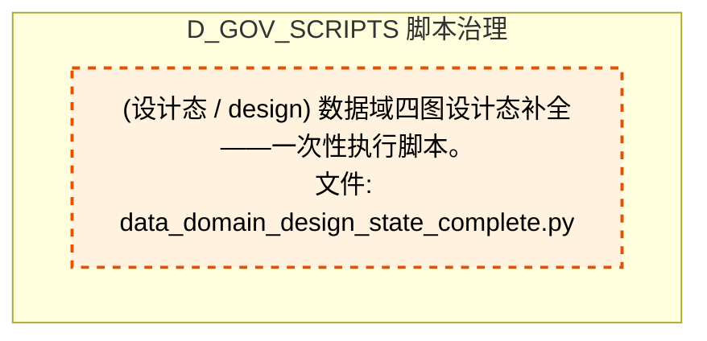

## 跨域依赖 / Cross-domain Dependencies

### 本域依赖的其他域（出边）/ Depends On

| # | 本域模块 / Source Module | → | 外部域-目标模块 / Target Module | 依赖类型 / Type |
|:--:|---------|:--:|---------|---------|
| 1 | Code Wiki 统计数据生成器（半自动维护机制）。 (g... | → | D_DATA 数据接入层: 表名/品类注册表消费层（裁定 #ARCH-CH-024 Phase ... | 导入依赖 / import_depends |
| 2 | G-inventory: 扫描 ClickHouse 生成业务数据清单 M... | → | D_DATA 数据接入层: zephyr.data — 数据源集成器（MOD-L00-004）。 (_... | 导入依赖 / import_depends |
| 3 | G-inventory: 扫描 ClickHouse 生成业务数据清单 M... | → | D_DATA 数据接入层: ClickHouse 统一读取层（裁定 #ARCH-CH-007）。 (c... | 导入依赖 / import_depends |
| 4 | tick_data 表真重复检查工具（RULE-DATA-OPS 配套.... | → | D_DATA 数据接入层: zephyr.data — 数据源集成器（MOD-L00-004）。 (_... | 导入依赖 / import_depends |
| 5 | tick_data 表真重复检查工具（RULE-DATA-OPS 配套.... | → | D_DATA 数据接入层: ClickHouse 统一读取层（裁定 #ARCH-CH-007）。 (c... | 导入依赖 / import_depends |
| 6 | audit_post_sync_commands.py — post_sync_standa... | → | D_GOVERNANCE 生命周期管理: post_sync_validator — post_sync_standard 命令.... | 导入依赖 / import_depends |
| 7 | # [BLUEPRINT] MOD-INF-005 | scripts/governance/... | → | D_GOVERNANCE 生命周期管理: TaskRepository — 任务登记表 CRUD + 状态机（T-1... | 导入依赖 / import_depends |
| 8 | fix_broken_post_sync.py — 批量修复历史 broken ... | → | D_GOVERNANCE 生命周期管理: TaskRepository — 任务登记表 CRUD + 状态机（T-1... | 导入依赖 / import_depends |
| 9 | Construction Gate — 施工前路径校验门禁 (constr... | → | D_GOVERNANCE 生命周期管理: PathResolver — 模块路径解析器 (path_resolver.py) | 导入依赖 / import_depends |
| 10 | constants.py — 审计脚本共享常量 (constants.py) | → | D_GOVERNANCE 生命周期管理: depgraph Schema DDL + 版本化迁移框架 (depgraph_... | 导入依赖 / import_depends |
| 11 | governance/task_show 脚本 — 任务卡详情查询 CLI... | → | D_GOVERNANCE 生命周期管理: SQLite 元数据层 Schema DDL + 版本化迁移框架（T-... | 导入依赖 / import_depends |
| 12 | governance/task_show 脚本 — 任务卡详情查询 CLI... | → | D_GOVERNANCE 生命周期管理: TaskRepository — 任务登记表 CRUD + 状态机（T-1... | 导入依赖 / import_depends |
| 13 | task_summary.py — 任务系统全局摘要 CLI (task_s... | → | D_GOVERNANCE 生命周期管理: SQLite 元数据层 Schema DDL + 版本化迁移框架（T-... | 导入依赖 / import_depends |
| 14 | task_summary.py — 任务系统全局摘要 CLI (task_s... | → | D_GOVERNANCE 生命周期管理: TaskRepository — 任务登记表 CRUD + 状态机（T-1... | 导入依赖 / import_depends |
| 15 | 为暂缓模块添加设计态依赖边（dep_maturity='desig... | → | D_GOVERNANCE 生命周期管理: depgraph Schema DDL + 版本化迁移框架 (depgraph_... | 导入依赖 / import_depends |
| 16 | apply_dataflowgraph.py — dataflowgraph 变更写.... | → | D_GOVERNANCE 生命周期管理: dataflowgraph Schema DDL + 连接入口 (dataflowgr... | 导入依赖 / import_depends |
| 17 | [INVARIANTS] pg_advisory_lock 写锁; build_statu... | → | D_GOVERNANCE 生命周期管理: decisiongraph Schema DDL + 不变量声明 (decision... | 导入依赖 / import_depends |
| 18 | GATE-SSOT: SSoT 创建门禁（pre-commit hook 双保.... | → | D_GOVERNANCE 生命周期管理: CapabilityLookup — 能力->真源文件反查注册表的.... | 导入依赖 / import_depends |
| 19 | task_self_check.py — 任务系统自身健康检查 (tas... | → | D_GOVERNANCE 生命周期管理: SQLite 元数据层 Schema DDL + 版本化迁移框架（T-... | 导入依赖 / import_depends |
| 20 | task_self_check.py — 任务系统自身健康检查 (tas... | → | D_GOVERNANCE 生命周期管理: TaskRepository — 任务登记表 CRUD + 状态机（T-1... | 导入依赖 / import_depends |
| 21 | verify_schema_health.py — depgraph (PostgreSQL... | → | D_GOVERNANCE 生命周期管理: depgraph Schema DDL + 版本化迁移框架 (depgraph_... | 导入依赖 / import_depends |
| 22 | verify_schema_health.py — depgraph (PostgreSQL... | → | D_GOVERNANCE 生命周期管理: decisiongraph Schema DDL + 不变量声明 (decision... | 导入依赖 / import_depends |
| 23 | G_TRAE_059 验证脚本：_schema_version 写入保护 +... | → | D_GOVERNANCE 生命周期管理: depgraph Schema DDL + 版本化迁移框架 (depgraph_... | 导入依赖 / import_depends |
| 24 | Module docstring — see module-level docstring ... | → | D_GOVERNANCE 生命周期管理: LLMImpactAnalyzer — LLM-based commit 语义影响.... | 导入依赖 / import_depends |
| 25 | G-panorama-align: 四图对齐检测器（ARCH-053 + AR... | → | D_GOVERNANCE 生命周期管理: depgraph Schema DDL + 版本化迁移框架 (depgraph_... | 导入依赖 / import_depends |
| 26 | G-panorama-align: 四图对齐检测器（ARCH-053 + AR... | → | D_GOVERNANCE 生命周期管理: dataflowgraph Schema DDL + 连接入口 (dataflowgr... | 导入依赖 / import_depends |
| 27 | G-panorama-align: 四图对齐检测器（ARCH-053 + AR... | → | D_GOVERNANCE 生命周期管理: decisiongraph Schema DDL + 不变量声明 (decision... | 导入依赖 / import_depends |
| 28 | G-panorama-gen: 蓝图 §0.6 四图对齐视图生成器（... | → | D_GOVERNANCE 生命周期管理: depgraph Schema DDL + 版本化迁移框架 (depgraph_... | 导入依赖 / import_depends |
| 29 | G-panorama-gen: 蓝图 §0.6 四图对齐视图生成器（... | → | D_GOVERNANCE 生命周期管理: dataflowgraph Schema DDL + 连接入口 (dataflowgr... | 导入依赖 / import_depends |
| 30 | G-panorama-gen: 蓝图 §0.6 四图对齐视图生成器（... | → | D_GOVERNANCE 生命周期管理: decisiongraph Schema DDL + 不变量声明 (decision... | 导入依赖 / import_depends |
| 31 | G-dataflow: 从 dataflowgraph (PostgreSQL) 生成.... | → | D_GOVERNANCE 生命周期管理: dataflowgraph Schema DDL + 连接入口 (dataflowgr... | 导入依赖 / import_depends |
| 32 | G-decision: 从 decisiongraph (PostgreSQL) 生成.... | → | D_GOVERNANCE 生命周期管理: decisiongraph Schema DDL + 不变量声明 (decision... | 导入依赖 / import_depends |
| 33 | blueprint_frontmatter_reconciler.py — 蓝图 fro... | → | D_GOVERNANCE 生命周期管理: depgraph Schema DDL + 版本化迁移框架 (depgraph_... | 导入依赖 / import_depends |
| 34 | [INVARIANTS] YAML→DB单向同步; 27项同步; try/fi... | → | D_GOVERNANCE 生命周期管理: dataflowgraph Schema DDL + 连接入口 (dataflowgr... | 导入依赖 / import_depends |
| 35 | extract_decisiongraph - decisiongraph on-demand... | → | D_GOVERNANCE 生命周期管理: decision_graph_reader.py — 决策流图数据库只读.... | 导入依赖 / import_depends |
| 36 | extract_decisiongraph - decisiongraph on-demand... | → | D_GOVERNANCE 生命周期管理: decisiongraph Schema DDL + 不变量声明 (decision... | 导入依赖 / import_depends |
| 37 | [INVARIANTS] YAML 是唯一真源; DB 为只读缓存; 同... | → | D_GOVERNANCE 生命周期管理: decisiongraph Schema DDL + 不变量声明 (decision... | 导入依赖 / import_depends |
| 38 | # [BLUEPRINT] MOD-INF-005 | scripts/governance/... | → | D_GOVERNANCE 生命周期管理: depgraph Schema DDL + 版本化迁移框架 (depgraph_... | 导入依赖 / import_depends |
| 39 | 从蓝图§0.1聚合生成 path_ownership_map.yaml 路.... | → | D_GOVERNANCE 生命周期管理: depgraph Schema DDL + 版本化迁移框架 (depgraph_... | 导入依赖 / import_depends |
| 40 | 从蓝图§0.1聚合生成 path_ownership_map.yaml 路.... | → | D_GOVERNANCE 生命周期管理: rule_patterns.py — 治理规则正则 + 安全审计模式... | 导入依赖 / import_depends |
| 41 | backup_runtime_state.py — 运行时状态备份（蓝图... | → | D_GOVERNANCE 生命周期管理: depgraph Schema DDL + 版本化迁移框架 (depgraph_... | 导入依赖 / import_depends |
| 42 | create_task_from_finding.py — Finding → 任务.... | → | D_GOVERNANCE 生命周期管理: SQLite 元数据层 Schema DDL + 版本化迁移框架（T-... | 导入依赖 / import_depends |
| 43 | create_task_from_finding.py — Finding → 任务.... | → | D_GOVERNANCE 生命周期管理: TaskRepository — 任务登记表 CRUD + 状态机（T-1... | 导入依赖 / import_depends |
| 44 | migrate_to_metadata_tables.py — 裁定#209 Stage... | → | D_GOVERNANCE 生命周期管理: depgraph Schema DDL + 版本化迁移框架 (depgraph_... | 导入依赖 / import_depends |
| 45 | 数据域设计态排查 - DB 现状查询（Phase 2，只读不... | → | D_GOVERNANCE 生命周期管理: depgraph Schema DDL + 版本化迁移框架 (depgraph_... | 导入依赖 / import_depends |
| 46 | query_module_panorama.py — 模块全景查询入口（.... | → | D_GOVERNANCE 生命周期管理: depgraph Schema DDL + 版本化迁移框架 (depgraph_... | 导入依赖 / import_depends |
| 47 | query_module_panorama.py — 模块全景查询入口（.... | → | D_GOVERNANCE 生命周期管理: dataflowgraph Schema DDL + 连接入口 (dataflowgr... | 导入依赖 / import_depends |
| 48 | query_module_panorama.py — 模块全景查询入口（.... | → | D_GOVERNANCE 生命周期管理: decisiongraph Schema DDL + 不变量声明 (decision... | 导入依赖 / import_depends |
| 49 | 将42项暂缓模块写入 depgraph 设计态，含3图对齐设... | → | D_GOVERNANCE 生命周期管理: depgraph Schema DDL + 版本化迁移框架 (depgraph_... | 导入依赖 / import_depends |
| 50 | sync_panorama_module.py — 四图模块同步引擎（AR... | → | D_GOVERNANCE 生命周期管理: depgraph Schema DDL + 版本化迁移框架 (depgraph_... | 导入依赖 / import_depends |
| 51 | sync_panorama_module.py — 四图模块同步引擎（AR... | → | D_GOVERNANCE 生命周期管理: dataflowgraph Schema DDL + 连接入口 (dataflowgr... | 导入依赖 / import_depends |
| 52 | sync_panorama_module.py — 四图模块同步引擎（AR... | → | D_GOVERNANCE 生命周期管理: decisiongraph Schema DDL + 不变量声明 (decision... | 导入依赖 / import_depends |
| 53 | Red/Blue Team Adversarial Test v3: SYS-MASTER-0... | → | D_GOV_AUDIT 审计追踪: SYS-MASTER-001 Compliance Checker (sys_master_c... | 导入依赖 / import_depends |
| 54 | scripts/governance/rebuild_audit_index.py — 重... | → | D_GOV_AUDIT 审计追踪: indexer.py | 导入依赖 / import_depends |
| 55 | architecture_health_dashboard.py — 架构健康度.... | → | D_GOV_AUDIT 审计追踪: runtime_violation_snapshot.py — trae_060 §5 e... | 导入依赖 / import_depends |
| 56 | session_startup_health_check.py — AI session .... | → | D_GOV_AUDIT 审计追踪: reconciliation_registry.py — GitCommitGateway ... | 导入依赖 / import_depends |
| 57 | scan_consumers_accuracy.py — CONSUMERS 字段准.... | → | D_GOV_CODE_QUALITY 代码质量治理: _diff_helpers.py — gate 共享 diff 解析工具模块... | 导入依赖 / import_depends |
| 58 | scan_consumers_accuracy.py — CONSUMERS 字段准.... | → | D_GOV_CODE_QUALITY 代码质量治理: consumers_accuracy_gate.py — CONSUMERS 字段准.... | 导入依赖 / import_depends |
| 59 | concurrent_commit_test.py — 幽灵提交红蓝对抗脚... | → | D_GOV_ENFORCEMENT 规则执行: GitCommitGateway — 全项目唯一合法 git commit .... | 导入依赖 / import_depends |
| 60 | Session 冷启动自检 — 运行 Phase 0 全部 14 个检... | → | D_GOV_OPS_RESILIENCE 运维弹性治理: PhaseManager->GateEngine 检查注册表桥梁 — 44 .... | 导入依赖 / import_depends |
| 61 | Session 冷启动自检 — 运行 Phase 0 全部 14 个检... | → | D_GOV_OPS_RESILIENCE 运维弹性治理: Phase Manager — ZephyrAlpha 施工阶段门控引擎. ... | 导入依赖 / import_depends |
| 62 | [INVARIANTS] 预算健康检查不可跳过;检查结果必须.... | → | D_GOV_REPAIR 治理修复: budget_enforcement.py | 导入依赖 / import_depends |
| 63 | CBG 熔断器重置 CLI (CircuitBreakerGateway Reset... | → | D_GOV_RULE 规则治理: CircuitBreakerGateway (CBG) — 模块间调用单向熔... | 导入依赖 / import_depends |
| 64 | CBG 熔断器重置 CLI (CircuitBreakerGateway Reset... | → | D_GOV_RULE 规则治理: CircuitBreakerGateway (CBG) — 模块间调用单向熔... | 导入依赖 / import_depends |
| 65 | create_task_from_finding.py — Finding → 任务.... | → | D_GOV_RULE 规则治理: task_types.py | 导入依赖 / import_depends |
| 66 | Gate Engine Bootstrap Self-Check — Quis custod... | → | D_GOV_RULE 规则治理: GateEngine — KMS G1-G6 + Orc G0/G7 + 交易 G10-... | 导入依赖 / import_depends |
| 67 | validate_gate_engine_external.py — Gate Engine... | → | D_GOV_RULE 规则治理: CircuitBreakerGateway (CBG) — 模块间调用单向熔... | 导入依赖 / import_depends |
| 68 | validate_gate_engine_external.py — Gate Engine... | → | D_GOV_RULE 规则治理: GateEngine — KMS G1-G6 + Orc G0/G7 + 交易 G10-... | 导入依赖 / import_depends |
| 69 | session_simulator — 30 个模拟开发 session 的蓝... | → | D_INFRA_RUNTIME 运行时集成: blueprint_metrics — 蓝图使用追踪 instrumentati... | 导入依赖 / import_depends |
| 70 | base.py — 审计脚本基类 (base.py) | → | D_INFRA_RUNTIME 运行时集成: Finding Schema — 审计发现标准化数据模型 (findi... | 导入依赖 / import_depends |
| 71 | check_registry_consistency — 跨登记表一致性校... | → | D_INFRA_RUNTIME 运行时集成: Finding Schema — 审计发现标准化数据模型 (findi... | 导入依赖 / import_depends |
| 72 | finding_state_machine.py — Finding 全生命周期.... | → | D_INFRA_RUNTIME 运行时集成: Finding Schema — 审计发现标准化数据模型 (findi... | 导入依赖 / import_depends |
| 73 | validate_emergency_bypass_log.py — 应急绕过审.... | → | D_INFRA_RUNTIME 运行时集成: Finding Schema — 审计发现标准化数据模型 (findi... | 导入依赖 / import_depends |
| 74 | run_all.py — 脚本系统统一入口脚本 (run_all.py) | → | D_INFRA_RUNTIME 运行时集成: Finding->TaskCard 桥接器 (finding_task_bridge.py) | 导入依赖 / import_depends |
| 75 | run_all.py — 脚本系统统一入口脚本 (run_all.py) | → | D_INFRA_RUNTIME 运行时集成: Finding Schema — 审计发现标准化数据模型 (findi... | 导入依赖 / import_depends |
| 76 | VMS Cron 监控器 — MOD-INF-011 · TASK-INF-0224... | → | D_INTEGRATION 管线路由: CollectionManager — MOD-INF-011 八大 Collectio... | 导入依赖 / import_depends |
| 77 | VMS Cron 监控器 — MOD-INF-011 · TASK-INF-0224... | → | D_INTEGRATION 管线路由: IndexHealthMonitor — MOD-INF-011 索引健康自检.... | 导入依赖 / import_depends |
| 78 | VMS Health Check 脚本 — MOD-INF-011 · Phase 3... | → | D_INTEGRATION 管线路由: CollectionManager — MOD-INF-011 八大 Collectio... | 导入依赖 / import_depends |
| 79 | VMS Health Check 脚本 — MOD-INF-011 · Phase 3... | → | D_INTEGRATION 管线路由: IndexHealthMonitor — MOD-INF-011 索引健康自检.... | 导入依赖 / import_depends |
| 80 | VMS Phase 2 数据迁移脚本 — MOD-INF-011 (vms_mi... | → | D_INTEGRATION 管线路由: BridgeLayer — MOD-INF-011 kb/ ↔ VMS 过渡桥接 ... | 导入依赖 / import_depends |
| 81 | VMS Phase 2 数据迁移脚本 — MOD-INF-011 (vms_mi... | → | D_INTEGRATION 管线路由: CollectionManager — MOD-INF-011 八大 Collectio... | 导入依赖 / import_depends |
| 82 | VMS 迁移 dry-run 脚本 — MOD-INF-011 Phase 2 前... | → | D_INTEGRATION 管线路由: BridgeLayer — MOD-INF-011 kb/ ↔ VMS 过渡桥接 ... | 导入依赖 / import_depends |
| 83 | VMS Cron 监控器 — MOD-INF-011 · TASK-INF-0224... | → | D_INTEGRATION 管线路由: CollectionManager — MOD-INF-011 八大 Collectio... | 导入依赖 / import_depends |
| 84 | VMS Cron 监控器 — MOD-INF-011 · TASK-INF-0224... | → | D_INTEGRATION 管线路由: IndexHealthMonitor — MOD-INF-011 索引健康自检.... | 导入依赖 / import_depends |
| 85 | VMS Health Check 脚本 — MOD-INF-011 · Phase 3... | → | D_INTEGRATION 管线路由: CollectionManager — MOD-INF-011 八大 Collectio... | 导入依赖 / import_depends |
| 86 | VMS Health Check 脚本 — MOD-INF-011 · Phase 3... | → | D_INTEGRATION 管线路由: IndexHealthMonitor — MOD-INF-011 索引健康自检.... | 导入依赖 / import_depends |
| 87 | VMS Phase 2 数据迁移脚本 — MOD-INF-011 (vms_mi... | → | D_INTEGRATION 管线路由: BridgeLayer — MOD-INF-011 kb/ ↔ VMS 过渡桥接 ... | 导入依赖 / import_depends |
| 88 | VMS Phase 2 数据迁移脚本 — MOD-INF-011 (vms_mi... | → | D_INTEGRATION 管线路由: CollectionManager — MOD-INF-011 八大 Collectio... | 导入依赖 / import_depends |
| 89 | VMS 迁移 dry-run 脚本 — MOD-INF-011 Phase 2 前... | → | D_INTEGRATION 管线路由: BridgeLayer — MOD-INF-011 kb/ ↔ VMS 过渡桥接 ... | 导入依赖 / import_depends |
| 90 | 考试题库一致性检查——根因治本，防止"定义-注册.... | → | D_INTELLIGENCE 上下文管理: ExamTestCases --- v3.0.5 扩展考试题库（96 题 / ... | 导入依赖 / import_depends |
| 91 | check_handoff_manifests.py — AI Session Handof... | → | D_ORCHESTRATOR 代理编排器: 集成契约注册表（Contract Registry） (contract_r... | 导入依赖 / import_depends |
| 92 | AI写入前强制门禁钩子: lock协议检查+GateEngine P... | → | D_SECURITY 对抗验证: Session 级并发协调模块（P2-SES 落地）。 (sessio... | 导入依赖 / import_depends |
| 93 | DM-106: P2-B 迁移全量验证脚本 (dm106_p2b_verifi... | → | D_SHARED 共享服务: paths.py — 项目路径常量 SSoT（Single Source of... | 导入依赖 / import_depends |
| 94 | audit_post_sync_commands.py — post_sync_standa... | → | D_SHARED 共享服务: paths.py — 项目路径常量 SSoT（Single Source of... | 导入依赖 / import_depends |
| 95 | DM-105: depgraph 未分配节点三策略处理脚本 (dm10... | → | D_SHARED 共享服务: paths.py — 项目路径常量 SSoT（Single Source of... | 导入依赖 / import_depends |
| 96 | constants.py — 审计脚本共享常量 (constants.py) | → | D_SHARED 共享服务: paths.py — 项目路径常量 SSoT（Single Source of... | 导入依赖 / import_depends |
| 97 | _shared/file_utils.py — 原子写入共享工具（ARCH... | → | D_SHARED 共享服务: file_utils.py —— 安全文件操作工具（Phase 3 新... | 导入依赖 / import_depends |
| 98 | _shared/yaml_utils.py — YAML 文件加载共享工具 ... | → | D_SHARED 共享服务: yaml_utils.py — vocabulary YAML 加载公共工具（... | 导入依赖 / import_depends |
| 99 | [INVARIANTS] pg_advisory_lock 写锁; build_statu... | → | D_SHARED 共享服务: paths.py — 项目路径常量 SSoT（Single Source of... | 导入依赖 / import_depends |
| 100 | [INVARIANTS] 原子写入（RULE-ONE）；变更前验证；... | → | D_SHARED 共享服务: env.py | 导入依赖 / import_depends |
| 101 | [INVARIANTS] 原子写入（RULE-ONE）；变更前验证；... | → | D_SHARED 共享服务: paths.py — 项目路径常量 SSoT（Single Source of... | 导入依赖 / import_depends |
| 102 | [INVARIANTS] 原子写入（RULE-ONE）；变更前验证；... | → | D_SHARED 共享服务: yaml_utils.py — vocabulary YAML 加载公共工具（... | 导入依赖 / import_depends |
| 103 | GATE-SSOT: SSoT 创建门禁（pre-commit hook 双保.... | → | D_SHARED 共享服务: paths.py — 项目路径常量 SSoT（Single Source of... | 导入依赖 / import_depends |
| 104 | GATE-SSOT-SINGLESOURCE: SSoT 单一真源门禁（Phas... | → | D_SHARED 共享服务: paths.py — 项目路径常量 SSoT（Single Source of... | 导入依赖 / import_depends |
| 105 | # [BLUEPRINT] MOD-INF-005 | scripts/governance/... | → | D_SHARED 共享服务: yaml_utils.py — vocabulary YAML 加载公共工具（... | 导入依赖 / import_depends |
| 106 | G-panorama-align: 四图对齐检测器（ARCH-053 + AR... | → | D_SHARED 共享服务: converters.py — 类型转换工具（消除 '' vs None ... | 导入依赖 / import_depends |
| 107 | G13: 从 depgraph (PostgreSQL) 生成资产清单全景... | → | D_SHARED 共享服务: paths.py — 项目路径常量 SSoT（Single Source of... | 导入依赖 / import_depends |
| 108 | Code Wiki 统计数据生成器（半自动维护机制）。 (g... | → | D_SHARED 共享服务: paths.py — 项目路径常量 SSoT（Single Source of... | 导入依赖 / import_depends |
| 109 | G12: 从 depgraph (PostgreSQL) 生成契约目录全景... | → | D_SHARED 共享服务: paths.py — 项目路径常量 SSoT（Single Source of... | 导入依赖 / import_depends |
| 110 | generate_contracts.py -- SSoT to Codegen pipeli... | → | D_SHARED 共享服务: paths.py — 项目路径常量 SSoT（Single Source of... | 导入依赖 / import_depends |
| 111 | G-panorama-registry: 自动生成全景图清单总表 (ge... | → | D_SHARED 共享服务: paths.py — 项目路径常量 SSoT（Single Source of... | 导入依赖 / import_depends |
| 112 | validate_module_lifecycle.py — 模块生命周期校... | → | D_SHARED 共享服务: yaml_utils.py — vocabulary YAML 加载公共工具（... | 导入依赖 / import_depends |
| 113 | validate_interface_contracts.py — 接口契约校验... | → | D_SHARED 共享服务: yaml_utils.py — vocabulary YAML 加载公共工具（... | 导入依赖 / import_depends |
| 114 | extract_decisiongraph - decisiongraph on-demand... | → | D_SHARED 共享服务: paths.py — 项目路径常量 SSoT（Single Source of... | 导入依赖 / import_depends |
| 115 | [INVARIANTS] 禁止AI直接Read 157MB depgraph文件.... | → | D_SHARED 共享服务: paths.py — 项目路径常量 SSoT（Single Source of... | 导入依赖 / import_depends |
| 116 | [INVARIANTS] YAML 是唯一真源; DB 为只读缓存; 同... | → | D_SHARED 共享服务: paths.py — 项目路径常量 SSoT（Single Source of... | 导入依赖 / import_depends |
| 117 | # [BLUEPRINT] MOD-INF-005 | scripts/governance/... | → | D_SHARED 共享服务: process_pool.py - Shared process pool for MCP s... | 导入依赖 / import_depends |
| 118 | # [BLUEPRINT] MOD-INF-005 | scripts/governance/... | → | D_SHARED 共享服务: paths.py — 项目路径常量 SSoT（Single Source of... | 导入依赖 / import_depends |
| 119 | # [BLUEPRINT] MOD-INF-005 | scripts/governance/... | → | D_SHARED 共享服务: yaml_utils.py — vocabulary YAML 加载公共工具（... | 导入依赖 / import_depends |
| 120 | check_gate_inventory_drift.py — commit_gates .... | → | D_SHARED 共享服务: paths.py — 项目路径常量 SSoT（Single Source of... | 导入依赖 / import_depends |
| 121 | Module docstring — see module-level docstring ... | → | D_SHARED 共享服务: process_pool.py - Shared process pool for MCP s... | 导入依赖 / import_depends |
| 122 | create_task_from_finding.py — Finding → 任务.... | → | D_SHARED 共享服务: ZephyrAlpha 任务系统核心数据模型 (models.py) | 导入依赖 / import_depends |
| 123 | create_task_from_finding.py — Finding → 任务.... | → | D_SHARED 共享服务: paths.py — 项目路径常量 SSoT（Single Source of... | 导入依赖 / import_depends |
| 124 | SQLite → PostgreSQL 运营数据迁移脚本 (migrate_... | → | D_SHARED 共享服务: paths.py — 项目路径常量 SSoT（Single Source of... | 导入依赖 / import_depends |
| 125 | concurrent_commit_test.py — 幽灵提交红蓝对抗脚... | → | D_SHARED 共享服务: paths.py — 项目路径常量 SSoT（Single Source of... | 导入依赖 / import_depends |
| 126 | sync_panorama_module.py — 四图模块同步引擎（AR... | → | D_SHARED 共享服务: converters.py — 类型转换工具（消除 '' vs None ... | 导入依赖 / import_depends |

### 依赖本域的其他域（入边）/ Depended By

| # | 外部域-源模块 / Source Module | → | 本域模块 / Target Module | 依赖类型 / Type |
|:--:|---------|:--:|---------|---------|
| 1 | D_GOVERNANCE 生命周期管理: scaffold.py — ZephyrAlpha 唯一创建入口（RULE-T... | → | GATE-11 命名规范门禁 — 全类型命名检测。 (check... | 导入依赖 / import_depends |
| 2 | D_GOVERNANCE 生命周期管理: test_generate_gate_registry.py — generate_gate... | → | generate_gate_registry.py — 门禁登记表自动生成... | 测试依赖 / test_depends |
| 3 | D_GOV_AUDIT 审计追踪: reconciliation_registry.py — GitCommitGateway ... | → | module_id / domain_id / submodule_id 格式校验真... | 导入依赖 / import_depends |
| 4 | D_GOV_AUDIT 审计追踪: reconciliation_registry.py — GitCommitGateway ... | → | check_gate_inventory_drift.py — commit_gates .... | 导入依赖 / import_depends |
| 5 | D_GOV_DRIFT 漂移检测: Module docstring — see module-level docstring ... | → | 文件头部格式解析 SSoT（Single Source of Truth）... | 导入依赖 / import_depends |
| 6 | D_GOV_DRIFT 漂移检测: validate_truth_source_cascade.py — 真源级联一.... | → | 文件头部格式解析 SSoT（Single Source of Truth）... | 导入依赖 / import_depends |
| 7 | D_GOV_DRIFT 漂移检测: SSoT 文件头一致性校验器. (validate_ssot.py) | → | 文件头部格式解析 SSoT（Single Source of Truth）... | 导入依赖 / import_depends |

### 跨域依赖图 / Cross-domain Dependency Diagram

> 本域与 15 个外部域直接连接（出边 126 条 + 入边 7 条 = 133 条）。只显示直接连接的域，不展开具体节点。

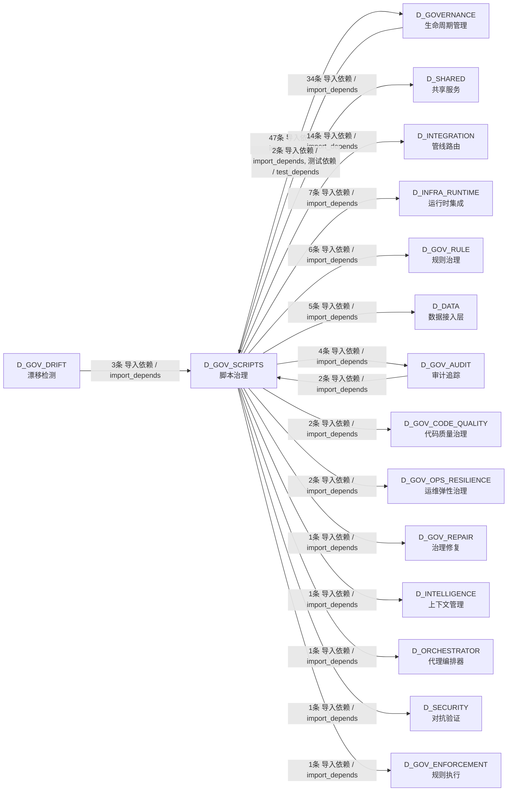

## 说明 / Notes

- **数据源 / Data Source**: `depgraph (PostgreSQL)` 的 `nodes`、`edges`、`domains` 表
- **生成器 / Generator**: `generate_domain_doc.py`（G2+G10 合并）
- **维护方式 / Maintenance**: 自动生成，全景图更新时刷新
- **文件名规则 / File Naming**: `{编号:02d}_{域ID小写}.md`，如 `16_d_trading.md`
- **图例说明 / Legend**: `[production]`=已上线 / `[design]`=设计中 / `[unknown]`=未知
