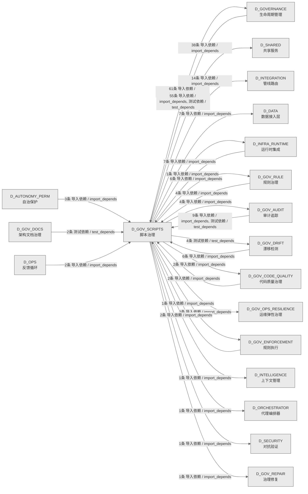

# 56_d_gov_scripts / 脚本治理域 / Script Governance

> **功能简介 / Overview**: 脚本治理，负责脚本生命周期管理和脚本质量门禁

> **文档作用 / Purpose**: 展示 脚本治理（D_GOV_SCRIPTS）功能域的域内依赖关系、跨域依赖关系，模块信息（成熟度/中英文名/大白话/文件路径）内嵌于 Mermaid 节点，供架构审查和域治理参考。

> 本文档由 generate_domain_doc.py 从 depgraph (PostgreSQL) 自动生成
> 数据源: depgraph (PostgreSQL) nodes表 + edges表

> **[可缩放 HTML 版 / Zoomable HTML](http://localhost:8765/docs/02_enterprise_architecture/02_domain_architecture_docs/_zoomable_html/56_d_gov_scripts.html)** — Ctrl+滚轮缩放 ｜ 双击重置 ｜ Ctrl+Shift+D 切换拖动/选择模式

## 域基本信息 / Domain Overview

| 字段 | 值 | Field | Value |
|------|------|-------|-------|
| 编号 | 56 | Number | 56 |
| 域ID | D_GOV_SCRIPTS | Domain ID | D_GOV_SCRIPTS |
| 域名称 | 脚本治理 | Domain Name | Script Governance |
| 层级 | L2 业务域层 | Layer | L2 Domain |
| 模块数 | 422 | Module Count | 422 |
| 域内依赖 | 788 | Internal Dependencies | 788 |
| 跨域入边 | 86 | Cross-domain Incoming | 86 |
| 跨域出边 | 150 | Cross-domain Outgoing | 150 |
| 设计态模块 | 0 | Design Modules | 0 |
| 生产态模块 | 422 | Production Modules | 422 |
| 容量 | 422/150 (超容) | Capacity | 422/150 (超容) |
| 描述 | Phase Manager阶段管理 | Description | Phase Manager阶段管理 |

## 域内依赖图 / Internal Dependency Diagram

> 依赖图内嵌在本文档中，IDE 可直接渲染；网页版可 Ctrl+滚轮缩放 + 拖动平移查看细节。
>
> **图例说明 / Legend**：
> - 🟦 **蓝色 = 运营态模块**（production，已上线运行）
> - 🟧 **橙色虚线 = 设计态模块**（design，蓝图阶段，代码未写）
> - **实线箭头 = 运营态依赖**（已生效的依赖关系）
> - **虚线箭头 = 非运营态依赖**（计划中/验证中的依赖关系）

### 全景图（全部模块，颜色区分运营态/设计态）

> 展示全部 422 个模块（生产态 422 + 设计态 0），含跨域依赖外部节点。节点含成熟度+名称+大白话/简介+文件路径。

```mermaid
%%{init: {'theme': 'base', 'themeVariables': {'primaryColor': '#eaeaea', 'primaryTextColor': '#333333', 'primaryBorderColor': '#666666', 'lineColor': '#666666', 'secondaryColor': '#eaeaea', 'tertiaryColor': '#eaeaea', 'fontSize': '14px'}}}%%
flowchart TD
    docs_01_policies_and_standards_registry_catalogs_scripts_registry_yaml["脚本注册表<br/>catalogs包的scripts_registry模块<br/>Scripts Registry<br/>文件: catalogs/scripts_registry.yaml<br/>(生产态 / production)"]
    scripts_archive_governance_dm106_p2b_verification_py["Dm106 P2b Verification<br/>DM-106: P2-B 迁移全量验证脚本<br/>文件: governance/dm106_p2b_verification.py<br/>(生产态 / production)"]
    scripts_governance_archive_one_off_audit_post_sync_commands_py["post_sync_standard 命令可执行性巡检<br/>audit_post_sync_commands.py —<br/>post_sync_standard 命令可执行性巡检（防幻觉<br/>/CL...<br/>Audit Post Sync Commands<br/>文件: one_off/audit_post_sync_commands.py<br/>(生产态 / production)"]
    scripts_governance_archive_one_off_check_exam_case_consistency_py["—根因治本，防止'定义-注册脱钩'复发<br/>考试题库一致性检查——根因治本，防止'定义-注册脱钩<br/>'复发。<br/>Check Exam Case Consistency<br/>文件: one_off/check_exam_case_consistency.py<br/>(生产态 / production)"]
    scripts_governance_archive_one_off_create_alignment_tasks_py["Create对齐Tasks<br/># (BLUEPRINT) MOD-INF-005 / scripts/governance<br/>/create_alignment_tasks.py / §7<br/>Create Alignment Tasks<br/>文件: one_off/create_alignment_tasks.py<br/>(生产态 / production)"]
    scripts_governance_archive_one_off_dm105_depgraph_triage_py["Dm105依赖图Triage<br/>DM-105: depgraph 未分配节点三策略处理脚本<br/>Dm105 Depgraph Triage<br/>文件: one_off/dm105_depgraph_triage.py<br/>(生产态 / production)"]
    scripts_governance_archive_one_off_fix_broken_post_sync_py["批量修复历史 broken post_sync_standard 命令<br/>fix_broken_post_sync.py — 批量修复历史 broken<br/>post_sync_standard 命令<br/>Fix Broken Post Sync<br/>文件: one_off/fix_broken_post_sync.py<br/>(生产态 / production)"]
    scripts_governance_archive_one_off_list_phase0_tasks_py["parse args, run logic, return exit code.'''<br/>(INVARIANTS) 仅查询不修改; 连接失败→exit 1<br/>List Phase0 Tasks<br/>文件: one_off/list_phase0_tasks.py<br/>(生产态 / production)"]
    scripts_governance_archive_one_off_phase_a_backup_py["阶段A备份<br/>phase_a_backup.py — 阶段A安全网 Tier0/Tier1<br/>关键文件备份<br/>Phase A Backup<br/>文件: one_off/phase_a_backup.py<br/>(生产态 / production)"]
    scripts_governance_archive_one_off_rename_kebab_to_snake_py["全项目文件名/目录名 kebab-case → snake_case<br/>批量重命名<br/>rename_kebab_to_snake.py — 全项目文件名/目录名<br/>kebab-case → snake_case 批量...<br/>Rename Kebab To Snake<br/>文件: one_off/rename_kebab_to_snake.py<br/>(生产态 / production)"]
    scripts_governance_archive_one_off_rename_whitelist_cleanup_py["命名规范白名单清理 - 全文替换脚本<br/>one off包的rename_whitelist_cleanup模块<br/>Rename Whitelist Cleanup<br/>文件: one_off/rename_whitelist_cleanup.py<br/>(生产态 / production)"]
    scripts_governance_archive_one_off_test_lock_scenarios_py["Lock Scenarios测试<br/>test_lock_scenarios.py — RULE-ZERO 锁协议场景 B<br/>/C 验证<br/>Test Lock Scenarios<br/>文件: one_off/test_lock_scenarios.py<br/>(生产态 / production)"]
    scripts_governance_archive_one_off_verify_final_delivery_py["parse args, run logic, return exit code.'''<br/>(INVARIANTS) 设计态节点数>=1128; 规则表各表>0<br/>Verify Final Delivery<br/>文件: one_off/verify_final_delivery.py<br/>(生产态 / production)"]
    scripts_governance_archive_one_off_verify_rule_yaml_migration_py["Verify规则YamlMigration<br/>verify_rule_yaml_migration.py - 6-dimensional<br/>verification of rule YAML migra...<br/>Verify Rule Yaml Migration<br/>文件: one_off/verify_rule_yaml_migration.py<br/>(生产态 / production)"]
    scripts_governance_archive_prototype_adversarial_log_py["—攻击→根源分析→修复→回归验证→知识注入全链路追踪<br/>红白对抗闭环记录——攻击→根源分析→修复→回归验证→知<br/>识注入全链路追踪<br/>Adversarial Log<br/>文件: prototype/adversarial_log.py<br/>(生产态 / production)"]
    scripts_governance_archive_prototype_adversarial_sys_master_test_py["对抗SysMaster测试<br/>Red/Blue Team Adversarial Test v3:<br/>SYS-MASTER-001 + MOD-MASTER_BLUEPRINT Inte...<br/>Adversarial Sys Master Test<br/>文件: prototype/adversarial_sys_master_test.py<br/>(生产态 / production)"]
    scripts_governance_archive_prototype_audit_domain_nodes_py["审计域Nodes<br/>SRC-100200: Audit 13 over-capacity domains<br/>granularity distribution.<br/>Audit Domain Nodes<br/>文件: prototype/audit_domain_nodes.py<br/>(生产态 / production)"]
    scripts_governance_archive_prototype_changelog_py["Changelog<br/>changelog.py — 治理域变更日志生成/追加工具.<br/>文件: prototype/changelog.py<br/>(生产态 / production)"]
    scripts_governance_archive_prototype_construction_gate_py["Construction门禁<br/>Construction Gate — 施工前路径校验门禁<br/>文件: prototype/construction_gate.py<br/>(生产态 / production)"]
    scripts_governance_archive_prototype_generate_asset_index_py["生成资产索引<br/>全项目资产索引生成器<br/>Generate Asset Index<br/>文件: prototype/generate_asset_index.py<br/>(生产态 / production)"]
    scripts_governance_archive_prototype_generate_nav_table_py["从 document-metadata-index-registry.yaml<br/>提取所有已知文件路径<br/>generate_nav_table.py — 全流程导航表自动生成器<br/>v1.0.0<br/>Generate Nav Table<br/>文件: prototype/generate_nav_table.py<br/>(生产态 / production)"]
    scripts_governance_archive_prototype_rebuild_audit_index_py["Rebuild审计索引<br/>scripts/governance/rebuild_audit_index.py —<br/>重建 audit-trail SQLite 派生索引<br/>Rebuild Audit Index<br/>文件: prototype/rebuild_audit_index.py<br/>(生产态 / production)"]
    scripts_governance_archive_prototype_scan_ground_truth_deps_py["扫描GroundTruthDeps<br/># (BLUEPRINT) MOD-INF-005 / scripts/governance<br/>/scan_ground_truth_deps.py / §7<br/>Scan Ground Truth Deps<br/>文件: prototype/scan_ground_truth_deps.py<br/>(生产态 / production)"]
    scripts_governance_archive_prototype_session_simulator_py["会话Simulator<br/>session_simulator — 30 个模拟开发 session<br/>的蓝图读取事件生成器<br/>Session Simulator<br/>文件: prototype/session_simulator.py<br/>(生产态 / production)"]
    scripts_governance_archive_prototype_sync_blueprint_status_py["机械强制：construction_plan=phase_2_complete →<br/>blueprint.status=Active.<br/>prototype包的sync_blueprint_status模块<br/>Sync Blueprint Status<br/>文件: prototype/sync_blueprint_status.py<br/>(生产态 / production)"]
    scripts_governance_archive_vms_ri_vms_blindspot_check_py["VmsBlindspot检查<br/>VMS 盲点闭合检查器 — MOD-INF-011 · R1(33) + R2<br/>(22) + R4(6)<br/>Vms Blindspot Check<br/>文件: vms_ri/vms_blindspot_check.py<br/>(生产态 / production)"]
    scripts_governance_archive_vms_ri_vms_build_completion_check_py["VmsBuildCompletion检查<br/>VMS Build Completion Check — MOD-INF-011 ·<br/>TASK-INF-0217<br/>文件: vms_ri/vms_build_completion_check.py<br/>(生产态 / production)"]
    scripts_governance_archive_vms_ri_vms_cron_monitor_py["VmsCron监控器<br/>VMS Cron 监控器 — MOD-INF-011 · TASK-INF-0224<br/>Vms Cron Monitor<br/>文件: vms_ri/vms_cron_monitor.py<br/>(生产态 / production)"]
    scripts_governance_archive_vms_ri_vms_cross_file_check_py["Vms跨文件检查<br/>VMS 跨文件内容一致性检查器 — MOD-INF-011 ·<br/>TASK-INF-0211<br/>Vms Cross File Check<br/>文件: vms_ri/vms_cross_file_check.py<br/>(生产态 / production)"]
    scripts_governance_archive_vms_ri_vms_health_check_py["VmsHealth检查<br/>VMS Health Check 脚本 — MOD-INF-011 · Phase 3<br/>运维自动化<br/>文件: vms_ri/vms_health_check.py<br/>(生产态 / production)"]
    scripts_governance_archive_vms_ri_vms_migrate_py["Vms Migrate<br/>VMS Phase 2 数据迁移脚本 — MOD-INF-011<br/>文件: vms_ri/vms_migrate.py<br/>(生产态 / production)"]
    scripts_governance_archive_vms_ri_vms_migration_dry_run_py["VmsMigrationDry运行<br/>VMS 迁移 dry-run 脚本 — MOD-INF-011 Phase 2<br/>前置检查<br/>Vms Migration Dry Run<br/>文件: vms_ri/vms_migration_dry_run.py<br/>(生产态 / production)"]
    scripts_governance_archive_vms_ri_vms_phase_rollback_py["Vms阶段回滚<br/>VMS Phase 回滚方案 — MOD-INF-011 · TASK-INF-0217<br/>Vms Phase Rollback<br/>文件: vms_ri/vms_phase_rollback.py<br/>(生产态 / production)"]
    scripts_governance_archive_vms_ri_vms_version_sync_check_py["Vms版本同步检查<br/>VMS 版本同步检查器 — MOD-INF-011 · TASK-INF-0222<br/>Vms Version Sync Check<br/>文件: vms_ri/vms_version_sync_check.py<br/>(生产态 / production)"]
    scripts_governance_shared_base_py["所有治理脚本的基类<br/>base.py — 审计脚本基类<br/>文件: _shared/base.py<br/>(生产态 / production)"]
    scripts_governance_sync_cleanup_p0_auto_bridged_py["清理P0自动Bridged<br/>清理历史 P0 自动桥接任务<br/>Cleanup P0 Auto Bridged<br/>文件: _sync/cleanup_p0_auto_bridged.py<br/>(生产态 / production)"]
    scripts_governance_sync_cleanup_p0_ops_pending_py["清理P0OpsPending<br/>cleanup_p0_ops_pending.py - 一次性：将所有<br/>OPS-* P0+PENDING 任务降级+完成<br/>Cleanup P0 Ops Pending<br/>文件: _sync/cleanup_p0_ops_pending.py<br/>(生产态 / production)"]
    scripts_governance_sync_fix_orphan_deps_py["修复孤儿Deps<br/>fix_orphan_deps.py — 一次性修复孤儿依赖引用<br/>Fix Orphan Deps<br/>文件: _sync/fix_orphan_deps.py<br/>(生产态 / production)"]
    scripts_governance_tasks_list_phase0_tasks_py["parse args, run logic, return exit code.'''<br/>(INVARIANTS) 仅查询不修改; 连接失败→exit 1<br/>List Phase0 Tasks<br/>文件: _tasks/list_phase0_tasks.py<br/>(生产态 / production)"]
    scripts_governance_tasks_task_show_py["任务卡详情查询 CLI<br/>governance/task_show 脚本 — 任务卡详情查询 CLI。<br/>Task Show<br/>文件: _tasks/task_show.py<br/>(生产态 / production)"]
    scripts_governance_tasks_task_summary_py["任务Summary<br/>task_summary.py — 任务系统全局摘要 CLI<br/>Task Summary<br/>文件: _tasks/task_summary.py<br/>(生产态 / production)"]
    scripts_governance_add_deferred_design_edges_py["Add Deferred Design Edges<br/>为暂缓模块添加设计态依赖边<br/>（dep_maturity='design'）。<br/>文件: governance/add_deferred_design_edges.py<br/>(生产态 / production)"]
    scripts_governance_align_battle_map_py["作战地图对齐检测器<br/>G-battle-map-align: 作战地图对齐检测器<br/>（battle_map_positioning.md §8.3）<br/>Align Battle Map<br/>文件: governance/align_battle_map.py<br/>(生产态 / production)"]
    scripts_governance_apply_battle_map_py["Apply作战地图<br/>(INVARIANTS) pg_advisory_lock 写锁;<br/>BM-INV-001~002 校验; 事务回滚<br/>Apply Battle Map<br/>文件: governance/apply_battle_map.py<br/>(生产态 / production)"]
    scripts_governance_apply_dataflowgraph_py["Apply Dataflowgraph<br/>apply_dataflowgraph.py — dataflowgraph<br/>变更写入工具（CLI）<br/>文件: governance/apply_dataflowgraph.py<br/>(生产态 / production)"]
    scripts_governance_architecture_health_dashboard_py["架构健康度仪表盘<br/>architecture_health_dashboard.py —<br/>架构健康度仪表盘（自动化检测基线）<br/>Architecture Health Dashboard<br/>文件: governance<br/>/architecture_health_dashboard.py<br/>(生产态 / production)"]
    scripts_governance_ast_import_rewriter_py["Ast Import Rewriter<br/>AST-based import rewriter for governance<br/>directory migration.<br/>文件: governance/ast_import_rewriter.py<br/>(生产态 / production)"]
    scripts_governance_audit_return_contract_usage_py["返回契约 ok 键调用方审计<br/>audit_return_contract_usage.py — 返回契约 ok<br/>键调用方审计（P2-5，2026-07-19）<br/>Audit Return Contract Usage<br/>文件: governance/audit_return_contract_usage.py<br/>(生产态 / production)"]
    scripts_governance_audit_worktree_ops_telemetry_py["主工作区文件级擦除操作遥测完整性审计<br/>audit_worktree_ops_telemetry.py —<br/>主工作区文件级擦除操作遥测完整性审计（P2-6）<br/>Audit Worktree Ops Telemetry<br/>文件: governance/audit_worktree_ops_telemetry.py<br/>(生产态 / production)"]
    scripts_governance_check_commit_message_py["检查提交Message<br/>check_commit_message.py — GitHub Actions PR<br/>commit message guard (P4-3).<br/>Check Commit Message<br/>文件: governance/check_commit_message.py<br/>(生产态 / production)"]
    scripts_governance_check_ssot_gate_py["SSoT 创建门禁<br/>GATE-SSOT: SSoT 创建门禁（pre-commit hook<br/>双保险）。<br/>Check Ssot Gate<br/>文件: governance/check_ssot_gate.py<br/>(生产态 / production)"]
    scripts_governance_d10_performance_collect_system_threads_py["Collect系统Threads<br/>collect_system_threads.py —<br/>全系统线程数快照采集器<br/>Collect System Threads<br/>文件: d10_performance/collect_system_threads.py<br/>(生产态 / production)"]
    scripts_governance_d11_compliance_audit_registration_py["孤儿注册检测<br/>audit_registration.py — 孤儿注册检测（RULE-TWO<br/>防线 2）<br/>Audit Registration<br/>文件: d11_compliance/audit_registration.py<br/>(生产态 / production)"]
    scripts_governance_d11_compliance_ci_self_check_py["CiSelf检查<br/>CI Entry: Self-Check — Drift Detector<br/>自身完整性验证<br/>Ci Self Check<br/>文件: d11_compliance/ci_self_check.py<br/>(生产态 / production)"]
    scripts_governance_d11_compliance_fix_shared_bypass_py["检测赋值节点是否包含 Path<br/>fix_shared_bypass.py - D-D-07 auto-fix tool<br/>(validate_script_quality.py --fix...<br/>Fix Shared Bypass<br/>文件: d11_compliance/fix_shared_bypass.py<br/>(生产态 / production)"]
    scripts_governance_d11_compliance_g9_compliance_check_py["G9 四蓝图跨模块集成合规门禁执行器.<br/>d11 compliance包的g9_compliance_check模块<br/>G9 Compliance Check<br/>文件: d11_compliance/g9_compliance_check.py<br/>(生产态 / production)"]
    scripts_governance_d11_compliance_task_self_check_py["装饰器风格注册检查项<br/>task_self_check.py — 任务系统自身健康检查<br/>Task Self Check<br/>文件: d11_compliance/task_self_check.py<br/>(生产态 / production)"]
    scripts_governance_d11_compliance_validate_commit_gateway_py["GATE-COMMIT-GW 门禁<br/>validate_commit_gateway.py — GATE-COMMIT-GW<br/>门禁（OPS-2026062513）<br/>Validate Commit Gateway<br/>文件: d11_compliance/validate_commit_gateway.py<br/>(生产态 / production)"]
    scripts_governance_d11_compliance_validate_commit_message_py["检查 commit message 是否包含 AI 归因 trailer<br/>validate_commit_message.py — Conventional<br/>Commits 校验（commit-msg hook）+ A...<br/>Validate Commit Message<br/>文件: d11_compliance/validate_commit_message.py<br/>(生产态 / production)"]
    scripts_governance_d11_compliance_validate_exit_codes_py["验证ExitCodes<br/>validate_exit_codes.py — 审计脚本退出码规范门禁<br/>Validate Exit Codes<br/>文件: d11_compliance/validate_exit_codes.py<br/>(生产态 / production)"]
    scripts_governance_d11_compliance_validate_frozen_requirements_py["解析 frozen_versions.txt<br/>validate_frozen_requirements.py —<br/>依赖版本锁定与验证（蓝图 §34.2）<br/>Validate Frozen Requirements<br/>文件: d11_compliance<br/>/validate_frozen_requirements.py<br/>(生产态 / production)"]
    scripts_governance_d11_compliance_validate_manifest_admission_py["验证清单准入<br/>d11 compliance包的validate_manifest_admission模<br/>块<br/>Validate Manifest Admission<br/>文件: d11_compliance<br/>/validate_manifest_admission.py<br/>(生产态 / production)"]
    scripts_governance_d11_compliance_validate_no_utf8_bom_py["验证NoUtf8Bom<br/>validate_no_utf8_bom.py — UTF-8 BOM 检测门禁<br/>Validate No Utf8 Bom<br/>文件: d11_compliance/validate_no_utf8_bom.py<br/>(生产态 / production)"]
    scripts_governance_d11_compliance_validate_script_naming_py["验证脚本Naming<br/>validate_script_naming.py — 审计脚本命名规范门禁<br/>Validate Script Naming<br/>文件: d11_compliance/validate_script_naming.py<br/>(生产态 / production)"]
    scripts_governance_d11_compliance_validate_script_quality_py["验证脚本Quality<br/>validate_script_quality.py —<br/>治理脚本质量合规检查<br/>Validate Script Quality<br/>文件: d11_compliance/validate_script_quality.py<br/>(生产态 / production)"]
    scripts_governance_d11_compliance_validate_task_decomposition_bypass_py["验证任务Decomposition绕过<br/>validate_task_decomposition_bypass.py — Task<br/>Decomposition Bypass 检测<br/>Validate Task Decomposition Bypass<br/>文件: d11_compliance<br/>/validate_task_decomposition_bypass.py<br/>(生产态 / production)"]
    scripts_governance_d11_compliance_validate_vocabulary_coverage_py["验证Vocabulary覆盖率<br/>d11 compliance包的validate_vocabulary_coverage模<br/>块<br/>Validate Vocabulary Coverage<br/>文件: d11_compliance<br/>/validate_vocabulary_coverage.py<br/>(生产态 / production)"]
    scripts_governance_d11_compliance_validate_worktree_required_py["GATE-WORKTREE-REQUIRED 门禁<br/>validate_worktree_required.py —<br/>GATE-WORKTREE-REQUIRED 门禁（L3.1）<br/>Validate Worktree Required<br/>文件: d11_compliance<br/>/validate_worktree_required.py<br/>(生产态 / production)"]
    scripts_governance_d11_compliance_verify_audit_integrity_py["Verify审计完整性<br/>verify_audit_integrity.py — MOD-INF-020 ·<br/>零依赖外部独立验证器<br/>Verify Audit Integrity<br/>文件: d11_compliance/verify_audit_integrity.py<br/>(生产态 / production)"]
    scripts_governance_d11_compliance_verify_schema_health_py["从 CREATE TABLE DDL 文本中解析列名列表<br/>verify_schema_health.py — depgraph (PostgreSQL)<br/>Schema 健康度校验门禁（#ARCH...<br/>Verify Schema Health<br/>文件: d11_compliance/verify_schema_health.py<br/>(生产态 / production)"]
    scripts_governance_d12_ai_hallucination_check_logger_kwargs_py["检查日志器Kwargs<br/>================================================<br/>========<br/>Check Logger Kwargs<br/>文件: d12_ai_hallucination<br/>/check_logger_kwargs.py<br/>(生产态 / production)"]
    scripts_governance_d12_ai_hallucination_validate_gate_prompt_conflict_py["验证门禁Prompt冲突<br/>validate_gate_prompt_conflict.py — Gate-Prompt<br/>冲突检测<br/>Validate Gate Prompt Conflict<br/>文件: d12_ai_hallucination<br/>/validate_gate_prompt_conflict.py<br/>(生产态 / production)"]
    scripts_governance_d12_ai_hallucination_validate_session_budget_py["查找最新会话日志'''<br/>validate_session_budget.py — Session<br/>操作预算校验（已废弃）<br/>Validate Session Budget<br/>文件: d12_ai_hallucination<br/>/validate_session_budget.py<br/>(生产态 / production)"]
    scripts_governance_d12_ai_hallucination_validate_session_gate_check_py["查找最新会话日志'''<br/>validate_session_gate_check.py — Session<br/>门禁检查完整性校验<br/>Validate Session Gate Check<br/>文件: d12_ai_hallucination<br/>/validate_session_gate_check.py<br/>(生产态 / production)"]
    scripts_governance_d1_structure_archive_drafts_zone_py["—扫描 arbitrated 草稿，按 age 判定 warn/archive<br/>/skip<br/>草稿区生命周期归档器——扫描 arbitrated 草稿，按<br/>age 判定 warn/archive/skip。<br/>Archive Drafts Zone<br/>文件: d1_structure/archive_drafts_zone.py<br/>(生产态 / production)"]
    scripts_governance_d1_structure_audit_config_format_py["记录并打印一条格式化问题行<br/>audit_config_format.py — config/ 目录格式/注释<br/>/边界快速扫描<br/>Audit Config Format<br/>文件: d1_structure/audit_config_format.py<br/>(生产态 / production)"]
    scripts_governance_d1_structure_audit_directory_integrity_py["从 doc_type_vocabulary.yaml 加载<br/>value→filename_suffixes 映射<br/>audit_directory_integrity.py —<br/>01_policies_and_standards/ 目录结构完整性审计<br/>Audit Directory Integrity<br/>文件: d1_structure/audit_directory_integrity.py<br/>(生产态 / production)"]
    scripts_governance_d1_structure_audit_directory_scalability_py["audit_directory_scalability.py --<br/>物理结构可扩展性审计 (1500模块支撑能力检查)<br/>d1 structure包的audit_directory_scalability模块<br/>Audit Directory Scalability<br/>文件: d1_structure<br/>/audit_directory_scalability.py<br/>(生产态 / production)"]
    scripts_governance_d1_structure_audit_findings_by_scope_py["按目录范围筛选 Finding 报告<br/>audit_findings_by_scope.py — 按目录范围筛选<br/>Finding 报告<br/>Audit Findings By Scope<br/>文件: d1_structure/audit_findings_by_scope.py<br/>(生产态 / production)"]
    scripts_governance_d1_structure_batch_create_index_md_py["批量Create索引Md<br/>Batch create index.md for all directories under<br/>docs/ that lack one.<br/>Batch Create Index Md<br/>文件: d1_structure/batch_create_index_md.py<br/>(生产态 / production)"]
    scripts_governance_d1_structure_cbg_reset_py["入口函数.'''<br/>CBG 熔断器重置 CLI (CircuitBreakerGateway Reset<br/>Command)<br/>Cbg Reset<br/>文件: d1_structure/cbg_reset.py<br/>(生产态 / production)"]
    scripts_governance_d1_structure_check_directory_contract_py["检查Directory契约<br/>GATE-DIRECTORY-CONTRACT: Directory Contract<br/>validation gate.<br/>Check Directory Contract<br/>文件: d1_structure/check_directory_contract.py<br/>(生产态 / production)"]
    scripts_governance_d1_structure_check_handoff_manifests_py["检查HandoffManifests<br/>check_handoff_manifests.py — AI Session Handoff<br/>Manifest 完整性校验.<br/>Check Handoff Manifests<br/>文件: d1_structure/check_handoff_manifests.py<br/>(生产态 / production)"]
    scripts_governance_d1_structure_check_index_integrity_py["检查索引完整性<br/>check_index_integrity.py — 索引完整性校验<br/>Check Index Integrity<br/>文件: d1_structure/check_index_integrity.py<br/>(生产态 / production)"]
    scripts_governance_d1_structure_cleanup_stash_py["git stash 堆积治理<br/>cleanup_stash.py — git stash 堆积治理<br/>（OPS-2026062501 治本）<br/>Cleanup Stash<br/>文件: d1_structure/cleanup_stash.py<br/>(生产态 / production)"]
    scripts_governance_d1_structure_detect_orphan_py_py["递归扫描全库，查找不在合法目录内的 .py 孤儿文件<br/>detect_orphan_py.py — 全库孤儿 .py 文件检测<br/>Detect Orphan Py<br/>文件: d1_structure/detect_orphan_py.py<br/>(生产态 / production)"]
    scripts_governance_d1_structure_detect_residual_files_py["检测ResidualFiles<br/>detect_residual_files.py — 残留物检测<br/>Detect Residual Files<br/>文件: d1_structure/detect_residual_files.py<br/>(生产态 / production)"]
    scripts_governance_d1_structure_detect_temp_files_py["检测临时Files<br/>d1 structure包的detect_temp_files模块<br/>Detect Temp Files<br/>文件: d1_structure/detect_temp_files.py<br/>(生产态 / production)"]
    scripts_governance_d1_structure_drafts_zone_archiver_py["Drafts Zone Archiver<br/>草稿区生命周期归档器 (Drafts Zone Lifecycle<br/>Archiver · V-16)<br/>文件: d1_structure/drafts_zone_archiver.py<br/>(生产态 / production)"]
    scripts_governance_d1_structure_generate_missing_index_md_py["扫描目录树，为缺失 index.md<br/>的目录自动生成索引文件<br/>generate_missing_index_md.py —<br/>扫描目录树，为缺失 index.md 的目录自动生成索...<br/>Generate Missing Index Md<br/>文件: d1_structure/generate_missing_index_md.py<br/>(生产态 / production)"]
    scripts_governance_d1_structure_reset_cbg_py["入口函数.'''<br/>CBG 熔断器重置 CLI (CircuitBreakerGateway Reset<br/>Command)<br/>Reset Cbg<br/>文件: d1_structure/reset_cbg.py<br/>(生产态 / production)"]
    scripts_governance_d1_structure_run_script_smoke_test_py["读取 script_manifest.yaml 脚本列表<br/>run_script_smoke_test.py —<br/>治理脚本冒烟测试运行器<br/>Run Script Smoke Test<br/>文件: d1_structure/run_script_smoke_test.py<br/>(生产态 / production)"]
    scripts_governance_d1_structure_sync_index_from_manifest_py["从 script_manifest.yaml<br/>sync_index_from_manifest.py — 从<br/>script_manifest.yaml (SSoT) 自动同步 index....<br/>Sync Index From Manifest<br/>文件: d1_structure/sync_index_from_manifest.py<br/>(生产态 / production)"]
    scripts_governance_d1_structure_sync_policies_index_py["从磁盘实际扫描，自动同步 PS-IDX-001 §二<br/>文件数量表格<br/>sync_policies_index.py —<br/>从磁盘实际扫描，自动同步 PS-IDX-001 §二<br/>文件数量表格。<br/>Sync Policies Index<br/>文件: d1_structure/sync_policies_index.py<br/>(生产态 / production)"]
    scripts_governance_d1_structure_validate_config_integrity_py["验证配置完整性<br/>validate_config_integrity.py —<br/>运行时配置完整性十一层纵深审计 + 自动同步检测<br/>Validate Config Integrity<br/>文件: d1_structure/validate_config_integrity.py<br/>(生产态 / production)"]
    scripts_governance_d1_structure_validate_d1_output_sanity_py["检查 D1 产出物合理性<br/>validate_d1_output_sanity.py — D1<br/>产出物合理性校验（蓝图 §31 B93）<br/>Validate D1 Output Sanity<br/>文件: d1_structure/validate_d1_output_sanity.py<br/>(生产态 / production)"]
    scripts_governance_d1_structure_validate_immutable_core_py["验证Immutable核心<br/>validate_immutable_core.py — immutable_core<br/>文件修改检测<br/>Validate Immutable Core<br/>文件: d1_structure/validate_immutable_core.py<br/>(生产态 / production)"]
    scripts_governance_d1_structure_validate_index_reality_py["验证索引Reality<br/>d1 structure包的validate_index_reality模块<br/>Validate Index Reality<br/>文件: d1_structure/validate_index_reality.py<br/>(生产态 / production)"]
    scripts_governance_d1_structure_validate_read_before_write_py["先读后写校验<br/>validate_read_before_write.py — 先读后写校验<br/>（IRN-008）<br/>Validate Read Before Write<br/>文件: d1_structure/validate_read_before_write.py<br/>(生产态 / production)"]
    scripts_governance_d2_links_audit_broken_links_py["检测文档/数据文件中的断链与幽灵引用<br/>d2 links包的audit_broken_links模块<br/>Audit Broken Links<br/>文件: d2_links/audit_broken_links.py<br/>(生产态 / production)"]
    scripts_governance_d2_links_detect_relative_references_py["检测RelativeReferences<br/>detect_relative_references.py — 相对路径引用检测<br/>Detect Relative References<br/>文件: d2_links/detect_relative_references.py<br/>(生产态 / production)"]
    scripts_governance_d3_metadata_add_module_translation_py["模块翻译条目合规写入工具<br/>add_module_translation.py —<br/>模块翻译条目合规写入工具（TRANSLATION-COVERAGE<br/>...<br/>Add Module Translation<br/>文件: d3_metadata/add_module_translation.py<br/>(生产态 / production)"]
    scripts_governance_d3_metadata_auto_generate_index_py["自动生成索引<br/>GATE-INDEX: Validate and auto-fix index.md<br/>factual accuracy.<br/>Auto Generate Index<br/>文件: d3_metadata/auto_generate_index.py<br/>(生产态 / production)"]
    scripts_governance_d3_metadata_backfill_doctype_metadata_py["批量回填 frontmatter doc_type 字段<br/>（doc_type 存量治理 Stage 2.1）<br/>Backfill Doctype Metadata<br/>文件: d3_metadata/backfill_doctype_metadata.py<br/>(生产态 / production)"]
    scripts_governance_d3_metadata_backfill_ttl_metadata_py["批量回填/重判 ttl 字段<br/>（6 格式统一入口，GATE-15 存量治理 +<br/>GATE-VOCAB-CHANGE<br/>Backfill Ttl Metadata<br/>文件: d3_metadata/backfill_ttl_metadata.py<br/>(生产态 / production)"]
    scripts_governance_d3_metadata_check_blueprint_compliance_py["检查蓝图合规<br/>(INVARIANTS) REQUIRED_SECTIONS<br/>必须与蓝图+施工图模板 v2.1.0<br/>COMPLIANCE_CHECKL...<br/>Check Blueprint Compliance<br/>文件: d3_metadata/check_blueprint_compliance.py<br/>(生产态 / production)"]
    scripts_governance_d3_metadata_check_doc_node_id_hardcode_py["文档物理ID硬编码检测<br/>GATE-DOC-NODE-ID: 文档物理ID硬编码检测<br/>（文档引用铁律，2026-08-04）<br/>Check Doc Node Id Hardcode<br/>文件: d3_metadata/check_doc_node_id_hardcode.py<br/>(生产态 / production)"]
    scripts_governance_d3_metadata_check_frontmatter_metadata_py["检查Frontmatter元数据<br/>GATE-15: Frontmatter metadata validation（ttl +<br/>doc_type 字段校验）<br/>Check Frontmatter Metadata<br/>文件: d3_metadata/check_frontmatter_metadata.py<br/>(生产态 / production)"]
    scripts_governance_d3_metadata_check_module_singlesource_py["SSoT 单一真源门禁<br/>GATE-SSOT-SINGLESOURCE: SSoT 单一真源门禁<br/>（Phase 7 治本防复发）。<br/>Check Module Singlesource<br/>文件: d3_metadata/check_module_singlesource.py<br/>(生产态 / production)"]
    scripts_governance_d3_metadata_check_naming_convention_py["全类型命名检测<br/>GATE-11 命名规范门禁 — 全类型命名检测。<br/>Check Naming Convention<br/>文件: d3_metadata/check_naming_convention.py<br/>(生产态 / production)"]
    scripts_governance_d3_metadata_check_registry_consistency_py["跨登记表一致性校验<br/>check_registry_consistency —<br/>跨登记表一致性校验。<br/>Check Registry Consistency<br/>文件: d3_metadata/check_registry_consistency.py<br/>(生产态 / production)"]
    scripts_governance_d3_metadata_check_schema_version_writes_py["检查模式版本Writes<br/>G_TRAE_059 验证脚本：_schema_version 写入保护 +<br/>版本一致性检查。<br/>Check Schema Version Writes<br/>文件: d3_metadata/check_schema_version_writes.py<br/>(生产态 / production)"]
    scripts_governance_d3_metadata_check_vocab_hardcode_py["词表合法值硬编码检测<br/>GATE-VOCAB: 词表合法值硬编码检测（trae_060 §2）<br/>Check Vocab Hardcode<br/>文件: d3_metadata/check_vocab_hardcode.py<br/>(生产态 / production)"]
    scripts_governance_d3_metadata_classify_ttl_by_content_py["基于内容关键词的 ttl 精细分类审查脚本<br/>d3 metadata包的classify_ttl_by_content模块<br/>Classify Ttl By Content<br/>文件: d3_metadata/classify_ttl_by_content.py<br/>(生产态 / production)"]
    scripts_governance_d3_metadata_deep_content_scanner_py["DeepContent扫描器<br/>deep_content_scanner.py — 深度内容扫描器<br/>Deep Content Scanner<br/>文件: d3_metadata/deep_content_scanner.py<br/>(生产态 / production)"]
    scripts_governance_d3_metadata_domain_header_maint_py["(DOMAIN) header 维护 + 孤儿锁清理工具<br/>domain_header_maint.py — (DOMAIN) header 维护 +<br/>孤儿锁清理工具<br/>Domain Header Maint<br/>文件: d3_metadata/domain_header_maint.py<br/>(生产态 / production)"]
    scripts_governance_d3_metadata_generate_derived_files_py["生成DerivedFiles<br/>generate_derived_files.py — 枚举自动派生生成器<br/>（Level 3 终极防御）<br/>Generate Derived Files<br/>文件: d3_metadata/generate_derived_files.py<br/>(生产态 / production)"]
    scripts_governance_d3_metadata_generate_rule_catalog_py["生成规则目录<br/>Scan docs/01_policies_and_standards and emit<br/>_registry/catalogs/rule_catalog_...<br/>Generate Rule Catalog<br/>文件: d3_metadata/generate_rule_catalog.py<br/>(生产态 / production)"]
    scripts_governance_d3_metadata_migrate_illegal_doctype_py["批量迁移非法 doc_type 值<br/>（doc_type 存量治理 Stage 2.2）<br/>Migrate Illegal Doctype<br/>文件: d3_metadata/migrate_illegal_doctype.py<br/>(生产态 / production)"]
    scripts_governance_d3_metadata_validate_architecture_py["从 .md / .yaml 文件读取 frontmatter 字段<br/>validate_architecture.py - Validate rule files<br/>against architecture_contract....<br/>Validate Architecture<br/>文件: d3_metadata/validate_architecture.py<br/>(生产态 / production)"]
    scripts_governance_d3_metadata_validate_blueprint_provenance_py["验证蓝图Provenance<br/>Blueprint Provenance Gate - V-12: validate<br/>provenance triples in blueprint fr...<br/>Validate Blueprint Provenance<br/>文件: d3_metadata<br/>/validate_blueprint_provenance.py<br/>(生产态 / production)"]
    scripts_governance_d3_metadata_validate_module_id_py["验证ModuleId<br/>GATE-MODULEID: Validate module_id uniqueness<br/>and index/file consistency.<br/>Validate Module Id<br/>文件: d3_metadata/validate_module_id.py<br/>(生产态 / production)"]
    scripts_governance_d3_metadata_validate_registry_master_index_py["登记表总索引自校验门禁<br/>(Registry Master Index Self-Check Gate · V-18)<br/>Validate Registry Master Index<br/>文件: d3_metadata<br/>/validate_registry_master_index.py<br/>(生产态 / production)"]
    scripts_governance_d3_metadata_validate_tool_contracts_consistency_py["Tool Contract 一致性校验脚本<br/>（MOD-INF-013 §9 R3）<br/>Validate Tool Contracts Consistency<br/>文件: d3_metadata<br/>/validate_tool_contracts_consistency.py<br/>(生产态 / production)"]
    scripts_governance_d4_paths_detect_deprecated_path_writes_py["获取新增文件列表'''<br/>detect_deprecated_path_writes.py —<br/>废弃路径写入检测<br/>Detect Deprecated Path Writes<br/>文件: d4_paths/detect_deprecated_path_writes.py<br/>(生产态 / production)"]
    scripts_governance_d4_paths_detect_excessive_file_moves_py["获取暂存区重命名列表'''<br/>detect_excessive_file_moves.py —<br/>文件过度搬迁检测<br/>Detect Excessive File Moves<br/>文件: d4_paths/detect_excessive_file_moves.py<br/>(生产态 / production)"]
    scripts_governance_d4_paths_detect_ruins_references_py["残骸/废弃路径引用检测<br/>detect_ruins_references.py — 残骸<br/>/废弃路径引用检测<br/>Detect Ruins References<br/>文件: d4_paths/detect_ruins_references.py<br/>(生产态 / production)"]
    scripts_governance_d4_paths_detect_split_delete_ref_commit_py["检查拆分删除引用'''<br/>detect_split_delete_ref_commit.py —<br/>删除引用分离提交检测<br/>Detect Split Delete Ref Commit<br/>文件: d4_paths/detect_split_delete_ref_commit.py<br/>(生产态 / production)"]
    scripts_governance_d5_architecture_analyze_change_impact_py["see module-level docstring for details.'''<br/>d5 architecture包的analyze_change_impact模块<br/>Analyze Change Impact<br/>文件: d5_architecture/analyze_change_impact.py<br/>(生产态 / production)"]
    scripts_governance_d5_architecture_analyzers_analyze_contract_impact_py["契约变更影响分析器<br/>analyze_contract_impact.py — 契约变更影响分析器<br/>Analyze Contract Impact<br/>文件: analyzers/analyze_contract_impact.py<br/>(生产态 / production)"]
    scripts_governance_d5_architecture_analyzers_audit_depends_on_chain_depth_py["depends_on 依赖链路深度审计<br/>audit_depends_on_chain_depth.py — depends_on<br/>依赖链路深度审计<br/>Audit Depends On Chain Depth<br/>文件: analyzers/audit_depends_on_chain_depth.py<br/>(生产态 / production)"]
    scripts_governance_d5_architecture_analyzers_measure_deprecation_cascade_py["废弃级联影响度量<br/>measure_deprecation_cascade.py —<br/>废弃级联影响度量<br/>Measure Deprecation Cascade<br/>文件: analyzers/measure_deprecation_cascade.py<br/>(生产态 / production)"]
    scripts_governance_d5_architecture_audit_agent_spec_py["审计代理Spec<br/>(INVARIANTS) agent-spec 审计完整性<br/>Audit Agent Spec<br/>文件: d5_architecture/audit_agent_spec.py<br/>(生产态 / production)"]
    scripts_governance_d5_architecture_check_budget_health_py["检查预算Health<br/>(INVARIANTS)<br/>预算健康检查不可跳过;检查结果必须可机器解析<br/>Check Budget Health<br/>文件: d5_architecture/check_budget_health.py<br/>(生产态 / production)"]
    scripts_governance_d5_architecture_check_drift_e2e_py["检查漂移端到端<br/>CI Entry: Drift Detector E2E Pipeline Check<br/>Check Drift E2e<br/>文件: d5_architecture/check_drift_e2e.py<br/>(生产态 / production)"]
    scripts_governance_d5_architecture_checkers_check_architecture_gates_py["检查架构门禁<br/>v2.4.0 — 2026-05-03<br/>Check Architecture Gates<br/>文件: checkers/check_architecture_gates.py<br/>(生产态 / production)"]
    scripts_governance_d5_architecture_checkers_check_blueprint_automation_sync_py["检查蓝图自动化同步<br/>(INVARIANTS)<br/>蓝图§5.5自动化触发机制状态列必须与代码实际实现一<br/>致; ⚠️待实现...<br/>Check Blueprint Automation Sync<br/>文件: checkers<br/>/check_blueprint_automation_sync.py<br/>(生产态 / production)"]
    scripts_governance_d5_architecture_checkers_check_blueprint_code_alignment_py["检查蓝图代码对齐<br/>(INVARIANTS)<br/>代码(BLUEPRINT)头部module_id必须与蓝图注册表一致<br/>; 蓝图§4已实现...<br/>Check Blueprint Code Alignment<br/>文件: checkers/check_blueprint_code_alignment.py<br/>(生产态 / production)"]
    scripts_governance_d5_architecture_checkers_check_blueprint_template_compliance_py["检查蓝图Template合规<br/>(INVARIANTS)<br/>蓝图模板合规检查不可绕过;52项检查全覆盖<br/>Check Blueprint Template Compliance<br/>文件: checkers<br/>/check_blueprint_template_compliance.py<br/>(生产态 / production)"]
    scripts_governance_d5_architecture_checkers_check_canonical_yaml_drift_py["检查规范Yaml漂移<br/>check_canonical_yaml_drift.py —<br/>GATE-CANONICAL-YAML-DRIFT<br/>Check Canonical Yaml Drift<br/>文件: checkers/check_canonical_yaml_drift.py<br/>(生产态 / production)"]
    scripts_governance_d5_architecture_checkers_check_code_duplication_py["检查代码Duplication<br/>(INVARIANTS) 扫描 src/zephyr/ 下所有包;<br/>检测跨包同名文件代码重复<br/>Check Code Duplication<br/>文件: checkers/check_code_duplication.py<br/>(生产态 / production)"]
    scripts_governance_d5_architecture_checkers_check_contract_code_drift_py["— 契约-代码双写漂移阻断<br/>check_contract_code_drift.py ——<br/>契约-代码双写漂移阻断（盲点 C2 修复）<br/>Check Contract Code Drift<br/>文件: checkers/check_contract_code_drift.py<br/>(生产态 / production)"]
    scripts_governance_d5_architecture_checkers_check_contract_physical_path_py["检查单个 physical_path 是否含连字符目录段,<br/>返回违规信息列表.'''<br/>check_contract_physical_path.py —<br/>GATE-CONTRACT-PHYSICAL-PATH<br/>Check Contract Physical Path<br/>文件: checkers/check_contract_physical_path.py<br/>(生产态 / production)"]
    scripts_governance_d5_architecture_checkers_check_dependency_direction_py["依赖方向校验<br/>check_dependency_direction.py — 依赖方向校验<br/>（INJ-002/008）<br/>Check Dependency Direction<br/>文件: checkers/check_dependency_direction.py<br/>(生产态 / production)"]
    scripts_governance_d5_architecture_checkers_check_g6_ctr_compliance_py["检查G6Ctr合规<br/>check_g6_ctr_compliance.py - G6 CTR Contract<br/>Compliance Gate Engine<br/>Check G6 Ctr Compliance<br/>文件: checkers/check_g6_ctr_compliance.py<br/>(生产态 / production)"]
    scripts_governance_d5_architecture_checkers_check_node_label_quality_py["检查NodeLabelQuality<br/>check_node_label_quality.py —<br/>GATE-NODE-LABEL-QUALITY<br/>Check Node Label Quality<br/>文件: checkers/check_node_label_quality.py<br/>(生产态 / production)"]
    scripts_governance_d5_architecture_checkers_check_orphan_outputs_py["检查孤儿Outputs<br/>(INVARIANTS) 扫描蓝图 §11 产出物 consumer_min;<br/>检测零消费者孤儿产出物<br/>Check Orphan Outputs<br/>文件: checkers/check_orphan_outputs.py<br/>(生产态 / production)"]
    scripts_governance_d5_architecture_checkers_check_precommit_id_uniqueness_py["扫描 .pre-commit-config.yaml 文本,返回<br/>check_precommit_id_uniqueness.py — GATE-ID-UNIQ<br/>Check Precommit Id Uniqueness<br/>文件: checkers/check_precommit_id_uniqueness.py<br/>(生产态 / production)"]
    scripts_governance_d5_architecture_checkers_check_rule_four_way_alignment_py["— 规则四方对齐门禁<br/>check_rule_four_way_alignment.py ——<br/>规则四方对齐门禁（ARCH-020 补建）<br/>Check Rule Four Way Alignment<br/>文件: checkers/check_rule_four_way_alignment.py<br/>(生产态 / production)"]
    scripts_governance_d5_architecture_checkers_check_ssot_uniqueness_py["检查SSoTUniqueness<br/>(INVARIANTS) 扫描所有蓝图 ssot_claims 字段;<br/>检测跨蓝图 SSoT 冲突<br/>Check Ssot Uniqueness<br/>文件: checkers/check_ssot_uniqueness.py<br/>(生产态 / production)"]
    scripts_governance_d5_architecture_checkers_check_trace_context_propagation_py["TraceContext 传播强制执行 CI 检查<br/>check_trace_context_propagation.py —<br/>TraceContext 传播强制执行 CI 检查<br/>Check Trace Context Propagation<br/>文件: checkers<br/>/check_trace_context_propagation.py<br/>(生产态 / production)"]
    scripts_governance_d5_architecture_checkers_check_vms_ssot_py["VMS 单一真源门禁——三重检测<br/>GATE-VMS-SSOT: VMS 单一真源门禁——三重检测。<br/>Check Vms Ssot<br/>文件: checkers/check_vms_ssot.py<br/>(生产态 / production)"]
    scripts_governance_d5_architecture_detect_causal_conflicts_py["检测CausalConflicts<br/>d5 architecture包的detect_causal_conflicts模块<br/>Detect Causal Conflicts<br/>文件: d5_architecture/detect_causal_conflicts.py<br/>(生产态 / production)"]
    scripts_governance_d5_architecture_detect_constraint_violations_py["架构约束违规检测器<br/>G9-Detect: 架构约束违规检测器（对照 depgraph<br/>实际数据检测 6 类违规）<br/>Detect Constraint Violations<br/>文件: d5_architecture<br/>/detect_constraint_violations.py<br/>(生产态 / production)"]
    scripts_governance_d5_architecture_detectors_analyze_same_name_module_relations_py["analyze_same_name_module_relations.py ---<br/>同名模块语义关系分析<br/>detectors包的analyze_same_name_module_relations<br/>模块<br/>Analyze Same Name Module Relations<br/>文件: detectors<br/>/analyze_same_name_module_relations.py<br/>(生产态 / production)"]
    scripts_governance_d5_architecture_detectors_detect_depends_on_cycles_py["detect_depends_on_cycles.py - depends_on<br/>环检测.'''<br/>detectors包的detect_depends_on_cycles模块<br/>Detect Depends On Cycles<br/>文件: detectors/detect_depends_on_cycles.py<br/>(生产态 / production)"]
    scripts_governance_d5_architecture_detectors_detect_deprecated_adr_references_py["废弃 ADR 引用检测<br/>detect_deprecated_adr_references.py — 废弃 ADR<br/>引用检测<br/>Detect Deprecated Adr References<br/>文件: detectors<br/>/detect_deprecated_adr_references.py<br/>(生产态 / production)"]
    scripts_governance_d5_architecture_detectors_detect_duplicate_module_names_py["detect_duplicate_module_names.py ---<br/>同名模块语义关系分析<br/>detectors包的detect_duplicate_module_names模块<br/>Detect Duplicate Module Names<br/>文件: detectors/detect_duplicate_module_names.py<br/>(生产态 / production)"]
    scripts_governance_d5_architecture_diagnose_depgraph_py["诊断依赖图<br/># (BLUEPRINT) MOD-INF-005 / scripts/governance<br/>/diagnose_depgraph.py / §7<br/>Diagnose Depgraph<br/>文件: d5_architecture/diagnose_depgraph.py<br/>(生产态 / production)"]
    scripts_governance_d5_architecture_generators_align_panoramas_py["四图对齐检测器<br/>G-panorama-align: 四图对齐检测器（ARCH-053 +<br/>ARCH-056 四图升级）<br/>Align Panoramas<br/>文件: generators/align_panoramas.py<br/>(生产态 / production)"]
    scripts_governance_d5_architecture_generators_generate_asset_catalog_py["从 depgraph<br/>G13: 从 depgraph (PostgreSQL) 生成资产清单全景图<br/>Generate Asset Catalog<br/>文件: generators/generate_asset_catalog.py<br/>(生产态 / production)"]
    scripts_governance_d5_architecture_generators_generate_battle_map_diagram_py["生成作战地图Diagram<br/>generate_battle_map_diagram.py —<br/>交易决策作战地图可视化生成器<br/>Generate Battle Map Diagram<br/>文件: generators/generate_battle_map_diagram.py<br/>(生产态 / production)"]
    scripts_governance_d5_architecture_generators_generate_blueprint_panorama_py["蓝图 §0.6 四图对齐视图生成器<br/>G-panorama-gen: 蓝图 §0.6 四图对齐视图生成器<br/>（ARCH-053 + ARCH-056 + 模板 v2....<br/>Generate Blueprint Panorama<br/>文件: generators/generate_blueprint_panorama.py<br/>(生产态 / production)"]
    scripts_governance_d5_architecture_generators_generate_candidate_module_report_py["从 candidate_module_registry.yaml<br/>生成候选模块清单报告<br/>（分片：索引 + 每域一个<br/>Generate Candidate Module Report<br/>文件: generators<br/>/generate_candidate_module_report.py<br/>(生产态 / production)"]
    scripts_governance_d5_architecture_generators_generate_code_wiki_stats_py["Code Wiki 统计数据生成器<br/>（半自动维护机制）<br/>Generate Code Wiki Stats<br/>文件: generators/generate_code_wiki_stats.py<br/>(生产态 / production)"]
    scripts_governance_d5_architecture_generators_generate_contract_catalog_py["从 depgraph<br/>G12: 从 depgraph (PostgreSQL) 生成契约目录全景图<br/>Generate Contract Catalog<br/>文件: generators/generate_contract_catalog.py<br/>(生产态 / production)"]
    scripts_governance_d5_architecture_generators_generate_contracts_py["生成契约<br/>generate_contracts.py -- SSoT to Codegen<br/>pipeline<br/>Generate Contracts<br/>文件: generators/generate_contracts.py<br/>(生产态 / production)"]
    scripts_governance_d5_architecture_generators_generate_data_acquisition_flow_py["从 tasks.yaml 生成业务数据采集流图 MD + 可缩放<br/>HTML<br/>G-acqflow: 从 tasks.yaml 生成业务数据采集流图<br/>MD + 可缩放 HTML（模板 V1.2 对齐）<br/>Generate Data Acquisition Flow<br/>文件: generators<br/>/generate_data_acquisition_flow.py<br/>(生产态 / production)"]
    scripts_governance_d5_architecture_generators_generate_data_inventory_py["扫描 ClickHouse 生成业务数据清单 MD<br/>G-inventory: 扫描 ClickHouse 生成业务数据清单 MD<br/>Generate Data Inventory<br/>文件: generators/generate_data_inventory.py<br/>(生产态 / production)"]
    scripts_governance_d5_architecture_generators_generate_dataflow_diagram_py["从 dataflowgraph<br/>G-dataflow: 从 dataflowgraph (PostgreSQL)<br/>生成数据流图 Markdown 文档（内嵌 Me...<br/>Generate Dataflow Diagram<br/>文件: generators/generate_dataflow_diagram.py<br/>(生产态 / production)"]
    scripts_governance_d5_architecture_generators_generate_decision_diagram_py["从 decisiongraph<br/>G-decision: 从 decisiongraph (PostgreSQL)<br/>生成决策流图(.md 文档，Mermaid 内嵌)<br/>Generate Decision Diagram<br/>文件: generators/generate_decision_diagram.py<br/>(生产态 / production)"]
    scripts_governance_d5_architecture_generators_generate_panorama_registry_py["自动生成全景图清单总表<br/>G-panorama-registry: 自动生成全景图清单总表<br/>Generate Panorama Registry<br/>文件: generators/generate_panorama_registry.py<br/>(生产态 / production)"]
    scripts_governance_d5_architecture_generators_generate_policies_py["从 data_sources_registry.yaml 派生<br/>policies.yaml'''<br/>#183: 从 data_sources_registry.yaml 派生<br/>policies.yaml<br/>Generate Policies<br/>文件: generators/generate_policies.py<br/>(生产态 / production)"]
    scripts_governance_d5_architecture_pre_delete_safety_check_py["—RULE-THREE 强制执行器<br/>安全删除门禁脚本——RULE-THREE 强制执行器。<br/>Pre Delete Safety Check<br/>文件: d5_architecture/pre_delete_safety_check.py<br/>(生产态 / production)"]
    scripts_governance_d5_architecture_pre_write_gate_py["lock协议检查+GateEngine Phase评估+注册完整性验证<br/>AI写入前强制门禁钩子: lock协议检查+GateEngine<br/>Phase评估+注册完整性验证<br/>Pre Write Gate<br/>文件: d5_architecture/pre_write_gate.py<br/>(生产态 / production)"]
    scripts_governance_d5_architecture_syncers_archive_rationale_log_py["对标 HDEBT-01：rationale-log.md 体积 >150KB /<br/>行数 >300 时，<br/>syncers包的archive_rationale_log模块<br/>Archive Rationale Log<br/>文件: syncers/archive_rationale_log.py<br/>(生产态 / production)"]
    scripts_governance_d5_architecture_syncers_merge_readme_to_index_py["MergeReadmeTo索引<br/>Strategy:<br/>Merge Readme To Index<br/>文件: syncers/merge_readme_to_index.py<br/>(生产态 / production)"]
    scripts_governance_d5_architecture_syncers_sync_blueprint_code_index_py["同步蓝图代码索引<br/>对标：AGENTS.md §6.1 蓝图-代码同步强制约定<br/>Sync Blueprint Code Index<br/>文件: syncers/sync_blueprint_code_index.py<br/>(生产态 / production)"]
    scripts_governance_d5_architecture_syncers_sync_registry_from_blueprints_py["sync_registry_from_blueprints.py -- 从<br/>blueprint.md frontmatter 同步<br/>blueprint_registry.yaml<br/>sync_registry_from_blueprints.py -- 从<br/>blueprint.md frontmatter 同步 blueprin...<br/>Sync Registry From Blueprints<br/>文件: syncers/sync_registry_from_blueprints.py<br/>(生产态 / production)"]
    scripts_governance_d5_architecture_validators_blueprint_validate_blueprint_code_sync_py["查找蓝图文件'''<br/>AGENTS.md §6.1 蓝图-代码同步强制约定的 CI<br/>门禁脚本。<br/>Validate Blueprint Code Sync<br/>文件: blueprint/validate_blueprint_code_sync.py<br/>(生产态 / production)"]
    scripts_governance_d5_architecture_validators_blueprint_validate_blueprint_implementation_docs_py["检查文件路径的所有出现位置附近是否有 ❌ 或<br/>未实现 等否定标记<br/>AGENTS.md 6.4 铁律五 +<br/>铁律六：蓝图中声称的文件路径必须在磁盘上真实存在<br/>。<br/>Validate Blueprint Implementation Docs<br/>文件: blueprint<br/>/validate_blueprint_implementation_docs.py<br/>(生产态 / production)"]
    scripts_governance_d5_architecture_validators_blueprint_validate_blueprint_path_consistency_py["验证蓝图路径一致性<br/>blueprint包的validate_blueprint_path_consistency<br/>模块<br/>Validate Blueprint Path Consistency<br/>文件: blueprint<br/>/validate_blueprint_path_consistency.py<br/>(生产态 / production)"]
    scripts_governance_d5_architecture_validators_blueprint_validate_blueprint_placement_py["蓝图物理位置与归属链完整性校验器<br/>(Blueprint Placement & BelongsTo Validator)<br/>Validate Blueprint Placement<br/>文件: blueprint/validate_blueprint_placement.py<br/>(生产态 / production)"]
    scripts_governance_d5_architecture_validators_blueprint_validate_blueprint_tag_uniqueness_py["验证蓝图TagUniqueness<br/>GATE-TAG-UNIQUE - Blueprint tag uniqueness<br/>validation gate.<br/>Validate Blueprint Tag Uniqueness<br/>文件: blueprint<br/>/validate_blueprint_tag_uniqueness.py<br/>(生产态 / production)"]
    scripts_governance_d5_architecture_validators_lifecycle_validate_lifecycle_refs_py["生命周期引用约束合规检查<br/>validate_lifecycle_refs.py —<br/>生命周期引用约束合规检查<br/>Validate Lifecycle Refs<br/>文件: lifecycle/validate_lifecycle_refs.py<br/>(生产态 / production)"]
    scripts_governance_d5_architecture_validators_lifecycle_validate_module_lifecycle_py["模块生命周期校验<br/>validate_module_lifecycle.py — 模块生命周期校验<br/>Validate Module Lifecycle<br/>文件: lifecycle/validate_module_lifecycle.py<br/>(生产态 / production)"]
    scripts_governance_d5_architecture_validators_session_validate_session_log_index_integrity_py["验证会话日志索引完整性<br/>session包的validate_session_log_index_integrity<br/>模块<br/>Validate Session Log Index Integrity<br/>文件: session<br/>/validate_session_log_index_integrity.py<br/>(生产态 / production)"]
    scripts_governance_d5_architecture_validators_session_validate_session_log_updated_py["Session Log 更新状态校验<br/>validate_session_log_updated.py — Session Log<br/>更新状态校验<br/>Validate Session Log Updated<br/>文件: session/validate_session_log_updated.py<br/>(生产态 / production)"]
    scripts_governance_d5_architecture_validators_validate_adr_frontmatter_consistency_py["ADR frontmatter 一致性闸门<br/>validate_adr_frontmatter_consistency.py — ADR<br/>frontmatter 一致性闸门（GATE-A...<br/>Validate Adr Frontmatter Consistency<br/>文件: validators<br/>/validate_adr_frontmatter_consistency.py<br/>(生产态 / production)"]
    scripts_governance_d5_architecture_validators_validate_arch_review_gate_py["架构评审门控校验<br/>validate_arch_review_gate.py — 架构评审门控校验<br/>Validate Arch Review Gate<br/>文件: validators/validate_arch_review_gate.py<br/>(生产态 / production)"]
    scripts_governance_d5_architecture_validators_validate_architecture_contract_internal_py["验证架构契约Internal<br/>GATE-CONTRACT: CI gate for<br/>architecture_contract.yaml internal consistency.<br/>Validate Architecture Contract Internal<br/>文件: validators<br/>/validate_architecture_contract_internal.py<br/>(生产态 / production)"]
    scripts_governance_d5_architecture_validators_validate_autonomy_gate_py["变更级别 vs AI 自治权限交叉校验<br/>validate_autonomy_gate.py — 变更级别 vs AI<br/>自治权限交叉校验<br/>Validate Autonomy Gate<br/>文件: validators/validate_autonomy_gate.py<br/>(生产态 / production)"]
    scripts_governance_d5_architecture_validators_validate_b_track_packages_py["B 轨 b_track 一致性校验<br/>validate_b_track_packages.py — B 轨 b_track<br/>一致性校验<br/>Validate B Track Packages<br/>文件: validators/validate_b_track_packages.py<br/>(生产态 / production)"]
    scripts_governance_d5_architecture_validators_validate_blind_spot_status_py["验证Blind现货状态<br/>GATE-BS: Blind Spot Reality Check<br/>Validate Blind Spot Status<br/>文件: validators/validate_blind_spot_status.py<br/>(生产态 / production)"]
    scripts_governance_d5_architecture_validators_validate_code_yaml_alignment_py["GATE-A: 实际代码 ↔ YAML SSoT 对账<br/>validate_code_yaml_alignment.py — GATE-A:<br/>实际代码 ↔ YAML SSoT 对账<br/>Validate Code Yaml Alignment<br/>文件: validators/validate_code_yaml_alignment.py<br/>(生产态 / production)"]
    scripts_governance_d5_architecture_validators_validate_cross_references_py["架构模型 YAML + 治理文档跨引用完整性闸门<br/>validate_cross_references.py — 架构模型 YAML +<br/>治理文档跨引用完整性闸门（GAT...<br/>Validate Cross References<br/>文件: validators/validate_cross_references.py<br/>(生产态 / production)"]
    scripts_governance_d5_architecture_validators_validate_dependency_graph_template_py["验证DependencyGraphTemplate<br/>(INVARIANTS) 治理脚本执行正确<br/>Validate Dependency Graph Template<br/>文件: validators<br/>/validate_dependency_graph_template.py<br/>(生产态 / production)"]
    scripts_governance_d5_architecture_validators_validate_depends_on_format_py["depends_on 条目结构化格式校验<br/>validate_depends_on_format.py — depends_on<br/>条目结构化格式校验<br/>Validate Depends On Format<br/>文件: validators/validate_depends_on_format.py<br/>(生产态 / production)"]
    scripts_governance_d5_architecture_validators_validate_deprecated_dependents_py["废弃文件活跃引用检测<br/>validate_deprecated_dependents.py —<br/>废弃文件活跃引用检测<br/>Validate Deprecated Dependents<br/>文件: validators<br/>/validate_deprecated_dependents.py<br/>(生产态 / production)"]
    scripts_governance_d5_architecture_validators_validate_directory_structure_py["验证DirectoryStructure<br/>validators包的validate_directory_structure模块<br/>Validate Directory Structure<br/>文件: validators/validate_directory_structure.py<br/>(生产态 / production)"]
    scripts_governance_d5_architecture_validators_validate_field_ownership_py["frontmatter 字段归属校验<br/>validate_field_ownership.py — frontmatter<br/>字段归属校验<br/>Validate Field Ownership<br/>文件: validators/validate_field_ownership.py<br/>(生产态 / production)"]
    scripts_governance_d5_architecture_validators_validate_gate_yaml_py["验证门禁Yaml<br/>validators包的validate_gate_yaml模块<br/>Validate Gate Yaml<br/>文件: validators/validate_gate_yaml.py<br/>(生产态 / production)"]
    scripts_governance_d5_architecture_validators_validate_handoff_package_py["HandoffPackage 完整性校验<br/>validate_handoff_package.py — HandoffPackage<br/>完整性校验<br/>Validate Handoff Package<br/>文件: validators/validate_handoff_package.py<br/>(生产态 / production)"]
    scripts_governance_d5_architecture_validators_validate_interface_contracts_py["接口契约校验<br/>validate_interface_contracts.py — 接口契约校验<br/>Validate Interface Contracts<br/>文件: validators/validate_interface_contracts.py<br/>(生产态 / production)"]
    scripts_governance_d5_architecture_validators_validate_load_path_integrity_py["验证负载路径完整性<br/>validators包的validate_load_path_integrity模块<br/>Validate Load Path Integrity<br/>文件: validators/validate_load_path_integrity.py<br/>(生产态 / production)"]
    scripts_governance_d5_architecture_validators_validate_module_schema_py["模块 Schema 校验<br/>validate_module_schema.py — 模块 Schema 校验<br/>（INJ-003/004/005/006）<br/>Validate Module Schema<br/>文件: validators/validate_module_schema.py<br/>(生产态 / production)"]
    scripts_governance_d5_architecture_validators_validate_nested_flat_dirs_py["验证NestedFlatDirs<br/>validators包的validate_nested_flat_dirs模块<br/>Validate Nested Flat Dirs<br/>文件: validators/validate_nested_flat_dirs.py<br/>(生产态 / production)"]
    scripts_governance_d5_architecture_validators_validate_p0_module_contracts_py["P0 模块契约校验<br/>validate_p0_module_contracts.py — P0<br/>模块契约校验<br/>Validate P0 Module Contracts<br/>文件: validators/validate_p0_module_contracts.py<br/>(生产态 / production)"]
    scripts_governance_d5_architecture_validators_validate_static_manifest_drift_py["验证Static清单漂移<br/>validate_static_manifest_drift.py — GATE-21<br/>静态清单漂移阻断<br/>Validate Static Manifest Drift<br/>文件: validators<br/>/validate_static_manifest_drift.py<br/>(生产态 / production)"]
    scripts_governance_d5_architecture_validators_validate_target_layer_py["加载 target_layer_vocabulary.yaml，返回<br/>对标：target_layer_vocabulary.yaml<br/>v1.0.0——target_layer 字段值体系多真源不...<br/>Validate Target Layer<br/>文件: validators/validate_target_layer.py<br/>(生产态 / production)"]
    scripts_governance_d5_architecture_validators_validate_three_way_consistency_py["三方一致性检查<br/>validate_three_way_consistency.py —<br/>三方一致性检查<br/>Validate Three Way Consistency<br/>文件: validators<br/>/validate_three_way_consistency.py<br/>(生产态 / production)"]
    scripts_governance_d5_architecture_validators_yaml_md_validate_md_yaml_number_drift_py["MD 视图与 YAML SSoT 数字漂移检测闸门<br/>validate_md_yaml_number_drift.py — MD 视图与<br/>YAML SSoT 数字漂移检测闸门（GAT...<br/>Validate Md Yaml Number Drift<br/>文件: yaml_md/validate_md_yaml_number_drift.py<br/>(生产态 / production)"]
    scripts_governance_d5_architecture_validators_yaml_md_validate_yaml_interface_uniqueness_py["YAML 模块接口唯一性闸门<br/>validate_yaml_interface_uniqueness.py — YAML<br/>模块接口唯一性闸门（GATE-IFACE-...<br/>Validate Yaml Interface Uniqueness<br/>文件: yaml_md<br/>/validate_yaml_interface_uniqueness.py<br/>(生产态 / production)"]
    scripts_governance_d5_architecture_validators_yaml_md_validate_yaml_summaries_py["验证YamlSummaries<br/>v1.0.0 -- 2026-05-03<br/>Validate Yaml Summaries<br/>文件: yaml_md/validate_yaml_summaries.py<br/>(生产态 / production)"]
    scripts_governance_d6_security_check_protected_paths_py["受保护路径写入检查<br/>check_protected_paths.py — 受保护路径写入检查<br/>（IRN-010）<br/>Check Protected Paths<br/>文件: d6_security/check_protected_paths.py<br/>(生产态 / production)"]
    scripts_governance_d6_security_detect_anchor_file_deletion_py["获取暂存区删除文件列表'''<br/>detect_anchor_file_deletion.py —<br/>锚点文件删除检测<br/>Detect Anchor File Deletion<br/>文件: d6_security/detect_anchor_file_deletion.py<br/>(生产态 / production)"]
    scripts_governance_d6_security_detect_git_dangerous_py["扫描单个文件并返回发现列表'''<br/>detect_git_dangerous.py — 危险 Git 命令检测<br/>Detect Git Dangerous<br/>文件: d6_security/detect_git_dangerous.py<br/>(生产态 / production)"]
    scripts_governance_d6_security_detect_keywords_in_logs_py["扫描单个文件并返回发现列表'''<br/>detect_keywords_in_logs.py —<br/>日志输出敏感关键词检测<br/>Detect Keywords In Logs<br/>文件: d6_security/detect_keywords_in_logs.py<br/>(生产态 / production)"]
    scripts_governance_d6_security_detect_permanent_file_deletion_py["获取已删除文件列表'''<br/>detect_permanent_file_deletion.py —<br/>永久文件删除检测<br/>Detect Permanent File Deletion<br/>文件: d6_security<br/>/detect_permanent_file_deletion.py<br/>(生产态 / production)"]
    scripts_governance_d6_security_detect_secrets_py["递归遍历目录，返回符合条件的文件路径列表<br/>detect_secrets.py — 密钥/Token/凭证硬编码检测<br/>Detect Secrets<br/>文件: d6_security/detect_secrets.py<br/>(生产态 / production)"]
    scripts_governance_d6_security_detect_shell_dangerous_py["扫描单个文件并返回发现列表'''<br/>detect_shell_dangerous.py — 危险 Shell 命令检测<br/>Detect Shell Dangerous<br/>文件: d6_security/detect_shell_dangerous.py<br/>(生产态 / production)"]
    scripts_governance_d6_security_detect_shell_true_py["扫描单个文件并返回发现列表<br/>detect_shell_true.py — shell=True 调用检测<br/>Detect Shell True<br/>文件: d6_security/detect_shell_true.py<br/>(生产态 / production)"]
    scripts_governance_d6_security_detect_threading_lock_py["扫描单个文件并返回发现列表'''<br/>detect_threading_lock.py — threading.Lock<br/>导入检测<br/>Detect Threading Lock<br/>文件: d6_security/detect_threading_lock.py<br/>(生产态 / production)"]
    scripts_governance_d6_security_detect_vague_terms_py["判断是否在代码块内'''<br/>detect_vague_terms.py — 模糊/不确定术语检测<br/>Detect Vague Terms<br/>文件: d6_security/detect_vague_terms.py<br/>(生产态 / production)"]
    scripts_governance_d6_security_retire_tmp_artifacts_py["Retire临时Artifacts<br/>retire_tmp_artifacts — tmp/ + logs/ 退役区 TTL<br/>执行器（AI-03 审计 P2/P3 治本）<br/>Retire Tmp Artifacts<br/>文件: d6_security/retire_tmp_artifacts.py<br/>(生产态 / production)"]
    scripts_governance_d6_security_run_adversarial_checks_py["运行对抗Checks<br/>CI Entry: Adversarial Validation — Red-Blue<br/>Drift Test<br/>Run Adversarial Checks<br/>文件: d6_security/run_adversarial_checks.py<br/>(生产态 / production)"]
    scripts_governance_d6_security_scan_runtime_log_secrets_py["扫描运行时日志Secrets<br/>对标 architecture_principles.md §2bis R2<br/>安全红线：<br/>Scan Runtime Log Secrets<br/>文件: d6_security/scan_runtime_log_secrets.py<br/>(生产态 / production)"]
    scripts_governance_d6_security_scan_secret_leak_py["扫描密钥Leak<br/>对标 06-security_architecture.md §6.3 L3-Audit：<br/>Scan Secret Leak<br/>文件: d6_security/scan_secret_leak.py<br/>(生产态 / production)"]
    scripts_governance_d6_security_validate_gate_discipline_py["检查门禁绕过'''<br/>validate_gate_discipline.py — 门禁纪律校验<br/>Validate Gate Discipline<br/>文件: d6_security/validate_gate_discipline.py<br/>(生产态 / production)"]
    scripts_governance_d7_code_any_type_inferrer_py["Any Type Inferrer<br/>裸 Any 类型推断辅助工具 —<br/>#ARCH-ANY-GOVERNANCE-001 Phase 1.<br/>文件: d7_code/any_type_inferrer.py<br/>(生产态 / production)"]
    scripts_governance_d7_code_check_ai_capability_boundary_py["检查Ai能力Boundary<br/>行为说明<br/>Check Ai Capability Boundary<br/>文件: d7_code/check_ai_capability_boundary.py<br/>(生产态 / production)"]
    scripts_governance_d7_code_check_encoding_py["编码合规校验<br/>check_encoding.py — 编码合规校验（INJ-007）<br/>Check Encoding<br/>文件: d7_code/check_encoding.py<br/>(生产态 / production)"]
    scripts_governance_d7_code_check_idempotency_py["幂等性缺失检查<br/>check_idempotency.py — 幂等性缺失检查（HC-9）<br/>Check Idempotency<br/>文件: d7_code/check_idempotency.py<br/>(生产态 / production)"]
    scripts_governance_d7_code_check_merge_conflict_py["合并冲突标记检测<br/>check_merge_conflict.py — 合并冲突标记检测<br/>（local 替代 external pre-commit-h...<br/>Check Merge Conflict<br/>文件: d7_code/check_merge_conflict.py<br/>(生产态 / production)"]
    scripts_governance_d7_code_check_no_tests_unit_py["禁止 tests/unit 旧路径重引入检测<br/>check_no_tests_unit.py — 禁止 tests/unit/<br/>旧路径重引入检测（local 替代 pygrep）<br/>Check No Tests Unit<br/>文件: d7_code/check_no_tests_unit.py<br/>(生产态 / production)"]
    scripts_governance_d7_code_check_pit_compliance_py["PIT 合规检查<br/>check_pit_compliance.py — PIT 合规检查（HC-10）<br/>Check Pit Compliance<br/>文件: d7_code/check_pit_compliance.py<br/>(生产态 / production)"]
    scripts_governance_d7_code_detect_absolute_path_hardcoding_py["扫描单个 Python 文件中的硬编码路径<br/>detect_absolute_path_hardcoding.py —<br/>绝对路径硬编码检测（蓝图 §34.1 操作陷阱）<br/>Detect Absolute Path Hardcoding<br/>文件: d7_code/detect_absolute_path_hardcoding.py<br/>(生产态 / production)"]
    scripts_governance_d7_code_detect_direct_llm_calls_py["检测DirectLLMCalls<br/>detect_direct_llm_calls.py — 裸调 LLM API<br/>检测门禁（GATE-20）<br/>Detect Direct Llm Calls<br/>文件: d7_code/detect_direct_llm_calls.py<br/>(生产态 / production)"]
    scripts_governance_d7_code_detect_forward_reference_py["前向引用检测扫描器<br/>detect_forward_reference — 前向引用检测扫描器。<br/>Detect Forward Reference<br/>文件: d7_code/detect_forward_reference.py<br/>(生产态 / production)"]
    scripts_governance_d7_code_detect_missing_encoding_py["检查 open<br/>detect_missing_encoding.py — open() 缺 encoding<br/>检测<br/>Detect Missing Encoding<br/>文件: d7_code/detect_missing_encoding.py<br/>(生产态 / production)"]
    scripts_governance_d7_code_detect_private_key_py["私钥意外提交检测<br/>detect_private_key.py — 私钥意外提交检测（local<br/>替代 external pre-commit-hooks）<br/>Detect Private Key<br/>文件: d7_code/detect_private_key.py<br/>(生产态 / production)"]
    scripts_governance_d7_code_detect_pydantic_any_fields_py["检查 Pydantic Any 字段.'''<br/>detect_pydantic_any_fields.py — Pydantic Any<br/>类型字段检测<br/>Detect Pydantic Any Fields<br/>文件: d7_code/detect_pydantic_any_fields.py<br/>(生产态 / production)"]
    scripts_governance_d7_code_detect_silent_degradation_py["判断函数是否包含日志记录'''<br/>detect_silent_degradation.py — 静默降级检测<br/>Detect Silent Degradation<br/>文件: d7_code/detect_silent_degradation.py<br/>(生产态 / production)"]
    scripts_governance_d7_code_fix_n06_scope_py["N-06 module_id scope 前缀检测修复脚本<br/>d7 code包的fix_n06_scope模块<br/>Fix N06 Scope<br/>文件: d7_code/fix_n06_scope.py<br/>(生产态 / production)"]
    scripts_governance_d7_code_fix_n12_ke_naming_py["N-12 KE 条目命名格式批量修复脚本<br/>d7 code包的fix_n12_ke_naming模块<br/>Fix N12 Ke Naming<br/>文件: d7_code/fix_n12_ke_naming.py<br/>(生产态 / production)"]
    scripts_governance_d7_code_fix_n13_snake_case_py["N-13 YAML/JSON/MD 文件名 snake_case 批量修复脚本<br/>d7 code包的fix_n13_snake_case模块<br/>Fix N13 Snake Case<br/>文件: d7_code/fix_n13_snake_case.py<br/>(生产态 / production)"]
    scripts_governance_d7_code_fix_n14_init_all_py["N-14 __init__.py 缺少 __all__ 批量修复脚本<br/>d7 code包的fix_n14_init_all模块<br/>Fix N14 Init All<br/>文件: d7_code/fix_n14_init_all.py<br/>(生产态 / production)"]
    scripts_governance_d7_code_fix_n15_blueprint_path_py["N-15 BLUEPRINT 头部路径不存在批量修复脚本<br/>d7 code包的fix_n15_blueprint_path模块<br/>Fix N15 Blueprint Path<br/>文件: d7_code/fix_n15_blueprint_path.py<br/>(生产态 / production)"]
    scripts_governance_d7_code_fix_naming_manual_py["手动修复少量命名违规<br/>fix_naming_manual — 手动修复少量命名违规(N-11<br/>/N-10/N-03/N-09/N-16)。<br/>Fix Naming Manual<br/>文件: d7_code/fix_naming_manual.py<br/>(生产态 / production)"]
    scripts_governance_d7_code_fix_orphan_exports_py["批量修复孤儿模块导出<br/>fix_orphan_exports.py — 批量修复孤儿模块导出<br/>（RULE-TWO 防线 2 修复器）<br/>Fix Orphan Exports<br/>文件: d7_code/fix_orphan_exports.py<br/>(生产态 / production)"]
    scripts_governance_d7_code_rewrite_imports_py["批量重写 Python import 路径<br/>rewrite_imports.py — 批量重写 Python import<br/>路径（AST-based）<br/>Rewrite Imports<br/>文件: d7_code/rewrite_imports.py<br/>(生产态 / production)"]
    scripts_governance_d7_code_scan_complexity_py["单条高复杂度函数记录<br/>全量循环复杂度扫描器 — §5.158 暗债监控<br/>（裁定#214 Phase 4 引入）。<br/>Scan Complexity<br/>文件: d7_code/scan_complexity.py<br/>(生产态 / production)"]
    scripts_governance_d7_code_scan_consumers_accuracy_py["CONSUMERS 字段准确性 baseline-scan 脚本<br/>scan_consumers_accuracy.py — CONSUMERS<br/>字段准确性 baseline-scan 脚本<br/>Scan Consumers Accuracy<br/>文件: d7_code/scan_consumers_accuracy.py<br/>(生产态 / production)"]
    scripts_governance_d7_code_scan_debt_py["扫描Debt<br/>架构债务扫描器 — 5.96 维度防御门闸（R67 引入）。<br/>Scan Debt<br/>文件: d7_code/scan_debt.py<br/>(生产态 / production)"]
    scripts_governance_d7_code_validate_contracts_purity_py["检查合约纯度.'''<br/>validate_contracts_purity.py — 契约纯度校验<br/>Validate Contracts Purity<br/>文件: d7_code/validate_contracts_purity.py<br/>(生产态 / production)"]
    scripts_governance_d7_code_validate_docstring_coverage_py["验证Docstring覆盖率<br/>validate_docstring_coverage.py — Docstring<br/>覆盖率校验<br/>Validate Docstring Coverage<br/>文件: d7_code/validate_docstring_coverage.py<br/>(生产态 / production)"]
    scripts_governance_d7_code_validate_fle_action_metadata_py["检查 FLE action 元数据.'''<br/>validate_fle_action_metadata.py — FLE Action<br/>元数据校验<br/>Validate Fle Action Metadata<br/>文件: d7_code/validate_fle_action_metadata.py<br/>(生产态 / production)"]
    scripts_governance_d7_code_validate_fle_imports_py["扫描单个文件并返回发现列表'''<br/>validate_fle_imports.py — FLE import<br/>接口合规检测<br/>Validate Fle Imports<br/>文件: d7_code/validate_fle_imports.py<br/>(生产态 / production)"]
    scripts_governance_d7_code_validate_import_style_py["验证ImportStyle<br/>validate_import_style.py — 导入风格一致性校验<br/>Validate Import Style<br/>文件: d7_code/validate_import_style.py<br/>(生产态 / production)"]
    scripts_governance_d7_code_validate_init_all_py["验证包入口All<br/>validate_init_all.py — __init__.py __all__<br/>完整性校验<br/>Validate Init All<br/>文件: d7_code/validate_init_all.py<br/>(生产态 / production)"]
    scripts_governance_d7_code_validate_kb_write_provenance_py["检查 KB 写入溯源.'''<br/>validate_kb_write_provenance.py — 知识库写入<br/>provenance 校验<br/>Validate Kb Write Provenance<br/>文件: d7_code/validate_kb_write_provenance.py<br/>(生产态 / production)"]
    scripts_governance_d7_code_validate_python_syntax_py["Python 语法完整性校验<br/>validate_python_syntax.py — Python<br/>语法完整性校验<br/>Validate Python Syntax<br/>文件: d7_code/validate_python_syntax.py<br/>(生产态 / production)"]
    scripts_governance_d7_code_validate_test_assertion_depth_py["验证测试AssertionDepth<br/>validate_test_assertion_depth.py —<br/>测试断言深度校验<br/>Validate Test Assertion Depth<br/>文件: d7_code/validate_test_assertion_depth.py<br/>(生产态 / production)"]
    scripts_governance_d7_code_validate_test_coverage_py["验证测试覆盖率<br/>validate_test_coverage.py — 测试覆盖率治理校验器<br/>Validate Test Coverage<br/>文件: d7_code/validate_test_coverage.py<br/>(生产态 / production)"]
    scripts_governance_d7_code_validate_type_annotation_coverage_py["验证TypeAnnotation覆盖率<br/>validate_type_annotation_coverage.py —<br/>类型注解覆盖率校验<br/>Validate Type Annotation Coverage<br/>文件: d7_code<br/>/validate_type_annotation_coverage.py<br/>(生产态 / production)"]
    scripts_governance_d7_code_validate_unused_imports_py["验证Unused导入<br/>validate_unused_imports.py — 未使用导入检测<br/>Validate Unused Imports<br/>文件: d7_code/validate_unused_imports.py<br/>(生产态 / production)"]
    scripts_governance_d8_doc_sync_auto_sync_all_registries_py["全自动注册表同步器<br/>d8 doc sync包的auto_sync_all_registries模块<br/>Auto Sync All Registries<br/>文件: d8_doc_sync/auto_sync_all_registries.py<br/>(生产态 / production)"]
    scripts_governance_d8_doc_sync_detect_ai_products_in_docs_py["扫描文档中的 AI 生成标记.'''<br/>detect_ai_products_in_docs.py — AI 产物位置检测<br/>Detect Ai Products In Docs<br/>文件: d8_doc_sync/detect_ai_products_in_docs.py<br/>(生产态 / production)"]
    scripts_governance_d8_doc_sync_detect_dated_snapshots_py["入口函数.'''<br/>detect_dated_snapshots.py — 带日期快照文件检测<br/>Detect Dated Snapshots<br/>文件: d8_doc_sync/detect_dated_snapshots.py<br/>(生产态 / production)"]
    scripts_governance_d8_doc_sync_sync_rule_registry_py["同步规则注册表<br/>Checks that every RULE-ZERO through RULE-N in<br/>.trae/rules/project_rules.md<br/>Sync Rule Registry<br/>文件: d8_doc_sync/sync_rule_registry.py<br/>(生产态 / production)"]
    scripts_governance_d8_doc_sync_update_progress_py["Update Progress<br/>update_progress.py — 从 domain_progress.json<br/>批量更新施工进度.<br/>文件: d8_doc_sync/update_progress.py<br/>(生产态 / production)"]
    scripts_governance_d8_doc_sync_validate_document_lifecycle_py["扫描生命周期引用违规.'''<br/>validate_document_lifecycle.py —<br/>文档生命周期校验<br/>Validate Document Lifecycle<br/>文件: d8_doc_sync/validate_document_lifecycle.py<br/>(生产态 / production)"]
    scripts_governance_d8_doc_sync_validate_document_ttl_py["从 ttl_vocabulary.yaml 加载合法 ttl 值集合<br/>validate_document_ttl.py — 文档 TTL 过期检测<br/>Validate Document Ttl<br/>文件: d8_doc_sync/validate_document_ttl.py<br/>(生产态 / production)"]
    scripts_governance_d9_knowledge_detect_duplicated_normative_language_py["提取规范性语句'''<br/>detect_duplicated_normative_language.py —<br/>规范用语重复定义检测<br/>Detect Duplicated Normative Language<br/>文件: d9_knowledge<br/>/detect_duplicated_normative_language.py<br/>(生产态 / production)"]
    scripts_governance_d9_knowledge_detect_orphan_documents_py["构建引用关系图.'''<br/>detect_orphan_documents.py — 孤立文档检测<br/>Detect Orphan Documents<br/>文件: d9_knowledge/detect_orphan_documents.py<br/>(生产态 / production)"]
    scripts_governance_data_quality_check_indicator_prefix_py["data_quality/check_indicator_prefix<br/>macro_data indicator_name 前缀合规检测工具。<br/>文件: data_quality/check_indicator_prefix.py<br/>(生产态 / production)"]
    scripts_governance_data_quality_check_tick_duplication_py["tick_data 表真重复检查工具<br/>（RULE-DATA-OPS 配套，TRAE-063 §invariants<br/>DATA-OP<br/>Check Tick Duplication<br/>文件: data_quality/check_tick_duplication.py<br/>(生产态 / production)"]
    scripts_governance_decision_node_plain_zh_backfill_py["决策NodePlainZhBackfill<br/>decision_node_plain_zh_backfill.py — 一次性补齐<br/>213 决策节点的 plain_zh 大白...<br/>Decision Node Plain Zh Backfill<br/>文件: governance<br/>/decision_node_plain_zh_backfill.py<br/>(生产态 / production)"]
    scripts_governance_extract_decisiongraph_py["Extract Decisiongraph<br/>extract_decisiongraph - decisiongraph on-demand<br/>extraction tool<br/>文件: governance/extract_decisiongraph.py<br/>(生产态 / production)"]
    scripts_governance_extract_depgraph_py["Extract依赖图<br/>(INVARIANTS) 禁止AI直接Read 157MB<br/>depgraph文件；提取输出必须可被AI安全消费<br/>Extract Depgraph<br/>文件: governance/extract_depgraph.py<br/>(生产态 / production)"]
    scripts_governance_generate_decision_graph_py["生成决策Graph<br/>(INVARIANTS) YAML 是唯一真源; DB 为只读缓存;<br/>同步单向 YAML→DB; 不变量校验前置<br/>Generate Decision Graph<br/>文件: governance/generate_decision_graph.py<br/>(生产态 / production)"]
    scripts_governance_generate_project_depgraph_py["生成Project依赖图<br/># (BLUEPRINT) MOD-INF-005 / scripts/governance<br/>/generate_project_depgraph.py / §7<br/>Generate Project Depgraph<br/>文件: governance/generate_project_depgraph.py<br/>(生产态 / production)"]
    scripts_governance_generate_project_path_tree_py["从磁盘扫描生成路径全景图的tree段<br/>（运营态目录结构）<br/>Generate Project Path Tree<br/>文件: governance/generate_project_path_tree.py<br/>(生产态 / production)"]
    scripts_governance_generators_check_gate_inventory_drift_py["commit_gates 模块清单漂移检测<br/>check_gate_inventory_drift.py — commit_gates<br/>模块清单漂移检测（ARCH-055 治本）<br/>Check Gate Inventory Drift<br/>文件: generators/check_gate_inventory_drift.py<br/>(生产态 / production)"]
    scripts_governance_generators_fix_module_manifest_layout_py["自 ``idx`` 起消费 ``__manifest__ = ...``<br/>整块，返回 delim、YAML 字符串、块之后行号<br/>fix_module_manifest_layout.py —<br/>校正治理脚本模块 docstring 与 ``__manifest__...<br/>Fix Module Manifest Layout<br/>文件: generators/fix_module_manifest_layout.py<br/>(生产态 / production)"]
    scripts_governance_generators_generate_gate_registry_py["生成门禁注册表<br/>generate_gate_registry.py — 门禁登记表自动生成器<br/>Generate Gate Registry<br/>文件: generators/generate_gate_registry.py<br/>(生产态 / production)"]
    scripts_governance_generators_generate_importlinter_py["扫描 src/zephyr/ 顶层包，返回 sorted 的<br/>'zephyr.<pkg>' 列表<br/>generate_importlinter.py — .importlinter<br/>forbidden_modules 自动生成器<br/>Generate Importlinter<br/>文件: generators/generate_importlinter.py<br/>(生产态 / production)"]
    scripts_governance_generators_generate_path_ownership_map_py["从蓝图§0.1聚合生成 path_ownership_map.yaml<br/>路径归属声明<br/>生成器包的generate_path_ownership_map模块<br/>Generate Path Ownership Map<br/>文件: generators/generate_path_ownership_map.py<br/>(生产态 / production)"]
    scripts_governance_generators_generate_registry_master_index_py["从 doc_type_vocabulary.yaml 加载<br/>value→registry_category 映射<br/>generate_registry_master_index.py —<br/>登记表总索引自动生成器<br/>Generate Registry Master Index<br/>文件: generators<br/>/generate_registry_master_index.py<br/>(生产态 / production)"]
    scripts_governance_generators_inject_manifests_py["提取 docstring 中第一行有效描述<br/>inject_manifests.py — __manifest__ 批量注入器<br/>Inject Manifests<br/>文件: generators/inject_manifests.py<br/>(生产态 / production)"]
    scripts_governance_generators_refresh_master_entries_py["Refresh Master Entries<br/>refresh_master_entries.py — 登记表总索引<br/>entries 自动刷新器<br/>文件: generators/refresh_master_entries.py<br/>(生产态 / production)"]
    scripts_governance_generators_sync_audit_protocol_numbers_py["从 SSoT 注册表自动同步审计协议中的硬编码数字<br/>sync_audit_protocol_numbers.py — 从 SSoT<br/>注册表自动同步审计协议中的硬编码数字。<br/>Sync Audit Protocol Numbers<br/>文件: generators/sync_audit_protocol_numbers.py<br/>(生产态 / production)"]
    scripts_governance_git_health_smoke_py["Git 健康度 smoke test<br/>git_health_smoke.py — Git 健康度 smoke test<br/>（ARCH-GIT-CALL-BUDGET P3.2）<br/>Git Health Smoke<br/>文件: governance/git_health_smoke.py<br/>(生产态 / production)"]
    scripts_governance_harvest_candidates_from_drafts_py["跑 extract_depgraph.py，返回解析后的 JSON<br/>从场外草稿 CSV 抓取候选模块入候选库（一次性<br/>harvest 脚本，不进 generators/）。<br/>Harvest Candidates From Drafts<br/>文件: governance<br/>/harvest_candidates_from_drafts.py<br/>(生产态 / production)"]
    scripts_governance_meta_arbitrate_findings_py["仲裁发现<br/>arbitrate_findings.py — Finding 仲裁器<br/>（跨脚本冲突解决引擎）<br/>Arbitrate Findings<br/>文件: meta/arbitrate_findings.py<br/>(生产态 / production)"]
    scripts_governance_meta_benchmark_test_fixtures_orphan_file_without_module_registration_py["孤儿文件WithoutModule登记<br/>test fixtures包的orphan_file_without_module_regi<br/>stration模块<br/>Orphan File Without Module Registration<br/>文件: test_fixtures<br/>/orphan_file_without_module_registration.py<br/>(生产态 / production)"]
    scripts_governance_meta_compute_sla_metrics_py["加载 sla_metrics.jsonl<br/>compute_sla_metrics.py — SLA/SLO 指标计算引擎<br/>（蓝图 §8.4）<br/>Compute Sla Metrics<br/>文件: meta/compute_sla_metrics.py<br/>(生产态 / production)"]
    scripts_governance_meta_create_task_from_finding_py["Create任务FromFinding<br/>create_task_from_finding.py — Finding →<br/>任务卡自动创建引擎<br/>Create Task From Finding<br/>文件: meta/create_task_from_finding.py<br/>(生产态 / production)"]
    scripts_governance_meta_detect_config_deviation_py["删除白名单，改为结构校验）<br/>detect_config_deviation.py —<br/>配置文件结构完整性检测（蓝图 §28 B65 + B87）<br/>Detect Config Deviation<br/>文件: meta/detect_config_deviation.py<br/>(生产态 / production)"]
    scripts_governance_meta_detect_fix_oscillation_py["检测 Finding 振荡模式<br/>detect_fix_oscillation.py — 自修复振荡检测<br/>（蓝图 §28 B64）<br/>Detect Fix Oscillation<br/>文件: meta/detect_fix_oscillation.py<br/>(生产态 / production)"]
    scripts_governance_meta_detect_hallucinated_packages_py["检测HallucinatedPackages<br/>detect_hallucinated_packages.py — 幻觉包<br/>（Slopsquatting）防御引擎<br/>Detect Hallucinated Packages<br/>文件: meta/detect_hallucinated_packages.py<br/>(生产态 / production)"]
    scripts_governance_meta_detect_script_divergence_py["从 run_all.py 提取依赖链定义<br/>detect_script_divergence.py —<br/>脚本实现与蓝图规范分歧检测（蓝图 §27.3 B81）<br/>Detect Script Divergence<br/>文件: meta/detect_script_divergence.py<br/>(生产态 / production)"]
    scripts_governance_meta_detect_script_rot_py["检测脚本Rot<br/>detect_script_rot.py — Script Rot<br/>（脚本静默失效）检测器<br/>Detect Script Rot<br/>文件: meta/detect_script_rot.py<br/>(生产态 / production)"]
    scripts_governance_meta_env_check_py["环境就绪检查门禁<br/>env_check.py — 环境就绪检查门禁 (Environment<br/>Readiness Gate)<br/>Env Check<br/>文件: meta/env_check.py<br/>(生产态 / production)"]
    scripts_governance_meta_finding_state_machine_py["Finding状态Machine<br/>finding_state_machine.py — Finding<br/>全生命周期状态机<br/>Finding State Machine<br/>文件: meta/finding_state_machine.py<br/>(生产态 / production)"]
    scripts_governance_meta_gate_engine_selfcheck_py["门禁引擎Selfcheck<br/>Gate Engine Bootstrap Self-Check — Quis<br/>custodiet ipsos custodes?<br/>Gate Engine Selfcheck<br/>文件: meta/gate_engine_selfcheck.py<br/>(生产态 / production)"]
    scripts_governance_meta_governance_watchdog_py["治理Watchdog<br/>meta包的governance_watchdog模块<br/>Governance Watchdog<br/>文件: meta/governance_watchdog.py<br/>(生产态 / production)"]
    scripts_governance_meta_manage_error_budget_py["Error Budget + Burn Rate 管理引擎<br/>manage_error_budget.py — Error Budget + Burn<br/>Rate 管理引擎<br/>Manage Error Budget<br/>文件: meta/manage_error_budget.py<br/>(生产态 / production)"]
    scripts_governance_meta_manage_finding_timeseries_py["Manage Finding Timeseries<br/>manage_finding_timeseries.py — Finding<br/>时序数据库 + 趋势分析引擎<br/>文件: meta/manage_finding_timeseries.py<br/>(生产态 / production)"]
    scripts_governance_meta_manage_script_ab_test_py["Manage脚本Ab测试<br/>manage_script_ab_test.py — 脚本 A/B 对照模式<br/>(Kayenta-style)<br/>Manage Script Ab Test<br/>文件: meta/manage_script_ab_test.py<br/>(生产态 / production)"]
    scripts_governance_meta_manage_script_retirement_py["Manage脚本Retirement<br/>manage_script_retirement.py — 脚本退役<br/>/废弃生命周期管理<br/>Manage Script Retirement<br/>文件: meta/manage_script_retirement.py<br/>(生产态 / production)"]
    scripts_governance_meta_manage_shadow_mode_py["Manage影子模式<br/>manage_shadow_mode.py — Shadow Mode 渐进激活管理<br/>Manage Shadow Mode<br/>文件: meta/manage_shadow_mode.py<br/>(生产态 / production)"]
    scripts_governance_meta_mutation_test_post_sync_validator_py["Mutation测试事后同步验证器<br/>mutation_test_post_sync_validator.py — SSoT<br/>变异测试（独立 oracle）<br/>Mutation Test Post Sync Validator<br/>文件: meta/mutation_test_post_sync_validator.py<br/>(生产态 / production)"]
    scripts_governance_meta_mutation_test_reconciliation_registry_py["ReconciliationRegistry SSoT 变异测试<br/>mutation_test_reconciliation_registry.py —<br/>ReconciliationRegistry SSoT 变异...<br/>Mutation Test Reconciliation Registry<br/>文件: meta<br/>/mutation_test_reconciliation_registry.py<br/>(生产态 / production)"]
    scripts_governance_meta_phase_e_context_check_py["阶段E上下文检查<br/>Phase E: AI context injection verification<br/>script<br/>Phase E Context Check<br/>文件: meta/phase_e_context_check.py<br/>(生产态 / production)"]
    scripts_governance_meta_pre_op_check_py["写/删文件前的机械门禁检查.<br/>AI操作前准入控制器 — 写/删文件前的机械门禁检查.<br/>Pre Op Check<br/>文件: meta/pre_op_check.py<br/>(生产态 / production)"]
    scripts_governance_meta_score_script_effectiveness_py["计算各维度脚本的有效性评分<br/>score_script_effectiveness.py — 脚本有效性评分<br/>（蓝图 §27.12 B90）<br/>Score Script Effectiveness<br/>文件: meta/score_script_effectiveness.py<br/>(生产态 / production)"]
    scripts_governance_meta_session_startup_check_py["运行 Phase 0 全部 14 个检查并输出状态报告.<br/>Session 冷启动自检 — 运行 Phase 0 全部 14<br/>个检查并输出状态报告.<br/>Session Startup Check<br/>文件: meta/session_startup_check.py<br/>(生产态 / production)"]
    scripts_governance_meta_trace_finding_lifecycle_py["Finding C1→C5 全链路追踪引擎<br/>trace_finding_lifecycle.py — Finding C1→C5<br/>全链路追踪引擎<br/>Trace Finding Lifecycle<br/>文件: meta/trace_finding_lifecycle.py<br/>(生产态 / production)"]
    scripts_governance_meta_track_script_costs_py["Track脚本Costs<br/>track_script_costs.py — 脚本执行 AI 费用追踪<br/>Track Script Costs<br/>文件: meta/track_script_costs.py<br/>(生产态 / production)"]
    scripts_governance_meta_validate_automation_boundary_py["验证自动化Boundary<br/>meta包的validate_automation_boundary模块<br/>Validate Automation Boundary<br/>文件: meta/validate_automation_boundary.py<br/>(生产态 / production)"]
    scripts_governance_meta_validate_cross_model_consensus_py["验证跨模型Consensus<br/>validate_cross_model_consensus.py —<br/>多AI模型共识验证引擎<br/>Validate Cross Model Consensus<br/>文件: meta/validate_cross_model_consensus.py<br/>(生产态 / production)"]
    scripts_governance_meta_validate_dependency_chain_py["从 run_all.py 中提取 DEPENDENCY_CHAINS 定义<br/>validate_dependency_chain.py —<br/>依赖链拓扑顺序验证<br/>Validate Dependency Chain<br/>文件: meta/validate_dependency_chain.py<br/>(生产态 / production)"]
    scripts_governance_meta_validate_emergency_bypass_log_py["应急绕过审计脚本<br/>validate_emergency_bypass_log.py —<br/>应急绕过审计脚本<br/>Validate Emergency Bypass Log<br/>文件: meta/validate_emergency_bypass_log.py<br/>(生产态 / production)"]
    scripts_governance_meta_validate_end_to_end_benchmark_py["END-TO-END 基准测试引擎<br/>validate_end_to_end_benchmark.py — END-TO-END<br/>基准测试引擎<br/>Validate End To End Benchmark<br/>文件: meta/validate_end_to_end_benchmark.py<br/>(生产态 / production)"]
    scripts_governance_meta_validate_environment_health_py["脚本运行环境健康检查<br/>validate_environment_health.py —<br/>脚本运行环境健康检查<br/>Validate Environment Health<br/>文件: meta/validate_environment_health.py<br/>(生产态 / production)"]
    scripts_governance_meta_validate_false_negatives_py["假阴性检测引擎<br/>validate_false_negatives.py — 假阴性检测引擎<br/>(Fitness Functions)<br/>Validate False Negatives<br/>文件: meta/validate_false_negatives.py<br/>(生产态 / production)"]
    scripts_governance_meta_validate_gate_engine_external_py["验证门禁引擎External<br/>validate_gate_engine_external.py — Gate Engine<br/>外部完整性验证<br/>Validate Gate Engine External<br/>文件: meta/validate_gate_engine_external.py<br/>(生产态 / production)"]
    scripts_governance_meta_validate_mutation_testing_py["加载已知缺陷用例<br/>validate_mutation_testing.py — 变异测试引擎<br/>（蓝图 §19.2 + B75）<br/>Validate Mutation Testing<br/>文件: meta/validate_mutation_testing.py<br/>(生产态 / production)"]
    scripts_governance_meta_validate_rule_freshness_py["检查文件的新鲜度<br/>validate_rule_freshness.py — AI Session<br/>注入文件新鲜度检查（蓝图 §22.3 + B62）<br/>Validate Rule Freshness<br/>文件: meta/validate_rule_freshness.py<br/>(生产态 / production)"]
    scripts_governance_meta_validate_rules_file_backdoor_py["Rules File Backdoor 检测器<br/>validate_rules_file_backdoor.py — Rules File<br/>Backdoor 检测器<br/>Validate Rules File Backdoor<br/>文件: meta/validate_rules_file_backdoor.py<br/>(生产态 / production)"]
    scripts_governance_meta_validate_rules_integrity_py["验证Rules完整性<br/>validate_rules_integrity.py — 规则文件完整性保护<br/>Validate Rules Integrity<br/>文件: meta/validate_rules_integrity.py<br/>(生产态 / production)"]
    scripts_governance_meta_validate_script_onboarding_py["验证脚本Onboarding<br/>meta包的validate_script_onboarding模块<br/>Validate Script Onboarding<br/>文件: meta/validate_script_onboarding.py<br/>(生产态 / production)"]
    scripts_governance_meta_validate_script_provenance_py["验证脚本Provenance<br/>validate_script_provenance.py — 脚本 Provenance<br/>溯源链<br/>Validate Script Provenance<br/>文件: meta/validate_script_provenance.py<br/>(生产态 / production)"]
    scripts_governance_meta_validate_script_system_health_py["脚本系统健康自检<br/>validate_script_system_health.py —<br/>脚本系统健康自检（Meta 维度 / 第 13 维度）<br/>Validate Script System Health<br/>文件: meta/validate_script_system_health.py<br/>(生产态 / production)"]
    scripts_governance_meta_validate_threshold_changes_py["阈值变更审计日志<br/>validate_threshold_changes.py — 阈值变更审计日志<br/>Validate Threshold Changes<br/>文件: meta/validate_threshold_changes.py<br/>(生产态 / production)"]
    scripts_governance_meta_validate_trust_tier_py["验证TrustTier<br/>validate_trust_tier.py — Trust-Tier 门禁执行器<br/>Validate Trust Tier<br/>文件: meta/validate_trust_tier.py<br/>(生产态 / production)"]
    scripts_governance_meta_verify_reconciliation_registry_py["ReconciliationRegistry 轻量结构 audit<br/>verify_reconciliation_registry.py —<br/>ReconciliationRegistry 轻量结构 audit（P...<br/>Verify Reconciliation Registry<br/>文件: meta/verify_reconciliation_registry.py<br/>(生产态 / production)"]
    scripts_governance_migrate_sqlite_to_pg_migrate_data_py["Migrate数据<br/>SQLite → PostgreSQL 运营数据迁移脚本<br/>Migrate Data<br/>文件: migrate_sqlite_to_pg/migrate_data.py<br/>(生产态 / production)"]
    scripts_governance_migrate_sqlite_to_pg_seed_from_yaml_py["Seed From Yaml<br/>seed_from_yaml.py — 从 YAML 真源灌种子表<br/>（5.32.10 治本：种子与迁移拆分）<br/>文件: migrate_sqlite_to_pg/seed_from_yaml.py<br/>(生产态 / production)"]
    scripts_governance_migrate_to_metadata_tables_py["裁定#209 Stage 2 一次性迁移脚本<br/>migrate_to_metadata_tables.py — 裁定#209 Stage<br/>2 一次性迁移脚本<br/>Migrate To Metadata Tables<br/>文件: governance/migrate_to_metadata_tables.py<br/>(生产态 / production)"]
    scripts_governance_migrations_add_acquisition_fields_py["migrations/add_acquisition_fields<br/>add_acquisition_fields.py — 为 nodes_metadata<br/>表添加 acquisition 字段 + 枚举...<br/>文件: migrations/add_acquisition_fields.py<br/>(生产态 / production)"]
    scripts_governance_oneoff_fix_remaining_en_py["剩余英文翻译修复器<br/>补全剩余 65 条英文条目的中文翻译——直接映射<br/>module_path → 中文名。<br/>Fix Remaining English Translations<br/>文件: oneoff/_fix_remaining_en.py<br/>(生产态 / production)"]
    scripts_governance_oneoff_data_domain_design_state_complete_py["—一次性执行脚本<br/>数据域四图设计态补全——一次性执行脚本。<br/>Data Domain Design State Complete<br/>文件: oneoff<br/>/data_domain_design_state_complete.py<br/>(生产态 / production)"]
    scripts_governance_oneoff_factor_design_state_complete_py["—一次性执行脚本<br/>因子工厂四图设计态补全——一次性执行脚本。<br/>Factor Design State Complete<br/>文件: oneoff/factor_design_state_complete.py<br/>(生产态 / production)"]
    scripts_governance_oneoff_fix_module_translation_zh_py["模块中文翻译批量修复器<br/>批量修复 module_translation_registry.yaml 中<br/>name_zh 字段不含中文的条目。<br/>Fix Module Translation Chinese<br/>文件: oneoff/fix_module_translation_zh.py<br/>(生产态 / production)"]
    scripts_governance_query_module_panorama_py["模块全景查询入口<br/>query_module_panorama.py — 模块全景查询入口<br/>（四图模块对齐 Step 5）<br/>Query Module Panorama<br/>文件: governance/query_module_panorama.py<br/>(生产态 / production)"]
    scripts_governance_register_deferred_modules_py["Register Deferred Modules<br/>将42项暂缓模块写入 depgraph<br/>设计态，含3图对齐设计。<br/>文件: governance/register_deferred_modules.py<br/>(生产态 / production)"]
    scripts_governance_repair_concurrent_commit_test_py["幽灵提交红蓝对抗脚本<br/>concurrent_commit_test.py —<br/>幽灵提交红蓝对抗脚本（OPS-2026062514）<br/>Concurrent Commit Test<br/>文件: repair/concurrent_commit_test.py<br/>(生产态 / production)"]
    scripts_governance_run_all_py["运行All<br/>run_all.py — 脚本系统统一入口脚本<br/>Run All<br/>文件: governance/run_all.py<br/>(生产态 / production)"]
    scripts_governance_run_gate_chain_py["顺序运行多个门禁脚本，任一失败即整体失败<br/>run_gate_chain.py —<br/>顺序运行多个门禁脚本，任一失败即整体失败。<br/>Run Gate Chain<br/>文件: governance/run_gate_chain.py<br/>(生产态 / production)"]
    scripts_governance_run_silent_failure_regression_py["silent-failure 回归套件一键执行入口<br/>run_silent_failure_regression.py —<br/>silent-failure 回归套件一键执行入口（P3-2...<br/>Run Silent Failure Regression<br/>文件: governance<br/>/run_silent_failure_regression.py<br/>(生产态 / production)"]
    scripts_governance_session_startup_health_check_py["AI session 启动健康度自检<br/>session_startup_health_check.py — AI session<br/>启动健康度自检（ARCH-TOOL-HEALT...<br/>Session Startup Health Check<br/>文件: governance/session_startup_health_check.py<br/>(生产态 / production)"]
    scripts_governance_status_py["从 script_manifest.yaml 加载脚本健康检查配置<br/>status.py — 审计系统状态仪表盘<br/>文件: governance/status.py<br/>(生产态 / production)"]
    scripts_governance_verify_generator_paths_py["生成器触发路径验证脚本<br/>手动或CI运行，验证生成器三条自动触发路径<br/>（DB写入实时触发/YAML启动兜底<br/>/post-commit提交触发）是否正常工作，不接commit<br/>hook避免拖慢每次提交<br/>文件: governance/verify_generator_paths.py<br/>(生产态 / production)"]
    scripts_governance_verify_sync_integrity_py["加载 functional_domain_registry.yaml'''<br/>sync 完整性校验脚本：验证 YAML→DB 同步的一致性。<br/>Verify Sync Integrity<br/>文件: governance/verify_sync_integrity.py<br/>(生产态 / production)"]
    scripts_governance_vms_vms_blindspot_check_py["VmsBlindspot检查<br/>VMS 盲点闭合检查器 — MOD-INF-011 · R1(33) + R2<br/>(22) + R4(6)<br/>Vms Blindspot Check<br/>文件: vms/vms_blindspot_check.py<br/>(生产态 / production)"]
    scripts_governance_vms_vms_build_completion_check_py["VmsBuildCompletion检查<br/>VMS Build Completion Check — MOD-INF-011 ·<br/>TASK-INF-0217<br/>文件: vms/vms_build_completion_check.py<br/>(生产态 / production)"]
    scripts_governance_vms_vms_cron_monitor_py["VmsCron监控器<br/>VMS Cron 监控器 — MOD-INF-011 · TASK-INF-0224<br/>Vms Cron Monitor<br/>文件: vms/vms_cron_monitor.py<br/>(生产态 / production)"]
    scripts_governance_vms_vms_cross_file_check_py["Vms跨文件检查<br/>VMS 跨文件内容一致性检查器 — MOD-INF-011 ·<br/>TASK-INF-0211<br/>Vms Cross File Check<br/>文件: vms/vms_cross_file_check.py<br/>(生产态 / production)"]
    scripts_governance_vms_vms_health_check_py["VmsHealth检查<br/>VMS Health Check 脚本 — MOD-INF-011 · Phase 3<br/>运维自动化<br/>文件: vms/vms_health_check.py<br/>(生产态 / production)"]
    scripts_governance_vms_vms_migrate_py["Vms Migrate<br/>VMS Phase 2 数据迁移脚本 — MOD-INF-011<br/>文件: vms/vms_migrate.py<br/>(生产态 / production)"]
    scripts_governance_vms_vms_migration_dry_run_py["VmsMigrationDry运行<br/>VMS 迁移 dry-run 脚本 — MOD-INF-011 Phase 2<br/>前置检查<br/>Vms Migration Dry Run<br/>文件: vms/vms_migration_dry_run.py<br/>(生产态 / production)"]
    scripts_governance_vms_vms_phase_rollback_py["Vms阶段回滚<br/>VMS Phase 回滚方案 — MOD-INF-011 · TASK-INF-0217<br/>Vms Phase Rollback<br/>文件: vms/vms_phase_rollback.py<br/>(生产态 / production)"]
    scripts_governance_vms_vms_version_sync_check_py["Vms版本同步检查<br/>VMS 版本同步检查器 — MOD-INF-011 · TASK-INF-0222<br/>Vms Version Sync Check<br/>文件: vms/vms_version_sync_check.py<br/>(生产态 / production)"]
    tests_dr_test_backup_lock_stale_py["僵尸锁接管测试<br/>（P4 治本，2026-08-03）<br/>Test Backup Lock Stale<br/>文件: dr/test_backup_lock_stale.py<br/>(生产态 / production)"]
    tests_governance_d3_metadata_test_domain_header_maint_py["domain_header_maint.py 单元测试<br/>test_domain_header_maint.py —<br/>domain_header_maint.py 单元测试<br/>Test Domain Header Maint<br/>文件: d3_metadata/test_domain_header_maint.py<br/>(生产态 / production)"]
    tests_governance_scripts_governance_conftest_py["修复路径解析.<br/>pytest conftest for tests/governance<br/>/scripts_governance/ — 修复路径解析.<br/>文件: scripts_governance/conftest.py<br/>(生产态 / production)"]
    tests_governance_scripts_governance_test_any_type_inferrer_py["any_type_inferrer.py 单元测试<br/>test_any_type_inferrer.py —<br/>any_type_inferrer.py 单元测试。<br/>Test Any Type Inferrer<br/>文件: scripts_governance<br/>/test_any_type_inferrer.py<br/>(生产态 / production)"]
    tests_governance_scripts_governance_test_check_canonical_yaml_drift_py["GATE-CANONICAL-YAML-DRIFT 单元测试<br/>test_check_canonical_yaml_drift.py —<br/>GATE-CANONICAL-YAML-DRIFT 单元测试（Pha...<br/>Test Check Canonical Yaml Drift<br/>文件: scripts_governance<br/>/test_check_canonical_yaml_drift.py<br/>(生产态 / production)"]
    tests_governance_scripts_governance_test_check_vocab_hardcode_py["GATE-VOCAB 检测7 单元测试<br/>test_check_vocab_hardcode.py — GATE-VOCAB 检测7<br/>单元测试（2026-06-30 治本补全）<br/>Test Check Vocab Hardcode<br/>文件: scripts_governance<br/>/test_check_vocab_hardcode.py<br/>(生产态 / production)"]
    tests_governance_scripts_governance_test_dependency_graph_acyclic_py["验证 governance/ 下有向图无循环.'''<br/>依赖无环测试 — 验证 governance/ 下有向图无循环.<br/>Test Dependency Graph Acyclic<br/>文件: scripts_governance<br/>/test_dependency_graph_acyclic.py<br/>(生产态 / production)"]
    tests_governance_scripts_governance_test_pre_write_gate_py["_check_session_overlap 单元测试<br/>test_pre_write_gate.py — _check_session_overlap<br/>单元测试（claim 前移协议防线）<br/>Test Pre Write Gate<br/>文件: scripts_governance/test_pre_write_gate.py<br/>(生产态 / production)"]
    tests_governance_scripts_governance_test_staged_walk_py["Staged Walk测试<br/>Tests for iter_staged_files() and scanner<br/>--staged modes (P3 自动化测试覆盖).<br/>Test Staged Walk<br/>文件: scripts_governance/test_staged_walk.py<br/>(生产态 / production)"]
    tests_governance_scripts_governance_test_validate_authority_registry_governance_py["验证Authority注册表治理测试<br/>scripts<br/>governance包的test_validate_authority_registry_g<br/>overnance模块<br/>文件: scripts_governance<br/>/test_validate_authority_registry_governance.py<br/>(生产态 / production)"]
    tests_governance_scripts_governance_test_validate_authority_registry_unit_py["验证Authority注册表单元测试<br/>scripts<br/>governance包的test_validate_authority_registry_u<br/>nit模块<br/>Test Validate Authority Registry Unit<br/>文件: scripts_governance<br/>/test_validate_authority_registry_unit.py<br/>(生产态 / production)"]
    tests_governance_scripts_governance_test_validate_blueprint_overlap_governance_py["验证蓝图Overlap治理测试<br/>scripts<br/>governance包的test_validate_blueprint_overlap_go<br/>vernance模块<br/>文件: scripts_governance<br/>/test_validate_blueprint_overlap_governance.py<br/>(生产态 / production)"]
    tests_governance_scripts_governance_test_validate_blueprint_overlap_unit_py["验证蓝图Overlap单元测试<br/>scripts<br/>governance包的test_validate_blueprint_overlap_un<br/>it模块<br/>Test Validate Blueprint Overlap Unit<br/>文件: scripts_governance<br/>/test_validate_blueprint_overlap_unit.py<br/>(生产态 / production)"]
    tests_governance_scripts_governance_test_validate_ssot_governance_py["P0：frontmatter 解析<br/>单元测试：scripts/governance/validate_ssot.py<br/>Test Validate Ssot Governance<br/>文件: scripts_governance<br/>/test_validate_ssot_governance.py<br/>(生产态 / production)"]
    tests_governance_scripts_governance_test_validate_ssot_unit_py["P0：frontmatter 解析<br/>单元测试：scripts/governance/validate_ssot.py<br/>Test Validate Ssot Unit<br/>文件: scripts_governance<br/>/test_validate_ssot_unit.py<br/>(生产态 / production)"]
    tests_governance_scripts_governance_test_validate_truth_source_cascade_governance_py["在给定路径写入带 frontmatter 的 markdown 文件<br/>T-V2-012 单元测试 — TruthSourceCascadeValidator<br/>文件: scripts_governance<br/>/test_validate_truth_source_cascade_governance.p<br/>y<br/>(生产态 / production)"]
    tests_governance_scripts_governance_test_validate_truth_source_cascade_unit_py["在给定路径写入带 frontmatter 的 markdown 文件<br/>T-V2-012 单元测试 — TruthSourceCascadeValidator<br/>Test Validate Truth Source Cascade Unit<br/>文件: scripts_governance<br/>/test_validate_truth_source_cascade_unit.py<br/>(生产态 / production)"]
    tests_governance_test_check_blueprint_code_alignment_py["检查蓝图代码对齐测试<br/>tests for check_blueprint_code_alignment.py —<br/>ARCH-FRONTMATTER-STATE-001 Pha...<br/>Test Check Blueprint Code Alignment<br/>文件: governance<br/>/test_check_blueprint_code_alignment.py<br/>(生产态 / production)"]
    tests_scripts_test_check_protected_paths_worktree_py["L3.2 worktree 隔离 warn 单测<br/>test_check_protected_paths_worktree.py — L3.2<br/>worktree 隔离 warn 单测<br/>Test Check Protected Paths Worktree<br/>文件: scripts<br/>/test_check_protected_paths_worktree.py<br/>(生产态 / production)"]
    tests_scripts_test_validate_worktree_required_py["GATE-WORKTREE-REQUIRED 软门禁单测<br/>test_validate_worktree_required.py —<br/>GATE-WORKTREE-REQUIRED 软门禁单测（L3.1...<br/>Test Validate Worktree Required<br/>文件: scripts/test_validate_worktree_required.py<br/>(生产态 / production)"]
    docs_01_policies_and_standards_registry_catalogs_scripts_registry_yaml ~~~ scripts_archive_governance_dm106_p2b_verification_py
    scripts_archive_governance_dm106_p2b_verification_py ~~~ scripts_governance_archive_one_off_audit_post_sync_commands_py
    scripts_governance_archive_one_off_audit_post_sync_commands_py ~~~ scripts_governance_archive_one_off_check_exam_case_consistency_py
    scripts_governance_archive_one_off_check_exam_case_consistency_py ~~~ scripts_governance_archive_one_off_create_alignment_tasks_py
    scripts_governance_archive_one_off_create_alignment_tasks_py ~~~ scripts_governance_archive_one_off_dm105_depgraph_triage_py
    scripts_governance_archive_one_off_dm105_depgraph_triage_py ~~~ scripts_governance_archive_one_off_fix_broken_post_sync_py
    scripts_governance_archive_one_off_fix_broken_post_sync_py ~~~ scripts_governance_archive_one_off_list_phase0_tasks_py
    scripts_governance_archive_one_off_list_phase0_tasks_py ~~~ scripts_governance_archive_one_off_phase_a_backup_py
    scripts_governance_archive_one_off_phase_a_backup_py ~~~ scripts_governance_archive_one_off_rename_kebab_to_snake_py
    scripts_governance_archive_one_off_rename_kebab_to_snake_py ~~~ scripts_governance_archive_one_off_rename_whitelist_cleanup_py
    scripts_governance_archive_one_off_rename_whitelist_cleanup_py ~~~ scripts_governance_archive_one_off_test_lock_scenarios_py
    scripts_governance_archive_one_off_test_lock_scenarios_py ~~~ scripts_governance_archive_one_off_verify_final_delivery_py
    scripts_governance_archive_one_off_verify_final_delivery_py ~~~ scripts_governance_archive_one_off_verify_rule_yaml_migration_py
    scripts_governance_archive_one_off_verify_rule_yaml_migration_py ~~~ scripts_governance_archive_prototype_adversarial_log_py
    scripts_governance_archive_prototype_adversarial_log_py ~~~ scripts_governance_archive_prototype_adversarial_sys_master_test_py
    scripts_governance_archive_prototype_adversarial_sys_master_test_py ~~~ scripts_governance_archive_prototype_audit_domain_nodes_py
    scripts_governance_archive_prototype_audit_domain_nodes_py ~~~ scripts_governance_archive_prototype_changelog_py
    scripts_governance_archive_prototype_changelog_py ~~~ scripts_governance_archive_prototype_construction_gate_py
    scripts_governance_archive_prototype_construction_gate_py ~~~ scripts_governance_archive_prototype_generate_asset_index_py
    scripts_governance_archive_prototype_generate_asset_index_py ~~~ scripts_governance_archive_prototype_generate_nav_table_py
    scripts_governance_archive_prototype_generate_nav_table_py ~~~ scripts_governance_archive_prototype_rebuild_audit_index_py
    scripts_governance_archive_prototype_rebuild_audit_index_py ~~~ scripts_governance_archive_prototype_scan_ground_truth_deps_py
    scripts_governance_archive_prototype_scan_ground_truth_deps_py ~~~ scripts_governance_archive_prototype_session_simulator_py
    scripts_governance_archive_prototype_session_simulator_py ~~~ scripts_governance_archive_prototype_sync_blueprint_status_py
    scripts_governance_archive_prototype_sync_blueprint_status_py ~~~ scripts_governance_archive_vms_ri_vms_blindspot_check_py
    scripts_governance_archive_vms_ri_vms_blindspot_check_py ~~~ scripts_governance_archive_vms_ri_vms_build_completion_check_py
    scripts_governance_archive_vms_ri_vms_build_completion_check_py ~~~ scripts_governance_archive_vms_ri_vms_cron_monitor_py
    scripts_governance_archive_vms_ri_vms_cron_monitor_py ~~~ scripts_governance_archive_vms_ri_vms_cross_file_check_py
    scripts_governance_archive_vms_ri_vms_cross_file_check_py ~~~ scripts_governance_archive_vms_ri_vms_health_check_py
    scripts_governance_archive_vms_ri_vms_health_check_py ~~~ scripts_governance_archive_vms_ri_vms_migrate_py
    scripts_governance_archive_vms_ri_vms_migrate_py ~~~ scripts_governance_archive_vms_ri_vms_migration_dry_run_py
    scripts_governance_archive_vms_ri_vms_migration_dry_run_py ~~~ scripts_governance_archive_vms_ri_vms_phase_rollback_py
    scripts_governance_archive_vms_ri_vms_phase_rollback_py ~~~ scripts_governance_archive_vms_ri_vms_version_sync_check_py
    scripts_governance_archive_vms_ri_vms_version_sync_check_py ~~~ scripts_governance_shared_base_py
    scripts_governance_shared_base_py ~~~ scripts_governance_sync_cleanup_p0_auto_bridged_py
    scripts_governance_sync_cleanup_p0_auto_bridged_py ~~~ scripts_governance_sync_cleanup_p0_ops_pending_py
    scripts_governance_sync_cleanup_p0_ops_pending_py ~~~ scripts_governance_sync_fix_orphan_deps_py
    scripts_governance_sync_fix_orphan_deps_py ~~~ scripts_governance_tasks_list_phase0_tasks_py
    scripts_governance_tasks_list_phase0_tasks_py ~~~ scripts_governance_tasks_task_show_py
    scripts_governance_tasks_task_show_py ~~~ scripts_governance_tasks_task_summary_py
    scripts_governance_tasks_task_summary_py ~~~ scripts_governance_add_deferred_design_edges_py
    scripts_governance_add_deferred_design_edges_py ~~~ scripts_governance_align_battle_map_py
    scripts_governance_align_battle_map_py ~~~ scripts_governance_apply_battle_map_py
    scripts_governance_apply_battle_map_py ~~~ scripts_governance_apply_dataflowgraph_py
    scripts_governance_apply_dataflowgraph_py ~~~ scripts_governance_architecture_health_dashboard_py
    scripts_governance_architecture_health_dashboard_py ~~~ scripts_governance_ast_import_rewriter_py
    scripts_governance_ast_import_rewriter_py ~~~ scripts_governance_audit_return_contract_usage_py
    scripts_governance_audit_return_contract_usage_py ~~~ scripts_governance_audit_worktree_ops_telemetry_py
    scripts_governance_audit_worktree_ops_telemetry_py ~~~ scripts_governance_check_commit_message_py
    scripts_governance_check_commit_message_py ~~~ scripts_governance_check_ssot_gate_py
    scripts_governance_check_ssot_gate_py ~~~ scripts_governance_d10_performance_collect_system_threads_py
    scripts_governance_d10_performance_collect_system_threads_py ~~~ scripts_governance_d11_compliance_audit_registration_py
    scripts_governance_d11_compliance_audit_registration_py ~~~ scripts_governance_d11_compliance_ci_self_check_py
    scripts_governance_d11_compliance_ci_self_check_py ~~~ scripts_governance_d11_compliance_fix_shared_bypass_py
    scripts_governance_d11_compliance_fix_shared_bypass_py ~~~ scripts_governance_d11_compliance_g9_compliance_check_py
    scripts_governance_d11_compliance_g9_compliance_check_py ~~~ scripts_governance_d11_compliance_task_self_check_py
    scripts_governance_d11_compliance_task_self_check_py ~~~ scripts_governance_d11_compliance_validate_commit_gateway_py
    scripts_governance_d11_compliance_validate_commit_gateway_py ~~~ scripts_governance_d11_compliance_validate_commit_message_py
    scripts_governance_d11_compliance_validate_commit_message_py ~~~ scripts_governance_d11_compliance_validate_exit_codes_py
    scripts_governance_d11_compliance_validate_exit_codes_py ~~~ scripts_governance_d11_compliance_validate_frozen_requirements_py
    scripts_governance_d11_compliance_validate_frozen_requirements_py ~~~ scripts_governance_d11_compliance_validate_manifest_admission_py
    scripts_governance_d11_compliance_validate_manifest_admission_py ~~~ scripts_governance_d11_compliance_validate_no_utf8_bom_py
    scripts_governance_d11_compliance_validate_no_utf8_bom_py ~~~ scripts_governance_d11_compliance_validate_script_naming_py
    scripts_governance_d11_compliance_validate_script_naming_py ~~~ scripts_governance_d11_compliance_validate_script_quality_py
    scripts_governance_d11_compliance_validate_script_quality_py ~~~ scripts_governance_d11_compliance_validate_task_decomposition_bypass_py
    scripts_governance_d11_compliance_validate_task_decomposition_bypass_py ~~~ scripts_governance_d11_compliance_validate_vocabulary_coverage_py
    scripts_governance_d11_compliance_validate_vocabulary_coverage_py ~~~ scripts_governance_d11_compliance_validate_worktree_required_py
    scripts_governance_d11_compliance_validate_worktree_required_py ~~~ scripts_governance_d11_compliance_verify_audit_integrity_py
    scripts_governance_d11_compliance_verify_audit_integrity_py ~~~ scripts_governance_d11_compliance_verify_schema_health_py
    scripts_governance_d11_compliance_verify_schema_health_py ~~~ scripts_governance_d12_ai_hallucination_check_logger_kwargs_py
    scripts_governance_d12_ai_hallucination_check_logger_kwargs_py ~~~ scripts_governance_d12_ai_hallucination_validate_gate_prompt_conflict_py
    scripts_governance_d12_ai_hallucination_validate_gate_prompt_conflict_py ~~~ scripts_governance_d12_ai_hallucination_validate_session_budget_py
    scripts_governance_d12_ai_hallucination_validate_session_budget_py ~~~ scripts_governance_d12_ai_hallucination_validate_session_gate_check_py
    scripts_governance_d12_ai_hallucination_validate_session_gate_check_py ~~~ scripts_governance_d1_structure_archive_drafts_zone_py
    scripts_governance_d1_structure_archive_drafts_zone_py ~~~ scripts_governance_d1_structure_audit_config_format_py
    scripts_governance_d1_structure_audit_config_format_py ~~~ scripts_governance_d1_structure_audit_directory_integrity_py
    scripts_governance_d1_structure_audit_directory_integrity_py ~~~ scripts_governance_d1_structure_audit_directory_scalability_py
    scripts_governance_d1_structure_audit_directory_scalability_py ~~~ scripts_governance_d1_structure_audit_findings_by_scope_py
    scripts_governance_d1_structure_audit_findings_by_scope_py ~~~ scripts_governance_d1_structure_batch_create_index_md_py
    scripts_governance_d1_structure_batch_create_index_md_py ~~~ scripts_governance_d1_structure_cbg_reset_py
    scripts_governance_d1_structure_cbg_reset_py ~~~ scripts_governance_d1_structure_check_directory_contract_py
    scripts_governance_d1_structure_check_directory_contract_py ~~~ scripts_governance_d1_structure_check_handoff_manifests_py
    scripts_governance_d1_structure_check_handoff_manifests_py ~~~ scripts_governance_d1_structure_check_index_integrity_py
    scripts_governance_d1_structure_check_index_integrity_py ~~~ scripts_governance_d1_structure_cleanup_stash_py
    scripts_governance_d1_structure_cleanup_stash_py ~~~ scripts_governance_d1_structure_detect_orphan_py_py
    scripts_governance_d1_structure_detect_orphan_py_py ~~~ scripts_governance_d1_structure_detect_residual_files_py
    scripts_governance_d1_structure_detect_residual_files_py ~~~ scripts_governance_d1_structure_detect_temp_files_py
    scripts_governance_d1_structure_detect_temp_files_py ~~~ scripts_governance_d1_structure_drafts_zone_archiver_py
    scripts_governance_d1_structure_drafts_zone_archiver_py ~~~ scripts_governance_d1_structure_generate_missing_index_md_py
    scripts_governance_d1_structure_generate_missing_index_md_py ~~~ scripts_governance_d1_structure_reset_cbg_py
    scripts_governance_d1_structure_reset_cbg_py ~~~ scripts_governance_d1_structure_run_script_smoke_test_py
    scripts_governance_d1_structure_run_script_smoke_test_py ~~~ scripts_governance_d1_structure_sync_index_from_manifest_py
    scripts_governance_d1_structure_sync_index_from_manifest_py ~~~ scripts_governance_d1_structure_sync_policies_index_py
    scripts_governance_d1_structure_sync_policies_index_py ~~~ scripts_governance_d1_structure_validate_config_integrity_py
    scripts_governance_d1_structure_validate_config_integrity_py ~~~ scripts_governance_d1_structure_validate_d1_output_sanity_py
    scripts_governance_d1_structure_validate_d1_output_sanity_py ~~~ scripts_governance_d1_structure_validate_immutable_core_py
    scripts_governance_d1_structure_validate_immutable_core_py ~~~ scripts_governance_d1_structure_validate_index_reality_py
    scripts_governance_d1_structure_validate_index_reality_py ~~~ scripts_governance_d1_structure_validate_read_before_write_py
    scripts_governance_d1_structure_validate_read_before_write_py ~~~ scripts_governance_d2_links_audit_broken_links_py
    scripts_governance_d2_links_audit_broken_links_py ~~~ scripts_governance_d2_links_detect_relative_references_py
    scripts_governance_d2_links_detect_relative_references_py ~~~ scripts_governance_d3_metadata_add_module_translation_py
    scripts_governance_d3_metadata_add_module_translation_py ~~~ scripts_governance_d3_metadata_auto_generate_index_py
    scripts_governance_d3_metadata_auto_generate_index_py ~~~ scripts_governance_d3_metadata_backfill_doctype_metadata_py
    scripts_governance_d3_metadata_backfill_doctype_metadata_py ~~~ scripts_governance_d3_metadata_backfill_ttl_metadata_py
    scripts_governance_d3_metadata_backfill_ttl_metadata_py ~~~ scripts_governance_d3_metadata_check_blueprint_compliance_py
    scripts_governance_d3_metadata_check_blueprint_compliance_py ~~~ scripts_governance_d3_metadata_check_doc_node_id_hardcode_py
    scripts_governance_d3_metadata_check_doc_node_id_hardcode_py ~~~ scripts_governance_d3_metadata_check_frontmatter_metadata_py
    scripts_governance_d3_metadata_check_frontmatter_metadata_py ~~~ scripts_governance_d3_metadata_check_module_singlesource_py
    scripts_governance_d3_metadata_check_module_singlesource_py ~~~ scripts_governance_d3_metadata_check_naming_convention_py
    scripts_governance_d3_metadata_check_naming_convention_py ~~~ scripts_governance_d3_metadata_check_registry_consistency_py
    scripts_governance_d3_metadata_check_registry_consistency_py ~~~ scripts_governance_d3_metadata_check_schema_version_writes_py
    scripts_governance_d3_metadata_check_schema_version_writes_py ~~~ scripts_governance_d3_metadata_check_vocab_hardcode_py
    scripts_governance_d3_metadata_check_vocab_hardcode_py ~~~ scripts_governance_d3_metadata_classify_ttl_by_content_py
    scripts_governance_d3_metadata_classify_ttl_by_content_py ~~~ scripts_governance_d3_metadata_deep_content_scanner_py
    scripts_governance_d3_metadata_deep_content_scanner_py ~~~ scripts_governance_d3_metadata_domain_header_maint_py
    scripts_governance_d3_metadata_domain_header_maint_py ~~~ scripts_governance_d3_metadata_generate_derived_files_py
    scripts_governance_d3_metadata_generate_derived_files_py ~~~ scripts_governance_d3_metadata_generate_rule_catalog_py
    scripts_governance_d3_metadata_generate_rule_catalog_py ~~~ scripts_governance_d3_metadata_migrate_illegal_doctype_py
    scripts_governance_d3_metadata_migrate_illegal_doctype_py ~~~ scripts_governance_d3_metadata_validate_architecture_py
    scripts_governance_d3_metadata_validate_architecture_py ~~~ scripts_governance_d3_metadata_validate_blueprint_provenance_py
    scripts_governance_d3_metadata_validate_blueprint_provenance_py ~~~ scripts_governance_d3_metadata_validate_module_id_py
    scripts_governance_d3_metadata_validate_module_id_py ~~~ scripts_governance_d3_metadata_validate_registry_master_index_py
    scripts_governance_d3_metadata_validate_registry_master_index_py ~~~ scripts_governance_d3_metadata_validate_tool_contracts_consistency_py
    scripts_governance_d3_metadata_validate_tool_contracts_consistency_py ~~~ scripts_governance_d4_paths_detect_deprecated_path_writes_py
    scripts_governance_d4_paths_detect_deprecated_path_writes_py ~~~ scripts_governance_d4_paths_detect_excessive_file_moves_py
    scripts_governance_d4_paths_detect_excessive_file_moves_py ~~~ scripts_governance_d4_paths_detect_ruins_references_py
    scripts_governance_d4_paths_detect_ruins_references_py ~~~ scripts_governance_d4_paths_detect_split_delete_ref_commit_py
    scripts_governance_d4_paths_detect_split_delete_ref_commit_py ~~~ scripts_governance_d5_architecture_analyze_change_impact_py
    scripts_governance_d5_architecture_analyze_change_impact_py ~~~ scripts_governance_d5_architecture_analyzers_analyze_contract_impact_py
    scripts_governance_d5_architecture_analyzers_analyze_contract_impact_py ~~~ scripts_governance_d5_architecture_analyzers_audit_depends_on_chain_depth_py
    scripts_governance_d5_architecture_analyzers_audit_depends_on_chain_depth_py ~~~ scripts_governance_d5_architecture_analyzers_measure_deprecation_cascade_py
    scripts_governance_d5_architecture_analyzers_measure_deprecation_cascade_py ~~~ scripts_governance_d5_architecture_audit_agent_spec_py
    scripts_governance_d5_architecture_audit_agent_spec_py ~~~ scripts_governance_d5_architecture_check_budget_health_py
    scripts_governance_d5_architecture_check_budget_health_py ~~~ scripts_governance_d5_architecture_check_drift_e2e_py
    scripts_governance_d5_architecture_check_drift_e2e_py ~~~ scripts_governance_d5_architecture_checkers_check_architecture_gates_py
    scripts_governance_d5_architecture_checkers_check_architecture_gates_py ~~~ scripts_governance_d5_architecture_checkers_check_blueprint_automation_sync_py
    scripts_governance_d5_architecture_checkers_check_blueprint_automation_sync_py ~~~ scripts_governance_d5_architecture_checkers_check_blueprint_code_alignment_py
    scripts_governance_d5_architecture_checkers_check_blueprint_code_alignment_py ~~~ scripts_governance_d5_architecture_checkers_check_blueprint_template_compliance_py
    scripts_governance_d5_architecture_checkers_check_blueprint_template_compliance_py ~~~ scripts_governance_d5_architecture_checkers_check_canonical_yaml_drift_py
    scripts_governance_d5_architecture_checkers_check_canonical_yaml_drift_py ~~~ scripts_governance_d5_architecture_checkers_check_code_duplication_py
    scripts_governance_d5_architecture_checkers_check_code_duplication_py ~~~ scripts_governance_d5_architecture_checkers_check_contract_code_drift_py
    scripts_governance_d5_architecture_checkers_check_contract_code_drift_py ~~~ scripts_governance_d5_architecture_checkers_check_contract_physical_path_py
    scripts_governance_d5_architecture_checkers_check_contract_physical_path_py ~~~ scripts_governance_d5_architecture_checkers_check_dependency_direction_py
    scripts_governance_d5_architecture_checkers_check_dependency_direction_py ~~~ scripts_governance_d5_architecture_checkers_check_g6_ctr_compliance_py
    scripts_governance_d5_architecture_checkers_check_g6_ctr_compliance_py ~~~ scripts_governance_d5_architecture_checkers_check_node_label_quality_py
    scripts_governance_d5_architecture_checkers_check_node_label_quality_py ~~~ scripts_governance_d5_architecture_checkers_check_orphan_outputs_py
    scripts_governance_d5_architecture_checkers_check_orphan_outputs_py ~~~ scripts_governance_d5_architecture_checkers_check_precommit_id_uniqueness_py
    scripts_governance_d5_architecture_checkers_check_precommit_id_uniqueness_py ~~~ scripts_governance_d5_architecture_checkers_check_rule_four_way_alignment_py
    scripts_governance_d5_architecture_checkers_check_rule_four_way_alignment_py ~~~ scripts_governance_d5_architecture_checkers_check_ssot_uniqueness_py
    scripts_governance_d5_architecture_checkers_check_ssot_uniqueness_py ~~~ scripts_governance_d5_architecture_checkers_check_trace_context_propagation_py
    scripts_governance_d5_architecture_checkers_check_trace_context_propagation_py ~~~ scripts_governance_d5_architecture_checkers_check_vms_ssot_py
    scripts_governance_d5_architecture_checkers_check_vms_ssot_py ~~~ scripts_governance_d5_architecture_detect_causal_conflicts_py
    scripts_governance_d5_architecture_detect_causal_conflicts_py ~~~ scripts_governance_d5_architecture_detect_constraint_violations_py
    scripts_governance_d5_architecture_detect_constraint_violations_py ~~~ scripts_governance_d5_architecture_detectors_analyze_same_name_module_relations_py
    scripts_governance_d5_architecture_detectors_analyze_same_name_module_relations_py ~~~ scripts_governance_d5_architecture_detectors_detect_depends_on_cycles_py
    scripts_governance_d5_architecture_detectors_detect_depends_on_cycles_py ~~~ scripts_governance_d5_architecture_detectors_detect_deprecated_adr_references_py
    scripts_governance_d5_architecture_detectors_detect_deprecated_adr_references_py ~~~ scripts_governance_d5_architecture_detectors_detect_duplicate_module_names_py
    scripts_governance_d5_architecture_detectors_detect_duplicate_module_names_py ~~~ scripts_governance_d5_architecture_diagnose_depgraph_py
    scripts_governance_d5_architecture_diagnose_depgraph_py ~~~ scripts_governance_d5_architecture_generators_align_panoramas_py
    scripts_governance_d5_architecture_generators_align_panoramas_py ~~~ scripts_governance_d5_architecture_generators_generate_asset_catalog_py
    scripts_governance_d5_architecture_generators_generate_asset_catalog_py ~~~ scripts_governance_d5_architecture_generators_generate_battle_map_diagram_py
    scripts_governance_d5_architecture_generators_generate_battle_map_diagram_py ~~~ scripts_governance_d5_architecture_generators_generate_blueprint_panorama_py
    scripts_governance_d5_architecture_generators_generate_blueprint_panorama_py ~~~ scripts_governance_d5_architecture_generators_generate_candidate_module_report_py
    scripts_governance_d5_architecture_generators_generate_candidate_module_report_py ~~~ scripts_governance_d5_architecture_generators_generate_code_wiki_stats_py
    scripts_governance_d5_architecture_generators_generate_code_wiki_stats_py ~~~ scripts_governance_d5_architecture_generators_generate_contract_catalog_py
    scripts_governance_d5_architecture_generators_generate_contract_catalog_py ~~~ scripts_governance_d5_architecture_generators_generate_contracts_py
    scripts_governance_d5_architecture_generators_generate_contracts_py ~~~ scripts_governance_d5_architecture_generators_generate_data_acquisition_flow_py
    scripts_governance_d5_architecture_generators_generate_data_acquisition_flow_py ~~~ scripts_governance_d5_architecture_generators_generate_data_inventory_py
    scripts_governance_d5_architecture_generators_generate_data_inventory_py ~~~ scripts_governance_d5_architecture_generators_generate_dataflow_diagram_py
    scripts_governance_d5_architecture_generators_generate_dataflow_diagram_py ~~~ scripts_governance_d5_architecture_generators_generate_decision_diagram_py
    scripts_governance_d5_architecture_generators_generate_decision_diagram_py ~~~ scripts_governance_d5_architecture_generators_generate_panorama_registry_py
    scripts_governance_d5_architecture_generators_generate_panorama_registry_py ~~~ scripts_governance_d5_architecture_generators_generate_policies_py
    scripts_governance_d5_architecture_generators_generate_policies_py ~~~ scripts_governance_d5_architecture_pre_delete_safety_check_py
    scripts_governance_d5_architecture_pre_delete_safety_check_py ~~~ scripts_governance_d5_architecture_pre_write_gate_py
    scripts_governance_d5_architecture_pre_write_gate_py ~~~ scripts_governance_d5_architecture_syncers_archive_rationale_log_py
    scripts_governance_d5_architecture_syncers_archive_rationale_log_py ~~~ scripts_governance_d5_architecture_syncers_merge_readme_to_index_py
    scripts_governance_d5_architecture_syncers_merge_readme_to_index_py ~~~ scripts_governance_d5_architecture_syncers_sync_blueprint_code_index_py
    scripts_governance_d5_architecture_syncers_sync_blueprint_code_index_py ~~~ scripts_governance_d5_architecture_syncers_sync_registry_from_blueprints_py
    scripts_governance_d5_architecture_syncers_sync_registry_from_blueprints_py ~~~ scripts_governance_d5_architecture_validators_blueprint_validate_blueprint_code_sync_py
    scripts_governance_d5_architecture_validators_blueprint_validate_blueprint_code_sync_py ~~~ scripts_governance_d5_architecture_validators_blueprint_validate_blueprint_implementation_docs_py
    scripts_governance_d5_architecture_validators_blueprint_validate_blueprint_implementation_docs_py ~~~ scripts_governance_d5_architecture_validators_blueprint_validate_blueprint_path_consistency_py
    scripts_governance_d5_architecture_validators_blueprint_validate_blueprint_path_consistency_py ~~~ scripts_governance_d5_architecture_validators_blueprint_validate_blueprint_placement_py
    scripts_governance_d5_architecture_validators_blueprint_validate_blueprint_placement_py ~~~ scripts_governance_d5_architecture_validators_blueprint_validate_blueprint_tag_uniqueness_py
    scripts_governance_d5_architecture_validators_blueprint_validate_blueprint_tag_uniqueness_py ~~~ scripts_governance_d5_architecture_validators_lifecycle_validate_lifecycle_refs_py
    scripts_governance_d5_architecture_validators_lifecycle_validate_lifecycle_refs_py ~~~ scripts_governance_d5_architecture_validators_lifecycle_validate_module_lifecycle_py
    scripts_governance_d5_architecture_validators_lifecycle_validate_module_lifecycle_py ~~~ scripts_governance_d5_architecture_validators_session_validate_session_log_index_integrity_py
    scripts_governance_d5_architecture_validators_session_validate_session_log_index_integrity_py ~~~ scripts_governance_d5_architecture_validators_session_validate_session_log_updated_py
    scripts_governance_d5_architecture_validators_session_validate_session_log_updated_py ~~~ scripts_governance_d5_architecture_validators_validate_adr_frontmatter_consistency_py
    scripts_governance_d5_architecture_validators_validate_adr_frontmatter_consistency_py ~~~ scripts_governance_d5_architecture_validators_validate_arch_review_gate_py
    scripts_governance_d5_architecture_validators_validate_arch_review_gate_py ~~~ scripts_governance_d5_architecture_validators_validate_architecture_contract_internal_py
    scripts_governance_d5_architecture_validators_validate_architecture_contract_internal_py ~~~ scripts_governance_d5_architecture_validators_validate_autonomy_gate_py
    scripts_governance_d5_architecture_validators_validate_autonomy_gate_py ~~~ scripts_governance_d5_architecture_validators_validate_b_track_packages_py
    scripts_governance_d5_architecture_validators_validate_b_track_packages_py ~~~ scripts_governance_d5_architecture_validators_validate_blind_spot_status_py
    scripts_governance_d5_architecture_validators_validate_blind_spot_status_py ~~~ scripts_governance_d5_architecture_validators_validate_code_yaml_alignment_py
    scripts_governance_d5_architecture_validators_validate_code_yaml_alignment_py ~~~ scripts_governance_d5_architecture_validators_validate_cross_references_py
    scripts_governance_d5_architecture_validators_validate_cross_references_py ~~~ scripts_governance_d5_architecture_validators_validate_dependency_graph_template_py
    scripts_governance_d5_architecture_validators_validate_dependency_graph_template_py ~~~ scripts_governance_d5_architecture_validators_validate_depends_on_format_py
    scripts_governance_d5_architecture_validators_validate_depends_on_format_py ~~~ scripts_governance_d5_architecture_validators_validate_deprecated_dependents_py
    scripts_governance_d5_architecture_validators_validate_deprecated_dependents_py ~~~ scripts_governance_d5_architecture_validators_validate_directory_structure_py
    scripts_governance_d5_architecture_validators_validate_directory_structure_py ~~~ scripts_governance_d5_architecture_validators_validate_field_ownership_py
    scripts_governance_d5_architecture_validators_validate_field_ownership_py ~~~ scripts_governance_d5_architecture_validators_validate_gate_yaml_py
    scripts_governance_d5_architecture_validators_validate_gate_yaml_py ~~~ scripts_governance_d5_architecture_validators_validate_handoff_package_py
    scripts_governance_d5_architecture_validators_validate_handoff_package_py ~~~ scripts_governance_d5_architecture_validators_validate_interface_contracts_py
    scripts_governance_d5_architecture_validators_validate_interface_contracts_py ~~~ scripts_governance_d5_architecture_validators_validate_load_path_integrity_py
    scripts_governance_d5_architecture_validators_validate_load_path_integrity_py ~~~ scripts_governance_d5_architecture_validators_validate_module_schema_py
    scripts_governance_d5_architecture_validators_validate_module_schema_py ~~~ scripts_governance_d5_architecture_validators_validate_nested_flat_dirs_py
    scripts_governance_d5_architecture_validators_validate_nested_flat_dirs_py ~~~ scripts_governance_d5_architecture_validators_validate_p0_module_contracts_py
    scripts_governance_d5_architecture_validators_validate_p0_module_contracts_py ~~~ scripts_governance_d5_architecture_validators_validate_static_manifest_drift_py
    scripts_governance_d5_architecture_validators_validate_static_manifest_drift_py ~~~ scripts_governance_d5_architecture_validators_validate_target_layer_py
    scripts_governance_d5_architecture_validators_validate_target_layer_py ~~~ scripts_governance_d5_architecture_validators_validate_three_way_consistency_py
    scripts_governance_d5_architecture_validators_validate_three_way_consistency_py ~~~ scripts_governance_d5_architecture_validators_yaml_md_validate_md_yaml_number_drift_py
    scripts_governance_d5_architecture_validators_yaml_md_validate_md_yaml_number_drift_py ~~~ scripts_governance_d5_architecture_validators_yaml_md_validate_yaml_interface_uniqueness_py
    scripts_governance_d5_architecture_validators_yaml_md_validate_yaml_interface_uniqueness_py ~~~ scripts_governance_d5_architecture_validators_yaml_md_validate_yaml_summaries_py
    scripts_governance_d5_architecture_validators_yaml_md_validate_yaml_summaries_py ~~~ scripts_governance_d6_security_check_protected_paths_py
    scripts_governance_d6_security_check_protected_paths_py ~~~ scripts_governance_d6_security_detect_anchor_file_deletion_py
    scripts_governance_d6_security_detect_anchor_file_deletion_py ~~~ scripts_governance_d6_security_detect_git_dangerous_py
    scripts_governance_d6_security_detect_git_dangerous_py ~~~ scripts_governance_d6_security_detect_keywords_in_logs_py
    scripts_governance_d6_security_detect_keywords_in_logs_py ~~~ scripts_governance_d6_security_detect_permanent_file_deletion_py
    scripts_governance_d6_security_detect_permanent_file_deletion_py ~~~ scripts_governance_d6_security_detect_secrets_py
    scripts_governance_d6_security_detect_secrets_py ~~~ scripts_governance_d6_security_detect_shell_dangerous_py
    scripts_governance_d6_security_detect_shell_dangerous_py ~~~ scripts_governance_d6_security_detect_shell_true_py
    scripts_governance_d6_security_detect_shell_true_py ~~~ scripts_governance_d6_security_detect_threading_lock_py
    scripts_governance_d6_security_detect_threading_lock_py ~~~ scripts_governance_d6_security_detect_vague_terms_py
    scripts_governance_d6_security_detect_vague_terms_py ~~~ scripts_governance_d6_security_retire_tmp_artifacts_py
    scripts_governance_d6_security_retire_tmp_artifacts_py ~~~ scripts_governance_d6_security_run_adversarial_checks_py
    scripts_governance_d6_security_run_adversarial_checks_py ~~~ scripts_governance_d6_security_scan_runtime_log_secrets_py
    scripts_governance_d6_security_scan_runtime_log_secrets_py ~~~ scripts_governance_d6_security_scan_secret_leak_py
    scripts_governance_d6_security_scan_secret_leak_py ~~~ scripts_governance_d6_security_validate_gate_discipline_py
    scripts_governance_d6_security_validate_gate_discipline_py ~~~ scripts_governance_d7_code_any_type_inferrer_py
    scripts_governance_d7_code_any_type_inferrer_py ~~~ scripts_governance_d7_code_check_ai_capability_boundary_py
    scripts_governance_d7_code_check_ai_capability_boundary_py ~~~ scripts_governance_d7_code_check_encoding_py
    scripts_governance_d7_code_check_encoding_py ~~~ scripts_governance_d7_code_check_idempotency_py
    scripts_governance_d7_code_check_idempotency_py ~~~ scripts_governance_d7_code_check_merge_conflict_py
    scripts_governance_d7_code_check_merge_conflict_py ~~~ scripts_governance_d7_code_check_no_tests_unit_py
    scripts_governance_d7_code_check_no_tests_unit_py ~~~ scripts_governance_d7_code_check_pit_compliance_py
    scripts_governance_d7_code_check_pit_compliance_py ~~~ scripts_governance_d7_code_detect_absolute_path_hardcoding_py
    scripts_governance_d7_code_detect_absolute_path_hardcoding_py ~~~ scripts_governance_d7_code_detect_direct_llm_calls_py
    scripts_governance_d7_code_detect_direct_llm_calls_py ~~~ scripts_governance_d7_code_detect_forward_reference_py
    scripts_governance_d7_code_detect_forward_reference_py ~~~ scripts_governance_d7_code_detect_missing_encoding_py
    scripts_governance_d7_code_detect_missing_encoding_py ~~~ scripts_governance_d7_code_detect_private_key_py
    scripts_governance_d7_code_detect_private_key_py ~~~ scripts_governance_d7_code_detect_pydantic_any_fields_py
    scripts_governance_d7_code_detect_pydantic_any_fields_py ~~~ scripts_governance_d7_code_detect_silent_degradation_py
    scripts_governance_d7_code_detect_silent_degradation_py ~~~ scripts_governance_d7_code_fix_n06_scope_py
    scripts_governance_d7_code_fix_n06_scope_py ~~~ scripts_governance_d7_code_fix_n12_ke_naming_py
    scripts_governance_d7_code_fix_n12_ke_naming_py ~~~ scripts_governance_d7_code_fix_n13_snake_case_py
    scripts_governance_d7_code_fix_n13_snake_case_py ~~~ scripts_governance_d7_code_fix_n14_init_all_py
    scripts_governance_d7_code_fix_n14_init_all_py ~~~ scripts_governance_d7_code_fix_n15_blueprint_path_py
    scripts_governance_d7_code_fix_n15_blueprint_path_py ~~~ scripts_governance_d7_code_fix_naming_manual_py
    scripts_governance_d7_code_fix_naming_manual_py ~~~ scripts_governance_d7_code_fix_orphan_exports_py
    scripts_governance_d7_code_fix_orphan_exports_py ~~~ scripts_governance_d7_code_rewrite_imports_py
    scripts_governance_d7_code_rewrite_imports_py ~~~ scripts_governance_d7_code_scan_complexity_py
    scripts_governance_d7_code_scan_complexity_py ~~~ scripts_governance_d7_code_scan_consumers_accuracy_py
    scripts_governance_d7_code_scan_consumers_accuracy_py ~~~ scripts_governance_d7_code_scan_debt_py
    scripts_governance_d7_code_scan_debt_py ~~~ scripts_governance_d7_code_validate_contracts_purity_py
    scripts_governance_d7_code_validate_contracts_purity_py ~~~ scripts_governance_d7_code_validate_docstring_coverage_py
    scripts_governance_d7_code_validate_docstring_coverage_py ~~~ scripts_governance_d7_code_validate_fle_action_metadata_py
    scripts_governance_d7_code_validate_fle_action_metadata_py ~~~ scripts_governance_d7_code_validate_fle_imports_py
    scripts_governance_d7_code_validate_fle_imports_py ~~~ scripts_governance_d7_code_validate_import_style_py
    scripts_governance_d7_code_validate_import_style_py ~~~ scripts_governance_d7_code_validate_init_all_py
    scripts_governance_d7_code_validate_init_all_py ~~~ scripts_governance_d7_code_validate_kb_write_provenance_py
    scripts_governance_d7_code_validate_kb_write_provenance_py ~~~ scripts_governance_d7_code_validate_python_syntax_py
    scripts_governance_d7_code_validate_python_syntax_py ~~~ scripts_governance_d7_code_validate_test_assertion_depth_py
    scripts_governance_d7_code_validate_test_assertion_depth_py ~~~ scripts_governance_d7_code_validate_test_coverage_py
    scripts_governance_d7_code_validate_test_coverage_py ~~~ scripts_governance_d7_code_validate_type_annotation_coverage_py
    scripts_governance_d7_code_validate_type_annotation_coverage_py ~~~ scripts_governance_d7_code_validate_unused_imports_py
    scripts_governance_d7_code_validate_unused_imports_py ~~~ scripts_governance_d8_doc_sync_auto_sync_all_registries_py
    scripts_governance_d8_doc_sync_auto_sync_all_registries_py ~~~ scripts_governance_d8_doc_sync_detect_ai_products_in_docs_py
    scripts_governance_d8_doc_sync_detect_ai_products_in_docs_py ~~~ scripts_governance_d8_doc_sync_detect_dated_snapshots_py
    scripts_governance_d8_doc_sync_detect_dated_snapshots_py ~~~ scripts_governance_d8_doc_sync_sync_rule_registry_py
    scripts_governance_d8_doc_sync_sync_rule_registry_py ~~~ scripts_governance_d8_doc_sync_update_progress_py
    scripts_governance_d8_doc_sync_update_progress_py ~~~ scripts_governance_d8_doc_sync_validate_document_lifecycle_py
    scripts_governance_d8_doc_sync_validate_document_lifecycle_py ~~~ scripts_governance_d8_doc_sync_validate_document_ttl_py
    scripts_governance_d8_doc_sync_validate_document_ttl_py ~~~ scripts_governance_d9_knowledge_detect_duplicated_normative_language_py
    scripts_governance_d9_knowledge_detect_duplicated_normative_language_py ~~~ scripts_governance_d9_knowledge_detect_orphan_documents_py
    scripts_governance_d9_knowledge_detect_orphan_documents_py ~~~ scripts_governance_data_quality_check_indicator_prefix_py
    scripts_governance_data_quality_check_indicator_prefix_py ~~~ scripts_governance_data_quality_check_tick_duplication_py
    scripts_governance_data_quality_check_tick_duplication_py ~~~ scripts_governance_decision_node_plain_zh_backfill_py
    scripts_governance_decision_node_plain_zh_backfill_py ~~~ scripts_governance_extract_decisiongraph_py
    scripts_governance_extract_decisiongraph_py ~~~ scripts_governance_extract_depgraph_py
    scripts_governance_extract_depgraph_py ~~~ scripts_governance_generate_decision_graph_py
    scripts_governance_generate_decision_graph_py ~~~ scripts_governance_generate_project_depgraph_py
    scripts_governance_generate_project_depgraph_py ~~~ scripts_governance_generate_project_path_tree_py
    scripts_governance_generate_project_path_tree_py ~~~ scripts_governance_generators_check_gate_inventory_drift_py
    scripts_governance_generators_check_gate_inventory_drift_py ~~~ scripts_governance_generators_fix_module_manifest_layout_py
    scripts_governance_generators_fix_module_manifest_layout_py ~~~ scripts_governance_generators_generate_gate_registry_py
    scripts_governance_generators_generate_gate_registry_py ~~~ scripts_governance_generators_generate_importlinter_py
    scripts_governance_generators_generate_importlinter_py ~~~ scripts_governance_generators_generate_path_ownership_map_py
    scripts_governance_generators_generate_path_ownership_map_py ~~~ scripts_governance_generators_generate_registry_master_index_py
    scripts_governance_generators_generate_registry_master_index_py ~~~ scripts_governance_generators_inject_manifests_py
    scripts_governance_generators_inject_manifests_py ~~~ scripts_governance_generators_refresh_master_entries_py
    scripts_governance_generators_refresh_master_entries_py ~~~ scripts_governance_generators_sync_audit_protocol_numbers_py
    scripts_governance_generators_sync_audit_protocol_numbers_py ~~~ scripts_governance_git_health_smoke_py
    scripts_governance_git_health_smoke_py ~~~ scripts_governance_harvest_candidates_from_drafts_py
    scripts_governance_harvest_candidates_from_drafts_py ~~~ scripts_governance_meta_arbitrate_findings_py
    scripts_governance_meta_arbitrate_findings_py ~~~ scripts_governance_meta_benchmark_test_fixtures_orphan_file_without_module_registration_py
    scripts_governance_meta_benchmark_test_fixtures_orphan_file_without_module_registration_py ~~~ scripts_governance_meta_compute_sla_metrics_py
    scripts_governance_meta_compute_sla_metrics_py ~~~ scripts_governance_meta_create_task_from_finding_py
    scripts_governance_meta_create_task_from_finding_py ~~~ scripts_governance_meta_detect_config_deviation_py
    scripts_governance_meta_detect_config_deviation_py ~~~ scripts_governance_meta_detect_fix_oscillation_py
    scripts_governance_meta_detect_fix_oscillation_py ~~~ scripts_governance_meta_detect_hallucinated_packages_py
    scripts_governance_meta_detect_hallucinated_packages_py ~~~ scripts_governance_meta_detect_script_divergence_py
    scripts_governance_meta_detect_script_divergence_py ~~~ scripts_governance_meta_detect_script_rot_py
    scripts_governance_meta_detect_script_rot_py ~~~ scripts_governance_meta_env_check_py
    scripts_governance_meta_env_check_py ~~~ scripts_governance_meta_finding_state_machine_py
    scripts_governance_meta_finding_state_machine_py ~~~ scripts_governance_meta_gate_engine_selfcheck_py
    scripts_governance_meta_gate_engine_selfcheck_py ~~~ scripts_governance_meta_governance_watchdog_py
    scripts_governance_meta_governance_watchdog_py ~~~ scripts_governance_meta_manage_error_budget_py
    scripts_governance_meta_manage_error_budget_py ~~~ scripts_governance_meta_manage_finding_timeseries_py
    scripts_governance_meta_manage_finding_timeseries_py ~~~ scripts_governance_meta_manage_script_ab_test_py
    scripts_governance_meta_manage_script_ab_test_py ~~~ scripts_governance_meta_manage_script_retirement_py
    scripts_governance_meta_manage_script_retirement_py ~~~ scripts_governance_meta_manage_shadow_mode_py
    scripts_governance_meta_manage_shadow_mode_py ~~~ scripts_governance_meta_mutation_test_post_sync_validator_py
    scripts_governance_meta_mutation_test_post_sync_validator_py ~~~ scripts_governance_meta_mutation_test_reconciliation_registry_py
    scripts_governance_meta_mutation_test_reconciliation_registry_py ~~~ scripts_governance_meta_phase_e_context_check_py
    scripts_governance_meta_phase_e_context_check_py ~~~ scripts_governance_meta_pre_op_check_py
    scripts_governance_meta_pre_op_check_py ~~~ scripts_governance_meta_score_script_effectiveness_py
    scripts_governance_meta_score_script_effectiveness_py ~~~ scripts_governance_meta_session_startup_check_py
    scripts_governance_meta_session_startup_check_py ~~~ scripts_governance_meta_trace_finding_lifecycle_py
    scripts_governance_meta_trace_finding_lifecycle_py ~~~ scripts_governance_meta_track_script_costs_py
    scripts_governance_meta_track_script_costs_py ~~~ scripts_governance_meta_validate_automation_boundary_py
    scripts_governance_meta_validate_automation_boundary_py ~~~ scripts_governance_meta_validate_cross_model_consensus_py
    scripts_governance_meta_validate_cross_model_consensus_py ~~~ scripts_governance_meta_validate_dependency_chain_py
    scripts_governance_meta_validate_dependency_chain_py ~~~ scripts_governance_meta_validate_emergency_bypass_log_py
    scripts_governance_meta_validate_emergency_bypass_log_py ~~~ scripts_governance_meta_validate_end_to_end_benchmark_py
    scripts_governance_meta_validate_end_to_end_benchmark_py ~~~ scripts_governance_meta_validate_environment_health_py
    scripts_governance_meta_validate_environment_health_py ~~~ scripts_governance_meta_validate_false_negatives_py
    scripts_governance_meta_validate_false_negatives_py ~~~ scripts_governance_meta_validate_gate_engine_external_py
    scripts_governance_meta_validate_gate_engine_external_py ~~~ scripts_governance_meta_validate_mutation_testing_py
    scripts_governance_meta_validate_mutation_testing_py ~~~ scripts_governance_meta_validate_rule_freshness_py
    scripts_governance_meta_validate_rule_freshness_py ~~~ scripts_governance_meta_validate_rules_file_backdoor_py
    scripts_governance_meta_validate_rules_file_backdoor_py ~~~ scripts_governance_meta_validate_rules_integrity_py
    scripts_governance_meta_validate_rules_integrity_py ~~~ scripts_governance_meta_validate_script_onboarding_py
    scripts_governance_meta_validate_script_onboarding_py ~~~ scripts_governance_meta_validate_script_provenance_py
    scripts_governance_meta_validate_script_provenance_py ~~~ scripts_governance_meta_validate_script_system_health_py
    scripts_governance_meta_validate_script_system_health_py ~~~ scripts_governance_meta_validate_threshold_changes_py
    scripts_governance_meta_validate_threshold_changes_py ~~~ scripts_governance_meta_validate_trust_tier_py
    scripts_governance_meta_validate_trust_tier_py ~~~ scripts_governance_meta_verify_reconciliation_registry_py
    scripts_governance_meta_verify_reconciliation_registry_py ~~~ scripts_governance_migrate_sqlite_to_pg_migrate_data_py
    scripts_governance_migrate_sqlite_to_pg_migrate_data_py ~~~ scripts_governance_migrate_sqlite_to_pg_seed_from_yaml_py
    scripts_governance_migrate_sqlite_to_pg_seed_from_yaml_py ~~~ scripts_governance_migrate_to_metadata_tables_py
    scripts_governance_migrate_to_metadata_tables_py ~~~ scripts_governance_migrations_add_acquisition_fields_py
    scripts_governance_migrations_add_acquisition_fields_py ~~~ scripts_governance_oneoff_fix_remaining_en_py
    scripts_governance_oneoff_fix_remaining_en_py ~~~ scripts_governance_oneoff_data_domain_design_state_complete_py
    scripts_governance_oneoff_data_domain_design_state_complete_py ~~~ scripts_governance_oneoff_factor_design_state_complete_py
    scripts_governance_oneoff_factor_design_state_complete_py ~~~ scripts_governance_oneoff_fix_module_translation_zh_py
    scripts_governance_oneoff_fix_module_translation_zh_py ~~~ scripts_governance_query_module_panorama_py
    scripts_governance_query_module_panorama_py ~~~ scripts_governance_register_deferred_modules_py
    scripts_governance_register_deferred_modules_py ~~~ scripts_governance_repair_concurrent_commit_test_py
    scripts_governance_repair_concurrent_commit_test_py ~~~ scripts_governance_run_all_py
    scripts_governance_run_all_py ~~~ scripts_governance_run_gate_chain_py
    scripts_governance_run_gate_chain_py ~~~ scripts_governance_run_silent_failure_regression_py
    scripts_governance_run_silent_failure_regression_py ~~~ scripts_governance_session_startup_health_check_py
    scripts_governance_session_startup_health_check_py ~~~ scripts_governance_status_py
    scripts_governance_status_py ~~~ scripts_governance_verify_generator_paths_py
    scripts_governance_verify_generator_paths_py ~~~ scripts_governance_verify_sync_integrity_py
    scripts_governance_verify_sync_integrity_py ~~~ scripts_governance_vms_vms_blindspot_check_py
    scripts_governance_vms_vms_blindspot_check_py ~~~ scripts_governance_vms_vms_build_completion_check_py
    scripts_governance_vms_vms_build_completion_check_py ~~~ scripts_governance_vms_vms_cron_monitor_py
    scripts_governance_vms_vms_cron_monitor_py ~~~ scripts_governance_vms_vms_cross_file_check_py
    scripts_governance_vms_vms_cross_file_check_py ~~~ scripts_governance_vms_vms_health_check_py
    scripts_governance_vms_vms_health_check_py ~~~ scripts_governance_vms_vms_migrate_py
    scripts_governance_vms_vms_migrate_py ~~~ scripts_governance_vms_vms_migration_dry_run_py
    scripts_governance_vms_vms_migration_dry_run_py ~~~ scripts_governance_vms_vms_phase_rollback_py
    scripts_governance_vms_vms_phase_rollback_py ~~~ scripts_governance_vms_vms_version_sync_check_py
    scripts_governance_vms_vms_version_sync_check_py ~~~ tests_dr_test_backup_lock_stale_py
    tests_dr_test_backup_lock_stale_py ~~~ tests_governance_d3_metadata_test_domain_header_maint_py
    tests_governance_d3_metadata_test_domain_header_maint_py ~~~ tests_governance_scripts_governance_conftest_py
    tests_governance_scripts_governance_conftest_py ~~~ tests_governance_scripts_governance_test_any_type_inferrer_py
    tests_governance_scripts_governance_test_any_type_inferrer_py ~~~ tests_governance_scripts_governance_test_check_canonical_yaml_drift_py
    tests_governance_scripts_governance_test_check_canonical_yaml_drift_py ~~~ tests_governance_scripts_governance_test_check_vocab_hardcode_py
    tests_governance_scripts_governance_test_check_vocab_hardcode_py ~~~ tests_governance_scripts_governance_test_dependency_graph_acyclic_py
    tests_governance_scripts_governance_test_dependency_graph_acyclic_py ~~~ tests_governance_scripts_governance_test_pre_write_gate_py
    tests_governance_scripts_governance_test_pre_write_gate_py ~~~ tests_governance_scripts_governance_test_staged_walk_py
    tests_governance_scripts_governance_test_staged_walk_py ~~~ tests_governance_scripts_governance_test_validate_authority_registry_governance_py
    tests_governance_scripts_governance_test_validate_authority_registry_governance_py ~~~ tests_governance_scripts_governance_test_validate_authority_registry_unit_py
    tests_governance_scripts_governance_test_validate_authority_registry_unit_py ~~~ tests_governance_scripts_governance_test_validate_blueprint_overlap_governance_py
    tests_governance_scripts_governance_test_validate_blueprint_overlap_governance_py ~~~ tests_governance_scripts_governance_test_validate_blueprint_overlap_unit_py
    tests_governance_scripts_governance_test_validate_blueprint_overlap_unit_py ~~~ tests_governance_scripts_governance_test_validate_ssot_governance_py
    tests_governance_scripts_governance_test_validate_ssot_governance_py ~~~ tests_governance_scripts_governance_test_validate_ssot_unit_py
    tests_governance_scripts_governance_test_validate_ssot_unit_py ~~~ tests_governance_scripts_governance_test_validate_truth_source_cascade_governance_py
    tests_governance_scripts_governance_test_validate_truth_source_cascade_governance_py ~~~ tests_governance_scripts_governance_test_validate_truth_source_cascade_unit_py
    tests_governance_scripts_governance_test_validate_truth_source_cascade_unit_py ~~~ tests_governance_test_check_blueprint_code_alignment_py
    tests_governance_test_check_blueprint_code_alignment_py ~~~ tests_scripts_test_check_protected_paths_worktree_py
    tests_scripts_test_check_protected_paths_worktree_py ~~~ tests_scripts_test_validate_worktree_required_py
    scripts_governance_archive_prototype_check_audit_rbac_isolation_py["检查审计RbacIsolation<br/>check_audit_rbac_isolation.py — 静态分析<br/>audit-trail 是否直接 import agent-rbac.<br/>Check Audit Rbac Isolation<br/>文件: prototype/check_audit_rbac_isolation.py<br/>(生产态 / production)"]
    scripts_governance_archive_vms_ri_ri_boundary_check_py["RiBoundary检查<br/>Runtime Integration 边界验证脚本 — MOD-INF-002<br/>Ri Boundary Check<br/>文件: vms_ri/ri_boundary_check.py<br/>(生产态 / production)"]
    scripts_governance_shared_frontmatter_py["文件头部格式解析 SSoT<br/>（Single Source of Truth）<br/>Frontmatter<br/>文件: _shared/frontmatter.py<br/>(生产态 / production)"]
    scripts_governance_shared_libcst_docstring_adder_py["Lossless docstring addition using LibCST.<br/>libcst_docstring_adder.py — Lossless docstring<br/>addition using LibCST.<br/>Libcst Docstring Adder<br/>文件: _shared/libcst_docstring_adder.py<br/>(生产态 / production)"]
    scripts_governance_shared_registry_entry_count_py["—与 generate_registry_master_index 单一真源对齐<br/>登记表主条目计数——与<br/>generate_registry_master_index 单一真源对齐。<br/>Registry Entry Count<br/>文件: _shared/registry_entry_count.py<br/>(生产态 / production)"]
    scripts_governance_shared_terminology_loader_py["架构文档术语词汇表共享加载器<br/>terminology_loader.py —<br/>架构文档术语词汇表共享加载器（SSoT 真源）<br/>Terminology Loader<br/>文件: _shared/terminology_loader.py<br/>(生产态 / production)"]
    scripts_governance_shared_yaml_utils_py["加载 YAML 文件，返回解析后的任意类型对象<br/>_shared/yaml_utils.py — YAML 文件加载共享工具<br/>Yaml Utils<br/>文件: _shared/yaml_utils.py<br/>(生产态 / production)"]
    scripts_governance_sync_check_p0_status_py["检查P0状态<br/>sync包的check_p0_status模块<br/>Check P0 Status<br/>文件: _sync/check_p0_status.py<br/>(生产态 / production)"]
    scripts_governance_apply_decisiongraph_py["Apply Decisiongraph<br/>(INVARIANTS) pg_advisory_lock 写锁;<br/>build_status 单调推进; DEC-INV-001~005 校...<br/>文件: governance/apply_decisiongraph.py<br/>(生产态 / production)"]
    scripts_governance_apply_depgraph_py["Apply依赖图<br/>(INVARIANTS) 原子写入<br/>（RULE-ONE）；变更前验证；禁止直接覆盖<br/>Apply Depgraph<br/>文件: governance/apply_depgraph.py<br/>(生产态 / production)"]
    scripts_governance_d5_architecture_dependency_graph_py["扫描 governance/ 下所有 import 生成依赖图.'''<br/>治理域有向依赖图 — 扫描 governance/ 下所有<br/>import 生成依赖图.<br/>Dependency Graph<br/>文件: d5_architecture/dependency_graph.py<br/>(生产态 / production)"]
    scripts_governance_d5_architecture_generators_common_py["生成器公共工具<br/>（向内收：消除重复）<br/>Common<br/>文件: generators/_common.py<br/>(生产态 / production)"]
    scripts_governance_d7_code_check_any_abuse_py["检查AnyAbuse<br/>类型注解 Any 滥用扫描器 — 5.145 维度防御门闸<br/>（R70 引入，...<br/>Check Any Abuse<br/>文件: d7_code/check_any_abuse.py<br/>(生产态 / production)"]
    scripts_governance_d8_doc_sync_sync_yaml_to_depgraph_py["同步YamlTo依赖图<br/>(INVARIANTS) YAML→DB单向同步; 27项同步; try<br/>/finally恢复触发器<br/>Sync Yaml To Depgraph<br/>文件: d8_doc_sync/sync_yaml_to_depgraph.py<br/>(生产态 / production)"]
    scripts_governance_git_hooks_init_py["—post_commit_regen_yaml 等 git hook 脚本的<br/>Python 包入口<br/>git_hooks 包标记——post_commit_regen_yaml 等 git<br/>hook 脚本的 Python 包入口。<br/>Init<br/>文件: git_hooks/__init__.py<br/>(生产态 / production)"]
    scripts_governance_git_hooks_post_commit_regen_yaml_py["post-commit YAML 变更触发器<br/>post_commit_regen_yaml.py — post-commit YAML<br/>变更触发器（治本缺口#3）<br/>Post Commit Regen Yaml<br/>文件: git_hooks/post_commit_regen_yaml.py<br/>(生产态 / production)"]
    scripts_governance_meta_concurrency_py["see module-level docstring for details.'''<br/>meta包的concurrency模块<br/>文件: meta/_concurrency.py<br/>(生产态 / production)"]
    scripts_governance_meta_benchmark_test_fixtures_incomplete_module_py["see module-level docstring for details.'''<br/>test fixtures包的incomplete_module模块<br/>Incomplete Module<br/>文件: test_fixtures/incomplete_module.py<br/>(生产态 / production)"]
    scripts_governance_meta_manage_baseline_py["Manage基线<br/>manage_baseline.py — Finding 基线快照管理<br/>Manage Baseline<br/>文件: meta/manage_baseline.py<br/>(生产态 / production)"]
    scripts_governance_oneoff_data_domain_audit_query_py["数据域设计态排查 - DB 现状查询<br/>（Phase 2，只读不写）<br/>Data Domain Audit Query<br/>文件: oneoff/data_domain_audit_query.py<br/>(生产态 / production)"]
    scripts_governance_archive_prototype_check_audit_rbac_isolation_py ~~~ scripts_governance_archive_vms_ri_ri_boundary_check_py
    scripts_governance_archive_vms_ri_ri_boundary_check_py ~~~ scripts_governance_shared_frontmatter_py
    scripts_governance_shared_frontmatter_py ~~~ scripts_governance_shared_libcst_docstring_adder_py
    scripts_governance_shared_libcst_docstring_adder_py ~~~ scripts_governance_shared_registry_entry_count_py
    scripts_governance_shared_registry_entry_count_py ~~~ scripts_governance_shared_terminology_loader_py
    scripts_governance_shared_terminology_loader_py ~~~ scripts_governance_shared_yaml_utils_py
    scripts_governance_shared_yaml_utils_py ~~~ scripts_governance_sync_check_p0_status_py
    scripts_governance_sync_check_p0_status_py ~~~ scripts_governance_apply_decisiongraph_py
    scripts_governance_apply_decisiongraph_py ~~~ scripts_governance_apply_depgraph_py
    scripts_governance_apply_depgraph_py ~~~ scripts_governance_d5_architecture_dependency_graph_py
    scripts_governance_d5_architecture_dependency_graph_py ~~~ scripts_governance_d5_architecture_generators_common_py
    scripts_governance_d5_architecture_generators_common_py ~~~ scripts_governance_d7_code_check_any_abuse_py
    scripts_governance_d7_code_check_any_abuse_py ~~~ scripts_governance_d8_doc_sync_sync_yaml_to_depgraph_py
    scripts_governance_d8_doc_sync_sync_yaml_to_depgraph_py ~~~ scripts_governance_git_hooks_init_py
    scripts_governance_git_hooks_init_py ~~~ scripts_governance_git_hooks_post_commit_regen_yaml_py
    scripts_governance_git_hooks_post_commit_regen_yaml_py ~~~ scripts_governance_meta_concurrency_py
    scripts_governance_meta_concurrency_py ~~~ scripts_governance_meta_benchmark_test_fixtures_incomplete_module_py
    scripts_governance_meta_benchmark_test_fixtures_incomplete_module_py ~~~ scripts_governance_meta_manage_baseline_py
    scripts_governance_meta_manage_baseline_py ~~~ scripts_governance_oneoff_data_domain_audit_query_py
    scripts_governance_archive_vms_ri_ri_build_completion_check_py["RiBuildCompletion检查<br/>Runtime Integration Phase 2 完工验证 —<br/>MOD-INF-002<br/>Ri Build Completion Check<br/>文件: vms_ri/ri_build_completion_check.py<br/>(生产态 / production)"]
    scripts_governance_shared_file_utils_py["graceful 变体：写入失败时返回 False 而非 raise<br/>_shared/file_utils.py — 原子写入共享工具<br/>（ARCH-036 P1-1）<br/>File Utils<br/>文件: _shared/file_utils.py<br/>(生产态 / production)"]
    scripts_governance_shared_module_translation_loader_py["模块级翻译共享加载器<br/>module_translation_loader.py —<br/>模块级翻译共享加载器（SSoT 真源）<br/>Module Translation Loader<br/>文件: _shared/module_translation_loader.py<br/>(生产态 / production)"]
    scripts_governance_shared_thresholds_py["禁止模块级副作用）<br/>thresholds.py — 阈值集中配置加载器<br/>文件: _shared/thresholds.py<br/>(生产态 / production)"]
    scripts_governance_shared_walk_py["递归遍历目录，返回符合条件的文件路径列表<br/>walk.py — 目录遍历共享工具<br/>文件: _shared/walk.py<br/>(生产态 / production)"]
    scripts_governance_d3_metadata_validate_module_id_naming_py["验证ModuleIdNaming<br/>module_id / domain_id / submodule_id<br/>格式校验真源（裁定#208 双轨制 + R2 治本...<br/>Validate Module Id Naming<br/>文件: d3_metadata/validate_module_id_naming.py<br/>(生产态 / production)"]
    scripts_governance_d8_doc_sync_audit_rename_completeness_py["改名完整性审计<br/>audit_rename_completeness.py — 改名完整性审计<br/>（裁定#207 R1）。<br/>Audit Rename Completeness<br/>文件: d8_doc_sync/audit_rename_completeness.py<br/>(生产态 / production)"]
    scripts_governance_meta_backup_runtime_state_py["备份运行时状态<br/>backup_runtime_state.py — 运行时状态备份（蓝图<br/>§33 灾备）<br/>Backup Runtime State<br/>文件: meta/backup_runtime_state.py<br/>(生产态 / production)"]
    scripts_governance_meta_benchmark_test_fixtures_bad_imports_py["坏导入<br/>test fixtures包的bad_imports模块<br/>Bad Imports<br/>文件: test_fixtures/bad_imports.py<br/>(生产态 / production)"]
    scripts_governance_reconcile_generators_py["Reconcile Generators<br/>reconcile_generators.py —<br/>生成器自动触发统一编排器<br/>文件: governance/reconcile_generators.py<br/>(生产态 / production)"]
    scripts_governance_sync_panorama_module_py["四图模块同步引擎<br/>sync_panorama_module.py — 四图模块同步引擎<br/>（ARCH-056）<br/>Sync Panorama Module<br/>文件: governance/sync_panorama_module.py<br/>(生产态 / production)"]
    scripts_governance_archive_vms_ri_ri_build_completion_check_py ~~~ scripts_governance_shared_file_utils_py
    scripts_governance_shared_file_utils_py ~~~ scripts_governance_shared_module_translation_loader_py
    scripts_governance_shared_module_translation_loader_py ~~~ scripts_governance_shared_thresholds_py
    scripts_governance_shared_thresholds_py ~~~ scripts_governance_shared_walk_py
    scripts_governance_shared_walk_py ~~~ scripts_governance_d3_metadata_validate_module_id_naming_py
    scripts_governance_d3_metadata_validate_module_id_naming_py ~~~ scripts_governance_d8_doc_sync_audit_rename_completeness_py
    scripts_governance_d8_doc_sync_audit_rename_completeness_py ~~~ scripts_governance_meta_backup_runtime_state_py
    scripts_governance_meta_backup_runtime_state_py ~~~ scripts_governance_meta_benchmark_test_fixtures_bad_imports_py
    scripts_governance_meta_benchmark_test_fixtures_bad_imports_py ~~~ scripts_governance_reconcile_generators_py
    scripts_governance_reconcile_generators_py ~~~ scripts_governance_sync_panorama_module_py
    scripts_governance_shared_encoding_py["强制 stdout/stderr 使用 UTF-8 编码<br/>encoding.py — UTF-8 编码安全工具<br/>文件: _shared/encoding.py<br/>(生产态 / production)"]
    scripts_governance_shared_staged_files_py["返回当前 staged<br/>staged_files.py — staged 文件列表读取<br/>（轻量级，纯 stdlib）<br/>Staged Files<br/>文件: _shared/staged_files.py<br/>(生产态 / production)"]
    scripts_governance_d5_architecture_syncers_blueprint_frontmatter_reconciler_py["蓝图 frontmatter 核心字段对齐<br/>blueprint_frontmatter_reconciler.py — 蓝图<br/>frontmatter 核心字段对齐（ARCH-05...<br/>Blueprint Frontmatter Reconciler<br/>文件: syncers<br/>/blueprint_frontmatter_reconciler.py<br/>(生产态 / production)"]
    scripts_governance_shared_encoding_py ~~~ scripts_governance_shared_staged_files_py
    scripts_governance_shared_staged_files_py ~~~ scripts_governance_d5_architecture_syncers_blueprint_frontmatter_reconciler_py
    scripts_governance_shared_constants_py["标记 depgraph<br/>constants.py — 审计脚本共享常量<br/>文件: _shared/constants.py<br/>(生产态 / production)"]
    scripts_governance_shared_file_lock_py["blueprint.md 跨进程 advisory lock<br/>file_lock.py — blueprint.md 跨进程 advisory<br/>lock（...<br/>File Lock<br/>文件: _shared/file_lock.py<br/>(生产态 / production)"]
    scripts_governance_d5_architecture_panorama_common_py["四图投票共享工具<br/>panorama_common.py — 四图投票共享工具（ARCH-056<br/>引擎加固）<br/>Panorama Common<br/>文件: d5_architecture/panorama_common.py<br/>(生产态 / production)"]
    scripts_governance_shared_constants_py ~~~ scripts_governance_shared_file_lock_py
    scripts_governance_shared_file_lock_py ~~~ scripts_governance_d5_architecture_panorama_common_py
    scripts_governance_apply_dataflowgraph_py -->|导入依赖 / import_depends| scripts_governance_reconcile_generators_py
    scripts_governance_apply_dataflowgraph_py -->|导入依赖 / import_depends| scripts_governance_meta_backup_runtime_state_py
    scripts_governance_apply_dataflowgraph_py -->|导入依赖 / import_depends| scripts_governance_shared_constants_py
    scripts_governance_apply_battle_map_py -->|导入依赖 / import_depends| scripts_governance_reconcile_generators_py
    scripts_governance_apply_battle_map_py -->|导入依赖 / import_depends| scripts_governance_meta_backup_runtime_state_py
    scripts_governance_apply_battle_map_py -->|导入依赖 / import_depends| scripts_governance_shared_constants_py
    scripts_governance_apply_decisiongraph_py -->|导入依赖 / import_depends| scripts_governance_reconcile_generators_py
    scripts_governance_apply_decisiongraph_py -->|导入依赖 / import_depends| scripts_governance_meta_backup_runtime_state_py
    scripts_governance_apply_decisiongraph_py -->|导入依赖 / import_depends| scripts_governance_shared_constants_py
    scripts_governance_architecture_health_dashboard_py -->|导入依赖 / import_depends| scripts_governance_shared_encoding_py
    scripts_governance_architecture_health_dashboard_py -->|导入依赖 / import_depends| scripts_governance_shared_constants_py
    scripts_governance_architecture_health_dashboard_py -->|导入依赖 / import_depends| scripts_governance_shared_file_utils_py
    scripts_governance_architecture_health_dashboard_py -->|导入依赖 / import_depends| scripts_governance_shared_walk_py
    scripts_governance_architecture_health_dashboard_py -->|导入依赖 / import_depends| scripts_governance_shared_yaml_utils_py
    scripts_governance_apply_depgraph_py -->|导入依赖 / import_depends| scripts_governance_reconcile_generators_py
    scripts_governance_apply_depgraph_py -->|导入依赖 / import_depends| scripts_governance_sync_panorama_module_py
    scripts_governance_apply_depgraph_py -->|导入依赖 / import_depends| scripts_governance_d3_metadata_validate_module_id_naming_py
    scripts_governance_apply_depgraph_py -->|导入依赖 / import_depends| scripts_governance_d8_doc_sync_audit_rename_completeness_py
    scripts_governance_apply_depgraph_py -->|导入依赖 / import_depends| scripts_governance_meta_backup_runtime_state_py
    scripts_governance_apply_depgraph_py -->|导入依赖 / import_depends| scripts_governance_shared_constants_py
    scripts_governance_apply_depgraph_py -->|导入依赖 / import_depends| scripts_governance_shared_module_translation_loader_py
    scripts_governance_align_battle_map_py -->|导入依赖 / import_depends| scripts_governance_shared_constants_py
    scripts_governance_align_battle_map_py -->|导入依赖 / import_depends| scripts_governance_shared_module_translation_loader_py
    scripts_governance_check_commit_message_py -->|导入依赖 / import_depends| scripts_governance_shared_constants_py
    scripts_governance_ast_import_rewriter_py -->|导入依赖 / import_depends| scripts_governance_shared_constants_py
    scripts_governance_extract_decisiongraph_py -->|导入依赖 / import_depends| scripts_governance_shared_file_utils_py
    scripts_governance_check_ssot_gate_py -->|导入依赖 / import_depends| scripts_governance_shared_constants_py
    scripts_governance_decision_node_plain_zh_backfill_py -->|导入依赖 / import_depends| scripts_governance_apply_decisiongraph_py
    scripts_governance_decision_node_plain_zh_backfill_py -->|导入依赖 / import_depends| scripts_governance_shared_constants_py
    scripts_governance_generate_decision_graph_py -->|导入依赖 / import_depends| scripts_governance_shared_constants_py
    scripts_governance_generate_decision_graph_py -->|导入依赖 / import_depends| scripts_governance_shared_yaml_utils_py
    scripts_governance_generate_project_path_tree_py -->|导入依赖 / import_depends| scripts_governance_shared_constants_py
    scripts_governance_extract_depgraph_py -->|导入依赖 / import_depends| scripts_governance_shared_constants_py
    scripts_governance_extract_depgraph_py -->|导入依赖 / import_depends| scripts_governance_shared_file_utils_py
    scripts_governance_generate_project_depgraph_py -->|导入依赖 / import_depends| scripts_governance_sync_panorama_module_py
    scripts_governance_generate_project_depgraph_py -->|导入依赖 / import_depends| scripts_governance_meta_backup_runtime_state_py
    scripts_governance_generate_project_depgraph_py -->|导入依赖 / import_depends| scripts_governance_shared_constants_py
    scripts_governance_generate_project_depgraph_py -->|导入依赖 / import_depends| scripts_governance_shared_thresholds_py
    scripts_governance_migrate_to_metadata_tables_py -->|导入依赖 / import_depends| scripts_governance_shared_constants_py
    scripts_governance_query_module_panorama_py -->|导入依赖 / import_depends| scripts_governance_shared_constants_py
    scripts_governance_run_gate_chain_py -->|导入依赖 / import_depends| scripts_governance_shared_constants_py
    scripts_governance_status_py -->|导入依赖 / import_depends| scripts_governance_shared_encoding_py
    scripts_governance_status_py -->|导入依赖 / import_depends| scripts_governance_shared_constants_py
    scripts_governance_status_py -->|导入依赖 / import_depends| scripts_governance_shared_thresholds_py
    scripts_governance_run_all_py -->|导入依赖 / import_depends| scripts_governance_meta_concurrency_py
    scripts_governance_run_all_py -->|导入依赖 / import_depends| scripts_governance_shared_encoding_py
    scripts_governance_run_all_py -->|导入依赖 / import_depends| scripts_governance_shared_constants_py
    scripts_governance_run_all_py -->|导入依赖 / import_depends| scripts_governance_shared_thresholds_py
    scripts_governance_verify_generator_paths_py -->|导入依赖 / import_depends| scripts_governance_reconcile_generators_py
    scripts_governance_verify_generator_paths_py -->|导入依赖 / import_depends| scripts_governance_git_hooks_post_commit_regen_yaml_py
    scripts_governance_verify_generator_paths_py -->|导入依赖 / import_depends| scripts_governance_git_hooks_init_py
    scripts_governance_verify_sync_integrity_py -->|导入依赖 / import_depends| scripts_governance_shared_constants_py
    scripts_governance_sync_panorama_module_py -->|导入依赖 / import_depends| scripts_governance_d5_architecture_panorama_common_py
    scripts_governance_sync_panorama_module_py -->|导入依赖 / import_depends| scripts_governance_d5_architecture_syncers_blueprint_frontmatter_reconciler_py
    scripts_governance_sync_panorama_module_py -->|导入依赖 / import_depends| scripts_governance_shared_constants_py
    scripts_governance_d11_compliance_ci_self_check_py -->|导入依赖 / import_depends| scripts_governance_shared_constants_py
    scripts_governance_d11_compliance_task_self_check_py -->|导入依赖 / import_depends| scripts_governance_shared_constants_py
    scripts_governance_d11_compliance_g9_compliance_check_py -->|导入依赖 / import_depends| scripts_governance_shared_constants_py
    scripts_governance_d11_compliance_audit_registration_py -->|导入依赖 / import_depends| scripts_governance_meta_manage_baseline_py
    scripts_governance_d11_compliance_audit_registration_py -->|导入依赖 / import_depends| scripts_governance_shared_constants_py
    scripts_governance_d11_compliance_audit_registration_py -->|导入依赖 / import_depends| scripts_governance_shared_file_utils_py
    scripts_governance_d10_performance_collect_system_threads_py -->|导入依赖 / import_depends| scripts_governance_shared_encoding_py
    scripts_governance_d11_compliance_validate_commit_gateway_py -->|导入依赖 / import_depends| scripts_governance_shared_constants_py
    scripts_governance_d11_compliance_validate_commit_message_py -->|导入依赖 / import_depends| scripts_governance_shared_encoding_py
    scripts_governance_d11_compliance_validate_commit_message_py -->|导入依赖 / import_depends| scripts_governance_shared_constants_py
    scripts_governance_d11_compliance_validate_exit_codes_py -->|导入依赖 / import_depends| scripts_governance_shared_encoding_py
    scripts_governance_d11_compliance_validate_exit_codes_py -->|导入依赖 / import_depends| scripts_governance_shared_constants_py
    scripts_governance_d11_compliance_validate_no_utf8_bom_py -->|导入依赖 / import_depends| scripts_governance_shared_encoding_py
    scripts_governance_d11_compliance_validate_no_utf8_bom_py -->|导入依赖 / import_depends| scripts_governance_shared_constants_py
    scripts_governance_d11_compliance_validate_script_naming_py -->|导入依赖 / import_depends| scripts_governance_shared_encoding_py
    scripts_governance_d11_compliance_validate_script_naming_py -->|导入依赖 / import_depends| scripts_governance_shared_constants_py
    scripts_governance_d11_compliance_validate_manifest_admission_py -->|导入依赖 / import_depends| scripts_governance_shared_constants_py
    scripts_governance_d11_compliance_validate_script_quality_py -->|导入依赖 / import_depends| scripts_governance_shared_encoding_py
    scripts_governance_d11_compliance_validate_script_quality_py -->|导入依赖 / import_depends| scripts_governance_shared_constants_py
    scripts_governance_d11_compliance_validate_script_quality_py -->|导入依赖 / import_depends| scripts_governance_shared_libcst_docstring_adder_py
    scripts_governance_d11_compliance_validate_script_quality_py -->|导入依赖 / import_depends| scripts_governance_shared_walk_py
    scripts_governance_d11_compliance_fix_shared_bypass_py -->|导入依赖 / import_depends| scripts_governance_shared_encoding_py
    scripts_governance_d11_compliance_fix_shared_bypass_py -->|导入依赖 / import_depends| scripts_governance_shared_constants_py
    scripts_governance_d11_compliance_validate_task_decomposition_bypass_py -->|导入依赖 / import_depends| scripts_governance_shared_encoding_py
    scripts_governance_d11_compliance_validate_task_decomposition_bypass_py -->|导入依赖 / import_depends| scripts_governance_shared_constants_py
    scripts_governance_d11_compliance_verify_audit_integrity_py -->|导入依赖 / import_depends| scripts_governance_shared_constants_py
    scripts_governance_d11_compliance_validate_frozen_requirements_py -->|导入依赖 / import_depends| scripts_governance_shared_encoding_py
    scripts_governance_d11_compliance_validate_frozen_requirements_py -->|导入依赖 / import_depends| scripts_governance_shared_constants_py
    scripts_governance_d11_compliance_verify_schema_health_py -->|导入依赖 / import_depends| scripts_governance_d8_doc_sync_sync_yaml_to_depgraph_py
    scripts_governance_d11_compliance_verify_schema_health_py -->|导入依赖 / import_depends| scripts_governance_shared_constants_py
    scripts_governance_d12_ai_hallucination_validate_gate_prompt_conflict_py -->|导入依赖 / import_depends| scripts_governance_shared_encoding_py
    scripts_governance_d12_ai_hallucination_validate_gate_prompt_conflict_py -->|导入依赖 / import_depends| scripts_governance_shared_constants_py
    scripts_governance_d12_ai_hallucination_validate_gate_prompt_conflict_py -->|导入依赖 / import_depends| scripts_governance_shared_walk_py
    scripts_governance_d12_ai_hallucination_check_logger_kwargs_py -->|导入依赖 / import_depends| scripts_governance_shared_encoding_py
    scripts_governance_d12_ai_hallucination_check_logger_kwargs_py -->|导入依赖 / import_depends| scripts_governance_shared_constants_py
    scripts_governance_d11_compliance_validate_worktree_required_py -->|导入依赖 / import_depends| scripts_governance_shared_constants_py
    scripts_governance_d12_ai_hallucination_validate_session_gate_check_py -->|导入依赖 / import_depends| scripts_governance_shared_encoding_py
    scripts_governance_d12_ai_hallucination_validate_session_gate_check_py -->|导入依赖 / import_depends| scripts_governance_shared_constants_py
    scripts_governance_d12_ai_hallucination_validate_session_budget_py -->|导入依赖 / import_depends| scripts_governance_shared_encoding_py
    scripts_governance_d12_ai_hallucination_validate_session_budget_py -->|导入依赖 / import_depends| scripts_governance_shared_constants_py
    scripts_governance_d1_structure_archive_drafts_zone_py -->|导入依赖 / import_depends| scripts_governance_shared_constants_py
    scripts_governance_d1_structure_archive_drafts_zone_py -->|导入依赖 / import_depends| scripts_governance_shared_frontmatter_py
    scripts_governance_d1_structure_batch_create_index_md_py -->|导入依赖 / import_depends| scripts_governance_shared_file_utils_py
    scripts_governance_d1_structure_audit_directory_scalability_py -->|导入依赖 / import_depends| scripts_governance_shared_encoding_py
    scripts_governance_d1_structure_audit_directory_scalability_py -->|导入依赖 / import_depends| scripts_governance_shared_constants_py
    scripts_governance_d1_structure_audit_directory_scalability_py -->|导入依赖 / import_depends| scripts_governance_shared_thresholds_py
    scripts_governance_d1_structure_cbg_reset_py -->|导入依赖 / import_depends| scripts_governance_shared_encoding_py
    scripts_governance_d1_structure_cbg_reset_py -->|导入依赖 / import_depends| scripts_governance_shared_constants_py
    scripts_governance_d1_structure_audit_directory_integrity_py -->|导入依赖 / import_depends| scripts_governance_shared_encoding_py
    scripts_governance_d1_structure_audit_directory_integrity_py -->|导入依赖 / import_depends| scripts_governance_shared_constants_py
    scripts_governance_d1_structure_audit_directory_integrity_py -->|导入依赖 / import_depends| scripts_governance_shared_frontmatter_py
    scripts_governance_d1_structure_audit_config_format_py -->|导入依赖 / import_depends| scripts_governance_shared_encoding_py
    scripts_governance_d1_structure_audit_config_format_py -->|导入依赖 / import_depends| scripts_governance_shared_constants_py
    scripts_governance_d1_structure_audit_config_format_py -->|导入依赖 / import_depends| scripts_governance_shared_yaml_utils_py
    scripts_governance_d1_structure_check_directory_contract_py -->|导入依赖 / import_depends| scripts_governance_shared_constants_py
    scripts_governance_d1_structure_check_directory_contract_py -->|导入依赖 / import_depends| scripts_governance_shared_frontmatter_py
    scripts_governance_d1_structure_check_directory_contract_py -->|导入依赖 / import_depends| scripts_governance_shared_walk_py
    scripts_governance_d1_structure_check_handoff_manifests_py -->|导入依赖 / import_depends| scripts_governance_shared_constants_py
    scripts_governance_d1_structure_cleanup_stash_py -->|导入依赖 / import_depends| scripts_governance_shared_constants_py
    scripts_governance_d1_structure_detect_temp_files_py -->|导入依赖 / import_depends| scripts_governance_shared_encoding_py
    scripts_governance_d1_structure_detect_temp_files_py -->|导入依赖 / import_depends| scripts_governance_shared_constants_py
    scripts_governance_d1_structure_detect_temp_files_py -->|导入依赖 / import_depends| scripts_governance_shared_walk_py
    scripts_governance_d1_structure_check_index_integrity_py -->|导入依赖 / import_depends| scripts_governance_shared_encoding_py
    scripts_governance_d1_structure_check_index_integrity_py -->|导入依赖 / import_depends| scripts_governance_shared_constants_py
    scripts_governance_d1_structure_check_index_integrity_py -->|导入依赖 / import_depends| scripts_governance_shared_walk_py
    scripts_governance_d1_structure_audit_findings_by_scope_py -->|导入依赖 / import_depends| scripts_governance_shared_encoding_py
    scripts_governance_d1_structure_audit_findings_by_scope_py -->|导入依赖 / import_depends| scripts_governance_shared_constants_py
    scripts_governance_d1_structure_detect_residual_files_py -->|导入依赖 / import_depends| scripts_governance_shared_encoding_py
    scripts_governance_d1_structure_detect_residual_files_py -->|导入依赖 / import_depends| scripts_governance_shared_constants_py
    scripts_governance_d1_structure_detect_residual_files_py -->|导入依赖 / import_depends| scripts_governance_shared_walk_py
    scripts_governance_d1_structure_detect_orphan_py_py -->|导入依赖 / import_depends| scripts_governance_shared_encoding_py
    scripts_governance_d1_structure_detect_orphan_py_py -->|导入依赖 / import_depends| scripts_governance_shared_constants_py
    scripts_governance_d1_structure_reset_cbg_py -->|导入依赖 / import_depends| scripts_governance_shared_encoding_py
    scripts_governance_d1_structure_reset_cbg_py -->|导入依赖 / import_depends| scripts_governance_shared_constants_py
    scripts_governance_d1_structure_drafts_zone_archiver_py -->|导入依赖 / import_depends| scripts_governance_shared_encoding_py
    scripts_governance_d1_structure_drafts_zone_archiver_py -->|导入依赖 / import_depends| scripts_governance_shared_constants_py
    scripts_governance_d1_structure_drafts_zone_archiver_py -->|导入依赖 / import_depends| scripts_governance_shared_frontmatter_py
    scripts_governance_d1_structure_generate_missing_index_md_py -->|导入依赖 / import_depends| scripts_governance_shared_encoding_py
    scripts_governance_d1_structure_generate_missing_index_md_py -->|导入依赖 / import_depends| scripts_governance_shared_constants_py
    scripts_governance_d1_structure_generate_missing_index_md_py -->|导入依赖 / import_depends| scripts_governance_shared_file_utils_py
    scripts_governance_d1_structure_generate_missing_index_md_py -->|导入依赖 / import_depends| scripts_governance_shared_frontmatter_py
    scripts_governance_d1_structure_generate_missing_index_md_py -->|导入依赖 / import_depends| scripts_governance_shared_yaml_utils_py
    scripts_governance_d1_structure_run_script_smoke_test_py -->|导入依赖 / import_depends| scripts_governance_shared_encoding_py
    scripts_governance_d1_structure_run_script_smoke_test_py -->|导入依赖 / import_depends| scripts_governance_shared_constants_py
    scripts_governance_d1_structure_validate_immutable_core_py -->|导入依赖 / import_depends| scripts_governance_shared_encoding_py
    scripts_governance_d1_structure_validate_immutable_core_py -->|导入依赖 / import_depends| scripts_governance_shared_constants_py
    scripts_governance_d1_structure_validate_immutable_core_py -->|导入依赖 / import_depends| scripts_governance_shared_frontmatter_py
    scripts_governance_d1_structure_validate_immutable_core_py -->|导入依赖 / import_depends| scripts_governance_shared_walk_py
    scripts_governance_d1_structure_validate_config_integrity_py -->|导入依赖 / import_depends| scripts_governance_shared_encoding_py
    scripts_governance_d1_structure_validate_config_integrity_py -->|导入依赖 / import_depends| scripts_governance_shared_constants_py
    scripts_governance_d1_structure_validate_config_integrity_py -->|导入依赖 / import_depends| scripts_governance_shared_file_utils_py
    scripts_governance_d1_structure_validate_config_integrity_py -->|导入依赖 / import_depends| scripts_governance_shared_yaml_utils_py
    scripts_governance_d1_structure_sync_index_from_manifest_py -->|导入依赖 / import_depends| scripts_governance_shared_encoding_py
    scripts_governance_d1_structure_sync_index_from_manifest_py -->|导入依赖 / import_depends| scripts_governance_shared_constants_py
    scripts_governance_d1_structure_sync_index_from_manifest_py -->|导入依赖 / import_depends| scripts_governance_shared_file_utils_py
    scripts_governance_d1_structure_validate_d1_output_sanity_py -->|导入依赖 / import_depends| scripts_governance_shared_encoding_py
    scripts_governance_d1_structure_validate_d1_output_sanity_py -->|导入依赖 / import_depends| scripts_governance_shared_constants_py
    scripts_governance_d1_structure_sync_policies_index_py -->|导入依赖 / import_depends| scripts_governance_shared_encoding_py
    scripts_governance_d1_structure_sync_policies_index_py -->|导入依赖 / import_depends| scripts_governance_shared_constants_py
    scripts_governance_d1_structure_sync_policies_index_py -->|导入依赖 / import_depends| scripts_governance_shared_file_utils_py
    scripts_governance_d1_structure_validate_index_reality_py -->|导入依赖 / import_depends| scripts_governance_shared_constants_py
    scripts_governance_d1_structure_validate_read_before_write_py -->|导入依赖 / import_depends| scripts_governance_shared_encoding_py
    scripts_governance_d1_structure_validate_read_before_write_py -->|导入依赖 / import_depends| scripts_governance_shared_constants_py
    scripts_governance_d2_links_detect_relative_references_py -->|导入依赖 / import_depends| scripts_governance_shared_encoding_py
    scripts_governance_d2_links_detect_relative_references_py -->|导入依赖 / import_depends| scripts_governance_shared_constants_py
    scripts_governance_d2_links_detect_relative_references_py -->|导入依赖 / import_depends| scripts_governance_shared_walk_py
    scripts_governance_d3_metadata_add_module_translation_py -->|导入依赖 / import_depends| scripts_governance_shared_constants_py
    scripts_governance_d3_metadata_add_module_translation_py -->|导入依赖 / import_depends| scripts_governance_shared_module_translation_loader_py
    scripts_governance_d2_links_audit_broken_links_py -->|导入依赖 / import_depends| scripts_governance_shared_constants_py
    scripts_governance_d3_metadata_backfill_doctype_metadata_py -->|导入依赖 / import_depends| scripts_governance_shared_encoding_py
    scripts_governance_d3_metadata_backfill_doctype_metadata_py -->|导入依赖 / import_depends| scripts_governance_shared_constants_py
    scripts_governance_d3_metadata_backfill_doctype_metadata_py -->|导入依赖 / import_depends| scripts_governance_shared_frontmatter_py
    scripts_governance_d3_metadata_auto_generate_index_py -->|导入依赖 / import_depends| scripts_governance_shared_encoding_py
    scripts_governance_d3_metadata_auto_generate_index_py -->|导入依赖 / import_depends| scripts_governance_shared_constants_py
    scripts_governance_d3_metadata_auto_generate_index_py -->|导入依赖 / import_depends| scripts_governance_shared_file_utils_py
    scripts_governance_d3_metadata_check_blueprint_compliance_py -->|导入依赖 / import_depends| scripts_governance_shared_constants_py
    scripts_governance_d3_metadata_check_frontmatter_metadata_py -->|导入依赖 / import_depends| scripts_governance_shared_constants_py
    scripts_governance_d3_metadata_check_frontmatter_metadata_py -->|导入依赖 / import_depends| scripts_governance_shared_frontmatter_py
    scripts_governance_d3_metadata_check_frontmatter_metadata_py -->|导入依赖 / import_depends| scripts_governance_shared_yaml_utils_py
    scripts_governance_d3_metadata_backfill_ttl_metadata_py -->|导入依赖 / import_depends| scripts_governance_shared_constants_py
    scripts_governance_d3_metadata_backfill_ttl_metadata_py -->|导入依赖 / import_depends| scripts_governance_shared_frontmatter_py
    scripts_governance_d3_metadata_backfill_ttl_metadata_py -->|导入依赖 / import_depends| scripts_governance_shared_yaml_utils_py
    scripts_governance_d3_metadata_check_module_singlesource_py -->|导入依赖 / import_depends| scripts_governance_shared_constants_py
    scripts_governance_d3_metadata_check_doc_node_id_hardcode_py -->|导入依赖 / import_depends| scripts_governance_shared_constants_py
    scripts_governance_d3_metadata_classify_ttl_by_content_py -->|导入依赖 / import_depends| scripts_governance_shared_constants_py
    scripts_governance_d3_metadata_classify_ttl_by_content_py -->|导入依赖 / import_depends| scripts_governance_shared_frontmatter_py
    scripts_governance_d3_metadata_check_registry_consistency_py -->|导入依赖 / import_depends| scripts_governance_shared_encoding_py
    scripts_governance_d3_metadata_check_registry_consistency_py -->|导入依赖 / import_depends| scripts_governance_shared_constants_py
    scripts_governance_d3_metadata_check_registry_consistency_py -->|导入依赖 / import_depends| scripts_governance_shared_frontmatter_py
    scripts_governance_d3_metadata_check_registry_consistency_py -->|导入依赖 / import_depends| scripts_governance_shared_yaml_utils_py
    scripts_governance_d3_metadata_check_schema_version_writes_py -->|导入依赖 / import_depends| scripts_governance_shared_constants_py
    scripts_governance_d3_metadata_check_vocab_hardcode_py -->|导入依赖 / import_depends| scripts_governance_shared_constants_py
    scripts_governance_d3_metadata_check_vocab_hardcode_py -->|导入依赖 / import_depends| scripts_governance_shared_walk_py
    scripts_governance_d3_metadata_check_vocab_hardcode_py -->|导入依赖 / import_depends| scripts_governance_shared_yaml_utils_py
    scripts_governance_d3_metadata_deep_content_scanner_py -->|导入依赖 / import_depends| scripts_governance_shared_encoding_py
    scripts_governance_d3_metadata_deep_content_scanner_py -->|导入依赖 / import_depends| scripts_governance_shared_constants_py
    scripts_governance_d3_metadata_deep_content_scanner_py -->|导入依赖 / import_depends| scripts_governance_shared_frontmatter_py
    scripts_governance_d3_metadata_deep_content_scanner_py -->|导入依赖 / import_depends| scripts_governance_shared_walk_py
    scripts_governance_d3_metadata_generate_rule_catalog_py -->|导入依赖 / import_depends| scripts_governance_shared_encoding_py
    scripts_governance_d3_metadata_generate_rule_catalog_py -->|导入依赖 / import_depends| scripts_governance_shared_constants_py
    scripts_governance_d3_metadata_generate_rule_catalog_py -->|导入依赖 / import_depends| scripts_governance_shared_file_utils_py
    scripts_governance_d3_metadata_generate_rule_catalog_py -->|导入依赖 / import_depends| scripts_governance_shared_frontmatter_py
    scripts_governance_d3_metadata_generate_rule_catalog_py -->|导入依赖 / import_depends| scripts_governance_shared_walk_py
    scripts_governance_d3_metadata_check_naming_convention_py -->|导入依赖 / import_depends| scripts_governance_d3_metadata_validate_module_id_naming_py
    scripts_governance_d3_metadata_check_naming_convention_py -->|导入依赖 / import_depends| scripts_governance_shared_constants_py
    scripts_governance_d3_metadata_validate_architecture_py -->|导入依赖 / import_depends| scripts_governance_shared_encoding_py
    scripts_governance_d3_metadata_validate_architecture_py -->|导入依赖 / import_depends| scripts_governance_shared_constants_py
    scripts_governance_d3_metadata_validate_architecture_py -->|导入依赖 / import_depends| scripts_governance_shared_frontmatter_py
    scripts_governance_d3_metadata_validate_blueprint_provenance_py -->|导入依赖 / import_depends| scripts_governance_shared_encoding_py
    scripts_governance_d3_metadata_validate_blueprint_provenance_py -->|导入依赖 / import_depends| scripts_governance_shared_constants_py
    scripts_governance_d3_metadata_generate_derived_files_py -->|导入依赖 / import_depends| scripts_governance_shared_encoding_py
    scripts_governance_d3_metadata_generate_derived_files_py -->|导入依赖 / import_depends| scripts_governance_shared_constants_py
    scripts_governance_d3_metadata_generate_derived_files_py -->|导入依赖 / import_depends| scripts_governance_shared_yaml_utils_py
    scripts_governance_d3_metadata_migrate_illegal_doctype_py -->|导入依赖 / import_depends| scripts_governance_shared_encoding_py
    scripts_governance_d3_metadata_migrate_illegal_doctype_py -->|导入依赖 / import_depends| scripts_governance_shared_constants_py
    scripts_governance_d3_metadata_migrate_illegal_doctype_py -->|导入依赖 / import_depends| scripts_governance_shared_frontmatter_py
    scripts_governance_d3_metadata_migrate_illegal_doctype_py -->|导入依赖 / import_depends| scripts_governance_shared_yaml_utils_py
    scripts_governance_d3_metadata_validate_registry_master_index_py -->|导入依赖 / import_depends| scripts_governance_shared_encoding_py
    scripts_governance_d3_metadata_validate_registry_master_index_py -->|导入依赖 / import_depends| scripts_governance_shared_constants_py
    scripts_governance_d3_metadata_validate_registry_master_index_py -->|导入依赖 / import_depends| scripts_governance_shared_registry_entry_count_py
    scripts_governance_d4_paths_detect_excessive_file_moves_py -->|导入依赖 / import_depends| scripts_governance_shared_encoding_py
    scripts_governance_d4_paths_detect_excessive_file_moves_py -->|导入依赖 / import_depends| scripts_governance_shared_constants_py
    scripts_governance_d3_metadata_validate_tool_contracts_consistency_py -->|导入依赖 / import_depends| scripts_governance_shared_constants_py
    scripts_governance_d3_metadata_validate_module_id_py -->|导入依赖 / import_depends| scripts_governance_shared_encoding_py
    scripts_governance_d3_metadata_validate_module_id_py -->|导入依赖 / import_depends| scripts_governance_shared_constants_py
    scripts_governance_d3_metadata_validate_module_id_py -->|导入依赖 / import_depends| scripts_governance_shared_frontmatter_py
    scripts_governance_d4_paths_detect_deprecated_path_writes_py -->|导入依赖 / import_depends| scripts_governance_shared_encoding_py
    scripts_governance_d4_paths_detect_deprecated_path_writes_py -->|导入依赖 / import_depends| scripts_governance_shared_constants_py
    scripts_governance_d5_architecture_dependency_graph_py -->|导入依赖 / import_depends| scripts_governance_shared_constants_py
    scripts_governance_d4_paths_detect_ruins_references_py -->|导入依赖 / import_depends| scripts_governance_shared_encoding_py
    scripts_governance_d4_paths_detect_ruins_references_py -->|导入依赖 / import_depends| scripts_governance_shared_constants_py
    scripts_governance_d4_paths_detect_ruins_references_py -->|导入依赖 / import_depends| scripts_governance_shared_walk_py
    scripts_governance_d4_paths_detect_split_delete_ref_commit_py -->|导入依赖 / import_depends| scripts_governance_shared_encoding_py
    scripts_governance_d4_paths_detect_split_delete_ref_commit_py -->|导入依赖 / import_depends| scripts_governance_shared_constants_py
    scripts_governance_d5_architecture_analyze_change_impact_py -->|导入依赖 / import_depends| scripts_governance_shared_constants_py
    scripts_governance_d5_architecture_analyze_change_impact_py -->|导入依赖 / import_depends| scripts_governance_shared_file_utils_py
    scripts_governance_d5_architecture_check_drift_e2e_py -->|导入依赖 / import_depends| scripts_governance_shared_constants_py
    scripts_governance_d5_architecture_check_budget_health_py -->|导入依赖 / import_depends| scripts_governance_shared_constants_py
    scripts_governance_d5_architecture_audit_agent_spec_py -->|导入依赖 / import_depends| scripts_governance_shared_constants_py
    scripts_governance_d5_architecture_detect_causal_conflicts_py -->|导入依赖 / import_depends| scripts_governance_shared_constants_py
    scripts_governance_d5_architecture_detect_causal_conflicts_py -->|导入依赖 / import_depends| scripts_governance_shared_file_utils_py
    scripts_governance_d5_architecture_pre_delete_safety_check_py -->|导入依赖 / import_depends| scripts_governance_shared_constants_py
    scripts_governance_d5_architecture_detect_constraint_violations_py -->|导入依赖 / import_depends| scripts_governance_shared_constants_py
    scripts_governance_d5_architecture_pre_write_gate_py -->|导入依赖 / import_depends| scripts_governance_shared_constants_py
    scripts_governance_d5_architecture_analyzers_measure_deprecation_cascade_py -->|导入依赖 / import_depends| scripts_governance_shared_encoding_py
    scripts_governance_d5_architecture_analyzers_measure_deprecation_cascade_py -->|导入依赖 / import_depends| scripts_governance_shared_constants_py
    scripts_governance_d5_architecture_analyzers_measure_deprecation_cascade_py -->|导入依赖 / import_depends| scripts_governance_shared_frontmatter_py
    scripts_governance_d5_architecture_analyzers_measure_deprecation_cascade_py -->|导入依赖 / import_depends| scripts_governance_shared_thresholds_py
    scripts_governance_d5_architecture_analyzers_measure_deprecation_cascade_py -->|导入依赖 / import_depends| scripts_governance_shared_walk_py
    scripts_governance_d5_architecture_diagnose_depgraph_py -->|导入依赖 / import_depends| scripts_governance_shared_constants_py
    scripts_governance_d5_architecture_diagnose_depgraph_py -->|导入依赖 / import_depends| scripts_governance_shared_file_utils_py
    scripts_governance_d5_architecture_analyzers_analyze_contract_impact_py -->|导入依赖 / import_depends| scripts_governance_shared_encoding_py
    scripts_governance_d5_architecture_analyzers_analyze_contract_impact_py -->|导入依赖 / import_depends| scripts_governance_shared_constants_py
    scripts_governance_d5_architecture_analyzers_audit_depends_on_chain_depth_py -->|导入依赖 / import_depends| scripts_governance_shared_encoding_py
    scripts_governance_d5_architecture_analyzers_audit_depends_on_chain_depth_py -->|导入依赖 / import_depends| scripts_governance_shared_constants_py
    scripts_governance_d5_architecture_analyzers_audit_depends_on_chain_depth_py -->|导入依赖 / import_depends| scripts_governance_shared_frontmatter_py
    scripts_governance_d5_architecture_analyzers_audit_depends_on_chain_depth_py -->|导入依赖 / import_depends| scripts_governance_shared_walk_py
    scripts_governance_d5_architecture_checkers_check_architecture_gates_py -->|导入依赖 / import_depends| scripts_governance_shared_encoding_py
    scripts_governance_d5_architecture_checkers_check_architecture_gates_py -->|导入依赖 / import_depends| scripts_governance_shared_constants_py
    scripts_governance_d5_architecture_checkers_check_architecture_gates_py -->|导入依赖 / import_depends| scripts_governance_shared_thresholds_py
    scripts_governance_d5_architecture_checkers_check_architecture_gates_py -->|导入依赖 / import_depends| scripts_governance_shared_yaml_utils_py
    scripts_governance_d5_architecture_checkers_check_blueprint_code_alignment_py -->|导入依赖 / import_depends| scripts_governance_shared_encoding_py
    scripts_governance_d5_architecture_checkers_check_blueprint_code_alignment_py -->|导入依赖 / import_depends| scripts_governance_shared_constants_py
    scripts_governance_d5_architecture_checkers_check_blueprint_code_alignment_py -->|导入依赖 / import_depends| scripts_governance_shared_frontmatter_py
    scripts_governance_d5_architecture_checkers_check_blueprint_code_alignment_py -->|导入依赖 / import_depends| scripts_governance_shared_walk_py
    scripts_governance_d5_architecture_checkers_check_blueprint_template_compliance_py -->|导入依赖 / import_depends| scripts_governance_shared_constants_py
    scripts_governance_d5_architecture_checkers_check_blueprint_automation_sync_py -->|导入依赖 / import_depends| scripts_governance_shared_encoding_py
    scripts_governance_d5_architecture_checkers_check_blueprint_automation_sync_py -->|导入依赖 / import_depends| scripts_governance_shared_constants_py
    scripts_governance_d5_architecture_checkers_check_blueprint_automation_sync_py -->|导入依赖 / import_depends| scripts_governance_shared_frontmatter_py
    scripts_governance_d5_architecture_checkers_check_blueprint_automation_sync_py -->|导入依赖 / import_depends| scripts_governance_shared_walk_py
    scripts_governance_d5_architecture_checkers_check_canonical_yaml_drift_py -->|导入依赖 / import_depends| scripts_governance_shared_encoding_py
    scripts_governance_d5_architecture_checkers_check_canonical_yaml_drift_py -->|导入依赖 / import_depends| scripts_governance_shared_constants_py
    scripts_governance_d5_architecture_checkers_check_contract_physical_path_py -->|导入依赖 / import_depends| scripts_governance_shared_encoding_py
    scripts_governance_d5_architecture_checkers_check_contract_physical_path_py -->|导入依赖 / import_depends| scripts_governance_shared_constants_py
    scripts_governance_d5_architecture_checkers_check_contract_code_drift_py -->|导入依赖 / import_depends| scripts_governance_shared_encoding_py
    scripts_governance_d5_architecture_checkers_check_contract_code_drift_py -->|导入依赖 / import_depends| scripts_governance_shared_constants_py
    scripts_governance_d5_architecture_checkers_check_contract_code_drift_py -->|导入依赖 / import_depends| scripts_governance_shared_file_utils_py
    scripts_governance_d5_architecture_checkers_check_precommit_id_uniqueness_py -->|导入依赖 / import_depends| scripts_governance_shared_encoding_py
    scripts_governance_d5_architecture_checkers_check_precommit_id_uniqueness_py -->|导入依赖 / import_depends| scripts_governance_shared_constants_py
    scripts_governance_d5_architecture_checkers_check_dependency_direction_py -->|导入依赖 / import_depends| scripts_governance_shared_encoding_py
    scripts_governance_d5_architecture_checkers_check_dependency_direction_py -->|导入依赖 / import_depends| scripts_governance_shared_constants_py
    scripts_governance_d5_architecture_checkers_check_dependency_direction_py -->|导入依赖 / import_depends| scripts_governance_shared_frontmatter_py
    scripts_governance_d5_architecture_checkers_check_code_duplication_py -->|导入依赖 / import_depends| scripts_governance_shared_encoding_py
    scripts_governance_d5_architecture_checkers_check_code_duplication_py -->|导入依赖 / import_depends| scripts_governance_shared_constants_py
    scripts_governance_d5_architecture_checkers_check_node_label_quality_py -->|导入依赖 / import_depends| scripts_governance_shared_encoding_py
    scripts_governance_d5_architecture_checkers_check_node_label_quality_py -->|导入依赖 / import_depends| scripts_governance_shared_constants_py
    scripts_governance_d5_architecture_checkers_check_rule_four_way_alignment_py -->|导入依赖 / import_depends| scripts_governance_shared_encoding_py
    scripts_governance_d5_architecture_checkers_check_rule_four_way_alignment_py -->|导入依赖 / import_depends| scripts_governance_shared_constants_py
    scripts_governance_d5_architecture_checkers_check_vms_ssot_py -->|导入依赖 / import_depends| scripts_governance_shared_constants_py
    scripts_governance_d5_architecture_checkers_check_g6_ctr_compliance_py -->|导入依赖 / import_depends| scripts_governance_shared_encoding_py
    scripts_governance_d5_architecture_checkers_check_g6_ctr_compliance_py -->|导入依赖 / import_depends| scripts_governance_shared_constants_py
    scripts_governance_d5_architecture_checkers_check_g6_ctr_compliance_py -->|导入依赖 / import_depends| scripts_governance_shared_walk_py
    scripts_governance_d5_architecture_checkers_check_orphan_outputs_py -->|导入依赖 / import_depends| scripts_governance_shared_encoding_py
    scripts_governance_d5_architecture_checkers_check_orphan_outputs_py -->|导入依赖 / import_depends| scripts_governance_shared_constants_py
    scripts_governance_d5_architecture_checkers_check_orphan_outputs_py -->|导入依赖 / import_depends| scripts_governance_shared_walk_py
    scripts_governance_d5_architecture_checkers_check_ssot_uniqueness_py -->|导入依赖 / import_depends| scripts_governance_shared_encoding_py
    scripts_governance_d5_architecture_checkers_check_ssot_uniqueness_py -->|导入依赖 / import_depends| scripts_governance_shared_constants_py
    scripts_governance_d5_architecture_checkers_check_ssot_uniqueness_py -->|导入依赖 / import_depends| scripts_governance_shared_walk_py
    scripts_governance_d5_architecture_checkers_check_trace_context_propagation_py -->|导入依赖 / import_depends| scripts_governance_shared_encoding_py
    scripts_governance_d5_architecture_checkers_check_trace_context_propagation_py -->|导入依赖 / import_depends| scripts_governance_shared_constants_py
    scripts_governance_d5_architecture_checkers_check_trace_context_propagation_py -->|导入依赖 / import_depends| scripts_governance_shared_walk_py
    scripts_governance_d5_architecture_detectors_analyze_same_name_module_relations_py -->|导入依赖 / import_depends| scripts_governance_shared_encoding_py
    scripts_governance_d5_architecture_detectors_analyze_same_name_module_relations_py -->|导入依赖 / import_depends| scripts_governance_shared_constants_py
    scripts_governance_d5_architecture_detectors_analyze_same_name_module_relations_py -->|导入依赖 / import_depends| scripts_governance_shared_walk_py
    scripts_governance_d5_architecture_generators_align_panoramas_py -->|导入依赖 / import_depends| scripts_governance_d5_architecture_panorama_common_py
    scripts_governance_d5_architecture_generators_align_panoramas_py -->|导入依赖 / import_depends| scripts_governance_d5_architecture_generators_common_py
    scripts_governance_d5_architecture_generators_align_panoramas_py -->|导入依赖 / import_depends| scripts_governance_shared_constants_py
    scripts_governance_d5_architecture_generators_align_panoramas_py -->|导入依赖 / import_depends| scripts_governance_shared_module_translation_loader_py
    scripts_governance_d5_architecture_detectors_detect_deprecated_adr_references_py -->|导入依赖 / import_depends| scripts_governance_shared_encoding_py
    scripts_governance_d5_architecture_detectors_detect_deprecated_adr_references_py -->|导入依赖 / import_depends| scripts_governance_shared_constants_py
    scripts_governance_d5_architecture_detectors_detect_deprecated_adr_references_py -->|导入依赖 / import_depends| scripts_governance_shared_frontmatter_py
    scripts_governance_d5_architecture_detectors_detect_deprecated_adr_references_py -->|导入依赖 / import_depends| scripts_governance_shared_walk_py
    scripts_governance_d5_architecture_detectors_detect_depends_on_cycles_py -->|导入依赖 / import_depends| scripts_governance_shared_encoding_py
    scripts_governance_d5_architecture_detectors_detect_depends_on_cycles_py -->|导入依赖 / import_depends| scripts_governance_shared_constants_py
    scripts_governance_d5_architecture_detectors_detect_depends_on_cycles_py -->|导入依赖 / import_depends| scripts_governance_shared_frontmatter_py
    scripts_governance_d5_architecture_detectors_detect_depends_on_cycles_py -->|导入依赖 / import_depends| scripts_governance_shared_walk_py
    scripts_governance_d5_architecture_generators_generate_asset_catalog_py -->|导入依赖 / import_depends| scripts_governance_d5_architecture_generators_common_py
    scripts_governance_d5_architecture_generators_generate_asset_catalog_py -->|导入依赖 / import_depends| scripts_governance_shared_constants_py
    scripts_governance_d5_architecture_detectors_detect_duplicate_module_names_py -->|导入依赖 / import_depends| scripts_governance_shared_encoding_py
    scripts_governance_d5_architecture_detectors_detect_duplicate_module_names_py -->|导入依赖 / import_depends| scripts_governance_shared_constants_py
    scripts_governance_d5_architecture_detectors_detect_duplicate_module_names_py -->|导入依赖 / import_depends| scripts_governance_shared_walk_py
    scripts_governance_d5_architecture_generators_generate_battle_map_diagram_py -->|导入依赖 / import_depends| scripts_governance_shared_constants_py
    scripts_governance_d5_architecture_generators_generate_battle_map_diagram_py -->|导入依赖 / import_depends| scripts_governance_shared_module_translation_loader_py
    scripts_governance_d5_architecture_generators_generate_candidate_module_report_py -->|导入依赖 / import_depends| scripts_governance_shared_module_translation_loader_py
    scripts_governance_d5_architecture_generators_generate_contracts_py -->|导入依赖 / import_depends| scripts_governance_shared_encoding_py
    scripts_governance_d5_architecture_generators_generate_contracts_py -->|导入依赖 / import_depends| scripts_governance_shared_constants_py
    scripts_governance_d5_architecture_generators_generate_contracts_py -->|导入依赖 / import_depends| scripts_governance_shared_file_utils_py
    scripts_governance_d5_architecture_generators_generate_code_wiki_stats_py -->|导入依赖 / import_depends| scripts_governance_d5_architecture_generators_common_py
    scripts_governance_d5_architecture_generators_generate_code_wiki_stats_py -->|导入依赖 / import_depends| scripts_governance_shared_constants_py
    scripts_governance_d5_architecture_generators_generate_contract_catalog_py -->|导入依赖 / import_depends| scripts_governance_d5_architecture_generators_common_py
    scripts_governance_d5_architecture_generators_generate_contract_catalog_py -->|导入依赖 / import_depends| scripts_governance_shared_constants_py
    scripts_governance_d5_architecture_generators_generate_blueprint_panorama_py -->|导入依赖 / import_depends| scripts_governance_d5_architecture_panorama_common_py
    scripts_governance_d5_architecture_generators_generate_blueprint_panorama_py -->|导入依赖 / import_depends| scripts_governance_shared_constants_py
    scripts_governance_d5_architecture_generators_generate_dataflow_diagram_py -->|导入依赖 / import_depends| scripts_governance_d5_architecture_generators_common_py
    scripts_governance_d5_architecture_generators_generate_dataflow_diagram_py -->|导入依赖 / import_depends| scripts_governance_shared_constants_py
    scripts_governance_d5_architecture_generators_generate_dataflow_diagram_py -->|导入依赖 / import_depends| scripts_governance_shared_terminology_loader_py
    scripts_governance_d5_architecture_generators_generate_dataflow_diagram_py -->|导入依赖 / import_depends| scripts_governance_shared_yaml_utils_py
    scripts_governance_d5_architecture_generators_generate_data_acquisition_flow_py -->|导入依赖 / import_depends| scripts_governance_d5_architecture_generators_common_py
    scripts_governance_d5_architecture_generators_generate_data_acquisition_flow_py -->|导入依赖 / import_depends| scripts_governance_shared_constants_py
    scripts_governance_d5_architecture_generators_generate_data_acquisition_flow_py -->|导入依赖 / import_depends| scripts_governance_shared_terminology_loader_py
    scripts_governance_d5_architecture_generators_generate_decision_diagram_py -->|导入依赖 / import_depends| scripts_governance_d5_architecture_generators_common_py
    scripts_governance_d5_architecture_generators_generate_decision_diagram_py -->|导入依赖 / import_depends| scripts_governance_shared_constants_py
    scripts_governance_d5_architecture_generators_generate_decision_diagram_py -->|导入依赖 / import_depends| scripts_governance_shared_terminology_loader_py
    scripts_governance_d5_architecture_generators_generate_data_inventory_py -->|导入依赖 / import_depends| scripts_governance_shared_constants_py
    scripts_governance_d5_architecture_generators_generate_data_inventory_py -->|导入依赖 / import_depends| scripts_governance_shared_terminology_loader_py
    scripts_governance_d5_architecture_generators_generate_panorama_registry_py -->|导入依赖 / import_depends| scripts_governance_d5_architecture_generators_common_py
    scripts_governance_d5_architecture_generators_generate_panorama_registry_py -->|导入依赖 / import_depends| scripts_governance_shared_constants_py
    scripts_governance_d5_architecture_syncers_archive_rationale_log_py -->|导入依赖 / import_depends| scripts_governance_shared_encoding_py
    scripts_governance_d5_architecture_syncers_archive_rationale_log_py -->|导入依赖 / import_depends| scripts_governance_shared_constants_py
    scripts_governance_d5_architecture_syncers_archive_rationale_log_py -->|导入依赖 / import_depends| scripts_governance_shared_file_utils_py
    scripts_governance_d5_architecture_syncers_merge_readme_to_index_py -->|导入依赖 / import_depends| scripts_governance_shared_encoding_py
    scripts_governance_d5_architecture_syncers_merge_readme_to_index_py -->|导入依赖 / import_depends| scripts_governance_shared_constants_py
    scripts_governance_d5_architecture_syncers_merge_readme_to_index_py -->|导入依赖 / import_depends| scripts_governance_shared_file_utils_py
    scripts_governance_d5_architecture_syncers_merge_readme_to_index_py -->|导入依赖 / import_depends| scripts_governance_shared_frontmatter_py
    scripts_governance_d5_architecture_generators_generate_policies_py -->|导入依赖 / import_depends| scripts_governance_shared_constants_py
    scripts_governance_d5_architecture_syncers_blueprint_frontmatter_reconciler_py -->|导入依赖 / import_depends| scripts_governance_d5_architecture_panorama_common_py
    scripts_governance_d5_architecture_syncers_blueprint_frontmatter_reconciler_py -->|导入依赖 / import_depends| scripts_governance_shared_constants_py
    scripts_governance_d5_architecture_syncers_blueprint_frontmatter_reconciler_py -->|导入依赖 / import_depends| scripts_governance_shared_file_lock_py
    scripts_governance_d5_architecture_syncers_sync_registry_from_blueprints_py -->|导入依赖 / import_depends| scripts_governance_shared_encoding_py
    scripts_governance_d5_architecture_syncers_sync_registry_from_blueprints_py -->|导入依赖 / import_depends| scripts_governance_shared_constants_py
    scripts_governance_d5_architecture_syncers_sync_registry_from_blueprints_py -->|导入依赖 / import_depends| scripts_governance_shared_file_utils_py
    scripts_governance_d5_architecture_syncers_sync_registry_from_blueprints_py -->|导入依赖 / import_depends| scripts_governance_shared_walk_py
    scripts_governance_d5_architecture_syncers_sync_blueprint_code_index_py -->|导入依赖 / import_depends| scripts_governance_shared_encoding_py
    scripts_governance_d5_architecture_syncers_sync_blueprint_code_index_py -->|导入依赖 / import_depends| scripts_governance_shared_constants_py
    scripts_governance_d5_architecture_syncers_sync_blueprint_code_index_py -->|导入依赖 / import_depends| scripts_governance_shared_file_lock_py
    scripts_governance_d5_architecture_syncers_sync_blueprint_code_index_py -->|导入依赖 / import_depends| scripts_governance_shared_file_utils_py
    scripts_governance_d5_architecture_validators_validate_adr_frontmatter_consistency_py -->|导入依赖 / import_depends| scripts_governance_shared_encoding_py
    scripts_governance_d5_architecture_validators_validate_adr_frontmatter_consistency_py -->|导入依赖 / import_depends| scripts_governance_shared_constants_py
    scripts_governance_d5_architecture_validators_validate_adr_frontmatter_consistency_py -->|导入依赖 / import_depends| scripts_governance_shared_frontmatter_py
    scripts_governance_d5_architecture_validators_validate_arch_review_gate_py -->|导入依赖 / import_depends| scripts_governance_shared_encoding_py
    scripts_governance_d5_architecture_validators_validate_arch_review_gate_py -->|导入依赖 / import_depends| scripts_governance_shared_constants_py
    scripts_governance_d5_architecture_validators_validate_arch_review_gate_py -->|导入依赖 / import_depends| scripts_governance_shared_frontmatter_py
    scripts_governance_d5_architecture_validators_validate_arch_review_gate_py -->|导入依赖 / import_depends| scripts_governance_shared_walk_py
    scripts_governance_d5_architecture_validators_validate_architecture_contract_internal_py -->|导入依赖 / import_depends| scripts_governance_shared_encoding_py
    scripts_governance_d5_architecture_validators_validate_architecture_contract_internal_py -->|导入依赖 / import_depends| scripts_governance_shared_constants_py
    scripts_governance_d5_architecture_validators_validate_b_track_packages_py -->|导入依赖 / import_depends| scripts_governance_shared_encoding_py
    scripts_governance_d5_architecture_validators_validate_b_track_packages_py -->|导入依赖 / import_depends| scripts_governance_shared_constants_py
    scripts_governance_d5_architecture_validators_validate_blind_spot_status_py -->|导入依赖 / import_depends| scripts_governance_shared_encoding_py
    scripts_governance_d5_architecture_validators_validate_blind_spot_status_py -->|导入依赖 / import_depends| scripts_governance_shared_constants_py
    scripts_governance_d5_architecture_validators_validate_autonomy_gate_py -->|导入依赖 / import_depends| scripts_governance_shared_encoding_py
    scripts_governance_d5_architecture_validators_validate_autonomy_gate_py -->|导入依赖 / import_depends| scripts_governance_shared_constants_py
    scripts_governance_d5_architecture_validators_validate_code_yaml_alignment_py -->|导入依赖 / import_depends| scripts_governance_shared_encoding_py
    scripts_governance_d5_architecture_validators_validate_code_yaml_alignment_py -->|导入依赖 / import_depends| scripts_governance_shared_constants_py
    scripts_governance_d5_architecture_validators_validate_dependency_graph_template_py -->|导入依赖 / import_depends| scripts_governance_shared_encoding_py
    scripts_governance_d5_architecture_validators_validate_dependency_graph_template_py -->|导入依赖 / import_depends| scripts_governance_shared_constants_py
    scripts_governance_d5_architecture_validators_validate_depends_on_format_py -->|导入依赖 / import_depends| scripts_governance_shared_encoding_py
    scripts_governance_d5_architecture_validators_validate_depends_on_format_py -->|导入依赖 / import_depends| scripts_governance_shared_constants_py
    scripts_governance_d5_architecture_validators_validate_depends_on_format_py -->|导入依赖 / import_depends| scripts_governance_shared_file_utils_py
    scripts_governance_d5_architecture_validators_validate_depends_on_format_py -->|导入依赖 / import_depends| scripts_governance_shared_frontmatter_py
    scripts_governance_d5_architecture_validators_validate_depends_on_format_py -->|导入依赖 / import_depends| scripts_governance_shared_walk_py
    scripts_governance_d5_architecture_validators_validate_deprecated_dependents_py -->|导入依赖 / import_depends| scripts_governance_shared_encoding_py
    scripts_governance_d5_architecture_validators_validate_deprecated_dependents_py -->|导入依赖 / import_depends| scripts_governance_shared_constants_py
    scripts_governance_d5_architecture_validators_validate_deprecated_dependents_py -->|导入依赖 / import_depends| scripts_governance_shared_frontmatter_py
    scripts_governance_d5_architecture_validators_validate_deprecated_dependents_py -->|导入依赖 / import_depends| scripts_governance_shared_walk_py
    scripts_governance_d5_architecture_validators_validate_gate_yaml_py -->|导入依赖 / import_depends| scripts_governance_shared_encoding_py
    scripts_governance_d5_architecture_validators_validate_gate_yaml_py -->|导入依赖 / import_depends| scripts_governance_shared_constants_py
    scripts_governance_d5_architecture_validators_validate_gate_yaml_py -->|导入依赖 / import_depends| scripts_governance_shared_walk_py
    scripts_governance_d5_architecture_validators_validate_field_ownership_py -->|导入依赖 / import_depends| scripts_governance_shared_encoding_py
    scripts_governance_d5_architecture_validators_validate_field_ownership_py -->|导入依赖 / import_depends| scripts_governance_shared_constants_py
    scripts_governance_d5_architecture_validators_validate_field_ownership_py -->|导入依赖 / import_depends| scripts_governance_shared_frontmatter_py
    scripts_governance_d5_architecture_validators_validate_field_ownership_py -->|导入依赖 / import_depends| scripts_governance_shared_walk_py
    scripts_governance_d5_architecture_validators_validate_load_path_integrity_py -->|导入依赖 / import_depends| scripts_governance_shared_encoding_py
    scripts_governance_d5_architecture_validators_validate_load_path_integrity_py -->|导入依赖 / import_depends| scripts_governance_shared_constants_py
    scripts_governance_d5_architecture_validators_validate_cross_references_py -->|导入依赖 / import_depends| scripts_governance_shared_encoding_py
    scripts_governance_d5_architecture_validators_validate_cross_references_py -->|导入依赖 / import_depends| scripts_governance_shared_constants_py
    scripts_governance_d5_architecture_validators_validate_cross_references_py -->|导入依赖 / import_depends| scripts_governance_shared_frontmatter_py
    scripts_governance_d5_architecture_validators_validate_cross_references_py -->|导入依赖 / import_depends| scripts_governance_shared_walk_py
    scripts_governance_d5_architecture_validators_validate_cross_references_py -->|导入依赖 / import_depends| scripts_governance_shared_yaml_utils_py
    scripts_governance_d5_architecture_validators_validate_interface_contracts_py -->|导入依赖 / import_depends| scripts_governance_shared_encoding_py
    scripts_governance_d5_architecture_validators_validate_interface_contracts_py -->|导入依赖 / import_depends| scripts_governance_shared_constants_py
    scripts_governance_d5_architecture_validators_validate_directory_structure_py -->|导入依赖 / import_depends| scripts_governance_shared_encoding_py
    scripts_governance_d5_architecture_validators_validate_directory_structure_py -->|导入依赖 / import_depends| scripts_governance_shared_constants_py
    scripts_governance_d5_architecture_validators_validate_directory_structure_py -->|导入依赖 / import_depends| scripts_governance_shared_thresholds_py
    scripts_governance_d5_architecture_validators_validate_static_manifest_drift_py -->|导入依赖 / import_depends| scripts_governance_shared_encoding_py
    scripts_governance_d5_architecture_validators_validate_static_manifest_drift_py -->|导入依赖 / import_depends| scripts_governance_shared_constants_py
    scripts_governance_d5_architecture_validators_validate_nested_flat_dirs_py -->|导入依赖 / import_depends| scripts_governance_shared_encoding_py
    scripts_governance_d5_architecture_validators_validate_nested_flat_dirs_py -->|导入依赖 / import_depends| scripts_governance_shared_constants_py
    scripts_governance_d5_architecture_validators_validate_nested_flat_dirs_py -->|导入依赖 / import_depends| scripts_governance_shared_thresholds_py
    scripts_governance_d5_architecture_validators_validate_module_schema_py -->|导入依赖 / import_depends| scripts_governance_shared_encoding_py
    scripts_governance_d5_architecture_validators_validate_module_schema_py -->|导入依赖 / import_depends| scripts_governance_shared_constants_py
    scripts_governance_d5_architecture_validators_validate_module_schema_py -->|导入依赖 / import_depends| scripts_governance_shared_frontmatter_py
    scripts_governance_d5_architecture_validators_validate_handoff_package_py -->|导入依赖 / import_depends| scripts_governance_shared_encoding_py
    scripts_governance_d5_architecture_validators_validate_handoff_package_py -->|导入依赖 / import_depends| scripts_governance_shared_constants_py
    scripts_governance_d5_architecture_validators_validate_handoff_package_py -->|导入依赖 / import_depends| scripts_governance_shared_walk_py
    scripts_governance_d5_architecture_validators_validate_target_layer_py -->|导入依赖 / import_depends| scripts_governance_shared_encoding_py
    scripts_governance_d5_architecture_validators_validate_target_layer_py -->|导入依赖 / import_depends| scripts_governance_shared_constants_py
    scripts_governance_d5_architecture_validators_validate_three_way_consistency_py -->|导入依赖 / import_depends| scripts_governance_shared_encoding_py
    scripts_governance_d5_architecture_validators_validate_three_way_consistency_py -->|导入依赖 / import_depends| scripts_governance_shared_constants_py
    scripts_governance_d5_architecture_validators_validate_three_way_consistency_py -->|导入依赖 / import_depends| scripts_governance_shared_frontmatter_py
    scripts_governance_d5_architecture_validators_validate_three_way_consistency_py -->|导入依赖 / import_depends| scripts_governance_shared_walk_py
    scripts_governance_d5_architecture_validators_validate_p0_module_contracts_py -->|导入依赖 / import_depends| scripts_governance_shared_encoding_py
    scripts_governance_d5_architecture_validators_validate_p0_module_contracts_py -->|导入依赖 / import_depends| scripts_governance_shared_constants_py
    scripts_governance_d5_architecture_validators_validate_p0_module_contracts_py -->|导入依赖 / import_depends| scripts_governance_shared_frontmatter_py
    scripts_governance_d5_architecture_validators_validate_p0_module_contracts_py -->|导入依赖 / import_depends| scripts_governance_shared_walk_py
    scripts_governance_d5_architecture_validators_blueprint_validate_blueprint_implementation_docs_py -->|导入依赖 / import_depends| scripts_governance_shared_encoding_py
    scripts_governance_d5_architecture_validators_blueprint_validate_blueprint_implementation_docs_py -->|导入依赖 / import_depends| scripts_governance_shared_constants_py
    scripts_governance_d5_architecture_validators_blueprint_validate_blueprint_implementation_docs_py -->|导入依赖 / import_depends| scripts_governance_shared_frontmatter_py
    scripts_governance_d5_architecture_validators_blueprint_validate_blueprint_implementation_docs_py -->|导入依赖 / import_depends| scripts_governance_shared_walk_py
    scripts_governance_d5_architecture_validators_blueprint_validate_blueprint_path_consistency_py -->|导入依赖 / import_depends| scripts_governance_shared_encoding_py
    scripts_governance_d5_architecture_validators_blueprint_validate_blueprint_path_consistency_py -->|导入依赖 / import_depends| scripts_governance_shared_constants_py
    scripts_governance_d5_architecture_validators_blueprint_validate_blueprint_path_consistency_py -->|导入依赖 / import_depends| scripts_governance_shared_walk_py
    scripts_governance_d5_architecture_validators_blueprint_validate_blueprint_code_sync_py -->|导入依赖 / import_depends| scripts_governance_shared_encoding_py
    scripts_governance_d5_architecture_validators_blueprint_validate_blueprint_code_sync_py -->|导入依赖 / import_depends| scripts_governance_shared_constants_py
    scripts_governance_d5_architecture_validators_blueprint_validate_blueprint_placement_py -->|导入依赖 / import_depends| scripts_governance_shared_encoding_py
    scripts_governance_d5_architecture_validators_blueprint_validate_blueprint_placement_py -->|导入依赖 / import_depends| scripts_governance_shared_constants_py
    scripts_governance_d5_architecture_validators_blueprint_validate_blueprint_placement_py -->|导入依赖 / import_depends| scripts_governance_shared_frontmatter_py
    scripts_governance_d5_architecture_validators_blueprint_validate_blueprint_placement_py -->|导入依赖 / import_depends| scripts_governance_shared_walk_py
    scripts_governance_d5_architecture_validators_blueprint_validate_blueprint_tag_uniqueness_py -->|导入依赖 / import_depends| scripts_governance_shared_encoding_py
    scripts_governance_d5_architecture_validators_blueprint_validate_blueprint_tag_uniqueness_py -->|导入依赖 / import_depends| scripts_governance_shared_constants_py
    scripts_governance_d5_architecture_validators_blueprint_validate_blueprint_tag_uniqueness_py -->|导入依赖 / import_depends| scripts_governance_shared_yaml_utils_py
    scripts_governance_d5_architecture_validators_lifecycle_validate_lifecycle_refs_py -->|导入依赖 / import_depends| scripts_governance_shared_encoding_py
    scripts_governance_d5_architecture_validators_lifecycle_validate_lifecycle_refs_py -->|导入依赖 / import_depends| scripts_governance_shared_constants_py
    scripts_governance_d5_architecture_validators_lifecycle_validate_lifecycle_refs_py -->|导入依赖 / import_depends| scripts_governance_shared_frontmatter_py
    scripts_governance_d5_architecture_validators_lifecycle_validate_lifecycle_refs_py -->|导入依赖 / import_depends| scripts_governance_shared_thresholds_py
    scripts_governance_d5_architecture_validators_lifecycle_validate_lifecycle_refs_py -->|导入依赖 / import_depends| scripts_governance_shared_walk_py
    scripts_governance_d5_architecture_validators_session_validate_session_log_index_integrity_py -->|导入依赖 / import_depends| scripts_governance_shared_encoding_py
    scripts_governance_d5_architecture_validators_session_validate_session_log_index_integrity_py -->|导入依赖 / import_depends| scripts_governance_shared_constants_py
    scripts_governance_d5_architecture_validators_session_validate_session_log_index_integrity_py -->|导入依赖 / import_depends| scripts_governance_shared_file_utils_py
    scripts_governance_d5_architecture_validators_lifecycle_validate_module_lifecycle_py -->|导入依赖 / import_depends| scripts_governance_shared_encoding_py
    scripts_governance_d5_architecture_validators_lifecycle_validate_module_lifecycle_py -->|导入依赖 / import_depends| scripts_governance_shared_constants_py
    scripts_governance_d5_architecture_validators_lifecycle_validate_module_lifecycle_py -->|导入依赖 / import_depends| scripts_governance_shared_frontmatter_py
    scripts_governance_d5_architecture_validators_lifecycle_validate_module_lifecycle_py -->|导入依赖 / import_depends| scripts_governance_shared_walk_py
    scripts_governance_d5_architecture_validators_yaml_md_validate_yaml_interface_uniqueness_py -->|导入依赖 / import_depends| scripts_governance_shared_encoding_py
    scripts_governance_d5_architecture_validators_yaml_md_validate_yaml_interface_uniqueness_py -->|导入依赖 / import_depends| scripts_governance_shared_constants_py
    scripts_governance_d5_architecture_validators_yaml_md_validate_yaml_interface_uniqueness_py -->|导入依赖 / import_depends| scripts_governance_shared_yaml_utils_py
    scripts_governance_d5_architecture_validators_session_validate_session_log_updated_py -->|导入依赖 / import_depends| scripts_governance_shared_encoding_py
    scripts_governance_d5_architecture_validators_session_validate_session_log_updated_py -->|导入依赖 / import_depends| scripts_governance_shared_constants_py
    scripts_governance_d5_architecture_validators_yaml_md_validate_yaml_summaries_py -->|导入依赖 / import_depends| scripts_governance_shared_encoding_py
    scripts_governance_d5_architecture_validators_yaml_md_validate_yaml_summaries_py -->|导入依赖 / import_depends| scripts_governance_shared_constants_py
    scripts_governance_d5_architecture_validators_yaml_md_validate_yaml_summaries_py -->|导入依赖 / import_depends| scripts_governance_shared_yaml_utils_py
    scripts_governance_d6_security_check_protected_paths_py -->|导入依赖 / import_depends| scripts_governance_shared_encoding_py
    scripts_governance_d6_security_check_protected_paths_py -->|导入依赖 / import_depends| scripts_governance_shared_constants_py
    scripts_governance_d5_architecture_validators_yaml_md_validate_md_yaml_number_drift_py -->|导入依赖 / import_depends| scripts_governance_shared_encoding_py
    scripts_governance_d5_architecture_validators_yaml_md_validate_md_yaml_number_drift_py -->|导入依赖 / import_depends| scripts_governance_shared_constants_py
    scripts_governance_d5_architecture_validators_yaml_md_validate_md_yaml_number_drift_py -->|导入依赖 / import_depends| scripts_governance_shared_yaml_utils_py
    scripts_governance_d6_security_detect_anchor_file_deletion_py -->|导入依赖 / import_depends| scripts_governance_shared_encoding_py
    scripts_governance_d6_security_detect_anchor_file_deletion_py -->|导入依赖 / import_depends| scripts_governance_shared_constants_py
    scripts_governance_d6_security_detect_git_dangerous_py -->|导入依赖 / import_depends| scripts_governance_shared_encoding_py
    scripts_governance_d6_security_detect_git_dangerous_py -->|导入依赖 / import_depends| scripts_governance_shared_constants_py
    scripts_governance_d6_security_detect_git_dangerous_py -->|导入依赖 / import_depends| scripts_governance_shared_walk_py
    scripts_governance_d6_security_detect_keywords_in_logs_py -->|导入依赖 / import_depends| scripts_governance_shared_encoding_py
    scripts_governance_d6_security_detect_keywords_in_logs_py -->|导入依赖 / import_depends| scripts_governance_shared_constants_py
    scripts_governance_d6_security_detect_keywords_in_logs_py -->|导入依赖 / import_depends| scripts_governance_shared_walk_py
    scripts_governance_d6_security_detect_permanent_file_deletion_py -->|导入依赖 / import_depends| scripts_governance_shared_encoding_py
    scripts_governance_d6_security_detect_permanent_file_deletion_py -->|导入依赖 / import_depends| scripts_governance_shared_constants_py
    scripts_governance_d6_security_detect_threading_lock_py -->|导入依赖 / import_depends| scripts_governance_shared_encoding_py
    scripts_governance_d6_security_detect_threading_lock_py -->|导入依赖 / import_depends| scripts_governance_shared_constants_py
    scripts_governance_d6_security_detect_threading_lock_py -->|导入依赖 / import_depends| scripts_governance_shared_walk_py
    scripts_governance_d6_security_detect_secrets_py -->|导入依赖 / import_depends| scripts_governance_shared_encoding_py
    scripts_governance_d6_security_detect_vague_terms_py -->|导入依赖 / import_depends| scripts_governance_shared_encoding_py
    scripts_governance_d6_security_detect_vague_terms_py -->|导入依赖 / import_depends| scripts_governance_shared_constants_py
    scripts_governance_d6_security_detect_vague_terms_py -->|导入依赖 / import_depends| scripts_governance_shared_walk_py
    scripts_governance_d6_security_detect_shell_dangerous_py -->|导入依赖 / import_depends| scripts_governance_shared_encoding_py
    scripts_governance_d6_security_detect_shell_dangerous_py -->|导入依赖 / import_depends| scripts_governance_shared_constants_py
    scripts_governance_d6_security_detect_shell_dangerous_py -->|导入依赖 / import_depends| scripts_governance_shared_walk_py
    scripts_governance_d6_security_retire_tmp_artifacts_py -->|导入依赖 / import_depends| scripts_governance_shared_encoding_py
    scripts_governance_d6_security_retire_tmp_artifacts_py -->|导入依赖 / import_depends| scripts_governance_shared_constants_py
    scripts_governance_d6_security_detect_shell_true_py -->|导入依赖 / import_depends| scripts_governance_shared_encoding_py
    scripts_governance_d6_security_detect_shell_true_py -->|导入依赖 / import_depends| scripts_governance_shared_constants_py
    scripts_governance_d6_security_detect_shell_true_py -->|导入依赖 / import_depends| scripts_governance_shared_walk_py
    scripts_governance_d6_security_run_adversarial_checks_py -->|导入依赖 / import_depends| scripts_governance_shared_constants_py
    scripts_governance_d6_security_scan_secret_leak_py -->|导入依赖 / import_depends| scripts_governance_shared_encoding_py
    scripts_governance_d6_security_scan_secret_leak_py -->|导入依赖 / import_depends| scripts_governance_shared_constants_py
    scripts_governance_d6_security_scan_secret_leak_py -->|导入依赖 / import_depends| scripts_governance_shared_file_utils_py
    scripts_governance_d6_security_scan_secret_leak_py -->|导入依赖 / import_depends| scripts_governance_shared_walk_py
    scripts_governance_d6_security_scan_runtime_log_secrets_py -->|导入依赖 / import_depends| scripts_governance_shared_encoding_py
    scripts_governance_d6_security_scan_runtime_log_secrets_py -->|导入依赖 / import_depends| scripts_governance_shared_constants_py
    scripts_governance_d7_code_any_type_inferrer_py -->|导入依赖 / import_depends| scripts_governance_d7_code_check_any_abuse_py
    scripts_governance_d7_code_any_type_inferrer_py -->|导入依赖 / import_depends| scripts_governance_shared_constants_py
    scripts_governance_d7_code_check_ai_capability_boundary_py -->|导入依赖 / import_depends| scripts_governance_shared_encoding_py
    scripts_governance_d7_code_check_ai_capability_boundary_py -->|导入依赖 / import_depends| scripts_governance_shared_constants_py
    scripts_governance_d6_security_validate_gate_discipline_py -->|导入依赖 / import_depends| scripts_governance_shared_encoding_py
    scripts_governance_d6_security_validate_gate_discipline_py -->|导入依赖 / import_depends| scripts_governance_shared_constants_py
    scripts_governance_d6_security_validate_gate_discipline_py -->|导入依赖 / import_depends| scripts_governance_shared_walk_py
    scripts_governance_d7_code_check_any_abuse_py -->|导入依赖 / import_depends| scripts_governance_shared_staged_files_py
    scripts_governance_d7_code_check_encoding_py -->|导入依赖 / import_depends| scripts_governance_shared_encoding_py
    scripts_governance_d7_code_check_encoding_py -->|导入依赖 / import_depends| scripts_governance_shared_constants_py
    scripts_governance_d7_code_check_encoding_py -->|导入依赖 / import_depends| scripts_governance_shared_walk_py
    scripts_governance_d7_code_check_merge_conflict_py -->|导入依赖 / import_depends| scripts_governance_shared_constants_py
    scripts_governance_d7_code_check_idempotency_py -->|导入依赖 / import_depends| scripts_governance_shared_encoding_py
    scripts_governance_d7_code_check_idempotency_py -->|导入依赖 / import_depends| scripts_governance_shared_constants_py
    scripts_governance_d7_code_check_pit_compliance_py -->|导入依赖 / import_depends| scripts_governance_shared_encoding_py
    scripts_governance_d7_code_check_pit_compliance_py -->|导入依赖 / import_depends| scripts_governance_shared_constants_py
    scripts_governance_d7_code_check_no_tests_unit_py -->|导入依赖 / import_depends| scripts_governance_shared_constants_py
    scripts_governance_d7_code_detect_direct_llm_calls_py -->|导入依赖 / import_depends| scripts_governance_shared_encoding_py
    scripts_governance_d7_code_detect_direct_llm_calls_py -->|导入依赖 / import_depends| scripts_governance_shared_constants_py
    scripts_governance_d7_code_detect_direct_llm_calls_py -->|导入依赖 / import_depends| scripts_governance_shared_walk_py
    scripts_governance_d7_code_detect_private_key_py -->|导入依赖 / import_depends| scripts_governance_shared_constants_py
    scripts_governance_d7_code_detect_absolute_path_hardcoding_py -->|导入依赖 / import_depends| scripts_governance_shared_encoding_py
    scripts_governance_d7_code_detect_absolute_path_hardcoding_py -->|导入依赖 / import_depends| scripts_governance_shared_constants_py
    scripts_governance_d7_code_detect_missing_encoding_py -->|导入依赖 / import_depends| scripts_governance_shared_encoding_py
    scripts_governance_d7_code_detect_missing_encoding_py -->|导入依赖 / import_depends| scripts_governance_shared_constants_py
    scripts_governance_d7_code_detect_missing_encoding_py -->|导入依赖 / import_depends| scripts_governance_shared_walk_py
    scripts_governance_d7_code_detect_forward_reference_py -->|导入依赖 / import_depends| scripts_governance_shared_constants_py
    scripts_governance_d7_code_detect_pydantic_any_fields_py -->|导入依赖 / import_depends| scripts_governance_shared_encoding_py
    scripts_governance_d7_code_detect_pydantic_any_fields_py -->|导入依赖 / import_depends| scripts_governance_shared_constants_py
    scripts_governance_d7_code_detect_pydantic_any_fields_py -->|导入依赖 / import_depends| scripts_governance_shared_walk_py
    scripts_governance_d7_code_detect_silent_degradation_py -->|导入依赖 / import_depends| scripts_governance_shared_encoding_py
    scripts_governance_d7_code_detect_silent_degradation_py -->|导入依赖 / import_depends| scripts_governance_shared_constants_py
    scripts_governance_d7_code_detect_silent_degradation_py -->|导入依赖 / import_depends| scripts_governance_shared_walk_py
    scripts_governance_d7_code_fix_n12_ke_naming_py -->|导入依赖 / import_depends| scripts_governance_shared_constants_py
    scripts_governance_d7_code_fix_n13_snake_case_py -->|导入依赖 / import_depends| scripts_governance_shared_constants_py
    scripts_governance_d7_code_fix_n15_blueprint_path_py -->|导入依赖 / import_depends| scripts_governance_shared_constants_py
    scripts_governance_d7_code_fix_n06_scope_py -->|导入依赖 / import_depends| scripts_governance_shared_constants_py
    scripts_governance_d7_code_fix_orphan_exports_py -->|导入依赖 / import_depends| scripts_governance_shared_constants_py
    scripts_governance_d7_code_fix_orphan_exports_py -->|导入依赖 / import_depends| scripts_governance_shared_file_utils_py
    scripts_governance_d7_code_scan_complexity_py -->|导入依赖 / import_depends| scripts_governance_shared_constants_py
    scripts_governance_d7_code_fix_n14_init_all_py -->|导入依赖 / import_depends| scripts_governance_shared_constants_py
    scripts_governance_d7_code_scan_consumers_accuracy_py -->|导入依赖 / import_depends| scripts_governance_shared_constants_py
    scripts_governance_d7_code_fix_naming_manual_py -->|导入依赖 / import_depends| scripts_governance_shared_constants_py
    scripts_governance_d7_code_validate_contracts_purity_py -->|导入依赖 / import_depends| scripts_governance_shared_encoding_py
    scripts_governance_d7_code_validate_contracts_purity_py -->|导入依赖 / import_depends| scripts_governance_shared_constants_py
    scripts_governance_d7_code_validate_contracts_purity_py -->|导入依赖 / import_depends| scripts_governance_shared_walk_py
    scripts_governance_d7_code_rewrite_imports_py -->|导入依赖 / import_depends| scripts_governance_shared_constants_py
    scripts_governance_d7_code_rewrite_imports_py -->|导入依赖 / import_depends| scripts_governance_shared_file_utils_py
    scripts_governance_d7_code_validate_docstring_coverage_py -->|导入依赖 / import_depends| scripts_governance_shared_encoding_py
    scripts_governance_d7_code_validate_docstring_coverage_py -->|导入依赖 / import_depends| scripts_governance_shared_constants_py
    scripts_governance_d7_code_validate_fle_action_metadata_py -->|导入依赖 / import_depends| scripts_governance_shared_encoding_py
    scripts_governance_d7_code_validate_fle_action_metadata_py -->|导入依赖 / import_depends| scripts_governance_shared_constants_py
    scripts_governance_d7_code_validate_fle_action_metadata_py -->|导入依赖 / import_depends| scripts_governance_shared_walk_py
    scripts_governance_d7_code_validate_import_style_py -->|导入依赖 / import_depends| scripts_governance_shared_encoding_py
    scripts_governance_d7_code_validate_import_style_py -->|导入依赖 / import_depends| scripts_governance_shared_constants_py
    scripts_governance_d7_code_validate_fle_imports_py -->|导入依赖 / import_depends| scripts_governance_shared_encoding_py
    scripts_governance_d7_code_validate_fle_imports_py -->|导入依赖 / import_depends| scripts_governance_shared_constants_py
    scripts_governance_d7_code_validate_fle_imports_py -->|导入依赖 / import_depends| scripts_governance_shared_walk_py
    scripts_governance_d7_code_scan_debt_py -->|导入依赖 / import_depends| scripts_governance_shared_constants_py
    scripts_governance_d7_code_scan_debt_py -->|导入依赖 / import_depends| scripts_governance_shared_walk_py
    scripts_governance_d7_code_validate_init_all_py -->|导入依赖 / import_depends| scripts_governance_shared_encoding_py
    scripts_governance_d7_code_validate_init_all_py -->|导入依赖 / import_depends| scripts_governance_shared_constants_py
    scripts_governance_d7_code_validate_kb_write_provenance_py -->|导入依赖 / import_depends| scripts_governance_shared_encoding_py
    scripts_governance_d7_code_validate_kb_write_provenance_py -->|导入依赖 / import_depends| scripts_governance_shared_constants_py
    scripts_governance_d7_code_validate_kb_write_provenance_py -->|导入依赖 / import_depends| scripts_governance_shared_walk_py
    scripts_governance_d7_code_validate_test_coverage_py -->|导入依赖 / import_depends| scripts_governance_shared_encoding_py
    scripts_governance_d7_code_validate_test_coverage_py -->|导入依赖 / import_depends| scripts_governance_shared_constants_py
    scripts_governance_d7_code_validate_type_annotation_coverage_py -->|导入依赖 / import_depends| scripts_governance_shared_encoding_py
    scripts_governance_d7_code_validate_type_annotation_coverage_py -->|导入依赖 / import_depends| scripts_governance_shared_constants_py
    scripts_governance_d7_code_validate_python_syntax_py -->|导入依赖 / import_depends| scripts_governance_shared_encoding_py
    scripts_governance_d7_code_validate_python_syntax_py -->|导入依赖 / import_depends| scripts_governance_shared_constants_py
    scripts_governance_d7_code_validate_unused_imports_py -->|导入依赖 / import_depends| scripts_governance_shared_encoding_py
    scripts_governance_d7_code_validate_unused_imports_py -->|导入依赖 / import_depends| scripts_governance_shared_constants_py
    scripts_governance_d8_doc_sync_audit_rename_completeness_py -->|导入依赖 / import_depends| scripts_governance_shared_constants_py
    scripts_governance_d8_doc_sync_auto_sync_all_registries_py -->|导入依赖 / import_depends| scripts_governance_shared_constants_py
    scripts_governance_d8_doc_sync_auto_sync_all_registries_py -->|导入依赖 / import_depends| scripts_governance_shared_file_utils_py
    scripts_governance_d7_code_validate_test_assertion_depth_py -->|导入依赖 / import_depends| scripts_governance_shared_encoding_py
    scripts_governance_d7_code_validate_test_assertion_depth_py -->|导入依赖 / import_depends| scripts_governance_shared_constants_py
    scripts_governance_d8_doc_sync_detect_dated_snapshots_py -->|导入依赖 / import_depends| scripts_governance_shared_encoding_py
    scripts_governance_d8_doc_sync_detect_dated_snapshots_py -->|导入依赖 / import_depends| scripts_governance_shared_constants_py
    scripts_governance_d8_doc_sync_detect_dated_snapshots_py -->|导入依赖 / import_depends| scripts_governance_shared_walk_py
    scripts_governance_d8_doc_sync_detect_ai_products_in_docs_py -->|导入依赖 / import_depends| scripts_governance_shared_encoding_py
    scripts_governance_d8_doc_sync_detect_ai_products_in_docs_py -->|导入依赖 / import_depends| scripts_governance_shared_constants_py
    scripts_governance_d8_doc_sync_detect_ai_products_in_docs_py -->|导入依赖 / import_depends| scripts_governance_shared_frontmatter_py
    scripts_governance_d8_doc_sync_detect_ai_products_in_docs_py -->|导入依赖 / import_depends| scripts_governance_shared_walk_py
    scripts_governance_d8_doc_sync_sync_yaml_to_depgraph_py -->|导入依赖 / import_depends| scripts_governance_shared_constants_py
    scripts_governance_d8_doc_sync_update_progress_py -->|导入依赖 / import_depends| scripts_governance_shared_constants_py
    scripts_governance_d8_doc_sync_validate_document_lifecycle_py -->|导入依赖 / import_depends| scripts_governance_shared_encoding_py
    scripts_governance_d8_doc_sync_validate_document_lifecycle_py -->|导入依赖 / import_depends| scripts_governance_shared_constants_py
    scripts_governance_d8_doc_sync_validate_document_lifecycle_py -->|导入依赖 / import_depends| scripts_governance_shared_frontmatter_py
    scripts_governance_d8_doc_sync_validate_document_lifecycle_py -->|导入依赖 / import_depends| scripts_governance_shared_walk_py
    scripts_governance_d8_doc_sync_validate_document_ttl_py -->|导入依赖 / import_depends| scripts_governance_shared_encoding_py
    scripts_governance_d8_doc_sync_validate_document_ttl_py -->|导入依赖 / import_depends| scripts_governance_shared_constants_py
    scripts_governance_d8_doc_sync_validate_document_ttl_py -->|导入依赖 / import_depends| scripts_governance_shared_frontmatter_py
    scripts_governance_d8_doc_sync_validate_document_ttl_py -->|导入依赖 / import_depends| scripts_governance_shared_walk_py
    scripts_governance_d8_doc_sync_validate_document_ttl_py -->|导入依赖 / import_depends| scripts_governance_shared_yaml_utils_py
    scripts_governance_d8_doc_sync_sync_rule_registry_py -->|导入依赖 / import_depends| scripts_governance_shared_encoding_py
    scripts_governance_d8_doc_sync_sync_rule_registry_py -->|导入依赖 / import_depends| scripts_governance_shared_constants_py
    scripts_governance_d9_knowledge_detect_duplicated_normative_language_py -->|导入依赖 / import_depends| scripts_governance_shared_encoding_py
    scripts_governance_d9_knowledge_detect_duplicated_normative_language_py -->|导入依赖 / import_depends| scripts_governance_shared_constants_py
    scripts_governance_d9_knowledge_detect_duplicated_normative_language_py -->|导入依赖 / import_depends| scripts_governance_shared_walk_py
    scripts_governance_generators_check_gate_inventory_drift_py -->|导入依赖 / import_depends| scripts_governance_shared_constants_py
    scripts_governance_d9_knowledge_detect_orphan_documents_py -->|导入依赖 / import_depends| scripts_governance_shared_encoding_py
    scripts_governance_d9_knowledge_detect_orphan_documents_py -->|导入依赖 / import_depends| scripts_governance_shared_constants_py
    scripts_governance_d9_knowledge_detect_orphan_documents_py -->|导入依赖 / import_depends| scripts_governance_shared_frontmatter_py
    scripts_governance_d9_knowledge_detect_orphan_documents_py -->|导入依赖 / import_depends| scripts_governance_shared_walk_py
    scripts_governance_data_quality_check_tick_duplication_py -->|导入依赖 / import_depends| scripts_governance_shared_encoding_py
    scripts_governance_data_quality_check_tick_duplication_py -->|导入依赖 / import_depends| scripts_governance_shared_constants_py
    scripts_governance_generators_fix_module_manifest_layout_py -->|导入依赖 / import_depends| scripts_governance_shared_encoding_py
    scripts_governance_generators_fix_module_manifest_layout_py -->|导入依赖 / import_depends| scripts_governance_shared_constants_py
    scripts_governance_generators_fix_module_manifest_layout_py -->|导入依赖 / import_depends| scripts_governance_shared_file_utils_py
    scripts_governance_generators_inject_manifests_py -->|导入依赖 / import_depends| scripts_governance_shared_encoding_py
    scripts_governance_generators_inject_manifests_py -->|导入依赖 / import_depends| scripts_governance_shared_constants_py
    scripts_governance_generators_inject_manifests_py -->|导入依赖 / import_depends| scripts_governance_shared_file_utils_py
    scripts_governance_generators_inject_manifests_py -->|导入依赖 / import_depends| scripts_governance_shared_yaml_utils_py
    scripts_governance_generators_generate_importlinter_py -->|导入依赖 / import_depends| scripts_governance_shared_encoding_py
    scripts_governance_generators_generate_importlinter_py -->|导入依赖 / import_depends| scripts_governance_shared_constants_py
    scripts_governance_generators_generate_importlinter_py -->|导入依赖 / import_depends| scripts_governance_shared_file_utils_py
    scripts_governance_generators_generate_gate_registry_py -->|导入依赖 / import_depends| scripts_governance_shared_encoding_py
    scripts_governance_generators_generate_gate_registry_py -->|导入依赖 / import_depends| scripts_governance_shared_constants_py
    scripts_governance_generators_generate_gate_registry_py -->|导入依赖 / import_depends| scripts_governance_shared_file_utils_py
    scripts_governance_generators_generate_gate_registry_py -->|导入依赖 / import_depends| scripts_governance_shared_yaml_utils_py
    scripts_governance_generators_refresh_master_entries_py -->|导入依赖 / import_depends| scripts_governance_shared_encoding_py
    scripts_governance_generators_refresh_master_entries_py -->|导入依赖 / import_depends| scripts_governance_shared_constants_py
    scripts_governance_generators_refresh_master_entries_py -->|导入依赖 / import_depends| scripts_governance_shared_file_utils_py
    scripts_governance_generators_refresh_master_entries_py -->|导入依赖 / import_depends| scripts_governance_shared_registry_entry_count_py
    scripts_governance_generators_generate_registry_master_index_py -->|导入依赖 / import_depends| scripts_governance_shared_encoding_py
    scripts_governance_generators_generate_registry_master_index_py -->|导入依赖 / import_depends| scripts_governance_shared_constants_py
    scripts_governance_generators_generate_registry_master_index_py -->|导入依赖 / import_depends| scripts_governance_shared_file_utils_py
    scripts_governance_generators_generate_registry_master_index_py -->|导入依赖 / import_depends| scripts_governance_shared_frontmatter_py
    scripts_governance_generators_generate_registry_master_index_py -->|导入依赖 / import_depends| scripts_governance_shared_registry_entry_count_py
    scripts_governance_generators_generate_registry_master_index_py -->|导入依赖 / import_depends| scripts_governance_shared_yaml_utils_py
    scripts_governance_generators_generate_path_ownership_map_py -->|导入依赖 / import_depends| scripts_governance_shared_constants_py
    scripts_governance_generators_generate_path_ownership_map_py -->|导入依赖 / import_depends| scripts_governance_shared_file_utils_py
    scripts_governance_meta_arbitrate_findings_py -->|导入依赖 / import_depends| scripts_governance_shared_constants_py
    scripts_governance_generators_sync_audit_protocol_numbers_py -->|导入依赖 / import_depends| scripts_governance_shared_constants_py
    scripts_governance_generators_sync_audit_protocol_numbers_py -->|导入依赖 / import_depends| scripts_governance_shared_file_utils_py
    scripts_governance_meta_backup_runtime_state_py -->|导入依赖 / import_depends| scripts_governance_shared_encoding_py
    scripts_governance_meta_backup_runtime_state_py -->|导入依赖 / import_depends| scripts_governance_shared_constants_py
    scripts_governance_meta_compute_sla_metrics_py -->|导入依赖 / import_depends| scripts_governance_shared_encoding_py
    scripts_governance_meta_compute_sla_metrics_py -->|导入依赖 / import_depends| scripts_governance_shared_constants_py
    scripts_governance_meta_compute_sla_metrics_py -->|导入依赖 / import_depends| scripts_governance_shared_thresholds_py
    scripts_governance_meta_detect_config_deviation_py -->|导入依赖 / import_depends| scripts_governance_shared_encoding_py
    scripts_governance_meta_detect_config_deviation_py -->|导入依赖 / import_depends| scripts_governance_shared_constants_py
    scripts_governance_meta_detect_fix_oscillation_py -->|导入依赖 / import_depends| scripts_governance_shared_encoding_py
    scripts_governance_meta_detect_fix_oscillation_py -->|导入依赖 / import_depends| scripts_governance_shared_constants_py
    scripts_governance_meta_env_check_py -->|导入依赖 / import_depends| scripts_governance_shared_encoding_py
    scripts_governance_meta_env_check_py -->|导入依赖 / import_depends| scripts_governance_shared_constants_py
    scripts_governance_meta_finding_state_machine_py -->|导入依赖 / import_depends| scripts_governance_shared_constants_py
    scripts_governance_meta_finding_state_machine_py -->|导入依赖 / import_depends| scripts_governance_shared_file_utils_py
    scripts_governance_meta_finding_state_machine_py -->|导入依赖 / import_depends| scripts_governance_shared_thresholds_py
    scripts_governance_meta_detect_script_rot_py -->|导入依赖 / import_depends| scripts_governance_shared_constants_py
    scripts_governance_meta_create_task_from_finding_py -->|导入依赖 / import_depends| scripts_governance_shared_encoding_py
    scripts_governance_meta_create_task_from_finding_py -->|导入依赖 / import_depends| scripts_governance_shared_constants_py
    scripts_governance_meta_create_task_from_finding_py -->|导入依赖 / import_depends| scripts_governance_shared_file_utils_py
    scripts_governance_meta_detect_hallucinated_packages_py -->|导入依赖 / import_depends| scripts_governance_shared_constants_py
    scripts_governance_meta_detect_hallucinated_packages_py -->|导入依赖 / import_depends| scripts_governance_shared_file_utils_py
    scripts_governance_meta_detect_script_divergence_py -->|导入依赖 / import_depends| scripts_governance_shared_encoding_py
    scripts_governance_meta_detect_script_divergence_py -->|导入依赖 / import_depends| scripts_governance_shared_constants_py
    scripts_governance_meta_manage_error_budget_py -->|导入依赖 / import_depends| scripts_governance_shared_constants_py
    scripts_governance_meta_manage_error_budget_py -->|导入依赖 / import_depends| scripts_governance_shared_file_utils_py
    scripts_governance_meta_manage_error_budget_py -->|导入依赖 / import_depends| scripts_governance_shared_thresholds_py
    scripts_governance_meta_governance_watchdog_py -->|导入依赖 / import_depends| scripts_governance_shared_constants_py
    scripts_governance_meta_governance_watchdog_py -->|导入依赖 / import_depends| scripts_governance_shared_file_utils_py
    scripts_governance_meta_governance_watchdog_py -->|导入依赖 / import_depends| scripts_governance_shared_thresholds_py
    scripts_governance_meta_gate_engine_selfcheck_py -->|导入依赖 / import_depends| scripts_governance_shared_constants_py
    scripts_governance_meta_gate_engine_selfcheck_py -->|导入依赖 / import_depends| scripts_governance_shared_walk_py
    scripts_governance_meta_manage_finding_timeseries_py -->|导入依赖 / import_depends| scripts_governance_shared_constants_py
    scripts_governance_meta_manage_script_retirement_py -->|导入依赖 / import_depends| scripts_governance_shared_constants_py
    scripts_governance_meta_manage_script_retirement_py -->|导入依赖 / import_depends| scripts_governance_shared_file_utils_py
    scripts_governance_meta_manage_baseline_py -->|导入依赖 / import_depends| scripts_governance_shared_constants_py
    scripts_governance_meta_manage_baseline_py -->|导入依赖 / import_depends| scripts_governance_shared_file_utils_py
    scripts_governance_meta_manage_script_ab_test_py -->|导入依赖 / import_depends| scripts_governance_shared_constants_py
    scripts_governance_meta_manage_script_ab_test_py -->|导入依赖 / import_depends| scripts_governance_shared_file_utils_py
    scripts_governance_meta_mutation_test_reconciliation_registry_py -->|导入依赖 / import_depends| scripts_governance_shared_constants_py
    scripts_governance_meta_manage_shadow_mode_py -->|导入依赖 / import_depends| scripts_governance_shared_constants_py
    scripts_governance_meta_manage_shadow_mode_py -->|导入依赖 / import_depends| scripts_governance_shared_file_utils_py
    scripts_governance_meta_score_script_effectiveness_py -->|导入依赖 / import_depends| scripts_governance_shared_encoding_py
    scripts_governance_meta_score_script_effectiveness_py -->|导入依赖 / import_depends| scripts_governance_shared_constants_py
    scripts_governance_meta_pre_op_check_py -->|导入依赖 / import_depends| scripts_governance_shared_encoding_py
    scripts_governance_meta_pre_op_check_py -->|导入依赖 / import_depends| scripts_governance_shared_constants_py
    scripts_governance_meta_trace_finding_lifecycle_py -->|导入依赖 / import_depends| scripts_governance_shared_constants_py
    scripts_governance_meta_validate_cross_model_consensus_py -->|导入依赖 / import_depends| scripts_governance_shared_constants_py
    scripts_governance_meta_validate_emergency_bypass_log_py -->|导入依赖 / import_depends| scripts_governance_shared_encoding_py
    scripts_governance_meta_validate_emergency_bypass_log_py -->|导入依赖 / import_depends| scripts_governance_shared_constants_py
    scripts_governance_meta_track_script_costs_py -->|导入依赖 / import_depends| scripts_governance_shared_constants_py
    scripts_governance_meta_track_script_costs_py -->|导入依赖 / import_depends| scripts_governance_shared_file_utils_py
    scripts_governance_meta_session_startup_check_py -->|导入依赖 / import_depends| scripts_governance_shared_constants_py
    scripts_governance_meta_validate_automation_boundary_py -->|导入依赖 / import_depends| scripts_governance_shared_constants_py
    scripts_governance_meta_mutation_test_post_sync_validator_py -->|导入依赖 / import_depends| scripts_governance_shared_constants_py
    scripts_governance_meta_validate_dependency_chain_py -->|导入依赖 / import_depends| scripts_governance_shared_encoding_py
    scripts_governance_meta_validate_dependency_chain_py -->|导入依赖 / import_depends| scripts_governance_shared_constants_py
    scripts_governance_meta_validate_end_to_end_benchmark_py -->|导入依赖 / import_depends| scripts_governance_shared_constants_py
    scripts_governance_meta_validate_end_to_end_benchmark_py -->|导入依赖 / import_depends| scripts_governance_shared_file_utils_py
    scripts_governance_meta_validate_mutation_testing_py -->|导入依赖 / import_depends| scripts_governance_shared_encoding_py
    scripts_governance_meta_validate_mutation_testing_py -->|导入依赖 / import_depends| scripts_governance_shared_constants_py
    scripts_governance_meta_validate_false_negatives_py -->|导入依赖 / import_depends| scripts_governance_shared_constants_py
    scripts_governance_meta_validate_false_negatives_py -->|导入依赖 / import_depends| scripts_governance_shared_file_utils_py
    scripts_governance_meta_validate_environment_health_py -->|导入依赖 / import_depends| scripts_governance_shared_constants_py
    scripts_governance_meta_validate_gate_engine_external_py -->|导入依赖 / import_depends| scripts_governance_shared_encoding_py
    scripts_governance_meta_validate_gate_engine_external_py -->|导入依赖 / import_depends| scripts_governance_shared_constants_py
    scripts_governance_meta_validate_gate_engine_external_py -->|导入依赖 / import_depends| scripts_governance_shared_file_utils_py
    scripts_governance_meta_validate_gate_engine_external_py -->|导入依赖 / import_depends| scripts_governance_shared_walk_py
    scripts_governance_meta_validate_rules_integrity_py -->|导入依赖 / import_depends| scripts_governance_shared_constants_py
    scripts_governance_meta_validate_rules_integrity_py -->|导入依赖 / import_depends| scripts_governance_shared_file_utils_py
    scripts_governance_meta_validate_script_provenance_py -->|导入依赖 / import_depends| scripts_governance_shared_constants_py
    scripts_governance_meta_validate_script_provenance_py -->|导入依赖 / import_depends| scripts_governance_shared_file_utils_py
    scripts_governance_meta_validate_rule_freshness_py -->|导入依赖 / import_depends| scripts_governance_shared_encoding_py
    scripts_governance_meta_validate_rule_freshness_py -->|导入依赖 / import_depends| scripts_governance_shared_constants_py
    scripts_governance_meta_validate_rules_file_backdoor_py -->|导入依赖 / import_depends| scripts_governance_shared_constants_py
    scripts_governance_meta_validate_script_onboarding_py -->|导入依赖 / import_depends| scripts_governance_shared_constants_py
    scripts_governance_meta_validate_script_system_health_py -->|导入依赖 / import_depends| scripts_governance_shared_constants_py
    scripts_governance_meta_concurrency_py -->|导入依赖 / import_depends| scripts_governance_shared_constants_py
    scripts_governance_meta_concurrency_py -->|导入依赖 / import_depends| scripts_governance_shared_thresholds_py
    scripts_governance_meta_validate_threshold_changes_py -->|导入依赖 / import_depends| scripts_governance_shared_constants_py
    scripts_governance_meta_benchmark_test_fixtures_incomplete_module_py -->|config_depends / config_depends| scripts_governance_meta_benchmark_test_fixtures_bad_imports_py
    scripts_governance_meta_verify_reconciliation_registry_py -->|导入依赖 / import_depends| scripts_governance_shared_constants_py
    scripts_governance_meta_validate_trust_tier_py -->|导入依赖 / import_depends| scripts_governance_shared_constants_py
    scripts_governance_migrate_sqlite_to_pg_seed_from_yaml_py -->|导入依赖 / import_depends| scripts_governance_d8_doc_sync_sync_yaml_to_depgraph_py
    scripts_governance_migrate_sqlite_to_pg_seed_from_yaml_py -->|导入依赖 / import_depends| scripts_governance_shared_constants_py
    scripts_governance_meta_benchmark_test_fixtures_orphan_file_without_module_registration_py -->|config_depends / config_depends| scripts_governance_meta_benchmark_test_fixtures_incomplete_module_py
    scripts_governance_migrations_add_acquisition_fields_py -->|导入依赖 / import_depends| scripts_governance_meta_backup_runtime_state_py
    scripts_governance_migrations_add_acquisition_fields_py -->|导入依赖 / import_depends| scripts_governance_shared_constants_py
    scripts_governance_migrate_sqlite_to_pg_migrate_data_py -->|导入依赖 / import_depends| scripts_governance_shared_constants_py
    scripts_governance_oneoff_factor_design_state_complete_py -->|导入依赖 / import_depends| scripts_governance_apply_depgraph_py
    scripts_governance_oneoff_data_domain_design_state_complete_py -->|导入依赖 / import_depends| scripts_governance_apply_depgraph_py
    scripts_governance_oneoff_fix_remaining_en_py -->|config_depends / config_depends| scripts_governance_oneoff_data_domain_audit_query_py
    scripts_governance_oneoff_fix_module_translation_zh_py -->|config_depends / config_depends| scripts_governance_oneoff_data_domain_audit_query_py
    scripts_governance_vms_vms_version_sync_check_py -->|导入依赖 / import_depends| scripts_governance_shared_constants_py
    scripts_governance_archive_one_off_check_exam_case_consistency_py -->|导入依赖 / import_depends| scripts_governance_shared_constants_py
    scripts_governance_archive_one_off_list_phase0_tasks_py -->|导入依赖 / import_depends| scripts_governance_shared_constants_py
    scripts_governance_archive_one_off_fix_broken_post_sync_py -->|导入依赖 / import_depends| scripts_governance_shared_constants_py
    scripts_governance_archive_one_off_audit_post_sync_commands_py -->|导入依赖 / import_depends| scripts_governance_shared_constants_py
    scripts_governance_archive_one_off_dm105_depgraph_triage_py -->|导入依赖 / import_depends| scripts_governance_shared_constants_py
    scripts_governance_archive_one_off_verify_final_delivery_py -->|导入依赖 / import_depends| scripts_governance_shared_constants_py
    scripts_governance_archive_one_off_test_lock_scenarios_py -->|导入依赖 / import_depends| scripts_governance_shared_constants_py
    scripts_governance_archive_one_off_phase_a_backup_py -->|导入依赖 / import_depends| scripts_governance_shared_constants_py
    scripts_governance_archive_one_off_rename_kebab_to_snake_py -->|导入依赖 / import_depends| scripts_governance_shared_constants_py
    scripts_governance_archive_one_off_verify_rule_yaml_migration_py -->|导入依赖 / import_depends| scripts_governance_shared_constants_py
    scripts_governance_archive_one_off_rename_whitelist_cleanup_py -->|导入依赖 / import_depends| scripts_governance_shared_constants_py
    scripts_governance_archive_prototype_check_audit_rbac_isolation_py -->|导入依赖 / import_depends| scripts_governance_shared_constants_py
    scripts_governance_archive_prototype_audit_domain_nodes_py -->|导入依赖 / import_depends| scripts_governance_shared_constants_py
    scripts_governance_archive_prototype_changelog_py -->|导入依赖 / import_depends| scripts_governance_shared_constants_py
    scripts_governance_archive_prototype_adversarial_log_py -->|config_depends / config_depends| scripts_governance_archive_prototype_check_audit_rbac_isolation_py
    scripts_governance_archive_prototype_adversarial_sys_master_test_py -->|导入依赖 / import_depends| scripts_governance_shared_constants_py
    scripts_governance_archive_prototype_sync_blueprint_status_py -->|导入依赖 / import_depends| scripts_governance_shared_constants_py
    scripts_governance_archive_prototype_scan_ground_truth_deps_py -->|导入依赖 / import_depends| scripts_governance_shared_constants_py
    scripts_governance_archive_prototype_construction_gate_py -->|导入依赖 / import_depends| scripts_governance_shared_constants_py
    scripts_governance_archive_prototype_generate_nav_table_py -->|导入依赖 / import_depends| scripts_governance_shared_encoding_py
    scripts_governance_archive_prototype_generate_nav_table_py -->|导入依赖 / import_depends| scripts_governance_shared_constants_py
    scripts_governance_archive_prototype_generate_nav_table_py -->|导入依赖 / import_depends| scripts_governance_shared_yaml_utils_py
    scripts_governance_archive_prototype_rebuild_audit_index_py -->|导入依赖 / import_depends| scripts_governance_shared_constants_py
    scripts_governance_archive_vms_ri_ri_boundary_check_py -->|config_depends / config_depends| scripts_governance_archive_vms_ri_ri_build_completion_check_py
    scripts_governance_archive_prototype_session_simulator_py -->|导入依赖 / import_depends| scripts_governance_shared_encoding_py
    scripts_governance_archive_prototype_session_simulator_py -->|导入依赖 / import_depends| scripts_governance_shared_constants_py
    scripts_governance_archive_prototype_generate_asset_index_py -->|导入依赖 / import_depends| scripts_governance_shared_constants_py
    scripts_governance_archive_vms_ri_vms_cross_file_check_py -->|config_depends / config_depends| scripts_governance_archive_vms_ri_ri_boundary_check_py
    scripts_governance_archive_vms_ri_vms_build_completion_check_py -->|config_depends / config_depends| scripts_governance_archive_vms_ri_ri_boundary_check_py
    scripts_governance_archive_vms_ri_vms_blindspot_check_py -->|config_depends / config_depends| scripts_governance_archive_vms_ri_ri_boundary_check_py
    scripts_governance_archive_vms_ri_vms_version_sync_check_py -->|导入依赖 / import_depends| scripts_governance_shared_constants_py
    scripts_governance_archive_vms_ri_vms_phase_rollback_py -->|config_depends / config_depends| scripts_governance_archive_vms_ri_ri_boundary_check_py
    scripts_governance_shared_base_py -->|导入依赖 / import_depends| scripts_governance_shared_encoding_py
    scripts_governance_shared_base_py -->|导入依赖 / import_depends| scripts_governance_shared_constants_py
    scripts_governance_shared_base_py -->|导入依赖 / import_depends| scripts_governance_shared_walk_py
    scripts_governance_shared_file_utils_py -->|导入依赖 / import_depends| scripts_governance_shared_constants_py
    scripts_governance_shared_libcst_docstring_adder_py -->|导入依赖 / import_depends| scripts_governance_shared_encoding_py
    scripts_governance_shared_libcst_docstring_adder_py -->|导入依赖 / import_depends| scripts_governance_shared_constants_py
    scripts_governance_shared_libcst_docstring_adder_py -->|导入依赖 / import_depends| scripts_governance_shared_walk_py
    scripts_governance_shared_module_translation_loader_py -->|导入依赖 / import_depends| scripts_governance_shared_constants_py
    scripts_governance_sync_check_p0_status_py -->|导入依赖 / import_depends| scripts_governance_shared_constants_py
    scripts_governance_shared_terminology_loader_py -->|导入依赖 / import_depends| scripts_governance_shared_constants_py
    scripts_governance_shared_walk_py -->|导入依赖 / import_depends| scripts_governance_shared_constants_py
    scripts_governance_shared_walk_py -->|导入依赖 / import_depends| scripts_governance_shared_staged_files_py
    scripts_governance_shared_yaml_utils_py -->|导入依赖 / import_depends| scripts_governance_shared_constants_py
    scripts_governance_tasks_list_phase0_tasks_py -->|导入依赖 / import_depends| scripts_governance_shared_constants_py
    scripts_governance_sync_fix_orphan_deps_py -->|config_depends / config_depends| scripts_governance_sync_check_p0_status_py
    scripts_governance_sync_cleanup_p0_auto_bridged_py -->|导入依赖 / import_depends| scripts_governance_shared_constants_py
    scripts_governance_sync_cleanup_p0_ops_pending_py -->|config_depends / config_depends| scripts_governance_sync_check_p0_status_py
    scripts_governance_tasks_task_show_py -->|导入依赖 / import_depends| scripts_governance_shared_constants_py
    scripts_governance_tasks_task_summary_py -->|导入依赖 / import_depends| scripts_governance_shared_constants_py
    scripts_archive_governance_dm106_p2b_verification_py -->|导入依赖 / import_depends| scripts_governance_shared_constants_py
    tests_governance_scripts_governance_test_check_vocab_hardcode_py -->|测试依赖 / test_depends| scripts_governance_shared_constants_py
    tests_governance_scripts_governance_test_check_vocab_hardcode_py -->|测试依赖 / test_depends| scripts_governance_shared_yaml_utils_py
    tests_governance_scripts_governance_test_validate_blueprint_overlap_governance_py -->|测试依赖 / test_depends| scripts_governance_shared_frontmatter_py
    tests_governance_scripts_governance_test_staged_walk_py -->|测试依赖 / test_depends| scripts_governance_shared_staged_files_py
    tests_governance_scripts_governance_test_dependency_graph_acyclic_py -->|测试依赖 / test_depends| scripts_governance_d5_architecture_dependency_graph_py
    D_SHARED["共享服务<br/>共享服务，负责跨域共享的工具、协议和基础服务<br/>Shared Services<br/>跨域节点 / cross-domain<br/>(生产态 / production)"]
    scripts_governance_d3_metadata_check_module_singlesource_py -->|导入依赖 / import_depends| D_SHARED
    D_GOVERNANCE["生命周期管理<br/>生命周期管理，负责蓝图/模块<br/>/任务的声明周期管理和元数据治理<br/>Lifecycle Management<br/>跨域节点 / cross-domain<br/>(生产态 / production)"]
    scripts_governance_d5_architecture_generators_generate_data_acquisition_flow_py -->|导入依赖 / import_depends| D_GOVERNANCE
    D_DATA["数据接入层<br/>数据接入层，负责数据源接入、数据集成和数据标准化<br/>Data Access Layer<br/>跨域节点 / cross-domain<br/>(生产态 / production)"]
    scripts_governance_d5_architecture_generators_generate_data_inventory_py -->|导入依赖 / import_depends| D_DATA
    scripts_governance_d5_architecture_generators_generate_data_inventory_py -->|导入依赖 / import_depends| D_DATA
    scripts_governance_d5_architecture_generators_generate_panorama_registry_py -->|导入依赖 / import_depends| D_SHARED
    scripts_governance_add_deferred_design_edges_py -->|导入依赖 / import_depends| D_GOVERNANCE
    scripts_governance_apply_dataflowgraph_py -->|导入依赖 / import_depends| D_GOVERNANCE
    scripts_governance_apply_battle_map_py -->|导入依赖 / import_depends| D_GOVERNANCE
    scripts_governance_apply_decisiongraph_py -->|导入依赖 / import_depends| D_SHARED
    scripts_governance_apply_decisiongraph_py -->|导入依赖 / import_depends| D_GOVERNANCE
    D_GOV_AUDIT["审计追踪<br/>审计追踪，负责变更审计追踪和操作日志管理<br/>Audit Trail<br/>跨域节点 / cross-domain<br/>(生产态 / production)"]
    scripts_governance_architecture_health_dashboard_py -->|导入依赖 / import_depends| D_GOV_AUDIT
    scripts_governance_apply_depgraph_py -->|导入依赖 / import_depends| D_SHARED
    scripts_governance_apply_depgraph_py -->|导入依赖 / import_depends| D_SHARED
    scripts_governance_apply_depgraph_py -->|导入依赖 / import_depends| D_SHARED
    scripts_governance_align_battle_map_py -->|导入依赖 / import_depends| D_GOVERNANCE
    D_GOVERNANCE -->|测试依赖 / test_depends| scripts_governance_d1_structure_archive_drafts_zone_py
    D_GOVERNANCE -->|测试依赖 / test_depends| scripts_governance_d1_structure_archive_drafts_zone_py
    D_GOV_ENFORCEMENT["规则执行<br/>规则执行，负责治理规则执行和门禁拦截<br/>Rule Enforcement<br/>跨域节点 / cross-domain<br/>(生产态 / production)"]
    D_GOV_ENFORCEMENT -->|导入依赖 / import_depends| scripts_governance_architecture_health_dashboard_py
    D_GOVERNANCE -->|测试依赖 / test_depends| scripts_governance_architecture_health_dashboard_py
    D_GOVERNANCE -->|测试依赖 / test_depends| scripts_governance_architecture_health_dashboard_py
    D_INFRA_RUNTIME["运行时集成<br/>运行时集成，负责组件生命周期编排、启动钩子和运行<br/>时上下文管理<br/>Runtime Integration<br/>跨域节点 / cross-domain<br/>(生产态 / production)"]
    D_INFRA_RUNTIME -->|导入依赖 / import_depends| scripts_governance_reconcile_generators_py
    D_GOVERNANCE -->|测试依赖 / test_depends| scripts_governance_run_all_py
    D_GOVERNANCE -->|测试依赖 / test_depends| scripts_governance_sync_panorama_module_py
    D_GOVERNANCE -->|测试依赖 / test_depends| scripts_governance_d3_metadata_check_frontmatter_metadata_py
    D_GOVERNANCE -->|导入依赖 / import_depends| scripts_governance_d3_metadata_check_naming_convention_py
    D_GOV_AUDIT -->|导入依赖 / import_depends| scripts_governance_d3_metadata_validate_module_id_naming_py
    D_GOVERNANCE -->|测试依赖 / test_depends| scripts_governance_d5_architecture_generators_generate_blueprint_panorama_py
    D_GOVERNANCE -->|测试依赖 / test_depends| scripts_governance_d5_architecture_syncers_blueprint_frontmatter_reconciler_py
    D_GOV_AUDIT -->|导入依赖 / import_depends| scripts_governance_generators_check_gate_inventory_drift_py
    D_GOVERNANCE -->|测试依赖 / test_depends| scripts_governance_generators_generate_gate_registry_py
    classDef production fill:#e1f5fe,stroke:#01579b,stroke-width:2px,color:#000
    classDef design fill:#fff3e0,stroke:#e65100,stroke-width:2px,color:#000,stroke-dasharray: 5 5
    classDef external_prod fill:#e8f4fd,stroke:#0277bd,stroke-width:1px,color:#000
    classDef external_design fill:#fff8e7,stroke:#ef6c00,stroke-width:1px,color:#000,stroke-dasharray: 5 5
    class docs_01_policies_and_standards_registry_catalogs_scripts_registry_yaml,scripts_archive_governance_dm106_p2b_verification_py,scripts_governance_archive_one_off_audit_post_sync_commands_py,scripts_governance_archive_one_off_check_exam_case_consistency_py,scripts_governance_archive_one_off_create_alignment_tasks_py,scripts_governance_archive_one_off_dm105_depgraph_triage_py,scripts_governance_archive_one_off_fix_broken_post_sync_py,scripts_governance_archive_one_off_list_phase0_tasks_py,scripts_governance_archive_one_off_phase_a_backup_py,scripts_governance_archive_one_off_rename_kebab_to_snake_py,scripts_governance_archive_one_off_rename_whitelist_cleanup_py,scripts_governance_archive_one_off_test_lock_scenarios_py,scripts_governance_archive_one_off_verify_final_delivery_py,scripts_governance_archive_one_off_verify_rule_yaml_migration_py,scripts_governance_archive_prototype_adversarial_log_py,scripts_governance_archive_prototype_adversarial_sys_master_test_py,scripts_governance_archive_prototype_audit_domain_nodes_py,scripts_governance_archive_prototype_changelog_py,scripts_governance_archive_prototype_check_audit_rbac_isolation_py,scripts_governance_archive_prototype_construction_gate_py,scripts_governance_archive_prototype_generate_asset_index_py,scripts_governance_archive_prototype_generate_nav_table_py,scripts_governance_archive_prototype_rebuild_audit_index_py,scripts_governance_archive_prototype_scan_ground_truth_deps_py,scripts_governance_archive_prototype_session_simulator_py,scripts_governance_archive_prototype_sync_blueprint_status_py,scripts_governance_archive_vms_ri_ri_boundary_check_py,scripts_governance_archive_vms_ri_ri_build_completion_check_py,scripts_governance_archive_vms_ri_vms_blindspot_check_py,scripts_governance_archive_vms_ri_vms_build_completion_check_py,scripts_governance_archive_vms_ri_vms_cron_monitor_py,scripts_governance_archive_vms_ri_vms_cross_file_check_py,scripts_governance_archive_vms_ri_vms_health_check_py,scripts_governance_archive_vms_ri_vms_migrate_py,scripts_governance_archive_vms_ri_vms_migration_dry_run_py,scripts_governance_archive_vms_ri_vms_phase_rollback_py,scripts_governance_archive_vms_ri_vms_version_sync_check_py,scripts_governance_shared_base_py,scripts_governance_shared_constants_py,scripts_governance_shared_encoding_py,scripts_governance_shared_file_lock_py,scripts_governance_shared_file_utils_py,scripts_governance_shared_frontmatter_py,scripts_governance_shared_libcst_docstring_adder_py,scripts_governance_shared_module_translation_loader_py,scripts_governance_shared_registry_entry_count_py,scripts_governance_shared_staged_files_py,scripts_governance_shared_terminology_loader_py,scripts_governance_shared_thresholds_py,scripts_governance_shared_walk_py,scripts_governance_shared_yaml_utils_py,scripts_governance_sync_check_p0_status_py,scripts_governance_sync_cleanup_p0_auto_bridged_py,scripts_governance_sync_cleanup_p0_ops_pending_py,scripts_governance_sync_fix_orphan_deps_py,scripts_governance_tasks_list_phase0_tasks_py,scripts_governance_tasks_task_show_py,scripts_governance_tasks_task_summary_py,scripts_governance_add_deferred_design_edges_py,scripts_governance_align_battle_map_py,scripts_governance_apply_battle_map_py,scripts_governance_apply_dataflowgraph_py,scripts_governance_apply_decisiongraph_py,scripts_governance_apply_depgraph_py,scripts_governance_architecture_health_dashboard_py,scripts_governance_ast_import_rewriter_py,scripts_governance_audit_return_contract_usage_py,scripts_governance_audit_worktree_ops_telemetry_py,scripts_governance_check_commit_message_py,scripts_governance_check_ssot_gate_py,scripts_governance_d10_performance_collect_system_threads_py,scripts_governance_d11_compliance_audit_registration_py,scripts_governance_d11_compliance_ci_self_check_py,scripts_governance_d11_compliance_fix_shared_bypass_py,scripts_governance_d11_compliance_g9_compliance_check_py,scripts_governance_d11_compliance_task_self_check_py,scripts_governance_d11_compliance_validate_commit_gateway_py,scripts_governance_d11_compliance_validate_commit_message_py,scripts_governance_d11_compliance_validate_exit_codes_py,scripts_governance_d11_compliance_validate_frozen_requirements_py,scripts_governance_d11_compliance_validate_manifest_admission_py,scripts_governance_d11_compliance_validate_no_utf8_bom_py,scripts_governance_d11_compliance_validate_script_naming_py,scripts_governance_d11_compliance_validate_script_quality_py,scripts_governance_d11_compliance_validate_task_decomposition_bypass_py,scripts_governance_d11_compliance_validate_vocabulary_coverage_py,scripts_governance_d11_compliance_validate_worktree_required_py,scripts_governance_d11_compliance_verify_audit_integrity_py,scripts_governance_d11_compliance_verify_schema_health_py,scripts_governance_d12_ai_hallucination_check_logger_kwargs_py,scripts_governance_d12_ai_hallucination_validate_gate_prompt_conflict_py,scripts_governance_d12_ai_hallucination_validate_session_budget_py,scripts_governance_d12_ai_hallucination_validate_session_gate_check_py,scripts_governance_d1_structure_archive_drafts_zone_py,scripts_governance_d1_structure_audit_config_format_py,scripts_governance_d1_structure_audit_directory_integrity_py,scripts_governance_d1_structure_audit_directory_scalability_py,scripts_governance_d1_structure_audit_findings_by_scope_py,scripts_governance_d1_structure_batch_create_index_md_py,scripts_governance_d1_structure_cbg_reset_py,scripts_governance_d1_structure_check_directory_contract_py,scripts_governance_d1_structure_check_handoff_manifests_py,scripts_governance_d1_structure_check_index_integrity_py,scripts_governance_d1_structure_cleanup_stash_py,scripts_governance_d1_structure_detect_orphan_py_py,scripts_governance_d1_structure_detect_residual_files_py,scripts_governance_d1_structure_detect_temp_files_py,scripts_governance_d1_structure_drafts_zone_archiver_py,scripts_governance_d1_structure_generate_missing_index_md_py,scripts_governance_d1_structure_reset_cbg_py,scripts_governance_d1_structure_run_script_smoke_test_py,scripts_governance_d1_structure_sync_index_from_manifest_py,scripts_governance_d1_structure_sync_policies_index_py,scripts_governance_d1_structure_validate_config_integrity_py,scripts_governance_d1_structure_validate_d1_output_sanity_py,scripts_governance_d1_structure_validate_immutable_core_py,scripts_governance_d1_structure_validate_index_reality_py,scripts_governance_d1_structure_validate_read_before_write_py,scripts_governance_d2_links_audit_broken_links_py,scripts_governance_d2_links_detect_relative_references_py,scripts_governance_d3_metadata_add_module_translation_py,scripts_governance_d3_metadata_auto_generate_index_py,scripts_governance_d3_metadata_backfill_doctype_metadata_py,scripts_governance_d3_metadata_backfill_ttl_metadata_py,scripts_governance_d3_metadata_check_blueprint_compliance_py,scripts_governance_d3_metadata_check_doc_node_id_hardcode_py,scripts_governance_d3_metadata_check_frontmatter_metadata_py,scripts_governance_d3_metadata_check_module_singlesource_py,scripts_governance_d3_metadata_check_naming_convention_py,scripts_governance_d3_metadata_check_registry_consistency_py,scripts_governance_d3_metadata_check_schema_version_writes_py,scripts_governance_d3_metadata_check_vocab_hardcode_py,scripts_governance_d3_metadata_classify_ttl_by_content_py,scripts_governance_d3_metadata_deep_content_scanner_py,scripts_governance_d3_metadata_domain_header_maint_py,scripts_governance_d3_metadata_generate_derived_files_py,scripts_governance_d3_metadata_generate_rule_catalog_py,scripts_governance_d3_metadata_migrate_illegal_doctype_py,scripts_governance_d3_metadata_validate_architecture_py,scripts_governance_d3_metadata_validate_blueprint_provenance_py,scripts_governance_d3_metadata_validate_module_id_py,scripts_governance_d3_metadata_validate_module_id_naming_py,scripts_governance_d3_metadata_validate_registry_master_index_py,scripts_governance_d3_metadata_validate_tool_contracts_consistency_py,scripts_governance_d4_paths_detect_deprecated_path_writes_py,scripts_governance_d4_paths_detect_excessive_file_moves_py,scripts_governance_d4_paths_detect_ruins_references_py,scripts_governance_d4_paths_detect_split_delete_ref_commit_py,scripts_governance_d5_architecture_analyze_change_impact_py,scripts_governance_d5_architecture_analyzers_analyze_contract_impact_py,scripts_governance_d5_architecture_analyzers_audit_depends_on_chain_depth_py,scripts_governance_d5_architecture_analyzers_measure_deprecation_cascade_py,scripts_governance_d5_architecture_audit_agent_spec_py,scripts_governance_d5_architecture_check_budget_health_py,scripts_governance_d5_architecture_check_drift_e2e_py,scripts_governance_d5_architecture_checkers_check_architecture_gates_py,scripts_governance_d5_architecture_checkers_check_blueprint_automation_sync_py,scripts_governance_d5_architecture_checkers_check_blueprint_code_alignment_py,scripts_governance_d5_architecture_checkers_check_blueprint_template_compliance_py,scripts_governance_d5_architecture_checkers_check_canonical_yaml_drift_py,scripts_governance_d5_architecture_checkers_check_code_duplication_py,scripts_governance_d5_architecture_checkers_check_contract_code_drift_py,scripts_governance_d5_architecture_checkers_check_contract_physical_path_py,scripts_governance_d5_architecture_checkers_check_dependency_direction_py,scripts_governance_d5_architecture_checkers_check_g6_ctr_compliance_py,scripts_governance_d5_architecture_checkers_check_node_label_quality_py,scripts_governance_d5_architecture_checkers_check_orphan_outputs_py,scripts_governance_d5_architecture_checkers_check_precommit_id_uniqueness_py,scripts_governance_d5_architecture_checkers_check_rule_four_way_alignment_py,scripts_governance_d5_architecture_checkers_check_ssot_uniqueness_py,scripts_governance_d5_architecture_checkers_check_trace_context_propagation_py,scripts_governance_d5_architecture_checkers_check_vms_ssot_py,scripts_governance_d5_architecture_dependency_graph_py,scripts_governance_d5_architecture_detect_causal_conflicts_py,scripts_governance_d5_architecture_detect_constraint_violations_py,scripts_governance_d5_architecture_detectors_analyze_same_name_module_relations_py,scripts_governance_d5_architecture_detectors_detect_depends_on_cycles_py,scripts_governance_d5_architecture_detectors_detect_deprecated_adr_references_py,scripts_governance_d5_architecture_detectors_detect_duplicate_module_names_py,scripts_governance_d5_architecture_diagnose_depgraph_py,scripts_governance_d5_architecture_generators_common_py,scripts_governance_d5_architecture_generators_align_panoramas_py,scripts_governance_d5_architecture_generators_generate_asset_catalog_py,scripts_governance_d5_architecture_generators_generate_battle_map_diagram_py,scripts_governance_d5_architecture_generators_generate_blueprint_panorama_py,scripts_governance_d5_architecture_generators_generate_candidate_module_report_py,scripts_governance_d5_architecture_generators_generate_code_wiki_stats_py,scripts_governance_d5_architecture_generators_generate_contract_catalog_py,scripts_governance_d5_architecture_generators_generate_contracts_py,scripts_governance_d5_architecture_generators_generate_data_acquisition_flow_py,scripts_governance_d5_architecture_generators_generate_data_inventory_py,scripts_governance_d5_architecture_generators_generate_dataflow_diagram_py,scripts_governance_d5_architecture_generators_generate_decision_diagram_py,scripts_governance_d5_architecture_generators_generate_panorama_registry_py,scripts_governance_d5_architecture_generators_generate_policies_py,scripts_governance_d5_architecture_panorama_common_py,scripts_governance_d5_architecture_pre_delete_safety_check_py,scripts_governance_d5_architecture_pre_write_gate_py,scripts_governance_d5_architecture_syncers_archive_rationale_log_py,scripts_governance_d5_architecture_syncers_blueprint_frontmatter_reconciler_py,scripts_governance_d5_architecture_syncers_merge_readme_to_index_py,scripts_governance_d5_architecture_syncers_sync_blueprint_code_index_py,scripts_governance_d5_architecture_syncers_sync_registry_from_blueprints_py,scripts_governance_d5_architecture_validators_blueprint_validate_blueprint_code_sync_py,scripts_governance_d5_architecture_validators_blueprint_validate_blueprint_implementation_docs_py,scripts_governance_d5_architecture_validators_blueprint_validate_blueprint_path_consistency_py,scripts_governance_d5_architecture_validators_blueprint_validate_blueprint_placement_py,scripts_governance_d5_architecture_validators_blueprint_validate_blueprint_tag_uniqueness_py,scripts_governance_d5_architecture_validators_lifecycle_validate_lifecycle_refs_py,scripts_governance_d5_architecture_validators_lifecycle_validate_module_lifecycle_py,scripts_governance_d5_architecture_validators_session_validate_session_log_index_integrity_py,scripts_governance_d5_architecture_validators_session_validate_session_log_updated_py,scripts_governance_d5_architecture_validators_validate_adr_frontmatter_consistency_py,scripts_governance_d5_architecture_validators_validate_arch_review_gate_py,scripts_governance_d5_architecture_validators_validate_architecture_contract_internal_py,scripts_governance_d5_architecture_validators_validate_autonomy_gate_py,scripts_governance_d5_architecture_validators_validate_b_track_packages_py,scripts_governance_d5_architecture_validators_validate_blind_spot_status_py,scripts_governance_d5_architecture_validators_validate_code_yaml_alignment_py,scripts_governance_d5_architecture_validators_validate_cross_references_py,scripts_governance_d5_architecture_validators_validate_dependency_graph_template_py,scripts_governance_d5_architecture_validators_validate_depends_on_format_py,scripts_governance_d5_architecture_validators_validate_deprecated_dependents_py,scripts_governance_d5_architecture_validators_validate_directory_structure_py,scripts_governance_d5_architecture_validators_validate_field_ownership_py,scripts_governance_d5_architecture_validators_validate_gate_yaml_py,scripts_governance_d5_architecture_validators_validate_handoff_package_py,scripts_governance_d5_architecture_validators_validate_interface_contracts_py,scripts_governance_d5_architecture_validators_validate_load_path_integrity_py,scripts_governance_d5_architecture_validators_validate_module_schema_py,scripts_governance_d5_architecture_validators_validate_nested_flat_dirs_py,scripts_governance_d5_architecture_validators_validate_p0_module_contracts_py,scripts_governance_d5_architecture_validators_validate_static_manifest_drift_py,scripts_governance_d5_architecture_validators_validate_target_layer_py,scripts_governance_d5_architecture_validators_validate_three_way_consistency_py,scripts_governance_d5_architecture_validators_yaml_md_validate_md_yaml_number_drift_py,scripts_governance_d5_architecture_validators_yaml_md_validate_yaml_interface_uniqueness_py,scripts_governance_d5_architecture_validators_yaml_md_validate_yaml_summaries_py,scripts_governance_d6_security_check_protected_paths_py,scripts_governance_d6_security_detect_anchor_file_deletion_py,scripts_governance_d6_security_detect_git_dangerous_py,scripts_governance_d6_security_detect_keywords_in_logs_py,scripts_governance_d6_security_detect_permanent_file_deletion_py,scripts_governance_d6_security_detect_secrets_py,scripts_governance_d6_security_detect_shell_dangerous_py,scripts_governance_d6_security_detect_shell_true_py,scripts_governance_d6_security_detect_threading_lock_py,scripts_governance_d6_security_detect_vague_terms_py,scripts_governance_d6_security_retire_tmp_artifacts_py,scripts_governance_d6_security_run_adversarial_checks_py,scripts_governance_d6_security_scan_runtime_log_secrets_py,scripts_governance_d6_security_scan_secret_leak_py,scripts_governance_d6_security_validate_gate_discipline_py,scripts_governance_d7_code_any_type_inferrer_py,scripts_governance_d7_code_check_ai_capability_boundary_py,scripts_governance_d7_code_check_any_abuse_py,scripts_governance_d7_code_check_encoding_py,scripts_governance_d7_code_check_idempotency_py,scripts_governance_d7_code_check_merge_conflict_py,scripts_governance_d7_code_check_no_tests_unit_py,scripts_governance_d7_code_check_pit_compliance_py,scripts_governance_d7_code_detect_absolute_path_hardcoding_py,scripts_governance_d7_code_detect_direct_llm_calls_py,scripts_governance_d7_code_detect_forward_reference_py,scripts_governance_d7_code_detect_missing_encoding_py,scripts_governance_d7_code_detect_private_key_py,scripts_governance_d7_code_detect_pydantic_any_fields_py,scripts_governance_d7_code_detect_silent_degradation_py,scripts_governance_d7_code_fix_n06_scope_py,scripts_governance_d7_code_fix_n12_ke_naming_py,scripts_governance_d7_code_fix_n13_snake_case_py,scripts_governance_d7_code_fix_n14_init_all_py,scripts_governance_d7_code_fix_n15_blueprint_path_py,scripts_governance_d7_code_fix_naming_manual_py,scripts_governance_d7_code_fix_orphan_exports_py,scripts_governance_d7_code_rewrite_imports_py,scripts_governance_d7_code_scan_complexity_py,scripts_governance_d7_code_scan_consumers_accuracy_py,scripts_governance_d7_code_scan_debt_py,scripts_governance_d7_code_validate_contracts_purity_py,scripts_governance_d7_code_validate_docstring_coverage_py,scripts_governance_d7_code_validate_fle_action_metadata_py,scripts_governance_d7_code_validate_fle_imports_py,scripts_governance_d7_code_validate_import_style_py,scripts_governance_d7_code_validate_init_all_py,scripts_governance_d7_code_validate_kb_write_provenance_py,scripts_governance_d7_code_validate_python_syntax_py,scripts_governance_d7_code_validate_test_assertion_depth_py,scripts_governance_d7_code_validate_test_coverage_py,scripts_governance_d7_code_validate_type_annotation_coverage_py,scripts_governance_d7_code_validate_unused_imports_py,scripts_governance_d8_doc_sync_audit_rename_completeness_py,scripts_governance_d8_doc_sync_auto_sync_all_registries_py,scripts_governance_d8_doc_sync_detect_ai_products_in_docs_py,scripts_governance_d8_doc_sync_detect_dated_snapshots_py,scripts_governance_d8_doc_sync_sync_rule_registry_py,scripts_governance_d8_doc_sync_sync_yaml_to_depgraph_py,scripts_governance_d8_doc_sync_update_progress_py,scripts_governance_d8_doc_sync_validate_document_lifecycle_py,scripts_governance_d8_doc_sync_validate_document_ttl_py,scripts_governance_d9_knowledge_detect_duplicated_normative_language_py,scripts_governance_d9_knowledge_detect_orphan_documents_py,scripts_governance_data_quality_check_indicator_prefix_py,scripts_governance_data_quality_check_tick_duplication_py,scripts_governance_decision_node_plain_zh_backfill_py,scripts_governance_extract_decisiongraph_py,scripts_governance_extract_depgraph_py,scripts_governance_generate_decision_graph_py,scripts_governance_generate_project_depgraph_py,scripts_governance_generate_project_path_tree_py,scripts_governance_generators_check_gate_inventory_drift_py,scripts_governance_generators_fix_module_manifest_layout_py,scripts_governance_generators_generate_gate_registry_py,scripts_governance_generators_generate_importlinter_py,scripts_governance_generators_generate_path_ownership_map_py,scripts_governance_generators_generate_registry_master_index_py,scripts_governance_generators_inject_manifests_py,scripts_governance_generators_refresh_master_entries_py,scripts_governance_generators_sync_audit_protocol_numbers_py,scripts_governance_git_health_smoke_py,scripts_governance_git_hooks_init_py,scripts_governance_git_hooks_post_commit_regen_yaml_py,scripts_governance_harvest_candidates_from_drafts_py,scripts_governance_meta_concurrency_py,scripts_governance_meta_arbitrate_findings_py,scripts_governance_meta_backup_runtime_state_py,scripts_governance_meta_benchmark_test_fixtures_bad_imports_py,scripts_governance_meta_benchmark_test_fixtures_incomplete_module_py,scripts_governance_meta_benchmark_test_fixtures_orphan_file_without_module_registration_py,scripts_governance_meta_compute_sla_metrics_py,scripts_governance_meta_create_task_from_finding_py,scripts_governance_meta_detect_config_deviation_py,scripts_governance_meta_detect_fix_oscillation_py,scripts_governance_meta_detect_hallucinated_packages_py,scripts_governance_meta_detect_script_divergence_py,scripts_governance_meta_detect_script_rot_py,scripts_governance_meta_env_check_py,scripts_governance_meta_finding_state_machine_py,scripts_governance_meta_gate_engine_selfcheck_py,scripts_governance_meta_governance_watchdog_py,scripts_governance_meta_manage_baseline_py,scripts_governance_meta_manage_error_budget_py,scripts_governance_meta_manage_finding_timeseries_py,scripts_governance_meta_manage_script_ab_test_py,scripts_governance_meta_manage_script_retirement_py,scripts_governance_meta_manage_shadow_mode_py,scripts_governance_meta_mutation_test_post_sync_validator_py,scripts_governance_meta_mutation_test_reconciliation_registry_py,scripts_governance_meta_phase_e_context_check_py,scripts_governance_meta_pre_op_check_py,scripts_governance_meta_score_script_effectiveness_py,scripts_governance_meta_session_startup_check_py,scripts_governance_meta_trace_finding_lifecycle_py,scripts_governance_meta_track_script_costs_py,scripts_governance_meta_validate_automation_boundary_py,scripts_governance_meta_validate_cross_model_consensus_py,scripts_governance_meta_validate_dependency_chain_py,scripts_governance_meta_validate_emergency_bypass_log_py,scripts_governance_meta_validate_end_to_end_benchmark_py,scripts_governance_meta_validate_environment_health_py,scripts_governance_meta_validate_false_negatives_py,scripts_governance_meta_validate_gate_engine_external_py,scripts_governance_meta_validate_mutation_testing_py,scripts_governance_meta_validate_rule_freshness_py,scripts_governance_meta_validate_rules_file_backdoor_py,scripts_governance_meta_validate_rules_integrity_py,scripts_governance_meta_validate_script_onboarding_py,scripts_governance_meta_validate_script_provenance_py,scripts_governance_meta_validate_script_system_health_py,scripts_governance_meta_validate_threshold_changes_py,scripts_governance_meta_validate_trust_tier_py,scripts_governance_meta_verify_reconciliation_registry_py,scripts_governance_migrate_sqlite_to_pg_migrate_data_py,scripts_governance_migrate_sqlite_to_pg_seed_from_yaml_py,scripts_governance_migrate_to_metadata_tables_py,scripts_governance_migrations_add_acquisition_fields_py,scripts_governance_oneoff_fix_remaining_en_py,scripts_governance_oneoff_data_domain_audit_query_py,scripts_governance_oneoff_data_domain_design_state_complete_py,scripts_governance_oneoff_factor_design_state_complete_py,scripts_governance_oneoff_fix_module_translation_zh_py,scripts_governance_query_module_panorama_py,scripts_governance_reconcile_generators_py,scripts_governance_register_deferred_modules_py,scripts_governance_repair_concurrent_commit_test_py,scripts_governance_run_all_py,scripts_governance_run_gate_chain_py,scripts_governance_run_silent_failure_regression_py,scripts_governance_session_startup_health_check_py,scripts_governance_status_py,scripts_governance_sync_panorama_module_py,scripts_governance_verify_generator_paths_py,scripts_governance_verify_sync_integrity_py,scripts_governance_vms_vms_blindspot_check_py,scripts_governance_vms_vms_build_completion_check_py,scripts_governance_vms_vms_cron_monitor_py,scripts_governance_vms_vms_cross_file_check_py,scripts_governance_vms_vms_health_check_py,scripts_governance_vms_vms_migrate_py,scripts_governance_vms_vms_migration_dry_run_py,scripts_governance_vms_vms_phase_rollback_py,scripts_governance_vms_vms_version_sync_check_py,tests_dr_test_backup_lock_stale_py,tests_governance_d3_metadata_test_domain_header_maint_py,tests_governance_scripts_governance_conftest_py,tests_governance_scripts_governance_test_any_type_inferrer_py,tests_governance_scripts_governance_test_check_canonical_yaml_drift_py,tests_governance_scripts_governance_test_check_vocab_hardcode_py,tests_governance_scripts_governance_test_dependency_graph_acyclic_py,tests_governance_scripts_governance_test_pre_write_gate_py,tests_governance_scripts_governance_test_staged_walk_py,tests_governance_scripts_governance_test_validate_authority_registry_governance_py,tests_governance_scripts_governance_test_validate_authority_registry_unit_py,tests_governance_scripts_governance_test_validate_blueprint_overlap_governance_py,tests_governance_scripts_governance_test_validate_blueprint_overlap_unit_py,tests_governance_scripts_governance_test_validate_ssot_governance_py,tests_governance_scripts_governance_test_validate_ssot_unit_py,tests_governance_scripts_governance_test_validate_truth_source_cascade_governance_py,tests_governance_scripts_governance_test_validate_truth_source_cascade_unit_py,tests_governance_test_check_blueprint_code_alignment_py,tests_scripts_test_check_protected_paths_worktree_py,tests_scripts_test_validate_worktree_required_py production
    class D_SHARED,D_GOVERNANCE,D_DATA,D_GOV_AUDIT,D_GOV_ENFORCEMENT,D_INFRA_RUNTIME external_prod
```

### 运营态的图（仅 design_maturity=production 的模块和域内依赖）

> 仅展示已上线运行的模块（共 422 个），不含跨域外部节点。跨域依赖见下方跨域依赖章节。

```mermaid
%%{init: {'theme': 'base', 'themeVariables': {'primaryColor': '#eaeaea', 'primaryTextColor': '#333333', 'primaryBorderColor': '#666666', 'lineColor': '#666666', 'secondaryColor': '#eaeaea', 'tertiaryColor': '#eaeaea', 'fontSize': '14px'}}}%%
flowchart TD
    docs_01_policies_and_standards_registry_catalogs_scripts_registry_yaml["脚本注册表<br/>catalogs包的scripts_registry模块<br/>Scripts Registry<br/>文件: catalogs/scripts_registry.yaml<br/>(生产态 / production)"]
    scripts_archive_governance_dm106_p2b_verification_py["Dm106 P2b Verification<br/>DM-106: P2-B 迁移全量验证脚本<br/>文件: governance/dm106_p2b_verification.py<br/>(生产态 / production)"]
    scripts_governance_archive_one_off_audit_post_sync_commands_py["post_sync_standard 命令可执行性巡检<br/>audit_post_sync_commands.py —<br/>post_sync_standard 命令可执行性巡检（防幻觉<br/>/CL...<br/>Audit Post Sync Commands<br/>文件: one_off/audit_post_sync_commands.py<br/>(生产态 / production)"]
    scripts_governance_archive_one_off_check_exam_case_consistency_py["—根因治本，防止'定义-注册脱钩'复发<br/>考试题库一致性检查——根因治本，防止'定义-注册脱钩<br/>'复发。<br/>Check Exam Case Consistency<br/>文件: one_off/check_exam_case_consistency.py<br/>(生产态 / production)"]
    scripts_governance_archive_one_off_create_alignment_tasks_py["Create对齐Tasks<br/># (BLUEPRINT) MOD-INF-005 / scripts/governance<br/>/create_alignment_tasks.py / §7<br/>Create Alignment Tasks<br/>文件: one_off/create_alignment_tasks.py<br/>(生产态 / production)"]
    scripts_governance_archive_one_off_dm105_depgraph_triage_py["Dm105依赖图Triage<br/>DM-105: depgraph 未分配节点三策略处理脚本<br/>Dm105 Depgraph Triage<br/>文件: one_off/dm105_depgraph_triage.py<br/>(生产态 / production)"]
    scripts_governance_archive_one_off_fix_broken_post_sync_py["批量修复历史 broken post_sync_standard 命令<br/>fix_broken_post_sync.py — 批量修复历史 broken<br/>post_sync_standard 命令<br/>Fix Broken Post Sync<br/>文件: one_off/fix_broken_post_sync.py<br/>(生产态 / production)"]
    scripts_governance_archive_one_off_list_phase0_tasks_py["parse args, run logic, return exit code.'''<br/>(INVARIANTS) 仅查询不修改; 连接失败→exit 1<br/>List Phase0 Tasks<br/>文件: one_off/list_phase0_tasks.py<br/>(生产态 / production)"]
    scripts_governance_archive_one_off_phase_a_backup_py["阶段A备份<br/>phase_a_backup.py — 阶段A安全网 Tier0/Tier1<br/>关键文件备份<br/>Phase A Backup<br/>文件: one_off/phase_a_backup.py<br/>(生产态 / production)"]
    scripts_governance_archive_one_off_rename_kebab_to_snake_py["全项目文件名/目录名 kebab-case → snake_case<br/>批量重命名<br/>rename_kebab_to_snake.py — 全项目文件名/目录名<br/>kebab-case → snake_case 批量...<br/>Rename Kebab To Snake<br/>文件: one_off/rename_kebab_to_snake.py<br/>(生产态 / production)"]
    scripts_governance_archive_one_off_rename_whitelist_cleanup_py["命名规范白名单清理 - 全文替换脚本<br/>one off包的rename_whitelist_cleanup模块<br/>Rename Whitelist Cleanup<br/>文件: one_off/rename_whitelist_cleanup.py<br/>(生产态 / production)"]
    scripts_governance_archive_one_off_test_lock_scenarios_py["Lock Scenarios测试<br/>test_lock_scenarios.py — RULE-ZERO 锁协议场景 B<br/>/C 验证<br/>Test Lock Scenarios<br/>文件: one_off/test_lock_scenarios.py<br/>(生产态 / production)"]
    scripts_governance_archive_one_off_verify_final_delivery_py["parse args, run logic, return exit code.'''<br/>(INVARIANTS) 设计态节点数>=1128; 规则表各表>0<br/>Verify Final Delivery<br/>文件: one_off/verify_final_delivery.py<br/>(生产态 / production)"]
    scripts_governance_archive_one_off_verify_rule_yaml_migration_py["Verify规则YamlMigration<br/>verify_rule_yaml_migration.py - 6-dimensional<br/>verification of rule YAML migra...<br/>Verify Rule Yaml Migration<br/>文件: one_off/verify_rule_yaml_migration.py<br/>(生产态 / production)"]
    scripts_governance_archive_prototype_adversarial_log_py["—攻击→根源分析→修复→回归验证→知识注入全链路追踪<br/>红白对抗闭环记录——攻击→根源分析→修复→回归验证→知<br/>识注入全链路追踪<br/>Adversarial Log<br/>文件: prototype/adversarial_log.py<br/>(生产态 / production)"]
    scripts_governance_archive_prototype_adversarial_sys_master_test_py["对抗SysMaster测试<br/>Red/Blue Team Adversarial Test v3:<br/>SYS-MASTER-001 + MOD-MASTER_BLUEPRINT Inte...<br/>Adversarial Sys Master Test<br/>文件: prototype/adversarial_sys_master_test.py<br/>(生产态 / production)"]
    scripts_governance_archive_prototype_audit_domain_nodes_py["审计域Nodes<br/>SRC-100200: Audit 13 over-capacity domains<br/>granularity distribution.<br/>Audit Domain Nodes<br/>文件: prototype/audit_domain_nodes.py<br/>(生产态 / production)"]
    scripts_governance_archive_prototype_changelog_py["Changelog<br/>changelog.py — 治理域变更日志生成/追加工具.<br/>文件: prototype/changelog.py<br/>(生产态 / production)"]
    scripts_governance_archive_prototype_construction_gate_py["Construction门禁<br/>Construction Gate — 施工前路径校验门禁<br/>文件: prototype/construction_gate.py<br/>(生产态 / production)"]
    scripts_governance_archive_prototype_generate_asset_index_py["生成资产索引<br/>全项目资产索引生成器<br/>Generate Asset Index<br/>文件: prototype/generate_asset_index.py<br/>(生产态 / production)"]
    scripts_governance_archive_prototype_generate_nav_table_py["从 document-metadata-index-registry.yaml<br/>提取所有已知文件路径<br/>generate_nav_table.py — 全流程导航表自动生成器<br/>v1.0.0<br/>Generate Nav Table<br/>文件: prototype/generate_nav_table.py<br/>(生产态 / production)"]
    scripts_governance_archive_prototype_rebuild_audit_index_py["Rebuild审计索引<br/>scripts/governance/rebuild_audit_index.py —<br/>重建 audit-trail SQLite 派生索引<br/>Rebuild Audit Index<br/>文件: prototype/rebuild_audit_index.py<br/>(生产态 / production)"]
    scripts_governance_archive_prototype_scan_ground_truth_deps_py["扫描GroundTruthDeps<br/># (BLUEPRINT) MOD-INF-005 / scripts/governance<br/>/scan_ground_truth_deps.py / §7<br/>Scan Ground Truth Deps<br/>文件: prototype/scan_ground_truth_deps.py<br/>(生产态 / production)"]
    scripts_governance_archive_prototype_session_simulator_py["会话Simulator<br/>session_simulator — 30 个模拟开发 session<br/>的蓝图读取事件生成器<br/>Session Simulator<br/>文件: prototype/session_simulator.py<br/>(生产态 / production)"]
    scripts_governance_archive_prototype_sync_blueprint_status_py["机械强制：construction_plan=phase_2_complete →<br/>blueprint.status=Active.<br/>prototype包的sync_blueprint_status模块<br/>Sync Blueprint Status<br/>文件: prototype/sync_blueprint_status.py<br/>(生产态 / production)"]
    scripts_governance_archive_vms_ri_vms_blindspot_check_py["VmsBlindspot检查<br/>VMS 盲点闭合检查器 — MOD-INF-011 · R1(33) + R2<br/>(22) + R4(6)<br/>Vms Blindspot Check<br/>文件: vms_ri/vms_blindspot_check.py<br/>(生产态 / production)"]
    scripts_governance_archive_vms_ri_vms_build_completion_check_py["VmsBuildCompletion检查<br/>VMS Build Completion Check — MOD-INF-011 ·<br/>TASK-INF-0217<br/>文件: vms_ri/vms_build_completion_check.py<br/>(生产态 / production)"]
    scripts_governance_archive_vms_ri_vms_cron_monitor_py["VmsCron监控器<br/>VMS Cron 监控器 — MOD-INF-011 · TASK-INF-0224<br/>Vms Cron Monitor<br/>文件: vms_ri/vms_cron_monitor.py<br/>(生产态 / production)"]
    scripts_governance_archive_vms_ri_vms_cross_file_check_py["Vms跨文件检查<br/>VMS 跨文件内容一致性检查器 — MOD-INF-011 ·<br/>TASK-INF-0211<br/>Vms Cross File Check<br/>文件: vms_ri/vms_cross_file_check.py<br/>(生产态 / production)"]
    scripts_governance_archive_vms_ri_vms_health_check_py["VmsHealth检查<br/>VMS Health Check 脚本 — MOD-INF-011 · Phase 3<br/>运维自动化<br/>文件: vms_ri/vms_health_check.py<br/>(生产态 / production)"]
    scripts_governance_archive_vms_ri_vms_migrate_py["Vms Migrate<br/>VMS Phase 2 数据迁移脚本 — MOD-INF-011<br/>文件: vms_ri/vms_migrate.py<br/>(生产态 / production)"]
    scripts_governance_archive_vms_ri_vms_migration_dry_run_py["VmsMigrationDry运行<br/>VMS 迁移 dry-run 脚本 — MOD-INF-011 Phase 2<br/>前置检查<br/>Vms Migration Dry Run<br/>文件: vms_ri/vms_migration_dry_run.py<br/>(生产态 / production)"]
    scripts_governance_archive_vms_ri_vms_phase_rollback_py["Vms阶段回滚<br/>VMS Phase 回滚方案 — MOD-INF-011 · TASK-INF-0217<br/>Vms Phase Rollback<br/>文件: vms_ri/vms_phase_rollback.py<br/>(生产态 / production)"]
    scripts_governance_archive_vms_ri_vms_version_sync_check_py["Vms版本同步检查<br/>VMS 版本同步检查器 — MOD-INF-011 · TASK-INF-0222<br/>Vms Version Sync Check<br/>文件: vms_ri/vms_version_sync_check.py<br/>(生产态 / production)"]
    scripts_governance_shared_base_py["所有治理脚本的基类<br/>base.py — 审计脚本基类<br/>文件: _shared/base.py<br/>(生产态 / production)"]
    scripts_governance_sync_cleanup_p0_auto_bridged_py["清理P0自动Bridged<br/>清理历史 P0 自动桥接任务<br/>Cleanup P0 Auto Bridged<br/>文件: _sync/cleanup_p0_auto_bridged.py<br/>(生产态 / production)"]
    scripts_governance_sync_cleanup_p0_ops_pending_py["清理P0OpsPending<br/>cleanup_p0_ops_pending.py - 一次性：将所有<br/>OPS-* P0+PENDING 任务降级+完成<br/>Cleanup P0 Ops Pending<br/>文件: _sync/cleanup_p0_ops_pending.py<br/>(生产态 / production)"]
    scripts_governance_sync_fix_orphan_deps_py["修复孤儿Deps<br/>fix_orphan_deps.py — 一次性修复孤儿依赖引用<br/>Fix Orphan Deps<br/>文件: _sync/fix_orphan_deps.py<br/>(生产态 / production)"]
    scripts_governance_tasks_list_phase0_tasks_py["parse args, run logic, return exit code.'''<br/>(INVARIANTS) 仅查询不修改; 连接失败→exit 1<br/>List Phase0 Tasks<br/>文件: _tasks/list_phase0_tasks.py<br/>(生产态 / production)"]
    scripts_governance_tasks_task_show_py["任务卡详情查询 CLI<br/>governance/task_show 脚本 — 任务卡详情查询 CLI。<br/>Task Show<br/>文件: _tasks/task_show.py<br/>(生产态 / production)"]
    scripts_governance_tasks_task_summary_py["任务Summary<br/>task_summary.py — 任务系统全局摘要 CLI<br/>Task Summary<br/>文件: _tasks/task_summary.py<br/>(生产态 / production)"]
    scripts_governance_add_deferred_design_edges_py["Add Deferred Design Edges<br/>为暂缓模块添加设计态依赖边<br/>（dep_maturity='design'）。<br/>文件: governance/add_deferred_design_edges.py<br/>(生产态 / production)"]
    scripts_governance_align_battle_map_py["作战地图对齐检测器<br/>G-battle-map-align: 作战地图对齐检测器<br/>（battle_map_positioning.md §8.3）<br/>Align Battle Map<br/>文件: governance/align_battle_map.py<br/>(生产态 / production)"]
    scripts_governance_apply_battle_map_py["Apply作战地图<br/>(INVARIANTS) pg_advisory_lock 写锁;<br/>BM-INV-001~002 校验; 事务回滚<br/>Apply Battle Map<br/>文件: governance/apply_battle_map.py<br/>(生产态 / production)"]
    scripts_governance_apply_dataflowgraph_py["Apply Dataflowgraph<br/>apply_dataflowgraph.py — dataflowgraph<br/>变更写入工具（CLI）<br/>文件: governance/apply_dataflowgraph.py<br/>(生产态 / production)"]
    scripts_governance_architecture_health_dashboard_py["架构健康度仪表盘<br/>architecture_health_dashboard.py —<br/>架构健康度仪表盘（自动化检测基线）<br/>Architecture Health Dashboard<br/>文件: governance<br/>/architecture_health_dashboard.py<br/>(生产态 / production)"]
    scripts_governance_ast_import_rewriter_py["Ast Import Rewriter<br/>AST-based import rewriter for governance<br/>directory migration.<br/>文件: governance/ast_import_rewriter.py<br/>(生产态 / production)"]
    scripts_governance_audit_return_contract_usage_py["返回契约 ok 键调用方审计<br/>audit_return_contract_usage.py — 返回契约 ok<br/>键调用方审计（P2-5，2026-07-19）<br/>Audit Return Contract Usage<br/>文件: governance/audit_return_contract_usage.py<br/>(生产态 / production)"]
    scripts_governance_audit_worktree_ops_telemetry_py["主工作区文件级擦除操作遥测完整性审计<br/>audit_worktree_ops_telemetry.py —<br/>主工作区文件级擦除操作遥测完整性审计（P2-6）<br/>Audit Worktree Ops Telemetry<br/>文件: governance/audit_worktree_ops_telemetry.py<br/>(生产态 / production)"]
    scripts_governance_check_commit_message_py["检查提交Message<br/>check_commit_message.py — GitHub Actions PR<br/>commit message guard (P4-3).<br/>Check Commit Message<br/>文件: governance/check_commit_message.py<br/>(生产态 / production)"]
    scripts_governance_check_ssot_gate_py["SSoT 创建门禁<br/>GATE-SSOT: SSoT 创建门禁（pre-commit hook<br/>双保险）。<br/>Check Ssot Gate<br/>文件: governance/check_ssot_gate.py<br/>(生产态 / production)"]
    scripts_governance_d10_performance_collect_system_threads_py["Collect系统Threads<br/>collect_system_threads.py —<br/>全系统线程数快照采集器<br/>Collect System Threads<br/>文件: d10_performance/collect_system_threads.py<br/>(生产态 / production)"]
    scripts_governance_d11_compliance_audit_registration_py["孤儿注册检测<br/>audit_registration.py — 孤儿注册检测（RULE-TWO<br/>防线 2）<br/>Audit Registration<br/>文件: d11_compliance/audit_registration.py<br/>(生产态 / production)"]
    scripts_governance_d11_compliance_ci_self_check_py["CiSelf检查<br/>CI Entry: Self-Check — Drift Detector<br/>自身完整性验证<br/>Ci Self Check<br/>文件: d11_compliance/ci_self_check.py<br/>(生产态 / production)"]
    scripts_governance_d11_compliance_fix_shared_bypass_py["检测赋值节点是否包含 Path<br/>fix_shared_bypass.py - D-D-07 auto-fix tool<br/>(validate_script_quality.py --fix...<br/>Fix Shared Bypass<br/>文件: d11_compliance/fix_shared_bypass.py<br/>(生产态 / production)"]
    scripts_governance_d11_compliance_g9_compliance_check_py["G9 四蓝图跨模块集成合规门禁执行器.<br/>d11 compliance包的g9_compliance_check模块<br/>G9 Compliance Check<br/>文件: d11_compliance/g9_compliance_check.py<br/>(生产态 / production)"]
    scripts_governance_d11_compliance_task_self_check_py["装饰器风格注册检查项<br/>task_self_check.py — 任务系统自身健康检查<br/>Task Self Check<br/>文件: d11_compliance/task_self_check.py<br/>(生产态 / production)"]
    scripts_governance_d11_compliance_validate_commit_gateway_py["GATE-COMMIT-GW 门禁<br/>validate_commit_gateway.py — GATE-COMMIT-GW<br/>门禁（OPS-2026062513）<br/>Validate Commit Gateway<br/>文件: d11_compliance/validate_commit_gateway.py<br/>(生产态 / production)"]
    scripts_governance_d11_compliance_validate_commit_message_py["检查 commit message 是否包含 AI 归因 trailer<br/>validate_commit_message.py — Conventional<br/>Commits 校验（commit-msg hook）+ A...<br/>Validate Commit Message<br/>文件: d11_compliance/validate_commit_message.py<br/>(生产态 / production)"]
    scripts_governance_d11_compliance_validate_exit_codes_py["验证ExitCodes<br/>validate_exit_codes.py — 审计脚本退出码规范门禁<br/>Validate Exit Codes<br/>文件: d11_compliance/validate_exit_codes.py<br/>(生产态 / production)"]
    scripts_governance_d11_compliance_validate_frozen_requirements_py["解析 frozen_versions.txt<br/>validate_frozen_requirements.py —<br/>依赖版本锁定与验证（蓝图 §34.2）<br/>Validate Frozen Requirements<br/>文件: d11_compliance<br/>/validate_frozen_requirements.py<br/>(生产态 / production)"]
    scripts_governance_d11_compliance_validate_manifest_admission_py["验证清单准入<br/>d11 compliance包的validate_manifest_admission模<br/>块<br/>Validate Manifest Admission<br/>文件: d11_compliance<br/>/validate_manifest_admission.py<br/>(生产态 / production)"]
    scripts_governance_d11_compliance_validate_no_utf8_bom_py["验证NoUtf8Bom<br/>validate_no_utf8_bom.py — UTF-8 BOM 检测门禁<br/>Validate No Utf8 Bom<br/>文件: d11_compliance/validate_no_utf8_bom.py<br/>(生产态 / production)"]
    scripts_governance_d11_compliance_validate_script_naming_py["验证脚本Naming<br/>validate_script_naming.py — 审计脚本命名规范门禁<br/>Validate Script Naming<br/>文件: d11_compliance/validate_script_naming.py<br/>(生产态 / production)"]
    scripts_governance_d11_compliance_validate_script_quality_py["验证脚本Quality<br/>validate_script_quality.py —<br/>治理脚本质量合规检查<br/>Validate Script Quality<br/>文件: d11_compliance/validate_script_quality.py<br/>(生产态 / production)"]
    scripts_governance_d11_compliance_validate_task_decomposition_bypass_py["验证任务Decomposition绕过<br/>validate_task_decomposition_bypass.py — Task<br/>Decomposition Bypass 检测<br/>Validate Task Decomposition Bypass<br/>文件: d11_compliance<br/>/validate_task_decomposition_bypass.py<br/>(生产态 / production)"]
    scripts_governance_d11_compliance_validate_vocabulary_coverage_py["验证Vocabulary覆盖率<br/>d11 compliance包的validate_vocabulary_coverage模<br/>块<br/>Validate Vocabulary Coverage<br/>文件: d11_compliance<br/>/validate_vocabulary_coverage.py<br/>(生产态 / production)"]
    scripts_governance_d11_compliance_validate_worktree_required_py["GATE-WORKTREE-REQUIRED 门禁<br/>validate_worktree_required.py —<br/>GATE-WORKTREE-REQUIRED 门禁（L3.1）<br/>Validate Worktree Required<br/>文件: d11_compliance<br/>/validate_worktree_required.py<br/>(生产态 / production)"]
    scripts_governance_d11_compliance_verify_audit_integrity_py["Verify审计完整性<br/>verify_audit_integrity.py — MOD-INF-020 ·<br/>零依赖外部独立验证器<br/>Verify Audit Integrity<br/>文件: d11_compliance/verify_audit_integrity.py<br/>(生产态 / production)"]
    scripts_governance_d11_compliance_verify_schema_health_py["从 CREATE TABLE DDL 文本中解析列名列表<br/>verify_schema_health.py — depgraph (PostgreSQL)<br/>Schema 健康度校验门禁（#ARCH...<br/>Verify Schema Health<br/>文件: d11_compliance/verify_schema_health.py<br/>(生产态 / production)"]
    scripts_governance_d12_ai_hallucination_check_logger_kwargs_py["检查日志器Kwargs<br/>================================================<br/>========<br/>Check Logger Kwargs<br/>文件: d12_ai_hallucination<br/>/check_logger_kwargs.py<br/>(生产态 / production)"]
    scripts_governance_d12_ai_hallucination_validate_gate_prompt_conflict_py["验证门禁Prompt冲突<br/>validate_gate_prompt_conflict.py — Gate-Prompt<br/>冲突检测<br/>Validate Gate Prompt Conflict<br/>文件: d12_ai_hallucination<br/>/validate_gate_prompt_conflict.py<br/>(生产态 / production)"]
    scripts_governance_d12_ai_hallucination_validate_session_budget_py["查找最新会话日志'''<br/>validate_session_budget.py — Session<br/>操作预算校验（已废弃）<br/>Validate Session Budget<br/>文件: d12_ai_hallucination<br/>/validate_session_budget.py<br/>(生产态 / production)"]
    scripts_governance_d12_ai_hallucination_validate_session_gate_check_py["查找最新会话日志'''<br/>validate_session_gate_check.py — Session<br/>门禁检查完整性校验<br/>Validate Session Gate Check<br/>文件: d12_ai_hallucination<br/>/validate_session_gate_check.py<br/>(生产态 / production)"]
    scripts_governance_d1_structure_archive_drafts_zone_py["—扫描 arbitrated 草稿，按 age 判定 warn/archive<br/>/skip<br/>草稿区生命周期归档器——扫描 arbitrated 草稿，按<br/>age 判定 warn/archive/skip。<br/>Archive Drafts Zone<br/>文件: d1_structure/archive_drafts_zone.py<br/>(生产态 / production)"]
    scripts_governance_d1_structure_audit_config_format_py["记录并打印一条格式化问题行<br/>audit_config_format.py — config/ 目录格式/注释<br/>/边界快速扫描<br/>Audit Config Format<br/>文件: d1_structure/audit_config_format.py<br/>(生产态 / production)"]
    scripts_governance_d1_structure_audit_directory_integrity_py["从 doc_type_vocabulary.yaml 加载<br/>value→filename_suffixes 映射<br/>audit_directory_integrity.py —<br/>01_policies_and_standards/ 目录结构完整性审计<br/>Audit Directory Integrity<br/>文件: d1_structure/audit_directory_integrity.py<br/>(生产态 / production)"]
    scripts_governance_d1_structure_audit_directory_scalability_py["audit_directory_scalability.py --<br/>物理结构可扩展性审计 (1500模块支撑能力检查)<br/>d1 structure包的audit_directory_scalability模块<br/>Audit Directory Scalability<br/>文件: d1_structure<br/>/audit_directory_scalability.py<br/>(生产态 / production)"]
    scripts_governance_d1_structure_audit_findings_by_scope_py["按目录范围筛选 Finding 报告<br/>audit_findings_by_scope.py — 按目录范围筛选<br/>Finding 报告<br/>Audit Findings By Scope<br/>文件: d1_structure/audit_findings_by_scope.py<br/>(生产态 / production)"]
    scripts_governance_d1_structure_batch_create_index_md_py["批量Create索引Md<br/>Batch create index.md for all directories under<br/>docs/ that lack one.<br/>Batch Create Index Md<br/>文件: d1_structure/batch_create_index_md.py<br/>(生产态 / production)"]
    scripts_governance_d1_structure_cbg_reset_py["入口函数.'''<br/>CBG 熔断器重置 CLI (CircuitBreakerGateway Reset<br/>Command)<br/>Cbg Reset<br/>文件: d1_structure/cbg_reset.py<br/>(生产态 / production)"]
    scripts_governance_d1_structure_check_directory_contract_py["检查Directory契约<br/>GATE-DIRECTORY-CONTRACT: Directory Contract<br/>validation gate.<br/>Check Directory Contract<br/>文件: d1_structure/check_directory_contract.py<br/>(生产态 / production)"]
    scripts_governance_d1_structure_check_handoff_manifests_py["检查HandoffManifests<br/>check_handoff_manifests.py — AI Session Handoff<br/>Manifest 完整性校验.<br/>Check Handoff Manifests<br/>文件: d1_structure/check_handoff_manifests.py<br/>(生产态 / production)"]
    scripts_governance_d1_structure_check_index_integrity_py["检查索引完整性<br/>check_index_integrity.py — 索引完整性校验<br/>Check Index Integrity<br/>文件: d1_structure/check_index_integrity.py<br/>(生产态 / production)"]
    scripts_governance_d1_structure_cleanup_stash_py["git stash 堆积治理<br/>cleanup_stash.py — git stash 堆积治理<br/>（OPS-2026062501 治本）<br/>Cleanup Stash<br/>文件: d1_structure/cleanup_stash.py<br/>(生产态 / production)"]
    scripts_governance_d1_structure_detect_orphan_py_py["递归扫描全库，查找不在合法目录内的 .py 孤儿文件<br/>detect_orphan_py.py — 全库孤儿 .py 文件检测<br/>Detect Orphan Py<br/>文件: d1_structure/detect_orphan_py.py<br/>(生产态 / production)"]
    scripts_governance_d1_structure_detect_residual_files_py["检测ResidualFiles<br/>detect_residual_files.py — 残留物检测<br/>Detect Residual Files<br/>文件: d1_structure/detect_residual_files.py<br/>(生产态 / production)"]
    scripts_governance_d1_structure_detect_temp_files_py["检测临时Files<br/>d1 structure包的detect_temp_files模块<br/>Detect Temp Files<br/>文件: d1_structure/detect_temp_files.py<br/>(生产态 / production)"]
    scripts_governance_d1_structure_drafts_zone_archiver_py["Drafts Zone Archiver<br/>草稿区生命周期归档器 (Drafts Zone Lifecycle<br/>Archiver · V-16)<br/>文件: d1_structure/drafts_zone_archiver.py<br/>(生产态 / production)"]
    scripts_governance_d1_structure_generate_missing_index_md_py["扫描目录树，为缺失 index.md<br/>的目录自动生成索引文件<br/>generate_missing_index_md.py —<br/>扫描目录树，为缺失 index.md 的目录自动生成索...<br/>Generate Missing Index Md<br/>文件: d1_structure/generate_missing_index_md.py<br/>(生产态 / production)"]
    scripts_governance_d1_structure_reset_cbg_py["入口函数.'''<br/>CBG 熔断器重置 CLI (CircuitBreakerGateway Reset<br/>Command)<br/>Reset Cbg<br/>文件: d1_structure/reset_cbg.py<br/>(生产态 / production)"]
    scripts_governance_d1_structure_run_script_smoke_test_py["读取 script_manifest.yaml 脚本列表<br/>run_script_smoke_test.py —<br/>治理脚本冒烟测试运行器<br/>Run Script Smoke Test<br/>文件: d1_structure/run_script_smoke_test.py<br/>(生产态 / production)"]
    scripts_governance_d1_structure_sync_index_from_manifest_py["从 script_manifest.yaml<br/>sync_index_from_manifest.py — 从<br/>script_manifest.yaml (SSoT) 自动同步 index....<br/>Sync Index From Manifest<br/>文件: d1_structure/sync_index_from_manifest.py<br/>(生产态 / production)"]
    scripts_governance_d1_structure_sync_policies_index_py["从磁盘实际扫描，自动同步 PS-IDX-001 §二<br/>文件数量表格<br/>sync_policies_index.py —<br/>从磁盘实际扫描，自动同步 PS-IDX-001 §二<br/>文件数量表格。<br/>Sync Policies Index<br/>文件: d1_structure/sync_policies_index.py<br/>(生产态 / production)"]
    scripts_governance_d1_structure_validate_config_integrity_py["验证配置完整性<br/>validate_config_integrity.py —<br/>运行时配置完整性十一层纵深审计 + 自动同步检测<br/>Validate Config Integrity<br/>文件: d1_structure/validate_config_integrity.py<br/>(生产态 / production)"]
    scripts_governance_d1_structure_validate_d1_output_sanity_py["检查 D1 产出物合理性<br/>validate_d1_output_sanity.py — D1<br/>产出物合理性校验（蓝图 §31 B93）<br/>Validate D1 Output Sanity<br/>文件: d1_structure/validate_d1_output_sanity.py<br/>(生产态 / production)"]
    scripts_governance_d1_structure_validate_immutable_core_py["验证Immutable核心<br/>validate_immutable_core.py — immutable_core<br/>文件修改检测<br/>Validate Immutable Core<br/>文件: d1_structure/validate_immutable_core.py<br/>(生产态 / production)"]
    scripts_governance_d1_structure_validate_index_reality_py["验证索引Reality<br/>d1 structure包的validate_index_reality模块<br/>Validate Index Reality<br/>文件: d1_structure/validate_index_reality.py<br/>(生产态 / production)"]
    scripts_governance_d1_structure_validate_read_before_write_py["先读后写校验<br/>validate_read_before_write.py — 先读后写校验<br/>（IRN-008）<br/>Validate Read Before Write<br/>文件: d1_structure/validate_read_before_write.py<br/>(生产态 / production)"]
    scripts_governance_d2_links_audit_broken_links_py["检测文档/数据文件中的断链与幽灵引用<br/>d2 links包的audit_broken_links模块<br/>Audit Broken Links<br/>文件: d2_links/audit_broken_links.py<br/>(生产态 / production)"]
    scripts_governance_d2_links_detect_relative_references_py["检测RelativeReferences<br/>detect_relative_references.py — 相对路径引用检测<br/>Detect Relative References<br/>文件: d2_links/detect_relative_references.py<br/>(生产态 / production)"]
    scripts_governance_d3_metadata_add_module_translation_py["模块翻译条目合规写入工具<br/>add_module_translation.py —<br/>模块翻译条目合规写入工具（TRANSLATION-COVERAGE<br/>...<br/>Add Module Translation<br/>文件: d3_metadata/add_module_translation.py<br/>(生产态 / production)"]
    scripts_governance_d3_metadata_auto_generate_index_py["自动生成索引<br/>GATE-INDEX: Validate and auto-fix index.md<br/>factual accuracy.<br/>Auto Generate Index<br/>文件: d3_metadata/auto_generate_index.py<br/>(生产态 / production)"]
    scripts_governance_d3_metadata_backfill_doctype_metadata_py["批量回填 frontmatter doc_type 字段<br/>（doc_type 存量治理 Stage 2.1）<br/>Backfill Doctype Metadata<br/>文件: d3_metadata/backfill_doctype_metadata.py<br/>(生产态 / production)"]
    scripts_governance_d3_metadata_backfill_ttl_metadata_py["批量回填/重判 ttl 字段<br/>（6 格式统一入口，GATE-15 存量治理 +<br/>GATE-VOCAB-CHANGE<br/>Backfill Ttl Metadata<br/>文件: d3_metadata/backfill_ttl_metadata.py<br/>(生产态 / production)"]
    scripts_governance_d3_metadata_check_blueprint_compliance_py["检查蓝图合规<br/>(INVARIANTS) REQUIRED_SECTIONS<br/>必须与蓝图+施工图模板 v2.1.0<br/>COMPLIANCE_CHECKL...<br/>Check Blueprint Compliance<br/>文件: d3_metadata/check_blueprint_compliance.py<br/>(生产态 / production)"]
    scripts_governance_d3_metadata_check_doc_node_id_hardcode_py["文档物理ID硬编码检测<br/>GATE-DOC-NODE-ID: 文档物理ID硬编码检测<br/>（文档引用铁律，2026-08-04）<br/>Check Doc Node Id Hardcode<br/>文件: d3_metadata/check_doc_node_id_hardcode.py<br/>(生产态 / production)"]
    scripts_governance_d3_metadata_check_frontmatter_metadata_py["检查Frontmatter元数据<br/>GATE-15: Frontmatter metadata validation（ttl +<br/>doc_type 字段校验）<br/>Check Frontmatter Metadata<br/>文件: d3_metadata/check_frontmatter_metadata.py<br/>(生产态 / production)"]
    scripts_governance_d3_metadata_check_module_singlesource_py["SSoT 单一真源门禁<br/>GATE-SSOT-SINGLESOURCE: SSoT 单一真源门禁<br/>（Phase 7 治本防复发）。<br/>Check Module Singlesource<br/>文件: d3_metadata/check_module_singlesource.py<br/>(生产态 / production)"]
    scripts_governance_d3_metadata_check_naming_convention_py["全类型命名检测<br/>GATE-11 命名规范门禁 — 全类型命名检测。<br/>Check Naming Convention<br/>文件: d3_metadata/check_naming_convention.py<br/>(生产态 / production)"]
    scripts_governance_d3_metadata_check_registry_consistency_py["跨登记表一致性校验<br/>check_registry_consistency —<br/>跨登记表一致性校验。<br/>Check Registry Consistency<br/>文件: d3_metadata/check_registry_consistency.py<br/>(生产态 / production)"]
    scripts_governance_d3_metadata_check_schema_version_writes_py["检查模式版本Writes<br/>G_TRAE_059 验证脚本：_schema_version 写入保护 +<br/>版本一致性检查。<br/>Check Schema Version Writes<br/>文件: d3_metadata/check_schema_version_writes.py<br/>(生产态 / production)"]
    scripts_governance_d3_metadata_check_vocab_hardcode_py["词表合法值硬编码检测<br/>GATE-VOCAB: 词表合法值硬编码检测（trae_060 §2）<br/>Check Vocab Hardcode<br/>文件: d3_metadata/check_vocab_hardcode.py<br/>(生产态 / production)"]
    scripts_governance_d3_metadata_classify_ttl_by_content_py["基于内容关键词的 ttl 精细分类审查脚本<br/>d3 metadata包的classify_ttl_by_content模块<br/>Classify Ttl By Content<br/>文件: d3_metadata/classify_ttl_by_content.py<br/>(生产态 / production)"]
    scripts_governance_d3_metadata_deep_content_scanner_py["DeepContent扫描器<br/>deep_content_scanner.py — 深度内容扫描器<br/>Deep Content Scanner<br/>文件: d3_metadata/deep_content_scanner.py<br/>(生产态 / production)"]
    scripts_governance_d3_metadata_domain_header_maint_py["(DOMAIN) header 维护 + 孤儿锁清理工具<br/>domain_header_maint.py — (DOMAIN) header 维护 +<br/>孤儿锁清理工具<br/>Domain Header Maint<br/>文件: d3_metadata/domain_header_maint.py<br/>(生产态 / production)"]
    scripts_governance_d3_metadata_generate_derived_files_py["生成DerivedFiles<br/>generate_derived_files.py — 枚举自动派生生成器<br/>（Level 3 终极防御）<br/>Generate Derived Files<br/>文件: d3_metadata/generate_derived_files.py<br/>(生产态 / production)"]
    scripts_governance_d3_metadata_generate_rule_catalog_py["生成规则目录<br/>Scan docs/01_policies_and_standards and emit<br/>_registry/catalogs/rule_catalog_...<br/>Generate Rule Catalog<br/>文件: d3_metadata/generate_rule_catalog.py<br/>(生产态 / production)"]
    scripts_governance_d3_metadata_migrate_illegal_doctype_py["批量迁移非法 doc_type 值<br/>（doc_type 存量治理 Stage 2.2）<br/>Migrate Illegal Doctype<br/>文件: d3_metadata/migrate_illegal_doctype.py<br/>(生产态 / production)"]
    scripts_governance_d3_metadata_validate_architecture_py["从 .md / .yaml 文件读取 frontmatter 字段<br/>validate_architecture.py - Validate rule files<br/>against architecture_contract....<br/>Validate Architecture<br/>文件: d3_metadata/validate_architecture.py<br/>(生产态 / production)"]
    scripts_governance_d3_metadata_validate_blueprint_provenance_py["验证蓝图Provenance<br/>Blueprint Provenance Gate - V-12: validate<br/>provenance triples in blueprint fr...<br/>Validate Blueprint Provenance<br/>文件: d3_metadata<br/>/validate_blueprint_provenance.py<br/>(生产态 / production)"]
    scripts_governance_d3_metadata_validate_module_id_py["验证ModuleId<br/>GATE-MODULEID: Validate module_id uniqueness<br/>and index/file consistency.<br/>Validate Module Id<br/>文件: d3_metadata/validate_module_id.py<br/>(生产态 / production)"]
    scripts_governance_d3_metadata_validate_registry_master_index_py["登记表总索引自校验门禁<br/>(Registry Master Index Self-Check Gate · V-18)<br/>Validate Registry Master Index<br/>文件: d3_metadata<br/>/validate_registry_master_index.py<br/>(生产态 / production)"]
    scripts_governance_d3_metadata_validate_tool_contracts_consistency_py["Tool Contract 一致性校验脚本<br/>（MOD-INF-013 §9 R3）<br/>Validate Tool Contracts Consistency<br/>文件: d3_metadata<br/>/validate_tool_contracts_consistency.py<br/>(生产态 / production)"]
    scripts_governance_d4_paths_detect_deprecated_path_writes_py["获取新增文件列表'''<br/>detect_deprecated_path_writes.py —<br/>废弃路径写入检测<br/>Detect Deprecated Path Writes<br/>文件: d4_paths/detect_deprecated_path_writes.py<br/>(生产态 / production)"]
    scripts_governance_d4_paths_detect_excessive_file_moves_py["获取暂存区重命名列表'''<br/>detect_excessive_file_moves.py —<br/>文件过度搬迁检测<br/>Detect Excessive File Moves<br/>文件: d4_paths/detect_excessive_file_moves.py<br/>(生产态 / production)"]
    scripts_governance_d4_paths_detect_ruins_references_py["残骸/废弃路径引用检测<br/>detect_ruins_references.py — 残骸<br/>/废弃路径引用检测<br/>Detect Ruins References<br/>文件: d4_paths/detect_ruins_references.py<br/>(生产态 / production)"]
    scripts_governance_d4_paths_detect_split_delete_ref_commit_py["检查拆分删除引用'''<br/>detect_split_delete_ref_commit.py —<br/>删除引用分离提交检测<br/>Detect Split Delete Ref Commit<br/>文件: d4_paths/detect_split_delete_ref_commit.py<br/>(生产态 / production)"]
    scripts_governance_d5_architecture_analyze_change_impact_py["see module-level docstring for details.'''<br/>d5 architecture包的analyze_change_impact模块<br/>Analyze Change Impact<br/>文件: d5_architecture/analyze_change_impact.py<br/>(生产态 / production)"]
    scripts_governance_d5_architecture_analyzers_analyze_contract_impact_py["契约变更影响分析器<br/>analyze_contract_impact.py — 契约变更影响分析器<br/>Analyze Contract Impact<br/>文件: analyzers/analyze_contract_impact.py<br/>(生产态 / production)"]
    scripts_governance_d5_architecture_analyzers_audit_depends_on_chain_depth_py["depends_on 依赖链路深度审计<br/>audit_depends_on_chain_depth.py — depends_on<br/>依赖链路深度审计<br/>Audit Depends On Chain Depth<br/>文件: analyzers/audit_depends_on_chain_depth.py<br/>(生产态 / production)"]
    scripts_governance_d5_architecture_analyzers_measure_deprecation_cascade_py["废弃级联影响度量<br/>measure_deprecation_cascade.py —<br/>废弃级联影响度量<br/>Measure Deprecation Cascade<br/>文件: analyzers/measure_deprecation_cascade.py<br/>(生产态 / production)"]
    scripts_governance_d5_architecture_audit_agent_spec_py["审计代理Spec<br/>(INVARIANTS) agent-spec 审计完整性<br/>Audit Agent Spec<br/>文件: d5_architecture/audit_agent_spec.py<br/>(生产态 / production)"]
    scripts_governance_d5_architecture_check_budget_health_py["检查预算Health<br/>(INVARIANTS)<br/>预算健康检查不可跳过;检查结果必须可机器解析<br/>Check Budget Health<br/>文件: d5_architecture/check_budget_health.py<br/>(生产态 / production)"]
    scripts_governance_d5_architecture_check_drift_e2e_py["检查漂移端到端<br/>CI Entry: Drift Detector E2E Pipeline Check<br/>Check Drift E2e<br/>文件: d5_architecture/check_drift_e2e.py<br/>(生产态 / production)"]
    scripts_governance_d5_architecture_checkers_check_architecture_gates_py["检查架构门禁<br/>v2.4.0 — 2026-05-03<br/>Check Architecture Gates<br/>文件: checkers/check_architecture_gates.py<br/>(生产态 / production)"]
    scripts_governance_d5_architecture_checkers_check_blueprint_automation_sync_py["检查蓝图自动化同步<br/>(INVARIANTS)<br/>蓝图§5.5自动化触发机制状态列必须与代码实际实现一<br/>致; ⚠️待实现...<br/>Check Blueprint Automation Sync<br/>文件: checkers<br/>/check_blueprint_automation_sync.py<br/>(生产态 / production)"]
    scripts_governance_d5_architecture_checkers_check_blueprint_code_alignment_py["检查蓝图代码对齐<br/>(INVARIANTS)<br/>代码(BLUEPRINT)头部module_id必须与蓝图注册表一致<br/>; 蓝图§4已实现...<br/>Check Blueprint Code Alignment<br/>文件: checkers/check_blueprint_code_alignment.py<br/>(生产态 / production)"]
    scripts_governance_d5_architecture_checkers_check_blueprint_template_compliance_py["检查蓝图Template合规<br/>(INVARIANTS)<br/>蓝图模板合规检查不可绕过;52项检查全覆盖<br/>Check Blueprint Template Compliance<br/>文件: checkers<br/>/check_blueprint_template_compliance.py<br/>(生产态 / production)"]
    scripts_governance_d5_architecture_checkers_check_canonical_yaml_drift_py["检查规范Yaml漂移<br/>check_canonical_yaml_drift.py —<br/>GATE-CANONICAL-YAML-DRIFT<br/>Check Canonical Yaml Drift<br/>文件: checkers/check_canonical_yaml_drift.py<br/>(生产态 / production)"]
    scripts_governance_d5_architecture_checkers_check_code_duplication_py["检查代码Duplication<br/>(INVARIANTS) 扫描 src/zephyr/ 下所有包;<br/>检测跨包同名文件代码重复<br/>Check Code Duplication<br/>文件: checkers/check_code_duplication.py<br/>(生产态 / production)"]
    scripts_governance_d5_architecture_checkers_check_contract_code_drift_py["— 契约-代码双写漂移阻断<br/>check_contract_code_drift.py ——<br/>契约-代码双写漂移阻断（盲点 C2 修复）<br/>Check Contract Code Drift<br/>文件: checkers/check_contract_code_drift.py<br/>(生产态 / production)"]
    scripts_governance_d5_architecture_checkers_check_contract_physical_path_py["检查单个 physical_path 是否含连字符目录段,<br/>返回违规信息列表.'''<br/>check_contract_physical_path.py —<br/>GATE-CONTRACT-PHYSICAL-PATH<br/>Check Contract Physical Path<br/>文件: checkers/check_contract_physical_path.py<br/>(生产态 / production)"]
    scripts_governance_d5_architecture_checkers_check_dependency_direction_py["依赖方向校验<br/>check_dependency_direction.py — 依赖方向校验<br/>（INJ-002/008）<br/>Check Dependency Direction<br/>文件: checkers/check_dependency_direction.py<br/>(生产态 / production)"]
    scripts_governance_d5_architecture_checkers_check_g6_ctr_compliance_py["检查G6Ctr合规<br/>check_g6_ctr_compliance.py - G6 CTR Contract<br/>Compliance Gate Engine<br/>Check G6 Ctr Compliance<br/>文件: checkers/check_g6_ctr_compliance.py<br/>(生产态 / production)"]
    scripts_governance_d5_architecture_checkers_check_node_label_quality_py["检查NodeLabelQuality<br/>check_node_label_quality.py —<br/>GATE-NODE-LABEL-QUALITY<br/>Check Node Label Quality<br/>文件: checkers/check_node_label_quality.py<br/>(生产态 / production)"]
    scripts_governance_d5_architecture_checkers_check_orphan_outputs_py["检查孤儿Outputs<br/>(INVARIANTS) 扫描蓝图 §11 产出物 consumer_min;<br/>检测零消费者孤儿产出物<br/>Check Orphan Outputs<br/>文件: checkers/check_orphan_outputs.py<br/>(生产态 / production)"]
    scripts_governance_d5_architecture_checkers_check_precommit_id_uniqueness_py["扫描 .pre-commit-config.yaml 文本,返回<br/>check_precommit_id_uniqueness.py — GATE-ID-UNIQ<br/>Check Precommit Id Uniqueness<br/>文件: checkers/check_precommit_id_uniqueness.py<br/>(生产态 / production)"]
    scripts_governance_d5_architecture_checkers_check_rule_four_way_alignment_py["— 规则四方对齐门禁<br/>check_rule_four_way_alignment.py ——<br/>规则四方对齐门禁（ARCH-020 补建）<br/>Check Rule Four Way Alignment<br/>文件: checkers/check_rule_four_way_alignment.py<br/>(生产态 / production)"]
    scripts_governance_d5_architecture_checkers_check_ssot_uniqueness_py["检查SSoTUniqueness<br/>(INVARIANTS) 扫描所有蓝图 ssot_claims 字段;<br/>检测跨蓝图 SSoT 冲突<br/>Check Ssot Uniqueness<br/>文件: checkers/check_ssot_uniqueness.py<br/>(生产态 / production)"]
    scripts_governance_d5_architecture_checkers_check_trace_context_propagation_py["TraceContext 传播强制执行 CI 检查<br/>check_trace_context_propagation.py —<br/>TraceContext 传播强制执行 CI 检查<br/>Check Trace Context Propagation<br/>文件: checkers<br/>/check_trace_context_propagation.py<br/>(生产态 / production)"]
    scripts_governance_d5_architecture_checkers_check_vms_ssot_py["VMS 单一真源门禁——三重检测<br/>GATE-VMS-SSOT: VMS 单一真源门禁——三重检测。<br/>Check Vms Ssot<br/>文件: checkers/check_vms_ssot.py<br/>(生产态 / production)"]
    scripts_governance_d5_architecture_detect_causal_conflicts_py["检测CausalConflicts<br/>d5 architecture包的detect_causal_conflicts模块<br/>Detect Causal Conflicts<br/>文件: d5_architecture/detect_causal_conflicts.py<br/>(生产态 / production)"]
    scripts_governance_d5_architecture_detect_constraint_violations_py["架构约束违规检测器<br/>G9-Detect: 架构约束违规检测器（对照 depgraph<br/>实际数据检测 6 类违规）<br/>Detect Constraint Violations<br/>文件: d5_architecture<br/>/detect_constraint_violations.py<br/>(生产态 / production)"]
    scripts_governance_d5_architecture_detectors_analyze_same_name_module_relations_py["analyze_same_name_module_relations.py ---<br/>同名模块语义关系分析<br/>detectors包的analyze_same_name_module_relations<br/>模块<br/>Analyze Same Name Module Relations<br/>文件: detectors<br/>/analyze_same_name_module_relations.py<br/>(生产态 / production)"]
    scripts_governance_d5_architecture_detectors_detect_depends_on_cycles_py["detect_depends_on_cycles.py - depends_on<br/>环检测.'''<br/>detectors包的detect_depends_on_cycles模块<br/>Detect Depends On Cycles<br/>文件: detectors/detect_depends_on_cycles.py<br/>(生产态 / production)"]
    scripts_governance_d5_architecture_detectors_detect_deprecated_adr_references_py["废弃 ADR 引用检测<br/>detect_deprecated_adr_references.py — 废弃 ADR<br/>引用检测<br/>Detect Deprecated Adr References<br/>文件: detectors<br/>/detect_deprecated_adr_references.py<br/>(生产态 / production)"]
    scripts_governance_d5_architecture_detectors_detect_duplicate_module_names_py["detect_duplicate_module_names.py ---<br/>同名模块语义关系分析<br/>detectors包的detect_duplicate_module_names模块<br/>Detect Duplicate Module Names<br/>文件: detectors/detect_duplicate_module_names.py<br/>(生产态 / production)"]
    scripts_governance_d5_architecture_diagnose_depgraph_py["诊断依赖图<br/># (BLUEPRINT) MOD-INF-005 / scripts/governance<br/>/diagnose_depgraph.py / §7<br/>Diagnose Depgraph<br/>文件: d5_architecture/diagnose_depgraph.py<br/>(生产态 / production)"]
    scripts_governance_d5_architecture_generators_align_panoramas_py["四图对齐检测器<br/>G-panorama-align: 四图对齐检测器（ARCH-053 +<br/>ARCH-056 四图升级）<br/>Align Panoramas<br/>文件: generators/align_panoramas.py<br/>(生产态 / production)"]
    scripts_governance_d5_architecture_generators_generate_asset_catalog_py["从 depgraph<br/>G13: 从 depgraph (PostgreSQL) 生成资产清单全景图<br/>Generate Asset Catalog<br/>文件: generators/generate_asset_catalog.py<br/>(生产态 / production)"]
    scripts_governance_d5_architecture_generators_generate_battle_map_diagram_py["生成作战地图Diagram<br/>generate_battle_map_diagram.py —<br/>交易决策作战地图可视化生成器<br/>Generate Battle Map Diagram<br/>文件: generators/generate_battle_map_diagram.py<br/>(生产态 / production)"]
    scripts_governance_d5_architecture_generators_generate_blueprint_panorama_py["蓝图 §0.6 四图对齐视图生成器<br/>G-panorama-gen: 蓝图 §0.6 四图对齐视图生成器<br/>（ARCH-053 + ARCH-056 + 模板 v2....<br/>Generate Blueprint Panorama<br/>文件: generators/generate_blueprint_panorama.py<br/>(生产态 / production)"]
    scripts_governance_d5_architecture_generators_generate_candidate_module_report_py["从 candidate_module_registry.yaml<br/>生成候选模块清单报告<br/>（分片：索引 + 每域一个<br/>Generate Candidate Module Report<br/>文件: generators<br/>/generate_candidate_module_report.py<br/>(生产态 / production)"]
    scripts_governance_d5_architecture_generators_generate_code_wiki_stats_py["Code Wiki 统计数据生成器<br/>（半自动维护机制）<br/>Generate Code Wiki Stats<br/>文件: generators/generate_code_wiki_stats.py<br/>(生产态 / production)"]
    scripts_governance_d5_architecture_generators_generate_contract_catalog_py["从 depgraph<br/>G12: 从 depgraph (PostgreSQL) 生成契约目录全景图<br/>Generate Contract Catalog<br/>文件: generators/generate_contract_catalog.py<br/>(生产态 / production)"]
    scripts_governance_d5_architecture_generators_generate_contracts_py["生成契约<br/>generate_contracts.py -- SSoT to Codegen<br/>pipeline<br/>Generate Contracts<br/>文件: generators/generate_contracts.py<br/>(生产态 / production)"]
    scripts_governance_d5_architecture_generators_generate_data_acquisition_flow_py["从 tasks.yaml 生成业务数据采集流图 MD + 可缩放<br/>HTML<br/>G-acqflow: 从 tasks.yaml 生成业务数据采集流图<br/>MD + 可缩放 HTML（模板 V1.2 对齐）<br/>Generate Data Acquisition Flow<br/>文件: generators<br/>/generate_data_acquisition_flow.py<br/>(生产态 / production)"]
    scripts_governance_d5_architecture_generators_generate_data_inventory_py["扫描 ClickHouse 生成业务数据清单 MD<br/>G-inventory: 扫描 ClickHouse 生成业务数据清单 MD<br/>Generate Data Inventory<br/>文件: generators/generate_data_inventory.py<br/>(生产态 / production)"]
    scripts_governance_d5_architecture_generators_generate_dataflow_diagram_py["从 dataflowgraph<br/>G-dataflow: 从 dataflowgraph (PostgreSQL)<br/>生成数据流图 Markdown 文档（内嵌 Me...<br/>Generate Dataflow Diagram<br/>文件: generators/generate_dataflow_diagram.py<br/>(生产态 / production)"]
    scripts_governance_d5_architecture_generators_generate_decision_diagram_py["从 decisiongraph<br/>G-decision: 从 decisiongraph (PostgreSQL)<br/>生成决策流图(.md 文档，Mermaid 内嵌)<br/>Generate Decision Diagram<br/>文件: generators/generate_decision_diagram.py<br/>(生产态 / production)"]
    scripts_governance_d5_architecture_generators_generate_panorama_registry_py["自动生成全景图清单总表<br/>G-panorama-registry: 自动生成全景图清单总表<br/>Generate Panorama Registry<br/>文件: generators/generate_panorama_registry.py<br/>(生产态 / production)"]
    scripts_governance_d5_architecture_generators_generate_policies_py["从 data_sources_registry.yaml 派生<br/>policies.yaml'''<br/>#183: 从 data_sources_registry.yaml 派生<br/>policies.yaml<br/>Generate Policies<br/>文件: generators/generate_policies.py<br/>(生产态 / production)"]
    scripts_governance_d5_architecture_pre_delete_safety_check_py["—RULE-THREE 强制执行器<br/>安全删除门禁脚本——RULE-THREE 强制执行器。<br/>Pre Delete Safety Check<br/>文件: d5_architecture/pre_delete_safety_check.py<br/>(生产态 / production)"]
    scripts_governance_d5_architecture_pre_write_gate_py["lock协议检查+GateEngine Phase评估+注册完整性验证<br/>AI写入前强制门禁钩子: lock协议检查+GateEngine<br/>Phase评估+注册完整性验证<br/>Pre Write Gate<br/>文件: d5_architecture/pre_write_gate.py<br/>(生产态 / production)"]
    scripts_governance_d5_architecture_syncers_archive_rationale_log_py["对标 HDEBT-01：rationale-log.md 体积 >150KB /<br/>行数 >300 时，<br/>syncers包的archive_rationale_log模块<br/>Archive Rationale Log<br/>文件: syncers/archive_rationale_log.py<br/>(生产态 / production)"]
    scripts_governance_d5_architecture_syncers_merge_readme_to_index_py["MergeReadmeTo索引<br/>Strategy:<br/>Merge Readme To Index<br/>文件: syncers/merge_readme_to_index.py<br/>(生产态 / production)"]
    scripts_governance_d5_architecture_syncers_sync_blueprint_code_index_py["同步蓝图代码索引<br/>对标：AGENTS.md §6.1 蓝图-代码同步强制约定<br/>Sync Blueprint Code Index<br/>文件: syncers/sync_blueprint_code_index.py<br/>(生产态 / production)"]
    scripts_governance_d5_architecture_syncers_sync_registry_from_blueprints_py["sync_registry_from_blueprints.py -- 从<br/>blueprint.md frontmatter 同步<br/>blueprint_registry.yaml<br/>sync_registry_from_blueprints.py -- 从<br/>blueprint.md frontmatter 同步 blueprin...<br/>Sync Registry From Blueprints<br/>文件: syncers/sync_registry_from_blueprints.py<br/>(生产态 / production)"]
    scripts_governance_d5_architecture_validators_blueprint_validate_blueprint_code_sync_py["查找蓝图文件'''<br/>AGENTS.md §6.1 蓝图-代码同步强制约定的 CI<br/>门禁脚本。<br/>Validate Blueprint Code Sync<br/>文件: blueprint/validate_blueprint_code_sync.py<br/>(生产态 / production)"]
    scripts_governance_d5_architecture_validators_blueprint_validate_blueprint_implementation_docs_py["检查文件路径的所有出现位置附近是否有 ❌ 或<br/>未实现 等否定标记<br/>AGENTS.md 6.4 铁律五 +<br/>铁律六：蓝图中声称的文件路径必须在磁盘上真实存在<br/>。<br/>Validate Blueprint Implementation Docs<br/>文件: blueprint<br/>/validate_blueprint_implementation_docs.py<br/>(生产态 / production)"]
    scripts_governance_d5_architecture_validators_blueprint_validate_blueprint_path_consistency_py["验证蓝图路径一致性<br/>blueprint包的validate_blueprint_path_consistency<br/>模块<br/>Validate Blueprint Path Consistency<br/>文件: blueprint<br/>/validate_blueprint_path_consistency.py<br/>(生产态 / production)"]
    scripts_governance_d5_architecture_validators_blueprint_validate_blueprint_placement_py["蓝图物理位置与归属链完整性校验器<br/>(Blueprint Placement & BelongsTo Validator)<br/>Validate Blueprint Placement<br/>文件: blueprint/validate_blueprint_placement.py<br/>(生产态 / production)"]
    scripts_governance_d5_architecture_validators_blueprint_validate_blueprint_tag_uniqueness_py["验证蓝图TagUniqueness<br/>GATE-TAG-UNIQUE - Blueprint tag uniqueness<br/>validation gate.<br/>Validate Blueprint Tag Uniqueness<br/>文件: blueprint<br/>/validate_blueprint_tag_uniqueness.py<br/>(生产态 / production)"]
    scripts_governance_d5_architecture_validators_lifecycle_validate_lifecycle_refs_py["生命周期引用约束合规检查<br/>validate_lifecycle_refs.py —<br/>生命周期引用约束合规检查<br/>Validate Lifecycle Refs<br/>文件: lifecycle/validate_lifecycle_refs.py<br/>(生产态 / production)"]
    scripts_governance_d5_architecture_validators_lifecycle_validate_module_lifecycle_py["模块生命周期校验<br/>validate_module_lifecycle.py — 模块生命周期校验<br/>Validate Module Lifecycle<br/>文件: lifecycle/validate_module_lifecycle.py<br/>(生产态 / production)"]
    scripts_governance_d5_architecture_validators_session_validate_session_log_index_integrity_py["验证会话日志索引完整性<br/>session包的validate_session_log_index_integrity<br/>模块<br/>Validate Session Log Index Integrity<br/>文件: session<br/>/validate_session_log_index_integrity.py<br/>(生产态 / production)"]
    scripts_governance_d5_architecture_validators_session_validate_session_log_updated_py["Session Log 更新状态校验<br/>validate_session_log_updated.py — Session Log<br/>更新状态校验<br/>Validate Session Log Updated<br/>文件: session/validate_session_log_updated.py<br/>(生产态 / production)"]
    scripts_governance_d5_architecture_validators_validate_adr_frontmatter_consistency_py["ADR frontmatter 一致性闸门<br/>validate_adr_frontmatter_consistency.py — ADR<br/>frontmatter 一致性闸门（GATE-A...<br/>Validate Adr Frontmatter Consistency<br/>文件: validators<br/>/validate_adr_frontmatter_consistency.py<br/>(生产态 / production)"]
    scripts_governance_d5_architecture_validators_validate_arch_review_gate_py["架构评审门控校验<br/>validate_arch_review_gate.py — 架构评审门控校验<br/>Validate Arch Review Gate<br/>文件: validators/validate_arch_review_gate.py<br/>(生产态 / production)"]
    scripts_governance_d5_architecture_validators_validate_architecture_contract_internal_py["验证架构契约Internal<br/>GATE-CONTRACT: CI gate for<br/>architecture_contract.yaml internal consistency.<br/>Validate Architecture Contract Internal<br/>文件: validators<br/>/validate_architecture_contract_internal.py<br/>(生产态 / production)"]
    scripts_governance_d5_architecture_validators_validate_autonomy_gate_py["变更级别 vs AI 自治权限交叉校验<br/>validate_autonomy_gate.py — 变更级别 vs AI<br/>自治权限交叉校验<br/>Validate Autonomy Gate<br/>文件: validators/validate_autonomy_gate.py<br/>(生产态 / production)"]
    scripts_governance_d5_architecture_validators_validate_b_track_packages_py["B 轨 b_track 一致性校验<br/>validate_b_track_packages.py — B 轨 b_track<br/>一致性校验<br/>Validate B Track Packages<br/>文件: validators/validate_b_track_packages.py<br/>(生产态 / production)"]
    scripts_governance_d5_architecture_validators_validate_blind_spot_status_py["验证Blind现货状态<br/>GATE-BS: Blind Spot Reality Check<br/>Validate Blind Spot Status<br/>文件: validators/validate_blind_spot_status.py<br/>(生产态 / production)"]
    scripts_governance_d5_architecture_validators_validate_code_yaml_alignment_py["GATE-A: 实际代码 ↔ YAML SSoT 对账<br/>validate_code_yaml_alignment.py — GATE-A:<br/>实际代码 ↔ YAML SSoT 对账<br/>Validate Code Yaml Alignment<br/>文件: validators/validate_code_yaml_alignment.py<br/>(生产态 / production)"]
    scripts_governance_d5_architecture_validators_validate_cross_references_py["架构模型 YAML + 治理文档跨引用完整性闸门<br/>validate_cross_references.py — 架构模型 YAML +<br/>治理文档跨引用完整性闸门（GAT...<br/>Validate Cross References<br/>文件: validators/validate_cross_references.py<br/>(生产态 / production)"]
    scripts_governance_d5_architecture_validators_validate_dependency_graph_template_py["验证DependencyGraphTemplate<br/>(INVARIANTS) 治理脚本执行正确<br/>Validate Dependency Graph Template<br/>文件: validators<br/>/validate_dependency_graph_template.py<br/>(生产态 / production)"]
    scripts_governance_d5_architecture_validators_validate_depends_on_format_py["depends_on 条目结构化格式校验<br/>validate_depends_on_format.py — depends_on<br/>条目结构化格式校验<br/>Validate Depends On Format<br/>文件: validators/validate_depends_on_format.py<br/>(生产态 / production)"]
    scripts_governance_d5_architecture_validators_validate_deprecated_dependents_py["废弃文件活跃引用检测<br/>validate_deprecated_dependents.py —<br/>废弃文件活跃引用检测<br/>Validate Deprecated Dependents<br/>文件: validators<br/>/validate_deprecated_dependents.py<br/>(生产态 / production)"]
    scripts_governance_d5_architecture_validators_validate_directory_structure_py["验证DirectoryStructure<br/>validators包的validate_directory_structure模块<br/>Validate Directory Structure<br/>文件: validators/validate_directory_structure.py<br/>(生产态 / production)"]
    scripts_governance_d5_architecture_validators_validate_field_ownership_py["frontmatter 字段归属校验<br/>validate_field_ownership.py — frontmatter<br/>字段归属校验<br/>Validate Field Ownership<br/>文件: validators/validate_field_ownership.py<br/>(生产态 / production)"]
    scripts_governance_d5_architecture_validators_validate_gate_yaml_py["验证门禁Yaml<br/>validators包的validate_gate_yaml模块<br/>Validate Gate Yaml<br/>文件: validators/validate_gate_yaml.py<br/>(生产态 / production)"]
    scripts_governance_d5_architecture_validators_validate_handoff_package_py["HandoffPackage 完整性校验<br/>validate_handoff_package.py — HandoffPackage<br/>完整性校验<br/>Validate Handoff Package<br/>文件: validators/validate_handoff_package.py<br/>(生产态 / production)"]
    scripts_governance_d5_architecture_validators_validate_interface_contracts_py["接口契约校验<br/>validate_interface_contracts.py — 接口契约校验<br/>Validate Interface Contracts<br/>文件: validators/validate_interface_contracts.py<br/>(生产态 / production)"]
    scripts_governance_d5_architecture_validators_validate_load_path_integrity_py["验证负载路径完整性<br/>validators包的validate_load_path_integrity模块<br/>Validate Load Path Integrity<br/>文件: validators/validate_load_path_integrity.py<br/>(生产态 / production)"]
    scripts_governance_d5_architecture_validators_validate_module_schema_py["模块 Schema 校验<br/>validate_module_schema.py — 模块 Schema 校验<br/>（INJ-003/004/005/006）<br/>Validate Module Schema<br/>文件: validators/validate_module_schema.py<br/>(生产态 / production)"]
    scripts_governance_d5_architecture_validators_validate_nested_flat_dirs_py["验证NestedFlatDirs<br/>validators包的validate_nested_flat_dirs模块<br/>Validate Nested Flat Dirs<br/>文件: validators/validate_nested_flat_dirs.py<br/>(生产态 / production)"]
    scripts_governance_d5_architecture_validators_validate_p0_module_contracts_py["P0 模块契约校验<br/>validate_p0_module_contracts.py — P0<br/>模块契约校验<br/>Validate P0 Module Contracts<br/>文件: validators/validate_p0_module_contracts.py<br/>(生产态 / production)"]
    scripts_governance_d5_architecture_validators_validate_static_manifest_drift_py["验证Static清单漂移<br/>validate_static_manifest_drift.py — GATE-21<br/>静态清单漂移阻断<br/>Validate Static Manifest Drift<br/>文件: validators<br/>/validate_static_manifest_drift.py<br/>(生产态 / production)"]
    scripts_governance_d5_architecture_validators_validate_target_layer_py["加载 target_layer_vocabulary.yaml，返回<br/>对标：target_layer_vocabulary.yaml<br/>v1.0.0——target_layer 字段值体系多真源不...<br/>Validate Target Layer<br/>文件: validators/validate_target_layer.py<br/>(生产态 / production)"]
    scripts_governance_d5_architecture_validators_validate_three_way_consistency_py["三方一致性检查<br/>validate_three_way_consistency.py —<br/>三方一致性检查<br/>Validate Three Way Consistency<br/>文件: validators<br/>/validate_three_way_consistency.py<br/>(生产态 / production)"]
    scripts_governance_d5_architecture_validators_yaml_md_validate_md_yaml_number_drift_py["MD 视图与 YAML SSoT 数字漂移检测闸门<br/>validate_md_yaml_number_drift.py — MD 视图与<br/>YAML SSoT 数字漂移检测闸门（GAT...<br/>Validate Md Yaml Number Drift<br/>文件: yaml_md/validate_md_yaml_number_drift.py<br/>(生产态 / production)"]
    scripts_governance_d5_architecture_validators_yaml_md_validate_yaml_interface_uniqueness_py["YAML 模块接口唯一性闸门<br/>validate_yaml_interface_uniqueness.py — YAML<br/>模块接口唯一性闸门（GATE-IFACE-...<br/>Validate Yaml Interface Uniqueness<br/>文件: yaml_md<br/>/validate_yaml_interface_uniqueness.py<br/>(生产态 / production)"]
    scripts_governance_d5_architecture_validators_yaml_md_validate_yaml_summaries_py["验证YamlSummaries<br/>v1.0.0 -- 2026-05-03<br/>Validate Yaml Summaries<br/>文件: yaml_md/validate_yaml_summaries.py<br/>(生产态 / production)"]
    scripts_governance_d6_security_check_protected_paths_py["受保护路径写入检查<br/>check_protected_paths.py — 受保护路径写入检查<br/>（IRN-010）<br/>Check Protected Paths<br/>文件: d6_security/check_protected_paths.py<br/>(生产态 / production)"]
    scripts_governance_d6_security_detect_anchor_file_deletion_py["获取暂存区删除文件列表'''<br/>detect_anchor_file_deletion.py —<br/>锚点文件删除检测<br/>Detect Anchor File Deletion<br/>文件: d6_security/detect_anchor_file_deletion.py<br/>(生产态 / production)"]
    scripts_governance_d6_security_detect_git_dangerous_py["扫描单个文件并返回发现列表'''<br/>detect_git_dangerous.py — 危险 Git 命令检测<br/>Detect Git Dangerous<br/>文件: d6_security/detect_git_dangerous.py<br/>(生产态 / production)"]
    scripts_governance_d6_security_detect_keywords_in_logs_py["扫描单个文件并返回发现列表'''<br/>detect_keywords_in_logs.py —<br/>日志输出敏感关键词检测<br/>Detect Keywords In Logs<br/>文件: d6_security/detect_keywords_in_logs.py<br/>(生产态 / production)"]
    scripts_governance_d6_security_detect_permanent_file_deletion_py["获取已删除文件列表'''<br/>detect_permanent_file_deletion.py —<br/>永久文件删除检测<br/>Detect Permanent File Deletion<br/>文件: d6_security<br/>/detect_permanent_file_deletion.py<br/>(生产态 / production)"]
    scripts_governance_d6_security_detect_secrets_py["递归遍历目录，返回符合条件的文件路径列表<br/>detect_secrets.py — 密钥/Token/凭证硬编码检测<br/>Detect Secrets<br/>文件: d6_security/detect_secrets.py<br/>(生产态 / production)"]
    scripts_governance_d6_security_detect_shell_dangerous_py["扫描单个文件并返回发现列表'''<br/>detect_shell_dangerous.py — 危险 Shell 命令检测<br/>Detect Shell Dangerous<br/>文件: d6_security/detect_shell_dangerous.py<br/>(生产态 / production)"]
    scripts_governance_d6_security_detect_shell_true_py["扫描单个文件并返回发现列表<br/>detect_shell_true.py — shell=True 调用检测<br/>Detect Shell True<br/>文件: d6_security/detect_shell_true.py<br/>(生产态 / production)"]
    scripts_governance_d6_security_detect_threading_lock_py["扫描单个文件并返回发现列表'''<br/>detect_threading_lock.py — threading.Lock<br/>导入检测<br/>Detect Threading Lock<br/>文件: d6_security/detect_threading_lock.py<br/>(生产态 / production)"]
    scripts_governance_d6_security_detect_vague_terms_py["判断是否在代码块内'''<br/>detect_vague_terms.py — 模糊/不确定术语检测<br/>Detect Vague Terms<br/>文件: d6_security/detect_vague_terms.py<br/>(生产态 / production)"]
    scripts_governance_d6_security_retire_tmp_artifacts_py["Retire临时Artifacts<br/>retire_tmp_artifacts — tmp/ + logs/ 退役区 TTL<br/>执行器（AI-03 审计 P2/P3 治本）<br/>Retire Tmp Artifacts<br/>文件: d6_security/retire_tmp_artifacts.py<br/>(生产态 / production)"]
    scripts_governance_d6_security_run_adversarial_checks_py["运行对抗Checks<br/>CI Entry: Adversarial Validation — Red-Blue<br/>Drift Test<br/>Run Adversarial Checks<br/>文件: d6_security/run_adversarial_checks.py<br/>(生产态 / production)"]
    scripts_governance_d6_security_scan_runtime_log_secrets_py["扫描运行时日志Secrets<br/>对标 architecture_principles.md §2bis R2<br/>安全红线：<br/>Scan Runtime Log Secrets<br/>文件: d6_security/scan_runtime_log_secrets.py<br/>(生产态 / production)"]
    scripts_governance_d6_security_scan_secret_leak_py["扫描密钥Leak<br/>对标 06-security_architecture.md §6.3 L3-Audit：<br/>Scan Secret Leak<br/>文件: d6_security/scan_secret_leak.py<br/>(生产态 / production)"]
    scripts_governance_d6_security_validate_gate_discipline_py["检查门禁绕过'''<br/>validate_gate_discipline.py — 门禁纪律校验<br/>Validate Gate Discipline<br/>文件: d6_security/validate_gate_discipline.py<br/>(生产态 / production)"]
    scripts_governance_d7_code_any_type_inferrer_py["Any Type Inferrer<br/>裸 Any 类型推断辅助工具 —<br/>#ARCH-ANY-GOVERNANCE-001 Phase 1.<br/>文件: d7_code/any_type_inferrer.py<br/>(生产态 / production)"]
    scripts_governance_d7_code_check_ai_capability_boundary_py["检查Ai能力Boundary<br/>行为说明<br/>Check Ai Capability Boundary<br/>文件: d7_code/check_ai_capability_boundary.py<br/>(生产态 / production)"]
    scripts_governance_d7_code_check_encoding_py["编码合规校验<br/>check_encoding.py — 编码合规校验（INJ-007）<br/>Check Encoding<br/>文件: d7_code/check_encoding.py<br/>(生产态 / production)"]
    scripts_governance_d7_code_check_idempotency_py["幂等性缺失检查<br/>check_idempotency.py — 幂等性缺失检查（HC-9）<br/>Check Idempotency<br/>文件: d7_code/check_idempotency.py<br/>(生产态 / production)"]
    scripts_governance_d7_code_check_merge_conflict_py["合并冲突标记检测<br/>check_merge_conflict.py — 合并冲突标记检测<br/>（local 替代 external pre-commit-h...<br/>Check Merge Conflict<br/>文件: d7_code/check_merge_conflict.py<br/>(生产态 / production)"]
    scripts_governance_d7_code_check_no_tests_unit_py["禁止 tests/unit 旧路径重引入检测<br/>check_no_tests_unit.py — 禁止 tests/unit/<br/>旧路径重引入检测（local 替代 pygrep）<br/>Check No Tests Unit<br/>文件: d7_code/check_no_tests_unit.py<br/>(生产态 / production)"]
    scripts_governance_d7_code_check_pit_compliance_py["PIT 合规检查<br/>check_pit_compliance.py — PIT 合规检查（HC-10）<br/>Check Pit Compliance<br/>文件: d7_code/check_pit_compliance.py<br/>(生产态 / production)"]
    scripts_governance_d7_code_detect_absolute_path_hardcoding_py["扫描单个 Python 文件中的硬编码路径<br/>detect_absolute_path_hardcoding.py —<br/>绝对路径硬编码检测（蓝图 §34.1 操作陷阱）<br/>Detect Absolute Path Hardcoding<br/>文件: d7_code/detect_absolute_path_hardcoding.py<br/>(生产态 / production)"]
    scripts_governance_d7_code_detect_direct_llm_calls_py["检测DirectLLMCalls<br/>detect_direct_llm_calls.py — 裸调 LLM API<br/>检测门禁（GATE-20）<br/>Detect Direct Llm Calls<br/>文件: d7_code/detect_direct_llm_calls.py<br/>(生产态 / production)"]
    scripts_governance_d7_code_detect_forward_reference_py["前向引用检测扫描器<br/>detect_forward_reference — 前向引用检测扫描器。<br/>Detect Forward Reference<br/>文件: d7_code/detect_forward_reference.py<br/>(生产态 / production)"]
    scripts_governance_d7_code_detect_missing_encoding_py["检查 open<br/>detect_missing_encoding.py — open() 缺 encoding<br/>检测<br/>Detect Missing Encoding<br/>文件: d7_code/detect_missing_encoding.py<br/>(生产态 / production)"]
    scripts_governance_d7_code_detect_private_key_py["私钥意外提交检测<br/>detect_private_key.py — 私钥意外提交检测（local<br/>替代 external pre-commit-hooks）<br/>Detect Private Key<br/>文件: d7_code/detect_private_key.py<br/>(生产态 / production)"]
    scripts_governance_d7_code_detect_pydantic_any_fields_py["检查 Pydantic Any 字段.'''<br/>detect_pydantic_any_fields.py — Pydantic Any<br/>类型字段检测<br/>Detect Pydantic Any Fields<br/>文件: d7_code/detect_pydantic_any_fields.py<br/>(生产态 / production)"]
    scripts_governance_d7_code_detect_silent_degradation_py["判断函数是否包含日志记录'''<br/>detect_silent_degradation.py — 静默降级检测<br/>Detect Silent Degradation<br/>文件: d7_code/detect_silent_degradation.py<br/>(生产态 / production)"]
    scripts_governance_d7_code_fix_n06_scope_py["N-06 module_id scope 前缀检测修复脚本<br/>d7 code包的fix_n06_scope模块<br/>Fix N06 Scope<br/>文件: d7_code/fix_n06_scope.py<br/>(生产态 / production)"]
    scripts_governance_d7_code_fix_n12_ke_naming_py["N-12 KE 条目命名格式批量修复脚本<br/>d7 code包的fix_n12_ke_naming模块<br/>Fix N12 Ke Naming<br/>文件: d7_code/fix_n12_ke_naming.py<br/>(生产态 / production)"]
    scripts_governance_d7_code_fix_n13_snake_case_py["N-13 YAML/JSON/MD 文件名 snake_case 批量修复脚本<br/>d7 code包的fix_n13_snake_case模块<br/>Fix N13 Snake Case<br/>文件: d7_code/fix_n13_snake_case.py<br/>(生产态 / production)"]
    scripts_governance_d7_code_fix_n14_init_all_py["N-14 __init__.py 缺少 __all__ 批量修复脚本<br/>d7 code包的fix_n14_init_all模块<br/>Fix N14 Init All<br/>文件: d7_code/fix_n14_init_all.py<br/>(生产态 / production)"]
    scripts_governance_d7_code_fix_n15_blueprint_path_py["N-15 BLUEPRINT 头部路径不存在批量修复脚本<br/>d7 code包的fix_n15_blueprint_path模块<br/>Fix N15 Blueprint Path<br/>文件: d7_code/fix_n15_blueprint_path.py<br/>(生产态 / production)"]
    scripts_governance_d7_code_fix_naming_manual_py["手动修复少量命名违规<br/>fix_naming_manual — 手动修复少量命名违规(N-11<br/>/N-10/N-03/N-09/N-16)。<br/>Fix Naming Manual<br/>文件: d7_code/fix_naming_manual.py<br/>(生产态 / production)"]
    scripts_governance_d7_code_fix_orphan_exports_py["批量修复孤儿模块导出<br/>fix_orphan_exports.py — 批量修复孤儿模块导出<br/>（RULE-TWO 防线 2 修复器）<br/>Fix Orphan Exports<br/>文件: d7_code/fix_orphan_exports.py<br/>(生产态 / production)"]
    scripts_governance_d7_code_rewrite_imports_py["批量重写 Python import 路径<br/>rewrite_imports.py — 批量重写 Python import<br/>路径（AST-based）<br/>Rewrite Imports<br/>文件: d7_code/rewrite_imports.py<br/>(生产态 / production)"]
    scripts_governance_d7_code_scan_complexity_py["单条高复杂度函数记录<br/>全量循环复杂度扫描器 — §5.158 暗债监控<br/>（裁定#214 Phase 4 引入）。<br/>Scan Complexity<br/>文件: d7_code/scan_complexity.py<br/>(生产态 / production)"]
    scripts_governance_d7_code_scan_consumers_accuracy_py["CONSUMERS 字段准确性 baseline-scan 脚本<br/>scan_consumers_accuracy.py — CONSUMERS<br/>字段准确性 baseline-scan 脚本<br/>Scan Consumers Accuracy<br/>文件: d7_code/scan_consumers_accuracy.py<br/>(生产态 / production)"]
    scripts_governance_d7_code_scan_debt_py["扫描Debt<br/>架构债务扫描器 — 5.96 维度防御门闸（R67 引入）。<br/>Scan Debt<br/>文件: d7_code/scan_debt.py<br/>(生产态 / production)"]
    scripts_governance_d7_code_validate_contracts_purity_py["检查合约纯度.'''<br/>validate_contracts_purity.py — 契约纯度校验<br/>Validate Contracts Purity<br/>文件: d7_code/validate_contracts_purity.py<br/>(生产态 / production)"]
    scripts_governance_d7_code_validate_docstring_coverage_py["验证Docstring覆盖率<br/>validate_docstring_coverage.py — Docstring<br/>覆盖率校验<br/>Validate Docstring Coverage<br/>文件: d7_code/validate_docstring_coverage.py<br/>(生产态 / production)"]
    scripts_governance_d7_code_validate_fle_action_metadata_py["检查 FLE action 元数据.'''<br/>validate_fle_action_metadata.py — FLE Action<br/>元数据校验<br/>Validate Fle Action Metadata<br/>文件: d7_code/validate_fle_action_metadata.py<br/>(生产态 / production)"]
    scripts_governance_d7_code_validate_fle_imports_py["扫描单个文件并返回发现列表'''<br/>validate_fle_imports.py — FLE import<br/>接口合规检测<br/>Validate Fle Imports<br/>文件: d7_code/validate_fle_imports.py<br/>(生产态 / production)"]
    scripts_governance_d7_code_validate_import_style_py["验证ImportStyle<br/>validate_import_style.py — 导入风格一致性校验<br/>Validate Import Style<br/>文件: d7_code/validate_import_style.py<br/>(生产态 / production)"]
    scripts_governance_d7_code_validate_init_all_py["验证包入口All<br/>validate_init_all.py — __init__.py __all__<br/>完整性校验<br/>Validate Init All<br/>文件: d7_code/validate_init_all.py<br/>(生产态 / production)"]
    scripts_governance_d7_code_validate_kb_write_provenance_py["检查 KB 写入溯源.'''<br/>validate_kb_write_provenance.py — 知识库写入<br/>provenance 校验<br/>Validate Kb Write Provenance<br/>文件: d7_code/validate_kb_write_provenance.py<br/>(生产态 / production)"]
    scripts_governance_d7_code_validate_python_syntax_py["Python 语法完整性校验<br/>validate_python_syntax.py — Python<br/>语法完整性校验<br/>Validate Python Syntax<br/>文件: d7_code/validate_python_syntax.py<br/>(生产态 / production)"]
    scripts_governance_d7_code_validate_test_assertion_depth_py["验证测试AssertionDepth<br/>validate_test_assertion_depth.py —<br/>测试断言深度校验<br/>Validate Test Assertion Depth<br/>文件: d7_code/validate_test_assertion_depth.py<br/>(生产态 / production)"]
    scripts_governance_d7_code_validate_test_coverage_py["验证测试覆盖率<br/>validate_test_coverage.py — 测试覆盖率治理校验器<br/>Validate Test Coverage<br/>文件: d7_code/validate_test_coverage.py<br/>(生产态 / production)"]
    scripts_governance_d7_code_validate_type_annotation_coverage_py["验证TypeAnnotation覆盖率<br/>validate_type_annotation_coverage.py —<br/>类型注解覆盖率校验<br/>Validate Type Annotation Coverage<br/>文件: d7_code<br/>/validate_type_annotation_coverage.py<br/>(生产态 / production)"]
    scripts_governance_d7_code_validate_unused_imports_py["验证Unused导入<br/>validate_unused_imports.py — 未使用导入检测<br/>Validate Unused Imports<br/>文件: d7_code/validate_unused_imports.py<br/>(生产态 / production)"]
    scripts_governance_d8_doc_sync_auto_sync_all_registries_py["全自动注册表同步器<br/>d8 doc sync包的auto_sync_all_registries模块<br/>Auto Sync All Registries<br/>文件: d8_doc_sync/auto_sync_all_registries.py<br/>(生产态 / production)"]
    scripts_governance_d8_doc_sync_detect_ai_products_in_docs_py["扫描文档中的 AI 生成标记.'''<br/>detect_ai_products_in_docs.py — AI 产物位置检测<br/>Detect Ai Products In Docs<br/>文件: d8_doc_sync/detect_ai_products_in_docs.py<br/>(生产态 / production)"]
    scripts_governance_d8_doc_sync_detect_dated_snapshots_py["入口函数.'''<br/>detect_dated_snapshots.py — 带日期快照文件检测<br/>Detect Dated Snapshots<br/>文件: d8_doc_sync/detect_dated_snapshots.py<br/>(生产态 / production)"]
    scripts_governance_d8_doc_sync_sync_rule_registry_py["同步规则注册表<br/>Checks that every RULE-ZERO through RULE-N in<br/>.trae/rules/project_rules.md<br/>Sync Rule Registry<br/>文件: d8_doc_sync/sync_rule_registry.py<br/>(生产态 / production)"]
    scripts_governance_d8_doc_sync_update_progress_py["Update Progress<br/>update_progress.py — 从 domain_progress.json<br/>批量更新施工进度.<br/>文件: d8_doc_sync/update_progress.py<br/>(生产态 / production)"]
    scripts_governance_d8_doc_sync_validate_document_lifecycle_py["扫描生命周期引用违规.'''<br/>validate_document_lifecycle.py —<br/>文档生命周期校验<br/>Validate Document Lifecycle<br/>文件: d8_doc_sync/validate_document_lifecycle.py<br/>(生产态 / production)"]
    scripts_governance_d8_doc_sync_validate_document_ttl_py["从 ttl_vocabulary.yaml 加载合法 ttl 值集合<br/>validate_document_ttl.py — 文档 TTL 过期检测<br/>Validate Document Ttl<br/>文件: d8_doc_sync/validate_document_ttl.py<br/>(生产态 / production)"]
    scripts_governance_d9_knowledge_detect_duplicated_normative_language_py["提取规范性语句'''<br/>detect_duplicated_normative_language.py —<br/>规范用语重复定义检测<br/>Detect Duplicated Normative Language<br/>文件: d9_knowledge<br/>/detect_duplicated_normative_language.py<br/>(生产态 / production)"]
    scripts_governance_d9_knowledge_detect_orphan_documents_py["构建引用关系图.'''<br/>detect_orphan_documents.py — 孤立文档检测<br/>Detect Orphan Documents<br/>文件: d9_knowledge/detect_orphan_documents.py<br/>(生产态 / production)"]
    scripts_governance_data_quality_check_indicator_prefix_py["data_quality/check_indicator_prefix<br/>macro_data indicator_name 前缀合规检测工具。<br/>文件: data_quality/check_indicator_prefix.py<br/>(生产态 / production)"]
    scripts_governance_data_quality_check_tick_duplication_py["tick_data 表真重复检查工具<br/>（RULE-DATA-OPS 配套，TRAE-063 §invariants<br/>DATA-OP<br/>Check Tick Duplication<br/>文件: data_quality/check_tick_duplication.py<br/>(生产态 / production)"]
    scripts_governance_decision_node_plain_zh_backfill_py["决策NodePlainZhBackfill<br/>decision_node_plain_zh_backfill.py — 一次性补齐<br/>213 决策节点的 plain_zh 大白...<br/>Decision Node Plain Zh Backfill<br/>文件: governance<br/>/decision_node_plain_zh_backfill.py<br/>(生产态 / production)"]
    scripts_governance_extract_decisiongraph_py["Extract Decisiongraph<br/>extract_decisiongraph - decisiongraph on-demand<br/>extraction tool<br/>文件: governance/extract_decisiongraph.py<br/>(生产态 / production)"]
    scripts_governance_extract_depgraph_py["Extract依赖图<br/>(INVARIANTS) 禁止AI直接Read 157MB<br/>depgraph文件；提取输出必须可被AI安全消费<br/>Extract Depgraph<br/>文件: governance/extract_depgraph.py<br/>(生产态 / production)"]
    scripts_governance_generate_decision_graph_py["生成决策Graph<br/>(INVARIANTS) YAML 是唯一真源; DB 为只读缓存;<br/>同步单向 YAML→DB; 不变量校验前置<br/>Generate Decision Graph<br/>文件: governance/generate_decision_graph.py<br/>(生产态 / production)"]
    scripts_governance_generate_project_depgraph_py["生成Project依赖图<br/># (BLUEPRINT) MOD-INF-005 / scripts/governance<br/>/generate_project_depgraph.py / §7<br/>Generate Project Depgraph<br/>文件: governance/generate_project_depgraph.py<br/>(生产态 / production)"]
    scripts_governance_generate_project_path_tree_py["从磁盘扫描生成路径全景图的tree段<br/>（运营态目录结构）<br/>Generate Project Path Tree<br/>文件: governance/generate_project_path_tree.py<br/>(生产态 / production)"]
    scripts_governance_generators_check_gate_inventory_drift_py["commit_gates 模块清单漂移检测<br/>check_gate_inventory_drift.py — commit_gates<br/>模块清单漂移检测（ARCH-055 治本）<br/>Check Gate Inventory Drift<br/>文件: generators/check_gate_inventory_drift.py<br/>(生产态 / production)"]
    scripts_governance_generators_fix_module_manifest_layout_py["自 ``idx`` 起消费 ``__manifest__ = ...``<br/>整块，返回 delim、YAML 字符串、块之后行号<br/>fix_module_manifest_layout.py —<br/>校正治理脚本模块 docstring 与 ``__manifest__...<br/>Fix Module Manifest Layout<br/>文件: generators/fix_module_manifest_layout.py<br/>(生产态 / production)"]
    scripts_governance_generators_generate_gate_registry_py["生成门禁注册表<br/>generate_gate_registry.py — 门禁登记表自动生成器<br/>Generate Gate Registry<br/>文件: generators/generate_gate_registry.py<br/>(生产态 / production)"]
    scripts_governance_generators_generate_importlinter_py["扫描 src/zephyr/ 顶层包，返回 sorted 的<br/>'zephyr.<pkg>' 列表<br/>generate_importlinter.py — .importlinter<br/>forbidden_modules 自动生成器<br/>Generate Importlinter<br/>文件: generators/generate_importlinter.py<br/>(生产态 / production)"]
    scripts_governance_generators_generate_path_ownership_map_py["从蓝图§0.1聚合生成 path_ownership_map.yaml<br/>路径归属声明<br/>生成器包的generate_path_ownership_map模块<br/>Generate Path Ownership Map<br/>文件: generators/generate_path_ownership_map.py<br/>(生产态 / production)"]
    scripts_governance_generators_generate_registry_master_index_py["从 doc_type_vocabulary.yaml 加载<br/>value→registry_category 映射<br/>generate_registry_master_index.py —<br/>登记表总索引自动生成器<br/>Generate Registry Master Index<br/>文件: generators<br/>/generate_registry_master_index.py<br/>(生产态 / production)"]
    scripts_governance_generators_inject_manifests_py["提取 docstring 中第一行有效描述<br/>inject_manifests.py — __manifest__ 批量注入器<br/>Inject Manifests<br/>文件: generators/inject_manifests.py<br/>(生产态 / production)"]
    scripts_governance_generators_refresh_master_entries_py["Refresh Master Entries<br/>refresh_master_entries.py — 登记表总索引<br/>entries 自动刷新器<br/>文件: generators/refresh_master_entries.py<br/>(生产态 / production)"]
    scripts_governance_generators_sync_audit_protocol_numbers_py["从 SSoT 注册表自动同步审计协议中的硬编码数字<br/>sync_audit_protocol_numbers.py — 从 SSoT<br/>注册表自动同步审计协议中的硬编码数字。<br/>Sync Audit Protocol Numbers<br/>文件: generators/sync_audit_protocol_numbers.py<br/>(生产态 / production)"]
    scripts_governance_git_health_smoke_py["Git 健康度 smoke test<br/>git_health_smoke.py — Git 健康度 smoke test<br/>（ARCH-GIT-CALL-BUDGET P3.2）<br/>Git Health Smoke<br/>文件: governance/git_health_smoke.py<br/>(生产态 / production)"]
    scripts_governance_harvest_candidates_from_drafts_py["跑 extract_depgraph.py，返回解析后的 JSON<br/>从场外草稿 CSV 抓取候选模块入候选库（一次性<br/>harvest 脚本，不进 generators/）。<br/>Harvest Candidates From Drafts<br/>文件: governance<br/>/harvest_candidates_from_drafts.py<br/>(生产态 / production)"]
    scripts_governance_meta_arbitrate_findings_py["仲裁发现<br/>arbitrate_findings.py — Finding 仲裁器<br/>（跨脚本冲突解决引擎）<br/>Arbitrate Findings<br/>文件: meta/arbitrate_findings.py<br/>(生产态 / production)"]
    scripts_governance_meta_benchmark_test_fixtures_orphan_file_without_module_registration_py["孤儿文件WithoutModule登记<br/>test fixtures包的orphan_file_without_module_regi<br/>stration模块<br/>Orphan File Without Module Registration<br/>文件: test_fixtures<br/>/orphan_file_without_module_registration.py<br/>(生产态 / production)"]
    scripts_governance_meta_compute_sla_metrics_py["加载 sla_metrics.jsonl<br/>compute_sla_metrics.py — SLA/SLO 指标计算引擎<br/>（蓝图 §8.4）<br/>Compute Sla Metrics<br/>文件: meta/compute_sla_metrics.py<br/>(生产态 / production)"]
    scripts_governance_meta_create_task_from_finding_py["Create任务FromFinding<br/>create_task_from_finding.py — Finding →<br/>任务卡自动创建引擎<br/>Create Task From Finding<br/>文件: meta/create_task_from_finding.py<br/>(生产态 / production)"]
    scripts_governance_meta_detect_config_deviation_py["删除白名单，改为结构校验）<br/>detect_config_deviation.py —<br/>配置文件结构完整性检测（蓝图 §28 B65 + B87）<br/>Detect Config Deviation<br/>文件: meta/detect_config_deviation.py<br/>(生产态 / production)"]
    scripts_governance_meta_detect_fix_oscillation_py["检测 Finding 振荡模式<br/>detect_fix_oscillation.py — 自修复振荡检测<br/>（蓝图 §28 B64）<br/>Detect Fix Oscillation<br/>文件: meta/detect_fix_oscillation.py<br/>(生产态 / production)"]
    scripts_governance_meta_detect_hallucinated_packages_py["检测HallucinatedPackages<br/>detect_hallucinated_packages.py — 幻觉包<br/>（Slopsquatting）防御引擎<br/>Detect Hallucinated Packages<br/>文件: meta/detect_hallucinated_packages.py<br/>(生产态 / production)"]
    scripts_governance_meta_detect_script_divergence_py["从 run_all.py 提取依赖链定义<br/>detect_script_divergence.py —<br/>脚本实现与蓝图规范分歧检测（蓝图 §27.3 B81）<br/>Detect Script Divergence<br/>文件: meta/detect_script_divergence.py<br/>(生产态 / production)"]
    scripts_governance_meta_detect_script_rot_py["检测脚本Rot<br/>detect_script_rot.py — Script Rot<br/>（脚本静默失效）检测器<br/>Detect Script Rot<br/>文件: meta/detect_script_rot.py<br/>(生产态 / production)"]
    scripts_governance_meta_env_check_py["环境就绪检查门禁<br/>env_check.py — 环境就绪检查门禁 (Environment<br/>Readiness Gate)<br/>Env Check<br/>文件: meta/env_check.py<br/>(生产态 / production)"]
    scripts_governance_meta_finding_state_machine_py["Finding状态Machine<br/>finding_state_machine.py — Finding<br/>全生命周期状态机<br/>Finding State Machine<br/>文件: meta/finding_state_machine.py<br/>(生产态 / production)"]
    scripts_governance_meta_gate_engine_selfcheck_py["门禁引擎Selfcheck<br/>Gate Engine Bootstrap Self-Check — Quis<br/>custodiet ipsos custodes?<br/>Gate Engine Selfcheck<br/>文件: meta/gate_engine_selfcheck.py<br/>(生产态 / production)"]
    scripts_governance_meta_governance_watchdog_py["治理Watchdog<br/>meta包的governance_watchdog模块<br/>Governance Watchdog<br/>文件: meta/governance_watchdog.py<br/>(生产态 / production)"]
    scripts_governance_meta_manage_error_budget_py["Error Budget + Burn Rate 管理引擎<br/>manage_error_budget.py — Error Budget + Burn<br/>Rate 管理引擎<br/>Manage Error Budget<br/>文件: meta/manage_error_budget.py<br/>(生产态 / production)"]
    scripts_governance_meta_manage_finding_timeseries_py["Manage Finding Timeseries<br/>manage_finding_timeseries.py — Finding<br/>时序数据库 + 趋势分析引擎<br/>文件: meta/manage_finding_timeseries.py<br/>(生产态 / production)"]
    scripts_governance_meta_manage_script_ab_test_py["Manage脚本Ab测试<br/>manage_script_ab_test.py — 脚本 A/B 对照模式<br/>(Kayenta-style)<br/>Manage Script Ab Test<br/>文件: meta/manage_script_ab_test.py<br/>(生产态 / production)"]
    scripts_governance_meta_manage_script_retirement_py["Manage脚本Retirement<br/>manage_script_retirement.py — 脚本退役<br/>/废弃生命周期管理<br/>Manage Script Retirement<br/>文件: meta/manage_script_retirement.py<br/>(生产态 / production)"]
    scripts_governance_meta_manage_shadow_mode_py["Manage影子模式<br/>manage_shadow_mode.py — Shadow Mode 渐进激活管理<br/>Manage Shadow Mode<br/>文件: meta/manage_shadow_mode.py<br/>(生产态 / production)"]
    scripts_governance_meta_mutation_test_post_sync_validator_py["Mutation测试事后同步验证器<br/>mutation_test_post_sync_validator.py — SSoT<br/>变异测试（独立 oracle）<br/>Mutation Test Post Sync Validator<br/>文件: meta/mutation_test_post_sync_validator.py<br/>(生产态 / production)"]
    scripts_governance_meta_mutation_test_reconciliation_registry_py["ReconciliationRegistry SSoT 变异测试<br/>mutation_test_reconciliation_registry.py —<br/>ReconciliationRegistry SSoT 变异...<br/>Mutation Test Reconciliation Registry<br/>文件: meta<br/>/mutation_test_reconciliation_registry.py<br/>(生产态 / production)"]
    scripts_governance_meta_phase_e_context_check_py["阶段E上下文检查<br/>Phase E: AI context injection verification<br/>script<br/>Phase E Context Check<br/>文件: meta/phase_e_context_check.py<br/>(生产态 / production)"]
    scripts_governance_meta_pre_op_check_py["写/删文件前的机械门禁检查.<br/>AI操作前准入控制器 — 写/删文件前的机械门禁检查.<br/>Pre Op Check<br/>文件: meta/pre_op_check.py<br/>(生产态 / production)"]
    scripts_governance_meta_score_script_effectiveness_py["计算各维度脚本的有效性评分<br/>score_script_effectiveness.py — 脚本有效性评分<br/>（蓝图 §27.12 B90）<br/>Score Script Effectiveness<br/>文件: meta/score_script_effectiveness.py<br/>(生产态 / production)"]
    scripts_governance_meta_session_startup_check_py["运行 Phase 0 全部 14 个检查并输出状态报告.<br/>Session 冷启动自检 — 运行 Phase 0 全部 14<br/>个检查并输出状态报告.<br/>Session Startup Check<br/>文件: meta/session_startup_check.py<br/>(生产态 / production)"]
    scripts_governance_meta_trace_finding_lifecycle_py["Finding C1→C5 全链路追踪引擎<br/>trace_finding_lifecycle.py — Finding C1→C5<br/>全链路追踪引擎<br/>Trace Finding Lifecycle<br/>文件: meta/trace_finding_lifecycle.py<br/>(生产态 / production)"]
    scripts_governance_meta_track_script_costs_py["Track脚本Costs<br/>track_script_costs.py — 脚本执行 AI 费用追踪<br/>Track Script Costs<br/>文件: meta/track_script_costs.py<br/>(生产态 / production)"]
    scripts_governance_meta_validate_automation_boundary_py["验证自动化Boundary<br/>meta包的validate_automation_boundary模块<br/>Validate Automation Boundary<br/>文件: meta/validate_automation_boundary.py<br/>(生产态 / production)"]
    scripts_governance_meta_validate_cross_model_consensus_py["验证跨模型Consensus<br/>validate_cross_model_consensus.py —<br/>多AI模型共识验证引擎<br/>Validate Cross Model Consensus<br/>文件: meta/validate_cross_model_consensus.py<br/>(生产态 / production)"]
    scripts_governance_meta_validate_dependency_chain_py["从 run_all.py 中提取 DEPENDENCY_CHAINS 定义<br/>validate_dependency_chain.py —<br/>依赖链拓扑顺序验证<br/>Validate Dependency Chain<br/>文件: meta/validate_dependency_chain.py<br/>(生产态 / production)"]
    scripts_governance_meta_validate_emergency_bypass_log_py["应急绕过审计脚本<br/>validate_emergency_bypass_log.py —<br/>应急绕过审计脚本<br/>Validate Emergency Bypass Log<br/>文件: meta/validate_emergency_bypass_log.py<br/>(生产态 / production)"]
    scripts_governance_meta_validate_end_to_end_benchmark_py["END-TO-END 基准测试引擎<br/>validate_end_to_end_benchmark.py — END-TO-END<br/>基准测试引擎<br/>Validate End To End Benchmark<br/>文件: meta/validate_end_to_end_benchmark.py<br/>(生产态 / production)"]
    scripts_governance_meta_validate_environment_health_py["脚本运行环境健康检查<br/>validate_environment_health.py —<br/>脚本运行环境健康检查<br/>Validate Environment Health<br/>文件: meta/validate_environment_health.py<br/>(生产态 / production)"]
    scripts_governance_meta_validate_false_negatives_py["假阴性检测引擎<br/>validate_false_negatives.py — 假阴性检测引擎<br/>(Fitness Functions)<br/>Validate False Negatives<br/>文件: meta/validate_false_negatives.py<br/>(生产态 / production)"]
    scripts_governance_meta_validate_gate_engine_external_py["验证门禁引擎External<br/>validate_gate_engine_external.py — Gate Engine<br/>外部完整性验证<br/>Validate Gate Engine External<br/>文件: meta/validate_gate_engine_external.py<br/>(生产态 / production)"]
    scripts_governance_meta_validate_mutation_testing_py["加载已知缺陷用例<br/>validate_mutation_testing.py — 变异测试引擎<br/>（蓝图 §19.2 + B75）<br/>Validate Mutation Testing<br/>文件: meta/validate_mutation_testing.py<br/>(生产态 / production)"]
    scripts_governance_meta_validate_rule_freshness_py["检查文件的新鲜度<br/>validate_rule_freshness.py — AI Session<br/>注入文件新鲜度检查（蓝图 §22.3 + B62）<br/>Validate Rule Freshness<br/>文件: meta/validate_rule_freshness.py<br/>(生产态 / production)"]
    scripts_governance_meta_validate_rules_file_backdoor_py["Rules File Backdoor 检测器<br/>validate_rules_file_backdoor.py — Rules File<br/>Backdoor 检测器<br/>Validate Rules File Backdoor<br/>文件: meta/validate_rules_file_backdoor.py<br/>(生产态 / production)"]
    scripts_governance_meta_validate_rules_integrity_py["验证Rules完整性<br/>validate_rules_integrity.py — 规则文件完整性保护<br/>Validate Rules Integrity<br/>文件: meta/validate_rules_integrity.py<br/>(生产态 / production)"]
    scripts_governance_meta_validate_script_onboarding_py["验证脚本Onboarding<br/>meta包的validate_script_onboarding模块<br/>Validate Script Onboarding<br/>文件: meta/validate_script_onboarding.py<br/>(生产态 / production)"]
    scripts_governance_meta_validate_script_provenance_py["验证脚本Provenance<br/>validate_script_provenance.py — 脚本 Provenance<br/>溯源链<br/>Validate Script Provenance<br/>文件: meta/validate_script_provenance.py<br/>(生产态 / production)"]
    scripts_governance_meta_validate_script_system_health_py["脚本系统健康自检<br/>validate_script_system_health.py —<br/>脚本系统健康自检（Meta 维度 / 第 13 维度）<br/>Validate Script System Health<br/>文件: meta/validate_script_system_health.py<br/>(生产态 / production)"]
    scripts_governance_meta_validate_threshold_changes_py["阈值变更审计日志<br/>validate_threshold_changes.py — 阈值变更审计日志<br/>Validate Threshold Changes<br/>文件: meta/validate_threshold_changes.py<br/>(生产态 / production)"]
    scripts_governance_meta_validate_trust_tier_py["验证TrustTier<br/>validate_trust_tier.py — Trust-Tier 门禁执行器<br/>Validate Trust Tier<br/>文件: meta/validate_trust_tier.py<br/>(生产态 / production)"]
    scripts_governance_meta_verify_reconciliation_registry_py["ReconciliationRegistry 轻量结构 audit<br/>verify_reconciliation_registry.py —<br/>ReconciliationRegistry 轻量结构 audit（P...<br/>Verify Reconciliation Registry<br/>文件: meta/verify_reconciliation_registry.py<br/>(生产态 / production)"]
    scripts_governance_migrate_sqlite_to_pg_migrate_data_py["Migrate数据<br/>SQLite → PostgreSQL 运营数据迁移脚本<br/>Migrate Data<br/>文件: migrate_sqlite_to_pg/migrate_data.py<br/>(生产态 / production)"]
    scripts_governance_migrate_sqlite_to_pg_seed_from_yaml_py["Seed From Yaml<br/>seed_from_yaml.py — 从 YAML 真源灌种子表<br/>（5.32.10 治本：种子与迁移拆分）<br/>文件: migrate_sqlite_to_pg/seed_from_yaml.py<br/>(生产态 / production)"]
    scripts_governance_migrate_to_metadata_tables_py["裁定#209 Stage 2 一次性迁移脚本<br/>migrate_to_metadata_tables.py — 裁定#209 Stage<br/>2 一次性迁移脚本<br/>Migrate To Metadata Tables<br/>文件: governance/migrate_to_metadata_tables.py<br/>(生产态 / production)"]
    scripts_governance_migrations_add_acquisition_fields_py["migrations/add_acquisition_fields<br/>add_acquisition_fields.py — 为 nodes_metadata<br/>表添加 acquisition 字段 + 枚举...<br/>文件: migrations/add_acquisition_fields.py<br/>(生产态 / production)"]
    scripts_governance_oneoff_fix_remaining_en_py["剩余英文翻译修复器<br/>补全剩余 65 条英文条目的中文翻译——直接映射<br/>module_path → 中文名。<br/>Fix Remaining English Translations<br/>文件: oneoff/_fix_remaining_en.py<br/>(生产态 / production)"]
    scripts_governance_oneoff_data_domain_design_state_complete_py["—一次性执行脚本<br/>数据域四图设计态补全——一次性执行脚本。<br/>Data Domain Design State Complete<br/>文件: oneoff<br/>/data_domain_design_state_complete.py<br/>(生产态 / production)"]
    scripts_governance_oneoff_factor_design_state_complete_py["—一次性执行脚本<br/>因子工厂四图设计态补全——一次性执行脚本。<br/>Factor Design State Complete<br/>文件: oneoff/factor_design_state_complete.py<br/>(生产态 / production)"]
    scripts_governance_oneoff_fix_module_translation_zh_py["模块中文翻译批量修复器<br/>批量修复 module_translation_registry.yaml 中<br/>name_zh 字段不含中文的条目。<br/>Fix Module Translation Chinese<br/>文件: oneoff/fix_module_translation_zh.py<br/>(生产态 / production)"]
    scripts_governance_query_module_panorama_py["模块全景查询入口<br/>query_module_panorama.py — 模块全景查询入口<br/>（四图模块对齐 Step 5）<br/>Query Module Panorama<br/>文件: governance/query_module_panorama.py<br/>(生产态 / production)"]
    scripts_governance_register_deferred_modules_py["Register Deferred Modules<br/>将42项暂缓模块写入 depgraph<br/>设计态，含3图对齐设计。<br/>文件: governance/register_deferred_modules.py<br/>(生产态 / production)"]
    scripts_governance_repair_concurrent_commit_test_py["幽灵提交红蓝对抗脚本<br/>concurrent_commit_test.py —<br/>幽灵提交红蓝对抗脚本（OPS-2026062514）<br/>Concurrent Commit Test<br/>文件: repair/concurrent_commit_test.py<br/>(生产态 / production)"]
    scripts_governance_run_all_py["运行All<br/>run_all.py — 脚本系统统一入口脚本<br/>Run All<br/>文件: governance/run_all.py<br/>(生产态 / production)"]
    scripts_governance_run_gate_chain_py["顺序运行多个门禁脚本，任一失败即整体失败<br/>run_gate_chain.py —<br/>顺序运行多个门禁脚本，任一失败即整体失败。<br/>Run Gate Chain<br/>文件: governance/run_gate_chain.py<br/>(生产态 / production)"]
    scripts_governance_run_silent_failure_regression_py["silent-failure 回归套件一键执行入口<br/>run_silent_failure_regression.py —<br/>silent-failure 回归套件一键执行入口（P3-2...<br/>Run Silent Failure Regression<br/>文件: governance<br/>/run_silent_failure_regression.py<br/>(生产态 / production)"]
    scripts_governance_session_startup_health_check_py["AI session 启动健康度自检<br/>session_startup_health_check.py — AI session<br/>启动健康度自检（ARCH-TOOL-HEALT...<br/>Session Startup Health Check<br/>文件: governance/session_startup_health_check.py<br/>(生产态 / production)"]
    scripts_governance_status_py["从 script_manifest.yaml 加载脚本健康检查配置<br/>status.py — 审计系统状态仪表盘<br/>文件: governance/status.py<br/>(生产态 / production)"]
    scripts_governance_verify_generator_paths_py["生成器触发路径验证脚本<br/>手动或CI运行，验证生成器三条自动触发路径<br/>（DB写入实时触发/YAML启动兜底<br/>/post-commit提交触发）是否正常工作，不接commit<br/>hook避免拖慢每次提交<br/>文件: governance/verify_generator_paths.py<br/>(生产态 / production)"]
    scripts_governance_verify_sync_integrity_py["加载 functional_domain_registry.yaml'''<br/>sync 完整性校验脚本：验证 YAML→DB 同步的一致性。<br/>Verify Sync Integrity<br/>文件: governance/verify_sync_integrity.py<br/>(生产态 / production)"]
    scripts_governance_vms_vms_blindspot_check_py["VmsBlindspot检查<br/>VMS 盲点闭合检查器 — MOD-INF-011 · R1(33) + R2<br/>(22) + R4(6)<br/>Vms Blindspot Check<br/>文件: vms/vms_blindspot_check.py<br/>(生产态 / production)"]
    scripts_governance_vms_vms_build_completion_check_py["VmsBuildCompletion检查<br/>VMS Build Completion Check — MOD-INF-011 ·<br/>TASK-INF-0217<br/>文件: vms/vms_build_completion_check.py<br/>(生产态 / production)"]
    scripts_governance_vms_vms_cron_monitor_py["VmsCron监控器<br/>VMS Cron 监控器 — MOD-INF-011 · TASK-INF-0224<br/>Vms Cron Monitor<br/>文件: vms/vms_cron_monitor.py<br/>(生产态 / production)"]
    scripts_governance_vms_vms_cross_file_check_py["Vms跨文件检查<br/>VMS 跨文件内容一致性检查器 — MOD-INF-011 ·<br/>TASK-INF-0211<br/>Vms Cross File Check<br/>文件: vms/vms_cross_file_check.py<br/>(生产态 / production)"]
    scripts_governance_vms_vms_health_check_py["VmsHealth检查<br/>VMS Health Check 脚本 — MOD-INF-011 · Phase 3<br/>运维自动化<br/>文件: vms/vms_health_check.py<br/>(生产态 / production)"]
    scripts_governance_vms_vms_migrate_py["Vms Migrate<br/>VMS Phase 2 数据迁移脚本 — MOD-INF-011<br/>文件: vms/vms_migrate.py<br/>(生产态 / production)"]
    scripts_governance_vms_vms_migration_dry_run_py["VmsMigrationDry运行<br/>VMS 迁移 dry-run 脚本 — MOD-INF-011 Phase 2<br/>前置检查<br/>Vms Migration Dry Run<br/>文件: vms/vms_migration_dry_run.py<br/>(生产态 / production)"]
    scripts_governance_vms_vms_phase_rollback_py["Vms阶段回滚<br/>VMS Phase 回滚方案 — MOD-INF-011 · TASK-INF-0217<br/>Vms Phase Rollback<br/>文件: vms/vms_phase_rollback.py<br/>(生产态 / production)"]
    scripts_governance_vms_vms_version_sync_check_py["Vms版本同步检查<br/>VMS 版本同步检查器 — MOD-INF-011 · TASK-INF-0222<br/>Vms Version Sync Check<br/>文件: vms/vms_version_sync_check.py<br/>(生产态 / production)"]
    tests_dr_test_backup_lock_stale_py["僵尸锁接管测试<br/>（P4 治本，2026-08-03）<br/>Test Backup Lock Stale<br/>文件: dr/test_backup_lock_stale.py<br/>(生产态 / production)"]
    tests_governance_d3_metadata_test_domain_header_maint_py["domain_header_maint.py 单元测试<br/>test_domain_header_maint.py —<br/>domain_header_maint.py 单元测试<br/>Test Domain Header Maint<br/>文件: d3_metadata/test_domain_header_maint.py<br/>(生产态 / production)"]
    tests_governance_scripts_governance_conftest_py["修复路径解析.<br/>pytest conftest for tests/governance<br/>/scripts_governance/ — 修复路径解析.<br/>文件: scripts_governance/conftest.py<br/>(生产态 / production)"]
    tests_governance_scripts_governance_test_any_type_inferrer_py["any_type_inferrer.py 单元测试<br/>test_any_type_inferrer.py —<br/>any_type_inferrer.py 单元测试。<br/>Test Any Type Inferrer<br/>文件: scripts_governance<br/>/test_any_type_inferrer.py<br/>(生产态 / production)"]
    tests_governance_scripts_governance_test_check_canonical_yaml_drift_py["GATE-CANONICAL-YAML-DRIFT 单元测试<br/>test_check_canonical_yaml_drift.py —<br/>GATE-CANONICAL-YAML-DRIFT 单元测试（Pha...<br/>Test Check Canonical Yaml Drift<br/>文件: scripts_governance<br/>/test_check_canonical_yaml_drift.py<br/>(生产态 / production)"]
    tests_governance_scripts_governance_test_check_vocab_hardcode_py["GATE-VOCAB 检测7 单元测试<br/>test_check_vocab_hardcode.py — GATE-VOCAB 检测7<br/>单元测试（2026-06-30 治本补全）<br/>Test Check Vocab Hardcode<br/>文件: scripts_governance<br/>/test_check_vocab_hardcode.py<br/>(生产态 / production)"]
    tests_governance_scripts_governance_test_dependency_graph_acyclic_py["验证 governance/ 下有向图无循环.'''<br/>依赖无环测试 — 验证 governance/ 下有向图无循环.<br/>Test Dependency Graph Acyclic<br/>文件: scripts_governance<br/>/test_dependency_graph_acyclic.py<br/>(生产态 / production)"]
    tests_governance_scripts_governance_test_pre_write_gate_py["_check_session_overlap 单元测试<br/>test_pre_write_gate.py — _check_session_overlap<br/>单元测试（claim 前移协议防线）<br/>Test Pre Write Gate<br/>文件: scripts_governance/test_pre_write_gate.py<br/>(生产态 / production)"]
    tests_governance_scripts_governance_test_staged_walk_py["Staged Walk测试<br/>Tests for iter_staged_files() and scanner<br/>--staged modes (P3 自动化测试覆盖).<br/>Test Staged Walk<br/>文件: scripts_governance/test_staged_walk.py<br/>(生产态 / production)"]
    tests_governance_scripts_governance_test_validate_authority_registry_governance_py["验证Authority注册表治理测试<br/>scripts<br/>governance包的test_validate_authority_registry_g<br/>overnance模块<br/>文件: scripts_governance<br/>/test_validate_authority_registry_governance.py<br/>(生产态 / production)"]
    tests_governance_scripts_governance_test_validate_authority_registry_unit_py["验证Authority注册表单元测试<br/>scripts<br/>governance包的test_validate_authority_registry_u<br/>nit模块<br/>Test Validate Authority Registry Unit<br/>文件: scripts_governance<br/>/test_validate_authority_registry_unit.py<br/>(生产态 / production)"]
    tests_governance_scripts_governance_test_validate_blueprint_overlap_governance_py["验证蓝图Overlap治理测试<br/>scripts<br/>governance包的test_validate_blueprint_overlap_go<br/>vernance模块<br/>文件: scripts_governance<br/>/test_validate_blueprint_overlap_governance.py<br/>(生产态 / production)"]
    tests_governance_scripts_governance_test_validate_blueprint_overlap_unit_py["验证蓝图Overlap单元测试<br/>scripts<br/>governance包的test_validate_blueprint_overlap_un<br/>it模块<br/>Test Validate Blueprint Overlap Unit<br/>文件: scripts_governance<br/>/test_validate_blueprint_overlap_unit.py<br/>(生产态 / production)"]
    tests_governance_scripts_governance_test_validate_ssot_governance_py["P0：frontmatter 解析<br/>单元测试：scripts/governance/validate_ssot.py<br/>Test Validate Ssot Governance<br/>文件: scripts_governance<br/>/test_validate_ssot_governance.py<br/>(生产态 / production)"]
    tests_governance_scripts_governance_test_validate_ssot_unit_py["P0：frontmatter 解析<br/>单元测试：scripts/governance/validate_ssot.py<br/>Test Validate Ssot Unit<br/>文件: scripts_governance<br/>/test_validate_ssot_unit.py<br/>(生产态 / production)"]
    tests_governance_scripts_governance_test_validate_truth_source_cascade_governance_py["在给定路径写入带 frontmatter 的 markdown 文件<br/>T-V2-012 单元测试 — TruthSourceCascadeValidator<br/>文件: scripts_governance<br/>/test_validate_truth_source_cascade_governance.p<br/>y<br/>(生产态 / production)"]
    tests_governance_scripts_governance_test_validate_truth_source_cascade_unit_py["在给定路径写入带 frontmatter 的 markdown 文件<br/>T-V2-012 单元测试 — TruthSourceCascadeValidator<br/>Test Validate Truth Source Cascade Unit<br/>文件: scripts_governance<br/>/test_validate_truth_source_cascade_unit.py<br/>(生产态 / production)"]
    tests_governance_test_check_blueprint_code_alignment_py["检查蓝图代码对齐测试<br/>tests for check_blueprint_code_alignment.py —<br/>ARCH-FRONTMATTER-STATE-001 Pha...<br/>Test Check Blueprint Code Alignment<br/>文件: governance<br/>/test_check_blueprint_code_alignment.py<br/>(生产态 / production)"]
    tests_scripts_test_check_protected_paths_worktree_py["L3.2 worktree 隔离 warn 单测<br/>test_check_protected_paths_worktree.py — L3.2<br/>worktree 隔离 warn 单测<br/>Test Check Protected Paths Worktree<br/>文件: scripts<br/>/test_check_protected_paths_worktree.py<br/>(生产态 / production)"]
    tests_scripts_test_validate_worktree_required_py["GATE-WORKTREE-REQUIRED 软门禁单测<br/>test_validate_worktree_required.py —<br/>GATE-WORKTREE-REQUIRED 软门禁单测（L3.1...<br/>Test Validate Worktree Required<br/>文件: scripts/test_validate_worktree_required.py<br/>(生产态 / production)"]
    docs_01_policies_and_standards_registry_catalogs_scripts_registry_yaml ~~~ scripts_archive_governance_dm106_p2b_verification_py
    scripts_archive_governance_dm106_p2b_verification_py ~~~ scripts_governance_archive_one_off_audit_post_sync_commands_py
    scripts_governance_archive_one_off_audit_post_sync_commands_py ~~~ scripts_governance_archive_one_off_check_exam_case_consistency_py
    scripts_governance_archive_one_off_check_exam_case_consistency_py ~~~ scripts_governance_archive_one_off_create_alignment_tasks_py
    scripts_governance_archive_one_off_create_alignment_tasks_py ~~~ scripts_governance_archive_one_off_dm105_depgraph_triage_py
    scripts_governance_archive_one_off_dm105_depgraph_triage_py ~~~ scripts_governance_archive_one_off_fix_broken_post_sync_py
    scripts_governance_archive_one_off_fix_broken_post_sync_py ~~~ scripts_governance_archive_one_off_list_phase0_tasks_py
    scripts_governance_archive_one_off_list_phase0_tasks_py ~~~ scripts_governance_archive_one_off_phase_a_backup_py
    scripts_governance_archive_one_off_phase_a_backup_py ~~~ scripts_governance_archive_one_off_rename_kebab_to_snake_py
    scripts_governance_archive_one_off_rename_kebab_to_snake_py ~~~ scripts_governance_archive_one_off_rename_whitelist_cleanup_py
    scripts_governance_archive_one_off_rename_whitelist_cleanup_py ~~~ scripts_governance_archive_one_off_test_lock_scenarios_py
    scripts_governance_archive_one_off_test_lock_scenarios_py ~~~ scripts_governance_archive_one_off_verify_final_delivery_py
    scripts_governance_archive_one_off_verify_final_delivery_py ~~~ scripts_governance_archive_one_off_verify_rule_yaml_migration_py
    scripts_governance_archive_one_off_verify_rule_yaml_migration_py ~~~ scripts_governance_archive_prototype_adversarial_log_py
    scripts_governance_archive_prototype_adversarial_log_py ~~~ scripts_governance_archive_prototype_adversarial_sys_master_test_py
    scripts_governance_archive_prototype_adversarial_sys_master_test_py ~~~ scripts_governance_archive_prototype_audit_domain_nodes_py
    scripts_governance_archive_prototype_audit_domain_nodes_py ~~~ scripts_governance_archive_prototype_changelog_py
    scripts_governance_archive_prototype_changelog_py ~~~ scripts_governance_archive_prototype_construction_gate_py
    scripts_governance_archive_prototype_construction_gate_py ~~~ scripts_governance_archive_prototype_generate_asset_index_py
    scripts_governance_archive_prototype_generate_asset_index_py ~~~ scripts_governance_archive_prototype_generate_nav_table_py
    scripts_governance_archive_prototype_generate_nav_table_py ~~~ scripts_governance_archive_prototype_rebuild_audit_index_py
    scripts_governance_archive_prototype_rebuild_audit_index_py ~~~ scripts_governance_archive_prototype_scan_ground_truth_deps_py
    scripts_governance_archive_prototype_scan_ground_truth_deps_py ~~~ scripts_governance_archive_prototype_session_simulator_py
    scripts_governance_archive_prototype_session_simulator_py ~~~ scripts_governance_archive_prototype_sync_blueprint_status_py
    scripts_governance_archive_prototype_sync_blueprint_status_py ~~~ scripts_governance_archive_vms_ri_vms_blindspot_check_py
    scripts_governance_archive_vms_ri_vms_blindspot_check_py ~~~ scripts_governance_archive_vms_ri_vms_build_completion_check_py
    scripts_governance_archive_vms_ri_vms_build_completion_check_py ~~~ scripts_governance_archive_vms_ri_vms_cron_monitor_py
    scripts_governance_archive_vms_ri_vms_cron_monitor_py ~~~ scripts_governance_archive_vms_ri_vms_cross_file_check_py
    scripts_governance_archive_vms_ri_vms_cross_file_check_py ~~~ scripts_governance_archive_vms_ri_vms_health_check_py
    scripts_governance_archive_vms_ri_vms_health_check_py ~~~ scripts_governance_archive_vms_ri_vms_migrate_py
    scripts_governance_archive_vms_ri_vms_migrate_py ~~~ scripts_governance_archive_vms_ri_vms_migration_dry_run_py
    scripts_governance_archive_vms_ri_vms_migration_dry_run_py ~~~ scripts_governance_archive_vms_ri_vms_phase_rollback_py
    scripts_governance_archive_vms_ri_vms_phase_rollback_py ~~~ scripts_governance_archive_vms_ri_vms_version_sync_check_py
    scripts_governance_archive_vms_ri_vms_version_sync_check_py ~~~ scripts_governance_shared_base_py
    scripts_governance_shared_base_py ~~~ scripts_governance_sync_cleanup_p0_auto_bridged_py
    scripts_governance_sync_cleanup_p0_auto_bridged_py ~~~ scripts_governance_sync_cleanup_p0_ops_pending_py
    scripts_governance_sync_cleanup_p0_ops_pending_py ~~~ scripts_governance_sync_fix_orphan_deps_py
    scripts_governance_sync_fix_orphan_deps_py ~~~ scripts_governance_tasks_list_phase0_tasks_py
    scripts_governance_tasks_list_phase0_tasks_py ~~~ scripts_governance_tasks_task_show_py
    scripts_governance_tasks_task_show_py ~~~ scripts_governance_tasks_task_summary_py
    scripts_governance_tasks_task_summary_py ~~~ scripts_governance_add_deferred_design_edges_py
    scripts_governance_add_deferred_design_edges_py ~~~ scripts_governance_align_battle_map_py
    scripts_governance_align_battle_map_py ~~~ scripts_governance_apply_battle_map_py
    scripts_governance_apply_battle_map_py ~~~ scripts_governance_apply_dataflowgraph_py
    scripts_governance_apply_dataflowgraph_py ~~~ scripts_governance_architecture_health_dashboard_py
    scripts_governance_architecture_health_dashboard_py ~~~ scripts_governance_ast_import_rewriter_py
    scripts_governance_ast_import_rewriter_py ~~~ scripts_governance_audit_return_contract_usage_py
    scripts_governance_audit_return_contract_usage_py ~~~ scripts_governance_audit_worktree_ops_telemetry_py
    scripts_governance_audit_worktree_ops_telemetry_py ~~~ scripts_governance_check_commit_message_py
    scripts_governance_check_commit_message_py ~~~ scripts_governance_check_ssot_gate_py
    scripts_governance_check_ssot_gate_py ~~~ scripts_governance_d10_performance_collect_system_threads_py
    scripts_governance_d10_performance_collect_system_threads_py ~~~ scripts_governance_d11_compliance_audit_registration_py
    scripts_governance_d11_compliance_audit_registration_py ~~~ scripts_governance_d11_compliance_ci_self_check_py
    scripts_governance_d11_compliance_ci_self_check_py ~~~ scripts_governance_d11_compliance_fix_shared_bypass_py
    scripts_governance_d11_compliance_fix_shared_bypass_py ~~~ scripts_governance_d11_compliance_g9_compliance_check_py
    scripts_governance_d11_compliance_g9_compliance_check_py ~~~ scripts_governance_d11_compliance_task_self_check_py
    scripts_governance_d11_compliance_task_self_check_py ~~~ scripts_governance_d11_compliance_validate_commit_gateway_py
    scripts_governance_d11_compliance_validate_commit_gateway_py ~~~ scripts_governance_d11_compliance_validate_commit_message_py
    scripts_governance_d11_compliance_validate_commit_message_py ~~~ scripts_governance_d11_compliance_validate_exit_codes_py
    scripts_governance_d11_compliance_validate_exit_codes_py ~~~ scripts_governance_d11_compliance_validate_frozen_requirements_py
    scripts_governance_d11_compliance_validate_frozen_requirements_py ~~~ scripts_governance_d11_compliance_validate_manifest_admission_py
    scripts_governance_d11_compliance_validate_manifest_admission_py ~~~ scripts_governance_d11_compliance_validate_no_utf8_bom_py
    scripts_governance_d11_compliance_validate_no_utf8_bom_py ~~~ scripts_governance_d11_compliance_validate_script_naming_py
    scripts_governance_d11_compliance_validate_script_naming_py ~~~ scripts_governance_d11_compliance_validate_script_quality_py
    scripts_governance_d11_compliance_validate_script_quality_py ~~~ scripts_governance_d11_compliance_validate_task_decomposition_bypass_py
    scripts_governance_d11_compliance_validate_task_decomposition_bypass_py ~~~ scripts_governance_d11_compliance_validate_vocabulary_coverage_py
    scripts_governance_d11_compliance_validate_vocabulary_coverage_py ~~~ scripts_governance_d11_compliance_validate_worktree_required_py
    scripts_governance_d11_compliance_validate_worktree_required_py ~~~ scripts_governance_d11_compliance_verify_audit_integrity_py
    scripts_governance_d11_compliance_verify_audit_integrity_py ~~~ scripts_governance_d11_compliance_verify_schema_health_py
    scripts_governance_d11_compliance_verify_schema_health_py ~~~ scripts_governance_d12_ai_hallucination_check_logger_kwargs_py
    scripts_governance_d12_ai_hallucination_check_logger_kwargs_py ~~~ scripts_governance_d12_ai_hallucination_validate_gate_prompt_conflict_py
    scripts_governance_d12_ai_hallucination_validate_gate_prompt_conflict_py ~~~ scripts_governance_d12_ai_hallucination_validate_session_budget_py
    scripts_governance_d12_ai_hallucination_validate_session_budget_py ~~~ scripts_governance_d12_ai_hallucination_validate_session_gate_check_py
    scripts_governance_d12_ai_hallucination_validate_session_gate_check_py ~~~ scripts_governance_d1_structure_archive_drafts_zone_py
    scripts_governance_d1_structure_archive_drafts_zone_py ~~~ scripts_governance_d1_structure_audit_config_format_py
    scripts_governance_d1_structure_audit_config_format_py ~~~ scripts_governance_d1_structure_audit_directory_integrity_py
    scripts_governance_d1_structure_audit_directory_integrity_py ~~~ scripts_governance_d1_structure_audit_directory_scalability_py
    scripts_governance_d1_structure_audit_directory_scalability_py ~~~ scripts_governance_d1_structure_audit_findings_by_scope_py
    scripts_governance_d1_structure_audit_findings_by_scope_py ~~~ scripts_governance_d1_structure_batch_create_index_md_py
    scripts_governance_d1_structure_batch_create_index_md_py ~~~ scripts_governance_d1_structure_cbg_reset_py
    scripts_governance_d1_structure_cbg_reset_py ~~~ scripts_governance_d1_structure_check_directory_contract_py
    scripts_governance_d1_structure_check_directory_contract_py ~~~ scripts_governance_d1_structure_check_handoff_manifests_py
    scripts_governance_d1_structure_check_handoff_manifests_py ~~~ scripts_governance_d1_structure_check_index_integrity_py
    scripts_governance_d1_structure_check_index_integrity_py ~~~ scripts_governance_d1_structure_cleanup_stash_py
    scripts_governance_d1_structure_cleanup_stash_py ~~~ scripts_governance_d1_structure_detect_orphan_py_py
    scripts_governance_d1_structure_detect_orphan_py_py ~~~ scripts_governance_d1_structure_detect_residual_files_py
    scripts_governance_d1_structure_detect_residual_files_py ~~~ scripts_governance_d1_structure_detect_temp_files_py
    scripts_governance_d1_structure_detect_temp_files_py ~~~ scripts_governance_d1_structure_drafts_zone_archiver_py
    scripts_governance_d1_structure_drafts_zone_archiver_py ~~~ scripts_governance_d1_structure_generate_missing_index_md_py
    scripts_governance_d1_structure_generate_missing_index_md_py ~~~ scripts_governance_d1_structure_reset_cbg_py
    scripts_governance_d1_structure_reset_cbg_py ~~~ scripts_governance_d1_structure_run_script_smoke_test_py
    scripts_governance_d1_structure_run_script_smoke_test_py ~~~ scripts_governance_d1_structure_sync_index_from_manifest_py
    scripts_governance_d1_structure_sync_index_from_manifest_py ~~~ scripts_governance_d1_structure_sync_policies_index_py
    scripts_governance_d1_structure_sync_policies_index_py ~~~ scripts_governance_d1_structure_validate_config_integrity_py
    scripts_governance_d1_structure_validate_config_integrity_py ~~~ scripts_governance_d1_structure_validate_d1_output_sanity_py
    scripts_governance_d1_structure_validate_d1_output_sanity_py ~~~ scripts_governance_d1_structure_validate_immutable_core_py
    scripts_governance_d1_structure_validate_immutable_core_py ~~~ scripts_governance_d1_structure_validate_index_reality_py
    scripts_governance_d1_structure_validate_index_reality_py ~~~ scripts_governance_d1_structure_validate_read_before_write_py
    scripts_governance_d1_structure_validate_read_before_write_py ~~~ scripts_governance_d2_links_audit_broken_links_py
    scripts_governance_d2_links_audit_broken_links_py ~~~ scripts_governance_d2_links_detect_relative_references_py
    scripts_governance_d2_links_detect_relative_references_py ~~~ scripts_governance_d3_metadata_add_module_translation_py
    scripts_governance_d3_metadata_add_module_translation_py ~~~ scripts_governance_d3_metadata_auto_generate_index_py
    scripts_governance_d3_metadata_auto_generate_index_py ~~~ scripts_governance_d3_metadata_backfill_doctype_metadata_py
    scripts_governance_d3_metadata_backfill_doctype_metadata_py ~~~ scripts_governance_d3_metadata_backfill_ttl_metadata_py
    scripts_governance_d3_metadata_backfill_ttl_metadata_py ~~~ scripts_governance_d3_metadata_check_blueprint_compliance_py
    scripts_governance_d3_metadata_check_blueprint_compliance_py ~~~ scripts_governance_d3_metadata_check_doc_node_id_hardcode_py
    scripts_governance_d3_metadata_check_doc_node_id_hardcode_py ~~~ scripts_governance_d3_metadata_check_frontmatter_metadata_py
    scripts_governance_d3_metadata_check_frontmatter_metadata_py ~~~ scripts_governance_d3_metadata_check_module_singlesource_py
    scripts_governance_d3_metadata_check_module_singlesource_py ~~~ scripts_governance_d3_metadata_check_naming_convention_py
    scripts_governance_d3_metadata_check_naming_convention_py ~~~ scripts_governance_d3_metadata_check_registry_consistency_py
    scripts_governance_d3_metadata_check_registry_consistency_py ~~~ scripts_governance_d3_metadata_check_schema_version_writes_py
    scripts_governance_d3_metadata_check_schema_version_writes_py ~~~ scripts_governance_d3_metadata_check_vocab_hardcode_py
    scripts_governance_d3_metadata_check_vocab_hardcode_py ~~~ scripts_governance_d3_metadata_classify_ttl_by_content_py
    scripts_governance_d3_metadata_classify_ttl_by_content_py ~~~ scripts_governance_d3_metadata_deep_content_scanner_py
    scripts_governance_d3_metadata_deep_content_scanner_py ~~~ scripts_governance_d3_metadata_domain_header_maint_py
    scripts_governance_d3_metadata_domain_header_maint_py ~~~ scripts_governance_d3_metadata_generate_derived_files_py
    scripts_governance_d3_metadata_generate_derived_files_py ~~~ scripts_governance_d3_metadata_generate_rule_catalog_py
    scripts_governance_d3_metadata_generate_rule_catalog_py ~~~ scripts_governance_d3_metadata_migrate_illegal_doctype_py
    scripts_governance_d3_metadata_migrate_illegal_doctype_py ~~~ scripts_governance_d3_metadata_validate_architecture_py
    scripts_governance_d3_metadata_validate_architecture_py ~~~ scripts_governance_d3_metadata_validate_blueprint_provenance_py
    scripts_governance_d3_metadata_validate_blueprint_provenance_py ~~~ scripts_governance_d3_metadata_validate_module_id_py
    scripts_governance_d3_metadata_validate_module_id_py ~~~ scripts_governance_d3_metadata_validate_registry_master_index_py
    scripts_governance_d3_metadata_validate_registry_master_index_py ~~~ scripts_governance_d3_metadata_validate_tool_contracts_consistency_py
    scripts_governance_d3_metadata_validate_tool_contracts_consistency_py ~~~ scripts_governance_d4_paths_detect_deprecated_path_writes_py
    scripts_governance_d4_paths_detect_deprecated_path_writes_py ~~~ scripts_governance_d4_paths_detect_excessive_file_moves_py
    scripts_governance_d4_paths_detect_excessive_file_moves_py ~~~ scripts_governance_d4_paths_detect_ruins_references_py
    scripts_governance_d4_paths_detect_ruins_references_py ~~~ scripts_governance_d4_paths_detect_split_delete_ref_commit_py
    scripts_governance_d4_paths_detect_split_delete_ref_commit_py ~~~ scripts_governance_d5_architecture_analyze_change_impact_py
    scripts_governance_d5_architecture_analyze_change_impact_py ~~~ scripts_governance_d5_architecture_analyzers_analyze_contract_impact_py
    scripts_governance_d5_architecture_analyzers_analyze_contract_impact_py ~~~ scripts_governance_d5_architecture_analyzers_audit_depends_on_chain_depth_py
    scripts_governance_d5_architecture_analyzers_audit_depends_on_chain_depth_py ~~~ scripts_governance_d5_architecture_analyzers_measure_deprecation_cascade_py
    scripts_governance_d5_architecture_analyzers_measure_deprecation_cascade_py ~~~ scripts_governance_d5_architecture_audit_agent_spec_py
    scripts_governance_d5_architecture_audit_agent_spec_py ~~~ scripts_governance_d5_architecture_check_budget_health_py
    scripts_governance_d5_architecture_check_budget_health_py ~~~ scripts_governance_d5_architecture_check_drift_e2e_py
    scripts_governance_d5_architecture_check_drift_e2e_py ~~~ scripts_governance_d5_architecture_checkers_check_architecture_gates_py
    scripts_governance_d5_architecture_checkers_check_architecture_gates_py ~~~ scripts_governance_d5_architecture_checkers_check_blueprint_automation_sync_py
    scripts_governance_d5_architecture_checkers_check_blueprint_automation_sync_py ~~~ scripts_governance_d5_architecture_checkers_check_blueprint_code_alignment_py
    scripts_governance_d5_architecture_checkers_check_blueprint_code_alignment_py ~~~ scripts_governance_d5_architecture_checkers_check_blueprint_template_compliance_py
    scripts_governance_d5_architecture_checkers_check_blueprint_template_compliance_py ~~~ scripts_governance_d5_architecture_checkers_check_canonical_yaml_drift_py
    scripts_governance_d5_architecture_checkers_check_canonical_yaml_drift_py ~~~ scripts_governance_d5_architecture_checkers_check_code_duplication_py
    scripts_governance_d5_architecture_checkers_check_code_duplication_py ~~~ scripts_governance_d5_architecture_checkers_check_contract_code_drift_py
    scripts_governance_d5_architecture_checkers_check_contract_code_drift_py ~~~ scripts_governance_d5_architecture_checkers_check_contract_physical_path_py
    scripts_governance_d5_architecture_checkers_check_contract_physical_path_py ~~~ scripts_governance_d5_architecture_checkers_check_dependency_direction_py
    scripts_governance_d5_architecture_checkers_check_dependency_direction_py ~~~ scripts_governance_d5_architecture_checkers_check_g6_ctr_compliance_py
    scripts_governance_d5_architecture_checkers_check_g6_ctr_compliance_py ~~~ scripts_governance_d5_architecture_checkers_check_node_label_quality_py
    scripts_governance_d5_architecture_checkers_check_node_label_quality_py ~~~ scripts_governance_d5_architecture_checkers_check_orphan_outputs_py
    scripts_governance_d5_architecture_checkers_check_orphan_outputs_py ~~~ scripts_governance_d5_architecture_checkers_check_precommit_id_uniqueness_py
    scripts_governance_d5_architecture_checkers_check_precommit_id_uniqueness_py ~~~ scripts_governance_d5_architecture_checkers_check_rule_four_way_alignment_py
    scripts_governance_d5_architecture_checkers_check_rule_four_way_alignment_py ~~~ scripts_governance_d5_architecture_checkers_check_ssot_uniqueness_py
    scripts_governance_d5_architecture_checkers_check_ssot_uniqueness_py ~~~ scripts_governance_d5_architecture_checkers_check_trace_context_propagation_py
    scripts_governance_d5_architecture_checkers_check_trace_context_propagation_py ~~~ scripts_governance_d5_architecture_checkers_check_vms_ssot_py
    scripts_governance_d5_architecture_checkers_check_vms_ssot_py ~~~ scripts_governance_d5_architecture_detect_causal_conflicts_py
    scripts_governance_d5_architecture_detect_causal_conflicts_py ~~~ scripts_governance_d5_architecture_detect_constraint_violations_py
    scripts_governance_d5_architecture_detect_constraint_violations_py ~~~ scripts_governance_d5_architecture_detectors_analyze_same_name_module_relations_py
    scripts_governance_d5_architecture_detectors_analyze_same_name_module_relations_py ~~~ scripts_governance_d5_architecture_detectors_detect_depends_on_cycles_py
    scripts_governance_d5_architecture_detectors_detect_depends_on_cycles_py ~~~ scripts_governance_d5_architecture_detectors_detect_deprecated_adr_references_py
    scripts_governance_d5_architecture_detectors_detect_deprecated_adr_references_py ~~~ scripts_governance_d5_architecture_detectors_detect_duplicate_module_names_py
    scripts_governance_d5_architecture_detectors_detect_duplicate_module_names_py ~~~ scripts_governance_d5_architecture_diagnose_depgraph_py
    scripts_governance_d5_architecture_diagnose_depgraph_py ~~~ scripts_governance_d5_architecture_generators_align_panoramas_py
    scripts_governance_d5_architecture_generators_align_panoramas_py ~~~ scripts_governance_d5_architecture_generators_generate_asset_catalog_py
    scripts_governance_d5_architecture_generators_generate_asset_catalog_py ~~~ scripts_governance_d5_architecture_generators_generate_battle_map_diagram_py
    scripts_governance_d5_architecture_generators_generate_battle_map_diagram_py ~~~ scripts_governance_d5_architecture_generators_generate_blueprint_panorama_py
    scripts_governance_d5_architecture_generators_generate_blueprint_panorama_py ~~~ scripts_governance_d5_architecture_generators_generate_candidate_module_report_py
    scripts_governance_d5_architecture_generators_generate_candidate_module_report_py ~~~ scripts_governance_d5_architecture_generators_generate_code_wiki_stats_py
    scripts_governance_d5_architecture_generators_generate_code_wiki_stats_py ~~~ scripts_governance_d5_architecture_generators_generate_contract_catalog_py
    scripts_governance_d5_architecture_generators_generate_contract_catalog_py ~~~ scripts_governance_d5_architecture_generators_generate_contracts_py
    scripts_governance_d5_architecture_generators_generate_contracts_py ~~~ scripts_governance_d5_architecture_generators_generate_data_acquisition_flow_py
    scripts_governance_d5_architecture_generators_generate_data_acquisition_flow_py ~~~ scripts_governance_d5_architecture_generators_generate_data_inventory_py
    scripts_governance_d5_architecture_generators_generate_data_inventory_py ~~~ scripts_governance_d5_architecture_generators_generate_dataflow_diagram_py
    scripts_governance_d5_architecture_generators_generate_dataflow_diagram_py ~~~ scripts_governance_d5_architecture_generators_generate_decision_diagram_py
    scripts_governance_d5_architecture_generators_generate_decision_diagram_py ~~~ scripts_governance_d5_architecture_generators_generate_panorama_registry_py
    scripts_governance_d5_architecture_generators_generate_panorama_registry_py ~~~ scripts_governance_d5_architecture_generators_generate_policies_py
    scripts_governance_d5_architecture_generators_generate_policies_py ~~~ scripts_governance_d5_architecture_pre_delete_safety_check_py
    scripts_governance_d5_architecture_pre_delete_safety_check_py ~~~ scripts_governance_d5_architecture_pre_write_gate_py
    scripts_governance_d5_architecture_pre_write_gate_py ~~~ scripts_governance_d5_architecture_syncers_archive_rationale_log_py
    scripts_governance_d5_architecture_syncers_archive_rationale_log_py ~~~ scripts_governance_d5_architecture_syncers_merge_readme_to_index_py
    scripts_governance_d5_architecture_syncers_merge_readme_to_index_py ~~~ scripts_governance_d5_architecture_syncers_sync_blueprint_code_index_py
    scripts_governance_d5_architecture_syncers_sync_blueprint_code_index_py ~~~ scripts_governance_d5_architecture_syncers_sync_registry_from_blueprints_py
    scripts_governance_d5_architecture_syncers_sync_registry_from_blueprints_py ~~~ scripts_governance_d5_architecture_validators_blueprint_validate_blueprint_code_sync_py
    scripts_governance_d5_architecture_validators_blueprint_validate_blueprint_code_sync_py ~~~ scripts_governance_d5_architecture_validators_blueprint_validate_blueprint_implementation_docs_py
    scripts_governance_d5_architecture_validators_blueprint_validate_blueprint_implementation_docs_py ~~~ scripts_governance_d5_architecture_validators_blueprint_validate_blueprint_path_consistency_py
    scripts_governance_d5_architecture_validators_blueprint_validate_blueprint_path_consistency_py ~~~ scripts_governance_d5_architecture_validators_blueprint_validate_blueprint_placement_py
    scripts_governance_d5_architecture_validators_blueprint_validate_blueprint_placement_py ~~~ scripts_governance_d5_architecture_validators_blueprint_validate_blueprint_tag_uniqueness_py
    scripts_governance_d5_architecture_validators_blueprint_validate_blueprint_tag_uniqueness_py ~~~ scripts_governance_d5_architecture_validators_lifecycle_validate_lifecycle_refs_py
    scripts_governance_d5_architecture_validators_lifecycle_validate_lifecycle_refs_py ~~~ scripts_governance_d5_architecture_validators_lifecycle_validate_module_lifecycle_py
    scripts_governance_d5_architecture_validators_lifecycle_validate_module_lifecycle_py ~~~ scripts_governance_d5_architecture_validators_session_validate_session_log_index_integrity_py
    scripts_governance_d5_architecture_validators_session_validate_session_log_index_integrity_py ~~~ scripts_governance_d5_architecture_validators_session_validate_session_log_updated_py
    scripts_governance_d5_architecture_validators_session_validate_session_log_updated_py ~~~ scripts_governance_d5_architecture_validators_validate_adr_frontmatter_consistency_py
    scripts_governance_d5_architecture_validators_validate_adr_frontmatter_consistency_py ~~~ scripts_governance_d5_architecture_validators_validate_arch_review_gate_py
    scripts_governance_d5_architecture_validators_validate_arch_review_gate_py ~~~ scripts_governance_d5_architecture_validators_validate_architecture_contract_internal_py
    scripts_governance_d5_architecture_validators_validate_architecture_contract_internal_py ~~~ scripts_governance_d5_architecture_validators_validate_autonomy_gate_py
    scripts_governance_d5_architecture_validators_validate_autonomy_gate_py ~~~ scripts_governance_d5_architecture_validators_validate_b_track_packages_py
    scripts_governance_d5_architecture_validators_validate_b_track_packages_py ~~~ scripts_governance_d5_architecture_validators_validate_blind_spot_status_py
    scripts_governance_d5_architecture_validators_validate_blind_spot_status_py ~~~ scripts_governance_d5_architecture_validators_validate_code_yaml_alignment_py
    scripts_governance_d5_architecture_validators_validate_code_yaml_alignment_py ~~~ scripts_governance_d5_architecture_validators_validate_cross_references_py
    scripts_governance_d5_architecture_validators_validate_cross_references_py ~~~ scripts_governance_d5_architecture_validators_validate_dependency_graph_template_py
    scripts_governance_d5_architecture_validators_validate_dependency_graph_template_py ~~~ scripts_governance_d5_architecture_validators_validate_depends_on_format_py
    scripts_governance_d5_architecture_validators_validate_depends_on_format_py ~~~ scripts_governance_d5_architecture_validators_validate_deprecated_dependents_py
    scripts_governance_d5_architecture_validators_validate_deprecated_dependents_py ~~~ scripts_governance_d5_architecture_validators_validate_directory_structure_py
    scripts_governance_d5_architecture_validators_validate_directory_structure_py ~~~ scripts_governance_d5_architecture_validators_validate_field_ownership_py
    scripts_governance_d5_architecture_validators_validate_field_ownership_py ~~~ scripts_governance_d5_architecture_validators_validate_gate_yaml_py
    scripts_governance_d5_architecture_validators_validate_gate_yaml_py ~~~ scripts_governance_d5_architecture_validators_validate_handoff_package_py
    scripts_governance_d5_architecture_validators_validate_handoff_package_py ~~~ scripts_governance_d5_architecture_validators_validate_interface_contracts_py
    scripts_governance_d5_architecture_validators_validate_interface_contracts_py ~~~ scripts_governance_d5_architecture_validators_validate_load_path_integrity_py
    scripts_governance_d5_architecture_validators_validate_load_path_integrity_py ~~~ scripts_governance_d5_architecture_validators_validate_module_schema_py
    scripts_governance_d5_architecture_validators_validate_module_schema_py ~~~ scripts_governance_d5_architecture_validators_validate_nested_flat_dirs_py
    scripts_governance_d5_architecture_validators_validate_nested_flat_dirs_py ~~~ scripts_governance_d5_architecture_validators_validate_p0_module_contracts_py
    scripts_governance_d5_architecture_validators_validate_p0_module_contracts_py ~~~ scripts_governance_d5_architecture_validators_validate_static_manifest_drift_py
    scripts_governance_d5_architecture_validators_validate_static_manifest_drift_py ~~~ scripts_governance_d5_architecture_validators_validate_target_layer_py
    scripts_governance_d5_architecture_validators_validate_target_layer_py ~~~ scripts_governance_d5_architecture_validators_validate_three_way_consistency_py
    scripts_governance_d5_architecture_validators_validate_three_way_consistency_py ~~~ scripts_governance_d5_architecture_validators_yaml_md_validate_md_yaml_number_drift_py
    scripts_governance_d5_architecture_validators_yaml_md_validate_md_yaml_number_drift_py ~~~ scripts_governance_d5_architecture_validators_yaml_md_validate_yaml_interface_uniqueness_py
    scripts_governance_d5_architecture_validators_yaml_md_validate_yaml_interface_uniqueness_py ~~~ scripts_governance_d5_architecture_validators_yaml_md_validate_yaml_summaries_py
    scripts_governance_d5_architecture_validators_yaml_md_validate_yaml_summaries_py ~~~ scripts_governance_d6_security_check_protected_paths_py
    scripts_governance_d6_security_check_protected_paths_py ~~~ scripts_governance_d6_security_detect_anchor_file_deletion_py
    scripts_governance_d6_security_detect_anchor_file_deletion_py ~~~ scripts_governance_d6_security_detect_git_dangerous_py
    scripts_governance_d6_security_detect_git_dangerous_py ~~~ scripts_governance_d6_security_detect_keywords_in_logs_py
    scripts_governance_d6_security_detect_keywords_in_logs_py ~~~ scripts_governance_d6_security_detect_permanent_file_deletion_py
    scripts_governance_d6_security_detect_permanent_file_deletion_py ~~~ scripts_governance_d6_security_detect_secrets_py
    scripts_governance_d6_security_detect_secrets_py ~~~ scripts_governance_d6_security_detect_shell_dangerous_py
    scripts_governance_d6_security_detect_shell_dangerous_py ~~~ scripts_governance_d6_security_detect_shell_true_py
    scripts_governance_d6_security_detect_shell_true_py ~~~ scripts_governance_d6_security_detect_threading_lock_py
    scripts_governance_d6_security_detect_threading_lock_py ~~~ scripts_governance_d6_security_detect_vague_terms_py
    scripts_governance_d6_security_detect_vague_terms_py ~~~ scripts_governance_d6_security_retire_tmp_artifacts_py
    scripts_governance_d6_security_retire_tmp_artifacts_py ~~~ scripts_governance_d6_security_run_adversarial_checks_py
    scripts_governance_d6_security_run_adversarial_checks_py ~~~ scripts_governance_d6_security_scan_runtime_log_secrets_py
    scripts_governance_d6_security_scan_runtime_log_secrets_py ~~~ scripts_governance_d6_security_scan_secret_leak_py
    scripts_governance_d6_security_scan_secret_leak_py ~~~ scripts_governance_d6_security_validate_gate_discipline_py
    scripts_governance_d6_security_validate_gate_discipline_py ~~~ scripts_governance_d7_code_any_type_inferrer_py
    scripts_governance_d7_code_any_type_inferrer_py ~~~ scripts_governance_d7_code_check_ai_capability_boundary_py
    scripts_governance_d7_code_check_ai_capability_boundary_py ~~~ scripts_governance_d7_code_check_encoding_py
    scripts_governance_d7_code_check_encoding_py ~~~ scripts_governance_d7_code_check_idempotency_py
    scripts_governance_d7_code_check_idempotency_py ~~~ scripts_governance_d7_code_check_merge_conflict_py
    scripts_governance_d7_code_check_merge_conflict_py ~~~ scripts_governance_d7_code_check_no_tests_unit_py
    scripts_governance_d7_code_check_no_tests_unit_py ~~~ scripts_governance_d7_code_check_pit_compliance_py
    scripts_governance_d7_code_check_pit_compliance_py ~~~ scripts_governance_d7_code_detect_absolute_path_hardcoding_py
    scripts_governance_d7_code_detect_absolute_path_hardcoding_py ~~~ scripts_governance_d7_code_detect_direct_llm_calls_py
    scripts_governance_d7_code_detect_direct_llm_calls_py ~~~ scripts_governance_d7_code_detect_forward_reference_py
    scripts_governance_d7_code_detect_forward_reference_py ~~~ scripts_governance_d7_code_detect_missing_encoding_py
    scripts_governance_d7_code_detect_missing_encoding_py ~~~ scripts_governance_d7_code_detect_private_key_py
    scripts_governance_d7_code_detect_private_key_py ~~~ scripts_governance_d7_code_detect_pydantic_any_fields_py
    scripts_governance_d7_code_detect_pydantic_any_fields_py ~~~ scripts_governance_d7_code_detect_silent_degradation_py
    scripts_governance_d7_code_detect_silent_degradation_py ~~~ scripts_governance_d7_code_fix_n06_scope_py
    scripts_governance_d7_code_fix_n06_scope_py ~~~ scripts_governance_d7_code_fix_n12_ke_naming_py
    scripts_governance_d7_code_fix_n12_ke_naming_py ~~~ scripts_governance_d7_code_fix_n13_snake_case_py
    scripts_governance_d7_code_fix_n13_snake_case_py ~~~ scripts_governance_d7_code_fix_n14_init_all_py
    scripts_governance_d7_code_fix_n14_init_all_py ~~~ scripts_governance_d7_code_fix_n15_blueprint_path_py
    scripts_governance_d7_code_fix_n15_blueprint_path_py ~~~ scripts_governance_d7_code_fix_naming_manual_py
    scripts_governance_d7_code_fix_naming_manual_py ~~~ scripts_governance_d7_code_fix_orphan_exports_py
    scripts_governance_d7_code_fix_orphan_exports_py ~~~ scripts_governance_d7_code_rewrite_imports_py
    scripts_governance_d7_code_rewrite_imports_py ~~~ scripts_governance_d7_code_scan_complexity_py
    scripts_governance_d7_code_scan_complexity_py ~~~ scripts_governance_d7_code_scan_consumers_accuracy_py
    scripts_governance_d7_code_scan_consumers_accuracy_py ~~~ scripts_governance_d7_code_scan_debt_py
    scripts_governance_d7_code_scan_debt_py ~~~ scripts_governance_d7_code_validate_contracts_purity_py
    scripts_governance_d7_code_validate_contracts_purity_py ~~~ scripts_governance_d7_code_validate_docstring_coverage_py
    scripts_governance_d7_code_validate_docstring_coverage_py ~~~ scripts_governance_d7_code_validate_fle_action_metadata_py
    scripts_governance_d7_code_validate_fle_action_metadata_py ~~~ scripts_governance_d7_code_validate_fle_imports_py
    scripts_governance_d7_code_validate_fle_imports_py ~~~ scripts_governance_d7_code_validate_import_style_py
    scripts_governance_d7_code_validate_import_style_py ~~~ scripts_governance_d7_code_validate_init_all_py
    scripts_governance_d7_code_validate_init_all_py ~~~ scripts_governance_d7_code_validate_kb_write_provenance_py
    scripts_governance_d7_code_validate_kb_write_provenance_py ~~~ scripts_governance_d7_code_validate_python_syntax_py
    scripts_governance_d7_code_validate_python_syntax_py ~~~ scripts_governance_d7_code_validate_test_assertion_depth_py
    scripts_governance_d7_code_validate_test_assertion_depth_py ~~~ scripts_governance_d7_code_validate_test_coverage_py
    scripts_governance_d7_code_validate_test_coverage_py ~~~ scripts_governance_d7_code_validate_type_annotation_coverage_py
    scripts_governance_d7_code_validate_type_annotation_coverage_py ~~~ scripts_governance_d7_code_validate_unused_imports_py
    scripts_governance_d7_code_validate_unused_imports_py ~~~ scripts_governance_d8_doc_sync_auto_sync_all_registries_py
    scripts_governance_d8_doc_sync_auto_sync_all_registries_py ~~~ scripts_governance_d8_doc_sync_detect_ai_products_in_docs_py
    scripts_governance_d8_doc_sync_detect_ai_products_in_docs_py ~~~ scripts_governance_d8_doc_sync_detect_dated_snapshots_py
    scripts_governance_d8_doc_sync_detect_dated_snapshots_py ~~~ scripts_governance_d8_doc_sync_sync_rule_registry_py
    scripts_governance_d8_doc_sync_sync_rule_registry_py ~~~ scripts_governance_d8_doc_sync_update_progress_py
    scripts_governance_d8_doc_sync_update_progress_py ~~~ scripts_governance_d8_doc_sync_validate_document_lifecycle_py
    scripts_governance_d8_doc_sync_validate_document_lifecycle_py ~~~ scripts_governance_d8_doc_sync_validate_document_ttl_py
    scripts_governance_d8_doc_sync_validate_document_ttl_py ~~~ scripts_governance_d9_knowledge_detect_duplicated_normative_language_py
    scripts_governance_d9_knowledge_detect_duplicated_normative_language_py ~~~ scripts_governance_d9_knowledge_detect_orphan_documents_py
    scripts_governance_d9_knowledge_detect_orphan_documents_py ~~~ scripts_governance_data_quality_check_indicator_prefix_py
    scripts_governance_data_quality_check_indicator_prefix_py ~~~ scripts_governance_data_quality_check_tick_duplication_py
    scripts_governance_data_quality_check_tick_duplication_py ~~~ scripts_governance_decision_node_plain_zh_backfill_py
    scripts_governance_decision_node_plain_zh_backfill_py ~~~ scripts_governance_extract_decisiongraph_py
    scripts_governance_extract_decisiongraph_py ~~~ scripts_governance_extract_depgraph_py
    scripts_governance_extract_depgraph_py ~~~ scripts_governance_generate_decision_graph_py
    scripts_governance_generate_decision_graph_py ~~~ scripts_governance_generate_project_depgraph_py
    scripts_governance_generate_project_depgraph_py ~~~ scripts_governance_generate_project_path_tree_py
    scripts_governance_generate_project_path_tree_py ~~~ scripts_governance_generators_check_gate_inventory_drift_py
    scripts_governance_generators_check_gate_inventory_drift_py ~~~ scripts_governance_generators_fix_module_manifest_layout_py
    scripts_governance_generators_fix_module_manifest_layout_py ~~~ scripts_governance_generators_generate_gate_registry_py
    scripts_governance_generators_generate_gate_registry_py ~~~ scripts_governance_generators_generate_importlinter_py
    scripts_governance_generators_generate_importlinter_py ~~~ scripts_governance_generators_generate_path_ownership_map_py
    scripts_governance_generators_generate_path_ownership_map_py ~~~ scripts_governance_generators_generate_registry_master_index_py
    scripts_governance_generators_generate_registry_master_index_py ~~~ scripts_governance_generators_inject_manifests_py
    scripts_governance_generators_inject_manifests_py ~~~ scripts_governance_generators_refresh_master_entries_py
    scripts_governance_generators_refresh_master_entries_py ~~~ scripts_governance_generators_sync_audit_protocol_numbers_py
    scripts_governance_generators_sync_audit_protocol_numbers_py ~~~ scripts_governance_git_health_smoke_py
    scripts_governance_git_health_smoke_py ~~~ scripts_governance_harvest_candidates_from_drafts_py
    scripts_governance_harvest_candidates_from_drafts_py ~~~ scripts_governance_meta_arbitrate_findings_py
    scripts_governance_meta_arbitrate_findings_py ~~~ scripts_governance_meta_benchmark_test_fixtures_orphan_file_without_module_registration_py
    scripts_governance_meta_benchmark_test_fixtures_orphan_file_without_module_registration_py ~~~ scripts_governance_meta_compute_sla_metrics_py
    scripts_governance_meta_compute_sla_metrics_py ~~~ scripts_governance_meta_create_task_from_finding_py
    scripts_governance_meta_create_task_from_finding_py ~~~ scripts_governance_meta_detect_config_deviation_py
    scripts_governance_meta_detect_config_deviation_py ~~~ scripts_governance_meta_detect_fix_oscillation_py
    scripts_governance_meta_detect_fix_oscillation_py ~~~ scripts_governance_meta_detect_hallucinated_packages_py
    scripts_governance_meta_detect_hallucinated_packages_py ~~~ scripts_governance_meta_detect_script_divergence_py
    scripts_governance_meta_detect_script_divergence_py ~~~ scripts_governance_meta_detect_script_rot_py
    scripts_governance_meta_detect_script_rot_py ~~~ scripts_governance_meta_env_check_py
    scripts_governance_meta_env_check_py ~~~ scripts_governance_meta_finding_state_machine_py
    scripts_governance_meta_finding_state_machine_py ~~~ scripts_governance_meta_gate_engine_selfcheck_py
    scripts_governance_meta_gate_engine_selfcheck_py ~~~ scripts_governance_meta_governance_watchdog_py
    scripts_governance_meta_governance_watchdog_py ~~~ scripts_governance_meta_manage_error_budget_py
    scripts_governance_meta_manage_error_budget_py ~~~ scripts_governance_meta_manage_finding_timeseries_py
    scripts_governance_meta_manage_finding_timeseries_py ~~~ scripts_governance_meta_manage_script_ab_test_py
    scripts_governance_meta_manage_script_ab_test_py ~~~ scripts_governance_meta_manage_script_retirement_py
    scripts_governance_meta_manage_script_retirement_py ~~~ scripts_governance_meta_manage_shadow_mode_py
    scripts_governance_meta_manage_shadow_mode_py ~~~ scripts_governance_meta_mutation_test_post_sync_validator_py
    scripts_governance_meta_mutation_test_post_sync_validator_py ~~~ scripts_governance_meta_mutation_test_reconciliation_registry_py
    scripts_governance_meta_mutation_test_reconciliation_registry_py ~~~ scripts_governance_meta_phase_e_context_check_py
    scripts_governance_meta_phase_e_context_check_py ~~~ scripts_governance_meta_pre_op_check_py
    scripts_governance_meta_pre_op_check_py ~~~ scripts_governance_meta_score_script_effectiveness_py
    scripts_governance_meta_score_script_effectiveness_py ~~~ scripts_governance_meta_session_startup_check_py
    scripts_governance_meta_session_startup_check_py ~~~ scripts_governance_meta_trace_finding_lifecycle_py
    scripts_governance_meta_trace_finding_lifecycle_py ~~~ scripts_governance_meta_track_script_costs_py
    scripts_governance_meta_track_script_costs_py ~~~ scripts_governance_meta_validate_automation_boundary_py
    scripts_governance_meta_validate_automation_boundary_py ~~~ scripts_governance_meta_validate_cross_model_consensus_py
    scripts_governance_meta_validate_cross_model_consensus_py ~~~ scripts_governance_meta_validate_dependency_chain_py
    scripts_governance_meta_validate_dependency_chain_py ~~~ scripts_governance_meta_validate_emergency_bypass_log_py
    scripts_governance_meta_validate_emergency_bypass_log_py ~~~ scripts_governance_meta_validate_end_to_end_benchmark_py
    scripts_governance_meta_validate_end_to_end_benchmark_py ~~~ scripts_governance_meta_validate_environment_health_py
    scripts_governance_meta_validate_environment_health_py ~~~ scripts_governance_meta_validate_false_negatives_py
    scripts_governance_meta_validate_false_negatives_py ~~~ scripts_governance_meta_validate_gate_engine_external_py
    scripts_governance_meta_validate_gate_engine_external_py ~~~ scripts_governance_meta_validate_mutation_testing_py
    scripts_governance_meta_validate_mutation_testing_py ~~~ scripts_governance_meta_validate_rule_freshness_py
    scripts_governance_meta_validate_rule_freshness_py ~~~ scripts_governance_meta_validate_rules_file_backdoor_py
    scripts_governance_meta_validate_rules_file_backdoor_py ~~~ scripts_governance_meta_validate_rules_integrity_py
    scripts_governance_meta_validate_rules_integrity_py ~~~ scripts_governance_meta_validate_script_onboarding_py
    scripts_governance_meta_validate_script_onboarding_py ~~~ scripts_governance_meta_validate_script_provenance_py
    scripts_governance_meta_validate_script_provenance_py ~~~ scripts_governance_meta_validate_script_system_health_py
    scripts_governance_meta_validate_script_system_health_py ~~~ scripts_governance_meta_validate_threshold_changes_py
    scripts_governance_meta_validate_threshold_changes_py ~~~ scripts_governance_meta_validate_trust_tier_py
    scripts_governance_meta_validate_trust_tier_py ~~~ scripts_governance_meta_verify_reconciliation_registry_py
    scripts_governance_meta_verify_reconciliation_registry_py ~~~ scripts_governance_migrate_sqlite_to_pg_migrate_data_py
    scripts_governance_migrate_sqlite_to_pg_migrate_data_py ~~~ scripts_governance_migrate_sqlite_to_pg_seed_from_yaml_py
    scripts_governance_migrate_sqlite_to_pg_seed_from_yaml_py ~~~ scripts_governance_migrate_to_metadata_tables_py
    scripts_governance_migrate_to_metadata_tables_py ~~~ scripts_governance_migrations_add_acquisition_fields_py
    scripts_governance_migrations_add_acquisition_fields_py ~~~ scripts_governance_oneoff_fix_remaining_en_py
    scripts_governance_oneoff_fix_remaining_en_py ~~~ scripts_governance_oneoff_data_domain_design_state_complete_py
    scripts_governance_oneoff_data_domain_design_state_complete_py ~~~ scripts_governance_oneoff_factor_design_state_complete_py
    scripts_governance_oneoff_factor_design_state_complete_py ~~~ scripts_governance_oneoff_fix_module_translation_zh_py
    scripts_governance_oneoff_fix_module_translation_zh_py ~~~ scripts_governance_query_module_panorama_py
    scripts_governance_query_module_panorama_py ~~~ scripts_governance_register_deferred_modules_py
    scripts_governance_register_deferred_modules_py ~~~ scripts_governance_repair_concurrent_commit_test_py
    scripts_governance_repair_concurrent_commit_test_py ~~~ scripts_governance_run_all_py
    scripts_governance_run_all_py ~~~ scripts_governance_run_gate_chain_py
    scripts_governance_run_gate_chain_py ~~~ scripts_governance_run_silent_failure_regression_py
    scripts_governance_run_silent_failure_regression_py ~~~ scripts_governance_session_startup_health_check_py
    scripts_governance_session_startup_health_check_py ~~~ scripts_governance_status_py
    scripts_governance_status_py ~~~ scripts_governance_verify_generator_paths_py
    scripts_governance_verify_generator_paths_py ~~~ scripts_governance_verify_sync_integrity_py
    scripts_governance_verify_sync_integrity_py ~~~ scripts_governance_vms_vms_blindspot_check_py
    scripts_governance_vms_vms_blindspot_check_py ~~~ scripts_governance_vms_vms_build_completion_check_py
    scripts_governance_vms_vms_build_completion_check_py ~~~ scripts_governance_vms_vms_cron_monitor_py
    scripts_governance_vms_vms_cron_monitor_py ~~~ scripts_governance_vms_vms_cross_file_check_py
    scripts_governance_vms_vms_cross_file_check_py ~~~ scripts_governance_vms_vms_health_check_py
    scripts_governance_vms_vms_health_check_py ~~~ scripts_governance_vms_vms_migrate_py
    scripts_governance_vms_vms_migrate_py ~~~ scripts_governance_vms_vms_migration_dry_run_py
    scripts_governance_vms_vms_migration_dry_run_py ~~~ scripts_governance_vms_vms_phase_rollback_py
    scripts_governance_vms_vms_phase_rollback_py ~~~ scripts_governance_vms_vms_version_sync_check_py
    scripts_governance_vms_vms_version_sync_check_py ~~~ tests_dr_test_backup_lock_stale_py
    tests_dr_test_backup_lock_stale_py ~~~ tests_governance_d3_metadata_test_domain_header_maint_py
    tests_governance_d3_metadata_test_domain_header_maint_py ~~~ tests_governance_scripts_governance_conftest_py
    tests_governance_scripts_governance_conftest_py ~~~ tests_governance_scripts_governance_test_any_type_inferrer_py
    tests_governance_scripts_governance_test_any_type_inferrer_py ~~~ tests_governance_scripts_governance_test_check_canonical_yaml_drift_py
    tests_governance_scripts_governance_test_check_canonical_yaml_drift_py ~~~ tests_governance_scripts_governance_test_check_vocab_hardcode_py
    tests_governance_scripts_governance_test_check_vocab_hardcode_py ~~~ tests_governance_scripts_governance_test_dependency_graph_acyclic_py
    tests_governance_scripts_governance_test_dependency_graph_acyclic_py ~~~ tests_governance_scripts_governance_test_pre_write_gate_py
    tests_governance_scripts_governance_test_pre_write_gate_py ~~~ tests_governance_scripts_governance_test_staged_walk_py
    tests_governance_scripts_governance_test_staged_walk_py ~~~ tests_governance_scripts_governance_test_validate_authority_registry_governance_py
    tests_governance_scripts_governance_test_validate_authority_registry_governance_py ~~~ tests_governance_scripts_governance_test_validate_authority_registry_unit_py
    tests_governance_scripts_governance_test_validate_authority_registry_unit_py ~~~ tests_governance_scripts_governance_test_validate_blueprint_overlap_governance_py
    tests_governance_scripts_governance_test_validate_blueprint_overlap_governance_py ~~~ tests_governance_scripts_governance_test_validate_blueprint_overlap_unit_py
    tests_governance_scripts_governance_test_validate_blueprint_overlap_unit_py ~~~ tests_governance_scripts_governance_test_validate_ssot_governance_py
    tests_governance_scripts_governance_test_validate_ssot_governance_py ~~~ tests_governance_scripts_governance_test_validate_ssot_unit_py
    tests_governance_scripts_governance_test_validate_ssot_unit_py ~~~ tests_governance_scripts_governance_test_validate_truth_source_cascade_governance_py
    tests_governance_scripts_governance_test_validate_truth_source_cascade_governance_py ~~~ tests_governance_scripts_governance_test_validate_truth_source_cascade_unit_py
    tests_governance_scripts_governance_test_validate_truth_source_cascade_unit_py ~~~ tests_governance_test_check_blueprint_code_alignment_py
    tests_governance_test_check_blueprint_code_alignment_py ~~~ tests_scripts_test_check_protected_paths_worktree_py
    tests_scripts_test_check_protected_paths_worktree_py ~~~ tests_scripts_test_validate_worktree_required_py
    scripts_governance_archive_prototype_check_audit_rbac_isolation_py["检查审计RbacIsolation<br/>check_audit_rbac_isolation.py — 静态分析<br/>audit-trail 是否直接 import agent-rbac.<br/>Check Audit Rbac Isolation<br/>文件: prototype/check_audit_rbac_isolation.py<br/>(生产态 / production)"]
    scripts_governance_archive_vms_ri_ri_boundary_check_py["RiBoundary检查<br/>Runtime Integration 边界验证脚本 — MOD-INF-002<br/>Ri Boundary Check<br/>文件: vms_ri/ri_boundary_check.py<br/>(生产态 / production)"]
    scripts_governance_shared_frontmatter_py["文件头部格式解析 SSoT<br/>（Single Source of Truth）<br/>Frontmatter<br/>文件: _shared/frontmatter.py<br/>(生产态 / production)"]
    scripts_governance_shared_libcst_docstring_adder_py["Lossless docstring addition using LibCST.<br/>libcst_docstring_adder.py — Lossless docstring<br/>addition using LibCST.<br/>Libcst Docstring Adder<br/>文件: _shared/libcst_docstring_adder.py<br/>(生产态 / production)"]
    scripts_governance_shared_registry_entry_count_py["—与 generate_registry_master_index 单一真源对齐<br/>登记表主条目计数——与<br/>generate_registry_master_index 单一真源对齐。<br/>Registry Entry Count<br/>文件: _shared/registry_entry_count.py<br/>(生产态 / production)"]
    scripts_governance_shared_terminology_loader_py["架构文档术语词汇表共享加载器<br/>terminology_loader.py —<br/>架构文档术语词汇表共享加载器（SSoT 真源）<br/>Terminology Loader<br/>文件: _shared/terminology_loader.py<br/>(生产态 / production)"]
    scripts_governance_shared_yaml_utils_py["加载 YAML 文件，返回解析后的任意类型对象<br/>_shared/yaml_utils.py — YAML 文件加载共享工具<br/>Yaml Utils<br/>文件: _shared/yaml_utils.py<br/>(生产态 / production)"]
    scripts_governance_sync_check_p0_status_py["检查P0状态<br/>sync包的check_p0_status模块<br/>Check P0 Status<br/>文件: _sync/check_p0_status.py<br/>(生产态 / production)"]
    scripts_governance_apply_decisiongraph_py["Apply Decisiongraph<br/>(INVARIANTS) pg_advisory_lock 写锁;<br/>build_status 单调推进; DEC-INV-001~005 校...<br/>文件: governance/apply_decisiongraph.py<br/>(生产态 / production)"]
    scripts_governance_apply_depgraph_py["Apply依赖图<br/>(INVARIANTS) 原子写入<br/>（RULE-ONE）；变更前验证；禁止直接覆盖<br/>Apply Depgraph<br/>文件: governance/apply_depgraph.py<br/>(生产态 / production)"]
    scripts_governance_d5_architecture_dependency_graph_py["扫描 governance/ 下所有 import 生成依赖图.'''<br/>治理域有向依赖图 — 扫描 governance/ 下所有<br/>import 生成依赖图.<br/>Dependency Graph<br/>文件: d5_architecture/dependency_graph.py<br/>(生产态 / production)"]
    scripts_governance_d5_architecture_generators_common_py["生成器公共工具<br/>（向内收：消除重复）<br/>Common<br/>文件: generators/_common.py<br/>(生产态 / production)"]
    scripts_governance_d7_code_check_any_abuse_py["检查AnyAbuse<br/>类型注解 Any 滥用扫描器 — 5.145 维度防御门闸<br/>（R70 引入，...<br/>Check Any Abuse<br/>文件: d7_code/check_any_abuse.py<br/>(生产态 / production)"]
    scripts_governance_d8_doc_sync_sync_yaml_to_depgraph_py["同步YamlTo依赖图<br/>(INVARIANTS) YAML→DB单向同步; 27项同步; try<br/>/finally恢复触发器<br/>Sync Yaml To Depgraph<br/>文件: d8_doc_sync/sync_yaml_to_depgraph.py<br/>(生产态 / production)"]
    scripts_governance_git_hooks_init_py["—post_commit_regen_yaml 等 git hook 脚本的<br/>Python 包入口<br/>git_hooks 包标记——post_commit_regen_yaml 等 git<br/>hook 脚本的 Python 包入口。<br/>Init<br/>文件: git_hooks/__init__.py<br/>(生产态 / production)"]
    scripts_governance_git_hooks_post_commit_regen_yaml_py["post-commit YAML 变更触发器<br/>post_commit_regen_yaml.py — post-commit YAML<br/>变更触发器（治本缺口#3）<br/>Post Commit Regen Yaml<br/>文件: git_hooks/post_commit_regen_yaml.py<br/>(生产态 / production)"]
    scripts_governance_meta_concurrency_py["see module-level docstring for details.'''<br/>meta包的concurrency模块<br/>文件: meta/_concurrency.py<br/>(生产态 / production)"]
    scripts_governance_meta_benchmark_test_fixtures_incomplete_module_py["see module-level docstring for details.'''<br/>test fixtures包的incomplete_module模块<br/>Incomplete Module<br/>文件: test_fixtures/incomplete_module.py<br/>(生产态 / production)"]
    scripts_governance_meta_manage_baseline_py["Manage基线<br/>manage_baseline.py — Finding 基线快照管理<br/>Manage Baseline<br/>文件: meta/manage_baseline.py<br/>(生产态 / production)"]
    scripts_governance_oneoff_data_domain_audit_query_py["数据域设计态排查 - DB 现状查询<br/>（Phase 2，只读不写）<br/>Data Domain Audit Query<br/>文件: oneoff/data_domain_audit_query.py<br/>(生产态 / production)"]
    scripts_governance_archive_prototype_check_audit_rbac_isolation_py ~~~ scripts_governance_archive_vms_ri_ri_boundary_check_py
    scripts_governance_archive_vms_ri_ri_boundary_check_py ~~~ scripts_governance_shared_frontmatter_py
    scripts_governance_shared_frontmatter_py ~~~ scripts_governance_shared_libcst_docstring_adder_py
    scripts_governance_shared_libcst_docstring_adder_py ~~~ scripts_governance_shared_registry_entry_count_py
    scripts_governance_shared_registry_entry_count_py ~~~ scripts_governance_shared_terminology_loader_py
    scripts_governance_shared_terminology_loader_py ~~~ scripts_governance_shared_yaml_utils_py
    scripts_governance_shared_yaml_utils_py ~~~ scripts_governance_sync_check_p0_status_py
    scripts_governance_sync_check_p0_status_py ~~~ scripts_governance_apply_decisiongraph_py
    scripts_governance_apply_decisiongraph_py ~~~ scripts_governance_apply_depgraph_py
    scripts_governance_apply_depgraph_py ~~~ scripts_governance_d5_architecture_dependency_graph_py
    scripts_governance_d5_architecture_dependency_graph_py ~~~ scripts_governance_d5_architecture_generators_common_py
    scripts_governance_d5_architecture_generators_common_py ~~~ scripts_governance_d7_code_check_any_abuse_py
    scripts_governance_d7_code_check_any_abuse_py ~~~ scripts_governance_d8_doc_sync_sync_yaml_to_depgraph_py
    scripts_governance_d8_doc_sync_sync_yaml_to_depgraph_py ~~~ scripts_governance_git_hooks_init_py
    scripts_governance_git_hooks_init_py ~~~ scripts_governance_git_hooks_post_commit_regen_yaml_py
    scripts_governance_git_hooks_post_commit_regen_yaml_py ~~~ scripts_governance_meta_concurrency_py
    scripts_governance_meta_concurrency_py ~~~ scripts_governance_meta_benchmark_test_fixtures_incomplete_module_py
    scripts_governance_meta_benchmark_test_fixtures_incomplete_module_py ~~~ scripts_governance_meta_manage_baseline_py
    scripts_governance_meta_manage_baseline_py ~~~ scripts_governance_oneoff_data_domain_audit_query_py
    scripts_governance_archive_vms_ri_ri_build_completion_check_py["RiBuildCompletion检查<br/>Runtime Integration Phase 2 完工验证 —<br/>MOD-INF-002<br/>Ri Build Completion Check<br/>文件: vms_ri/ri_build_completion_check.py<br/>(生产态 / production)"]
    scripts_governance_shared_file_utils_py["graceful 变体：写入失败时返回 False 而非 raise<br/>_shared/file_utils.py — 原子写入共享工具<br/>（ARCH-036 P1-1）<br/>File Utils<br/>文件: _shared/file_utils.py<br/>(生产态 / production)"]
    scripts_governance_shared_module_translation_loader_py["模块级翻译共享加载器<br/>module_translation_loader.py —<br/>模块级翻译共享加载器（SSoT 真源）<br/>Module Translation Loader<br/>文件: _shared/module_translation_loader.py<br/>(生产态 / production)"]
    scripts_governance_shared_thresholds_py["禁止模块级副作用）<br/>thresholds.py — 阈值集中配置加载器<br/>文件: _shared/thresholds.py<br/>(生产态 / production)"]
    scripts_governance_shared_walk_py["递归遍历目录，返回符合条件的文件路径列表<br/>walk.py — 目录遍历共享工具<br/>文件: _shared/walk.py<br/>(生产态 / production)"]
    scripts_governance_d3_metadata_validate_module_id_naming_py["验证ModuleIdNaming<br/>module_id / domain_id / submodule_id<br/>格式校验真源（裁定#208 双轨制 + R2 治本...<br/>Validate Module Id Naming<br/>文件: d3_metadata/validate_module_id_naming.py<br/>(生产态 / production)"]
    scripts_governance_d8_doc_sync_audit_rename_completeness_py["改名完整性审计<br/>audit_rename_completeness.py — 改名完整性审计<br/>（裁定#207 R1）。<br/>Audit Rename Completeness<br/>文件: d8_doc_sync/audit_rename_completeness.py<br/>(生产态 / production)"]
    scripts_governance_meta_backup_runtime_state_py["备份运行时状态<br/>backup_runtime_state.py — 运行时状态备份（蓝图<br/>§33 灾备）<br/>Backup Runtime State<br/>文件: meta/backup_runtime_state.py<br/>(生产态 / production)"]
    scripts_governance_meta_benchmark_test_fixtures_bad_imports_py["坏导入<br/>test fixtures包的bad_imports模块<br/>Bad Imports<br/>文件: test_fixtures/bad_imports.py<br/>(生产态 / production)"]
    scripts_governance_reconcile_generators_py["Reconcile Generators<br/>reconcile_generators.py —<br/>生成器自动触发统一编排器<br/>文件: governance/reconcile_generators.py<br/>(生产态 / production)"]
    scripts_governance_sync_panorama_module_py["四图模块同步引擎<br/>sync_panorama_module.py — 四图模块同步引擎<br/>（ARCH-056）<br/>Sync Panorama Module<br/>文件: governance/sync_panorama_module.py<br/>(生产态 / production)"]
    scripts_governance_archive_vms_ri_ri_build_completion_check_py ~~~ scripts_governance_shared_file_utils_py
    scripts_governance_shared_file_utils_py ~~~ scripts_governance_shared_module_translation_loader_py
    scripts_governance_shared_module_translation_loader_py ~~~ scripts_governance_shared_thresholds_py
    scripts_governance_shared_thresholds_py ~~~ scripts_governance_shared_walk_py
    scripts_governance_shared_walk_py ~~~ scripts_governance_d3_metadata_validate_module_id_naming_py
    scripts_governance_d3_metadata_validate_module_id_naming_py ~~~ scripts_governance_d8_doc_sync_audit_rename_completeness_py
    scripts_governance_d8_doc_sync_audit_rename_completeness_py ~~~ scripts_governance_meta_backup_runtime_state_py
    scripts_governance_meta_backup_runtime_state_py ~~~ scripts_governance_meta_benchmark_test_fixtures_bad_imports_py
    scripts_governance_meta_benchmark_test_fixtures_bad_imports_py ~~~ scripts_governance_reconcile_generators_py
    scripts_governance_reconcile_generators_py ~~~ scripts_governance_sync_panorama_module_py
    scripts_governance_shared_encoding_py["强制 stdout/stderr 使用 UTF-8 编码<br/>encoding.py — UTF-8 编码安全工具<br/>文件: _shared/encoding.py<br/>(生产态 / production)"]
    scripts_governance_shared_staged_files_py["返回当前 staged<br/>staged_files.py — staged 文件列表读取<br/>（轻量级，纯 stdlib）<br/>Staged Files<br/>文件: _shared/staged_files.py<br/>(生产态 / production)"]
    scripts_governance_d5_architecture_syncers_blueprint_frontmatter_reconciler_py["蓝图 frontmatter 核心字段对齐<br/>blueprint_frontmatter_reconciler.py — 蓝图<br/>frontmatter 核心字段对齐（ARCH-05...<br/>Blueprint Frontmatter Reconciler<br/>文件: syncers<br/>/blueprint_frontmatter_reconciler.py<br/>(生产态 / production)"]
    scripts_governance_shared_encoding_py ~~~ scripts_governance_shared_staged_files_py
    scripts_governance_shared_staged_files_py ~~~ scripts_governance_d5_architecture_syncers_blueprint_frontmatter_reconciler_py
    scripts_governance_shared_constants_py["标记 depgraph<br/>constants.py — 审计脚本共享常量<br/>文件: _shared/constants.py<br/>(生产态 / production)"]
    scripts_governance_shared_file_lock_py["blueprint.md 跨进程 advisory lock<br/>file_lock.py — blueprint.md 跨进程 advisory<br/>lock（...<br/>File Lock<br/>文件: _shared/file_lock.py<br/>(生产态 / production)"]
    scripts_governance_d5_architecture_panorama_common_py["四图投票共享工具<br/>panorama_common.py — 四图投票共享工具（ARCH-056<br/>引擎加固）<br/>Panorama Common<br/>文件: d5_architecture/panorama_common.py<br/>(生产态 / production)"]
    scripts_governance_shared_constants_py ~~~ scripts_governance_shared_file_lock_py
    scripts_governance_shared_file_lock_py ~~~ scripts_governance_d5_architecture_panorama_common_py
    scripts_governance_apply_dataflowgraph_py -->|导入依赖 / import_depends| scripts_governance_reconcile_generators_py
    scripts_governance_apply_dataflowgraph_py -->|导入依赖 / import_depends| scripts_governance_meta_backup_runtime_state_py
    scripts_governance_apply_dataflowgraph_py -->|导入依赖 / import_depends| scripts_governance_shared_constants_py
    scripts_governance_apply_battle_map_py -->|导入依赖 / import_depends| scripts_governance_reconcile_generators_py
    scripts_governance_apply_battle_map_py -->|导入依赖 / import_depends| scripts_governance_meta_backup_runtime_state_py
    scripts_governance_apply_battle_map_py -->|导入依赖 / import_depends| scripts_governance_shared_constants_py
    scripts_governance_apply_decisiongraph_py -->|导入依赖 / import_depends| scripts_governance_reconcile_generators_py
    scripts_governance_apply_decisiongraph_py -->|导入依赖 / import_depends| scripts_governance_meta_backup_runtime_state_py
    scripts_governance_apply_decisiongraph_py -->|导入依赖 / import_depends| scripts_governance_shared_constants_py
    scripts_governance_architecture_health_dashboard_py -->|导入依赖 / import_depends| scripts_governance_shared_encoding_py
    scripts_governance_architecture_health_dashboard_py -->|导入依赖 / import_depends| scripts_governance_shared_constants_py
    scripts_governance_architecture_health_dashboard_py -->|导入依赖 / import_depends| scripts_governance_shared_file_utils_py
    scripts_governance_architecture_health_dashboard_py -->|导入依赖 / import_depends| scripts_governance_shared_walk_py
    scripts_governance_architecture_health_dashboard_py -->|导入依赖 / import_depends| scripts_governance_shared_yaml_utils_py
    scripts_governance_apply_depgraph_py -->|导入依赖 / import_depends| scripts_governance_reconcile_generators_py
    scripts_governance_apply_depgraph_py -->|导入依赖 / import_depends| scripts_governance_sync_panorama_module_py
    scripts_governance_apply_depgraph_py -->|导入依赖 / import_depends| scripts_governance_d3_metadata_validate_module_id_naming_py
    scripts_governance_apply_depgraph_py -->|导入依赖 / import_depends| scripts_governance_d8_doc_sync_audit_rename_completeness_py
    scripts_governance_apply_depgraph_py -->|导入依赖 / import_depends| scripts_governance_meta_backup_runtime_state_py
    scripts_governance_apply_depgraph_py -->|导入依赖 / import_depends| scripts_governance_shared_constants_py
    scripts_governance_apply_depgraph_py -->|导入依赖 / import_depends| scripts_governance_shared_module_translation_loader_py
    scripts_governance_align_battle_map_py -->|导入依赖 / import_depends| scripts_governance_shared_constants_py
    scripts_governance_align_battle_map_py -->|导入依赖 / import_depends| scripts_governance_shared_module_translation_loader_py
    scripts_governance_check_commit_message_py -->|导入依赖 / import_depends| scripts_governance_shared_constants_py
    scripts_governance_ast_import_rewriter_py -->|导入依赖 / import_depends| scripts_governance_shared_constants_py
    scripts_governance_extract_decisiongraph_py -->|导入依赖 / import_depends| scripts_governance_shared_file_utils_py
    scripts_governance_check_ssot_gate_py -->|导入依赖 / import_depends| scripts_governance_shared_constants_py
    scripts_governance_decision_node_plain_zh_backfill_py -->|导入依赖 / import_depends| scripts_governance_apply_decisiongraph_py
    scripts_governance_decision_node_plain_zh_backfill_py -->|导入依赖 / import_depends| scripts_governance_shared_constants_py
    scripts_governance_generate_decision_graph_py -->|导入依赖 / import_depends| scripts_governance_shared_constants_py
    scripts_governance_generate_decision_graph_py -->|导入依赖 / import_depends| scripts_governance_shared_yaml_utils_py
    scripts_governance_generate_project_path_tree_py -->|导入依赖 / import_depends| scripts_governance_shared_constants_py
    scripts_governance_extract_depgraph_py -->|导入依赖 / import_depends| scripts_governance_shared_constants_py
    scripts_governance_extract_depgraph_py -->|导入依赖 / import_depends| scripts_governance_shared_file_utils_py
    scripts_governance_generate_project_depgraph_py -->|导入依赖 / import_depends| scripts_governance_sync_panorama_module_py
    scripts_governance_generate_project_depgraph_py -->|导入依赖 / import_depends| scripts_governance_meta_backup_runtime_state_py
    scripts_governance_generate_project_depgraph_py -->|导入依赖 / import_depends| scripts_governance_shared_constants_py
    scripts_governance_generate_project_depgraph_py -->|导入依赖 / import_depends| scripts_governance_shared_thresholds_py
    scripts_governance_migrate_to_metadata_tables_py -->|导入依赖 / import_depends| scripts_governance_shared_constants_py
    scripts_governance_query_module_panorama_py -->|导入依赖 / import_depends| scripts_governance_shared_constants_py
    scripts_governance_run_gate_chain_py -->|导入依赖 / import_depends| scripts_governance_shared_constants_py
    scripts_governance_status_py -->|导入依赖 / import_depends| scripts_governance_shared_encoding_py
    scripts_governance_status_py -->|导入依赖 / import_depends| scripts_governance_shared_constants_py
    scripts_governance_status_py -->|导入依赖 / import_depends| scripts_governance_shared_thresholds_py
    scripts_governance_run_all_py -->|导入依赖 / import_depends| scripts_governance_meta_concurrency_py
    scripts_governance_run_all_py -->|导入依赖 / import_depends| scripts_governance_shared_encoding_py
    scripts_governance_run_all_py -->|导入依赖 / import_depends| scripts_governance_shared_constants_py
    scripts_governance_run_all_py -->|导入依赖 / import_depends| scripts_governance_shared_thresholds_py
    scripts_governance_verify_generator_paths_py -->|导入依赖 / import_depends| scripts_governance_reconcile_generators_py
    scripts_governance_verify_generator_paths_py -->|导入依赖 / import_depends| scripts_governance_git_hooks_post_commit_regen_yaml_py
    scripts_governance_verify_generator_paths_py -->|导入依赖 / import_depends| scripts_governance_git_hooks_init_py
    scripts_governance_verify_sync_integrity_py -->|导入依赖 / import_depends| scripts_governance_shared_constants_py
    scripts_governance_sync_panorama_module_py -->|导入依赖 / import_depends| scripts_governance_d5_architecture_panorama_common_py
    scripts_governance_sync_panorama_module_py -->|导入依赖 / import_depends| scripts_governance_d5_architecture_syncers_blueprint_frontmatter_reconciler_py
    scripts_governance_sync_panorama_module_py -->|导入依赖 / import_depends| scripts_governance_shared_constants_py
    scripts_governance_d11_compliance_ci_self_check_py -->|导入依赖 / import_depends| scripts_governance_shared_constants_py
    scripts_governance_d11_compliance_task_self_check_py -->|导入依赖 / import_depends| scripts_governance_shared_constants_py
    scripts_governance_d11_compliance_g9_compliance_check_py -->|导入依赖 / import_depends| scripts_governance_shared_constants_py
    scripts_governance_d11_compliance_audit_registration_py -->|导入依赖 / import_depends| scripts_governance_meta_manage_baseline_py
    scripts_governance_d11_compliance_audit_registration_py -->|导入依赖 / import_depends| scripts_governance_shared_constants_py
    scripts_governance_d11_compliance_audit_registration_py -->|导入依赖 / import_depends| scripts_governance_shared_file_utils_py
    scripts_governance_d10_performance_collect_system_threads_py -->|导入依赖 / import_depends| scripts_governance_shared_encoding_py
    scripts_governance_d11_compliance_validate_commit_gateway_py -->|导入依赖 / import_depends| scripts_governance_shared_constants_py
    scripts_governance_d11_compliance_validate_commit_message_py -->|导入依赖 / import_depends| scripts_governance_shared_encoding_py
    scripts_governance_d11_compliance_validate_commit_message_py -->|导入依赖 / import_depends| scripts_governance_shared_constants_py
    scripts_governance_d11_compliance_validate_exit_codes_py -->|导入依赖 / import_depends| scripts_governance_shared_encoding_py
    scripts_governance_d11_compliance_validate_exit_codes_py -->|导入依赖 / import_depends| scripts_governance_shared_constants_py
    scripts_governance_d11_compliance_validate_no_utf8_bom_py -->|导入依赖 / import_depends| scripts_governance_shared_encoding_py
    scripts_governance_d11_compliance_validate_no_utf8_bom_py -->|导入依赖 / import_depends| scripts_governance_shared_constants_py
    scripts_governance_d11_compliance_validate_script_naming_py -->|导入依赖 / import_depends| scripts_governance_shared_encoding_py
    scripts_governance_d11_compliance_validate_script_naming_py -->|导入依赖 / import_depends| scripts_governance_shared_constants_py
    scripts_governance_d11_compliance_validate_manifest_admission_py -->|导入依赖 / import_depends| scripts_governance_shared_constants_py
    scripts_governance_d11_compliance_validate_script_quality_py -->|导入依赖 / import_depends| scripts_governance_shared_encoding_py
    scripts_governance_d11_compliance_validate_script_quality_py -->|导入依赖 / import_depends| scripts_governance_shared_constants_py
    scripts_governance_d11_compliance_validate_script_quality_py -->|导入依赖 / import_depends| scripts_governance_shared_libcst_docstring_adder_py
    scripts_governance_d11_compliance_validate_script_quality_py -->|导入依赖 / import_depends| scripts_governance_shared_walk_py
    scripts_governance_d11_compliance_fix_shared_bypass_py -->|导入依赖 / import_depends| scripts_governance_shared_encoding_py
    scripts_governance_d11_compliance_fix_shared_bypass_py -->|导入依赖 / import_depends| scripts_governance_shared_constants_py
    scripts_governance_d11_compliance_validate_task_decomposition_bypass_py -->|导入依赖 / import_depends| scripts_governance_shared_encoding_py
    scripts_governance_d11_compliance_validate_task_decomposition_bypass_py -->|导入依赖 / import_depends| scripts_governance_shared_constants_py
    scripts_governance_d11_compliance_verify_audit_integrity_py -->|导入依赖 / import_depends| scripts_governance_shared_constants_py
    scripts_governance_d11_compliance_validate_frozen_requirements_py -->|导入依赖 / import_depends| scripts_governance_shared_encoding_py
    scripts_governance_d11_compliance_validate_frozen_requirements_py -->|导入依赖 / import_depends| scripts_governance_shared_constants_py
    scripts_governance_d11_compliance_verify_schema_health_py -->|导入依赖 / import_depends| scripts_governance_d8_doc_sync_sync_yaml_to_depgraph_py
    scripts_governance_d11_compliance_verify_schema_health_py -->|导入依赖 / import_depends| scripts_governance_shared_constants_py
    scripts_governance_d12_ai_hallucination_validate_gate_prompt_conflict_py -->|导入依赖 / import_depends| scripts_governance_shared_encoding_py
    scripts_governance_d12_ai_hallucination_validate_gate_prompt_conflict_py -->|导入依赖 / import_depends| scripts_governance_shared_constants_py
    scripts_governance_d12_ai_hallucination_validate_gate_prompt_conflict_py -->|导入依赖 / import_depends| scripts_governance_shared_walk_py
    scripts_governance_d12_ai_hallucination_check_logger_kwargs_py -->|导入依赖 / import_depends| scripts_governance_shared_encoding_py
    scripts_governance_d12_ai_hallucination_check_logger_kwargs_py -->|导入依赖 / import_depends| scripts_governance_shared_constants_py
    scripts_governance_d11_compliance_validate_worktree_required_py -->|导入依赖 / import_depends| scripts_governance_shared_constants_py
    scripts_governance_d12_ai_hallucination_validate_session_gate_check_py -->|导入依赖 / import_depends| scripts_governance_shared_encoding_py
    scripts_governance_d12_ai_hallucination_validate_session_gate_check_py -->|导入依赖 / import_depends| scripts_governance_shared_constants_py
    scripts_governance_d12_ai_hallucination_validate_session_budget_py -->|导入依赖 / import_depends| scripts_governance_shared_encoding_py
    scripts_governance_d12_ai_hallucination_validate_session_budget_py -->|导入依赖 / import_depends| scripts_governance_shared_constants_py
    scripts_governance_d1_structure_archive_drafts_zone_py -->|导入依赖 / import_depends| scripts_governance_shared_constants_py
    scripts_governance_d1_structure_archive_drafts_zone_py -->|导入依赖 / import_depends| scripts_governance_shared_frontmatter_py
    scripts_governance_d1_structure_batch_create_index_md_py -->|导入依赖 / import_depends| scripts_governance_shared_file_utils_py
    scripts_governance_d1_structure_audit_directory_scalability_py -->|导入依赖 / import_depends| scripts_governance_shared_encoding_py
    scripts_governance_d1_structure_audit_directory_scalability_py -->|导入依赖 / import_depends| scripts_governance_shared_constants_py
    scripts_governance_d1_structure_audit_directory_scalability_py -->|导入依赖 / import_depends| scripts_governance_shared_thresholds_py
    scripts_governance_d1_structure_cbg_reset_py -->|导入依赖 / import_depends| scripts_governance_shared_encoding_py
    scripts_governance_d1_structure_cbg_reset_py -->|导入依赖 / import_depends| scripts_governance_shared_constants_py
    scripts_governance_d1_structure_audit_directory_integrity_py -->|导入依赖 / import_depends| scripts_governance_shared_encoding_py
    scripts_governance_d1_structure_audit_directory_integrity_py -->|导入依赖 / import_depends| scripts_governance_shared_constants_py
    scripts_governance_d1_structure_audit_directory_integrity_py -->|导入依赖 / import_depends| scripts_governance_shared_frontmatter_py
    scripts_governance_d1_structure_audit_config_format_py -->|导入依赖 / import_depends| scripts_governance_shared_encoding_py
    scripts_governance_d1_structure_audit_config_format_py -->|导入依赖 / import_depends| scripts_governance_shared_constants_py
    scripts_governance_d1_structure_audit_config_format_py -->|导入依赖 / import_depends| scripts_governance_shared_yaml_utils_py
    scripts_governance_d1_structure_check_directory_contract_py -->|导入依赖 / import_depends| scripts_governance_shared_constants_py
    scripts_governance_d1_structure_check_directory_contract_py -->|导入依赖 / import_depends| scripts_governance_shared_frontmatter_py
    scripts_governance_d1_structure_check_directory_contract_py -->|导入依赖 / import_depends| scripts_governance_shared_walk_py
    scripts_governance_d1_structure_check_handoff_manifests_py -->|导入依赖 / import_depends| scripts_governance_shared_constants_py
    scripts_governance_d1_structure_cleanup_stash_py -->|导入依赖 / import_depends| scripts_governance_shared_constants_py
    scripts_governance_d1_structure_detect_temp_files_py -->|导入依赖 / import_depends| scripts_governance_shared_encoding_py
    scripts_governance_d1_structure_detect_temp_files_py -->|导入依赖 / import_depends| scripts_governance_shared_constants_py
    scripts_governance_d1_structure_detect_temp_files_py -->|导入依赖 / import_depends| scripts_governance_shared_walk_py
    scripts_governance_d1_structure_check_index_integrity_py -->|导入依赖 / import_depends| scripts_governance_shared_encoding_py
    scripts_governance_d1_structure_check_index_integrity_py -->|导入依赖 / import_depends| scripts_governance_shared_constants_py
    scripts_governance_d1_structure_check_index_integrity_py -->|导入依赖 / import_depends| scripts_governance_shared_walk_py
    scripts_governance_d1_structure_audit_findings_by_scope_py -->|导入依赖 / import_depends| scripts_governance_shared_encoding_py
    scripts_governance_d1_structure_audit_findings_by_scope_py -->|导入依赖 / import_depends| scripts_governance_shared_constants_py
    scripts_governance_d1_structure_detect_residual_files_py -->|导入依赖 / import_depends| scripts_governance_shared_encoding_py
    scripts_governance_d1_structure_detect_residual_files_py -->|导入依赖 / import_depends| scripts_governance_shared_constants_py
    scripts_governance_d1_structure_detect_residual_files_py -->|导入依赖 / import_depends| scripts_governance_shared_walk_py
    scripts_governance_d1_structure_detect_orphan_py_py -->|导入依赖 / import_depends| scripts_governance_shared_encoding_py
    scripts_governance_d1_structure_detect_orphan_py_py -->|导入依赖 / import_depends| scripts_governance_shared_constants_py
    scripts_governance_d1_structure_reset_cbg_py -->|导入依赖 / import_depends| scripts_governance_shared_encoding_py
    scripts_governance_d1_structure_reset_cbg_py -->|导入依赖 / import_depends| scripts_governance_shared_constants_py
    scripts_governance_d1_structure_drafts_zone_archiver_py -->|导入依赖 / import_depends| scripts_governance_shared_encoding_py
    scripts_governance_d1_structure_drafts_zone_archiver_py -->|导入依赖 / import_depends| scripts_governance_shared_constants_py
    scripts_governance_d1_structure_drafts_zone_archiver_py -->|导入依赖 / import_depends| scripts_governance_shared_frontmatter_py
    scripts_governance_d1_structure_generate_missing_index_md_py -->|导入依赖 / import_depends| scripts_governance_shared_encoding_py
    scripts_governance_d1_structure_generate_missing_index_md_py -->|导入依赖 / import_depends| scripts_governance_shared_constants_py
    scripts_governance_d1_structure_generate_missing_index_md_py -->|导入依赖 / import_depends| scripts_governance_shared_file_utils_py
    scripts_governance_d1_structure_generate_missing_index_md_py -->|导入依赖 / import_depends| scripts_governance_shared_frontmatter_py
    scripts_governance_d1_structure_generate_missing_index_md_py -->|导入依赖 / import_depends| scripts_governance_shared_yaml_utils_py
    scripts_governance_d1_structure_run_script_smoke_test_py -->|导入依赖 / import_depends| scripts_governance_shared_encoding_py
    scripts_governance_d1_structure_run_script_smoke_test_py -->|导入依赖 / import_depends| scripts_governance_shared_constants_py
    scripts_governance_d1_structure_validate_immutable_core_py -->|导入依赖 / import_depends| scripts_governance_shared_encoding_py
    scripts_governance_d1_structure_validate_immutable_core_py -->|导入依赖 / import_depends| scripts_governance_shared_constants_py
    scripts_governance_d1_structure_validate_immutable_core_py -->|导入依赖 / import_depends| scripts_governance_shared_frontmatter_py
    scripts_governance_d1_structure_validate_immutable_core_py -->|导入依赖 / import_depends| scripts_governance_shared_walk_py
    scripts_governance_d1_structure_validate_config_integrity_py -->|导入依赖 / import_depends| scripts_governance_shared_encoding_py
    scripts_governance_d1_structure_validate_config_integrity_py -->|导入依赖 / import_depends| scripts_governance_shared_constants_py
    scripts_governance_d1_structure_validate_config_integrity_py -->|导入依赖 / import_depends| scripts_governance_shared_file_utils_py
    scripts_governance_d1_structure_validate_config_integrity_py -->|导入依赖 / import_depends| scripts_governance_shared_yaml_utils_py
    scripts_governance_d1_structure_sync_index_from_manifest_py -->|导入依赖 / import_depends| scripts_governance_shared_encoding_py
    scripts_governance_d1_structure_sync_index_from_manifest_py -->|导入依赖 / import_depends| scripts_governance_shared_constants_py
    scripts_governance_d1_structure_sync_index_from_manifest_py -->|导入依赖 / import_depends| scripts_governance_shared_file_utils_py
    scripts_governance_d1_structure_validate_d1_output_sanity_py -->|导入依赖 / import_depends| scripts_governance_shared_encoding_py
    scripts_governance_d1_structure_validate_d1_output_sanity_py -->|导入依赖 / import_depends| scripts_governance_shared_constants_py
    scripts_governance_d1_structure_sync_policies_index_py -->|导入依赖 / import_depends| scripts_governance_shared_encoding_py
    scripts_governance_d1_structure_sync_policies_index_py -->|导入依赖 / import_depends| scripts_governance_shared_constants_py
    scripts_governance_d1_structure_sync_policies_index_py -->|导入依赖 / import_depends| scripts_governance_shared_file_utils_py
    scripts_governance_d1_structure_validate_index_reality_py -->|导入依赖 / import_depends| scripts_governance_shared_constants_py
    scripts_governance_d1_structure_validate_read_before_write_py -->|导入依赖 / import_depends| scripts_governance_shared_encoding_py
    scripts_governance_d1_structure_validate_read_before_write_py -->|导入依赖 / import_depends| scripts_governance_shared_constants_py
    scripts_governance_d2_links_detect_relative_references_py -->|导入依赖 / import_depends| scripts_governance_shared_encoding_py
    scripts_governance_d2_links_detect_relative_references_py -->|导入依赖 / import_depends| scripts_governance_shared_constants_py
    scripts_governance_d2_links_detect_relative_references_py -->|导入依赖 / import_depends| scripts_governance_shared_walk_py
    scripts_governance_d3_metadata_add_module_translation_py -->|导入依赖 / import_depends| scripts_governance_shared_constants_py
    scripts_governance_d3_metadata_add_module_translation_py -->|导入依赖 / import_depends| scripts_governance_shared_module_translation_loader_py
    scripts_governance_d2_links_audit_broken_links_py -->|导入依赖 / import_depends| scripts_governance_shared_constants_py
    scripts_governance_d3_metadata_backfill_doctype_metadata_py -->|导入依赖 / import_depends| scripts_governance_shared_encoding_py
    scripts_governance_d3_metadata_backfill_doctype_metadata_py -->|导入依赖 / import_depends| scripts_governance_shared_constants_py
    scripts_governance_d3_metadata_backfill_doctype_metadata_py -->|导入依赖 / import_depends| scripts_governance_shared_frontmatter_py
    scripts_governance_d3_metadata_auto_generate_index_py -->|导入依赖 / import_depends| scripts_governance_shared_encoding_py
    scripts_governance_d3_metadata_auto_generate_index_py -->|导入依赖 / import_depends| scripts_governance_shared_constants_py
    scripts_governance_d3_metadata_auto_generate_index_py -->|导入依赖 / import_depends| scripts_governance_shared_file_utils_py
    scripts_governance_d3_metadata_check_blueprint_compliance_py -->|导入依赖 / import_depends| scripts_governance_shared_constants_py
    scripts_governance_d3_metadata_check_frontmatter_metadata_py -->|导入依赖 / import_depends| scripts_governance_shared_constants_py
    scripts_governance_d3_metadata_check_frontmatter_metadata_py -->|导入依赖 / import_depends| scripts_governance_shared_frontmatter_py
    scripts_governance_d3_metadata_check_frontmatter_metadata_py -->|导入依赖 / import_depends| scripts_governance_shared_yaml_utils_py
    scripts_governance_d3_metadata_backfill_ttl_metadata_py -->|导入依赖 / import_depends| scripts_governance_shared_constants_py
    scripts_governance_d3_metadata_backfill_ttl_metadata_py -->|导入依赖 / import_depends| scripts_governance_shared_frontmatter_py
    scripts_governance_d3_metadata_backfill_ttl_metadata_py -->|导入依赖 / import_depends| scripts_governance_shared_yaml_utils_py
    scripts_governance_d3_metadata_check_module_singlesource_py -->|导入依赖 / import_depends| scripts_governance_shared_constants_py
    scripts_governance_d3_metadata_check_doc_node_id_hardcode_py -->|导入依赖 / import_depends| scripts_governance_shared_constants_py
    scripts_governance_d3_metadata_classify_ttl_by_content_py -->|导入依赖 / import_depends| scripts_governance_shared_constants_py
    scripts_governance_d3_metadata_classify_ttl_by_content_py -->|导入依赖 / import_depends| scripts_governance_shared_frontmatter_py
    scripts_governance_d3_metadata_check_registry_consistency_py -->|导入依赖 / import_depends| scripts_governance_shared_encoding_py
    scripts_governance_d3_metadata_check_registry_consistency_py -->|导入依赖 / import_depends| scripts_governance_shared_constants_py
    scripts_governance_d3_metadata_check_registry_consistency_py -->|导入依赖 / import_depends| scripts_governance_shared_frontmatter_py
    scripts_governance_d3_metadata_check_registry_consistency_py -->|导入依赖 / import_depends| scripts_governance_shared_yaml_utils_py
    scripts_governance_d3_metadata_check_schema_version_writes_py -->|导入依赖 / import_depends| scripts_governance_shared_constants_py
    scripts_governance_d3_metadata_check_vocab_hardcode_py -->|导入依赖 / import_depends| scripts_governance_shared_constants_py
    scripts_governance_d3_metadata_check_vocab_hardcode_py -->|导入依赖 / import_depends| scripts_governance_shared_walk_py
    scripts_governance_d3_metadata_check_vocab_hardcode_py -->|导入依赖 / import_depends| scripts_governance_shared_yaml_utils_py
    scripts_governance_d3_metadata_deep_content_scanner_py -->|导入依赖 / import_depends| scripts_governance_shared_encoding_py
    scripts_governance_d3_metadata_deep_content_scanner_py -->|导入依赖 / import_depends| scripts_governance_shared_constants_py
    scripts_governance_d3_metadata_deep_content_scanner_py -->|导入依赖 / import_depends| scripts_governance_shared_frontmatter_py
    scripts_governance_d3_metadata_deep_content_scanner_py -->|导入依赖 / import_depends| scripts_governance_shared_walk_py
    scripts_governance_d3_metadata_generate_rule_catalog_py -->|导入依赖 / import_depends| scripts_governance_shared_encoding_py
    scripts_governance_d3_metadata_generate_rule_catalog_py -->|导入依赖 / import_depends| scripts_governance_shared_constants_py
    scripts_governance_d3_metadata_generate_rule_catalog_py -->|导入依赖 / import_depends| scripts_governance_shared_file_utils_py
    scripts_governance_d3_metadata_generate_rule_catalog_py -->|导入依赖 / import_depends| scripts_governance_shared_frontmatter_py
    scripts_governance_d3_metadata_generate_rule_catalog_py -->|导入依赖 / import_depends| scripts_governance_shared_walk_py
    scripts_governance_d3_metadata_check_naming_convention_py -->|导入依赖 / import_depends| scripts_governance_d3_metadata_validate_module_id_naming_py
    scripts_governance_d3_metadata_check_naming_convention_py -->|导入依赖 / import_depends| scripts_governance_shared_constants_py
    scripts_governance_d3_metadata_validate_architecture_py -->|导入依赖 / import_depends| scripts_governance_shared_encoding_py
    scripts_governance_d3_metadata_validate_architecture_py -->|导入依赖 / import_depends| scripts_governance_shared_constants_py
    scripts_governance_d3_metadata_validate_architecture_py -->|导入依赖 / import_depends| scripts_governance_shared_frontmatter_py
    scripts_governance_d3_metadata_validate_blueprint_provenance_py -->|导入依赖 / import_depends| scripts_governance_shared_encoding_py
    scripts_governance_d3_metadata_validate_blueprint_provenance_py -->|导入依赖 / import_depends| scripts_governance_shared_constants_py
    scripts_governance_d3_metadata_generate_derived_files_py -->|导入依赖 / import_depends| scripts_governance_shared_encoding_py
    scripts_governance_d3_metadata_generate_derived_files_py -->|导入依赖 / import_depends| scripts_governance_shared_constants_py
    scripts_governance_d3_metadata_generate_derived_files_py -->|导入依赖 / import_depends| scripts_governance_shared_yaml_utils_py
    scripts_governance_d3_metadata_migrate_illegal_doctype_py -->|导入依赖 / import_depends| scripts_governance_shared_encoding_py
    scripts_governance_d3_metadata_migrate_illegal_doctype_py -->|导入依赖 / import_depends| scripts_governance_shared_constants_py
    scripts_governance_d3_metadata_migrate_illegal_doctype_py -->|导入依赖 / import_depends| scripts_governance_shared_frontmatter_py
    scripts_governance_d3_metadata_migrate_illegal_doctype_py -->|导入依赖 / import_depends| scripts_governance_shared_yaml_utils_py
    scripts_governance_d3_metadata_validate_registry_master_index_py -->|导入依赖 / import_depends| scripts_governance_shared_encoding_py
    scripts_governance_d3_metadata_validate_registry_master_index_py -->|导入依赖 / import_depends| scripts_governance_shared_constants_py
    scripts_governance_d3_metadata_validate_registry_master_index_py -->|导入依赖 / import_depends| scripts_governance_shared_registry_entry_count_py
    scripts_governance_d4_paths_detect_excessive_file_moves_py -->|导入依赖 / import_depends| scripts_governance_shared_encoding_py
    scripts_governance_d4_paths_detect_excessive_file_moves_py -->|导入依赖 / import_depends| scripts_governance_shared_constants_py
    scripts_governance_d3_metadata_validate_tool_contracts_consistency_py -->|导入依赖 / import_depends| scripts_governance_shared_constants_py
    scripts_governance_d3_metadata_validate_module_id_py -->|导入依赖 / import_depends| scripts_governance_shared_encoding_py
    scripts_governance_d3_metadata_validate_module_id_py -->|导入依赖 / import_depends| scripts_governance_shared_constants_py
    scripts_governance_d3_metadata_validate_module_id_py -->|导入依赖 / import_depends| scripts_governance_shared_frontmatter_py
    scripts_governance_d4_paths_detect_deprecated_path_writes_py -->|导入依赖 / import_depends| scripts_governance_shared_encoding_py
    scripts_governance_d4_paths_detect_deprecated_path_writes_py -->|导入依赖 / import_depends| scripts_governance_shared_constants_py
    scripts_governance_d5_architecture_dependency_graph_py -->|导入依赖 / import_depends| scripts_governance_shared_constants_py
    scripts_governance_d4_paths_detect_ruins_references_py -->|导入依赖 / import_depends| scripts_governance_shared_encoding_py
    scripts_governance_d4_paths_detect_ruins_references_py -->|导入依赖 / import_depends| scripts_governance_shared_constants_py
    scripts_governance_d4_paths_detect_ruins_references_py -->|导入依赖 / import_depends| scripts_governance_shared_walk_py
    scripts_governance_d4_paths_detect_split_delete_ref_commit_py -->|导入依赖 / import_depends| scripts_governance_shared_encoding_py
    scripts_governance_d4_paths_detect_split_delete_ref_commit_py -->|导入依赖 / import_depends| scripts_governance_shared_constants_py
    scripts_governance_d5_architecture_analyze_change_impact_py -->|导入依赖 / import_depends| scripts_governance_shared_constants_py
    scripts_governance_d5_architecture_analyze_change_impact_py -->|导入依赖 / import_depends| scripts_governance_shared_file_utils_py
    scripts_governance_d5_architecture_check_drift_e2e_py -->|导入依赖 / import_depends| scripts_governance_shared_constants_py
    scripts_governance_d5_architecture_check_budget_health_py -->|导入依赖 / import_depends| scripts_governance_shared_constants_py
    scripts_governance_d5_architecture_audit_agent_spec_py -->|导入依赖 / import_depends| scripts_governance_shared_constants_py
    scripts_governance_d5_architecture_detect_causal_conflicts_py -->|导入依赖 / import_depends| scripts_governance_shared_constants_py
    scripts_governance_d5_architecture_detect_causal_conflicts_py -->|导入依赖 / import_depends| scripts_governance_shared_file_utils_py
    scripts_governance_d5_architecture_pre_delete_safety_check_py -->|导入依赖 / import_depends| scripts_governance_shared_constants_py
    scripts_governance_d5_architecture_detect_constraint_violations_py -->|导入依赖 / import_depends| scripts_governance_shared_constants_py
    scripts_governance_d5_architecture_pre_write_gate_py -->|导入依赖 / import_depends| scripts_governance_shared_constants_py
    scripts_governance_d5_architecture_analyzers_measure_deprecation_cascade_py -->|导入依赖 / import_depends| scripts_governance_shared_encoding_py
    scripts_governance_d5_architecture_analyzers_measure_deprecation_cascade_py -->|导入依赖 / import_depends| scripts_governance_shared_constants_py
    scripts_governance_d5_architecture_analyzers_measure_deprecation_cascade_py -->|导入依赖 / import_depends| scripts_governance_shared_frontmatter_py
    scripts_governance_d5_architecture_analyzers_measure_deprecation_cascade_py -->|导入依赖 / import_depends| scripts_governance_shared_thresholds_py
    scripts_governance_d5_architecture_analyzers_measure_deprecation_cascade_py -->|导入依赖 / import_depends| scripts_governance_shared_walk_py
    scripts_governance_d5_architecture_diagnose_depgraph_py -->|导入依赖 / import_depends| scripts_governance_shared_constants_py
    scripts_governance_d5_architecture_diagnose_depgraph_py -->|导入依赖 / import_depends| scripts_governance_shared_file_utils_py
    scripts_governance_d5_architecture_analyzers_analyze_contract_impact_py -->|导入依赖 / import_depends| scripts_governance_shared_encoding_py
    scripts_governance_d5_architecture_analyzers_analyze_contract_impact_py -->|导入依赖 / import_depends| scripts_governance_shared_constants_py
    scripts_governance_d5_architecture_analyzers_audit_depends_on_chain_depth_py -->|导入依赖 / import_depends| scripts_governance_shared_encoding_py
    scripts_governance_d5_architecture_analyzers_audit_depends_on_chain_depth_py -->|导入依赖 / import_depends| scripts_governance_shared_constants_py
    scripts_governance_d5_architecture_analyzers_audit_depends_on_chain_depth_py -->|导入依赖 / import_depends| scripts_governance_shared_frontmatter_py
    scripts_governance_d5_architecture_analyzers_audit_depends_on_chain_depth_py -->|导入依赖 / import_depends| scripts_governance_shared_walk_py
    scripts_governance_d5_architecture_checkers_check_architecture_gates_py -->|导入依赖 / import_depends| scripts_governance_shared_encoding_py
    scripts_governance_d5_architecture_checkers_check_architecture_gates_py -->|导入依赖 / import_depends| scripts_governance_shared_constants_py
    scripts_governance_d5_architecture_checkers_check_architecture_gates_py -->|导入依赖 / import_depends| scripts_governance_shared_thresholds_py
    scripts_governance_d5_architecture_checkers_check_architecture_gates_py -->|导入依赖 / import_depends| scripts_governance_shared_yaml_utils_py
    scripts_governance_d5_architecture_checkers_check_blueprint_code_alignment_py -->|导入依赖 / import_depends| scripts_governance_shared_encoding_py
    scripts_governance_d5_architecture_checkers_check_blueprint_code_alignment_py -->|导入依赖 / import_depends| scripts_governance_shared_constants_py
    scripts_governance_d5_architecture_checkers_check_blueprint_code_alignment_py -->|导入依赖 / import_depends| scripts_governance_shared_frontmatter_py
    scripts_governance_d5_architecture_checkers_check_blueprint_code_alignment_py -->|导入依赖 / import_depends| scripts_governance_shared_walk_py
    scripts_governance_d5_architecture_checkers_check_blueprint_template_compliance_py -->|导入依赖 / import_depends| scripts_governance_shared_constants_py
    scripts_governance_d5_architecture_checkers_check_blueprint_automation_sync_py -->|导入依赖 / import_depends| scripts_governance_shared_encoding_py
    scripts_governance_d5_architecture_checkers_check_blueprint_automation_sync_py -->|导入依赖 / import_depends| scripts_governance_shared_constants_py
    scripts_governance_d5_architecture_checkers_check_blueprint_automation_sync_py -->|导入依赖 / import_depends| scripts_governance_shared_frontmatter_py
    scripts_governance_d5_architecture_checkers_check_blueprint_automation_sync_py -->|导入依赖 / import_depends| scripts_governance_shared_walk_py
    scripts_governance_d5_architecture_checkers_check_canonical_yaml_drift_py -->|导入依赖 / import_depends| scripts_governance_shared_encoding_py
    scripts_governance_d5_architecture_checkers_check_canonical_yaml_drift_py -->|导入依赖 / import_depends| scripts_governance_shared_constants_py
    scripts_governance_d5_architecture_checkers_check_contract_physical_path_py -->|导入依赖 / import_depends| scripts_governance_shared_encoding_py
    scripts_governance_d5_architecture_checkers_check_contract_physical_path_py -->|导入依赖 / import_depends| scripts_governance_shared_constants_py
    scripts_governance_d5_architecture_checkers_check_contract_code_drift_py -->|导入依赖 / import_depends| scripts_governance_shared_encoding_py
    scripts_governance_d5_architecture_checkers_check_contract_code_drift_py -->|导入依赖 / import_depends| scripts_governance_shared_constants_py
    scripts_governance_d5_architecture_checkers_check_contract_code_drift_py -->|导入依赖 / import_depends| scripts_governance_shared_file_utils_py
    scripts_governance_d5_architecture_checkers_check_precommit_id_uniqueness_py -->|导入依赖 / import_depends| scripts_governance_shared_encoding_py
    scripts_governance_d5_architecture_checkers_check_precommit_id_uniqueness_py -->|导入依赖 / import_depends| scripts_governance_shared_constants_py
    scripts_governance_d5_architecture_checkers_check_dependency_direction_py -->|导入依赖 / import_depends| scripts_governance_shared_encoding_py
    scripts_governance_d5_architecture_checkers_check_dependency_direction_py -->|导入依赖 / import_depends| scripts_governance_shared_constants_py
    scripts_governance_d5_architecture_checkers_check_dependency_direction_py -->|导入依赖 / import_depends| scripts_governance_shared_frontmatter_py
    scripts_governance_d5_architecture_checkers_check_code_duplication_py -->|导入依赖 / import_depends| scripts_governance_shared_encoding_py
    scripts_governance_d5_architecture_checkers_check_code_duplication_py -->|导入依赖 / import_depends| scripts_governance_shared_constants_py
    scripts_governance_d5_architecture_checkers_check_node_label_quality_py -->|导入依赖 / import_depends| scripts_governance_shared_encoding_py
    scripts_governance_d5_architecture_checkers_check_node_label_quality_py -->|导入依赖 / import_depends| scripts_governance_shared_constants_py
    scripts_governance_d5_architecture_checkers_check_rule_four_way_alignment_py -->|导入依赖 / import_depends| scripts_governance_shared_encoding_py
    scripts_governance_d5_architecture_checkers_check_rule_four_way_alignment_py -->|导入依赖 / import_depends| scripts_governance_shared_constants_py
    scripts_governance_d5_architecture_checkers_check_vms_ssot_py -->|导入依赖 / import_depends| scripts_governance_shared_constants_py
    scripts_governance_d5_architecture_checkers_check_g6_ctr_compliance_py -->|导入依赖 / import_depends| scripts_governance_shared_encoding_py
    scripts_governance_d5_architecture_checkers_check_g6_ctr_compliance_py -->|导入依赖 / import_depends| scripts_governance_shared_constants_py
    scripts_governance_d5_architecture_checkers_check_g6_ctr_compliance_py -->|导入依赖 / import_depends| scripts_governance_shared_walk_py
    scripts_governance_d5_architecture_checkers_check_orphan_outputs_py -->|导入依赖 / import_depends| scripts_governance_shared_encoding_py
    scripts_governance_d5_architecture_checkers_check_orphan_outputs_py -->|导入依赖 / import_depends| scripts_governance_shared_constants_py
    scripts_governance_d5_architecture_checkers_check_orphan_outputs_py -->|导入依赖 / import_depends| scripts_governance_shared_walk_py
    scripts_governance_d5_architecture_checkers_check_ssot_uniqueness_py -->|导入依赖 / import_depends| scripts_governance_shared_encoding_py
    scripts_governance_d5_architecture_checkers_check_ssot_uniqueness_py -->|导入依赖 / import_depends| scripts_governance_shared_constants_py
    scripts_governance_d5_architecture_checkers_check_ssot_uniqueness_py -->|导入依赖 / import_depends| scripts_governance_shared_walk_py
    scripts_governance_d5_architecture_checkers_check_trace_context_propagation_py -->|导入依赖 / import_depends| scripts_governance_shared_encoding_py
    scripts_governance_d5_architecture_checkers_check_trace_context_propagation_py -->|导入依赖 / import_depends| scripts_governance_shared_constants_py
    scripts_governance_d5_architecture_checkers_check_trace_context_propagation_py -->|导入依赖 / import_depends| scripts_governance_shared_walk_py
    scripts_governance_d5_architecture_detectors_analyze_same_name_module_relations_py -->|导入依赖 / import_depends| scripts_governance_shared_encoding_py
    scripts_governance_d5_architecture_detectors_analyze_same_name_module_relations_py -->|导入依赖 / import_depends| scripts_governance_shared_constants_py
    scripts_governance_d5_architecture_detectors_analyze_same_name_module_relations_py -->|导入依赖 / import_depends| scripts_governance_shared_walk_py
    scripts_governance_d5_architecture_generators_align_panoramas_py -->|导入依赖 / import_depends| scripts_governance_d5_architecture_panorama_common_py
    scripts_governance_d5_architecture_generators_align_panoramas_py -->|导入依赖 / import_depends| scripts_governance_d5_architecture_generators_common_py
    scripts_governance_d5_architecture_generators_align_panoramas_py -->|导入依赖 / import_depends| scripts_governance_shared_constants_py
    scripts_governance_d5_architecture_generators_align_panoramas_py -->|导入依赖 / import_depends| scripts_governance_shared_module_translation_loader_py
    scripts_governance_d5_architecture_detectors_detect_deprecated_adr_references_py -->|导入依赖 / import_depends| scripts_governance_shared_encoding_py
    scripts_governance_d5_architecture_detectors_detect_deprecated_adr_references_py -->|导入依赖 / import_depends| scripts_governance_shared_constants_py
    scripts_governance_d5_architecture_detectors_detect_deprecated_adr_references_py -->|导入依赖 / import_depends| scripts_governance_shared_frontmatter_py
    scripts_governance_d5_architecture_detectors_detect_deprecated_adr_references_py -->|导入依赖 / import_depends| scripts_governance_shared_walk_py
    scripts_governance_d5_architecture_detectors_detect_depends_on_cycles_py -->|导入依赖 / import_depends| scripts_governance_shared_encoding_py
    scripts_governance_d5_architecture_detectors_detect_depends_on_cycles_py -->|导入依赖 / import_depends| scripts_governance_shared_constants_py
    scripts_governance_d5_architecture_detectors_detect_depends_on_cycles_py -->|导入依赖 / import_depends| scripts_governance_shared_frontmatter_py
    scripts_governance_d5_architecture_detectors_detect_depends_on_cycles_py -->|导入依赖 / import_depends| scripts_governance_shared_walk_py
    scripts_governance_d5_architecture_generators_generate_asset_catalog_py -->|导入依赖 / import_depends| scripts_governance_d5_architecture_generators_common_py
    scripts_governance_d5_architecture_generators_generate_asset_catalog_py -->|导入依赖 / import_depends| scripts_governance_shared_constants_py
    scripts_governance_d5_architecture_detectors_detect_duplicate_module_names_py -->|导入依赖 / import_depends| scripts_governance_shared_encoding_py
    scripts_governance_d5_architecture_detectors_detect_duplicate_module_names_py -->|导入依赖 / import_depends| scripts_governance_shared_constants_py
    scripts_governance_d5_architecture_detectors_detect_duplicate_module_names_py -->|导入依赖 / import_depends| scripts_governance_shared_walk_py
    scripts_governance_d5_architecture_generators_generate_battle_map_diagram_py -->|导入依赖 / import_depends| scripts_governance_shared_constants_py
    scripts_governance_d5_architecture_generators_generate_battle_map_diagram_py -->|导入依赖 / import_depends| scripts_governance_shared_module_translation_loader_py
    scripts_governance_d5_architecture_generators_generate_candidate_module_report_py -->|导入依赖 / import_depends| scripts_governance_shared_module_translation_loader_py
    scripts_governance_d5_architecture_generators_generate_contracts_py -->|导入依赖 / import_depends| scripts_governance_shared_encoding_py
    scripts_governance_d5_architecture_generators_generate_contracts_py -->|导入依赖 / import_depends| scripts_governance_shared_constants_py
    scripts_governance_d5_architecture_generators_generate_contracts_py -->|导入依赖 / import_depends| scripts_governance_shared_file_utils_py
    scripts_governance_d5_architecture_generators_generate_code_wiki_stats_py -->|导入依赖 / import_depends| scripts_governance_d5_architecture_generators_common_py
    scripts_governance_d5_architecture_generators_generate_code_wiki_stats_py -->|导入依赖 / import_depends| scripts_governance_shared_constants_py
    scripts_governance_d5_architecture_generators_generate_contract_catalog_py -->|导入依赖 / import_depends| scripts_governance_d5_architecture_generators_common_py
    scripts_governance_d5_architecture_generators_generate_contract_catalog_py -->|导入依赖 / import_depends| scripts_governance_shared_constants_py
    scripts_governance_d5_architecture_generators_generate_blueprint_panorama_py -->|导入依赖 / import_depends| scripts_governance_d5_architecture_panorama_common_py
    scripts_governance_d5_architecture_generators_generate_blueprint_panorama_py -->|导入依赖 / import_depends| scripts_governance_shared_constants_py
    scripts_governance_d5_architecture_generators_generate_dataflow_diagram_py -->|导入依赖 / import_depends| scripts_governance_d5_architecture_generators_common_py
    scripts_governance_d5_architecture_generators_generate_dataflow_diagram_py -->|导入依赖 / import_depends| scripts_governance_shared_constants_py
    scripts_governance_d5_architecture_generators_generate_dataflow_diagram_py -->|导入依赖 / import_depends| scripts_governance_shared_terminology_loader_py
    scripts_governance_d5_architecture_generators_generate_dataflow_diagram_py -->|导入依赖 / import_depends| scripts_governance_shared_yaml_utils_py
    scripts_governance_d5_architecture_generators_generate_data_acquisition_flow_py -->|导入依赖 / import_depends| scripts_governance_d5_architecture_generators_common_py
    scripts_governance_d5_architecture_generators_generate_data_acquisition_flow_py -->|导入依赖 / import_depends| scripts_governance_shared_constants_py
    scripts_governance_d5_architecture_generators_generate_data_acquisition_flow_py -->|导入依赖 / import_depends| scripts_governance_shared_terminology_loader_py
    scripts_governance_d5_architecture_generators_generate_decision_diagram_py -->|导入依赖 / import_depends| scripts_governance_d5_architecture_generators_common_py
    scripts_governance_d5_architecture_generators_generate_decision_diagram_py -->|导入依赖 / import_depends| scripts_governance_shared_constants_py
    scripts_governance_d5_architecture_generators_generate_decision_diagram_py -->|导入依赖 / import_depends| scripts_governance_shared_terminology_loader_py
    scripts_governance_d5_architecture_generators_generate_data_inventory_py -->|导入依赖 / import_depends| scripts_governance_shared_constants_py
    scripts_governance_d5_architecture_generators_generate_data_inventory_py -->|导入依赖 / import_depends| scripts_governance_shared_terminology_loader_py
    scripts_governance_d5_architecture_generators_generate_panorama_registry_py -->|导入依赖 / import_depends| scripts_governance_d5_architecture_generators_common_py
    scripts_governance_d5_architecture_generators_generate_panorama_registry_py -->|导入依赖 / import_depends| scripts_governance_shared_constants_py
    scripts_governance_d5_architecture_syncers_archive_rationale_log_py -->|导入依赖 / import_depends| scripts_governance_shared_encoding_py
    scripts_governance_d5_architecture_syncers_archive_rationale_log_py -->|导入依赖 / import_depends| scripts_governance_shared_constants_py
    scripts_governance_d5_architecture_syncers_archive_rationale_log_py -->|导入依赖 / import_depends| scripts_governance_shared_file_utils_py
    scripts_governance_d5_architecture_syncers_merge_readme_to_index_py -->|导入依赖 / import_depends| scripts_governance_shared_encoding_py
    scripts_governance_d5_architecture_syncers_merge_readme_to_index_py -->|导入依赖 / import_depends| scripts_governance_shared_constants_py
    scripts_governance_d5_architecture_syncers_merge_readme_to_index_py -->|导入依赖 / import_depends| scripts_governance_shared_file_utils_py
    scripts_governance_d5_architecture_syncers_merge_readme_to_index_py -->|导入依赖 / import_depends| scripts_governance_shared_frontmatter_py
    scripts_governance_d5_architecture_generators_generate_policies_py -->|导入依赖 / import_depends| scripts_governance_shared_constants_py
    scripts_governance_d5_architecture_syncers_blueprint_frontmatter_reconciler_py -->|导入依赖 / import_depends| scripts_governance_d5_architecture_panorama_common_py
    scripts_governance_d5_architecture_syncers_blueprint_frontmatter_reconciler_py -->|导入依赖 / import_depends| scripts_governance_shared_constants_py
    scripts_governance_d5_architecture_syncers_blueprint_frontmatter_reconciler_py -->|导入依赖 / import_depends| scripts_governance_shared_file_lock_py
    scripts_governance_d5_architecture_syncers_sync_registry_from_blueprints_py -->|导入依赖 / import_depends| scripts_governance_shared_encoding_py
    scripts_governance_d5_architecture_syncers_sync_registry_from_blueprints_py -->|导入依赖 / import_depends| scripts_governance_shared_constants_py
    scripts_governance_d5_architecture_syncers_sync_registry_from_blueprints_py -->|导入依赖 / import_depends| scripts_governance_shared_file_utils_py
    scripts_governance_d5_architecture_syncers_sync_registry_from_blueprints_py -->|导入依赖 / import_depends| scripts_governance_shared_walk_py
    scripts_governance_d5_architecture_syncers_sync_blueprint_code_index_py -->|导入依赖 / import_depends| scripts_governance_shared_encoding_py
    scripts_governance_d5_architecture_syncers_sync_blueprint_code_index_py -->|导入依赖 / import_depends| scripts_governance_shared_constants_py
    scripts_governance_d5_architecture_syncers_sync_blueprint_code_index_py -->|导入依赖 / import_depends| scripts_governance_shared_file_lock_py
    scripts_governance_d5_architecture_syncers_sync_blueprint_code_index_py -->|导入依赖 / import_depends| scripts_governance_shared_file_utils_py
    scripts_governance_d5_architecture_validators_validate_adr_frontmatter_consistency_py -->|导入依赖 / import_depends| scripts_governance_shared_encoding_py
    scripts_governance_d5_architecture_validators_validate_adr_frontmatter_consistency_py -->|导入依赖 / import_depends| scripts_governance_shared_constants_py
    scripts_governance_d5_architecture_validators_validate_adr_frontmatter_consistency_py -->|导入依赖 / import_depends| scripts_governance_shared_frontmatter_py
    scripts_governance_d5_architecture_validators_validate_arch_review_gate_py -->|导入依赖 / import_depends| scripts_governance_shared_encoding_py
    scripts_governance_d5_architecture_validators_validate_arch_review_gate_py -->|导入依赖 / import_depends| scripts_governance_shared_constants_py
    scripts_governance_d5_architecture_validators_validate_arch_review_gate_py -->|导入依赖 / import_depends| scripts_governance_shared_frontmatter_py
    scripts_governance_d5_architecture_validators_validate_arch_review_gate_py -->|导入依赖 / import_depends| scripts_governance_shared_walk_py
    scripts_governance_d5_architecture_validators_validate_architecture_contract_internal_py -->|导入依赖 / import_depends| scripts_governance_shared_encoding_py
    scripts_governance_d5_architecture_validators_validate_architecture_contract_internal_py -->|导入依赖 / import_depends| scripts_governance_shared_constants_py
    scripts_governance_d5_architecture_validators_validate_b_track_packages_py -->|导入依赖 / import_depends| scripts_governance_shared_encoding_py
    scripts_governance_d5_architecture_validators_validate_b_track_packages_py -->|导入依赖 / import_depends| scripts_governance_shared_constants_py
    scripts_governance_d5_architecture_validators_validate_blind_spot_status_py -->|导入依赖 / import_depends| scripts_governance_shared_encoding_py
    scripts_governance_d5_architecture_validators_validate_blind_spot_status_py -->|导入依赖 / import_depends| scripts_governance_shared_constants_py
    scripts_governance_d5_architecture_validators_validate_autonomy_gate_py -->|导入依赖 / import_depends| scripts_governance_shared_encoding_py
    scripts_governance_d5_architecture_validators_validate_autonomy_gate_py -->|导入依赖 / import_depends| scripts_governance_shared_constants_py
    scripts_governance_d5_architecture_validators_validate_code_yaml_alignment_py -->|导入依赖 / import_depends| scripts_governance_shared_encoding_py
    scripts_governance_d5_architecture_validators_validate_code_yaml_alignment_py -->|导入依赖 / import_depends| scripts_governance_shared_constants_py
    scripts_governance_d5_architecture_validators_validate_dependency_graph_template_py -->|导入依赖 / import_depends| scripts_governance_shared_encoding_py
    scripts_governance_d5_architecture_validators_validate_dependency_graph_template_py -->|导入依赖 / import_depends| scripts_governance_shared_constants_py
    scripts_governance_d5_architecture_validators_validate_depends_on_format_py -->|导入依赖 / import_depends| scripts_governance_shared_encoding_py
    scripts_governance_d5_architecture_validators_validate_depends_on_format_py -->|导入依赖 / import_depends| scripts_governance_shared_constants_py
    scripts_governance_d5_architecture_validators_validate_depends_on_format_py -->|导入依赖 / import_depends| scripts_governance_shared_file_utils_py
    scripts_governance_d5_architecture_validators_validate_depends_on_format_py -->|导入依赖 / import_depends| scripts_governance_shared_frontmatter_py
    scripts_governance_d5_architecture_validators_validate_depends_on_format_py -->|导入依赖 / import_depends| scripts_governance_shared_walk_py
    scripts_governance_d5_architecture_validators_validate_deprecated_dependents_py -->|导入依赖 / import_depends| scripts_governance_shared_encoding_py
    scripts_governance_d5_architecture_validators_validate_deprecated_dependents_py -->|导入依赖 / import_depends| scripts_governance_shared_constants_py
    scripts_governance_d5_architecture_validators_validate_deprecated_dependents_py -->|导入依赖 / import_depends| scripts_governance_shared_frontmatter_py
    scripts_governance_d5_architecture_validators_validate_deprecated_dependents_py -->|导入依赖 / import_depends| scripts_governance_shared_walk_py
    scripts_governance_d5_architecture_validators_validate_gate_yaml_py -->|导入依赖 / import_depends| scripts_governance_shared_encoding_py
    scripts_governance_d5_architecture_validators_validate_gate_yaml_py -->|导入依赖 / import_depends| scripts_governance_shared_constants_py
    scripts_governance_d5_architecture_validators_validate_gate_yaml_py -->|导入依赖 / import_depends| scripts_governance_shared_walk_py
    scripts_governance_d5_architecture_validators_validate_field_ownership_py -->|导入依赖 / import_depends| scripts_governance_shared_encoding_py
    scripts_governance_d5_architecture_validators_validate_field_ownership_py -->|导入依赖 / import_depends| scripts_governance_shared_constants_py
    scripts_governance_d5_architecture_validators_validate_field_ownership_py -->|导入依赖 / import_depends| scripts_governance_shared_frontmatter_py
    scripts_governance_d5_architecture_validators_validate_field_ownership_py -->|导入依赖 / import_depends| scripts_governance_shared_walk_py
    scripts_governance_d5_architecture_validators_validate_load_path_integrity_py -->|导入依赖 / import_depends| scripts_governance_shared_encoding_py
    scripts_governance_d5_architecture_validators_validate_load_path_integrity_py -->|导入依赖 / import_depends| scripts_governance_shared_constants_py
    scripts_governance_d5_architecture_validators_validate_cross_references_py -->|导入依赖 / import_depends| scripts_governance_shared_encoding_py
    scripts_governance_d5_architecture_validators_validate_cross_references_py -->|导入依赖 / import_depends| scripts_governance_shared_constants_py
    scripts_governance_d5_architecture_validators_validate_cross_references_py -->|导入依赖 / import_depends| scripts_governance_shared_frontmatter_py
    scripts_governance_d5_architecture_validators_validate_cross_references_py -->|导入依赖 / import_depends| scripts_governance_shared_walk_py
    scripts_governance_d5_architecture_validators_validate_cross_references_py -->|导入依赖 / import_depends| scripts_governance_shared_yaml_utils_py
    scripts_governance_d5_architecture_validators_validate_interface_contracts_py -->|导入依赖 / import_depends| scripts_governance_shared_encoding_py
    scripts_governance_d5_architecture_validators_validate_interface_contracts_py -->|导入依赖 / import_depends| scripts_governance_shared_constants_py
    scripts_governance_d5_architecture_validators_validate_directory_structure_py -->|导入依赖 / import_depends| scripts_governance_shared_encoding_py
    scripts_governance_d5_architecture_validators_validate_directory_structure_py -->|导入依赖 / import_depends| scripts_governance_shared_constants_py
    scripts_governance_d5_architecture_validators_validate_directory_structure_py -->|导入依赖 / import_depends| scripts_governance_shared_thresholds_py
    scripts_governance_d5_architecture_validators_validate_static_manifest_drift_py -->|导入依赖 / import_depends| scripts_governance_shared_encoding_py
    scripts_governance_d5_architecture_validators_validate_static_manifest_drift_py -->|导入依赖 / import_depends| scripts_governance_shared_constants_py
    scripts_governance_d5_architecture_validators_validate_nested_flat_dirs_py -->|导入依赖 / import_depends| scripts_governance_shared_encoding_py
    scripts_governance_d5_architecture_validators_validate_nested_flat_dirs_py -->|导入依赖 / import_depends| scripts_governance_shared_constants_py
    scripts_governance_d5_architecture_validators_validate_nested_flat_dirs_py -->|导入依赖 / import_depends| scripts_governance_shared_thresholds_py
    scripts_governance_d5_architecture_validators_validate_module_schema_py -->|导入依赖 / import_depends| scripts_governance_shared_encoding_py
    scripts_governance_d5_architecture_validators_validate_module_schema_py -->|导入依赖 / import_depends| scripts_governance_shared_constants_py
    scripts_governance_d5_architecture_validators_validate_module_schema_py -->|导入依赖 / import_depends| scripts_governance_shared_frontmatter_py
    scripts_governance_d5_architecture_validators_validate_handoff_package_py -->|导入依赖 / import_depends| scripts_governance_shared_encoding_py
    scripts_governance_d5_architecture_validators_validate_handoff_package_py -->|导入依赖 / import_depends| scripts_governance_shared_constants_py
    scripts_governance_d5_architecture_validators_validate_handoff_package_py -->|导入依赖 / import_depends| scripts_governance_shared_walk_py
    scripts_governance_d5_architecture_validators_validate_target_layer_py -->|导入依赖 / import_depends| scripts_governance_shared_encoding_py
    scripts_governance_d5_architecture_validators_validate_target_layer_py -->|导入依赖 / import_depends| scripts_governance_shared_constants_py
    scripts_governance_d5_architecture_validators_validate_three_way_consistency_py -->|导入依赖 / import_depends| scripts_governance_shared_encoding_py
    scripts_governance_d5_architecture_validators_validate_three_way_consistency_py -->|导入依赖 / import_depends| scripts_governance_shared_constants_py
    scripts_governance_d5_architecture_validators_validate_three_way_consistency_py -->|导入依赖 / import_depends| scripts_governance_shared_frontmatter_py
    scripts_governance_d5_architecture_validators_validate_three_way_consistency_py -->|导入依赖 / import_depends| scripts_governance_shared_walk_py
    scripts_governance_d5_architecture_validators_validate_p0_module_contracts_py -->|导入依赖 / import_depends| scripts_governance_shared_encoding_py
    scripts_governance_d5_architecture_validators_validate_p0_module_contracts_py -->|导入依赖 / import_depends| scripts_governance_shared_constants_py
    scripts_governance_d5_architecture_validators_validate_p0_module_contracts_py -->|导入依赖 / import_depends| scripts_governance_shared_frontmatter_py
    scripts_governance_d5_architecture_validators_validate_p0_module_contracts_py -->|导入依赖 / import_depends| scripts_governance_shared_walk_py
    scripts_governance_d5_architecture_validators_blueprint_validate_blueprint_implementation_docs_py -->|导入依赖 / import_depends| scripts_governance_shared_encoding_py
    scripts_governance_d5_architecture_validators_blueprint_validate_blueprint_implementation_docs_py -->|导入依赖 / import_depends| scripts_governance_shared_constants_py
    scripts_governance_d5_architecture_validators_blueprint_validate_blueprint_implementation_docs_py -->|导入依赖 / import_depends| scripts_governance_shared_frontmatter_py
    scripts_governance_d5_architecture_validators_blueprint_validate_blueprint_implementation_docs_py -->|导入依赖 / import_depends| scripts_governance_shared_walk_py
    scripts_governance_d5_architecture_validators_blueprint_validate_blueprint_path_consistency_py -->|导入依赖 / import_depends| scripts_governance_shared_encoding_py
    scripts_governance_d5_architecture_validators_blueprint_validate_blueprint_path_consistency_py -->|导入依赖 / import_depends| scripts_governance_shared_constants_py
    scripts_governance_d5_architecture_validators_blueprint_validate_blueprint_path_consistency_py -->|导入依赖 / import_depends| scripts_governance_shared_walk_py
    scripts_governance_d5_architecture_validators_blueprint_validate_blueprint_code_sync_py -->|导入依赖 / import_depends| scripts_governance_shared_encoding_py
    scripts_governance_d5_architecture_validators_blueprint_validate_blueprint_code_sync_py -->|导入依赖 / import_depends| scripts_governance_shared_constants_py
    scripts_governance_d5_architecture_validators_blueprint_validate_blueprint_placement_py -->|导入依赖 / import_depends| scripts_governance_shared_encoding_py
    scripts_governance_d5_architecture_validators_blueprint_validate_blueprint_placement_py -->|导入依赖 / import_depends| scripts_governance_shared_constants_py
    scripts_governance_d5_architecture_validators_blueprint_validate_blueprint_placement_py -->|导入依赖 / import_depends| scripts_governance_shared_frontmatter_py
    scripts_governance_d5_architecture_validators_blueprint_validate_blueprint_placement_py -->|导入依赖 / import_depends| scripts_governance_shared_walk_py
    scripts_governance_d5_architecture_validators_blueprint_validate_blueprint_tag_uniqueness_py -->|导入依赖 / import_depends| scripts_governance_shared_encoding_py
    scripts_governance_d5_architecture_validators_blueprint_validate_blueprint_tag_uniqueness_py -->|导入依赖 / import_depends| scripts_governance_shared_constants_py
    scripts_governance_d5_architecture_validators_blueprint_validate_blueprint_tag_uniqueness_py -->|导入依赖 / import_depends| scripts_governance_shared_yaml_utils_py
    scripts_governance_d5_architecture_validators_lifecycle_validate_lifecycle_refs_py -->|导入依赖 / import_depends| scripts_governance_shared_encoding_py
    scripts_governance_d5_architecture_validators_lifecycle_validate_lifecycle_refs_py -->|导入依赖 / import_depends| scripts_governance_shared_constants_py
    scripts_governance_d5_architecture_validators_lifecycle_validate_lifecycle_refs_py -->|导入依赖 / import_depends| scripts_governance_shared_frontmatter_py
    scripts_governance_d5_architecture_validators_lifecycle_validate_lifecycle_refs_py -->|导入依赖 / import_depends| scripts_governance_shared_thresholds_py
    scripts_governance_d5_architecture_validators_lifecycle_validate_lifecycle_refs_py -->|导入依赖 / import_depends| scripts_governance_shared_walk_py
    scripts_governance_d5_architecture_validators_session_validate_session_log_index_integrity_py -->|导入依赖 / import_depends| scripts_governance_shared_encoding_py
    scripts_governance_d5_architecture_validators_session_validate_session_log_index_integrity_py -->|导入依赖 / import_depends| scripts_governance_shared_constants_py
    scripts_governance_d5_architecture_validators_session_validate_session_log_index_integrity_py -->|导入依赖 / import_depends| scripts_governance_shared_file_utils_py
    scripts_governance_d5_architecture_validators_lifecycle_validate_module_lifecycle_py -->|导入依赖 / import_depends| scripts_governance_shared_encoding_py
    scripts_governance_d5_architecture_validators_lifecycle_validate_module_lifecycle_py -->|导入依赖 / import_depends| scripts_governance_shared_constants_py
    scripts_governance_d5_architecture_validators_lifecycle_validate_module_lifecycle_py -->|导入依赖 / import_depends| scripts_governance_shared_frontmatter_py
    scripts_governance_d5_architecture_validators_lifecycle_validate_module_lifecycle_py -->|导入依赖 / import_depends| scripts_governance_shared_walk_py
    scripts_governance_d5_architecture_validators_yaml_md_validate_yaml_interface_uniqueness_py -->|导入依赖 / import_depends| scripts_governance_shared_encoding_py
    scripts_governance_d5_architecture_validators_yaml_md_validate_yaml_interface_uniqueness_py -->|导入依赖 / import_depends| scripts_governance_shared_constants_py
    scripts_governance_d5_architecture_validators_yaml_md_validate_yaml_interface_uniqueness_py -->|导入依赖 / import_depends| scripts_governance_shared_yaml_utils_py
    scripts_governance_d5_architecture_validators_session_validate_session_log_updated_py -->|导入依赖 / import_depends| scripts_governance_shared_encoding_py
    scripts_governance_d5_architecture_validators_session_validate_session_log_updated_py -->|导入依赖 / import_depends| scripts_governance_shared_constants_py
    scripts_governance_d5_architecture_validators_yaml_md_validate_yaml_summaries_py -->|导入依赖 / import_depends| scripts_governance_shared_encoding_py
    scripts_governance_d5_architecture_validators_yaml_md_validate_yaml_summaries_py -->|导入依赖 / import_depends| scripts_governance_shared_constants_py
    scripts_governance_d5_architecture_validators_yaml_md_validate_yaml_summaries_py -->|导入依赖 / import_depends| scripts_governance_shared_yaml_utils_py
    scripts_governance_d6_security_check_protected_paths_py -->|导入依赖 / import_depends| scripts_governance_shared_encoding_py
    scripts_governance_d6_security_check_protected_paths_py -->|导入依赖 / import_depends| scripts_governance_shared_constants_py
    scripts_governance_d5_architecture_validators_yaml_md_validate_md_yaml_number_drift_py -->|导入依赖 / import_depends| scripts_governance_shared_encoding_py
    scripts_governance_d5_architecture_validators_yaml_md_validate_md_yaml_number_drift_py -->|导入依赖 / import_depends| scripts_governance_shared_constants_py
    scripts_governance_d5_architecture_validators_yaml_md_validate_md_yaml_number_drift_py -->|导入依赖 / import_depends| scripts_governance_shared_yaml_utils_py
    scripts_governance_d6_security_detect_anchor_file_deletion_py -->|导入依赖 / import_depends| scripts_governance_shared_encoding_py
    scripts_governance_d6_security_detect_anchor_file_deletion_py -->|导入依赖 / import_depends| scripts_governance_shared_constants_py
    scripts_governance_d6_security_detect_git_dangerous_py -->|导入依赖 / import_depends| scripts_governance_shared_encoding_py
    scripts_governance_d6_security_detect_git_dangerous_py -->|导入依赖 / import_depends| scripts_governance_shared_constants_py
    scripts_governance_d6_security_detect_git_dangerous_py -->|导入依赖 / import_depends| scripts_governance_shared_walk_py
    scripts_governance_d6_security_detect_keywords_in_logs_py -->|导入依赖 / import_depends| scripts_governance_shared_encoding_py
    scripts_governance_d6_security_detect_keywords_in_logs_py -->|导入依赖 / import_depends| scripts_governance_shared_constants_py
    scripts_governance_d6_security_detect_keywords_in_logs_py -->|导入依赖 / import_depends| scripts_governance_shared_walk_py
    scripts_governance_d6_security_detect_permanent_file_deletion_py -->|导入依赖 / import_depends| scripts_governance_shared_encoding_py
    scripts_governance_d6_security_detect_permanent_file_deletion_py -->|导入依赖 / import_depends| scripts_governance_shared_constants_py
    scripts_governance_d6_security_detect_threading_lock_py -->|导入依赖 / import_depends| scripts_governance_shared_encoding_py
    scripts_governance_d6_security_detect_threading_lock_py -->|导入依赖 / import_depends| scripts_governance_shared_constants_py
    scripts_governance_d6_security_detect_threading_lock_py -->|导入依赖 / import_depends| scripts_governance_shared_walk_py
    scripts_governance_d6_security_detect_secrets_py -->|导入依赖 / import_depends| scripts_governance_shared_encoding_py
    scripts_governance_d6_security_detect_vague_terms_py -->|导入依赖 / import_depends| scripts_governance_shared_encoding_py
    scripts_governance_d6_security_detect_vague_terms_py -->|导入依赖 / import_depends| scripts_governance_shared_constants_py
    scripts_governance_d6_security_detect_vague_terms_py -->|导入依赖 / import_depends| scripts_governance_shared_walk_py
    scripts_governance_d6_security_detect_shell_dangerous_py -->|导入依赖 / import_depends| scripts_governance_shared_encoding_py
    scripts_governance_d6_security_detect_shell_dangerous_py -->|导入依赖 / import_depends| scripts_governance_shared_constants_py
    scripts_governance_d6_security_detect_shell_dangerous_py -->|导入依赖 / import_depends| scripts_governance_shared_walk_py
    scripts_governance_d6_security_retire_tmp_artifacts_py -->|导入依赖 / import_depends| scripts_governance_shared_encoding_py
    scripts_governance_d6_security_retire_tmp_artifacts_py -->|导入依赖 / import_depends| scripts_governance_shared_constants_py
    scripts_governance_d6_security_detect_shell_true_py -->|导入依赖 / import_depends| scripts_governance_shared_encoding_py
    scripts_governance_d6_security_detect_shell_true_py -->|导入依赖 / import_depends| scripts_governance_shared_constants_py
    scripts_governance_d6_security_detect_shell_true_py -->|导入依赖 / import_depends| scripts_governance_shared_walk_py
    scripts_governance_d6_security_run_adversarial_checks_py -->|导入依赖 / import_depends| scripts_governance_shared_constants_py
    scripts_governance_d6_security_scan_secret_leak_py -->|导入依赖 / import_depends| scripts_governance_shared_encoding_py
    scripts_governance_d6_security_scan_secret_leak_py -->|导入依赖 / import_depends| scripts_governance_shared_constants_py
    scripts_governance_d6_security_scan_secret_leak_py -->|导入依赖 / import_depends| scripts_governance_shared_file_utils_py
    scripts_governance_d6_security_scan_secret_leak_py -->|导入依赖 / import_depends| scripts_governance_shared_walk_py
    scripts_governance_d6_security_scan_runtime_log_secrets_py -->|导入依赖 / import_depends| scripts_governance_shared_encoding_py
    scripts_governance_d6_security_scan_runtime_log_secrets_py -->|导入依赖 / import_depends| scripts_governance_shared_constants_py
    scripts_governance_d7_code_any_type_inferrer_py -->|导入依赖 / import_depends| scripts_governance_d7_code_check_any_abuse_py
    scripts_governance_d7_code_any_type_inferrer_py -->|导入依赖 / import_depends| scripts_governance_shared_constants_py
    scripts_governance_d7_code_check_ai_capability_boundary_py -->|导入依赖 / import_depends| scripts_governance_shared_encoding_py
    scripts_governance_d7_code_check_ai_capability_boundary_py -->|导入依赖 / import_depends| scripts_governance_shared_constants_py
    scripts_governance_d6_security_validate_gate_discipline_py -->|导入依赖 / import_depends| scripts_governance_shared_encoding_py
    scripts_governance_d6_security_validate_gate_discipline_py -->|导入依赖 / import_depends| scripts_governance_shared_constants_py
    scripts_governance_d6_security_validate_gate_discipline_py -->|导入依赖 / import_depends| scripts_governance_shared_walk_py
    scripts_governance_d7_code_check_any_abuse_py -->|导入依赖 / import_depends| scripts_governance_shared_staged_files_py
    scripts_governance_d7_code_check_encoding_py -->|导入依赖 / import_depends| scripts_governance_shared_encoding_py
    scripts_governance_d7_code_check_encoding_py -->|导入依赖 / import_depends| scripts_governance_shared_constants_py
    scripts_governance_d7_code_check_encoding_py -->|导入依赖 / import_depends| scripts_governance_shared_walk_py
    scripts_governance_d7_code_check_merge_conflict_py -->|导入依赖 / import_depends| scripts_governance_shared_constants_py
    scripts_governance_d7_code_check_idempotency_py -->|导入依赖 / import_depends| scripts_governance_shared_encoding_py
    scripts_governance_d7_code_check_idempotency_py -->|导入依赖 / import_depends| scripts_governance_shared_constants_py
    scripts_governance_d7_code_check_pit_compliance_py -->|导入依赖 / import_depends| scripts_governance_shared_encoding_py
    scripts_governance_d7_code_check_pit_compliance_py -->|导入依赖 / import_depends| scripts_governance_shared_constants_py
    scripts_governance_d7_code_check_no_tests_unit_py -->|导入依赖 / import_depends| scripts_governance_shared_constants_py
    scripts_governance_d7_code_detect_direct_llm_calls_py -->|导入依赖 / import_depends| scripts_governance_shared_encoding_py
    scripts_governance_d7_code_detect_direct_llm_calls_py -->|导入依赖 / import_depends| scripts_governance_shared_constants_py
    scripts_governance_d7_code_detect_direct_llm_calls_py -->|导入依赖 / import_depends| scripts_governance_shared_walk_py
    scripts_governance_d7_code_detect_private_key_py -->|导入依赖 / import_depends| scripts_governance_shared_constants_py
    scripts_governance_d7_code_detect_absolute_path_hardcoding_py -->|导入依赖 / import_depends| scripts_governance_shared_encoding_py
    scripts_governance_d7_code_detect_absolute_path_hardcoding_py -->|导入依赖 / import_depends| scripts_governance_shared_constants_py
    scripts_governance_d7_code_detect_missing_encoding_py -->|导入依赖 / import_depends| scripts_governance_shared_encoding_py
    scripts_governance_d7_code_detect_missing_encoding_py -->|导入依赖 / import_depends| scripts_governance_shared_constants_py
    scripts_governance_d7_code_detect_missing_encoding_py -->|导入依赖 / import_depends| scripts_governance_shared_walk_py
    scripts_governance_d7_code_detect_forward_reference_py -->|导入依赖 / import_depends| scripts_governance_shared_constants_py
    scripts_governance_d7_code_detect_pydantic_any_fields_py -->|导入依赖 / import_depends| scripts_governance_shared_encoding_py
    scripts_governance_d7_code_detect_pydantic_any_fields_py -->|导入依赖 / import_depends| scripts_governance_shared_constants_py
    scripts_governance_d7_code_detect_pydantic_any_fields_py -->|导入依赖 / import_depends| scripts_governance_shared_walk_py
    scripts_governance_d7_code_detect_silent_degradation_py -->|导入依赖 / import_depends| scripts_governance_shared_encoding_py
    scripts_governance_d7_code_detect_silent_degradation_py -->|导入依赖 / import_depends| scripts_governance_shared_constants_py
    scripts_governance_d7_code_detect_silent_degradation_py -->|导入依赖 / import_depends| scripts_governance_shared_walk_py
    scripts_governance_d7_code_fix_n12_ke_naming_py -->|导入依赖 / import_depends| scripts_governance_shared_constants_py
    scripts_governance_d7_code_fix_n13_snake_case_py -->|导入依赖 / import_depends| scripts_governance_shared_constants_py
    scripts_governance_d7_code_fix_n15_blueprint_path_py -->|导入依赖 / import_depends| scripts_governance_shared_constants_py
    scripts_governance_d7_code_fix_n06_scope_py -->|导入依赖 / import_depends| scripts_governance_shared_constants_py
    scripts_governance_d7_code_fix_orphan_exports_py -->|导入依赖 / import_depends| scripts_governance_shared_constants_py
    scripts_governance_d7_code_fix_orphan_exports_py -->|导入依赖 / import_depends| scripts_governance_shared_file_utils_py
    scripts_governance_d7_code_scan_complexity_py -->|导入依赖 / import_depends| scripts_governance_shared_constants_py
    scripts_governance_d7_code_fix_n14_init_all_py -->|导入依赖 / import_depends| scripts_governance_shared_constants_py
    scripts_governance_d7_code_scan_consumers_accuracy_py -->|导入依赖 / import_depends| scripts_governance_shared_constants_py
    scripts_governance_d7_code_fix_naming_manual_py -->|导入依赖 / import_depends| scripts_governance_shared_constants_py
    scripts_governance_d7_code_validate_contracts_purity_py -->|导入依赖 / import_depends| scripts_governance_shared_encoding_py
    scripts_governance_d7_code_validate_contracts_purity_py -->|导入依赖 / import_depends| scripts_governance_shared_constants_py
    scripts_governance_d7_code_validate_contracts_purity_py -->|导入依赖 / import_depends| scripts_governance_shared_walk_py
    scripts_governance_d7_code_rewrite_imports_py -->|导入依赖 / import_depends| scripts_governance_shared_constants_py
    scripts_governance_d7_code_rewrite_imports_py -->|导入依赖 / import_depends| scripts_governance_shared_file_utils_py
    scripts_governance_d7_code_validate_docstring_coverage_py -->|导入依赖 / import_depends| scripts_governance_shared_encoding_py
    scripts_governance_d7_code_validate_docstring_coverage_py -->|导入依赖 / import_depends| scripts_governance_shared_constants_py
    scripts_governance_d7_code_validate_fle_action_metadata_py -->|导入依赖 / import_depends| scripts_governance_shared_encoding_py
    scripts_governance_d7_code_validate_fle_action_metadata_py -->|导入依赖 / import_depends| scripts_governance_shared_constants_py
    scripts_governance_d7_code_validate_fle_action_metadata_py -->|导入依赖 / import_depends| scripts_governance_shared_walk_py
    scripts_governance_d7_code_validate_import_style_py -->|导入依赖 / import_depends| scripts_governance_shared_encoding_py
    scripts_governance_d7_code_validate_import_style_py -->|导入依赖 / import_depends| scripts_governance_shared_constants_py
    scripts_governance_d7_code_validate_fle_imports_py -->|导入依赖 / import_depends| scripts_governance_shared_encoding_py
    scripts_governance_d7_code_validate_fle_imports_py -->|导入依赖 / import_depends| scripts_governance_shared_constants_py
    scripts_governance_d7_code_validate_fle_imports_py -->|导入依赖 / import_depends| scripts_governance_shared_walk_py
    scripts_governance_d7_code_scan_debt_py -->|导入依赖 / import_depends| scripts_governance_shared_constants_py
    scripts_governance_d7_code_scan_debt_py -->|导入依赖 / import_depends| scripts_governance_shared_walk_py
    scripts_governance_d7_code_validate_init_all_py -->|导入依赖 / import_depends| scripts_governance_shared_encoding_py
    scripts_governance_d7_code_validate_init_all_py -->|导入依赖 / import_depends| scripts_governance_shared_constants_py
    scripts_governance_d7_code_validate_kb_write_provenance_py -->|导入依赖 / import_depends| scripts_governance_shared_encoding_py
    scripts_governance_d7_code_validate_kb_write_provenance_py -->|导入依赖 / import_depends| scripts_governance_shared_constants_py
    scripts_governance_d7_code_validate_kb_write_provenance_py -->|导入依赖 / import_depends| scripts_governance_shared_walk_py
    scripts_governance_d7_code_validate_test_coverage_py -->|导入依赖 / import_depends| scripts_governance_shared_encoding_py
    scripts_governance_d7_code_validate_test_coverage_py -->|导入依赖 / import_depends| scripts_governance_shared_constants_py
    scripts_governance_d7_code_validate_type_annotation_coverage_py -->|导入依赖 / import_depends| scripts_governance_shared_encoding_py
    scripts_governance_d7_code_validate_type_annotation_coverage_py -->|导入依赖 / import_depends| scripts_governance_shared_constants_py
    scripts_governance_d7_code_validate_python_syntax_py -->|导入依赖 / import_depends| scripts_governance_shared_encoding_py
    scripts_governance_d7_code_validate_python_syntax_py -->|导入依赖 / import_depends| scripts_governance_shared_constants_py
    scripts_governance_d7_code_validate_unused_imports_py -->|导入依赖 / import_depends| scripts_governance_shared_encoding_py
    scripts_governance_d7_code_validate_unused_imports_py -->|导入依赖 / import_depends| scripts_governance_shared_constants_py
    scripts_governance_d8_doc_sync_audit_rename_completeness_py -->|导入依赖 / import_depends| scripts_governance_shared_constants_py
    scripts_governance_d8_doc_sync_auto_sync_all_registries_py -->|导入依赖 / import_depends| scripts_governance_shared_constants_py
    scripts_governance_d8_doc_sync_auto_sync_all_registries_py -->|导入依赖 / import_depends| scripts_governance_shared_file_utils_py
    scripts_governance_d7_code_validate_test_assertion_depth_py -->|导入依赖 / import_depends| scripts_governance_shared_encoding_py
    scripts_governance_d7_code_validate_test_assertion_depth_py -->|导入依赖 / import_depends| scripts_governance_shared_constants_py
    scripts_governance_d8_doc_sync_detect_dated_snapshots_py -->|导入依赖 / import_depends| scripts_governance_shared_encoding_py
    scripts_governance_d8_doc_sync_detect_dated_snapshots_py -->|导入依赖 / import_depends| scripts_governance_shared_constants_py
    scripts_governance_d8_doc_sync_detect_dated_snapshots_py -->|导入依赖 / import_depends| scripts_governance_shared_walk_py
    scripts_governance_d8_doc_sync_detect_ai_products_in_docs_py -->|导入依赖 / import_depends| scripts_governance_shared_encoding_py
    scripts_governance_d8_doc_sync_detect_ai_products_in_docs_py -->|导入依赖 / import_depends| scripts_governance_shared_constants_py
    scripts_governance_d8_doc_sync_detect_ai_products_in_docs_py -->|导入依赖 / import_depends| scripts_governance_shared_frontmatter_py
    scripts_governance_d8_doc_sync_detect_ai_products_in_docs_py -->|导入依赖 / import_depends| scripts_governance_shared_walk_py
    scripts_governance_d8_doc_sync_sync_yaml_to_depgraph_py -->|导入依赖 / import_depends| scripts_governance_shared_constants_py
    scripts_governance_d8_doc_sync_update_progress_py -->|导入依赖 / import_depends| scripts_governance_shared_constants_py
    scripts_governance_d8_doc_sync_validate_document_lifecycle_py -->|导入依赖 / import_depends| scripts_governance_shared_encoding_py
    scripts_governance_d8_doc_sync_validate_document_lifecycle_py -->|导入依赖 / import_depends| scripts_governance_shared_constants_py
    scripts_governance_d8_doc_sync_validate_document_lifecycle_py -->|导入依赖 / import_depends| scripts_governance_shared_frontmatter_py
    scripts_governance_d8_doc_sync_validate_document_lifecycle_py -->|导入依赖 / import_depends| scripts_governance_shared_walk_py
    scripts_governance_d8_doc_sync_validate_document_ttl_py -->|导入依赖 / import_depends| scripts_governance_shared_encoding_py
    scripts_governance_d8_doc_sync_validate_document_ttl_py -->|导入依赖 / import_depends| scripts_governance_shared_constants_py
    scripts_governance_d8_doc_sync_validate_document_ttl_py -->|导入依赖 / import_depends| scripts_governance_shared_frontmatter_py
    scripts_governance_d8_doc_sync_validate_document_ttl_py -->|导入依赖 / import_depends| scripts_governance_shared_walk_py
    scripts_governance_d8_doc_sync_validate_document_ttl_py -->|导入依赖 / import_depends| scripts_governance_shared_yaml_utils_py
    scripts_governance_d8_doc_sync_sync_rule_registry_py -->|导入依赖 / import_depends| scripts_governance_shared_encoding_py
    scripts_governance_d8_doc_sync_sync_rule_registry_py -->|导入依赖 / import_depends| scripts_governance_shared_constants_py
    scripts_governance_d9_knowledge_detect_duplicated_normative_language_py -->|导入依赖 / import_depends| scripts_governance_shared_encoding_py
    scripts_governance_d9_knowledge_detect_duplicated_normative_language_py -->|导入依赖 / import_depends| scripts_governance_shared_constants_py
    scripts_governance_d9_knowledge_detect_duplicated_normative_language_py -->|导入依赖 / import_depends| scripts_governance_shared_walk_py
    scripts_governance_generators_check_gate_inventory_drift_py -->|导入依赖 / import_depends| scripts_governance_shared_constants_py
    scripts_governance_d9_knowledge_detect_orphan_documents_py -->|导入依赖 / import_depends| scripts_governance_shared_encoding_py
    scripts_governance_d9_knowledge_detect_orphan_documents_py -->|导入依赖 / import_depends| scripts_governance_shared_constants_py
    scripts_governance_d9_knowledge_detect_orphan_documents_py -->|导入依赖 / import_depends| scripts_governance_shared_frontmatter_py
    scripts_governance_d9_knowledge_detect_orphan_documents_py -->|导入依赖 / import_depends| scripts_governance_shared_walk_py
    scripts_governance_data_quality_check_tick_duplication_py -->|导入依赖 / import_depends| scripts_governance_shared_encoding_py
    scripts_governance_data_quality_check_tick_duplication_py -->|导入依赖 / import_depends| scripts_governance_shared_constants_py
    scripts_governance_generators_fix_module_manifest_layout_py -->|导入依赖 / import_depends| scripts_governance_shared_encoding_py
    scripts_governance_generators_fix_module_manifest_layout_py -->|导入依赖 / import_depends| scripts_governance_shared_constants_py
    scripts_governance_generators_fix_module_manifest_layout_py -->|导入依赖 / import_depends| scripts_governance_shared_file_utils_py
    scripts_governance_generators_inject_manifests_py -->|导入依赖 / import_depends| scripts_governance_shared_encoding_py
    scripts_governance_generators_inject_manifests_py -->|导入依赖 / import_depends| scripts_governance_shared_constants_py
    scripts_governance_generators_inject_manifests_py -->|导入依赖 / import_depends| scripts_governance_shared_file_utils_py
    scripts_governance_generators_inject_manifests_py -->|导入依赖 / import_depends| scripts_governance_shared_yaml_utils_py
    scripts_governance_generators_generate_importlinter_py -->|导入依赖 / import_depends| scripts_governance_shared_encoding_py
    scripts_governance_generators_generate_importlinter_py -->|导入依赖 / import_depends| scripts_governance_shared_constants_py
    scripts_governance_generators_generate_importlinter_py -->|导入依赖 / import_depends| scripts_governance_shared_file_utils_py
    scripts_governance_generators_generate_gate_registry_py -->|导入依赖 / import_depends| scripts_governance_shared_encoding_py
    scripts_governance_generators_generate_gate_registry_py -->|导入依赖 / import_depends| scripts_governance_shared_constants_py
    scripts_governance_generators_generate_gate_registry_py -->|导入依赖 / import_depends| scripts_governance_shared_file_utils_py
    scripts_governance_generators_generate_gate_registry_py -->|导入依赖 / import_depends| scripts_governance_shared_yaml_utils_py
    scripts_governance_generators_refresh_master_entries_py -->|导入依赖 / import_depends| scripts_governance_shared_encoding_py
    scripts_governance_generators_refresh_master_entries_py -->|导入依赖 / import_depends| scripts_governance_shared_constants_py
    scripts_governance_generators_refresh_master_entries_py -->|导入依赖 / import_depends| scripts_governance_shared_file_utils_py
    scripts_governance_generators_refresh_master_entries_py -->|导入依赖 / import_depends| scripts_governance_shared_registry_entry_count_py
    scripts_governance_generators_generate_registry_master_index_py -->|导入依赖 / import_depends| scripts_governance_shared_encoding_py
    scripts_governance_generators_generate_registry_master_index_py -->|导入依赖 / import_depends| scripts_governance_shared_constants_py
    scripts_governance_generators_generate_registry_master_index_py -->|导入依赖 / import_depends| scripts_governance_shared_file_utils_py
    scripts_governance_generators_generate_registry_master_index_py -->|导入依赖 / import_depends| scripts_governance_shared_frontmatter_py
    scripts_governance_generators_generate_registry_master_index_py -->|导入依赖 / import_depends| scripts_governance_shared_registry_entry_count_py
    scripts_governance_generators_generate_registry_master_index_py -->|导入依赖 / import_depends| scripts_governance_shared_yaml_utils_py
    scripts_governance_generators_generate_path_ownership_map_py -->|导入依赖 / import_depends| scripts_governance_shared_constants_py
    scripts_governance_generators_generate_path_ownership_map_py -->|导入依赖 / import_depends| scripts_governance_shared_file_utils_py
    scripts_governance_meta_arbitrate_findings_py -->|导入依赖 / import_depends| scripts_governance_shared_constants_py
    scripts_governance_generators_sync_audit_protocol_numbers_py -->|导入依赖 / import_depends| scripts_governance_shared_constants_py
    scripts_governance_generators_sync_audit_protocol_numbers_py -->|导入依赖 / import_depends| scripts_governance_shared_file_utils_py
    scripts_governance_meta_backup_runtime_state_py -->|导入依赖 / import_depends| scripts_governance_shared_encoding_py
    scripts_governance_meta_backup_runtime_state_py -->|导入依赖 / import_depends| scripts_governance_shared_constants_py
    scripts_governance_meta_compute_sla_metrics_py -->|导入依赖 / import_depends| scripts_governance_shared_encoding_py
    scripts_governance_meta_compute_sla_metrics_py -->|导入依赖 / import_depends| scripts_governance_shared_constants_py
    scripts_governance_meta_compute_sla_metrics_py -->|导入依赖 / import_depends| scripts_governance_shared_thresholds_py
    scripts_governance_meta_detect_config_deviation_py -->|导入依赖 / import_depends| scripts_governance_shared_encoding_py
    scripts_governance_meta_detect_config_deviation_py -->|导入依赖 / import_depends| scripts_governance_shared_constants_py
    scripts_governance_meta_detect_fix_oscillation_py -->|导入依赖 / import_depends| scripts_governance_shared_encoding_py
    scripts_governance_meta_detect_fix_oscillation_py -->|导入依赖 / import_depends| scripts_governance_shared_constants_py
    scripts_governance_meta_env_check_py -->|导入依赖 / import_depends| scripts_governance_shared_encoding_py
    scripts_governance_meta_env_check_py -->|导入依赖 / import_depends| scripts_governance_shared_constants_py
    scripts_governance_meta_finding_state_machine_py -->|导入依赖 / import_depends| scripts_governance_shared_constants_py
    scripts_governance_meta_finding_state_machine_py -->|导入依赖 / import_depends| scripts_governance_shared_file_utils_py
    scripts_governance_meta_finding_state_machine_py -->|导入依赖 / import_depends| scripts_governance_shared_thresholds_py
    scripts_governance_meta_detect_script_rot_py -->|导入依赖 / import_depends| scripts_governance_shared_constants_py
    scripts_governance_meta_create_task_from_finding_py -->|导入依赖 / import_depends| scripts_governance_shared_encoding_py
    scripts_governance_meta_create_task_from_finding_py -->|导入依赖 / import_depends| scripts_governance_shared_constants_py
    scripts_governance_meta_create_task_from_finding_py -->|导入依赖 / import_depends| scripts_governance_shared_file_utils_py
    scripts_governance_meta_detect_hallucinated_packages_py -->|导入依赖 / import_depends| scripts_governance_shared_constants_py
    scripts_governance_meta_detect_hallucinated_packages_py -->|导入依赖 / import_depends| scripts_governance_shared_file_utils_py
    scripts_governance_meta_detect_script_divergence_py -->|导入依赖 / import_depends| scripts_governance_shared_encoding_py
    scripts_governance_meta_detect_script_divergence_py -->|导入依赖 / import_depends| scripts_governance_shared_constants_py
    scripts_governance_meta_manage_error_budget_py -->|导入依赖 / import_depends| scripts_governance_shared_constants_py
    scripts_governance_meta_manage_error_budget_py -->|导入依赖 / import_depends| scripts_governance_shared_file_utils_py
    scripts_governance_meta_manage_error_budget_py -->|导入依赖 / import_depends| scripts_governance_shared_thresholds_py
    scripts_governance_meta_governance_watchdog_py -->|导入依赖 / import_depends| scripts_governance_shared_constants_py
    scripts_governance_meta_governance_watchdog_py -->|导入依赖 / import_depends| scripts_governance_shared_file_utils_py
    scripts_governance_meta_governance_watchdog_py -->|导入依赖 / import_depends| scripts_governance_shared_thresholds_py
    scripts_governance_meta_gate_engine_selfcheck_py -->|导入依赖 / import_depends| scripts_governance_shared_constants_py
    scripts_governance_meta_gate_engine_selfcheck_py -->|导入依赖 / import_depends| scripts_governance_shared_walk_py
    scripts_governance_meta_manage_finding_timeseries_py -->|导入依赖 / import_depends| scripts_governance_shared_constants_py
    scripts_governance_meta_manage_script_retirement_py -->|导入依赖 / import_depends| scripts_governance_shared_constants_py
    scripts_governance_meta_manage_script_retirement_py -->|导入依赖 / import_depends| scripts_governance_shared_file_utils_py
    scripts_governance_meta_manage_baseline_py -->|导入依赖 / import_depends| scripts_governance_shared_constants_py
    scripts_governance_meta_manage_baseline_py -->|导入依赖 / import_depends| scripts_governance_shared_file_utils_py
    scripts_governance_meta_manage_script_ab_test_py -->|导入依赖 / import_depends| scripts_governance_shared_constants_py
    scripts_governance_meta_manage_script_ab_test_py -->|导入依赖 / import_depends| scripts_governance_shared_file_utils_py
    scripts_governance_meta_mutation_test_reconciliation_registry_py -->|导入依赖 / import_depends| scripts_governance_shared_constants_py
    scripts_governance_meta_manage_shadow_mode_py -->|导入依赖 / import_depends| scripts_governance_shared_constants_py
    scripts_governance_meta_manage_shadow_mode_py -->|导入依赖 / import_depends| scripts_governance_shared_file_utils_py
    scripts_governance_meta_score_script_effectiveness_py -->|导入依赖 / import_depends| scripts_governance_shared_encoding_py
    scripts_governance_meta_score_script_effectiveness_py -->|导入依赖 / import_depends| scripts_governance_shared_constants_py
    scripts_governance_meta_pre_op_check_py -->|导入依赖 / import_depends| scripts_governance_shared_encoding_py
    scripts_governance_meta_pre_op_check_py -->|导入依赖 / import_depends| scripts_governance_shared_constants_py
    scripts_governance_meta_trace_finding_lifecycle_py -->|导入依赖 / import_depends| scripts_governance_shared_constants_py
    scripts_governance_meta_validate_cross_model_consensus_py -->|导入依赖 / import_depends| scripts_governance_shared_constants_py
    scripts_governance_meta_validate_emergency_bypass_log_py -->|导入依赖 / import_depends| scripts_governance_shared_encoding_py
    scripts_governance_meta_validate_emergency_bypass_log_py -->|导入依赖 / import_depends| scripts_governance_shared_constants_py
    scripts_governance_meta_track_script_costs_py -->|导入依赖 / import_depends| scripts_governance_shared_constants_py
    scripts_governance_meta_track_script_costs_py -->|导入依赖 / import_depends| scripts_governance_shared_file_utils_py
    scripts_governance_meta_session_startup_check_py -->|导入依赖 / import_depends| scripts_governance_shared_constants_py
    scripts_governance_meta_validate_automation_boundary_py -->|导入依赖 / import_depends| scripts_governance_shared_constants_py
    scripts_governance_meta_mutation_test_post_sync_validator_py -->|导入依赖 / import_depends| scripts_governance_shared_constants_py
    scripts_governance_meta_validate_dependency_chain_py -->|导入依赖 / import_depends| scripts_governance_shared_encoding_py
    scripts_governance_meta_validate_dependency_chain_py -->|导入依赖 / import_depends| scripts_governance_shared_constants_py
    scripts_governance_meta_validate_end_to_end_benchmark_py -->|导入依赖 / import_depends| scripts_governance_shared_constants_py
    scripts_governance_meta_validate_end_to_end_benchmark_py -->|导入依赖 / import_depends| scripts_governance_shared_file_utils_py
    scripts_governance_meta_validate_mutation_testing_py -->|导入依赖 / import_depends| scripts_governance_shared_encoding_py
    scripts_governance_meta_validate_mutation_testing_py -->|导入依赖 / import_depends| scripts_governance_shared_constants_py
    scripts_governance_meta_validate_false_negatives_py -->|导入依赖 / import_depends| scripts_governance_shared_constants_py
    scripts_governance_meta_validate_false_negatives_py -->|导入依赖 / import_depends| scripts_governance_shared_file_utils_py
    scripts_governance_meta_validate_environment_health_py -->|导入依赖 / import_depends| scripts_governance_shared_constants_py
    scripts_governance_meta_validate_gate_engine_external_py -->|导入依赖 / import_depends| scripts_governance_shared_encoding_py
    scripts_governance_meta_validate_gate_engine_external_py -->|导入依赖 / import_depends| scripts_governance_shared_constants_py
    scripts_governance_meta_validate_gate_engine_external_py -->|导入依赖 / import_depends| scripts_governance_shared_file_utils_py
    scripts_governance_meta_validate_gate_engine_external_py -->|导入依赖 / import_depends| scripts_governance_shared_walk_py
    scripts_governance_meta_validate_rules_integrity_py -->|导入依赖 / import_depends| scripts_governance_shared_constants_py
    scripts_governance_meta_validate_rules_integrity_py -->|导入依赖 / import_depends| scripts_governance_shared_file_utils_py
    scripts_governance_meta_validate_script_provenance_py -->|导入依赖 / import_depends| scripts_governance_shared_constants_py
    scripts_governance_meta_validate_script_provenance_py -->|导入依赖 / import_depends| scripts_governance_shared_file_utils_py
    scripts_governance_meta_validate_rule_freshness_py -->|导入依赖 / import_depends| scripts_governance_shared_encoding_py
    scripts_governance_meta_validate_rule_freshness_py -->|导入依赖 / import_depends| scripts_governance_shared_constants_py
    scripts_governance_meta_validate_rules_file_backdoor_py -->|导入依赖 / import_depends| scripts_governance_shared_constants_py
    scripts_governance_meta_validate_script_onboarding_py -->|导入依赖 / import_depends| scripts_governance_shared_constants_py
    scripts_governance_meta_validate_script_system_health_py -->|导入依赖 / import_depends| scripts_governance_shared_constants_py
    scripts_governance_meta_concurrency_py -->|导入依赖 / import_depends| scripts_governance_shared_constants_py
    scripts_governance_meta_concurrency_py -->|导入依赖 / import_depends| scripts_governance_shared_thresholds_py
    scripts_governance_meta_validate_threshold_changes_py -->|导入依赖 / import_depends| scripts_governance_shared_constants_py
    scripts_governance_meta_benchmark_test_fixtures_incomplete_module_py -->|config_depends / config_depends| scripts_governance_meta_benchmark_test_fixtures_bad_imports_py
    scripts_governance_meta_verify_reconciliation_registry_py -->|导入依赖 / import_depends| scripts_governance_shared_constants_py
    scripts_governance_meta_validate_trust_tier_py -->|导入依赖 / import_depends| scripts_governance_shared_constants_py
    scripts_governance_migrate_sqlite_to_pg_seed_from_yaml_py -->|导入依赖 / import_depends| scripts_governance_d8_doc_sync_sync_yaml_to_depgraph_py
    scripts_governance_migrate_sqlite_to_pg_seed_from_yaml_py -->|导入依赖 / import_depends| scripts_governance_shared_constants_py
    scripts_governance_meta_benchmark_test_fixtures_orphan_file_without_module_registration_py -->|config_depends / config_depends| scripts_governance_meta_benchmark_test_fixtures_incomplete_module_py
    scripts_governance_migrations_add_acquisition_fields_py -->|导入依赖 / import_depends| scripts_governance_meta_backup_runtime_state_py
    scripts_governance_migrations_add_acquisition_fields_py -->|导入依赖 / import_depends| scripts_governance_shared_constants_py
    scripts_governance_migrate_sqlite_to_pg_migrate_data_py -->|导入依赖 / import_depends| scripts_governance_shared_constants_py
    scripts_governance_oneoff_factor_design_state_complete_py -->|导入依赖 / import_depends| scripts_governance_apply_depgraph_py
    scripts_governance_oneoff_data_domain_design_state_complete_py -->|导入依赖 / import_depends| scripts_governance_apply_depgraph_py
    scripts_governance_oneoff_fix_remaining_en_py -->|config_depends / config_depends| scripts_governance_oneoff_data_domain_audit_query_py
    scripts_governance_oneoff_fix_module_translation_zh_py -->|config_depends / config_depends| scripts_governance_oneoff_data_domain_audit_query_py
    scripts_governance_vms_vms_version_sync_check_py -->|导入依赖 / import_depends| scripts_governance_shared_constants_py
    scripts_governance_archive_one_off_check_exam_case_consistency_py -->|导入依赖 / import_depends| scripts_governance_shared_constants_py
    scripts_governance_archive_one_off_list_phase0_tasks_py -->|导入依赖 / import_depends| scripts_governance_shared_constants_py
    scripts_governance_archive_one_off_fix_broken_post_sync_py -->|导入依赖 / import_depends| scripts_governance_shared_constants_py
    scripts_governance_archive_one_off_audit_post_sync_commands_py -->|导入依赖 / import_depends| scripts_governance_shared_constants_py
    scripts_governance_archive_one_off_dm105_depgraph_triage_py -->|导入依赖 / import_depends| scripts_governance_shared_constants_py
    scripts_governance_archive_one_off_verify_final_delivery_py -->|导入依赖 / import_depends| scripts_governance_shared_constants_py
    scripts_governance_archive_one_off_test_lock_scenarios_py -->|导入依赖 / import_depends| scripts_governance_shared_constants_py
    scripts_governance_archive_one_off_phase_a_backup_py -->|导入依赖 / import_depends| scripts_governance_shared_constants_py
    scripts_governance_archive_one_off_rename_kebab_to_snake_py -->|导入依赖 / import_depends| scripts_governance_shared_constants_py
    scripts_governance_archive_one_off_verify_rule_yaml_migration_py -->|导入依赖 / import_depends| scripts_governance_shared_constants_py
    scripts_governance_archive_one_off_rename_whitelist_cleanup_py -->|导入依赖 / import_depends| scripts_governance_shared_constants_py
    scripts_governance_archive_prototype_check_audit_rbac_isolation_py -->|导入依赖 / import_depends| scripts_governance_shared_constants_py
    scripts_governance_archive_prototype_audit_domain_nodes_py -->|导入依赖 / import_depends| scripts_governance_shared_constants_py
    scripts_governance_archive_prototype_changelog_py -->|导入依赖 / import_depends| scripts_governance_shared_constants_py
    scripts_governance_archive_prototype_adversarial_log_py -->|config_depends / config_depends| scripts_governance_archive_prototype_check_audit_rbac_isolation_py
    scripts_governance_archive_prototype_adversarial_sys_master_test_py -->|导入依赖 / import_depends| scripts_governance_shared_constants_py
    scripts_governance_archive_prototype_sync_blueprint_status_py -->|导入依赖 / import_depends| scripts_governance_shared_constants_py
    scripts_governance_archive_prototype_scan_ground_truth_deps_py -->|导入依赖 / import_depends| scripts_governance_shared_constants_py
    scripts_governance_archive_prototype_construction_gate_py -->|导入依赖 / import_depends| scripts_governance_shared_constants_py
    scripts_governance_archive_prototype_generate_nav_table_py -->|导入依赖 / import_depends| scripts_governance_shared_encoding_py
    scripts_governance_archive_prototype_generate_nav_table_py -->|导入依赖 / import_depends| scripts_governance_shared_constants_py
    scripts_governance_archive_prototype_generate_nav_table_py -->|导入依赖 / import_depends| scripts_governance_shared_yaml_utils_py
    scripts_governance_archive_prototype_rebuild_audit_index_py -->|导入依赖 / import_depends| scripts_governance_shared_constants_py
    scripts_governance_archive_vms_ri_ri_boundary_check_py -->|config_depends / config_depends| scripts_governance_archive_vms_ri_ri_build_completion_check_py
    scripts_governance_archive_prototype_session_simulator_py -->|导入依赖 / import_depends| scripts_governance_shared_encoding_py
    scripts_governance_archive_prototype_session_simulator_py -->|导入依赖 / import_depends| scripts_governance_shared_constants_py
    scripts_governance_archive_prototype_generate_asset_index_py -->|导入依赖 / import_depends| scripts_governance_shared_constants_py
    scripts_governance_archive_vms_ri_vms_cross_file_check_py -->|config_depends / config_depends| scripts_governance_archive_vms_ri_ri_boundary_check_py
    scripts_governance_archive_vms_ri_vms_build_completion_check_py -->|config_depends / config_depends| scripts_governance_archive_vms_ri_ri_boundary_check_py
    scripts_governance_archive_vms_ri_vms_blindspot_check_py -->|config_depends / config_depends| scripts_governance_archive_vms_ri_ri_boundary_check_py
    scripts_governance_archive_vms_ri_vms_version_sync_check_py -->|导入依赖 / import_depends| scripts_governance_shared_constants_py
    scripts_governance_archive_vms_ri_vms_phase_rollback_py -->|config_depends / config_depends| scripts_governance_archive_vms_ri_ri_boundary_check_py
    scripts_governance_shared_base_py -->|导入依赖 / import_depends| scripts_governance_shared_encoding_py
    scripts_governance_shared_base_py -->|导入依赖 / import_depends| scripts_governance_shared_constants_py
    scripts_governance_shared_base_py -->|导入依赖 / import_depends| scripts_governance_shared_walk_py
    scripts_governance_shared_file_utils_py -->|导入依赖 / import_depends| scripts_governance_shared_constants_py
    scripts_governance_shared_libcst_docstring_adder_py -->|导入依赖 / import_depends| scripts_governance_shared_encoding_py
    scripts_governance_shared_libcst_docstring_adder_py -->|导入依赖 / import_depends| scripts_governance_shared_constants_py
    scripts_governance_shared_libcst_docstring_adder_py -->|导入依赖 / import_depends| scripts_governance_shared_walk_py
    scripts_governance_shared_module_translation_loader_py -->|导入依赖 / import_depends| scripts_governance_shared_constants_py
    scripts_governance_sync_check_p0_status_py -->|导入依赖 / import_depends| scripts_governance_shared_constants_py
    scripts_governance_shared_terminology_loader_py -->|导入依赖 / import_depends| scripts_governance_shared_constants_py
    scripts_governance_shared_walk_py -->|导入依赖 / import_depends| scripts_governance_shared_constants_py
    scripts_governance_shared_walk_py -->|导入依赖 / import_depends| scripts_governance_shared_staged_files_py
    scripts_governance_shared_yaml_utils_py -->|导入依赖 / import_depends| scripts_governance_shared_constants_py
    scripts_governance_tasks_list_phase0_tasks_py -->|导入依赖 / import_depends| scripts_governance_shared_constants_py
    scripts_governance_sync_fix_orphan_deps_py -->|config_depends / config_depends| scripts_governance_sync_check_p0_status_py
    scripts_governance_sync_cleanup_p0_auto_bridged_py -->|导入依赖 / import_depends| scripts_governance_shared_constants_py
    scripts_governance_sync_cleanup_p0_ops_pending_py -->|config_depends / config_depends| scripts_governance_sync_check_p0_status_py
    scripts_governance_tasks_task_show_py -->|导入依赖 / import_depends| scripts_governance_shared_constants_py
    scripts_governance_tasks_task_summary_py -->|导入依赖 / import_depends| scripts_governance_shared_constants_py
    scripts_archive_governance_dm106_p2b_verification_py -->|导入依赖 / import_depends| scripts_governance_shared_constants_py
    tests_governance_scripts_governance_test_check_vocab_hardcode_py -->|测试依赖 / test_depends| scripts_governance_shared_constants_py
    tests_governance_scripts_governance_test_check_vocab_hardcode_py -->|测试依赖 / test_depends| scripts_governance_shared_yaml_utils_py
    tests_governance_scripts_governance_test_validate_blueprint_overlap_governance_py -->|测试依赖 / test_depends| scripts_governance_shared_frontmatter_py
    tests_governance_scripts_governance_test_staged_walk_py -->|测试依赖 / test_depends| scripts_governance_shared_staged_files_py
    tests_governance_scripts_governance_test_dependency_graph_acyclic_py -->|测试依赖 / test_depends| scripts_governance_d5_architecture_dependency_graph_py
    classDef production fill:#e1f5fe,stroke:#01579b,stroke-width:2px,color:#000
    classDef design fill:#fff3e0,stroke:#e65100,stroke-width:2px,color:#000,stroke-dasharray: 5 5
    classDef external_prod fill:#e8f4fd,stroke:#0277bd,stroke-width:1px,color:#000
    classDef external_design fill:#fff8e7,stroke:#ef6c00,stroke-width:1px,color:#000,stroke-dasharray: 5 5
    class docs_01_policies_and_standards_registry_catalogs_scripts_registry_yaml,scripts_archive_governance_dm106_p2b_verification_py,scripts_governance_archive_one_off_audit_post_sync_commands_py,scripts_governance_archive_one_off_check_exam_case_consistency_py,scripts_governance_archive_one_off_create_alignment_tasks_py,scripts_governance_archive_one_off_dm105_depgraph_triage_py,scripts_governance_archive_one_off_fix_broken_post_sync_py,scripts_governance_archive_one_off_list_phase0_tasks_py,scripts_governance_archive_one_off_phase_a_backup_py,scripts_governance_archive_one_off_rename_kebab_to_snake_py,scripts_governance_archive_one_off_rename_whitelist_cleanup_py,scripts_governance_archive_one_off_test_lock_scenarios_py,scripts_governance_archive_one_off_verify_final_delivery_py,scripts_governance_archive_one_off_verify_rule_yaml_migration_py,scripts_governance_archive_prototype_adversarial_log_py,scripts_governance_archive_prototype_adversarial_sys_master_test_py,scripts_governance_archive_prototype_audit_domain_nodes_py,scripts_governance_archive_prototype_changelog_py,scripts_governance_archive_prototype_check_audit_rbac_isolation_py,scripts_governance_archive_prototype_construction_gate_py,scripts_governance_archive_prototype_generate_asset_index_py,scripts_governance_archive_prototype_generate_nav_table_py,scripts_governance_archive_prototype_rebuild_audit_index_py,scripts_governance_archive_prototype_scan_ground_truth_deps_py,scripts_governance_archive_prototype_session_simulator_py,scripts_governance_archive_prototype_sync_blueprint_status_py,scripts_governance_archive_vms_ri_ri_boundary_check_py,scripts_governance_archive_vms_ri_ri_build_completion_check_py,scripts_governance_archive_vms_ri_vms_blindspot_check_py,scripts_governance_archive_vms_ri_vms_build_completion_check_py,scripts_governance_archive_vms_ri_vms_cron_monitor_py,scripts_governance_archive_vms_ri_vms_cross_file_check_py,scripts_governance_archive_vms_ri_vms_health_check_py,scripts_governance_archive_vms_ri_vms_migrate_py,scripts_governance_archive_vms_ri_vms_migration_dry_run_py,scripts_governance_archive_vms_ri_vms_phase_rollback_py,scripts_governance_archive_vms_ri_vms_version_sync_check_py,scripts_governance_shared_base_py,scripts_governance_shared_constants_py,scripts_governance_shared_encoding_py,scripts_governance_shared_file_lock_py,scripts_governance_shared_file_utils_py,scripts_governance_shared_frontmatter_py,scripts_governance_shared_libcst_docstring_adder_py,scripts_governance_shared_module_translation_loader_py,scripts_governance_shared_registry_entry_count_py,scripts_governance_shared_staged_files_py,scripts_governance_shared_terminology_loader_py,scripts_governance_shared_thresholds_py,scripts_governance_shared_walk_py,scripts_governance_shared_yaml_utils_py,scripts_governance_sync_check_p0_status_py,scripts_governance_sync_cleanup_p0_auto_bridged_py,scripts_governance_sync_cleanup_p0_ops_pending_py,scripts_governance_sync_fix_orphan_deps_py,scripts_governance_tasks_list_phase0_tasks_py,scripts_governance_tasks_task_show_py,scripts_governance_tasks_task_summary_py,scripts_governance_add_deferred_design_edges_py,scripts_governance_align_battle_map_py,scripts_governance_apply_battle_map_py,scripts_governance_apply_dataflowgraph_py,scripts_governance_apply_decisiongraph_py,scripts_governance_apply_depgraph_py,scripts_governance_architecture_health_dashboard_py,scripts_governance_ast_import_rewriter_py,scripts_governance_audit_return_contract_usage_py,scripts_governance_audit_worktree_ops_telemetry_py,scripts_governance_check_commit_message_py,scripts_governance_check_ssot_gate_py,scripts_governance_d10_performance_collect_system_threads_py,scripts_governance_d11_compliance_audit_registration_py,scripts_governance_d11_compliance_ci_self_check_py,scripts_governance_d11_compliance_fix_shared_bypass_py,scripts_governance_d11_compliance_g9_compliance_check_py,scripts_governance_d11_compliance_task_self_check_py,scripts_governance_d11_compliance_validate_commit_gateway_py,scripts_governance_d11_compliance_validate_commit_message_py,scripts_governance_d11_compliance_validate_exit_codes_py,scripts_governance_d11_compliance_validate_frozen_requirements_py,scripts_governance_d11_compliance_validate_manifest_admission_py,scripts_governance_d11_compliance_validate_no_utf8_bom_py,scripts_governance_d11_compliance_validate_script_naming_py,scripts_governance_d11_compliance_validate_script_quality_py,scripts_governance_d11_compliance_validate_task_decomposition_bypass_py,scripts_governance_d11_compliance_validate_vocabulary_coverage_py,scripts_governance_d11_compliance_validate_worktree_required_py,scripts_governance_d11_compliance_verify_audit_integrity_py,scripts_governance_d11_compliance_verify_schema_health_py,scripts_governance_d12_ai_hallucination_check_logger_kwargs_py,scripts_governance_d12_ai_hallucination_validate_gate_prompt_conflict_py,scripts_governance_d12_ai_hallucination_validate_session_budget_py,scripts_governance_d12_ai_hallucination_validate_session_gate_check_py,scripts_governance_d1_structure_archive_drafts_zone_py,scripts_governance_d1_structure_audit_config_format_py,scripts_governance_d1_structure_audit_directory_integrity_py,scripts_governance_d1_structure_audit_directory_scalability_py,scripts_governance_d1_structure_audit_findings_by_scope_py,scripts_governance_d1_structure_batch_create_index_md_py,scripts_governance_d1_structure_cbg_reset_py,scripts_governance_d1_structure_check_directory_contract_py,scripts_governance_d1_structure_check_handoff_manifests_py,scripts_governance_d1_structure_check_index_integrity_py,scripts_governance_d1_structure_cleanup_stash_py,scripts_governance_d1_structure_detect_orphan_py_py,scripts_governance_d1_structure_detect_residual_files_py,scripts_governance_d1_structure_detect_temp_files_py,scripts_governance_d1_structure_drafts_zone_archiver_py,scripts_governance_d1_structure_generate_missing_index_md_py,scripts_governance_d1_structure_reset_cbg_py,scripts_governance_d1_structure_run_script_smoke_test_py,scripts_governance_d1_structure_sync_index_from_manifest_py,scripts_governance_d1_structure_sync_policies_index_py,scripts_governance_d1_structure_validate_config_integrity_py,scripts_governance_d1_structure_validate_d1_output_sanity_py,scripts_governance_d1_structure_validate_immutable_core_py,scripts_governance_d1_structure_validate_index_reality_py,scripts_governance_d1_structure_validate_read_before_write_py,scripts_governance_d2_links_audit_broken_links_py,scripts_governance_d2_links_detect_relative_references_py,scripts_governance_d3_metadata_add_module_translation_py,scripts_governance_d3_metadata_auto_generate_index_py,scripts_governance_d3_metadata_backfill_doctype_metadata_py,scripts_governance_d3_metadata_backfill_ttl_metadata_py,scripts_governance_d3_metadata_check_blueprint_compliance_py,scripts_governance_d3_metadata_check_doc_node_id_hardcode_py,scripts_governance_d3_metadata_check_frontmatter_metadata_py,scripts_governance_d3_metadata_check_module_singlesource_py,scripts_governance_d3_metadata_check_naming_convention_py,scripts_governance_d3_metadata_check_registry_consistency_py,scripts_governance_d3_metadata_check_schema_version_writes_py,scripts_governance_d3_metadata_check_vocab_hardcode_py,scripts_governance_d3_metadata_classify_ttl_by_content_py,scripts_governance_d3_metadata_deep_content_scanner_py,scripts_governance_d3_metadata_domain_header_maint_py,scripts_governance_d3_metadata_generate_derived_files_py,scripts_governance_d3_metadata_generate_rule_catalog_py,scripts_governance_d3_metadata_migrate_illegal_doctype_py,scripts_governance_d3_metadata_validate_architecture_py,scripts_governance_d3_metadata_validate_blueprint_provenance_py,scripts_governance_d3_metadata_validate_module_id_py,scripts_governance_d3_metadata_validate_module_id_naming_py,scripts_governance_d3_metadata_validate_registry_master_index_py,scripts_governance_d3_metadata_validate_tool_contracts_consistency_py,scripts_governance_d4_paths_detect_deprecated_path_writes_py,scripts_governance_d4_paths_detect_excessive_file_moves_py,scripts_governance_d4_paths_detect_ruins_references_py,scripts_governance_d4_paths_detect_split_delete_ref_commit_py,scripts_governance_d5_architecture_analyze_change_impact_py,scripts_governance_d5_architecture_analyzers_analyze_contract_impact_py,scripts_governance_d5_architecture_analyzers_audit_depends_on_chain_depth_py,scripts_governance_d5_architecture_analyzers_measure_deprecation_cascade_py,scripts_governance_d5_architecture_audit_agent_spec_py,scripts_governance_d5_architecture_check_budget_health_py,scripts_governance_d5_architecture_check_drift_e2e_py,scripts_governance_d5_architecture_checkers_check_architecture_gates_py,scripts_governance_d5_architecture_checkers_check_blueprint_automation_sync_py,scripts_governance_d5_architecture_checkers_check_blueprint_code_alignment_py,scripts_governance_d5_architecture_checkers_check_blueprint_template_compliance_py,scripts_governance_d5_architecture_checkers_check_canonical_yaml_drift_py,scripts_governance_d5_architecture_checkers_check_code_duplication_py,scripts_governance_d5_architecture_checkers_check_contract_code_drift_py,scripts_governance_d5_architecture_checkers_check_contract_physical_path_py,scripts_governance_d5_architecture_checkers_check_dependency_direction_py,scripts_governance_d5_architecture_checkers_check_g6_ctr_compliance_py,scripts_governance_d5_architecture_checkers_check_node_label_quality_py,scripts_governance_d5_architecture_checkers_check_orphan_outputs_py,scripts_governance_d5_architecture_checkers_check_precommit_id_uniqueness_py,scripts_governance_d5_architecture_checkers_check_rule_four_way_alignment_py,scripts_governance_d5_architecture_checkers_check_ssot_uniqueness_py,scripts_governance_d5_architecture_checkers_check_trace_context_propagation_py,scripts_governance_d5_architecture_checkers_check_vms_ssot_py,scripts_governance_d5_architecture_dependency_graph_py,scripts_governance_d5_architecture_detect_causal_conflicts_py,scripts_governance_d5_architecture_detect_constraint_violations_py,scripts_governance_d5_architecture_detectors_analyze_same_name_module_relations_py,scripts_governance_d5_architecture_detectors_detect_depends_on_cycles_py,scripts_governance_d5_architecture_detectors_detect_deprecated_adr_references_py,scripts_governance_d5_architecture_detectors_detect_duplicate_module_names_py,scripts_governance_d5_architecture_diagnose_depgraph_py,scripts_governance_d5_architecture_generators_common_py,scripts_governance_d5_architecture_generators_align_panoramas_py,scripts_governance_d5_architecture_generators_generate_asset_catalog_py,scripts_governance_d5_architecture_generators_generate_battle_map_diagram_py,scripts_governance_d5_architecture_generators_generate_blueprint_panorama_py,scripts_governance_d5_architecture_generators_generate_candidate_module_report_py,scripts_governance_d5_architecture_generators_generate_code_wiki_stats_py,scripts_governance_d5_architecture_generators_generate_contract_catalog_py,scripts_governance_d5_architecture_generators_generate_contracts_py,scripts_governance_d5_architecture_generators_generate_data_acquisition_flow_py,scripts_governance_d5_architecture_generators_generate_data_inventory_py,scripts_governance_d5_architecture_generators_generate_dataflow_diagram_py,scripts_governance_d5_architecture_generators_generate_decision_diagram_py,scripts_governance_d5_architecture_generators_generate_panorama_registry_py,scripts_governance_d5_architecture_generators_generate_policies_py,scripts_governance_d5_architecture_panorama_common_py,scripts_governance_d5_architecture_pre_delete_safety_check_py,scripts_governance_d5_architecture_pre_write_gate_py,scripts_governance_d5_architecture_syncers_archive_rationale_log_py,scripts_governance_d5_architecture_syncers_blueprint_frontmatter_reconciler_py,scripts_governance_d5_architecture_syncers_merge_readme_to_index_py,scripts_governance_d5_architecture_syncers_sync_blueprint_code_index_py,scripts_governance_d5_architecture_syncers_sync_registry_from_blueprints_py,scripts_governance_d5_architecture_validators_blueprint_validate_blueprint_code_sync_py,scripts_governance_d5_architecture_validators_blueprint_validate_blueprint_implementation_docs_py,scripts_governance_d5_architecture_validators_blueprint_validate_blueprint_path_consistency_py,scripts_governance_d5_architecture_validators_blueprint_validate_blueprint_placement_py,scripts_governance_d5_architecture_validators_blueprint_validate_blueprint_tag_uniqueness_py,scripts_governance_d5_architecture_validators_lifecycle_validate_lifecycle_refs_py,scripts_governance_d5_architecture_validators_lifecycle_validate_module_lifecycle_py,scripts_governance_d5_architecture_validators_session_validate_session_log_index_integrity_py,scripts_governance_d5_architecture_validators_session_validate_session_log_updated_py,scripts_governance_d5_architecture_validators_validate_adr_frontmatter_consistency_py,scripts_governance_d5_architecture_validators_validate_arch_review_gate_py,scripts_governance_d5_architecture_validators_validate_architecture_contract_internal_py,scripts_governance_d5_architecture_validators_validate_autonomy_gate_py,scripts_governance_d5_architecture_validators_validate_b_track_packages_py,scripts_governance_d5_architecture_validators_validate_blind_spot_status_py,scripts_governance_d5_architecture_validators_validate_code_yaml_alignment_py,scripts_governance_d5_architecture_validators_validate_cross_references_py,scripts_governance_d5_architecture_validators_validate_dependency_graph_template_py,scripts_governance_d5_architecture_validators_validate_depends_on_format_py,scripts_governance_d5_architecture_validators_validate_deprecated_dependents_py,scripts_governance_d5_architecture_validators_validate_directory_structure_py,scripts_governance_d5_architecture_validators_validate_field_ownership_py,scripts_governance_d5_architecture_validators_validate_gate_yaml_py,scripts_governance_d5_architecture_validators_validate_handoff_package_py,scripts_governance_d5_architecture_validators_validate_interface_contracts_py,scripts_governance_d5_architecture_validators_validate_load_path_integrity_py,scripts_governance_d5_architecture_validators_validate_module_schema_py,scripts_governance_d5_architecture_validators_validate_nested_flat_dirs_py,scripts_governance_d5_architecture_validators_validate_p0_module_contracts_py,scripts_governance_d5_architecture_validators_validate_static_manifest_drift_py,scripts_governance_d5_architecture_validators_validate_target_layer_py,scripts_governance_d5_architecture_validators_validate_three_way_consistency_py,scripts_governance_d5_architecture_validators_yaml_md_validate_md_yaml_number_drift_py,scripts_governance_d5_architecture_validators_yaml_md_validate_yaml_interface_uniqueness_py,scripts_governance_d5_architecture_validators_yaml_md_validate_yaml_summaries_py,scripts_governance_d6_security_check_protected_paths_py,scripts_governance_d6_security_detect_anchor_file_deletion_py,scripts_governance_d6_security_detect_git_dangerous_py,scripts_governance_d6_security_detect_keywords_in_logs_py,scripts_governance_d6_security_detect_permanent_file_deletion_py,scripts_governance_d6_security_detect_secrets_py,scripts_governance_d6_security_detect_shell_dangerous_py,scripts_governance_d6_security_detect_shell_true_py,scripts_governance_d6_security_detect_threading_lock_py,scripts_governance_d6_security_detect_vague_terms_py,scripts_governance_d6_security_retire_tmp_artifacts_py,scripts_governance_d6_security_run_adversarial_checks_py,scripts_governance_d6_security_scan_runtime_log_secrets_py,scripts_governance_d6_security_scan_secret_leak_py,scripts_governance_d6_security_validate_gate_discipline_py,scripts_governance_d7_code_any_type_inferrer_py,scripts_governance_d7_code_check_ai_capability_boundary_py,scripts_governance_d7_code_check_any_abuse_py,scripts_governance_d7_code_check_encoding_py,scripts_governance_d7_code_check_idempotency_py,scripts_governance_d7_code_check_merge_conflict_py,scripts_governance_d7_code_check_no_tests_unit_py,scripts_governance_d7_code_check_pit_compliance_py,scripts_governance_d7_code_detect_absolute_path_hardcoding_py,scripts_governance_d7_code_detect_direct_llm_calls_py,scripts_governance_d7_code_detect_forward_reference_py,scripts_governance_d7_code_detect_missing_encoding_py,scripts_governance_d7_code_detect_private_key_py,scripts_governance_d7_code_detect_pydantic_any_fields_py,scripts_governance_d7_code_detect_silent_degradation_py,scripts_governance_d7_code_fix_n06_scope_py,scripts_governance_d7_code_fix_n12_ke_naming_py,scripts_governance_d7_code_fix_n13_snake_case_py,scripts_governance_d7_code_fix_n14_init_all_py,scripts_governance_d7_code_fix_n15_blueprint_path_py,scripts_governance_d7_code_fix_naming_manual_py,scripts_governance_d7_code_fix_orphan_exports_py,scripts_governance_d7_code_rewrite_imports_py,scripts_governance_d7_code_scan_complexity_py,scripts_governance_d7_code_scan_consumers_accuracy_py,scripts_governance_d7_code_scan_debt_py,scripts_governance_d7_code_validate_contracts_purity_py,scripts_governance_d7_code_validate_docstring_coverage_py,scripts_governance_d7_code_validate_fle_action_metadata_py,scripts_governance_d7_code_validate_fle_imports_py,scripts_governance_d7_code_validate_import_style_py,scripts_governance_d7_code_validate_init_all_py,scripts_governance_d7_code_validate_kb_write_provenance_py,scripts_governance_d7_code_validate_python_syntax_py,scripts_governance_d7_code_validate_test_assertion_depth_py,scripts_governance_d7_code_validate_test_coverage_py,scripts_governance_d7_code_validate_type_annotation_coverage_py,scripts_governance_d7_code_validate_unused_imports_py,scripts_governance_d8_doc_sync_audit_rename_completeness_py,scripts_governance_d8_doc_sync_auto_sync_all_registries_py,scripts_governance_d8_doc_sync_detect_ai_products_in_docs_py,scripts_governance_d8_doc_sync_detect_dated_snapshots_py,scripts_governance_d8_doc_sync_sync_rule_registry_py,scripts_governance_d8_doc_sync_sync_yaml_to_depgraph_py,scripts_governance_d8_doc_sync_update_progress_py,scripts_governance_d8_doc_sync_validate_document_lifecycle_py,scripts_governance_d8_doc_sync_validate_document_ttl_py,scripts_governance_d9_knowledge_detect_duplicated_normative_language_py,scripts_governance_d9_knowledge_detect_orphan_documents_py,scripts_governance_data_quality_check_indicator_prefix_py,scripts_governance_data_quality_check_tick_duplication_py,scripts_governance_decision_node_plain_zh_backfill_py,scripts_governance_extract_decisiongraph_py,scripts_governance_extract_depgraph_py,scripts_governance_generate_decision_graph_py,scripts_governance_generate_project_depgraph_py,scripts_governance_generate_project_path_tree_py,scripts_governance_generators_check_gate_inventory_drift_py,scripts_governance_generators_fix_module_manifest_layout_py,scripts_governance_generators_generate_gate_registry_py,scripts_governance_generators_generate_importlinter_py,scripts_governance_generators_generate_path_ownership_map_py,scripts_governance_generators_generate_registry_master_index_py,scripts_governance_generators_inject_manifests_py,scripts_governance_generators_refresh_master_entries_py,scripts_governance_generators_sync_audit_protocol_numbers_py,scripts_governance_git_health_smoke_py,scripts_governance_git_hooks_init_py,scripts_governance_git_hooks_post_commit_regen_yaml_py,scripts_governance_harvest_candidates_from_drafts_py,scripts_governance_meta_concurrency_py,scripts_governance_meta_arbitrate_findings_py,scripts_governance_meta_backup_runtime_state_py,scripts_governance_meta_benchmark_test_fixtures_bad_imports_py,scripts_governance_meta_benchmark_test_fixtures_incomplete_module_py,scripts_governance_meta_benchmark_test_fixtures_orphan_file_without_module_registration_py,scripts_governance_meta_compute_sla_metrics_py,scripts_governance_meta_create_task_from_finding_py,scripts_governance_meta_detect_config_deviation_py,scripts_governance_meta_detect_fix_oscillation_py,scripts_governance_meta_detect_hallucinated_packages_py,scripts_governance_meta_detect_script_divergence_py,scripts_governance_meta_detect_script_rot_py,scripts_governance_meta_env_check_py,scripts_governance_meta_finding_state_machine_py,scripts_governance_meta_gate_engine_selfcheck_py,scripts_governance_meta_governance_watchdog_py,scripts_governance_meta_manage_baseline_py,scripts_governance_meta_manage_error_budget_py,scripts_governance_meta_manage_finding_timeseries_py,scripts_governance_meta_manage_script_ab_test_py,scripts_governance_meta_manage_script_retirement_py,scripts_governance_meta_manage_shadow_mode_py,scripts_governance_meta_mutation_test_post_sync_validator_py,scripts_governance_meta_mutation_test_reconciliation_registry_py,scripts_governance_meta_phase_e_context_check_py,scripts_governance_meta_pre_op_check_py,scripts_governance_meta_score_script_effectiveness_py,scripts_governance_meta_session_startup_check_py,scripts_governance_meta_trace_finding_lifecycle_py,scripts_governance_meta_track_script_costs_py,scripts_governance_meta_validate_automation_boundary_py,scripts_governance_meta_validate_cross_model_consensus_py,scripts_governance_meta_validate_dependency_chain_py,scripts_governance_meta_validate_emergency_bypass_log_py,scripts_governance_meta_validate_end_to_end_benchmark_py,scripts_governance_meta_validate_environment_health_py,scripts_governance_meta_validate_false_negatives_py,scripts_governance_meta_validate_gate_engine_external_py,scripts_governance_meta_validate_mutation_testing_py,scripts_governance_meta_validate_rule_freshness_py,scripts_governance_meta_validate_rules_file_backdoor_py,scripts_governance_meta_validate_rules_integrity_py,scripts_governance_meta_validate_script_onboarding_py,scripts_governance_meta_validate_script_provenance_py,scripts_governance_meta_validate_script_system_health_py,scripts_governance_meta_validate_threshold_changes_py,scripts_governance_meta_validate_trust_tier_py,scripts_governance_meta_verify_reconciliation_registry_py,scripts_governance_migrate_sqlite_to_pg_migrate_data_py,scripts_governance_migrate_sqlite_to_pg_seed_from_yaml_py,scripts_governance_migrate_to_metadata_tables_py,scripts_governance_migrations_add_acquisition_fields_py,scripts_governance_oneoff_fix_remaining_en_py,scripts_governance_oneoff_data_domain_audit_query_py,scripts_governance_oneoff_data_domain_design_state_complete_py,scripts_governance_oneoff_factor_design_state_complete_py,scripts_governance_oneoff_fix_module_translation_zh_py,scripts_governance_query_module_panorama_py,scripts_governance_reconcile_generators_py,scripts_governance_register_deferred_modules_py,scripts_governance_repair_concurrent_commit_test_py,scripts_governance_run_all_py,scripts_governance_run_gate_chain_py,scripts_governance_run_silent_failure_regression_py,scripts_governance_session_startup_health_check_py,scripts_governance_status_py,scripts_governance_sync_panorama_module_py,scripts_governance_verify_generator_paths_py,scripts_governance_verify_sync_integrity_py,scripts_governance_vms_vms_blindspot_check_py,scripts_governance_vms_vms_build_completion_check_py,scripts_governance_vms_vms_cron_monitor_py,scripts_governance_vms_vms_cross_file_check_py,scripts_governance_vms_vms_health_check_py,scripts_governance_vms_vms_migrate_py,scripts_governance_vms_vms_migration_dry_run_py,scripts_governance_vms_vms_phase_rollback_py,scripts_governance_vms_vms_version_sync_check_py,tests_dr_test_backup_lock_stale_py,tests_governance_d3_metadata_test_domain_header_maint_py,tests_governance_scripts_governance_conftest_py,tests_governance_scripts_governance_test_any_type_inferrer_py,tests_governance_scripts_governance_test_check_canonical_yaml_drift_py,tests_governance_scripts_governance_test_check_vocab_hardcode_py,tests_governance_scripts_governance_test_dependency_graph_acyclic_py,tests_governance_scripts_governance_test_pre_write_gate_py,tests_governance_scripts_governance_test_staged_walk_py,tests_governance_scripts_governance_test_validate_authority_registry_governance_py,tests_governance_scripts_governance_test_validate_authority_registry_unit_py,tests_governance_scripts_governance_test_validate_blueprint_overlap_governance_py,tests_governance_scripts_governance_test_validate_blueprint_overlap_unit_py,tests_governance_scripts_governance_test_validate_ssot_governance_py,tests_governance_scripts_governance_test_validate_ssot_unit_py,tests_governance_scripts_governance_test_validate_truth_source_cascade_governance_py,tests_governance_scripts_governance_test_validate_truth_source_cascade_unit_py,tests_governance_test_check_blueprint_code_alignment_py,tests_scripts_test_check_protected_paths_worktree_py,tests_scripts_test_validate_worktree_required_py production
```

### 设计态的图（仅 design_maturity=design 的模块和域内依赖）

> 仅展示蓝图阶段、代码未写的设计态模块（共 0 个），不含跨域外部节点。

> （无模块 / No modules）

## 跨域依赖 / Cross-domain Dependencies

### 本域依赖的其他域（出边）/ Depends On

| # | 本域模块 / Source Module | → | 外部域-目标模块 / Target Module | 依赖类型 / Type |
|:--:|---------|:--:|---------|---------|
| 1 | Code Wiki 统计数据生成器 / Generate Code Wiki Stats (gene... | → | D_DATA 数据接入层: table注册表 / table_registry (data/table_registry.py) | 导入依赖 / import_depends |
| 2 | 扫描 ClickHouse 生成业务数据清单 MD / Generate Data Inven... | → | D_DATA 数据接入层: 包入口 / __init__ (data/__init__.py) | 导入依赖 / import_depends |
| 3 | 扫描 ClickHouse 生成业务数据清单 MD / Generate Data Inven... | → | D_DATA 数据接入层: ch读取器 / ch_reader (data/ch_reader.py) | 导入依赖 / import_depends |
| 4 | macro_data indicator_name 前缀合规检测工具。 (data_qualit... | → | D_DATA 数据接入层: 包入口 / __init__ (data/__init__.py) | 导入依赖 / import_depends |
| 5 | macro_data indicator_name 前缀合规检测工具。 (data_qualit... | → | D_DATA 数据接入层: ch读取器 / ch_reader (data/ch_reader.py) | 导入依赖 / import_depends |
| 6 | tick_data 表真重复检查工具 / Check Tick Duplication (data... | → | D_DATA 数据接入层: 包入口 / __init__ (data/__init__.py) | 导入依赖 / import_depends |
| 7 | tick_data 表真重复检查工具 / Check Tick Duplication (data... | → | D_DATA 数据接入层: ch读取器 / ch_reader (data/ch_reader.py) | 导入依赖 / import_depends |
| 8 | post_sync_standard 命令可执行性巡检 / Audit Post Sync Com... | → | D_GOVERNANCE 生命周期管理: 提交同步校验器 / post_sync_validator (architecture_govern... | 导入依赖 / import_depends |
| 9 | Create对齐Tasks / Create Alignment Tasks (one_off/create_... | → | D_GOVERNANCE 生命周期管理: 任务repo / task_repo (persistence/task_repo.py) | 导入依赖 / import_depends |
| 10 | 批量修复历史 broken post_sync_standard 命令 / Fix Broken ... | → | D_GOVERNANCE 生命周期管理: 任务repo / task_repo (persistence/task_repo.py) | 导入依赖 / import_depends |
| 11 | Construction门禁 / Construction Gate (prototype/construct... | → | D_GOVERNANCE 生命周期管理: 路径解析器 / path_resolver (architecture_governance/path_... | 导入依赖 / import_depends |
| 12 | 标记 depgraph / Constants (_shared/constants.py) | → | D_GOVERNANCE 生命周期管理: 依赖图模式 / depgraph_schema (governance/depgraph_schema.py) | 导入依赖 / import_depends |
| 13 | 任务卡详情查询 CLI / Task Show (_tasks/task_show.py) | → | D_GOVERNANCE 生命周期管理: sqlite结构 / sqlite_schema (persistence/sqlite_schema.py) | 导入依赖 / import_depends |
| 14 | 任务卡详情查询 CLI / Task Show (_tasks/task_show.py) | → | D_GOVERNANCE 生命周期管理: 任务repo / task_repo (persistence/task_repo.py) | 导入依赖 / import_depends |
| 15 | 任务Summary / Task Summary (_tasks/task_summary.py) | → | D_GOVERNANCE 生命周期管理: sqlite结构 / sqlite_schema (persistence/sqlite_schema.py) | 导入依赖 / import_depends |
| 16 | 任务Summary / Task Summary (_tasks/task_summary.py) | → | D_GOVERNANCE 生命周期管理: 任务repo / task_repo (persistence/task_repo.py) | 导入依赖 / import_depends |
| 17 | Add Deferred Design Edges (governance/add_deferred_design... | → | D_GOVERNANCE 生命周期管理: 依赖图模式 / depgraph_schema (governance/depgraph_schema.py) | 导入依赖 / import_depends |
| 18 | 作战地图对齐检测器 / Align Battle Map (governance/align_b... | → | D_GOVERNANCE 生命周期管理: 依赖图模式 / depgraph_schema (governance/depgraph_schema.py) | 导入依赖 / import_depends |
| 19 | 作战地图对齐检测器 / Align Battle Map (governance/align_b... | → | D_GOVERNANCE 生命周期管理: 将 JSONB 字段从字符串解析为 Python 对象 / Battle Map Read... | 导入依赖 / import_depends |
| 20 | 作战地图对齐检测器 / Align Battle Map (governance/align_b... | → | D_GOVERNANCE 生命周期管理: dataflowgraph结构 / dataflowgraph_schema (persistence/dat... | 导入依赖 / import_depends |
| 21 | 作战地图对齐检测器 / Align Battle Map (governance/align_b... | → | D_GOVERNANCE 生命周期管理: decisiongraph结构 / decisiongraph_schema (persistence/dec... | 导入依赖 / import_depends |
| 22 | Apply作战地图 / Apply Battle Map (governance/apply_battle... | → | D_GOVERNANCE 生命周期管理: Battlemap模式 / Battlemap Schema (persistence/battlemap_s... | 导入依赖 / import_depends |
| 23 | Apply Dataflowgraph (governance/apply_dataflowgraph.py) | → | D_GOVERNANCE 生命周期管理: dataflowgraph结构 / dataflowgraph_schema (persistence/dat... | 导入依赖 / import_depends |
| 24 | Apply Decisiongraph (governance/apply_decisiongraph.py) | → | D_GOVERNANCE 生命周期管理: decisiongraph结构 / decisiongraph_schema (persistence/dec... | 导入依赖 / import_depends |
| 25 | SSoT 创建门禁 / Check Ssot Gate (governance/check_ssot_ga... | → | D_GOVERNANCE 生命周期管理: 能力lookup / capability_lookup (governance/capability_loo... | 导入依赖 / import_depends |
| 26 | 装饰器风格注册检查项 / Task Self Check (d11_compliance/ta... | → | D_GOVERNANCE 生命周期管理: sqlite结构 / sqlite_schema (persistence/sqlite_schema.py) | 导入依赖 / import_depends |
| 27 | 装饰器风格注册检查项 / Task Self Check (d11_compliance/ta... | → | D_GOVERNANCE 生命周期管理: 任务repo / task_repo (persistence/task_repo.py) | 导入依赖 / import_depends |
| 28 | 从 CREATE TABLE DDL 文本中解析列名列表 / Verify Schema He... | → | D_GOVERNANCE 生命周期管理: 依赖图模式 / depgraph_schema (governance/depgraph_schema.py) | 导入依赖 / import_depends |
| 29 | 从 CREATE TABLE DDL 文本中解析列名列表 / Verify Schema He... | → | D_GOVERNANCE 生命周期管理: decisiongraph结构 / decisiongraph_schema (persistence/dec... | 导入依赖 / import_depends |
| 30 | 检查模式版本Writes / Check Schema Version Writes (d3_meta... | → | D_GOVERNANCE 生命周期管理: 依赖图模式 / depgraph_schema (governance/depgraph_schema.py) | 导入依赖 / import_depends |
| 31 | Analyze Change Impact (d5_architecture/analyze_change_imp... | → | D_GOVERNANCE 生命周期管理: LLM冲击分析器 / llm_impact_analyzer (architecture_governa... | 导入依赖 / import_depends |
| 32 | 四图对齐检测器 / Align Panoramas (generators/align_panora... | → | D_GOVERNANCE 生命周期管理: 依赖图模式 / depgraph_schema (governance/depgraph_schema.py) | 导入依赖 / import_depends |
| 33 | 四图对齐检测器 / Align Panoramas (generators/align_panora... | → | D_GOVERNANCE 生命周期管理: dataflowgraph结构 / dataflowgraph_schema (persistence/dat... | 导入依赖 / import_depends |
| 34 | 四图对齐检测器 / Align Panoramas (generators/align_panora... | → | D_GOVERNANCE 生命周期管理: decisiongraph结构 / decisiongraph_schema (persistence/dec... | 导入依赖 / import_depends |
| 35 | 生成作战地图Diagram / Generate Battle Map Diagram (genera... | → | D_GOVERNANCE 生命周期管理: 可缩放 Mermaid HTML 生成器（共享模块）。 / zoomable_html ... | 导入依赖 / import_depends |
| 36 | 生成作战地图Diagram / Generate Battle Map Diagram (genera... | → | D_GOVERNANCE 生命周期管理: 将 JSONB 字段从字符串解析为 Python 对象 / Battle Map Read... | 导入依赖 / import_depends |
| 37 | 生成作战地图Diagram / Generate Battle Map Diagram (genera... | → | D_GOVERNANCE 生命周期管理: depgraph读取器 / depgraph_reader (persistence/depgraph_re... | 导入依赖 / import_depends |
| 38 | 蓝图 §0.6 四图对齐视图生成器 / Generate Blueprint Panora... | → | D_GOVERNANCE 生命周期管理: 依赖图模式 / depgraph_schema (governance/depgraph_schema.py) | 导入依赖 / import_depends |
| 39 | 蓝图 §0.6 四图对齐视图生成器 / Generate Blueprint Panora... | → | D_GOVERNANCE 生命周期管理: dataflowgraph结构 / dataflowgraph_schema (persistence/dat... | 导入依赖 / import_depends |
| 40 | 蓝图 §0.6 四图对齐视图生成器 / Generate Blueprint Panora... | → | D_GOVERNANCE 生命周期管理: decisiongraph结构 / decisiongraph_schema (persistence/dec... | 导入依赖 / import_depends |
| 41 | 从 tasks.yaml 生成业务数据采集流图 MD + 可缩放 HTML / Gen... | → | D_GOVERNANCE 生命周期管理: 可缩放 Mermaid HTML 生成器（共享模块）。 / zoomable_html ... | 导入依赖 / import_depends |
| 42 | 从 dataflowgraph / Generate Dataflow Diagram (generators/... | → | D_GOVERNANCE 生命周期管理: 可缩放 Mermaid HTML 生成器（共享模块）。 / zoomable_html ... | 导入依赖 / import_depends |
| 43 | 从 dataflowgraph / Generate Dataflow Diagram (generators/... | → | D_GOVERNANCE 生命周期管理: dataflowgraph结构 / dataflowgraph_schema (persistence/dat... | 导入依赖 / import_depends |
| 44 | 从 decisiongraph / Generate Decision Diagram (generators/... | → | D_GOVERNANCE 生命周期管理: 可缩放 Mermaid HTML 生成器（共享模块）。 / zoomable_html ... | 导入依赖 / import_depends |
| 45 | 从 decisiongraph / Generate Decision Diagram (generators/... | → | D_GOVERNANCE 生命周期管理: decisiongraph结构 / decisiongraph_schema (persistence/dec... | 导入依赖 / import_depends |
| 46 | 蓝图 frontmatter 核心字段对齐 / Blueprint Frontmatter Rec... | → | D_GOVERNANCE 生命周期管理: 依赖图模式 / depgraph_schema (governance/depgraph_schema.py) | 导入依赖 / import_depends |
| 47 | 同步YamlTo依赖图 / Sync Yaml To Depgraph (d8_doc_sync/syn... | → | D_GOVERNANCE 生命周期管理: dataflowgraph结构 / dataflowgraph_schema (persistence/dat... | 导入依赖 / import_depends |
| 48 | 决策NodePlainZhBackfill / Decision Node Plain Zh Backfill... | → | D_GOVERNANCE 生命周期管理: decisiongraph结构 / decisiongraph_schema (persistence/dec... | 导入依赖 / import_depends |
| 49 | Extract Decisiongraph (governance/extract_decisiongraph.py) | → | D_GOVERNANCE 生命周期管理: 决策graph读取器 / decision_graph_reader (persistence/deci... | 导入依赖 / import_depends |
| 50 | Extract Decisiongraph (governance/extract_decisiongraph.py) | → | D_GOVERNANCE 生命周期管理: decisiongraph结构 / decisiongraph_schema (persistence/dec... | 导入依赖 / import_depends |
| 51 | 生成决策Graph / Generate Decision Graph (governance/gener... | → | D_GOVERNANCE 生命周期管理: decisiongraph结构 / decisiongraph_schema (persistence/dec... | 导入依赖 / import_depends |
| 52 | 生成Project依赖图 / Generate Project Depgraph (governance... | → | D_GOVERNANCE 生命周期管理: 依赖图模式 / depgraph_schema (governance/depgraph_schema.py) | 导入依赖 / import_depends |
| 53 | 从蓝图§0.1聚合生成 path_ownership_map.yaml 路径归属声明 ... | → | D_GOVERNANCE 生命周期管理: 依赖图模式 / depgraph_schema (governance/depgraph_schema.py) | 导入依赖 / import_depends |
| 54 | 从蓝图§0.1聚合生成 path_ownership_map.yaml 路径归属声明 ... | → | D_GOVERNANCE 生命周期管理: 规则模式 / rule_patterns (governance/rule_patterns.py) | 导入依赖 / import_depends |
| 55 | 备份运行时状态 / Backup Runtime State (meta/backup_runtim... | → | D_GOVERNANCE 生命周期管理: 依赖图模式 / depgraph_schema (governance/depgraph_schema.py) | 导入依赖 / import_depends |
| 56 | Create任务FromFinding / Create Task From Finding (meta/cr... | → | D_GOVERNANCE 生命周期管理: sqlite结构 / sqlite_schema (persistence/sqlite_schema.py) | 导入依赖 / import_depends |
| 57 | Create任务FromFinding / Create Task From Finding (meta/cr... | → | D_GOVERNANCE 生命周期管理: 任务repo / task_repo (persistence/task_repo.py) | 导入依赖 / import_depends |
| 58 | 裁定#209 Stage 2 一次性迁移脚本 / Migrate To Metadata Tab... | → | D_GOVERNANCE 生命周期管理: 依赖图模式 / depgraph_schema (governance/depgraph_schema.py) | 导入依赖 / import_depends |
| 59 | add_acquisition_fields.py — 为 nodes_metadata 表添加 acq... | → | D_GOVERNANCE 生命周期管理: 依赖图模式 / depgraph_schema (governance/depgraph_schema.py) | 导入依赖 / import_depends |
| 60 | 数据域设计态排查 - DB 现状查询 / Data Domain Audit Query ... | → | D_GOVERNANCE 生命周期管理: 依赖图模式 / depgraph_schema (governance/depgraph_schema.py) | 导入依赖 / import_depends |
| 61 | 一次性执行脚本 / Data Domain Design State Complete (oneof... | → | D_GOVERNANCE 生命周期管理: 依赖图模式 / depgraph_schema (governance/depgraph_schema.py) | 导入依赖 / import_depends |
| 62 | 模块全景查询入口 / Query Module Panorama (governance/quer... | → | D_GOVERNANCE 生命周期管理: 依赖图模式 / depgraph_schema (governance/depgraph_schema.py) | 导入依赖 / import_depends |
| 63 | 模块全景查询入口 / Query Module Panorama (governance/quer... | → | D_GOVERNANCE 生命周期管理: dataflowgraph结构 / dataflowgraph_schema (persistence/dat... | 导入依赖 / import_depends |
| 64 | 模块全景查询入口 / Query Module Panorama (governance/quer... | → | D_GOVERNANCE 生命周期管理: decisiongraph结构 / decisiongraph_schema (persistence/dec... | 导入依赖 / import_depends |
| 65 | Register Deferred Modules (governance/register_deferred_m... | → | D_GOVERNANCE 生命周期管理: 依赖图模式 / depgraph_schema (governance/depgraph_schema.py) | 导入依赖 / import_depends |
| 66 | 四图模块同步引擎 / Sync Panorama Module (governance/sync_... | → | D_GOVERNANCE 生命周期管理: 依赖图模式 / depgraph_schema (governance/depgraph_schema.py) | 导入依赖 / import_depends |
| 67 | 四图模块同步引擎 / Sync Panorama Module (governance/sync_... | → | D_GOVERNANCE 生命周期管理: dataflowgraph结构 / dataflowgraph_schema (persistence/dat... | 导入依赖 / import_depends |
| 68 | 四图模块同步引擎 / Sync Panorama Module (governance/sync_... | → | D_GOVERNANCE 生命周期管理: decisiongraph结构 / decisiongraph_schema (persistence/dec... | 导入依赖 / import_depends |
| 69 | 对抗SysMaster测试 / Adversarial Sys Master Test (prototyp... | → | D_GOV_AUDIT 审计追踪: sys主合规 / SYS-MASTER-001 Compliance Checker (rule_enfor... | 导入依赖 / import_depends |
| 70 | Rebuild审计索引 / Rebuild Audit Index (prototype/rebuild_... | → | D_GOV_AUDIT 审计追踪: 索引重建结果——治本（裁定#18 G5）：对齐 testa / indexer ... | 导入依赖 / import_depends |
| 71 | 架构健康度仪表盘 / Architecture Health Dashboard (governa... | → | D_GOV_AUDIT 审计追踪: 运行时违规快照 / runtime_violation_snapshot (audit/runtim... | 导入依赖 / import_depends |
| 72 | AI session 启动健康度自检 / Session Startup Health Check ... | → | D_GOV_AUDIT 审计追踪: 对账注册表 / reconciliation_registry (audit/reconciliatio... | 导入依赖 / import_depends |
| 73 | CONSUMERS 字段准确性 baseline-scan 脚本 / Scan Consumers ... | → | D_GOV_CODE_QUALITY 代码质量治理: 差异辅助 / _diff_helpers (commit_gates/_diff_helpers.py) | 导入依赖 / import_depends |
| 74 | CONSUMERS 字段准确性 baseline-scan 脚本 / Scan Consumers ... | → | D_GOV_CODE_QUALITY 代码质量治理: consumersaccuracy门禁 / consumers_accuracy_gate (commit_g... | 导入依赖 / import_depends |
| 75 | P0：frontmatter 解析 / Test Validate Ssot Governance (scr... | → | D_GOV_DRIFT 漂移检测: SSoT 文件头一致性校验器. / Validate Ssot (validators/vali... | 测试依赖 / test_depends |
| 76 | P0：frontmatter 解析 / Test Validate Ssot Unit (scripts_g... | → | D_GOV_DRIFT 漂移检测: SSoT 文件头一致性校验器. / Validate Ssot (validators/vali... | 测试依赖 / test_depends |
| 77 | 在给定路径写入带 frontmatter 的 markdown 文件 / Test Vali... | → | D_GOV_DRIFT 漂移检测: 单条决策记录 / Validate Truth Source Cascade (d11_complia... | 测试依赖 / test_depends |
| 78 | 在给定路径写入带 frontmatter 的 markdown 文件 / Test Vali... | → | D_GOV_DRIFT 漂移检测: 单条决策记录 / Validate Truth Source Cascade (d11_complia... | 测试依赖 / test_depends |
| 79 | 幽灵提交红蓝对抗脚本 / Concurrent Commit Test (repair/con... | → | D_GOV_ENFORCEMENT 规则执行: 全项目唯一合法 git commit 入口 / Git Commit Gateway (rule... | 导入依赖 / import_depends |
| 80 | 运行 Phase 0 全部 14 个检查并输出状态报告. / Session Star... | → | D_GOV_OPS_RESILIENCE 运维弹性治理: 44 个阶段门控检查映射. / Phase Check Registry (ops_govern... | 导入依赖 / import_depends |
| 81 | 运行 Phase 0 全部 14 个检查并输出状态报告. / Session Star... | → | D_GOV_OPS_RESILIENCE 运维弹性治理: ZephyrAlpha 施工阶段门控引擎. / Phase Manager (ops_govern... | 导入依赖 / import_depends |
| 82 | 检查预算Health / Check Budget Health (d5_architecture/che... | → | D_GOV_REPAIR 治理修复: 延迟导入 BudgetEngine 避免循环依赖. / Budget Enforcement ... | 导入依赖 / import_depends |
| 83 | 入口函数. / Cbg Reset (d1_structure/cbg_reset.py) | → | D_GOV_RULE 规则治理: 单向熔断器 / Circuit Breaker (rule_enforcement/circuit_br... | 导入依赖 / import_depends |
| 84 | 入口函数. / Reset Cbg (d1_structure/reset_cbg.py) | → | D_GOV_RULE 规则治理: 单向熔断器 / Circuit Breaker (rule_enforcement/circuit_br... | 导入依赖 / import_depends |
| 85 | Create任务FromFinding / Create Task From Finding (meta/cr... | → | D_GOV_RULE 规则治理: 任务类型定义 / Task Types (rule_enforcement/task_types.py) | 导入依赖 / import_depends |
| 86 | 门禁引擎Selfcheck / Gate Engine Selfcheck (meta/gate_engi... | → | D_GOV_RULE 规则治理: 门禁裁决引擎 / Gate Engine (gate_engine/gate_engine.py) | 导入依赖 / import_depends |
| 87 | 验证门禁引擎External / Validate Gate Engine External (met... | → | D_GOV_RULE 规则治理: 单向熔断器 / Circuit Breaker (rule_enforcement/circuit_br... | 导入依赖 / import_depends |
| 88 | 验证门禁引擎External / Validate Gate Engine External (met... | → | D_GOV_RULE 规则治理: 门禁裁决引擎 / Gate Engine (gate_engine/gate_engine.py) | 导入依赖 / import_depends |
| 89 | 会话Simulator / Session Simulator (prototype/session_simu... | → | D_INFRA_RUNTIME 运行时集成: 单次蓝图读取事件 / Blueprint Metrics (metrics/blueprint_m... | 导入依赖 / import_depends |
| 90 | 所有治理脚本的基类 / Base (_shared/base.py) | → | D_INFRA_RUNTIME 运行时集成: 发现 / Finding (script_system/finding.py) | 导入依赖 / import_depends |
| 91 | 跨登记表一致性校验 / Check Registry Consistency (d3_metad... | → | D_INFRA_RUNTIME 运行时集成: 发现 / Finding (script_system/finding.py) | 导入依赖 / import_depends |
| 92 | Finding状态Machine / Finding State Machine (meta/finding_... | → | D_INFRA_RUNTIME 运行时集成: 发现 / Finding (script_system/finding.py) | 导入依赖 / import_depends |
| 93 | 应急绕过审计脚本 / Validate Emergency Bypass Log (meta/va... | → | D_INFRA_RUNTIME 运行时集成: 发现 / Finding (script_system/finding.py) | 导入依赖 / import_depends |
| 94 | 运行All / Run All (governance/run_all.py) | → | D_INFRA_RUNTIME 运行时集成: Finding任务桥接器 / Finding Task Bridge (infrastructure/f... | 导入依赖 / import_depends |
| 95 | 运行All / Run All (governance/run_all.py) | → | D_INFRA_RUNTIME 运行时集成: 发现 / Finding (script_system/finding.py) | 导入依赖 / import_depends |
| 96 | VmsCron监控器 / Vms Cron Monitor (vms_ri/vms_cron_monitor... | → | D_INTEGRATION 管线路由: 收集管理器 / Collection Manager (vector_memory/collection... | 导入依赖 / import_depends |
| 97 | VmsCron监控器 / Vms Cron Monitor (vms_ri/vms_cron_monitor... | → | D_INTEGRATION 管线路由: 索引Health监控器 / Index Health Monitor (vector_memory/in... | 导入依赖 / import_depends |
| 98 | VmsHealth检查 / Vms Health Check (vms_ri/vms_health_check... | → | D_INTEGRATION 管线路由: 收集管理器 / Collection Manager (vector_memory/collection... | 导入依赖 / import_depends |
| 99 | VmsHealth检查 / Vms Health Check (vms_ri/vms_health_check... | → | D_INTEGRATION 管线路由: 索引Health监控器 / Index Health Monitor (vector_memory/in... | 导入依赖 / import_depends |
| 100 | Vms Migrate (vms_ri/vms_migrate.py) | → | D_INTEGRATION 管线路由: 桥接器层 / Bridge Layer (vector_memory/bridge_layer.py) | 导入依赖 / import_depends |
| 101 | Vms Migrate (vms_ri/vms_migrate.py) | → | D_INTEGRATION 管线路由: 收集管理器 / Collection Manager (vector_memory/collection... | 导入依赖 / import_depends |
| 102 | VmsMigrationDry运行 / Vms Migration Dry Run (vms_ri/vms_m... | → | D_INTEGRATION 管线路由: 桥接器层 / Bridge Layer (vector_memory/bridge_layer.py) | 导入依赖 / import_depends |
| 103 | VmsCron监控器 / Vms Cron Monitor (vms/vms_cron_monitor.py) | → | D_INTEGRATION 管线路由: 收集管理器 / Collection Manager (vector_memory/collection... | 导入依赖 / import_depends |
| 104 | VmsCron监控器 / Vms Cron Monitor (vms/vms_cron_monitor.py) | → | D_INTEGRATION 管线路由: 索引Health监控器 / Index Health Monitor (vector_memory/in... | 导入依赖 / import_depends |
| 105 | VmsHealth检查 / Vms Health Check (vms/vms_health_check.py) | → | D_INTEGRATION 管线路由: 收集管理器 / Collection Manager (vector_memory/collection... | 导入依赖 / import_depends |
| 106 | VmsHealth检查 / Vms Health Check (vms/vms_health_check.py) | → | D_INTEGRATION 管线路由: 索引Health监控器 / Index Health Monitor (vector_memory/in... | 导入依赖 / import_depends |
| 107 | Vms Migrate (vms/vms_migrate.py) | → | D_INTEGRATION 管线路由: 桥接器层 / Bridge Layer (vector_memory/bridge_layer.py) | 导入依赖 / import_depends |
| 108 | Vms Migrate (vms/vms_migrate.py) | → | D_INTEGRATION 管线路由: 收集管理器 / Collection Manager (vector_memory/collection... | 导入依赖 / import_depends |
| 109 | VmsMigrationDry运行 / Vms Migration Dry Run (vms/vms_migr... | → | D_INTEGRATION 管线路由: 桥接器层 / Bridge Layer (vector_memory/bridge_layer.py) | 导入依赖 / import_depends |
| 110 | 根因治本，防止"定义-注册脱钩"复发 / Check Exam Case Consi... | → | D_INTELLIGENCE 上下文管理: 考试测试用例 / Exam Test Cases (model_profiling/exam_test... | 导入依赖 / import_depends |
| 111 | 检查HandoffManifests / Check Handoff Manifests (d1_struct... | → | D_ORCHESTRATOR 代理编排器: 契约注册表 / Contract Registry (contracts/contract_regist... | 导入依赖 / import_depends |
| 112 | lock协议检查+GateEngine Phase评估+注册完整性验证 / Pre Wr... | → | D_SECURITY 对抗验证: Session 级并发协调模块 / Session Concurrency (access_cont... | 导入依赖 / import_depends |
| 113 | Dm106 P2b Verification (governance/dm106_p2b_verification... | → | D_SHARED 共享服务: 从当前文件向上查找项目根目录 / Paths (io/paths.py) | 导入依赖 / import_depends |
| 114 | post_sync_standard 命令可执行性巡检 / Audit Post Sync Com... | → | D_SHARED 共享服务: 从当前文件向上查找项目根目录 / Paths (io/paths.py) | 导入依赖 / import_depends |
| 115 | Dm105依赖图Triage / Dm105 Depgraph Triage (one_off/dm105_... | → | D_SHARED 共享服务: 从当前文件向上查找项目根目录 / Paths (io/paths.py) | 导入依赖 / import_depends |
| 116 | 标记 depgraph / Constants (_shared/constants.py) | → | D_SHARED 共享服务: 从当前文件向上查找项目根目录 / Paths (io/paths.py) | 导入依赖 / import_depends |
| 117 | graceful 变体：写入失败时返回 False 而非 raise / File Uti... | → | D_SHARED 共享服务: 统一3处漂移实现 / File Utils (io/file_utils.py) | 导入依赖 / import_depends |
| 118 | 加载 YAML 文件，返回解析后的任意类型对象 / Yaml Utils (_s... | → | D_SHARED 共享服务: vocabulary YAML 加载公共工具 / Yaml Utils (io/yaml_utils.py) | 导入依赖 / import_depends |
| 119 | Apply Decisiongraph (governance/apply_decisiongraph.py) | → | D_SHARED 共享服务: 从当前文件向上查找项目根目录 / Paths (io/paths.py) | 导入依赖 / import_depends |
| 120 | Apply依赖图 / Apply Depgraph (governance/apply_depgraph.py) | → | D_SHARED 共享服务: 生产环境永远 False / Env (foundation/env.py) | 导入依赖 / import_depends |
| 121 | Apply依赖图 / Apply Depgraph (governance/apply_depgraph.py) | → | D_SHARED 共享服务: 从当前文件向上查找项目根目录 / Paths (io/paths.py) | 导入依赖 / import_depends |
| 122 | Apply依赖图 / Apply Depgraph (governance/apply_depgraph.py) | → | D_SHARED 共享服务: vocabulary YAML 加载公共工具 / Yaml Utils (io/yaml_utils.py) | 导入依赖 / import_depends |
| 123 | SSoT 创建门禁 / Check Ssot Gate (governance/check_ssot_ga... | → | D_SHARED 共享服务: 从当前文件向上查找项目根目录 / Paths (io/paths.py) | 导入依赖 / import_depends |
| 124 | SSoT 单一真源门禁 / Check Module Singlesource (d3_metadat... | → | D_SHARED 共享服务: 从当前文件向上查找项目根目录 / Paths (io/paths.py) | 导入依赖 / import_depends |
| 125 | 诊断依赖图 / Diagnose Depgraph (d5_architecture/diagnose_... | → | D_SHARED 共享服务: vocabulary YAML 加载公共工具 / Yaml Utils (io/yaml_utils.py) | 导入依赖 / import_depends |
| 126 | 四图对齐检测器 / Align Panoramas (generators/align_panora... | → | D_SHARED 共享服务: 将空字符串转为 None，其他值原样返回 / Converters (utils/c... | 导入依赖 / import_depends |
| 127 | 四图对齐检测器 / Align Panoramas (generators/align_panora... | → | D_SHARED 共享服务: 注册 datetime/date→sqlite3 str 适配器 / Time Utils (util... | 导入依赖 / import_depends |
| 128 | 从 depgraph / Generate Asset Catalog (generators/generate... | → | D_SHARED 共享服务: 从当前文件向上查找项目根目录 / Paths (io/paths.py) | 导入依赖 / import_depends |
| 129 | 从 candidate_module_registry.yaml 生成候选模块清单报告 / ... | → | D_SHARED 共享服务: 从当前文件向上查找项目根目录 / Paths (io/paths.py) | 导入依赖 / import_depends |
| 130 | Code Wiki 统计数据生成器 / Generate Code Wiki Stats (gene... | → | D_SHARED 共享服务: 从当前文件向上查找项目根目录 / Paths (io/paths.py) | 导入依赖 / import_depends |
| 131 | 从 depgraph / Generate Contract Catalog (generators/gener... | → | D_SHARED 共享服务: 从当前文件向上查找项目根目录 / Paths (io/paths.py) | 导入依赖 / import_depends |
| 132 | 生成契约 / Generate Contracts (generators/generate_contra... | → | D_SHARED 共享服务: 从当前文件向上查找项目根目录 / Paths (io/paths.py) | 导入依赖 / import_depends |
| 133 | 自动生成全景图清单总表 / Generate Panorama Registry (gene... | → | D_SHARED 共享服务: 从当前文件向上查找项目根目录 / Paths (io/paths.py) | 导入依赖 / import_depends |
| 134 | 模块生命周期校验 / Validate Module Lifecycle (lifecycle/v... | → | D_SHARED 共享服务: vocabulary YAML 加载公共工具 / Yaml Utils (io/yaml_utils.py) | 导入依赖 / import_depends |
| 135 | 接口契约校验 / Validate Interface Contracts (validators/v... | → | D_SHARED 共享服务: vocabulary YAML 加载公共工具 / Yaml Utils (io/yaml_utils.py) | 导入依赖 / import_depends |
| 136 | Extract Decisiongraph (governance/extract_decisiongraph.py) | → | D_SHARED 共享服务: 从当前文件向上查找项目根目录 / Paths (io/paths.py) | 导入依赖 / import_depends |
| 137 | Extract依赖图 / Extract Depgraph (governance/extract_depg... | → | D_SHARED 共享服务: 从当前文件向上查找项目根目录 / Paths (io/paths.py) | 导入依赖 / import_depends |
| 138 | 生成决策Graph / Generate Decision Graph (governance/gener... | → | D_SHARED 共享服务: 从当前文件向上查找项目根目录 / Paths (io/paths.py) | 导入依赖 / import_depends |
| 139 | 生成Project依赖图 / Generate Project Depgraph (governance... | → | D_SHARED 共享服务: 返回 Windows 无窗口 creationflags；POSIX 返回 0 / Process... | 导入依赖 / import_depends |
| 140 | 生成Project依赖图 / Generate Project Depgraph (governance... | → | D_SHARED 共享服务: 从当前文件向上查找项目根目录 / Paths (io/paths.py) | 导入依赖 / import_depends |
| 141 | 生成Project依赖图 / Generate Project Depgraph (governance... | → | D_SHARED 共享服务: vocabulary YAML 加载公共工具 / Yaml Utils (io/yaml_utils.py) | 导入依赖 / import_depends |
| 142 | commit_gates 模块清单漂移检测 / Check Gate Inventory Drif... | → | D_SHARED 共享服务: 从当前文件向上查找项目根目录 / Paths (io/paths.py) | 导入依赖 / import_depends |
| 143 | 跑 extract_depgraph.py，返回解析后的 JSON / Harvest Candi... | → | D_SHARED 共享服务: 返回 Windows 无窗口 creationflags；POSIX 返回 0 / Process... | 导入依赖 / import_depends |
| 144 | Concurrency (meta/_concurrency.py) | → | D_SHARED 共享服务: 返回 Windows 无窗口 creationflags；POSIX 返回 0 / Process... | 导入依赖 / import_depends |
| 145 | Create任务FromFinding / Create Task From Finding (meta/cr... | → | D_SHARED 共享服务: 蓝图 MOD-TASK_SYSTEM §3.2.2 / Models (foundation/models.py) | 导入依赖 / import_depends |
| 146 | Create任务FromFinding / Create Task From Finding (meta/cr... | → | D_SHARED 共享服务: 从当前文件向上查找项目根目录 / Paths (io/paths.py) | 导入依赖 / import_depends |
| 147 | Migrate数据 / Migrate Data (migrate_sqlite_to_pg/migrate_... | → | D_SHARED 共享服务: 从当前文件向上查找项目根目录 / Paths (io/paths.py) | 导入依赖 / import_depends |
| 148 | 幽灵提交红蓝对抗脚本 / Concurrent Commit Test (repair/con... | → | D_SHARED 共享服务: 从当前文件向上查找项目根目录 / Paths (io/paths.py) | 导入依赖 / import_depends |
| 149 | 四图模块同步引擎 / Sync Panorama Module (governance/sync_... | → | D_SHARED 共享服务: 将空字符串转为 None，其他值原样返回 / Converters (utils/c... | 导入依赖 / import_depends |
| 150 | 生成器触发路径验证脚本 (governance/verify_generator_paths... | → | D_SHARED 共享服务: 返回 Windows 无窗口 creationflags；POSIX 返回 0 / Process... | 导入依赖 / import_depends |

### 依赖本域的其他域（入边）/ Depended By

| # | 外部域-源模块 / Source Module | → | 本域模块 / Target Module | 依赖类型 / Type |
|:--:|---------|:--:|---------|---------|
| 1 | D_AUTONOMY_PERM 自治保护: 检查终止开关latency / check_kill_switch_latency (fitness_... | → | 标记 depgraph / Constants (_shared/constants.py) | 导入依赖 / import_depends |
| 2 | D_AUTONOMY_PERM 自治保护: 管理终止开关 / manage_kill_switch (meta/manage_kill_switc... | → | 标记 depgraph / Constants (_shared/constants.py) | 导入依赖 / import_depends |
| 3 | D_AUTONOMY_PERM 自治保护: 管理终止开关 / manage_kill_switch (meta/manage_kill_switc... | → | graceful 变体：写入失败时返回 False 而非 raise / File Uti... | 导入依赖 / import_depends |
| 4 | D_GOVERNANCE 生命周期管理: 架构ssot / _arch_ssot (arch_guard/_arch_ssot.py) | → | 标记 depgraph / Constants (_shared/constants.py) | 导入依赖 / import_depends |
| 5 | D_GOVERNANCE 生命周期管理: buildocp清单 / build_ocp_manifest (_tools/build_ocp_manif... | → | 标记 depgraph / Constants (_shared/constants.py) | 导入依赖 / import_depends |
| 6 | D_GOVERNANCE 生命周期管理: inject幂等性 / inject_idempotency (_tools/inject_idempote... | → | 标记 depgraph / Constants (_shared/constants.py) | 导入依赖 / import_depends |
| 7 | D_GOVERNANCE 生命周期管理: 补丁p1paths / patch_p1_paths (_tools/patch_p1_paths.py) | → | 标记 depgraph / Constants (_shared/constants.py) | 导入依赖 / import_depends |
| 8 | D_GOVERNANCE 生命周期管理: 检查aclboundary / check_acl_boundary (arch_guard/check_ac... | → | 标记 depgraph / Constants (_shared/constants.py) | 导入依赖 / import_depends |
| 9 | D_GOVERNANCE 生命周期管理: check跨planecommunication / check_cross_plane_communicati... | → | 标记 depgraph / Constants (_shared/constants.py) | 导入依赖 / import_depends |
| 10 | D_GOVERNANCE 生命周期管理: 检查feaclboundary / check_fe_acl_boundary (arch_guard/che... | → | 标记 depgraph / Constants (_shared/constants.py) | 导入依赖 / import_depends |
| 11 | D_GOVERNANCE 生命周期管理: 检查hot路径purity / check_hot_path_purity (arch_guard/che... | → | 标记 depgraph / Constants (_shared/constants.py) | 导入依赖 / import_depends |
| 12 | D_GOVERNANCE 生命周期管理: checkscaffold退出门禁 / check_scaffold_exit_gates (arch_g... | → | 标记 depgraph / Constants (_shared/constants.py) | 导入依赖 / import_depends |
| 13 | D_GOVERNANCE 生命周期管理: checkscaffold退出门禁 / check_scaffold_exit_gates (arch_g... | → | 加载 YAML 文件，返回解析后的任意类型对象 / Yaml Utils (_s... | 导入依赖 / import_depends |
| 14 | D_GOVERNANCE 生命周期管理: 检查模式一致性 / check_schema_consistency (arch_guard/che... | → | 标记 depgraph / Constants (_shared/constants.py) | 导入依赖 / import_depends |
| 15 | D_GOVERNANCE 生命周期管理: 检查aisg网关 / check_aisg_gateway (fitness_functions/chec... | → | 标记 depgraph / Constants (_shared/constants.py) | 导入依赖 / import_depends |
| 16 | D_GOVERNANCE 生命周期管理: check审计日志immutability / check_audit_log_immutability ... | → | 标记 depgraph / Constants (_shared/constants.py) | 导入依赖 / import_depends |
| 17 | D_GOVERNANCE 生命周期管理: checkdaily损失limit / check_daily_loss_limit (fitness_fun... | → | 标记 depgraph / Constants (_shared/constants.py) | 导入依赖 / import_depends |
| 18 | D_GOVERNANCE 生命周期管理: 检查hotwarmipc / check_hot_warm_ipc (fitness_functions/ch... | → | 标记 depgraph / Constants (_shared/constants.py) | 导入依赖 / import_depends |
| 19 | D_GOVERNANCE 生命周期管理: 检查幂等性密钥 / check_idempotency_key (fitness_functions... | → | 标记 depgraph / Constants (_shared/constants.py) | 导入依赖 / import_depends |
| 20 | D_GOVERNANCE 生命周期管理: check日志密钥leak / check_log_secret_leak (fitness_functi... | → | 标记 depgraph / Constants (_shared/constants.py) | 导入依赖 / import_depends |
| 21 | D_GOVERNANCE 生命周期管理: checkno跨planemutable状态 / check_no_cross_plane_mutable_... | → | 标记 depgraph / Constants (_shared/constants.py) | 导入依赖 / import_depends |
| 22 | D_GOVERNANCE 生命周期管理: 检查ocpsignatures / check_ocp_signatures (fitness_functio... | → | 标记 depgraph / Constants (_shared/constants.py) | 导入依赖 / import_depends |
| 23 | D_GOVERNANCE 生命周期管理: 检查pit合规 / check_pit_compliance (fitness_functions/che... | → | 标记 depgraph / Constants (_shared/constants.py) | 导入依赖 / import_depends |
| 24 | D_GOVERNANCE 生命周期管理: 检查持仓限制 / check_position_limit (fitness_functions/ch... | → | 标记 depgraph / Constants (_shared/constants.py) | 导入依赖 / import_depends |
| 25 | D_GOVERNANCE 生命周期管理: check风险paramsconsistency / check_risk_params_consistenc... | → | 标记 depgraph / Constants (_shared/constants.py) | 导入依赖 / import_depends |
| 26 | D_GOVERNANCE 生命周期管理: checkwarm冷异步 / check_warm_cold_async (fitness_function... | → | 标记 depgraph / Constants (_shared/constants.py) | 导入依赖 / import_depends |
| 27 | D_GOVERNANCE 生命周期管理: 重置测试任务 / reset_test_task (construction/reset_test_t... | → | 标记 depgraph / Constants (_shared/constants.py) | 导入依赖 / import_depends |
| 28 | D_GOVERNANCE 生命周期管理: 启动brain / start_brain (construction/start_brain.py) | → | 标记 depgraph / Constants (_shared/constants.py) | 导入依赖 / import_depends |
| 29 | D_GOVERNANCE 生命周期管理: dm90971add测试headers / DM-90971: Batch add module_id sco... | → | 标记 depgraph / Constants (_shared/constants.py) | 导入依赖 / import_depends |
| 30 | D_GOVERNANCE 生命周期管理: 修复孤儿all / fix_orphan_all (scripts/fix_orphan_all.py) | → | 标记 depgraph / Constants (_shared/constants.py) | 导入依赖 / import_depends |
| 31 | D_GOVERNANCE 生命周期管理: 修复孤儿all / fix_orphan_all (scripts/fix_orphan_all.py) | → | graceful 变体：写入失败时返回 False 而非 raise / File Uti... | 导入依赖 / import_depends |
| 32 | D_GOVERNANCE 生命周期管理: generatepathway注册表 / generate_pathway_registry (script... | → | 标记 depgraph / Constants (_shared/constants.py) | 导入依赖 / import_depends |
| 33 | D_GOVERNANCE 生命周期管理: 检查pureshim / check_pure_shim (d7_code/check_pure_shim.py) | → | 标记 depgraph / Constants (_shared/constants.py) | 导入依赖 / import_depends |
| 34 | D_GOVERNANCE 生命周期管理: 检查pureshim / check_pure_shim (d7_code/check_pure_shim.py) | → | 强制 stdout/stderr 使用 UTF-8 编码 / Encoding (_shared/en... | 导入依赖 / import_depends |
| 35 | D_GOVERNANCE 生命周期管理: 检查pureshim / check_pure_shim (d7_code/check_pure_shim.py) | → | 递归遍历目录，返回符合条件的文件路径列表 / Walk (_shared/... | 导入依赖 / import_depends |
| 36 | D_GOVERNANCE 生命周期管理: generate规则aiperception索引 / generate_rule_ai_perceptio... | → | 标记 depgraph / Constants (_shared/constants.py) | 导入依赖 / import_depends |
| 37 | D_GOVERNANCE 生命周期管理: 自动handoff日志 / auto_handoff_log (hooks/auto_handoff_lo... | → | 标记 depgraph / Constants (_shared/constants.py) | 导入依赖 / import_depends |
| 38 | D_GOVERNANCE 生命周期管理: 生成ide配置 / generate_ide_config (mcp/generate_ide_confi... | → | 标记 depgraph / Constants (_shared/constants.py) | 导入依赖 / import_depends |
| 39 | D_GOVERNANCE 生命周期管理: MCP DAG 编排启动器（MOD-INF-013 §14 拓扑排序 + Pro / lau... | → | 标记 depgraph / Constants (_shared/constants.py) | 导入依赖 / import_depends |
| 40 | D_GOVERNANCE 生命周期管理: 启动all / start_all (mcp/start_all.py) | → | 标记 depgraph / Constants (_shared/constants.py) | 导入依赖 / import_depends |
| 41 | D_GOVERNANCE 生命周期管理: 停止all / stop_all (mcp/stop_all.py) | → | 标记 depgraph / Constants (_shared/constants.py) | 导入依赖 / import_depends |
| 42 | D_GOVERNANCE 生命周期管理: dm311autonomy核心split / dm311_autonomy_core_split (migra... | → | 标记 depgraph / Constants (_shared/constants.py) | 导入依赖 / import_depends |
| 43 | D_GOVERNANCE 生命周期管理: dm314基础设施运维拆分 / dm314_infra_ops_split (migration/... | → | 标记 depgraph / Constants (_shared/constants.py) | 导入依赖 / import_depends |
| 44 | D_GOVERNANCE 生命周期管理: 文件头部完整性校验（6 格式统一入口） / verify_header_comp... | → | 文件头部格式解析 SSoT / Frontmatter (_shared/frontmatter.py) | 导入依赖 / import_depends |
| 45 | D_GOVERNANCE 生命周期管理: verify去重 / verify_dedup (pre_commit/verify_dedup.py) | → | 标记 depgraph / Constants (_shared/constants.py) | 导入依赖 / import_depends |
| 46 | D_GOVERNANCE 生命周期管理: scaffold.py — ZephyrAlpha 唯一创建入口（RULE-TW / scaffo... | → | 标记 depgraph / Constants (_shared/constants.py) | 导入依赖 / import_depends |
| 47 | D_GOVERNANCE 生命周期管理: scaffold.py — ZephyrAlpha 唯一创建入口（RULE-TW / scaffo... | → | 加载 YAML 文件，返回解析后的任意类型对象 / Yaml Utils (_s... | 导入依赖 / import_depends |
| 48 | D_GOVERNANCE 生命周期管理: scaffold.py — ZephyrAlpha 唯一创建入口（RULE-TW / scaffo... | → | 全类型命名检测 / Check Naming Convention (d3_metadata/che... | 导入依赖 / import_depends |
| 49 | D_GOVERNANCE 生命周期管理: 预加载所有字段的词表缓存 / Test Check Frontmatter Metadat... | → | 检查Frontmatter元数据 / Check Frontmatter Metadata (d3_me... | 测试依赖 / test_depends |
| 50 | D_GOVERNANCE 生命周期管理: 测试生成门禁注册表 / test_generate_gate_registry (generat... | → | 生成门禁注册表 / Generate Gate Registry (generators/gener... | 测试依赖 / test_depends |
| 51 | D_GOVERNANCE 生命周期管理: DraftsZoneArchiver治理测试 / Test Drafts Zone Archiver Go... | → | 扫描 arbitrated 草稿，按 age 判定 warn/archive/skip / Arc... | 测试依赖 / test_depends |
| 52 | D_GOVERNANCE 生命周期管理: DraftsZoneArchiver单元测试 / Test Drafts Zone Archiver Un... | → | 扫描 arbitrated 草稿，按 age 判定 warn/archive/skip / Arc... | 测试依赖 / test_depends |
| 53 | D_GOVERNANCE 生命周期管理: BaseAuditScript → stdout → run_all 解析 / Test Jsonl Pi... | → | 运行All / Run All (governance/run_all.py) | 测试依赖 / test_depends |
| 54 | D_GOVERNANCE 生命周期管理: P1 防复发 metric 单测 / Test Architecture Health Dashboar... | → | 架构健康度仪表盘 / Architecture Health Dashboard (governa... | 测试依赖 / test_depends |
| 55 | D_GOVERNANCE 生命周期管理: P2 防复发 metric 单测 / Test Architecture Health Dashboar... | → | 架构健康度仪表盘 / Architecture Health Dashboard (governa... | 测试依赖 / test_depends |
| 56 | D_GOVERNANCE 生命周期管理: 蓝图 frontmatter 对齐单测 / Test Blueprint Frontmatter Re... | → | 蓝图 frontmatter 核心字段对齐 / Blueprint Frontmatter Rec... | 测试依赖 / test_depends |
| 57 | D_GOVERNANCE 生命周期管理: 蓝图 §0.6 生成器单测 / Test Generate Blueprint Panorama ... | → | 蓝图 §0.6 四图对齐视图生成器 / Generate Blueprint Panora... | 测试依赖 / test_depends |
| 58 | D_GOVERNANCE 生命周期管理: 四图模块同步引擎单测 / Test Sync Panorama Module (governa... | → | 四图模块同步引擎 / Sync Panorama Module (governance/sync_... | 测试依赖 / test_depends |
| 59 | D_GOV_AUDIT 审计追踪: 审计designcompleteness / audit_design_completeness (repai... | → | 标记 depgraph / Constants (_shared/constants.py) | 导入依赖 / import_depends |
| 60 | D_GOV_AUDIT 审计追踪: [INVARIANTS] 20项红蓝对抗测试 / red_blue_test (repair/red... | → | 标记 depgraph / Constants (_shared/constants.py) | 导入依赖 / import_depends |
| 61 | D_GOV_AUDIT 审计追踪: 回滚依赖图 / rollback_depgraph (repair/rollback_depgraph.py) | → | 标记 depgraph / Constants (_shared/constants.py) | 导入依赖 / import_depends |
| 62 | D_GOV_AUDIT 审计追踪: 测试修复进度smoke / test_remediation_progress_smoke (gove... | → | 标记 depgraph / Constants (_shared/constants.py) | 导入依赖 / import_depends |
| 63 | D_GOV_AUDIT 审计追踪: 对账注册表 / reconciliation_registry (audit/reconciliatio... | → | blueprint.md 跨进程 advisory lock / File Lock (_shared/fi... | 导入依赖 / import_depends |
| 64 | D_GOV_AUDIT 审计追踪: 对账注册表 / reconciliation_registry (audit/reconciliatio... | → | 验证ModuleIdNaming / Validate Module Id Naming (d3_metada... | 导入依赖 / import_depends |
| 65 | D_GOV_AUDIT 审计追踪: 对账注册表 / reconciliation_registry (audit/reconciliatio... | → | commit_gates 模块清单漂移检测 / Check Gate Inventory Drif... | 导入依赖 / import_depends |
| 66 | D_GOV_AUDIT 审计追踪: 翻译覆盖率存量对账 reconciler. / Translation Coverage Rec... | → | 模块级翻译共享加载器 / Module Translation Loader (_shared... | 导入依赖 / import_depends |
| 67 | D_GOV_AUDIT 审计追踪: DM-90974 Phase 2: depgraph dirty flag 单测 / Test Depgrap... | → | 标记 depgraph / Constants (_shared/constants.py) | 测试依赖 / test_depends |
| 68 | D_GOV_CODE_QUALITY 代码质量治理: 检查模块id一致性 / check_module_id_consistency (d7_code/c... | → | 标记 depgraph / Constants (_shared/constants.py) | 导入依赖 / import_depends |
| 69 | D_GOV_CODE_QUALITY 代码质量治理: 新建 .py 文件大白话简介覆盖率门禁 / Translation Coverage ... | → | 模块级翻译共享加载器 / Module Translation Loader (_shared... | 导入依赖 / import_depends |
| 70 | D_GOV_DOCS 架构文档治理: GUC 触发器缺陷修复的端到端 smoke test / Test Guc Trigger ... | → | 标记 depgraph / Constants (_shared/constants.py) | 测试依赖 / test_depends |
| 71 | D_GOV_DOCS 架构文档治理: 同步SavepointIsolation测试 / Test Sync Savepoint Isolatio... | → | 标记 depgraph / Constants (_shared/constants.py) | 测试依赖 / test_depends |
| 72 | D_GOV_DRIFT 漂移检测: 单条决策记录 / Validate Truth Source Cascade (d11_complia... | → | 标记 depgraph / Constants (_shared/constants.py) | 导入依赖 / import_depends |
| 73 | D_GOV_DRIFT 漂移检测: 单条决策记录 / Validate Truth Source Cascade (d11_complia... | → | 文件头部格式解析 SSoT / Frontmatter (_shared/frontmatter.py) | 导入依赖 / import_depends |
| 74 | D_GOV_DRIFT 漂移检测: SSoT 文件头一致性校验器. / Validate Ssot (validators/vali... | → | 标记 depgraph / Constants (_shared/constants.py) | 导入依赖 / import_depends |
| 75 | D_GOV_DRIFT 漂移检测: SSoT 文件头一致性校验器. / Validate Ssot (validators/vali... | → | 强制 stdout/stderr 使用 UTF-8 编码 / Encoding (_shared/en... | 导入依赖 / import_depends |
| 76 | D_GOV_DRIFT 漂移检测: SSoT 文件头一致性校验器. / Validate Ssot (validators/vali... | → | 文件头部格式解析 SSoT / Frontmatter (_shared/frontmatter.py) | 导入依赖 / import_depends |
| 77 | D_GOV_DRIFT 漂移检测: SSoT 文件头一致性校验器. / Validate Ssot (validators/vali... | → | 加载 YAML 文件，返回解析后的任意类型对象 / Yaml Utils (_s... | 导入依赖 / import_depends |
| 78 | D_GOV_ENFORCEMENT 规则执行: dashboard 指标数描述派生校验 reconciler / Metric Count Dr... | → | 架构健康度仪表盘 / Architecture Health Dashboard (governa... | 导入依赖 / import_depends |
| 79 | D_GOV_ENFORCEMENT 规则执行: session worktree 管理 CLI / Session Worktree Cli (governa... | → | 标记 depgraph / Constants (_shared/constants.py) | 导入依赖 / import_depends |
| 80 | D_GOV_RULE 规则治理: 脚本清单自动生成器 / Script Manifest Generator (generator... | → | 标记 depgraph / Constants (_shared/constants.py) | 导入依赖 / import_depends |
| 81 | D_GOV_RULE 规则治理: 脚本清单自动生成器 / Script Manifest Generator (generator... | → | 强制 stdout/stderr 使用 UTF-8 编码 / Encoding (_shared/en... | 导入依赖 / import_depends |
| 82 | D_GOV_RULE 规则治理: 脚本清单自动生成器 / Script Manifest Generator (generator... | → | graceful 变体：写入失败时返回 False 而非 raise / File Uti... | 导入依赖 / import_depends |
| 83 | D_GOV_RULE 规则治理: 脚本清单自动生成器 / Script Manifest Generator (generator... | → | 加载 YAML 文件，返回解析后的任意类型对象 / Yaml Utils (_s... | 导入依赖 / import_depends |
| 84 | D_INFRA_RUNTIME 运行时集成: 从 TaskRepository 查询 task 的 source_blueprint，失败返回... | → | Reconcile Generators (governance/reconcile_generators.py) | 导入依赖 / import_depends |
| 85 | D_OPS 反馈循环: 门禁缓存 / Gate Cache (observability/gate_cache.py) | → | 标记 depgraph / Constants (_shared/constants.py) | 导入依赖 / import_depends |
| 86 | D_OPS 反馈循环: 门禁缓存 / Gate Cache (observability/gate_cache.py) | → | graceful 变体：写入失败时返回 False 而非 raise / File Uti... | 导入依赖 / import_depends |

### 跨域依赖图 / Cross-domain Dependency Diagram

> 本域与 18 个外部域直接连接（出边 150 条 + 入边 86 条 = 236 条）。只显示直接连接的域，不展开具体节点。



## 说明 / Notes

- **数据源 / Data Source**: `depgraph (PostgreSQL)` 的 `nodes`、`edges`、`domains` 表
- **生成器 / Generator**: `generate_domain_doc.py`（G2+G10 合并）
- **维护方式 / Maintenance**: 自动生成，全景图更新时刷新
- **文件名规则 / File Naming**: `{编号:02d}_{域ID小写}.md`，如 `16_d_trading.md`
- **图例说明 / Legend**: `[production]`=已上线 / `[design]`=设计中 / `[unknown]`=未知
