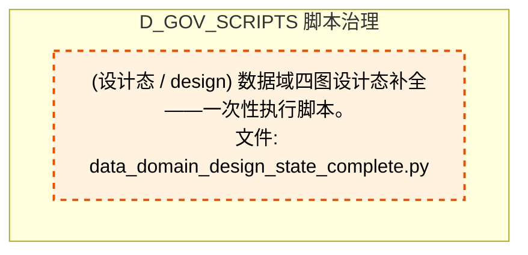
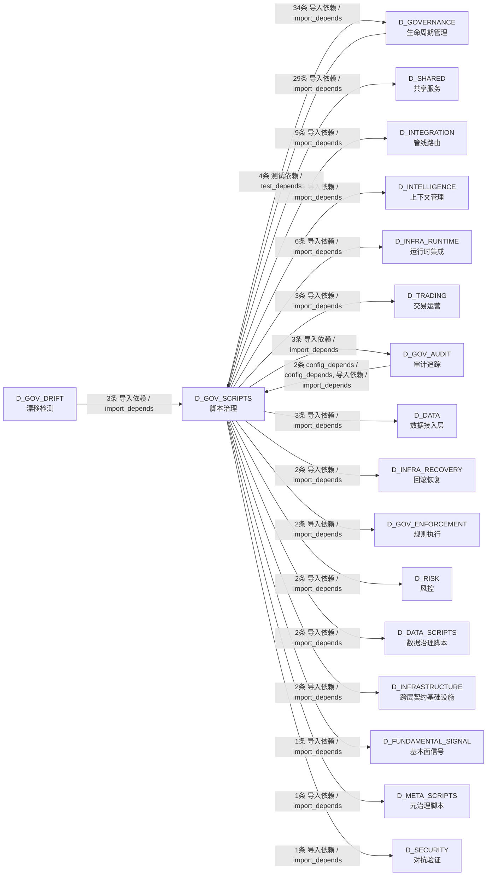

# 56_d_gov_scripts / 脚本治理 / Script Governance

> **功能简介 / Overview**: 脚本治理，负责脚本生命周期管理和脚本质量门禁

> **文档作用 / Purpose**: 展示 脚本治理（D_GOV_SCRIPTS）功能域的模块清单、域内依赖关系、跨域依赖关系、架构分层视图，供架构审查和域治理参考。

> 本文档由 generate_domain_doc.py 从 depgraph (PostgreSQL) 自动生成
> 数据源: depgraph (PostgreSQL) nodes表 + edges表

## 域基本信息 / Domain Overview

| 字段 | 值 | Field | Value |
|------|------|-------|-------|
| 编号 | 56 | Number | 56 |
| 域ID | D_GOV_SCRIPTS | Domain ID | D_GOV_SCRIPTS |
| 域名称 | 脚本治理 | Domain Name | Script Governance |
| 层级 | L2 业务域层 | Layer | L2 Domain |
| 模块数 | 136 | Module Count | 136 |
| 域内依赖 | 10 | Internal Dependencies | 10 |
| 跨域入边 | 9 | Cross-domain Incoming | 9 |
| 跨域出边 | 107 | Cross-domain Outgoing | 107 |
| 设计态模块 | 1 | Design Modules | 1 |
| 生产态模块 | 135 | Production Modules | 135 |
| 容量 | 378/150 (超容) | Capacity | 378/150 (超容) |
| 描述 | Phase Manager阶段管理 | Description | Phase Manager阶段管理 |

## 模块分层清单 / Module Layered List

> 按 architecture_layer 分组的模块清单（共 136 个模块 / 136 modules）。

### L1 基础层 / Foundation Layer (1 modules)

| # | 模块路径 / Module Path | 模块名称 / Module Name (功能简介 / Description) | 成熟度 / Maturity | 蓝图 / Blueprint |
|:--:|---------|---------|:---:|:---:|
| 1 | docs/01_policies_and_standards/_registry/catalogs/scripts... | [聚合节点 / Aggregated] 脚本集 / Script Collection (429 items) | 生产态 / production |  |
| ↳1 |   ↳ scripts/governance/__init__.py |  | - | - |
| ↳2 |   ↳ scripts/governance/_archive/one_off/analyze_orphan_c... |  | - | - |
| ↳3 |   ↳ scripts/governance/_archive/one_off/audit_post_sync_... |  | - | - |
| ↳4 |   ↳ scripts/governance/_archive/one_off/check_exam_case_... |  | - | - |
| ↳5 |   ↳ scripts/governance/_archive/one_off/check_rule_cover... |  | - | - |
| ↳6 |   ↳ scripts/governance/_archive/one_off/create_alignment... |  | - | - |
| ↳7 |   ↳ scripts/governance/_archive/one_off/dm105_depgraph_t... |  | - | - |
| ↳8 |   ↳ scripts/governance/_archive/one_off/fix_broken_post_... |  | - | - |
| ↳9 |   ↳ scripts/governance/_archive/one_off/group_orphan_mod... |  | - | - |
| ↳10 |   ↳ scripts/governance/_archive/one_off/list_phase0_tasks.py |  | - | - |
| ↳11 |   ↳ scripts/governance/_archive/one_off/migrate_clean_bu... |  | - | - |
| ↳12 |   ↳ scripts/governance/_archive/one_off/migrate_domain_i... |  | - | - |
| ↳13 |   ↳ scripts/governance/_archive/one_off/perf_depgraph_ba... |  | - | - |
| ↳14 |   ↳ scripts/governance/_archive/one_off/phase_a_backup.py |  | - | - |
| ↳15 |   ↳ scripts/governance/_archive/one_off/rename_kebab_to_... |  | - | - |
| ↳16 |   ↳ scripts/governance/_archive/one_off/rename_whitelist... |  | - | - |
| ↳17 |   ↳ scripts/governance/_archive/one_off/test_lock_scenar... |  | - | - |
| ↳18 |   ↳ scripts/governance/_archive/one_off/verify_final_del... |  | - | - |
| ↳19 |   ↳ scripts/governance/_archive/one_off/verify_rule_yaml... |  | - | - |
| ↳20 |   ↳ scripts/governance/_archive/prototype/adversarial_log.py |  | - | - |
| ↳21 |   ↳ scripts/governance/_archive/prototype/adversarial_sy... |  | - | - |
| ↳22 |   ↳ scripts/governance/_archive/prototype/audit_domain_n... |  | - | - |
| ↳23 |   ↳ scripts/governance/_archive/prototype/changelog.py |  | - | - |
| ↳24 |   ↳ scripts/governance/_archive/prototype/check_audit_rb... |  | - | - |
| ↳25 |   ↳ scripts/governance/_archive/prototype/construction_g... |  | - | - |
| ↳26 |   ↳ scripts/governance/_archive/prototype/generate_asset... |  | - | - |
| ↳27 |   ↳ scripts/governance/_archive/prototype/generate_nav_t... |  | - | - |
| ↳28 |   ↳ scripts/governance/_archive/prototype/rebuild_audit_... |  | - | - |
| ↳29 |   ↳ scripts/governance/_archive/prototype/scan_ground_tr... |  | - | - |
| ↳30 |   ↳ scripts/governance/_archive/prototype/session_simula... |  | - | - |
| ↳31 |   ↳ scripts/governance/_archive/prototype/sync_blueprint... |  | - | - |
| ↳32 |   ↳ scripts/governance/_archive/vms_ri/ri_boundary_check.py |  | - | - |
| ↳33 |   ↳ scripts/governance/_archive/vms_ri/ri_build_completi... |  | - | - |
| ↳34 |   ↳ scripts/governance/_archive/vms_ri/vms_blindspot_che... |  | - | - |
| ↳35 |   ↳ scripts/governance/_archive/vms_ri/vms_build_complet... |  | - | - |
| ↳36 |   ↳ scripts/governance/_archive/vms_ri/vms_cron_monitor.py |  | - | - |
| ↳37 |   ↳ scripts/governance/_archive/vms_ri/vms_cross_file_ch... |  | - | - |
| ↳38 |   ↳ scripts/governance/_archive/vms_ri/vms_health_check.py |  | - | - |
| ↳39 |   ↳ scripts/governance/_archive/vms_ri/vms_migrate.py |  | - | - |
| ↳40 |   ↳ scripts/governance/_archive/vms_ri/vms_migration_dry... |  | - | - |
| ↳41 |   ↳ scripts/governance/_archive/vms_ri/vms_phase_rollback.py |  | - | - |
| ↳42 |   ↳ scripts/governance/_archive/vms_ri/vms_version_sync_... |  | - | - |
| ↳43 |   ↳ scripts/governance/_shared/__init__.py |  | - | - |
| ↳44 |   ↳ scripts/governance/_shared/base.py |  | - | - |
| ↳45 |   ↳ scripts/governance/_shared/constants.py |  | - | - |
| ↳46 |   ↳ scripts/governance/_shared/deprecated_paths.yaml |  | - | - |
| ↳47 |   ↳ scripts/governance/_shared/encoding.py |  | - | - |
| ↳48 |   ↳ scripts/governance/_shared/file_utils.py |  | - | - |
| ↳49 |   ↳ scripts/governance/_shared/frontmatter.py |  | - | - |
| ↳50 |   ↳ scripts/governance/_shared/libcst_docstring_adder.py |  | - | - |
| ↳51 |   ↳ scripts/governance/_shared/plugin_contract_schema.yaml |  | - | - |
| ↳52 |   ↳ scripts/governance/_shared/registry_entry_count.py |  | - | - |
| ↳53 |   ↳ scripts/governance/_shared/thresholds.py |  | - | - |
| ↳54 |   ↳ scripts/governance/_shared/thresholds.yaml |  | - | - |
| ↳55 |   ↳ scripts/governance/_shared/walk.py |  | - | - |
| ↳56 |   ↳ scripts/governance/_shared/yaml_utils.py |  | - | - |
| ↳57 |   ↳ scripts/governance/_sync/check_p0_status.py |  | - | - |
| ↳58 |   ↳ scripts/governance/_sync/cleanup_p0_auto_bridged.py |  | - | - |
| ↳59 |   ↳ scripts/governance/_sync/cleanup_p0_ops_pending.py |  | - | - |
| ↳60 |   ↳ scripts/governance/_sync/fix_orphan_deps.py |  | - | - |
| ↳61 |   ↳ scripts/governance/_tasks/__init__.py |  | - | - |
| ↳62 |   ↳ scripts/governance/_tasks/list_phase0_tasks.py |  | - | - |
| ↳63 |   ↳ scripts/governance/_tasks/task_show.py |  | - | - |
| ↳64 |   ↳ scripts/governance/_tasks/task_summary.py |  | - | - |
| ↳65 |   ↳ scripts/governance/apply_dataflowgraph.py |  | - | - |
| ↳66 |   ↳ scripts/governance/apply_decisiongraph.py |  | - | - |
| ↳67 |   ↳ scripts/governance/apply_depgraph.py |  | - | - |
| ↳68 |   ↳ scripts/governance/architecture_health_dashboard.py |  | - | - |
| ↳69 |   ↳ scripts/governance/ast_import_rewriter.py |  | - | - |
| ↳70 |   ↳ scripts/governance/d10_performance/__init__.py |  | - | - |
| ↳71 |   ↳ scripts/governance/d10_performance/collect_system_th... |  | - | - |
| ↳72 |   ↳ scripts/governance/d11_compliance/__init__.py |  | - | - |
| ↳73 |   ↳ scripts/governance/d11_compliance/audit_registration.py |  | - | - |
| ↳74 |   ↳ scripts/governance/check_ssot_gate.py |  | - | - |
| ↳75 |   ↳ scripts/governance/d11_compliance/check_test_structu... |  | - | - |
| ↳76 |   ↳ scripts/governance/d11_compliance/ci_self_check.py |  | - | - |
| ↳77 |   ↳ scripts/governance/d11_compliance/fix_shared_bypass.py |  | - | - |
| ↳78 |   ↳ scripts/governance/d11_compliance/g9_compliance_check.py |  | - | - |
| ↳79 |   ↳ scripts/governance/d11_compliance/task_self_check.py |  | - | - |
| ↳80 |   ↳ scripts/governance/d11_compliance/validate_blueprint... |  | - | - |
| ↳81 |   ↳ scripts/governance/d11_compliance/validate_commit_ga... |  | - | - |
| ↳82 |   ↳ scripts/governance/d11_compliance/validate_commit_me... |  | - | - |
| ↳83 |   ↳ scripts/governance/d11_compliance/validate_exit_codes.py |  | - | - |
| ↳84 |   ↳ scripts/governance/d11_compliance/validate_frozen_re... |  | - | - |
| ↳85 |   ↳ scripts/governance/d11_compliance/validate_manifest_... |  | - | - |
| ↳86 |   ↳ scripts/governance/d11_compliance/validate_no_utf8_b... |  | - | - |
| ↳87 |   ↳ scripts/governance/d11_compliance/validate_script_na... |  | - | - |
| ↳88 |   ↳ scripts/governance/d11_compliance/validate_script_qu... |  | - | - |
| ↳89 |   ↳ scripts/governance/d11_compliance/validate_task_deco... |  | - | - |
| ↳90 |   ↳ scripts/governance/d11_compliance/validate_truth_sou... |  | - | - |
| ↳91 |   ↳ scripts/governance/d11_compliance/validate_vocabular... |  | - | - |
| ↳92 |   ↳ scripts/governance/d11_compliance/verify_audit_integ... |  | - | - |
| ↳93 |   ↳ scripts/governance/d11_compliance/verify_key_imports.py |  | - | - |
| ↳94 |   ↳ scripts/governance/d11_compliance/verify_schema_heal... |  | - | - |
| ↳95 |   ↳ scripts/governance/d12_ai_hallucination/__init__.py |  | - | - |
| ↳96 |   ↳ scripts/governance/d12_ai_hallucination/check_logger... |  | - | - |
| ↳97 |   ↳ scripts/governance/d12_ai_hallucination/validate_gat... |  | - | - |
| ↳98 |   ↳ scripts/governance/d12_ai_hallucination/validate_ses... |  | - | - |
| ↳99 |   ↳ scripts/governance/d12_ai_hallucination/validate_ses... |  | - | - |
| ↳100 |   ↳ scripts/governance/d1_structure/__init__.py |  | - | - |
| | | > (仅显示前 100 个 items，共 429 个) | | |

### L2 领域层 / Domain Layer (135 modules)

| # | 模块路径 / Module Path | 模块名称 / Module Name (功能简介 / Description) | 成熟度 / Maturity | 蓝图 / Blueprint |
|:--:|---------|---------|:---:|:---:|
| 1 | scripts/_archive/governance/dm106_p2b_verification.py | DM-106: P2-B 迁移全量验证脚本 | 生产态 / production |  |
| 2 | scripts/a2a_full_verification.py | A2A Protocol 全链路满分验证脚本 | 生产态 / production |  |
| 3 | scripts/check_naming_convention.py | check_naming_convention.py | 生产态 / production |  |
| 4 | scripts/construction/_e2e_check.py | _e2e_check.py | 生产态 / production |  |
| 5 | scripts/construction/_e2e_deep.py | _e2e_deep.py | 生产态 / production |  |
| 6 | scripts/construction/check_statuses.py | check_statuses.py | 生产态 / production |  |
| 7 | scripts/construction/check_transition_code.py | check_transition_code.py | 生产态 / production |  |
| 8 | scripts/construction/d_init_task_system.py | 初始化任务系统数据库 + 创建任务系统自身的施工任... | 生产态 / production |  |
| 9 | scripts/construction/demo_a2a_chat.py | A2A 多 Agent 聊天演示 - Alpha 和 Beta 讨论项目评估 | 生产态 / production |  |
| 10 | scripts/construction/demo_a2a_coordination.py | A2A 协议协调任务演示 | 生产态 / production |  |
| 11 | scripts/construction/demo_e2e_pipeline.py | C-track 端到端演示 —— 全流水线一次性运行 | 生产态 / production |  |
| 12 | scripts/construction/finalize_tasks.py | finalize_tasks.py | 生产态 / production |  |
| 13 | scripts/construction/local_layer_daemon.py | local_layer_daemon.py — L2 本地模型层守护进程... | 生产态 / production |  |
| 14 | scripts/construction/reset_test_task.py | reset_test_task.py | 生产态 / production |  |
| 15 | scripts/construction/start_brain.py | start_brain.py — ZephyrAlpha 系统大脑一键启动 | 生产态 / production |  |
| 16 | scripts/construction/test_event_hook.py | test_event_hook.py | 生产态 / production |  |
| 17 | scripts/context/generate_architecture_context.py | generate_architecture_context.py — 预编译架构... | 生产态 / production |  |
| 18 | scripts/diagnose_breadth_failed.py | 诊断 breadth_failed 能力的根因。 | 生产态 / production |  |
| 19 | scripts/dm90971_add_test_headers.py | DM-90971: Batch add module_id scope prefix + go... | 生产态 / production |  |
| 20 | scripts/fix_freeze_manifest.py | Fix freezemanifest.yaml - comprehensive repair ... | 生产态 / production |  |
| 21 | scripts/fix_orphan_all.py | fix_orphan_all.py — 自动修复 __init__.py __all... | 生产态 / production |  |
| 22 | scripts/generate_manifest.py | Generate complete script_manifest.yaml from scr... | 生产态 / production |  |
| 23 | scripts/generate_pathway_registry.py | 从所有 MOD 蓝图的 §路径索引 章节自动生成 syste... | 生产态 / production |  |
| 24 | scripts/git_commit.py | git_commit.py — GitCommitGateway CLI 封装（OPS... | 生产态 / production |  |
| 25 | scripts/git_guard.py | Git Guard — 拦截危险 git 命令，防止破坏其他 se... | 生产态 / production |  |
| 26 | scripts/governance/_shared/base.py | base.py — 审计脚本基类 | 生产态 / production |  |
| 27 | scripts/governance/_shared/constants.py | constants.py — 审计脚本共享常量 | 生产态 / production |  |
| 28 | scripts/governance/_shared/encoding.py | encoding.py — UTF-8 编码安全工具 | 生产态 / production |  |
| 29 | scripts/governance/_shared/file_utils.py | _shared/file_utils.py — 原子写入共享工具（ARCH... | 生产态 / production |  |
| 30 | scripts/governance/_shared/frontmatter.py | 文件头部格式解析 SSoT（Single Source of Truth） | 生产态 / production |  |
| 31 | scripts/governance/_shared/libcst_docstring_adder.py | libcst_docstring_adder.py — Lossless docstring... | 生产态 / production |  |
| 32 | scripts/governance/_shared/registry_entry_count.py | 登记表主条目计数——与 generate_registry_master... | 生产态 / production |  |
| 33 | scripts/governance/_shared/thresholds.py | thresholds.py — 阈值集中配置加载器 | 生产态 / production |  |
| 34 | scripts/governance/_shared/walk.py | walk.py — 目录遍历共享工具 | 生产态 / production |  |
| 35 | scripts/governance/_shared/yaml_utils.py | _shared/yaml_utils.py — YAML 文件加载共享工具 | 生产态 / production |  |
| 36 | scripts/governance/_sync/check_p0_status.py | Module docstring — see module-level docstring ... | 生产态 / production |  |
| 37 | scripts/governance/_sync/cleanup_p0_auto_bridged.py | 清理历史 P0 自动桥接任务 | 生产态 / production |  |
| 38 | scripts/governance/_sync/cleanup_p0_ops_pending.py | cleanup_p0_ops_pending.py - 一次性：将所有 OPS-... | 生产态 / production |  |
| 39 | scripts/governance/_sync/fix_orphan_deps.py | fix_orphan_deps.py — 一次性修复孤儿依赖引用 | 生产态 / production |  |
| 40 | scripts/governance/_tasks/list_phase0_tasks.py | [INVARIANTS] 仅查询不修改; 连接失败→exit 1 | 生产态 / production |  |
| 41 | scripts/governance/_tasks/task_show.py | governance/task_show 脚本 — 任务卡详情查询 CLI。 | 生产态 / production |  |
| 42 | scripts/governance/_tasks/task_summary.py | task_summary.py — 任务系统全局摘要 CLI | 生产态 / production |  |
| 43 | scripts/governance/apply_dataflowgraph.py | apply_dataflowgraph.py — dataflowgraph 变更写... | 生产态 / production |  |
| 44 | scripts/governance/apply_decisiongraph.py | [INVARIANTS] pg_advisory_lock 写锁; build_statu... | 生产态 / production |  |
| 45 | scripts/governance/apply_depgraph.py | [INVARIANTS] 原子写入（RULE-ONE）；变更前验证；... | 生产态 / production |  |
| 46 | scripts/governance/architecture_health_dashboard.py | architecture_health_dashboard.py — 架构健康度... | 生产态 / production |  |
| 47 | scripts/governance/ast_import_rewriter.py | AST-based import rewriter for governance direct... | 生产态 / production |  |
| 48 | scripts/governance/audit_return_contract_usage.py | audit_return_contract_usage.py — 返回契约 ok ... | 生产态 / production |  |
| 49 | scripts/governance/audit_worktree_ops_telemetry.py | audit_worktree_ops_telemetry.py — 主工作区文件... | 生产态 / production |  |
| 50 | scripts/governance/check_commit_message.py | check_commit_message.py — GitHub Actions PR co... | 生产态 / production |  |
| 51 | scripts/governance/check_ssot_gate.py | GATE-SSOT: SSoT 创建门禁（pre-commit hook 双保... | 生产态 / production |  |
| 52 | scripts/governance/d10_performance/collect_system_threads.py | collect_system_threads.py — 全系统线程数快照采集器 | 生产态 / production |  |
| 53 | scripts/governance/d12_ai_hallucination/check_logger_kwar... | ===============================================... | 生产态 / production |  |
| 54 | scripts/governance/d12_ai_hallucination/validate_gate_pro... | validate_gate_prompt_conflict.py — Gate-Prompt... | 生产态 / production |  |
| 55 | scripts/governance/d12_ai_hallucination/validate_session_... | validate_session_budget.py — Session 操作预算... | 生产态 / production |  |
| 56 | scripts/governance/d12_ai_hallucination/validate_session_... | validate_session_gate_check.py — Session 门禁... | 生产态 / production |  |
| 57 | scripts/governance/d2_links/audit_broken_links.py | 检测文档/数据文件中的断链与幽灵引用。 | 生产态 / production |  |
| 58 | scripts/governance/d2_links/detect_relative_references.py | detect_relative_references.py — 相对路径引用检测 | 生产态 / production |  |
| 59 | scripts/governance/d4_paths/detect_deprecated_path_writes.py | detect_deprecated_path_writes.py — 废弃路径写... | 生产态 / production |  |
| 60 | scripts/governance/d4_paths/detect_excessive_file_moves.py | detect_excessive_file_moves.py — 文件过度搬迁检测 | 生产态 / production |  |
| 61 | scripts/governance/d4_paths/detect_ruins_references.py | detect_ruins_references.py — 残骸/废弃路径引用检测 | 生产态 / production |  |
| 62 | scripts/governance/d4_paths/detect_split_delete_ref_commi... | detect_split_delete_ref_commit.py — 删除引用分... | 生产态 / production |  |
| 63 | scripts/governance/d8_doc_sync/audit_rename_completeness.py | audit_rename_completeness.py — 改名完整性审计... | 生产态 / production |  |
| 64 | scripts/governance/d8_doc_sync/auto_sync_all_registries.py | 全自动注册表同步器 | 生产态 / production |  |
| 65 | scripts/governance/d8_doc_sync/detect_ai_products_in_docs.py | detect_ai_products_in_docs.py — AI 产物位置检测 | 生产态 / production |  |
| 66 | scripts/governance/d8_doc_sync/detect_dated_snapshots.py | detect_dated_snapshots.py — 带日期快照文件检测 | 生产态 / production |  |
| 67 | scripts/governance/d8_doc_sync/sync_rule_registry.py | Checks that every RULE-ZERO through RULE-N in .... | 生产态 / production |  |
| 68 | scripts/governance/d8_doc_sync/sync_yaml_to_depgraph.py | [INVARIANTS] YAML→DB单向同步; 27项同步; try/fi... | 生产态 / production |  |
| 69 | scripts/governance/d8_doc_sync/update_progress.py | update_progress.py — 从 domain_progress.json ... | 生产态 / production |  |
| 70 | scripts/governance/d8_doc_sync/validate_document_lifecycl... | validate_document_lifecycle.py — 文档生命周期校验 | 生产态 / production |  |
| 71 | scripts/governance/d8_doc_sync/validate_document_ttl.py | validate_document_ttl.py — 文档 TTL 过期检测 | 生产态 / production |  |
| 72 | scripts/governance/d9_knowledge/detect_duplicated_normati... | detect_duplicated_normative_language.py — 规范... | 生产态 / production |  |
| 73 | scripts/governance/d9_knowledge/detect_orphan_documents.py | detect_orphan_documents.py — 孤立文档检测 | 生产态 / production |  |
| 74 | scripts/governance/data_quality/check_tick_duplication.py | tick_data 表真重复检查工具（RULE-DATA-OPS 配套... | 生产态 / production |  |
| 75 | scripts/governance/extract_decisiongraph.py | extract_decisiongraph - decisiongraph on-demand... | 生产态 / production |  |
| 76 | scripts/governance/extract_depgraph.py | [INVARIANTS] 禁止AI直接Read 157MB depgraph文件... | 生产态 / production |  |
| 77 | scripts/governance/generate_decision_graph.py | [INVARIANTS] YAML 是唯一真源; DB 为只读缓存; 同... | 生产态 / production |  |
| 78 | scripts/governance/generate_project_depgraph.py | # [BLUEPRINT] MOD-INF-005 | scripts/governance/... | 生产态 / production |  |
| 79 | scripts/governance/generate_project_path_tree.py | 从磁盘扫描生成路径全景图的tree段（运营态目录结... | 生产态 / production |  |
| 80 | scripts/governance/generators/check_gate_inventory_drift.py | check_gate_inventory_drift.py — commit_gates ... | 生产态 / production |  |
| 81 | scripts/governance/generators/fix_module_manifest_layout.py | fix_module_manifest_layout.py — 校正治理脚本模... | 生产态 / production |  |
| 82 | scripts/governance/generators/generate_gate_registry.py | generate_gate_registry.py — 门禁登记表自动生成器 | 生产态 / production |  |
| 83 | scripts/governance/generators/generate_path_ownership_map.py | 从蓝图§0.1聚合生成 path_ownership_map.yaml 路... | 生产态 / production |  |
| 84 | scripts/governance/generators/generate_registry_master_in... | generate_registry_master_index.py — 登记表总索... | 生产态 / production |  |
| 85 | scripts/governance/generators/generate_rule_ai_perception... | generate_rule_ai_perception_index.py — 规则AI... | 生产态 / production |  |
| 86 | scripts/governance/generators/inject_manifests.py | inject_manifests.py — __manifest__ 批量注入器 | 生产态 / production |  |
| 87 | scripts/governance/generators/refresh_master_entries.py | refresh_master_entries.py — 登记表总索引 entri... | 生产态 / production |  |
| 88 | scripts/governance/generators/sync_audit_protocol_numbers.py | sync_audit_protocol_numbers.py — 从 SSoT 注册... | 生产态 / production |  |
| 89 | scripts/governance/git_health_smoke.py | git_health_smoke.py — Git 健康度 smoke test（A... | 生产态 / production |  |
| 90 | scripts/governance/migrate_sqlite_to_pg/migrate_data.py | SQLite → PostgreSQL 运营数据迁移脚本 | 生产态 / production |  |
| 91 | scripts/governance/migrate_sqlite_to_pg/seed_from_yaml.py | seed_from_yaml.py — 从 YAML 真源灌种子表（5.32... | 生产态 / production |  |
| 92 | scripts/governance/migrate_to_metadata_tables.py | migrate_to_metadata_tables.py — 裁定#209 Stage... | 生产态 / production |  |
| 93 | scripts/governance/oneoff/data_domain_audit_query.py | 数据域设计态排查 - DB 现状查询（Phase 2，只读不... | 生产态 / production |  |
| 94 | scripts/governance/oneoff/data_domain_design_state_comple... | 数据域四图设计态补全——一次性执行脚本。 | 设计态 / design |  |
| 95 | scripts/governance/query_module_panorama.py | query_module_panorama.py — 模块全景查询入口（... | 生产态 / production |  |
| 96 | scripts/governance/repair/concurrent_commit_test.py | concurrent_commit_test.py — 幽灵提交红蓝对抗脚... | 生产态 / production |  |
| 97 | scripts/governance/run_all.py | run_all.py — 脚本系统统一入口脚本 | 生产态 / production |  |
| 98 | scripts/governance/run_gate_chain.py | run_gate_chain.py — 顺序运行多个门禁脚本，任一... | 生产态 / production |  |
| 99 | scripts/governance/run_silent_failure_regression.py | run_silent_failure_regression.py — silent-fail... | 生产态 / production |  |
| 100 | scripts/governance/session_startup_health_check.py | session_startup_health_check.py — AI session ... | 生产态 / production |  |
| 101 | scripts/governance/status.py | status.py — 审计系统状态仪表盘 | 生产态 / production |  |
| 102 | scripts/governance/sync_panorama_module.py | sync_panorama_module.py — 四图模块同步引擎（AR... | 生产态 / production |  |
| 103 | scripts/governance/verify_sync_integrity.py | sync 完整性校验脚本：验证 YAML→DB 同步的一致性。 | 生产态 / production |  |
| 104 | scripts/governance/vms/vms_blindspot_check.py | VMS 盲点闭合检查器 — MOD-INF-011 · R1(33) + R... | 生产态 / production |  |
| 105 | scripts/governance/vms/vms_build_completion_check.py | VMS Build Completion Check — MOD-INF-011 · TA... | 生产态 / production |  |
| 106 | scripts/governance/vms/vms_cron_monitor.py | VMS Cron 监控器 — MOD-INF-011 · TASK-INF-0224 | 生产态 / production |  |
| 107 | scripts/governance/vms/vms_cross_file_check.py | VMS 跨文件内容一致性检查器 — MOD-INF-011 · TA... | 生产态 / production |  |
| 108 | scripts/governance/vms/vms_health_check.py | VMS Health Check 脚本 — MOD-INF-011 · Phase 3... | 生产态 / production |  |
| 109 | scripts/governance/vms/vms_migrate.py | VMS Phase 2 数据迁移脚本 — MOD-INF-011 | 生产态 / production |  |
| 110 | scripts/governance/vms/vms_migration_dry_run.py | VMS 迁移 dry-run 脚本 — MOD-INF-011 Phase 2 前... | 生产态 / production |  |
| 111 | scripts/governance/vms/vms_phase_rollback.py | VMS Phase 回滚方案 — MOD-INF-011 · TASK-INF-0217 | 生产态 / production |  |
| 112 | scripts/governance/vms/vms_version_sync_check.py | VMS 版本同步检查器 — MOD-INF-011 · TASK-INF-0222 | 生产态 / production |  |
| 113 | scripts/hooks/auto_handoff_log.py | auto_handoff_log.py | 生产态 / production |  |
| 114 | scripts/lock_files.py | lock_files.py —— AI 对话文件锁协议（硬规则执... | 生产态 / production |  |
| 115 | scripts/mcp/generate_ide_config.py | 从 config/mcp.json 生成各 IDE MCP 配置文件（MOD... | 生产态 / production |  |
| 116 | scripts/mcp/launcher.py | MCP DAG 编排启动器（MOD-INF-013 §14 拓扑排序 +... | 生产态 / production |  |
| 117 | scripts/mcp/start_all.py | MCP 全 Server 启动脚本 — DEPRECATED. | 生产态 / production |  |
| 118 | scripts/mcp/status_all.py | MCP 全 Server 状态检查脚本（MOD-INF-013 §14）。 | 生产态 / production |  |
| 119 | scripts/mcp/stop_all.py | MCP 全 Server 停止脚本（MOD-INF-013 §14）。 | 生产态 / production |  |
| 120 | scripts/migration/dm311_autonomy_core_split.py | DM-311: autonomy_core/ 拆分迁移执行脚本。 | 生产态 / production |  |
| 121 | scripts/migration/dm314_infra_ops_split.py | DM-314: infra_ops/ 拆分迁移执行脚本。 | 生产态 / production |  |
| 122 | scripts/migration/governance_root_split.py | ARCH-031: governance/ root flat-files split mig... | 生产态 / production |  |
| 123 | scripts/ops/verify_header_completeness.py | 文件头部完整性校验（6 格式统一入口） | 生产态 / production |  |
| 124 | scripts/post_checkout_guard.py | Post-checkout Guard — 事后检测 checkout 是否覆... | 生产态 / production |  |
| 125 | scripts/pre_commit/verify_dedup.py | pre_commit 验证脚本 — 委托给 code-dedup-engine... | 生产态 / production |  |
| 126 | scripts/rollback.py | Rollback System CLI — MOD-INF-021 v0.10.0 Git-... | 生产态 / production |  |
| 127 | scripts/run_deepseek_v4_exam.py | DeepSeek V4 入职考试运行脚本 | 生产态 / production |  |
| 128 | scripts/run_ollama_exam.py | Ollama 入职考试运行脚本 | 生产态 / production |  |
| 129 | scripts/scaffold.py | scaffold.py — ZephyrAlpha 唯一创建入口（RULE-T... | 生产态 / production |  |
| 130 | scripts/setup_git_guard_aliases.py | Setup/Remove Git Aliases for Git Guard — 自动... | 生产态 / production |  |
| 131 | tests/governance/scripts_governance/test_any_type_inferre... | test_any_type_inferrer.py — any_type_inferrer.... | 生产态 / production |  |
| 132 | tests/governance/scripts_governance/test_check_canonical_... | test_check_canonical_yaml_drift.py — GATE-CANO... | 生产态 / production |  |
| 133 | tests/governance/scripts_governance/test_check_vocab_hard... | test_check_vocab_hardcode.py — GATE-VOCAB 检测... | 生产态 / production |  |
| 134 | tests/governance/scripts_governance/test_pre_write_gate.py | test_pre_write_gate.py — _check_session_overla... | 生产态 / production |  |
| 135 | tests/governance/test_check_blueprint_code_alignment.py | tests for check_blueprint_code_alignment.py — ... | 生产态 / production |  |

## 域内依赖图 / Internal Dependency Diagram

> 依赖图内嵌在本文档中，IDE 可直接渲染显示。参考 decision_index.md 设计，分三个视图：合并全景图、运营态子图、设计态子图（按 design_maturity 实际值拆分）。
>
> **图例说明 / Legend**：
> - **实线边框 = 运营态模块**（production，已上线运行）
> - **虚线边框 = 设计态模块**（design，蓝图阶段，代码未写）
> - **实线箭头 = 运营态依赖**（已生效的依赖关系）
> - **虚线箭头 = 非运营态依赖**（计划中/验证中的依赖关系）

### 合并全景图（全部模块，标签标注成熟度）

> 展示全部 136 个模块（生产态 135 + 设计态 1），标签标注成熟度。

#### 第 1 页 / 共 5 页

```mermaid
graph TD
    subgraph D_GOV_SCRIPTS["D_GOV_SCRIPTS 脚本治理"]
        docs_01_policies_and_standards_registry_catalogs_scripts_registry_yaml["(生产态 / production)  Script Collection — ARCH-052 聚合节点 production"]
        scripts_archive_governance_dm106_p2b_verification_py["(生产态 / production) DM-106: P2-B 迁移全量验证脚本<br/>文件: dm106_p2b_verification.py"]
        scripts_a2a_full_verification_py["(生产态 / production) A2A Protocol 全链路满分验证脚本<br/>文件: a2a_full_verification.py"]
        scripts_check_naming_convention_py["(生产态 / production) check_naming_convention.py"]
        scripts_construction_e2e_check_py["(生产态 / production) _e2e_check.py"]
        scripts_construction_e2e_deep_py["(生产态 / production) _e2e_deep.py"]
        scripts_construction_check_statuses_py["(生产态 / production) check_statuses.py"]
        scripts_construction_check_transition_code_py["(生产态 / production) check_transition_code.py"]
        scripts_construction_d_init_task_system_py["(生产态 / production) 初始化任务系统数据库 + 创建任务系统自身的施工任...<br/>文件: d_init_task_system.py"]
        scripts_construction_demo_a2a_chat_py["(生产态 / production) A2A 多 Agent 聊天演示 - Alpha 和 Beta 讨论项目评估<br/>文件: demo_a2a_chat.py"]
        scripts_construction_demo_a2a_coordination_py["(生产态 / production) A2A 协议协调任务演示<br/>文件: demo_a2a_coordination.py"]
        scripts_construction_demo_e2e_pipeline_py["(生产态 / production) C-track 端到端演示 —— 全流水线一次性运行<br/>文件: demo_e2e_pipeline.py"]
        scripts_construction_finalize_tasks_py["(生产态 / production) finalize_tasks.py"]
        scripts_construction_local_layer_daemon_py["(生产态 / production) local_layer_daemon.py — L2 本地模型层守护进程...<br/>文件: local_layer_daemon.py"]
        scripts_construction_reset_test_task_py["(生产态 / production) reset_test_task.py"]
        scripts_construction_start_brain_py["(生产态 / production) start_brain.py — ZephyrAlpha 系统大脑一键启动<br/>文件: start_brain.py"]
        scripts_construction_test_event_hook_py["(生产态 / production) test_event_hook.py"]
        scripts_context_generate_architecture_context_py["(生产态 / production) generate_architecture_context.py — 预编译架构...<br/>文件: generate_architecture_context.py"]
        scripts_diagnose_breadth_failed_py["(生产态 / production) 诊断 breadth_failed 能力的根因。<br/>文件: diagnose_breadth_failed.py"]
        scripts_dm90971_add_test_headers_py["(生产态 / production) DM-90971: Batch add module_id scope prefix + go...<br/>文件: dm90971_add_test_headers.py"]
        scripts_fix_freeze_manifest_py["(生产态 / production) Fix freezemanifest.yaml - comprehensive repair ...<br/>文件: fix_freeze_manifest.py"]
        scripts_fix_orphan_all_py["(生产态 / production) fix_orphan_all.py — 自动修复 __init__.py __all...<br/>文件: fix_orphan_all.py"]
        scripts_generate_manifest_py["(生产态 / production) Generate complete script_manifest.yaml from scr...<br/>文件: generate_manifest.py"]
        scripts_generate_pathway_registry_py["(生产态 / production) 从所有 MOD 蓝图的 §路径索引 章节自动生成 syste...<br/>文件: generate_pathway_registry.py"]
        scripts_git_commit_py["(生产态 / production) git_commit.py — GitCommitGateway CLI 封装（OPS...<br/>文件: git_commit.py"]
        scripts_git_guard_py["(生产态 / production) Git Guard — 拦截危险 git 命令，防止破坏其他 se...<br/>文件: git_guard.py"]
        scripts_governance_shared_base_py["(生产态 / production) base.py — 审计脚本基类<br/>文件: base.py"]
        scripts_governance_shared_constants_py["(生产态 / production) constants.py — 审计脚本共享常量<br/>文件: constants.py"]
        scripts_governance_shared_encoding_py["(生产态 / production) encoding.py — UTF-8 编码安全工具<br/>文件: encoding.py"]
        scripts_governance_shared_file_utils_py["(生产态 / production) _shared/file_utils.py — 原子写入共享工具（ARCH...<br/>文件: file_utils.py"]
    end
    scripts_construction_demo_a2a_chat_py -->|config_depends / config_depends| scripts_construction_check_statuses_py
    D_TRADING["(生产态 / production) D_TRADING"]
    scripts_construction_local_layer_daemon_py -->|导入依赖 / import_depends| D_TRADING
    D_SHARED["(生产态 / production) D_SHARED"]
    scripts_construction_e2e_deep_py -->|导入依赖 / import_depends| D_SHARED
    D_INFRA_RUNTIME["(生产态 / production) D_INFRA_RUNTIME"]
    scripts_governance_shared_base_py -->|导入依赖 / import_depends| D_INFRA_RUNTIME
    D_RISK["(生产态 / production) D_RISK"]
    scripts_construction_demo_e2e_pipeline_py -->|导入依赖 / import_depends| D_RISK
    D_GOVERNANCE["(生产态 / production) D_GOVERNANCE"]
    scripts_construction_d_init_task_system_py -->|导入依赖 / import_depends| D_GOVERNANCE
    scripts_construction_start_brain_py -->|导入依赖 / import_depends| D_TRADING
    D_INFRASTRUCTURE["(生产态 / production) D_INFRASTRUCTURE"]
    scripts_a2a_full_verification_py -->|导入依赖 / import_depends| D_INFRASTRUCTURE
    scripts_construction_local_layer_daemon_py -->|导入依赖 / import_depends| D_INFRASTRUCTURE
    scripts_generate_pathway_registry_py -->|导入依赖 / import_depends| D_GOVERNANCE
    scripts_archive_governance_dm106_p2b_verification_py -->|导入依赖 / import_depends| D_SHARED
    scripts_git_guard_py -->|导入依赖 / import_depends| D_INFRA_RUNTIME
    scripts_construction_finalize_tasks_py -->|导入依赖 / import_depends| D_GOVERNANCE
    scripts_construction_d_init_task_system_py -->|导入依赖 / import_depends| D_GOVERNANCE
    scripts_construction_e2e_check_py -->|导入依赖 / import_depends| D_SHARED
    D_GOV_ENFORCEMENT["(生产态 / production) D_GOV_ENFORCEMENT"]
    scripts_git_commit_py -->|导入依赖 / import_depends| D_GOV_ENFORCEMENT
    D_GOVERNANCE -->|测试依赖 / test_depends| scripts_git_guard_py
    D_GOVERNANCE -->|测试依赖 / test_depends| scripts_git_commit_py
    D_GOVERNANCE -->|测试依赖 / test_depends| scripts_git_guard_py
    classDef production fill:#e1f5fe,stroke:#01579b,stroke-width:2px,color:#000
    classDef design fill:#fff3e0,stroke:#e65100,stroke-width:2px,color:#000,stroke-dasharray: 5 5
    classDef external_prod fill:#e8f5e9,stroke:#1b5e20,stroke-width:1px,color:#000
    classDef external_design fill:#fce4ec,stroke:#880e4f,stroke-width:1px,color:#000,stroke-dasharray: 5 5
    class docs_01_policies_and_standards_registry_catalogs_scripts_registry_yaml,scripts_archive_governance_dm106_p2b_verification_py,scripts_a2a_full_verification_py,scripts_check_naming_convention_py,scripts_construction_e2e_check_py,scripts_construction_e2e_deep_py,scripts_construction_check_statuses_py,scripts_construction_check_transition_code_py,scripts_construction_d_init_task_system_py,scripts_construction_demo_a2a_chat_py,scripts_construction_demo_a2a_coordination_py,scripts_construction_demo_e2e_pipeline_py,scripts_construction_finalize_tasks_py,scripts_construction_local_layer_daemon_py,scripts_construction_reset_test_task_py,scripts_construction_start_brain_py,scripts_construction_test_event_hook_py,scripts_context_generate_architecture_context_py,scripts_diagnose_breadth_failed_py,scripts_dm90971_add_test_headers_py,scripts_fix_freeze_manifest_py,scripts_fix_orphan_all_py,scripts_generate_manifest_py,scripts_generate_pathway_registry_py,scripts_git_commit_py,scripts_git_guard_py,scripts_governance_shared_base_py,scripts_governance_shared_constants_py,scripts_governance_shared_encoding_py,scripts_governance_shared_file_utils_py production
    class D_TRADING,D_SHARED,D_INFRA_RUNTIME,D_RISK,D_GOVERNANCE,D_INFRASTRUCTURE,D_GOV_ENFORCEMENT external_prod
```



#### 第 2 页 / 共 5 页

```mermaid
graph TD
    subgraph D_GOV_SCRIPTS["D_GOV_SCRIPTS 脚本治理"]
        scripts_governance_shared_frontmatter_py["(生产态 / production) 文件头部格式解析 SSoT（Single Source of Truth）<br/>文件: frontmatter.py"]
        scripts_governance_shared_libcst_docstring_adder_py["(生产态 / production) libcst_docstring_adder.py — Lossless docstring...<br/>文件: libcst_docstring_adder.py"]
        scripts_governance_shared_registry_entry_count_py["(生产态 / production) 登记表主条目计数——与 generate_registry_master...<br/>文件: registry_entry_count.py"]
        scripts_governance_shared_thresholds_py["(生产态 / production) thresholds.py — 阈值集中配置加载器<br/>文件: thresholds.py"]
        scripts_governance_shared_walk_py["(生产态 / production) walk.py — 目录遍历共享工具<br/>文件: walk.py"]
        scripts_governance_shared_yaml_utils_py["(生产态 / production) _shared/yaml_utils.py — YAML 文件加载共享工具<br/>文件: yaml_utils.py"]
        scripts_governance_sync_check_p0_status_py["(生产态 / production) Module docstring — see module-level docstring ...<br/>文件: check_p0_status.py"]
        scripts_governance_sync_cleanup_p0_auto_bridged_py["(生产态 / production) 清理历史 P0 自动桥接任务<br/>文件: cleanup_p0_auto_bridged.py"]
        scripts_governance_sync_cleanup_p0_ops_pending_py["(生产态 / production) cleanup_p0_ops_pending.py - 一次性：将所有 OPS-...<br/>文件: cleanup_p0_ops_pending.py"]
        scripts_governance_sync_fix_orphan_deps_py["(生产态 / production) fix_orphan_deps.py — 一次性修复孤儿依赖引用<br/>文件: fix_orphan_deps.py"]
        scripts_governance_tasks_list_phase0_tasks_py["(生产态 / production) (INVARIANTS) 仅查询不修改; 连接失败→exit 1<br/>文件: list_phase0_tasks.py"]
        scripts_governance_tasks_task_show_py["(生产态 / production) governance/task_show 脚本 — 任务卡详情查询 CLI。<br/>文件: task_show.py"]
        scripts_governance_tasks_task_summary_py["(生产态 / production) task_summary.py — 任务系统全局摘要 CLI<br/>文件: task_summary.py"]
        scripts_governance_apply_dataflowgraph_py["(生产态 / production) apply_dataflowgraph.py — dataflowgraph 变更写...<br/>文件: apply_dataflowgraph.py"]
        scripts_governance_apply_decisiongraph_py["(生产态 / production) (INVARIANTS) pg_advisory_lock 写锁; build_statu...<br/>文件: apply_decisiongraph.py"]
        scripts_governance_apply_depgraph_py["(生产态 / production) (INVARIANTS) 原子写入（RULE-ONE）；变更前验证；...<br/>文件: apply_depgraph.py"]
        scripts_governance_architecture_health_dashboard_py["(生产态 / production) architecture_health_dashboard.py — 架构健康度...<br/>文件: architecture_health_dashboard.py"]
        scripts_governance_ast_import_rewriter_py["(生产态 / production) AST-based import rewriter for governance direct...<br/>文件: ast_import_rewriter.py"]
        scripts_governance_audit_return_contract_usage_py["(生产态 / production) audit_return_contract_usage.py — 返回契约 ok ...<br/>文件: audit_return_contract_usage.py"]
        scripts_governance_audit_worktree_ops_telemetry_py["(生产态 / production) audit_worktree_ops_telemetry.py — 主工作区文件...<br/>文件: audit_worktree_ops_telemetry.py"]
        scripts_governance_check_commit_message_py["(生产态 / production) check_commit_message.py — GitHub Actions PR co...<br/>文件: check_commit_message.py"]
        scripts_governance_check_ssot_gate_py["(生产态 / production) GATE-SSOT: SSoT 创建门禁（pre-commit hook 双保...<br/>文件: check_ssot_gate.py"]
        scripts_governance_d10_performance_collect_system_threads_py["(生产态 / production) collect_system_threads.py — 全系统线程数快照采集器<br/>文件: collect_system_threads.py"]
        scripts_governance_d12_ai_hallucination_check_logger_kwargs_py["(生产态 / production) ===============================================...<br/>文件: check_logger_kwargs.py"]
        scripts_governance_d12_ai_hallucination_validate_gate_prompt_conflict_py["(生产态 / production) validate_gate_prompt_conflict.py — Gate-Prompt...<br/>文件: validate_gate_prompt_conflict.py"]
        scripts_governance_d12_ai_hallucination_validate_session_budget_py["(生产态 / production) validate_session_budget.py — Session 操作预算...<br/>文件: validate_session_budget.py"]
        scripts_governance_d12_ai_hallucination_validate_session_gate_check_py["(生产态 / production) validate_session_gate_check.py — Session 门禁...<br/>文件: validate_session_gate_check.py"]
        scripts_governance_d2_links_audit_broken_links_py["(生产态 / production) 检测文档/数据文件中的断链与幽灵引用。<br/>文件: audit_broken_links.py"]
        scripts_governance_d2_links_detect_relative_references_py["(生产态 / production) detect_relative_references.py — 相对路径引用检测<br/>文件: detect_relative_references.py"]
        scripts_governance_d4_paths_detect_deprecated_path_writes_py["(生产态 / production) detect_deprecated_path_writes.py — 废弃路径写...<br/>文件: detect_deprecated_path_writes.py"]
    end
    scripts_governance_sync_cleanup_p0_auto_bridged_py -->|config_depends / config_depends| scripts_governance_sync_check_p0_status_py
    scripts_governance_sync_cleanup_p0_ops_pending_py -->|config_depends / config_depends| scripts_governance_sync_cleanup_p0_auto_bridged_py
    scripts_governance_sync_fix_orphan_deps_py -->|config_depends / config_depends| scripts_governance_sync_cleanup_p0_auto_bridged_py
    D_META_SCRIPTS["(生产态 / production) D_META_SCRIPTS"]
    scripts_governance_apply_depgraph_py -->|导入依赖 / import_depends| D_META_SCRIPTS
    D_SHARED["(生产态 / production) D_SHARED"]
    scripts_governance_apply_depgraph_py -->|导入依赖 / import_depends| D_SHARED
    D_GOV_AUDIT["(生产态 / production) D_GOV_AUDIT"]
    scripts_governance_architecture_health_dashboard_py -->|导入依赖 / import_depends| D_GOV_AUDIT
    scripts_governance_apply_depgraph_py -->|导入依赖 / import_depends| D_SHARED
    D_GOVERNANCE["(生产态 / production) D_GOVERNANCE"]
    scripts_governance_apply_decisiongraph_py -->|导入依赖 / import_depends| D_GOVERNANCE
    D_DATA_SCRIPTS["(生产态 / production) D_DATA_SCRIPTS"]
    scripts_governance_apply_depgraph_py -->|导入依赖 / import_depends| D_DATA_SCRIPTS
    scripts_governance_check_ssot_gate_py -->|导入依赖 / import_depends| D_SHARED
    scripts_governance_tasks_task_summary_py -->|导入依赖 / import_depends| D_GOVERNANCE
    scripts_governance_shared_yaml_utils_py -->|导入依赖 / import_depends| D_SHARED
    scripts_governance_apply_decisiongraph_py -->|导入依赖 / import_depends| D_SHARED
    scripts_governance_tasks_task_show_py -->|导入依赖 / import_depends| D_GOVERNANCE
    scripts_governance_tasks_task_show_py -->|导入依赖 / import_depends| D_GOVERNANCE
    scripts_governance_apply_dataflowgraph_py -->|导入依赖 / import_depends| D_GOVERNANCE
    scripts_governance_tasks_task_summary_py -->|导入依赖 / import_depends| D_GOVERNANCE
    scripts_governance_apply_depgraph_py -->|导入依赖 / import_depends| D_SHARED
    D_GOV_DRIFT["(生产态 / production) D_GOV_DRIFT"]
    D_GOV_DRIFT -->|导入依赖 / import_depends| scripts_governance_shared_frontmatter_py
    D_GOV_DRIFT -->|导入依赖 / import_depends| scripts_governance_shared_frontmatter_py
    D_GOV_DRIFT -->|导入依赖 / import_depends| scripts_governance_shared_frontmatter_py
    classDef production fill:#e1f5fe,stroke:#01579b,stroke-width:2px,color:#000
    classDef design fill:#fff3e0,stroke:#e65100,stroke-width:2px,color:#000,stroke-dasharray: 5 5
    classDef external_prod fill:#e8f5e9,stroke:#1b5e20,stroke-width:1px,color:#000
    classDef external_design fill:#fce4ec,stroke:#880e4f,stroke-width:1px,color:#000,stroke-dasharray: 5 5
    class scripts_governance_shared_frontmatter_py,scripts_governance_shared_libcst_docstring_adder_py,scripts_governance_shared_registry_entry_count_py,scripts_governance_shared_thresholds_py,scripts_governance_shared_walk_py,scripts_governance_shared_yaml_utils_py,scripts_governance_sync_check_p0_status_py,scripts_governance_sync_cleanup_p0_auto_bridged_py,scripts_governance_sync_cleanup_p0_ops_pending_py,scripts_governance_sync_fix_orphan_deps_py,scripts_governance_tasks_list_phase0_tasks_py,scripts_governance_tasks_task_show_py,scripts_governance_tasks_task_summary_py,scripts_governance_apply_dataflowgraph_py,scripts_governance_apply_decisiongraph_py,scripts_governance_apply_depgraph_py,scripts_governance_architecture_health_dashboard_py,scripts_governance_ast_import_rewriter_py,scripts_governance_audit_return_contract_usage_py,scripts_governance_audit_worktree_ops_telemetry_py,scripts_governance_check_commit_message_py,scripts_governance_check_ssot_gate_py,scripts_governance_d10_performance_collect_system_threads_py,scripts_governance_d12_ai_hallucination_check_logger_kwargs_py,scripts_governance_d12_ai_hallucination_validate_gate_prompt_conflict_py,scripts_governance_d12_ai_hallucination_validate_session_budget_py,scripts_governance_d12_ai_hallucination_validate_session_gate_check_py,scripts_governance_d2_links_audit_broken_links_py,scripts_governance_d2_links_detect_relative_references_py,scripts_governance_d4_paths_detect_deprecated_path_writes_py production
    class D_META_SCRIPTS,D_SHARED,D_GOV_AUDIT,D_GOVERNANCE,D_DATA_SCRIPTS,D_GOV_DRIFT external_prod
```



#### 第 3 页 / 共 5 页

```mermaid
graph TD
    subgraph D_GOV_SCRIPTS["D_GOV_SCRIPTS 脚本治理"]
        scripts_governance_d4_paths_detect_excessive_file_moves_py["(生产态 / production) detect_excessive_file_moves.py — 文件过度搬迁检测<br/>文件: detect_excessive_file_moves.py"]
        scripts_governance_d4_paths_detect_ruins_references_py["(生产态 / production) detect_ruins_references.py — 残骸/废弃路径引用检测<br/>文件: detect_ruins_references.py"]
        scripts_governance_d4_paths_detect_split_delete_ref_commit_py["(生产态 / production) detect_split_delete_ref_commit.py — 删除引用分...<br/>文件: detect_split_delete_ref_commit.py"]
        scripts_governance_d8_doc_sync_audit_rename_completeness_py["(生产态 / production) audit_rename_completeness.py — 改名完整性审计...<br/>文件: audit_rename_completeness.py"]
        scripts_governance_d8_doc_sync_auto_sync_all_registries_py["(生产态 / production) 全自动注册表同步器<br/>文件: auto_sync_all_registries.py"]
        scripts_governance_d8_doc_sync_detect_ai_products_in_docs_py["(生产态 / production) detect_ai_products_in_docs.py — AI 产物位置检测<br/>文件: detect_ai_products_in_docs.py"]
        scripts_governance_d8_doc_sync_detect_dated_snapshots_py["(生产态 / production) detect_dated_snapshots.py — 带日期快照文件检测<br/>文件: detect_dated_snapshots.py"]
        scripts_governance_d8_doc_sync_sync_rule_registry_py["(生产态 / production) Checks that every RULE-ZERO through RULE-N in ....<br/>文件: sync_rule_registry.py"]
        scripts_governance_d8_doc_sync_sync_yaml_to_depgraph_py["(生产态 / production) (INVARIANTS) YAML→DB单向同步; 27项同步; try/fi...<br/>文件: sync_yaml_to_depgraph.py"]
        scripts_governance_d8_doc_sync_update_progress_py["(生产态 / production) update_progress.py — 从 domain_progress.json ...<br/>文件: update_progress.py"]
        scripts_governance_d8_doc_sync_validate_document_lifecycle_py["(生产态 / production) validate_document_lifecycle.py — 文档生命周期校验<br/>文件: validate_document_lifecycle.py"]
        scripts_governance_d8_doc_sync_validate_document_ttl_py["(生产态 / production) validate_document_ttl.py — 文档 TTL 过期检测<br/>文件: validate_document_ttl.py"]
        scripts_governance_d9_knowledge_detect_duplicated_normative_language_py["(生产态 / production) detect_duplicated_normative_language.py — 规范...<br/>文件: detect_duplicated_normative_language.py"]
        scripts_governance_d9_knowledge_detect_orphan_documents_py["(生产态 / production) detect_orphan_documents.py — 孤立文档检测<br/>文件: detect_orphan_documents.py"]
        scripts_governance_data_quality_check_tick_duplication_py["(生产态 / production) tick_data 表真重复检查工具（RULE-DATA-OPS 配套...<br/>文件: check_tick_duplication.py"]
        scripts_governance_extract_decisiongraph_py["(生产态 / production) extract_decisiongraph - decisiongraph on-demand...<br/>文件: extract_decisiongraph.py"]
        scripts_governance_extract_depgraph_py["(生产态 / production) (INVARIANTS) 禁止AI直接Read 157MB depgraph文件...<br/>文件: extract_depgraph.py"]
        scripts_governance_generate_decision_graph_py["(生产态 / production) (INVARIANTS) YAML 是唯一真源; DB 为只读缓存; 同...<br/>文件: generate_decision_graph.py"]
        scripts_governance_generate_project_depgraph_py["(生产态 / production) # (BLUEPRINT) MOD-INF-005 / scripts/governance/...<br/>文件: generate_project_depgraph.py"]
        scripts_governance_generate_project_path_tree_py["(生产态 / production) 从磁盘扫描生成路径全景图的tree段（运营态目录结...<br/>文件: generate_project_path_tree.py"]
        scripts_governance_generators_check_gate_inventory_drift_py["(生产态 / production) check_gate_inventory_drift.py — commit_gates ...<br/>文件: check_gate_inventory_drift.py"]
        scripts_governance_generators_fix_module_manifest_layout_py["(生产态 / production) fix_module_manifest_layout.py — 校正治理脚本模...<br/>文件: fix_module_manifest_layout.py"]
        scripts_governance_generators_generate_gate_registry_py["(生产态 / production) generate_gate_registry.py — 门禁登记表自动生成器<br/>文件: generate_gate_registry.py"]
        scripts_governance_generators_generate_path_ownership_map_py["(生产态 / production) 从蓝图§0.1聚合生成 path_ownership_map.yaml 路...<br/>文件: generate_path_ownership_map.py"]
        scripts_governance_generators_generate_registry_master_index_py["(生产态 / production) generate_registry_master_index.py — 登记表总索...<br/>文件: generate_registry_master_index.py"]
        scripts_governance_generators_generate_rule_ai_perception_index_py["(生产态 / production) generate_rule_ai_perception_index.py — 规则AI...<br/>文件: generate_rule_ai_perception_index.py"]
        scripts_governance_generators_inject_manifests_py["(生产态 / production) inject_manifests.py — __manifest__ 批量注入器<br/>文件: inject_manifests.py"]
        scripts_governance_generators_refresh_master_entries_py["(生产态 / production) refresh_master_entries.py — 登记表总索引 entri...<br/>文件: refresh_master_entries.py"]
        scripts_governance_generators_sync_audit_protocol_numbers_py["(生产态 / production) sync_audit_protocol_numbers.py — 从 SSoT 注册...<br/>文件: sync_audit_protocol_numbers.py"]
        scripts_governance_git_health_smoke_py["(生产态 / production) git_health_smoke.py — Git 健康度 smoke test（A...<br/>文件: git_health_smoke.py"]
    end
    D_GOVERNANCE["(生产态 / production) D_GOVERNANCE"]
    scripts_governance_extract_decisiongraph_py -->|导入依赖 / import_depends| D_GOVERNANCE
    scripts_governance_extract_decisiongraph_py -->|导入依赖 / import_depends| D_GOVERNANCE
    scripts_governance_d8_doc_sync_sync_yaml_to_depgraph_py -->|导入依赖 / import_depends| D_GOVERNANCE
    D_SHARED["(生产态 / production) D_SHARED"]
    scripts_governance_extract_decisiongraph_py -->|导入依赖 / import_depends| D_SHARED
    D_DATA["(生产态 / production) D_DATA"]
    scripts_governance_data_quality_check_tick_duplication_py -->|导入依赖 / import_depends| D_DATA
    scripts_governance_generators_generate_path_ownership_map_py -->|导入依赖 / import_depends| D_GOVERNANCE
    scripts_governance_data_quality_check_tick_duplication_py -->|导入依赖 / import_depends| D_DATA
    scripts_governance_generate_project_depgraph_py -->|导入依赖 / import_depends| D_SHARED
    scripts_governance_generators_generate_path_ownership_map_py -->|导入依赖 / import_depends| D_GOVERNANCE
    scripts_governance_generate_decision_graph_py -->|导入依赖 / import_depends| D_SHARED
    scripts_governance_generators_check_gate_inventory_drift_py -->|导入依赖 / import_depends| D_SHARED
    scripts_governance_generate_project_depgraph_py -->|导入依赖 / import_depends| D_GOVERNANCE
    scripts_governance_generate_decision_graph_py -->|导入依赖 / import_depends| D_GOVERNANCE
    scripts_governance_generate_project_depgraph_py -->|导入依赖 / import_depends| D_SHARED
    scripts_governance_extract_depgraph_py -->|导入依赖 / import_depends| D_SHARED
    D_GOVERNANCE -->|测试依赖 / test_depends| scripts_governance_generators_generate_gate_registry_py
    D_GOV_AUDIT["(生产态 / production) D_GOV_AUDIT"]
    D_GOV_AUDIT -->|导入依赖 / import_depends| scripts_governance_generators_check_gate_inventory_drift_py
    classDef production fill:#e1f5fe,stroke:#01579b,stroke-width:2px,color:#000
    classDef design fill:#fff3e0,stroke:#e65100,stroke-width:2px,color:#000,stroke-dasharray: 5 5
    classDef external_prod fill:#e8f5e9,stroke:#1b5e20,stroke-width:1px,color:#000
    classDef external_design fill:#fce4ec,stroke:#880e4f,stroke-width:1px,color:#000,stroke-dasharray: 5 5
    class scripts_governance_d4_paths_detect_excessive_file_moves_py,scripts_governance_d4_paths_detect_ruins_references_py,scripts_governance_d4_paths_detect_split_delete_ref_commit_py,scripts_governance_d8_doc_sync_audit_rename_completeness_py,scripts_governance_d8_doc_sync_auto_sync_all_registries_py,scripts_governance_d8_doc_sync_detect_ai_products_in_docs_py,scripts_governance_d8_doc_sync_detect_dated_snapshots_py,scripts_governance_d8_doc_sync_sync_rule_registry_py,scripts_governance_d8_doc_sync_sync_yaml_to_depgraph_py,scripts_governance_d8_doc_sync_update_progress_py,scripts_governance_d8_doc_sync_validate_document_lifecycle_py,scripts_governance_d8_doc_sync_validate_document_ttl_py,scripts_governance_d9_knowledge_detect_duplicated_normative_language_py,scripts_governance_d9_knowledge_detect_orphan_documents_py,scripts_governance_data_quality_check_tick_duplication_py,scripts_governance_extract_decisiongraph_py,scripts_governance_extract_depgraph_py,scripts_governance_generate_decision_graph_py,scripts_governance_generate_project_depgraph_py,scripts_governance_generate_project_path_tree_py,scripts_governance_generators_check_gate_inventory_drift_py,scripts_governance_generators_fix_module_manifest_layout_py,scripts_governance_generators_generate_gate_registry_py,scripts_governance_generators_generate_path_ownership_map_py,scripts_governance_generators_generate_registry_master_index_py,scripts_governance_generators_generate_rule_ai_perception_index_py,scripts_governance_generators_inject_manifests_py,scripts_governance_generators_refresh_master_entries_py,scripts_governance_generators_sync_audit_protocol_numbers_py,scripts_governance_git_health_smoke_py production
    class D_GOVERNANCE,D_SHARED,D_DATA,D_GOV_AUDIT external_prod
```



#### 第 4 页 / 共 5 页

```mermaid
graph TD
    subgraph D_GOV_SCRIPTS["D_GOV_SCRIPTS 脚本治理"]
        scripts_governance_migrate_sqlite_to_pg_migrate_data_py["(生产态 / production) SQLite → PostgreSQL 运营数据迁移脚本<br/>文件: migrate_data.py"]
        scripts_governance_migrate_sqlite_to_pg_seed_from_yaml_py["(生产态 / production) seed_from_yaml.py — 从 YAML 真源灌种子表（5.32...<br/>文件: seed_from_yaml.py"]
        scripts_governance_migrate_to_metadata_tables_py["(生产态 / production) migrate_to_metadata_tables.py — 裁定#209 Stage...<br/>文件: migrate_to_metadata_tables.py"]
        scripts_governance_oneoff_data_domain_audit_query_py["(生产态 / production) 数据域设计态排查 - DB 现状查询（Phase 2，只读不...<br/>文件: data_domain_audit_query.py"]
        scripts_governance_oneoff_data_domain_design_state_complete_py["(设计态 / design) 数据域四图设计态补全——一次性执行脚本。<br/>文件: data_domain_design_state_complete.py"]
        scripts_governance_query_module_panorama_py["(生产态 / production) query_module_panorama.py — 模块全景查询入口（...<br/>文件: query_module_panorama.py"]
        scripts_governance_repair_concurrent_commit_test_py["(生产态 / production) concurrent_commit_test.py — 幽灵提交红蓝对抗脚...<br/>文件: concurrent_commit_test.py"]
        scripts_governance_run_all_py["(生产态 / production) run_all.py — 脚本系统统一入口脚本<br/>文件: run_all.py"]
        scripts_governance_run_gate_chain_py["(生产态 / production) run_gate_chain.py — 顺序运行多个门禁脚本，任一...<br/>文件: run_gate_chain.py"]
        scripts_governance_run_silent_failure_regression_py["(生产态 / production) run_silent_failure_regression.py — silent-fail...<br/>文件: run_silent_failure_regression.py"]
        scripts_governance_session_startup_health_check_py["(生产态 / production) session_startup_health_check.py — AI session ...<br/>文件: session_startup_health_check.py"]
        scripts_governance_status_py["(生产态 / production) status.py — 审计系统状态仪表盘<br/>文件: status.py"]
        scripts_governance_sync_panorama_module_py["(生产态 / production) sync_panorama_module.py — 四图模块同步引擎（AR...<br/>文件: sync_panorama_module.py"]
        scripts_governance_verify_sync_integrity_py["(生产态 / production) sync 完整性校验脚本：验证 YAML→DB 同步的一致性。<br/>文件: verify_sync_integrity.py"]
        scripts_governance_vms_vms_blindspot_check_py["(生产态 / production) VMS 盲点闭合检查器 — MOD-INF-011 · R1(33) + R...<br/>文件: vms_blindspot_check.py"]
        scripts_governance_vms_vms_build_completion_check_py["(生产态 / production) VMS Build Completion Check — MOD-INF-011 · TA...<br/>文件: vms_build_completion_check.py"]
        scripts_governance_vms_vms_cron_monitor_py["(生产态 / production) VMS Cron 监控器 — MOD-INF-011 · TASK-INF-0224<br/>文件: vms_cron_monitor.py"]
        scripts_governance_vms_vms_cross_file_check_py["(生产态 / production) VMS 跨文件内容一致性检查器 — MOD-INF-011 · TA...<br/>文件: vms_cross_file_check.py"]
        scripts_governance_vms_vms_health_check_py["(生产态 / production) VMS Health Check 脚本 — MOD-INF-011 · Phase 3...<br/>文件: vms_health_check.py"]
        scripts_governance_vms_vms_migrate_py["(生产态 / production) VMS Phase 2 数据迁移脚本 — MOD-INF-011<br/>文件: vms_migrate.py"]
        scripts_governance_vms_vms_migration_dry_run_py["(生产态 / production) VMS 迁移 dry-run 脚本 — MOD-INF-011 Phase 2 前...<br/>文件: vms_migration_dry_run.py"]
        scripts_governance_vms_vms_phase_rollback_py["(生产态 / production) VMS Phase 回滚方案 — MOD-INF-011 · TASK-INF-0217<br/>文件: vms_phase_rollback.py"]
        scripts_governance_vms_vms_version_sync_check_py["(生产态 / production) VMS 版本同步检查器 — MOD-INF-011 · TASK-INF-0222<br/>文件: vms_version_sync_check.py"]
        scripts_hooks_auto_handoff_log_py["(生产态 / production) auto_handoff_log.py"]
        scripts_lock_files_py["(生产态 / production) lock_files.py —— AI 对话文件锁协议（硬规则执...<br/>文件: lock_files.py"]
        scripts_mcp_generate_ide_config_py["(生产态 / production) 从 config/mcp.json 生成各 IDE MCP 配置文件（MOD...<br/>文件: generate_ide_config.py"]
        scripts_mcp_launcher_py["(生产态 / production) MCP DAG 编排启动器（MOD-INF-013 §14 拓扑排序 +...<br/>文件: launcher.py"]
        scripts_mcp_start_all_py["(生产态 / production) MCP 全 Server 启动脚本 — DEPRECATED.<br/>文件: start_all.py"]
        scripts_mcp_status_all_py["(生产态 / production) MCP 全 Server 状态检查脚本（MOD-INF-013 §14）。<br/>文件: status_all.py"]
        scripts_mcp_stop_all_py["(生产态 / production) MCP 全 Server 停止脚本（MOD-INF-013 §14）。<br/>文件: stop_all.py"]
    end
    scripts_governance_migrate_sqlite_to_pg_seed_from_yaml_py -->|config_depends / config_depends| scripts_governance_migrate_sqlite_to_pg_migrate_data_py
    scripts_mcp_stop_all_py -->|config_depends / config_depends| scripts_mcp_status_all_py
    scripts_mcp_start_all_py -->|config_depends / config_depends| scripts_mcp_stop_all_py
    scripts_mcp_generate_ide_config_py -->|config_depends / config_depends| scripts_mcp_stop_all_py
    D_INTEGRATION["(生产态 / production) D_INTEGRATION"]
    scripts_governance_vms_vms_health_check_py -->|导入依赖 / import_depends| D_INTEGRATION
    scripts_governance_vms_vms_migration_dry_run_py -->|导入依赖 / import_depends| D_INTEGRATION
    D_SHARED["(生产态 / production) D_SHARED"]
    scripts_lock_files_py -->|导入依赖 / import_depends| D_SHARED
    scripts_governance_vms_vms_migrate_py -->|导入依赖 / import_depends| D_INTEGRATION
    D_GOVERNANCE["(生产态 / production) D_GOVERNANCE"]
    scripts_governance_oneoff_data_domain_audit_query_py -->|导入依赖 / import_depends| D_GOVERNANCE
    scripts_governance_vms_vms_cron_monitor_py -->|导入依赖 / import_depends| D_INTEGRATION
    scripts_governance_vms_vms_cron_monitor_py -->|导入依赖 / import_depends| D_INTEGRATION
    scripts_governance_vms_vms_health_check_py -->|导入依赖 / import_depends| D_INTEGRATION
    scripts_governance_query_module_panorama_py -->|导入依赖 / import_depends| D_GOVERNANCE
    scripts_governance_query_module_panorama_py -->|导入依赖 / import_depends| D_GOVERNANCE
    D_INFRA_RUNTIME["(生产态 / production) D_INFRA_RUNTIME"]
    scripts_governance_run_all_py -->|导入依赖 / import_depends| D_INFRA_RUNTIME
    scripts_governance_sync_panorama_module_py -->|导入依赖 / import_depends| D_GOVERNANCE
    D_GOV_ENFORCEMENT["(生产态 / production) D_GOV_ENFORCEMENT"]
    scripts_governance_repair_concurrent_commit_test_py -->|导入依赖 / import_depends| D_GOV_ENFORCEMENT
    scripts_lock_files_py -->|导入依赖 / import_depends| D_SHARED
    scripts_governance_migrate_sqlite_to_pg_migrate_data_py -->|导入依赖 / import_depends| D_SHARED
    D_GOV_AUDIT["(生产态 / production) D_GOV_AUDIT"]
    D_GOV_AUDIT -->|config_depends / config_depends| scripts_governance_repair_concurrent_commit_test_py
    classDef production fill:#e1f5fe,stroke:#01579b,stroke-width:2px,color:#000
    classDef design fill:#fff3e0,stroke:#e65100,stroke-width:2px,color:#000,stroke-dasharray: 5 5
    classDef external_prod fill:#e8f5e9,stroke:#1b5e20,stroke-width:1px,color:#000
    classDef external_design fill:#fce4ec,stroke:#880e4f,stroke-width:1px,color:#000,stroke-dasharray: 5 5
    class scripts_governance_migrate_sqlite_to_pg_migrate_data_py,scripts_governance_migrate_sqlite_to_pg_seed_from_yaml_py,scripts_governance_migrate_to_metadata_tables_py,scripts_governance_oneoff_data_domain_audit_query_py,scripts_governance_query_module_panorama_py,scripts_governance_repair_concurrent_commit_test_py,scripts_governance_run_all_py,scripts_governance_run_gate_chain_py,scripts_governance_run_silent_failure_regression_py,scripts_governance_session_startup_health_check_py,scripts_governance_status_py,scripts_governance_sync_panorama_module_py,scripts_governance_verify_sync_integrity_py,scripts_governance_vms_vms_blindspot_check_py,scripts_governance_vms_vms_build_completion_check_py,scripts_governance_vms_vms_cron_monitor_py,scripts_governance_vms_vms_cross_file_check_py,scripts_governance_vms_vms_health_check_py,scripts_governance_vms_vms_migrate_py,scripts_governance_vms_vms_migration_dry_run_py,scripts_governance_vms_vms_phase_rollback_py,scripts_governance_vms_vms_version_sync_check_py,scripts_hooks_auto_handoff_log_py,scripts_lock_files_py,scripts_mcp_generate_ide_config_py,scripts_mcp_launcher_py,scripts_mcp_start_all_py,scripts_mcp_status_all_py,scripts_mcp_stop_all_py production
    class scripts_governance_oneoff_data_domain_design_state_complete_py design
    class D_INTEGRATION,D_SHARED,D_GOVERNANCE,D_INFRA_RUNTIME,D_GOV_ENFORCEMENT,D_GOV_AUDIT external_prod
```



#### 第 5 页 / 共 5 页

```mermaid
graph TD
    subgraph D_GOV_SCRIPTS["D_GOV_SCRIPTS 脚本治理"]
        scripts_migration_dm311_autonomy_core_split_py["(生产态 / production) DM-311: autonomy_core/ 拆分迁移执行脚本。<br/>文件: dm311_autonomy_core_split.py"]
        scripts_migration_dm314_infra_ops_split_py["(生产态 / production) DM-314: infra_ops/ 拆分迁移执行脚本。<br/>文件: dm314_infra_ops_split.py"]
        scripts_migration_governance_root_split_py["(生产态 / production) ARCH-031: governance/ root flat-files split mig...<br/>文件: governance_root_split.py"]
        scripts_ops_verify_header_completeness_py["(生产态 / production) 文件头部完整性校验（6 格式统一入口）<br/>文件: verify_header_completeness.py"]
        scripts_post_checkout_guard_py["(生产态 / production) Post-checkout Guard — 事后检测 checkout 是否覆...<br/>文件: post_checkout_guard.py"]
        scripts_pre_commit_verify_dedup_py["(生产态 / production) pre_commit 验证脚本 — 委托给 code-dedup-engine...<br/>文件: verify_dedup.py"]
        scripts_rollback_py["(生产态 / production) Rollback System CLI — MOD-INF-021 v0.10.0 Git-...<br/>文件: rollback.py"]
        scripts_run_deepseek_v4_exam_py["(生产态 / production) DeepSeek V4 入职考试运行脚本<br/>文件: run_deepseek_v4_exam.py"]
        scripts_run_ollama_exam_py["(生产态 / production) Ollama 入职考试运行脚本<br/>文件: run_ollama_exam.py"]
        scripts_scaffold_py["(生产态 / production) scaffold.py — ZephyrAlpha 唯一创建入口（RULE-T...<br/>文件: scaffold.py"]
        scripts_setup_git_guard_aliases_py["(生产态 / production) Setup/Remove Git Aliases for Git Guard — 自动...<br/>文件: setup_git_guard_aliases.py"]
        tests_governance_scripts_governance_test_any_type_inferrer_py["(生产态 / production) test_any_type_inferrer.py — any_type_inferrer....<br/>文件: test_any_type_inferrer.py"]
        tests_governance_scripts_governance_test_check_canonical_yaml_drift_py["(生产态 / production) test_check_canonical_yaml_drift.py — GATE-CANO...<br/>文件: test_check_canonical_yaml_drift.py"]
        tests_governance_scripts_governance_test_check_vocab_hardcode_py["(生产态 / production) test_check_vocab_hardcode.py — GATE-VOCAB 检测...<br/>文件: test_check_vocab_hardcode.py"]
        tests_governance_scripts_governance_test_pre_write_gate_py["(生产态 / production) test_pre_write_gate.py — _check_session_overla...<br/>文件: test_pre_write_gate.py"]
        tests_governance_test_check_blueprint_code_alignment_py["(生产态 / production) tests for check_blueprint_code_alignment.py — ...<br/>文件: test_check_blueprint_code_alignment.py"]
    end
    scripts_migration_dm311_autonomy_core_split_py -->|config_depends / config_depends| scripts_migration_governance_root_split_py
    scripts_migration_dm314_infra_ops_split_py -->|config_depends / config_depends| scripts_migration_dm311_autonomy_core_split_py
    D_DATA_SCRIPTS["(生产态 / production) D_DATA_SCRIPTS"]
    scripts_scaffold_py -->|导入依赖 / import_depends| D_DATA_SCRIPTS
    D_INFRA_RUNTIME["(生产态 / production) D_INFRA_RUNTIME"]
    scripts_scaffold_py -->|导入依赖 / import_depends| D_INFRA_RUNTIME
    D_INFRA_RECOVERY["(生产态 / production) D_INFRA_RECOVERY"]
    scripts_rollback_py -->|导入依赖 / import_depends| D_INFRA_RECOVERY
    D_INTELLIGENCE["(生产态 / production) D_INTELLIGENCE"]
    scripts_run_ollama_exam_py -->|导入依赖 / import_depends| D_INTELLIGENCE
    scripts_run_deepseek_v4_exam_py -->|导入依赖 / import_depends| D_INTELLIGENCE
    scripts_rollback_py -->|导入依赖 / import_depends| D_INFRA_RECOVERY
    scripts_run_deepseek_v4_exam_py -->|导入依赖 / import_depends| D_INTELLIGENCE
    D_SHARED["(生产态 / production) D_SHARED"]
    scripts_run_deepseek_v4_exam_py -->|导入依赖 / import_depends| D_SHARED
    D_INTEGRATION["(生产态 / production) D_INTEGRATION"]
    scripts_run_ollama_exam_py -->|导入依赖 / import_depends| D_INTEGRATION
    D_GOVERNANCE["(生产态 / production) D_GOVERNANCE"]
    scripts_scaffold_py -->|导入依赖 / import_depends| D_GOVERNANCE
    scripts_ops_verify_header_completeness_py -->|导入依赖 / import_depends| D_SHARED
    scripts_post_checkout_guard_py -->|导入依赖 / import_depends| D_INFRA_RUNTIME
    classDef production fill:#e1f5fe,stroke:#01579b,stroke-width:2px,color:#000
    classDef design fill:#fff3e0,stroke:#e65100,stroke-width:2px,color:#000,stroke-dasharray: 5 5
    classDef external_prod fill:#e8f5e9,stroke:#1b5e20,stroke-width:1px,color:#000
    classDef external_design fill:#fce4ec,stroke:#880e4f,stroke-width:1px,color:#000,stroke-dasharray: 5 5
    class scripts_migration_dm311_autonomy_core_split_py,scripts_migration_dm314_infra_ops_split_py,scripts_migration_governance_root_split_py,scripts_ops_verify_header_completeness_py,scripts_post_checkout_guard_py,scripts_pre_commit_verify_dedup_py,scripts_rollback_py,scripts_run_deepseek_v4_exam_py,scripts_run_ollama_exam_py,scripts_scaffold_py,scripts_setup_git_guard_aliases_py,tests_governance_scripts_governance_test_any_type_inferrer_py,tests_governance_scripts_governance_test_check_canonical_yaml_drift_py,tests_governance_scripts_governance_test_check_vocab_hardcode_py,tests_governance_scripts_governance_test_pre_write_gate_py,tests_governance_test_check_blueprint_code_alignment_py production
    class D_DATA_SCRIPTS,D_INFRA_RUNTIME,D_INFRA_RECOVERY,D_INTELLIGENCE,D_SHARED,D_INTEGRATION,D_GOVERNANCE external_prod
```



### 运营态子图（仅 design_maturity=production 的模块和依赖）

> 仅展示已上线运行的模块（共 135 个，10 条域内依赖）。

```mermaid
graph TD
    subgraph D_GOV_SCRIPTS["D_GOV_SCRIPTS 脚本治理"]
        docs_01_policies_and_standards_registry_catalogs_scripts_registry_yaml["(生产态 / production)  Script Collection — ARCH-052 聚合节点 production"]
        scripts_archive_governance_dm106_p2b_verification_py["(生产态 / production) DM-106: P2-B 迁移全量验证脚本<br/>文件: dm106_p2b_verification.py"]
        scripts_a2a_full_verification_py["(生产态 / production) A2A Protocol 全链路满分验证脚本<br/>文件: a2a_full_verification.py"]
        scripts_check_naming_convention_py["(生产态 / production) check_naming_convention.py"]
        scripts_construction_e2e_check_py["(生产态 / production) _e2e_check.py"]
        scripts_construction_e2e_deep_py["(生产态 / production) _e2e_deep.py"]
        scripts_construction_check_statuses_py["(生产态 / production) check_statuses.py"]
        scripts_construction_check_transition_code_py["(生产态 / production) check_transition_code.py"]
        scripts_construction_d_init_task_system_py["(生产态 / production) 初始化任务系统数据库 + 创建任务系统自身的施工任...<br/>文件: d_init_task_system.py"]
        scripts_construction_demo_a2a_chat_py["(生产态 / production) A2A 多 Agent 聊天演示 - Alpha 和 Beta 讨论项目评估<br/>文件: demo_a2a_chat.py"]
        scripts_construction_demo_a2a_coordination_py["(生产态 / production) A2A 协议协调任务演示<br/>文件: demo_a2a_coordination.py"]
        scripts_construction_demo_e2e_pipeline_py["(生产态 / production) C-track 端到端演示 —— 全流水线一次性运行<br/>文件: demo_e2e_pipeline.py"]
        scripts_construction_finalize_tasks_py["(生产态 / production) finalize_tasks.py"]
        scripts_construction_local_layer_daemon_py["(生产态 / production) local_layer_daemon.py — L2 本地模型层守护进程...<br/>文件: local_layer_daemon.py"]
        scripts_construction_reset_test_task_py["(生产态 / production) reset_test_task.py"]
        scripts_construction_start_brain_py["(生产态 / production) start_brain.py — ZephyrAlpha 系统大脑一键启动<br/>文件: start_brain.py"]
        scripts_construction_test_event_hook_py["(生产态 / production) test_event_hook.py"]
        scripts_context_generate_architecture_context_py["(生产态 / production) generate_architecture_context.py — 预编译架构...<br/>文件: generate_architecture_context.py"]
        scripts_diagnose_breadth_failed_py["(生产态 / production) 诊断 breadth_failed 能力的根因。<br/>文件: diagnose_breadth_failed.py"]
        scripts_dm90971_add_test_headers_py["(生产态 / production) DM-90971: Batch add module_id scope prefix + go...<br/>文件: dm90971_add_test_headers.py"]
        scripts_fix_freeze_manifest_py["(生产态 / production) Fix freezemanifest.yaml - comprehensive repair ...<br/>文件: fix_freeze_manifest.py"]
        scripts_fix_orphan_all_py["(生产态 / production) fix_orphan_all.py — 自动修复 __init__.py __all...<br/>文件: fix_orphan_all.py"]
        scripts_generate_manifest_py["(生产态 / production) Generate complete script_manifest.yaml from scr...<br/>文件: generate_manifest.py"]
        scripts_generate_pathway_registry_py["(生产态 / production) 从所有 MOD 蓝图的 §路径索引 章节自动生成 syste...<br/>文件: generate_pathway_registry.py"]
        scripts_git_commit_py["(生产态 / production) git_commit.py — GitCommitGateway CLI 封装（OPS...<br/>文件: git_commit.py"]
        scripts_git_guard_py["(生产态 / production) Git Guard — 拦截危险 git 命令，防止破坏其他 se...<br/>文件: git_guard.py"]
        scripts_governance_shared_base_py["(生产态 / production) base.py — 审计脚本基类<br/>文件: base.py"]
        scripts_governance_shared_constants_py["(生产态 / production) constants.py — 审计脚本共享常量<br/>文件: constants.py"]
        scripts_governance_shared_encoding_py["(生产态 / production) encoding.py — UTF-8 编码安全工具<br/>文件: encoding.py"]
        scripts_governance_shared_file_utils_py["(生产态 / production) _shared/file_utils.py — 原子写入共享工具（ARCH...<br/>文件: file_utils.py"]
        scripts_governance_shared_frontmatter_py["(生产态 / production) 文件头部格式解析 SSoT（Single Source of Truth）<br/>文件: frontmatter.py"]
        scripts_governance_shared_libcst_docstring_adder_py["(生产态 / production) libcst_docstring_adder.py — Lossless docstring...<br/>文件: libcst_docstring_adder.py"]
        scripts_governance_shared_registry_entry_count_py["(生产态 / production) 登记表主条目计数——与 generate_registry_master...<br/>文件: registry_entry_count.py"]
        scripts_governance_shared_thresholds_py["(生产态 / production) thresholds.py — 阈值集中配置加载器<br/>文件: thresholds.py"]
        scripts_governance_shared_walk_py["(生产态 / production) walk.py — 目录遍历共享工具<br/>文件: walk.py"]
        scripts_governance_shared_yaml_utils_py["(生产态 / production) _shared/yaml_utils.py — YAML 文件加载共享工具<br/>文件: yaml_utils.py"]
        scripts_governance_sync_check_p0_status_py["(生产态 / production) Module docstring — see module-level docstring ...<br/>文件: check_p0_status.py"]
        scripts_governance_sync_cleanup_p0_auto_bridged_py["(生产态 / production) 清理历史 P0 自动桥接任务<br/>文件: cleanup_p0_auto_bridged.py"]
        scripts_governance_sync_cleanup_p0_ops_pending_py["(生产态 / production) cleanup_p0_ops_pending.py - 一次性：将所有 OPS-...<br/>文件: cleanup_p0_ops_pending.py"]
        scripts_governance_sync_fix_orphan_deps_py["(生产态 / production) fix_orphan_deps.py — 一次性修复孤儿依赖引用<br/>文件: fix_orphan_deps.py"]
        scripts_governance_tasks_list_phase0_tasks_py["(生产态 / production) (INVARIANTS) 仅查询不修改; 连接失败→exit 1<br/>文件: list_phase0_tasks.py"]
        scripts_governance_tasks_task_show_py["(生产态 / production) governance/task_show 脚本 — 任务卡详情查询 CLI。<br/>文件: task_show.py"]
        scripts_governance_tasks_task_summary_py["(生产态 / production) task_summary.py — 任务系统全局摘要 CLI<br/>文件: task_summary.py"]
        scripts_governance_apply_dataflowgraph_py["(生产态 / production) apply_dataflowgraph.py — dataflowgraph 变更写...<br/>文件: apply_dataflowgraph.py"]
        scripts_governance_apply_decisiongraph_py["(生产态 / production) (INVARIANTS) pg_advisory_lock 写锁; build_statu...<br/>文件: apply_decisiongraph.py"]
        scripts_governance_apply_depgraph_py["(生产态 / production) (INVARIANTS) 原子写入（RULE-ONE）；变更前验证；...<br/>文件: apply_depgraph.py"]
        scripts_governance_architecture_health_dashboard_py["(生产态 / production) architecture_health_dashboard.py — 架构健康度...<br/>文件: architecture_health_dashboard.py"]
        scripts_governance_ast_import_rewriter_py["(生产态 / production) AST-based import rewriter for governance direct...<br/>文件: ast_import_rewriter.py"]
        scripts_governance_audit_return_contract_usage_py["(生产态 / production) audit_return_contract_usage.py — 返回契约 ok ...<br/>文件: audit_return_contract_usage.py"]
        scripts_governance_audit_worktree_ops_telemetry_py["(生产态 / production) audit_worktree_ops_telemetry.py — 主工作区文件...<br/>文件: audit_worktree_ops_telemetry.py"]
        scripts_governance_check_commit_message_py["(生产态 / production) check_commit_message.py — GitHub Actions PR co...<br/>文件: check_commit_message.py"]
        scripts_governance_check_ssot_gate_py["(生产态 / production) GATE-SSOT: SSoT 创建门禁（pre-commit hook 双保...<br/>文件: check_ssot_gate.py"]
        scripts_governance_d10_performance_collect_system_threads_py["(生产态 / production) collect_system_threads.py — 全系统线程数快照采集器<br/>文件: collect_system_threads.py"]
        scripts_governance_d12_ai_hallucination_check_logger_kwargs_py["(生产态 / production) ===============================================...<br/>文件: check_logger_kwargs.py"]
        scripts_governance_d12_ai_hallucination_validate_gate_prompt_conflict_py["(生产态 / production) validate_gate_prompt_conflict.py — Gate-Prompt...<br/>文件: validate_gate_prompt_conflict.py"]
        scripts_governance_d12_ai_hallucination_validate_session_budget_py["(生产态 / production) validate_session_budget.py — Session 操作预算...<br/>文件: validate_session_budget.py"]
        scripts_governance_d12_ai_hallucination_validate_session_gate_check_py["(生产态 / production) validate_session_gate_check.py — Session 门禁...<br/>文件: validate_session_gate_check.py"]
        scripts_governance_d2_links_audit_broken_links_py["(生产态 / production) 检测文档/数据文件中的断链与幽灵引用。<br/>文件: audit_broken_links.py"]
        scripts_governance_d2_links_detect_relative_references_py["(生产态 / production) detect_relative_references.py — 相对路径引用检测<br/>文件: detect_relative_references.py"]
        scripts_governance_d4_paths_detect_deprecated_path_writes_py["(生产态 / production) detect_deprecated_path_writes.py — 废弃路径写...<br/>文件: detect_deprecated_path_writes.py"]
        scripts_governance_d4_paths_detect_excessive_file_moves_py["(生产态 / production) detect_excessive_file_moves.py — 文件过度搬迁检测<br/>文件: detect_excessive_file_moves.py"]
        scripts_governance_d4_paths_detect_ruins_references_py["(生产态 / production) detect_ruins_references.py — 残骸/废弃路径引用检测<br/>文件: detect_ruins_references.py"]
        scripts_governance_d4_paths_detect_split_delete_ref_commit_py["(生产态 / production) detect_split_delete_ref_commit.py — 删除引用分...<br/>文件: detect_split_delete_ref_commit.py"]
        scripts_governance_d8_doc_sync_audit_rename_completeness_py["(生产态 / production) audit_rename_completeness.py — 改名完整性审计...<br/>文件: audit_rename_completeness.py"]
        scripts_governance_d8_doc_sync_auto_sync_all_registries_py["(生产态 / production) 全自动注册表同步器<br/>文件: auto_sync_all_registries.py"]
        scripts_governance_d8_doc_sync_detect_ai_products_in_docs_py["(生产态 / production) detect_ai_products_in_docs.py — AI 产物位置检测<br/>文件: detect_ai_products_in_docs.py"]
        scripts_governance_d8_doc_sync_detect_dated_snapshots_py["(生产态 / production) detect_dated_snapshots.py — 带日期快照文件检测<br/>文件: detect_dated_snapshots.py"]
        scripts_governance_d8_doc_sync_sync_rule_registry_py["(生产态 / production) Checks that every RULE-ZERO through RULE-N in ....<br/>文件: sync_rule_registry.py"]
        scripts_governance_d8_doc_sync_sync_yaml_to_depgraph_py["(生产态 / production) (INVARIANTS) YAML→DB单向同步; 27项同步; try/fi...<br/>文件: sync_yaml_to_depgraph.py"]
        scripts_governance_d8_doc_sync_update_progress_py["(生产态 / production) update_progress.py — 从 domain_progress.json ...<br/>文件: update_progress.py"]
        scripts_governance_d8_doc_sync_validate_document_lifecycle_py["(生产态 / production) validate_document_lifecycle.py — 文档生命周期校验<br/>文件: validate_document_lifecycle.py"]
        scripts_governance_d8_doc_sync_validate_document_ttl_py["(生产态 / production) validate_document_ttl.py — 文档 TTL 过期检测<br/>文件: validate_document_ttl.py"]
        scripts_governance_d9_knowledge_detect_duplicated_normative_language_py["(生产态 / production) detect_duplicated_normative_language.py — 规范...<br/>文件: detect_duplicated_normative_language.py"]
        scripts_governance_d9_knowledge_detect_orphan_documents_py["(生产态 / production) detect_orphan_documents.py — 孤立文档检测<br/>文件: detect_orphan_documents.py"]
        scripts_governance_data_quality_check_tick_duplication_py["(生产态 / production) tick_data 表真重复检查工具（RULE-DATA-OPS 配套...<br/>文件: check_tick_duplication.py"]
        scripts_governance_extract_decisiongraph_py["(生产态 / production) extract_decisiongraph - decisiongraph on-demand...<br/>文件: extract_decisiongraph.py"]
        scripts_governance_extract_depgraph_py["(生产态 / production) (INVARIANTS) 禁止AI直接Read 157MB depgraph文件...<br/>文件: extract_depgraph.py"]
        scripts_governance_generate_decision_graph_py["(生产态 / production) (INVARIANTS) YAML 是唯一真源; DB 为只读缓存; 同...<br/>文件: generate_decision_graph.py"]
        scripts_governance_generate_project_depgraph_py["(生产态 / production) # (BLUEPRINT) MOD-INF-005 / scripts/governance/...<br/>文件: generate_project_depgraph.py"]
        scripts_governance_generate_project_path_tree_py["(生产态 / production) 从磁盘扫描生成路径全景图的tree段（运营态目录结...<br/>文件: generate_project_path_tree.py"]
        scripts_governance_generators_check_gate_inventory_drift_py["(生产态 / production) check_gate_inventory_drift.py — commit_gates ...<br/>文件: check_gate_inventory_drift.py"]
        scripts_governance_generators_fix_module_manifest_layout_py["(生产态 / production) fix_module_manifest_layout.py — 校正治理脚本模...<br/>文件: fix_module_manifest_layout.py"]
        scripts_governance_generators_generate_gate_registry_py["(生产态 / production) generate_gate_registry.py — 门禁登记表自动生成器<br/>文件: generate_gate_registry.py"]
        scripts_governance_generators_generate_path_ownership_map_py["(生产态 / production) 从蓝图§0.1聚合生成 path_ownership_map.yaml 路...<br/>文件: generate_path_ownership_map.py"]
        scripts_governance_generators_generate_registry_master_index_py["(生产态 / production) generate_registry_master_index.py — 登记表总索...<br/>文件: generate_registry_master_index.py"]
        scripts_governance_generators_generate_rule_ai_perception_index_py["(生产态 / production) generate_rule_ai_perception_index.py — 规则AI...<br/>文件: generate_rule_ai_perception_index.py"]
        scripts_governance_generators_inject_manifests_py["(生产态 / production) inject_manifests.py — __manifest__ 批量注入器<br/>文件: inject_manifests.py"]
        scripts_governance_generators_refresh_master_entries_py["(生产态 / production) refresh_master_entries.py — 登记表总索引 entri...<br/>文件: refresh_master_entries.py"]
        scripts_governance_generators_sync_audit_protocol_numbers_py["(生产态 / production) sync_audit_protocol_numbers.py — 从 SSoT 注册...<br/>文件: sync_audit_protocol_numbers.py"]
        scripts_governance_git_health_smoke_py["(生产态 / production) git_health_smoke.py — Git 健康度 smoke test（A...<br/>文件: git_health_smoke.py"]
        scripts_governance_migrate_sqlite_to_pg_migrate_data_py["(生产态 / production) SQLite → PostgreSQL 运营数据迁移脚本<br/>文件: migrate_data.py"]
        scripts_governance_migrate_sqlite_to_pg_seed_from_yaml_py["(生产态 / production) seed_from_yaml.py — 从 YAML 真源灌种子表（5.32...<br/>文件: seed_from_yaml.py"]
        scripts_governance_migrate_to_metadata_tables_py["(生产态 / production) migrate_to_metadata_tables.py — 裁定#209 Stage...<br/>文件: migrate_to_metadata_tables.py"]
        scripts_governance_oneoff_data_domain_audit_query_py["(生产态 / production) 数据域设计态排查 - DB 现状查询（Phase 2，只读不...<br/>文件: data_domain_audit_query.py"]
        scripts_governance_query_module_panorama_py["(生产态 / production) query_module_panorama.py — 模块全景查询入口（...<br/>文件: query_module_panorama.py"]
        scripts_governance_repair_concurrent_commit_test_py["(生产态 / production) concurrent_commit_test.py — 幽灵提交红蓝对抗脚...<br/>文件: concurrent_commit_test.py"]
        scripts_governance_run_all_py["(生产态 / production) run_all.py — 脚本系统统一入口脚本<br/>文件: run_all.py"]
        scripts_governance_run_gate_chain_py["(生产态 / production) run_gate_chain.py — 顺序运行多个门禁脚本，任一...<br/>文件: run_gate_chain.py"]
        scripts_governance_run_silent_failure_regression_py["(生产态 / production) run_silent_failure_regression.py — silent-fail...<br/>文件: run_silent_failure_regression.py"]
        scripts_governance_session_startup_health_check_py["(生产态 / production) session_startup_health_check.py — AI session ...<br/>文件: session_startup_health_check.py"]
        scripts_governance_status_py["(生产态 / production) status.py — 审计系统状态仪表盘<br/>文件: status.py"]
        scripts_governance_sync_panorama_module_py["(生产态 / production) sync_panorama_module.py — 四图模块同步引擎（AR...<br/>文件: sync_panorama_module.py"]
        scripts_governance_verify_sync_integrity_py["(生产态 / production) sync 完整性校验脚本：验证 YAML→DB 同步的一致性。<br/>文件: verify_sync_integrity.py"]
        scripts_governance_vms_vms_blindspot_check_py["(生产态 / production) VMS 盲点闭合检查器 — MOD-INF-011 · R1(33) + R...<br/>文件: vms_blindspot_check.py"]
        scripts_governance_vms_vms_build_completion_check_py["(生产态 / production) VMS Build Completion Check — MOD-INF-011 · TA...<br/>文件: vms_build_completion_check.py"]
        scripts_governance_vms_vms_cron_monitor_py["(生产态 / production) VMS Cron 监控器 — MOD-INF-011 · TASK-INF-0224<br/>文件: vms_cron_monitor.py"]
        scripts_governance_vms_vms_cross_file_check_py["(生产态 / production) VMS 跨文件内容一致性检查器 — MOD-INF-011 · TA...<br/>文件: vms_cross_file_check.py"]
        scripts_governance_vms_vms_health_check_py["(生产态 / production) VMS Health Check 脚本 — MOD-INF-011 · Phase 3...<br/>文件: vms_health_check.py"]
        scripts_governance_vms_vms_migrate_py["(生产态 / production) VMS Phase 2 数据迁移脚本 — MOD-INF-011<br/>文件: vms_migrate.py"]
        scripts_governance_vms_vms_migration_dry_run_py["(生产态 / production) VMS 迁移 dry-run 脚本 — MOD-INF-011 Phase 2 前...<br/>文件: vms_migration_dry_run.py"]
        scripts_governance_vms_vms_phase_rollback_py["(生产态 / production) VMS Phase 回滚方案 — MOD-INF-011 · TASK-INF-0217<br/>文件: vms_phase_rollback.py"]
        scripts_governance_vms_vms_version_sync_check_py["(生产态 / production) VMS 版本同步检查器 — MOD-INF-011 · TASK-INF-0222<br/>文件: vms_version_sync_check.py"]
        scripts_hooks_auto_handoff_log_py["(生产态 / production) auto_handoff_log.py"]
        scripts_lock_files_py["(生产态 / production) lock_files.py —— AI 对话文件锁协议（硬规则执...<br/>文件: lock_files.py"]
        scripts_mcp_generate_ide_config_py["(生产态 / production) 从 config/mcp.json 生成各 IDE MCP 配置文件（MOD...<br/>文件: generate_ide_config.py"]
        scripts_mcp_launcher_py["(生产态 / production) MCP DAG 编排启动器（MOD-INF-013 §14 拓扑排序 +...<br/>文件: launcher.py"]
        scripts_mcp_start_all_py["(生产态 / production) MCP 全 Server 启动脚本 — DEPRECATED.<br/>文件: start_all.py"]
        scripts_mcp_status_all_py["(生产态 / production) MCP 全 Server 状态检查脚本（MOD-INF-013 §14）。<br/>文件: status_all.py"]
        scripts_mcp_stop_all_py["(生产态 / production) MCP 全 Server 停止脚本（MOD-INF-013 §14）。<br/>文件: stop_all.py"]
        scripts_migration_dm311_autonomy_core_split_py["(生产态 / production) DM-311: autonomy_core/ 拆分迁移执行脚本。<br/>文件: dm311_autonomy_core_split.py"]
        scripts_migration_dm314_infra_ops_split_py["(生产态 / production) DM-314: infra_ops/ 拆分迁移执行脚本。<br/>文件: dm314_infra_ops_split.py"]
        scripts_migration_governance_root_split_py["(生产态 / production) ARCH-031: governance/ root flat-files split mig...<br/>文件: governance_root_split.py"]
        scripts_ops_verify_header_completeness_py["(生产态 / production) 文件头部完整性校验（6 格式统一入口）<br/>文件: verify_header_completeness.py"]
        scripts_post_checkout_guard_py["(生产态 / production) Post-checkout Guard — 事后检测 checkout 是否覆...<br/>文件: post_checkout_guard.py"]
        scripts_pre_commit_verify_dedup_py["(生产态 / production) pre_commit 验证脚本 — 委托给 code-dedup-engine...<br/>文件: verify_dedup.py"]
        scripts_rollback_py["(生产态 / production) Rollback System CLI — MOD-INF-021 v0.10.0 Git-...<br/>文件: rollback.py"]
        scripts_run_deepseek_v4_exam_py["(生产态 / production) DeepSeek V4 入职考试运行脚本<br/>文件: run_deepseek_v4_exam.py"]
        scripts_run_ollama_exam_py["(生产态 / production) Ollama 入职考试运行脚本<br/>文件: run_ollama_exam.py"]
        scripts_scaffold_py["(生产态 / production) scaffold.py — ZephyrAlpha 唯一创建入口（RULE-T...<br/>文件: scaffold.py"]
        scripts_setup_git_guard_aliases_py["(生产态 / production) Setup/Remove Git Aliases for Git Guard — 自动...<br/>文件: setup_git_guard_aliases.py"]
        tests_governance_scripts_governance_test_any_type_inferrer_py["(生产态 / production) test_any_type_inferrer.py — any_type_inferrer....<br/>文件: test_any_type_inferrer.py"]
        tests_governance_scripts_governance_test_check_canonical_yaml_drift_py["(生产态 / production) test_check_canonical_yaml_drift.py — GATE-CANO...<br/>文件: test_check_canonical_yaml_drift.py"]
        tests_governance_scripts_governance_test_check_vocab_hardcode_py["(生产态 / production) test_check_vocab_hardcode.py — GATE-VOCAB 检测...<br/>文件: test_check_vocab_hardcode.py"]
        tests_governance_scripts_governance_test_pre_write_gate_py["(生产态 / production) test_pre_write_gate.py — _check_session_overla...<br/>文件: test_pre_write_gate.py"]
        tests_governance_test_check_blueprint_code_alignment_py["(生产态 / production) tests for check_blueprint_code_alignment.py — ...<br/>文件: test_check_blueprint_code_alignment.py"]
    end
    scripts_construction_demo_a2a_chat_py -->|config_depends / config_depends| scripts_construction_check_statuses_py
    scripts_governance_migrate_sqlite_to_pg_seed_from_yaml_py -->|config_depends / config_depends| scripts_governance_migrate_sqlite_to_pg_migrate_data_py
    scripts_governance_sync_cleanup_p0_auto_bridged_py -->|config_depends / config_depends| scripts_governance_sync_check_p0_status_py
    scripts_governance_sync_cleanup_p0_ops_pending_py -->|config_depends / config_depends| scripts_governance_sync_cleanup_p0_auto_bridged_py
    scripts_governance_sync_fix_orphan_deps_py -->|config_depends / config_depends| scripts_governance_sync_cleanup_p0_auto_bridged_py
    scripts_mcp_stop_all_py -->|config_depends / config_depends| scripts_mcp_status_all_py
    scripts_mcp_start_all_py -->|config_depends / config_depends| scripts_mcp_stop_all_py
    scripts_mcp_generate_ide_config_py -->|config_depends / config_depends| scripts_mcp_stop_all_py
    scripts_migration_dm311_autonomy_core_split_py -->|config_depends / config_depends| scripts_migration_governance_root_split_py
    scripts_migration_dm314_infra_ops_split_py -->|config_depends / config_depends| scripts_migration_dm311_autonomy_core_split_py
    D_TRADING["(生产态 / production) D_TRADING"]
    scripts_construction_local_layer_daemon_py -->|导入依赖 / import_depends| D_TRADING
    D_DATA_SCRIPTS["(生产态 / production) D_DATA_SCRIPTS"]
    scripts_scaffold_py -->|导入依赖 / import_depends| D_DATA_SCRIPTS
    D_SHARED["(生产态 / production) D_SHARED"]
    scripts_construction_e2e_deep_py -->|导入依赖 / import_depends| D_SHARED
    D_INTEGRATION["(生产态 / production) D_INTEGRATION"]
    scripts_governance_vms_vms_health_check_py -->|导入依赖 / import_depends| D_INTEGRATION
    scripts_governance_vms_vms_migration_dry_run_py -->|导入依赖 / import_depends| D_INTEGRATION
    scripts_lock_files_py -->|导入依赖 / import_depends| D_SHARED
    scripts_governance_vms_vms_migrate_py -->|导入依赖 / import_depends| D_INTEGRATION
    D_GOVERNANCE["(生产态 / production) D_GOVERNANCE"]
    scripts_governance_oneoff_data_domain_audit_query_py -->|导入依赖 / import_depends| D_GOVERNANCE
    scripts_governance_extract_decisiongraph_py -->|导入依赖 / import_depends| D_GOVERNANCE
    D_INFRA_RUNTIME["(生产态 / production) D_INFRA_RUNTIME"]
    scripts_scaffold_py -->|导入依赖 / import_depends| D_INFRA_RUNTIME
    scripts_governance_shared_base_py -->|导入依赖 / import_depends| D_INFRA_RUNTIME
    D_RISK["(生产态 / production) D_RISK"]
    scripts_construction_demo_e2e_pipeline_py -->|导入依赖 / import_depends| D_RISK
    scripts_governance_vms_vms_cron_monitor_py -->|导入依赖 / import_depends| D_INTEGRATION
    scripts_governance_vms_vms_cron_monitor_py -->|导入依赖 / import_depends| D_INTEGRATION
    scripts_governance_vms_vms_health_check_py -->|导入依赖 / import_depends| D_INTEGRATION
    D_GOVERNANCE -->|测试依赖 / test_depends| scripts_git_guard_py
    D_GOVERNANCE -->|测试依赖 / test_depends| scripts_git_commit_py
    D_GOV_DRIFT["(生产态 / production) D_GOV_DRIFT"]
    D_GOV_DRIFT -->|导入依赖 / import_depends| scripts_governance_shared_frontmatter_py
    D_GOV_DRIFT -->|导入依赖 / import_depends| scripts_governance_shared_frontmatter_py
    D_GOVERNANCE -->|测试依赖 / test_depends| scripts_governance_generators_generate_gate_registry_py
    D_GOV_DRIFT -->|导入依赖 / import_depends| scripts_governance_shared_frontmatter_py
    D_GOV_AUDIT["(生产态 / production) D_GOV_AUDIT"]
    D_GOV_AUDIT -->|config_depends / config_depends| scripts_governance_repair_concurrent_commit_test_py
    D_GOV_AUDIT -->|导入依赖 / import_depends| scripts_governance_generators_check_gate_inventory_drift_py
    D_GOVERNANCE -->|测试依赖 / test_depends| scripts_git_guard_py
    classDef production fill:#e1f5fe,stroke:#01579b,stroke-width:2px,color:#000
    classDef design fill:#fff3e0,stroke:#e65100,stroke-width:2px,color:#000,stroke-dasharray: 5 5
    classDef external_prod fill:#e8f5e9,stroke:#1b5e20,stroke-width:1px,color:#000
    classDef external_design fill:#fce4ec,stroke:#880e4f,stroke-width:1px,color:#000,stroke-dasharray: 5 5
    class docs_01_policies_and_standards_registry_catalogs_scripts_registry_yaml,scripts_archive_governance_dm106_p2b_verification_py,scripts_a2a_full_verification_py,scripts_check_naming_convention_py,scripts_construction_e2e_check_py,scripts_construction_e2e_deep_py,scripts_construction_check_statuses_py,scripts_construction_check_transition_code_py,scripts_construction_d_init_task_system_py,scripts_construction_demo_a2a_chat_py,scripts_construction_demo_a2a_coordination_py,scripts_construction_demo_e2e_pipeline_py,scripts_construction_finalize_tasks_py,scripts_construction_local_layer_daemon_py,scripts_construction_reset_test_task_py,scripts_construction_start_brain_py,scripts_construction_test_event_hook_py,scripts_context_generate_architecture_context_py,scripts_diagnose_breadth_failed_py,scripts_dm90971_add_test_headers_py,scripts_fix_freeze_manifest_py,scripts_fix_orphan_all_py,scripts_generate_manifest_py,scripts_generate_pathway_registry_py,scripts_git_commit_py,scripts_git_guard_py,scripts_governance_shared_base_py,scripts_governance_shared_constants_py,scripts_governance_shared_encoding_py,scripts_governance_shared_file_utils_py,scripts_governance_shared_frontmatter_py,scripts_governance_shared_libcst_docstring_adder_py,scripts_governance_shared_registry_entry_count_py,scripts_governance_shared_thresholds_py,scripts_governance_shared_walk_py,scripts_governance_shared_yaml_utils_py,scripts_governance_sync_check_p0_status_py,scripts_governance_sync_cleanup_p0_auto_bridged_py,scripts_governance_sync_cleanup_p0_ops_pending_py,scripts_governance_sync_fix_orphan_deps_py,scripts_governance_tasks_list_phase0_tasks_py,scripts_governance_tasks_task_show_py,scripts_governance_tasks_task_summary_py,scripts_governance_apply_dataflowgraph_py,scripts_governance_apply_decisiongraph_py,scripts_governance_apply_depgraph_py,scripts_governance_architecture_health_dashboard_py,scripts_governance_ast_import_rewriter_py,scripts_governance_audit_return_contract_usage_py,scripts_governance_audit_worktree_ops_telemetry_py,scripts_governance_check_commit_message_py,scripts_governance_check_ssot_gate_py,scripts_governance_d10_performance_collect_system_threads_py,scripts_governance_d12_ai_hallucination_check_logger_kwargs_py,scripts_governance_d12_ai_hallucination_validate_gate_prompt_conflict_py,scripts_governance_d12_ai_hallucination_validate_session_budget_py,scripts_governance_d12_ai_hallucination_validate_session_gate_check_py,scripts_governance_d2_links_audit_broken_links_py,scripts_governance_d2_links_detect_relative_references_py,scripts_governance_d4_paths_detect_deprecated_path_writes_py,scripts_governance_d4_paths_detect_excessive_file_moves_py,scripts_governance_d4_paths_detect_ruins_references_py,scripts_governance_d4_paths_detect_split_delete_ref_commit_py,scripts_governance_d8_doc_sync_audit_rename_completeness_py,scripts_governance_d8_doc_sync_auto_sync_all_registries_py,scripts_governance_d8_doc_sync_detect_ai_products_in_docs_py,scripts_governance_d8_doc_sync_detect_dated_snapshots_py,scripts_governance_d8_doc_sync_sync_rule_registry_py,scripts_governance_d8_doc_sync_sync_yaml_to_depgraph_py,scripts_governance_d8_doc_sync_update_progress_py,scripts_governance_d8_doc_sync_validate_document_lifecycle_py,scripts_governance_d8_doc_sync_validate_document_ttl_py,scripts_governance_d9_knowledge_detect_duplicated_normative_language_py,scripts_governance_d9_knowledge_detect_orphan_documents_py,scripts_governance_data_quality_check_tick_duplication_py,scripts_governance_extract_decisiongraph_py,scripts_governance_extract_depgraph_py,scripts_governance_generate_decision_graph_py,scripts_governance_generate_project_depgraph_py,scripts_governance_generate_project_path_tree_py,scripts_governance_generators_check_gate_inventory_drift_py,scripts_governance_generators_fix_module_manifest_layout_py,scripts_governance_generators_generate_gate_registry_py,scripts_governance_generators_generate_path_ownership_map_py,scripts_governance_generators_generate_registry_master_index_py,scripts_governance_generators_generate_rule_ai_perception_index_py,scripts_governance_generators_inject_manifests_py,scripts_governance_generators_refresh_master_entries_py,scripts_governance_generators_sync_audit_protocol_numbers_py,scripts_governance_git_health_smoke_py,scripts_governance_migrate_sqlite_to_pg_migrate_data_py,scripts_governance_migrate_sqlite_to_pg_seed_from_yaml_py,scripts_governance_migrate_to_metadata_tables_py,scripts_governance_oneoff_data_domain_audit_query_py,scripts_governance_query_module_panorama_py,scripts_governance_repair_concurrent_commit_test_py,scripts_governance_run_all_py,scripts_governance_run_gate_chain_py,scripts_governance_run_silent_failure_regression_py,scripts_governance_session_startup_health_check_py,scripts_governance_status_py,scripts_governance_sync_panorama_module_py,scripts_governance_verify_sync_integrity_py,scripts_governance_vms_vms_blindspot_check_py,scripts_governance_vms_vms_build_completion_check_py,scripts_governance_vms_vms_cron_monitor_py,scripts_governance_vms_vms_cross_file_check_py,scripts_governance_vms_vms_health_check_py,scripts_governance_vms_vms_migrate_py,scripts_governance_vms_vms_migration_dry_run_py,scripts_governance_vms_vms_phase_rollback_py,scripts_governance_vms_vms_version_sync_check_py,scripts_hooks_auto_handoff_log_py,scripts_lock_files_py,scripts_mcp_generate_ide_config_py,scripts_mcp_launcher_py,scripts_mcp_start_all_py,scripts_mcp_status_all_py,scripts_mcp_stop_all_py,scripts_migration_dm311_autonomy_core_split_py,scripts_migration_dm314_infra_ops_split_py,scripts_migration_governance_root_split_py,scripts_ops_verify_header_completeness_py,scripts_post_checkout_guard_py,scripts_pre_commit_verify_dedup_py,scripts_rollback_py,scripts_run_deepseek_v4_exam_py,scripts_run_ollama_exam_py,scripts_scaffold_py,scripts_setup_git_guard_aliases_py,tests_governance_scripts_governance_test_any_type_inferrer_py,tests_governance_scripts_governance_test_check_canonical_yaml_drift_py,tests_governance_scripts_governance_test_check_vocab_hardcode_py,tests_governance_scripts_governance_test_pre_write_gate_py,tests_governance_test_check_blueprint_code_alignment_py production
    class D_TRADING,D_DATA_SCRIPTS,D_SHARED,D_INTEGRATION,D_GOVERNANCE,D_INFRA_RUNTIME,D_RISK,D_GOV_DRIFT,D_GOV_AUDIT external_prod
```

### 设计态子图（仅 design_maturity=design 的模块和依赖）

> 仅展示蓝图阶段、代码未写的设计态模块（共 1 个，0 条域内依赖）。



## 跨域依赖 / Cross-domain Dependencies

### 本域依赖的其他域（出边）/ Depends On

| # | 本域模块 / Source Module | → | 外部域-目标模块 / Target Module | 依赖类型 / Type |
|:--:|---------|:--:|---------|---------|
| 1 | C-track 端到端演示 —— 全流水线一次性运行 (dem... | → | D_DATA 数据接入层: zephyr.data — 数据源集成器（MOD-L00-004）。 (_... | 导入依赖 / import_depends |
| 2 | tick_data 表真重复检查工具（RULE-DATA-OPS 配套.... | → | D_DATA 数据接入层: zephyr.data — 数据源集成器（MOD-L00-004）。 (_... | 导入依赖 / import_depends |
| 3 | tick_data 表真重复检查工具（RULE-DATA-OPS 配套.... | → | D_DATA 数据接入层: ClickHouse 统一读取层（裁定 #ARCH-CH-007）。 (c... | 导入依赖 / import_depends |
| 4 | [INVARIANTS] 原子写入（RULE-ONE）；变更前验证；... | → | D_DATA_SCRIPTS 数据治理脚本: module_id / domain_id / submodule_id 格式校验真... | 导入依赖 / import_depends |
| 5 | scaffold.py — ZephyrAlpha 唯一创建入口（RULE-T... | → | D_DATA_SCRIPTS 数据治理脚本: GATE-11 命名规范门禁 — 全类型命名检测。 (check... | 导入依赖 / import_depends |
| 6 | C-track 端到端演示 —— 全流水线一次性运行 (dem... | → | D_FUNDAMENTAL_SIGNAL 基本面信号: D_SIGNAL Signal Domain (__init__.py) | 导入依赖 / import_depends |
| 7 | check_statuses.py | → | D_GOVERNANCE 生命周期管理: SQLite 元数据层 Schema DDL + 版本化迁移框架（T-... | 导入依赖 / import_depends |
| 8 | check_statuses.py | → | D_GOVERNANCE 生命周期管理: TaskRepository — 任务登记表 CRUD + 状态机（T-1... | 导入依赖 / import_depends |
| 9 | check_transition_code.py | → | D_GOVERNANCE 生命周期管理: TaskRepository — 任务登记表 CRUD + 状态机（T-1... | 导入依赖 / import_depends |
| 10 | 初始化任务系统数据库 + 创建任务系统自身的施工任... | → | D_GOVERNANCE 生命周期管理: SQLite 元数据层 Schema DDL + 版本化迁移框架（T-... | 导入依赖 / import_depends |
| 11 | 初始化任务系统数据库 + 创建任务系统自身的施工任... | → | D_GOVERNANCE 生命周期管理: TaskRepository — 任务登记表 CRUD + 状态机（T-1... | 导入依赖 / import_depends |
| 12 | finalize_tasks.py | → | D_GOVERNANCE 生命周期管理: SQLite 元数据层 Schema DDL + 版本化迁移框架（T-... | 导入依赖 / import_depends |
| 13 | finalize_tasks.py | → | D_GOVERNANCE 生命周期管理: TaskRepository — 任务登记表 CRUD + 状态机（T-1... | 导入依赖 / import_depends |
| 14 | test_event_hook.py | → | D_GOVERNANCE 生命周期管理: SQLite 元数据层 Schema DDL + 版本化迁移框架（T-... | 导入依赖 / import_depends |
| 15 | test_event_hook.py | → | D_GOVERNANCE 生命周期管理: TaskRepository — 任务登记表 CRUD + 状态机（T-1... | 导入依赖 / import_depends |
| 16 | 从所有 MOD 蓝图的 §路径索引 章节自动生成 syste... | → | D_GOVERNANCE 生命周期管理: rule_patterns.py — 治理规则正则 + 安全审计模式... | 导入依赖 / import_depends |
| 17 | constants.py — 审计脚本共享常量 (constants.py) | → | D_GOVERNANCE 生命周期管理: depgraph Schema DDL + 版本化迁移框架 (depgraph_... | 导入依赖 / import_depends |
| 18 | governance/task_show 脚本 — 任务卡详情查询 CLI... | → | D_GOVERNANCE 生命周期管理: SQLite 元数据层 Schema DDL + 版本化迁移框架（T-... | 导入依赖 / import_depends |
| 19 | governance/task_show 脚本 — 任务卡详情查询 CLI... | → | D_GOVERNANCE 生命周期管理: TaskRepository — 任务登记表 CRUD + 状态机（T-1... | 导入依赖 / import_depends |
| 20 | task_summary.py — 任务系统全局摘要 CLI (task_s... | → | D_GOVERNANCE 生命周期管理: SQLite 元数据层 Schema DDL + 版本化迁移框架（T-... | 导入依赖 / import_depends |
| 21 | task_summary.py — 任务系统全局摘要 CLI (task_s... | → | D_GOVERNANCE 生命周期管理: TaskRepository — 任务登记表 CRUD + 状态机（T-1... | 导入依赖 / import_depends |
| 22 | apply_dataflowgraph.py — dataflowgraph 变更写.... | → | D_GOVERNANCE 生命周期管理: dataflowgraph Schema DDL + 连接入口 (dataflowgr... | 导入依赖 / import_depends |
| 23 | [INVARIANTS] pg_advisory_lock 写锁; build_statu... | → | D_GOVERNANCE 生命周期管理: decisiongraph Schema DDL + 不变量声明 (decision... | 导入依赖 / import_depends |
| 24 | GATE-SSOT: SSoT 创建门禁（pre-commit hook 双保.... | → | D_GOVERNANCE 生命周期管理: CapabilityLookup — 能力->真源文件反查注册表的.... | 导入依赖 / import_depends |
| 25 | [INVARIANTS] YAML→DB单向同步; 27项同步; try/fi... | → | D_GOVERNANCE 生命周期管理: dataflowgraph Schema DDL + 连接入口 (dataflowgr... | 导入依赖 / import_depends |
| 26 | extract_decisiongraph - decisiongraph on-demand... | → | D_GOVERNANCE 生命周期管理: decision_graph_reader.py — 决策流图数据库只读.... | 导入依赖 / import_depends |
| 27 | extract_decisiongraph - decisiongraph on-demand... | → | D_GOVERNANCE 生命周期管理: decisiongraph Schema DDL + 不变量声明 (decision... | 导入依赖 / import_depends |
| 28 | [INVARIANTS] YAML 是唯一真源; DB 为只读缓存; 同... | → | D_GOVERNANCE 生命周期管理: decisiongraph Schema DDL + 不变量声明 (decision... | 导入依赖 / import_depends |
| 29 | # [BLUEPRINT] MOD-INF-005 | scripts/governance/... | → | D_GOVERNANCE 生命周期管理: depgraph Schema DDL + 版本化迁移框架 (depgraph_... | 导入依赖 / import_depends |
| 30 | 从蓝图§0.1聚合生成 path_ownership_map.yaml 路.... | → | D_GOVERNANCE 生命周期管理: depgraph Schema DDL + 版本化迁移框架 (depgraph_... | 导入依赖 / import_depends |
| 31 | 从蓝图§0.1聚合生成 path_ownership_map.yaml 路.... | → | D_GOVERNANCE 生命周期管理: rule_patterns.py — 治理规则正则 + 安全审计模式... | 导入依赖 / import_depends |
| 32 | migrate_to_metadata_tables.py — 裁定#209 Stage... | → | D_GOVERNANCE 生命周期管理: depgraph Schema DDL + 版本化迁移框架 (depgraph_... | 导入依赖 / import_depends |
| 33 | 数据域设计态排查 - DB 现状查询（Phase 2，只读不... | → | D_GOVERNANCE 生命周期管理: depgraph Schema DDL + 版本化迁移框架 (depgraph_... | 导入依赖 / import_depends |
| 34 | query_module_panorama.py — 模块全景查询入口（.... | → | D_GOVERNANCE 生命周期管理: depgraph Schema DDL + 版本化迁移框架 (depgraph_... | 导入依赖 / import_depends |
| 35 | query_module_panorama.py — 模块全景查询入口（.... | → | D_GOVERNANCE 生命周期管理: dataflowgraph Schema DDL + 连接入口 (dataflowgr... | 导入依赖 / import_depends |
| 36 | query_module_panorama.py — 模块全景查询入口（.... | → | D_GOVERNANCE 生命周期管理: decisiongraph Schema DDL + 不变量声明 (decision... | 导入依赖 / import_depends |
| 37 | sync_panorama_module.py — 四图模块同步引擎（AR... | → | D_GOVERNANCE 生命周期管理: depgraph Schema DDL + 版本化迁移框架 (depgraph_... | 导入依赖 / import_depends |
| 38 | sync_panorama_module.py — 四图模块同步引擎（AR... | → | D_GOVERNANCE 生命周期管理: dataflowgraph Schema DDL + 连接入口 (dataflowgr... | 导入依赖 / import_depends |
| 39 | sync_panorama_module.py — 四图模块同步引擎（AR... | → | D_GOVERNANCE 生命周期管理: decisiongraph Schema DDL + 不变量声明 (decision... | 导入依赖 / import_depends |
| 40 | scaffold.py — ZephyrAlpha 唯一创建入口（RULE-T... | → | D_GOVERNANCE 生命周期管理: CapabilityLookup — 能力->真源文件反查注册表的.... | 导入依赖 / import_depends |
| 41 | git_commit.py — GitCommitGateway CLI 封装（OPS... | → | D_GOV_AUDIT 审计追踪: workspace_hygiene_reconciler.py — 工作区卫生自... | 导入依赖 / import_depends |
| 42 | architecture_health_dashboard.py — 架构健康度.... | → | D_GOV_AUDIT 审计追踪: runtime_violation_snapshot.py — trae_060 §5 e... | 导入依赖 / import_depends |
| 43 | session_startup_health_check.py — AI session .... | → | D_GOV_AUDIT 审计追踪: reconciliation_registry.py — GitCommitGateway ... | 导入依赖 / import_depends |
| 44 | git_commit.py — GitCommitGateway CLI 封装（OPS... | → | D_GOV_ENFORCEMENT 规则执行: GitCommitGateway — 全项目唯一合法 git commit .... | 导入依赖 / import_depends |
| 45 | concurrent_commit_test.py — 幽灵提交红蓝对抗脚... | → | D_GOV_ENFORCEMENT 规则执行: GitCommitGateway — 全项目唯一合法 git commit .... | 导入依赖 / import_depends |
| 46 | A2A Protocol 全链路满分验证脚本 (a2a_full_verif... | → | D_INFRASTRUCTURE 跨层契约基础设施: ZephyrAlpha — 基础设施 Infrastructure Layer —... | 导入依赖 / import_depends |
| 47 | local_layer_daemon.py — L2 本地模型层守护进程.... | → | D_INFRASTRUCTURE 跨层契约基础设施: ZephyrAlpha — 基础设施 Infrastructure Layer —... | 导入依赖 / import_depends |
| 48 | Rollback System CLI — MOD-INF-021 v0.10.0 Git-... | → | D_INFRA_RECOVERY 回滚恢复: RollbackExecutor — 回滚执行器核心封装。 (rollb... | 导入依赖 / import_depends |
| 49 | Rollback System CLI — MOD-INF-021 v0.10.0 Git-... | → | D_INFRA_RECOVERY 回滚恢复: RollbackVerifier — 回滚后验证器。 (rollback_ve... | 导入依赖 / import_depends |
| 50 | Git Guard — 拦截危险 git 命令，防止破坏其他 se... | → | D_INFRA_RUNTIME 运行时集成: concurrency_guard — 回滚操作并发安全守卫。 (co... | 导入依赖 / import_depends |
| 51 | base.py — 审计脚本基类 (base.py) | → | D_INFRA_RUNTIME 运行时集成: Finding Schema — 审计发现标准化数据模型 (findi... | 导入依赖 / import_depends |
| 52 | run_all.py — 脚本系统统一入口脚本 (run_all.py) | → | D_INFRA_RUNTIME 运行时集成: Finding->TaskCard 桥接器 (finding_task_bridge.py) | 导入依赖 / import_depends |
| 53 | run_all.py — 脚本系统统一入口脚本 (run_all.py) | → | D_INFRA_RUNTIME 运行时集成: Finding Schema — 审计发现标准化数据模型 (findi... | 导入依赖 / import_depends |
| 54 | Post-checkout Guard — 事后检测 checkout 是否覆... | → | D_INFRA_RUNTIME 运行时集成: concurrency_guard — 回滚操作并发安全守卫。 (co... | 导入依赖 / import_depends |
| 55 | scaffold.py — ZephyrAlpha 唯一创建入口（RULE-T... | → | D_INFRA_RUNTIME 运行时集成: Registry Governance — MOD-INF-037 (registry_go... | 导入依赖 / import_depends |
| 56 | start_brain.py — ZephyrAlpha 系统大脑一键启动 ... | → | D_INTEGRATION 管线路由: runtime_types.py | 导入依赖 / import_depends |
| 57 | VMS Cron 监控器 — MOD-INF-011 · TASK-INF-0224... | → | D_INTEGRATION 管线路由: CollectionManager — MOD-INF-011 八大 Collectio... | 导入依赖 / import_depends |
| 58 | VMS Cron 监控器 — MOD-INF-011 · TASK-INF-0224... | → | D_INTEGRATION 管线路由: IndexHealthMonitor — MOD-INF-011 索引健康自检.... | 导入依赖 / import_depends |
| 59 | VMS Health Check 脚本 — MOD-INF-011 · Phase 3... | → | D_INTEGRATION 管线路由: CollectionManager — MOD-INF-011 八大 Collectio... | 导入依赖 / import_depends |
| 60 | VMS Health Check 脚本 — MOD-INF-011 · Phase 3... | → | D_INTEGRATION 管线路由: IndexHealthMonitor — MOD-INF-011 索引健康自检.... | 导入依赖 / import_depends |
| 61 | VMS Phase 2 数据迁移脚本 — MOD-INF-011 (vms_mi... | → | D_INTEGRATION 管线路由: BridgeLayer — MOD-INF-011 kb/ ↔ VMS 过渡桥接 ... | 导入依赖 / import_depends |
| 62 | VMS Phase 2 数据迁移脚本 — MOD-INF-011 (vms_mi... | → | D_INTEGRATION 管线路由: CollectionManager — MOD-INF-011 八大 Collectio... | 导入依赖 / import_depends |
| 63 | VMS 迁移 dry-run 脚本 — MOD-INF-011 Phase 2 前... | → | D_INTEGRATION 管线路由: BridgeLayer — MOD-INF-011 kb/ ↔ VMS 过渡桥接 ... | 导入依赖 / import_depends |
| 64 | Ollama 入职考试运行脚本 (run_ollama_exam.py) | → | D_INTEGRATION 管线路由: OllamaChat — 通过 Ollama HTTP API 进行本地 LLM... | 导入依赖 / import_depends |
| 65 | C-track 端到端演示 —— 全流水线一次性运行 (dem... | → | D_INTELLIGENCE 上下文管理: D_ML_TRAIN — Default Inference Engine (default... | 导入依赖 / import_depends |
| 66 | 诊断 breadth_failed 能力的根因。 (diagnose_brea... | → | D_INTELLIGENCE 上下文管理: DeepSeekV4Chat --- DeepSeek V4 系列模型 API 客... | 导入依赖 / import_depends |
| 67 | 诊断 breadth_failed 能力的根因。 (diagnose_brea... | → | D_INTELLIGENCE 上下文管理: ExamOrchestrator --- 五轴入职考试主控 (exam_orc... | 导入依赖 / import_depends |
| 68 | 诊断 breadth_failed 能力的根因。 (diagnose_brea... | → | D_INTELLIGENCE 上下文管理: ExamTestCases --- v3.0.5 扩展考试题库（96 题 / ... | 导入依赖 / import_depends |
| 69 | DeepSeek V4 入职考试运行脚本 (run_deepseek_v4_e... | → | D_INTELLIGENCE 上下文管理: DeepSeekV4Chat --- DeepSeek V4 系列模型 API 客... | 导入依赖 / import_depends |
| 70 | DeepSeek V4 入职考试运行脚本 (run_deepseek_v4_e... | → | D_INTELLIGENCE 上下文管理: ExamOrchestrator --- 五轴入职考试主控 (exam_orc... | 导入依赖 / import_depends |
| 71 | Ollama 入职考试运行脚本 (run_ollama_exam.py) | → | D_INTELLIGENCE 上下文管理: ExamOrchestrator --- 五轴入职考试主控 (exam_orc... | 导入依赖 / import_depends |
| 72 | [INVARIANTS] 原子写入（RULE-ONE）；变更前验证；... | → | D_META_SCRIPTS 元治理脚本: backup_runtime_state.py — 运行时状态备份（蓝图... | 导入依赖 / import_depends |
| 73 | C-track 端到端演示 —— 全流水线一次性运行 (dem... | → | D_RISK 风控: ZephyrAlpha — D_RISK Risk Management Layer — ... | 导入依赖 / import_depends |
| 74 | C-track 端到端演示 —— 全流水线一次性运行 (dem... | → | D_RISK 风控: D_RISK — Stop-Loss & Kill Switch 兼容层 (stop_... | 导入依赖 / import_depends |
| 75 | git_commit.py — GitCommitGateway CLI 封装（OPS... | → | D_SECURITY 对抗验证: Session 级并发协调模块（P2-SES 落地）。 (sessio... | 导入依赖 / import_depends |
| 76 | DM-106: P2-B 迁移全量验证脚本 (dm106_p2b_verifi... | → | D_SHARED 共享服务: paths.py — 项目路径常量 SSoT（Single Source of... | 导入依赖 / import_depends |
| 77 | _e2e_check.py | → | D_SHARED 共享服务: paths.py — 项目路径常量 SSoT（Single Source of... | 导入依赖 / import_depends |
| 78 | _e2e_deep.py | → | D_SHARED 共享服务: paths.py — 项目路径常量 SSoT（Single Source of... | 导入依赖 / import_depends |
| 79 | 初始化任务系统数据库 + 创建任务系统自身的施工任... | → | D_SHARED 共享服务: ZephyrAlpha 任务系统核心数据模型 (models.py) | 导入依赖 / import_depends |
| 80 | reset_test_task.py | → | D_SHARED 共享服务: paths.py — 项目路径常量 SSoT（Single Source of... | 导入依赖 / import_depends |
| 81 | generate_architecture_context.py — 预编译架构.... | → | D_SHARED 共享服务: paths.py — 项目路径常量 SSoT（Single Source of... | 导入依赖 / import_depends |
| 82 | 诊断 breadth_failed 能力的根因。 (diagnose_brea... | → | D_SHARED 共享服务: secrets.py —— Secrets 管理抽象（Phase 7 新增 ... | 导入依赖 / import_depends |
| 83 | constants.py — 审计脚本共享常量 (constants.py) | → | D_SHARED 共享服务: paths.py — 项目路径常量 SSoT（Single Source of... | 导入依赖 / import_depends |
| 84 | _shared/file_utils.py — 原子写入共享工具（ARCH... | → | D_SHARED 共享服务: file_utils.py —— 安全文件操作工具（Phase 3 新... | 导入依赖 / import_depends |
| 85 | _shared/yaml_utils.py — YAML 文件加载共享工具 ... | → | D_SHARED 共享服务: yaml_utils.py — vocabulary YAML 加载公共工具（... | 导入依赖 / import_depends |
| 86 | [INVARIANTS] pg_advisory_lock 写锁; build_statu... | → | D_SHARED 共享服务: paths.py — 项目路径常量 SSoT（Single Source of... | 导入依赖 / import_depends |
| 87 | [INVARIANTS] 原子写入（RULE-ONE）；变更前验证；... | → | D_SHARED 共享服务: env.py | 导入依赖 / import_depends |
| 88 | [INVARIANTS] 原子写入（RULE-ONE）；变更前验证；... | → | D_SHARED 共享服务: paths.py — 项目路径常量 SSoT（Single Source of... | 导入依赖 / import_depends |
| 89 | [INVARIANTS] 原子写入（RULE-ONE）；变更前验证；... | → | D_SHARED 共享服务: yaml_utils.py — vocabulary YAML 加载公共工具（... | 导入依赖 / import_depends |
| 90 | GATE-SSOT: SSoT 创建门禁（pre-commit hook 双保.... | → | D_SHARED 共享服务: paths.py — 项目路径常量 SSoT（Single Source of... | 导入依赖 / import_depends |
| 91 | extract_decisiongraph - decisiongraph on-demand... | → | D_SHARED 共享服务: paths.py — 项目路径常量 SSoT（Single Source of... | 导入依赖 / import_depends |
| 92 | [INVARIANTS] 禁止AI直接Read 157MB depgraph文件.... | → | D_SHARED 共享服务: paths.py — 项目路径常量 SSoT（Single Source of... | 导入依赖 / import_depends |
| 93 | [INVARIANTS] YAML 是唯一真源; DB 为只读缓存; 同... | → | D_SHARED 共享服务: paths.py — 项目路径常量 SSoT（Single Source of... | 导入依赖 / import_depends |
| 94 | # [BLUEPRINT] MOD-INF-005 | scripts/governance/... | → | D_SHARED 共享服务: paths.py — 项目路径常量 SSoT（Single Source of... | 导入依赖 / import_depends |
| 95 | # [BLUEPRINT] MOD-INF-005 | scripts/governance/... | → | D_SHARED 共享服务: yaml_utils.py — vocabulary YAML 加载公共工具（... | 导入依赖 / import_depends |
| 96 | check_gate_inventory_drift.py — commit_gates .... | → | D_SHARED 共享服务: paths.py — 项目路径常量 SSoT（Single Source of... | 导入依赖 / import_depends |
| 97 | SQLite → PostgreSQL 运营数据迁移脚本 (migrate_... | → | D_SHARED 共享服务: paths.py — 项目路径常量 SSoT（Single Source of... | 导入依赖 / import_depends |
| 98 | concurrent_commit_test.py — 幽灵提交红蓝对抗脚... | → | D_SHARED 共享服务: paths.py — 项目路径常量 SSoT（Single Source of... | 导入依赖 / import_depends |
| 99 | sync_panorama_module.py — 四图模块同步引擎（AR... | → | D_SHARED 共享服务: converters.py — 类型转换工具（消除 '' vs None ... | 导入依赖 / import_depends |
| 100 | lock_files.py —— AI 对话文件锁协议（硬规则执.... | → | D_SHARED 共享服务: process_pool.py - Shared process pool for MCP s... | 导入依赖 / import_depends |
| 101 | lock_files.py —— AI 对话文件锁协议（硬规则执.... | → | D_SHARED 共享服务: paths.py — 项目路径常量 SSoT（Single Source of... | 导入依赖 / import_depends |
| 102 | MCP DAG 编排启动器（MOD-INF-013 §14 拓扑排序 +... | → | D_SHARED 共享服务: ProcessLifecycleGateway — 进程生命周期统一入口... | 导入依赖 / import_depends |
| 103 | 文件头部完整性校验（6 格式统一入口） (verify_he... | → | D_SHARED 共享服务: paths.py — 项目路径常量 SSoT（Single Source of... | 导入依赖 / import_depends |
| 104 | DeepSeek V4 入职考试运行脚本 (run_deepseek_v4_e... | → | D_SHARED 共享服务: secrets.py —— Secrets 管理抽象（Phase 7 新增 ... | 导入依赖 / import_depends |
| 105 | local_layer_daemon.py — L2 本地模型层守护进程.... | → | D_TRADING 交易运营: LocalModelScheduler — L2 本地模型 24/7 调度循... | 导入依赖 / import_depends |
| 106 | start_brain.py — ZephyrAlpha 系统大脑一键启动 ... | → | D_TRADING 交易运营: AutoRuntimeCore — 三层运行时运营中心（系统大脑... | 导入依赖 / import_depends |
| 107 | start_brain.py — ZephyrAlpha 系统大脑一键启动 ... | → | D_TRADING 交易运营: AutoTaskGenerator — 自动任务生成器 (auto_task_... | 导入依赖 / import_depends |

### 依赖本域的其他域（入边）/ Depended By

| # | 外部域-源模块 / Source Module | → | 本域模块 / Target Module | 依赖类型 / Type |
|:--:|---------|:--:|---------|---------|
| 1 | D_GOVERNANCE 生命周期管理: test_reconciler_verify_autosync.py — --reconci... | → | git_commit.py — GitCommitGateway CLI 封装（OPS... | 测试依赖 / test_depends |
| 2 | D_GOVERNANCE 生命周期管理: test_generate_gate_registry.py — generate_gate... | → | generate_gate_registry.py — 门禁登记表自动生成... | 测试依赖 / test_depends |
| 3 | D_GOVERNANCE 生命周期管理: 红蓝对抗极端测试 — git_guard + concurrency_gua... | → | Git Guard — 拦截危险 git 命令，防止破坏其他 se... | 测试依赖 / test_depends |
| 4 | D_GOVERNANCE 生命周期管理: 并发红蓝极限对抗测试 — 多 AI 并发执行 git mv .... | → | Git Guard — 拦截危险 git 命令，防止破坏其他 se... | 测试依赖 / test_depends |
| 5 | D_GOV_AUDIT 审计追踪: [INVARIANTS] 按path精确匹配+按功能名模糊匹配; .... | → | concurrent_commit_test.py — 幽灵提交红蓝对抗脚... | config_depends / config_depends |
| 6 | D_GOV_AUDIT 审计追踪: reconciliation_registry.py — GitCommitGateway ... | → | check_gate_inventory_drift.py — commit_gates .... | 导入依赖 / import_depends |
| 7 | D_GOV_DRIFT 漂移检测: Module docstring — see module-level docstring ... | → | 文件头部格式解析 SSoT（Single Source of Truth）... | 导入依赖 / import_depends |
| 8 | D_GOV_DRIFT 漂移检测: validate_truth_source_cascade.py — 真源级联一.... | → | 文件头部格式解析 SSoT（Single Source of Truth）... | 导入依赖 / import_depends |
| 9 | D_GOV_DRIFT 漂移检测: SSoT 文件头一致性校验器. (validate_ssot.py) | → | 文件头部格式解析 SSoT（Single Source of Truth）... | 导入依赖 / import_depends |

### 跨域依赖图 / Cross-domain Dependency Diagram

> 本域与 17 个外部域直接连接（出边 107 条 + 入边 9 条 = 116 条）。只显示直接连接的域，不展开具体节点。



## 说明 / Notes

- **数据源 / Data Source**: `depgraph (PostgreSQL)` 的 `nodes`、`edges`、`domains` 表
- **生成器 / Generator**: `generate_domain_doc.py`（G2+G10 合并）
- **维护方式 / Maintenance**: 自动生成，全景图更新时刷新
- **文件名规则 / File Naming**: `{编号:02d}_{域ID小写}.md`，如 `16_d_trading.md`
- **图例说明 / Legend**: `[production]`=已上线 / `[design]`=设计中 / `[unknown]`=未知
