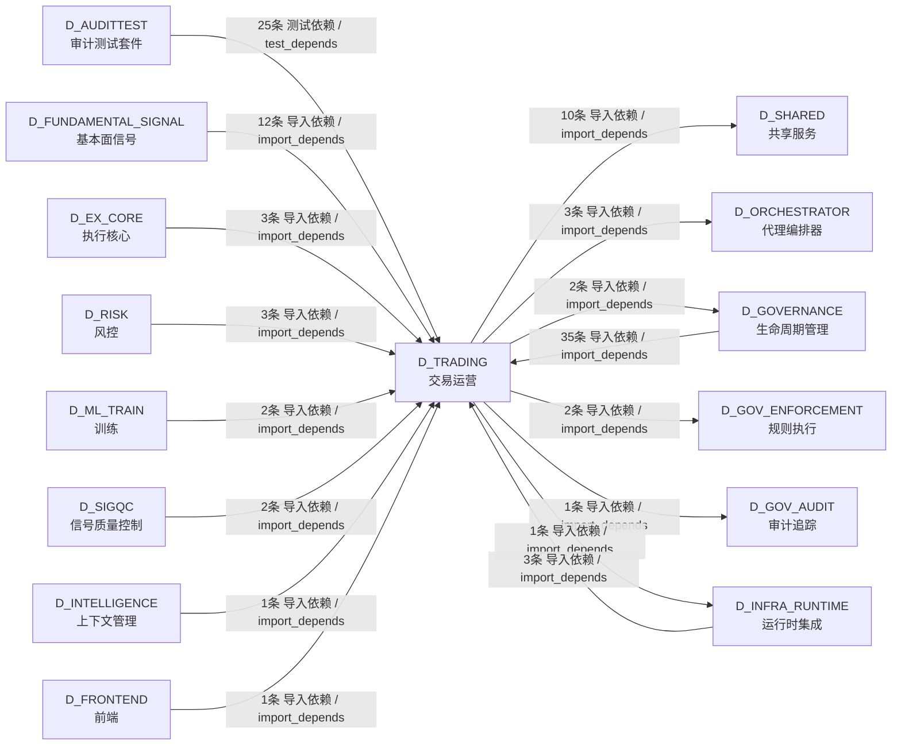

# 56_d_trading / 交易运营 / 交易运营 / Trading Operations

> **功能简介 / Overview**: 交易运营，负责交易生命周期管理、订单状态和成交处理

> **文档作用 / Purpose**: 展示 交易运营（D_TRADING）功能域的模块清单、域内依赖关系、跨域依赖关系、架构分层视图，供架构审查和域治理参考。

> 本文档由 generate_domain_doc.py 从 depgraph (PostgreSQL) 自动生成
> 最后更新: 2026-07-12 22:29:33
> 数据源: depgraph (PostgreSQL) nodes表 + edges表

## 域基本信息 / Domain Overview

| 字段 | 值 | Field | Value |
|------|------|-------|-------|
| 编号 | 56 | Number | 56 |
| 域ID | D_TRADING | Domain ID | D_TRADING |
| 域名称 | 交易运营 | Domain Name | Trading Operations |
| 层级 | L2 业务域层 | Layer | L2 Domain |
| 模块数 | 43 | Module Count | 43 |
| 域内依赖 | 47 | Internal Dependencies | 47 |
| 跨域入边 | 87 | Cross-domain Incoming | 87 |
| 跨域出边 | 19 | Cross-domain Outgoing | 19 |
| 设计态模块 | 0 | Design Modules | 0 |
| 原型态模块 | 24 | Prototype Modules | 24 |
| 生产态模块 | 19 | Production Modules | 19 |
| 容量 | 19/150 (正常) | Capacity | 19/150 (正常) |
| 描述 | 交易会话、交易接口、交易日志、交易复盘。交易运营中枢。合规检查由D-GOV_ENFORCEMENT门禁层执行。 | Description | 交易会话、交易接口、交易日志、交易复盘。交易运营中枢。合规检查由D-GOV_ENFORCEMENT门禁层执行。 |

## 模块分层清单 / Module Layered List

> 按 architecture_layer 分组的模块清单（共 43 个模块 / 43 modules）。

### L2 领域层 / Domain Layer (43 modules)

| # | 模块路径 / Module Path | 模块名称 / Module Name (功能简介 / Description) | 成熟度 / Maturity | 蓝图 / Blueprint |
|:--:|---------|---------|:---:|:---:|
| 1 | src/zephyr/trading/__init__.py | __init__.py | 生产态 / production |  |
| 2 | src/zephyr/trading/_extensions/__init__.py | __init__.py | 原型态 / prototype |  |
| 3 | src/zephyr/trading/admission_controller.py | admission_controller.py | 生产态 / production | [MOD-INF-033](../../03_modules/_cross_layer/behavioral_auditor/blueprint.md) |
| 4 | src/zephyr/trading/api/__init__.py | __init__.py | 原型态 / prototype |  |
| 5 | src/zephyr/trading/auto_dispatcher.py | AutoDispatcher — 守护进程内的轻量 PipelineDisp... | 原型态 / prototype | [MOD-INF-039](../../03_modules/_cross_layer/agent_orchestrator/blueprint.md) |
| 6 | src/zephyr/trading/core/__init__.py | __init__.py | 原型态 / prototype |  |
| 7 | src/zephyr/trading/gpu_consensus_scheduler.py | gpu_consensus_scheduler.py | 生产态 / production | [MOD-INF-033](../../03_modules/_cross_layer/behavioral_auditor/blueprint.md) |
| 8 | src/zephyr/trading/gpu_monitor.py | gpu_monitor.py — NVIDIA GPU 状态采集器 | 原型态 / prototype | [MOD-RESOURCE_OPTIMIZATION_ENGINE](../../03_modules/_cross_layer/resource_optimization_engine/blueprint.md) |
| 9 | src/zephyr/trading/ide_health_daemon.py | ide_health_daemon.py — TRAE IDE 幽灵窗口守护线程 | 生产态 / production | [MOD-RESOURCE_OPTIMIZATION_ENGINE](../../03_modules/_cross_layer/resource_optimization_engine/blueprint.md) |
| 10 | src/zephyr/trading/infrastructure/__init__.py | __init__.py | 原型态 / prototype |  |
| 11 | src/zephyr/trading/models/__init__.py | __init__.py | 原型态 / prototype |  |
| 12 | src/zephyr/trading/protection_index.py | protection_index.py | 生产态 / production | [MOD-INF-033](../../03_modules/_cross_layer/behavioral_auditor/blueprint.md) |
| 13 | src/zephyr/trading/runtime/__init__.py | trading.runtime — 异步运行时子包（R1 升级：同... | 原型态 / prototype |  |
| 14 | src/zephyr/trading/services/__init__.py | __init__.py | 原型态 / prototype |  |
| 15 | src/zephyr/trading/speed_baseline_checker.py | speed_baseline_checker.py | 原型态 / prototype | [MOD-RESOURCE_OPTIMIZATION_ENGINE](../../03_modules/_cross_layer/resource_optimization_engine/blueprint.md) |
| 16 | src/zephyr/trading/trading_contracts/__init__.py | zephyr.trading.trading_contracts — trading-dom... | 原型态 / prototype | [MOD-INF-016](../../03_modules/_cross_layer/shared_core/blueprint.md) |
| 17 | src/zephyr/trading/trading_contracts/execution/__init__.py | trading-contracts.execution — order execution ... | 原型态 / prototype | [MOD-INF-016](../../03_modules/_cross_layer/shared_core/blueprint.md) |
| 18 | src/zephyr/trading/trading_contracts/execution/capital_al... | capital_allocation_result.py | 生产态 / production | [MOD-INF-016](../../03_modules/_cross_layer/shared_core/blueprint.md) |
| 19 | src/zephyr/trading/trading_contracts/execution/execution_... | execution_rejection_error.py | 原型态 / prototype | [MOD-INF-016](../../03_modules/_cross_layer/shared_core/blueprint.md) |
| 20 | src/zephyr/trading/trading_contracts/execution/execution_... | execution_report.py | 生产态 / production | [MOD-INF-016](../../03_modules/_cross_layer/shared_core/blueprint.md) |
| 21 | src/zephyr/trading/trading_contracts/execution/fill.py | fill.py | 生产态 / production | [MOD-INF-016](../../03_modules/_cross_layer/shared_core/blueprint.md) |
| 22 | src/zephyr/trading/trading_contracts/execution/model_serv... | model_serving_request.py | 生产态 / production | [MOD-INF-016](../../03_modules/_cross_layer/shared_core/blueprint.md) |
| 23 | src/zephyr/trading/trading_contracts/execution/order.py | order.py | 生产态 / production | [MOD-INF-016](../../03_modules/_cross_layer/shared_core/blueprint.md) |
| 24 | src/zephyr/trading/trading_contracts/execution/position.py | position.py | 生产态 / production | [MOD-INF-016](../../03_modules/_cross_layer/shared_core/blueprint.md) |
| 25 | src/zephyr/trading/trading_contracts/factories.py | trading-contracts/factories.py — 交易域数据契... | 原型态 / prototype |  |
| 26 | src/zephyr/trading/trading_contracts/market/__init__.py | trading-contracts.market — market data and sig... | 原型态 / prototype | [MOD-INF-016](../../03_modules/_cross_layer/shared_core/blueprint.md) |
| 27 | src/zephyr/trading/trading_contracts/market/factor_monito... | factor_monitor_report.py | 原型态 / prototype | [MOD-INF-016](../../03_modules/_cross_layer/shared_core/blueprint.md) |
| 28 | src/zephyr/trading/trading_contracts/market/factor_signal.py | factor_signal.py | 生产态 / production | [MOD-INF-016](../../03_modules/_cross_layer/shared_core/blueprint.md) |
| 29 | src/zephyr/trading/trading_contracts/market/instrument.py | instrument.py | 原型态 / prototype | [MOD-INF-016](../../03_modules/_cross_layer/shared_core/blueprint.md) |
| 30 | src/zephyr/trading/trading_contracts/market/macro_factor_... | macro_factor_signal.py | 原型态 / prototype | [MOD-INF-016](../../03_modules/_cross_layer/shared_core/blueprint.md) |
| 31 | src/zephyr/trading/trading_contracts/market/market_data.py | market_data.py | 生产态 / production | [MOD-INF-016](../../03_modules/_cross_layer/shared_core/blueprint.md) |
| 32 | src/zephyr/trading/trading_contracts/market/signal_degrad... | signal_degradation_warning.py | 原型态 / prototype | [MOD-INF-016](../../03_modules/_cross_layer/shared_core/blueprint.md) |
| 33 | src/zephyr/trading/trading_contracts/market/synthesized_s... | synthesized_signal.py | 生产态 / production | [MOD-INF-016](../../03_modules/_cross_layer/shared_core/blueprint.md) |
| 34 | src/zephyr/trading/trading_contracts/portfolio/contracts/... | __init__.py | 原型态 / prototype |  |
| 35 | src/zephyr/trading/trading_contracts/risk/__init__.py | trading-contracts.risk — risk management domai... | 原型态 / prototype | [MOD-INF-016](../../03_modules/_cross_layer/shared_core/blueprint.md) |
| 36 | src/zephyr/trading/trading_contracts/risk/compliance_rule.py | compliance_rule.py | 原型态 / prototype | [MOD-INF-016](../../03_modules/_cross_layer/shared_core/blueprint.md) |
| 37 | src/zephyr/trading/trading_contracts/risk/risk_dashboard_... | risk_dashboard_snapshot.py | 生产态 / production | [MOD-INF-016](../../03_modules/_cross_layer/shared_core/blueprint.md) |
| 38 | src/zephyr/trading/trading_contracts/risk/risk_limit_viol... | risk_limit_violation_error.py | 生产态 / production | [MOD-INF-016](../../03_modules/_cross_layer/shared_core/blueprint.md) |
| 39 | src/zephyr/trading/trading_contracts/risk/risk_limits.py | risk_limits.py | 原型态 / prototype | [MOD-INF-016](../../03_modules/_cross_layer/shared_core/blueprint.md) |
| 40 | src/zephyr/trading/trading_contracts/risk/risk_metrics.py | risk_metrics.py | 生产态 / production | [MOD-INF-016](../../03_modules/_cross_layer/shared_core/blueprint.md) |
| 41 | src/zephyr/trading/trading_contracts/risk/risk_validator_... | risk_validator_protocol.py | 生产态 / production | [MOD-INF-016](../../03_modules/_cross_layer/shared_core/blueprint.md) |
| 42 | src/zephyr/trading/verdict_engine.py | verdict_engine.py | 生产态 / production | [MOD-INF-033](../../03_modules/_cross_layer/behavioral_auditor/blueprint.md) |
| 43 | src/zephyr/trading/zombie_scanner.py | zombie_scanner.py — 僵尸 Python 进程检测与自动处置 | 原型态 / prototype | [MOD-RESOURCE_OPTIMIZATION_ENGINE](../../03_modules/_cross_layer/resource_optimization_engine/blueprint.md) |

## 域内依赖图 / Internal Dependency Diagram

> 依赖图内嵌在本文档中，IDE 可直接渲染显示。参考 decision_index.md 设计，分四个视图：合并全景图、运营态子图、设计态子图、原型态子图（按 design_maturity 实际值拆分）。
>
> **图例说明 / Legend**：
> - **实线边框 = 运营态模块**（production，已上线运行）
> - **虚线边框 = 设计态模块**（design，蓝图阶段，代码未写）
> - **虚线边框 = 原型态模块**（prototype，代码已写，验证中未稳定上线）
> - **实线箭头 = 运营态依赖**（已生效的依赖关系）
> - **虚线箭头 = 非运营态依赖**（计划中/验证中的依赖关系）

### 合并全景图（全部模块，标签标注成熟度）

> 展示全部 43 个模块（生产态 19 + 设计态 0 + 原型态 24），标签标注成熟度。

#### 第 1 页 / 共 2 页

```mermaid
graph TD
    subgraph D_TRADING["D_TRADING 交易运营"]
        src_zephyr_trading_init_py["(生产态 / production) __init__.py"]
        src_zephyr_trading_extensions_init_py["(原型态 / prototype) __init__.py"]
        src_zephyr_trading_admission_controller_py["(生产态 / production) admission_controller.py"]
        src_zephyr_trading_api_init_py["(原型态 / prototype) __init__.py"]
        src_zephyr_trading_auto_dispatcher_py["(原型态 / prototype) AutoDispatcher — 守护进程内的轻量 PipelineDisp...<br/>文件: auto_dispatcher.py"]
        src_zephyr_trading_core_init_py["(原型态 / prototype) __init__.py"]
        src_zephyr_trading_gpu_consensus_scheduler_py["(生产态 / production) gpu_consensus_scheduler.py"]
        src_zephyr_trading_gpu_monitor_py["(原型态 / prototype) gpu_monitor.py — NVIDIA GPU 状态采集器<br/>文件: gpu_monitor.py"]
        src_zephyr_trading_ide_health_daemon_py["(生产态 / production) ide_health_daemon.py — TRAE IDE 幽灵窗口守护线程<br/>文件: ide_health_daemon.py"]
        src_zephyr_trading_infrastructure_init_py["(原型态 / prototype) __init__.py"]
        src_zephyr_trading_models_init_py["(原型态 / prototype) __init__.py"]
        src_zephyr_trading_protection_index_py["(生产态 / production) protection_index.py"]
        src_zephyr_trading_runtime_init_py["(原型态 / prototype) trading.runtime — 异步运行时子包（R1 升级：同...<br/>文件: __init__.py"]
        src_zephyr_trading_services_init_py["(原型态 / prototype) __init__.py"]
        src_zephyr_trading_speed_baseline_checker_py["(原型态 / prototype) speed_baseline_checker.py"]
        src_zephyr_trading_trading_contracts_init_py["(原型态 / prototype) zephyr.trading.trading_contracts — trading-dom...<br/>文件: __init__.py"]
        src_zephyr_trading_trading_contracts_execution_init_py["(原型态 / prototype) trading-contracts.execution — order execution ...<br/>文件: __init__.py"]
        src_zephyr_trading_trading_contracts_execution_capital_allocation_result_py["(生产态 / production) capital_allocation_result.py"]
        src_zephyr_trading_trading_contracts_execution_execution_rejection_error_py["(原型态 / prototype) execution_rejection_error.py"]
        src_zephyr_trading_trading_contracts_execution_execution_report_py["(生产态 / production) execution_report.py"]
        src_zephyr_trading_trading_contracts_execution_fill_py["(生产态 / production) fill.py"]
        src_zephyr_trading_trading_contracts_execution_model_serving_request_py["(生产态 / production) model_serving_request.py"]
        src_zephyr_trading_trading_contracts_execution_order_py["(生产态 / production) order.py"]
        src_zephyr_trading_trading_contracts_execution_position_py["(生产态 / production) position.py"]
        src_zephyr_trading_trading_contracts_factories_py["(原型态 / prototype) trading-contracts/factories.py — 交易域数据契...<br/>文件: factories.py"]
        src_zephyr_trading_trading_contracts_market_init_py["(原型态 / prototype) trading-contracts.market — market data and sig...<br/>文件: __init__.py"]
        src_zephyr_trading_trading_contracts_market_factor_monitor_report_py["(原型态 / prototype) factor_monitor_report.py"]
        src_zephyr_trading_trading_contracts_market_factor_signal_py["(生产态 / production) factor_signal.py"]
        src_zephyr_trading_trading_contracts_market_instrument_py["(原型态 / prototype) instrument.py"]
        src_zephyr_trading_trading_contracts_market_macro_factor_signal_py["(原型态 / prototype) macro_factor_signal.py"]
    end
    src_zephyr_trading_trading_contracts_factories_py -.->|导入依赖 / import_depends| src_zephyr_trading_trading_contracts_execution_order_py
    src_zephyr_trading_trading_contracts_factories_py -.->|导入依赖 / import_depends| src_zephyr_trading_trading_contracts_market_factor_signal_py
    src_zephyr_trading_trading_contracts_init_py -.->|导入依赖 / import_depends| src_zephyr_trading_init_py
    src_zephyr_trading_trading_contracts_init_py -.->|导入依赖 / import_depends| src_zephyr_trading_trading_contracts_execution_capital_allocation_result_py
    src_zephyr_trading_trading_contracts_init_py -.->|导入依赖 / import_depends| src_zephyr_trading_trading_contracts_execution_fill_py
    src_zephyr_trading_trading_contracts_init_py -.->|导入依赖 / import_depends| src_zephyr_trading_trading_contracts_execution_execution_report_py
    src_zephyr_trading_trading_contracts_init_py -.->|导入依赖 / import_depends| src_zephyr_trading_trading_contracts_execution_execution_rejection_error_py
    src_zephyr_trading_trading_contracts_init_py -.->|导入依赖 / import_depends| src_zephyr_trading_trading_contracts_execution_model_serving_request_py
    src_zephyr_trading_trading_contracts_init_py -.->|导入依赖 / import_depends| src_zephyr_trading_trading_contracts_execution_order_py
    src_zephyr_trading_trading_contracts_init_py -.->|导入依赖 / import_depends| src_zephyr_trading_trading_contracts_execution_position_py
    src_zephyr_trading_trading_contracts_init_py -.->|导入依赖 / import_depends| src_zephyr_trading_trading_contracts_market_factor_signal_py
    src_zephyr_trading_trading_contracts_init_py -.->|导入依赖 / import_depends| src_zephyr_trading_trading_contracts_market_instrument_py
    src_zephyr_trading_trading_contracts_init_py -.->|导入依赖 / import_depends| src_zephyr_trading_trading_contracts_market_factor_monitor_report_py
    src_zephyr_trading_trading_contracts_init_py -.->|导入依赖 / import_depends| src_zephyr_trading_trading_contracts_market_macro_factor_signal_py
    src_zephyr_trading_trading_contracts_execution_init_py -.->|导入依赖 / import_depends| src_zephyr_trading_trading_contracts_execution_capital_allocation_result_py
    src_zephyr_trading_trading_contracts_execution_init_py -.->|导入依赖 / import_depends| src_zephyr_trading_trading_contracts_execution_fill_py
    src_zephyr_trading_trading_contracts_execution_init_py -.->|导入依赖 / import_depends| src_zephyr_trading_trading_contracts_execution_execution_report_py
    src_zephyr_trading_trading_contracts_execution_init_py -.->|导入依赖 / import_depends| src_zephyr_trading_trading_contracts_execution_execution_rejection_error_py
    src_zephyr_trading_trading_contracts_execution_init_py -.->|导入依赖 / import_depends| src_zephyr_trading_trading_contracts_execution_model_serving_request_py
    src_zephyr_trading_trading_contracts_execution_init_py -.->|导入依赖 / import_depends| src_zephyr_trading_trading_contracts_execution_order_py
    src_zephyr_trading_trading_contracts_execution_init_py -.->|导入依赖 / import_depends| src_zephyr_trading_trading_contracts_execution_position_py
    src_zephyr_trading_trading_contracts_market_init_py -.->|导入依赖 / import_depends| src_zephyr_trading_trading_contracts_market_factor_signal_py
    src_zephyr_trading_trading_contracts_market_init_py -.->|导入依赖 / import_depends| src_zephyr_trading_trading_contracts_market_instrument_py
    src_zephyr_trading_trading_contracts_market_init_py -.->|导入依赖 / import_depends| src_zephyr_trading_trading_contracts_market_factor_monitor_report_py
    src_zephyr_trading_trading_contracts_market_init_py -.->|导入依赖 / import_depends| src_zephyr_trading_trading_contracts_market_macro_factor_signal_py
    D_SHARED["(原型态 / prototype) D_SHARED"]
    src_zephyr_trading_auto_dispatcher_py -.->|导入依赖 / import_depends| D_SHARED
    D_ORCHESTRATOR["(原型态 / prototype) D_ORCHESTRATOR"]
    src_zephyr_trading_auto_dispatcher_py -.->|导入依赖 / import_depends| D_ORCHESTRATOR
    src_zephyr_trading_auto_dispatcher_py -.->|导入依赖 / import_depends| D_SHARED
    src_zephyr_trading_auto_dispatcher_py -.->|导入依赖 / import_depends| D_ORCHESTRATOR
    src_zephyr_trading_auto_dispatcher_py -.->|导入依赖 / import_depends| D_ORCHESTRATOR
    D_GOVERNANCE["(生产态 / production) D_GOVERNANCE"]
    src_zephyr_trading_auto_dispatcher_py -.->|导入依赖 / import_depends| D_GOVERNANCE
    src_zephyr_trading_gpu_consensus_scheduler_py -.->|导入依赖 / import_depends| D_SHARED
    src_zephyr_trading_ide_health_daemon_py -->|导入依赖 / import_depends| D_SHARED
    src_zephyr_trading_ide_health_daemon_py -.->|导入依赖 / import_depends| D_SHARED
    src_zephyr_trading_ide_health_daemon_py -.->|导入依赖 / import_depends| D_SHARED
    D_INFRA_RUNTIME["(生产态 / production) D_INFRA_RUNTIME"]
    src_zephyr_trading_ide_health_daemon_py -->|导入依赖 / import_depends| D_INFRA_RUNTIME
    src_zephyr_trading_ide_health_daemon_py -->|导入依赖 / import_depends| D_GOVERNANCE
    src_zephyr_trading_ide_health_daemon_py -->|导入依赖 / import_depends| D_SHARED
    src_zephyr_trading_speed_baseline_checker_py -.->|导入依赖 / import_depends| D_SHARED
    D_GOV_ENFORCEMENT["(原型态 / prototype) D_GOV_ENFORCEMENT"]
    src_zephyr_trading_trading_contracts_init_py -.->|导入依赖 / import_depends| D_GOV_ENFORCEMENT
    D_EX_CORE["(原型态 / prototype) D_EX_CORE"]
    D_EX_CORE -.->|导入依赖 / import_depends| src_zephyr_trading_trading_contracts_execution_fill_py
    D_EX_CORE -.->|导入依赖 / import_depends| src_zephyr_trading_trading_contracts_execution_order_py
    D_EX_CORE -.->|导入依赖 / import_depends| src_zephyr_trading_trading_contracts_execution_position_py
    D_FRONTEND["(生产态 / production) D_FRONTEND"]
    D_FRONTEND -->|导入依赖 / import_depends| src_zephyr_trading_trading_contracts_execution_order_py
    D_GOVERNANCE -.->|导入依赖 / import_depends| src_zephyr_trading_trading_contracts_factories_py
    D_GOVERNANCE -.->|导入依赖 / import_depends| src_zephyr_trading_trading_contracts_init_py
    D_GOVERNANCE -.->|导入依赖 / import_depends| src_zephyr_trading_trading_contracts_market_factor_monitor_report_py
    D_GOVERNANCE -.->|导入依赖 / import_depends| src_zephyr_trading_trading_contracts_market_factor_signal_py
    D_GOVERNANCE -.->|导入依赖 / import_depends| src_zephyr_trading_trading_contracts_market_instrument_py
    D_GOVERNANCE -.->|导入依赖 / import_depends| src_zephyr_trading_trading_contracts_market_macro_factor_signal_py
    D_GOVERNANCE -.->|导入依赖 / import_depends| src_zephyr_trading_trading_contracts_execution_execution_report_py
    D_GOVERNANCE -.->|导入依赖 / import_depends| src_zephyr_trading_trading_contracts_execution_capital_allocation_result_py
    D_GOVERNANCE -.->|导入依赖 / import_depends| src_zephyr_trading_trading_contracts_execution_fill_py
    D_GOVERNANCE -.->|导入依赖 / import_depends| src_zephyr_trading_trading_contracts_execution_execution_rejection_error_py
    D_GOVERNANCE -.->|导入依赖 / import_depends| src_zephyr_trading_trading_contracts_execution_model_serving_request_py
    classDef production fill:#e1f5fe,stroke:#01579b,stroke-width:2px,color:#000
    classDef design fill:#fff3e0,stroke:#e65100,stroke-width:2px,color:#000,stroke-dasharray: 5 5
    classDef external_prod fill:#e8f5e9,stroke:#1b5e20,stroke-width:1px,color:#000
    classDef external_design fill:#fce4ec,stroke:#880e4f,stroke-width:1px,color:#000,stroke-dasharray: 5 5
    class src_zephyr_trading_init_py,src_zephyr_trading_admission_controller_py,src_zephyr_trading_gpu_consensus_scheduler_py,src_zephyr_trading_ide_health_daemon_py,src_zephyr_trading_protection_index_py,src_zephyr_trading_trading_contracts_execution_capital_allocation_result_py,src_zephyr_trading_trading_contracts_execution_execution_report_py,src_zephyr_trading_trading_contracts_execution_fill_py,src_zephyr_trading_trading_contracts_execution_model_serving_request_py,src_zephyr_trading_trading_contracts_execution_order_py,src_zephyr_trading_trading_contracts_execution_position_py,src_zephyr_trading_trading_contracts_market_factor_signal_py production
    class src_zephyr_trading_extensions_init_py,src_zephyr_trading_api_init_py,src_zephyr_trading_auto_dispatcher_py,src_zephyr_trading_core_init_py,src_zephyr_trading_gpu_monitor_py,src_zephyr_trading_infrastructure_init_py,src_zephyr_trading_models_init_py,src_zephyr_trading_runtime_init_py,src_zephyr_trading_services_init_py,src_zephyr_trading_speed_baseline_checker_py,src_zephyr_trading_trading_contracts_init_py,src_zephyr_trading_trading_contracts_execution_init_py,src_zephyr_trading_trading_contracts_execution_execution_rejection_error_py,src_zephyr_trading_trading_contracts_factories_py,src_zephyr_trading_trading_contracts_market_init_py,src_zephyr_trading_trading_contracts_market_factor_monitor_report_py,src_zephyr_trading_trading_contracts_market_instrument_py,src_zephyr_trading_trading_contracts_market_macro_factor_signal_py design
    class D_GOVERNANCE,D_INFRA_RUNTIME,D_FRONTEND external_prod
    class D_SHARED,D_ORCHESTRATOR,D_GOV_ENFORCEMENT,D_EX_CORE external_design
```

#### 第 2 页 / 共 2 页

```mermaid
graph TD
    subgraph D_TRADING["D_TRADING 交易运营"]
        src_zephyr_trading_trading_contracts_market_market_data_py["(生产态 / production) market_data.py"]
        src_zephyr_trading_trading_contracts_market_signal_degradation_warning_py["(原型态 / prototype) signal_degradation_warning.py"]
        src_zephyr_trading_trading_contracts_market_synthesized_signal_py["(生产态 / production) synthesized_signal.py"]
        src_zephyr_trading_trading_contracts_portfolio_contracts_init_py["(原型态 / prototype) __init__.py"]
        src_zephyr_trading_trading_contracts_risk_init_py["(原型态 / prototype) trading-contracts.risk — risk management domai...<br/>文件: __init__.py"]
        src_zephyr_trading_trading_contracts_risk_compliance_rule_py["(原型态 / prototype) compliance_rule.py"]
        src_zephyr_trading_trading_contracts_risk_risk_dashboard_snapshot_py["(生产态 / production) risk_dashboard_snapshot.py"]
        src_zephyr_trading_trading_contracts_risk_risk_limit_violation_error_py["(生产态 / production) risk_limit_violation_error.py"]
        src_zephyr_trading_trading_contracts_risk_risk_limits_py["(原型态 / prototype) risk_limits.py"]
        src_zephyr_trading_trading_contracts_risk_risk_metrics_py["(生产态 / production) risk_metrics.py"]
        src_zephyr_trading_trading_contracts_risk_risk_validator_protocol_py["(生产态 / production) risk_validator_protocol.py"]
        src_zephyr_trading_verdict_engine_py["(生产态 / production) verdict_engine.py"]
        src_zephyr_trading_zombie_scanner_py["(原型态 / prototype) zombie_scanner.py — 僵尸 Python 进程检测与自动处置<br/>文件: zombie_scanner.py"]
    end
    src_zephyr_trading_trading_contracts_risk_init_py -.->|导入依赖 / import_depends| src_zephyr_trading_trading_contracts_risk_risk_dashboard_snapshot_py
    src_zephyr_trading_trading_contracts_risk_init_py -.->|导入依赖 / import_depends| src_zephyr_trading_trading_contracts_risk_risk_limits_py
    src_zephyr_trading_trading_contracts_risk_init_py -.->|导入依赖 / import_depends| src_zephyr_trading_trading_contracts_risk_risk_limit_violation_error_py
    src_zephyr_trading_trading_contracts_risk_init_py -.->|导入依赖 / import_depends| src_zephyr_trading_trading_contracts_risk_risk_validator_protocol_py
    src_zephyr_trading_trading_contracts_risk_init_py -.->|导入依赖 / import_depends| src_zephyr_trading_trading_contracts_risk_risk_metrics_py
    D_GOV_AUDIT["(生产态 / production) D_GOV_AUDIT"]
    src_zephyr_trading_verdict_engine_py -->|导入依赖 / import_depends| D_GOV_AUDIT
    D_SHARED["(生产态 / production) D_SHARED"]
    src_zephyr_trading_zombie_scanner_py -.->|导入依赖 / import_depends| D_SHARED
    D_GOV_ENFORCEMENT["(原型态 / prototype) D_GOV_ENFORCEMENT"]
    src_zephyr_trading_trading_contracts_risk_init_py -.->|导入依赖 / import_depends| D_GOV_ENFORCEMENT
    D_AUDITTEST["(原型态 / prototype) D_AUDITTEST"]
    D_AUDITTEST -.->|测试依赖 / test_depends| src_zephyr_trading_verdict_engine_py
    D_AUDITTEST -.->|测试依赖 / test_depends| src_zephyr_trading_verdict_engine_py
    D_AUDITTEST -.->|测试依赖 / test_depends| src_zephyr_trading_verdict_engine_py
    D_AUDITTEST -.->|测试依赖 / test_depends| src_zephyr_trading_verdict_engine_py
    D_SIGQC["(原型态 / prototype) D_SIGQC"]
    D_SIGQC -.->|导入依赖 / import_depends| src_zephyr_trading_trading_contracts_market_signal_degradation_warning_py
    D_FUNDAMENTAL_SIGNAL["(原型态 / prototype) D_FUNDAMENTAL_SIGNAL"]
    D_FUNDAMENTAL_SIGNAL -.->|导入依赖 / import_depends| src_zephyr_trading_trading_contracts_market_signal_degradation_warning_py
    D_GOVERNANCE["(原型态 / prototype) D_GOVERNANCE"]
    D_GOVERNANCE -.->|导入依赖 / import_depends| src_zephyr_trading_trading_contracts_market_signal_degradation_warning_py
    D_GOVERNANCE -.->|导入依赖 / import_depends| src_zephyr_trading_trading_contracts_market_signal_degradation_warning_py
    D_SIGQC -.->|导入依赖 / import_depends| src_zephyr_trading_trading_contracts_market_synthesized_signal_py
    D_FUNDAMENTAL_SIGNAL -->|导入依赖 / import_depends| src_zephyr_trading_trading_contracts_market_synthesized_signal_py
    D_FUNDAMENTAL_SIGNAL -->|导入依赖 / import_depends| src_zephyr_trading_trading_contracts_market_synthesized_signal_py
    D_FUNDAMENTAL_SIGNAL -->|导入依赖 / import_depends| src_zephyr_trading_trading_contracts_market_synthesized_signal_py
    D_FUNDAMENTAL_SIGNAL -.->|导入依赖 / import_depends| src_zephyr_trading_trading_contracts_market_synthesized_signal_py
    D_FUNDAMENTAL_SIGNAL -.->|导入依赖 / import_depends| src_zephyr_trading_trading_contracts_market_synthesized_signal_py
    classDef production fill:#e1f5fe,stroke:#01579b,stroke-width:2px,color:#000
    classDef design fill:#fff3e0,stroke:#e65100,stroke-width:2px,color:#000,stroke-dasharray: 5 5
    classDef external_prod fill:#e8f5e9,stroke:#1b5e20,stroke-width:1px,color:#000
    classDef external_design fill:#fce4ec,stroke:#880e4f,stroke-width:1px,color:#000,stroke-dasharray: 5 5
    class src_zephyr_trading_trading_contracts_market_market_data_py,src_zephyr_trading_trading_contracts_market_synthesized_signal_py,src_zephyr_trading_trading_contracts_risk_risk_dashboard_snapshot_py,src_zephyr_trading_trading_contracts_risk_risk_limit_violation_error_py,src_zephyr_trading_trading_contracts_risk_risk_metrics_py,src_zephyr_trading_trading_contracts_risk_risk_validator_protocol_py,src_zephyr_trading_verdict_engine_py production
    class src_zephyr_trading_trading_contracts_market_signal_degradation_warning_py,src_zephyr_trading_trading_contracts_portfolio_contracts_init_py,src_zephyr_trading_trading_contracts_risk_init_py,src_zephyr_trading_trading_contracts_risk_compliance_rule_py,src_zephyr_trading_trading_contracts_risk_risk_limits_py,src_zephyr_trading_zombie_scanner_py design
    class D_GOV_AUDIT,D_SHARED external_prod
    class D_GOV_ENFORCEMENT,D_AUDITTEST,D_SIGQC,D_FUNDAMENTAL_SIGNAL,D_GOVERNANCE external_design
```

### 运营态子图（仅 design_maturity=production 的模块和依赖）

> 仅展示已上线运行的模块（共 19 个，2 条域内依赖）。

```mermaid
graph TD
    subgraph D_TRADING["D_TRADING 交易运营"]
        src_zephyr_trading_init_py["(生产态 / production) __init__.py"]
        src_zephyr_trading_admission_controller_py["(生产态 / production) admission_controller.py"]
        src_zephyr_trading_gpu_consensus_scheduler_py["(生产态 / production) gpu_consensus_scheduler.py"]
        src_zephyr_trading_ide_health_daemon_py["(生产态 / production) ide_health_daemon.py — TRAE IDE 幽灵窗口守护线程<br/>文件: ide_health_daemon.py"]
        src_zephyr_trading_protection_index_py["(生产态 / production) protection_index.py"]
        src_zephyr_trading_trading_contracts_execution_capital_allocation_result_py["(生产态 / production) capital_allocation_result.py"]
        src_zephyr_trading_trading_contracts_execution_execution_report_py["(生产态 / production) execution_report.py"]
        src_zephyr_trading_trading_contracts_execution_fill_py["(生产态 / production) fill.py"]
        src_zephyr_trading_trading_contracts_execution_model_serving_request_py["(生产态 / production) model_serving_request.py"]
        src_zephyr_trading_trading_contracts_execution_order_py["(生产态 / production) order.py"]
        src_zephyr_trading_trading_contracts_execution_position_py["(生产态 / production) position.py"]
        src_zephyr_trading_trading_contracts_market_factor_signal_py["(生产态 / production) factor_signal.py"]
        src_zephyr_trading_trading_contracts_market_market_data_py["(生产态 / production) market_data.py"]
        src_zephyr_trading_trading_contracts_market_synthesized_signal_py["(生产态 / production) synthesized_signal.py"]
        src_zephyr_trading_trading_contracts_risk_risk_dashboard_snapshot_py["(生产态 / production) risk_dashboard_snapshot.py"]
        src_zephyr_trading_trading_contracts_risk_risk_limit_violation_error_py["(生产态 / production) risk_limit_violation_error.py"]
        src_zephyr_trading_trading_contracts_risk_risk_metrics_py["(生产态 / production) risk_metrics.py"]
        src_zephyr_trading_trading_contracts_risk_risk_validator_protocol_py["(生产态 / production) risk_validator_protocol.py"]
        src_zephyr_trading_verdict_engine_py["(生产态 / production) verdict_engine.py"]
    end
    src_zephyr_trading_gpu_consensus_scheduler_py -->|导入依赖 / import_depends| src_zephyr_trading_verdict_engine_py
    src_zephyr_trading_protection_index_py -->|导入依赖 / import_depends| src_zephyr_trading_verdict_engine_py
    D_GOV_AUDIT["(生产态 / production) D_GOV_AUDIT"]
    src_zephyr_trading_verdict_engine_py -->|导入依赖 / import_depends| D_GOV_AUDIT
    D_SHARED["(原型态 / prototype) D_SHARED"]
    src_zephyr_trading_gpu_consensus_scheduler_py -.->|导入依赖 / import_depends| D_SHARED
    src_zephyr_trading_ide_health_daemon_py -->|导入依赖 / import_depends| D_SHARED
    D_GOVERNANCE["(生产态 / production) D_GOVERNANCE"]
    src_zephyr_trading_ide_health_daemon_py -->|导入依赖 / import_depends| D_GOVERNANCE
    D_INFRA_RUNTIME["(生产态 / production) D_INFRA_RUNTIME"]
    src_zephyr_trading_ide_health_daemon_py -->|导入依赖 / import_depends| D_INFRA_RUNTIME
    src_zephyr_trading_ide_health_daemon_py -.->|导入依赖 / import_depends| D_SHARED
    src_zephyr_trading_ide_health_daemon_py -.->|导入依赖 / import_depends| D_SHARED
    src_zephyr_trading_ide_health_daemon_py -->|导入依赖 / import_depends| D_SHARED
    src_zephyr_trading_trading_contracts_execution_order_py -.->|导入依赖 / import_depends| D_SHARED
    D_EX_CORE["(原型态 / prototype) D_EX_CORE"]
    D_EX_CORE -.->|导入依赖 / import_depends| src_zephyr_trading_trading_contracts_execution_fill_py
    D_EX_CORE -.->|导入依赖 / import_depends| src_zephyr_trading_trading_contracts_execution_order_py
    D_EX_CORE -.->|导入依赖 / import_depends| src_zephyr_trading_trading_contracts_execution_position_py
    D_FRONTEND["(生产态 / production) D_FRONTEND"]
    D_FRONTEND -->|导入依赖 / import_depends| src_zephyr_trading_trading_contracts_execution_order_py
    D_GOVERNANCE -.->|导入依赖 / import_depends| src_zephyr_trading_trading_contracts_market_factor_signal_py
    D_GOVERNANCE -.->|导入依赖 / import_depends| src_zephyr_trading_trading_contracts_market_market_data_py
    D_GOVERNANCE -.->|导入依赖 / import_depends| src_zephyr_trading_trading_contracts_market_synthesized_signal_py
    D_GOVERNANCE -.->|导入依赖 / import_depends| src_zephyr_trading_trading_contracts_risk_risk_dashboard_snapshot_py
    D_GOVERNANCE -.->|导入依赖 / import_depends| src_zephyr_trading_trading_contracts_risk_risk_limit_violation_error_py
    D_GOVERNANCE -.->|导入依赖 / import_depends| src_zephyr_trading_trading_contracts_risk_risk_metrics_py
    D_GOVERNANCE -.->|导入依赖 / import_depends| src_zephyr_trading_trading_contracts_risk_risk_validator_protocol_py
    D_GOVERNANCE -.->|导入依赖 / import_depends| src_zephyr_trading_trading_contracts_execution_execution_report_py
    D_GOVERNANCE -.->|导入依赖 / import_depends| src_zephyr_trading_trading_contracts_execution_capital_allocation_result_py
    D_GOVERNANCE -.->|导入依赖 / import_depends| src_zephyr_trading_trading_contracts_execution_fill_py
    D_GOVERNANCE -.->|导入依赖 / import_depends| src_zephyr_trading_trading_contracts_execution_model_serving_request_py
    classDef production fill:#e1f5fe,stroke:#01579b,stroke-width:2px,color:#000
    classDef design fill:#fff3e0,stroke:#e65100,stroke-width:2px,color:#000,stroke-dasharray: 5 5
    classDef external_prod fill:#e8f5e9,stroke:#1b5e20,stroke-width:1px,color:#000
    classDef external_design fill:#fce4ec,stroke:#880e4f,stroke-width:1px,color:#000,stroke-dasharray: 5 5
    class src_zephyr_trading_init_py,src_zephyr_trading_admission_controller_py,src_zephyr_trading_gpu_consensus_scheduler_py,src_zephyr_trading_ide_health_daemon_py,src_zephyr_trading_protection_index_py,src_zephyr_trading_trading_contracts_execution_capital_allocation_result_py,src_zephyr_trading_trading_contracts_execution_execution_report_py,src_zephyr_trading_trading_contracts_execution_fill_py,src_zephyr_trading_trading_contracts_execution_model_serving_request_py,src_zephyr_trading_trading_contracts_execution_order_py,src_zephyr_trading_trading_contracts_execution_position_py,src_zephyr_trading_trading_contracts_market_factor_signal_py,src_zephyr_trading_trading_contracts_market_market_data_py,src_zephyr_trading_trading_contracts_market_synthesized_signal_py,src_zephyr_trading_trading_contracts_risk_risk_dashboard_snapshot_py,src_zephyr_trading_trading_contracts_risk_risk_limit_violation_error_py,src_zephyr_trading_trading_contracts_risk_risk_metrics_py,src_zephyr_trading_trading_contracts_risk_risk_validator_protocol_py,src_zephyr_trading_verdict_engine_py production
    class D_GOV_AUDIT,D_GOVERNANCE,D_INFRA_RUNTIME,D_FRONTEND external_prod
    class D_SHARED,D_EX_CORE external_design
```

### 设计态子图（仅 design_maturity=design 的模块和依赖）

> 仅展示蓝图阶段、代码未写的设计态模块（共 0 个，0 条域内依赖）。

> （无设计态模块 / No design modules）

### 原型态子图（仅 design_maturity=prototype 的模块和依赖）

> 仅展示代码已写、验证中未稳定上线的原型态模块（共 24 个，13 条域内依赖）。

```mermaid
graph TD
    subgraph D_TRADING["D_TRADING 交易运营"]
        src_zephyr_trading_extensions_init_py["(原型态 / prototype) __init__.py"]
        src_zephyr_trading_api_init_py["(原型态 / prototype) __init__.py"]
        src_zephyr_trading_auto_dispatcher_py["(原型态 / prototype) AutoDispatcher — 守护进程内的轻量 PipelineDisp...<br/>文件: auto_dispatcher.py"]
        src_zephyr_trading_core_init_py["(原型态 / prototype) __init__.py"]
        src_zephyr_trading_gpu_monitor_py["(原型态 / prototype) gpu_monitor.py — NVIDIA GPU 状态采集器<br/>文件: gpu_monitor.py"]
        src_zephyr_trading_infrastructure_init_py["(原型态 / prototype) __init__.py"]
        src_zephyr_trading_models_init_py["(原型态 / prototype) __init__.py"]
        src_zephyr_trading_runtime_init_py["(原型态 / prototype) trading.runtime — 异步运行时子包（R1 升级：同...<br/>文件: __init__.py"]
        src_zephyr_trading_services_init_py["(原型态 / prototype) __init__.py"]
        src_zephyr_trading_speed_baseline_checker_py["(原型态 / prototype) speed_baseline_checker.py"]
        src_zephyr_trading_trading_contracts_init_py["(原型态 / prototype) zephyr.trading.trading_contracts — trading-dom...<br/>文件: __init__.py"]
        src_zephyr_trading_trading_contracts_execution_init_py["(原型态 / prototype) trading-contracts.execution — order execution ...<br/>文件: __init__.py"]
        src_zephyr_trading_trading_contracts_execution_execution_rejection_error_py["(原型态 / prototype) execution_rejection_error.py"]
        src_zephyr_trading_trading_contracts_factories_py["(原型态 / prototype) trading-contracts/factories.py — 交易域数据契...<br/>文件: factories.py"]
        src_zephyr_trading_trading_contracts_market_init_py["(原型态 / prototype) trading-contracts.market — market data and sig...<br/>文件: __init__.py"]
        src_zephyr_trading_trading_contracts_market_factor_monitor_report_py["(原型态 / prototype) factor_monitor_report.py"]
        src_zephyr_trading_trading_contracts_market_instrument_py["(原型态 / prototype) instrument.py"]
        src_zephyr_trading_trading_contracts_market_macro_factor_signal_py["(原型态 / prototype) macro_factor_signal.py"]
        src_zephyr_trading_trading_contracts_market_signal_degradation_warning_py["(原型态 / prototype) signal_degradation_warning.py"]
        src_zephyr_trading_trading_contracts_portfolio_contracts_init_py["(原型态 / prototype) __init__.py"]
        src_zephyr_trading_trading_contracts_risk_init_py["(原型态 / prototype) trading-contracts.risk — risk management domai...<br/>文件: __init__.py"]
        src_zephyr_trading_trading_contracts_risk_compliance_rule_py["(原型态 / prototype) compliance_rule.py"]
        src_zephyr_trading_trading_contracts_risk_risk_limits_py["(原型态 / prototype) risk_limits.py"]
        src_zephyr_trading_zombie_scanner_py["(原型态 / prototype) zombie_scanner.py — 僵尸 Python 进程检测与自动处置<br/>文件: zombie_scanner.py"]
    end
    src_zephyr_trading_trading_contracts_factories_py -.->|导入依赖 / import_depends| src_zephyr_trading_trading_contracts_risk_risk_limits_py
    src_zephyr_trading_trading_contracts_init_py -.->|导入依赖 / import_depends| src_zephyr_trading_trading_contracts_execution_execution_rejection_error_py
    src_zephyr_trading_trading_contracts_init_py -.->|导入依赖 / import_depends| src_zephyr_trading_trading_contracts_market_instrument_py
    src_zephyr_trading_trading_contracts_init_py -.->|导入依赖 / import_depends| src_zephyr_trading_trading_contracts_market_factor_monitor_report_py
    src_zephyr_trading_trading_contracts_init_py -.->|导入依赖 / import_depends| src_zephyr_trading_trading_contracts_market_macro_factor_signal_py
    src_zephyr_trading_trading_contracts_init_py -.->|导入依赖 / import_depends| src_zephyr_trading_trading_contracts_market_signal_degradation_warning_py
    src_zephyr_trading_trading_contracts_init_py -.->|导入依赖 / import_depends| src_zephyr_trading_trading_contracts_risk_risk_limits_py
    src_zephyr_trading_trading_contracts_execution_init_py -.->|导入依赖 / import_depends| src_zephyr_trading_trading_contracts_execution_execution_rejection_error_py
    src_zephyr_trading_trading_contracts_market_init_py -.->|导入依赖 / import_depends| src_zephyr_trading_trading_contracts_market_instrument_py
    src_zephyr_trading_trading_contracts_market_init_py -.->|导入依赖 / import_depends| src_zephyr_trading_trading_contracts_market_factor_monitor_report_py
    src_zephyr_trading_trading_contracts_market_init_py -.->|导入依赖 / import_depends| src_zephyr_trading_trading_contracts_market_macro_factor_signal_py
    src_zephyr_trading_trading_contracts_market_init_py -.->|导入依赖 / import_depends| src_zephyr_trading_trading_contracts_market_signal_degradation_warning_py
    src_zephyr_trading_trading_contracts_risk_init_py -.->|导入依赖 / import_depends| src_zephyr_trading_trading_contracts_risk_risk_limits_py
    D_SHARED["(原型态 / prototype) D_SHARED"]
    src_zephyr_trading_auto_dispatcher_py -.->|导入依赖 / import_depends| D_SHARED
    D_ORCHESTRATOR["(原型态 / prototype) D_ORCHESTRATOR"]
    src_zephyr_trading_auto_dispatcher_py -.->|导入依赖 / import_depends| D_ORCHESTRATOR
    src_zephyr_trading_auto_dispatcher_py -.->|导入依赖 / import_depends| D_SHARED
    src_zephyr_trading_auto_dispatcher_py -.->|导入依赖 / import_depends| D_ORCHESTRATOR
    src_zephyr_trading_auto_dispatcher_py -.->|导入依赖 / import_depends| D_ORCHESTRATOR
    D_GOVERNANCE["(生产态 / production) D_GOVERNANCE"]
    src_zephyr_trading_auto_dispatcher_py -.->|导入依赖 / import_depends| D_GOVERNANCE
    src_zephyr_trading_speed_baseline_checker_py -.->|导入依赖 / import_depends| D_SHARED
    src_zephyr_trading_zombie_scanner_py -.->|导入依赖 / import_depends| D_SHARED
    D_GOV_ENFORCEMENT["(原型态 / prototype) D_GOV_ENFORCEMENT"]
    src_zephyr_trading_trading_contracts_init_py -.->|导入依赖 / import_depends| D_GOV_ENFORCEMENT
    src_zephyr_trading_trading_contracts_risk_init_py -.->|导入依赖 / import_depends| D_GOV_ENFORCEMENT
    D_GOVERNANCE -.->|导入依赖 / import_depends| src_zephyr_trading_trading_contracts_factories_py
    D_GOVERNANCE -.->|导入依赖 / import_depends| src_zephyr_trading_trading_contracts_init_py
    D_GOVERNANCE -.->|导入依赖 / import_depends| src_zephyr_trading_trading_contracts_market_factor_monitor_report_py
    D_GOVERNANCE -.->|导入依赖 / import_depends| src_zephyr_trading_trading_contracts_market_instrument_py
    D_GOVERNANCE -.->|导入依赖 / import_depends| src_zephyr_trading_trading_contracts_market_macro_factor_signal_py
    D_GOVERNANCE -.->|导入依赖 / import_depends| src_zephyr_trading_trading_contracts_market_signal_degradation_warning_py
    D_GOVERNANCE -.->|导入依赖 / import_depends| src_zephyr_trading_trading_contracts_risk_risk_limits_py
    D_GOVERNANCE -.->|导入依赖 / import_depends| src_zephyr_trading_trading_contracts_execution_execution_rejection_error_py
    D_GOVERNANCE -.->|导入依赖 / import_depends| src_zephyr_trading_trading_contracts_market_factor_monitor_report_py
    D_GOVERNANCE -.->|导入依赖 / import_depends| src_zephyr_trading_trading_contracts_market_macro_factor_signal_py
    D_GOVERNANCE -.->|导入依赖 / import_depends| src_zephyr_trading_trading_contracts_market_instrument_py
    D_GOVERNANCE -.->|导入依赖 / import_depends| src_zephyr_trading_trading_contracts_market_signal_degradation_warning_py
    D_GOVERNANCE -.->|导入依赖 / import_depends| src_zephyr_trading_trading_contracts_risk_risk_limits_py
    D_GOVERNANCE -.->|导入依赖 / import_depends| src_zephyr_trading_trading_contracts_risk_compliance_rule_py
    D_FUNDAMENTAL_SIGNAL["(原型态 / prototype) D_FUNDAMENTAL_SIGNAL"]
    D_FUNDAMENTAL_SIGNAL -.->|导入依赖 / import_depends| src_zephyr_trading_trading_contracts_market_signal_degradation_warning_py
    classDef production fill:#e1f5fe,stroke:#01579b,stroke-width:2px,color:#000
    classDef design fill:#fff3e0,stroke:#e65100,stroke-width:2px,color:#000,stroke-dasharray: 5 5
    classDef external_prod fill:#e8f5e9,stroke:#1b5e20,stroke-width:1px,color:#000
    classDef external_design fill:#fce4ec,stroke:#880e4f,stroke-width:1px,color:#000,stroke-dasharray: 5 5
    class src_zephyr_trading_extensions_init_py,src_zephyr_trading_api_init_py,src_zephyr_trading_auto_dispatcher_py,src_zephyr_trading_core_init_py,src_zephyr_trading_gpu_monitor_py,src_zephyr_trading_infrastructure_init_py,src_zephyr_trading_models_init_py,src_zephyr_trading_runtime_init_py,src_zephyr_trading_services_init_py,src_zephyr_trading_speed_baseline_checker_py,src_zephyr_trading_trading_contracts_init_py,src_zephyr_trading_trading_contracts_execution_init_py,src_zephyr_trading_trading_contracts_execution_execution_rejection_error_py,src_zephyr_trading_trading_contracts_factories_py,src_zephyr_trading_trading_contracts_market_init_py,src_zephyr_trading_trading_contracts_market_factor_monitor_report_py,src_zephyr_trading_trading_contracts_market_instrument_py,src_zephyr_trading_trading_contracts_market_macro_factor_signal_py,src_zephyr_trading_trading_contracts_market_signal_degradation_warning_py,src_zephyr_trading_trading_contracts_portfolio_contracts_init_py,src_zephyr_trading_trading_contracts_risk_init_py,src_zephyr_trading_trading_contracts_risk_compliance_rule_py,src_zephyr_trading_trading_contracts_risk_risk_limits_py,src_zephyr_trading_zombie_scanner_py design
    class D_GOVERNANCE external_prod
    class D_SHARED,D_ORCHESTRATOR,D_GOV_ENFORCEMENT,D_FUNDAMENTAL_SIGNAL external_design
```

## 跨域依赖 / Cross-domain Dependencies

### 本域依赖的其他域（出边）/ Depends On

| # | 本域模块 / Source Module | → | 外部域-目标模块 / Target Module | 依赖类型 / Type |
|:--:|---------|:--:|---------|---------|
| 1 | AutoDispatcher — 守护进程内的轻量 PipelineDisp... | → | D_GOVERNANCE 生命周期管理: TaskRepository — 任务登记表 CRUD + 状态机（T-1... | 导入依赖 / import_depends |
| 2 | ide_health_daemon.py — TRAE IDE 幽灵窗口守护线... | → | D_GOVERNANCE 生命周期管理: TaskRepository — 任务登记表 CRUD + 状态机（T-1... | 导入依赖 / import_depends |
| 3 | verdict_engine.py | → | D_GOV_AUDIT 审计追踪: models.py | 导入依赖 / import_depends |
| 4 | zephyr.trading.trading_contracts — trading-dom... | → | D_GOV_ENFORCEMENT 规则执行: Re-export shim — ComplianceRule 真源已合并至 z... | 导入依赖 / import_depends |
| 5 | trading-contracts.risk — risk management domai... | → | D_GOV_ENFORCEMENT 规则执行: Re-export shim — ComplianceRule 真源已合并至 z... | 导入依赖 / import_depends |
| 6 | ide_health_daemon.py — TRAE IDE 幽灵窗口守护线... | → | D_INFRA_RUNTIME 运行时集成: daemon_registry.py - unified daemon thread regi... | 导入依赖 / import_depends |
| 7 | AutoDispatcher — 守护进程内的轻量 PipelineDisp... | → | D_ORCHESTRATOR 代理编排器: ActiveTaskQueue — 后台任务轮询与自动分发 (task... | 导入依赖 / import_depends |
| 8 | AutoDispatcher — 守护进程内的轻量 PipelineDisp... | → | D_ORCHESTRATOR 代理编排器: Orc->CE 上下文桥接 — request_context() 生产者 ... | 导入依赖 / import_depends |
| 9 | AutoDispatcher — 守护进程内的轻量 PipelineDisp... | → | D_ORCHESTRATOR 代理编排器: Orc->Script 脚本执行器 — run_audit() 生产者 (s... | 导入依赖 / import_depends |
| 10 | AutoDispatcher — 守护进程内的轻量 PipelineDisp... | → | D_SHARED 共享服务: TaskRepositoryProtocol — TaskRepository 的 Pro... | 导入依赖 / import_depends |
| 11 | AutoDispatcher — 守护进程内的轻量 PipelineDisp... | → | D_SHARED 共享服务: constants.py —— 共享枚举 & 常量集中 re-export... | 导入依赖 / import_depends |
| 12 | gpu_consensus_scheduler.py | → | D_SHARED 共享服务: constants.py —— 共享枚举 & 常量集中 re-export... | 导入依赖 / import_depends |
| 13 | ide_health_daemon.py — TRAE IDE 幽灵窗口守护线... | → | D_SHARED 共享服务: TaskRepositoryProtocol — TaskRepository 的 Pro... | 导入依赖 / import_depends |
| 14 | ide_health_daemon.py — TRAE IDE 幽灵窗口守护线... | → | D_SHARED 共享服务: EventBus — 事件总线（带背压控制）(M-07) (event... | 导入依赖 / import_depends |
| 15 | ide_health_daemon.py — TRAE IDE 幽灵窗口守护线... | → | D_SHARED 共享服务: constants.py —— 共享枚举 & 常量集中 re-export... | 导入依赖 / import_depends |
| 16 | ide_health_daemon.py — TRAE IDE 幽灵窗口守护线... | → | D_SHARED 共享服务: time_utils.py —— 时间/日期工具（Phase 9 新增 ... | 导入依赖 / import_depends |
| 17 | speed_baseline_checker.py | → | D_SHARED 共享服务: paths.py — 项目路径常量 SSoT（Single Source of... | 导入依赖 / import_depends |
| 18 | order.py | → | D_SHARED 共享服务: OrderSide/OrderStatus/OrderType — 交易枚举真源... | 导入依赖 / import_depends |
| 19 | zombie_scanner.py — 僵尸 Python 进程检测与自动... | → | D_SHARED 共享服务: paths.py — 项目路径常量 SSoT（Single Source of... | 导入依赖 / import_depends |

### 依赖本域的其他域（入边）/ Depended By

| # | 外部域-源模块 / Source Module | → | 本域模块 / Target Module | 依赖类型 / Type |
|:--:|---------|:--:|---------|---------|
| 1 | D_AUDITTEST 审计测试套件: F21 自动运行测试 — DM-201250 (test_f21_auto_ru... | → | __init__.py | 测试依赖 / test_depends |
| 2 | D_AUDITTEST 审计测试套件: F21 自动关闭测试 — DM-201250 (test_f21_auto_sh... | → | __init__.py | 测试依赖 / test_depends |
| 3 | D_AUDITTEST 审计测试套件: F21 自动启动测试 — DM-201250 (test_f21_auto_st... | → | __init__.py | 测试依赖 / test_depends |
| 4 | D_AUDITTEST 审计测试套件: test_verdict_engine.py | → | verdict_engine.py | 测试依赖 / test_depends |
| 5 | D_AUDITTEST 审计测试套件: DM-202910: MCP boot_hooks 集成测试——验证10进.... | → | __init__.py | 测试依赖 / test_depends |
| 6 | D_AUDITTEST 审计测试套件: DM-202914: MCP boot→FLE→MCP→shutdown全链路E2... | → | __init__.py | 测试依赖 / test_depends |
| 7 | D_AUDITTEST 审计测试套件: miniqmt_broker 正式测试（原 scripts/tests/ 临时... | → | order.py | 测试依赖 / test_depends |
| 8 | D_AUDITTEST 审计测试套件: test_admission_controller.py | → | admission_controller.py | 测试依赖 / test_depends |
| 9 | D_AUDITTEST 审计测试套件: test_admission_controller.py | → | verdict_engine.py | 测试依赖 / test_depends |
| 10 | D_AUDITTEST 审计测试套件: test_boot_cron_jobs.py | → | __init__.py | 测试依赖 / test_depends |
| 11 | D_AUDITTEST 审计测试套件: test_gpu_consensus_scheduler.py | → | gpu_consensus_scheduler.py | 测试依赖 / test_depends |
| 12 | D_AUDITTEST 审计测试套件: test_gpu_consensus_scheduler.py | → | verdict_engine.py | 测试依赖 / test_depends |
| 13 | D_AUDITTEST 审计测试套件: IdeHealthDaemon 测试. (test_ide_health_daemon.py) | → | ide_health_daemon.py — TRAE IDE 幽灵窗口守护线... | 测试依赖 / test_depends |
| 14 | D_AUDITTEST 审计测试套件: test_protection_index.py | → | protection_index.py | 测试依赖 / test_depends |
| 15 | D_AUDITTEST 审计测试套件: test_protection_index.py | → | verdict_engine.py | 测试依赖 / test_depends |
| 16 | D_EX_CORE 执行核心: MiniQMT 实盘券商适配器（对接 xttrader，A股实盘.... | → | fill.py | 导入依赖 / import_depends |
| 17 | D_EX_CORE 执行核心: MiniQMT 实盘券商适配器（对接 xttrader，A股实盘.... | → | order.py | 导入依赖 / import_depends |
| 18 | D_EX_CORE 执行核心: MiniQMT 实盘券商适配器（对接 xttrader，A股实盘.... | → | position.py | 导入依赖 / import_depends |
| 19 | D_FRONTEND 前端: trade_panel · 实盘交易面板组件（v3.0.0 Panel+H... | → | order.py | 导入依赖 / import_depends |
| 20 | D_FUNDAMENTAL_SIGNAL 基本面信号: D_SIGNAL Signal Combiner (__init__.py) | → | synthesized_signal.py | 导入依赖 / import_depends |
| 21 | D_FUNDAMENTAL_SIGNAL 基本面信号: D_SIGNAL — Signal Generation Layer (aggregator... | → | capital_allocation_result.py | 导入依赖 / import_depends |
| 22 | D_FUNDAMENTAL_SIGNAL 基本面信号: D_SIGNAL — Signal Generation Layer (aggregator... | → | factor_signal.py | 导入依赖 / import_depends |
| 23 | D_FUNDAMENTAL_SIGNAL 基本面信号: D_SIGNAL — Signal Generation Layer (aggregator... | → | signal_degradation_warning.py | 导入依赖 / import_depends |
| 24 | D_FUNDAMENTAL_SIGNAL 基本面信号: D_SIGNAL — Signal Generation Layer (aggregator... | → | synthesized_signal.py | 导入依赖 / import_depends |
| 25 | D_FUNDAMENTAL_SIGNAL 基本面信号: D_SIGNAL — Default Signal Aggregator (default_... | → | factor_signal.py | 导入依赖 / import_depends |
| 26 | D_FUNDAMENTAL_SIGNAL 基本面信号: D_SIGNAL — Default Signal Aggregator (default_... | → | synthesized_signal.py | 导入依赖 / import_depends |
| 27 | D_FUNDAMENTAL_SIGNAL 基本面信号: D_SIGNAL — Capital Allocator（兼容导出） (capi... | → | capital_allocation_result.py | 导入依赖 / import_depends |
| 28 | D_FUNDAMENTAL_SIGNAL 基本面信号: D_SIGNAL — Default Capital Allocator (default_... | → | capital_allocation_result.py | 导入依赖 / import_depends |
| 29 | D_FUNDAMENTAL_SIGNAL 基本面信号: D_SIGNAL — Default Capital Allocator (default_... | → | synthesized_signal.py | 导入依赖 / import_depends |
| 30 | D_FUNDAMENTAL_SIGNAL 基本面信号: D_SIGNAL — Signal Synthesizer (signal_synthesi... | → | factor_signal.py | 导入依赖 / import_depends |
| 31 | D_FUNDAMENTAL_SIGNAL 基本面信号: D_SIGNAL — Signal Synthesizer (signal_synthesi... | → | synthesized_signal.py | 导入依赖 / import_depends |
| 32 | D_GOVERNANCE 生命周期管理: IDE健康守护进程CLI包装器 (ide_health_service.py) | → | ide_health_daemon.py — TRAE IDE 幽灵窗口守护线... | 导入依赖 / import_depends |
| 33 | D_GOVERNANCE 生命周期管理: zephyr.trading.trading_contracts — trading-dom... | → | zephyr.trading.trading_contracts — trading-dom... | 导入依赖 / import_depends |
| 34 | D_GOVERNANCE 生命周期管理: zephyr.trading.trading_contracts — trading-dom... | → | factor_monitor_report.py | 导入依赖 / import_depends |
| 35 | D_GOVERNANCE 生命周期管理: zephyr.trading.trading_contracts — trading-dom... | → | factor_signal.py | 导入依赖 / import_depends |
| 36 | D_GOVERNANCE 生命周期管理: zephyr.trading.trading_contracts — trading-dom... | → | instrument.py | 导入依赖 / import_depends |
| 37 | D_GOVERNANCE 生命周期管理: zephyr.trading.trading_contracts — trading-dom... | → | macro_factor_signal.py | 导入依赖 / import_depends |
| 38 | D_GOVERNANCE 生命周期管理: zephyr.trading.trading_contracts — trading-dom... | → | market_data.py | 导入依赖 / import_depends |
| 39 | D_GOVERNANCE 生命周期管理: zephyr.trading.trading_contracts — trading-dom... | → | signal_degradation_warning.py | 导入依赖 / import_depends |
| 40 | D_GOVERNANCE 生命周期管理: zephyr.trading.trading_contracts — trading-dom... | → | synthesized_signal.py | 导入依赖 / import_depends |
| 41 | D_GOVERNANCE 生命周期管理: zephyr.trading.trading_contracts — trading-dom... | → | risk_dashboard_snapshot.py | 导入依赖 / import_depends |
| 42 | D_GOVERNANCE 生命周期管理: zephyr.trading.trading_contracts — trading-dom... | → | risk_limit_violation_error.py | 导入依赖 / import_depends |
| 43 | D_GOVERNANCE 生命周期管理: zephyr.trading.trading_contracts — trading-dom... | → | risk_limits.py | 导入依赖 / import_depends |
| 44 | D_GOVERNANCE 生命周期管理: zephyr.trading.trading_contracts — trading-dom... | → | risk_metrics.py | 导入依赖 / import_depends |
| 45 | D_GOVERNANCE 生命周期管理: zephyr.trading.trading_contracts — trading-dom... | → | risk_validator_protocol.py | 导入依赖 / import_depends |
| 46 | D_GOVERNANCE 生命周期管理: Re-export shim — 真源已合并至 zephyr.trading.t... | → | capital_allocation_result.py | 导入依赖 / import_depends |
| 47 | D_GOVERNANCE 生命周期管理: Re-export shim — 真源已合并至 zephyr.trading.t... | → | execution_rejection_error.py | 导入依赖 / import_depends |
| 48 | D_GOVERNANCE 生命周期管理: Re-export shim — 真源已合并至 zephyr.trading.t... | → | execution_report.py | 导入依赖 / import_depends |
| 49 | D_GOVERNANCE 生命周期管理: Re-export shim — 真源已合并至 zephyr.trading.t... | → | fill.py | 导入依赖 / import_depends |
| 50 | D_GOVERNANCE 生命周期管理: Re-export shim — 真源已合并至 zephyr.trading.t... | → | model_serving_request.py | 导入依赖 / import_depends |
| 51 | D_GOVERNANCE 生命周期管理: Re-export shim — 真源已合并至 zephyr.trading.t... | → | order.py | 导入依赖 / import_depends |
| 52 | D_GOVERNANCE 生命周期管理: Re-export shim — 真源已合并至 zephyr.trading.t... | → | position.py | 导入依赖 / import_depends |
| 53 | D_GOVERNANCE 生命周期管理: Re-export shim — 真源已合并至 zephyr.trading.t... | → | trading-contracts/factories.py — 交易域数据契.... | 导入依赖 / import_depends |
| 54 | D_GOVERNANCE 生命周期管理: Re-export shim — 真源已合并至 zephyr.trading.t... | → | factor_monitor_report.py | 导入依赖 / import_depends |
| 55 | D_GOVERNANCE 生命周期管理: Re-export shim — 真源已合并至 zephyr.trading.t... | → | factor_signal.py | 导入依赖 / import_depends |
| 56 | D_GOVERNANCE 生命周期管理: Re-export shim — 真源已合并至 zephyr.trading.t... | → | instrument.py | 导入依赖 / import_depends |
| 57 | D_GOVERNANCE 生命周期管理: Re-export shim — 真源已合并至 zephyr.trading.t... | → | macro_factor_signal.py | 导入依赖 / import_depends |
| 58 | D_GOVERNANCE 生命周期管理: Re-export shim — 真源已合并至 zephyr.trading.t... | → | market_data.py | 导入依赖 / import_depends |
| 59 | D_GOVERNANCE 生命周期管理: Re-export shim — 真源已合并至 zephyr.trading.t... | → | signal_degradation_warning.py | 导入依赖 / import_depends |
| 60 | D_GOVERNANCE 生命周期管理: Re-export shim — 真源已合并至 zephyr.trading.t... | → | synthesized_signal.py | 导入依赖 / import_depends |
| 61 | D_GOVERNANCE 生命周期管理: Re-export shim — 真源已合并至 zephyr.trading.t... | → | compliance_rule.py | 导入依赖 / import_depends |
| 62 | D_GOVERNANCE 生命周期管理: Re-export shim — 真源已合并至 zephyr.trading.t... | → | risk_dashboard_snapshot.py | 导入依赖 / import_depends |
| 63 | D_GOVERNANCE 生命周期管理: Re-export shim — 真源已合并至 zephyr.trading.t... | → | risk_limit_violation_error.py | 导入依赖 / import_depends |
| 64 | D_GOVERNANCE 生命周期管理: Re-export shim — 真源已合并至 zephyr.trading.t... | → | risk_limits.py | 导入依赖 / import_depends |
| 65 | D_GOVERNANCE 生命周期管理: Re-export shim — 真源已合并至 zephyr.trading.t... | → | risk_metrics.py | 导入依赖 / import_depends |
| 66 | D_GOVERNANCE 生命周期管理: Re-export shim — 真源已合并至 zephyr.trading.t... | → | risk_validator_protocol.py | 导入依赖 / import_depends |
| 67 | D_INFRA_RUNTIME 运行时集成: boot_hooks.py | → | ide_health_daemon.py — TRAE IDE 幽灵窗口守护线... | 导入依赖 / import_depends |
| 68 | D_INFRA_RUNTIME 运行时集成: resource_optimization.py - MAPE-K autonomic res... | → | gpu_monitor.py — NVIDIA GPU 状态采集器 (gpu_mo... | 导入依赖 / import_depends |
| 69 | D_INFRA_RUNTIME 运行时集成: resource_optimization.py - MAPE-K autonomic res... | → | ide_health_daemon.py — TRAE IDE 幽灵窗口守护线... | 导入依赖 / import_depends |
| 70 | D_INTELLIGENCE 上下文管理: D_ML_TRAIN — Default Inference Engine (default... | → | model_serving_request.py | 导入依赖 / import_depends |
| 71 | D_ML_TRAIN 训练: D_ML_TRAIN — Default Inference Engine (default... | → | model_serving_request.py | 导入依赖 / import_depends |
| 72 | D_ML_TRAIN 训练: D_ML_TRAIN — ML Inference Base (inference_base.py) | → | model_serving_request.py | 导入依赖 / import_depends |
| 73 | D_RISK 风控: ZephyrAlpha — D_RISK Risk Management Layer — ... | → | risk_dashboard_snapshot.py | 导入依赖 / import_depends |
| 74 | D_RISK 风控: ZephyrAlpha — D_RISK Risk Management Layer — ... | → | risk_limit_violation_error.py | 导入依赖 / import_depends |
| 75 | D_RISK 风控: ZephyrAlpha — D_RISK Risk Management Layer — ... | → | risk_metrics.py | 导入依赖 / import_depends |
| 76 | D_SIGQC 信号质量控制: D_SIGQC — Signal Quality Degradation Monitor B... | → | signal_degradation_warning.py | 导入依赖 / import_depends |
| 77 | D_SIGQC 信号质量控制: D_SIGQC — Signal Quality Degradation Monitor B... | → | synthesized_signal.py | 导入依赖 / import_depends |

### 跨域依赖图 / Cross-domain Dependency Diagram

> 本域与 14 个外部域直接连接（出边 19 条 + 入边 87 条 = 106 条）。只显示直接连接的域，不展开具体节点。

## 说明 / Notes

- **数据源 / Data Source**: `depgraph (PostgreSQL)` 的 `nodes`、`edges`、`domains` 表
- **生成器 / Generator**: `generate_domain_doc.py`（G2+G10 合并）
- **维护方式 / Maintenance**: 自动生成，全景图更新时刷新
- **文件名规则 / File Naming**: `{编号:02d}_{域ID小写}.md`，如 `16_d_trading.md`
- **图例说明 / Legend**: `[production]`=已上线 / `[design]`=设计中 / `[prototype]`=原型 / `[unknown]`=未知
