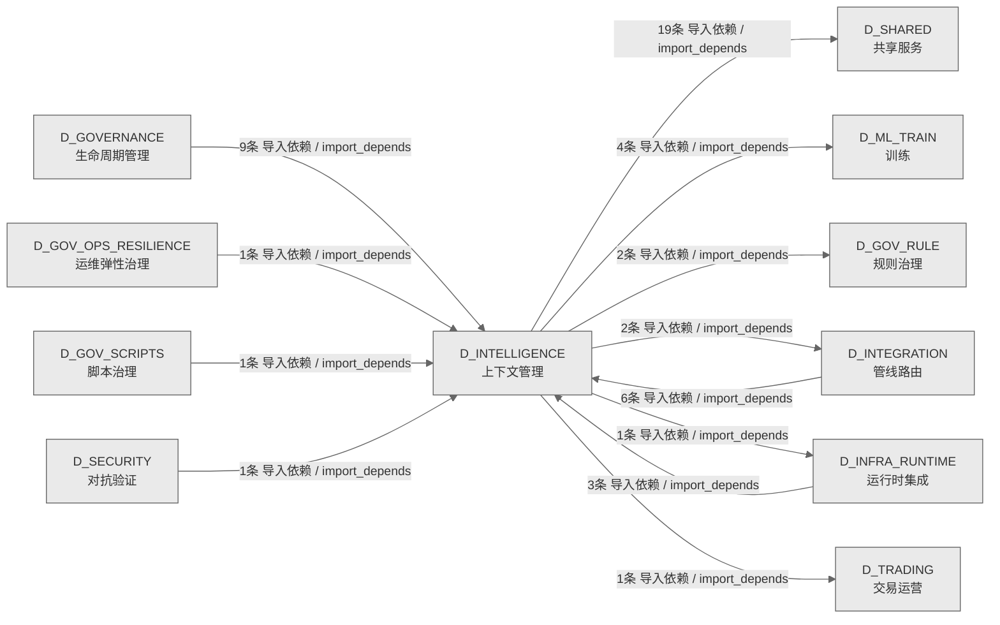

# 57_d_intelligence / 上下文管理域 / Context Management

> **功能简介 / Overview**: 上下文管理，负责 AI 上下文窗口管理、记忆检索和上下文压缩

> **文档作用 / Purpose**: 展示 上下文管理（D_INTELLIGENCE）功能域的域内依赖关系、跨域依赖关系，模块信息（成熟度/中英文名/大白话/文件路径）内嵌于 Mermaid 节点，供架构审查和域治理参考。

> 本文档由 generate_domain_doc.py 从 depgraph (PostgreSQL) 自动生成
> 数据源: depgraph (PostgreSQL) nodes表 + edges表

> **[可缩放 HTML 版 / Zoomable HTML](http://localhost:8765/docs/02_enterprise_architecture/02_domain_architecture_docs/_zoomable_html/57_d_intelligence.html)** — Ctrl+滚轮缩放 ｜ 双击重置 ｜ Ctrl+Shift+D 切换拖动/选择模式

## 域基本信息 / Domain Overview

| 字段 | 值 | Field | Value |
|------|------|-------|-------|
| 编号 | 57 | Number | 57 |
| 域ID | D_INTELLIGENCE | Domain ID | D_INTELLIGENCE |
| 域名称 | 上下文管理 | Domain Name | Context Management |
| 层级 | L2 业务域层 | Layer | L2 Domain |
| 模块数 | 31 | Module Count | 31 |
| 域内依赖 | 27 | Internal Dependencies | 27 |
| 跨域入边 | 21 | Cross-domain Incoming | 21 |
| 跨域出边 | 29 | Cross-domain Outgoing | 29 |
| 设计态模块 | 0 | Design Modules | 0 |
| 生产态模块 | 31 | Production Modules | 31 |
| 容量 | 31/150 (正常) | Capacity | 31/150 (正常) |
| 描述 | 上下文预算管理(context_budget/token_budget) | Description | 上下文预算管理(context_budget/token_budget) |

## 域内依赖图 / Internal Dependency Diagram

> 依赖图内嵌在本文档中，IDE 可直接渲染；网页版可 Ctrl+滚轮缩放 + 拖动平移查看细节。全景图用颜色区分运营态/设计态，不再分页/拆子图。
>
> **图例说明 / Legend**：
> - 🟦 **蓝色 = 运营态模块**（production，已上线运行）
> - 🟧 **橙色虚线 = 设计态模块**（design，蓝图阶段，代码未写）
> - **实线箭头 = 运营态依赖**（已生效的依赖关系）
> - **虚线箭头 = 非运营态依赖**（计划中/验证中的依赖关系）

### 全景依赖图（全部模块，颜色区分运营态/设计态）

> 展示全部 31 个模块（生产态 31 + 设计态 0），节点含成熟度+中英文名+大白话+文件路径。

```mermaid
%%{init: {'theme': 'base', 'themeVariables': {'primaryColor': '#eaeaea', 'primaryTextColor': '#333333', 'primaryBorderColor': '#666666', 'lineColor': '#666666', 'secondaryColor': '#eaeaea', 'tertiaryColor': '#eaeaea', 'fontSize': '14px'}}}%%
flowchart TD
    scripts_calibrate_model_diff_py["(生产态 / production) calibrate模型差异 / Calibrate Model Diff<br/>模型能力差异校准脚本（P1-3 治本）。<br/>文件: scripts/calibrate_model_diff.py"]
    scripts_quick_profile_py["(生产态 / production) quickprofile / Quick Profile<br/>模型快速能力画像脚本 (P2 三级模式 Quick 入口)。<br/>文件: scripts/quick_profile.py"]
    src_zephyr_intelligence_model_drift_detector_py["(生产态 / production) 模型漂移检测器 / Model Drift Detector<br/>ModelDriftDetector — LLM 模型行为漂移检测。<br/>文件: intelligence/model_drift_detector.py"]
    src_zephyr_intelligence_model_evaluation_activate_py["(生产态 / production) activate / Activate<br/>G4 Activate 门禁 — 人工激活（T-2-13-D）<br/>文件: model_evaluation/activate.py"]
    src_zephyr_intelligence_model_evaluation_implementations_default_inference_engine_py["(生产态 / production) defaultinference引擎 / Default Inference Engine<br/>D_ML_TRAIN — Default Inference Engine<br/>文件: implementations/default_inference_engine.py"]
    src_zephyr_intelligence_model_evaluation_inference_base_py["(生产态 / production) inference基础 / Inference Base<br/>MIGRATED: SSoT moved to zephyr.ml_train.trainer_base and zephyr.ml_train.infe...<br/>文件: model_evaluation/inference_base.py"]
    src_zephyr_intelligence_model_evaluation_reranker_py["(生产态 / production) reranker / Reranker<br/>Cross-Encoder 重排序层 — BGE-reranker-v2-m3<br/>文件: model_evaluation/reranker.py"]
    src_zephyr_intelligence_model_evaluation_unified_memory_api_py["(生产态 / production) unifiedmemoryAPI / Unified Memory API<br/>UnifiedMemoryAPI — RI-02 统一记忆 API（M2 跨模块封装）<br/>文件: model_evaluation/unified_memory_api.py"]
    src_zephyr_intelligence_model_profiling_cli_py["(生产态 / production) 命令行 / CLI<br/>model-profiler.cli — 模型性能检测命令行入口<br/>文件: model_profiling/cli.py"]
    src_zephyr_intelligence_model_profiling_deepseek_v4_chat_py["(生产态 / production) deepseekv4chat / Deepseek V4 Chat<br/>DeepSeekV4Chat --- DeepSeek V4 系列模型 API 客户端<br/>文件: model_profiling/deepseek_v4_chat.py"]
    src_zephyr_intelligence_model_profiling_pipeline_routing_cli_py["(生产态 / production) 命令行 / CLI<br/>model-profiler.cli — 模型性能检测命令行入口<br/>文件: pipeline_routing/cli.py"]
    src_zephyr_intelligence_model_profiling_pipeline_routing_task_model_learner_py["(生产态 / production) 任务模型learner / Task Model Learner<br/>ModelTaskMatrix — 任务×模型性能学习引擎<br/>文件: pipeline_routing/task_model_learner.py"]
    src_zephyr_intelligence_model_profiling_task_model_learner_py["(生产态 / production) 任务模型learner / Task Model Learner<br/>ModelTaskMatrix — 任务×模型性能学习引擎<br/>文件: model_profiling/task_model_learner.py"]
    scripts_calibrate_model_diff_py ~~~ scripts_quick_profile_py
    scripts_quick_profile_py ~~~ src_zephyr_intelligence_model_drift_detector_py
    src_zephyr_intelligence_model_drift_detector_py ~~~ src_zephyr_intelligence_model_evaluation_activate_py
    src_zephyr_intelligence_model_evaluation_activate_py ~~~ src_zephyr_intelligence_model_evaluation_implementations_default_inference_engine_py
    src_zephyr_intelligence_model_evaluation_implementations_default_inference_engine_py ~~~ src_zephyr_intelligence_model_evaluation_inference_base_py
    src_zephyr_intelligence_model_evaluation_inference_base_py ~~~ src_zephyr_intelligence_model_evaluation_reranker_py
    src_zephyr_intelligence_model_evaluation_reranker_py ~~~ src_zephyr_intelligence_model_evaluation_unified_memory_api_py
    src_zephyr_intelligence_model_evaluation_unified_memory_api_py ~~~ src_zephyr_intelligence_model_profiling_cli_py
    src_zephyr_intelligence_model_profiling_cli_py ~~~ src_zephyr_intelligence_model_profiling_deepseek_v4_chat_py
    src_zephyr_intelligence_model_profiling_deepseek_v4_chat_py ~~~ src_zephyr_intelligence_model_profiling_pipeline_routing_cli_py
    src_zephyr_intelligence_model_profiling_pipeline_routing_cli_py ~~~ src_zephyr_intelligence_model_profiling_pipeline_routing_task_model_learner_py
    src_zephyr_intelligence_model_profiling_pipeline_routing_task_model_learner_py ~~~ src_zephyr_intelligence_model_profiling_task_model_learner_py
    src_zephyr_intelligence_model_evaluation_memory_backend_py["(生产态 / production) memorybackend / Memory Backend<br/>Backend protocol & shared data classes for the unified memory layer.<br/>文件: model_evaluation/_memory_backend.py"]
    src_zephyr_intelligence_model_profiling_exam_orchestrator_py["(生产态 / production) examorchestrator / Exam Orchestrator<br/>ExamOrchestrator --- 五轴入职考试主控<br/>文件: model_profiling/exam_orchestrator.py"]
    src_zephyr_intelligence_model_profiling_pipeline_routing_results_writer_py["(生产态 / production) resultswriter / Results Writer<br/>Results Writer — 持久化 benchmark 结果，支持历史对比（漂移检测）<br/>文件: pipeline_routing/results_writer.py"]
    src_zephyr_intelligence_model_profiling_results_writer_py["(生产态 / production) resultswriter / Results Writer<br/>Results Writer — 持久化 benchmark 结果，支持历史对比（漂移检测）<br/>文件: model_profiling/results_writer.py"]
    src_zephyr_intelligence_model_evaluation_memory_backend_py ~~~ src_zephyr_intelligence_model_profiling_exam_orchestrator_py
    src_zephyr_intelligence_model_profiling_exam_orchestrator_py ~~~ src_zephyr_intelligence_model_profiling_pipeline_routing_results_writer_py
    src_zephyr_intelligence_model_profiling_pipeline_routing_results_writer_py ~~~ src_zephyr_intelligence_model_profiling_results_writer_py
    src_zephyr_intelligence_model_profiling_exam_checks_py["(生产态 / production) examchecks / Exam Checks<br/>exam_checks.py — 考试检测纯函数模块（Stage 4 试点：从 exam_orchestrator 提取）<br/>文件: model_profiling/exam_checks.py"]
    src_zephyr_intelligence_model_profiling_exam_executor_py["(生产态 / production) examexecutor / Exam Executor<br/>ExamExecutor --- 执行式代码评测（HumanEval pass@1 风格，v3.0.5）。<br/>文件: model_profiling/exam_executor.py"]
    src_zephyr_intelligence_model_profiling_exam_judge_py["(生产态 / production) examjudge / Exam Judge<br/>ExamJudge --- LLM-as-judge 评分器<br/>文件: model_profiling/exam_judge.py"]
    src_zephyr_intelligence_model_profiling_exam_rubric_py["(生产态 / production) examrubric / Exam Rubric<br/>ExamRubric --- 奥赛题结构化多维清单评分（v3.0.5）。<br/>文件: model_profiling/exam_rubric.py"]
    src_zephyr_intelligence_model_profiling_job_matcher_py["(生产态 / production) jobmatcher / Job Matcher<br/>JobMatcher --- 模型岗位匹配器<br/>文件: model_profiling/job_matcher.py"]
    src_zephyr_intelligence_model_profiling_pipeline_routing_profiler_py["(生产态 / production) profiler / Profiler<br/>ModelProfiler — 核心性能分析引擎<br/>文件: pipeline_routing/profiler.py"]
    src_zephyr_intelligence_model_profiling_profiler_py["(生产态 / production) profiler / Profiler<br/>ModelProfiler — 核心性能分析引擎<br/>文件: model_profiling/profiler.py"]
    src_zephyr_intelligence_model_profiling_exam_checks_py ~~~ src_zephyr_intelligence_model_profiling_exam_executor_py
    src_zephyr_intelligence_model_profiling_exam_executor_py ~~~ src_zephyr_intelligence_model_profiling_exam_judge_py
    src_zephyr_intelligence_model_profiling_exam_judge_py ~~~ src_zephyr_intelligence_model_profiling_exam_rubric_py
    src_zephyr_intelligence_model_profiling_exam_rubric_py ~~~ src_zephyr_intelligence_model_profiling_job_matcher_py
    src_zephyr_intelligence_model_profiling_job_matcher_py ~~~ src_zephyr_intelligence_model_profiling_pipeline_routing_profiler_py
    src_zephyr_intelligence_model_profiling_pipeline_routing_profiler_py ~~~ src_zephyr_intelligence_model_profiling_profiler_py
    src_zephyr_intelligence_model_profiling_benchmark_suite_py["(生产态 / production) 基准suite / Benchmark Suite<br/>BenchmarkSuite — 多维度模型性能测试用例集<br/>文件: model_profiling/benchmark_suite.py"]
    src_zephyr_intelligence_model_profiling_capability_passport_py["(生产态 / production) 能力passport / Capability Passport<br/>CapabilityPassport --- AI 模型能力护照<br/>文件: model_profiling/capability_passport.py"]
    src_zephyr_intelligence_model_profiling_exam_test_cases_py["(生产态 / production) exam测试cases / Exam Test Cases<br/>ExamTestCases --- v3.0.5 扩展考试题库（96 题 / 29 能力 / 5 难度）<br/>文件: model_profiling/exam_test_cases.py"]
    src_zephyr_intelligence_model_profiling_model_discovery_py["(生产态 / production) 模型discovery / Model Discovery<br/>ModelDiscovery — 枚举所有本地 Ollama 模型 + 远程 API 模型<br/>文件: model_profiling/model_discovery.py"]
    src_zephyr_intelligence_model_profiling_pipeline_routing_benchmark_suite_py["(生产态 / production) 基准suite / Benchmark Suite<br/>BenchmarkSuite — 多维度模型性能测试用例集<br/>文件: pipeline_routing/benchmark_suite.py"]
    src_zephyr_intelligence_model_profiling_benchmark_suite_py ~~~ src_zephyr_intelligence_model_profiling_capability_passport_py
    src_zephyr_intelligence_model_profiling_capability_passport_py ~~~ src_zephyr_intelligence_model_profiling_exam_test_cases_py
    src_zephyr_intelligence_model_profiling_exam_test_cases_py ~~~ src_zephyr_intelligence_model_profiling_model_discovery_py
    src_zephyr_intelligence_model_profiling_model_discovery_py ~~~ src_zephyr_intelligence_model_profiling_pipeline_routing_benchmark_suite_py
    src_zephyr_intelligence_model_profiling_case_assembler_py["(生产态 / production) caseassembler / Case Assembler<br/>真实多文件注入装配器（Phase 3 极限深度）。<br/>文件: model_profiling/case_assembler.py"]
    src_zephyr_intelligence_model_profiling_provider_data_py["(生产态 / production) 提供者数据 / Provider Data<br/>提供者数据模块。<br/>文件: model_profiling/provider_data.py"]
    src_zephyr_intelligence_model_profiling_case_assembler_py ~~~ src_zephyr_intelligence_model_profiling_provider_data_py
    src_zephyr_intelligence_model_evaluation_unified_memory_api_py -->|导入依赖 / import_depends| src_zephyr_intelligence_model_evaluation_memory_backend_py
    src_zephyr_intelligence_model_profiling_exam_checks_py -->|导入依赖 / import_depends| src_zephyr_intelligence_model_profiling_exam_test_cases_py
    src_zephyr_intelligence_model_profiling_cli_py -->|导入依赖 / import_depends| src_zephyr_intelligence_model_profiling_results_writer_py
    src_zephyr_intelligence_model_profiling_model_discovery_py -->|导入依赖 / import_depends| src_zephyr_intelligence_model_profiling_provider_data_py
    src_zephyr_intelligence_model_profiling_exam_test_cases_py -->|导入依赖 / import_depends| src_zephyr_intelligence_model_profiling_case_assembler_py
    src_zephyr_intelligence_model_profiling_results_writer_py -->|导入依赖 / import_depends| src_zephyr_intelligence_model_profiling_profiler_py
    src_zephyr_intelligence_model_profiling_exam_orchestrator_py -->|导入依赖 / import_depends| src_zephyr_intelligence_model_profiling_capability_passport_py
    src_zephyr_intelligence_model_profiling_exam_orchestrator_py -->|导入依赖 / import_depends| src_zephyr_intelligence_model_profiling_exam_checks_py
    src_zephyr_intelligence_model_profiling_exam_orchestrator_py -->|导入依赖 / import_depends| src_zephyr_intelligence_model_profiling_exam_executor_py
    src_zephyr_intelligence_model_profiling_exam_orchestrator_py -->|导入依赖 / import_depends| src_zephyr_intelligence_model_profiling_exam_judge_py
    src_zephyr_intelligence_model_profiling_exam_orchestrator_py -->|导入依赖 / import_depends| src_zephyr_intelligence_model_profiling_exam_rubric_py
    src_zephyr_intelligence_model_profiling_exam_orchestrator_py -->|导入依赖 / import_depends| src_zephyr_intelligence_model_profiling_exam_test_cases_py
    src_zephyr_intelligence_model_profiling_exam_orchestrator_py -->|导入依赖 / import_depends| src_zephyr_intelligence_model_profiling_job_matcher_py
    src_zephyr_intelligence_model_profiling_exam_orchestrator_py -->|导入依赖 / import_depends| src_zephyr_intelligence_model_profiling_provider_data_py
    src_zephyr_intelligence_model_profiling_profiler_py -->|导入依赖 / import_depends| src_zephyr_intelligence_model_profiling_benchmark_suite_py
    src_zephyr_intelligence_model_profiling_profiler_py -->|导入依赖 / import_depends| src_zephyr_intelligence_model_profiling_model_discovery_py
    src_zephyr_intelligence_model_profiling_job_matcher_py -->|导入依赖 / import_depends| src_zephyr_intelligence_model_profiling_capability_passport_py
    src_zephyr_intelligence_model_profiling_pipeline_routing_profiler_py -->|导入依赖 / import_depends| src_zephyr_intelligence_model_profiling_model_discovery_py
    src_zephyr_intelligence_model_profiling_pipeline_routing_profiler_py -->|导入依赖 / import_depends| src_zephyr_intelligence_model_profiling_pipeline_routing_benchmark_suite_py
    src_zephyr_intelligence_model_profiling_pipeline_routing_cli_py -->|导入依赖 / import_depends| src_zephyr_intelligence_model_profiling_model_discovery_py
    src_zephyr_intelligence_model_profiling_pipeline_routing_cli_py -->|导入依赖 / import_depends| src_zephyr_intelligence_model_profiling_pipeline_routing_profiler_py
    src_zephyr_intelligence_model_profiling_pipeline_routing_cli_py -->|导入依赖 / import_depends| src_zephyr_intelligence_model_profiling_pipeline_routing_results_writer_py
    src_zephyr_intelligence_model_profiling_pipeline_routing_results_writer_py -->|导入依赖 / import_depends| src_zephyr_intelligence_model_profiling_pipeline_routing_profiler_py
    scripts_calibrate_model_diff_py -->|导入依赖 / import_depends| src_zephyr_intelligence_model_profiling_capability_passport_py
    scripts_quick_profile_py -->|导入依赖 / import_depends| src_zephyr_intelligence_model_profiling_capability_passport_py
    scripts_quick_profile_py -->|导入依赖 / import_depends| src_zephyr_intelligence_model_profiling_exam_orchestrator_py
    scripts_quick_profile_py -->|导入依赖 / import_depends| src_zephyr_intelligence_model_profiling_job_matcher_py
    D_SHARED["(生产态 / production) 共享服务 / Shared Services<br/>共享服务，负责跨域共享的工具、协议和基础服务<br/>跨域节点 / cross-domain"]
    src_zephyr_intelligence_model_profiling_results_writer_py -->|导入依赖 / import_depends| D_SHARED
    D_INFRA_RUNTIME["(生产态 / production) 运行时集成 / Runtime Integration<br/>运行时集成，负责组件生命周期编排、启动钩子和运行时上下文管理<br/>跨域节点 / cross-domain"]
    src_zephyr_intelligence_model_profiling_pipeline_routing_task_model_learner_py -->|导入依赖 / import_depends| D_INFRA_RUNTIME
    D_ML_TRAIN["(生产态 / production) 训练 / Training<br/>训练，负责模型训练、特征工程和模型评估<br/>跨域节点 / cross-domain"]
    src_zephyr_intelligence_model_evaluation_inference_base_py -->|导入依赖 / import_depends| D_ML_TRAIN
    src_zephyr_intelligence_model_profiling_pipeline_routing_profiler_py -->|导入依赖 / import_depends| D_SHARED
    D_GOV_RULE["(生产态 / production) 规则治理 / Rule Governance<br/>规则治理，负责规则注册、规则版本和规则依赖管理<br/>跨域节点 / cross-domain"]
    src_zephyr_intelligence_model_evaluation_activate_py -->|导入依赖 / import_depends| D_GOV_RULE
    src_zephyr_intelligence_model_profiling_exam_executor_py -->|导入依赖 / import_depends| D_SHARED
    src_zephyr_intelligence_model_profiling_pipeline_routing_results_writer_py -->|导入依赖 / import_depends| D_SHARED
    src_zephyr_intelligence_model_profiling_model_discovery_py -->|导入依赖 / import_depends| D_SHARED
    D_INTEGRATION["(生产态 / production) 管线路由 / Pipeline Routing<br/>管线路由，负责跨域数据流路由、管道编排和集成适配<br/>跨域节点 / cross-domain"]
    src_zephyr_intelligence_model_evaluation_unified_memory_api_py -->|导入依赖 / import_depends| D_INTEGRATION
    src_zephyr_intelligence_model_drift_detector_py -->|导入依赖 / import_depends| D_SHARED
    src_zephyr_intelligence_model_profiling_job_matcher_py -->|导入依赖 / import_depends| D_SHARED
    src_zephyr_intelligence_model_evaluation_inference_base_py -->|导入依赖 / import_depends| D_ML_TRAIN
    src_zephyr_intelligence_model_evaluation_unified_memory_api_py -->|导入依赖 / import_depends| D_SHARED
    scripts_quick_profile_py -->|导入依赖 / import_depends| D_INTEGRATION
    src_zephyr_intelligence_model_profiling_case_assembler_py -->|导入依赖 / import_depends| D_SHARED
    D_GOVERNANCE["(生产态 / production) 生命周期管理 / Lifecycle Management<br/>生命周期管理，负责蓝图/模块/任务的声明周期管理和元数据治理<br/>跨域节点 / cross-domain"]
    D_GOVERNANCE -->|导入依赖 / import_depends| src_zephyr_intelligence_model_profiling_results_writer_py
    D_INFRA_RUNTIME -->|导入依赖 / import_depends| src_zephyr_intelligence_model_profiling_capability_passport_py
    D_GOVERNANCE -->|导入依赖 / import_depends| src_zephyr_intelligence_model_evaluation_implementations_default_inference_engine_py
    D_INTEGRATION -->|导入依赖 / import_depends| src_zephyr_intelligence_model_evaluation_unified_memory_api_py
    D_GOVERNANCE -->|导入依赖 / import_depends| src_zephyr_intelligence_model_profiling_deepseek_v4_chat_py
    D_GOV_OPS_RESILIENCE["(生产态 / production) 运维弹性治理 / Ops Resilience Governance<br/>运维弹性治理，负责运维治理、安全治理、弹性治理和升级协议<br/>跨域节点 / cross-domain"]
    D_GOV_OPS_RESILIENCE -->|导入依赖 / import_depends| src_zephyr_intelligence_model_evaluation_reranker_py
    D_INFRA_RUNTIME -->|导入依赖 / import_depends| src_zephyr_intelligence_model_profiling_task_model_learner_py
    D_GOVERNANCE -->|导入依赖 / import_depends| src_zephyr_intelligence_model_profiling_exam_orchestrator_py
    D_INTEGRATION -->|导入依赖 / import_depends| src_zephyr_intelligence_model_profiling_pipeline_routing_profiler_py
    D_INTEGRATION -->|导入依赖 / import_depends| src_zephyr_intelligence_model_evaluation_unified_memory_api_py
    D_GOVERNANCE -->|导入依赖 / import_depends| src_zephyr_intelligence_model_profiling_deepseek_v4_chat_py
    D_INTEGRATION -->|导入依赖 / import_depends| src_zephyr_intelligence_model_evaluation_reranker_py
    D_GOVERNANCE -->|导入依赖 / import_depends| src_zephyr_intelligence_model_profiling_exam_orchestrator_py
    D_GOV_SCRIPTS["(生产态 / production) 脚本治理 / Script Governance<br/>脚本治理，负责脚本生命周期管理和脚本质量门禁<br/>跨域节点 / cross-domain"]
    D_GOV_SCRIPTS -->|导入依赖 / import_depends| src_zephyr_intelligence_model_profiling_exam_test_cases_py
    D_INFRA_RUNTIME -->|导入依赖 / import_depends| src_zephyr_intelligence_model_profiling_results_writer_py
    classDef production fill:#e1f5fe,stroke:#01579b,stroke-width:2px,color:#000
    classDef design fill:#fff3e0,stroke:#e65100,stroke-width:2px,color:#000,stroke-dasharray: 5 5
    classDef external_prod fill:#e8f4fd,stroke:#0277bd,stroke-width:1px,color:#000
    classDef external_design fill:#fff8e7,stroke:#ef6c00,stroke-width:1px,color:#000,stroke-dasharray: 5 5
    class scripts_calibrate_model_diff_py,scripts_quick_profile_py,src_zephyr_intelligence_model_drift_detector_py,src_zephyr_intelligence_model_evaluation_memory_backend_py,src_zephyr_intelligence_model_evaluation_activate_py,src_zephyr_intelligence_model_evaluation_implementations_default_inference_engine_py,src_zephyr_intelligence_model_evaluation_inference_base_py,src_zephyr_intelligence_model_evaluation_reranker_py,src_zephyr_intelligence_model_evaluation_unified_memory_api_py,src_zephyr_intelligence_model_profiling_benchmark_suite_py,src_zephyr_intelligence_model_profiling_capability_passport_py,src_zephyr_intelligence_model_profiling_case_assembler_py,src_zephyr_intelligence_model_profiling_cli_py,src_zephyr_intelligence_model_profiling_deepseek_v4_chat_py,src_zephyr_intelligence_model_profiling_exam_checks_py,src_zephyr_intelligence_model_profiling_exam_executor_py,src_zephyr_intelligence_model_profiling_exam_judge_py,src_zephyr_intelligence_model_profiling_exam_orchestrator_py,src_zephyr_intelligence_model_profiling_exam_rubric_py,src_zephyr_intelligence_model_profiling_exam_test_cases_py,src_zephyr_intelligence_model_profiling_job_matcher_py,src_zephyr_intelligence_model_profiling_model_discovery_py,src_zephyr_intelligence_model_profiling_pipeline_routing_benchmark_suite_py,src_zephyr_intelligence_model_profiling_pipeline_routing_cli_py,src_zephyr_intelligence_model_profiling_pipeline_routing_profiler_py,src_zephyr_intelligence_model_profiling_pipeline_routing_results_writer_py,src_zephyr_intelligence_model_profiling_pipeline_routing_task_model_learner_py,src_zephyr_intelligence_model_profiling_profiler_py,src_zephyr_intelligence_model_profiling_provider_data_py,src_zephyr_intelligence_model_profiling_results_writer_py,src_zephyr_intelligence_model_profiling_task_model_learner_py production
    class D_SHARED,D_INFRA_RUNTIME,D_ML_TRAIN,D_GOV_RULE,D_INTEGRATION,D_GOVERNANCE,D_GOV_OPS_RESILIENCE,D_GOV_SCRIPTS external_prod
```

## 跨域依赖 / Cross-domain Dependencies

### 本域依赖的其他域（出边）/ Depends On

| # | 本域模块 / Source Module | → | 外部域-目标模块 / Target Module | 依赖类型 / Type |
|:--:|---------|:--:|---------|---------|
| 1 | activate / Activate (model_evaluation/activate.py) | → | D_GOV_RULE 规则治理: 门禁裁决引擎 / Gate Engine (gate_engine/gate_engine.py) | 导入依赖 / import_depends |
| 2 | activate / Activate (model_evaluation/activate.py) | → | D_GOV_RULE 规则治理: 门禁类型定义 / Gate Types (rule_enforcement/gate_types.py) | 导入依赖 / import_depends |
| 3 | 任务模型learner / Task Model Learner (pipeline_routing/ta... | → | D_INFRA_RUNTIME 运行时集成: 模型 / Models (pipeline/models.py) | 导入依赖 / import_depends |
| 4 | quickprofile / Quick Profile (scripts/quick_profile.py) | → | D_INTEGRATION 管线路由: Ollamachat / Ollama Chat (local_model/ollama_chat.py) | 导入依赖 / import_depends |
| 5 | unifiedmemoryAPI / Unified Memory API (model_evaluation/u... | → | D_INTEGRATION 管线路由: VMSmemorybackend / VMS Memory Backend (vector_memory/vms_... | 导入依赖 / import_depends |
| 6 | defaultinference引擎 / Default Inference Engine (implemen... | → | D_ML_TRAIN 训练: inference基础 / Inference Base (ml_train/inference_base.py) | 导入依赖 / import_depends |
| 7 | defaultinference引擎 / Default Inference Engine (implemen... | → | D_ML_TRAIN 训练: trainer基础 / Trainer Base (ml_train/trainer_base.py) | 导入依赖 / import_depends |
| 8 | inference基础 / Inference Base (model_evaluation/inferenc... | → | D_ML_TRAIN 训练: inference基础 / Inference Base (ml_train/inference_base.py) | 导入依赖 / import_depends |
| 9 | inference基础 / Inference Base (model_evaluation/inferenc... | → | D_ML_TRAIN 训练: trainer基础 / Trainer Base (ml_train/trainer_base.py) | 导入依赖 / import_depends |
| 10 | 模型漂移检测器 / Model Drift Detector (intelligence/model... | → | D_SHARED 共享服务: paths / Paths (io/paths.py) | 导入依赖 / import_depends |
| 11 | defaultinference引擎 / Default Inference Engine (implemen... | → | D_SHARED 共享服务: 模型serving响应 / Model Serving Response (experiment/mode... | 导入依赖 / import_depends |
| 12 | defaultinference引擎 / Default Inference Engine (implemen... | → | D_SHARED 共享服务: paths / Paths (io/paths.py) | 导入依赖 / import_depends |
| 13 | unifiedmemoryAPI / Unified Memory API (model_evaluation/u... | → | D_SHARED 共享服务: 能力 / Capability (security/capability.py) | 导入依赖 / import_depends |
| 14 | 能力passport / Capability Passport (model_profiling/capab... | → | D_SHARED 共享服务: paths / Paths (io/paths.py) | 导入依赖 / import_depends |
| 15 | 能力passport / Capability Passport (model_profiling/capab... | → | D_SHARED 共享服务: serialization / Serialization (io/serialization.py) | 导入依赖 / import_depends |
| 16 | 能力passport / Capability Passport (model_profiling/capab... | → | D_SHARED 共享服务: 密钥 / Secrets (security/secrets.py) | 导入依赖 / import_depends |
| 17 | caseassembler / Case Assembler (model_profiling/case_asse... | → | D_SHARED 共享服务: paths / Paths (io/paths.py) | 导入依赖 / import_depends |
| 18 | deepseekv4chat / Deepseek V4 Chat (model_profiling/deepse... | → | D_SHARED 共享服务: constants / Constants (foundation/constants.py) | 导入依赖 / import_depends |
| 19 | deepseekv4chat / Deepseek V4 Chat (model_profiling/deepse... | → | D_SHARED 共享服务: 密钥 / Secrets (security/secrets.py) | 导入依赖 / import_depends |
| 20 | examexecutor / Exam Executor (model_profiling/exam_execut... | → | D_SHARED 共享服务: process池 / Process Pool (infra/process_pool.py) | 导入依赖 / import_depends |
| 21 | jobmatcher / Job Matcher (model_profiling/job_matcher.py) | → | D_SHARED 共享服务: paths / Paths (io/paths.py) | 导入依赖 / import_depends |
| 22 | 模型discovery / Model Discovery (model_profiling/model_di... | → | D_SHARED 共享服务: constants / Constants (foundation/constants.py) | 导入依赖 / import_depends |
| 23 | profiler / Profiler (pipeline_routing/profiler.py) | → | D_SHARED 共享服务: constants / Constants (foundation/constants.py) | 导入依赖 / import_depends |
| 24 | profiler / Profiler (pipeline_routing/profiler.py) | → | D_SHARED 共享服务: 时间utils / Time Utils (utils/time_utils.py) | 导入依赖 / import_depends |
| 25 | resultswriter / Results Writer (pipeline_routing/results_... | → | D_SHARED 共享服务: 时间utils / Time Utils (utils/time_utils.py) | 导入依赖 / import_depends |
| 26 | profiler / Profiler (model_profiling/profiler.py) | → | D_SHARED 共享服务: constants / Constants (foundation/constants.py) | 导入依赖 / import_depends |
| 27 | profiler / Profiler (model_profiling/profiler.py) | → | D_SHARED 共享服务: 时间utils / Time Utils (utils/time_utils.py) | 导入依赖 / import_depends |
| 28 | resultswriter / Results Writer (model_profiling/results_w... | → | D_SHARED 共享服务: 时间utils / Time Utils (utils/time_utils.py) | 导入依赖 / import_depends |
| 29 | defaultinference引擎 / Default Inference Engine (implemen... | → | D_TRADING 交易运营: 模型servingrequest / Model Serving Request (execution/mod... | 导入依赖 / import_depends |

### 依赖本域的其他域（入边）/ Depended By

| # | 外部域-源模块 / Source Module | → | 本域模块 / Target Module | 依赖类型 / Type |
|:--:|---------|:--:|---------|---------|
| 1 | D_GOVERNANCE 生命周期管理: demo端到端流水线 / Demo E2E Pipeline (construction/demo_e... | → | defaultinference引擎 / Default Inference Engine (implemen... | 导入依赖 / import_depends |
| 2 | D_GOVERNANCE 生命周期管理: diagnosebreadthfailed / Diagnose Breadth Failed (scripts/... | → | deepseekv4chat / Deepseek V4 Chat (model_profiling/deepse... | 导入依赖 / import_depends |
| 3 | D_GOVERNANCE 生命周期管理: diagnosebreadthfailed / Diagnose Breadth Failed (scripts/... | → | examorchestrator / Exam Orchestrator (model_profiling/exa... | 导入依赖 / import_depends |
| 4 | D_GOVERNANCE 生命周期管理: diagnosebreadthfailed / Diagnose Breadth Failed (scripts/... | → | exam测试cases / Exam Test Cases (model_profiling/exam_tes... | 导入依赖 / import_depends |
| 5 | D_GOVERNANCE 生命周期管理: rundeepseekv4exam / Run Deepseek V4 Exam (scripts/run_dee... | → | deepseekv4chat / Deepseek V4 Chat (model_profiling/deepse... | 导入依赖 / import_depends |
| 6 | D_GOVERNANCE 生命周期管理: rundeepseekv4exam / Run Deepseek V4 Exam (scripts/run_dee... | → | examorchestrator / Exam Orchestrator (model_profiling/exa... | 导入依赖 / import_depends |
| 7 | D_GOVERNANCE 生命周期管理: runOllamaexam / Run Ollama Exam (scripts/run_ollama_exam.py) | → | examorchestrator / Exam Orchestrator (model_profiling/exa... | 导入依赖 / import_depends |
| 8 | D_GOVERNANCE 生命周期管理: 模型路由器 / Model Router (intelligence_governance/model_... | → | 提供者数据 / Provider Data (model_profiling/provider_data... | 导入依赖 / import_depends |
| 9 | D_GOVERNANCE 生命周期管理: 模型路由器 / Model Router (intelligence_governance/model_... | → | resultswriter / Results Writer (model_profiling/results_w... | 导入依赖 / import_depends |
| 10 | D_GOV_OPS_RESILIENCE 运维弹性治理: 服务registration / Service Registration (ops_governance/s... | → | reranker / Reranker (model_evaluation/reranker.py) | 导入依赖 / import_depends |
| 11 | D_GOV_SCRIPTS 脚本治理: 检查examcase一致性 / Check Exam Case Consistency (one_off... | → | exam测试cases / Exam Test Cases (model_profiling/exam_tes... | 导入依赖 / import_depends |
| 12 | D_INFRA_RUNTIME 运行时集成: 自动运行时核心 / Auto Runtime Core (trading/auto_runtime_... | → | resultswriter / Results Writer (model_profiling/results_w... | 导入依赖 / import_depends |
| 13 | D_INFRA_RUNTIME 运行时集成: 自动运行时核心 / Auto Runtime Core (trading/auto_runtime_... | → | 任务模型learner / Task Model Learner (model_profiling/tas... | 导入依赖 / import_depends |
| 14 | D_INFRA_RUNTIME 运行时集成: 任务门禁 / Task Gate (trading/task_gate.py) | → | 能力passport / Capability Passport (model_profiling/capab... | 导入依赖 / import_depends |
| 15 | D_INTEGRATION 管线路由: 流水线orchestrator / Pipeline Orchestrator (integration/p... | → | reranker / Reranker (model_evaluation/reranker.py) | 导入依赖 / import_depends |
| 16 | D_INTEGRATION 管线路由: 流水线orchestrator / Pipeline Orchestrator (integration/p... | → | profiler / Profiler (pipeline_routing/profiler.py) | 导入依赖 / import_depends |
| 17 | D_INTEGRATION 管线路由: 流水线orchestrator / Pipeline Orchestrator (integration/p... | → | resultswriter / Results Writer (pipeline_routing/results_... | 导入依赖 / import_depends |
| 18 | D_INTEGRATION 管线路由: delegatedvectormemory / Delegated Vector Memory (vector_m... | → | unifiedmemoryAPI / Unified Memory API (model_evaluation/u... | 导入依赖 / import_depends |
| 19 | D_INTEGRATION 管线路由: VMSmemorybackend / VMS Memory Backend (vector_memory/vms_... | → | memorybackend / Memory Backend (model_evaluation/_memory_... | 导入依赖 / import_depends |
| 20 | D_INTEGRATION 管线路由: VMS模式 / VMS Schemas (vector_memory/vms_schemas.py) | → | unifiedmemoryAPI / Unified Memory API (model_evaluation/u... | 导入依赖 / import_depends |
| 21 | D_SECURITY 对抗验证: 知识库桥接 / KB Bridge (orphan_judge/kb_bridge.py) | → | unifiedmemoryAPI / Unified Memory API (model_evaluation/u... | 导入依赖 / import_depends |

### 跨域依赖图 / Cross-domain Dependency Diagram

> 本域与 10 个外部域直接连接（出边 29 条 + 入边 21 条 = 50 条）。只显示直接连接的域，不展开具体节点。



## 说明 / Notes

- **数据源 / Data Source**: `depgraph (PostgreSQL)` 的 `nodes`、`edges`、`domains` 表
- **生成器 / Generator**: `generate_domain_doc.py`（G2+G10 合并）
- **维护方式 / Maintenance**: 自动生成，全景图更新时刷新
- **文件名规则 / File Naming**: `{编号:02d}_{域ID小写}.md`，如 `16_d_trading.md`
- **图例说明 / Legend**: `[production]`=已上线 / `[design]`=设计中 / `[unknown]`=未知
