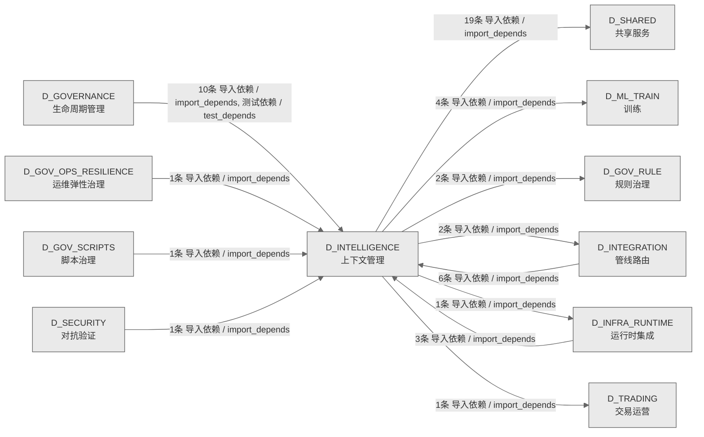

# 57_d_intelligence / 上下文管理域 / Context Management

> **功能简介 / Overview**: 上下文管理，负责 AI 上下文窗口管理、记忆检索和上下文压缩

> **文档作用 / Purpose**: 展示 上下文管理（D_INTELLIGENCE）功能域的域内依赖关系、跨域依赖关系，模块信息（成熟度/中英文名/大白话/文件路径）内嵌于 Mermaid 节点，供架构审查和域治理参考。

> 本文档由 generate_domain_doc.py 从 depgraph (PostgreSQL) 自动生成
> 数据源: depgraph (PostgreSQL) nodes表 + edges表

> **[可缩放 HTML 版 / Zoomable HTML](http://localhost:8765/docs/02_enterprise_architecture/02_domain_architecture_docs/_zoomable_html/57_d_intelligence.html)** — Ctrl+滚轮缩放 ｜ 双击重置 ｜ Ctrl+Shift+D 切换拖动/选择模式

## 域基本信息 / Domain Overview

| 字段 | 值 | Field | Value |
|------|------|-------|-------|
| 编号 | 57 | Number | 57 |
| 域ID | D_INTELLIGENCE | Domain ID | D_INTELLIGENCE |
| 域名称 | 上下文管理 | Domain Name | Context Management |
| 层级 | L2 业务域层 | Layer | L2 Domain |
| 模块数 | 31 | Module Count | 31 |
| 域内依赖 | 27 | Internal Dependencies | 27 |
| 跨域入边 | 22 | Cross-domain Incoming | 22 |
| 跨域出边 | 29 | Cross-domain Outgoing | 29 |
| 设计态模块 | 0 | Design Modules | 0 |
| 生产态模块 | 31 | Production Modules | 31 |
| 容量 | 31/150 (正常) | Capacity | 31/150 (正常) |
| 描述 | 上下文预算管理(context_budget/token_budget) | Description | 上下文预算管理(context_budget/token_budget) |

## 域内依赖图 / Internal Dependency Diagram

> 依赖图内嵌在本文档中，IDE 可直接渲染；网页版可 Ctrl+滚轮缩放 + 拖动平移查看细节。
>
> **图例说明 / Legend**：
> - 🟦 **蓝色 = 运营态模块**（production，已上线运行）
> - 🟧 **橙色虚线 = 设计态模块**（design，蓝图阶段，代码未写）
> - **实线箭头 = 运营态依赖**（已生效的依赖关系）
> - **虚线箭头 = 非运营态依赖**（计划中/验证中的依赖关系）

### 全景图（全部模块，颜色区分运营态/设计态）

> 展示全部 31 个模块（生产态 31 + 设计态 0），含跨域依赖外部节点。节点含成熟度+名称+大白话/简介+文件路径。

```mermaid
%%{init: {'theme': 'base', 'themeVariables': {'primaryColor': '#eaeaea', 'primaryTextColor': '#333333', 'primaryBorderColor': '#666666', 'lineColor': '#666666', 'secondaryColor': '#eaeaea', 'tertiaryColor': '#eaeaea', 'fontSize': '14px'}}}%%
flowchart TD
    scripts_calibrate_model_diff_py["scripts/calibrate_model_diff<br/>模型能力差异校准脚本（P1-3 治本）。<br/>文件: scripts/calibrate_model_diff.py<br/>(生产态 / production)"]
    scripts_quick_profile_py["scripts/quick_profile<br/>模型快速能力画像脚本 (P2 三级模式 Quick 入口)。<br/>文件: scripts/quick_profile.py<br/>(生产态 / production)"]
    src_zephyr_intelligence_model_drift_detector_py["intelligence/model_drift_detector<br/>ModelDriftDetector — LLM 模型行为漂移检测。<br/>文件: intelligence/model_drift_detector.py<br/>(生产态 / production)"]
    src_zephyr_intelligence_model_evaluation_activate_py["model_evaluation/activate<br/>G4 Activate 门禁 — 人工激活（T-2-13-D）<br/>文件: model_evaluation/activate.py<br/>(生产态 / production)"]
    src_zephyr_intelligence_model_evaluation_implementations_default_inference_engine_py["implementations/default_inference_engine<br/>D_ML_TRAIN — Default Inference Engine<br/>文件: implementations<br/>/default_inference_engine.py<br/>(生产态 / production)"]
    src_zephyr_intelligence_model_evaluation_inference_base_py["model_evaluation/inference_base<br/>model evaluation包的inference_base模块<br/>文件: model_evaluation/inference_base.py<br/>(生产态 / production)"]
    src_zephyr_intelligence_model_evaluation_reranker_py["model_evaluation/reranker<br/>Cross-Encoder 重排序层 — BGE-reranker-v2-m3<br/>文件: model_evaluation/reranker.py<br/>(生产态 / production)"]
    src_zephyr_intelligence_model_evaluation_unified_memory_api_py["model_evaluation/unified_memory_api<br/>UnifiedMemoryAPI — RI-02 统一记忆 API（M2<br/>跨模块封装）<br/>文件: model_evaluation/unified_memory_api.py<br/>(生产态 / production)"]
    src_zephyr_intelligence_model_profiling_cli_py["model_profiling/cli<br/>model-profiler.cli — 模型性能检测命令行入口<br/>文件: model_profiling/cli.py<br/>(生产态 / production)"]
    src_zephyr_intelligence_model_profiling_deepseek_v4_chat_py["model_profiling/deepseek_v4_chat<br/>DeepSeekV4Chat --- DeepSeek V4 系列模型 API<br/>客户端<br/>文件: model_profiling/deepseek_v4_chat.py<br/>(生产态 / production)"]
    src_zephyr_intelligence_model_profiling_pipeline_routing_cli_py["pipeline_routing/cli<br/>model-profiler.cli — 模型性能检测命令行入口<br/>文件: pipeline_routing/cli.py<br/>(生产态 / production)"]
    src_zephyr_intelligence_model_profiling_pipeline_routing_task_model_learner_py["pipeline_routing/task_model_learner<br/>ModelTaskMatrix — 任务×模型性能学习引擎<br/>文件: pipeline_routing/task_model_learner.py<br/>(生产态 / production)"]
    src_zephyr_intelligence_model_profiling_task_model_learner_py["model_profiling/task_model_learner<br/>ModelTaskMatrix — 任务×模型性能学习引擎<br/>文件: model_profiling/task_model_learner.py<br/>(生产态 / production)"]
    scripts_calibrate_model_diff_py ~~~ scripts_quick_profile_py
    scripts_quick_profile_py ~~~ src_zephyr_intelligence_model_drift_detector_py
    src_zephyr_intelligence_model_drift_detector_py ~~~ src_zephyr_intelligence_model_evaluation_activate_py
    src_zephyr_intelligence_model_evaluation_activate_py ~~~ src_zephyr_intelligence_model_evaluation_implementations_default_inference_engine_py
    src_zephyr_intelligence_model_evaluation_implementations_default_inference_engine_py ~~~ src_zephyr_intelligence_model_evaluation_inference_base_py
    src_zephyr_intelligence_model_evaluation_inference_base_py ~~~ src_zephyr_intelligence_model_evaluation_reranker_py
    src_zephyr_intelligence_model_evaluation_reranker_py ~~~ src_zephyr_intelligence_model_evaluation_unified_memory_api_py
    src_zephyr_intelligence_model_evaluation_unified_memory_api_py ~~~ src_zephyr_intelligence_model_profiling_cli_py
    src_zephyr_intelligence_model_profiling_cli_py ~~~ src_zephyr_intelligence_model_profiling_deepseek_v4_chat_py
    src_zephyr_intelligence_model_profiling_deepseek_v4_chat_py ~~~ src_zephyr_intelligence_model_profiling_pipeline_routing_cli_py
    src_zephyr_intelligence_model_profiling_pipeline_routing_cli_py ~~~ src_zephyr_intelligence_model_profiling_pipeline_routing_task_model_learner_py
    src_zephyr_intelligence_model_profiling_pipeline_routing_task_model_learner_py ~~~ src_zephyr_intelligence_model_profiling_task_model_learner_py
    src_zephyr_intelligence_model_evaluation_memory_backend_py["model_evaluation/_memory_backend<br/>Backend protocol & shared data classes for the<br/>unified memory layer.<br/>文件: model_evaluation/_memory_backend.py<br/>(生产态 / production)"]
    src_zephyr_intelligence_model_profiling_exam_orchestrator_py["model_profiling/exam_orchestrator<br/>ExamOrchestrator --- 五轴入职考试主控<br/>文件: model_profiling/exam_orchestrator.py<br/>(生产态 / production)"]
    src_zephyr_intelligence_model_profiling_pipeline_routing_results_writer_py["pipeline_routing/results_writer<br/>Results Writer — 持久化 benchmark<br/>结果，支持历史对比（漂移检测）<br/>文件: pipeline_routing/results_writer.py<br/>(生产态 / production)"]
    src_zephyr_intelligence_model_profiling_results_writer_py["model_profiling/results_writer<br/>Results Writer — 持久化 benchmark<br/>结果，支持历史对比（漂移检测）<br/>文件: model_profiling/results_writer.py<br/>(生产态 / production)"]
    src_zephyr_intelligence_model_evaluation_memory_backend_py ~~~ src_zephyr_intelligence_model_profiling_exam_orchestrator_py
    src_zephyr_intelligence_model_profiling_exam_orchestrator_py ~~~ src_zephyr_intelligence_model_profiling_pipeline_routing_results_writer_py
    src_zephyr_intelligence_model_profiling_pipeline_routing_results_writer_py ~~~ src_zephyr_intelligence_model_profiling_results_writer_py
    src_zephyr_intelligence_model_profiling_exam_checks_py["model_profiling/exam_checks<br/>exam_checks.py — 考试检测纯函数模块（Stage 4<br/>试点：从 exam_orchestrator 提取）<br/>文件: model_profiling/exam_checks.py<br/>(生产态 / production)"]
    src_zephyr_intelligence_model_profiling_exam_executor_py["model_profiling/exam_executor<br/>ExamExecutor --- 执行式代码评测（HumanEval<br/>pass@1 风格，v3.0.5）。<br/>文件: model_profiling/exam_executor.py<br/>(生产态 / production)"]
    src_zephyr_intelligence_model_profiling_exam_judge_py["model_profiling/exam_judge<br/>ExamJudge --- LLM-as-judge 评分器<br/>文件: model_profiling/exam_judge.py<br/>(生产态 / production)"]
    src_zephyr_intelligence_model_profiling_exam_rubric_py["model_profiling/exam_rubric<br/>ExamRubric --- 奥赛题结构化多维清单评分<br/>（v3.0.5）。<br/>文件: model_profiling/exam_rubric.py<br/>(生产态 / production)"]
    src_zephyr_intelligence_model_profiling_job_matcher_py["model_profiling/job_matcher<br/>JobMatcher --- 模型岗位匹配器<br/>文件: model_profiling/job_matcher.py<br/>(生产态 / production)"]
    src_zephyr_intelligence_model_profiling_pipeline_routing_profiler_py["pipeline_routing/profiler<br/>ModelProfiler — 核心性能分析引擎<br/>文件: pipeline_routing/profiler.py<br/>(生产态 / production)"]
    src_zephyr_intelligence_model_profiling_profiler_py["model_profiling/profiler<br/>ModelProfiler — 核心性能分析引擎<br/>文件: model_profiling/profiler.py<br/>(生产态 / production)"]
    src_zephyr_intelligence_model_profiling_exam_checks_py ~~~ src_zephyr_intelligence_model_profiling_exam_executor_py
    src_zephyr_intelligence_model_profiling_exam_executor_py ~~~ src_zephyr_intelligence_model_profiling_exam_judge_py
    src_zephyr_intelligence_model_profiling_exam_judge_py ~~~ src_zephyr_intelligence_model_profiling_exam_rubric_py
    src_zephyr_intelligence_model_profiling_exam_rubric_py ~~~ src_zephyr_intelligence_model_profiling_job_matcher_py
    src_zephyr_intelligence_model_profiling_job_matcher_py ~~~ src_zephyr_intelligence_model_profiling_pipeline_routing_profiler_py
    src_zephyr_intelligence_model_profiling_pipeline_routing_profiler_py ~~~ src_zephyr_intelligence_model_profiling_profiler_py
    src_zephyr_intelligence_model_profiling_benchmark_suite_py["model_profiling/benchmark_suite<br/>BenchmarkSuite — 多维度模型性能测试用例集<br/>文件: model_profiling/benchmark_suite.py<br/>(生产态 / production)"]
    src_zephyr_intelligence_model_profiling_capability_passport_py["model_profiling/capability_passport<br/>CapabilityPassport --- AI 模型能力护照<br/>文件: model_profiling/capability_passport.py<br/>(生产态 / production)"]
    src_zephyr_intelligence_model_profiling_exam_test_cases_py["model_profiling/exam_test_cases<br/>ExamTestCases --- v3.0.5 扩展考试题库（96 题 /<br/>29 能力 / 5 难度）<br/>文件: model_profiling/exam_test_cases.py<br/>(生产态 / production)"]
    src_zephyr_intelligence_model_profiling_model_discovery_py["model_profiling/model_discovery<br/>ModelDiscovery — 枚举所有本地 Ollama 模型 +<br/>远程 API 模型<br/>文件: model_profiling/model_discovery.py<br/>(生产态 / production)"]
    src_zephyr_intelligence_model_profiling_pipeline_routing_benchmark_suite_py["pipeline_routing/benchmark_suite<br/>BenchmarkSuite — 多维度模型性能测试用例集<br/>文件: pipeline_routing/benchmark_suite.py<br/>(生产态 / production)"]
    src_zephyr_intelligence_model_profiling_benchmark_suite_py ~~~ src_zephyr_intelligence_model_profiling_capability_passport_py
    src_zephyr_intelligence_model_profiling_capability_passport_py ~~~ src_zephyr_intelligence_model_profiling_exam_test_cases_py
    src_zephyr_intelligence_model_profiling_exam_test_cases_py ~~~ src_zephyr_intelligence_model_profiling_model_discovery_py
    src_zephyr_intelligence_model_profiling_model_discovery_py ~~~ src_zephyr_intelligence_model_profiling_pipeline_routing_benchmark_suite_py
    src_zephyr_intelligence_model_profiling_case_assembler_py["model_profiling/case_assembler<br/>真实多文件注入装配器（Phase 3 极限深度）。<br/>文件: model_profiling/case_assembler.py<br/>(生产态 / production)"]
    src_zephyr_intelligence_model_profiling_provider_data_py["model_profiling/provider_data<br/>model profiling包的provider_data模块<br/>文件: model_profiling/provider_data.py<br/>(生产态 / production)"]
    src_zephyr_intelligence_model_profiling_case_assembler_py ~~~ src_zephyr_intelligence_model_profiling_provider_data_py
    src_zephyr_intelligence_model_evaluation_unified_memory_api_py -->|导入依赖 / import_depends| src_zephyr_intelligence_model_evaluation_memory_backend_py
    src_zephyr_intelligence_model_profiling_cli_py -->|导入依赖 / import_depends| src_zephyr_intelligence_model_profiling_results_writer_py
    src_zephyr_intelligence_model_profiling_exam_checks_py -->|导入依赖 / import_depends| src_zephyr_intelligence_model_profiling_exam_test_cases_py
    src_zephyr_intelligence_model_profiling_exam_orchestrator_py -->|导入依赖 / import_depends| src_zephyr_intelligence_model_profiling_capability_passport_py
    src_zephyr_intelligence_model_profiling_exam_orchestrator_py -->|导入依赖 / import_depends| src_zephyr_intelligence_model_profiling_exam_checks_py
    src_zephyr_intelligence_model_profiling_exam_orchestrator_py -->|导入依赖 / import_depends| src_zephyr_intelligence_model_profiling_exam_executor_py
    src_zephyr_intelligence_model_profiling_exam_orchestrator_py -->|导入依赖 / import_depends| src_zephyr_intelligence_model_profiling_exam_judge_py
    src_zephyr_intelligence_model_profiling_exam_orchestrator_py -->|导入依赖 / import_depends| src_zephyr_intelligence_model_profiling_exam_test_cases_py
    src_zephyr_intelligence_model_profiling_exam_orchestrator_py -->|导入依赖 / import_depends| src_zephyr_intelligence_model_profiling_exam_rubric_py
    src_zephyr_intelligence_model_profiling_exam_orchestrator_py -->|导入依赖 / import_depends| src_zephyr_intelligence_model_profiling_job_matcher_py
    src_zephyr_intelligence_model_profiling_exam_orchestrator_py -->|导入依赖 / import_depends| src_zephyr_intelligence_model_profiling_provider_data_py
    src_zephyr_intelligence_model_profiling_exam_test_cases_py -->|导入依赖 / import_depends| src_zephyr_intelligence_model_profiling_case_assembler_py
    src_zephyr_intelligence_model_profiling_results_writer_py -->|导入依赖 / import_depends| src_zephyr_intelligence_model_profiling_profiler_py
    src_zephyr_intelligence_model_profiling_model_discovery_py -->|导入依赖 / import_depends| src_zephyr_intelligence_model_profiling_provider_data_py
    src_zephyr_intelligence_model_profiling_job_matcher_py -->|导入依赖 / import_depends| src_zephyr_intelligence_model_profiling_capability_passport_py
    src_zephyr_intelligence_model_profiling_profiler_py -->|导入依赖 / import_depends| src_zephyr_intelligence_model_profiling_benchmark_suite_py
    src_zephyr_intelligence_model_profiling_profiler_py -->|导入依赖 / import_depends| src_zephyr_intelligence_model_profiling_model_discovery_py
    src_zephyr_intelligence_model_profiling_pipeline_routing_cli_py -->|导入依赖 / import_depends| src_zephyr_intelligence_model_profiling_model_discovery_py
    src_zephyr_intelligence_model_profiling_pipeline_routing_cli_py -->|导入依赖 / import_depends| src_zephyr_intelligence_model_profiling_pipeline_routing_profiler_py
    src_zephyr_intelligence_model_profiling_pipeline_routing_cli_py -->|导入依赖 / import_depends| src_zephyr_intelligence_model_profiling_pipeline_routing_results_writer_py
    src_zephyr_intelligence_model_profiling_pipeline_routing_profiler_py -->|导入依赖 / import_depends| src_zephyr_intelligence_model_profiling_model_discovery_py
    src_zephyr_intelligence_model_profiling_pipeline_routing_profiler_py -->|导入依赖 / import_depends| src_zephyr_intelligence_model_profiling_pipeline_routing_benchmark_suite_py
    src_zephyr_intelligence_model_profiling_pipeline_routing_results_writer_py -->|导入依赖 / import_depends| src_zephyr_intelligence_model_profiling_pipeline_routing_profiler_py
    scripts_calibrate_model_diff_py -->|导入依赖 / import_depends| src_zephyr_intelligence_model_profiling_capability_passport_py
    scripts_quick_profile_py -->|导入依赖 / import_depends| src_zephyr_intelligence_model_profiling_capability_passport_py
    scripts_quick_profile_py -->|导入依赖 / import_depends| src_zephyr_intelligence_model_profiling_exam_orchestrator_py
    scripts_quick_profile_py -->|导入依赖 / import_depends| src_zephyr_intelligence_model_profiling_job_matcher_py
    D_SHARED["共享服务<br/>共享服务，负责跨域共享的工具、协议和基础服务<br/>Shared Services<br/>跨域节点 / cross-domain<br/>(生产态 / production)"]
    src_zephyr_intelligence_model_profiling_exam_executor_py -->|导入依赖 / import_depends| D_SHARED
    src_zephyr_intelligence_model_profiling_profiler_py -->|导入依赖 / import_depends| D_SHARED
    D_GOV_RULE["规则治理<br/>规则治理，负责规则注册、规则版本和规则依赖管理<br/>Rule Governance<br/>跨域节点 / cross-domain<br/>(生产态 / production)"]
    src_zephyr_intelligence_model_evaluation_activate_py -->|导入依赖 / import_depends| D_GOV_RULE
    src_zephyr_intelligence_model_evaluation_activate_py -->|导入依赖 / import_depends| D_GOV_RULE
    D_ML_TRAIN["训练<br/>训练，负责模型训练、特征工程和模型评估<br/>Training<br/>跨域节点 / cross-domain<br/>(生产态 / production)"]
    src_zephyr_intelligence_model_evaluation_inference_base_py -->|导入依赖 / import_depends| D_ML_TRAIN
    src_zephyr_intelligence_model_evaluation_inference_base_py -->|导入依赖 / import_depends| D_ML_TRAIN
    src_zephyr_intelligence_model_evaluation_unified_memory_api_py -->|导入依赖 / import_depends| D_SHARED
    D_INTEGRATION["管线路由<br/>管线路由，负责跨域数据流路由、管道编排和集成适配<br/>Pipeline Routing<br/>跨域节点 / cross-domain<br/>(生产态 / production)"]
    src_zephyr_intelligence_model_evaluation_unified_memory_api_py -->|导入依赖 / import_depends| D_INTEGRATION
    src_zephyr_intelligence_model_evaluation_implementations_default_inference_engine_py -->|导入依赖 / import_depends| D_ML_TRAIN
    src_zephyr_intelligence_model_evaluation_implementations_default_inference_engine_py -->|导入依赖 / import_depends| D_ML_TRAIN
    src_zephyr_intelligence_model_evaluation_implementations_default_inference_engine_py -->|导入依赖 / import_depends| D_SHARED
    src_zephyr_intelligence_model_evaluation_implementations_default_inference_engine_py -->|导入依赖 / import_depends| D_SHARED
    D_TRADING["交易运营<br/>交易运营，负责交易生命周期管理、订单状态和成交处<br/>理<br/>Trading Operations<br/>跨域节点 / cross-domain<br/>(生产态 / production)"]
    src_zephyr_intelligence_model_evaluation_implementations_default_inference_engine_py -->|导入依赖 / import_depends| D_TRADING
    src_zephyr_intelligence_model_profiling_capability_passport_py -->|导入依赖 / import_depends| D_SHARED
    src_zephyr_intelligence_model_profiling_capability_passport_py -->|导入依赖 / import_depends| D_SHARED
    D_INTEGRATION -->|导入依赖 / import_depends| src_zephyr_intelligence_model_profiling_pipeline_routing_profiler_py
    D_INTEGRATION -->|导入依赖 / import_depends| src_zephyr_intelligence_model_profiling_pipeline_routing_results_writer_py
    D_INTEGRATION -->|导入依赖 / import_depends| src_zephyr_intelligence_model_evaluation_reranker_py
    D_INFRA_RUNTIME["运行时集成<br/>运行时集成，负责组件生命周期编排、启动钩子和运行<br/>时上下文管理<br/>Runtime Integration<br/>跨域节点 / cross-domain<br/>(生产态 / production)"]
    D_INFRA_RUNTIME -->|导入依赖 / import_depends| src_zephyr_intelligence_model_profiling_results_writer_py
    D_INFRA_RUNTIME -->|导入依赖 / import_depends| src_zephyr_intelligence_model_profiling_task_model_learner_py
    D_GOVERNANCE["生命周期管理<br/>生命周期管理，负责蓝图/模块<br/>/任务的声明周期管理和元数据治理<br/>Lifecycle Management<br/>跨域节点 / cross-domain<br/>(生产态 / production)"]
    D_GOVERNANCE -->|导入依赖 / import_depends| src_zephyr_intelligence_model_profiling_deepseek_v4_chat_py
    D_GOVERNANCE -->|导入依赖 / import_depends| src_zephyr_intelligence_model_profiling_exam_orchestrator_py
    D_GOVERNANCE -->|导入依赖 / import_depends| src_zephyr_intelligence_model_profiling_exam_test_cases_py
    D_GOVERNANCE -->|导入依赖 / import_depends| src_zephyr_intelligence_model_profiling_deepseek_v4_chat_py
    D_GOVERNANCE -->|导入依赖 / import_depends| src_zephyr_intelligence_model_profiling_exam_orchestrator_py
    D_GOVERNANCE -->|导入依赖 / import_depends| src_zephyr_intelligence_model_profiling_exam_orchestrator_py
    D_GOVERNANCE -->|导入依赖 / import_depends| src_zephyr_intelligence_model_evaluation_implementations_default_inference_engine_py
    D_GOV_SCRIPTS["脚本治理<br/>脚本治理，负责脚本生命周期管理和脚本质量门禁<br/>Script Governance<br/>跨域节点 / cross-domain<br/>(生产态 / production)"]
    D_GOV_SCRIPTS -->|导入依赖 / import_depends| src_zephyr_intelligence_model_profiling_exam_test_cases_py
    D_INTEGRATION -->|导入依赖 / import_depends| src_zephyr_intelligence_model_evaluation_unified_memory_api_py
    D_INTEGRATION -->|导入依赖 / import_depends| src_zephyr_intelligence_model_evaluation_memory_backend_py
    classDef production fill:#e1f5fe,stroke:#01579b,stroke-width:2px,color:#000
    classDef design fill:#fff3e0,stroke:#e65100,stroke-width:2px,color:#000,stroke-dasharray: 5 5
    classDef external_prod fill:#e8f4fd,stroke:#0277bd,stroke-width:1px,color:#000
    classDef external_design fill:#fff8e7,stroke:#ef6c00,stroke-width:1px,color:#000,stroke-dasharray: 5 5
    class scripts_calibrate_model_diff_py,scripts_quick_profile_py,src_zephyr_intelligence_model_drift_detector_py,src_zephyr_intelligence_model_evaluation_memory_backend_py,src_zephyr_intelligence_model_evaluation_activate_py,src_zephyr_intelligence_model_evaluation_implementations_default_inference_engine_py,src_zephyr_intelligence_model_evaluation_inference_base_py,src_zephyr_intelligence_model_evaluation_reranker_py,src_zephyr_intelligence_model_evaluation_unified_memory_api_py,src_zephyr_intelligence_model_profiling_benchmark_suite_py,src_zephyr_intelligence_model_profiling_capability_passport_py,src_zephyr_intelligence_model_profiling_case_assembler_py,src_zephyr_intelligence_model_profiling_cli_py,src_zephyr_intelligence_model_profiling_deepseek_v4_chat_py,src_zephyr_intelligence_model_profiling_exam_checks_py,src_zephyr_intelligence_model_profiling_exam_executor_py,src_zephyr_intelligence_model_profiling_exam_judge_py,src_zephyr_intelligence_model_profiling_exam_orchestrator_py,src_zephyr_intelligence_model_profiling_exam_rubric_py,src_zephyr_intelligence_model_profiling_exam_test_cases_py,src_zephyr_intelligence_model_profiling_job_matcher_py,src_zephyr_intelligence_model_profiling_model_discovery_py,src_zephyr_intelligence_model_profiling_pipeline_routing_benchmark_suite_py,src_zephyr_intelligence_model_profiling_pipeline_routing_cli_py,src_zephyr_intelligence_model_profiling_pipeline_routing_profiler_py,src_zephyr_intelligence_model_profiling_pipeline_routing_results_writer_py,src_zephyr_intelligence_model_profiling_pipeline_routing_task_model_learner_py,src_zephyr_intelligence_model_profiling_profiler_py,src_zephyr_intelligence_model_profiling_provider_data_py,src_zephyr_intelligence_model_profiling_results_writer_py,src_zephyr_intelligence_model_profiling_task_model_learner_py production
    class D_SHARED,D_GOV_RULE,D_ML_TRAIN,D_INTEGRATION,D_TRADING,D_INFRA_RUNTIME,D_GOVERNANCE,D_GOV_SCRIPTS external_prod
```

### 运营态的图（仅 design_maturity=production 的模块和域内依赖）

> 仅展示已上线运行的模块（共 31 个），不含跨域外部节点。跨域依赖见下方跨域依赖章节。

```mermaid
%%{init: {'theme': 'base', 'themeVariables': {'primaryColor': '#eaeaea', 'primaryTextColor': '#333333', 'primaryBorderColor': '#666666', 'lineColor': '#666666', 'secondaryColor': '#eaeaea', 'tertiaryColor': '#eaeaea', 'fontSize': '14px'}}}%%
flowchart TD
    scripts_calibrate_model_diff_py["scripts/calibrate_model_diff<br/>模型能力差异校准脚本（P1-3 治本）。<br/>文件: scripts/calibrate_model_diff.py<br/>(生产态 / production)"]
    scripts_quick_profile_py["scripts/quick_profile<br/>模型快速能力画像脚本 (P2 三级模式 Quick 入口)。<br/>文件: scripts/quick_profile.py<br/>(生产态 / production)"]
    src_zephyr_intelligence_model_drift_detector_py["intelligence/model_drift_detector<br/>ModelDriftDetector — LLM 模型行为漂移检测。<br/>文件: intelligence/model_drift_detector.py<br/>(生产态 / production)"]
    src_zephyr_intelligence_model_evaluation_activate_py["model_evaluation/activate<br/>G4 Activate 门禁 — 人工激活（T-2-13-D）<br/>文件: model_evaluation/activate.py<br/>(生产态 / production)"]
    src_zephyr_intelligence_model_evaluation_implementations_default_inference_engine_py["implementations/default_inference_engine<br/>D_ML_TRAIN — Default Inference Engine<br/>文件: implementations<br/>/default_inference_engine.py<br/>(生产态 / production)"]
    src_zephyr_intelligence_model_evaluation_inference_base_py["model_evaluation/inference_base<br/>model evaluation包的inference_base模块<br/>文件: model_evaluation/inference_base.py<br/>(生产态 / production)"]
    src_zephyr_intelligence_model_evaluation_reranker_py["model_evaluation/reranker<br/>Cross-Encoder 重排序层 — BGE-reranker-v2-m3<br/>文件: model_evaluation/reranker.py<br/>(生产态 / production)"]
    src_zephyr_intelligence_model_evaluation_unified_memory_api_py["model_evaluation/unified_memory_api<br/>UnifiedMemoryAPI — RI-02 统一记忆 API（M2<br/>跨模块封装）<br/>文件: model_evaluation/unified_memory_api.py<br/>(生产态 / production)"]
    src_zephyr_intelligence_model_profiling_cli_py["model_profiling/cli<br/>model-profiler.cli — 模型性能检测命令行入口<br/>文件: model_profiling/cli.py<br/>(生产态 / production)"]
    src_zephyr_intelligence_model_profiling_deepseek_v4_chat_py["model_profiling/deepseek_v4_chat<br/>DeepSeekV4Chat --- DeepSeek V4 系列模型 API<br/>客户端<br/>文件: model_profiling/deepseek_v4_chat.py<br/>(生产态 / production)"]
    src_zephyr_intelligence_model_profiling_pipeline_routing_cli_py["pipeline_routing/cli<br/>model-profiler.cli — 模型性能检测命令行入口<br/>文件: pipeline_routing/cli.py<br/>(生产态 / production)"]
    src_zephyr_intelligence_model_profiling_pipeline_routing_task_model_learner_py["pipeline_routing/task_model_learner<br/>ModelTaskMatrix — 任务×模型性能学习引擎<br/>文件: pipeline_routing/task_model_learner.py<br/>(生产态 / production)"]
    src_zephyr_intelligence_model_profiling_task_model_learner_py["model_profiling/task_model_learner<br/>ModelTaskMatrix — 任务×模型性能学习引擎<br/>文件: model_profiling/task_model_learner.py<br/>(生产态 / production)"]
    scripts_calibrate_model_diff_py ~~~ scripts_quick_profile_py
    scripts_quick_profile_py ~~~ src_zephyr_intelligence_model_drift_detector_py
    src_zephyr_intelligence_model_drift_detector_py ~~~ src_zephyr_intelligence_model_evaluation_activate_py
    src_zephyr_intelligence_model_evaluation_activate_py ~~~ src_zephyr_intelligence_model_evaluation_implementations_default_inference_engine_py
    src_zephyr_intelligence_model_evaluation_implementations_default_inference_engine_py ~~~ src_zephyr_intelligence_model_evaluation_inference_base_py
    src_zephyr_intelligence_model_evaluation_inference_base_py ~~~ src_zephyr_intelligence_model_evaluation_reranker_py
    src_zephyr_intelligence_model_evaluation_reranker_py ~~~ src_zephyr_intelligence_model_evaluation_unified_memory_api_py
    src_zephyr_intelligence_model_evaluation_unified_memory_api_py ~~~ src_zephyr_intelligence_model_profiling_cli_py
    src_zephyr_intelligence_model_profiling_cli_py ~~~ src_zephyr_intelligence_model_profiling_deepseek_v4_chat_py
    src_zephyr_intelligence_model_profiling_deepseek_v4_chat_py ~~~ src_zephyr_intelligence_model_profiling_pipeline_routing_cli_py
    src_zephyr_intelligence_model_profiling_pipeline_routing_cli_py ~~~ src_zephyr_intelligence_model_profiling_pipeline_routing_task_model_learner_py
    src_zephyr_intelligence_model_profiling_pipeline_routing_task_model_learner_py ~~~ src_zephyr_intelligence_model_profiling_task_model_learner_py
    src_zephyr_intelligence_model_evaluation_memory_backend_py["model_evaluation/_memory_backend<br/>Backend protocol & shared data classes for the<br/>unified memory layer.<br/>文件: model_evaluation/_memory_backend.py<br/>(生产态 / production)"]
    src_zephyr_intelligence_model_profiling_exam_orchestrator_py["model_profiling/exam_orchestrator<br/>ExamOrchestrator --- 五轴入职考试主控<br/>文件: model_profiling/exam_orchestrator.py<br/>(生产态 / production)"]
    src_zephyr_intelligence_model_profiling_pipeline_routing_results_writer_py["pipeline_routing/results_writer<br/>Results Writer — 持久化 benchmark<br/>结果，支持历史对比（漂移检测）<br/>文件: pipeline_routing/results_writer.py<br/>(生产态 / production)"]
    src_zephyr_intelligence_model_profiling_results_writer_py["model_profiling/results_writer<br/>Results Writer — 持久化 benchmark<br/>结果，支持历史对比（漂移检测）<br/>文件: model_profiling/results_writer.py<br/>(生产态 / production)"]
    src_zephyr_intelligence_model_evaluation_memory_backend_py ~~~ src_zephyr_intelligence_model_profiling_exam_orchestrator_py
    src_zephyr_intelligence_model_profiling_exam_orchestrator_py ~~~ src_zephyr_intelligence_model_profiling_pipeline_routing_results_writer_py
    src_zephyr_intelligence_model_profiling_pipeline_routing_results_writer_py ~~~ src_zephyr_intelligence_model_profiling_results_writer_py
    src_zephyr_intelligence_model_profiling_exam_checks_py["model_profiling/exam_checks<br/>exam_checks.py — 考试检测纯函数模块（Stage 4<br/>试点：从 exam_orchestrator 提取）<br/>文件: model_profiling/exam_checks.py<br/>(生产态 / production)"]
    src_zephyr_intelligence_model_profiling_exam_executor_py["model_profiling/exam_executor<br/>ExamExecutor --- 执行式代码评测（HumanEval<br/>pass@1 风格，v3.0.5）。<br/>文件: model_profiling/exam_executor.py<br/>(生产态 / production)"]
    src_zephyr_intelligence_model_profiling_exam_judge_py["model_profiling/exam_judge<br/>ExamJudge --- LLM-as-judge 评分器<br/>文件: model_profiling/exam_judge.py<br/>(生产态 / production)"]
    src_zephyr_intelligence_model_profiling_exam_rubric_py["model_profiling/exam_rubric<br/>ExamRubric --- 奥赛题结构化多维清单评分<br/>（v3.0.5）。<br/>文件: model_profiling/exam_rubric.py<br/>(生产态 / production)"]
    src_zephyr_intelligence_model_profiling_job_matcher_py["model_profiling/job_matcher<br/>JobMatcher --- 模型岗位匹配器<br/>文件: model_profiling/job_matcher.py<br/>(生产态 / production)"]
    src_zephyr_intelligence_model_profiling_pipeline_routing_profiler_py["pipeline_routing/profiler<br/>ModelProfiler — 核心性能分析引擎<br/>文件: pipeline_routing/profiler.py<br/>(生产态 / production)"]
    src_zephyr_intelligence_model_profiling_profiler_py["model_profiling/profiler<br/>ModelProfiler — 核心性能分析引擎<br/>文件: model_profiling/profiler.py<br/>(生产态 / production)"]
    src_zephyr_intelligence_model_profiling_exam_checks_py ~~~ src_zephyr_intelligence_model_profiling_exam_executor_py
    src_zephyr_intelligence_model_profiling_exam_executor_py ~~~ src_zephyr_intelligence_model_profiling_exam_judge_py
    src_zephyr_intelligence_model_profiling_exam_judge_py ~~~ src_zephyr_intelligence_model_profiling_exam_rubric_py
    src_zephyr_intelligence_model_profiling_exam_rubric_py ~~~ src_zephyr_intelligence_model_profiling_job_matcher_py
    src_zephyr_intelligence_model_profiling_job_matcher_py ~~~ src_zephyr_intelligence_model_profiling_pipeline_routing_profiler_py
    src_zephyr_intelligence_model_profiling_pipeline_routing_profiler_py ~~~ src_zephyr_intelligence_model_profiling_profiler_py
    src_zephyr_intelligence_model_profiling_benchmark_suite_py["model_profiling/benchmark_suite<br/>BenchmarkSuite — 多维度模型性能测试用例集<br/>文件: model_profiling/benchmark_suite.py<br/>(生产态 / production)"]
    src_zephyr_intelligence_model_profiling_capability_passport_py["model_profiling/capability_passport<br/>CapabilityPassport --- AI 模型能力护照<br/>文件: model_profiling/capability_passport.py<br/>(生产态 / production)"]
    src_zephyr_intelligence_model_profiling_exam_test_cases_py["model_profiling/exam_test_cases<br/>ExamTestCases --- v3.0.5 扩展考试题库（96 题 /<br/>29 能力 / 5 难度）<br/>文件: model_profiling/exam_test_cases.py<br/>(生产态 / production)"]
    src_zephyr_intelligence_model_profiling_model_discovery_py["model_profiling/model_discovery<br/>ModelDiscovery — 枚举所有本地 Ollama 模型 +<br/>远程 API 模型<br/>文件: model_profiling/model_discovery.py<br/>(生产态 / production)"]
    src_zephyr_intelligence_model_profiling_pipeline_routing_benchmark_suite_py["pipeline_routing/benchmark_suite<br/>BenchmarkSuite — 多维度模型性能测试用例集<br/>文件: pipeline_routing/benchmark_suite.py<br/>(生产态 / production)"]
    src_zephyr_intelligence_model_profiling_benchmark_suite_py ~~~ src_zephyr_intelligence_model_profiling_capability_passport_py
    src_zephyr_intelligence_model_profiling_capability_passport_py ~~~ src_zephyr_intelligence_model_profiling_exam_test_cases_py
    src_zephyr_intelligence_model_profiling_exam_test_cases_py ~~~ src_zephyr_intelligence_model_profiling_model_discovery_py
    src_zephyr_intelligence_model_profiling_model_discovery_py ~~~ src_zephyr_intelligence_model_profiling_pipeline_routing_benchmark_suite_py
    src_zephyr_intelligence_model_profiling_case_assembler_py["model_profiling/case_assembler<br/>真实多文件注入装配器（Phase 3 极限深度）。<br/>文件: model_profiling/case_assembler.py<br/>(生产态 / production)"]
    src_zephyr_intelligence_model_profiling_provider_data_py["model_profiling/provider_data<br/>model profiling包的provider_data模块<br/>文件: model_profiling/provider_data.py<br/>(生产态 / production)"]
    src_zephyr_intelligence_model_profiling_case_assembler_py ~~~ src_zephyr_intelligence_model_profiling_provider_data_py
    src_zephyr_intelligence_model_evaluation_unified_memory_api_py -->|导入依赖 / import_depends| src_zephyr_intelligence_model_evaluation_memory_backend_py
    src_zephyr_intelligence_model_profiling_cli_py -->|导入依赖 / import_depends| src_zephyr_intelligence_model_profiling_results_writer_py
    src_zephyr_intelligence_model_profiling_exam_checks_py -->|导入依赖 / import_depends| src_zephyr_intelligence_model_profiling_exam_test_cases_py
    src_zephyr_intelligence_model_profiling_exam_orchestrator_py -->|导入依赖 / import_depends| src_zephyr_intelligence_model_profiling_capability_passport_py
    src_zephyr_intelligence_model_profiling_exam_orchestrator_py -->|导入依赖 / import_depends| src_zephyr_intelligence_model_profiling_exam_checks_py
    src_zephyr_intelligence_model_profiling_exam_orchestrator_py -->|导入依赖 / import_depends| src_zephyr_intelligence_model_profiling_exam_executor_py
    src_zephyr_intelligence_model_profiling_exam_orchestrator_py -->|导入依赖 / import_depends| src_zephyr_intelligence_model_profiling_exam_judge_py
    src_zephyr_intelligence_model_profiling_exam_orchestrator_py -->|导入依赖 / import_depends| src_zephyr_intelligence_model_profiling_exam_test_cases_py
    src_zephyr_intelligence_model_profiling_exam_orchestrator_py -->|导入依赖 / import_depends| src_zephyr_intelligence_model_profiling_exam_rubric_py
    src_zephyr_intelligence_model_profiling_exam_orchestrator_py -->|导入依赖 / import_depends| src_zephyr_intelligence_model_profiling_job_matcher_py
    src_zephyr_intelligence_model_profiling_exam_orchestrator_py -->|导入依赖 / import_depends| src_zephyr_intelligence_model_profiling_provider_data_py
    src_zephyr_intelligence_model_profiling_exam_test_cases_py -->|导入依赖 / import_depends| src_zephyr_intelligence_model_profiling_case_assembler_py
    src_zephyr_intelligence_model_profiling_results_writer_py -->|导入依赖 / import_depends| src_zephyr_intelligence_model_profiling_profiler_py
    src_zephyr_intelligence_model_profiling_model_discovery_py -->|导入依赖 / import_depends| src_zephyr_intelligence_model_profiling_provider_data_py
    src_zephyr_intelligence_model_profiling_job_matcher_py -->|导入依赖 / import_depends| src_zephyr_intelligence_model_profiling_capability_passport_py
    src_zephyr_intelligence_model_profiling_profiler_py -->|导入依赖 / import_depends| src_zephyr_intelligence_model_profiling_benchmark_suite_py
    src_zephyr_intelligence_model_profiling_profiler_py -->|导入依赖 / import_depends| src_zephyr_intelligence_model_profiling_model_discovery_py
    src_zephyr_intelligence_model_profiling_pipeline_routing_cli_py -->|导入依赖 / import_depends| src_zephyr_intelligence_model_profiling_model_discovery_py
    src_zephyr_intelligence_model_profiling_pipeline_routing_cli_py -->|导入依赖 / import_depends| src_zephyr_intelligence_model_profiling_pipeline_routing_profiler_py
    src_zephyr_intelligence_model_profiling_pipeline_routing_cli_py -->|导入依赖 / import_depends| src_zephyr_intelligence_model_profiling_pipeline_routing_results_writer_py
    src_zephyr_intelligence_model_profiling_pipeline_routing_profiler_py -->|导入依赖 / import_depends| src_zephyr_intelligence_model_profiling_model_discovery_py
    src_zephyr_intelligence_model_profiling_pipeline_routing_profiler_py -->|导入依赖 / import_depends| src_zephyr_intelligence_model_profiling_pipeline_routing_benchmark_suite_py
    src_zephyr_intelligence_model_profiling_pipeline_routing_results_writer_py -->|导入依赖 / import_depends| src_zephyr_intelligence_model_profiling_pipeline_routing_profiler_py
    scripts_calibrate_model_diff_py -->|导入依赖 / import_depends| src_zephyr_intelligence_model_profiling_capability_passport_py
    scripts_quick_profile_py -->|导入依赖 / import_depends| src_zephyr_intelligence_model_profiling_capability_passport_py
    scripts_quick_profile_py -->|导入依赖 / import_depends| src_zephyr_intelligence_model_profiling_exam_orchestrator_py
    scripts_quick_profile_py -->|导入依赖 / import_depends| src_zephyr_intelligence_model_profiling_job_matcher_py
    classDef production fill:#e1f5fe,stroke:#01579b,stroke-width:2px,color:#000
    classDef design fill:#fff3e0,stroke:#e65100,stroke-width:2px,color:#000,stroke-dasharray: 5 5
    classDef external_prod fill:#e8f4fd,stroke:#0277bd,stroke-width:1px,color:#000
    classDef external_design fill:#fff8e7,stroke:#ef6c00,stroke-width:1px,color:#000,stroke-dasharray: 5 5
    class scripts_calibrate_model_diff_py,scripts_quick_profile_py,src_zephyr_intelligence_model_drift_detector_py,src_zephyr_intelligence_model_evaluation_memory_backend_py,src_zephyr_intelligence_model_evaluation_activate_py,src_zephyr_intelligence_model_evaluation_implementations_default_inference_engine_py,src_zephyr_intelligence_model_evaluation_inference_base_py,src_zephyr_intelligence_model_evaluation_reranker_py,src_zephyr_intelligence_model_evaluation_unified_memory_api_py,src_zephyr_intelligence_model_profiling_benchmark_suite_py,src_zephyr_intelligence_model_profiling_capability_passport_py,src_zephyr_intelligence_model_profiling_case_assembler_py,src_zephyr_intelligence_model_profiling_cli_py,src_zephyr_intelligence_model_profiling_deepseek_v4_chat_py,src_zephyr_intelligence_model_profiling_exam_checks_py,src_zephyr_intelligence_model_profiling_exam_executor_py,src_zephyr_intelligence_model_profiling_exam_judge_py,src_zephyr_intelligence_model_profiling_exam_orchestrator_py,src_zephyr_intelligence_model_profiling_exam_rubric_py,src_zephyr_intelligence_model_profiling_exam_test_cases_py,src_zephyr_intelligence_model_profiling_job_matcher_py,src_zephyr_intelligence_model_profiling_model_discovery_py,src_zephyr_intelligence_model_profiling_pipeline_routing_benchmark_suite_py,src_zephyr_intelligence_model_profiling_pipeline_routing_cli_py,src_zephyr_intelligence_model_profiling_pipeline_routing_profiler_py,src_zephyr_intelligence_model_profiling_pipeline_routing_results_writer_py,src_zephyr_intelligence_model_profiling_pipeline_routing_task_model_learner_py,src_zephyr_intelligence_model_profiling_profiler_py,src_zephyr_intelligence_model_profiling_provider_data_py,src_zephyr_intelligence_model_profiling_results_writer_py,src_zephyr_intelligence_model_profiling_task_model_learner_py production
```



### 设计态的图（仅 design_maturity=design 的模块和域内依赖）

> 仅展示蓝图阶段、代码未写的设计态模块（共 0 个），不含跨域外部节点。

> （无模块 / No modules）

## 跨域依赖 / Cross-domain Dependencies

### 本域依赖的其他域（出边）/ Depends On

| # | 本域模块 / Source Module | → | 外部域-目标模块 / Target Module | 依赖类型 / Type |
|:--:|---------|:--:|---------|---------|
| 1 | G4 Activate 门禁 — 人工激活（T-2-13-D） (model_evaluatio... | → | D_GOV_RULE 规则治理: 门禁裁决引擎 / Gate Engine (gate_engine/gate_engine.py) | 导入依赖 / import_depends |
| 2 | G4 Activate 门禁 — 人工激活（T-2-13-D） (model_evaluatio... | → | D_GOV_RULE 规则治理: 门禁类型定义 / Gate Types (rule_enforcement/gate_types.py) | 导入依赖 / import_depends |
| 3 | ModelTaskMatrix — 任务×模型性能学习引擎 (pipeline_routi... | → | D_INFRA_RUNTIME 运行时集成: Pipeline 数据模型 (pipeline/models.py) | 导入依赖 / import_depends |
| 4 | 模型快速能力画像脚本 (P2 三级模式 Quick 入口)。 (scripts/... | → | D_INTEGRATION 管线路由: OllamaChat — 通过 Ollama HTTP API 进行本地 LLM 推理 (loc... | 导入依赖 / import_depends |
| 5 | UnifiedMemoryAPI — RI-02 统一记忆 API（M2 跨模块封装） (... | → | D_INTEGRATION 管线路由: VMSMemoryBackend — UnifiedMemoryAPI 的 VMS 后端适配器 (v... | 导入依赖 / import_depends |
| 6 | D_ML_TRAIN — Default Inference Engine (implementations/d... | → | D_ML_TRAIN 训练: D_ML_TRAIN — ML Inference Base (ml_train/inference_base.py) | 导入依赖 / import_depends |
| 7 | D_ML_TRAIN — Default Inference Engine (implementations/d... | → | D_ML_TRAIN 训练: D_ML_TRAIN — ML Training Base (ml_train/trainer_base.py) | 导入依赖 / import_depends |
| 8 | model_evaluation/inference_base.py | → | D_ML_TRAIN 训练: D_ML_TRAIN — ML Inference Base (ml_train/inference_base.py) | 导入依赖 / import_depends |
| 9 | model_evaluation/inference_base.py | → | D_ML_TRAIN 训练: D_ML_TRAIN — ML Training Base (ml_train/trainer_base.py) | 导入依赖 / import_depends |
| 10 | ModelDriftDetector — LLM 模型行为漂移检测。 (intelligenc... | → | D_SHARED 共享服务: paths.py — 项目路径常量 SSoT（Single Source of Truth） (... | 导入依赖 / import_depends |
| 11 | D_ML_TRAIN — Default Inference Engine (implementations/d... | → | D_SHARED 共享服务: experiment/model_serving_response.py | 导入依赖 / import_depends |
| 12 | D_ML_TRAIN — Default Inference Engine (implementations/d... | → | D_SHARED 共享服务: paths.py — 项目路径常量 SSoT（Single Source of Truth） (... | 导入依赖 / import_depends |
| 13 | UnifiedMemoryAPI — RI-02 统一记忆 API（M2 跨模块封装） (... | → | D_SHARED 共享服务: CBAC 能力检查器 (Capability-Based Access Control) (securi... | 导入依赖 / import_depends |
| 14 | CapabilityPassport --- AI 模型能力护照 (model_profiling/c... | → | D_SHARED 共享服务: paths.py — 项目路径常量 SSoT（Single Source of Truth） (... | 导入依赖 / import_depends |
| 15 | CapabilityPassport --- AI 模型能力护照 (model_profiling/c... | → | D_SHARED 共享服务: serialization.py —— 统一序列化/反序列化基础设施（Phase ... | 导入依赖 / import_depends |
| 16 | CapabilityPassport --- AI 模型能力护照 (model_profiling/c... | → | D_SHARED 共享服务: secrets.py —— Secrets 管理抽象（Phase 7 新增 | 盲点 B12... | 导入依赖 / import_depends |
| 17 | 真实多文件注入装配器（Phase 3 极限深度）。 (model_profili... | → | D_SHARED 共享服务: paths.py — 项目路径常量 SSoT（Single Source of Truth） (... | 导入依赖 / import_depends |
| 18 | DeepSeekV4Chat --- DeepSeek V4 系列模型 API 客户端 (model... | → | D_SHARED 共享服务: constants.py —— 共享枚举 & 常量集中 re-export（Single S... | 导入依赖 / import_depends |
| 19 | DeepSeekV4Chat --- DeepSeek V4 系列模型 API 客户端 (model... | → | D_SHARED 共享服务: secrets.py —— Secrets 管理抽象（Phase 7 新增 | 盲点 B12... | 导入依赖 / import_depends |
| 20 | ExamExecutor --- 执行式代码评测（HumanEval pass@1 风格，v... | → | D_SHARED 共享服务: process_pool.py - Shared process pool for MCP servers and... | 导入依赖 / import_depends |
| 21 | JobMatcher --- 模型岗位匹配器 (model_profiling/job_matche... | → | D_SHARED 共享服务: paths.py — 项目路径常量 SSoT（Single Source of Truth） (... | 导入依赖 / import_depends |
| 22 | ModelDiscovery — 枚举所有本地 Ollama 模型 + 远程 API 模... | → | D_SHARED 共享服务: constants.py —— 共享枚举 & 常量集中 re-export（Single S... | 导入依赖 / import_depends |
| 23 | ModelProfiler — 核心性能分析引擎 (pipeline_routing/profi... | → | D_SHARED 共享服务: constants.py —— 共享枚举 & 常量集中 re-export（Single S... | 导入依赖 / import_depends |
| 24 | ModelProfiler — 核心性能分析引擎 (pipeline_routing/profi... | → | D_SHARED 共享服务: time_utils.py —— 时间/日期工具（Phase 9 新增 | 盲点 B19... | 导入依赖 / import_depends |
| 25 | Results Writer — 持久化 benchmark 结果，支持历史对比（漂... | → | D_SHARED 共享服务: time_utils.py —— 时间/日期工具（Phase 9 新增 | 盲点 B19... | 导入依赖 / import_depends |
| 26 | ModelProfiler — 核心性能分析引擎 (model_profiling/profil... | → | D_SHARED 共享服务: constants.py —— 共享枚举 & 常量集中 re-export（Single S... | 导入依赖 / import_depends |
| 27 | ModelProfiler — 核心性能分析引擎 (model_profiling/profil... | → | D_SHARED 共享服务: time_utils.py —— 时间/日期工具（Phase 9 新增 | 盲点 B19... | 导入依赖 / import_depends |
| 28 | Results Writer — 持久化 benchmark 结果，支持历史对比（漂... | → | D_SHARED 共享服务: time_utils.py —— 时间/日期工具（Phase 9 新增 | 盲点 B19... | 导入依赖 / import_depends |
| 29 | D_ML_TRAIN — Default Inference Engine (implementations/d... | → | D_TRADING 交易运营: execution/model_serving_request.py | 导入依赖 / import_depends |

### 依赖本域的其他域（入边）/ Depended By

| # | 外部域-源模块 / Source Module | → | 本域模块 / Target Module | 依赖类型 / Type |
|:--:|---------|:--:|---------|---------|
| 1 | D_GOVERNANCE 生命周期管理: demoe2e管线 / demo_e2e_pipeline (construction/demo_e2e_pi... | → | D_ML_TRAIN — Default Inference Engine (implementations/d... | 导入依赖 / import_depends |
| 2 | D_GOVERNANCE 生命周期管理: diagnosebreadth失败 / diagnose_breadth_failed (scripts/di... | → | DeepSeekV4Chat --- DeepSeek V4 系列模型 API 客户端 (model... | 导入依赖 / import_depends |
| 3 | D_GOVERNANCE 生命周期管理: diagnosebreadth失败 / diagnose_breadth_failed (scripts/di... | → | ExamOrchestrator --- 五轴入职考试主控 (model_profiling/ex... | 导入依赖 / import_depends |
| 4 | D_GOVERNANCE 生命周期管理: diagnosebreadth失败 / diagnose_breadth_failed (scripts/di... | → | ExamTestCases --- v3.0.5 扩展考试题库（96 题 / 29 能力 / ... | 导入依赖 / import_depends |
| 5 | D_GOVERNANCE 生命周期管理: 运行deepseekv4exam / run_deepseek_v4_exam (scripts/run_de... | → | DeepSeekV4Chat --- DeepSeek V4 系列模型 API 客户端 (model... | 导入依赖 / import_depends |
| 6 | D_GOVERNANCE 生命周期管理: 运行deepseekv4exam / run_deepseek_v4_exam (scripts/run_de... | → | ExamOrchestrator --- 五轴入职考试主控 (model_profiling/ex... | 导入依赖 / import_depends |
| 7 | D_GOVERNANCE 生命周期管理: 运行ollamaexam / run_ollama_exam (scripts/run_ollama_exam... | → | ExamOrchestrator --- 五轴入职考试主控 (model_profiling/ex... | 导入依赖 / import_depends |
| 8 | D_GOVERNANCE 生命周期管理: 模型路由器 / model_router (intelligence_governance/model_... | → | model_profiling/provider_data.py | 导入依赖 / import_depends |
| 9 | D_GOVERNANCE 生命周期管理: 模型路由器 / model_router (intelligence_governance/model_... | → | Results Writer — 持久化 benchmark 结果，支持历史对比（漂... | 导入依赖 / import_depends |
| 10 | D_GOVERNANCE 生命周期管理: E2E 集成测试：全流水线贯通测试 (trading/test_e2e_pipeline... | → | D_ML_TRAIN — Default Inference Engine (implementations/d... | 测试依赖 / test_depends |
| 11 | D_GOV_OPS_RESILIENCE 运维弹性治理: D-DATA -> ServiceRegistry 注册模块 (ops_governance/servic... | → | Cross-Encoder 重排序层 — BGE-reranker-v2-m3 (model_evalu... | 导入依赖 / import_depends |
| 12 | D_GOV_SCRIPTS 脚本治理: 考试题库一致性检查——根因治本，防止"定义-注册脱钩"复发。... | → | ExamTestCases --- v3.0.5 扩展考试题库（96 题 / 29 能力 / ... | 导入依赖 / import_depends |
| 13 | D_INFRA_RUNTIME 运行时集成: AutoRuntimeCore — 三层运行时运营中心（系统大脑） (tradin... | → | Results Writer — 持久化 benchmark 结果，支持历史对比（漂... | 导入依赖 / import_depends |
| 14 | D_INFRA_RUNTIME 运行时集成: AutoRuntimeCore — 三层运行时运营中心（系统大脑） (tradin... | → | ModelTaskMatrix — 任务×模型性能学习引擎 (model_profilin... | 导入依赖 / import_depends |
| 15 | D_INFRA_RUNTIME 运行时集成: TaskGate --- 任务门控 (trading/task_gate.py) | → | CapabilityPassport --- AI 模型能力护照 (model_profiling/c... | 导入依赖 / import_depends |
| 16 | D_INTEGRATION 管线路由: PipelineOrchestrator — M1-M11 管线协调器 (integration/pi... | → | Cross-Encoder 重排序层 — BGE-reranker-v2-m3 (model_evalu... | 导入依赖 / import_depends |
| 17 | D_INTEGRATION 管线路由: PipelineOrchestrator — M1-M11 管线协调器 (integration/pi... | → | ModelProfiler — 核心性能分析引擎 (pipeline_routing/profi... | 导入依赖 / import_depends |
| 18 | D_INTEGRATION 管线路由: PipelineOrchestrator — M1-M11 管线协调器 (integration/pi... | → | Results Writer — 持久化 benchmark 结果，支持历史对比（漂... | 导入依赖 / import_depends |
| 19 | D_INTEGRATION 管线路由: DelegatedVectorMemory — VectorMemoryBase 的 RI-02 落地适... | → | UnifiedMemoryAPI — RI-02 统一记忆 API（M2 跨模块封装） (... | 导入依赖 / import_depends |
| 20 | D_INTEGRATION 管线路由: VMSMemoryBackend — UnifiedMemoryAPI 的 VMS 后端适配器 (v... | → | Backend protocol & shared data classes for the unified me... | 导入依赖 / import_depends |
| 21 | D_INTEGRATION 管线路由: VMS 共享数据模型 — MOD-INF-011 · 蓝图 §6.1 接口契约 (v... | → | UnifiedMemoryAPI — RI-02 统一记忆 API（M2 跨模块封装） (... | 导入依赖 / import_depends |
| 22 | D_SECURITY 对抗验证: orphan_judge/kb_bridge.py | → | UnifiedMemoryAPI — RI-02 统一记忆 API（M2 跨模块封装） (... | 导入依赖 / import_depends |

### 跨域依赖图 / Cross-domain Dependency Diagram

> 本域与 10 个外部域直接连接（出边 29 条 + 入边 22 条 = 51 条）。只显示直接连接的域，不展开具体节点。



## 说明 / Notes

- **数据源 / Data Source**: `depgraph (PostgreSQL)` 的 `nodes`、`edges`、`domains` 表
- **生成器 / Generator**: `generate_domain_doc.py`（G2+G10 合并）
- **维护方式 / Maintenance**: 自动生成，全景图更新时刷新
- **文件名规则 / File Naming**: `{编号:02d}_{域ID小写}.md`，如 `16_d_trading.md`
- **图例说明 / Legend**: `[production]`=已上线 / `[design]`=设计中 / `[unknown]`=未知
