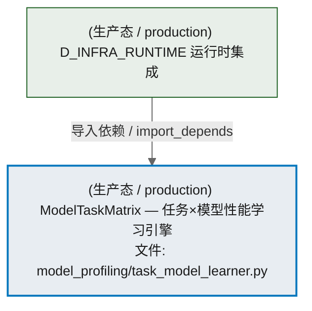
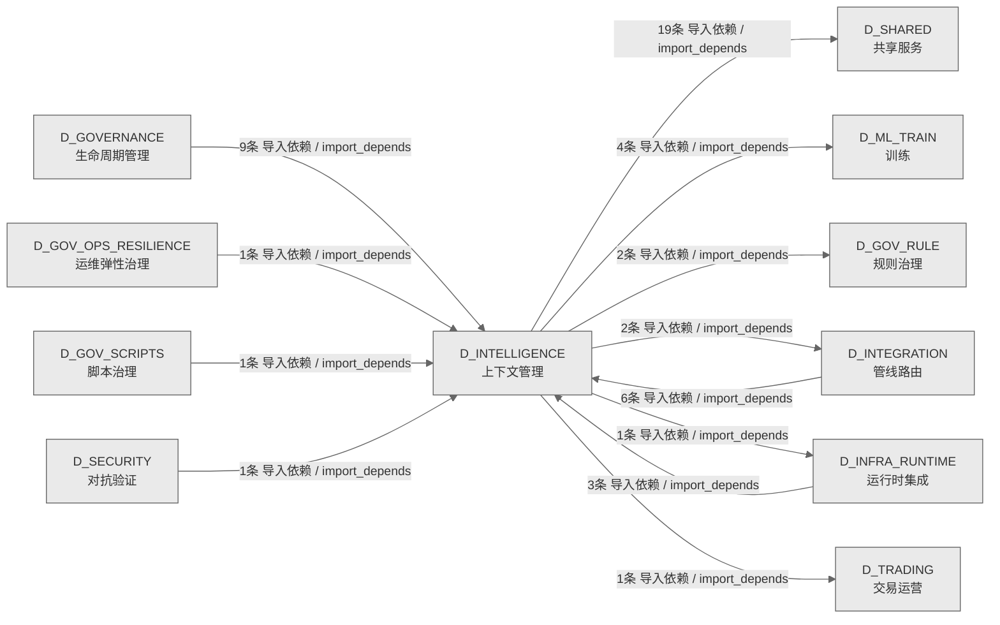

# 57_d_intelligence / 上下文管理 / Context Management

> **功能简介 / Overview**: 上下文管理，负责 AI 上下文窗口管理、记忆检索和上下文压缩

> **文档作用 / Purpose**: 展示 上下文管理（D_INTELLIGENCE）功能域的模块清单、域内依赖关系、跨域依赖关系、架构分层视图，供架构审查和域治理参考。

> 本文档由 generate_domain_doc.py 从 depgraph (PostgreSQL) 自动生成
> 数据源: depgraph (PostgreSQL) nodes表 + edges表

## 域基本信息 / Domain Overview

| 字段 | 值 | Field | Value |
|------|------|-------|-------|
| 编号 | 57 | Number | 57 |
| 域ID | D_INTELLIGENCE | Domain ID | D_INTELLIGENCE |
| 域名称 | 上下文管理 | Domain Name | Context Management |
| 层级 | L2 业务域层 | Layer | L2 Domain |
| 模块数 | 31 | Module Count | 31 |
| 域内依赖 | 27 | Internal Dependencies | 27 |
| 跨域入边 | 21 | Cross-domain Incoming | 21 |
| 跨域出边 | 29 | Cross-domain Outgoing | 29 |
| 设计态模块 | 0 | Design Modules | 0 |
| 生产态模块 | 31 | Production Modules | 31 |
| 容量 | 31/150 (正常) | Capacity | 31/150 (正常) |
| 描述 | 上下文预算管理(context_budget/token_budget) | Description | 上下文预算管理(context_budget/token_budget) |

## 模块分层清单 / Module Layered List

> 按 architecture_layer 分组的模块清单（共 31 个模块 / 31 modules）。

### L2 领域层 / Domain Layer (31 modules)

| # | 模块路径 / Module Path | 模块名称 / Module Name (功能简介 / Description) | 成熟度 / Maturity | 蓝图 / Blueprint |
|:--:|---------|---------|:---:|:---:|
| 1 | scripts/calibrate_model_diff.py | 模型能力差异校准脚本（P1-3 治本）。 | 生产态 / production |  |
| 2 | scripts/quick_profile.py | 模型快速能力画像脚本 (P2 三级模式 Quick 入口)。 | 生产态 / production |  |
| 3 | src/zephyr/intelligence/model_drift_detector.py | ModelDriftDetector — LLM 模型行为漂移检测。 | 生产态 / production |  |
| 4 | src/zephyr/intelligence/model_evaluation/_memory_backend.py | Backend protocol & shared data classes for the unified memory layer. | 生产态 / production |  |
| 5 | src/zephyr/intelligence/model_evaluation/activate.py | G4 Activate 门禁 — 人工激活（T-2-13-D） | 生产态 / production |  |
| 6 | src/zephyr/intelligence/model_evaluation/implementations/... | D_ML_TRAIN — Default Inference Engine | 生产态 / production |  |
| 7 | src/zephyr/intelligence/model_evaluation/inference_base.py | model_evaluation/inference_base.py | 生产态 / production |  |
| 8 | src/zephyr/intelligence/model_evaluation/reranker.py | Cross-Encoder 重排序层 — BGE-reranker-v2-m3 | 生产态 / production |  |
| 9 | src/zephyr/intelligence/model_evaluation/unified_memory_a... | UnifiedMemoryAPI — RI-02 统一记忆 API（M2 跨模块封装） | 生产态 / production |  |
| 10 | src/zephyr/intelligence/model_profiling/benchmark_suite.py | BenchmarkSuite — 多维度模型性能测试用例集 | 生产态 / production |  |
| 11 | src/zephyr/intelligence/model_profiling/capability_passpo... | CapabilityPassport --- AI 模型能力护照 | 生产态 / production |  |
| 12 | src/zephyr/intelligence/model_profiling/case_assembler.py | 真实多文件注入装配器（Phase 3 极限深度）。 | 生产态 / production |  |
| 13 | src/zephyr/intelligence/model_profiling/cli.py | model-profiler.cli — 模型性能检测命令行入口 | 生产态 / production |  |
| 14 | src/zephyr/intelligence/model_profiling/deepseek_v4_chat.py | DeepSeekV4Chat --- DeepSeek V4 系列模型 API 客户端 | 生产态 / production |  |
| 15 | src/zephyr/intelligence/model_profiling/exam_checks.py | exam_checks.py — 考试检测纯函数模块（Stage 4 试点：从 exam_orchestrator 提取） | 生产态 / production |  |
| 16 | src/zephyr/intelligence/model_profiling/exam_executor.py | ExamExecutor --- 执行式代码评测（HumanEval pass@1 风格，v3.0.5）。 | 生产态 / production |  |
| 17 | src/zephyr/intelligence/model_profiling/exam_judge.py | ExamJudge --- LLM-as-judge 评分器 | 生产态 / production |  |
| 18 | src/zephyr/intelligence/model_profiling/exam_orchestrator.py | ExamOrchestrator --- 五轴入职考试主控 | 生产态 / production |  |
| 19 | src/zephyr/intelligence/model_profiling/exam_rubric.py | ExamRubric --- 奥赛题结构化多维清单评分（v3.0.5）。 | 生产态 / production |  |
| 20 | src/zephyr/intelligence/model_profiling/exam_test_cases.py | ExamTestCases --- v3.0.5 扩展考试题库（96 题 / 29 能力 / 5 难度） | 生产态 / production |  |
| 21 | src/zephyr/intelligence/model_profiling/job_matcher.py | JobMatcher --- 模型岗位匹配器 | 生产态 / production |  |
| 22 | src/zephyr/intelligence/model_profiling/model_discovery.py | ModelDiscovery — 枚举所有本地 Ollama 模型 + 远程 API 模型 | 生产态 / production |  |
| 23 | src/zephyr/intelligence/model_profiling/pipeline_routing/... | BenchmarkSuite — 多维度模型性能测试用例集 | 生产态 / production |  |
| 24 | src/zephyr/intelligence/model_profiling/pipeline_routing/... | model-profiler.cli — 模型性能检测命令行入口 | 生产态 / production |  |
| 25 | src/zephyr/intelligence/model_profiling/pipeline_routing/... | ModelProfiler — 核心性能分析引擎 | 生产态 / production |  |
| 26 | src/zephyr/intelligence/model_profiling/pipeline_routing/... | Results Writer — 持久化 benchmark 结果，支持历史对比（漂移检测） | 生产态 / production |  |
| 27 | src/zephyr/intelligence/model_profiling/pipeline_routing/... | ModelTaskMatrix — 任务×模型性能学习引擎 | 生产态 / production |  |
| 28 | src/zephyr/intelligence/model_profiling/profiler.py | ModelProfiler — 核心性能分析引擎 | 生产态 / production |  |
| 29 | src/zephyr/intelligence/model_profiling/provider_data.py | model_profiling/provider_data.py | 生产态 / production |  |
| 30 | src/zephyr/intelligence/model_profiling/results_writer.py | Results Writer — 持久化 benchmark 结果，支持历史对比（漂移检测） | 生产态 / production |  |
| 31 | src/zephyr/intelligence/model_profiling/task_model_learne... | ModelTaskMatrix — 任务×模型性能学习引擎 | 生产态 / production |  |

## 域内依赖图 / Internal Dependency Diagram

> 依赖图内嵌在本文档中，IDE 可直接渲染显示。参考 decision_index.md 设计，分三个视图：合并全景图、运营态子图、设计态子图（按 design_maturity 实际值拆分）。
>
> **图例说明 / Legend**：
> - **实线边框 = 运营态模块**（production，已上线运行）
> - **虚线边框 = 设计态模块**（design，蓝图阶段，代码未写）
> - **实线箭头 = 运营态依赖**（已生效的依赖关系）
> - **虚线箭头 = 非运营态依赖**（计划中/验证中的依赖关系）

### 合并全景图（全部模块，标签标注成熟度）

> 展示全部 31 个模块（生产态 31 + 设计态 0），标签标注成熟度。

#### 第 1 页 / 共 2 页

```mermaid
%%{init: {'theme': 'base', 'themeVariables': {'primaryColor': '#eaeaea', 'primaryTextColor': '#333333', 'primaryBorderColor': '#666666', 'lineColor': '#666666', 'secondaryColor': '#eaeaea', 'tertiaryColor': '#eaeaea', 'fontSize': '14px'}}}%%
flowchart TD
    scripts_calibrate_model_diff_py["(生产态 / production) 模型能力差异校准脚本（P1-3 治本）。<br/>文件: scripts/calibrate_model_diff.py"]
    scripts_quick_profile_py["(生产态 / production) 模型快速能力画像脚本 (P2 三级模式 Quick 入口)。<br/>文件: scripts/quick_profile.py"]
    src_zephyr_intelligence_model_drift_detector_py["(生产态 / production) ModelDriftDetector — LLM 模型行为漂移检测。<br/>文件: intelligence/model_drift_detector.py"]
    src_zephyr_intelligence_model_evaluation_activate_py["(生产态 / production) G4 Activate 门禁 — 人工激活（T-2-13-D）<br/>文件: model_evaluation/activate.py"]
    src_zephyr_intelligence_model_evaluation_implementations_default_inference_engine_py["(生产态 / production) D_ML_TRAIN — Default Inference Engine<br/>文件: implementations/default_inference_engine.py"]
    src_zephyr_intelligence_model_evaluation_inference_base_py["(生产态 / production) model_evaluation/inference_base.py"]
    src_zephyr_intelligence_model_evaluation_reranker_py["(生产态 / production) Cross-Encoder 重排序层 — BGE-reranker-v2-m3<br/>文件: model_evaluation/reranker.py"]
    src_zephyr_intelligence_model_evaluation_unified_memory_api_py["(生产态 / production) UnifiedMemoryAPI — RI-02 统一记忆 API（M2 跨模块封装）<br/>文件: model_evaluation/unified_memory_api.py"]
    src_zephyr_intelligence_model_profiling_cli_py["(生产态 / production) model-profiler.cli — 模型性能检测命令行入口<br/>文件: model_profiling/cli.py"]
    src_zephyr_intelligence_model_profiling_deepseek_v4_chat_py["(生产态 / production) DeepSeekV4Chat --- DeepSeek V4 系列模型 API 客户端<br/>文件: model_profiling/deepseek_v4_chat.py"]
    src_zephyr_intelligence_model_profiling_pipeline_routing_cli_py["(生产态 / production) model-profiler.cli — 模型性能检测命令行入口<br/>文件: pipeline_routing/cli.py"]
    src_zephyr_intelligence_model_profiling_pipeline_routing_task_model_learner_py["(生产态 / production) ModelTaskMatrix — 任务×模型性能学习引擎<br/>文件: pipeline_routing/task_model_learner.py"]
    scripts_calibrate_model_diff_py ~~~ scripts_quick_profile_py
    scripts_quick_profile_py ~~~ src_zephyr_intelligence_model_drift_detector_py
    src_zephyr_intelligence_model_drift_detector_py ~~~ src_zephyr_intelligence_model_evaluation_activate_py
    src_zephyr_intelligence_model_evaluation_activate_py ~~~ src_zephyr_intelligence_model_evaluation_implementations_default_inference_engine_py
    src_zephyr_intelligence_model_evaluation_implementations_default_inference_engine_py ~~~ src_zephyr_intelligence_model_evaluation_inference_base_py
    src_zephyr_intelligence_model_evaluation_inference_base_py ~~~ src_zephyr_intelligence_model_evaluation_reranker_py
    src_zephyr_intelligence_model_evaluation_reranker_py ~~~ src_zephyr_intelligence_model_evaluation_unified_memory_api_py
    src_zephyr_intelligence_model_evaluation_unified_memory_api_py ~~~ src_zephyr_intelligence_model_profiling_cli_py
    src_zephyr_intelligence_model_profiling_cli_py ~~~ src_zephyr_intelligence_model_profiling_deepseek_v4_chat_py
    src_zephyr_intelligence_model_profiling_deepseek_v4_chat_py ~~~ src_zephyr_intelligence_model_profiling_pipeline_routing_cli_py
    src_zephyr_intelligence_model_profiling_pipeline_routing_cli_py ~~~ src_zephyr_intelligence_model_profiling_pipeline_routing_task_model_learner_py
    src_zephyr_intelligence_model_evaluation_memory_backend_py["(生产态 / production) Backend protocol & shared data classes for the unified memory layer.<br/>文件: model_evaluation/_memory_backend.py"]
    src_zephyr_intelligence_model_profiling_exam_orchestrator_py["(生产态 / production) ExamOrchestrator --- 五轴入职考试主控<br/>文件: model_profiling/exam_orchestrator.py"]
    src_zephyr_intelligence_model_profiling_pipeline_routing_results_writer_py["(生产态 / production) Results Writer — 持久化 benchmark 结果，支持历史对比（漂移检测）<br/>文件: pipeline_routing/results_writer.py"]
    src_zephyr_intelligence_model_profiling_results_writer_py["(生产态 / production) Results Writer — 持久化 benchmark 结果，支持历史对比（漂移检测）<br/>文件: model_profiling/results_writer.py"]
    src_zephyr_intelligence_model_evaluation_memory_backend_py ~~~ src_zephyr_intelligence_model_profiling_exam_orchestrator_py
    src_zephyr_intelligence_model_profiling_exam_orchestrator_py ~~~ src_zephyr_intelligence_model_profiling_pipeline_routing_results_writer_py
    src_zephyr_intelligence_model_profiling_pipeline_routing_results_writer_py ~~~ src_zephyr_intelligence_model_profiling_results_writer_py
    src_zephyr_intelligence_model_profiling_exam_checks_py["(生产态 / production) exam_checks.py — 考试检测纯函数模块（Stage 4 试点：从 exam_orchestrator 提取）<br/>文件: model_profiling/exam_checks.py"]
    src_zephyr_intelligence_model_profiling_exam_executor_py["(生产态 / production) ExamExecutor --- 执行式代码评测（HumanEval pass@1 风格，v3.0.5）。<br/>文件: model_profiling/exam_executor.py"]
    src_zephyr_intelligence_model_profiling_exam_judge_py["(生产态 / production) ExamJudge --- LLM-as-judge 评分器<br/>文件: model_profiling/exam_judge.py"]
    src_zephyr_intelligence_model_profiling_exam_rubric_py["(生产态 / production) ExamRubric --- 奥赛题结构化多维清单评分（v3.0.5）。<br/>文件: model_profiling/exam_rubric.py"]
    src_zephyr_intelligence_model_profiling_job_matcher_py["(生产态 / production) JobMatcher --- 模型岗位匹配器<br/>文件: model_profiling/job_matcher.py"]
    src_zephyr_intelligence_model_profiling_pipeline_routing_profiler_py["(生产态 / production) ModelProfiler — 核心性能分析引擎<br/>文件: pipeline_routing/profiler.py"]
    src_zephyr_intelligence_model_profiling_profiler_py["(生产态 / production) ModelProfiler — 核心性能分析引擎<br/>文件: model_profiling/profiler.py"]
    src_zephyr_intelligence_model_profiling_exam_checks_py ~~~ src_zephyr_intelligence_model_profiling_exam_executor_py
    src_zephyr_intelligence_model_profiling_exam_executor_py ~~~ src_zephyr_intelligence_model_profiling_exam_judge_py
    src_zephyr_intelligence_model_profiling_exam_judge_py ~~~ src_zephyr_intelligence_model_profiling_exam_rubric_py
    src_zephyr_intelligence_model_profiling_exam_rubric_py ~~~ src_zephyr_intelligence_model_profiling_job_matcher_py
    src_zephyr_intelligence_model_profiling_job_matcher_py ~~~ src_zephyr_intelligence_model_profiling_pipeline_routing_profiler_py
    src_zephyr_intelligence_model_profiling_pipeline_routing_profiler_py ~~~ src_zephyr_intelligence_model_profiling_profiler_py
    src_zephyr_intelligence_model_profiling_benchmark_suite_py["(生产态 / production) BenchmarkSuite — 多维度模型性能测试用例集<br/>文件: model_profiling/benchmark_suite.py"]
    src_zephyr_intelligence_model_profiling_capability_passport_py["(生产态 / production) CapabilityPassport --- AI 模型能力护照<br/>文件: model_profiling/capability_passport.py"]
    src_zephyr_intelligence_model_profiling_exam_test_cases_py["(生产态 / production) ExamTestCases --- v3.0.5 扩展考试题库（96 题 / 29 能力 / 5 难度）<br/>文件: model_profiling/exam_test_cases.py"]
    src_zephyr_intelligence_model_profiling_model_discovery_py["(生产态 / production) ModelDiscovery — 枚举所有本地 Ollama 模型 + 远程 API 模型<br/>文件: model_profiling/model_discovery.py"]
    src_zephyr_intelligence_model_profiling_pipeline_routing_benchmark_suite_py["(生产态 / production) BenchmarkSuite — 多维度模型性能测试用例集<br/>文件: pipeline_routing/benchmark_suite.py"]
    src_zephyr_intelligence_model_profiling_benchmark_suite_py ~~~ src_zephyr_intelligence_model_profiling_capability_passport_py
    src_zephyr_intelligence_model_profiling_capability_passport_py ~~~ src_zephyr_intelligence_model_profiling_exam_test_cases_py
    src_zephyr_intelligence_model_profiling_exam_test_cases_py ~~~ src_zephyr_intelligence_model_profiling_model_discovery_py
    src_zephyr_intelligence_model_profiling_model_discovery_py ~~~ src_zephyr_intelligence_model_profiling_pipeline_routing_benchmark_suite_py
    src_zephyr_intelligence_model_profiling_case_assembler_py["(生产态 / production) 真实多文件注入装配器（Phase 3 极限深度）。<br/>文件: model_profiling/case_assembler.py"]
    src_zephyr_intelligence_model_profiling_provider_data_py["(生产态 / production) model_profiling/provider_data.py"]
    src_zephyr_intelligence_model_profiling_case_assembler_py ~~~ src_zephyr_intelligence_model_profiling_provider_data_py
    src_zephyr_intelligence_model_evaluation_unified_memory_api_py -->|导入依赖 / import_depends| src_zephyr_intelligence_model_evaluation_memory_backend_py
    src_zephyr_intelligence_model_profiling_cli_py -->|导入依赖 / import_depends| src_zephyr_intelligence_model_profiling_results_writer_py
    src_zephyr_intelligence_model_profiling_exam_orchestrator_py -->|导入依赖 / import_depends| src_zephyr_intelligence_model_profiling_capability_passport_py
    src_zephyr_intelligence_model_profiling_exam_orchestrator_py -->|导入依赖 / import_depends| src_zephyr_intelligence_model_profiling_exam_executor_py
    src_zephyr_intelligence_model_profiling_exam_orchestrator_py -->|导入依赖 / import_depends| src_zephyr_intelligence_model_profiling_exam_rubric_py
    src_zephyr_intelligence_model_profiling_exam_orchestrator_py -->|导入依赖 / import_depends| src_zephyr_intelligence_model_profiling_exam_judge_py
    src_zephyr_intelligence_model_profiling_exam_orchestrator_py -->|导入依赖 / import_depends| src_zephyr_intelligence_model_profiling_job_matcher_py
    src_zephyr_intelligence_model_profiling_exam_orchestrator_py -->|导入依赖 / import_depends| src_zephyr_intelligence_model_profiling_exam_checks_py
    src_zephyr_intelligence_model_profiling_exam_orchestrator_py -->|导入依赖 / import_depends| src_zephyr_intelligence_model_profiling_exam_test_cases_py
    src_zephyr_intelligence_model_profiling_exam_orchestrator_py -->|导入依赖 / import_depends| src_zephyr_intelligence_model_profiling_provider_data_py
    src_zephyr_intelligence_model_profiling_job_matcher_py -->|导入依赖 / import_depends| src_zephyr_intelligence_model_profiling_capability_passport_py
    src_zephyr_intelligence_model_profiling_exam_checks_py -->|导入依赖 / import_depends| src_zephyr_intelligence_model_profiling_exam_test_cases_py
    src_zephyr_intelligence_model_profiling_model_discovery_py -->|导入依赖 / import_depends| src_zephyr_intelligence_model_profiling_provider_data_py
    src_zephyr_intelligence_model_profiling_profiler_py -->|导入依赖 / import_depends| src_zephyr_intelligence_model_profiling_benchmark_suite_py
    src_zephyr_intelligence_model_profiling_profiler_py -->|导入依赖 / import_depends| src_zephyr_intelligence_model_profiling_model_discovery_py
    src_zephyr_intelligence_model_profiling_exam_test_cases_py -->|导入依赖 / import_depends| src_zephyr_intelligence_model_profiling_case_assembler_py
    src_zephyr_intelligence_model_profiling_results_writer_py -->|导入依赖 / import_depends| src_zephyr_intelligence_model_profiling_profiler_py
    src_zephyr_intelligence_model_profiling_pipeline_routing_cli_py -->|导入依赖 / import_depends| src_zephyr_intelligence_model_profiling_model_discovery_py
    src_zephyr_intelligence_model_profiling_pipeline_routing_cli_py -->|导入依赖 / import_depends| src_zephyr_intelligence_model_profiling_pipeline_routing_results_writer_py
    src_zephyr_intelligence_model_profiling_pipeline_routing_cli_py -->|导入依赖 / import_depends| src_zephyr_intelligence_model_profiling_pipeline_routing_profiler_py
    src_zephyr_intelligence_model_profiling_pipeline_routing_results_writer_py -->|导入依赖 / import_depends| src_zephyr_intelligence_model_profiling_pipeline_routing_profiler_py
    src_zephyr_intelligence_model_profiling_pipeline_routing_profiler_py -->|导入依赖 / import_depends| src_zephyr_intelligence_model_profiling_model_discovery_py
    src_zephyr_intelligence_model_profiling_pipeline_routing_profiler_py -->|导入依赖 / import_depends| src_zephyr_intelligence_model_profiling_pipeline_routing_benchmark_suite_py
    scripts_calibrate_model_diff_py -->|导入依赖 / import_depends| src_zephyr_intelligence_model_profiling_capability_passport_py
    scripts_quick_profile_py -->|导入依赖 / import_depends| src_zephyr_intelligence_model_profiling_capability_passport_py
    scripts_quick_profile_py -->|导入依赖 / import_depends| src_zephyr_intelligence_model_profiling_exam_orchestrator_py
    scripts_quick_profile_py -->|导入依赖 / import_depends| src_zephyr_intelligence_model_profiling_job_matcher_py
    D_ML_TRAIN["(生产态 / production) D_ML_TRAIN 训练"]
    src_zephyr_intelligence_model_evaluation_inference_base_py -->|导入依赖 / import_depends| D_ML_TRAIN
    D_SHARED["(生产态 / production) D_SHARED 共享服务"]
    src_zephyr_intelligence_model_profiling_exam_executor_py -->|导入依赖 / import_depends| D_SHARED
    D_GOV_RULE["(生产态 / production) D_GOV_RULE 规则治理"]
    src_zephyr_intelligence_model_evaluation_activate_py -->|导入依赖 / import_depends| D_GOV_RULE
    src_zephyr_intelligence_model_profiling_pipeline_routing_profiler_py -->|导入依赖 / import_depends| D_SHARED
    src_zephyr_intelligence_model_profiling_model_discovery_py -->|导入依赖 / import_depends| D_SHARED
    src_zephyr_intelligence_model_profiling_pipeline_routing_results_writer_py -->|导入依赖 / import_depends| D_SHARED
    src_zephyr_intelligence_model_profiling_job_matcher_py -->|导入依赖 / import_depends| D_SHARED
    src_zephyr_intelligence_model_drift_detector_py -->|导入依赖 / import_depends| D_SHARED
    D_INTEGRATION["(生产态 / production) D_INTEGRATION 管线路由"]
    scripts_quick_profile_py -->|导入依赖 / import_depends| D_INTEGRATION
    src_zephyr_intelligence_model_evaluation_unified_memory_api_py -->|导入依赖 / import_depends| D_INTEGRATION
    src_zephyr_intelligence_model_profiling_capability_passport_py -->|导入依赖 / import_depends| D_SHARED
    src_zephyr_intelligence_model_profiling_pipeline_routing_profiler_py -->|导入依赖 / import_depends| D_SHARED
    src_zephyr_intelligence_model_evaluation_inference_base_py -->|导入依赖 / import_depends| D_ML_TRAIN
    src_zephyr_intelligence_model_profiling_case_assembler_py -->|导入依赖 / import_depends| D_SHARED
    src_zephyr_intelligence_model_evaluation_unified_memory_api_py -->|导入依赖 / import_depends| D_SHARED
    D_INTEGRATION -->|导入依赖 / import_depends| src_zephyr_intelligence_model_evaluation_unified_memory_api_py
    D_GOVERNANCE["(生产态 / production) D_GOVERNANCE 生命周期管理"]
    D_GOVERNANCE -->|导入依赖 / import_depends| src_zephyr_intelligence_model_profiling_deepseek_v4_chat_py
    D_GOV_OPS_RESILIENCE["(生产态 / production) D_GOV_OPS_RESILIENCE 运维弹性治理"]
    D_GOV_OPS_RESILIENCE -->|导入依赖 / import_depends| src_zephyr_intelligence_model_evaluation_reranker_py
    D_GOVERNANCE -->|导入依赖 / import_depends| src_zephyr_intelligence_model_profiling_exam_orchestrator_py
    D_INTEGRATION -->|导入依赖 / import_depends| src_zephyr_intelligence_model_profiling_pipeline_routing_profiler_py
    D_INTEGRATION -->|导入依赖 / import_depends| src_zephyr_intelligence_model_evaluation_unified_memory_api_py
    D_GOVERNANCE -->|导入依赖 / import_depends| src_zephyr_intelligence_model_profiling_deepseek_v4_chat_py
    D_INTEGRATION -->|导入依赖 / import_depends| src_zephyr_intelligence_model_evaluation_reranker_py
    D_GOV_SCRIPTS["(生产态 / production) D_GOV_SCRIPTS 脚本治理"]
    D_GOV_SCRIPTS -->|导入依赖 / import_depends| src_zephyr_intelligence_model_profiling_exam_test_cases_py
    D_INFRA_RUNTIME["(生产态 / production) D_INFRA_RUNTIME 运行时集成"]
    D_INFRA_RUNTIME -->|导入依赖 / import_depends| src_zephyr_intelligence_model_profiling_results_writer_py
    D_INFRA_RUNTIME -->|导入依赖 / import_depends| src_zephyr_intelligence_model_profiling_capability_passport_py
    D_GOVERNANCE -->|导入依赖 / import_depends| src_zephyr_intelligence_model_profiling_results_writer_py
    D_GOVERNANCE -->|导入依赖 / import_depends| src_zephyr_intelligence_model_profiling_exam_orchestrator_py
    D_GOVERNANCE -->|导入依赖 / import_depends| src_zephyr_intelligence_model_evaluation_implementations_default_inference_engine_py
    D_INTEGRATION -->|导入依赖 / import_depends| src_zephyr_intelligence_model_profiling_pipeline_routing_results_writer_py
    classDef production fill:#e8edf2,stroke:#0277bd,stroke-width:2px,color:#1a1a1a
    classDef design fill:#f0ebe3,stroke:#bf360c,stroke-width:2px,color:#1a1a1a,stroke-dasharray: 5 5
    classDef external_prod fill:#e8efe9,stroke:#1b5e20,stroke-width:1px,color:#1a1a1a
    classDef external_design fill:#efe5ea,stroke:#880e4f,stroke-width:1px,color:#1a1a1a,stroke-dasharray: 5 5
    class scripts_calibrate_model_diff_py,scripts_quick_profile_py,src_zephyr_intelligence_model_drift_detector_py,src_zephyr_intelligence_model_evaluation_memory_backend_py,src_zephyr_intelligence_model_evaluation_activate_py,src_zephyr_intelligence_model_evaluation_implementations_default_inference_engine_py,src_zephyr_intelligence_model_evaluation_inference_base_py,src_zephyr_intelligence_model_evaluation_reranker_py,src_zephyr_intelligence_model_evaluation_unified_memory_api_py,src_zephyr_intelligence_model_profiling_benchmark_suite_py,src_zephyr_intelligence_model_profiling_capability_passport_py,src_zephyr_intelligence_model_profiling_case_assembler_py,src_zephyr_intelligence_model_profiling_cli_py,src_zephyr_intelligence_model_profiling_deepseek_v4_chat_py,src_zephyr_intelligence_model_profiling_exam_checks_py,src_zephyr_intelligence_model_profiling_exam_executor_py,src_zephyr_intelligence_model_profiling_exam_judge_py,src_zephyr_intelligence_model_profiling_exam_orchestrator_py,src_zephyr_intelligence_model_profiling_exam_rubric_py,src_zephyr_intelligence_model_profiling_exam_test_cases_py,src_zephyr_intelligence_model_profiling_job_matcher_py,src_zephyr_intelligence_model_profiling_model_discovery_py,src_zephyr_intelligence_model_profiling_pipeline_routing_benchmark_suite_py,src_zephyr_intelligence_model_profiling_pipeline_routing_cli_py,src_zephyr_intelligence_model_profiling_pipeline_routing_profiler_py,src_zephyr_intelligence_model_profiling_pipeline_routing_results_writer_py,src_zephyr_intelligence_model_profiling_pipeline_routing_task_model_learner_py,src_zephyr_intelligence_model_profiling_profiler_py,src_zephyr_intelligence_model_profiling_provider_data_py,src_zephyr_intelligence_model_profiling_results_writer_py production
    class D_ML_TRAIN,D_SHARED,D_GOV_RULE,D_INTEGRATION,D_GOVERNANCE,D_GOV_OPS_RESILIENCE,D_GOV_SCRIPTS,D_INFRA_RUNTIME external_prod
```

#### 第 2 页 / 共 2 页



### 运营态子图（仅 design_maturity=production 的模块和依赖）

> 仅展示已上线运行的模块（共 31 个，27 条域内依赖）。

```mermaid
%%{init: {'theme': 'base', 'themeVariables': {'primaryColor': '#eaeaea', 'primaryTextColor': '#333333', 'primaryBorderColor': '#666666', 'lineColor': '#666666', 'secondaryColor': '#eaeaea', 'tertiaryColor': '#eaeaea', 'fontSize': '14px'}}}%%
flowchart TD
    scripts_calibrate_model_diff_py["(生产态 / production) 模型能力差异校准脚本（P1-3 治本）。<br/>文件: scripts/calibrate_model_diff.py"]
    scripts_quick_profile_py["(生产态 / production) 模型快速能力画像脚本 (P2 三级模式 Quick 入口)。<br/>文件: scripts/quick_profile.py"]
    src_zephyr_intelligence_model_drift_detector_py["(生产态 / production) ModelDriftDetector — LLM 模型行为漂移检测。<br/>文件: intelligence/model_drift_detector.py"]
    src_zephyr_intelligence_model_evaluation_activate_py["(生产态 / production) G4 Activate 门禁 — 人工激活（T-2-13-D）<br/>文件: model_evaluation/activate.py"]
    src_zephyr_intelligence_model_evaluation_implementations_default_inference_engine_py["(生产态 / production) D_ML_TRAIN — Default Inference Engine<br/>文件: implementations/default_inference_engine.py"]
    src_zephyr_intelligence_model_evaluation_inference_base_py["(生产态 / production) model_evaluation/inference_base.py"]
    src_zephyr_intelligence_model_evaluation_reranker_py["(生产态 / production) Cross-Encoder 重排序层 — BGE-reranker-v2-m3<br/>文件: model_evaluation/reranker.py"]
    src_zephyr_intelligence_model_evaluation_unified_memory_api_py["(生产态 / production) UnifiedMemoryAPI — RI-02 统一记忆 API（M2 跨模块封装）<br/>文件: model_evaluation/unified_memory_api.py"]
    src_zephyr_intelligence_model_profiling_cli_py["(生产态 / production) model-profiler.cli — 模型性能检测命令行入口<br/>文件: model_profiling/cli.py"]
    src_zephyr_intelligence_model_profiling_deepseek_v4_chat_py["(生产态 / production) DeepSeekV4Chat --- DeepSeek V4 系列模型 API 客户端<br/>文件: model_profiling/deepseek_v4_chat.py"]
    src_zephyr_intelligence_model_profiling_pipeline_routing_cli_py["(生产态 / production) model-profiler.cli — 模型性能检测命令行入口<br/>文件: pipeline_routing/cli.py"]
    src_zephyr_intelligence_model_profiling_pipeline_routing_task_model_learner_py["(生产态 / production) ModelTaskMatrix — 任务×模型性能学习引擎<br/>文件: pipeline_routing/task_model_learner.py"]
    src_zephyr_intelligence_model_profiling_task_model_learner_py["(生产态 / production) ModelTaskMatrix — 任务×模型性能学习引擎<br/>文件: model_profiling/task_model_learner.py"]
    scripts_calibrate_model_diff_py ~~~ scripts_quick_profile_py
    scripts_quick_profile_py ~~~ src_zephyr_intelligence_model_drift_detector_py
    src_zephyr_intelligence_model_drift_detector_py ~~~ src_zephyr_intelligence_model_evaluation_activate_py
    src_zephyr_intelligence_model_evaluation_activate_py ~~~ src_zephyr_intelligence_model_evaluation_implementations_default_inference_engine_py
    src_zephyr_intelligence_model_evaluation_implementations_default_inference_engine_py ~~~ src_zephyr_intelligence_model_evaluation_inference_base_py
    src_zephyr_intelligence_model_evaluation_inference_base_py ~~~ src_zephyr_intelligence_model_evaluation_reranker_py
    src_zephyr_intelligence_model_evaluation_reranker_py ~~~ src_zephyr_intelligence_model_evaluation_unified_memory_api_py
    src_zephyr_intelligence_model_evaluation_unified_memory_api_py ~~~ src_zephyr_intelligence_model_profiling_cli_py
    src_zephyr_intelligence_model_profiling_cli_py ~~~ src_zephyr_intelligence_model_profiling_deepseek_v4_chat_py
    src_zephyr_intelligence_model_profiling_deepseek_v4_chat_py ~~~ src_zephyr_intelligence_model_profiling_pipeline_routing_cli_py
    src_zephyr_intelligence_model_profiling_pipeline_routing_cli_py ~~~ src_zephyr_intelligence_model_profiling_pipeline_routing_task_model_learner_py
    src_zephyr_intelligence_model_profiling_pipeline_routing_task_model_learner_py ~~~ src_zephyr_intelligence_model_profiling_task_model_learner_py
    src_zephyr_intelligence_model_evaluation_memory_backend_py["(生产态 / production) Backend protocol & shared data classes for the unified memory layer.<br/>文件: model_evaluation/_memory_backend.py"]
    src_zephyr_intelligence_model_profiling_exam_orchestrator_py["(生产态 / production) ExamOrchestrator --- 五轴入职考试主控<br/>文件: model_profiling/exam_orchestrator.py"]
    src_zephyr_intelligence_model_profiling_pipeline_routing_results_writer_py["(生产态 / production) Results Writer — 持久化 benchmark 结果，支持历史对比（漂移检测）<br/>文件: pipeline_routing/results_writer.py"]
    src_zephyr_intelligence_model_profiling_results_writer_py["(生产态 / production) Results Writer — 持久化 benchmark 结果，支持历史对比（漂移检测）<br/>文件: model_profiling/results_writer.py"]
    src_zephyr_intelligence_model_evaluation_memory_backend_py ~~~ src_zephyr_intelligence_model_profiling_exam_orchestrator_py
    src_zephyr_intelligence_model_profiling_exam_orchestrator_py ~~~ src_zephyr_intelligence_model_profiling_pipeline_routing_results_writer_py
    src_zephyr_intelligence_model_profiling_pipeline_routing_results_writer_py ~~~ src_zephyr_intelligence_model_profiling_results_writer_py
    src_zephyr_intelligence_model_profiling_exam_checks_py["(生产态 / production) exam_checks.py — 考试检测纯函数模块（Stage 4 试点：从 exam_orchestrator 提取）<br/>文件: model_profiling/exam_checks.py"]
    src_zephyr_intelligence_model_profiling_exam_executor_py["(生产态 / production) ExamExecutor --- 执行式代码评测（HumanEval pass@1 风格，v3.0.5）。<br/>文件: model_profiling/exam_executor.py"]
    src_zephyr_intelligence_model_profiling_exam_judge_py["(生产态 / production) ExamJudge --- LLM-as-judge 评分器<br/>文件: model_profiling/exam_judge.py"]
    src_zephyr_intelligence_model_profiling_exam_rubric_py["(生产态 / production) ExamRubric --- 奥赛题结构化多维清单评分（v3.0.5）。<br/>文件: model_profiling/exam_rubric.py"]
    src_zephyr_intelligence_model_profiling_job_matcher_py["(生产态 / production) JobMatcher --- 模型岗位匹配器<br/>文件: model_profiling/job_matcher.py"]
    src_zephyr_intelligence_model_profiling_pipeline_routing_profiler_py["(生产态 / production) ModelProfiler — 核心性能分析引擎<br/>文件: pipeline_routing/profiler.py"]
    src_zephyr_intelligence_model_profiling_profiler_py["(生产态 / production) ModelProfiler — 核心性能分析引擎<br/>文件: model_profiling/profiler.py"]
    src_zephyr_intelligence_model_profiling_exam_checks_py ~~~ src_zephyr_intelligence_model_profiling_exam_executor_py
    src_zephyr_intelligence_model_profiling_exam_executor_py ~~~ src_zephyr_intelligence_model_profiling_exam_judge_py
    src_zephyr_intelligence_model_profiling_exam_judge_py ~~~ src_zephyr_intelligence_model_profiling_exam_rubric_py
    src_zephyr_intelligence_model_profiling_exam_rubric_py ~~~ src_zephyr_intelligence_model_profiling_job_matcher_py
    src_zephyr_intelligence_model_profiling_job_matcher_py ~~~ src_zephyr_intelligence_model_profiling_pipeline_routing_profiler_py
    src_zephyr_intelligence_model_profiling_pipeline_routing_profiler_py ~~~ src_zephyr_intelligence_model_profiling_profiler_py
    src_zephyr_intelligence_model_profiling_benchmark_suite_py["(生产态 / production) BenchmarkSuite — 多维度模型性能测试用例集<br/>文件: model_profiling/benchmark_suite.py"]
    src_zephyr_intelligence_model_profiling_capability_passport_py["(生产态 / production) CapabilityPassport --- AI 模型能力护照<br/>文件: model_profiling/capability_passport.py"]
    src_zephyr_intelligence_model_profiling_exam_test_cases_py["(生产态 / production) ExamTestCases --- v3.0.5 扩展考试题库（96 题 / 29 能力 / 5 难度）<br/>文件: model_profiling/exam_test_cases.py"]
    src_zephyr_intelligence_model_profiling_model_discovery_py["(生产态 / production) ModelDiscovery — 枚举所有本地 Ollama 模型 + 远程 API 模型<br/>文件: model_profiling/model_discovery.py"]
    src_zephyr_intelligence_model_profiling_pipeline_routing_benchmark_suite_py["(生产态 / production) BenchmarkSuite — 多维度模型性能测试用例集<br/>文件: pipeline_routing/benchmark_suite.py"]
    src_zephyr_intelligence_model_profiling_benchmark_suite_py ~~~ src_zephyr_intelligence_model_profiling_capability_passport_py
    src_zephyr_intelligence_model_profiling_capability_passport_py ~~~ src_zephyr_intelligence_model_profiling_exam_test_cases_py
    src_zephyr_intelligence_model_profiling_exam_test_cases_py ~~~ src_zephyr_intelligence_model_profiling_model_discovery_py
    src_zephyr_intelligence_model_profiling_model_discovery_py ~~~ src_zephyr_intelligence_model_profiling_pipeline_routing_benchmark_suite_py
    src_zephyr_intelligence_model_profiling_case_assembler_py["(生产态 / production) 真实多文件注入装配器（Phase 3 极限深度）。<br/>文件: model_profiling/case_assembler.py"]
    src_zephyr_intelligence_model_profiling_provider_data_py["(生产态 / production) model_profiling/provider_data.py"]
    src_zephyr_intelligence_model_profiling_case_assembler_py ~~~ src_zephyr_intelligence_model_profiling_provider_data_py
    src_zephyr_intelligence_model_evaluation_unified_memory_api_py -->|导入依赖 / import_depends| src_zephyr_intelligence_model_evaluation_memory_backend_py
    src_zephyr_intelligence_model_profiling_cli_py -->|导入依赖 / import_depends| src_zephyr_intelligence_model_profiling_results_writer_py
    src_zephyr_intelligence_model_profiling_exam_orchestrator_py -->|导入依赖 / import_depends| src_zephyr_intelligence_model_profiling_capability_passport_py
    src_zephyr_intelligence_model_profiling_exam_orchestrator_py -->|导入依赖 / import_depends| src_zephyr_intelligence_model_profiling_exam_executor_py
    src_zephyr_intelligence_model_profiling_exam_orchestrator_py -->|导入依赖 / import_depends| src_zephyr_intelligence_model_profiling_exam_rubric_py
    src_zephyr_intelligence_model_profiling_exam_orchestrator_py -->|导入依赖 / import_depends| src_zephyr_intelligence_model_profiling_exam_judge_py
    src_zephyr_intelligence_model_profiling_exam_orchestrator_py -->|导入依赖 / import_depends| src_zephyr_intelligence_model_profiling_job_matcher_py
    src_zephyr_intelligence_model_profiling_exam_orchestrator_py -->|导入依赖 / import_depends| src_zephyr_intelligence_model_profiling_exam_checks_py
    src_zephyr_intelligence_model_profiling_exam_orchestrator_py -->|导入依赖 / import_depends| src_zephyr_intelligence_model_profiling_exam_test_cases_py
    src_zephyr_intelligence_model_profiling_exam_orchestrator_py -->|导入依赖 / import_depends| src_zephyr_intelligence_model_profiling_provider_data_py
    src_zephyr_intelligence_model_profiling_job_matcher_py -->|导入依赖 / import_depends| src_zephyr_intelligence_model_profiling_capability_passport_py
    src_zephyr_intelligence_model_profiling_exam_checks_py -->|导入依赖 / import_depends| src_zephyr_intelligence_model_profiling_exam_test_cases_py
    src_zephyr_intelligence_model_profiling_model_discovery_py -->|导入依赖 / import_depends| src_zephyr_intelligence_model_profiling_provider_data_py
    src_zephyr_intelligence_model_profiling_profiler_py -->|导入依赖 / import_depends| src_zephyr_intelligence_model_profiling_benchmark_suite_py
    src_zephyr_intelligence_model_profiling_profiler_py -->|导入依赖 / import_depends| src_zephyr_intelligence_model_profiling_model_discovery_py
    src_zephyr_intelligence_model_profiling_exam_test_cases_py -->|导入依赖 / import_depends| src_zephyr_intelligence_model_profiling_case_assembler_py
    src_zephyr_intelligence_model_profiling_results_writer_py -->|导入依赖 / import_depends| src_zephyr_intelligence_model_profiling_profiler_py
    src_zephyr_intelligence_model_profiling_pipeline_routing_cli_py -->|导入依赖 / import_depends| src_zephyr_intelligence_model_profiling_model_discovery_py
    src_zephyr_intelligence_model_profiling_pipeline_routing_cli_py -->|导入依赖 / import_depends| src_zephyr_intelligence_model_profiling_pipeline_routing_results_writer_py
    src_zephyr_intelligence_model_profiling_pipeline_routing_cli_py -->|导入依赖 / import_depends| src_zephyr_intelligence_model_profiling_pipeline_routing_profiler_py
    src_zephyr_intelligence_model_profiling_pipeline_routing_results_writer_py -->|导入依赖 / import_depends| src_zephyr_intelligence_model_profiling_pipeline_routing_profiler_py
    src_zephyr_intelligence_model_profiling_pipeline_routing_profiler_py -->|导入依赖 / import_depends| src_zephyr_intelligence_model_profiling_model_discovery_py
    src_zephyr_intelligence_model_profiling_pipeline_routing_profiler_py -->|导入依赖 / import_depends| src_zephyr_intelligence_model_profiling_pipeline_routing_benchmark_suite_py
    scripts_calibrate_model_diff_py -->|导入依赖 / import_depends| src_zephyr_intelligence_model_profiling_capability_passport_py
    scripts_quick_profile_py -->|导入依赖 / import_depends| src_zephyr_intelligence_model_profiling_capability_passport_py
    scripts_quick_profile_py -->|导入依赖 / import_depends| src_zephyr_intelligence_model_profiling_exam_orchestrator_py
    scripts_quick_profile_py -->|导入依赖 / import_depends| src_zephyr_intelligence_model_profiling_job_matcher_py
    D_ML_TRAIN["(生产态 / production) D_ML_TRAIN 训练"]
    src_zephyr_intelligence_model_evaluation_inference_base_py -->|导入依赖 / import_depends| D_ML_TRAIN
    D_SHARED["(生产态 / production) D_SHARED 共享服务"]
    src_zephyr_intelligence_model_profiling_exam_executor_py -->|导入依赖 / import_depends| D_SHARED
    D_GOV_RULE["(生产态 / production) D_GOV_RULE 规则治理"]
    src_zephyr_intelligence_model_evaluation_activate_py -->|导入依赖 / import_depends| D_GOV_RULE
    src_zephyr_intelligence_model_profiling_pipeline_routing_profiler_py -->|导入依赖 / import_depends| D_SHARED
    src_zephyr_intelligence_model_profiling_model_discovery_py -->|导入依赖 / import_depends| D_SHARED
    src_zephyr_intelligence_model_profiling_pipeline_routing_results_writer_py -->|导入依赖 / import_depends| D_SHARED
    src_zephyr_intelligence_model_profiling_job_matcher_py -->|导入依赖 / import_depends| D_SHARED
    src_zephyr_intelligence_model_drift_detector_py -->|导入依赖 / import_depends| D_SHARED
    D_INTEGRATION["(生产态 / production) D_INTEGRATION 管线路由"]
    scripts_quick_profile_py -->|导入依赖 / import_depends| D_INTEGRATION
    src_zephyr_intelligence_model_evaluation_unified_memory_api_py -->|导入依赖 / import_depends| D_INTEGRATION
    src_zephyr_intelligence_model_profiling_capability_passport_py -->|导入依赖 / import_depends| D_SHARED
    src_zephyr_intelligence_model_profiling_pipeline_routing_profiler_py -->|导入依赖 / import_depends| D_SHARED
    src_zephyr_intelligence_model_evaluation_inference_base_py -->|导入依赖 / import_depends| D_ML_TRAIN
    src_zephyr_intelligence_model_profiling_case_assembler_py -->|导入依赖 / import_depends| D_SHARED
    src_zephyr_intelligence_model_evaluation_unified_memory_api_py -->|导入依赖 / import_depends| D_SHARED
    D_INTEGRATION -->|导入依赖 / import_depends| src_zephyr_intelligence_model_evaluation_unified_memory_api_py
    D_GOVERNANCE["(生产态 / production) D_GOVERNANCE 生命周期管理"]
    D_GOVERNANCE -->|导入依赖 / import_depends| src_zephyr_intelligence_model_profiling_deepseek_v4_chat_py
    D_GOV_OPS_RESILIENCE["(生产态 / production) D_GOV_OPS_RESILIENCE 运维弹性治理"]
    D_GOV_OPS_RESILIENCE -->|导入依赖 / import_depends| src_zephyr_intelligence_model_evaluation_reranker_py
    D_GOVERNANCE -->|导入依赖 / import_depends| src_zephyr_intelligence_model_profiling_exam_orchestrator_py
    D_INFRA_RUNTIME["(生产态 / production) D_INFRA_RUNTIME 运行时集成"]
    D_INFRA_RUNTIME -->|导入依赖 / import_depends| src_zephyr_intelligence_model_profiling_task_model_learner_py
    D_INTEGRATION -->|导入依赖 / import_depends| src_zephyr_intelligence_model_profiling_pipeline_routing_profiler_py
    D_INTEGRATION -->|导入依赖 / import_depends| src_zephyr_intelligence_model_evaluation_unified_memory_api_py
    D_GOVERNANCE -->|导入依赖 / import_depends| src_zephyr_intelligence_model_profiling_deepseek_v4_chat_py
    D_INTEGRATION -->|导入依赖 / import_depends| src_zephyr_intelligence_model_evaluation_reranker_py
    D_GOV_SCRIPTS["(生产态 / production) D_GOV_SCRIPTS 脚本治理"]
    D_GOV_SCRIPTS -->|导入依赖 / import_depends| src_zephyr_intelligence_model_profiling_exam_test_cases_py
    D_INFRA_RUNTIME -->|导入依赖 / import_depends| src_zephyr_intelligence_model_profiling_results_writer_py
    D_INFRA_RUNTIME -->|导入依赖 / import_depends| src_zephyr_intelligence_model_profiling_capability_passport_py
    D_GOVERNANCE -->|导入依赖 / import_depends| src_zephyr_intelligence_model_profiling_results_writer_py
    D_GOVERNANCE -->|导入依赖 / import_depends| src_zephyr_intelligence_model_profiling_exam_orchestrator_py
    D_GOVERNANCE -->|导入依赖 / import_depends| src_zephyr_intelligence_model_evaluation_implementations_default_inference_engine_py
    classDef production fill:#e8edf2,stroke:#0277bd,stroke-width:2px,color:#1a1a1a
    classDef design fill:#f0ebe3,stroke:#bf360c,stroke-width:2px,color:#1a1a1a,stroke-dasharray: 5 5
    classDef external_prod fill:#e8efe9,stroke:#1b5e20,stroke-width:1px,color:#1a1a1a
    classDef external_design fill:#efe5ea,stroke:#880e4f,stroke-width:1px,color:#1a1a1a,stroke-dasharray: 5 5
    class scripts_calibrate_model_diff_py,scripts_quick_profile_py,src_zephyr_intelligence_model_drift_detector_py,src_zephyr_intelligence_model_evaluation_memory_backend_py,src_zephyr_intelligence_model_evaluation_activate_py,src_zephyr_intelligence_model_evaluation_implementations_default_inference_engine_py,src_zephyr_intelligence_model_evaluation_inference_base_py,src_zephyr_intelligence_model_evaluation_reranker_py,src_zephyr_intelligence_model_evaluation_unified_memory_api_py,src_zephyr_intelligence_model_profiling_benchmark_suite_py,src_zephyr_intelligence_model_profiling_capability_passport_py,src_zephyr_intelligence_model_profiling_case_assembler_py,src_zephyr_intelligence_model_profiling_cli_py,src_zephyr_intelligence_model_profiling_deepseek_v4_chat_py,src_zephyr_intelligence_model_profiling_exam_checks_py,src_zephyr_intelligence_model_profiling_exam_executor_py,src_zephyr_intelligence_model_profiling_exam_judge_py,src_zephyr_intelligence_model_profiling_exam_orchestrator_py,src_zephyr_intelligence_model_profiling_exam_rubric_py,src_zephyr_intelligence_model_profiling_exam_test_cases_py,src_zephyr_intelligence_model_profiling_job_matcher_py,src_zephyr_intelligence_model_profiling_model_discovery_py,src_zephyr_intelligence_model_profiling_pipeline_routing_benchmark_suite_py,src_zephyr_intelligence_model_profiling_pipeline_routing_cli_py,src_zephyr_intelligence_model_profiling_pipeline_routing_profiler_py,src_zephyr_intelligence_model_profiling_pipeline_routing_results_writer_py,src_zephyr_intelligence_model_profiling_pipeline_routing_task_model_learner_py,src_zephyr_intelligence_model_profiling_profiler_py,src_zephyr_intelligence_model_profiling_provider_data_py,src_zephyr_intelligence_model_profiling_results_writer_py,src_zephyr_intelligence_model_profiling_task_model_learner_py production
    class D_ML_TRAIN,D_SHARED,D_GOV_RULE,D_INTEGRATION,D_GOVERNANCE,D_GOV_OPS_RESILIENCE,D_INFRA_RUNTIME,D_GOV_SCRIPTS external_prod
```

### 设计态子图（仅 design_maturity=design 的模块和依赖）

> 仅展示蓝图阶段、代码未写的设计态模块（共 0 个，0 条域内依赖）。

> （无设计态模块 / No design modules）

## 跨域依赖 / Cross-domain Dependencies

### 本域依赖的其他域（出边）/ Depends On

| # | 本域模块 / Source Module | → | 外部域-目标模块 / Target Module | 依赖类型 / Type |
|:--:|---------|:--:|---------|---------|
| 1 | G4 Activate 门禁 — 人工激活（T-2-13-D） (model... | → | D_GOV_RULE 规则治理: GateEngine — KMS G1-G6 + Orc G0/G7 + 交易 G10-... | 导入依赖 / import_depends |
| 2 | G4 Activate 门禁 — 人工激活（T-2-13-D） (model... | → | D_GOV_RULE 规则治理: 门禁类型定义——GateType 枚举与 gate 相关 datac... | 导入依赖 / import_depends |
| 3 | ModelTaskMatrix — 任务×模型性能学习引擎 (pipe... | → | D_INFRA_RUNTIME 运行时集成: Pipeline 数据模型 (pipeline/models.py) | 导入依赖 / import_depends |
| 4 | 模型快速能力画像脚本 (P2 三级模式 Quick 入口)。... | → | D_INTEGRATION 管线路由: OllamaChat — 通过 Ollama HTTP API 进行本地 LLM... | 导入依赖 / import_depends |
| 5 | UnifiedMemoryAPI — RI-02 统一记忆 API（M2 跨模... | → | D_INTEGRATION 管线路由: VMSMemoryBackend — UnifiedMemoryAPI 的 VMS 后... | 导入依赖 / import_depends |
| 6 | D_ML_TRAIN — Default Inference Engine (impleme... | → | D_ML_TRAIN 训练: D_ML_TRAIN — ML Inference Base (ml_train/infer... | 导入依赖 / import_depends |
| 7 | D_ML_TRAIN — Default Inference Engine (impleme... | → | D_ML_TRAIN 训练: D_ML_TRAIN — ML Training Base (ml_train/traine... | 导入依赖 / import_depends |
| 8 | model_evaluation/inference_base.py | → | D_ML_TRAIN 训练: D_ML_TRAIN — ML Inference Base (ml_train/infer... | 导入依赖 / import_depends |
| 9 | model_evaluation/inference_base.py | → | D_ML_TRAIN 训练: D_ML_TRAIN — ML Training Base (ml_train/traine... | 导入依赖 / import_depends |
| 10 | ModelDriftDetector — LLM 模型行为漂移检测。 (i... | → | D_SHARED 共享服务: paths.py — 项目路径常量 SSoT（Single Source of... | 导入依赖 / import_depends |
| 11 | D_ML_TRAIN — Default Inference Engine (impleme... | → | D_SHARED 共享服务: experiment/model_serving_response.py | 导入依赖 / import_depends |
| 12 | D_ML_TRAIN — Default Inference Engine (impleme... | → | D_SHARED 共享服务: paths.py — 项目路径常量 SSoT（Single Source of... | 导入依赖 / import_depends |
| 13 | UnifiedMemoryAPI — RI-02 统一记忆 API（M2 跨模... | → | D_SHARED 共享服务: CBAC 能力检查器 (Capability-Based Access Contro... | 导入依赖 / import_depends |
| 14 | CapabilityPassport --- AI 模型能力护照 (model_p... | → | D_SHARED 共享服务: paths.py — 项目路径常量 SSoT（Single Source of... | 导入依赖 / import_depends |
| 15 | CapabilityPassport --- AI 模型能力护照 (model_p... | → | D_SHARED 共享服务: serialization.py —— 统一序列化/反序列化基础设... | 导入依赖 / import_depends |
| 16 | CapabilityPassport --- AI 模型能力护照 (model_p... | → | D_SHARED 共享服务: secrets.py —— Secrets 管理抽象（Phase 7 新增 ... | 导入依赖 / import_depends |
| 17 | 真实多文件注入装配器（Phase 3 极限深度）。 (mod... | → | D_SHARED 共享服务: paths.py — 项目路径常量 SSoT（Single Source of... | 导入依赖 / import_depends |
| 18 | DeepSeekV4Chat --- DeepSeek V4 系列模型 API 客... | → | D_SHARED 共享服务: constants.py —— 共享枚举 & 常量集中 re-export... | 导入依赖 / import_depends |
| 19 | DeepSeekV4Chat --- DeepSeek V4 系列模型 API 客... | → | D_SHARED 共享服务: secrets.py —— Secrets 管理抽象（Phase 7 新增 ... | 导入依赖 / import_depends |
| 20 | ExamExecutor --- 执行式代码评测（HumanEval pass... | → | D_SHARED 共享服务: process_pool.py - Shared process pool for MCP s... | 导入依赖 / import_depends |
| 21 | JobMatcher --- 模型岗位匹配器 (model_profiling/... | → | D_SHARED 共享服务: paths.py — 项目路径常量 SSoT（Single Source of... | 导入依赖 / import_depends |
| 22 | ModelDiscovery — 枚举所有本地 Ollama 模型 + 远... | → | D_SHARED 共享服务: constants.py —— 共享枚举 & 常量集中 re-export... | 导入依赖 / import_depends |
| 23 | ModelProfiler — 核心性能分析引擎 (pipeline_rou... | → | D_SHARED 共享服务: constants.py —— 共享枚举 & 常量集中 re-export... | 导入依赖 / import_depends |
| 24 | ModelProfiler — 核心性能分析引擎 (pipeline_rou... | → | D_SHARED 共享服务: time_utils.py —— 时间/日期工具（Phase 9 新增 ... | 导入依赖 / import_depends |
| 25 | Results Writer — 持久化 benchmark 结果，支持历... | → | D_SHARED 共享服务: time_utils.py —— 时间/日期工具（Phase 9 新增 ... | 导入依赖 / import_depends |
| 26 | ModelProfiler — 核心性能分析引擎 (model_profil... | → | D_SHARED 共享服务: constants.py —— 共享枚举 & 常量集中 re-export... | 导入依赖 / import_depends |
| 27 | ModelProfiler — 核心性能分析引擎 (model_profil... | → | D_SHARED 共享服务: time_utils.py —— 时间/日期工具（Phase 9 新增 ... | 导入依赖 / import_depends |
| 28 | Results Writer — 持久化 benchmark 结果，支持历... | → | D_SHARED 共享服务: time_utils.py —— 时间/日期工具（Phase 9 新增 ... | 导入依赖 / import_depends |
| 29 | D_ML_TRAIN — Default Inference Engine (impleme... | → | D_TRADING 交易运营: execution/model_serving_request.py | 导入依赖 / import_depends |

### 依赖本域的其他域（入边）/ Depended By

| # | 外部域-源模块 / Source Module | → | 本域模块 / Target Module | 依赖类型 / Type |
|:--:|---------|:--:|---------|---------|
| 1 | D_GOVERNANCE 生命周期管理: C-track 端到端演示 —— 全流水线一次性运行 (con... | → | D_ML_TRAIN — Default Inference Engine (impleme... | 导入依赖 / import_depends |
| 2 | D_GOVERNANCE 生命周期管理: 诊断 breadth_failed 能力的根因。 (scripts/diagn... | → | DeepSeekV4Chat --- DeepSeek V4 系列模型 API 客... | 导入依赖 / import_depends |
| 3 | D_GOVERNANCE 生命周期管理: 诊断 breadth_failed 能力的根因。 (scripts/diagn... | → | ExamOrchestrator --- 五轴入职考试主控 (model_pr... | 导入依赖 / import_depends |
| 4 | D_GOVERNANCE 生命周期管理: 诊断 breadth_failed 能力的根因。 (scripts/diagn... | → | ExamTestCases --- v3.0.5 扩展考试题库（96 题 / ... | 导入依赖 / import_depends |
| 5 | D_GOVERNANCE 生命周期管理: DeepSeek V4 入职考试运行脚本 (scripts/run_deeps... | → | DeepSeekV4Chat --- DeepSeek V4 系列模型 API 客... | 导入依赖 / import_depends |
| 6 | D_GOVERNANCE 生命周期管理: DeepSeek V4 入职考试运行脚本 (scripts/run_deeps... | → | ExamOrchestrator --- 五轴入职考试主控 (model_pr... | 导入依赖 / import_depends |
| 7 | D_GOVERNANCE 生命周期管理: Ollama 入职考试运行脚本 (scripts/run_ollama_exa... | → | ExamOrchestrator --- 五轴入职考试主控 (model_pr... | 导入依赖 / import_depends |
| 8 | D_GOVERNANCE 生命周期管理: intelligence_governance/model_router.py | → | model_profiling/provider_data.py | 导入依赖 / import_depends |
| 9 | D_GOVERNANCE 生命周期管理: intelligence_governance/model_router.py | → | Results Writer — 持久化 benchmark 结果，支持历... | 导入依赖 / import_depends |
| 10 | D_GOV_OPS_RESILIENCE 运维弹性治理: D-DATA -> ServiceRegistry 注册模块 (ops_governa... | → | Cross-Encoder 重排序层 — BGE-reranker-v2-m3 (m... | 导入依赖 / import_depends |
| 11 | D_GOV_SCRIPTS 脚本治理: 考试题库一致性检查——根因治本，防止"定义-注册... | → | ExamTestCases --- v3.0.5 扩展考试题库（96 题 / ... | 导入依赖 / import_depends |
| 12 | D_INFRA_RUNTIME 运行时集成: AutoRuntimeCore — 三层运行时运营中心（系统大脑... | → | Results Writer — 持久化 benchmark 结果，支持历... | 导入依赖 / import_depends |
| 13 | D_INFRA_RUNTIME 运行时集成: AutoRuntimeCore — 三层运行时运营中心（系统大脑... | → | ModelTaskMatrix — 任务×模型性能学习引擎 (mode... | 导入依赖 / import_depends |
| 14 | D_INFRA_RUNTIME 运行时集成: TaskGate --- 任务门控 (trading/task_gate.py) | → | CapabilityPassport --- AI 模型能力护照 (model_p... | 导入依赖 / import_depends |
| 15 | D_INTEGRATION 管线路由: PipelineOrchestrator — M1-M11 管线协调器 (inte... | → | Cross-Encoder 重排序层 — BGE-reranker-v2-m3 (m... | 导入依赖 / import_depends |
| 16 | D_INTEGRATION 管线路由: PipelineOrchestrator — M1-M11 管线协调器 (inte... | → | ModelProfiler — 核心性能分析引擎 (pipeline_rou... | 导入依赖 / import_depends |
| 17 | D_INTEGRATION 管线路由: PipelineOrchestrator — M1-M11 管线协调器 (inte... | → | Results Writer — 持久化 benchmark 结果，支持历... | 导入依赖 / import_depends |
| 18 | D_INTEGRATION 管线路由: DelegatedVectorMemory — VectorMemoryBase 的 RI... | → | UnifiedMemoryAPI — RI-02 统一记忆 API（M2 跨模... | 导入依赖 / import_depends |
| 19 | D_INTEGRATION 管线路由: VMSMemoryBackend — UnifiedMemoryAPI 的 VMS 后... | → | Backend protocol & shared data classes for the ... | 导入依赖 / import_depends |
| 20 | D_INTEGRATION 管线路由: VMS 共享数据模型 — MOD-INF-011 · 蓝图 §6.1 ... | → | UnifiedMemoryAPI — RI-02 统一记忆 API（M2 跨模... | 导入依赖 / import_depends |
| 21 | D_SECURITY 对抗验证: orphan_judge/kb_bridge.py | → | UnifiedMemoryAPI — RI-02 统一记忆 API（M2 跨模... | 导入依赖 / import_depends |

### 跨域依赖图 / Cross-domain Dependency Diagram

> 本域与 10 个外部域直接连接（出边 29 条 + 入边 21 条 = 50 条）。只显示直接连接的域，不展开具体节点。



## 说明 / Notes

- **数据源 / Data Source**: `depgraph (PostgreSQL)` 的 `nodes`、`edges`、`domains` 表
- **生成器 / Generator**: `generate_domain_doc.py`（G2+G10 合并）
- **维护方式 / Maintenance**: 自动生成，全景图更新时刷新
- **文件名规则 / File Naming**: `{编号:02d}_{域ID小写}.md`，如 `16_d_trading.md`
- **图例说明 / Legend**: `[production]`=已上线 / `[design]`=设计中 / `[unknown]`=未知
