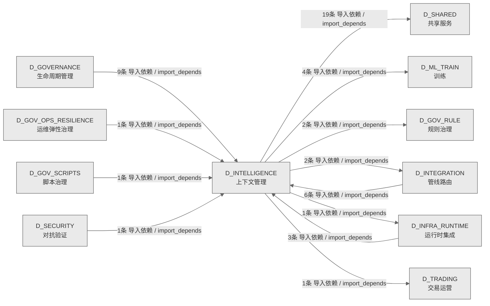

# 57_d_intelligence / 上下文管理域 / Context Management

> **功能简介 / Overview**: 上下文管理，负责 AI 上下文窗口管理、记忆检索和上下文压缩

> **文档作用 / Purpose**: 展示 上下文管理（D_INTELLIGENCE）功能域的域内依赖关系、跨域依赖关系，模块信息（成熟度/中英文名/大白话/文件路径）内嵌于 Mermaid 节点，供架构审查和域治理参考。

> 本文档由 generate_domain_doc.py 从 depgraph (PostgreSQL) 自动生成
> 数据源: depgraph (PostgreSQL) nodes表 + edges表

> **[可缩放 HTML 版 / Zoomable HTML](http://localhost:8765/docs/02_enterprise_architecture/02_domain_architecture_docs/_zoomable_html/57_d_intelligence.html)** — Ctrl+滚轮缩放 ｜ 双击重置 ｜ Ctrl+Shift+D 切换拖动/选择模式

## 域基本信息 / Domain Overview

| 字段 | 值 | Field | Value |
|------|------|-------|-------|
| 编号 | 57 | Number | 57 |
| 域ID | D_INTELLIGENCE | Domain ID | D_INTELLIGENCE |
| 域名称 | 上下文管理 | Domain Name | Context Management |
| 层级 | L2 业务域层 | Layer | L2 Domain |
| 模块数 | 31 | Module Count | 31 |
| 域内依赖 | 27 | Internal Dependencies | 27 |
| 跨域入边 | 21 | Cross-domain Incoming | 21 |
| 跨域出边 | 29 | Cross-domain Outgoing | 29 |
| 设计态模块 | 0 | Design Modules | 0 |
| 生产态模块 | 31 | Production Modules | 31 |
| 容量 | 31/150 (正常) | Capacity | 31/150 (正常) |
| 描述 | 上下文预算管理(context_budget/token_budget) | Description | 上下文预算管理(context_budget/token_budget) |

## 域内依赖图 / Internal Dependency Diagram

> 依赖图内嵌在本文档中，IDE 可直接渲染；网页版可 Ctrl+滚轮缩放 + 拖动平移查看细节。
>
> **图例说明 / Legend**：
> - 🟦 **蓝色 = 运营态模块**（production，已上线运行）
> - 🟧 **橙色虚线 = 设计态模块**（design，蓝图阶段，代码未写）
> - **实线箭头 = 运营态依赖**（已生效的依赖关系）
> - **虚线箭头 = 非运营态依赖**（计划中/验证中的依赖关系）

### 全景图（全部模块，颜色区分运营态/设计态）

> 展示全部 31 个模块（生产态 31 + 设计态 0），含跨域依赖外部节点。节点含成熟度+名称+大白话/简介+文件路径。

```mermaid
%%{init: {'theme': 'base', 'themeVariables': {'primaryColor': '#eaeaea', 'primaryTextColor': '#333333', 'primaryBorderColor': '#666666', 'lineColor': '#666666', 'secondaryColor': '#eaeaea', 'tertiaryColor': '#eaeaea', 'fontSize': '14px'}}}%%
flowchart TD
    scripts_calibrate_model_diff_py["模型能力差异校准脚本（P1-3 治本）。<br/>校准目标: 强模型 vs 弱模型 = 1.2-1.4x 总分比率<br/>calibrate_model_diff<br/>文件: scripts/calibrate_model_diff.py<br/>(生产态 / production)"]
    scripts_quick_profile_py["quick画像<br/>模型快速能力画像脚本 (P2 三级模式 Quick 入口)。<br/>quick_profile<br/>文件: scripts/quick_profile.py<br/>(生产态 / production)"]
    src_zephyr_intelligence_model_drift_detector_py["模型漂移检测器<br/>ModelDriftDetector — LLM 模型行为漂移检测。<br/>model_drift_detector<br/>文件: intelligence/model_drift_detector.py<br/>(生产态 / production)"]
    src_zephyr_intelligence_model_evaluation_activate_py["激活<br/>G4 激活门禁，人工激活阶段生成 Markdown<br/>提案与通知。<br/>activate<br/>文件: model_evaluation/activate.py<br/>(生产态 / production)"]
    src_zephyr_intelligence_model_evaluation_implementations_default_inference_engine_py["默认推理引擎<br/>model evaluation implementations<br/>包入口，整合implementations相关子模块导出<br/>D_ML_TRAIN — Default Inference Engine<br/>文件: implementations<br/>/default_inference_engine.py<br/>(生产态 / production)"]
    src_zephyr_intelligence_model_evaluation_inference_base_py["推理基类<br/>模型的基类，定义抽象接口供子类实现<br/>inference_base<br/>文件: model_evaluation/inference_base.py<br/>(生产态 / production)"]
    src_zephyr_intelligence_model_evaluation_reranker_py["Cross-Encoder 重排序层 — BGE-reranker-v2-m3<br/>蓝图：§5.9 路由级重排序 + §9.4 Reranker截流<br/>文件: model_evaluation/reranker.py<br/>(生产态 / production)"]
    src_zephyr_intelligence_model_evaluation_unified_memory_api_py["unified记忆API<br/>UnifiedMemoryAPI — RI-02 统一记忆 API（M2<br/>跨模块封装）<br/>unified_memory_api<br/>文件: model_evaluation/unified_memory_api.py<br/>(生产态 / production)"]
    src_zephyr_intelligence_model_profiling_cli_py["model_profiling/cli<br/>命令行入口，模型性能检测命令行工具<br/>文件: model_profiling/cli.py<br/>(生产态 / production)"]
    src_zephyr_intelligence_model_profiling_deepseek_v4_chat_py["DeepSeekV4Chat --- DeepSeek V4 系列模型 API<br/>通过 OpenAI SDK 调用 DeepSeek API，支持思考<br/>/非思考模式切换。<br/>deepseek_v4_chat<br/>文件: model_profiling/deepseek_v4_chat.py<br/>(生产态 / production)"]
    src_zephyr_intelligence_model_profiling_pipeline_routing_cli_py["pipeline_routing/cli<br/>命令行入口，管道路由层的模型性能检测命令行工具<br/>文件: pipeline_routing/cli.py<br/>(生产态 / production)"]
    src_zephyr_intelligence_model_profiling_pipeline_routing_task_model_learner_py["任务模型学习器<br/>pipeline routing相关功能（task model learner）<br/>task_model_learner<br/>文件: pipeline_routing/task_model_learner.py<br/>(生产态 / production)"]
    src_zephyr_intelligence_model_profiling_task_model_learner_py["任务模型学习器<br/>model profiling相关功能（task model learner）<br/>task_model_learner<br/>文件: model_profiling/task_model_learner.py<br/>(生产态 / production)"]
    scripts_calibrate_model_diff_py ~~~ scripts_quick_profile_py
    scripts_quick_profile_py ~~~ src_zephyr_intelligence_model_drift_detector_py
    src_zephyr_intelligence_model_drift_detector_py ~~~ src_zephyr_intelligence_model_evaluation_activate_py
    src_zephyr_intelligence_model_evaluation_activate_py ~~~ src_zephyr_intelligence_model_evaluation_implementations_default_inference_engine_py
    src_zephyr_intelligence_model_evaluation_implementations_default_inference_engine_py ~~~ src_zephyr_intelligence_model_evaluation_inference_base_py
    src_zephyr_intelligence_model_evaluation_inference_base_py ~~~ src_zephyr_intelligence_model_evaluation_reranker_py
    src_zephyr_intelligence_model_evaluation_reranker_py ~~~ src_zephyr_intelligence_model_evaluation_unified_memory_api_py
    src_zephyr_intelligence_model_evaluation_unified_memory_api_py ~~~ src_zephyr_intelligence_model_profiling_cli_py
    src_zephyr_intelligence_model_profiling_cli_py ~~~ src_zephyr_intelligence_model_profiling_deepseek_v4_chat_py
    src_zephyr_intelligence_model_profiling_deepseek_v4_chat_py ~~~ src_zephyr_intelligence_model_profiling_pipeline_routing_cli_py
    src_zephyr_intelligence_model_profiling_pipeline_routing_cli_py ~~~ src_zephyr_intelligence_model_profiling_pipeline_routing_task_model_learner_py
    src_zephyr_intelligence_model_profiling_pipeline_routing_task_model_learner_py ~~~ src_zephyr_intelligence_model_profiling_task_model_learner_py
    src_zephyr_intelligence_model_evaluation_memory_backend_py["记忆后端<br/>迁移说明 (2026-07-19)：本文件原位于<br/>zephyr.gov_kb.storage._backend_protocol，<br/>文件: model_evaluation/_memory_backend.py<br/>(生产态 / production)"]
    src_zephyr_intelligence_model_profiling_exam_orchestrator_py["exam编排器<br/>ExamOrchestrator --- 五轴入职考试主控<br/>exam_orchestrator<br/>文件: model_profiling/exam_orchestrator.py<br/>(生产态 / production)"]
    src_zephyr_intelligence_model_profiling_pipeline_routing_results_writer_py["results写入器<br/>结果写入器，管道路由层的基准测试结果持久化与漂移<br/>检测<br/>results_writer<br/>文件: pipeline_routing/results_writer.py<br/>(生产态 / production)"]
    src_zephyr_intelligence_model_profiling_results_writer_py["results写入器<br/>结果写入器，持久化基准测试结果并支持历史对比与漂<br/>移检测<br/>results_writer<br/>文件: model_profiling/results_writer.py<br/>(生产态 / production)"]
    src_zephyr_intelligence_model_evaluation_memory_backend_py ~~~ src_zephyr_intelligence_model_profiling_exam_orchestrator_py
    src_zephyr_intelligence_model_profiling_exam_orchestrator_py ~~~ src_zephyr_intelligence_model_profiling_pipeline_routing_results_writer_py
    src_zephyr_intelligence_model_profiling_pipeline_routing_results_writer_py ~~~ src_zephyr_intelligence_model_profiling_results_writer_py
    src_zephyr_intelligence_model_profiling_exam_checks_py["examchecks.py — 考试检测纯函数模块（Stage 4<br/>试点：从<br/>考试检测纯函数模块（Stage 4 试点：从<br/>exam_orchestrator 提取）<br/>exam_checks<br/>文件: model_profiling/exam_checks.py<br/>(生产态 / production)"]
    src_zephyr_intelligence_model_profiling_exam_executor_py["exam执行器<br/>ExamExecutor --- 执行式代码评测（HumanEval<br/>pass@1 风格，v3.0.5）。<br/>exam_executor<br/>文件: model_profiling/exam_executor.py<br/>(生产态 / production)"]
    src_zephyr_intelligence_model_profiling_exam_judge_py["exam判定<br/>对开放式题（architecture_design/audit<br/>/hallucination_detect/OLYMPIAD题）用强模型<br/>exam_judge<br/>文件: model_profiling/exam_judge.py<br/>(生产态 / production)"]
    src_zephyr_intelligence_model_profiling_exam_rubric_py["ExamRubric --- 奥赛题结构化多维清单评分<br/>（v3.0.5）。<br/>对 OLYMPIAD/EXTREME<br/>难度题做多维精确评分，超越单维关键词/结构匹配。<br/>exam_rubric<br/>文件: model_profiling/exam_rubric.py<br/>(生产态 / production)"]
    src_zephyr_intelligence_model_profiling_job_matcher_py["job匹配器<br/>基于 QuickProfile 的能力分级 + 幻觉率六维细分,<br/>匹配预定义岗位矩阵,<br/>job_matcher<br/>文件: model_profiling/job_matcher.py<br/>(生产态 / production)"]
    src_zephyr_intelligence_model_profiling_pipeline_routing_profiler_py["性能分析器<br/>pipeline routing相关功能（profiler）<br/>文件: pipeline_routing/profiler.py<br/>(生产态 / production)"]
    src_zephyr_intelligence_model_profiling_profiler_py["性能分析器<br/>model profiling相关功能（profiler）<br/>文件: model_profiling/profiler.py<br/>(生产态 / production)"]
    src_zephyr_intelligence_model_profiling_exam_checks_py ~~~ src_zephyr_intelligence_model_profiling_exam_executor_py
    src_zephyr_intelligence_model_profiling_exam_executor_py ~~~ src_zephyr_intelligence_model_profiling_exam_judge_py
    src_zephyr_intelligence_model_profiling_exam_judge_py ~~~ src_zephyr_intelligence_model_profiling_exam_rubric_py
    src_zephyr_intelligence_model_profiling_exam_rubric_py ~~~ src_zephyr_intelligence_model_profiling_job_matcher_py
    src_zephyr_intelligence_model_profiling_job_matcher_py ~~~ src_zephyr_intelligence_model_profiling_pipeline_routing_profiler_py
    src_zephyr_intelligence_model_profiling_pipeline_routing_profiler_py ~~~ src_zephyr_intelligence_model_profiling_profiler_py
    src_zephyr_intelligence_model_profiling_benchmark_suite_py["基准suite<br/>基准测试套件，多维度模型性能测试用例集<br/>benchmark_suite<br/>文件: model_profiling/benchmark_suite.py<br/>(生产态 / production)"]
    src_zephyr_intelligence_model_profiling_capability_passport_py["能力passport<br/>每个模型入职考试完成后产生的 JSON 数据模型。<br/>capability_passport<br/>文件: model_profiling/capability_passport.py<br/>(生产态 / production)"]
    src_zephyr_intelligence_model_profiling_exam_test_cases_py["exam测试cases<br/>0.5 扩展考试题库（96 题 / 29 能力 / 5 难度）<br/>exam_test_cases<br/>文件: model_profiling/exam_test_cases.py<br/>(生产态 / production)"]
    src_zephyr_intelligence_model_profiling_model_discovery_py["模型discovery<br/>ModelDiscovery — 枚举所有本地 Ollama 模型 +<br/>远程 API 模型<br/>model_discovery<br/>文件: model_profiling/model_discovery.py<br/>(生产态 / production)"]
    src_zephyr_intelligence_model_profiling_pipeline_routing_benchmark_suite_py["基准suite<br/>基准测试套件，管道路由层的多维度模型性能测试用例<br/>集<br/>benchmark_suite<br/>文件: pipeline_routing/benchmark_suite.py<br/>(生产态 / production)"]
    src_zephyr_intelligence_model_profiling_benchmark_suite_py ~~~ src_zephyr_intelligence_model_profiling_capability_passport_py
    src_zephyr_intelligence_model_profiling_capability_passport_py ~~~ src_zephyr_intelligence_model_profiling_exam_test_cases_py
    src_zephyr_intelligence_model_profiling_exam_test_cases_py ~~~ src_zephyr_intelligence_model_profiling_model_discovery_py
    src_zephyr_intelligence_model_profiling_model_discovery_py ~~~ src_zephyr_intelligence_model_profiling_pipeline_routing_benchmark_suite_py
    src_zephyr_intelligence_model_profiling_case_assembler_py["真实多文件注入装配器（Phase 3 极限深度）。<br/>从项目 src/scripts<br/>下读取真实治理文件，拼成带文件名标注的大上下文，<br/>case_assembler<br/>文件: model_profiling/case_assembler.py<br/>(生产态 / production)"]
    src_zephyr_intelligence_model_profiling_provider_data_py["提供器数据<br/>模型提供器与分层映射数据常量表，定义默认 LLM<br/>提供商配置和模型分层<br/>（tier）映射，作为模型路由与发现的数据真源。<br/>provider_data<br/>文件: model_profiling/provider_data.py<br/>(生产态 / production)"]
    src_zephyr_intelligence_model_profiling_case_assembler_py ~~~ src_zephyr_intelligence_model_profiling_provider_data_py
    src_zephyr_intelligence_model_evaluation_unified_memory_api_py -->|导入依赖 / import_depends| src_zephyr_intelligence_model_evaluation_memory_backend_py
    src_zephyr_intelligence_model_profiling_exam_checks_py -->|导入依赖 / import_depends| src_zephyr_intelligence_model_profiling_exam_test_cases_py
    src_zephyr_intelligence_model_profiling_cli_py -->|导入依赖 / import_depends| src_zephyr_intelligence_model_profiling_results_writer_py
    src_zephyr_intelligence_model_profiling_exam_orchestrator_py -->|导入依赖 / import_depends| src_zephyr_intelligence_model_profiling_capability_passport_py
    src_zephyr_intelligence_model_profiling_exam_orchestrator_py -->|导入依赖 / import_depends| src_zephyr_intelligence_model_profiling_exam_executor_py
    src_zephyr_intelligence_model_profiling_exam_orchestrator_py -->|导入依赖 / import_depends| src_zephyr_intelligence_model_profiling_exam_checks_py
    src_zephyr_intelligence_model_profiling_exam_orchestrator_py -->|导入依赖 / import_depends| src_zephyr_intelligence_model_profiling_exam_judge_py
    src_zephyr_intelligence_model_profiling_exam_orchestrator_py -->|导入依赖 / import_depends| src_zephyr_intelligence_model_profiling_exam_test_cases_py
    src_zephyr_intelligence_model_profiling_exam_orchestrator_py -->|导入依赖 / import_depends| src_zephyr_intelligence_model_profiling_job_matcher_py
    src_zephyr_intelligence_model_profiling_exam_orchestrator_py -->|导入依赖 / import_depends| src_zephyr_intelligence_model_profiling_exam_rubric_py
    src_zephyr_intelligence_model_profiling_exam_orchestrator_py -->|导入依赖 / import_depends| src_zephyr_intelligence_model_profiling_provider_data_py
    src_zephyr_intelligence_model_profiling_exam_test_cases_py -->|导入依赖 / import_depends| src_zephyr_intelligence_model_profiling_case_assembler_py
    src_zephyr_intelligence_model_profiling_job_matcher_py -->|导入依赖 / import_depends| src_zephyr_intelligence_model_profiling_capability_passport_py
    src_zephyr_intelligence_model_profiling_profiler_py -->|导入依赖 / import_depends| src_zephyr_intelligence_model_profiling_benchmark_suite_py
    src_zephyr_intelligence_model_profiling_profiler_py -->|导入依赖 / import_depends| src_zephyr_intelligence_model_profiling_model_discovery_py
    src_zephyr_intelligence_model_profiling_model_discovery_py -->|导入依赖 / import_depends| src_zephyr_intelligence_model_profiling_provider_data_py
    src_zephyr_intelligence_model_profiling_results_writer_py -->|导入依赖 / import_depends| src_zephyr_intelligence_model_profiling_profiler_py
    src_zephyr_intelligence_model_profiling_pipeline_routing_cli_py -->|导入依赖 / import_depends| src_zephyr_intelligence_model_profiling_model_discovery_py
    src_zephyr_intelligence_model_profiling_pipeline_routing_cli_py -->|导入依赖 / import_depends| src_zephyr_intelligence_model_profiling_pipeline_routing_results_writer_py
    src_zephyr_intelligence_model_profiling_pipeline_routing_cli_py -->|导入依赖 / import_depends| src_zephyr_intelligence_model_profiling_pipeline_routing_profiler_py
    src_zephyr_intelligence_model_profiling_pipeline_routing_results_writer_py -->|导入依赖 / import_depends| src_zephyr_intelligence_model_profiling_pipeline_routing_profiler_py
    src_zephyr_intelligence_model_profiling_pipeline_routing_profiler_py -->|导入依赖 / import_depends| src_zephyr_intelligence_model_profiling_model_discovery_py
    src_zephyr_intelligence_model_profiling_pipeline_routing_profiler_py -->|导入依赖 / import_depends| src_zephyr_intelligence_model_profiling_pipeline_routing_benchmark_suite_py
    scripts_calibrate_model_diff_py -->|导入依赖 / import_depends| src_zephyr_intelligence_model_profiling_capability_passport_py
    scripts_quick_profile_py -->|导入依赖 / import_depends| src_zephyr_intelligence_model_profiling_capability_passport_py
    scripts_quick_profile_py -->|导入依赖 / import_depends| src_zephyr_intelligence_model_profiling_exam_orchestrator_py
    scripts_quick_profile_py -->|导入依赖 / import_depends| src_zephyr_intelligence_model_profiling_job_matcher_py
    D_SHARED["共享服务<br/>共享服务，负责跨域共享的工具、协议和基础服务<br/>Shared Services<br/>跨域节点 / cross-domain<br/>(生产态 / production)"]
    src_zephyr_intelligence_model_profiling_results_writer_py -->|导入依赖 / import_depends| D_SHARED
    D_INFRA_RUNTIME["运行时集成<br/>运行时集成，负责组件生命周期编排、启动钩子和运行<br/>时上下文管理<br/>Runtime Integration<br/>跨域节点 / cross-domain<br/>(生产态 / production)"]
    src_zephyr_intelligence_model_profiling_pipeline_routing_task_model_learner_py -->|导入依赖 / import_depends| D_INFRA_RUNTIME
    D_ML_TRAIN["训练<br/>训练，负责模型训练、特征工程和模型评估<br/>Training<br/>跨域节点 / cross-domain<br/>(生产态 / production)"]
    src_zephyr_intelligence_model_evaluation_inference_base_py -->|导入依赖 / import_depends| D_ML_TRAIN
    src_zephyr_intelligence_model_profiling_case_assembler_py -->|导入依赖 / import_depends| D_SHARED
    src_zephyr_intelligence_model_profiling_pipeline_routing_profiler_py -->|导入依赖 / import_depends| D_SHARED
    src_zephyr_intelligence_model_drift_detector_py -->|导入依赖 / import_depends| D_SHARED
    src_zephyr_intelligence_model_profiling_pipeline_routing_results_writer_py -->|导入依赖 / import_depends| D_SHARED
    src_zephyr_intelligence_model_profiling_exam_executor_py -->|导入依赖 / import_depends| D_SHARED
    D_INTEGRATION["管线路由<br/>管线路由，负责跨域数据流路由、管道编排和集成适配<br/>Pipeline Routing<br/>跨域节点 / cross-domain<br/>(生产态 / production)"]
    scripts_quick_profile_py -->|导入依赖 / import_depends| D_INTEGRATION
    src_zephyr_intelligence_model_evaluation_unified_memory_api_py -->|导入依赖 / import_depends| D_INTEGRATION
    src_zephyr_intelligence_model_profiling_pipeline_routing_profiler_py -->|导入依赖 / import_depends| D_SHARED
    D_GOV_RULE["规则治理<br/>规则治理，负责规则注册、规则版本和规则依赖管理<br/>Rule Governance<br/>跨域节点 / cross-domain<br/>(生产态 / production)"]
    src_zephyr_intelligence_model_evaluation_activate_py -->|导入依赖 / import_depends| D_GOV_RULE
    src_zephyr_intelligence_model_evaluation_unified_memory_api_py -->|导入依赖 / import_depends| D_SHARED
    src_zephyr_intelligence_model_evaluation_inference_base_py -->|导入依赖 / import_depends| D_ML_TRAIN
    src_zephyr_intelligence_model_profiling_model_discovery_py -->|导入依赖 / import_depends| D_SHARED
    D_GOVERNANCE["生命周期管理<br/>生命周期管理，负责蓝图/模块<br/>/任务的声明周期管理和元数据治理<br/>Lifecycle Management<br/>跨域节点 / cross-domain<br/>(生产态 / production)"]
    D_GOVERNANCE -->|导入依赖 / import_depends| src_zephyr_intelligence_model_profiling_results_writer_py
    D_INTEGRATION -->|导入依赖 / import_depends| src_zephyr_intelligence_model_evaluation_unified_memory_api_py
    D_GOVERNANCE -->|导入依赖 / import_depends| src_zephyr_intelligence_model_evaluation_implementations_default_inference_engine_py
    D_INFRA_RUNTIME -->|导入依赖 / import_depends| src_zephyr_intelligence_model_profiling_capability_passport_py
    D_GOV_OPS_RESILIENCE["运维弹性治理<br/>运维弹性治理，负责运维治理、安全治理、弹性治理和<br/>升级协议<br/>Ops Resilience Governance<br/>跨域节点 / cross-domain<br/>(生产态 / production)"]
    D_GOV_OPS_RESILIENCE -->|导入依赖 / import_depends| src_zephyr_intelligence_model_evaluation_reranker_py
    D_GOVERNANCE -->|导入依赖 / import_depends| src_zephyr_intelligence_model_profiling_exam_orchestrator_py
    D_GOVERNANCE -->|导入依赖 / import_depends| src_zephyr_intelligence_model_profiling_exam_orchestrator_py
    D_INTEGRATION -->|导入依赖 / import_depends| src_zephyr_intelligence_model_evaluation_reranker_py
    D_INTEGRATION -->|导入依赖 / import_depends| src_zephyr_intelligence_model_evaluation_unified_memory_api_py
    D_GOVERNANCE -->|导入依赖 / import_depends| src_zephyr_intelligence_model_profiling_deepseek_v4_chat_py
    D_INFRA_RUNTIME -->|导入依赖 / import_depends| src_zephyr_intelligence_model_profiling_task_model_learner_py
    D_GOVERNANCE -->|导入依赖 / import_depends| src_zephyr_intelligence_model_profiling_deepseek_v4_chat_py
    D_GOV_SCRIPTS["脚本治理<br/>脚本治理，负责脚本生命周期管理和脚本质量门禁<br/>Script Governance<br/>跨域节点 / cross-domain<br/>(生产态 / production)"]
    D_GOV_SCRIPTS -->|导入依赖 / import_depends| src_zephyr_intelligence_model_profiling_exam_test_cases_py
    D_INTEGRATION -->|导入依赖 / import_depends| src_zephyr_intelligence_model_profiling_pipeline_routing_profiler_py
    D_INTEGRATION -->|导入依赖 / import_depends| src_zephyr_intelligence_model_profiling_pipeline_routing_results_writer_py
    classDef production fill:#e1f5fe,stroke:#01579b,stroke-width:2px,color:#000
    classDef design fill:#fff3e0,stroke:#e65100,stroke-width:2px,color:#000,stroke-dasharray: 5 5
    classDef external_prod fill:#e8f4fd,stroke:#0277bd,stroke-width:1px,color:#000
    classDef external_design fill:#fff8e7,stroke:#ef6c00,stroke-width:1px,color:#000,stroke-dasharray: 5 5
    class scripts_calibrate_model_diff_py,scripts_quick_profile_py,src_zephyr_intelligence_model_drift_detector_py,src_zephyr_intelligence_model_evaluation_memory_backend_py,src_zephyr_intelligence_model_evaluation_activate_py,src_zephyr_intelligence_model_evaluation_implementations_default_inference_engine_py,src_zephyr_intelligence_model_evaluation_inference_base_py,src_zephyr_intelligence_model_evaluation_reranker_py,src_zephyr_intelligence_model_evaluation_unified_memory_api_py,src_zephyr_intelligence_model_profiling_benchmark_suite_py,src_zephyr_intelligence_model_profiling_capability_passport_py,src_zephyr_intelligence_model_profiling_case_assembler_py,src_zephyr_intelligence_model_profiling_cli_py,src_zephyr_intelligence_model_profiling_deepseek_v4_chat_py,src_zephyr_intelligence_model_profiling_exam_checks_py,src_zephyr_intelligence_model_profiling_exam_executor_py,src_zephyr_intelligence_model_profiling_exam_judge_py,src_zephyr_intelligence_model_profiling_exam_orchestrator_py,src_zephyr_intelligence_model_profiling_exam_rubric_py,src_zephyr_intelligence_model_profiling_exam_test_cases_py,src_zephyr_intelligence_model_profiling_job_matcher_py,src_zephyr_intelligence_model_profiling_model_discovery_py,src_zephyr_intelligence_model_profiling_pipeline_routing_benchmark_suite_py,src_zephyr_intelligence_model_profiling_pipeline_routing_cli_py,src_zephyr_intelligence_model_profiling_pipeline_routing_profiler_py,src_zephyr_intelligence_model_profiling_pipeline_routing_results_writer_py,src_zephyr_intelligence_model_profiling_pipeline_routing_task_model_learner_py,src_zephyr_intelligence_model_profiling_profiler_py,src_zephyr_intelligence_model_profiling_provider_data_py,src_zephyr_intelligence_model_profiling_results_writer_py,src_zephyr_intelligence_model_profiling_task_model_learner_py production
    class D_SHARED,D_INFRA_RUNTIME,D_ML_TRAIN,D_INTEGRATION,D_GOV_RULE,D_GOVERNANCE,D_GOV_OPS_RESILIENCE,D_GOV_SCRIPTS external_prod
```

### 运营态的图（仅 design_maturity=production 的模块和域内依赖）

> 仅展示已上线运行的模块（共 31 个），不含跨域外部节点。跨域依赖见下方跨域依赖章节。

```mermaid
%%{init: {'theme': 'base', 'themeVariables': {'primaryColor': '#eaeaea', 'primaryTextColor': '#333333', 'primaryBorderColor': '#666666', 'lineColor': '#666666', 'secondaryColor': '#eaeaea', 'tertiaryColor': '#eaeaea', 'fontSize': '14px'}}}%%
flowchart TD
    scripts_calibrate_model_diff_py["模型能力差异校准脚本（P1-3 治本）。<br/>校准目标: 强模型 vs 弱模型 = 1.2-1.4x 总分比率<br/>calibrate_model_diff<br/>文件: scripts/calibrate_model_diff.py<br/>(生产态 / production)"]
    scripts_quick_profile_py["quick画像<br/>模型快速能力画像脚本 (P2 三级模式 Quick 入口)。<br/>quick_profile<br/>文件: scripts/quick_profile.py<br/>(生产态 / production)"]
    src_zephyr_intelligence_model_drift_detector_py["模型漂移检测器<br/>ModelDriftDetector — LLM 模型行为漂移检测。<br/>model_drift_detector<br/>文件: intelligence/model_drift_detector.py<br/>(生产态 / production)"]
    src_zephyr_intelligence_model_evaluation_activate_py["激活<br/>G4 激活门禁，人工激活阶段生成 Markdown<br/>提案与通知。<br/>activate<br/>文件: model_evaluation/activate.py<br/>(生产态 / production)"]
    src_zephyr_intelligence_model_evaluation_implementations_default_inference_engine_py["默认推理引擎<br/>model evaluation implementations<br/>包入口，整合implementations相关子模块导出<br/>D_ML_TRAIN — Default Inference Engine<br/>文件: implementations<br/>/default_inference_engine.py<br/>(生产态 / production)"]
    src_zephyr_intelligence_model_evaluation_inference_base_py["推理基类<br/>模型的基类，定义抽象接口供子类实现<br/>inference_base<br/>文件: model_evaluation/inference_base.py<br/>(生产态 / production)"]
    src_zephyr_intelligence_model_evaluation_reranker_py["Cross-Encoder 重排序层 — BGE-reranker-v2-m3<br/>蓝图：§5.9 路由级重排序 + §9.4 Reranker截流<br/>文件: model_evaluation/reranker.py<br/>(生产态 / production)"]
    src_zephyr_intelligence_model_evaluation_unified_memory_api_py["unified记忆API<br/>UnifiedMemoryAPI — RI-02 统一记忆 API（M2<br/>跨模块封装）<br/>unified_memory_api<br/>文件: model_evaluation/unified_memory_api.py<br/>(生产态 / production)"]
    src_zephyr_intelligence_model_profiling_cli_py["model_profiling/cli<br/>命令行入口，模型性能检测命令行工具<br/>文件: model_profiling/cli.py<br/>(生产态 / production)"]
    src_zephyr_intelligence_model_profiling_deepseek_v4_chat_py["DeepSeekV4Chat --- DeepSeek V4 系列模型 API<br/>通过 OpenAI SDK 调用 DeepSeek API，支持思考<br/>/非思考模式切换。<br/>deepseek_v4_chat<br/>文件: model_profiling/deepseek_v4_chat.py<br/>(生产态 / production)"]
    src_zephyr_intelligence_model_profiling_pipeline_routing_cli_py["pipeline_routing/cli<br/>命令行入口，管道路由层的模型性能检测命令行工具<br/>文件: pipeline_routing/cli.py<br/>(生产态 / production)"]
    src_zephyr_intelligence_model_profiling_pipeline_routing_task_model_learner_py["任务模型学习器<br/>pipeline routing相关功能（task model learner）<br/>task_model_learner<br/>文件: pipeline_routing/task_model_learner.py<br/>(生产态 / production)"]
    src_zephyr_intelligence_model_profiling_task_model_learner_py["任务模型学习器<br/>model profiling相关功能（task model learner）<br/>task_model_learner<br/>文件: model_profiling/task_model_learner.py<br/>(生产态 / production)"]
    scripts_calibrate_model_diff_py ~~~ scripts_quick_profile_py
    scripts_quick_profile_py ~~~ src_zephyr_intelligence_model_drift_detector_py
    src_zephyr_intelligence_model_drift_detector_py ~~~ src_zephyr_intelligence_model_evaluation_activate_py
    src_zephyr_intelligence_model_evaluation_activate_py ~~~ src_zephyr_intelligence_model_evaluation_implementations_default_inference_engine_py
    src_zephyr_intelligence_model_evaluation_implementations_default_inference_engine_py ~~~ src_zephyr_intelligence_model_evaluation_inference_base_py
    src_zephyr_intelligence_model_evaluation_inference_base_py ~~~ src_zephyr_intelligence_model_evaluation_reranker_py
    src_zephyr_intelligence_model_evaluation_reranker_py ~~~ src_zephyr_intelligence_model_evaluation_unified_memory_api_py
    src_zephyr_intelligence_model_evaluation_unified_memory_api_py ~~~ src_zephyr_intelligence_model_profiling_cli_py
    src_zephyr_intelligence_model_profiling_cli_py ~~~ src_zephyr_intelligence_model_profiling_deepseek_v4_chat_py
    src_zephyr_intelligence_model_profiling_deepseek_v4_chat_py ~~~ src_zephyr_intelligence_model_profiling_pipeline_routing_cli_py
    src_zephyr_intelligence_model_profiling_pipeline_routing_cli_py ~~~ src_zephyr_intelligence_model_profiling_pipeline_routing_task_model_learner_py
    src_zephyr_intelligence_model_profiling_pipeline_routing_task_model_learner_py ~~~ src_zephyr_intelligence_model_profiling_task_model_learner_py
    src_zephyr_intelligence_model_evaluation_memory_backend_py["记忆后端<br/>迁移说明 (2026-07-19)：本文件原位于<br/>zephyr.gov_kb.storage._backend_protocol，<br/>文件: model_evaluation/_memory_backend.py<br/>(生产态 / production)"]
    src_zephyr_intelligence_model_profiling_exam_orchestrator_py["exam编排器<br/>ExamOrchestrator --- 五轴入职考试主控<br/>exam_orchestrator<br/>文件: model_profiling/exam_orchestrator.py<br/>(生产态 / production)"]
    src_zephyr_intelligence_model_profiling_pipeline_routing_results_writer_py["results写入器<br/>结果写入器，管道路由层的基准测试结果持久化与漂移<br/>检测<br/>results_writer<br/>文件: pipeline_routing/results_writer.py<br/>(生产态 / production)"]
    src_zephyr_intelligence_model_profiling_results_writer_py["results写入器<br/>结果写入器，持久化基准测试结果并支持历史对比与漂<br/>移检测<br/>results_writer<br/>文件: model_profiling/results_writer.py<br/>(生产态 / production)"]
    src_zephyr_intelligence_model_evaluation_memory_backend_py ~~~ src_zephyr_intelligence_model_profiling_exam_orchestrator_py
    src_zephyr_intelligence_model_profiling_exam_orchestrator_py ~~~ src_zephyr_intelligence_model_profiling_pipeline_routing_results_writer_py
    src_zephyr_intelligence_model_profiling_pipeline_routing_results_writer_py ~~~ src_zephyr_intelligence_model_profiling_results_writer_py
    src_zephyr_intelligence_model_profiling_exam_checks_py["examchecks.py — 考试检测纯函数模块（Stage 4<br/>试点：从<br/>考试检测纯函数模块（Stage 4 试点：从<br/>exam_orchestrator 提取）<br/>exam_checks<br/>文件: model_profiling/exam_checks.py<br/>(生产态 / production)"]
    src_zephyr_intelligence_model_profiling_exam_executor_py["exam执行器<br/>ExamExecutor --- 执行式代码评测（HumanEval<br/>pass@1 风格，v3.0.5）。<br/>exam_executor<br/>文件: model_profiling/exam_executor.py<br/>(生产态 / production)"]
    src_zephyr_intelligence_model_profiling_exam_judge_py["exam判定<br/>对开放式题（architecture_design/audit<br/>/hallucination_detect/OLYMPIAD题）用强模型<br/>exam_judge<br/>文件: model_profiling/exam_judge.py<br/>(生产态 / production)"]
    src_zephyr_intelligence_model_profiling_exam_rubric_py["ExamRubric --- 奥赛题结构化多维清单评分<br/>（v3.0.5）。<br/>对 OLYMPIAD/EXTREME<br/>难度题做多维精确评分，超越单维关键词/结构匹配。<br/>exam_rubric<br/>文件: model_profiling/exam_rubric.py<br/>(生产态 / production)"]
    src_zephyr_intelligence_model_profiling_job_matcher_py["job匹配器<br/>基于 QuickProfile 的能力分级 + 幻觉率六维细分,<br/>匹配预定义岗位矩阵,<br/>job_matcher<br/>文件: model_profiling/job_matcher.py<br/>(生产态 / production)"]
    src_zephyr_intelligence_model_profiling_pipeline_routing_profiler_py["性能分析器<br/>pipeline routing相关功能（profiler）<br/>文件: pipeline_routing/profiler.py<br/>(生产态 / production)"]
    src_zephyr_intelligence_model_profiling_profiler_py["性能分析器<br/>model profiling相关功能（profiler）<br/>文件: model_profiling/profiler.py<br/>(生产态 / production)"]
    src_zephyr_intelligence_model_profiling_exam_checks_py ~~~ src_zephyr_intelligence_model_profiling_exam_executor_py
    src_zephyr_intelligence_model_profiling_exam_executor_py ~~~ src_zephyr_intelligence_model_profiling_exam_judge_py
    src_zephyr_intelligence_model_profiling_exam_judge_py ~~~ src_zephyr_intelligence_model_profiling_exam_rubric_py
    src_zephyr_intelligence_model_profiling_exam_rubric_py ~~~ src_zephyr_intelligence_model_profiling_job_matcher_py
    src_zephyr_intelligence_model_profiling_job_matcher_py ~~~ src_zephyr_intelligence_model_profiling_pipeline_routing_profiler_py
    src_zephyr_intelligence_model_profiling_pipeline_routing_profiler_py ~~~ src_zephyr_intelligence_model_profiling_profiler_py
    src_zephyr_intelligence_model_profiling_benchmark_suite_py["基准suite<br/>基准测试套件，多维度模型性能测试用例集<br/>benchmark_suite<br/>文件: model_profiling/benchmark_suite.py<br/>(生产态 / production)"]
    src_zephyr_intelligence_model_profiling_capability_passport_py["能力passport<br/>每个模型入职考试完成后产生的 JSON 数据模型。<br/>capability_passport<br/>文件: model_profiling/capability_passport.py<br/>(生产态 / production)"]
    src_zephyr_intelligence_model_profiling_exam_test_cases_py["exam测试cases<br/>0.5 扩展考试题库（96 题 / 29 能力 / 5 难度）<br/>exam_test_cases<br/>文件: model_profiling/exam_test_cases.py<br/>(生产态 / production)"]
    src_zephyr_intelligence_model_profiling_model_discovery_py["模型discovery<br/>ModelDiscovery — 枚举所有本地 Ollama 模型 +<br/>远程 API 模型<br/>model_discovery<br/>文件: model_profiling/model_discovery.py<br/>(生产态 / production)"]
    src_zephyr_intelligence_model_profiling_pipeline_routing_benchmark_suite_py["基准suite<br/>基准测试套件，管道路由层的多维度模型性能测试用例<br/>集<br/>benchmark_suite<br/>文件: pipeline_routing/benchmark_suite.py<br/>(生产态 / production)"]
    src_zephyr_intelligence_model_profiling_benchmark_suite_py ~~~ src_zephyr_intelligence_model_profiling_capability_passport_py
    src_zephyr_intelligence_model_profiling_capability_passport_py ~~~ src_zephyr_intelligence_model_profiling_exam_test_cases_py
    src_zephyr_intelligence_model_profiling_exam_test_cases_py ~~~ src_zephyr_intelligence_model_profiling_model_discovery_py
    src_zephyr_intelligence_model_profiling_model_discovery_py ~~~ src_zephyr_intelligence_model_profiling_pipeline_routing_benchmark_suite_py
    src_zephyr_intelligence_model_profiling_case_assembler_py["真实多文件注入装配器（Phase 3 极限深度）。<br/>从项目 src/scripts<br/>下读取真实治理文件，拼成带文件名标注的大上下文，<br/>case_assembler<br/>文件: model_profiling/case_assembler.py<br/>(生产态 / production)"]
    src_zephyr_intelligence_model_profiling_provider_data_py["提供器数据<br/>模型提供器与分层映射数据常量表，定义默认 LLM<br/>提供商配置和模型分层<br/>（tier）映射，作为模型路由与发现的数据真源。<br/>provider_data<br/>文件: model_profiling/provider_data.py<br/>(生产态 / production)"]
    src_zephyr_intelligence_model_profiling_case_assembler_py ~~~ src_zephyr_intelligence_model_profiling_provider_data_py
    src_zephyr_intelligence_model_evaluation_unified_memory_api_py -->|导入依赖 / import_depends| src_zephyr_intelligence_model_evaluation_memory_backend_py
    src_zephyr_intelligence_model_profiling_exam_checks_py -->|导入依赖 / import_depends| src_zephyr_intelligence_model_profiling_exam_test_cases_py
    src_zephyr_intelligence_model_profiling_cli_py -->|导入依赖 / import_depends| src_zephyr_intelligence_model_profiling_results_writer_py
    src_zephyr_intelligence_model_profiling_exam_orchestrator_py -->|导入依赖 / import_depends| src_zephyr_intelligence_model_profiling_capability_passport_py
    src_zephyr_intelligence_model_profiling_exam_orchestrator_py -->|导入依赖 / import_depends| src_zephyr_intelligence_model_profiling_exam_executor_py
    src_zephyr_intelligence_model_profiling_exam_orchestrator_py -->|导入依赖 / import_depends| src_zephyr_intelligence_model_profiling_exam_checks_py
    src_zephyr_intelligence_model_profiling_exam_orchestrator_py -->|导入依赖 / import_depends| src_zephyr_intelligence_model_profiling_exam_judge_py
    src_zephyr_intelligence_model_profiling_exam_orchestrator_py -->|导入依赖 / import_depends| src_zephyr_intelligence_model_profiling_exam_test_cases_py
    src_zephyr_intelligence_model_profiling_exam_orchestrator_py -->|导入依赖 / import_depends| src_zephyr_intelligence_model_profiling_job_matcher_py
    src_zephyr_intelligence_model_profiling_exam_orchestrator_py -->|导入依赖 / import_depends| src_zephyr_intelligence_model_profiling_exam_rubric_py
    src_zephyr_intelligence_model_profiling_exam_orchestrator_py -->|导入依赖 / import_depends| src_zephyr_intelligence_model_profiling_provider_data_py
    src_zephyr_intelligence_model_profiling_exam_test_cases_py -->|导入依赖 / import_depends| src_zephyr_intelligence_model_profiling_case_assembler_py
    src_zephyr_intelligence_model_profiling_job_matcher_py -->|导入依赖 / import_depends| src_zephyr_intelligence_model_profiling_capability_passport_py
    src_zephyr_intelligence_model_profiling_profiler_py -->|导入依赖 / import_depends| src_zephyr_intelligence_model_profiling_benchmark_suite_py
    src_zephyr_intelligence_model_profiling_profiler_py -->|导入依赖 / import_depends| src_zephyr_intelligence_model_profiling_model_discovery_py
    src_zephyr_intelligence_model_profiling_model_discovery_py -->|导入依赖 / import_depends| src_zephyr_intelligence_model_profiling_provider_data_py
    src_zephyr_intelligence_model_profiling_results_writer_py -->|导入依赖 / import_depends| src_zephyr_intelligence_model_profiling_profiler_py
    src_zephyr_intelligence_model_profiling_pipeline_routing_cli_py -->|导入依赖 / import_depends| src_zephyr_intelligence_model_profiling_model_discovery_py
    src_zephyr_intelligence_model_profiling_pipeline_routing_cli_py -->|导入依赖 / import_depends| src_zephyr_intelligence_model_profiling_pipeline_routing_results_writer_py
    src_zephyr_intelligence_model_profiling_pipeline_routing_cli_py -->|导入依赖 / import_depends| src_zephyr_intelligence_model_profiling_pipeline_routing_profiler_py
    src_zephyr_intelligence_model_profiling_pipeline_routing_results_writer_py -->|导入依赖 / import_depends| src_zephyr_intelligence_model_profiling_pipeline_routing_profiler_py
    src_zephyr_intelligence_model_profiling_pipeline_routing_profiler_py -->|导入依赖 / import_depends| src_zephyr_intelligence_model_profiling_model_discovery_py
    src_zephyr_intelligence_model_profiling_pipeline_routing_profiler_py -->|导入依赖 / import_depends| src_zephyr_intelligence_model_profiling_pipeline_routing_benchmark_suite_py
    scripts_calibrate_model_diff_py -->|导入依赖 / import_depends| src_zephyr_intelligence_model_profiling_capability_passport_py
    scripts_quick_profile_py -->|导入依赖 / import_depends| src_zephyr_intelligence_model_profiling_capability_passport_py
    scripts_quick_profile_py -->|导入依赖 / import_depends| src_zephyr_intelligence_model_profiling_exam_orchestrator_py
    scripts_quick_profile_py -->|导入依赖 / import_depends| src_zephyr_intelligence_model_profiling_job_matcher_py
    classDef production fill:#e1f5fe,stroke:#01579b,stroke-width:2px,color:#000
    classDef design fill:#fff3e0,stroke:#e65100,stroke-width:2px,color:#000,stroke-dasharray: 5 5
    classDef external_prod fill:#e8f4fd,stroke:#0277bd,stroke-width:1px,color:#000
    classDef external_design fill:#fff8e7,stroke:#ef6c00,stroke-width:1px,color:#000,stroke-dasharray: 5 5
    class scripts_calibrate_model_diff_py,scripts_quick_profile_py,src_zephyr_intelligence_model_drift_detector_py,src_zephyr_intelligence_model_evaluation_memory_backend_py,src_zephyr_intelligence_model_evaluation_activate_py,src_zephyr_intelligence_model_evaluation_implementations_default_inference_engine_py,src_zephyr_intelligence_model_evaluation_inference_base_py,src_zephyr_intelligence_model_evaluation_reranker_py,src_zephyr_intelligence_model_evaluation_unified_memory_api_py,src_zephyr_intelligence_model_profiling_benchmark_suite_py,src_zephyr_intelligence_model_profiling_capability_passport_py,src_zephyr_intelligence_model_profiling_case_assembler_py,src_zephyr_intelligence_model_profiling_cli_py,src_zephyr_intelligence_model_profiling_deepseek_v4_chat_py,src_zephyr_intelligence_model_profiling_exam_checks_py,src_zephyr_intelligence_model_profiling_exam_executor_py,src_zephyr_intelligence_model_profiling_exam_judge_py,src_zephyr_intelligence_model_profiling_exam_orchestrator_py,src_zephyr_intelligence_model_profiling_exam_rubric_py,src_zephyr_intelligence_model_profiling_exam_test_cases_py,src_zephyr_intelligence_model_profiling_job_matcher_py,src_zephyr_intelligence_model_profiling_model_discovery_py,src_zephyr_intelligence_model_profiling_pipeline_routing_benchmark_suite_py,src_zephyr_intelligence_model_profiling_pipeline_routing_cli_py,src_zephyr_intelligence_model_profiling_pipeline_routing_profiler_py,src_zephyr_intelligence_model_profiling_pipeline_routing_results_writer_py,src_zephyr_intelligence_model_profiling_pipeline_routing_task_model_learner_py,src_zephyr_intelligence_model_profiling_profiler_py,src_zephyr_intelligence_model_profiling_provider_data_py,src_zephyr_intelligence_model_profiling_results_writer_py,src_zephyr_intelligence_model_profiling_task_model_learner_py production
```



### 设计态的图（仅 design_maturity=design 的模块和域内依赖）

> 仅展示蓝图阶段、代码未写的设计态模块（共 0 个），不含跨域外部节点。

> （无模块 / No modules）

## 跨域依赖 / Cross-domain Dependencies

### 本域依赖的其他域（出边）/ Depends On

| # | 本域模块 / Source Module | → | 外部域-目标模块 / Target Module | 依赖类型 / Type |
|:--:|---------|:--:|---------|---------|
| 1 | 激活 / activate (model_evaluation/activate.py) | → | D_GOV_RULE 规则治理: 门禁裁决引擎 / Gate Engine (gate_engine/gate_engine.py) | 导入依赖 / import_depends |
| 2 | 激活 / activate (model_evaluation/activate.py) | → | D_GOV_RULE 规则治理: 门禁类型定义 / Gate Types (rule_enforcement/gate_types.py) | 导入依赖 / import_depends |
| 3 | 任务模型学习器 / task_model_learner (pipeline_routing/tas... | → | D_INFRA_RUNTIME 运行时集成: 模型 / models (pipeline/models.py) | 导入依赖 / import_depends |
| 4 | quick画像 / quick_profile (scripts/quick_profile.py) | → | D_INTEGRATION 管线路由: OllamaChat — 通过 Ollama HTTP API 进行本地 LLM / ollama_... | 导入依赖 / import_depends |
| 5 | unified记忆API / unified_memory_api (model_evaluation/uni... | → | D_INTEGRATION 管线路由: vms记忆后端 / vms_memory_backend (vector_memory/vms_memor... | 导入依赖 / import_depends |
| 6 | 默认推理引擎 / D_ML_TRAIN — Default Inference Engine (im... | → | D_ML_TRAIN 训练: 推理基类 / D_ML_TRAIN — ML Inference Base (ml_train/infe... | 导入依赖 / import_depends |
| 7 | 默认推理引擎 / D_ML_TRAIN — Default Inference Engine (im... | → | D_ML_TRAIN 训练: 训练器基类 / D_ML_TRAIN — ML Training Base (ml_train/tra... | 导入依赖 / import_depends |
| 8 | 推理基类 / inference_base (model_evaluation/inference_bas... | → | D_ML_TRAIN 训练: 推理基类 / D_ML_TRAIN — ML Inference Base (ml_train/infe... | 导入依赖 / import_depends |
| 9 | 推理基类 / inference_base (model_evaluation/inference_bas... | → | D_ML_TRAIN 训练: 训练器基类 / D_ML_TRAIN — ML Training Base (ml_train/tra... | 导入依赖 / import_depends |
| 10 | 模型漂移检测器 / model_drift_detector (intelligence/model... | → | D_SHARED 共享服务: paths.py — 项目路径常量 SSoT（Single Source of  / paths ... | 导入依赖 / import_depends |
| 11 | 默认推理引擎 / D_ML_TRAIN — Default Inference Engine (im... | → | D_SHARED 共享服务: 模型服务响应 / model_serving_response (experiment/model_s... | 导入依赖 / import_depends |
| 12 | 默认推理引擎 / D_ML_TRAIN — Default Inference Engine (im... | → | D_SHARED 共享服务: paths.py — 项目路径常量 SSoT（Single Source of  / paths ... | 导入依赖 / import_depends |
| 13 | unified记忆API / unified_memory_api (model_evaluation/uni... | → | D_SHARED 共享服务: 能力 / capability (security/capability.py) | 导入依赖 / import_depends |
| 14 | 能力passport / capability_passport (model_profiling/capab... | → | D_SHARED 共享服务: paths.py — 项目路径常量 SSoT（Single Source of  / paths ... | 导入依赖 / import_depends |
| 15 | 能力passport / capability_passport (model_profiling/capab... | → | D_SHARED 共享服务: serialization.py —— 统一序列化/反序列化基础设施（Phase ... | 导入依赖 / import_depends |
| 16 | 能力passport / capability_passport (model_profiling/capab... | → | D_SHARED 共享服务: 密钥 / secrets (security/secrets.py) | 导入依赖 / import_depends |
| 17 | 真实多文件注入装配器（Phase 3 极限深度）。 / case_assembl... | → | D_SHARED 共享服务: paths.py — 项目路径常量 SSoT（Single Source of  / paths ... | 导入依赖 / import_depends |
| 18 | DeepSeekV4Chat --- DeepSeek V4 系列模型 API  / deepseek_v... | → | D_SHARED 共享服务: 常量 / constants (foundation/constants.py) | 导入依赖 / import_depends |
| 19 | DeepSeekV4Chat --- DeepSeek V4 系列模型 API  / deepseek_v... | → | D_SHARED 共享服务: 密钥 / secrets (security/secrets.py) | 导入依赖 / import_depends |
| 20 | exam执行器 / exam_executor (model_profiling/exam_executor... | → | D_SHARED 共享服务: 进程池 / process_pool.py - Shared process pool for MCP se... | 导入依赖 / import_depends |
| 21 | job匹配器 / job_matcher (model_profiling/job_matcher.py) | → | D_SHARED 共享服务: paths.py — 项目路径常量 SSoT（Single Source of  / paths ... | 导入依赖 / import_depends |
| 22 | 模型discovery / model_discovery (model_profiling/model_di... | → | D_SHARED 共享服务: 常量 / constants (foundation/constants.py) | 导入依赖 / import_depends |
| 23 | 性能分析器 / profiler (pipeline_routing/profiler.py) | → | D_SHARED 共享服务: 常量 / constants (foundation/constants.py) | 导入依赖 / import_depends |
| 24 | 性能分析器 / profiler (pipeline_routing/profiler.py) | → | D_SHARED 共享服务: 时间工具 / time_utils (utils/time_utils.py) | 导入依赖 / import_depends |
| 25 | results写入器 / results_writer (pipeline_routing/results_... | → | D_SHARED 共享服务: 时间工具 / time_utils (utils/time_utils.py) | 导入依赖 / import_depends |
| 26 | 性能分析器 / profiler (model_profiling/profiler.py) | → | D_SHARED 共享服务: 常量 / constants (foundation/constants.py) | 导入依赖 / import_depends |
| 27 | 性能分析器 / profiler (model_profiling/profiler.py) | → | D_SHARED 共享服务: 时间工具 / time_utils (utils/time_utils.py) | 导入依赖 / import_depends |
| 28 | results写入器 / results_writer (model_profiling/results_w... | → | D_SHARED 共享服务: 时间工具 / time_utils (utils/time_utils.py) | 导入依赖 / import_depends |
| 29 | 默认推理引擎 / D_ML_TRAIN — Default Inference Engine (im... | → | D_TRADING 交易运营: 模型服务请求 / model_serving_request (execution/model_ser... | 导入依赖 / import_depends |

### 依赖本域的其他域（入边）/ Depended By

| # | 外部域-源模块 / Source Module | → | 本域模块 / Target Module | 依赖类型 / Type |
|:--:|---------|:--:|---------|---------|
| 1 | D_GOVERNANCE 生命周期管理: demoe2e管线 / demo_e2e_pipeline (construction/demo_e2e_pi... | → | 默认推理引擎 / D_ML_TRAIN — Default Inference Engine (im... | 导入依赖 / import_depends |
| 2 | D_GOVERNANCE 生命周期管理: diagnosebreadth失败 / diagnose_breadth_failed (scripts/di... | → | DeepSeekV4Chat --- DeepSeek V4 系列模型 API  / deepseek_v... | 导入依赖 / import_depends |
| 3 | D_GOVERNANCE 生命周期管理: diagnosebreadth失败 / diagnose_breadth_failed (scripts/di... | → | exam编排器 / exam_orchestrator (model_profiling/exam_orch... | 导入依赖 / import_depends |
| 4 | D_GOVERNANCE 生命周期管理: diagnosebreadth失败 / diagnose_breadth_failed (scripts/di... | → | exam测试cases / exam_test_cases (model_profiling/exam_tes... | 导入依赖 / import_depends |
| 5 | D_GOVERNANCE 生命周期管理: 运行deepseekv4exam / run_deepseek_v4_exam (scripts/run_de... | → | DeepSeekV4Chat --- DeepSeek V4 系列模型 API  / deepseek_v... | 导入依赖 / import_depends |
| 6 | D_GOVERNANCE 生命周期管理: 运行deepseekv4exam / run_deepseek_v4_exam (scripts/run_de... | → | exam编排器 / exam_orchestrator (model_profiling/exam_orch... | 导入依赖 / import_depends |
| 7 | D_GOVERNANCE 生命周期管理: 运行ollamaexam / run_ollama_exam (scripts/run_ollama_exam... | → | exam编排器 / exam_orchestrator (model_profiling/exam_orch... | 导入依赖 / import_depends |
| 8 | D_GOVERNANCE 生命周期管理: 模型路由器 / model_router (intelligence_governance/model_... | → | 提供器数据 / provider_data (model_profiling/provider_data... | 导入依赖 / import_depends |
| 9 | D_GOVERNANCE 生命周期管理: 模型路由器 / model_router (intelligence_governance/model_... | → | results写入器 / results_writer (model_profiling/results_w... | 导入依赖 / import_depends |
| 10 | D_GOV_OPS_RESILIENCE 运维弹性治理: 服务registration / service_registration (ops_governance/s... | → | Cross-Encoder 重排序层 — BGE-reranker-v2-m3 / reranker (... | 导入依赖 / import_depends |
| 11 | D_GOV_SCRIPTS 脚本治理: 考试题库一致性检查——根因治本，防止"定义-注册脱钩"复发。... | → | exam测试cases / exam_test_cases (model_profiling/exam_tes... | 导入依赖 / import_depends |
| 12 | D_INFRA_RUNTIME 运行时集成: 自动运行时核心 / auto_runtime_core (trading/auto_runtime_... | → | results写入器 / results_writer (model_profiling/results_w... | 导入依赖 / import_depends |
| 13 | D_INFRA_RUNTIME 运行时集成: 自动运行时核心 / auto_runtime_core (trading/auto_runtime_... | → | 任务模型学习器 / task_model_learner (model_profiling/task... | 导入依赖 / import_depends |
| 14 | D_INFRA_RUNTIME 运行时集成: 任务门禁 / task_gate (trading/task_gate.py) | → | 能力passport / capability_passport (model_profiling/capab... | 导入依赖 / import_depends |
| 15 | D_INTEGRATION 管线路由: 管线编排器 / pipeline_orchestrator (integration/pipeline_... | → | Cross-Encoder 重排序层 — BGE-reranker-v2-m3 / reranker (... | 导入依赖 / import_depends |
| 16 | D_INTEGRATION 管线路由: 管线编排器 / pipeline_orchestrator (integration/pipeline_... | → | 性能分析器 / profiler (pipeline_routing/profiler.py) | 导入依赖 / import_depends |
| 17 | D_INTEGRATION 管线路由: 管线编排器 / pipeline_orchestrator (integration/pipeline_... | → | results写入器 / results_writer (pipeline_routing/results_... | 导入依赖 / import_depends |
| 18 | D_INTEGRATION 管线路由: delegated向量记忆 / delegated_vector_memory (vector_memor... | → | unified记忆API / unified_memory_api (model_evaluation/uni... | 导入依赖 / import_depends |
| 19 | D_INTEGRATION 管线路由: vms记忆后端 / vms_memory_backend (vector_memory/vms_memor... | → | 记忆后端 / Backend protocol & shared data classes for the... | 导入依赖 / import_depends |
| 20 | D_INTEGRATION 管线路由: VMS 共享数据模型 — MOD-INF-011 · 蓝图 §6.1 接口契约 / ... | → | unified记忆API / unified_memory_api (model_evaluation/uni... | 导入依赖 / import_depends |
| 21 | D_SECURITY 对抗验证: kb桥接 / kb_bridge (orphan_judge/kb_bridge.py) | → | unified记忆API / unified_memory_api (model_evaluation/uni... | 导入依赖 / import_depends |

### 跨域依赖图 / Cross-domain Dependency Diagram

> 本域与 10 个外部域直接连接（出边 29 条 + 入边 21 条 = 50 条）。只显示直接连接的域，不展开具体节点。



## 说明 / Notes

- **数据源 / Data Source**: `depgraph (PostgreSQL)` 的 `nodes`、`edges`、`domains` 表
- **生成器 / Generator**: `generate_domain_doc.py`（G2+G10 合并）
- **维护方式 / Maintenance**: 自动生成，全景图更新时刷新
- **文件名规则 / File Naming**: `{编号:02d}_{域ID小写}.md`，如 `16_d_trading.md`
- **图例说明 / Legend**: `[production]`=已上线 / `[design]`=设计中 / `[unknown]`=未知
