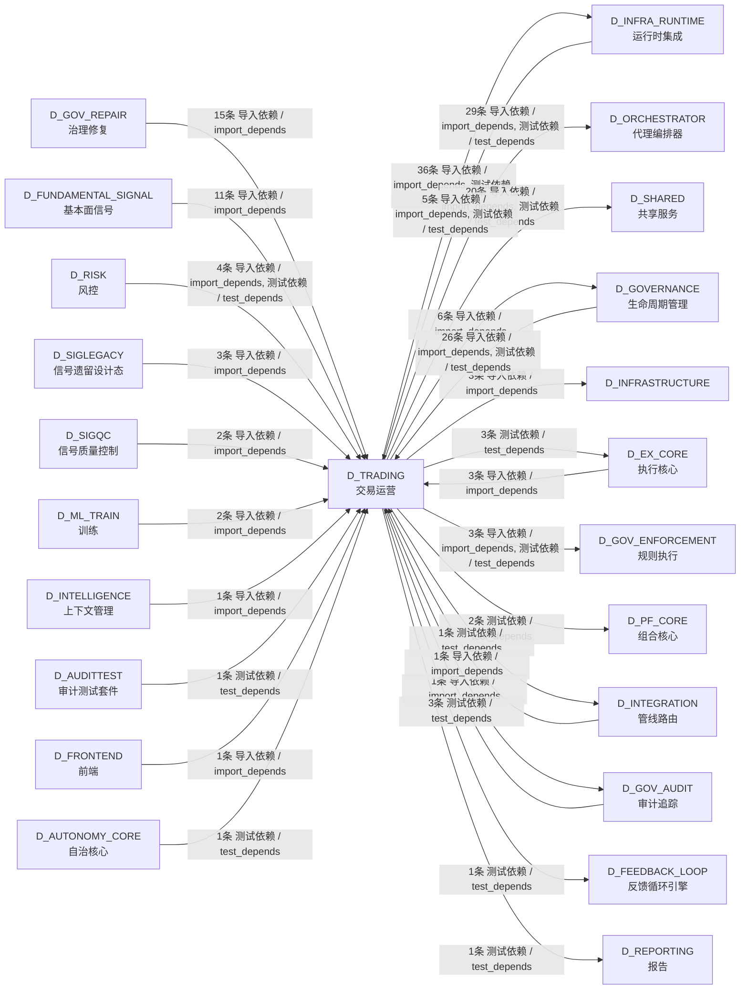

# 58_d_trading / 交易运营 / 交易运营 / Trading Operations

> **功能简介 / Overview**: 交易运营，负责交易生命周期管理、订单状态和成交处理

> **文档作用 / Purpose**: 展示 交易运营（D_TRADING）功能域的模块清单、域内依赖关系、跨域依赖关系、架构分层视图，供架构审查和域治理参考。

> 本文档由 generate_domain_doc.py 从 depgraph (PostgreSQL) 自动生成
> 最后更新: 2026-07-14 21:27:15
> 数据源: depgraph (PostgreSQL) nodes表 + edges表

## 域基本信息 / Domain Overview

| 字段 | 值 | Field | Value |
|------|------|-------|-------|
| 编号 | 58 | Number | 58 |
| 域ID | D_TRADING | Domain ID | D_TRADING |
| 域名称 | 交易运营 | Domain Name | Trading Operations |
| 层级 | L2 业务域层 | Layer | L2 Domain |
| 模块数 | 108 | Module Count | 108 |
| 域内依赖 | 73 | Internal Dependencies | 73 |
| 跨域入边 | 79 | Cross-domain Incoming | 79 |
| 跨域出边 | 106 | Cross-domain Outgoing | 106 |
| 设计态模块 | 0 | Design Modules | 0 |
| 原型态模块 | 84 | Prototype Modules | 84 |
| 生产态模块 | 24 | Production Modules | 24 |
| 容量 | 24/150 (正常) | Capacity | 24/150 (正常) |
| 描述 | 交易会话、交易接口、交易日志、交易复盘。交易运营中枢。合规检查由D-GOV_ENFORCEMENT门禁层执行。 | Description | 交易会话、交易接口、交易日志、交易复盘。交易运营中枢。合规检查由D-GOV_ENFORCEMENT门禁层执行。 |

## 模块分层清单 / Module Layered List

> 按 architecture_layer 分组的模块清单（共 108 个模块 / 108 modules）。

### L2 领域层 / Domain Layer (108 modules)

| # | 模块路径 / Module Path | 模块名称 / Module Name (功能简介 / Description) | 成熟度 / Maturity | 蓝图 / Blueprint |
|:--:|---------|---------|:---:|:---:|
| 1 | src/zephyr/trading/__init__.py | __init__.py | 生产态 / production |  |
| 2 | src/zephyr/trading/_extensions/__init__.py | __init__.py | 原型态 / prototype |  |
| 3 | src/zephyr/trading/admission_controller.py | admission_controller.py | 生产态 / production | [MOD-INF-033](../../03_modules/_cross_layer/behavioral_auditor/blueprint.md) |
| 4 | src/zephyr/trading/api/__init__.py | __init__.py | 原型态 / prototype |  |
| 5 | src/zephyr/trading/auto_dispatcher.py | AutoDispatcher — 守护进程内的轻量 PipelineDisp... | 原型态 / prototype | [MOD-INF-039](../../03_modules/_cross_layer/agent_orchestrator/blueprint.md) |
| 6 | src/zephyr/trading/autopilot.py | AutoPilot — AI session 自动找活干、认领任务。 | 生产态 / production | [SH-DB-001](../../03_modules/_cross_layer/database/blueprint.md) |
| 7 | src/zephyr/trading/conductor.py | Conductor — AI session 全自动指挥官。 | 生产态 / production | [SH-DB-001](../../03_modules/_cross_layer/database/blueprint.md) |
| 8 | src/zephyr/trading/core/__init__.py | __init__.py | 原型态 / prototype |  |
| 9 | src/zephyr/trading/gpu_consensus_scheduler.py | gpu_consensus_scheduler.py | 生产态 / production | [MOD-INF-033](../../03_modules/_cross_layer/behavioral_auditor/blueprint.md) |
| 10 | src/zephyr/trading/gpu_monitor.py | gpu_monitor.py — NVIDIA GPU 状态采集器 | 原型态 / prototype | [MOD-RESOURCE_OPTIMIZATION_ENGINE](../../03_modules/_cross_layer/resource_optimization_engine/blueprint.md) |
| 11 | src/zephyr/trading/ide_health_daemon.py | ide_health_daemon.py — TRAE IDE 幽灵窗口守护线程 | 生产态 / production | [MOD-RESOURCE_OPTIMIZATION_ENGINE](../../03_modules/_cross_layer/resource_optimization_engine/blueprint.md) |
| 12 | src/zephyr/trading/infrastructure/__init__.py | __init__.py | 原型态 / prototype |  |
| 13 | src/zephyr/trading/models/__init__.py | __init__.py | 原型态 / prototype |  |
| 14 | src/zephyr/trading/protection_index.py | protection_index.py | 生产态 / production | [MOD-INF-033](../../03_modules/_cross_layer/behavioral_auditor/blueprint.md) |
| 15 | src/zephyr/trading/runtime/__init__.py | trading.runtime — 异步运行时子包（R1 升级：同... | 原型态 / prototype |  |
| 16 | src/zephyr/trading/runtime/async_runtime.py | async_runtime.py | 生产态 / production | [MOD-INF-035](../../03_modules/_cross_layer/auto_runtime_core/blueprint.md) |
| 17 | src/zephyr/trading/services/__init__.py | __init__.py | 原型态 / prototype |  |
| 18 | src/zephyr/trading/speed_baseline_checker.py | speed_baseline_checker.py | 原型态 / prototype | [MOD-RESOURCE_OPTIMIZATION_ENGINE](../../03_modules/_cross_layer/resource_optimization_engine/blueprint.md) |
| 19 | src/zephyr/trading/trading_contracts/__init__.py | zephyr.trading.trading_contracts — trading-dom... | 原型态 / prototype | [MOD-INF-016](../../03_modules/_cross_layer/shared_core/blueprint.md) |
| 20 | src/zephyr/trading/trading_contracts/execution/__init__.py | trading-contracts.execution — order execution ... | 原型态 / prototype | [MOD-INF-016](../../03_modules/_cross_layer/shared_core/blueprint.md) |
| 21 | src/zephyr/trading/trading_contracts/execution/capital_al... | capital_allocation_result.py | 生产态 / production | [MOD-INF-016](../../03_modules/_cross_layer/shared_core/blueprint.md) |
| 22 | src/zephyr/trading/trading_contracts/execution/execution_... | execution_rejection_error.py | 原型态 / prototype | [MOD-INF-016](../../03_modules/_cross_layer/shared_core/blueprint.md) |
| 23 | src/zephyr/trading/trading_contracts/execution/execution_... | execution_report.py | 生产态 / production | [MOD-INF-016](../../03_modules/_cross_layer/shared_core/blueprint.md) |
| 24 | src/zephyr/trading/trading_contracts/execution/fill.py | fill.py | 生产态 / production | [MOD-INF-016](../../03_modules/_cross_layer/shared_core/blueprint.md) |
| 25 | src/zephyr/trading/trading_contracts/execution/model_serv... | model_serving_request.py | 生产态 / production | [MOD-INF-016](../../03_modules/_cross_layer/shared_core/blueprint.md) |
| 26 | src/zephyr/trading/trading_contracts/execution/order.py | order.py | 生产态 / production | [MOD-INF-016](../../03_modules/_cross_layer/shared_core/blueprint.md) |
| 27 | src/zephyr/trading/trading_contracts/execution/position.py | position.py | 生产态 / production | [MOD-INF-016](../../03_modules/_cross_layer/shared_core/blueprint.md) |
| 28 | src/zephyr/trading/trading_contracts/factories.py | trading-contracts/factories.py — 交易域数据契... | 原型态 / prototype |  |
| 29 | src/zephyr/trading/trading_contracts/market/__init__.py | trading-contracts.market — market data and sig... | 原型态 / prototype | [MOD-INF-016](../../03_modules/_cross_layer/shared_core/blueprint.md) |
| 30 | src/zephyr/trading/trading_contracts/market/factor_monito... | factor_monitor_report.py | 原型态 / prototype | [MOD-INF-016](../../03_modules/_cross_layer/shared_core/blueprint.md) |
| 31 | src/zephyr/trading/trading_contracts/market/factor_signal.py | factor_signal.py | 生产态 / production | [MOD-INF-016](../../03_modules/_cross_layer/shared_core/blueprint.md) |
| 32 | src/zephyr/trading/trading_contracts/market/instrument.py | instrument.py | 原型态 / prototype | [MOD-INF-016](../../03_modules/_cross_layer/shared_core/blueprint.md) |
| 33 | src/zephyr/trading/trading_contracts/market/macro_factor_... | macro_factor_signal.py | 原型态 / prototype | [MOD-INF-016](../../03_modules/_cross_layer/shared_core/blueprint.md) |
| 34 | src/zephyr/trading/trading_contracts/market/market_data.py | market_data.py | 生产态 / production | [MOD-INF-016](../../03_modules/_cross_layer/shared_core/blueprint.md) |
| 35 | src/zephyr/trading/trading_contracts/market/signal_degrad... | signal_degradation_warning.py | 原型态 / prototype | [MOD-INF-016](../../03_modules/_cross_layer/shared_core/blueprint.md) |
| 36 | src/zephyr/trading/trading_contracts/market/synthesized_s... | synthesized_signal.py | 生产态 / production | [MOD-INF-016](../../03_modules/_cross_layer/shared_core/blueprint.md) |
| 37 | src/zephyr/trading/trading_contracts/portfolio/contracts/... | __init__.py | 原型态 / prototype | [MOD-L00-001](../../03_modules/_domain_data/blueprint.md) |
| 38 | src/zephyr/trading/trading_contracts/portfolio/contracts/... | money.py | 生产态 / production | [MOD-L00-001](../../03_modules/_domain_data/blueprint.md) |
| 39 | src/zephyr/trading/trading_contracts/portfolio/contracts/... | Re-export shim — 真源已收敛至 zephyr.shared.co... | 原型态 / prototype | [MOD-L00-001](../../03_modules/_domain_data/blueprint.md) |
| 40 | src/zephyr/trading/trading_contracts/portfolio/contracts/... | strategy_lifecycle_event.py | 原型态 / prototype | [MOD-L00-001](../../03_modules/_domain_data/blueprint.md) |
| 41 | src/zephyr/trading/trading_contracts/risk/__init__.py | trading-contracts.risk — risk management domai... | 原型态 / prototype | [MOD-INF-016](../../03_modules/_cross_layer/shared_core/blueprint.md) |
| 42 | src/zephyr/trading/trading_contracts/risk/compliance_rule.py | compliance_rule.py | 原型态 / prototype | [MOD-INF-016](../../03_modules/_cross_layer/shared_core/blueprint.md) |
| 43 | src/zephyr/trading/trading_contracts/risk/risk_dashboard_... | risk_dashboard_snapshot.py | 生产态 / production | [MOD-INF-016](../../03_modules/_cross_layer/shared_core/blueprint.md) |
| 44 | src/zephyr/trading/trading_contracts/risk/risk_limit_viol... | risk_limit_violation_error.py | 生产态 / production | [MOD-INF-016](../../03_modules/_cross_layer/shared_core/blueprint.md) |
| 45 | src/zephyr/trading/trading_contracts/risk/risk_limits.py | risk_limits.py | 原型态 / prototype | [MOD-INF-016](../../03_modules/_cross_layer/shared_core/blueprint.md) |
| 46 | src/zephyr/trading/trading_contracts/risk/risk_metrics.py | risk_metrics.py | 生产态 / production | [MOD-INF-016](../../03_modules/_cross_layer/shared_core/blueprint.md) |
| 47 | src/zephyr/trading/trading_contracts/risk/risk_validator_... | risk_validator_protocol.py | 生产态 / production | [MOD-INF-016](../../03_modules/_cross_layer/shared_core/blueprint.md) |
| 48 | src/zephyr/trading/trading_contracts/risk/trading_kill_sw... | trading_kill_switch.py | 生产态 / production | [MOD-INF-016](../../03_modules/_cross_layer/shared_core/blueprint.md) |
| 49 | src/zephyr/trading/verdict_engine.py | verdict_engine.py | 生产态 / production | [MOD-INF-033](../../03_modules/_cross_layer/behavioral_auditor/blueprint.md) |
| 50 | src/zephyr/trading/zombie_scanner.py | zombie_scanner.py — 僵尸 Python 进程检测与自动处置 | 原型态 / prototype | [MOD-RESOURCE_OPTIMIZATION_ENGINE](../../03_modules/_cross_layer/resource_optimization_engine/blueprint.md) |
| 51 | tests/trading/test_admission_controller.py | test_admission_controller.py | 原型态 / prototype | [MOD-INF-033](../../03_modules/_cross_layer/behavioral_auditor/blueprint.md) |
| 52 | tests/trading/test_backpressure_manager.py | test_backpressure_manager.py | 原型态 / prototype | [MOD-INF-009](../../03_modules/_cross_layer/pipeline/blueprint.md) |
| 53 | tests/trading/test_backpressure_types.py | test_backpressure_types.py | 原型态 / prototype | [MOD-INF-009](../../03_modules/_cross_layer/pipeline/blueprint.md) |
| 54 | tests/trading/test_batch_orchestrator.py | test_batch_orchestrator.py | 原型态 / prototype | [MOD-INF-039](../../03_modules/_cross_layer/agent_orchestrator/blueprint.md) |
| 55 | tests/trading/test_behavioral_admission.py | test_behavioral_admission.py | 原型态 / prototype | [MOD-INF-033](../../03_modules/_cross_layer/behavioral_auditor/blueprint.md) |
| 56 | tests/trading/test_benchmark_runner.py | test_benchmark_runner.py | 原型态 / prototype | [MOD-INF-039](../../03_modules/_cross_layer/agent_orchestrator/blueprint.md) |
| 57 | tests/trading/test_blind_spot_closure.py | test_blind_spot_closure.py | 原型态 / prototype | [MOD-INF-039](../../03_modules/_cross_layer/agent_orchestrator/blueprint.md) |
| 58 | tests/trading/test_boot_cron_jobs.py | test_boot_cron_jobs.py | 原型态 / prototype | [MOD-INF-035](../../03_modules/_cross_layer/auto_runtime_core/blueprint.md) |
| 59 | tests/trading/test_boot_hooks.py | test_boot_hooks.py | 原型态 / prototype | [MOD-INF-035](../../03_modules/_cross_layer/auto_runtime_core/blueprint.md) |
| 60 | tests/trading/test_bulkhead_manager.py | test_bulkhead_manager.py | 原型态 / prototype | [MOD-INF-039](../../03_modules/_cross_layer/agent_orchestrator/blueprint.md) |
| 61 | tests/trading/test_circuit_breaker_manager.py | test_circuit_breaker_manager.py | 原型态 / prototype | [MOD-INF-009](../../03_modules/_cross_layer/pipeline/blueprint.md) |
| 62 | tests/trading/test_conductor.py | Conductor 单元测试——覆盖核心编排接口。 | 原型态 / prototype | [MOD-INF-035](../../03_modules/_cross_layer/auto_runtime_core/blueprint.md) |
| 63 | tests/trading/test_construction_guide.py | test_construction_guide.py | 原型态 / prototype | [MOD-INF-039](../../03_modules/_cross_layer/agent_orchestrator/blueprint.md) |
| 64 | tests/trading/test_dead_letter_queue.py | test_dead_letter_queue.py | 原型态 / prototype | [MOD-INF-009](../../03_modules/_cross_layer/pipeline/blueprint.md) |
| 65 | tests/trading/test_degrade_cascade.py | test_degrade_cascade.py | 原型态 / prototype | [MOD-INF-039](../../03_modules/_cross_layer/agent_orchestrator/blueprint.md) |
| 66 | tests/trading/test_design_decisions_root.py | test_design_decisions_root.py | 原型态 / prototype | [MOD-INF-039](../../03_modules/_cross_layer/agent_orchestrator/blueprint.md) |
| 67 | tests/trading/test_disk_guard.py | test_disk_guard.py | 原型态 / prototype | [MOD-INF-039](../../03_modules/_cross_layer/agent_orchestrator/blueprint.md) |
| 68 | tests/trading/test_dlq_manager_root.py | test_dlq_manager_root.py | 原型态 / prototype | [MOD-INF-039](../../03_modules/_cross_layer/agent_orchestrator/blueprint.md) |
| 69 | tests/trading/test_dream_cycle.py | test_dream_cycle.py | 原型态 / prototype | [MOD-INF-035](../../03_modules/_cross_layer/auto_runtime_core/blueprint.md) |
| 70 | tests/trading/test_fault_types.py | test_fault_types.py | 原型态 / prototype | [MOD-INF-039](../../03_modules/_cross_layer/agent_orchestrator/blueprint.md) |
| 71 | tests/trading/test_feature_flag.py | test_feature_flag.py | 原型态 / prototype | [MOD-INF-039](../../03_modules/_cross_layer/agent_orchestrator/blueprint.md) |
| 72 | tests/trading/test_finalizer.py | test_finalizer.py | 原型态 / prototype | [MOD-INF-035](../../03_modules/_cross_layer/auto_runtime_core/blueprint.md) |
| 73 | tests/trading/test_finding_bridge.py | test_finding_bridge.py | 原型态 / prototype | [MOD-INF-039](../../03_modules/_cross_layer/agent_orchestrator/blueprint.md) |
| 74 | tests/trading/test_gpu_consensus_scheduler.py | test_gpu_consensus_scheduler.py | 原型态 / prototype | [MOD-INF-033](../../03_modules/_cross_layer/behavioral_auditor/blueprint.md) |
| 75 | tests/trading/test_housekeeping.py | test_housekeeping.py | 原型态 / prototype | [MOD-INF-039](../../03_modules/_cross_layer/agent_orchestrator/blueprint.md) |
| 76 | tests/trading/test_ide_health_daemon.py | IdeHealthDaemon 测试. | 原型态 / prototype | [MOD-RESOURCE_OPTIMIZATION_ENGINE](../../03_modules/_cross_layer/resource_optimization_engine/blueprint.md) |
| 77 | tests/trading/test_incident_postmortem.py | test_incident_postmortem.py | 原型态 / prototype | [MOD-INF-039](../../03_modules/_cross_layer/agent_orchestrator/blueprint.md) |
| 78 | tests/trading/test_integration_registry.py | test_integration_registry.py | 原型态 / prototype | [MOD-INF-035](../../03_modules/_cross_layer/auto_runtime_core/blueprint.md) |
| 79 | tests/trading/test_l03_signal_generation.py | test_l03_signal_generation.py | 原型态 / prototype | [MOD-L03-001](../../03_modules/_domain_signal/blueprint.md) |
| 80 | tests/trading/test_l05_portfolio_construction.py | test_l05_portfolio_construction.py | 原型态 / prototype | [MOD-L05-001](../../03_modules/_domain_portfolio_core/blueprint.md) |
| 81 | tests/trading/test_l06_trade_execution.py | test_l06_trade_execution.py | 原型态 / prototype | [MOD-L06-001](../../03_modules/_domain_execution_core/blueprint.md) |
| 82 | tests/trading/test_l07_post_trade_analytics.py | test_l07_post_trade_analytics.py | 原型态 / prototype | [MOD-L07-001](../../03_modules/_domain_reporting/blueprint.md) |
| 83 | tests/trading/test_lean_scanner.py | test_lean_scanner.py | 原型态 / prototype | [MOD-INF-039](../../03_modules/_cross_layer/agent_orchestrator/blueprint.md) |
| 84 | tests/trading/test_lifecycle_manager.py | test_lifecycle_manager.py | 原型态 / prototype | [MOD-INF-035](../../03_modules/_cross_layer/auto_runtime_core/blueprint.md) |
| 85 | tests/trading/test_module_onboarding_scanner.py | test_module_onboarding_scanner.py | 原型态 / prototype | [MOD-INF-035](../../03_modules/_cross_layer/auto_runtime_core/blueprint.md) |
| 86 | tests/trading/test_network_partition.py | test_network_partition.py | 原型态 / prototype | [MOD-INF-039](../../03_modules/_cross_layer/agent_orchestrator/blueprint.md) |
| 87 | tests/trading/test_night_shift_queue.py | test_night_shift_queue.py | 原型态 / prototype | [MOD-INF-035](../../03_modules/_cross_layer/auto_runtime_core/blueprint.md) |
| 88 | tests/trading/test_protection_index.py | test_protection_index.py | 原型态 / prototype | [MOD-INF-033](../../03_modules/_cross_layer/behavioral_auditor/blueprint.md) |
| 89 | tests/trading/test_reconciliation_loop.py | test_reconciliation_loop.py | 原型态 / prototype | [MOD-INF-039](../../03_modules/_cross_layer/agent_orchestrator/blueprint.md) |
| 90 | tests/trading/test_rolling_upgrade.py | test_rolling_upgrade.py | 原型态 / prototype | [MOD-INF-039](../../03_modules/_cross_layer/agent_orchestrator/blueprint.md) |
| 91 | tests/trading/test_routing_plugins.py | test_routing_plugins.py | 原型态 / prototype | [MOD-INF-009](../../03_modules/_cross_layer/pipeline/blueprint.md) |
| 92 | tests/trading/test_runtime_config.py | test_runtime_config.py | 原型态 / prototype | [MOD-INF-035](../../03_modules/_cross_layer/auto_runtime_core/blueprint.md) |
| 93 | tests/trading/test_schema_migration.py | test_schema_migration.py | 原型态 / prototype | [MOD-INF-039](../../03_modules/_cross_layer/agent_orchestrator/blueprint.md) |
| 94 | tests/trading/test_stability_guard.py | test_stability_guard.py | 原型态 / prototype | [MOD-INF-039](../../03_modules/_cross_layer/agent_orchestrator/blueprint.md) |
| 95 | tests/trading/test_staging_area.py | test_staging_area.py | 原型态 / prototype |  |
| 96 | tests/trading/test_startup_sequencer.py | test_startup_sequencer.py | 原型态 / prototype | [MOD-INF-039](../../03_modules/_cross_layer/agent_orchestrator/blueprint.md) |
| 97 | tests/trading/test_state_propagation_root.py | test_state_propagation_root.py | 原型态 / prototype | [MOD-INF-039](../../03_modules/_cross_layer/agent_orchestrator/blueprint.md) |
| 98 | tests/trading/test_state_synchronizer_root.py | test_state_synchronizer_root.py | 原型态 / prototype | [MOD-INF-039](../../03_modules/_cross_layer/agent_orchestrator/blueprint.md) |
| 99 | tests/trading/test_status_dashboard.py | test_status_dashboard.py | 原型态 / prototype | [MOD-INF-035](../../03_modules/_cross_layer/auto_runtime_core/blueprint.md) |
| 100 | tests/trading/test_stop_gate.py | test_stop_gate.py | 原型态 / prototype | [MOD-INF-035](../../03_modules/_cross_layer/auto_runtime_core/blueprint.md) |
| 101 | tests/trading/test_system_transfer.py | test_system_transfer.py | 原型态 / prototype | [MOD-INF-039](../../03_modules/_cross_layer/agent_orchestrator/blueprint.md) |
| 102 | tests/trading/test_teardown_manager.py | test_teardown_manager.py | 原型态 / prototype | [MOD-INF-039](../../03_modules/_cross_layer/agent_orchestrator/blueprint.md) |
| 103 | tests/trading/test_trading_contracts.py | test_trading_contracts.py | 原型态 / prototype | [MOD-INF-016](../../03_modules/_cross_layer/shared_core/blueprint.md) |
| 104 | tests/trading/test_trading_kill_switch.py | test_trading_kill_switch.py | 原型态 / prototype | [MOD-INF-021](../../03_modules/_domain_autonomy_core/rollback_system/blueprint.md) |
| 105 | tests/trading/test_trading_session_lifecycle.py | tests.test_trading_session_lifecycle — F1 Sess... | 原型态 / prototype | [MOD-INF-035](../../03_modules/_cross_layer/auto_runtime_core/blueprint.md) |
| 106 | tests/trading/test_version_manifest.py | test_version_manifest.py | 原型态 / prototype | [MOD-INF-039](../../03_modules/_cross_layer/agent_orchestrator/blueprint.md) |
| 107 | tests/trading/test_work_dag.py | test_work_dag.py | 原型态 / prototype | [MOD-INF-035](../../03_modules/_cross_layer/auto_runtime_core/blueprint.md) |
| 108 | tests/trading/test_work_orchestrator.py | test_work_orchestrator.py | 原型态 / prototype | [MOD-INF-035](../../03_modules/_cross_layer/auto_runtime_core/blueprint.md) |

## 域内依赖图 / Internal Dependency Diagram

> 依赖图内嵌在本文档中，IDE 可直接渲染显示。参考 decision_index.md 设计，分四个视图：合并全景图、运营态子图、设计态子图、原型态子图（按 design_maturity 实际值拆分）。
>
> **图例说明 / Legend**：
> - **实线边框 = 运营态模块**（production，已上线运行）
> - **虚线边框 = 设计态模块**（design，蓝图阶段，代码未写）
> - **虚线边框 = 原型态模块**（prototype，代码已写，验证中未稳定上线）
> - **实线箭头 = 运营态依赖**（已生效的依赖关系）
> - **虚线箭头 = 非运营态依赖**（计划中/验证中的依赖关系）

### 合并全景图（全部模块，标签标注成熟度）

> 展示全部 108 个模块（生产态 24 + 设计态 0 + 原型态 84），标签标注成熟度。

#### 第 1 页 / 共 4 页

```mermaid
graph TD
    subgraph D_TRADING["D_TRADING 交易运营"]
        src_zephyr_trading_init_py["(生产态 / production) __init__.py"]
        src_zephyr_trading_extensions_init_py["(原型态 / prototype) __init__.py"]
        src_zephyr_trading_admission_controller_py["(生产态 / production) admission_controller.py"]
        src_zephyr_trading_api_init_py["(原型态 / prototype) __init__.py"]
        src_zephyr_trading_auto_dispatcher_py["(原型态 / prototype) AutoDispatcher — 守护进程内的轻量 PipelineDisp...<br/>文件: auto_dispatcher.py"]
        src_zephyr_trading_autopilot_py["(生产态 / production) AutoPilot — AI session 自动找活干、认领任务。<br/>文件: autopilot.py"]
        src_zephyr_trading_conductor_py["(生产态 / production) Conductor — AI session 全自动指挥官。<br/>文件: conductor.py"]
        src_zephyr_trading_core_init_py["(原型态 / prototype) __init__.py"]
        src_zephyr_trading_gpu_consensus_scheduler_py["(生产态 / production) gpu_consensus_scheduler.py"]
        src_zephyr_trading_gpu_monitor_py["(原型态 / prototype) gpu_monitor.py — NVIDIA GPU 状态采集器<br/>文件: gpu_monitor.py"]
        src_zephyr_trading_ide_health_daemon_py["(生产态 / production) ide_health_daemon.py — TRAE IDE 幽灵窗口守护线程<br/>文件: ide_health_daemon.py"]
        src_zephyr_trading_infrastructure_init_py["(原型态 / prototype) __init__.py"]
        src_zephyr_trading_models_init_py["(原型态 / prototype) __init__.py"]
        src_zephyr_trading_protection_index_py["(生产态 / production) protection_index.py"]
        src_zephyr_trading_runtime_init_py["(原型态 / prototype) trading.runtime — 异步运行时子包（R1 升级：同...<br/>文件: __init__.py"]
        src_zephyr_trading_runtime_async_runtime_py["(生产态 / production) async_runtime.py"]
        src_zephyr_trading_services_init_py["(原型态 / prototype) __init__.py"]
        src_zephyr_trading_speed_baseline_checker_py["(原型态 / prototype) speed_baseline_checker.py"]
        src_zephyr_trading_trading_contracts_init_py["(原型态 / prototype) zephyr.trading.trading_contracts — trading-dom...<br/>文件: __init__.py"]
        src_zephyr_trading_trading_contracts_execution_init_py["(原型态 / prototype) trading-contracts.execution — order execution ...<br/>文件: __init__.py"]
        src_zephyr_trading_trading_contracts_execution_capital_allocation_result_py["(生产态 / production) capital_allocation_result.py"]
        src_zephyr_trading_trading_contracts_execution_execution_rejection_error_py["(原型态 / prototype) execution_rejection_error.py"]
        src_zephyr_trading_trading_contracts_execution_execution_report_py["(生产态 / production) execution_report.py"]
        src_zephyr_trading_trading_contracts_execution_fill_py["(生产态 / production) fill.py"]
        src_zephyr_trading_trading_contracts_execution_model_serving_request_py["(生产态 / production) model_serving_request.py"]
        src_zephyr_trading_trading_contracts_execution_order_py["(生产态 / production) order.py"]
        src_zephyr_trading_trading_contracts_execution_position_py["(生产态 / production) position.py"]
        src_zephyr_trading_trading_contracts_factories_py["(原型态 / prototype) trading-contracts/factories.py — 交易域数据契...<br/>文件: factories.py"]
        src_zephyr_trading_trading_contracts_market_init_py["(原型态 / prototype) trading-contracts.market — market data and sig...<br/>文件: __init__.py"]
        src_zephyr_trading_trading_contracts_market_factor_monitor_report_py["(原型态 / prototype) factor_monitor_report.py"]
    end
    src_zephyr_trading_conductor_py -->|导入依赖 / import_depends| src_zephyr_trading_autopilot_py
    src_zephyr_trading_runtime_init_py -.->|导入依赖 / import_depends| src_zephyr_trading_runtime_async_runtime_py
    src_zephyr_trading_trading_contracts_execution_init_py -.->|导入依赖 / import_depends| src_zephyr_trading_trading_contracts_execution_capital_allocation_result_py
    src_zephyr_trading_trading_contracts_execution_init_py -.->|导入依赖 / import_depends| src_zephyr_trading_trading_contracts_execution_execution_report_py
    src_zephyr_trading_trading_contracts_execution_init_py -.->|导入依赖 / import_depends| src_zephyr_trading_trading_contracts_execution_fill_py
    src_zephyr_trading_trading_contracts_execution_init_py -.->|导入依赖 / import_depends| src_zephyr_trading_trading_contracts_execution_order_py
    src_zephyr_trading_trading_contracts_execution_init_py -.->|导入依赖 / import_depends| src_zephyr_trading_trading_contracts_execution_execution_rejection_error_py
    src_zephyr_trading_trading_contracts_execution_init_py -.->|导入依赖 / import_depends| src_zephyr_trading_trading_contracts_execution_position_py
    src_zephyr_trading_trading_contracts_execution_init_py -.->|导入依赖 / import_depends| src_zephyr_trading_trading_contracts_execution_model_serving_request_py
    src_zephyr_trading_trading_contracts_factories_py -.->|导入依赖 / import_depends| src_zephyr_trading_trading_contracts_execution_order_py
    src_zephyr_trading_trading_contracts_market_init_py -.->|导入依赖 / import_depends| src_zephyr_trading_trading_contracts_market_factor_monitor_report_py
    src_zephyr_trading_trading_contracts_init_py -.->|导入依赖 / import_depends| src_zephyr_trading_init_py
    src_zephyr_trading_trading_contracts_init_py -.->|导入依赖 / import_depends| src_zephyr_trading_trading_contracts_execution_capital_allocation_result_py
    src_zephyr_trading_trading_contracts_init_py -.->|导入依赖 / import_depends| src_zephyr_trading_trading_contracts_execution_execution_report_py
    src_zephyr_trading_trading_contracts_init_py -.->|导入依赖 / import_depends| src_zephyr_trading_trading_contracts_execution_fill_py
    src_zephyr_trading_trading_contracts_init_py -.->|导入依赖 / import_depends| src_zephyr_trading_trading_contracts_execution_order_py
    src_zephyr_trading_trading_contracts_init_py -.->|导入依赖 / import_depends| src_zephyr_trading_trading_contracts_execution_execution_rejection_error_py
    src_zephyr_trading_trading_contracts_init_py -.->|导入依赖 / import_depends| src_zephyr_trading_trading_contracts_execution_position_py
    src_zephyr_trading_trading_contracts_init_py -.->|导入依赖 / import_depends| src_zephyr_trading_trading_contracts_market_factor_monitor_report_py
    src_zephyr_trading_trading_contracts_init_py -.->|导入依赖 / import_depends| src_zephyr_trading_trading_contracts_execution_model_serving_request_py
    D_SHARED["(原型态 / prototype) D_SHARED"]
    src_zephyr_trading_runtime_async_runtime_py -.->|导入依赖 / import_depends| D_SHARED
    src_zephyr_trading_autopilot_py -.->|导入依赖 / import_depends| D_SHARED
    src_zephyr_trading_autopilot_py -.->|导入依赖 / import_depends| D_SHARED
    src_zephyr_trading_autopilot_py -->|导入依赖 / import_depends| D_SHARED
    src_zephyr_trading_autopilot_py -->|导入依赖 / import_depends| D_SHARED
    D_GOVERNANCE["(生产态 / production) D_GOVERNANCE"]
    src_zephyr_trading_autopilot_py -->|导入依赖 / import_depends| D_GOVERNANCE
    src_zephyr_trading_conductor_py -.->|导入依赖 / import_depends| D_SHARED
    src_zephyr_trading_conductor_py -->|导入依赖 / import_depends| D_GOVERNANCE
    src_zephyr_trading_conductor_py -->|导入依赖 / import_depends| D_SHARED
    src_zephyr_trading_trading_contracts_init_py -.->|导入依赖 / import_depends| D_GOVERNANCE
    D_INFRA_RUNTIME["(生产态 / production) D_INFRA_RUNTIME"]
    src_zephyr_trading_ide_health_daemon_py -->|导入依赖 / import_depends| D_INFRA_RUNTIME
    src_zephyr_trading_ide_health_daemon_py -->|导入依赖 / import_depends| D_GOVERNANCE
    src_zephyr_trading_ide_health_daemon_py -.->|导入依赖 / import_depends| D_SHARED
    D_ORCHESTRATOR["(原型态 / prototype) D_ORCHESTRATOR"]
    src_zephyr_trading_auto_dispatcher_py -.->|导入依赖 / import_depends| D_ORCHESTRATOR
    src_zephyr_trading_trading_contracts_execution_order_py -.->|导入依赖 / import_depends| D_SHARED
    D_INTEGRATION["(生产态 / production) D_INTEGRATION"]
    D_INTEGRATION -->|导入依赖 / import_depends| src_zephyr_trading_admission_controller_py
    D_AUTONOMY_CORE["(原型态 / prototype) D_AUTONOMY_CORE"]
    D_AUTONOMY_CORE -.->|测试依赖 / test_depends| src_zephyr_trading_autopilot_py
    D_GOV_AUDIT["(原型态 / prototype) D_GOV_AUDIT"]
    D_GOV_AUDIT -.->|测试依赖 / test_depends| src_zephyr_trading_init_py
    D_GOVERNANCE -.->|导入依赖 / import_depends| src_zephyr_trading_trading_contracts_factories_py
    D_GOV_REPAIR["(原型态 / prototype) D_GOV_REPAIR"]
    D_GOV_REPAIR -.->|导入依赖 / import_depends| src_zephyr_trading_trading_contracts_market_factor_monitor_report_py
    D_GOVERNANCE -.->|导入依赖 / import_depends| src_zephyr_trading_trading_contracts_execution_model_serving_request_py
    D_GOVERNANCE -.->|导入依赖 / import_depends| src_zephyr_trading_trading_contracts_execution_position_py
    D_GOVERNANCE -.->|导入依赖 / import_depends| src_zephyr_trading_trading_contracts_market_factor_monitor_report_py
    D_INFRA_RUNTIME -->|导入依赖 / import_depends| src_zephyr_trading_ide_health_daemon_py
    D_FUNDAMENTAL_SIGNAL["(生产态 / production) D_FUNDAMENTAL_SIGNAL"]
    D_FUNDAMENTAL_SIGNAL -->|导入依赖 / import_depends| src_zephyr_trading_trading_contracts_execution_capital_allocation_result_py
    D_GOVERNANCE -.->|导入依赖 / import_depends| src_zephyr_trading_trading_contracts_execution_execution_report_py
    D_EX_CORE["(原型态 / prototype) D_EX_CORE"]
    D_EX_CORE -.->|导入依赖 / import_depends| src_zephyr_trading_trading_contracts_execution_fill_py
    D_GOVERNANCE -.->|导入依赖 / import_depends| src_zephyr_trading_trading_contracts_execution_fill_py
    D_AUDITTEST["(原型态 / prototype) D_AUDITTEST"]
    D_AUDITTEST -.->|测试依赖 / test_depends| src_zephyr_trading_trading_contracts_execution_order_py
    D_GOV_REPAIR -.->|导入依赖 / import_depends| src_zephyr_trading_trading_contracts_init_py
    classDef production fill:#e1f5fe,stroke:#01579b,stroke-width:2px,color:#000
    classDef design fill:#fff3e0,stroke:#e65100,stroke-width:2px,color:#000,stroke-dasharray: 5 5
    classDef external_prod fill:#e8f5e9,stroke:#1b5e20,stroke-width:1px,color:#000
    classDef external_design fill:#fce4ec,stroke:#880e4f,stroke-width:1px,color:#000,stroke-dasharray: 5 5
    class src_zephyr_trading_init_py,src_zephyr_trading_admission_controller_py,src_zephyr_trading_autopilot_py,src_zephyr_trading_conductor_py,src_zephyr_trading_gpu_consensus_scheduler_py,src_zephyr_trading_ide_health_daemon_py,src_zephyr_trading_protection_index_py,src_zephyr_trading_runtime_async_runtime_py,src_zephyr_trading_trading_contracts_execution_capital_allocation_result_py,src_zephyr_trading_trading_contracts_execution_execution_report_py,src_zephyr_trading_trading_contracts_execution_fill_py,src_zephyr_trading_trading_contracts_execution_model_serving_request_py,src_zephyr_trading_trading_contracts_execution_order_py,src_zephyr_trading_trading_contracts_execution_position_py production
    class src_zephyr_trading_extensions_init_py,src_zephyr_trading_api_init_py,src_zephyr_trading_auto_dispatcher_py,src_zephyr_trading_core_init_py,src_zephyr_trading_gpu_monitor_py,src_zephyr_trading_infrastructure_init_py,src_zephyr_trading_models_init_py,src_zephyr_trading_runtime_init_py,src_zephyr_trading_services_init_py,src_zephyr_trading_speed_baseline_checker_py,src_zephyr_trading_trading_contracts_init_py,src_zephyr_trading_trading_contracts_execution_init_py,src_zephyr_trading_trading_contracts_execution_execution_rejection_error_py,src_zephyr_trading_trading_contracts_factories_py,src_zephyr_trading_trading_contracts_market_init_py,src_zephyr_trading_trading_contracts_market_factor_monitor_report_py design
    class D_GOVERNANCE,D_INFRA_RUNTIME,D_INTEGRATION,D_FUNDAMENTAL_SIGNAL external_prod
    class D_SHARED,D_ORCHESTRATOR,D_AUTONOMY_CORE,D_GOV_AUDIT,D_GOV_REPAIR,D_EX_CORE,D_AUDITTEST external_design
```



#### 第 2 页 / 共 4 页

```mermaid
graph TD
    subgraph D_TRADING["D_TRADING 交易运营"]
        src_zephyr_trading_trading_contracts_market_factor_signal_py["(生产态 / production) factor_signal.py"]
        src_zephyr_trading_trading_contracts_market_instrument_py["(原型态 / prototype) instrument.py"]
        src_zephyr_trading_trading_contracts_market_macro_factor_signal_py["(原型态 / prototype) macro_factor_signal.py"]
        src_zephyr_trading_trading_contracts_market_market_data_py["(生产态 / production) market_data.py"]
        src_zephyr_trading_trading_contracts_market_signal_degradation_warning_py["(原型态 / prototype) signal_degradation_warning.py"]
        src_zephyr_trading_trading_contracts_market_synthesized_signal_py["(生产态 / production) synthesized_signal.py"]
        src_zephyr_trading_trading_contracts_portfolio_contracts_init_py["(原型态 / prototype) __init__.py"]
        src_zephyr_trading_trading_contracts_portfolio_contracts_money_py["(生产态 / production) money.py"]
        src_zephyr_trading_trading_contracts_portfolio_contracts_performance_attribution_report_py["(原型态 / prototype) Re-export shim — 真源已收敛至 zephyr.shared.co...<br/>文件: performance_attribution_report.py"]
        src_zephyr_trading_trading_contracts_portfolio_contracts_strategy_lifecycle_event_py["(原型态 / prototype) strategy_lifecycle_event.py"]
        src_zephyr_trading_trading_contracts_risk_init_py["(原型态 / prototype) trading-contracts.risk — risk management domai...<br/>文件: __init__.py"]
        src_zephyr_trading_trading_contracts_risk_compliance_rule_py["(原型态 / prototype) compliance_rule.py"]
        src_zephyr_trading_trading_contracts_risk_risk_dashboard_snapshot_py["(生产态 / production) risk_dashboard_snapshot.py"]
        src_zephyr_trading_trading_contracts_risk_risk_limit_violation_error_py["(生产态 / production) risk_limit_violation_error.py"]
        src_zephyr_trading_trading_contracts_risk_risk_limits_py["(原型态 / prototype) risk_limits.py"]
        src_zephyr_trading_trading_contracts_risk_risk_metrics_py["(生产态 / production) risk_metrics.py"]
        src_zephyr_trading_trading_contracts_risk_risk_validator_protocol_py["(生产态 / production) risk_validator_protocol.py"]
        src_zephyr_trading_trading_contracts_risk_trading_kill_switch_py["(生产态 / production) trading_kill_switch.py"]
        src_zephyr_trading_verdict_engine_py["(生产态 / production) verdict_engine.py"]
        src_zephyr_trading_zombie_scanner_py["(原型态 / prototype) zombie_scanner.py — 僵尸 Python 进程检测与自动处置<br/>文件: zombie_scanner.py"]
        tests_trading_test_admission_controller_py["(原型态 / prototype) test_admission_controller.py"]
        tests_trading_test_backpressure_manager_py["(原型态 / prototype) test_backpressure_manager.py"]
        tests_trading_test_backpressure_types_py["(原型态 / prototype) test_backpressure_types.py"]
        tests_trading_test_batch_orchestrator_py["(原型态 / prototype) test_batch_orchestrator.py"]
        tests_trading_test_behavioral_admission_py["(原型态 / prototype) test_behavioral_admission.py"]
        tests_trading_test_benchmark_runner_py["(原型态 / prototype) test_benchmark_runner.py"]
        tests_trading_test_blind_spot_closure_py["(原型态 / prototype) test_blind_spot_closure.py"]
        tests_trading_test_boot_cron_jobs_py["(原型态 / prototype) test_boot_cron_jobs.py"]
        tests_trading_test_boot_hooks_py["(原型态 / prototype) test_boot_hooks.py"]
        tests_trading_test_bulkhead_manager_py["(原型态 / prototype) test_bulkhead_manager.py"]
    end
    src_zephyr_trading_trading_contracts_portfolio_contracts_init_py -.->|导入依赖 / import_depends| src_zephyr_trading_trading_contracts_portfolio_contracts_strategy_lifecycle_event_py
    src_zephyr_trading_trading_contracts_portfolio_contracts_init_py -.->|导入依赖 / import_depends| src_zephyr_trading_trading_contracts_portfolio_contracts_money_py
    src_zephyr_trading_trading_contracts_portfolio_contracts_money_py -.->|导入依赖 / import_depends| src_zephyr_trading_trading_contracts_market_instrument_py
    src_zephyr_trading_trading_contracts_risk_init_py -.->|导入依赖 / import_depends| src_zephyr_trading_trading_contracts_risk_risk_dashboard_snapshot_py
    src_zephyr_trading_trading_contracts_risk_init_py -.->|导入依赖 / import_depends| src_zephyr_trading_trading_contracts_risk_risk_validator_protocol_py
    src_zephyr_trading_trading_contracts_risk_init_py -.->|导入依赖 / import_depends| src_zephyr_trading_trading_contracts_risk_risk_limits_py
    src_zephyr_trading_trading_contracts_risk_init_py -.->|导入依赖 / import_depends| src_zephyr_trading_trading_contracts_risk_risk_limit_violation_error_py
    src_zephyr_trading_trading_contracts_risk_init_py -.->|导入依赖 / import_depends| src_zephyr_trading_trading_contracts_risk_risk_metrics_py
    tests_trading_test_admission_controller_py -.->|测试依赖 / test_depends| src_zephyr_trading_verdict_engine_py
    D_SHARED["(生产态 / production) D_SHARED"]
    src_zephyr_trading_zombie_scanner_py -.->|导入依赖 / import_depends| D_SHARED
    src_zephyr_trading_trading_contracts_portfolio_contracts_strategy_lifecycle_event_py -.->|导入依赖 / import_depends| D_SHARED
    D_INFRASTRUCTURE["(生产态 / production) D_INFRASTRUCTURE"]
    src_zephyr_trading_trading_contracts_portfolio_contracts_performance_attribution_report_py -.->|导入依赖 / import_depends| D_INFRASTRUCTURE
    D_GOVERNANCE["(原型态 / prototype) D_GOVERNANCE"]
    src_zephyr_trading_trading_contracts_portfolio_contracts_init_py -.->|导入依赖 / import_depends| D_GOVERNANCE
    D_GOV_ENFORCEMENT["(原型态 / prototype) D_GOV_ENFORCEMENT"]
    src_zephyr_trading_trading_contracts_risk_init_py -.->|导入依赖 / import_depends| D_GOV_ENFORCEMENT
    D_ORCHESTRATOR["(生产态 / production) D_ORCHESTRATOR"]
    tests_trading_test_batch_orchestrator_py -.->|测试依赖 / test_depends| D_ORCHESTRATOR
    D_INFRA_RUNTIME["(生产态 / production) D_INFRA_RUNTIME"]
    tests_trading_test_backpressure_manager_py -.->|测试依赖 / test_depends| D_INFRA_RUNTIME
    tests_trading_test_backpressure_manager_py -.->|测试依赖 / test_depends| D_INFRA_RUNTIME
    tests_trading_test_behavioral_admission_py -.->|测试依赖 / test_depends| D_SHARED
    tests_trading_test_backpressure_types_py -.->|测试依赖 / test_depends| D_INFRA_RUNTIME
    tests_trading_test_benchmark_runner_py -.->|测试依赖 / test_depends| D_ORCHESTRATOR
    tests_trading_test_boot_hooks_py -.->|测试依赖 / test_depends| D_INFRA_RUNTIME
    tests_trading_test_blind_spot_closure_py -.->|测试依赖 / test_depends| D_ORCHESTRATOR
    tests_trading_test_bulkhead_manager_py -.->|测试依赖 / test_depends| D_ORCHESTRATOR
    D_GOV_AUDIT["(生产态 / production) D_GOV_AUDIT"]
    src_zephyr_trading_verdict_engine_py -->|导入依赖 / import_depends| D_GOV_AUDIT
    D_GOV_REPAIR["(原型态 / prototype) D_GOV_REPAIR"]
    D_GOV_REPAIR -.->|导入依赖 / import_depends| src_zephyr_trading_trading_contracts_portfolio_contracts_money_py
    D_GOV_REPAIR -.->|导入依赖 / import_depends| src_zephyr_trading_trading_contracts_portfolio_contracts_strategy_lifecycle_event_py
    D_GOVERNANCE -.->|导入依赖 / import_depends| src_zephyr_trading_trading_contracts_portfolio_contracts_performance_attribution_report_py
    D_GOVERNANCE -.->|导入依赖 / import_depends| src_zephyr_trading_trading_contracts_portfolio_contracts_strategy_lifecycle_event_py
    D_GOVERNANCE -.->|导入依赖 / import_depends| src_zephyr_trading_trading_contracts_portfolio_contracts_money_py
    D_RISK["(原型态 / prototype) D_RISK"]
    D_RISK -.->|测试依赖 / test_depends| src_zephyr_trading_trading_contracts_risk_risk_limit_violation_error_py
    D_GOV_REPAIR -.->|导入依赖 / import_depends| src_zephyr_trading_trading_contracts_risk_risk_limit_violation_error_py
    D_GOVERNANCE -.->|导入依赖 / import_depends| src_zephyr_trading_trading_contracts_market_factor_signal_py
    D_GOVERNANCE -.->|导入依赖 / import_depends| src_zephyr_trading_trading_contracts_risk_risk_validator_protocol_py
    D_SIGLEGACY["(生产态 / production) D_SIGLEGACY"]
    D_SIGLEGACY -->|导入依赖 / import_depends| src_zephyr_trading_trading_contracts_market_synthesized_signal_py
    D_RISK -->|导入依赖 / import_depends| src_zephyr_trading_trading_contracts_risk_risk_limit_violation_error_py
    D_GOVERNANCE -.->|导入依赖 / import_depends| src_zephyr_trading_trading_contracts_market_macro_factor_signal_py
    D_GOVERNANCE -.->|导入依赖 / import_depends| src_zephyr_trading_trading_contracts_market_market_data_py
    D_GOVERNANCE -.->|导入依赖 / import_depends| src_zephyr_trading_trading_contracts_market_instrument_py
    D_GOVERNANCE -.->|测试依赖 / test_depends| src_zephyr_trading_verdict_engine_py
    classDef production fill:#e1f5fe,stroke:#01579b,stroke-width:2px,color:#000
    classDef design fill:#fff3e0,stroke:#e65100,stroke-width:2px,color:#000,stroke-dasharray: 5 5
    classDef external_prod fill:#e8f5e9,stroke:#1b5e20,stroke-width:1px,color:#000
    classDef external_design fill:#fce4ec,stroke:#880e4f,stroke-width:1px,color:#000,stroke-dasharray: 5 5
    class src_zephyr_trading_trading_contracts_market_factor_signal_py,src_zephyr_trading_trading_contracts_market_market_data_py,src_zephyr_trading_trading_contracts_market_synthesized_signal_py,src_zephyr_trading_trading_contracts_portfolio_contracts_money_py,src_zephyr_trading_trading_contracts_risk_risk_dashboard_snapshot_py,src_zephyr_trading_trading_contracts_risk_risk_limit_violation_error_py,src_zephyr_trading_trading_contracts_risk_risk_metrics_py,src_zephyr_trading_trading_contracts_risk_risk_validator_protocol_py,src_zephyr_trading_trading_contracts_risk_trading_kill_switch_py,src_zephyr_trading_verdict_engine_py production
    class src_zephyr_trading_trading_contracts_market_instrument_py,src_zephyr_trading_trading_contracts_market_macro_factor_signal_py,src_zephyr_trading_trading_contracts_market_signal_degradation_warning_py,src_zephyr_trading_trading_contracts_portfolio_contracts_init_py,src_zephyr_trading_trading_contracts_portfolio_contracts_performance_attribution_report_py,src_zephyr_trading_trading_contracts_portfolio_contracts_strategy_lifecycle_event_py,src_zephyr_trading_trading_contracts_risk_init_py,src_zephyr_trading_trading_contracts_risk_compliance_rule_py,src_zephyr_trading_trading_contracts_risk_risk_limits_py,src_zephyr_trading_zombie_scanner_py,tests_trading_test_admission_controller_py,tests_trading_test_backpressure_manager_py,tests_trading_test_backpressure_types_py,tests_trading_test_batch_orchestrator_py,tests_trading_test_behavioral_admission_py,tests_trading_test_benchmark_runner_py,tests_trading_test_blind_spot_closure_py,tests_trading_test_boot_cron_jobs_py,tests_trading_test_boot_hooks_py,tests_trading_test_bulkhead_manager_py design
    class D_SHARED,D_INFRASTRUCTURE,D_ORCHESTRATOR,D_INFRA_RUNTIME,D_GOV_AUDIT,D_SIGLEGACY external_prod
    class D_GOVERNANCE,D_GOV_ENFORCEMENT,D_GOV_REPAIR,D_RISK external_design
```



#### 第 3 页 / 共 4 页

```mermaid
graph TD
    subgraph D_TRADING["D_TRADING 交易运营"]
        tests_trading_test_circuit_breaker_manager_py["(原型态 / prototype) test_circuit_breaker_manager.py"]
        tests_trading_test_conductor_py["(原型态 / prototype) Conductor 单元测试——覆盖核心编排接口。<br/>文件: test_conductor.py"]
        tests_trading_test_construction_guide_py["(原型态 / prototype) test_construction_guide.py"]
        tests_trading_test_dead_letter_queue_py["(原型态 / prototype) test_dead_letter_queue.py"]
        tests_trading_test_degrade_cascade_py["(原型态 / prototype) test_degrade_cascade.py"]
        tests_trading_test_design_decisions_root_py["(原型态 / prototype) test_design_decisions_root.py"]
        tests_trading_test_disk_guard_py["(原型态 / prototype) test_disk_guard.py"]
        tests_trading_test_dlq_manager_root_py["(原型态 / prototype) test_dlq_manager_root.py"]
        tests_trading_test_dream_cycle_py["(原型态 / prototype) test_dream_cycle.py"]
        tests_trading_test_fault_types_py["(原型态 / prototype) test_fault_types.py"]
        tests_trading_test_feature_flag_py["(原型态 / prototype) test_feature_flag.py"]
        tests_trading_test_finalizer_py["(原型态 / prototype) test_finalizer.py"]
        tests_trading_test_finding_bridge_py["(原型态 / prototype) test_finding_bridge.py"]
        tests_trading_test_gpu_consensus_scheduler_py["(原型态 / prototype) test_gpu_consensus_scheduler.py"]
        tests_trading_test_housekeeping_py["(原型态 / prototype) test_housekeeping.py"]
        tests_trading_test_ide_health_daemon_py["(原型态 / prototype) IdeHealthDaemon 测试.<br/>文件: test_ide_health_daemon.py"]
        tests_trading_test_incident_postmortem_py["(原型态 / prototype) test_incident_postmortem.py"]
        tests_trading_test_integration_registry_py["(原型态 / prototype) test_integration_registry.py"]
        tests_trading_test_l03_signal_generation_py["(原型态 / prototype) test_l03_signal_generation.py"]
        tests_trading_test_l05_portfolio_construction_py["(原型态 / prototype) test_l05_portfolio_construction.py"]
        tests_trading_test_l06_trade_execution_py["(原型态 / prototype) test_l06_trade_execution.py"]
        tests_trading_test_l07_post_trade_analytics_py["(原型态 / prototype) test_l07_post_trade_analytics.py"]
        tests_trading_test_lean_scanner_py["(原型态 / prototype) test_lean_scanner.py"]
        tests_trading_test_lifecycle_manager_py["(原型态 / prototype) test_lifecycle_manager.py"]
        tests_trading_test_module_onboarding_scanner_py["(原型态 / prototype) test_module_onboarding_scanner.py"]
        tests_trading_test_network_partition_py["(原型态 / prototype) test_network_partition.py"]
        tests_trading_test_night_shift_queue_py["(原型态 / prototype) test_night_shift_queue.py"]
        tests_trading_test_protection_index_py["(原型态 / prototype) test_protection_index.py"]
        tests_trading_test_reconciliation_loop_py["(原型态 / prototype) test_reconciliation_loop.py"]
        tests_trading_test_rolling_upgrade_py["(原型态 / prototype) test_rolling_upgrade.py"]
    end
    D_EX_CORE["(生产态 / production) D_EX_CORE"]
    tests_trading_test_l06_trade_execution_py -.->|测试依赖 / test_depends| D_EX_CORE
    D_INFRA_RUNTIME["(生产态 / production) D_INFRA_RUNTIME"]
    tests_trading_test_lifecycle_manager_py -.->|测试依赖 / test_depends| D_INFRA_RUNTIME
    D_PF_CORE["(生产态 / production) D_PF_CORE"]
    tests_trading_test_l05_portfolio_construction_py -.->|测试依赖 / test_depends| D_PF_CORE
    tests_trading_test_l06_trade_execution_py -.->|测试依赖 / test_depends| D_EX_CORE
    tests_trading_test_l06_trade_execution_py -.->|测试依赖 / test_depends| D_EX_CORE
    D_REPORTING["(生产态 / production) D_REPORTING"]
    tests_trading_test_l07_post_trade_analytics_py -.->|测试依赖 / test_depends| D_REPORTING
    tests_trading_test_l07_post_trade_analytics_py -.->|测试依赖 / test_depends| D_PF_CORE
    tests_trading_test_module_onboarding_scanner_py -.->|测试依赖 / test_depends| D_INFRA_RUNTIME
    tests_trading_test_lifecycle_manager_py -.->|测试依赖 / test_depends| D_INFRA_RUNTIME
    D_ORCHESTRATOR["(生产态 / production) D_ORCHESTRATOR"]
    tests_trading_test_incident_postmortem_py -.->|测试依赖 / test_depends| D_ORCHESTRATOR
    tests_trading_test_integration_registry_py -.->|测试依赖 / test_depends| D_INFRA_RUNTIME
    tests_trading_test_module_onboarding_scanner_py -.->|测试依赖 / test_depends| D_INFRA_RUNTIME
    tests_trading_test_module_onboarding_scanner_py -.->|测试依赖 / test_depends| D_INFRA_RUNTIME
    tests_trading_test_network_partition_py -.->|测试依赖 / test_depends| D_ORCHESTRATOR
    tests_trading_test_night_shift_queue_py -.->|测试依赖 / test_depends| D_INFRA_RUNTIME
    classDef production fill:#e1f5fe,stroke:#01579b,stroke-width:2px,color:#000
    classDef design fill:#fff3e0,stroke:#e65100,stroke-width:2px,color:#000,stroke-dasharray: 5 5
    classDef external_prod fill:#e8f5e9,stroke:#1b5e20,stroke-width:1px,color:#000
    classDef external_design fill:#fce4ec,stroke:#880e4f,stroke-width:1px,color:#000,stroke-dasharray: 5 5
    class tests_trading_test_circuit_breaker_manager_py,tests_trading_test_conductor_py,tests_trading_test_construction_guide_py,tests_trading_test_dead_letter_queue_py,tests_trading_test_degrade_cascade_py,tests_trading_test_design_decisions_root_py,tests_trading_test_disk_guard_py,tests_trading_test_dlq_manager_root_py,tests_trading_test_dream_cycle_py,tests_trading_test_fault_types_py,tests_trading_test_feature_flag_py,tests_trading_test_finalizer_py,tests_trading_test_finding_bridge_py,tests_trading_test_gpu_consensus_scheduler_py,tests_trading_test_housekeeping_py,tests_trading_test_ide_health_daemon_py,tests_trading_test_incident_postmortem_py,tests_trading_test_integration_registry_py,tests_trading_test_l03_signal_generation_py,tests_trading_test_l05_portfolio_construction_py,tests_trading_test_l06_trade_execution_py,tests_trading_test_l07_post_trade_analytics_py,tests_trading_test_lean_scanner_py,tests_trading_test_lifecycle_manager_py,tests_trading_test_module_onboarding_scanner_py,tests_trading_test_network_partition_py,tests_trading_test_night_shift_queue_py,tests_trading_test_protection_index_py,tests_trading_test_reconciliation_loop_py,tests_trading_test_rolling_upgrade_py design
    class D_EX_CORE,D_INFRA_RUNTIME,D_PF_CORE,D_REPORTING,D_ORCHESTRATOR external_prod
```



#### 第 4 页 / 共 4 页

```mermaid
graph TD
    subgraph D_TRADING["D_TRADING 交易运营"]
        tests_trading_test_routing_plugins_py["(原型态 / prototype) test_routing_plugins.py"]
        tests_trading_test_runtime_config_py["(原型态 / prototype) test_runtime_config.py"]
        tests_trading_test_schema_migration_py["(原型态 / prototype) test_schema_migration.py"]
        tests_trading_test_stability_guard_py["(原型态 / prototype) test_stability_guard.py"]
        tests_trading_test_staging_area_py["(原型态 / prototype) test_staging_area.py"]
        tests_trading_test_startup_sequencer_py["(原型态 / prototype) test_startup_sequencer.py"]
        tests_trading_test_state_propagation_root_py["(原型态 / prototype) test_state_propagation_root.py"]
        tests_trading_test_state_synchronizer_root_py["(原型态 / prototype) test_state_synchronizer_root.py"]
        tests_trading_test_status_dashboard_py["(原型态 / prototype) test_status_dashboard.py"]
        tests_trading_test_stop_gate_py["(原型态 / prototype) test_stop_gate.py"]
        tests_trading_test_system_transfer_py["(原型态 / prototype) test_system_transfer.py"]
        tests_trading_test_teardown_manager_py["(原型态 / prototype) test_teardown_manager.py"]
        tests_trading_test_trading_contracts_py["(原型态 / prototype) test_trading_contracts.py"]
        tests_trading_test_trading_kill_switch_py["(原型态 / prototype) test_trading_kill_switch.py"]
        tests_trading_test_trading_session_lifecycle_py["(原型态 / prototype) tests.test_trading_session_lifecycle — F1 Sess...<br/>文件: test_trading_session_lifecycle.py"]
        tests_trading_test_version_manifest_py["(原型态 / prototype) test_version_manifest.py"]
        tests_trading_test_work_dag_py["(原型态 / prototype) test_work_dag.py"]
        tests_trading_test_work_orchestrator_py["(原型态 / prototype) test_work_orchestrator.py"]
    end
    D_ORCHESTRATOR["(生产态 / production) D_ORCHESTRATOR"]
    tests_trading_test_state_propagation_root_py -.->|测试依赖 / test_depends| D_ORCHESTRATOR
    D_INFRA_RUNTIME["(生产态 / production) D_INFRA_RUNTIME"]
    tests_trading_test_staging_area_py -.->|测试依赖 / test_depends| D_INFRA_RUNTIME
    tests_trading_test_routing_plugins_py -.->|测试依赖 / test_depends| D_INFRA_RUNTIME
    tests_trading_test_state_synchronizer_root_py -.->|测试依赖 / test_depends| D_ORCHESTRATOR
    tests_trading_test_stop_gate_py -.->|测试依赖 / test_depends| D_INFRA_RUNTIME
    D_GOV_ENFORCEMENT["(生产态 / production) D_GOV_ENFORCEMENT"]
    tests_trading_test_trading_session_lifecycle_py -.->|测试依赖 / test_depends| D_GOV_ENFORCEMENT
    tests_trading_test_work_orchestrator_py -.->|测试依赖 / test_depends| D_INFRA_RUNTIME
    tests_trading_test_status_dashboard_py -.->|测试依赖 / test_depends| D_INFRA_RUNTIME
    tests_trading_test_routing_plugins_py -.->|测试依赖 / test_depends| D_INFRA_RUNTIME
    tests_trading_test_work_orchestrator_py -.->|测试依赖 / test_depends| D_INFRA_RUNTIME
    tests_trading_test_status_dashboard_py -.->|测试依赖 / test_depends| D_INFRA_RUNTIME
    tests_trading_test_schema_migration_py -.->|测试依赖 / test_depends| D_ORCHESTRATOR
    tests_trading_test_routing_plugins_py -.->|测试依赖 / test_depends| D_INFRA_RUNTIME
    tests_trading_test_stability_guard_py -.->|测试依赖 / test_depends| D_ORCHESTRATOR
    tests_trading_test_startup_sequencer_py -.->|测试依赖 / test_depends| D_ORCHESTRATOR
    classDef production fill:#e1f5fe,stroke:#01579b,stroke-width:2px,color:#000
    classDef design fill:#fff3e0,stroke:#e65100,stroke-width:2px,color:#000,stroke-dasharray: 5 5
    classDef external_prod fill:#e8f5e9,stroke:#1b5e20,stroke-width:1px,color:#000
    classDef external_design fill:#fce4ec,stroke:#880e4f,stroke-width:1px,color:#000,stroke-dasharray: 5 5
    class tests_trading_test_routing_plugins_py,tests_trading_test_runtime_config_py,tests_trading_test_schema_migration_py,tests_trading_test_stability_guard_py,tests_trading_test_staging_area_py,tests_trading_test_startup_sequencer_py,tests_trading_test_state_propagation_root_py,tests_trading_test_state_synchronizer_root_py,tests_trading_test_status_dashboard_py,tests_trading_test_stop_gate_py,tests_trading_test_system_transfer_py,tests_trading_test_teardown_manager_py,tests_trading_test_trading_contracts_py,tests_trading_test_trading_kill_switch_py,tests_trading_test_trading_session_lifecycle_py,tests_trading_test_version_manifest_py,tests_trading_test_work_dag_py,tests_trading_test_work_orchestrator_py design
    class D_ORCHESTRATOR,D_INFRA_RUNTIME,D_GOV_ENFORCEMENT external_prod
```



### 运营态子图（仅 design_maturity=production 的模块和依赖）

> 仅展示已上线运行的模块（共 24 个，3 条域内依赖）。

```mermaid
graph TD
    subgraph D_TRADING["D_TRADING 交易运营"]
        src_zephyr_trading_init_py["(生产态 / production) __init__.py"]
        src_zephyr_trading_admission_controller_py["(生产态 / production) admission_controller.py"]
        src_zephyr_trading_autopilot_py["(生产态 / production) AutoPilot — AI session 自动找活干、认领任务。<br/>文件: autopilot.py"]
        src_zephyr_trading_conductor_py["(生产态 / production) Conductor — AI session 全自动指挥官。<br/>文件: conductor.py"]
        src_zephyr_trading_gpu_consensus_scheduler_py["(生产态 / production) gpu_consensus_scheduler.py"]
        src_zephyr_trading_ide_health_daemon_py["(生产态 / production) ide_health_daemon.py — TRAE IDE 幽灵窗口守护线程<br/>文件: ide_health_daemon.py"]
        src_zephyr_trading_protection_index_py["(生产态 / production) protection_index.py"]
        src_zephyr_trading_runtime_async_runtime_py["(生产态 / production) async_runtime.py"]
        src_zephyr_trading_trading_contracts_execution_capital_allocation_result_py["(生产态 / production) capital_allocation_result.py"]
        src_zephyr_trading_trading_contracts_execution_execution_report_py["(生产态 / production) execution_report.py"]
        src_zephyr_trading_trading_contracts_execution_fill_py["(生产态 / production) fill.py"]
        src_zephyr_trading_trading_contracts_execution_model_serving_request_py["(生产态 / production) model_serving_request.py"]
        src_zephyr_trading_trading_contracts_execution_order_py["(生产态 / production) order.py"]
        src_zephyr_trading_trading_contracts_execution_position_py["(生产态 / production) position.py"]
        src_zephyr_trading_trading_contracts_market_factor_signal_py["(生产态 / production) factor_signal.py"]
        src_zephyr_trading_trading_contracts_market_market_data_py["(生产态 / production) market_data.py"]
        src_zephyr_trading_trading_contracts_market_synthesized_signal_py["(生产态 / production) synthesized_signal.py"]
        src_zephyr_trading_trading_contracts_portfolio_contracts_money_py["(生产态 / production) money.py"]
        src_zephyr_trading_trading_contracts_risk_risk_dashboard_snapshot_py["(生产态 / production) risk_dashboard_snapshot.py"]
        src_zephyr_trading_trading_contracts_risk_risk_limit_violation_error_py["(生产态 / production) risk_limit_violation_error.py"]
        src_zephyr_trading_trading_contracts_risk_risk_metrics_py["(生产态 / production) risk_metrics.py"]
        src_zephyr_trading_trading_contracts_risk_risk_validator_protocol_py["(生产态 / production) risk_validator_protocol.py"]
        src_zephyr_trading_trading_contracts_risk_trading_kill_switch_py["(生产态 / production) trading_kill_switch.py"]
        src_zephyr_trading_verdict_engine_py["(生产态 / production) verdict_engine.py"]
    end
    src_zephyr_trading_conductor_py -->|导入依赖 / import_depends| src_zephyr_trading_autopilot_py
    src_zephyr_trading_gpu_consensus_scheduler_py -->|导入依赖 / import_depends| src_zephyr_trading_verdict_engine_py
    src_zephyr_trading_protection_index_py -->|导入依赖 / import_depends| src_zephyr_trading_verdict_engine_py
    D_SHARED["(原型态 / prototype) D_SHARED"]
    src_zephyr_trading_runtime_async_runtime_py -.->|导入依赖 / import_depends| D_SHARED
    src_zephyr_trading_autopilot_py -.->|导入依赖 / import_depends| D_SHARED
    src_zephyr_trading_autopilot_py -.->|导入依赖 / import_depends| D_SHARED
    src_zephyr_trading_autopilot_py -->|导入依赖 / import_depends| D_SHARED
    src_zephyr_trading_autopilot_py -->|导入依赖 / import_depends| D_SHARED
    D_GOVERNANCE["(生产态 / production) D_GOVERNANCE"]
    src_zephyr_trading_autopilot_py -->|导入依赖 / import_depends| D_GOVERNANCE
    src_zephyr_trading_conductor_py -.->|导入依赖 / import_depends| D_SHARED
    src_zephyr_trading_conductor_py -->|导入依赖 / import_depends| D_GOVERNANCE
    src_zephyr_trading_conductor_py -->|导入依赖 / import_depends| D_SHARED
    D_INFRA_RUNTIME["(生产态 / production) D_INFRA_RUNTIME"]
    src_zephyr_trading_ide_health_daemon_py -->|导入依赖 / import_depends| D_INFRA_RUNTIME
    src_zephyr_trading_ide_health_daemon_py -->|导入依赖 / import_depends| D_GOVERNANCE
    D_GOV_AUDIT["(生产态 / production) D_GOV_AUDIT"]
    src_zephyr_trading_verdict_engine_py -->|导入依赖 / import_depends| D_GOV_AUDIT
    src_zephyr_trading_ide_health_daemon_py -.->|导入依赖 / import_depends| D_SHARED
    src_zephyr_trading_trading_contracts_execution_order_py -.->|导入依赖 / import_depends| D_SHARED
    src_zephyr_trading_ide_health_daemon_py -->|导入依赖 / import_depends| D_SHARED
    D_GOV_REPAIR["(原型态 / prototype) D_GOV_REPAIR"]
    D_GOV_REPAIR -.->|导入依赖 / import_depends| src_zephyr_trading_trading_contracts_portfolio_contracts_money_py
    D_GOVERNANCE -.->|导入依赖 / import_depends| src_zephyr_trading_trading_contracts_portfolio_contracts_money_py
    D_INTEGRATION["(生产态 / production) D_INTEGRATION"]
    D_INTEGRATION -->|导入依赖 / import_depends| src_zephyr_trading_admission_controller_py
    D_AUTONOMY_CORE["(原型态 / prototype) D_AUTONOMY_CORE"]
    D_AUTONOMY_CORE -.->|测试依赖 / test_depends| src_zephyr_trading_autopilot_py
    D_RISK["(原型态 / prototype) D_RISK"]
    D_RISK -.->|测试依赖 / test_depends| src_zephyr_trading_trading_contracts_risk_risk_limit_violation_error_py
    D_GOV_REPAIR -.->|导入依赖 / import_depends| src_zephyr_trading_trading_contracts_risk_risk_limit_violation_error_py
    D_GOVERNANCE -.->|导入依赖 / import_depends| src_zephyr_trading_trading_contracts_market_factor_signal_py
    D_GOV_AUDIT -.->|测试依赖 / test_depends| src_zephyr_trading_init_py
    D_GOVERNANCE -.->|导入依赖 / import_depends| src_zephyr_trading_trading_contracts_risk_risk_validator_protocol_py
    D_SIGLEGACY["(生产态 / production) D_SIGLEGACY"]
    D_SIGLEGACY -->|导入依赖 / import_depends| src_zephyr_trading_trading_contracts_market_synthesized_signal_py
    D_RISK -->|导入依赖 / import_depends| src_zephyr_trading_trading_contracts_risk_risk_limit_violation_error_py
    D_GOVERNANCE -.->|导入依赖 / import_depends| src_zephyr_trading_trading_contracts_market_market_data_py
    D_GOVERNANCE -.->|导入依赖 / import_depends| src_zephyr_trading_trading_contracts_execution_model_serving_request_py
    D_GOVERNANCE -.->|导入依赖 / import_depends| src_zephyr_trading_trading_contracts_execution_position_py
    D_GOVERNANCE -.->|测试依赖 / test_depends| src_zephyr_trading_verdict_engine_py
    classDef production fill:#e1f5fe,stroke:#01579b,stroke-width:2px,color:#000
    classDef design fill:#fff3e0,stroke:#e65100,stroke-width:2px,color:#000,stroke-dasharray: 5 5
    classDef external_prod fill:#e8f5e9,stroke:#1b5e20,stroke-width:1px,color:#000
    classDef external_design fill:#fce4ec,stroke:#880e4f,stroke-width:1px,color:#000,stroke-dasharray: 5 5
    class src_zephyr_trading_init_py,src_zephyr_trading_admission_controller_py,src_zephyr_trading_autopilot_py,src_zephyr_trading_conductor_py,src_zephyr_trading_gpu_consensus_scheduler_py,src_zephyr_trading_ide_health_daemon_py,src_zephyr_trading_protection_index_py,src_zephyr_trading_runtime_async_runtime_py,src_zephyr_trading_trading_contracts_execution_capital_allocation_result_py,src_zephyr_trading_trading_contracts_execution_execution_report_py,src_zephyr_trading_trading_contracts_execution_fill_py,src_zephyr_trading_trading_contracts_execution_model_serving_request_py,src_zephyr_trading_trading_contracts_execution_order_py,src_zephyr_trading_trading_contracts_execution_position_py,src_zephyr_trading_trading_contracts_market_factor_signal_py,src_zephyr_trading_trading_contracts_market_market_data_py,src_zephyr_trading_trading_contracts_market_synthesized_signal_py,src_zephyr_trading_trading_contracts_portfolio_contracts_money_py,src_zephyr_trading_trading_contracts_risk_risk_dashboard_snapshot_py,src_zephyr_trading_trading_contracts_risk_risk_limit_violation_error_py,src_zephyr_trading_trading_contracts_risk_risk_metrics_py,src_zephyr_trading_trading_contracts_risk_risk_validator_protocol_py,src_zephyr_trading_trading_contracts_risk_trading_kill_switch_py,src_zephyr_trading_verdict_engine_py production
    class D_GOVERNANCE,D_INFRA_RUNTIME,D_GOV_AUDIT,D_INTEGRATION,D_SIGLEGACY external_prod
    class D_SHARED,D_GOV_REPAIR,D_AUTONOMY_CORE,D_RISK external_design
```



### 设计态子图（仅 design_maturity=design 的模块和依赖）

> 仅展示蓝图阶段、代码未写的设计态模块（共 0 个，0 条域内依赖）。

> （无设计态模块 / No design modules）

### 原型态子图（仅 design_maturity=prototype 的模块和依赖）

> 仅展示代码已写、验证中未稳定上线的原型态模块（共 84 个，15 条域内依赖）。

```mermaid
graph TD
    subgraph D_TRADING["D_TRADING 交易运营"]
        src_zephyr_trading_extensions_init_py["(原型态 / prototype) __init__.py"]
        src_zephyr_trading_api_init_py["(原型态 / prototype) __init__.py"]
        src_zephyr_trading_auto_dispatcher_py["(原型态 / prototype) AutoDispatcher — 守护进程内的轻量 PipelineDisp...<br/>文件: auto_dispatcher.py"]
        src_zephyr_trading_core_init_py["(原型态 / prototype) __init__.py"]
        src_zephyr_trading_gpu_monitor_py["(原型态 / prototype) gpu_monitor.py — NVIDIA GPU 状态采集器<br/>文件: gpu_monitor.py"]
        src_zephyr_trading_infrastructure_init_py["(原型态 / prototype) __init__.py"]
        src_zephyr_trading_models_init_py["(原型态 / prototype) __init__.py"]
        src_zephyr_trading_runtime_init_py["(原型态 / prototype) trading.runtime — 异步运行时子包（R1 升级：同...<br/>文件: __init__.py"]
        src_zephyr_trading_services_init_py["(原型态 / prototype) __init__.py"]
        src_zephyr_trading_speed_baseline_checker_py["(原型态 / prototype) speed_baseline_checker.py"]
        src_zephyr_trading_trading_contracts_init_py["(原型态 / prototype) zephyr.trading.trading_contracts — trading-dom...<br/>文件: __init__.py"]
        src_zephyr_trading_trading_contracts_execution_init_py["(原型态 / prototype) trading-contracts.execution — order execution ...<br/>文件: __init__.py"]
        src_zephyr_trading_trading_contracts_execution_execution_rejection_error_py["(原型态 / prototype) execution_rejection_error.py"]
        src_zephyr_trading_trading_contracts_factories_py["(原型态 / prototype) trading-contracts/factories.py — 交易域数据契...<br/>文件: factories.py"]
        src_zephyr_trading_trading_contracts_market_init_py["(原型态 / prototype) trading-contracts.market — market data and sig...<br/>文件: __init__.py"]
        src_zephyr_trading_trading_contracts_market_factor_monitor_report_py["(原型态 / prototype) factor_monitor_report.py"]
        src_zephyr_trading_trading_contracts_market_instrument_py["(原型态 / prototype) instrument.py"]
        src_zephyr_trading_trading_contracts_market_macro_factor_signal_py["(原型态 / prototype) macro_factor_signal.py"]
        src_zephyr_trading_trading_contracts_market_signal_degradation_warning_py["(原型态 / prototype) signal_degradation_warning.py"]
        src_zephyr_trading_trading_contracts_portfolio_contracts_init_py["(原型态 / prototype) __init__.py"]
        src_zephyr_trading_trading_contracts_portfolio_contracts_performance_attribution_report_py["(原型态 / prototype) Re-export shim — 真源已收敛至 zephyr.shared.co...<br/>文件: performance_attribution_report.py"]
        src_zephyr_trading_trading_contracts_portfolio_contracts_strategy_lifecycle_event_py["(原型态 / prototype) strategy_lifecycle_event.py"]
        src_zephyr_trading_trading_contracts_risk_init_py["(原型态 / prototype) trading-contracts.risk — risk management domai...<br/>文件: __init__.py"]
        src_zephyr_trading_trading_contracts_risk_compliance_rule_py["(原型态 / prototype) compliance_rule.py"]
        src_zephyr_trading_trading_contracts_risk_risk_limits_py["(原型态 / prototype) risk_limits.py"]
        src_zephyr_trading_zombie_scanner_py["(原型态 / prototype) zombie_scanner.py — 僵尸 Python 进程检测与自动处置<br/>文件: zombie_scanner.py"]
        tests_trading_test_admission_controller_py["(原型态 / prototype) test_admission_controller.py"]
        tests_trading_test_backpressure_manager_py["(原型态 / prototype) test_backpressure_manager.py"]
        tests_trading_test_backpressure_types_py["(原型态 / prototype) test_backpressure_types.py"]
        tests_trading_test_batch_orchestrator_py["(原型态 / prototype) test_batch_orchestrator.py"]
        tests_trading_test_behavioral_admission_py["(原型态 / prototype) test_behavioral_admission.py"]
        tests_trading_test_benchmark_runner_py["(原型态 / prototype) test_benchmark_runner.py"]
        tests_trading_test_blind_spot_closure_py["(原型态 / prototype) test_blind_spot_closure.py"]
        tests_trading_test_boot_cron_jobs_py["(原型态 / prototype) test_boot_cron_jobs.py"]
        tests_trading_test_boot_hooks_py["(原型态 / prototype) test_boot_hooks.py"]
        tests_trading_test_bulkhead_manager_py["(原型态 / prototype) test_bulkhead_manager.py"]
        tests_trading_test_circuit_breaker_manager_py["(原型态 / prototype) test_circuit_breaker_manager.py"]
        tests_trading_test_conductor_py["(原型态 / prototype) Conductor 单元测试——覆盖核心编排接口。<br/>文件: test_conductor.py"]
        tests_trading_test_construction_guide_py["(原型态 / prototype) test_construction_guide.py"]
        tests_trading_test_dead_letter_queue_py["(原型态 / prototype) test_dead_letter_queue.py"]
        tests_trading_test_degrade_cascade_py["(原型态 / prototype) test_degrade_cascade.py"]
        tests_trading_test_design_decisions_root_py["(原型态 / prototype) test_design_decisions_root.py"]
        tests_trading_test_disk_guard_py["(原型态 / prototype) test_disk_guard.py"]
        tests_trading_test_dlq_manager_root_py["(原型态 / prototype) test_dlq_manager_root.py"]
        tests_trading_test_dream_cycle_py["(原型态 / prototype) test_dream_cycle.py"]
        tests_trading_test_fault_types_py["(原型态 / prototype) test_fault_types.py"]
        tests_trading_test_feature_flag_py["(原型态 / prototype) test_feature_flag.py"]
        tests_trading_test_finalizer_py["(原型态 / prototype) test_finalizer.py"]
        tests_trading_test_finding_bridge_py["(原型态 / prototype) test_finding_bridge.py"]
        tests_trading_test_gpu_consensus_scheduler_py["(原型态 / prototype) test_gpu_consensus_scheduler.py"]
        tests_trading_test_housekeeping_py["(原型态 / prototype) test_housekeeping.py"]
        tests_trading_test_ide_health_daemon_py["(原型态 / prototype) IdeHealthDaemon 测试.<br/>文件: test_ide_health_daemon.py"]
        tests_trading_test_incident_postmortem_py["(原型态 / prototype) test_incident_postmortem.py"]
        tests_trading_test_integration_registry_py["(原型态 / prototype) test_integration_registry.py"]
        tests_trading_test_l03_signal_generation_py["(原型态 / prototype) test_l03_signal_generation.py"]
        tests_trading_test_l05_portfolio_construction_py["(原型态 / prototype) test_l05_portfolio_construction.py"]
        tests_trading_test_l06_trade_execution_py["(原型态 / prototype) test_l06_trade_execution.py"]
        tests_trading_test_l07_post_trade_analytics_py["(原型态 / prototype) test_l07_post_trade_analytics.py"]
        tests_trading_test_lean_scanner_py["(原型态 / prototype) test_lean_scanner.py"]
        tests_trading_test_lifecycle_manager_py["(原型态 / prototype) test_lifecycle_manager.py"]
        tests_trading_test_module_onboarding_scanner_py["(原型态 / prototype) test_module_onboarding_scanner.py"]
        tests_trading_test_network_partition_py["(原型态 / prototype) test_network_partition.py"]
        tests_trading_test_night_shift_queue_py["(原型态 / prototype) test_night_shift_queue.py"]
        tests_trading_test_protection_index_py["(原型态 / prototype) test_protection_index.py"]
        tests_trading_test_reconciliation_loop_py["(原型态 / prototype) test_reconciliation_loop.py"]
        tests_trading_test_rolling_upgrade_py["(原型态 / prototype) test_rolling_upgrade.py"]
        tests_trading_test_routing_plugins_py["(原型态 / prototype) test_routing_plugins.py"]
        tests_trading_test_runtime_config_py["(原型态 / prototype) test_runtime_config.py"]
        tests_trading_test_schema_migration_py["(原型态 / prototype) test_schema_migration.py"]
        tests_trading_test_stability_guard_py["(原型态 / prototype) test_stability_guard.py"]
        tests_trading_test_staging_area_py["(原型态 / prototype) test_staging_area.py"]
        tests_trading_test_startup_sequencer_py["(原型态 / prototype) test_startup_sequencer.py"]
        tests_trading_test_state_propagation_root_py["(原型态 / prototype) test_state_propagation_root.py"]
        tests_trading_test_state_synchronizer_root_py["(原型态 / prototype) test_state_synchronizer_root.py"]
        tests_trading_test_status_dashboard_py["(原型态 / prototype) test_status_dashboard.py"]
        tests_trading_test_stop_gate_py["(原型态 / prototype) test_stop_gate.py"]
        tests_trading_test_system_transfer_py["(原型态 / prototype) test_system_transfer.py"]
        tests_trading_test_teardown_manager_py["(原型态 / prototype) test_teardown_manager.py"]
        tests_trading_test_trading_contracts_py["(原型态 / prototype) test_trading_contracts.py"]
        tests_trading_test_trading_kill_switch_py["(原型态 / prototype) test_trading_kill_switch.py"]
        tests_trading_test_trading_session_lifecycle_py["(原型态 / prototype) tests.test_trading_session_lifecycle — F1 Sess...<br/>文件: test_trading_session_lifecycle.py"]
        tests_trading_test_version_manifest_py["(原型态 / prototype) test_version_manifest.py"]
        tests_trading_test_work_dag_py["(原型态 / prototype) test_work_dag.py"]
        tests_trading_test_work_orchestrator_py["(原型态 / prototype) test_work_orchestrator.py"]
    end
    src_zephyr_trading_trading_contracts_execution_init_py -.->|导入依赖 / import_depends| src_zephyr_trading_trading_contracts_execution_execution_rejection_error_py
    src_zephyr_trading_trading_contracts_factories_py -.->|导入依赖 / import_depends| src_zephyr_trading_trading_contracts_risk_risk_limits_py
    src_zephyr_trading_trading_contracts_market_init_py -.->|导入依赖 / import_depends| src_zephyr_trading_trading_contracts_market_factor_monitor_report_py
    src_zephyr_trading_trading_contracts_market_init_py -.->|导入依赖 / import_depends| src_zephyr_trading_trading_contracts_market_instrument_py
    src_zephyr_trading_trading_contracts_market_init_py -.->|导入依赖 / import_depends| src_zephyr_trading_trading_contracts_market_macro_factor_signal_py
    src_zephyr_trading_trading_contracts_market_init_py -.->|导入依赖 / import_depends| src_zephyr_trading_trading_contracts_market_signal_degradation_warning_py
    src_zephyr_trading_trading_contracts_portfolio_contracts_init_py -.->|导入依赖 / import_depends| src_zephyr_trading_trading_contracts_portfolio_contracts_strategy_lifecycle_event_py
    src_zephyr_trading_trading_contracts_risk_init_py -.->|导入依赖 / import_depends| src_zephyr_trading_trading_contracts_risk_risk_limits_py
    src_zephyr_trading_trading_contracts_init_py -.->|导入依赖 / import_depends| src_zephyr_trading_trading_contracts_execution_execution_rejection_error_py
    src_zephyr_trading_trading_contracts_init_py -.->|导入依赖 / import_depends| src_zephyr_trading_trading_contracts_market_factor_monitor_report_py
    src_zephyr_trading_trading_contracts_init_py -.->|导入依赖 / import_depends| src_zephyr_trading_trading_contracts_market_instrument_py
    src_zephyr_trading_trading_contracts_init_py -.->|导入依赖 / import_depends| src_zephyr_trading_trading_contracts_market_macro_factor_signal_py
    src_zephyr_trading_trading_contracts_init_py -.->|导入依赖 / import_depends| src_zephyr_trading_trading_contracts_market_signal_degradation_warning_py
    src_zephyr_trading_trading_contracts_init_py -.->|导入依赖 / import_depends| src_zephyr_trading_trading_contracts_portfolio_contracts_strategy_lifecycle_event_py
    src_zephyr_trading_trading_contracts_init_py -.->|导入依赖 / import_depends| src_zephyr_trading_trading_contracts_risk_risk_limits_py
    D_GOVERNANCE["(原型态 / prototype) D_GOVERNANCE"]
    src_zephyr_trading_trading_contracts_init_py -.->|导入依赖 / import_depends| D_GOVERNANCE
    src_zephyr_trading_trading_contracts_portfolio_contracts_init_py -.->|导入依赖 / import_depends| D_GOVERNANCE
    D_SHARED["(原型态 / prototype) D_SHARED"]
    src_zephyr_trading_trading_contracts_portfolio_contracts_strategy_lifecycle_event_py -.->|导入依赖 / import_depends| D_SHARED
    D_INFRASTRUCTURE["(生产态 / production) D_INFRASTRUCTURE"]
    src_zephyr_trading_trading_contracts_portfolio_contracts_performance_attribution_report_py -.->|导入依赖 / import_depends| D_INFRASTRUCTURE
    D_GOV_ENFORCEMENT["(原型态 / prototype) D_GOV_ENFORCEMENT"]
    src_zephyr_trading_trading_contracts_risk_init_py -.->|导入依赖 / import_depends| D_GOV_ENFORCEMENT
    D_EX_CORE["(生产态 / production) D_EX_CORE"]
    tests_trading_test_l06_trade_execution_py -.->|测试依赖 / test_depends| D_EX_CORE
    D_INFRA_RUNTIME["(生产态 / production) D_INFRA_RUNTIME"]
    tests_trading_test_lifecycle_manager_py -.->|测试依赖 / test_depends| D_INFRA_RUNTIME
    D_PF_CORE["(生产态 / production) D_PF_CORE"]
    tests_trading_test_l05_portfolio_construction_py -.->|测试依赖 / test_depends| D_PF_CORE
    tests_trading_test_l06_trade_execution_py -.->|测试依赖 / test_depends| D_EX_CORE
    tests_trading_test_l06_trade_execution_py -.->|测试依赖 / test_depends| D_EX_CORE
    D_REPORTING["(生产态 / production) D_REPORTING"]
    tests_trading_test_l07_post_trade_analytics_py -.->|测试依赖 / test_depends| D_REPORTING
    tests_trading_test_l07_post_trade_analytics_py -.->|测试依赖 / test_depends| D_PF_CORE
    tests_trading_test_module_onboarding_scanner_py -.->|测试依赖 / test_depends| D_INFRA_RUNTIME
    tests_trading_test_lifecycle_manager_py -.->|测试依赖 / test_depends| D_INFRA_RUNTIME
    D_ORCHESTRATOR["(生产态 / production) D_ORCHESTRATOR"]
    tests_trading_test_incident_postmortem_py -.->|测试依赖 / test_depends| D_ORCHESTRATOR
    D_GOV_REPAIR["(原型态 / prototype) D_GOV_REPAIR"]
    D_GOV_REPAIR -.->|导入依赖 / import_depends| src_zephyr_trading_trading_contracts_portfolio_contracts_strategy_lifecycle_event_py
    D_GOVERNANCE -.->|导入依赖 / import_depends| src_zephyr_trading_trading_contracts_portfolio_contracts_performance_attribution_report_py
    D_GOVERNANCE -.->|导入依赖 / import_depends| src_zephyr_trading_trading_contracts_portfolio_contracts_strategy_lifecycle_event_py
    D_GOVERNANCE -.->|导入依赖 / import_depends| src_zephyr_trading_trading_contracts_market_macro_factor_signal_py
    D_GOVERNANCE -.->|导入依赖 / import_depends| src_zephyr_trading_trading_contracts_factories_py
    D_GOV_REPAIR -.->|导入依赖 / import_depends| src_zephyr_trading_trading_contracts_market_factor_monitor_report_py
    D_GOVERNANCE -.->|导入依赖 / import_depends| src_zephyr_trading_trading_contracts_market_factor_monitor_report_py
    D_GOVERNANCE -.->|导入依赖 / import_depends| src_zephyr_trading_trading_contracts_market_instrument_py
    D_GOV_REPAIR -.->|导入依赖 / import_depends| src_zephyr_trading_trading_contracts_market_instrument_py
    D_GOV_REPAIR -.->|导入依赖 / import_depends| src_zephyr_trading_trading_contracts_market_macro_factor_signal_py
    D_GOV_REPAIR -.->|导入依赖 / import_depends| src_zephyr_trading_trading_contracts_risk_risk_limits_py
    D_GOV_REPAIR -.->|导入依赖 / import_depends| src_zephyr_trading_trading_contracts_init_py
    D_GOVERNANCE -.->|导入依赖 / import_depends| src_zephyr_trading_trading_contracts_execution_execution_rejection_error_py
    D_GOVERNANCE -.->|导入依赖 / import_depends| src_zephyr_trading_trading_contracts_risk_risk_limits_py
    D_GOV_REPAIR -.->|导入依赖 / import_depends| src_zephyr_trading_trading_contracts_market_signal_degradation_warning_py
    classDef production fill:#e1f5fe,stroke:#01579b,stroke-width:2px,color:#000
    classDef design fill:#fff3e0,stroke:#e65100,stroke-width:2px,color:#000,stroke-dasharray: 5 5
    classDef external_prod fill:#e8f5e9,stroke:#1b5e20,stroke-width:1px,color:#000
    classDef external_design fill:#fce4ec,stroke:#880e4f,stroke-width:1px,color:#000,stroke-dasharray: 5 5
    class src_zephyr_trading_extensions_init_py,src_zephyr_trading_api_init_py,src_zephyr_trading_auto_dispatcher_py,src_zephyr_trading_core_init_py,src_zephyr_trading_gpu_monitor_py,src_zephyr_trading_infrastructure_init_py,src_zephyr_trading_models_init_py,src_zephyr_trading_runtime_init_py,src_zephyr_trading_services_init_py,src_zephyr_trading_speed_baseline_checker_py,src_zephyr_trading_trading_contracts_init_py,src_zephyr_trading_trading_contracts_execution_init_py,src_zephyr_trading_trading_contracts_execution_execution_rejection_error_py,src_zephyr_trading_trading_contracts_factories_py,src_zephyr_trading_trading_contracts_market_init_py,src_zephyr_trading_trading_contracts_market_factor_monitor_report_py,src_zephyr_trading_trading_contracts_market_instrument_py,src_zephyr_trading_trading_contracts_market_macro_factor_signal_py,src_zephyr_trading_trading_contracts_market_signal_degradation_warning_py,src_zephyr_trading_trading_contracts_portfolio_contracts_init_py,src_zephyr_trading_trading_contracts_portfolio_contracts_performance_attribution_report_py,src_zephyr_trading_trading_contracts_portfolio_contracts_strategy_lifecycle_event_py,src_zephyr_trading_trading_contracts_risk_init_py,src_zephyr_trading_trading_contracts_risk_compliance_rule_py,src_zephyr_trading_trading_contracts_risk_risk_limits_py,src_zephyr_trading_zombie_scanner_py,tests_trading_test_admission_controller_py,tests_trading_test_backpressure_manager_py,tests_trading_test_backpressure_types_py,tests_trading_test_batch_orchestrator_py,tests_trading_test_behavioral_admission_py,tests_trading_test_benchmark_runner_py,tests_trading_test_blind_spot_closure_py,tests_trading_test_boot_cron_jobs_py,tests_trading_test_boot_hooks_py,tests_trading_test_bulkhead_manager_py,tests_trading_test_circuit_breaker_manager_py,tests_trading_test_conductor_py,tests_trading_test_construction_guide_py,tests_trading_test_dead_letter_queue_py,tests_trading_test_degrade_cascade_py,tests_trading_test_design_decisions_root_py,tests_trading_test_disk_guard_py,tests_trading_test_dlq_manager_root_py,tests_trading_test_dream_cycle_py,tests_trading_test_fault_types_py,tests_trading_test_feature_flag_py,tests_trading_test_finalizer_py,tests_trading_test_finding_bridge_py,tests_trading_test_gpu_consensus_scheduler_py,tests_trading_test_housekeeping_py,tests_trading_test_ide_health_daemon_py,tests_trading_test_incident_postmortem_py,tests_trading_test_integration_registry_py,tests_trading_test_l03_signal_generation_py,tests_trading_test_l05_portfolio_construction_py,tests_trading_test_l06_trade_execution_py,tests_trading_test_l07_post_trade_analytics_py,tests_trading_test_lean_scanner_py,tests_trading_test_lifecycle_manager_py,tests_trading_test_module_onboarding_scanner_py,tests_trading_test_network_partition_py,tests_trading_test_night_shift_queue_py,tests_trading_test_protection_index_py,tests_trading_test_reconciliation_loop_py,tests_trading_test_rolling_upgrade_py,tests_trading_test_routing_plugins_py,tests_trading_test_runtime_config_py,tests_trading_test_schema_migration_py,tests_trading_test_stability_guard_py,tests_trading_test_staging_area_py,tests_trading_test_startup_sequencer_py,tests_trading_test_state_propagation_root_py,tests_trading_test_state_synchronizer_root_py,tests_trading_test_status_dashboard_py,tests_trading_test_stop_gate_py,tests_trading_test_system_transfer_py,tests_trading_test_teardown_manager_py,tests_trading_test_trading_contracts_py,tests_trading_test_trading_kill_switch_py,tests_trading_test_trading_session_lifecycle_py,tests_trading_test_version_manifest_py,tests_trading_test_work_dag_py,tests_trading_test_work_orchestrator_py design
    class D_INFRASTRUCTURE,D_EX_CORE,D_INFRA_RUNTIME,D_PF_CORE,D_REPORTING,D_ORCHESTRATOR external_prod
    class D_GOVERNANCE,D_SHARED,D_GOV_ENFORCEMENT,D_GOV_REPAIR external_design
```

## 跨域依赖 / Cross-domain Dependencies

### 本域依赖的其他域（出边）/ Depends On

| # | 本域模块 / Source Module | → | 外部域-目标模块 / Target Module | 依赖类型 / Type |
|:--:|---------|:--:|---------|---------|
| 1 | test_l06_trade_execution.py | → | D_EX_CORE 执行核心: Re-export wrapper: broker_interface has migrate... | 测试依赖 / test_depends |
| 2 | test_l06_trade_execution.py | → | D_EX_CORE 执行核心: D_EXECUTION_CORE — Execution Engine (execution... | 测试依赖 / test_depends |
| 3 | test_l06_trade_execution.py | → | D_EX_CORE 执行核心: D_EXECUTION_CORE — Order Manager (order_manage... | 测试依赖 / test_depends |
| 4 | test_lifecycle_manager.py | → | D_FEEDBACK_LOOP 反馈循环引擎: Feedback Loop Engine — MOD-FEEDBACK_LOOP. (__i... | 测试依赖 / test_depends |
| 5 | AutoDispatcher — 守护进程内的轻量 PipelineDisp... | → | D_GOVERNANCE 生命周期管理: TaskRepository — 任务登记表 CRUD + 状态机（T-1... | 导入依赖 / import_depends |
| 6 | AutoPilot — AI session 自动找活干、认领任务。 ... | → | D_GOVERNANCE 生命周期管理: TaskRepository — 任务登记表 CRUD + 状态机（T-1... | 导入依赖 / import_depends |
| 7 | Conductor — AI session 全自动指挥官。 (conduct... | → | D_GOVERNANCE 生命周期管理: TaskRepository — 任务登记表 CRUD + 状态机（T-1... | 导入依赖 / import_depends |
| 8 | ide_health_daemon.py — TRAE IDE 幽灵窗口守护线... | → | D_GOVERNANCE 生命周期管理: TaskRepository — 任务登记表 CRUD + 状态机（T-1... | 导入依赖 / import_depends |
| 9 | zephyr.trading.trading_contracts — trading-dom... | → | D_GOVERNANCE 生命周期管理: performance_attribution_report.py | 导入依赖 / import_depends |
| 10 | __init__.py | → | D_GOVERNANCE 生命周期管理: performance_attribution_report.py | 导入依赖 / import_depends |
| 11 | verdict_engine.py | → | D_GOV_AUDIT 审计追踪: models.py | 导入依赖 / import_depends |
| 12 | zephyr.trading.trading_contracts — trading-dom... | → | D_GOV_ENFORCEMENT 规则执行: Re-export shim — ComplianceRule 真源已合并至 z... | 导入依赖 / import_depends |
| 13 | trading-contracts.risk — risk management domai... | → | D_GOV_ENFORCEMENT 规则执行: Re-export shim — ComplianceRule 真源已合并至 z... | 导入依赖 / import_depends |
| 14 | tests.test_trading_session_lifecycle — F1 Sess... | → | D_GOV_ENFORCEMENT 规则执行: session_lifecycle.py | 测试依赖 / test_depends |
| 15 | Re-export shim — 真源已收敛至 zephyr.shared.co... | → | D_INFRASTRUCTURE: performance_attribution_report.py | 导入依赖 / import_depends |
| 16 | risk_limit_violation_error.py | → | D_INFRASTRUCTURE: trace_context.py | 导入依赖 / import_depends |
| 17 | risk_validator_protocol.py | → | D_INFRASTRUCTURE: risk_limits.py | 导入依赖 / import_depends |
| 18 | ide_health_daemon.py — TRAE IDE 幽灵窗口守护线... | → | D_INFRA_RUNTIME 运行时集成: daemon_registry.py - unified daemon thread regi... | 导入依赖 / import_depends |
| 19 | test_backpressure_manager.py | → | D_INFRA_RUNTIME 运行时集成: Pipeline — Backpressure Manager (backpressure_... | 测试依赖 / test_depends |
| 20 | test_backpressure_manager.py | → | D_INFRA_RUNTIME 运行时集成: backpressure_types.py - Pipeline backpressure s... | 测试依赖 / test_depends |
| 21 | test_backpressure_types.py | → | D_INFRA_RUNTIME 运行时集成: backpressure_types.py - Pipeline backpressure s... | 测试依赖 / test_depends |
| 22 | test_boot_hooks.py | → | D_INFRA_RUNTIME 运行时集成: boot_hooks.py | 测试依赖 / test_depends |
| 23 | test_circuit_breaker_manager.py | → | D_INFRA_RUNTIME 运行时集成: CircuitBreakerManager -- standalone circuit bre... | 测试依赖 / test_depends |
| 24 | test_circuit_breaker_manager.py | → | D_INFRA_RUNTIME 运行时集成: Pipeline 数据模型 (models.py) | 测试依赖 / test_depends |
| 25 | test_dead_letter_queue.py | → | D_INFRA_RUNTIME 运行时集成: DeadLetterQueue — 死信队列 (dead_letter_queue.py) | 测试依赖 / test_depends |
| 26 | test_dead_letter_queue.py | → | D_INFRA_RUNTIME 运行时集成: Pipeline 数据模型 (models.py) | 测试依赖 / test_depends |
| 27 | test_dream_cycle.py | → | D_INFRA_RUNTIME 运行时集成: DreamCycle — 知识固化引擎 (dream_cycle.py) | 测试依赖 / test_depends |
| 28 | test_finalizer.py | → | D_INFRA_RUNTIME 运行时集成: Finalizer — 优雅清理器 (finalizer.py) | 测试依赖 / test_depends |
| 29 | test_integration_registry.py | → | D_INFRA_RUNTIME 运行时集成: IntegrationRegistry — 集成注册表 (integration_... | 测试依赖 / test_depends |
| 30 | test_lifecycle_manager.py | → | D_INFRA_RUNTIME 运行时集成: CapabilityRegistry — 能力注册中心 (capability_... | 测试依赖 / test_depends |
| 31 | test_lifecycle_manager.py | → | D_INFRA_RUNTIME 运行时集成: DreamCycle — 知识固化引擎 (dream_cycle.py) | 测试依赖 / test_depends |
| 32 | test_lifecycle_manager.py | → | D_INFRA_RUNTIME 运行时集成: Finalizer — 优雅清理器 (finalizer.py) | 测试依赖 / test_depends |
| 33 | test_lifecycle_manager.py | → | D_INFRA_RUNTIME 运行时集成: HealthMonitor — 健康监控 + 自愈 (health_monito... | 测试依赖 / test_depends |
| 34 | test_lifecycle_manager.py | → | D_INFRA_RUNTIME 运行时集成: IntegrationRegistry — 集成注册表 (integration_... | 测试依赖 / test_depends |
| 35 | test_lifecycle_manager.py | → | D_INFRA_RUNTIME 运行时集成: lifecycle_manager.py | 测试依赖 / test_depends |
| 36 | test_lifecycle_manager.py | → | D_INFRA_RUNTIME 运行时集成: NightShiftQueue — 夜班登记表持久化 (night_shif... | 测试依赖 / test_depends |
| 37 | test_lifecycle_manager.py | → | D_INFRA_RUNTIME 运行时集成: StopGate — 质量闸门 (stop_gate.py) | 测试依赖 / test_depends |
| 38 | test_lifecycle_manager.py | → | D_INFRA_RUNTIME 运行时集成: work_orchestrator.py | 测试依赖 / test_depends |
| 39 | test_module_onboarding_scanner.py | → | D_INFRA_RUNTIME 运行时集成: CapabilityCard — 能力卡片数据模型 (capability_... | 测试依赖 / test_depends |
| 40 | test_module_onboarding_scanner.py | → | D_INFRA_RUNTIME 运行时集成: CapabilityRegistry — 能力注册中心 (capability_... | 测试依赖 / test_depends |
| 41 | test_module_onboarding_scanner.py | → | D_INFRA_RUNTIME 运行时集成: ModuleOnboardingScanner — 模块接入扫描器 (modu... | 测试依赖 / test_depends |
| 42 | test_night_shift_queue.py | → | D_INFRA_RUNTIME 运行时集成: NightShiftQueue — 夜班登记表持久化 (night_shif... | 测试依赖 / test_depends |
| 43 | test_routing_plugins.py | → | D_INFRA_RUNTIME 运行时集成: CT-PIPE-ORC-001 — TaskCard -> 管线入口节点路由... | 测试依赖 / test_depends |
| 44 | test_routing_plugins.py | → | D_INFRA_RUNTIME 运行时集成: Pipeline 数据模型 (models.py) | 测试依赖 / test_depends |
| 45 | test_routing_plugins.py | → | D_INFRA_RUNTIME 运行时集成: Pipeline Routing Plugin System — K8s Schedulin... | 测试依赖 / test_depends |
| 46 | test_runtime_config.py | → | D_INFRA_RUNTIME 运行时集成: runtime_config.py | 测试依赖 / test_depends |
| 47 | test_staging_area.py | → | D_INFRA_RUNTIME 运行时集成: StagingArea — 多AI并发草稿写入+提交+冲突检测模... | 测试依赖 / test_depends |
| 48 | test_status_dashboard.py | → | D_INFRA_RUNTIME 运行时集成: HealthMonitor — 健康监控 + 自愈 (health_monito... | 测试依赖 / test_depends |
| 49 | test_status_dashboard.py | → | D_INFRA_RUNTIME 运行时集成: StatusDashboard — 实时状态面板 (status_dashboa... | 测试依赖 / test_depends |
| 50 | test_stop_gate.py | → | D_INFRA_RUNTIME 运行时集成: StopGate — 质量闸门 (stop_gate.py) | 测试依赖 / test_depends |
| 51 | test_work_dag.py | → | D_INFRA_RUNTIME 运行时集成: WorkDAG + WorkItem — 工作编排数据模型 (work_da... | 测试依赖 / test_depends |
| 52 | test_work_orchestrator.py | → | D_INFRA_RUNTIME 运行时集成: WorkDAG + WorkItem — 工作编排数据模型 (work_da... | 测试依赖 / test_depends |
| 53 | test_work_orchestrator.py | → | D_INFRA_RUNTIME 运行时集成: work_orchestrator.py | 测试依赖 / test_depends |
| 54 | test_lifecycle_manager.py | → | D_INTEGRATION 管线路由: runtime_types.py | 测试依赖 / test_depends |
| 55 | AutoDispatcher — 守护进程内的轻量 PipelineDisp... | → | D_ORCHESTRATOR 代理编排器: ActiveTaskQueue — 后台任务轮询与自动分发 (task... | 导入依赖 / import_depends |
| 56 | AutoDispatcher — 守护进程内的轻量 PipelineDisp... | → | D_ORCHESTRATOR 代理编排器: Orc->CE 上下文桥接 — request_context() 生产者 ... | 导入依赖 / import_depends |
| 57 | AutoDispatcher — 守护进程内的轻量 PipelineDisp... | → | D_ORCHESTRATOR 代理编排器: Orc->Script 脚本执行器 — run_audit() 生产者 (s... | 导入依赖 / import_depends |
| 58 | test_batch_orchestrator.py | → | D_ORCHESTRATOR 代理编排器: BatchOrchestrator — 多 Worker 批量任务协调器（... | 测试依赖 / test_depends |
| 59 | test_benchmark_runner.py | → | D_ORCHESTRATOR 代理编排器: benchmark_runner.py | 测试依赖 / test_depends |
| 60 | test_blind_spot_closure.py | → | D_ORCHESTRATOR 代理编排器: blind_spot_closure.py | 测试依赖 / test_depends |
| 61 | test_bulkhead_manager.py | → | D_ORCHESTRATOR 代理编排器: bulkhead_manager.py | 测试依赖 / test_depends |
| 62 | test_construction_guide.py | → | D_ORCHESTRATOR 代理编排器: 施工指南引擎（Construction Guide） (constructio... | 测试依赖 / test_depends |
| 63 | test_degrade_cascade.py | → | D_ORCHESTRATOR 代理编排器: degrade_cascade.py | 测试依赖 / test_depends |
| 64 | test_design_decisions_root.py | → | D_ORCHESTRATOR 代理编排器: design_decisions.py | 测试依赖 / test_depends |
| 65 | test_disk_guard.py | → | D_ORCHESTRATOR 代理编排器: disk_guard.py | 测试依赖 / test_depends |
| 66 | test_dlq_manager_root.py | → | D_ORCHESTRATOR 代理编排器: DLQ 管理器（Dead Letter Queue Manager — CT-DLQ... | 测试依赖 / test_depends |
| 67 | test_fault_types.py | → | D_ORCHESTRATOR 代理编排器: Fault type registry and preset templates for ch... | 测试依赖 / test_depends |
| 68 | test_feature_flag.py | → | D_ORCHESTRATOR 代理编排器: FeatureFlag 管理器（CT-FEATUREFLAG-001）——CT-... | 测试依赖 / test_depends |
| 69 | test_finding_bridge.py | → | D_ORCHESTRATOR 代理编排器: CT-ORC-SCRIPT-001 运行时桥接 (finding_bridge.py) | 测试依赖 / test_depends |
| 70 | test_housekeeping.py | → | D_ORCHESTRATOR 代理编排器: 文件卫生保洁管理器（CT-HOUSEKEEPING）——临时文... | 测试依赖 / test_depends |
| 71 | test_incident_postmortem.py | → | D_ORCHESTRATOR 代理编排器: 事件复盘管理器（CT-INCIDENT）——incident记录+t... | 测试依赖 / test_depends |
| 72 | test_lean_scanner.py | → | D_ORCHESTRATOR 代理编排器: 死代码/孤儿文件/僵尸引用三扫描（CT-LEAN）——三... | 测试依赖 / test_depends |
| 73 | test_network_partition.py | → | D_ORCHESTRATOR 代理编排器: 网络分区容忍（CT-NETWORK-PARTITION）——CAP定理... | 测试依赖 / test_depends |
| 74 | test_reconciliation_loop.py | → | D_ORCHESTRATOR 代理编排器: reconciliation_loop.py | 测试依赖 / test_depends |
| 75 | test_rolling_upgrade.py | → | D_ORCHESTRATOR 代理编排器: 零停机滚动升级（CT-DEPLOY）——graceful shutdow... | 测试依赖 / test_depends |
| 76 | test_schema_migration.py | → | D_ORCHESTRATOR 代理编排器: 数据库 Schema 演化契约（CT-SCHEMA-MIGRATE）——... | 测试依赖 / test_depends |
| 77 | test_stability_guard.py | → | D_ORCHESTRATOR 代理编排器: API 稳定性守护（CT-STABILITY）——public API签.... | 测试依赖 / test_depends |
| 78 | test_startup_sequencer.py | → | D_ORCHESTRATOR 代理编排器: startup_sequencer.py | 测试依赖 / test_depends |
| 79 | test_state_propagation_root.py | → | D_ORCHESTRATOR 代理编排器: 全局状态传播链（State Propagation Chain） (stat... | 测试依赖 / test_depends |
| 80 | test_state_synchronizer_root.py | → | D_ORCHESTRATOR 代理编排器: StateSynchronizer — 同步 SQLite 状态与文件系统... | 测试依赖 / test_depends |
| 81 | test_system_transfer.py | → | D_ORCHESTRATOR 代理编排器: 系统移交恢复（CT-TRANSFER）——系统Owner变更+配... | 测试依赖 / test_depends |
| 82 | test_teardown_manager.py | → | D_ORCHESTRATOR 代理编排器: teardown_manager.py | 测试依赖 / test_depends |
| 83 | test_version_manifest.py | → | D_ORCHESTRATOR 代理编排器: version_manifest.py | 测试依赖 / test_depends |
| 84 | test_l05_portfolio_construction.py | → | D_PF_CORE 组合核心: Re-export wrapper: strategy_base has migrated t... | 测试依赖 / test_depends |
| 85 | test_l07_post_trade_analytics.py | → | D_PF_CORE 组合核心: Re-export wrapper: performance_attribution_repo... | 测试依赖 / test_depends |
| 86 | test_l07_post_trade_analytics.py | → | D_REPORTING 报告: D_REPORTING — Post-Trade Analytics Layer (anal... | 测试依赖 / test_depends |
| 87 | AutoDispatcher — 守护进程内的轻量 PipelineDisp... | → | D_SHARED 共享服务: TaskRepositoryProtocol — TaskRepository 的 Pro... | 导入依赖 / import_depends |
| 88 | AutoDispatcher — 守护进程内的轻量 PipelineDisp... | → | D_SHARED 共享服务: constants.py —— 共享枚举 & 常量集中 re-export... | 导入依赖 / import_depends |
| 89 | AutoPilot — AI session 自动找活干、认领任务。 ... | → | D_SHARED 共享服务: TaskRepositoryProtocol — TaskRepository 的 Pro... | 导入依赖 / import_depends |
| 90 | AutoPilot — AI session 自动找活干、认领任务。 ... | → | D_SHARED 共享服务: EventBus — 事件总线（带背压控制）(M-07) (event... | 导入依赖 / import_depends |
| 91 | AutoPilot — AI session 自动找活干、认领任务。 ... | → | D_SHARED 共享服务: constants.py —— 共享枚举 & 常量集中 re-export... | 导入依赖 / import_depends |
| 92 | AutoPilot — AI session 自动找活干、认领任务。 ... | → | D_SHARED 共享服务: ZephyrAlpha 任务系统核心数据模型 (models.py) | 导入依赖 / import_depends |
| 93 | Conductor — AI session 全自动指挥官。 (conduct... | → | D_SHARED 共享服务: constants.py —— 共享枚举 & 常量集中 re-export... | 导入依赖 / import_depends |
| 94 | Conductor — AI session 全自动指挥官。 (conduct... | → | D_SHARED 共享服务: ZephyrAlpha 任务系统核心数据模型 (models.py) | 导入依赖 / import_depends |
| 95 | gpu_consensus_scheduler.py | → | D_SHARED 共享服务: constants.py —— 共享枚举 & 常量集中 re-export... | 导入依赖 / import_depends |
| 96 | ide_health_daemon.py — TRAE IDE 幽灵窗口守护线... | → | D_SHARED 共享服务: TaskRepositoryProtocol — TaskRepository 的 Pro... | 导入依赖 / import_depends |
| 97 | ide_health_daemon.py — TRAE IDE 幽灵窗口守护线... | → | D_SHARED 共享服务: EventBus — 事件总线（带背压控制）(M-07) (event... | 导入依赖 / import_depends |
| 98 | ide_health_daemon.py — TRAE IDE 幽灵窗口守护线... | → | D_SHARED 共享服务: constants.py —— 共享枚举 & 常量集中 re-export... | 导入依赖 / import_depends |
| 99 | ide_health_daemon.py — TRAE IDE 幽灵窗口守护线... | → | D_SHARED 共享服务: time_utils.py —— 时间/日期工具（Phase 9 新增 ... | 导入依赖 / import_depends |
| 100 | async_runtime.py | → | D_SHARED 共享服务: async_utils.py — async/sync 边界桥接（5.12.8 .... | 导入依赖 / import_depends |
| 101 | speed_baseline_checker.py | → | D_SHARED 共享服务: paths.py — 项目路径常量 SSoT（Single Source of... | 导入依赖 / import_depends |
| 102 | order.py | → | D_SHARED 共享服务: OrderSide/OrderStatus/OrderType — 交易枚举真源... | 导入依赖 / import_depends |
| 103 | strategy_lifecycle_event.py | → | D_SHARED 共享服务: strategy_lifecycle_event.py | 导入依赖 / import_depends |
| 104 | zombie_scanner.py — 僵尸 Python 进程检测与自动... | → | D_SHARED 共享服务: paths.py — 项目路径常量 SSoT（Single Source of... | 导入依赖 / import_depends |
| 105 | test_behavioral_admission.py | → | D_SHARED 共享服务: errors.py —— ZephyrAlpha 统一错误层次（Tradit... | 测试依赖 / test_depends |
| 106 | tests.test_trading_session_lifecycle — F1 Sess... | → | D_SHARED 共享服务: errors.py —— ZephyrAlpha 统一错误层次（Tradit... | 测试依赖 / test_depends |

### 依赖本域的其他域（入边）/ Depended By

| # | 外部域-源模块 / Source Module | → | 本域模块 / Target Module | 依赖类型 / Type |
|:--:|---------|:--:|---------|---------|
| 1 | D_AUDITTEST 审计测试套件: miniqmt_broker 正式测试（原 scripts/tests/ 临时... | → | order.py | 测试依赖 / test_depends |
| 2 | D_AUTONOMY_CORE 自治核心: DM-202509 验收测试: F15注册到AutoPilot实现任务... | → | AutoPilot — AI session 自动找活干、认领任务。 ... | 测试依赖 / test_depends |
| 3 | D_EX_CORE 执行核心: MiniQMT 实盘券商适配器（对接 xttrader，A股实盘.... | → | fill.py | 导入依赖 / import_depends |
| 4 | D_EX_CORE 执行核心: MiniQMT 实盘券商适配器（对接 xttrader，A股实盘.... | → | order.py | 导入依赖 / import_depends |
| 5 | D_EX_CORE 执行核心: MiniQMT 实盘券商适配器（对接 xttrader，A股实盘.... | → | position.py | 导入依赖 / import_depends |
| 6 | D_FRONTEND 前端: trade_panel · 实盘交易面板组件（v3.0.0 Panel+H... | → | order.py | 导入依赖 / import_depends |
| 7 | D_FUNDAMENTAL_SIGNAL 基本面信号: D_SIGNAL — Signal Generation Layer (aggregator... | → | capital_allocation_result.py | 导入依赖 / import_depends |
| 8 | D_FUNDAMENTAL_SIGNAL 基本面信号: D_SIGNAL — Signal Generation Layer (aggregator... | → | factor_signal.py | 导入依赖 / import_depends |
| 9 | D_FUNDAMENTAL_SIGNAL 基本面信号: D_SIGNAL — Signal Generation Layer (aggregator... | → | signal_degradation_warning.py | 导入依赖 / import_depends |
| 10 | D_FUNDAMENTAL_SIGNAL 基本面信号: D_SIGNAL — Signal Generation Layer (aggregator... | → | synthesized_signal.py | 导入依赖 / import_depends |
| 11 | D_FUNDAMENTAL_SIGNAL 基本面信号: D_SIGNAL — Default Signal Aggregator (default_... | → | factor_signal.py | 导入依赖 / import_depends |
| 12 | D_FUNDAMENTAL_SIGNAL 基本面信号: D_SIGNAL — Default Signal Aggregator (default_... | → | synthesized_signal.py | 导入依赖 / import_depends |
| 13 | D_FUNDAMENTAL_SIGNAL 基本面信号: D_SIGNAL — Capital Allocator（兼容导出） (capi... | → | capital_allocation_result.py | 导入依赖 / import_depends |
| 14 | D_FUNDAMENTAL_SIGNAL 基本面信号: D_SIGNAL — Default Capital Allocator (default_... | → | capital_allocation_result.py | 导入依赖 / import_depends |
| 15 | D_FUNDAMENTAL_SIGNAL 基本面信号: D_SIGNAL — Default Capital Allocator (default_... | → | synthesized_signal.py | 导入依赖 / import_depends |
| 16 | D_FUNDAMENTAL_SIGNAL 基本面信号: D_SIGNAL — Signal Synthesizer (signal_synthesi... | → | factor_signal.py | 导入依赖 / import_depends |
| 17 | D_FUNDAMENTAL_SIGNAL 基本面信号: D_SIGNAL — Signal Synthesizer (signal_synthesi... | → | synthesized_signal.py | 导入依赖 / import_depends |
| 18 | D_GOVERNANCE 生命周期管理: IDE健康守护进程CLI包装器 (ide_health_service.py) | → | ide_health_daemon.py — TRAE IDE 幽灵窗口守护线... | 导入依赖 / import_depends |
| 19 | D_GOVERNANCE 生命周期管理: Re-export shim — 真源已合并至 zephyr.trading.t... | → | capital_allocation_result.py | 导入依赖 / import_depends |
| 20 | D_GOVERNANCE 生命周期管理: Re-export shim — 真源已合并至 zephyr.trading.t... | → | execution_rejection_error.py | 导入依赖 / import_depends |
| 21 | D_GOVERNANCE 生命周期管理: Re-export shim — 真源已合并至 zephyr.trading.t... | → | execution_report.py | 导入依赖 / import_depends |
| 22 | D_GOVERNANCE 生命周期管理: Re-export shim — 真源已合并至 zephyr.trading.t... | → | fill.py | 导入依赖 / import_depends |
| 23 | D_GOVERNANCE 生命周期管理: Re-export shim — 真源已合并至 zephyr.trading.t... | → | model_serving_request.py | 导入依赖 / import_depends |
| 24 | D_GOVERNANCE 生命周期管理: Re-export shim — 真源已合并至 zephyr.trading.t... | → | order.py | 导入依赖 / import_depends |
| 25 | D_GOVERNANCE 生命周期管理: Re-export shim — 真源已合并至 zephyr.trading.t... | → | position.py | 导入依赖 / import_depends |
| 26 | D_GOVERNANCE 生命周期管理: Re-export shim — 真源已合并至 zephyr.trading.t... | → | trading-contracts/factories.py — 交易域数据契.... | 导入依赖 / import_depends |
| 27 | D_GOVERNANCE 生命周期管理: Re-export shim — 真源已合并至 zephyr.trading.t... | → | factor_monitor_report.py | 导入依赖 / import_depends |
| 28 | D_GOVERNANCE 生命周期管理: Re-export shim — 真源已合并至 zephyr.trading.t... | → | factor_signal.py | 导入依赖 / import_depends |
| 29 | D_GOVERNANCE 生命周期管理: Re-export shim — 真源已合并至 zephyr.trading.t... | → | instrument.py | 导入依赖 / import_depends |
| 30 | D_GOVERNANCE 生命周期管理: Re-export shim — 真源已合并至 zephyr.trading.t... | → | macro_factor_signal.py | 导入依赖 / import_depends |
| 31 | D_GOVERNANCE 生命周期管理: Re-export shim — 真源已合并至 zephyr.trading.t... | → | market_data.py | 导入依赖 / import_depends |
| 32 | D_GOVERNANCE 生命周期管理: Re-export shim — 真源已合并至 zephyr.trading.t... | → | signal_degradation_warning.py | 导入依赖 / import_depends |
| 33 | D_GOVERNANCE 生命周期管理: Re-export shim — 真源已合并至 zephyr.trading.t... | → | synthesized_signal.py | 导入依赖 / import_depends |
| 34 | D_GOVERNANCE 生命周期管理: Re-export shim — 真源已合并至 zephyr.trading.t... | → | money.py | 导入依赖 / import_depends |
| 35 | D_GOVERNANCE 生命周期管理: Re-export shim — 真源已合并至 zephyr.trading.t... | → | Re-export shim — 真源已收敛至 zephyr.shared.co... | 导入依赖 / import_depends |
| 36 | D_GOVERNANCE 生命周期管理: Re-export shim — 真源已合并至 zephyr.trading.t... | → | strategy_lifecycle_event.py | 导入依赖 / import_depends |
| 37 | D_GOVERNANCE 生命周期管理: Re-export shim — 真源已合并至 zephyr.trading.t... | → | compliance_rule.py | 导入依赖 / import_depends |
| 38 | D_GOVERNANCE 生命周期管理: Re-export shim — 真源已合并至 zephyr.trading.t... | → | risk_dashboard_snapshot.py | 导入依赖 / import_depends |
| 39 | D_GOVERNANCE 生命周期管理: Re-export shim — 真源已合并至 zephyr.trading.t... | → | risk_limit_violation_error.py | 导入依赖 / import_depends |
| 40 | D_GOVERNANCE 生命周期管理: Re-export shim — 真源已合并至 zephyr.trading.t... | → | risk_limits.py | 导入依赖 / import_depends |
| 41 | D_GOVERNANCE 生命周期管理: Re-export shim — 真源已合并至 zephyr.trading.t... | → | risk_metrics.py | 导入依赖 / import_depends |
| 42 | D_GOVERNANCE 生命周期管理: Re-export shim — 真源已合并至 zephyr.trading.t... | → | risk_validator_protocol.py | 导入依赖 / import_depends |
| 43 | D_GOVERNANCE 生命周期管理: test_verdict_engine.py | → | verdict_engine.py | 测试依赖 / test_depends |
| 44 | D_GOV_AUDIT 审计追踪: F21 自动运行测试 — DM-201250 (test_f21_auto_ru... | → | __init__.py | 测试依赖 / test_depends |
| 45 | D_GOV_AUDIT 审计追踪: F21 自动关闭测试 — DM-201250 (test_f21_auto_sh... | → | __init__.py | 测试依赖 / test_depends |
| 46 | D_GOV_AUDIT 审计追踪: F21 自动启动测试 — DM-201250 (test_f21_auto_st... | → | __init__.py | 测试依赖 / test_depends |
| 47 | D_GOV_REPAIR 治理修复: zephyr.trading.trading_contracts — trading-dom... | → | zephyr.trading.trading_contracts — trading-dom... | 导入依赖 / import_depends |
| 48 | D_GOV_REPAIR 治理修复: zephyr.trading.trading_contracts — trading-dom... | → | factor_monitor_report.py | 导入依赖 / import_depends |
| 49 | D_GOV_REPAIR 治理修复: zephyr.trading.trading_contracts — trading-dom... | → | factor_signal.py | 导入依赖 / import_depends |
| 50 | D_GOV_REPAIR 治理修复: zephyr.trading.trading_contracts — trading-dom... | → | instrument.py | 导入依赖 / import_depends |
| 51 | D_GOV_REPAIR 治理修复: zephyr.trading.trading_contracts — trading-dom... | → | macro_factor_signal.py | 导入依赖 / import_depends |
| 52 | D_GOV_REPAIR 治理修复: zephyr.trading.trading_contracts — trading-dom... | → | market_data.py | 导入依赖 / import_depends |
| 53 | D_GOV_REPAIR 治理修复: zephyr.trading.trading_contracts — trading-dom... | → | signal_degradation_warning.py | 导入依赖 / import_depends |
| 54 | D_GOV_REPAIR 治理修复: zephyr.trading.trading_contracts — trading-dom... | → | synthesized_signal.py | 导入依赖 / import_depends |
| 55 | D_GOV_REPAIR 治理修复: zephyr.trading.trading_contracts — trading-dom... | → | money.py | 导入依赖 / import_depends |
| 56 | D_GOV_REPAIR 治理修复: zephyr.trading.trading_contracts — trading-dom... | → | strategy_lifecycle_event.py | 导入依赖 / import_depends |
| 57 | D_GOV_REPAIR 治理修复: zephyr.trading.trading_contracts — trading-dom... | → | risk_dashboard_snapshot.py | 导入依赖 / import_depends |
| 58 | D_GOV_REPAIR 治理修复: zephyr.trading.trading_contracts — trading-dom... | → | risk_limit_violation_error.py | 导入依赖 / import_depends |
| 59 | D_GOV_REPAIR 治理修复: zephyr.trading.trading_contracts — trading-dom... | → | risk_limits.py | 导入依赖 / import_depends |
| 60 | D_GOV_REPAIR 治理修复: zephyr.trading.trading_contracts — trading-dom... | → | risk_metrics.py | 导入依赖 / import_depends |
| 61 | D_GOV_REPAIR 治理修复: zephyr.trading.trading_contracts — trading-dom... | → | risk_validator_protocol.py | 导入依赖 / import_depends |
| 62 | D_INFRA_RUNTIME 运行时集成: boot_hooks.py | → | ide_health_daemon.py — TRAE IDE 幽灵窗口守护线... | 导入依赖 / import_depends |
| 63 | D_INFRA_RUNTIME 运行时集成: resource_optimization.py - MAPE-K autonomic res... | → | gpu_monitor.py — NVIDIA GPU 状态采集器 (gpu_mo... | 导入依赖 / import_depends |
| 64 | D_INFRA_RUNTIME 运行时集成: resource_optimization.py - MAPE-K autonomic res... | → | ide_health_daemon.py — TRAE IDE 幽灵窗口守护线... | 导入依赖 / import_depends |
| 65 | D_INFRA_RUNTIME 运行时集成: DM-202910: MCP boot_hooks 集成测试——验证10进.... | → | __init__.py | 测试依赖 / test_depends |
| 66 | D_INFRA_RUNTIME 运行时集成: DM-202914: MCP boot→FLE→MCP→shutdown全链路E2... | → | __init__.py | 测试依赖 / test_depends |
| 67 | D_INTEGRATION 管线路由: admission_response.py | → | admission_controller.py | 导入依赖 / import_depends |
| 68 | D_INTELLIGENCE 上下文管理: D_ML_TRAIN — Default Inference Engine (default... | → | model_serving_request.py | 导入依赖 / import_depends |
| 69 | D_ML_TRAIN 训练: D_ML_TRAIN — Default Inference Engine (default... | → | model_serving_request.py | 导入依赖 / import_depends |
| 70 | D_ML_TRAIN 训练: D_ML_TRAIN — ML Inference Base (inference_base.py) | → | model_serving_request.py | 导入依赖 / import_depends |
| 71 | D_RISK 风控: ZephyrAlpha — D_RISK Risk Management Layer — ... | → | risk_dashboard_snapshot.py | 导入依赖 / import_depends |
| 72 | D_RISK 风控: ZephyrAlpha — D_RISK Risk Management Layer — ... | → | risk_limit_violation_error.py | 导入依赖 / import_depends |
| 73 | D_RISK 风控: ZephyrAlpha — D_RISK Risk Management Layer — ... | → | risk_metrics.py | 导入依赖 / import_depends |
| 74 | D_RISK 风控: test_l04_risk_management.py | → | risk_limit_violation_error.py | 测试依赖 / test_depends |
| 75 | D_SIGLEGACY 信号遗留设计态: D_SIGNAL Signal Combiner (__init__.py) | → | synthesized_signal.py | 导入依赖 / import_depends |
| 76 | D_SIGLEGACY 信号遗留设计态: AlphaSignalPipeline D_FACTOR->D_SIGNAL跨层集成... | → | factor_signal.py | 导入依赖 / import_depends |
| 77 | D_SIGLEGACY 信号遗留设计态: AlphaSignalPipeline D_FACTOR->D_SIGNAL跨层集成... | → | synthesized_signal.py | 导入依赖 / import_depends |
| 78 | D_SIGQC 信号质量控制: D_SIGQC — Signal Quality Degradation Monitor B... | → | signal_degradation_warning.py | 导入依赖 / import_depends |
| 79 | D_SIGQC 信号质量控制: D_SIGQC — Signal Quality Degradation Monitor B... | → | synthesized_signal.py | 导入依赖 / import_depends |

### 跨域依赖图 / Cross-domain Dependency Diagram

> 本域与 22 个外部域直接连接（出边 106 条 + 入边 79 条 = 185 条）。只显示直接连接的域，不展开具体节点。



## 说明 / Notes

- **数据源 / Data Source**: `depgraph (PostgreSQL)` 的 `nodes`、`edges`、`domains` 表
- **生成器 / Generator**: `generate_domain_doc.py`（G2+G10 合并）
- **维护方式 / Maintenance**: 自动生成，全景图更新时刷新
- **文件名规则 / File Naming**: `{编号:02d}_{域ID小写}.md`，如 `16_d_trading.md`
- **图例说明 / Legend**: `[production]`=已上线 / `[design]`=设计中 / `[prototype]`=原型 / `[unknown]`=未知
