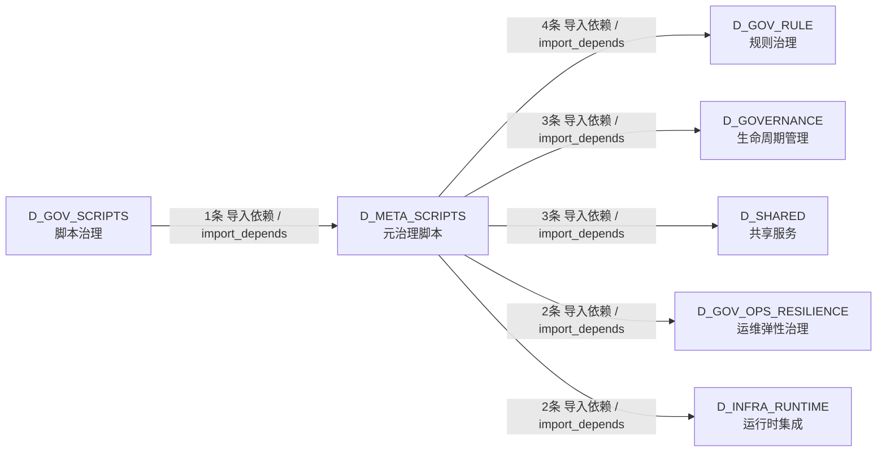

# 59_d_meta_scripts / 元治理脚本 / D_META_SCRIPTS

> **文档作用 / Purpose**: 展示 元治理脚本（D_META_SCRIPTS）功能域的模块清单、域内依赖关系、跨域依赖关系、架构分层视图，供架构审查和域治理参考。

> 本文档由 generate_domain_doc.py 从 depgraph (PostgreSQL) 自动生成
> 数据源: depgraph (PostgreSQL) nodes表 + edges表

## 域基本信息 / Domain Overview

| 字段 | 值 | Field | Value |
|------|------|-------|-------|
| 编号 | 59 | Number | 59 |
| 域ID | D_META_SCRIPTS | Domain ID | D_META_SCRIPTS |
| 域名称 | 元治理脚本 | Domain Name | D_META_SCRIPTS |
| 层级 | L2 业务域层 | Layer | L2 Domain |
| 模块数 | 49 | Module Count | 49 |
| 域内依赖 | 2 | Internal Dependencies | 2 |
| 跨域入边 | 1 | Cross-domain Incoming | 1 |
| 跨域出边 | 14 | Cross-domain Outgoing | 14 |
| 设计态模块 | 0 | Design Modules | 0 |
| 生产态模块 | 49 | Production Modules | 49 |
| 容量 | 0/150 (正常) | Capacity | 0/150 (正常) |
| 描述 | 元治理脚本（meta） | Description | 元治理脚本（meta） |

## 模块分层清单 / Module Layered List

> 按 architecture_layer 分组的模块清单（共 49 个模块 / 49 modules）。

### L2 领域层 / Domain Layer (49 modules)

| # | 模块路径 / Module Path | 模块名称 / Module Name (功能简介 / Description) | 成熟度 / Maturity | 蓝图 / Blueprint |
|:--:|---------|---------|:---:|:---:|
| 1 | scripts/governance/meta/_concurrency.py | Module docstring — see module-level docstring ... | 生产态 / production |  |
| 2 | scripts/governance/meta/arbitrate_findings.py | arbitrate_findings.py — Finding 仲裁器（跨脚本... | 生产态 / production |  |
| 3 | scripts/governance/meta/backup_runtime_state.py | backup_runtime_state.py — 运行时状态备份（蓝图... | 生产态 / production |  |
| 4 | scripts/governance/meta/benchmark/test_fixtures/bad_impor... | Module docstring — see module-level docstring ... | 生产态 / production |  |
| 5 | scripts/governance/meta/benchmark/test_fixtures/incomplet... | Module docstring — see module-level docstring ... | 生产态 / production |  |
| 6 | scripts/governance/meta/benchmark/test_fixtures/orphan_fi... | Module docstring — see module-level docstring ... | 生产态 / production |  |
| 7 | scripts/governance/meta/compute_sla_metrics.py | compute_sla_metrics.py — SLA/SLO 指标计算引擎... | 生产态 / production |  |
| 8 | scripts/governance/meta/create_task_from_finding.py | create_task_from_finding.py — Finding → 任务... | 生产态 / production |  |
| 9 | scripts/governance/meta/detect_config_deviation.py | detect_config_deviation.py — 配置文件结构完整... | 生产态 / production |  |
| 10 | scripts/governance/meta/detect_fix_oscillation.py | detect_fix_oscillation.py — 自修复振荡检测（蓝... | 生产态 / production |  |
| 11 | scripts/governance/meta/detect_hallucinated_packages.py | detect_hallucinated_packages.py — 幻觉包（Slop... | 生产态 / production |  |
| 12 | scripts/governance/meta/detect_script_divergence.py | detect_script_divergence.py — 脚本实现与蓝图规... | 生产态 / production |  |
| 13 | scripts/governance/meta/detect_script_rot.py | detect_script_rot.py — Script Rot（脚本静默失... | 生产态 / production |  |
| 14 | scripts/governance/meta/env_check.py | env_check.py — 环境就绪检查门禁 (Environment R... | 生产态 / production |  |
| 15 | scripts/governance/meta/finding_state_machine.py | finding_state_machine.py — Finding 全生命周期... | 生产态 / production |  |
| 16 | scripts/governance/meta/gate_engine_selfcheck.py | Gate Engine Bootstrap Self-Check — Quis custod... | 生产态 / production |  |
| 17 | scripts/governance/meta/governance_watchdog.py | Module docstring — see module-level docstring ... | 生产态 / production |  |
| 18 | scripts/governance/meta/manage_baseline.py | manage_baseline.py — Finding 基线快照管理 | 生产态 / production |  |
| 19 | scripts/governance/meta/manage_error_budget.py | manage_error_budget.py — Error Budget + Burn R... | 生产态 / production |  |
| 20 | scripts/governance/meta/manage_finding_timeseries.py | manage_finding_timeseries.py — Finding 时序数... | 生产态 / production |  |
| 21 | scripts/governance/meta/manage_script_ab_test.py | manage_script_ab_test.py — 脚本 A/B 对照模式 (... | 生产态 / production |  |
| 22 | scripts/governance/meta/manage_script_retirement.py | manage_script_retirement.py — 脚本退役/废弃生... | 生产态 / production |  |
| 23 | scripts/governance/meta/manage_shadow_mode.py | manage_shadow_mode.py — Shadow Mode 渐进激活管理 | 生产态 / production |  |
| 24 | scripts/governance/meta/mutation_test_post_sync_validator.py | mutation_test_post_sync_validator.py — SSoT 变... | 生产态 / production |  |
| 25 | scripts/governance/meta/mutation_test_reconciliation_regi... | mutation_test_reconciliation_registry.py — Rec... | 生产态 / production |  |
| 26 | scripts/governance/meta/phase_e_context_check.py | Phase E: AI context injection verification script | 生产态 / production |  |
| 27 | scripts/governance/meta/pre_op_check.py | AI操作前准入控制器 — 写/删文件前的机械门禁检查. | 生产态 / production |  |
| 28 | scripts/governance/meta/score_script_effectiveness.py | score_script_effectiveness.py — 脚本有效性评分... | 生产态 / production |  |
| 29 | scripts/governance/meta/session_startup_check.py | Session 冷启动自检 — 运行 Phase 0 全部 14 个检... | 生产态 / production |  |
| 30 | scripts/governance/meta/trace_finding_lifecycle.py | trace_finding_lifecycle.py — Finding C1→C5 全... | 生产态 / production |  |
| 31 | scripts/governance/meta/track_script_costs.py | track_script_costs.py — 脚本执行 AI 费用追踪 | 生产态 / production |  |
| 32 | scripts/governance/meta/validate_automation_boundary.py | Module docstring — see module-level docstring ... | 生产态 / production |  |
| 33 | scripts/governance/meta/validate_cross_model_consensus.py | validate_cross_model_consensus.py — 多AI模型共... | 生产态 / production |  |
| 34 | scripts/governance/meta/validate_dependency_chain.py | validate_dependency_chain.py — 依赖链拓扑顺序验证 | 生产态 / production |  |
| 35 | scripts/governance/meta/validate_emergency_bypass_log.py | validate_emergency_bypass_log.py — 应急绕过审... | 生产态 / production |  |
| 36 | scripts/governance/meta/validate_end_to_end_benchmark.py | validate_end_to_end_benchmark.py — END-TO-END ... | 生产态 / production |  |
| 37 | scripts/governance/meta/validate_environment_health.py | validate_environment_health.py — 脚本运行环境... | 生产态 / production |  |
| 38 | scripts/governance/meta/validate_false_negatives.py | validate_false_negatives.py — 假阴性检测引擎 (... | 生产态 / production |  |
| 39 | scripts/governance/meta/validate_gate_engine_external.py | validate_gate_engine_external.py — Gate Engine... | 生产态 / production |  |
| 40 | scripts/governance/meta/validate_mutation_testing.py | validate_mutation_testing.py — 变异测试引擎（... | 生产态 / production |  |
| 41 | scripts/governance/meta/validate_rule_freshness.py | validate_rule_freshness.py — AI Session 注入文... | 生产态 / production |  |
| 42 | scripts/governance/meta/validate_rules_file_backdoor.py | validate_rules_file_backdoor.py — Rules File B... | 生产态 / production |  |
| 43 | scripts/governance/meta/validate_rules_integrity.py | validate_rules_integrity.py — 规则文件完整性保护 | 生产态 / production |  |
| 44 | scripts/governance/meta/validate_script_onboarding.py | Module docstring — see module-level docstring ... | 生产态 / production |  |
| 45 | scripts/governance/meta/validate_script_provenance.py | validate_script_provenance.py — 脚本 Provenanc... | 生产态 / production |  |
| 46 | scripts/governance/meta/validate_script_system_health.py | validate_script_system_health.py — 脚本系统健... | 生产态 / production |  |
| 47 | scripts/governance/meta/validate_threshold_changes.py | validate_threshold_changes.py — 阈值变更审计日志 | 生产态 / production |  |
| 48 | scripts/governance/meta/validate_trust_tier.py | validate_trust_tier.py — Trust-Tier 门禁执行器 | 生产态 / production |  |
| 49 | scripts/governance/meta/verify_reconciliation_registry.py | verify_reconciliation_registry.py — Reconcilia... | 生产态 / production |  |

## 域内依赖图 / Internal Dependency Diagram

> 依赖图内嵌在本文档中，IDE 可直接渲染显示。参考 decision_index.md 设计，分三个视图：合并全景图、运营态子图、设计态子图（按 design_maturity 实际值拆分）。
>
> **图例说明 / Legend**：
> - **实线边框 = 运营态模块**（production，已上线运行）
> - **虚线边框 = 设计态模块**（design，蓝图阶段，代码未写）
> - **实线箭头 = 运营态依赖**（已生效的依赖关系）
> - **虚线箭头 = 非运营态依赖**（计划中/验证中的依赖关系）

### 合并全景图（全部模块，标签标注成熟度）

> 展示全部 49 个模块（生产态 49 + 设计态 0），标签标注成熟度。

#### 第 1 页 / 共 2 页

```mermaid
graph TD
    subgraph D_META_SCRIPTS["D_META_SCRIPTS 元治理脚本"]
        scripts_governance_meta_concurrency_py["(生产态 / production) Module docstring — see module-level docstring ...<br/>文件: _concurrency.py"]
        scripts_governance_meta_arbitrate_findings_py["(生产态 / production) arbitrate_findings.py — Finding 仲裁器（跨脚本...<br/>文件: arbitrate_findings.py"]
        scripts_governance_meta_backup_runtime_state_py["(生产态 / production) backup_runtime_state.py — 运行时状态备份（蓝图...<br/>文件: backup_runtime_state.py"]
        scripts_governance_meta_benchmark_test_fixtures_bad_imports_py["(生产态 / production) Module docstring — see module-level docstring ...<br/>文件: bad_imports.py"]
        scripts_governance_meta_benchmark_test_fixtures_incomplete_module_py["(生产态 / production) Module docstring — see module-level docstring ...<br/>文件: incomplete_module.py"]
        scripts_governance_meta_benchmark_test_fixtures_orphan_file_without_module_registration_py["(生产态 / production) Module docstring — see module-level docstring ...<br/>文件: orphan_file_without_module_registration.py"]
        scripts_governance_meta_compute_sla_metrics_py["(生产态 / production) compute_sla_metrics.py — SLA/SLO 指标计算引擎...<br/>文件: compute_sla_metrics.py"]
        scripts_governance_meta_create_task_from_finding_py["(生产态 / production) create_task_from_finding.py — Finding → 任务...<br/>文件: create_task_from_finding.py"]
        scripts_governance_meta_detect_config_deviation_py["(生产态 / production) detect_config_deviation.py — 配置文件结构完整...<br/>文件: detect_config_deviation.py"]
        scripts_governance_meta_detect_fix_oscillation_py["(生产态 / production) detect_fix_oscillation.py — 自修复振荡检测（蓝...<br/>文件: detect_fix_oscillation.py"]
        scripts_governance_meta_detect_hallucinated_packages_py["(生产态 / production) detect_hallucinated_packages.py — 幻觉包（Slop...<br/>文件: detect_hallucinated_packages.py"]
        scripts_governance_meta_detect_script_divergence_py["(生产态 / production) detect_script_divergence.py — 脚本实现与蓝图规...<br/>文件: detect_script_divergence.py"]
        scripts_governance_meta_detect_script_rot_py["(生产态 / production) detect_script_rot.py — Script Rot（脚本静默失...<br/>文件: detect_script_rot.py"]
        scripts_governance_meta_env_check_py["(生产态 / production) env_check.py — 环境就绪检查门禁 (Environment R...<br/>文件: env_check.py"]
        scripts_governance_meta_finding_state_machine_py["(生产态 / production) finding_state_machine.py — Finding 全生命周期...<br/>文件: finding_state_machine.py"]
        scripts_governance_meta_gate_engine_selfcheck_py["(生产态 / production) Gate Engine Bootstrap Self-Check — Quis custod...<br/>文件: gate_engine_selfcheck.py"]
        scripts_governance_meta_governance_watchdog_py["(生产态 / production) Module docstring — see module-level docstring ...<br/>文件: governance_watchdog.py"]
        scripts_governance_meta_manage_baseline_py["(生产态 / production) manage_baseline.py — Finding 基线快照管理<br/>文件: manage_baseline.py"]
        scripts_governance_meta_manage_error_budget_py["(生产态 / production) manage_error_budget.py — Error Budget + Burn R...<br/>文件: manage_error_budget.py"]
        scripts_governance_meta_manage_finding_timeseries_py["(生产态 / production) manage_finding_timeseries.py — Finding 时序数...<br/>文件: manage_finding_timeseries.py"]
        scripts_governance_meta_manage_script_ab_test_py["(生产态 / production) manage_script_ab_test.py — 脚本 A/B 对照模式 (...<br/>文件: manage_script_ab_test.py"]
        scripts_governance_meta_manage_script_retirement_py["(生产态 / production) manage_script_retirement.py — 脚本退役/废弃生...<br/>文件: manage_script_retirement.py"]
        scripts_governance_meta_manage_shadow_mode_py["(生产态 / production) manage_shadow_mode.py — Shadow Mode 渐进激活管理<br/>文件: manage_shadow_mode.py"]
        scripts_governance_meta_mutation_test_post_sync_validator_py["(生产态 / production) mutation_test_post_sync_validator.py — SSoT 变...<br/>文件: mutation_test_post_sync_validator.py"]
        scripts_governance_meta_mutation_test_reconciliation_registry_py["(生产态 / production) mutation_test_reconciliation_registry.py — Rec...<br/>文件: mutation_test_reconciliation_registry.py"]
        scripts_governance_meta_phase_e_context_check_py["(生产态 / production) Phase E: AI context injection verification script<br/>文件: phase_e_context_check.py"]
        scripts_governance_meta_pre_op_check_py["(生产态 / production) AI操作前准入控制器 — 写/删文件前的机械门禁检查.<br/>文件: pre_op_check.py"]
        scripts_governance_meta_score_script_effectiveness_py["(生产态 / production) score_script_effectiveness.py — 脚本有效性评分...<br/>文件: score_script_effectiveness.py"]
        scripts_governance_meta_session_startup_check_py["(生产态 / production) Session 冷启动自检 — 运行 Phase 0 全部 14 个检...<br/>文件: session_startup_check.py"]
        scripts_governance_meta_trace_finding_lifecycle_py["(生产态 / production) trace_finding_lifecycle.py — Finding C1→C5 全...<br/>文件: trace_finding_lifecycle.py"]
    end
    scripts_governance_meta_benchmark_test_fixtures_bad_imports_py -->|config_depends / config_depends| scripts_governance_meta_benchmark_test_fixtures_incomplete_module_py
    scripts_governance_meta_benchmark_test_fixtures_orphan_file_without_module_registration_py -->|config_depends / config_depends| scripts_governance_meta_benchmark_test_fixtures_bad_imports_py
    D_SHARED["(生产态 / production) D_SHARED"]
    scripts_governance_meta_create_task_from_finding_py -->|导入依赖 / import_depends| D_SHARED
    D_GOVERNANCE["(生产态 / production) D_GOVERNANCE"]
    scripts_governance_meta_create_task_from_finding_py -->|导入依赖 / import_depends| D_GOVERNANCE
    scripts_governance_meta_create_task_from_finding_py -->|导入依赖 / import_depends| D_GOVERNANCE
    D_GOV_RULE["(生产态 / production) D_GOV_RULE"]
    scripts_governance_meta_create_task_from_finding_py -->|导入依赖 / import_depends| D_GOV_RULE
    scripts_governance_meta_create_task_from_finding_py -->|导入依赖 / import_depends| D_SHARED
    scripts_governance_meta_backup_runtime_state_py -->|导入依赖 / import_depends| D_GOVERNANCE
    D_INFRA_RUNTIME["(生产态 / production) D_INFRA_RUNTIME"]
    scripts_governance_meta_finding_state_machine_py -->|导入依赖 / import_depends| D_INFRA_RUNTIME
    scripts_governance_meta_gate_engine_selfcheck_py -->|导入依赖 / import_depends| D_GOV_RULE
    D_GOV_OPS_RESILIENCE["(生产态 / production) D_GOV_OPS_RESILIENCE"]
    scripts_governance_meta_session_startup_check_py -->|导入依赖 / import_depends| D_GOV_OPS_RESILIENCE
    scripts_governance_meta_session_startup_check_py -->|导入依赖 / import_depends| D_GOV_OPS_RESILIENCE
    scripts_governance_meta_concurrency_py -->|导入依赖 / import_depends| D_SHARED
    D_GOV_SCRIPTS["(生产态 / production) D_GOV_SCRIPTS"]
    D_GOV_SCRIPTS -->|导入依赖 / import_depends| scripts_governance_meta_backup_runtime_state_py
    classDef production fill:#e1f5fe,stroke:#01579b,stroke-width:2px,color:#000
    classDef design fill:#fff3e0,stroke:#e65100,stroke-width:2px,color:#000,stroke-dasharray: 5 5
    classDef external_prod fill:#e8f5e9,stroke:#1b5e20,stroke-width:1px,color:#000
    classDef external_design fill:#fce4ec,stroke:#880e4f,stroke-width:1px,color:#000,stroke-dasharray: 5 5
    class scripts_governance_meta_concurrency_py,scripts_governance_meta_arbitrate_findings_py,scripts_governance_meta_backup_runtime_state_py,scripts_governance_meta_benchmark_test_fixtures_bad_imports_py,scripts_governance_meta_benchmark_test_fixtures_incomplete_module_py,scripts_governance_meta_benchmark_test_fixtures_orphan_file_without_module_registration_py,scripts_governance_meta_compute_sla_metrics_py,scripts_governance_meta_create_task_from_finding_py,scripts_governance_meta_detect_config_deviation_py,scripts_governance_meta_detect_fix_oscillation_py,scripts_governance_meta_detect_hallucinated_packages_py,scripts_governance_meta_detect_script_divergence_py,scripts_governance_meta_detect_script_rot_py,scripts_governance_meta_env_check_py,scripts_governance_meta_finding_state_machine_py,scripts_governance_meta_gate_engine_selfcheck_py,scripts_governance_meta_governance_watchdog_py,scripts_governance_meta_manage_baseline_py,scripts_governance_meta_manage_error_budget_py,scripts_governance_meta_manage_finding_timeseries_py,scripts_governance_meta_manage_script_ab_test_py,scripts_governance_meta_manage_script_retirement_py,scripts_governance_meta_manage_shadow_mode_py,scripts_governance_meta_mutation_test_post_sync_validator_py,scripts_governance_meta_mutation_test_reconciliation_registry_py,scripts_governance_meta_phase_e_context_check_py,scripts_governance_meta_pre_op_check_py,scripts_governance_meta_score_script_effectiveness_py,scripts_governance_meta_session_startup_check_py,scripts_governance_meta_trace_finding_lifecycle_py production
    class D_SHARED,D_GOVERNANCE,D_GOV_RULE,D_INFRA_RUNTIME,D_GOV_OPS_RESILIENCE,D_GOV_SCRIPTS external_prod
```

#### 第 2 页 / 共 2 页

### 运营态子图（仅 design_maturity=production 的模块和依赖）

> 仅展示已上线运行的模块（共 49 个，2 条域内依赖）。

```mermaid
graph TD
    subgraph D_META_SCRIPTS["D_META_SCRIPTS 元治理脚本"]
        scripts_governance_meta_concurrency_py["(生产态 / production) Module docstring — see module-level docstring ...<br/>文件: _concurrency.py"]
        scripts_governance_meta_arbitrate_findings_py["(生产态 / production) arbitrate_findings.py — Finding 仲裁器（跨脚本...<br/>文件: arbitrate_findings.py"]
        scripts_governance_meta_backup_runtime_state_py["(生产态 / production) backup_runtime_state.py — 运行时状态备份（蓝图...<br/>文件: backup_runtime_state.py"]
        scripts_governance_meta_benchmark_test_fixtures_bad_imports_py["(生产态 / production) Module docstring — see module-level docstring ...<br/>文件: bad_imports.py"]
        scripts_governance_meta_benchmark_test_fixtures_incomplete_module_py["(生产态 / production) Module docstring — see module-level docstring ...<br/>文件: incomplete_module.py"]
        scripts_governance_meta_benchmark_test_fixtures_orphan_file_without_module_registration_py["(生产态 / production) Module docstring — see module-level docstring ...<br/>文件: orphan_file_without_module_registration.py"]
        scripts_governance_meta_compute_sla_metrics_py["(生产态 / production) compute_sla_metrics.py — SLA/SLO 指标计算引擎...<br/>文件: compute_sla_metrics.py"]
        scripts_governance_meta_create_task_from_finding_py["(生产态 / production) create_task_from_finding.py — Finding → 任务...<br/>文件: create_task_from_finding.py"]
        scripts_governance_meta_detect_config_deviation_py["(生产态 / production) detect_config_deviation.py — 配置文件结构完整...<br/>文件: detect_config_deviation.py"]
        scripts_governance_meta_detect_fix_oscillation_py["(生产态 / production) detect_fix_oscillation.py — 自修复振荡检测（蓝...<br/>文件: detect_fix_oscillation.py"]
        scripts_governance_meta_detect_hallucinated_packages_py["(生产态 / production) detect_hallucinated_packages.py — 幻觉包（Slop...<br/>文件: detect_hallucinated_packages.py"]
        scripts_governance_meta_detect_script_divergence_py["(生产态 / production) detect_script_divergence.py — 脚本实现与蓝图规...<br/>文件: detect_script_divergence.py"]
        scripts_governance_meta_detect_script_rot_py["(生产态 / production) detect_script_rot.py — Script Rot（脚本静默失...<br/>文件: detect_script_rot.py"]
        scripts_governance_meta_env_check_py["(生产态 / production) env_check.py — 环境就绪检查门禁 (Environment R...<br/>文件: env_check.py"]
        scripts_governance_meta_finding_state_machine_py["(生产态 / production) finding_state_machine.py — Finding 全生命周期...<br/>文件: finding_state_machine.py"]
        scripts_governance_meta_gate_engine_selfcheck_py["(生产态 / production) Gate Engine Bootstrap Self-Check — Quis custod...<br/>文件: gate_engine_selfcheck.py"]
        scripts_governance_meta_governance_watchdog_py["(生产态 / production) Module docstring — see module-level docstring ...<br/>文件: governance_watchdog.py"]
        scripts_governance_meta_manage_baseline_py["(生产态 / production) manage_baseline.py — Finding 基线快照管理<br/>文件: manage_baseline.py"]
        scripts_governance_meta_manage_error_budget_py["(生产态 / production) manage_error_budget.py — Error Budget + Burn R...<br/>文件: manage_error_budget.py"]
        scripts_governance_meta_manage_finding_timeseries_py["(生产态 / production) manage_finding_timeseries.py — Finding 时序数...<br/>文件: manage_finding_timeseries.py"]
        scripts_governance_meta_manage_script_ab_test_py["(生产态 / production) manage_script_ab_test.py — 脚本 A/B 对照模式 (...<br/>文件: manage_script_ab_test.py"]
        scripts_governance_meta_manage_script_retirement_py["(生产态 / production) manage_script_retirement.py — 脚本退役/废弃生...<br/>文件: manage_script_retirement.py"]
        scripts_governance_meta_manage_shadow_mode_py["(生产态 / production) manage_shadow_mode.py — Shadow Mode 渐进激活管理<br/>文件: manage_shadow_mode.py"]
        scripts_governance_meta_mutation_test_post_sync_validator_py["(生产态 / production) mutation_test_post_sync_validator.py — SSoT 变...<br/>文件: mutation_test_post_sync_validator.py"]
        scripts_governance_meta_mutation_test_reconciliation_registry_py["(生产态 / production) mutation_test_reconciliation_registry.py — Rec...<br/>文件: mutation_test_reconciliation_registry.py"]
        scripts_governance_meta_phase_e_context_check_py["(生产态 / production) Phase E: AI context injection verification script<br/>文件: phase_e_context_check.py"]
        scripts_governance_meta_pre_op_check_py["(生产态 / production) AI操作前准入控制器 — 写/删文件前的机械门禁检查.<br/>文件: pre_op_check.py"]
        scripts_governance_meta_score_script_effectiveness_py["(生产态 / production) score_script_effectiveness.py — 脚本有效性评分...<br/>文件: score_script_effectiveness.py"]
        scripts_governance_meta_session_startup_check_py["(生产态 / production) Session 冷启动自检 — 运行 Phase 0 全部 14 个检...<br/>文件: session_startup_check.py"]
        scripts_governance_meta_trace_finding_lifecycle_py["(生产态 / production) trace_finding_lifecycle.py — Finding C1→C5 全...<br/>文件: trace_finding_lifecycle.py"]
        scripts_governance_meta_track_script_costs_py["(生产态 / production) track_script_costs.py — 脚本执行 AI 费用追踪<br/>文件: track_script_costs.py"]
        scripts_governance_meta_validate_automation_boundary_py["(生产态 / production) Module docstring — see module-level docstring ...<br/>文件: validate_automation_boundary.py"]
        scripts_governance_meta_validate_cross_model_consensus_py["(生产态 / production) validate_cross_model_consensus.py — 多AI模型共...<br/>文件: validate_cross_model_consensus.py"]
        scripts_governance_meta_validate_dependency_chain_py["(生产态 / production) validate_dependency_chain.py — 依赖链拓扑顺序验证<br/>文件: validate_dependency_chain.py"]
        scripts_governance_meta_validate_emergency_bypass_log_py["(生产态 / production) validate_emergency_bypass_log.py — 应急绕过审...<br/>文件: validate_emergency_bypass_log.py"]
        scripts_governance_meta_validate_end_to_end_benchmark_py["(生产态 / production) validate_end_to_end_benchmark.py — END-TO-END ...<br/>文件: validate_end_to_end_benchmark.py"]
        scripts_governance_meta_validate_environment_health_py["(生产态 / production) validate_environment_health.py — 脚本运行环境...<br/>文件: validate_environment_health.py"]
        scripts_governance_meta_validate_false_negatives_py["(生产态 / production) validate_false_negatives.py — 假阴性检测引擎 (...<br/>文件: validate_false_negatives.py"]
        scripts_governance_meta_validate_gate_engine_external_py["(生产态 / production) validate_gate_engine_external.py — Gate Engine...<br/>文件: validate_gate_engine_external.py"]
        scripts_governance_meta_validate_mutation_testing_py["(生产态 / production) validate_mutation_testing.py — 变异测试引擎（...<br/>文件: validate_mutation_testing.py"]
        scripts_governance_meta_validate_rule_freshness_py["(生产态 / production) validate_rule_freshness.py — AI Session 注入文...<br/>文件: validate_rule_freshness.py"]
        scripts_governance_meta_validate_rules_file_backdoor_py["(生产态 / production) validate_rules_file_backdoor.py — Rules File B...<br/>文件: validate_rules_file_backdoor.py"]
        scripts_governance_meta_validate_rules_integrity_py["(生产态 / production) validate_rules_integrity.py — 规则文件完整性保护<br/>文件: validate_rules_integrity.py"]
        scripts_governance_meta_validate_script_onboarding_py["(生产态 / production) Module docstring — see module-level docstring ...<br/>文件: validate_script_onboarding.py"]
        scripts_governance_meta_validate_script_provenance_py["(生产态 / production) validate_script_provenance.py — 脚本 Provenanc...<br/>文件: validate_script_provenance.py"]
        scripts_governance_meta_validate_script_system_health_py["(生产态 / production) validate_script_system_health.py — 脚本系统健...<br/>文件: validate_script_system_health.py"]
        scripts_governance_meta_validate_threshold_changes_py["(生产态 / production) validate_threshold_changes.py — 阈值变更审计日志<br/>文件: validate_threshold_changes.py"]
        scripts_governance_meta_validate_trust_tier_py["(生产态 / production) validate_trust_tier.py — Trust-Tier 门禁执行器<br/>文件: validate_trust_tier.py"]
        scripts_governance_meta_verify_reconciliation_registry_py["(生产态 / production) verify_reconciliation_registry.py — Reconcilia...<br/>文件: verify_reconciliation_registry.py"]
    end
    scripts_governance_meta_benchmark_test_fixtures_bad_imports_py -->|config_depends / config_depends| scripts_governance_meta_benchmark_test_fixtures_incomplete_module_py
    scripts_governance_meta_benchmark_test_fixtures_orphan_file_without_module_registration_py -->|config_depends / config_depends| scripts_governance_meta_benchmark_test_fixtures_bad_imports_py
    D_SHARED["(生产态 / production) D_SHARED"]
    scripts_governance_meta_create_task_from_finding_py -->|导入依赖 / import_depends| D_SHARED
    D_GOV_RULE["(生产态 / production) D_GOV_RULE"]
    scripts_governance_meta_create_task_from_finding_py -->|导入依赖 / import_depends| D_GOV_RULE
    scripts_governance_meta_validate_gate_engine_external_py -->|导入依赖 / import_depends| D_GOV_RULE
    D_GOVERNANCE["(生产态 / production) D_GOVERNANCE"]
    scripts_governance_meta_backup_runtime_state_py -->|导入依赖 / import_depends| D_GOVERNANCE
    scripts_governance_meta_validate_gate_engine_external_py -->|导入依赖 / import_depends| D_GOV_RULE
    scripts_governance_meta_create_task_from_finding_py -->|导入依赖 / import_depends| D_GOVERNANCE
    D_INFRA_RUNTIME["(生产态 / production) D_INFRA_RUNTIME"]
    scripts_governance_meta_finding_state_machine_py -->|导入依赖 / import_depends| D_INFRA_RUNTIME
    scripts_governance_meta_create_task_from_finding_py -->|导入依赖 / import_depends| D_GOVERNANCE
    scripts_governance_meta_concurrency_py -->|导入依赖 / import_depends| D_SHARED
    scripts_governance_meta_create_task_from_finding_py -->|导入依赖 / import_depends| D_SHARED
    scripts_governance_meta_validate_emergency_bypass_log_py -->|导入依赖 / import_depends| D_INFRA_RUNTIME
    scripts_governance_meta_gate_engine_selfcheck_py -->|导入依赖 / import_depends| D_GOV_RULE
    D_GOV_OPS_RESILIENCE["(生产态 / production) D_GOV_OPS_RESILIENCE"]
    scripts_governance_meta_session_startup_check_py -->|导入依赖 / import_depends| D_GOV_OPS_RESILIENCE
    scripts_governance_meta_session_startup_check_py -->|导入依赖 / import_depends| D_GOV_OPS_RESILIENCE
    D_GOV_SCRIPTS["(生产态 / production) D_GOV_SCRIPTS"]
    D_GOV_SCRIPTS -->|导入依赖 / import_depends| scripts_governance_meta_backup_runtime_state_py
    classDef production fill:#e1f5fe,stroke:#01579b,stroke-width:2px,color:#000
    classDef design fill:#fff3e0,stroke:#e65100,stroke-width:2px,color:#000,stroke-dasharray: 5 5
    classDef external_prod fill:#e8f5e9,stroke:#1b5e20,stroke-width:1px,color:#000
    classDef external_design fill:#fce4ec,stroke:#880e4f,stroke-width:1px,color:#000,stroke-dasharray: 5 5
    class scripts_governance_meta_concurrency_py,scripts_governance_meta_arbitrate_findings_py,scripts_governance_meta_backup_runtime_state_py,scripts_governance_meta_benchmark_test_fixtures_bad_imports_py,scripts_governance_meta_benchmark_test_fixtures_incomplete_module_py,scripts_governance_meta_benchmark_test_fixtures_orphan_file_without_module_registration_py,scripts_governance_meta_compute_sla_metrics_py,scripts_governance_meta_create_task_from_finding_py,scripts_governance_meta_detect_config_deviation_py,scripts_governance_meta_detect_fix_oscillation_py,scripts_governance_meta_detect_hallucinated_packages_py,scripts_governance_meta_detect_script_divergence_py,scripts_governance_meta_detect_script_rot_py,scripts_governance_meta_env_check_py,scripts_governance_meta_finding_state_machine_py,scripts_governance_meta_gate_engine_selfcheck_py,scripts_governance_meta_governance_watchdog_py,scripts_governance_meta_manage_baseline_py,scripts_governance_meta_manage_error_budget_py,scripts_governance_meta_manage_finding_timeseries_py,scripts_governance_meta_manage_script_ab_test_py,scripts_governance_meta_manage_script_retirement_py,scripts_governance_meta_manage_shadow_mode_py,scripts_governance_meta_mutation_test_post_sync_validator_py,scripts_governance_meta_mutation_test_reconciliation_registry_py,scripts_governance_meta_phase_e_context_check_py,scripts_governance_meta_pre_op_check_py,scripts_governance_meta_score_script_effectiveness_py,scripts_governance_meta_session_startup_check_py,scripts_governance_meta_trace_finding_lifecycle_py,scripts_governance_meta_track_script_costs_py,scripts_governance_meta_validate_automation_boundary_py,scripts_governance_meta_validate_cross_model_consensus_py,scripts_governance_meta_validate_dependency_chain_py,scripts_governance_meta_validate_emergency_bypass_log_py,scripts_governance_meta_validate_end_to_end_benchmark_py,scripts_governance_meta_validate_environment_health_py,scripts_governance_meta_validate_false_negatives_py,scripts_governance_meta_validate_gate_engine_external_py,scripts_governance_meta_validate_mutation_testing_py,scripts_governance_meta_validate_rule_freshness_py,scripts_governance_meta_validate_rules_file_backdoor_py,scripts_governance_meta_validate_rules_integrity_py,scripts_governance_meta_validate_script_onboarding_py,scripts_governance_meta_validate_script_provenance_py,scripts_governance_meta_validate_script_system_health_py,scripts_governance_meta_validate_threshold_changes_py,scripts_governance_meta_validate_trust_tier_py,scripts_governance_meta_verify_reconciliation_registry_py production
    class D_SHARED,D_GOV_RULE,D_GOVERNANCE,D_INFRA_RUNTIME,D_GOV_OPS_RESILIENCE,D_GOV_SCRIPTS external_prod
```

### 设计态子图（仅 design_maturity=design 的模块和依赖）

> 仅展示蓝图阶段、代码未写的设计态模块（共 0 个，0 条域内依赖）。

> （无设计态模块 / No design modules）

## 跨域依赖 / Cross-domain Dependencies

### 本域依赖的其他域（出边）/ Depends On

| # | 本域模块 / Source Module | → | 外部域-目标模块 / Target Module | 依赖类型 / Type |
|:--:|---------|:--:|---------|---------|
| 1 | backup_runtime_state.py — 运行时状态备份（蓝图... | → | D_GOVERNANCE 生命周期管理: depgraph Schema DDL + 版本化迁移框架 (depgraph_... | 导入依赖 / import_depends |
| 2 | create_task_from_finding.py — Finding → 任务.... | → | D_GOVERNANCE 生命周期管理: SQLite 元数据层 Schema DDL + 版本化迁移框架（T-... | 导入依赖 / import_depends |
| 3 | create_task_from_finding.py — Finding → 任务.... | → | D_GOVERNANCE 生命周期管理: TaskRepository — 任务登记表 CRUD + 状态机（T-1... | 导入依赖 / import_depends |
| 4 | Session 冷启动自检 — 运行 Phase 0 全部 14 个检... | → | D_GOV_OPS_RESILIENCE 运维弹性治理: PhaseManager->GateEngine 检查注册表桥梁 — 44 .... | 导入依赖 / import_depends |
| 5 | Session 冷启动自检 — 运行 Phase 0 全部 14 个检... | → | D_GOV_OPS_RESILIENCE 运维弹性治理: Phase Manager — ZephyrAlpha 施工阶段门控引擎. ... | 导入依赖 / import_depends |
| 6 | create_task_from_finding.py — Finding → 任务.... | → | D_GOV_RULE 规则治理: task_types.py | 导入依赖 / import_depends |
| 7 | Gate Engine Bootstrap Self-Check — Quis custod... | → | D_GOV_RULE 规则治理: GateEngine — KMS G1-G6 + Orc G0/G7 + 交易 G10-... | 导入依赖 / import_depends |
| 8 | validate_gate_engine_external.py — Gate Engine... | → | D_GOV_RULE 规则治理: CircuitBreakerGateway (CBG) — 模块间调用单向熔... | 导入依赖 / import_depends |
| 9 | validate_gate_engine_external.py — Gate Engine... | → | D_GOV_RULE 规则治理: GateEngine — KMS G1-G6 + Orc G0/G7 + 交易 G10-... | 导入依赖 / import_depends |
| 10 | finding_state_machine.py — Finding 全生命周期.... | → | D_INFRA_RUNTIME 运行时集成: Finding Schema — 审计发现标准化数据模型 (findi... | 导入依赖 / import_depends |
| 11 | validate_emergency_bypass_log.py — 应急绕过审.... | → | D_INFRA_RUNTIME 运行时集成: Finding Schema — 审计发现标准化数据模型 (findi... | 导入依赖 / import_depends |
| 12 | Module docstring — see module-level docstring ... | → | D_SHARED 共享服务: process_pool.py - Shared process pool for MCP s... | 导入依赖 / import_depends |
| 13 | create_task_from_finding.py — Finding → 任务.... | → | D_SHARED 共享服务: ZephyrAlpha 任务系统核心数据模型 (models.py) | 导入依赖 / import_depends |
| 14 | create_task_from_finding.py — Finding → 任务.... | → | D_SHARED 共享服务: paths.py — 项目路径常量 SSoT（Single Source of... | 导入依赖 / import_depends |

### 依赖本域的其他域（入边）/ Depended By

| # | 外部域-源模块 / Source Module | → | 本域模块 / Target Module | 依赖类型 / Type |
|:--:|---------|:--:|---------|---------|
| 1 | D_GOV_SCRIPTS 脚本治理: [INVARIANTS] 原子写入（RULE-ONE）；变更前验证；... | → | backup_runtime_state.py — 运行时状态备份（蓝图... | 导入依赖 / import_depends |

### 跨域依赖图 / Cross-domain Dependency Diagram

> 本域与 6 个外部域直接连接（出边 14 条 + 入边 1 条 = 15 条）。只显示直接连接的域，不展开具体节点。

## 说明 / Notes

- **数据源 / Data Source**: `depgraph (PostgreSQL)` 的 `nodes`、`edges`、`domains` 表
- **生成器 / Generator**: `generate_domain_doc.py`（G2+G10 合并）
- **维护方式 / Maintenance**: 自动生成，全景图更新时刷新
- **文件名规则 / File Naming**: `{编号:02d}_{域ID小写}.md`，如 `16_d_trading.md`
- **图例说明 / Legend**: `[production]`=已上线 / `[design]`=设计中 / `[unknown]`=未知
