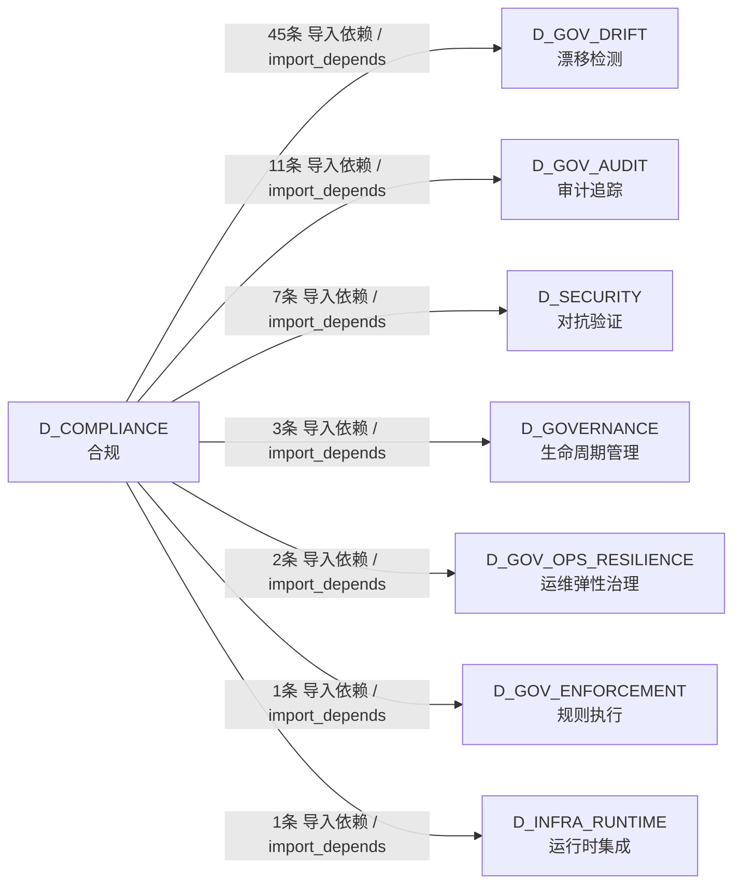

# 60_d_compliance / compliance_gate / 合规 / Compliance

> **功能简介 / Overview**: 合规，负责交易合规检查、规则引擎和合规报告

> **文档作用 / Purpose**: 展示 合规（D_COMPLIANCE）功能域的模块清单、域内依赖关系、跨域依赖关系、架构分层视图，供架构审查和域治理参考。

> 本文档由 generate_domain_doc.py 从 depgraph (PostgreSQL) 自动生成
> 最后更新: 2026-07-17 03:13:09
> 数据源: depgraph (PostgreSQL) nodes表 + edges表

## 域基本信息 / Domain Overview

| 字段 | 值 | Field | Value |
|------|------|-------|-------|
| 编号 | 60 | Number | 60 |
| 域ID | D_COMPLIANCE | Domain ID | D_COMPLIANCE |
| 域名称 | 合规 | Domain Name | Compliance |
| 层级 |  | Layer |  |
| 模块数 | 23 | Module Count | 23 |
| 域内依赖 | 1 | Internal Dependencies | 1 |
| 跨域入边 | 0 | Cross-domain Incoming | 0 |
| 跨域出边 | 70 | Cross-domain Outgoing | 70 |
| 设计态模块 | 0 | Design Modules | 0 |
| 原型态模块 | 23 | Prototype Modules | 23 |
| 生产态模块 | 0 | Production Modules | 0 |
| 容量 | 0/150 (正常) | Capacity | 0/150 (正常) |
| 描述 | 合规校验引擎 | Description | 合规校验引擎 |

## 模块分层清单 / Module Layered List

> 按 architecture_layer 分组的模块清单（共 23 个模块 / 23 modules）。

### L2 领域层 / Domain Layer (23 modules)

| # | 模块路径 / Module Path | 模块名称 / Module Name (功能简介 / Description) | 成熟度 / Maturity | 蓝图 / Blueprint |
|:--:|---------|---------|:---:|:---:|
| 1 | src/zephyr/compliance/__init__.py | D_COMPLIANCE Compliance — Re-export wrapper (D... | 原型态 / prototype | [MOD-L10-001](../../03_modules/_domain_compliance/blueprint.md) |
| 2 | src/zephyr/compliance/_extensions/__init__.py | __init__.py | 原型态 / prototype |  |
| 3 | src/zephyr/compliance/aisg_sandbox.py | Re-export wrapper: aisg_sandbox has migrated to... | 原型态 / prototype | [MOD-L10-001](../../03_modules/_domain_compliance/blueprint.md) |
| 4 | src/zephyr/compliance/api/__init__.py | __init__.py | 原型态 / prototype |  |
| 5 | src/zephyr/compliance/artifact_scanner.py | Re-export wrapper: artifact_scanner has migrate... | 原型态 / prototype | [MOD-L10-001](../../03_modules/_domain_compliance/blueprint.md) |
| 6 | src/zephyr/compliance/audit_orchestrator/__init__.py | Re-export wrapper: audit-orchestrator has migra... | 原型态 / prototype |  |
| 7 | src/zephyr/compliance/audit_trail/__init__.py | Re-export wrapper: audit-trail has migrated to ... | 原型态 / prototype |  |
| 8 | src/zephyr/compliance/audit_trail/bridges/__init__.py | Audit Trail — MOD-INF-020 | 原型态 / prototype | [MOD-INF-020](../../03_modules/_domain_governance/audit_trail/blueprint.md) |
| 9 | src/zephyr/compliance/behavioral_admission/__init__.py | Re-export wrapper: behavioral-admission has mig... | 原型态 / prototype |  |
| 10 | src/zephyr/compliance/behavioral_auditor/__init__.py | __init__.py | 原型态 / prototype | [MOD-INF-033](../../03_modules/_cross_layer/behavioral_auditor/blueprint.md) |
| 11 | src/zephyr/compliance/compliance_gate_a6/__init__.py | Re-export wrapper: compliance_gate_a6 has migra... | 原型态 / prototype |  |
| 12 | src/zephyr/compliance/compliance_manager.py | Re-export wrapper: compliance_manager has migra... | 原型态 / prototype | [MOD-L10-001](../../03_modules/_domain_compliance/blueprint.md) |
| 13 | src/zephyr/compliance/core/__init__.py | __init__.py | 原型态 / prototype |  |
| 14 | src/zephyr/compliance/default_security_gateway.py | default_security_gateway.py | 原型态 / prototype | [MOD-L10-001](../../03_modules/_domain_compliance/blueprint.md) |
| 15 | src/zephyr/compliance/evidence_pack.py | Re-export wrapper: evidence_pack has migrated t... | 原型态 / prototype | [MOD-L10-001](../../03_modules/_domain_compliance/blueprint.md) |
| 16 | src/zephyr/compliance/financial_compliance.py | Re-export wrapper: financial_compliance has mig... | 原型态 / prototype | [MOD-L10-001](../../03_modules/_domain_compliance/blueprint.md) |
| 17 | src/zephyr/compliance/implementations/__init__.py | Re-export wrapper: implementations has migrated... | 原型态 / prototype |  |
| 18 | src/zephyr/compliance/infrastructure/__init__.py | __init__.py | 原型态 / prototype |  |
| 19 | src/zephyr/compliance/integrity.py | Re-export wrapper: integrity has migrated to ze... | 原型态 / prototype | [MOD-L10-001](../../03_modules/_domain_compliance/blueprint.md) |
| 20 | src/zephyr/compliance/models/__init__.py | __init__.py | 原型态 / prototype |  |
| 21 | src/zephyr/compliance/security_gateway_base.py | security_gateway_base.py | 原型态 / prototype | [MOD-L10-001](../../03_modules/_domain_compliance/blueprint.md) |
| 22 | src/zephyr/compliance/services/__init__.py | __init__.py | 原型态 / prototype |  |
| 23 | src/zephyr/compliance/zero_knowledge_audit_stub/__init__.py | D_COMPLIANCE Compliance | 原型态 / prototype | [MOD-L10-001](../../03_modules/_domain_compliance/blueprint.md) |

## 域内依赖图 / Internal Dependency Diagram

> 依赖图内嵌在本文档中，IDE 可直接渲染显示。参考 decision_index.md 设计，分四个视图：合并全景图、运营态子图、设计态子图、原型态子图（按 design_maturity 实际值拆分）。
>
> **图例说明 / Legend**：
> - **实线边框 = 运营态模块**（production，已上线运行）
> - **虚线边框 = 设计态模块**（design，蓝图阶段，代码未写）
> - **虚线边框 = 原型态模块**（prototype，代码已写，验证中未稳定上线）
> - **实线箭头 = 运营态依赖**（已生效的依赖关系）
> - **虚线箭头 = 非运营态依赖**（计划中/验证中的依赖关系）

### 合并全景图（全部模块，标签标注成熟度）

> 展示全部 23 个模块（生产态 0 + 设计态 0 + 原型态 23），标签标注成熟度。

### 运营态子图（仅 design_maturity=production 的模块和依赖）

> 仅展示已上线运行的模块（共 0 个，0 条域内依赖）。

> （无运营态模块 / No production modules）

### 设计态子图（仅 design_maturity=design 的模块和依赖）

> 仅展示蓝图阶段、代码未写的设计态模块（共 0 个，0 条域内依赖）。

> （无设计态模块 / No design modules）

### 原型态子图（仅 design_maturity=prototype 的模块和依赖）

> 仅展示代码已写、验证中未稳定上线的原型态模块（共 23 个，1 条域内依赖）。

```mermaid
graph TD
    subgraph D_COMPLIANCE["D_COMPLIANCE 合规"]
        src_zephyr_compliance_init_py["(原型态 / prototype) D_COMPLIANCE Compliance — Re-export wrapper (D...<br/>文件: __init__.py"]
        src_zephyr_compliance_extensions_init_py["(原型态 / prototype) __init__.py"]
        src_zephyr_compliance_aisg_sandbox_py["(原型态 / prototype) Re-export wrapper: aisg_sandbox has migrated to...<br/>文件: aisg_sandbox.py"]
        src_zephyr_compliance_api_init_py["(原型态 / prototype) __init__.py"]
        src_zephyr_compliance_artifact_scanner_py["(原型态 / prototype) Re-export wrapper: artifact_scanner has migrate...<br/>文件: artifact_scanner.py"]
        src_zephyr_compliance_audit_orchestrator_init_py["(原型态 / prototype) Re-export wrapper: audit-orchestrator has migra...<br/>文件: __init__.py"]
        src_zephyr_compliance_audit_trail_init_py["(原型态 / prototype) Re-export wrapper: audit-trail has migrated to ...<br/>文件: __init__.py"]
        src_zephyr_compliance_audit_trail_bridges_init_py["(原型态 / prototype) Audit Trail — MOD-INF-020<br/>文件: __init__.py"]
        src_zephyr_compliance_behavioral_admission_init_py["(原型态 / prototype) Re-export wrapper: behavioral-admission has mig...<br/>文件: __init__.py"]
        src_zephyr_compliance_behavioral_auditor_init_py["(原型态 / prototype) __init__.py"]
        src_zephyr_compliance_compliance_gate_a6_init_py["(原型态 / prototype) Re-export wrapper: compliance_gate_a6 has migra...<br/>文件: __init__.py"]
        src_zephyr_compliance_compliance_manager_py["(原型态 / prototype) Re-export wrapper: compliance_manager has migra...<br/>文件: compliance_manager.py"]
        src_zephyr_compliance_core_init_py["(原型态 / prototype) __init__.py"]
        src_zephyr_compliance_default_security_gateway_py["(原型态 / prototype) default_security_gateway.py"]
        src_zephyr_compliance_evidence_pack_py["(原型态 / prototype) Re-export wrapper: evidence_pack has migrated t...<br/>文件: evidence_pack.py"]
        src_zephyr_compliance_financial_compliance_py["(原型态 / prototype) Re-export wrapper: financial_compliance has mig...<br/>文件: financial_compliance.py"]
        src_zephyr_compliance_implementations_init_py["(原型态 / prototype) Re-export wrapper: implementations has migrated...<br/>文件: __init__.py"]
        src_zephyr_compliance_infrastructure_init_py["(原型态 / prototype) __init__.py"]
        src_zephyr_compliance_integrity_py["(原型态 / prototype) Re-export wrapper: integrity has migrated to ze...<br/>文件: integrity.py"]
        src_zephyr_compliance_models_init_py["(原型态 / prototype) __init__.py"]
        src_zephyr_compliance_security_gateway_base_py["(原型态 / prototype) security_gateway_base.py"]
        src_zephyr_compliance_services_init_py["(原型态 / prototype) __init__.py"]
        src_zephyr_compliance_zero_knowledge_audit_stub_init_py["(原型态 / prototype) D_COMPLIANCE Compliance<br/>文件: __init__.py"]
    end
    src_zephyr_compliance_init_py -.->|config_depends / config_depends| src_zephyr_compliance_artifact_scanner_py
    D_GOV_DRIFT["(生产态 / production) D_GOV_DRIFT"]
    src_zephyr_compliance_artifact_scanner_py -.->|导入依赖 / import_depends| D_GOV_DRIFT
    D_GOV_OPS_RESILIENCE["(生产态 / production) D_GOV_OPS_RESILIENCE"]
    src_zephyr_compliance_default_security_gateway_py -.->|导入依赖 / import_depends| D_GOV_OPS_RESILIENCE
    D_GOV_AUDIT["(生产态 / production) D_GOV_AUDIT"]
    src_zephyr_compliance_financial_compliance_py -.->|导入依赖 / import_depends| D_GOV_AUDIT
    D_GOVERNANCE["(生产态 / production) D_GOVERNANCE"]
    src_zephyr_compliance_aisg_sandbox_py -.->|导入依赖 / import_depends| D_GOVERNANCE
    src_zephyr_compliance_compliance_manager_py -.->|导入依赖 / import_depends| D_GOVERNANCE
    src_zephyr_compliance_security_gateway_base_py -.->|导入依赖 / import_depends| D_GOV_OPS_RESILIENCE
    src_zephyr_compliance_evidence_pack_py -.->|导入依赖 / import_depends| D_GOVERNANCE
    src_zephyr_compliance_integrity_py -.->|导入依赖 / import_depends| D_GOV_DRIFT
    src_zephyr_compliance_audit_orchestrator_init_py -.->|导入依赖 / import_depends| D_GOV_AUDIT
    src_zephyr_compliance_audit_trail_init_py -.->|导入依赖 / import_depends| D_GOV_AUDIT
    src_zephyr_compliance_audit_trail_init_py -.->|导入依赖 / import_depends| D_GOV_AUDIT
    D_GOV_ENFORCEMENT["(原型态 / prototype) D_GOV_ENFORCEMENT"]
    src_zephyr_compliance_behavioral_admission_init_py -.->|导入依赖 / import_depends| D_GOV_ENFORCEMENT
    D_SECURITY["(原型态 / prototype) D_SECURITY"]
    src_zephyr_compliance_compliance_gate_a6_init_py -.->|导入依赖 / import_depends| D_SECURITY
    src_zephyr_compliance_implementations_init_py -.->|导入依赖 / import_depends| D_SECURITY
    src_zephyr_compliance_audit_trail_bridges_init_py -.->|导入依赖 / import_depends| D_GOV_AUDIT
    classDef production fill:#e1f5fe,stroke:#01579b,stroke-width:2px,color:#000
    classDef design fill:#fff3e0,stroke:#e65100,stroke-width:2px,color:#000,stroke-dasharray: 5 5
    classDef external_prod fill:#e8f5e9,stroke:#1b5e20,stroke-width:1px,color:#000
    classDef external_design fill:#fce4ec,stroke:#880e4f,stroke-width:1px,color:#000,stroke-dasharray: 5 5
    class src_zephyr_compliance_init_py,src_zephyr_compliance_extensions_init_py,src_zephyr_compliance_aisg_sandbox_py,src_zephyr_compliance_api_init_py,src_zephyr_compliance_artifact_scanner_py,src_zephyr_compliance_audit_orchestrator_init_py,src_zephyr_compliance_audit_trail_init_py,src_zephyr_compliance_audit_trail_bridges_init_py,src_zephyr_compliance_behavioral_admission_init_py,src_zephyr_compliance_behavioral_auditor_init_py,src_zephyr_compliance_compliance_gate_a6_init_py,src_zephyr_compliance_compliance_manager_py,src_zephyr_compliance_core_init_py,src_zephyr_compliance_default_security_gateway_py,src_zephyr_compliance_evidence_pack_py,src_zephyr_compliance_financial_compliance_py,src_zephyr_compliance_implementations_init_py,src_zephyr_compliance_infrastructure_init_py,src_zephyr_compliance_integrity_py,src_zephyr_compliance_models_init_py,src_zephyr_compliance_security_gateway_base_py,src_zephyr_compliance_services_init_py,src_zephyr_compliance_zero_knowledge_audit_stub_init_py design
    class D_GOV_DRIFT,D_GOV_OPS_RESILIENCE,D_GOV_AUDIT,D_GOVERNANCE external_prod
    class D_GOV_ENFORCEMENT,D_SECURITY external_design
```

## 跨域依赖 / Cross-domain Dependencies

### 本域依赖的其他域（出边）/ Depends On

| # | 本域模块 / Source Module | → | 外部域-目标模块 / Target Module | 依赖类型 / Type |
|:--:|---------|:--:|---------|---------|
| 1 | Re-export wrapper: aisg_sandbox has migrated to... | → | D_GOVERNANCE 生命周期管理: AISG Sandbox Testing — AI Security Gateway 沙.... | 导入依赖 / import_depends |
| 2 | Re-export wrapper: compliance_manager has migra... | → | D_GOVERNANCE 生命周期管理: ZephyrAlpha — D_COMPLIANCE Compliance Layer —... | 导入依赖 / import_depends |
| 3 | Re-export wrapper: evidence_pack has migrated t... | → | D_GOVERNANCE 生命周期管理: evidence_pack.py | 导入依赖 / import_depends |
| 4 | Re-export wrapper: audit-orchestrator has migra... | → | D_GOV_AUDIT 审计追踪: __init__.py | 导入依赖 / import_depends |
| 5 | Re-export wrapper: audit-trail has migrated to ... | → | D_GOV_AUDIT 审计追踪: __init__.py | 导入依赖 / import_depends |
| 6 | Re-export wrapper: audit-trail has migrated to ... | → | D_GOV_AUDIT 审计追踪: Audit Trail — MOD-INF-020 (__init__.py) | 导入依赖 / import_depends |
| 7 | Audit Trail — MOD-INF-020 (__init__.py) | → | D_GOV_AUDIT 审计追踪: G-CT-002 Audit 异常检测器 — AnomalyEvent Pydan... | 导入依赖 / import_depends |
| 8 | Audit Trail — MOD-INF-020 (__init__.py) | → | D_GOV_AUDIT 审计追踪: G-CT-001 契约消费端 — Audit.write() 公共接口. ... | 导入依赖 / import_depends |
| 9 | Audit Trail — MOD-INF-020 (__init__.py) | → | D_GOV_AUDIT 审计追踪: Audit ↔ DelegationManager 委托链审计桥接. (aud... | 导入依赖 / import_depends |
| 10 | Audit Trail — MOD-INF-020 (__init__.py) | → | D_GOV_AUDIT 审计追踪: G-CT-007 Audit ↔ Drift 双向桥接 — MOD-INF-020... | 导入依赖 / import_depends |
| 11 | Audit Trail — MOD-INF-020 (__init__.py) | → | D_GOV_AUDIT 审计追踪: Audit ↔ Feedback Loop 三角闭环桥接. (audit_fee... | 导入依赖 / import_depends |
| 12 | Audit Trail — MOD-INF-020 (__init__.py) | → | D_GOV_AUDIT 审计追踪: Audit ↔ WarmHotGate 三层存储桥接. (audit_tiere... | 导入依赖 / import_depends |
| 13 | Audit Trail — MOD-INF-020 (__init__.py) | → | D_GOV_AUDIT 审计追踪: Audit ↔ ContinuousTrust 信任分数桥接. (audit_t... | 导入依赖 / import_depends |
| 14 | Re-export wrapper: financial_compliance has mig... | → | D_GOV_AUDIT 审计追踪: financial_compliance.py | 导入依赖 / import_depends |
| 15 | Re-export wrapper: artifact_scanner has migrate... | → | D_GOV_DRIFT 漂移检测: ArtifactScanner — SSRF / Path Traversal / Cred... | 导入依赖 / import_depends |
| 16 | __init__.py | → | D_GOV_DRIFT 漂移检测: Owner Absence Manager — Owner缺席模式 §6.32。... | 导入依赖 / import_depends |
| 17 | __init__.py | → | D_GOV_DRIFT 漂移检测: Drift Detector AI 施工检测器 — ai_construction... | 导入依赖 / import_depends |
| 18 | __init__.py | → | D_GOV_DRIFT 漂移检测: AI Context Injector — 施工前预检D-023-16 · §... | 导入依赖 / import_depends |
| 19 | __init__.py | → | D_GOV_DRIFT 漂移检测: Backward Compatibility Checker — 向后兼容策略.... | 导入依赖 / import_depends |
| 20 | __init__.py | → | D_GOV_DRIFT 漂移检测: Baseline Manager — baseline_manager.py (baseli... | 导入依赖 / import_depends |
| 21 | __init__.py | → | D_GOV_DRIFT 漂移检测: Baseline Poisoning Guard — 基线投毒防护 D-023-... | 导入依赖 / import_depends |
| 22 | __init__.py | → | D_GOV_DRIFT 漂移检测: Detector Canary Controller — 检测器金丝雀部署 ... | 导入依赖 / import_depends |
| 23 | __init__.py | → | D_GOV_DRIFT 漂移检测: Cascade Failure Detector — 级联故障检测 D-023-... | 导入依赖 / import_depends |
| 24 | __init__.py | → | D_GOV_DRIFT 漂移检测: Drift Chaos Injector — 混沌工程主动漂移注入 §... | 导入依赖 / import_depends |
| 25 | __init__.py | → | D_GOV_DRIFT 漂移检测: Config Consistency Checker — 配置多源一致性 D-... | 导入依赖 / import_depends |
| 26 | __init__.py | → | D_GOV_DRIFT 漂移检测: contract_drift_detector — 契约漂移检测器。 (co... | 导入依赖 / import_depends |
| 27 | __init__.py | → | D_GOV_DRIFT 漂移检测: Correlation Engine — correlation_engine.py (co... | 导入依赖 / import_depends |
| 28 | __init__.py | → | D_GOV_DRIFT 漂移检测: Credibility Engine — credibility_engine.py (cr... | 导入依赖 / import_depends |
| 29 | __init__.py | → | D_GOV_DRIFT 漂移检测: Cross Module Score — cross_module_score.py (cr... | 导入依赖 / import_depends |
| 30 | __init__.py | → | D_GOV_DRIFT 漂移检测: Coverage Dashboard — dashboard.py (dashboard.py) | 导入依赖 / import_depends |
| 31 | __init__.py | → | D_GOV_DRIFT 漂移检测: Detector Dispatcher — detector_dispatcher.py (... | 导入依赖 / import_depends |
| 32 | __init__.py | → | D_GOV_DRIFT 漂移检测: Drift Engine — 编排器核心 (SRC-0030 精简后) (d... | 导入依赖 / import_depends |
| 33 | __init__.py | → | D_GOV_DRIFT 漂移检测: Drift Hotfix Bypass — drift_hotfix_bypass.py (... | 导入依赖 / import_depends |
| 34 | __init__.py | → | D_GOV_DRIFT 漂移检测: Drift Detector 基础设施 — drift_infrastructure... | 导入依赖 / import_depends |
| 35 | __init__.py | → | D_GOV_DRIFT 漂移检测: Drift Detector 数据模型 — drift_models.py (dri... | 导入依赖 / import_depends |
| 36 | __init__.py | → | D_GOV_DRIFT 漂移检测: Drift Detector 结果类型 + 专项检测函数 — drift... | 导入依赖 / import_depends |
| 37 | __init__.py | → | D_GOV_DRIFT 漂移检测: Drift Detector AI 训练闭环 + 跨语言检测 — drif... | 导入依赖 / import_depends |
| 38 | __init__.py | → | D_GOV_DRIFT 漂移检测: File Attribute Integrity — 文件底层属性完整性 ... | 导入依赖 / import_depends |
| 39 | __init__.py | → | D_GOV_DRIFT 漂移检测: Drift Forensics Engine — 漂移取证引擎 §6.17。... | 导入依赖 / import_depends |
| 40 | __init__.py | → | D_GOV_DRIFT 漂移检测: Gate Persistence — gate_persistence.py (gate_p... | 导入依赖 / import_depends |
| 41 | __init__.py | → | D_GOV_DRIFT 漂移检测: Git Bisector — git_bisector.py (git_bisector.py) | 导入依赖 / import_depends |
| 42 | __init__.py | → | D_GOV_DRIFT 漂移检测: .gitignore Integrity Auditor — gitignore完整性... | 导入依赖 / import_depends |
| 43 | __init__.py | → | D_GOV_DRIFT 漂移检测: Cross-Session Handoff Manager — 跨Session修复.... | 导入依赖 / import_depends |
| 44 | __init__.py | → | D_GOV_DRIFT 漂移检测: Headless Scanner — headless_scanner.py (headle... | 导入依赖 / import_depends |
| 45 | __init__.py | → | D_GOV_DRIFT 漂移检测: Incremental Scanner — incremental_scanner.py (... | 导入依赖 / import_depends |
| 46 | __init__.py | → | D_GOV_DRIFT 漂移检测: Naming Magic Checker — 命名魔数与隐式约定检测 ... | 导入依赖 / import_depends |
| 47 | __init__.py | → | D_GOV_DRIFT 漂移检测: Orphan Resource Scanner — 孤儿资源检测 §6.28... | 导入依赖 / import_depends |
| 48 | __init__.py | → | D_GOV_DRIFT 漂移检测: Python Compatibility Checker — Python版本兼容.... | 导入依赖 / import_depends |
| 49 | __init__.py | → | D_GOV_DRIFT 漂移检测: Resource Guard — 资源上限与优雅降级 D-023-23 .... | 导入依赖 / import_depends |
| 50 | __init__.py | → | D_GOV_DRIFT 漂移检测: ROI Engine — roi_engine.py (roi_engine.py) | 导入依赖 / import_depends |
| 51 | __init__.py | → | D_GOV_DRIFT 漂移检测: G-CT-006 契约：Drift -> Rollback 漂移触发回滚. ... | 导入依赖 / import_depends |
| 52 | __init__.py | → | D_GOV_DRIFT 漂移检测: Scan Mutex — scan_mutex.py (scan_mutex.py) | 导入依赖 / import_depends |
| 53 | __init__.py | → | D_GOV_DRIFT 漂移检测: Self-Drift Check — self_check.py (self_check.py) | 导入依赖 / import_depends |
| 54 | __init__.py | → | D_GOV_DRIFT 漂移检测: Suppression Learner — suppression_learner.py (... | 导入依赖 / import_depends |
| 55 | __init__.py | → | D_GOV_DRIFT 漂移检测: Symlink Integrity Checker — 软链接完整性检测 .... | 导入依赖 / import_depends |
| 56 | __init__.py | → | D_GOV_DRIFT 漂移检测: Tamper-Proof Audit — 防篡改审计 D-023-37 · §... | 导入依赖 / import_depends |
| 57 | __init__.py | → | D_GOV_DRIFT 漂移检测: Test Fixture Checker — 测试夹具漂移检测 D-023-... | 导入依赖 / import_depends |
| 58 | __init__.py | → | D_GOV_DRIFT 漂移检测: Trend Analyzer — trend_analyzer.py (trend_anal... | 导入依赖 / import_depends |
| 59 | Re-export wrapper: integrity has migrated to ze... | → | D_GOV_DRIFT 漂移检测: integrity.py | 导入依赖 / import_depends |
| 60 | Re-export wrapper: behavioral-admission has mig... | → | D_GOV_ENFORCEMENT 规则执行: __init__.py | 导入依赖 / import_depends |
| 61 | default_security_gateway.py | → | D_GOV_OPS_RESILIENCE 运维弹性治理: DefaultSecurityGateway — SecurityGateway 三层.... | 导入依赖 / import_depends |
| 62 | security_gateway_base.py | → | D_GOV_OPS_RESILIENCE 运维弹性治理: D_COMPLIANCE — Governance & Compliance Layer (... | 导入依赖 / import_depends |
| 63 | __init__.py | → | D_INFRA_RUNTIME 运行时集成: state_machine.py | 导入依赖 / import_depends |
| 64 | __init__.py | → | D_SECURITY 对抗验证: Alert Router — alert_router.py (alert_router.py) | 导入依赖 / import_depends |
| 65 | __init__.py | → | D_SECURITY 对抗验证: Cold Start Bootstrapper — 冷启动引导 §6.31。 ... | 导入依赖 / import_depends |
| 66 | __init__.py | → | D_SECURITY 对抗验证: G-CT-005 — ManagedDriftEvent Pydantic V2 BaseM... | 导入依赖 / import_depends |
| 67 | __init__.py | → | D_SECURITY 对抗验证: Auto Reconciler — reconciler.py (reconciler.py) | 导入依赖 / import_depends |
| 68 | __init__.py | → | D_SECURITY 对抗验证: Drift Runbook Generator — 漂移演练手册自动生成... | 导入依赖 / import_depends |
| 69 | Re-export wrapper: compliance_gate_a6 has migra... | → | D_SECURITY 对抗验证: D_COMPLIANCE — Compliance Concrete Implementat... | 导入依赖 / import_depends |
| 70 | Re-export wrapper: implementations has migrated... | → | D_SECURITY 对抗验证: D_COMPLIANCE — Compliance Concrete Implementat... | 导入依赖 / import_depends |

### 依赖本域的其他域（入边）/ Depended By

无跨域入边依赖 / No cross-domain incoming dependencies

### 跨域依赖图 / Cross-domain Dependency Diagram

> 本域与 7 个外部域直接连接（出边 70 条 + 入边 0 条 = 70 条）。只显示直接连接的域，不展开具体节点。

## 说明 / Notes

- **数据源 / Data Source**: `depgraph (PostgreSQL)` 的 `nodes`、`edges`、`domains` 表
- **生成器 / Generator**: `generate_domain_doc.py`（G2+G10 合并）
- **维护方式 / Maintenance**: 自动生成，全景图更新时刷新
- **文件名规则 / File Naming**: `{编号:02d}_{域ID小写}.md`，如 `16_d_trading.md`
- **图例说明 / Legend**: `[production]`=已上线 / `[design]`=设计中 / `[prototype]`=原型 / `[unknown]`=未知
