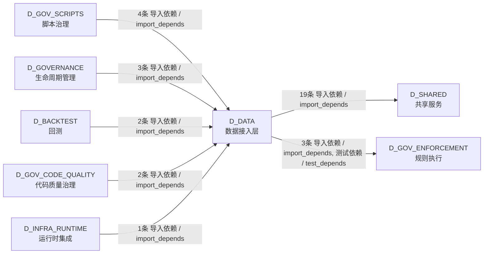

# 60_d_data / 数据接入层 / Data Access Layer

> **功能简介 / Overview**: 数据接入层，负责数据源接入、数据集成和数据标准化

> **文档作用 / Purpose**: 展示 数据接入层（D_DATA）功能域的模块清单、域内依赖关系、跨域依赖关系、架构分层视图，供架构审查和域治理参考。

> 本文档由 generate_domain_doc.py 从 depgraph (PostgreSQL) 自动生成
> 数据源: depgraph (PostgreSQL) nodes表 + edges表

## 域基本信息 / Domain Overview

| 字段 | 值 | Field | Value |
|------|------|-------|-------|
| 编号 | 60 | Number | 60 |
| 域ID | D_DATA | Domain ID | D_DATA |
| 域名称 | 数据接入层 | Domain Name | Data Access Layer |
| 层级 |  | Layer |  |
| 模块数 | 78 | Module Count | 78 |
| 域内依赖 | 167 | Internal Dependencies | 167 |
| 跨域入边 | 12 | Cross-domain Incoming | 12 |
| 跨域出边 | 22 | Cross-domain Outgoing | 22 |
| 设计态模块 | 1 | Design Modules | 1 |
| 生产态模块 | 77 | Production Modules | 77 |
| 容量 | 77/150 (正常) | Capacity | 77/150 (正常) |
| 描述 | 数据源集成器 | Description | 数据源集成器 |

## 模块分层清单 / Module Layered List

> 按 architecture_layer 分组的模块清单（共 78 个模块 / 78 modules）。

### L0 基础设施层 / Infrastructure Layer (75 modules)

| # | 模块路径 / Module Path | 模块名称 / Module Name (功能简介 / Description) | 成熟度 / Maturity | 蓝图 / Blueprint |
|:--:|---------|---------|:---:|:---:|
| 1 | schemas/categories/cross_validation_log.py | cross_validation_log 表 DDL-as-Code（P1-4 多源... | 生产态 / production |  |
| 2 | schemas/categories/fundamental_balance_sheet.py | balance_sheet（资产负债表）DDL-as-Code（categor... | 生产态 / production |  |
| 3 | schemas/categories/fundamental_cashflow_statement.py | cashflow_statement（现金流量表）DDL-as-Code（ca... | 生产态 / production |  |
| 4 | schemas/categories/fundamental_income_statement.py | income_statement（利润表）DDL-as-Code（category... | 生产态 / production |  |
| 5 | schemas/categories/market_auction.py | auction_snapshot 表 DDL-as-Code（category_id: m... | 生产态 / production |  |
| 6 | schemas/categories/market_auction_book.py | auction_book 表 DDL-as-Code（category_id: marke... | 生产态 / production |  |
| 7 | schemas/categories/market_cb_iv.py | convertible_bond_iv 表 DDL-as-Code（category_id... | 生产态 / production |  |
| 8 | schemas/categories/market_futures_position.py | futures_position 表 DDL-as-Code（category_id: m... | 生产态 / production |  |
| 9 | schemas/categories/market_futures_term.py | futures_term_structure 表 DDL-as-Code（category... | 生产态 / production |  |
| 10 | schemas/categories/market_index.py | index_quote 表 DDL-as-Code（category_id: market... | 生产态 / production |  |
| 11 | schemas/categories/market_index_weight.py | index_weight 表 DDL-as-Code（category_id: marke... | 生产态 / production |  |
| 12 | schemas/categories/market_kline_daily.py | kline_daily 表 DDL-as-Code（category_id: market... | 生产态 / production |  |
| 13 | schemas/categories/market_option_iv.py | option_iv_surface 表 DDL-as-Code（category_id: ... | 生产态 / production |  |
| 14 | schemas/categories/market_sector_list.py | sector_list 表 DDL-as-Code（category_id: market... | 生产态 / production |  |
| 15 | schemas/categories/market_sector_meta.py | sector_meta 表 DDL-as-Code（category_id: market... | 生产态 / production |  |
| 16 | schemas/categories/market_sector_snapshot.py | sector_snapshot 表 DDL-as-Code（category_id: ma... | 生产态 / production |  |
| 17 | schemas/categories/market_stock_list.py | stock_list 表 DDL-as-Code（category_id: market_... | 生产态 / production |  |
| 18 | schemas/categories/market_tick.py | tick_data 表 DDL-as-Code（category_id: market_t... | 生产态 / production |  |
| 19 | scripts/ch/apply_fundamental_tables_ddl.py | ClickHouse c3_fundamental 财务三表 DDL 部署 + ... | 生产态 / production |  |
| 20 | scripts/ch/apply_market_tables_ddl.py | ClickHouse c1_market 建表 DDL 部署 + 引擎验证脚... | 生产态 / production |  |
| 21 | scripts/ch/apply_rbac.py | ClickHouse RBAC 账号分级部署 + 验证脚本（audit ... | 生产态 / production |  |
| 22 | scripts/register_guard_tasks.ps1 | register_guard_tasks.ps1 | 生产态 / production |  |
| 23 | scripts/start_scheduler.ps1 | start_scheduler.ps1 | 生产态 / production |  |
| 24 | scripts/start_tick_subscriber.ps1 | start_tick_subscriber.ps1 | 生产态 / production |  |
| 25 | src/zephyr/data/__init__.py | zephyr.data — 数据源集成器（MOD-L00-004）。 | 生产态 / production |  |
| 26 | src/zephyr/data/__main__.py | python -m zephyr.data — 数据源集成器 CLI 入口。 | 生产态 / production |  |
| 27 | src/zephyr/data/alerter.py | 告警管理（MOD-L00-004 §6.5 失败重试与告警 + §... | 生产态 / production |  |
| 28 | src/zephyr/data/backfill_checker.py | L10 周末补下载检测器——检测过去N天缺失数据并精... | 生产态 / production |  |
| 29 | src/zephyr/data/buffered_writer.py | 批量聚合写入器（MOD-L00-004 §18.3 裁定... | 生产态 / production |  |
| 30 | src/zephyr/data/capability_validator.py | Provider Capability 行为契约校验器（裁定... | 生产态 / production |  |
| 31 | src/zephyr/data/ch_config.py | ClickHouse 连接配置单真源加载器（裁定... | 生产态 / production |  |
| 32 | src/zephyr/data/ch_reader.py | ClickHouse 统一读取层（裁定 #ARCH-CH-007）。 | 生产态 / production |  |
| 33 | src/zephyr/data/ch_writer.py | ClickHouse 写入器（MOD-L00-004 §3.2 数据流第6... | 生产态 / production |  |
| 34 | src/zephyr/data/cli.py | 数据源集成器 CLI（MOD-L00-004 §8.4）。 | 生产态 / production |  |
| 35 | src/zephyr/data/cross_source_validator.py | 多源交叉校验器——比较 QMT 主源与 TDX 备源 tick... | 生产态 / production |  |
| 36 | src/zephyr/data/error_classifier.py | 数据源错误分类器——根据错误字符串判断可恢复性。 | 生产态 / production |  |
| 37 | src/zephyr/data/implementations/__init__.py | 数据源 Provider 实现集合（MOD-L00-004 §4.3）。 | 生产态 / production |  |
| 38 | src/zephyr/data/implementations/akshare_provider.py | AKShare 数据源 Provider 实现（MOD-L00-004 §4.3）。 | 生产态 / production |  |
| 39 | src/zephyr/data/implementations/baostock_provider.py | Baostock 数据源 Provider 实现（MOD-L00-004 §4.... | 生产态 / production |  |
| 40 | src/zephyr/data/implementations/cls_provider.py | 财联社电报数据源 Provider 实现（MOD-L00-004 §4... | 生产态 / production |  |
| 41 | src/zephyr/data/implementations/eastmoney_news_provider.py | 东方财富新闻数据源 Provider 实现（MOD-L00-004 ... | 生产态 / production |  |
| 42 | src/zephyr/data/implementations/ifind_provider.py | IFindProvider 实现（MOD-L00-004 §4.3 数据源集... | 生产态 / production |  |
| 43 | src/zephyr/data/implementations/miniqmt_provider.py | MOD-L00-004 数据源集成器 · MiniQMTProvider 实现。 | 生产态 / production |  |
| 44 | src/zephyr/data/implementations/rss_provider.py | RSS 财经新闻数据源 Provider 实现（MOD-L00-004 ... | 生产态 / production |  |
| 45 | src/zephyr/data/implementations/tdx_provider.py | 通达信数据源 Provider 实现（MOD-L00-004 §4.3）。 | 生产态 / production |  |
| 46 | src/zephyr/data/implementations/tickflow_provider.py | TickFlow 数据源 Provider 实现（MOD-L00-004 §4.... | 生产态 / production |  |
| 47 | src/zephyr/data/implementations/tushare_provider.py | Tushare 数据源 Provider 实现（MOD-L00-004 §4.3）。 | 生产态 / production |  |
| 48 | src/zephyr/data/integrity_checker.py | 数据完整性巡检器——每天盘后检测全表当日数据是... | 生产态 / production |  |
| 49 | src/zephyr/data/kline_resampler.py | 880xxx 板块K线合成器——从 1m/5m 合成 15m/30m/6... | 生产态 / production |  |
| 50 | src/zephyr/data/local_replay.py | 本地落盘兜底 + 自动回灌（裁定 #ARCH-CH-013 Phas... | 生产态 / production |  |
| 51 | src/zephyr/data/metrics.py | 可观测性指标采集（MOD-L00-004 §11）。 | 生产态 / production |  |
| 52 | src/zephyr/data/news_dedup.py | 新闻数据去重模块（MOD-L00-004 §4.3）。 | 生产态 / production |  |
| 53 | src/zephyr/data/pit_query.py | 财报 Point-In-Time (PIT) 查询能力（#ARCH-CH-021... | 生产态 / production |  |
| 54 | src/zephyr/data/pit_query.py/ |  | 设计态 / design |  |
| 55 | src/zephyr/data/policy_registry.py | per-source 调用策略注册表（MOD-L00-004 §5）。 | 生产态 / production |  |
| 56 | src/zephyr/data/progress_store.py | 统一进度存储（MOD-L00-004 §7）。 | 生产态 / production |  |
| 57 | src/zephyr/data/provider_base.py | 数据源 Provider 抽象基类（MOD-L00-004 §4）。 | 生产态 / production |  |
| 58 | src/zephyr/data/quality_gate.py | Re-export wrapper: QualityReport 真源在 zephyr.... | 生产态 / production |  |
| 59 | src/zephyr/data/redundant_source/__init__.py | 数据源冗余与热切换模块（MOD-L00-005）。 | 生产态 / production |  |
| 60 | src/zephyr/data/satellite_geospatial_engine/__init__.py | D_DATA Data Source | 生产态 / production |  |
| 61 | src/zephyr/data/scheduler.py | 数据源调度编排层（MOD-L00-004 §6）。 | 生产态 / production |  |
| 62 | src/zephyr/data/sector_kline_downloader.py | 880xxx 板块指数K线下载器——盘后从 tqcenter 下... | 生产态 / production |  |
| 63 | src/zephyr/data/sector_ranking_engine.py | 880xxx 板块动态排名引擎——5因子复合排名调整99... | 生产态 / production |  |
| 64 | src/zephyr/data/sector_snapshot_collector.py | 880xxx 板块实时快照采集器（tqcenter → ClickHou... | 生产态 / production |  |
| 65 | src/zephyr/data/speed_tester.py | 数据源测速器（MOD-L00-004 §8.5）。 | 生产态 / production |  |
| 66 | src/zephyr/data/table_registry.py | 表名/品类注册表消费层（裁定 #ARCH-CH-024 Phase ... | 生产态 / production |  |
| 67 | src/zephyr/data/task_queue.py | 任务依赖图 + 优先级队列（MOD-L00-004 §6.3 任务... | 生产态 / production |  |
| 68 | src/zephyr/data/tick_subscriber.py | QMT 实时 Tick 订阅服务——subscribe_quote 实时... | 生产态 / production |  |
| 69 | src/zephyr/data/trading_calendar.py | A 股交易日历守卫（MOD-L00-004）。 | 生产态 / production |  |
| 70 | src/zephyr/data/wal_codec/__init__.py | WAL 段编解码模块（MOD-L00-006）。 | 生产态 / production |  |
| 71 | src/zephyr/data/wal_writer.py | 主动 WAL 写入器（P0-1 Phase A）。 | 生产态 / production |  |
| 72 | tests/data/test_market_quality_validator.py | #ARCH-CH-021 P0-4: 写入路径异常值校验器四门禁测... | 生产态 / production |  |
| 73 | tests/data/test_pit_query.py | #ARCH-CH-021 P0-5: 财报 PIT 查询能力测试。 | 生产态 / production |  |
| 74 | tests/zephyr/data/test_cross_source_validator.py | cross_source_validator 单元测试（P1-4 多源交叉... | 生产态 / production |  |
| 75 | tests/zephyr/data/test_tick_subscriber.py | tick_subscriber 单元测试（含 Phase C: WalWriter... | 生产态 / production |  |

### L1 基础层 / Foundation Layer (3 modules)

| # | 模块路径 / Module Path | 模块名称 / Module Name (功能简介 / Description) | 成熟度 / Maturity | 蓝图 / Blueprint |
|:--:|---------|---------|:---:|:---:|
| 1 | src/zephyr/data/config/policies.yaml | policies.yaml | 生产态 / production |  |
| 2 | src/zephyr/data/config/schedule.yaml | schedule.yaml | 生产态 / production |  |
| 3 | src/zephyr/data/config/tasks.yaml | tasks.yaml | 生产态 / production |  |

## 域内依赖图 / Internal Dependency Diagram

> 依赖图内嵌在本文档中，IDE 可直接渲染显示。参考 decision_index.md 设计，分三个视图：合并全景图、运营态子图、设计态子图（按 design_maturity 实际值拆分）。
>
> **图例说明 / Legend**：
> - **实线边框 = 运营态模块**（production，已上线运行）
> - **虚线边框 = 设计态模块**（design，蓝图阶段，代码未写）
> - **实线箭头 = 运营态依赖**（已生效的依赖关系）
> - **虚线箭头 = 非运营态依赖**（计划中/验证中的依赖关系）

### 合并全景图（全部模块，标签标注成熟度）

> 展示全部 78 个模块（生产态 77 + 设计态 1），标签标注成熟度。

#### 第 1 页 / 共 3 页

```mermaid
graph TD
    subgraph D_DATA["D_DATA 数据接入层"]
        schemas_categories_cross_validation_log_py["(生产态 / production) cross_validation_log 表 DDL-as-Code（P1-4 多源...<br/>文件: cross_validation_log.py"]
        schemas_categories_fundamental_balance_sheet_py["(生产态 / production) balance_sheet（资产负债表）DDL-as-Code（categor...<br/>文件: fundamental_balance_sheet.py"]
        schemas_categories_fundamental_cashflow_statement_py["(生产态 / production) cashflow_statement（现金流量表）DDL-as-Code（ca...<br/>文件: fundamental_cashflow_statement.py"]
        schemas_categories_fundamental_income_statement_py["(生产态 / production) income_statement（利润表）DDL-as-Code（category...<br/>文件: fundamental_income_statement.py"]
        schemas_categories_market_auction_py["(生产态 / production) auction_snapshot 表 DDL-as-Code（category_id: m...<br/>文件: market_auction.py"]
        schemas_categories_market_auction_book_py["(生产态 / production) auction_book 表 DDL-as-Code（category_id: marke...<br/>文件: market_auction_book.py"]
        schemas_categories_market_cb_iv_py["(生产态 / production) convertible_bond_iv 表 DDL-as-Code（category_id...<br/>文件: market_cb_iv.py"]
        schemas_categories_market_futures_position_py["(生产态 / production) futures_position 表 DDL-as-Code（category_id: m...<br/>文件: market_futures_position.py"]
        schemas_categories_market_futures_term_py["(生产态 / production) futures_term_structure 表 DDL-as-Code（category...<br/>文件: market_futures_term.py"]
        schemas_categories_market_index_py["(生产态 / production) index_quote 表 DDL-as-Code（category_id: market...<br/>文件: market_index.py"]
        schemas_categories_market_index_weight_py["(生产态 / production) index_weight 表 DDL-as-Code（category_id: marke...<br/>文件: market_index_weight.py"]
        schemas_categories_market_kline_daily_py["(生产态 / production) kline_daily 表 DDL-as-Code（category_id: market...<br/>文件: market_kline_daily.py"]
        schemas_categories_market_option_iv_py["(生产态 / production) option_iv_surface 表 DDL-as-Code（category_id: ...<br/>文件: market_option_iv.py"]
        schemas_categories_market_sector_list_py["(生产态 / production) sector_list 表 DDL-as-Code（category_id: market...<br/>文件: market_sector_list.py"]
        schemas_categories_market_sector_meta_py["(生产态 / production) sector_meta 表 DDL-as-Code（category_id: market...<br/>文件: market_sector_meta.py"]
        schemas_categories_market_sector_snapshot_py["(生产态 / production) sector_snapshot 表 DDL-as-Code（category_id: ma...<br/>文件: market_sector_snapshot.py"]
        schemas_categories_market_stock_list_py["(生产态 / production) stock_list 表 DDL-as-Code（category_id: market_...<br/>文件: market_stock_list.py"]
        schemas_categories_market_tick_py["(生产态 / production) tick_data 表 DDL-as-Code（category_id: market_t...<br/>文件: market_tick.py"]
        scripts_ch_apply_fundamental_tables_ddl_py["(生产态 / production) ClickHouse c3_fundamental 财务三表 DDL 部署 + ...<br/>文件: apply_fundamental_tables_ddl.py"]
        scripts_ch_apply_market_tables_ddl_py["(生产态 / production) ClickHouse c1_market 建表 DDL 部署 + 引擎验证脚...<br/>文件: apply_market_tables_ddl.py"]
        scripts_ch_apply_rbac_py["(生产态 / production) ClickHouse RBAC 账号分级部署 + 验证脚本（audit ...<br/>文件: apply_rbac.py"]
        scripts_register_guard_tasks_ps1["(生产态 / production) register_guard_tasks.ps1"]
        scripts_start_scheduler_ps1["(生产态 / production) start_scheduler.ps1"]
        scripts_start_tick_subscriber_ps1["(生产态 / production) start_tick_subscriber.ps1"]
        src_zephyr_data_init_py["(生产态 / production) zephyr.data — 数据源集成器（MOD-L00-004）。<br/>文件: __init__.py"]
        src_zephyr_data_main_py["(生产态 / production) python -m zephyr.data — 数据源集成器 CLI 入口。<br/>文件: __main__.py"]
        src_zephyr_data_alerter_py["(生产态 / production) 告警管理（MOD-L00-004 §6.5 失败重试与告警 + §...<br/>文件: alerter.py"]
        src_zephyr_data_backfill_checker_py["(生产态 / production) L10 周末补下载检测器——检测过去N天缺失数据并精...<br/>文件: backfill_checker.py"]
        src_zephyr_data_buffered_writer_py["(生产态 / production) 批量聚合写入器（MOD-L00-004 §18.3 裁定...<br/>文件: buffered_writer.py"]
        src_zephyr_data_capability_validator_py["(生产态 / production) Provider Capability 行为契约校验器（裁定...<br/>文件: capability_validator.py"]
    end
    src_zephyr_data_backfill_checker_py -->|导入依赖 / import_depends| src_zephyr_data_init_py
    scripts_ch_apply_fundamental_tables_ddl_py -->|导入依赖 / import_depends| src_zephyr_data_init_py
    scripts_ch_apply_market_tables_ddl_py -->|导入依赖 / import_depends| src_zephyr_data_init_py
    schemas_categories_cross_validation_log_py -->|config_depends / config_depends| schemas_categories_fundamental_cashflow_statement_py
    schemas_categories_fundamental_balance_sheet_py -->|config_depends / config_depends| schemas_categories_cross_validation_log_py
    schemas_categories_market_auction_book_py -->|config_depends / config_depends| schemas_categories_cross_validation_log_py
    schemas_categories_fundamental_income_statement_py -->|config_depends / config_depends| schemas_categories_cross_validation_log_py
    schemas_categories_market_auction_py -->|config_depends / config_depends| schemas_categories_cross_validation_log_py
    schemas_categories_market_futures_position_py -->|config_depends / config_depends| schemas_categories_cross_validation_log_py
    schemas_categories_market_futures_term_py -->|config_depends / config_depends| schemas_categories_cross_validation_log_py
    schemas_categories_market_kline_daily_py -->|config_depends / config_depends| schemas_categories_cross_validation_log_py
    schemas_categories_market_cb_iv_py -->|config_depends / config_depends| schemas_categories_cross_validation_log_py
    schemas_categories_market_index_py -->|config_depends / config_depends| schemas_categories_cross_validation_log_py
    schemas_categories_market_option_iv_py -->|config_depends / config_depends| schemas_categories_cross_validation_log_py
    schemas_categories_market_sector_list_py -->|config_depends / config_depends| schemas_categories_cross_validation_log_py
    schemas_categories_market_index_weight_py -->|config_depends / config_depends| schemas_categories_cross_validation_log_py
    schemas_categories_market_sector_meta_py -->|config_depends / config_depends| schemas_categories_cross_validation_log_py
    schemas_categories_market_stock_list_py -->|config_depends / config_depends| schemas_categories_cross_validation_log_py
    schemas_categories_market_sector_snapshot_py -->|config_depends / config_depends| schemas_categories_cross_validation_log_py
    schemas_categories_market_tick_py -->|config_depends / config_depends| schemas_categories_cross_validation_log_py
    D_SHARED["(生产态 / production) D_SHARED"]
    src_zephyr_data_alerter_py -->|导入依赖 / import_depends| D_SHARED
    src_zephyr_data_alerter_py -->|导入依赖 / import_depends| D_SHARED
    src_zephyr_data_alerter_py -->|导入依赖 / import_depends| D_SHARED
    D_GOV_CODE_QUALITY["(生产态 / production) D_GOV_CODE_QUALITY"]
    D_GOV_CODE_QUALITY -->|导入依赖 / import_depends| src_zephyr_data_capability_validator_py
    D_GOV_SCRIPTS["(生产态 / production) D_GOV_SCRIPTS"]
    D_GOV_SCRIPTS -->|导入依赖 / import_depends| src_zephyr_data_init_py
    D_GOV_SCRIPTS -->|导入依赖 / import_depends| src_zephyr_data_init_py
    D_BACKTEST["(生产态 / production) D_BACKTEST"]
    D_BACKTEST -->|导入依赖 / import_depends| src_zephyr_data_init_py
    D_GOVERNANCE["(生产态 / production) D_GOVERNANCE"]
    D_GOVERNANCE -->|导入依赖 / import_depends| src_zephyr_data_init_py
    classDef production fill:#e1f5fe,stroke:#01579b,stroke-width:2px,color:#000
    classDef design fill:#fff3e0,stroke:#e65100,stroke-width:2px,color:#000,stroke-dasharray: 5 5
    classDef external_prod fill:#e8f5e9,stroke:#1b5e20,stroke-width:1px,color:#000
    classDef external_design fill:#fce4ec,stroke:#880e4f,stroke-width:1px,color:#000,stroke-dasharray: 5 5
    class schemas_categories_cross_validation_log_py,schemas_categories_fundamental_balance_sheet_py,schemas_categories_fundamental_cashflow_statement_py,schemas_categories_fundamental_income_statement_py,schemas_categories_market_auction_py,schemas_categories_market_auction_book_py,schemas_categories_market_cb_iv_py,schemas_categories_market_futures_position_py,schemas_categories_market_futures_term_py,schemas_categories_market_index_py,schemas_categories_market_index_weight_py,schemas_categories_market_kline_daily_py,schemas_categories_market_option_iv_py,schemas_categories_market_sector_list_py,schemas_categories_market_sector_meta_py,schemas_categories_market_sector_snapshot_py,schemas_categories_market_stock_list_py,schemas_categories_market_tick_py,scripts_ch_apply_fundamental_tables_ddl_py,scripts_ch_apply_market_tables_ddl_py,scripts_ch_apply_rbac_py,scripts_register_guard_tasks_ps1,scripts_start_scheduler_ps1,scripts_start_tick_subscriber_ps1,src_zephyr_data_init_py,src_zephyr_data_main_py,src_zephyr_data_alerter_py,src_zephyr_data_backfill_checker_py,src_zephyr_data_buffered_writer_py,src_zephyr_data_capability_validator_py production
    class D_SHARED,D_GOV_CODE_QUALITY,D_GOV_SCRIPTS,D_BACKTEST,D_GOVERNANCE external_prod
```



#### 第 2 页 / 共 3 页

```mermaid
graph TD
    subgraph D_DATA["D_DATA 数据接入层"]
        src_zephyr_data_ch_config_py["(生产态 / production) ClickHouse 连接配置单真源加载器（裁定...<br/>文件: ch_config.py"]
        src_zephyr_data_ch_reader_py["(生产态 / production) ClickHouse 统一读取层（裁定 #ARCH-CH-007）。<br/>文件: ch_reader.py"]
        src_zephyr_data_ch_writer_py["(生产态 / production) ClickHouse 写入器（MOD-L00-004 §3.2 数据流第6...<br/>文件: ch_writer.py"]
        src_zephyr_data_cli_py["(生产态 / production) 数据源集成器 CLI（MOD-L00-004 §8.4）。<br/>文件: cli.py"]
        src_zephyr_data_config_policies_yaml["(生产态 / production) policies.yaml"]
        src_zephyr_data_config_schedule_yaml["(生产态 / production) schedule.yaml"]
        src_zephyr_data_config_tasks_yaml["(生产态 / production) tasks.yaml"]
        src_zephyr_data_cross_source_validator_py["(生产态 / production) 多源交叉校验器——比较 QMT 主源与 TDX 备源 tick...<br/>文件: cross_source_validator.py"]
        src_zephyr_data_error_classifier_py["(生产态 / production) 数据源错误分类器——根据错误字符串判断可恢复性。<br/>文件: error_classifier.py"]
        src_zephyr_data_implementations_init_py["(生产态 / production) 数据源 Provider 实现集合（MOD-L00-004 §4.3）。<br/>文件: __init__.py"]
        src_zephyr_data_implementations_akshare_provider_py["(生产态 / production) AKShare 数据源 Provider 实现（MOD-L00-004 §4.3）。<br/>文件: akshare_provider.py"]
        src_zephyr_data_implementations_baostock_provider_py["(生产态 / production) Baostock 数据源 Provider 实现（MOD-L00-004 §4....<br/>文件: baostock_provider.py"]
        src_zephyr_data_implementations_cls_provider_py["(生产态 / production) 财联社电报数据源 Provider 实现（MOD-L00-004 §4...<br/>文件: cls_provider.py"]
        src_zephyr_data_implementations_eastmoney_news_provider_py["(生产态 / production) 东方财富新闻数据源 Provider 实现（MOD-L00-004 ...<br/>文件: eastmoney_news_provider.py"]
        src_zephyr_data_implementations_ifind_provider_py["(生产态 / production) IFindProvider 实现（MOD-L00-004 §4.3 数据源集...<br/>文件: ifind_provider.py"]
        src_zephyr_data_implementations_miniqmt_provider_py["(生产态 / production) MOD-L00-004 数据源集成器 · MiniQMTProvider 实现。<br/>文件: miniqmt_provider.py"]
        src_zephyr_data_implementations_rss_provider_py["(生产态 / production) RSS 财经新闻数据源 Provider 实现（MOD-L00-004 ...<br/>文件: rss_provider.py"]
        src_zephyr_data_implementations_tdx_provider_py["(生产态 / production) 通达信数据源 Provider 实现（MOD-L00-004 §4.3）。<br/>文件: tdx_provider.py"]
        src_zephyr_data_implementations_tickflow_provider_py["(生产态 / production) TickFlow 数据源 Provider 实现（MOD-L00-004 §4....<br/>文件: tickflow_provider.py"]
        src_zephyr_data_implementations_tushare_provider_py["(生产态 / production) Tushare 数据源 Provider 实现（MOD-L00-004 §4.3）。<br/>文件: tushare_provider.py"]
        src_zephyr_data_integrity_checker_py["(生产态 / production) 数据完整性巡检器——每天盘后检测全表当日数据是...<br/>文件: integrity_checker.py"]
        src_zephyr_data_kline_resampler_py["(生产态 / production) 880xxx 板块K线合成器——从 1m/5m 合成 15m/30m/6...<br/>文件: kline_resampler.py"]
        src_zephyr_data_local_replay_py["(生产态 / production) 本地落盘兜底 + 自动回灌（裁定 #ARCH-CH-013 Phas...<br/>文件: local_replay.py"]
        src_zephyr_data_metrics_py["(生产态 / production) 可观测性指标采集（MOD-L00-004 §11）。<br/>文件: metrics.py"]
        src_zephyr_data_news_dedup_py["(生产态 / production) 新闻数据去重模块（MOD-L00-004 §4.3）。<br/>文件: news_dedup.py"]
        src_zephyr_data_pit_query_py["(生产态 / production) 财报 Point-In-Time (PIT) 查询能力（#ARCH-CH-021...<br/>文件: pit_query.py"]
        src_zephyr_data_pit_query_py_1["(设计态 / design) "]
        src_zephyr_data_policy_registry_py["(生产态 / production) per-source 调用策略注册表（MOD-L00-004 §5）。<br/>文件: policy_registry.py"]
        src_zephyr_data_progress_store_py["(生产态 / production) 统一进度存储（MOD-L00-004 §7）。<br/>文件: progress_store.py"]
        src_zephyr_data_provider_base_py["(生产态 / production) 数据源 Provider 抽象基类（MOD-L00-004 §4）。<br/>文件: provider_base.py"]
    end
    src_zephyr_data_ch_writer_py -->|导入依赖 / import_depends| src_zephyr_data_ch_config_py
    src_zephyr_data_ch_writer_py -->|导入依赖 / import_depends| src_zephyr_data_local_replay_py
    src_zephyr_data_ch_writer_py -->|导入依赖 / import_depends| src_zephyr_data_provider_base_py
    src_zephyr_data_ch_reader_py -->|导入依赖 / import_depends| src_zephyr_data_ch_writer_py
    src_zephyr_data_cross_source_validator_py -->|导入依赖 / import_depends| src_zephyr_data_ch_writer_py
    src_zephyr_data_cross_source_validator_py -->|导入依赖 / import_depends| src_zephyr_data_ch_reader_py
    src_zephyr_data_kline_resampler_py -->|导入依赖 / import_depends| src_zephyr_data_ch_config_py
    src_zephyr_data_integrity_checker_py -->|导入依赖 / import_depends| src_zephyr_data_ch_reader_py
    src_zephyr_data_cli_py -->|导入依赖 / import_depends| src_zephyr_data_ch_config_py
    src_zephyr_data_cli_py -->|导入依赖 / import_depends| src_zephyr_data_policy_registry_py
    src_zephyr_data_cli_py -->|导入依赖 / import_depends| src_zephyr_data_progress_store_py
    src_zephyr_data_pit_query_py -->|导入依赖 / import_depends| src_zephyr_data_ch_reader_py
    src_zephyr_data_local_replay_py -->|导入依赖 / import_depends| src_zephyr_data_ch_writer_py
    src_zephyr_data_news_dedup_py -->|导入依赖 / import_depends| src_zephyr_data_ch_reader_py
    src_zephyr_data_news_dedup_py -->|导入依赖 / import_depends| src_zephyr_data_provider_base_py
    src_zephyr_data_provider_base_py -->|导入依赖 / import_depends| src_zephyr_data_policy_registry_py
    src_zephyr_data_implementations_baostock_provider_py -->|导入依赖 / import_depends| src_zephyr_data_policy_registry_py
    src_zephyr_data_implementations_baostock_provider_py -->|导入依赖 / import_depends| src_zephyr_data_provider_base_py
    src_zephyr_data_implementations_miniqmt_provider_py -->|导入依赖 / import_depends| src_zephyr_data_ch_reader_py
    src_zephyr_data_implementations_miniqmt_provider_py -->|导入依赖 / import_depends| src_zephyr_data_policy_registry_py
    src_zephyr_data_implementations_miniqmt_provider_py -->|导入依赖 / import_depends| src_zephyr_data_provider_base_py
    src_zephyr_data_implementations_cls_provider_py -->|导入依赖 / import_depends| src_zephyr_data_news_dedup_py
    src_zephyr_data_implementations_cls_provider_py -->|导入依赖 / import_depends| src_zephyr_data_policy_registry_py
    src_zephyr_data_implementations_cls_provider_py -->|导入依赖 / import_depends| src_zephyr_data_provider_base_py
    src_zephyr_data_implementations_rss_provider_py -->|导入依赖 / import_depends| src_zephyr_data_news_dedup_py
    src_zephyr_data_implementations_rss_provider_py -->|导入依赖 / import_depends| src_zephyr_data_policy_registry_py
    src_zephyr_data_implementations_rss_provider_py -->|导入依赖 / import_depends| src_zephyr_data_provider_base_py
    src_zephyr_data_implementations_eastmoney_news_provider_py -->|导入依赖 / import_depends| src_zephyr_data_news_dedup_py
    src_zephyr_data_implementations_eastmoney_news_provider_py -->|导入依赖 / import_depends| src_zephyr_data_policy_registry_py
    src_zephyr_data_implementations_eastmoney_news_provider_py -->|导入依赖 / import_depends| src_zephyr_data_provider_base_py
    src_zephyr_data_implementations_ifind_provider_py -->|导入依赖 / import_depends| src_zephyr_data_ch_reader_py
    src_zephyr_data_implementations_ifind_provider_py -->|导入依赖 / import_depends| src_zephyr_data_policy_registry_py
    src_zephyr_data_implementations_ifind_provider_py -->|导入依赖 / import_depends| src_zephyr_data_provider_base_py
    src_zephyr_data_implementations_tushare_provider_py -->|导入依赖 / import_depends| src_zephyr_data_news_dedup_py
    src_zephyr_data_implementations_tushare_provider_py -->|导入依赖 / import_depends| src_zephyr_data_policy_registry_py
    src_zephyr_data_implementations_tushare_provider_py -->|导入依赖 / import_depends| src_zephyr_data_provider_base_py
    src_zephyr_data_implementations_init_py -->|导入依赖 / import_depends| src_zephyr_data_implementations_miniqmt_provider_py
    src_zephyr_data_implementations_init_py -->|导入依赖 / import_depends| src_zephyr_data_implementations_ifind_provider_py
    src_zephyr_data_implementations_init_py -->|导入依赖 / import_depends| src_zephyr_data_implementations_akshare_provider_py
    src_zephyr_data_implementations_tickflow_provider_py -->|导入依赖 / import_depends| src_zephyr_data_policy_registry_py
    src_zephyr_data_implementations_tickflow_provider_py -->|导入依赖 / import_depends| src_zephyr_data_provider_base_py
    src_zephyr_data_implementations_tdx_provider_py -->|导入依赖 / import_depends| src_zephyr_data_ch_config_py
    src_zephyr_data_implementations_tdx_provider_py -->|导入依赖 / import_depends| src_zephyr_data_policy_registry_py
    src_zephyr_data_implementations_tdx_provider_py -->|导入依赖 / import_depends| src_zephyr_data_provider_base_py
    src_zephyr_data_implementations_akshare_provider_py -->|导入依赖 / import_depends| src_zephyr_data_ch_reader_py
    src_zephyr_data_implementations_akshare_provider_py -->|导入依赖 / import_depends| src_zephyr_data_news_dedup_py
    src_zephyr_data_implementations_akshare_provider_py -->|导入依赖 / import_depends| src_zephyr_data_policy_registry_py
    src_zephyr_data_implementations_akshare_provider_py -->|导入依赖 / import_depends| src_zephyr_data_provider_base_py
    D_SHARED["(生产态 / production) D_SHARED"]
    src_zephyr_data_ch_writer_py -->|导入依赖 / import_depends| D_SHARED
    src_zephyr_data_ch_config_py -->|导入依赖 / import_depends| D_SHARED
    src_zephyr_data_ch_config_py -->|导入依赖 / import_depends| D_SHARED
    src_zephyr_data_metrics_py -->|导入依赖 / import_depends| D_SHARED
    src_zephyr_data_local_replay_py -->|导入依赖 / import_depends| D_SHARED
    src_zephyr_data_progress_store_py -->|导入依赖 / import_depends| D_SHARED
    src_zephyr_data_progress_store_py -->|导入依赖 / import_depends| D_SHARED
    src_zephyr_data_implementations_cls_provider_py -->|导入依赖 / import_depends| D_SHARED
    src_zephyr_data_implementations_rss_provider_py -->|导入依赖 / import_depends| D_SHARED
    src_zephyr_data_implementations_tushare_provider_py -->|导入依赖 / import_depends| D_SHARED
    D_GOV_SCRIPTS["(生产态 / production) D_GOV_SCRIPTS"]
    D_GOV_SCRIPTS -->|导入依赖 / import_depends| src_zephyr_data_ch_reader_py
    D_GOVERNANCE["(生产态 / production) D_GOVERNANCE"]
    D_GOVERNANCE -->|导入依赖 / import_depends| src_zephyr_data_policy_registry_py
    D_GOVERNANCE -->|导入依赖 / import_depends| src_zephyr_data_provider_base_py
    D_GOV_SCRIPTS -->|导入依赖 / import_depends| src_zephyr_data_ch_reader_py
    D_INFRA_RUNTIME["(生产态 / production) D_INFRA_RUNTIME"]
    D_INFRA_RUNTIME -->|导入依赖 / import_depends| src_zephyr_data_ch_config_py
    D_BACKTEST["(生产态 / production) D_BACKTEST"]
    D_BACKTEST -->|导入依赖 / import_depends| src_zephyr_data_ch_reader_py
    classDef production fill:#e1f5fe,stroke:#01579b,stroke-width:2px,color:#000
    classDef design fill:#fff3e0,stroke:#e65100,stroke-width:2px,color:#000,stroke-dasharray: 5 5
    classDef external_prod fill:#e8f5e9,stroke:#1b5e20,stroke-width:1px,color:#000
    classDef external_design fill:#fce4ec,stroke:#880e4f,stroke-width:1px,color:#000,stroke-dasharray: 5 5
    class src_zephyr_data_ch_config_py,src_zephyr_data_ch_reader_py,src_zephyr_data_ch_writer_py,src_zephyr_data_cli_py,src_zephyr_data_config_policies_yaml,src_zephyr_data_config_schedule_yaml,src_zephyr_data_config_tasks_yaml,src_zephyr_data_cross_source_validator_py,src_zephyr_data_error_classifier_py,src_zephyr_data_implementations_init_py,src_zephyr_data_implementations_akshare_provider_py,src_zephyr_data_implementations_baostock_provider_py,src_zephyr_data_implementations_cls_provider_py,src_zephyr_data_implementations_eastmoney_news_provider_py,src_zephyr_data_implementations_ifind_provider_py,src_zephyr_data_implementations_miniqmt_provider_py,src_zephyr_data_implementations_rss_provider_py,src_zephyr_data_implementations_tdx_provider_py,src_zephyr_data_implementations_tickflow_provider_py,src_zephyr_data_implementations_tushare_provider_py,src_zephyr_data_integrity_checker_py,src_zephyr_data_kline_resampler_py,src_zephyr_data_local_replay_py,src_zephyr_data_metrics_py,src_zephyr_data_news_dedup_py,src_zephyr_data_pit_query_py,src_zephyr_data_policy_registry_py,src_zephyr_data_progress_store_py,src_zephyr_data_provider_base_py production
    class src_zephyr_data_pit_query_py_1 design
    class D_SHARED,D_GOV_SCRIPTS,D_GOVERNANCE,D_INFRA_RUNTIME,D_BACKTEST external_prod
```



#### 第 3 页 / 共 3 页

```mermaid
graph TD
    subgraph D_DATA["D_DATA 数据接入层"]
        src_zephyr_data_quality_gate_py["(生产态 / production) Re-export wrapper: QualityReport 真源在 zephyr....<br/>文件: quality_gate.py"]
        src_zephyr_data_redundant_source_init_py["(生产态 / production) 数据源冗余与热切换模块（MOD-L00-005）。<br/>文件: __init__.py"]
        src_zephyr_data_satellite_geospatial_engine_init_py["(生产态 / production) D_DATA Data Source<br/>文件: __init__.py"]
        src_zephyr_data_scheduler_py["(生产态 / production) 数据源调度编排层（MOD-L00-004 §6）。<br/>文件: scheduler.py"]
        src_zephyr_data_sector_kline_downloader_py["(生产态 / production) 880xxx 板块指数K线下载器——盘后从 tqcenter 下...<br/>文件: sector_kline_downloader.py"]
        src_zephyr_data_sector_ranking_engine_py["(生产态 / production) 880xxx 板块动态排名引擎——5因子复合排名调整99...<br/>文件: sector_ranking_engine.py"]
        src_zephyr_data_sector_snapshot_collector_py["(生产态 / production) 880xxx 板块实时快照采集器（tqcenter → ClickHou...<br/>文件: sector_snapshot_collector.py"]
        src_zephyr_data_speed_tester_py["(生产态 / production) 数据源测速器（MOD-L00-004 §8.5）。<br/>文件: speed_tester.py"]
        src_zephyr_data_table_registry_py["(生产态 / production) 表名/品类注册表消费层（裁定 #ARCH-CH-024 Phase ...<br/>文件: table_registry.py"]
        src_zephyr_data_task_queue_py["(生产态 / production) 任务依赖图 + 优先级队列（MOD-L00-004 §6.3 任务...<br/>文件: task_queue.py"]
        src_zephyr_data_tick_subscriber_py["(生产态 / production) QMT 实时 Tick 订阅服务——subscribe_quote 实时...<br/>文件: tick_subscriber.py"]
        src_zephyr_data_trading_calendar_py["(生产态 / production) A 股交易日历守卫（MOD-L00-004）。<br/>文件: trading_calendar.py"]
        src_zephyr_data_wal_codec_init_py["(生产态 / production) WAL 段编解码模块（MOD-L00-006）。<br/>文件: __init__.py"]
        src_zephyr_data_wal_writer_py["(生产态 / production) 主动 WAL 写入器（P0-1 Phase A）。<br/>文件: wal_writer.py"]
        tests_data_test_market_quality_validator_py["(生产态 / production) #ARCH-CH-021 P0-4: 写入路径异常值校验器四门禁测...<br/>文件: test_market_quality_validator.py"]
        tests_data_test_pit_query_py["(生产态 / production) #ARCH-CH-021 P0-5: 财报 PIT 查询能力测试。<br/>文件: test_pit_query.py"]
        tests_zephyr_data_test_cross_source_validator_py["(生产态 / production) cross_source_validator 单元测试（P1-4 多源交叉...<br/>文件: test_cross_source_validator.py"]
        tests_zephyr_data_test_tick_subscriber_py["(生产态 / production) tick_subscriber 单元测试（含 Phase C: WalWriter...<br/>文件: test_tick_subscriber.py"]
    end
    src_zephyr_data_sector_snapshot_collector_py -->|导入依赖 / import_depends| src_zephyr_data_sector_ranking_engine_py
    src_zephyr_data_sector_kline_downloader_py -->|导入依赖 / import_depends| src_zephyr_data_table_registry_py
    src_zephyr_data_speed_tester_py -->|导入依赖 / import_depends| src_zephyr_data_table_registry_py
    src_zephyr_data_tick_subscriber_py -->|导入依赖 / import_depends| src_zephyr_data_table_registry_py
    src_zephyr_data_tick_subscriber_py -->|导入依赖 / import_depends| src_zephyr_data_wal_writer_py
    src_zephyr_data_scheduler_py -->|导入依赖 / import_depends| src_zephyr_data_table_registry_py
    src_zephyr_data_scheduler_py -->|导入依赖 / import_depends| src_zephyr_data_trading_calendar_py
    src_zephyr_data_scheduler_py -->|导入依赖 / import_depends| src_zephyr_data_task_queue_py
    tests_zephyr_data_test_tick_subscriber_py -->|测试依赖 / test_depends| src_zephyr_data_tick_subscriber_py
    D_GOV_ENFORCEMENT["(生产态 / production) D_GOV_ENFORCEMENT"]
    tests_data_test_market_quality_validator_py -->|测试依赖 / test_depends| D_GOV_ENFORCEMENT
    D_SHARED["(生产态 / production) D_SHARED"]
    src_zephyr_data_tick_subscriber_py -->|导入依赖 / import_depends| D_SHARED
    src_zephyr_data_wal_writer_py -->|导入依赖 / import_depends| D_SHARED
    src_zephyr_data_tick_subscriber_py -->|导入依赖 / import_depends| D_SHARED
    src_zephyr_data_quality_gate_py -->|导入依赖 / import_depends| D_GOV_ENFORCEMENT
    src_zephyr_data_table_registry_py -->|导入依赖 / import_depends| D_SHARED
    src_zephyr_data_satellite_geospatial_engine_init_py -->|导入依赖 / import_depends| D_GOV_ENFORCEMENT
    src_zephyr_data_scheduler_py -->|导入依赖 / import_depends| D_SHARED
    src_zephyr_data_speed_tester_py -->|导入依赖 / import_depends| D_SHARED
    D_GOV_CODE_QUALITY["(生产态 / production) D_GOV_CODE_QUALITY"]
    D_GOV_CODE_QUALITY -->|导入依赖 / import_depends| src_zephyr_data_table_registry_py
    classDef production fill:#e1f5fe,stroke:#01579b,stroke-width:2px,color:#000
    classDef design fill:#fff3e0,stroke:#e65100,stroke-width:2px,color:#000,stroke-dasharray: 5 5
    classDef external_prod fill:#e8f5e9,stroke:#1b5e20,stroke-width:1px,color:#000
    classDef external_design fill:#fce4ec,stroke:#880e4f,stroke-width:1px,color:#000,stroke-dasharray: 5 5
    class src_zephyr_data_quality_gate_py,src_zephyr_data_redundant_source_init_py,src_zephyr_data_satellite_geospatial_engine_init_py,src_zephyr_data_scheduler_py,src_zephyr_data_sector_kline_downloader_py,src_zephyr_data_sector_ranking_engine_py,src_zephyr_data_sector_snapshot_collector_py,src_zephyr_data_speed_tester_py,src_zephyr_data_table_registry_py,src_zephyr_data_task_queue_py,src_zephyr_data_tick_subscriber_py,src_zephyr_data_trading_calendar_py,src_zephyr_data_wal_codec_init_py,src_zephyr_data_wal_writer_py,tests_data_test_market_quality_validator_py,tests_data_test_pit_query_py,tests_zephyr_data_test_cross_source_validator_py,tests_zephyr_data_test_tick_subscriber_py production
    class D_GOV_ENFORCEMENT,D_SHARED,D_GOV_CODE_QUALITY external_prod
```



### 运营态子图（仅 design_maturity=production 的模块和依赖）

> 仅展示已上线运行的模块（共 77 个，167 条域内依赖）。

```mermaid
graph TD
    subgraph D_DATA["D_DATA 数据接入层"]
        schemas_categories_cross_validation_log_py["(生产态 / production) cross_validation_log 表 DDL-as-Code（P1-4 多源...<br/>文件: cross_validation_log.py"]
        schemas_categories_fundamental_balance_sheet_py["(生产态 / production) balance_sheet（资产负债表）DDL-as-Code（categor...<br/>文件: fundamental_balance_sheet.py"]
        schemas_categories_fundamental_cashflow_statement_py["(生产态 / production) cashflow_statement（现金流量表）DDL-as-Code（ca...<br/>文件: fundamental_cashflow_statement.py"]
        schemas_categories_fundamental_income_statement_py["(生产态 / production) income_statement（利润表）DDL-as-Code（category...<br/>文件: fundamental_income_statement.py"]
        schemas_categories_market_auction_py["(生产态 / production) auction_snapshot 表 DDL-as-Code（category_id: m...<br/>文件: market_auction.py"]
        schemas_categories_market_auction_book_py["(生产态 / production) auction_book 表 DDL-as-Code（category_id: marke...<br/>文件: market_auction_book.py"]
        schemas_categories_market_cb_iv_py["(生产态 / production) convertible_bond_iv 表 DDL-as-Code（category_id...<br/>文件: market_cb_iv.py"]
        schemas_categories_market_futures_position_py["(生产态 / production) futures_position 表 DDL-as-Code（category_id: m...<br/>文件: market_futures_position.py"]
        schemas_categories_market_futures_term_py["(生产态 / production) futures_term_structure 表 DDL-as-Code（category...<br/>文件: market_futures_term.py"]
        schemas_categories_market_index_py["(生产态 / production) index_quote 表 DDL-as-Code（category_id: market...<br/>文件: market_index.py"]
        schemas_categories_market_index_weight_py["(生产态 / production) index_weight 表 DDL-as-Code（category_id: marke...<br/>文件: market_index_weight.py"]
        schemas_categories_market_kline_daily_py["(生产态 / production) kline_daily 表 DDL-as-Code（category_id: market...<br/>文件: market_kline_daily.py"]
        schemas_categories_market_option_iv_py["(生产态 / production) option_iv_surface 表 DDL-as-Code（category_id: ...<br/>文件: market_option_iv.py"]
        schemas_categories_market_sector_list_py["(生产态 / production) sector_list 表 DDL-as-Code（category_id: market...<br/>文件: market_sector_list.py"]
        schemas_categories_market_sector_meta_py["(生产态 / production) sector_meta 表 DDL-as-Code（category_id: market...<br/>文件: market_sector_meta.py"]
        schemas_categories_market_sector_snapshot_py["(生产态 / production) sector_snapshot 表 DDL-as-Code（category_id: ma...<br/>文件: market_sector_snapshot.py"]
        schemas_categories_market_stock_list_py["(生产态 / production) stock_list 表 DDL-as-Code（category_id: market_...<br/>文件: market_stock_list.py"]
        schemas_categories_market_tick_py["(生产态 / production) tick_data 表 DDL-as-Code（category_id: market_t...<br/>文件: market_tick.py"]
        scripts_ch_apply_fundamental_tables_ddl_py["(生产态 / production) ClickHouse c3_fundamental 财务三表 DDL 部署 + ...<br/>文件: apply_fundamental_tables_ddl.py"]
        scripts_ch_apply_market_tables_ddl_py["(生产态 / production) ClickHouse c1_market 建表 DDL 部署 + 引擎验证脚...<br/>文件: apply_market_tables_ddl.py"]
        scripts_ch_apply_rbac_py["(生产态 / production) ClickHouse RBAC 账号分级部署 + 验证脚本（audit ...<br/>文件: apply_rbac.py"]
        scripts_register_guard_tasks_ps1["(生产态 / production) register_guard_tasks.ps1"]
        scripts_start_scheduler_ps1["(生产态 / production) start_scheduler.ps1"]
        scripts_start_tick_subscriber_ps1["(生产态 / production) start_tick_subscriber.ps1"]
        src_zephyr_data_init_py["(生产态 / production) zephyr.data — 数据源集成器（MOD-L00-004）。<br/>文件: __init__.py"]
        src_zephyr_data_main_py["(生产态 / production) python -m zephyr.data — 数据源集成器 CLI 入口。<br/>文件: __main__.py"]
        src_zephyr_data_alerter_py["(生产态 / production) 告警管理（MOD-L00-004 §6.5 失败重试与告警 + §...<br/>文件: alerter.py"]
        src_zephyr_data_backfill_checker_py["(生产态 / production) L10 周末补下载检测器——检测过去N天缺失数据并精...<br/>文件: backfill_checker.py"]
        src_zephyr_data_buffered_writer_py["(生产态 / production) 批量聚合写入器（MOD-L00-004 §18.3 裁定...<br/>文件: buffered_writer.py"]
        src_zephyr_data_capability_validator_py["(生产态 / production) Provider Capability 行为契约校验器（裁定...<br/>文件: capability_validator.py"]
        src_zephyr_data_ch_config_py["(生产态 / production) ClickHouse 连接配置单真源加载器（裁定...<br/>文件: ch_config.py"]
        src_zephyr_data_ch_reader_py["(生产态 / production) ClickHouse 统一读取层（裁定 #ARCH-CH-007）。<br/>文件: ch_reader.py"]
        src_zephyr_data_ch_writer_py["(生产态 / production) ClickHouse 写入器（MOD-L00-004 §3.2 数据流第6...<br/>文件: ch_writer.py"]
        src_zephyr_data_cli_py["(生产态 / production) 数据源集成器 CLI（MOD-L00-004 §8.4）。<br/>文件: cli.py"]
        src_zephyr_data_config_policies_yaml["(生产态 / production) policies.yaml"]
        src_zephyr_data_config_schedule_yaml["(生产态 / production) schedule.yaml"]
        src_zephyr_data_config_tasks_yaml["(生产态 / production) tasks.yaml"]
        src_zephyr_data_cross_source_validator_py["(生产态 / production) 多源交叉校验器——比较 QMT 主源与 TDX 备源 tick...<br/>文件: cross_source_validator.py"]
        src_zephyr_data_error_classifier_py["(生产态 / production) 数据源错误分类器——根据错误字符串判断可恢复性。<br/>文件: error_classifier.py"]
        src_zephyr_data_implementations_init_py["(生产态 / production) 数据源 Provider 实现集合（MOD-L00-004 §4.3）。<br/>文件: __init__.py"]
        src_zephyr_data_implementations_akshare_provider_py["(生产态 / production) AKShare 数据源 Provider 实现（MOD-L00-004 §4.3）。<br/>文件: akshare_provider.py"]
        src_zephyr_data_implementations_baostock_provider_py["(生产态 / production) Baostock 数据源 Provider 实现（MOD-L00-004 §4....<br/>文件: baostock_provider.py"]
        src_zephyr_data_implementations_cls_provider_py["(生产态 / production) 财联社电报数据源 Provider 实现（MOD-L00-004 §4...<br/>文件: cls_provider.py"]
        src_zephyr_data_implementations_eastmoney_news_provider_py["(生产态 / production) 东方财富新闻数据源 Provider 实现（MOD-L00-004 ...<br/>文件: eastmoney_news_provider.py"]
        src_zephyr_data_implementations_ifind_provider_py["(生产态 / production) IFindProvider 实现（MOD-L00-004 §4.3 数据源集...<br/>文件: ifind_provider.py"]
        src_zephyr_data_implementations_miniqmt_provider_py["(生产态 / production) MOD-L00-004 数据源集成器 · MiniQMTProvider 实现。<br/>文件: miniqmt_provider.py"]
        src_zephyr_data_implementations_rss_provider_py["(生产态 / production) RSS 财经新闻数据源 Provider 实现（MOD-L00-004 ...<br/>文件: rss_provider.py"]
        src_zephyr_data_implementations_tdx_provider_py["(生产态 / production) 通达信数据源 Provider 实现（MOD-L00-004 §4.3）。<br/>文件: tdx_provider.py"]
        src_zephyr_data_implementations_tickflow_provider_py["(生产态 / production) TickFlow 数据源 Provider 实现（MOD-L00-004 §4....<br/>文件: tickflow_provider.py"]
        src_zephyr_data_implementations_tushare_provider_py["(生产态 / production) Tushare 数据源 Provider 实现（MOD-L00-004 §4.3）。<br/>文件: tushare_provider.py"]
        src_zephyr_data_integrity_checker_py["(生产态 / production) 数据完整性巡检器——每天盘后检测全表当日数据是...<br/>文件: integrity_checker.py"]
        src_zephyr_data_kline_resampler_py["(生产态 / production) 880xxx 板块K线合成器——从 1m/5m 合成 15m/30m/6...<br/>文件: kline_resampler.py"]
        src_zephyr_data_local_replay_py["(生产态 / production) 本地落盘兜底 + 自动回灌（裁定 #ARCH-CH-013 Phas...<br/>文件: local_replay.py"]
        src_zephyr_data_metrics_py["(生产态 / production) 可观测性指标采集（MOD-L00-004 §11）。<br/>文件: metrics.py"]
        src_zephyr_data_news_dedup_py["(生产态 / production) 新闻数据去重模块（MOD-L00-004 §4.3）。<br/>文件: news_dedup.py"]
        src_zephyr_data_pit_query_py["(生产态 / production) 财报 Point-In-Time (PIT) 查询能力（#ARCH-CH-021...<br/>文件: pit_query.py"]
        src_zephyr_data_policy_registry_py["(生产态 / production) per-source 调用策略注册表（MOD-L00-004 §5）。<br/>文件: policy_registry.py"]
        src_zephyr_data_progress_store_py["(生产态 / production) 统一进度存储（MOD-L00-004 §7）。<br/>文件: progress_store.py"]
        src_zephyr_data_provider_base_py["(生产态 / production) 数据源 Provider 抽象基类（MOD-L00-004 §4）。<br/>文件: provider_base.py"]
        src_zephyr_data_quality_gate_py["(生产态 / production) Re-export wrapper: QualityReport 真源在 zephyr....<br/>文件: quality_gate.py"]
        src_zephyr_data_redundant_source_init_py["(生产态 / production) 数据源冗余与热切换模块（MOD-L00-005）。<br/>文件: __init__.py"]
        src_zephyr_data_satellite_geospatial_engine_init_py["(生产态 / production) D_DATA Data Source<br/>文件: __init__.py"]
        src_zephyr_data_scheduler_py["(生产态 / production) 数据源调度编排层（MOD-L00-004 §6）。<br/>文件: scheduler.py"]
        src_zephyr_data_sector_kline_downloader_py["(生产态 / production) 880xxx 板块指数K线下载器——盘后从 tqcenter 下...<br/>文件: sector_kline_downloader.py"]
        src_zephyr_data_sector_ranking_engine_py["(生产态 / production) 880xxx 板块动态排名引擎——5因子复合排名调整99...<br/>文件: sector_ranking_engine.py"]
        src_zephyr_data_sector_snapshot_collector_py["(生产态 / production) 880xxx 板块实时快照采集器（tqcenter → ClickHou...<br/>文件: sector_snapshot_collector.py"]
        src_zephyr_data_speed_tester_py["(生产态 / production) 数据源测速器（MOD-L00-004 §8.5）。<br/>文件: speed_tester.py"]
        src_zephyr_data_table_registry_py["(生产态 / production) 表名/品类注册表消费层（裁定 #ARCH-CH-024 Phase ...<br/>文件: table_registry.py"]
        src_zephyr_data_task_queue_py["(生产态 / production) 任务依赖图 + 优先级队列（MOD-L00-004 §6.3 任务...<br/>文件: task_queue.py"]
        src_zephyr_data_tick_subscriber_py["(生产态 / production) QMT 实时 Tick 订阅服务——subscribe_quote 实时...<br/>文件: tick_subscriber.py"]
        src_zephyr_data_trading_calendar_py["(生产态 / production) A 股交易日历守卫（MOD-L00-004）。<br/>文件: trading_calendar.py"]
        src_zephyr_data_wal_codec_init_py["(生产态 / production) WAL 段编解码模块（MOD-L00-006）。<br/>文件: __init__.py"]
        src_zephyr_data_wal_writer_py["(生产态 / production) 主动 WAL 写入器（P0-1 Phase A）。<br/>文件: wal_writer.py"]
        tests_data_test_market_quality_validator_py["(生产态 / production) #ARCH-CH-021 P0-4: 写入路径异常值校验器四门禁测...<br/>文件: test_market_quality_validator.py"]
        tests_data_test_pit_query_py["(生产态 / production) #ARCH-CH-021 P0-5: 财报 PIT 查询能力测试。<br/>文件: test_pit_query.py"]
        tests_zephyr_data_test_cross_source_validator_py["(生产态 / production) cross_source_validator 单元测试（P1-4 多源交叉...<br/>文件: test_cross_source_validator.py"]
        tests_zephyr_data_test_tick_subscriber_py["(生产态 / production) tick_subscriber 单元测试（含 Phase C: WalWriter...<br/>文件: test_tick_subscriber.py"]
    end
    src_zephyr_data_backfill_checker_py -->|导入依赖 / import_depends| src_zephyr_data_ch_writer_py
    src_zephyr_data_backfill_checker_py -->|导入依赖 / import_depends| src_zephyr_data_ch_reader_py
    src_zephyr_data_backfill_checker_py -->|导入依赖 / import_depends| src_zephyr_data_table_registry_py
    src_zephyr_data_backfill_checker_py -->|导入依赖 / import_depends| src_zephyr_data_tick_subscriber_py
    src_zephyr_data_backfill_checker_py -->|导入依赖 / import_depends| src_zephyr_data_init_py
    src_zephyr_data_ch_writer_py -->|导入依赖 / import_depends| src_zephyr_data_ch_config_py
    src_zephyr_data_ch_writer_py -->|导入依赖 / import_depends| src_zephyr_data_local_replay_py
    src_zephyr_data_ch_writer_py -->|导入依赖 / import_depends| src_zephyr_data_quality_gate_py
    src_zephyr_data_ch_writer_py -->|导入依赖 / import_depends| src_zephyr_data_provider_base_py
    src_zephyr_data_buffered_writer_py -->|导入依赖 / import_depends| src_zephyr_data_ch_writer_py
    src_zephyr_data_buffered_writer_py -->|导入依赖 / import_depends| src_zephyr_data_provider_base_py
    src_zephyr_data_ch_reader_py -->|导入依赖 / import_depends| src_zephyr_data_ch_writer_py
    src_zephyr_data_ch_reader_py -->|导入依赖 / import_depends| src_zephyr_data_init_py
    src_zephyr_data_cross_source_validator_py -->|导入依赖 / import_depends| src_zephyr_data_ch_writer_py
    src_zephyr_data_cross_source_validator_py -->|导入依赖 / import_depends| src_zephyr_data_ch_reader_py
    src_zephyr_data_cross_source_validator_py -->|导入依赖 / import_depends| src_zephyr_data_init_py
    src_zephyr_data_kline_resampler_py -->|导入依赖 / import_depends| src_zephyr_data_ch_config_py
    src_zephyr_data_integrity_checker_py -->|导入依赖 / import_depends| src_zephyr_data_backfill_checker_py
    src_zephyr_data_integrity_checker_py -->|导入依赖 / import_depends| src_zephyr_data_ch_reader_py
    src_zephyr_data_integrity_checker_py -->|导入依赖 / import_depends| src_zephyr_data_init_py
    src_zephyr_data_cli_py -->|导入依赖 / import_depends| src_zephyr_data_ch_config_py
    src_zephyr_data_cli_py -->|导入依赖 / import_depends| src_zephyr_data_policy_registry_py
    src_zephyr_data_cli_py -->|导入依赖 / import_depends| src_zephyr_data_progress_store_py
    src_zephyr_data_cli_py -->|导入依赖 / import_depends| src_zephyr_data_speed_tester_py
    src_zephyr_data_cli_py -->|导入依赖 / import_depends| src_zephyr_data_scheduler_py
    src_zephyr_data_cli_py -->|导入依赖 / import_depends| src_zephyr_data_init_py
    src_zephyr_data_pit_query_py -->|导入依赖 / import_depends| src_zephyr_data_ch_reader_py
    src_zephyr_data_pit_query_py -->|导入依赖 / import_depends| src_zephyr_data_table_registry_py
    src_zephyr_data_pit_query_py -->|导入依赖 / import_depends| src_zephyr_data_init_py
    src_zephyr_data_local_replay_py -->|导入依赖 / import_depends| src_zephyr_data_ch_writer_py
    src_zephyr_data_news_dedup_py -->|导入依赖 / import_depends| src_zephyr_data_ch_reader_py
    src_zephyr_data_news_dedup_py -->|导入依赖 / import_depends| src_zephyr_data_provider_base_py
    src_zephyr_data_news_dedup_py -->|导入依赖 / import_depends| src_zephyr_data_table_registry_py
    src_zephyr_data_provider_base_py -->|导入依赖 / import_depends| src_zephyr_data_policy_registry_py
    src_zephyr_data_sector_snapshot_collector_py -->|导入依赖 / import_depends| src_zephyr_data_ch_config_py
    src_zephyr_data_sector_snapshot_collector_py -->|导入依赖 / import_depends| src_zephyr_data_sector_ranking_engine_py
    src_zephyr_data_sector_kline_downloader_py -->|导入依赖 / import_depends| src_zephyr_data_ch_writer_py
    src_zephyr_data_sector_kline_downloader_py -->|导入依赖 / import_depends| src_zephyr_data_provider_base_py
    src_zephyr_data_sector_kline_downloader_py -->|导入依赖 / import_depends| src_zephyr_data_table_registry_py
    src_zephyr_data_sector_kline_downloader_py -->|导入依赖 / import_depends| src_zephyr_data_init_py
    src_zephyr_data_speed_tester_py -->|导入依赖 / import_depends| src_zephyr_data_ch_writer_py
    src_zephyr_data_speed_tester_py -->|导入依赖 / import_depends| src_zephyr_data_policy_registry_py
    src_zephyr_data_speed_tester_py -->|导入依赖 / import_depends| src_zephyr_data_provider_base_py
    src_zephyr_data_speed_tester_py -->|导入依赖 / import_depends| src_zephyr_data_table_registry_py
    src_zephyr_data_speed_tester_py -->|导入依赖 / import_depends| src_zephyr_data_init_py
    src_zephyr_data_speed_tester_py -->|导入依赖 / import_depends| src_zephyr_data_implementations_baostock_provider_py
    src_zephyr_data_speed_tester_py -->|导入依赖 / import_depends| src_zephyr_data_implementations_miniqmt_provider_py
    src_zephyr_data_speed_tester_py -->|导入依赖 / import_depends| src_zephyr_data_implementations_cls_provider_py
    src_zephyr_data_speed_tester_py -->|导入依赖 / import_depends| src_zephyr_data_implementations_rss_provider_py
    src_zephyr_data_speed_tester_py -->|导入依赖 / import_depends| src_zephyr_data_implementations_eastmoney_news_provider_py
    src_zephyr_data_speed_tester_py -->|导入依赖 / import_depends| src_zephyr_data_implementations_ifind_provider_py
    src_zephyr_data_speed_tester_py -->|导入依赖 / import_depends| src_zephyr_data_implementations_tushare_provider_py
    src_zephyr_data_speed_tester_py -->|导入依赖 / import_depends| src_zephyr_data_implementations_tickflow_provider_py
    src_zephyr_data_speed_tester_py -->|导入依赖 / import_depends| src_zephyr_data_implementations_tdx_provider_py
    src_zephyr_data_speed_tester_py -->|导入依赖 / import_depends| src_zephyr_data_implementations_akshare_provider_py
    src_zephyr_data_tick_subscriber_py -->|导入依赖 / import_depends| src_zephyr_data_provider_base_py
    src_zephyr_data_tick_subscriber_py -->|导入依赖 / import_depends| src_zephyr_data_table_registry_py
    src_zephyr_data_tick_subscriber_py -->|导入依赖 / import_depends| src_zephyr_data_wal_writer_py
    src_zephyr_data_scheduler_py -->|导入依赖 / import_depends| src_zephyr_data_backfill_checker_py
    src_zephyr_data_scheduler_py -->|导入依赖 / import_depends| src_zephyr_data_ch_writer_py
    src_zephyr_data_scheduler_py -->|导入依赖 / import_depends| src_zephyr_data_buffered_writer_py
    src_zephyr_data_scheduler_py -->|导入依赖 / import_depends| src_zephyr_data_ch_reader_py
    src_zephyr_data_scheduler_py -->|导入依赖 / import_depends| src_zephyr_data_ch_config_py
    src_zephyr_data_scheduler_py -->|导入依赖 / import_depends| src_zephyr_data_alerter_py
    src_zephyr_data_scheduler_py -->|导入依赖 / import_depends| src_zephyr_data_integrity_checker_py
    src_zephyr_data_scheduler_py -->|导入依赖 / import_depends| src_zephyr_data_error_classifier_py
    src_zephyr_data_scheduler_py -->|导入依赖 / import_depends| src_zephyr_data_metrics_py
    src_zephyr_data_scheduler_py -->|导入依赖 / import_depends| src_zephyr_data_local_replay_py
    src_zephyr_data_scheduler_py -->|导入依赖 / import_depends| src_zephyr_data_news_dedup_py
    src_zephyr_data_scheduler_py -->|导入依赖 / import_depends| src_zephyr_data_policy_registry_py
    src_zephyr_data_scheduler_py -->|导入依赖 / import_depends| src_zephyr_data_progress_store_py
    src_zephyr_data_scheduler_py -->|导入依赖 / import_depends| src_zephyr_data_provider_base_py
    src_zephyr_data_scheduler_py -->|导入依赖 / import_depends| src_zephyr_data_table_registry_py
    src_zephyr_data_scheduler_py -->|导入依赖 / import_depends| src_zephyr_data_trading_calendar_py
    src_zephyr_data_scheduler_py -->|导入依赖 / import_depends| src_zephyr_data_init_py
    src_zephyr_data_scheduler_py -->|导入依赖 / import_depends| src_zephyr_data_task_queue_py
    src_zephyr_data_scheduler_py -->|导入依赖 / import_depends| src_zephyr_data_implementations_baostock_provider_py
    src_zephyr_data_scheduler_py -->|导入依赖 / import_depends| src_zephyr_data_capability_validator_py
    src_zephyr_data_scheduler_py -->|导入依赖 / import_depends| src_zephyr_data_implementations_miniqmt_provider_py
    src_zephyr_data_scheduler_py -->|导入依赖 / import_depends| src_zephyr_data_implementations_cls_provider_py
    src_zephyr_data_scheduler_py -->|导入依赖 / import_depends| src_zephyr_data_implementations_rss_provider_py
    src_zephyr_data_scheduler_py -->|导入依赖 / import_depends| src_zephyr_data_implementations_eastmoney_news_provider_py
    src_zephyr_data_scheduler_py -->|导入依赖 / import_depends| src_zephyr_data_implementations_ifind_provider_py
    src_zephyr_data_scheduler_py -->|导入依赖 / import_depends| src_zephyr_data_implementations_tushare_provider_py
    src_zephyr_data_scheduler_py -->|导入依赖 / import_depends| src_zephyr_data_implementations_tickflow_provider_py
    src_zephyr_data_scheduler_py -->|导入依赖 / import_depends| src_zephyr_data_implementations_tdx_provider_py
    src_zephyr_data_scheduler_py -->|导入依赖 / import_depends| src_zephyr_data_implementations_akshare_provider_py
    src_zephyr_data_wal_writer_py -->|导入依赖 / import_depends| src_zephyr_data_ch_writer_py
    src_zephyr_data_wal_writer_py -->|导入依赖 / import_depends| src_zephyr_data_local_replay_py
    src_zephyr_data_wal_writer_py -->|导入依赖 / import_depends| src_zephyr_data_provider_base_py
    src_zephyr_data_init_py -->|导入依赖 / import_depends| src_zephyr_data_policy_registry_py
    src_zephyr_data_init_py -->|导入依赖 / import_depends| src_zephyr_data_provider_base_py
    src_zephyr_data_init_py -->|导入依赖 / import_depends| src_zephyr_data_scheduler_py
    src_zephyr_data_main_py -->|导入依赖 / import_depends| src_zephyr_data_cli_py
    src_zephyr_data_implementations_baostock_provider_py -->|导入依赖 / import_depends| src_zephyr_data_policy_registry_py
    src_zephyr_data_implementations_baostock_provider_py -->|导入依赖 / import_depends| src_zephyr_data_provider_base_py
    src_zephyr_data_implementations_baostock_provider_py -->|导入依赖 / import_depends| src_zephyr_data_table_registry_py
    src_zephyr_data_capability_validator_py -->|导入依赖 / import_depends| src_zephyr_data_provider_base_py
    src_zephyr_data_implementations_miniqmt_provider_py -->|导入依赖 / import_depends| src_zephyr_data_ch_reader_py
    src_zephyr_data_implementations_miniqmt_provider_py -->|导入依赖 / import_depends| src_zephyr_data_policy_registry_py
    src_zephyr_data_implementations_miniqmt_provider_py -->|导入依赖 / import_depends| src_zephyr_data_provider_base_py
    src_zephyr_data_implementations_miniqmt_provider_py -->|导入依赖 / import_depends| src_zephyr_data_table_registry_py
    src_zephyr_data_implementations_cls_provider_py -->|导入依赖 / import_depends| src_zephyr_data_news_dedup_py
    src_zephyr_data_implementations_cls_provider_py -->|导入依赖 / import_depends| src_zephyr_data_policy_registry_py
    src_zephyr_data_implementations_cls_provider_py -->|导入依赖 / import_depends| src_zephyr_data_provider_base_py
    src_zephyr_data_implementations_cls_provider_py -->|导入依赖 / import_depends| src_zephyr_data_table_registry_py
    src_zephyr_data_implementations_rss_provider_py -->|导入依赖 / import_depends| src_zephyr_data_news_dedup_py
    src_zephyr_data_implementations_rss_provider_py -->|导入依赖 / import_depends| src_zephyr_data_policy_registry_py
    src_zephyr_data_implementations_rss_provider_py -->|导入依赖 / import_depends| src_zephyr_data_provider_base_py
    src_zephyr_data_implementations_rss_provider_py -->|导入依赖 / import_depends| src_zephyr_data_table_registry_py
    src_zephyr_data_implementations_eastmoney_news_provider_py -->|导入依赖 / import_depends| src_zephyr_data_news_dedup_py
    src_zephyr_data_implementations_eastmoney_news_provider_py -->|导入依赖 / import_depends| src_zephyr_data_policy_registry_py
    src_zephyr_data_implementations_eastmoney_news_provider_py -->|导入依赖 / import_depends| src_zephyr_data_provider_base_py
    src_zephyr_data_implementations_eastmoney_news_provider_py -->|导入依赖 / import_depends| src_zephyr_data_table_registry_py
    src_zephyr_data_implementations_ifind_provider_py -->|导入依赖 / import_depends| src_zephyr_data_ch_reader_py
    src_zephyr_data_implementations_ifind_provider_py -->|导入依赖 / import_depends| src_zephyr_data_policy_registry_py
    src_zephyr_data_implementations_ifind_provider_py -->|导入依赖 / import_depends| src_zephyr_data_provider_base_py
    src_zephyr_data_implementations_ifind_provider_py -->|导入依赖 / import_depends| src_zephyr_data_table_registry_py
    src_zephyr_data_implementations_ifind_provider_py -->|导入依赖 / import_depends| src_zephyr_data_init_py
    src_zephyr_data_implementations_tushare_provider_py -->|导入依赖 / import_depends| src_zephyr_data_news_dedup_py
    src_zephyr_data_implementations_tushare_provider_py -->|导入依赖 / import_depends| src_zephyr_data_policy_registry_py
    src_zephyr_data_implementations_tushare_provider_py -->|导入依赖 / import_depends| src_zephyr_data_provider_base_py
    src_zephyr_data_implementations_tushare_provider_py -->|导入依赖 / import_depends| src_zephyr_data_table_registry_py
    src_zephyr_data_implementations_init_py -->|导入依赖 / import_depends| src_zephyr_data_implementations_miniqmt_provider_py
    src_zephyr_data_implementations_init_py -->|导入依赖 / import_depends| src_zephyr_data_implementations_ifind_provider_py
    src_zephyr_data_implementations_init_py -->|导入依赖 / import_depends| src_zephyr_data_implementations_akshare_provider_py
    src_zephyr_data_implementations_tickflow_provider_py -->|导入依赖 / import_depends| src_zephyr_data_policy_registry_py
    src_zephyr_data_implementations_tickflow_provider_py -->|导入依赖 / import_depends| src_zephyr_data_provider_base_py
    src_zephyr_data_implementations_tickflow_provider_py -->|导入依赖 / import_depends| src_zephyr_data_table_registry_py
    src_zephyr_data_implementations_tdx_provider_py -->|导入依赖 / import_depends| src_zephyr_data_ch_config_py
    src_zephyr_data_implementations_tdx_provider_py -->|导入依赖 / import_depends| src_zephyr_data_policy_registry_py
    src_zephyr_data_implementations_tdx_provider_py -->|导入依赖 / import_depends| src_zephyr_data_provider_base_py
    src_zephyr_data_implementations_tdx_provider_py -->|导入依赖 / import_depends| src_zephyr_data_table_registry_py
    src_zephyr_data_satellite_geospatial_engine_init_py -->|导入依赖 / import_depends| src_zephyr_data_provider_base_py
    src_zephyr_data_implementations_akshare_provider_py -->|导入依赖 / import_depends| src_zephyr_data_ch_reader_py
    src_zephyr_data_implementations_akshare_provider_py -->|导入依赖 / import_depends| src_zephyr_data_news_dedup_py
    src_zephyr_data_implementations_akshare_provider_py -->|导入依赖 / import_depends| src_zephyr_data_policy_registry_py
    src_zephyr_data_implementations_akshare_provider_py -->|导入依赖 / import_depends| src_zephyr_data_provider_base_py
    src_zephyr_data_implementations_akshare_provider_py -->|导入依赖 / import_depends| src_zephyr_data_table_registry_py
    src_zephyr_data_implementations_akshare_provider_py -->|导入依赖 / import_depends| src_zephyr_data_init_py
    scripts_ch_apply_fundamental_tables_ddl_py -->|导入依赖 / import_depends| src_zephyr_data_ch_writer_py
    scripts_ch_apply_fundamental_tables_ddl_py -->|导入依赖 / import_depends| src_zephyr_data_ch_reader_py
    scripts_ch_apply_fundamental_tables_ddl_py -->|导入依赖 / import_depends| src_zephyr_data_init_py
    scripts_ch_apply_market_tables_ddl_py -->|导入依赖 / import_depends| src_zephyr_data_ch_writer_py
    scripts_ch_apply_market_tables_ddl_py -->|导入依赖 / import_depends| src_zephyr_data_init_py
    scripts_ch_apply_rbac_py -->|导入依赖 / import_depends| src_zephyr_data_ch_config_py
    tests_data_test_pit_query_py -->|测试依赖 / test_depends| src_zephyr_data_pit_query_py
    tests_data_test_pit_query_py -->|测试依赖 / test_depends| src_zephyr_data_init_py
    tests_zephyr_data_test_cross_source_validator_py -->|测试依赖 / test_depends| src_zephyr_data_cross_source_validator_py
    tests_zephyr_data_test_tick_subscriber_py -->|测试依赖 / test_depends| src_zephyr_data_tick_subscriber_py
    schemas_categories_cross_validation_log_py -->|config_depends / config_depends| schemas_categories_fundamental_cashflow_statement_py
    schemas_categories_fundamental_balance_sheet_py -->|config_depends / config_depends| schemas_categories_cross_validation_log_py
    schemas_categories_market_auction_book_py -->|config_depends / config_depends| schemas_categories_cross_validation_log_py
    schemas_categories_fundamental_income_statement_py -->|config_depends / config_depends| schemas_categories_cross_validation_log_py
    schemas_categories_market_auction_py -->|config_depends / config_depends| schemas_categories_cross_validation_log_py
    schemas_categories_market_futures_position_py -->|config_depends / config_depends| schemas_categories_cross_validation_log_py
    schemas_categories_market_futures_term_py -->|config_depends / config_depends| schemas_categories_cross_validation_log_py
    schemas_categories_market_kline_daily_py -->|config_depends / config_depends| schemas_categories_cross_validation_log_py
    schemas_categories_market_cb_iv_py -->|config_depends / config_depends| schemas_categories_cross_validation_log_py
    schemas_categories_market_index_py -->|config_depends / config_depends| schemas_categories_cross_validation_log_py
    schemas_categories_market_option_iv_py -->|config_depends / config_depends| schemas_categories_cross_validation_log_py
    schemas_categories_market_sector_list_py -->|config_depends / config_depends| schemas_categories_cross_validation_log_py
    schemas_categories_market_index_weight_py -->|config_depends / config_depends| schemas_categories_cross_validation_log_py
    schemas_categories_market_sector_meta_py -->|config_depends / config_depends| schemas_categories_cross_validation_log_py
    schemas_categories_market_stock_list_py -->|config_depends / config_depends| schemas_categories_cross_validation_log_py
    schemas_categories_market_sector_snapshot_py -->|config_depends / config_depends| schemas_categories_cross_validation_log_py
    schemas_categories_market_tick_py -->|config_depends / config_depends| schemas_categories_cross_validation_log_py
    D_SHARED["(生产态 / production) D_SHARED"]
    src_zephyr_data_alerter_py -->|导入依赖 / import_depends| D_SHARED
    D_GOV_ENFORCEMENT["(生产态 / production) D_GOV_ENFORCEMENT"]
    tests_data_test_market_quality_validator_py -->|测试依赖 / test_depends| D_GOV_ENFORCEMENT
    src_zephyr_data_tick_subscriber_py -->|导入依赖 / import_depends| D_SHARED
    src_zephyr_data_ch_writer_py -->|导入依赖 / import_depends| D_SHARED
    src_zephyr_data_wal_writer_py -->|导入依赖 / import_depends| D_SHARED
    src_zephyr_data_tick_subscriber_py -->|导入依赖 / import_depends| D_SHARED
    src_zephyr_data_quality_gate_py -->|导入依赖 / import_depends| D_GOV_ENFORCEMENT
    src_zephyr_data_table_registry_py -->|导入依赖 / import_depends| D_SHARED
    src_zephyr_data_implementations_rss_provider_py -->|导入依赖 / import_depends| D_SHARED
    src_zephyr_data_satellite_geospatial_engine_init_py -->|导入依赖 / import_depends| D_GOV_ENFORCEMENT
    src_zephyr_data_implementations_cls_provider_py -->|导入依赖 / import_depends| D_SHARED
    src_zephyr_data_local_replay_py -->|导入依赖 / import_depends| D_SHARED
    src_zephyr_data_ch_config_py -->|导入依赖 / import_depends| D_SHARED
    src_zephyr_data_alerter_py -->|导入依赖 / import_depends| D_SHARED
    src_zephyr_data_scheduler_py -->|导入依赖 / import_depends| D_SHARED
    D_GOV_CODE_QUALITY["(生产态 / production) D_GOV_CODE_QUALITY"]
    D_GOV_CODE_QUALITY -->|导入依赖 / import_depends| src_zephyr_data_capability_validator_py
    D_GOV_SCRIPTS["(生产态 / production) D_GOV_SCRIPTS"]
    D_GOV_SCRIPTS -->|导入依赖 / import_depends| src_zephyr_data_ch_reader_py
    D_GOV_SCRIPTS -->|导入依赖 / import_depends| src_zephyr_data_init_py
    D_GOV_CODE_QUALITY -->|导入依赖 / import_depends| src_zephyr_data_table_registry_py
    D_GOVERNANCE["(生产态 / production) D_GOVERNANCE"]
    D_GOVERNANCE -->|导入依赖 / import_depends| src_zephyr_data_policy_registry_py
    D_GOV_SCRIPTS -->|导入依赖 / import_depends| src_zephyr_data_init_py
    D_BACKTEST["(生产态 / production) D_BACKTEST"]
    D_BACKTEST -->|导入依赖 / import_depends| src_zephyr_data_init_py
    D_GOVERNANCE -->|导入依赖 / import_depends| src_zephyr_data_provider_base_py
    D_GOV_SCRIPTS -->|导入依赖 / import_depends| src_zephyr_data_ch_reader_py
    D_INFRA_RUNTIME["(生产态 / production) D_INFRA_RUNTIME"]
    D_INFRA_RUNTIME -->|导入依赖 / import_depends| src_zephyr_data_ch_config_py
    D_BACKTEST -->|导入依赖 / import_depends| src_zephyr_data_ch_reader_py
    D_GOVERNANCE -->|导入依赖 / import_depends| src_zephyr_data_init_py
    classDef production fill:#e1f5fe,stroke:#01579b,stroke-width:2px,color:#000
    classDef design fill:#fff3e0,stroke:#e65100,stroke-width:2px,color:#000,stroke-dasharray: 5 5
    classDef external_prod fill:#e8f5e9,stroke:#1b5e20,stroke-width:1px,color:#000
    classDef external_design fill:#fce4ec,stroke:#880e4f,stroke-width:1px,color:#000,stroke-dasharray: 5 5
    class schemas_categories_cross_validation_log_py,schemas_categories_fundamental_balance_sheet_py,schemas_categories_fundamental_cashflow_statement_py,schemas_categories_fundamental_income_statement_py,schemas_categories_market_auction_py,schemas_categories_market_auction_book_py,schemas_categories_market_cb_iv_py,schemas_categories_market_futures_position_py,schemas_categories_market_futures_term_py,schemas_categories_market_index_py,schemas_categories_market_index_weight_py,schemas_categories_market_kline_daily_py,schemas_categories_market_option_iv_py,schemas_categories_market_sector_list_py,schemas_categories_market_sector_meta_py,schemas_categories_market_sector_snapshot_py,schemas_categories_market_stock_list_py,schemas_categories_market_tick_py,scripts_ch_apply_fundamental_tables_ddl_py,scripts_ch_apply_market_tables_ddl_py,scripts_ch_apply_rbac_py,scripts_register_guard_tasks_ps1,scripts_start_scheduler_ps1,scripts_start_tick_subscriber_ps1,src_zephyr_data_init_py,src_zephyr_data_main_py,src_zephyr_data_alerter_py,src_zephyr_data_backfill_checker_py,src_zephyr_data_buffered_writer_py,src_zephyr_data_capability_validator_py,src_zephyr_data_ch_config_py,src_zephyr_data_ch_reader_py,src_zephyr_data_ch_writer_py,src_zephyr_data_cli_py,src_zephyr_data_config_policies_yaml,src_zephyr_data_config_schedule_yaml,src_zephyr_data_config_tasks_yaml,src_zephyr_data_cross_source_validator_py,src_zephyr_data_error_classifier_py,src_zephyr_data_implementations_init_py,src_zephyr_data_implementations_akshare_provider_py,src_zephyr_data_implementations_baostock_provider_py,src_zephyr_data_implementations_cls_provider_py,src_zephyr_data_implementations_eastmoney_news_provider_py,src_zephyr_data_implementations_ifind_provider_py,src_zephyr_data_implementations_miniqmt_provider_py,src_zephyr_data_implementations_rss_provider_py,src_zephyr_data_implementations_tdx_provider_py,src_zephyr_data_implementations_tickflow_provider_py,src_zephyr_data_implementations_tushare_provider_py,src_zephyr_data_integrity_checker_py,src_zephyr_data_kline_resampler_py,src_zephyr_data_local_replay_py,src_zephyr_data_metrics_py,src_zephyr_data_news_dedup_py,src_zephyr_data_pit_query_py,src_zephyr_data_policy_registry_py,src_zephyr_data_progress_store_py,src_zephyr_data_provider_base_py,src_zephyr_data_quality_gate_py,src_zephyr_data_redundant_source_init_py,src_zephyr_data_satellite_geospatial_engine_init_py,src_zephyr_data_scheduler_py,src_zephyr_data_sector_kline_downloader_py,src_zephyr_data_sector_ranking_engine_py,src_zephyr_data_sector_snapshot_collector_py,src_zephyr_data_speed_tester_py,src_zephyr_data_table_registry_py,src_zephyr_data_task_queue_py,src_zephyr_data_tick_subscriber_py,src_zephyr_data_trading_calendar_py,src_zephyr_data_wal_codec_init_py,src_zephyr_data_wal_writer_py,tests_data_test_market_quality_validator_py,tests_data_test_pit_query_py,tests_zephyr_data_test_cross_source_validator_py,tests_zephyr_data_test_tick_subscriber_py production
    class D_SHARED,D_GOV_ENFORCEMENT,D_GOV_CODE_QUALITY,D_GOV_SCRIPTS,D_GOVERNANCE,D_BACKTEST,D_INFRA_RUNTIME external_prod
```

### 设计态子图（仅 design_maturity=design 的模块和依赖）

> 仅展示蓝图阶段、代码未写的设计态模块（共 1 个，0 条域内依赖）。


## 跨域依赖 / Cross-domain Dependencies

### 本域依赖的其他域（出边）/ Depends On

| # | 本域模块 / Source Module | → | 外部域-目标模块 / Target Module | 依赖类型 / Type |
|:--:|---------|:--:|---------|---------|
| 1 | Re-export wrapper: QualityReport 真源在 zephyr.... | → | D_GOV_ENFORCEMENT 规则执行: D_DATA — Data Quality Gate (quality_gate.py) | 导入依赖 / import_depends |
| 2 | D_DATA Data Source (__init__.py) | → | D_GOV_ENFORCEMENT 规则执行: D_DATA — Data Quality Gate (quality_gate.py) | 导入依赖 / import_depends |
| 3 | #ARCH-CH-021 P0-4: 写入路径异常值校验器四门禁测... | → | D_GOV_ENFORCEMENT 规则执行: D_DATA — Data Quality Gate (quality_gate.py) | 测试依赖 / test_depends |
| 4 | 告警管理（MOD-L00-004 §6.5 失败重试与告警 + §... | → | D_SHARED 共享服务: paths.py — 项目路径常量 SSoT（Single Source of... | 导入依赖 / import_depends |
| 5 | 告警管理（MOD-L00-004 §6.5 失败重试与告警 + §... | → | D_SHARED 共享服务: secrets.py —— Secrets 管理抽象（Phase 7 新增 ... | 导入依赖 / import_depends |
| 6 | 告警管理（MOD-L00-004 §6.5 失败重试与告警 + §... | → | D_SHARED 共享服务: time_utils.py —— 时间/日期工具（Phase 9 新增 ... | 导入依赖 / import_depends |
| 7 | ClickHouse 连接配置单真源加载器（裁定... (ch_co... | → | D_SHARED 共享服务: paths.py — 项目路径常量 SSoT（Single Source of... | 导入依赖 / import_depends |
| 8 | ClickHouse 连接配置单真源加载器（裁定... (ch_co... | → | D_SHARED 共享服务: secrets.py —— Secrets 管理抽象（Phase 7 新增 ... | 导入依赖 / import_depends |
| 9 | ClickHouse 写入器（MOD-L00-004 §3.2 数据流第6.... | → | D_SHARED 共享服务: metrics.py —— 轻量级 Metrics 收集基础设施（Ph... | 导入依赖 / import_depends |
| 10 | 财联社电报数据源 Provider 实现（MOD-L00-004 §4... | → | D_SHARED 共享服务: constants.py —— 共享枚举 & 常量集中 re-export... | 导入依赖 / import_depends |
| 11 | RSS 财经新闻数据源 Provider 实现（MOD-L00-004 .... | → | D_SHARED 共享服务: constants.py —— 共享枚举 & 常量集中 re-export... | 导入依赖 / import_depends |
| 12 | Tushare 数据源 Provider 实现（MOD-L00-004 §4.3... | → | D_SHARED 共享服务: secrets.py —— Secrets 管理抽象（Phase 7 新增 ... | 导入依赖 / import_depends |
| 13 | 本地落盘兜底 + 自动回灌（裁定 #ARCH-CH-013 Phas... | → | D_SHARED 共享服务: paths.py — 项目路径常量 SSoT（Single Source of... | 导入依赖 / import_depends |
| 14 | 可观测性指标采集（MOD-L00-004 §11）。 (metrics.py) | → | D_SHARED 共享服务: paths.py — 项目路径常量 SSoT（Single Source of... | 导入依赖 / import_depends |
| 15 | 统一进度存储（MOD-L00-004 §7）。 (progress_sto... | → | D_SHARED 共享服务: paths.py — 项目路径常量 SSoT（Single Source of... | 导入依赖 / import_depends |
| 16 | 统一进度存储（MOD-L00-004 §7）。 (progress_sto... | → | D_SHARED 共享服务: time_utils.py —— 时间/日期工具（Phase 9 新增 ... | 导入依赖 / import_depends |
| 17 | 数据源调度编排层（MOD-L00-004 §6）。 (schedule... | → | D_SHARED 共享服务: paths.py — 项目路径常量 SSoT（Single Source of... | 导入依赖 / import_depends |
| 18 | 数据源测速器（MOD-L00-004 §8.5）。 (speed_test... | → | D_SHARED 共享服务: constants.py —— 共享枚举 & 常量集中 re-export... | 导入依赖 / import_depends |
| 19 | 表名/品类注册表消费层（裁定 #ARCH-CH-024 Phase ... | → | D_SHARED 共享服务: paths.py — 项目路径常量 SSoT（Single Source of... | 导入依赖 / import_depends |
| 20 | QMT 实时 Tick 订阅服务——subscribe_quote 实时.... | → | D_SHARED 共享服务: metrics.py —— 轻量级 Metrics 收集基础设施（Ph... | 导入依赖 / import_depends |
| 21 | QMT 实时 Tick 订阅服务——subscribe_quote 实时.... | → | D_SHARED 共享服务: Prometheus /metrics HTTP 端点（P1-5 可观测性改.... | 导入依赖 / import_depends |
| 22 | 主动 WAL 写入器（P0-1 Phase A）。 (wal_writer.py) | → | D_SHARED 共享服务: metrics.py —— 轻量级 Metrics 收集基础设施（Ph... | 导入依赖 / import_depends |

### 依赖本域的其他域（入边）/ Depended By

| # | 外部域-源模块 / Source Module | → | 本域模块 / Target Module | 依赖类型 / Type |
|:--:|---------|:--:|---------|---------|
| 1 | D_BACKTEST 回测: 回测数据处理器模块（v1.1.0 扩展：多源化 + Click... | → | zephyr.data — 数据源集成器（MOD-L00-004）。 (_... | 导入依赖 / import_depends |
| 2 | D_BACKTEST 回测: 回测数据处理器模块（v1.1.0 扩展：多源化 + Click... | → | ClickHouse 统一读取层（裁定 #ARCH-CH-007）。 (c... | 导入依赖 / import_depends |
| 3 | D_GOVERNANCE 生命周期管理: C-track 端到端演示 —— 全流水线一次性运行 (dem... | → | zephyr.data — 数据源集成器（MOD-L00-004）。 (_... | 导入依赖 / import_depends |
| 4 | D_GOVERNANCE 生命周期管理: D_DATA — Memory Provider (memory_provider.py) | → | per-source 调用策略注册表（MOD-L00-004 §5）。 ... | 导入依赖 / import_depends |
| 5 | D_GOVERNANCE 生命周期管理: D_DATA — Memory Provider (memory_provider.py) | → | 数据源 Provider 抽象基类（MOD-L00-004 §4）。 (... | 导入依赖 / import_depends |
| 6 | D_GOV_CODE_QUALITY 代码质量治理: capability_consistency_gate.py — Provider 路由... | → | Provider Capability 行为契约校验器（裁定... (ca... | 导入依赖 / import_depends |
| 7 | D_GOV_CODE_QUALITY 代码质量治理: table_name_registry_gate.py — TABLE-NAME-REGIS... | → | 表名/品类注册表消费层（裁定 #ARCH-CH-024 Phase ... | 导入依赖 / import_depends |
| 8 | D_GOV_SCRIPTS 脚本治理: G-inventory: 扫描 ClickHouse 生成业务数据清单 M... | → | zephyr.data — 数据源集成器（MOD-L00-004）。 (_... | 导入依赖 / import_depends |
| 9 | D_GOV_SCRIPTS 脚本治理: G-inventory: 扫描 ClickHouse 生成业务数据清单 M... | → | ClickHouse 统一读取层（裁定 #ARCH-CH-007）。 (c... | 导入依赖 / import_depends |
| 10 | D_GOV_SCRIPTS 脚本治理: tick_data 表真重复检查工具（RULE-DATA-OPS 配套.... | → | zephyr.data — 数据源集成器（MOD-L00-004）。 (_... | 导入依赖 / import_depends |
| 11 | D_GOV_SCRIPTS 脚本治理: tick_data 表真重复检查工具（RULE-DATA-OPS 配套.... | → | ClickHouse 统一读取层（裁定 #ARCH-CH-007）。 (c... | 导入依赖 / import_depends |
| 12 | D_INFRA_RUNTIME 运行时集成: DatabaseService: 统一管理数据库的连接池、生命周... | → | ClickHouse 连接配置单真源加载器（裁定... (ch_co... | 导入依赖 / import_depends |

### 跨域依赖图 / Cross-domain Dependency Diagram

> 本域与 7 个外部域直接连接（出边 22 条 + 入边 12 条 = 34 条）。只显示直接连接的域，不展开具体节点。



## 说明 / Notes

- **数据源 / Data Source**: `depgraph (PostgreSQL)` 的 `nodes`、`edges`、`domains` 表
- **生成器 / Generator**: `generate_domain_doc.py`（G2+G10 合并）
- **维护方式 / Maintenance**: 自动生成，全景图更新时刷新
- **文件名规则 / File Naming**: `{编号:02d}_{域ID小写}.md`，如 `16_d_trading.md`
- **图例说明 / Legend**: `[production]`=已上线 / `[design]`=设计中 / `[unknown]`=未知
