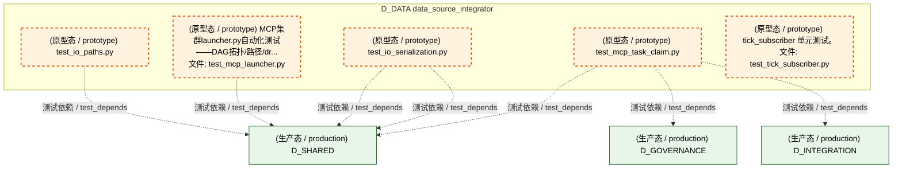
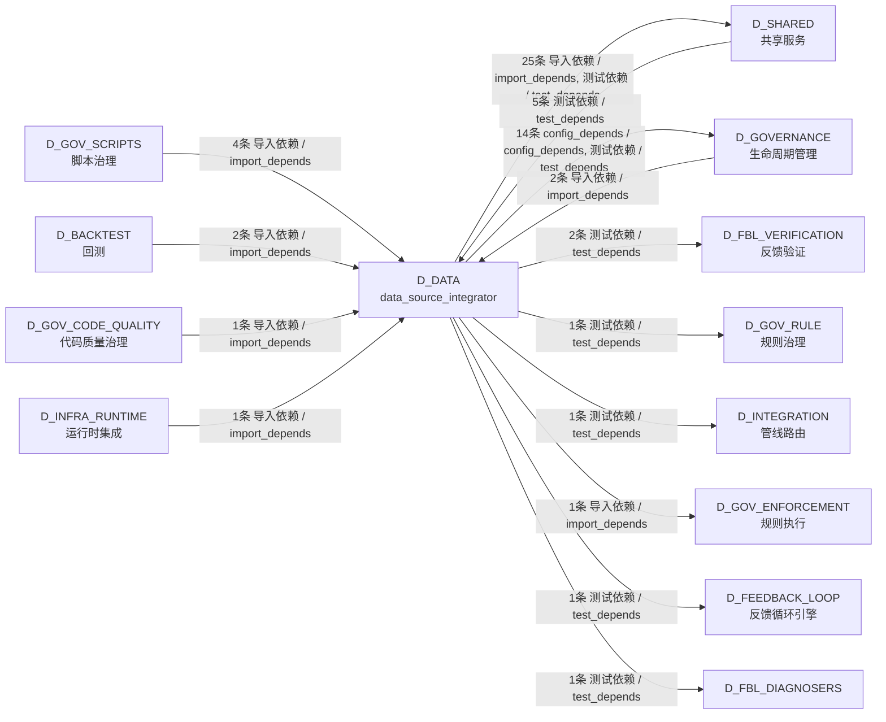

# 61_d_data / data_source_integrator / data_source_integrator / D_DATA

> **文档作用 / Purpose**: 展示 data_source_integrator（D_DATA）功能域的模块清单、域内依赖关系、跨域依赖关系、架构分层视图，供架构审查和域治理参考。

> 本文档由 generate_domain_doc.py 从 depgraph (PostgreSQL) 自动生成
> 最后更新: 2026-07-17 03:11:14
> 数据源: depgraph (PostgreSQL) nodes表 + edges表

## 域基本信息 / Domain Overview

| 字段 | 值 | Field | Value |
|------|------|-------|-------|
| 编号 | 61 | Number | 61 |
| 域ID | D_DATA | Domain ID | D_DATA |
| 域名称 | data_source_integrator | Domain Name | D_DATA |
| 层级 |  | Layer |  |
| 模块数 | 65 | Module Count | 65 |
| 域内依赖 | 108 | Internal Dependencies | 108 |
| 跨域入边 | 15 | Cross-domain Incoming | 15 |
| 跨域出边 | 46 | Cross-domain Outgoing | 46 |
| 设计态模块 | 0 | Design Modules | 0 |
| 原型态模块 | 56 | Prototype Modules | 56 |
| 生产态模块 | 9 | Production Modules | 9 |
| 容量 | 9/150 (正常) | Capacity | 9/150 (正常) |
| 描述 | 数据源集成器 | Description | 数据源集成器 |

## 模块分层清单 / Module Layered List

> 按 architecture_layer 分组的模块清单（共 65 个模块 / 65 modules）。

### L0 基础设施层 / Infrastructure Layer (3 modules)

| # | 模块路径 / Module Path | 模块名称 / Module Name (功能简介 / Description) | 成熟度 / Maturity | 蓝图 / Blueprint |
|:--:|---------|---------|:---:|:---:|
| 1 | schemas/categories/market_tick.py | tick_data 表 DDL-as-Code（category_id: market_t... | 原型态 / prototype | [MOD-L04-001](../../03_modules/_domain_risk/blueprint.md) |
| 2 | scripts/register_scheduler_task.ps1 | register_scheduler_task.ps1 | 原型态 / prototype |  |
| 3 | scripts/start_scheduler.ps1 | start_scheduler.ps1 | 原型态 / prototype |  |

### L2 领域层 / Domain Layer (62 modules)

| # | 模块路径 / Module Path | 模块名称 / Module Name (功能简介 / Description) | 成熟度 / Maturity | 蓝图 / Blueprint |
|:--:|---------|---------|:---:|:---:|
| 1 | src/zephyr/data/__init__.py | zephyr.data — 数据源集成器（MOD-L00-004）。 | 生产态 / production |  |
| 2 | src/zephyr/data/__main__.py | python -m zephyr.data — 数据源集成器 CLI 入口。 | 原型态 / prototype |  |
| 3 | src/zephyr/data/alerter.py | 告警管理（MOD-L00-004 §6.5 失败重试与告警 + §... | 原型态 / prototype |  |
| 4 | src/zephyr/data/backfill_checker.py | L10 周末补下载检测器——检测过去N天缺失数据并精... | 原型态 / prototype |  |
| 5 | src/zephyr/data/buffered_writer.py | 批量聚合写入器（MOD-L00-004 §18.3 裁定... | 原型态 / prototype |  |
| 6 | src/zephyr/data/capability_validator.py | Provider Capability 行为契约校验器（裁定... | 原型态 / prototype |  |
| 7 | src/zephyr/data/ch_config.py | ClickHouse 连接配置单真源加载器（裁定... | 原型态 / prototype |  |
| 8 | src/zephyr/data/ch_reader.py | ClickHouse 统一读取层（裁定 #ARCH-CH-007）。 | 原型态 / prototype |  |
| 9 | src/zephyr/data/ch_writer.py | ClickHouse 写入器（MOD-L00-004 §3.2 数据流第6... | 原型态 / prototype |  |
| 10 | src/zephyr/data/cli.py | 数据源集成器 CLI（MOD-L00-004 §8.4）。 | 生产态 / production |  |
| 11 | src/zephyr/data/config/policies.yaml | policies.yaml | 生产态 / production |  |
| 12 | src/zephyr/data/config/schedule.yaml | schedule.yaml | 生产态 / production |  |
| 13 | src/zephyr/data/config/tasks.yaml | tasks.yaml | 生产态 / production |  |
| 14 | src/zephyr/data/error_classifier.py | 数据源错误分类器——根据错误字符串判断可恢复性。 | 生产态 / production |  |
| 15 | src/zephyr/data/implementations/__init__.py | 数据源 Provider 实现集合（MOD-L00-004 §4.3）。 | 原型态 / prototype |  |
| 16 | src/zephyr/data/implementations/akshare_provider.py | AKShare 数据源 Provider 实现（MOD-L00-004 §4.3）。 | 原型态 / prototype |  |
| 17 | src/zephyr/data/implementations/baostock_provider.py | Baostock 数据源 Provider 实现（MOD-L00-004 §4.... | 原型态 / prototype |  |
| 18 | src/zephyr/data/implementations/cls_provider.py | 财联社电报数据源 Provider 实现（MOD-L00-004 §4... | 原型态 / prototype |  |
| 19 | src/zephyr/data/implementations/eastmoney_news_provider.py | 东方财富新闻数据源 Provider 实现（MOD-L00-004 ... | 原型态 / prototype |  |
| 20 | src/zephyr/data/implementations/ifind_provider.py | IFindProvider 实现（MOD-L00-004 §4.3 数据源集... | 原型态 / prototype |  |
| 21 | src/zephyr/data/implementations/miniqmt_provider.py | MOD-L00-004 数据源集成器 · MiniQMTProvider 实现。 | 原型态 / prototype |  |
| 22 | src/zephyr/data/implementations/rss_provider.py | RSS 财经新闻数据源 Provider 实现（MOD-L00-004 ... | 原型态 / prototype |  |
| 23 | src/zephyr/data/implementations/tdx_provider.py | 通达信数据源 Provider 实现（MOD-L00-004 §4.3）。 | 原型态 / prototype |  |
| 24 | src/zephyr/data/implementations/tickflow_provider.py | TickFlow 数据源 Provider 实现（MOD-L00-004 §4.... | 原型态 / prototype |  |
| 25 | src/zephyr/data/implementations/tushare_provider.py | Tushare 数据源 Provider 实现（MOD-L00-004 §4.3）。 | 原型态 / prototype |  |
| 26 | src/zephyr/data/integrity_checker.py | 数据完整性巡检器——每天盘后检测全表当日数据是... | 生产态 / production |  |
| 27 | src/zephyr/data/local_replay.py | 本地落盘兜底 + 自动回灌（裁定 #ARCH-CH-013 Phas... | 原型态 / prototype |  |
| 28 | src/zephyr/data/metrics.py | 可观测性指标采集（MOD-L00-004 §11）。 | 原型态 / prototype |  |
| 29 | src/zephyr/data/news_dedup.py | 新闻数据去重模块（MOD-L00-004 §4.3）。 | 原型态 / prototype |  |
| 30 | src/zephyr/data/policy_registry.py | per-source 调用策略注册表（MOD-L00-004 §5）。 | 生产态 / production |  |
| 31 | src/zephyr/data/progress_store.py | 统一进度存储（MOD-L00-004 §7）。 | 原型态 / prototype |  |
| 32 | src/zephyr/data/provider_base.py | 数据源 Provider 抽象基类（MOD-L00-004 §4）。 | 原型态 / prototype |  |
| 33 | src/zephyr/data/satellite_geospatial_engine/__init__.py | D_DATA Data Source | 原型态 / prototype | [MOD-L00-001](../../03_modules/_domain_data/blueprint.md) |
| 34 | src/zephyr/data/scheduler.py | 数据源调度编排层（MOD-L00-004 §6）。 | 原型态 / prototype |  |
| 35 | src/zephyr/data/speed_tester.py | 数据源测速器（MOD-L00-004 §8.5）。 | 原型态 / prototype |  |
| 36 | src/zephyr/data/task_queue.py | 任务依赖图 + 优先级队列（MOD-L00-004 §6.3 任务... | 原型态 / prototype |  |
| 37 | src/zephyr/data/tick_subscriber.py | QMT 实时 Tick 订阅服务——subscribe_quote 实时... | 生产态 / production |  |
| 38 | src/zephyr/data/trading_calendar.py | A 股交易日历守卫（MOD-L00-004）。 | 原型态 / prototype |  |
| 39 | tests/asset_inventory/test_asset_inventory.py | test_asset_inventory.py | 原型态 / prototype | [MOD-INF-026](../../03_modules/_domain_infrastructure_operations/asset_inventory/blueprint.md) |
| 40 | tests/data/test_data_lifecycle.py | test_data_lifecycle.py | 原型态 / prototype | [MOD-INF-023](../../03_modules/_domain_governance/drift_detector/blueprint.md) |
| 41 | tests/data/test_data_pipeline_guard.py | test_data_pipeline_guard.py | 原型态 / prototype | [MOD-INF-021](../../03_modules/_domain_autonomy_core/rollback_system/blueprint.md) |
| 42 | tests/data/test_data_quality_gate.py | test_data_quality_gate.py | 原型态 / prototype | [MOD-GATE_ENGINE](../../03_modules/_cross_layer/gate_engine/blueprint.md) |
| 43 | tests/data/test_data_source_reliability.py | test_data_source_reliability.py | 原型态 / prototype | [MOD-INF-023](../../03_modules/_domain_governance/drift_detector/blueprint.md) |
| 44 | tests/data/test_data_volume_growth_monitor.py | test_data_volume_growth_monitor.py | 原型态 / prototype | [MOD-FEEDBACK_LOOP](../../03_modules/_cross_layer/feedback_loop/blueprint.md) |
| 45 | tests/data/test_l00_data_source.py | test_l00_data_source.py | 原型态 / prototype | [MOD-L00-001](../../03_modules/_domain_data/blueprint.md) |
| 46 | tests/db/conftest.py | tests/db/ 共享 fixture — 收敛 governance.db 路... | 原型态 / prototype | [MOD-INF-016](../../03_modules/_cross_layer/shared_core/blueprint.md) |
| 47 | tests/db/test_db_auto_ops.py | DM-100021: 事件驱动自动启动检查+自动运行检查 | 原型态 / prototype |  |
| 48 | tests/db/test_db_bridge.py | Tests for zephyr.feedback_loop.db_bridge — rec... | 原型态 / prototype | [MOD-FEEDBACK_LOOP](../../03_modules/_cross_layer/feedback_loop/blueprint.md) |
| 49 | tests/db/test_db_integration.py | DM-100019: 双库集成测试+四方对齐验证 | 原型态 / prototype | [MOD-INF-016](../../03_modules/_cross_layer/shared_core/blueprint.md) |
| 50 | tests/db/test_db_integrity.py | test_db_integrity.py | 原型态 / prototype | [MOD-GATE_ENGINE](../../03_modules/_cross_layer/gate_engine/blueprint.md) |
| 51 | tests/db/test_db_query.py | test_db_query.py | 原型态 / prototype |  |
| 52 | tests/db/test_db_red_blue.py | DM-100020: 红蓝对抗测试：数据库安全与韧性 | 原型态 / prototype | [MOD-INF-016](../../03_modules/_cross_layer/shared_core/blueprint.md) |
| 53 | tests/db/test_db_transition.py | test_db_transition.py | 原型态 / prototype |  |
| 54 | tests/db/test_dm400_stale_task_fix.py | DM-400/DM-401 端到端 + 红蓝对抗测试。 | 原型态 / prototype | [MOD-TASK_SYSTEM](../../03_modules/_domain_infrastructure_runtime/task_system/blueprint.md) |
| 55 | tests/io/test_io_content_fingerprint.py | test_io_content_fingerprint.py | 原型态 / prototype | [MOD-INF-016](../../03_modules/_cross_layer/shared_core/blueprint.md) |
| 56 | tests/io/test_io_file_utils.py | test_io_file_utils.py | 原型态 / prototype | [MOD-INF-016](../../03_modules/_cross_layer/shared_core/blueprint.md) |
| 57 | tests/io/test_io_frontmatter_utils.py | test_io_frontmatter_utils.py | 原型态 / prototype | [MOD-INF-016](../../03_modules/_cross_layer/shared_core/blueprint.md) |
| 58 | tests/io/test_io_paths.py | test_io_paths.py | 原型态 / prototype | [MOD-INF-016](../../03_modules/_cross_layer/shared_core/blueprint.md) |
| 59 | tests/io/test_io_serialization.py | test_io_serialization.py | 原型态 / prototype | [MOD-INF-016](../../03_modules/_cross_layer/shared_core/blueprint.md) |
| 60 | tests/io/test_mcp_launcher.py | MCP集群launcher.py自动化测试——DAG拓扑/路径/dr... | 原型态 / prototype | [MOD-INF-013](../../03_modules/_cross_layer/model_context_protocol_servers/blueprint.md) |
| 61 | tests/io/test_mcp_task_claim.py | test_mcp_task_claim.py | 原型态 / prototype |  |
| 62 | tests/zephyr/data/test_tick_subscriber.py | tick_subscriber 单元测试。 | 原型态 / prototype |  |

## 域内依赖图 / Internal Dependency Diagram

> 依赖图内嵌在本文档中，IDE 可直接渲染显示。参考 decision_index.md 设计，分四个视图：合并全景图、运营态子图、设计态子图、原型态子图（按 design_maturity 实际值拆分）。
>
> **图例说明 / Legend**：
> - **实线边框 = 运营态模块**（production，已上线运行）
> - **虚线边框 = 设计态模块**（design，蓝图阶段，代码未写）
> - **虚线边框 = 原型态模块**（prototype，代码已写，验证中未稳定上线）
> - **实线箭头 = 运营态依赖**（已生效的依赖关系）
> - **虚线箭头 = 非运营态依赖**（计划中/验证中的依赖关系）

### 合并全景图（全部模块，标签标注成熟度）

> 展示全部 65 个模块（生产态 9 + 设计态 0 + 原型态 56），标签标注成熟度。

#### 第 1 页 / 共 3 页

```mermaid
graph TD
    subgraph D_DATA["D_DATA data_source_integrator"]
        schemas_categories_market_tick_py["(原型态 / prototype) tick_data 表 DDL-as-Code（category_id: market_t...<br/>文件: market_tick.py"]
        scripts_register_scheduler_task_ps1["(原型态 / prototype) register_scheduler_task.ps1"]
        scripts_start_scheduler_ps1["(原型态 / prototype) start_scheduler.ps1"]
        src_zephyr_data_init_py["(生产态 / production) zephyr.data — 数据源集成器（MOD-L00-004）。<br/>文件: __init__.py"]
        src_zephyr_data_main_py["(原型态 / prototype) python -m zephyr.data — 数据源集成器 CLI 入口。<br/>文件: __main__.py"]
        src_zephyr_data_alerter_py["(原型态 / prototype) 告警管理（MOD-L00-004 §6.5 失败重试与告警 + §...<br/>文件: alerter.py"]
        src_zephyr_data_backfill_checker_py["(原型态 / prototype) L10 周末补下载检测器——检测过去N天缺失数据并精...<br/>文件: backfill_checker.py"]
        src_zephyr_data_buffered_writer_py["(原型态 / prototype) 批量聚合写入器（MOD-L00-004 §18.3 裁定...<br/>文件: buffered_writer.py"]
        src_zephyr_data_capability_validator_py["(原型态 / prototype) Provider Capability 行为契约校验器（裁定...<br/>文件: capability_validator.py"]
        src_zephyr_data_ch_config_py["(原型态 / prototype) ClickHouse 连接配置单真源加载器（裁定...<br/>文件: ch_config.py"]
        src_zephyr_data_ch_reader_py["(原型态 / prototype) ClickHouse 统一读取层（裁定 #ARCH-CH-007）。<br/>文件: ch_reader.py"]
        src_zephyr_data_ch_writer_py["(原型态 / prototype) ClickHouse 写入器（MOD-L00-004 §3.2 数据流第6...<br/>文件: ch_writer.py"]
        src_zephyr_data_cli_py["(生产态 / production) 数据源集成器 CLI（MOD-L00-004 §8.4）。<br/>文件: cli.py"]
        src_zephyr_data_config_policies_yaml["(生产态 / production) policies.yaml"]
        src_zephyr_data_config_schedule_yaml["(生产态 / production) schedule.yaml"]
        src_zephyr_data_config_tasks_yaml["(生产态 / production) tasks.yaml"]
        src_zephyr_data_error_classifier_py["(生产态 / production) 数据源错误分类器——根据错误字符串判断可恢复性。<br/>文件: error_classifier.py"]
        src_zephyr_data_implementations_init_py["(原型态 / prototype) 数据源 Provider 实现集合（MOD-L00-004 §4.3）。<br/>文件: __init__.py"]
        src_zephyr_data_implementations_akshare_provider_py["(原型态 / prototype) AKShare 数据源 Provider 实现（MOD-L00-004 §4.3）。<br/>文件: akshare_provider.py"]
        src_zephyr_data_implementations_baostock_provider_py["(原型态 / prototype) Baostock 数据源 Provider 实现（MOD-L00-004 §4....<br/>文件: baostock_provider.py"]
        src_zephyr_data_implementations_cls_provider_py["(原型态 / prototype) 财联社电报数据源 Provider 实现（MOD-L00-004 §4...<br/>文件: cls_provider.py"]
        src_zephyr_data_implementations_eastmoney_news_provider_py["(原型态 / prototype) 东方财富新闻数据源 Provider 实现（MOD-L00-004 ...<br/>文件: eastmoney_news_provider.py"]
        src_zephyr_data_implementations_ifind_provider_py["(原型态 / prototype) IFindProvider 实现（MOD-L00-004 §4.3 数据源集...<br/>文件: ifind_provider.py"]
        src_zephyr_data_implementations_miniqmt_provider_py["(原型态 / prototype) MOD-L00-004 数据源集成器 · MiniQMTProvider 实现。<br/>文件: miniqmt_provider.py"]
        src_zephyr_data_implementations_rss_provider_py["(原型态 / prototype) RSS 财经新闻数据源 Provider 实现（MOD-L00-004 ...<br/>文件: rss_provider.py"]
        src_zephyr_data_implementations_tdx_provider_py["(原型态 / prototype) 通达信数据源 Provider 实现（MOD-L00-004 §4.3）。<br/>文件: tdx_provider.py"]
        src_zephyr_data_implementations_tickflow_provider_py["(原型态 / prototype) TickFlow 数据源 Provider 实现（MOD-L00-004 §4....<br/>文件: tickflow_provider.py"]
        src_zephyr_data_implementations_tushare_provider_py["(原型态 / prototype) Tushare 数据源 Provider 实现（MOD-L00-004 §4.3）。<br/>文件: tushare_provider.py"]
        src_zephyr_data_integrity_checker_py["(生产态 / production) 数据完整性巡检器——每天盘后检测全表当日数据是...<br/>文件: integrity_checker.py"]
        src_zephyr_data_local_replay_py["(原型态 / prototype) 本地落盘兜底 + 自动回灌（裁定 #ARCH-CH-013 Phas...<br/>文件: local_replay.py"]
    end
    src_zephyr_data_backfill_checker_py -.->|导入依赖 / import_depends| src_zephyr_data_ch_reader_py
    src_zephyr_data_backfill_checker_py -.->|导入依赖 / import_depends| src_zephyr_data_ch_writer_py
    src_zephyr_data_backfill_checker_py -.->|导入依赖 / import_depends| src_zephyr_data_init_py
    src_zephyr_data_buffered_writer_py -.->|导入依赖 / import_depends| src_zephyr_data_ch_writer_py
    src_zephyr_data_ch_reader_py -.->|导入依赖 / import_depends| src_zephyr_data_ch_writer_py
    src_zephyr_data_ch_reader_py -.->|导入依赖 / import_depends| src_zephyr_data_init_py
    src_zephyr_data_ch_writer_py -.->|导入依赖 / import_depends| src_zephyr_data_ch_config_py
    src_zephyr_data_ch_writer_py -.->|导入依赖 / import_depends| src_zephyr_data_local_replay_py
    src_zephyr_data_integrity_checker_py -.->|导入依赖 / import_depends| src_zephyr_data_backfill_checker_py
    src_zephyr_data_integrity_checker_py -.->|导入依赖 / import_depends| src_zephyr_data_ch_reader_py
    src_zephyr_data_integrity_checker_py -->|导入依赖 / import_depends| src_zephyr_data_init_py
    src_zephyr_data_local_replay_py -.->|导入依赖 / import_depends| src_zephyr_data_ch_writer_py
    src_zephyr_data_cli_py -.->|导入依赖 / import_depends| src_zephyr_data_ch_config_py
    src_zephyr_data_cli_py -->|导入依赖 / import_depends| src_zephyr_data_init_py
    src_zephyr_data_main_py -.->|导入依赖 / import_depends| src_zephyr_data_cli_py
    src_zephyr_data_implementations_akshare_provider_py -.->|导入依赖 / import_depends| src_zephyr_data_ch_reader_py
    src_zephyr_data_implementations_akshare_provider_py -.->|导入依赖 / import_depends| src_zephyr_data_init_py
    src_zephyr_data_implementations_miniqmt_provider_py -.->|导入依赖 / import_depends| src_zephyr_data_ch_reader_py
    src_zephyr_data_implementations_ifind_provider_py -.->|导入依赖 / import_depends| src_zephyr_data_ch_reader_py
    src_zephyr_data_implementations_ifind_provider_py -.->|导入依赖 / import_depends| src_zephyr_data_init_py
    src_zephyr_data_implementations_init_py -.->|导入依赖 / import_depends| src_zephyr_data_implementations_akshare_provider_py
    src_zephyr_data_implementations_init_py -.->|导入依赖 / import_depends| src_zephyr_data_implementations_miniqmt_provider_py
    src_zephyr_data_implementations_init_py -.->|导入依赖 / import_depends| src_zephyr_data_implementations_ifind_provider_py
    D_SHARED["(生产态 / production) D_SHARED"]
    src_zephyr_data_alerter_py -.->|导入依赖 / import_depends| D_SHARED
    src_zephyr_data_alerter_py -.->|导入依赖 / import_depends| D_SHARED
    src_zephyr_data_ch_config_py -.->|导入依赖 / import_depends| D_SHARED
    src_zephyr_data_ch_config_py -.->|导入依赖 / import_depends| D_SHARED
    src_zephyr_data_local_replay_py -.->|导入依赖 / import_depends| D_SHARED
    src_zephyr_data_implementations_cls_provider_py -.->|导入依赖 / import_depends| D_SHARED
    src_zephyr_data_implementations_rss_provider_py -.->|导入依赖 / import_depends| D_SHARED
    src_zephyr_data_implementations_tushare_provider_py -.->|导入依赖 / import_depends| D_SHARED
    D_GOVERNANCE["(原型态 / prototype) D_GOVERNANCE"]
    scripts_register_scheduler_task_ps1 -.->|config_depends / config_depends| D_GOVERNANCE
    scripts_start_scheduler_ps1 -.->|config_depends / config_depends| D_GOVERNANCE
    D_GOV_SCRIPTS["(原型态 / prototype) D_GOV_SCRIPTS"]
    D_GOV_SCRIPTS -.->|导入依赖 / import_depends| src_zephyr_data_ch_reader_py
    D_GOV_SCRIPTS -.->|导入依赖 / import_depends| src_zephyr_data_ch_reader_py
    D_BACKTEST["(生产态 / production) D_BACKTEST"]
    D_BACKTEST -.->|导入依赖 / import_depends| src_zephyr_data_ch_reader_py
    D_GOV_CODE_QUALITY["(原型态 / prototype) D_GOV_CODE_QUALITY"]
    D_GOV_CODE_QUALITY -.->|导入依赖 / import_depends| src_zephyr_data_capability_validator_py
    D_INFRA_RUNTIME["(原型态 / prototype) D_INFRA_RUNTIME"]
    D_INFRA_RUNTIME -.->|导入依赖 / import_depends| src_zephyr_data_ch_config_py
    D_SHARED -.->|测试依赖 / test_depends| src_zephyr_data_error_classifier_py
    D_SHARED -.->|测试依赖 / test_depends| src_zephyr_data_integrity_checker_py
    D_SHARED -.->|测试依赖 / test_depends| src_zephyr_data_cli_py
    D_GOV_SCRIPTS -.->|导入依赖 / import_depends| src_zephyr_data_init_py
    D_GOV_SCRIPTS -.->|导入依赖 / import_depends| src_zephyr_data_init_py
    D_GOVERNANCE -.->|导入依赖 / import_depends| src_zephyr_data_init_py
    D_BACKTEST -->|导入依赖 / import_depends| src_zephyr_data_init_py
    classDef production fill:#e1f5fe,stroke:#01579b,stroke-width:2px,color:#000
    classDef design fill:#fff3e0,stroke:#e65100,stroke-width:2px,color:#000,stroke-dasharray: 5 5
    classDef external_prod fill:#e8f5e9,stroke:#1b5e20,stroke-width:1px,color:#000
    classDef external_design fill:#fce4ec,stroke:#880e4f,stroke-width:1px,color:#000,stroke-dasharray: 5 5
    class src_zephyr_data_init_py,src_zephyr_data_cli_py,src_zephyr_data_config_policies_yaml,src_zephyr_data_config_schedule_yaml,src_zephyr_data_config_tasks_yaml,src_zephyr_data_error_classifier_py,src_zephyr_data_integrity_checker_py production
    class schemas_categories_market_tick_py,scripts_register_scheduler_task_ps1,scripts_start_scheduler_ps1,src_zephyr_data_main_py,src_zephyr_data_alerter_py,src_zephyr_data_backfill_checker_py,src_zephyr_data_buffered_writer_py,src_zephyr_data_capability_validator_py,src_zephyr_data_ch_config_py,src_zephyr_data_ch_reader_py,src_zephyr_data_ch_writer_py,src_zephyr_data_implementations_init_py,src_zephyr_data_implementations_akshare_provider_py,src_zephyr_data_implementations_baostock_provider_py,src_zephyr_data_implementations_cls_provider_py,src_zephyr_data_implementations_eastmoney_news_provider_py,src_zephyr_data_implementations_ifind_provider_py,src_zephyr_data_implementations_miniqmt_provider_py,src_zephyr_data_implementations_rss_provider_py,src_zephyr_data_implementations_tdx_provider_py,src_zephyr_data_implementations_tickflow_provider_py,src_zephyr_data_implementations_tushare_provider_py,src_zephyr_data_local_replay_py design
    class D_SHARED,D_BACKTEST external_prod
    class D_GOVERNANCE,D_GOV_SCRIPTS,D_GOV_CODE_QUALITY,D_INFRA_RUNTIME external_design
```



#### 第 2 页 / 共 3 页

```mermaid
graph TD
    subgraph D_DATA["D_DATA data_source_integrator"]
        src_zephyr_data_metrics_py["(原型态 / prototype) 可观测性指标采集（MOD-L00-004 §11）。<br/>文件: metrics.py"]
        src_zephyr_data_news_dedup_py["(原型态 / prototype) 新闻数据去重模块（MOD-L00-004 §4.3）。<br/>文件: news_dedup.py"]
        src_zephyr_data_policy_registry_py["(生产态 / production) per-source 调用策略注册表（MOD-L00-004 §5）。<br/>文件: policy_registry.py"]
        src_zephyr_data_progress_store_py["(原型态 / prototype) 统一进度存储（MOD-L00-004 §7）。<br/>文件: progress_store.py"]
        src_zephyr_data_provider_base_py["(原型态 / prototype) 数据源 Provider 抽象基类（MOD-L00-004 §4）。<br/>文件: provider_base.py"]
        src_zephyr_data_satellite_geospatial_engine_init_py["(原型态 / prototype) D_DATA Data Source<br/>文件: __init__.py"]
        src_zephyr_data_scheduler_py["(原型态 / prototype) 数据源调度编排层（MOD-L00-004 §6）。<br/>文件: scheduler.py"]
        src_zephyr_data_speed_tester_py["(原型态 / prototype) 数据源测速器（MOD-L00-004 §8.5）。<br/>文件: speed_tester.py"]
        src_zephyr_data_task_queue_py["(原型态 / prototype) 任务依赖图 + 优先级队列（MOD-L00-004 §6.3 任务...<br/>文件: task_queue.py"]
        src_zephyr_data_tick_subscriber_py["(生产态 / production) QMT 实时 Tick 订阅服务——subscribe_quote 实时...<br/>文件: tick_subscriber.py"]
        src_zephyr_data_trading_calendar_py["(原型态 / prototype) A 股交易日历守卫（MOD-L00-004）。<br/>文件: trading_calendar.py"]
        tests_asset_inventory_test_asset_inventory_py["(原型态 / prototype) test_asset_inventory.py"]
        tests_data_test_data_lifecycle_py["(原型态 / prototype) test_data_lifecycle.py"]
        tests_data_test_data_pipeline_guard_py["(原型态 / prototype) test_data_pipeline_guard.py"]
        tests_data_test_data_quality_gate_py["(原型态 / prototype) test_data_quality_gate.py"]
        tests_data_test_data_source_reliability_py["(原型态 / prototype) test_data_source_reliability.py"]
        tests_data_test_data_volume_growth_monitor_py["(原型态 / prototype) test_data_volume_growth_monitor.py"]
        tests_data_test_l00_data_source_py["(原型态 / prototype) test_l00_data_source.py"]
        tests_db_conftest_py["(原型态 / prototype) tests/db/ 共享 fixture — 收敛 governance.db 路...<br/>文件: conftest.py"]
        tests_db_test_db_auto_ops_py["(原型态 / prototype) DM-100021: 事件驱动自动启动检查+自动运行检查<br/>文件: test_db_auto_ops.py"]
        tests_db_test_db_bridge_py["(原型态 / prototype) Tests for zephyr.feedback_loop.db_bridge — rec...<br/>文件: test_db_bridge.py"]
        tests_db_test_db_integration_py["(原型态 / prototype) DM-100019: 双库集成测试+四方对齐验证<br/>文件: test_db_integration.py"]
        tests_db_test_db_integrity_py["(原型态 / prototype) test_db_integrity.py"]
        tests_db_test_db_query_py["(原型态 / prototype) test_db_query.py"]
        tests_db_test_db_red_blue_py["(原型态 / prototype) DM-100020: 红蓝对抗测试：数据库安全与韧性<br/>文件: test_db_red_blue.py"]
        tests_db_test_db_transition_py["(原型态 / prototype) test_db_transition.py"]
        tests_db_test_dm400_stale_task_fix_py["(原型态 / prototype) DM-400/DM-401 端到端 + 红蓝对抗测试。<br/>文件: test_dm400_stale_task_fix.py"]
        tests_io_test_io_content_fingerprint_py["(原型态 / prototype) test_io_content_fingerprint.py"]
        tests_io_test_io_file_utils_py["(原型态 / prototype) test_io_file_utils.py"]
        tests_io_test_io_frontmatter_utils_py["(原型态 / prototype) test_io_frontmatter_utils.py"]
    end
    src_zephyr_data_news_dedup_py -.->|导入依赖 / import_depends| src_zephyr_data_provider_base_py
    src_zephyr_data_provider_base_py -.->|导入依赖 / import_depends| src_zephyr_data_policy_registry_py
    src_zephyr_data_tick_subscriber_py -.->|导入依赖 / import_depends| src_zephyr_data_provider_base_py
    src_zephyr_data_speed_tester_py -.->|导入依赖 / import_depends| src_zephyr_data_policy_registry_py
    src_zephyr_data_speed_tester_py -.->|导入依赖 / import_depends| src_zephyr_data_provider_base_py
    src_zephyr_data_scheduler_py -.->|导入依赖 / import_depends| src_zephyr_data_metrics_py
    src_zephyr_data_scheduler_py -.->|导入依赖 / import_depends| src_zephyr_data_news_dedup_py
    src_zephyr_data_scheduler_py -.->|导入依赖 / import_depends| src_zephyr_data_policy_registry_py
    src_zephyr_data_scheduler_py -.->|导入依赖 / import_depends| src_zephyr_data_progress_store_py
    src_zephyr_data_scheduler_py -.->|导入依赖 / import_depends| src_zephyr_data_provider_base_py
    src_zephyr_data_scheduler_py -.->|导入依赖 / import_depends| src_zephyr_data_task_queue_py
    src_zephyr_data_scheduler_py -.->|导入依赖 / import_depends| src_zephyr_data_trading_calendar_py
    src_zephyr_data_satellite_geospatial_engine_init_py -.->|导入依赖 / import_depends| src_zephyr_data_provider_base_py
    D_SHARED["(生产态 / production) D_SHARED"]
    src_zephyr_data_metrics_py -.->|导入依赖 / import_depends| D_SHARED
    src_zephyr_data_progress_store_py -.->|导入依赖 / import_depends| D_SHARED
    src_zephyr_data_progress_store_py -.->|导入依赖 / import_depends| D_SHARED
    src_zephyr_data_speed_tester_py -.->|导入依赖 / import_depends| D_SHARED
    src_zephyr_data_scheduler_py -.->|导入依赖 / import_depends| D_SHARED
    D_GOV_ENFORCEMENT["(原型态 / prototype) D_GOV_ENFORCEMENT"]
    src_zephyr_data_satellite_geospatial_engine_init_py -.->|导入依赖 / import_depends| D_GOV_ENFORCEMENT
    D_GOVERNANCE["(生产态 / production) D_GOVERNANCE"]
    tests_data_test_data_lifecycle_py -.->|测试依赖 / test_depends| D_GOVERNANCE
    tests_data_test_data_pipeline_guard_py -.->|测试依赖 / test_depends| D_GOVERNANCE
    D_FBL_VERIFICATION["(生产态 / production) D_FBL_VERIFICATION"]
    tests_data_test_data_quality_gate_py -.->|测试依赖 / test_depends| D_FBL_VERIFICATION
    D_FBL_DIAGNOSERS["(生产态 / production) D_FBL_DIAGNOSERS"]
    tests_data_test_data_volume_growth_monitor_py -.->|测试依赖 / test_depends| D_FBL_DIAGNOSERS
    tests_data_test_data_source_reliability_py -.->|测试依赖 / test_depends| D_GOVERNANCE
    tests_db_conftest_py -.->|测试依赖 / test_depends| D_SHARED
    tests_db_test_db_integration_py -.->|测试依赖 / test_depends| D_SHARED
    tests_db_test_db_integration_py -.->|测试依赖 / test_depends| D_GOVERNANCE
    D_FEEDBACK_LOOP["(生产态 / production) D_FEEDBACK_LOOP"]
    tests_db_test_db_bridge_py -.->|测试依赖 / test_depends| D_FEEDBACK_LOOP
    D_GOVERNANCE -.->|导入依赖 / import_depends| src_zephyr_data_provider_base_py
    D_SHARED -.->|测试依赖 / test_depends| src_zephyr_data_policy_registry_py
    D_SHARED -.->|测试依赖 / test_depends| src_zephyr_data_policy_registry_py
    classDef production fill:#e1f5fe,stroke:#01579b,stroke-width:2px,color:#000
    classDef design fill:#fff3e0,stroke:#e65100,stroke-width:2px,color:#000,stroke-dasharray: 5 5
    classDef external_prod fill:#e8f5e9,stroke:#1b5e20,stroke-width:1px,color:#000
    classDef external_design fill:#fce4ec,stroke:#880e4f,stroke-width:1px,color:#000,stroke-dasharray: 5 5
    class src_zephyr_data_policy_registry_py,src_zephyr_data_tick_subscriber_py production
    class src_zephyr_data_metrics_py,src_zephyr_data_news_dedup_py,src_zephyr_data_progress_store_py,src_zephyr_data_provider_base_py,src_zephyr_data_satellite_geospatial_engine_init_py,src_zephyr_data_scheduler_py,src_zephyr_data_speed_tester_py,src_zephyr_data_task_queue_py,src_zephyr_data_trading_calendar_py,tests_asset_inventory_test_asset_inventory_py,tests_data_test_data_lifecycle_py,tests_data_test_data_pipeline_guard_py,tests_data_test_data_quality_gate_py,tests_data_test_data_source_reliability_py,tests_data_test_data_volume_growth_monitor_py,tests_data_test_l00_data_source_py,tests_db_conftest_py,tests_db_test_db_auto_ops_py,tests_db_test_db_bridge_py,tests_db_test_db_integration_py,tests_db_test_db_integrity_py,tests_db_test_db_query_py,tests_db_test_db_red_blue_py,tests_db_test_db_transition_py,tests_db_test_dm400_stale_task_fix_py,tests_io_test_io_content_fingerprint_py,tests_io_test_io_file_utils_py,tests_io_test_io_frontmatter_utils_py design
    class D_SHARED,D_GOVERNANCE,D_FBL_VERIFICATION,D_FBL_DIAGNOSERS,D_FEEDBACK_LOOP external_prod
    class D_GOV_ENFORCEMENT external_design
```



#### 第 3 页 / 共 3 页



### 运营态子图（仅 design_maturity=production 的模块和依赖）

> 仅展示已上线运行的模块（共 9 个，4 条域内依赖）。

```mermaid
graph TD
    subgraph D_DATA["D_DATA data_source_integrator"]
        src_zephyr_data_init_py["(生产态 / production) zephyr.data — 数据源集成器（MOD-L00-004）。<br/>文件: __init__.py"]
        src_zephyr_data_cli_py["(生产态 / production) 数据源集成器 CLI（MOD-L00-004 §8.4）。<br/>文件: cli.py"]
        src_zephyr_data_config_policies_yaml["(生产态 / production) policies.yaml"]
        src_zephyr_data_config_schedule_yaml["(生产态 / production) schedule.yaml"]
        src_zephyr_data_config_tasks_yaml["(生产态 / production) tasks.yaml"]
        src_zephyr_data_error_classifier_py["(生产态 / production) 数据源错误分类器——根据错误字符串判断可恢复性。<br/>文件: error_classifier.py"]
        src_zephyr_data_integrity_checker_py["(生产态 / production) 数据完整性巡检器——每天盘后检测全表当日数据是...<br/>文件: integrity_checker.py"]
        src_zephyr_data_policy_registry_py["(生产态 / production) per-source 调用策略注册表（MOD-L00-004 §5）。<br/>文件: policy_registry.py"]
        src_zephyr_data_tick_subscriber_py["(生产态 / production) QMT 实时 Tick 订阅服务——subscribe_quote 实时...<br/>文件: tick_subscriber.py"]
    end
    src_zephyr_data_integrity_checker_py -->|导入依赖 / import_depends| src_zephyr_data_init_py
    src_zephyr_data_cli_py -->|导入依赖 / import_depends| src_zephyr_data_policy_registry_py
    src_zephyr_data_cli_py -->|导入依赖 / import_depends| src_zephyr_data_init_py
    src_zephyr_data_init_py -->|导入依赖 / import_depends| src_zephyr_data_policy_registry_py
    D_SHARED["(原型态 / prototype) D_SHARED"]
    D_SHARED -.->|测试依赖 / test_depends| src_zephyr_data_error_classifier_py
    D_SHARED -.->|测试依赖 / test_depends| src_zephyr_data_integrity_checker_py
    D_SHARED -.->|测试依赖 / test_depends| src_zephyr_data_cli_py
    D_SHARED -.->|测试依赖 / test_depends| src_zephyr_data_policy_registry_py
    D_SHARED -.->|测试依赖 / test_depends| src_zephyr_data_policy_registry_py
    D_BACKTEST["(生产态 / production) D_BACKTEST"]
    D_BACKTEST -->|导入依赖 / import_depends| src_zephyr_data_init_py
    D_GOVERNANCE["(原型态 / prototype) D_GOVERNANCE"]
    D_GOVERNANCE -.->|导入依赖 / import_depends| src_zephyr_data_init_py
    D_GOV_SCRIPTS["(原型态 / prototype) D_GOV_SCRIPTS"]
    D_GOV_SCRIPTS -.->|导入依赖 / import_depends| src_zephyr_data_init_py
    D_GOV_SCRIPTS -.->|导入依赖 / import_depends| src_zephyr_data_init_py
    classDef production fill:#e1f5fe,stroke:#01579b,stroke-width:2px,color:#000
    classDef design fill:#fff3e0,stroke:#e65100,stroke-width:2px,color:#000,stroke-dasharray: 5 5
    classDef external_prod fill:#e8f5e9,stroke:#1b5e20,stroke-width:1px,color:#000
    classDef external_design fill:#fce4ec,stroke:#880e4f,stroke-width:1px,color:#000,stroke-dasharray: 5 5
    class src_zephyr_data_init_py,src_zephyr_data_cli_py,src_zephyr_data_config_policies_yaml,src_zephyr_data_config_schedule_yaml,src_zephyr_data_config_tasks_yaml,src_zephyr_data_error_classifier_py,src_zephyr_data_integrity_checker_py,src_zephyr_data_policy_registry_py,src_zephyr_data_tick_subscriber_py production
    class D_BACKTEST external_prod
    class D_SHARED,D_GOVERNANCE,D_GOV_SCRIPTS external_design
```



### 设计态子图（仅 design_maturity=design 的模块和依赖）

> 仅展示蓝图阶段、代码未写的设计态模块（共 0 个，0 条域内依赖）。

> （无设计态模块 / No design modules）

### 原型态子图（仅 design_maturity=prototype 的模块和依赖）

> 仅展示代码已写、验证中未稳定上线的原型态模块（共 56 个，70 条域内依赖）。

```mermaid
graph TD
    subgraph D_DATA["D_DATA data_source_integrator"]
        schemas_categories_market_tick_py["(原型态 / prototype) tick_data 表 DDL-as-Code（category_id: market_t...<br/>文件: market_tick.py"]
        scripts_register_scheduler_task_ps1["(原型态 / prototype) register_scheduler_task.ps1"]
        scripts_start_scheduler_ps1["(原型态 / prototype) start_scheduler.ps1"]
        src_zephyr_data_main_py["(原型态 / prototype) python -m zephyr.data — 数据源集成器 CLI 入口。<br/>文件: __main__.py"]
        src_zephyr_data_alerter_py["(原型态 / prototype) 告警管理（MOD-L00-004 §6.5 失败重试与告警 + §...<br/>文件: alerter.py"]
        src_zephyr_data_backfill_checker_py["(原型态 / prototype) L10 周末补下载检测器——检测过去N天缺失数据并精...<br/>文件: backfill_checker.py"]
        src_zephyr_data_buffered_writer_py["(原型态 / prototype) 批量聚合写入器（MOD-L00-004 §18.3 裁定...<br/>文件: buffered_writer.py"]
        src_zephyr_data_capability_validator_py["(原型态 / prototype) Provider Capability 行为契约校验器（裁定...<br/>文件: capability_validator.py"]
        src_zephyr_data_ch_config_py["(原型态 / prototype) ClickHouse 连接配置单真源加载器（裁定...<br/>文件: ch_config.py"]
        src_zephyr_data_ch_reader_py["(原型态 / prototype) ClickHouse 统一读取层（裁定 #ARCH-CH-007）。<br/>文件: ch_reader.py"]
        src_zephyr_data_ch_writer_py["(原型态 / prototype) ClickHouse 写入器（MOD-L00-004 §3.2 数据流第6...<br/>文件: ch_writer.py"]
        src_zephyr_data_implementations_init_py["(原型态 / prototype) 数据源 Provider 实现集合（MOD-L00-004 §4.3）。<br/>文件: __init__.py"]
        src_zephyr_data_implementations_akshare_provider_py["(原型态 / prototype) AKShare 数据源 Provider 实现（MOD-L00-004 §4.3）。<br/>文件: akshare_provider.py"]
        src_zephyr_data_implementations_baostock_provider_py["(原型态 / prototype) Baostock 数据源 Provider 实现（MOD-L00-004 §4....<br/>文件: baostock_provider.py"]
        src_zephyr_data_implementations_cls_provider_py["(原型态 / prototype) 财联社电报数据源 Provider 实现（MOD-L00-004 §4...<br/>文件: cls_provider.py"]
        src_zephyr_data_implementations_eastmoney_news_provider_py["(原型态 / prototype) 东方财富新闻数据源 Provider 实现（MOD-L00-004 ...<br/>文件: eastmoney_news_provider.py"]
        src_zephyr_data_implementations_ifind_provider_py["(原型态 / prototype) IFindProvider 实现（MOD-L00-004 §4.3 数据源集...<br/>文件: ifind_provider.py"]
        src_zephyr_data_implementations_miniqmt_provider_py["(原型态 / prototype) MOD-L00-004 数据源集成器 · MiniQMTProvider 实现。<br/>文件: miniqmt_provider.py"]
        src_zephyr_data_implementations_rss_provider_py["(原型态 / prototype) RSS 财经新闻数据源 Provider 实现（MOD-L00-004 ...<br/>文件: rss_provider.py"]
        src_zephyr_data_implementations_tdx_provider_py["(原型态 / prototype) 通达信数据源 Provider 实现（MOD-L00-004 §4.3）。<br/>文件: tdx_provider.py"]
        src_zephyr_data_implementations_tickflow_provider_py["(原型态 / prototype) TickFlow 数据源 Provider 实现（MOD-L00-004 §4....<br/>文件: tickflow_provider.py"]
        src_zephyr_data_implementations_tushare_provider_py["(原型态 / prototype) Tushare 数据源 Provider 实现（MOD-L00-004 §4.3）。<br/>文件: tushare_provider.py"]
        src_zephyr_data_local_replay_py["(原型态 / prototype) 本地落盘兜底 + 自动回灌（裁定 #ARCH-CH-013 Phas...<br/>文件: local_replay.py"]
        src_zephyr_data_metrics_py["(原型态 / prototype) 可观测性指标采集（MOD-L00-004 §11）。<br/>文件: metrics.py"]
        src_zephyr_data_news_dedup_py["(原型态 / prototype) 新闻数据去重模块（MOD-L00-004 §4.3）。<br/>文件: news_dedup.py"]
        src_zephyr_data_progress_store_py["(原型态 / prototype) 统一进度存储（MOD-L00-004 §7）。<br/>文件: progress_store.py"]
        src_zephyr_data_provider_base_py["(原型态 / prototype) 数据源 Provider 抽象基类（MOD-L00-004 §4）。<br/>文件: provider_base.py"]
        src_zephyr_data_satellite_geospatial_engine_init_py["(原型态 / prototype) D_DATA Data Source<br/>文件: __init__.py"]
        src_zephyr_data_scheduler_py["(原型态 / prototype) 数据源调度编排层（MOD-L00-004 §6）。<br/>文件: scheduler.py"]
        src_zephyr_data_speed_tester_py["(原型态 / prototype) 数据源测速器（MOD-L00-004 §8.5）。<br/>文件: speed_tester.py"]
        src_zephyr_data_task_queue_py["(原型态 / prototype) 任务依赖图 + 优先级队列（MOD-L00-004 §6.3 任务...<br/>文件: task_queue.py"]
        src_zephyr_data_trading_calendar_py["(原型态 / prototype) A 股交易日历守卫（MOD-L00-004）。<br/>文件: trading_calendar.py"]
        tests_asset_inventory_test_asset_inventory_py["(原型态 / prototype) test_asset_inventory.py"]
        tests_data_test_data_lifecycle_py["(原型态 / prototype) test_data_lifecycle.py"]
        tests_data_test_data_pipeline_guard_py["(原型态 / prototype) test_data_pipeline_guard.py"]
        tests_data_test_data_quality_gate_py["(原型态 / prototype) test_data_quality_gate.py"]
        tests_data_test_data_source_reliability_py["(原型态 / prototype) test_data_source_reliability.py"]
        tests_data_test_data_volume_growth_monitor_py["(原型态 / prototype) test_data_volume_growth_monitor.py"]
        tests_data_test_l00_data_source_py["(原型态 / prototype) test_l00_data_source.py"]
        tests_db_conftest_py["(原型态 / prototype) tests/db/ 共享 fixture — 收敛 governance.db 路...<br/>文件: conftest.py"]
        tests_db_test_db_auto_ops_py["(原型态 / prototype) DM-100021: 事件驱动自动启动检查+自动运行检查<br/>文件: test_db_auto_ops.py"]
        tests_db_test_db_bridge_py["(原型态 / prototype) Tests for zephyr.feedback_loop.db_bridge — rec...<br/>文件: test_db_bridge.py"]
        tests_db_test_db_integration_py["(原型态 / prototype) DM-100019: 双库集成测试+四方对齐验证<br/>文件: test_db_integration.py"]
        tests_db_test_db_integrity_py["(原型态 / prototype) test_db_integrity.py"]
        tests_db_test_db_query_py["(原型态 / prototype) test_db_query.py"]
        tests_db_test_db_red_blue_py["(原型态 / prototype) DM-100020: 红蓝对抗测试：数据库安全与韧性<br/>文件: test_db_red_blue.py"]
        tests_db_test_db_transition_py["(原型态 / prototype) test_db_transition.py"]
        tests_db_test_dm400_stale_task_fix_py["(原型态 / prototype) DM-400/DM-401 端到端 + 红蓝对抗测试。<br/>文件: test_dm400_stale_task_fix.py"]
        tests_io_test_io_content_fingerprint_py["(原型态 / prototype) test_io_content_fingerprint.py"]
        tests_io_test_io_file_utils_py["(原型态 / prototype) test_io_file_utils.py"]
        tests_io_test_io_frontmatter_utils_py["(原型态 / prototype) test_io_frontmatter_utils.py"]
        tests_io_test_io_paths_py["(原型态 / prototype) test_io_paths.py"]
        tests_io_test_io_serialization_py["(原型态 / prototype) test_io_serialization.py"]
        tests_io_test_mcp_launcher_py["(原型态 / prototype) MCP集群launcher.py自动化测试——DAG拓扑/路径/dr...<br/>文件: test_mcp_launcher.py"]
        tests_io_test_mcp_task_claim_py["(原型态 / prototype) test_mcp_task_claim.py"]
        tests_zephyr_data_test_tick_subscriber_py["(原型态 / prototype) tick_subscriber 单元测试。<br/>文件: test_tick_subscriber.py"]
    end
    src_zephyr_data_backfill_checker_py -.->|导入依赖 / import_depends| src_zephyr_data_ch_reader_py
    src_zephyr_data_backfill_checker_py -.->|导入依赖 / import_depends| src_zephyr_data_ch_writer_py
    src_zephyr_data_buffered_writer_py -.->|导入依赖 / import_depends| src_zephyr_data_ch_writer_py
    src_zephyr_data_buffered_writer_py -.->|导入依赖 / import_depends| src_zephyr_data_provider_base_py
    src_zephyr_data_ch_reader_py -.->|导入依赖 / import_depends| src_zephyr_data_ch_writer_py
    src_zephyr_data_capability_validator_py -.->|导入依赖 / import_depends| src_zephyr_data_provider_base_py
    src_zephyr_data_ch_writer_py -.->|导入依赖 / import_depends| src_zephyr_data_ch_config_py
    src_zephyr_data_ch_writer_py -.->|导入依赖 / import_depends| src_zephyr_data_local_replay_py
    src_zephyr_data_ch_writer_py -.->|导入依赖 / import_depends| src_zephyr_data_provider_base_py
    src_zephyr_data_local_replay_py -.->|导入依赖 / import_depends| src_zephyr_data_ch_writer_py
    src_zephyr_data_news_dedup_py -.->|导入依赖 / import_depends| src_zephyr_data_ch_reader_py
    src_zephyr_data_news_dedup_py -.->|导入依赖 / import_depends| src_zephyr_data_provider_base_py
    src_zephyr_data_speed_tester_py -.->|导入依赖 / import_depends| src_zephyr_data_ch_writer_py
    src_zephyr_data_speed_tester_py -.->|导入依赖 / import_depends| src_zephyr_data_provider_base_py
    src_zephyr_data_speed_tester_py -.->|导入依赖 / import_depends| src_zephyr_data_implementations_akshare_provider_py
    src_zephyr_data_speed_tester_py -.->|导入依赖 / import_depends| src_zephyr_data_implementations_baostock_provider_py
    src_zephyr_data_speed_tester_py -.->|导入依赖 / import_depends| src_zephyr_data_implementations_eastmoney_news_provider_py
    src_zephyr_data_speed_tester_py -.->|导入依赖 / import_depends| src_zephyr_data_implementations_cls_provider_py
    src_zephyr_data_speed_tester_py -.->|导入依赖 / import_depends| src_zephyr_data_implementations_miniqmt_provider_py
    src_zephyr_data_speed_tester_py -.->|导入依赖 / import_depends| src_zephyr_data_implementations_ifind_provider_py
    src_zephyr_data_speed_tester_py -.->|导入依赖 / import_depends| src_zephyr_data_implementations_rss_provider_py
    src_zephyr_data_speed_tester_py -.->|导入依赖 / import_depends| src_zephyr_data_implementations_tdx_provider_py
    src_zephyr_data_speed_tester_py -.->|导入依赖 / import_depends| src_zephyr_data_implementations_tushare_provider_py
    src_zephyr_data_speed_tester_py -.->|导入依赖 / import_depends| src_zephyr_data_implementations_tickflow_provider_py
    src_zephyr_data_implementations_akshare_provider_py -.->|导入依赖 / import_depends| src_zephyr_data_ch_reader_py
    src_zephyr_data_implementations_akshare_provider_py -.->|导入依赖 / import_depends| src_zephyr_data_news_dedup_py
    src_zephyr_data_implementations_akshare_provider_py -.->|导入依赖 / import_depends| src_zephyr_data_provider_base_py
    src_zephyr_data_implementations_baostock_provider_py -.->|导入依赖 / import_depends| src_zephyr_data_provider_base_py
    src_zephyr_data_implementations_eastmoney_news_provider_py -.->|导入依赖 / import_depends| src_zephyr_data_news_dedup_py
    src_zephyr_data_implementations_eastmoney_news_provider_py -.->|导入依赖 / import_depends| src_zephyr_data_provider_base_py
    src_zephyr_data_implementations_cls_provider_py -.->|导入依赖 / import_depends| src_zephyr_data_news_dedup_py
    src_zephyr_data_implementations_cls_provider_py -.->|导入依赖 / import_depends| src_zephyr_data_provider_base_py
    src_zephyr_data_implementations_miniqmt_provider_py -.->|导入依赖 / import_depends| src_zephyr_data_ch_reader_py
    src_zephyr_data_implementations_miniqmt_provider_py -.->|导入依赖 / import_depends| src_zephyr_data_provider_base_py
    src_zephyr_data_implementations_ifind_provider_py -.->|导入依赖 / import_depends| src_zephyr_data_ch_reader_py
    src_zephyr_data_implementations_ifind_provider_py -.->|导入依赖 / import_depends| src_zephyr_data_provider_base_py
    src_zephyr_data_scheduler_py -.->|导入依赖 / import_depends| src_zephyr_data_backfill_checker_py
    src_zephyr_data_scheduler_py -.->|导入依赖 / import_depends| src_zephyr_data_alerter_py
    src_zephyr_data_scheduler_py -.->|导入依赖 / import_depends| src_zephyr_data_buffered_writer_py
    src_zephyr_data_scheduler_py -.->|导入依赖 / import_depends| src_zephyr_data_ch_reader_py
    src_zephyr_data_scheduler_py -.->|导入依赖 / import_depends| src_zephyr_data_capability_validator_py
    src_zephyr_data_scheduler_py -.->|导入依赖 / import_depends| src_zephyr_data_ch_config_py
    src_zephyr_data_scheduler_py -.->|导入依赖 / import_depends| src_zephyr_data_ch_writer_py
    src_zephyr_data_scheduler_py -.->|导入依赖 / import_depends| src_zephyr_data_local_replay_py
    src_zephyr_data_scheduler_py -.->|导入依赖 / import_depends| src_zephyr_data_metrics_py
    src_zephyr_data_scheduler_py -.->|导入依赖 / import_depends| src_zephyr_data_news_dedup_py
    src_zephyr_data_scheduler_py -.->|导入依赖 / import_depends| src_zephyr_data_progress_store_py
    src_zephyr_data_scheduler_py -.->|导入依赖 / import_depends| src_zephyr_data_provider_base_py
    src_zephyr_data_scheduler_py -.->|导入依赖 / import_depends| src_zephyr_data_task_queue_py
    src_zephyr_data_scheduler_py -.->|导入依赖 / import_depends| src_zephyr_data_trading_calendar_py
    src_zephyr_data_scheduler_py -.->|导入依赖 / import_depends| src_zephyr_data_implementations_akshare_provider_py
    src_zephyr_data_scheduler_py -.->|导入依赖 / import_depends| src_zephyr_data_implementations_baostock_provider_py
    src_zephyr_data_scheduler_py -.->|导入依赖 / import_depends| src_zephyr_data_implementations_eastmoney_news_provider_py
    src_zephyr_data_scheduler_py -.->|导入依赖 / import_depends| src_zephyr_data_implementations_cls_provider_py
    src_zephyr_data_scheduler_py -.->|导入依赖 / import_depends| src_zephyr_data_implementations_miniqmt_provider_py
    src_zephyr_data_scheduler_py -.->|导入依赖 / import_depends| src_zephyr_data_implementations_ifind_provider_py
    src_zephyr_data_scheduler_py -.->|导入依赖 / import_depends| src_zephyr_data_implementations_rss_provider_py
    src_zephyr_data_scheduler_py -.->|导入依赖 / import_depends| src_zephyr_data_implementations_tdx_provider_py
    src_zephyr_data_scheduler_py -.->|导入依赖 / import_depends| src_zephyr_data_implementations_tushare_provider_py
    src_zephyr_data_scheduler_py -.->|导入依赖 / import_depends| src_zephyr_data_implementations_tickflow_provider_py
    src_zephyr_data_implementations_rss_provider_py -.->|导入依赖 / import_depends| src_zephyr_data_news_dedup_py
    src_zephyr_data_implementations_rss_provider_py -.->|导入依赖 / import_depends| src_zephyr_data_provider_base_py
    src_zephyr_data_implementations_tdx_provider_py -.->|导入依赖 / import_depends| src_zephyr_data_provider_base_py
    src_zephyr_data_implementations_tushare_provider_py -.->|导入依赖 / import_depends| src_zephyr_data_news_dedup_py
    src_zephyr_data_implementations_tushare_provider_py -.->|导入依赖 / import_depends| src_zephyr_data_provider_base_py
    src_zephyr_data_implementations_tickflow_provider_py -.->|导入依赖 / import_depends| src_zephyr_data_provider_base_py
    src_zephyr_data_satellite_geospatial_engine_init_py -.->|导入依赖 / import_depends| src_zephyr_data_provider_base_py
    src_zephyr_data_implementations_init_py -.->|导入依赖 / import_depends| src_zephyr_data_implementations_akshare_provider_py
    src_zephyr_data_implementations_init_py -.->|导入依赖 / import_depends| src_zephyr_data_implementations_miniqmt_provider_py
    src_zephyr_data_implementations_init_py -.->|导入依赖 / import_depends| src_zephyr_data_implementations_ifind_provider_py
    D_SHARED["(生产态 / production) D_SHARED"]
    src_zephyr_data_alerter_py -.->|导入依赖 / import_depends| D_SHARED
    src_zephyr_data_alerter_py -.->|导入依赖 / import_depends| D_SHARED
    src_zephyr_data_ch_config_py -.->|导入依赖 / import_depends| D_SHARED
    src_zephyr_data_ch_config_py -.->|导入依赖 / import_depends| D_SHARED
    src_zephyr_data_local_replay_py -.->|导入依赖 / import_depends| D_SHARED
    src_zephyr_data_metrics_py -.->|导入依赖 / import_depends| D_SHARED
    src_zephyr_data_progress_store_py -.->|导入依赖 / import_depends| D_SHARED
    src_zephyr_data_progress_store_py -.->|导入依赖 / import_depends| D_SHARED
    src_zephyr_data_speed_tester_py -.->|导入依赖 / import_depends| D_SHARED
    src_zephyr_data_implementations_cls_provider_py -.->|导入依赖 / import_depends| D_SHARED
    src_zephyr_data_scheduler_py -.->|导入依赖 / import_depends| D_SHARED
    src_zephyr_data_implementations_rss_provider_py -.->|导入依赖 / import_depends| D_SHARED
    src_zephyr_data_implementations_tushare_provider_py -.->|导入依赖 / import_depends| D_SHARED
    D_GOV_ENFORCEMENT["(原型态 / prototype) D_GOV_ENFORCEMENT"]
    src_zephyr_data_satellite_geospatial_engine_init_py -.->|导入依赖 / import_depends| D_GOV_ENFORCEMENT
    D_GOVERNANCE["(生产态 / production) D_GOVERNANCE"]
    tests_data_test_data_lifecycle_py -.->|测试依赖 / test_depends| D_GOVERNANCE
    D_BACKTEST["(生产态 / production) D_BACKTEST"]
    D_BACKTEST -.->|导入依赖 / import_depends| src_zephyr_data_ch_reader_py
    D_GOVERNANCE -.->|导入依赖 / import_depends| src_zephyr_data_provider_base_py
    D_GOV_CODE_QUALITY["(原型态 / prototype) D_GOV_CODE_QUALITY"]
    D_GOV_CODE_QUALITY -.->|导入依赖 / import_depends| src_zephyr_data_capability_validator_py
    D_INFRA_RUNTIME["(原型态 / prototype) D_INFRA_RUNTIME"]
    D_INFRA_RUNTIME -.->|导入依赖 / import_depends| src_zephyr_data_ch_config_py
    D_GOV_SCRIPTS["(原型态 / prototype) D_GOV_SCRIPTS"]
    D_GOV_SCRIPTS -.->|导入依赖 / import_depends| src_zephyr_data_ch_reader_py
    D_GOV_SCRIPTS -.->|导入依赖 / import_depends| src_zephyr_data_ch_reader_py
    classDef production fill:#e1f5fe,stroke:#01579b,stroke-width:2px,color:#000
    classDef design fill:#fff3e0,stroke:#e65100,stroke-width:2px,color:#000,stroke-dasharray: 5 5
    classDef external_prod fill:#e8f5e9,stroke:#1b5e20,stroke-width:1px,color:#000
    classDef external_design fill:#fce4ec,stroke:#880e4f,stroke-width:1px,color:#000,stroke-dasharray: 5 5
    class schemas_categories_market_tick_py,scripts_register_scheduler_task_ps1,scripts_start_scheduler_ps1,src_zephyr_data_main_py,src_zephyr_data_alerter_py,src_zephyr_data_backfill_checker_py,src_zephyr_data_buffered_writer_py,src_zephyr_data_capability_validator_py,src_zephyr_data_ch_config_py,src_zephyr_data_ch_reader_py,src_zephyr_data_ch_writer_py,src_zephyr_data_implementations_init_py,src_zephyr_data_implementations_akshare_provider_py,src_zephyr_data_implementations_baostock_provider_py,src_zephyr_data_implementations_cls_provider_py,src_zephyr_data_implementations_eastmoney_news_provider_py,src_zephyr_data_implementations_ifind_provider_py,src_zephyr_data_implementations_miniqmt_provider_py,src_zephyr_data_implementations_rss_provider_py,src_zephyr_data_implementations_tdx_provider_py,src_zephyr_data_implementations_tickflow_provider_py,src_zephyr_data_implementations_tushare_provider_py,src_zephyr_data_local_replay_py,src_zephyr_data_metrics_py,src_zephyr_data_news_dedup_py,src_zephyr_data_progress_store_py,src_zephyr_data_provider_base_py,src_zephyr_data_satellite_geospatial_engine_init_py,src_zephyr_data_scheduler_py,src_zephyr_data_speed_tester_py,src_zephyr_data_task_queue_py,src_zephyr_data_trading_calendar_py,tests_asset_inventory_test_asset_inventory_py,tests_data_test_data_lifecycle_py,tests_data_test_data_pipeline_guard_py,tests_data_test_data_quality_gate_py,tests_data_test_data_source_reliability_py,tests_data_test_data_volume_growth_monitor_py,tests_data_test_l00_data_source_py,tests_db_conftest_py,tests_db_test_db_auto_ops_py,tests_db_test_db_bridge_py,tests_db_test_db_integration_py,tests_db_test_db_integrity_py,tests_db_test_db_query_py,tests_db_test_db_red_blue_py,tests_db_test_db_transition_py,tests_db_test_dm400_stale_task_fix_py,tests_io_test_io_content_fingerprint_py,tests_io_test_io_file_utils_py,tests_io_test_io_frontmatter_utils_py,tests_io_test_io_paths_py,tests_io_test_io_serialization_py,tests_io_test_mcp_launcher_py,tests_io_test_mcp_task_claim_py,tests_zephyr_data_test_tick_subscriber_py design
    class D_SHARED,D_GOVERNANCE,D_BACKTEST external_prod
    class D_GOV_ENFORCEMENT,D_GOV_CODE_QUALITY,D_INFRA_RUNTIME,D_GOV_SCRIPTS external_design
```

## 跨域依赖 / Cross-domain Dependencies

### 本域依赖的其他域（出边）/ Depends On

| # | 本域模块 / Source Module | → | 外部域-目标模块 / Target Module | 依赖类型 / Type |
|:--:|---------|:--:|---------|---------|
| 1 | test_data_volume_growth_monitor.py | → | D_FBL_DIAGNOSERS: Data Volume Growth Monitor — v0.39.0 R492 (dat... | 测试依赖 / test_depends |
| 2 | test_data_quality_gate.py | → | D_FBL_VERIFICATION 反馈验证: Data Quality Gate — v0.11.0 R143 (data_quality... | 测试依赖 / test_depends |
| 3 | test_db_integrity.py | → | D_FBL_VERIFICATION 反馈验证: DB Integrity Gate — v0.3.0 R17 (db_integrity.py) | 测试依赖 / test_depends |
| 4 | Tests for zephyr.feedback_loop.db_bridge — rec... | → | D_FEEDBACK_LOOP 反馈循环引擎: FLE DB契约适配器 — 通过规范zephyr.governance.s... | 测试依赖 / test_depends |
| 5 | register_scheduler_task.ps1 | → | D_GOVERNANCE 生命周期管理: __init__.py | config_depends / config_depends |
| 6 | start_scheduler.ps1 | → | D_GOVERNANCE 生命周期管理: __init__.py | config_depends / config_depends |
| 7 | test_data_lifecycle.py | → | D_GOVERNANCE 生命周期管理: data_lifecycle.py | 测试依赖 / test_depends |
| 8 | test_data_pipeline_guard.py | → | D_GOVERNANCE 生命周期管理: Data Pipeline Guard — v0.10.0 数据管道完整性防... | 测试依赖 / test_depends |
| 9 | test_data_source_reliability.py | → | D_GOVERNANCE 生命周期管理: data_source_reliability.py | 测试依赖 / test_depends |
| 10 | DM-100021: 事件驱动自动启动检查+自动运行检查 (t... | → | D_GOVERNANCE 生命周期管理: depgraph Schema DDL + 版本化迁移框架 (depgraph_... | 测试依赖 / test_depends |
| 11 | DM-100021: 事件驱动自动启动检查+自动运行检查 (t... | → | D_GOVERNANCE 生命周期管理: DatabaseService: 统一管理两个数据库的连接池、生... | 测试依赖 / test_depends |
| 12 | DM-100019: 双库集成测试+四方对齐验证 (test_db_i... | → | D_GOVERNANCE 生命周期管理: depgraph Schema DDL + 版本化迁移框架 (depgraph_... | 测试依赖 / test_depends |
| 13 | test_db_query.py | → | D_GOVERNANCE 生命周期管理: TaskRepository — 任务登记表 CRUD + 状态机（T-1... | 测试依赖 / test_depends |
| 14 | DM-100020: 红蓝对抗测试：数据库安全与韧性 (test... | → | D_GOVERNANCE 生命周期管理: SQLite 元数据层 Schema DDL + 版本化迁移框架（T-... | 测试依赖 / test_depends |
| 15 | test_db_transition.py | → | D_GOVERNANCE 生命周期管理: transition — 状态机转换 Mixin（从 task_repo.py... | 测试依赖 / test_depends |
| 16 | test_db_transition.py | → | D_GOVERNANCE 生命周期管理: TaskRepository — 任务登记表 CRUD + 状态机（T-1... | 测试依赖 / test_depends |
| 17 | DM-400/DM-401 端到端 + 红蓝对抗测试。 (test_dm4... | → | D_GOVERNANCE 生命周期管理: TaskRepository — 任务登记表 CRUD + 状态机（T-1... | 测试依赖 / test_depends |
| 18 | test_mcp_task_claim.py | → | D_GOVERNANCE 生命周期管理: TaskRepository — 任务登记表 CRUD + 状态机（T-1... | 测试依赖 / test_depends |
| 19 | D_DATA Data Source (__init__.py) | → | D_GOV_ENFORCEMENT 规则执行: D_DATA — Data Quality Gate (quality_gate.py) | 导入依赖 / import_depends |
| 20 | test_db_transition.py | → | D_GOV_RULE 规则治理: task_types.py | 测试依赖 / test_depends |
| 21 | test_mcp_task_claim.py | → | D_INTEGRATION 管线路由: ZephyrAlpha MCP Task Manager Server (task_manag... | 测试依赖 / test_depends |
| 22 | 告警管理（MOD-L00-004 §6.5 失败重试与告警 + §... | → | D_SHARED 共享服务: paths.py — 项目路径常量 SSoT（Single Source of... | 导入依赖 / import_depends |
| 23 | 告警管理（MOD-L00-004 §6.5 失败重试与告警 + §... | → | D_SHARED 共享服务: time_utils.py —— 时间/日期工具（Phase 9 新增 ... | 导入依赖 / import_depends |
| 24 | ClickHouse 连接配置单真源加载器（裁定... (ch_co... | → | D_SHARED 共享服务: paths.py — 项目路径常量 SSoT（Single Source of... | 导入依赖 / import_depends |
| 25 | ClickHouse 连接配置单真源加载器（裁定... (ch_co... | → | D_SHARED 共享服务: secrets.py —— Secrets 管理抽象（Phase 7 新增 ... | 导入依赖 / import_depends |
| 26 | 财联社电报数据源 Provider 实现（MOD-L00-004 §4... | → | D_SHARED 共享服务: constants.py —— 共享枚举 & 常量集中 re-export... | 导入依赖 / import_depends |
| 27 | RSS 财经新闻数据源 Provider 实现（MOD-L00-004 .... | → | D_SHARED 共享服务: constants.py —— 共享枚举 & 常量集中 re-export... | 导入依赖 / import_depends |
| 28 | Tushare 数据源 Provider 实现（MOD-L00-004 §4.3... | → | D_SHARED 共享服务: secrets.py —— Secrets 管理抽象（Phase 7 新增 ... | 导入依赖 / import_depends |
| 29 | 本地落盘兜底 + 自动回灌（裁定 #ARCH-CH-013 Phas... | → | D_SHARED 共享服务: paths.py — 项目路径常量 SSoT（Single Source of... | 导入依赖 / import_depends |
| 30 | 可观测性指标采集（MOD-L00-004 §11）。 (metrics.py) | → | D_SHARED 共享服务: paths.py — 项目路径常量 SSoT（Single Source of... | 导入依赖 / import_depends |
| 31 | 统一进度存储（MOD-L00-004 §7）。 (progress_sto... | → | D_SHARED 共享服务: paths.py — 项目路径常量 SSoT（Single Source of... | 导入依赖 / import_depends |
| 32 | 统一进度存储（MOD-L00-004 §7）。 (progress_sto... | → | D_SHARED 共享服务: time_utils.py —— 时间/日期工具（Phase 9 新增 ... | 导入依赖 / import_depends |
| 33 | 数据源调度编排层（MOD-L00-004 §6）。 (schedule... | → | D_SHARED 共享服务: paths.py — 项目路径常量 SSoT（Single Source of... | 导入依赖 / import_depends |
| 34 | 数据源测速器（MOD-L00-004 §8.5）。 (speed_test... | → | D_SHARED 共享服务: constants.py —— 共享枚举 & 常量集中 re-export... | 导入依赖 / import_depends |
| 35 | tests/db/ 共享 fixture — 收敛 governance.db 路... | → | D_SHARED 共享服务: paths.py — 项目路径常量 SSoT（Single Source of... | 测试依赖 / test_depends |
| 36 | DM-100021: 事件驱动自动启动检查+自动运行检查 (t... | → | D_SHARED 共享服务: paths.py — 项目路径常量 SSoT（Single Source of... | 测试依赖 / test_depends |
| 37 | DM-100019: 双库集成测试+四方对齐验证 (test_db_i... | → | D_SHARED 共享服务: paths.py — 项目路径常量 SSoT（Single Source of... | 测试依赖 / test_depends |
| 38 | DM-100020: 红蓝对抗测试：数据库安全与韧性 (test... | → | D_SHARED 共享服务: paths.py — 项目路径常量 SSoT（Single Source of... | 测试依赖 / test_depends |
| 39 | test_io_content_fingerprint.py | → | D_SHARED 共享服务: SHA-256 content fingerprint computation and ver... | 测试依赖 / test_depends |
| 40 | test_io_file_utils.py | → | D_SHARED 共享服务: file_utils.py —— 安全文件操作工具（Phase 3 新... | 测试依赖 / test_depends |
| 41 | test_io_frontmatter_utils.py | → | D_SHARED 共享服务: frontmatter_utils.py — Markdown/YAML frontmatt... | 测试依赖 / test_depends |
| 42 | test_io_paths.py | → | D_SHARED 共享服务: paths.py — 项目路径常量 SSoT（Single Source of... | 测试依赖 / test_depends |
| 43 | test_io_serialization.py | → | D_SHARED 共享服务: errors.py —— ZephyrAlpha 统一错误层次（Tradit... | 测试依赖 / test_depends |
| 44 | test_io_serialization.py | → | D_SHARED 共享服务: serialization.py —— 统一序列化/反序列化基础设... | 测试依赖 / test_depends |
| 45 | MCP集群launcher.py自动化测试——DAG拓扑/路径/dr... | → | D_SHARED 共享服务: paths.py — 项目路径常量 SSoT（Single Source of... | 测试依赖 / test_depends |
| 46 | test_mcp_task_claim.py | → | D_SHARED 共享服务: paths.py — 项目路径常量 SSoT（Single Source of... | 测试依赖 / test_depends |

### 依赖本域的其他域（入边）/ Depended By

| # | 外部域-源模块 / Source Module | → | 本域模块 / Target Module | 依赖类型 / Type |
|:--:|---------|:--:|---------|---------|
| 1 | D_BACKTEST 回测: 回测数据处理器模块（v1.1.0 扩展：多源化 + Click... | → | zephyr.data — 数据源集成器（MOD-L00-004）。 (_... | 导入依赖 / import_depends |
| 2 | D_BACKTEST 回测: 回测数据处理器模块（v1.1.0 扩展：多源化 + Click... | → | ClickHouse 统一读取层（裁定 #ARCH-CH-007）。 (c... | 导入依赖 / import_depends |
| 3 | D_GOVERNANCE 生命周期管理: C-track 端到端演示 —— 全流水线一次性运行 (dem... | → | zephyr.data — 数据源集成器（MOD-L00-004）。 (_... | 导入依赖 / import_depends |
| 4 | D_GOVERNANCE 生命周期管理: D_DATA — Memory Provider (memory_provider.py) | → | 数据源 Provider 抽象基类（MOD-L00-004 §4）。 (... | 导入依赖 / import_depends |
| 5 | D_GOV_CODE_QUALITY 代码质量治理: capability_consistency_gate.py — Provider 路由... | → | Provider Capability 行为契约校验器（裁定... (ca... | 导入依赖 / import_depends |
| 6 | D_GOV_SCRIPTS 脚本治理: G-inventory: 扫描 ClickHouse 生成业务数据清单 M... | → | zephyr.data — 数据源集成器（MOD-L00-004）。 (_... | 导入依赖 / import_depends |
| 7 | D_GOV_SCRIPTS 脚本治理: G-inventory: 扫描 ClickHouse 生成业务数据清单 M... | → | ClickHouse 统一读取层（裁定 #ARCH-CH-007）。 (c... | 导入依赖 / import_depends |
| 8 | D_GOV_SCRIPTS 脚本治理: tick_data 表真重复检查工具（RULE-DATA-OPS 配套.... | → | zephyr.data — 数据源集成器（MOD-L00-004）。 (_... | 导入依赖 / import_depends |
| 9 | D_GOV_SCRIPTS 脚本治理: tick_data 表真重复检查工具（RULE-DATA-OPS 配套.... | → | ClickHouse 统一读取层（裁定 #ARCH-CH-007）。 (c... | 导入依赖 / import_depends |
| 10 | D_INFRA_RUNTIME 运行时集成: DatabaseService: 统一管理数据库的连接池、生命周... | → | ClickHouse 连接配置单真源加载器（裁定... (ch_co... | 导入依赖 / import_depends |
| 11 | D_SHARED 共享服务: cli 单测（MOD-L00-004 阶段3）。 (test_cli.py) | → | 数据源集成器 CLI（MOD-L00-004 §8.4）。 (cli.py) | 测试依赖 / test_depends |
| 12 | D_SHARED 共享服务: cli 单测（MOD-L00-004 阶段3）。 (test_cli.py) | → | per-source 调用策略注册表（MOD-L00-004 §5）。 ... | 测试依赖 / test_depends |
| 13 | D_SHARED 共享服务: test_error_classifier.py — 数据源错误分类器单.... | → | 数据源错误分类器——根据错误字符串判断可恢复性... | 测试依赖 / test_depends |
| 14 | D_SHARED 共享服务: test_integrity_checker.py — 数据完整性巡检器单... | → | 数据完整性巡检器——每天盘后检测全表当日数据是.... | 测试依赖 / test_depends |
| 15 | D_SHARED 共享服务: scheduler 单测（MOD-L00-004 阶段2）。 (test_sch... | → | per-source 调用策略注册表（MOD-L00-004 §5）。 ... | 测试依赖 / test_depends |

### 跨域依赖图 / Cross-domain Dependency Diagram

> 本域与 12 个外部域直接连接（出边 46 条 + 入边 15 条 = 61 条）。只显示直接连接的域，不展开具体节点。



## 说明 / Notes

- **数据源 / Data Source**: `depgraph (PostgreSQL)` 的 `nodes`、`edges`、`domains` 表
- **生成器 / Generator**: `generate_domain_doc.py`（G2+G10 合并）
- **维护方式 / Maintenance**: 自动生成，全景图更新时刷新
- **文件名规则 / File Naming**: `{编号:02d}_{域ID小写}.md`，如 `16_d_trading.md`
- **图例说明 / Legend**: `[production]`=已上线 / `[design]`=设计中 / `[prototype]`=原型 / `[unknown]`=未知
